# ÁLLAMI   SZÁMVEVŐSZÉK 

## JELENTÉS

a Magyar Nemzeti Vagyonkezelő Zrt. 2009. évi tevékenységének ellenőrzéséről

---

# 2. Államháztartás Központi Szintjét Ellenőrző Igazgatóság 

2.3. Átfogó Ellenőrzési Főcsoport

Iktatószám: V-2011-127/2009-2010.
Témaszám: 957
Vizsgálat-azonosító szám: V0477

## Az ellenőrzést felügyelte:

Dr. Becker Pál
főigazgató
Az ellenőrzés végrehajtásáért felelős:
Hegedűsné dr. Müllern Veronika
főcsoportfőnök

## Horváth Sándor

főigazgató-helyettes (a központi költségvetés végrehajtásához kapcsolódó tevékenységet érintően)

## Az ellenőrzést vezette:

Dr. Podonyi László
igazgatóhelyettes
A számvevői jelentések feldolgozásában és a jelentés összeállításában közreműködött:

| Koós Lászlóné   számvevő tanácsos,   főtanácsadó | Biró Endre   számvevő tanácsos,   tanácsadó | Fülöppné Nagy   Marianna   számvevő tanácsos |
| :-- | :-- | :-- |

## Az ellenőrzést végezték:

| Balkay Attila | Biró Endre | Dalmayné Szerző |
| :-- | :-- | :-- |
| számvevő tanácsos, | számvevő tanácsos, | Ildikó |
| tanácsadó |  | számvevő tanácsos |
| Fülöppné Nagy | Gombás István | György Mária |
| Marianna | számvevő | számvevő tanácsos |
| számvevő tanácsos |  |  |
| Dr. Jártas Ágnes | Koós Lászlóné | Kopasz Norman |
| számvevő tanácsos, | számvevő tanácsos, |  |
| tanácsadó | főtanácsadó | Tóth Bálint |
| Dr. Majoros Sándor | Oláh Róbert | számvevő tanácsos, |
| számvevő tanácsos, | számvevő tanácsos | főtanácsadó |
| főtanácsadó |  |  |

Jelentéseink az Országgyűlés számítógépes hálózatán és az Interneten a www.asz.hu címen is olvashatók.

---

# A témához kapcsolódó eddig készített számvevőszéki jelentések: 

címe
sorszáma
Jelentés az Állami Vagyonügynökség 1991. évi tevékenységéről ..... 113
Jelentés az Állami Vagyonkezelő Rt. tevékenységének ellenőrzéséről ..... 157
Jelentés az Állami Vagyonügynökség 1992. évi tevékenységének ..... 158
ellenőrzéséről
Jelentés az Állami Vagyonügynökség 1993. évi tevékenységének ..... 214
ellenőrzéséről
Jelentés az Állami Vagyonkezelő Rt. 1993. évi tevékenységének ..... 224
ellenőrzéséről
Jelentés az Állami Vagyonügynökség költségvetési cím pénzügyi- ..... 239
gazdasági ellenőrzéséről
Jelentés az Állami Vagyonkezelő Rt. által a Budapest Bank Rt.-nek juttatott tőketartalék-átadás ellenőrzéséről
Jelentés az Állami Vagyonügynökség és az Állami Vagyonkezelő ..... 285
Rt. 1994. évi tevékenységének, valamint a jogutód szervezet mega- alakulási költségeinek az Állami Privatizációs és Vagyonkezelő Rt.- nél végzett ellenőrzésről
Jelentés az Állami Privatizációs és Vagyonkezelő Rt. 1995. évi tevékenységéről
Jelentés az Állami Privatizációs és Vagyonkezelő Rt. 1996. évi tevékenységének ellenőrzéséről
Jelentés az Állami Privatizációs és Vagyonkezelő Rt. hozzárendelt ..... 9830
vagyonnal kapcsolatos 1997. évi tevékenységének ellenőrzéséről
Jelentés az Állami Privatizációs és Vagyonkezelő Rt. Rt. 1998. évi ..... 9926
működésének és a központi költségvetés végrehajtásához kapcso- lódó tevékenységének ellenőrzéséről
Jelentés az Állami Privatizációs és Vagyonkezelő Rt. tevékenységé- ..... 0031
nek ellenőrzéséről, a hozzárendelt vagyon alakulásának, privatizá- ciójának és működésének ellenőrzéséről
Jelentés az Állami Privatizációs és Vagyonkezelő Rt. 2000. évi mű- ..... 0116
ködésének és a központi költségvetés végrehajtásához kapcsolódó tevékenységének ellenőrzéséről
Jelentés az Állami Privatizációs és Vagyonkezelő Rt. 2001. évi mű- ..... 0233
ködésének és a központi költségvetés végrehajtásához kapcsolódó tevékenységének ellenőrzéséről
Jelentés az Állami Privatizációs és Vagyonkezelő Rt. 2002. évi mű- ..... 0330
ködésének és a központi költségvetés végrehajtásához kapcsolódó tevékenységének ellenőrzéséről
Jelentés az Állami Privatizációs és Vagyonkezelő Rt. 2003. évi mű- ..... 0444
ködésének és a központi költségvetés végrehajtásához kapcsolódó tevékenységének ellenőrzéséről
Jelentés az Állami Privatizációs és Vagyonkezelő Rt. 2004. évi mű- ..... 0541
ködésének és a központi költségvetés végrehajtásához kapcsolódó

---

tevékenységének ellenőrzéséről
Jelentés az Állami Privatizációs és Vagyonkezelő Rt. 2005. évi működésének és a központi költségvetés végrehajtásához kapcsolódó tevékenységének ellenőrzéséről
Jelentés az Állami Privatizációs és Vagyonkezelő Rt. 2006. évi működésének és a központi költségvetés végrehajtásához kapcsolódó tevékenységének ellenőrzéséről
Jelentés az Állami Privatizációs és Vagyonkezelő Zrt. 2007. évi működésének és a központi költségvetés végrehajtásához kapcsolódó tevékenységének ellenőrzéséről
Jelentés a Magyar Nemzeti Vagyonkezelő Zrt. 2008. évi tevékenységének ellenőrzéséről

---

# TARTALOMJEGYZÉK 

BEVEZETÉS ..... 9
I. ÖSSZEGZŐ MEGÁLLAPÍTÁSOK, KÖVETKEZTETÉSEK, JAVASLATOK ..... 13
II. RÉSZLETES MEGÁLLAPÍTÁSOK ..... 26

1. A Társaság működési rendje, szabályozása ..... 26
1.1. A vagyontörvény és a kormányrendeletek összhangja ..... 26
1.2. Az MNV Zrt. belső szabályzatai ..... 30
1.3. A döntéshozatal szabályozása, a döntési mechanizmus ..... 32
1.3.1. Az RJGY hatáskör gyakorlása ..... 37
1.3.2. A tanácsi és vezérigazgatói hatáskör gyakorlása ..... 39
1.4. A társaság ellenőrzési rendszere ..... 44
2. Az MNV Zrt. - ezen belül a Nemzeti Földalap - beszámolási és nyilvántartási rendszere ..... 47
2.1. A Társaság rábízott vagyona beszámolási rendszere ..... 47
2.2. A rábízott vagyon mérlegében szereplő adatok alátámasztottsága ..... 51
2.3. Az MNV Zrt. vagyon-nyilvántartási rendszere ..... 54
2.3.1. A vagyonnyilvántartás megbízhatósága ..... 55
2.3.2. Egységes vagyon-nyilvántartási rendszer (Everest) fejlesztése ..... 57
3. A rábízott vagyonnal - ezen belül a Nemzeti Földalap vagyona - való gazdálkodás ..... 60
3.1. Az állami ingatlanvagyon kezelése ..... 61
3.2. A Nemzeti Földalap tevékenysége ..... 64
3.2.1. A Nemzeti Földalap szervezeti rendszere és szabályozása ..... 65
3.2.2. A Nemzeti Földalap működésére vonatkozó döntések ..... 68
3.2.3. A földbirtok-politikai irányelvek érvényesítése ..... 68
3.2.4. Az állami tulajdonú vadászterületeken a vadászati jog gyakorlása ..... 73
3.2.5. Az NFA külső szervezetekkel történő együttműködése ..... 74
3.3. A rábízott vagyonba tartozó társaságok vagyonkezelése ..... 76
3.3.1. A Richter Gedeon Nyrt., a MALÉV Zrt., és a Bábolna csoport vagyonkezelése ..... 79
3.3.2. A kiemelt társaságok székházügyei ..... 82
4. A Társaság saját vagyonának működtetése ..... 84
5. Az Állami Számvevőszék 2009. évi ellenőrzési megállapításainak hasznosítása ..... 86

---

# MELLÉKLETEK 

1. sz. melléklet A jelentésre és a jelentéstervezetre tett észrevételek és az arra adott válaszok
2. sz. melléklet Az RJGY, a Tanács és az MNV Zrt. vezérigazgatója egyes konkrét ügyekben hozott döntéseinek bemutatása
3. sz. melléklet Az ÁSZ 2009. évi ellenőrzési megállapításainak hasznosítása
4. sz. melléklet MNV Zrt. szervezeti felépítése 2009. január 1-jén és december 31-én
5. sz. melléklet Tanúsítványok

## FÜGGELÉKEK

1. sz. függelék Az MNV Zrt. vagyon-nyilvántartási rendszere
2. sz. függelék A Nemzeti Földalap tevékenysége
3. sz. függelék A társasági vagyon főbb tranzakciói

---

# RÖVIDÍTÉSEK JEGYZÉKE 

| ÁAK Zrt. | Állami Autópálya Kezelő Zártkörűen működő Részvénytársaság |
| :--: | :--: |
| ÁKK Zrt. | Államadósság Kezelő Központ Zártkörűen működő Részvénytársaság |
| áfa | Általános forgalmi adó |
| Áht. | Az államháztartásról szóló 1992. évi XXXVIII. törvény |
| Ámr. | Az államháztartás működési rendjéről szóló 217/1998. (XII. 30.) Korm. rendelet |
| AO | Az MNV Zrt. 1083/2007. (X. 17.) Korm. határozattal megállapított Alapító Okirata |
| ÁPV Zrt. | Állami Privatizációs és Vagyonkezelő Zártkörűen működő Részvénytársaság |
| ÁSZ | Állami Számvevőszék |
| Avtv. | A személyes adatok védelméről és a közérdekű adatok nyilvánosságáról szóló 1992. évi LXIII. törvény |
| BA | BUSINESS ASSISTANT integrált pénzügyi-számviteli nyilvántartási rendszer |
| BA Zrt. | Budapesti Airport Zártkörűen működő Részvénytársaság |
| BMB Kft. | Bábolna Ménesbirtok Korlátolt Felelősségű Társaság |
| BUSZPORT | Szegedi Új Buszpályaudvar Beruházás |
| DMRV Zrt. | Duna Menti Regionális Vízmű Zártkörűen működő Részvénytársaság |
| EB | Ellenőrző Bizottság |
| EEVR | Az erdőgazdasági társaságok vagyonkezelési tevékenységét segítő egységes számviteli, ügyviteli, szakmai és vezetői információs rendszer |
| Eisztv. | Az elektronikus információszabadságról szóló 2005. évi XC. törvény |
| EU | Európai Unió |
| EURO | Egységes európai fizetőeszköz |
| EVEREST | Az MNV Zrt. 2009. évtől érvényes fejlesztés alatt álló új egységes vagyon-nyilvántartási rendszere |
| Evt. | Az erdőről, az erdők védelméről szóló 2009. évi XXXVII. törvény |
| „fa." | Felszámolás alatt |
| FALAP | Az MNV Zrt. Nemzeti Földalap vagyon-nyilvántartási információs rendszere |
| Fácános | Budapest, XII. Csermely u. 5. sz. alatt található ingatlan |
| FB | Felügyelő Bizottság |

---

| FHB Jelzálogbank Nyrt. | Földhitel és Jelzálogbank Nyilvánosan működő Részvénytársaság |
| :--: | :--: |
| financial audit | A költségvetési beszámolók ellenőrzési rendszere |
| FÖMI | Földmérési és Távérzékelési Intézet |
| Ftv. | A felsőoktatásról szóló 2005. évi CXXXIX. törvény |
| FVM | Földművelési és Vidékfejlesztési Minisztérium |
| GKM | Gazdasági és Közlekedési Minisztérium |
| Gt. (régi) | A gazdasági társaságokról szóló 1997. évi CXLIV. törvény |
| Gt. (új) | A gazdasági társaságokról szóló 2006. évi IV. törvény |
| HM | Honvédelmi Minisztérium |
| Hvt. | A honvédelemről és a Magyar Honvédségről szóló 2004. évi CV. törvény |
| IG | Igazgatóság |
| IFRS | Nemzetközi Pénzügyi Jelentési Szabványok |
| INYI | Informatikai és Nyilvántartási Igazgatóság |
| Javadalmazási kormányhatározat | Az állam, illetőleg a központi és társadalombiztosítási költségvetési szervek többségi befolyása alatt álló gazdálkodó szervezetek vezető tisztségviselői, felügyelő bizottsági tagjai és más vezető állású munkavállalói javadalmazásának elveiről szóló 2173/2003. (VII. 29.) Korm. határozat |
| Kbt. | A közbeszerzésekről szóló 2003. évi CXXIX. törvény |
| KESZ | Kincstári Egységes Számla |
| KHEM | Közlekedési, Hírközlési és Energiaügyi Minisztérium |
| KÜM | Külügyminisztérium |
| KVI | Kincstári Vagyoni Igazgatóság |
| KVK | Központi Vagyonkataszter |
| kvtv. | A Magyar Köztársaság 2009. évi költségvetésről szóló 2008. évi CII. törvény |
| KvVM | Környezetvédelmi és Vízügyi Minisztérium |
| KSZF | Központi Szolgáltatási Főigazgatóság |
| MALÉV Zrt. | Magyar Légiközlekedési Vállalat Zártkörűen működő Részvénytársaság |
| MALÉV GH Zrt. | A MALÉV GH Földi Kiszolgáló Zártkörűen működő Részvénytársaság |
| MAVIR Zrt. | MAVIR Magyar Villamosenergia-ipari Átviteli Rendszerirányító Zártkörűen működő Részvénytársaság |
| MÁK | Magyar Államkincstár |
| MÁV Zrt. | Magyar Államvasutak Zártkörűen működő Részvénytársaság |

---

| MeH | Miniszterelnöki Hivatal |
| :--: | :--: |
| MFB | Magyar Fejlesztési Bank |
| MM Kft. | Millenniumi Média Korlátolt Felelősségű Társaság |
| MNB | Magyar Nemzeti Bank |
| MNV Zrt. | Magyar Nemzeti Vagyonkezelő Zártkörűen működő Részvénytársaság |
| MNV Zrt. | Társaság |
| MOL Nyrt. | Magyar Olaj és Gázipari Nyilvánosan működő Részvénytársaság |
| MP Zrt. | Magyar Posta Zártkörűen működő Részvénytársaság |
| Mt. | Munka Törvénykönyve |
| MTV Zrt. | Magyar Televízió Zártkörűen működő Részvénytársaság |
| MVK Kft. | MALÉV Vagyonkezelő Korlátolt Felelősségű Társaság |
| MVM Csoport | A Magyar Villamos Művek Zártkörűen működő Részvénytársaság és az általa irányított társaságok |
| MVM Zrt. | Magyar Villamos Művek Zártkörűen működő Részvénytársaság |
| NFA | Nemzeti Földalap |
| NFA EB | Nemzeti Földalap Ellenőrző Bizottsága |
| NFAIG | Nemzeti Földalapért Felelős Igazgatóság |
| NFA törvény | A Nemzeti Földalapról szóló 2001. évi CXVI. törvény |
| NIF Zrt. | Nemzeti Infrastruktúra Fejlesztő Zártkörűen működő Részvénytársaság |
| NTK Zrt. | Nemzeti Tankönyvkiadó Zártkörűen működő Részvénytársaság |
| NVT, Tanács | Nemzeti Vagyongazdálkodási Tanács |
| OGY | Országgyűlés |
| PAO | Projekt Alapító Okirat |
| PM | Pénzügyminisztérium |
| privatizációs törvény, Priv. tv. | Az állam tulajdonában lévő vállalkozói vagyon értékesítéséről szóló 1995. évi XXXIX. törvény |
| Ptk. | Polgári Törvénykönyv 1959. évi IV. törvény |
| RFH Zrt. | Regionális Fejlesztési Holding Zártkörűen működő Részvénytársaság |
| RG Nyrt | Richter Gedeon Nyilvánosan működő Részvénytársaság |
| RJGY | Részvényesi Jogok Gyakorlója |
| státusztörvény | A költségvetési szervek jogállásáról és gazdálkodásáról szóló 2008. évi CV. törvény |
| SZMSZ | Szervezeti és Működési Szabályzat |
| SZP | Számviteli Politika |

---

| Sztv. | A számvitelről szóló 2000. évi C. törvény |
| :-- | :-- |
| Takarékossági törvény | A köztulajdonban álló gazdasági társaságok takarékos-   sabb működéséről szóló 2009. évi CXXII. törvény |
| ÚMFT | Új Magyarország Fejlesztési Terv |
| "va" | végelszámolás alatt |
| vagyontörvény, Vtv. | Az állami vagyonról szóló 2007. évi CVI. törvény |
| VEB | Vnesheconombank |
| Vig. | vezérigazgató |
| VIR | Vagyonkezelési Információs Rendszer |
| VPOP | Vám- és Pénzügyőrség Országos Parancsnoksága |
| Vszt. | A védett természeti területek védettségi szintjének helyre-   állításáról szóló 1995. évi XCIII. törvény |

---

# ÉRTELMEZŐ SZÓTÁR 

| Állami vagyon | A Vtv. alkalmazásában az állam tulajdonában lévő: a) ingó dolog, valamint dolog módjára hasznosítható természeti erő, b) termőföldekből álló, külön törvényben szabályozott Nemzeti Földalap, c) a b) pont alá nem tartozó ingatlan, d) értékpapír; e) az államot megillető társasági részesedés és más vagyoni értékű jog (Vtv. 1. § (2) bekezdés). |
| :--: | :--: |
| Állami vagyon kezelője/vagyonkezelő | Az állami vagyont az MNV Zrt. maga kezeli, illetve szerződés - így különösen bérlet, haszonbérlet, szerződésen alapuló haszonélvezet, vagyonkezelés, megbízás - alapján központi költségvetési szervnek, természetes vagy jogi személynek, illetőleg jogi személyiséggel nem rendelkező gazdasági társaságnak hasznosításra átengedi (Vtv. 23. § (1) bekezdés). |
| Birtokösszevonás | A tulajdonos szétszórt termőföldjeinek eljárás keretében történő összevonása. |
| Egyösszegű, egyszeri díj | Az NFA-ba tartozó földterület (haszonbérleti egység) haszonbérleti jogának megszerzéséért fizetendő, az MNV Zrt. által megállapított díj. |
| Kincstári vagyon | Minden vagyonelem, amelyet törvény kizárólagos állami tulajdonba tartozó vagyonként forgalomképtelennek, illetve korlátozottan forgalomképesnek minősít (Vtv. 4. § (2) bekezdés). |
| Különleges rendeltetésű vadászterületeket | A vad védelméről, a vadgazdálkodásról valamint a vadászatról szóló 1995. évi LV. törvény 21. § (1) bekezdés szerint a vadászterület különleges rendeltetését a jogosult kérelmére a vadászati hatóság határozatban állapítja meg, ha azt a vad génállományának megőrzése szükségessé teszi, vagy az oktatási-kutatási célból szükséges, valamint ha a természetvédelmi érdekek érvényesítése ezt szükségessé teszi. |
| Közutas szervezetek | A magyar közúti hálózat vagyonkezelésével megbízott szervezetek pl.: az Állami Autópálya Kezelő Zrt, Közlekedésfejlesztési Koordinációs Központ és a Nemzeti Infrastruktúra Fejlesztő Zrt. stb. |
| Mandátum kiadás | Az állami tulajdoni részesedéssel működő gazdasági társaságok közgyűlésein, illetve taggyűlésein képviselendő álláspont kialakítása (Vtv. 6. § (2) bekezdés d) pont). |
| MNV Zrt.-re bízott állami vagyon (rábízott vagyon) | A Vtv. alkalmazásában állami vagyonnak minősülő vagyon, amit az MNV Zrt. kezel és nyilvántart. Az MNV Zrt. saját vagyonától elkülönítetten kezelt vagyon (Vtv. 22. § (6) bekezdés). |
| Natura 2000 | Az európai jelentőségű természeti területek hálózata; |

---

|  | amelynek kialakításáról - a Biológiai Sokféleségről szóló Egyezményhez kapcsolódva - az ENSZ 1992. évi Világkonferenciája határozott. |
| :--: | :--: |
| Nemzeti Földalap | Az állam tulajdonában lévő, folyamatosan változó mennyiségű és elhelyezkedésű termőföldek, valamint kivételesen - a mezőgazdasági termelést szolgáló vagy ahhoz szükséges művelés alól kivett földek összessége. Az állam ezeket a földeket mezőgazdasági és erdőgazdálkodási céllal részben vagyonkezelés útján, részben más jogcímen történő használatba adással hasznosítja, illetve a földbirtok-politikai irányelveknek megfelelően, vagy valamely közcél érvényesítése érdekében eladja (NFA törvény 1. § (1) bekezdés). |
| NFA haszonbérlet | Haszonbérleti szerződés alapján a haszonbérlő az NFA-ba tartozó földterület - szerződésben rögzített ideig történő használatára és hasznainak szedésére jogosult, és köteles ennek fejében haszonbért fizetni. |
| Üzleti vagyon | Az állam forgalomképes vagyona, azt döntésétől függően hasznosítja, használja, értékesíti. |
| Vagyonkezelői jog | A vagyonkezelői jog az állami vagyon hasznosítására az MNV Zrt.-vel kötött vagyonkezelési szerződéssel jön létre. A vagyonkezelési szerződés alapján a vagyonkezelő jogosult (vagyonkezelői jog) meghatározott, állami tulajdonba tartozó dolog birtoklására, használatára és hasznai szedésére (Vtv. 27. § (2) és (4) bekezdés). |

---

# JELENTÉS 

## a Magyar Nemzeti Vagyonkezelő Zrt. 2009. évi tevékenységének ellenőrzéséről

## BEVEZETÉS

Az állami vagyonról szóló 2007. évi CVI. törvény (vagyontörvény, Vtv.), közel három éve új alapokra helyezte az állami vagyonnal való gazdálkodást. A korábbi intézményrendszert (Állami Privatizációs és Vagyonkezelő Zrt., Kincstári Vagyoni Igazgatóság, Nemzeti Földalap Kezelő Szervezet) megszüntette, új intézményrendszert (Nemzeti Vagyongazdálkodási Tanács, Ellenőrző Bizottság és a Magyar Nemzeti Vagyonkezelő Zrt.) alakított ki. Az MNV Zrt. egyszemélyes zártkörűen működő részvénytársaság, a részvényesi jogokat a pénzügyminiszter (RJGY) gyakorolta. Működését a gazdasági társaságokról szóló 2006. évi IV. törvény (Gt.) szabályozza, de a költségvetési intézményekre vonatkozó szabályokat is be kell tartania. A vagyontörvény 19. § (3) bekezdése felhatalmazta az Állami Számvevőszéket a Magyar Nemzeti Vagyonkezelő Zrt. tevékenységének évenkénti ellenőrzésére. ${ }^{1}$

A Vtv. értelmében az államot, mint tulajdonost a Nemzeti Vagyongazdálkodási Tanács (NVT, Tanács), illetve az irányítása alatt álló vagyonkezelő szervezet személyesítette meg. Az állami vagyon feletti tulajdonosi jogok és kötelezettségek összességét a Tanács az állami vagyonkezelő szervezet (MNV Zrt., Társaság) útján gyakorolta. A Tanács és az MNV Zrt. tevékenységét az Ellenőrző Bizottság (EB) ellenőrizte. Az MNV Zrt.-re bízott (a Vtv. szóhasználatában rábízott) vagyon bevételeit és kiadásait az évenkénti költségvetési törvény (a XLIII. az állami vagyonnal kapcsolatos bevételek és kiadások fejezetben) határozta meg. Az állami vagyonnal kapcsolatos bevételek és kiadások fejezetben a kiadások valamennyi tétele az MNV Zrt. teljesítéséből származik. A bevételi tételek közül a koncesszióból származó bevételeket nem az MNV Zrt., hanem a koncessziótulajdonosok teljesítik.

A Társaság a saját vagyonától elkülönítetten tartja nyilván azt a vagyont, amely felett jogszabályi felhatalmazással az állam nevében tulajdonosi jogot gyakorol. A Társaságnak saját vagyona tekintetében a számvitelről szóló 2000. évi C. törvény (Sztv.), rábízott vagyonával az Sztv. és az MNV Zrt. könyvveze-

[^0]
[^0]:    ${ }^{1}$ Az állami vagyonnal való felelős gazdálkodás érdekében szükséges törvények módosításáról, valamint egyes törvényi rendelkezések megállapításáról szóló, 2010. július 17-étől hatályos 2010. évi LII. törvény az állami vagyon tulajdonosi joggyakorlásának struktúráját, döntéshozatali és ellenőrzési rendszerét alapvetően megváltoztatta. A törvényi változás miatt az új struktúrában a számvevőszéki jelentésből elsősorban a döntéshozatali, a végrehajtási, az ellenőrzési és a nyilvántartási rendszerrel kapcsolatban megfogalmazott megállapítások hasznosíthatók.

---

tésének és beszámoló készítésének sajátosságait tartalmazó 5/2008. (I. 22.) Korm. rendelet szabályait, előírásait kell alkalmazni.

Az MNV Zrt. állami vagyonnal (rábízott vagyonnal) kapcsolatos - a 2009. évi költségvetésről szóló 2008. évi CII. törvényben a XLIII. fejezet szerinti -bevételi előirányzata 97,249 Mrd Ft, kiadási előirányzata 112,345 Mrd Ft volt. Az MNV Zrt. összes költségvetési bevétele 2009-ben 143,4 Mrd Ft volt. A fejezet 112,345 Mrd Ft-os kiadási előirányzata év közben 105,995 Mrd Ft-ra változott, a teljesítés 99,294 Mrd Ft volt.

A rábízott vagyonba tartozó működő gazdálkodó szervezetek száma 2009. év végén 301, ebből a vagyonkezelésbe adott társaságok száma 58 volt. Az MNV Zrt. által kezelt társaságok tulajdonrészére jutó adózás előtti eredménye 81,8 Mrd Ft értékben alakult. Az év végén az MNV Zrt. 12 860,6 Mrd Ft rábízott vagyont, 11 695,4 Mrd Ft saját tőkét és 1165,2 Mrd Ft kötelezettséget tartott nyilván.

Az MNV Zrt. rábízott vagyona - mérlegbeszámolója szerint - a 2008. évi 15545 Mrd Ft-ról a vagyonból való kikerülés és átértékelés miatt 12861 Mrd Ft-ra csökkent. Az MNV Zrt. számítása alapján a vagyon kalkulált piaci értéke 2008-ban 42800 Mrd Ft volt.

Az MNV Zrt. a 4. sz. mellékletben bemutatott szervezeti felépítéssel végezte a tevékenységét. Létszáma 2009. január 1-jén 407 fő, december 31-én 434 fő volt. A Társaság saját vagyona 2009. január 1-jén 2,6 Mrd Ft, december 31-én változatlanul 2,6 Mrd Ft volt. Saját vagyona működésének támogatására a 2009. évi üzleti terv 9,3 Mrd Ft kiadással számolt, az előirányzat ugyanebben az összegben teljesült. A saját vagyon bevétele 9,8 Mrd Ft, mérleg szerinti eredménye 0,5 Mrd Ft volt, amelyet az RJGY osztalék formájában elvont.

# Az ellenőrzés célja annak értékelése volt, hogy 

- a vagyonkezelői rendszer és a tevékenység gyakorlata megfelelt-e a törvényhozói céloknak; a jogi szabályozás világos, egyértelmű és elégséges volt-e; megfelelt-e a szabályoknak és teljes körű volt-e a pénzügyi, számviteli, beszámolási, informatikai nyilvántartások rendszere; az MNV Zrt. szervezeti rendje összhangban volt-e az elvégzendő feladatokkal; eredményesek, szabály- és célszerűek voltak-e a döntéshozók² beavatkozásai; a társaság belső ellenőrzési rendszere feltárta-e a célok elérését akadályozó tényezőket;
- az állami vagyon kezelésére és hasznosítására létrehozott intézményrendszer a rábízott vagyonnal való gazdálkodásban biztosította-e az állami vagyon hatékony működtetését, állagának védelmét, értékének megőrzését, hasznosítását, illetve gyarapítását, ezen belül kiemelten a Nemzeti Földalap (NFA) által kezelt földvagyont;
- a társaság működési bevételei, ráfordításai az üzleti tervében meghatározott célkitűzéseknek és a költségvetési törvényben meghatározott előirányzatnak megfelelően alakultak-e; saját vagyona gazdálkodásában érvényesültek-e a

[^0]
[^0]:    ${ }^{2}$ Korm., RJGY, Tanács, vezérigazgató

---

szabályszerűségi, célszerűségi, takarékossági, gazdaságossági, hatékonysági, eredményességi szempontok;

- hasznosították-e a 2009-ben végzett ÁSZ ellenőrzés megállapításait; megalapozottak voltak-e az Állami Számvevőszékhez a Társaság működésével kapcsolatos bejelentések.

Jelen ellenőrzésünk az MNV Zrt. 2009. évi tevékenységére irányult, súlypontként a Társaság által kezelt Nemzeti Földalapba tartozó vagyonnal való gazdálkodást jelöltük meg a termőföld tulajdonjogának megszerzésére vonatkozó moratórium lejárata miatt. A moratórium lejárata után a hazai termőföldek szabaddá vált piaca várhatóan olyan felvásárlási igényt, illetve olyan magas földárakat teremt, amellyel a hazai termelők nem képesek felvenni a versenyt. A hazai termőföldek ára ugyanis alacsonyabb az uniós piac árainál. Ezért nem csak az NFA tevékenységének, hanem a külső és belső szabályozás, a nyilvántartási és a beszámolási rend megváltoztatásának ellenőrzésekor is az NFA-ra helyeztük a hangsúlyt. Az NVT és az MNV Zrt. tevékenységének ellenőrzését az összehasonlíthatóság, az egységes alapokon történő végrehajtás érdekében azonos megközelítésre - a hatályban lévő „Az állami vagyon kezelésének ellenőrzéséhez" készített Segédletre - alapozva végeztük.

A kiemelt ellenőrzési feladatot, a Nemzeti Földalap tevékenységének ellenőrzését a 2. sz. függelék tartalmazza. A jelentéshez csatolt további 1. sz. és 3. sz. függelék az MNV Zrt. vagyon-nyilvántartási rendszerének és a társasági vagyon főbb tranzakcióinak - az ellenőrzés eredményét részletesen bemutatva tartalmazza. A 2. sz. melléklet az MNV Zrt. működését befolyásoló döntéshozatali hibákat és a megállapításokat, a 3. sz. melléklet az előző évi ÁSZ jelentés javaslatainak hasznosítását foglalja magába. A tanúsítványokat az 5. sz. mellékletben soroljuk fel és mutatjuk be.

Az előző évi ÁSZ jelentés megállapításai alapján, illetve az ez évi helyszíni ellenőrzés megkezdése előtt és alatt az ellenőrzés hatókörébe tartozó egyes gazdasági eseményekkel kapcsolatban (a sukorói ingatlancsere, a moszkvai Kereskedelmi Kamara ingatlanának értékesítése, a Bábolna Nemzeti Ménesbirtok Kft. működése, a MALÉV Zrt. értékesítése) az ügyészi szervek vizsgálatot kezdeményeztek. Az ügyészi szervek munkáját a szükséges dokumentumok rendelkezésre bocsátásával segítettük és segítjük.

Az egységes vagyon-nyilvántartási rendszer bevezetésével kapcsolatos előnytelen feltételekkel megkötött vállalkozói szerződés, a szerződés módosításának elmaradása; a vadászati joggal kapcsolatban a közgyűlésen való meghatalmazás nélküli eljárás; az állami tulajdonban lévő önkéntes földcserébe bevont területek értékének megállapítása, a földcsere lebonyolítása; az előző bekezdésben már említett, a MALÉV-val összefüggő bankgarancia későbbi érvényesítése és az RJGY határozatok állami érdekek érvényesítését hátráltató volta; valamint a Bábolna csoporttal kapcsolatos nem megfelelően megalapozott kifizetések miatt külön tájékoztatjuk a legfőbb ügyészt, mert megítélésünk szerint az ismertetett szabálytalanságok egyértelmű minősítése és a körülmények tisztázása, illetve a felelősségi forma megalapozása nyomozóhatósági intézkedéseket igényelhet. A jelentésben rögzített egyéb szabálytalanságok esetében kezdeményeztük a személyi felelősség megállapítását a részvényesi jogok gyakorlójánál.

---

Az ellenőrzés jogszabályi alapját az Állami Számvevőszékről szóló 1989. évi XXXVIII. törvény 2. § (1) és (6) bekezdései, az ellenőrzés szempontjait, szabályait a 16. § (1) bekezdése, valamint a 17. § (1) és (5) bekezdései, az államháztartásról szóló 1992. évi XXXVIII. törvény (Áht.) 104. § (3) bekezdés előírásai, továbbá az állami vagyonról szóló 2007. évi CVI. törvény 19. § (3) bekezdésében foglaltak képezik.

A jelentést a nemzeti fejlesztési miniszterrel és a vidékfejlesztési miniszterrel, a jelentéstervezetet az MNV Zrt. Felügyelő Bizottsága és az NFA Ellenőrző Bizottsága elnökeivel, a Társaság vezérigazgatójával, az MTV KA elnökével, az MTV Zrt. alelnökével, valamint az MVM Zrt. vezérigazgatójával egyeztettük. Az észrevételeket és az arra adott válaszokat az 1. sz. melléklet tartalmazza.

---

# I. ÖSSZEGZŐ MEGÁLLAPÍTÁSOK, KÖVETKEZTETÉSEK, JAVASLATOK 

Az Állami Számvevőszék 2008-ban és 2009-ben is ellenőrizte a vagyontörvény érvényesülését, a törvényhozói szándékok, célok megvalósulását, a kialakított intézményi rendszer működésének gyakorlatát. A jelentésekben felhívtuk a döntéshozók figyelmét a vagyontörvény és a kapcsolódó jogszabályok kellően át nem gondolt, gyorsított ütemű hatályba léptetésére visszavezethető hiányosságaira, ellentmondásaira. Hangsúlyoztuk a jogszabályok értelmezésével kapcsolatos döntéshozók közötti nézetkülönbségek következményeit a határidőben el nem végzett feladatokat, a felelősségre vonás elmaradását, a jogszabályoknak való megfelelés hiányát.

A számvevőszéki megállapítások a döntési, a végrehajtási és ellenőrzési folyamatok különböző szintjein az állami vagyon működtetésére kialakított rendszerszabályozási, szabályozottsági és működési hibáira vonatkoztak. A hiányosságok kiküszöbölésére a döntéshozók 2008-ban kisebb, 2009-ben nagyobb mértékű erőfeszítéseket tettek, de az alapvető hiányosságok a jogi szabályozásban, a döntési folyamatokban, a vagyon-nyilvántartásban megmaradtak. Az intézkedések egy része 2009. II. félévére, illetve 2010-re tolódott, felelősségre vonásra azonban nem került sor.

A vagyontörvénnyel kialakított intézményi rendszer jogi szabályozása 2009-ben sem volt világos, egyértelmű és elégséges a törvényhozói szándékok érvényesítéséhez. A vagyontörvény egyes szakaszainak 2009. évi módosítása egy-egy felmerülő probléma lehető legegyszerűbb megoldását, kiküszöbölését célozta, átfogó jogszabályi felülvizsgálatra nem került sor. A legegyszerűbb megoldások egyike volt a központi költségvetési szervek díjfizetési (vagyonkezelési díj, piaci alapú ingatlan bérleti díj) kötelezettségének a megszüntetése. A díjfizetési kötelezettség forráshiány miatt a vagyontörvény hatályba lépése óta akadálya volt a vagyonkezelési szerződések megkötésének, a módosítás ugyanakkor a vagyontörvény eredeti céljaitól - az állami vagyon piaci alapú hasznosítása való visszalépést eredményezett. Az Alapító Okirat korábbi - Jelentés a Magyar Nemzeti Vagyonkezelő Zrt. 2008. évi tevékenységének ellenőrzéséről - vizsgálatunknál jelzett szükséges módosítása elmaradt.

Elsősorban felelősségi, hatásköri kérdésekre irányuló, illetve a törvények közötti koherenciát megteremtő - a számvevőszéki megállapításokat figyelembe vevő - kisebb jogszabály módosítások 2010. január 1-jétől léptek hatályba. A Tanács egyértelmű felhatalmazást kapott a középtávú vagyonhasznosítási stratégiára vonatkozó javaslat kialakítására, illetve az MNV Zrt. saját és rábízott vagyona éves terveinek és éves beszámolóinak az elkészítésére.

A jogszabályok átfogó felülvizsgálatának, a tapasztalatok értékelésének elmaradása miatt maradtak hatásköri viták, amelyek az állam számára hátrányos intézkedéseket eredményeztek az ügyvezetés munkáltatói joggyakorlása, illetve az ehhez kapcsolható javadalmazási szabályzat hatásköri kérdésében. Pl. a vezérigazgató munkaviszonya rendkívüli felmondásának jogszerűségét

---

peres eljárásban vitatja. Az RJGY az általa kiadott Javadalmazási Szabályzatban a köztulajdonban álló gazdasági társaságok takarékosabb működésének törvényi szintű céljaival ellentétesen intézkedett, mert úgy döntött, hogy a takarékossági törvény a Tanács és az EB tagjai tiszteletdíjára nem vonatkozik. ${ }^{3} \mathrm{~A}$ vezérigazgató az egyes munkaviszony megszűntetési eljárásokban a vezetői munkaszerződések egységes feltételrendszerétől eltérő, egyedi - az állam számára hátrányos (20-45 M Ft kifizetéseket eredményező) - feltételeket alkalmazott. Az egyik vezérigazgató-helyettes munkaszerződése az ún. üvegzsebtörvényhez kapcsolódó, a vezetők javadalmazásának elveiről szóló 2003-as kormányhatározat előírásaival ellentétes volt a nyolc havi felmondási idő és a kéthavi végkielégítés, összesen 26 M Ft kifizetése tekintetében.

Az MNV Zrt. rábízott vagyonára vonatkozó könyvvezetési és beszámoló készítési kötelezettségének a számviteli törvény előírásai szerint a 2009 júliusában módosított kormányrendeletben foglalt eltérésekkel tesz eleget. Az egyeztetések elhúzódása miatt jelentős késéssel elfogadott - a Társaság, a könyvvizsgáló és a Számvevőszék által javasolt - módosítás hatásairól a 2009. évi gazdálkodásról készített éves beszámoló felülvizsgálata alapján lehet véleményt mondani. A kormányrendelet módosítás előzetes éves beszámoló készítésére vonatkozó rendelkezései felülvizsgálatra, pontosításra szorulnak mind a tartalom, mind a határidő tekintetében, mert a beszámoló a mérlegfőösszeg mindössze $12,4 \%$-át mutatja be.

Az MNV Zrt. rábízott vagyona 2009-es könyvvezetésében a vagyonnyilvántartás nem teljes körű. A beszámoló nem hiteles mivel továbbra is megjelentek azok a hiányosságok - amit a Társaság görget a 2009-ben készített, 2008. január 1-jei nyitó mérlegben és - amelyeket az ÁSZ a jelentésében, valamint a könyvvizsgáló is a véleményben megfogalmazott. A beszámolót a könyvvizsgáló mindaddig nem tudja véleményezni, amíg a részvényesi jogok gyakorlója az MNV Zrt. rábízott vagyonának soron következő - jelenleg a 2009-es - éves beszámolójának elfogadásakor a 2008. január 1-jei nyitó mérlegről, ezen belül a Társaság működéséhez szükséges eszközök meghatározásáról döntést nem hoz.

Az MNV Zrt. saját és rábízott vagyona beszámoló készítési, könyvvezetési kötelezettségét szabályozó kormányrendelet 2009. második félévi módosítása után a 2008. január 1-jére utólag készített nyitómérleget (saját és rábízott vagyonára), amit az RJGY 2009. augusztus 31-én hagyott jóvá. A 2008. január 1-jén ténylegesen meglévő állami vagyon nyilvántartása (leltárral alátámasztott va-

[^0]
[^0]:    ${ }^{3}$ A Nemzeti Fejlesztési Minisztérium véleménye szerint a Szabályzatban alkalmazott megoldás jogilag védhető, mert a Társaságnál a Gt. szerinti önálló ügyvezető testület és felügyelő bizottság nem működik, e jogkörökben a Nemzeti Vagyongazdálkodási Tanács és az Ellenőrző Bizottság jár el. A Gt. szerinti feladat ellátásáért a testületek tagjait javadalmazás, egyéb juttatás - beleértve a költségtérítést is - nem illeti meg.
    A Számvevőszék véleménye szerint a tisztségviselők feladatának és e minőségben kapott tiszteletdíjának a vagyontörvény és a Gt. szerinti szétválasztása olyan módon, hogy a Gt. szerint végzett feladatért 0 Ft ellenértéket, a vagyontörvény szerinti feladatért pedig korlát nélküli tiszteletdíjat vett figyelembe, a takarékossági törvény céljainak megkerülését eredményezte.

---

gyonátadó mérleg hiányában) 2009. év első felében nem volt rekonstruálható. A rábízott vagyon 2008-as nyitómérlege és az éves beszámolója véleménynyilvánítás elutasítására vonatkozó könyvvizsgálói záradékot kapott.

Az Ellenőrző Bizottság a rábízott vagyon 2008-as éves beszámolójának RJGY általi „elfogadását megfontolásra javasolta" annak mérlegelésével, hogy a könyvvizsgáló által feltárt problémák egyrészt az MNV Zrt. megalakulását megelőző időszakból származtak, másrészt azok kiküszöbölésére belátható időn belül nincs lehetőség. Az RJGY a beszámolót elfogadta.

A döntéshozók vagyonkezeléssel kapcsolatos intézkedései esetenként nem a vagyontörvény céljait, illetve nem az állam érdekeinek elsődlegességét szolgálták, összességükben nem voltak átláthatók és kellően eredményesek. A döntéselőkészítés és a döntéshozatal folyamata lehetővé tette a szabályoktól való eltérést, a vagyongazdálkodás prioritásainak figyelmen kívül hagyását.

Az RJGY döntések 2009-ben nem az állam érdekei elsődlegességének a vagyontörvény szerinti figyelembevételével születtek. Az első félévben megmaradtak az MNV Zrt. alapításával, az elődszervezetek megszüntetésével kapcsolatos hiányosságok, a döntéseket hatásköri kérdések vitatása miatt elodázták, hatályos középtávú vagyongazdálkodási stratégia nem volt, korábbi döntéseket módosítottak, visszavontak, hatályon kívül helyeztek, a döntési folyamatokat a koncepció és az átláthatóság hiánya jellemezte. Az RJGY a második félévben hozta meg azokat a döntéseket, amelyek hiánya következményeire az előző évben az MNV Zrt. tevékenységéről kiadott jelentésünkben felhívtuk a figyelmet, határidőn túl hoztak meg pl. az MNV Zrt. saját vagyona és rábízott vagyona 2008-as éves beszámolójának elfogadására vonatkozó alapvető részvényesi joggyakorlói döntést. Az RJGY döntések 55\%-a utasítás volt. A döntések 29\%-a vonatkozott az MNV Zrt.-nek, mint Társaságnak a működtetésére.

Az átlátható, egyértelmű és felelős véleményalkotás a döntéshozók határozataiban nem jelent meg, ami akadályozta a felelősség megállapítását. A tanácsi hatáskör átruházása a vezérigazgatóra, illetve továbbruházása az alacsonyabb szintű vezetőkre többlépcsős döntéshozatali rendszert eredményezett. A szabályozás és gyakorlat bonyolultsága, a meghozott határozatok nagyságrendje (számuk több ezer volt), a döntéshozók számára nagy, az ellenőrzés számára pedig kicsi mozgásteret biztosított. Annak ellenére, hogy az MNV Zrt. vezérigazgatója saját hatáskörében a döntések 4\%-át hozta meg, a döntés-előkészítés folyamatában hozott határozataival, a tanácsi határozati javaslatokon (a vezérigazgatói határozatok 58\%-a) keresztül befolyásolta a Tanács döntéshozatalát.

A meghozott NVT határozatok - a jelentős hatású ügyekben - 2009-ben sem biztosították maradéktalanul az állami vagyon feletti hatáskörébe tartozó tulajdonosi jogok és kötelezettségek ellátását, az állami vagyon megóvásával kapcsolatos feladatok teljes körű végrehajtását. A Tanács döntéseit - a Kormány gazdaságpolitikájával összhangban lévő középtávú vagyonhasznosítási stratégia hiányában - nem átgondolt koncepció alapján, egyes esetben pedig a Kormány döntésének figyelembevétele nélkül hozta meg (pl. Gyümölcstermesztési Kutató Kht.-k, OHKI Kht.). Egyes döntések nem felelős tulajdonosi szemléletben születtek (pl. MVM Zrt. tőkeemelés), illetve azok nem a Magyar Állam

---

elsődleges érdekét (pl. Nemzetközi Vegyépszer Zrt. költségvetési viszontgarancia) és az állami vagyon védelmét (pl. Érdi Gyümölcs- és Dísznövénytermesztési Kht.) szolgálták. A nem következetes döntések indokolatlan többletkiadást eredményeztek a költségvetésnek (pl. a Hollóházi Porcelán Manufaktúra Zrt. megszüntetése, új társaság megalapítása, majd ennek a határozatnak a visszavonása; az MNV Zrt. kezelt ingatlanjainak őrzés-védelmére hatástanulmány és koncepció készítése nélkül kötött szerződés; a Duna Palota Nonprofit Kft. veszteséges társaság vezérigazgatójának végkielégítését a hibák feltárása előtt kifizették).

Az állami vagyongazdálkodástól elvárt - az állam elsődleges érdekét szem előtt tartó - tulajdonosi szemlélet az MNV Zrt. belső szabályzataiban részben jutott kifejezésre. A szabályzatok ugyan elkészültek és összességükben (pl. a Javadalmazási szabályzat kivételével) összhangban voltak a hatályos jogszabályokkal, de e szabályozási előíráson túlmenően a szabályzatokban gazdaságosabb, hatékonyabb működtetésre utaló elvárás nem volt.

Az MNV Zrt. rábízott vagyonának számviteli, beszámolási rendszere 2009-ben is kétszintű volt, az analitikus nyilvántartás és a főkönyvi könyvelés közötti összhang biztosításának, az egyeztetési folyamatnak a szabályozása és a gyakorlata sem volt elégséges az egyes gazdasági események/vagyonváltozások nyomon követésére. Az elődszervezetektől örökölt analitikus nyilvántartások adatai egy vagy több további összesített nyilvántartás alapján, kézi feladás után kerültek a főkönyvi számlákra. Az egyeztetéseket és azok eredményeit nem dokumentálták, azt egyes főkönyvi számlák esetében a vonatkozó szabályozás sem írta elő. E bonyolult rendszerben az átláthatóság követelménye sérült, ami nehezítette a felelősség egyértelmű megállapítását.

Az MNV Zrt. állami vagyonról vezetett nyilvántartása csak korlátozottan volt megbízható. Az MNV Zrt. elődszervezetei által vezetett vagyonnyilvántartások adatminőségi problémái, az MNV Zrt. ügyhátraléka és kontrollhiányosságai, a vagyonkezelők adatszolgáltatásának hiányosságai korlátozták az állami vagyon nyilvántartásával összefüggő feladatok ellátását. A korlátokat figyelmen kívül hagyó jogszabályi előírások az új szemléletű nyilvántartási feladatok előírása mellett, nem vették figyelembe a feladatok folyamatszervezésének időszükségletét. A nyilvántartási rendszerek nem megfelelően támogatták az MNV Zrt. mérlegének és beszámolójának analitikus alátámasztását.

Az adatminőségi problémák megoldását célzó adattisztítási tevékenységeket a problémák teljes körű azonosítása nélkül, irreális teljesítési határidőkkel határozták meg. A feladatszabás alapvetően a korábban feltárt egyes problémákra koncentrált, így az állami vagyonnyilvántartás adatainak tisztításához nem készült egy átfogó, reális határidőket tartalmazó középtávú adattisztítási feladatterv, nem intézkedtek az adatminőségi problémák valamennyi nyilvántartásra és hibatípusra kiterjedő teljes körű feltárására.

Az egységes vagyon-nyilvántartást támogató informatikai rendszer (Everest) kialakítását az elődrendszerek hiányosságai és a vagyon-nyilvántartásra vonatkozó jogszabályi előírások változása indokolta. A rendszerfejlesztési projekt előkészítését és lebonyolítását szabálytalanságok és szakmai hibák jellemezték. A projekttámogatási szolgáltatásokban, a projektvezetési, illetve minő-

---

ségbiztosítási feladatok ellátásában szerződés nélküli foglalkoztatás volt, a kapcsolódó beszerzési eljárásokat a versenyeztetés hiánya jellemezte.

Az Everest rendszer beszerzési eljárásában az ajánlati felhívás műszaki specifikációjának összeállítására megkötött szakmai tanácsadói szerződéssel kapcsolatban az MNV Zrt. a teljes vállalkozói díjat kifizette. A szerződésben a teljes vállalkozói díj kifizetéséhez meghatározott követelmények az eredetileg előírt határidőben nem teljesültek. A munka elvégzése előtt igazolták a vállalkozó szerződésszerű teljesítését és elmulasztották a szerződés módosításának kezdeményezését.

Az MNV Zrt.-nek az Everest projekt indításakor nem volt elegendő, megbízható információja a feladat nagyságáról, kockázatairól. Az informatikai rendszer fejlesztésére és az üzemeltetés támogatására megkötött szerződés több pontja átgondolatlan és az MNV Zrt. szempontjából hátrányos volt. A követelménytámasztás hiányosságai, a feladatok és felelősségek nem egyértelmű meghatározása, az irreális feladattervek, az erőforrások kontrolljának hiánya, valamint az előnytelen vállalkozói szerződés az MNV Zrt.-t kiszolgáltatott helyzetbe hozta. Az üzemeltetési, támogatási szerződésektől való elállás szankcionálása az MNV Zrt. szempontjából olyan mértékben hátrányos, hogy az MNV Zrt. a szállító lényeges szerződésszegése (60 napot meghaladó késedelem) mellett sem tudott elállni a teljes szerződéstől, mivel a kötbérnél magasabb összeget kellett volna fizetnie a szállítónak. Az előnytelen szerződés, illetve a szerződésmódosítás kezdeményezésének elmulasztása az MNV Zrt.-nek 72 M Ft vagyoni hátrányt okozott. A projekt lebonyolítását több ponton (pl. ütemezés, kockázatmenedzsment, változáskezelés) projektmenedzsment hiányosságok jellemezték. A projekt a kitűzött célokat nem érte el, a vagyon-nyilvántartási modul alacsony készültségi foka, a projekt kontrollpontok hiánya miatt a projekt - vállalkozó által ígért - 2010. évi befejezése nagyfokú kockázatokkal terhelt.

Az MNV Zrt. ellenőrzési rendszere (EB, NFA EB, Belső Ellenőrzési Iroda, Kontrolling Igazgatóság) - az együttműködés szabályozásának és gyakorlatának hiánya, az ellenőrzési feladat lefedettségének elégtelensége miatt - csak részben segítette a vagyonkezelés átláthatóságát. Az ellenőrzések több esetben - például az NFA tevékenység ellenőrzése - párhuzamosan folytak, míg egyes területeket egyáltalán nem ellenőriztek. Ezért az ellenőrzésre jogosultak nem biztosították a felelős tulajdonosi szemlélet erősítését. A döntéshozók (RJGY, Tanács, vezérigazgató) az ellenőrzésre jogosultak megállapításait nem hasznosították, a felelősségre vonás is elmaradt. A kialakított ellenőrzési rendszer sem hozta felszínre a döntéshozatal és a végrehajtás hibáit.

Az MNV Zrt. rábízott vagyona az állami ingatlanvagyont, a Nemzeti Földalap vagyonát és a gazdasági társaságokban lévő állami vagyont tartalmazza. A Társaság szervezeti felépítése, szabályozása és működési gyakorlata ezt a vagyonstruktúrát képezi le. A vagyontörvény végrehajtási rendelete az MNV Zrt. részére a rábízott vagyon változásáról félévenkénti tájékoztatási kötelezettséget ír elő, amelyet az ÁSZ számára kell teljesíteni. Az előírásnak az MNV Zrt. megalakulásától kezdve nem tett eleget.

---

Az MNV Zrt.-re bízott vagyon könyv szerinti értéke 2009-ben 12861 Mrd Ft volt. A vagyon 70\%-a ingatlan, 5\%-a a Nemzeti Földalapba tartozó föld, 11\%a gazdasági társaságokban lévő, illetve 14\% egyéb vagyon volt.

Az állami vagyon szerkezete 2009. év végén 12 860,6 Mrd Ft
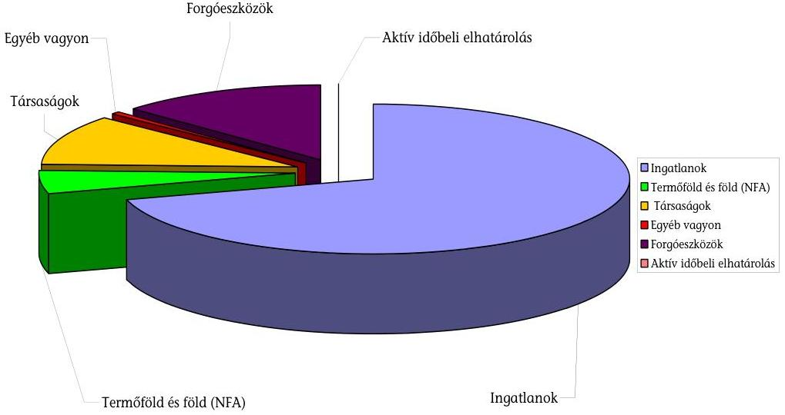

Az állami ingatlanvagyon kezelésével kapcsolatban a Vtv. célja az volt, hogy az állami vagyongazdálkodás egységes szervezeti és működési rendszerben valósuljon meg, javuljon a hasznosítás átláthatósága és hatékonysága. Az MNV Zrt. ingatlanhasznosítási feladatait 2009-ben részben valósította meg. A központi költségvetési szerveknél a díjfizetés nem vált piaci alapúvá a források megteremtésének és az érintettek együttműködési készségének hiánya miatt.

A Vtv. kiemelt célja - miszerint a központi költségvetési szervek működéséhez szükséges állami vagyont az MNV Zrt. az állam teherbíró képességéhez igazodva, a társadalmi szükségletek, a célszerűség és a gazdaságosság szempontjai figyelembevételével elégítse ki - nem teljesült. A központi költségvetési szervek többsége (89\%-a) a vagyonkezelési/hasznosítási szerződéseket - a piaci alapú vagyonkezelési és bérleti díjak fedezetének hiánya miatt - meg sem kötötte. A korábbi szerződések felülvizsgálata sem valósult meg az előírt határidő, 2008. I. félév végéig. A költségvetési szerveket a miniszterek, a minisztereket a Kormány nem utasította a vagyontörvény végrehajtására, illetve a végrehajtás lehetőségeinek a megkeresésére. 2009-ben, mint legegyszerűbb megoldás - a díjak fizetése alóli törvényi mentesítés - eredményezett előrelépést.

A honvédelmi célú ingatlanok értékesítése, illetve térítésmentes átadása összhangban volt a belső utasításokkal. Az egyéb ingatlanok közül az ún. „Fácános" hasznosítása 2000-től húzódik, a műemlék ingatlan állaga folyamatosan romlik. A XII. kerület Ráth György u. 7-9. szám alatti ingatlan hasznosítása teljesíthetetlen pályázati határidő miatt maradt el. A korábban privatizált Fradi Pálya értékesítési szerződésében vállalt kötelezettségét a vevő nem teljesítette. A szerződést az FTC és a befektető az MNV Zrt. kihagyásával az állam számára hátrányosan módosította.

---

A Magyar Köztársaság Kormánya és az Amerikai Egyesült Államok Kormánya közötti ingatlancsere folyamata nem volt átlátható, végrehajtása elhúzódott, az együttműködési nehézségek miatt többletkiadást eredményezett.

A Nemzeti Földalap működéséhez a szakmai törvények, az NFA törvény és az NFA korábbi működését szabályozó kormányrendeletek megfelelő keretet biztosítottak, de a földvagyon kezelésének az MNV Zrt.-be integrálása a vagyontörvény és a szakmai jogszabályok közötti összhang, konzisztencia megteremtése nélkül valósult meg, ami akadályozta a Nemzeti Földalap feladatának célszerű és eredményes ellátását.

Közel három év alatt sem zárult le a feladat/felelősségi vita abban a kérdésben, hogy a szakmai szabályozás melyik minisztérium első helyi felelősségébe tartozik. Alapvető ügyekben sem tudtak megegyezni. Az MNV Zrt. nevének jogszabályokban való átvezetése elmaradt, ennek következtében az ún. maradvány földterületek (mezőgazdasági termelőszövetkezetek földhasználatában állók) állami tulajdonba, Nemzeti Földalapba vétele ügyében 2009-ben sem volt előrelépés.

Az NFA-ba tartozó földterületek legnagyobb részét kezelő nemzeti park igazgatóságok vagyonkezelői szerződése megkötésének elhúzódása a Vtv. piaci vagyonkezelési díjfizetési előírásának a következménye volt. A vagyonkezelői szerződés hiánya akadályozta az érintett ingatlanok jogi helyzetének a rendezését, de problémát okozott az agrártámogatások igénybevétele is. A vagyonkezelői jog ingyenes megszerzését és gyakorlatát csak a Vtv. 2010. július 9-től hatályos módosításai tették lehetővé.

Az NFA tevékenységének szabályozása a hiányosságok mellett a szakmai feladatok (föld vásárlása, értékesítése, részben a haszonbérbeadás is) ellátására alkalmas volt. A haszonbérbeadásban - a nemzeti park igazgatóságokkal a vagyonkezelési szerződések megkötésének elhúzódása miatt - voltak fennakadások, ezekben az esetekben elmaradt a vagyonkezelői jog bejegyzése, ami pedig feltétele volt az agrártámogatási pályázatokon való részvételnek.

Az NFA döntéshozatali folyamatának szabályozása - az MNV Zrt. egészére érvényes szabályozottsághoz hasonlóan - teljes körű ugyan, de nem átlátható és következetes. Egy-egy döntés valós indoka nincs megalapozva, így pl. közvetlenül az erdőtörvény hatályba lépése előtt a földrészletek önkéntes birtokösszevonási célú cseréje, illetve erdőt tartalmazó haszonbérleti szerződés kötése esetében.

Az NFA vagyonának a főkönyvi nyilvántartáshoz az analitikus adatokat a korábbi szakmai szempontok szerint kialakított nyilvántartás (FALAP) szolgáltatja, amellyel szemben nem követelmény az adott főkönyvi számlához való kapcsolódás. A vagyonváltozás mozgásnemeiről (vásárlás, értékesítés) eseti rendezéssel készített adatszolgáltatásból a számvitel jelöli ki a főkönyvi számlára könyvelendő tételeket. 2009-ben az egyeztetéseket nem dokumentálták, az egyeztetési feladatokat nem szabályozták, az egyeztetési folyamat ellenőrzése nem volt biztosított, az előzetes éves beszámolóban nem a tényleges NFA vagyont mutatták ki.

---

A földbirtok-politikai irányelvek egyes elemeinek (piaci alapú és szociális legyen, kisméretű birtokok, családi gazdaságok legyenek, versenyképes méretet alakítsanak ki, stb.) együttes teljesítése - prioritások meghatározása nélkül csak korlátok mellett vagy nem lehetséges, ennek következtében minden földügylet legalizálható.

Az önkéntes termőföldcserékből kiválasztott legnagyobb értékű cserénél - 2009. gazdálkodási évben - a végrehajtás során eljárási hibák, hiányosságok és szabálytalanságok jelentkeztek. A termőföldcsere intézésében az érintett szervezeti egységekben és vezetői szinteken a belső kontroll hiányosan működött. A csereszerződés tartalmát nem, de az MNV Zrt.-n belüli ügyintézést befolyásolta az erdővédelmi törvény elfogadása, amely - a csereszerződés aláírását követő napon - 2009. július 10-én lépett hatályba. A törvényi szabályozás megnehezítette volna a folyamatban lévő erdők cseréjének végrehajtását.

A határozott idejű haszonbérleti szerződések - lejárati idő előtti újrahasznosítási pályáztatási folyamatában két pályázat elfogadása nem volt megalapozott. Ugyanis a haszonbérleti szerződések átlagterületét jelentősen meghaladó két pályázat kiírása nem volt indokolt, mert a szerződések lejártáig még több mint öt év volt hátra. A pályázati kiírás - a területek összevonása miatt - nem tette lehetővé a helyi piaci versenyt, mert a területnagyság (több település külterülete) miatt szükséges tőkeerővel a helyi gazdák nem, csak az eredeti haszonbérlők rendelkeztek. A pályázatokat (egy-egy pályázó volt csak) az eredeti bérlők nyerték, akikkel a szerződést az új erdőtörvény hatályba lépése előtt egy, illetve négy nappal meg is kötötték. Az eredeti haszonbérlők az új szerződéssel húsz évre határozott idejű bérleti jogot szereztek.

Az uniós Csatlakozási Okmányban 2003-ban Magyarország hét év, további három évvel meghosszabbítható lehetőséget kapott a külföldi állampolgárok és jogi személyek földszerzését korlátozó és tiltó jogszabályainak a felülvizsgálatára. A hetedik év végén a magyarországi földárak és haszonbérleti díjak időközben emelkedtek ugyan, de - még mindig jelentősen elmaradnak az EU tagországok áraitól, ezért a moratórium meghosszabbítása indokolt. A vagyontörvényben, a termőföldre vonatkozó egyéb szabályokban, a 2009 végén Kormány által is elfogadott középtávú vagyonhasznosítási stratégiában, a 2010-es vagyonkezelési tervben az MNV Zrt. az NFA-ra vonatkozó, a moratóriummal kapcsolatos feladatot nem kapott.

A termőföldért életjáradék program teljesítette a szociális jellegű kormányzati célokat. A megvásárolt és meglévő földek értékesítéséből és haszonbérbe adásából származó bevétele fedezte a járadék kiadásokat. A korábban megkötött szerződésekben a járadék megállapítására vonatkozó módszer miatt jelentős annak a kockázata, hogy a megvásárolt termőföld értékének többszörösét fizeti ki az állam járadékként. Ezt a számítási módszert a 2009 végén kiadott jogszabály-módosítás megszüntette.

A vagyontörvény hatályba lépésével külön vált a vadászati jog, mint vagyoni értékű jog kezelése és a vadászati jog Földművelésügyi és Vidékfejlesztési Minisztériumhoz tartozó szakmai irányítása, ezzel együtt nem valósult meg - hasonlóan az NFA-nál leírtakhoz - a szabályozás összhangjának megteremtése, ami az állami érdekek érvényesítését sem segíti elő. Az MNV Zrt. hatáskörébe

---

tartozó 2007-2008. évekre vonatkozó vadászati jog gyakorlása után felszámított díjak beszedése a szabályozás hiánya miatt csak 2009-ben kezdődött meg. A vadászati jog gyakorlásához való hozzájárulás sem szabályozott. A Kisalföldi Erdőgazdaság Zrt.-nek a vadászati jog gyakorlásánál - a felhatalmazás nélkül megkötött megállapodás miatt - sérült a Magyar Állam érdeke, kárt okozva ezzel az állam számára, mivel korábban a területen folyó vadgazdálkodás bevétele évente több tízmillió Ft volt.

Az állami tulajdonú társaságok hatékony és célszerű vagyonkezelése a saját/közvetlen kezelésű és a hasznosításra szerződéssel átengedett társaságokra részben valósult meg. A társaságok éves tervei nem voltak összhangban a Tanács középtávú stratégiájában megfogalmazott célokkal, csak 2010 májusában alakították ki a vállalatirányítási kereteket, ${ }^{4}$ amelyek a hatékonysági elvárások rendszerére épültek. A költségvetési forrásból finanszírozott állami tulajdoni részesedések növelését célzó döntések 2009-ben sem voltak átgondoltak (MALÉV GH Zrt.). A MALÉV Zrt., Bábolna Nemzeti Ménesbirtok Kft. tőkeemelése a veszteséges gazdálkodást finanszírozta, ami ellentétes az EU előírásokkal.

A vagyontörvény hiányossága, hogy nem rendelkezett a központi költségvetési szervek vagyonkezelésében lévő többségi állami tulajdonú társaságok leányvállalataiban a tulajdonosi jogok korlátozásáról az átadott társaságok létesítéséről, működtetéséről és irányíthatóságukról annak érdekében, hogy a törvény céljai ezekben is érvényesülhessenek. Több korábbi példa (pl. a MÁV Zrt., MÁVCargó Zrt., Bábolna „Csoport") is igazolja, hogy a törvények egyfajta értelmezésével - akár egyedül csak a tulajdonosi joggyakorló, illetve döntései alapján az állami társaság valamennyi tevékenysége országgyűlési kontroll nélkül leánytársaságokba kiszervezhető. Ezt követően - ugyanilyen döntési mechanizmus alapján - az állami vagyont a társasági tulajdonlás hangsúlyozása mellett privatizálják, majd a befolyt bevételt az anyacég feléli. Így a tartós állami tulajdon egy kiüresedett, vagyonát vesztett, funkció nélküli, gazdasági stratégiai jelentőségét tekintve érdektelenné vált céggé válik. Minél messzebb kerül a vagyon az első - még országgyűlési kontroll alatt álló - szinttől (pl. alapítói/közgyűlési döntést már nem is igénylő kereszttulajdonlásokkal újabb, társasági kör létrehozásával), annál inkább kikerül a vagyon és a tevékenység az állami ellenőrzés és felügyelet alól. A központi költségvetési szervek leányvállalatai vagyoni helyzetéről az MNV Zrt. a társaságok konszolidált beszámolóiból, illetve eseti adatszolgáltatással szerez információt.

A 19 erdőgazdasági társaságnak az egységes informatikai rendszer kialakítására 2008 decemberében összesen 1498 M Ft értékben tulajdonosi jegyzett tőkeemelést hagytak jóvá, amelyből 2009. évben 600 M Ft-ot felhasználtak. 2003-2007 között informatikai és ügyviteli eszközök beszerzésére összesen 950 M Ft fordítottak az erdészeti társaságok. A 2009-es egységes informatikai rendszer sem valósult meg eredményesen, a követelmény rendszer nem volt egységesen meghatározva. A döntés az Állam számára hátrányos volt, mert az in-

[^0]
[^0]:    ${ }^{4}$ Az állami vagyonnal való felelős gazdálkodás és hatékony vállalatirányítás erősítése érdekében kormányutasításra elkészített Vállalatirányítási Kódexet az NVT 2010. május végén a többségi állami tulajdonú társaságok gazdálkodásában javasolta alkalmazni.

---

formatikai rendszer fejlesztésével kapcsolatos előkészítés, lebonyolítás és a minőség-ellenőrzés nem volt hatékony, a fejlesztés egy éves késésben van.

A Richter Gedeon Zrt. 2004. évi kötvénykibocsátásának visszafizetését megelőzte egy újabb kötvénykibocsátás lebonyolítása. Ennek következtében a 2004. évben kibocsátott kötvények visszafizetésére a Magyar Államnak készpénzfizetési kötelezettsége nem keletkezett. A 2009-es második kötvénykibocsátás a 2014. évi lejáratkor esedékes finanszírozása újabb fizetési kötelezettséget terhel a Magyar Államra. A kötvénykibocsátások eredményességét teljes körűen csak 2014-ben lehet megítélni. Kedvezőtlen üzletmenet, illetve piaci környezet esetén a kötvénytulajdonosoknak a Magyar Állam garanciája biztosítja befektetéseik biztonságát.

A MALÉV Magyar Légiközlekedési Zrt. állami tulajdonban lévő részvényeinek 2007. évi privatizációjában a szerződéses feltételek részlegesen teljesültek. A MALÉV-ben a többségi részesedés megszerzését előkészítő tárgyalások folyamatában kiadott RJGY határozatok nem tették lehetővé a magyar fél korábban bejelentett - privatizációs szerződés szerinti - hitelszerződési bankgarancia kifizetésének igényérvényesítését és ellentétesek voltak a vagyontörvényben megfogalmazott elvekkel. A MALÉV pénzügyi, gazdasági helyzete a helyszíni ellenőrzés befejezéséig sem rendeződött, működőképességének fenntartása jelentős kockázatot hordoz.

A Bábolna csoport gazdálkodását befolyásoló reorganizációs és privatizációs tervek megvalósítása ellenére tovább folytatódott a Bábolna csoport vagyonfelélése. A Bábolna Zrt. a nyilvántartások hiányossága miatt nem tudott elszámolni a használatába adott földterület nagyságával. A Bábolna Zrt. felszámolását követően hozott tulajdonosi intézkedések - kényszerhasznosítási feladatok, vagyonkezelési díjak - és a menedzsment felelőtlen tevékenysége (a Társaság részére gazdaságilag hátrányos megállapodás megkötése és pénzügyi teljesítése, jogosulatlan elszámolások, tényleges gazdasági események nélküli tranzakciók) negatívan érintették a Bábolna Ménesbirtok Kft. gazdálkodását.

A négy kiemelt székház projekt esetében - amelyből a MÁV Zrt., az MTV Zrt. és a Magyar Posta Zrt. székházak számvevőszéki ellenőrzése a korábbi években volt - az előzetes számítások alapján várt hatékonyságjavulás nem igazolódott be. ${ }^{5}$ A döntéshozók nem értékelték megfelelően a devizakockázatot. Az állami tulajdonú társaságok tartós elhelyezésének célját szolgáló ingatlan igény bérleti konstrukcióban történő megoldása nem eredményezte sem a társaságok, sem az Állam költségtakarékosságra vonatkozó érdekeinek figyelembevételét. A több évtizedre szóló bérleti szerződések ${ }^{6}$ megkötésekor nem érvé-

[^0]
[^0]:    ${ }^{5}$ A 0929. sz. Jelentés a Magyar Nemzeti vagyonkezelő Zrt. 2008. évi tevékenységének ellenőrzés 3. sz. Függelék 1. sz. melléklete; a 0743. sz. Jelentés a nemzeti hírügynökségről szóló törvényben, valamint a rádiózásról és televíziózásról szóló törvényben meghatározott közszolgálati feladatellátás rendszerének ellenőrzés 1. sz. Függeléke
    ${ }^{6}$ A Colliers Int. 2009. évi szakmai elemzése szerint „a nagy alapterületi igénynek a bérleti díjra díjcsökkentő hatása van... a terület nagyságával arányosan csökken az elérhető bérleti dij". A 3. sz. Függelék 3. sz. melléklete szerint a nagy területigény ellenére nem érvényesült a díjcsökkentő hatás.

---

nyesítették a piaci átlagot meghaladó területi igényből és a biztonságot jelentő állami tulajdonosi hátteréből adódó bérleti díjcsökkentő hatást. Az MVM csoport elhelyezésére szolgáló új irodaház bérletével kapcsolatos - célszerűtlen döntések a vásárlást is figyelembe véve a cégcsoport gazdasági érdekeit nem segítették elő. Az MTV Zrt. székházával kapcsolatban hozott intézkedések hatásaival az ÁSZ hét korábbi jelentésében foglalkozott. A 2000-ben 7 Mrd Ft kivitelezési költséggel elhatározott, az állami tulajdont eredményező székházprojekt helyett, a célszerűtlen, gyakran ellentétes tartalmú döntések következtében indokolatlan költségnövekedést és hosszan tartó gazdasági kiszolgáltatottságot eredményező bérleti konstrukció valósult meg. A megvalósulás elhúzódása miatt 2010 májusáig 16,2 Mrd Ft bérleti díjat fizetett ki és a bérleti időszak lejártáig, további 38 évig várhatóan 83,6 Mrd Ft bérleti díjat kell fizetnie az MTV Zrt.-nek, amennyiben 20 év után nem él felmondási jogával. Az eredetileg az MTV Zrt. székház projektjéhez tartozó, a Wallis csoport által megvásárolt ingatlan 10\%-át a Wallis csoporthoz tartozó Wing Zrt.-től a Magyar Állam nevében eljáró MNV Zrt. vásárolta vissza a VPOP székház céljára.

A Társaság saját vagyonával az RJGY által jóváhagyott üzleti terv szerint gazdálkodott 2009-ben. Saját vagyonának 2009. évi pénzforgalmi terve 9,8 Mrd Ft volt, a kiadások fedezetéül 9,3 Mrd Ft költségvetési támogatással és 524 M Ft vagyonhasznosítási és működési bevétellel számolt. Eredményterve 551 M Ft mérleg szerinti nyereség volt. A mérleg szerinti nyereség a tervtől elmaradt, 455 M Ft lett, amelyet az RJGY elvont.

Az MNV Zrt. szakértői díjakra, szakfordításokra, ügyvédi, könyvvizsgálói szolgáltatásokra 93 M Ft-ot költött. Az elkészített tanulmányok, szakmai anyagok a vizsgált esetekben nem voltak gazdaságosak, a díjazás és az elvégzett munka közötti összhang hiánya miatt, pl. a Telkes Kft.-vel munkaerő toborzásra, karrier tanácsadási szolgáltatásra kötött, illetve a Consact Kft.-vel elégedettség felmérésére kötött szerződés. Nem volt szükség azokra a megbízásokra, ahol a szerződésben rögzített feladat belső munkaerővel is elvégezhető volt, pl. a gazdasági igazgatói munkakör átadásával kapcsolatos tanácsadói feladatok ellátása, az átadás-átvétel szakmai koordinálása.

A személyi jellegű ráfordítások összege a tervezettnél kisebb volt (5,7 Mrd Ft), de a bázisévet jelentősen (15,9%-kal) meghaladta, amit a 2009-ben végrehajtott létszámnövelés okozott. Az NVT és az EB tisztségviselői részére 176 M Ft-ot fizettek ki tiszteletdíj címén. Az előző címen túl meghatározott költségtérítést is fizettek, a költségek között olyanokat (egészségügyi, oktatási, stb.) is elszámoltak, amelyre az RJGY külön engedélyt nem adott. A társaság vezérigazgatója további 500 E Ft reprezentációs célú felhasználást is engedélyezett a testületeknek.

Az Állami Számvevőszék 2009-ben a pénzügyminiszternek és a Tanács elnökének fogalmazott meg ajánlásokat. A pénzügyminiszternek címzett ajánlások egy részét a miniszter részben, más részét nem hasznosította. A szabályozással kapcsolatos javaslatok néhány elemét egy-egy jogszabályi hely módosításával hasznosította. Nem hasznosult a felelősség felvetésével kapcsolatos egyik javaslatunk sem.

---

A pénzügyminiszter felelősségre vonást - az MNV Zrt. volt vezérigazgatójának felmentését kivéve - nem kezdeményezett, az általa elrendelt vizsgálatok vagy közel egy év után sem zárultak le (pl. MÁV Zrt. székháza értékesítés), vagy az egyes vizsgálatok nem arra a hiányosságra irányultak, amelyre a Számvevőszék a szabálytalan gyakorlatot, illetve szabálytalanságot megállapította. (pl. Magyar Posta Zrt. és moszkvai Magyar Kereskedelmi Képviselet ingatlanértékesítése.)

Az EB jelentések hasznosítására vonatkozó javaslatunkat az RJGY véleménye szerint a Tanácsnak kell hasznosítania. Az RJGY hatáskörű döntések a Tanácsra át nem ruházhatók, az RJGY-nek a Tanács felé utasítási joga van, amellyel az EB jelentések hasznosítása céljából nem élt.

A Tanácsi ajánlások hasznosítására az NVT 2009 novemberében intézkedési tervet fogadott el, amelyben valamennyi javaslat hasznosításáról intézkedett. Az intézkedések végrehajtásáról az MNV Zrt. 2010 februárjában beszámolt, amelyet a Tanács tudomásul vett. A beszámoló azonban tartalmazott olyan határidő módosításokat is, pl. a MÁV székház ügyében, amelyek miatt az intézkedések végső hatása ez évi jelentésünkben nem értékelhető.

A helyszíni ellenőrzés megállapításainak hasznosítása mellett javasoljuk:

# a nemzeti fejlesztési miniszternek: 

az állami vagyonnal való gazdálkodás szabályozásáért való felelőssége körében:

1.  kezdeményezze az állami vagyonról szóló törvény és az MNV Zrt. alapító okiratának módosítását, összehangolását a kapcsolódó szabályozókkal a jelentésben is jelzett hiányosságokra (koherencia zavarok megszüntetése, az MNV Zrt. működéséhez szükséges eszközök meghatározása) is figyelemmel;
2.  fontolja meg a vadászati joggal összefüggő vagyonkezelői és szakmai felügyeleti feladatok összevonását és a vadászati joggal kapcsolatos egységes szabályozás kialakítását;
az MNV Zrt. részvényesi joggyakorlója hatáskörében eljárva:
3.  intézkedjen annak érdekében, hogy a MALÉV Magyar Légiközlekedés Zrt. pénzügyi, gazdasági helyzete, működőképessége, jelentős kockázatok csökkentésével rendeződjön; vizsgáltassa ki a MALÉV visszavásárlásával kapcsolatos valamennyi korábbi RJGY döntés meghozatalánál az állam elsődleges érdekeinek érvényesítését, illetve, hogy terhel-e valakit felelősség;
4.  vizsgáltassa ki
a)  az MNV Zrt. vezetői munkaszerződés kötési és megszüntetési gyakorlatát és intézkedjen a munkáltatói jogkör gyakorlójának felelőssége megállapítására;
b) hogy a Budapest IX. ker. Könyves Kálmán krt. - Gyáli út 10. szám alatti ún. „Fradi Pálya" ingatlan 2008. április 9-én kötött adásvételi szerződésében foglaltak

---

miért nem teljesültek, annak mi a következménye, és terhel-e emiatt valakit felelősség;
c) hogy a döntéshozók miért nem gondoskodtak a Bábolna csoport vagyonának megőrzéséről, a földterülettel való elszámolásról, a jogosulatlan elszámolások és tényleges gazdasági események nélküli tranzakciók miatti felelősség megállapításáról;
d) hogy az állami tulajdonú, kiemelt gazdasági társaságok előnytelen székházprojektjei esetében megállapítható-e a döntéshozók felelőssége;
e) hogy az előző évi számvevőszéki ajánlások alapján elindított vizsgálatokban feltárt elmarasztaló megállapítások alapján a törvényes határidőn túl meghozott RJGY döntések, a moszkvai ingatlan értékesítése ügyében miért nem volt felelősségre vonás; miért húzódik a MÁV Zrt. székház ügyének vizsgálata; miért nem a feltárt hiányosságra irányult a Magyar Posta Zrt. székház projektjének ellenőrzése.
5. intézkedjen, hogy
az MNV Zrt. igazgatósága kezdeményezze:
a) az állami tulajdonban lévő önkéntes földcserébe bevont területek értékének megállapítása és a földcsere lebonyolítása miatt a személyes felelősség megállapítását;
b) az állami vagyon-nyilvántartási és vagyonmenedzselési folyamatok és rendszerek egységesítése érdekében indított beszerzési eljárás szakmai tanácsadói támogatására megkötött megbízási szerződés módosításának elmaradásával, valamint a teljes megbízási díj kifizetésével összefüggő felelősség megállapítását;
c) a Kisalföldi Erdőgazdaság Zrt. vezérigazgatójának - a felhatalmazás nélkül megkötött szerződésből eredő kár miatti - felelősségre vonását;
6. intézkedjen az MNV Zrt. igazgatóságánál, hogy
a) az állami vagyonnyilvántartás megbízhatósága érdekében a vagyon-nyilvántartás adatminőségi problémáinak valamennyi nyilvántartásra és hibatípusra kiterjedő, teljes körű feltárására, az adatminőségi kritériumok meghatározására, a vagyonnyilvántartás középtávú adattisztítási feladattervének kidolgozására;
b) az egységes vagyon-nyilvántartási rendszer fejlesztésével és üzemeltetésével összefüggő hátrányos szerződés (Everest) felülvizsgálatára, a szerződésből eredő károk minimalizálására;
c) gondoskodjon, hogy az 5/2008. (I. 22.) Korm. rendelet 8. § (3) bekezdésében foglaltakban előírt - a rábízott vagyon változásáról szóló - tájékoztatási kötelezettségének az ÁSZ részére a Társaság félévenként tegyen eleget.

---

# II. RÉSZLETES MEGÁLLAPÍTÁSOK 

## 1. A TÁRSASÁG MŰKÖDÉSI RENDJE, SZABÁLYOZÁSA

### 1.1. A vagyontörvény és a kormányrendeletek összhangja

Az MNV Zrt. 2008. évi tevékenységének ellenőrzése - a teljesség igénye nélkül - tartalmazta azokat a legfontosabb jogszabályi összehangolási hiányosságokat, amelyek a Vtv., a végrehajtására kiadott kormányrendeletek, az államháztartásról szóló törvény (Áht.), a felsőoktatásról szóló törvény stb. között fennálltak. Ezek egy részét a Vtv., a végrehajtási rendeletek, illetve az állami vagyont érintő egyéb szabályok 2009-es módosításaival, illetve a 2010. január 1-jei módosításokkal részben megszüntették.

A vagyontörvény 2009-es évközi módosításai 2009. január 8-ától, június 25-étől, július 4-étől és július 9-étől hatályosak. ${ }^{7}$ A változtatás az elkobzott vagyonra, a gazdálkodó szervezetben való állami részvétel mértékének csökkentésére, a vízmű társaságok tartós állami tulajdoni körbe sorolására, illetve a központi költségvetési szervek díjfizetési (vagyonkezelési díj, piaci alapú ingatlan bérleti díj) kötelezettsége megszüntetésére vonatkoztak.

A Magyar Köztársaság 2009. évi költségvetéséről szóló 2008. évi CII. törvény állami vagyonnal kapcsolatos rendelkezései többek között az ingyenes vagyonátruházás feltételeinek szigorításához, értékesítési értékhatárokhoz, hatásköri kérdésekhez stb. kapcsolódtak.

A Vtv. 2010. január 1-jétől hatályos rendelkezéseinek egy része a Tanács hatásköri kérdéseit pontosította, amit az eddigi számvevőszéki jelentésekben javasoltunk. Így pl. a Tanács feladata a középtávú vagyonhasznosítási stratégiára vonatkozó javaslat kialakítása, Kormány elé terjesztése érdekében az állami vagyon felügyeletéért felelős miniszter részére való megküldése. A tanács feladata a saját és rábízott vagyon éves terveinek és éves beszámolóinak elkészítése.

További változások: a bűnügyi nyilvántartási rendszer átalakításával összefüggésben hozott (Tanács és EB tagokra) törvénymódosítások, a Kormánynak a Tanács működéséről és az állami vagyonnal való gazdálkodásáról szóló éves beszámolója határidejének módosítása (a tárgyévet követő év augusztus 31. helyett szeptember 30.), az EB tagjainak jelölésére és visszahívására vonatkozó

[^0]
[^0]:    ${ }^{7}$ 2008. évi LXXX. törvény az EU tagállamok bűnügyi együttműködéséről szóló 2003. évi CXXX. törvény és a hozzá kapcsolódó más törvények módosításáról, 2009. évi LV. törvény és a 2009. évi LXX. törvény az állami vagyonról szóló 2007. évi CVI. törvény módosításairól, 2009. LXXVII. törvény a közteherviselés rendszerének átalakítását célzó törvénymódosításokról

---

szabályok, a köztulajdonban álló állami vállalatok takarékosabb működéséről szóló szabályok vagyontörvénybe emelése. ${ }^{8}$

A vagyontörvényben megfogalmazott célok elérése érdekében a Vtv. 71. § (1) bekezdésében felhatalmazást kapott a Kormány kormányrendeletek megalkotására. A jogszabályalkotásra vagy módosításra vonatkozó javaslat kidolgozása a döntés kezdeményezésére jogosult részére a Tanács hatáskörébe tartozik.

A vagyontörvény és a végrehajtására 2007-ben kiadott kormányrendeletek előírásainak - helyenként nem egyértelmű, ellentmondásos, hiányos - jogértelmezési problémákat felvető rendelkezéseire már 2009-ban felhívtuk a figyelmet. Felhívtuk a figyelmet arra is, hogy a Kormány nem alkotta meg költségvetési szervek egyes típusai állami vagyonnal való gazdálkodásának speciális szabályait (Vtv. 71. § (1) h) pontja). A Kormány a 346/2009. (XII. 30.) Korm. rendelettel intézkedett a honvédelmi szervezetek működésének az államháztartás működési rendjétől eltérő szabályairól.

Az állami vagyonnal való gazdálkodásról szóló 254/2007. (X. 4.) Korm. rendeletet - 362/2008. (XII. 31.) Korm. rendelet ${ }^{9}$ 43. § (1) bekezdés 4) pontja, továbbá a 163/2009. (VIII. 6.) Korm. rendelet ${ }^{10}$ - kivételével nem módosították. A 362/2008. (XII. 31.) Korm. rendelet 43. § (1) bekezdés 4) pontja a hatóságokkal való együttműködést szabályozza. A 163/2009. (VIII. 6.) Korm. rendelet 10. §-a az ajánlattevőkkel értékesítés céljából kötött szerződésre tartalmaz szigorító, tiltó rendelkezéseket pl. a pályázat benyújtásának időpontjában a pályázónak köztartozásmentes adózónak kell lennie. A kormányrendeletnek átfogó felülvizsgálata nem volt. A PM által készített módosítás tervezetet 2008 decemberében a minisztériumok, az MNV Zrt., a könyvvizsgáló véleményezte. Módosítása nem történt meg.

A Tanács 2009. május 13-án és július 22-én is megtárgyalta és elfogadta az MNV Zrt. szabályozási környezetének és jogalkalmazási tevékenységének értékeléséről szóló előterjesztést. 2009 októberében a Tanács egy újabb határozatában elfogadta a 254/2007. (X. 4.) Korm. rendelet módosítására tett átfogó javaslatot, felhatalmazta a vezérigazgatót, hogy azt a döntés kezdeményezésére jogosult pénzügyminisztérium részére megküldje. A javaslatot az MNV Zrt. a Pénzügyminiszternek 2009. november 3-án megküldte.

A Vhr. hiányosságai, illetve ezek megszüntetésének elmaradása miatt a vagyontörvényben megfogalmazott célok megvalósulása nem volt lehetséges. Például a központi költségvetési szervek állami tulajdonban lévő ingatlan

[^0]
[^0]:    ${ }^{8}$ A 2010. január 1-jei változást megalapozó törvények:
    2009. évi CIX. törvény a Magyar Köztársaság 2010. évi költségvetését megalapozó egyes törvények módosításáról, 2009. évi CXLIX. törvény a bűnügyi nyilvántartási rendszer átalakításával összefüggő törvények módosításáról, 2009. évi CXXII. törvény a köztulajdonban álló gazdasági társaságok takarékosabb működéséről.
    ${ }^{9}$ 362/2008. (XII. 31.) Korm. rendelet a Nemzeti Hírközlési Hatóság eljárásában közreműködő szakhatóságok kijelöléséről, valamint egyes szakhatósági közreműködések megszüntetéséről és módosításáról.
    ${ }^{10}$ 163/2009. (VIII. 6.) Korm. rendelet egyes kormányrendeleteknek az adminisztratív terhek csökkentését célzó módosításáról.

---

használata esetén kikötött ellenérték megfizetése (Vtv. 28. § (2) bekezdés), mert a bérleti szerződés alapján fizetendő bérleti díj forrását jogszabályban nem biztosították. A Vtv. 28. § (2) bekezdésének hatályon kívül helyezése a Vtv. céljától való visszalépést - a piaci alapú hasznosítási díjak érvényesítése - eredményezte. A közteherviselés rendszerének átalakítását célzó törvénymódosításokról szóló 2009. évi LXXVII. törvény 203. § a) pontja 2009. július 9. napjától hatályon kívül helyezte a Vtv. 28. § (2) bekezdését, viszont a kormányrendelet települési átlagértékek alkalmazására vonatkozó 5. §-át nem helyezték hatályon kívül, ami újabb jogszabályok közötti összhanghiányt eredményezett.

Az MNV Zrt.-nek a rábízott vagyon számviteli, nyilvántartási rendjének kialakítását - a Vtv., az Sztv. és ez utóbbi 178. § (1) bekezdés c) pontjában kapott felhatalmazás alapján - az MNV Zrt. saját vagyonával és a rábízott állami vagyonnal kapcsolatos éves beszámoló készítési és könyvvezetési kötelezettségéről szóló 5/2008. (I. 22.) Korm. rendelet alapján kellett elkészíteni. E rendelet azonban nem szabályozta az elődszervezetek által kimutatott, a vagyonkezelők által kezelt állami vagyonelemeknek a rábízott állami vagyon éves beszámolójában való nyilvántartási értékét, a központi költségvetési szervek és egyéb vagyonkezelők által kezelt eszközök és azok forrásának körét, az adatok bekerülésének módját. Nem szabályozta az elődszervezetektől átvett, általuk kimutatott részesedések bekerülési értékét. Nem határozták meg a Társaság működéséhez szükséges eszközöket. ${ }^{11}$ Az RJGY, a Tanács és az MNV Zrt. egy évig nem jutott közös álláspontra, ezért a kormányrendelet módosítása csak 2009. július 23-án a 150/2009. (VII. 23.) Korm. rendelettel valósult meg. A hiányosságok nagy részét megszüntették.

Az 5/2008. (I. 22.) Korm. rendelet módosításának folyamata, az MNV Zrt. saját és rábízott vagyona 2008. január 1-jei főkönyvi nyitásával kapcsolatos egyeztetések az MNV Zrt. és a PM között 2008. október 6-án kezdődtek. 2009. április-májusban azonban döntést kellett hozni, mert a saját vagyon éves beszámolója és a rábízott vagyon 2008. évi előzetes beszámolója (határidő 2009. május 31.) elkészítéséhez alapvetően szükséges volt a 2008. évi nyitáshoz kapcsolódó eszközátvétel technikai megoldása.
Az egyeztetések a 2009. május 14-ei emlékeztető szerint még folyamatban voltak, átdolgozott változatukat az MNV Zrt. gazdasági vezérigazgató-helyettese 2009. május 27-én küldte meg a PM-nek, a rábízott vagyon mérlegsémájával együtt, kérve ez utóbbira vonatkozó PM állásfoglalást is. Az egyeztetési folyamatban az MNV Zrt. könyvvizsgálója több alkalommal részt vett, illetve írásban is véleményt mondott mind az MNV Zrt., mind az RJGY részére.

A kormányrendelet 2009-es módosítása lehetőséget adott az MNV Zrt.-nek, hogy rendelkezéseit első ízben a 2008. évről szóló, de 2009. évben készítendő beszámolóra alkalmazza. A rendelet előírásaival összhangban az MNV Zrt. a rábízott vagyon éves beszámolóját nem a módosított, hanem a korábbi jogszabály alapján készítette el. A könyvvizsgáló a beszámolóról véleményt nyilvání-

[^0]
[^0]:    ${ }^{11} 0825$ sz. Jelentés az Állami Privatizációs és Vagyonkezelő Zrt. 2007. évi működésének és a központi költségvetés végrehajtásához kapcsolódó tevékenységének ellenőrzéséről, 0929 sz. Jelentés a Magyar Nemzeti Vagyonkezelő Zrt. 2008. évi tevékenységének ellenőrzéséről

---

tani nem tudott, a 2008-as nyitó beszámoló is véleménynyilvánítást elutasító záradékot kapott.

A pénzügyminiszter felelős az állami vagyonnal való gazdálkodás szabályozásáért, az állami vagyon felügyeletéért. (169/2006. (VII. 28.) Korm. rendelet 1. § i), j).) A pénzügyminiszter 2008-2009-ben nem vizsgálta a kialakított vagyonkezelési, intézményi rendszer működését, nem hozta meg a hibákat kiküszöbölő, az átlátható és hatékony vagyongazdálkodást biztosító, rendszert átfogó szabályozási intézkedéseket. A jogi szabályozásban (Vtv., 5/2008. (I. 22.) Korm. rendelet módosításai) születtek ugyan a felmerült probléma gyors megoldását jelentő intézkedések és egyedi pénzügyminiszteri (RJGY) döntések is (pl. a vezérigazgató munkaviszonyának rendkívüli felmondással való megszüntetése), de azok nem kellő időben/határidőben születtek. Ebbe a körbe tartozik a vagyongazdálkodási stratégia jelentős késéssel megvalósuló (a Vtv. 2007. szeptember 25-én lépett hatályba), 2009. december 23-ai Kormány általi elfogadása is. Ez összességében az átláthatóságot, a hatékonyságot rontotta, a vagyongazdálkodási célok elérését gátolta.

A Vtv. 11. § (1) bekezdése szerint a Kormány a Tanács működéséről és az állami vagyonnal való gazdálkodásáról évente a tárgyévet követő év augusztus 31-éig ${ }^{12}$ beszámol az Országgyűlésnek. A pénzügyminiszter 2009 szeptemberében is késve készítette el a Nemzeti Vagyongazdálkodási Tanács 2008. évi működéséről és az állami vagyonnal való gazdálkodásáról szóló J/10671 sz. jelentését, ami a Tanács 2008-ban végzett tevékenységét összességében pozitívnak értékelte, és a hibákat a Tanácstól független szabályzási hiányosságokra vezették vissza. A jelentés szerint a Tanács 2008-ban is maradéktalanul teljesítette a vagyontörvény szerinti feladatait, az állami vagyonnak minden tekintetben felelős és gondos gazdája volt. (A jelentés készítésének időszakában az ÁSZ jelentés nyilvános, a különböző tranzakciók ügyészi vizsgálata pedig folyamatban volt.)

A Vtv. indoklása szerint az állami vagyongazdálkodással szemben megfogalmazott hatékonysági, felelősségi elvárások, valamint a hatékony, átlátható, rugalmas döntési mechanizmusok és a teljesítmény-követelményekre épülő, megfelelő belső érdekeltségi rendszer biztosítása érdekében az új vagyonkezelő szervezet zártkörű részvénytársasági formában működik. A hatékonyság mérésére a jogszabályokban nem alakítottak ki mutatószámokat, viszonyítási alap hiányában pedig a kialakított új intézményi rendszer működésének hatékonysága nem mérhető. ${ }^{13}$

Hatékonysági, gazdaságossági kritériumokat 2009-ben a zártkörű részvénytársaság részvényesi joggyakorlója (RJGY) az elfogadott vagyonkezelési, illetve üzleti tervben nem fogalmazott meg, a terv teljesítését biztosító követelményeket, elvárásokat az RJGY nem támasztott (pl. javadalmazási szabályzatok, prémium szabályzatok feladathoz igazítása, a közszférát érintő megszorítások figyelembe vétele, mert az MNV Zrt. is költségvetési támogatásból gazdálkodik, a kitűzött prémiumfeladatok kapcsolása a tervek teljesítéséhez). A Vtv. indoklásá-

[^0]
[^0]:    ${ }^{12}$ 2010. január 1-jétől a beszámolási határidő szeptember 30-ra módosult. (2009. évi CIX. törvény 41. § (5). bekezdés)
    ${ }^{13} 0929$ sz. Jelentés a Magyar Nemzeti Vagyonkezelő Zrt. 2008. évi tevékenységének ellenőrzéséről

---

ban megfogalmazott cél így nem teljesült. A vagyon részvénytársasági formában történő kezelésének egyik indoka volt, hogy így hatékonyabb a vagyonkezelés.

Az MNV Zrt.-nek RJGY által elfogadott 2008-as üzleti terve sem a saját, sem a rábízott vagyonra nem volt, azonban 2009-ben és 2010-ben ezt a hiányosságot megszüntették. ${ }^{14}$

A saját vagyon üzleti tervének jóváhagyásáról rendelkező 11/2009. (IV. 7.) RJGY határozat a személyi jellegű kifizetésekre fordítható összeg 40\%-át engedte felhasználni, a további lehetőségről a féléves tényadatok felülvizsgálata alapján az RJGY a Kormány által elrendelt takarékossági intézkedések függvényében kívánt rendelkezni. A terv felülvizsgálatáról, illetve az ezzel összefüggő feladatokról RJGY döntés nem született.

15/2009. (V. 21.) RJGY határozat a rábízott vagyon 2009. évi vagyonkezelési tervének jóváhagyásáról szóló döntés is a vagyonkezelési terv felülvizsgálatáról és 2009. július 31-ig történő tájékoztatásról szól. A felülvizsgálat megtörténtéről, eredményéről, a terv módosításáról újabb RJGY döntés nem született.

# 1.2. Az MNV Zrt. belső szabályzatai 

Az MNV Zrt. a kötelezően kidolgozandó belső szabályzatokat elkészítette, de a 2009-es jogszabály-módosításból eredő felülvizsgálat nem valósult meg teljes körűen, vagy csak késve teljesült. (Az MNV Zrt. rábízott vagyonára vonatkozó 2009. évi Számviteli politika módosítása decemberben, a Közbeszerzési és beszerzési szabályzat módosítása októberben volt. A közérdekű adatok szolgáltatását és közzétételi kötelezettségét részben teljesítette.) A belső szabályzatok és az adott időszakban hatályos jogszabályok közötti összhang (az MNV Zrt. Javadalmazási Szabályzatát kivéve) összességében biztosított volt.

A Társaság 2008. szeptember 30-ától hatályos Közbeszerzési és beszerzési szabályzatának felülvizsgálata a Kbt. 2009. április 1-jétől hatályos módosítása után nem történt meg. A szabályzatot 2009. október 16-án módosították. Április 1. és október 16-a között egységes, a Kbt. módosítással összehangolt belső szabályozása - pl. a közbeszerzési eljárást megindító hirdetmény jogszerűségét ellenjegyzésével igazoló személyre, az egyes eljárás-típusok eljárási cselekményei határidejének figyelembevételére, a közbeszerzési eljárás valamennyi dokumentumának az ajánlatkérő (MNV Zrt.) honlapján történő közzétételére az MNV Zrt.-nek nem volt. ${ }^{15}$

[^0]
[^0]:    ${ }^{14}$ 11/2009. (IV. 7.) RJGY határozat a saját vagyon üzleti tervének jóváhagyásáról, 15/2009. (V. 21.) RJGY határozat a rábízott vagyon 2009. évi vagyonkezelési tervének jóváhagyásáról, 7/2010. (III. 28.) RJGY határozat a rábízott vagyon 2010. évi vagyonkezelési tervének jóváhagyásáról, 10/2010. (III. 29.) RJGY határozat a saját vagyon üzleti tervének jóváhagyásáról
    ${ }^{15}$ Az MNV Zrt. véleménye szerint az eseti szabályzatok a jelentésben hiányoltakat maradéktalanul tartalmazták, eseti szabályzat készítésére pedig a Kbt. lehetőséget ad.
    Az ÁSZ véleménye szerint az eseti közbeszerzési szabályzatok visszautalnak az akkor hatályos Kbt. 6. §-ra, azonban ez a bekezdés pont arra utal, hogy a közbeszerzési szabályzatban mit kell meghatározni.

---

A közérdekű adatok szolgáltatásának és közzétételének rendjéről szóló eljárásrend összhangban volt a személyes adatok védelméről és a közérdekű adatok nyilvánosságáról szóló 1992. évi LXIII., valamint az elektronikus információszabadságról szóló 2005. évi XC. törvénnyel. A szabályzat hiányossága, hogy a Társaság az általános közzétételi listában nem rendelkezett a közfeladatot ellátó szerv feladatellátásának teljesítményére, kapacitásának jellemzésére, hatékonyságának és teljesítményének mérésére szolgáló mutatók és értékük, időbeli változásuk adatainak közzétételéről. A Társaság közzétételi kötelezettségét 2009-ben és 2010. I. negyedévben csak részben teljesítette, mert nem tette közzé pl. az államháztartáshoz tartozó vagyonnal történő gazdálkodással összefüggő nettó 5 M Ft-ot elérő vagy azt meghaladó értékű szerződéseket.

Az MNV Zrt. működését 2009. december 31-ig az RJGY 24/2008. (XI. 13.) határozatával jóváhagyott SZMSZ szabályozta. A szabályzat nem tartalmazta pl. a vezérigazgató-helyettesek felelősségét az irányításuk alá tartozó szervezeti egységhez rendelt feladatok pontos, szabályos végrehajtásáért, nem határozta meg az MNV Zrt.-re bízott vagyonba tartozó társaságok éves tervezési irányelveivel kapcsolatos döntés-előkészítésének, az irányelvek betartása figyelemmel kísérésének feladatgazdáját, nem szabályozta a folyamatban lévő felszámolási és végelszámolási eljárásokkal kapcsolatos feladatokat.
2010. január 1-től új SZMSZ készült, a régi szabályzat tartalmában és szerkezetében átalakult. A változtatás célja a szervezet működésének racionalizálása, hatékonyságának javítása, a Vtv. és az Áht. új rendelkezéseivel való összhangjának a biztosítása volt. A változtatás a 2008 novemberében elkezdett felülvizsgálat - feladat, folyamat, szervezeti rendszer, létszám összhangja megteremtésének - szándékát tükrözi.

Az MNV Zrt. a Társaság egyes szervezeti egységei feladatmegosztásának rendjére vonatkozó szabályzatot elkészítette, 2010. február 23-án hatályba léptette. E szabályzat részletesen tartalmazza a vezető állású munkavállalók - az irányításuk alá tartozó szervezeti egységhez rendelt szakterületi feladatok pontos és szabályos végrehajtásáért, a feladatok ellátásához igénybe vett erőforrások hatékony felhasználásáért való - felelősségét, az egyes szervezeti egységek feladatait, rögzíti a Társaság döntés-hozatali rendjét, a hatáskörök gyakorlását. A szabályzat, az SZMSZ, valamint a munkaköri leírások közötti összhang - a nyilvántartási és elszámolási feladatok felelősségi szabályozásának kivételével - biztosított volt.

Az MNV Zrt. saját vagyona 2009-es évi üzleti tervében 427 fő (átlagos statisztikai) létszámot tervezett, ezt azonban nem támasztotta alá szervezeti egység mélységű jóváhagyott álláshely tervvel, bár év közben a létszámot álláshelyre is kimutatatta. Az álláshelyek száma 2009. december 31-én 447, 2008. december 31-én 420 volt, a szervezet létrehozásakor a 2008-ra engedélyezett státusz 403 volt. (11%-os növekedés.) Az álláshelyek növelésének indokoltságára számítás, hatásvizsgálat nem készült.

A 2009. évi 27 fős álláshely-növekmény 19%-át többségében - 2010-től betöltendő - határozott idejű álláshely létesítése tette ki. A döntés nem volt kellően megalapozott, mert az MNV Zrt.-ben felhalmozódott ügyirathátralék feldolgozását amely döntően a szervezet hatékony működésének hiánya miatt alakult ki - a Társaság nem a szervezeten belüli munkaerő-átcsoportosítással oldotta meg. 2009. első félévében a Belső Ellenőrzési Iroda SZMSZ szerinti feladatát létszámhiány miatt nem tudta elvégezni. Az 5 új álláshely létesítése indokolt volt.

---

Az MNV Zrt. a 2009-ben megkötött új munkaszerződéseknél a Munka Törvénykönyve rendelkezéseit nem egységesen vette figyelembe. A Társaság a vezető munkavállalók munkaszerződéseiben a munkáltató rendes felmondására nem egységesen - vagy az Mt. 92. § (2) bekezdésében vagy a 2173/2003. (VII. 29.) Korm. határozatban foglaltakat tekinttette irányadónak. (A három évet elérő vagy meghaladó munkaviszony esetén a felmondási idő a Korm. határozat szerint nyolc hónap, ami az Mt.-ben meghatározott felmondási idő hatszorosa.) Az MNV Zrt. egységes belső szabályozást a felmondási idő és a végkielégítés megállapítására 2009-ben nem alakított ki. ${ }^{16}$

# 1.3. A döntéshozatal szabályozása, a döntési mechanizmus 

Az MNV Zrt., a Kormány, illetve a pénzügyminiszter közötti hatáskörök megosztására a Vtv., a Gt., az Áht, a költségvetési törvény, az MNV Zrt. Alapító Okirata, valamint Szervezeti és Működési Szabályzata irányadó. A hatáskörök egyértelmű meghatározásának szabályozási hiányosságait az ÁSZ 2008. évi és 2009. évi jelentéseiben is bemutatta.

A döntési hatáskörök szabályozásának hiányossága 2009-ben visszatérően a stratégiaalkotás, illetve új problémaként az ügyvezetés, a munkáltatói joggyakorlás, illetve az ehhez kapcsolható javadalmazási szabályzat hatásköri kérdésében eredményezett gyakorlati problémákat és az állam számára hátrányos megoldásokat.

A Tanács feladata volt 2009-ben az állami vagyon fejlesztésével, hasznosításával, elidegenítésével kapcsolatos középtávú stratégia kialakítása és annak a Kormány elé terjesztése. A Vtv. az állami vagyon felügyeletéért felelős pénzügyminiszternek és a Kormánynak formálisan nem biztosított jogot a stratégia tartalmi meghatározásában.

A jogszabályban ilyen módon telepített hatáskörrel az állami vagyonra vonatkozó stratégia megalkotása elsődlegesen a Vtv. által megfogalmazott céloknak való megfelelést szolgálta, és nem a közfeladat-ellátás szempontjából közelítette meg az állami vagyoni kör működtetését. Az állami feladatok definiálása, döntés az állam (piaci jellegű) szerepvállalásáról, valamint a feladatokhoz rendelt vagyoni kör meghatározása gazdaságpolitikai döntés kérdése, amely kormányzati kompetencia. A Kormánynak feladata és felelőssége a stratégiaalkotás, az irányok, az érvényesítendő szempontok és elvárások meghatározása.

[^0]
[^0]:    ${ }^{16}$ Az MNV Zrt. véleménye szerint:„...egységes az MNV Zrt. munkaszerződés kötési gyakorlata, mely szerint azon vezető állású munkavállalók esetében, akik korábban az MNV Zrt. jogelőd szervezeténél, az ÁPV Zrt.-nél kerültek foglalkoztatásra, de a munkaviszonyuk időközben megszüntetésre került, az érintettek munkaszerződésében az MNV Zrt.-vel történő új munkaviszony létesítésekor csak a Mt. szerinti felmondási időre vonatkozó rendelkezések kerülhettek rögzítésre."
    Az ÁSZ véleménye szerint az MNV Zrt. belső szabályzatai a munkaszerződések megkötésére irányadó - az Mt, illetve a 2173/2003. (VII. 29.) Korm. határozat szerinti - egységes feltételrendszert 2009-ben nem tartalmaztak. Egyes 2009-ben megkötött munkaszerződések év közben a felmondási idő meghatározása miatt módosultak, az irányadó szempontra történő hivatkozás - konkrét személy esetében - változott.

---

A 2010. január 1-jétől hatályos szabályozás egyértelművé tette a stratégiával kapcsolatos felelősségi viszonyokat úgy, hogy annak előkészítése és végrehajtása a Tanács feladata, a döntés a Kormány kompetenciája.

A Vtv. a Gt. általános szabályaitól eltérő, speciális előírásokat tartalmaz az ügyvezetésre. A Gt. 231. § (2) bekezdés d) pontja szerint az ügyvezető testület tagjait (igazgatóság) a közgyűlési jogokat gyakorló nevezi ki és hívja vissza, az MNV Zrt.-nél ügyvezető testületként a Tanácsot nevesíti a Vtv., ugyanakkor vezérigazgatói posztot is létrehozott. A vezérigazgató nem vezető tisztségviselő, hanem az MNV Zrt. munkaszervezetének vezetője, irányítja a társaság operatív működését és gondoskodik a Tanács döntéseinek végrehajtásáról. A döntési jogkörök és a felelősség a Vtv. és a belső szabályozás alapján megosztottak a Tanács és a vezérigazgató között.

2009-ben a vezérigazgató egyben a Tanács tagja is volt. A korábbi vezérigazgató július 14-én kelt rendkívüli felmondásának indoklása szerint a vezérigazgató olyan kötelességszegéseket követett el, amelyek a munkáltatói jogok gyakorlója részéről bizalomvesztést eredményeztek. A részvényesi jogok gyakorlója a vezérigazgatóval szemben fejezte ki bizalmatlanságát, de nem kezdeményezte tanácsi tagsága megszüntetését a miniszterelnöknél. Nem kezdeményezte a Tanács, mint ügyvezető testület felelősségének tisztázását a vagyontörvény és a számviteli törvény előírásainak nem vagy nem megfelelő végrehajtása miatt, amelyet mind az EB, mind az Állami Számvevőszék megfogalmazott a 2008. évi működésről szóló jelentésben.

A Vtv. hiányossága, hogy a Tanács - testületként gyakorolt - kötelezettségeivel összefüggő felelősségének érvényesítése, a számonkérhetőség rendkívül korlátozott, a Tanács tagjai megbízatása megszüntetésének indoka szűkre szabott.

A Vtv. - az Ellenőrző Bizottság tagjaival ellentétben - nem tartalmazza a tisztségből való visszahívást, vagyis a Tanács tagjaival szemben nem felmentési ok pl. a bizalomvesztés, az alkalmatlanság, illetve bizonyítani kell a felróható károkozást.

Az MNV Zrt. munkavállalói és tisztségviselői javadalmazása meghatározása megoszlik a részvényesi jogok gyakorlója, a Tanács, illetve a vezérigazgató között. A Vtv. 7. § (6) bekezdése és a Gt. 231. § (2) bekezdés d) pontja alapján a részvényesi jogok gyakorlója az MNV Zrt. vezető tisztségviselőinek, azaz a Tanács és az Ellenőrző Bizottság elnökének és tagjainak juttatásait RJGY határozatban állapította meg.

Az MNV Zrt. munkavállalói - így a vezérigazgató - juttatásairól az MNV Zrt. keretei között született döntés. A vezérigazgató javadalmazását (személyi alapbér és premizálás) a munkáltatói jogkört gyakorló Tanács, a többi munkavállaló tekintetében a vezérigazgató jogosult meghatározni. Abban az esetben, amikor a vezérigazgató egyben a Tanács tagja is, a javadalmazása kialakítására - mint a munkáltató jogkört gyakorló tanácstagnak - ráhatása van.

A vezérigazgatói és vezérigazgató-helyettesi vezetői szerződések egységes feltételrendszerrel, azonos felépítéssel, beosztási kategóriánként azonos személyi alapbérrel, premizálási feltételekkel és a belső szabályzatoknak megfelelő egyéb juttatások biztosításával készültek és a dolgozók számára a lehető leg-

---

kedvezőbb feltételeket biztosították. Eltérések a munkaviszony megszűnésére alkalmazandó rendelkezések között találhatók, attól függően, hogy a vezető az elődszervezet munkavállalója volt-e, illetve a szerződés megszüntetése esetén fizetendő járandóságok szempontjából az MNV Zrt milyen időtartamot vesz figyelembe a jogosultság alapjául.

A vezérigazgató-helyettesek és a főigazgatók munkaszerződéseit a munkáltatói jogok gyakorlójaként a vezérigazgató írta alá. A belső szabályzat szerint a vezérigazgató döntése alapján a munkaszerződések tartalmazhatnak egyedi feltételeket, e jogával a vezérigazgató olyan esetekben élt, amikor a felmentési idő és a végkielégítés szempontjából irányadó munkaviszony időtartamához hozzászámított olyan jogviszonyokat, amelyekre vonatkozóan a Vtv. nem tartalmazott megengedő szabályokat.

Ezekben az esetekben a munkáltatói rendes felmondáskor járó felmentési idő és a végkielégítés számítását képező jogosultság időtartamát a munkavállalónak az MNV Zrt.-nél fennálló munkaviszonya időtartamához hozzászámították a korábbi munkáltatójánál eltöltött munkaviszonya időtartamát, holott ezt a Vtv. csak az elődszervezetek esetében tette lehetővé. Ennek alapján a munkáltató rendes felmondása esetén a felmentési időre és végkielégítésre a Javadalmazási kormányhatározat (2173/2003. (VII. 29.) Korm. hat.) mellékletében szereplő, a munkavállaló számára adható maximális mértéket határozták meg úgy, hogy a jogosultság alapjául szolgáló időtartamhoz hozzá kellett számítani a korábbi jogviszonyok időtartamát. ${ }^{17}$ Az Mt. 76. § (4) bekezdés szerint a munkaszerződés feltételeinek meghatározásában fennálló szerződéskötési szabadság alapján - amely szerint a munkavállaló javára lehetséges kedvezőbb feltételek megállapítása - az állami tulajdonú társaságnál nem lehet úgy értelmezni, hogy korábban lezárt, megszüntetett (közös megegyezéssel, felmentéssel megszüntetett vagy a törvény erejénél fogva megszűnt) jogviszonyokra tekintet-

[^0]
[^0]:    ${ }^{17}$ Az MNV Zrt. véleménye szerint „az MNV Zrt.-nek a munkaviszony létesítések során nemcsak a Vtv., hanem valamennyi irányadó jogszabályi rendelkezést (így pl. a közalkalmazottak jogállásáról szóló 1992. évi XXXIII. törvény (továbbiakban Kjt.), illetve a köztisztviselők jogállásáról szóló 1992. évi XXIII. törvény (továbbiakban Ktv.) előírásait is) figyelembe kellett, illetve kell vennie. Így azon munkavállalók esetében, akik korábban más, de a Kjt., illetve a Ktv. hatálya alá tartozó szervezetnél álltak jogviszonyban és ez éppen az MNV Zrt.-vel történő munkaviszony létesítésük okából került megszüntetésre az MNV Zrt.-nek a Ktv., illetve a Kjt. munkaviszony megszüntetésre vonatkozó rendelkezései figyelembevételével kellett, illetve kell eljárnia."

    Az ÁSZ véleménye szerint a munkáltatói rendes felmondás esetére járó felmentési idő és végkielégítés számítását képező jogosultság időtartamát több esetben úgy határozta meg az MNV Zrt., hogy a munkavállalónak az MNV Zrt.-nél fennálló munkaviszony időtartamához hozzászámította a korábbi munkáltatójánál eltöltött munkaviszonya időtartamát, holott ezt a Vtv. csak az elődszervezetek esetében tette lehetővé. A Mt. szerint a munkaszerződés feltételeinek meghatározásában fennálló szerződéskötési szabadság alapján - mely szerint a munkavállaló javára lehetséges kedvezőbb feltételek megállapítása - álláspontunk szerint nem lehet úgy értelmezni, hogy korábban lezárt, megszüntetett jogviszonyokra tekintettel az MNV Zrt. részére (esetleges) fizetési kötelezettséggel járó szerződési feltételeket állapítson meg. Az ilyen tartalmú szerződéses kikötéseknek - az elődszervezetektől eltekintve - jogszabályi alapja nem volt, az a felek megállapodásán alapult.

---

tel az MNV Zrt. részére (esetleges) fizetési kötelezettséggel járó szerződési feltételeket állapítson meg. Az ilyen tartalmú szerződéses kikötéseknek - az elődszervezetektől eltekintve - jogszabályi alapja nem volt, az a felek megállapodásán alapult és az MNV Zrt., illetve az általa képviselt állam gazdasági érdekeivel ellentétes.

A volt gazdasági vezérigazgató-helyettes munkaviszonyának megszüntetésekor a megkötött munkaszerződés - az előző bekezdésben leírt gyakorlata - miatt 36 M Ft összegű kifizetés volt, amelyből 26 M Ft a kormányhatározatba ütköző kiadást eredményezett. Szintén nagy összegű kifizetés történt (20-45 M Ft közötti) közös megegyezés alapján két korábban jogelőd szervezetnél is foglalkoztatott vezérigazgató-helyettes esetében. A közös megegyezéssel nagyságrendileg a rendes felmondás alapján járó juttatások kifizetését vállalta a Társaság (ettől kedvezőbb feltételű megállapodást a munkaszerződés sem tett lehetővé), amely szintén nem a Társaság érdekeit szolgálta.

Az MNV Zrt. Ellenőrző Bizottsága - 2010. május 28-án elfogadott - ellenőrzési jelentése foglalkozott az MNV Zrt.-nél vezetői munkakört betöltő munkavállalók munkaviszonyának megszüntetése miatt kifizetett járandóságok, valamint ezzel összefüggően teljesített kifizetések átfogó (alapvetően szabályszerűségi szempontokon alapuló) vizsgálatával, és azt állapította meg, hogy az MNV Zrt. betartotta a hatályos jogszabályokat és a vonatkozó belső szabályzatokat. Ugyanakkor az összegző megállapítások között a következőt fogalmazta meg:
„Bár a munkaviszony-létesítések, illetve megszüntetések összhangban voltak az állami szférában - felsővezetők esetében gyakorolt - korábban alkalmazott munkaszerződéskötési és javadalmazási gyakorlattal, az EB véleménye szerint a megvizsgált 18 munkaszerződés közül néhány esetben utólagosan megállapítható, hogy az MNV Zrt. a szerződések megkötésekor, illetve megszüntetésekor nem a jó gazda gondosságával járt el. ... Az Ellenőrző Bizottság felhívja az NVT és az MNV Zrt. vezérigazgatójának figyelmét arra, hogy a jövőben - a köztulajdonban álló gazdasági társaságok takarékosabb működéséről szóló 2009. évi CXXII. törvény rendelkezéseivel is összhangban - felelős módon gazdálkodjon bér- és javadalmazási célokat szolgáló pénzeszközeivel."

2009-ben az RJGY a javadalmazási szabályzattal, a vezető munkavállalók juttatásainak, munkaszerződéseik lényeges tartalmának meghatározásával kapcsolatban sem egyetértési, sem véleményezési jogot nem gyakorolt. Az MNV Zrt. vezérigazgatóira vonatkozó munkáltatói jogokat a Tanácstól nem vont el, nem élt utasítási vagy ellenőrzési jogával.

Az MNV Zrt. vezérigazgatóját 2007. december 5-től 2012. december 5-éig tartó határozott időre a pénzügyminiszter nevezte ki. A kinevezés alapján az MNV Zrt. és a vezérigazgató határozott idejű munkaszerződést kötött. A pénzügyminiszter a kinevezési dokumentumban a munkakörön és kinevezés időtartamán kívül mást nem határozott meg, a munkaviszony egyéb részleteit a Tanács döntése alapján a vezérigazgató munkaszerződése állapította meg.

A pénzügyminiszter a vezérigazgató - az MNV Zrt.-vel határozott időre kötött munkaviszonyát rendkívüli felmondással 2009. július 14-én megszüntette, amelyről a Tanácsot aznap értesítette. A vezérigazgató munkaszerződésének megszüntetése eltért az MNV Zrt. vezérigazgatói és vezérigazgató-helyettesei munkaszerződéseinek megszüntetési gyakorlatától. A vezérigazgató rendkívüli

---

felmondását a pénzügyminiszter írta alá és személyesen ő adta át. A Tanács erre tekintettel a munkaviszony megszüntetése érdekében további intézkedést nem tett.

A volt vezérigazgató a rendkívüli felmondás jogszerűségét vitatva munkaügyi pert indított az MNV Zrt. ellen, keresetében a rendkívüli felmondás hatályon kívül helyezését, valamint egy éves átlagkeresetének és kamatainak megfizetését kérte. Az MNV Zrt.-re, ezáltal az államra nézve hátrányos bírósági döntés esetén - a jogviszony megszüntetésének jogellenessége, a kereseti kérelemben megjelölt összeg megfizetése - felvetődhet a részvényesi joggyakorló felelőssége a munkaviszony megszüntetésére irányuló eljárásban.

Mindkét 2009-ben hivatalban lévő vezérigazgató egyben az NVT tagja is volt (nemcsak az MNV Zrt. munkavállalója, hanem a vezető testület tagjai is). Mind vezérigazgatóként, mind a Tanács tagjaként juttatásban részesültek. Az MNV Zrt. vezetői és tisztségviselői 2009-ben összesen mintegy 1,2 Mrd Ft juttatást kaptak. (Bérköltség, béren kívüli juttatás és egyéb személyhez köthető juttatások.)

A köztulajdonban álló gazdasági társaságok takarékosabb működéséről szóló 2009. évi CXXII. törvénnyel a jogalkotó célja többek között az volt, hogy a köztulajdonban álló társaságok vezetőinek javadalmazását korlátok közé szorítsa. Ennek érdekében a munkaviszonyban álló vezetők esetére bérplafont, továbbá a prémium és a végkielégítés meghatározásának, kifizetésének szabályait állapította meg. A törvény alapján a közgyűlési jogokat gyakorló személynek - az MNV Zrt. esetében a pénzügyminiszternek - a Takarékossági törvénynek megfelelő javadalmazási szabályzatot kellett kiadnia. E szabályozási cél az MNV Zrt. esetében nem valósult meg, mert a törvény MNV Zrt.-re vonatkozó hatályát az RJGY és az MNV Zrt. eltérően értelmezte.

Az MNV Zrt. - a Javadalmazási Szabályzat egyeztetési szakaszában - olyan álláspontot képviselt, hogy a javadalmazásra továbbra is a Vtv. előírásait, mint speciális szabályt kell alkalmazni, rájuk a Takarékossági törvény előírásai nem vonatkoznak. ${ }^{18}$ Az RJGY utasítási jogával élve intézkedett - 3/2010. (II. 9.) RJGY határozat - a törvény rendelkezéseinek megfelelő Javadalmazási szabályzat kiadásáról.

A szabályzat kiadásával a részvényesi jogokat gyakorló miniszter a Tanácstól kizárólagos hatáskörébe vonta a vezérigazgató és helyettesei kinevezési és felmentési jogán túlmenően a javadalmazásuk megállapítását, ideértve a végkielégítést és egyéb díjazást, továbbá rögzítette, hogy a járandóságok tekintetében az Mt. általános szabályaitól a munkavállaló javára eltérni nem lehet.

A Szabályzat hiányossága, hogy a Tanács és az EB javadalmazásáról nem rendelkezett, az elvárható mértéktartás nem volt biztosított, a törvényben foglalt

[^0]
[^0]:    ${ }^{18}$ 2010. február 5-én a PM Vagyongazdálkodási Főosztálya az MNV Zrt. Javadalmazási Szabályzatának elfogadásáról feljegyzést készített a pénzügyminiszter részére, amely szerint a szabályzattal kapcsolatban az MNV Zrt. olyan javaslattal élt, ami „a takarékossági törvény megkerülését célozza meg".

---

takarékossági elvek az ő esetükben nem érvényesültek. ${ }^{19}$ Az egyértelmű törvényi háttér, a takarékossági törvény és a Vtv. rendelkezései összhangjának megteremtése nem történt meg. Az eltérő értelmezés a 2010. évben - öt hónapos működés alatt - 46,5 M Ft indokolatlan kifizetést és plusz kiadást jelentett az állami költségvetésnek.

2010-ben a javadalmazás mértéke nem változott. Így az NVT elnökének havi tiszteletdíja ( 1615 E Ft) 1100 E Ft-tal, az NVT tagjainak tiszteletdíja ( 850 E Ft) 482 E Ft-tal, az EB elnökének havi tiszteletdíja ( 1020 E Ft) 652 E Ft-tal, az EB tagjainak tiszteletdíja ( 638 E Ft) 417 E Ft-tal haladta meg a Taktv.-ben meghatározott mértéket. Ez összesen - az NVT elnökére és 7 tagjára, valamint az EB elnökére és 10 tagjára vetítve - havi 9296 E Ft eltérést jelent a Taktv.-ben meghatározott mértékhez képest, ami öt hónapra számítva összesen 46,5 M Ft volt. Az NVT tagjai az NVT ügyrendjének II. fejezet 2. pontjában is megfogalmazott kötelezettségtől (2 hetes ülésezési rendtől) eltérően - 2009 nyarán nem tartottak NVT ülést, miközben tiszteletdíjban és egyéb költségtérítésben azonban részesültek.

# 1.3.1. Az RJGY hatáskör gyakorlása 

Az RJGY döntések - stratégiai koncepció hiányában - nem átgondoltan, nem a felelős vagyongazdálkodási cél elsődlegessége alapján születtek. 2007-2009 I. félévében az el nem végzett feladatok, a törvényes határidők be nem tartása, az MNV Zrt. alapításával, az elődszervezetek megszüntetésével kapcsolatos hiányosságok fennmaradása, a döntések elodázása (milyen döntést kinek kell meghozni), a koncepció és az átláthatóság hiánya volt jellemző.

2009-ben 16 db kormányhatározat született, ebből 12 db konkrét tranzakcióra vonatkozott. A tranzakciós döntések vagyonhasznosítási stratégia hiányában nem épültek átfogó koncepcióra. Az RJGY összesen 35 határozatot hozott, ebből 10 határozat az MNV Zrt.-nek, mint társaságnak a működtetésével volt kapcsolatos. A 10 határozatból 4 (2009-es tervek jóváhagyása NVT, EB tagjainak javadalmazása) döntés született meg határidőben. Az RJGY döntések 55\%-a utasítás volt.

A 25 konkrét tranzakciókhoz kapcsolódó határozat 90\%-a kormányhatározatok továbbítása volt, de volt olyan RJGY döntés is, amely a kormánykabinet döntésére (29/2009. (X. 19.) RJGY) vagy a Kormány ülésének jegyzőkönyvi határozatára (22/2009. (VIII. 13.) RJGY) hivatkozott. Ez utóbbiak a döntési folyamatok átláthatóságát rontották, a felelősség megállapítását megnehezítették. A döntések egy része a korábbi döntések hatályon kívül helyezéséről, visszavonásáról, határidő vagy más ok miatti módosításáról rendelkeztek.

Az RJGY 2009. év II. félévében hozta meg azoknak a döntéseknek a nagy részét, amelyek hiányára, az ebből eredő következményekre a Számvevőszék jelentéseiben felhívta a figyelmet.

[^0]
[^0]:    ${ }^{19}$ A Számvevőszék az MTI Zrt. 2009. évi tevékenységének ellenőrzéséről készített jelentésében is kifogásolta a takarékossági törvény a vezető tisztségviselők díjazására vonatkozó értelmezését. A Miniszterelnöki Hivatal a jelentéshez fűzött észrevételében megerősítette, hogy a takarékossági törvény fogalomrendszerének a jogalkotó szándéka szerinti értelmezésével - a speciális jogi szabályozással működő társaságok közé sorolt MTI Zrt. élhetett volna.

---

A döntések az MNV Zrt. saját vagyonába kerülő tárgyi eszközök meghatározásáról, az MNV Zrt. saját vagyonának 2008. évi beszámolójáról és speciális célú pénzügyi kimutatásáról (nyitó mérleg), az MNV Zrt. rábízott vagyonának 2008. évi nyitó mérlegéről, az MNV Zrt. 2008. évi beszámolójáról, az MNV Zrt. Szervezeti és Működési Szabályzat jóváhagyásáról szóltak. ${ }^{20}$

A Kormány-, az RJGY- és az NVT határozat (pl. a Vértesi Erőmű Zrt. működtetésével, a helyközi közösségi közlekedés átalakításával kapcsolatban hozott határozatok esetében), illetve egy határozat és az Európai Unió előírása (pl. DATÉSZ Zrt. tőkeemelésére vonatkozó kormányhatározat és az EK szerződés 87. cikk (1) bekezdés) közötti összhang a kiemelt esetekben nem volt biztosított. ${ }^{21}$

A Vértesi Erőmű Zrt. esetében az RJGY a kormányhatározatban foglalt - az erőmű tartós továbbműködtetése érdekében szükséges - intézkedéseken túl a működtetés megszüntetése lehetőségének vizsgálatáról is határozott. Az RJGY a határozatban megjelenő feladatok végrehajtására a Tanácsot kérte fel, azonban a Tanács a számára előírt határidőben a - Vértesi Erőmű Zrt. működésével kapcsolatban az MVM Zrt. részéről - megtett intézkedésekről az RJGY felé nem számolt be.

A DATÉSZ Zrt. tőkeemeléséhez kapcsolódó - kormányhatározatot közvetítő RJGY és NVT határozatban az összesen 600 M Ft tőkeemelés és tagi kölcsön arányát (tőkeemelés összege, tagi kölcsön összege) nem határozták meg. Ennek következtében nem tettek eleget az EU előírásának, mert az intézkedés állami támogatásnak minősül, korlátozott körre terjedt ki, és meghaladta az átmeneti, „csekély összegű" támogatás - az Európai Bizottság által kiadott 2009/C16/01. sz. bizottsági közleményben meghatározott - összegét.

A 2010. év első öt hónapjában a 16 RJGY határozatból mindössze 4 határozat vonatkozott az MNV Zrt.-nek, mint az RJGY társaságának a működtetésére. A 4 határozatból kettő a 2010-es tervek jóváhagyása, egy az MNV Zrt. 2009. évi saját vagyonáról szóló éves beszámoló elfogadása volt. A döntések határidőben megszülettek.

A 9/2010. (III. 24.) sz. RJGY döntés, amely az MNV Zrt. könyvvizsgálójának kizárólag az MNV Zrt. saját és rábízott vagyonáról szóló, kibővített 2010. I. negyedéves jelentésének könyvvizsgálatára vonatkozó - egyszeri megbízására adott engedélyt, - az alábbiakban kifejtett indokok miatt - nem volt célszerű és gazdaságos.

Az RJGY határozatot megalapozó, a pénzügyminiszternek készített előterjesztés szerint az egyszeri megbízást az MNV Zrt. vezérigazgatója tartja szükségesnek és indokoltnak azért, hogy az állami vagyonra vonatkozó átadás-átvételi dokumentáció valóságtartalmához, alátámasztottságához ne férhessen kétség. Az előterjesztés szerint a vezérigazgató megbízása 2010. június 30-án megszűnik. (Ez utóbbi megfogalmazás pontatlan, mert a kinevezési dokumentum szerint a vezérigazgató megbízása 2010. július 15-ig szól.)

A könyvvizsgálóval kötött szerződés nem tartalmazta a kibővített 2010. I. negyedéves beszámolók vizsgálatának szempontjait, a szerződés szövege „az előre

[^0]
[^0]:    ${ }^{20}$ 20/2009. (VII. 25.), 24/2009. (VIII. 31.), 25/2009. (VIII. 31.) sz. RJGY határozatok
    ${ }^{21}$ Részletesen kifejtve a 2. sz. mellékletben.

---

megállapodott vizsgálati eljárások" szöveget tartalmazta. A szerződés szerint a könyvvizsgáló a beszámolóra könyvvizsgálói véleményt, hitelesítő záradékot nem ad. A szerződésben rögzített megbízási díj ( $7,9 \mathrm{M} \mathrm{Ft}$ ), az éves megbízási díj ( 16 M Ft ) negyedévre számított értékének majdnem a kétszerese volt.

Az első negyedévről szóló vélemény - az MNV Zrt. 2009. évi rábízott vagyonáról készített előzetes éves beszámolójához készült könyvvizsgálói véleménnyel összevetve - további kiegészítő információt nem tartalmaz, leltárfelvételre nem került sor, a két vélemény szerkezetében és megfogalmazásában gyakorlatilag megegyezik. A könyvvizsgáló megbízása nem támasztotta alá azt a vezérigazgatói elvárást, hogy az állami vagyonra vonatkozó átadás-átvételi dokumentáció valóságtartalmához, alátámasztottságához ne férhessen kétség. A 2010. I. negyedéves beszámolók elkészítése az MNV Zrt. munkavállalóinak többletmunkát, a Társaságnak többletkiadást okozott.

# 1.3.2. A tanácsi és vezérigazgatói hatáskör gyakorlása 

A Tanács az állami vagyon feletti tulajdonosi jogok, valamint az MNV Zrt. működésével kapcsolatos - a Vtv. 6. § (2) bekezdésében meghatározott - jogok gyakorlására létrehozott testület. A vezérigazgató az MNV Zrt. törvényes képviselője, aki döntéseit a Vtv. 6. § (3) és (4) bekezdése alapján átruházott és saját hatáskörben hozza meg, illetve döntésre előkészíti a Tanács hatáskörébe tartozó ügyeket. A tanácsi döntés-előkészítés részét képezték a vezérigazgató által meghozott - a Tanács számára határozati javaslatként megfogalmazott - határozatok, amelyek - az ellenőrzés alá vont - elfogadott NVT határozatokkal összehasonlítva összességében eltérést nem mutattak. ${ }^{22}$

A Vtv.-ben meghatározott feladatokhoz kapcsolódó döntéshozatal folyamata a határozatok nagy száma, a többlépcsős átruházás miatt - átláthatatlan és a felelősség sem volt megállapítható.

2009-ben a Tanács 932, a vezérigazgató 662, az általuk továbbruházott hatáskörben eljáró vezetők 1491 határozatot hoztak. A vezérigazgató további 910 NVT döntést kezdeményező határozatot is hozott. A vezérigazgató átruházott és saját

[^0]
[^0]:    ${ }^{22}$ Az MNV Zrt. véleménye szerint: „Általános gyakorlat, hogy a döntéshozó testületek részére a döntés-előkészítés keretében határozati javaslatot is előterjesztenek. Amennyiben a Tanács nem értett volna egyet ezzel a döntéshozatali mechanizmussal, lehetősége lett volna azon változtatni."
    Az ÁSZ szerint az állami vagyonról szóló 2007. évi CVI. törvény 17. § a) pontja arról rendelkezik, hogy az MNV Zrt. előkészíti (és végrehajtja) a Tanács állami vagyonnal kapcsolatos döntéseit. Az, hogy ezt (előkészítés) az MNV Zrt. milyen formában teszi lehet a döntés-előkészítés a döntést kellően megalapozó, vagy a döntést - pl. egy számításokkal, hatástanulmánnyal nem alátámasztott döntés-előkészítéssel, majd a döntéselőkészítés folyamatában a vezérigazgató által meghozott NVT határozati javaslattal nem megalapozó. Mivel a döntés-előkészítés folyamatában nem csak maga az adott tárgykör kellő mélységű megismertetése kap hangsúlyt, hanem a vezérigazgató által kiadott NVT határozati javaslatokon keresztül a Vezérigazgató és a Vezetői Értekezlet álláspontja is (amelyre a Tanács a döntéshozatalakor is támaszkodott), ezért - függetlenül attól, hogy a Tanács tagjai a határozati javaslatot módosíthatják - az MNV Zrt. befolyásolta a Tanács döntéshozatalát.

---

hatáskörben hozott 662 határozata 90\%-a átruházott hatáskörű volt. Az összes (saját és átruházott, valamint az NVT döntést kezdeményező) vezérigazgatói határozat 4\%-a a saját hatáskörben meghozott döntés.

A továbbruházott hatáskörrel rendelkező vezetők nem számoltak be határozataikról a Tanácsnak. A Tanács tájékoztatása csak a vezérigazgatói döntésekről, azokról is csak utólag - a vezérigazgató határozatainak végrehajtásán keresztülvalósult meg, ezért a beszámoltatás nem volt teljes körű.

E bonyolult és átláthatatlan döntéshozatali folyamat szabályos keretek között tartása érdekében a vezérigazgató 2009. június 17-én kiadta a továbbruházott határozatok - Belső Ellenőrzési Iroda által, havonta történő vizsgálatának - ellenőrzési szabályzatát. A feladat nagysága miatt a Belső Ellenőrzés csak egy hónap (2009. július havi határozatok) ellenőrzését tudta elvégezni.

A Vtv. szerint a tulajdonosi joggyakorlás és a vagyonkezelés feladata az állami vagyon megóvása, hatékony és gazdaságos működtetése a nemzeti vagyon megőrzése és gyarapítása érdekében. A Vtv. 7. § (4) bekezdése szerint a Tanács tagjai feladataikat fokozott gondossággal, az állam érdekeinek elsődlegessége alapján kötelesek ellátni. A Vtv.-ben - az állami vagyonnal való gazdálkodással szemben - megfogalmazott célok és a Vtv.-ben meghatározott tanácsi kötelezettségek teljesítése - egyes konkrét ügyekben - nem volt biztosított. (Az RJGY, a Tanács és az MNV Zrt. vezérigazgatója egyes konkrét ügyekben hozott döntéseinek bemutatását a 2. sz. melléklet tartalmazza.)

A Tanács döntései az alábbi kiemelt esetekben nem szolgálták az állami vagyon védelmét, nem ösztönöztek az állami tulajdonú társaságok veszteséges működésének elkerülésére, és a felelős vagyongazdálkodásra (pl. Gabonakutató Nonprofit Közhasznú Kft.-vel, Gyümölcstermesztési kutatóintézetekkel kapcsolatban hozott határozatok).

A Tanács 2009 októberében a Gabonakutató Nonprofit Közhasznú Kft. részére - a 2009. évi közcélú feladatainak ellátása érdekében - 220 M Ft vissza nem térítendő tulajdonosi támogatás nyújtásáról döntött. A Gabonakutató Kft. tovább működtetésének lehetőségeiről 2009. év első nyolc hónapjában -436 M Ft veszteség felhalmozása ellenére NVT döntés nem született. A Gabonakutató Kft. 2008-ban elkészített középtávú reorganizációs terve nem teljesült. Belső strukturális átalakításra 2008-2009-ben nem került sor, a veszteség további növekedésének megállítására a Tanács nem írt elő szigorúan betartandó, a Tanács ellenőrzése mellett végrehajtandó intézkedési tervet. Ezzel a Tanács nem tett eleget a Vtv. felelős tulajdonosi gazdálkodással szemben támasztott követelményeinek. (Részletesen kifejtve a 2. sz. melléklet 8. pontjában.)

A gyümölcstermesztési kutatóintézetek fennmaradását, a fizetésképtelenség elhárítását az MNV Zrt. 2008-2009-ben tulajdonosi kölcsönökkel és a közcélú feladatokra nyújtott támogatásokkal úgy biztosította, hogy nem rendelkezett a társaságok működésének racionalizálására vonatkozó koncepció kidolgozásáról.

A Tanács a Nemzetközi Vegyépszer Zrt.-vel kapcsolatban hozott határozatával nem biztosította az állam érdekeinek elsődlegességét (Vtv. 7. § (4) bekezdés),

---

mert állami kötelezettség esetén az állam kockázatvállalásának mérséklésére kockázatcsökkentő intézkedéseket nem fogadtak el. ${ }^{23}$

A Tanács 2009. július 22-én - kormányhatározat nélkül - döntött arról, hogy a Magyar Export-Import Bank Zrt. rendkívüli közgyűlésére „mandátumot" ad ki. Az MNV Zrt. a „mandátum" alapján hozzájárult a Nemzetközi Vegyépszer Zrt. 80 Mrd Ft összegű líbiai közmű hálózat projektjéhez kapcsolódó ( 20 Mrd Ft összegű, költségvetési hátterű) garancia kiadásához, de nem hozott olyan intézkedéseket, amelyek a Magyar Állam kockázatvállalása mértékét csökkentik. (Részletesen kifejtve a 2. sz. melléklet 4. pontjában.)

Az alábbiakban kiemelt esetekben a döntéshozó testület kockáztatta az állami vagyon megőrzését, mert a döntéseket nem határidőben (pl. Érdi Gyümölcs- és Dísznövény-termesztési Kht.), nem átlátható módon és nem felelős tulajdonosi szemléletben hozták (pl. Magyar Villamos Művek Zrt.).

A Tanács Érdi Gyümölcs- és Dísznövény-termesztési Kutató Fejlesztő Kht.-vel kapcsolatban meghozott döntései - az átalakulásról szóló döntés elhúzódása eredményeként a társaság végelszámolása, közvetett privatizálása - a jelentős génállomány és az ingatlanok állami vagyoni körből kikerülését eredményezték. ${ }^{24}$ (Részletesen kifejtve a 2. sz. melléklet 6. pontjában.)

A Tanács a Magyar Villamos Művek Zrt. 2009. december 22.-ei rendkívüli közgyűlésére kiadott „mandátummal" hozzájárult a Római Irodaház Kft. jegyzett tőkéjének emeléséhez, az üzletrész továbbértékesítéséhez, így az állami vagyon
${ }^{23}$ Az MNV Zrt. véleménye szerint: „Kormányhatározat kiadására - a jogszabályi állami viszontgaranciára tekintettel - nem volt szükség. Az ügylet jóváhagyására jogosult közgyűlés az ügyben határozatképesség hiányában nem hozott határozatot, a garancia nem került kiadásra."

Az ÁSZ véleménye szerint: A kormányhatározat kiadása azért szükséges, mert a jogszabály a kereteket határozza meg, azonban konkrét esetben az állami viszontgarancia egyedi állami viszontgaranciává alakul. Az Áht. állami kockázatvállalásra vonatkozó szabályozása 2009-ben szigorodott. Az Áht. 33. § (6) bekezdése kimondja, hogy egyedi állami garancia abban az esetben vállalható, ha a hitel, a kölcsön visszafizetése a kötelezett pénzügyi helyzetére vonatkozó információk alapján, illetőleg a rendelkezésre álló további fedezetekre tekintettel - az állami garancia beváltása, egyéb állami többlet-támogatás nélkül - kellően biztosított. Az ÁSZ - a garancia kiadásától függetlenül -magáról a döntéshozatalról mondott véleményt.
${ }^{24}$ A Jövő Nemzedékek Országgyűlési Biztosa 2010. március 5-én vizsgálatot indított az Érdi Gyümölcs- és Dísznövény-termesztési Kutató, Fejlesztő Kht. átalakulásának elmulasztása, a génállomány megőrzésének kockáztatása miatt. A vizsgálat során az Országgyűlési Biztos megállapította, hogy a Tanács, valamint a Tanács döntéseinek előkészítéséért, illetve végrehajtásáért felelős MNV Zrt. az átalakulásra vonatkozó döntést jelentős késedelemmel hozta meg, ezzel veszélyeztette a Kht. tulajdonában lévő anyagi és szellemi értékeket, valamint a Kht. által ellátott állami feladat teljesítését. Felhívta a figyelmet arra, hogy az állam fokozott felelősséggel tartozik azon vagyon kezeléséért, amely lényegesen befolyásolja a környezet fejlődését, illetve a jövő nemzedékek életfeltételeit; az állam érdekét erre tekintettel kell értelmezni.

---

közvetlen (Vtv. hatálya alá tartozó) állami tulajdoni körből történő kikerüléséhez. (Részletesen kifejtve a 2. sz. melléklet 12. pontjában.)

A tartósan veszteséggel működő állami tulajdonú Hollóházi Porcelán Manufaktúra Zrt. esetében a tanácsi döntések nem épültek egymásra, indokolatlan kifizetéseket eredményeztek, és - a döntések egy döntéshozónál (Tanács) tartásának hiányában - nem voltak átláthatóak.

A Hollóházi Porcelán Manufaktúra Zrt. jövőjével kapcsolatban meghozott tanácsi döntések nem épültek egymásra (pl. végelszámolás, új társaság létrehozása, két hónapon belül a létrehozás felfüggesztése, fizetőképesség helyreállítása), azonban a vezérigazgató döntése indokolatlan kifizetéseket eredményezett (pl. veszteséges társaság vezetőjének prémium kifizetése). (Részletesen kifejtve a 2. sz. melléklet 5. pontjában.)

Az ingatlanok őrzés-védelmével kapcsolatban meghozott NVT döntés a Vtv. céljait - állami vagyon hatékony és gazdaságos működtetése - azért nem biztosította, mert indokolatlan többletterhet jelentettek a költségvetésnek.

Az MNV Zrt. a saját és rábízott vagyoni körbe tartozó ingatlanok, valamint a székház őrzés-védelmére kötött megbízással úgy kötelezte el magát hosszú távra, hogy vagyonvédelmi koncepciót nem készített, nem vizsgálta az egyes védelmi megoldások alternatíváját, és a hosszú távú őrzés költséghatékonyságát. (Részletesen kifejtve a 2. sz. melléklet 7. pontjában.)

Az átruházott hatáskörben kiadott vezérigazgatói határozatok az alábbi kiemelt esetekben („Hollóházi Porcelán" védjegy és márkanév átruházás, erdészeti társaságok egységes informatikai rendszerének bevezetéséhez informatikai auditor kiválasztás, termőföldcseréhez kapcsolódó döntés) nem voltak összhangban a vagyontörvénnyel és a belső szabályokkal (MNV Zrt. cégjegyzési jogosultság szabályai, MNV Zrt. beszerzési szabályzata).

A Hollóházi Porcelán Manufaktúra Zrt. tulajdonát képező védjegy és márkanév átruházására vonatkozó előszerződés 2009. július 17-ei megkötéséhez jogosultsága az azt aláíró vezérigazgató-helyetteseknek nem volt. Ezen túlmenően az egyik aláíró következetes sem volt, mert a döntés-előkészítés folyamatában kifogásolta a „Hollóházi Porcelán" védjegy és márkanév értékbecslésének megalapozottságát, ennek ellenére azt aláírta. ${ }^{25}$ (Részletesen kifejtve a 2. sz. melléklet 16. pontjában.)

[^0]
[^0]:    ${ }^{25}$ Az MNV Zrt. véleménye szerint a vezérigazgató általános helyetteseként az agrárportfólióért felelős vezérigazgató-helyettes a vonatkozó előszerződést jogosult volt aláírni. Figyelemmel azonban arra, hogy a vezérigazgató-helyettesek cégjegyzési joga együttes, a szerződésen szükséges cégszerű aláírás teljesítése érdekében valamely másik vezérigazgató-helyettessel együttesen írhatta csak alá a szerződést.
    Az ÁSZ véleménye szerint az agrárportfólióért felelős vezérigazgató-helyettes - felhatalmazás nélkül - a vezérigazgató-helyett 2009. július 14-én aláírta a vezérigazgatói határozatot, 2009. július 17-én a társasági portfólióért felelős vezérigazgató-helyettes helyett (a gazdasági vezérigazgató-helyettessel) aláírta az előszerződést. Az előszerződés aláírása nem volt összhangban a cégjegyzési jogról rendelkező NVT határozattal, mert az agrárportfólióért felelős vezérigazgató-helyettes együttesen az agrárportfóliót érintő ügyekben írhat alá.

---

Az MNV Zrt. (2009. július 14-én rendkívüli felmondással elküldött) vezérigazgatója - döntött az erdészeti társaságok egységes informatikai rendszerének bevezetéséhez szükséges központi minőségbiztosító, informatikai auditor kiválasztásáról és megbízásáról. Az ajánlattevő kiválasztásában - a nem azonos feltételekkel történő ajánlattétel miatt - eljárási hiba volt. Az EVEREST rendszerhez kapcsolódó erdészeti informatikai rendszer auditálására a megbízás - az EVEREST vagyonnyilvántartási rendszer hiányos készültségi foka miatt - nem volt kellően megalapozott. (Részletesen kifejtve a 2. sz. melléklet 14. pontjában.)

Az MNV Zrt. (2009. július 14-én rendkívüli felmondással elküldött) vezérigazgatója Vezetői Értekezleten kívül termőföldcsere kérelemről döntött. A termőföldcsere során a Magyar Állam érdekének elsődlegességével szemben támasztott követelmény nem érvényesült, az erdőtörvény hatályba lépése előtti döntéshozatal nem volt indokolt, mert az erdőtörvény megnehezítette volna az erdőterületek magántulajdonba kerülését. Az előterjesztés a közérdekű jellegre konkrét megnevezés és indoklás nélkül hivatkozott. (Részletesen kifejtve a 2. sz. függelékben.)

A Horváth és Társai Ügyvédi Irodával (DLA Piper) történő szerződéskötésről szóló vezérigazgatói határozat, valamint az azt követő szerződéskötés nem volt összhangban a Kbt.-ban foglaltakkal, mert az MNV Zrt. nem vette figyelembe az egybeszámítási szabályokat, annak ellenére, hogy rendszeres megbízási szerződéseket kötött az ügyvédi irodával, és így a közbeszerzési eljárás mellőzésével - a teljes megbízási díj ismerete nélkül - kötött jogi szolgáltatásra vonatkozó szerződést. ${ }^{26}$

Az MNV Zrt. vezérigazgatója három írásos ajánlat bekérése alól - a rendkívüli sürgősségre és a szakmai szempontokra hivatkozva - Vezetői Értekezlet ülésén kívül felmentést adott magának. Ezt követően döntött a MALÉV Zrt. tőkehelyzetének rendezésére vonatkozó jogi tanácsadói feladatok ellátására Megbízási Szerződés megkötéséről a Horváth és Társai Ügyvédi Irodával (DLA Piper). A három ajánlat bekérése alóli felmentés megadása nem volt kellően alátámasztva. A vezérigazgatói határozat meghozatalának napján a Megbízási Szerződést aláírták, ami nem tartalmazta a megbízási díj teljes összegét. Az MNV Zrt. a teljes megbízási díj ismerete nélkül nem teljesítette a Kbt. 40. § (2) bekezdésében foglalt egybeszámítási szabályokat. A Megbízási Szerződés visszaható hatályú volt. (Részletesen kifejtve a 2. sz. melléklet 18. pontjában.)

A vezérigazgató a Tanács döntését megelőző döntés-előkészítés folyamatában az Érdi Gyümölcs- és Dísznövény-termesztési Kutató Fejlesztő Kht. átalakulásánál és a Zágráb nagyköveti rezidencia érték-összehasonlító vizsgálatánál - nem vette figyelembe a Vtv.-ben az állami vagyon megóvásával, illetve az állam érdekének elsődlegességével kapcsolatban megfogalmazott célokat.
2009. július 14-én az MNV Zrt. vezérigazgatója támogatta a Külügyminisztérium vagyonkezelésében lévő Zágráb, Tuscanac 16/A. sz. alatti ingatlan nyilvános pályázat útján történő értékesítéséről szóló előterjesztés Tanács elé vitelét, és a Tanács részére határozati javaslatot fogalmazott meg. Ebben az ingatlan (nagyköveti rezidencia) az MNV Zrt. Gazdasági szakterülete által felülvizsgált, elfogadott

[^0]
[^0]:    ${ }^{26}$ Az MNV véleménye szerint az MNV Zrt. a Kbt. 40. § (2.) bekezdésében rögzített egybeszámítási szabályokra maradéktalanul tekintettel volt.
    Az ÁSZ véleménye szerint a Kbt. előírásait azért nem tartotta be, mert a rendszeresen végzett szolgáltatásokat nem számította egybe.

---

forgalmi értéke 3,6 M EUR volt. Az ingatlanforgalmi értékbecslés készítője az épületingatlan és az építési telek értékét piaci összehasonlítással nem támasztotta alá.

A rezidencia értékesítéséről csak 2009. október 7-én döntött a Tanács. Erre az időpontra az összehasonlító vizsgálat elkészült. Kizárólag az épületingatlanra vetített fajlagos négyzetméter ár a nagyköveti rezidencia esetében azonban megközelítőleg 20%-kal elmaradt az összehasonlított ingatlanok egy négyzetméterére számított forgalmi értékétől, így az ingatlan Tanács által elfogadott forgalmi értéke nem volt kellően megalapozott. (Részletesen kifejtve a 2. sz. melléklet 17. pontjában.)

Az MNV Zrt. rendkívüli felmondással elküldött vezérigazgatója utolsó munkanapján, 2009. július 14-én 55 vezérigazgatói határozatot hozott. A vezérigazgatói határozatok kiadását megelőző döntés-előkészítési folyamat - rövid határidő alatt nagyszámú ügyirat összeállítása, előterjesztés készítése - az adott tárgykör kellő mélységű ismeretének, illetve a megfontolt vélemény-alkotás lehetőségének hiánya miatt kockázatot hordoz, a felelős döntéshozatallal szemben támasztott elvárások teljesítése nem valósult meg.

# 1.4. A társaság ellenőrzési rendszere 

Az MNV Zrt. ellenőrzési rendszere többszintű, de átfogó, közös szabályozása nincs. Az ellenőrző szervezetek szakmai együttműködése eseti volt, - a moszkvai Magyar Kereskedelmi képviselet ingatlaneladás, valamint a Bábolna Nemzeti Ménesbirtok Kft.-vel kapcsolatos tulajdonosi intézkedések vizsgálatánál párhuzamos ellenőrzést végeztek, a felelős tulajdonosi szemlélet erősítését nem biztosították.

A Tanács és az MNV Zrt. tevékenységét ellenőrzi az EB a Vtv. alapján. Az NFA törvény is létrehozott - a szervezeti integrációval az MNV keretei között működő - ún. NFA Ellenőrző Bizottságot. ${ }^{27}$ A tulajdonosi ellenőrzést ellátó Belső Ellenőrzési Irodát (2010. január 1-től Tulajdonosi és Vezetői Ellenőrzési Igazgatóság) és a Kontrolling igazgatóságot a vezérigazgató hozta létre. Ezen kívül a Társaságnak mind a rábízott vagyonára, mind a saját vagyonára készített beszámolóit könyvvizsgáló is véleményezi.

Az MNV Zrt.-nek nincs olyan átfogó ellenőrzésre vonatkozó szabályzata, amely összehangolja az ellenőrzésre feljogosított szervezetek tevékenységét, meghatározza az ellenőrzési szervezetek feladatmegosztását, együttműködésüket. Az ellenőrzési szervezetek 2009-ben is eltérő jogszabályi felhatalmazással, feladatrendszerrel és működési feltételek között működtek. Külön alkották meg a működésükre vonatkozó dokumentumokat (ügyrend, munkatervek). Az ellenőrzési szervezetek közül az EB és a Belső Ellenőrzési Iroda között alakult ki szakmai együttműködés, ugyanakkor 2009-ben három ellenőrzési szervezet (EB, NFA EB, Belső Ellenőrzési Iroda) is vizsgálta az NFA tevékenységét, de vizsgálati tapasztalataikat nem osztották meg egymással.

[^0]
[^0]:    ${ }^{27}$ Az NFA törvény 4. § (6) bekezdése szerint az NFA Ellenőrző Bizottság működése nem érinti az MNV Zrt. gazdálkodásának ellenőrzését végző, jogszabályban meghatározott szervek - így különösen az állami vagyonról szóló törvényben megjelölt Ellenőrző Bizottság - feladat- és hatáskörét.

---

Az EB 2009-ben 20 ellenőrzési jelentést fogadott el. A jelentések az észrevételezések elhúzódása miatti véglegesítésére átlagosan 4 hónap, de volt olyan jelentés is, amelynél 6 hónap elteltével kerülhetett sor. 2009. I. félévben az EB 7, a II. félévben - a vizsgálatok lezárására vonatkozó szabályok módosítása (véleményezési határidő korlátozása) után - 13 ellenőrzési jelentést tudott lezárni.

Az EB a Részvényesi Jogok Gyakorlója döntéseinek törvényes határidőben történő meghozatalát akadályozó körülményekről ${ }^{28}$ az ellenőrzési jelentések megküldésével, illetve közvetlenül levélben tájékoztatta a pénzügyminisztert. Az EB - az intézkedések megtételének, a jogszabályoknak való megfelelés hiánya miatt - felvetette a Nemzeti Vagyongazdálkodási Tanácsnak és az MNV Zrt. vezérigazgatójának a felelősségét.

Az EB utóvizsgálat keretében ellenőrizte a 2008. II. félévi és 2009. I. félévi munkaterve alapján elvégzett vizsgálatokban és az EB határozatokban rögzített feladatok teljesülését. A 2010. március 30-án elfogadott Ellenőrzési Jelentés megállapította, hogy a jelentések észrevételezése során a Vagyongazdálkodási Tanács minden esetben érintette a személyi felelősség kérdését, de egy esetben sem állapította azt meg, illetve nem értett egyet annak felvetésével.

Az EB a 2009. évi beszámolójában rögzítette, hogy az egységes informatikai és vagyon-nyilvántartási rendszer (EVEREST) bevezetésének elhúzódása akadályozza az állami vagyon nyilvántartásának átláthatóságát, nehezíti a saját és a rábízott vagyonnal kapcsolatos beszámolók megalapozott összeállítását. Az EB 2010. április 27-én tájékoztatást kért a Tanácstól, többek között az EVEREST megvalósítása időbeli csúszásának okairól, a késedelmes teljesítésből adódó költségnövekedésről, és javasolta a Tanácsnak, hogy kezdeményezzen az esetleges személyi felelősség megállapítására, valamint az esetleges kártérítési igény érvényesítésére vonatkozó vizsgálatot.

Az NFA EB jogköre és feladata az NFA-val kapcsolatos döntések és végrehajtásukkal kapcsolatos tevékenység ellenőrzésére terjed ki, különös tekintettel a földbirtok-politikai irányelvek érvényesülésére. Előzetesen véleményezi az NFA-ra vonatkozó szabályzatokat és jogszabálytervezeteket, és az NFA-hoz érkezett bejelentéseket vizsgál ki. Munkamódszerére a beszámoltatás volt a jellemző, de az NFA EB tagjai helyszíni ellenőrzéseket is végeztek. Az NFA EB szabályozási rendszerében (az NFA tv., SZMSZ, NFA EB ügyrend) továbbra sem határozták meg a felelősségi szinteket, a jelentések egyeztetésének és elfogadásának módját. Az MNV Zrt. az NFA EB működési feltételeit 2009-ben sem biztosította teljes körűen, a titkári feladatok ellátásához egy külsős személy alkalmazására 2010 áprilisától nyílt lehetőség.

2009-ben három ellenőrzési jelentés készült „Bábolna ügy"-ben (az ún. Bábolna területek haszonbérbeadása, a Bábolna törzsterületek pályázat útján történt értékesítése, a területek líciten történt értékesítése).

Az NFA EB kifogásolta az iratbetekintésre vonatkozó MNV Zrt.-s szabályzatot, véleményük szerint az abban foglaltak lassították a testület ellenőrzési feladatainak

[^0]
[^0]:    ${ }^{28} 0929$ sz. Jelentés a Magyar Nemzeti Vagyonkezelő Zrt. 2008. évi tevékenységének ellenőrzéséről

---

ellátását. Az iratbetekintés akadályozása miatt az egyik NFA EB tag 2009 szeptemberétől a testület munkájában nem vett részt, azonban tiszteletdíját - munkavégzés nélkül - felvette.

A Belső Ellenőrzési Iroda (Tulajdonosi és Vezetői Ellenőrzési Igazgatóság) a vezérigazgató irányításával végzi a Társaságra bízott vagyonnal kapcsolatos tulajdonosi, valamint az MNV Zrt. vezetői ellenőrzési feladatait. 2008-hoz képest előrelépést jelent, hogy - az MNV Zrt. vezetői ellenőrzési szabályzatán kívül - a Tanács 2009. június 24-én elfogadta az MNV Zrt. Tulajdonosi Ellenőrzési Szabályzatát is. Az MNV Zrt. 2009. évi Tulajdonosi Ellenőrzési tervét a Tanács 2009. november 11-én fogadta el, éves vezetői ellenőrzési terve a Társaságnak nem volt. Az ellenőrzési feladatokat és az ellenőrzéshez szükséges erőforrásokat az MNV Zrt. kockázatelemzés nélkül határozta meg, a személyi feltételek - az álláshelyek növelése ellenére - az ellenőrzési feladatokkal 2009-ben sem voltak összhangban.

A kontrolling rendszer működtetése lehetőséget biztosított a tulajdonosi jogok gyakorlásának elősegítésére, a döntések alapos előkészítésére, a privatizációs tranzakciók előkészítésekor a gazdálkodási információk megszerzésére. A jelzéseket a döntéshozók nem mindig vették figyelembe. A kialakított kontrolling információs rendszer „korai riasztás" funkciója révén a döntéshozónak lehetősége volt arra, hogy az MNV Zrt. portfóliójába tartozó társaságoknál kedvezőtlenül alakuló folyamatok esetén a tulajdonosi döntéseket kellő időben meghozza. A Kontrolling Igazgatóság 2009-ben folyamatosan tájékoztatta a Vezetői Értekezletet, a Tanácsot, az MNV Zrt. rábízott vagyonának 2009. évi bevételeiről és ráfordításairól, valamint a portfólió gazdálkodási teljesítményéről.

A Kontrolling Igazgatóság jelezte a jelentős veszteséget felhalmozó többségi tulajdonú társaságok helyzetét (pl. Volán társaságcsoport, Bábolna Nemzeti Ménes Kft., Concordia Zrt., Tokaj Kereskedőház Zrt., Gabonatermesztési Kht., Hortobágyi Kht., VITUKI Kht.) és a „korai riasztás" rendszerének (legmagasabb) 5. fokozatú riasztása szerint - a jegyzett tőke alatti saját tőkével rendelkező - kritikus helyzetbe került cégeket. (Pl. Hollóházi Porcelán Zrt., MALÉV Vk. Kft., Vértesi Erőmű Zrt.)

A Kontrolling Igazgatóság tájékoztatói - a 2009 májusi és az októberi hónapokat kivéve - a kritikus portfólió elemekről az adott hónappal záruló adatokat tartalmazták. A Kontrolling Igazgatóság az előterjesztések véleményezésekor nem járt el következetesen, mert előfordult, hogy a döntéshozatalban érintett rábízott vagyoni körbe tartozó társaság Kontrolling Adatlapja nem az aktuális adatokat tartalmazza. A Kontrolling Igazgatóság az ingatlanértékesítésekhez, földcseréhez kapcsolódó kontroll értékbecsléseket elfogadta, illetve egyes - az ingatlan piaci/forgalmi értékét meghatározó - értékbecslés kiegészítését nem kérte (pl. Zágráb nagykövetségi rezidencia).

---

# 2. Az MNV ZRT. - ezen belül a Nemzeti Földalap - BESZÁMOLÁSI ÉS NYILVÁNTARTÁSI RENDSZERE 

### 2.1. A Társaság rábízott vagyona beszámolási rendszere

Az MNV Zrt. a rábízott vagyonnal kapcsolatos könyvvezetési és beszámoló készítési kötelezettségének a számviteli törvény előírásai szerint tesz eleget. A rábízott állami vagyonról, valamint az értékesítésével és a hasznosításával összefüggő bevételekről és ráfordításokról a Vtv. 22. § (6) bekezdésében, valamint a 254/2007. (X. 4.) Korm. rendelet 13. § (1) bekezdésében előírtak alapján elkülönített nyilvántartást vezet. A rábízott vagyonnal kapcsolatos könyvvezetési és beszámoló készítési kötelezettségének a számviteli törvény előírásai szerint az 5/2008. (I. 22.) Korm. rendeletben foglalt eltérésekkel tesz eleget.

A vagyonnyilvántartásra, beszámoló készítésre vonatkozó jogszabályok közül az 5/2008. (I. 22.) Korm. rendelet 150/2009. (VII. 23.) Korm. rendelettel történő változtatása következtében kellett a számviteli politikát, a számlarendet, a számlatükröt, a számviteli politikában meghatározott kötelező szabályzatokat, illetve a Társaság saját hatáskörben kiadott szabályzatait 2009-ben módosítani.

A rábízott vagyont 2008-ban - a számvitelről szóló 2000. évi C. törvény 14. § (4) bekezdésben foglaltakat nem figyelembe véve - jóváhagyott Számviteli politika és Számlarend nélkül kezelték. A Számviteli politika és a számlarend jelentős késéssel 2008. év végére készült el és 2008. január 1-jére visszaható hatállyal alkalmazták. A Számviteli politika hiánya 2008-ban akadályozta a rábízott vagyon nyitóállományának megfelelő időben történő rögzítését a könyvviteli nyilvántartásokban és késleltette a vagyonváltozások könyvelését. ${ }^{29}$

Egyrészt a vagyonnyilvántartásra, beszámoló készítésre vonatkozó jogszabály hatályba lépésének késedelme, másrészt a Társaság késlekedése ${ }^{30}$ miatt - az ÁSZ jelentésben tett megállapításokra és javaslatokra figyelemmel - készített, a 741/2009. (IX. 23.) NVT sz. határozattal elfogadott intézkedési tervben határoztak meg feladatokat a vagyon-nyilvántartási problémák megoldására 2010. május 31-ei határidő megjelöléssel. A Tanács tudomásul vette, hogy az MNV Zrt. vezérigazgatója ütemtervet fogadott el az MNV Zrt. által feltárt vagyonnyilvántartási problémák megoldására.

[^0]
[^0]:    ${ }^{29} 0929$ sz. Jelentés a Magyar Nemzeti Vagyonkezelő Zrt. 2008. évi tevékenységének ellenőrzéséről
    ${ }^{30}$ A 725/2009. (IX. 16.) NVT sz. határozat (Intézkedési terv és ütemterv az MNV Zrt. által feltárt vagyon-nyilvántartási problémák megoldására) mellékletét képező előterjesztés szerint: „Az MNV Zrt. megalakításakor a vagyon-nyilvántartási feladatok szabályozása, szervezése és ellenőrzése elsősorban informatikai feladatként került definiálásra, a szakterületek valódi szerepének tisztázása és a szervezet egésze közreműködésének szükségessége csak a működés első évének vége felé kezdett hangsúlyt kapni. A gazdasági szakterület irányítási problémái miatt az adatok feldolgozása, számviteli felhasználása csak 2009. I. negyedévében kezdődött meg, a problémák gazdasági jellegével, súlyával először a beszámolók készítése kapcsán szembesült a szervezet."

---

A Számviteli politikát, a Számlarendet és a számlatükröt 2009 végén készítették el, a Tanács 2009. december 16-án hagyta jóvá, az előző évhez hasonlóan január 1-jére visszaható hatállyal. A számviteli politikában kötelező szabályzatként megjelölt leltározási szabályzat 2009. augusztus 13-án lépett hatályba, az előző hatályon kívül helyezésével egyidejűleg. Az eszközforrás értékelési szabályzatot a Tanács 2009. december 16-án a Számviteli politikával egy időben fogadta el. A pénzkezelési szabályzatot 2010. március 10-én módosították. A kötelező szabályzatokon kívül több mint 10, a könyvvezetéssel, beszámoló készítéssel összefüggő szabályzat készült, amelyekre a Számviteli politika utalást nem tesz. Ez a szabályzatok közötti eligazodást és az átláthatóságot rontotta.

A hatályos Számviteli politikában 2008-ban, de még 2009-ben sem rendelkeztek többek között: a főkönyvi kivonat készítés és könyvviteli zárlat időpontjáról, nem határozták meg az analitikus és főkönyvi könyvelés közötti összhang biztosításának módját, a beépített ellenőrzési pontokat, az ellenőrzésért felelős munkaköröket, az egyezőségi követelményeket, az egyeztetési kötelezettségek tartalmi és formai követelményeit beleértve az egyeztetésért felelős munkaköröket.

A rábízott vagyon számviteli politikáját kiegészítő számlarend nem biztosítja a beszámoló készítés maradéktalan teljesítését, ugyanis a 2000. évi C. törvény 161. § (2) bekezdés c) pontjában foglaltakkal ellentétesen a Számlarend a legtöbb számlacsoportban nem tartalmazza a főkönyvi számla és az analitikus nyilvántartás kapcsolatát.

A 2009-ben hatályos Számviteli politika, Számlarend és számlatükör rendelkezéseit a módosított 5/2008. (I. 22.) Korm. rendelet szabályainak megfelelően átdolgozták, de a rábízott vagyonról készített előzetes éves beszámoló tartalmára meghatároztak olyan követelményeket is, amelyek a kormányrendelet szövegéből egyértelműen nem vezethető le. Ez elsősorban a rábízott vagyonról készített előzetes beszámoló tartalmára vonatkozik.

A módosított kormányrendelet az előterjesztő PM véleménye szerint alapvetően a számviteli törvény követelményeire épült és jobban tükrözi a vagyontörvényből eredő elvárásokat pl. az állami vagyon rendeltetésére (kincstári, illetve üzleti vagyon) vonatkozóan. A rábízott vagyon beszámolójának információtartalma nőtt, a vagyongazdálkodásra vonatkozóan pontosabb és részletesebb adatok nyerhetők. A mérleg eszközoldalának tagolásából egyértelműen megállapítható, hogy mekkora a központi költségvetési szerv, az egyéb vagyonkezelők és az MNV Zrt. által kezelt vagyon nagysága és annak tartalma.

A 2009. évi gazdálkodásról készített beszámoló felülvizsgálata során a kormányrendelet módosítás hatásai mérhetők és a rendelkezések felülvizsgálhatók. ${ }^{31}$

A módosított 5/2008. (I. 22.) Korm. rendelet alapján a rábízott vagyonról készített első előzetes éves beszámoló 2010. május 31-ei határidőre elkészült, amelyről az EB és a Társaság könyvvizsgálója is véleményt adott.

[^0]
[^0]:    ${ }^{31}$ Az 5/2008. (I. 22.) Korm. rendelet módosítása előírja pl. a nyitómérlegben kimutatott bekerülési értéket 2009. december 31-éig a tényleges bekerülési értékre kell helyesbíteni a részesedések értékvesztése, illetve a részesedések értékhelyesbítése tételekkel szemben.

---

Az EB 2010. május 28-ai ülésén tárgyalta a beszámolót, amelyet az 53/2010. (V. 28.) sz. EB határozattal elfogadott. Az észrevételek egyrészt a Számviteli politika apróbb tartalmi hibáira (ismétlés, illetve dupla megjelenítés), másrészt az 5/2008. (I. 22.) Korm. rendelet előzetes éves beszámolóra vonatkozó szakaszainak pontosítására (módosító javaslat az RJGY felé) vonatkoztak.

A Társaság könyvvizsgálója 2010. május 26-án a Tanács részére készített véleményében a megállapodásban foglalt feladatokat végezte el, nem került sor „könyvvizsgálói vélemény" (hitelesítő záradék) kiadására. A véleményben lényegében megismételte azokat az egyes mérlegsorokhoz fűzött észrevételeit, amelyek miatt többek között a 2008-as év rábízott vagyona éves beszámolójáról nem tudott véleményt adni, hozzátéve, hogy az intézkedési tervben leltárkészítésre, illetve kiértékelésre vonatkozó határidő 2010. május 31. volt, a dokumentumok a vélemény megfogalmazásának időpontjára (2010. május 26-ra) nem álltak rendelkezésre.

Az MNV Zrt. - a módosított 5/2008. (I. 22.) Korm. rendelet társasági értelmezése alapján készített - előzetes éves beszámolója csak az MNV Zrt. közvetlen kezelésében lévő rábízott vagyont, illetve annak változását (a teljes rábízott vagyonra vonatkozó mérlegfőösszeg mindössze $12,4 \%$-át) mutatja be, azt sem teljes körűen. A befektetett pénzügyi eszközök között nyilvántartott gazdasági társaságok részesedései ugyanis - az 5/2008. (I. 22.) Korm. rendelet 3. § (2) bekezdése alapján - az előzetes éves beszámolóban könyv szerinti értéken szerepelnek. A társasági részesedések értékelését - azzal összefüggésben az osztalékok előírását - az éves beszámolóban kell szerepeltetni.

Az MNV Zrt. rábízott vagyonról készített előzetes éves beszámolójában a központi költségvetési szerv és az egyéb vagyonkezelők 2009. december 31-ei záró adatai megegyeznek a január 1-jei nyitó adatokkal, ugyanis a központi költségvetési szerv és az egyéb vagyonkezelők jelentési kötelezettsége is a tárgyévet követő év május 31-e.

Az előzetes éves beszámoló ebben a formában nem tesz eleget a módosított 5/2008. (I. 22.) Korm. rendelet 3. § (1) bekezdésében foglalt elvárásoknak. Eszerint ugyanis az MNV Zrt. a Vtv. 2. § (1) bek.-ben ${ }^{32}$ meghatározott feladatok ellátásáról, a rábízott állami vagyon változásáról, működtetésének hatékonyságáról és gazdaságosságáról készít beszámolót. Ezért felülvizsgálatra és pontosításra szorul a kormányrendelet előzetes éves beszámolóval kapcsolatos rendelkezése mind a beszámoló tartalmára, mind az elkészítés határidejére vonatkozóan. A felülvizsgálat alapján dönthető el, hogy az előzetes éves beszámoló elkészítésére fordított munka és a kapott információtartalom költséghatékonysága biztosított-e.

A kormányrendelet módosításának további hatása a 150/2009. (VII. 23.) Korm. rendelet 9. § (2) bek. alapján áll fenn. Eszerint a 2008. január 1-jei nyitó mérlegben a részesedések bekerülési értéke a jogelőd szervezetek 2007. december 31-e zárómérlegében kimutatott érték. Amennyiben az így kimutatott bekerülési érték eltér a tényleges, a számviteli törvény szerinti bekerülési értéktől, a nyi-

[^0]
[^0]:    ${ }^{32}$ Vtv. 2. § (1) bekezdése szerint a tulajdonosi joggyakorlás és a vagyonkezelés feladata az állami vagyon megóvása, továbbá hatékony és gazdaságos működtetése a nemzeti vagyon megőrzése és gyarapítása érdekében, illetve a vagyontárgyak értékesítése.

---

tómérlegben kimutatott bekerülési értéket 2009. december 31-ig a tényleges bekerülési értékre kell helyesbíteni a részesedések értékvesztése, illetve a részesedések értékhelyesbítése tételekkel szemben.

A hatás teljes körű számszerűsítése a rábízott vagyon éves beszámolójában, 2010. augusztus 15-én mutatható ki. Az MNV Zrt. könyvvizsgálója az MVM Zrt. adatai alapján azt valószínűsítette, hogy az MNV Zrt.-nek e társaságra vonatkozóan 235 Mrd Ft értékvesztést kell elszámolni a módosított 5/2008. (I. 22.) Korm. rendelet előírása miatt.

Az MNV Zrt. 2009. évi könyvvezetésében, a 2009. gazdasági évről készített előzetes beszámolójában kockázatként görgeti azokat a számvitelhez kapcsolódó problémákat, amelyek a Társaság megalakításakor alapproblémaként megfogalmazódtak.

Az ÁSZ 2009-ben megállapította, hogy a rábízott vagyon 2008. január 1-jei nyitó állományáról nem készült „az éves mérlegjelentés alátámasztására alkalmas leltár, amely tételesen és ellenőrizhető módon tartalmazta volna a mérleg fordulónapján meglévő eszközöket és azok forrásait mennyiségben és értékben".

A teljesség számviteli elvének érvényesülését akadályozta, hogy az elődszervezetek nem készítettek vagyonmérleget és vagyonleltárt, és nem történt meg a rábízott vagyon nyitóállományának teljes körű kimutatása.

A főkönyvi könyvelést a Business Assistant (BA) integrált pénzügy-számviteli, nyilvántartási rendszer látja el. A főkönyvi rendszer nem alkalmas a rábízott vagyon változásának gazdasági eseményenkénti folyamatos nyomon követésére, nincs szabályozva és rögzítve az analitikus és a főkönyvi könyvelés kapcsolata. ${ }^{33}$ 2009-ben a főkönyvi könyvelési rendszerben változás nem volt, ezért a 2008. gazdasági évre vonatkozó számvevőszéki megállapítások továbbra is fennállnak.

A Társaság könyvvizsgálója a rábízott vagyonra vonatkozó 2008. január 1jei nyitómérlegre/nyitó beszámolóra - az éves beszámolóban is ismertetett hiányosságok miatt - véleménynyilvánítás elutasítására vonatkozó könyvvizsgálói záradékot adott.

A rábízott vagyon éves beszámolójáról a Társaság könyvvizsgálója - a 9 pontban felsorolt korlátozások hatásait figyelembe véve - nem tudott véleményt formálni arról, hogy az MNV Zrt. 2008. december 31-re vonatkozó éves beszámolóját a számviteli törvényben, a vagyontörvényben, az 5/2008. (I. 22.) Korm. rendeletben és az általános számviteli elvekben foglaltaknak megfelelően készítette-e el.

[^0]
[^0]:    ${ }^{33} 0929$ sz. Jelentés a Magyar Nemzeti Vagyonkezelő Zrt. 2008. évi tevékenységének ellenőrzéséről

---

# 2.2. A rábízott vagyon mérlegében szereplő adatok alátámasztottsága 

A Nemzeti Földalapot ${ }^{34}$ az MNV Zrt. szervezetébe integrálták. A számviteli szabályozással és a szabályok alkalmazásával kapcsolatos, az elődszervezetektől átvett termőföldingatlanok analitikus és főkönyvi nyilvántartási hiányosságát a 2009-ben készített számvevőszéki jelentés részletesen bemutatta.

A főkönyvi könyvelési rendszer a rábízott vagyont csak összesített értékben mutatja ki. A kialakított számviteli rendszer (főkönyvi könyvelés, analitikus nyilvántartás) zártsága - az NFA-ba tartozó ingatlanok főkönyvi és analitikus nyilvántartási adatai között - nem volt biztosított. A főkönyvi nyilvántartás nem tartalmazott olyan beépített ellenőrzési egyeztetési pontokat, amelyek lehetővé tennék a pénzforgalmat is generáló Nemzeti Földalap analitikából származó adatok könyvelés előtti vagy időközi egyeztetését. Az analitikus könyvelés és a főkönyvi könyvelés kapcsolata, az egyeztetés részletesen nem volt szabályozott.

A főkönyvi rendszerhez analitikus nyilvántartó rendszerként (adatszolgáltatóként) kapcsolódik a Nemzeti Földalap nyilvántartását támogató FALAP. Az analitikákból a főkönyvi könyvelés részére történő adatszolgáltatás/feladás zárt rendszere nem biztosított, a feladás a FALAP-ból papíralapon történik. Az adatokból - erre vonatkozó szabályozás hiányában - a számviteli terület állítja össze a főkönyvbe kerülő értékadatokat.

A Nemzeti Földalapba tartozó termőföldterületek valós értéke az MNV Zrt. beszámolójából, mérlegéből ez irányú szabályozás, alátámasztottság hiányában közvetlenül nem határozható meg. Az egyéb szervezetek - a központi költségvetési szervek - kezelésében lévő, az NFA-ba tartozó ingatlan mennyisége és értéke a mérlegben az ingatlanok között összevont értéken szerepel, ezért sem mennyiségi, sem érték szerinti egyeztetésre nincs lehetőség.

Az MNV Zrt. sajátosságait meghatározó 5/2008. (I. 22.) Korm. rendelet már a 2008. évben előírta az értékesítésre szánt, többek között a Nemzeti Földalapba tartozó termőföldek készletek közé történő átsorolását, és ennek megfelelő kimutatását a beszámolóban és a mérlegben. A kormányrendelet alkalmazása elmaradt, a termőföld továbbra is a tárgyi eszközök között szerepelt a beszámolóban és a mérlegben. A kormányrendelettől eltérő könyvvezetési és beszámolási gyakorlatot a 2009. III. negyedévi változások könyvelésénél, illetve a 2009. évi előzetes éves beszámoló készítésénél szüntették meg.

Mintegy két évvel az MNV Zrt. létrehozása után, 2009-ben a Nemzeti Földalap nyilvántartásában a teljesség számviteli elve továbbra sem érvényesült. A Sztv. 69. § (1) bekezdésében előírt leltár, amely tételesen, ellenőrizhető módon tartalmazza a mérleg fordulónapján meglévő Nemzeti Földalap vagyonát mennyiségben és értékben a 2009. évi előzetes beszámoló készítését követően, a

[^0]
[^0]:    ${ }^{34}$ Részletesen kifejtve a 2. sz. függelékben.

---

helyszíni ellenőrzés végén készült el (2010. június 18-án). Az előzetes mérleg kiértékelt leltárral való alátámasztása elmaradt. ${ }^{35}$

Az analitikus nyilvántartásban érintett szervezetek feladat- és hatáskörét tartalmazó Felelősségi Mátrix az Agrárportfólióért Felelős vezérigazgató-helyettes felelősségi körében határozza meg a Nemzeti Földalapba tartozó ingatlanok analitikus nyilvántartásának a megszervezését, vezetésének végrehajtását. A főkönyvi könyveléshez a Nemzeti Földalapért Felelős Igazgatóság (NFAIG) szakterülettől származó, összesített adatokból a birtokbavétel, a használatbavétel (üzembe helyezés) értéke az adatszolgáltatás eltérő szemléletű összeállítása miatt nem állapítható meg. Az analitikus nyilvántartás és a főkönyvi könyvelés között az egyezőség nem állapítható meg.

A termőföld beruházás főkönyvi számlák, valamint az analitikus nyilvántartásban megjelenő értékek egyeztetésének rendjét nem alakították ki. Az analitikus nyilvántartás részére nem írták elő a főkönyvi számlák alkalmazását. A vagyonnyilvántartást végző NFA analitikus rendszerben a pénzforgalommal járó gazdasági eseményeket nem kell egyeztetni. A beruházás főkönyvi számla alkalmazása, a beruházási számla megnyitása, termőföld aktiválás/üzembe helyezés könyvelése esetén az időszakos egyeztetést követelményként nem határozták meg, amelyet évközben, illetve év végén sem végeztek el. A gazdasági, a pénzügyi, a számviteli területnek nem volt olyan dokumentuma, amely az általa vezetett beruházás főkönyvi számláról a termőföldterület főkönyvi számlára történő érték átvezetését tételesen alátámasztotta volna.

Az analitikus nyilvántartásból a feladás alapját jelentő adatszolgáltatást az NFAIG nem önállóan, hanem az Informatikai és Nyilvántartási Igazgatóság (INYI) közreműködésével készíti. A FALAP nyilvántartó rendszer ez irányú szolgáltatásának hiányában az adatszolgáltatást az INYI az adott időszak változását kifejező adatok eseti összerendezésével készíti. A főkönyvi könyveléshez biztosított - 2009. évi - adatszolgáltatásból kiválasztott tételeknél az évközi, negyedéves adatszolgáltatásban ugyanazon mozgásnem tekintetében az eltérés nagyságrendje 275 M Ft volt.

A 2009. év III. negyedév végéig a FALAP analitika kimutatás szerint, az I.-III. negyedévben Életjáradéki 4. kör keretében összesen 436 db ingatlan 1114,2359 hektár 280706119 Ft növekedést jelzett a főkönyvi könyvelés felé, a könyvelésénél kötelező számlaként a beruházási főkönyvi (1511) számla alkalmazása van előírva. Ugyanakkor az éves mozgásról készített adatszolgáltatásban 16 ingatlan szerepel, a hozzátartozó érték 8318218 Ft.

Az MNV Zrt. a rábízott társasági portfóliójának analitikus nyilvántartását a 46/2008. sz. Vig. utasítás szerinti Vagyon-nyilvántartási Szabályzat és a 12/2008. sz. Vig. utasításban meghatározott VIR informatikai rendszer segítségével végzi. Az összesített adatok negyedévente kézi feladással kerülnek a főkönyvi rendszerbe. A szabályozás több kockázatot hordoz. A főkönyvi feladás

[^0]
[^0]:    ${ }^{35}$ A 2010. január 13-án kiadott, az MNV Zrt. rábízott vagyonára vonatkozó leltározási utasításban meghatározott ütemterv szerint, az éves beszámolóban számolják el a leltárhiányt és leltártöbbletet, így az éves beszámoló mérlegének leltárral történő alátámasztása megvalósul.

---

alapjául szolgáló analitikus nyilvántartás, adatszolgáltatás megbízhatóságáért, teljes körűségéért való tényleges felelősség személyre szólóan - a fenti szabályozás, a Társaság SZMSZ-e, a munkaköri leírások összevetésével is - egyértelműen nem, vagy nehezen állapítható meg. Az összesített feladást alátámasztó adatokból a tényleges gazdasági esemény főkönyvi könyvelése a főkönyv áttekintésével nem, csak további összesített, majd az azokat alátámasztó egyedi adatlapok, illetve az ezeket alátámasztó döntések vizsgálata után állapítható meg, ezért az átláthatóság követelménye sérül.

Az MNV Zrt. a rábízott állami tulajdonú társasági részesedéseket, az elődszervezetek (ÁPV Zrt., KVI, NFA) 2007. évi zárómérlegeiben szereplő értéken tartja nyilván.

A volt ÁPV Zrt. tőzsdére bevezetett cégeinél a forgalommal súlyozott 180 napos tőzsdei átlagárfolyamon, a többi társaságnál a tulajdoni hányadra jutó saját tőkeértéken veszi figyelembe a VIR nyilvántartó rendszerében. A központi költségvetési szervek és egyéb vagyonkezelők esetében bekerülési értéket tartanak nyilván.

A különböző szervezeteknél található nyilvántartások, ill. adatbázisok nem azonos értékelési elvek alapján készülnek, különböző szempontok szerint összeállított adattartalmaik egymással nehezen összevethetők, illetve összegezhetők, ennek következtében az állami vagyonelemek összesítése nem mutat valós értéket. Az adatbázisok - (VIR, FALAP, EVEREST stb.) - hatékony hasznosítását akadályozza az egységes informatikai rendszerbe foglalás hiánya.

A Számviteli politika szerint az MNV Zrt. vagyon-nyilvántartása két szinten valósul meg, a főkönyvi nyilvántartást a BA integrált pénzügyi és számviteli rendszerben, a vagyonelemek analitikus nyilvántartását az EVEREST rendszerben kialakított, közös adatbázisra épített, az elődszervezeteknél használt informatikai rendszerek valósítják meg pl. a részesedések nyilvántartása a VIR rendszerben valósul meg.

A hatályos Vagyon-nyilvántartási Szabályzat nem rendelkezik a külön szabályzat tárgyát képező társasági részesedések nyilvántartásáról, csak a felelősségi mátrixában nevesíti a részesedések analitikus nyilvántartásának adattartalmáért való felelősséget a társasági portfólióért felelős vezérigazgató-helyettes, illetve az agrárportfólióért felelős vezérigazgató-helyettes személyében.

A Számviteli politika az egyéb gazdasági műveletek, események bizonylatai rögzítésének szabályairól főszabályként úgy rendelkezik, hogy azok megtörténte után legalább negyedévenként - ez alól kivételt képez, ha jogszabály vagy belső utasítás eltérő rendelkezést tartalmaz -, legkésőbb a tárgynegyedévet követő hó végéig kell a könyvekben rögzíteni.

A negyedéves feladásokra vonatkozó gyakorlat 2009-ben nem a szabályozás szerint valósult meg. Az első negyedévben nem, csak az első félévben készült részesedésekre vonatkozó összesített, a főkönyvi könyvelést alátámasztó analitikus feladás. A harmadik negyedévben készült feladás, a negyedik negyedévben azonban nem. E helyett egy új egész éves feladást kellett a VIR adatkezelő csoportnak - tartalmilag a korábbitól eltérő elvárás szerint - készíteni. Nem valósult meg az analitikus nyilvántartás informatikai úton, on-line módon jog-

---

címenkénti adatfeladása a főkönyvi nyilvántartás számára. A VIR rendszer nem zárt, az adatok bármikor módosíthatók. Az analitika és a főkönyvi nyilvántartás adatainak egyeztetéséről, az egyezőségek vagy az esetleges eltérések megállapításáról, a hibák kijavításának módjáról és elvégzési határidejéről írásos dokumentum nem készült.

A 741/2009. (IX. 23.) NVT sz. határozattal elfogadott intézkedési tervben az MNV Zrt. közvetlen kezelésében lévő társaságok vagyon-nyilvántartási feladataival összefüggő, a vagyon-nyilvántartási problémák megoldásra vonatkozó leltározási feladatot határoztak meg, 2010. május 31-ei határidő megjelöléssel. A 725/2009. (IX. 16.) NVT sz. határozat ${ }^{36}$ mellékletét képező ütemterv 19. sora az állami részesedések leltára elkészítésére a leltározást megelőző adategyeztetés, adattisztítási feladatok ellátására 2009. november 30-ai határidőt jelölt meg. Az MNV Zrt. rábízott vagyonára vonatkozó Leltározási Utasítást 2010. január 13-án adta ki a Társaság gazdasági vezérigazgató-helyettese. Az utasítás szerint a tartósan állami tulajdonban maradó társasági részesedések leltározását úgy kell elvégezni, hogy a 2009. X. 31. fordulónappal elkészült leltár és a 2009. XII. 31. közötti változásokat korrekciós tételként kell figyelembe venni. Az egyeztetések eredményéről jegyzőkönyvet kell felvenni. A leltárak kiértékeléséről készült jegyzőkönyveket 2010. június 7-éig nem tudta a Társaság biztosítani. ${ }^{37}$

Az MNV Zrt. előzetes éves beszámolójáról készített könyvvizsgálói vélemény a beszámolóban szereplő, tartós állami tulajdonú részesedések értékét analitikával alátámasztottnak találta.

# 2.3. Az MNV Zrt. vagyon-nyilvántartási rendszere ${ }^{38}$ 

Az állami vagyon szakmai (szakterületi) szempontú nyilvántartási, könyvvezetési, mérlegkészítési és beszámolási követelményeire vonatkozó új szemléletű jogszabályi előírásokban nem vették figyelembe sem az elődszervezetek nyilvántartásai megbízhatóságának hiányosságait és azok jövőbeli hatásait, sem az új feladatok (egységes vagyon-nyilvántartási rendszer kialakítása) folyamatszervezésének időszükségletét. Ezek a kockázatok együttesen az MNV Zrt. nyilvántartási feladatai ellátásának meghatározó korlátozó tényezőivé váltak. A feladatszervezés és a nyilvántartási rendszer kialakításának elhúzódása az MNV Zrt. irányítóinak is felelőssége.

Az egységes nyilvántartási rendszer kialakításáról 2008 márciusában hozott döntés - a kitűzött 2008. december 31-ei megvalósítási határidő kényszerében - az egységes vagyongazdálkodás megvalósítási lehetőségeinek átfogó felmérése és a kockázatok teljes körű azonosítása nélkül született.

[^0]
[^0]:    ${ }^{36}$ „Intézkedési terv és ütemterv az MNV Zrt. által feltárt vagyon-nyilvántartási problémák megoldására" tárgyú előterjesztés tudomásul vétele.
    ${ }^{37}$ Az MNV Zrt. tájékoztatása szerint a gazdasági vezérigazgató-helyettes a leltár kiértékelésére utasításban megszabott 2010. május 10-ei határidőt 2010. június 30-ra módosította.
    ${ }^{38}$ Részletesen kifejtve az 1. sz. függelékben

---

Az egységes nyilvántartási rendszer megvalósítási időszükségletének jelentős ${ }^{39}$ - a döntés megalapozatlanságából származó - alulbecslése következtében az MNV Zrt. nyilvántartási és elszámolási feladatainak irányításában, ellátásában és felügyeletében érintett felelősei nem intézkedtek a hatályos jogszabályi követelményektől eltérő feladatvégzés átmeneti, de szükségszerű szabályairól.

Az SzMSz-ben, a vagyon-nyilvántartási szabályzatban, a számviteli politikában, a beszámolás eljárásrendjében ${ }^{40}$ és a feladatlistában ${ }^{41}$ meghatározott általános nyilvántartási feladatokat és a felelősségeket nem egyértelműen szabályozták, az adatok kezelésében, feldolgozásában az egyes szakmai területek mellett résztvevő egyéb területek (pl. informatika, pénzügy) lényeges és fontos feladatait nem rögzítették. A hiányosan elkészített szabályzatok nem voltak összhangban a valós folyamatokkal és az elvégzendő feladatokkal.

# 2.3.1. A vagyonnyilvántartás megbízhatósága 

Az MNV Zrt. nem mérte fel az elődszervezetek nyilvántartási rendszereinek hibáit, a hibák felismerését és a kijavítás szükségességét csak - jelentős késéssel a 2008. évi éves beszámoló készítési kötelezettsége kényszerítette ki. Az MNV Zrt. a nyilvántartási feladatok folyamatba épített ellenőrzését támogató kontroll információk széles köréhez hozzáfér (Földhivatali Nyilvántartás és MÁK adatai, beszámolók adatai), amelyeket az éves beszámoló készítése és az adattisztításkor felhasznál, de azok rendszerszerű, vagyongazdálkodási tranzakciókhoz kapcsolódó kontroll adatként való felhasználása nem valósult meg.

Az NFA vagyoni körébe tartozó ingatlanokat nyilvántartó informatikai rendszer (FALAP) adatminőségi hibái egyrészt az elődszervezetektől átvett adatok minőségére, másrészt az adatrögzítési területek folyamatos ügyhátralékára, valamint a folyamatba épített kontrollok hiányára együttesen vezethetők vissza.

A FALAP az elődszervezet feladataihoz illeszkedve, nem támogatta az MNV Zrt. vagyongazdálkodási feladatainak analitikai alátámasztását. Az MNV Zrt. a megalakulása után a FALAP továbbfejlesztését leállította, csak egyes legszükségesebbnek ítélt fejlesztéseket végeztetett el (pl. az egyes vagyonmozgás-típusok főkönyvi feladást megelőző legalapvetőbb csoportosításához szükséges besorolások lehetősége). Az átmeneti időszakban - az egységes nyilvántartási rendszer befejezéséig - nem gondoskodott az NFA vagyon-nyilvántartási és elszámolási folyamatainak szabályozásáról, az analitikus nyilvántartások felülvizsgálatáról és a beszámoló adattartamának ellenőrzéséről. Az NFA vagyonnyilvántartási és elszámolási folyamataiban nem alakították ki azokat a kontrollpontokat, melyek teljes körűen biztosítják az adatok naprakészségét, a teljesség és a valódiság számviteli elveinek érvényesülését.

Az MNV Zrt. nem épített ki megfelelő kontrollmechanizmust az NFA ingatlanok nyilvántartási és elszámolási folyamataiban az örökölt és a képződött ügyhátra-

[^0]
[^0]:    ${ }^{39}$ A projekt előkészítése során a befejezés időpontját 2008. év végére tervezték, ehhez képest a fejlesztés a helyszíni ellenőrzés végéig nem zárult le.
    ${ }^{40} 32 / 2009$. számú vezérigazgatói utasítás
    ${ }^{41} 9 / 2010$. számú vezérigazgatói utasítás

---

lék miatt bekövetkező nyilvántartási és könyvvezetési elmaradások kiszűrésére. Ez azt eredményezte, hogy a 2010. május 27-ei lekérdezésben 152 szerződés volt, amelyek 211 M Ft-ot meghaladó vagyonmozgása adatrögzítési vagy adatelőkészítési problémák miatt nem a megfelelő évek mérlegadataiban szerepeltek.

Az MNV Zrt. nem épített ki olyan kontrolladatokat, amelyek az MNV Zrt. különböző területei által az NFA ingatlanokra már megkötött, de a FALAP rendszerben még nem rögzített vagyonmozgást okozó szerződések (értékesítés, vétel, életjáradék, csere stb.) állományáról szolgáltatnak adatot.

Az NFA vagyonmozgást előidéző szerződései (csere, vagy adásvételi szerződés, haszonbérleti szerződés stb.) esetében az MNV Zrt. belső folyamatai nem támogatták a kapcsolódó pénzforgalmi tételek vagyonelemhez és annak mozgásához köthető teljes körű azonosítását. Az elkülönült adatok időszakos egyeztetését manuálisan, listák alapján végezték, az egyeztetés jellemzően nagy tételszámú, az adatok azonosítása bonyolult, megfelelő ellenőrzési nyomvonalat az utólagos ellenőrzéshez nem alakítottak ki.

Az MNV Zrt. a közhiteles ingatlan-nyilvántartás adatainak betöltéséhez és felhasználásához nem dolgozott ki számon kérhető eljárásrendet annak érdekében, hogy a nyilvántartások eltérő adatainak egyeztetését, ellenőrzését végrehajtsák, és az eltéréseket kezeljék.

A központi költségvetési szervek és az egyéb vagyonkezelők nyilvántartásának megbízhatóságát alapvetően meghatározza az adatszolgáltatások teljeskörűsége és minősége. Az MNV Zrt. nem alakította ki az adatszolgáltatások folyamatba épített ellenőrzésének szabályait, eljárásrendjét és nem határozta meg a vonatkozó belső felelősségi viszonyokat, ezen feladatok ellátását az MNV Zrt. informatikai rendszerei nem támogatják.

A Központi Vagyonkataszter (KVK) technológiai korlátai és adatminőségi problémái miatt a rendszer adatai nem közvetlenül, hanem a MÁK - technikai korrekcióval módosított - nyilvántartása alapján kerültek be az MNV Zrt. éves beszámolójába. A Vtv. hiányossága, hogy a vagyonkezelői adatszolgáltatások megbízhatósága és teljes körűsége érdekében a nem megfelelő adatszolgáltatások szankcionálására az MNV Zrt.-nek nincsenek lehetőségei.

Az egyéb vagyonkezelők lényeges adatszolgáltatási hiányosságai a közutas szervezetek, a koncessziós szerződés birtokosai és a MÁV Zrt. esetében okoznak megoldásra váró nyilvántartási problémákat.

A közutas szervezetek által jelentett adatok hiányosak, ellentmondásosak. Az MNV Zrt.-nek nincs tételes nyilvántartással alátámasztott valós képe ezen vagyoni kör vagyonkezelési helyzetéről. A mintegy 4100 vagyonelemre az MNV Zrt., illetve jogelődje 2005 óta nem kapott adatszolgáltatást.

A koncessziós szerződések teljes körűen nem részletezik a vagyongazdálkodási feladatokat és az állami vagyonra vonatkozó jogszabályokkal sem álltak összhangban. Ennek következményeként egyes koncessziós társaságokkal (M6 Duna Zrt, AKA Zrt.) az MNV Zrt., illetve jogelődje nem tudott vagyonkezelői szerződést kötni és e társaságok a jogszabályi előírások ellenére nem szolgáltattak adatot a vagyonkataszterbe.

---

A MÁV adatszolgáltatásaiban - annak gazdasági társasággá alakuláskor a végrehajtott vagyonmegosztás hiányosságai miatt - a társaság kezelésében lévő ingatlanok vagyoni helyzete 2009-ben is rendezetlen volt. Ezért a nyilvántartások és adatszolgáltatások hibás, ellenmondásos információkat tartalmaznak.

# A nyilvántartási rendszerek adatainak egyeztetése és adattisztítása 

a mérlegkészítés kényszeréből fakadóan, mintegy másfél évvel az MNV Zrt. megalakulása után, a 2008. évre vonatkozó könyvvizsgálói és az ÁSZ jelentések megállapításait alapul véve kezdődött meg szervezetten és dokumentáltan.

Az egységes vagyon-nyilvántartási rendszer fejlesztése során elvégzett adattisztítás a rendszerbe betöltött adatok automatizáltan ellenőrizhető lépéseire terjedt ki (pl. többszörösen szereplő vagyonelemek, partnerek, szerződések; formahibás helyrajzi számok).

A 725/2009. NVT határozat ${ }^{42}$ további adattisztítási, valamint a vagyonnyilvántartás megbízhatóságát középtávon javító feladatokat határozott meg. A létrehozott adattisztítási munkacsoport működése a vagyonnyilvántartás minősége, megbízhatósága szempontjából előrelépés.
 volt, de az NVT határozatban rögzített irreálisan szűk határidők miatt az előzetesen megfogalmazott célkitűzéseket csak részben tudta teljesíteni. (Egyébként az adattisztítási feladatok végrehajtásának központi irányítása és felügyelete is megszűnt.)

### 2.3.2. Egységes vagyon-nyilvántartási rendszer (Everest) fejlesztése

Az MNV Zrt. 2008 tavaszán a fejlesztés komplexitásának, idő- és erőforrás szükségletének előzetes felmérése nélkül kezdte meg az egységes vagyonnyilvántartási rendszer kialakítására vonatkozó közbeszerzési eljárás előkészítését. Az előkészítés hibája volt, hogy a projekt indulásakor MNV Zrt. nem rendelkezett elegendő, megbízható információval a feladat nagyságára, kockázataira vonatkozóan.

Az MNV Zrt. 2008 márciusában külső vállalkozót bízott meg a közbeszerzési ajánlati felhívás műszaki specifikációjának összeállításával. A teljes vállalkozói díj kifizetését a beszerzési eljárás adott határidőre történő, eredményes végrehajtásához és a szerződés megkötéséhez kötötte. Az MNV Zrt. a teljes vállalkozói díjat kifizette annak ellenére, hogy a szerződésben a teljes vállalkozói díj kifizetéséhez meghatározott követelmények az eredetileg előírt határidőben nem teljesültek.

Az Everest rendszer kialakítására és a kapcsolódó szolgáltatásokra vonatkozó ajánlati felhívás hibája volt többek között, hogy a rendszerrel szemben támasztott követelményeket csak átfogó jelleggel határozta meg, és a feladat végrehajtási idejére vonatkozóan irreális határidőt írt elő.

A közbeszerzési eljárás során csak három (rendeletben előírt minimális számú) céget hívták meg, végül a visszalépések eredményeként csak egy szállító tett ajánlatot. Az árverseny hiánya, valamint az igények és a követelmények kia-

[^0]
[^0]:    ${ }^{42}$ Intézkedési terv és ütemterv az MNV Zrt. által feltárt vagyon-nyilvántartási problémák megoldására tárgyban hozott 725/2009. (IX. 16.) NVT határozat

---

lakulatlansága mellett a vállalkozó végső árajánlata mintegy 300 M Ft-tal haladta meg az első ajánlata értékét.

Az 2008. október 10-én az IDOM 2000 Konzulens Zrt.-vel az Everest rendszer háromfázisú fejlesztésére és rendszertámogatására megkötött vállalkozói szerződés az MNV Zrt. szempontjából előnytelen, mert a szerződésben a fejlesztési feladatok mellett a vállalkozó évi 224 M Ft + áfa díjért három évig rendszertámogatási (üzemeltetési, továbbfejlesztési) feladatokat vállalt. A támogatási díj nagysága nem függ az elvégzett feladatok mennyiségétől és a rendszer készültségi fokától. Az MNV Zrt.-nek a teljes díjat kell fizetnie annak ellenére, hogy a rendszer alacsony készültségi foka miatt a vállalkozó csak a vállalt támogatási szolgáltatások egy részét tudja nyújtani.

Az előnytelen szerződéses konstrukció következményeként az MNV Zrt. a jelenlegi szerződéses feltételekkel nem tudja elérni azt a szerződéses célt, hogy a szolgáltatási díjjal a rendszer karbantartási és továbbfejlesztési költségeit is fedezze a teljes rendszer indulását követő 2 évben. Az MNV Zrt. részére előnytelen szerződéses feltételek és a projekt egy éves csúszása miatt a Társaság 36 szakember/hónap szabadon felhasználható fejlesztőkapacitástól esik el, ami a legalacsonyabb árufejlesztői kapacitással ( $2 \mathrm{M} \mathrm{Ft} /$ szakember/hónap) számolva is nettó 72 M Ft értékű szolgáltatást jelent.

Az ajánlatban szereplő, vállalkozói díjat alátámasztó kalkuláció a 3 éves rendszertámogatási időszakra mindösszesen 110 szakember/hónap helpdesk (szakmai segítség nyújtása) kapacitást tartalmazott személyenként nettó 1,6 M Ft havidíjért. A felhasználói bejelentések fogadásának egy negyedévre eső átlagos költsége mintegy nettó 15 M Ft volt. A rendszertámogatási tevékenység beszámolói szerint a helpdesk szolgálat negyedévenként 30-nál kevesebb hívást fogadott.

A szerződés leglényegesebb hibája az üzemeltetési, támogatási feladatoktól való elállás szankcionálása az MNV Zrt. szempontjából olyan mértékben hátrányos, hogy a szerződéstől való elállás, vagy a szerződés felmondása akkor is többletköltséget jelent az MNV Zrt.-nek, ha az a vállalkozónak felróható okból következik be. Többek között ez az előnytelen szerződéses konstrukció is hozzájárult ahhoz, hogy az MNV Zrt. a vállalkozó lényeges szerződésszegése (60 napot meghaladó csúszása), esetén sem állt el a szerződéstől, mivel elállás esetén a kötbérnél magasabb összeget kellett volna a fizetnie a vállalkozó részére. Az előnytelen szerződés, illetőleg a szerződés módosítás kezdeményezésének elmulasztása az MNV Zrt.-nek vagyoni hátrányt okozott, mert a projekt határidő csúszása miatt 72 M Ft értékű informatikai fejlesztési szolgáltatástól esett el.

Az MNV Zrt. az Everest fejlesztés projektvezetési feladatainak ellátására a BRIT TECH Üzleti Tanácsadó Kft.-t, a minőségbiztosítási feladatainak ellátására a Kürt Adatmentő és adatbiztonsági Zrt.-t bízta meg. A vállalkozók kiválasztását és a szerződéses feltételeket szabálytalanságok és a versenyeztetés hiánya jellemezte. Ezek miatt a vállalkozók 2008 szeptemberétől 2009. év végéig összesen nettó 100 M Ft-ot meghaladó értékben, versenyeztetés nélkül kaptak megbízást a feladatok ellátására.

Az MNV Zrt. nem alakította ki, illetve az Everest projekt lebonyolítása során nem alkalmazta teljes körűen a kitűzött szakmai célok teljesülését, valamint az idő- és költségkeretek betartását biztosító projekt ellenőrzést. Az irreális

---

feladattervek, az erőforrás szükséglet tervezésének és ellenőrzésének hiánya, a követelménytámasztás hiányosságai, valamint az előnytelen vállalkozói szerződés kiszolgáltatott helyzetbe hozták az MNV Zrt.-t.

Az IDOM Zrt. végső ajánlatában és a Projekt Alapító Okiratban meghatározott projektütemezés irreális volt. A teljesíthetetlen, irreális projekt tervek az egész projektet végigkísérték, így a résztvevők nem rendelkeztek megbízható információval a hátralévő feladatokról, azok összefüggéseiről és időigényéről.

A projekt során nem alkalmazták az erőforrások ellenőrzésére vonatkozó eszközöket. A projekt tervekben sem a vállalkozói sem az MNV Zrt. oldali erőforrásigényt nem rögzítették. Ennek eredményeként az MNV Zrt. nem rendelkezett információval az egyes feladatok erőforrásigényéről és így nem tudott meggyőződni a szállító által adott projekt tervek megbízhatóságáról, tarthatóságáról.

A projekt során nem határozták meg egyértelmű, számon kérhető formában a rendszerrel szemben támasztott követelményeket. A követelmények részletes megfogalmazása és rögzítése hiányában a rendszer funkcionalitását jelentősen befolyásoló kérdésekben csak a projekt utolsó szakaszában született döntés. A projekt feladatok végrehajtásának és a rendszer készültségi fokának nyomon követését tovább nehezítette, hogy nem készültek el, illetve nem az előírt minőségben és tartalommal kerültek átadásra a projekt mérföldköveit jelentő projekt dokumentumok (pl. logikai és fizikai rendszertervek).

Az MNV Zrt. a helyszíni ellenőrzés befejezéséig az egységes vagyonnyilvántartási rendszer fejlesztésével összefüggően nettó 462 M Ft , az üzemeltetési, támogatási feladatok ellátásával kapcsolatban pedig mintegy nettó 224 M Ft kifizetést teljesített az IDOM Zrt. részére. Az 1. fázis teljesítésével a vállalkozó késedelembe esett, ezért vele szemben az MNV Zrt. 56 M Ft összegű késedelmi kötbért érvényesített. A szállító a 2. fázishoz kapcsolódó határidőt sem tudta tartani, a csúszás kezelésére az MNV Zrt. a vállalkozóval külön megállapodást írt alá a teljesítési határidő előtt, melyben szűkítették a leszállítandó modulok körét, emellett az MNV Zrt. csúszására hivatkozva a teljesítési határidőt 20 nappal későbbre halasztották. Ez szerződésmódosításnak minősül, melyet a Kbt. 303. §-ában meghatározott feltételek az adott helyzetben nem tettek lehetővé. A megállapodást az informatikai igazgató írta alá annak ellenére, hogy a szerződésmódosítás az NVT hatáskörébe tartozik. A megállapodás MNV Zrt. csúszását alátámasztó számítása nincs összhangban a szerződés feltételeivel.

A vállalkozó a 3. fázis teljesítésével lényeges késedelembe esett, azonban a hiányos projektellenőrzés következtében az MNV Zrt. vezetése későn értesült a projekt tényleges készültségi fokáról és a véghatáridő tarthatatlanságáról. A végteljesítés csúszása csak akkor került kimondásra, amikor már egyértelmű volt a helyzet tarthatatlansága, ezen csúszások azonban az MNV Zrt. részére hátrányt jelentettek a helyzetek megfelelő kezelésében, a szükséges intézkedések meghozatalában.

A Tanács 497/2010. (V. 26.) NVT sz. határozatában a szerződés fenntartásáról és a projekt folytatásáról döntött. A vállalkozó nyilatkozatban elismerte, hogy a teljesítés elmaradása a saját érdekkörében következett be, továbbá egyoldalú jognyilatkozattal vállalta a jó teljesítési garancia feltöltését és meghosszabbítását 2010 végéig. Az MNV Zrt. és a vállalkozó között nem jött létre az NVT hatá-

---

rozatban előírt írásos megállapodás. A projekt sikeres befejezése szempontjából súlyos kockázatot jelent, hogy az MNV Zrt. a jogi garanciális lehetőségeket nem érvényesítette, a rendszerfejlesztési szolgáltatásra vonatkozó szerződési határidő lejárt, és további garanciális lehetőségek (kötbér stb.) már nem érvényesíthetők. Az egyoldalú jognyilatkozattal felajánlott garanciaelemek elfogadása szerződésmódosításnak minősül, amelyet azonban a 143/2004. (IV. 29.) Korm. rendelet 13/A. §-a nem tesz lehetővé.

A projekt ugyanakkor a kitűzött célokat nem érte el, a szerződésben foglaltak teljesítését (mivel a projekt 2010. év végi befejezéshez kapcsolódóan az MNV nem rendelkezik további jogi garanciákkal), a vagyonnyilvántartás modul alacsony készültségi foka ${ }^{43}$ és a projekt kontrollpontok hiánya miatt a projekt 2010. év végére történő befejezése is súlyos kockázatokkal terhelt. A kockázatokat tovább növelik a vagyontörvény 2010. évi módosításából eredő jogszabályi és szervezeti változások.

# 3. A RÁBÍZOTT VAGYONNAL - EZEN BELÜL A NEMZETI FÖLDALAP VA- 

GYONA - VALÓ GAZDÁLKODÁS

Az MNV Zrt. rábízott vagyona három kiemelt vagyoncsoportra (ingatlanok, Nemzeti Földalap, társasági részesedések) különül el, amelyet a Társaság működésének belső szabályozása és gyakorlata is követ. A vagyonkezelést/vagyongazdálkodást ténylegesen vagy az MNV Zrt. (saját, illetve közvetlen kezelés), vagy vagyonkezelési, vagyonhasznosítási szerződéssel a központi költségvetési szervek és az egyéb vagyonkezelők (költségvetési szervek, magánszemélyek, stb.) kezelik, akiknek a kezelt vagyonnal kapcsolatban adatszolgáltatási kötelezettsége van. Az adatokat az MNV Zrt. összesíti, így tartja nyilván a Vtv. hatálya alá tartozó rábízott állami vagyont. Az 5/2008. (I. 22.) Korm. rendelet 8. § (3) bekezdésében foglaltaknak az MNV Zrt. megalakulásától kezdve folyamatosan nem tett eleget, mert a rábízott vagyon változásáról félévenként az ÁSZ-t nem tájékoztatta.

Az MNV Zrt. rábízott vagyonának nyitó eszközértéke 2009. január 1-jén 15236 Mrd Ft volt. A saját kezelésben lévő eszközök értéke 1859 Mrd Ft, a központi költségvetési szervek vagyonkezelésében 10 238,3 Mrd Ft, az egyéb vagyonkezelőnél lévő eszközök értéke pedig 3139 Mrd Ft volt.

A rábízott vagyon értéke 2009. év végén összesen 15 276,2 Mrd Ft ${ }^{44}$ volt, amelyből 1898,8 Mrd Ft volt saját kezelésben. A közvetlen kezelt eszközök állományának változását a befektetett eszközök 9 Mrd Ft és a forgóeszközök 35,1 Mrd Ft összegű növekedése határozta meg. (A központi költségvetési szerv vagyonkezelőknél lévő és az egyéb vagyonkezelőnél lévő eszközök értéke nem változott, mert az előzetes éves beszámoló a 2009. december 31-ei tényleges adatokat nem tartalmazta.)

[^0]
[^0]:    ${ }^{43}$ Az MNV Zrt. tájékoztatása szerint a vagyonmodul 2010. június 18 -ai készültsége $40 \%$-os.
    ${ }^{44}$ 2009. évi előzetes éves beszámoló adatai alapján

---

# 3.1. Az állami ingatlanvagyon kezelése 

Az MNV Zrt.-nek az ingatlanvagyon hasznosításával kapcsolatos feladatait 2009-ben csak részben sikerült megvalósítani, amelyet több tényező együttes megléte idézett elő. Ilyen volt az MNV Zrt. és a KSZF jogkörében tapasztalható jogszabályi átfedés, ${ }^{45}$ illetve a törvényi előírások be nem tartása. A Társaság a vagyontörvényben meghatározott egyes - a vagyonkezelési szerződések megkötésére, piaci alapú bérleti díjak fizetésére vonatkozó - feladatait nem teljesítette a költségvetési szervek ellenállása és a költségvetési források hiánya miatt.

Az NVT 2009. június 24-én fogadta el a központi költségvetési szervekkel kötendő vagyonkezelési-, illetve bérleti szerződés során alkalmazandó, elvi fizetési kötelezettség megalapozására vonatkozó díjszámítási struktúrát. A Vtv. 2009. július 9-i módosítása előtt az NVT és az MNV Zrt. nem hajtotta végre az állami vagyon hasznosításával, a vagyonkezelési szerződésekkel kapcsolatos feladatokat. Az alaptörvény hatálybalépésekor hatályos vagyonkezelési szerződéseket 2008. június 30-ig felül kellett volna vizsgálni, e törvény előírásainak megfelelően módosítani, amely nem teljesült.

A törvényi rendelkezés (piaci alapú díjak megfizetése) megszüntetésére a PM az állami vagyonról szóló 2007. évi CVI. törvény 27. § (2) bekezdésének módosítását, illetve a 28. § (2) bekezdésének hatályon kívül helyezését kezdeményezte a központi költségvetési szervek esetében. A módosítás 2009. július 9-én lépett hatályba. ${ }^{46}$ A Vtv. alapján az ingatlanvagyon-gazdálkodás fő célkitűzése egy üzleti jellegű, piacorientált, centralizált vagyongazdálkodás megalkotása és működtetése volt, amelynek keretében rövid- és hosszú távú célok kerültek kijelölésre. A 2010. július 9-ei törvénymódosítás - a központi költségvetési szervek esetében - e fő célkitűzéssel szemben intézkedett.

Az MNV Zrt. 2009-ben újrafogalmazta az állami vagyon - kivéve a nemzeti földalap vagyoni körébe tartozó ingatlanok - értékesítésére irányuló szabályzatát.

A korábbi, az állami vagyon hasznosítására irányuló versenyeztetés rendjéről szóló szabályozás 2009. április 2-áig volt hatályos. Az új utasítás 2009. április 3-ától határozta meg a Társaság vagyonhasznosításának szabályait. ${ }^{47}$

Az ingatlanvagyon hasznosításával kapcsolatos döntési folyamatok és feladatok több szinten kerültek kialakításra. A döntési pontokat az ingatlanvagyonért felelős vezérigazgató-helyetteshez, a vezérigazgatóhoz, a Nemzeti Vagyongazdálkodási Tanácshoz és a Részvényesi Joggyakorlójúhoz telepítették. A Számvevőszék korábbi vizsgálatai és javaslatai alapján az ingatlanvagyon gazdálkodásával kapcsolatos szabályozási feladatok végrehajtása 2009 második félévében 2008. évhez képest jelentős mértékben javult.

[^0]
[^0]:    ${ }^{45}$ 343/2009. (XII. 30.) Korm. rendelet: a Központi Szolgáltatási Főigazgatóságról szóló 272/2003. (XII. 24.) Korm. rendelet módosításáról
    ${ }^{46}$ 2009. évi LXXVII. törvény: a közteherviselés rendszerének átalakítását célzó törvénymódosításokról (160. és 203. §.)
    ${ }^{47}$ 9/2009. (IV. 1.) NVT határozat

---

Többek között módosították a Társaság SZMSZ-ét, amely érintette a döntési hatásköröket, a szervezeti egységek feladatainak meghatározását, valamint elrendelték - 2009. december 31-ei fordulónappal - az ingatlanvagyon leltározását, amely azonban 2010. június 15-ig nem fejeződött be.

A központi költségvetési szervek használatában lévő ingatlanokról vezetett nyilvántartás nem naprakész, a kapcsolódó adatszolgáltatás nem folyamatos, a nyilvántartás nem megbízható. Ugyanis pl. a Központi Szolgáltatási Főigazgatóság, Békéscsabai Regionális Munkaügyi Központ, Országos Mentőszolgálat, a törvényben előírt éves adatszolgáltatási/jelentési kötelezettségének 2005 óta nem tett eleget, valamint „több felsőfokú oktatási intézmény", jelentési kötelezettségét 2000-től szintén nem teljesítette. ${ }^{48}$

Az MNV Zrt. 2009. évi vagyonkezelési tervének kialakítását és annak végrehajtását a Magyar Köztársaság 2009. évi költségvetéséről szóló 2008. évi CII. törvényben meghatározott bevételi és kiadási előirányzatok határozták meg. A Társaság a bevételi oldalon az egyéb (nem termőföld) ingatlanok tekintetében 31500 M Ft összegű bevétel teljesülését irányozta elő, a kitűzött bevételt elsősorban HM-es, illetve rendvédelmi szervek által feleslegessé vált ingatlanok értékesítésből szándékozott teljesíteni.

Az MNV Zrt. a kiadási oldalon az ingatlanvagyonnal kapcsolatosan 17249 M Ft összegű kiadást tervezett. Ebből felhalmozási jellegű kiadásokra (egyéb ingatlan vásárlásra, ingatlan-beruházásra) 12719 E Ft-ot, hasznosítással kapcsolatos folyó kiadásokra (ingatlan fenntartásra) 2430 E Ft-ot, a vagyongazdálkodás egyéb kiadásaira (állami ingatlanvagyon felmérésére) 2100 E Ft-ot. (Utóbbit az RJGY az üzleti terv elfogadásakor elvonta az MNV Zrt.-től.)

A honvédelmi rendeltetésű ingatlan vagyonelemek speciális vagyonkezelést, illetve hasznosítást igényelnek. Az MNV Zrt. és a Honvédelmi Minisztérium 2008. február 27-én Együttműködési Megállapodást ${ }^{49}$ kötött a vagyongazdálkodásra. A szerződés szerint a HM-et az általa kezelt vagyonelemekről adatszolgáltatási és nyilvántartási kötelezettség terheli, amelyet rendszeresen teljesített.

A Bp. III. Hűvösvölgyi úti objektum, a Söpte telephely, az Eger telephely, a szombathelyi telkek, a Nyíregyházi HM üdülő értékesítése, valamint a Budapest II. és XVII. kerületi, az áporkai, a veszprémi ingatlanok térítésmentes/ingyenes átadása az önkormányzatok részére összhangban volt a belső utasításokban előírtakkal.

A haderőreform miatt a Honvédelmi Minisztérium vagyonkezelésében lévő állami ingatlanok egy része feleslegessé vált. A Nemzeti Vagyongazdálkodási Tanács 2009. január 28-án Budapest II. kerület, Budapest XVII. kerület, Áporka község, és a Veszprém megyei Önkormányzat kezdeményezésére megtárgyalta a Magyar Állam tulajdonában lévő ingatlanok ingyenes tulajdon átruházási

[^0]
[^0]:    ${ }^{48}$ Központi Költségvetési Szervek Elhelyezéséért Felelős Igazgatóság feljegyzése (Iktatószám: MNV/01/7547/8/2010.)
    ${ }^{49} 87 / 2008$. (II. 27.) NVT sz. határozat

---

kérelmeit. Az önkormányzatok az ingyenes tulajdon-átruházási kérelmüket a jogszabályban meghatározott önkormányzati feladatok ellátásának céljából nyújtották be. Az előterjesztések az ingatlanok hasznosíthatóságának lehetőségeit és feltételeit bemutatták. Az adásvételi-, illetve a térítésmentesen átadott ingatlanok tárgyában készült átadási szerződések tartalmukat tekintve megfeleltek a Ptk.-ban rögzített - alaki és tartalmi - követelményeknek. A szerződő felek által aláírt szerződések kiemelten kezelték a vagyonelemek védettségét és a vagyonkezelők ehhez kapcsolódó kötelezettségeit.

A Budapest XII. kerület Csermely út 5. szám alatt található $87090 \mathrm{~m}^{2}$ alapterületű ingatlan az ún.,„Fácános" hasznosítására 2000-ben a Kincstári Vagyon Igazgatóság tanulmánytervet készíttetett, amelynek célja kormányzati rendezvényhelyszín és vendégház funkció létesítése volt. A hasznosítási cél megvalósításához azonban a szükséges anyagi források nem álltak rendelkezésre, ezért az ingatlan hasznosítása elmaradt. A részben műemléki ingatlan Budapest kiemelt zöldövezetében közel 20 éve üresen áll, állaga folyamatosan romlik. Az előzmények ismeretében az NVT 2009. április 1-jén engedélyezte a „Fácános" nyilvános pályázat útján történő vagyonkezelésbe adását. ${ }^{50}$ A vagyonkezelésbe adás nem valósult meg.

A bíráló bizottság az értékelési jegyzőkönyvben, illetve annak mellékleteiben rögzítette, hogy a nevezett pályázati felhívás dokumentumait a Sevita Bankház Kft. vásárolta meg, azonban ajánlattételi jogával nem élt. Az értékelő bizottság az NVT-nek javaslatot tett, hogy „a pályázati eljárást nyilvánítsa érvényesnek, de eredménytelennek", a Tanács a javaslatot elfogadta. ${ }^{51}$

Az NVT 78/2009. (II. 18.) számú határozata döntött a Magyar Állam tulajdonában álló, Budapest XII. kerület Ráth György u. 7-9. szám alatti ingatlan 5990/51972 tulajdoni hányadának vagyonkezelésbe adásról, a területen lévő felépítmények átalakításával egy új rehabilitációs központ-létrehozásról, annak hosszú távú üzemeltetéséről és egy adott szakmai program szerint történő hasznosításáról. Az MNV Zrt. 2009. február 27-én egyfordulós nyilvános pályázati eljárást ${ }^{52}$ írt ki, amelynek beadási határidejét a belső szabályozással nem összeegyeztethető módon meghosszabbították. A pályázati felhívásra 2009. szeptember 15-ig egy ajánlat érkezett, a REM INTERNATIONAL Rt.-től. Az Értékelő Bizottság megállapította, hogy az ajánlat alapvető hiányosságai nem pótolhatók, így az ajánlat hiánypótlással sem tehető érvényessé.

A Budapest IX. ker. Könyves Kálmán krt. 32. - Gyáli út 10. szám alatti „Fradi Pálya" ingatlan adásvételi szerződését az Esplanade Real Estate Kft. és a Ferencvárosi Torna Club 2008. április 9-én - az MNV Zrt. pályáztatását követően - kötötte meg. Az adásvételi szerződés X/2. pontja tartalmazta a stadion 1,2 Mrd Ft+áfa értékben, szerződés megkötésétől számított kettő éven belül történő - a FIFA, illetve az UEFA minimális előírásainak megfelelő - felújítását.

[^0]
[^0]:    ${ }^{50}$ 220/2009. (IV. 1.) NVT határozat
    ${ }^{51}$ 792/2009. (X. 28.) NVT határozat
    ${ }^{52}$ 78/2009. (II. 18.) NVT határozat

---

A vevő a szerződésben vállalt kötelezettségét azonban nem teljesítette, a felújítás nem történt meg. A 2008. április 9-én megkötött szerződést az FTC és a vevő - az MNV Zrt. beleegyezése nélkül - közösen módosították.

Az Ellenőrző Bizottság vizsgálta a hivatkozott ingatlanok privatizációs értékesítésének szabályszerűségét, a vizsgálatról 2008 decemberében Jelentést készített. Az EB az NVT-nek és az MNV Zrt. vezetésének időben jelezte a stadion felújítás kötelezettségének figyelemmel kísérését, továbbá felkérte az NVT-t, hogy az elvégzett vizsgálatairól és a megtett intézkedéseiről 2009. május 30-ig tájékoztassa az Ellenőrző Bizottságot. Az EB felkérte az MNV Zrt. Vezérigazgatóját is, hogy „a kapott beszámolókról és a megállapításokról alkalmanként tájékoztassa az Ellenőrző Bizottságot." Az EB 2010. márciusi ellenőrzési jelentésében megállapította, hogy „ez a tájékoztatás a vizsgálat lezárásának idejéig nem történt meg." ${ }^{53}$

A Magyar Köztársaság Kormánya és az Amerikai Egyesült Államok Kormánya közötti ingatlancsere (Táncsics börtön) - értékbecslés és a felújítási költségek előzetes, részletes meghatározásának hiányában - nem volt átlátható, végrehajtása másfél évig elhúzódott, és az amerikai fél együttműködésének nehézségei miatt többlet kiadás okoz. A Magyar Köztársaság Kormánya és az Amerikai Egyesült Államok Kormánya között 2007. szeptember 10-én megállapodás jött létre a Táncsics-börtön tulajdonjogi rendezését lehetővé tevő ingatlancserék megkötésére. Az Amerikai Egyesült Államok Kormánya vállalta, hogy jelen állapotában a Magyar Kormánynak átadja Budapest I. kerület Táncsics Mihály utca 9. számú, Budapest V. kerület Széchényi rakpart 12. számú, illetve a Budapest XII. kerület Béla király út 1-3. számú ingatlanokat. A Magyar Kormány ennek fejében vállalta, hogy az Amerikai Egyesült Államok Kormánynak csereként átadja - a megállapodásban részletezett helyreállítást követően - a Budapest V. kerület Szabadság tér 10. és 11. szám alatt található ingatlanokat. A Szabadság téri ingatlanok felújítási összegére maximum bruttó 3,5 Mrd forintot határoztak meg.

Az amerikai fél 2010. március 2-án a Külügyminisztérium bevonásával és az MNV Zrt. egyeztetést kezdeményezett. Az egyeztetésen az MNV Zrt. jelezte, hogy „a gyakran változó amerikai igények miatt áttervezési, újratervezési feladatok jelentkeznek, így eddig már 19 hónapos a csúszás. Az időbeli csúszás és a megnövekedett költségek problémáját először a KüM-ben, 2009 szeptemberében és decemberében tartott magas szintű egyeztetéseken vetette fel a magyar fél." ${ }^{54}$

# 3.2. A Nemzeti Földalap tevékenysége ${ }^{55}$ 

A rendszerváltást követő tulajdoni átalakulás a föld-magántulajdon dominanciáját eredményezte. A magánosítás azonban szétaprózottabb tulajdoni struk-

[^0]
[^0]:    ${ }^{53}$ Ellenőrzési Jelentés az Ellenőrző Bizottság - 2008. II. féléves és 2009. I. féléves - Munkaterve alapján elvégzett vizsgálatokban és az ellenőrző bizottsági határozatokban rögzített feladatok teljesülésének utóvizsgálatáról.
    ${ }^{54}$ Tárgyalási felkészítő anyag a 2010. március 2. az MNV Zrt.-nél tartandó megbeszélésre.
    ${ }^{55}$ Részletesen kifejtve a 2. sz. függelékben.

---

túrát ${ }^{56}$ hozott létre. Az eltelt 20 év nem tudta gyökeresen megváltoztatni az arányokat. Továbbra is jelentős azon tulajdonosok száma, akik mezőgazdasági üzem működtetésére alkalmatlan méretű területtel rendelkeznek. A kedvezőtlen tulajdoni szerkezet ${ }^{57}$ mellett a gazdálkodási birtokméretek, a haszonbérletből adódóan koncentráltabbak, de még így is jóval alatta maradnak az EU átlagának, annak ellenére, hogy a gazdasági társaságok, általában jelentős mértékű - több ezer - hektár területen gazdálkodnak. Az előzőekkel összefüggésben a Nemzeti Földalappal való gazdálkodásnak kiemelt szerepe van abban, hogy a mezőgazdaságban kialakult rossz birtokszerkezet kedvezőbb irányú elmozdulásához - a lehetőségéhez mérten - hozzájáruljon.

Magyarországon a termőföld mintegy 88%-a magántulajdonban van, a mezőgazdasági területek esetében 90% feletti, az erdőknél kisebb (41%) a természetes személyek tulajdoni aránya.

A Magyar Állam tulajdonában álló, az MNV Zrt. által nyilvántartott (közvetlenül kezelt, központi költségvetési szervek, egyéb vagyonkezelőknél lévő) Nemzeti Földalapba tartozó termőföld mennyisége 2009. január 1-jén 1917311 hektár, 626846 M Ft értékű volt, amely 2009. december 31-ére 1912078 hektárra 623651 M Ft értékre csökkent. A változás minimális mértékű volt, a földterület $0,5 \%$-kal, az értéke $0,2 \%$-kal csökkent.

# 3.2.1. A Nemzeti Földalap szervezeti rendszere és szabályozása 

A Nemzeti Földalap MNV Zrt.-be integrálásával egyidejűleg elmaradt a Vtv., az NFA törvény, illetve az NFA korábbi működését szabályozó Korm. rendeletek szabályainak az összehangolása, a jogszabályok közötti konzisztencia megteremtése. Ez akadályozta az NFA tevékenységének célszerű és eredményes működését.

Az összehangolás hiánya a Vtv. és a földművelésügyi és vidékfejlesztési miniszter feladat- és hatásköréről szóló 162/2006. (VII. 28.) Korm. rendelet 5. § (3) a) pontja között azt az eldöntendő kérdést eredményezte, hogy a szakmai szabályozás, melyik minisztérium (PM vagy FVM) első helyi felelősségébe tartozik.

Pl. Az MNV Zrt. vezérigazgatója levélben jelezte a földművelésügyi miniszternek, hogy a termőföldnek és erdőnek a szociális földprogram céljából ingyenesen történő önkormányzati tulajdonba vagy vagyonkezelésbe adásának feltételeiről és eljárási rendjéről szóló 19/2006. (III. 14.) FVM rendelet rendelkezései nincsenek összhangban a Nemzeti Földalapról szóló 2001. évi CXVI. törvénnyel (a Vtv. 36. § (2) bekezdés c) pontja alapján az állami vagyon tulajdonjogának helyi önkormányzat javára történő ingyenes átruházása törvényben vagy törvény felhatalmazása alapján jogszabályban lehetséges). Az MNV Zrt. álláspontja szerint az agrárpolitikáért felelős miniszter felel szakmailag a kormányrendelet előkészítéséért, ezért kérte, hogy a tárca készítsen elő e tárgyban kormányrendeletet, azon-

[^0]
[^0]:    ${ }^{56}$ Az ÁSZ Kutató Intézet megrendelésére készített tanulmány szerint "Hazánkban 1989-90-ben szinte berobbant a rendszerváltás a mezőgazdaságba, a kárpótlással teljesen szétzilálta a meglévő üzemi és birtokstruktúrát".
    ${ }^{57}$ Földművelésügyi és Vidékfejlesztési Minisztérium „A magyar mezőgazdaság és élelmiszeripar számokban", ÁSZ Kutató Intézet megbízásából készített „Az NFA és a birtokpolitikai irányelvek megvalósítása" dokumentum.

---

ban a rendeletalkotásért való miniszteri felelősség e témakörben is vitatott maradt, a kormányrendelet nem készült el.

Jogértelmezési vita volt a birtokhasznosítási bizottságok létrehozatalának és működésének rendjéről 108/2002. (XII. 13.) FVM rendelet módosítása, a termőföld állam által életjáradék ellenében történő megszerzéséről szóló kormányrendelet előkészítésében is.

Nem valósult meg a jogszabályokban az NFA szervezeti változása miatti változások átvezetése (és az MNV Zrt. szerepeltetése) - pl. a szövetkezetekről szóló 1992. évi I. törvény hatálybalépéséről és az átmeneti szabályokról szóló 1992. évi II. törvény 25. § (6) bekezdése, - ezért a részarány földkiadási eljárás lezárását követően visszamaradt, a mezőgazdasági termelőszövetkezetek (mgtsz-ek) földhasználati jogában nyilvántartott ún. maradvány földterületek állami tulajdonba vétele ügyében 2009-ben sem volt érdemi előrelépés.

A Vtv. hatályba lépésével az NFA vagyonába kerültek a védett és a védelemre tervezett természeti területek, amelyek további jogi összehangolási zavarokat okoztak, a tevékenységre pedig negatív hatást gyakoroltak. A Vtv. nem kezelte e speciális vagyoni kör sajátosságait, a természeti értékek megóvása ugyanis nem lehet csak piaci alapú. A Vtv.-ben az ágazati szabályozási különbségek nem kaptak hangsúlyt, elmaradt az összhang megteremtése a Vtv., az NFA törvény és a természetvédelmi ágazati szabályozás között. A szakminiszter nem kapott jogosítványt a vagyongazdálkodási stratégia kialakításában, az NFA helyzetéről szóló éves beszámoló elkészítésében. Nem kapott a miniszter véleményezési/egyetértési jogot az állami tulajdonú területek értékesítésére és haszonbérletére vonatkozó szabályzat megalkotása esetén, pedig a természetvédelmi területek alkotják az NFA földterületeinek többségét. A Vtv. előkészítésére és összehangolatlanságra vonatkozó korábbi ÁSZ vélemények ${ }^{58}$ e területre is helytállóak.

A jogszabályi koherencia zavar miatt a Vtv. szerinti új - az MNV Zrt. és a nemzeti park igazgatóságok közötti - vagyonkezelői szerződések megkötése sem 2008-ban, sem 2009-ben nem zárult le, mert a KvVM és az MNV Zrt. között érdekellentét és véleményeltérés volt.

A nemzeti park igazgatóságok vagyonkezelői szerződéseinek elhúzódó felülvizsgálata több negatív hatással is járt. Hátráltatta az állami tulajdonba vételre és nemzeti parki kezelésre kijelölt ingatlanok jogi helyzetének rendezését. A nemzeti parkok által kisajátított, vagy (esetlegesen EU-s forrás felhasználásával) vásárolt földterületekre a földhivatalok a vagyonkezelői bejegyzést - vagyonkezelő kijelölésének hiányában - nem történt meg, ami akadályozta a nemzeti park igazgatóságokat a természetvédelmi kezelési és termőföldhasznosítási kötelezettségük ellátásában. Problémát okozott az agrártámogatások igénybevétele is.

[^0]
[^0]:    ${ }^{58} 0825$ sz. Jelentés az Állami Privatizációs és Vagyonkezelő Zrt. 2007. évi működésének és a központi költségvetés végrehajtásához kapcsolódó tevékenységének ellenőrzéséről, 0929 sz. Jelentés a Magyar Nemzeti Vagyonkezelő Zrt. 2008. évi tevékenységének ellenőrzéséről

---

A vagyonkezelési szerződések érdemi előkészítését a Vtv. 2009. július 9-től hatályos módosítása - ami lehetővé tette a nemzeti park igazgatóságok részére a vagyonkezelői jog ingyenes megszerzését és gyakorlását -, valamint az Áht. 2010. januártól hatályos módosítása - amely megengedte, hogy a központi költségvetési szerv jogszabály, vagy az MNV Zrt.-vel kötött szerződés alapján visszterhes szerződéssel a hasznosítást harmadik személynek átengedje - mozdította elő.

Az MNV Zrt., ezen belül a Nemzeti Földalappal való gazdálkodást az állami vagyonnal való gazdálkodásról szóló és a vonatkozó szakmai jogszabályok ${ }^{59}$, továbbá a részvényesi jogok gyakorlója által jóváhagyott SZMSZ határozza meg. A szervezeten belül a Nemzeti Földalappal kapcsolatos gazdálkodási és nyilvántartási tevékenység irányítását az SZMSZ megfelelő szintű vezetőhöz sorolva, a vezérigazgató közvetlen irányításhoz tartozó agrárportfólióért felelős vezérigazgató-helyettes feladataként határozta meg.

A jogszabályokban körülhatárolt feladatrendszer, az egyes szakmai feladatok állandósága is hatással volt arra, hogy az egymást követő SZMSZ-ek - kisebb pontosításoktól eltekintve - közel azonosan fogalmazták meg az agrárportfólióért felelős vezérigazgató-helyettes NFA-val kapcsolatos feladatait. A feladatok végrehajtásához illeszkedve a kialakított szervezeti megoldás és a hozzá rendelt irányítási, felügyeleti rendszer biztosította az NFA-val kapcsolatos 2009. évi feladatok végrehajtását.

A 2009. évben hatályos SzMSz az MNV Zrt.-re bízott, az NFA vagyon kezelését végző szakterületek esetében a feladatokat a vezérigazgató-helyettes szintig határozta meg, az igazgatóságok, közötte a Nemzeti Földalapért Felelős Igazgatóság (NFAIG) feladatait nem írta elő. ${ }^{60}$ Az igazgatósági szintű szervezetek részére a feladat meghatározottságának elmaradását a 2010-ben kiadott - ügyrend szintű feladatokat meghatározó - szabályozás alapvetően megszüntette.

A vezérigazgatói utasítás, valamint az MNV Zrt. további szabályzataiban meghatározott feladatokkal együtt 2010-ben az NFA tevékenység szabályozottsága megfelelő, a döntés, a hatás és a feladatkörök elhatároltak, számon kérhetőek lettek.

Az MNV Zrt. szervezeti rendszerének módosításával és a feladatok 2009-ben, valamint 2010. év elején történt pontosításával, átrendezésével alapvetően megfelelő keretet biztosítottak az NFA-nak a piaci és birtokpolitikai célok teljesítésére. Az ország területét átfogó tevékenység jellegéhez igazodóan a megyékben működő területi irodák, az NFAIG, továbbá az MNV Zrt. funkcionális szervezetei (Jogi-, Kontrolling, Gazdasági Igazgatóság stb.) együttesen járultak hozzá az NFA-val kapcsolatos döntések meghozatalához.

[^0]
[^0]:    ${ }^{59}$ 2007. évi CVI. törvény az állami vagyonról, 254/2007. (X. 4.) Korm. rendelet az állami vagyonnal való gazdálkodásról, 1994. évi törvény a termőföldről, 2001. évi CXVI. törvény a Nemzeti Földalapról
    ${ }^{60}$ A szabályozásban meglévő hiányosságot a 2009-ben lezárult, az MNV Zrt. 2008. évi tevékenységének ellenőrzéséről szóló számvevőszéki jelentés is megállapította.

---

# 3.2.2. A Nemzeti Földalap működésére vonatkozó döntések 

Az állami vagyonról szóló 2007. évi CVI. törvény 6. § (2) bekezdés c) pontja, az állami vagyon hasznosításával, elidegenítésével és megterhelésével kapcsolatos ügyekben a döntést az NVT hatáskörébe rendelte. A törvény további rendelkezése az NVT részére lehetővé tette a döntési jog ( 500 millió forintig) az MNV Zrt. vezérigazgatója részére történő átengedését.

Az állami vagyonnal, az NFA-ba tartozó ingatlanokkal való gazdálkodás keretei között végrehajtott nagyszámú döntés miatt, a Tanács, az MNV Zrt. mindenkori SzMSz-ben (annak mellékletében) rögzítette a döntési (kötelezettségvállalási) hatásköröket. A vagyonértékhez igazított döntési hatáskörök szabályozott kereteket biztosítottak az adott szintű vezetői döntések meghozatalához. Az NFA-ba tartozó MNV Zrt. által közvetlenül kezelt földterületek hasznosítása (értékesítés, haszonbérbeadás) egymásra épülő, egymást követő döntéshozatalt igényelt a pályázatok meghirdetése, a verseny nyertesének elfogadása, amely hatáskörhöz kötődően szabályozott rendben valósult meg.

### 3.2.3. A földbirtok-politikai irányelvek érvényesítése

A 2003. április 16-án aláírt uniós Csatlakozási Okmány értelmében Magyarország a csatlakozás időpontjától számított 7 évig, 2011. április 30-ig, fenntarthatja azon jogszabályi rendelkezéseit, amelyek a külföldi állampolgárok és jogi személyek földszerzését korlátozzák, tiltják. A csatlakozási tárgyalások további eredménye, hogy hazánk kérelmére elfogadták, hogy a 7 éves moratórium további 3 évvel meghosszabbodjon akkor, ha a 7. év végén még mindig jelentős különbség állna fenn a magyarországi és a külföldi földárak között. Az elmúlt években bekövetkezett hazai termőföld áremelkedések ellenére a hazai árak (egy hektár szántóterület piaci ára átlagosan 450 E Ft) elmaradnak az EU-ban kialakult áraktól (egy hektárra vetített termőföld ár 11 kiválasztott EU tagország esetében 520 E Ft és 10 M Ft között volt), amely a moratórium meghosszabbítását indokolja.

Az Országgyűlés többek között figyelemmel arra, hogy a magyarországi átlagos földárak még mindig jelentősen elmaradnak az Európai Unió tagállamai többségének földáraitól a 2/2010. (II. 18.) OGY határozatban kérte fel a Kormányt, hogy az EU illetékes szerveinél kezdeményezze a 2011-ben lejáró, a nem magyar állampolgár természetes személyek, illetve a jogi személyek általi, mezőgazdasági földterületnek minősülő termőföld megszerzésére vonatkozó tilalom meghosszabbítását. Az ellenőrzés lezárásáig a kezdeményezés nem realizálódott.

Az állami vagyonról szóló 2007. évi CVI. törvény, a termőfölddel kapcsolatos további jogszabályok, a kormány által elfogadott középtávú vagyonhasznosítási stratégia, továbbá az éves vagyonkezelési terv nem tartalmaznak feladatot, szabályozási kötelezettséget az MNV Zrt. részére a termőföld tulajdonjogának megszerzésére vonatkozó moratórium lejáratával összefüggésben. Az ellenőrzött időszakban (2009. július 10-én) lépett hatályba az erdőről, az erdő védelméről és az erdőgazdálkodásról szóló 2009. évi XXXVII. törvény, amely az állami tulajdonban lévő erdőt forgalomképtelennek, illetve korlátozottan forga-

---

lomképesnek minősítette, amely a Nemzeti Földalap nagyobb hányadát, mintegy $64 \%$-át jelenti.

A NFA-ról szóló 2001. évi CXVI. törvény 13. § (7) bekezdése az MNV Zrt. részére lehetővé teszi az NFA-ba tartozó földrészletek önkéntes birtok-összevonási célú cseréjét. A törvény a cserét néhány területre vonatkozóan (pl. birtokösszevonási, az állattenyésztő telepek működésének biztosítása, vagy más fontos közérdekű cél megvalósítása, illetőleg telekalakításhoz kapcsolódó tulajdonjogi változást eredményező megállapodás kötését) teszi lehetővé. A földcserével kapcsolatos feladatok szabályozottak, aktualizált vezérigazgatói utasítás - a védett, a Natura földterületekre is kiterjedően - határozza meg az eljárásrendet, az MNV Zrt. érintett szakmai területeinek feladatait, amely megfelelő keretet biztosított a birtok-összevonási célú és egyéb csere végrehajtásához.

A 2009. gazdálkodási évben végrehajtott termőföldcserékből kiválasztott legnagyobb értékű cserénél eljárási hibák, hiányosságok és szabálytalanságok jelentkeztek. Egy családot alkotó, három magánszemély által külön-külön benyújtott - az ellenőrzés részére az MNV Zrt. által átadott - kérelemben a cserébe kért állami földterületek egy főre figyelembe vehető területe
 meghaladta a termőföldről szóló 1994. évi LV. törvény 5. § (1) bekezdésben előírt 300 hektár mértéket. Az MNV Zrt. a három magánszemély birtokösszevonási célú cserekérelmével kapcsolatos beadványt egyesítette. A cserekérelemben felajánlott, illetve a kért állami területek nagysága az eljárás során jelentősen (az NFA-tól cserébe kért 1085 hektár 213 hektárra) csökkent.

A cserébe kért állami és a felajánlott magántulajdonú ingatlanokra elvégeztetett szakértői értékelés dokumentumait az MNV Zrt. március hónapban megkapta. A belső véleményeztetést a NFAIG lényegesen később (júliusban) kérte a belső szervezeti egységektől. Az észrevételek ${ }^{61}$ alapján az agrárportfólióért felelős vezérigazgató-helyettes a hiányosságok miatt (pl. az erdőérték számításból hiányzott a vágásérettségi mutató meghatározása, a piaci összehasonlító értékelésnél nem voltak összehasonlító adatok) az értékbecslések kiegészítését kérte. A szakértői értékbecslést áttekintve az MNV Zrt. részére készített felülvizsgálatban megfogalmazottakon túl további hiányosságokat is megállapítottunk, amelyek kiegészítést igényeltek volna a cserét kérő magánszemélyektől (pl. az erdő üzemtervi adatok alkalmazása, a talaj érték és a faérték meghatározása). Az MNV Zrt. által az ellenőrzés részére átadott szakértői dokumentumból, adatok hiányában nem állapítható meg, hogy a készítőként megnevezett szakértő rendelkezik a tevékenység végzéshez szükséges képzettséggel.

A földcsere természetvédelmi területet érintett, emiatt szükséges volt a környezetvédelmi és vízügyi miniszter egyetértése a cseréhez. A miniszter jogkörében eljáró szakállamtitkár - a magánszemélyek végleges csereigényére - 2009. július 7-én kiadta a termőföld területek cseréjéhez a jogszabályban előírt, természetvédelmi értékazonosságot bizonyító és a cserével előzetes, egyetértő nyilatkozatot.

[^0]
[^0]: ${ }^{61}$ MNV Zrt. Kontrolling Igazgatóság - az ANIESZ Kft. szakvéleményét csatoló - feljegyzése.

---

A csereszerződés tartalmát nem, de az MNV Zrt.-n belüli ügyintézést befolyásolta az erdőről, az erdők védelméről szóló 2009. évi XXXVII. törvény (Evt.) elfogadása, amely a kihirdetését ${ }^{62}$ követő 46. napon 2009. július 10.-én lépett hatályba. A törvény 8. és 9. §-a az állami erdőket forgalomképtelennek, illetve korlátozottan forgalomképesnek minősítette. A törvényi szabályozás - erre vonatkozó átmeneti rendelkezés hiányában - nem tette volna lehetővé vagy megnehezítette volna a folyamatban lévő erdők cseréjének végrehajtását, amire a döntést előkészítő NFAIG - 2009. július 8-án készített - az MNV Zrt.-n belül véleményezésre küldött előterjesztésben hívta fel a figyelmet.

Az előterjesztés szerint „a kérelem közérdekű jellegére és a hosszú előkészítő munkára a kérelmet még az erdőről, az erdő védelméről és az erdőgazdálkodásról szóló 2009. évi XXXVII. törvény hatálybalépése előtt szükséges jóváhagyni". Az előterjesztés a közérdekű jellegre konkrét megnevezés és indoklás nélkül hivatkozik.

Az értékbecslések MNV Zrt. által kért kiegészítését követő MNV Zrt. általi felülvizsgálatát, a cserében érintett termőföldek értékeinek megállapítását követően az NFAIG aznap - 2009. július 9-én - elkészítette a termőföldcsere kérelemre vonatkozó döntést előkészítő előterjesztést. Az előterjesztést az érintett szervezeti egységek soron kívüli véleményezését követően, felterjesztették döntésre a vezérigazgató részére, aki - az SZMSZ ${ }^{63}$-ben biztosított jogkörében eljárva - vezetői értekezlet összehívása nélkül hozott határozatot a termőföldek cseréjéről. A folyamatba épített és a vezetői ellenőrzés hiányosan működött, az MNV Zrt. vezérigazgatója és a cserében érintett magánszemélyek olyan szerződést írtak alá, amelynek preambuluma szerződéskötőkként a részvénytársaság nevében cégjegyzésre jogosult agrárportfólióért és az ingatlanvagyonért felelős vezérigazgató-helyetteseket nevesítette meg a szerződést aláíró vezérigazgató helyett, a hibát a jogtanácsosi, valamint ügyvédi ellenjegyzés sem tárta fel.

Az MNV Zrt-. által meghirdetett, nyilvános haszonbérleti pályázatok közül az egy pályázati egységhez tartozó területek nagyságrendjével kiemelkedik a Bóly, az Enying, illetve a Bácsalmás környéki települések külterületén lévő állami tulajdonú - érvényes haszonbérleti szerződéssel rendelkező - területek haszonbérbeadási pályázata. A vezetői, majd az NVT döntése alapján, az aktuális haszonbérleti szabályzat ${ }^{64}$ szerint meghirdetett HB-BAR-BÓLY, HB-FEJ-ENYIG, HB-BÁK-BÁCSALMÁS nyilvános haszonbérleti pályázati felhívást az előírások szerint jelentették meg, tették közzé.

A HB-BAR-BÓLY pályázati azonosító névvel - 2009. május hónapban - kiadott haszonbérleti felhívásban egy haszonbérletei egységet 14 751,7414 hektár nagyságú, 392 694,57 AK értékű termőföld területet tartalmazott. A HB-FEJ-ENYING pályázati azonosító névvel - 2009 áprilisában - kiadott haszonbérleti felhívásban egy haszonbérletei egységet 6616,794 hektár, 191 506,54 AK értékű termőföld területet tartalmazott. A HB-BÁK-BÁCSALMÁS pályázati azonosító névvel -

[^0]
[^0]: ${ }^{62}$ A kihirdetés dátuma 2009. május 25. (Magyar Közlöny 71. száma)
${ }^{63}$ 24/2008. (XI. 13.) RJGY határozattal jóváhagyott Szervezeti és Működési Szabályzat 13. §
${ }^{64}$ A Magyar Nemzeti Vagyonkezelő Zrt. közleménye a Nemzeti Földalapba tartozó földterületek haszonbérleti szabályzatának kibocsátásáról (Hivatalos Értesítő 1. száma, 2009. január 10.)

---

2009 májusában - kiadott haszonbérleti felhívás egy haszonbérletei egységet 4093,6772 hektár, 113 338,89 AK értékű termőföld területet tartalmazott.

A 2007. évi CVI. törvény, az éves stratégiai terv a pályáztatást és a szerződéskötést az esetben is lehetővé teszi (nem tiltja), amikor az érvényes haszonbérleti szerződés mintegy 5-10 évvel később (pl. 2015., 2018.) jár le. A HB-FEJ-ENYING, illetve a HB-BAR-BÓLY haszonbérleti pályázati egység pályázati kiírásával kapcsolatos észrevételt az MNV Zrt. 2008. évi gazdálkodásról szóló ÁSZ jelentés megfogalmazta. „A haszonbérleti pályázati egységekhez kapcsolódó pályázati felhívásnak a 21. pontja olyan rendelkezést tartalmaz, amely csak elméleti lehetőséget biztosít egy új haszonbérlő számára, mivel a pályázat érvényességét az új haszonbérlőtől független feltételhez „a Kiíró és a hatályos haszonbérlő egymással egyezséget kössön a hatályos szerződés lezárására" köti. Ezen haszonbérbe adásokat elsősorban nem szakmai szempontok, hanem a költségvetési bevételek indokolták. A költségvetési bevételek mellett a két cég érdekei is szempontot jelentettek a pályázati kiírásban."

A HB-BAR-BÓLY és a HB-FEJ-ENYING pályázati egységekre egy-egy pályázat érkezett, azoktól a gazdálkodó szervezetektől, ${ }^{65}$ akik érvényes (pl. Bólyi Mezőgazdasági Termelő és Kereskedelmi Zrt., 1997. január 1. napjától 2016. december 31. napjáig) haszonbérleti szerződéssel rendelkezett a meghirdetett területekre. A beérkezett pályázatok az MNV Zrt. által meghatározott minimális egyösszegű, egyszeri díjjal azonos összegű ajánlatot tettek. A NFA törvényt betartva a haszonbérlők pályázati anyagát, az előírásoknak megfelelően az érintett települések Helyi Birtokhasznosítási Bizottságai részére véleményezésre az MNV Zrt. megküldte. A pályázatot elbíráló bizottság, illetve az MNV Zrt. - tekintettel arra, hogy a 2001. CXVI. törvény, és a belső szabályozás a birtokhasznosítási bizottságok véleményének kötelező figyelembe vételét nem írja elő - a beérkezett, a pályázati kiíráshoz kapcsolódó véleményeket (pl. arra vonatkozóan, hogy pályázatot érvénytelenítsék) nem vette figyelembe.

A HB-BÓLY pályázat esetében két település Helyi Birtokhasznosítási Bizottsága nem támogatta a pályázatban szereplő földterületek „egybeni" meghirdetését.

A HB-FEJ-ENYING haszonbérleti pályázatban szereplő termőföldterületek 13 települést érintett. A helyi Birtokhasznosítási Bizottság észrevételeiből a legfontosabb észrevétel az adott településhez tartozó területek tekintetében külön pályázati egység kiírás szükségességét fogalmazta meg, amely biztosította volna a lehetőséget a helyi gazdák pályázásához.

A termőföldért életjáradék programot ${ }^{66}$ alapvetően a birtokszerkezet javításához szükséges termőföldvásárlás, valamint a kis - bizonytalan hasznosítású területtel rendelkezőktől megvásárolt termőföldért életjáradék fizetésével, a szociális jellegű támogatás megvalósítása céljából működteti a Kormány. Az MNV Zrt. 2009. évben realizálódó „Termőföldért életjáradékot" programot nem indított. Az elődszervezet, a Mezőgazdasági és Vidékfejlesztési Minisztérium keretei között működő Nemzeti Földalapkezelő Szervezet által 2006. évben meghirde-

[^0]
[^0]: ${ }^{65}$ Bólyi Mezőgazdasági Termelő és Kereskedelmi Zrt, Enyingi Agrár Zrt.
${ }^{66}$ A termőföldért életjáradék jogszabályi feltételrendszerét, feladatait a Nemzeti Földalapról szóló 2001. évi CXVI. törvény, az állami vagyonról szóló 2007. évi CVI. törvény, továbbá a törvények végrehajtására kiadott kormányrendeletek rögzítik.

---

tett pályázat lezárását végezte el. Az utódlással átvett programban a döntési pontok, a felelősök, továbbá a program végrehajtási rendje jól szabályozott, a kialakított eljárási rend a végrehajtást segíti, ennek ellenére a program lezárása elhúzódott.

A „Termőföldért Életjáradékot" program IV. ütemét 2006. év elején hirdette meg a Mezőgazdasági és Vidékfejlesztési Minisztérium keretei között működő Nemzeti Földalapkezelő Szervezet. A pályázatok benyújtására 2006. február 7-e és 2006. április 7-e között volt lehetőség.

Az életjáradéki és a kapcsolódó pályázatok lezárása, a szerződések megkötése 2008-ban - forrás hiányában - nem rendeződött, nem született döntés az életjáradéki szerződések megkötéséről, illetve az életjáradékra jogosult pályázókhoz csatlakozó, társtulajdonosi készpénzes felajánlóktól a Veszprém környéki termőföldek megvásárlásáról. A benyújtott pályázatokból visszavonás, elállás, illetve az évekig elhúzódó végleges döntés elmaradása is hatással volt arra, hogy csökkentett számú szerződés megkötésére került sor.

Az MNV Zrt. 2008. július 3-án tárgyalta az életjáradékra jogosultakhoz csatlakozó társtulajdonosi készpénzes felajánlóktól a termőföldek vételéről költségvetési forrás hiányában nem döntött. Ez azt is jelentette, hogy az életjáradéki szerződéseket sem kötötték meg.

A vezérigazgató 2009 márciusában, a 189/2009. (III. 3.) Vig. számú határozattal hozzájárult az életjáradéki szerződések megkötéséhez, azon pályázókkal, akik 2006 áprilisáig a „Termőföldért életjáradékot" IV. pályázatra érvényes pályázatot nyújtottak be és fenntartották szerződéskötési szándékukat. A hozzájárulás 315,1234 ha terület megvásárlását engedélyezte 340 M Ft összegig, amelyből 67,3 M Ft életjáradék, 273,6 M Ft a kapcsolódó készpénzes felajánlás.

A készpénzes felajánlások alapján megkötött szerződések összesített értéke nem érte el a Vig. határozatban jóváhagyott összeget. A szerződések alapján az MNV Zrt. 196,5 M Ft-ot fizetett ki.

Az életjáradéki szerződésekkel 2009-ben átvett termőföldek értékét az analitikus vagyonnyilvántartásban és ennek következtében a főkönyvben, vagyonváltozásként nem könyvelték. Az analitikus nyilvántartó FALAP rendszerben az érték adatok felvitele, illetve a tranzakció előírt lezárása elmaradt, amelynek következtében a 35 db életjáradéki szerződés értékadata nem került feladásra a főkönyv felé. Az előzetes mérleg adata nem tartalmazza a 2009. évi életjáradék keretében vásárolt termőföldek értékét, 67 M Ft összegben.

A mérleg összegét befolyásoló további hiányosságot okozott, hogy az életjáradékhoz kapcsolódó készpénzes vásárlásnál a szerződés alapján az összeg kifizetésére a pénzügyi szervezet intézkedett, azt a főkönyvben könyvelte, ugyanakkor az analitikus nyilvántartásban az értékadatok (több tétel összegeként 5,9 M Ft) rögzítése, a főkönyvi adatszolgáltatásba történő beemelése elmaradt. Hasonló nyilvántartási hiányosság tapasztalható a „Termőföldet életjáradékért" III. program keretében 2005. évben vásárolt termőföldek esetében is. A hiányos adatfelvitel és rögzítés következtében három szerződés értékadatát (1,7 M Ft) nem tartalmazza a főkönyvi könyveléshez készített adatszolgáltatás. A jelzett hiányos adatszolgáltatatásból adódóan a termőföld beruházási számlára, va-

---

lamint a termőföld főkönyvi számlára való könyvelés nem az MNV Zrt.-re rábízott vagyon értékét mutatja.

A 255/2002. (XII. 13.) Korm. rendelet alapján 2003-tól megkötött életjáradéki szerződések azt mutatják, hogy a kormányzati szabályzás alapján megállapított járadék fizetés számítási metodikájából adódóan a járadékszerződésben rögzített termőföld értékének (legfeljebb 3 M Ft lehetett) többszöröse is kifizetésre kerülhet járadék formájában. A kormányrendelet a járadék kiszámításánál a felajánlott termőföld értékének kétszeresét tekintette a járadék alapjának, illetve az életkortól függően további korrekciós szorzót határozott meg.

2009-ben az öt legmagasabb életjáradék havonta kifizetett összege csökkenő sorrendben: 1701110 Ft, 1161770 Ft, 1041520 Ft, 1017130 Ft, 1008915 Ft.
 Ft.

Közel négyéves szünetet követően, a Nemzeti Földalapba tartozó termőföldterület mennyiségének növelési szándékával összefüggésben szerepel a termőföldért életjáradék program meghirdetése a 2010. évi feladatok között. A program meghirdetésére adott alapot a vonatkozó kormányrendelet megújítása, illetve a Termőföldért életjáradékot program V. ütemének meghirdetéséről és szabályairól új kormányrendelet ${ }^{67}$ kiadása. Az MNV Zrt. részt vett a vonatkozó jogszabály előkészítésében, tudomással rendelkezett arról, hogy 2009. év végén vagy 2010. év elején várhatóan meghirdetésre kerül a termőföldért életjáradékot program újabb üteme. A 2010-ben indított ütem finanszírozásához - járadék kifizetéséhez és a kapcsolódó földterület megvásárláshoz - szükséges forrást az MNV Zrt. 2010. évi költségvetésében, önálló soron nem tervezte meg.

A 2010 áprilisában meghirdetett pályázati felhívás alapján a várható kifizetéseket a Fejezeti tartalék igénybevételével tervezték, mintegy 1,2 Mrd Ft összegben. A kiadások között az Életjáradék termőföldért kiadásra 1 Mrd Ft, a lebonyolításban részvevők díjazására 60,0 M Ft, Egyéb vagyonkezelési kiadásra 86,0 M Ft, Ingóság és egyéb eszközök kiadásra 37,5 M Ft előirányzat igény fogalmazódott meg.

A fejezeti előirányzatból a megfelelő jogcímre történő átcsoportosításhoz a részvényesi jogok gyakorlója jogcímenkénti engedéllyel hozzájárult.

# 3.2.4. Az állami tulajdonú vadászterületeken a vadászati jog gyakorlása 

Az állami tulajdonú területeken a vadászati jog gyakorlását az MNV Zrt. nem szabályozta, a vadászati jog hasznosításáért járó díjakat a jogtulajdonos MNV Zrt. nem számlázta ki 2007-2008. években, a különleges rendeltetésű vadászterületeket érintő, vadászati jog hasznosításával összefüggő képviseleti meghatalmazás kiadása nem volt kellően előkészített. A különleges rendeltetésű vadászterületeket érintő, vadászati jog hasznosításával összefüggő meghatalmazások, képviseleti jogosultságok kiadásához nem kell előterjesztést készíteni. Ez összességében nem felelt meg a nemzeti vagyon megőrzése és gyarapí-

[^0]
[^0]:    ${ }^{67}$ 259/2009. (XI. 23.) Korm. rendelet a termőföld állam által életjáradék fizetése ellenében történő megszerzésének ötödik üteméről

---

tása érdekében végzett tulajdonosi joggyakorlás előírásainak, mert az állami vagyonnal való felelős gazdálkodást nem biztosítja.

A Kisalföldi Erdőgazdaság Zrt. (KAEG) területét érintő 20800 ha vadászterület vadászati jogának állam által történő érvényesítése során a szabályozási hiányosságok, valamint a célszerűtlen döntések következtében nem jutott kifejezésre az állami vagyon hatékony működtetése, értékének megőrzése, vagyonának gyarapítására vonatkozó elvárás.

Az MNV Zrt. által, a 08-100210. kódszámú vadászterület földtulajdonosi vadászati közössége 2009. szeptember 10. napján tartott gyűlésén való részvételre 2010. szeptember 7-én adott meghatalmazás nem adott egyértelmű felhatalmazást az állam képviselője számára - megengedve ezáltal az állam számára előnytelen kisebbségi részvételt is - holott a meghatalmazás kiadása idején a meghatalmazást adó és a meghatalmazott részére is megküldött írásos nyilatkozat egyértelművé tette az állam számára a többségi joggyakorlás lehetőségét a földtulajdonosi gyűlésen. A földtulajdonosi gyűlésen a többségi joggyakorlás esetén a 2007. évi CVI. tv. és a vagyonkezelői szerződés alapján a legnagyobb állami többségű vadászterület kerülhetett volna kialakításra. (Ebben az esetben a földterületek közel 70\%-a képviseletében választhatták volna meg a KAEG Zrt.-t a földtulajdonosok képviselőjének.)

# 3.2.5. Az NFA külső szervezetekkel történő együttműködése 

Az MNV Zrt. - ezen belül a Nemzeti Földalapért Felelős vezérigazgató-helyettes és Igazgatóság - külső szervezetekkel (FVM, KvVM, HM, NIF stb.) történő, jogszabályokban rögzített együttműködési kötelezettsége döntően a földdel kapcsolatos tervek, szabályzatok és stratégiák elkészítésének folyamatában, valamint a vagyonkezelési szerződések tárgyában voltak. 2009-ben az egyeztetések elsősorban vezetői szinten történtek az MNV Zrt. vezérigazgató-helyettese az FVM és a KvVM szakállamtitkárai között. A vezetői szintű egyeztetéseket részben dokumentálták, ezért az egyeztetési kötelezettség teljesítésének és eredményének átláthatósági követelménye sérült.

Az FVM hatásköre a földbirtok-politika érvényesítéséhez kapcsolódik, amely az ezt figyelembe vevő gazdálkodási tervek és a teljesülésükről szóló beszámolók elkészítéséhez kapcsolódik. Az agrárpolitikáért felelős miniszter egyetértése szükséges az állami tulajdonban lévő termőföldek hasznosításáról szóló éves tervhez. A 2009. évi hasznosítási tervvel - egyeztetéseket követően - a földművelésügyi és vidékfejlesztési miniszter 2009. február 12-ei levelében egyetértett.

A termőföld értékesítésére, illetve haszonbérletére irányuló pályázati szabályzatot az agrárpolitikáért felelős miniszter hagyja jóvá az NFA Ellenőrző Bizottsága véleményének figyelembe vételével. A szabályzatot az FVM illetékes főosztálya 2008-ban és 2009-ben több alkalommal véleményezte, és a minisztérium kifogásolta, hogy az egyes szabályzat-tervezetekhez tett észrevételeit az MNV Zrt. nem vette figyelembe, illetve nem kapott visszajelzést e tárgyban. A szabályzat tervezetet vezetői szintű megegyezés után a miniszter 2009 augusztusában jóváhagyta.

A KvVM és az MNV Zrt. együttműködését 2009-ben a jogszabályok összehangolatlanságából származó problémák kezelésére való törekvés

---

jellemezte, amely a 2009-es jogszabályváltozás után vezetett eredményre. A két szervezet közötti együttműködés 2009-ben dokumentált volt. A KvVM az MNV Zrt. megalakulása óta mintegy tízezer ingatlan esetében adott ki miniszteri egyetértő nyilatkozatot az MNV Zrt. vagy a vele kapcsolatban álló valamely szervezet részére.

A természeti védelem alatt álló területek jogszabályban vagy kormányhatározatban előírt nemzeti park igazgatósági vagyonkezelésbe adásában szabályozási és egyeztetési okok miatt 2009-ben nem történt előrelépés. A Vtv. hatályba lépése előtt a jogelődök (ÁPV Rt., KVI) által végre nem hajtott intézkedések realizálását szabályozási problémák, illetve a költségvetési fedezet hiánya akadályozta. 2010-ben a nemzeti parkok igazgatóságokkal kötött vagyonkezelői szerződésekkel (2009. július 9-től nem kell díjat fizetni) a korábbi ellentétetek feloldhatóvá váltak, ez lehetővé teszi a korábbi nyitott kérdések lezárását is.

Megnyílt a jogi lehetőség a KvVM által igényelt és a 2087/2007. (V. 15.) Korm. határozatban előírt vagyonkezelési szerződés megkötésére az összesen 7859,0202 hektár kiterjedésű, állami tulajdonban lévő, védett és védelemre tervezett erdőterületek vagyonkezelői joga térítésmentes átadására az erdőterület fekvése szerint illetékes nemzeti park igazgatóságok részére. (A határidő 2007. december 31. volt.);
A védett természeti területek védettségi szintjének helyreállításáról szóló 1995. évi XCIII. törvény (Vszt.) lehetővé teszi, hogy egyes védett és védelemre tervezett természeti területek jogszabályokkal biztosított védelmi szintje helyreálljon. A Vszt. 4. §-a lehetővé teszi magántulajdonba került védett természeti területek közül a korábban szövetkezeti tulajdonban, illetve használatban lévő területeket a magyar állam tulajdonába és a nemzeti park igazgatóságok vagyonkezelésébe kell venni. A Vszt. alapján legkésőbb 2010. december 31-éig, még mintegy 109000 hektár védett és védelemre tervezett természeti területet kellene állami tulajdonba venni. Ebből különösen kritikus mintegy 48 ezer hektár, amely nem kerülhetett magántulajdonba, hanem az ún. „jogosulti körbe" tartozik. A feladat elvégzése a 2010. december 31-ei végső törvényi határidőre a program végrehajtásának jelenlegi feltételei mellett kétséges;
1995 óta a privatizációról szóló XXXIX. törvény előírása ellenére az ÁPV Rt. hozzárendelt vagyonában maradtak védett és védelemre tervezett természeti területek, amiket korábban egyes állami gazdaságok hasznosítottak. 2007-ben megállapodás született az összesen 26798 hektár nemzeti park igazgatóságok vagyonkezelésbe adásáról. A vagyonkezelésbe adás több év késedelemmel, a kért területek töredékére történt meg 2010-ben az MNV Zrt. és a KvVM között létrejött vagyonkezelési szerződések keretében.

Az MNV Zrt. és a Honvédelmi Minisztérium a Vtv. alapján 2008. február 27-én Együttműködési Megállapodást kötött a vagyongazdálkodásra, ezen belül a HM által kezelt vagyonelemek tekintetében az adatszolgáltatási és nyilvántartási kötelezettségre. A megállapodás I.2.2. pontjában rögzítik, hogy „a vagyonkezelő kijelenti, hogy nincs a vagyonkezelésében olyan ingatlan, ami a Nemzeti Földalapba tartozik."

A nyilatkozattól eltérően a HM vagyonkezelésében tartósan vagy időszakosan voltak/vannak (2000 ha) a NFA-hoz tartozó ingatlanok is. Az Együttműködési megállapodás mellékletében felsorolt ingatlanokra nem volt tételes egyeztetés

---

a természetbeni állapot (és tényleges használat) és a nyilvántartás egyezőségére vonatkozóan.

A HM a feleslegessé nyilvánított 500 ingatlant átadásra javasolta az MNV Zrt.-nek. Az MNV Zrt. és a HM között véleményeltérés alakult ki a területek kármentesítése és az ingatlan-nyilvántartási átsorolás (művelési ág és minőségi osztály megállapítása) kötelezettsége és költségviselése tárgyában. 2009-ben az eltérő álláspontok miatt nem született megegyezés a HM és az MNV Zrt. között.

# 3.3. A rábízott vagyonba tartozó társaságok vagyonkezelése ${ }^{68}$ 

Az állami tulajdonú társaságok hatékony és célszerű vagyonkezelése mind a saját/közvetlen kezelésű, mind a hasznosításra szerződéssel átengedett társaságok esetében csak részben valósult meg. ${ }^{69}$ A közvetlen kezelésű társaságok éves terveiben megfogalmazott célkitűzések nem követték az NVT középtávú stratégiájában megfogalmazott célokat. Korábban nem voltak megfelelően hatékonyak a kialakított vállaltirányítási keretek, a meghozott döntések nem voltak átláthatóak. A vagyontörvényben meghatározott célok a többségi állami tulajdonú társaságok leánytársaságainál nem érvényesültek.

Az MNV Zrt. 2009 végéig a központi költségvetési szervekkel 56 állami tulajdonú működő társasági részesedésre kötött vagyonkezelési szerződést. A társasági részesedések hasznosításra történő átengedésének célja a kormányzati koncepcióhoz kapcsolódó tulajdonosi döntések meghozatalának hatékonyabbá tétele és a közfeladatok ellátásának biztosítása volt. A vagyonkezelési szerződések tartalmazzák Vtv. 23. § (2) bekezdése szerinti feltételeket, ${ }^{70}$ a tulajdonosi jogok korlátozására vonatkozó keretfeltételeket is, de nem tartalmazzák az átadott vagyonelem hasznosításának konkrét feltételeit. A vagyonkezelésbe adott társaságok leányvállalataival kapcsolatos döntési kompetencia a társasági szerződésekben meghatározott értékhatárig az anyatársasághoz van telepítve. A vagyonhasznosítási szerződésekben nincs rendelkezés a tulajdonosi jogok korlátozására az átadott társaságok leányvállalatai esetében sem a létesítésére, sem a működésére, sem az irányíthatóságra. Rendszeres adatszolgáltatás keretében az MNV Zrt. nem kap adatot a hasznosításra átadott leányvállalatok vagyoni helyzetéről. Erről a társaságok konszolidált beszámolóiból, illetve eseti adatszolgáltatással szerez információt.

[^0]
[^0]:    ${ }^{68}$ Részletesen kifejtve a 3. sz. függelékben.
    ${ }^{69}$ A Kormány az 1097/2009. (VI. 23.) Korm. határozatban többek között felhívta a pénzügyminiszter figyelmét arra, hogy intézkedjen a NVT felé annak érdekében, hogy az állami többségi tulajdonban lévő társaságoknál hatékony vállalatirányítási keretek - beleértve a kockázatkezelést és a belső ellenőrzési rendszert - kerüljenek kialakításra az állami vagyonnal való felelős gazdálkodás erősítése érdekében. A Tanács 499/2010. (V. 26.) sz. NVT határozatában az elkészült Vállalatirányítási Kódexet elfogadta és azt alkalmazásra javasolta a többségi állami tulajdonú társaságoknak.
    ${ }^{70}$ Az állami vagyon hasznosítására kötött szerződések elsődleges célja az állami vagyon hatékony működtetése, állagának védelme, értékének megőrzése, illetve gyarapítása, az állami és közfeladatok ellátásának elősegítése.

---

Az MNV Zrt. 2009-ben összesen 301 társaságot kezelt közvetlenül. A közvetlenül kezelt eszközök állományának döntő része állami tulajdonú részesedés (társasági portfólió), amelyet az MNV Zrt. saját, a vagyontörvénytől eltérő fogalomrendszert használva befektetési célú és forgatási célú befektetésekre bont. A teljes portfólió értéke 2009. december 31-én 1037,2 Mrd Ft volt. A portfólióban lévő társaságok számának csökkenése mellett a társaságok értéke 8 Mrd Ft-tal nőtt a 2009. évi bejegyzett tőkeemelések eredményeként. 2009-ben négy kisebb bevételt hozó társaságot értékesített/privatizált az MNV Zrt. amelyből összesen 969 M Ft bevétele származott. Az MNV Zrt. közvetlen kezelésű társasági portfóliója összesített, a vagyonkezelőre jutó 2009. évi várható eredménye 113,4 Mrd Ft, ami 224%-kal volt magasabb a tervezettnél. A többségi állami tulajdonú társaságok összesített osztalékterve 49 Mrd Ft, a tényleges osztalék értéke 81,8 Mrd Ft volt. Az MNV Zrt. 2009-ben osztalékelőlegként 23 Mrd Ft-ot vont el.

A Nemzeti Tankönyvkiadó Rt. részvényeinek 75\%-1 szavazat részvénycsomagját a 2004-ben megkötött szerződés alapján értékesítette az ÁPV Zrt. A 2289/2003. (XI. 26.) Korm. határozatban megfogalmazott cél (a legmagasabb vételár elérése) csak részben teljesült. ${ }^{71}$ Az akkor hatályos Versenyeztetési Szabályzat ugyanis nem tartalmazta teljes körűen az egy- és többfordulós pályázatok során alkalmazható eltéréseket. Így az NTK Rt. értékesítésénél a végső vételár mintegy 700 M Ft-tal kevesebb lett a nyertes által az első fordulóban adott vételár ajánlatnál. Az NTK Zrt.-ben fennmaradó $25 \%+1$ szavazat értékű részvénycsomagot az MNV Zrt. 2008. év végén nyilvános egyfordulós pályázati eljárás útján értékesítette. A legjobb ajánlati ár 13,7\%-kal volt magasabb az MNV Zrt. Kontrolling Igazgatósága által elfogadott vagyonértéknél. A bevétel 1,705 Mrd Ft volt.

Az MNV Zrt. a közvetlenül kezelt társaságai részére 2009-ben 2129,3 M Ft tulajdonosi kölcsön adását tervezte. A pénzügyminiszteri engedélyekkel jóváhagyott ténylegesen átutalt összeg 2304,4 M Ft volt, 1-5 éves futamidő, ingatlan jelzálog és azonnali inkasszó fedezet biztosítása mellett. A tulajdonosi kölcsönök várható visszafizetésének kockázata nő, a MALÉV Vagyonkezelő Kft., a Bábolna Nemzeti Ménes Kft. és a Balatoni Halászati Zrt. rossz likviditási helyzete, veszteséges gazdálkodása miatt.

Az MNV Zrt. portfóliójába tartozó tartós állami tulajdonú 19 erdőgazdasági társaság az ország 1,8 millió hektár vagyonkezelt erdőterületéből mintegy 965 ezer hektár állami erdőt (54\%) és egyéb földterületet kezel. E területből 334 ezer hektár esik természetvédelmi védettség, tiltás alá (nemzeti park, tájvédelmi körzet, egyéb védett terület) és 2009-ben folytatódott az erdőművelési közmunka program 18 társaság részvételével. Az MNV Zrt. a programhoz szükséges önrész biztosításához - az előző évek gyakorlatának megfelelően - 1000 M Ft-os támogatást folyósított. A természeti károk kezelésére 797 M Ft, a közjóléti és erdőművelési keret terhére az erdőtelepítés támogatására 551,3 M Ft, egyéb fel-

[^0]
[^0]:    ${ }^{71}$ A nemzeti Tankönyvkiadó részvényeinek 75\%-1 szavazat értékesítésével kapcsolatos kifogásainkat az Állami Privatizációs és Vagyonkezelő Zrt. 2004. évi működésének és a központi költségvetés végrehajtásához kapcsolódó tevékenységének ellenőrzéséről szóló 0541 sz. Jelentés tartalmazza.

---

adatok elvégzésére 128,7 M Ft-ot fordítottak. Az MNV Zrt. a környezetvédelmi feladatokra $49,2 \mathrm{M} \mathrm{Ft}$ fedezetet biztosított. Ezek a források biztosították a portfólió eredményes gazdálkodásának feltételeit.

A Tanács 2008 decemberében az erdőgazdasági társaságoknál - az egységes informatikai rendszer kialakítására - összesen 1498 M Ft értékben tulajdonosi jegyzett tőkeemelést hagyott jóvá, amelyből 2009. évben 600 M Ft-ot használtak fel. Ezen kívül további 100 M Ft tulajdonosi kölcsönt kaptak. Az erdőgazdasági társaságoknál nem valósult meg. Az egységes erdészeti vállalatirányítási informatikai rendszer (az egyes modulok bevezetésének III. fázisa egy éves késésben van), nem volt tisztázott a követelmény rendszer egységes értelmezése. Az egységes informatikai rendszer kialakítását elrendelő döntés nem volt célszerű és eredményes. ${ }^{72}$

A köztulajdonban álló gazdasági társaságok működésének átláthatóbbá tételéről szóló 175/2009. (VIII. 29.) Korm. rendeletben ${ }^{73}$ előírt adatokat - első ízben legkésőbb 2009. szeptember 15-ig - nyilvánossá kellett tenni. Az MNV Zrt. közvetlen kezelésébe tartozó társaságok a rendeletben előírt feladatokat teljesítették. Az NVT a 278/2009. (IV. 22.) és a 280/2009. (IV. 29.) sz. határozataiban döntött az MNV Zrt. rábízott vagyoni körébe és a Társaság közvetlen kezelésébe tartozó többségi állami tulajdonú társaságok kategóriába sorolásáról, a testületek létszámának, valamint a tisztségviselők díjazásának 50\%-kal való csökkentéséről. A Tanács a 727/2009. (IX. 16.) sz. NVT határozatában felkérte az MNV Zrt. közvetlen kezelésébe tartozó, legalább többségi állami tulajdonú társaságok felügyelő bizottságait, hogy folytassanak le vizsgálatot a társaságoknál alkalmazott - vezetői munkakörökre kiterjedő - munkaviszony megszűnésére vonatkozó kifizetések jogcímének és mértékének megfelelőségéről. A társaságok felügyelő bizottságai a vizsgálatokat 2009. december 31-ig elvégezték.

A köztulajdonban álló gazdasági társaságok takarékosabb működéséről szóló 2009. évi CXXII. törvényben megfogalmazott feladatok végrehajtása érdekében a Tanács 884/2009. (XII. 16.) és a 885/2009. (XII. 16.) sz. határozataiban döntött a közvetlen kezelésében lévő többségi állami tulajdonú társaságok vezető állású munkavállalóira, továbbá tisztségviselőire és könyvvizsgálóira vonatkozó javadalmazási mintaszabályzat elfogadásáról. A javadalmazási mintaszabályzat alapján meghozott intézkedések 2009-ben - a többségi tulajdonrésszel rendelkező közvetlen kezelésű állami tulajdonú társaságoknál - 1,04 Mrd Ft költségmegtakarítást eredményeztek.

[^0]
[^0]:    ${ }^{72}$ Az MNV Zrt. véleménye szerint az egységes elszámolási és informatikai rendszer kialakítása indokolt volt a homogén portfoliók tekintetében.
    Az ÁSZ véleménye szerint az egységes informatikai rendszer előkészítése, irányítása és ellenőrzése nem volt eredményes. Ha az egységes követelmény rendszer meg volt határozva, akkor azt a szereplők nem értelmezhették különböző módon.
    ${ }^{73}$ 2010. január 1-től hatályon kívül helyezte a 337/2009. (XII. 29.) Korm. rendelet 23. § (6) bekezdése

---

# 3.3.1. A Richter Gedeon Nyrt., a MALÉV Zrt., és a Bábolna csoport vagyonkezelése 

A Richter Gedeon Nyrt. részvényeire kibocsátott átcserélhető kötvény 2009. évben lejárt, amelyet újabb kötvénykibocsátás követett. A 2004. évi átcserélhető kötvény kibocsátásakor is megfogalmazódott, hogy a tranzakció refinanszírozás esetén az államadósságot hosszabb távon növelni fogja. A költségvetés az államkötvényeknél kedvezőbb feltételekkel jutott hitelhez. Az MNV Zrt. első kötvénykibocsátása a 2009. évi lezárásakor többletbevételt mutatott. Az első kötvénykibocsátás lejáratkori elszámolása a második kötvénykibocsátás bevételéből történt, ezért a tranzakció valódi értékelésére csak a 2014. évi elszámolást követően adódik lehetőség.

A két kötvénykibocsátás 2009. év végéig összevontan 31,6 Mrd Ft pozitívummal zárult, de ez az eddiginél nagyobb összegű fizetési kötelezettséget keletkeztetett a kibocsátó részéről a második kötvénykibocsátás lezárásáig, mivel az újabb finanszírozás kimenetele továbbra sem ítélhető meg egyértelműen. Várhatóan a 2009. évi kötvénykibocsátás után fizetendő kamatra az osztalék nem szolgáltat elegendő fedezetet, így valószínűsíthető, hogy szükségessé válik a kamat költségvetési forrásból való finanszírozása. A konstrukció egy lejáratkori kedvezőtlen részvényárfolyam esetén újabb finanszírozási kockázatot hordoz magában.

A RG Rt. 1994. augusztus 1-jéig 100\%-ban állami tulajdonban lévő részvénytársaság volt. Ezt követően a különböző részvénypiaci és privatizációs tranzakciók útján az állami tulajdon aránya $25 \%+1$ szavazatra csökkent, és a tényleges tulajdonosi kör összetétele a többségében intézményi befektetők következtében ismeretlenné vált. 2004 szeptemberében a magyar állam nevében eljáró ÁPV Zrt. 639 M EUR ( 159 Mrd Ft) értékben törzsrészvényére átcserélhető, egyenként 100000 EUR névértékű kötvényt bocsátott ki. A lejáratkori visszavásárlási ár a névérték 110,62\%-a volt. Mivel a kötvénytulajdonosok nem éltek részvényre való átcserélési jogukkal (egy kötvény kivételével), az MNV Zrt. lejáratkor esedékes fizetési kötelezettsége 706,9 M EUR tőke és 6,4 M EUR kamat volt.

Amennyiben a kötvények részvényre történő cseréje megvalósul ezen időszak alatt, a kötvénykibocsátás - annak ellenére, hogy a kötvénykibocsátás mellett szóló érv a Magyar Állam tulajdonosi jogainak megtartása volt - privatizációnak tekinthető anélkül, hogy a részvények tényleges piaci értékesítésére sor került volna. A Magyar Állam a kötvény futamideje alatt úgy gyakorolja részvényesi jogait, hogy a társaság tevékenységére, ráhatása nincs. A tulajdonosi összetétel - a befektetési alapok és letétkezelők miatt sem a kötvények, sem a részvények esetében - nem ismert. A lejáratkori fizetési kötelezettséget - a részvény árfolyamán keresztül - a társaság tevékenységének eredményessége befolyásolja, amelyre a jelenlegi tulajdonosi struktúra mellett az MNV Zrt.-nek nincs befolyása. Egy kedvezőtlen üzletmenet, illetve piaci környezet okán bekövetkező kockázat esetére a Magyar Állam garanciája biztosítja (immunitás) a kötvénytulajdonosoknak befektetéseik biztonságát.

A MALÉV Magyar Légiközlekedési Zrt. állami tulajdonban lévő részvényeinek 2007. évi privatizációjában a szerződésben meghatározott feltételek csak részben teljesültek. A MALÉV-ben a többségi részesedés megszerzését elő-

---

készítő tárgyalások folyamatában kiadott 22/2009. (VIII. 13.) sz. RJGY határozat ${ }^{74}$ hátráltatta a magyar fél korábbi - privatizációs szerződés szerinti - igényérvényesítését és nem felelt meg a Vtv. 2. § (1) bekezdésében megfogalmazott ${ }^{75}$ követelményeknek. A határozatot a pénzügyminiszter csak 2010. január végén az 1/2010 (I. 29.) sz. RJGY határozatával vonta vissza, holott a 22/2009. (VIII. 13.) sz. RJGY határozat meghozatalakor már ismert volt az a tény, hogy a MALÉV GH Zrt. részvénye megvásárlására megkötött előszerződés meghiúsult. A 2/2010. (II. 1.) és a 4/2010. (II. 10.) sz. RJGY határozatok az MNV Zrt. és a MALÉV Vagyonkezelő Kft. mozgásterét és igényérvényesítését tovább, 2010. február 26-ig korlátozták. A 32 M EUR hiteltörlesztési bankgarancia fedezetére a MALÉV menedzsmentje a privatizációs szerződés pénzügyi zárása után, 2007. május 28-án kötött szerződéssel - a MALÉV Igazgatósága, a MNV Zrt. és a PM tájékoztatása nélkül - viszont-garanciát vállalt.

A MALÉV Zrt. Igazgatósága a társaság tőkehelyzetének rendezése céljából összhangban az 1227/2009. (XII. 29.) Korm. határozatban meghatározott célrendszerrel - 2010. január 29-ére rendkívüli közgyűlést hívott össze, amelyet 2010. február 9-re felfüggesztettek, végül a rendkívüli közgyűlés megegyezés hiányában eredménytelenül zárult. Az újabb rendkívüli közgyűlést 2009. február 26-ra hívták össze a MALÉV tőkerendezéséhez kapcsolódó intézkedések érdekében. Az 1051/2010. (II. 26.) Korm. határozat végrehajtására kiadott 5/2010. (II. 26.) sz. RJGY határozat alapján a közgyűlés 26,8 Mrd Ft alaptőke emelésről határozott. A döntéssel a nemzeti légitársaság a Magyar Állam többségi tulajdonába került.

A Bábolna Zrt. az előző évek kedvezőtlen gazdasági környezete miatt és a likviditást javító tulajdonosi intézkedések ellenére 2004-ben végelszámolás alá került. A Kormány által elfogadott reorganizációs program részeként, a kedvezőbb privatizációs lehetőségek érdekében, az egyes tevékenységeket külön társaságokba szervezték. Az akkor létrehozott Bábolna Élelmiszeripari Rt.-be apportálták a Bábolna Zrt. működőképes tevékenységeit. A reorganizációs és privatizációs tervek megvalósítása nem igazolta vissza az elvárásokat, ezért a Bábolna Zrt. 2008 áprilisában felszámolásra, a Bábolna Élelmiszeripari Zrt. 2006. januárban végelszámolásra került, amelynek következtében a Magyar Államot jelentős ${ }^{76}$ kár érte. A Bábolna Rt. végelszámolása és a privatizáció előkészítése

[^0]
[^0]:    ${ }^{74}$ A pénzügyminiszter felkérte az NVT-t, hogy a MALÉV helyzetére vonatkozó folyamatban lévő kormányközi egyeztetésekre tekintettel az MNV Zrt. átmeneti időre, a következő határozat kiadásáig, azonnal függessze fel a VEB által kibocsátott 32 M EUR összegű hiteltörlesztési bankgarancia érvényesítésére vonatkozó további jogi lépéseket, ide értve a MALÉV GH Zrt. részvénye megvásárlására megkötött - időközben többször módosított - előszerződéstől történt elállásával kapcsolatos 4,285 Mrd Ft vételár előleg visszafizetésére vonatkozó igénye érvényesítését is.
    ${ }^{75}$ A Vtv. 2. § (1) bekezdése szerint: „A tulajdonosi joggyakorlás és a vagyonkezelés feladata az állami vagyon megóvása, továbbá hatékony és gazdaságos működtetése a nemzeti vagyon megőrzése és gyarapítása érdekében, illetve vagyontárgyak értékesítése."
    ${ }^{76} 0611$ sz. Jelentés a tartósan veszteségesen működő állami tulajdonú gazdasági társaságok gazdálkodásának ellenőrzéséről, Jelentés az Állami Privatizációs és Vagyonkezelő Zrt. 2005-2007. évi működésének és a központi költségvetés végrehajtásához kapcsolódó tevékenységének ellenőrzéseiről (0629), (0725), (0825).

---

céljából alapított Bábolna Élelmiszeripari Rt. megalapítása és a társasági részesedések apportálása tovább folytatta a Bábolna csoportba tartozó vagyon feletti transzparencia elvesztését. A Bábolna csoporthoz tartozó társaságok részére folyósított támogatások, kamatmentes kölcsönök, tőkeemelések sem a Bábolna Rt. privatizációját, sem a szociálpolitikai célokat nem segítették elő.

A Bábolna Rt. 2004. szeptember 1-től 2006. január 31-éig tartó végelszámolása alatt a Társaság elvesztette tárgyi eszközeinek 89\%-át. Kötelezettségei 39745 M Ft-ról az ÁPV Zrt. felé fennálló alárendelt kölcsön elengedésének hatására ${ }^{77}$ 11700 M Ft-ra csökkentek. A Bábolna Zrt. Igazgatósága a 2007. évi mérleg ismeretében saját maga kezdeményezte a felszámolását. A Bábolna Rt. fa. felszámolója a Bábolna Élelmiszeripari Rt. va. társaság értékét a meglévő számviteli előírások szerint nulla értéken mutatta ki, az MNV Zrt. Agrárgazdasági Igazgatósága még nem kezdeményezte a társaság megszüntetését. A Bábolna Zrt. 2007. évi mérlegét a könyvvizsgáló korlátozó záradékkal látta el, mivel nem érvényesült a vállalkozás folytatásának elve, valamint a kiegészítő melléklet nem nyújtott kellő tájékoztatást a likviditási és saját tőke helyzetéről. A mérleg nem felelt meg a számviteli törvény előírásainak, amely szabályszegésekért felelősségre vonást sem a tulajdonos, sem a felszámoló nem kezdeményezett.

A Bábolna Zrt. használatában 17897 ha földterület volt, amiből az MNV Zrt. a felszámolási eljárást megelőzően mindössze 13406 ha föld hasznosítását mondta fel, egyben a BMB Kft.-t „kényszerhasznosítónak jelölték ki". A hiányzó 4491 ha eltérés oka és kialakulásának körülményei a Bábolna Zrt. nyilvántartásából nem mutatható ki az MNV Zrt. nyilvántartásában lévő alapadatok hiánya miatt.

A BMB Kft. a kényszerhasznosításhoz szükséges eszközökkel és munkaerővel nem rendelkezett. A kényszerhasznosítási feladatok ellátásával kapcsolatban folyósított 800 M Ft kölcsönt megalapozatlanul, konkrét számítás nélkül folyósította az MNV Zrt. A mezei leltár ${ }^{78}$ tényleges értéke és a kényszerhasznosító kijelölésének és finanszírozásának szükségessége nem egyértelműen alátámasztott. Az MNV Zrt. Bábolna Zrt. fa.-val szembeni követeléseinek nyilvántartásában szereplő tételek nem a valós gazdasági eseményeket tartalmazták.

A 13406 ha-hoz tartozó mezei leltárról kiállított 415 M Ft értékű számla nem szerepelt az MNV Zrt. könyvviteli nyilvántartásában. Ennek ellenére az MNV Zrt. a követelést elismerte és 2008. október 3-án a Bábolna Zrt. fa. felé bejelentett hitelezői igényében beszámítással élt. A lefolytatott belső vizsgálat szerint a benyújtott hitelezői igény tőkeösszegét sem a felszámolónak átadott számlák, sem a nyilvántartott követelés összege nem támasztotta alá, ennek ellenére a felszámoló a bejelentett hitelezői igényt elfogadta.

A kényszerhasznosítással kapcsolatos költségek és ráfordítások rendezésére folyósított 800 M Ft kölcsönből a Bábolna Zrt. fa. felszámolójának a mezei leltár értékével azonos (365 M Ft) kártalanítást fizetett ki jogalap nélkül a BMB Kft. A

[^0]
[^0]:    ${ }^{77} 0611$ sz. Jelentés a tartósan veszteségesen működő állami tulajdonú gazdasági társaságok gazdálkodásának ellenőrzéséről
    ${ }^{78}$ A mezei leltár a mezőgazdaság sajátos befejezetlen termelése. A következő év(ek) növénytermesztésének érdekében felmerült közvetlen költségeket jelenti.

---

BMB Kft. nem tette meg időben a szükséges intézkedéseket a jogtalanul kifizetett 365 M Ft visszaszerzése érdekében, ezért a megtérülésre nincs esély. A BMB Kft.-vel kötött ideiglenes vagyonkezelési szerződésben a vagyonkezelői díj megszerzéséért és gyakorlásáért az indokolt mértéket meghaladóan, 740 M Ft díjat számolt fel az MNV Zrt. A Társaság erről alapítói határozat nélkül valótlan tartalmú számlát állított ki. A 800 M Ft tulajdonosi kölcsön és 740 M Ft vagyonkezelői díj visszafizetése a kényszerművelésből származó bevételekből már a döntés időpontjában nem volt lehetséges, mivel a tulajdonosi kölcsönnyújtást kezdeményező előterjesztésben bemutatott várható árbevétel csak 1335 M Ft volt.

# 3.3.2. A kiemelt társaságok székházügyei

A korábbi években ellenőriztük a kiemelt társaságok (a MÁV Zrt., MP Zrt., illetve a MTV Zrt.) székházainak értékesítésével és a bérléssel kapcsolatos döntéseket. Az MVM székházügyét 2009-ben ellenőriztük és kiegészítettük az MTV székházzal kapcsolatos korábbi megállapításainkat. A 4 kiemelt székház projekt adatainak összehasonlításából kitűnik, hogy a társaságok közel azonos időben döntöttek a központi irányításuk elhelyezésére szolgáló, saját tulajdonú irodaházaik bérleti konstrukcióban történő megvalósításáról. A döntést megelőzően minden esetben megállapították, hogy a meglévő elhelyezés korszerűtlen, üzemeltetése gazdaságtalan, a bérlet kedvezőbb megoldást jelent más konstrukciónál (saját tulajdonú beruházás, lízing). Annak ellenére, hogy a Magyarországon elhelyezkedő beruházások eredményeképpen megvalósuló irodaházak nem igényelték a deviza alapon történő elszámolást, a deviza kockázatoknak való kitettséget nem értékelték megfelelően. A bérleti szerződésekben nem érvényesült a tartós, a piaci átlagot meghaladó mértékű területi igény és a mögöttes állami stabilitás bérleti díjcsökkentő hatása. Az állami tulajdonú, tartós elhelyezés céljára szolgáló ingatlanok hosszú távú bérlete kiszolgáltatottságot eredményez a társaság és a nemzetgazdaság érdekeivel szemben. Az állami támogatással működő két társaság esetében (MÁV Zrt., MTV Zrt.) nem csak a társaságok, hanem a tulajdonosi jogkörben eljárók döntései sem feleltek meg a célszerűség szempontjának, mivel hosszú távon stabil területigény mellett előnyösebb egy ingatlan bérlete helyett (a magas bérleti díj, és a hosszú futamidő miatt) annak megvásárlása.

## Kiemelt ingatlanok adatai

| Megnevezés | MP Zrt. | MÁV Zrt. | MTV Zrt. | MVM Zrt. |
| :-- | :--: | :--: | :--: | :--: |
| Iroda $\mathbf{m}^{\mathbf{2}}$ | 16532,77 | 17841 | 36221 | 26782 |
| Iroda euro+áfa/m²/hó | 12,9 | 12,7 | 12,25 | 13,5 |
| Összes bérleti díj M Ft/év | 1169 | 1491 | 3575 | 1193 |
| Elhelyezés terv. kezdete | 2007.10.01. | 2009.02.28. | 2008.12.31. | 2008.12.01. |

A korszerűtlen elhelyezés következtében az MVM cégcsoport elhelyezése szükségszerű volt, de az irodaház bérletével és azt követő megvásárlásával kapcsolatos döntések összességében célszerűtlennek és gazdaságilag megalapozatlan-

---

nak tekinthetők. A megvalósítással kapcsolatban hozott intézkedések gazdaságilag nem szolgálták a cégcsoport érdekeit (magas bérleti díj, 20 éves bérleti jogviszonyt követő piaci alapú ingatlanvásárlási lehetőség, kényszerpályán mozgó, előnytelen ingatlanvásárlás, kedvezőtlen hitelkonstrukció).

A 2004. szeptember 17-én létrehozott MAVIR Elhelyezési Projektet 2005. november 30-án egyesítették az MVM Csoporton belüli irányító tevékenységek közös elhelyezése projekttel (továbbiakban „irodaház projekt"), amelynek célja a két társaság irányító szerveinek az elhelyezése új irodaházban. A MAVIR Zrt. speciális elhelyezési igényére hivatkozva a megvalósítás pályáztatás nélkül a széleskörű nyilvánosság kizárásával történt. Az MVM Csoport irodaház bérleti díjfizetési kötelezettsége 1193 M Ft kiadást jelentett évente az üzemeltetési költségek nélkül. A szerződés felmondása esetén 5 év bérleti díjnak megfelelő bánatpénz megfizetésére lett volna köteles az MVM Zrt. A szerződés rendes lejárata esetén független értékbecslő szakvéleményében közölt forgalmi értéken vásárolhatja meg az MVM Zrt. az ingatlant. Az irodaház költözéssel kapcsolatban 1804 M Ft járulékos költség merült fel.

Az MVM Zrt. Igazgatósága 2009-ben az ingatlanpiaci változások, az árfolyam és egyéb kockázatok, a nemzetközi pénzügyi beszámolók készítésével kapcsolatos normák (IFRS) hatásai, az épület speciális funkciói, valamint az MVM pozitívan változó likviditási helyzetére hivatkozva ${ }^{79}$ a bérleti szerződés megszüntetése és az irodaház megvásárlása mellett döntött. A vásárlást megalapozó ár-folyam-, és biztonsági kockázatok a 2006. évi döntés időpontjában is fennálltak.

Az ingatlan 16500 M Ft +áfa (nettó 587 E Ft/m²) áron - az ingatlan értékelésekben megállapított felső szegmensben - került az MVM birtokába az átadását követő fél éven belül. Az ingatlan után fizetendő 1980 M Ft illetékkel együtt az új irodaház összes bekerülési értéke 20284 M Ft + áfa volt.

Az MTV Zrt. 2000-ben elhatározott székházépítése 2007-re valósult meg. A 2001-ben 7000 M Ft-os kivitelezési költséggel kalkulált építkezés - az MTV Zrt. tulajdonában álló ingatlanok értékesítési ára nélkül - a gyakori koncepcióváltás és ellentétes tartalmú döntések elhúzódása miatt jelentős költségnövekedést eredményezett. A megvalósulás elhúzódása miatt 2010 májusáig 16220 M Ft bérleti díjat fizetett ki az állami költségvetésből támogatott MTV Zrt. és a határozott idejű szerződés miatt 38 évig további 2200 M Ft/év jelenértéken számított bérleti díjfizetés terheli az MTV Zrt. gazdálkodását, amennyiben 20 év után a Társaság nem él a felmondás jogával. Az MTV Zrt. az ingatlanai értékesítéséből származó bevételeit - összesen 10200 M Ft-ot - működési költségeire fordította. Az 1999. december 22-én 5200 M Ft-ra értékelt, az MTV Rt. tulajdonát képező Szabadság téri ingatlant az állami tulajdonú ÁPV Rt 6000 M Ft-ért vásárolta meg, és azt 2005-ben veszteséggel 4500 M Ft-ért értékesítette. A Bojtár u. 41-47. és a Bojtár u. 49-59. sz. alatti ingatlanokat a 4200 M Ft vételár kifizetését követően 7400 M Ft-ért értékesítette a KVI. A Bojtár u. 41-47. sz. alatti ingatlanon felépült székházat az MTV Zrt. bérli, míg a Bojtár u. 49-59. sz. alatti ingatlan 10\%-át az állam a VPOP részére vásárolta vissza.

[^0]
[^0]:    ${ }^{79}$ Az MVM Zrt. likviditási helyzete korábban is lehetővé tette volna a székház beruházást

---

Az ÁPV Rt. Igazgatósága a 718/1999. (XII. 16.) sz. határozatával hagyta jóvá az MTV Rt. 5200 M Ft-ra értékelt Szabadság téri székházának a megvásárlását 6000 M Ft vételáron. Az ÁPV Rt. 2003. december 31-éig nem teljesítette a székházépítésre vonatkozó vállalását, ezért az MTV Rt. a bérleti jogviszony fenntartására kényszerült, de 2002-től sem bérleti sem használati díjat nem fizetett. A peres eljárás végén született egyezségben az ÁPV Rt. „lemondott" székházépítési kötelezettségéről. Az ÁPV Rt. még 2002-ben megalapította a Millenniumi Média Kft.-t (MM Kft.), amely cég az MTV Rt.-től megvásárolta a Bojtár u. 41-47. sz. alatti ingatlant, amelyet az MTV Rt. visszabérelt. Az ÁPV Rt. 2005-ben értékesítette az MTV Rt. Szabadság téri székházát 4,5 Mrd Ft vételáron. A Vevő a vételár kifizetését a GVH eljárásának eredményétől tette függővé. A teljesítési határidő háromszori hosszabbításának valódi oka a Vevő által az MTV Zrt. bérleti díjfizetésére kért állami garancia megadásának elhúzódása volt. A pénzügyminiszter évi 450 M Ft-ban maximálta az MTV Rt. által fizetendő bérleti díjra az állami garancia mértékét. A bérleti díj megfizetése után vállalandó garancia az értékesítés legfontosabb eleme volt, mivel a „garancia a vételár összegét is kedvezően befolyásolta". Az eladást megelőzően a döntéshozók figyelmen kívül hagyták az MTV Zrt. bérleti díj fizetésére vonatkozó ÁPV Zrt.-nek nyújtandó garancia lehetőségét.

A Wallis Ingatlan Zrt. tulajdonában álló Wing Zrt. 2008. július 24-én megvásárolta az MM Kft. tulajdonában álló - korábban az MTV Zrt. tulajdonát képező Bojtár u. 49-59. alatt található - ingatlanrészt, amelyet ezt követően megosztott. Az eredetileg 96318 m² alapterületű ingatlanból a megosztást követően kialakított 9343 m² területű ingatlanrészt - a WING Zrt. a rajta felépítendő ingatlannal együtt - 4375 M Ft+áfa értéken értékesítette az MNV Zrt.-nek a VPOP székház építése céljára. ${ }^{80}$ Az MTV Kuratórium
 Elnöksége 2007. február 15-én hagyta jóvá az MTV Rt. székház és gyártóbázis elhelyezésére szolgáló, a Wallis Rt. tulajdonában álló MM Kft.-vel kötendő hirdetmény nélküli tárgyalásos közbeszerzési eljárást követő 40 éves bérleti és elővásárlási jogot alapító szerződést. Az éves bérleti díj nettó 7688 E EUR+áfa/év üzemeltetési költség nélkül. Az MTV Rt. és az MM Kft. Egyezségi megállapodás keretében az alap bérleti díjat egységesen, minden típusú bérlemény tekintetében 3\%-kal csökkentette 2009. július 1-jével.

# 4. A TÁRSASÁG SAJÁT VAGYONÁNAK MŰKÖDTETÉSE 

A Társaság 2009-ben az RJGY által jóváhagyott üzleti terv szerint gazdálkodott. Az MNV Zrt. saját vagyonának 2009. évi pénzforgalmi terve 9,8 Mrd Ft kiadás fedezetéül 9,3 Mrd Ft költségvetési támogatással és 524 M Ft vagyonhasznosítási és működési bevétellel (átcsoportosítással) számolt. Eredményterve 551 M Ft adózás előtti eredmény/mérleg szerinti nyereség volt. Beruházásokra 715 M Ft-ot tervezett elkölteni. 2009-re 427 fő átlagos statisztikai létszámot, 3\%-os keresetfejlesztést, a személyi jellegű ráfordításokra 5,9 Mrd Ft-ot, az igénybe vett szolgáltatásokra 2 Mrd Ft-ot irányzott elő.

Az üzleti terv a 2008. évi tényhez képest 8,2\%-kal kevesebb bevétellel, de 10,3\%-kal magasabb kiadással számol, amelyen belül a személyi jellegű ráfordítások tervezett növekedése 21,5\%-os, az anyagjellegű költségeké 13,4\%-os volt. A tervet az RJGY 2009 áprilisában - a személyi jellegű kifizetések korlátozásával - jóváhagyta, és a terv felülvizsgálat előírásával, mely feltételeknek a Társaság eleget tett. A felülvizsgálat eredményéről új RJGY határozat nem született.

[^0]
[^0]:    ${ }^{80}$ A Magyar Köztársaság 2009. évi költségvetése végrehajtásának ellenőrzéséről szóló ÁSZ jelentés

---

Az RJGY 2009-ben 2008-at érintő intézkedéseket is hozott. A saját vagyonba rendelt tárgyi eszközöket (2,6 Mrd Ft-os értékben) a tőketartalékkal szemben. A 2008. évi 2294653 E Ft adózott eredményt osztalékként elvonta. Jóváhagyta az MNV Zrt. speciális célú pénzügyi kimutatásának 2008. évi nyitó mérlegét és a 2008. évi saját vagyon beszámolóját. Az MNV Zrt. működéséhez szükséges tárgyi eszközök és immateriális javak leltározását - az ÁSZ ellenőrzés után elrendelt Intézkedési terv alapján - 2009. október 31-ei fordulónappal végezte el. A Társaság a leltárak felvétele után, az auditált eszközérték apportként való rendelkezésre bocsátását javasolta az RJGY-nek. (Az apport értéke: 317,8 M Ft volt.) Döntés nem született, a működéshez használt tárgyi eszközök a rábízott vagyonban maradtak 1 Ft használati díj ellenében).

Az MNV Zrt. saját vagyonának mérleg szerinti fő összege 2009. december 31-én 5,5 Mrd Ft volt. A mérleg szerinti eredménye 455 M Ft nyereség lett, amely a tervtől elmaradt. A mérleg szerinti eredmény a 16/2010. (V. 28.) RJGY határozat átvezetése után nulla lett. A pénzügyi és a rendkívüli bevételekkel együttes bevétel 9,8 Mrd Ft, a költségvetési támogatás 9,3 Mrd Ft volt. A Társaság 2009. évi összes kiadása (költségeinek és ráfordításainak együttes összege) 9,4 Mrd Ft, $1,1 \%$-kal magasabb a tervezettnél és $11,6 \%$-kal a bázisnál. Költségstruktúrájában a személyi jellegű ( $60,5 \%$ ) és az anyagjellegű kiadások ( $28,5 \%$ ) domináltak.

Az anyag jellegű ráfordításokon belül, az igénybe vett szolgáltatások között szakértői díjakra, szakfordításokra, ügyvédi, könyvvizsgálói szolgáltatásokra ( 93 M Ft-ot) fizettek ki. A szerződések teljesítéseként előállított tanulmány, szakmai anyag nem minden esetben volt gazdaságos ${ }^{81}$ (pl. a Telkes Kft. 3,5 M Ft+áfa összegben „munkaerő toborzásra, karrier tanácsadási szolgáltatásra" kötött szerződése), nem volt összhangban a díjazás és az elvégzett munka (pl. a Consact Kft. 9,4 M Ft+áfa összegben elégedettség felmérésére, CAF önértékelési rendszerének kidolgozására kötött szerződése). Nem volt szükség a belső munkaerővel is elvégezhető feladat megbízásos szerződéssel történő kiváltására (pl. a Ghanima Bt. 2,2 M Ft+áfa összegben a gazdasági igazgatói munkakör átadásával kapcsolatos tanácsadói feladatok ellátására, az átadás-átvétel szakmai koordinálására kötött szerződése).

A forgóeszközök között az egyéb követelések 18,3\%-kal voltak magasabbak a 2008. évinél. Az egyéb követelések legjelentősebb tétele az Igazságügyi Hivatal részére a Fehérvári úti ingatlan bérleti díjaként kiszámlázásra került összesen 251 M Ft (2008. évi 120,9 M Ft, és 2009. évi 130,2 M Ft), amelyet a vevő nem fizetett meg. E követelésre 100\% mértékű értékvesztést számoltak el. A követelés jogi úton történő érvényesítése érdekében fizetési meghagyást nyújtott be az MNV Zrt. a Fővárosi Bíróság részére 2010. április 28-án.
${ }^{81}$ Az MNV Zrt. véleménye szerint a jelentés konkrét adatok, hivatkozások és indoklás bemutatása nélkül szubjektív módon jutott az ott megfogalmazott megállapításra, ezért fenti indokaink alapján a jelentés megállapítását annak szubjektivitása miatt is szükségesnek tartjuk törölni.
Az ÁSZ fenntartja azt az álláspontját, hogy nem volt összhangban a díjazás és az elvégzett munka, nem volt szükséges a belső munkaerővel is elvégezhető feladat kiadása.

---

A személyi jellegű ráfordítások nem érték el a tervezett összeget és 5,7 Mrd Ft-ban realizálódtak, ez azonban jelentősen, $15,9 \%$-kal meghaladta a bázisévet. A személyi jellegű ráfordításokat alapvetően befolyásolta, hogy a Társaság jelenlegi szervezete, feladatellátása, létszáma, összetétele 2008-ban alakult ki, de 2009-ben végrehajtottak olyan intézkedéseket, amelyek e kiadásokat növelték. A 2009-ben az összes betöltött álláshelyek száma 434 fő, az éves átlagos statisztikai létszám 421 fő volt, - utóbbi - 34 fővel magasabb a 2008. évinél.

Az NVT és az EB tagjai részére 2009-ben - az állományon kívüliek bérjellegű kifizetéseiből - 176 M Ft-ot tiszteletdíj címén szabályszerűen számfejtettek. A tulajdonos RJGY a 13/2009. és a 14/2009. (V.14.) sz. határozatokban foglaltakhoz képest eltérő, más jogcímű elszámolási lehetőségről (pl. egészségügyi, oktatási, taxi, saját személygépkocsi használat) nem rendelkezett, azonban az MNV Zrt. további 500 E Ft/év reprezentációs keretet hagyott jóvá, valamint kifizetett pl. egészségügyi, taxi és vezetői felelősségbiztosítási költségeket. A plusz költségek felmerülésének indoka nem volt alátámasztva.

# 5. Az Állami Számvevőszék 2009. ÉVI Ellenőrzési megállapításainak hasznosítása 

Az Állami Számvevőszék a 2009. évi jelentésében a helyszíni ellenőrzés megállapításainak hasznosítása mellett a pénzügyminiszternek, mint a részvényesi jogok gyakorlójának és a Tanács elnökének fogalmazott meg ajánlásokat. (A megtett intézkedések részletesen a 3. sz. mellékletben találhatók.)

Az RJGY-nek tett ajánlások egy részét nem, más részét részben hasznosították. A számvevőszék a pénzügyminiszternek 10 ajánlást fogalmazott meg, amelyek közül 3 megismételt ajánlás volt. A vagyontörvény és a kapcsolódó jogszabályok áttekintésére és módosítására tett ajánlás részben, a jogszabályok egy-egy szakaszának módosításával valósult meg, átfogó felülvizsgálatra nem került sor. Az MNV Zrt. Alapító Okiratának módosítására tett javaslatot - a működéshez szükséges tárgyi eszközök teljes körű meghatározása - részben hasznosították. 2009-ben az MNV Zrt. rábízott vagyonában lévő volt ÁPV Zrt. és tárgyi eszközöket RJGY jóváhagyással az MNV Zrt. saját vagyonába helyezték. A rábízott vagyonban maradtak még működéshez szükséges eszközök, amelyek jegyzett tőkébe apportálására tett tanácsi javaslatról döntés nem született. Az elődszervezetek megszüntetésével az MNV Zrt. megalakításával a beszámolók hitelessége ügyében javasolt felelősségre vonást a PM utólag nem tartotta végrehajthatónak. A 7 új ajánlást részben, határidő módosításokkal, vagy nem teljesítették.

A kivizsgálásra és felelősségre vonásra vonatkozó javaslat - azokkal szemben, akik miatt az RJGY döntések a törvényes határidőben nem születtek, meg részben hasznosult. A vizsgálatot az RJGY kezdeményezésére az EB végezte, a testület a 2010. március 30 -ai ellenőrzési jelentésében a felelősséget a Tanács és a vezérigazgató esetében tartotta felvethetőnek a 2008. január 1-jei nyitómérlegek és az éves beszámolók késedelmes beterjesztése miatt. Felelősségre vonás azonban nem történt.

---

A moszkvai Magyar Kereskedelmi Képviselet ingatlanértékesítése körülményeinek kivizsgálása érdekében a pénzügyminiszter a Tanácsnak küldött levelével intézkedett. Az ingatlanértékesítést mind az EB, mind a Belső Ellenőrzési Iroda ellenőrizte, konkrét személyi felelősséget egyik sem állapított meg. Az ügyben ezen kívül több ellenőrzés (Külügyminisztérium, ügyészségi) volt, illetve folyamatban van.

A MÁV Zrt. és a Magyar Posta Zrt. székházakkal kapcsolatos döntéseinek kivizsgálására, a szerződések felülvizsgálatára az RJGY a Nemzeti Vagyongazdálkodási Tanácsot és az EB-t kérte fel. Az EB 2010. januári ellenőrzési jelentése a Magyar Posta Zrt. ingatlanjai értékesítésével kapcsolatban szabálytalanságot nem állapított meg. A MÁV Zrt. székháza értékesítésével kapcsolatos ellenőrzést - a 2010 májusi tanácsi döntés alapján - az MNV Zrt. vezérigazgatója rendelt el. A határidő 2010. szeptember 30.

Az MNV Zrt. működési támogatása megalapozottsága érdekében, - a túlfinanszírozás megakadályozása és a takarékosságra való ösztönzés biztosítása - hozott RJGY intézkedés az MNV Zrt. rábízott vagyona 2009. évi tervének elfogadása volt. Az RJGY a 2009. évi Üzleti terv jóváhagyásakor a személyi jellegű ráfordítások felhasználását korlátozta, és tervfelülvizsgálathoz kötötte. A felülvizsgálat eredményéről RJGY döntés nem született, az eredeti tervet az RJGY nem módosította.

A pénzügyminiszternek az állami tulajdonú, különösen a veszteséges gazdasági társaságok tőkeemelésének - az EU előírások betartása érdekében történő teljes körű előzetes felülvizsgálatára tett javaslat 2009-ben nem, csak az Áht. 2010. január 1-től hatályos módosításával hasznosult. A módosítás értelmében a Magyar Állam nevében az MNV Zrt. az állami tulajdonú gazdasági társaságoknak tőkeemelést és támogatást csak az állami vagyon felügyeletéért felelős miniszter jóváhagyásával nyújthat.

Az EB jelentések hasznosítására tett javaslat nem hasznosult. Az EB ellenőrzési jelentéseiben megfogalmazott megállapításokról, javaslatokról - pl. a személyi felelősségre vonásra vonatkozó - az RJGY-nek a jelentések megküldése után tudomása volt. A pénzügyminiszter arról tájékoztatta az Állami Számvevőszéket, hogy elsősorban a Tanácsnak kell az EB jelentéseket hasznosítania.

A Tanács a számvevőszéki ajánlások hasznosítására a 741/2009. (IX. 23.) sz. NVT határozattal intézkedési tervet fogadott el. Az intézkedési terv mind a Tanácsnak, mind a Tanácson keresztül az MNV Zrt. vezérigazgatójának megfogalmazott javaslat hasznosításáról intézkedett. Az intézkedések végrehajtásáról készített társasági beszámolót a 163/2010_(II 17.) sz. NVT határozattal a Tanács tudomásul vette.
Budapest, 2010. augusztus 30 .

| Melléklet: | 5 db | 36 lap |
| :-- | :-- | :-- |
| Függelék: | 3 db | 50 lap |

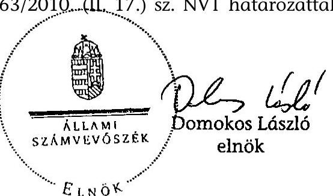

---

# Mellékletek

---

# Mellékletek jegyzéke 

1. sz. melléklet
2. sz. melléklet
3. sz. melléklet
4. sz. melléklet
5. sz. melléklet

A jelentésre és a jelentéstervezetre tett észrevételek és az arra adott válaszok

Az MNV Zrt. működését befolyásoló döntések
Az ÁSZ 2009. évi ellenőrzési megállapításainak hasznosítása

MNV Zrt. szervezeti felépítése 2009. január 1-jén és december 31-én

Tanúsítványok

---

# A jelentésre és a jelentéstervezetre tett észrevételek és az arra adott válaszok 

1. Nemzeti fejlesztési miniszter észrevétele
2. Vidékfejlesztési miniszter észrevételei
3. MNV Zrt. FB elnökének észrevétele
4. NFA EB elnökének észrevétele és az arra adott válaszunk
5. MNV Zrt. vezérigazgatójának észrevétele és az arra adott válaszunk
6. MTVKA elnökének észrevétele és az arra adott válaszunk
7. MTV Zrt. alelnökének észrevétele és az arra adott válaszunk
8. MVM Zrt. vezérigazgatójának észrevétele

---

From: NFM +3617950631
To: 04649201
To: 04649201
30/08/2010 13:52
#501 P.001/001

1. sz. melléklet
a V-2011-127/2009-2010. sz. jelentéshez

NEMZETI FEJLESZTÉSI
MINISZTÉRIUM

DR. FELLEGI TAMÁS
miniszter

Nezatín Vara
aus. 30.

Iktató szám: NFM/506/ 5 /(2010.)

Domokos László úr részére
elnök

Állami Számvevőszék

Budapest

Tisztelt Elnök Úr!

Az MNV Zrt. 2009. évi tevékenységének ellenőrzéséről az ÁSZ által készített jelentést
közönettel megkaptuk. A Javadalmazási Szabályzattal kapcsolatos álláspontunkat az anyagban
szerepeltetik, így a jelentéshez észrevételt nem teszek.

Budapest, 2010. augusztus „Ö”.

Ödvözlettel:

Fellesztő
Dr. Fellegi Tamás

1064 Budapest, Akadémia u. 3. Postacím: 1440 Budapest, Pf. 1 Telefon. (06 1) 795 6668 E-mail: tamas.fellegi@nin.gov.hu

---

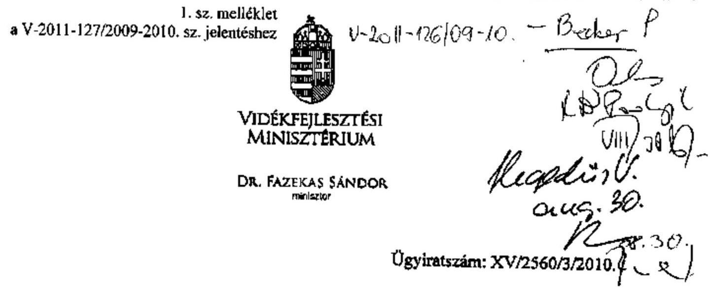

# Domokos László úr elnök részére 

Állami Számvevőszék

## Budapest

Apáczai Csere János utca 10. 1052

## Tisztelt Elnök Úr!

Hivatkozva az Állami Számvevőszék által készített, V-2011-122/2009-2010. számú, a Magyar Nemzeti Vagyonkezelő Zrt. 2009. évi tevékenységének ellenőrzéséről szóló jelentéstervezet harmadik változatára, az alábbiakról tájékoztatom.

Köszönetemet fejezem ki, hogy a Vidékfejlesztési Minisztérium észrevételei a jelentéstervezetben tükröződnek.

A jelentéstervezetben foglaltakkal egyetértek, arra további észrevételt nem teszek.

Budapest, 2010. augusztus „ő".

Tisztelettel:
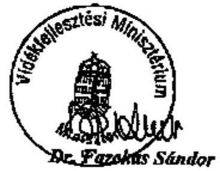

---

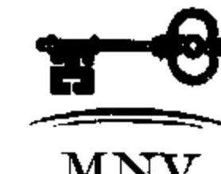

1. sz. melléklet -

a V-2011-127/2009-2010. sz. jelentéshez

1/39/2010.

MKT-279/10

MAGYAR NEMZETI VAGYONKEZELŐ ZRT.

Felügyelő Bizottság

HNV/01/2011 1/3/2010.

Állami Számvevőszék
Dr. Becker Pál főigazgató úr

Budapest
Apáczai Csere János utca 10.

1062

ÁLLAMI SZÁMVEVŐSZÉK
ÜGYVITELI IRODA
05365/2010
Érk.: AUG - 5 2010

Iktatószám: V-2011-111/09-10
Melléklet:

Vás: 766637

Tárgy: Az MNV Zrt. 2009. évi tevékenységének ellenőrzéséről készített ÁSZ jelen-
tés-tervezet észrevételezése

Tisztelt Főigazgató Úr!

A 2010. augusztus 5-én részemre megküldött, MNV-01/7134/27/2010. számon ikta-
tott - a Magyar Nemzeti Vagyonkezelő Zrt. 2009. évi tevékenységének ellenőrzésé-
ről készített - 957. témaszámú, V0477 azonosító számú és V-2011-106/2009-2010.
iktatószámú - számvevői jelentés-tervezet észrevételezési lehetőségét megköszö-
nöm.

Tájékoztatom, hogy a jelentés-tervezetet mellékleteivel együtt - munkatársaim köz-
reműködésével - ismételten áttanulmányoztuk.
Köszönettel tapasztaltam, hogy a korábbiakban tett, döntően technikai jellegű észre-
vételeinket figyelembe vették. Javaslom a 2-es számú függelék, 35. és 36. oldalán,
az Ellenőrző Bizottság megnevezés pontosítását.

A jelentés-tervezethez további tartalmi észrevételt nem teszek, az együttműködés le-
hetőségét megköszönöm.

Budapest, 2010. augusztus 5.

Tisztelettel

Dr. Mészáros József

1108 BUDAPEST, FORBONYI ÚT 56., 1099 BUDAPEST, P. 708. TELEFON: (06 1) 237 4400, FAX: (06 1) 237 4109
HONLAP: www.MNVZRT.HU, E-MAIL: INFORM.NVZRT.HU

---

NFA Ellenőrző Bizottsága

Dr. Becker Pál úrnak
főigazgató
Állami Számvevőszék
Budapest

Tisztelt Főigazgató Úr!
Az ÁSZ MNV ZRT. 2009. évi ellenőrzéséről készített jelentés-tervezetet áttanulmányoztam, a megállapításokra 2 koncepcionális és 1 technikai észrevételt teszek:
1./ A JELENTÉS (és a 2. számú függelék 3. pontja) birtokkoncentrációt elemezve országos adatokat vesz alapul, megalapozva a nemzeti földalap „politikáját". Nem vitatom az adatokból levonható következetéseket, mégis azt javaslom, hogy az állami tulajdonra vonatkozóan tessék bemutatni a kis, közép és nagy- gazdasági összefüggéseket, ebből igen meglepő, új következetések adódnak.
2./ A JELENTÉS (és a függelék) „a föld moratórium" kérdése kapcsán kitekintést ad az európai földárakról. Akkor reális csak (különösen a várakozásokat megalapozó) helyzetelemzés, ha kiegészítésre kerül a tárgyban relevánsabb adatokkal, amelyeket az EUROSTAT is publikált. Nevezetesen a burgerlandi és német-keleti tartományi adatokkal (például a burgerlandi földárak csak 1/3-át érik el az Osztrák áraknak, a keleti tartományi adatok pedig még ennél is alacsonyabbak.
3./ A 2. számú függelék 3. pontja 18. oldalán ugyanaz a bekezdés kétszer került beszerkesztésre.

Budapest, 2010. augusztus 6.
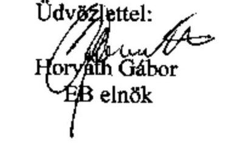

---

# HORVÁth Gábor úr 

elnöke
Nemzeti Fejlesztési Alap Ellenőrző Bizottság

## Budapest

## Tisztelt Elnök Úr!

Megköszönöm a Magyar Nemzeti Vagyonkezelő Zrt. 2009. évi tevékenységének ellenőrzéséről szóló jelentéstervezet második változatára adott észrevételeiket, azokkal kapcsolatban a következőkről tájékoztatom.

Az ÁSZ a birtokpolitikai koncepció elemzése során az országos adatokból vonta le következtetéseit. A „a föld moratórium" kérdése kapcsán tett tartalmi javaslatára vonatkozóan nem végeztünk vizsgálatot, így nem tudjuk a 2009. évi jelentésünknél azt figyelembe venni.

A technikai jellegű javaslatát a 2. sz. függelékben átvezettük.
Kérem, észrevételeire adott válaszaink megfontolását és szíves elfogadását.
Budapest, 2010. augusztus 8.

Tisztelettel:
R
Dr. Becker Pál

---

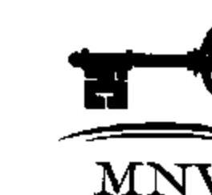

1. sz. melléklet a V-2011-127/2009-2010. sz. jelentéshez 1171/2010.

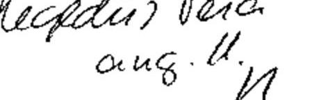

1133 Budapest, Pozsonyi út 56., 1399 Budapest, Pf. 705
TELEFON: (06 1) 337 4400, FAX: (06 1) 337 4101
HONLAP: WWW.MNVZRT.HU, E-MAIL: INFORM@NVZRT

ÁLLAMI SZÁMVEVŐSZÉK
ÜGYVITELI IRODA
06/13/2010
Érk.: AUG 10 2010

Iktatószám: V-2011-115/09-10
Melléklet: ..................................................................................................................................................................................................................................................................................................................................................................................................................................................................................................................................................................................................................................................................................................................................................................................................................................................................................................................................................................................................................................................................................................................................................................................................................................................................................................................................................................................................................................................................................................................................................................................................................................................................................................................................................................................................................................................................................................................................................................................................................................................................................................................................................................................................................................................................................................................................................................................................................................................................................................................................................................................................................................................................................................................................................................................................................................................................................................................................................................................................................................................................................................................................................................................................................................................................................................................................................................................................................................................................................................................................................................................................................................................................................................................................................................................................................................................................................

---

# Az MNV Zrt. 2009. évi tevékenységének ellenőrzéséről szóló számvevői jelentés tervezetének MNV Zrt. általi véleményezése 

Az állami vagyonnal való felelős gazdálkodás érdekében szükséges törvények módosításáról, valamint egyes törvényi rendelkezések megállapításáról szóló 2010. évi LII. törvénnyel módosított, az állami vagyonról szóló 2007. évi CVI. törvény 2010. június 17-én hatályba lépett módosítása folytán jelentősen átalakult az MNV Zrt. szervezeti és működési rendje. Tekintettel arra, hogy a 2010. évi LII. törvény 26.§. (4) bekezdése a Nemzeti Vagyongazdálkodási Tanácsot, valamint az Ellenőrző Bizottságot és jogkörét 2010. június 17-i hatállyal megszüntette, valamint arra, hogy a közelmúltban a Társaság vezetése megváltozott ezúton kívánom jelezni, hogy a vizsgálat eredményeként létrejött jelentéssel kapcsolatban az MNV Zrt. által tett észrevételek - a rendelkezésre álló szoros határidőre is tekintettel semmiképpen sem tekinthetők teljes körűnek.

A Társaság vezetése ezúton is hangsúlyozza, hogy az ÁSZ összegző megállapításaira adott válaszok nem tekinthetők az új vezetés a konkrét ügyben tett konkrét ÁSZ megállapítással kapcsolatos végleges állásfoglalásának.
Az MNV Zrt.-től az MFB Zrt-hez átkerülő, illetve a Nemzeti Földalap vonatkozásában az MNV Zrt. vagyonkezeléséből kikerült-kikerülő vagyonelemek vonatkozásában továbbiakban az átvevő szervezetek álláspontját javasoljuk kikérni.

## Jelentés tervezete 13. oldal:

„Annak ellenére, hogy az MNV Zrt. vezérigazgatója saját hatáskörében a döntések 4\%-át hozta meg, a döntés-előkészítés folyamatában hozott határozataival, a tanácsi határozati javaslatokon (a vezérigazgatói határozatok 58\%-a) keresztül befolyásolta a Tanács döntéseit a felelősség átvállalása nélkül. Ez rontotta a felelős gazdálkodással szemben támasztott követelmények teljesítését és akadályozta a felelősség megállapítását."

Az állami vagyonról szóló 2007. évi CVI. törvény (Vtv.) 17. § a) pontja alapján az MNV Zrt. feladata volt előkészíteni és végrehajtani a Tanács állami vagyonnal kapcsolatos döntéseit. Általános gyakorlat, hogy a döntéshozó testületek részére a döntés-előkészítés keretében határozati javaslatot is előterjesztenek. Amennyiben a Tanács nem értett volna egyet ezzel a döntéshozatali mechanizmussal, lehetősége lett volna azon változtatni. Mindezeket együtt mérlegelve nem tartjuk indokoltnak és megalapozottnak a fenti, tanácsi döntések irányítására, befolyásolására utaló megállapításokat, és ezzel összefüggésben az egyébként világos, hatáskörökhöz kapcsolódó felelősségi viszonyok beazonosíthatóságának megkérdőjelezését sem.

## Jelentés tervezete 14. oldal második bekezdés

„Egyes döntések nem felelős tulajdonosi szemléletben születtek (pl. MVM Zrt. tőkeemelés), illetve azok nem a Magyar Állam elsődleges érdekét (pl. Nemzetközi Vegyépszer Zrt. költségvetési viszont-garancia) ... szolgálták."

Nemzetközi Vegyépszer Zrt. költségvetési viszont-garancia: Az ügylet jóváhagyására jogosult közgyűlés az ügyben határozatképesség hiányában nem hozott határozatot, a garancia nem került kiadásra. A jelentés ennek ellenére olyan módon hivatkozik az Összegző

---

megállapítások kiemelt ügyei között a viszont-garanciára, mintha egy megvalósult ügyletet részletezne. Emellett a Részletes megállapítások is számos téves következtetést tartalmaznak az üggyel összefüggésben.

# Jelentés tervezete 14. oldal és 2. sz. melléklet 5. oldal: 

A hivatkozott kijelentés - miszerint az OHKI Országos Húsipari Kutatóintézet Közhasznú Nonprofit Kft. esetében az NVT, illetve az MNV Zrt. a döntéseit a Kormány döntésének figyelembe vétele nélkül hozta volna meg - nem helytálló, hiszen az OHKI Kht. (OHKI Közhasznú Nonprofit Kft.) vonatkozásában a 2118/2006. (VI.30.) Kormányhatározat privatizációt ír elő, ezt pedig mind az ÁPV Zrt., mint az MNV Zrt. megkísérelte. A támogatás ténye nem lehet ellentétes a Kormány szándékával, hiszen a privatizáció megvalósulásáig a tulajdonosi joggyakorlónak a többi társasághoz hasonlóan az OHKI esetében is a jó gazda gondosságával kell eljárnia, fenntartva a Társaság működőképességét.

Az OHKI Országos Húsipari Kutatóintézet Közhasznú Nonprofit Kft. egykori tulajdonosi joggyakorló ÁPV Zrt-től kapott reorganizációt, és az ÁPV Zrt. a 2007-ben megállapodást, melynek odaítélését az Állami Számvevőszék: 1000000000000000000000000000000000000000000000000000000000000000000000000000000000000000000000000000000000000000000000000000000000000000000000000000000000000000000

---

hatásköre, de a külön megállapodásban foglaltak - véleményünk szerint - távlati szempontból a Magyar Állam számára nem feltétlenül minősülnek hátrányosnak, a vevő eredeti vállalásához képest, főként annak mérlegelésével, hogy a megküldött szakvélemény alapján az nem kivitelezhető.
Másrészről az MNV Zrt. által a vevővel kötött szerződésben vállaltak teljesítését a Szerződésmenedzselési Iroda figyelemmel kíséri, melynek során az Esplanade Real Estate Kft. azt a tájékoztatást adta, hogy a stadion tervezési munkálatai megkezdődtek, az elvi építési engedély iránti kérelem is időben benyújtásra került, azonban annak jogerőre emelkedését - a társaság önhibáján kívüli ok - a telekszomszéd ÁNTSZ fellebbezése késlelteti, így a további munkálatok az építési hatósági eljárás kedvező lezárultával folytatódhatnak.
Emellett megjegyzendő, hogy bár a vevő a külön megállapodást tudomásul vétel céljából megküldte az MNV Zrt. részére, annak elfogadásáról hivatalos döntés nem született, így jelenleg is nyitva áll a lehetőség kifogás emelésére.
Ugyanakkor tény az is, hogy a szerződésben vállalt kötelezettségek teljesülése - tudomásunk szerint - többségében megtörtént, illetve az egyetlen fennmaradó vállalás tekintetében is a megvalósítás folyamatban van, azaz a vevő által tanúsított magatartás, illetve hozzáállása nem minősül aggályosnak.
A háromoldalú megállapodás szövegezése szűk mozgásteret hagy a vevő ellenőrzése, illetve nem teljesítése kapcsán, de a Szerződésmenedzselési Iroda a továbbiakban is kiemelten kezeli és figyelemmel kíséri a szerződés sorsát.

# Jelentés tervezete 19. oldal második bekezdése: 

A „2009-ben a 19 erdőgazdasági társaság tőkeemelés keretében 945 M Ft-ot használt fel, egységes erdészeti vállalatirányítási informatikai rendszer kialakítására. 2003-2007 között informatikai és ügyviteli eszközök beszerzésére összesen 950 M Ft már kaptak az erdészeti társaságok. A 2009-es egységes informatikai rendszer sem valósult meg eredményesen, a követelmény rendszer nem volt egységesen meghatározva. A döntés az Állam számára hátrányos volt, mert az informatikai rendszer fejlesztésével kapcsolatos előkészítés, lebonyolítás és a minőség-ellenőrzés nem volt hatékony, a fejlesztés egy éves késésben van." szövegrész javítását kérjük.

A javítást az alább felsorolt indokok mellett, továbbá „A társasági vagyon főbb tranzakciói" c. 3.sz függelék 3. pontja (9-11. oldal) alapján kérjük ismételten.

Az első mondattal kapcsolatban megjegyezzük, hogy 2009. évben az erdőgazdasági társaságok tőkeemelésére összesen 1.105 MFt összeg állt rendelkezésre, amelyből az alábbi tőkeemelések valósultak meg 945 MFt értékben és célokkal:
> A Tanács 289/2009. (IV.29.) NVT sz. határozatával támogatta a NYÍRERDŐ Nyírségi Erdészeti Zrt. „Aprítéktermelő munkarendszer" üzleti célú fejlesztési projektjét, megvalósításához 355 MFt tőkeemelésről döntött.
> A Tanács 445/2009. (V.27.) NVT sz. határozatával támogatta a TAEG Tanulmányi Erdőgazdaság Zrt. „Tómalom lakópark építési program" üzleti célú fejlesztési projektjét, megvalósításához 100 MFt tőkeemelésről döntött.
> A Mecseki Erdészeti Zrt. 45 M Ft értékű üzleti célú projektjének finanszírozásához az Erdei Melléktermék Felvásáró és Feldolgozó telep fejlesztésére -, 5 M Ft önrész mellett, a Tanács a 609/2009. (XII.16.) AH számú Alapítói Határozat kiadása napjával 40,0 MFt zártkörű tőkeemelést hajtott végre.
> A Tanács a 344/2009. (V.20.) NVT számú határozatában az EGERERDŐ Zrt. részére 200 MFt tőkeemelést és 100 MFt tulajdonosi kölcsön folyósítását hagyta jóvá.

---

> A Tanács a Bakonyerdő Zrt. részére (az 518/2009.(VI.24.) NVT sz. határozat módosításával) a 772/2009. (X.21.) NVT sz. határozatában 250 MFt tőkeemelést hagyott jóvá.

Az egységes informatikai rendszer kialakítására - az erdészeti társaságok 2008. decemberében tulajdonosi jegyzett tőkeemelésben részesültek, összesen 1.498 MFt értékben, amelyből - 2009. évben 600 MFt került kifizetésre.

A második mondattal kapcsolatban megjegyezzük, hogy 2003-2007. között informatikai és ügyviteli eszközök beszerzésére fordítottak mintegy 950 MFt-ot az erdészeti társaságok, melyből 706 MFt volt a támogatás és 245 MFt az önerő, és nem ugyanarra a célra került felhasználásra az összeg, mivel korábban nem volt cél az egységes rendszer kialakítása.

A harmadik mondattal kapcsolatban megjegyezzük, hogy a követelmény rendszer egységes értelmezése nem volt meg, az egységes követelmény rendszer meg volt határozva, csak azt különböző módon értelmezték a szereplők.

A negyedik mondatban megfogalmazott értékeléssel nem értünk egyet, mivel az egységes elszámolási és informatikai rendszer kialakítása véleményünk szerint indokolt volt a homogén portfoliók tekintetében.

# Jelentés tervezete 20. oldal 2. és a 70. oldal 6. bekezdése: 

Az említett bekezdések megállapítása szerint az MNV Zrt. által elkészíttetett tanulmányok, szakmai anyagok egyes esetekben nem voltak gazdaságosak, a díjazás és az elvégzett munka közötti összhang hiánya miatt. A jelentés példaként hozza fel többek között a Consact Kft-vel az elégedettség felmérésére kötött szerződést is.
Kérjük, a fent jelzett megállapítások Consact Kft-re vonatkozó részének törlését az alábbi indokaink alapján.
Az MNV Zrt. megbízta a Consact Kft-t (továbbiakban: Szakértő), hogy egy kutatás keretében két témakörben készítsen felmérést (jelentést) a részére. A Szakértő feladata egyrészt az volt, hogy mérje fel és értékelje az MNV Zrt. külső és belső partnerei - Társaságról alkotott véleményét, elégedettségét, másrészt pedig készítse el a Társaság munkavállalóinak dolgozói elégedettségi felmérését.
A partner-megelégedettségre vonatkozó információk gyűjtését kidolgozott szakmai terv alapján több területre (MNV Zrt. egyes tevékenységeinek értékelése, az MNV Zrt-ről kialakult kép, az MNV Zrt. munkájának továbbfejlesztésére vonatkozó szöveges javaslatok, észrevételek, stb.) vonatkozóan végezte el a Szakértő. A tevékenység három jól elhatárolható partner szegmens tekintetében került értékelésre (ingatlan, agrár valamint a társasági portfolió szervezetei). Az adatok felvétele 2009. július, augusztus és szeptember hónapokban, két lépcsőben került sor - postán kiküldött kérdőíves megkérdezéssel és mélyinterjúk alkalmazásával. A felmérés során 580 db kérdőív került kiküldésre, melyből 198 db érkezett vissza kitöltve. Az interjúk esetében az MNV Zrt. által kiválasztott és megadott partnerszervezetek ( 13 főleg gazdasági társaság illetve minisztérium) képviselőjével készített interjús beszélgetést a Szakértő. A kiértékelt kutatási anyagból állította össze a Magyar Nemzeti Vagyonkezelő Zrt. partnerelégedettség-kutatásáról szóló jelentést.
A dolgozói elégedettség felmérése során a Szakértő az MNV Zrt. munkatársai körében végzett kutatása során a munkavállalóknak kiválasztott szempontok szerinti, illetve általános elégedettségének mértékét vizsgálta. Az adatok felvétele 2009. július és augusztus hónapokban, két lépcsőben került sor, munkahelyen kiosztott kérdőíves megkérdezéssel és

---

mélyinterjúk alkalmazásával, a kijelölt munkatársak esetében. A felmérés során 226 fő töltötte ki kérdőívet és 27 fővel készült interjú. A kiértékelt kutatási anyagból állította össze a Magyar Nemzeti Vagyonkezelő Zrt. dolgozói elégedettség felméréséről szóló jelentést.
A Consact Kft. képviselői a Jelentések megküldését követően az MNV Zrt. részére a 2010. január 5. napján tartott Vezetői Értekezleten még külön prezentációt is tartottak a két témakör tekintetében.
Az MNV Zrt. vezérigazgatója prezentáció és a jelentések alapján intézkedési tervet fogadott el a 193/2010. (II.09.) Vig sz. határozatával a dolgozói és külső elégedettségi valamint az MNV Zrt. önértékelése tárgyában végzett szakértői vizsgálat által feltárt hiányosságok megszüntetése érdekében, konkrét felelősök és határidők megjelölésével.
Álláspontunk szerint a jelentés konkrét adatok, hivatkozások és indoklás bemutatása nélkül szubjektív módon jutott az ott megfogalmazott megállapításra, ezért fenti indokaink alapján a jelentés megállapítását annak szubjektivitása miatt is szükségesnek tartjuk törölni.

# Jelentés tervezete 21. oldal 9-12. sorszám alatti javaslatok 

Álláspontunk szerint az MNV Zrt. Igazgatóságának elnöke nem, kizárólag az Igazgatóság mint testület jogosult az ÁSZ javaslatok alapján intézkedéseket tenni, erre figyelemmel a javaslatok címzettje is csak az MNV Zrt. Igazgatósága lehet.

## Jelentés tervezete 26. oldal:

..A Társaság 2008. szeptember 30-ától hatályos Közbeszerzési és beszerzési szabályzatának felülvizsgálata a Kbt. 2009. április 1-jétől hatályos módosítása után nem történt meg. A szabályzatot 2009. október 16-án módosították. Április 1. és október 16-a között egységes, a Kbt. módosítással összehangolt belső szabályozása - pl. a közbeszerzési eljárást megindító hirdetmény jogszerűségét ellenjegyzésével igazoló személyre, az egyes eljárás-típusok eljárási cselekményei határidejének figyelembevételére, a közbeszerzési eljárás valamennyi dokumentumának az ajánlatkérő (MNV Zrt.) honlapján történő közzétételére - az MNV Zrt.nek nem volt."

A fentiekkel összefüggésben az alábbiakat kívánjuk megjegyezni:
Álláspontunk szerint az MNV Zrt. a hatályos Kbt. szerint járt el minden esetben.
A Kbt. 6. § (1) bekezdése alapján: „Az ajánlatkérő köteles meghatározni a közbeszerzési eljárásai előkészítésének, lefolytatásának, belső ellenőrzésének felelősségi rendjét, a nevében eljáró, illetőleg az eljárásba bevont személyek, illetőleg szervezetek felelősségi körét és a közbeszerzési eljárásai dokumentálási rendjét, összhangban a vonatkozó jogszabályokkal. Ennek körében különösen meg kell határoznia az eljárás során hozott döntésekért felelős személyt, személyeket, illetőleg testületeket.
(3) Ha az ajánlatkérő nem rendelkezik általános jellegű, az (1) bekezdésnek megfelelő közbeszerzési szabályzattal, vagy a szabályzattól - az abban meghatározott módon - való eltérés feltételei fennállnak, legkésőbb az adott közbeszerzési eljárás előkészítését megelőzően kell meghatároznia az (1) bekezdésben foglaltakat."

Az eseti közbeszerzési szabályzatok tartalmazzák a Kbt. 6. § (1) bekezdésében foglaltakat, különösen a Kbt. akkori módosításában előírtakat: a közbeszerzési szabályzatban megjelölt személy a közbeszerzési eljárást megindító hirdetmény jogszerűségét ellenjegyzésével

---

igazolja. A fenti indokaink alapján az ÁSZ megjegyzéseit nem tudjuk elfogadni, arra való tekintettel sem, mert a megjegyzésük szerint nem a közbeszerzési gyakorlat a problémás, hanem a társaság működési kereteit rögzítő összhang. Véleményünk szerint az eseti szabályzatok a jelentésben hiányoltakat maradéktalanul tartalmazták, eseti szabályzat készítésére pedig a Kbt. a fentiek szerint lehetőséget ad, ezért az észrevételünket változatlanul fenntartjuk. Amennyiben azzal a t. ÁSZ változatlanul nem értene egyet, kérjük annak a jelentésben való feltüntetését.

# Jelentés tervezete 27. oldalának utolsó bekezdése: 

Az Állami Számvevőszék megállapítja, hogy „az MNV Zrt. a 2009-ben megkötött új munkaszerződéseknél a Munka Törvénykönyve rendelkezéseit nem egységesen vette figyelembe. A Társaság a vezető munkavállalók munkaszerződéseiben a munkáltató rendes felmondására - nem egységesen - vagy az Mt. 92. § (2) bekezdésében vagy a 2173/2003. (VII. 29.) Korm. határozatban foglaltakat tekintette irányadónak. (Pl. a három évet elérő vagy meghaladó munkaviszony esetén a felmondási idő a Korm. határozat szerint nyolc hónap, ami az Mt-ben meghatározott felmondási idő hatszorosa.) Az MNV Zrt. egységes belső szabályozást a felmondási idő és a végkielégítés megállapítására 2009-ben nem alakított ki."

A bekezdéssel kapcsolatos MNV Zrt. válasz:
Az MNV Zrt. a vezető állású munkavállalókkal történő munkaszerződések megkötése során a Munka Törvénykönyve és a Társaságra is irányadó 2173/2003. (VII.29.) Korm. határozatban foglalt rendelkezések figyelembevételével járt el. Azoknál a vezető állású munkakörben foglalkoztatásra kerülő munkavállalóknál azonban, akik korábban az MNV Zrt. jogelőd szervezeténél már jogviszonyban álltak - de nem közvetlen 2008. január 1. napját, az MNV Zrt. megalakulását megelőzően - az MNV Zrt-vel megkötésre kerülő szerződésükben már csak a Mt. rendelkezései szerinti felmondási idő került rögzítésre. Ebből következően egységes az MNV Zrt. munkaszerződés kötési gyakorlata, mely szerint azon vezető állású munkavállalók esetében, akik korábban az MNV Zrt. jogelőd szervezeténél, az ÁPV Zrt-nél kerültek foglalkoztatásra, de a munkaviszonyuk időközben megszüntetésre került, az érintettek munkaszerződésében az MNV Zrt-vel történő új munkaviszony létesítésekor csak a Mt. szerinti felmondási időre vonatkozó rendelkezések kerülhettek rögzítésre.

Számvevői válasz:
„Az észrevételt nem vettük figyelembe, mert az MNV Zrt. belső szabályzatai a munkaszerződések megkötésére irányadó - az Mt., illetve a 2173/2003. (VII. 29.) Korm. határozat szerinti - egységes feltételrendszert 2009-ben nem tartalmaztak. Egyes 2009-ben megkötött munkaszerződések (pl. Kommunikációs Irodavezető 2009. augusztus 10-én megkötött Munkaszerződése, majd annak 2009. október 20-ai módosítása) a 2173/2003. (VII. 29.) Korm. határozatban foglaltakat, majd az Mt. 92. § (2) bekezdésében foglaltakat tekintették irányadónak, ami az egységes belső gyakorlat hiányát mutatja."

A fentiekkel összefüggésben az alábbiakat kívánjuk megjegyezni:
Sehol nincs arra vonatkozó előírás, hogy az MNV Zrt. belső szabályzatokban rendelkezzen a munkaszerződés kötési feltételekről. Amint azt az észrevételünkben is leírtuk, az MNV Zrt. a mindenkor hatályos Munka Törvénykönyvében, illetve a korábbi munkaszerződések megkötésekor a 2173/2003. (VII.29.) Korm. határozatban foglalt rendelkezések

---

figyelembevételével járt el. Ismételten felhívjuk a figyelmet arra, hogy azoknál a vezető állású munkakörben foglalkoztatásra kerülő munkavállalóknál azonban, akik korábban az MNV Zrt. jogelőd szervezeténél már jogviszonyban álltak - de nem közvetlen 2008. január 1. napját, az MNV Zrt. megalakulását megelőzően - az MNV Zrt-vel megkötésre kerülő szerződésükben már csak a Mt. rendelkezései szerinti felmondási idő került rögzítésre. E körbe tartozik a Jelentésben hivatkozott kommunikációs irodavezető is, aki korábban munkaviszonyban állt az MNV Zrt. jogelőd szervezeténél, az ÁPV Zrt-nél és ezért került sor a munkaszerződése felmondási időre vonatkozó részének az Mt.92.§-ában foglaltak szerinti módosítására.

# Jelentés tervezete 29. oldalának utolsó bekezdése: 

Az Állami Számvevőszék több helyen is megállapítja, hogy a Vtv. csak az elődszervezetek esetében tette lehetővé a korábbi munkáltatónál eltöltött jogviszony időtartamának hozzászámítását az MNV Zrt-nél eltöltött munkaviszonyhoz.

A vizsgálattal érintett időszakban hatályos Vtv. 61.§(2) bekezdése és (4) bekezdése az alábbiak szerint rendelkezik:
61.§(2) A KVI munkavállalóinak az MNV Zrt-nél vagy a kincstárnál történő továbbfoglalkoztatására a közalkalmazottak jogállásáról szóló 1992. évi XXXIII. törvény 25/A.§-át és 25/B.§-át kell alkalmazni.
61.§(4) Az NFA munkavállalóinak az MNV Zrt-nél történő továbbfoglalkoztatására a köztisztviselők jogállásáról szóló 1992. évi XXIII. törvény 17/A.§-ának rendelkezéseit kell alkalmazni.

A bekezdéssel kapcsolatos MNV Zrt. válasz:
Álláspontunk szerint a Vtv. hivatkozott rendelkezéseiből nem következik, hogy azon munkavállalók esetében, akik korábban más, de a közalkalmazottak jogállásáról szóló 1992. évi XXXIII. törvény(továbbiakban Kjt.), illetve a köztisztviselők jogállásáról szóló 1992. évi XXIII. törvény (továbbiakban Ktv.) hatálya alá tartozó szervezetnél álltak jogviszonyban és ez éppen az MNV Zrt-vel történő munkaviszony létesítésük okából került megszüntetésre, ne kelljen figyelembe venni a Ktv., illetve a Kjt. munkaviszony megszüntetésre vonatkozó rendelkezéseit. Mindezen túl a 2009. évi CXXII. törvény hatályba lépését megelőzően az Mt. maximális lehetőséget biztosított a munkavállaló javára való eltérésre. Ebből következően téves azon megállapítás, hogy nem volt jogszabályi alapja a hozzászámításra vonatkozó szerződéses kikötéseknek.

Megjegyezzük továbbá, hogy az MNV Zrt. mind a munkaviszony létesítések, mind a munkaviszony megszüntetések során mindig is maradéktalanul betartotta, és betartja a törvényi és az egyéb jogszabályi rendelkezéseket. Ezt támasztja alá az MNV Zrt. Ellenőrző Bizottsága hivatkozott jelentésének - minden egyes vizsgálattal érintett vezetőhöz fűzött azon megállapítása, mely szerint a munkaviszonyok létesítése, a megszüntetésükkel összefüggésben történt kifizetések, valamint a munkakörök átadás-átvétele minden esetben jogszerűen és szabályszerűen történtek.
Továbbá az Ellenőrző Bizottság hivatkozott jelentésének alábbi megállapítása: „.... a munkaviszony létesítések, illetve megszüntetések összhangban voltak az állami szférában - a

---

felsővezetők esetében gyakorolt - korábban alkalmazott munkaszerződés-kötési és javadalmazási gyakorlattal...."

Számvevői válasz:
„Véleményünket - az alábbiakban részletezett indokok alapján - továbbra is fenntartjuk.
Több esetben is a munkáltatói rendes felmondás esetére járó felmentési idő és végkielégítés számítását képező jogosultság időtartamát a munkavállalónak az MNV Zrt.-nél fennálló munkaviszony időtartamához hozzászámították a korábbi munkáltatójánál eltöltött munkaviszonya időtartamát, holott ezt a Vtv. csak az elődszervezetek esetében tette lehetővé. A Mt. szerint a munkaszerződés feltételeinek meghatározásában fennálló szerződéskötési szabadság alapján - mely szerint a munkavállaló javára lehetséges kedvezőbb feltételek megállapítása - álláspontunk szerint nem lehet úgy értelmezni, hogy korábban lezárt, megszüntetett jogviszonyokra tekintettel az MNV Zrt. részére (esetleges) fizetési kötelezettséggel járó szerződési feltételeket állapítson meg. Az ilyen tartalmú szerződéses kikötéseknek - az elődszervezetektől eltekintve - jogszabályi alapja nem volt, az a felek megállapodásán alapult."

A fentiekkel összefüggésben az alábbiakat kívánjuk megjegyezni:
Az MNV Zrt-nek a munkaviszony létesítésekor nemcsak a Vtv., hanem valamennyi irányadó jogszabályi rendelkezést (így pl. a közalkalmazottak jogállásáról szóló 1992. évi XXXIII. törvény(továbbiakban Kjt.), illetve a köztisztviselők jogállásáról szóló 1992. évi XXIII. törvény (továbbiakban Ktv.) előírásait is) figyelembe kellett, illetve kell vennie. Így azon munkavállalók esetében, akik korábban más, de a Kjt., illetve a Ktv. hatálya alá tartozó szervezetnél álltak jogviszonyban és ez éppen az MNV Zrt-vel történő munkaviszony létesítésük okából került megszüntetésre az MNV Zrt-nek a Ktv., illetve a Kjt. munkaviszony megszüntetésre vonatkozó rendelkezései figyelembevételével kellett, illetve kell eljárnia.

# Jelentés tervezete 31. oldalának 2. bekezdése: 

Határozottan nem értünk egyet az Állami Számvevőszék azon megállapításával, mely szerint „Az MNV Zrt. álláspontja szerint a javadalmazásra továbbra is a Vtv. előírásait, mint speciális szabályt kell alkalmazni, rájuk a Takarékossági törvény előírásai nem vonatkoznak. Ezzel az értelmezéssel az EB is egyetértett. A Tanács, az EB, és az MNV Zrt. az állam elsődleges érdekével szemben foglalt állást."

A bekezdéssel kapcsolatos MNV Zrt. válasz:
A köztulajdonban álló gazdasági társaságok takarékosabb működéséről szóló 2009. évi CXXII. törvény (továbbiakban takarékossági tv.) 1.§-a egyértelműen rögzíti, hogy a törvény alkalmazása szempontjából mely gazdasági társaság minősül köztulajdonban állónak. Figyelemmel arra, hogy a Vtv. 18.§-a egyértelműen rögzíti, hogy az MNV Zrt. a Magyar Állam által alapított egyszemélyes részvénytársaság, ebből következően a Vtv. mellett a takarékossági tv. rendelkezéseit is alkalmazni kell és teljes körűen alkalmazza is az MNV Zrt. a működése során. Továbbá érvényesítette a hivatkozott törvény rendelkezéseit a rábízott vagyoni körébe tartozó többségi állami tulajdonú társaságoknál (884/2010. (XII.16.) és 885/2010. (XII.16.) NVT számú határozatok) is.

---

Amint azt a Jelentéstervezet is megjegyzi, az MNV Zrt. Javadalmazási Szabályzatát a részvényesi jogokat gyakorló pénzügyminiszter hagyta jóvá, melyre az MNV Zrt-nek nem volt ráhatása.

Fentieken túl megállapítható, hogy a takarékossági tv. hatályba lépését követően az MNV Zrt. részéről nem történtek olyan - sem munkáltatói jogkörben, sem tulajdonosi jogkörben meghozott intézkedések, amellyel a hivatkozott törvény rendelkezései sérültek volna.

Számvevői válasz:
„Véleményünket - az alábbiakban részletezett indokok alapján - továbbra is fenntartjuk.
Az MNV Zrt. Javadalmazási Szabályzatának jóváhagyását megelőzően 2010. február 5-én a Pénzügyminisztérium Vagyongazdálkodási főosztálya Feljegyzést készített a pénzügyminiszter számára. A Feljegyzés tartalmazza, hogy az MNV Zrt.-vel történő egyeztetések elhúzódtak. A Pénzügyminisztérium az MNV Zrt. által kifejtett jogi állásponttal nem tudott egyetérteni, mert az MNV Zrt. javaslata „a Takarékossági törvény megkerülését célozza meg".

A fentiekkel összefüggésben az alábbiakat kívánjuk megjegyezni:
Az MNV Zrt. a Takarékossági tv. hatályba lépését követően minden új szerződéskötés esetén alkalmazta a törvényben foglaltakat. Ezért a globális kijelentést - mint megállapítást helytelennek tartjuk. Teljesen érthetetlen számunkra, hogy az Állami Számvevőszék válaszában foglaltak szerint, azon Jelentésben foglalt megállapítását, mely szerint „az MNV Zrt. álláspontja szerint ...... a Takarékossági törvény előírásai nem vonatkoznak rá" egy, a Pénzügyminisztériumban 2010. február 5. napján kelt belső feljegyzésben foglaltakra alapozza. Méltánytalannak tartjuk, hogy egy minisztériumi belső irat alapján, amely csupán a Pénzügyminisztérium Vagyongazdálkodási főosztálya álláspontját tükrözi az adott ügyben, nem is a részvényesi jogok gyakorlójáét, tegyen az Állami Számvevőszék negatív tartalmú megállapítást az MNV Zrt-re vonatkozóan.
Hangsúlyozzuk, hogy az MNV Zrt. belső szabályzatai és eljárása maradéktalanul megfelel valamennyi jogszabályban, illetve tulajdonosi döntésben előírt rendelkezésnek, azzal kapcsolatosan kifogás - lásd az Ellenőrző Bizottság jelentését is - nem merült fel.

Megjegyezzük hogy az MNV Zrt. sosem állított olyat, hogy rá a Takarékossági törvény rendelkezései nem vonatkoznak. Nem is állíthatott, hiszen a jogszabályi rendelkezés e kérdésben teljesen egyértelmű. Az MNV Zrt. a javadalmazási szabályzattal összefüggésben azt jelezte a minisztérium részére, hogy azt fő szabály szerint a 2009. évi CXXII. tv. szerinti tartalommal kell megalkotni úgy, hogy amennyiben van eltérő jogszabály, akkor azt is figyelembe kell venni. (2009. évi CXXII. tv. 5. § (3.) bekezdés) Ezek az eltérések pedig a Vtv. -ben található javadalmazást érintő döntési hatáskörökkel kapcsolatosak. (RJGY, Tanács, vezérigazgató) A t. ÁSZ a fenti felvetésünket nem vette figyelembe, és mindezt a következőkkel támasztotta alá:

Az MNV Zrt. Javadalmazási Szabályzatának jóváhagyását megelőzően 2010. február 5-én a Pénzügyminisztérium Vagyongazdálkodási főosztálya Feljegyzést készített a pénzügyminiszter számára. A Feljegyzés tartalmazza, hogy az MNV Zrt.-vel történő egyeztetések elhúzódtak. A Pénzügyminisztérium az MNV Zrt. által kifejtett jogi állásponttal

---

nem tudott egyetérteni, mert az MNV Zrt. javaslata „a Takarékossági törvény megkerülését célozza meg".

Álláspontunk szerint az ÁSZ PM belső véleményére való hivatkozása nem támasztja alá azt a kijelentést, mely szerint azt MNV Zrt. azt állította volna, hogy rá nem vonatkozik a takarékossági törvény. Ismételten jelezzük, hogy a vita nem a takarékossági törvény hatálya alá tartozás kérdésében merült fel a PM és az MNV ZRt. között, hanem a fentebb részletezett hatásköri kérdésekben. A fentiek alapján ismételten kérjük
 a takarékossági törvény hatálya alá nem tartozás állítására vonatkozó rész elhagyását vagy a fenti észrevételünk beemelését az ÁSZ jelentésbe

# Jelentés tervezete 34. oldal hetedik bekezdéstől 

„A Tanács döntései nem teljes körűen biztosították az állam érdekeinek elsődlegességét (Vtv. 7. § (4) bek.), mert állami kötelezettség esetén az állam kockázatvállalásának mérséklésére kockázatcsökkentő intézkedéseket nem fogadtak el (pl. Nemzetközi Vegyépszer Zrt.-vel kapcsolatban hozott határozat).

A Tanács 2009. július 22-én - kormányhatározat nélkül - döntött arról, hogy a Magyar Export-Import Bank Zrt. rendkívüli közgyűlésére mandátumot ad ki. Az MNV Zrt. a mandátum alapján hozzájárult a Nemzetközi Vegyépszer Zrt. 80 Mrd Ft összegű líbiai közmű hálózat projektjéhez kapcsolódó ( 20 Mrd Ft összegű, költségvetési hátterű) garancia kiadásához, de nem hozott olyan intézkedéseket, amelyek a Magyar Állam kockázatvállalása mértékét csökkentik.

A fenti bekezdés elhagyását javasoljuk, figyelemmel az alábbiakra:
Nemzetközi Vegyépszer Zrt.-vel kapcsolatban hozott határozat: Az államháztartásról szóló 1992. évi XXXVIII. törvény (Áht.) 33. és 33/A. §-ai szabályozzák az állami kezesség, állami garancia és viszontgarancia vállalásával összefüggő szabályokat. Az Áht. 33. §-ának (1) bekezdése alapján a Kormány jogosult nyilvános határozatában - kezesség-, garanciavállalásonként - egyedi állami kezességet, egyedi állami garanciát, illetve egyedi viszontgaranciát vállalni. Az Áht. 33. §-ának (6) bekezdése e kormányhatározaton alapuló egyedi állami kezesség, állami garancia vonatkozásában ír elő külön feltételeket. Az Áht. 33. §-ának (11) bekezdése az egyedi garanciavállalásoktól eltérő, jogszabályi állami kezességre, állami garanciára és viszontgaranciára vonatkozó szabályt tartalmaz, amely alapján ilyen kötelezettséget csak törvényben lehet vállalni. A Magyar Export-Import Bank Részvénytársaságról és a Magyar Exporthitel Biztosító Részvénytársaságról szóló 1994. évi XLII. törvény 6-9. §-ai ilyen jogszabályi rendelkezések. Ennek megfelelően az ügylet, amennyiben a Magyar Export-Import Bank Zrt. közgyűlése azt jóváhagyta volna, abban az esetben sem igényelt volna külön kormányhatározatot. A Vtv. vonatkozó szabályainak megfelelően a Tanács részéről a tárgyi mandátum kiadása egyébként sem lett volna kormányhatározat kiadásához kötve.
Az ügylet jóváhagyására jogosult közgyűlés határozatképesség hiányában az ügyben határozatot nem hozott, tekintve, hogy a közgyűlésen a másik részvényes nem jelent meg, újabb rendkívüli közgyűlés összehívására pedig nem került sor. Így a garancia nem került kiadásra.

---

# Jelentés tervezete 35. oldal: 

„Egyes vezérigazgatói határozatok nem voltak összhangban a Kbt. 40. § (2) bekezdése és a 243. § c) pontja előírásaival, mert az MNV Zrt. nem vette figyelembe az érték egybeszámítási szabályokat és közbeszerzési eljárás mellőzésével kötött jogi szolgáltatásra vonatkozó szerződést. (Horváth és Társai Ügyvédi Irodával megkötött szerződés.)"

A fenti megállapítást kérjük elhagyni az alábbi indokaink alapján:
A Kbt. 243. §. c.) pontja alapján:
243. § E fejezet szerinti eljárást nem kell alkalmazni:
c) a 4. számú melléklet szerinti jogi szolgáltatások, a hivatalos közbeszerzési tanácsadói tevékenység és az átláthatósági biztos tevékenysége esetében, ha a szolgáltatás értéke nem éri el a közösségi értékhatárt;

Vagyis, amennyiben a jogi szolgáltatás értéke nem éri el a közösségi értékhatárt, abban az esetben nem kell közbeszerzési eljárást lefolytatni.

A megbízási szerződés megkötése előtt a Kontrolling Igazgatóság az egybeszámítási szabályokat megvizsgálta és a Kbt. 40. § (2.) bekezdése szerinti nyilatkozatot kiadta, amiben feltüntette a szolgáltatás becsült értékét.

A szerződésben, bár valóban óradíj került kikötésre, a szerződés 6. 2. pontjában egyértelműen be lett korlátozva az alábbiak szerint:
„Megbízott tudomásul veszi, hogy a megbízási díj teljes összege - a közbeszerzésekről szóló 2003. évi CXXIX. Tv. (továbbiakban Kbt.) 40§ -ban rögzített egybeszámítási szabályokra is tekintettel - nem haladhatja meg a Kbt.-ben előírt mindenkori közösségi értékhatárt."

A fentiek alapján tehát látható, hogy az MNV ZRt. a Kbt. 40. § (2.) bekezdésében rögzített egybeszámítási szabályokra maradéktalanul tekintettel volt, azzal pedig, hogy a szerződésben egyértelműen bekorlátozta a közbeszerzési értékhatár szintjéig az óradíjas maximális megbízási díj teljes összegét, maradéktalanul figyelembe vette a Kbt. 243. § (c.) pontját is, Ezért a szerződés közbeszerzési eljárás megkerülésével való megkötésére vonatkozó ÁSZ jelentésben feltüntetett megállapítás nem tükrözi a valóságot. Kérjük annak elhagyását, vagy észrevételünk feltüntetését a jelentésben.

Ugyanezt kérjük figyelembe venni a jelentéstervezet 2. sz. mellékletének 11. oldalán feltüntetett alábbi megállapításhoz is:
„A Kbt. 2009. április 1-től hatályos 243. §-ának c) pontja szerint a (CPV 79100000-5-től 7914000-7-ig tartó hivatkozási számok alá tartozó) jogi szolgáltatások esetében a közösségi értékhatárok figyelembe vétele, ebből következően a közbeszerzési eljárás közösségi értékhatárt meghaladó lefolytatása kötelező. A Kbt. 21/A. §-a szerint a jogi szolgáltatások esetében - a közösségi értékhatárt meghaladóan - általános egyszerű közbeszerzési eljárás alkalmazható. A szerződés megkötése előtt - figyelemmel a Kbt. 40. § -ának (2) bekezdésében foglalt egybeszámítási szabályokra - a megbízás teljes értékének ismerete szükséges."

---

A megbízási szerződés megkötése előtt a Kontrolling Igazgatóság az egybeszámítási szabályokat megvizsgálta és a Kbt. 40. § (2.) bekezdése szerinti nyilatkozatot kiadta, amiben feltüntette a szolgáltatás becsült értékét.

# Jelentés tervezete 35. oldal hetedik bekezdéstől 

„Az átruházott hatáskörben kiadott vezérigazgatói határozatok egy része nem volt összhangban a hatályos jogszabályokkal és belső szabályokkal. (A Vtv. 7. § (4) bekezdése - az állam érdekeinek elsődlegessége -; MNV Zrt. cégjegyzési jogosultság szabályai.) (Pl. „Hollóházi Porcelán" védjegy és márkanév átruházás...)

A Hollóházi Porcelán Manufaktúra Zrt. tulajdonát képező védjegy és márkanév átruházására vonatkozó előszerződés 2009. július 17 -el megkötéséhez jogosultsága az azt aláíró vezérigazgató-helyetteseknek nem volt. Ezen túlmenően az egyik aláíró következetes sem volt, mert a döntést megalapozó előterjesztés véleményezésekor kifogásolta a „Hollóházi Porcelán" védjegy és márkanév értékbecslésének megalapozottságát."

Az Állami Számvevőszék álláspontunk szerint tévesen értelmezi az MNV Zrt. hatásköri, a cégjegyzési és a helyettesítési szabályainak együttes alkalmazását, valamint a vezérigazgató határozatainak végrehajtására irányuló munkavállalói kötelezettséget. Nem érthető, hogy az SZMSZ 39. §-a szerint a vezérigazgató általános helyetteseként eljáró agrárportfólióért felelős vezérigazgató-helyettes helyettesítési jogkörét miként értelmezi az Állami Számvevőszék, ha írásbeli helyettesítési jogkörét kétségbe vonja. A vezérigazgató általános helyetteseként az agrárportfólióért felelős vezérigazgató-helyettes a vonatkozó előszerződést jogosult volt aláírni. Figyelemmel azonban arra, hogy a vezérigazgatóhelyettesek cégjegyzési joga együttes, a szerződésen szükséges cégszerű aláírás teljesítése érdekében valamely (lényegében bármely, aláírásában nem akadályozott) másik vezérigazgató-helyettessel, illetve a főlgazgatóval együttesen írhatta csak alá a szerződést. Nem érthető, hogy az Állami Számvevőszék miként értelmezi a vezérigazgató határozatainak végrehajtására irányuló munkavállalói kötelezettséget, hiszen azt kétségbe vonva következetlennek minősíti a másik aláírót, amikor az a meghozott vezérigazgatói határozat végrehajtásában együttes cégjegyzési joga gyakorlásával közreműködött.

## Jelentés tervezete 42. oldal 3-4 bekezdése:

Nem tartjuk megalapozottnak az alapvető hiba minősítést, valamint „téves következtetések szerepelnek a megállapításban. A véleményünket alátámasztó tényeket az alábbiakban foglaltuk össze:"
semmilyen jogszabály, joganyag, egyéb szabályozó nem mondja ki, hogy a főkönyvi könyvelési rendszernek kell tételesen tartalmaznia a vagyonclemek analitikáját.

1. az analitikából papíralapon készült feladással egyezően történik a főkönyvi könyvelés, ebből adódóan a zártság biztosított.
2. az értékadatokat nem a számvitel állítja össze, hanem az analitikus alrendszerből érkező feladás biztosítja, a számvitel kizárólag az eszközcsoportra vonatkozóan mozgásnemenként rögzíti a megfelelő főkönyvi számlákra a gazdasági eseményt

## Jelentés tervezete 42. oldal 7. bekezdése:

---

Kérjük kiegészíteni az alábbiakkal: A 2010. január 13-án kiadott, az MNV Zrt. rábízott vagyonára vonatkozó Leltározási utasításban meghatározott ütemterv szerint az éves beszámolóban kerül elszámolásra a leltárhiány, -többlet, az éves beszámoló mérlegének leltárral történő alátámasztása valósul meg.

# Jelentés tervezete 42. oldal 9. bekezdése: 

A Gazdasági Igazgatóság - miután a részletes adatok birtokában az analitikus nyilvántartó részlegek vannak - a beruházási főkönyvi számla mozgását tartalmazó főkönyvi kartont átadja az analitikus nyilvántartást végzők részére, hogy a szükséges ellenőrzéseket elvégezzék. Miután a főkönyvi számlákra csak összevontan történik könyvelés, ezért az analitikus vagyonnyilvántartásnak kell dokumentummal rendelkeznie a tételes átvezetésekről.

## Jelentés tervezete 44. oldal 4. bekezdése:

Kérjük pontosítani: „...a vagyon-nyilvántartási problémák megoldásra vonatkozó leltározási feladatot határoztak meg, 2010. május 31 -ei véghatáridő megjelöléssel. A 725/2009. (IX. 16.) NVT sz. határozat mellékletét képező ütemterv 19. sora az állami részesedések leltára készítésére, a leltározást megelőző adategyeztetés, adattisztítási feladatok ellátására 2009. november 30 -ai határidőt jelölt meg.
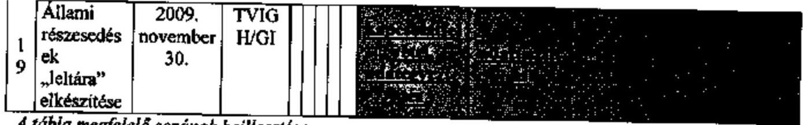

A tábla megfelelő sorának beillesztése

## Jelentés tervezete 61. oldalának 1-3. bekezdése:

## Javaslat a szövegszerű módosításra:

„A kialakuló vadászterületek esetében a vadászati jog hasznosításához kapcsolódó képviselet ellátását az MNV Zrt. nem szabályozta, a vadászati jog hasznosításáért járó díjakat a jogtulajdonos 2009. évben visszamenőlegesen számlázta ki az MNV Zrt., a különleges rendeltetésű vadászterületeket érintő, vadászati jog hasznosításával összefüggő képviseleti meghatalmazás kiadása nem volt kellően előkészített. A különleges rendeltetésű vadászterületeket érintő, vadászati jog hasznosításával összefüggő meghatalmazások, képviseleti jogosultságok kiadásához nem kell előterjesztést készíteni, a döntés határozat formájában egyszerűsített módon történik.
A Kisalföldi Erdőgazdaság Zrt. (KAEG) területét érintő 20800 ha vadászterület vadászati jogának állam által történő érvényesítése során a szabályozási hiányosságok következtében nem jutott kifejezésre az állami vagyon hatékony működtetése, értékének megőrzése, vagyonának gyarapítása elvárás.
Az MNV Zrt. által, a 08-100210. kódszámú vadászterület földtulajdonosi vadászati közössége 2009. szeptember 10. napján tartott gyűlésén való részvételre 2010. szeptember 7-én adott meghatalmazás nem adott egyértelmű felhatalmazást az állam képviselője, holott a meghatalmazás kiadása idején a meghatalmazást adó és a meghatalmazott részére is

---

megküldött írásos nyilatkozat egyértelművé tette az állam számára a többségi szavazati jog lehetőségét a földtulajdonosi gyűlésen. A földtulajdonosi gyűlésen többségi szavazati jog esetén sem kerülhetett volna sor, a vagyonkezelői szerződés alapján a legnagyobb állami többségű vadászterület kialakításra."

# Jelentés tervezete 70. oldal utolsó bekezdése: 

Továbbra is fenntartjuk azon véleményünket, hogy a taxival, illetve személygépkocsi használat megtérítésére a Személyi jövedelemadó törvény - mint hivatali, üzleti utazás biztosít lehetőséget, ebből adódóan azt nem kellett külön, az RIGY-ben szabályozni. Az RIGY-ben kizárólag azt kellett szabályozni, amit a jogszabályok nem engednek meg.
A SZJA tv. 3. §. 10. pontja szerint hivatali, üzleti utazás: „a magánszemély jövedelmének megszerzése érdekében, a kifizető tevékenységével összefüggő feladat ellátása érdekében szükséges utazás - a munkahelyre, a székhelyre vagy a telephelyre a lakóhelyről történő bejárás kivételével -, ideértve különösen a kiküldetés (kirendelés) miatt szükséges utazást; továbbá az országgyűlési képviselő, a polgármester, az önkormányzati képviselő e tisztségével összefüggő feladat ellátása érdekében szükséges utazás (a lakóhelytől való távollét)". Ebből adódóan a kiküldöttek köre nem korlátozódik kizárólagosan a munkaviszonyban álló magánszemélyre. Az MNV Zrt. alkalmazhatta a kiküldetési rendelvényt munkaviszony, tagi jogviszony, megbízási jogviszony, tisztségviselői (NVT, EB), vezető tisztségviselő, választott tisztségviselői, illetve egyéb jogviszonyok esetére is. A reprezentációval kapcsolatos kiadások keretösszegeit az RIGY egyértelműen rögzíti ebből adódóan téves az a megállapítás, hogy az MNV Zrt. további 500 eFt/év reprezentációs keretet hagyott jóvá. A megállapítás jelenlegi értelmezése szerint az MNV Zrt. az RIGY által jóváhagyott kereten felül további 500 eFt/év keretet engedélyezett, ami nem felel meg a valóságnak.

## Jelentés tervezete 2. sz. melléklet
 1. oldal harmadik bekezdés

„Az RJGY határozatokban megjelenő feladatok a Magyar Villamos Művek Zrt. közgyűlésén történő szavazásról (mandátum) kiadott 584/2009. (VII. 01.) és a 889/2009. (XII. 16.) NVT sz. határozat részét képezték (a Tanács nem külön határozatba foglalt „mandátum" kiadásával fogadta el a Vértesi Erőmű Zrt. működtetése érdekében szükséges intézkedéseket), ami önmagában - az MNV Zrt. számára is - rontotta a döntéshozatal átláthatóságát. A Tanács 2009. júliusi döntését megelőzően belső véleményeket nem tartalmazó előterjesztés készült."

A Vértesi Erőmű Zrt. részvényeinek 98,53\%-a az MVM Zrt. tulajdonában van, további tulajdonosok 1,46\%-ban belföldi kisrészvényesek és $0,04 \%$-ban önkormányzatok. Figyelemmel arra, hogy a Vértesi Erőmű Zrt. nem egyszemélyes társaság, az MNV Zrt. az MVM Zrt.-nek - mint a Vértesi Erőmű Zrt. közel 100\%-os tulajdonosának - közgyűlésen csak közvetetten érvényesíthette a tulajdonos jogait.
A megállapítással érintett előterjesztés az MNV Zrt. belső szabályzatának megfelelően került előkészítésre, a belső véleményeket tartalmazta.

## Jelentés tervezete 2. sz. melléklet 2. oldal 4. bekezdés utolsó mondata:

„Az állami vagyon felügyeletéért felelős pénzügyminiszter 2009 szeptemberéig nem tette meg a MÁV vagyonkezelésében lévő állami ingatlanok jogi helyzetének rendezéséhez

---

szükséges lépéseket, ami akadályozta a vagyonkezelésben lévő állami ingatlanok hasznosítását és értékesítését."
Ezen mondat helyett - összhangban az 1. sz. függelékben foglaltakkal - a következő mondatot javasoljuk feltüntetni: „A vagyonelemek jogi helyzetének rendezését akadályozta, illetve akadályozza az állami és a társasági érdekek ütközése, ezért a helyzet - a szakterület álláspontja szerint - jogszabályi szintű rendezést igényel."

# Jelentés tervezete 2. sz. melléklet 2. oldal utolsó bekezdés 

Az MNV Zrt. megítélése szerint a Regionális Fejlesztési Holding (RFH) Zrt. által a Dél-Alföldi Termelő Értékesítő Szervezetck (DATÉSZ) Zrt.-ben végrehajtott, az RJGY alapján meghozott 718/2009.(IX.16.) NVT határozatnak megfelelő, 135 millió Ft összegű tőkeemelés, illetőleg az ehhez kapcsolódóan nyújtott 465 millió Ft összegű, piaci kamatozású hosszú lejáratú kölcsön konstrukciója összeegyeztethető volt az EK szerződés 87. cikk (1) bekezdésében, illetve az Európai Bizottság által kiadott 2009/C16/01. számú bizottsági közleményben foglaltakkal.

Az RFH Zrt. által nyújtott összesen 600 millió Ft összegű tőkeinjekcióból ugyanis csak a tőkeemelésként juttatott 135 millió Ft-ot lehet állami támogatásnak minősíteni, amely tőkeemelés ugyanakkor az átmeneti és csekély összegű (de minimis) támogatásokra vonatkozó szabályok betartásával került végrehajtásra. A 135 millió Ft összegű tőkeemelés amelyhez öt év alatt $20 \%$-os hozamelvárás társul - nem haladja meg a de minimis szabályok keretében 3 év alatt igénybe vehető 500 ezer euró összeget. A tőkeemelés végrehajtása előtt az RFH Zrt. meggyőződött arról, hogy a DATÉSZ Zrt. 2008. január 1-jét követően nem vett igénybe „de minimis" támogatást.

Az RFH Zrt. által tulajdonosi kölcsönként juttatott 465 millió Ft összegű kölcsön nem minősül támogatás-nyújtásnak a DATÉSZ Zrt. irányában, tekintettel arra, hogy a kölcsön a vonatkozó Európai Bizottsági iránymutatás szerint kalkulált piaci kamatkondíciókkal (ország referencia ráta +200 bázispont) került nyújtásra. A kölcsön konstrukciójának kidolgozása kapcsán az RFH Zrt. folyamatos konzultációt folytatott az e tekintetben illetékes FVM vezetőivel és annak támogatásvizsgáló irodájával.

A kormány előterjesztések előkészítésébe sem az MNV Zrt., sem az RFH Zrt. nem került teljes körűen bevonásra, azonban az ismert volt mindkét végrehajtásban érintett társaság számára, hogy a kormány előterjesztések a tőkeemelés és tagi kölcsön mértékének kalkulálásánál ellenőriztették a Támogatásokat Vizsgáló Irodával az EU-s elveknek megfelelőséget.

## Jelentés tervezete 2. sz. melléklet 3. oldal negyedik. ötödik bekezdés

Az államháztartásról szóló 1992. évi XXXVIII. törvény (Áht.) 33. § és 33/A. §-ai szabályozzák a Kormány határozatán alapuló egyedi állami kezesség, egyedi állami garancia és az egyedi viszontgarancia vállalásával, továbbá a nem kormány határozaton alapuló, hanem a jogszabályi állami kezességvállalásból, jogszabályi állami garanciavállalásból és jogszabályi viszontgarancia-vállalásból eredő kötelezettségekkel összefüggő szabályokat. Az Áht. 33. §-ának (11) bekezdése alapján jogszabályi állami kezességet, állami garanciát, illetve jogszabályi viszontgaranciát csak törvényben lehet vállalni. A törvényi felhatalmazást a Magyar Export-Import Bank Részvénytársaságról és a Magyar Exporthitel Biztosító Részvénytársaságról szóló 1994. évi XLII. törvény 6. §-ának (1) bekezdése tartalmazza,

---

amely körülményre tekintettel a bankok felé a törvényben meghatározott garanciavállalási ügyletek kapcsán külön egyedi kormányhatározat kiadására nincs szükség.

A Magyar Állam kockázatának csökkentésére a 638/2009. (VII.22.) NVT határozat tartalmazott kockázatot csökkentő intézkedéseket. A megállapítással érintett előterjesztés tartalmazza az azzal kapcsolatos belső véleményeket. Az ügylet jóváhagyására jogosult közgyűlés az ügyben határozatot nem hozott, a garancia nem került kiadásra.

Az ötödik, apró betűs bekezdésben hivatkozott jogszabályhely, az Áht. 33. §-ának (6) bekezdése a kormányhatározaton alapuló egyedi állami kezesség, állami garancia vonatkozásában ír elő külön feltételeket. Ugyanakkor a tárgyi ügy nem egyedi, hanem jogszabályi állami garanciavállalással függ össze, a hivatkozott jogszabályhely hatálya ezen garanciavállalási típusra nem terjed ki.

# Jelentés tervezete 2. sz. melléklet 4. oldal második bekezdés 

Törölni javasoljuk a bekezdésből: „Az MNV Zrt. vezérigazgatója a veszteség ellenére hozzájárult a Manufaktúra vezérigazgatója prémiumának kifizetéséhez." A 2008. évi éves beszámoló a Hollóházi Porcelán Manufaktúra Zrt.-nél veszteséget mutatott ki. A vezérigazgató prémiuma annak figyelembevételével került kiírásra, hogy az éves üzleti terv is veszteséggel (negatív adózás előtti eredménnyel) számolt. A társaság javadalmazási szabályzata szerint az éves személyi alapbér $50 \%$-a tűzhető ki, ha a társaság veszteséges. Ennek figyelembevételével lett kitűzve a vezérigazgatónak prémiumfeladat, amely a veszteség csökkentésére ösztönzött, mivel az akkori gazdasági, pénzügyi helyzetben a veszteség mértékének csökkentése lehetett csak reális célkitűzés a Hollóházi Porcelán Manufaktúra Zrt. működésével kapcsolatban. Az MNV Zrt. a társaság vezérigazgatójának prémiumáról a társaság javadalmazási szabályzatával és prémium kitűzésével összhangban döntött.

## Jelentés tervezete 2. sz. melléklet 6. oldal negyedik bekezdéstől a 7. oldalig

Kérjük a 6. oldal negyedik bekezdésből az ,, ...azonban a Tanács nem írt elő számára (többek között a tőkeemelés ESA rontó tételnek minősülése miatt) reorganizációs tervkészítési kötelezettséget..." szövegrész törlését, mert a Tanács a 775/2009. (X. 21.) NVT sz. határozatának III. pontjában foglalt Alapító határozat 5.1-5.3 alpontjaiban részletes intézkedési tervet írt elő a Társaságnak a veszteséges működés megszüntetése érdekében, meghatározott határidőkkel.

A 7. oldal második bekezdésben az „azonban ennek ellenére az MNV Zrt. Társasági Portfólióért Felelős vezérigazgató-helyettese kérte a 2009. november 19-én kelt irat- és intézkedésjegyzék dokumentumának az MNV Zrt. részéről történő mielőbbi aláírását annak érdekében, hogy „a Duna Palota Nonprofit Kft. jelenlegi ügyvezető igazgatója intézkedhessen a volt ügyvezető igazgató bérének és egyéb járandóságainak kifizetése ügyében." szövegrész továbbra is félreértelmezésre adhat okot, mert nem tartalmazza, hogy a társasági portfólióért felelős vezérigazgató-helyettes hatáskör hiányában, a humánpolitikai és koordinációs főigazgató döntését kérte az intézkedés megvalósíthatóságával összefüggésben (lásd a 2009. november 25 -én kelt feljegyzés teljes szövegét). A leírtakkal logikailag összhangban a szövegrész törlésére, és az alábbi szöveg jelentésbe történő beillesztésére teszünk javaslatot:

---

„Ezért az MNV Zrt. Társasági Portfólióért Felelős vezérigazgató-helyettese hatáskör hiányában kérte a humánpolitikai és koordinációs főigazgatót, hogy mielőbb döntsön a 2009. november 19-én kelt irat- és intézkedésjegyzék dokumentumának az MNV Zrt. részéről történő aláírhatóságáról annak érdekében, hogy ,,a Duna Palota Nonprofit Kft. jelenlegi ügyvezető igazgatója intézkedhessen a volt ügyvezető igazgató bérének és egyéb járandóságainak kifizetése ügyében."

# Jelentés tervezete 2. sz. melléklet 9. oldal második bekezdés 

„A Hollóházi Porcelán Manufaktúra Zrt. tulajdonát képező védjegy és márkanév átruházására vonatkozó előszerződés megkötése tárgyában meghozott (agrárportfólióért felelős - általános - vezérigazgató-helyettes által aláírt) 908/2009. (VII. 14.) Vig. határozat II. pontjában a vezérigazgató a társasági portfólióért felelős vezérigazgató-helyettest kérte fel arra, hogy gondoskodjon a szerződés aláírásáról. Az átruházási előszerződést 2009. július 17-én az agrárportfólióért felelős vezérigazgató-helyettes és a gazdasági vezérigazgató-helyettes írta alá, ami nincs összhangban egyrészt a 908/2009. (VII. 14.) Vig. határozattal és a cégjegyzési jogról rendelkező 335/2009. (V. 13.) sz. NVT határozattal (az agrárportfólióért felelős vezérigazgató-helyettes együttesen az agrárportfóliót érintő ügyekben írhat alá), másrészt a gazdasági vezérigazgató-helyettes - a döntést megalapozó előterjesztés véleményezésekor 2009. július 13-án készített - saját észrevételével. A márkanév értékkel kapcsolatban kifejtette, hogy a 80 M Ft érték megállapítása aggályos, az érték megállapítás egy korábbi, 2008. május 30 -ai fordulónapra megállapított ( 50 M Ft-ról szóló) értékbecslés aktualizálása, a korábban felállított feltételrendszerben jelentős módosítások következtek be, amelynek indokoltsága a gazdasági vezérigazgató-helyettes szerint nem került alátámasztásra."

Amint arra a fentiekben már utaltunk, a Hollóházi Porcelán Manufaktúra Zrt. tulajdonát képező védjegy és márkanév átruházási előszerződés megkötésére az MNV Zrt. hatásköri és a cégjegyzési szabályaival összhangban került sor, a helyettesítési szabályok megfelelő figyelembevételével. A gazdasági vezérigazgató-helyettes nem volt jogosult az érvényes és hatályos 908/2009. (VII. 14.) Vig. határozat végrehajtását akadályozni.

## Jelentés tervezete 3. sz. melléklet 5. oldal 1.6. pont

„Az NVT 2010. február 3-ai 130/2010. számú Határozata mellékletét képező levéllel hagyta jóvá az Ellenőrzési Jelentést... A vizsgálat nem ad magyarázatot az ÁSZ jelentés által kifogásolt aláírási jogkör körülményeinek a tisztázására..."

A Magyar Posta Zrt. székházakkal kapcsolatos vizsgálat ellenőrzési jelentését az Ellenőrző Bizottság, és nem az NVT hagyta jóvá (az Ellenőrző Bizottság jelentésének jóváhagyására az NVT értelemszerűen nem volt jogosult). Az ÁSZ jelentésben hivatkozott NVT határozat az EB jelentésére a Nemzeti Vagyongazdálkodási Tanács részéről megadott válaszokról rendelkezett.

Az ÁPV Zrt. Igazgatósága Alapítói Határozatában előírta, hogy a Magyar Posta Zrt. a bérirodaház kiválasztásához folytassa le a közbeszerzési eljárást, és annak eredményeként kösse meg a 10 éves határozott idejű bérleti szerződést. Az ÁSZ által kifogásolt aláírási jogkörrel kapcsolatban ezért tisztázandó kérdés nincs, a hivatkozott Alapítói Határozat alapján a Társaság vezérigazgatója jogszerűen írta alá a bérleti szerződést, amit az Ellenőrző Bizottság jelentése is megerősített.

---

A Nemzeti Vagyongazdálkodási Tanács, mint az ÁPV Zrt. jogutódjának, az MNV Zrt.-nek az ügyvezető szerve, az Ernst \& Young Kft. állásfoglalása alapján fogadta el a 116/2007. (III.08.) ÁPV Zrt. IG sz. határozat azon értelmezését, amely szerint a jóváhagyott 12 Mrd Ft értékhatárba nem számíthatók be a közüzemi költségek, ugyanakkor a kötelezettségvállalás összegének részét képezi az építményadó. A Magyar Posta Zrt. kötelezettségvállalása nem haladja meg az előírt értékhatárt sem az NVT által korábban elfogadott, sem az Ernst \& Young Kft. állásfoglalása alapján végzett számítás szerint.

Az ingatlanok értékesítését követő kamat bevétel valóban nincs ráhatással a megnövekedett üzemeltetési költségekre, de azt az elmúlt időszakban ténylegesen ellensúlyozta, és hatása a jövőben is jelentkezni fog. Akár úgy, hogy a beruházásra még fel nem használt pénzeszközök kamatoznak, akár úgy, hogy a beruházásokat finanszírozva kiváltja a külső források igénybevételét, ami után a Magyar Posta Zrt-nek kellene kamatot fizetnie.

# Jelentés tervezete 3. sz. melléklet 8. oldal, 2.7 pont: 

Az MNV Zrt. vezérigazgatójának tett intézkedések szöveg pontosítását, a gondolatjelben foglaltak elhagyását kérjük.
„A pénzügyminiszter 2009. szeptember 5-én írt levelében felhívta az NVT elnökének figyelmét az ÁSZ jelentésben a Tanácsnak címzett javaslatra, a moszkvai Magyar Kereskedelmi Képviselet ingatlanának értékesítéséből származó 3,5 Mrd Ft költségvetésbe történő befizetésére, az összeg egyértelmű rendeltetésének tisztázása mellett. Az MNV Zrt. jogi vezérigazgató-helyettese, gazdasági vezérigazgató-helyettese és ingatlanvagyonért felelős vezérigazgató-helyettese - dátum feltüntetése nélkül - jegyzőkönyvet vett fel"

A hivatkozott jegyzőkönyv a három vezérigazgató-helyettes általi aláírására 2009. november 5-én került sor, és az Igazgatóságunk rendelkezésére álló, valamint a vizsgálathoz biztosított jegyzőkönyv másolatok tartalmazzák a dátumot.

## Jelentés tervezete 2. számú függelék 19. oldalának 4. bekezdése:

A Szent István Egyetem által működtetett Vadvilág Megőrzési Intézet - a rendkívül magas összegű árajánlat mellett - elsősorban azért nem kapott megbízást a Magyar Állam tulajdonában lévő és valamely vadászterület részét képező ingatlanok tételes meghatározására, mert ehhez a Vadvilág Megőrzési Intézetnek olyan térképi adatbázisra lett volna szüksége a Magyar Állam tulajdonában lévő ingatlanokról, amely az MNV Zrt-nek nem állt rendelkezésére.

Javaslat a szövegszerű módosításra:
„Az egyes vadászterületekre vonatkozó helyrajzi szám pontosságú ingatlan nyilvántartási adatok összeállítására vonatkozó megbízást az Intézet által adott árajánlat és az Intézet által az MNV Zrt-től kért adatbázis hiánya miatt visszavonták."

## Jelentés tervezete 2. számú függelék 19. oldalának 5. bekezdése:

Nem nevezhető tulajdonosi szabályozás hiányosságának a vadászati jog hasznosításáért járó díj elmaradt beszedése, mivel az erdőgazdasági társaságok az ideiglenes vagyonkezelői szerződésük alapján a vagyonkezelésükben lévő ingatlanok után járó - a 2007. és 2008. évre vonatkozó - vadászati jog hasznosításával kapcsolatos díjat beszedhették volna a vadászati

---

jog jogosultjaitól, különös tekintettel arra, hogy álláspontjuk szerint a vadászati jog hasznosításáról szóló döntés őket illette meg. Megjegyzendő, hogy egyes erdőgazdasági társaságok a díjbeszedés érdekében a szükséges intézkedéseket meg is tették. Az MNV Zrt. megalakulását követően megkezdte a vadászati jog hasznosításával kapcsolatos díjak felmérését és beszedését, azonban az MNV Zrt. létrejöttét megelőző időszakra vonatkozó díjbeszedés késedelméért felelősség nem terhelheti.

Javaslat a szövegszerü módosításra:
„A vagyontörvény alapján végrehajtott szervezeti összevonások, valamint a beszedett díjak nyilvántartási hiányosságai és a vad védelméről, a vadgazdálkodásról, valamint a vadászatról szóló 1996. évi LV. törvényben foglalt nem megfelelő szabályozottság következtében az MNV Zrt. 2009. évben számlázta ki visszamenőlegesen a vadászati jog hasznosításáért járó díjakat."

# Jelentés tervezete 2. számú függelék 20. oldalának 2. bekezdése: 

A 84/2009. számú vezérigazgatói utasítás értelmében valóban nem kell előterjesztést készíteni a vadászati jog hasznosításával összefüggő meghatalmazások kiadása tekintetében, azonban a döntés ilyen esetben is határozathozatal keretében születik meg. A határozat - amelyhez csatolásra kerülnek a jóváhagyásra kerülő és kiadmányozandó mellékletek is - tételesen tartalmazza, hogy a döntés pontosan mire irányul. A hivatkozott vezérigazgatói utasításnak megfelelően a döntéshozatal alapjául szolgáló dokumentumok visszakereshető módon jelenleg is rendelkezésre állnak. A jogi szakterület előzetes véleményezése a fentiek szerinti egyszerűsített jellegű - döntéshozatal során is megvalósul.

Javaslat a szövegszerü módosításra:
„A különleges rendeltetésű vadászterületeket érintő vadászati jog hasznosításával összefüggő meghatalmazások, mandátumok kiadásához a 84/2008. sz. Vig. utasítás értelmében nem kell előterjesztést készíteni, a döntés határozat formájában egyszerűsített módon történik."

## Jelentés tervezete 2. számú függelék 20. oldalának 3. bekezdése:

A Nemzeti Vagyongazdálkodási Tanács és az MNV Zrt. Ellenőrző Bizottsága által indított és a Legfelsőbb Bíróság Kfv. IV.37.480/2009.5 számú végzésének figyelembevételével később felfüggesztett vizsgálat lefolytatása során az Ellenőrző Bizottsága az alábbi lényeges megállapításokat tette.
A földtulajdonosi gyűlés összehívására a Győr-Moson-Sopron Megyei Bíróság 9.K.27.255/2008/21. számú ítélete és a Győr-Moson-Sopron Megyei Mezőgazdasági Szakigazgatási Hivatal 17.4.2/20-35/2009. számú határozata alapján került sor.
A Győr-Moson-Sopron megyei 100210 kódszámú vadászterület földtulajdonosi gyűlésének összehívásához és a földtulajdonosi gyűlésen való jognyilatkozat megtételhez szükséges meghatalmazások az MNV Zrt. belső szabályzataiban rögzített módon kerültek kiadásra.
A vad védelméről, a vadgazdálkodásról, valamint a vadászatról szóló 1996. évi LV. törvény 11. § (3) bekezdésében foglalt szükséges miniszteri egyetértő nyilatkozatok rendelkezésre álltak.
A miniszteri egyetértő nyilatkozatok az MNV Zrt. által aláírt és az illetékes miniszterek részére másolatban megküldött meghatalmazások és terület-kimutatások alapján kerültek kiadásra.

A Kisalföldi Erdőgazdaság Zrt. 2009. július 6. napján kelt kérelmében jelezte, hogy a Magyar Állam tulajdonában lévő ingatlanok összes térmértéke a vadászterület nettó teljes területéhez

---

képest kisebbségi tulajdont jelent. Az MNV Zrt. 2010. szeptember elsején kiadott meghatalmazása a földtulajdonosi gyűlésen részt vevő meghatalmazottak részére általános jellegű jognyilatkozat-tételi lehetőséget biztosított a döntést igénylő témákban.
A Magyar Állam tulajdonában lévő ingatlanok összesített térmértékének a vadászterület nettó teljes területéhez viszonyított aránya nem érte el az 50 százalékot, így a Magyar Állam képviseletében eljáró meghatalmazottak - más támogató hiányában - nem képviselhették azt az álláspontot, hogy a vadászati jog jogosultjaként a Kisalföldi Erdőgazdaság Zrt-t kell kijelölni.

Az MNV Zrt. tudomása szerint a Kisalföldi Erdőgazdaság Zrt. nem a Magyar Állam képviseletében kötötte meg a hivatkozott Megállapodást, továbbá annak nem képezte részét tulajdoni arány, csupán a Magyar Állam tulajdonát képező ingatlanok összes térmértéke. Az MNV Zrt. által kiadott, vadászati jog hasznosítására vonatkozó meghatalmazásoknak nem tárgya és nem is lehet tárgya valamely gazdasági társaságban történő tulajdonszerzéssel kapcsolatos rendelkezés. A Kisalföldi Erdőgazdaság Zrt., mint önálló gazdasági társaság a társaságra vonatkozó általános szabályok szerint dönthet a más gazdasági társaságban történő tulajdonszerzés kérdésében, ennek megítélése a vadászati jog hasznosítására vonatkozó - az MNV Zrt. által hozott - döntéssel nem kapcsolható össze.

A 2010. szeptember 10. napján készült jegyzőkönyv alapján a Kisalföldi Erdőgazdaság Zrt. a Felső-szigetközi Vadászszövetség tagjává és egyúttal vadászati jog jogosultjává vált.

A Győr-Moson-Sopron Megyei Bíróság 9.K.27.255/2008/21. számú ítélete alapján a Győr-Moson-Sopron Megyei Mezőgazdasági Szakigazgatási Hivatal (a továbbiakban: MGSZH) 17.4.2/20-35/2009. számú határozatával hivatalból, a kényszerhasznosítás szabályai szerint megállapította és 08-100210 kódszámmal nyilvántartásba vette a Bezenye, Damózseli, Dunakiliti, Dunaremete, Dunasziget, Hegyeshalom, Kisbodak, Mosonmagyaróvár, Püski és Rajka települések közigazgatási területén elhelyezkedő vadászterületet. Az MGSZH a vadászterületnek minősülő területet 20800 hektárban határozta meg és földtulajdonosi gyűlés kezdeményezésére szólította fel a vadászterület földtulajdonosi közösségét.

Az MGSZH előbbiekben megjelölt határozata értelmében a Kisalföldi Erdőgazdaság Zrt. kérelmet nyújtott be az MNV Zrt-hez, amely a földtulajdonosi gyűlés összehívásához és a földtulajdonosi gyűlésen való részvételhez kérte az MNV Zrt. meghatalmazását.
Az MNV Zrt. a kialakult gyakorlat és az elfogadott tartalmú meghatalmazás alapján megbízta a Kisalföldi Erdőgazdaság Zrt-t és az MNV Zrt. Győr-Moson-Sopron Megyei Területi Irodájának vezetőjét a képviselet ellátására a vad védelméről, a vadgazdálkodásról, valamint a vadászatról szóló 1996. évi LV törvény (a továbbiakban: Vadászati tv.) 11. § (3) bekezdésében foglalt miniszteri egyetértésekkel. A miniszteri egyetértő nyilatkozatok amelyek az MNV Zrt. által másolatban megküldött meghatalmazások alapján kerültek kiadásra - az MNV Zrt. által előkészített meghatalmazás tervezetben szereplő vadászati jog haszonbérbeadással történő hasznosítására vonatkoztak.

A Vadászati tv. 10. §-a és 13. §-a értelmében vadászati jog gyakorlásának minősül, ha a vadászterületen a jogosult saját maga vadászik, és társult vadászati jog esetén a vadászati jog hasznosításának minősül annak haszonbérbe adása.

A Kisalföldi Erdőgazdaság Zrt. által megküldött érintett vadászterületet alkotó Magyar Állam tulajdonában lévő ingatlanok összes térmértékeként 10150,4810 hektár került megjelölésre, amely a vadászterület teljes területéhez képest $49 \%$ tulajdoni arányt jelent.

---

A Kisalföldi Erdőgazdasági Zrt. vagyonkezelésében és tulajdonában lévő ingatlanok összes térmértéke 2480,8964 hektár, amely a teljes vadászterülethez képest $12 \%$ tulajdoni arányt jelent.

A Vadászati tv. 16. § (1) bekezdés a) és c) pontjai alapján a vadászati jog haszonbérlője lehet a vadászjoggal rendelkező tagokból álló egyesület (vadásztársaság), valamint a mezőgazdasági, illetve erdőgazdálkodás ágazatba sorolt, Magyarországon bejegyzett gazdasági társaság, szövetkezet, továbbá erdőbirtokossági társulat, feltéve, ha a vadászterület legalább $25 \%$-át mezőgazdasági, erdőgazdálkodási vagy természetvédelemmel összefüggő gazdasági tevékenység céljából használja.

A fentebb hivatkozott jogszabályhely értelmében a Kisalföldi Erdőgazdasági Zrt. haszonbérlet útján nem lenne jogosult a vadászati jog gyakorlására.

A Kisalföldi Erdőgazdasági Zrt vadászati jog gyakorlására földtulajdonosi alapon lehetett volna jogosult, amely nem jelent önálló gazdálkodást.

A 2009. szeptember 10. napján elfogadott vadászati jog hasznosítási konstrukció a Felsőszigetközi Vadászati Szövetség tagjaként történő vadászati jog gyakorlását jelenti a Kisalföldi Erdőgazdaság Zrt. számára.

A panasszal élő egyes földtulajdonosok felvetése - amely saját maguk és a Kisalföldi Erdőgazdaság Zrt. részvételével új egyesület alakítására irányult - nem vonhatta volna maga után a Kisalföldi Erdőgazdaság Zrt. önálló vadászati jogosultságát az alábbiak miatt.

A Polgári Törvénykönyvről szóló 1959. évi IV. törvény 61. § értelmében az egyesület - az egyesülésről szóló 1989. évi II. törvény előírásaival összhangban - olyan önkéntesen létrehozott, önkormányzattal rendelkező szervezet, amely az alapszabályban meghatározott célra alakul, nyilvántartott tagsággal rendelkezik, és céljának elérésére szervezi tagjai tevékenységét. A jogi személynek minősülő egyesület tagsága közül nem lehet kiválasztani egy tagot, amely a többieket a hasznosításból kizárva gyakorolja a vadászati jogot.

A fentiek alapján akkor sem lehetett volna a vadászati jog kizárólagos jogosultja a Kisalföldi Erdőgazdasági Zrt., ha az érintett személyekkel megállapodva - egyesületbe tömörülve „szerzi meg" a vadászati jogot, ugyanis ilyen esetben a vadászati jog az egyesület (vadásztársaság) tagjait közösen vagyis nem az egyes tagokat önállóan illette volna meg.

# Javaslat a szövegszerü módosításra: 

„Az MNV Zrt. által, a 08-100210. kódszámú vadászterület földtulajdonosi vadászati közössége 2009. szeptember 10. napján tartott gyűlésén való részvételre 2010. 09. 07-én adott meghatalmazás nem adott egyértelmű felhatalmazást az állam képviselője számára, holott a meghatalmazás kiadása idején a meghatalmazást adó és a meghatalmazott részére is megküldött írásos nyilatkozat egyértelművé tette az állam számára a többségi szavazati jog lehetőségét a földtulajdonosi gyűlésen. A földtulajdonosi gyűlésen többségi szavazati jog esetén sem kerülhetett volna sor, a vagyonkezelői szerződés alapján a legnagyobb állami többségű vadászterület kialakításra.
A közgyűlés és a közgyűlésre szóló mandátum kiadása előtt, 2009. szeptember 4-én, az állami tulajdonú társaság képviseletében felhatalmazás nélkül megkötött Megállapodás a vadászati jog gyakorlásában érdekelt tulajdonosok szerint megtévesztésre alkalmas, mivel nem a

---

tényleges tulajdoni arányokat tünteti fel. A Megállapodás megkötésének időpontjában a KAEG vezérigazgatója nem rendelkezett jogosultsággal, azt a 2007. évi CVI. törvény 29. § (3) bekezdését megsértve írta alá. (Az MNV Zrt. részére 2009. augusztus 19-én megküldött levél ad tájékoztatást a többségi szavazati jog lehetőségéről.)"

# Jelentés tervezete 3. sz. függelék 4-6. oldal 

Az 5. oldal harmadik bekezdés: „A 2009. évi lejáratkori visszaváltás megítélése a PM és az MNV Zrt. részéről eltérő volt." Az MNV Zrt. számára nem érthető e megállapítás oka és tartalma, így feltételezzük, hogy harmadik személyek számára sem lesz világos.

Az 5. oldal harmadik bekezdés: „A lejáratkori fizetési kötelezettséget - a részvény árfolyamán keresztül - a társaság tevékenységének eredményessége befolyásolja, amelyre a jelenlegi tulajdonosi struktúra mellett az MNV Zrt.-nek a tulajdoni hányadhoz kötötten az Igazgatósági tag jelölésén túl nincs befolyása." A megállapítás nem megfelelő, hiszen az MNV Zrt.-nek nincs külön nevesített, Igazgatósági tag jelölésére vonatkozó joga, ugyanakkor a tulajdoni hányadhoz kötötten
 az Igazgatósági tag jelölésén túl nincs van befolyása a társaságra.

A 6. oldal első bekezdés: „A kötvénykibocsátás feltételeinek ismeretében a tranzakció privatizációnak is minősíthető, annak ellenére, hogy a 25,12\%+1 szavazati jogot biztosító részvénycsomag a Magyar Állam tulajdonában marad a visszavásárlási határidőig vagy a kötvénykibocsátások részvényekkel történő fizetési határidejéig (az első esetben 2009., a második esetben 2014.)." A megállapítás első mondatrészén kívüli részei számunkra nem értelmezhetőek. Ténykérdés ugyanakkor, hogy a kötvénykibocsátás kizárólag abban az esetben minősülhetne privatizációnak, amennyiben a kötvényesek lejáratkor Átcsérélési Jogukat gyakorolnák és az MNV Zrt. nem gyakorolná Készpénz Megváltási Jogát.

A 6. oldal első bekezdés: „A gyors jegyzési időszak alatt nem volt lehetőség a RG stratégiájának a megismerésére, a stratégia hiányában viszont a jegyzés kockázata az államé." Amint arra már többször is felhívtuk a figyelmet, a megállapítás nem helytálló, a befektetők megismerhették a RG Nyrt. stratégiáját egyrészt a kibocsátási tájékoztató alapján, másrészt a RG Nyrt. menedzsmentje folyamatos roadshow-k keretében rendszeres tájékoztatást nyújt az intézményi befektetőknek. Emellett kijelenthető, hogy a kötvények árazását alapvetően nem a RG Nyrt. stratégiája, hanem elsősorban (mintegy $90 \%$-ban) a kötvény kamatfeltételei és csak kisebb részben a lehetséges opció - azaz a RG részvényár, részben a stratégiára is visszavezethető volatilitásával kapcsolatos jövőbeni várakozás értéke befolyásolta. Nem világos, hogy mire gondol a jelentés írója akkor, amikor „a stratégia hiányában viszont a jegyzés kockázata az államé" megállapítást teszi, de a fentiek alapján a konkrét indok ismerete nélkül is vitatatható a kijelentés.

## Jelentés tervezete 3. számú függelék 17. oldal 2. bekezdése:

Az említett részben - korábbi kérésünk ellenére - nincs megjelölve az ÁPV Rt. döntéshozó fóruma az MTV Rt. Szabadság téri székházának az értékesítésével kapcsolatban. A döntést az ÁPV Rt. Igazgatósága a 718/1999. (XII.16.) sz. határozatával hozta meg.

## Jelentés tervezete 3. sz. függelék 2. sz. melléklete:

---

Az MTV által használt meghatározó ingatlanok után fizetendő éves bérleti díj esetében a táblázatban szereplő számokhoz (feltehetően pénzösszegek) nincs mértékegység rendelve, miáltal a táblázat értelmezhetetlen.

Egyéb észrevételként kérjük - alább részletezett - javaslatunk tervezetben való megjelenítését:
A Magyar Nemzeti Vagyonkezelő Zrt. létrejöttének célja az állami vagyonnal való átlátható, tervszerű, ellenőrzött gazdálkodás, az állami vagyon egységes kezelése, amely célok megvalósítása iránti elkötelezettsége érdekében az MNV Zrt. sikeresen bevezette a nemzetközi MSZ EN ISO 9001:2009 minőségirányítási rendszert.

A bevezetett minőségirányítási rendszert egy független, akkreditált tanúsító szervezet auditálta. Az audit valamennyi szakterületet érintette, beleértve a kapcsolódó munkafolyamatokat, valamint az iratkezelést is. Az auditorok teljes projektek bemutatásán keresztül vizsgálták a szabványszerű működést, valamint ellenőrizték az ISO 9001:2009 szabvány által megkövetelt dokumentáció megfelelőségét.

A 2009. november 10-11. napján lefolytatott tanúsító audit nem tárt fel eltérést az ISO szabvány követelményeitől, megállapította továbbá, hogy az MNV Zrt. működése során modellezhető folyamatok a jogszabályoknak, és a belső szabályzatoknak megfelelőek, továbbá mind a belső követelmények, mind a működési folyamatok szabályozása szinkronban van a jogszabályokkal.

Az audit összegzésében rögzítettek szerint „A rendszer erősségei: A belső szabályozó dokumentumok kezelése, elérhetősége (intranet), számítógépes munkahelyekkel való ellátottság, számítógépes adatok biztonsági mentése, iktatási rendszer, dokumentumtár kialakítása, munkatársak képzése, képzésének támogatása, munkakörnyezet, folyamatok dokumentáltsága, partneri elégedettséghez a kialakított adatgyűjtési módszer."

---

Horváth Gergely
Vezérigazgató Úr
MNV Zrt.

Tisztelt Vezérigazgató Úr!

Köszönöm, hogy lehetővé tette a 2009. évi ÁSZ - vizsgálat Jelentéstervezetének megismerését.

Megbeszélésünk értelmében elkészítettem a vizsgálat néhány megállapításának észrevételezését, abból a célból, hogy a 2009. július - 2010. július közötti időszak tapasztalatai közül kiemeljek olyanokat, amelyek esetleges figyelembe vétele, vagy legalább az előző menedzsment véleménye csatolásra kerülhessen a Jelentéshez. Meggyőződésem, hogy észrevételeim javíthatják a Jelentés megalapozottságát, kérem Vezérigazgató Urat, hogy levelemet továbbítsa a vizsgálatot végző Állami Számvevőszék részére.

Észrevételek az MNV Zrt. 2009. évi tevékenységének ellenőrzéséről szóló számvevői jelentés tervezetéhez.

1.  Az NVT a vizsgált időszakban közel 930 határozatot hozott, a Jelentés részletes megállapításai nem támasztják alá azt a sommás, kiterjesztő minősítést, hogy „A 2009-ben meghozott NVT határozatok nem voltak célszerűek..."
    Tényszerűbb lenne a megfogalmazás pontosítása pl. „néhány vizsgált esetben" szövegrész beillesztésével.
2.  A jelentés több helyen is kitér az utóbbi időszak tervezett és megkezdett helyenként végrehajtott - pozitív változására, éppen ezért szembetűnő, hogy olyan objektív eredmény megemlítése figyelmen kívül maradt, mint az ISO minősítés megszerzése 2009 novemberében. A független auditor megjegyzés nélküli minősítést bocsájtott ki, ami véleményem szerint árnyalja a szabályozottságra vonatkozó negatív megjelenítést.
3.  Nem megalapozott az I. fejezetben a vagyon-nyilvántartási projektre vonatkozó megállapítás, miszerint: Az előnytelen szerződés, illetve a szerződésmódosítás kezdeményezésének elmulasztása az MNV Zrt.-nek vagyoni hátrányt okozott.
    Nem találtam egyetlen helyen sem annak igazolását és számszerűsítését a rendelkezésünkre álló dokumentumokban, hogy miben testesül meg a vagyoni hátrány. Nem tartalmazza az anyag egyetlen helyen sem, hogy az esetleges hátrány egyáltalán számszerűsíthető-e, vagy az mekkora, illetve, hogy egy lehetséges hátrány nem sokkal jelentéktelenebb-e, mint a szerződésben foglalt azon előny, hogy egy esetleges fejlesztési fázis nem teljesítése miatti

---

elállás nem okozza egyben az addig leszállított rendszerelemek, valamint az elődrendszerek szakmai támogatásának, üzemeltetésének elmaradását és ezzel az MNV Zrt. munkájának ellehetetlenülését.
Kifogásolom továbbá, a Jelentés-tervezet 1 sz. függelékében írottakat is. Ugyanis a vizsgálat nem is vitatja, de ennek ellenére a megállapítások nem veszik figyelembe azt a lényeges tényt, hogy a szerződés a fennálló törvényi előírások keretei között születtek, és annak módosítására is csak a jogszabályi feltételek fennállása esetében kerülhetett volna sor.
A szerződésmódosítás kezdeményezésének elmaradásával kapcsolatos felvetésre megjegyezném, a kormányrendelet szabályai alapján 13/A. § : „A felek csak akkor módosíthatják a szerződésnek az ajánlattételi felhívás, a dokumentáció feltételei, illetőleg az ajánlat tartalma alapján meghatározott részét, ha a szerződéskötést követően - a szerződéskötéskor előre nem látható ok következtében - beállott körülmény miatt a szerződés valamelyik fél lényeges jogos érdekét sérti." Így az MNV Zrt. szerződésmódosítási lehetősége alapvetően korlátozott volt, mert ezek a feltételek nem álltak fenn. A vállalkozó a 3. fázis teljesítésével lényeges késedelembe esett, azonban a vállalkozó határozott ellenkező értelmű nyilatkozatai következtében az MNV Zrt. vezetése későn ismerte fel a projekt tényleges készültségi állapotát és a véghatáridő tarthatatlanságát. A folyamat értékelése során figyelemmel volt az MNV Zrt. arra, hogy

1.  a 143/2007 (IV.29.) Korm. Rendelet szerinti beszerzés alapján a szerződés erre vonatkozóan nem módosítható. Jogi álláspont alapján csak a scope és a belső határidő módosulhattak volna."
2.  Nem történt szolgáltatás - ellenszolgáltatás egyensúlyának megbomlása, mivel I. fázistól a III. fázisig a szerződésben rögzített elődrendszer üzemeltetés, jogszabálykövetés és a teljes informatikai üzemeltetés volt a támogatás tartalma. A III. fázis átvételét követően vehető igénybe a szolgáltató kapacitása fejlesztésre valamint igazgatási-, üzemeltetési, informatikai tanácsadásra. Tehát a III. fázis átvétele után dönthet úgy az MNV, hogy tovább kéri az üzemeltetését a rendszernek és a fennmaradó maradék embernap kapacitásra kér fejlesztést.

A problémát tárgyaló, az MNV Zrt. Vezető Értekezlete és a Nemzeti Vagyongazdálkodási Tanács számára készített előterjesztések az elállás kérdését több szempont szerint is vizsgálták (jogi, közgazdasági, szakmai, üzembiztonsági, egyéb) és részletesen elemzésre kerültek az esetleges elállás előnyei, hátrányai, az abból fakadó kockázatok és lehetőségek (SWOT). A szempontrendszernek csak az egyik elemét képezte az a tény, hogy a support szerződés nem rendkívüli indokkal történő felmondása pénzügyi szempontból kedvezőtlen lett volna az MNV Zrt. részére. Külön kiemelendő, hogy rendkívüli okkal történő felmondás esetén a pénzügyi teher jóval kisebb lenne. Az elemzés alapján az MNV Zrt. felső vezetése 758/2010. (V.25.) sz. VÉ és 497/2010. (V.26.) NVT sz. határozataival úgy döntött, hogy elállás helyett a szállítóval szembeni garanciális elvárások növelésével kísérli meg kezelni a kialakult helyzetet.

---

4.  A 2009. évi 27 fős státusz növekmény 19\%-át többségében - a 2010-től betöltendő - határozott idejű álláshely létesítése tette ki. A döntés nem volt kellően megalapozott, mert az MNV Zrt.-ben felhalmozódott ügyirathátralék feldolgozását - amely döntően a szervezet hatékony működésének hiánya miatt alakult ki - a Társaság nem a szervezeten belüli munkaerő átcsoportosítással oldotta meg. 2009. első félévében a Belső Ellenőrzési Iroda SZMSZ szerinti feladatát létszámhiány miatt nem tudta végezni. Az 5 új álláshely létesítése indokolt volt."
    Nem lehet egyetérteni a jelentés státusznövést bíráló megállapításaival. Az MNV Zrt. megalakulásának nem megfelelő előkészítettsége az egyes szakterületek ellátásához szükséges munkaerő kapacitás feladathoz viszonyított alultervezéséhez és foglalkoztatásához, az egyes szakterületi tevékenységek nem megfelelő ellátásához vezetett. A 2008. évről szóló ÁSZ ellenőrzés megállapításai, az üzleti partnerek visszajelzései, és a működési tapasztalatok alapján a Társaság vezetése a létszámhelyzetet felülvizsgálta. Az MNV Zrt. Vezérigazgatója elrendelte az SZMSZ módosításának előkészítését, a Társaság feladatainak teljes körű áttekintését, az eddig nem, vagy nem megfelelően ellátott feladatok átfogó vizsgálatát. Ennek alapján beigazolódott, hogy a rendelkezésre álló humánerőforrás kapacitás nem elegendő a tevékenység maradéktalan, megfelelő színvonalú ellátásához. Az MNV Zrt. a 2009. évi üzleti tervében az átlagos statisztikai létszámot a 2008. december 31-i szervezetenkénti státuszhelyek ismertében, abból kiindulva határozta meg, tehát szervezeti egység mélységű álláshely tervvel rendelkezett. Az MNV Zrt. vezérigazgatója a létszámgazdálkodással összefüggésben szakterületenkénti bontásban indoklásokat is tartalmazó létszámbővítési igény jóváhagyása céljából a részvényesi jogokat gyakorló miniszter részére levelet küldött. Dr. Oszkó Péter pénzügyminiszter erre vonatkozó válaszlevelében az alábbiak szerint tájékoztatta az MNV Zrt. vezérigazgatóját:
    „Az éves állományi létszámkeretet alapvetően az MNV Zrt. határozhatja meg akkor, amikor a működésének finanszírozására a költségvetési törvényben jóváhagyásra kerülő éves támogatási előirányzatot a konkrét felhasználási célokra lebontva megtervezi és meghatározza az élőmunka ráfordításokra fordítható keretösszeget is.
    ...Természetesen azzal, hogy a vagyontörvény alapján a saját vagyon üzleti terv a miniszteri jóváhagyással válik hatályossá, a Tanács javaslata alapján meghatározott éves létszámkeret is közvetett módon megkaphatja a miniszteri jóváhagyást."
    A részvényesi jogokat gyakorló miniszter fentiekben ismertetett álláspontja értelmében az MNV Zrt. szervezeti egység mélységű álláshely terve közvetett módon, az MNV Zrt. üzleti tervének miniszteri elfogadásával került jóváhagyásra.
    Az MNV Zrt. egyes szakterületein összegyűlt elintézetlen ügyek rendezése, valamint néhány terület létszámhiányra visszavezethető kritikus alulműködésének feloldása és a hosszú távon jól működő szervezet érdekében - a belső átcsoportosítások, álláshely megszüntetések végrehajtásán túlmenően - hosszas egyeztetések után az MNV Zrt. vezérigazgatója kellően megalapozott döntést hozott az MNV Zrt. adott szakterületein konkrét munkakörökre meghatározott létszámbővítések vonatkozásában.

---

5.  "A Tanács döntései nem szolgálták minden esetben az állami vagyon védelmét, mert egyes esetekben nem ösztönöztek a veszteséges működés elkerülésére, és a felelős vagyongazdálkodásra (pl. Gabonakutató Nonprofit Közhasznú Kft.-vel, Gyümölcstermesztési kutatóintézetekkel kapcsolatban hozott határozatok)."
    Álláspontom szerint a Tanács döntése az állami vagyon védelmét szolgálta mind a működőképesség, mind az érték megőrzése alapján.
    A Gabonakutató Nonprofit Közhasznú Kft.(GK Kft.) A közhasznú szervezetekről szóló 1997 évi CLVI. Törvény 26. §
 C. 3. tudományos tevékenység, kutatás közhasznú tevékenységen belül - mezőgazdasági kutatás és kísérleti fejlesztés körébe tartozó közhasznú tevékenysége: Egyéb természettudományi, műszaki kutatás, fejlesztés - Közhasznú főtevékenység. A Társaság üzletszerű gazdasági, vállalkozási tevékenységeit közhasznú céljainak megvalósítása érdekében, azokat nem veszélyeztetően végezheti.
A GK Kft. a mai elvárásoknak megfelelő, versenyképes biológiai háttérrel rendelkezik, melynek további hasznosítása a forgótőke hiányában nem volt biztosított. Támogatás hiányában a közhasznú feladatok elvégzése lehetetlenné válik, a több éve folyamatban lévő munkákat le kell állítani.
A cég kritikus finanszírozási körülmények között gazdálkodott. A mezőgazdaságban kialakult helyzet - felvásárlási árak mélypontra kerülése, bankok kivonulása a mezőgazdasági szféra hitelezéséből, körbetartozások, "fizetőképes kereslet" hiánya - súlyosan érintik: a tavaszi szezon értékesítése jelentősen, mintegy 180 millió Ft-tal maradt el az előző évi értékesítéstől, az őszi szezonban a kalászos vetőmagvak közvetlen forgalmának piacán elszenvedett bevételkiesés is elérte a 100 millió Ft-ot. Ennek egyenes következménye, hogy a partnereik által fizetett licencia díj jelentősen csökkent mintegy $50 \%$-kal, ez további 100 millió Ft. bevétel és likvid forrás kiesés.
Az MNV Zrt. a GK Kft. által igényelt összeget 220 millió Ft-ban hagyta jóvá, amely összeg a Társaság közcélú feladat-ellátására saját forrás hiánya miatt került folyósításra.
A biológiai alapok fejlesztéséből, azok köztermesztési hasznosításából, a technológia korszerűsítéséből a GK Kft. biológiai és technológiai K+F outputjához köthetően évente több milliárd Ft. jövedelempozíció javulás képződhet a felhasználóknál. Ez nagyságrenddel meghaladja a közhasznú $\mathrm{K}+\mathrm{F}$ - be betáplált források szintjét. Így a kutatásra fordított szerény összeg igen jó hatékonysággal térül meg társadalmi szinten.
A GK Kft. a 2009. évi számviteli törvény szerinti beszámolója szerint az évet 6 694 E Ft (nyereség) mérleg szerinti eredménnyel zárta, tehát a cég vagyona, ha minimálisan is, de nőtt.
A mérleg-főösszeg 1 év alatt 265 millió Ft-tal csökkent, ebből eszközoldalon 108 millió Ft volt a készlet és 83 millió Ft a követelés csökkenés, forrásoldalon pedig 141 millió Ft hitel- és 103 millió Ft a szállítóállomány csökkenés volt.
A GK Kft.-nek 2009-ben gazdaságilag egy rendkívüli nehéz évben kellett megőriznie működőképességét, mind az érték megőrzése alapon.
6. A jelentéstervezet több helyen foglalkozik a zágrábi ingatlan értékesítésével. A számvevői jelentés szerint a „2009. július 14-én ...Az ingatlan forgalmi

---

értékbecslés készítője az épületingatlan és az építési telek értékét piaci összehasonlítással nem támasztotta alá."
Ezzel kapcsolatban megjegyzem, hogy az MNV Zrt. Kontrolling Igazgatója az MNV/01/15114/1/2009 iktatószámon küldött levelében elfogadta az ingatlan forgalmi értékbecslését.
A számvevői jelentés szerint „A rezidencia értékesítéséről 2009. szeptember 5-én döntött a Tanács..."
Jelzem, hogy az ingatlan értékesítéséről 2009. szeptember 5-én nem született döntés. A Nemzeti Vagyongazdálkodási Tanács 2009. október 07-i ülésén, a 751/2009. (X.7.) NVT sz. határozatában döntött a Zágráb, Tuscanac 16/A. szám alatti ingatlan nyilvános pályázat útján történő értékesítéséről. Megjegyzem, hogy az összehasonlított ingatlanok egy m2-re számított forgalmi értéke minden esetben telekkel együtt értendő, így véleményem szerint nem hasonlíthatóak össze a kizárólag az épületingatlanra vetített fajlagos négyzetméterárak. Természetesen a Tanács nem az épület (nagyköveti rezidencia) fajlagos értékét fogadta el, hanem az ingatlan forgalmi értékét, amelyből visszaszámítva az épületre vetített fajlagos négyzetméterár meghaladja a kínálati árak átlagát. Az előzőek értelmében a számvevői jelentésben jelzett eltérés nem helytálló így nem vonható le azon következtetés sem, hogy a Tanács által elfogadott forgalmi érték nem volt kellően megalapozott.
A 2. számú mellékletben foglaltakkal kapcsolatban megjegyezzük, hogy a Nemzeti Vagyongazdálkodási Tanács 2009. július 22-i ülésén tárgyalta a „Döntés a Külügyminisztérium vagyonkezelésében lévő Zágráb, Tuscanac 16/A. szám alatti ingatlan nyilvános pályázat útján történő értékesítéséről" tárgyú előterjesztést és annak 2009. augusztus 12-i ülésre történő ismételt beterjesztését kérte az alábbi kiegészítéssel:
A Külügyminisztérium előterjesztésbe kerüljön beépítésre az értékesítési javaslatot tartalmazó levelükben foglalt felújítási költségek részletes és indoklássai ellátott bemutatása, valamint ezen túlmenően az ingatlanértékelés alátámasztásaképpen, egy zágrábi ingatlankörkép keretében indokolják meg a megállapított érték nagyságrendjét.
A Tanács tulajdonképpen az értékesítés gazdaságossági alátámasztottságának bővebb kidolgozását kérte.
A szakvélemény a Horvátországban hatályos egységárból kiindulva számítja az új és jelenlegi építészeti értéket. A jelenlegi bekerülési érték (\%-os) költség összetevőnkénti csökkentésével állapítja meg. A költségek magukba foglalják az összes munkálatok és a felhasznált anyagok értékét, valamint a kivitelezés egyéb kapcsolódó költségeit.
7. „Az NVT csak 2009. június 24-én fogadta el a központi költségvetési szervekkel kötendő vagyonkezelési-, illetve bérleti szerződés során alkalmazandó díjszámítási struktúrát. A Vtv. 2009. július 09-i módosítása előtt az NVT és az MNV Zrt. nem hajtotta végre az állami vagyon hasznosításával, a vagyonkezelési szerződésekkel kapcsolatos feladatokat. Az alaptörvény hatálybelépésekor hatályos vagyonkezelési szerződéseket 2008.szeptember 30-ig kellett volna vizsgálni, e törvény előírásainak megfelelően módosítani, amely nem teljesült." Állapítja meg a vizsgálat.

---

A megállapítás első mondata téves, mivel két díjszámítási módszerről beszélünk: az elsőt 2008. első félévében a vagyonkezelési és bérleti mintaszerződésekkel fogadta el a Tanács. Ezen díjszámítási módszer alapján került meghatározásra az az ellenérték, amelyet a vagyonkezelés és a bérlet után kellett volna a költségvetési szerveknek megfizetni. Ilyen díjszámítási módszer hiányában nem lehetett volna az ellenérték alapját meghatározni, amelyre vonatkozóan - mint ahogyan azt a jelentés több ponton is tartalmazza - sem a díjszámítási metodikát nem fogadták el a költségvetési szervek, sem pedig a fedezethiány miatt nem vállaltak fizetési kötelezettséget (Vtv. költségvetési törvény - Áht. ellentmondása). A 2009 júniusában elfogadott díjszámítási módszer már nem erre, hanem a felmérés hiányában az elvi fizetési kötelezettség megalapozására vonatkozott a költségvetési szervek racionálisabb ingatlanhasználatának elősegítése érdekében.
A jelentés nem tartalmazza az MNV Zrt. által a jogszabályi kötelezettség végrehajtása érdekében tett erőfeszítéseket, amelyekre vonatkozóan részletes anyagot, táblázatos és diagrammos kimutatásokat bocsátott a szakterület az ÁSZ rendelkezésére. Ennek szerepeltetése a jelentéstervezetben kellően indokolt.
8. A vezetői tevékenységem egy éve alatt jelentős figyelmet szenteltem a Moszkvai Kereskedelmi képviselet eladása körüli tények feltárására. Véleményem szerint a Tulajdonosi és Ellenőrzési Igazgatóság jelentése tartalmaz minden, az adott ügyben fellelhető információt és elősegítheti az ügyészségi vizsgálat lefolytatását is. Ennek megfelelően a Jelentés 1 példányát az összes megszerzett dokumentumok másolataival az MNV Zrt. az Ügyészségnek átadta. Fontos kiemelni, hogy a szóban forgó ingatlan értékesítési folyamata alapvetően a Külügyminisztérium valamint a Moszkvai Nagykövetségünk közreműködésében zajlott, az MNV Zrt. lényeges információval nem, vagy csak hiányosan és késve rendelkezett. Nem értek egyet egyébként azzal a számvevői megállapítással, hogy az árfolyam differenciából adódó különbség a költségvetésbe nem került befizetésre az alábbiak szerint:

- a költségvetésbe kizárólag azt lehet befizetni, amely az MNV Zrt. számláján cash-ben megjelenik, márpedig a szerződés szerint 21 millió USD-t kellett a vevőnek megfizetni, vagyis a bankszámlán jóváírt összeg számolható el költségvetési bevételként,
- az árfolyam differencia maximum az MNV Zrt. eredményében csapódhat le, melynek a költségvetésbe való befizetés összegével nincs összefüggésben.

Megítélésünk szerint a hivatkozott NVT határozatban szereplő „A Nemzeti Vagyongazdálkodási Tanács a Külügyminisztérium javaslata alapján a pályázat nyertesének a 21320626 USD, illetve ennek az ajánlattétel napján érvényes MNB középárfolyama szerinti forint összegű ajánlatot tevő Diamond AIR S.a.r.l. (L-1331, Luxembourg, Grand Duchesse Charlotte boulevard 65.) társaságot nyilvánítja" kitéteinek kizárólag abban van szerepe, hogy a más devizanemben tett ajánlatokat átkonvertálják egy közös pénznemre az összehasonlítás végett.
Az MNV Zrt. kizárólag azt fizethette be a költségvetésbe, amely összeg a nemzetgazdasági számláján jóváíródott.

---

9. A Jelentéstervezet a 3. számú függelékben foglalkozik a Bábolna Zrt. „f.a." és a Bábolnai Ménesbirtok Kft. földhasználati ügyével.
Nem helytálló a jelentéstervezet azon megállapítása, amely szerint a kényszerhasznosítás „támogatás szempontjából nem létező fogalom, így a földalapú támogatás igénybevételére a kényszerhasznosító nem (...), csak tulajdoni lapon bejegyzett földhasználó jogosult."
Az ingatlan-nyilvántartásról szóló 1997.évi CXLI. Törvény alapján az ingatlan-nyilvántartásba (vagyis a „tulajdoni lapra" nem lehet bejegyezni a földhasználó személyét, mivel annak nyilvántartására a termőföldről szóló 1994.évi LV. Törvényben meghatározott földhasználati nyilvántartás szolgál. Az MNV Zrt. a korábban a „Bábolna Zrt. „f.a." haszonbérletében lévő földterületeket kényszerhasznosítás jogcímén nem hasznosította. A „Bábolna Zrt. „f.a." mezőgazdasági földhaszonbérleti szerződésének felmondását követően az MNV Zrt. ideiglenes vagyonkezelési szerződést kötött a Bábolna Nemzeti Ménesbirtok Kft.-vel, tehát az érintett ingatlanok hasznosítására vagyonkezelésbe adás jogcímén került sor. A területalapú támogatás igénybevételére a Bábolna Nemzeti Ménesbirtok Kft. jogosult volt, ettől eltérő jelzés a Kft. részéről sem érkezett az MNV Zrt.-hez.
A Jelentéstervezetben foglaltaktól eltérően a Bábolna Zrt. felszámolásának elrendelését megelőzően az MNV Zrt. nem csak 13406 hektár térmértékű földterület tekintetében mondta fel az SZT-24278 azonosító jelű mezőgazdasági földhaszonbérleti szerződést.
A szerződés felmondására ugyanis a 156/2008. (III.16.) NVT számú határozat I./1.) pontja értelmében teljes körűen - és nem részlegesen - került sor. A Nemzeti Vagyongazdálkodási Tanács hivatkozott határozatának I./2.) pontja rendelkezik továbbá arról is, hogy a Bábolna térségében lévő erdők - több mint 2000 hektár térmértékű földterület - a Vértesi Erdő Zrt. részére kerülnek vagyonkezelésbe adásba, ami eleve kizárttá teszi a jelentéstervezet részleges felmondásra utaló megállapításait.
A jelentéstervezet álláspontja szerint az SZT-24278 azonosító jelű mezőgazdasági földhaszonbérleti szerződés felmondása jogszabálysértő és a felszámolási vagyon szempontjából vagyonkimentésnek számít. A csődeljárásról és a felszámolási eljárásról szóló 1991. évi XLIX. törvény 54. §a a felszámoló részére lehetővé teszi, hogy a fizetésképtelenség bírósági megállapítását megelőző időszakban történt vagyonkimentéssel szemben fellépjen. A felszámoló azonban a vagyonkimentéssel kapcsolatos eljárást nem kezdeményezett. Vagyonkimentés tényére utaló megállapítást a Nemzeti Vagyongazdálkodási Tanács és az MNV Zrt. Ellenőrző Bizottságának 69/2008. (IX. 30.) számú határozatával elfogadott ellenőrzési jelentés sem tartalmaz. Mivel a jelentéstervezet a vagyonkimentésre vonatkozóan semmilyen tényt, adatot, következtetést vagy indokolást nem tartalmaz, a vagyonkimentésre vonatkozó megállapítás nem tekinthető megalapozottnak. A haszonbérleti jog a Polgári Törvénykönyv és a termőföldről szóló 1994. évi LV. törvény előírásaira tekintettel nem tekinthető korlátlanul forgalomképes vagyoni értékű jognak, így a Bábolna Zrt. szerződésszegő magatartására visszavezethető - az SZT-24278 azonosító számú szerződés által lehetővé tett - azonnali hatályú felmondással vagyonkimentés nem is valósulhatott volna meg.

---

Megjegyzendő továbbá, hogy az állami vagyonról szóló 2007. évi CVI. törvény 25.§ (2) bekezdésében foglaltak alapján a felszámolás elrendelése külön jogcímet is teremt az állami vagyon hasznosítására irányuló szerződések felmondására (vagyis a jelentéstervezet szerinti „vagyonkimentésre"). Ez a jogszabályi előírás a felmondás jogszabálysértő jellegét és a jogellenes vagyonkimentést eleve megkérdőjelezi, mivel kifejezetten lehetővé teszi, hogy a fizetésképtelenné vált szerződési partnerekkel kötött - állami vagyon hasznosítására irányuló - szerződésekben vállalt kötelezettségeit az MNV Zrt. azonnali felmondással megszüntesse.
Az SZT-27552 azonosító jelű megállapodás a Bábolna Nemzeti Ménesbirtok Kft. részére nem írt elő „vagyonkezelői díj" megfizetésére vonatkozó kötelezettséget. Az ideiglenes vagyonkezelési szerződés 3.1. és 3.2. pontjai alapján a Bábolna Nemzeti Ménesbirtok Kft. vagyonkezelői jog megszerzéséért fizetendő díj és vagyonkezelői jog
 gyakorlásáért fizetendő díj megfizetésére volt köteles.
Az MNV Zrt. irányítása alatt álló Bábolna Zrt. által kiállított számlával kapcsolatos kifogást lehetővé tevő adat nem merült fel, és a 156/2008. (III. 26.) NVT számú határozat alapjául szolgáló előterjesztés már a mezei leltár összegére vonatkozó előzetes kalkulációt is tartalmazta. Ennek alapján a mezei leltár összegéről kiállított számla megkérdőjelezésére értelemszerűen nem volt ok. A számla a szerződő partnerek között felálló, szerződésben szabályozott követelés/igény teljesítésével volt kapcsolatos, annak összegszerűségét a későbbi kényszerhasznosító Bábolna Nemzeti Ménesbirtok Kft. sem kifogásolta. A Bábolna Nemzeti Ménesbirtok Kft. a mezei leltár összegének ismeretében kezdte meg a gazdálkodást az érintett ingatlanokon, és az Állami Számvevőszék által vitatott - a Bábolna Nemzeti Ménesbirtok Kft. és a Bábolna Zrt. „f.a." felszámolója között létrejött megállapodás ugyancsak 200 millió forintot meghaladó összeget tartalmaz. Ennek tükrében nem tekinthető elfogadhatónak a Bábolna Nemzeti Ménesbirtok Kft. korábbi vezetőjének nyilatkozata, amely szerint a mezei leltár összege jóval alacsonyabb lehetett, mivel ez a Bábolna Nemzeti Ménesbirtok Kft. vezetésének valamennyi korábbi cselekményével éles ellentétben áll.
A Bábolna Nemzeti Ménesbirtok Kft. által szolgáltatott adatok és a „kényszerhasznosításra" kijelölt földterületek után járó támogatások egyértelműen lehetővé tették, hogy a Kft. az ideiglenes vagyonkezelési szerződésében vállalt kötelezettségeinek - a termés mennyiségétől és minőségétől függetlenül - eleget tegyen. Ezt alátámasztja az a tény is, hogy az ideiglenes vagyonkezelési szerződés az abban megállapított díjtételek megkérdőjelezése nélkül került aláírásra a Bábolna Nemzeti Ménesbirtok Kft. részéről. A kényszerhasznosítás ténye tehát - megfelelő gazdálkodási és irányítási tevékenység esetén - a Bábolna Nemzeti Ménesbirtok Kft. veszteségeinek növeléséhez nem járulhatott hozzá, az ideiglenes vagyonkezelési szerződésben kikötött díjtételeket pedig a megállapodás megkötésének időpontjában nem lehetett eltúlzottnak tekinteni.
A vagyonkezelői jog gyakorlásáért fizetendő összeg csökkentésére - a jelentéstervezetben foglaltakkal ellentétben - egyetlen alkalommal, egy összeg megállapításával, az SZT-27552/1 azonosító jelű megállapodás előkészítése során keletkező - az Állami Számvevőszék rendelkezésére álló ügyiratokban feltüntetett indokok alapján került sor.

---

Különösen indokolt annak kiemelése, hogy az MNV Zrt. és a Bábolna Nemzeti Ménesbirtok Kft. között létrejött ideiglenes vagyonkezelési szerződésben szereplő díjtételek, az azok eltúlzott mértékére vonatkozó megállapítás elfogadása esetén sem járulhattak volna a Bábolna Nemzeti Ménesbirtok Kft. gazdálkodásának megnehezüléséhez, mivel az ideiglenes vagyonkezelői jog gyakorlásáért fizetendő díjtétel megfizetése a mai napig esedékessé sem vált.

Kérem észrevételeim szíves figyelembe vételét.

Budapest, 2010. augusztus 9.

Tisztelettel:
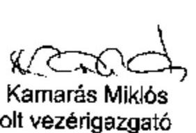

---

# HORVÁTH GREGELY DOMONKOS úr 

vezérigazgató
Magyar Nemzeti Vagyonkezelő Zrt.

## Budapest

## Tisztelt Vezérigazgató Úr!

Megköszönöm a Magyar Nemzeti Vagyonkezelő Zrt. 2009. évi tevékenységének ellenőrzéséről szóló jelentéstervezet második változatára adott észrevételeiket, azokkal kapcsolatban a következőkről tájékoztatom.

Az egyeztetés során kapott észrevételek többségét hasznosítottuk, javaslataik egy részét a jelentéstervezeten átvezettük, egyes kérdésében azonban - figyelemmel a helyszíni ellenőrzési megállapításainkra - továbbra is fenntartjuk álláspontunkat. A főbb véleményeltéréseket a jelentéstervezet lábjegyzetében megjelenítettük. Azokat a véleményeket nem tudtuk figyelembe venni, amelyeket újabb dokumentumokkal nem támasztottak alá. Kamarás Miklós volt vezérigazgató úr által írt észrevételeket - amely egy korábbi változatra készült - is véleményeztük.

Szíves tájékoztatásul mellékelten megküldöm a jelentéstervezet második változatára tett észrevételeikre, téma szerint csoportosítva adott részletes válaszunkat.

Kérem, észrevételeire adott válaszaink megfontolását és szíves tudomásul vételét.
Budapest, 2010. augusztus 1/3
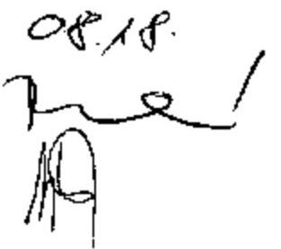

Tisztelettel:
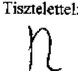

Dr. Becker Pál

---

# A Magyar Nemzeti Vagyonkezelő Zrt. 2009. évi tevékenységének ellenőrzéséről készült V-2011-106/2009-2010. sz. jelentéstervezetre tett észrevételekre adott részletes válaszok 

I.

## Az összegző és a részletes megállapításokban leírtakkal kapcsolatos   MNV Zrt. észrevételek

## 1. Döntéshozatali mechanizmus

A jelentéstervezet 38. oldalán a véleményeltéréseket a 22. lábjegyzetben megjelenítettük.
Az MNV Zrt. véleménye szerint: ,,Általános gyakorlat, hogy a döntéshozó testületek részére a döntés-előkészítés keretében határozati javaslatot is előterjesztenek. Amennyiben a Tanács nem értett volna egyet ezzel a döntéshozatali mechanizmussal, lehetősége lett volna azon változtatni."

A Számvevőszék véleménye szerint az állami vagyonról szóló 2007. évi CVI. törvény 17. § a) pontja arról rendelkezik, hogy az MNV Zrt. előkészíti (és végrehajtja) a Tanács állami vagyonnal kapcsolatos döntéseit. Az, hogy ezt (előkészítés) az MNV Zrt. milyen formában teszi, lehet a döntés-előkészítés a döntést kellően megalapozó, vagy a döntést - pl. egy számításokkal, hatástanulmánnyal nem alátámasztott döntés-előkészítéssel, majd a döntés-előkészítés folyamatában a vezérigazgató által meghozott NVT határozati javaslattal - nem megalapozó. Mivel a döntés-előkészítés folyamatában nem csak maga az adott tárgykör kellő mélységű megismertetése kap hangsúlyt, hanem a vezérigazgató által kiadott NVT határozati javaslatokon keresztül a Vezérigazgató és a Vezetői Értekezlet álláspontja is (amelyre a Tanács a döntéshozatalakor is támaszkodott), ezért - függetlenül attól, hogy a Tanács tagjai a határozati javaslatot módosíthatják - az MNV Zrt. befolyásolta a Tanács döntéshozatalát.

## 2. Nemzetközi Vegyépszer Zrt. költségvetési viszont-garancia

A jelentéstervezet 40. oldalán a véleményeltéréseket a 23. lábjegyzetben megjelenítettük.
Az MNV Zrt. véleménye szerint: Kormányhatározat kiadására - a jogszabályi állami viszont-garanciára tekintettel - nem volt szükség. Az ügylet jóváhagyására jogosult közgyűlés az ügyben határozatképesség hiányában nem hozott határozatot, a garancia nem került kiadásra.

A Számvevőszék véleménye szerint: Kormányhatározat kiadása azért szükséges, mert a jogszabály a kereteket határozza meg, azonban konkrét esetben az állami viszont-garancia egyedi állami viszont-garanciává alakul. Az Áht. állami kockázatvállalásra vonatkozó szabályozása 2009-ben szigorodott. Az Áht. 33. § (6) bekezdése kimondja, hogy egyedi állami garancia abban az esetben vállalható, ha a hitel, a kölcsön visszafizetése a kötelezett pénzügyi helyzetére vonatkozó információk alapján, illetőleg a rendelkezésre álló további fedezetekre tekintettel - az állami garancia beváltása, egyéb állami többlet-támogatás nélkül - kellően biztosított. Az ÁSZ - a garancia kiadásától függetlenül - magáról a döntéshozatalról mondott véleményt.

---

Véleményünk szerint mind a döntéshozatal, mind az azt követő megvalósítás rejthet magában hibát. Attól függően, hogy egy nem célszerű döntés a végrehajtáskor a hiányosságokat kiküszöböli, lehet a döntés kevésbé, illetve a döntés és a végrehajtás hibájából fakadóan jelentősen káros a Magyar Állam számára. A Nemzetközi Vegyépszer Zrt. esetében maga a döntés nem a Magyar Állam elsődleges érdekét szolgálta. Az NVT határozat tartalmazza, hogy ,,kérelmező bedőlése esetén a költségvetés viszont-garanciája beváltásra kerülhet". A Tanács határozata nem egyértelműen és átlátható módon részletezi, hogy a Vegyépszer ügyfélcsoport együttes kockázatának csökkentése érdekében a tulajdonosok milyen intézkedéseket hoznak. Ezek az intézkedések azonban nem kapcsolódnak a Magyar Állam kockázatvállalása mértékének csökkentéséhez. A döntéshozó részére készült előterjesztés kifejti, hogy a Vegyépszer ügyfélcsoport együttes kockázatainak csökkentése az ügyfélcsoporthoz tartozó Transelektro Ganz-Röck Zrt. likviditási helyzetének stabilizálását jelenti. Az előterjesztés nem ad elégséges információt a 2009. március 18-án bejegyzett Nemzetközi Vegyépszer Zrt. tevékenységi köréről, vagyoni helyzetéről, a közmű beruházások terén szerzett tapasztalatairól.

# 3. Országos Húsipari Kutatóintézet Kht. részére támogatás-nyújtás 

A jelentéstervezet 2. sz. melléklet 7. oldalán a véleményeltéréseket az 5. lábjegyzetben megjelenítettük.

Az MNV Zrt. véleménye szerint ,,..a privatizáció megvalósulásáig a tulajdonosi joggyakorlónak a többi társasághoz hasonlóan az OHKI esetében is a jó gazda gondosságával kell eljárnia, fenntartva a Társaság működőképességét." „A 2009-ben nyújtott támogatás célja volt, hogy a folyamatosan maga előtt görgetett kölcsön tartozást a Társaság vissza tudja fizetni."

Az ÁSZ véleménye szerint a tulajdonosi támogatásról szóló határozat és a megkötött támogatási szerződés a támogatás összegéhez eltérő rendeltetést kapcsolt. Az OHKI Kht. 20 M Ft reorganizációs célú támogatásban részesítéséről határozott a vezérigazgató, a megkötött támogatási szerződés meglévő - a szerződésben nem meghatározott összegű - támogatás visszafizetésére történő felhasználásról rendelkezik.

## 4. „Fradi-pálya" építési beruházás

Az MNV Zrt. véleménye szerint ...a Budapest IX. ker. Könyves Kálmán krt. - Gyáli út 10. szám alatti ún. „Fradi Pálya" ingatlan 2008. április 9-én kötött adásvételi szerződésével kapcsolatban leírtakkal ellentétben véleményünk szerint a hivatkozott megállapodás vonatkozásában nem volt a szerződéses vállalás nem teljesülése okán végrehajtott, a Magyar Állam számára hátrányos eredményű szerződésmódosítás.

A Számvevőszék véleménye szerint az észrevétel nem fogadható el, mert tényszerűen megállapítható, hogy a szerződésben vállalt 1,2 Mrd Ft-os beruházás nem valósult meg. A szerződés megkötésekor az eladó nem volt körültekintő, a döntés nem volt megalapozott. Ezt az Önök véleménye is alátámasztja, amely szerint a korábban megkötött szerződés szűk mozgásteret biztosít a vevő ellenőrzésére, illetve olyan feltételeket szabott, amely a vevő számára nem volt teljesíthető.

A jelentéstervezet 63. oldalán a megállapítást pontosítottuk:
„A vevő a szerződésben vállalt kötelezettségét azonban nem teljesítette, a felújítás nem történt meg. A 2008. április 9-én megkötött szerződést az FTC és a vevő - az MNV Zrt. beleegyezése nélkül - közösen módosították."

---

# 5. Erdőgazdasági társaságok informatikai fejlesztése 

A jelentéstervezet összegzője az erdőgazdasági társaságok informatikai fejlesztésre kapott forrásait értékeli, ezért a 20. oldal utolsó bekezdését a 3. sz. függelékkel összhangban módosítottuk. A jelentéstervezet 77. oldalán a véleményeltéréseket a 72. lábjegyzetben megjelenítettük.
„A 19 erdőgazdasági társaságnak az egységes informatikai rendszer kialakítására 2008 decemberében összesen 1498 M Ft értékben tulajdonosi jegyzett tőkeemelést hagytak jóvá, amelyből 2009. évben 600 M Ft-ot felhasználtak. 2003-2007 között informatikai és ügyviteli eszközök beszerzésére összesen 950 M Ft-ot fordítottak az erdészeti társaságok. A 2009-es egységes informatikai rendszer sem valósult meg eredményesen, a követelmény rendszer nem volt egységesen meghatározva. ,,

Az MNV Zrt. véleménye szerint az egységes elszámolási és informatikai rendszer kialakítása indokolt volt a homogén portfoliók tekintetében.

Az ÁSZ véleménye szerint az egységes informatikai rendszer előkészítése, irányítása és ellenőrzése nem volt eredményes. Ha az egységes követelmény rendszer meg volt határozva, akkor azt a szereplők nem értelmezhették különböző módon.

## 6. Consact Kft.-vel kötött Megbízási szerződés

A jelentéstervezet 84. oldalán a véleményeltéréseket a 81. lábjegyzetben megjelenítettük.
Az MNV Zrt. véleménye szerint a jelentés konkrét adatok, hivatkozások és indoklás bemutatása nélkül szubjektív módon jutott az ott megfogalmazott megállapításra, ezért fenti indokaink alapján a jelentés megállapítását annak szubjektivitása miatt is szükségesnek tartjuk törölni.

Az ÁSZ fenntartja azt az álláspontját, hogy nem volt összhangban a díjazás és az elvégzett munka, nem volt szükséges a belső munkaszerővel is elvégezhető feladatra külsős megbízás.

## 7. Javaslatok címzettje

A javaslatokat az MNV Zrt. igazgatóságának elnöke helyett, az MNV Zrt. igazgatóságának fogalmaztuk meg.

## 8. Közbeszerzési szabályzat

A jelentéstervezet 29. oldalán a véleményeltéréseket a 15. lábjegyzetben megjelenítettük.
Az MNV Zrt. véleménye szerint az eseti szabályzatok a jelentésben hiányoltakat maradéktalanul tartalmazták, eseti szabályzat készítésére pedig a Kbt. lehetőséget ad.

Az ÁSZ véleménye szerint az eseti közbeszerzési szabályzatok visszautalnak az akkor hatályos Kbt. 6. §-ra, azonban ez a bekezdés pont arra utal, hogy a közbeszerzési szabályzatban mit kell meghatározni.

## 9. Munkaszerződés-kötési gyakorlat

A jelentéstervezet 31. oldalán a véleményeltéréseket a 16. lábjegyzetben megjelenítettük.

---

Az MNV Zrt. véleménye szerint:, ...egységes az MNV Zrt. munkaszerződés kötési gyakorlata, mely szerint azon vezető állású munkavállalók esetében, akik korábban az MNV Zrt. jogelőd szervezeténél, az ÁPV Zrt.-nél kerültek foglalkoztatásra, de a munkaviszonyuk időközben megszüntetésre került, az érintettek munkaszerződésében az MNV Zrt.-vel történő új munkaviszony létesítésekor csak a Mt. szerinti felmondási időre vonatkozó rendelkezések kerülhettek rögzítésre."

Az ÁSZ véleménye szerint az MNV Zrt. belső szabályzatai a munkaszerződések megkötésére irányadó - az Mt, illetve a 2173/2003. (VII. 29.) Korm. határozat szerinti - egységes feltételrendszert 2009-ben nem tartalmaztak. Egyes 2009-ben megkötött munkaszerződések év közben a felmondási idő meghatározása miatt módosultak, az irányadó szempontra történő hivatkozás - a konkrét személy esetében - változott.

# 10. A munkaviszony időtartamának számítása 

A jelentéstervezet 33. oldalán a véleményeltéréseket a 17. lábjegyzetben megjelenítettük.
Az MNV Zrt. véleménye szerint „az MNV Zrt.-nek a munkaviszony létesítésekor nemcsak a Vtv., hanem valamennyi irányadó jogszabályi rendelkezést (így pl. a közalkalmazottak jogállásáról szóló 1992. évi XXXIII. törvény (továbbiakban Kjt.), illetve a köztisztviselők jogállásáról szóló 1992. évi XXIII. törvény (továbbiakban Ktv.) előírásait is) figyelembe kellett, illetve kell vennie. Így azon munkavállalók esetében, akik korábban más, de a Kjt., illetve a Ktv. hatálya alá tartozó szervezetnél álltak jogviszonyban és ez éppen az MNV Zrt.-vel történő munkaviszony létesítésük okából került megszüntetésre az MNV Zrt.-nek a Ktv., illetve a Kjt. munkaviszony megszüntetésre vonatkozó rendelkezései figyelembevételével kellett, illetve kell eljárnia."

A Számvevőszék véleménye szerint a munkáltatói rendes felmondás esetére járó felmentési idő és végkielégítés számítását képező jogosultság időtartamát több esetben úgy határozta meg az MNV Zrt., hogy a munkavállalónak az MNV Zrt.-nél fennálló munkaviszony időtartamához hozzászámította a korábbi munkáltatójánál eltöltött munkaviszonya időtartamát, holott ezt a Vtv. csak az elődszervezetek esetében tette lehetővé. A Mt. szerint a munkaszerződés feltételeinek meghatározásában fennálló szerződéskötési szabadság alapján - mely szerint a munkavállaló javára tehetséges kedvezőbb feltételek megállapítása - álláspontunk szerint nem lehet úgy értelmezni, hogy korábban lezárt, megszüntetett jogviszonyokra tekintettel az MNV Zrt. részére (esetleges) fizetési kötelezettséggel járó szerződési feltételeket állapítson meg. Az ilyen tartalmú szerződéses kikötéseknek - az elődszervezetektől eltekintve - jogszabályi alapja nem volt, az a felek megállapodásán alapult.

## 11. Javadalmazási szabályok

A jelentéstervezet 35. oldalának 4-7. bekezdését az alábbiak szerint módosítottuk:
„A köztulajdonban álló gazdasági társaságok takarékosabb működéséről szóló 2009. évi CXXII. törvénnyel a jogalkotó célja többek között az volt, hogy a köztulajdonban álló társaságok vezetőinek javadalmazását korlátok közé szorítsa. Ennek érdekében a munkaviszonyban álló vezetők esetére bérplafont, továbbá a prémium és a végkielégítés meghatározásának, kifizetésének szabályait állapította meg. A törvény alapján a közgyűlési jogokat gyakorló személynek - az MNV Zrt. esetében a pénzügyminiszternek - a Takarékossági törvénynek megfelelő javadalmazási szabályzatot kellett kiadnia. E szabályozási cél az MNV Zrt. esetében nem valósult meg, mert a törvény MNV Zrt.-re vonatkozó hatályát az RJGY és az MNV Zrt. eltérően értelmezte."

---

„Az MNV Zrt. - a Javadalmazási Szabályzat egyeztetési szakaszában - olyan álláspontot képviselt, hogy a javadalmazásra továbbra is a Vtv. előírásait, mint speciális szabályt kell alkalmazni, rájuk a Takarékossági törvény előírásai nem vonatkoznak. Az RJGY utasítási jogával élve intézkedett - 3/2010. (II. 9.) RJGY határozat - a törvény rendelkezéseinek megfelelő Javadalmazási szabályzat kiadásáról."
„A Szabályzat hiányossága, hogy a Tanács és az EB javadalmazásáról nem rendelkezett, az elvárható mértéktartás nem volt biztosított, a törvényben foglalt takarékossági elvek az ő esetükben nem érvényesültek. Az egyértelmű törvényi háttér, a takarékossági törvény és a Vtv. rendelkezései összhangjának megteremtése nem történt meg. ..."
„A Számvevőszék az MTI Zrt. 2009. évi tevékenységének ellenőrzéséről készített jelentésében is kifogásolta a takarékossági törvény a vezető tisztségviselők díjazására vonatkozó értelmezését. A Miniszterelnöki Hivatal a jelentéshez fűzött észrevételében megerősítette, hogy a takarékossági törvény fogalomrendszerének a jogalkotó szándéka szerinti értelmezésével - a speciális jogi szabályozással működő társaságok közé sorolt - MTI Zrt. élhetett volna. (19. lábjegyzet)

# 12. Horváth és Társai Ügyvédi Irodával megkötött szerződés 

A jelentéstervezet 42. oldalán a véleményeltéréseket a 26. lábjegyzetben megjelenítettük.
Az MNV véleménye szerint az MNV Zrt. a Kbt. 40. § (2) bekezdésében rögzített egybeszámítási szabályokra maradéktalanul tekintettel volt.

Az ÁSZ véleménye szerint a Kbt. előírásait azért nem tartotta be, mert a rendszeresen végzett szolgáltatásokat nem számította egybe.

## 13. Hollóházi Porcelán Manufaktúra Zrt. „védjegy és márkanév"

A jelentéstervezet 41. oldalán a véleményeltéréseket a 25. lábjegyzetben megjelenítettük.
Az MNV Zrt. véleménye szerint a vezérigazgató általános helyetteseként az agrárportfólióért felelős vezérigazgató-helyettes a vonatkozó előszerződést jogosult volt aláírni. Figyelemmel azonban arra, hogy a vezérigazgató-helyettesek cégjegyzési joga együttes, a szerződésen szükséges cégszerű aláírás teljesítése érdekében valamely másik vezérigazgatóhelyettessel együttesen írhatta csak alá a szerződést.

Az ÁSZ véleménye szerint az agrárportfólióért felelős vezérigazgató-helyettes - felhatalmazás nélkül - a vezérigazgató helyett 2009. július 14-én aláírta a vezérigazgatói határozatot, 2009. július 17-én a társasági portfólióért felelős vezérigazgató-helyettes helyett (a gazdasági vezérigazgató-helyettessel) aláírta az előszerződést. Az előszerződés aláírása nem volt összhangban a cégjegyzési jogról rendelkező NVT határozattal, mert az agrárportfólióért felelős vezérigazgató-helyettes együttesen az agrárportfóliót érintő ügyekben írhat alá.

## 14. Főkönyvi könyvelési rendszer

Az „alapvető hiba" minősítést töröltük.

## 15. Leltározási utasítás

Az MNV Zrt. által javasolt kiegészítést (az MNV Zrt. rábízott vagyonára vonatkozó Leltározási utasítás) az 51. oldalon a 35. lábjegyzetben bemutattuk.

---

# 16. Analitikus nyilvántartás és a főkönyvi könyvelés kapcsolata 

Az 51. oldal 2. bekezdésében az analitikus nyilvántartás és a főkönyvi könyvelés közötti kapcsolatra vonatkozó megállapításunkat fenntartjuk, mert az analitikus nyilvántartás és a főkönyvi könyvelés között az egyezőség nem állapítható meg.

## 17. Leltározást megelőző adategyeztetés

Az MNV Zrt. által javasolt kiegészítést (a leltározást megelőző adategyeztetés, adattisztítási feladatok ellátása) beépítettük.

## 18. KAEG Zrt.

Az MNV Zrt. észrevétele változatlanul nem ad magyarázatot arra, hogy mi akadályozta a földtulajdonosi közösség keretében történő vadászati joggyakorlást, amelyben az írásos nyilatkozatok szerint nem egy kft-t, hanem a KvVM szakállamtitkára levelében is megnevezett állami tulajdonú KAEG Zrt.-t bízták volna meg képviseleti joggal. A szöveg módosítása véleményünk szerint nem indokolt.

## 19. EB és NVT tagok költségtérítése

Fenntartjuk véleményünket, mert a plusz költségek felmerülésének indoka nem volt alátámasztva. Az RJGY, mint tulajdonos pontosan (határozatban) rendelkezett arról, hogy az NVT és az EB tagjai milyen címen és mértékben részesülhetnek költségeik ellentételezésében, amelyek között pl. egészségügyi, oktatási, taxi, saját személygépkocsi használat költségelszámolás nem szerepelt.

## II.

## A jelentéstervezet 2. és 3. sz. mellékletére tett MNV Zrt. észrevételek

## 1. MVM Zrt. közgyűlésére történő „mandátum" kiadás

A 2. sz. melléklet 1. oldalán a véleményeltéréseket az 1. lábjegyzetben megjelenítettük.
Az MNV Zrt. véleménye szerint az előterjesztés az MNV Zrt. belső szabályzatának megfelelően került előkészítésre, a belső véleményeket tartalmazta.

Az ÁSZ véleménye szerint a Tanács 2009 júliusi döntését megelőzően készült előterjesztés szöveges része - a belső vélemények bekezdés alatt - nem tartalmazta a vélemények ismertetését, ami abban az esetben hátrányos a Tanács (mint jelen esetben döntéshozó) számára, ha a belső vélemények mellékletként sem jelennek meg.

## 2. MÁV vagyonkezelésében lévő állami ingatlanok

Az MNV Zrt. észrevételével részben értünk egyet, mert elfogadjuk, hogy a MÁV vagyonkezelésében lévő állami ingatlanok jogi helyzetének rendezése szükséges, azonban az állami vagyon felügyeletéért és a szabályozásért felelős miniszternek a jogi helyzet rendezéséhez szükséges lépéseket már 2009 szeptembere előtt - az ingatlanok hasznosítása érdekében meg kellet volna tenni.

---

# 3. DATÉSZ Zrt. tőkeemelés és kölcsön nyújtás 

A 2. sz. melléklet 3. oldalán a véleményeltéréseket a 3. lábjegyzetben megjelenítettük.
Az MNV Zrt. véleménye szerint az RFH Zrt. által nyújtott összesen 600 millió Ft összegű tőkeinjekcióból csak a tőkeemelésként juttatott 135 millió Ft-ot lehet állami támogatásnak minősíteni, amely tőkeemelés ugyanakkor az átmeneti és csekély összegű támogatásokra vonatkozó szabályok betartásával került végrehajtásra. Az RFH Zrt. által tulajdonosi kölcsönként juttatott 465 millió Ft összegű kölcsön nem minősül támogatás-nyújtásnak a DATÉSZ Zrt. irányában, tekintettel arra, hogy a kölcsön a vonatkozó Európai Bizottsági iránymutatás szerint kalkulált piaci kamatkondíciókkal (ország referencia ráta +200 bázispont) került nyújtásra.

Az ÁSZ véleménye szerint az RJGY és az NVT a döntés meghozatalakor nem - csak a döntés végrehajtásakor - vizsgálta a tőkeemelés és a tagi kölcsön nyújtás feltételeit. Az MNV Zrt. nem adott pontos, dokumentum-másolattal alátámasztott tájékoztatást az FVM támogatásvizsgáló irodájának álláspontjáról. Az MNV Zrt. hivatkozott az RFH Zrt. Igazgatósága által hozott 38/2009. (07. 14.) sz. határozatra, a tőkeemelés és a tagi kölcsön mértékének számításokkal alátámasztására. Ehhez képest a 1105/2009. (VII. 6.) Korm. határozat módosítására kiadott 1141/2009. (VIII. 26.) Korm. határozat a számítások és az egyeztetések ellenére nem határozta meg a „többségi tulajdon eléréséhez szükséges tőkeemelés" mértékét.

## 4. Nemzetközi Vegyépszer Zrt. költségvetési viszont-garancia

Az NVT - a Nemzetközi Vegyépszer Zrt. közmű hálózat projektjéhez kapcsolódó - költségvetési hátterű garancia kiadásához való hozzájárulásáról kialakított véleményünket a 2. pontban részleteztük.

## 5. Hollóházi Porcelán Manufaktúra Zrt. vezérigazgatójának prémium kifizetése

A 2. sz. melléklet 5. oldalán a véleményeltéréseket az 4. lábjegyzetben megjelenítettük.
Az MNV Zrt. véleménye szerint az MNV Zrt. a társaság vezérigazgatójának prémiumáról a társaság javadalmazási szabályzatával és prémium kitűzésével összhangban döntött.

Az ÁSZ véleménye szerint a Tanács a döntéshozatalt nem tartotta egy kézben. Az MNV Zrt. vezérigazgatója járult hozzá a Hollóházi Porcelán Manufaktúra vezérigazgatójának prémium kifizetéséhez, a Tanács - a veszteséges gazdálkodás ellenére - nem vizsgálta és nem mondott véleményt a prémium kifizethetőségéről.

## 6. Duna Palota Nonprofit Kft.-vel kapcsolatos intézkedések

A 2. sz. melléklet 9. oldalán a véleményeltéréseket az 6. lábjegyzetben megjelenítettük.
Az MNV Zrt. véleménye szerint a Tanács a 775/2009. (X. 21.) NVT sz. határozatának III. pontjában foglalt Alapító határozat 5.1-5.3 alpontjaiban részletes intézkedési tervet írt elő a Társaságnak a veszteséges működés megszüntetése érdekében, meghatározott határidőkkel.

A Számvevőszék véleménye szerint az intézkedési terv az azonnali intézkedéseket pl. egyes bérlőkkel a szerződés felmondása tartalmazta, azonban átfogó a társaság egészének működését befolyásoló reorganizációs tervkészítési kötelezettséget az MNV Zrt. a 775/2009. (X. 21.) NVT sz. határozatban nem írt elő, azt csak az új ügyvezetőtől követelte meg.

---

# 7. Hollóházi Porcelán Manufaktúra Zrt. „védjegy és márkanév" 

A Hollóházi Porcelán Manufaktúra Zrt. tulajdonát képező védjegy és márkanév átruházására vonatkozó előszerződéssel kapcsolatos véleményünket a 13. pontban részleteztük, a véleményeltérést a Jelentéstervezet 41. oldal 25. lábjegyzete tartalmazza.

## 8. Magyar Posta Zrt. székház értékesítésének vizsgálata

Korábbi észrevételüket figyelembe véve elfogadtuk az MNV Zrt. EB és az Ernst \& Young Kft. által használt megfogalmazást, hogy a 116/2007. (III. 08.) IG határozat megfogalmazása „eltérő értelmezésekre nyújt lehetőséget". Az eltérő tartalmú értékelés kihat a kötelezettségvállalás felső határával kapcsolatos megállapításra. A szöveg pontosítása ezért nem javasolt.

## 9. Moszkvai Magyar Kereskedelmi Képviselet ingatlanának értékesítése

Az MNV Zrt.-ben - a Moszkvai Magyar Kereskedelmi Képviselet ingatlanának értékesítéséből származó 3,5 Mrd Ft költségvetésbe történő befizetését megelőzően - felvett Jegyzőkönyvvel kapcsolatos megállapítás szövegéből töröltük a „dátum feltüntetése nélkül" szövegrészt.
 III.

## A jelentéstervezet 2. és 3. sz. függelékére tett MNV Zrt. észrevételek

## 1. Vadvilág Megőrzési Intézet megbízása

A Vadvilág Megőrzési Intézet megbízásával kapcsolatos megállapításra vonatkozó pontosítást átvezettük. (,, megbízást az Intézet által adott árajánlat és az Intézet által az MNV Zrt.-től kért adatbázis hiánya miatt visszavonták.")

## 2. Vadászati jog hasznosításáért járó díj beszedése

Változatlanul fenntartjuk álláspontunkat, hogy az MNV Zrt. nem követte a vadászati jog beszedése tekintetében a vagyontörvény változását, nem volt szabályozva 2007-2008. években a vadászati jog után fizetendő díjak beszedése. A szabályozásra és a díjak beszedésre 2009-ben került sor.

A 2. sz. függelék 22. oldalán az MNV Zrt. véleményeltérését az 29. lábjegyzetben megjelenítettük. „Az MNV Zrt. észrevétele szerint „valamint a vadászatról szóló 1996. évi LV. törvényben foglalt nem megfelelő szabályozottság következtében" szöveggel.

## 3. Vadászati jog hasznosításával összefüggő meghatalmazások

A 2. sz. függelék 23. oldalán az MNV Zrt. véleményeltérését a 31. lábjegyzetben megjelenítettük. „MNV Zrt. észrevétele szerint a döntés határozat formájában egyszerűsített módon történik" szöveggel.

## 4. KAEG Zrt. vadászati jog

A 2. sz. függelék 23. oldalán az MNV Zrt. véleményeltérését az 32. lábjegyzetben megjelenítettük.

---

Az MNV Zrt. észrevétele szerint „többségi szavazati jog esetén sem kerülhetett volna sor a vagyonkezelői szerződés alapján a legnagyobb állami többségű vadászterület kialakításra."

Az ÁSZ szerint az MNV Zrt.-nek is megküldött meghatalmazások alapján fenn állt a lehetősége, hogy az állam és a meghatalmazottak által a vadászati terület közel $70 \%$-án földtulajdonosi képviselőnek - egy magántulajdonú Kft. helyett - a KAEG Zrt.-t válasszák meg.

# 5. Richter Gedeon Nyrt. kötvénykibocsátás 

A 3. sz. függelék 5. oldalának 3. bekezdésében az MNV Zrt. korábbi észrevétele és az egyeztetések hatására kivettük a hivatkozást. A Pénzügyminisztérium a Kormány számára készített előterjesztés 3. oldalán a RG kötvények 2009. évi lejáratkori rendezésére tett javaslataira vonatkozó döntést politikai szándéktól tette függővé. Az MNV Zrt. EB 2010. 02. 16-i Ellenőrzési jelentése 9. oldalán a tranzakcióval kapcsolatban tartalmazza a privatizációs cél megjelölést.

A 3. sz. függelék 6. oldalán az MNV Zrt. véleményeltérését az 2-4. lábjegyzetekben megjelenítettük.

Az MNV észrevétele szerint: „A kötvény kibocsátásakor ismert volt az MNV Zrt. számára a kötvényi jegyzők köre, a kibocsátás célja stabil befektetői kör elérése volt, az azóta bekövetkezett változásokról az MNV Zrt. valóban nem rendelkezik információval. Az európai típusú átcserélhető kötvény tulajdonságai miatt ugyanakkor ezen információnak csak a kötvény lejárata előtt lehet majd jelentősége."

Az MNV Zrt. észrevétele szerint: „A Magyar Állam jogszabályi mögöttes felelőssége a makroszintű kockázatot, vagyis az állami fizetőképesség kockázatát hivatott kezelni és nem az idézett mondatban foglalt okokról szól. Emlékeztetőül idézzük a Vtv. azon vonatkozó részét, amire a kötvényfeltételekben is hivatkozás történik a Vtv. 22. § (2) bek. alapján: ha az MNV Zrt.-t terhelő kártérítési, megtérítési, kártalanítási kötelezettség teljesítésére a tárgyévi bevétele vagy kiadási előirányzata nem nyújt fedezetet, a kötelezettség teljesítéséért az állam helytállni köteles."

Az ÁSZ szerint a nemzetközi átcserélhető kötvény kibocsátási gyakorlatban nem jellemző a közvetlen vagy közvetett állami részvétel, ami jelenlegi kötvénykibocsátás során hangsúlyozottá teszi a hazai és a nemzetközi gyakorlatban is egyedi állami részvételből adódó tulajdonosi felelősség kérdését. A kötvénykibocsátás során a Vtv. 22. §-ban rögzítetteken túlmenően a Magyar Állam a közte és a Társ Vezető Forgalmazók között létrejött Jegyzési Garanciavállalási Szerződésben és az erre vonatkozó Levélben foglalták össze a Magyar Államot érintő szavatossági kérdéseket, Kötelezettségvállalásokat, Kártalanításokat, az Irányadó Jog szerinti Mentességről való lemondást.

Az MNV Zrt. észrevétele szerint „a kötvények árazását alapvetően nem a RG. Nyrt. stratégiája, hanem elsősorban (mintegy 90\%-ban) a kötvény kamatfeltételei és csak kisebb részben a lehetséges opció - azaz a RG részvényár, részben a stratégiára visszavezethető volatilitásával kapcsolatos jövőbeni várakozás - értéke befolyásolta."

Az ÁSZ szerint az első kötvénykibocsátás lejáratakor visszaváltott egy kötvény után az ötéves periódusra vonatkozó eredmény $4,28 \%$ volt, a 2. kötvénykibocsátás kedvezőtlenebb jegyzési feltételeket tartalmazott, ami nem indokolja a gyors jegyzést.

---

# 6. MTV Zrt. székház értékesítés 

A 3. sz. függelék 6. pontjában megjelöltük az ÁPV Zrt. döntéshozó fórumát az MTV Zrt. Szabadság téri székházának az értékesítésével kapcsolatban.

## 7. MTV Zrt. által használt ingatlanok bérleti díjáról készült táblázat

A táblázatban a mértékegységeket pontosítottuk.
Budapest, 2010. augusztus 17.

---

# Az MNV Zrt. 2009. évi tevékenységének ellenőrzése keretében Kamarás Miklós úr által észrevételezett jelentéstervezetre adott válasz 

## 1.) NVT határozatok

A szöveget az alábbiak szerint pontosítottuk:
„A meghozott NVT határozatok - jelentős hatású ügyekben - 2009-ben sem biztosították maradéktalanul az állami vagyon feletti tulajdonosi jogok és kötelezettségek ellátását, az állami vagyon megóvásával kapcsolatos feladatok teljes körű végrehajtását."

## 2.) ISO minősítés

Az ISO minősítés megszerzésével kapcsolatos információt köszönettel tudomásul vesszük. A jelentéstervezetünket az ÁSZ elnöke által jóváhagyott program célrendszerének figyelembevételével készítettük el, ami nem tér ki a társaság minősítési rendszerének értékelésére.

## 3.) Everest rendszer fejlesztésére, - támogatására megkötött vállalkozói szerződés

Az 2008. október 10 -én az IDOM 2000 Konzulens Zrt.-vel az Everest rendszer háromfázisú fejlesztésére és rendszertámogatására megkötött vállalkozói szerződés az MNV Zrt. szempontjából előnytelen, mert a szerződésben a fejlesztési feladatok mellett a vállalkozó évi 224 M Ft + áfa díjért három évig rendszertámogatási (üzemeltetési, továbbfejlesztési) feladatokat vállalt. A támogatási díj nagysága nem függ az elvégzett feladatok mennyiségétől és a rendszer készültségi fokától. Az MNV Zrt.-nek a teljes díjat kell fizetnie annak ellenére, hogy a rendszer alacsony készültségi foka miatt a vállalkozó csak a vállalt támogatási szolgáltatások egy részét tudja nyújtani.

Az előnytelen szerződéses konstrukció következményeként az MNV Zrt. a jelenlegi szerződéses feltételekkel nem tudja elérni azt a szerződéses célt, hogy a szolgáltatási díjjal a rendszer karbantartási és továbbfejlesztési költségeit is fedezze a teljes rendszer indulását követő 2 évben. Az MNV Zrt. részére előnytelen szerződéses feltételek és a projekt egy éves csúszása miatt a Társaság 36 szakember/hónap szabadon felhasználható fejlesztőkapacitástól esik el, ami a legalacsonyabb árufejlesztői kapacitással ( 2 M Ft/szakember/hónap) számolva is nettó 72 M Ft értékű szolgáltatást jelent.

Az ajánlatban szereplő, vállalkozói díjat alátámasztó kalkuláció a 3 éves rendszertámogatási időszakra mindösszesen 110 szakember/hónap helpdesk (szakmai segítség nyújtása) kapacitást tartalmazott személyenként nettó $1,6 \mathrm{M} \mathrm{Ft}$ havidíjért. A felhasználói bejelentések fogadásának egy negyedévre eső átlagos költsége mintegy nettó 15 M Ft volt. A rendszertámogatási tevékenység beszámolói szerint a helpdesk szolgálat negyedévenként 30 -nál kevesebb hívást fogadott.

A szerződés leglényegesebb hibája az üzemeltetési, támogatási feladatoktól való elállás szankcionálása az MNV Zrt. szempontjából olyan mértékben hátrányos, hogy a szerződéstől való elállás, vagy a szerződés felmondása akkor is többletköltséget jelent az MNV Zrt.-nek, ha az a vállalkozónak felróható okból következik be. Többek között ez az előnytelen szerződéses konstrukció is hozzájárult ahhoz, hogy az MNV Zrt. a vállalkozó lényeges szerződésszegése ( 60 napot meghaladó csúszása), esetén sem állt el a szerződéstől, mivel elállás esetén a kötbérnél magasabb összeget kellett volna a fizetnie a vállalkozó részére. Az előnytelen szerződés, illetőleg a szerződés módosítás kezdeményezésének elmulasztása az MNV Zrt.-nek vagyoni hátrányt okozott, mert a projekt határidő csúszása miatt 72 M Ft értékű informatikai fejlesztési szolgáltatástól esett el.

---

Az MNV Zrt. az Everest fejlesztés projektvezetési feladatainak ellátására a BRIT TECH Üzleti Tanácsadó Kft.-t, a minőségbiztosítási feladatainak ellátására a Kürt Adatmentő és adatbiztonsági Zrt.-t bízta meg. A vállalkozók kiválasztását és a szerződéses feltételeket szabálytalanságok és a versenyeztetés hiánya jellemezte. Ezek miatt a vállalkozók 2008 szeptemberétől 2009. év végéig összesen nettó 100 M Ft-ot meghaladó értékben, versenyeztetés nélkül kaptak megbízást a feladatok ellátására.

Az MNV Zrt. nem alakította ki, illetve az Everest projekt lebonyolítása során nem alkalmazta teljes körűen a kitűzött szakmai célok teljesülését, valamint az idő- és költségkeretek betartását biztosító projekt ellenőrzést. Az irreális feladattervek, az erőforrás szükséglet tervezésének és ellenőrzésének hiánya, a követelménytámasztás hiányosságai, valamint az előnytelen vállalkozói szerződés kiszolgáltatott helyzetbe hozták az MNV Zrt.-t.

# 4.) Az MNV Zrt. létszámhelyzete 

Az MNV Zrt. vezetése részéről helyes döntés volt a Társaság létszámhelyzetének 2009. évi felülvizsgálata. Az álláshelyek száma 2009. december 31-re a 2008. december 31-i állapothoz képest 27 -tel, míg a szervezet létrehozásakor engedélyezetthez képest azonban 44-gyel nőtt. Az ÁSZ nem magát az álláshely növelést kérdőjelezte meg, hanem azt, hogy ennek (a mértéknek) indokoltságát pontos számításokkal és hatásvizsgálatokkal az MNV Zrt. nem támasztotta alá. Az MNV Zrt. 2009. évi saját vagyon üzleti tervében 427 fő átlagos statisztikai létszámot tervezett, a pénzügyminiszter ezt hagyta jóvá, azonban a főre kimutatott átlagos statisztikai létszám nem azonos a 2009-re engedélyezett álláshelyek számával.

A 2009. évi 27 fős státusz növekményből 4 álláshely esetében nem találtuk a döntést kellően megalapozottnak, mert a Társaság a létszám átcsoportosítás helyett 4 új határozott idejű státusz létesítésével oldotta meg az MNV Zrt. egyes szakterületein összegyűlt elintézetlen ügyek rendezését. A Társaságnál 2009-ben egyrészt nagy volt az ügyirathátralék - amely a Társaság hatékony működésének, a szervezett működtetésnek a hiánya miatt alakult ki -, másrészt az egyes szervezeti egységek között - az ellátandó feladatokhoz képest - nagy volt a létszám aránytalanság. Az MNV Zrt. - a határozott idejű álláshely növeléssel - a helyzet kezelésének egyszerűbb, ám költségesebb módját választotta.

## 5.) Gabonakutató Nonprofit Közhasznú Kft.

A szöveget az alábbiak szerint pontosítottuk:
„A Tanács döntései az alábbi kiemelt esetekben nem szolgálták az állami vagyon védelmét, nem ösztönöztek az állami tulajdonú társaságok veszteséges működésének elkerülésére, és a felelős vagyongazdálkodásra (pl. Gabonakutató Nonprofit Közhasznú Kft.-vel, Gyümölcstermesztési kutatóintézetekkel kapcsolatban hozott határozatok).

A Tanács 2009 októberében a Gabonakutató Nonprofit Közhasznú Kft. részére - a 2009. évi közcélú feladatainak ellátása érdekében - 220 M Ft vissza nem térítendő tulajdonosi támogatás nyújtásáról döntött. A Gabonakutató Kft. tovább működtetésének lehetőségeiről 2009. év első nyolc hónapjában -436 M Ft veszteség felhalmozása ellenére NVT döntés nem született. A Gabonakutató Kft. 2008-ban elkészítteti középtávú reorganizációs terve nem teljesült. Belső strukturális átalakításra 2008-2009-ben nem került sor, a veszteség további növekedésének megállítására a Tanács nem írt elő szigorúan betartandó, a Tanács ellenőrzése mellett végre-

---

hajtandó intézkedési tervet. Ezzel a Tanács nem tett eleget a Vtv. felelős tulajdonosi gazdálkodással szemben támasztott követelményeinek."

Az ÁSZ véleménye szerint a Tanács nem azzal szolgálja az állami vagyon védelmét, ha az állami tulajdonú gazdasági társaságoknak (jelen esetben volt közhasznú társaság) a veszteséges működés elkerülésére tulajdonosi támogatásokat nyújt, hanem azzal, ha a veszteséges működés elkerülése céljából szigorúan betartandó intézkedéseket ír elő, és azok végrehajtását rendszeresen ellenőrzi.

# 6.) Zágrábi nagyköveti rezidencia 

A zágrábi nagyköveti rezidencia érték-összehasonlító vizsgálatával kapcsolatban megjegyezzük, hogy a Jelentéstervezet a főbb megállapításokat, a 2. számú melléklet 17.
 pontja (az alábbiakban dőlt betűvel jelezve) a megállapítások alátámasztását tartalmazza.
„Az MNV Zrt. vezérigazgatója 2009. július 14-én a 886/2009. (VII. 14.) Vg. határozatban támogatta a Külügyminisztérium vagyonkezelésében lévő Zágráb, Tuscanac 16/A. sz. alatti ingatlan nyilvános pályázat útján történő értékesítéséről szóló előterjesztés Tanács elé vitelét, és a Tanács részére határozati javaslatot fogalmazott meg. Ebben az ingatlan (nagyköveti rezidencia) Gazdasági szakterület által felülvizsgált, elfogadott forgalmi értéke 3,6 M EUR. A vezérigazgató határozatát megelőzően - a Vezetői Értekezlet részére - készült előterjesztés megfogalmazza, hogy a 254/2007. (X. 4.) Korm. rendelet 25. § (6) bekezdése szerinti független szakértő által elkészített érvényes forgalmi értékbecslés az MNV Zrt. rendelkezésére áll, és az alapján az értékesítésre vonatkozó döntés meghozható. Az MNV Zrt. Kontrolling Igazgatója az ingatlan forgalmi értékbecslését (épület: 2,8 M EUR, építési telek: 0,8 M EUR nettó forgalmi értékkel) elfogadta. Az ingatlan értékbecslést a Kontrolling Igazgatóság felülvizsgáltatta, a szakvéleményben meghatározott értékeket elfogadta."

A 2. sz. melléklet tartalmazza, hogy az ingatlan forgalmi értékbecslést a Kontrolling Igazgatóság felülvizsgáltatta, az ingatlan forgalmi értékbecslést elfogadta, azonban az Állami Számvevőszék az értékbecslés felülvizsgálatáról az alábbi véleményt alakította ki:
„Az előterjesztés mellett az ANIESZ Kereskedelmi és Szolgáltató Kft. szakvéleményéről készült ANIESZ által küldött feljegyzés található, azon sem a cég képviselőjének, sem a szakvélemény kiadására jogosultnak a neve, sem a cég hivatalos pecsétje nem szerepel, a feljegyzés készítője a cég képviseleti jogával nem rendelkezett. Az ingatlan forgalmi értékbecslés készítője az épületingatlan és az építési telek értékét piaci összehasonlítással nem támasztotta alá, az ingatlan értékének megítélése így önmagában nem volt lehetséges."
„A nagyköveti rezidencia a Magyar Köztársaság Nagykövetsége tulajdonában lévő két épületből és építési telekként nyilvántartott ingatlanból áll. Az épületek alapterülete 946,63 m2, az építési telek 842 m 2 .

A vezérigazgató a Tanács részére készített határozati javaslatban megfogalmazta, hogy az ingatlan nyilvános pályázat útján történő értékesítését megbízás alapján a - vagyonkezelő Külügyminisztérium végezze. A Tanács 2009. július 22-ei ülésén tárgyalta a Tanács döntését megalapozó 2009. július 14-én készült előterjesztést és határozott az előterjesztés kiegészítéséről, annak ismételt beterjesztéséről. 2009. szeptember 5-én a Tanács ülésére - az ingatlanértékelés alátámasztásának céljából - előterjesztés kiegészítés készült, ami tartalmazza egyéb zágrábi ingatlanok értékét."

---

A Tanács 2009. július 22-i ülésén a 2009. július 14-én készült előterjesztés kiegészítéséről döntött. A Tanács azonban csak az előterjesztés kiegészítéséről határozott és nem követelte meg a szakértői értékbecslés - felelős döntéshozatalhoz szükséges - kiegészítését, a nagyköveti rezidencia (épületingatlan és az építési telek) értékének piaci összehasonlításai történő alátámasztását. A piaci összehasonlítást az MNV Zrt. - Ingatlanvagyonért Felelős vezérigazgató-helyettes szakmai irányítása alá tartozó szervezeti egysége - készítette. Az előterjesztéskiegészítés tartalmazza, hogy az MNV Zrt. a zágrábi ingatlanpiaci helyzetről az interneten keresett adatokat. (Pl. 1. régebbi építésű, felújított épület Zágráb központjában, építés éve: 1955, az ingatlan nagysága 300 m 2 , a telek nagysága 880 m 2 , az épület jellemzői: szobák száma 8 , fürdők száma 3 , fürdő szobák 3 , ár: 1.200 .000 EUR, fajlagos ár: $4.000 \mathrm{EUR} / \mathrm{m} 2$;
2. régebbi építésű, felújított épület Zágráb központjában, építés éve: 1960, az ingatlan nagysága 180 m 2 , a telek nagysága: 430 m 2 , az épület jellemzői: emeletek száma 1 , szobák száma 7, fürdők száma 5, ár: 600.000 EUR, Fajlagos ár: 3.333 EUR/m2)
..Az összevetés és értékelés azonban - azon túl, hogy jelentősen eltérő nagyságú ingatlanok kerültek összehasonlításra - nem tette lehetővé a nagyköveti rezidencia értékelés során meghatározott értékének megítélését. A nagyköveti rezidencia esetében a kimutatott fajlagos négyzetméter ár 3826,96 EUR/m2, amely az épület- és telekingatlan összesen 3622716,32 EUR forgalmi értékének és az épületingatlan 946,63 m2 alapterületének a figyelembevételével került kimutatásra. Az összevetés alá vont ingatlanoknál a fajlagos ár az épületek (ajánlati) árának és az épületek területének figyelembevételével alakult ki, ami 3174 és 4000 EUR/m2 között mozgott. A nagyköveti rezidencia esetében azonban kizárólag az épületingatlanra vetített fajlagos négyzetméter ár (2 821216 EUR/946,63 m2) 2980,27 EUR/m2, ami jelentősen elmarad az összehasonlított ingatlanok egy négyzetméterére számított forgalmi értékétől.

Az előterjesztés kiemelte, hogy a nagyköveti rezidencia fajlagos értéke jelentősen meghaladja a piaci forgalomban lévő ingatlanok fajlagos értékét. Értéknövelő tényezőként említi, hogy az érintett ingatlan Zágráb ,,Rózsadombján" helyezkedik el egy ősfás-parkos negyedben, továbbá utal arra, hogy Zágrábban a luxus ingatlanok tekintetében keresleti piac van."
..2009. szeptember 22-én (a 2009. július 16. napjától kinevezett vezérigazgató) határozatot adott ki, amelyben a július 14-én meghozott vezérigazgatói határozatot hatályon kívül helyezte. A kiadott határozat - Tanács részére készített - határozati javaslatában az ingatlan felülvizsgált forgalmi értékét (az összehasonlító értékelemzés birtokában) nettó 3,6 M EUR-ban állapította meg. (A forgalmi érték nem változott.) A Tanács az ingatlan - nyilvános pályázat útján történő - értékesítéséhez a 751/2009. (X. 7.) NVT sz. határozattal hozzájárult, az ingatlan nettó forgalmi értékét 3,6 M EUR-ban határozta meg."

# 7.) A központi költségvetési szervek működéséhez szükséges állami vagyon 

A szöveget az alábbiak szerint pontosítottuk:
„A Vtv. kiemelt célja - miszerint a központi költségvetési szervek működéséhez szükséges állami vagyont az MNV Zrt. az állam teherbíró képességéhez igazodva, a társadalmi szükségletek, a célszerűség és a gazdaságosság szempontjai figyelembevételével elégítse ki - nem teljesült. A központi költségvetési szervek többsége ( $89 \%$-a) a vagyonkezelési/hasznosítási szerződéseket - a piaci alapú vagyonkezelési és bérleti díjak fedezetének hiánya miatt - meg sem kötötte. A korábbi szerződések felülvizsgálata sem valósult meg az előírt határidő, 2008. I. félév végéig. A költségvetési szerveket a miniszterek, a minisztereket a Kormány nem utasította a vagyontörvény végrehajtására, illetve a végrehajtás lehetőségeinek a megkeresésére.

---

2009-ben, mint legegyszerűbb megoldás - a díjak fizetése alóli törvényi mentesítés - eredményezett előrelépést."

# 8.) A Moszkvai Magyar Kereskedelmi Képviselet ingatlanértékesítése 

A moszkvai Magyar Kereskedelmi Képviselet ingatlan értékesítéséből származó 3,5 Mrd Ft költségvetésbe történő befizetésével kapcsolatban megjegyezzük, hogy a költségvetésbe azt lehet befizetni, ami az MNV Zrt. letéti számláján megjelent, azonban nem az NVT 687/2008. (XI. 05.) sz. határozatban előírt összeg került a letéti számlára, így arról átvezetéskor a költségvetésbe befizetésre.

A Tanács a 687/2008. (XI. 05.) NVT sz. határozatának 2. pontjában a - moszkvai Magyar Kereskedelmi Képviseletre érkezett ajánlatok közül - nyertes ajánlattevőnek a 21320626 USD összegű ajánlatot tevő Diamond Air S.a.r.l. társaságot nyilvánította, és kikötötte, hogy az ajánlati pénznemről történő átváltáskor az ajánlattétel időpontjában érvényes MNB középárfolyama szerint számított forint összeget kell figyelembe venni. Az ajánlatok beadási határideje 2008. szeptember 10-e volt (Bontási Jegyzőkönyv is ekkor készült), e napon a 21320 626 USD-nek megfelelő (MNB középárfolyamával számított) forint összeg 3624080007 Ft , így az értékesítési bevételek számlán - a Tanács 2008. november 5-i döntését követően - ennek az összegnek kellett volna megjelenni. Az ajánlattételt megelőzően átutalt 21320626 USD, illetve annak az MNB középárfolyamon számított 2008. március 17-i forint összege 3 529416428 Ft , a Tanács határozata alapján, az ajánlattétel időpontjában számított forint összeg 3624080007 Ft . Az árfolyam differenciából adódó különbség $94,6 \mathrm{M} \mathrm{Ft}$, amelynek költségvetésbe történő befizetése nem történt meg.

## 9.) A Bábolna Zrt. és Bábolna Ménesbirtok Kft.

A Bábolna Zrt. és a Bábolna Ménesbirtok Kft. földhaszonbérleti ügyével összefüggő észrevétel egy korábbi Jelentéstervezet adataiból vont le következtetéseket. Az észrevételben jelezett részek az MNV Zrt. képviselőivel történt egyeztetés alapján maradtak vagy módosításra kerültek a Jelentéstervezetben.

Budapest, 2010. augusztus 17.

---

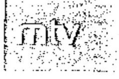

Magyar Televízió Közalapítvány Kuratórium
TKT-581/2010/ÜI/1.

Elnök

Dr. Podonyi László úr
igazgatóhelyettes
Állami Számvevőszék

1363 Budapest
Pf. 54.

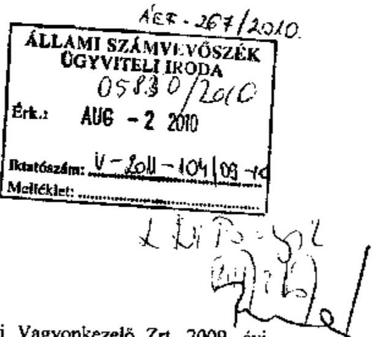

Tisztelt Igazgatóhelyettes Úr!

Megkaptuk jelentéstervezetüket, amely a Magyar Nemzeti Vagyonkezelő Zrt. 2009. évi tevékenységének ellenőrzésére vonatkozik. Ez a jelentéstervezet érinti az MTV Zrt. székházat is.

A tervezetet az elnökség tagjainak megküldtem, legközelebb augusztusban lesz elnökségi ülés. Az Önök által megadott idő rövidségére tekintettel a teljesség igénye nélkül, a következő észrevételeket teszem:

1. Az MTV Zrt. régi székháza - Budapest V., Szabadság tér 17. szám alatt -, eredetileg tőzsde céljára épült, televíziózás céljára alkalmatlan épület. Az évtizedek során elhasználódott, teljes felújításra szorult. Az eredetileg ideiglenes elhelyezésként használatba vett épületben a Magyar Televízió, s korábban részben a rádió is több mint 51 évig működött. Ezen kívül a Magyar Televízió közel harminc helyen tartott fenn bérleményt, így többek között a Budapest III., Kunigunda utca és a Bojtár utca alatt is.

Az egyes bérleményekre vonatkozó bérleti viszonyt 2006-ban a tulajdonos felmondta, így a Kuratórium is a Nádor utca 36. szám alatti ingatlant közel egy évig jogcím nélkül használta.

Már évtizedek óta szükségessé vált a televízió részére megfelelő elhelyezést biztosítani. Ennek az érdekében született az anyagban is említett két kormányhatározat.

Tehát az egyetlen lehetséges és egyben szükséges megoldás volt, az elkészült kiviteli tervek alapján az engedélyezett épület komplexum megépítése.

---

2. Az új székház az irodaépületen túl magában foglalja a gyártóbázist, az ahhoz kapcsolódó raktárakat és a nemzeti kincsnek számító archívumot. Külön erre a célra tervezett épületegyüttesben a televízió megfelelő elhelyezést nyert.
3. Meggyőződésem szerint, csak a hosszú távú elhelyezés biztosítása szolgálja a Magyar Televízió érdekeit. Az épület tervezése és kivitelezése során figyelembe vették a szakemberek által meghatározott feltételeket, a különleges igényeket. Legjobb tudomásom szerint ez az egyetlen épület Magyarországon, amely a televíziózás céljára épült.

Ezért csak a hosszú távú bérlet biztosította a Magyar Televízió érdekeit és szolgáltatott alapot a technikai megújulásra.

A jelentésből kimaradt az a fontos szakasza a Bérleti Szerződésnek, hogy 20 év után a bérleti jogviszony egyoldalúan felmondható, a televízió akkori tulajdonosa, vezetése eldöntheti, hogy kívánja-e továbbra folytatni a jogviszonyt, vagy sem. Célszerű és a valóságnak is az felel meg, hogy a 20 éves periódust vesszük figyelembe.

Tudomásom szerint 15-20 év kell a teljes technikai megújuláshoz.
A televízió átköltözése több mint két évet vett igénybe.
Tehát éppen a rövid határidőre kötött Bérleti Szerződés nem szolgálná a Magyar Televízió érdekeit.
4. Sajnos 2009-ben az Országgyűlés úgy döntött, hogy a korábbi évek folyósítását nem követve 9,5 milliárd forinttal kevesebbet juttat a Magyar Televízió számára. Ez lehetetlenné tette a technikai megújulás folytatását és a Magyar Televízió kényszerpályára került. Reményeim szerint a médiajogszabályok folyamatban lévő változása megteremti az alapot a technikai megújulás folytatására. A Magyar Televízió talán Európa legelavultabb műszaki eszközparkjával rendelkezik. 2012-ben az európai uniós előírásoknak megfelelően meg kell teremtenünk a digitális átállást. A technikai háttér egy része beépült, illetve beépül az épületekbe.
5. Legjobb tudomásom szerint a bérleti díj euróban való meghatározása a piac követelménye volt. Évek óta Magyarországon is (s már nem csak a jelentősebb ingatlanok piacán), a bérleti díjat vagy euróban számolják,
 vagy euróhoz viszonyítják.

---

6. A kuratórium elnöksége 2009 nyarán és őszén olyan határozatokat hozott, hogy az MTV Zrt. vizsgálja felül az összes hosszú távú szerződését, amely jelenleg is folyamatban van.

Budapest, 2010. július 28.
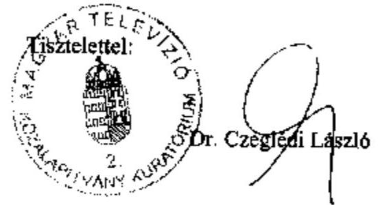

---

# Dr. Czeglédi László 

elnök
MTV Közalapítvány Kuratórium
Budapest

## Tisztelt Elnök Úr!

Az MNV Zrt. 2009. évi tevékenységének ellenőrzéséről készült jelentéstervezet MTV Zrt. székháza kapcsán tett észrevételeit köszönjük, azokat a jelentéstervezeten részben átvezettük.

Az MTV Zrt. korábbi, Szabadság téren elhelyezkedő székháza és az új bérleménybe való költözés közötti évtized eseményeit a Jelentéstervezet tényszerűen, időrendi sorrendben mutatja be, a különböző szintű döntési mechanizmusok hatásainak megjelenítésével. Az elhelyezési körülmények javításának szükségessége mellett a megvalósítás időbeni elhúzódása és a döntési alternatívák változása viszont hátrányosan érintették mind a Társaság, mind a Magyar Állam érdekeit. A bérleti díj euróban történő elszámolása egyrészről az ingatlanpiacon érvényesült szokássá vált az utóbbi években, másrészről nem ismert kizáró ok arra vonatkozóan, hogy az ingatlanpiacon bevált szokás ellenére egy jelentős méretű beruházás esetében forintban, vagy a deviza kitettséget minimalizálva kössenek meg egy bérleti szerződést.

A bérleti jogviszony korszerű elhelyezési feltételeket teremtett, beleértve a gyártási tevékenységet és a kulturális örökség részét képező archívumot is. A hosszútávra szóló megállapodás amellett, hogy elhelyezési biztonságot jelent az MTV Zrt. számára, egyben a bérbeadó felé történő kiszolgáltatottságot is eredményez, amennyiben az MTV Zrt. gazdálkodása nem teszi lehetővé a bérleti díj határidőben történő fizetését. Az MTV Zrt. gazdálkodását érintő 2009-ben hozott intézkedések is utalnak a Társaság törékeny gazdálkodására.

A jelentéstervezeten a 20. év végén fennálló bérleti jog egyoldalú felmondására vonatkozó észrevétel átvezetésre került, azzal a kiegészítéssel, hogy a felmondás esetén ismételten gondoskodni kell az MTV Zrt. elhelyezési igényeiről, ami tovább ronthatja a jelenlegi megoldás költségeire, illetve hatékonyságára vonatkozó megítélést.

Budapest, 2010. augusztus 4 .

Tisztelettel:
Dr. Podonyi László igazgatóhelyettes

---

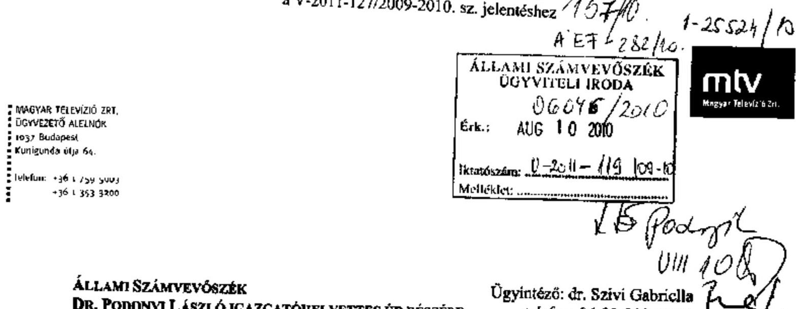

ÁLLAMI SZÁMVEVŐSZÉK
DR. PODONYI LÁSZLÓ IGAZGATÓHELYETTES ÚR RÉSZÉRE
1364 Budapest, Pf. 54.
Ügyszám: V-2011-88/2009-2010.

Ügyintéző: dr. Szivi Gabriella
telefon: 06-30-510-3130,
e-mail: gabriella.szivi@mtv.hu

TISZTELT IGAZGATÓHELYETTES ÚR!

A fenti számon érkezett számvevői jelentés kivonatát kézhez vettem, köszönöm. A jelentéssel kapcsolatban az alábbi észrevételeket teszem:

A jelentés Összegző részében tévesen szerepel két állítás:

- Az ingatlanpiacon évek óta az Euro-hoz igazított díjakra tekintettel valamennyi jogügylet deviza-alapon köthető meg, arra is figyelemmel, hogy közép- és hosszútávon az esetleges árfolyam-ingadozások hatása kiegyenlítődik.

- A jelentés e részében (a 12. sorban) elírásként a „2000-ben 7 Mrd Ft kivitelezési költséggel elhatározott, az MTV Zrt. számára saját tulajdont eredményező székházprojekt helyett...” kifejezés szerepel. Ezzel ellentétben tény, hogy már 1999-2000-ben, a székházprojektre vonatkozó kormányhatározatokban is az szerepel, hogy az MTV Zrt. székháza állami tulajdonban álló cég ingatlanán, e cég tulajdonába kerülve épül majd fel – tehát a kormány-szintű döntések már kezdettől nem az MTV tulajdonában álló székház felépítésére vonatkoztak.

A jelentés 3.3.2. pontjának második bekezdése második mondatában a négy vizsgált székház- beruházásra egységesen vonatkozó megállapítás, mely szerint „a társaságok közel azonos időben döntöttek... saját tulajdonú irodaházaik bérleti jogviszony keretében történő változtatására” ilyen formában nem helytálló. Az MTV Zrt. tulajdonában álló Szabadság téri székház értékesítése 1999-ben megtörtént, és a kormányzati döntések következtében nem az MTV döntött székházának tulajdonjogáról, helyszínéről és – a helyszín meghatározottsága eredményeként – a szerződő partner személyéről.

A 4. pont utolsó előtti bekezdése – a fent már hivatkozott okból – szintén tévesen használja az „MTV Zrt saját tulajdont eredményező székház építése” kifejezést. A székház az eredeti tervek szerint is az állam (ill. az ÁPV Rt.) tulajdona lett volna.

---

A 4. pont utolsó bekezdésének első mondata félreértelmezésre ad alapot: az MTV Zrt ti. nem „felélte" az ingatlanai értékesítéséből származó 10200 M forintot, hanem 2001-ig minden ebből eredő bevételét köz- és szállítói tartozásai rendezésére fordította. (A székház eladásának indoka egyébként éppen ez volt: a tartozások rendezése érdekében - a kormányzattal előre egyeztetett módon, mivel a költségvetés másként nem tudta volna ezt finanszírozni - az MTV ezzel a megoldással jutott forráshoz.)

Az MTV Zrt. összességében kiemeli, hogy a székház-projekttel kapcsolatban az MTV Zrt-nek és a tulajdonosi jogokat gyakorló MTV Közalapítvány Kuratóriumának a kormányzati döntések eredményeként kialakult korlátozott mozgástérben kellett az MTV elhelyezését biztosítani a közfeladatokat ellátását megfelelően biztosító székházban és gyártóbázison az alábbiak szerint:

Az eredeti kormányhatározatok meghatározták az új székház pontos helyszínét, és mivel e határozatokat a Millenniumi Média Kft. privatizálásakor nem módosították - a kijelölt ingatlan mindenkori tulajdonosával (tehát pályáztatás, versenyeztetés esélye nélkül, rosszabb tárgyalási pozícióból) volt kénytelen megállapodni a bérlet részleteiről.

A jelentéstervezetben rögzített számadatokkal kapcsolatban a korábbiakban jelzett korrekciós igényünket - annak felülvizsgálatát követően - a továbbiakban nem tartjuk fenn.

Kérem, ha bármilyen további kérdés felmerülne az adatokkal kapcsolatban, szíveskedjenek akár levélben, akár közvetlenül az ügyintéző jogásznak jelezni!

Az MTV észrevételeinek a nyári szabadságolások miatti csúszásáért ezúton is szíves elnézésüket kérjük.

Budapest, 2010. augusztus 5.
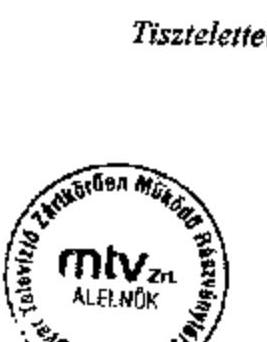
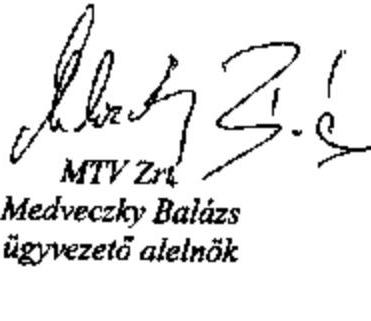

---

# V-2011-117/2009-2010. 

Medveczky Balázs úr ügyvezető alelnök Magyar Televízió Zrt.

Budapest

## Tisztelt Alelnök Úr!

Megköszönöm a Magyar Nemzeti Vagyonkezelő Zrt. 2009. évi tevékenységének ellenőrzéséről szóló jelentéstervezet második változatára adott észrevételeiket, azokkal kapcsolatban a következőkről tájékoztatom.

A pontosító, kiegészítő észrevételeit átvezettük azonban figyelemmel a helyszíni ellenőrzés megállapításaira néhány észrevételüket nem fogadjuk el. Az MTV Zrt. korábbi, Szabadság téren elhelyezkedő székháza és az új bérleménybe való költözés közötti évtized eseményeit a jelentéstervezet tényszerűen, időrendi sorrendben mutatja be, a különböző szintű döntési mechanizmusok hatásainak megjelenítésével. Az elhelyezési körülmények javításának szükségessége mellett a megvalósítás időbeni elhúzódása és a döntési alternatívák változása viszont hátrányosan érintették mind a Társaság, mind a Magyar Állam érdekeit. Továbbra is fenntartjuk azon véleményünket, hogy a bérleti díj euróban történő elszámolása egyrészről az ingatlanpiacon érvényesült szokássá vált az utóbbi években, másrészről nem ismert kizáró ok arra vonatkozóan, hogy az ingatlanpiacon bevált szokás ellenére egy jelentős méretű beruházás esetében forintban, vagy a deviza kitettséget minimalizálva kössenek meg egy bérleti szerződést.

Az MTV Zrt. székházának 2000. évben elhatározott megvalósítási koncepciója az MTV Zrt. számára nem bérleti konstrukció keretében, hanem egy állami tulajdonú társaság ingatlanán történő elhelyezésre vonatkozott. A megállapítást, miszerint épületek megvásárlása kedvezőbb feltételeket teremtett volna a bérleti jogviszonynál, a 0743. sz. ÁSZ jelentés 1. sz. Függeléke részleteiben is megalapozta.

A jelentéstervezetben szereplő négy székházprojektben egyöntetű döntést megalapozó vélemény volt, hogy azok korszerűtlenek, gazdaságtalanok, ezért értékesítésük és a központi irányítás új bérleti konstrukcióban történő elhelyezése indokolt. Az egyes székházak

---

értékesítése nem minden esetben valósult meg a jelentéstervezet lezárásáig, ami az eredeti döntések indokoltságát és a megtérülési számítások eredményét kérdőjelezi meg. A jelentéstervezetben szereplő négy székházprojekt bérleti konstrukcióban történő elhelyezésének összehasonlítása eredményeként helytállóan állapítottuk meg, hogy a bérelt irodaházakban történő elhelyezés közel azonos időszakban (2007. 10. 01. és 2009. 02. 28.) valósult meg, ezért a jelentéstervezet változtatása nem indokolt.

Az ingatlanok értékesítéséből származó 10200 M Ft-ot a tartozások rendezésére fordította az MTV Zrt. az észrevétel szerint, ami megfogalmazásában különbözik a jelentéstervezet szövegezésétől, de tartalmában megegyezik azzal, hogy nem az új székház-beruházás kiadásait finanszírozták, hanem a folyó kiadásokra fordítódott az ingatlanok eladásából származó bevétel.

Az ÁSZ jelentéstervezete tényszerűen, az MTV Zrt. és a mindenkori Kormány döntési kompetenciájának, illetve „mozgásterének" megfelelően tünteti fel a székházakkal kapcsolatos eseményeket.

Kérem, észrevételeire adott válaszaink megfontolását és szíves tudomásul vételét.

Budapest, 2010. augusztus 19.

Tisztelettel:
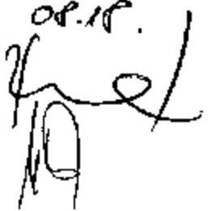

Dr. Becker Pál

---

1. sz. melléklet a V-2011-127/2009-2010. sz. jelentéshez

1198/2010. KET-251/10.

veág 468/2010
Gazdasági vezérigazgató-helyettes
Iktatószám nálunk: GVH-2644-3/2010.
Iktatószám Önöknél:

Állami Számvevőszék
Dr. Becker Pál
főigazgató úr részére

Budapest
Apáczai Csere János u. 10.
1052

Tisztelt Becker Úr!

Budapest, 2010.08.09.

Hecsédin Vera
aus, P.

ÁLLAMI SZÁMVEVŐSZÉK
ÜGYVÉDELMI IRODA
06145/2010
Erk.: AUG 13 2010

Iktatószám: V-2011-121109-H
Melléklet:

Köszönettel vettem kézhez az MNV Zrt. 2009. évi tevékenységének ellenőrzéséről készített
Jelentés-tervezetet, illetve annak az MVM Zrt.-re vonatkozó kivonatát.

Tájékoztatom, hogy további észrevételt a záró tervezetre nem kívánunk tenni.

Tisztelettel:

Baj Csaba Sándor
vezérigazgató

Magyar Villamos Művek Zrt.

Lehőcz Balázs Gábor
gazdasági vezérigazgató-h.

---

# Az RJGY, a Tanács és az MNV Zrt. vezérigazgatója egyes konkrét ügyekben hozott döntéseinek bemutatása 

A pénzügyminiszter 2009-ben 35 RJGY határozaton keresztül érvényesítette hatáskörét, amelynek 17\%-a kormánydöntést követően került kiadásra. E határozatokhoz NVT határozatok kapcsolódtak.

1. A Kormány, a 1097/2009. (VI. 23.) Korm. határozatban a Vértesi Erőmű Zrt. további működtetése, a jogszerű működtetés keretében a Magyar Villamos Művek Zrt. általi - tulajdonosi eszközökkel biztosított - finanszírozása és az MVM Zrt. hatékonyságnövelő intézkedései, a magántőke bevonásával a veszteségfinanszírozás mérséklése, összességében az Erőmű tartós továbbműködtetése mellett döntött. E feladatok teljesítésére a pénzügyminiszteren keresztül az NVT-t hívta fel, a pénzügyminiszter 2009. november 30-ig történő beszámoltatása mellett. A pénzügyminiszter a 18/2009. (VI. 25.) sz. RJGY határozatában a Kormányhatározatba foglalt szükséges intézkedéseken túl határozott a Vértesi Erőmű Zrt. középtávú legalább nullszaldós működése esetén a működtetés megszüntetése lehetőségének vizsgálatáról, valamint utóbbi esetében a Tanács 2010. március 31-éig, (a 32/2009. (XI. 23.) sz. RJGY határozattal történt módosítást követően) 2010. július 31-éig történő beszámoltatásáról.

Az RJGY határozatokban megjelenő feladatok a Magyar Villamos Művek Zrt. közgyűlésén történő szavazásról (mandátum) kiadott 584/2009. (VII. 01.) és a 889/2009. (XII. 16.) NVT sz. határozat részét képezték (a Tanács nem külön határozatba foglalt „mandátum" kiadással fogadta el a Vértesi Erőmű Zrt. működtetése érdekében szükséges intézkedéseket), ami önmagában - az MNV Zrt. számára is - rontotta a döntéshozatal átláthatóságát. A Tanács 2009. júliusi döntését megelőzően belső véleményeket nem tartalmazó előterjesztés ${ }^{1}$ készült.

Az előterjesztés utal arra, hogy a Vértesi Erőmű Zrt.-t jelentős pénzügyi veszteség érte, ami azért következett be, mert a System Consulting Zrt. villamos energia kereskedelmi tevékenységet végző gazdasági társaság nagymennyiségű villamos energia megvásárlására kötött keretszerződést, majd - miután az Erőmű nagy mennyiségű villamos energiát vásárolt - a szerződéstől előzetes értesítés nélkül elállt, a szerződött villamos energia mennyiséget nem vette át.

[^0]
[^0]:    ${ }^{1}$ Az MNV Zrt. véleménye szerint az előterjesztés az MNV Zrt. belső szabályzatának megfelelően került előkészítésre, a belső véleményeket tartalmazta.
    Az ÁSZ véleménye szerint a Tanács 2009. júliusi döntését megelőzően készült előterjesztés szöveges része - a belső vélemények bekezdés alatt - nem tartalmazta a vélemények ismertetését, ami abban az esetben hátrányos a Tanács (mint jelen esetben döntéshozó) számára, ha a belső vélemények mellékletként sem jelennek meg.

---

A Vértesi Erőmű Zrt. működtetése érdekében meghozott intézkedések eredményeiről történő tájékoztatásra az RJGY 2009. október 31-ei határidőt szabott a Tanácsnak, azonban a Tanács a számára előírt határidőben a - Vértesi Erőmű Zrt. működésével kapcsolatban az MVM Zrt. részéről - megtett intézkedésekről az RJGY felé nem számolt be.

A Tanács az MVM Zrt. 2010. február 15-ei rendkívüli közgyűlésére - a 140/2010. (II.10.) NVT határozatban - kiadott mandátummal határozott arról, hogy az MVM Zrt. megtette a szükséges intézkedéseket a Vértesi Erőmű Zrt. jogszerű működtetése és ennek keretén belül a finanszírozás tulajdonosi eszközökkel való biztosítása érdekében, továbbá hozzájárulását adta ahhoz, hogy az MVM Zrt. Igazgatósága a Vértesi Erőmű Zrt. fizetésképtelensége esetén a csődeljárást indítsa el.
2. A Kormány a 1133/2009. (VIII. 7.) Korm. határozatban a helyközi közösségi közlekedés átalakításáról döntött. Az állami vagyon felügyeletéért felelős miniszter felelősségével az integrált regionális közlekedési rendszer kialakítása érdekében a Volán társaságok, valamint (a közlekedésért felelős miniszterrel és a kormánybiztossal) a MÁV Zrt. pályavasúti és személyszállítási tevékenységének szervezeti átalakítására-, a közösségi közlekedés hosszú távú fenntartható és az átalakítás középtávú finanszírozására vonatkozó javaslatok kidolgozásáról; a rendezetlen jogállású ingatlanállomány rendezése érdekében az MNV Zrt. és a MÁV Zrt. közötti megállapodás létrehozásáról határozott. A Kormány a feladatok végrehajtására 2009. szeptember 15-ei, szeptember 30-ai, (a megállapodás létrehozására) 2009. augusztus 31-ei határidőt szabott. A pénzügyminiszter a 21/2009. (VIII. 12.) sz. RJGY határozatában (a határidő és az együttműködésben résztvevők megjelölésével) felkérte a Tanácsot, hogy megvalósítási ütemtervet, számszerűsített költségvetési, vagyongazdálkodási hatásokat is bemutató javaslatot dolgozzon ki a Volán társaságok, integrált regionális közlekedési rendszer kialakítását lehetővé tevő átalakítására; az MNV Zrt. és a MÁV Zrt. közötti megállapodás létrehozására. A Tanács felkérése kiterjedt továbbá a közösségi közlekedés hosszú távú fenntartható finanszírozásáról szóló javaslat folyamatos (kormányhatározat szerint 2009. szeptember 30-ig történő) kidolgozásában való részvételre.

A Tanács a 702/2009. (IX. 2.) NVT sz. határozatával elfogadta a Volán társaságok szervezeti átalakítására vonatkozó javaslat pénzügyminiszternek történő megküldését, és határozott az MNV Zrt. vezérigazgatójának, a közösségi közlekedés hosszú távú fenntartható finanszírozásáról szóló javaslat kidolgozásában való együttműködéséről. A Tanács a Volán társaságok stratégiai szövetségbe szervezésére (egyes tevékenységek közös megszervezésére) vonatkozó javaslatot tett. Az NVT véleménye szerint ez a szervezeti struktúra olcsóbb együttműködést, - a helyközi közlekedési szolgáltatás összköltségéhez viszonyítva - néhány százalékos eredményjavulást eredményezhet. A Tanács ugyanakkor kifejtette, hogy ez a szervezeti forma mélyebb szervezeti változtatásokra nem ad lehetőséget. Az NVT részéről nem született olyan javaslat, ami a Volán társaságok szervezeti átalakításával lehetővé

---

tenné az integrált regionális közlekedési rendszer kialakítását. ${ }^{2}$ Nem készült megvalósítási ütemterv, számszerűsített költségvetési, vagyongazdálkodási hatásokat is bemutató javaslat.

A Tanács a 703/2009. (IX. 2.) NVT sz. határozattal jóváhagyta az MNV Zrt. és a (100%-ban állami tulajdonban lévő) MÁV Zrt. közötti, ingatlanrendezéshez kapcsolódó megállapodás megkötését. 2009 szeptemberében a MÁV Zrt. vagyonkezelésében lévő kb. 7000 db ingatlan jogi helyzete rendezetlen volt, egyes kizárólagos állami tulajdonban lévő ingatlanok ingatlannyilvántartás szerinti tulajdonosa nem a Magyar Állam. Az állami vagyon felügyeletéért felelős pénzügyminiszter 2009 szeptemberéig nem tette meg a MÁV vagyonkezelésében lévő állami ingatlanok jogi helyzetének rendezéséhez szükséges lépéseket, ami akadályozta a vagyonkezelésben lévő állami ingatlanok hasznosítását és értékesítését.
3. A Kormány a 1105/2009. (VII. 6.), majd ezt módosítva a 1141/2009. (VIII. 26.) Korm. határozatban felhívta a pénzügyminisztert, hogy az MNV Zrt. útján gondoskodjon a DATÉSZ Zrt. (Dél-Alföldi Termelői Értékesítő Szervezetek) Regionális Fejlesztési Holding Zrt. által történő összesen 600 M Ft többségi tulajdon eléréséhez szükséges - tőkeemelés és legalább öt éves időtartamra szóló, piaci kamattal nyújtott tagi kölcsön biztosításáról. ${ }^{3}$ A pénzügyminiszter a Korm. határozatban részletezett feladatok végrehajtására, valamint a Regionális Fejlesztési Holding Zrt. által - a forrás megfelelő felhasználásához - kiépítendő transzparens rendszer biztosítására a 23/2009. (VIII. 28.) sz. RJGY határozatban kérte fel a Tanácsot. Az RJGY és az NVT

[^0]
[^0]:    ${ }^{2}$ Az MNV Zrt. véleménye szerint „az integrált regionális közlekedési rendszer kialakításához... regionális megrendelő szervezet és regionális menetrend szükséges, amelynek hiányában nem készülhetett társasági jogi értelemben véve szervezeti összevonásra, regionális szolgáltató szervezet létrehozására vonatkozó javaslat. A Tanács javaslatában megfogalmazott koncepciója megvalósítására a 892/2009. (XII. 16.) NVT sz. határozatban döntött a regionális konzorciumok létrehozásáról, amelyek feladata a Volán társaságok szorosabb együttműködése a társaságoktól elvárt hatékonyság javítás érdekében, és amelyek 2010. január 15-ig megalakításra kerültek."
    ${ }^{3}$ Az MNV Zrt. véleménye szerint az RFH Zrt. által nyújtott összesen 600 millió Ft összegű tőkeinjekcióból csak a tőkeemelésként juttatott 135 millió Ft-ot lehet állami támogatásnak minősíteni, amely tőkeemelés ugyanakkor az átmeneti és csekély összegű támogatásokra vonatkozó szabályok betartásával került végrehajtásra. Az RFH Zrt. által tulajdonosi kölcsönként juttatott 465 M Ft összegű kölcsön nem minősül támogatásnyújtásnak a DATÉSZ Zrt. irányában, tekintettel arra, hogy a kölcsön a vonatkozó Európai Bizottsági iránymutatás szerint kalkulált piaci kamatkondíciókkal (ország referencia ráta +200 bázispont) került nyújtásra.

    Az ÁSZ véleménye szerint az RJGY és az NVT a döntés meghozatalakor nem - csak a döntés végrehajtásakor - vizsgálta a tőkeemelés és a tagi kölcsön nyújtás feltételeit. Az MNV Zrt. nem adott pontos, dokumentum-másolattal alátámasztott tájékoztatást a támogatásvizsgáló iroda álláspontjáról. Az MNV Zrt. hivatkozott az RFH Zrt. Igazgatósága által hozott 38/2009. (VII. 14.) sz. határozatra, a tőkeemelés és a tagi kölcsön mértékének számításokkal alátámasztására. Ehhez képest a 1105/2009. (VII. 6.) Korm. határozat módosítására kiadott 1141/2009. (VIII. 26.) Korm. határozat a számítások és az egyeztetések ellenére nem határozta meg a „többségi tulajdon eléréséhez szükséges tőkeemelés" mértékét.

---

határozat úgy került kiadásra, hogy az, az összesen 600 M Ft tőkeemelést és tagi kölcsön nyújtás arányát nem részletezi, illetve a határozatban foglaltak nem összeegyeztethetők az EU előírásaival.

A DATÉSZ Zrt. tőkeemeléséről és tagi kölcsön nyújtásáról szóló RJGY és NVT határozatok - a zöldség-gyümölcs ágazattal összefüggő tevékenységét elősegítő intézkedés - nem voltak összhangban egyrészt az EK Szerződés 87. cikk (1) bekezdésében foglaltakkal (az intézkedés állami támogatásnak minősül, korlátozott körre terjedt ki, a juttatás nem volt más vállalkozás számára hozzáférhető), másrészt (a 1105/2009. (VII. 6.) Korm. határozatban egyértelműen hivatkozott) a pénzügyi válság elkerülése miatt az Európai Bizottság által kiadott 2009/C16/01. sz. bizottsági közleménnyel (az átmeneti és a csekély összegű támogatás együtt sem haladhatja meg 3 naptári év alatt az 500 ezer eurónak megfelelő kb. 140 M Ft összeget).

Az állami tulajdonú Regionális Fejlesztési Holding 2009 szeptemberében 135 M Ft tőkeemelést hajtott végre és 465 M Ft tagi kölcsönt biztosított a DATÉSZ Zrt.-nek.

A Tanács 2009-ben, a vezérigazgató döntés előkészítésének támogatásával (az alábbi egyedi ügyeket is beleszámítva) összesen 932 határozatot hozott.
4. A Tanács a 638/2009. (VII. 22.) NVT sz. határozatban - Kormány határozat nélkül - döntött arról, hogy a Magyar Export-Import Bank Zrt. rendkívüli közgyűlésére mandátumot ad ki, amellyel az MNV Zrt. hozzájárult a Nemzetközi Vegyépszer Zrt. cca 80 Mrd Ft összegű líbiai közmű hálózat projektjéhez kapcsolódó (összesen közelítőleg 20 Mrd Ft összegű) költségvetési hátterű garancia kiadásához. Az NVT határozat tartalmazza, hogy „kérelmező bedőlése esetén a költségvetés viszont-garanciája beváltásra kerülhet". A Tanács határozata (az egy nappal a Tanács döntését megelőzően kiadott vezérigazgatói határozatban foglaltaktól eltérően) nem egyértelműen és átlátható módon részletezi, hogy a Vegyépszer ügyfélcsoport együttes kockázatának csökkentése érdekében a tulajdonosok milyen intézkedéseket hoznak. Ezek az intézkedések azonban nem kapcsolódnak a Magyar Állam kockázatvállalása mértékének csökkentéséhez. A döntéshozó részére készült - belső véleményeket nem tartalmazó - előterjesztés kifejti, hogy a Vegyépszer ügyfélcsoport együttes kockázatainak csökkentése az ügyfélcsoporthoz tartozó Transelektro Ganz-Röck Zrt. likviditási helyzetének növelését (stabilizálását) jelenti. Az előterjesztés nem ad elégséges információt a 2009. március 18-án bejegyzett Nemzetközi Vegyépszer Zrt. tevékenységi köréről, vagyoni helyzetéről, a közmű beruházások terén szerzett tapasztalatairól.

A Magyar Köztársaság 2009. évi költségvetéséről szóló törvény 37. § (2) bekezdése ( 80 Mrd Ft ) keretet határoz meg a Magyar Export-Import Bank Zrt. által a központi költségvetés terhére vállalt exportcélú garanciaügyletek állományára. A költségvetési hátterű garanciákból fakadó fizetési kötelezettségekért a Magyar állam készfizető kezesként tartozik helytállni. Az Áht. állami kockázatvállalásra vonatkozó szabályozása 2009-ben szigorodott. Az Áht. 33. § (6) bekezdése kimondja, hogy egyedi állami kezesség, állami garancia abban az esetben vállalható, ha a hitel, a kölcsön vagy a kötvény visszafizetése a kötelezett pénzügyi helyzetére vonatkozó információk alapján, illetőleg a rendelkezésre álló további fedezetekre tekintettel - az állami kezesség, állami garancia beváltása, egyéb állami többlet-támogatás nélkül - kellően biztosított.

---

5. A Tanács 2009. április 1-jén megtárgyalta a Hollóházi Porcelán Manufaktúra Zrt. jövőjéről, tevékenysége továbbviteléről szóló előterjesztést és a 216/2009. (IV. 1.) NVT sz. határozatban - a „hollóházi porcelán" márkanév és tradíció megőrzése érdekében - döntött új, egyszemélyes társaság alapításáról, valamint a Hollóházi Porcelán Manufaktúra Zrt. 300 M Ft összegű tulajdonosi kölcsöne visszafizetési határidejének 2009. december 31-ig történő meghosszabbításáról. A Tanács a 284/2009. (IV. 29.) NVT sz. határozatában Alapító Okirat elfogadásával döntött a Hollóházi Finomkerámia és Porcelán Kft. megalapításáról, (a cégjegyzékbe történő bejegyzés napjától történő feladatellátással) az ügyvezető kinevezéséről, a felügyelő bizottsági tagok kijelöléséről, a könyvvizsgáló személyéről. Az NVT döntött a 100%-ban állami tulajdonú társaság 200 M Ft törzstőkéjének pénzbeli hozzájárulásként történő rendelkezésre bocsájtásáról, 650 M Ft (a határozat meghozatalát követő 15 napon belül történő) tőketartalékba helyezéséről, - a cégbejegyzést megelőzően - elfogadta az alapítás alatt lévő cég 2009. évi üzleti tervét, valamint az ügyvezető igazgató 2009. évi prémium feladatait. A határozat tartalmazta ezen felül a Hollóházi Porcelán Manufaktúra Zrt. végelszámolást követő megszüntetését, tárgyi eszközei és ingatlanai értékesítésének szándékát. A Tanács 472/2009. (VI. 10.) NVT sz. határozatában tudomásul vette az alapítás alatt lévő Hollóházi Finomkerámia és Porcelán Kft. első ügyvezetőjének lemondását, és ekkor 2009. június 16-tól 2011. május 31-ig a cég vezetésére új ügyvezetőt választott, majd az 552/2009. (VI. 24.) NVT sz. határozatával - egy hét múltán - az új ügyvezetőt 2009. június 24-ével megbízásából visszahívta. Ezen felül 2009. június 24 -én a Tanács hatályon kívül helyezte a Hollóházi Finomkerámia és Porcelán Kft. alapításáról szóló határozatot, és döntött a Hollóházi Porcelán Manufaktúra Zrt. fizetőképességének helyreállításáról, és - késve megkezdett - reorganizációs program keretében megvalósuló csődegyezségi eljárás indításáról.

A Tanács eljárása mellett az MNV Zrt. (2009. július 14-én rendkívüli felmondással elküldött) vezérigazgatója a Hollóházi Porcelán Manufaktúra Zrt. rendkívüli közgyűlésére az 575/2009. (V. 19.) Vig. sz. határozatában kiadta a Manufaktúra 2008. december 31-i mérlegének és eredmény kimutatásának (-85 941 E Ft mérleg szerinti eredmény) és a Manufaktúra vezérigazgatója 2008. évre kitűzött prémium feladatai teljesítésének elfogadásáról, prémium fizetéséről szóló mandátumot. ${ }^{4}$ Az MNV Zrt. vezérigazgatója a veszteség ellenére hozzájárult a Manufaktúra vezérigazgatója prémiumának kifizetéséhez. A vezérigazgató utolsó munkanapján (54 más témájú határozattal együtt) kiadásra került a 908/2009. (VII. 14.) Vig. sz. határozat (aláíró az általános vezérigazgató helyettes), amelyben döntés született a Hollóházi Porcelán Manufaktúra Zrt. tulajdonát képező védjegy és márka-

[^0]
[^0]:    ${ }^{4}$ Az MNV Zrt. véleménye szerint az MNV Zrt. a társaság vezérigazgatójának prémiumáról a társaság javadalmazási szabályzatával és prémium kitűzésével összhangban döntött.

    Az ÁSZ véleménye szerint a Tanács a döntéshozatalt nem tartotta egy kézben. Az MNV Zrt. vezérigazgatója járult hozzá a Hollóházi Porcelán Manufaktúra vezérigazgatójának prémium kifizetéséhez, a Tanács - a veszteséges gazdálkodás ellenére - nem vizsgálta és nem mondott véleményt a prémium kifizethetőségéről.

---

név átruházási előszerződés megkötéséről, az összesen 80 M Ft-ra értékelt márkanév ellenértékének kifizetéséről.
6. A Tanács 517/2009. (VI. 24.) NVT sz. határozatában döntött az Érdi Gyümölcs- és Dísznövény-termesztési Kutató Fejlesztő Kht. - és további három Gyümölcstermesztési Kutató Kht. - nonprofit korlátolt felelősségű társaságként történő működéséről. A gazdasági társaságokról szóló törvény 2009. június 30-áig (azt megelőzően két éven keresztül) adott lehetőséget közhasznú társaság nonprofit gazdasági társaságként való cégbírósági bejegyzésére, azonban a Tanács időben nem hozta meg döntését. A bejegyzési kérelem 2009. július 1-jei érkezése miatt a Cégbíróság a bejegyzési kérelmet elutasította. A Kht. képviseletében eljáró ügyvéd a változásbejegyzési kérelmet elutasító végzés ellen a Fővárosi Ítélőtáblánál fellebbezést terjesztett elő, az Ítélőtábla az első fokú bíróság végzését helybenhagyta. 2009. december 2-án a Cégbíróság az Érdi Gyümölcstermesztési Kutató Kht.-t megszűntnek nyilvánította, végelszámolását rendelte el, és végelszámolóként a REORG Kft.-t rendelte ki. Annak ellenére, hogy a Cégbíróságnál a változásbejegyzés nem történt meg, az MNV Zrt. 2009-ben folyamatosan („bejegyzés alatt" megjelölés nélkül) nonprofit Kft.-ként tüntette fel a Kht.-t mind a vezérigazgató, mind a Tanács határozataiban. Az MNV Zrt. (2009. július 16. napjától kinevezett) vezérigazgatója 2009 augusztusában a 1013/2009. (VIII. 11.) Vig. határozatban döntött az Érdi Gyümölcs- és Dísznövénytermesztési Kutató („Kft.") 2009. évi üzleti tervének - 80 M Ft mérleg szerinti eredménnyel (veszteséggel) történő elfogadásáról, az ügyvezető igazgató 2009. évi prémiumfeladatainak meghatározásáról. A Tanács a 733/2009. (IX. 23.) NVT sz. határozatában a 2009. évi közcélú feladatok ellátása érdekében döntött az Érdi Gyümölcs- és Dísznövény-termesztési Kutató Fejlesztő „Nonprofit Közhasznú Kft." - a támogatási megállapodás aláírásának feltételeként a társaság cégbírósági bejegyzésének kikötésével - 40 M Ft vissza nem térítendő tulajdonosi támogatásáról. Az MNV Zrt. vezérigazgatója 2009. december 9-én a végelszámolóval való kapcsolattartásra munkacsoport létrehozásáról határozott, és kezdeményezte a Belső Ellenőrzési Iroda vizsgálatát.
7. Az MNV Zrt. a saját és rábízott vagyoni körébe tartozó ingatlanok, valamint a székház őrzés-védelmére történő megbízással úgy kötelezte el magát hosszú távra, hogy vagyonvédelmi koncepciót nem készített, nem vizsgálta az egyes védelmi megoldások alternatíváját, valamint a hosszú távú őrzés költséghatékonyságát. Az MNV Zrt. és a Honvédelmi Minisztérium Elektronikai, Logisztikai és Vagyonkezelő Zrt. (pályáztatást követően) 2008. szeptember 22-én szerződést kötött többek között az MNV Zrt. saját és rábízott vagyoni körébe tartozó 39 ingatlan, valamint a székház őrzésvédelmére. A vállalkozási keretszerződést felek 96 hónapra (2016. szeptember 21-ig tartó időtartamra), éves nettó 600 M Ft keretösszegre kötötték; a szerződő felek a számlák kiegyenlítésére 180 napos fizetési határidőben állapodtak meg.

A Tanács 2009-ben a 416/2009. (V. 27.) NVT sz. határozatában felhatalmazta a Társaság vezérigazgatóját, hogy a pénzügyminiszternél kezdeményezze a rábízott vagyon 2009. évi tervében a kezelt ingatlanok őrzésére tervezett 800 M Ft-os előirányzat növelését - 150 M Ft átcsoportosítását -,

---

továbbá (az átcsoportosítást követően) közbeszerzési eljárást folytasson az MNV Zrt. által kezelt ingatlanok komplex vagyonvédelmére. A Tanács döntését megalapozó 2009. május 18-án készült előterjesztés tartalmazza, hogy - az őrzési óraszám és az ingatlanok számának növekedése miatt - az ingatlanok őrzésére tervezett éves előirányzati keret nem biztosít fedezetet az őrzési költségekre. Megfogalmazza továbbá, hogy a hosszú távú élőerős őrzés nem költséghatékony, a védelmi megoldások racionalizálása szükséges. 2009 márciusában az MNV Zrt. szerződést kötött a G4S Biztonságtechnikai Zrt.-vel a védendő ingatlanok felmérésére, vagyonvédelmi koncepció elkészítésére. Ezt követően került sor 18 ingatlan esetében az élőerős őrzés távfelügyeleti rendszerrel történő kiváltására.

A keret átcsoportosítás 2009. december 19-én megtörtént, pályázat kiírására, a közbeszerzési eljárás indítására 2010. május 31-éig nem került sor.
8. A Tanács a 789/2009. (X. 28.) NVT sz. határozatban a Gabonakutató Nonprofit Közhasznú Kft. részére - a 2009. évi közcélú feladatainak ellátása érdekében - 220 M Ft vissza nem térítendő tulajdonosi támogatás nyújtásáról döntött. Az MNV Zrt. és a Gabonakutató Kft. 2009. november 9-én - az azonnali beszedési megbízásról szóló felhatalmazás támogatott részéről történő átadását követően - Támogatási Megállapodást kötött. A kritikus portfólióelemek közé sorolt Gabonakutató Kft. tovább működtetésének lehetőségeiről - 2009 első nyolc hónapjában -436 M Ft jelentős veszteség felhalmozása ellenére -, NVT döntés nem született. A Gabonakutató Kft. 2008-ban elkészített középtávú reorganizációs tervvel rendelkezett, azonban az abban foglaltak (pl. ingatlanértékesítés) nem teljesültek. Belső strukturális átalakításra 2008-2009-ben nem került sor, a veszteség további növekedésének megállítására a Tanács nem írt elő szigorúan betartandó, a Tanács ellenőrzése mellett végrehajtandó intézkedési tervet.
9. Az MNV Zrt. vezérigazgatója a 721/2009. (VI. 16.) Vig. határozatával döntött az Országos Húsipari Kutatóintézet Kht. (OHKI Kht.) 20 M Ft reorganizációs célú, „de minimis" (csekély összegű) támogatásban részesítéséről, a társaság 2009. évi üzleti tervéről, - a 2008. évi veszteséges gazdálkodás ellenére, reorganizációs terv hiányában határozott - 4,5\%-os keresetfejlesztésről, valamint a vezérigazgató alapbérének 4,5\%-os emeléséről. A határozat ezen felül tartalmazta a húsipari kutatóintézet közhasznú nonprofit társasággá történő átalakításának kezdeményezését, az erre vonatkozó NVT döntés meghozatalát. 2009. szeptember 30-án (a kutatóintézet üzletrészének értékesítésére kiírt pályázat eredménytelenségét követően) az MNV Zrt. és az átalakult húsipari kutatóintézet között támogatási megállapodás ${ }^{5}$ jött

[^0]
[^0]:    ${ }^{5}$ Az MNV Zrt. véleménye szerint „...a privatizáció megvalósulásáig a tulajdonosi joggyakorlónak a többi társasághoz hasonlóan az OHKI esetében is a jó gazda gondosságával kell eljárnia, fenntartva a Társaság működőképességét." „A 2009-ben nyújtott támogatás célja volt, hogy a folyamatosan maga előtt görgetett kölcsön tartozást a Társaság vissza tudja fizetni."
    Az ÁSZ véleménye szerint a tulajdonosi támogatásról szóló határozat és a megkötött támogatási szerződés a támogatás összegéhez eltérő rendeltetést kapcsolt. Az OHKI Kht. 20 M Ft reorganizációs célú támogatásban részesítéséről határozott a vezérigazgató, a megkötött támogatási szerződés meglévő - a szerződésben nem meghatározott összegű - támogatás visszafizetésére történő felhasználásról rendelkezik.

---

létre, azonban az nem utal a támogatás céljára, illetve kiköti, hogy a kutatóintézet a 2007. június 27-én megkötött kölcsönszerződésben foglalt - a megállapodásban nem meghatározott összegű - visszafizetési kötelezettségét a juttatott támogatásból köteles teljesíteni. A vezérigazgatói határozat reorganizációs célú támogatás biztosításáról, míg a támogatási megállapodás már meglévő, támogatás visszafizetésére történő felhasználásról rendelkezik (támogatás támogatást finanszíroz).
10. A Tanács a 180/2009. (III. 18.) NVT sz. határozatában hozzájárult a Balatoni Halászati Zrt. részére 582 M Ft tulajdonosi kölcsön nyújtásához. A pénzügyminiszter 2009. április 3-án kiadta a kölcsön előzetes jóváhagyásáról szóló 5/2009. sz. engedélyt, amely kölcsönszerződés aláírását megelőzően rendelkezésre állt. Az MNV Zrt. és a Balatoni Halászati Zrt. - lejáró kötelezettségek ellentételezésére - 2009. április 15-én kölcsönszerződést írt alá, amely tartalmazza az engedélyben megjelölt feltételeket, így a tulajdonosi kölcsön visszafizetésének 6 éves futamidejét, a kamat mértékét, az ingatlanfedezet biztosítását (amelyre szerződő felek külön ingatlan jelzálogszerződést kötöttek). A tulajdonosi kölcsön Balatoni Halászati Zrt.-nek utalása hat részletben történt, azonban az átutalás jogcíme (jegyzett tőke biztosítása) nem volt minden esetben összhangban sem a Tanács határozatában, sem a kölcsönszerződésben foglaltakkal. Az MNV Zrt. 2009. augusztus 8-ai értéknappal (az agrárportfólióért felelős vezérigazgató-helyettes igazolásával) 10-10 M Ft-ot biztosított a Balatoni Halászati Zrt. és a Balatoni Halgazdasági Nonprofit Zrt. jegyzett tőkéjére, azonban a tőkejuttatásról a Tanács a 180/2009. (III. 18.) NVT sz. határozatában nem döntött, az a kölcsönszerződésben foglaltakkal nem volt összhangban. A Balatoni Halászati Zrt. 2008-ban veszteséggel zárta az évet, 2009-ben folyamatos likviditási gondokkal küzdött, működésének fenntartását az MNV Zrt. tulajdonosi kölcsönökkel úgy biztosította, hogy a strukturális átalakításhoz szükséges lépéseket csak a tulajdonosi kölcsön nyújtásról szóló határozatot követően tette meg, intézkedési tervet a likviditási helyzet javítására nem fogadott el.

A Halászati Zrt. helyzetének rendezésére a Tanács „holding struktúra" kialakítása mellett döntött. A Balatoni Halászati Zrt. menedzsmentje 2009 márciusában a Társaság helyzetével kapcsolatos problémát többek között abban látta, hogy a tulajdonos MNV Zrt. 2008. december 17-ei elvi döntése, az annak nyomán körvonalazódó, a társaságot érintő változások alapján nem volt egyértelmű - mikor, milyen vagyonértékesítésekre kerülhet sor, és ebből mikor, milyen bevételekre tesz szert a társaság.

A Tanács a 195/2009. (IV. 1.) NVT sz. határozatban járult hozzá a Balatoni Halgazdasági Nonprofit Zrt. - a Balatoni Halászati Zrt.-ből kiválással történő - létrehozásához, a Balatonnal kapcsolatos közcélú feladatok ellátásának biztosítása érdekében.
11. A Tanács a 775/2009. (X. 21.) NVT sz. határozatában döntött a Duna Palota Nonprofit Kft. tőkeemelésben részesítéséről, azonban a Tanács nem írt elő számára (többek között a tőkeemelés ESA rontó tételnek minősülése

---

miatt) reorganizációs tervkészítési kötelezettséget. ${ }^{6}$ A Tanács határozata a tőkeemelés pontos összegét nem határozta meg, ugyanakkor a határozatban rögzítette azt, hogy (a korábbi évek vállalkozási tevékenységeiből keletkezett veszteségek rendezésére) legalább a saját tőke megfelelést biztosító pótbefizetést az MNV Zrt. 2009. évi rábízott vagyon üzleti tervének (Állami tulajdonosi részesedések növekedését eredményező kiadások) soráról kell biztosítani.

A Tanács döntött továbbá a Duna Palota Nonprofit Kft. 71,4 M Ft összegű visszafizetési kötelezettség nélküli (csoportos (37 fő) létszámleépítéséhez kapcsolódó) támogatás nyújtásáról. A Tanács határozata tartalmazza, hogy a pótbefizetés nyújtásához a Duna Palota Nonprofit Kft. könyvvizsgálója által záradékkal ellátott, 2009. október 31-ei fordulónappal készített eredmény-kimutatás és mérleg, továbbá az annak alapján 2009. november 30-ai és 2009. december 31-ei fordulónappal készített eredmény-, mérleg- és likviditási terv szükséges. A Tanács határozatát a Tanács elnöke, hitelesítőként az MNV Zrt. 2009. július 14-én rendkívüli felmondással elküldött vezérigazgatója - mint a Tanács tagja - írta alá, előterjesztő a 2009. július 16-ától kinevezett vezérigazgató volt. E határozatban a Tanács döntött továbbá a Duna Palota Nonprofit Kft. szakértői díj, hirdetés és reklámköltség, valamint üzletei tanácsadás címén 2008-2009. évben megkötött szerződéseinek jog- és célszerűségi, valamint gazdaságossági - a társaság Felügyelő Bizottsága részéről történő, a vezetői felelősségre is kiterjedő - vizsgálatáról.

A Tanács 2009 novemberében a 821/2009. (XI. 11.) NVT sz. határozatában döntött a Duna Palota Nonprofit Kft. ügyvezetőjének 2009. november 15. napjával történő visszahívásáról, a határozott idejű munkaviszony közös megegyezéssel történő megszűntetéséről, valamint legfeljebb 6 havi átlagkereset kifizetéséről. A Tanács úgy hozta meg határozatát, hogy 2009. október 21-én döntött a társaság Felügyelő Bizottságának - vezetői felelősség megállapítására is kiterjedő - vizsgálatáról, javaslatainak legkésőbb 2009. november 30-ig történő megtételéről. A 2009. november 11-én meghozott határozat nem utal a vizsgálat megállapításaira, a Felügyelő Bizottság javaslataira. (A Tanács 2009. október-novemberi határidős határozatai végrehajtásának ellenőrzéséről készült tájékoztató tartalmazza, hogy a Felügyelő Bizottság jelentését 2009. november 30-án megküldte.) A munkaviszony megszüntetéséről szóló megállapodást (Alapítói jogkörben eljárva) az MNV Zrt. nevében a 2009. július 16. napjától kinevezett vezérigazgató (a Felügyelő Bizottság vizsgálatának jelentése előtt) 2009. november 13-án írta alá. A Duna Palota Nonprofit Kft.-nél 2009. november 17-én felvett - az ügyvezető igazgató váltásból adódó átadás-átvétel menetét megtárgyaló ér-

[^0]
[^0]:    ${ }^{6}$ Az MNV Zrt. véleménye szerint a Tanács a 775/2009. (X. 21.) NVT sz. határozatának III. pontjában foglalt Alapító határozat 5.1-5.3 alpontjaiban részletes intézkedési tervet írt elő a Társaságnak a veszteséges működés megszüntetése érdekében, meghatározott határidőkkel.
    Az ÁSZ véleménye szerint az intézkedési terv az azonnali intézkedéseket pl. egyes bérlőkkel a szerződés felmondása tartalmazta, azonban átfogó a társaság egészének működését befolyásoló reorganizációs tervkészítési kötelezettséget az MNV Zrt. a 775/2009. (X. 21.) NVT sz. határozatban nem írt elő, azt csak az új ügyvezetőtől követelte meg.

---

tekezlethez kapcsolódó - Jegyzőkönyv a 3. napirendi pont alatt rögzíti, hogy a visszahívott vezérigazgató hozzájárult ahhoz: „a cég nehéz anyagi helyzete miatt a neki járó végkielégítés összegét később, esetleg részletekben kapja meg".

A Tanács 2009. november 11-én döntött továbbá az új ügyvezető személyéről, az ügyvezető prémiumfeladatairól, ezen belül a részletesen kidolgozott 2010. évi reorganizációs terv - 2009. december 31-ig történő - elkészítésének kötelezettségről. 2009. november 25-én a Duna Palota Nonprofit Kft. 2009. november 16-án megbízott ügyvezető igazgatója a Tanács részére tájékoztatást adott a társaság vagyoni helyzetéről, a társaság hiányát 2009. december 31-én közelítőleg 43 M Ft-ra tette. Az ügyvezető megfogalmazta, hogy „A társaság vállalkozási tevékenysége az elmúlt két évben veszteségessé vált, amely véleményem szerint a korábbi ügyvezetés alatt jelentkező üzletpolitika folytatásának a következménye. A társaság jelenlegi helyzetében reális kockázat a társaság felszámolásának elrendelése." 2009. november 25-én az MNV Zrt.ben - MNV/01/44512/0/2009. számon - készült Feljegyzés tartalmazza, hogy a visszahívott ügyvezetővel kapcsolatban újabb információk jutottak az MNV Zrt. tudomására, azonban ennek ellenére az MNV Zrt. Társasági Portfólióért Felelős vezérigazgató-helyettese kérte a 2009. november 19-én kelt irat- és intézkedésjegyzék dokumentumának az MNV Zrt. részéről történő mielőbbi aláírását annak érdekében, hogy „a Duna Palota Nonprofit Kft. jelenlegi ügyvezető igazgatója intézkedhessen a volt ügyvezető igazgató bérének és egyéb járandóságainak kifizetése ügyében."

A Tanács 2009 decemberében a 905/2009. (XII. 16.) NVT sz. határozatával módosította a 775/2009. (X. 21.) NVT sz. határozatát, a csoportos létszámleépítést ( 37 fő - munkavállaló - helyett) 28 főben, a létszám-leépítési támogatást ( $71,4 \mathrm{M}$ Ft helyett) $54,5 \mathrm{M}$ Ft-ban, a pótbefizetés összegét (legalább a saját tőke megfelelése helyett) 36885 E Ft-ban határozta meg. Az MNV Zrt. 2009. július 16. napjától kinevezett vezérigazgatója a 1533/2009. (XII. 15.) Vig. határozatban a Duna Palota Nonprofit Kft. részére nyújtandó pótbefizetés összegét 36885 E Ft-ban határozta meg, azonban - a döntést megalapozó előterjesztésen kívül - a határozat nem utalt a 2009. október 31-ai közbenső, hitelesítő könyvvizsgálói záradékkal ellátott eredménykimutatásra. A vezérigazgató határozatának hatálybalépési feltételeként a Tanács másnap meghozott határozatának elfogadása került meghatározásra. A Tanács 2009. december 16-ai ülésére 2009. december 9-én készült előterjesztés tartalmazza a Duna Palota Nonprofit Kft. visszahívott ügyvezetőjével kapcsolatban felmerült problémákat, nem kellő részletezettségben utal a társaság pénzügyi helyzetére. Rögzíti, hogy a Duna Palota Nonprofit Kft. a 2009. október 31-ei közbenső, hitelesítő könyvvizsgálói záradékkal ellátott eredmény-kimutatást és mérleget, továbbá a 2009. november 30-ai, illetve 2009. december 31-ei fordulónappal elkészítendő eredmény-, mérleg- és likviditási tervet 2009. december 10-ét követően nyújtja be az MNV Zrt.-nek, a pótbefizetés összegéről a 2009. december 15-ei Vezetői értekezleten hozható döntés.
2009. december 21-én az MNV Zrt. és a Duna Palota Nonprofit Kft. között Támogatási szerződés jött létre. Ebben az MNV Zrt. rögzítette, hogy az 54,5 M Ft támogatás, átmeneti, csekély összegű támogatás, amely a Duna Palota vállalkozási tevékenysége körében foglalkoztatott 28 munkavállaló leépí-

---

tési költségeinek, valamint a vállalkozási tevékenység során felhalmozott veszteségének ellentételezése. A Támogatási szerződés hivatkozik a könyvvizsgálói záradékkal ellátott eredmény-kimutatásra, mérlegre, eredmény-, mérleg- és likviditási tervre, és a vállalkozási tevékenység során felhalmozott veszteségek ellentételezésére 36885 E Ft-ot tartalmaz.
12. A Tanács a Magyar Villamos Művek Zrt. 2009. december 22-ei rendkívüli közgyűlésére kiadott mandátummal - hozzájárult a Római Irodaház Kft. jegyzett tőkéjének emeléséhez, az üzletrész továbbértékesítéséhez, így az állami vagyon közvetlen (Vtv. hatálya alá tartozó) állami tulajdoni körből történő kikerüléséhez. A Tanács a 889/2009. (XII. 16.) NVT sz. határozatában arról döntött, hogy a (tartós állami tulajdonú társasági részesedéssel működő) MVM Zrt. közgyűlésén az MNV Zrt. mandátum képviselője járuljon hozzá az MVM Zrt. kizárólagos tulajdonában álló (2009. június 8-án ingatlan-üzemeltetés és hasznosítás tevékenységre létrehozott) Római irodaház Kft. jegyzett tőkéjének 500 E Ft-ról 7708000 E Ft-ra történő emeléséhez. A tőkeemelés módja, hogy az MVM Zrt. tagi hitel keretében nyújtott 8520577 E Ft-ból 7707500 E Ft követelést nem pénzbeli hozzájárulásként (apportként) a Római Irodaház Kft. rendelkezésére bocsájt. Ezen felül a mandátum képviselője hozzájárul ahhoz, hogy a törzstőke-emelést követően a Római Irodaház Kft. 47\%-os ( 3622760 E Ft) névértékű üzletrészét az MVM Zrt. tulajdonában álló MAVIR Zrt. részére névértéken értékesítse.

2009-ben a Tanács által átruházott és saját hatáskörben - a vezérigazgató vezetésével működő Vezetői Értekezlet ülésén vagy ülésen kívül - 662 vezérigazgatói határozat született.
13. Az MNV Zrt. rendkívüli felmondással elküldött vezérigazgatója utolsó munkanapján 2009. július 14-én 55 vezérigazgatói határozatot hozott, amelyből 19 a Tanács által átruházott hatáskörben kiadott, 36 - a Tanács döntését megelőző döntés-előkészítés folyamatában - a Tanács határozati javaslatát tartalmazó határozat. A vezérigazgató döntött pl. a Budapest VI. kerület Andrássy út 28. sz. alatti bérlemény 92,3 M Ft eladási áron történő értékesítéséről; a Hollóházi Porcelán Manufaktúra Zrt. tulajdonát képező védjegy és márkanév átruházási előszerződés megkötéséről; (Vezetői Értekezlet ülésén kívül) a Perfekting Kft. által Albertirsa-Pilis-Sukoró meghatározott helyrajzi számon lévő ingatlanok igazságügyi felülvizsgálatáról; támogatta a Budavári Vagyonkezelő és Innovációs Nonprofit Kft. ügyvezetőjének kinevezését. 2009. július 14-én - a Tanács döntését megelőző döntés előkészítési folyamatban - többek között meghozta a Külügyminisztérium vagyonkezelésében lévő Zágráb, Tuscanac 16/A. szám alatti (3,6 M EUR forgalmi értékű) ingatlan nyilvános pályázat útján történő értékesítéséről szóló vezérigazgatói határozatot. Határozott továbbá a Regionális Fejlesztési Holding Zrt. felhatalmazásáról a Fényeslitke-Komoró térségében kiemelt 3,5 Mrd Ft összköltségű projekt elszámolható költségeinek az Európai regionális Alapból és a hazai központi költségvetési előirányzatból vissza nem térítendő támogatás formájában történő finanszírozása tárgyú támogatási szerződés aláírásához történő hozzájárulásról.
14. Az MNV Zrt. vezérigazgatója 2009. május 11-én (2009. július 14-én rendkívüli felmondással elküldött)- Vezetői Értekezlet ülésén kívül - a 461/2009.

---

(V. 11.) Vig. határozattal döntött az erdészeti társaságok egységes informatikai rendszerének bevezetéséhez szükséges központi minőségbiztosító, informatikai auditor kiválasztásáról és megbízásáról. Jóváhagyta a NICOpro Kft. megbízását, és a Megbízási Szerződés 7,3 M Ft+áfa megbízási díjjal (az ajánlat szerinti vállalási díjon) történő megkötését. 2009. április 29-én az MNV Zrt. vezérigazgatója részére előterjesztés készült az ajánlat tételre felkért három társaság ajánlatáról és a legkedvezőbb ajánlatot benyújtó (NICOpro Kft.) társaságról. Az előterjesztés a döntéshozó számára nem mutatta be az erdészeti társaságok egységes informatikai rendszerfejlesztésének helyzetét; nem adott tájékoztatást az MNV Zrt. fejlesztés alatt lévő (2010. május 31-éig nem bevezetett) EVEREST vagyon-nyilvántartási rendszer akkori készültségi fokáról, ugyanakkor a központi minőségbiztosító és informatikai auditor feladata többek között a „Társaságok regionális rendszereinek és az EVEREST közötti interfészének zártságvizsgálata" volt. Az MNV Zrt. Informatikai és Nyilvántartási Igazgatósága a megbízást megelőzően - a feladatok meghatározása mellett - többek között kidolgozta a szakértői ellenőrzési, minősítési folyamatok idő és árazási kalkulációját, (620 óra becsült szakértői óraszámmal) nettó 7,4 M Ft-ot határozott meg. Az Agrárportfólióért felelős vezérigazgató-helyettes 3 ajánlat bekérésével teljesítette a 62/2008. Vig. utasítással kiadott MNV Zrt. Közbeszerzési és Beszerzési Szabályzatában foglaltakat, azonban a 2009. április 1-3-a között benyújtott (ár)ajánlatok kidolgozása nem egységes elvek alapján történt, és a NICOpro Kft. kivételével - nem mutatták az ajánlattételhez szükséges információk birtoklását.
15. Az MNV Zrt. vezérigazgatója 2009. július 9-én (2009. július 14-én rendkívüli felmondással elküldött) Vezetői Értekezlet ülésén kívül termőföldcsere ${ }^{7}$ kérelem tárgyában meghozta a 865/2009. (VII. 9.) Vig. sz. határozatot. A kérelem közérdekű jellege nem igazolható, az erdőtörvény hatályba lépése előtt történő döntéshozatal indokoltsága nem volt alátámasztva, az új törvény az állami tulajdonú erdők magánkézbe adását szigorúbb feltételekhez kötötte.
16. A Hollóházi Porcelán Manufaktúra Zrt. tulajdonát képező védjegy és márkanév átruházására vonatkozó előszerződés megkötése tárgyában meghozott (agrárportfólióért felelős - általános - vezérigazgató-helyettes által aláírt) 908/2009. (VII. 14.) Vig. határozat II. pontjában a vezérigazgató a társasági portfólióért felelős vezérigazgató-helyettest kérte fel arra, hogy gondoskodjon a szerződés aláírásáról. Az átruházási előszerződést 2009. július 17-én az agrárportfólióért felelős vezérigazgató-helyettes és a gazdasági vezérigazgató-helyettes írta alá, ami nincs összhangban egyrészt a 908/2009. (VII. 14.) Vig. határozattal és a cégjegyzési jogról rendelkező 335/2009. (V. 13.) sz. NVT határozattal (az agrárportfólióért felelős vezér-igazgató-helyettes együttesen az agrárportfóliót érintő ügyekben írhat alá), másrészt a gazdasági vezérigazgató-helyettes - a döntést megalapozó előterjesztés véleményezésekor 2009. július 13-án készített - saját észrevételével. A márkanév értékkel kapcsolatban kifejtette, hogy a 80 M Ft érték meg-

[^0]
[^0]:    ${ }^{7}$ Részletesen kifejtve a 2. sz. függelékben.

---

állapítása aggályos, az érték megállapítás egy korábbi, 2008. május 30-ai fordulónapra megállapított ( 50 M Ft-ról szóló) értékbecslés aktualizálása, a korábban felállított feltételrendszerben jelentős módosítások következtek be, amelynek indokoltsága a gazdasági vezérigazgató-helyettes szerint nem került alátámasztásra.
17. Az MNV Zrt. vezérigazgatója 2009. július 14-én a 886/2009. (VII. 14.) Vig. határozatban támogatta a Külügyminisztérium vagyonkezelésében lévő Zágráb, Tuscanac 16/A. sz. alatti ingatlan nyilvános pályázat útján történő értékesítéséről szóló előterjesztés Tanács elé vitelét, és a Tanács részére határozati javaslatot fogalmazott meg. Ebben az ingatlan (nagyköveti rezidencia) Gazdasági szakterület által felülvizsgált, elfogadott forgalmi értéke 3,6 M EUR. A vezérigazgató határozatát megelőzően - a Vezetői Értekezlet részére - készült előterjesztés megfogalmazza, hogy a 254/2007. (X. 4.) Korm. rendelet 25. § (6) bekezdése szerinti független szakértő által elkészített érvényes forgalmi értékbecslés az MNV Zrt. rendelkezésére áll, és az alapján az értékesítésre vonatkozó döntés meghozható. Az MNV Zrt. Kontrolling Igazgatója az ingatlan forgalmi értékbecslését (épület: 2,8 M EUR, építési telek: 0,8 M EUR nettó forgalmi értékkel) elfogadta. Az ingatlan értékbecslést a Kontrolling Igazgatóság felülvizsgáltatta, a szakvéleményben meghatározott értékeket elfogadta.

Az előterjesztés mellett az ANIESZ Kereskedelmi és Szolgáltató Kft. szakvéleményéről készült ANIESZ által küldött feljegyzés található, azon sem a cég képviselőjének, sem a szakvélemény kiadására jogosultnak a neve, sem a cég hivatalos pecsétje nem szerepel, a feljegyzés készítője a cég képviseleti jogával nem rendelkezett. Az ingatlan forgalmi értékbecslés készítője az épületingatlan és az építési telek értékét piaci összehasonlítással nem támasztotta alá, az ingatlan értékének megítélése így önmagában nem volt lehetséges.

A nagyköveti rezidencia a Magyar Köztársaság Nagykövetsége tulajdonában lévő két épületből és építési telekként nyilvántartott ingatlanból áll. Az épületek alapterülete $946,63 \mathrm{~m} 2$, az építési telek 842 m 2 .

A vezérigazgató a Tanács részére készített határozati javaslatban megfogalmazta, hogy az ingatlan nyilvános pályázat útján történő értékesítését megbízás alapján a - vagyonkezelő - Külügyminisztérium végezze. A Tanács 2009. július 22-ei ülésén tárgyalta a Tanács döntését megalapozó 2009. július 14-én készült előterjesztést és határozott az előterjesztés kiegészítéséről, annak ismételt beterjesztéséről. 2009. szeptember 5-én a Tanács ülésére - az ingatlanértékelés alátámasztásának céljából - előterjesztés kiegészítés készült, ami tartalmazza egyéb zágrábi ingatlanok értékét. Az összevetés és értékelés azonban - azon túl, hogy jelentősen eltérő nagyságú ingatlanok kerültek összehasonlításra - nem tette lehetővé a nagyköveti rezidencia értékelés során meghatározott értékének megítélését. A nagyköveti rezidencia esetében a kimutatott fajlagos négyzetméter ár 3826,96 EUR/m², amely az épület- és telekingatlan összesen 3622716,32 EUR forgalmi értékének és az épületingatlan $946,63 \mathrm{~m}^{2}$ alapterületének a figyelembevételével került kimutatásra. Az összevetés alá vont ingatlanoknál a fajlagos ár az épületek (ajánlati) árának és az épületek területének figyelembevételével

---

alakult ki, ami 3174 és $4000 \mathrm{EUR} / \mathrm{m}^{2}$ között mozgott. A nagyköveti rezidencia esetében azonban kizárólag az épületingatlanra vetített fajlagos négyzetméter ár ( $2821216 \mathrm{EUR} / 946,63 \mathrm{~m}^{2}$ ) 2980,27 EUR/m², ami jelentősen elmarad az összehasonlított ingatlanok egy négyzetméterére számított forgalmi értékétől.

Az előterjesztés kiemelte, hogy a nagyköveti rezidencia fajlagos értéke jelentősen meghaladja a piaci forgalomban lévő ingatlanok fajlagos értékét. Értéknövelő tényezőként említi, hogy az érintett ingatlan Zágráb „Rózsadombján" helyezkedik el egy ősfás-parkos negyedben, továbbá utal arra, hogy Zágrábban a luxus ingatlanok tekintetében keresleti piac van.
2009. szeptember 22-én (a 2009. július 16. napjától kinevezett vezérigazgató) határozatot adott ki, amelyben a július 14-én meghozott vezérigazgatói határozatot hatályon kívül helyezte. A kiadott határozat - Tanács részére készített - határozati javaslatában az ingatlan felülvizsgált forgalmi értékét (az összehasonlító értékelemzés birtokában) nettó 3,6 M EUR-ban állapította meg. (A forgalmi érték nem változott.) A Tanács az ingatlan - nyilvános pályázat útján történő - értékesítéséhez a 751/2009. (X. 7.) NVT sz. határozattal hozzájárult, az ingatlan nettó forgalmi értékét 3,6 M EUR-ban határozta meg. Döntött arról, hogy - Megbízási szerződés alapján - a pályáztatást és az adásvételi szerződés megkötését a Külügyminisztérium végezze.
18. Az MNV Zrt. (2009. július 16-ától kinevezett) vezérigazgatója Vezetői Értekezlet ülésén kívül a 1345/2009. (XI. 9.) Vig. határozatában (három írásos ajánlat bekérése alóli - saját - felmentés megadását és a Kontrolling Igazgatóság - a Kbt. 40. §-ában foglaltakra kiterjedő - Nyilatkozatát követően) döntött a MALÉV Zrt. tőkehelyzetének rendezésére vonatkozó jogi tanácsadói feladatok ellátására tárgyú Megbízási Szerződés Horváth és Társai Ügyvédi Irodával (DLA Piper) történő megkötéséről. A vezérigazgató, hivatkozva a 62/2008. Vig. utasítás IV. és VI. pontjára a három ajánlat bekérése alól történő felmentés megadását a rendkívüli sürgősséggel és szakmai szempontokkal indokolta. A vezérigazgatói határozat meghozatalának napján (2009. november 9-én) jogi tanácsadásra, a hatóságok előtt jogi képviseletre létrejött Megbízási Szerződés 6.3. pontja kiköti, hogy a megbízási díj teljes összege nem haladhatja meg a Kbt.-ben előírt mindenkori közösségi értékhatárt. A Szerződés a megbízási díj nettó összegét partner, ügyvéd és ügyvédjelölt bontásban (255, 215 és 155) euróban kifejezett ügyvédi óradíjban határozza meg, azonban nem tartalmazza a teljes megbízási díj maximális összegét. A szerződés megkötése előtt - figyelemmel a Kbt. 40. § (2) bekezdésében foglalt egybeszámolási szabályokra - a megbízás teljes értékének ismerete szükséges. A Szerződés 8.1. pontja kiköti, hogy a megbízás időbeli hatálya a szerződés alapján ellátandó feladatok befejezéséig tart. A Megbízási Szerződés aláírása és az Ügyvédi Iroda szerződésben foglalt feladatainak ellátására meghatározott időpont eltért egymástól (a szerződés aláírása a későbbi), az Ügyvédi Iroda 8 napon keresztül nem rendelkezett megbízással a szerződésben részletezett feladatok ellátására.

---

# AZ ÁSZ 2009. ÉVI ELLENŐRZÉSI MEGÁLLAPÍTÁSAINAK HASZNOSÍTÁSA 

Az Állami Számvevőszék a 2009. évi jelentésében a helyszíni ellenőrzés megállapításainak hasznosítása mellett a pénzügyminiszternek, mint a közgyűlési és a részvényesi jogok gyakorlójának, a Tanács elnökének és az MNV Zrt. vezérigazgatójának fogalmazott meg ajánlásokat. A Számvevőszék a pénzügyminiszternek 10 ajánlást fogalmazott meg, amelyek közül 3 megismételt ajánlás volt. A Tanácsi ajánlások hasznosítására az NVT 2009. november 23-án intézkedési tervet fogadott el, amelyben valamennyi javaslat hasznosításáról intézkedett.

## 1. A PÉNZÜGYMINISZTERNEK TETT AJÁNLÁSOK KÖZÜL:

1.1. tekintse át és kezdeményezze az állami vagyonról szóló 2007. évi CVI. törvény, valamint a kapcsolódó más törvények és a vagyoncsoportokat érintő jogszabályok módosítását;

A javaslattal kapcsolatban a pénzügyminiszter ${ }^{1}$ arról tájékoztatta a Számvevőszéket, hogy a megfogalmazott kritikákat jogosnak tartja. A vagyontörvény módosítására már 2008-ban megkezdődtek az előkészületek, a még meg nem alkotott jogszabályra (állami lakások) a koncepció és a normaszöveg szakmai kidolgozása megtörtént.

### 1.2. vizsgálja felül és kezdeményezze az MNV Zrt. alapító okiratának módosítását;

Az MNV Zrt. Alapító Okirata 2009-ben nem változott. A változtatást a vezérigazgató személyében, a Tanács, az EB tagjaiban bekövetkezett személyi változás, az ezzel is összefüggő cégjegyzési jogosultság változása indokolta volna. A Tanács 602/2009. (VII. 16.) NVT sz. határozatában felkérte az MNV Zrt.-t, hogy a módosításokkal egységes szerkezetű Alapító Okiratot a pénzügyminiszter részére - a Korm. határozat meghozatala kezdeményezése érdekében - küldje meg. A módosításra nem került sor.

A pénzügyminiszter 2010. február 3-ai levelében arról tájékoztatta a Számvevőszéket, hogy az ÁPV Zrt. vagyonából az MNV Zrt. működéséhez szükséges tárgyi eszközök az MNV Zrt. jegyzett tőkén felüli vagyonába kerültek az RJGY 2009. július 7-ei határozatával. Ezzel a törvényi előírásoknak az alapító több mint másfél éves késéssel tett eleget.

[^0]
[^0]:    ${ }^{1}$ 1670/2010. sz. 2010. február 3-án kelt levél az ÁSZ 2009. évi tevékenységéről szóló beszámolójához, a PM intézkedéseiről

---

1.3. kezdeményezze a szükséges felelősségre vonást azokkal szemben, akik miatt az ún. „előd" szervezetek és az MNV Zrt. éves beszámolóinak törvényessége, hitelessége, a felelősség megállapítása nem volt biztosított;

A pénzügyminiszter a 2010. február 3-án kelt levelében arról tájékoztatta a Számvevőszéket, hogy a beszámolók határidőre valóban nem készültek el, aminek az oka az, hogy az MNV Zrt. nem tett eleget a Vtv.-ben, a három szervezet megszűnéséből adódó feladatainak. A számvevőszéki jelentésben foglaltakat nem vitatta, azonban azon - a Számvevőszékétől eltérő - állásponton volt, hogy az elődszervezetek vezetőit utólag nem lehet felelősségre vonni. A 2008. évi nyitómérlegek nagyban támaszkodtak az elődszervezetek 2007. évi zárómérlegeire (amelyek hol késedelmesek, hol hiányosak voltak), így a 2008. évi beszámolók elkészítésének késedelmét nem lehet azoktól függetlenül kezelni. Az RJGY felkérte az EB-t, hogy az RJGY döntések késedelmének okait vizsgálja ki.

Az EB 30/2010. (III. 30.) számon hozott határozatot az RJGY döntéseinek törvényes határidőben történő meghozatalát akadályozó körülmények vizsgálata, javaslat az esetlegesen felmerülő személyi felelősség megállapítására tárgyú véglegesített ellenőrzési jelentésről. A pénzügyminiszter az agrártárca vezetőjét is felkérte a vizsgálat lefolytatására. A döntés 2010. május 28-áig nem született meg. Az EB fenti számú határozatával elfogadott ellenőrzési jelentésében a számvevőszéki javaslattal kapcsolatban a Vezérigazgató és a Tanács felelősségét tartotta felvethetőnek. Az EB szerint a vezérigazgató felelőssége az elődszervezetek éves beszámolói, az ÁPV Zrt. hozzárendelt vagyona 2007. évi beszámolója, illetve az MNV Zrt. 2007. évi elődtársasági, 2007. évi társasági beszámolója, az MNV Zrt. működéséhez szükséges eszközök saját vagyonba történő kimutatásában bekövetkezett késedelmes előterjesztése miatt vethető fel. Az EB szerint a Tanács felelőssége a beszámolók RJGY részére történő késedelmes előterjesztése, az elődszervezetek beszámolóinak határidőben történő összeállíttatásának hiánya következtében vethető fel. A pénzügyminiszter - az MNV Zrt. vezérigazgatójának felmentésén kívül - felelősségre vonást nem kezdeményezett.
1.4. vizsgáltassa ki és indokolt esetben kezdeményezze a felelősségre vonást azokkal szemben, akik miatt az RJGY döntések a törvényes határidőben nem születtek meg;

A pénzügyminiszter 2009. szeptember 25-én kérte fel az EB elnökét a számvevőszéki javaslat alapján vizsgálat lefolytatására, amelynek eredményéről 2009. november 16-ig kért tájékoztatást. Az EB 30/2010. (III. 30.) számon hozott határozatot az RJGY döntéseinek törvényes határidőben történő meghozatalát akadályozó körülmények vizsgálata, javaslat az esetlegesen felmerülő személyi felelősség megállapítására tárgyú véglegesített ellenőrzési jelentésről. Az EB a számvevőszéki javaslattal kapcsolatban a vezérigazgató és a Tanács felelősségét tartotta felvethetőnek. A pénzügyminiszter - az MNV Zrt. vezérigazgatójának felmentésén kívül - felelősségre vonást nem kezdeményezett.

---

# 1.5. intézkedjen a moszkvai Magyar Kereskedelmi Képviselet ingatlanértékesítése körülményeinek kivizsgálása érdekében; 

A pénzügyminiszternek javasoltuk a moszkvai Magyar Kereskedelmi Képviselet ingatlanértékesítése körülményeinek kivizsgálását. Az ingatlanértékesítés körülményeit az MNV Zrt. Ellenőrző Bizottsága, valamint Tulajdonosi és Vezetői Ellenőrzési Igazgatósága is vizsgálta, a megállapításokat tartalmazó jelentések elkészültek, a vizsgálatok lezárultak, személyi felelősségre vonás a vizsgálatokat követően nem történt. Az ügyben - a Külügyminisztérium aspektusából vizsgálatot folytatott a Külügyminisztérium Belső Ellenőrzési Igazgatósága, és megalapozottnak találta a külügyminiszter részéről történő feljelentés kezdeményezését. A Moszkvai Magyar Kereskedelmi Képviselet ingatlanának értékesítése tárgyában a Központi Nyomozó Főügyészség is vizsgálatot folytat, a vizsgálat nem zárult le.

A pénzügyminiszter 2009. szeptember 25-én levélben kérte fel a Magyar Nemzeti Vagyonkezelő Zrt. Ellenőrző Bizottságát a vizsgálat lefolytatására (2009. november 16-ig a vizsgálat állásáról való beszámoltatásra), a megállapításokat és intézkedési javaslatokat tartalmazó jelentés elkészítésére és megküldésére. 2009. november 10-én az EB elnöke határidőben tájékoztatta a pénzügyminisztert a vizsgálat állásáról, beszámolt az ellenőrzési jelentés 120/2009. (X. 27.) sz. EB határozattal történt elfogadásáról, észrevételezés céljából a Tanács elnökének és az MNV Zrt. vezérigazgatójának megküldéséről.

Az Ellenőrző Bizottság megállapította, hogy a Magyar Köztársaság moszkvai Nagykövetsége Kereskedelmi Képviselete, Moszkva, Krasznaja Presznya 1-7. szám alatti ingatlanon található épület értékesítése - nem transzparens módon - a vonatkozó szabályok megszegésével került végrehajtásra. Kiemelte, hogy az MNV Zrt. nem fordított kellő figyelmet arra, hogy a tranzakció utólagosan ellenőrizhető legyen, nem gondoskodott alapvető dokumentumok beszerzéséről és megőrzéséről. Az EB jelezte a pénzügyminiszternek, hogy a tranzakció átláthatóságának hiánya felveti az MNV Zrt. akkori vezérigazgatójának, döntést előkészítő apparátusának, és a döntéseket meghozó Nemzeti Vagyongazdálkodási Tanács tagjainak felelősségét.

A Magyar Köztársaság moszkvai Nagykövetsége Kereskedelmi Képviselete ingatlan értékesítése szabályszerűségének vizsgálatáról
 készült jelentésben az EB megállapította, hogy az MNV Zrt. részére csak angol nyelven rendelkezésre álló dokumentum figyelembe vételével készített előterjesztés nem mutatta be a helyi értékviszonyokat, viszonyítási alapokat, a becsült forgalmi érték meghatározásának módszereit. Az EB megállapította továbbá, hogy a benyújtott javaslatot annak hiányosságai ellenére a Tanács elfogadta, és hozzájárult ahhoz, hogy az épület zártkörű pályázat útján kerüljön értékesítésre minimálisan az elfogadott forgalmi értéken, és az értékesítés lebonyolítását a Külügyminisztérium végezze. A Tanács a zártkörű pályázatot érvényesnek és eredményesnek nyilvánította, a Külügyminisztériummal egyetértve a pályázat nyertesének a 21320626 USD ajánlatot tevő Diamond Air S.a.r.l. társaságot nyilvánította. Az ingatlan adásvételi szerződést a felek 2008. november 5-én aláírták. A megkötött szerződésben szereplő 21320626 USD vételár forint összege már 2008. március 17-én jóváírásra került az MNV Zrt. értékesítési bevételek számláján, azonban azt beazonosíthatóság hiányában 2008. december 23-án az MNV Zrt. letéti számlára vezette át.

---

Az MNV Zrt. vezérigazgatója az ingatlan értékesítésével kapcsolatos előterjesztések NVT részére történő benyújtását jóváhagyta, tudott az ingatlan vételárának átutalásáról, azonban erről, mint a Tanács tagja nem tájékoztatta a Tanácsot.

Az EB a 19/2010. (II. 16.) sz. határozatával elfogadta a véglegesített - Tanács észrevételeivel kiegészített - ellenőrzési jelentést, és döntött a jelentés tájékoztatás és további intézkedés céljából a pénzügyminiszternek, a Tanács elnökének és az MNV Zrt. vezérigazgatójának történő továbbküldéséről. Az EB kötelezte az MNV Zrt.-t, hogy a Moszkvai Magyar Kereskedelmi Képviselet ingatlanának értékesítése tárgyában a Központi Nyomozó Főügyészség által folytatott vizsgálat során, az ügyészségi megkeresést követően valamennyi, a tárgykörben rendelkezésre álló iratot küldjön meg.

A Tanács az EB ellenőrzési jelentését - annak véglegesítése előtt - 2010. január 20-ai ülésén megtárgyalta, a 22/2010. (I. 20.) NVT sz. határozatával jóváhagyott észrevételeit az EB elnöke részére eljuttatta, és felkérte az MNV Zrt. vezérigazgatóját a Tulajdonosi és Vezetői Ellenőrzési Igazgatóság - az üggyel kapcsolatban történő - vizsgálatának elrendelésére. A Tulajdonosi és Vezetői Ellenőrzési Igazgatóság feladata - a Magyar Köztársaság moszkvai Nagykövetsége Kereskedelmi Képviselete értékesítésének szabályszerűségéről készült - EB ellenőrzési jelentésben megfogalmazott egyes, a vizsgálati programban szereplő kérdések felvetések vizsgálata volt - az ellenőrzést kezdeményező megbízás is erre terjedt ki -, a vizsgálatnak nem volt tárgya a moszkvai Kereskedelmi Képviselet teljes értékesítési folyamata.

A Tulajdonosi és Vezetői Ellenőrzési Igazgatóság a vizsgálati jelentését - a belső egyeztetések elhúzódása, az együttműködés hiánya miatt - 2010. május 26-án zárhatta, ezzel a vizsgálatot kezdeményező döntés és a jelentés lezárása között négy hónap telt el. A Tulajdonosi és Vezetői Ellenőrzési Igazgatóság a jelentésében rögzítette, hogy az értékesítési eljárás vizsgálata során a rendelkezésére álló adatok, információk és iratok nem voltak elégségesek az értékesítési folyamat körülményeinek teljes körű feltárásához és a felelősségi kérdések tisztázásához.

A vizsgálati jelentésben a Tulajdonosi és Vezetői Ellenőrzési Igazgatóság megállapította, hogy a Kereskedelmi Képviselet értékesítésről szóló döntés előkészítése során az ingatlan értékbecslést az MNV Zrt. értékesítési igazgatója felülvizsgálta és azt elfogadta, a kapcsolódó előterjesztést az MNV Zrt. három szakterülete (Jogi és Vagyonhasznosítási Igazgatóság, a Kontrolling Igazgatóság és a Gazdasági Igazgatóság) véleményezte, kifogást az ingatlan értékbecslés nyelvével, illetve az értékbecsléssel kapcsolatban nem emeltek. A Tulajdonosi és Vezetői Ellenőrzési Igazgatóság vizsgálati jelentésében megfogalmazta, hogy az értékelésnél figyelembe vett területek nagysága rendkívül nagy eltérést mutatott az épület tényleges teljes alapterületéhez képest. (Az értékbecslés alapjául az épület teljes alapterületének csak mintegy 30\%-át vették figyelembe.)

A 2008. november 5-ei Tanácsülésen a Kereskedelmi képviselet értékesítési pályázatának elbírálásáról készített előterjesztésen előterjesztőként megnevezett és azt aláíró vezérigazgató, a felelős igazgatóként megnevezett és azt aláíró értékesítési igazgató és az előterjesztés első oldalát „A jogi megítélés alá eső részével egyetértek" felirattal ellátó és aláíró jogi vezérigazgató-helyettes/vezető jogtaná-

---

csos tudott a Diamond Air 2008. márciusi 21320626 USD összegű átutalásáról, mely összeg teljesen azonos azzal az összeggel, amely az előterjesztésben az ingatlan vételáraként szerepel és a nyertes is ugyanaz a Diamond Air. A Tanács 2008. május 21-ei ülésén - a Vezetői Értekezlet ülését követően - megismerte a Kontrolling Igazgatóság által a 2008. április havi főbb eseményekről, a bevételekről és kiadásokról, a portfólió gazdálkodási teljesítményéről készített tájékoztató részét képező táblázatot, ami a kormányzati ingatlanok értékesítése soron tartalmazta a 3529416 E Ft-os összeget.

A Tulajdonosi és Vezetői Ellenőrzési Igazgatóság vizsgálati Jelentése feltárta, hogy az MNV Zrt. vezérigazgatójához 2008. november 3-án a Diamond Air képviselője fax útján levelet továbbított, amelyben - téves utalásra hivatkozással - kérte a 3529416 E Ft meghatározott letéti számlára történő továbbutalását. A Diamond Air ugyanakkor - angol nyelven - kérelemmel is fordult a Magyar Kormányhoz, amelyben 21320626 USD összeg beszámítását kérte. A beszámítási kérelem és a benyújtott ingatlan értékesítési pályázat - a Tanácsnak 2008. november 3-án - az értékesítési pályázat elbírálásáról készített előterjesztés mellett megtalálható volt. Így ugyanahhoz az összeghez egyszerre két eltérő rendeltetés is kapcsolódott, amelyről az MNV Zrt. vezérigazgatója is tudott.

A Tulajdonosi és Vezetői Ellenőrzési Igazgatóság a vizsgálat kezdeti szakaszában négy feljegyzésben kért jogi állásfoglalást az MNV Zrt. Jogi Igazgatóságától, azonban megállapította, hogy a szakmai állásfoglalások feltételesek, részlegesek, összességében kitérőek voltak.

A Külügyminisztérium Belső Ellenőrzési Igazgatósága - kizárólag az ingatlanértékesítés külügyminisztériumi kompetenciába tartozó aspektusából vizsgálatot folytatott a moszkvai Kereskedelmi Képviselet épülete eladása körülményeinek feltárása érdekében. A vizsgálat által feltárt tényekre tekintettel a Belső Ellenőrzés a Külügyminiszternek jelezte, hogy miniszteri kompetenciába tartozik az ügyben eljárók feljelentésének mérlegelése.

A belső ellenőrzés megállapítása szerint az ingatlan értékesítéséről legalább kettő, különböző időben kötött szerződés született (2008. március 14. és 2008. november 5.). A belső ellenőrzés a 2008. november 5-ei szerződés megkötésével kapcsolatban talált a jogszabályban előírt eljárásra vonatkozó iratokat. Megállapította, hogy az ingatlan értékesítésének 2005 őszéig visszanyúló története során az ügyben eljárók több esetben dokumentált külügyminisztériumi utasítás nélkül intézkedtek, ami több esetben kész helyzetet teremtett. A Belső Ellenőrzés jelentése szerint a 2008. március 14-ei szerződéssel kapcsolatban az arról tudomást szerző hivatalos személyek már korábban is eljárást kezdeményezhettek volna.

# 1.6. vizsgáltassa ki az NVT, az MNV Zrt. és a KHEM bevonásával a MÁV Zrt. és a Magyar Posta Zrt. székházakkal kapcsolatos döntéseit; 

Dr. Oszkó Péter pénzügyminiszter felkérte a Nemzeti Vagyongazdálkodási Tanácsot a MÁV Zrt., az MNV Zrt. Ellenőrző Bizottságát a Magyar Posta Zrt. székházzal kapcsolatos vizsgálatok lefolytatására, azok eredményeiről való tájékoztatásra.

Az MNV Zrt. EB. 2010 januárjában elkészített ellenőrzési jelentése nem állapított meg szabálytalanságot, ugyanakkor megjegyezte, hogy az értelmezési

---

probléma „kialakulását elősegítette a kiadott Alapítói Határozat pontatlan megfogalmazása is." Az NVT 2010. február 3-ai 130/2010. számú Határozata mellékletét képező levélben válaszolt az Ellenőrzési Jelentésre. A Határozat 1. sz. melléklete szerint az EB a Magyar Posta Zrt. tulajdonában álló ingatlanok értékesítésével kapcsolatban szabálytalanságot, jogsértést nem állapított meg. A vizsgálat nem ad magyarázatot az ÁSZ jelenés által kifogásolt aláírási jogkör körülményeinek a tisztázására. ${ }^{2}$ Nem fogadható el a kötelezettségvállalás felső határának túllépésére adott magyarázat, miszerint a 116/2007. (II. 08.) IG határozat megfogalmazása „eltérő értelmezésekre nyújt lehetőséget". Ellentmondást tartalmaz a Jelentés az összevont elhelyezés megvalósulását követő 30\%-os üzemeltetési költségnövekedéssel kapcsolatban. Az indoklás szerint költségmegtakarítást csökkentő tényező az ingatlanok értékesítését követő kamatbevétel (annak ellenére, hogy csak az első évben jelentkezik kamatbevétel), ugyanakkor amennyiben az irodaházi ingatlanok értékesítéséből származó bevételeket a Társaság a Tulajdonos által meghatározott célokkal összhangban használja fel, nincs ráhatással a megnövekedett üzemeltetési költségekre.

A pénzügyminiszter felkérésére a Vagyontanács az 530/2010. (V. 26.) NVT határozatban megbízta az MNV Zrt. vezérigazgatóját a MÁV Zrt. székház értékesítéssel kapcsolatos vizsgálat - 2010. szeptember 30-ig történő - lefolytatására.

# 1.7. gondoskodjon az MNV Zrt. működésének támogatási előirányzata megalapozottságáról, az előirányzat és a teljesítés összhangjáról; 

A pénzügyminiszter 2009-ben az MNV Zrt. működésének támogatási előirányzata megalapozását a saját vagyon 2009. évi kiadási és bevételi tervsorainak kontrolljával biztosította.

A 2009. évi működési támogatáshoz készített 11,9 Mrd Ft-os összegű költségvetést - a Társasággal való egyeztetést követően - 13\%-kal (10,3 Mrd Ft-ra) mérsékelte, valamint az elrendelt kormányzati intézkedés végrehajtásaként további 1 Mrd Ft-os összeggel, 9,3 Mrd Ft-ra csökkentette azt. A működési támogatás előirányzata 2009-ben nem módosult.

A 2009. évi Üzleti terv jóváhagyásakor a személyi jellegű ráfordítások felhasználását korlátozta, és tervfelülvizsgálathoz kötötte. A tervfelülvizsgálat - az I-III. negyedév tényadatai alapján - megtörtént, a személyi jellegű ráfordítások az előírt 40\%-os felhasználáson belül maradtak.

A 25/2009. (VIII. 31.) sz. RJGY határozatban rendelkezett a 2008. évi 2294,6 M Ft adózott eredmény osztalékként történő elvonásáról, a 16/2010. (V. 28.) sz.

[^0]
[^0]:    ${ }^{2}$ Az MNV Zrt. észrevétele szerint „a Társaság vezérigazgatója jogszerűen írta alá a bérleti szerződést, amit az EB jelentése is megerősít." „A Magyar Posta kötelezettségvállalása nem haladja meg az előírt értékhatárt sem az NVT által korábban elfogadott, sem az Ernst & Young Kft. állásfoglalása alapján végzett számítás szerint."
    Az ÁSZ véleménye szerint az Ernst & Young Kft. számítása az „eltérő értelmezésekre" lehetőséget nyújtó IG határozat miatt nem azonos tartalommal tartalmazza az értékhatárt.

---

RJGY határozatban döntött a 2009. évi 455 M Ft adózott eredmény központi költségvetésbe (osztalékként) történő befizetéséről.
1.8. intézkedjen az állami tulajdonú, különösen a veszteséges gazdasági társaságok tőkeemelésének teljes körű előzetes felülvizsgáltatásáról;

A pénzügyminiszternek az állami tulajdonú, különösen a veszteséges gazdasági társaságok tőkeemelésének - az EU előírások betartása érdekében történő teljes körű előzetes felülvizsgálatára tett javaslat 2009-ben nem hasznosult, mert az Áht. 2010. január 1-től hatályos 109. § (9) bekezdése fogalmazta meg, hogy a Magyar Állam nevében az MNV Zrt. az állami tulajdonú gazdasági társaságoknak tőkeemelést és támogatást csak az állami vagyon felügyeletéért felelős miniszter jóváhagyásával nyújthat.

# 1.9. gondoskodjon az Ellenőrző Bizottság jelentéseinek hasznosításáról; 

A pénzügyminiszternek az EB jelentéseinek hasznosítására tett javaslat nem hasznosult. A pénzügyminiszter arról tájékoztatta az Állami Számvevőszéket, hogy pl. az elődszervezetek éves beszámolói miatt a felelősségre vonást nem tartja szükségesnek. Az EB utóvizsgálat keretében vizsgálta a 2008. II. félévi és 2009. I. félévi munkaterve alapján elvégzett vizsgálatokban és az ellenőrző bizottsági határozatokban rögzített feladatok teljesülését. A 2010. március 30-án elfogadott Ellenőrzési Jelentés megállapítja, hogy a jelentések észrevételezése során a Vagyongazdálkodási Tanács minden esetben kitért a személyi felelősség kérdésére, de egy esetben sem állapította azt meg. A jelentésekben megfogalmazott személyi felelősség felvetéséről a véglegesített jelentések megküldésével az RJGY is tudomást szerzett, azonban az RJGY az intézkedésekről - az MNV Zrt. vezérigazgatójának rendkívüli felmondását kivéve - nem tájékoztatta az Ellenőrző Bizottságot.
1.10. kérje fel a NVT elnökét, hogy intézkedjen az MNV Zrt. vezérigazgatója feladatkörébe tartozó döntések végrehajtásáról;

A pénzügyminiszter
 2009. szeptember 25-én kelt levélben intézkedett az NVT elnöke felé az MNV Zrt. vezérigazgatója feladatkörébe tartozó döntések végrehajtása érdekében, és kérte a Tanács elnökét, hogy az ÁSZ javaslat végrehajtásának ütemében a tájékoztatást küldje meg számára.

## 2. A Nemzeti Vagyongazdálkodási Tanács elnökének tett AJÁNLÁSOK KÖZÜL:

2.1. intézkedjen az állami vagyon fejlesztésével, hasznosításával, elidegenítésével kapcsolatos, a Tanács feladatai közé tartozó, az RJGY elvárásainak megfelelő középtávú stratégia kidolgozásáról;

Az MNV Zrt. Ellenőrző Bizottság, illetve korábbi ÁSZ vizsgálat is kifogásolta, az NVT középtávú stratégiának legitimitását, mivel a részvényesi joggyakorlója nem gondoskodott az állami vagyonról szóló 2007. évi CVI. törvény 6. § (2) bekezdésében foglaltaknak megfelelően a Kormány elé terjesztéséről. A Tanács az állami vagyon fejlesztésével, hasznosításával, elidegenítésével kapcsolatos kö-

---

zéptávú stratégiáról 2009. november 18-ai ülésén döntött, azt a PM kérésére kiegészítette. A PM a stratégiát a Kormány részére benyújtotta. A vagyonhasznosítási stratégiáról készült előterjesztést a Kormány 2009. december 23-ai ülésén fogadta el. A stratégia az állami vagyon hasznosításával kapcsolatos konkrét elveket tartalmazza, azonban elfogadása a Vtv. stratégiára vonatkozó rendelkezéseinek 2010. január 1-jei módosítását megelőzően (9 napon belül) történt, így a Kormány nem tudott érvényt szerezni annak a jogszabályi előírásnak, hogy csak olyan tartalmú stratégia fogadható el, ami összhangban áll a Kormány gazdaságpolitikai elképzeléseivel.

# 2.2. biztosítsa, hogy a megfontolt döntéshozatalhoz szükséges valamenynyi információ, vélemény az előterjesztésekben megjelenjen; 

A Tanács a számára és az MNV Zrt.-re vonatkozó ÁSZ javaslatokra 741/2009. (IX. 23.) NVT sz. határozatával Intézkedési tervet fogadott el, amelyben 2009. november 30-ai határidőt szabott a döntés-előkészítés rendjéről szóló vezérigazgatói utasítás felülvizsgálatára és kiegészítésére (ez határidőben teljesült), valamint előírta a döntés-előkészítés rendjét szabályozó utasítás folyamatos betartását. 2009. IV. negyedévben megnőtt az olyan előterjesztések száma, amelyben a megfontolt döntéshozatalhoz szükséges valamennyi információ, vélemény megjelenik.
2.3. intézkedjen a Tanács határozatainak pontos megfogalmazásáról, a döntések átláthatóságáról, a döntések végrehajtásáról és a végrehajtás ellenőrzéséről;

A Tanács határozataiban a végrehajtási határidő és végrehajtásért felelős megjelölésre került, azonban részletes indoklást a határozatok nem tartalmaztak. A döntések átláthatósága a mandátum kiadások, tőkeemelések esetében nem teljes körűen volt biztosított.

### 2.4. intézkedjen a tulajdonosi ellenőrzési szabályzat megalkotásáról és a szabályzatban foglaltak következetes betartásáról;

A Tanács az MNV Zrt. Tulajdonosi Ellenőrzési Szabályzatát az 562/2009. (VI. 24.) NVT sz. határozattal elfogadta. A szabályzat hatálya kiterjed az MNV Zrt.-re bízott, a Vtv. 1. § (2) bekezdésében meghatározott állami vagyont törvény vagy az MNV Zrt.-vel, illetve jogelődeivel kötött szerződés alapján, bármely jogcímen birtokló, használó vagy annak hasznait szedő személyekre, szervezetekre, továbbá a többségi állami tulajdonú gazdasági társaságok működésének ellenőrzésére. A Tulajdonosi Ellenőrzési Szabályzat szakmai irányelvei a 2009. IV. negyedévben jóváhagyott 2009. évi éves Tulajdonosi Ellenőrzési Tervben jelentek meg, ami nehezítette a szakmai irányelvek érvényesítésének számon kérését.

---

# 2.5. hozza meg, illetve kellő időben hozza meg a Tanács a döntést a hatáskörébe tartozó ügyekben, gondoskodjon a törvényes határidők, és a jogszabályokban foglaltak betartásáról és betartatásáról; 

A Tanács 2009-ben a hatáskörébe tartozó ügyekben - az előző évi ÁSZ jelentésben leírt és kifogásolt eljárásokra figyelemmel - döntéseit összességében a kellő időben meghozta. A Tanács az MNV Zrt. 2009. évi vagyonkezelési tervéről (rábízott vagyon) készült előterjesztést a 112/2009. (II. 25.) NVT sz. határozattal tudomásul vette, döntött az RJGY számára jóváhagyás céljából történő továbbküldéséről. Az MNV Zrt. saját vagyonának 2009. évi éves, rábízott vagyonának 2009. évi előzetes beszámolóját az előírt határidőben (2010. május 31-éig) elkészítette, azonban a saját- és a rábízott vagyon 2009. évi Számviteli Politikáját és Számlarendjét 2009. év végén visszaható hatállyal módosította.
2.6. alakítasson ki a Tanács olyan, következetesen számon kérhető érdekeltségi rendszert, amelyben a vagyontörvény indoklásában megfogalmazott célok a részvénytársasági formában megvalósulnak;

A Tanács, a következetesen számon kérhető érdekeltségi rendszer kialakítására vonatkozó ÁSZ javaslat teljesítésére 2009. december 31-ei határidőt szabott. A Tanács a 847/2009. (XI. 25.) NVT sz. határozattal az MNV Zrt. premizálási rendszerében módosításokat hajtott végre. A 37/2009. sz. vezérigazgatói utasítással módosított Premizálási szabályzat előírja, hogy az MNV Zrt. döntéshozó testületei által, tartalmi probléma miatt visszaadott előterjesztés esetében esetenként $5 \%$, az előterjesztések véleményezésével kapcsolatos határidő be nem tartása esetében esetenként 1-5\%-os prémiumcsökkentés kerül érvényesítésre, valamint prémiumcsökkentő tényezőként kell figyelembe venni az MNV Zrt.-re előírt törvényi feladatok nem határidőben történő teljesítését, amennyiben az érintett munkavállaló mulasztásából következett be.

### 2.7. az MNV Zrt. vezérigazgatójának tett intézkedések közül;

- biztosítsa az állami pénzeszközből megrendelt, külső szakértők által készített helyzetértékelések, tanulmányok, javaslatok, tanácsadások, szakértői anyagok esetében az elkészített dokumentumok hozzáférhetőségét; azok hasznosítási lehetőségét, illetve előírt határidőig való megőrzését, visszakereshetőségét;

Az MNV Zrt. utalványozási rendjéről szóló vezérigazgatói utasítás 2009. november 11-én elfogadott módosítása tartalmazza a külső szakértők által készített helyzetértékelések, tanulmányok, javaslatok, tanácsadások, szakértői anyagok átadásának feltételeit, átadás-átvételi jegyzőkönyv készítésének kötelezettségét. Az MNV Zrt. Iratkezelési szabályzata a hozzáférhetőséget, a megőrzés idejét szabályozza.

- intézkedjen a moszkvai Magyar Kereskedelmi Képviselet ingatlanának értékesítéséből származó 3,5 Mrd Ft költségvetésbe történő befizetése érdekében, az összeg egyértelmű rendeltetésének tisztázása mellett;

A pénzügyminiszter 2009. szeptember 5-én írt levelében felhívta az NVT elnökének figyelmét az ÁSZ jelentésben a Tanácsnak címzett javaslatra, a moszkvai Magyar Kereskedelmi Képviselet ingatlanának értékesítéséből származó 3,5

---

Mrd Ft költségvetésbe történő befizetésére, az összeg egyértelmű rendeltetésének tisztázása mellett. Az MNV Zrt. jogi vezérigazgató-helyettese, gazdasági vezérigazgató-helyettese és ingatlanvagyonért felelős vezérigazgató-helyettese jegyzőkönyvet vett fel (MNV/01/16111/24/2009.), amelyben arra a közös álláspontra helyezkedtek, hogy „az Épület tulajdonjogának átruházására vonatkozó tranzakció lezajlott. Ezért, a tárgyi üggyel kapcsolatosan a Külügyminisztérium által lefolytatott eljárás eredményeként beküldött adásvételi szerződés és Ingatlan átadás-átvételi jegyzőkönyv alapján a tranzakció lezárásához szükséges Teljesités Igazolás és Számlázási Adatlap kiállítható." 2009. november 6-án az Ingatlanvagyonért Felelős vezérigazgató-helyettes elrendelte a Diamond Air S.A.R.L. nevére szóló (adásvétel jogcímen és 21320626 USD számlázandó összegről) számla kiállítását, valamint leigazolta a Teljesítés Igazolást. Az utalványozást követően a 21320 626 USD-nek megfelelő (azonban a 2008. március 17-ei árfolyamon számított) 3529416428 Ft 2009. november 20-án a letéti számláról az értékesítési bevételek számlára átvezetésre került, azonban 94,6 M Ft költségvetésbe történő befizetése nem történt meg.

A Tanács a 687/2008. (XI. 05.) NVT sz. határozatának 2. pontjában a - moszkvai Magyar Kereskedelmi Képviseletre érkezett ajánlatok közül - nyertes ajánlattevőnek a 21320626 USD összegű ajánlatot tevő Diamond Air S.a.r.l. társaságot nyilvánította, és kikötötte, hogy az ajánlati pénznemről történő átváltáskor az ajánlattétel időpontjában érvényes MNB középárfolyama szerint számított forint összeget kell figyelembe venni. Az ajánlatok beadási határideje 2008. szeptember 10-e volt (Bontási Jegyzőkönyv is ekkor készült), e napon a 21320626 USD-nek megfelelő (MNB középárfolyamával számított) forint összeg 3624080007 Ft, így az értékesítési bevételek számlán - a Tanács 2008. november 5-i döntését követően - ennek az összegnek kellett volna megjelenni. Az ajánlattételt megelőzően átutalt 21320626 USD, illetve annak az MNB középárfolyamon számított 2008. március 17-i forint összege 3529416428 Ft volt. Az árfolyam differenciából adódó különbség 94,6 M Ft.

- vizsgáltassa felül a Tisza Volán Zrt. és a SAL Kft. között létrehozott együttműködési megállapodást, amely a szegedi új Busz-pályaudvar (BUSZPORT) beruházás előkészítéséről és megvalósításáról szól;

Az ÁSZ az MNV Zrt. 2009. évi ellenőrzése során megállapította, hogy a Tisza Volán Zrt. - a Tanács 634/2008. (X. 15.) sz. NVT határozatával kiadott közgyűlési mandátuma szerint jóváhagyott - a Megállapodás megkötésével az ÁSZ jogi állásfoglalása szerint, megsértette a Kbt.-ben meghatározott közbeszerzési eljárás lefolytatásának kötelezettségét. Az NFÜ 2010. június 3-án kelt levelében elutasítja a társaság ÜMFT Dél-alföldi Operatív Program támogatási rendszeréhez benyújtott „Szeged Buszport megépítése és a közösségi közlekedés kiszolgálásának korszerűsítése" című, DAoP 3.2.1./A-09-2009-0007 jelű pályázatát forráshiányra hivatkozva. A SAL Kft. 2010. május 6-án kelt levelében érdekmúlásra hivatkozva az együttműködési megállapodástól egyoldalúan elállt.

- módosítsa a 212/2009. (IV. 1.) NVT sz. határozattal jóváhagyott SzT-31036 sz. (hatályba a helyszíni vizsgálat végéig nem lépett) Vagyonkezelési Szerződés 4.2. pontjába foglalt döntését, amelynek megfogalmazása ellentétes a vízgazdálkodásról szóló 1995. évi LVII. törvény 9. § (1) bekezdésben leírtakkal;

---

A Tanács 212/2009. (IV. 1.) NVT sz. határozata szerint egy társaságcsoportot tervezett létrehozni a kelet-magyarországi régióban (ÉRV Zrt. vagyonkezelő, DMRV Zrt. és TRV Zrt. vagyonkezelt társaságok). A terv alapján a DMRV Zrt. dunántúli szolgáltatási területét át kellett volna adni az ÉDV Zrt. részére. A vagyonkezelésbe adáshoz a Gazdasági Versenyhivatal hozzájárult, de az Tanács a Pénzügyminisztériummal történt egyeztetést - az ÁSZ 0929 sz. jelentésben megfogalmazott javaslata és az Országgyűlés döntését (a víziközmű szolgáltatók minősített többsége tartós állami tulajdonban tartandó) - követően 2009. szeptember 2-án a vagyonkezelési szerződés közös megegyezéssel történő megszüntetéséről döntött, így a Kelet-Magyarországra tervezett társaságcsoport nem jött létre. Tanács a vagyonkezelésbe adással kapcsolatban korábban megfogalmazott szakmai álláspontot megerősítve elfogadta a regionális víziközmű szolgáltatók vagyonstratégiai célkitűzéseit, továbbá kérte a társasági stratégiák átdolgozását és azok jóváhagyása céljából legkésőbb 2010. évi üzleti tervvel együtt a tulajdonosok elé terjesztését.

# Informatikai szabályozási környezet 

Az NVT intézkedési tervben vállalt feladatként meghatározta az MNV Zrt. Informatikai Stratégia határidő nélkül, az Informatikai Biztonságpolitika (IBP), valamint az Üzletmenet-folytonossági terv (BCP) 2009. december 30-i határidővel történő kidolgozását. Az NVT 2010 februárjában a fenti dokumentumok kiadásának határidejét 2010. június 30-ra módosította. Az ÁSZ jelentésben jelzett probléma továbbra is fennáll, az MNV nem rendelkezik teljes körű, valamennyi lényeges üzleti folyamatra kiterjedő üzletmenet folytonossági tervvel.

---

2009. január 1-ei állapot

# Az MNV Zrt. szervezeti felépítése 

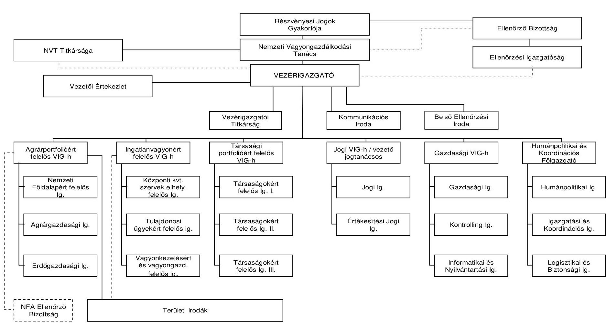

---

2009. december 31-ei állapot Az MNV Zrt. szervezeti felépítése
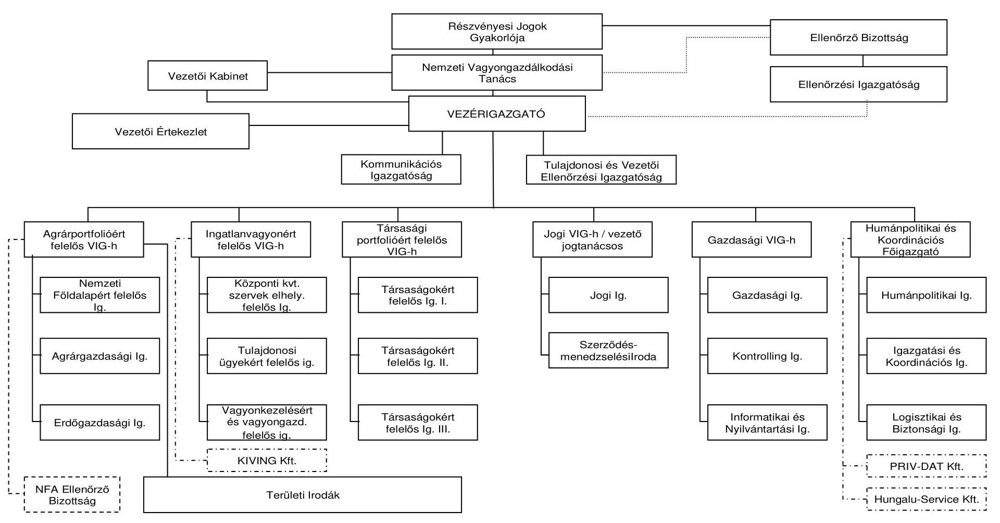

---

# Tanúsítványok jegyzéke 

| 1. sz. tanúsítvány | Az MNV Zrt. rábízott vagyonának 2009. évi bevételei és ráfordításai |
| :--: | :--: |
| 2. sz. tanúsítvány | Az MNV Zrt. rábízott vagyona |
| 3. sz. tanúsítvány | Befektetett eszközök vagyonnyilvántartása |
| 4. sz. tanúsítvány | Hasznosításra átengedett társaságok 2009. XII. 31-ei állapot |
| 5. sz. tanúsítvány | Befektetett eszközök értékesítése 2009. |
| 6. sz. tanúsítvány | Az MNV Zrt. saját vagyonának eszközállomány változása 2009. évben |
| 7. sz. tanúsítvány | Az MNV Zrt. saját vagyona forrásösszetételének változása 2009. évben |
| 8. sz. tanúsítvány | Az MNV Zrt. működéséhez kapcsolódó anyagjellegű ráfordítások alakulása 2009. évben |
| 9. sz. tanúsítvány | Az MNV Zrt. átlagos állományi létszámának alakulása 2009. évben |
| 10. sz. tanúsítvány | Az MNV Zrt. állományi létszámának változása 2009. évben |
| 11. sz. tanúsítvány | Az MNV Zrt. működésével kapcsolatos személyi jellegű ráfordítások alakulása 2009. évben |
| 12. sz. tanúsítvány | Az MNV Zrt. munkavállalóinak beosztásonkénti átlagkeresete 2009. évben |
| 13. sz. tanúsítvány | Az MNV Zrt. 2009. évi forrásallokációja a felhasználás célja szerint |
 14. sz. tanúsítvány | Az MNV Zrt. portfóliójába tartozó társaságok egyes gazdasági adatainak alakulása |

---

Az MNV ZRT. Rábízott Vagyonának 2009. évi Bevételei és Ráfordításai (eFt-ban)

|  MEGNEVEZÉS |  | 2009. évi eredeti előirányzat (eFt) | Előirányzat módosítások (eFt) | 2009. évi módosított előirányzat (eFt)  |
| --- | --- | --- | --- | --- |
|  B.0+B.F A RÁBÍZOTT VAGYON BEVÉTELEI |  | 97 248 800 | 0 | 97 248 800  |
|  B.0 | Az állami vagyonnal kapcsolatos bevételek | 97 248 800 | 0 | 97 248 800  |
|  B.1. | Értékesítési bevételek | 40 391 200 | 0 | 40 391 200  |
|  B.1.1. | Ingatlanértékesítésből származó bevételek | 40 281 000 | 0 | 40 281 000  |
|  B.1.1.1 | Termőföld értékesítésből származó bevételek | 8 781 000 | 0 | 8 781 000  |
|  B.1.1.2 | Kom. ingatlanok értékesítése |  | 0 | 0  |
|  B.1.1.3 | Egyéb ingatlanok értékesítése | 31 500 000 | 0 | 31 500 000  |
|  B.1.2. | Ingóság és egyéb eszköz értékesítés bevétele | 80 200 | 0 | 80 200  |
|  B.1.4. | Üvegházhatású gázok kibocsátási egységeinek bevétele |  |  |   |
|  B.2. | Hasznosítási bevételek | 55 811 300 | 0 | 56 811 300  |
|  B.2.1. | Bérleti díjak | 3 696 200 | 0 | 3 696 200  |
|  B.2.1.1 | Haszonbérleti díj | 3 696 200 | 0 | 3 696 200  |
|  B.2.1.2 | Ingatlan bérleti, használati díjak (kp. közv-i szervek) |  | 0 | 0  |
|  B.2.1.3 | Egyéb bérleti díjak |  | 0 | 0  |
|  B.2.2 | Vagyonkezelői díj | 2 587 600 | 0 | 2 587 600  |
|  B.2.3. | Osztalékbevételek | 48 300 000 | 0 | 48 300 000  |
|  B.2.4. | Koncessziós díjak | 2 227 500 | 0 | 2 227 500  |
|  B.2.4.1 | Szerencsejáték koncessziós díj | 1 589 400 | 0 | 1 589 400  |
|  B.2.4.2 | Infrastruktúra koncessziósból származó díj (GSM) |  | 0 | 638 100  |
|  B.2.4.3 | Egyéb koncessziós díjbevétel |  |  |   |
|  B.3. | Vegyes bevételek | 76 300 | 0 | 76 300  |
|  B.3.1 | Egyéb bevételek | 76 300 | 0 | 76 300  |
|  B.4. | Pénzforgalommal nem járó bevételek |  | 0 | 0  |
|  B.4.1. | Ingatlancsere bevételek |  | 0 | 0  |
|  K.0+K.F A RÁBÍZOTT VAGYON KIADÁSAI |  | 112 344 500 | -6 339 600 | 106 004 800  |
|  K.0 | Az állami vagyonnal kapcsolatos kiadások | 112 344 500 | -6 339 600 | 106 004 800  |
|  K.1 | Felhalmozásai jellegű kiadások | 39 020 000 | -200 200 | 38 819 800  |
|  K.1.1 | Ingatlanvásárlás * | 2 040 000 | 0 | 2 040 000  |
|  K.1.1.1 | Termőföld vásárlás | 940 000 | 0 | 940 000  |
|  K.1.1.2 | Egyéb ingatlan vásárlás | 1 100 000 | 0 | 1 100 000  |
|  K.1.2 | Ingóság és egyéb eszközök vásárlása | 950 000 | 50 000 | 1 000 000  |
|  K.1.3 | Ingatlan-beruházások * | 11 619 000 | -258 200 | 11 385 500  |
|  K.1.4 | Állami túl. részesedések növekedését eredményt | 24 011 000 | 0 | 24 011 000  |
|  K.1.5 | Volt szovjet ingatlanok környezeti kármentesítése | 400 000 | 0 | 400 000  |
|  K.2 | Hasznosítással kapcsolatos folyó kiadások | 20 506 500 | 820 000 | 21 329 500  |
|  K.2.1 | Életjáradék termőföldéri * | 11 760 500 | 0 | 11 760 500  |
|  K.2.2 | Ingatlanok fenntartása * | 2 430 000 | 770 000 | 3 200 000  |
|  K.2.2.1 | Üzemeltetés, fenntartás, karbantartás, javítás | 1 630 000 | 470 000 | 2 100 000  |
|  K.2.2.2 | Ingatlanok őrzése | 500 000 | 300 000 | 1 100 000  |
|  K.2.3 | Egyéb vagyonkezelési kiadások * | 784 000 | 50 000 | 834 000  |
|  K.2.4 | Állami tulajdonú társaságok támogatása | 5 532 000 | 0 | 5 532 000  |
|  K.3 | A korábbi értékesítéséhez kapcsolód kiadások | 23 117 000 | 0 | 23 117 000  |
|  K.3.1 | Jótállással, szavatossággal kapcsolatos kifizetések | 146 000 | 0 | 146 000  |
|  K.3.2 | Kezesi felelősségből eredő kifizetések | 826 000 | 0 | 826 000  |
|  K.3.3 | Konzernfelelősség alapján történő kifizetések | 570 000 | 0 | 570 000  |
|  K.3.4 | Belterületi föld, alapítói tagon kifizetendő járandóság | 324 000 | 0 | 324 000  |
|  K.3.5 | Környezetvédelmi feladatok finanszírozása | 14 893 000 | 0 | 14 893 000  |
|  K.3.6 | Egyéb bírósági döntésből eredő kiadások | 3 280 000 | 0 | 3 280 000  |
|  K.3.7 | Szerződéses kötelezettségek | 178 000 | 0 | 178 000  |
|  K.3.8 | Ingazabályból eredő kiadások | 2 900 000 | 0 | 2 900 000  |
|  K.4 | Vagyongazdálkodási kiadások | 14 201 000 | 999 000 | 15 160 000  |
|  K.4.1 | Tanácsadók, értékbecslők és jogi képviselők díja | 1 050 000 | 770 000 | 1 770 000  |
|  K.4.2 | Eljárási költségek, periodikák | 230 000 | 0 | 230 000  |
|  K.4.3 | Az MNV Zrt. működésének támogatása | 9 302 000 | 0 | 9 302 000  |
|  K.4.4 | Átcsoportosítású kötvény kamatfizetés | 1 569 000 | 189 000 | 1 758 000  |
|  K.4.5 | Állami ingatlanvagyon felmérése | 2 100 000 | 0 | 2 100 000  |
|  K.5 | Fejezeti tartalék | 14 500 000 | -8 341 200 | 9 138 800  |
|  K.8 | ÁFA elszámolás | 1 000 000 | 0 | 1 000 000  |
|  K.9 | Pénzforgalommal nem járó kiadások |  | 422 800 | 422 800  |

Budapest 2010. augusztus * 17 * *MAGYAR NEMZETI VAGYONKEZELŐ ZRT. 20. Aradvellí Tibor

1

---

2. sz. tanúsítvány a V-2011-127/2009-2010. sz. jelentéshez adatok millió Ft-ban

|  No | A tétel megnevezése | 2005.12.31 | Dénk fivér. intézkedése | 2009.12.31  |
| --- | --- | --- | --- | --- |
|  8 |  |  |  |   |
|  01. | 1. rény | KÖZPONTI KÖLTSÉGVETÉSI SZERV VAGYONKEZELŐNÉL LEVŐ ESZKÖZÖK |  |   |
|  02. | A. | BEFEKTETETT ESZKÖZÖK (283-06) | 8 733 842 | 8 999 708  |
|  03. | I. | IMMATERIÁLIS JAVAK | 88 084 | 89 072  |
|  04. | II. | TÁRGYI ESZKÖZÖK | 8 109 066 | 7 962 243  |
|  05. | III. | BEFEKTETETT PÉNZÜGYI ESZKÖZÖK | 364 558 | 375 801  |
|  06. | IV. | GZIMEL TETEME, KEZELÉSRE ÁTADOTT, KONCESSZIÓDA, VAGYONKEZELÉSRE ADOTT, ILLETVÉ VAGYONKEZELÉSRE VÉTT ESZKÖZÖK | 182 922 | 180 611  |
|  07. | B. | FORGÓESZKÖZÖK (289-12) | 1 814 349 | 1 866 332  |
|  08. | J. | KÉSZLETEK | 95 747 | 51 334  |
|  09. | I. | KÖVETELÉSEK | 621 147 | 532 249  |
|  10. | III. | ÉRTÉKPAPÍROK | 29 240 | 27 041  |
|  11. | IV. | PÉNZESZKÖZÖK | 639 984 | 663 748  |
|  12. | V. | EGYÉB AKTÍV PÉNZÜGYI KESZÁSOLÁKOK | 155 246 | 131 723  |
|  13. | 1. rény | KÖZPONTI KÖLTSÉGVETÉSI SZERV VAGYONKEZELŐNÉL LEVŐ ESZKÖZÖK ÖSSZESEN (324-07) | 10 238 341 | 10 665 040  |
|  14. | 2. rény | EGYÉB VAGYONKEZELŐNÉL LEVŐ ESZKÖZÖK |  |   |
|  15. | C. | BEFEKTETETT ESZKÖZÖK (164174-18) | 3 159 077 | -2 475 879  |
|  16. | I. | IMMATERIÁLIS JAVAK | 86 | 472  |
|  17. | II. | TÁRGYI ESZKÖZÖK | 3 138 494 | -2 478 879  |
|  18. | III. | BEFEKTETETT PÉNZÜGYI ESZKÖZÖK | 317 | 110  |
|  19. | II. | FORGÓESZKÖZÖK (20+21+22+23) | 0 | 0  |
|  20. | I. | KÉSZLETEK | 0 | 0  |
|  21. | II. | KÖVETELÉSEK | 0 | 0  |
|  22. | III. | ÉRTÉKPAPÍROK | 0 | 0  |
|  23. | IV. | PÉNZÜSZKÖZÖK | 0 | 0  |
|  24. | 1. rény | EGYÉB VAGYONKEZELŐNÉL LEVŐ ESZKÖZÖK ÖSSZESEN (15+19) | 3 159 077 | -2 478 879  |
|  25. | 2. rény | KÖZPONTI ÉNEL KEZELŐ ESZKÖZÖK |  |   |
|  26. | E. | BEFEKTETETT ESZKÖZÖK (274295-06+55) | 1 722 071 | -19 468  |
|  27. | I. | IMMATERIÁLIS JAVAK (228-34) | 479 | 1109  |
|  28. | I. | Alapítás tőzszerzésű aktivált árolás | 0 | 0 |
| 29. | | 2. Kísérleti őrbevezetés aktivált árolás | 0 | 0 |
| 30. | | 3. Vagyoni árolás jogok | 479 | 283 |
| 31. | | 4. Szellemi tartottak | 0 | 916 |
| 32. | | 5. Üzleti vagy cégérték | 0 | 0 |
| 33. | | 6. Impatentális prokkó adati ellátások | 0 | 0 |
| 34. | | 7. Impatentális ároló árolásolások/olás | 0 | 0 |
| 35. | II. | TÁRGYI ESZKÖZÖK (36+1229-01) | 689 774 | -19 558 |
| 36. | | 1. Impatentálás és ingatlanvaló vagyoni árolás jogok | 686 919 | -19 681 |
| 37. | | 4. Válási tőzszerzésű aktivált árolás | 462 795 | -22 587 |
| 38. | | | 234 136 | 234 136 |
| 39. | | 2. Gépzik ingatlanvaló és ingatlanvaló vagyoni árolás jogok | 234 136 | 234 136 |
| 40. | | 3. Tárgyank adati vállalkozás | 0 | 0 |
| 41. | | 4. Tárgyánállások | 0 | 0 |
| 42. | | 5. Beruházások, felújítások | 1 129 | 1 426 |
| 43. | | 6. Beruházásokra adati ellátások | 1 281 | 82 |
| 44. | | 7. Állami hárítások | 0 | 0 |
| 45. | | 8. Tárgyi eszközök árolásolások/olás | 0 | 0 |
| 46. | III. | BEFEKTETETT PÉNZÜGYI ESZKÖZÖK (17+1239-33) | 1 032 518 | 774 671 |
| 47. | | 1. Tárgyán állami tulajdonú részvonalévek (45-49) | 1 026 827 | 739 953 |
| 48. | | 2. Tárgyánlatú adati tárgyán állami tulajdonú részvonalévek bekezdései árolása | 1 073 745 | 1 080 015 |
| 49. | | 3. Tárgyán állami tulajdonú részvonalévek árolásosztása | 47 718 | 240 092 |
| 50. | | 4. Tárgyank adati vállalkozás | 1 772 | 1 907 |
| 51. | | 5. Tárgyank hárításosztási tárgyánlatú állási jogok | 0 | 0 |
| 52. | | 6. Egyéb tárgyank hárításosztás | 4 999 | 0 |
| 53. | | 7. Belségvonali pályázati eszközök árolásolások/olás | 0 | 32 841 |
| 54. | | 8. Állami tárgyank hárításosztási tárgyánlatú állási jogok | 0 | 32 841 |
| 55. | IV. | BÉRBÉ, HÁSZENBÉRBE, KONCESSZIÓDA ADOTT, GZIMELTETEME, KEZELÉSRE ÁTADOTT ESZKÖLÖK | 0 | 34 788 |

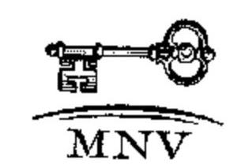

2. sz. tanúsítvány a V-2011-127/2009-2010. sz. jelentéshez adatok millió Ft-ban

2010.08.10

MAGYAR NEMZETI VAGYONKEZELŐ ZRT.

2010.08.10

---

2. sz. tanúsítvány a V-2011-127/2009-2010. sz. jelentéshez

| Sz. | A tétel megnevezése | 2008.12.31 | Etelei eszk szédesítése | 2009.12.31 |
| --- | --- | --- | --- | --- |
| 16. | F. | | | |
| 17. | F. | | | |
| 18. | F. | | | |
| 19. | | | | |
| 20. | | | | |
| 21. | | | | |
| 22. | | | | |
| 23. | | | | |
| 24. | | | | |
| 25. | | | | |
| 26. | | | | |
| 27. | | | | |
| 28. | | | | |
| 29. | | | | |
| 30. | | | | |
| 31. | | | | |
| 32. | | | | |
| 33. | | | | |
| 34. | | | | |
| 35. | | | | |
| 36. | | | | |
| 37. | | | | |
| 38. | | | | |
| 39. | | | | |
| 40. | | | | |
| 41. | | | | |
| 42. | | | | |
| 43. | | | | |
| 44. | | | | |
| 45. | | | | |
| 46. | | | | |
| 47. | | | | |
| 48. | | | | |
| 49. | | | | |
| 50. | | | | |
| 51. | | | | |
| 52. | | | | |
| 53. | | | | |
| 54. | | | | |
| 55. | | | | |
| 56. | | | | |
| 57. | | | | |
| 58. | | | | |
| 59. | | | | |
| 60. | | | | |
| 61. | | | | |
| 62. | | | | |
| 63. | | | | |
| 64. | | | | |
| 65. | | | | |
| 66. | | | | |
| 67. | | | | |
| 68. | | | | |
| 69. | | | | |
| 70. | | | | |
| 71. | | | | |
| 72. | | | | |
| 73. | | | | |
| 74. | | | | |
| 75. | | | | |
| 76. | | | | |
| 77. | | | | |
| 78. | | | | |
| 79. | | | | |
| 80. | | | | |
| 81. | | | | |
| 82. | | | | |
| 83. | | | | |
| 84. | | | | |
| 85. | | | | |
| 86. | | | | |
| 87. | | | | |
| 88. | | | | |
| 89. | | | | |
| 90. | | | | |
| 91. | | | | |
| 92. | | | | |
| 93. | | | | |
| 94. | | | | |
| 95. | | | | |
| 96. | | | | |
| 97. | | | | |
| 98. | | | | |
| 99. | | | | |
| 100. | | | | |
| 101. | | | | |
| 102. | | | | |
| 103. | | | | |
| 104. | | | | |
| 105. | | | | |
| 106. | | | | |
 107. |  |  |  |   |
|  108. |  |  |  |   |
|  109. |  |  |  |   |
|  110. |  |  |  |   |
|  111. |  |  |  |   |
|  112. |  |  |  |   |
|  113. |  |  |  |   |
|  114. |  |  |  |   |
|  115. |  |  |  |   |
|  116. |  |  |  |   |
|  117. |  |  |  |   |
|  118. |  |  |  |   |
|  119. |  |  |  |   |
|  120. |  |  |  |   |
|  121. |  |  |  |   |
|  122. |  |  |  |   |
|  123. |  |  |  |   |
|  124. |  |  |  |   |
|  125. |  |  |  |   |
|  126. |  |  |  |   |
|  127. |  |  |  |   |
|  128. |  |  |  |   |
|  129. |  |  |  |   |
|  130. |  |  |  |   |
|  131. |  |  |  |   |
|  132. |  |  |  |   |
|  133. |  |  |  |   |
|  134. |  |  |  |   |
|  135. |  |  |  |   |
|  136. |  |  |  |   |
|  137. |  |  |  |   |
|  138. |  |  |  |   |
|  139. |  |  |  |   |
|  140. |  |  |  |   |
|  141. |  |  |  |   |
|  142. |  |  |  |   |
|  143. |  |  |  |   |
|  144. |  |  |  |   |
|  145. |  |  |  |   |
|  146. |  |  |  |   |
|  147. |  |  |  |   |
|  148. |  |  |  |   |
|  149. |  |  |  |   |
|  150. |  |  |  |   |
|  151. |  |  |  |   |
|  152. |  |  |  |   |
|  153. |  |  |  |   |
|  154. |  |  |  |   |
|  155. |  |  |  |   |
|  156. |  |  |  |   |
|  157. |  |  |  |   |
|  158. |  |  |  |   |
|  159. |  |  |  |   |
|  160. |  |  |  |   |
|  161. |  |  |  |   |
|  162. |  |  |  |   |
|  163. |  |  |  |   |
|  164. |  |  |  |   |
|  165. |  |  |  |   |
|  166. |  |  |  |   |
|  167. |  |  |  |   |
|  168. |  |  |  |   |
|  169. |  |  |  |   |
|  170. |  |  |  |   |
|  171. |  |  |  |   |
|  172. |  |  |  |   |
|  173. |  |  |  |   |
|  174. |  |  |  |   |
|  175. |  |  |  |   |
|  176. |  |  |  |   |
|  177. |  |  |  |   |
|  178. |  |  |  |   |
|  179. |  |  |  |   |
|  180. |  |  |  |   |
|  181. |  |  |  |   |
|  182. |  |  |  |   |
|  183. |  |  |  |   |
|  184. |  |  |  |   |
|  185. |  |  |  |   |
|  186. |  |  |  |   |
|  187. |  |  |  |   |
|  188. |  |  |  |   |
|  189. |  |  |  |   |
|  190. |  |  |  |   |
|  191. |  |  |  |   |
|  192. |  |  |  |   |
|  193. |  |  |  |   |
|  194. |  |  |  |   |
|  195. |  |  |  |   |
|  196. |  |  |  |   |
|  197. |  |  |  |   |
|  198. |  |  |  |   |
|  199. |  |  |  |   |
|  200. |  |  |  |   |
|  201. |  |  |  |   |
|  202. |  |  |  |   |
|  203. |  |  |  |   |
|  204. |  |  |  |   |
|  205. |  |  |  |   |
|  206. |  |  |  |   |
|  207. |  |  |  |   |
|  208. |  |  |  |   |
|  209. |  |  |  |   |
|  210. |  |  |  |   |
|  211. |  |  |  |   |
|  212. |  |  |  |   |
|  213. |  |  |  |   |
|  214. |  |  |  |   |
|  215. |  |  |  |   |
|  216. |  |  |  |   |
|  217. |  |  |  |   |
|  218. |  |  |  |   |
|  219. |  |  |  |   |
|  220. |  |  |  |   |
|  221. |  |  |  |   |
|  222. |  |  |  |   |
|  223. |  |  |  |   |
|  224. |  |  |  |   |
|  225. |  |  |  |   |
|  226. |  |  |  |   |
|  227. |  |  |  |   |
|  228. |  |  |  |   |
|  229. |  |  |  |   |
|  230. |  |  |  |   |
|  231. |  |  |  |   |
|  232. |  |  |  |   |
|  233. |  |  |  |   |
|  234. |  |  |  |   |
|  235. |  |  |  |   |
|  236. |  |  |  |   |
|  237. |  |  |  |   |
|  238. |  |  |  |   |
|  239. |  |  |  |   |
|  240. |  |  |  |   | |  |  |   |
|  241. |  |  |  |   |
|  242. |  |  |  |   |
|  243. |  |  |  |   |
|  244. |  |  |  |   |
|  245. |  |  |  |   |
|  246. |  |  |  |   |
|  247. |  |  |  |   |
|  248. |  |  |  |   |
|  249. |  |  |  |   |
|  250. |  |  |  |   |
|  251. |  |  |  |   |
|  252. |  |  |  |   |
|  253. |  |  |  |   |
|  254. |  |  |  |   |
|  255. |  |  |  |   |
|  256. |  |  |  |   |
|  257. |  |  |  |   |
|  258. |  |  |  |   |
|  259. |  |  |  |   |
|  260. |  |  |  |   |
|  261. |  |  |  |   |
|  262. |  |  |  |   |
|  263. |  |  |  |   |
|  264. |  |  |  |   |
|  265. |  |  |  |   |
|  266. |  |  |  |   |
|  267. |  |  |  |   |
|  268. |  |  |  |   |
|  269. |  |  |  |   |
|  270. |  |  |  |   |
|  271. |  |  |  |   |
|  272. |  |  |  |   |
|  273. |  |  |  |   |
|  274. |  |  |  |   |
|  275. |  |  |  |   |
|  276. |  |  |  |   |
|  277. |  |  |  |   |
|  278. |  |  |  |   |
|  279. |  |  |  |   |
|  280. |  |  |  |   |
|  281. |  |  |  |   |
|  282. |  |  |  |   |
|  283. |  |  |  |   |
|  284. |  |  |  |   |
|  285. |  |  |  |   |
|  286. |  |  |  |   |
|  287. |  |  |  |   |
|  288. |  |  |  |   |
|  289. |  |  |  |   |
|  290. |  |  |  |   |
|  291. |  |  |  |   |
|  292. |  |  |  |   |
|  293. |  |  |  |   |
|  294. |  |  |  |   |
|  295. |  |  |  |   |
|  296. |  |  |  |   |
|  297. |  |  |  |   |
|  298. |  |  |  |   |
|  299. |  |  |  |   |
|  300. |  |  |  |   |
|  301. |  |  |  |   |
|  302. |  |  |  |   |
|  303. |  |  |  |   |
|  304. |  |  |  |   |
|  305. |  |  |  |   |
|  306. |  |  |  |   |
|  307. |  |  |  |   |
|  308. |  |  |  |   |
|  309. |  |  |  |   |
|  310. |  |  |  |   |
|  311. |  |  |  |   |
|  312. |  |  |  |   |
|  313. |  |  |  |   |
|  314. |  |  |  |   |
|  315. |  |  |  |   |
|  316. |  |  |  |   |
|  317. |  |  |  |   |
|  318. |  |  |  |   |
|  319. |  |  |  |   |
|  320. |  |  |  |   |
|  321. |  |  |  |   |
|  322. |  |  |  |   |
|  323. |  |  |  |   |
|  324. |  |  |  |   |
|  325. |  |  |  |   |
|  326. |  |  |  |   |
|  327. |  |  |  |   |
|  328. |  |  |  |   |
|  329. |  |  |  |   |
|  330. |  |  |  |   |
|  331. |  |  |  |   |
|  332. |  |  |  |   |
|  333. |  |  |  |   |
|  334. |  |  |  |   |
|  335. |  |  |  |   |
|  336. |  |  |  |   |
|  337. |  |  |  |   |
|  338. |  |  |  |   |
|  339. |  |  |  |   |
|  340. |  |  |  |   |
|  341. |  |  |  |   |
|  342. |  |  |  |   |
|  343. |  |  |  |   |
|  344. |  |  |  |   |
|  345. |  |  |  |   |
|  346. |  |  |  |   |
|  347. |  |  |  |   |
|  348. |  |  |  |   |
|  349. |  |  |  |   |
|  350. |  |  |  |   |
|  351. |  |  |  |   |
|  352. |  |  |  |   |
|  353. |  |  |  |   |
|  354. |  |  |  |   |
|  355. |  |  |  |   |
|  356. |  |  |  |   |
|  357. |  |  |  |   |
|  358. |  |  |  |   |
|  359. |  |  |  |   |
|  360. |  |  |  |   |
|  361. |  |  |  |   |
|  362. |  |  |  |   |
|  363. |  |  |  |   |
|  364. |  |  |  |   |
|  365. |  |  |  |   |
|  366. |  |  |  |   |
|  367. |  |  |  |   |
|  368. |  |  |  |   |
|  369. |  |  |  |   |
|  370. |  |  |  |   |
|  371. |  |  |  |   |
|  372. |  |  |  |   |
|  373. |  |  |  |   |
|  374. |  |  |  |   |
|  375. |  |  |  |   |
|  376. |  |  |  |   |
|  377. |  |  |  |   |
|  378. |  |  |  |   |
|  379. |  |  |  |   |
|  380. |  |  |  |   |
|  381. |  |  |  |   |
|  382. |  |  |  |   |
|  383. |  |  |  |   |
|  384. |  |  |  |   |
|  385. |  |  |  |   |
|  386. |  |  |  |   |
|  387. |  |  |  |   |
|  388. |  |  |  |   |
|  389. |  |  |  |   |
|  390. |  |  |  |   |
|  391. |  |  |  |   |
|  392. |  |  |  |   |
|  393. |  |  |  |   |
|  394. |  |  |  |   |
|  395. |  |  |  |   |
|  396. |  |  |  |   |
|  397. |  |  |  |   |
|  398. |  |  |  |   |
|  399. |  |  |  |   |
|  400. |  |  |  |   |
|  401. |  |  |  |   |
|  402. |  |  |  |   |
|  403. |  |  |  |   |
|  404. |  |  |  |   |
|  405. |  |  |  |   |
|  406. |  |  |  |   |
|  407. |  |  |  |   |
|  408. |  |  |  |   |
|  409. |  |  |  |   |
|  410. |  |  |  |   |
|  411. |  |  |  |   |
|  412. |  |  |  |   |
|  413. |  |  |  |   |
|  414. |  |  |  |   |
|  415. |  |  |  |   |
|  416. |  |  |  |   |
|  417. |  |  |  |   |
|  418. |  |  |  |   |
|  419. |  |  |  |   |
|  420. |  |  |  |   |
|  421. |  |  |  |   |
|  422. |  |  |  |   |
|  423. |  |  |  |   |
|  424. |  |  |  |   |
|  425. |  |  |  |   |
|  426. |  |  |  |   |
|  427. |  |  |  |   |
|  428. |  |  |  |   |
|  429. |  |  |  |   |
|  430. |  |  |  |   |
|  431. |  |  |  |   |
|  432. |  |  |  |   |
|  433. |  |  |  |   |
|  434. |  |  |  |   |
|  435. |  |  |  |   |
|  436. |  |  |  |   |
|  437. |  |  |  |   |
|  438. |  |  |  |   |
|  439. |  |  |  |   |
|  440. |  |  |  |   |
|  441. |  |  |  |   |
|  442. |  |  |  |   |
|  443. |  |  |  |   |
|  444. |  |  |  |   |
|  445. |  |  |  |   |
|  446. |  |  |  |   |
|  447. |  |  |  |   |
|  448. |  |  |  |   |
|  449. |  |  |  |   |
|  450. |  |  |  |   |
|  451. |  |  |  |   |
|  452. |  |  |  |   |
|  453. |  |  |  |   |
|  454. |  |  |  |   |
|  455. |  |  |  |   |
|  456. |  |  |  |   |
|  457. |  |  |  |   |
|  458. |  |  |  |   |
|  459. |  |  |  |   |
|  460. |  |  |  |   |
|  461. |  |  |  |   |
|  462. |  |  |  |   |
|  463. |  |  |  |   |
|  464. |  |  |  |   |
|  465. |  |  |  |   |
|  466. |  |  |  |   |
|  467. |  |  |  |   |
|  468. |  |  |  |   |
|  469. |  |  |  |   |
|  470. |  |  |  |   |
|  471. |  |  |  |   |
|  472. |  |  |  |   |
|  473. |  |  |  |   |
|  474. |  |  |  |   |
|  475. |  |  |  |   |
|  476. |  |  |  |   |
|  477. |  |  |  |   |
|  478. |  |  |  |   |
|  479. |  |  |  |   |
|  480. |  |  |  |   |
|  481. |  |  |  |   |
|  482. |  |  |  |   |
|  483. |  |  |  |   |
|  484. |  |  |  |   |
|  485. |  |  |  |   |
|  486. |  |  |  |   |
|  487. |  |  |  |   |
|  488. |  |  |  |   |
|  489. |  |  |  |   |
|  490. |  |  |  |   |
|  491. |  |  |  |   |
|  492. |  |  |  |   |
|  493. |  |  |  |   |
|  494. |  |  |  |   |
|  495. |  |  |  |   |
|  496. |  |  |  |   |
|  497. |  |  |  |   |
|  498. |  |  |  |   |
|  499. |  |  |  |   |
|  500. |  |  |  |   |
|  501. |  |  |  |   |
|  502. |  |  |  |   |
|  503. |  |  |  |   |
|  504. |  |  |  |   |
|  505. |  |  |  |   |
|  506. |  |  |  |   | 507. |  |  |  |   |
|  508. |  |  |  |   |
|  509. |  |  |  |   |
|  510. |  |  |  |   |
|  511. |  |  |  |   |
|  512. |  |  |  |   |
|  513. |  |  |  |   |
|  514. |  |  |  |   |
|  515. |  |  |  |   |
|  516. |  |  |  |   |
|  517. |  |  |  |   |
|  518. |  |  |  |   |
|  519. |  |  |  |   |
|  520. |  |  |  |   |
|  521. |  |  |  |   |
|  522. |  |  |  |   |
|  523. |  |  |  |   |
|  524. |  |  |  |   |
|  525. |  |  |  |   |
|  526. |  |  |  |   |
|  527. |  |  |  |   |
|  528. |  |  |  |   |
|  529. |  |  |  |   |
|  530. |  |  |  |   |
|  531. |  |  |  |   |
|  532. |  |  |  |   |
|  533. |  |  |  |   |
|  534. |  |  |  |   |
|  535. |  |  |  |   |
|  536. |  |  |  |   |
|  537. |  |  |  |   |
|  538. |  |  |  |   |
|  539. |  |  |  |   |
|  540. |  |  |  |   |
|  541. |  |  |  |   |
|  542. |  |  |  |   |
|  543. |  |  |  |   |
|  544. |  |  |  |   |
|  545. |  |  |  |   |
|  546. |  |  |  |   |
|  547. |  |  |  |   |
|  548. |  |  |  |   |
|  549. |  |  |  |   |
|  550. |  |  |  |   |
|  551. |  |  |  |   |
|  552. |  |  |  |   |
|  553. |  |  |  |   |
|  554. |  |  |  |   |
|  555. |  |  |  |   |
|  556. |  |  |  |   |
|  557. |  |  |  |   |
|  558. |  |  |  |   |
|  559. |  |  |  |   |
|  560. |  |  |  |   |
|  561. |  |  |  |   |
|  562. |  |  |  |   |
|  563. |  |  |  |   |
|  564. |  |  |  |   |
|  565. |  |  |  |   |
|  566. |  |  |  |   |
|  567. |  |  |  |   |
|  568. |  |  |  |   |
|  569. |  |  |  |   |
|  570. |  |  |  |   |
|  571. |  |  |  |   |
|  572. |  |  |  |   |
|  573. |  |  |  |   |
|  574. |  |  |  |   |
|  575. |  |  |  |   |
|  576. |  |  |  |   |
|  577. |  |  |  |   |
|  578. |  |  |  |   |
|  579. |  |  |  |   |
|  580. |  |  |  |   |
|  581. |  |  |  |   |
|  582. |  |  |  |   |
|  583. |  |  |  |   |
|  584. |  |  |  |   |
|  585. |  |  |  |   |
|  586. |  |  |  |   |
|  587. |  |  |  |   |
|  588. |  |  |  |   |
|  589. |  |  |  |   |
|  590. |  |  |  |   |
|  591. |  |  |  |   |
|  592. |  |  |  |   |
|  593. |  |  |  |   |
|  594. |  |  |  |   |
|  595. |  |  |  |   |
|  596. |  |  |  |   |
|  597. |  |  |  |   |
|  598. |  |  |  |   |
|  599. |  |  |  |   |
|  600. |  |  |  |   |
|  601. |  |  |  |   |
|  602. |  |  |  |   |
|  603. |  |  |  |   |
|  604. |  |  |  |   |
|  605. |  |  |  |   |
|  606. |  |  |  |   |
|  607. |  |  |  |   |
|  608. |  |  |  |   |
|  609. |  |  |  |   |
|  610. |  |  |  |   |
|  611. |  |  |  |   |
|  612. |  |  |  |   |
|  612. |  |  |  |   |
|  613. |  |  |  |   |
|  613. |  |  |  |   |
|  613. |  |  |  |   |
|  614. |  |  |  |   |
|  614. |  |  |  |   |
|  615. |  |  |  |   |
|  615. |  |  |  |   |
|  616. |  |  |  |   |
|  616. |  |  |  |   |
|  616. |  |  |  |   |
|  617. |  |  |  |   |
|  617. |  |  |  |   |
|  617. |  |  |  |   |
|  617. |  |  |  |   |
|  618. |  |  |  |   |
|  618. |  |  |  |   |
|  619. |  |  |  |   |
|  620. |  |  |  |   |
|  619. |  |  |  |   |
|  621. |  |  |  |   |
|  622. |  |  |  |   |
|  623. |  |  |   |
|  624. |  |  |  |   |
|  625. |  |  |  |   |
|  626. |  |  |  |   |
|  627. |  |  |   |
|  628. |  |  |
 |
| 629. | | | |
| 630. | | | |
| 629. | | | |
| 631. | | | |
| 632. | | | |
| 633. | | | |
| 634. | | | |
| 635. | | | |
| 635. | | | |
| 636. | | | |
| 636. | | | |
| 637. | | | |
| 637. | | | |
| 638. | | | |
| 639. | | | |
| 640. | | | |
| 639. | | | |
| 641. | | | |
| 642. | | | |
| 642. | | | |
| 643. | | | |
| 643. | | | |
| 644. | | | |
| 645. | | | |
| 646. | | | |
| 647. | | | |
| 647. | | | |
| 647. | | | |
| 648. | | | |
| 648. | | | |
| 649. | | | |
| 650. | | | |
| 651. | | | |
| 652. | | | |
| 653. | | | |
| 653. | | | |
| 654. | | | |
| 654. | | | |
| 655. | | | |
| 656. | | | |
| 657. | | | |
| 657. | | | |
| 658. | | | |
| 659. | | | |
| 660. | | | |
| 659. | | | |
| 661. | | | |
| 662. | | | |
| 662. | | | |
| 663. | | | |
| 663. | | | |
| 664. | | | |
| 664. | | | |
| 665. | | | |
| 666. | | | |
| 667. | | | |
| 667. | | | |
| 67. | | | |
| 67. | | | |
| 67. | | | |
| 68. | | | |
| 68. | | | |
| 69. | | | |
| 69. | | | |
| 70. | | | |
| 71. | | |
| 72. | | | |
| 73. | | | |
| 74. | | | |
| 75. | | | |
| 76. | | | |
| 77. | | | |
| 78. | | | |
| 79. | | |
| 79. | | | |
| 79. | | | |
| 80. | | | |
| 81. | | | |
| 82. | | |
| 83. | | |
| 83. | | | |
| 84. | | | |
| 85. | | | |
| 86. | | | |
| 87. | | |
| 88. | | | |
| 88. | | | |
| 89. | | | |
| 810. | | | |
| 812. | | | |
| 82. | | | |
| 83. | | |
| 83. | | |
| 83. | | | |
| 84. | | | |
| 85. | | | |
| 86. | | | |
| 87. | | |
| 88. | | |
| 88. | | | |
| 89. | | | |
| 89. | | |
| 811. | | |
| 82. | | |
| 82. | | | |
| 83. | | | |
| 83. | | |
| 83. | | |
| 84. | | |
| 84. | | | |
| 85. | | |
| 86. | | |
| 87. | | |
| 88. | | |
| 88. | | | |
| 89. | | |
| 89. | | |
| 89. | | |
| 810. | | |
| 811. | | |
| 812. | | |
| 82. | | |
| 82. | | |
| 82. | | |
| 83. | | |
| 83. | | |
| 83. | | |
| 83. | | |
| 83. | | |
| 83. | | |
| 84. | | |
| 84. | | |
| 85. | | |
| 85. | | |
| 86. | | |
| 86. | | |
| 87. | | |
| 87. | | |
| 88. | | |
| 88. | | |
| 88. | | |
| 89. | | |
| 89. | | |
| 89. | | |
| 89. | | |
| 810. | | |
| 811. | | |
| 811. | | |
| 82. | | |
| 82. | | |
| 82. | | |
| 83. | | |
| 83. | | |
| 83. | | |
| 83. | | |
| 83. | | |
| 83. | | |
| 83. | | |
| 83. | | |
| 84. | | |
| 84. | | |
| 85. | | |
| 85. | | |
| 86. | | |
| 86. | | |
| 87. | | |
| 87. | | |
| 88. | | |
| 88. | | |
| 88. | | |
| 89. | | |
| 89. | | |
| 810. | | |
| 811. | | |
| 82. | | |
| 82. | |
 |
| 83. | | |
| 83. | | |
| 83. | | |
| 83. | | |
| 83. | | |
| 83. | | |
| 83. | | |
| 84. | | |
| 84. | | |
| 85. | | |
| 85. | | |
| 86. | | |
| 86. | | |
| 87. | | |
| 87. | | |
| 88. | | |
| 88. | | |
| 88. | | |
| 89. | | |
| 89. | | |
| 810. | | |
| 811. | | |
| 82. | | |
| 82. | | |
| 82. | | |
| 83. | | |
| 83. | | |
| 83. | | |
| 83. | | |
| 83. | | |
| 83. | | |
| 84. | | |
| 84. | | |
| 85. | | |
| 85. | | |
| 86. | | |
| 87. | | |
| 87. | | |
| 88. | | |
| 88. | | |
| 88. | | |
| 89. | | |
| 810. | | |
| 811. | | |
| 82. | | |
| 82. | | |
| 82. | | |
| 83. | | |
| 83. | | |
| 83. | | |
| 83. | | |
| 83. | |
| 84. | | |
| 84. | | |
| 85. | | |
| 85. | | |
| 85. | | |
| 86. | | |
| 87. | | |
| 87. | | |
| 88. | | |
| 88. | | |
| 88. | | |
| 89. | | |
| 810. | | |
| 810. | | |
| 811. | | |
| 82. | | |
| 82. | | |
| 82. | | |
| 83. | |
| 83. | | |
| 83. | | |
| 83. | |
| 83. | | |
| 83. | | |
| 84. | | |
| 84. | | |
| 85. | | |
| 85. | | |
| 85. | | |
| 86. | | |
| 86. | | |
| 87. | | |
| 87. | | |
| 88. | | |
| 88. | | |
| 88. | | |
| 88. | | |
| 89. | | |
| 810. | | |
| 811. | | |
| 82. | | |
| 82. | | |
| 83. | | |
| 83. | |
| 83. | | |
| 83. | | |
| 84. | | |
| 84. | | |
| 85. | | |
| 85. | | |
| 85. | |
| 86. | | |
| 87. | | |
| 87. | | |
| 87.

---

2. sz. tanúsítvány a V-2011-127/2009-2010. sz. jelentéshez

| Sorszám | A tétel megnevezése | 2008.12.31 | Külső tvek módosítása | 2009.12.31 |
| --- | --- | --- | --- | --- |
| 90. | H. RÁBIZOTT VAGYON TŐKÉJE (91+95+09+100+101+105+106) | 14 454 419 | -2 499 281 | 11 695 413 |
| 91. | I. RÁBIZOTT VAGYON INDÚLÓ TŐKÉJE (202-94) | 5 760 845 | -2 478 875 | 3 292 998 |
| 92. | 1. Központi költségvetési szerv vagyonkezelőnél lévő rábízott vagyon induló tőkéje | 1 113 979 | | 1 118 040 |
| 93. | 2. Egyéb vagyonkezelőnél lévő rábízott vagyon induló tőkéje | 3 076 872 | -2 478 875 | 597 947 |
| 94. | 3. Közvetlenül kezelt rábízott vagyon induló tőkéje | 1 570 044 | | 1 577 011 |
| 95. | II. RÁBIZOTT VAGYON TŐKEVÁLTOZÁSA (206-98) | 7 995 693 | 0 | 8 166 441 |
| 96. | 1. Központi költségvetési szerv vagyonkezelőnél lévő rábízott vagyon tőkeváltozása | 8 050 972 | | 8 137 523 |
| 97. | 2. Egyéb vagyonkezelőnél lévő rábízott vagyon tőkeváltozása | 88 291 | | 171 606 |
| 98. | 3. Közvetlenül kezelt rábízott vagyon tőkeváltozása | -143 370 | | -142 688 |
| 99. | III. EREDMÉNYTARTALÉK | -1 700 | | -9 984 |
| 100. | IV. LEKÖTÖTT TARTALÉK | 0 | | 0 |
| 101. | V. ÉRTÉKHELYESBÍTÉS ÉRTÉKELÉSI TARTALÉKA (2102-104) | 4 406 | 0 | 37 247 |
| 102. | 1. Központi költségvetési szerv vagyonkezelőnél lévő rábízott vagyon értékelési tartaléka | 4 406 | | 4 406 |
| 103. | 2. Egyéb vagyonkezelőnél lévő rábízott vagyon értékelési tartaléka | 0 | | 0 |
| 104. | 3. Közvetlenül kezelt rábízott vagyon értékelési tartaléka | 0 | | 32 841 |
| 105. | VI. MÉRLEG SZERINTI EREDMÉNY | 12 159 | -20 406 | -409 706 |
| 106. | VII. KÖZPONTI KÖLTSÉGVETÉSI SZERV VAGYONKEZELŐK TARTALÉKAI (2107-108) | 683 016 | 0 | 618 417 |
| 107. | 1. Költségvetési tartalékok | 683 016 | | 616 586 |
| 108. | 2. Vállalkozási tartalékok | | | 1 531 |
| 109. | I. CÉLTARTALÉKOK (2110-112) | 66 824 | 0 | 103 614 |
| 110. | 1. Céltartalékok a várható kötelezettségekre | 66 824 | | 103 614 |
| 111. | 2. Céltartalékok a jövőbeni költségekre | 0 | | 0 |
| 112. | 3. Egyéb céltartalékok | 0 | | 0 |
| 113. | J. RÁBIZOTT VAGYON KÖTELEZETTSÉGEI (114+115+122+131) | 703 644 | 0 | 3 039 662 |
| 114. | I. HÁTRASOROLT KÖTELEZETTSÉGEK | 0 | | 0 |
| 115. | II. HOSSZÚ LEJÁRATÚ KÖTELEZETTSÉGEK (2116-121) | 110 893 | 0 | 320 792 |
| 116. | 1. Hosszú lejáratra kapott kölcsönök | 0 | | 0 |
| 117. | 2. Átváltoztatható kötvények | 0 | | 0 |
| 118. | 3. Tartozások kötvénykibocsátásból | 0 | | 225 691 |
| 119. | 4. Beruházási és fejlesztési hitelek | 0 | | 0 |
| 120. | 5. Egyéb hosszú lejáratú hitelek | 4 999 | | 0 |
| 121. | 6. Egyéb hosszú lejáratú kötelezettségek | 105 894 | | 95 102 |
| 122. | III. RÖVID LEJÁRATÚ KÖTELEZETTSÉGEK [123+(2125-130)] | 206 783 | 0 | 132 214 |
| 123. | 1. Rövid lejáratú kölcsönök | 0 | | 0 |
| 124. | 6. Rövid átváltoztatható kötvények | 0 | | 0 |
| 125. | 2. Rövid lejáratú hitelek | 2 499 | | 0 |
| 126. | 3. Vevőktől kapott előlegek | 3 032 | | 980 |
| 127. | 4. Követelések áruszállításból és szolgáltatásból (szállítók) | 410 | | 1 556 |
| 128. | 5. Központi költségvetési szerv vagyonkezelővel kapcsolatos kötelezettség | 0 | | 0 |
| 129. | 6. Egyéb vagyonkezelővel kapcsolatos kötelezettség | 0 | | 0 |
| 130. | 7. Egyéb rövid lejáratú kötelezettség | 200 842 |  | 129 638  |
|  131. | IV. KÖZPONTI KÖLTSÉGVETÉSI SZERV VAGYONKEZELŐK KÖTELEZETTSÉGEI (2132-134) | 385 968 | 0 | 586 655  |
|  132. | 1. Hosszú lejáratú kötelezettségek | 112 559 |  | 105 617  |
|  133. | 2. Rövid lejáratú kötelezettségek | 194 627 |  | 381 953  |
|  134. | 3. Egyéb passzív pénzügyi elszámolások | 78 782 |  | 99 085  |
|  135. | K. PASSZÍV IDŐBELI ELHÁTÁROLÁSOK (2136-138) | 11 478 | 1 930 | 21 875  |
|  136. | 1. Bevételék passzív időbeli elhatárolása | 0 |  | 2 456  |
|  137. | 2. Költségek, ráfordítások passzív időbeli elhatárolása | 1 246 |  | 3 098  |
|  138. | 3. Halasztott bevételek | 10 232 | 1 930 | 16 321  |
|  139. | FORRÁSOK (PASSZÍVÁK) ÖSSZESEN (90+109+113+135) | 15 236 365 | -2 497 351 | 12 860 564  |

2010.08.18

Bérész Juhász (pénzügycsoport igazgató)

20.

MNV

MAGYAR NEMZETI VAGYONKEZELŐ ZRT. 20.

---

2. sz. tanúsítvány

2009. a V-2011-127/2009-2010. sz. jelentéshez

adatok millió Ft-ban

|  Ssz. | A tétel megnevezése | 2008. | Előző évek módosítása | 2009.  |
| --- | --- | --- | --- | --- |
|  a | b | c | d | e  |
|  01. | 001. Rábízott vagyon hasznosításának (vagyonkezelés, bérbeadás, haszonbérlet) nettó árbevétele | 9 110 | 911 | 8 976  |
|  02. | ebből: - központi költségvetési szerv vagyonkezelőtől származó bevételek | 0 |  | 6  |
|  03. | egyéb vagyonkezelőtől származó bevételek | 0 |  | 2 441  |
|  04. | 002. Rábízott vagyon értékesítésének (immateriális javak, tárgyi eszközök, készletek) nettó árbevétele | 19 029 |  | 16 366  |
|  05. | 003. Egyéb ki nem emelt árbevétel | 936 |  | 1 387  |
|  06. | 01. Belföldi értékesítés nettó árbevétele (001+002+003) | 29 075 | 911 | 26 729  |
|  07. | 02. Exportértékesítés nettó árbevétele | 0 |  | 3 529  |
|  08. | I. Értékesítés nettó árbevétele (01+02) | 29 075 | 911 | 30 258  |
|  09. | 03. Saját termelésű készletek állományváltozása | 0 |  | 0  |
|  10. | 04. Saját előállítású eszközök aktivált értéke | 0 |  | 0  |
|  11. | II. Aktivált saját teljesítmények értéke (±03+04) | 0 |  | 0  |
|  12. | III. Egyéb bevételek | 21 506 |  | 38 878  |
|  13. | ebből: visszajut értékvesztés | 9 136 |  | 0  |
|  14. | IV. Rábízott vagyon (immateriális javak, tárgyi eszközök, készletek) értékesítésének ráfordítása | 5 076 | -794 | 6 079  |
|  15. | V. Eladott (közvetített) szolgáltatások értéke | 24 |  | 133  |
|  16. | 05. Rábízott vagyon hasznosításának (vagyonkezelés, bérbeadás, haszonbérlet) ráfordításai | 18 512 |  | 4 466  |
|  17. | 06. Rábízott vagyon működtetésének egyéb ráfordításai | 27 204 |  | 18 228  |
|  18. | ebből: állami tulajdonú társaságok támogatása | 24 025 |  | 16 144  |
|  19. | VI. Rábízott vagyon működtetésének ráfordításai (05+06) | 45 716 |  | 22 694  |
|  20. | VII. Rábízott vagyon korábbi értékesítésének ráfordításai | 3 295 |  | 4 984  |
|  21. | VIII. Értékcsökkenési leírás | 1 220 |  | 1 114  |
|  22. | IX. Egyéb ráfordítások | 14 459 | 25 251 | 77 928  |
|  23. | ebből: értékvesztés | 2 488 |  | 4 292  |
|  24. | A. Üzemi (üzleti) tevékenység eredménye (I±II+III-IV-V-VI-VII-VIII-IX) | -19 209 | -23 546 | -43 796  |
|  25. | 07. Kapott (járó) osztalék és részesedés | 91 742 |  | 54 055  |
|  26. | 08. Részesedések értékesítésének árfolyamnyeresége | 0 |  | 0  |
|  27. | 09. Befektetett pénzügyi eszközök kamatai, árfolyamnyeresége | 0 |  | 0  |
|  28. | 10. Egyéb kapott (járó) kamatok és kamatjellegű bevételek | 299 |  | 130  |
|  29. | 11. Pénzügyi műveletek egyéb bevételei | 1 758 |  | 1 338  |
|  30. | X. Pénzügyi műveletek bevételei (X07-11) | 93 299 |  | 55 523  |
|  31. | 12. Részesedések értékesítésének árfolyamvesztesége | 0 |  | 0  |
|  32. | 13. Egyéb befektetett pénzügyi eszközök árfolyamvesztesége | 0 |  | 0  |
|  33. | 14. Fizetendő kamatok és kamatjellegű ráfordítások | 1 572 |  | 22 247  |
|  34. | 15. Részesedések, értékpapírok, bankbetétek értékvesztése | 0 |  | 295 145  |
|  35. | ebből: részesedések értékvesztése | 0 |  | 295 145  |
|  36. | 16. Pénzügyi műveletek egyéb ráfordításai | 55 082 |  | 5 080  |
|  37. | XI. Pénzügyi műveletek ráfordításai (X12-16) | 56 654 |  | 322 472  |
|  38. | B. Pénzügyi műveletek eredménye (X-XI) | 36 645 |  | 0 -266 949  |
|  39. | C. Szokásos vállalkozási eredmény (aA+B) | 17 436 | -23 546 | -310 745  |
|  40. | XII. Rendkívüli bevételek | 10 895 | 392 | 19 031  |
|  41. | XIII. Rendkívüli ráfordítások | 661 | -2 748 | 15 713  |
|  42. | D. Rendkívüli eredmény (XII-XIII) | 10 234 | 3 140 | 3 818  |
|  43. | F. Működés mérleg szerinti eredménye (±C+D) | 27 670 | -20 406 | -306 927  |
|  44. | 17. Költségvetési pénzforgalmi kapcsolatok (±) | -15 511 |  | -102 779  |
|  45. | G. Mérleg szerinti eredmény (±F+17) | 12 159 | -20 406 | -409 706  |

2010.08.16

Bavoca Ágnes gazdasági igazgató

MAGYAR NEMZETI VAGYONKEZELŐ ZRT. 28.

---

3. sz. tanúsítvány a V-2011-127/2009-2010. sz. jelentéshez

|  |   |   |   |   |   |   |   |   |   |   |   |   |   |   |   |   |   |   |   |   |   |   |   |   |   |   |   |   |   |   |   |   |   |   |   |   |   |   |   |   |   |   |   |   |   |   |   |   |   |   |   |   |   |   |   |   |   |   |   |   |   |   |   |   |   |   |   |   |   |   |   |   |   |   |   |   |   |   |   |   |   |   |   |   |   |   |   |   |   |   |   |   |   |   |   |   |   |   |   |   |   |

---

4. sz. tanúsítvány a V-2011-127/2009-2010. sz. jelentéshez

|  Ssz. | Társaság megnevezése | Hasznosító szervezet | Szerződés száma, kelte | Szerződéskötés alapja  |
| --- | --- | --- | --- | --- |
|  1 | Abránd Ágynemű és Fehérneműgyártó Kft. | BVOP | SZT-27978, 2008.05.23 | 8/2008.(IV.30.) sz. RJGY hat.  |
|  2 | Allampusztai Mezőgazdasági és Kereskedelmi Kft. | BVOP | SZT-27978, 2008.05.23 | 8/2008.(IV.30.) sz. RJGY hat.  |
|  3 | Annamajori Mezőgazdasági és Kereskedelmi Kft. | BVOP | SZT-27978, 2008.05.23 | 8/2008.(IV.30.) sz. RJGY hat.  |
|  4 | Balaton: Halgazdasági Nonprofit Zrt. | Balaton-felvidéki Nemzeti Park | SZT-32040, 2009.09.24 | 719/2009. (IX.16.) sz. NVT hat.  |
|  5 | Bányavagyon Hasznosító Nonprofit Kft. | KHEM | SZT-29137, 2008.09.12 | 15/2008. (VII.11.) sz. RJGY hat.  |
|  6 | Budapesti Fajipari Termelő és Kereskedelmi Kft. (BUFA) | BVOP | SZT-27978, 2008.05.23 | 8/2008.(IV.30.) sz. RJGY hat.  |
|  7 | Debreceni Nyári Egyetem Nonprofit Kft. | Debreceni Egyetem | SZT-31037, 2009.03.23 | 75/2008. (II.20.) sz. NVT hat.  |
|  8 | Design Terminal Kft. | Szabadalmi Hivatal | SZT-27553, 2008.04.28 | 165/2008. (III.26.) sz. NVT hat.  |
|  9 | Duna-Mix Kft. | BVOP | SZT-27978, 2008.05.23 | 8/2008.(IV.30.) sz. RJGY hat.  |
|  10 | DUNA-PAPÍR Termelő, Kereskedelmi és Szolgáltató Kft. | BVOP | SZT-27978, 2008.05.23 | 8/2008.(IV.30.) sz. RJGY hat.  |
|  11 | EDUCATIO Nonprofit Kft. | OKM | SZT-28517, 2008.06.30 | | 165/2008. (III.26.) sz. NVT hat.  |
|  12 | Egyetemi Centrum Kft. | Pannon Egyetem | SZT-32067, 2009.10.13 | 75/2008. (II.20.) sz. NVT hat.  |
|  13 | Energia Központ Nonprofit Kft. | KHEM | SZT-29133, 2008.09.12 | 15/2008. (VII.11.) sz. RJGY hat.  |
|  14 | Építésügyi Minőségellenőrző Innovációs Nonprofit Kft. | NFGM | SZT-29096, 2008.08.29 | 15/2008. (VII.11.) sz. RJGY hat.  |
|  15 | ESZA Nonprofit Kft. | SZMM | SZT-28457, 2008.06.10 | 165/2008. (III.26.) sz. NVT hat.  |
|  16 | Győr-Sopron-Ebenfurti Vasút Zrt. | KHEM | SZT-29138, 2008.09.12 | 15/2008. (VII.11.) sz. RJGY hat.  |
|  17 | Hitelintézeti Felszámoló Nonprofit Kft. | PSZÁF | SZT-28027, 2008.05.20 | 165/2008. (III.26.) sz. NVT hat.  |
|  18 | HM ARMCOM Zrt. | HM | SZT-28425, 2008.05.29 | 87/2008. (II.27.) sz. NVT hat.  |
|  19 | HM ARZENÁL Zrt. | HM | SZT-28425, 2008.05.29 | 87/2008. (II.27.) sz. NVT hat.  |
|  20 | HM Budapest Erdőgazdaság Zrt. | HM | SZT-28425, 2008.05.29 | 87/2008. (II.27.) sz. NVT hat.  |
|  21 | HM CURRUS Zrt. | HM | SZT-28425, 2008.05.29 | 87/2008. (II.27.) sz. NVT hat.  |
|  22 | HM EI Zrt. | HM | SZT-28425, 2008.05.29 | 87/2008. (II.27.) sz. NVT hat.  |
|  23 | HM Honvéd Kulturális Szolgáltató Nonprofit Kft. | HM | SZT-28425, 2008.05.29 | 87/2008. (II.27.) sz. NVT hat.  |
|  24 | HM Kaszó Erdőgazdaság Zrt. | HM | SZT-28425, 2008.05.29 | 87/2008. (II.27.) sz. NVT hat.  |
|  25 | HM Térképészeti Nonprofit Kft. | HM | SZT-28425, 2008.05.29 | 87/2008. (II.27.) sz. NVT hat.  |
|  26 | HM Verga Erdőgazdaság Zrt. | HM | SZT-28425, 2008.05.29 | 87/2008. (II.27.) sz. NVT hat.  |
|  27 | HM Zrínyi Kommunikációs Nonprofit Kft. | HM | SZT-28425, 2008.05.29 | 87/2008. (II.27.) sz. NVT hat.  |
|  28 | Honvéd Együttes Művészeti Nonprofit Kft. | OKM | SZT-28517, 2008.06.30 | 165/2008. (III.26.) sz. NVT hat.  |
|  29 | Hőgyes Endre Patika Bt. | Semmelweis Egyetem | SZT-28964, 2008.07.15 | 75/2008. (II.20.) sz. NVT hat.  |

---

|  4. sz. tanúsítvány a V-2011-127/2009-2010. sz. jelentéshez |  |  |  |   |
| --- | --- | --- | --- | --- |
|  Ssz. | Társaság megnevezése | Hasznosító szervezet | Szerződés száma, kelte | Szerződéskötés alapja  |
|  30 | Human-Jövő 2000 Egészségmegőrző és Oktatási Nonprofit Kft. | MEH | SZT/29078, 2008.11.28. | 15/2008. (VII.11.) sz. RJGY hat  |
|  31 | Hungarofest Nemzeti Rendezvényszervező Nonprofit Kft. | OKM | SZT-28517, 2008.06.30 | 165/2008. (III.26.) sz. NVT hat.  |
|  32 | Ipoly Cipőgyár Kft. | BVOP | SZT-27978, 2008.05.23 | 8/2008.(IV.30.) sz. RJGY hat.  |
|  33 | ITDH Magyar Befektetési és Kereskedelemfejlesztési Nonprofit Kft. | NFGM | SZT-29301, 2008.10.15 | 15/2008. (VII.11.) sz. RJGY hat  |
|  34 | Kalocsai Konfekcióipari Kft. | BVOP | SZT-27978, 2008.05.23 | 8/2008.(IV.30.) sz. RJGY hat.  |
|  35 | Közlekedéstudományi Intézet Nonprofit Kft. | KHEM | SZT-29134, 2008.09.12 | 15/2008. (VII.11.) sz. RJGY hat  |
|  36 | Magyar Cirkusz és Varieté Nonprofit Kft. | OKM | SZT-28517, 2008.06.30 | 165/2008. (III.26.) sz. NVT hat.  |
|  37 | Magyar Közút Állami Közútkezelő, Fejlesztő, Műszaki és Informatikus Nonprofit Kft. | KHEM | SZT-29137, 2008.09.12 | 15/2008. (VII.11.) sz. RJGY hat  |
|  38 | Magyar Nemzeti Filharmonikus Zenekar, Énekkar és Kottatár Nonprofit Kft. | OKM | SZT-28517, 2008.06.30 | 165/2008. (III.26.) sz. NVT hat.  |
|  39 | Magyar Turizmus Zrt. | OM | SZT-28993, 2008.07.14 | 165/2008. (III.26.) sz. NVT hat.  |
|  40 | MÁV Magyar Államvasutak Zrt. | KHEM | SZT-29135, 2008.09.12 | 15/2008. (VII.11.) sz. RJGY hat  |
|  41 | Művészetek Palotája Kulturális Szolgáltató Kft. | OKM | SZT-28517, 2008.06.30 | 165/2008. (III.26.) sz. NVT hat.  |
|  42 | Nagyfa-Alföld Mezőgazdasági és Vegyesipari Kft. | BVOP | SZT-27978, 2008.05.23 | 8/2008.(IV.30.) sz. RJGY hat.  |
|  43 | Nemzeti Filharmónia Ingatlanfejlesztési Kft. | OKM | SZT-30340, 2008.12.03. | 746/2008. (XII.03.) sz. NVT hat.  |
|  44 | Nemzeti Infrastruktúrafejlesztő Zrt. | KHEM | SZT-29136, 2008.09.12 | 15/2008. (VII.11.) sz. RJGY hat  |
|  45 | Nemzeti Kulturális Örökségvédelmi Nonprofit Kft. | OKM | SZT-28517, 2008.06.30 | 165/2008. (III.26.) sz. NVT hat.  |
|  46 | Nemzeti Színház Zrt. | OKM | SZT-28517, 2008.06.30 | 165/2008. (III.26.) sz. NVT hat.  |
|  47 | Nemzeti Táncszínház Nonprofit Kft. | OKM | SZT-28517, 2008.06.30 | 165/2008. (III.26.) sz. NVT hat.  |
|  48 | Nercus Park Hotel Kft. | Pannon Egyetem | SZT-32067, 2009.10.13 | 75/2008. (II.20.) sz. NVT hat.  |
|  49 | Nostra Vegyesipari Kft. | BVOP | SZT-27978, 2008.05.23 | 8/2008.(IV.30.) sz. RJGY hat.  |
|  50 | Nyírségvíz Zrt. | Nyíregyháza Önkormányzata | SZT-55122, 2009.09.25 | KVI 720254/2007/0200  |
|  51 | OMSZ Légimentő Nonprofit Kft. | Országos Mentőszolgálat | SZT-27846, 2008.05.30 | 165/2008. (III.26.) sz. NVT hat.  |
|  52 | Pálbalmai Ágrospeciál Mezőgazdasági Termelő, Értékesítő és Szolgáltató Kft. | BVOP | SZT-27978, 2008.05.23 | 8/2008.(IV.30.) sz. RJGY hat.  |
|  53 | PMMF Politechnika Kutató, Tervező és Szolgáltató Kft. | Pécsi Tudományegyetem | SZT-28904, 2008.07.21 | 75/2008. (II.20.) sz. NVT hat.  |

---

|  4. sz. tanúsítvány a V-2011-127/2009-2010. sz. jelentéshez | |
| --- | --- |
|  |

|  Sz. | Társaság megnevezése | Hasznosító szervezet | Szerződés száma, kelte | Szerződéskötés alapja  |
| --- | --- | --- | --- | --- |
|  54 | PROMEI Modernizációs és Euroatlanti Integrációs Projekt
Iroda Nonprofit Kft. | NFGM | SZT-27559, 2008.05.30 | 165/2008. (III.26.) sz. NVT hat.  |
|  55 | Radioaktív Hulladékokat Kezelő Közhasznú Nonprofit Kft. | Országos Atomenergia
Hivatal | SZT-28462, 2008.06.10 | 165/2008. (III.26.) sz. NVT hat.  |
|  56 | Sopronkőhidai Szövő és Ruhaipari Kft. | BVOP | SZT-27978, 2008.05.23 | 8/2008. (IV.30.) sz. RJGY hat.  |
|  57 | Tartalékgazdálkodási Nonprofit Kft. | FVM | SZT-28936 | 14/2008. (VI. 24.) RJGY hat  |
|  58 | VÁTI Nonprofit Kft. | NFGM | SZT-27559, 2008.05.30 | 165/2008. (III.26.) sz. NVT hat.  |

|  1 | Bács-Kiskun Megyei Egészségbiztosítási Pénztár
Zártkörűen Működő Részvénytársaság "v.a." | PM | SZT-28781, 2008.06.05 | 437/2008. (VI.17.) NVT sz. hat  |
| --- | --- | --- | --- | --- |
|  2 | Baranya Megyei Egészségbiztosítási Pénztár Zártkörűen
Működő Részvénytársaság "v.a." | PM | SZT-28781, 2008.06.05 | 437/2008. (VI.17.) NVT sz. hat  |
|  3 | Békés Megyei Egészségbiztosítási Pénztár Zártkörűen
Működő Részvénytársaság "v.a." | PM | SZT-28781, 2008.06.05 | 437/2008. (VI.17.) NVT sz. hat  |
|  4 | Borsod-Abaúj-Zemplén Megyei Egészségbiztosítási Pénztár
Zártkörűen Működő Részvénytársaság "v.a." | PM | SZT-28781, 2008.06.05 | 437/2008. (VI.17.) NVT sz. hat  |
|  5 | Buda és Környéke Egészségbiztosítási Pénztár Zártkörűen
Működő Részvénytársaság "v.a." | PM | SZT-28781, 2008.06.05 | 437/2008. (VI.17.) NVT sz. hat  |
|  6 | Csongrád Megyei Egészségbiztosítási Pénztár Zártkörűen
Működő Részvénytársaság "v.a." | PM | SZT-28781, 2008.06.05 | 437/2008. (VI.17.) NVT sz. hat  |
|  7 | Dél-Pest és Környéke Egészségbiztosítási Pénztár
Zártkörűen Működő Részvénytársaság "v.a." | PM | SZT-28781, 2008.06.05 | 437/2008. (VI.17.) NVT sz. hat  |
|  8 | Észak-Pest és Környéke Egészségbiztosítási Pénztár
Zártkörűen Működő Részvénytársaság "v.a." | PM | SZT-28781, 2008.06.05 | 437/2008. (VI.17.) NVT sz. hat  |
|  9 | Fejér Megyei Egészségbiztosítási Pénztár Zártkörűen
Működő Részvénytársaság "v.a." | PM | SZT-28781, 2008.06.05 | 437/2008. (VI.17.) NVT sz. hat  |
|  10 | Győr-Moson-Sopron Megyei Egészségbiztosítási Pénztár
Zártkörűen Működő Részvénytársaság "v.a." | PM | SZT-28781, 2008.06.05 | 437/2008. (VI.17.) NVT sz. hat  |
|  11 | Hajdú-Bihar Megyei Egészségbiztosítási Pénztár Zártkörűen
Működő Részvénytársaság "v.a." | PM | SZT-28781, 2008.06.05 | 437/2008. (VI.17.) NVT sz. hat  |
|  12 | Heves Megyei Egészségbiztosítási Pénztár Zártkörűen
Működő Részvénytársaság "v.a." | PM | SZT-28781, 2008.06.05 | 437/2008. (VI.17.) NVT sz. hat  |

---

|  4. sz. tanúsítvány a V-2011-127/2009-2010. sz. jelentéshez |  |  |  |   |
| --- | --- | --- | --- | --- |
|  Ssz. | Társaság megnevezése | Hasznosító szervezet | Szerződés száma, kelte | Szerződéskötés alapja  |
|   | Jász-Nagykun-Szolnok Megyei Egészségbiztosítási Pénztár |  |  |   |
|  13 | Zártkörűen Működő Részvénytársaság "v.a." | PM | SZT-28781, 2008.06.05 | 437/2008. (VI.17.) NVT sz. hat  |
|   | Kelet-Pest és Környéke Egészségbiztosítási Pénztár |  |  |   |
|  14 | Zártkörűen Működő Részvénytársaság "v.a." | PM | SZT-28781, 2008.06.05 | 437/2008. (VI.17.) NVT sz. hat  |
|   | Komárom-Esztergom Megyei Egészségbiztosítási Pénztár |  |  |   |
|  15 | Zártkörűen Működő Részvénytársaság "v.a." | PM | SZT-28781, 2008.06.05 | 437/2008. (VI.17.) NVT sz. hat  |
|   | Nógrád Megyei Egészségbiztosítási Pénztár Zártkörűen |  |  |   |
|  16 | Működő Részvénytársaság "v.a." | PM | SZT-28781, 2008.06.05 | 437/2008. (VI.17.) NVT sz. hat  |
|   | Somogy Megyei Egészségbiztosítási Pénztár Zártkörűen |  |  |   |
|  17 | Működő Részvénytársaság "v.a." | PM | SZT-28781, 2008.06.05 | 437/2008. (VI.17.) NVT sz. hat  |
|   | Szabolcs-Szatmár-Bereg Megyei Egészségbiztosítási |  |  |   |
|  18 | Pénztár Zártkörűen Működő Részvénytársaság "v.a." | PM | SZT-28781, 2008.06.05 | 437/2008. (VI.17.) NVT
 sz. hat |
| | Tolna Megyei Egészségbiztosítási Pénztár Zártkörűen | | | |
| 19 | Működő Részvénytársaság "v.a." | PM | SZT-28781, 2008.06.05 | 437/2008. (VI.17.) NVT sz. hat |
| | Vas Megyei Egészségbiztosítási Pénztár Zártkörűen | | | |
| 20 | Működő Részvénytársaság "v.a." | PM | SZT-28781, 2008.06.05 | 437/2008. (VI.17.) NVT sz. hat |
| | Veszprém Megyei Egészségbiztosítási Pénztár Zártkörűen | | | |
| 21 | Működő Részvénytársaság "v.a." | PM | SZT-28781, 2008.06.05 | 437/2008. (VI.17.) NVT sz. hat |
| | Zala Megyei Egészségbiztosítási Pénztár Zártkörűen | | | |
| 22 | Működő Részvénytársaság "v.a." | PM | SZT-28781, 2008.06.05 | 437/2008. (VI.17.) NVT sz. hat |
| 23 | Hallgatói Centrum Kht. "v.a." | Nyíregyházi Főiskola | SZT30645, 2008.12.22 | 75/2008. (II.20.) sz. NVT hat |

Budapest 2010. augusztus 4/2.

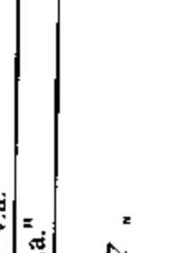

MNV

MAGYAR NEMZETI VAGYONKEZELŐ ZRT.

27.

---

MNV Zrt. rábízott vagyon 5. sz. tanúsítvány a V-2011-127/2009-2010. sz. jelentéshez

Befektetett eszközök értékesítése 2009. (100 MFt feletti tételek)

| Megnevezés | Bekerülési érték | Szerződésben foglalt vételár | Értékesítés nyeresége | Értékesítés vesztesége |
| --- | --- | --- | --- | --- |
| Termőföld | | | | |
| Bábolna | 651 | 1 328 | 777 | |
| Fájár megyei termőföld értékesítés | 125 | 268 | 143 | |
| Győr-Moson-Sopron megyei termőföld értékesítés | 77 | 296 | 219 | |
| Veszprém megyei termőföld értékesítés | 121 | 392 | 271 | |
| Zala megyei termőföld értékesítés | 416 | 620 | 204 | |
| BAZ megyei termőföld értékesítés | 391 | 627 | 236 | |
| **Összesen:** | **1 681** | **3 531** | **1 850** | **0** |
| Egyéb ingatlan | | | | |
| Siófok Kilifi repülőter | 168 | 238 | 40 | |
| Budapest II. Hűvösvölgyi út 21-23. | 104 | 6 820 | 6 716 | |
| Szombathely 013/6 és Gancsapáti 0100/5 Hrsz-ü ingatlanok | 91 | 199 | 138 | |
| Söpte 0104/1 Hrsz. | 499 | 411 | | 88 |
| Eger 2881/4. Hrsz-ü ingatlan | 300 | 208 | | 92 |
| Moszkva, Krasznaja Presznya 3. Ingatlan | 1 714 | 3 529 | 1 815 | |
| Nyírogynáza 1515/2 Hrsz-ü ingatlan | 12 | 106 | 94 | |
| Bp.V.Dorottya u. 8. (hrsz.: 24488) , Bp.V.Hold u. 17. (hrsz.: 24659) Ingatlanok | 1 202 | 1 433 | 231 | |
| **Összesen:** | **4 090** | **12 914** | **9 804** | **180** |
| Társasági részesedések | | | | |
| Nemzeti Tangazdaságok | 669 | 1 705 | 1 036 | |
| Állattenyésztési Telj. M. Kft. | 313 | 220 | | 93 |
| Autókot Rt. | 180 | 258 | 78 | |
| Mátrai Erőmű Rt. | 200 | 340 | 140 | |
| Vízhasznosító Kft. | 114 | 148 | 34 | |
| **Összesen:** | **1 476** | **2 671** | **1 288** | **93** |
| **Mindösszesen:** | **7 247** | **19 116** | **12 142** | **273** |

2010.08.18

MANTAK NEMZETI VAGYONKEZELŐ ZRT.

---

6. sz. tanúsítvány a V-2011-127/2009-2010. sz. jelentéshez

Az MNV Zrt. saját vagyonának eszközállomány változása 2009. évben

| Megnevezés | 2008. évi záró állomány (nyitó) | növekedés | Változás csökkenés | áll. vált. | 2009. évi záró állomány |
| --- | --- | --- | --- | --- | --- |
| Immateriális javak | 107 694 | 25 036 | 24 851 | 185 | 107 879 |
| Tárgyi eszközök | 2 752 153 | 213 839 | 249 794 | 35 955 | 2 716 198 |
| Befektetett pénzügyi eszközök | 22 293 | 22 000 | 6 553 | 15 447 | 37 739 |
| Befektetett eszközök összesen | 2 882 139 | 260 875 | 281 198 | 20 323 | 2 861 816 |
| Készletek | - | - | - | - | - |
| Követelések | 655 308 | 28 260 864 | 28 140 652 | 120 212 | 775 520 |
| Pénzeszközök | 2 876 511 | 23 280 387 | 24 300 222 | 1 019 835 | 1 856 676 |
| Forgóeszközök | 3 531 819 | 51 541 251 | 52 440 874 | 899 623 | 2 632 196 |
| Aktív időbeli elhatárolások | 11 701 | 1 149 | 11 701 | 10 552 | 1 149 |
| Eszközök összesen | 6 425 659 | 51 803 275 | 52 733 773 | 930 498 | 5 495 161 |

Budapest, 2010. augusztus 17.

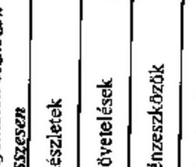

MAGYAR NEMZETI VAGYONKEZELŐ ZRT. 201.

---

7. sz. tanúsítvány a V-2011-127/2009-2010. sz. jelentéshez

Az MNV Zrt. saját vagyona forrásösszetételének változása 2009. évben

| Megnevezés | 2008 évi záró állomány | növekedés | Változás csökkenés | áll. vált. | 2009. évi záró állomány |
| --- | --- | --- | --- | --- | --- |
| Saját tőke | 2 609 068 | | | | 2 609 068 |
| Céltartalék | 52 359 | 168 823 | 52 698 | 116 125 | 168 484 |
| Kötelezettségek | 3 596 832 | 39 766 006 | 40 961 603 | 1 195 597 | 2 401 235 |
| Passzív időbeli elhatárolások | 167 400 | 316 374 | 167 400 | 148 974 | 316 374 |
| Források összesen | 6 425 659 | 40 251 203 | 41 181 701 | 930 498 | 5 495 161 |

Budapest, 2010. augusztus 17.

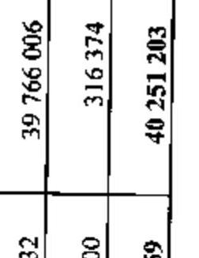

---

Az MNV Zrt. működéséhez kapcsolódó anyagjellegű ráfordítások alakulása 2009. évben

| Megnevezés | | | | | |
| :--: | :--: | :--: | :--: | :--: | :--: |
| | $\text { terv (E Ft) }^{*}$ | 2009. év | | | $\%$   Tervhez |
| | | $\%$ | tény (E Ft) | tény $\%$ | |
| Energia | 178766 | 57,18 | 134149 | 56,41 | 75,04 |
| Üzemanyag | 50000 | 15,99 | 44491 | 18,71 | 88,98 |
| Nyomtatvány, irodaszer | 54000 | 17,27 | 39816 | 12,54 | 55,21 |
| Egyéb ki nem emelt anyag. költség | 29888 | 9,56 | 29343 | 12,34 | 98,17 |
| 1. Anyagköltség összesen | 312654 | 12,67 | 237798 | 8,89 | 76,06 |
| Utazás- és szállásköltség | 17085 | 0,82 | 1552 | 0,06 | 9,08 |
| Fenntartás, javítás és karbantartás | 119034 | 5,68 | 84943 | 3,56 | 71,36 |
| Posta, telefon, futárszolgálat | 76637 | 3,66 | 62828 | 2,63 | 81,98 |
| Székház, területi irodák, raktár fenntartás, üzemeltetés | 415994 | 19,85 | 335470 | 14,04 | 80,64 |
| Egyéb ki nem emelt anyag. jellegű szolgáltatás | 1466959 | 70,00 | 1903957 | 79,71 | 129,79 |
| 2. Igénybe vett szolgáltatások értéke | 2095709 | 84,90 | 2388730 | 89,28 | 113,98 |
| 3. Egyéb szolgáltatások | 38200 | 1,55 | 38661 | 1,44 | 101,21 |
| 4. Eladott (közvetített) szolgáltatások értéke | 21800 | 0,88 | 10446 | 0,39 | 47,92 |
| 5. Anyagjellegű ráfordítások összesen ( $1=2+3+4$ ) | 2468363 | 100 | 2675655 | 100,00 | 108,40 |

* A 2009. évre vonatkozó tervben az eredménykimutatás költség sorai Áfa tartalommal növelt bruttó értéken kerültek megtervezésre. A tény adatokkal való összehasonlíthatóság biztosítása miatt, a terv adatok a 8. sz. tanúsítványban nem tartalmazzák az Áfá-t.

Budapest, 2010. augusztus 17.
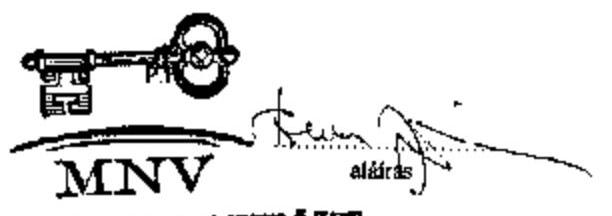

MAGYAR NEMZETI VAGYONKEZELŐ ZRT.
20.

---

9. sz. tanúsítvány a V-2011-127/2009-2010. sz. jelentéshez

Az MNV Zrt. átlagos állományi létszámának alakulása 2009. évben

| Megnevezés | 2009. év | | |
| --- | --- | --- | --- |
| | terv | tény | Teljesítés % tervhez |
| Teljes munkaidőben fogl. (fő) | 426 | 420 | 98,59% |
| Részmunkaidőben fogl. (fő) | 1 | 1 | 100,00% |
| Állományi létszám összesen (fő) | 427 | 421 | 98,59% |
| Keresetfejlesztés (%) | 103% | 102,20% | 99,22% |

Budapest, 2010. augusztus *14*

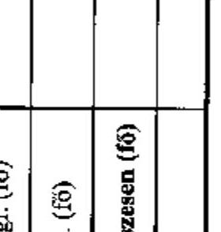

---

1. sz. tanúsítvány a V-2011-127/2009-2010. sz. jelentéshez

Az MNV Zrt. állományi létszám változása 2009. évben

| Megnevezés | 2009. január 1. | 2009. december 31. | Változás
% | Változás
% |
| --- | --- | --- | --- | --- |
| | Státusz | Betöltött állás | Státusz | Betöltött állás |
| Vezető | 29 | 29 | 28 | 26 |
| Vezető-helyettes | 19 | 17 | 18 | 18 |
| Menedzser | 300 | 283 | 318 | 307 |
| Ügyintéző | 79 | 78 | 83 | 83 |
| Összesen | 427 | 407 | 447 | 434 |

Budapest, 2010. augusztus "44."

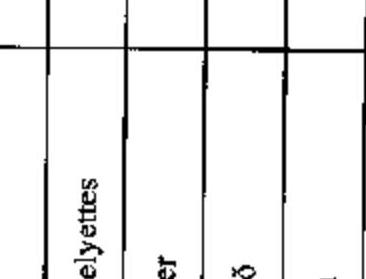

---

Az MNV Zrt. működésével kapcsolatos személyi jellegű ráfordítások alakulása 2009. évben

| Megnevezés | 2009. év | | | | |
| :--: | :--: | :--: | :--: | :--: | :--: | | :--: | :--: |
|  | terv (E Ft) | $\%$ | tény(E Ft) | $\%$ | Telj. tervhez $\%$ |
| Bérköltség | 3473398 | 58,43 | 3459268 | 61,02 | 99,59 |
| ebből: jutalmak | 220000 | 3,70 | 219267 | 3,87 | 99,67 |
| Személyi jellegű kifizetések | 2471424 | 41,57 | 2209575 | 38,98 | 89,40 |
| ebből: szerzői díjak | 0 | 0,00 | 0 | 0,00 | 0,00 |
| étkezési hozzájárulás | 61488 | 1,03 | 59634 | 1,05 | 96,98 |
| túlóratál hozzájárulás | 5000 | 0,08 | 2747 | 0,05 | 54,94 |
| albérleti hozzájárulás | 1000 | 0,02 | 0 | 0,00 | 0,00 |
| utazási hozzájárulás | 16000 | 0,27 | 17289 | 0,30 | 108,06 |
| reprezentáció | 25000 | 0,42 | 16084 | 0,28 | 64,34 |
| segélyek | 5000 | 0,08 | 750 | 0,01 | 15,00 |
| saját gépjármű hivatali célú használata | 3000 | 0,08 | 1958 | 0,03 | 39,16 |
| belföldi napidíj | 2000 | 0,03 | 480 | 0,01 | 24,00 |
| külföldi napidíj | 2000 | 0,03 | 325 | 0,01 | 16,25 |
| betegszabadság | 30000 | 0,50 | 29538 | 0,52 | 98,46 |
| egyéb személyi jell. kifiz. | 936216 | 15,75 | 785871 | 13,86 | 83,94 |
| munkáltatói terb. táppénz | 6000 | 0,10 | 4038 | 0,07 | 67,30 |
| nyugdíjpénztári munkáltatói hozzájár (alapbér 3\%-a) | 64360 | 1,08 | 57562 | 1,02 | 89,44 |
| a Cafeterián belüli ONTP hozzájár. kiegészítése |  |  | 23851 |  |  |
| egészségpénztári munkáltatói hozzáj (alapbér 3\%-a) | 64360 | 1,08 | 55641 | 0,98 | 86,45 |
| a Cafeterián belüli OGP hozzájár. kiegészítése |  |  | 19769 |  |  |
| dolgozók életbiztosítása | 0 | 0,00 | 0 | 0,00 | 0,00 |
| belső továbbképzés | 0 | 0,00 | 0 | 0,00 | 0,00 |
| munkaruha | 0 | 0,00 | 0 | 0,00 | 0,00 |
| társadalombizt. járulék | 1248000 | 20,99 | 1134018 | 20,00 | 90,87 |
| Személyi jellegű ráfordítások összesen | 5944822 |  | 5668843 |  | 95,36 |

Budapest, 2010. augusztus ${ }^{14}$
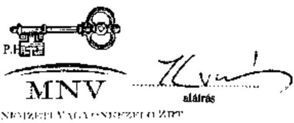

---

1. sz. tanúsítvány a V-2011-127/2009-2010. sz. jelentéshez

Az MNV Zrt. munkavállalóinak beosztásonkénti átlagkeresete 2009. évben

|  Sorszám | Állománycsoport | 2009. évi átlagkereset FUfő/hó  |
| --- | --- | --- |
|  1 | vezérigazgató és vezérigazgató helyettesek | 3 594 964  |
|  2 | igazgatók, ügyvezető igazgatók | 1 565 044  |
|  3 | igazgató-helyettesek, ügyvezető igazgató-helyettesek | 1 021 405  |
|  4 | vezető menedzserek | 690 720  |
|  5 | menedzserek | 462 528  |
|  6 | ügyintézők | 346 644  |
|  7 | MNV Zrt. munkavállalóinak éves átlagkeresete | 603 382  |

Budapest, 2010. augusztus 4. 11.

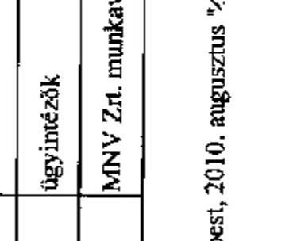

---

### Az MNV Zrt. 2009. évi forrásallokációja a felhasználás célja szerint

|  Társaság | Tőkeemelés | Támogatás | Környezetvédelmi támogatás | Kamattámogatás | Tul. kölcsön kifizetés | Gaztálék | Adatok eft-ban Tul. kölcsön visszafizetés  |
| --- | --- | --- | --- | --- | --- | --- | --- |
|  Jelentős súlyú, kiemelt cégek | 0 | 0 | 0 | 0 | 0 | 74 996 140 | 0  |
|  1 Magyar Rarda Zrt. |  |  |  |  |  | 7 500 000 |   |
|  2 Magyar Villamus Művek Zrt. |  |  |  |  |  | 56 809 410 |   |
|  3 Richter Gedeon Rt. |  |  |  |  |  | 2 751 730 |   |
|  4 Szerencsejáték Zrt. |  |  |  |  |  | 5 925 000 |   |
|  Erdőgazdasági csoport | 645 000 | 2 477 606 | 49 200 | 0 | 100 000 | 932 000 | 0  |
|  5 Bakonyi Erdészeti és Falpari Rt. | 260 000 | 107 294 |  |  |  |  |   |
|  6 Délalföldi Erdészeti Rt. |  | 296 813 |  |  |  |  |   |
|  7 Szeverítő Erdészeti Rt. | 200 000 | 77 526 |  |  | 100 000 |  |   |
|  8 Észak-Magyarországi Erdőgazdasági Rt. |  | 107 582 |  |  |  | 62 000 |   |
|  9 Gemenci Erdő- és Vadgazdasági Rt. |  | 158 152 | 37 460 |  |  | 10 000 |   |
|  10 GYULAI Erdészeti és Vadászati Rt. |  | 82 938 |  |  |  |  |   |
|  11 Ipoly Erdő Rt. |  | 151 606 |  |  |  | 19 000 |   |
|  12 Kissikfoki Erdőgazdasági Rt. |  | 80 083 |  |  |  |  |   |
|  13 Kiskunsági Erdészeti és Falpari Rt. |  | 196 192 |  |  |  |  |   |
|  14 Mecseki Erdészeti Rt. | 40 000 | 69 749 |  |  |  | 23 000 |   |
|  15 Nagykunsági Erdészeti és Falpari Rt. |  | 112 874 |  |  |  | 12 000 |   |
|  16 Nyírségi Erdészeti Rt. | 355 000 | 385 231 |  |  |  | 272 000 |   |
|  17 Pósi Parkerdőgazdasági Rt. |  | 71 424 |  |  |  | 18 000 |   |
|  18 Somogyi Erdészeti és Falpari Rt. |  | 190 342 |  |  |  | 69 000 |   |
|  19 Szombathelyi Erdészeti Rt. |  | 137 177 |  |  |  | 48 000 |   |
|  20 Támományi Erdőgazdasági Rt. | 100 000 | 42 289 |  |  |  |  |   |
|  21 VADILLÓ Mezőföldi Erdő- és Vadgazd. Rt. |  | 74 007 | 11 740 |  |  |  |   |
|  22 Vértesi Erdészeti és Falpari Rt. |  | 103 277 |  |  |  | 12 000 |   |
|  23 Zalai Erdészeti és Falpari Rt. |  | 41 640 |  |  |  | 387 000 |   |
|  Volán csoport | 0 | 0 | 0 | 0 | 0 | 1 797 457 | 0  |
|  24 Agita Volán Rt. |  |  |  |  |  | 39 364 |   |
|  25 Bakony Volán Rt. |  |  |  |  |  | 38 592 |   |
|  26 Borsod Volán Rt. |  |  |  |  |  | 23 108 |   |
|  27 HAJDÚ Volán Rt. |  |  |  |  |  | 39 684 |   |
|  28 Kapos Volán Rt. |  |  |  |  |  | 89 563 |   |
|  29 Kissikfoki Volán Rt. |  |  |  |  |  | 53 567 |   |
|  30 Kunság Volán Rt. |  |  |  |  |  | 35 981 |   |
|  31 Pannon Volán Rt. |  |  |  |  |  | 85 653 |   |
|  32 Tisza Volán Rt. |  |  |  |  |  | 30 609 |   |
|  33 VOLÁNBUSZ Rt. |  |  |  |  |  | 1 264 499 |   |
|  Hitelintézetek és biztosító | 0 | 0 | 0 | 0 | 0 | 0 | 0  |
|  Profitorientált időszaki tulajdonú céglet | 718 800 | 540 980 | 11 242 000 | 0 | 2 264 376 | 1 066 121 | 1 528 094  |
|  34 Agrárgazdasági Vegyhez, Kft. (MFG-Prósz) |  |  |  |  |  |  | 750 000  |
|  35 ALFÖLDI Műemlékeletreállító Kft. |  |  |  |  | 10 000 |  | 10 000  |
|  36 ÁT Kft. |  |  |  |  |  | 150 000 |   |
|  37 Áldékot Rt. |  |  |  |  |  | 13 121 |   |
|  38 Bábomai Nemzeti Ménestörlök Kft. | 466 000 | 260 000 |  |  | 150 000 |  | 283 094  |
|  39 Balapni Hatászati Zrt. |  |  |  |  | 562 000 |  |   |
|  40 Hollóházi Porcelán Zrt. |  | 100 000 |  |  |  |  |   |
|  41 KOPINT-GATORG zRt. |  |  |  |  | 800 000 |  | 915 000  |
|  42 MALÉV Vagyonkezelő Kft. |  |  |  |  | 662 376 |  |   |
|  43 Megsek OKO Rt. |  |  | 5 932 000 |  |  |  |   |
|  44 Minőhegynei Állami Ménes Kft. | 50 055 | 130 000 |  |  |  |  |   |
|  45 MTKI Kft. |  |  |  |  |  | 878 000 |   |
|  46 Körokomo Vegyipari Zrt. |  |  | 5 310 000 |  |  |  |   |
|  47 MOKÉP - Pannónia Kft. |  | 50 000 |  |  |  |  |   |
|  48 Piller Kft. |  |  |  |  |  | 25 000 |   |
|  49 Szegedi SZÉFO zrt. | 200 000 |  |  |  |  |  |   |
|  Profitorienstát kisabbaégi tulajdonú cég | 0 | 0 | 0 | 0 | 0 | 743 913 | 0  |
|  50 Budapest Elektromos Művek Zrt. |  |  |  |  |  | 2 |   |
|  51 Épás-Dégáz Zrt. |  |  |  |  |  | 1 |   |
|  52 EMÁSZ Hjrt. |  |  |  |  |  | 2 |   |
|  53 Gecsákos Zrt. |  |  |  |  |  | 4 073 |   |
|  54 Kapos-Corp Kereskedelmi Zrt. |  |  |  |  |  | 3 |   |
|  55 Magyar Telekom Rt. |  |  |  |  |  | 7 |   |
|  56 MAVIN Zrt. |  |  |  |  |  | 505 |   |
|  57 Dosa-Szoussár Szövetszer |  |  |  |  |  | 68 |   |
|  58 OTP BANK Rt. |  |  |  |  |  | 732 081 |   |
|  59 OVIT Zrt. |  |  |  |  |  | 1 |   |
|  60 Pásai Alamerőmű Zrt. |  |  |  |  |  | 1 |   |
|  61 SPECIÁL Zrt. |  |  |  |  |  | 5 858 |   |
|  62 Szarvagi Általános Informatikai KFT |  |  |  |  |  | 1 611 |   |
|  Nonprofit társaságok | 36 985 | 1 583 210 | 0 | 0 | 0 | 0 | 299 408  |

---

MNV Zrt.

1. sz. tanúsítvány a V-2011-127/2009-2010. sz. jelentéshez adatok a Ft-ban adatok a Ft-ban

|  Társaság | Tőkeemelés | Támogatás | Könyezetvédelmi támogatás | Kamat- támogatás | Tul. kölcsön kižzetés | Osztaidé | Tul. kölcsön visszafizetés  |
| --- | --- | --- | --- | --- | --- | --- | --- |
|  63 Budavári Kht. |  |  |  |  |  |  | 259 408  |
|  64 Ceglédi Gyámfizetelensztési Kht. |  | 39 000 |  |  |  |  |   |
|  65 Duna Palota Kht. | 35 885 | 54 515 |  |  |  |  |   |
|  66 Fertőző Gyámfizetelensztési Kht. |  | 10 000 |  |  |  |  |   |
|  67 Pátszegapota Kht. |  | 20 000 |  |  |  |  |   |
|  68 Gaboratelensztési Kutató Kht. |  | 220 000 |  |  |  |  |   |
|  69 Monostori Kht. |  | 140 695 |  |  |  |  |   |
|  70 Nemzeti Fémszínház Kht. |  | 30 000 |  |  |  |  |   |
|  71 Nemzeti Kataszteri Program Kht. |  | 1 000 000 |  |  |  |  |   |
|  72 OHKI Országos Húsipari Kutatóintézet Kht. |  | 20 000 |  |  |  |  | 20 000  |
|  73 Újfehértii GYKSZ Gyámfizetelensztési Kht. |  | 49 000 |  |  |  |  | 10 000  |
|  74 Vagyonkezelésben lévő cégek | 0 | 0 | 0 | 0 | 0 | 0 | 0  |
|  Partfolódási köbekerült cégek, egyéb | 500 | 3 500 | 0 | 0 | 0 | 5 995 | 105 995  |
|  75 MM Szec. Rt. va. |  |  |  |  |  |  | 73 753  |
|  76 Ganz Danubius va. |  | 3 500 |  |  |  |  |   |
|  77 MAFILM |  |  |  |  |  |  | 32 243  |
|  78 FVM-es cégek 2007. évről |  |  |  |  |  |  |   |
|  79 Holiday Center Kft. |  |  |  |  |  | 3 694 |   |
|  80 EGSO Senior Kft. |  |  |  |  |  | 302 |   |
|  81 Holókikó Örtőségvédő hongyofit Kft. | 500 |  |  |  |  |  |   |
|  82 Örtőlártokossági társulások |  |  |  |  |  | 781 |   |

|  Minőségesen | 1 698 385 | 4 603 716 | 11 291 200 | 0 | 2 304 376 | 79 542 388 | 1 933 498  |
| --- | --- | --- | --- | --- | --- | --- | --- |
|  MNV tulajdonosi joggyakorásúak össze | 1 698 385 | 4 603 716 | 11 291 200 | 0 | 2 304 376 | 79 542 388 | 1 933 498  |

Budapest, 2010. augusztus 17.

Pf1

*András*

Andrádi Tibor

MAGYAR NEMZETI VAGYONKEZELŐ ZRT. 23.

---

1. sz. tanúsítvány a V-2011-127/2009-2010. sz. jelentőshez

Az MNV Zrt. portföliójába tartozó társaságok egyes gazdasági adatainak alakulása

|  Ssz. | Társaság | Tartós állami tulajdon hányad | MNV Zrt. tulajdon hányad | Adózás előtti eredmény MNV hányada | Adózott eredmény MNV hányada  |
| --- | --- | --- | --- | --- | --- |
|   |  | 2009.XII.31. | 2009.XII.31. | 2008. év tény | 2009. év tény  |
|   | Jelentős súlyú, kiemelt cégek |  |  | 79 029 546 | 38 962 275  |
|  1 | Állami Autópálya Kezelő Zrt. | 0,00% | 100,00% | 28 743 577 | 3 418 768  |
|  2 | Budapest Airport Zrt. | 0,00% | 24,94% | -7 431 496 | -4 987 580  |
|  3 | Magyar Posta Zrt. | 75%+1 sz. | 100,00% | 8 887 808 | 4 874 000  |
|  4 | Magyar Villamos Művek Zrt. | 75%+1 sz. | 99,87% | 33 610 358 | 34 462 294  |
|  5 | Richter Gedeon Rt. | 0,00% | 25,12% | 11 327 593 | 8 790 425  |
|  6 | Szerencsejáték Zrt. | 100,00% | 100,00% | 6 891 807 | 2 404 388  |
|   | Erdőgazdasági csoport |  |  | 3 082 122 | 1 072 426  |
|  7 | Bakonyerőő Erdészeti és Falpari Zrt. | 100,00% | 100,00% | 97 430 | 34 703  |
|  8 | DALERD Délutólati Erdészeti Zrt. | 100,00% | 100,00% | 27 775 | 4 340  |
|  9 | Egererdő Erdészeti Zrt. | 100,00% | 100,00% | 11 171 | 8 000  |
|  10 | Eszákerdő Erdőgazdasági Zrt. | 100,00% | 100,00% | 250 081 | 10 000  |
|  11 | Gernend Erdő- és Vadgazdaság Zrt. | 100,00% | 100,00% | 71 267 | 0  |
|  12 | Gyulaj Erdészeti és Vadászati Zrt. | 100,00% | 100,00% | 28 746 | 3 351  |
|  13 | Ipoly Erdő Zrt. | 100,00% | 100,00% | 98 899 | 48 519  |
|  14 | Kisaföldi Erdőgazdasági Zrt. | 100,00% | 100,00% | -54 161 | 33 250  |
|  15 | KEFAG Kiskunsági Erdészeti Zrt. | 100,00% | 100,00% | -50 099 | 2 920  |
|  16 | Mecseki Erdészeti Zrt. | 100,00% | 100,00% | 120 546 | 52 000  |
|  17 | NEFAG Nagykunsági Erdészeti Zrt. | 100,00% | 100,00% | 79 616 | 32 260  |
|  18 | Nyirerdő Nyírsági Erdészeti Zrt. | 100,00% | 100,00% | 720 342 | 279 300  |
|  19 | Pilai Parkerdőgazdaság Zrt. | 100,00% | 100,00% | 103 022 | 35 200  |
|  20 | SEFAG Erdészeti és Falpari Zrt. | 100,00% | 100,00% | 240 302 | 100 000  |
|  21 | Szomorúhelyi Erdészeti Zrt. | 100,00% | 100,00% | 199 338 | 80 000 |
| 22 | Tanulmányi Erdőgazdaság Zrt. | 100,00% | 100,00% | 30 196 | 5 804 |
| 23 | VÁDEX Mezőföldi Erdő- és Vadgazd. Zrt. | 100,00% | 100,00% | 25 132 | 2 041 |
| 24 | Vértesi Erdészeti és Faipari Zrt. | 100,00% | 100,00% | 99 206 | 52 728 |
| 25 | Zalaerdő Erdészeti Zrt. | 100,00% | 100,00% | 983 310 | 290 000 |
| | Volán csoport | | | 5 773 774 | -623 480 |
| 26 | Ágria Volán Zrt. | 0,00% | 97,81% | 131 181 | 44 249 |
| 27 | Alba Volán Zrt. | 0,00% | 98,53% | 3 930 | -320 396 |

1. sz. tanúsítvány a V-2011-127/2009-2010. sz. jelentéshez adatok eFI-ban Saját tőke MNV hányada

2009. év tény 2009. év tény 2009. év tény 2009. év tény 2009. év tény 2009. év tény 2009. év tény 2009. év tény 2009. év tény 2009. év tény 2009. év tény 2009. év tény 2009. év tény 2009. év tény 2009. év tény 2009. év tény 2009. év tény 2009. év tény 2009. év tény 2009. év tény 2009. év tény 2009. év tény 2009. év tény 2009. év tény 2009. év tény 2009. év tény 2009. év tény 2009. év tény 2009. év tény 2009. év tény 2009. év tény 2009. év tény 2009. év tény 2009. év tény 2009. év tény 2009. év tény 2009. év tény 2009. év tény 2009. év tény 2009. év tény 2009. év tény 2009. év tény 2009. év tény 2009. év tény 2009. év tény 2009. év tény 2009. év tény 2009. év tény 2009. év tény 2009. év tény 2009. év tény 2009. év tény 2009. év tény 2009. év tény 2009. év tény 2009. év tény 2009. év tény 2009. év tény 2009. év tény 2009. év tény 2009. év tény 2009. év tény 2009. év tény 2009. év tény 2009. év tény 2009. év tény 2009. év tény 2009. év tény 2009. év tény 2009. év tény 2009. év tény 2009. év tény 2009. év tény 2009. év tény 2009. év tény 2009. év tény 2009. év tény 2009. év tény 2009. év tény 2009. év tény 2009. év
 tény 2009. év tény 2009. év tény 2009. év tény 2009. év tény 2009. év tény 2009. év tény 2009. év tény 2009. év tény 2009. év tény 2009. év tény 2009. év tény 2009. év tény 2009. év tény 2009. év tény 2009. év tény 2009. év tény 2009. év tény 2009. év tény 2009. év tény 2009. év tény 2009. év tény 2009. év tény 2009. év tény 2009. év tény 2009. év tény 2009. év tény 2009. év tény 2009. év tény 2009. év tény 2009. év tény 2009. év tény 2009. év tény 2009. év tény 2009. év tény 2009. év tény 2009. év tény 2009. év tény 2009. év tény 2009. év tény 2009. év tény 2009. év tény 2009. év tény 2009. év tény 2009. év tény 2009. év tény 2009. év tény 2009. év tény 2009. év tény 2009. év tény 2009. év tény 2009. év tény 2009. év tény 2009. év tény 2009. év tény 2009. év tény 2009. év tény 2009. év tény 2009. év tény 2009. év tény 2009. év tény 2009. év tény 2009. év tény 2009. év tény 2009. év tény 2009. év tény 2009. év tény 2009. év tény 2009. év tény 2009. év tény 2009. év tény 2009. év tény 2009. év tény 2009. év tény 2009. év tény 2009. év tény 2009. év tény 2009. év tény 2009. év tény 2009. év tény 2009. év tény 2009. év tény 2009. év tény 2009. év tény 2009. év tény 2009. év tény 2009. év tény 2009. év tény 2009. év tény 2009. év tény 2009. év tény 2009. év tény 2009. év tény
 2009. év tény 2009. év tény 2009. év tény 2009. év tény 2009. év tény 2009. év tény 2009. év tény 2009. év tény 2009. év tény 2009. év tény 2009. év tény 2009. év tény 2009. év tény 2009. év tény 2009. év tény 2009. év tény 2009. év tény 2009. év tény 2009. év tény 2009. év tény 2009. év tény 2009. év tény 2009. év tény 2009. év tény 2009. év tény 2009. év tény 2009. év tény 2009. év tény 2009. év tény 2009. év tény 2009. év tény 2009. év tény 2009. év tény 2009. év tény 2009. év tény 2009. év tény 2009. év tény 2009. év tény 2009. év tény 2009. év tény 2009. év tény 2009. év tény 2009. év tény 2009. év tény 2009. év tény 2009. év tény 2009. év tény 2009. év tény 2009. év tény 2009. év tény 2009. év tény 2009. év tény 2009. év tény 2009. év tény 2009. év tény 2009. év tény 2009. év tény 2009. év tény 2009. év tény 2009. év tény 2009. év tény 2009. év tény 2009. év tény 2009. év tény 2009. év tény 2009. év tény 2009. év tény 2009. év tény 2009. év tény 2009. év tény 2009. év tény 2009. év tény 2009. év tény 2009. év tény 2009. év tény 2009. év tény 2009. év tény 2009. év tény 2009. év tény 2009. év tény 2009. év tény 2009. év tény 2009. év tény 2009. év tény 2009. év tény 2009. év tény 2009. év tény 2009. év tény 2009. év tény 2009. év tény 2009. év tény 2009. év tény 2009. év tény 2009. év tény 2009. év tény 2009. év tény 2009. év tény 2009. év tény 2009. év tény 2009. év tény 2009. év tény 2009. év tény 2009. év tény 2009. év tény 2009. év tény 2009. év tény 2009. év tény 2009. év tény 2009. év tény 2009. év tény 2009. év tény 2009. év tény 2009. év tény 2009. év tény 2009. év tény 2009. év tény 2009. év tény 2009. év tény 2009. év tény 2009. év tény 2009. év tény 2009. év tény 2009. év tény 2009. év tény 2009. év tény 2009. év tény 2009. év tény 2009. év tény 2009. év tény 2009. év tény 2009.
 év tény 2009. év tény 2009. év tény 2009. év tény 2009. év tény 2009. év tény 2009. év tény 2009. év tény 2009. év tény 2009. év tény 2009. év tény 2009. év tény 2009. év tény 2009. év tény 2009. év tény 2009. év tény 2009. év tény 2009. év tény 2009. év tény 2009. év tény 2009. év tény 2009. év tény 2009. év tény 2009. év tény 2009. év tény 2009. év tény 2009. év tény 2009. év tény 2009. év tény 2009. év tény 2009. év tény 2009. év tény 2009. év tény 2009. év tény 2009. év tény 2009. év tény 2009. év tény 2009. év tény 2009. év tény 2009. év tény 2009. év tény 2009. év tény 2009. év tény 2009. év tény 2009. év tény 2009. év tény 2009. év tény 2009. év tény 2009. év tény 2009. év tény 2009. év tény 2009. év tény 2009. év tény 2009. év tény 2009. év tény 2009. év tény 2009. év tény
 2009. év tény 2009. év tény 2009. év tény 2009. év tény 2009. év tény 2009. év tény 2009. év tény 2009. év tény 2009. év tény 2009. év tény 2009. év tény 2009. év tény 2009. év tény 2009. év tény 2009. év tény 2009. év tény 2009. év tény 2009. év tény 2009. év tény 2009. év tény 2009. év tény 2009. év tény 2009. év tény 2009. év tény 2009. év tény 2009. év tény 2009. év tény 2009. év tény 2009. év tény 2009. év tény 2009. év tény 2009. év tény 2009. év tény 2009. év tény 2009. év tény 2009. év tény 2009. év tény 2009. év tény 2009. év tény 2009. év tény 2009. év tény 2009. év tény 2009. év tény 2009. év tény 2009. év tény 2009. év tény 2009. év tény 2009. év tény 2009. év tény 2009. év tény 2009. év tény 2009. év tény 2009. év tény 2009. év tény 2009. év tény 2009. év tény 2009. év tény 2009. év tény 2009. év tény 2009. év tény 2009. év tény 2009. év tény 2009. év tény 2009. év tény 2009. év tény 2009. év tény 2009. év tény 2009. év tény 2009. év tény 2009. év tény 2009. év tény 2009. év tény 2009. év tény 2009. év tény 2009. év tény 2009. év tény 2009. év tény 2009. év tény 2009. év tény 2009. év tény 2009. év tény 2009. év tény 2009. év tény 2009. év tény 2009. év tény 2009. év tény 2009. év tény 2009. év tény 2009. év tény 2009. év tény 2009. év tény 2009. év tény 2009. év tény 2009. év tény 2009. év tény 2009. év tény 2009. év tény 2009. év tény 2009. év tény 2009. év tény 2009. év tény 2009. év tény 2009. év tény 2009. év tény 2009. év tény 2009. év tény 2009. év tény 2009. év tény 2009. év tény 2009. év tény 2009. év tény 2009. év tény 2009. év tény 2009. év tény 2009. év tény 2009. év tény 2009. év tény 2009. év tény 2009. év tény 2009. év tény 2009. év tény 2009. év tény 2009. év tény 2009. év tény 2009. év tény 2009. év tény 2009. év tény 2009. év tény 2009. év tény 2009. év tény 2009.
 év tény 2009. év tény 2009. év tény 2009. év tény 2009. év tény 2009. év tény 2009. év tény 2009. év tény 2009. év tény 2009. év tény 2009. év tény 2009. év tény 2009. év tény 2009. év tény 2009. év tény 2009. év tény 2009. év tény 2009. év tény 2009. év tény 2009. év tény 2009. év tény 2009. év tény 2009. év tény 2009. év tény 2009. év tény 2009. év tény 2009. év tény 2009. év tény 2009. év tény 2009. év tény 2009. év tény 2009. év tény 2009. év tény 2009. év tény 2009. év tény 2009. év tény 2009. év tény 2009. év tény 2009. év tény 2009. év tény 2009. év tény 2009. év tény 2009. év tény 2009. év tény 2009. év tény 2009. év tény 2009. év tény 2009. év tény 2009. év tény 2009. év tény 2009. év tény 2009. év tény 2009. év tény 2009. év tény 2009. év tény 2009. év tény 2009. év tény 2009. év tény 2009. év tény 2009. év tény 2009. év tény 2009. év tény 2009. év tény 2009. év tény 2009. év tény 2009. év tény 2009. év tény 2009. év tény 2009. év tény 2009. év tény 2009. év tény 2009. év tény 2009. év tény 2009. év tény 2009. év tény 2009. év tény 2009. év tény 2009. év tény 2009. év tény 2009. év tény 2009. év tény 2009. év tény 2009. év tény 2009. év tény 2009. év tény 2009. év tény 2009. év tény 2009. év tény 2009. év tény 2009. év tény 2009. év tény 2009. év tény 2009. év tény 2009. év tény 2009. év tény 2009. év tény 2009. év tény 2009. év tény 2009. év tény 2009. év tény 2009. év tény 2009. év tény 2009. év tény 2009. év tény 2009. év tény 2009. év tény 2009. év tény 2009. év tény 2009. év tény 2009. év tény 2009. év tény 2009. év tény 2009. év tény 2009. év tény 2009. év tény 2009. év tény 2009. év tény 2009. év tény 2009. év tény 2009. év tény 2009. év tény 2009. év tény 2009. év tény 2009. év tény 2009. év tény 2009. év tény 2009. év tény 2009. év tény 2009. év tény 2009. év tény 2009. év tény 2009. év tény 2009. év tény 2009. év tény 2009. év tény 2009. év tény 2009. év tény 2009. év tény 2009. év tény 2009. év tény 2009. év tény 2009. év tény 2009. év tény 2009. év tény 2009. év tény 2009. év tény 2009. év tény 2009. év tény 2009. év tény 2009. év tény 2009. év tény 2009. év tény 2009. év tény 2009. év tény 2009. év tény 2009. év tény 2009. év tény 2009. év tény 2009. év tény 2009. év tény 2009. év tény 2009. év tény 2009. év tény 2009. év tény 2009. év tény 2009. év tény 2009. év tény 2009. év tény 2009. év tény 2009. év tény 2009. év tény 2009. év tény 2009. év tény 2009. év tény 2009. év tény 2009. év tény 2009. év tény 2009. év tény 2009. év tény 2009. év tény 2009. év tény 2009. év tény 2009. év tény 2009. év tény 2009. év tény 2009. év tény 2009. év tény 2009. év tény 2009. év tény 2009. év tény 2009. év tény 2009. év tény 2009. év tény 2009. év tény 2009. év tény 2009. év tény 2009. év tény 2009. év tény 2009. év tény 2009. év tény 2009. év tény 2009. év tény 2009. év tény 2009. év tény 2009. év tény 2009. év tény 2009. év tény 2009. év tény 2009. év tény 2009. év tény 2009. év tény 2009. év tény 2009. év tény 2009. év tény 2009. év tény 2009. év tény 2009. év tény 2009. év tény 2009. év tény 2009. év tény 2009. év tény 2009. év tény 2009. év tény 2009. év tény 2009. év tény 2009. év tény 2009. év tény 2009. év tény 2009. év tény 2009. év tény 2009. év tény 2009. év tény 2009. év tény 2009. év tény 2009. év tény 2009. év tény 2009. év tény 2009. év tény 2009. év tény 2009. év tény 2009. év tény 2009. év tény 2009. év tény 2009. év tény 2009. év tény 2009. év tény 2009. év tény 2009. év tény 2009. év tény 2009. év tény 2009. év tény 2009. év tény 2009. év tény 2009. év tény 2009. év tény 2009. év tény 2009. év tény 2009. év tény 2009. év tény 2009. év tény 2009. év tény 2009. év tény 2009. év tény 2009. év tény 2009. év tény 2009. év tény 2009. év tény 2009. év tény 2009. év tény 2009. év tény 2009. év tény 2009. év tény 2009. év tény 2009. év tény 2009. év tény 2009. év tény 2009. év tény 2009. év tény 2009. év tény 2009. év tény 2009. év tény 2009. év tény 2009. év tény 2009. év tény 2009. év tény 2009. év tény 2009. év tény 2009. év tény 2009. év tény 2009. év tény 2009. év tény 2009. év tény 2009. év tény 2009. év tény 2009. év tény 2009. év tény 2009. év tény 2009. év tény 2009. év tény 2009. év tény 2009. év tény 2009. év tény 2009. év tény 2009. év tény 2009. év tény 2009. év tény 2009. év tény 2009. év tény 2009. év tény 2009. év tény 2009. év tény 2009. év tény 2009. év tény 2009. év tény 2009. év tény 2009. év tény 2009. év tény 2009. év tény 2009. év tény 2009. év tény 2009. év tény 2009. év tény 2009. év tény 2009. év tény 2009. év tény 2009. év tény 2009. év tény 2009. év tény 2009. év tény 2009. év tény 2009. év tény 2009. év tény 2009. év tény 2009. év tény 2009. év tény 2009. év tény 2009. év tény 2009. év tény 2009. év tény 2009. év tény 2009. év tény 2009. év tény 2009. év tény 2009. év tény 2009. év tény 2009. év tény 2009. év tény 2009. év tény 2009. év tény 2009. év tény 2009. év tény 2009. év tény 2009. év tény 2009. év tény 2009. év tény 2009. év tény 2009. év tény 2009. év tény 2009. év tény 2009. év tény 2009. év tény 2009. év tény 2009. év tény 2009. év tény 2009. év tény 2009. év tény 2009. év tény 2009. év tény 2009. év tény 2009. év tény 2009. év tény 2009. év tény 2009. év tény 2009. év tény 2009. év tény 2009. év tény 2009. év tény 2009. év tény 2009. év tény 2009. év tény 2009. év tény 2009. év tény 2009. év tény 2009. év tény 2009. év tény 2009. év tény 2009. év tény 2009. év tény 2009. év tény 2009. év tény 2009. ev tény 2009. ev tény 2009. ev tény 2009. ev tény 2009. ev tény 2009. ev tény 2009. ev tény 2009. ev tény 2009. ev tény 2009. ev tény 2009. ev tény 2009. ev tény 2009. ev tény 2009. ev tény 2009. ev tény 2009. ev tény 2009. ev tény 2009. ev tény 2009. ev tény 2009. ev tény 2009. ev tény 2009. ev tény 2009. ev tény 2009. ev tény 2009. ev tény 2009. ev tény 2009. ev tény 2009. ev tény 2009. ev tény 2009. ev tény 2009. ev tény 2009. ev tény 2009. ev tény 2009. ev tény 2009. ev tény 2009. ev tény 2009. ev tény 2009. ev tény 2009. ev tény 2009. ev tény 2009. ev tény 2009. ev tény 2009. ev tény 2009. ev tény 2009. ev tény 2009. ev tény 2009. ev tény 2009. ev tény 2009. ev tény 2009. ev tény 2009. ev tény 2009. ev tény 2009. ev tény 2009. ev tény 2009. ev tény 2009. ev tény
 2009. év tény 2009. év tény 2009. év tény 2009. év tény 2009. év tény 2009. év tény 2009. év tény 2009. év tény 2009. év tény 2009. év tény 2009. év tény 2009. év tény 2009. év tény 2009. év tény 2009. év tény 2009. év tény 2009. év tény 2009. év tény 2009. év tény 2009. év tény 2009. év tény 2009. év tény 2009. év tény 2009. év tény 2009. év tény 2009. év tény 2009. év tény 2009. év tény 2009. év tény 2009. év tény 2009. év tény 2009. év tény 2009. év tény 2009. év tény 2009. év tény 2009. év tény 2009. év tény 2009. év tény 2009. év tény 2009. év tény 2009. év tény 2009. év tény 2009. év tény 2009. év tény 2009. év tény 2009. év tény 2009. év tény 2009. év tény 2009. év tény 2009. év tény 2009. év tény 2009. év tény 2009. év tény 2009. év tény 2009. év tény 2009. év tény 2009. év tény 2009. év tény 2009. év tény 2009. év tény 2009. év tény 2009. év tény 2009. év tény 2009. év tény 2009. év tény 2009. év tény 2009. év tény 2009. év tény 2009. év tény 2009. év tény 2009. év tény 2009. év tény 2009. év tény 2009. év tény 2009. év tény 2009. év tény 2009. év tény 2009. év tény 2009. év tény 2009. év tény 2009. év tény 2009. év tény 2009. év tény 2009. év tény 2009. év tény 2009. év tény 2009. év tény 2009. év tény 2009. év tény 2009. év tény 2009. év tény 2009. év tény 2009. év tény 2009. év tény 2009. év tény 2009. év tény 2009. év tény 2009. év tény 2009. év tény 2009. év tény 2009. év tény 2009. év tény 2009. év tény 2009. év tény 2009. év tény 2009. év tény 2009. év tény 2009. év tény 2009. év tény 2009. év tény 2009. év tény 2009. év tény 2009. év tény 2009. év tény 2009. év tény 2009. év tény 2009. év tény 2009. év tény 2009. év tény 2009. év tény 2009. ev tény
 ev tény 2009. ev tény 2009. ev tény 2009. ev tény 2009. ev tény 2009. ev tény 2009. ev tény 2009. ev tény 2009. ev tény 2009. ev tény 2009. ev tény 2009. ev tény 2009. ev tény 2009. ev tény 2009. ev tény 2009. ev tény 2009. ev tény 2009. ev tény 2009. ev tény 2009. ev tény 2009. ev tény 2009. ev tény 2009. ev tény 2009. ev tény 2009. ev tény 2009. ev tény 2009. ev tény 2009. ev tény 2009. ev tény 2009. ev tény 2009. ev tény 2009. ev tény 2009. ev tény 2009. ev tény 2009. ev tény 2009. ev tény 2009. ev tény 2009. ev tény 2009. ev tény 2009. ev tény 2009. ev tény 2009. ev tény 2009. ev tény 2009. ev tény 2009. ev tény 2009. ev tény 2009. ev tény 2009. ev tény 2009. ev tény 2009. ev tény 2009. ev tény 2009. ev tény 2009. ev tény 2009. ev tény 2009. ev tény 2009. ev tény 2009. ev tény 2009. ev tény 2009. ev tény 2009. ev tény 2009. ev tény 2009. ev tény 2009. ev tény 2009. ev tény 2009. ev tény 2009. ev tény 2009. ev tény 2009. ev tény 2009. ev tény 2009. ev tény 2009. ev tény 2009. ev tény 2009. ev tény 2009. ev tény 2009. ev tény 2009. ev tény 2009. ev tény 2009. ev tény 2009. ev tény 2009. ev tény 2009. ev tény 2009. ev tény 2009. ev tény 2009. ev tény 2009. ev tény 2009. ev tény 2009. ev tény 2009. ev tény 2009. ev tény 2009. ev tény 2009. ev tény 2009. ev tény 2009. ev tény 2009. ev tény 2009. ev tény 2009. ev tény 2009. ev tény 2009. ev tény 2009. ev tény 2009. ev tény 2009. ev tény 2009. ev tény 2009. ev tény 2009. ev tény 2009. ev tény 2009. ev tény 2009. ev tény 2009. ev tény 2009. ev tény 2009. ev tény 2009. ev tény 2009. ev tény 2009. ev tény 2009. ev tény 2009. ev tény 2009. ev tény 2009. ev tény 2009. ev tény 2009. ev tény 2009. ev tény 2009. ev tény 2009. ev tény 2009. ev tény 2009. ev tény 2009. ev tény 2009. ev tény 2009. ev tény 2009. ev tény 2009. ev tény 2009. ev tény 2009. ev tény 2009. ev tény 2009. ev tény 2009. ev tény 2009. ev tény 2009. ev tény 2009. ev tény 2009. ev tény 2009. ev tény 2009. ev tény 2009. ev tény 2009. ev tény 2009. ev tény 2009. ev tény 2009. ev tény 2009. ev tény 2009. ev tény 2009. ev tény 2009. ev tény 2009. ev tény 2009. ev tény 2009. ev tény 2009. ev tény 2009. ev tény 2009. ev tény 2009. ev tény 2009. ev tény 2009. ev tény 2009. ev tény 2009. ev tény 2009. ev tény 2009. ev tény 2009. ev tény 2009. ev tény 2009. ev tény 2009. ev tény 2009. ev tény 2009. ev tény 2009. ev tény 2009. ev tény 2009. ev tény 2009. ev tény 2009. ev tény 2009. ev tény 2009. ev tény 2009. ev tény 2009. ev tény 2009. ev tény 2009. ev tény 2009. ev tény 2009. ev tény 2009. ev tény 2009. ev tény 2009. ev tény 2009. ev tény 2009. ev tény 2009. ev tény 2009. ev tény 2009. ev tény 2009. ev tény 2009. ev tény 2009. ev tény 2009. ev tény 2009. ev tény 2009. ev tény 2009. ev tény 2009. ev tény 2009. ev tény 2009. ev tény 2009. ev tény 2009. ev tény 2009. ev tény 2009. ev tény 2009. ev tény 2009. ev tény 2009. ev tény 2009. ev tény 2009. ev tény 2009. ev tény 2009. ev tény 2009. ev tény 2009. ev tény 2009. ev tény 2009. ev tény 2009. ev tény 2009. ev tény 2009. ev tény 2009. ev tény 2009. ev tény 2009. ev tény 2009. ev tény 2009. ev tény 2009. ev tény 2009. ev tény 2009. ev tény 2009. ev tény 2009. ev tény 2009. ev tény 2009. ev tény 2009. ev tény 2009. ev tvény 2009. ev tvény 2009. ev tvény 2009. ev tvény 2009. ev tvény 2009. ev tvény 2009. ev tvény 2009. ev tvény 2009. ev tvény 2009. ev tvény 2009. ev tvény 2009. ev tvény 2009. ev tvény 2009. ev tvény 2009. ev tvény 2009. ev tvény 2009. ev tvény 2009. ev tvény 2009. ev tvény 2009. ev tvény 2009. ev tvény 2009. ev tvény 2009. ev tvény 2009. ev tvény 2009. ev tvény 2009. ev tvény 2009. ev tvény 2009. ev tvény 2009. ev tvény 2009. ev tvény 2009. ev tvény 2009. ev tvény 2009. ev tvény 2009. ev tvény 2009. ev tvény 2009. ev tvény 2009. ev tvény 2009. ev tvény 2009. ev tvény 2009. ev tvény 2009. ev tvény 2009. ev tvény 2009. ev tvény 2009. ev tvény 2009. ev t 2009. ev t 2009. ev t 2009. ev t 2009. ev t 2009. ev t 2009. ev t 2009. ev t 2009. ev t 2009. ev t 2009. ev t 2009. ev t 2009. ev t 2009. ev t 2009. ev t 2009. ev t 2009. ev t 2009. ev t 2009. ev t 2009. ev t 2009. ev t 2009. ev t 2009. ev t 2009. ev t 2009. ev t 2009. ev t 2009. ev t 2009. ev t 2009. ev t 2009. ev t 2009. ev t 2009. ev t 2009. ev t 2009. ev t 2009. ev t 2009. ev t 2009. ev t 2009. ev t 2009. ev t 2009. ev t 2009. ev t 2009. ev t 2009. ev t 2009. ev t 2009. ev t 2009. ev t 2009. ev t 2009. ev t 2009. ev t 2009. ev t 2009. ev t 2009. ev t 2009. ev t 2009. ev t 2009. ev t 2009. ev t 2009. ev t 2009. ev t 2009. ev t 2009. ev t 2009. ev t 2009. ev t 2009. ev t 2009. ev t 2009. ev t 2009. ev t 2009. ev t 2009. ev t 2009. ev t 2009. ev t 2009. ev t 2009. ev t 2009. ev t 2009. ev t 2009. ev t 2009. ev t 2009. ev t 2009. ev t 2009. ev t 2009. ev t 2009. ev t 2009. ev t 2009. ev t 2009. ev t 2009. ev t 2009. ev t 2009. ev t 2009. ev t 

---

|  14. sz. tanúsítvány a V-2011-127/2009-2010. sz. jelentéshez adatok eFI-ban |  |  |  |  |  |  |  |  |   |
| --- | --- | --- | --- | --- | --- | --- | --- | --- | --- |
|  Ssz. | Társaság | Tartós állami
tulajdon
hányad | MNV Zrt.
tulajdon
hányad | Adózás előtti eredmény MNV hányada | Adózott
eredmény MNV
hányada |  | Adózott
eredmény MNV
hányada | Saját tőke MNV
hányada |   |
|   |  | 2009.XII.31. | 2009.XII.31. | 2008. év tény | 2009. év tény | 2009. év tény | 2009. év tény | 2009. év tény | 2009. év
tényedatok (+)
elégtétel  |
|  25 | Bakony Volán Zrt. | 0,00% | 97,50% | 136 810 | -87 873 | 37 711 | 37 711 | 1 763 806 |   |
|  23 | Balaton Volán Zrt. | 0,00% | 97,75% | -134 212 | -188 705 | 832 | 832 | 1 841 078 |   |
|  30 | Alba Volán Zrt. | 0,00% | 97,40% | 29 255 | 40 629 | 41 741 | 41 741 | 1 112 875 |   |
|  31 | Borsod Volán Zrt. | 0,00% | 98,56% | 86 041 | 71 809 | 179 287 | 179 287 | 5 725 149 |   |
|  32 | Gemenc Volán Zrt. | 0,00% | 99,29% | 17 893 | -105 992 | 176 609 | 152 607 | 2 851 679 |   |
|  33 | Hajdú Volán Zrt. | 0,00% | 97,57% | 149 766 | 2 389 | 534 971 | 534 971 | 4 359 399 |   |
|  34 | Hatvan Volán Zrt. | 0,00% | 98,66% | 611 | 3 290 | 3 767 | 3 767 | 699 070 |   |
|  35 | Jászkun Volán Zrt. | 0,00% | 97,68% | 3 087 | -160 204 | 50 630 | 50 630 | 3 215 495 |   |
|  36 | Kapos Volán Zrt. | 0,00% | 97,65% | 404 714 | 103 704 | 144 631 | 144 954 | 3 043 061 |   |
|  37 | Kisalföld Volán Rt. | 0,00% | 73,34% | 178 558 | 227 967 | 7 364 | 7 364 | 1 844 438 |   |
|  38 | Körös Volán Rt. | 0,00% | 98,99% | 37 110 | -86 278 | 27 088 | 27 088 | 2 588 085 |   |
|  39 | Kunság Volán Zrt. | 0,00% | 98,30% | 137 632 | 182 433 | 140 684 | 129 244 | 2 737 913 |   |
|  40 | Mátra Volán Zrt. | 0,00% | 97,19% | 104 965 | 4 588 | 14 507 | 14 507 | 1 356 347 |   |
|  41 | Nógrád Volán Zrt. | 0,00% | 98,45% | 20 256 | -67 359 | -64 082 | -54 082 | 1 902 887 |   |
|  42 | Pannon Volán Zrt. | 0,00% | 98,46% | 304 306 | 37 540 | 95 706 | 95 706 | 4 581 890 |   |
|  43 | Somló Volán Zrt. | 0,00% | 97,35% | 111 926 | 3 554 | 49 696 | 49 696 | 1 665 031 |   |
|  44 | Szabolcs Volán Zrt. | 0,00% | 97,78% | 120 163 | -33 984 | 91 001 | 91 001 | 3 234 672 |   |
|  45 | Tisza Volán Zrt. | 0,00% | 99,14% | 158 256 | -268 186 | 26 641 | 26 641 | 4 486 343 |   |
|  46 | Yasi Volán Zrt. | 0,00% | 98,08% | 74 698 | 135 600 | 50 873 | 50 873 | 1 730 359 |   |
|  47 | Vartas Volán Zrt. | 0,00% | 98,51% | -252 160 | -251 711 | -173 109 | -173 109 | 2 855 211 |   |
|  48 | VOLÁNBLISZ Zrt. | 0,00% | 100,00% | 3 898 589 | -132 224 | 745 445 | 647 638 | 17 368 530 |   |
|  49 | Zala Volán Zrt. | 0,00% | 99,60% | 50 432 | 201 773 | 458 526 | 458 526 | 4 055 290 |   |
|   | Hitelintézetek és biztosító |  |  | 903 619 | 353 546 | -450 450 | -535 468 | 21 972 474 |   |
|  50 | Földhitel és Jelzálogbank Rt. | 0,00% | 2,42% | 226 189 | 169 414 | 199 068 | 158 384 | 2 994 438 |   |
|  51 | Garantiqa Hitelgarancia Zrt. | 50%+1 sz. | 50,02% | 291 670 | 145 893 | -963 932 | -963 932 | 12 916 782 |   |
|  52 | Magyar Export-import bank Zrt. | 25%+1 sz. | 25,05% | 210 165 | 3 757 | 80 659 | 75 900 | 3 820 295 |   |
|  53 | Magyar Exporthitel Biztosító Zrt. | 25%+1 sz. | 25,06% | 135 905 | 32 627 | 185 300 | 157 140 | 1 905 689 |   |
|  54 | UNIO Garancia Szövetkezet | 0,00% | 99,19% | 39 690 | 1 855 | 48 454 | 37 041 | 335 208 |   |
|   | Profitorientált többségi tulajdonú cégkör |  |  | 7 926 703 | 2 753 986 | 148 617 | -336 614 | 119 796 599 |   |
|  55 | AGORA KFT. | 0,00% | 100,00% | 258 344 | 1 377 | 15 125 | 15 125 | 412 029 |   |
|  56 | Agrárgazdasági Vagyonközv. Kft. (MFB-Proxy) | 0,00% | 100,00% | 192 183 | 302 714 | 327 925 | 254 843 | 8 581 092 |   |
|  57 | AGROSTER Rt. | 0,00% | 100,00% | 4 084 | 972 | 191 | 183 | 125 732 |   |
|  58 | ATEV ZRT. | 0,00% | 100,00% | 60 167 | 70 195 | 115 115 | 84 419 | 4 730 354 |   |
|  59 | AT Kft. | 0,00% | 34,95% | 13 619 | 566 | 9 646 | 8 458 | 168 625 |   |
|   |  |  |  |  |  |  |  |  | 1  |
|   |  |  |  |  |  |  |  |  | Kontrolling igazgatóság  |

---

|  Ssz. | Társaság | Tartós állami
tulajdon
hányad | MNV Zrt.
tulajdon
hányad | Adózás előtti eredmény MNV hányada | Adózott
eredmény MNV
hányada | Adózott
eredmény MNV
hányada | Saját tőke
MNV
hányada  |
| --- | --- | --- | --- | --- | --- | --- | --- |
|   |  | 2009.XII.31. | 2009.XII.31. | 2008. év tény | 2009. év tény | 2009. év tény | 2009. év
tényedatok (+)
alapján  |
|  60 | AUTOBUSZ-INVEST Kft. | 0,00% | 100,00% | 517 217 | 515 219 | 518 853 | 389 644  |
|  61 | Autóval Zrt. | 0,00% | 59,76% | 13 658 | 7 271 | 7 868 | 7 553  |
|  62 | Bábériamomtázs Mánesbirtok Kft. | 100,00% | 100,00% | -347 900 | -130 232 | -159 019 | -159 018  |
|  63 | Sáláncs Kft. | 0,00% | 90,00% | 0 | 0 | 0 | 0  |
|  64 | Balaton Halászati Zrt. | 0,00% | 100,00% | -184 087 | 21 321 | -299 748 | -269 413  |
|  65 | Bereg Terv Ép Kft. | 0,00% | 100,00% | 0 | 0 | 0 | 0  |
|  66 | BM HEROSZ Zrt. | 0,00% | 100,00% | 49 843 | 0 | 41 051 | 35 350  |
|  67 | BMSK Zrt. | 0,00% | 100,00% | 58 215 | 59 354 | 8 534 | 1 228  |
|  68 | Budapest Filmstúdió Kft. | 0,00% | 100,00% | 2 222 | 328 | 328 | 276  |
|  69 | Concordia Könyvtektár Zrt. | 100,00% | 100,00% | 16 787 | 256 137 | 10 844 | 1 764  |
|  70 | Credit & Construct Kft. | 0,00% | 75,00% | 0 | 0 | 0 | 0  |
|  71 | Diákhitel Zrt. | 0,00% | 100,00% | 380 | 50 | 3 530 | 2 826  |
|  72 | Dialóg Filmstúdió Kft. | 0,00% | 100,00% | 11 114 | 73 136 | 73 136 | 66 131  |
|  73 | DMRV Zrt. | 75%+1 sz. | 90,09% | 167 637 | 188 564 | 209 697 | 202 803  |
|  74 | DRV Zrt. | 75%+1 sz. | 90,09% | 212 518 | 75 654 | 223 834 | 206 402  |
|  75 | EDV Zrt. | 75%+1 sz. | 91,74% | 53 246 | 58 254 | 78 635 | 74 865  |
|  76 | EKKO Kft. | 0,00% | 100,00% | 103 932 | 13 400 | -123 953 | -44 674  |
|  77 | Engtiau 2004 Kft. | 0,00% | 90,00% | 0 | 0 | 0 | 0  |
|  78 | ERV Zrt. | 75%+1 sz. | 100,00% | 193 729 | 164 792 | 454 446 | 386 902  |
|  79 | EXVA Kft. | 100,00% | 100,00% | -10 435 | 2 654 | 20 546 | 20 012  |
|  80 | Húlóház Porcelán Zrt. | 0,00% | 75,64% | -65 007 | 0 | -107 198 | -107 198  |
|  81 | Hortobágyi Halgazdasági Zrt. | 0,00% | 100,00% | 26 512 | 18 100 | 26 753 | 26 753  |
|  82 | HUNGALU-SERVICE Kft. | 0,00% | 100,00% | 7 552 | 2 500 | 2 243 | 1 193  |
|  83 | HUNGAMORING Zrt. | 0,00% | 69,64% | -94 824 | 0 | -320 391 | -320 391  |
|  84 | HUNNIA Filmstúdió Kft. | 0,00% | 100,00% | 174 | 238 | 238 | 200  |
|  85 | Kaveikunozás fejlesztő Pénzügyi Zrt. | 50%+1 sz. | 90,91% | 3 370 | 9 194 | 21 575 | 10 318  |
|  86 | KIVING Kft. | 0,00% | 100,00% | 56 337 | 15 850 | 12 345 | 9 317  |
|  87 | KÖPINT-DATORG Zrt. | 100,00% | 100,00% | 11 053 | 20 822 | 14 016 | 14 016  |
|  88 | Kormányzati Negyed Projekt Kft. | 0,00% | 100,00% | 0 | 0 | 0 | 0  |
|  89 | Magyar Közlöny Lap- és Könyvkiadó Kft. | 0,00% | 100,00% | -168 690 | 121 972 | 13 597 | 10 951  |
|  90 | Leading Wind Kft. | 0,00% | 70,00% | 0 | 0 | 0 | 0  |
|  91 | Magyar Lóverseny Fogadást Szervező Kft. | 0,00% | 100,00% | -41 435 | 0 | 1 601 | 1 601  |
|  92 | MAHART Magyar Hajózási Zrt. | 0,00% | 100,00% | 59 482 | -32 792 | 62 256 | 59 742  |
|  93 | MAHART Szabadkikötő Zrt. | 0,00% | 100,00% | -27 768 | -46 906 | -31 520 | -31 520  |

Kontrolling igazgatóság

---

|  Ssz. | Társaság | Tartós állami
tulajdon
hányad | MNV Zrt.
tulajdon
hányad | Adózás előtti eredmény MNV hányada | Adózott
eredmény MNV
hányada | Adózott
eredmény MNV
hányada | Saját tőke MNV
hányada  |
| --- | --- | --- | --- | --- | --- | --- | --- |
|   |  | 2009.XII.31. | 2009.XII.31. | 2008. év tény | 2009. év tény | 2009. év tény | 2009. év
tényadalok (+)
alapján  |
|  94 | MALEV Vagyonkezelő Kft. | 0,00% | 100,00% | 2 138 | 0 | -42 864 | -42 864  |
|  95 | Mészek ÖKO Kft. | 0,00% | 100,00% | 38 473 | 34 072 | 43 717 | 34 347  |
|  96 | MECSEKERG Könyvél Zrt. | 0,00% | 100,00% | 222 508 | 218 169 | 218 169 | 174 535  |
|  97 | Megépítünk Kft. | 0,00% | 95,00% | 0 | 0 | 0 | 0  |
|  98 | Mezőhegyesi Állami Ménes Kft. | 100,00% | 100,00% | 58 858 | 12 162 | 3 600 | 1 801  |
|  99 | MTKI Kft. | 0,00% | 100,00% | -129 578 | 41 960 | 43 974 | 43 974  |
|  100 | NEFELA Egyesítés | 0,00% | 81,94% | 43 | 0 | 83 | 63  |
|  101 | Nemzeti Lóverseny Kft. | 0,00% | 100,00% | 5 198 935 | -148 965 | -272 354 | -272 354  |
|  102 | Nitrokémia Vegyipari Zrt. | 0,00% | 100,00% | 187 435 | 56 820 | 56 820 | 56 820  |
|  103 | Objektív Filmatúció Kft. | 0,00% | 100,00% | -732 | 2 178 | 487 | 487  |
|  104 | OMFI Piraut Kft. | 0,00% | 100,00% | -6 304 | 776 | 0 | 0  |
|  105 | OFFI Zrt. | 0,00% | 100,00% | 50 103 | 15 176 | 2 779 | 667  |
|  106 | MOKÉP-Pannónia Kft. | 0,00% | 100,00% | -434 | 0 | -103 913 | -103 913  |
|  107 | Petró-Auló Kft. | 0,00% | 90,00% | 0 | 0 | 0 | 0  |
|  108 | Pillár Kft. | 0,00% | 100,00% | 55 935 | 63 440 | 112 353 | 101 407  |
|  109 | Polgári Kézműves és Lószerv. Kft. | 0,00% | 100,00% | 32 553 | 12 790 | 12 790 | 10 160  |
|  110 | PRIV-DAT Dok. Archíváló és Tároló Kft. | 0,00% | 100,00% | 161 641 | 11 423 | 38 037 | 31 544  |
|  111 | RADAR Zrt. | 0,00% | 100,00% | -6 132 | 3 106 | -11 748 | -11 748  |
|  112 | Regionális Fejlesztési Holding Kft. | 100,00% | 100,00% | 11 409 | 213 993 | 232 904 | 230 715  |
|  113 | REORG Gazdasági és Pénzügyi Zrt. | 0,00% | 99,99% | -76 156 | 0 | -1 152 695 | -1 152 695  |
|  114 | SAVARIA Ned-Pack Kft. | 0,00% | 100,00% | 43 267 | 0 | 51 492 | 20 176  |
|  115 | Sportlétesítmények Zrt. | 0,00% | 100,00% | -48 441 | -35 081 | -77 972 | -77 972  |
|  116 | Szassz Kft. | 0,00% | 50,00% | 0 | 0 | 0 | 0  |
|  117 | Szőke-Transport Kft. | 0,00% | 100,00% | 0 | 0 | 0 | 0  |
|  118 | Szegedi SZEFO Zrt. | 0,00% | 100,00% | -89 259 | 15 750 | 19 289 | 19 289  |
|  119 | Tiszawz Vizerőmű Kft. | 100,00% | 100,00% | 958 179 | 359 330 | 1 111 400 | 1 065 747  |
|  120 | ILA Vagyonkezelő Kft. | 0,00% | 100,00% | -295 | 5 634 | 3 755 | 2 381  |
|  121 | Tokaj Kereskedőház Zrt. | 0,00% | 99,99% | 94 519 | 95 545 | 8 437 | 5 379  |
|  122 | TRV Zrt. | 75%+1 sz. | 100,00% | 9 587 | 3 800 | 7 071 | 6 669  |
|  123 | VEIKI Zrt. | 0,00% | 100,00% | 805 | 360 | -1 451 465 | -1 451 465  |
|  124 | ZKI ZRT. | 0,00% | 100,00% | 9 408 | 1 088 | 29 185 | 29 185  |
|   |  |  |  | 321 804 | 31 997 | 59 013 | 39 640  |
|  125 | AGENDA-H Szövetkezel | 0,00% | 0,00% | 0 | 0 | 0 | 0  |
|  126 | Agroconsult Kft. | 0,00% | 15,67% | 0 | 0 | 0 | 0  |

Kontrolling igazgatóság

---

|  Ssz. | Társaság | Tartós állami
tulajdoni
hányad | MNV Zrt.
tulajdoni
hányad | Adózás előtti eredmény MNV hányada | Adózott
eredmény MNV
hányada | Saját tőke MNV
hányada  |
| --- | --- | --- | --- | --- | --- | --- |
|   |  | 2009.XII.31. | 2009.XII.31. | 2008. év tény | 2009. év tény | 2009. év tény  |
|  127 | ARÁNYHID-COOP Zrt. | 0,00% | 0,02% | 8 | 2 | 2  |
|  128 | Atlantász Könyvkiadó Kft. | 0,00% | 6,67% | 0 | 0 | 0  |
|  129 | Bazai OKK Kft. | 0,00% | 33,33% | 8 505 | 5 973 | 6 075  |
|  130 | Belontheem Plusz '98 Kft. | 0,00% | 5,00% | 0 | 0 | -747  |
|  131 | Budapesti Elektromos Művek Zrt. | 0,00% | 0,00% | 0 | 0 | 0  |
|  132 | Budapesti Szállítékbékítő Logisztikai Kft. | 0,00% | 1,01% | 4 528 | 0 | 7 932  |
|  133 | DRAGON KIVG Kft. | 0,00% | 30,00% | 0 | 0 | 0  |
|  134 | DSM Nonprofit Kft. | 0,00% | 37,78% | 0 | 0 | 802  |
|  135 | Expressz Hitel Kft. | 0,00% | 30,00% | 0 | 0 | 0  |
|  136 | Egáz-Dégáz Zrt. | 0,00% | 0,00% | 0 | 0 | 0  |
|  137 | Egazi Senior Kft. | 0,00% | 0,67% | 10 | 0 | 2  |
|  138 | EMÁSZ Nyrt. | 0,00% | 0,00% | 0 | 0 | 0  |
|  139 | Fertő-vidéki Helyi Érdekű Vasút Kft. | 0,00% | 1,14% | 41 | 0 | 0  |
|  140 | Foncière Polygone Hungária Rendezvényszervezet | 0,00% | 0,00% | 0 | 0 | 0  |
|  141 | GANZEZOLG ZRT. | 0,00% | 12,96% | 21 084 | 0 | 11 044  |
|  142 | Geodéziai Zrt. | 0,00% | 25,01% | 3 368 | 15 080 | 24 517  |
|  143 | GÖLLEI AGRÁR Zrt. | 0,00% | 0,53% | 0 | 0 | 0  |
|  144 | GYNK Ingatlanfejlesztő Zrt. | 0,00% | 25,49% | 0 | 0 | 3 546  |
|  145 | Hajdúllődi Mg. Vállalkozók Szövetkezet | 0,00% | 0,86% | 0 | 0 | 0  |
|  146 | Hatraiha (Magyar Gördülőcsapágy Művek Zrt.) | 0,00% | 0,71% | 0 | 0 | 0  |
|  147 | Herendi Porcelánmanufaktúra Kft. | 0,00% | 25,00% | 6 649 | 1 305 | 3 466  |
|  148 | Hungaroton Music Kft. | 0,00% | 0,76% | 0 | 0 | -11  |
|  149 | Hungaroton Kft. | 0,00% | 0,00% | 0 | 0 | -6  |
|  150 | Jonathanmál Zrt. | 0,00% | 0,41% | 0 | 0 | 0  |
|  151 | Kálocsa: Fűszerűsztika Kft. | 0,00% | 0,20% | 0 | 0 | 0  |
|  152 | Kapcs-Cocci Kereskedelmi Zrt. | 0,00% | 0,01% | -3 | 0 | 0  |
|  153 | Kapcspulei Ézüstkalász MgSz. | 0,00% | 0,84% | 0 | 0 | 0  |
|  154 | KLIMA Zrt. | 0,00% | 0,07% | 0 | 0 | 0  |
|  155 | Koppánymonti Mezőgazdasági Szövetkezet | 0,00% | 0,12% | 0 | 0 | 0  |
|  156 | Körháztechnikai Zrt. | 0,00% | 5,88% | 0 | 0 | 0  |
|  157 | Kossuth Mezőgazdasági Termelőszöv. | 0,00% | 0,02% | 0 | 0 | 0  |
|  158 | KÖTIVIÉP'B Kft. | 0,00% | 41,67% | 12 279 | 8 263 | 5 483  |
|  159 | La Prima Kft. | 0,00% | 5,00% | 0 | 0 | 0  |
|  160 | Magyar Telekom Kft. | 0,00% | 0,00% | 0 | 0 | 0  |

|  Adózott eredmény MNV hányada | Saját tőke MNV hányada  |
| --- | --- |
|  2009. év tény | 2009. év tény  |
|  2009. év tény | 2009. év tény  |
|  2009. év tény | 2009. év tény  |
|  2009. év tény | 2009. év tény  |
|  2009. év tény | 2009. év tény  |
|  2009. év tény | 2009. év tény  |
|  2009. év tény | 2009. év tény  |
|  2009. év tény | 2009. év tény  |
|  2009. év tény | 2009. év tény  |
|  2009. év tény | 2009. év tény  |
|  2009. év tény | 2009. év tény  |
|  2009. év tény | 2009. év tény  |
|  2009. év tény | 2009. év tény  |
|  2009. év tény | 2009. év tény  |
|  2009. év tény | 2009. év tény  |
|  2009. év tény | 2009. év tény  |
|  2009. év tény | 2009. év tény  |
|  2009. év tény | 2009. év | tény  |
|  2009. év tény | 2009. év tény  |
|  2009. év tény | 2009. év tény  |
|  2009. év tény | 2009. év tény  |
|  2009. év tény | 2009. év tény  |
|  2009. év tény | 2009. év tény  |
|  2009. év tény | 2009. év tény  |
|  2009. év tény | 2009. év tény  |
|  2009. év tény | 2009. év tény  |
|  2009. év tény | 2009. év tény  |
|  2009. év tény | 2009. év tény  |
|  2009. év tény | 2009. év tény  |
|  2009. év tény | 2009. év tény  |
|  2009. év tény | 2009. év tény  |

---

|  Ssz. | Társaság | Tartós állami
tulajdon
hányad | MNV Zrt.
tulajdon
hányad | Adózás előtti eredmény MNV hányada | Adózott
eredmény MNV
hányada | Saját tőke
MNV
hányada  |
| --- | --- | --- | --- | --- | --- | --- |
|   |  | 2009.XII.31. | 2009.XII.31. | 2008. év tény | 2009. év tény | 2009. év tény  |
|  161 | MAJORGAZDA Szövetkezet | 0,00% | 1,37% | 0 | 0 | 0  |
|  162 | MAKÓI HAGYMÁKERTÉSZ Kft. | 0,00% | 0,56% | 0 | 0 | 0  |
|  163 | MALEV Zrt. | 0,00% | 0,00% | 0 | 0 | 0  |
|  164 | MAVIR Zrt. | 0,00% | 0,01% | 1 517 | 1 343 | 1 489  |
|  165 | Mezőtárkányi Aranykalász Mghtz. | 0,00% | 1,52% | 0 | 0 | 0  |
|  166 | MOL Magyar Olaj- és Gáz Rt. | 0,00% | 0,00% | -2 | 0 | 3  |
|  167 | MIKK Egyesülése | 0,00% | 0,41% |  |  |   |
|  168 | MUNDUS Kiadó KFT. | 0,00% | 26,67% | 75 | 0 | 0  |
|  169 | Négy-határ 99 Kft. | 0,00% | 0,06% | 0 | 0 | 0  |
|  170 | Nónnon-Tsol Kft. | 0,00% | 17,01% | 22 | 0 | 0  |
|  171 | Ócsa-Soroksár Szövetkezet | 0,00% | 0,17% | 0 | 0 | 0  |
|  172 | OMT Zrt. | 0,00% | 25,00% | 4 071 | 0 | -7 441  |
|  173 | OTP BANK Rt. | 0,00% | 0,44% | 251 672 | 0 | 0  |
|  174 | OVIT Zrt. | 0,00% | 0,00% | 1 | 1 | 1  |
|  175 | Paksi Atomerőmű Zrt. | 0,00% | 0,00% | 18 | 27 | 26  |
|  176 | Petőfi Mezőgazdasági Szövetkezet | 0,00% | 1,68% | 0 | 0 | 0  |
|  177 | Pacsai Mg. Kft. | 0,00% | 0,24% | 0 | 0 | 0  |
|  178 | PROMONTÓRIA Zrt. | 0,00% | 0,13% | 0 | 0 | 0  |
|  179 | Rackevei Vendégház Kft. | 0,00% | 7,14% | 0 | 0 | 0  |
|  180 | RÓNA Mezőgazdasági Szövetkezet | 0,00% | 0,09% | 0 | 0 | 0  |
|  181 | SPECIAL Zrt. | 0,00% | 15,89% | 7 045 | 0 | 2 441  |
|  182 | Szabolcs-Coop Zrt. | 0,00% | 0,01% | 0 | 0 | 0  |
|  183 | Vasútbiztonsági (ex-SZIMF) - Traffic Kft. | 0,00% | 10,00% | 16 | 0 | 0  |
|  184 | T. S. APARTMAN -OLUS Nyrt. | 0,00% | 0,01% | 0 | 0 | 0  |
|  185 | TÁRKI Zrt. | 0,00% | 0,78% | 0 | 0 | 0  |
|  186 | TIGÁZ Zrt. | 0,00% | 0,81% | 0 | 0 | 0  |
|  187 | Tiszawaszt "Tiszawanti" Szövetkezet | 0,00% | 0,02% | 0 | 0 | 0  |
|  188 | TORNA Szövetkezet | 0,00% | 6,47% | 0 | 0 | 0  |
|  189 | Translektro Ganz Röck Rt. | 0,00% | 0,35% | 0 | 0 | 0  |
|  190 | Traxe Kft. | 0,00% | 3,02% | 0 | 0 | 0  |
|  191 | UNIKER ZRt. | 0,00% | 8,85% | 0 | 0 | 0  |
|  192 | Várongi AGRO-TUR 99 Kft. | 0,00% | 0,64% | 0 | 0 | 0  |
|  193 | Vértesi Erőmű Zrt. | 0,00% | 0,00% | 0 | 2 | -8  |
|  194 | Villéri Rt. | 0,00% | 4,89% | 0 | 0 | 0  |

Kontroling igazgatóság

---

|  Ssz. | Társaság | Tartós állami
tulajdon
hányad | MNV Zrt.
tulajdon
hányad | Adózás előtti eredmény MNV hányada | Adózott
eredmény MNV
hányada | Adózott
eredmény MNV
hányada | Saját tőke: MNV
hányada  |
| --- | --- | --- | --- | --- | --- | --- | --- |
|   |  | 2009.XII.31. | 2009.XII.31. | 2009. év tény | 2009. év tény | 2009. év tény | 2009. év
tényedatok (+)
alapján  |
|  195 | Vörösmarty Mg. Kft. | 0,00% | 9,58% | 0 | 0 | 0 | 2 980  |
|   | Nonprofit társaságok |  |  | 501 875 | -148 774 | 54 703 | -910 014  |
|  196 | ABKSZ Nonprofit Kft. | 0,00% | 100,00% | 925 | 766 | -78 804 | -75 894  |
|  197 | BKSZ Budapest Kht. | 0,00% | 33,33% | 0 | 0 | 0 | 1 000  |
|  198 | Budapest Kamaraszínház Kht. | 0,00% | 100,00% | 884 | 0 | 33 973 | 33 973  |
|  199 | Várgonánokság (ex Budaván) Nonprofit Kft. | 0,00% | 91,22% | 449 | 0 | 227 | 227  |
|  200 | CKI Nonprofit Kft. (ex Ceglédi Gyümölcs Kht.) | 0,00% | 100,00% | 3 330 | -29 056 | -19 917 | -19 917  |
|  201 | Debreceni Campus Nonprofit Kft. | 0,00% | 50,00% | -4 832 | 0 | 2 379 | 2 151  |
|  202 | Debreceni Universitas Nonprofit Kft. | 0,00% | 49,12% | 0 | 0 | 0 | 0  |
|  203 | Dél-Dunántúli Légi-forgalmi Kht. | 0,00% | 18,67% | 0 | 0 | 0 | 0  |
|  204 | DTMP Nonprofit Kft. | 0,00% | 3,67% | 0 | 0 | 0 | 0  |
|  205 | Duna Palota Kht. | 0,00% | 100,00% | -59 327 | -147 088 | -120 663 | -120 663  |
|  206 | Ercsi Gyümölcs és Dísznövényterm. Kht. | 0,00% | 100,00% | -28 135 | -60 000 | 3 640 | 3 087  |
|  207 | EHFO Kht. | 0,00% | 100,00% | 21 339 | 12 195 | 1 491 | 1 491  |
|  208 | EX-SELL Kht. | 0,00% | 25,86% | 0 | 0 | 0 | 0  |
|  209 | Fertődi Gyümölcstermesztési Kht. | 0,00% | 100,00% | 3 630 | -6 278 | 4 489 | 4 489  |
|  210 | Filharmónia - Kaposi Régió Kht. | 0,00% | 100,00% | 1 582 | 2 000 | 2 039 | 2 039  |
|  211 | Filharmónia Budapest és Felső-Dunántúli Kht. | 0,00% | 100,00% | 0 | 2 000 | 119 | 119  |
|  212 | Filharmónia Dél-Dunántúli Kht. | 0,00% | 100,00% | 570 | 720 | 509 | 600  |
|  213 | FÖKEFE Kht. | 0,00% | 100,00% | 249 684 | 0 | -307 267 | -307 267  |
|  214 | Főszerpaprika Kht. | 0,00% | 100,00% | -60 850 | 60 | 1 446 | 1 446  |
|  215 | Gebenstermesztési Kutató Kht. | 0,00% | 100,00% | -33 958 | 0 | 372 | 372  |
|  216 | Gáfi Béla Kht. | 0,00% | 100,00% | 267 211 | -48 247 | -55 434 | -55 434  |
|  217 | Gödöllői Királyi Kastély Kht. | 0,00% | 84,18% | 91 014 | 258 | -83 855 | -83 855  |
|  218 | Helikon Kht. | 0,00% | 100,00% | 26 061 | 26 858 | -43 281 | -42 186  |
|  219 | Hévízgyógyfürdő Kht. | 0,00% | 74,00% | 282 784 | 247 573 | 280 230 | 260 230  |
|  220 | Hortobágyi Kht. | 100,00% | 100,00% | 44 522 | 10 000 | 705 063 | 4 369  |
|  221 | Innegark Nonprofit Kft. | 0,00% | 5,43% | 0 | 0 | 0 | 0  |
|  222 | Játékszín Kht. | 0,00% | 100,00% | 8 | 141 | 146 | 146  |
|  223 | KAPOS I. T. K. Kht. | 0,00% | 1,10% | 0 | 0 | 0 | 0  |
|  224 | KEZMŰ Kht. | 0,00% | 100,00% | 24 905 | 4 510 | 48 806 | 31 954  |
|  225 | KHVT Kht. | 0,00% | 100,00% | -248 281 | -22 678 | 64 | 94  |
|  226 | Könyvtároltató Nonprofit Kft. | 0,00% | | 100,00% | 1 436 | 85 | 85 | 85  |
|  227 | Könyvelőbárát Termék Kht. | 0,00% | 100,00% | -544 | 100 | 115 | 115  |

Kontrolling igazgatóság

---

|  Ssz. | Társaság | Tartós állami
tulajdon
hányad | MNV Zrt.
tulajdon
hányad | Adózás előtti eredmény MNV hányada | Adózott
eredmény MNV
hányada | Saját tőke
MNV
hányada  |
| --- | --- | --- | --- | --- | --- | --- |
|   |  | 2009.XII.31. | 2009.XII.31. | 2008. év tény | 2009. év tény | 2009. év tény  |
|  228 | Magyar Felográfusok Háza Kht. | 0,00% | 9,00% | 0 | 0 | 0  |
|  229 | Milenáris Nonprofit (ex-Jövő Háza) Kft. | 0,00% | 100,00% | -110 885 | -440 405 | -218 617  |
|  230 | Monostori Kht. | 0,00% | 93,99% | 21 118 | 440 | 16 067  |
|  231 | Műcsemők Kiemelten Közhasznú Non-Profit Kft. | 0,00% | 100,00% | 813 | 0 | 559  |
|  232 | Nemzeti Filmszínház Kht. | 0,00% | 100,00% | 433 | 0 | 5 576  |
|  233 | Nemzeti Kataszteri Program Kht. | 0,00% | 100,00% | -293 618 | 259 150 | -145 994  |
|  234 | Neurháza Kht. | 0,00% | 100,00% | 57 | 0 | 69  |
|  235 | Oréű Országos Húsipari Kutatóintézet Kht. | 0,00% | 100,00% | -37 968 | 100 | 1 232  |
|  236 | OMSZI Kht. | 0,00% | 100,00% | 41 021 | -92 018 | -23 795  |
|  237 | Gyurytaszari Nemzeti Tárk. Értékp. Kht. | 0,00% | 2,37% | 0 | 0 | 0  |
|  238 | Örökségvédő Kft. | 0,00% | 100,00% | 0 | 0 | 0  |
|  239 | SZÉPMŰVÉSZETI Kht. | 0,00% | 100,00% | 0 | 66 200 | -36 190  |
|  240 | Újfehértói GYKSZ Gyurytaszárításmesztési Kht. | 0,00% | 100,00% | 71 122 | -41 688 | 2 723  |
|  241 | Vasútegészségügyi Kht. | 0,00% | 91,89% | 229 570 | 90 000 | 90 000  |
|  242 | VITUKI Nonprofit Kft. | 0,00% | 100,00% | 495 | 4 000 | 4 816  |
|  243 | Zánkai Gyermek és Ifjúsági Centrum Kht. | 0,00% | 100,00% | 2 110 | 3 200 | 2 155  |
|   | Hasznosításra átengedett társaságok |  |  | 46 253 664 | -65 330 899 | -32 577 519  |
|  244 | ABRÁND-AGYNEMŰ KFT. | 0,00% | 100,00% | -21 784 | 200 | -49 871  |
|  245 | Alapusztai Kft. | 0,00% | 100,00% | 166 905 | 34 595 | 36 719  |
|  246 | Annamajori Kft. | 0,00% | 100,00% | 89 458 | -22 909 | -48 082  |
|  247 | Balatoni Halgazdálkodási Nonprofit Zrt. | 0,00% | 100,00% | 0 | 0 | 0  |
|  248 | Bányavagyon-hasznosító Kht. | 0,00% | 100,00% | 106 648 | 0 | 55 767  |
|  249 | BUFA Kft. | 0,00% | 100,00% | -88 766 | 907 | -23 386  |
|  250 | Debreceni Nyári Egyetem Kht. | 0,00% | 100,00% | 0 | 0 | 2 548  |
|  251 | Design Termozai Kht. | 0,00% | 100,00% | 301 | 0 | 3 983  |
|  252 | DUNA PAPÍR Kft. | 0,00% | 100,00% | 86 311 | 64 500 | 63 694  |
|  253 | DUNA-MIX Kft. | 0,00% | 100,00% | -5 987 | -8 795 | -32 709  |
|  254 | EDUCÁTIO Társadalmi Szolgáltató Kht. | 0,00% | 100,00% | -118 279 | -190 955 | -533 582  |
|  255 | Egyetem: Centrum Kft. | 0,00% | 100,00% | 0 | 0 | 10 641  |
|  256 | EMI Kht. | 0,00% | 100,00% | 188 518 | 124 500 | 279 620  |
|  257 | Energiaközpont Nonprofit Kft. | 0,00% | 100,00% | 33 916 | 0 | 5 261  |
|  258 | ESZA Kht. | 0,00% | 100,00% | 943 | 17 500 | 119 165  |
|  259 | GYSEV Zrt. | 50%+1 sz. | 66,50% | 45 082 | 0 | 972 070  |
|  260 | Hitelintézeti Felszámoló Kht. | 0,00% | 100,00% | 91 | 1 599 | 141  |

Kontrolling igazgatóság

---

|  Ssz. | Társaság | Tartós állami
tulajdon
hányad | MNV Zrt.
tulajdon
hányad | Adózás előtti eredmény MNV hányada | Adózott
eredmény MNV
hányada | Saját tőke
MNV
hányada  |
| --- | --- | --- | --- | --- | --- | --- |
|   |  | 2009.XII.31. | 2009.XII.31. | 2008. év tény | 2009. év tény | 2009. év tény  |
|  261 | HM ARMCOM Zrt. | 50%+1 sz. | 100,00% | 206 135 | 102 000 | 111 002  |
|  262 | HM ARZENAL Zrt. | 50%+1 sz. | 100,00% | 19 944 | 10 210 | 47 490  |
|  263 | HM Bp. Erdőgazdaság Zrt. | 100,00% | 100,00% | 48 431 | 30 000 | 33 969  |
|  264 | HM CURRUS Zrt. | 50%+1 sz. | 100,00% | 15 125 | 16 000 | 58 882  |
|  265 | HM EI Zrt. | 100,00% | 100,00% | 494 939 | 547 090 | 599 072  |
|  266 | HM Honvéd Kulturális Szolg. Kht. | 0,00% | 100,00% | -55 839 | -778 399 | -63 633  |
|  267 | HM KASZÓ Zrt. | 100,00% | 100,00% | 42 532 | 11 301 | 9 661  |
|  268 | HM Törökpészeti Közhasznú Társaság | 0,00% | 100,00% | 17 903 | 21 204 | 15 853  |
|  269 | HM VERGÁ Zrt. | 100,00% | 100,00% | 161 290 | 157 000 | 133 499  |
|  270 | HM ZRÍNYI Kht. | 0,00% | 100,00% | 21 784 | 24 760 | 24 760  |
|  271 | Honvéd Együttes Nonprofit Kht. | 0,00% | 100,00% | 7 503 | 3 300 | 4 132  |
|  272 | Hőgyes Endre Bt. | 0,00% | 74,00% | 0 | 0 | 0  |
|  273 | HUMAN-ÜVŐ 2000 Kht. | 0,00% | 100,00% | -51 700 | 0 | -32 565  |
|  274 | Hungarofest Kht. | 0,00% | 100,00% | 8 560 | 8 350 | 5 591  |
|  275 | Ipoly Cipőgyár Kht. | 0,00% | 100,00% | -56 291 | -95 800 | -64 483  |
|  276 | TIDH Kht. | 50%+1 sz. | 100,00% | 0 | 0 | 0  |
|  277 | Kolocsai Konfekcióipari Kht. | 0,00% | 100,00% | -53 644 | -39 200 | -18 544  |
|  278 | Közlekedéstudományi Intézet Kht. | 0,00% | 100,00% | 248 162 | 0 | 102 282  |
|  279 | MACIVA Kht. | 0,00% | 100,00% | 959 | 0 | 32 690  |
|  280 | Magyar Közút Kht. | 0,00% | 100,00% | 201 258 | 0 | 962 084  |
|  281 | Magyar Nemzeti Filharmonikus Kht. | 0,00% | 100,00% | 317 195 | 0 | 223 774  |
|  282 | Magyar Turizmus Zrt. | 0,00% | 100,00% | 25 449 | 26 000 | 24 270  |
|  283 | MÁV Zrt. | 100,00% | 100,00% | 43 554 184 | -64 383 000 | -33 932 330  |
|  284 | Művészetek Palotája Kht. | 0,00% | 100,00% | -280 752 | -414 078 | 98 412  |
|  285 | Nagyfa-Árbol Kht. | 0,00% | 100,00% | 29 963 | 3 578 | 15 601  |
|  286 | Nemzeti Filharmoniai Ingatlanfejlesztő Kht. | 0,00% | 0,15% | 0 | 0 | 5 709  |
|  287 | Nemzeti Infrastruktúrafejlesztő Zrt. | 0,00% | 100,00% | 918 894 | 0 | -1 470 035  |
|  288 | Nemzeti Színház Zrt. | 0,00% | 100,00% | -517 539 | -138 403 | 10 825  |
|  289 | Nemzeti Táncszínház Kht. | 0,00% | 100,00% | 5 917 | 7 000 | 5 121  |
|  290 | Nereus Park Hotel Kht. | 0,00% | 100,00% | 0 | 0 | 2 198  |
|  291 | NKÖV Kht. | 0,00% | 100,00% | 48 168 | 0 | -16 536  |
|  292 | NOSTRA Kht. | 0,00% | 100,00% | -7 544 | 234 | 437  |
|  293 | NYÍRSEGVÍZ Zrt. | 0,00% | 0,00% | 0 | 0 | 0  |
|  294 | OMSZ Légimentő Kht. | 0,00% | 100,00% | 0 | 0 | -37 388  |

|  Adózott
eredmény MNV
hányada | 2009. év tény | 2009. év tény | 2009. év tény | 2009. év tény | 2009. év tény | 2009. év tény  |
| --- | --- | --- | --- | --- | --- | --- |
|  90 940 | 45 467 | 45 467 | 47 307 | 1 047 307 | 1 002 060 | 1 002
 060  |
|  45 467 | 33 969 | 33 969 | 33 969 | 1 002 060 | 1 002 060 | 1 002 060  |
|  46 057 | 46 057 | 46 057 | 46 057 | 1 346 848 | 1 346 848 | 1 346 848  |
|  504 455 | 504 455 | 504 455 | 504 455 | 2 869 206 | 2 869 206 | 2 869 206  |
|  -63 633 | 695 993 | 695 993 | 695 993 | 695 993 | 695 993 | 695 993  |
|  9 661 | 9 661 | 9 661 | 9 661 | 1 068 195 | 1 068 195 | 1 068 195  |
|  15 853 | 15 853 | 15 853 | 15 853 | 2 101 253 | 2 101 253 | 2 101 253  |
|  116 748 | 116 748 | 116 748 | 116 748 | 2 322 528 | 2 322 528 | 2 322 528  |
|  24 760 | 24 760 | 24 760 | 24 760 | 4 483 157 | 4 483 157 | 4 483 157  |
|  4 125 | 4 125 | 4 125 | 4 125 | 19 743 | 19 743 | 19 743  |
|  13 734 | 13 734 | 13 734 | 13 734 | 294 314 | 294 314 | 294 314  |
|  294 314 | 294 314 | 294 314 | 294 314 | 107 951 | 107 951 | 107 951  |
|  107 951 | 107 951 | 107 951 | 107 951 | 125 029 | 125 029 | 125 029  |
|  125 029 | 125 029 | 125 029 | 125 029 | 127 763 | 127 763 | 127 763  |
|  125 029 | 125 029 | 125 029 | 125 029 | 127 763 | 127 763 | 127 763  |
|  125 029 | 125 029 | 125 029 | 125 029 | 127 763 | 127 763 | 127 763  |
|  125 029 | 125 029 | 125 029 | 125 029 | 127 763 | 127 763 | 127 763  |
|  125 029 | 125 029 | 125 029 | 125 029 | 127 763 | 127 763 | 127 763  |
|  125 029 | 125 029 | 125 029 | 125 029 | 127 763 | 127 763 | 127 763  |
|  125 029 | 125 029 | 125 029 | 125 029 | 127 763 | 127 763 | 127 763  |
|  125 029 | 125 029 | 125 029 | 125 029 | 127 763 | 127 763 | 127 763  |
|  125 029 | 125 029 | 125 029 | 125 029 | 127 763 | 127 763 | 127 763  |
|  125 029 | 125 029 | 125 029 | 125 029 | 127 763 | 127 763 | 127 763  |
|  125 029 | 125 029 | 125 029 | 125 029 | 127 763 | 127 763 | 127 763  |
|  125 029 | 125 029 | 125 029 | 125 029 | 127 763 | 127 763 | 127 763  |
|  125 029 | 125 029 | 125 029 | 125 029 | 127 763 | 127 763 | 127 763  |
|  125 029 | 125 029 | 125 029 | 125 029 | 127 763 | 127 763 | 127 763  |
|  125 029 | 125 029 | 125 029 | 125 029 | 127 763 | 127 763 | 127 763  |
|  125 029 | 125 029 | 125 029 | 125 029 | 127 763 | 127 763 | 127 763  |
|  125 029 | 125 029 | 125 029 | 125 029 | 127 763 | 127 763 | 127 763  |
|  125 029 | 125 029 | 125 029 | 125 029 | 127 763 | 127 763 | 127 763  |
|  125 029 | 125 029 | 125 029 | 125 029 | 127 763 | 127 763 | 127 763  |
|  125 029 | 125 029 | 125 029 | 125 029 | 127 763 | 127 763 | 127 763  |
|  125 029 | 125 029 | 125 029 | 125 029 | 127 763 | 127 763 | 127 763  |
|  125 029 | 125 029 | 125 029 | 125 029 | 127 763 | 127 763 | 127 763  |
|  125 029 | 125 029 | 125 029 | 125 029 | 127 763 | 127 763 | 127 763  |
|  125 029 | 125 029 | 125 029 | 125 029 | 127 763 | 127 763 | 127 763  |
|  125 029 | 125 029 | 125 029 | 125 029 | 127 763 | 127 763 | 127 763  |
|  125 029 | 125 029 | 125 029 | 125 029 | 127 763 | 127 763 | 127 763  |
|  125 029 | 125 029 | 125 029 | 125 029 | 127 763 | 127 763 | 127 763  |
|  125 029 | 125 029 | 125 029 | 125 029 | 127 763 | 127 763 | 127 763  |
|  125 029 | 125 029 | 125 029 | 125 029 | 127 763 | 127 763 | 127 763  |
| 

---

|  Ssz. | Társaság | Tartós állami
tulajdoni
hányad | MNV Zrt.
tulajdoni
hányad | Adózás előtti eredmény MNV hányada | Adózott
eredmény MNV
hányada | Saját tőke
MNV
hányada  |
| --- | --- | --- | --- | --- | --- | --- |
|   |  | 2009.XII.31. | 2009.XII.31. | 2009. év tény | 2009. év tény | 2009. év tény  |
|  295 | Pálhalmai Agrospacial Kft. | 0,00% | 100,00% | 67 951 | 45 616 | 32 397  |
|  296 | PMMF Politechnika Kft. | 0,00% | 100,00% | 929 | 0 | 624  |
|  297 | PROMEI Kht. | 0,00% | 100,00% | 80 072 | 0 | 64 796  |
|  298 | Haldicaktiv Hulladékokkal Kezelő Kht. | 100,00% | 100,00% | 1 876 | 0 | 1 327  |
|  299 | Sopronkőhídai Kft. | 0,00% | 100,00% | -39 761 | -45 900 | -9 527  |
|  300 | 11G Kht. | 0,00% | 100,00% | 293 278 | -483 880 | -440 467  |
|  301 | VÁTI Kht. | 0,00% | 100,00% | 10 343 | 13 254 | 18 550  |

|  Mindösszesen |  |  |  | 143 793 107 | -22 928 902 | 31 930 429 | 26 939 204 | 1 397 662 253  |
| --- | --- | --- | --- | --- | --- | --- | --- | --- |
|  MNV tulajdonosi joggyakorásúak összesen |  |  |  | 97 539 443 | 42 401 997 | 64 507 947 | 59 836 357 | 1 202 004 480  |

|  Jelentős társaságcsoportok |  |  |  | 62 594 800 | 41 754 723 | 99 235 762 | 73 234 786 | 707 446 330  |
| --- | --- | --- | --- | --- | --- | --- | --- | --- |
|  MVM Rt. csoport |  |  |  | 51 268 901 | 33 932 191 | 85 281 034 | 60 122 572 | 524 225 322  |
|  FHB csoport |  |  |  | 4,11% | 412 451 | 282 862 | 420 642 | 291 756  |
|  Richter Rt. csoport |  |  |  | 25,12% | 10 613 438 | 7 534 650 | 13 555 087 | 12 820 458  |
|  Mindösszesen R. |  |  |  | 114 970 204 | 50 734 589 | 111 995 764 | 81 837 313 | 1 202 004 480  |

*Az MNV tulajdonosi joggyakorású cégkör a jelentős társaságcsoportok adatával

A vagyoni adatoknál a tőzsdei cégek kapitalizáció alapján számolva

Az MNV Zrt.-re jutó eredmények az aktuális tulajdoni hányadási számolva

Kontrolling igazgatóság

---

MNV Zrt.

14. sz. tanúsítvány a V-2011-127/2009-2010. sz. jelentéshez adatok eFI-ban

|  Ssz. | Társaság | Tartós állami
tulajdon
hányad | MNV Zrt.
tulajdon
hányad | Adózás előtti eredmény MNV hányada | Adózott
eredmény MNV
hányada | Saját tőke MNV
hányada  |
| --- | --- | --- | --- | --- | --- | --- |
|   |  | 2009.XII.31. | 2009.XII.31. | 2009. év tény | 2009. év tény | 2009. év tény  |
|  5 | Jelentős súlyú, kiemelt cégek |  |  | 79 029 546 | 38 962 275 | 60 605 297  |
|   | Állami Autópálya Kezelő Zrt. |  |  | 25 743 577
 | 3 419 768 | 4 839 354  |
|   | Budapest Airport Rt. |  |  | -7 431 496 | -4 987 583 | -8 828 953  |
|   | Magyar Posta Rt. |  |  | 8 887 808 | 4 874 000 | 7 317 169  |
|   | Magyar Villamos Művek Rt. |  |  | 33 610 258 | 24 462 294 | 36 677 985  |
|   | Jógéter Gedeon Rt. |  |  | 11 327 593 | 8 790 425 | 14 871 892  |
|   | Szerencsejáték Rt. |  |  | 6 891 807 | 2 404 368 | 5 727 550  |
|  19 | Erdőgazdasági csoport |  |  | 3 082 122 | 1 072 426 | 1 856 138  |
|  24 | Volán csoport |  |  | 5 773 774 | -623 460 | 2 234 629  |
|  5 | Hitelintézetek és biztosító |  |  | 903 619 | 353 546 | -450 450  |
|  70 | Profitorientált többségi tulajdonú cégkör |  |  | 7 626 703 | 2 753 686 | 148 917  |
|  71 | Profitorientált kisebbségi tulajdonú cégkör |  |  | 321 804 | 31 997 | 59 013  |
|  48 | Nonprofit társaságok |  |  | 501 875 | -148 774 | 54 703  |
|  58 | Vagyonkezelésben lévő cégek |  |  | 46 253 664 | -55 330 895 | -32 577 519  |
|  301 | Mindösszesen (anyacégek) |  |  | 143 793 107 | -22 928 902 | 31 930 429  |
|  243 | MNV tulajdonosi joggyakorásúak összesen |  |  | 97 539 443 | 42 401 997 | 64 507 947  |
|   | Jelentős társaságcsoportok |  |  | 62 594 800 | 41 754 723 | 99 236 752  |
|   | MVM Rt. csoport |  |  | 51 268 901 | 33 932 191 | 85 261 034  |
|   | FFB csoport |  |  | 412 461 | 287 882 | 420 642  |
|   | Richter Rt. csoport |  |  | 10 913 438 | 7 534 650 | 13 555 087  |
|   | Mindösszesen II.* |  |  | 114 970 204 | 50 734 586 | 111 995 764  |
|   | *Az MNV joggyakorású cégkör, a jelentős társaságcsoportok adataival
Az MNV Zrt.-re jutó eredmények az aktuális tulajdoni hányaddal számolva |  |  |  |  |   |

Budapest 2010. augusztus 14.

Kontrolling igazgatóság

11

14

15

16

17

18

19

20

21

22

23

24

25

26

27

28

29

30

31

32

33

34

35

Andráli Tibor

14

15

16

17

18

19

20

21

22

23

24

25

26

27

28

29

30

31

32

33

34

35

Andráli Tibor

---

# Függelékek

---

# Függelékek jegyzéke 

1.  sz. függelék AZ MNV Zrt. vagyon-nyilvántartási rendszere
2.  sz. függelék A Nemzeti Földalap tevékenysége
3.  sz. függelék A társasági vagyon főbb tranzakciói

---

1.  sz. függelék a V-2011-127/2009-2010. sz. jelentéshez

# Az MNV Zrt. vagyon-nyilvántartási rendszere

---

# TARTALOMJEGYZÉK 

BEVEZETÉS ..... 3

1.  A vagyonnyilvántartási feladatok irányítása és felügyelete ..... 4
2.  A vagyongazdálkodással összefüggő nyilvántartási és elszámolási feladatok szabályozottsága és ellátása ..... 5
2.1. Szabályozottság ..... 5
2.2. Folyamatba épített kontrollok ..... 7
2.2.1. Nemzeti Földalap ..... 7
2.2.2. A központi költségvetési szervek és az egyéb vagyonkezelők nyilvántartása ..... 11
2.3. Adatminőség, adattisztítás ..... 12
2.3.1. Az Everest projekt keretében végzett adattisztítás ..... 13
2.3.2. Adattisztítási munkacsoport tevékenysége ..... 13
2.3.2.1. Nemzeti Földalap vagyoni köre ..... 14
2.3.2.2. Központi Vagyonkataszter Nyilvántartás ..... 16
3.  Az egységes vagyon-nyilvántartási rendszer fejlesztése (Everest projekt) ..... 20
3.1. Előkészítés ..... 20
3.2. Szállítók kiválasztása, szerződéskötés ..... 21
3.2.1. Rendszerfejlesztés és támogatás ..... 21
3.2.2. Projekttámogatási szolgáltatások ..... 24
3.3. A projekt lebonyolítása ..... 26
3.4. Átadás-átvételi eljárások ..... 29
3.5. Projekt értékelése ..... 32

---

# BEVEZETÉS 

A Magyar Nemzeti Vagyonkezelő Zrt. (továbbiakban MNV Zrt.) jogszabályi kötelezettsége a rábízott vagyon nyilvántartásának hiteles vezetése az állami vagyonról szóló 2007. évi CVI. törvény, valamint a 254/2007 (X. 4.) Korm. rendelet vonatkozó előírásainak megfelelően.

A jogszabályok figyelembe vételével az állami vagyon nyilvántartását vagyontárgyanként, a vagyontárgy sajátosságainak megfelelően, az azonosítást lehetővé tevő - a Központi Statisztikai Hivatallal egyeztetett - módon, naturáliában (mennyiségben) és értékben, a keletkezés (aktiválás) időpontját is feltüntetve kell vezetni. A vagyonnyilvántartás feladata, hogy biztosítsa az MNV Zrt.-re bízott állami vagyon felelős gazdálkodásához szükséges adatok tárolását, elérését és feldolgozását. Ennek érdekében a rábízott vagyon nyilvántartásának aktuálisnak, hitelesnek, idősorosnak, teljesnek, biztonságosnak és elkülönültnek kell lennie.

A vagyonnyilvántartásba beletartozik a társasági-, ingatlan-, földalapba tartozó vagyon, az egyéb vagyonelemek, a vagyonhoz fűződő jogok, jogi szempontból jelentős tények, a számviteli adatok, a vagyongazdálkodáshoz szükséges többlet információk illetve a vagyonkezelők és használók adatai.

Az MNV Zrt. vagyonnyilvántartásának alapját a három elődszervezet (Állami Privatizációs és Vagyonkezelő Zrt., Kincstári Vagyoni Igazgatóság, Nemzeti Földalapkezelő Szervezet) által 2007. december 31. napjáig kezelt vagyonelemekre vonatkozó nyilvántartások képezik. Az MNV Zrt. vagyonnyilvántartása főkönyvi nyilvántartás, valamint főkönyvi nyilvántartás analitikus alátámasztását megvalósító - az elődszervezeteknél bevezetésre került - ún. tranzakciós nyilvántartások alkotják. A főkönyvi nyilvántartás szintetikusan tartja nyilván a vagyonelemek értékét, a főkönyvet érintő mozgásokat, valamint tartalmazza a vagyonelemek záró főkönyvi értékét. A tranzakciós nyilvántartások egyedi szabályok és igények szerint fejlesztett gazdálkodást támogató vagyonelem nyilvántartások, melyek tartalmazzák a vagyongazdálkodási feladatokhoz szükséges vagyonelemenként specifikus többletinformációkat is. Az MNV Zrt. az egységes vagyon-nyilvántartási rendszer fejlesztést 2008-ban kezdte meg.

Az állami vagyon használóját és kezelőjét a vagyonnyilvántartás hiteles vezetése érdekében adatszolgáltatási kötelezettség terheli, melynek érdekében a vagyon használója és kezelője számviteli politikáját, valamint nyilvántartásait köteles úgy kialakítani és vezetni, hogy azok biztosítsák az adatszolgáltatás pontosságát és ellenőrizhetőségét. A nyilvántartás egységessége, pontossága és az adatellenőrzések biztosítása érdekében az érintettek kötelesek az MNV Zrt.vel mindenben együttműködni.

---

# 1. A VAGYONNYILVÁNTARTÁSI FELADATOK IRÁNYÍTÁSA ÉS FELÜGYELETE 

Az állami vagyonról szóló 2007. évi CVI. törvény (továbbiakban Vtv.) és a kapcsolódó Korm. rendeletek ${ }^{1}$ 2008. január 1. hatállyal - egyes lényeges feladatok tekintetében visszamenőlegesen - az állami vagyon szakmai (szakterületi) szempontú nyilvántartási, könyvvezetési, mérlegkészítési és beszámolási követelményeit átalakította. Az új szemléletű nyilvántartási feladatokra vonatkozó jogszabályi előírások azonban a feladatok elrendelése mellett nem vették figyelembe sem az elődszervezetek nyilvántartásainak megbízhatósági problémáit és azok jövőbeli hatásait, sem az új feladatok folyamatszervezésének időszükségletét. Ezek az azonosítatlan kockázatok együttesen az MNV Zrt. nyilvántartási feladatai ellátásának meghatározó korlátozó tényezőivé váltak.

Az MNV Zrt.-nek a belső feladatrendszere és irányítási környezete kialakításának, az elődszervezetek folyamatai újraszervezésének, valamint az ezekkel összehangolt nyilvántartási és elszámolási rendszer kialakításnak idő- és erőforrás igényére tekintet nélkül kellett volna megfelelnie a 2009 júliusában kiadott új jogszabály ${ }^{2}$ által támasztott - lényegében az állami tulajdonú vagyonelemek teljes körét érintő - nyilvántartási és elszámolási követelményeknek. Ami nem kizárólag az MNV Zrt. saját tevékenységével, hanem az elődszervezetek működésében, illetve az új szabályozási környezet kialakítása során a jogszabályalkotás döntés előkészítésének, különösen annak megalapozásának hiányosságaival hozható összefüggésbe. Ugyanakkor az MNV Zrt. vezetése a végrehajtást akadályozó körülmények, sajátosságok és problémák teljes körű és előzetes azonosítása nélkül állt neki az egységes nyilvántartási rendszer kifejlesztésének. A kezdetben fennálló és az időközben feltárt további problémákat, akadályozó tényezőket az MNV Zrt. vezetése nem jelezte a jogalkotók (OGY és a Kormány) felé. Ennek elmulasztásával az MNV Zrt. vezetése nem teremtett tiszta helyzetet, mindemellett egyes esetekben az állami vagyon nyilvántartásának problémáit nem mutatta be a közvélemény számára ${ }^{3}$.

A feladatszervezés és a nyilvántartási rendszer kialakításának problémájában és elhúzódásában az MNV Zrt. irányítóinak felelőssége is megmutatkozik. Az elődrendszerek funkcionális szempontból nem feleltek meg az egységes vagyongazdálkodással szemben támasztott új jogszabályi elvárásoknak. Az egységes nyilvántartási rendszer kialakításáról 2008 márciusában hozott döntés a kitűzött 2008. december 31-ei megvalósítási határidő kényszerében - az egy-

[^0]
[^0]:    ${ }^{1}$ Az állami vagyonnal való gazdálkodásról szóló 254/2007. (X. 4.) Korm. rendelet és a Magyar Nemzeti Vagyonkezelő Zrt. saját vagyonával és a rábízott állami vagyonnal kapcsolatos éves beszámoló készítési és könyvvezetési kötelezettségéről szóló 5/2008. (I. 22.) Korm. rendelet
    ${ }^{2}$ A Magyar Nemzeti Vagyonkezelő Zrt. saját vagyonával és a rábízott állami vagyonnal kapcsolatos éves beszámoló készítési és könyvvezetési kötelezettségről szóló 5/2008. (I. 22.) Korm. rendelet módosításáról szóló 150/2009. (VII. 23.) Korm. rendelet.
    ${ }^{3}$ Többek között: az MNV Zrt. fejlesztésben érintett vezetőinek sajtónyilatkozatai (MTI, InfoRádió 2008. augusztus 18 -ai vonatkozó hírei) az egységes vagyonnyilvántartás 2008. évi kialakítására vonatkozóan.

---

séges vagyongazdálkodás megvalósítási lehetőségeinek átfogó felmérése és a kockázatok teljes körű azonosítása nélkül született.

Az egységes nyilvántartási rendszer megvalósítási időszükségletének jelentős ${ }^{4}$ - a döntés megalapozatlanságából származó - alulbecslése következtében az MNV Zrt. nyilvántartási és elszámolási feladatainak irányításában, ellátásában és felügyeletében érintett felelősei nem intézkedtek a hatályos jogszabályi követelményektől eltérő feladatvégzés átmeneti, de szükségszerű szabályairól. A jogszabályi követelményeknek megfelelő egységes nyilvántartási rendszer fejlesztésének folyamatos csúszása szabályozási hiányosságokhoz és szabálytalan ${ }^{5}$ feladatellátáshoz vezetett. Az MNV Zrt. üzleti folyamatainak kialakítása, szabályozása az egységes nyilvántartási rendszer fejlesztése kölcsönösen és szorosan egymásra utaltak, ezért az egyik területen jelentkező határozatlanság, vagy döntésképtelenség átmeneti intézkedések hiányában mindkét területen késést eredményezett.

# 2. A VAGYONGAZDÁLKODÁSSAL ÖSSZEFÜGGŐ NYILVÁNTARTÁSI ÉS ELSZÁMOLÁSI FELADATOK SZABÁLYOZOTTSÁGA ÉS ELLÁTÁSA 

### 2.1. Szabályozottság

Az MNV Zrt. szervezetében a vagyon nyilvántartási és elszámolási feladatok és felelősségek nem egyértelműen meghatározottak, az eljárásrend nem formalizált, az MNV Zrt. ezen feladatok ellátásában nem alakított ki ellenőrzési nyomvonalat.

Az SzMSz-ben, ${ }^{6}$ a vagyon-nyilvántartási szabályzatban, ${ }^{7}$ a számviteli politikában ${ }^{8}$ és a beszámolás eljárásrendjében ${ }^{9}$ meghatározott általános nyilvántartási feladatok és felelősségek nincsenek összhangban a valós folyamatokkal és feladatellátással. A vezérigazgatói utasítás formájában kiadott vagyonnyilvántartási szabályzat az adatokért való általános felelősséget a szakterületek felső vezetőihez rendelte, ugyanakkor a jelenlegi szabályozási környezet és a nyilvántartási rendszerek szolgáltatásai nem biztosítják azokat a kontrollokat, amelyek az adatokért való teljes körű felelősségvállalást lehetővé tennék.

[^0]
[^0]:    ${ }^{4}$ A projekt előkészítése során a befejezés időpontját 2008. év végére tervezték, ehhez képest a fejlesztés a helyszíni ellenőrzés végéig nem zárult le.
    ${ }^{5}$ Többek között az értékesítés előtti készletre vétel 2008. január 1-től hatályos szabályainak be nem tartása. Lásd 2.2.1. fejezet.
    ${ }^{6}$ A Magyar Nemzeti Vagyonkezelő Zártkörűen Működő Részvénytársaság Szervezeti és Működési Szabályzatának módosításáról szóló 35/2009. (XII. 19.) RJGY határozat.
    ${ }^{7}$ Az MNV Zrt. vagyon-nyilvántartási szabályzatáról (8/2009. vezérigazgatói utasítással 2009 áprilisában módosított 46/2008. számú vezérigazgatói utasítás).
    ${ }^{8}$ Az MNV Zrt. rábízott vagyon Számviteli politika, Számlarend, Számlatükör (43/2009. számú vezérigazgatói utasítás), melyet az NVT a 896/2009. határozatával fogadott el
    ${ }^{9}$ Eljárásrend az MNV Zrt. saját és rábízott vagyonára vonatkozó beszámoló-készítési kötelezettségének teljesítéséről (32/2009. számú vezérigazgatói utasítás), melyet az 1163/2009. VIG határozatával fogadott el.

---

Az állami vagyon nyilvántartásával és adatszolgáltatással összefüggő feladatokat és felelősségeket nem határozták meg a megfelelő részletezettséggel, a kapcsolódó eljárásrendeket nem alakították ki. E hiányosságok következtében az adatok kezelésében, feldolgozásában az egyes szakmai területek mellett résztvevő egyéb területek (pl. informatika, pénzügy) lényeges és fontos feladatai nem rögzítettek, nem elhatároltak, így a feladatok ellátói a nyilvántartási és elszámolási feladatok tekintetében számon kérhető és egyértelmű felelősséggel nem rendelkeznek. Szabályozási hiányosság az állami vagyon nyilvántartásához és elszámoláshoz kapcsolódó folyamatleírások, eljárásrendek, valamint azok ellenőrzési nyomvonalainak hiánya, melyek mellett a kialakult szakmai szokások nem jelentenek és nem is jelenthetnek megfelelő biztosítékot az utólagos számon kérésre.

A fenti szabályzatok csak általános megfogalmazással ${ }^{10}$ a felsővezetők szintjén mérlegcsoportonként - határozza meg a vagyonnyilvántartással kapcsolatos feladatokat és felelősségeket (pl. a földalapba tartozó termőföldterületek nyilvántartása, elszámolása tekintetében az agrárportfólióért felelős vezérigazgató-helyettes; egyéb földterületek, ingatlanok nyilvántartása, elszámolása tekintetében ingatlanokért felelős vezérigazgató-helyettes).

Az egyes portfóliók nyilvántartásával és adatszolgáltatásával összefüggő - a szabályozási környezetben meghatározottaknál lényegesen összetettebb - feladatok gyakorlati ellátásban több szervezeti egység munkavállalója együttesen, és egymásra utalva vesz részt. A beszámoló elkészítési, a főkönyvi feladási, valamint a főkönyvi és az analitikai adatok egyeztetési feladatait a nyilvántartási rendszer közvetlen adatszolgáltatással nem támogatja. Ezen feladatok ellátása során az illetékes szakterületek az adatok leválogatásában és előkészítésében az informatikai, a főkönyvi feladással és egyeztetéssel összefüggő feladatok ellátásában a pénzügyi és informatikai területek szakmai támogatására kénytelen támaszkodni. Ennek ellenére a nyilvántartások vezetése és az adatszolgáltatása tekintetében csak a szakterületeket határozták meg, általános felelősséggel.

Nem meghatározott például, hogy a Nemzeti Földalap gazdasági eseményeinek főkönyvi feladáshoz szükséges leválogatásokat az informatikai területnek milyen paraméterekkel (adattartalommal) kell átadnia, kell-e azokat valamilyen szempontból ellenőriznie. Ennek hiányában a leválogatás esetleges hibáival (pl. hiányzó adatok) kapcsolatos felelősség nem számon kérhető.

Az MNV 2010 februárjában kiadott Feladatlistája ${ }^{11}$ az egyes portfóliókhoz kapcsolódó nyilvántartási és elszámolási feladatokat már az igazgatóságok szintjén is meghatározta, mindez azonban a vagyon-nyilvántartási feladatellátás felelősségi és feladatköri átfedéseiben lévő fenti hiányosságokat nem rendezte. Az általános feladat-meghatározásokat tartalmazó munkaköri leírások a hiányzó eljárásrendeket nem pótolják, így a szabályozási környezet összességében nem teszi lehetővé a vagyon-nyilvántartáshoz kapcsolódó feladatellátás számon kérését.

[^0]
[^0]:    ${ }^{10}$ A vagyon-nyilvántartási szabályzat és a számviteli politika mellékletét képező ún. felelősségi mátrix
    ${ }^{11}$ Az MNV Zrt. egyes szervezeti egységeinek feladatköreiről szóló 9/2010. számú vezérigazgatói utasítás

---

A 9/2010. VIG. utasítás az analitikus nyilvántartások folyamatos és naprakész vezetését a területi irodák feladatkörébe utalta, emellett ezek felügyeletét és az egyes portfóliók nyilvántartásával, adatszolgáltatásával és beszámolásával összefüggő feladatokat az MNV Zrt. szakmai igazgatóságaihoz rendelte, a kapcsolódó feladatellátás, az irányítás és a felügyelet folyamatainak, eljárásainak, felelőseinek meghatározása nélkül.

# 2.2. Folyamatba épített kontrollok 

Az MNV Zrt. a nyilvántartási feladatok folyamatba épített ellenőrzését támogató kontroll információk széles köréhez szerzett hozzáférést (pl. földhivatali nyilvántartás adatai, vagyonkezelési szerződés, beszámolók adatai, Magyar Államkincstár), ugyanakkor ezen információk rendszerszerű, tranzakciókhoz kapcsolódó, kontroll adatként való felhasználása nem valósult meg a feladatellátás során. A MÁK és FÖMI adatokat, valamint a vagyonkezelőktől bekért kontroll adatokat csak esetileg, a 2008. évi és a 2009. évi beszámoló elkészítése, illetve az adattisztítások során használták fel.

Az adatok megbízhatósága szempontjából további kockázatot jelent, hogy - a szervezeti múlt eredményeként - az állami vagyonelemek adatairól a szervezet több nyilvántartást vezet, melyek között adatátfedések, ellentmondások vannak.

Az MNV Zrt. NFA nyilvántartása és a kataszteri rendszer is tartalmazhatja ugyanazokat a vagyonelemeket, mivel az NFA-ban nyilvántartott ingatlanok egy része vagyonkezelők részére átadásra kerültek, melyekről a vagyonkezelők adatot szolgáltatnak a KVK felé. Az ingatlanok helyrajzi számos ismétlődésének kimutatása 92245 ilyen kapcsolatot mutatott, melyek azonosságának megállapításához manuális egyeztetés mindenképpen szükséges, amire a szakterületnek nincs kapacitása.

Az elődrendszerek, valamint az MNV Zrt. partner és szerződés nyilvántartásaiban redundanciák, adateltérések is találhatók, melyek miatt a nyilvántartások migrációjában, összevonásában az adategyeztetések végrehajtása során egyértelmű szerződésbeazonosítást kell elvégezni. Az Everest projekt keretében készült kimutatás alapján a szerződéses kapcsolatok között hozzávetőleg 24000 a beazonosítottak és 14000 a beazonosítatlanok száma.

A vagyonnyilvántartás megbízhatósága terén az integrált vagyonnyilvántartó rendszer - az eddig elkészült specifikációk és tervdokumentumok szerint - a korábbiaknál szélesebb körű kontroll lehetőségeket fog majd biztosítani az adathibák kiszűrésére és kiküszöbölésére.

### 2.2.1. Nemzeti Földalap

A Nemzeti Földalap vagyoni körébe tartozó ingatlanok új szemléletű, nyilvántartási és analitikai feladataira vonatkozó jogszabályok előírásai nem vették figyelembe az elődszervezet nyilvántartásának adatminőséggel összefüggő megbízhatósági problémáit, sem az MNV Zrt. új feladatai folyamatszervezésének időszükségletét. Az NFA ingatlanokat nyilvántartó informatikai rendszer (FALAP) az elődszervezet feladataihoz illeszkedve, nem támogatta a vagyongazdálkodási feladatok analitikai alátámasztását. Az MNV Zrt. a meg-

---

alakulást követően a FALAP továbbfejlesztését leállította, csak egyes legszükségesebbnek ítélt fejlesztéseket végeztetett el (pl. az egyes vagyonmozgás-típusok főkönyvi feladást megelőző legalapvetőbb csoportosításához szükséges besorolások lehetősége). A jogszabályi követelményeknek megfelelő, egységes nyilvántartási rendszer fejlesztése mellett, annak befejezéséig az MNV Zrt. nem gondoskodott az átmeneti időszakban az NFA vagyon nyilvántartási és elszámolási folyamatainak szabályozásáról, melyben az is közrejátszott, hogy az új rendszer megvalósításának ígérete 2008. év végétől folyamatosan tolódott.

Az NFA vagyon nyilvántartásával, mérleg- és beszámoló készítésével összefüggő feladatokat és felelősségeket nem megfelelő részletezettséggel határozták meg ${ }^{12}$, a kapcsolódó részletes eljárásrendeket nem dolgozták ki, a feladatellátásban az ellenőrzési nyomvonal nem biztosított. Az MNV Zrt. nem alakította ki az analitikus nyilvántartások felülvizsgálatára és a beszámoló adattartalmának ellenőrzésére vonatkozó részletes szabályokat és eljárásrendeket.

Az NFA vagyonelemek nyilvántartási és elszámolási folyamataiban (pl. adatrögzítés és nyilvántartás-vezetés, főkönyvi adatszolgáltatás előkészítése, adatszolgáltatás, főkönyvi feladás) több egymástól független szervezeti egység is közreműködik (pl. az informatikai, az NFA-ért felelős igazgatóság, a gazdasági igazgatóság, valamint a területi irodák). A vagyonmozgások nyilvántartásának, főkönyvi elszámolásának, a beszámoló elkészítésének folyamatai szabályozókban nem rögzítettek. Az ellátott feladatok nem teljes körűen azonosítottak ${ }^{13}$, a folyamatok és a határidők nem meghatározottak, a feladatellátóknak nincs utólag számon kérhető és egyértelmű felelőssége.

Az MNV Zrt. nyilvántartási rendszere funkcionális szempontból nem elégíti ki a vagyonnyilvántartás 2008. január 1-től hatályos, NFA-ra vonatkozó jogszabályi követelményeit, a FALAP csak korlátozott funkciókkal támogatja az NFA ingatlanokkal kapcsolatos vagyongazdálkodási feladatokat, a mérleg és a beszámoló elkészítését és analitikus alátámasztását. A főkönyvi rendszerben csak eszközcsoportonként és mozgásnemenként összesített adatokat könyvelnek, így a főkönyv csak az időszakosan, kampány jelleggel elvégzett főkönyvi feladások után (2009 első félévét követően negyedévente), csak a feladás pillanatában tükrözi a valós vagyoni helyzetet. A főkönyvi feladások mozgásadatait nem lehet közvetlenül analitikus adatokkal alátámasztani. Az utólagos egyeztetésre, ellenőrzésre csak informatikai szakmai segítséggel a FALAP rendszeradatbázisok mozgásadatainak (esetlegesen már megváltozott adattartalmú) ismételt lekérdezésével, az adatok újbóli összesítésével az informatikai és az

[^0]
[^0]:    ${ }^{12}$ A 32/2009. számú vezérigazgatói utasítás, mely az MNV Zrt. saját és rábízott vagyonára vonatkozó beszámoló-készítési kötelezettségének teljesítéséről szóló eljárásrend az éves beszámoló és a negyedéves jelentések elkészítésének csak a főbb feladatait és azok határidőit tartalmazza, több szakterület együttes felelősségének megjelölésével.
    ${ }^{13}$ Például a főkönyvi feladást megelőzően az informatikai szakterület adatelőkészítési, leválogatási feladataiban nem azonosított, hogy mely tevékenységeket és milyen követelményeknek megfelelően kell végrehajtani, majd a leválogatott adatok ellenőrzését az NFA-ért felelős igazgató milyen szempontoknak megfelelően végzi. Pedig mindezek a tevékenységek együttesen alakítják ki, hogy a FALAP-ban nyilvántartott gazdasági eseménye mikor indokoltan, vagy indokolatlanul kerülnek, vagy adott estben nem kerülnek a különböző vagyonmozgások összesített főkönyvi feladásába.

---

NFA szakterület jellemzően többszöri egyeztetése mellett van lehetőség. A főkönyvi adatok analitikai alátámasztása nem közvetlen, mivel ahhoz minden esetben adatbázis-lekérdezésekre és azok adatainak konszolidálására van szükség. A főkönyv összevont vagyonmozgási adatainak vagyonelemekkel, illetve gazdasági eseményekkel való megfeleltetése csak bonyolult, többfajta szakértelmet és több szakterület közreműködését igénylő, illetve érintő folyamatokkal, szabályozott eljárásrenddel nem támogatva, a korábbi feladások adattartalmával nehezen összevethető módon, ellenőrzési nyomvonal nélkül valósult csak meg.

Az értékesítési döntésekhez kapcsolódó készletre vétel gyakorlata nem felelt meg a jogszabályi előírásnak. Az 5/2008. (I. 22.) Korm. rendelet 5. § (1) bekezdésének megfelelően 2008. január 1-től a készletek között kellett kimutatni többek között mindazon eszközöket, amelyek a rábízott állami vagyonba tartozó immateriális javak és tárgyi eszközök közül értékesítés céljából a MNV Zrt. értékesítési eljárás megindításáról szóló döntése alapján átsorolásra kerülnek az üzleti év folyamán. Az NFA vagyonelemei tekintetében 2009. IV. negyedévétől jelent csak meg először készletre sorolás a főkönyvi adatszolgáltatásban, ezt megelőzően a készletre átsorolást csak formálisan, az értékesítés mozgásnem összesített adatainak főkönyvi elszámolása során hajtották végre. Az MNV Zrt. nem vezet önálló nyilvántartást az értékesítési döntésekről és azok vagyont érintő hatásairól, ami kontrollt jelenthetne a nyilvántartási feladatokat ellátó különböző szervezeti egységek tevékenységéről, ami az NFA vagyonmozgásainak főkönyvi adatszolgáltatásának alapja. A vagyonelemek készletre sorolásának nyilvántartási és elszámolási folyamataiban az MNV Zrt. nem rendelkezik olyan kontrollinformációkkal, melyek alapján megítélhető lenne, hogy az értékesítendő vagyonelem esetében megtörtént-e az átsorolás, vagy rögzítették-e a tranzakciós nyilvántartásokban a vagyonelemek készletre vételét, illetve a készletre sorolást követő vagyonmozgás megjelent-e az analitikában és a főkönyvi feladásban.

Az NFA vagyon nyilvántartási és elszámolási folyamataiban nem alakították ki azokat a kontrollpontokat, melyek teljes körűen biztosíthatják a nyilvántartott adatok naprakészségét, a teljesség ${ }^{14}$ és a valódiság ${ }^{15}$ számviteli elveinek érvényesülését.

Az NFA ingatlanok nyilvántartási és elszámolási folyamataiban az ügyhátralék miatt bekövetkező nyilvántartási és könyvvezetési elmaradások kiszűrésére az MNV Zrt. nem épített ki megfelelő kontrollmechanizmust. A FALAP rendszer adatbázisának az ellenőrzés által meghatározott szempontok szerinti, 2010. május 27-ei lekérdezése összesen 152 szerződést mutatott ki, melyek 211 M Ft-ot meghaladó vagyonmozgása adatrögzítési vagy adatelőkészítési problémák miatt nem a megfelelő évek mérlegadataiban szerepeltek. 2009-ben 42 db, 2010-ben pedig további 48 db 2008., vagy azt megelőző évekre vonatkozó szerződé-

[^0]
[^0]:    ${ }^{14}$ „A gazdálkodónak könyvelnie kell mindazon gazdasági eseményeket, amelyeknek az eszközökre és a forrásokra, illetve a tárgyévi eredményre gyakorolt hatását a beszámolóban ki kell mutatni ..."
    ${ }^{15}$ „A könyvvitelben rögzített és a beszámolóban szereplő tételeknek a valóságban is megtalálhatóknak, bizonyíthatóknak, kívülállók által is megállapíthatóknak kell lenniük...."

---

sekhez kapcsolódó vagyonmozgás került főkönyvi feladásra a 2009. vagyonmozgásai között, mivel ezen szerződések adatait a 2008. évre vonatkozó beszámoló elkészítését követően 2009. szeptember 1. és 2010. május 27. között rögzítették és hagyták jóvá a FALAP rendszerben. A 152 szerződés között további 64 db 2008., vagy azt megelőző évekre vonatkozó szerződéshez kapcsolódó vagyonmozgás pedig nem került főkönyvi feladásba, melyek közül 13 esetben a FALAP rendszer adatai alapján birtokbavételük jóváhagyása is megtörtént, de egyéb adataikat hibásan vagy hiányosan rögzítették.

Az MNV Zrt. nem rendelkezik megfelelő kontrolladatokkal az MNV Zrt. különböző területei által az NFA ingatlanokkal kapcsolatban már megkötött, de a FALAP rendszerben még nem rögzített vagyonmozgást okozó szerződések (értékesítés, vétel, életjáradék, csere stb.) állományáról. Ezen ügyhátralékok nagyságáról és a 2009. évi mérleget befolyásoló hatásáról az MNV Zrt. nem rendelkezik információval.

Az NFA ingatlanokkal kapcsolatban megkötött vagyonmozgást előidéző szerződések (csere, vagy adás-vételi szerződés, haszonbérleti szerződés stb.) esetében az MNV Zrt. belső folyamatai nem támogatják a kapcsolódó pénzforgalmi tételek vagyonelemhez és annak mozgásához köthető teljes körű azonosítását. Az MNV Zrt. eljárásrendjeiben nincs rögzítve, a gyakorlatban pedig nincs megkövetelve, hogy a vagyonmozgást indukáló szerződésekhez kapcsolódó számlák kibocsátását megelőzően a szerződés vagyonnyilvántartást érintő információ, valamint az ezekből következő analitikus nyilvántartást érintő vagyonmozgások rögzítésre, illetve átvezetésre kerüljenek. A vagyonelemek értékesítésénél a számlázás és az eszközök kivezetése külön rendszerben történik, az egymással nem összekapcsolt folyamatokat az MNV nem szabályozta, nem biztosított a pénzügyi és a nyilvántartási folyamatok összehangolása. A vagyonmozgást indukáló szerződésekhez kapcsolódóan beérkezett számlák kifizetésének (a teljesítés kötelező igazolása mellett) már nem szükséges kelléke az ingatlan nyilvántartásba vétele. Az MNV Zrt. vagyonnyilvántartása, valamint a kapcsolódó vagyonmozgások analitikus nyilvántartása elválik a kapcsolódó pénzforgalmi tételek nyilvántartásától. Az elkülönült adatok időszakos egyeztetését manuálisan, listák alapján nem dokumentált módon végzik, az egyeztetés jellemzően nagy tételszámú, az adatok azonosítása bonyolult, így magában hordozza a hibalehetőséget, emellett a kapcsolódó felelősségek nem tisztázottak, megfelelő ellenőrzési nyomvonalat az utólagos ellenőrzéshez nem alakítottak ki.

A könyvvizsgáló 2009. évi jelentésében ezekkel a hiányosságokkal összefüggésben a következőket állapította meg: „A területi irodák által rögzített adatok ellenőrzése nem történik meg a területi irodákért felelős szakterületnél. Továbbá az egyes szakterületek által felügyelt analitikus mozgások főkönyvi feladása sem történik ellenőrzés a Gazdasági Igazgatóság részéről. A könyvvizsgálat folyamán több esetben jelentős nagyságrendű hibát tártunk fel bizonyos hagyatéki ingatlanok kapcsán (például 18 M Ft helyett 18 Mrd Ft került bekerülési értékként rögzítésre), amely az adatbevitel pontatlanságából és a kontroll hiányából adódott. A hiba az év végi beszámolóban javításra került."

---

# 2.2.2. A központi költségvetési szervek és az egyéb vagyonkezelők nyilvántartása 

Az állami vagyonról nyújtott információk megbízhatóságát alapvetően meghatározza a vagyonkezelői adatszolgáltatások teljes körűsége és minősége, továbbá azok a kontrollok, amelyekkel a MNV Zrt. biztosítani tudja a vagyonkezelői adatok hibáinak kiszűrését.

A vagyonnyilvántartás adatminősége tekintetében a vonatkozó jogszabályok kettős felelősséget határoznak meg. Egyrészt az adatszolgáltatás adattartalmának felelőse a vagyonkezelő, ugyanakkor a vagyonnyilvántartás hitelességének, teljességének és helyességének biztosítása és annak éves felülvizsgálata az MNV Zrt. feladata. E kettősség a gyakorlati feladatellátásban a vagyonkezelői adatszolgáltatások rendszeres ellenőrzését és egyeztetését igényelné, ugyanakkor az MNV Zrt. nem alakította ki az adatszolgáltatások folyamatba épített ellenőrzésének szabályait, eljárásrendjét és nem határozta meg a vonatkozó belső felelősségi viszonyokat, emellett ezen feladatok ellátását az MNV Zrt. informatikai rendszerei nem támogatják.

A 2009. évre vonatkozó könyvvizsgálói jelentés is megállapítja, hogy a „kataszterbe a vagyonkezelők által jelentett adatok ellenőrzésének hiánya miatt jelentős eltérés mutatkozik a vagyonkezelők KVK-ba jelentett, illetve éves beszámolóikban szerepeltetett adatai között. Ebből következően az MNV Zrt. éves beszámolójában az egyéb vagyonkezelők által kezelt vagyonért kimutatott érték nincs megfelelően alátámasztva."

Az állami vagyon nyilvántartására és beszámolásra vonatkozó jogszabály 2009 júliusi ${ }^{16}$ módosítása nem vette figyelembe a Központi Vagyonkataszter (KVK) funkcionális korlátait, ezért azok egy alapvetően adatszolgáltatások fogadására és nyilvántartására alkalmas rendszerrel szemben az állami vagyon mérlege és beszámolója elkészítésének támogatását és analitikai alátámasztását követelik meg, melyeknek a KVK nem felel meg. (A rendszer a jelentések nyilvántartására és nem a vagyonelemek nyilvántartására szolgál, ennek megfelelőek pl. nincs zárás a KVK-ban, a jelentett adatok utólag a vagyonkezelők visszamenőlegesen módosíthatják, továbbá nem támogatja az adatok konszolidálását)

A 2009. évi könyvvizsgálói jelentésre tett vezetői észrevételben az MNV Zrt. jelezte, hogy „az MNV Zrt. által a jogelőd szervezetektől átvett vagyonkataszter tehát jellegénél fogva nem is felelhetett meg a Számviteli törvény kritériumainak."

A KVK technológiai korlátai illetve adatminőség problémái miatt a rendszer adatai közvetlenül nem kerültek be az éves beszámolóba. A központi költségvetési szervek által kezelt vagyonelemek a MÁK - technikai korrekcióval módosított - nyilvántartása alapján kerültek a 2008. évi beszámolóba. Ezt a gyakorlatot az MNV Zrt. a 2009. évi beszámoló elkészítésénél is fenntartja. Az egyéb vagyonkezelők esetében a beszámolóba kerülő adatokat a szakterület a KVK adatai, illetve vagyonkezelővel történő egyeztetések alapján, manuálisan állítja elő. A KVK a beszámoló elkészítéséhez szükséges zárásával és adatszolgáltatásával összefüggő eljárásokat (feladatok és folyamatok) az MNV Zrt. még nem

[^0]
[^0]:    ${ }^{16}$ 150/2009. (VII. 23.) Korm. rendelet

---

szabályozta teljes körűen, azokat az Everest fejlesztés keretében kívánják majd részletesen meghatározni (az eddig elkészült specifikációk és tervdokumentumok szerint).

A vagyonkezelői adatszolgáltatások megbízhatósága és teljes körűsége szempontjából problémát jelent, hogy a jogszabályi környezet az MNV Zrt. számára csak korlátozott lehetőséget biztosít a nem megfelelő adatszolgáltatások szankcionálására.

A jogszabályi környezet (Vtv., 254/2007. (X. 4.) Korm. rendelet) a vagyonkezelési szerződés felbontását ugyan lehetővé teszi, ez azonban ez a központi költségvetési szervek esetében nem jelent reális alternatívát. Pl. a Honvédelmi Minisztérium 2009. évig összevont adatokat jelentett, ami nem teszi lehetővé a HM által kezelt ingatlanvagyon elemzését, az adatszolgáltatás részletes ellenőrzését. 2009. évi jelentését a korábbiaknál részletesebb adatokkal szolgáltatta, de az előírtaktól eltérő formátumban, így annak értékelése és KVK rögzítése még nem történt meg.

Az MNV Zrt. több alkalommal élt a felügyeleti szervhez való fordulás lehetőségével (pl. IRM, ÖM, FVM, EÜM, OKM, KVVM), azonban egyes esetekben ezek sem hoztak eredményt (pl. FVM).

Az egyéb vagyonkezelők esetében a jogszabályok lehetőséget biztosítanak a vagyonkezeléssel összefüggő tevékenységek, így a megfelelő minőségű adatszolgáltatás egyéb eszközökkel való kikényszerítésére ${ }^{17}$, ugyanakkor az MNV Zrt. szerződésben rögzített mellékkötelezettség meghatározásával csak 3 db 2009. év folyamán megkötött vagyonkezelői szerződés esetében élt, ahol az adatszolgáltatási kötelezettség elmulasztását szankcionálja. ${ }^{18} \mathrm{Az}$ MNV Zrt. megalakítása és az új jogszabályi környezet hatálybalépése óta a fenti 3 új vagyonkezelői szerződés kivételével szerződéskötés, illetve -módosítás nem történt ezen a területen. Az ellenőrzés idején hatályos, VVFIG ${ }^{19}$ hatáskörébe tartozó 93 vagyonkezelési szerződése közül 13 darab 1998. évben, 3 darab 1999. évben, további 26 szerződés pedig 2000. és 2003. között a jogelőd szervezet kötötte meg.

# 2.3. Adatminőség, adattisztítás 

A nyilvántartási rendszerek adatainak egyeztetése és tisztítása a mérlegkészítés kényszeréből fakadóan, mintegy másfél évvel az MNV Zrt. megalakulása után, a 2008. évre vonatkozó könyvvizsgálói és az ÁSZ jelentések megállapításait alapul véve kezdődött meg szervezetten és dokumentáltan. Az adattisztítási feladatok végrehajtása két egymást részben kiegészítő, részben átfedő feladat-

[^0]
[^0]:    ${ }^{17}$ Az állami vagyonnal való gazdálkodásról szóló 254/ 2007. (X. 4.) Korm. rendelet 8. § (5) bekezdése: „Az egyéb vagyonkezelő vagyonkezelési szerződésben vállalt kötelezettségeinek teljesítését szerződést biztosító mellékkötelezettségekkel kell biztosítani."
    ${ }^{18}$ Napi 10000 Ft késedelmi díj bevezetés, valamint azonnali felmondás lehetősége, amikor az ingatlanra fordított beruházás költségeit a vagyonkezelő nem érvényesítheti az MNV Zrt.-vel szemben.
    ${ }^{19}$ Vagyonkezelésért és Vagyongazdálkodásért Felelős Igazgatóság.

---

rendszerben az Everest projekt, valamint az 725/2009. (IX. 16.) NVT határozattal létrehozott adattisztítási munkacsoport keretében kezdődött meg.

# 2.3.1. Az Everest projekt keretében végzett adattisztítás 

Az Everest projekt keretében elvégzett adattisztítás a rendszerbe betöltött adatok automatizáltan ellenőrizhető lépéseire terjedt ki (pl. többszörösen szereplő vagyonelemek, partnerek, szerződések; formahibás helyrajzi számok kimutatása). A projekt csúszása miatt e tevékenység még elsősorban a jellemző adathibák azonosítására és a korrekciós eljárások kidolgozására korlátozódott. Az adatok javítására várhatóan a helyszíni ellenőrzést követően, az adatmigrációhoz kapcsolódóan kerül sor.

A betöltések előkészítése vagy végrehajtása során feltárt hibákat és azok kezelésének módját adattisztítási lapokon rögzítették. A projekt során 35 adattisztítási lap készült, melyek közül 28-at fogadtak el, mindegyiket a helyszíni ellenőrzés alatt, 2010. május 31-én. A kapcsolódó adattisztítási folyamatok egy részét csak az Everest éles indulása után tudja az MNV Zrt. elvégezni.

### 2.3.2. Adattisztítási munkacsoport tevékenysége

Az adattisztítási munkacsoport célkitűzése a vagyonról a korábbinál megbízhatóbb, a jogszabályi követelményeknek megfelelő, a mérlegkészítést, a beszámolást, valamint a könyvvizsgálatot támogató nyilvántartás megalapozása volt. A munkacsoportot létrehozó 725/2009. NVT határozat 24 pontból álló adattisztítási feladatsort határozott meg, melyek többsége konkrét egyeztetési, adattisztítási jellegű feladat volt. A munkacsoport feladatkitűzése terén pozitívumként értékelhető, hogy az adattisztítás mellett meghatározott a vagyonnyilvántartás megbízhatóságát középtávon javító feladatokat is (pl. az összehangolt vagyon nyilvántartási eljárásrend kidolgozása, folyamatba épített kontroll pontok körének meghatározása), ugyanakkor a feladatszabás - az egy éves időtávra vonatkozó célkitűzések mellett - nem törekedett az adatminőségi problémák teljes körű feltárására és megszüntetésére.

Az adattisztítási feladatok NVT határozatban történő rögzítése és a munkacsoport létrehozása előremutató, abból a szempontból, hogy az adatminőségi problémák megoldását a legmagasabb vezetői szintre helyezi és biztosítja valamennyi szakterület részvételét, továbbá dokumentálja a feladatszabást és a beszámolást. Az adattisztítás prioritásának megfelelően az MNV Zrt. vezetése erőforrásokat biztosított a munkacsoport által meghatározott feladatok támogatására. A napi munkavégzéssel leterhelt belső állomány mellett, az MNV Zrt. a tulajdonában álló PRIV-DAT Kft.-től szolgáltatás keretében 38 főt vett igénybe adattisztítással és ügyhátralék csökkentéssel összefüggő feladatok végrehajtására.

A munkacsoport működése során az egyes adattisztítási feladatokhoz rendelt határidőket többször módosítani kellett. A munkacsoport 2010 májusában befejezte működését és elkészítette záró jelentését, melyet az NVT elfogadott. A munkacsoport működése a vagyonnyilvántartás minősége, megbízhatósága szempontjából előrelépést hozott, azonban az előzetesen megfogalmazott célkitűzéseket csak részben tudta teljesíteni. A munkacsoport működését lezáró

---

beszámolójában 19 feladattal kapcsolatos munkát lezártnak értékeltek, 5 feladat további intézkedést igényelt (pl. KKK és NIF adatok tisztítása, erdőgazdaságok ideiglenes vagyonkezelésének leltára, KVK adattisztítás). E feladatok jellemzően intenzív egyeztetést igénylő, hosszabb távon végrehajtható feladatok, melyek határidejét nem határozták meg. Az adattisztítás eredményes végrehajtása szempontjából kockázatot jelent, hogy a munkacsoport megszűnésével az adattisztítási feladatok végrehajtásának központi szervezése és felügyelete is megszűnt.

A feladat komplexitása és időigénye miatt a munkacsoport nem tudta elkészíteni a feladatai között szereplő vagyonnyilvántartási eljárásrend, folyamatszintű szabályozás, valamint az analitikai adatmozgás ellenőrzési eljárásrendjének kidolgozását, valamint a folyamatba épített kontrollok kiépítését. A vagyonnyilvántartási eljárásrend megalapozásaként elkészült a vagyonnyilvántartási ügyviteli eljárásrend, amely a helyszíni ellenőrzés alatt szakmai egyeztetés alatt állt.

Az adattisztítás és az adatminőség javítás kiemelt kezelését és további központi tervezését, irányítását indokolja, hogy annak befejezetlensége, a folyamatba épített ellenőrzések és az informatikai kontrollok hiányossága miatt a vagyonnyilvántartási rendszerek adatai továbbra sem megbízhatóak. Az adatminőségi problémák megoldása nélkül a vagyonnyilvántartások korszerűsítése és integrálása önmagában nem biztosíthatja a vagyonnyilvántartás megbízhatóságát. Ennek ellenére nem történt meg az adatminőségi problémák valamennyi nyilvántartásra és hibatípusra kiterjedő, teljes körű feltárása, az adatminőségi kritériumok meghatározása és egy középtávú, reális határidőket tartalmazó adattisztítási feladatterv kidolgozása.

# 2.3.2.1. Nemzeti Földalap vagyoni köre

Az ÁSZ és a könyvvizsgálók észrevételei alapján 2009-ben kiadott intézkedési terv feladataként szabta az NFA adatainak egyeztetését a közhiteles nyilvántartásokkal, a végrehajtás eredeti határideje 2009. december 15-e volt, mely 2010. április 20-ára módosult. A határidők meghatározása irreális volt, a napi munkavégzés mellett alábecsülte a feladat nagyságrendjéhez igazodó időszükségletet. A feladat végrehajtása, az eredmények kiértékelése a helyszíni ellenőrzés befejezésekor még tartott, teljes körű befejezésének időpontja jelenleg nem megállapítható.

Az NFA nyilvántartásaival összefüggő adattisztítási feladatok fókuszában a Földhivatal közhiteles nyilvántartás adatainak egyeztetése, összehangolása, a különbségek feltárása állt. Az MNV Zrt. a Földmérési és Távérzékelési Intézet (FÖMI) közhiteles nyilvántartás adatbázis állományainak 2009. október 30-ai és 2010. március 30-ai állapotát vette át. A beszámolási és mérlegkészítési határidőkből származó év eleji többletfeladatok miatt az adattisztítás alapjául az MNV Zrt. kénytelen volt a 2009. október 30-ai közhiteles állapotot felhasználni, holott a FÖMI adatok 2010. március 30-ai állapota már tartalmazta a 2009. év végi közhiteles állapotokat.

E munka keretében 88425 db az NFA és a közhiteles nyilvántartásban is megtalálható ingatlant, 5111 db közhitelesen nyilvántartásban szereplő, de az

---

MNV Zrt. nyilvántartásaiban nem szereplő helyrajzi számot, továbbá 9421 db közhiteles nyilvántartás adatszolgáltatásában nem szereplő, de az MNV Zrt.-nél nyilvántartott helyrajzi számot mutattak ki, melyek pontos azonosítása, az eltérések értékelése, a szükséges intézkedések meghatározása jelenleg még folyamatban van. A kimutatott különbségek rendezése csak a tételek egyedi értékelésével lehetséges, ami a napi feladatellátás mellett nagyon időigényes. Mindezek mellett a nyilvántartásában szereplő mintegy 4600 darab helyrajzi szám esetében helyszíni szemlét kell végezni az MNV Zrt.-nek annak megállapítására, hogy ezen vagyonelemek a földalap vagyoni körébe tartoznak-e, mivel ez a vagyonelemek rendszerben rögzített információi alapján nem egyértelműen állapítható meg. A feladat nagysága, összetettsége ellenére az MNV Zrt. szakterületeinek a 2009. évi mérleg és a beszámoló valóságnak megfelelő adatokkal történő elkészítése, illetve összeállítása érdekében a vonatkozó határidőkig végre kellene hajtani a fenti feladatokat.

A könyvvizsgáló 2008. évre vonatkozó jelentése alapján a 144 Mrd Ft értékű technikai helyrajzi számon nyilvántartott erdő művelési ágban levő területek vizsgálatát ugyancsak az intézkedési terv írta elő az Állami részesedések és erdőtársaságok leltárának elkészítésével egyidejűleg 2009. november 30. eredeti határidővel, ami szintén 2010. április 20. véghatáridőre módosult. A könyvvizsgáló a termőföldek nyilvántartásának tesztelésénél eltéréseket tapasztalt. Az MNV Zrt. tájékoztatása szerint az érintett ingatlanok felülvizsgálata a közhiteles nyilvántartással, valamint az NFA analitikájával a helyszíni ellenőrzés lezárásakor folyamatban volt.

A FALAP adatminőségi problémái egyrészt az elődszervezetektől átvett adatok minőségére, másrészt az adatrögzítési területek folyamatos ügyhátralékára, ${ }^{20}$ valamint a folyamatba épített kontrollok hiányára együttesen vezethetők vissza. Az MNV Zrt. FALAP-pal kapcsolatos adattisztítási tevékenységeit nem átfogó jelleggel határozták meg, azok jellemzően a korábban feltárt problémák megoldására irányultak. Az adattisztítási feladatokat jellemzően a napi nyilvántartási feladatokban és munkavégzésben amúgy is leterhelt központi szereplőknek kellett végezni, mivel ők rendelkeznek megfelelő rendszerismerettel, így a külső erőforrásokat elsősorban az ügyhátralékok csökkentésére tudták felhasználni.

Az MNV Zrt. a közhiteles ingatlan-nyilvántartás adatainak betöltéséhez és felhasználásához kapcsolódóan ugyanakkor nem dolgozott ki számon kérhető eljárásrendet, annak érdekében, hogy a nyilvántartások eltérő adatainak egyeztetését, ellenőrzését végrehajtsák, és az eltéréseket lekezeljék. A FALAP adatainak 2010. május 27-ei lekérdezése több olyan vagyonelemet is kimutatott, amelyek szerződését és kapcsolódó vagyonmozgásait még nem rögzítették a nyilvántartásban, ugyanakkor az érintett területek birtokbavétele már megtörtént. A nem rögzített vagyonelem mozgások között olyanok is voltak, amelyek tekintetében FALAP nyilvántartás elmaradását a FÖMI 2009. október 30-ai nyilvántartása alapján már megoldhatták volna, ugyanakkor a nyilvántartás

[^0]
[^0]: ${ }^{20}$ Az NFA-hoz kapcsolódó nyilvántartások vezetésére vonatkozó jogszabályi előírások alapján minden adat-nyilvántartási elmaradás ügyhátraléknak minősül, amelyek mögött állami vagyonváltozást előidéző gazdasági események állnak.

---

adatait még mindig nem aktualizálták (pl. SZT 31788 számú szerződéshez kapcsolódó helyrajzi számok). A könyvvizsgáló a 2009. üzleti év ellenőrzése során egy kiválasztott mintán a FALAP-ban szereplő különböző adatokat összevetette a közhiteles nyilvántartás adataival. Az egyeztetés során több esetben eltéréseket tapasztalt a tulajdonos, valamint az állam tulajdoni hányada tekintetében is. Az MNV Zrt. tájékoztatása szerint az Everest rendszer elkészültét követően a rendszer lehetőséget fog biztosítani a FÖMI adatokkal való, folyamatos (tranzakcióhoz kapcsolódó) összevetésre.

A 2009. évben az intézkedési tervben meghatározott feladatokon túl egyéb NFA nyilvántartásához köthető adattisztítási feladatokat is végeztek (pl. partnertörzs tisztítása, használatok rendezése, haszonbérletek felülvizsgálata, szolgalmak rendezése), ugyanakkor ezek még nem fejeződtek be, egyeztetésük tart, egy részük (pl. partnertörzs tisztítása) az Everest rendszer átadását követően hasznosul csak.

# 2.3.2.2. Központi Vagyonkataszter Nyilvántartás

## Központi Költségvetési Szervek

A vagyonkataszteri adatok tisztítási feladatai a vagyonkezelői jelentések pótlására, megszűnt jogelődök kivezetésére, partnertörzs tisztítására, változásjelentések megtételére, a tételes adatösszevetés során talált hibák kijavítására irányultak. Az adattisztítás eredményeként a nem jelentő vagyonkezelők száma - amelybe a központi költségvetési szervek és egyéb vagyonkezelők egyaránt beleértendők) 322-ről (2008. június) 20-ra csökkent (2010. május), amelyből 4 darab tartozik a központi költségvetési szervek elhelyezéséért felelős igazgatósághoz. A duplikált vagyonelemek száma az adattisztítási munkálatok eredményeként 2009 júniusa óta mintegy 10000 db tétellel csökkent, de a helyszíni ellenőrzés befejezésekor még 9765 db duplikált vagyonelem torzította a vagyonnyilvántartást.

A KVK adatok általános tisztítása mellett az illetékes szakterület elkezdte a vagyonkezelői jelentésekben szereplő adatok tételes összevetését a közhiteles ingatlan nyilvántartással és a vagyonkezelői szerződésekkel. Eltérések esetén az MNV Zrt. kezdeményezte a vagyonkezelőknél az adatok javítását és az ellentmondások megszüntetését. A helyszíni ellenőrzés idején a földhivatalok, a Közlekedési, Hírközlési és Energiaügyi Minisztérium, valamint a Nemzeti Fejlesztési és Gazdasági Minisztérium Felügyelete alá tartozó költségvetési szervek ingatlanállományának tételes vizsgálatát végezték.

Az adattisztítási feladatok végrehajtását megnehezítette, hogy a hatályos jogszabályok az állami vagyonelemekkel kapcsolatos adatszolgáltatási és a földhivatali ügyintézési feladatokat és felelősségeket a vagyonkezelőkhöz rendeli, ezért az adatok javítását az MNV Zrt. nem végezheti el, illetve a - közhiteles ingatlan nyilvántartásban hibásan szereplő - adatok korrekcióját a földhivatalnál nem kezdeményezheti, mivel a vagyonkezelő nevében nem járhat el.

Az adattisztítás során azonosított típushibák egy része a földhivatali nyilvántartáshoz kapcsolódik, ilyenek például a vagyonkezelők nem egységes elnevezése, a jogelőd szerepeltetése az ingatlan nyilvántartásban továbbá a vagyonkezelői

---

hányad (pl. 0/0, 0/1) és a vagyonkezelői minőség pontatlan bejegyzése. A vagyonnyilvántartáshoz kapcsolódó gyakori probléma például, hogy az épületek mellett a földterületet nem jelentik a vagyonkezelők továbbá, hogy a vagyonkezelt épületek és földterületek között önkormányzati vagy magántulajdon szerepel.

# Infrastrukturális vonalas létesítmények vagyonkezelői

A Tulajdonosi Ügyekért Felelős Igazgatóság hatáskörébe tartozó vagyonkezelőkre 2010 júniusáig 23 vagyonkezelőt érintően történt meg a KVK adatbázisban jelentések alapján nyilvántartott az illetékes igazgatóság által meghatározott szempontok szerint leválogatott adatok összevetése a TAKARNET rendszerből lekért tulajdoni lapokkal. Ennek keretében mintegy 40000 db földrészlet tételes manuális ellenőrzése történt meg.

Az adattisztítási feladatok között, mind komplexitásában mind a manuális munkaigényét tekintve kiemelkedik a közutas szervezetek ${ }^{21}$ által jelentett vagyonkataszteri adatok tisztítása. A közutas szervezetek - 2005-től folyamatos - átszervezése, feladatrendszerének módosítása illetve a kapcsolódó adatátadások hiányosságai következtében a közutas szervezetek által jelentett adatok hiányosak, ellentmondásosak. A vagyonkezelői adatszolgáltatás alapján MNV Zrt.-nek, mint az állami vagyon nyilvántartásáért felelős szervezetnek nincs tételes nyilvántartással alátámasztott valós képe ezen - több ezer ingatlant tartalmazó - vagyoni kör vagyonkezelési helyzetéről.

A közutas szervezetek feladatellátását érintő átszervezések két lényeges - a kataszterbe történő adatszolgáltatást meghatározó - eleme volt a Magyar Közút Kht. ${ }^{22}$ (továbbiakban: Magyar Közút) létrehozása a megyei közútkezelő Kht.-kból, valamint a közutas szervezetek (a többször átalakított Állami Autópálya Kezelő Zrt, Közlekedésfejlesztési Koordinációs Központ és a Nemzeti Infrastruktúra Fejlesztő Zrt.) feladatait rendező 7 szerződés megkötése.

A Magyar Közút létrehozásához kapcsolódóan nem történt meg a jogelőd szervezetek vagyonkezelési szerződéseiben a jogutódlás tényének átvezetése és az adatszolgáltatási feladatok rendezése (az elődszervezetek kivezetése és a Magyar Közút felvétele a vagyonkataszterbe). Ennek következtében a jogelőd szervezetek által korábban jelentett mintegy 4100 vagyonelemre vonatkozóan az MNV Zrt., illetve jogelődje 2005 óta nem kapott adatszolgáltatást.

A közutas szervezetek feladatait rendező, 2006 folyamán megkötött szerződések mellékleteként több ezer ingatlant tartalmazó ingatlanlistákat csatoltak, melyeket az ÁAK Zrt. szolgáltatott. Az ingatlanlisták minőségével kapcsolatban számos probléma merült fel (pl. a vagyonátadási szerződésből kimaradó vagy rendezetlen státuszú ingatlanok), melyek e szervezetek - feladatátadását követő - adatszolgáltatásait megbízhatatlanná teszik. A problémák rendezése a helyszíni ellenőrzés lezárásáig nem történt meg.

[^0]
[^0]: ${ }^{21}$ A magyar közúti hálózat vagyonkezelésével megbízott szervezetek pl.: az Állami Autópálya Kezelő Zrt, Közlekedésfejlesztési Koordinációs Központ és a Nemzeti Infrastruktúra Fejlesztő Zrt. stb.
    ${ }^{22}$ A Magyar Közút Kht. 2009-ben átalakult: Magyar Közút Nonprofit Zrt.-vé.

---

Az állami vagyonnyilvántartás teljes körűségét ellehetetleníti, hogy a koncessziós szerződések nem kellő részletességgel és alapossággal határozzák meg a vagyongazdálkodási feladatokat és a - sokszor időközben megváltozott állami vagyonra vonatkozó jogszabályokkal sem állnak összhangban. Ennek következményeként egyes koncessziós társaságokkal (M6 Duna Zrt, AKA Zrt.) az MNV Zrt., illetve jogelődje nem tudott vagyonkezelői szerződést kötni és e társaságok a jogszabályi előírások ellenére nem szolgáltatnak adatot a vagyonkataszterbe, így az általuk kezelt vagyonelemek nem jelennek meg az állami vagyonnyilvántartásban.

A koncessziós szerződésekben nincs rögzítve, hogy a koncessziós társaság vagyonkezelői jogot szerez, és ebből adódóan milyen kötelezettségek terhelik. A koncessziós társaságok - az MNV álláspontjától eltérő - jogértelmezése szerint a társaságok vagyonkezelői jog hiányában nem kötelezettek adatszolgáltatásra.

A 254/2007. Korm. rendelet 14. § (1) bekezdés szerint ugyanakkor „Az állami vagyon használóját a vagyonnyilvántartás hiteles vezetése érdekében adatszolgáltatási kötelezettség terheli. Ennek teljesítése érdekében a vagyon használója számviteli politikáját és nyilvántartásait köteles úgy kialakítani és vezetni, hogy azok biztosítsák az adatszolgáltatás pontosságát.”
 és ellenőrizhetőségét. A nyilvántartás egységessége, pontossága és az adatellenőrzések biztosítása érdekében az érintettek kötelesek az MNV Zrt.-vel együttműködni."

A 254/2007. Korm. rend. 1. § (7) bekezdése szerint az „állami vagyon használója: az a természetes személy, jogi személy, illetve jogi személyiséggel nem rendelkező gazdasági társaság, amely a Magyar Nemzeti Vagyonkezelő Zártkörűen Működő Részvénytársasággal (a továbbiakban: MNV Zrt.) kötött szerződés alapján, bármely jogcímen (bérlet, haszonbérlet, vagyonkezelés, használat stb.) állami vagyont birtokol, használ, hasznosít;". Azon koncessziós társaságok, amelyek nem rendelkeznek vagyonkezelési szerződéssel csak koncessziós szerződéssel (amit nem az MNV Zrt.-vel vagy jogelődjével kötöttek), ezen jogszabályhelyre hivatkozással utasítják el az adatszolgáltatást.

A közutas terület adatszolgáltatási problémái miatt a vagyonkataszter adatainak tisztítása csak hosszas, az érintett szervezetek bevonását és intenzív részvételét igénylő ellenőrzésekkel és egyeztetésekkel hajtható végre. A terület által az adattisztításról készített beszámoló szerint 2010 májusáig mintegy 40 ezer vagyonelem feldolgozása és egyeztetése kezdődött meg azonban a feldolgozásra váró, ellenőrizetlen vagyonelemek száma meghaladta a 100 ezret.

A vagyonnyilvántartás adatminőségét hátrányosan érinti, hogy a MÁV adatszolgáltatása, mivel annak gazdasági társasággá alakuláskor a végrehajtott vagyonmegosztás hiányosságainak következményeként a társaság kezelésében lévő ingatlanok vagyoni helyzete rendezetlen, a kapcsolódó nyilvántartások és adatszolgáltatások hibás, ellentmondásos információkat tartalmaznak.

A 1993. évi gazdasági társasággá történő átalakulás során az átalakulási vagyonmérleg tételes (helyrajzi szám szintű) apport listát nem tartalmazott. A vagyonmegosztáshoz szükséges telekalakítások ugyan megkezdődtek és a kialakuló ingatlanok tervezett helyrajzi számot kaptak, azonban a megosztások ingatlannyilvántartási átvezetésére nem került sor. A kialakítani tervezett, de létre nem jött ingatlanok egy részét - ami a MÁV saját vagyona - a MÁV várományos in-

---

gatlanként számviteli nyilvántartásába bevezette, másik része pedig a vagyonkezelési szerződés mellékletében rögzítésre került (és így bekerült a KVK-ba).

A fenti hiányosságok következményeként a MÁV vagyonkezelésében lévő mintegy 7000 ingatlanra vonatkozóan az adatszolgáltatások és így a vagyonkataszteri adatok nem megbízhatóak. Jellemző hibák: nem létező helyrajzi számok; olyan ingatlanok, ahol - a MÁV nyilvántartása szerint - a telek és az ingatlan tulajdonosa eltérő; az ingatlan nyilvántartásban nem szereplő épületek és építmények.

A tulajdoni viszonyok és a nyilvántartások rendezésére több kísérlet is történt, de a probléma teljes körű megoldására nem került sor. A helyközi közösségi közlekedés átalakításáról szóló 1133/2009. (VIII. 7.) Korm. határozat ezen ingatlanvagyon helyzetének jogi és nyilvántartási rendezésére az MNV Zrt. és a MÁV közötti megállapodás megkötését írja elő.

A 1133/2009. (VIII. 7.) Korm. határozat h. pontja előírása szerint: „a közlekedésért felelős minisztert és az állami vagyon felügyeletéért felelős minisztert, hogy a kormánybiztossal egyeztetett módon hozza létre a pályavasút-üzemi rendszert alkotó felépítmények földterületektől elkülönülő, tárgyi eszköz elemenként történő nyilvántartását és a jelenleg MÁV Zrt. által tulajdonolt, illetve kezelt - a pályavasúti tevékenység ellátásához szükséges ingatlanokon kívüli - rendezetlen jogállású ingatlanállomány tulajdonjogi, ingatlan-nyilvántartási, használati jogi rendezését biztosító, a Magyar Nemzeti Vagyonkezelő Zrt. és MÁV Zrt. közötti megállapodást"

A MÁV és az MNV Zrt. 2009. szeptember 4-én a kormányhatározatban előírt megállapodást megkötötte. A megállapodás feladatként határozta meg részletes ütemterv elkészítését (szeptember 30-ai határidővel) továbbá a rendezéshez szükséges intézkedések kidolgozását, költségek tervezését, kormánydöntésre vagy jogszabályra vonatkozó javaslat előkészítését stb. A megállapodásban leírtaktól eltérően részletes feladat- és ütemterv a helyszíni ellenőrzés befejezéséig nem került elfogadásra. A vagyonelemek jogi helyzetének rendezését akadályozza az állami és a társasági érdekek ütközése, ezért - a szakterület álláspontja szerint - a helyzet jogszabályi szintű rendezést igényel.

A két társaság közötti érdekellentét abból ered, hogy számos rendezetlen jogi helyzetű vagyonelem a FÖMI nyilvántartás szerint az állami vagyoni körbe tartozik, ugyanakkor a MÁV könyveiben is szerepel társasági vagyonként. E vagyonelemek átadása a MÁV vagyoni helyzetét hátrányosan befolyásolná, továbbá azt jelentené, hogy azokat a társaság a korábbi időszakban hibásan szerepeltette a mérlegében. Ezen vagyonelemekről, mint állami vagyonról ugyanakkor az MNV Zrt. sem mondhat le.

A helyszíni ellenőrzés idején folyamatban volt a vagyonkataszteri és FÖMI adatok manuális összevetése.

# Egyéb nem állami tulajdonú vagyonkezelők 

A 2008. évi adatszolgáltatását 12 egyéb vagyonkezelő nem juttatta el az MNV Zrt.-hez, melyeket levélben szólítottak fel jelentési kötelezettségük pótlására, ezek közül a Gránátalma Alapítvány és a MÁV Nagykanizsai Torna Egylet nem válaszolt az MNV Zrt. ezen megkeresésére sem.

---

A 2009. évben lefolytatott egyeztetések során az MNV Zrt. 8 nyilvántartásban szereplő vagyonkezelő vagyonkezelési szerződése - a vagyonkezelői jog visszaadása, vagy jogutód nélküli megszűnése miatt - időközben megszűnt. A vagyonkezelői szerződések alapjául szolgáló dokumentumok beszerzéséről, majd ezt követően a nyilvántartásból való kivezetésükről az MNV Zrt. 2009 novemberében gondoskodott. A helyszíni ellenőrzés időszakában az MNV Zrt. 93 egyéb nem állami tulajdonú vagyonkezelőt tartott nyilván.

A könyvvizsgáló kérésére 2009-ben az egyéb nem állami tulajdonú vagyonkezelők beszámolójuk adatkimutatásáról (az állammal szemben vagyonkezelt eszközök miatt hosszú lejáratú kötelezettségekről, illetve a kezelt vagyonelemekről) egyenlegközlő leveleket küldtek. 27 vagyonkezelő esetében nem volt kimutatható eltérés a kataszteri jelentésük és egyenlegközlésük adattartalma között. Azon 12 vagyonkezelőt, amelyek adatközlései jelentős eltérést mutattak, az MNV Zrt. felszólította az eltérés egyeztetésére. Emellett további 70 vagyonkezelőt szólított fel az MNV Zrt. kataszteri jelentésük és egyenlegközlésük eltérése miatt, melyek közül 15 nem válaszolt a megkeresésre, 14 pedig nyilatkozott, hogy az éves adatszolgáltatásában közöltek megfelelnek a beszámolójában szereplő adatokkal. Az MNV Zrt. a fenti intézkedések és megkeresések adatszolgáltatást javító eredményeiről csak az éves vagyonkezelői adatszolgáltatásokat követően tudja kontrollálni.

Az MNV Zrt. illetékes szakterülete az egyéb nem állami tulajdonú vagyonkezelőket a 2009. évi jelentéstételi kötelezettségük kapcsán levélben felhívta, hogy egyeztessék a KVK-ba jelentett adatokat a 2009. évi éves beszámolójukban szereplő adatokkal, az esetleges eltéréseket magyarázzák, illetve mutassák be a hosszú lejáratú kötelezettségek mérlegben szereplő értékét.

További intézkedésként áttekintették a vagyonkezelési szerződéseket, meghatározva azok körét, amelyeknek a módosítása az MNV Zrt. szakterületének álláspontja szerint sürgősséggel indokolt volt. A helyszíni ellenőrzés ideje alatt két vagyonkezelő esetében a tulajdonviszonyok, illetve a kezelt vagyonelemek tisztázása tekintetében az MNV Zrt. szükségesnek látta a vagyonkezelési szerződés felülvizsgálatát, továbbá 5 új vagyonkezelői szerződés megkötése volt folyamatban, illetve 2 vagyonkezelővel egyeztetések zajlottak.

# 3. Az EGYSÉGES VAGYON-NYILVÁNTARTÁSI RENDSZER FEJLESZTÉSE (EVEREST PROJEKT) 

### 3.1. Előkészítés

Az MNV Zrt. létrehozását követően az MNV Zrt. informatikai szakterülete megállapította, hogy az elődszervezetek vagyonkezelési feladatait támogató informatikai rendszerek nem alkalmasak a szervezeti és jogszabályi változások következtében megnövekedett igények kielégítésére. A szakterület a 2008. március 5-ei NVT ülésre beterjesztette az egységes vagyonnyilvántartás kialakítására vonatkozó általános koncepciót. Az NVT a koncepciót tudomásul vette, a tárgyban határozatot nem hozott.

---

Az előkészítés hiányosságaként értékelhető, hogy nem készült a folyamatok részletes felmérésén alapuló megvalósíthatósági tanulmány, amely tartalmazta volna a fejlesztéssel elérni kívánt célkitűzéseket, a rendszerrel szemben támasztott műszaki és funkcionális követelményeket, az informatikai rendszer megvalósítási lehetőségeit és reális idő- és forrásszükségletét.

Az MNV Zrt. álláspontja szerint „a projekt indulásakor a gyakorlati tapasztalatok hiányában sem a megrendelői, sem a megbízotti oldalon nem lehetett pontosabb képet alkotni az elvárásokról, így az idő és erőforrás szükségletről sem".

A feladatellátás részletes és teljes körű átvilágítását az is indokolta volna, hogy a projekt indulásakor a vagyonkezelési és nyilvántartási feladatok szabályozottsága és formalizáltsága alacsony szintű volt, továbbá a szervezeti átalakulás és a feladatváltozás következményeként a korábban alkalmazott eljárások megváltoztak. Az előkészítés hiányosságai következtében a projekt indulásakor MNV Zrt. nem rendelkezett elegendő, megbízható információval a feladat nagyságára, kockázataira vonatkozóan.

# 3.2. Szállítók kiválasztása, szerződéskötés 

### 3.2.1. Rendszerfejlesztés és támogatás

Az MNV Zrt. 2008 márciusában a KÜRT Információbiztonsági és Adatmentő Zrt.-t (Kürt Zrt.) bízta meg az üzleti folyamatok és követelmények felmérésével és az ajánlati felhívás műszaki specifikációjának összeállításával. A vállalkozói szerződés pozitívumaként értékelhető, hogy a teljes vállalkozói díj kifizetését az egységes vagyon-nyilvántartási rendszer fejlesztésével összefüggő beszerzési eljárás adott határidőre történő, eredményes végrehajtásához és a szerződés megkötéséhez kötötte. Ugyanakkor a vállalkozói díj kifizetésekor ez a felfogás nem érvényesült, az MNV Zrt. a teljes vállalkozói díjat kifizette, annak ellenére, hogy a szerződésben a teljes vállalkozói díj kifizetéséhez meghatározott követelmények nem teljesültek.

A határozott időre (2008. március 28. - 2008. szeptember 31. időszakra) megkötött megbízási szerződés két fizetési pontot határozott meg: nettó $7,5 \mathrm{M}$ Ft összeget az ajánlati felhívás műszaki dokumentációjának átadásáért, további nettó 14 M Ft összegű megbízási díj kiszámlázására jogosult a vállalkozó „az átadott műszaki melléklet alapján 2008. augusztus 31-éig lefolytatott sikeres, Megbízó általi szerződéskötéssel zárult 143/2004. (IV. 29.) kormányrendelet szerinti beszerzési eljárás után". A szállító a műszaki dokumentációt határidőre átadta, ezért az első részletre jogosult volt, a második részlet kifizetéséhez kötött feltétel azonban nem teljesült, ugyanis a közbeszerzési eljárás a szerződésben rögzítettnél később fejeződött be. Az IDOM Zrt. az egységes vagyon-nyilvántartási rendszer fejlesztésére vonatkozó végső ajánlatát csak 2008. szeptember 19-én adta be, és szerződéskötésre október 10-én került sor, így a Kürt Zrt. a 2008. augusztus 31-i határidőben nem tett eleget a szerződés VI.1. pontjának második bekezdésben előírtaknak.

A vállalkozó szerződésszerű teljesítését az MNV Zrt. utalványozási eljárása során kiállított „Teljesítés igazolás 2008" című dokumentumban 2008. október 20-i dátummal igazolta az MNV Zrt. informatikai és nyilvántartási igazgatója, aki egyébként a vállalkozó részére kiállított „teljesítési jegyzőkönyv" szerint már 2008. szeptember 30-án - az MNV Zrt. és Kürt Zrt. között megkötött szerződés idő-

---

tartamának lejártát megelőzően - igazolta a szerződéses kötelezettségek maradéktalan teljesítését.

A szerződés II.3. pontja csak abban az esetben biztosított lehetőséget a felek számára a szerződéses határidő és a fizetési feltételek módosítására, ha „a Tanácsadó azért teljesít késedelmesen, mert a Megbízó a Tanácsadó által kért adatokat hiányosan, vagy nem kellő időben szolgáltatta, és erre a Tanácsadó a Megbízó figyelmét írásban felhívta". Az MNV Zrt. a vonatkozó számvevői jelentés egyeztetése során tett észrevételben közölte, hogy a beszerzési eljárás, valamint szerződés megkötésének késedelme a saját érdekkörében felmerült okok miatt következett be, ugyanakkor a szerződéses határidő és a fizetési feltételek módosítására, vagy annak kezdeményezésére vonatkozó dokumentumot az ellenőrzés részére nem tudott átadni.

Az MNV Zrt.-nek már a szerződés VI. 2. pontjában előírt 2008. augusztus 31-ei határidő előtt módosítania kellett volna a szerződést, de a felek a szerződést nem módosították. Az MNV Zrt. a teljesítést elfogadta és a teljes vállalkozói díjat 2008. november 3-án átutalta.

Az MNV Zrt. üzleti folyamatainak kialakulatlansága és a fejlesztés rövid előkészítése miatt, az ajánlati felhívás a rendszerrel szemben támasztott követelményeket csak átfogó jelleggel határozta meg, és a feladat végrehajtási idejére vonatkozóan irreális határidőt írt elő. Az ajánlati felhívás további hiányossága, hogy az ajánlattevőkkel szemben csak általános informatikai rendszerfejlesztési, bevezetési referenciát írt elő, pénzügyi, vagy analitikus nyilvántartásra vonatkozó referenciát nem várt el. Nem határozott meg továbbá szakmai tapasztalatra vonatkozó követelményeket a projektben résztvevő szakértőkre vonatkozóan. Az előkészítés feszítettségét mutatja, hogy az ajánlati felhívást jóváhagyó vezérigazgatói határozat ${ }^{23}$ az ajánlati felhívás 2009. július 9-ei megküldése után, 8 nappal az ajánlattétel határidejét megelőzően született.

A beszerzést az államtitkot vagy szolgálati titkot, illetőleg alapvető biztonsági, nemzetbiztonsági érdeket érintő vagy különleges biztonsági intézkedést igénylő beszerzések sajátos szabályairól szóló 143/2004. (IV. 29.) Korm. rendelet előírásai szerint bonyolították le, az MNV Zrt. a szükséges OGY bizottsági jóváhagyást megkapta.

A beszerzési eljárás során csak a vonatkozó jogszabályban kötelezően előírt számú céget hívták meg. A visszalépések eredményeként egy szállító tett ajánlatot, ezért árverseny nem alakult ki. Az árverseny hiánya, valamint az igények és a követelmények kialakulatlansága mellett a szállító végső árajánlata mintegy 300 M Ft-tal haladta meg az első ajánlata értékét.

Az MNV Zrt. által - az NVT ${ }^{24}$ határozatot követően - 2008. október 10-én kötött vállalkozói szerződés több pontja átgondolatlan és az MNV Zrt. szempontjából előnytelen. A szerződésben a fejlesztési feladatok mellett a vállalkozó évi 224 M Ft + ÁFA díjért három évig rendszertámogatási (üzemeltetési, fejlesztési) feladatokat vállalt. A támogatási díj nagysága nem függ az elvégzett feladatok mennyiségétől és a rendszer készültségi fokától, ezért az MNV Zrt.-nek ab-

[^0]
[^0]:    ${ }^{23}$ 725/2008 (VII. 22.) Vig. hat.
    ${ }^{24}$ 621/2008. (X. 1.) NVT határozat

---

ban az esetben is a teljes díjat kell fizetnie, ha a rendszer alacsony készültségi foka miatt a vállalkozó csak a vállalt szolgáltatások egy részét tudja nyújtani.

A fenti konstrukció az MNV Zrt. szempontjából hátrányos helyzetet eredményezett, ugyanis a projekt - vállalkozó hibájából bekövetkezett - csúszása és a rendszer alacsony készültségi foka miatt az MNV Zrt. a szerződésben meghatározott szolgáltatásokat teljes körűen nem tudja igénybe venni.

A rendszertámogatási szerződésrész két fő szolgáltatási kört határoz meg: rendszerüzemeltetési szolgáltatást, valamint fejlesztési üzemeltetés-támogatási szolgáltatást.

A rendszerüzemeltetési szolgáltatások keretében, összesen évi 224 M Ft rendszertámogatási díj ellenében a vállalkozó támogatja az Everest elődrendszereinek üzemeltetését, üzemelteti az Everest rendszert (fogadja a felhasználói bejelentéseket, elhárítja a hibákat, telepíti az új fejlesztéseket).

A fejlesztési, üzemeltetés-támogatási szolgáltatás keretében a vállalkozó havi 3 emberhónap szabadon felhasználható fejlesztési kapacitás nyújtását vállalta a rendszer elfogadását követő támogatási időszakra. A szerződés abból a szempontból átgondolatlan, hogy a szabadon felhasználható kapacitással lefedett időszak kezdőidőpontját a teljes rendszer elfogadásához, a végdátumát pedig a projekt első fázisának elfogadásához köti (első fázis elfogadása +3 év). Ennek következményeként az első fázis 2008. év végi átvételével ezen időszak vége rögzítésre került (2011 végéig tart), a kezdődátum viszont a projekt csúszásával folyamatosan későbbre tolódik. A rendszer elfogadási határidejének csúszásával arányosan a támogatási szolgáltatások mennyisége folyamatosan csökken.

A helyszíni ellenőrzés lezárásakor érvényes projekt terv szerint a projekt befejezésének várható időpontja 2010. december vége. Az egy éves csúszás következményeként az MNV Zrt. 36 hónap szabadon felhasználható fejlesztési kapacitástól esik el, ami az ajánlatban szereplő legalacsonyabb árú fejlesztői kapacitással számolva ( $2 \mathrm{M} \mathrm{Ft} /$ hó) nettó 72 M Ft értékű szolgáltatást jelent.

Az előnytelen, jelentős mértékű csúszással nem számoló szerződéses konstrukció következményeként az MNV Zrt. a jelenlegi szerződéses feltételekkel nem tudja elérni azt a szerződéses célt, hogy a szolgáltatási díjjal a rendszer karbantartási és továbbfejlesztési költségeit is fedezze a rendszer teljes indulását követő 2 évben.

Az ajánlatban szereplő, vállalkozói díjat alátámasztó kalkuláció a 3 éves rendszertámogatási időszakra mindösszesen 110 emberhónap helpdesk kapacitást tartalmazott személyenként nettó $1,6 \mathrm{M}$ Ft havidíért. A felhasználói bejelentések fogadásának egy negyedévre eső átlagos költsége mintegy nettó 15 M Ft volt. A rendszertámogatási tevékenységről készített beszámolók szerint a helpdesk szolgálat negyedévenként kevesebb, mint 30 hívást fogadott.

A rendszer alacsony szintű készültsége következményeként 2009. IV. negyedévében ( 50 M Ft-ot meghaladó támogatási díj keretében) a helpdesk szolgálat összesen 26 felhasználói bejelentést kezelt, ezen belül 3 problémát oldott meg (1 megoldása folyamatban volt), a többit elutasította.

---

A 2010. I. negyedévről készített beszámoló szerint a helpdesk ebben az időszakban 26 db bejelentést fogadott, ebből 4-et oldott meg, a többit elutasította vagy várakozó státuszba helyezte.

A szerződés ugyan késedelmi kötbért és jólteljesítési garanciát is meghatároz, azonban az üzemeltetési, támogatási feladatoktól való elállás az MNV Zrt. szempontjából olyan mértékben hátrányos, hogy a szerződéstől való elállás vagy a szerződés felmondása akkor is többletköltséget jelent az MNV Zrt.-nek, ha az a szállítónak felróható okból következik be. Többek között ez az előnytelen szerződéses konstrukció is hozzájárult ahhoz, hogy az MNV Zrt. a szállító lényeges szerződésszegése ( 60 napot meghaladó csúszása), esetén sem állt el a szerződéstől, mivel elállás esetén a kötbérnél magasabb összeget kellett volna fizetnie a szállító részére.

Az MNV 2010. május 18 -ai vezetői értekezletre benyújtott előterjesztés szerint: „A szerződés support részének felmondása a 14.4 pontban rögzítettek szerint 4 hónapos felmondási idő mellett, a hátralevő support díja 50\%-át kitevő kötbér megfizetése mellett lehetséges. Ezt az üzleti megfontolások során figyelembe kell venni (2010. július 1-el történő elállás esetén ez mintegy 140 M Ft). Ettől eltérő felmondásra csak a vállalkozó 14.4 pontban rögzített, a support tevékenységre vonatkozó súlyos szerződésszegése esetén van mód, ami jelenleg nem áll fenn."

Tekintettel arra, hogy a projekt kivitelezésére az előírt időben nem került sor az informatikai rendszer alacsony készültségi foka miatt az MNV Zrt. a szerződésben meghatározott rendszertámogatási szolgáltatásokat a teljes támogatási díj fizetése mellett sem tudta teljes körűen igénybe venni, és a szerződés előnytelen felmondási feltételeire tekintettel a rendszertámogatási szolgáltatásra vonatkozó előírások továbbra is érvényben maradtak. Az MNV Zrt. képviseletében eljáró személy azzal, hogy nem kezdeményezte a szerződés rendszertámogatási szolgáltatásra vonatkozó részének módosítását akkor, amikor tudomására jutott az informatikai fejlesztés alacsony foka, 72 M Ft értékű informatikai fejlesztési szolgáltatástól esett el, vagyis ilyen összegű vagyoni hátrányt okozott a Társaságnak. Figyelemmel arra, hogy a szolgáltatás és az ellenszolgáltatás egyensúlyának megbomlására a vállalkozó hibájából került sor, lehetőség lett volna a díj arányos részének visszatartására, illetőleg a szerződés módosításának kezdeményezésére.

# 3.2.2. Projekttámogatási szolgáltatások 

A projektvezetői feladatok ellátásával az MNV Zrt. külső vállalkozót a BRIT TECH Üzleti Tanácsadó Kft.-t (BT) bízta meg. A BT-t a 2008. szeptemberdecember között időszakban szerződés nélkül alkalmazták, ami mind a feladatok meghatározása, mind azok számon kérhetősége szempontjából kockázatot jelentett. Az MNV Zrt. és a BT 2008 decemberében kötöttek szerződést (első szerződés) a projektvezetői feladatok ellátására a 2008 december végéig tartó időszakra, a közbeszerzési értékhatár alatti értékben. Az MNV Zrt. tájékoztatása szerint a szerződéskötés elhúzódása „az MNV Zrt. sajátos döntéshozatali rendszerének következménye" volt.

Az első szerződés lejártát követően a BT továbbra is ellátta a projektvezetési feladatokat, érvényes szerződés nélkül. A vállalkozót közel egy év időtartamban

---

(2009 decemberéig) szerződés nélkül foglalkoztatták, a vállalkozók munkavégzését szerződéssel csak utólagosan rendezték, a szerződéskötéseket megelőző beszerzési eljárásokban e vállalkozók egyedüli meghívottként vettek részt. Az ellenőrzés részére átadott dokumentációk azt támasztják alá, hogy a projektvezetési feladatok ellátására vonatkozó második beszerzési eljárás célja nem a legalkalmasabb vállalkozó versenyeztetésen alapuló kiválasztása volt, hanem a szerződés nélküli munkavégzés utólagos formalizálása.

A második beszerzési eljárásra az OGY bizottság engedélyének birtokában már a 143/2004. (IV. 29.) Korm. rendelet előírásait kellett alkalmazni. Az MNV Zrt. az eljárás során kizárólag a BT-t hívta meg ajánlattételre. Az MNV Zrt tájékoztatása szerint: „Az NFA rendszerbevezetés projektvezetőjeként szerzett tapasztalatai alapján a BT már 2008 óta részt vett a projekttel kapcsolatos előkészítő megbeszéléseken, s részben ez alapján nyerte el 2008. év végén a projektindításhoz kapcsolódó megbízást is. Az MNV Zrt. vezetésének látókörében nem volt más olyan projektvezető cég, amely referenciákkal rendelkezett volna az elődrendszerek informatikai projektjei kapcsán. Az MNV Zrt.-t a közbeszerzési folyamatban külön közbeszerzési konzulens támogatta, az eljárásban az MNV Zrt. nevében az OKFON Közbeszerzési és Szolgáltatási Zrt. járt el, valamint ezeket a feladatokat és folyamatokat az MNV Zrt. Jogi Igazgatósága is felügyelte."

A BT kiválasztása a 143/2004. (IV. 29.) Korm. rendelet által meghatározott beszerzési eljárások közül az azonnali eljárással valósult meg, annak ellenére, hogy ezen eljárástípus alkalmazásának feltételei nem teljesültek. Az MNV Zrt. az azonnali eljárás alkalmazását az ajánlati felhívásban az alábbiakkal indokolta: „A feladatok azonban nem határozhatók meg olyan mélységig, hogy az ajánlattevőktől elvárható lenne és tárgyalás nélkül képesek legyenek megfelelő színvonalú ajánlat megtételére". A fenti indoklás nem megalapozott figyelembe véve, hogy a vállalkozó a felhívásban megfogalmazott feladatot már 2008. szeptember óta folyamatosan ellátta, így mind az MNV Zrt., mind az ajánlattevő részletes információkkal rendelkeztek a feladat nagyságára és jellegére vonatkozóan. Az indoklás megalapozatlanságát támasztja alá az is, hogy a beszerzési eljárást még 2009. év folyamán megelőzte egy eredménytelen eljárás, amelyet az MNV Zrt. - a vezérigazgató és gazdasági vezérigazgató változása miatt - a szerződés aláírását megelőzően állított le.

A szerződés megkötésére 2009 decemberében került sor, így a projekt során a BT összességében egy évet meghaladó időtartamot dolgozott érvényes szerződés nélkül, ami ellentmond a 143/2004-es (IV. 29.) Korm. rendelet különleges biztonsági intézkedést igénylő beruházásokra vonatkozó célkitűzésekkel és kockázatcsökkentési törekvésekkel, ugyanis a BT pozíciójánál fogva minden projekt dokumentációhoz és tervhez hozzáfért. Az MNV Zrt. tájékoztatása szerint a szerződéskötés elhúzódását sorozatos MNV Zrt. oldali adminisztrációs hiányosságok okozták.

Az alkalmazott eljárások és az elkövetett szabálytalanságok azt eredményezték, hogy a BT versenyeztetés nélkül látott el projektvezetési és -támogatási feladatokat 2010 áprilisáig 53 M Ft értékben.

A projekttermékekhez kapcsolódó minőségbiztosítási feladatokat a Kürt Zrt. látta el, e cég kiválasztását és megbízását a projektvezetési feladatok ellátására vonatkozó szerződés megkötésével összefüggésben már fentebb részletezett szabálytalanságok és a versenyeztetés hiánya szintén jellemezte. A Kürt

---

Zrt. a projekt minőségbiztosítási feladatait 2008 szeptemberétől látta el. A felek az erre vonatkozó szerződést csak 2008 decemberében kötötték meg. A szerződés lejártát (2009. február 28-át) követően a Kürt Zrt. szerződés nélkül dolgozott. A munkavégzést utólag formalizáló új szerződés megkötésére 2009 decemberében került sor, melyben a Kürt Zrt. nettó 50 M Ft vállalkozói díjért vállalta a 2009. december 31-éig tartó időszakra a minőségbiztosítási feladatok ellátását. Az MNV Zrt. tájékoztatása szerint a szerződéskötés elhúzódását sorozatos MNV Zrt. oldali adminisztrációs hiányosságok okozták.

A beszerzési eljárás 2009 májusában indult a 143/2004. (IV. 29.) Korm. rendelet alapján, melyre az MNV Zrt. kizárólag a Kürt Zrt.-t hívta meg. Az eljárást - az MNV Zrt.-ben végrehajtott vezetőváltás következtében - a szerződés aláírása előtt leállították, majd 2009 szeptemberében újraindították. Az újraindított beszerzést az MNV a 143/2004. (IV. 29.) Korm. rendelet azonnali eljárása keretében bonyolította le, az azonnali eljárás alkalmazásának indoklása - a BT-hez hasonlóan - nem volt megalapozott.

A fenti szerződéskötési, adminisztrációs és döntéshozatali hiányosságokhoz hasonló problémákat tárt fel a helyszíni ellenőrzés a CodWell Informatikai Kft.-vel konszolidált adatbázis létrehozására irányuló szerződés esetében is. A szerződést 2009. augusztus 14-én írták alá, melyet a teljesítési dátum elírása miatt 2009. szeptemberben újra kellett kötni ${ }^{25}$. Mindezek mellett az MNV Zrt. 2009. augusztus 17-én dokumentumban igazolta a vállalkozó részére a szakmai teljesítést, eszerint a vállalkozó a szerződés megkötését megelőzően már teljesítést végzett az MNV Zrt. részére.

# 3.3. A projekt lebonyolítása 

Az MNV Zrt. nem alakította ki, illetve a projekt lebonyolítása során nem alkalmazta teljes körűen azokat a projekt ellenőrzési folyamatokat, amelyek biztosítják a kitűzött szakmai célok teljesülését, továbbá az idő- és költségkeretek betartását. A követelménytámasztás hiányosságai, a feladatok és felelősségek nem egyértelmű meghatározása, az irreális feladattervek, az erőforrások kontrolljának hiánya, valamint az előnytelen vállalkozói szerződés kiszolgáltatott helyzetbe hozták az MNV Zrt.-t.

A projekt indulásakor a résztvevők a projekt szervezeti kereteit, lebonyolítási szabályait és folyamatait a Projekt Alapító Okiratban (PAO) rögzítették. A PAO és ezzel összefüggésben az egész menedzsment egyik hiányosságaként értékelhető, hogy a projekt lebonyolításához kapcsolódó feladatok meghatározása és elhatárolása nem volt egyértelmű, ennek következtében a kapcsolódó felelősségek nem egyértelműek, a feladatok számon kérhetősége nem biztosított. E hiányosság különösen jellemző a projektmenedzsment feladatok meghatározására és elhatárolására (pl. változáskezelés és kockázatmenedzsment).

[^0]
[^0]:    ${ }^{25}$ A szerződés aláírásának dátuma 2009. augusztus 14., a szerződés teljesítésének dátuma pedig ennél korábbi időpont, 2009. augusztus 11. volt. Az MNV Zrt. a teljesítési dátumok elírására hivatkozva 2009. szeptemberben újrakötötte a szerződést, a teljesítés új határideje 2009. szeptember 15. volt. Az MNV Zrt. 2009. október 7-én utalta át a szerződéses összeget.

---

A PAO szerint a projektvezető felel a „kitűzött célok eléréséért a megadott követelmények betartása mellett". A projektvezetői feladatokat ellátó BT felhatalmazása és feladatszabása, azonban a teljes felelősségű projektvezetői feladatok ellátását nem tették lehetővé, csak tanácsadói, támogatói tevékenységet. A projekt operatív vezetéséhez elegendő felhatalmazással rendelkező informatikai vezető feladatai és felelőssége a PAO-ban nincs rögzítve. Ennek következtében a projekt egyedüli érdemi döntéshozó szerve a Projekt Felügyelő Bizottság volt, amely dokumentált üléseket csak 2009 októberétől tartott.

A projektkockázatok kezelésének módjára a szerződés és a PAO egymástól eltérő megközelítést rögzít, ugyanakkor a kockázatmenedzsment feladatokat, a kapcsolódó eljárásokat és felelősségeket egyik dokumentumban sem határozták meg teljes körűen és egyértelműen. A feladatok és folyamatok meghatározatlansága következtében a projekt során rendszerszerű, folyamatos, dokumentált kockázatmenedzsment nem történt.

A szállító ajánlata a kockázatkezelésre az alábbiakat tartalmazza: „A Kockázatkezelés a projekt időtartama alatt az egyik legfontosabb szempont. A projekt felállási szakaszban felállított Risk log tartalmazza a projekt megtervezése során számításba vett valamennyi lehetséges kockázati tényezőt, azok valószínűségével és projekteredményre gyakorlott hatásukkal együtt. A kockázatok a projekt folyamat során folyamatosan felülvizsgálatra kerülnek, biztosítva a kockázati tényezők állandó kontrollját." A PAO előírása szerint a kockázatkezelés a projektvezető feladata, és a projekt kockázatainak kezelésére projekt szakaszonként Kockázat Kezelési Tervet kell összeállítani.

A projekt véghatárideje előtt, a vállalkozó csúszásaihoz, illetve az abból eredő problémákhoz kapcsolódóan már ad-hoc jelleggel történtek kockázatelemzések (pl. PFB jelentések mellékletei vagy az Everest csúszásával összefüggő 2010. májusi vezetői értekezlet és NVT előterjesztések), azonban a kockázatok folyamatos nyomon követése továbbra sem valósult meg.

A PAO foglalkozik a változáskezelés kérdésével, azonban a változáskezelés lényeges területeire (pl. erőforrásbecslés, elszámolás) nem tér ki. E problémákat felismerve az MNV Zrt. 2010 májusában fogalmazta meg feladatként a változáskezelési szabályzat kidolgozását, a szabályzat a helyszíni ellenőrzés befejezésekor kidolgozás alatt állt.

A vállalkozó végső ajánlatában és a PAO-ban meghatározott projektütemezés több tekintetben irreális volt. Az ütemezés mind a szállítói, mind a megrendelői oldalon betarthatatlan határidőket határoz meg, nem számol továbbá a projekttermékek elfogadása esetén a javítási, újraellenőrzési ciklusokkal. A teljesíthetetlen, irreális projekt tervek az egész projektet végigkísérték, így a résztvevők nem rendelkeztek megbízható információval a hátralévő feladatokról, azok összefüggéseiről és időigényéről.

A szerződés, illetve az abban hivatkozott PAO - az esetenként száz oldalas nagyságrendű - projekt termékek véleményezésére általában 5 munkanapot ír elő, a teljes rendszer tesztelésre pedig mindössze 3 hetet. Az eredeti feladattervben továbbá nem szerepelt próbaüzem, ami egy ilyen új, komplex rendszernél alapvető fontosságú.

Az irreális véleményezési határidők MNV Zrt. szempontjából hátrányos hatása megmutatkozott a 2. fázis elfogadásakor, amikor az MNV Zrt. a rövid határidők miatt a dokumentumok véleményezésével késedelembe esett, ezért nem érvénye-

---

síthette a vállalkozó csúszása miatti kötbér igényét. A 2009. novemberi szerződésmódosítás során az irreális véleményezési határidőket módosították, ennek eredményeként a projekt 3. szakaszában már nem következett be csúszás az MNV Zrt. hibájából. Az MNV oldali véleményezés javulásában szerepet játszott, hogy a projektvezetés javaslatára bevezetésre került a 3. fázisban a „kiemelt véleményezők köre", ez mind a rendelkezésre állás, mind a véleményezés feltételeit javította.

A helyszíni ellenőrzés lezárásáig a projekt ütemezés 36 alkalommal módosult és a projektről a NVT részére készült beszámoló szerint „a projekt működés és a 2010. év eleje óta érvényben lévő ütemezések közötti összhang minimálisra csökkent".

Az MNV Zrt. a témában az alábbi kiegészítést tette: "Egyetértünk a megállapítással, ugyanakkor jelezni kívánjuk, hogy az ütemezés kialakítása elsősorban nem az MNV Zrt. felelőssége volt. Az ütemezési kockázat folyamatos téma volt az MNV Zrt.-n belüli és a Vállalkozóval tartott projektértekezleteken, valamint a PFB üléseken is. Az ütemezés monitoringja követő jellegű, így éppen a csúszások hatását elemzi a hátralevő feladatokra és azok időigényére, végső soron a végteljesítési határidőre vonatkoztatva. Az ütemezési kockázat elsősorban abból eredt, hogy a rendszerfejlesztési koncepció csak későn, jelentős iterációkkal került elfogadásra, azaz a teljesítendő feladat későn került meghatározásra, valamint abból, hogy az MNV Zrt. vezetése - vélhetően a külső döntéshozók elvárásaihoz igazodva - a rendszer bevezetésére folyamatosan irreális határidőket tűzött ki. A projektvezetés e tekintetben kényszerűen fogadta el az ütemezést és annak változásait."

A projekt során nem alkalmazták az erőforrások kontrolljára vonatkozó eszközöket. A projekt tervekben sem a szállítói, sem az MNV Zrt. oldali erőforrás igényt nem rögzítették. Ennek eredményeként az MNV Zrt. nem rendelkezett információval az egyes feladatok erőforrásigényéről és így nem tudott meggyőződni a szállító által adott projekt tervek megbízhatóságáról, tarthatóságáról. Kontrollok hiányában nem lehetett mérni és nyomon követni a csúszások kezelésére tett erőfeszítéseket sem. Az erőforrások kontrollja az MNV Zrt. oldaláról sem volt megoldva. A PAO ugyan rögzíti a projektben résztvevők körét, azonban a részvétel mértékét (rendelkezésre állás idejét és ütemezését) nem. Ez a számon kérhetőség hiánya mellett a projekt feladatok és a napi munkavégzés összehangolását is megnehezítette.

A projekt belső erőforrás ellátottsága szempontjából előrelépést hozott az egyes szakmai területek kulcsfelhasználóinak kijelölése és projektfeladatokban a rendelkezésre állásuk biztosítása. Ugyanakkor e szakmai kulcsszereplők kijelölését az MNV Zrt. csak bő egy hónappal a rendszer tervezett átadása előtt hagyta jóvá. Az igényfelmérés és követelménytámasztás során a szakmai területek ilyen feladattal és felelősséggel történő bevonása nem valósult meg.

A projekt során nem határozták meg egyértelmű, számon kérhető formában a rendszerrel szemben támasztott követelményeket. A szállító ajánlata ugyan tartalmaz egy általános, magas szintű specifikációt, azonban - mint azt az ajánlat is rögzíti - a fejlesztés megalapozásához egy részletes követelmény specifikáció is szükséges, amelyet a részletes felméréseket követően kell elkészíteni. A projekt 2010. márciusi tervezett befejezése előtt 1 hónappal elkészült egy egyszerűsített igazgatási leírás, ez azonban nem tartalmazza teljes körűen, azonosítható és számon kérhető formában a rendszerrel szemben támasztott követelményeket. A követelmények részletes megfogalmazása és

---

rögzítése hiányában a rendszer funkcionalitását jelentősen befolyásoló kérdésekben csak a projekt utolsó szakaszában született döntés.

Például csak 2010 februárjában született végleges döntés arról, hogy mely mérlegsorokhoz szükséges adatokat az Everestben és melyeket a BA-ból nyilvántartani.

A projekt feladatok végrehajtásának és a rendszer készültségi fokának nyomon követését tovább nehezítette, hogy nem készültek el, illetve nem az előírt minőségben és tartalommal kerültek átadásra a projekt mérföldköveit jelentő

# projekt dokumentumok. 

A vállalkozási szerződés és a PAO külön Logikai Rendszerterv (LRT) és Fizikai Rendszerterv (FRT) elkészítését írja elő a teljes rendszerre vonatkozóan. E dokumentumok előírásaitól eltérően a vállalkozó a teljes rendszerre vonatkozóan a helyszíni ellenőrzés végéig nem adott át sem LRT-t, sem FRT-t. A szállító az egyes, fejlesztés alatt álló modulokra készítette el az LRT és FRT elemeit együttesen tartalmazó dokumentumokat, amelyek szakmai és a technikai információkat együttesen tartalmazzák, így azokat teljes egészében sem a szakmai, sem az informatikai terület nem tudta értékelni.

Az Everest integráltsága és összetettsége miatt az egyes modulokra írt rendszertervek megfelelősége önmagukban nem ítélhető meg, ezért az egyes modulokra vonatkozó dokumentumokat az MNV Zrt. a helyszíni ellenőrzés végéig rendszertervként nem fogadta el.

### 3.4. Átadás-átvételi eljárások

Az MNV Zrt. a helyszíni ellenőrzés befejezéséig az egységes vagyonnyilvántartási rendszer fejlesztésével összefüggően nettó 462 M Ft, az üzemeltetési, támogatási feladatok ellátásával kapcsolatban pedig mintegy nettó 224 M Ft kifizetést teljesített az IDOM Zrt. részére. Az 1. fázis teljesítésével a szállító késedelembe esett, ezért vele szemben az MNV Zrt. 56 M Ft összegű késedelmi kötbért érvényesített. A szállító a 2. fázishoz kapcsolódó határidőt sem tudta tartani. A csúszások kezelésére az MNV Zrt. a szállítóval külön megállapodást írt alá a teljesítési határidő előtt, melyben szűkítették a leszállítandó modulok körét, emellett az MNV Zrt. csúszására hivatkozva a teljesítési határidőt 20 nappal későbbre halasztották. Ez szerződésmódosításnak minősül, melyet a 143/2004. (IV. 29.) Korm. rendelet az adott helyzetben nem tett lehetővé ${ }^{26}$. A megállapodást az MNV informatikai és nyilvántartási igazgatója felhatalmazás nélkül írta alá annak ellenére, hogy a szerződésmódosítás az NVT hatáskörébe tartozik. A megállapodás további szakmai hibája, hogy az MNV csúszását alátámasztó számítás nincs összhangban a szerződés feltételeivel.

A megállapodás aláírására a teljesítési határidő előtt egy hónappal, 2009. április 23-án került sor. A megállapodásban a per- és a humán modulok vagyonelem kapcsolatáról, a teljes szerződéstár modulról, valamint az átadott modulok szer-

[^0]
[^0]:    ${ }^{26}$ A 143/2004. (IV. 29.) Korm. rend. 13/A. § szerint: „A felek csak akkor módosíthatják a szerződésnek az ajánlattételi felhívás, a dokumentáció feltételei, illetőleg az ajánlat tartalma alapján meghatározott részét, ha a szerződéskötést követően - a szerződéskötéskor előre nem látható ok következtében - beállott körülmény miatt a szerződés valamelyik fél lényeges jogos érdekét sérti."

---

ződéstár kapcsolatáról mondott le az MNV Zrt. A vállalkozó cserébe a humán modulban a vagyonnyilatkozat teljes körű kezelését és a per modulban az ügyvédek részére a web-en keresztüli elérés biztosítását vállalta 2009. augusztus 31-re.

A megállapodást alátámasztó számítás szerint a második fázis teljesítésének 19 napos csúszását eredményezte, hogy az MNV Zrt. az átadott dokumentumokat a szerződésben rögzítettekhez képest késve véleményezte. Az egyes dokumentumokra lebontott számítás kiindulópontja, hogy a szerződés szerint a rendszerterv és az igazgatási leírás dokumentumokat az MNV Zrt.-nek 3 naptári napon belül kellett volna véleményeznie. Ez a kiindulópont nem felel meg a valóságnak, ugyanis a szerződésben hivatkozott PAO a dokumentumok véleményezésére 7 napot határoz meg. (A projekt dokumentumok átadás-átvételi eljárását a szerződés 5. számú melléklete rögzíti, amely szerint: „a minőségi átvételt a Megrendelő a Projekt Alapító Okiratban foglalt ütemezésnek megfelelő időben" hajtja végre.) Az MNV Zrt. késlekedésből adódó csúszás tehát 19 napnál kevesebb, így a projekt 20 napos csúszásában a vállalkozó késedelme is szerepet játszott.

A hibás kiindulópontból következően például a számítás a 2009. március 13-án átadott és 2009. március 17-re véleményezett igazgatási leírás esetében egy napos csúszást állapított meg, annak ellenére, hogy e két dátum között két munkanap telt el.

Az MNV Zrt. és a szállító közötti külön megállapodás a szállító teljesítését lényeges mértékben szűkítette a fázishoz kapcsolódó vállalkozói díj csökkentése nélkül, mivel a vállalkozó a csökkentett mértékű teljesítésért cserébe egy jövőbeli fejlesztési feladatot vállalt.

A jogszabályi környezet megváltozása ${ }^{27}$ az Everesttel szemben támasztott követelményeket is módosította, ezért - a 143/2004. (IV. 29.) Korm. rendelettel összhangban - az MNV Zrt. a vállalkozási szerződés módosítását kezdeményezte a szerződésbe foglalt vis maior indokra (kormányintézkedés) hivatkozva. A 2009. november 19-én módosított szerződésben a projekt véghatárideje 2010. március 16-ra változott, a vállalkozói díj nem módosult.

A vállalkozó a 3. fázis teljesítésével késedelembe esett, azonban a hiányos projekt kontrollok következtében az MNV Zrt. vezetése későn értesült a projekt tényleges készültségi fokáról és a véghatáridő tarthatatlanságáról. A végteljesítés csúszása csak akkor került kimondásra, amikor már egyértelmű volt a helyzet tarthatatlansága, ezen elmaradások azonban az MNV Zrt. részére hátrányt jelentettek a helyzetek megfelelő kezelésében, a szükséges intézkedések meghozatalában.

A 2009. évi beszámolót - a vállalkozó ígéretei alapján - az MNV Zrt. az Everest rendszerből kívánta elkészíteni, ennek teljesíthetetlenségéről a beszámoló elkészítéséért felelős szakterület vezetője (egyben a PFB vezetője) csak 2010. március 25-én értesült, így csak ekkor kezdődhetett meg az elődrendszerek továbbfejlesztéséről történő egyeztetés.

[^0]
[^0]:    ${ }^{27}$ A 150/2009. (VII. 23.) Korm. rendelet módosította a Magyar Nemzeti Vagyonkezelő Zrt. saját vagyonával és a rábízott állami vagyonnal kapcsolatos éves beszámoló készítési és könyvvezetési kötelezettségéről szóló 5/2008. (I. 22.) Korm. rendelet előírásait.

---

A 143/2004. (IV. 29.) Korm. 13/A. §-ában leírt feltételek és a szerződés csak rendkívül szűk mozgásteret biztosított az MNV Zrt. számára a helyzet kezelésére, mert a rendelet a szerződésmódosításra csak vis maior esetén biztosít lehetőséget, amely az adott helyzetben nem állt fenn. A szerződés csak 2010. május 16-áig biztosította a késedelmi kötbér felszámítását, a bankgarancia lehívására is csak 2010. május 26-áig volt mód. Az MNV Zrt. 2010. március 24-én írásban rögzítette a teljesítési késedelem tényét és a teljesítési kötbér érvényesítésének szándékát, melyet a vállalkozó elfogadott. Emellett az MNV Zrt. intézkedett a 100 M Ft értékű jó teljesítési bankgarancia lehívásáról, de az ahhoz kapcsolódó kárigény érvényesítéséhez még részletes elszámolás szükséges.

A 2010. április 14-ei vezetői értekezlet a PFB által az Everest projekt állásáról benyújtott tájékoztatója alapján felkérte az MNV Zrt. vezérigazgatóját ${ }^{28}$, hogy az elállás jogi gyakorlására és az új szerződés előkészítésére vonatkozóan terjesszen be döntési javaslatot a Tanács elé. Az előterjesztés megállapította, hogy a szerződéstől való elállás vagy a szerződés felmondása mind szakmailag, mind pénzügyileg ${ }^{29}$ hátrányos az MNV Zrt. részére, ezért a vállalkozó egyoldalú garanciavállalását elfogadva projekt folytatására tett javaslatot. A Tanács 497/2010. (V. 26.) NVT sz. határozata az előterjesztést elfogadva a szerződés fenntartásáról és a projekt folytatásáról döntött.

A Nemzeti Vagyongazdálkodási Tanács egyetértett azzal, hogy „az MNV Zrt. az integrált vagyongazdálkodási rendszer („EVEREST") kialakítását az SZT-29370 sz. hatályos szerződés keretein belül folytassa azzal, hogy a jelen határozat elválaszthatatlan részét képező 1. sz. mellékletben foglalt 721/2010 (V. 18.) VIG határozatban rögzített feltételek és intézkedések vonatkozásában az MNV Zrt. a vállalkozóval alakítson ki konszenzusos írásos megállapodást, és azt terjessze be jóváhagyásra az MNV Zrt. döntéshozó testülete elé."

A szállító nyilatkozatában vállalta, hogy a teljesítés elmaradása a saját érdekkörében következett be, továbbá egyoldalú jognyilatkozattal vállalta a jólteljesítési garancia feltöltését és meghosszabbítását 2010. év végéig. A helyszíni ellenőrzés lezárásakor az MNV Zrt. és a vállalkozó között nem jött létre az NVT határozatban előírt írásos megállapodás. A projekt sikeres befejezése szempontjából súlyos kockázatot jelent, hogy a vállalkozó által egyoldalúan biztosított jognyilatkozat nem ad megfelelő garanciát és eszközt a vállalkozó teljesítésének kikényszerítésére, tekintettel arra, hogy az MNV Zrt. minden jogi garanciát érvényesített, a rendszerfejlesztési szolgáltatásra vonatkozó szerződési határidő lejárt, és garanciális elemei kimerültek.

A megállapodás megkötését nehezíti, hogy a vállalkozó egyoldalú jognyilatkozatának elfogadása szerződésmódosításnak minősülne, mivel a szerződés lényeges elemei (teljesítési határidő, garanciális feltételek) módosulnának. Ezt azonban a 143/2004. (IV. 29.) Korm. rendelet 13/A. §-a - az adott tényállás esetén - nem teszi lehetővé.

[^0]
[^0]:    ${ }^{28}$ 542/2010. (IV. 20.) VIG határozat.
    ${ }^{29}$ Fő gazdasági indokként a rendszertámogatási feladatok felmondásának díját megjelölve

---

Az Everest kialakítása szabályszerűségének és a vagyonnyilvántartás megfelelőségének ellenőrzése az Ellenőrző Bizottság (EB) 2009. II. félévi ellenőrzési tervében szerepelt, azonban az ellenőrzést a projekt befejezetlensége miatt az EB elhalasztotta. Az EB a vezetői értekezlet részére a projekt készültségéről és problémáiról készült beszámoló alapján 2010 áprilisában kérdéseket tett fel a projekt lebonyolításával kapcsolatban az NVT-nek, többek között a projekt csúszásának okairól és a helyzet kezelésének módjáról. A kérdések között szerepelt a projekt csúszásából eredő személyi felelősség megállapításának vizsgálata is. Az NVT válaszában jelezte, hogy személyi felelősség nem állapítható meg.
„A személyi felelősség megállapítására vonatkozó elemzés eredménye szerint az MNV Zrt.-nél közvetlen személyi felelősség nem állapítható meg a szerződés teljesítési késedelme tekintetében, különös figyelemmel arra, hogy a vállalkozó az 1. sz. mellékletben csatolt nyilatkozatában a késedelmes teljesítést sajátjaként elismerte és az MNV Zrt. felé a késedelemmel kapcsolatban eddig az MNV Zrt. felelősségét felvető bejelentést nem tett."

# 3.5. Projekt értékelése 

A projekt eddigi végrehajtása az MNV Zrt. szakterületeitől jelentős erőfeszítéseket kívánt, mert lényegében a projekt keretében történt meg MNV oldalról is az integrált működés elvi kereteinek kialakítása, jóváhagyása és formalizálása. A fejlesztés egyik szakmai eredménye az új, ún. vagyonelem-szemléletű egységes vagyon-nyilvántartási koncepció kialakítása, amely lehetővé teszi a különböző portfoliók nyilvántartási szempontból egységes elvek mentén történő kezelését és a számviteli, pénzügyi, és a jogi szempontok érvényesülését. A projekt további eredményeként jelentkezett, hogy az adatmigrációhoz kapcsolódóan megvalósult adattisztítás eredményeként a nyilvántartási rendszerek adatminősége javult.

A projekt további hozadéka, hogy az MNV Zrt. szervezetén belül kialakult egy olyan állomány, amely mind a projektszerű munkavégzésben, mind az integrált nyilvántartási rendszer fejlesztéséhez kapcsolódó feladatokban tapasztalatot szerzett.

A projekt ugyanakkor a kitűzött célokat nem érte el, sőt a jogi helyzet rendezetlensége, a vagyonnyilvántartás modul alacsony készültségi foka és a projekt kontrollpontok hiánya miatt a projekt 2010. év végére történő befejezése is súlyos kockázatokkal terhelt.

Az NVT számára készített előterjesztés is kockázatként állapítja meg, hogy az MNV Zrt. nem rendelkezik elegendő jogi eszközzel a vállalkozó (2010. év végi) határidőre történő teljesítésének kikényszerítésére. A szakmai kockázatok a vagyonnyilvántartás modul alacsony készültségi fokából (az MNV Zrt. tájékoztatása szerint 2010. június 18-án a vagyonmodul becsült készültsége 40%-os volt), a vállalkozó eddigi sorozatos csúszásaiból, valamint abból adódnak, hogy a vállalkozó a helyszíni vizsgálat befejezéséig nem adott át a teljes rendszerre vonatkozó rendszertervet.

A fejlesztés sikerességének megítélését nehezíti, hogy a fejlesztés első fázisában a kiegészítő modulokat (pl. pernyilvántartás, humán modul) fejlesztették ki, a rendszer alapjául szolgáló vagyonnyilvántartás modul átadását csak a projekt

---

utolsó fázisára ütemezték. A fejlesztési feladatok ilyen módon történő szervezése egyrészt a kiegészítő modulok utólagos módosítását teszi szükségessé, továbbá a vagyonnyilvántartás modul alacsony készültségi foka miatt a projekt jelen állapotában nem ítélhető meg, hogy a rendszer elkészülhet-e határidőre és teljesíti-e az előzetesen támasztott szakmai követelményeket.

A vagyonnyilvántartás modul működésének ismerete nélkül az Everest egyéb moduljainak (pl. szerződés modul) elvárt a vagyonnyilvántartás modulhoz kapcsolódó funkcióit teljes körűen nem lehetett meghatározni, azok a vagyonnyilvántartás modul kialakítását követően módosításra szorulnak. Az egyes modulok működésének, összehangolásának erőforrás szükségletét növeli, hogy az egyes modulokat külön alvállalkozók fejlesztették, és azok integrációja a projekt hátralévő feladatai között nem szerepel.

A 2010. május 13-ai projekt audit a rendszer készültségi fokát mintegy 72%-osra értékelte, ugyanakkor az auditról készített jelentés szerint az Everest rendszer va-gyon-nyilvántartási eseményeinek (pl. bekerülés, kikerülés, értékváltozás) mindegyike „nem definiálható" készültségű volt, mivel azok tesztelését az MNV Zrt. LRT hiányában - nem kezdte meg.

---

2.  sz. függelék a V-2011-127/2009-2010. sz. jelentéshez

# A Nemzeti Földalap tevékenysége

---

# TARTALOMJEGYZÉK 

BEVEZETÉS ..... 3

1.  Az NFA szervezeti rendszere és szabályozása ..... 4
2.  Az NFA működésére vonatkozó döntések ..... 6
3.  A földbirtok-politikai irányelvek érvényesítése ..... 8
4.  Az állami tulajdonú vadászterületeken a vadászati jog gyakorlása ..... 21
5.  Az NFA külső szervezetekkel történő együttműködése ..... 24
6.  A Nemzeti Földalap vagyona ..... 30
7.  Az NFA működésének ellenőrzési rendszere ..... 35

---

# BEVEZETÉS 

A rendszerváltást követő tulajdoni átalakulás a föld-magántulajdon dominanciáját eredményezte. A magánosítás azonban szétaprózottabb tulajdoni struktúrát ${ }^{1}$ hozott létre. Az eltelt 20 év nem tudta gyökeresen megváltoztatni az arányokat. Továbbra is jelentős azon tulajdonosok száma, akik mezőgazdasági üzem működtetésére alkalmatlan méretű területtel rendelkeznek. A kedvezőtlen tulajdoni szerkezet ${ }^{2}$ mellett a gazdálkodási birtokméretek, a haszonbérletből adódóan koncentráltabbak, de még így is jóval alatta maradnak az EU átlagának, annak ellenére, hogy a gazdasági társaságok, általában jelentős mértékű - több ezer - hektár területen gazdálkodnak. A Nemzeti Földalapba tartozó földterületekkel való gazdálkodásnak szerepe van abban, hogy a mezőgazdaságban kialakult rossz birtok szerkezet - a lehetőségekhez mérten - kedvezőbb irányba változzon.

Magyarországon a termőföld mintegy 88%-ka magántulajdonban van. A mezőgazdasági területen 90% feletti, az erdőknél kisebb, 42% a természetes személyek tulajdoni aránya.

Az állami vagyonnal való gazdálkodás célját, ideértve a vagyon részét képező Nemzeti Földalappal való gazdálkodást az állami vagyonról szóló 2007. évi CVI. törvény preambuluma meghatározza. Mely szerint „az intézményes privatizáció lezárása után, az állami vagyonnal
 való gazdálkodás új, korszerű rendjének kialakítása, a hatékonyabb, eredményesebb, költségtakarékosabb, továbbá a nemzet számára tartós értékként megőrzendő vagyon védelmét, értékmegőrzését szolgáló vagyongazdálkodás".

A Nemzeti Földalapról szóló törvény rögzíti a Nemzeti Földalapba tartozó termőföldek körét. A jogszabály szerint a Nemzeti Földalap az állam tulajdonában lévő, folyamatosan változó mennyiségű és elhelyezkedésű termőföldek, valamint - kivételesen - a mezőgazdasági termelést szolgáló vagy ahhoz szükséges művelés alól kivett földek összessége.

A Nemzeti Föld Alap (NFA) működésében a Magyar Állam tulajdonosként kettős szerepben jelenik meg. Egyrészről hozzájárul a társadalmi célok megvalósításához, másrészről a hasznosítás során piaci szereplőként vesz részt. Tevékenysége keretében az állam a földeket mezőgazdasági és erdőgazdálkodási céllal részben vagyonkezelés útján, részben más jogcímen hasznosítja vagy a földbirtok-politikai irányelveknek megfelelően valamely közcél (oktatás, kutatás) érvényesítése érdekében használatba adja.

[^0]
[^0]:    ${ }^{1}$ Az ÁSZ Kutató Intézet megbízásából készített tanulmány szerint "Hazánkban 1989-90-ben szinte berobbant a rendszerváltás a mezőgazdaságba, a kárpótlással teljesen szétzilálta a meglévő üzemi és birtokstruktúrát".
    ${ }^{2}$ Földművelésügyi és Vidékfejlesztési Minisztérium „A magyar mezőgazdaság és élelmiszeripar számokban", ÁSZ Kutató Intézet megbízásából készített „Az NFA és a birtokpolitikai irányelvek megvalósítása" tanulmány

---

A Kormány által 2009. év végén tudomásul vett, az MNV Zrt. által készített középtávú terv stratégiai földalapként mintegy 1,6 millió hektár termőföld mennyiséget fogalmaz meg, melyből 1,1-1,2 millió hektár erdő, 0,4-0,5 millió hektár mezőgazdasági termelésre figyelembe vehető termőföld állami tulajdonban tartását határozta meg, amely gyakorlatilag azonos az NFA által kimutatott állami tulajdonú termőföld mennyiséggel.

A Magyar Állam tulajdonában álló, az MNV Zrt. által nyilvántartott (közvetlenül kezelt, központi költségvetési szervek, egyéb vagyonkezelőknél lévő) Nemzeti Földalapba tartozó termőföld mennyisége 2009. január 1-jén 1917311 hektár, 626846 M Ft értékű, amely 2009. december 31-ére 1912078 hektárra 623651 M Ft értékre csökkent. 2009-ben vásárlás, hatósági határozat, állami hagyaték stb. hatására 14645,7 hektárral, 3,5 Mrd Ft-tal növekedett, értékesítés, hatósági határozat, telekalakítás stb. miatt 19 878,8 hektárral 6,7 Mrd Ft-tal csökkent a Nemzeti Földalap.

# 1. Az NFA SZERVEZETI RENDSZERE És SZABÁLYOZÁSA 

A szakmai törvények megfelelő keretet biztosítottak a Nemzeti Földalap működéséhez. A Nemzeti Földalapkezelő által ellátott feladat az MNV Zrt. feladatai közé történő integrálásával nem történt meg a Vtv., illetve az NFA korábbi működését szabályozó Korm. rendeletek szabályainak összehangolása, a konzisztencia megteremtése. Az összehangolás hiánya akadályozta az NFA tevékenységének célszerű és eredményes működését.

Az MNV Zrt. vezérigazgatója levélben jelezte a földművelésügyi miniszternek, hogy a termőföldnek és erdőnek a szociális földprogram céljából ingyenesen történő önkormányzati tulajdonba vagy vagyonkezelésbe adásának feltételeiről és eljárási rendjéről szóló 19/2006. (III. 14.) FVM rendelet rendelkezései nincsenek összhangban a Nemzeti Földalapról szóló 2001. évi CXVI. törvénnyel (a Vtv. 36. § (2) bekezdés c) pontja alapján az állami vagyon tulajdonjogának helyi önkormányzat javára történő ingyenes átruházása törvényben vagy törvény felhatalmazása alapján jogszabályban lehetséges). Az MNV kérte, hogy a tárca készítsen elő e tárgyban kormányrendeletet, azonban a rendeletalkotásért való miniszteri felelősség e témakörben vitatott maradt. (Az MNV Zrt. álláspontja szerint az agrárpolitikáért felelős miniszter felel szakmailag a kormányrendelet előkészítéséért.) A Vtv. 71. § g) pontja alapján a Kormánynak van felhatalmazása, hogy rendeletben állapítsa meg a termőföld szociális földprogram folytatása céljából az önkormányzatok számára történő tulajdonba adás feltételeit, ugyanakkor még mindig hatályos az NFA törvény 20. §-a, amely a földművelésügyi miniszter számára adott felhatalmazást e tárgykörben miniszteri rendelet kiadására.

Nem valósult meg a jogszabályokban az NFA szervezeti módosulását követő változások átvezetése és az MNV Zrt. nevesítése (pl. a szövetkezetekről szóló 1992. évi I. törvény hatálybalépéséről és az átmeneti szabályokról szóló 1992. évi II. törvény 25. § (6) bekezdés). A részarány-földkiadási eljárás lezárását követően visszamaradt, a mezőgazdasági termelőszövetkezetek földhasználati jogában nyilvántartott, ún. maradvány földterületek állami tulajdonba vétele ügyében 2009-ben sem volt érdemi előrelépés.

A Vtv. és a földművelésügyi és vidékfejlesztési miniszter feladat- és hatásköréről szóló 162/2006. (VII. 28.) Korm. rendelet 5. § (3) bekezdés a) pontja között lévő összehangolás hiánya nem segítette a szakmai szabályozás a minisztériumok

---

(PM vagy FVM) első helyi felelősségének eldöntését, amely 2009-ben sem rendeződött. Jogértelmezési vita volt a birtokhasznosítási bizottságok létrehozatalának és működésének rendjéről szóló 108/2002. (XII. 13.) FVM rendelet módosítása, a termőföld állam által életjáradék ellenében történő megszerzéséről szóló kormányrendelet készítésében is.

A jogszabályok összehangolásának hiányában a Vtv. szerinti vagyonkezelői szerződések megkötése 2008-ban, és 2009-ben sem zárult le, mert a KvVM és az MNV Zrt. között érdekellentét és véleményeltérés volt. A nemzeti park igazgatóságok által a védett természeti területek továbbhasznosításából (haszonbérbeadásából) befolyó összeg az elmúlt időszakban beépült az igazgatóságok költségvetésébe és azzal arányosan csökkent a központi költségvetési támogatásuk. (2010-ben működési költségeik 55\%-át fedezi az állami költségvetés, 45\%-át működési bevételükből kell fedezni.) A Vtv. szerint a vagyonkezelésből, földhasználatból, haszonbérbe adásból befolyó összeg az MNV Zrt.-t illeti meg és tulajdonosi joggyakorláshoz kapcsolódó feladatok finanszírozásához használható fel. Az MNV Zrt. által előkészített vagyonkezelési szerződés-tervezetek elfogadásával a nemzeti park igazgatóságok pénzügyi működőképessége került volna veszélybe.

A nemzeti park igazgatóságok vagyonkezelési szerződéseinek érdemi előkészítését a Vtv. 2009. július 9-től hatályos előírása tette lehetővé, amely biztosította a központi költségvetési szervek, a nemzeti park igazgatóságok részére a vagyonkezelői jog ingyenes megszerzését és gyakorlását. Az Áht. 2010. januártól hatályos módosítása továbbá megengedte, hogy a központi költségvetési szerv jogszabály vagy az MNV Zrt.-vel kötött szerződés alapján visszterhes szerződéssel a hasznosítást harmadik személynek átengedje.

Az MNV Zrt., ezen belül a Nemzeti Földalappal való gazdálkodást az állami vagyonnal való gazdálkodásról szóló és a szakmai jogszabályok ${ }^{3}$, továbbá a részvényesi jogok gyakorlója által jóváhagyott SzMSz határozza meg. A szervezeten belül a Nemzeti Földalappal kapcsolatos gazdálkodási és nyilvántartási tevékenység irányítását az SzMSz megfelelő szintű vezetőhöz sorolva, a vezérigazgató közvetlen irányításához tartozó agrárportfólióért felelős vezérigazgató-helyettes feladataként határozta meg.

Az agrárportfólióért felelős vezérigazgató-helyettes irányítja az NFA-val kapcsolatos feladatokat ellátó szervezetek működését. A vezérigazgató-helyettes által meghatározott feladatokat a vezérigazgató-helyettes közvetlen alárendeltségébe tartozó Nemzeti Földalapért Felelős Igazgatóság (NFAIG), valamint a Társaság területi irodái látják el. Az együttműködés keretében az MNV Zrt. szervezetei a - belső szabályozásokban meghatározott eljárás szerinti - véleményező és egyéb támogató tevékenységgel segítik a Nemzeti Földalappal való gazdálkodás és nyilvántartási feladatok végrehajtását.

Pl. az NFAIG az NFA évközi mennyiségi és értékváltozásáról az Informatikai és Nyilvántartási Igazgatóság közreműködésével készített adatszolgáltatás alapján tájékoztatja a főkönyvi nyilvántartást vezető gazdasági területet.

[^0]
[^0]:    ${ }^{3}$ 2007. évi CVI. törvény az állami vagyonról, 254/2007. (X. 4.) Korm. rendelet az állami vagyonnal való gazdálkodásról, 1994. évi LV. törvény a termőföldről, 2001. évi CXVI. törvény a Nemzeti Földalapról

---

Az MNV Zrt. 2008 novemberében jóváhagyott szervezeti felépítése 2009-ben nem változott. Az MNV Zrt. szervezeti rendszer módosításával és a feladatok 2010. év elején pontosításával, átrendezésével alapvetően megfelelő keretet biztosítottak, biztosítanak az NFA, a piaci és a birtokpolitikai ügyek intézésére. Az ország területét átfogó tevékenység jellegéhez igazodóan a megyékben működő területi irodák, a Nemzeti Földalapért Felelős Igazgatóság (NFAIG), továbbá az MNV Zrt. funkcionális szervezetei (Jogi-, Kontrolling, Gazdasági Igazgatóság stb.) együttesen járultak hozzá az NFA-val kapcsolatos különböző hatáskörű (NVT, vezérigazgató) döntések meghozatalához.

A szervezeti változás 2010. január 1-től lépett hatályba, amely alapvető indokaként a szervezeti hatékonyság növelése fogalmazódott meg. A változtatással pl. megszűnt az Értékesítési és Jogi Igazgatóság, a szerződésmenedzselési feladatokra a jogi vezérigazgató-helyettes vezetése alatt álló, elkülönült szervezettel rendelkező Szerződésmenedzselési Iroda létesült, a Belső Ellenőrzési Iroda elnevezése Tulajdonosi és Vezetői Ellenőrzési Igazgatóság, a Kommunikációs Iroda neve Kommunikációs Igazgatóság lett. Az értékesítéssel kapcsolatos feladatok NFA szakterülethez való sorolásával egyszerűbbé vált a NFA-ba tartozó termőföldterületek hasznosítási folyamata.

A 2009. évben hatályos SzMSz az MNV Zrt.-re bízott, az NFA vagyon kezelését végző szakterületek esetében a feladatok a portfolió vezérigazgató-helyettes szintig meghatározva, az igazgatóságok feladatait nem írta elő. Az általános szabályozással összefüggésben az NFAIG konkrét feladatköre nem volt meghatározva. A 2009-ben lezárult számvevőszéki ellenőrzés hiányosságként megállapított, igazgatósági szintű szervezetek részére a feladat meghatározottságának elmaradását a 2010-ben kiadott - ügyrend szintű feladatokat meghatározó - szabályozás (9/2010. (II. 23.) sz. vezérigazgatói utasítás, alapvetően megszüntette. Az utasítás, valamint az MNV Zrt. további szabályzataiban meghatározott feladatokkal együtt 2010-ben az NFA tevékenység szabályozottsága megfelelő, a döntés, a hatás és a feladatkörök elhatároltak, számon kérhető lett.

A jogszabályokban körülhatárolt feladatrendszer, az egyes szakmai feladatok állandósága is hatással volt arra, hogy az egymást követő SzMSz-ek, kisebb pontosításoktól eltekintve közel azonosan fogalmazták meg az agrárportfólióért felelős vezérigazgató-helyettes, ezen belül az NFA-val kapcsolatos feladatait. A feladatok végrehajtásához illeszkedve a kialakított szervezeti megoldás és a hozzá rendelt irányítási, felügyeleti rendszer biztosította az NFA-val kapcsolatos 2009. évi feladatok végrehajtását.

# 2. Az NFA MŰKÖDÉSÉRE VONATKOZÓ DÖNTÉSEK 

A Nemzeti Földalapba tartozó ingatlanok körét fogalmát a Nemzeti Földalapról szóló 2001. évi CXVI. törvény 2001-től meghatározza, ${ }^{4}$ Az állami vagyonról

[^0]
[^0]:    ${ }^{4}$ A „Nemzeti Földalap az állam tulajdonában lévő, folyamatosan változó mennyiségű és elhelyezkedésű termőföldek, valamint - kivételesen - a mezőgazdasági termelést szolgáló vagy ahhoz szükséges művelés alól kivett földek összessége. Az állam ezeket a földeket mezőgazdasági és erdőgazdálkodási céllal részben vagyonkezelés útján, részben más jogcímen történő használatba adással hasznosítja, illetve a földbirtok-politikai irányelveknek megfelelően, vagy valamely közcél érvényesítése érdekében eladja" (2001. CXVI. törvény 1. § (1) bekezdés).

---

szóló 2007. évi CVI. törvény hatálybalépése az NFA-ba tartozó termőföld egységes terület és értéknyilvántartásának vezetését teremtette meg a Nemzeti Földalapkezelő Szervezet, Kincstári Vagyoni Igazgatóság, Állami Privatizációs Zrt. egy szervezetbe vonásával. Az összevonással a Nemzeti Földalap és a nyilvántartás tartalma szélesebbé vált. Az NFA vagyoni köre 2007 szeptemberétől a védett természeti területekkel jelentős mértékben kibővült.

A Vtv. hatályba lépésével egyidejűleg hatályon kívül helyezte az NFA törvény azon rendelkezését, mely szerint nem tartoznak az NFA vagyoni körébe a védett és a védelemre tervezett természeti területek, továbbá az Áht. azon rendelkezéseit, melyek a védett természeti területek tekintetében a Kincstári Vagyoni Igazgatóságot jelölték ki tulajdonosi joggyakorlónak.

Az állami vagyonról szóló 2007. évi CVI. törvény (Vtv.) 6. § (2) c) bekezdése, az állami vagyon hasznosításával, elidegenítésével és megterhelésével kapcsolatos ügyekben a döntést az NVT hatáskörébe rendelte, amely testületet 2010. évi törvénymódosítás ${ }^{5}$ megszüntette. A Vtv. 2009-ben hatályos, további rendelkezése az NVT részére lehetővé tette a döntés jog MNV Zrt. vezérigazgatója részére történő átengedését, de korlátozó feltételként határozta meg, hogy a döntési jog átadása esetén az érintett vagyontárgy értéke nem haladja meg az 500 millió forintot (2007. évi CVI. törvény 6. § (4) bekezdés), melyet a belső szabályzásokban megfelelően leképeztek.

Az állami vagyonnal, az NFA-ba tartozó ingatlanokkal való gazdálkodás keretei között végrehajtott nagyszámú döntésre, a Tanács az MNV Zrt. - a részvényesi jogok gyakorlója által jóváhagyott - mindenkori SzMSz-ben (mellékletében) rögzítette a döntési (kötelezettségvállalási) hatásköröket.

A vagyonértékhez igazított döntési hatáskörök megfelelő kereteket biztosítottak az adott szintű vezetői döntések meghozatalához. Az NFA-ba tartozó MNV Zrt. által közvetlenül kezelt földterületek hasznosítása (értékesítés, haszonbérbeadás) visszatérő döntéshozatalt igényelt a pályázatok meghirdetése, a verseny nyertesének elfogadása, amely hatáskörhöz kötődően szabályozott rendben valósult meg.

A 2009. évben készített előterjesztések tartalmazták azokat a lényeges információkat, amelyek alapvetően szükségesek a döntések meghozatalához.

Az NFA-hoz tartozó ingatlanok hasznosítása során az értékhatárhoz illeszkedő döntési jogosultság a vezetői szintek részére a döntést megalapozó előterjesztéseken keresztül biztosította az ellenőrzés lehetőségét. A folyamatba épített ellenőrzés további kereteit teremtette meg a vezetői döntéshez készített előterjesztések szervezeten belüli véleményeztetése, amelyek segítették a döntés meghozatalát.

[^0]
[^0]:    ${ }^{5}$ Az állami vagyonnal való felelős gazdálkodás érdekében szükséges törvények módosításáról, valamint egyes törvényi rendelkezések megállapításáról szóló 2010. évi LII. törvény 35. § (1) bekezdés hatályon kívül helyzete a Vagyontörvény Nemzeti Vagyongazdálkodási Tanács feladat és hatáskörét meghatározó fejezet előírásait 2010. június 16-ától, a feladatokat a továbbiakban az Igazgató Tanács látja el.

---

A mezőgazdaságban a gazdasági-pénzügyi válság hatására megfigyelhető negatív folyamatokra és a pénzintézetek hitelezési gyakorlatában alkalmazott szigorításokra tekintettel az NVT határozatában ${ }^{6}$ - a földbirtok-politikai irányelvekben foglaltak elősegítése és a mezőgazdasági termelők védelme érdekében - az NFA vagyoni körébe tartozó, a 26. és 27. értékesítési körökben értékesített ingatlanokra megkötött adásvételi szerződésekben kikötött fizetési határidők meghosszabbításáról döntött. A fizetési idő meghosszabbításánál előfordult, hogy az NVT határozatában nem jelzett értékesítéshez tartozó szerződésnél - eltérve a belső előírástól - MNV Zrt. hozzájárult a fizetési határidő módosításhoz. Más esetben a késedelmes döntés előkészítés időszaka alatt a vevő teljesítette fizetési kötelezettségét.

Az NVT döntése értelmében az adásvételi szerződésekben kikötött fizetési határidőket a vevő(k) által a fizetési határidő lejártát megelőzően, írásban benyújtott, indokolt kérelem alapján egy alkalommal, legfeljebb 60 (hatvan) nappal meghosszabbíthatja.

A BSZ-0001-0025/08 pályázati egységre a pályázati kiírást 2008-ban tették közzé, a 626,67 M Ft összegű adásvételi szerződést 2009. január 19-én írták alá az érintettek. A vételár fizetésének határnapja (2009. február 18.) előtt - benyújtott kérelemre az MNV Zrt. - nem megfelelő szintű hatáskörben - hozzájárult. A pályázaton nyertes vevő a módosított határidőre részben tett eleget fizetési kötelezettségének. Újabb kérelemben - banki hitelígérvény és szándéknyilatkozat csatolásával - további határidő módosítást kért. Az adásvételi szerződés lehetőséget biztosított az MNV Zrt. részére, hogy határidőre nem teljesítés estén a szerződéstől elálljon. A vezetői döntés kialakításához szükséges belső vélemények bekérése elhúzódott. Időközben - a belső vélemények beérkezését megelőzően - a korábban engedélyezett meghosszabbított határidőt követően (április 30) a vevő a vételár hátralékot befizette, ami szükségtelenné tette a döntést.

Az előző esethez hasonlóan zárult az SZT-30661 számú szerződés szerinti fizetési késedelem lezárása. A vevő határidőre nem teljesítette a fizetési kötelezettségét. A fizetési határidő meghosszabbításáról vagy a szerződéstől való elállásról hozandó MNV Zrt. vezetői döntést megelőző belső - előterjesztés készítés - egyeztetés lezárását megelőzően a vevő teljesítette fizetési kötelezettségét.

# 3. A FÖLDBIRTOK-POLITIKAI IRÁNYELVEK ÉRVÉNYESÍTÉSE 

A 2003. április 16-án aláírt Csatlakozási Okmány értelmében Magyarország a csatlakozás időpontjától számított 7 évig fenntarthatja azon jogszabályi rendelkezéseit, amelyek a külföldi állampolgárok és jogi személyek földszerzését korlátozzák, tiltják. A csatlakozási tárgyalások eredménye, hogy hazánk kérelmére az EU elfogadta, hogy a 7 éves moratórium további 3 évvel meghosszabbodjon akkor, ha a 7. év végén még mindig jelentős különbség állna fenn a magyarországi és a külföldi földárak között. Az elmúlt években bekövetkezett hazai termőföld áremelkedések ellenére a hazai árak alacsonyabbak az EU-ban kialakult áraktól, amely a moratórium meghosszabbítását indokolja.

[^0]
[^0]:    ${ }^{6}$ 113/2009. (II. 25.) NVT határozat 1. pont

---

Az Európai Politikai Tanulmányok Központja (CEPS) által készített tanulmány 11 kiválasztott Uniós, régi tagországában vett minta alapján - értékelte a kialakult termőföld árat. A tanulmány szerint a hektárban kimutatott termőföld-árak a tagországokban különbözően - 520 E Ft és 10 M Ft között - alakulnak. A szántóföldek hektáronkénti árai bérleti díja hektáronként 39 és 48 E Ft között mozog. Más értékelés szerint az EU és a magyarországi földárak különbsége átlagosan 5-10-szeres, az EU hektárárak átlagosan a 2-5 M Ft-os sávban találhatók.

Hazai viszonylatban egy hektár szántóterület piaci ára átlagosan 450 E Ft, egy hektár szántó bérleti díja átlagosan 22,5 E Ft.

A statisztikai adatok azt mutatják, hogy a kárpótlás, valamint a részaránykiadási eljárást (amely országos szinten nem fejeződött be) követően a mezőgazdaságban alacsony számú, ugyanakkor nagy területtel rendelkező gazdaság, és az életképesség küszöbét alig elérő birtokméretű kisgazdaság együttesen van jelen. Mint azt a Központi Statisztikai Hivatal (KSH) adatai is jelzik a gazdasági szervezetek által használt átlagos termőterület nagysága 2005-ben 487 hektár volt, az "egyéni gazdaságok" esetében pedig a birtokméret alig éri el a 3,5 hektárt. Az OGY határozatban megfogalmazott - a családi, legfeljebb 100 hektár, illetve 300 hektár területtel rendelkező - középbirtokok részben hiányzanak a birtokszerkezetből. Az országgyűlés által meghatározott elveknek eleget tevő termőföld birtokszerkezet, a statisztikai adatok szerint még nem alakult ki.

A két földprivatizációs (kárpótlás, részarány-földkiadás) eljárás eredményeként több mint 5,8 millió hektár termőföld került magánszemély tulajdonába.

A szektorok szerinti bontásban figyelembe vett, átlagos birtokméretre vonatkozó adatok azt mutatják, hogy Magyarországon a 100 hektár feletti gazdaságok a mezőgazdasági szervezeteknek mintegy az egy százalékát képezik, ugyanakkor az összes mezőgazdasági földterületnek csaknem a 70 százalékát használják. Ezek az arányok az EU-15-ök esetében az előbbiek sorrendjében 3, illetve 40\%.

A kormány által elfogadott középtávú vagyonhasznosítási stratégia hiányában, az NVT által 2008-ban elfogadott vagyonhasznosítási stratégia nem adott megfelelő alapot az éves feladatok meghatározására. Az NFA-val való gazdálkodással kapcsolatos döntések alapvetően az éves szintű stratégiai feladatokat tartalmazó Nemzeti Földalapba tartozó termőföldek 2009. évi hasznosítási tervben ${ }^{7}$ megfogalmazott feladatok végrehajtására irányult. A 2010. évi vagyonhasznosítási terv tervezetében - az országgyűlési határozatban rögzítetthez igazodva - az egyes területekre vonatkozóan (értékesítés, haszonbérbeadás, termőföldvásárlás, életjáradékkal kapcsolatos feladatok) érvényesítendő birtokpolitikai irányelvek határozott meg. Az állami vagyonról szóló 2007. évi CVI. törvény 2010. június 17-én hatályba lépett módosítása ${ }^{8}$ a törvény a hasznosítással kapcsolatos előírásokat törölte, a 2010. évi terv aktualizálása és jóváhagyására nem került sor.

A NFA-ba tartozó termőföldek - 2009. októberi gazdasági, szakmai célkitűzéseket tartalmazó - 2010. évi hasznosítási terv tervezete az elérendő célok tekintetében lényegi módosítását végezték el a korábbi évi tervhez. A 2009. évi hasznosítási

[^0]
[^0]:    ${ }^{7}$ 66/2009. (II. 04.) NVT sz. határozat
    ${ }^{8}$ 2010. évi LII. törvény 35. § (1) bekezdés

---

tervben szereplő irányelvekből mindössze egyet (állattartó telepek létesítésének és működésének támogatása) tartott meg prioritásként. A többit a földbirtokpolitikai irányelvekről szóló 48/2002. (VII. 19.) OGY határozatban rögzített további elvek közül emelt át és szerepeltette azokat a 2010. évi hasznosítási terv tervezetében. Az egymást követő éves termőföld hasznosítási tervek (ideértve a tervezetet is) rámutatnak, hogy kormányzati irányelv hiányában az MNV Zrt. éves szintű feladatai között az OGY határozatban rögzített irányelvek közül, csak néhány elv érvényesítését határozza meg.

A kialakított gazdálkodási és szervezeti rendszerben a termőföld vásárlási moratórium lejáratának közeledtével kormányzati szinten, továbbá a középtávú vagyongazdálkodási stratégiában sem fogalmazódott meg követelmény az NFA nemzetgazdasági szerepének növelése vagy jelentősebb mértékű termőföldvásárlás tekintetében. Az állami vagyonról szóló 2007. évi CVI. törvény, a termőfölddel kapcsolatos további jogszabályok, a kormány által elfogadott középtávú vagyonhasznosítási stratégia, továbbá az éves vagyonkezelési terv nem tartalmaznak feladatot, szabályozási kötelezettséget az MNV Zrt. részére a moratórium lejáratával összefüggésben.

A termőföldvásárlás alapvetően a középtávú vagyonhasznosítási stratégiai föld készlet kialakításának tervéhez illeszkedve 2009. évben minimális mértékben a 2005. év végén indított, lezárásra nem került Termőföldért életjáradékért IV. ütem keretében valósult meg, mindössze 196 M Ft összegben. Ugyanakkor lényegesen nagyobb mértékű termőföld került ki az állami tulajdonból pl. értékesítés ( 919 M Ft), hatósági előírás következtében ( 1136 M Ft ).

A 2009. évben hatályba lépett az erdőről, az erdő védelméről és az erdőgazdálkodásról szóló 2009. évi XXXVII. törvény, amely az állami tulajdonban lévő erdőt forgalomképtelennek, illetve korlátozottan forgalomképesnek minősítette, amely a Nemzeti Földalap nagyobb hányadát, mintegy 64\%-kát jelenti.

A 48/2002. (VII. 19.) OGY határozatban, valamint az állami vagyonról szóló törvényben meghatározott prioritások között szerepel a kisméretű birtokok legalább 100 hektár területig történő elsődleges fejlesztésének ösztönzése, emellett megfogalmazzák a családi gazdaságok kialakítását és megerősítését (maximálisan 300 hektár), továbbá a gazdálkodás jellegének megfelelő birtoknagyság kialakításának elősegítését, a földhasználók helyzetének stabilizálását, fejlődésük elősegítését, amely irányelvek teljesítése pályázati egységen belül egy üzleti (költségvetési) - éven belüli teljesítése korlátokkal teljesíthető. Az elmúlt évek földpiaci mozgása, lassú élénkülése a nagyobb kiterjedésű, egybefüggő termőföld területek (pl. szántó) keresletét növelte. Az elszórtan elhelyezkedő, kisméretű, a nagyobb területek közé beékelődő területek iránt kisebb érdeklődés mutatkozott. A tendencia alapján a közepes és annál nagyobb termőföldterülettel gazdálkodók földdel való ellátásához illeszkedően kialakított nagyobb területi nagyságú pályázati egységek a kisebb birtokkal gazdálkodók részvételi lehetőségét szűkíti.

A jogszabály, valamint az országgyűlési határozat az állami termőföld hasznosításakor figyelembe veendő szempontok között több, a teljesítése során egymással korlátok mellett harmonizáló irányelveket határoz meg, amelyek egy pályázaton belüli együttes teljesítése, csak valamely másik elv kisebb nagyobb sérelme vagy háttérbe szorítása mellett teljesíthető. A földpiac élénkítése és szabályozása, a gazdálkodás jellegének megfelelő, versenyképes birtokméretek kialakításának

---

elősegítése, ezen belül a kisméretű birtokok legalább 100 hektárig történő elsődleges fejlesztésének ösztönzése valamint a szociális földprogram kedvezményezett támogatás végrehajtása egyszerre, egy időben korlátozott nem hajtható végre. Míg az első a piaci mechanizmus működése, a másik prioritás a piaci mechanizmus korlátozása révén valósítható meg.

A NFA-ról szóló törvény az MNV Zrt. részére lehetővé teszi az NFA-ba tartozó földrészletek önkéntes birtok-összevonási célú cseréjét. A törvény az eljárás során néhány területre vonatkozóan (pl. az állattenyésztő telepek működésének biztosítása, vagy más fontos közérdekű cél megvalósítása, illetőleg telekalakításhoz kapcsolódó tulajdonjogi változást eredményező megállapodás kötése) határoz meg jogszabályi feltételeket (2001. évi CXVI. törvény 13. § (7) bekezdés). A földcserével kapcsolatos feladatok szabályozottak, aktualizált vezérigazgatói utasítás - a védett, a Natura földterületekre is kiterjedően - határozza meg az eljárásrendet, az MNV Zrt. érintett szakmai területeinek feladatait, amely megfelelő keretet biztosított a birtok-összevonási célú és egyéb csere végrehajtásához.

A termőföldcsere kérelmek ügyintézésének eljárási rendjét szabályzó vezérigazgatói utasítás jogszabályhoz, valamint a szervezeti felépítéséhez igazodó aktualizálását elvégezték (a 17/2008., a 20/2009., valamint a 24/2010. számú a termőföldcsere kérelmek ügyintézésének eljárására vonatkozó vezérigazgatói utasítás).

Az MNV Zrt. a Nemzeti Földalappal való gazdálkodás keretében 2009-ben is végzett birtokösszevonás érdekében termőföld cserét. A legnagyobb értékű cserét három magánszemély által külön-külön benyújtott kérelem alapján hajtotta végre az MNV Zrt. A magánszemélyek által a cserébe kért állami földterületek egy főre figyelembe vehető területe - az MNV Zrt. által az ellenőrzés részére bocsátott dokumentumok alapján - meghaladta a jogszabályban ${ }^{9}$ meghatározott mértéket, illetve a kérelem beadásakor (ez irányú dokumentum benyújtásának, illetve bekért nyilatkozat hiányában) az MNV Zrt. arról nem győződött meg, hogy a magánszemélyek mindegyike rendelkezik-e termőföld tulajdonnal a cserébe kért település külterületén, ami feltétele a cserének.

Az első (eredeti) kérelemben a magánszemélyek összesen 278,0777 hektár területű, 1250,07 AK értékű termőföldet ajánlottak, amelyért 1085,3394 hektár területű, 4327,91 AK értékű állami termőföldet kértek cserébe.

A végleges cserekérelemre vonatkozó, 2009. július 9-én készített előterjesztés (II. 6. pont) mutatta be, hogy a cserét kezdeményezők milyen földterülettel rendelkeznek a cserébe kért településen. Az egyik kérelmezőhöz tartozó helyrajzi szám alapján megállapítható volt, a termőföld tulajdonszerzéssel kapcsolatos kérelmet a földhivatalhoz - az előterjesztést megelőző harmadik napon - 2009. július 6-án nyújtották be.

Az MNV Zrt. észrevétele szerint „a termőföld cserepartnerek termőföld tulajdonszerzési korlátozottságát az MNV Zrt.-nek nincs módjában vizsgálni, mert nincs tudomása - csak a cserepartnerektől - arról, hogy van-e egyéb termőföld ingatlan a tulajdonukban,

[^0]
[^0]:    ${ }^{9}$ A termőföldről szóló 1994. évi LV. törvény 5. § (1) bekezdése szerint 300 hektár vagy 6000 AK (közeli hozzátartozók esetén az együttes terület 1000 hektár) lehet. A magánszemélyek által cserébe kért állami terület 1085,5394 hektár volt.

---

és ha igen, azok összterülete vagy AK értéke a jogszabályi korlátot meghaladják-e. Ezt az ingatlanügyi hatóság tudja vizsgálni érdemben. A tulajdonszerzéssel kapcsoltban a csereszerződés utal erre, a 3. 4. pontja, a Felek nyilatkozatai között tartalmazza, hogy a Felek kijelentik, hogy szerződéskötési és ingatlanszerzési képességük nincs korlátozva".

Az MNV Zrt. egyeztetési folyamatot indított el, amely során a magánszemélyek által cserébe felajánlott és kért terület - több lépcsőben - jelentősen csökkent (a felajánlott terület 86,3142 hektár, a kért terület 213,9332 hektár volt).

A magánszemélyeknek küldött - vezérigazgató-helyettesi - levélben az MNV Zrt. a három magánszemély cserekérelmével kapcsolatos beadványokat egyesítette. Indoklásként fogalmazta meg, hogy „alrészletekre vonatkozóan Társaságunknak nem áll módjában cserét bonyolítania". Az önálló tulajdonnal rendelkező magánszemélyek esetében az MNV Zrt. úgy értékelte, hogy valamennyi kérelmező személy rendelkezett a termőföldről szóló 1994. évi LV. törvényben meghatározott feltétellel, azaz a cserébe kért állami termőföldet tartalmazó település külterületén termőföld tulajdonnal rendelkezik. Ilyen dokumentummal az MNV Zrt. nem rendelkezett (az erre vonatkozó adatkérése nem adtak át dokumentumot az ellenőrzés részére).

A kérelmeket az MNV Zrt. azért egyesítette, mert a három magánszemély által benyújtott külön kérelmek alrészletekre is irányultak, továbbá a kérelmek több ponton is összefonódtak (a kérelmezők családtagok, illetve közös tulajdonszerzés is cél volt), így az ügyintézés is egyszerűbb lett. A kérelmezők az összevonás ellen észrevételt nem tettek.

Tekintettel arra, hogy a földcsere természetvédelmi területet érintett, szükséges volt a környezetvédelmi és vízügyi miniszterrel történő egyeztetés. A KvVM illetékes szakállamtitkára szerint az önkéntes birtok-összevonási célú földcsere kérelemben a magánszemélyek által felajánlott - időközben az eredeti igényhez képest csökkentett - területek az állami területekkel nem azonos természetvédelmi értéket jelentettek, emiatt a minisztérium, a természet védelméről szóló 1996. évi LIII. törvény alapján - a magánszemélynek címzett, 2010. május 20-ai levelében - kérte, hogy „legalább a védett természetvédelmi értékű további védett természeti területek kerüljenek az ügylet során állami tulajdonba".

A magánszemélyek által felajánlott védett természeti terület 86 hektár, amelyért 627 hektár állami tulajdonú védett természeti területet kértek cserébe. A természetvédelmi területek tekintetében a szakállamtitkár a jogszabály alapján nem zárkózott el a cserébe kért, állami tulajdonú, természetvédelem alá tartozó terület átadásától, amit a magánszemélyek részére megfogalmazott. "Amennyiben csereterületként további védett természeti területet módjában áll felajánlani, akkor - természetvédelmi értékegyezés esetén - lehetségesnek tartjuk a kérelemben szereplő mennyiségű védett természeti terület állami tulajdonból történő kikerülését."

Az állami és a felajánlott magántulajdonú ingatlanokra a cserét kezdeményező magánszemélyek megbízására elvégzett szakértői értékelések dokumentumait az MNV Zrt. 2009. március hónapban megkapta. A belső véleményeztetést a NFAIG lényegesen később (július hónapban) kérte a belső szervezeti egységektől. A Kontrolling Igazgatóság az MNV Zrt.-vel szerződéses kapcsolatban álló értékbecslő kft. szakvéleményén alapuló észrevétele alapján az agrárportfólióért felelős vezérigazgató-helyettes - a cserét kezdeményezőknek -

---

a szerződés aláírása előtti napon, faxon küldött levelében a hiányosságok ${ }^{10}$ miatt az értékbecslések kiegészítését kérte. A szakértői értékbecslést áttekintve az MNV Zrt. részére készített felülvizsgálatban megfogalmazottakon túl - egyéb hiányosságot is megállapítottunk, amelyek további kiegészítést igényeltek volna a cserét kérő magánszemélyektől.

A cserébe felajánlott ingatlanról készített „TERMŐFÖLD - ÉRTÉKBECSLÉSI SZAKÉRTŐI VÉLEMÉNY" ugyan tartalmazta, de nem indokolta, hogy a földhivatali nyilvántartásban szereplő térmérték ( 45,2482 hektár) helyett mi tette szükségessé az erdő üzemtervi adatok alkalmazását, amelyek 2,1 hektárral magasabbak a közhiteles területnél. A számításnál figyelembe vett erdőtervi adatokból adódóan a talaj értékét és a faértéket - a szakértő által számított árral számolva 677 E Ft-tal - magasabb összegben állapította meg. A földhivatali nyilvántartásban a helyrajzi számra vonatkozóan rögzített térmértéknél nagyobb ( 45,2482 hektár helyett 47,3 hektár) területet vett alapul az értékbecslésnél, emellett a gyep művelési ág térmértékére ( 1,5026 hektár) is meghatározott földértéket. A terület értékét e tekintetben nem megalapozottan - a szakértő által számított árral számolva 90 E Ft-tal - felfelé eltérítette.

A cserét kérelmező magánszemélyek által igénybe vett szakértői tevékenységet végző szervezet nem az általános termőföld értékbecslésre vonatkozó szabályok alapján, hanem olyan jogszabályra is hivatkozva (254/2002. (XII. 13.) Korm. rendelet) készítette el az értékbecslési szakvéleményt, amely a Nemzeti Földalapba életjáradék folyósítása ellenében vásárolt termőföld esetében volt alapvetően alkalmazható, de 2007. X. 4-től hatályon kívül helyezték. A rendelet 11-12. §-ai egyébként az életjáradék fizetése ellenében vásárolt termőföld esetében engedélyezte az egyszerűsített érték megállapítását, meghatározva a követendő eljárást a különböző esetekre (földingatlan, erdő).

Ugyanazon szervezet által készített hét értékbecslésből az egyik csereterületre vonatkozó - 2009. február 4-én készített - szakértői véleményből az MNV Zrt. nem állapíthatta meg, hogy a szakértői véleményt készítő szervezet, illetve a közreműködő ingatlanforgalmi szakértőként megnevezett személy rendelkezik-e megfelelő szakértői képesítéssel és nyilvántartási számmal. Ennek az ad jelentőséget, hogy a cégjegyzésre jogosult vezető aláírása nélküli szakvéleményt az MNV Zrt. elfogadta.

Az értékbecslői számítás más területeknél sem a tényleges földhivatali adatokat alkalmazta. A magánszemélyek által felajánlott további két termőföld terület ${ }^{11}$ szakértői értékbecslése 2009. március 1-én készült. A közhiteles földhivatali nyilvántartás szerint a két terület együttesen 41,066 hektár, mely területből 39,6229 hektár erdőművelési ágba tartozik. Az értékelésnél, az erdő területeként az üzemtervi adatokat - ideértve a területen lévő kivett út, kivett árok térmértékét - vette figyelembe a szakértő, amely 0,8 hektárral magasabb, mint a közhiteles földnyilvántartás adata. A számítás 40,2 hektárt vett alapul, a közhiteles nyilvántartás-

[^0]
[^0]:    ${ }^{10}$ Hiányosságok közé tartozott többek között, hogy az állami tulajdonú erdőről és a többi (szántó, rét, kivett stb.) földterületről külön készült értékelés, „egységes összegzést nem készített a szakértő", „a magántulajdonú, cserébe felajánlott ingatlanok vonatkozásában nem készült külön értékelés a szántóról, gyep területről vagy a művelés alól kivett területről". Lényeges hiányosságként fogalmazódott meg továbbá, hogy „az erdőérték számításból hiányzik a vágásérettségi mutató meghatározása", „az értékbecslő nem erdő besorolású ingatlanoknál piaci összehasonlító módszerrel értékelt, nincsenek összehasonlító adatok".
    ${ }^{11}$ Külterületen lévő 37,2903 ha és 3,7757 ha térmértékű termőföld

---

adata szerinti terület 39,6229 hektár. Emiatt az ingatlan értéket (a szakértő által számított árral számolva 390 E Ft-tal) felfelé térítette el.

A csereszerződés tartalmát nem, de az MNV Zrt.-n belüli ügyintézést befolyásolta az erdőről, az erdők védelméről szóló 2009. évi XXXVII. törvény (Evt.) elfogadása, amely a kihirdetést ${ }^{12}$ követő 46. napon, 2009. július 10-én lépett hatályba. A törvény 8. és 9. §-a az állami erdőket forgalomképtelennek, illetve korlátozottan forgalomképesnek minősítette. A törvényi szabályozás - erre vonatkozó átmeneti rendelkezés hiányában - nem tette volna lehetővé, vagy megnehezítette volna a folyamatban lévő, állami erdőre vonatkozó csere végrehajtását, amire a döntést előkészítő NFAIG - 2009. július 8-án készített - az MNV Zrt.-n belül véleményezésre küldött előterjesztésben hívta fel a figyelmet. Az előterjesztés jelezte, hogy „a kérelmet még az erdők védelméről szóló 2009. évi XXXVII. törvény hatálybalépése előtt szükséges jóváhagyni". Külön kiemelte az előterjesztés, hogy a „fent részletezett okokból kifolyólag szükséges az MNV Zrt. nevében vezérigazgató úr döntése a csereügylet, egyúttal a csereszerződés (határozat 1. sz. melléklete) jóváhagyására".

Az agrárportfólióért felelős vezérigazgató-helyettes a szerződés aláírása előtti napon - 2009. július 8-án - a magánszemélyeknek küldött levelével, a cserével kapcsolatos ügyintézés felgyorsult. Még aznap faxon ${ }^{13}$ megérkezett a kért szakértői hiánypótlás. A soron kívül készített - az ellenőrzés részére átadott - szakértői értékelést az eljáró személyen kívül a cégjegyzésre jogosult nem írta alá.

A szakértő által az „Összesítő kimutatás a birtokösszevonás érdekében kezdeményezett önkéntes földcseréről" készített táblázat eleget tett az MNV Zrt. által megfogalmazott követelményeknek. A cserébe bevont területeknél alrészlet bontásban és művelési áganként rögzítette a terület mértékét, valamint annak aranykorona és pénzértékét.

A pontosított és kiegészített értékbecslés benyújtása napján az MNV Zrt.-hez megérkezett a magánszemélyek által megadott helyrajzi számú termőföld területek cseréjéhez a jogszabályban előírt, természetvédelmi előzetes egyetértést adó nyilatkozat. A környezetvédelmi és vízügyi miniszter jogkörében eljáró szakállamtitkár, mivel „a csereszerződésben foglalt ingatlanok - természetvédelmi értékükre tekintettel - megfeleltek a természet védelméről szóló törvényben foglalt követelményeknek" kiadta ${ }^{14}$ a cserével egyetértő nyilatkozatot.

A folyamatba épített és a vezetői ellenőrzést befolyásolta a felgyorsított munkavégzés, amely a csereszerződés aláírása napján végzett tevékenységet jellemzi. A véleményezői, érték-megállapítási folyamatot követően az NFAIG aznap elkészítette a termőföldcsere kérelemre vonatkozó, döntést előkészítő előterjesztést, amelyet az érintett szervezeti egységek véleményezését követően felterjesztett a vezérigazgató elé. A véleményező szervezeti egységek észrevételeit tartal-

[^0]
[^0]:    ${ }^{12}$ A kihirdetés dátuma 2009. május 25. (Magyar Közlöny 71. száma)
    ${ }^{13}$ A magánszemély által küldött levelet 2009. július 9-én iktatta az MNV Zrt.
    ${ }^{14}$ A Környezetvédelmi és Vízügyi Minisztérium Természetvédelmi Szakállamtitkár által 2009. július 7-én kiadott nyilatkozat.

---

mazó előterjesztés alapján - SZMSZ-ben ${ }^{15}$ biztosított jogkörében eljárva - a vezérigazgató vezetői értekezlet összehívása nélkül hozott határozatot a termőföld cseréről.

Az Evt. hatályba lépése előtti napon, a csereszerződés aláírása napján a termőföldcsere intézésében az érintett szervezeti egységekben és vezetői szinteken hiányosan működött az ellenőrzés és eljárási szabálytalanságok is előfordultak. A szerződéstervezet lényeges hibáit, illetve a szerződés egyes feltételeinek hiányát nem észlelték vagy figyelmen kívül hagyták, ezért ezek kijavításáról vagy pótlásáról sem gondoskodtak.

A szerződés-tervezet mellékletei közül hiányzott az adóhatóságok igazolása a szerződést aláíró magánszemélyek tartozásmentességéről, amely a vagyontörvény végrehajtására kiadott rendelet 27. §-a szerint a csere feltétele lett volna.

A soron kívüli, azonnali véleményezésre kiküldött előterjesztéssel kapcsolatban az értékesítési jogi igazgató jelezte, hogy „az ingatlanforgalmi értékbecslések nincsenek csatolva az előterjesztéshez, azokat nem láttam, véleményezni ezért nem tudom".

A csereszerződés-tervezet két vezérigazgató helyettest nevezett meg, akik nem rendelkeztek a szerződés aláírásához szükséges felhatalmazással. A hibát a jogtanácsosi ellenjegyzés sem tárta fel.

A 2009. évi MNV Zrt. szabályozás előírta, hogy amennyiben több megyét érintenek az állami tulajdonú ingatlanok, akkor a nagyobb térmértékű ingatlan fekvése szerint illetékes területi iroda intézkedik, amelyet a folyamatban lévő cserekérelemnél nem alkalmaztak. Az előterjesztés mellékletei közül hiányzott az iroda cserével kapcsolatos - a belső szabályozás szerint szükséges - észrevétele is.

A szerződést - a dátuma szerint - 2009. július 9-én, a csereszerződésben érdekelt felek nem egy időben, és nem egy helyen írták alá. (Az MNV Zrt.-nél értékesítési és haszonbérbe adási szerződéseknél a szerződő felek között lévő távolság miatt elfogadott és alkalmazott gyakorlat az eltérő idejű és helyű szerződés aláírás.) A vezérigazgató által aláírt, a jogtanácsos által ellenjegyzett csereszerződést, a magánszemélyekkel való aláíratás érdekében a szerződést ellenjegyző ügyvéd magával vitte. A magánszemélyek által is aláírt szerződésből az MNV Zrt.-t megillető példányszámot másnap (július 10-én) adta át.

A csereszerződés hibáját és hiányosságát az aláírást követően több mint egy héttel később érzékelte az MNV Zrt. szakmai szervezete. Az érintett magánszemélyekkel egyetértésben a tényeknek megfelelően módosították a csereszerződés preambulumának megfogalmazását. Ezen túlmenően szükségessé vált a szerződés 6. 2. pontjának kiegészítése annak érdekében, hogy a magánszemélyek az MNV Zrt. szerződéskötési gyakorlatának megfelelve - jelen esetben utólag - benyújtsák ${ }^{16}$ azokat a dokumentumokat, amelyeket az adóhatóságok adnak ki a tartozásmentességről.

[^0]
[^0]:    ${ }^{15}$ 24/2008. (XI. 13.) RJGY határozattal jóváhagyott Szervezeti és Működési Szabályzat
    ${ }^{16}$ A módosításában a magánszemélyek arra vállaltak kötelezettséget, hogy a szerződés szerinti igazolásokat - a csereszerződés 2.15. pontjában megfogalmazott fizetési határidőig - átadják az MNV. Zrt részére.

---

A csereszerződés eredeti szövegében az MNV Zrt. a csereszerződés aláírásakor nyilatkozott, hogy „az igazolások átvételét elismeri és nyugtázza". A módosított szerződésben már az szerepel, hogy „Az MNV Zrt. az igazolások átvételét a végleges tulajdonjog bejegyzési engedély kiadásával elismeri és nyugtázza".

A földcsere szerződés eredményeként a Magyar állam tulajdonából kikerült ingatlanok területe 213,9332 ha, értéke 1094,76 AK, 77034054 Ft. A magánszemélyek által felajánlott csereingatlanok területe 86,3142 ha, értéke 302,01 AK, 72065839 Ft. Az érték különbözetet ( 4968215 Ft ) a magánszemélyek a csereszerződésben rögzített határidőig megfizették.

A 2009. évben meghirdetett nyilvános haszonbérleti pályázatok tartalmaztak a termőföldről szóló 1994. évi LV. törvényben, általánosságban felsőkorlátként meghatározott területnagyságot, illetve aranykorona értéket meghaladó termőföld haszonbérbe adását. A jogszabály és az éves stratégiai terv a pályáztatást és a szerződéskötést az esetben is lehetővé teszi (nem tiltja), amikor az érvényes haszonbérleti szerződés mintegy 5-10 évvel később (pl. 2015., 2018.) jár le. Erre az esetre vonatkozó feltételt a Vtv. ${ }^{17}$ határozza meg.

A nyilvános pályázatok az egy egységhez tartozó területek nagyságrendjével, továbbá az éves bérleti díj értékével kiemelkedik pl. a Bóly, az Enying, illetve a Bácsalmás környéki települések külterületén lévő állami tulajdonú - érvényes haszonbérleti szerződéssel rendelkező - területek pályázatot követő haszonbérbeadása. A vezetői, majd az NVT döntése alapján, az átlagot jelentősen meghaladó térmértéket tartalmazó haszonbérleti egységekre az aktuális haszonbérleti szabályzat ${ }^{18}$ szerint meghirdetett nyilvános haszonbérleti pályázati felhívást az előírások szerint, jelentették meg, tették közzé.

A HB-BAR-BÓLY pályázati azonosító névvel - 2009. május hónapban - kiadott haszonbérleti felhívásban egy haszonbérleti egységet 14751,7414 hektár nagyságú, 392 694,57 AK értékű termőföld területet tartalmazott.

A HB-FEJ-ENYING pályázati azonosító névvel - 2009 áprilisában - kiadott haszonbérleti felhívásban egy haszonbérleti egységet 6616,794 hektár, 191 506,54 AK értékű termőföld területet tartalmazott.

A HB-BÁK-BÁCSALMÁS pályázati azonosító névvel - 2009 májusában - kiadott haszonbérleti felhívás egy haszonbérleti egységet 4093,6772 hektár, 113 338,89 AK értékű termőföld területet tartalmazott.

Az MNV Zrt. 2008. év gazdálkodásának ellenőrzése kapcsán a Számvevőszék megállapította: „HB-FEJ-ENYING, illetve a HB-BAR-BÓLY haszonbérleti egységekhez kapcsolódó pályázati egységekhez kapcsolódó pályázati felhívás 21. pontja olyan rendelkezést tartalmaz, amely csak elméleti lehetőséget biztosít egy új haszonbérlő számára, mivel a pályázat érvényességét az új haszonbérlőtől független feltételhez „a Kiíró és a hatályos haszonbérlő egymással egyezséget kössön a hatályos szerződés lezá-

[^0]
[^0]:    ${ }^{17}$ 2007. évi CVI. törvény 24. § (1) bekezdés
    ${ }^{18}$ A Magyar Nemzeti Vagyonkezelő Zrt. közleménye a Nemzeti Földalapba tartozó földterületek haszonbérleti szabályzatának kibocsátásáról (Hivatalos Értesítő 1. száma, 2009. január 10.).

---

rására" köti. Ezen haszonbérbe adásokat elsősorban nem szakmai szempontok, hanem a költségvetési bevételek indokolták. A költségvetési bevételek mellett a két cég érdekei is szempontot jelentettek a pályázati kiírásban."

Az MNV Zrt. 2010 tavasza óta - érvényes haszonbérleti szerződéssel terhelt földterület hasznosításának meghirdetése esetén - feltétel nélküli és visszavonhatatlan nyilatkozatot kér a haszonbérlőktől arra vonatkozóan, hogy amennyiben nem a volt haszonbérlő nyeri a pályázatot, úgy a haszonbérleti szerződése a gazdasági év végével megszűnik.

A HB-BAR-BÓLY pályázati kiírás előtti döntés előkészítés dokumentuma nem tartalmaz olyan indoklást, amely a birtok-politikai irányelvekről szóló 48/2002. (VII. 19.) OGY határozat földbirtok-politika részletes irányelvhez történő illeszkedést bemutatná. Nem mutatja be a 14751 hektár egy egységben történő, illetve haszonbérbeadás lejárat előtti pályázati kiírás szükségessége. Az előterjesztés rögzíti, hogy a pályázati egység a haszonbérlő kérésére, illetve hozzájárulásával kerül meghirdetésre. A pályázat kiírását megelőző, a Bóly környéki területek bérbeadása kapcsán az NVT döntéséhez készített - az átlagot jelentősen meghaladó - a 14751 hektár, amelyből 14,3\% (2112,2328 hektár) erdő besorolású termőföldterület haszonbérbeadásának egy egységben való pályáztatását rögzítő feljegyzés tartalmazta, hogy az MNV Zrt. a pályázati egységet nem javasolta több részletre bontani.

A haszonbérbe adás egy egységben történő pályáztatásának indoklása rögzítette: „A Bólyi Mezőgazdasági és Kereskedelmi Zrt. mintegy 14751 ha területen gazdálkodik. Meghatározó tevékenységi köre az állattenyésztés, növénytermesztés és takarmány előállítás. A Bólyi Zrt. rendelkezik mindazzal a termelést szolgáló eszközállománnyal és humán erőforrással, ami lehetővé teszi tőkehatékonyságát, alacsony önköltségű, nagy tömegű, jó minőségű egységes áru előállítását, továbbá integrátorként bevonja a termelésbe, állattenyésztésbe a környék gazdáit. A pályázati egység megbontása jelentős tőkekivonást és gazdasági visszaesést jelenthet a Zrt.-nek. A cég a pályázati egységbe kiírt területeken átfogó, egészséges szerkezetben önálló gazdálkodást folytat."

A rendelkezésre álló dokumentumok alapján az egy egységben történő meghirdetett pályázati egység összterületéből 14,3% (2112,2328 hektár) erdő besorolású, amely művelése kevésbé illeszkedik a Bólyi Zrt. alaptevékenységi körébe, amelynek vizsgálata nem feladata az MNV Zrt.-nek. (Megjegyzendő, hogy a Bólyi Zrt. cégjegyzésében az erdőgazdasági szolgáltatási tevékenység szerepel.)

Az adott pályázati egységre egy pályázat érkezett, attól a gazdálkodó szervezettől (pl. HB-BAR-BÓLY), aki érvényes haszonbérleti szerződéssel rendelkezett a meghirdetett területekre. A haszonbérleti egység nagyságából és az értéknagyságból adódó korlátozott versenyre is visszavezethetően a beérkezett pályázat az MNV Zrt. által meghatározott minimális egyösszegű, egyszeri díjjal azonos összegű ajánlatot tett. A NFA törvényt betartva a haszonbérlők pályázati anyagát, az előírásoknak megfelelően az érintett települések Helyi Birtokhasznosítási Bizottságai részére véleményezésre az MNV Zrt. megküldte. A pályázatot elbíráló bizottság, illetve az MNV Zrt. tekintettel arra, hogy a 2001. évi CXVI. törvény 16. §, és a belső szabályozás a birtokhasznosítási bizottságok véleményének kötelező figyelembe vételét nem írja elő, a beérkezett véleményeket (pl. pályázat érvénytelenítse, településenkénti pályázati kiírás) nem vette figyelembe.

---

A 2001. évi CXVI. törvény 4/A. § (1) alapján a pályázat elbírálásába véleményezési jogkörrel kell bevonni az érintett földrészlet fekvésének helye szerinti helyi birtokhasznosítási bizottságot.

A HB-BAR-BÓLY pályázat esetében az érintett 45 Helyi Birtokhasznosítási Bizottság közül 10 támogatta a benyújtott pályázatot. Kettő kivételével a többi bizottság tagjának érintettsége, elhalálozás, valamint határozatképtelenség ${ }^{19}$ miatt nem adhatott véleményt. Kettő település birtokhasznosítási bizottsága nem támogatta a pályázatban szereplő földterületek „egybeni" meghirdetését.

A HB-FEJ-ENYING haszonbérleti pályázat 13 települést érintett. Hét település birtokhasznosítási bizottsága a rendelkezésre álló határidőn belül nem nyilatkozott az MNV Zrt. felé. Három település Bizottsága támogatta az ajánlat elfogadását. Egy település Bizottsága nem támogatta, míg egy település több észrevételt tett. A legfontosabb észrevétel településhez tartozó területek tekintetében külön pályázati egység kiírás szükségessége, amely biztosította volna a lehetőséget a helyi gazdák pályázásához. Indokai alapján a véleményező birtokhasznosítási bizottság a pályázat érvénytelenítését tartotta indokoltnak.

A haszonbérleti pályázatok bírálatakor az Evt. kihirdetéséről a szervezet információval rendelkezett. A pályázati kiírásban meghirdetett területek haszonbérbeadásáról a döntés és szerződés megkötése a törvény hatályba lépését megelőzően megtörtént. A haszonbérbeadással, a húsz éves bérleti időből adódóan az állami erdő területekre vonatkozóan, az Evt. 9. § előírása lényegesen később érvényesülhet. Az NVT az érvényes és eredményes pályázatot követően döntésre benyújtott MNV Zrt. javaslatot elfogadva határozatában ${ }^{20}$ jóváhagyta a HB-BAR-BÓLY haszonbérleti egységre a nyertes pályázóval a szerződéskötést. Az MNV Zrt. - a pályázati kiírásnak megfelelően - a haszonbérleti jog megszerzés egyszeri egyösszegű díjának két részletben történő megfizetéséhez járult hozzá, illetve az aranykorona alapján számított haszonbérleti díjat ( $900 \mathrm{Ft} /$ év/AK) 2014. december 31-éig azonos értékben határozta meg. (2015-től a díj a tárgyévet megelőző évi infláció mértékével növekszik.)

Az erdőről, az erdő védelméről és az erdőgazdálkodásról szóló 2009. évi XXXVII. törvényt az Országgyűlés 2009. április 27-ei ülésnapján fogadta el, május 25.-én kihirdették.

A pályázatban meghirdetett erdők a kincstári vagyon részét képezik és az Evt. 8. § (3) bekezdése alapján korlátozottan forgalomképesek. A húsz évre megkötött haszonbérleti szerződésből adódóan az állami tulajdonú erdő és erdőgazdálkodási tevékenységet közvetlenül szolgáló földterületeknél az Evt. 9. § (2) bekezdésben rögzített szervezetek általi kezelését (költségvetési szerv vagy száz százalékos állami tulajdonú gazdálkodó szervezet), figyelemmel az Evt. 113. § (14) bekezdésére csak a szerződés lejártát követően - húsz év múlva - lehet érvényesíteni.

Az értékesítésre, haszonbérbe adásra meghirdetett pályázatokra a pályázatok május végén beérkeztek. Az MNV Zrt. beérkezett haszonbérleti pályázatokat,

[^0]
[^0]:    ${ }^{19}$ A Helyi Birokhasznosítási Bizottságok működtetésével kapcsolatos feladatokat az MNV Zrt. látja
 el a 2001. évi CXVI. törvény 4/A. § (4) bekezdése alapján.
    ${ }^{20}$ 597/2009. (VII. 08.) NVT sz. határozat

---

azok elbírálása közben a hatályba lépett Evt.-re figyelemmel érvénytelennek nyilvánította.

Az MNV Zrt. 2009 áprilisában - az aktuális szabályzat alapján - 7 megyében 36 db pályázati egységben hirdetett meg értékesítésre termőföldet. A kiírásnak megfelelve a pályázatokat 25-én beadták a pályázók. Az erdő területet tartalmazó pályázatokat elbírálás közben, a döntés meghozatala előtt - az Evt. június 10-ei hatályba lépésére tekintettel - az MNV Zrt. (BÁK-2860/09., JÁK-2838/09., BÉK2811/09.) július 27-én nyilvánította eredménytelennek.

A termőföldért életjáradék programot ${ }^{21}$ alapvetően a birtokszerkezet javításához szükséges termőföldvásárlás, valamint a kis - bizonytalan hasznosítású területtel rendelkezőktől megvásárolt termőföldért életjáradék fizetésével, a szociális jellegű támogatás megvalósítása céljából működteti a Kormány. Az MNV Zrt. 2009. évben realizálódó „Termőföldért életjáradékot" programot nem indított. Az elődszervezet, a Mezőgazdasági és Vidékfejlesztési Minisztérium keretei között működő Nemzeti Földalapkezelő Szervezet által 2005. évben indított pályázat lezárását végezte el. Az utódlással átvett programban a döntési pontok, a felelősök, továbbá a program végrehajtási rendje megfelelően szabályozott volt, a kialakított eljárási rend a végrehajtást segíti, ennek ellenére a 2005-ben indított program lezárása elhúzódott.

Az életjáradéki és a kapcsolódó pályázatok lezárása, a szerződések megkötése 2008-ban - forrás hiányában - nem rendeződött, nem született döntés az életjáradéki szerződések megkötéséről, illetve az életjáradékra jogosult pályázókhoz csatlakozó, társtulajdonosi készpénzes felajánlóktól a Veszprém környéki termőföldek megvásárlásáról. A benyújtott pályázatokból visszavonás, elállás, illetve az évekig elhúzódó végleges döntés elmaradása is hatással volt arra, hogy csökkentett számú szerződés megkötésére került sor.

A „Termőföldért Életjáradékot" program IV. ütemét 2006. év elején hirdette meg a Mezőgazdasági és Vidékfejlesztési Minisztérium keretei között működő Nemzeti Földalapkezelő Szervezet. A pályázatok benyújtására 2006. február 7-e és 2006. április 7-e között volt lehetőség.

Az NVT 98/2007. (XI. 28.) számú határozata rögzítette: „Ahol egyedi vizsgálat eredményeként az ÉJ 4 pályázatok pályázati kiírás szerinti formában kerültek beadásra és a földrészlet vétele indokolt, a hasznosítás megoldott, azokat a pályázatokat el kell bírálni a kapcsolódó készpénzes felajánlásokkal egyidejűleg. Az állami tulajdonnak a földrészleten belül minden esetben meg kell haladnia a pályázati kiírás szerinti 50\%-ot az eljárás lefolytatása után."

Az MNV Zrt. 2008. július 3-án tárgyalta az életjáradékra jogosultakhoz csatlakozó társtulajdonosi készpénzes felajánlóktól a termőföldek vételéről költségvetési forrás hiányában nem döntött. Ez azt is jelentette, hogy az életjáradéki szerződéseket sem kötötték meg.

A vezérigazgató 2009 márciusában, a 189/2009. (III. 3.) Vig. számú határozattal hozzájárult az életjáradéki szerződések megkötéséhez, azon pályázókkal, akik

[^0]
[^0]:    ${ }^{21}$ A termőföldért életjáradék jogszabályi feltételrendszerét, feladatait a Nemzeti Földalapról szóló 2001. évi CXVI. törvény, az állami vagyonról szóló 2007. évi CVI. törvény, továbbá a törvények végrehajtására kiadott kormányrendeletek rögzítik.

---

2006 áprilisáig a „Termőföldért Életjáradékot" IV. pályázatra érvényes pályázatot nyújtottak be és fenntartották szerződéskötési szándékukat. A hozzájárulás 315,1234 ha terület megvásárlását engedélyezte 340 M Ft összegig, amelyből 67,3 M Ft életjáradék, 273,6 M Ft a kapcsolódó készpénzes felajánlás.

A készpénzes felajánlások alapján megkötött szerződések összesített értéke nem érte el a 189/2009. (III. 3.) Vig határozatban jóváhagyott összeget. A szerződések alapján az MNV Zrt. 196,5 M Ft-ot fizetett ki.

Az életjáradéki szerződéssel 2009-ben átvett - pénzforgalommal nem járó termőföldek értékét az analitikus vagyonnyilvántartásban nem rögzítették, illetve az nem szerepelt a főkönyvi könyvelésre készített adatszolgáltatásban, ennek következtében a főkönyvben a szerződésben rögzített érték könyvelése elmaradt. Az analitikus nyilvántartó FALAP rendszerben az érték adatok felvitele, illetve a tranzakció előírt lezárás elmaradt, amelynek következtében a 35 db életjáradéki szerződés érték adata nem került feladásra a főkönyv felé. Az előzetes mérleg adata nem tartalmazza a 2009. évi életjáradék keretében vásárolt termőföldek értékéből 67 M Ft összeget. További, a mérleg összeget befolyásoló hiányosságot okozott, hogy az életjáradékhoz kapcsolódó készpénzes vásárlásnál a szerződés alapján az összeg kifizetésére a pénzügyi szervezet intézkedett, ugyanakkor az analitikus nyilvántartásban az értékadatok (több tétel összegeként 5,9 M Ft) rögzítése, a főkönyvi adatszolgáltatásba történő beemelése elmaradt.

Hasonló nyilvántartási hiányosság tapasztalható a „Termőföldet életjáradékért" III. program keretében 2005. évben vásárolt termőföld esetén. A hiányos adatfelvitel és rögzítés következtében három szerződés értékét (1,7 M Ft) nem tartalmazza a főkönyvi könyveléshez készített adatszolgáltatás. A hiányos adatszolgáltatatásból adódóan a termőföld beruházási számlára, valamint a termőföld főkönyvi számlára való könyvelés nem az MNV Zrt.-re rábízott vagyon értékét mutatja.

A hatályos kormányrendelet alapján 2003-tól megkötött életjáradéki szerződések azt mutatják, hogy a kormányzati szabályzás alapján megállapított járadék fizetés számítási metodikájából adódóan a járadékszerződésben rögzített termőföld értékének (legfeljebb 3 M Ft lehetett) többszöröse kerülhet kifizetésre járadék formájában. A 255/2002. (XII. 13.) Korm. rendelet a járadék kiszámításánál a felajánlott termőföld értékének kétszeresét tekintette a járadék alapjának, illetve az életkortól függően további korrekciós szorzót határozott meg. A rendelet további korrekciót határozott meg, az életkorhoz meghatározott szorzót rendelt (pl. 60 éves férfi esetén 1430). Az alaphelyzetben 60 éves életkor és 3 M Ft összegű termőföld esetén a járadék összege férfi esetében 85800 Ft, nő esetében 68340 Ft, mely összegek alapján a termőföld értékét az állam a férfi járadékos esetén 35 hónap, a női járadékos esetén 44 hónap alatt fizeti meg.

2009-ben a havonta kifizetett öt legmagasabb életjáradék összege csökkenő sorrendben: 1701110 Ft, 1161770 Ft, 1041520 Ft, 1017130 Ft, 1008915 Ft. Az adatokból az látható, hogy az életjáradéki szerződések esetében fizetett életjáradék termőföld árát (legfeljebb 3,0 M Ft) jelentősen meghaladja.

Az MNV Zrt. 2009 áprilisában 22038 fő részére - a Nyugdíjfolyósító Igazgatóság közreműködésével - 930549900 Ft, novemberben 21687 fő részére 904859825 Ft összeget fizetett ki.

---

Közel négyéves szünetet követően, az NFA-ba tartozó termőföldterület mennyiségének növelése és a szociális támogatás szándékával összefüggésben szerepel a termőföldért életjáradék program meghirdetése a 2010. évi feladatok között. A program meghirdetésére adott alapot a vonatkozó kormányrendelet megújítása, illetve a termőföld állam által életjáradék fizetése ellenében történő megszerzésének ötödik üteméről szóló új kormányrendelet kiadása (259/2009. (XI. 23.) Korm. rendelet).

A kormányrendelet két meghatározó elem tekintetében is jelentősen módosította a járadék összegét meghatározó feltételeket. A rendelet a nyugdíjkorhatárt 55 évben rögzítette, ugyanakkor a járadék alapjának meghatározásánál a korábban alkalmazott termőföld korrekció értékét 2 és 1,5 szeres értékről - ami jelentősen megnövelte a havi járadék összegét - 1,1-re csökkentette. A bevezetett változással várhatóan csökken annak a kockázata, hogy jelentős összeggel több kerül kifizetésre az életjáradékért vásárolt termőföldért, mint azt a szerződésben árként rögzítették.

Közel négyéves szünetet követően, a Nemzeti Földalapba tartozó termőföldterület mennyiségének növelési szándékával összefüggésben szerepel a termőföldért életjáradék program meghirdetése a 2010. évi feladatok között. A program meghirdetésére adott alapot a vonatkozó kormányrendelet megújítása, illetve a Termőföldért életjáradékot program V. ütemének meghirdetéséről és szabályairól új kormányrendelet ${ }^{22}$ kiadása. Az MNV Zrt. részt vett a vonatkozó jogszabály előkészítésében, azaz tudomással rendelkezett arról, hogy 2009. év végén vagy 2010. év elején várhatóan meghirdetik a termőföldért életjáradékot program újabb ütemét. A 2010-ben indított ütem finanszírozásához - járadék kifizetéséhez és a kapcsolódó fölterület megvásárláshoz - szükséges forrást az MNV Zrt. 2010. évi költségvetésében, önálló soron nem tervezte meg.

A termőföld állam által életjáradék fizetése ellenében történő megszerzésének ötödik ütemének lebonyolításával, fizetésével kapcsolatos feladatok ismeretében az NVT az előzetes költségekről szóló tájékoztatás alapján felhatalmazta az MNV Zrt. vezérigazgatóját a program finanszírozási hátterének biztosítására. Az áprilisban meghirdetett pályázati felhívás alapján a várható kifizetéseket a Fejezeti tartalék igénybevételével tervezeték, mintegy 1,2 Mrd Ft összegben.

A kiadások között az Életjáradék termőföldért kiadásra 1 Mrd Ft, a lebonyolításban részvevők díjazására 60,0 M Ft, Egyéb vagyonkezelési kiadásra 86,0 M Ft, Ingóság és egyéb eszközök kiadásra 37,5 M Ft előirányzat igény fogalmazódott meg. A fejezeti előirányzatból a megfelelő jogcímre történő átcsoportosításhoz a részvényesi jogok gyakorlója jogcímenkénti egyedi engedélyekkel - 2010. április 15-én kiadott 1/2010.-4/2010. számú határozataival - hozzájárult.

# 4. AZ ÁLLAMI TULAJDONÚ VADÁSZTERÜLETEKEN A VADÁSZATI JOG GYAKORLÁSA 

A vadászati jog, mint vagyonértékű jog - a vad védelméről szóló 1996. évi LV. törvény szerint - a földtulajdon elválaszthatatlan részeként a vadászterületnek

[^0]
[^0]:    ${ }^{22}$ 259/2009. (XI. 23.) Korm. rendelet a termőföld állam által életjáradék fizetése ellenében történő megszerzésének ötödik üteméről

---

minősülő terület tulajdonosát illeti meg. A vagyontörvénnyel a vadászati jog, mint vagyoni értékű jog az MNV Zrt.-hez került úgy, hogy a szakmai felügyelet, a vadászati joggal kapcsolatos szabályozás az FVM hatáskörébe tartozik.

A Magyar Állam önálló vadászati jogát nyilvános pályázat útján haszonbérbe adással vagy vagyonkezelői szerződéssel hasznosítja. A vagyontörvény megváltoztatta a vadászati jog gyakorlása után felszámított díj fizetési rendszerét, a beszedett díjat a „Termőföldért Életjáradék" program számára kell befizetni. (Korábban az erdőgazdaságok voltak a vadászati jog haszonélvezői.) Az MNV Zrt.-nél a vadászati jog hasznosításából származó árbevétel elszámolásához nem áll rendelkezésre a vadászterületek hrsz. szerinti nyilvántartása.

Az állami szervezetek kezelésében álló földterületekhez kapcsolódó vadászati jog nyilvántartása és az utána fizetendő ellenérték elszámolása az NFA létrehozását követően került egységesítésre. Az FVM/NFA 2006. évi közleménye szerint a vadászati haszonbérleti vagy a társult vadászati jog hasznosítási díjak felülvizsgálatát 2009. március 1-jét követően kell elvégezni.

Az elszámolást lehetővé tevő nyilvántartás elkészítésére a Szent István Egyetem Vadvilág Megőrzési Intézetét kérték fel. Az egyes vadászterületekre vonatkozó helyrajzi szám pontosságú ingatlan nyilvántartási adatok összeállítására vonatkozó megbízást az Intézet által adott árajánlat és az Intézet által az MNV Zrt.-től kért adatbázis hiánya miatt visszavonták. Az állami tulajdonú vadászterületek helyrajzi szám szerinti meghatározását ezt követően a földtulajdonosi közös képviselőktől adatlap formájában kérték be.

A vagyontörvény alapján végrehajtott szervezeti összevonások, valamint a beszedett díjak nyilvántartási hiányosságai és a szabályozatlansága ${ }^{23}$ miatt 20072008. években a vadászati jog hasznosításáért járó díjakat MNV Zrt. csak 2009ben számlázta ki. A szabályozás hiánya és az állami vagyon részét képező díjak beszedésének elmaradása az állami vagyonnal való nem felelős gazdálkodást jelenti, és nem felel meg a nemzeti vagyon megőrzése és gyarapítása körében végzett tulajdonosi joggyakorlás előírásainak.

Az MNV Zrt. 2009 áprilisában körlevél formájában kérte be az erdőgazdasági társaságok nyilatkozatát az illetékességi területükbe tartozó vadászati jogdíjak mértékéről, valamint kimutatás formájában a kiszámlázott és befolyt és a még ki nem számlázott díjak összegéről. A „nem az adott erdészeti társaság használatában lévő állami tulajdonú területek vadászati jog hasznosításáért járó díjak beszedése" a 437/2009. (V. 05.) Vig. sz. határozat szerint készített intézkedési terv alapján kérték be a 2007-2008. évi díjakat és kezdeményezték az Ideiglenes Vagyonkezelői Szerződések módosítását.

A vadászati jogdíjak beszedésével kapcsolatban hozott 587/2009. (VII. 1.) NVT határozat az ideiglenes vagyonkezelési szerződések módosításán túl a díjak elmaradt beszedésével kapcsolatban felveti az erdészeti társaságok vezérigazgatóinak a felelősségét, annak ellenére, hogy az elmaradás a tulajdonosi, azaz az MNV Zrt. szabályozás hiányosságára vezethető vissza.

[^0]
[^0]:    ${ }^{23}$ Az MNV Zrt. észrevétele szerint „valamint a vadászatról szóló 1996. évi LV törvényben foglalt nem megfelelő szabályozottság következtében".

---

Az Agrárportfólióért Felelős vezérigazgató-helyettes az NVT határozat előtt hozott intézkedései nem vezettek eredményre, azok a megadott határidő ellenére végrehajthatatlanok voltak. ${ }^{24}$

Az MNV Zrt. az állami tulajdonú, de a KvVM vagyonkezelésben lévő földterületekre indoklás nélkül két meghatalmazást állított ki, az egységes fellépés helyett megosztva ez által az állam képviseleti jogosultságát. A különleges rendeltetésű vadászterületeket érintő vadászati jog hasznosításával összefüggő meghatalmazások, mandátumok kiadásához a 84/2008. sz. Vig. utasítás értelmében nem kell előterjesztést készíteni. ${ }^{25}$ Az állami vagyont érintő szabályozási hiányosság az állami vagyon nevében eljárók részéről lehetőséget teremtett a károkozásra és a visszaélésre.

A Kisalföldi Erdőgazdaság Zrt. (KAEG) területét érintő 20800 ha vadászterület vadászati jogának állam által történő gyakorlását több hivatalos fórumon vizsgálták, és hoztak elmarasztaló határozatot. Az MNV Zrt. EB, az NFA Igazgatóságnak az ügyben kifejtett szakmai álláspontját nem fogadta el, ezért vizsgálatot indított, amit a folyamatban lévő bírósági eljárásra való hivatkozással 2010. április 27-én felfüggesztett.

Az MNV Zrt. által, a 08-100210. kódszámú vadászterület földtulajdonosi vadászati közössége 2009. szeptember 10. napján tartott gyűlésén való részvételre 2010. szeptember 7-én adott meghatalmazás nem adott egyértelmű felhatalmazást az állam képviselője számára - megengedve ez által az állam számára előnytelen kisebbségi részvételt is - holott a meghatalmazás kiadása idején a meghatalmazást adó és a meghatalmazott részére is megküldött írásos nyilatkozat egyértelművé tette az állam számára a többségi joggyakorlás lehetőségét a földtulajdonosi gyűlésen. A földtulajdonosi gyűlésen a többségi joggyakorlás esetén a 2007. évi CVI. törvény és a vagyonkezelői szerződés alapján a legnagyobb állami többségű vadászterület kerülhetett volna kialakításra. ${ }^{26}$ (Ebben az esetben a földterületek közel 70%-a képviseletében szavazhatott volna a KAEG Zrt. képviselője az állam nevében.)

A közgyűlés és a közgyűlésre szóló mandátum kiadása előtt, 2009. szeptember 4én, az állami tulajdonú társaság képviseletében felhatalmazás nélkül megkötött Megállapodás a vadászati jog gyakorlásában érdekelt tulajdonosok szerint megtévesztésre alkalmas, mivel nem a tényleges tulajdoni arányokat tünteti fel. A Megállapodás megkötésének időpontjában a KAEG vezérigazgatója nem rendelkezett jogosultsággal, azt a 2007. évi CVI. törvény 29. § (3) bekezdését megsértve írta alá. (Az MNV Zrt. részére 2009. augusztus 19-én megküldött levél ad tájékoztatást a többségi állami tulajdonú területek kialakításának lehetőségéről.) A Megállapodás és a közgyűlési jegyzőkönyv alapján az állami tulajdonú társasá-

[^0]
[^0]:    ${ }^{24}$ MNV/01/16776/21/2009. sz. Feljegyzés
    ${ }^{25}$ MNV Zrt. észrevétele szerint „a döntés határozat formájában egyszerűsített módon történik".
    ${ }^{26}$ Az MNV Zrt. észrevétele szerint „többségi szavazati jog esetén sem kerülhetett volna sor a vagyonkezelői szerződés alapján a legnagyobb állami többségű vadászterület kialakításra": Az ÁSZ szerint az MNV Zrt.-nek is megküldött meghatalmazások alapján fenn állt a lehetősége, hogy az állam és a meghatalmazottak által a vadászati terület közel 70%-án földtulajdonosi képviselőnek - egy magántulajdonú kft helyett - a KAEG Zrt.-t válasszák meg.

---

got képviselő meghatalmazott a meghatalmazásban „nem támogatott" tevékenységre (vadásztársaságban való részvétel) is egyetértő szavazatot adott.

Az erdő és vadgazdálkodás együttes tulajdonosi kezelése biztosítja egy adott terület optimális gazdasági érdekeinek az érvényesülését a KvVM szakállamtitkára szerint a KAEG Zrt. által végzett vadgazdálkodás biztosít legeredményesebben. A vadászati jog gyakorlásához kiadott meghatalmazásokkal képviselt joggyakorlás során nem érvényesült az állami vagyon hatékony működtetése, értékének megőrzése, illetve gyarapítása, ezáltal sérült a Magyar Állam érdeke, kárt okozva ezzel az állam számára. A rendelkezésünkre álló információk és a KvVM szakállamtitkár levele alapján, mivel nem a KAEG Zrt. irányítja a vadászati jog gyakorlását a területen folyó vadgazdálkodás nem állami érdekeltségű irányításával évente több tízmilliós kár éri az államot.

# 5. AZ NFA KÜLSŐ SZERVEZETEKKEL TÖRTÉNŐ EGYÜTTMŰKÖDÉSE 

Az MNV Zrt. - ezen belül az agrárportfólióért felelős vezérigazgató-helyettes és a Nemzeti Földalapért Felelős Igazgatóság - külső szervezetekkel (FVM, KvVM, HM, NIF stb.) történő, jogszabályokban rögzített együttműködési kötelezettsége döntően a termőfölddel kapcsolatos tervek, szabályzatok és stratégiák elkészítésnek folyamatában, valamint a vagyonkezelési szerződések tárgyában voltak. 2009-ben az egyeztetések vezetői szinten történtek az MNV Zrt. vezérigazgató-helyettese az FVM és a KvVM szakállamtitkárai között. A vezetői szintű egyeztetéseket részben dokumentálták, ezért az egyeztetési kötelezettség teljesítésének és eredményének átláthatósági követelménye sérült.

A Földművelésügyi és Vidékfejlesztési Minisztérium feladatköre a földbirtokpolitika érvényesítéséhez kapcsolódik, ebből adódóan az együttműködése gazdálkodási tervek és a teljesülésükről szóló beszámolók elkészítéséhez illeszkedett, amely esetenként kisebb zökkenővel működött.

A termőföld értékesítési, illetve a haszonbérleti pályázati szabályzatot - az NFA Ellenőrző Bizottsága véleményének figyelembe vételével - az agrárpolitikáért felelős miniszter hagyja jóvá. A szabályzatot az FVM illetékes főosztálya 2008-ban és 2009-ben több alkalommal véleményezte. A minisztérium kifogásolta, hogy az egyes szabályzat-tervezetekhez tett észrevételeit az MNV Zrt. nem vette figyelembe, illetve arra nem kapott visszajelzést. A szabályzat tervezetet vezetői szintű megegyezés után a miniszter 2009 augusztusában jóváhagyta.

Az agrárpolitikáért felelős miniszter egyetértése szükséges az állami tulajdonban lévő termőföldek hasznosításáról szóló éves tervhez. A 2009. évi hasznosítási tervvel - egyeztetéseket követően - a miniszter 2009. február 12-ei levelében egyetértett.

A jogszabályok összehangolatlanságából (Vtv., 1995. évi XCIII. törvény) származó problémák kezelésére való törekvés jellemezte 2009-ben a KvVM és az MNV Zrt. dokumentált együttműködését, amely a Vtv. 2009. július 9-től hatályos módosítása után vezetett eredményre. A KvVM az MNV Zrt. megalakulását követően mintegy 10 ezer ingatlan esetében adott ki miniszteri egyetértő nyilatkozatot a természetvédelmi oltalommal érintett területre az MNV Zrt. vagy a vele kapcsolatban álló valamely szervezet részére. Jogszabályban vagy kormányhatározatban előírt, a természetvédelmi oltalom

---

alatt álló állami területek nemzeti park igazgatósági vagyonkezelésbe adásában szabályozási és egyeztetési okok miatt 2009-ben nem történt előrelépés. A jogelődök (ÁPV Rt., KVI) által el nem végzett intézkedések (pl. 2082/2007. (V. 15.) Korm. határozat) végrehajtását az új szervezetben szabályozási problémák, illetve a költségvetési fedezet hiánya akadályozta. 2010-ben a nemzeti park igazgatóságokkal kötött vagyonkezelői szerződések még ha részlegesen is - a megoldás felé mutatnak. A Vtv. 2009. évi módosításával (július 9-től nem kell díjat fizetni) az évek óta nyitott kérdések rendezhetők.

A KvVM által igényelt és a 2082/2007. (V. 15.) Korm. határozatban előírt vagyonkezelési szerződés megkötésére a 7859,0202 hektár kiterjedésű, állami tulajdonban lévő, védett és védelemre tervezett erdőterületek vagyonkezelői jog - az erdőterület fekvése szerint illetékes nemzeti park igazgatóságok részére - térítésmentes átadására az eredeti határidőt (2007. december 31.) követően lényegesen később - a Vtv. 2009. július 9-én hatályba lépett módosítást követően - nyílt meg a jogi lehetőség.

A védett természeti területek védettségi szintjének helyreállításáról szóló 1995. évi XCIII. törvény (Vszt.) 4. § lehetővé teszi, hogy egyes védett és védelemre tervezett természeti területek védelmi szintje kedvező irányba módosuljon. A magántulajdonba került védett természeti területek közül a korábban szövetkezeti tulajdonban, illetve használatban lévő területeket a magyar állam tulajdonába és a nemzeti park igazgatóságok vagyonkezelésébe kell venni (Vszt. 4. §). A Vszt. alapján legkésőbb 2010. december 31-ig, még mintegy 100000 hektár védett és védelemre tervezett természeti területet kellene állami tulajdonba venni. Ebből mintegy 30 ezer hektár, amely nem kerülhetett magántulajdonba, hanem az ún. „jogosulti körbe" tartozik. Ezen területek jogosultjainak kártalanítása (a jogosultságuk alapjául szolgáló területek állami tulajdonba vétele fejében pénzbeli ellenérték kifizetése) a 2009-2014 közötti időszak egyik kiemelt feladata.

A korábban egyes állami gazdaságok által hasznosított, védett és védelemre tervezett, 1995. évi XXXIX. törvény (Priv. törvény) előírása ellenére az ÁPV Rt. hozzárendelt vagyonában lévő védett természeti területek kincstári vagyonkörbe adása az MNV Zrt. létrehozásáig nem történt meg annak ellenére, hogy 2005ben a Priv. törvény módosítása egyértelműen kimondta, hogy az érintett földterületek a kincstári vagyonkörbe és a KVI hasznosításába kell, hogy kerüljenek. 2007-ben megállapodás született az összesen 26798 hektár nemzeti park igazgatóságok vagyonkezelésbe adásáról. A vagyonkezelésbe adás több év késedelemmel, a kért területek töredékére (14%, 3700 hektár) történt meg 2010-ben az MNV Zrt. és a KvVM között létrejött vagyonkezelési szerződések keretében.

A honvédelemről és a Magyar Honvédségről szóló 2004. évi CV. törvény alapján a honvédelmi rendeltetésű ingó- és ingatlan vagyonelemek a tulajdonosi joggyakorló részéről az általánostól eltérő vagyonkezelést, illetve hasznosítást igényelnek. A honvédelmi célokra feleslegessé vált ingatlanokról a honvédelmi miniszter és javaslata alapján az ingatlanvagyon értékesítéséről az MNV Zrt. dönt. Az NFA és a HM együttműködése döntően a HM által átadni kívánt honvédelmi célokra feleslegessé vált ingatlanok esetében történik.

A 2004. évi CV. törvény 89. § (1) bekezdése alapján a honvédség szervezeteinek elhelyezéséhez, illetve feladatai ellátásához rendelkezésre bocsátott ingatlanok állami tulajdonban, a honvédelemért felelős miniszter által vezetett minisztérium vagyonkezelésében állnak. A törvény 97. §-a szerint a miniszter meghatározza a

---

Honvédség gazdálkodására, valamint a honvédségi ingatlanok - beleértve a lakóépületeket és a lakásingatlanokat is - és ingók vagyongazdálkodására vonatkozó szabályokat, intézkedik azok végrehajtására.

Az MNV Zrt. és a Honvédelmi Minisztérium a Vagyontörvény alapján 2008. február 27-én Együttműködési Megállapodást kötött a vagyongazdálkodásra, melyben rögzítették az együttműködés rendjét, a tulajdonosi joggyakorlás módját, a HM által kezelt vagyonelemek tekintetében az adatszolgáltatási és nyilvántartási kötelezettséget. Az Együttműködési Megállapodás hibája, hogy a mellékletében felsorolt ingatlanokra nem volt tételes egyeztetés a természetbeni állapot (és tényleges használat) és a nyilvántartás egyezőségére.

A Vtv. a tulajdonosi joggyakorlásról és a vagyongazdálkodásról rendelkezik, de az NFA MNV Zrt.-be integrálásával a termőföldre vonatkozó szabályozás kormányzati rendjének módosítását nem rendezte. 2007 szeptember előtt a földművelésügyi és vidékfejlesztési miniszter feladat- és hatásköréről szóló 162/2006. (VII. 28.) Korm. rendelet 5. § (3) a) pontja szerint a miniszter szabályozta és - az agrárpolitikáért való felelőssége körében - felügyelte a Nemzeti Földalapkezelő Szervezetet. A Vtv. hatályba lépésével a Nemzeti Földalapkezelő Szervezet megszűnt, jogai és kötelezettségei az MNV Zrt.-re szálltak, azonban a miniszteri felelősségi kör módosulását a kormányrendelet változása nem követte.

Az MNV Zrt. vezérigazgatója levélben jelezte a földművelésügyi miniszternek, hogy a termőföldnek és erdőnek a szociális földprogram céljából ingyenesen történő önkormányzati tulajdonba vagy vagyonkezelésbe adásának feltételeiről és eljárási rendjéről szóló 19/2006. (III. 14.) FVM rendelet rendelkezései nincsenek összhangban a Nemzeti Földalapról szóló 2001. évi CXVI. törvénnyel, illetve a Vtv.-vel. ${ }^{27}$ A Vtv. 71. § g) pontja alapján a Kormánynak van felhatalmazása, hogy rendeletben állapítsa meg a termőföld szociális földprogram folytatása céljából az önkormányzatok számára történő tulajdonba adás feltételeit. Ugyanakkor még mindig hatályos az NFA törvény 20. §-a, amely a földművelésügyi miniszter számára ad felhatalmazást e tárgykörben miniszteri rendelet kiadására. Erre tekintettel kérte az MNV Zrt. az FVM-et a kormányrendelet előkészítésére, azonban a rendeletalkotásért való minisztériumi felelősség e témakörben vitatott maradt.

A helyi birtokhasznosítási bizottságok létrehozatalának és működésének rendjéről 108/2002. (XII. 13.) FVM rendelet módosítását a MOSZ kezdeményezte a bizottságok működési költségeinek biztosítása és elszámolása tárgyában. Az NFA tv. 4/A. § (5) bekezdése a birtokhasznosítási bizottság létrehozatalának és működésének rendjéről szóló miniszteri rendelet kiadására az agrárpolitikáért felelős minisztert hatalmazta fel. Ugyanakkor a 16. § (2) szerint a birtokhasznosítási bizottság működési költségeit az MNV Zrt. biztosítja, így az elszámolási szabályok megváltoztatására is az MNV illetékességébe tartozó kérdés.

A termőföld állam által életjáradék ellenében történő megszerzéséről szóló kormányrendelet tervezetet az MNV Zrt. készítette és 2009 szeptemberében, illetve átdolgozott változatát novemberben megküldte a PM-nek. A fennmaradt nyitott

[^0]
[^0]:    ${ }^{27}$ A Vtv. 36. § (2) bekezdés c) pontja alapján az állami vagyon tulajdonjogának helyi önkormányzat javára történő ingyenes átruházása törvényben vagy törvény felhatalmazása alapján jogszabályban lehetséges.

---

kérdések rendezésére a PM szakértői egyeztetést kezdeményezett az FVM és az IRM szakértőivel. Az elképzelések szerint a rendelet előterjesztője első helyen a PM, társelőterjesztője az FVM lett volna. A rendelet szakértői egyeztetése nem fejeződött be, illetve elmaradt a rendelet közigazgatási egyeztetése, továbbá a kormány ügyrendje szerinti beterjesztése sem történt meg. A Kormány az életjáradéki programról - PM dokumentum szerint - előterjesztés nélkül döntött, a rendeletet novemberben hirdették ki (259/2009. (XI. 23.) Korm. rendelet).

A Vtv. és a Nemzeti Földalapra vonatkozó szabályozásban a konzisztencia megteremtése a gyakorlatban eddig felmerült jogszabályi ütközések feloldása, illetve a jogszabályokban az NFA szervezeti változását lekövető változások átvezetése (az MNV Zrt. szerepeltetése, pl. a szövetkezetekről szóló 1992. évi I. törvény hatálybalépéséről és az átmeneti szabályokról szóló 1992. évi II. törvény 25. § (6) bekezdése) nem valósult meg. A részarány-földkiadási eljárás lezárását követően visszamaradt, a mezőgazdasági termelőszövetkezetek (mgtsz-ek) földhasználati jogában nyilvántartott, ún. maradvány földterületek állami tulajdonba kerülése ügyében 2009-ben nem történt érdemi előrelépés.

A szövetkezetekről szóló 1992. évi I. törvény hatálybalépéséről és az átmeneti szabályokról 1992. évi II. törvény 25/A. § (1) bekezdés értelmében a jogutód nélkül megszűnt, illetve felszámolás, végelszámolás alatt álló szövetkezet után marad fel nem osztott termőföldvagyon, a védett, illetőleg védelemre tervezett természeti területeknek nem minősülő maradvány termőföldek a törvény erejénél fogva a Magyar Állam tulajdonába és az NFA tulajdonosi joggyakorlása alá kerülnek.

Az FVM illetékes főosztálya és az MNV Zrt. álláspontja eltérő abban a kérdésben, hogy a maradványföldekre az állam tulajdonjogának és az MNV Zrt. vagyonkezelői jogának bejegyeztetéséhez szükséges-e a fővárosi/megyei szakigazgatósági hivatalok (MgSzH) határozata, ebben az MgSzH hivatalok gyakorlata eltérő.

Az Országgyűlés 2010. július 22-én elfogadta a Nemzeti Földalapról szóló T/578. számú törvényjavaslatot. A kihirdetésre váró törvény 46. §-a módosítja az 1992. évi II. törvény 25/A. §-át, ezzel a tulajdonjogi rendezés megoldását segíti, további egyeztetést a szervezetek (Vidékfejlesztési Minisztérium, MNV Zrt.) között nem tesz szükségessé.

A Vtv. hatályba lépésével az NFA az MNV Zrt. rábízott vagyonába került, az NFA vagyoni köre pedig kibővült a védett és a védelemre tervezett természeti területekkel.

Magyarország összterületének mintegy 9,1\%-a, 846537 hektár áll országos természetvédelmi oltalom alatt, melynek 72\%-a állami, 28\%-a magántulajdonban van. A védett természeti területek védettségi szintjének helyreállításáról szóló 1995. évi XCIII. törvény szerint 2010 végéig további 109 ezer hektárt kell állami tulajdonba venni. Az állami tulajdonú védett természeti területek 29\%-a, 289666 hektár a nemzeti park igazgatóságok vagyonkezelésében van, mely hamarosan további kb. 25 ezer ha vásárolt és kisajátított földterülettel egészül ki. A további $43 \%$ egyéb állami vagyonkezelők kezelésében van, vagy a tulajdonosi jogok gyakorlója által haszonbérbe adással hasznosul.

Az MNV Zrt. létrejöttével a természetvédelmi vagyoni kör a Vtv. által meghatározott, egyféle, piaci megítélés alá esett annak ellenére, hogy a természetvédelmi ágazati jogszabályok a természeti értékek védelmét

---

fogalmazzák meg elsődleges célként. Az állami tulajdonú és a nemzeti park igazgatóságok vagyonkezelésében lévő területek hasznosíthatóságára a 9/2006. (K. V. Ért. 4.) KvVM utasítás előírásai a mérvadóak.

A nemzeti park igazgatóságok használják, vagy haszonbérbe adással hasznosítják területeiket, ahol alapvető követelmény a természetvédelmi érdekek elsőbbsége. A használatba adás lebonyolítása a nemzeti park igazgatóság feladata, a döntés a nemzeti park igazgatóság vezetőjének át nem ruházható hatás- és felelősségi körébe tartozik. Az eljárás során a nemzeti park igazgatóságok által kötött haszonbérleti szerződések egységesítéséről szóló 16/2005. (K. V. Ért. 2006. 1.) KvVM utasítás szerint kell eljárni. A 2009. végi adatok szerint 154211 hektár kiterjedésű védett és védelemre tervezett természeti terület kezelését végezték magángazdálkodók a nemzeti park igazgatóságokkal kötött haszonbérleti szerződés keretében. A nemzeti park igazgatóságok összes szerződésállománya 3000 db körüli volt.

A Vtv.-ben az ágazati szabályozási különbségek nem kaptak hangsúlyt, elmaradt az összhang megteremtése a Vtv., az NFA törvény és a természetvédelmi ágazati szabályozás között. A Vtv. hibája, hogy az NFA vagyoni körébe és szabályozása alá vonta a természetvédelmi területeket, de nem kezelte e speciális vagyoni kör (a természeti értékek megóvása nem lehet csak piaci alapú) sajátosságait. A Vtv. előkészítésére és szabályozási összehangolatlanságra vonatkozó korábbi elmarasztaló ÁSZ megállapítások továbbra is helytállóak.

Csak a Vtv. végrehajtási rendelete tesz említést arról, hogy a védett természeti területként, illetve Natura 2000 területként nyilvántartott ingatlan értékesítéséhez, ingyenes átruházásához, vagyonkezelői joguk megváltoztatásához a természetvédelemért felelős miniszter előzetes egyetértése szükséges. Ugyancsak egyetértési joga van a miniszternek a nemzeti park igazgatóságok vagyonkezelői szerződéseinek megkötése és megszüntetése esetén, továbbá védett természeti területek cseréje vagy törvényben meghatározott elidegenítése esetén.

A vagyon körének változása ellenére a vagyongazdálkodási stratégia kialakítása során, illetve az NFA helyzetéről szóló éves beszámoló készítésében a földművelésügyi, illetve az állami vagyonért felelős miniszter mellett nincs nevesítve a természetvédelemért felelős miniszter. Kimaradt a szabályozásból az állami tulajdonú területek értékesítésére és haszonbérletére vonatkozó szabályzat megalkotása esetén is a KvVM miniszter véleményezési/egyetértési joga, pedig a természetvédelmi területek alkotják az NFA földterületeinek többségét.

Az MNV Zrt. NFA-ba tartozó földterületek haszonbérbe adására irányuló pályázati szabályzatáról és tartalmáról a KvVM annak közzététele után értesült, pedig a nemzeti park igazgatóságok voltak az egyik legnagyobb haszonbérbeadók. A KvVM jelezte az MNV Zrt., az FVM és a PM felé a haszonbérleti pályázati szabályozással kapcsolatos problémáit és kérte a természetvédelmi területek kivételét a szabályzat hatálya alól.

A nemzeti park igazgatóságok vagyonkezelési tevékenységének jogszabályi háttere a Vtv. hatályba lépésével megváltozott (Vtv. 59. § (5) bekezdés). A Vtv. szerinti új vagyonkezelői szerződések megkötése - a KvVM és az MNV Zrt. között meglévő érdekellentét (bevételek feletti rendelkezés gyakorlása), véleményeltérések és az ezen időszakban irányadó jogszabályi rendelkezések miatt - 2009-ben nem zárult le.

---

A szerződéskötések elhúzódásának finanszírozási okai is voltak. A nemzeti park igazgatóságok által a védett természeti területek továbbhasznosításából (haszonbérbe adásából) befolyó összeg az elmúlt időszakban beépült az igazgatóságok költségvetésébe és azzal arányosan csökkent a központi költségvetési támogatásuk. (2010-ben működési költségeik 55\%-át fedezi az állami költségvetés, 45\%-át működési bevételükből kell fedezni). A Vtv. szerint a vagyonkezelésből, földhasználatból, haszonbérbe adásból befolyó összeg az MNV Zrt.-t illeti meg és tulajdonosi joggyakorláshoz kapcsolódó feladatok finanszírozásához használható fel. Az MNV Zrt. által előkészített vagyonkezelési szerződés-tervezetek elfogadásával a nemzeti park igazgatóságok pénzügyi működőképessége került volna veszélybe.

A vagyonkezelési szerződéskötés másik akadálya a Vtv. által megkövetelt vagyonkezelési díjfizetési kötelezettség, amely 2009. július 8-áig hatályban volt. (A Tanács a KvVM-mel történt egyeztetést követően 215/2009. (IV. 1.) NVT határozatával elfogadta a KvVM és szervezetei vagyonkezelésében lévő állami tulajdonú ingatlanok haszonbérbe adása során alkalmazandó haszonbérleti díjak általános alapelveiről szóló dokumentumot.)

A nemzeti park igazgatóságok vagyonkezelési szerződéseinek érdemi előkészítését a Vtv. 2009. július 9-től hatályos módosítása - a 28. § (2) bekezdés törlése mozdította előre, amely a központi költségvetési szervek, így a nemzeti park igazgatóságok esetében lehetővé tette a vagyonkezelői jog ingyenes megszerzését és gyakorlását. Az Áht. 109. § (7) bekezdés 2010. januártól hatályos előírása megengedi, hogy a központi költségvetési szerv jogszabály, vagy az MNV Zrt.-vel kötött szerződés alapján használt állami vagyon használatát, vagy az őt megillető más jog gyakorlását visszterhes szerződés alapján harmadik személynek átengedje (hasznosítsa), és az ebből származó bevétel a költségvetési szervé legyen. Ez a módosítás a nemzeti park igazgatóságok haszonbérleti szerződéseiből befolyó bevételek sorsát rendezte.

A nemzeti park igazgatóságok vagyonkezelői szerződéseinek elhúzódó felülvizsgálata több negatív hatással járt. Egyrészt hátráltatta az állami tulajdonba vételre és nemzeti park igazgatósági kezelésre kijelölt ingatlanok jogi helyzetének rendezését. Másrészt a Vtv. hatályba lépését követően a nemzeti park igazgatóságok által kisajátított, vagy (esetlegesen EU-s forrás felhasználásával) vásárolt földterületekre, a vagyonkezelő kijelölésének hiányában a földhivataloknál a vagyonkezelői jog bejegyzés nem volt kezdeményezhető, ami akadályozta a nemzeti park igazgatóságokat a természetvédelmi kezelési és termőföld-hasznosítási kötelezettségük ellátásában. A vagyonkezelői jog bejegyzés hiánya akadályozta továbbá az Európai Mezőgazdasági és Vidékfejlesztési Alapból finanszírozott agrárkörnyezetgazdálkodási (AKG) programban való részvételt. A támogatási rendelet szerint a pályázóknak a jogosultsághoz a területre vonatkozó, 2009. szeptember 1-jétől 5 évig érvényes szerződéssel és a földhasználati nyilvántartásba bejegyezve igazolniuk kell a földhasználati jogosultságot.

Az AKG programban való részvétel, az agrártámogatások - saját hasznosítás esetén - a nemzeti park igazgatóságok bevételeit növelik, a haszonbérletbe adott területeken a haszonbérlőket illetik meg. A nemzeti park igazgatóságok jelentős, mintegy 3 ezer haszonbérleti szerződéséből kb. 2000 2009-ben lejárt, a KvVM a még hatályban lévő vagyonkezelői szerződése és a hatályban lévő KvVM utasítás alapján megkötötte a haszonbérleti szerződéseket annak érdekében, hogy a jogosultak ne essenek el a támogatásoktól.

---

# 6. A Nemzeti Földalap vagyona

A Nemzeti Földalap MNV Zrt. feladatai közé sorolása lehetővé tette a közvetlen egyeztetést a közhiteles földhivatali nyilvántartással, amely megteremtette annak lehetőségét, hogy valamennyi állami tulajdonban lévő Nemzeti Földalap termőföld ingatlan mennyiségéről, részletes adatairól, illetve bekövetkezett változásról (növekedés, csökkenés) az MNV Zrt. tájékoztatást kapjon.

A Nemzeti Földalap mérleg, illetve teljeskörű állami tulajdont tartalmazó főkönyvi adattal az MNV Zrt. a szabályozási hiányosságból adódóan nem rendelkezik. A szakmai szempontokra figyelemmel kialakított, a mérleg és főkönyvi adatokat alátámasztó analitikus nyilvántartás összesítve és három főcsoportra (MNV Zrt. kezeli, Erdészet Kezeli, Más kezelésében) készít adatszolgáltatást a számviteli terület részére. A 2009. év végi adatszolgáltatás szerint a Nemzeti Földalap vagyona 623 651,9 M Ft.

Az MNV Zrt. kezelésében lévő termőföld vagyon értéke 142 887,1 M Ft, amely 546 552,7 hektár területet
 foglal magában.

Az erdészetek 812 114,2 hektár termőföldet kezelnek, amelynek értéke 316 602,5 M Ft.

Más vagyonkezelőknél 553 411,5 hektár van kimutatva 164 162,3 M Ft értékben.
A 2009. évi költségvetési tervben termőföld értékesítésből származó bevétel előirányzata 8781 M Ft-ot tartalmazott, amelyet mintegy 17\%-os elmaradással (7364,6 M Ft) teljesített az MNV Zrt.

Az éves terv teljesítését nem segítette, hogy a már meghirdetett, erdő területet tartalmazó pályázatokat - a hatályba lépett törvényi szabályozásra figyelemmel az MNV Zrt. érvénytelenné nyilvánította. Az állami tulajdonban lévő erdőket az Evt. hatálybalépésével fogalomképtelennek, illetve korlátozottan forgalomképesnek minősítette. Az állam kizárólagos tulajdonában lévő erdőt tartalmazó pályázati egységek érvénytelenítése jelentős, mintegy 300 M Ft bevétel elmaradását eredményezte.

A termőföld értékesítésnél bevétel elmaradást eredményezett a pályázati egységbe tartozó termőföldre benyújtott helyi önkormányzati igény, amelyre tekintettel az MNV Zrt. a pályázatot érvénytelennek minősítette. (A meghirdetett termőföld területből várt bevétel összeg mintegy 500 M Ft.)

Az NFA bevételi forrása az állami tulajdonú ingatlanok haszonbérbeadásából származó haszonbérleti díja alkotja. A 2009. évi költségvetés a termőföld haszonbérbe adásából, valamint az ideiglenes földhasználatból eredő bevétel összegét a 2009. évre 3696,2 M Ft-ban határozta meg. A teljesítés 89,4\%-kal meghaladta az eredeti előirányzatot, 7001,2 M Ft bevétel teljesült. A többletbevétel meghatározóan az előző években elmaradt számlázás felülvizsgálatát követő 2009. évi számlázást követően beérkező bevétel, továbbá az állami vagyonnal való gazdálkodásról szóló 254/2007. (X. 4.) Korm. rendelet 54. § (5) bekezdése alapján a díjak növelését (piaci értékhez közelítését, 2009. évben 900 Ft/AK) kezdeményező hatályos haszonbérleti szerződések felülvizsgálatából származó bevételek jelentették.

---

A számviteli szabályozással és a szabályok alkalmazásával kapcsolatos, az előd szervezetektől átvett termőföld ingatlanok analitikus és a főkönyvi nyilvántartás hiányosságát a 2009. második félévben lezárt, az MNV Zrt. 2008. évi gazdálkodásról szóló ÁSZ jelentés ${ }^{28}$ részletesen bemutatta. Az előírások a Számv. rendelet ${ }^{29}$ módosítása következtében jelentősen (mérleg tagolása, mérleggel kapcsolatos előírások stb.) változtak. A Vagyontanács, a vezérigazgató a jogszabályváltozást ${ }^{30}$ követően, melynek előkészítésében az MNV Zrt. részt vett nem hozott olyan intézkedést, ${ }^{31}$ amely biztosította volna a számviteli törvényben előírt határidőben az MNV Zrt. rábízott, illetve saját vagyonra, ezen belül az NFA területre vonatkozó számviteli szabályozásának megújítását, a hiányosság megszüntetését.

Az MNV Zrt. sajátosságait meghatározó Számv. rendelet már a 2008. évben előírta a Nemzeti Földalapba tartozó, értékesítésre szánt termőföldek készletek közé történő átsorolását és ennek megfelelő kimutatását a beszámolóban és a mérlegben. A 2008. év végén kiadott számviteli politika és a keretei között készített szabályzatok (számlarend, számlatükör stb.) ugyan tartalmaztak előírásokat az értékesítésre kijelölt, a Nemzeti Földalapba tartozó termőföldek készletek közé történő átsorolásról, de annak alkalmazása 2009. év első félévében elmaradt. A jogszabálytól eltérő könyvvezetés a Nemzeti Földalap értékét nem változtatta meg, azonban a 2008. évi előzetes-, a végleges-, továbbá a 2009. I félévi beszámolók nem az 5/2008. (I. 22.) Korm. rendelet előírása szerinti helyzetet mutatták be. (A jogszabálytól eltérő könyvvezetési és beszámolási gyakorlatot a 2009. III. negyedévi változások könyvelése, illetve a 2009. évi előzetes éves beszámoló készítésénél szüntették meg.)

A főkönyvi rendszerhez analitikus nyilvántartó rendszerként (adatszolgáltatóként) kapcsolódik a Nemzeti Földalap nyilvántartását támogató FALAP. Az analitikákból a főkönyvi könyvelés részére történő adatszolgáltatás/feladás a FALAPból papíralapon történik. A mozgás nemekhez tartozó adatok nem a főkönyvi számlákhoz kapcsolódóan tartalmaznak adatokat. Az adatokból - erre vonatkozó szabályozás és dokumentált megfeleltetés hiányában - a számviteli terület állítja össze a főkönyvbe kerülő értékadatokat.

Az adatszolgáltatás hiányában 2009. első és második negyedévben nem teljesülhetett a Nemzeti Földalap értékének valóságot tükröző bemutatása az államháztartás működési rendjéről szóló 217/1998. (XII. 30.) Korm. rendelet (Ámr.) a vagyonkezelőre előírt negyedéves időközi mérlegjelentésben (145. § (1) bekezdés). A NFAIG 2009. első félévi vagyonváltozásról nem szolgáltatott adatot a főkönyvi könyvelés, a gazdasági terület részére.

[^0]
[^0]:    ${ }^{28} 0929$ számú Jelentés a Magyar Nemzeti Vagyonkezelő Zrt. 2008. évi tevékenységének ellenőrzéséről
    ${ }^{29}$ A Magyar Nemzeti Vagyonkezelő Zrt. saját vagyonával és a rábízott állami vagyonnal kapcsolatos éves beszámoló készítési és könyvvezetési kötelezettségről szóló 5/2008. (I. 22.) Korm. rendelet.
    ${ }^{30}$ A Magyar Nemzeti Vagyonkezelő Zrt. saját vagyonával és a rábízott állami vagyonnal kapcsolatos éves beszámoló készítési és könyvvezetési kötelezettségről szóló 5/2008. (I. 22.) Korm. rendelet módosításáról rendelkező 150/2009. (VII. 23.) Korm. rendelet.
    ${ }^{31}$ A számviteli politika és a keretei készítendő szabályzatok készítése vagy módosítása (aktualizálása) az ügyvezetés felelősségi körébe tartozik.

---

Az Ámr. többek között a vagyonkezelő szervezetet kötelezi arra, hogy a saját, illetve a más szervezethez rendelt eszközeinek és forrásainak alakulásáról negyedévenként, a főkönyvi kivonat állományi számláinak adataiból, illetve az azt alátámasztó nyilvántartásokból összeállított mérlegjelentést készít tárgynegyedévet követő hónap 20. napjáig (Ámr. 145. § (1) bekezdés). A kormányrendelet az értelmező rendelkezés - 2. § 9. pont - az MNV Zrt.-t vagyonkezelő szervezetként és adatszolgáltatóként határozta meg.
„Az első félévi vagyonváltozásról az NFAIG 2009. szeptember 2-án szolgáltatott adatokat a főkönyvi könyvelés felé (MNV/01/35324/0/2009. iktatószám). Az Ámr. előírása alapján - a Magyar Államkincstár által megfogalmazott formában és tartalommal - az MNV Zrt. 2009. július 23-án teljesítette a negyedéves időközi mérlegjelentését 2009. év első félév vonatkozásában (MNV/01/31407/2009. iktatószám)."

Mintegy két évvel az MNV Zrt. létrehozását követően a rábízott vagyon, a Nemzeti Földalap nyilvántartásánál 2009-ben a teljesség számviteli elve korlátozottan érvényesült. A Sztv. 69. § (1) bekezdésében előírt leltár, amely tételesen, ellenőrizhető módon tartalmazza a mérleg fordulónapján meglévő Nemzeti Földalap mennyiségben és értékben a 2009. évi előzetes beszámoló készítését követően, a helyszíni ellenőrzés végén készült el (2010. június 18-án), az NFA földterülteknél az előzetes mérleg kiértékelt leltárral történő alátámasztása, amelyet a 32/2009. (IX. 29.) számú vezérigazgatói utasítás meghatároz elmaradt. A leltározás során feltárt nyilvántartási hibák korrigálása, a leltáreredmények nyilvántartáson történő átvezetését a feladatok végrehajtását - a vezérigazgató 2010 májusában - későbbi, június 30-ai határidővel határozta meg.

Az analitikus nyilvántartásban érintett szervezetek feladat és hatáskörét tartalmazó táblázat, a Felelősségi Mátrix az Agrárportfólióért Felelős vezérigazgató-helyettes felelősségi körébe határozza meg a Nemzeti Földalapba tartozó ingatlanok analitikus nyilvántartásának megszervezését és a vezetésének végrehajtását. A főkönyvi könyveléshez az NFAIG szakterülettől származó, összegzett adatokból a birtokbavétel, a használatbavétel (üzembe helyezés), beruházás értéke az alkalmazott adatszolgáltatásból nem állapítható meg. A termőföld beruházás főkönyvi számlák, valamint az analitikus nyilvántartásban szereplő érték egyeztetésének dokumentált rendjét nem alakították ki. A gazdasági-pénzügyi-számviteli terület - a mozgás nemenkénti adatszolgáltatásból adódóan - nem rendelkezik olyan, az analitikus nyilvántartást vezető szervezettől származó dokumentummal, amely az általa vezetett beruházás főkönyvi számláról a termőföld területet főkönyvi számlára történő érték átvezetését tételesen alátámassza.

Az Nemzeti Földalapba tartozó ingatlanok analitikai nyilvántartásának vezetése a FALAP ${ }^{32}$ program alkalmazásával valósul meg. A FALAP alapvető korlátja, hogy nem tartalmaz olyan funkciót, amely az adott időszak (pl. hónap, negyedév, év stb.) növekedés, csökkenés összegzését, a fogalomhoz (mozgáshoz) kapcsolódó értékadatokat automatikusan biztosítana a számviteli területnek egyeztetésre alkalmas módon. A kialakított nyilvántartási rendszerben kockázatot jelent, hogy az adott időszakra a főkönyvi könyveléshez szükséges adatok

[^0]
[^0]:    ${ }^{32}$ Nemzeti Földalap analitikus nyilvántartó informatikai rendszere

---

összeállítását (pl. félévi, háromnegyedévi, évi stb.), az NFAIG nem önállóan, hanem az Informatikai és Nyilvántartási Igazgatóság (INYI) közreműködésével, aki eseti lekérdezésre készített segédprogram használatát követően ad tájékoztatást az adott időszak változásairól. A főkönyvi könyveléshez 2009-ben biztosított - negyedéves, éves - adatszolgáltatásból kiválasztott tételeknél ugyanazon mozgásnem tekintetében az eltérés nagyságrendje közelíti a 275 M Ft értéket. A hiányosságot az előzetes mérleg elkészítését követően tárták fel és javították.

A 2009. I. félév FALAP analitika kimutatásban „Életjáradék 4. kör" termőföld növekedésként 6 ingatlant jelenít meg, 1988812 Ft értékben, a III. negyedévi kimutatásban - a nyilvántartás rendezése és az adattisztítást követően - 438 ingatlan 282198119 Ft értékkel szerepel.

A 2009. I.-III. negyedévre, illetve a teljes évre vonatkozó mozgásokat összehasonlítva megállapítható, hogy azok nem az egyes időszakban bekövetkezett adatokat, hanem az éves szintű összesített adatokat tartalmazzák. A 2009. év III. negyedév végéig bekövetkezett Falap analitika kimutatás szerint, az I.-III. negyedévben Életjáradéki 4. kör keretében összesen 436 db ingatlan 1114,2359 hektár 280706119 Ft növekedést jelezett a főkönyvi könyvelés felé, amely könyvelésénél kötelezően számlaként van kijelölve a beruházási főkönyvi számla alkalmazása. Ugyanakkor az éves mozgásról készített adatszolgáltatásban ugyanezen a mozgásnem tekintetében 16 ingatlan szerepel, a hozzá tartozó érték 8318218 Ft.

Az MNV Zrt. rábízott vagyonról az előzetes éves beszámoló készítése időszakában, az NFAIG 2010. május 26-án jelezte a gazdasági-pénzügyi- számviteli terület felé, hogy a korábban a 2009. évre vonatkozóan készített, átadott éves szintű változásokat tartalmazó kimutatás adatait a kimutatás készítésében közreműködő INYI javította. Az adatszolgáltatások közötti eltérés az INYI tájékoztatása szerint az eltérés abból adódott, hogy a 2009. évi mozgásra vonatkozó első adatszolgáltatásban nem voltak egyértelműek a feladás dátumok és a vonatkozási dátumok.

A FALAP a Nemzeti Földalapkezelő Szervezet által használt, és az MNV Zrt. által az előd szervezettől átvett, „örökölt" informatikai rendszer, amelynek fejlesztését az MNV Zrt. leállította, így a vele szemben támasztott analitikai, számviteli, illetve a főkönyv felé történő feladási feladatokat csak jelentős korlátokkal képes ellátni. A FALAP rendszer ilyen irányú hiányosságait az NFAIG észlelte. Az MNV Zrt.-n belüli szabályozásoknak, illetve a vonatkozó jogszabályi előírásoknak megfelelő fejlesztési igényt, a nyilvántartással szemben támasztott követelményeket az NFAIG először 2008-ban fogalmazta meg. A fejlesztés szükségességét az NFAIG azóta többször, többféle formában, több MNV Zrt.-n fórumon jelezte, azonban a FALAP fejlesztése - néhány elengedhetetlenül szükséges kivételtől eltekintve - az EVEREST egységes nyilvántartási rendszer tervezett bevezetésére tekintettel elmaradt.

A NFAIG által készített, a Nemzeti Földalap értékét tartalmazó időszaki - negyedéves, éves -, adatszolgáltatásban (feladásban) az MNV Zrt. közvetlen kezelésében lévő termőföld terülteken túl, az erdőgazdaságok, illetve az egyéb vagyonkezelőknél lévő NFA ingatlan mennyiség, változása és értéke szerepel. Az adatszolgáltatásból az erdőgazdaságoknál lévő termőföld értékadatait, bár erre vonatkozóan belső szabályozás nem rendelkezik, a számviteli terület a jogszabályi előírástól eltérően az MNV Zrt. közvetlen kezelésben lévő vagyonként mu-

---

tatja ki. A szabályozástól eltérő könyvelési megoldás hátterében az áll, hogy az állami erdőgazdaságok kezelésében lévő területeket az előd szervezetek érték nélkül adták át, emiatt az erdőgazdaságok mérlegében a jelzett termőföldek értéke nem szerepel. (Az értékadatok átadását az erdőgazdaságokkal aláírás alatt álló vagyonkezelői szerződésben tervezték 2010. évben rendezni.)

Az NFAIG nyilvántartja a FALAP rendszerben valamennyi, az általa ismert állami tulajdonú NFA termőföldterületet és azok értékét. A főkönyvi könyveléshez készített FALAP adatszolgáltatásban a NFA köréhez tartozó termőföld területek 2009. évi nyitó értéke 626,85 Mrd Ft. Az MNV Zrt. által közvetlenül kezelt NFA termőföld terület nyilvántartására kialakított főkönyvi számlalap adatai szerint a 2009. évi nyitó értékek összege 462,8 Mrd Ft, amely tartalmazza - az NFAIG adatszolgáltatásával egyezően - az erdőgazdaságok által kezelt területek értékét 316,1 Mrd Ft összegben.

Az NFA-ba tartozó termőföld területek értéke a rábízott állami vagyonról beszámolót készítő MNV Zrt. vagyonról készített beszámolójából, mérlegéből ez irányú szabályozás, elkülönített kimutatás hiányában közvetlenül nem határozható meg. A számviteli jogszabályok (pl. 249/2000. (XII. 24.) Korm. rendelet), az egyéb szabályozás a vagyonkezelők részére nem írják elő az NFA-ba tartozó termőföld ingatlanok elkülönített kimutatását a beszámolóban, a mérlegben. Az egyéb vagyonkezelőknél az NFA-hoz tartozó termőföld értéke összevontan az ingatlanok értékében szerepel, amely a közvetlen egyeztetést nem teszi lehetővé. Előzőekből adódóan az MNV Zrt. a rábízott állami vagyonról készített beszámolóban, a mérlegben az NFA-ba tartozó teljes termőföldterület értékét elkülönítetten nem tudja bemutatni. (A NFAIG FALAP-ból készített adatszolgáltatása szerint az egyéb vagyonkezelőknél lévő NFA termőföldek értéke 164 Mrd Ft.)

A Vtv. alapján az MNV Zrt. és a Honvédelmi Minisztérium 2008. február 27-én Együttműködési Megállapodást kötött a vagyongazdálkodásra, amelyben rögzítették az együttműködés rendjét, a tulajdonosi joggyakorlás módját, a HM által kezelt vagyonelemek tekintetében az adatszolgáltatási és nyilvántartási kötelezettséget. A vagyonkezelői szerződést a Nemzeti Vagyongazdálkodási Tanács 403/2008. (V. 28.) NVT sz. határozat alapján megkötötték. A megállapodás I.2.2. pontja rögzíti, hogy „a vagyonkezelő kijelenti, hogy nincs a vagyonkezelésében olyan ingatlan, ami Nemzeti Földalapba tartozik". A nyilatkozattól eltérően a HM vagyonkezelésében tartósan vagy időszakosan voltak/vannak a NFA-hoz tartozó ingatlanok is. A szerződés mellékletében felsorolt ingatlanok vonatkozásában nem történt tételes egyeztetés a természetbeni állapot (és tényleges használat) és a nyilvántartás egyezőségére. 2008. április 18-án adatszolgáltatás keretében a HM megküldte a HM vagyonkezelésébe tartozó, használaton kívüli termőföld művelési ágú ingatlanjainak a listáját (a kimutatást már február 1-én is átadták az MNV Zrt. illetékes vezetőjének).

A honvédelmi miniszter az MNV vezérigazgatóját 2008 júliusi levelében (6594/2008. HM IÜ) tájékoztatta, mintegy 2000 hektárnyi olyan terület (gyakorlótér, lőtér, lőszerraktár) katonai használatának megszűnéséről, melyek valós művelési ágba helyezést követően a Nemzeti Földalapba tartozna és kezdeményezte, hogy az MNV Zrt. vegye át azokat a HM-től. 2008 novemberében a honvédelmi miniszter ismét kezdeményezte (264-19/2008.) a HM vagyonkezelésében lévő, használaton kívüli termőföldek átadását az MNV Zrt. részére. A HM összesen mintegy

---

500 (ebből 100 kivett állami terület I. megnevezésű) ingatlan vonatkozásában kezdeményezte a HM vagyonkezelés megszüntetését.

A HM által feleslegessé nyilvánított és átadásra javasolt ingatlanok ügyében az MNV Zrt. és a HM között véleményeltérés alakult ki a területek kármentesítése és az ingatlan-nyilvántartási átsorolás (művelési ág és minőségi osztály megállapítása) kötelezettsége és költségviselése tárgyában. Az Országgyűlés 2010. július 22-én elfogadta a Nemzeti Földalapról szóló T/578. számú törvényjavaslatot. A kihirdetésre váró törvény 16. § (4)-(5) bekezdései a honvédelmi célból feleslegessé nyilvánított állami I. területek kapcsán felmerült MNV Zrt. és a HM közötti vitát feloldva rendelkezik a területek művelési ágba sorolásról, illetve a költségek viseléséről, ami a földterület átadásánál meglévő vitát megszünteti.

A Tanács 610/2009. (VII. 22.) NVT sz. határozatában hozzájárult a HM vagyonkezelői szerződésének módosításához. A felsorolt 19 ingatlan (laktanya, gyakorlótér, lőszerraktár stb.) vonatkozásában a HM vagyonkezelői jogát közös megegyezéssel megszüntették, az ingatlanok felett az MNV Zrt. gyakorolja a vagyonkezelői jogokat. Az ingatlanokon környezetvédelmi, tűzszerészeti és egyéb állapotfelmérés és kármentesítés a HM részéről nem történt meg. A HM vagyonkezelői jogának ingatlan-nyilvántartásból való törlése, az ingatlanok valós művelési ágba soroltatása az MNV Zrt. kötelezettsége, melynek költségeit az MNV Zrt. viseli.

A HM az ingatlanokat úgy kívánta átadni, hogy ahhoz kapcsolódóan kikötötte, hogy azokon környezetvédelmi, tűzszerészeti és egyéb kárfelmérés és kármentesítés nem történt meg. (A gyakorlat szerint a HM addig nem teszi meg a vagyonkezelői jogról való lemondó nyilatkozatát, amíg a kármentesítés be nem fejeződik). Az MNV Zrt. álláspontja szerint a kármentesítés a HM-et, mint vagyonkezelőt terheli, továbbá az érintett ingatlanokat a környezetvédelmi, tűzszerészeti, vegyvédelmi és egyéb kármentesítés nélkül nem veszi át, illetve a kivett állami terület I. megnevezéssel nyilvántartott ingatlanok valós művelési ágba sorolása HM kötelezettsége (belső szabályozásuk alapján is).

A további mintegy 500 ingatlan ügyében a Tanács 646/2009. (VII. 21.) NVT határozata alapján az MNV Zrt. vezérigazgatója levélben fordult a Honvédelmi Miniszterhez az ingatlanok vagyonkezelői jogának átvételi problémáival, úgymint a kármentesítéssel és az ingatlanok valós művelési ágba sorolásával kapcsolatban. E témakörben 2009-ben az eltérő álláspontok miatt nem született megegyezés a HM és az MNV Zrt. között.

# 7. Az NFA MŰKÖDÉSÉNEK ELLENŐRZÉSI RENDSZERE 

Az MNV Zrt. ellenőrzési rendszere három ellenőrzési szervezetből áll, a Vtv. által létrehozott Ellenőrző Bizottságból, a tulajdonosi ellenőrzést ellátó Belső Ellenőrzési Irodából (2010. január 1-jétől Tulajdonosi és Vezetői Ellenőrzési Igazgatóság), valamint az NFA törvény által létrehozott és a szervezeti integrációval az MNV keretei között működő NFA Ellenőrző Bizottságról.

Az NFA törvény 4. § (6) bekezdése rögzíti, hogy az NFA Ellenőrző Bizottság működése nem érinti az MNV Zrt. gazdálkodásának ellenőrzését végző, jogszabályban meghatározott szervek - így különösen az állami vagyonról szóló törvényben megjelölt Ellenőrző Bizottság - feladat- és hatáskörét.

---

Az NFA vonatkozásában nincs egységes, összehangolt ellenőrzési rendszer. Az MNV Zrt.-nek nincs olyan átfogó ellenőrzésre vonatkozó szabályzata, amely összehangolná az ellenőrzésre feljogosított szervezetek tevékenységét, meghatározná az ellenőrzési szervezetek feladatmegosztását, együttműködésüket. A három ellenőrzési szervezet 2009-ben is eltérő jogszabályi felhatalmazással, feladatrendszerrel és működési feltételek között működött. Külön alkották meg a működésükre vonatkozó dokumentumokat (ügyrend, munkatervek stb.).

Az ellenőrzési szervezetek közül az EB és a Belső Ellenőrzési Iroda (Tulajdonosi és Vezetői Ellenőrzési Igazgatóság) között alakult ki bizonyos szintű szakmai együttműködés. 2009-ben mindhárom szervezet végzett ellenőrzést az NFA-t érintően. A tapasztalataikat nem osztották meg egymással.

Az MNV Zrt. munkaszervezetébe tartozó és a vezérigazgató közvetlen irányítása alá tartozó Belső Ellenőrzési Iroda (Tulajdonosi és Vezetői Ellenőrzési Igazgatóság) 2009. évi tevékenységét alapvetően a vezérigazgató által meghatározott belső ellenőrzési feladatok ellátása határozta meg.

A 2009 novemberében elfogadott Tulajdonosi Stratégiai Ellenőrzési Terv (20092014) a tulajdonosi ellenőrzések ingatlanokra vonatkozó prioritásai mellett a Nemzeti Földalap vagyoni körére további szempontokat is meghatároz (pl. a tényleges és teljes körű használat ellenőrzése, a rendeltetésszerű és művelési ágnak megfelelő használat).

Az NFA-t érintően a Belső Ellenőrzési Iroda (Tulajdoni és Vezetői Ellenőrzési Igazgatóság) 2009-ben a tulajdonosi ellenőrzés körében a haszonbérleti szerződéseken kívül vizsgálta az NFA-ba tartozó földterületek 5. üteme pályázat Pest Megye területéhez tartozó haszonbérleti egységek pályáztatása szabályszerűségét, melynek során súlyos szabálytalanságokat állapítottak meg és személyi felelősségre vonást kezdeményeztek. Vizsgálatot folytattak továbbá az NFA-hoz tartozó földterületeknek a Biopetrol Kft. részére történő értékesítésével kapcsolatban, amelynek alapján javasolták a Biopetrol Kft.-vel kötött szerződés érvénytelenségének bírói úton történő megállapítását. 2009. évhez kapcsolódik az NFA-ba tartozó HB-FEJ-0211/09. haszonbérleti egység pályáztatása szabályszerűségi vizsgálata, amely azzal a javaslattal zárult, hogy az agrárportfólióért felelős vezérigazgatóhelyettes tegyen intézkedési javaslatot a kialakult helyzet jogszerű rendezésére.

Az MNV Zrt. Ellenőrző Bizottsága, amely az állami vagyonnal való gazdálkodást, az MNV Zrt. és Tanács működését jogosult vizsgálni részletesen kidolgozott szabályzatok és eljárásrend mentén, dokumentálva működik. Ellenőrzési tevékenysége 2009-ben is érintette a Nemzeti Földalappal kapcsolatos területet.

Az EB 2009-ben vizsgálta a Termőföldért életjáradékot program végrehajtásának szabályszerűségét, a termőföld-értékesítés 26. értékesítési portfóliójába tartozó termőföldterületek értékesítése szabályszerűségét.

Jelentés készült a felszámolás alatt álló Bábolna Zrt. Szendrői Gazdaságához tartozó termőföldek értékesítéséről, valamint az NFA által lebonyolított értékesítési tranzakciókról a Vtv. hatályba lépésétől 2007. december 31-ig. Ezen túlmenően beszámolt az EB-nek az agrárportfólióért felelős vezérigazgató-helyettes a vadászati jog hasznosításáért járó 2007. és 2008. évi beszedett díjak helyzetéről, valamint a vezérigazgató az NFA V. üteme Pest megye területéhez tartozó haszonbérleti egységek pályáztatásáról szóló belső vizsgálatról.

---

Az NFA EB esetében a független működési feltétel (javadalmazás, működési feltételek biztosításának objektív meghatározása) biztosítása nem teljesült egyértelműen 2009-ben. A Nemzeti Földalapról szóló 2001. évi CXVI. törvény nem határozza meg pontosan az NFA EB működésének feltételeit, így azt 2008-hoz hasonlóan 2009-ben sem biztosította teljes körűen az MNV Zrt. Az NFA EB elnöke - 2009 decemberében - az MNV Zrt. elnökének írásban is jelezte, hogy a munkafeltételek nem biztosítottak (önálló helyiséget és az adminisztrációhoz egy szakembert kért). A megkeresést követően előrelépés abban jelentkezett, hogy az NFA EB 2010 áprilisától egy külsős személyt alkalmazhat a titkári feladatok ellátására.

2009-ben a személyi feltételek részben voltak megoldva. Egy fő fél munkaidőben NFA menedzselési feladatokat végző dolgozó látta el az NFA EB titkársági feladatait. Az elhelyezés (önálló szoba) 2010 tavaszán oldódott meg.

A 18/2009. (XII. 7.) EB határozat alapján az EB kérte a vezérigazgatót, hogy az iratbetekintésre vonatkozó szabályzatot vizsgálja felül és dolgozza át. Az NFA EB tagjai részére biztosított új, az EB elnöke által is elfogadhatónak tartott tájékoztatási és iratbetekintési szabályzatot a helyszíni ellenőrzési időszakában a vezérigazgató elfogadta.

Az NFA EB írásbeli szabályozási igényére MNV Zrt. utasításban rendelkezett az NFA EB munkájához szükséges tájékoztatás és iratbetekintés szabályairól. ${ }^{33}$ A 73/2008. sz. Vig. utasítással kiadott szabályzat az NFA törvényben előírtakon túl szabályozza az NFA EB részére a tájékoztatáshoz és a betekintéshez való jogosultságot. A tájékoztatási és iratbetekintési jog gyakorlásának részletes szabályozása lassította az ellenőrzések menetét, mivel a hivatalos tájékoztatás 2008 decemberétől kizárólag az MNV Zrt. vezérigazgatóján keresztül történhet, annak ellenére, hogy az NFA tv. 4. § (4) bekezdése az MNV Zrt. alkalmazottait említi.

Az NFA EB az iratbetekintés vezérigazgatói szabályozását már megalkotásakor is jogszabályellenesnek tartotta, mivel az NFA törvényben meghatározott jogosultsághoz képest további feltételeket támasztott. Az EB tevékenységének akadályoztatásának tekintette, amikor a Jogi igazgatóság egyik vezetője a megkeresés ellenére nem adott tájékoztatást kérdéseire és nem jelent meg az ülésen.

A 17/2009. (XII. 7.) NFA EB határozat rögzíti, hogy az NFA törvény „alapján az NFA EB jogosult az MNV Zrt. alkalmazottaitól véleményt kérni, ezért az EB tűrhetetlennek és sértőnek találja azt az álláspontot, mely a törvény adta lehetőséget megkérdőjelezi".

Az NFA EB jogköre és feladata az NFA-val kapcsolatos döntések és végrehajtásukkal kapcsolatos tevékenység ellenőrzésére terjed ki, különös tekintettel a földbirtok-politikai irányelvek érvényesülésére. Előzetesen véleményezi az NFA-ra vonatkozó szabályzatokat és jogszabály tervezeteket, és az NFA-hoz érkezett bejelentéseket vizsgál ki. Munkamódszerében a beszámoltatás a jellemző, de végez helyszíni ellenőrzéseket is, melyet az EB tagjai hajtanak végre.

[^0]
[^0]:    ${ }^{33}$ Az NFA Ellenőrző Bizottság tagjai részére az NFA tv. 4. § (4) bekezdése által biztosított tájékoztatási és iratbetekintési jog gyakorlásának részletes szabályozása

---

Az NFA EB működését a 11/2008. (IV. 11.) számú határozattal kiadott, 2008. április 21-én módosított ügyrendje szabályozta. 2009-re elfogadott éves munkatervvel rendelkezett.

Az NFA EB 2009-ben - a minimálisan előírt - négy ülést tartott és összesen 25 határozatot hozott. A határozatok teljesülését nyomon követték, az elnök és a tagok tevékenységeikről beszámoltak. Az NFA EB üléseit dokumentálták, jegyzőkönyvek készültek. Az EB tevékenységéről éves beszámoló készült.

Az NFA EB 2009-ben három ellenőrzési jelentés készített Bábolna ügyében (az ún. „Bábolna területek" haszonbérbe adásáról, a Bábolna törzsterületek pályázat útján történt értékesítése, a területek liciten történt értékesítése). A tervben szereplő negyedik jelentés az egyik EB tag távolmaradása miatt nem készült el.

Az NFA EB külön hangsúlyt fektetett az MNV Zrt. pályáztatási eljárási gyakorlatának (pl. értékesítési területek kijelölése) figyelemmel kísérésére. A jogi ellentmondások feloldására és jogértelmezés céljából 2009. májusban „véleményegyeztető" ülést kezdeményezett az MNV Zrt., az FVM, a PM és az IRM szakértőivel (pl. előhaszonbérleti/elővételi jog érvényesülése, együttműködő csoport, a helyben lakó fogalma stb.). Az e témakörben észlelt szabályozási problémákat az EB megküldte az FVM-nek is.

---

3. sz. függelék a V-2011-127/2009-2010. sz. jelentéshez

# A társasági vagyon főbb tranzakciói

---

# TARTALOMJEGYZÉK 

BEVEZETÉS ..... 3

1. A Richter Gedeon Nyrt. állami tulajdonban lévő $25 \%+1$ szavazati arányt megtestesítő részvényeire kibocsátott átcserélhető kötvény értékelése ..... 4
2. A MALÉV Magyar Légiközlekedés Zrt. (MALÉV Zrt.) helyzete ..... 7
3. Az erdőgazdasági társaságok vagyonkezelési tevékenységét segítő egységes számviteli, ügyviteli, szakmai és vezetői információs rendszer (EEVR) kialakításának eredménye ..... 10
4. Bábolna Csoport, ezen belül a Bábolna Nemzeti Ménesbirtok Kft. hatékonyabb és költségtakarékosabb vagyonkezelési megoldásaira hozott intézkedések végrehajtása ..... 11
5. Az MVM Zrt. székházainak értékesítéssel és bérléssel kapcsolatos döntései szabályszerűsége, célszerűsége ..... 18
6. A KVI-től és az ÁPV Zrt.-től átvett - az MTV Zrt. Budapest, Szabadság téri székháza értékesítési szerződésében vállalt - kötelezettségek teljesítése, rendezése ..... 20
7. A kiemelt fontosságú vagyonkezelési szerződések, valamint a korábbi ÁSZ jelentésekben vizsgált központi irányítás elhelyezésére szolgáló bérlemények összehasonlítása ..... 24

---

# BEVEZETÉS 

Az állami tulajdonú társaságok hatékony és célszerű vagyonkezelése mind a saját/közvetlen kezelésű, mind a hasznosításra szerződéssel átengedett társaságok esetében, a számvevői jelentések megállapításai szerint, 2009. évben a teljes körűséget tekintve csak részben valósult meg. A közvetlen kezelésű társaságok éves terveiben megfogalmazott célkitűzések nem követték az NVT középtávú stratégiájában megfogalmazott célokat. A Kormány 1097/2009. (VI. 23.) Korm. határozatban többek között felhívta a pénzügyminisztert, intézkedjen a NVT felé annak érdekében, hogy az állami többségi tulajdonban lévő társaságoknál hatékony vállalatirányítási keretek - beleértve a kockázatkezelést és a belső ellenőrzési rendszert - kerüljenek kialakításra az állami vagyonnal való felelős gazdálkodás erősítése érdekében. A Tanács 499/2010. (V. 26.) sz. NVT határozatában az elkészült Vállalatirányítási Kódexet elfogadta és azt alkalmazásra javasolt a többségi állami tulajdonú társaságokban.

Az MNV Zrt. portfóliójába 2009. december 31-én 301 működő (végelszámolás, illetve felszámolás alá nem tartozó), közvetlenül kezelt társaság tartozott. A társasági portfolió - saját tőke alapon számított - vagyonának megoszlását az alábbi ábra szemlélteti:

## A működő társasági portfolió vagyonának megoszlása

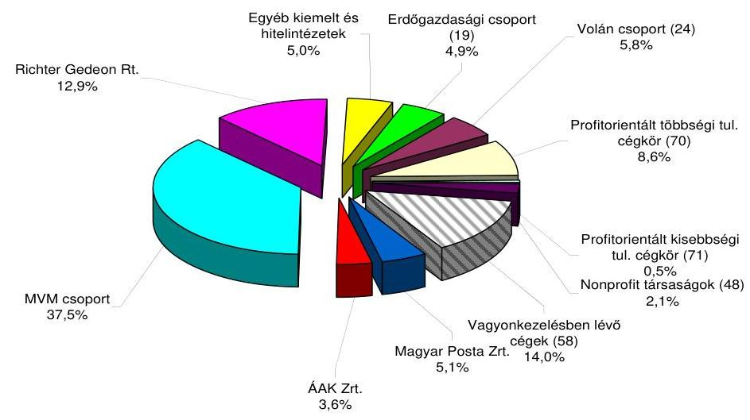

Az MNV Zrt. 2009-ben közvetlenül kezelt társaságainak bekerülési értéke az év végi mérlegadatok alapján 1036,8 Mrd Ft volt. A közvetlenül kezelt eszközök állományának döntő része állami tulajdonú részesedés (társasági portfólió), amelyet az MNV Zrt. befektetési célú és forgatási célú befektetésekre bont. Befektetési célú állami tulajdonú részesedés 208 társaságban volt, értékük 1033,8 Mrd Ft, forgatási célú részesedés 81 társaságban volt, értékük 2,95 Mrd Ft.

---

# 1. A Richter Gedeon Nyrt. állami tulajdonban lévő $25 \%+1$ SZAVAZATI ARÁNYT MEGTESTESÍTŐ RÉSZVÉNYEIRE KIBOCSÁTOTT ÁTCSERÉLHETŐ KÖTVÉNY ÉRTÉKELÉSE 

A RG Rt. 1994. augusztus 1-jéig 100%-ban állami tulajdonban lévő részvénytársaság volt. Ezt követően a különböző részvénypiaci és privatizációs tranzakciók útján az állami tulajdon aránya $25 \%+1$ szavazatra csökkent, és a valódi tulajdonosi kör összetétele a többségében intézményi befektetők következtében ismeretlenné vált.

2004 szeptemberében a magyar állam nevében eljáró ÁPV Zrt. 639 M EUR (159 Mrd Ft) értékben, évi 1\%-os kamatozású, 3\% egyszeri fix lejáratkori hozamot és $54 \%$ kezdeti átcserélési prémiumot biztosító, 2009. szeptember 28-án lejáró, a RG 4659373 db törzsrészvényére átcserélhető, egyenként 100000 EUR névértékű kötvényt bocsátott ki. Az átcserélhető kötvényeket a Luxemburgi Értéktőzsdén vezették be. A kötvények után minden évben szeptember 28-án fizetendő évi $1 \%$ kamat 2009-ben a lejáratkor, a tőkeösszeg visszafizetésével egy időben vált esedékessé. Az évente fizetendő kamat fedezetét a RG Nyrt.-től befolyt osztalék biztosította.

A részvényre cserélhető kötvény, hazánkban még nem alkalmazott, elsősorban intézményi befektetőknek ajánlott konstrukció. Az átcserélhető kötvény kibocsátója nem a társaság, hanem a részvényes, vagyis a tulajdonos, aki egy olyan fix hozamú, a kibocsátást követően a másodlagos piaccal rendelkező értékpapírt értékesít, amely egy későbbi időpontban és előre meghatározott átváltási arány mellett az adott társaság törzsrészvényeire cserélhető. A zártkörű értékesítésben résztvevő befektető nem iparágra vagy országra, hanem kifejezetten egy bizonyos befektetési termékre, az átcserélhető kötvényre szakosodik. A nemzetközi átcserélhető kötvény kibocsátási gyakorlatban nem jellemző az állam közvetlen vagy közvetett részvétele.

A lejáratkor szükséges készpénz összeget a részvény-, illetve a devizaárfolyam változása befolyásolta ( 285 Ft-os árfolyam esetén közel 204 Mrd Ft). Lejáratkor a kötvénytulajdonosok egyrészt az árfolyam alakulásától függően élhettek átcserélési jogukkal és a részvényekkel való törlesztést kezdeményezhették. A kibocsátáskor meghatározott szerződési feltételek szerint ebben az esetben viszont az MNV Zrt. az átcserélés helyett gyakorolhatta Készpénz Megváltási Jogát. Másrészt, ha a kötvénytulajdonosok az átcserélési időszak alatt nem éltek az Átcserélési Joggal, a kötvényeket a visszaváltásra kijelölt időszakban a Megnövekedett Tőkeösszegen válthatták vissza.

A The Bank of New York Mellon tájékoztatása szerint egy db 100000 EUR névértékű kötvény esetében került sor az átcserélési jog gyakorlására. Az árfolyam a részvények 2009. szeptember 7. és szeptember 18. közötti átlagos árfolyama alapján 100 277,53 EUR volt. Ez azt jelenti, hogy a befektető a 2004-ben megvásárolt kötvény öt éves futamidejére vetítve - figyelembe véve a kamat és hozamjóváírásokat is - 4277 EUR, azaz összesen 4,28\% nyereséget realizált. Ebben az egy esetben a kötvényjegyzés évi 0,8\% megtérülést eredményezett az öt éves futamidőre vetítve mivel a lejárat előtti visszaváltás következtében az utolsó évi kamat és a hozam nem írható jóvá.

---

A 2004-ben kibocsátott kötvény után minden évben fizetendő évi $1 \%$ kamat 2009-ben az egyszeri 3\% hozammal együtt, a tőkeösszeg visszafizetésével egy időben vált esedékessé. A lejáratkori (2009) visszavásárlási ár a névérték 110,62\%-a volt, ami 706861800 EUR tőke és 6390000 EUR kamatfizetési terhet jelentett a Magyar Állam számára. (A kibocsátás napján az 5 éves, euróban kibocsátott magyar államkötvények hozama 3,74\% volt.)

Az MNV Zrt. pályázatot írt ki a lejáró kötvények kifizetésének a lebonyolítására és a kötvénytörlesztési kötelezettség során igénybeveendő költségvetési források minimalizálására. A pénzügyminiszter 2009 áprilisában a részvények megtartása és az ÁKK Zrt.-n keresztül történő finanszírozására tett javaslatot. A pénzügyminiszter állásfoglalására tekintettel az NVT a kötvények megtakarítást biztosító lejárat előtti visszavásárlása mellett döntött és ennek lebonyolítására írt ki zártkörű pályázatot három meghívott tanácsadó részvételével.

A pályázatot érvényesnek, de eredménytelennek nyilvánították „további kormányzati egyeztetések szükségességére"1 hivatkozva. A pénzügyminiszter 16/2009.(VI. 16.) sz. RIGY határozatában megváltoztatta a kötvények visszavásárlására vonatkozó döntését és a 2004. évi kötvények lejáratkori finanszírozási igényeinek hasonló konstrukcióban történő finanszírozásáról döntött, azzal, hogy az átmeneti finanszírozás államháztartási forrásokból is finanszírozható.

Az MNV Zrt. 582/2009. (VII. 9.) NVT. hat. alapján új pályázatot írt ki. A pályázat célja a 2009. szeptember 28-án lejáró 707 M EUR kötvény refinanszírozása újabb kötvénykibocsátással, a RG Nyrt. stratégiájának a folytatása és a Magyar Állam tulajdonosi jogainak középtávon való biztosítása (kívánatosan 5 évig).

A pályázat eredményeképpen az MNV Zrt. a Morgan Stanley Plc.-t bízta meg az újabb kötvénykibocsátás megszervezésével, azzal, hogy a Díjak és Költségek nem haladhatják meg a várható bruttó bevétel $0,308 \%$-át.

Az NVT 2009. szeptember 2-án hagyta jóvá a kibocsátás feltételeit tartalmazó dokumentumokat (Lunch Term Sheet) és a lebonyolítással a Richter Tranzakciós Bizottságot (TRB) bízta meg. Az RJGY 1/2009. (IX. 4.) Engedélyében engedélyezte a kötvénykibocsátást, 2. sz. Engedélyében pedig rendelkezett a költségvetés terhére kifizethető 189 M Ft kamatfizetési kötelezettség átcsoportosításáról. A 2010-ben várható adózási változások miatt az RJGY módosította a kibocsátási tájékoztatót (kötvények elszámolásának bruttósítása).

Amennyiben a kötvények részvényre történő cseréje megvalósul, a kötvénykibocsátás - annak ellenére, hogy a kötvénykibocsátás mellett szóló érv volt a Magyar Állam tulajdonosi jogainak megtartása - egy privatizációnak tekinthető anélkül, hogy a részvények tényleges piaci értékesítésére sor került volna.

A Magyar Állam a közgyűlésen gyakorolja részvényesi jogait, egyebekben a jogszabályokon és szabályozórendszeren túl a társaság tevékenységére, ráhatása nincs. A tulajdonosi összetétel - a befektetési alapok és letétkezelők miatt

[^0]
[^0]:    ${ }^{1} 310 / 2009$.(V. 6.) NVT. hat.

---

sem a kötvények, sem a részvények esetében - nem ismert. ${ }^{2}$ A lejáratkori fizetési kötelezettséget - a részvény árfolyamán keresztül - a társaság tevékenységének eredményessége befolyásolja, amelyre a jelenlegi tulajdonosi struktúra mellett az MNV Zrt.-nek a tulajdoni hányadhoz kötötten az Igazgatósági tag jelölésén túl nincs befolyása. Egy kedvezőtlen üzletmenet illetve piaci környezet okán bekövetkező kockázat esetére a Magyar Állam garanciája biztosítja (immunitás) a kötvénytulajdonosoknak befektetéseik biztonságát. ${ }^{3}$

Az MNV Zrt. a költségvetés szempontjából „a kötvénykibocsátást egy tulajdonképpeni hitelfelvételnek" minősítette, „ami nem rontja az államháztartás ESA hiányát". A RG Nyrt. szempontjából a kötvénykibocsátás „garancia arra, hogy ha 5 éven belül a tulajdonos nem fogja tudni értékesíteni a részvényeket, ezáltal nem fenyeget valamiféle ellenséges kivásárlás, így a menedzsment továbbra is ura marad a társaságnak". A gyógyszergyártás területén kifejtett innovatív tevékenység költséges és kockázatos tevékenység, aminek az eredménye is jelentős kockázatot rejt magában. A gyors jegyzési időszak alatt korlátozott lehetőség nyílott a RG stratégiájának a megismerésére. A kibocsátási feltételek meghatározásával - a stratégiai terv megvalósításának elsődlegessége helyett - a kötvénykibocsátás kockázata az államra hárult. ${ }^{4}$ A két kibocsátás feltételeit összegző táblázat az 1. sz. mellékletben található.

A 2009. évi kibocsátás kapcsán megállapítható (összhangban az MNV Zrt. EB 20/2010. február 16-ai jelentésében foglaltakkal), hogy a két tranzakció összevontan 115 M EUR pozitívummal zárult, de ez az eddiginél nagyobb összegű fi-

[^0]
[^0]:    ${ }^{2}$ Az MNV észrevétele szerint: „A kötvény kibocsátásakor ismert volt az MNV Zrt. számára a kötvényt jegyzők köre, a kibocsátás célja stabil befektetői kör elérése volt, az azóta bekövetkezett változásokról az MNV Zrt. valóban nem rendelkezik információval. Az európai típusú átcserélhető kötvény tulajdonságai miatt ugyanakkor ezen információnak csak a kötvény lejárata előtt lehet majd jelentősége."
 ${ }^{3}$ Az MNV Zrt. észrevétele szerint: „A Magyar Állam jogszabályi mögöttes felelőssége a makroszintű kockázatot, vagyis az állami fizetőképesség kockázatát hivatott kezelni és nem az idézett mondatban foglalt okokról szól. Emlékeztetőül idézzük a Vtv. azon vonatkozó részét, amire a kötvényfeltételekben is hivatkozás történik a Vtv. 22. § (2) bek. alapján: ha az MNV Zrt.-t terhelő kártérítési, megtérítési, kártalanítási kötelezettség teljesitésére a tárgyévi bevétele vagy kiadási előirányzata nem nyújt fedezetet, a kötelezettség teljesitéséért az állam helytállni köteles."Az ÁSZ szerint a nemzetközi átcserélhető kötvény kibocsátási gyakorlatban nem jellemző a közvetlen vagy közvetett állami részvétel, ami jelenlegi kötvénykibocsátás során hangsúlyozottá teszi a hazai és a nemzetközi gyakorlatban is egyedi állami részvételből adódó tulajdonosi felelősség kérdését. A kötvénykibocsátás során a Vtv. 22. §-ban rögzítetteken túlmenően a Magyar Állam a közte és a Társ Vezető Forgalmazók között létrejött Jegyzési Garanciavállalási Szerződésben és az erre vonatkozó Levélben foglalták össze a Magyar Államot érintő szavatossági kérdéseket, Kötelezettségvállalásokat, Kártalanításokat, az Irányadó Jog szerinti Mentességről való lemondást.
    ${ }^{4}$ Az MNV Zrt. észrevétele szerint „a kötvények árazását alapvetően nem a RG. Nyrt. stratégiája, hanem elsősorban (mintegy 90\%-ban) a kötvény kamatfeltételei és csak kisebb részben a lehetséges opció - azaz a RG részvényár, részben a stratégiára visszavezethető volatilitásával kapcsolatos jövőbeni várakozás - értéke befolyásolta." Az ÁSZ szerint az első kötvénykibocsátás lejáratakor visszaváltott egy kötvény után az ötéves periódusra vonatkozó eredmény $4,28 \%$ volt, a 2. kötvénykibocsátás kedvezőtlenebb jegyzési feltételeket tartalmazott, ami nem indokolja a gyors jegyzést.

---

zetési kötelezettséget keletkeztetett a 2014-ig tartó időszakban. Amennyiben újabb refinanszírozás történik a tranzakció kimenetele továbbra sem lesz egyértelműen megítélhető. Várhatóan a 2009. évi kötvénykibocsátás után fizetendő kamatra az osztalék nem szolgáltat elegendő fedezetet, így valószínűsíthető, hogy szükségessé válik a kamat költségvetési forrásból való finanszírozása. A konstrukció egy lejáratkori kedvezőtlen részvényárfolyam esetén újabb refinanszírozási kockázatot hordoz magában.

# 2. A MALÉV Magyar Légiközlekedés Zrt. (MALÉV Zrt.) HELYZETE 

A MALÉV Zrt. privatizációja során a Részvény Adásvételi Szerződés feltételeinek kialakítására irányuló tárgyalások lezárását követően a 40/2007. (II. 8.), valamint a 49/2007. (II. 22.) sz. IG határozatok alapján az Air Bridge Zrt. és az ÁPV Zrt. 2007. február 23-án részvény adásvételi szerződést kötött. A tranzakció részeként a MALÉV Zrt. MFB hitelének kezelése érdekében 46 M Ft tőkével megalapították a MALÉV Vagyonkezelő Kft.-t, amely eszköz-átruházási szerződést kötött a MALÉV Zrt.-vel. A Kormány a 2051/2007. (III. 26.) sz. határozatában nevesítette a MVK Kft.-t, mint az MFB-hitelhez adott állami készfizető kezesség címzettjét. A tranzakció zárás egyik előfeltétele volt, hogy sor kerül a MVK Kft. megalapítására, aki kötelezettséget vállalt az MFB-hitel átvállalására, a Malév Zrt.-től a MALCO Llc., a Márkanév és a Kerozinvezeték átruházására, valamint e javak MALÉV Zrt. részére történő bérbeadására. A MALÉV Zrt. MFB-től felvett 76 M EUR - az MVK Kft. társaságon keresztül 2007. december 31-ei hatállyal átvállalt - hiteleire vonatkozó állami kezességvállalás időtartama a privatizációs eljárás során 4 évvel meghosszabbodott, melynek jogalapját a részvények adásvételére vonatkozó szerződéshez kapcsolódóan 2007 áprilisában megkötött Tartozásátvállalási és Módosító Szerződés képezte. A tranzakció zárását követően az ÁPV Zrt. 273/2007. (VI. 28.) IG sz. határozatával jóváhagyta a MALÉV Zrt. privatizációs emlékeztetőjét és azt letétbe helyezte azt az Országos Levéltárban. Az Részvény Adásvételi Szerződést és annak mellékleteit 2007 decemberében a 254/2007. (XII. 19.) NVT határozattal majd, 2008 augusztusában az 508/2008. (VII. 30.) sz. NVT határozattal módosították.

A MALÉV Zrt. pénzügyi és gazdasági helyzetének rendezése érdekében hozott döntések 2009-2010. években:

A MALÉV GH Földi Kiszolgáló Zrt. részvényeinek megvásárlására hozott RJGY határozatokkal alátámasztott - 16/2009. (I. 15.) NVT, a 33/2009. (I. 20.) NVT, és a 72/2009. (II. 11.) NVT sz. határozatok szerint a Társaság nem kellő átgondoltsággal, több részletben összesen 4285 Mrd Ft vételárelőleget fizetett ki a MALÉV Zrt.-nek. A szerződés végleges megkötésére vonatkozó RJGY határozat hiányában a MNV Zrt. élt az előszerződésben biztosított elállási jogával, így nem jött létre a végleges részvény-adásvételi szerződés. Az előleg visszafizetésnek határideje 2009. augusztus 4-e volt, amit a MALÉV nem tudott teljesíteni, arra fizetési haladékot kért. A több részletben kifizetett előleg (1,1 Mrd Ft, 0,5 Mrd Ft és $2,685 \mathrm{M} \mathrm{Ft}$ ) a bizonytalan megtérülés szerint 2009. évben ESA rontó besorolásúvá vált. Az előleg - az RJGY határozatokban megfogalmazott részvényvásárlási koncepcióval ellentétben - a MALÉV Zrt. veszteségeinek pénzügyi forráshiányát volt hivatott kezelni. A 2009. február 23.-án kelt pénzügyminiszté-

---

riumi előterjesztés szerint: „A jelen likviditási pozíció szerint esély sincs a MALÉV túlélésére, és ha napokon belül nem orvosolják a gondokat, az üzletmenet leáll." A 2009. évben vissza nem térült előleg a MALÉV Zrt. tőkeemelése részeként 2010. évben apportálásra került.

A MALÉV Vagyonkezelő Kft. (MVK Kft.) 2007. december 31-ei hatállyal átvállalta az MFB 76 M EUR hitelt (amelynek futamideje 2017. december 31-én jár le) három eszköz átvételével (a MALÉV Márkanév, a MALCO LLC üzletrész, amelynek egyetlen eszköze a CIB Bank jelzálogával terhelt Boeing 767-es repülőgép, és a Ferihegy-Százhalombatta közötti kerozinvezeték). 2008. év végén vált ismerté, hogy az Airbridge Zrt. nem adott értékarányos fedezetet az MFB hitel mögé, mivel a Boeing 767 nem volt per, teher és igénymentes a CIB zálogjoga miatt. A repülőgép közös (MALÉV, CIB) értékesítése sikertelen volt, ezért a MVK Kft. a jogszavatossági illetve kártérítési igényét 2009. július 27-én bejelentette a MALÉV felé. Az MNV Zrt. a fenti ügyben feljelentéssel élt a Btk. 318. § (1) bekezdésébe ütköző és a (7) bekezdés a) pontja szerint minősülő különösen jelentős kárt okozó csalás bűntett elkövetésének gyanúja miatt ismeretlen tettes ellen. A Budapesti Rendőr-főkapitányság Gazdaságvédelmi Főosztály Gazdaságvédelmi Osztály II. 2010 májusában küldte meg a nyomozás megszüntetéséről szóló határozatát, amely szerint: „a cselekmény nem bűncselekmény."

Az MNV Zrt. Könyvvizsgálói véleménye alapján: a MALÉV Vagyonkezelő Kft. finanszírozási struktúrája a tevékenysége alapján a 2007. és 2008. években keletkező veszteség a jövőben is prognosztizálható. A MALCO üzletrész az MFB Bank Zrt. jelzálogjogával terhelt, ugyanakkor ezzel a hitelezési folyamatban szereplő egyik lényeges fedezetének jogi helyzete bizonytalanná vált.

A MALÉV Zrt. privatizációs szerződése alapján az MNV Zrt. a Vnesheconombank (VEB) felé többször megkísérelte a garancia érvényesítését. 2009. április 9-én, majd 2009. június 11-én és 2010. február 25-én lehívott 32 M EUR hiteltörlesztési bankgaranciát a VEB nem teljesítette. 2009. augusztus első hetében megkezdett kormányszintű tárgyalásokon a garancia lehívás érvényesítése nem volt eredményes. A MALÉV privatizációs szerződéséből felmerülő Airbridge Zrt. kötelezettségek fenti rendezetlensége és a privatizációs konstrukció miatt az MVK Kft.-nek 1,2 Mrd Ft tőkepótlási kötelezettsége, az átmeneti finanszírozás biztosításához és az MVK Kft. MFB Zrt. felé fennálló kamatfizetési kötelezettség teljesítéséhez 850 M Ft tulajdonosi kölcsön igénye merült fel.

A pénzügyminiszter 22/2009. (VIII. 13.) sz. RJGY határozatában utasította az NVT-t, hogy a MALÉV helyzetére vonatkozó folyamatban lévő kormányközi egyeztetésekre az MNV Zrt. átmeneti időre, a következő határozat kiadásáig azonnal függessze fel a VEB által kibocsátott 32 M EUR összegű hiteltörlesztési bankgarancia kifizetésének érvényesítésére vonatkozó további jogi lépéseket, ide értve a MALÉV GH Zrt. részvénye megvásárlására megkötött - időközben többször módosított - előszerződéstől történt elállásával kapcsolatos 4,285 Mrd

[^0]
[^0]:    ${ }^{5}$ Az Airbridge Zrt. a MALÉV privatizációs szerződésében vállalta, hogy 2007. december 31-éig visszafizeti, vagy kiváltja a MALÉV Európai Fejlesztési Bankkal (EIB) szemben fennálló 33,4 M EUR összegű projekthitel tartozását. A tartozás 2009. április 9-én 14,1 M EUR-ra csökkent.

---

Ft vételár előleg visszafizetésére vonatkozó igénye érvényesítését is. A hivatkozott RJGY határozat kiadása nem tette lehetővé a magyar fél privatizációs szerződés szerinti igényérvényesítését. A határozatot a pénzügyminiszter csak 2010. január végén az 1/2010. (I. 29.) sz. RJGY határozatával vonta vissza, holott a 22/2009. (VIII. 13.) sz. RJGY határozat kiadásakor már ismert volt az a tény, hogy a MALÉV GH Zrt. részvénye megvásárlására megkötött előszerződés meghiúsult. ${ }^{6}$

A MALÉV Zrt. Igazgatósága a társaság tőkehelyzetének rendezése céljából összhangban a 1227/2009. (XII. 29.) Korm. határozatban meghatározott célrendszerrel - és a Magyar Állam többségi tulajdonba kerülése érdekében 2010. január 29-ére rendkívüli közgyűlést hívott össze, amely 2010. február 9-re felfüggesztésre került és végül megegyezés hiányában eredménytelenül zárult. Az újabb rendkívüli közgyűlést 2009. február 26-ára hívták össze a MALÉV tőkerendezéséhez kapcsolódó intézkedések érdekében. A Kormány 1051/2010. (II. 26.) határozatának végrehajtására kiadott 5/2010. (II. 26.) sz. RJGY határozat alapján a közgyűlés 26,8 Mrd Ft alaptőke emelést határozott el, amelyet az Airbridge Zrt. 1452,5 M Ft összegű nem pénzbeli hozzájárulással, az MNV Zrt. 4664,6 M Ft MALÉV GH előlegkövetelés apportálásával és 20700 M Ft készpénzes tőkeemeléssel teljesített. A VEB megállapodás hatálybalépését követő 4. munkanapon megfizette a 32 M EUR összegű hiteltörlesztési bankgaranciát. A 20,7 Mrd Ft 80\%-át a megállapodás értelmében a MALÉV az addig felhalmozott APEH adósság és késedelmi kamata törlesztésére kellett, hogy fordítsa. Az állami támogatás tartalma miatt az Európai Bizottság részére bejelentési kötelezettséget von maga után a fenti tőkejuttatás.

A 32 M EUR hiteltörlesztési bankgarancia fedezetére a MALÉV menedzsmentje a privatizációs szerződés pénzügyi zárását (2007. április 24.) követően, 2007. május 28-án kötött szerződéssel az MNV Zrt. és a PM tájékoztatása nélkül viszont-garanciát vállalt. Az MNV Zrt. különösen jelentős vagyoni hátrányokozó hűtlen kezelés bűntette miatt, a Fővárosi Főügyészség Vezetőjének feljelentést tett. A MALÉV pénzügyi, gazdasági helyzete a helyszíni ellenőrzés befejezéséig sem rendeződött, működőképessége továbbra is kockázatos a többségi állami tulajdonú nemzeti légitársaság további fenntartása jelentős állami támogatást igényel, jelenlegi hitelállományával nem életképes. A MALÉV esetleges csődeljárása közvetve kockázatot jelent a BA Zrt. vagyonkezelési szerződésében vállalt kötelezettségeinek teljesítésére.

A Budapest Airport Zrt. (BA Zrt.) Vagyonkezelési szerződés módosítása szerint az utasforgalmi adatoknak a szerződésben rögzítettekhez képest történő elmaradása (Elégtelen Utasforgalom) alapján a BA Zrt. kezdeményezheti a szerződésben vállalt Specifikus Fejlesztési Kötelezettségvállalások (SFK) átütemezését. Az Elégtelen Utasforgalom a 2009. évben a BA Zrt. szerint bekövetkezett. A BA Zrt. és az MNV Zrt. között a 2008. évben megkötött Közös Értelmező Nyilatkozatban foglaltakat alapul véve megállapítható, hogy a 2008. és 2009. években a SFK társaság által teljesített összege kevesebb, mint a szerződésben

[^0]
[^0]:    ${ }^{6}$ E tárgykörben irányadók továbbá a 2/2010. (II. 1.) és a 4/2010. (II. 10.) sz. RJGY határozatok, amelyek az MNV Zrt. és a MALÉV Vagyonkezelő Kft. mozgásterét és igényérvényesítését 2010. február 26-ig korlátozták.

---

ezen időszakra vállalt tőkeberuházás. A Tanács az SFK tekintetében 2008. és 2009. évre összesen 22,4 M Euró hiányt állapított meg, ezért a vagyonkezelési szerződés 7.4.3. b) pontja alapján a BA Zrt. felé Hiányossági Felszólítással élt. Az SFK esetleges átütemezésére vonatkozó tárgyalások megkezdődtek az MNV Zrt. és a BA Zrt. között.

# 3. AZ ERDŐGAZDASÁGI TÁRSASÁGOK VAGYONKEZELÉSI TEVÉKENYSÉGÉT SEGÍTŐ EGYSÉGES SZÁMVITELI, ÜGYVITELI, SZAKMAI ÉS VEZETŐI INFORMÁCIÓS RENDSZER (EEVR) KIALAKÍTÁSÁNAK EREDMÉNYE 

Az NVT az erdőgazdasági társaságok esetében a tulajdonosi elvárások optimalizálásához alapvető feltételként jelölte meg a gazdasági elszámolások egységes tartalmúvá tételét, a számviteli politika, számlarend, eredmény-elszámolás egységesítését. Az MNV Zrt., a portfóliójába tartozó erdőgazdasági társaságok Egységes Erdészeti Vállalatirányítási Rendszerének (EEVR) kialakítására a Tanács a 406/2008. (VI. 11.) NVT sz. határozatával közbeszerzési eljárást írt ki maximum 1,5 Mrd Ft fejlesztési forrás megjelölésével. Az eredményes eljárás lezárását követően a Tanács a 756/2008. (XII. 03.) NVT sz. határozattal döntött 19 erdészeti társaság esetében összesen 1,5 Mrd Ft tulajdonosi jegyzett tőke emelés végrehajtásáról, amelyből 2009. évben 600 M Ft került kifizetésre. A Tanács, a fejlesztéseket annak ismeretében kezdeményezte, hogy az állami erdészeti társaságok térinformatikai és ügyviteli szoftverfejlesztésre, eszközök beszerzésére 2006-ban 706 M Ft vissza nem térítendő támogatásban részesültek, és 2003-2007 között 245 M Ft saját forrást használtak fel.

Az MNV Zrt. az egységes informatikai rendszer előkészítése során nem törekedett az erdészeti társaságoknál már működő, részleteiben más, de alapjaiban azonos szoftvereknek a tulajdonosi elvek, elvárások szerinti harmonizálására. Nem került felmérésre a fokozatos bevezetés lehetősége, amely szerint csak ott kell fejleszteni az informatikai rendszeren, ahol a tulajdonos által megfogalmazott elvárások nem teljesíthetőek.

A társaságok bevonásával összeállított új rendszerkövetelmény specifikációja ( 347 követelmény pont) hiányos, túl általános megfogalmazású volt, a jogosultság kezelés esetében nem értelmezhető egységesen. Az előrehaladási folyamat ellenőrzésére és irányítására kialakított szervezet (Központi Szakértői Munkacsoport KSZM, Projekt Irányító Bizottság PIB, Projekt Felügyelő Bizottság PFB) tevékenysége nem volt eredményes. A projekt moduljainak bevezetése során nem voltak olyan folyamatok, amelyek ellenőrzik az eredménytermékek minőségét és a megrendelői elégedettséget. Hiányzott az automatikus migráció és az adatmodell. A társaságoknál bevezetett modulok oktatása nem volt megfelelő színvonalú, mert nem biztosítottak a felhasználóknak részletes felhasználói kézikönyvet. A hibabejelentéseket vagy nem, vagy igen hosszú válaszidővel kezelte a vállalkozó. A közbeszerzési eljárás több mint féléves elhúzódása miatt az erdészeti társaságok és a vállalkozó között a szerződés 2008. december 14-én került aláírásra.

---

A PIB elnökének 2008. december 31-ei igazolásának birtokában az I. fázis (a „Bázisrendszer" átadása) teljesült, a fejlesztési díj 40\%-ában meghatározott összeg ( 507 M Ft + áfa) késedelmesen fizette ki a Társaság. A II. fázis átadási határideje a Projekt Alapító Dokumentum (PAD)-ban meghatározott határidő 2009. március 30. volt, amely nem teljesült, részben a közbeszerzési eljárás megkezdésekor fellépő késedelem, a bírálati határidő meghosszabbítása és az erdészeti társaságoknál alkalmazott és egymástól eltérő ügyviteli és informatikai rendszerek harmonizálatlansága miatt. A II. fázis bevezetési határideje 2009. április 30-ára, a III. fázis bevezetési határideje július 30-ára módosult. A PIB elnöke által igazolt teljesítés alapján 7 erdészeti társaság esetében valósult meg a II. fázis részelemeinek teljes körű bevezetése. A projekt lezárásának végső határideje 2011. május 31-e, a jelenlegi helyzet ismeretében a határidő nem tartható, vagy csak a PAD módosítás szerinti support tevékenység rövidítése által teljesülhet.

Az a tény, hogy a vállalkozó, illetve képviselői érdemben nem reagálnak a megrendelői felvetésekre, mindenképpen indokolttá teszi a bevezetés folyamatának felülvizsgálatát, a minőségbiztosítás bevezetését és a jó teljesítési garancia érvényesítését, mivel az egyes modulok bevezetésének III. fázisa egy éves késésben van. A teljesítésigazolásokat csak a követelményrendszer egységes értelmezését tartalmazó - rendszerterv alapján végrehajtott, minőségbiztosító által elfogadott fejlesztés - szerződés szerint lehet véglegesen kiadni.

# 4. BÁBOLNA Csoport, ezen belül a BÁbolna Nemzeti Ménesbirtok Kft. hatékonyabb és költségtakarékosabb VAGYONKEZELÉSI MEGOLDÁSAIRA HOZOTT INTÉZKEDÉSEK VÉGREHAJTÁSA 

A Bábolna Zrt. a megelőző évek kedvezőtlen gazdasági környezetének és a likviditást javító tulajdonosi intézkedések ellenére 2004-ben végelszámolás alá került. A Kormány által elfogadott reorganizációs program részeként, a kedvezőbb privatizációs lehetőségek érdekében az egyes tevékenységeket külön társaságokba szervezték. Az ekkor létrehozott Bábolna Élelmiszeripari Rt.-be apportálták a Bábolna Zrt. működőképes tevékenységeit. A Bábolna Rt. végelszámolása és a privatizáció előkészítése címén alapított Bábolna Élelmiszeripari Rt. megalapítása és a társasági részesedések apportálása tovább folytatta a Bábolna csoportba tartozó vagyon feletti átláthatóság elvesztését. A reorganizációs és privatizációs tervek megvalósítása nem igazolta vissza az elvárásokat, ezért a Bábolna Zrt. 2008 áprilisában felszámolásra, a Bábolna Élelmiszeripari Zrt. 2006. januárban végelszámolásra került. A sikertelen reorganizációs és privatizációs tervek indokolatlan többletköltségeket okoztak a Magyar Állam számára.

A Bábolna csoporthoz tartozó társaságok részére folyósított támogatások, kamatmentes kölcsönök, tőkeemelések sem a Bábolna Rt. privatizációját, sem a szociálpolitikai célokat (munkahelymegtartás/teremtés, családi gazdaságok integrációja) nem segítették elő. A társaságok vagyonának elvesztése, mindamellett a hatékonyság növelés, veszteség-minimalizálás, privatizáció előkészítése címén felhasznált források költségvetésre gyakorolt hatása a társa-

---

ságok végelszámolásának illetve felszámolásának lezárását követően kerülhet megállapításra.

A Bábolna Ménesbirtok Kft.-t (BMB Kft.) 2001-ben alapította a Bábolna Mg. Rt. 3 M Ft jegyzett tőkével, majd még ugyanebben az évben a hagyományosnak tekintett lótenyésztési tevékenységhez tartozó vagyontárgyak és történelmi gazdasági egységek (központi major, szálloda, istállók, ménes) apportálását követően a jegyzett tőkét 1593 M Ft-ra emelték és a társaság egyedüli tulajdonosa az ÁPV Rt.-lett. Az alapításkori cél a Társaság tulajdonába került ménessel kapcsolatos génmegőrzés, fajtafenntartás és műemlékingatlan fenntartás volt. A Társaság tartósan állami tulajdonba sorolt, ezért a folyamatos gazdálkodásához szükséges források illetve feltételek biztosítása a tulajdonos feladata. A társaság jegyzett tőkéje a 2009. évi tőkeemelést követően 1599 M Ft lett. A kötelezettségek értéke a többszöri tulajdonosi támogatás és kamatmentes kölcsön ellenére 2008-ban 859 M Ft-ról 1850 M Ft-ra változott, eredménytartaléka -1299 M Ft. A BMB Kft.-nél 2009-ben 6 M Ft tőkeemelést hajtott végre és 460 M Ft-ot a tőketartalék javára bocsátott rendelkezésre az MNV Zrt, ezen kívül 260 M Ft tulajdonosi támogatást és 150 M Ft tulajdonosi kölcsönt folyósított a társaság részére.

A tulajdonosi jogokat gyakorló ÁPV Zrt., majd MNV Zrt. számára ismert volt az a tény, hogy a BMB Kft. nem tudja önerőből az alapfeladatait ellátni, ennek ellenére az alapítás óta nem teremtették meg a tevékenység ellátásához szükséges feltételeket, illetve az alkalmas működési keretet és formát. A felszámolás közeli likviditási helyzet kialakulása 2008 végére nem a menedzsment normál gazdálkodás menetébe tartozó döntései, hanem a tulajdonosi intézkedések hatására vezethetők vissza. A tulajdonosi intézkedések következtében vált tartóssá a társaság önfinanszírozó képességének a hiánya.

2008-ban több olyan intézkedés született, amelyek összhatásukban kihatással voltak a Bábolna csoport és ezen belül a BMB Kft. 2009. és 2010. évi gazdálkodásra is. A Bábolna Zrt. Igazgatósága a 2007. évi mérleg ismeretében saját maga kezdeményezte a felszámolását, amelyet az NVT 156/2008. (III. 26.) sz. határozatában hagyott jóvá. ${ }^{8}$ A 2009. május 29-én elkészített közbenső mérleg szerint a Bábolna Zrt. 9550 M Ft forgóeszköz állománnyal zárta tevékenységét, amelyből 8845 M Ft volt a kapcsolt vállalkozások - Bábolna Élelmiszeripari Rt. va. - kimutatott részesedése. A forgóeszköz összetétel ilyen kedvezőtlen megoszlása is jól illusztrálja a Bábolna csoport indokolatlanul kialakított többszintű leányvállalati rendszerét. A létrehozott leánycégek nyereséget nem termeltek, a kitűzött privatizációs elképzeléseket nem segítették elő, de alkalmasak voltak a transzparencia megszüntetésére. A felhalmozott rövidlejáratú kötelezettség 11922 M Ft volt, amelyből a kapcsolt vállalkozásokkal szemben 9125 M Ft - azaz a részesedések mértékét meghaladó - követelést tartottak nyilván. A felszámolási közbenső mérleg szerint a Bábolna Rt. 2004. szeptem-

[^0]
[^0]:    ${ }^{7}$ Támogatási szerződés
    ${ }^{8}$ Az ÁSZ 0541, 0629, 0725, 0825, 0929 sz. jelentések Bábolna csoporttal foglalkozó részeiben részletesen jeleztük a rossz döntések miatti vagyonvesztést és megállapítást nyert, hogy már 2004-ben nem végelszámolási, hanem felszámolási helyzet alakult ki.

---

ber 1-jén kezdődött végelszámolása 2006. január 31-én ért véget. Ezen időszak alatt a Társaság elvesztette tárgyi eszközeinek 89%-át ( 8935 M Ft-ról 1063 M Ft-ra), követelései 95%-kal csökkentek ( 26234 M Ft-ról 1330 M Ft-ra), ugyanakkor eredménytartalék soron nyilvántartott hiánya 61%-kal (-19 320 M Ft-ról -31 106 M Ft-ra) nőtt. Kötelezettségei 39745 M Ft-ról az ÁPV Zrt. felé fennálló alárendelt kölcsön elengedésének hatására" 11700 M Ft-ra csökkentek. A 2008. április 17-én kezdődő felszámolásig a veszteségtermelés tovább folytatódott.

A végelszámolás keretében indított reorganizációs program és a „hibás vállalati stratégia újabb források bevonását igényelte a társaság működőképességének fenntartása érdekében". A végelszámolás alatt a takarmánykeverőt és az élelmiszeripari ágazatokat a REORG Rt., mint végelszámoló önálló társaságokba szervezte ki és ezeket a kötelezettségekkel együtt a Bábolna Zrt. 100\% tulajdonában álló Bábolna Élelmiszeripari Rt.-be apportálta, készfizető kezességet vállalva a kötelezettségekért. Ennek hatására a Bábolna Rt. végelszámolása alatt a veszteségtermelés csökkent, mert az már az újonnan létrehozott társaságoknál lett kimutatva. A Bábolna Rt. felszámolásának kezdetére a Bábolna Élelmiszeripari Rt. is végelszámolás alá került. Mivel nyilvántartási értékét ( 8845 M Ft ) a vállalkozással szemben fennálló behajthatatlan kötelezettség értéke ( 8885 M Ft ) meghaladta, ezért a felszámoló a Bábolna Élelmiszeripari Rt.-t, mint befektetést a Bábolna Zrt. fa. nyitómérlegben már nulla Ft értéken tartotta nyilván. Annak ellenére, hogy a Bábolna Rt. fa. felszámolója a Bábolna Élelmiszeripari Rt. va.t, mint befektetést a meglévő számviteli előírások szerint 0 értéken mutatta ki, a tulajdonos továbbra sem kezdeményezte a társaság felszámolását.
„A Bábolna Zrt. végelszámolása és az azt megelőző időszakból eredő adótartozások megfizetési határidejének 2008. 01. 02-i lejárata, valamint a végelszámolásból áthúzódó és az Élelmiszeripari Zrt.-t terhelő APEH megállapításokból származó kötelezettségekre megállapodásban vállalt közel 160 millió Ft fizetési"10 kötelem lejárata együttesen idézte elő a Bábolna Zrt. felszámolását.

Az MNV Zrt. EB 2009-ben tett megállapítása, miszerint a „felszámolási eljárással történő jogutód nélküli megszüntetésről való döntést a Gt. rendelkezéseinek a betartása esetén már 2007-ben meg kellett volna hozni", összhangban van az ÁSZ már 2005-ben tett megállapításával, miszerint az ÁPV Rt. Igazgatósága a kialakult helyzettől eltérően nem felszámolást, hanem végelszámolást kezdeményezett. A Bábolna Zrt. 2007. évi mérlegét a könyvvizsgáló korlátozó záradékkal látta el, mivel nem érvényesült a vállalkozás folytatásának elve, valamint a kiegészítő melléklet nem nyújtott kellő tájékoztatást a likviditási és saját tőke helyzetéről.

Az MNV Zrt. Kontrolling igazgatósága pedig több jelentős súlyú észrevételt fogalmazott meg úgymint: a Kiegészítő melléklet nem felel meg a Sztv. 18. § és 88. §-nak; a beszámoló 02. 28 -ai dátummal készült, ami nem alkalmas a Mérlegben kimutatott eszközök értékelésére; a Bábolna Élíp. Zrt. „va." végelszámolási helyzetének ismerete nélkül a mérlegben kimutatott értékvesztés elszámolása nem

[^0]
[^0]: ${ }^{9}$ 0611. sz. ÁSZ Jelentés Bábolna Rt. 3. old.
${ }^{10}$ Bábolna Zrt. FB 2008. február 26-ai ülése és az FB 4/2008. (II. 26.) sz. határozata. MNV Zrt. EB. 2009. április 7-ei ülésén 37/2009. (IV. 7.) Ell. jel. 1. sz. mell. 62. old.
${ }^{11}$ EB 2009. április 7-ei ülésén elfogadott 37/2009. (IV. 7.) Ell. jel. 17. pont

---

megfelelő. (Ez a megállapítás nem egyezik meg a BMB Kft. felszámolójának véleményével.); információ hiányában a 775 M Ft egyéb ráfordítás jogszerűségét nem lehet megítélni; a jogosulatlan adósságrendezési támogatás és a céltartalék képzés elszámolási technikája helytelen; nem készült üzleti jelentés.

A fenti számviteli szabályszegésekkel a Társaság megnehezítette vagyoni helyzetének ellenőrzését. A számviteli törvény sorozatos megszegéséért sem a felszámoló, sem a tulajdonos nem kezdeményezett eljárást a társaság vezető beosztású dolgozói és tisztségviselői ellen. A Bábolna Zrt. használatában lévő 13406 ha föld hasznosítását a felszámolási eljárást megelőzően az MNV Zrt. felmondta és a BMB Kft.-t „kényszerhasznosítónak jelölték ki", miközben a kényszerhasznosítás a földalapú támogatás szempontjából nem létező támogatási kategória.

Az MNV Zrt. EB vizsgálati jelentése szerint a Bábolna Zrt. használatában 17897 ha földterület került. ${ }^{12}$ A felszámolás időpontjában ennek ellenére csak 13406 ha földterület haszonbérleti szerződését bontották fel. A jelenlegi vizsgálat kitért a Bábolna Zrt. felszámolása kezdetén felmondott 13406 ha földterület hrsz. szerinti kimutatására és az egyes földrészletek állami tulajdoni hányadának a megállapítására annak érdekében, hogy mennyi a még állami tulajdonban lévő földterület, de az MNV Zrt. nyilvántartásából a többszöri kérés ellenére sem sikerült levezetni a földterület változásait. A Bábolna Zrt. földhaszonbérleti szerződése nem tartalmazta a földterületek pontos beazonosítását lehetővé tevő kimutatást, ezért a hiányzó 4491 ha eltérés oka és kialakulásának körülményei nem állapíthatók meg. ${ }^{13}$

A Bábolna Zrt. földhaszonbérleti szerződése szerint a haszonbérleti szerződés megszűnik a jogszabályban meghatározott eseteken kívül akkor is, ha a haszonbérlő gazdasági társaság ellen jogerős felszámolási eljárás indul. Ebben az esetben a szerződés a gazdasági év végével szűnik meg. A földhaszonbérleti szerződés szerint a szerződés azonnali hatályú felmondásának különösen az alábbi esetekben van helye: ha a haszonbérlő a haszonbérelt földet vagy annak egy részét nem műveli, ha a haszonbérlő a haszonbért a lejárat után közölt felszólítás ellenére a felszólításban kitűzött megfelelő határidőben sem fizeti meg. A szerződés felszámolás kezdetét megelőző egyoldalú felmondása a Cstv. 54. § szerint jogszabálysértő és a felszámolási vagyon szempontjából vagyonkimentésnek számít. A felszámoló a hitelezői érdekek védelmében jár el. Amennyiben úgy látja, hogy az ilyen vagyonkimentéssel szembeni fellépéssel a felszámolói vagyon növelhető, köteles az eljárásokat megindítani, ami nem történt meg. A kényszerhasznosítási feladatok ellátására a 2039/2008. (III. 29.) Korm. határozat szerint „a termőföld nagyságától és a vetésszerkezettől függően legfeljebb 800 M Ft kamatmentes tulajdonosi kölcsön" folyósítható a BMB Kft. részére 2008. december 31-ei visszafizetési határidővel.

[^0]
[^0]: ${ }^{12}$ EB 2009. július 28-ai ülésére készített Jelentés 60. old.
${ }^{13}$ ÁSZ 0629. sz. Jelentés 2.3.4. fejezete és 6. sz. melléklete is tartalmazza a Bábolna Rt. „va" által haszonbérelt földterületek rendezetlenségét és a földhivatali regisztráció hiányát.

---

A kölcsön fedezete a kényszerhasznosítás bevétele, vagyis a termények értékesítéséből származó árbevételt a Társaság (a támogatás folyósításának helyéül nyitott) elkülönített számlájára kéri utalni, mely számlára az MNV Zrt. inkasszós jogot biztosít. A kormányhatározat előterjesztői számára az önköltség alapján pontosan megállapítható volt a művelhető földterület nagysága és a vetésszerkezet utáni tényleges támogatás mértéke, ennek ellenére becslési eljárás alapján folyósították a határozatban megállapított maximális 800 M Ft-ot. A határozatban rendelkeztek a termőföld átvétellel kapcsolatos mezei leltár elszámolásáról, amit az MNV Zrt.-nek kellett volna 30 napon belül megfizetni a Bábolna Zrt. fa. részére. A termőterület és a vetésszerkezet ismeretében a folyósított összeg és annak fedezete megalapozatlan volt, és ezen összeggel az üzleti tervben sem számoltak. Az MNV Zrt. által 2009. 04. 08-án elfogadott EB Jelentés „megkérdőjelezte a 2008. március 31-ei „mezei leltár" tényleges értékét" és nem találta egyértelműen alátámasztottnak a földhaszonbérleti szerződés megszűnése előtti felmondásnak és ennek következtében a kényszerhasznosító kijelölésének és finanszírozásának szükségességét."

A mezei leltár elszámolásával kapcsolatban a Bábolna Zrt. 2008. április 16-án br. 415 M Ft értékű számlát állított ki az MNV Zrt. felé, amely számla nem szerepelt az MNV Zrt. könyvviteli nyilvántartásában. Az MNV Zrt. a számlát csak 2009. április 2-án ismerte el és április 28-án került az MNV Zrt. nyilvántartásában lekönyvelésre, ennek ellenére 2008. október 3-án a Bábolna Zrt. fa. felé bejelentett hitelezői igényében beszámítással éltek. Az MNV Zrt. EB megállapítása szerint: „Az MNV Zrt Bábolna Zrt. fa.-val szembeni követeléseinek nyilvántartásában szereplő tételek nem a valós gazdasági eseményeket tartalmazták". „Az MNV Zrt. által kibocsátott számlák nem feleltek meg sem a számvitelről szóló törvényben meghatározott valódiság elvének, sem a számviteli bizonylatokkal kapcsolatos rendelkezéseknek." A „benyújtott hitelezői igény tőkeösszegét sem a felszámolónak átadott számlák, sem a nyilvántartott követelés összege nem támasztotta alá", ennek ellenére a felszámoló a bejelentett hitelezői igényt elfogadta.

A 2008. március 6-án választott új ügyvezető feladatkörét meghaladta a (kényszerhasznosításra vonatkozó) döntés, amelyet az MNV Zrt. VT elnöke levelében úgy fogalmaz, hogy "az új tulajdonosi joggyakorló elvárásai meghaladták a Társaság menedzsmentje által megszokott minőségi és időbeli követelményeket, amely még a 2008. év végén is éreztette hatását." A kényszerhasznosításhoz szükséges 800 M Ft kölcsön várható gazdasági hatásaként a felszámolás miatti veszteségek csökkenését tartalmazta a kormány előterjesztés indoklása, ami nem valós információ. Egyrészt a termőföld BMB Kft általi művelésének eredménye semmilyen hatással nincs a Bábolna Zrt. felszámolására. Másrészt a szükséges eszközök hiányában a BMB Kft. a Bábolna Zrt. fa.-t bízta meg a kényszerhasznosított területek művelésével, amelyért egyszer 65 M Ft-t és plusz havi 5 M Ft-t fizetett a felszámolás alatt lévő társaságnak. Annak ellenére, hogy a kölcsönszerződés előírta, hogy a kölcsön csak a kényszerhasznosítással kapcsolatos költségek és ráfordítások rendezésére használható fel, a kölcsönből a Bábolna Zrt. fa. felszámolójának a mezei leltár értékével azonos (365 M Ft) kártalanítást fizetett ki a BMB Kft. a felszámoló közötti megállapodás alapján. A megállapodást megelőzően megkötött műveltetési szerződés miatt nem érte kár a Bábolna Zrt. fa-t. A megállapodás szerint kifizetett 365 M Ft jogalap nélkül történt, erre sem a 156/2008. (III. 26). NVT, sem más határozat nem adott felhatalmazást.

A megállapodás 1.3. pontja szerint a 365 M Ft kártalanítás "az éves árbevételétől történő elesés, a földalapú támogatások meghiúsulása és az elmaradt haszonként je-

---

lentkező kár rendezése érdekében" történt. Ezen indokok alapján a felszámolás alatt álló társaságot kár nem érte.

Annak ellenére, hogy a BMB Kft, a tulajdonos által irányított társaság, az NVT Elnökének levele szerint az „MNV Zrt. szakrészlegének nem volt tudomása arról 2008. év végén, hogy a kifizetés jogalap nélküli volt, mivel azt egy későbbi vizsgálat állapította meg." Az NVT Elnökének állítása nem valós információkon alapul.

A 800 M Ft kölcsönszerződés szerint a kölcsönadó a növénytermesztési feladatok ütemezéséhez igazodva szakaszosan folyósítja a kölcsönt. A Megállapodást 2008. május 26-án kötötte meg a BMB Kft. és a felszámoló. Ugyanezen a napon a kft. igazgatója faxon jelezte az MNV Zrt. felé, hogy sem anyagilag nincsenek felkészülve, sem engedéllyel nem rendelkeznek az MNV Zrt. részéről. A kft igazgatója 2008. május 27-én levélben kérte a 365 M Ft pénzügyi teljesítéséhez az MNV Zrt. kabinetfőnökét és 2008. május 28-ai levelében az MNV Zrt. Vezérigazgatójától kért 375 M Ft-ot a közelgő betakarítási kampányra. Az MNV Zrt. 2008. május 29-én utalt 375 M Ft-ot a BMB Kft. részére, amelyet a kft 2008. május 30-án átutalt a felszámoló részére. A 2008. július 10-ei Vezetői Értekezlet részére az Agrárgazdasági Igazgatóság által készített előterjesztés már tartalmazza, hogy a felszámolónak kifizettek 365 M Ft kártalanítást.

Az MNV Zrt. és a BMB Kft. is késve tette meg a szükséges intézkedéseket a jogtalanul kifizetett 365 M Ft visszaszerzése érdekében, ezért a felszámoló a bejelentett követelést, mint határidőn túl érkezett hitelezői igényt vette nyilvántartásba, aminek a megtérülésére nincs esély. A BMB Kft. a Bábolna Zrt. fa.-val szemben 2009. augusztus 13-án terjesztett elő keresetet a Komárom-Esztergom Megyei Bíróságnál, amely keresetet a bíróság tárgyalás nélkül, illetékesség hiányában elutasított.

A BMB Kft.-vel kötött ideiglenes - 2008. december 31-éig szóló - vagyonkezelési szerződésben a vagyonkezelői díj megszerzéséért és gyakorlásáért 740 M Ft díjat számolt fel az MNV Zrt. a következők szerint: 145 M Ft (800 Ft/aranykorona/év), 180 M Ft tulajdonosi kölcsön és 415 M Ft a Bábolna Zrt. fa. által kiszámlázott mezei leltár. A vagyonkezelői szerződésben ennek ellenére 5% vagyonkezelői jog megszerzése és 95% ideiglenes vagyonkezelői jog gyakorlása címen határozták meg a vagyonkezelői díj mértékét. ${ }^{14}$ A szerződésről Alapítói határozat nem született. A vagyonkezelői díj összegét az MNV Zrt 2008. december 19-én ${ }^{15}$ indoklás nélkül 265 M Ft-tal csökkentette. A csökkentés indoka sem ismert. A 800 M Ft tulajdonosi kölcsön és 740 M Ft vagyonkezelői díj visszafizetésére a kényszerművelésből származó bevételekből nem volt lehetséges, mivel a tulajdonosi kölcsönnyújtást kezdeményező előterjesztésben bemutatott várható árbevétel is csak 1335 M Ft volt.

Az MNV Zrt. által 2008 októberi lejárattal kiírt és a 13406 ha területbe tartozó Bábolna-Tárkány terület megszerzésére a BMB Kft. pályázatot nyújtott be, amelyet megnyert. A pályázat benyújtása idején a tulajdonos részére ismert volt, hogy a BMB Kft. gazdasági helyzete a 122 M Ft egyszeri és a 612 M Ft haszonbérleti díj megfizetését önerőből nem teszi lehetővé. A BMB Kft. a nyertes pá-

[^0]
[^0]: ${ }^{14}$ EB 2009. július 28-ai ülésére készített Jelentés 86. old.
${ }^{15}$ EB 2009. július 28-ai ülésére készített Jelentés 88. old.

---

lyázat után fizetendő díjak megfizetését nem tudta teljesíteni, ezért 2009-ben a szerződést az MNV Zrt. felmondta. A BMB Kft. fizetési kötelezettsége meghaladta a 2200 M Ft-ot - ebből több mint 1300 M Ft az MNV Zrt.-vel szembeni kötelezettség - 2008. év végére, amivel szemben a 716 M Ft-ra becsült betárolt termény valamint a kb. 270 M Ft-ra becsült őszi mezei leltár nyújtott számításba vehető fedezetet. A BMB Kft. kapcsán több ellentmondásos intézkedés történt, ami egy átgondolt egy évnél hosszabb távra kidolgozott stratégia és a Vtv. szerinti hatékony és gazdaságos tulajdonosi joggyakorlás kialakítása esetén elkerülhető lett volna.

A BMB Kft. a CIB Bank hitelszerződését gazdasági érdekekre hivatkozva hosszabbította meg az NVT hozzájárulása nélkül. A 2008. december 31-én lejárt 800 M Ft tulajdonosi kölcsönből 400 M Ft-ot fizetett vissza a társaság. Az NVT által a BMB Kft.-vel kapcsolatban meghozott intézkedések alapján megállapítható, hogy a kényszerhasznosítás tovább növelte a társaság veszteségeit, a 800 M Ft tulajdonosi kölcsönből 360 M Ft jogellenesen használtak fel, a kényszerhasznosításból származó termények árbevétele (615 M Ft) nem fedezte a tulajdonosi kölcsönt és az indokolatlanul magas vagyonkezelői díjat, a társaság működőképességének fenntartását célzó intézkedések nem érték el a céljukat. A tulajdonos felelősségébe tartozó vagyonkezelői díj megállapítása nem szakmai alapon történt.

Az NFA EB több alkalommal is vizsgálta a bábannai földterületekkel kapcsolatos intézkedéseket. Az NFA EB 2009. március 4-ei vizsgálati jelentése foglalkozik a Bábanna törzsterületek értékelésével. Az NFA EB több, a pályázat értékelését és eredményességét befolyásoló értelmezési problémát vetett fel anélkül, hogy a további kiírásokat is hátrányosan befolyásoló hiányosságok megszüntetése érdekében intézkedéseket kezdeményezett (pályázatok azonnali leállítása) volna. Az NFA EB 2008. évi tevékenységének az értékelése a jogszerű alkalmazási gyakorlat kialakítására vonatkozó kezdeményezést tartalmazott a pályázatok lebonyolításával kapcsolatban. ${ }^{16}$ Az értelmezési problémák miatt az egyébként érvényes pályázattal rendelkező, de a vesztes fél/felek jogorvoslati eljárást nem kezdeményezhetnek.

Az IKR annak ellenére szerezte meg a Bábanna - Bana - Tárkány 800 ha terület pályázaton kiírt használati jogát, hogy árbevételének 51%-a nem mezőgazdasági termelésből származik. A kiírt pályázaton az értékelő Bizottság az IKR pályázatát érvénytelennek minősítette és a Komárom-Esztergom megyei Önkormányzatát nyilvánították nyertesnek, de az IKR, mint helyben lakó előhaszonbérleti jogosulttal kötötték meg a szerződést. Emiatt az Önkormányzat pert kezdeményezett, amelyet első fokon megnyert. Az NFA EB vizsgálta a kérdéses pályázatot, de érdemi megállapítást nem tett. ${ }^{17}$

[^0]
[^0]:    ${ }^{16}$ „6., Az MNV Zrt. vezetése, az FVM, valamint EB tagja között az értelmezési különbségek ismétlődtek. NFA EB kezdeményezte IM, PM, FVM bevonásával jogszerű alkalmazási gyakorlat kialakítását."
    ${ }^{17}$ 2009. március 23. Vizsgálati jelentés: A vizsgálat összességében a jogszabályi rendelkezéseknek, illetőleg az MNV Zrt. szabályzatának megfelelő pályázati eljárást állapított meg.

---

A BMB Kft. nem rendelkezik középtávú stratégiával, annak ellenére, hogy tevékenysége az MNV Zrt. által irányított. Stratégia hiányában a meghozott intézkedések eseti jellegűek és nem teszik lehetővé a korábban meghozott intézkedések következményeinek értékelését, illetve az elhibázott intézkedések utáni felelősségre vonást. Az NVT részére 2009 májusában elkészített előterjesztés - amely címében az alaptevékenység továbbfolytatásának stratégiai kereteiről szól - nem tartalmaz iránymutatást és határozott elképzelést a tartósan állami tulajdonban lévő társaság tevékenységének folytatására.

# 5. Az MVM ZRT. SZÉKHÁZAINAK ÉRTÉKESÍTÉSSEL És BÉRLÉSSEL KAPCSOLATOS DÖNTÉSEI SZABÁLYSZERŰSÉGE, CÉLSZERŰSÉGE

A MAVIR Rt. Igazgatósága 87/2004. (IX. 09.) Ig. hat. alapján 2004. szeptember 17-én hozta létre a MAVIR Elhelyezési Projektet (MEP) a Petermann bíró u. 5-7. sz. alatti központi épületének a kiváltásra, annak rossz műszaki állapota miatt ingatlan kiválasztásával az MVM Zrt. 100%-os tulajdonában álló ERBE Energetika Kft.-t bízták meg. Az új telephelyen történő elhelyezés várható költség és ráfordítás vizsgálata alapján 2005. július 11-én a Transelektro Rt. érdekeltségébe tartozó Szentendrei úti Ingatlanfejlesztő Kft. tulajdonában álló, az ERSTE Bank Rt. vételi és zálogjogával terhelt telekingatlant választották ki. Az MVM Zrt.-nél 2005. november 30-án létrehozták az MVM Csoporton belüli irányító tevékenységek közös elhelyezése projektet (továbbiakban „irodaház projekt"), amelyet ezt követően egyesítettek a MAVIR projekttel. Az MVM Igazgatósága 29/2006. (III. 29.) határozatában döntött az MVM csoportszintű elhelyezéséről. A döntést a „csoportszintű szinergiák leghatékonyabb - alacsonyabb költségszinten történő - kihasználása" mellett a „MAVIR Zrt. elhelyezési kényszerével" ${ }^{18}$ indokolták az előterjesztés szerint, és a Budapest, Szentendrei út 207-209. sz. ingatlant választották a minimum követelményeknek leginkább alkalmas ingatlannak.

A MAVIR Zrt. speciális elhelyezési igényére hivatkozva a beruházás pályáztatás nélkül a széleskörű nyilvánosság kizárásával történt. Annak érdekében, hogy „az MVM Csoport magas hitelállománya" ne növekedjen a székház projekt „legkedvezőbb finanszírozási formájának" a bérleti konstrukciót tartották. A beruházás megkezdését megelőzően az MVM Zrt. határozhatta meg az irodaház technológiai és irodai követelményrendszerét és funkcionális igényeit. A közbeszerzési tv. 173. § (1) bek. a) és b) pontjai miatt (80%-os szabály) nem kellett alkalmazni a törvényt. A bérleti időtartam 20 év. A futamidő végén a bérlő az ingatlant megvásárolhatja vagy további 10-10 évvel, összesen további 30 évvel meghosszabbíthatja.

Az MVM Csoport irodaház bérleti díjfizetési kötelezettsége 4771350 EUR az üzemeltetési költségek nélkül, ami 250 Ft/EUR árfolyammal számolva 1193 M Ft kiadást jelentett évente. Az MVM Zrt. a szerződés felmondása esetén 5 év bérleti díjnak megfelelő bánatpénz megfizetésére köteles. A szerződés rendes lejá-

[^0]
[^0]:    ${ }^{18}$ „A MAVIR Zrt. által használt ingatlanok nem alkalmasak az átviteli rendszerirányítás hosszú távú elhelyezésének a megoldására." Tájékoztató MVM Igazgatósági ülés 2008. július 30.

---

rata esetén független értékbecslő szakvéleményében közölt forgalmi értéken vásárolhatja meg az MVM Zrt. az ingatlant. Az irodaház átadása 2008. december 1-jén, határidőben megtörtént. A költözéssel kapcsolatban felmerült járulékos költségek 1804 M Ft-ba kerültek. Az ingatlanprojekt elhatározását megalapozó döntésnél a felszabaduló ingatlanok (Iskola u-i irodaház, Vám u-i irodaház, Petermann bíró u-i irodaház) hasznosítását tervezték, de erre csak részben került sor.

Az MVM Zrt. Igazgatósága 2009-ben „a pénzpiaci és gazdasági válságra tekintettel bekövetkezett gazdasági változások és az abból fakadó kockázatok, illetve az időközben felmerült számviteli és gazdasági tényszerűségek miatt átfogó vizsgálatot kezdeményezett az MVM Zrt. új irodabérleti szerződésével kapcsolatban". Az igazgatósági előterjesztés szerint a vizsgálatot az ingatlanpiaci változások, az árfolyam és egyéb kockázatok, a nemzetközi pénzügyi beszámolók készítésével kapcsolatos normák hatásai (IFRS), az épület speciális funkciói, valamint az MVM pozitívan változó likviditási helyzete indokolta. A vizsgálat megállapításai és a bérleti szerződés megszüntetését célzó indokok nem új keletűek, ezek már a beruházás kezdetén is ismert és meglévő kockázatokat jelentettek döntéshozók számára.

Az adásvételi szerződés alapján az irodaház 950 M Ft+áfa telekár és 15549 M Ft+áfa felépítményi - összesen 16500 M Ft +áfa - áron került az MVM birtokába az épület átadását követő fél éven belül, ami egységesen nettó 587 E Ft/m² árat jelent. Az ingatlan 3300 M Ft+áfa együttes összegével a bruttó vételár 19800 M Ft, amely után fizetendő illeték összesen 1980 M Ft.

Az MVM Zrt. közlése szerint az ingatlan megvásárlása, az eredeti bérleti konstrukciónak megfelelően, az ERSTE Bank által a bérbeadónak folyósított hitel átvállalásával valósult meg. A hitelszerződésben megállapított hitelkamat megfelel egy 20 éves futamidőre vonatkozó átlagos kamatmértéknek, figyelembe véve az szerződéskötés idején a piac által megállapított magas ország kockázat mértéket. A hitel öt éves futamidejére vonatkozó átlagos kamatmérték első osztályú adós esetén jellemzően 50-100 bázisponttal alacsonyabb. A székházvásárlást megelőzően készített ingatlan értékbecslések szerint a bérleti díjak megfeleltek az átlagos bérleti díj mértékének, az ingatlan becsült piaci ára pedig 12-17 Mrd Ft. Az ingatlan megvásárlása az ingatlan értékelésekben megállapított értékelési tartomány felső határán történt.

Az American Appraisal M.V. Kft. vagyonértékelése 12160 - 16610 M Ft értékelési tartományban állapította meg az Szentendrei úti ingatlan valós piaci értékét. A Colliers International szerint hosszú távon stabil területigény mellett egy tőkeerős bérlő annak anyavállalata vagy cégcsoportjának tagja számára előnyös lehetőség egy ingatlan bérlete helyett annak megvásárlását választania. A Szentendrei úti ingatlan piaci értéke 56151644 EUR +/-10% értékelési tartalékkal, ami 270 Ft/EUR árfolyam esetén 13 645-16 627 M Ft értéket jelent.

Az ingatlanvásárlást az EURO III. direktívák (az ország energiaellátását irányító infrastruktúra elhelyezésére vonatkozó) és a nemzetközi könyvviteli szabványoknak (IFRS) az MVM Zrt. konszolidált mérlegére vonatkozó változásai indokolták. Üzleti szempontból a tulajdonosi pozíció kedvezőbb feltételeket biztosít az MVM számára, a megvásárlással a nemzetbiztonsági kockázat megszűnt.

---

A korszerűtlen elhelyezés következtében a cégcsoport elhelyezési kérdése szükségszerű volt, de az irodaház bérletével és az azt követő megvásárlásával kapcsolatos döntések összességében célszerűtlenek és gazdaságilag megalapozatlanok voltak és kedvezőtlenebb feltételeket eredményeztek, mint az azonnali ingatlanvásárlás. A megvalósítással kapcsolatban hozott intézkedések gazdaságilag nem szolgálták a cégcsoport érdekeit. A vásárlást megalapozó indokok (árfolyamkockázat, biztonsági kockázatok) nem tartalmaztak érdemi új információkat a projekt 2006. évi döntési időpontjához képest. A vásárlás nem az ingatlan vélhető bekerülési értéke, hanem a nemzetközi értékbecslő által becsült értékesítési sáv felső értékén történt.

# 6. A KVI-TŐL És AZ ÁPV ZRT.-TŐL ÁTVETT - AZ MTV ZRT. BUDAPEST, SZABADSÁG TÉRI SZÉKHÁZA ÉRTÉKESÍTÉSI SZERZŐDÉSÉBEN VÁLLALT - KÖTELEZETTSÉGEK TELJESÍTÉSE, RENDEZÉSE

Az MTV Zrt. székházával kapcsolatban hozott intézkedések hatásaival az ÁSZ hét megelőző jelentésében foglalkozott. Az ÁPV Rt. 718/1999. (XII. 16.) sz. határozatban hagyta jóvá az MTV Rt. Szabadság téri székházának az értékesítését. Az MTV Rt. által 1999 augusztusában készíttetett értékbecslés az ingatlan értékét 5200 Mrd Ft-ban állapította meg. A vétel időpontjában (1999. december 22.) az APEH javára 2,7 Mrd Ft végrehajtási jog volt bejegyezve az ingatlanra. Az ÁPV Rt. 6000 M Ft-ért vásárolta meg az ingatlant (900 M Ft és 5100 M Ft+áfa), amelyből 2400 M Ft szolgálta a végrehajtási jog törlését, 3600 M Ft-ot pedig az MTV Rt. számlájára utaltak.

Az MTV Rt. leghamarabb 2001. december 31-re vállalta a székház kiürítését, ezért 2000. február 19-én bérleti szerződést kötött az ÁPV Rt.-vel. Az MTV Rt. 2002-től sem bérleti sem használati díjat nem fizetett egészen a 2006. január 31-éig történő értékesítésig, ezért ezen időszak alatt 1,8 Mrd Ft tartozása keletkezett az ÁPV Rt.-vel szemben. Az ÁPV Rt. vállalta, hogy mindent megtesz annak érdekében, hogy az MTV Rt. 2003. december 31-éig beköltözhessen az új irodaházba. Az MTV Rt. a bérletre kényszerült, mivel az ÁPV Rt. nem teljesítette a vállalását. A kialakult peres eljárás végén született egyezségben az ÁPV Rt. lemondott székházépítési kötelezettségéről.

A 2296/2000. (XII. 7.) Korm. határozat 1/e pontja szerint, az ÁPV Rt. 2,5 Mrd Ft tőkével megalapította a Millenniumi Média Kft.-t (MM Kft.) azzal a céllal, hogy a MTV Rt. részére új székház épüljön. Az MTV Rt. 2001. február 19-én adásvételi szerződéssel értékesítette az MM Kft. részére a Bojtár u. 41-47. sz. alatti ingatlant 2100 M Ft+áfa áron, amelyből 1240 M Ft a 81767 m² telek és 860 M Ft a 29826 m² felépítmény értéke. Az értékesített ingatlanon helyezkedik el az MTV Rt. gyártóbázisának egy része, ezért az MTV Rt. 35 M Ft+áfa
 havi bérleti díj ellenében visszabérelte az ingatlant. ${ }^{19}$

Az ÁPV Rt. 2001. január 5-ei Ig. előterjesztése szerint a TV székház MTV Rt. által megkezdett beruházásának tervezett összege 10 Mrd Ft+áfa volt, amelyből 7-8 Mrd Ft az épület megépítése, 3 Mrd Ft a TV technika. A tervezett beruházás

[^0]
[^0]:    ${ }^{19} 0315$ ÁSZ jelentés (2003)

---

a Budapest Bojtár u. 41-47. ingatlanon valósítható meg, amelynek a piaci értéke a 2000. október 9-ei vagyonértékelés szerinti 2,1 Mrd Ft volt. Az MTV Rt. 2000. augusztus 3-án tervezési szerződést kötött a Finta és Társai Építész Stúdió Kft.-vel 255 M Ft+áfa összegben. Az MM Kft., a Finta Stúdió és az MTV Rt. közötti háromoldalú megállapodásban az MTV Rt. vezetése 2001. március 19-én lemondott az MM Kft. javára az új székházra vonatkozó építési tervek egyszeri felhasználási jogáról. A Finta Stúdió tervei alapján a munkálatok megkezdődtek és az alapozási tevékenységre közbeszerzési pályázatot írtak ki.
2001. május 9-én az MTV Rt. adásvételi szerződéssel értékesítette az MM Kft. részére a Budapest, Bojtár u. 49-59. sz. $96324 \mathrm{~m}^{2}$ udvar elnevezésű ingatlant 2100 M Ft vételáron, amelyet még az adás-vételt megelőző napon bérleti szerződés keretében 9,214 M Ft havi díj ellenében kibérelt az MM Kft.-től úgy, hogy az ingatlan még az MTV Rt. tulajdonában állt. A III. Ker. Polgármesteri Hiv. a Budapest, Bojtár u. 41-47. sz. ingatlanra 2001. június 7-én megadta az építési engedélyt. Az ÁPV Rt. Alapítói határozattal utasította az MM Kft. ügyvezetőjét, hogy az MTV Rt. új székházának épületmegvalósításával kapcsolatos építését a közbeszerzési eljárás szabályainak megfelelő versenyeztetési eljárás útján kiválasztott fővállalkozási vállalatba adási formában valósítsa meg. 2002. március 20-án az ÁPV Rt. utasítására az MM Kft. felfüggesztette a Finta-féle terv megvalósítását és megbízást adott a Reuter-Ruhrgartner német társaságnak egy Médiacentrum koncepció kidolgozására. Az MTV Rt. vezetése nem fogadta el az új koncepciót, mert az előzetes költségvetést drágának tartotta.

A Kormány 2179/2004. (VII. 19.) sz. határozatában megerősítette a 2296/2000. (XII. 7.) Korm. határozatba foglalt, az MTV Rt. számára történő székházépítésére vonatkozó döntését, az MM Kft. tulajdonában álló Bojtár u. 41-47. alatti ingatlanon, 2005. december 31-ei határidővel. A határozat rendelkezett, hogy a megvalósítás költségvetési forrás nélkül magánbefektető és a kormányzat együttműködésében valósuljon meg. Az ÁPV Rt. a 2200/2004. (VIII. 12.) Korm. határozat alapján 2004. augusztus 31-én átadta az MM Kft. 4600 M Ft értékű 100\% üzletrészét a KVI-nek. A PM - MTV Rt. - MeH - MTV Közalapítvány között keret-megállapodás született az MTV Rt. elhelyezésére és működésének technikai feltételeire vonatkozóan. A MeH a megállapodást nem írta alá. Egy héttel később, 2004. augusztus 26-án az MM Kft. üzletrészének vagyonkezelőjeként a MeH-et jelölték ki. Az építési hatóság 2004. február 10-én 2004. október 30-ig meghosszabbította a székház építési engedélyét, ami megteremtette a lehetőséget, hogy az MM Kft. 2004. október 26-án bejelentse Budapest. III. Ker. ÓbudaBékásmegyer Önkormányzatánál az új székház építésének megkezdését. 2005. február 28-án a Budapest. III. Ker. Óbuda-Békásmegyer Önkormányzatának Építési Hatósága visszavonta az építési engedélyt, amelyet a Fővárosi Közigazgatási Hivatal az MTV Rt. fellebbezését követően hatályon kívül helyezett.

A Kormány 2179/2004. (VII. 19.) határozata alapján az ÁPV Rt. nyilvános pályázatot írt ki a hozzárendelt vagyonában szereplő MTV székház értékesítésére. Két eredménytelen pályázat után 2005. május 5-én döntött az ÁPV Rt. Igazgatósága az MTV Rt. Szabadság téri székházának az értékesítéséről 4,5 Mrd Ft vételáron. A 236/2005. (V. 5.) sz. Ig. határozat szerint az ingatlanra kiírt pályázat eredményesen zárult és a Burdock Corporation Ltd. által kijelölt Palace 17 Kft . 4500 M Ft-ért vásárolhatta meg az ingatlant ( 4250 M Ft + áfa és 250 M Ft ). Az értékesítést megelőzően készített vagyonértékelés szerint az ingatlan forgalmi

---

értéke 1440 M Ft telek és 3360 M Ft felépítmény, azaz 4800 M Ft volt. Az adásvételi szerződést 2005. május 19-én írták alá. A vételár kifizetését a Vevő kérésére a Gazdasági Versenyhivatal eljárásától és az épület műszaki átvizsgálástól tették függővé. Az ÁPV Rt., mint Eladó a műszaki átvizsgálásra tekintettel hozzájárult a teljesítés határidejének háromszori hosszabbításához. A hosszabbítások valódi oka a Vevő által az MTV Zrt. bérleti díjfizetésére kért állami garancia megadásának elhúzódása volt. A vételár átutalására 2006. január 27-én került sor.

Az értékesítés feltétele volt, hogy a vevő biztosítsa az MTV Rt.-nek a székház használatát, amíg az új székház fel nem épül. A vevő elfogadta a feltételt, de ragaszkodott ahhoz, hogy az MTV Rt. fizetési kötelezettségét állami kötelezettségvállalás biztosítsa. Az ÁPV Rt. és a PM között többszöri levélváltásból kitűnik, hogy a bérleti díj megfizetése után vállalandó garancia az értékesítés legfontosabb eleme volt, mivel a „garancia a vételár összegét is kedvezően befolyásolta". A privatizációs döntés időpontjában nem lehetett tudni mikorra várható az épület kiürítése. Az adásvételi szerződésben az ÁPV Rt. meghatározta az MTV Rt.-vel megkötendő bérleti szerződés főbb feltételeit.

A garanciavállalás szükségességére tekintettel az infláció és az euró árfolyam figyelembe vételével készített kalkuláció alapján a várható bérleti díj mértéke:

| 2005. év 4 hónappal számolva | 102864 E Ft |
| :-- | :-- |
| 2006. év 5\% inflációval | 324009 E Ft |
| 2007. július 31-ig 4\% inflációval | 196565 E Ft |
|  | $\mathbf{6 2 3} \mathbf{438} \mathbf{E} \mathbf{~ F t}$ |
| 2007. július 31-december 31. (187 500 EUR/hó) | 234375 E Ft |
| 2008. év 2\% inflációval | 573750 E Ft |

A pénzügyminiszter 2005. szeptember 26-án (évi 450 M Ft-ban maximálva) hozzájárulását adta a garanciavállaláshoz. Ennek ellenére az ÁPV Rt. Igazgatósága RJGY határozat kiadását kérte a garanciavállaláshoz. A PM a székház eladás folyamatában nem vett részt, nem ismerte a garancia vállalás okait és kockázatosnak és indokolatlanul drágának találta a szerződés szerint 2008-tól fizetendő $10 \%$ mértékű kamatfelárat.

Az ÁPV Rt. vezérigazgatójának 2005. október 5-ei levelében megfogalmazottak szerint a székház értékesítés (privatizáció) oka az volt, hogy az MTV Rt. az ÁPV Rt. hozzárendelt vagyonába tartozó székház után nem fizetett bérleti díjat, így a vagyonelem „nem termel jövedelmet az ÁPV Rt számára". „Az MTV Rt. a jövőben sem kíván saját erőből bérleti díjat fizetni. A PM, mint a költségvetés összeállításáért felelős szervezet, a korábbi egyeztetéseken elhangzottak alapján az MTV Rt. költségvetési támogatásának tervezésekor a bérleti díj megfizetését is tudja biztosítani". „Amennyiben az ÁPV Rt. nem vállal kezességet az MTV jövőbeni bérleti díjáért, akkor a vevő - a privatizációs tárgyalások alapján - valószínűsíthető, hogy eláll a szerződéstől". A székház privatizációja ezen indokok alapján nem volt megalapozott, mert az MTV Rt. fizetési nehézsége állami garanciavállalással már áthidalható lett volna és ezt követően ugyanúgy jövedelmet termelt volna az ÁPV Rt-nek, mint az új tulajdonosnak. Amennyiben a privatizáció garanciavállalás hiányában meghiúsul „az MTV Rt. az átcsoportosítást követően is előreláthatóan több évig nem fog tudni új helyre költözni és a jelenlegi székházat használja, bérli."

---

A MeH 2005. november 14-én írt levelében értesítette az MM Kft.-t, hogy az ingatlanok értékesítését a KVI-vel kell megvalósítani. 2005. december 8-án az MTV Rt. szerződést köt a Palace 17 Kft.-vel a Szabadság tér 17. sz. alatti ingatlan bérlésére $25,715 \mathrm{M} \mathrm{Ft}+\mathrm{áfa} /$ hó bérleti díj ellenében. A szerződés szerint 2007. augusztus 1-jétől a bérleti díj 187500 EUR/hó+áfa ( $45,881 \mathrm{M} \mathrm{Ft}+\mathrm{áfa} /$ hó), 2008. augusztus 1-jétől pedig $10 \%$-kal emelkedik minden megkezdett év után a bérleti díj. A bérleti díj mértékét az Euró szerződéskori 244,7 Ft árfolyamhoz rögzítették, azaz, ha az árfolyam 5\% mértéknél nagyobb mértékben emelkedik, a bérleti díjat korrigálni kell.

A MM Kft. üzletrészére kiírt pályázatot a Wallis Ingatlan Rt. nyerte el 2006. november 14-én, majd 2006. november 22-én a KVI tájékoztatta az MTV Kuratórium Elnökségét a pályázat eredményes lezárásáról. A KVI 2006. december 21én kötötte meg az adás-vételi szerződést az MM Kft. 100\% üzletrészére 7400 M Ft vételáron. A szerződés 7.4 pontjában a KVI garantálta a Wallis Rt. részére, hogy a „Társasághoz ténylegesen befolyó nettó bérleti díjbevétel a 2007. és 2012. közötti minden egyes évben legalább az évi nettó ötszázmillió forintot eléri."Az MTV Rt. hirdetmény nélküli tárgyalásos közbeszerzési eljárást indított a Wallis Rt. tulajdonában álló MM Kft.-vel az új székház és gyártóbázis bérletére vonatkozóan 2007. január 12-én. Az MM Kft., mint az egyedüli lehetséges helyszín tulajdonosa 2007. február 9-ére 7 tárgyalási fordulóban egyezett meg a szerződés részletes feltételeiről.

Az MTV Kuratórium Elnöksége 2007. február 15-én jóváhagyásával az MTV Rt. székház és gyártóbázis elhelyezésére szolgáló bérleti szerződést, elővásárlási jogot alapító szerződést, feltételes engedményezési szerződést, és a felújítási és székházépítési munkák kivitelezésére vonatkozó Együttműködési Megállapodást a felek 2007. március 2-án írták alá. A megkötött bérleti szerződés szerint a bérlet időtartama határozott, az aláírástól számított 40 évig tart. Az éves bérleti díj nettó 7688 E EUR évente áfa és üzemeltetési költség nélkül. Az MTV Rt. és a MM Kft. Egyezségi megállapodás keretében az alap bérleti díjat egységesen minden típusú bérlemény tekintetében 3\%-kal csökkentették 2009. július 1-jével.

A VPOP új irodaházban történő elhelyezésére a PM 7850/2008. április 25-ei, az MNV Zrt.-nek írt levelében 3 Mrd Ft beszerzési értékhatárral biztosított fedezetet. A hirdetmény nélküli közbeszerzési pályázaton - amelyben a 3 Mrd Ft összegű bekerülési értékhatár nem szerepelt - a Wallis Ingatlan Zrt. tulajdonában álló Wing Ingatlanfejlesztő és Beruházó Zrt. ajánlata nyert. A Wing Zrt. 2008. július 24-én megvásárolta az MM Kft. tulajdonában álló - korábban az MTV Zrt. tulajdonát képező Bojtár u. 49-59. alatt található - ingatlanrészt, amelyet ezt követően megosztott. Az eredetileg $96318 \mathrm{~m}^{2}$ alapterületű ingatlanból a megosztást követően kialakított $9343 \mathrm{~m}^{2}$ területű ingatlanrészt a WING Zrt. megvásárolta és ezt követően felépített irodaházzal együtt 4375 M Ft+áfa, összesen 520 M Ft értéken értékesített a VPOP székház céljára. ${ }^{20}$

[^0]
[^0]:    ${ }^{20}$ A Magyar Köztársaság 2009. évi költségvetése végrehajtásának ellenőrzése ÁSZ jelentés

---

A 2000-ben elhatározott székházépítés 2007-re valósult meg. A 2001-ben 7000 M Ft-os kivitelezési költséggel kalkulált építkezés - az MTV Zrt. tulajdonában álló ingatlanok értékesítési ára nélkül - a gyakori koncepcióváltás és ellentétes tartalmú döntések elhúzódása miatt indokolatlan költségnövekedést eredményezett. Az állami tulajdonú székház építése helyett a célszerűtlen, gyakran ellentmondó döntések következtében hosszantartó gazdasági kiszolgáltatottságot és jelentős gazdasági terhet eredményező bérleti konstrukció valósult meg. 2010 májusáig 16220 M Ft (2. sz. melléklet) bérleti díjat fizetett
 ki az állami költségvetésből támogatott MTV Zrt. és a határozott idejű szerződés miatt további 38 évig (amennyiben 20 év után az MTV Zrt. nem él a bérleti jogviszony egyoldalú felmondásával) 2200 MFt/év jelenértéken számított bérleti díjfizetés terheli az MTV Zrt. gazdálkodását (összesen 83600 M Ft).

Az MTV Zrt. az ingatlanai értékesítéséből származó bevételeit - összesen 10200 M Ft - nem a székházépítés finanszírozására fordította. Az 1999. december 22-én 5200 M Ft-ra értékelt, az MTV Rt. tulajdonát képező Szabadság téri ingatlant az állami tulajdonú ÁPV Rt. 6 Mrd Ft-ért vásárolta meg, és 1,5 Mrd Ft veszteséggel 2005-ben 4,5 Mrd Ft-ért értékesítette, A Bojtár u. 41-47. és a Bojtár u. 49-59. sz. alatti ingatlanokat a 4,2 Mrd Ft vételár kifizetését követően 7,4 Mrd Ft-ért értékesítette a KVI. A Bojtár u. 41-47. sz. alatti ingatlanon felépült székházat az MTV Zrt. bérli, míg a Bojtár u. 49-59. sz. alatti ingatlan 10\%-át az állam - a VPOP részére építendő irodaház céljára - vásárolta vissza.

# 7. A KIEMELT FONTOSSÁGÚ VAGYONKEZELÉSI SZERZŐDÉSEK, VALAMINT A KORÁBBI ÁSZ JELENTÉSEKBEN VIZSGÁLT KÖZPONTI IRÁNYÍTÁS ELHELYEZÉSÉRE SZOLGÁLÓ BÉRLEMÉNYEK ÖSSZEHASONLÍTÁSA 

Az ÁSZ által vizsgált állami tulajdonú társaságok központi irányító apparátusának elhelyezési körülményeinek a változását a 3. sz. melléklet tartalmazza. Azon társaságok esetében, amelyek tevékenységüket hosszú távon folytatják, a központi irányítás elhelyezésre szolgáló épületek megvásárlása illetve építése gazdaságosabb feltételeket teremt az inflációval és az árfolyamváltozással befolyásolt bérleti jogviszonytól. ${ }^{21}$

A 4 kiemelt székházprojekt - amelyből a MÁV Zrt., a Magyar Posta Zrt. és az MTV Zrt. székház vizsgálata a korábbi években történt - adatainak összehasonlításából kitűnik, hogy a társaságok közel azonos időben döntöttek a központi irányításuk elhelyezésére szolgáló, saját tulajdonú irodaházaik bérleti jogviszony keretében történő változtatására. A döntést megelőzően minden esetben megállapították, hogy a meglévő elhelyezés korszerűtlen, üzemeltetése gazdaságtalan, a bérlet kedvezőbb megoldást jelent más konstrukciónál (saját tulajdonú beruházás, lízing). Annak ellenére, hogy a Magyarországon elhelyezkedő beruházások eredményeképpen megvalósuló irodaházak nem igényelték a deviza alapon történő elszámolást, a deviza kockázatok kitettségét nem értékelték

[^0]
[^0]:    ${ }^{21}$ Colliers Int. szerint „amennyiben egy vállalkozás kellően tőkeerős, akkor egy bérelt ingatlan megvásárlása kifejezetten gazdaságos"

---

megfelelően. A bérleti szerződésekben nem érvényesült a tartós, a piaci átlagot meghaladó mértékű területi igény és a mögöttes állami stabilitás bérleti díjcsökkentő hatása. Az üzemeltetési költségek csökkenése a vizsgált esetekben nem igazolódott be. Állami tulajdonú, tartós elhelyezés céljára szolgáló ingatlanok hosszú távú bérlete kiszolgáltatottságot eredményezve nem szolgálja sem a társaság, sem a nemzetgazdaság érdekeit. Mivel hosszú távon stabil területigény mellett egy tőkeerős bérlő annak anyavállalata vagy cégcsoportjának tagja számára előnyös lehetőség egy ingatlan bérlete helyett annak megvásárlása ezért az állami támogatással működő társaságok esetében nem csak a társaságok, hanem a tulajdonosi jogkörben eljárók döntései sem feleltek meg a célszerűség szempontjának.

---

# Richter G. Zrt. kötvénykibocsátások összesített adatai 

|  | 2004. évi tranzakció | 2009. évi tranzakció |
| :--: | :--: | :--: |
| Kibocsátó | ÁPV Zrt. | MNV Zrt. |
| Részvények száma (db) | 4659373 | 4680672 |
| Kibocsátási érték (M EUR) | 638,90 | 833,30 |
| Lejáratkori névérték (M EUR) | 706,86 | 833,30 |
| Átlagár (Ft) | 34056,70 | 36559,86 |
| Állami helytállási kötelezettség | A kötvények mögött a Magyar Állam jogszabályi helytállása áll, 1995. évi XXXIX. Priv. tv. 23. § (4) bek. | A kötvények mögött a Magyar Állam jogszabályi helytállása áll, 2007. évi CVI. tv. 22. § (2) |
| Lejárat napja | 2009. szeptember 28. | 2014. szeptember 25. |
| Kibocsátási árfolyam (\%) | 100,0 | 100,0 |
| Visszaváltási árfolyam (\%) | 110,6 | 100,0 |
| Kamat (\%) | 1,0 | 4,4 |
| Hozam (\%) | 3,0 | - |
| Átcserélési/váltási prémium (\%) | 54,0 | 32,0 |
| Egyéb | Lejáratkor az MNV Zrt.-nek készpénz megváltási joga van | Lejáratkor az MNV Zrt.-nek készpénz megváltási joga van |

---

# MTV Zrt. által használt meghatározó ingatlanok után fizetendő éves bérleti díj 

Mrd Ft

| Év | Szabadság tér 17. | Bojtár u. 41-47. | Bojtár u. 49-59. | Összes/év |
| :-- | :--: | :--: | :--: | :--: |
| $\mathbf{2 0 0 0}$ | 0,2 | - | - | $\mathbf{0 , 2 0}$ |
| $\mathbf{2 0 0 1}$ | 0,24 | 0,35 | 0,07 | $\mathbf{0 , 6 6}$ |
| $\mathbf{2 0 0 2}$ | 0,26 | 0,46 | 0,11 | $\mathbf{0 , 8 3}$ |
| $\mathbf{2 0 0 3}$ | 0,28 | 0,48 | 0,10 | $\mathbf{0 , 8 6}$ |
| $\mathbf{2 0 0 4}$ | 0,29 | 0,51 | 0,10 | $\mathbf{0 , 9 0}$ |
| $\mathbf{2 0 0 5}$ | 0,31 | 0,30 | 0,10 | $\mathbf{0 , 7 1}$ |
| $\mathbf{2 0 0 6}$ | 0,32 | 0,10 | 0,10 | $\mathbf{0 , 5 2}$ |
| $\mathbf{2 0 0 7}$ | 0,40 | 2,50 | 0,10 | $\mathbf{3 , 0 0}$ |
| $\mathbf{2 0 0 8}$ | 0,59 | 2,98 | 0,10 | $\mathbf{3 , 6 7}$ |
| $\mathbf{2 0 0 9}$ | 0,42 | 2,94 | 0,06 | $\mathbf{3 , 4 2}$ |
| $\mathbf{2 0 1 0*}$ | - | 1,45 | - | $\mathbf{1 , 4 5}$ |
| Összesen   /ingatlan | $\mathbf{3 , 3 1}$ | $\mathbf{1 2 , 0 7}$ | $\mathbf{0 , 8 4}$ | $\mathbf{1 6 , 2 2}$ |

A 2007. március 2-án aláírt Bérleti Szerződés szerint a bérlet időtartam határozott ideig, 40 évig tart. A 2010. április 1-én érvénybe lépő bérleti díjjal számolva.

* 2010. V. hó

---

# Kiemelt ingatlanok adatai 

Székház területi adatok és bérleti díjak

|  | MP Zrt. | MÁV Zrt. | MTV Zrt. | MVM Zrt. |
| :-- | :--: | :--: | :--: | :--: |
| Iroda $\left(\mathrm{m}^{2}\right)$ | 16532 | 23796 | 36221 | 26782 |
| Parkoló (db) | 150 | 266 | 566 | 465 |
| Stúdió $\left(\mathrm{m}^{2}\right)$ |  |  | 8386 |  |
| Raktár $\left(\mathrm{m}^{2}\right)$ |  |  | 13743 | 438 |
| Egyéb $\left(\mathrm{m}^{2}\right)$ | 6824 | 3460 | 2426 |  |
| Össz. terület $\left(\mathbf{m}^{2}\right)$ | $\mathbf{2 3 3 5 6}$ | $\mathbf{2 7 2 5 6}$ | $\mathbf{6 0 7 7 6}$ | $\mathbf{2 7 2 2 0}$ |

| Iroda   (EUR/m²/hó+áfa) | 12,9 | 12,7 | 12,65 | 13,5 |
| :-- | --: | --: | --: | --: |
| Parkoló   (EUR/db/hó+áfa) | 70 | 70 | 86,8 | 73 |
| Egyéb   (EUR/m²/hó+áfa) | 13 | 10 | 16,8 |  |
| Össz. bérleti díj   (M Ft/év) | $\mathbf{1 1 6 9}$ | $\mathbf{1 4 9 1}$ | $\mathbf{3 5 7 5}$ | $\mathbf{1 1 9 3}$ |
| Üzemeltetés   (M Ft/év+áfa) | 293 | 346 | 697 | na. |

Szerződéshez kapcsolódó fontosabb események

| előzmények | MP Zrt. | MÁV Zrt. | MTV Zrt. | MVM Zrt. |
| :--: | :--: | :--: | :--: | :--: |
| Előző bérleti szerződés |  |  | 2001.02.19. | 2005.10.07. |
| KBE felhívás | 2007.03.21. | 2008.04.25. | 2007.01.12. | - |
| 1. ajánlat | 2007.06.14. | 2008.07.10. | 2007.01.26. | - |
| Végső ajánlat | 2007.07.13. | 2008.10.22. | 2007.02.12. | - |
| Szerződéskötés ideje | $\begin{aligned} & \text { 2007.07.26. } \\ & \text { Módosítás: } \\ & \text { 2008.03.10. } \end{aligned}$ | 2008.10.30. | 2007.03.02. | 2006.05.31   Módosítás:   2008.07.15. |
| Elhelyezés terv. kezdete | 2007.10.01. | 2009.02.28. | 2008.12.31. | 2008.12.01. |
| Szerződés időtartama | 10 év (a terület max. $50 \%$-kal csökkenthető) | 5 év +2 x 5 év | 40 év (20 év után megszüntethető) | $\begin{aligned} & 20 \text { év (+ opc. } 30, \\ & 10+10+10 \text { évek) } \end{aligned}$ |