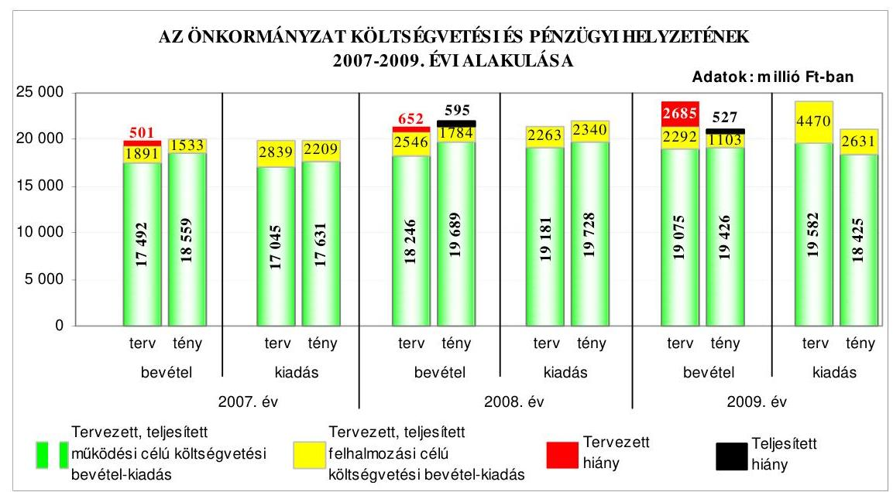
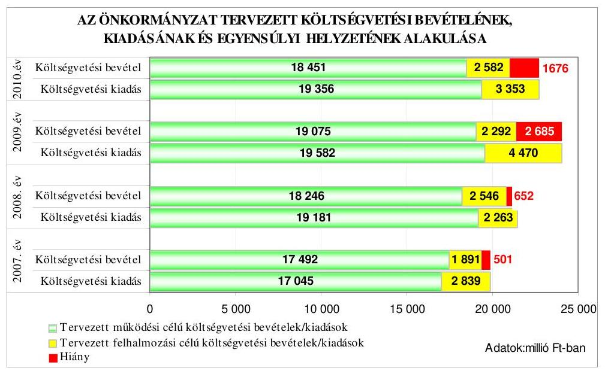
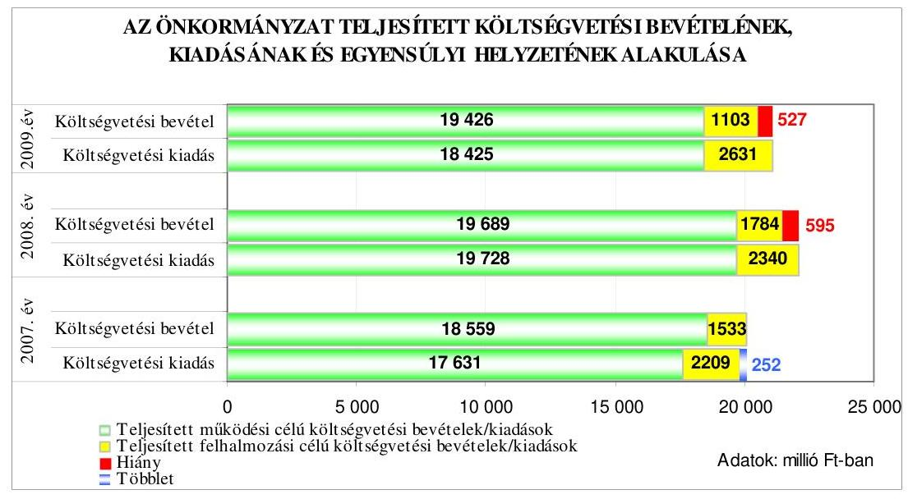
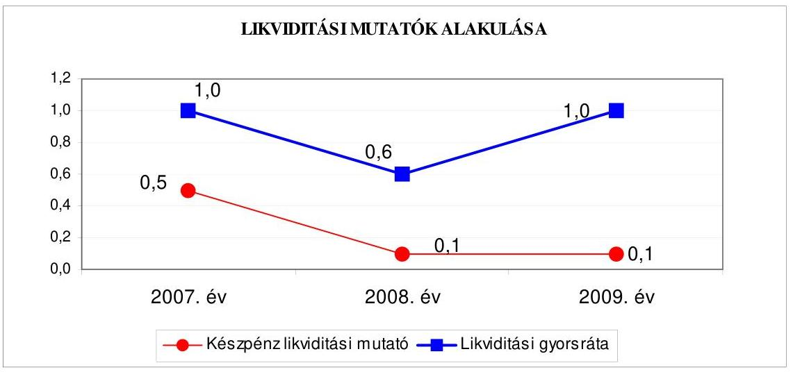
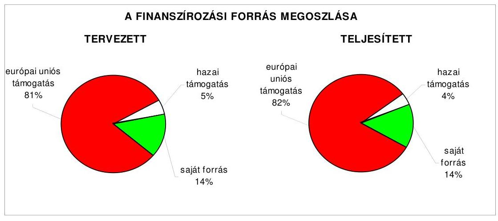
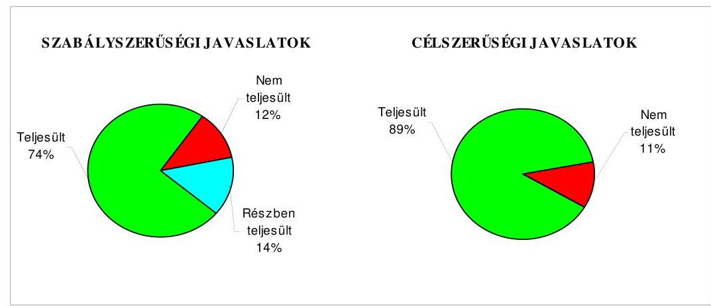
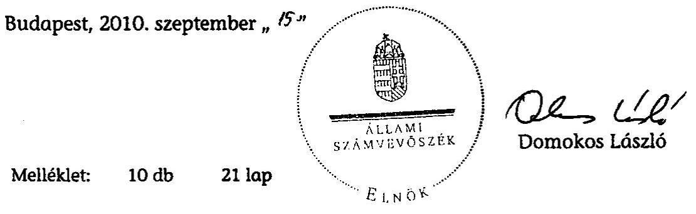
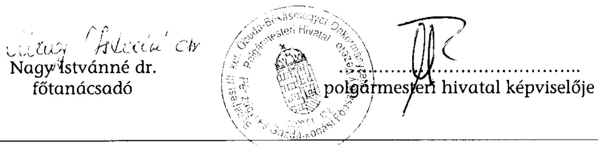
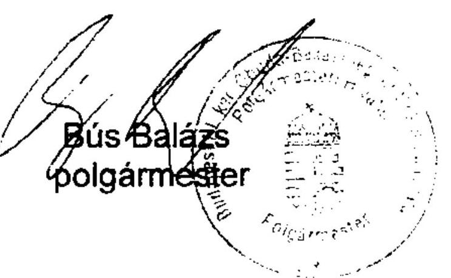
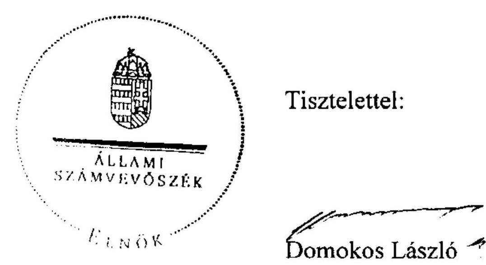

# JELENTÉS 

a Budapest Főváros III. kerület Óbuda-Békásmegyer Önkormányzata gazdálkodási rendszerének 2010. évi ellenőrzéséről

---

# 3. Önkormányzati és Területi Ellenőrzési Igazgatóság 

## Átfogó Ellenőrzési Főcsoport

Iktatószám: V-3023-7/20/20/2010.
Témaszám: 966
Vizsgálat-azonosító szám: V0486

## Az ellenőrzést felügyelte:

Dr. Lóránt Zoltán
főigazgató
Az ellenőrzés végrehajtásáért felelős:
Dr. Sepsey Tamás
főigazgató-helyettes
Az ellenőrzést vezette:
Molnár Gyula Mihály
igazgatóhelyettes
Az ellenőrzést végezték:
Nagy Istvánné dr. Schósz Attiláné Tóth László
főtanácsadó számvevő tanácsos számvevő tanácsos

## A témához kapcsolódó eddig készített számvevőszéki jelentések:

## címe

Jelentés Budapest Főváros III. kerület Óbuda-Békásmegyer Önkormányzata gazdálkodási rendszerének 2005. évi átfogó ellenőrzéséről
Jelentés a helyi és a helyi kisebbségi önkormányzatok gazdálkodási rendszerének átfogó és egyéb szabályszerűségi ellenőrzéséről
Jelentés a Magyar Köztársaság 2006. évi költségvetése végrehajtásának ellenőrzéséről
Függelék:
A helyi önkormányzatokat a 2006. évben megillető normatív hozzájárulás elszámolásának ellenőrzése
Jelentés a fővárosi önkormányzatot és a kerületi önkormányzatokat osztottan megillető bevételek 2007. évi megosztásáról szóló önkormányzati rendelet felülvizsgálatáról

---

# TARTALOMJEGYZÉK 

BEVEZETÉS ..... 11
I. ÖSSZEGZŐ MEGÁLLAPÍTÁSOK, KÖVETKEZTETÉSEK, JAVASLATOK ..... 16
II. RÉSZLETES MEGÁLLAPÍTÁSOK ..... 27

1. Az Önkormányzat költségvetési és pénzügyi helyzete ..... 27
1.1. A tervezett költségvetési bevételek és kiadások alapján a
költségvetési egyensúly, a költségvetési hiány alakulása, a hiány
tervezett finanszírozási módja, valamint a költségvetési hiány
megállapításának szabályszerűsége ..... 27
1.2. A teljesített költségvetési bevételek és kiadások alapján a pénzügyi
egyensúly, a pénzügyi hiány alakulása, a pénzügyi hiány
finanszírozása, az igénybe vett finanszírozási célú pénzügyi
eszközök hatása a pénzügyi helyzet alakulására, az eladósodásra,
valamint a fizetőképességre ..... 30
2. Az Önkormányzat felkészültsége az európai uniós források igénylésére,
felhasználására, a támogatott célkitűzés megvalósítására, működtetésére,
valamint az elektronikus közszolgáltatási feladatok ellátására ..... 38
2.1. Az európai uniós források igénybevételére, felhasználására, a
támogatott célkitűzés megvalósítására, működtetésére történt
felkészülés szabályozottságának, szervezettségének, valamint egy
támogatási szerződésben foglalt célkitűzés megvalósításának,
működtetésének eredményessége ..... 38
2.1.1. Az európai uniós forrásokra történő pályázatok benyújtására
vonatkozó döntések összhangja a fejlesztési célkitűzésekkel ..... 38
2.1.2. Az európai uniós forrásokhoz kapcsolódóan a
pályázatfigyelés, a pályázatkészítés, valamint az európai
uniós támogatással megvalósuló fejlesztés lebonyolításának
belső rendje, a végrehajtás és az ellenőrzés szervezettsége ..... 41
2.1.3. Egy támogatási szerződésben foglalt célkitűzés megvalósítása,
működtetése ..... 44
2.2. Az elektronikus közszolgáltatás feltételeinek kialakítása ..... 46
3. A költségvetési gazdálkodás belső kontrolljai ..... 49
3.1. A költségvetés tervezés, a gazdálkodás és a zárszámadás készítés
folyamatában végrehajtandó belső kontrollok kialakítása ..... 49
3.2. A belső kontrollok működtetése a költségvetés tervezés, a
gazdálkodás, és a zárszámadás készítés folyamataiban ..... 51
3.3. A belső ellenőrzési kötelezettség teljesítése ..... 54

---

4. Az ÁSZ korábbi ellenőrzési javaslatai alapján készített intézkedési terv végrehajtása, hasznosítása
4.1. Az Önkormányzat gazdálkodási rendszerének átfogó ellenőrzése során tett javaslatok végrehajtására tervezett intézkedések megvalósítása
4.2. A zárszámadáshoz kapcsolódó (állami hozzájárulások, támogatások igénylésének és felhasználásának ellenőrzése), valamint a további vizsgálatok esetében a megállapítások, javaslatok alapján tett intézkedések

# MELLÉKLETEK 

1. számú Az Önkormányzat gazdálkodását meghatározó adatok, mutatószámok (1 oldal)
2. számú Az önkormányzati vagyon alakulása (1 oldal)

2/a. számú Az önkormányzati kötelezettségek alakulása (1 oldal)
3. számú Az Önkormányzat 2007-2010. évi költségvetési előirányzatainak és 2007-2009. évi pénzügyi teljesítéseinek alakulása (1 oldal)
4. számú Tanúsítvány az európai uniós forrásokkal támogatott célok és programok 2007-2010. évi tervezett és teljesített adatairól (2 oldal)
4/a. számú Tanúsítvány az európai uniós forrásokra 2007-2010 között benyújtott pályázatokról, amelyek elbírálásáról az Önkormányzat még nem kapott tájékoztatást (1 oldal)
4/b. számú Tanúsítvány a 2007-2010. években benyújtott és elutasított európai uniós pályázatokról (2 oldal)
5. számú Adatlap az európai uniós forrással támogatott intézményi épületek korszerű hőszigetelési eljárások szerinti felújításáról (3 oldal)
6. számú Bús Balázs úr, Budapest Főváros III. kerület Óbuda-Békásmegyer Önkormányzat polgármestere által adott tájékoztatás (6 oldal)
7. számú Bús Balázs úr, Budapest Főváros III. kerület Óbuda-Békásmegyer Önkormányzat polgármesterének tájékoztatására adott válasz (3 oldal)

---

# RÖVIDÍTÉSEK, MOZAIKSZAVAK JEGYZÉKE 

## Törvények

Áht.
ÁSZ tv.
Htv.

Ötv.
Számv. tv.

## Rendeletek

Ámr. 1
Ámr. 2
Áhsz.

Ber.
18/2005. (XII. 27.) IHM rendelet
2005. évi költségvetési rendelet
2006. évi költségvetési rendelet
2007. évi költségvetési rendelet
2008. évi költségvetési rendelet
2009. évi költségvetési rendelet
2010. évi költségvetési rendelet
2006. évi zárszámadási rendelet
az államháztartásról szóló 1992. évi XXXVIII. törvény
az Állami Számvevőszékről szóló 1989. évi XXXVIII. törvény
a helyi önkormányzatok és szerveik, a köztársasági megbízottak, valamint egyes centrális alárendeltségű szervek feladat- és hatásköreiről szóló 1991. évi XX. törvény
a helyi önkormányzatokról szóló 1990. évi LXV. törvény
a számvitelről szóló 2000. évi C. törvény
az államháztartás működési rendjéről szóló 217/1998. (XII. 30.) Korm. rendelet
az államháztartás működési rendjéről szóló 292/2009. (XII. 19.) Korm. rendelet
az államháztartás szervezetei beszámolási és könyvvezetési kötelezettségének sajátosságairól szóló 249/2000. (XII. 24.) Korm. rendelet
a költségvetési szervek belső ellenőrzéséről szóló 193/2003. (XI. 26.) Korm. rendelet
a közzétételi listákon szereplő adatok közzétételéhez szükséges közzétételi mintákról szóló
Budapest Főváros III. kerület Óbuda-Békásmegyer Önkormányzat 11/2005. (III. 30.) számú rendelete a 2005. évi költségvetéséről
Budapest Főváros III. kerület Óbuda-Békásmegyer Önkormányzat 11/2006. (III. 17.) számú rendelete a 2006. évi költségvetéséről
Budapest Főváros III. kerület Óbuda-Békásmegyer Önkormányzat 2/2007. (III. 19.) számú rendelete a 2007. évi költségvetéséről
Budapest Főváros III. kerület Óbuda-Békásmegyer Önkormányzat 4/2008. (III. 25.) számú rendelete a 2008. évi költségvetéséről
Budapest Főváros III. kerület Óbuda-Békásmegyer Önkormányzat 3/2009. (III. 23.) számú rendelete a 2009. évi költségvetéséről
Budapest Főváros III. kerület Óbuda-Békásmegyer Önkormányzat 3/2010. (III. 23) számú rendelete a 2010. évi költségvetéséről
Budapest Főváros III. kerület Óbuda-Békásmegyer Önkormányzat 19/2007. (V. 16.) számú rendelete a 2006. évi zárszámadásáról

---

2007. évi zárszámadási rendelet

2008. évi zárszámadási rendelet

SZMSZ

## Szórövidítések

Adóügyi osztály
ÁROP
ÁSZ
Belső Ellenőrzési Csoport
e-közszolgáltatás
FEUVE
gazdasági program
gazdálkodási kapcsolatok szabályzata ${ }_{1}$
gazdálkodási kapcsolatok szabályzata ${ }_{2}$
gazdasági szervezet ügyrendje

## GJ

hivatali SzMSz
Informatikai iroda
informatikai stratégia

Budapest Főváros III. kerület Óbuda-Békásmegyer Önkormányzat 18/2008. (V. 15.) számú rendelete a 2007. évi zárszámadásáról
Budapest Főváros III. kerület Óbuda-Békásmegyer Önkormányzat 16/2009. (IV. 30) számú rendelete a 2008. évi zárszámadásáról
Budapest Főváros III. kerület Óbuda-Békásmegyer Önkormányzat 9/1995. (VI. 1.) számú rendelete az Önkormányzat Szervezeti és Működési Szabályzatáról

Budapest Főváros III. kerület Óbuda-Békásmegyer Önkormányzat Polgármesteri Hivatalának Adóügyi osztálya
ÚMFT Államreform Operatív Programja
Állami Számvevőszék
Budapest Főváros III. kerület Óbuda-Békásmegyer Önkormányzat Polgármesteri Hivatalának Belső Ellenőrzési Csoportja
elektronikus közszolgáltatás
folyamatba épített előzetes, utólagos és vezetői ellenőrzés
Budapest Főváros III. kerület Óbuda-Békásmegyer Önkormányzat Képviselő-testületének 666/2007. (XII. 19.) számú határozatával elfogadott Gazdasági-Városfejlesztési Programja (2008-2010)
a Polgármesteri hivatal és az önállóan gazdálkodó költségvetési intézmények gazdálkodási kapcsolatának rendjéről szóló - 2004. március 1-én hatályba helyezett - szabályzat
a Költségvetési Szerveket Kiszolgáló Intézmény és a részben önállóan gazdálkodó intézmények gazdálkodási jogkörének szabályozásáról szóló - 2004. március 1-én hatályba helyezett - szabályzat
a Polgármesteri Hivatal ügyrendjéről szóló 3/2007. (IV. 1.) számú polgármesteri és jegyzői együttes utasítás 16. számú mellékletének V. része a Pénzügyi és Gazdálkodási Főosztály ügyrendjéről
gigajoule, az energia mértékegysége
a Polgármesteri Hivatal ügyrendjéről szóló 3/2007. (IV. 1.) számú polgármesteri és jegyzői együttes utasítás
Budapest Főváros III. kerület Óbuda-Békásmegyer Önkormányzat Polgármesteri Hivatalának Informatikai Irodája
Budapest Főváros III. kerület Óbuda-Békásmegyer Önkormányzatának a 2008-2010. közötti időszakra vonatkozó Hároméves Informatikai Stratégiája és Akcióterve, amelyet Budapest Főváros III. kerület Óbuda-Békásmegyer Önkormányzatának Képviselő-testülete a 96/2008. (II. 27.) számú határozatával fogadott el

---

| jegyző | Budapest Főváros III. kerület Óbuda-Békásmegyer Önkormányzatának jegyzője |
| :--: | :--: |
| Képviselő-testület | Budapest Főváros III. kerület Óbuda-Békásmegyer Önkormányzat Képviselő-testülete |
| KIOP | a Nemzeti Fejlesztési Terv Környezetvédelem és Infrastruktúra Operatív Programja |
| Műszaki osztály | Budapest Főváros III. kerület Óbuda-Békásmegyer Önkormányzat Polgármesteri Hivatala Városfejlesztési Főosztályának Műszaki Osztálya |
| Oktatási főosztály | Budapest Főváros III. kerület Óbuda-Békásmegyer Önkormányzat Polgármesteri Hivatalának Oktatási és Kulturális Főosztálya |
| Önkormányzat | Budapest Főváros III. kerület Óbuda-Békásmegyer Önkormányzata |
| Pénzügyi bizottság | Budapest Főváros III. kerület Óbuda-Békásmegyer Önkormányzatának Pénzügyi és Költségvetési Bizottsága |
| Pénzügyi főosztály | Budapest Főváros III. kerület Óbuda-Békásmegyer Önkormányzat Polgármesteri Hivatalának Pénzügyi és Gazdálkodási Főosztálya |
| polgármester | Budapest Főváros III. kerület Óbuda-Békásmegyer Önkormányzatának polgármestere |
| Polgármesteri hivatal | Budapest Főváros III. kerület Óbuda-Békásmegyer Önkormányzat Polgármesteri Hivatala |
| „Staccato" | az Európai Bizottság 6. számú keretprogramja keretében kiírt Concerto II. program TREN/07/FP6EN/SO7.70296/ 038441 azonosítóval rendelkező „STACCATO" projektje |
| TÁMOP | ÚMFT Társadalmi Megújulás Operatív Programja |
| ÚMFT | Új Magyarország Fejlesztési Terv |
| Városfejlesztési főosztály | Budapest Főváros III. kerület Óbuda-Békásmegyer Önkormányzat Polgármesteri Hivatalának Városfejlesztési Főosztálya |

---

.

---

# ÉRTELMEZŐ SZÓTÁR 

1. elektronikus szolgáltatási szint
2. elektronikus szolgáltatási szint
3. elektronikus szolgáltatási szint
4. elektronikus szolgáltatási szint
eredményesség
európai uniós források
fejlesztési célkitűzés
fejlesztési feladat (projekt)

Az 1044/2005. (V. 11.) Korm. határozat alapján olyan információs, tájékoztató szolgáltatás, amely csak általános információkat közöl az adott üggyel kapcsolatos teendőkről és a szükséges dokumentumokról.
Az 1044/2005. (V. 11.) Korm. határozat alapján olyan egyirányú kapcsolatot biztosító szolgáltatás, amely az 1. szinten túl biztosítja az adott ügy intézéséhez szükséges dokumentumok, nyomtatványok letöltését, és azok ellenőrzéssel, vagy ellenőrzés nélküli elektronikus kitöltését, amely esetben a dokumentumok benyújtása hagyományos úton történik.
Az 1044/2005. (V. 11.) Korm. határozat alapján olyan kétirányú kapcsolatot biztosító szolgáltatás, amely közvetlen, vagy ellenőrzött kitöltésű dokumentum segítségével biztosítja az elektronikus adatbevitelt és a bevitt adatok ellenőrzését. Az ügy indításához, intézéséhez személyes megjelenés nem szükséges, de az ügyhöz kapcsolódó közigazgatási döntés (határozat, egyéb aktus) közlése, valamint a kapcsolódó illeték-, vagy díjfizetés hagyományos úton történik.
Az 1044/2005. (V. 11.) Korm. határozat alapján olyan teljes közvetlen kétirányú ügyintézési folyamatot biztosító szolgáltatás, amikor az ügyhöz kapcsolódó közigazgatási döntés is elektronikus úton kerül közlésre, illetve a kapcsolódó illeték-, vagy díjfizetés elektronikus úton is intézhető.
Egy adott tevékenység céljai megvalósításának mértéke, a tevékenység szándékolt és tényleges hatása közötti kapcsolat. (Forrás: Ámr. 1 2. § 66. pont.)
Az Európai Unió költségvetéséből, illetve az Európai Gazdasági Térség Európai Unión kívüli tagállamainak költségvetéséből származó támogatások, valamint a „Svájci Hozzájárulás" programból származó támogatás.
Az önkormányzat által ellátott kötelező, vagy önként vállalt feladatok mennyiségi (minőségi) fejlesztésére vonatkozó terv. A mennyiségi fejlesztés megvalósulhat beszerzéssel, létesítéssel, bővítéssel, átalakítással.
Az a fejlesztési feladat, amely illeszkedik az Európai Unió, illetve a Nemzeti Fejlesztési Terv által támogatott programokhoz. Az Európai Unió, illetve a Nemzeti Fejlesztési Terv és az Új Magyarország Fejlesztési Terv által meghirdetett programokhoz kapcsolódó, támogatott projektek fejlesztési feladatok megvalósításához használhatók fel az európai uniós források. A fejlesztési feladat (projekt) tartalmilag és formailag részletesen kidolgozott, megfelelő pénzügyi háttérrel és végrehajtási ütemezéssel rendelkező fejlesztési terv.

---

indikátor

közreműködő szervezet
lebonyolítás

Nemzeti Fejlesztési Terv

A projekt megvalósulásának számszerűsíthető eredményei, mutató, jelzőszám, amelynek segítségével egy célkitűzés megvalósulásának adott szintjét lehet szemléltetni. Jelenthet egy felhasznált erőforrást, egy elért hatást, egy minőségi szintet, illetve valamilyen egyéb változást.
A közreműködő szervezet az európai uniós támogatást elnyert kedvezményezettel a kapcsolattartó szerv. Feladatai: a támogatási szerződés mintától eltérő egyedi támogatási szerződés-tervezetek előzetes megküldése jóváhagyásra a Nemzeti Fejlesztési Ügynökségnek; a projektek megvalósítása előrehaladásának nyomon követése, a támogatás kifizetésének engedélyezése, a folyamatba épített ellenőrzések (dokumentumalapú ellenőrzések és kockázatelemezésre alapozott helyszíni ellenőrzések) végzése, a projektek zárásával kapcsolatos feladatok ellátása, szabálytalanságkezelési rendszer kialakítása és működtetése; ellenőrzési nyomvonal készítése és folyamatos aktualizálása; az Egységes Monitoring Informatikai Rendszerben az adatok folyamatos rögzítése, az adatbázis naprakészségének és megbízhatóságának biztosítása; a beszámolók készítése és megküldése a miniszter és a Nemzeti Fejlesztési Ügynökség részére az akcióterv és

 az éves munkaterv megvalósításában történt előrehaladásról és a szükséges intézkedésekre vonatkozó javaslatokról.
Az európai uniós források felhasználásával megvalósuló fejlesztésre irányuló műszaki, gazdasági (pénzügyi) tevékenységet magában foglaló szervezési, irányítási szolgáltatás. A szervezési szolgáltatás kiterjedhet a pályázatkészítésre, a közbeszerzési eljárás lebonyolításán keresztül a folyamatos műszaki ellenőrzésre, a pénzügyi elszámolásra, a műszaki átadás-átvételre, az üzembe helyezésre, illetve a fejlesztési folyamat egyes elemeire.
Helyzetelemzést, stratégiát a tervezett fejlesztési területek prioritásait, azok céljait és pénzügyi forrásaik megjelölését tartalmazó dokumentum, amelyet a Magyar Köztársaság készített az Európai Unió programozási irányelveinek, célkitűzéseinek megfelelően a fejlődésben lemaradó régiók fejlődésének és strukturális átalakulásának elősegítésére a kiemelt szükségletekre figyelemmel. A Nemzeti Fejlesztési Terv stratégiai fejezetének célja, hogy a 2004-2006 közötti időszakra kijelölje a strukturális alapokból támogatható fejlesztéspolitikai célkitűzéseit és prioritásait. A strukturális alapok operatív programjai: Agrár- és Vidékfejlesztés Operatív Program (AVOP); Gazdasági Versenyképesség Operatív Program (GVOP); Humán erőforrások fejlesztései Operatív Program (HEFOP); Környezetvédelem és infrastruktúra Operatív Program (KIOP); Regionális Fejlesztés Operatív Program (ROP).

---

nyomon követési időszak
operatív program
pályázati önrész
program
saját forrás
támogatási szerződés

Új Magyarország Fejlesztési Terv

Az európai uniós forrás felhasználásával megvalósult projekt fenntartási kötelezettségének egyes évei, amelyről az Önkormányzatnak nyomon követési jelentést kell készíteni a közreműködő szervezet részére.
Az Európai Bizottság által jóváhagyott, a Közösségi Támogatási Keret végrehajtására vonatkozó, több évre szóló intézkedésekhez kapcsolódó prioritások egységes rendszerét tartalmazó dokumentum.
Az európai uniós forrással megvalósuló fejlesztések finanszírozását szolgáló saját pénzeszköz fedezet, amelyet a pályázatban a pályázó önrészként, azaz saját forrásként mutat ki.
Ágazati vagy térségi fejlesztési célt megvalósító fejlesztési terv, mely több egymással összefüggő projekt útján, az érintettek együttműködése alapján valósul meg.
A kedvezményezett által a támogatott projekthez biztosított forrás, amelybe az államháztartás alrendszereiből nyújtott támogatás nem számítható be. Költségvetési szervek esetén a jóváhagyott előirányzat saját forrásnak minősül.
A strukturális alapok esetében az irányító hatóságnak, illetve a Kohéziós Alap esetében a közreműködő szervezeteknek a kedvezményezett önkormányzattal kötött szerződése, amely a támogatás felhasználásának részletes feltételeit tartalmazza. Az Új Magyarország Fejlesztési Terv keretében támogatott projektek esetében a támogatási szerződés a kedvezményezett és a Nemzeti Fejlesztési Ügynökség nevében eljáró közreműködő szervezet között jön létre. A támogatási szerződés képezi a megvalósítás nyomon követésének, finanszírozásának és ellenőrzésének alapját.
Az Új Magyarország Fejlesztési Terv célja a foglalkoztatás bővítése és a tartós növekedés feltételeinek megteremtése. Ennek érdekében 2007-2013 között hat kiemelt területen indított el összehangolt állami és európai uniós fejlesztéseket: a gazdaságban, a közlekedésben, a társadalom megújulása érdekében, a környezet és az energetika területén, a területfejlesztésben és az államreform feladataival összefüggésben.
Az Új Magyarország Fejlesztési Terv operatív programjai: Államreform Operatív Program (ÁROP); Elektronikus Közigazgatás Operatív Program (EKOP); Gazdaságfejlesztés Operatív Program (GOP); Környezet és Energia Operatív Program (KEOP); Közlekedés Operatív Program (KÖZOP); Dél-Alföldi Operatív Program (DAOP); Dél-Dunántúli Operatív Program (DDOP); Észak-Alföldi Operatív Program (ÉAOP); Észak-Magyarországi Operatív Program (ÉMOP); Közép-Dunántúli Operatív Program (KDOP); Közép-Magyarországi Operatív Program (KMOP); Nyugat-

---

Dunántúli Operatív Program (NYDOP); Társadalmi Infrastruktúra Operatív Program (TIOP); Társadalmi Megújulás Operatív Program (TÁMOP).

---

# JELENTÉS 

## Budapest Főváros III. kerület Óbuda-Békásmegyer Önkormányzata gazdálkodási rendszerének 2010. évi ellenőrzéséről

## BEVEZETÉS

Az Ötv. 92. § (1) bekezdése, az Állami Számvevőszékről szóló 1989. évi XXXVIII. törvény 2. § (3) bekezdése, valamint az Áht. 120/A. § (1) bekezdése alapján az önkormányzatok gazdálkodását az Állami Számvevőszék ellenőrzi. Az ellenőrzésre az Országgyúlés illetékes bizottságai részére is átadott, országosan egységes ellenőrzési program szerint került sor.

Az Állami Számvevőszék a stratégiájában foglalt célkitűzéseknek megfelelően a helyi önkormányzatok költségvetési gazdálkodási rendszerének ellenőrzését a 2007. évben megújított, teljesítmény-ellenőrzési elemekkel kiegészített ellenőrzési program alapján folytatja a 2010. évben.

Az ellenőrzés célja annak értékelése volt, hogy az Önkormányzat:

- milyen módon biztosította a költségvetési és a pénzügyi egyensúlyt a költségvetésében és annak teljesítése során, valamint változott-e a hiányzó bevételi források pótlásában a finanszírozási célú pénzügyi műveletek jelentősége, hatása;
- eredményesen készült-e fel a szabályozottság és a szervezettség terén az európai uniós források igénylésére és felhasználására, megvalósította, működtette-e a támogatott célkitűzést, továbbá biztosította-e az elektronikus közszolgáltatás feltételeit, a gazdálkodási adatok közzétételével a gazdálkodás nyilvánosságát;
- megfelelően kialakította-e és működtette-e a belső kontrollokat a költségvetés tervezés, a gazdálkodás és a zárszámadás készítés, valamint a belső ellenőrzés folyamatában, továbbá;
- megfelelően hasznosították-e a korábbi számvevőszéki ellenőrzések megállapításait, szabályszerűségi ${ }^{1}$ és célszerűségi javaslatait.

[^0]
[^0]:    ${ }^{1}$ A törvényi előírások betartásának elmulasztásakor a részletes megállapítások fejezetben egységesen a törvénysértés megjelölést alkalmazzuk, mivel az ÁSZ nem tehet különbséget a törvényi előírások között.

---

Az ellenőrzés típusa: átfogó ellenőrzés, amely - egy ellenőrzés keretében meghatározott területekre összpontosítva - alkalmazza a szabályszerűségi, valamint a teljesítmény-ellenőrzés jellemzőit.

Az ellenőrzött időszak: a költségvetési egyensúly és az európai uniós támogatás igénybevételére történt felkészülés ellenőrzése esetében a 2007-2009. évek, a belső kontrollok kialakítása és működtetése tekintetében a 2009. év, az Önkormányzat gazdálkodási rendszerének 2005. évi átfogó ellenőrzéséről készített jelentésben rögzített javaslatok megvalósítása, hasznosítása, valamint a 2006 óta végzett további ellenőrzések során megfogalmazott javaslatok végrehajtása érdekében tett intézkedések vonatkozásában a 2006-2010. I. negyedév közötti időszak.

A kerület lakosainak száma 2010. január 1-jén 125194 fő volt. A 2006. évi önkormányzati képviselő- és polgármester-választást követően az Önkormányzat 36 tagú Képviselő-testületének munkáját 10 állandó bizottság segítette. Az Önkormányzat mellett a 2006. évi önkormányzati képviselő- és polgármester-választásokat követően 10 kisebbségi önkormányzat ${ }^{2}$ működött. A polgármester a 2006. évi önkormányzati képviselő- és polgármester-választás óta tölti be tisztségét, a jegyző személye 1997. év óta változatlan.

Az Önkormányzat feladatainak végrehajtása érdekében a 2007. évben 61, a 2009. évben 45 költségvetési intézményt működtetett, amelyekből a 2007. évben 33 önállóan gazdálkodó, a 2009. évben 15 önállóan működő és gazdálkodó volt. A feladatok ellátásában a 2007. évben négy, a 2009. évben hat gazdasági társasága vett részt. Az Önkormányzat az éves költségvetési beszámolója szerint a 2009. évben 20529 millió Ft költségvetési bevételt ért el, és 21056 millió Ft költségvetési kiadást teljesített. A teljesített költségvetési bevételek 2,2%-kal, a költségvetési kiadások 6,1%-kal haladták meg a 2007. évben teljesített költségvetési bevételeket és kiadásokat, a bevételek esetében a teljesített működési célú, míg a kiadások esetében a teljesített működési és felhalmozási célú költségvetési kiadások együttes növekedése következtében. Az Önkormányzat 2009. december 31-én a könyvviteli mérleg szerint 122911 millió Ft értékű vagyonnal rendelkezett. Az Önkormányzat vagyona a 2007. év végi állományhoz viszonyítva 6,5%-kal emelkedett, ezen belül a tárgyi eszközök állománya 7267 millió Ft-tal (6,5%-kal) - az ingatlanok állományi értékének 14,4%-os növekedése hatására - emelkedett. A forgóeszközökön belül több mint kétszeresére (116,6%-kal) nőtt a követelések állománya az adóellenőrzéseket követően visszamenőlegesen előírt adókövetelések hatására. A vagyon növekedését forrásoldalon - a 2007. évhez viszonyítva - a saját tőke 7658 millió Ft-tal (6,8%-kal), valamint - a rövid lejáratú hitel év végi állományi értéke és a 2009. évben felvett beruházási és fejlesztési hitelek következtében - a rövid és hosszú lejáratú kötelezettségek 739 millió Ft-tal (51,5%-kal) történő emelkedése okozta, a tartalékok 269 millió Ft-ról -607 millió Ft-ra való csökkenésével szemben. Az összes költségvetési bevétel 67,1%-át a saját bevétel, 44,5%-át a helyi adó bevétel biztosította a 2009. évben. A helyi adóbevétel összes költségvetési bevételen belüli aránya a 2007. évihez viszonyítva 4,2 százalékponttal nőtt. Az összes

[^0]
[^0]:    ${ }^{2}$ bolgár, cigány, görög, horvát, lengyel, német, örmény, ruszin, szerb, szlovák kisebbségi önkormányzat

---

költségvetési kiadásból a felhalmozási célú kiadás részaránya a 2009. évben 12,5% volt, mely a 2007. évhez viszonyítva 1,4 százalékponttal nőtt a háztartásoknak nyújtott felhalmozási célú pénzeszköz átadások miatt. A 2010. évi költségvetési rendeletben 21033 millió Ft költségvetési bevételt és 22709 millió Ft költségvetési kiadást irányoztak elő. A Polgármesteri hivatalban dolgozó köztisztviselők száma 2007. január 1-én 331 fő, 2009. december 31-én 326 fő volt, a költségvetési intézményekben 2007. január 1-én 2716 fő, 2009. december 31-én 2508 fő közalkalmazottat foglalkoztattak. Az Önkormányzat gazdálkodását meghatározó adatokat, mutatószámokat az 1-3. számú mellékletek tartalmazzák.

Az Önkormányzat költségvetési és pénzügyi helyzetét az elemző eljárás módszerével vizsgáltuk. E körben elemeztük a költségvetés egyensúlyi helyzetének alakulását, a tervezett és teljesített költségvetési, pénzügyi hiány okait, a hiány finanszírozásának tervezett és teljesített módját, az Önkormányzat pénzügyi helyzetének alakulását az eladósodás és a likviditás szempontjából.

Teljesítmény-ellenőrzés módszerével vizsgáltuk, és eredményesség szempontjából értékeltük az Önkormányzat benyújtott pályázatai kapcsolódását a Képviselő-testület által meghatározott fejlesztési célkitűzésekhez, valamint felkészültségét a belső szabályozottság, szervezettség terén az európai uniós forrásokra vonatkozó pályázati felhívások figyelésére, a pályázatok készítésére, és a lebonyolítására. Értékeltük továbbá egy fejlesztési feladat támogatási szerződésében rögzített célkitűzés (számszerűsíthető eredmények, indikátorok) megvalósításának eredményességét. Az ellenőrzés során felmértük, hogy az elektronikus közigazgatási szolgáltatások működtetése érdekében milyen intézkedéseket tettek, továbbá biztosították-e a közérdekű gazdálkodási adatok meghatározott körének honlapon történő közzétételét.

A költségvetési gazdálkodás belső kontrolljainak ellenőrzése során vizsgáltuk, hogy a Polgármesteri hivatalban a költségvetés tervezés, a gazdálkodás és a zárszámadás készítés folyamatában a belső kontrollok kialakítása és működése megfelelő biztosítékot ad-e a gazdálkodási feladatok szabályszerű ellátására. Felmértük és minősítettük a költségvetés tervezés, a gazdálkodás, és a zárszámadás készítés feladataival, továbbá a pénzügyi-számviteli területen az informatikával kapcsolatosan kialakított kontrollok, valamint azok működésének megfelelőségét. A vizsgálat során értékeltük a belső ellenőrzés szabályozottságát, működési feltételeinek kialakítását, meghatározását, továbbá működésének megfelelőségét.

A Polgármesteri hivatalban értékeltük a gazdálkodás folyamatában kulcsszerepet betöltő belső kontrollok működésének megfelelőségét, ennek keretében ellenőriztük a szakmai teljesítés igazolására és az utalvány ellenjegyzésére kialakított kontrollok végrehajtását.

---

Az ellenőrzést a következő, magas kockázatú kifizetésekre folytattuk le ${ }^{3}$ :

- az államháztartáson kívülre teljesített működési és felhalmozási célú pénzeszköz átadásokra,
- az állományba nem tartozók megbízási díjaira, továbbá
- a külső szolgáltató által végzett karbantartási, kisjavítási szolgáltatásokra.

Az ellenőrzés hatékony elvégzése céljából a vizsgálandó területek kiválasztása során a kockázatokon alapuló megközelítés érvényesült, ezáltal az ellenőrzési erőforrásokat azokra a területekre fókuszáltuk, amelyeken a korábbi ellenőrzési tapasztalatok figyelembevételével legnagyobb a hibák előfordulási valószínűsége. Az ellenőrzési erőforrások ilyen típusú összpontosításával minimálisra csökkenthető a kívánt ellenőrzési bizonyosság eléréséhez szükséges időráfordítás.

A pénzügyi-számviteli folyamatokban alkalmazott belső kontrollok kialakításának és működésének ellenőrzésére a vizsgált három terület 2009. évi könyvviteli tételeiből területenként egyszerű véletlen mintát vettünk. A kijelölt gazdasági eseményre elvégzett megfelelőségi tesztek alapján értékeltük a kontrollok működésének megfelelőségét a vizsgált három területre külön-külön, majd összefoglalóan ${ }^{4}$. A helyszíni ellenőrzés megállapításainak részletes dokumentálását megfelelőségi tesztlapokon, ellenőrzési munkalapokon biztosítottuk. Ezeken a teszt- és munkalapokon a minősítés alapjául szolgáló kérdések és a vonatkozó konkrét jogszabályhelyek megjelölése mellett értékeltük a kialakított belső kontrollokban rejlő kockázatokat ${ }^{5}$ és a kialakított kontrollok működésének megfelelőségét ${ }^{6}$.

[^0]
[^0]:    ${

 }^{3}$ Az önkormányzatok kiemelt előirányzataira vonatkozóan, a vertikális folyamatokra elvégeztük a kockázatok becslését, amelynek eredményeként határoztuk meg a magas kockázatú területeket.
    ${ }^{4}$ A vizsgált három terület egyedi értékelési pontszámait a területek költségvetési súlyával arányosan összegeztük.
    ${ }^{5}$ A kialakított belső kontrollokban rejlő kockázatot alacsonynak minősítettük, ha a kontrollok megfelelő védelmet nyújtottak a hibák bekövetkezése ellen. Közepesnek minősítettük a belső kontrollokban rejlő kockázatot, amennyiben a kontrollok a lehetséges hibák többsége ellen védelmet nyújtottak. Magasnak értékeltük a kockázatot, ha a kontrollok - kialakításuk hiányában, vagy hiányos kialakításuk miatt - nem nyújtottak elegendő védelmet a lehetséges hibákkal szemben.
    ${ }^{6}$ A kontrollok működésének megfelelőségét kiválónak értékeltük abban az esetben, ha azok működése - esetleges kisebb, az egységesen meghatározott követelményrendszerben foglalt mértéket el nem érő hiányosságoktól eltekintve - megfelelt a hibák megelőzésére és kijavítására meghatározott szabályozásnak és a legmagasabb szintű elvárásoknak. Jónak minősítettük a kontrollok működését, ha a megállapított kisebb (tolerálható mértékű) hiányosságok nem veszélyeztették az ellenőrzött terület hibáinak megelőzését és kijavítását. Amennyiben a kontrollok működésében túl sok hiányosság fordult elő ahhoz, hogy a kontrollok biztosítsák a hibák megelőzését, feltárását, kijavítását és ezáltal veszélyeztették az eredményes, megbízható működést, a kontroll működésének megfelelősége gyenge minősítést kapott.

---

Az ÁSZ korábbi ellenőrzési javaslatai alapján tett intézkedéseket, illetve azok megvalósítását utóellenőrzés keretében vizsgáltuk. A gazdálkodási rendszer korábbi átfogó ellenőrzése során megfogalmazott javaslatok végrehajtására tett intézkedések megvalósítását ellenőriztük, az egyéb számvevőszéki ellenőrzések során tett javaslatok esetében pedig a kiadott intézkedéseket tekintettük át.

A helyszíni ellenőrzés során kitöltött - az ellenőrzést végző számvevő és a Polgármesteri hivatal felelős köztisztviselője által aláírt - ellenőrzési munkalapokat, azok kitöltési útmutatóit, továbbá a megfelelőségi tesztek dokumentumait a polgármester részére a számvevői jelentéssel egyidejűleg átadtuk.

A jelentést az ÁSZ-ról szóló 1989. évi XXXVIII. tv. 25. § (1) bekezdése alapján észrevétel közlése céljából megküldtük a Budapest Főváros III. kerület Óbuda-Békásmegyer Önkormányzat polgármesterének. A kapott tájékoztatást a jelentés 6. számú melléklete, az arra adott választ a 7. számú melléklet tartalmazza

---

# I. ÖSSZEGZŐ MEGÁLLAPÍTÁSOK, KÖVETKEZTETÉSEK, JAVASLATOK 

Az Önkormányzatnál a 2007-2010. években a tervezett költségvetési bevételek és kiadások alakulása változó volt, mivel a költségvetési bevételek és kiadások főösszegei az előző évhez viszonyítva a 2009. évig növekedtek, majd a következő évre csökkentek. Az Önkormányzat a 2007-2010. évi költségvetési rendeleteiben a költségvetési bevételek és kiadások egyensúlyát nem biztosította, mivel a tervezett költségvetési kiadások meghaladták a tervezett költségvetési bevételeket. Az Önkormányzat a költségvetési egyensúly biztosításához a költségvetési hiány finanszírozására és a finanszírozási célú pénzügyi műveletek kiadásainak forrásául a 2007-2010. évi költségvetési rendeletekben rövid és hosszú lejáratú hitelek felvételét, valamint bevételt növelő és kiadást csökkentő intézkedések megtételét tervezte. A jegyző a költségvetés végrehajtása érdekében a likviditás feltételeinek kialakításáról az éves költségvetések tervezése során folyószámlahitel-keret számbavételével, továbbá előirányzat-felhasználási terv készítésével gondoskodott. A 2007-2010. évi költségvetési bevételek és kiadások főösszegeinek költségvetési rendelettervezetben történt megállapításakor betartották az Áht. rendelkezését, mivel finanszírozási célú pénzügyi műveleteket költségvetési bevételként, illetve költségvetési kiadásként nem vettek figyelembe.

Az Önkormányzatnál a 2007-2009. években a teljesített költségvetési bevételek és kiadások alakulása változó volt, mivel a költségvetési bevételi és kiadási főösszegek a 2007. évről a 2008. évre növekedtek, majd a 2009. évre csökkentek. A költségvetések végrehajtása során a 2007. évben a teljesített költségvetési bevételek fedezetet nyújtottak a megvalósított feladatok teljesített költségvetési kiadásaira, míg a 2008-2009. években a pénzügyi egyensúly nem állt fenn. A 2009. évben az Önkormányzat ingatlan értékesítésből származó

---

bevétele az előirányzattal szemben mindössze egynegyedére teljesült az ingatlanpiac stagnálása következtében. A felhalmozási célú költségvetési kiadásokon belül a 2007-2009. években a beruházási kiadások alulteljesültek, a felújítási kiadások túlteljesültek, de ezek nem vezethetők vissza tervezési hiányosságokra. Az Önkormányzat a 2007-2009. évek között az intézményrendszert átszervezte, az ingatlanok bérleti díjait emelte, az Adóügyi osztályt átszervezte az ellenőrzési és a behajtási tevékenység növelése érdekében, továbbá minden évben emelte az építményadó mértékét. Az Önkormányzat a 2007-2010. I. negyedévben folyószámlahitelt, a 2008-2009. években a „Sikeres Magyarországért önkormányzati infrastruktúra fejlesztési program" keretében hosszú lejáratú hiteleket vett igénybe. A hitelfelvételek során az előírt hatásköri és eljárási szabályok szerint jártak el. Az Önkormányzat pénzügyi helyzete a 2007. évről a 2009. évre - az esedékességi aránymutató csökkenése és a likviditási gyorsráta változatlansága ellenére - az eladósodási mutató és az adósságszolgálati ráta emelkedése, valamint a készpénz likviditási mutató csökkenése következtében összességében kedvezőtlenül alakult.

Az Önkormányzat a 2007-2010. évekre a fejlesztési célkitűzéseit gazdasági programban, kerületfejlesztési és ágazati szakmai fejlesztési koncepciókban, valamint stratégiai tervekben határozta meg. A 2007-2009. évek közötti időszakban az Önkormányzat európai uniós forrásokra 40 pályázatot nyújtott be. Az európai uniós forrás igénybevételére benyújtott valamennyi pályázat kapcsolódott a gazdasági programban, a kerületfejlesztési, és az ágazati szakmai koncepciókban, valamint a stratégiai tervekben foglalt célkitűzésekhez. A pályázatok benyújtása előtt a Képviselő-testület határozatokban vállalt kötelezettséget a pályázati önrész finanszírozására, azonban az annak fedezetét biztosító költségvetési forrást nem jelölte meg. Az elbírált pályázatok több mint fele részesült támogatásban, amelyek 1377 millió Ft tervezett kiadását 27%-ban európai uniós és 29%-ban hazai támogatás, 6%-ban önkormányzati saját forrás, 17%-ban hitel, valamint 21%-ban magán forrás finanszírozta. A 2007-2009. évek költségvetési rendeletei tartalmazták az európai uniós támogatással megvalósuló fejlesztési, felújítási feladatok költségvetési bevételi és kiadási előirányzatait. Az Ámr-ben előírtak ellenére azonban a költségvetési rendeletekből hiányoztak a többéves kihatással járó feladatok előirányzatai éves bontásban, valamint az európai uniós forrásból finanszírozott támogatással megvalósuló programok, projektek bevételeinek és kiadásainak elkülönített bemutatása.

Az Önkormányzatnál az európai uniós források igénybevételével és felhasználásával összefüggő szabályozást az SzMSz, a hivatali SzMSz, belső utasítás, képviselő-testületi határozat, a gazdálkodási kapcsolatok szabályzata ${ }_{1,2}$, valamint a munkaköri leírások tartalmazták. A szabályozás keretében nem rendelkeztek a pályázatok önkormányzati szintű nyilvántartása vezetésének kötelezettségéről, valamint a nyilvántartás módjáról. A szabályozás magában foglalta az európai uniós forrásokra irányuló pályázatfigyelés és pályázatkészítés eljárási rendjét, azonban a fejlesztések lebonyolításával kapcsolatos eljárási rendből hiányoztak a kapcsolattartásra és az információ-szolgáltatásra vonatkozó előírások. A fejlesztési lebonyolítási feladatok ellátására kötött valamennyi szerződés tartalmazta a támogatott célkitűzés megvalósításának kötelezettségét, valamint a megbízottra vonatkozó felelősségi szabályokat. Öt megbízási szerződésben viszont hiányzott a kapcsolattartás rendjének meghatározása, va-

---

lamint egy megbízási szerződésben az ellenőrzés rendjének rögzítése. A belső ellenőrzés stratégiai, valamint a 2007. és a 2008. évi ellenőrzési tervhez nem készült kockázatelemzés, a 2009. évi ellenőrzési tervet megalapozó kockázatelemzés pedig nem terjedt ki az európai uniós forrásokkal támogatott fejlesztési feladatokra.

Egy támogatási szerződésben foglalt célkitűzés megvalósításának és működtetésének ellenőrzése az Önkormányzatnak a KIOP „Energiagazdálkodás környezetbarát fejlesztése" intézkedése keretében elnyert, európai uniós forrás igénybevételével megvalósuló, korszerű hőszigetelési eljárásokkal felújítandó hat általános iskolai épület projektjére irányult. Az energiafelhasználás racionalizálására előírt célt a támogatási szerződés szerinti tartalommal teljesítették. Az első és a második nyomon követési jelentésben foglaltak szerint a tényleges hőmennyiség megtakarítás a támogatási szerződésben meghatározott kiindulási értéknél az elvárt 30%-ot meghaladó, az első nyomon követési időszakban 32%, azaz 8305 GJ, a másodikban 64%, azaz 10302 GJ volt.

Az Önkormányzat 2007-2009 között összességében nem készült fel eredményesen a belső szabályozottság és szervezettség terén az európai uniós források igénybevételére, a támogatások felhasználására. Az európai uniós támogatások a gazdasági programban, a kerületfejlesztési és ágazati szakmai fejlesztési koncepciókban, a stratégiai tervekben megfogalmazott fejlesztési célkitűzésekhez kapcsolódtak, szabályozták a pályázatfigyelést végző és a döntési, illetve a döntés előterjesztési jogkörrel rendelkezők közötti információszolgáltatás kötelezettségét, biztosították a pályázatfigyelés, a pályázatkészítés és a fejlesztési feladat lebonyolításának személyi, szervezeti feltételeit, meghatározták a külső szervezettel kötött szerződésekben a pályázatkészítést végző felelősségét, valamint a KIOP „Energiagazdálkodás környezetbarát fejlesztése" program keretében megvalósított projekt célkitűzését a támogatási szerződésben rögzített határidőre teljesítették. Nem készítettek azonban a belső ellenőrzési stratégiát megalapozó kockázatelemzést, illetve a 2009. évi ellenőrzési tervet megalapozó kockázatelemzés nem foglalta magában az európai uniós forrásokkal támogatott fejlesztési feladatokat, továbbá nem írták elő egy külső szervezettel kötött szerződésben a fejlesztési feladat lebonyolítását végző ellenőrzési kötelezettségeit.

Az Önkormányzat rendelkezett a Képviselő-testület által a 2008-2010. évekre elfogadott informatikai stratégiával, amelyben az elektronikus ügyintézés 2. elektronikus szolgáltatási szintjének elérését a 2009. évre tűzték ki. Az e-közsolgáltatási feladatok ellátását a Polgármesteri hivatal köztisztviselőivel, saját számítógépes információs rendszeren keresztül, vásárolt programok üzemeltetésével biztosították. Az Önkormányzatnál az e-közsolgáltatási feladatokat ellátó informatikai rendszerben az ügyintézést 1., illetve 2. elektronikus szolgáltatási szinten valósították meg.

Az Önkormányzatnál polgármesteri utasításban szabályozták a közérdekű adatok honlapon történő elektronikus közzétételét. Az Önkormányzat az Áhtban foglaltak ellenére, a 2009. évben nem tette közzé a honlapján a pénzeszközei felhasználásával, a vagyonnal történő gazdálkodással összefüggő - nettó ötmillió Ft-ot elérő, vagy azt meghaladó értékű - árubeszerzésre, építési beruházásra, szolgáltatás megrendelésre, vagyonértékesítésre, vagyonhasznosításra vonatkozó szerződések közel háromnegyedének adatait, továbbá a céljellegű,

---

működési és felhalmozási támogatások négyötödét, illetve a közzétettnél nem tüntette fel a támogatás céljára, és a támogatási program megvalósítási helyére vonatkozó adatokat. Az e-közsolgáltatási feladatokat ellátó informatikai rendszer ügyfelek általi igénybevételét nem kísérték figyelemmel.

A költségvetés tervezési és a zárszámadás készítési folyamatok szabályozottsága összességében alacsony kockázatot jelentett a feladatok megfelelő, szabályszerű végrehajtásában, mivel a jegyző előírta a költségvetés tervezés és a zárszámadás készítés rendjét, az intézmények részére a költségvetési javaslat összeállításával kapcsolatos követelményeket, az intézményi mutatószám felmérés adatai megalapozottságának, továbbá az állami támogatásokkal, hozzájárulásokkal történő elszámoláshoz közölt mutatószámok adatai megbízhatóságának ellenőrzését. Annak ellenére összességében alacsony volt a kockázat, hogy a jegyző a képviselő-testületi jóváhagyás megalapozása érdekében az Ámr. előírása ellenére nem írta elő az intézményi pénzmaradványok kimunkálása szabályszerűségének ellenőrzését. A Polgármesteri hivatalban a 2009. évben a költségvetés tervezési és a zárszámadás készítési folyamatban a működésbeli hibák megelőzésére, feltárására, kijavítására kialakított belső kontrollok működésének megfelelősége összességében kiváló volt, mivel az előírásoknak megfelelően ellenőrizték, hogy az intézmények teljesítették-e a költségvetési javaslat összeállításával kapcsolatban részükre meghatározott követelményeket, az intézményi mutatószám felmérés adatainak megalapozottságát, megbízhatóságát.

A gazdálkodási, a pénzügyi-számviteli és a folyamatba épített ellenőrzési feladatok szabályozásának hiányosságai közepes kockázatot jelentettek a feladatok megfelelő, szabályszerű végrehajtásában, mivel az Ámr-ben foglaltak ellenére a hivatali SzMSz nem tartalmazta a Polgármesteri hivatal nyilvántartási számát, az alapítása időpontját, valamint a szervezeti egységeinél a pénz-ügyi-gazdasági tevékenységet ellátó személyek feladatkörének, munkakörének meghatározását, a gazdasági szervezet ügyrendje nem tartalmazta elkülönítve a vezetők és a szerv pénzügyi-gazdasági feladatainak ellátásáért felelős alkalmazottak feladat- és hatáskörét, felelősségi körét, a helyettesítés rendjét, a belső és külső kapcsolattartás módját, továbbá nem írta elő a költségvetés
 tervezéssel, az előirányzat-módosítással, a beruházással, a vagyon használatával, hasznosításával, a munkaerő-gazdálkodással, a beszámolási kötelezettséggel, az adatszolgáltatással kapcsolatos pénzügyi-számviteli feladatokat. A jegyző az Áhsz-ben foglaltak ellenére nem rögzítette, mi tekintendő figyelembe veendő szempontnak a kis értékű tárgyi eszközök, a vagyoni értékű jogok és a szellemi termékek minősítésénél, a selejtezés során - beleértve az üzemeltetésre átadott eszközöket - a döntéshozatalra jogosultak körét, továbbá célszerűsége ellenére nem határozta meg az értékelések ellenőrzéséért felelős munkaköröket, az értékelési és az értékelés ellenőrzési feladatokat a dolgozók munkaköri leírásában. A jegyző az Áhsz. és az Ámr. előírásai ellenére nem készített önköltségszámítási szabályzatot, a Számv. tv-ben és az Áhsz-ben foglaltakkal szemben a számlarendben nem rögzítette az azt alátámasztó bizonylati rendet, az analitikus nyilvántartások formáját, tartalmát, vezetésének módját, a kapcsolódó főkönyvi nyilvántartásokkal való egyeztetését és annak dokumentálását. Az Ámr. ${ }_{1}$ előírása ellenére az ellenőrzési nyomvonal kialakításánál nem azonosította a költségvetés tervezés folyamatgazdáit, a selejtezés és a leltározás folyamatát, valamint a selejtezés és a leltározás során elvégzendő tevékenységeket. Az ellenőrzési nyomvonal a Polgármesteri hivatal költségvetés tervezése, valamint az évközi beszámoló jelentések és a zárszámadás készítés vonatkozásában nem nevesítette egyértelműen a feladat végrehajtásáért felelős szervezeti egységet vagy személyt, valamint a Polgármesteri hivatal költségvetés tervezése tekintetében az ellenőrzési pontokat. A költségvetés végrehajtásához kapcsolódó pénzügyi műveleteket érintő folyamatok, valamint a FEUVE és a belső ellenőrzés tekintetében nem utalt arra, hogy a feladatokat melyik belső szabályzat részletezi és nem tartalmazta a feladat elvégzését igazoló dokumentum nyilvántartási helyét a rendszerben, a kötelezettségvállalások tekintetében a feladat elvégzését igazoló dokumentumokat sem nevesítette. A szabálytalanságok kezelésére kialakított eljárásrend az Ámr. ${ }_{1}$ előírása ellenére nem tartalmazta a szabálytalanságok és az azok felszámolására tett intézkedések nyilvántartási feladatait és felelősét. A kialakított belső kontrollok azonban - működésük esetén - a lehetséges hibák többsége ellen védelmet nyújtottak.

A Polgármesteri hivatalban a 2009. évben az államháztartáson kívülre teljesített működési és felhalmozási célú pénzeszköz átadásokkal, az állományba nem tartozók megbízási díjaival, valamint a külső szolgáltatók által végzett karbantartási, kisjavítási szolgáltatásokkal kapcsolatos kifizetések teljesítése során a szakmai teljesítésigazolás és az utalvány ellenjegyzés működésének megfelelősége kiváló volt, mivel a szerződésekben, megrendelésekben, megállapodásokban meghatározott feladatok teljesítésének szakmai igazolását, a kiadások jogosultságának, összegszerűségének ellenőrzését a szakmai teljesítés igazolására a jegyző által kijelölt személyek a gazdálkodási jogkörök szabályzatában előírt módon elvégezték. Az utalvány ellenjegyzője a gazdálkodásra vonatkozó szabályok érvényesüléséről, továbbá a szakmai teljesítésigazolás és az érvényesítés elvégzéséről meggyőződött.

A pénzügyi-számviteli tevékenységekhez kapcsolódó informatikai rendszerek szabályozottsága összességében alacsony kockázatot jelentett az informatikai feladatok megfelelő, szabályszerű végrehajtásában, mivel a jegyző elkészítette a hozzáférési jogosultságok eljárásrendjét, szabályozta a pénzügyi-számviteli program mentési eljárásait, és az ellenőrzési lista lekérdezhető volt a pénzügyi-számviteli rendszerből. Annak ellenére összességében alacsony volt a kockázat, hogy a jegyző nem készített üzletmenet folytonossági tervet, amelyet 2010. február elején pótolt, és a lekérhető ellenőrzési listákból nem volt megállapítható az elvégzett műveletek tartalma. A Polgármesteri hivatalban a 2009. évben a pénzügyi-számviteli tevékenységhez kapcsolódó informatikai feladatoknál a kialakított belső kontrollok működésének megfelelősége gyenge volt, mivel nem biztosították a hozzáférési jogosultságokra vonatkozó nyilvántartás teljes körűségét és naprakészségét, az adathozzáférésről, adatmódosításról és adattörlésről az ellenőrzési lista elkészítését és rendszeres ellenőrzését, továbbá annak ellenőrzését, hogy az elmentett állományokból a pénzügyi-számviteli adatok teljes körűen helyreállíthatóak-e.

A belső ellenőrzés szervezeti kereteinek kialakítása és szabályozása a belső ellenőrzési feladatok megfelelő, szabályszerű végrehajtásában összességében alacsony kockázatot jelentett, mivel az Önkormányzat Belső Ellenőrzési Csoportot hozott létre, a hivatali SzMSz-ben előírták ennek feladatait, meghatározták a belső ellenőrzési vezető személyét, a jegyző jóváhagyta a belső ellenőrzési kézikönyvet, a stratégiai ellenőrzési tervet, gondoskodott az éves ellenőrzési tervek elkészítéséről és azok Képviselő-testület által történő jóváhagyásáról. Annak ellenére összességében alacsony volt a kockázat, hogy a hivatali SzMSz-ben foglaltak szerint 2010. április hónapig a Belső Ellenőrzési Csoport a tevékenységét az Áht-ban és az Ötv-ben foglaltak ellenére a jegyző helyett a polgármesternek alárendelve végezte, így a jegyző nem biztosította a belső ellenőrzés funkcionális függetlenségét, a Ber. előírásaival szemben a belső ellenőrök számát nem kapacitás-felméréssel alátámasztva állapította meg, nem gondoskodott a stratégiai ellenőrzési terv kockázatelemzéssel való alátámasztásáról, továbbá az ellenőrzési programokat a belső ellenőrzési vezető helyett a polgármester, illetve a jegyző hagyta jóvá. A 2009. és a 2010. évi belső ellenőrzési tervekhez készített kockázatelemzés során sem a Polgármesteri hivatal, sem az intézmények tekintetében nem értékelték az európai uniós forrásból megvalósított feladatok végrehajtásának, valamint a közbeszerzési eljárások lebonyolításának kockázatát, így e területek ellenőrzését nem tervezték. A Polgármesteri hivatalban a 2009. évben a belső ellenőrzés működésénél a kialakított kontrollok megfelelősége jó volt, mivel a belső ellenőrzés ellátásának módja megfelelt az Ötv-ben előírtaknak, a 2009. évi belső ellenőrzési tervet megalapozó kockázatelemzésben magas kockázatúnak értékelt területek tervezett ellenőrzéseit végrehajtották, minden elvégzett vizsgálatról a Ber-ben foglaltaknak megfelelő ellenőrzési jelentést készítettek, az ellenőrzött szervezetek intézkedési tervet állítottak össze, a kijelölt belső ellenőr pedig a Ber-ben előírt tartalommal nyilvántartást vezetett az elvégzett ellenőrzésekről. A Ber-ben foglaltak ellenére azonban a 2009. évre tervezett ellenőrzések közül egyet nem hajtottak végre, az éves ellenőrzési tervekhez készített kockázatelemzést nem a hatályos kockázatkezelési eljárásrend alapján végezték, ezáltal a Polgármesteri hivatalban 2009-ben mindössze kettő tervezett és kettő soron kívüli ellenőrzést hajtottak végre, 2010-re csak egy ellenőrzést terveztek. A Polgármesteri hivatalt érintő ellenőrzések számossága nem volt összhangban az ellátott feladatok mennyiségével, súlyával és kockázatával. A belső ellenőrzés működésében megállapított hiányosságok azonban nem veszélyeztették, hogy a belső ellenőrzés megelőzze, feltárja, kijavíttassa a lényeges hibákat és szabálytalanságokat. A jegyző az Ámr-ben rögzített nyilatkozat szerint értékelte a belső kontrollok működését, a polgármester a 2008. évi zárszámadási rendelettervezet kiegészítő mellékletében az Ötv-ben előírtakat teljesítve a Képviselő-testület elé terjesztette a költségvetési szervek éves ellenőrzési jelentései alapján készített 2008. évi összefoglaló ellenőrzési jelentést.

Az ÁSZ az Önkormányzat gazdálkodási rendszerét a 2005. évben ellenőrizte átfogó jelleggel, amelynek során 38 szabályszerűségi és öt célszerűségi javaslatot tett. A Képviselő-testület a javaslatok megvalósulása érdekében intézkedési tervet adott ki, a határidők és felelősök megjelölésével. Az ÁSZ által tett javaslatokból az intézkedési tervben foglalt határidőre, illetve a polgármesteri tájékoztatóban megjelölt időpontra 72% hasznosult, 14% részben és 14% nem teljesült. A szabályszerűségi javaslatok 71%-a realizálódott, 16%-a részben, illetve 13%-a nem hasznosult. A célszerűségi javaslatok közül négy realizálódott, míg egy nem teljesült.

A szabályszerűségi javaslatok közül az intézkedési tervben foglalt határidőre teljesültek a gazdálkodási és ellenőrzési jogkörök gyakorlásának szabályszerűségéhez, a bizonylatok alaki-tartalmi követelményeknek való megfeleléséhez, számviteli nyilvántartásokban történő rögzítéséhez, az önkormányzati vagyon nyilvántartásához, a közbeszerzési eljárások, valamint a pénzmaradvány elszámolás szabályszerűségéhez, a zárszámadási rendelet szerkezetéhez, a középületek akadálymentesítéséhez kapcsolódó intézkedések. A költségvetési rendelettervezet tartalmára vonatkozó javaslatok kétharmada, a jóváhagyott előirányzatokon belüli gazdálkodáshoz kapcsolódó javaslatok négyötöde, a pénzügyi-számviteli feladatellátás szabályozottságához kapcsolódó javaslatok háromnegyede, valamint a gazdálkodási és ellenőrzési jogkörök szabályozottságára, és a céljelleggel nyújtott támogatások szabályszerűségére tett javaslatok kétharmada realizálódott. A jegyző - az Áht-ban foglaltak ellenére - nem gondoskodott a céljelleggel nyújtott támogatások felhasználásának ellenőrzéséről, az Áhsz. előírása ellenére a számlarendben az analitikus nyilvántartások formájának és tartalmának szabályozásáról, valamint az Ámr. előírása ellenében a kisebbségi önkormányzatok esetében a szakmai teljesítésigazolást végző személyek kijelöléséről. A polgármester - az Áht. előírását figyelmen kívül hagyva - nem gondoskodott arról, hogy az intézmények a jóváhagyott kiadási előirányzatok mértékéig vállaljanak kötelezettséget. A jegyző nem biztosította az Áht. előírása ellenére a kisebbségi önkormányzatok határozatai alapján történő előirányzat módosítást, valamint nem biztosította a Ber-ben foglaltak ellenére a belső ellenőrzési kézikönyv módosítását, továbbá az ellenőrzési program belső ellenőrzési vezető általi jóváhagyását. Az intézkedési tervben foglalt határidőt követően teljesült a költségvetés és a zárszámadás előterjesztésekor tájékoztatásul bemutatandó mérlegek és kimutatások tartalmának rendeletben történő meghatározása, a kisebbségi önkormányzatok kötelezettségvállalásaihoz kapcsolódó analitikus nyilvántartás vezetése, a közvetett támogatásoknak és szöveges indokolásuknak a bemutatása, továbbá 2010. április 28-án megtörtént a nyilvános versenytárgyalás mellőzésére vonatkozó szabályozás hatályon kívül helyezése, valamint 2010. április 1-jétől a módosított hivatali SzMSz-ben biztosították a Belső Ellenőrzési Csoport jegyzőnek történő alárendelését.

A célszerűségi javaslatok közül megvalósult a kötelezettségvállalásra, utalványozásra és azok ellenjegyzésére felhatalmazott személyek szabályozás alapján történő beszámoltatására, a napi záró pénzkészlet értékének a pénzforgalomhoz igazodó módosítására, a számvevőszéki jelentés Képviselő-testület általi megtárgyalására és intézkedési terv készítésére vonatkozó javaslat, míg az intézkedési tervben foglalt határidőre nem teljesült az informatikai katasztrófaelhárítási terv készítésére vonatkozó javaslat.

A Magyar Köztársaság 2006. évi költségvetése végrehajtásának ellenőrzése keretében a 2006. évi normatív állami hozzájárulások, támogatások igénylésének és elszámolásának ellenőrzésekor az ÁSZ a polgármesternek egy célszerűségi, a jegyzőnek négy szabályszerűségi és kettő célszerűségi javaslatot tett. A számvevőszéki ellenőrzés által feltárt - normatív állami hozzájárulások igénylésének és elszámolásának pontosságára, alátámasztottságára, dokumentáltságára, egy alapító okirat kiegészítésére, valamint a kisebbségi oktatás pedagógiai programja jóváhagyására vonatkozó - megállapítások megszüntetése érdekében intézkedtek. A „fővárosi önkormányzatot és a kerületi önkormányzatokat osztótan megillető bevételek 2007. évi megosztásáról szóló fővárosi önkormányzati rendelet felülvizsgálatáról" készült számvevőszéki jelentés egy célszerűségi javaslatot tartalmazott a jegyző részére, amely hasznosulása érdekében előírták a forrásmegosztási számítások felülvizsgálatának minden szakfeladatra kiterjedő ellenőrzését.

Az ÁSZ által az Önkormányzat gazdálkodásának 2005. évi átfogó ellenőrzése, valamint a 2007-2009. években végzett további ellenőrzések során tett szabályszerűségi és célszerűségi javaslatok - az intézkedési tervekben foglalt határidőre - összességében 76%-ban hasznosultak, 12-12%-ban részben, illetve nem teljesültek.

A helyszíni ellenőrzés megállapításainak hasznosítása mellett javasoljuk:

# a polgármesternek 

a jogszabályi előírások maradéktalan betartása érdekében

1. gondoskodjon az Önkormányzat gazdálkodásának 2005. évi átfogó ellenőrzése során az ÁSZ által részére tett és részben teljesült szabályszerűségi javaslat végrehajtásáról;
a munka színvonalának javítása érdekében
2. kezdeményezze, hogy az európai uniós források igénybevételével kapcsolatos pályázatok benyújtására vonatkozó képviselő-testületi határozatban jelöljék meg a pályázati önrészre fedezetet nyújtó költségvetési forrást;
3. kezdeményezze, hogy a számvevőszéki jelentésben foglaltakat a Képviselő-testület tárgyalja meg és a feltárt hiányosságok megszüntetése érdekében készíttessen intézkedési tervet a határidők és felelősök megjelölésével;

## a jegyzőnek

a jogszabályi előírások maradéktalan betartása érdekében

1. gondoskodjon arról, hogy az Ötv. 88. § (1) bekezdés b) pontjában foglalt előírás betartása érdekében az Önkormányzat által kötött hitelszerződésekben a hitelfelvétel fedezetéül ne jelöljék meg a normatív állami hozzájárulást, állami támogatást, személyi jövedelemadót tartalmazó bankszámlát, valamint az államháztartáson belülről működési célra átvett bevételeket;
2. gondoskodjon arról, hogy a költségvetési rendelet tartalmazza az Ámr. 236. § (1) bekezdés h) pontja alapján valamennyi többéves kihatással járó feladat előirányzatait éves bontásban, valamint a 36. § (1) bekezdés i) pontjában foglaltak
 szerint elkülönítetten valamennyi európai uniós forrásból finanszírozott támogatással megvalósuló program, projekt bevételeit és kiadásait;

---

3. gondoskodjon a nyilvánosság biztosítása érdekében az Önkormányzat
a) költségvetéséből nyújtott nem normatív, céljellegű működési és fejlesztési támogatásoknak az Áht. 15/A. § (1) bekezdésében foglaltak alapján, valamint
b) a pénzeszközök felhasználásával, a vagyonnal összefüggő - a nettó ötmillió forintot elérő vagy azt meghaladó értékű - árubeszerzésre, építési beruházásra, szolgáltatás megrendelésre, vagyonértékesítésre, vagyonhasznosításra, vagyon, vagy vagyoni értékű jog átadására, továbbá koncesszióba adásra vonatkozó szerződéseknek az Áht. 15/B. § (1) bekezdésében foglaltak alapján, az előírt tartalommal történő közzétételéről;
4. írja elő az intézményi pénzmaradványok kimunkálása szabályszerűségének ellenőrzését annak érdekében, hogy az megalapozza az Ámr. ² 213. § (3)-(4) bekezdéseiben foglalt előírások alapján a képviselő-testületi jóváhagyást;
5. a gazdálkodási, a pénzügyi-számviteli és a folyamatba épített ellenőrzési feladatok szabályszerű végrehajtási feltételeinek kialakítása érdekében:
a) gondoskodjon arról, hogy a hivatali SzMSz az Ámr. ² 20. § (2) bekezdés b) és h) pontjaiban foglalt előírásoknak megfelelően tartalmazza a Polgármesteri hivatal törzskönyvi azonosító számát, az alapítás időpontját, és a munkakörökhöz tartozó feladat- és hatásköröket;
b) határozza meg az Ámr. ² 20. § (7) bekezdésében foglalt előírásnak megfelelően a gazdasági szervezet ügyrendjében az ellátott feladatok munkafolyamatainak leírását, elkülönítve a szervezeti egységek vezetőinek és alkalmazottainak feladat- és hatáskörét (munkakörét), a helyettesítés rendjét, a szervezeti egység költségvetési szervén belüli belső és azon kívüli külső kapcsolattartásának módját, szabályait;
c) szabályozza az Áhsz. 8. § (5) bekezdés b) pontjában foglalt előírásnak megfelelően a számviteli politika keretében, hogy a számviteli elszámolás és értékelés szempontjából mi tekintendő figyelembe veendő szempontnak a kis értékű tárgyi eszközök, vagyoni értékű jogok és szellemi termékek minősítésénél;
d) jelölje ki az Áhsz. 37. § (5) bekezdése alapján a selejtezés során - beleértve az üzemeltetésre átadott eszközök selejtezését is - a döntéshozatalra jogosultak körét;
e) gondoskodjon az Áhsz. 8. § (4) bekezdés c) pontjában, a (16) bekezdésében, illetve az Ámr. ² 81. § (6)-(8) bekezdéseiben foglalt előírások alapján az önköltségszámítás rendjére vonatkozó szabályozás elkészítéséről;
f) egészítse ki a számlarendet, ennek keretében készítse el a Számv. tv. 161. § (2) bekezdés d) pontja alapján az abban foglaltakat alátámasztó bizonylati rendet, valamint az Áhsz. 49. § (3) bekezdésében előírtak szerint szabályozza az analitikus nyilvántartások formáját, tartalmát, azok vezetésének módját, a kapcsolódó főkönyvi nyilvántartásokkal való egyeztetést és annak dokumentálását;

---

6. intézkedjen a Polgármesteri hivatal FEUVE rendszerének kiegészítéséről, ennek érdekében
a) rögzítse az Ámr. ² 156. § (2) bekezdésében előírtak és a Pénzügyminisztérium „Útmutató az ellenőrzési nyomvonal kialakításához" módszertani útmutatója figyelembevételével az ellenőrzési nyomvonalban valamennyi folyamatot, folyamatgazdát és az elvégzendő feladatokat, utalást arra, hogy a tevékenységeket, feladatokat részletesen mely belső szabályzatok tartalmazzák, a végrehajtásukért mely szervezeti egység vagy személy felelős, továbbá az ellenőrzési pontokat, valamint az egyes tevékenységek, feladatok elvégzését igazoló dokumentumok megnevezését és nyilvántartási helyét a rendszerben;
b) írja elő az Ámr. ² 161. §-ában foglaltak és a Pénzügyminisztérium „Útmutató a szabálytalanságok kezeléséhez" módszertani útmutatója figyelembevételével a szabálytalanságok kezelésének eljárásrendjében a szabálytalanságok és a megtett intézkedések nyilvántartása vezetésének feladatait és felelősét;
7. a belső ellenőrzés szabályszerű kereteinek kialakítása és működtetése érdekében
a) gondoskodjon arról, hogy a foglalkoztatott belső ellenőrök számát a Ber. 4. § (6) bekezdésében foglaltaknak megfelelően kapacitás-felméréssel állapítsák meg a szervezet által ellátott feladatokkal, a kezelt eszközök nagyságával és a stratégiai ellenőrzési tervben foglaltakkal összhangban;
b) gondoskodjon a Ber. 18. §-a szerint a belső ellenőrzés stratégiai tervének kockázatelemzéssel való alátámasztásáról;
c) biztosítsa a Ber. 23. § (3) bekezdésében foglaltak szerint, hogy az ellenőrzési programokat a belső ellenőrzési vezető hagyja jóvá;
d) gondoskodjon a Ber. 12. § b) pontja alapján arról, hogy az éves ellenőrzési tervben tervezett ellenőrzéseket hajtsák végre;
e) biztosítsa, hogy a stratégiai és az éves belső ellenőrzési tervhez készített kockázatelemzések során a területek értékelését az Ámr. ² 157. §-a szerint elkészített hatályos kockázatkezelési eljárásrend alapján végezzék;
8. gondoskodjon az Önkormányzat gazdálkodásának 2005. évi átfogó ellenőrzése során az ÁSZ által részére tett és részben, illetve nem teljesült szabályszerűségi javaslatok végrehajtásáról;
a munka színvonalának javítása érdekében
9. tájékoztassa - évente végzett számítások alapján - a Képviselő-testületet az Önkormányzat eladósodásának növekedésére figyelemmel arról, hogy a hosszú lejáratú, adósságot keletkeztető kötelezettségvállalásokból adódó tőke- és kamatfizetési kötelezettségét az Önkormányzat milyen feltételek biztosítása mellett tudja teljesíteni;
10. az európai uniós források igénybevételére és felhasználására történt felkészülés szabályozottsága, szervezettsége érdekében

---

a) intézkedjen az európai uniós források igénybevételére irányuló pályázatok önkormányzati szintű nyilvántartásának vezetéséről, valamint határozza meg a nyilvántartás módját;
b) egészítse ki a fejlesztések lebonyolításával kapcsolatos eljárási rendet a kapcsolattartás és az információ-szolgáltatás rendjének szabályozásával;
c) intézkedjen arra vonatkozóan, hogy az európai uniós forrással megvalósuló projekteknél a fejlesztés lebonyolítására külső szervezettel kötött szerződésekben rögzítsék a kapcsolattartás és az ellenőrzés rendjét;
11. gondoskodjon arról, hogy a Polgármesteri hivatalban az e-közszolgáltatási feladatokat ellátó informatikai rendszer ügyfelek általi igénybevételét kísérjék figyelemmel és értékeljék tapasztalatait;
12. határozza meg az értékelések ellenőrzéséért felelős munkaköröket, továbbá rögzítse a dolgozók munkaköri leírásában az értékelési és az értékelés ellenőrzési feladatokat;
13. gondoskodjon a Polgármesteri hivatalnál a pénzügyi-számviteli feladatokhoz kapcsolódó informatikai rendszer szabályozottságának, valamint belső kontrolljai működésének biztosítása érdekében
a) arról, hogy a pénzügyi-számviteli rendszerből lekérhető informatikai ellenőrzési listából megállapítható legyen az elvégzett műveletek tartalma;
b) a hozzáférési jogosultságra vonatkozó nyilvántartás teljes körűségéről és naprakészségéről;
c) valamennyi adathozzáférést, adatmódosítást, valamint adattörlést tartalmazó ellenőrzési lista készítéséről és a szabályozás szerinti rendszeres ellenőrzéséről, továbbá annak ellenőrzéséről, hogy az elmentett állományokból a pénzügyi-számviteli adatok teljes körűen helyreállíthatóak-e;
14. a belső ellenőrzés megfelelő működése érdekében
a) értékelje a stratégiai és az éves belső ellenőrzési tervhez készített kockázatelemzés során a Polgármesteri hivatal és az intézmények tekintetében is az európai uniós forrásból megvalósított feladatok végrehajtásának, valamint a közbeszerzési eljárások lebonyolításának kockázatát, valamint indokolt esetben végezzék el e területek ellenőrzését;
b) gondoskodjon arról, hogy a Polgármesteri hivatalban az ellátott feladatok mennyiségével, súlyával és kockázatával arányos számú belső ellenőrzést végezzenek.

---

# II. RÉSZLETES MEGÁLLAPÍTÁSOK 

## 1. Az ÖNKORMÁNYZAT KÖLTSÉGVETÉSI ÉS PÉNZÜGYI HELYZETE

### 1.1. A tervezett költségvetési bevételek és kiadások alapján a költségvetési egyensúly, a költségvetési hiány alakulása, a hiány tervezett finanszírozási módja, valamint a költségvetési hiány megállapításának szabályszerűsége

Az Önkormányzatnál a 2007-2009. években a tervezett költségvetési bevételek és kiadások folyamatosan emelkedtek, a növekedés a 2007. évről a 2009. évre a bevételek esetében 10,2%, míg a kiadások esetében 21,0% volt. A 2010. évre tervezett költségvetési bevételek az előző évhez viszonyítva 1,6%-kal, a kiadások 5,6%-kal csökkentek.

Az Önkormányzat a 2007-2010. évi költségvetési rendeleteiben a költségvetési bevételek és kiadások egyensúlyát nem biztosította, mivel a tervezett költségvetési kiadások meghaladták a tervezett költségvetési bevételeket. A költségvetési hiány részaránya a 2007-2009. években a költségvetési kiadási főösszeghez viszonyítva 2,5%-ról 11,2%-ra növekedett, majd a 2010. évre 7,4%-ra csökkent.

A működési célú költségvetési kiadásokra a 2007. évben fedezetet nyújtottak a működési célú költségvetési bevételek, míg a 2008-2010. években a hiányzó forrás 935-507-905 millió Ft volt. A tervezett felhalmozási célú költségvetési kiadások a felhalmozási célú költségvetési bevételeket a 2007., a 2009-2010. években meghaladták, míg a 2008. évben felhalmozási célú költségvetési bevételi többletet terveztek. A költségvetés hiányát a 2007. évben a felhalmozási célú költségvetési bevételeket meghaladó összegben tervezett felhalmozási célú költségvetési kiadások, a 2008. évben a működési célú költségvetési bevételek hiánya, míg a 2009-2010. években ezek együttesen eredményezték. A költségvetés hiányához mindhárom évben hozzájárult az önként vállalt feladatok forráshiánya.

Az önként vállalt feladatok kiadásaira és bevételeire tervezett előirányzatok különbsége, az évek sorrendjében 1676,5-646,2-1101,4-831,5 millió Ft volt a 2007-2010. években.

---

Az Önkormányzat 2007-2010. években tervezett költségvetési bevételeinek és kiadásainak, valamint egyensúlyi helyzetének alakulását a következő ábra szemlélteti:

# Az Önkormányzat a költségvetési egyensúly biztosításához: 

- a 2007-2010. évi költségvetési rendeletekben hosszú, valamint rövid lejáratú hitelfelvételről döntött;
- a 2007-2010. évi költségvetési rendeletekben előírta, hogy a saját bevételek időarányosnál kisebb mértékű realizálása esetén csak a működési kiadások finanszírozhatók, valamint az önállóan gazdálkodó költségvetési szervek finanszírozása a polgármester által jóváhagyott havi pénzforgalmi terv alapján, hónapon belüli ütemezés szerint történhet. Elrendelték, hogy a felhalmozási célú kiadási előirányzatok felhasználása és a közbeszerzési eljárások indítása csak a meghatározott sorrend alapján, a hozzá kapcsolódó forrás megléte esetén, a polgármester engedélyével történhet a pénzügyi-likviditási egyensúly megtartása érdekében ⁷;

[^0]
[^0]:    ⁷ A 2010. évi költségvetési rendelet további kiadási megtakarítást elősegítő intézkedései: a költségvetési rendelet 15. §-a szabályozza: törvényileg önkormányzathoz rendelt kötelező feladatok, az előző évről áthúzódó kötelezettségek és az önként vállalt feladatok finanszírozásának rendjét. Tartalmazza továbbá a havi kötelezettségvállalások és kiadások teljesítésének rendjét, amely szerint a polgármester által a hónap elején jóváhagyandó havi pénzügyi terv alapján a pénzügyi tervben szereplő előirányzatok mértékéig a bevételek havi teljesülésének függvényében lehet kötelezettséget (közbeszerzési eljárást is beleértve) vállalni és kiadásokat teljesíteni. Az Önkormányzat a bevételek várható kiesésére számítva tartalék oldalon 300 millió Ft „kockázati tartalékot" képzett. A 2009. évhez hasonlóan a 2010. évben is az I. félévi beszámoló teljesítési adatait figyelembe véve felülvizsgálják a bevételek és kiadások tényleges és 2010. december 31-ig várható alakulását, amennyiben szükséges a nem kötelezően felhasználandó előirányzatokra rendelet-módosítás keretében az Önkormányzat zárlatot rendel el.

---

- a 2007. évben döntött az intézményrendszer szervezeti és gazdálkodási átvilágításáról, melynek eredményeképpen a 2007-2009. években intézmény megszüntetésekről, összevonásokról, feladat átadásokról határozott, melyek pénzügyi hatásai figyelembe vételre kerültek az éves költségvetési rendeletekben;

A 2007. évben rendelkezett a Képviselő-testület négy óvoda tagintézménnyé történő átminősítéséről, a táborok, vendégházak, sportlétesítmények saját gazdasági társaságnak történő átadásáról, az átmeneti segély és a lakásfenntartási támogatás jogosultsági feltételének szigorításáról.

A 2008. évben kettő nevelési tanácsadó, kettő általános iskola, valamint múzeum és könyvtár összevonásáról, az iskolai pszichológiai hálózat integrálásáról döntött a Képviselő-testület. Három közművelődési intézmény megszüntetésével, azok feladatainak ellátására gazdasági társaság létrehozásáról, egy óvoda egyház részére, illetve egy általános iskola és gimnázium alapítványnak történő átadásáról határoztak.

A 2009. évben 10 óvoda tagintézménnyé történő átminősítését, a maximális kapacitás kihasználtság érdekében a szociális és gyermekjóléti intézmények ellátási területének kiterjesztését, a korábbi hat gondozási központból négy kialakítását irányozta elő a Képviselő-testület.

- az építményadó mértékének, a mezőgazdasági hasznosítású ingatlanok, a piacok, valamint a helyiségek bérleti díjainak emeléséről a 2007-2009. években döntött. A 2008. évben határozott a Képviselő-testület öt intézményben a gázfogyasztást mérséklő eszköz beszereléséről, továbbá az önkormányzati tulajdonú lakások bérlő általi visszaadásánál a forgalmi érték eddigi 50%-a helyett, 30% visszafizetéséről a bérlő részére;
- a 2007. évben az adóalanyok számának teljes feltárása, az adóhátralékok behajtásának eredményesebbé tétele érdekében döntött az Adóügyi Csoport osztállyá történő átszervezéséről és ezen belül
 az Adóellenőrzési és Végrehajtási Csoport létrehozásáról.

Az Önkormányzat a 2007-2010. évek költségvetési rendeleteiben kötvénykibocsátást nem tervezett, annak ellenére, hogy a fejlesztési célok megvalósítására 4000 millió Ft-ig a Képviselő-testület a 668/2007. (XII. 19.) számú határozatában elrendelte a hitelfelvétel, illetve a kötvénykibocsátás lehetőségének vizsgálatát és pályáztatását, továbbá a 82/2008. (II. 27.) számú határozatában a kötvénykibocsátás mellett döntött. Az Önkormányzat - tekintettel a nemzetközi és hazai pénzpiaci válságra - a 2008. évre tervezett kötvénykibocsátást nem hajtotta végre. A Képviselő-testület a kötvénykibocsátásról szóló határozatát az 53/2009. (II. 25.) számú határozatával visszavonta. Hitelviszonyt megtestesítő értékpapírral az Önkormányzat a 2007-2009. évek között nem rendelkezett.

A jegyző a költségvetés végrehajtása érdekében a likviditás feltételeinek kialakításáról a 2007-2010. évi költségvetés tervezése során folyószámlahitel-keret számbavételével, továbbá előirányzat-felhasználási terv készítésével gondoskodott.

A 2007-2010. évi költségvetési bevételek és kiadások főösszegeinek költségvetési rendelettervezetben történt megállapításakor betartották az Áht. 8/A. § (7) bekezdésének rendelkezését, mivel finanszírozási célú pénzügyi műveleteket költségvetési bevételként, illetve költségvetési kiadásként nem vettek figyelembe.

# 1.2. A teljesített költségvetési bevételek és kiadások alapján a pénzügyi egyensúly, a pénzügyi hiány alakulása, a pénzügyi hiány finanszírozása, az igénybe vett finanszírozási célú pénzügyi eszközök hatása a pénzügyi helyzet alakulására, az eladósodásra, valamint a fizetőképességre 

Az Önkormányzatnál a 2007-2009. években a teljesített költségvetési bevételek és kiadások alakulása változó volt, mivel a költségvetési bevételi és kiadási főösszegek a 2007. évről a 2008. évre növekedtek, majd a 2009. évre csökkentek.

A realizált költségvetési bevételek a 2007. évi 20092 millió Ft-ról a 2008. évben 21473 millió Ft-ra növekedtek, a 2009. évben 20529 millió Ft-ra csökkentek, a teljesített költségvetési kiadások a 2007. évi 19840 millió Ft-ról a 2008. évben 22068 millió Ft-ra emelkedtek, a 2009. évben 21056 millió Ft-ra mérséklődtek.

A teljesített költségvetési bevételek és kiadások, valamint az egyensúlyi helyzet alakulását szemlélteti a következő ábra:

A költségvetések végrehajtása során a tényleges egyensúlyi helyzet a tervezetthez viszonyítva minden évben javult. A 2007. évben a teljesített költségvetési bevételek fedezetet nyújtottak a megvalósított feladatok teljesített költségvetési kiadásaira. A bevételi többlet ellenére a felhalmozási célú költségvetési kiadások meghaladták a felhalmozási célú költségvetési bevételeket. A 2008-2009. években a pénzügyi hiány a tervezett költségvetési hiányhoz képest kedvezőbben alakult, de a pénzügyi egyensúly nem állt fenn, amelyet a 2008. évben a működési célú költségvetési bevételek hiánya és a felhalmozási célú költségvetési bevételeket meghaladó összegben teljesített felhalmozási célú költségvetési kiadások együttesen, míg a 2009. évben a felhalmozási célú költségvetési bevételeket meghaladó összegben teljesített felhalmozási célú költségvetési kiadások okoztak.

Az Önkormányzatnál a 2007-2010. években tervezett és a 2007-2009. években teljesített működési és felhalmozási célú költségvetési kiadásokra a következő arányban biztosítottak fedezetet a költségvetési bevételek:

Adatok: %-ban

| Megnevezés | 2007.   év |  | 2008.   év |  | 2009.   év |  | 2010.   év |
| :--: | :--: | :--: | :--: | :--: | :--: | :--: | :--: |
|  | Terv | Tény | Terv | Tény | Terv | Tény | Terv |
| Működési célú költségvetési kiadások fedezettsége működési célú költségvetési bevételekből | 102,6 | 105,3 | 95,1 | 99,8 | 97,4 | 105,4 | 95,3 |
| Felhalmozási célú költségvetési kiadások fedezettsége felhalmozási célú költségvetési bevételekből | 66,6 | 69,4 | 112,5 | 76,2 | 51,3 | 41,9 | 77,0 |
| Költségvetési kiadások fedezettsége költségvetési bevételekből | 97,5 | 101,3 | 97,0 | 97,3 | 88,8 | 97,5 | 92,6 |

A működési célú költségvetési bevételek közül a helyi adóbevételek mindhárom évben - a jóváhagyott eredeti költségvetési előirányzathoz képest - túlteljesültek ${ }^{8}$, ami a 2007-2008. években az iparűzési adó bevétel növekedéséből adódott. A túlteljesítés nem vezethető vissza tervezési hiányosságra, mivel nem volt előre látható az iparűzési adó fővárosi forrásmegosztásából származó rész pontos összege. A 2009. évi bevételi többletet az építményadó és a telekadó bevétel növekedése okozta, ami szintén nem vezethető vissza tervezési hiányosságra, mivel a többlet az év közben feltárt, kivetett adó alapján történt befizetésekből, valamint a végrehajtási tevékenység eredményeként befolyt bevételekből adódott.

A 2007-2008. években az éves költségvetések eredeti előirányzatainak kialakításánál az előírásoknak megfelelően megtervezték az előző évi pénzmaradvány és az előző évek tartalékainak igénybevételét, valamint a hozzá kapcsolódó, előző évről áthúzódó kötelezettségek előirányzatait. A 2009. évi költségvetési rendeletben - a 2008. évi 52,8 millió Ft-os módosított pénzmaradvánnyal szemben - a módosított pénzmaradvány összegét meghaladó mértékű rövid lejáratú likvid hitel záró állománya miatt az előző évi pénzmaradvány igénybevételére 2,4 millió Ft szerepelt. A 2009. évi költségvetési beszámolóban

[^0]
[^0]:    ${ }^{8}$ A helyi adók a 2007-2009. években - az évek sorrendjében - 108,0%-ra, 102,6%-ra, 101,6%-ra teljesültek a tervezetthez képest, mely 598,4 millió Ft, 221,7 millió Ft, illetve 145,6 millió Ft bevételi többletet eredményezett.

az Áhsz. ${ }^{9}$ 2. számú melléklete szerint levezetett pénzmaradvány kimutatásban figyelembe vették a rövid lejáratú likvid hitel év végi állományi értékét, amely miatt a pénzmaradvány negatív előjelű lett.

A 2009. évben az Önkormányzat ingatlan értékesítésből származó bevétele az előirányzattal szemben mindössze 27,4%-ra teljesült az ingatlanpiac stagnálása következtében. Az Önkormányzat ennek ellenére a 2010. évre ingatlan értékesítésből származó bevételként a 2009. évre befolyt bevétel közel négyszeresét tervezte (1559,0 millió Ft-ot a teljesített 394,2 millió Ft-tal szemben), figyelmen kívül hagyva a megelőző év teljesítési mértékét.

A felhalmozási célú költségvetési kiadásokon belül a beruházási kiadások a 2007-2009. években - az évek sorrendjében - 9,7%-kal (93,6 millió Ft-tal), 6,2%-kal (57,8 millió Ft-tal), valamint 59,5%-kal (1280,3 millió Ft-tal) alulteljesültek, melyek nem vezethetők vissza tervezési hiányosságokra. Az alulteljesítésekben közrejátszott, hogy - a közbeszerzési, illetve a hatósági eljárások időigénye miatt - több beruházás késve kezdődött meg, illetve az adott évben elmaradt, továbbá a 2009. évben a felhalmozási források nem a tervezett évközi ütemezés szerint folytak be.

A 2008. évben a lakáscsere és telekalakítások miatti ingatlan vásárlásokra tervezett 50,0 millió Ft-ból a teljesítés csupán 2,8 millió Ft volt megfelelő csereingatlanok hiánya, illetve a telekalakítások eljárásainak időbeli elhúzódása miatt. A 2009. évben az Óbudai Promenád megvalósítására tervezett 600,0 millió Ft-tal szemben kifizetés nem történt, melynek oka egyrészt, hogy a forrás a „Sikeres Magyarországért önkormányzati infrastruktúra fejlesztési program" keretében megkötött hitelszerződés aláírásáig, 2009. június 23-ig nem állt rendelkezésre, másrészt, hogy a Képviselő-testület szeptember 30-án döntött európai uniós pályázat benyújtásáról. A közterület fejlesztésre előirányzott 160,0 millió Ft-tal szemben kifizetés szintén nem történt a „Sikeres Magyarországért önkormányzati infrastruktúra fejlesztési program" keretében megkötött hitelszerződés aláírásának elhúzódása miatt, továbbá a teljesítés elmaradását a közbeszerzési eljárásnak - az éves közbeszerzési terv alapján - a III. negyedévben történő indítása okozta. Az éves földút alapból útépítésekre a 2007-2009. évek között az évek sorrendjében 326,8-326,0-262,2 millió Ft-ot terveztek és 0,7-128,1-159,3 millió Ft-ot teljesítettek, a tervezetthez képest az alacsonyabb teljesítést a közbeszerzési és a hatósági eljárások elhúzódása, a tervmódosítások okozták.

A felújítási kiadások az eredeti előirányzathoz viszonyítva a 2007. évben 16,6%-kal (74,7 millió Ft-tal), a 2008. évben 170,4%-kal (272,0 millió Ft-tal), míg a 2009. évben 91,4%-kal (196,6 millió Ft-tal) túlteljesültek, melyek nem vezethetők vissza tervezési hiányosságokra, mivel azok oka, hogy év közben az előirányzatot a Képviselő-testület módosította, egyrészt a felhalmozási tartalékok között tervezett feladatok, másrészt az év közben jelentkező felújítási feladatok miatt.

A tervezetthez viszonyítva a helyi adóbevételek túlteljesülése és a beruházási kiadások alulteljesítése hozzájárult a pénzügyi hiány csökkenéséhez.

[^0]
[^0]:    ${ }^{9}$ Az Áhsz. 2. számú mellékletének tartalmát a 317/2009. (XII. 29.) Korm. rendelet módosította.

A költségvetés végrehajtása során a költségvetési rendeletekben a pénzügyi egyensúly megteremtése érdekében előírt - a finanszírozási célú pénzügyi műveleteken kívüli - egyéb intézkedéseket megvalósították:

- az intézményrendszer átszervezésének hatására 2007. január 1-ről 2009. december 31-re a foglalkoztatotti létszám 177 fővel csökkent. A személyi juttatásokra teljesített kiadások a 2008. évről a 2009. évre 814,4 millió Ft-tal (9,8%-kal) csökkentek;
- a mezőgazdasági hasznosítású ingatlanok és a piacok bérleti díjainak évenkénti emelése hatására a 2007. évről a 2009. évre 11,8 millió Ft-tal (6,4%-kal) több bevétel folyt be;
- az Adóügyi osztály átszervezése folytán, az ellenőrzési és a behajtási tevékenység eredményeként a 2008-2009. években a feltárt és visszamenőleg öt évre megállapított adó 270 millió Ft, illetve 540 millió Ft volt, míg a végrehajtásból befolyt bevétel 110 millió Ft, illetve 100 millió Ft volt. Mindezek egyrészt megnövelték az Önkormányzat követelésállományának értékét, másrészt a végrehajtásból származó bevétellel és az építményadó mértékének növekedésével együtt hozzájárult ahhoz, hogy a - 2007. évhez képest a 2009. évre - befolyt adóbevétel az építményadó esetében 39,6%-kal (484 millió Ft-tal), a telekadó esetében 288,2%-kal (23 millió Ft-tal) emelkedett;
- a helyiségek bérleti díjait megemelték, a gázfogyasztást mérséklő eszközöket beszerelték, továbbá az önkormányzati tulajdonú lakások bérlő általi visszaadásánál a forgalmi érték 30%-át fizették vissza a bérlő részére.

Az éves költségvetési rendeletekben számításba nem vett kiadási megtakarítást eredményező intézkedéseket is megvalósítottak.

A 2008. december 1-től 62 intézmény vett részt a Szemünk Fénye - világítási és fűtéskorszerűsítési - programban. A 2009. évtől a piacokon a kommunális hulladék szállítási kiadásait 40%-kal csökkentették hulladék tömörítő gép üzemeltetése miatt. A papírfelhasználás és postaköltség csökkentése érdekében 2009. augusztus 1-től a képviselő-testületi és 2010. január 1-től a bizottsági anyagokat elektronikus úton továbbították. A Képviselő-testület 2009. október 21-én a forráshiány csökkentése érdekében szakértői díjak, adójutalékok, felújítás, dologi kiadási előirányzatokat zárolt.

Az Önkormányzat a 2007-2009. évek között kötelező feladatot nem vett át más önkormányzattól és nem adott át más önkormányzatnak. A költségvetések végrehajtása során a tervezett és a nem tervezett intézkedések megvalósításának következtében a 2007. évben a tervezett költségvetési hiány ellenére nem alakult ki pénzügyi hiány, a 2008-2009. években a pénzügyi hiány a tervezett költségvetési hiány mértékéhez képest csökkent.

A Pénzügyi bizottság a 2007-2009. években minden ülésén napirendre tűzte az Önkormányzat pénzügyi helyzetéről szóló beszámoló tárgyalását, folyamatosan figyelemmel kísérte a költségvetési bevételek alakulását, és értékelte az azt előidéző okokat. A beszámolók tudomásul vételéről határozatot hozott, azokat elfogadásra javasolta a Képviselő-testületnek.

Az Önkormányzat a költségvetés végrehajtása során a pénzügyi egyensúly biztosításához, a fizetőképesség fenntartásához a tervezetthez képest csak a 2008-2009. években vett fel hosszú lejáratú hitelt a „Sikeres Magyarországért önkormányzati infrastruktúra fejlesztési program" keretében. A kamatfizetési kötelezettség a hitelek felvételét követően, míg a tőketörlesztési kötelezettség a türelmi idő lejártát követően kezdődött meg. A hitelekből származó bevétel a szerződésekben meghatározott célok finanszírozását szolgálta.

A 2008-2009. években felvett hosszú
 lejáratú hitelekkel kapcsolatos jellemzőket mutatja be a következő táblázat:

| Hitel célja | Szerződéskötés ideje | A hitel szerződés szerinti összege millió Ftban | Futamidő év, hó | Türelmi idő év, hó | Kamat %-a fix, vagy változó | Befolyt bevétel összege millió Ft-ban |
| :--: | :--: | :--: | :--: | :--: | :--: | :--: |

2008. évben:

A „panel plusz" hitelprogram keretében társasházak felújításának támogatására
2009. évben:

Kulturális és sportcélú infrastruktúra kialakítása hitelcélon belül az Országos labdarúgópálya létesítési program keretében labdarúgópályák létesítéséhez

Önkormányzati beruházások megvalósítása ${ }^{10}$, valamint „panel plusz" hitelprogram keretében lakóházak energiatakarékos felújításának támogatására

A felsorolt szerződésekből eredően a 2009. évben befolyt összes hitelbevétel

[^0]
[^0]:    ${ }^{10}$ A hitelszerződés szerint az alábbi önkormányzati beruházások valósulnak meg hitelből: közutak építése, város- és település rehabilitáció, járóbeteg szakrendelők, szűrőállomások, gondozók felújítása, korszerűsítése.

---

Az Önkormányzat a 2007. évben 13,3 millió Ft (és járulékai) erejéig készfizető kezességet vállalt ${ }^{11}$ a Budapest III. kerület Bálint György út 5-19. számú társasház 66,5 millió Ft-os kölcsönszerződéséhez öt éves futamidőre, továbbá a 2007-2008. években autókat lízingelt 21,6 millió Ft, illetve 7,7 millió Ft értékben.

Az Önkormányzat a 2010. évi költségvetésben a hosszú lejáratú hiteleinek törlesztő részleteire és annak kamataira a 2011-2012. évekre 116,0 millió Ft, illetve 320,0 millió Ft kiadással számolt, mely az ezen évekre tervezett felhalmozási célú kiadási előirányzatoknak az 5,3%-a, illetve 11,9%-a.

A hitelfelvételek során az Ötv-ben, az Áht-ban és a helyi rendeletekben előírt hatásköri és eljárási szabályok szerint jártak el. A „panel plusz" hitelprogram keretében a társasházak felújításának támogatására a 2008. évben kötött hitelszerződés szerint a bank jogosult volt az Önkormányzat bármely bankszámláját megterhelni a lejárt tartozás összegével. Ezen szerződési feltétellel megsértették az Ötv. 88. § (1) bekezdés b) pontjának azon előírását, mely szerint a hitelfelvétel fedezetéül - a likvid hitel kivételével - normatív állami hozzájárulás, állami támogatás, személyi jövedelemadó, valamint az államháztartáson belülről működési célra átvett bevételek nem használhatók fel ${ }^{12}$.

A Pénzügyi bizottság a 2007-2009. években az Önkormányzat által tervezett hitelfelvételek indokait és azok gazdasági megalapozottságát vizsgálta.

A Pénzügyi bizottság a 2008. évben a költségvetési rendelettervezet tárgyalása során vizsgálta a tervezett hitelfelvétel célját, összegét, és határozatban javasolta a Képviselő-testületnek a költségvetési rendelettervezet tárgyalását. Ezen túl a 2009. évben a költségvetési rendelettervezettel együtt tűzte napirendre a kiemelt fejlesztések hitelből történő finanszírozását, továbbá az április 27-i ülésen önálló napirendként tárgyalta a labdarúgópályák létesítéséhez a „Sikeres Magyarországért önkormányzati infrastruktúra fejlesztési program" keretében a hitelszerződés megkötését. A Pénzügyi bizottság javasolta a Képviselő-testületnek a költségvetési rendelettervezet tárgyalását, illetve a hitelszerződés elfogadását.

Az éves költségvetési rendeletben tervezett rövid lejáratú hiteleket az Önkormányzat likviditási céllal vette igénybe.

Az Önkormányzat minden évben a költségvetési rendeletben határozta meg a folyószámla hitelkeret összegét, ami a 2007-2008. évi azonos összegről 2009. december 31-re kétharmadával növekedett. A 2007-2009. évek között folyamatosan növekedett a folyószámlahitellel zárt napok száma, a ténylegesen felvett folyószámlahitel átlagos állománya. A felvett folyószámlahitel maximum összege a 2007. évről a 2009. évre közel duplájára emelkedett. Az Önkormányzatnak a 2007. év végén nem, míg a 2008. és a 2009. évek végén volt fennálló folyószámlahitele, mivel nem állt rendelkezésre a visszafizetéshez elegendő pénzeszköz a költségvetési elszámolási számlán.

[^0]
[^0]:    ${ }^{11}$ Az Önkormányzat a társasház társtulajdonosa volt, a kölcsönszerződést a társasház a lakások energiatakarékos felújítására, korszerűsítésére vette igénybe.
    ${ }^{12}$ A hitelszerződés szerinti összeget az Önkormányzat 2010. június 19-ig visszafizette.

---

A 2007-2010. években a folyószámlahitellel kapcsolatos jellemzőket mutatja be a következő táblázat:

| Megnevezés | 2007. év | 2008. év | 2009. év | 2010. I. negyedév |
| :-- | :--: | :--: | :--: | :--: |
| A folyószámlahitel keretösszege (millió Ft-ban) ${ }^{13}$ | 1800 | 1800 | 3000 | 3000 |
| Év végén fennálló folyószámlahitel (millió Ft-ban) | 0 | 630 | 892 | - |
| Folyószámlahitellel zárt napok száma | 149 | 179 | 230 | 90 |
| A ténylegesen felvett folyószámlahitel átlagos állománya (millió Ft-ban) | 561,4 | 765,7 | 1173,9 | 1092,1 |
| A felvett folyószámlahitel minimum összege (millió Ft-ban) | 5,4 | 3,1 | 23,6 | 898,5 |
| A felvett folyószámlahitel maximum összege (millió Ft-ban) | 1156,4 | 1727,2 | 2229,2 | 2293,0 |

Az Önkormányzat a folyószámlahitelen túlmenően nem vett fel likviditási célú hitelt. A jegyző az Önkormányzat pénzállományának alakulásáról az előírásoknak megfelelően a 2007-2009. években likviditási tervet készített, melyet havi gyakorisággal aktualizált.

Az Önkormányzat pénzügyi helyzetének alakulását eladósodási szempontból a 2007-2009. években a következő mutatók változása szemlélteti:

- az eladósodási mutató ${ }^{14}$ a 2007-2008. évi 1,2%-ról a 2009. évre 1,8%-ra növekedett, amely az Önkormányzat eladósodásának kedvezőtlen változását mutatja. A mutató növekedésének oka, hogy a 2008. évről a 2009. évre a rövid és a hosszú lejáratú kötelezettségek állományának növekedése meghaladta az Önkormányzat összes forrás állományának növekedését. A hosszú lejáratú kötelezettségek értéke a 2008. év végén 29,9 millió Ft volt, amely a 2009. év végére 556,6 millió Ft-ra emelkedett az év közben felvett 553,7 millió Ft hitel miatt;
- az esedékességi aránymutató ${ }^{15}$ a 2007. évi 87,7%-ról a 2008. évre 97,8%-ra növekedett, melyet egyrészt a beruházási hitel következő évet terhelő törlesztő részletének 574,5%-ra történő emelkedése, másrészt a likvid hitel 2008. év végén fennálló 629,7 millió Ft állományi értéke okozott. A 2009. évre a rövid lejáratú fizetési kötelezettségek állományának növekedése kisebb mérvű volt, mint az összes fizetési kötelezettség növekedése, ezáltal az esedékességi aránymutató csökkent, a kötelezettségekből a rövid lejáratú fizetési kötele-

[^0]
[^0]:    ${ }^{13}$ A folyószámlahitel keretösszege a 2009. évben többször változott: február 20-tól április 10-ig 2100 millió Ft, július 29-ig 1800 millió Ft, szeptember 29-ig 2100 millió Ft, majd 3000 millió Ft volt.
    ${ }^{14}$ Az eladósodási mutató a hosszú és rövid lejáratú fizetési kötelezettségek önkormányzati összes forráson belüli arányát mutatja.
    ${ }^{15}$ Az esedékességi aránymutató a rövid lejáratú fizetési kötelezettségek arányát fejezi ki az összes - rövid és hosszú lejáratú - fizetési kötelezettségen belül.

---

zettségek 74,4%-os arányt képviseltek. A csökkenés az Önkormányzat rövid távú eladósodásának mérséklődését jelentette;

- az adósságszolgálati ráta ${ }^{16}$ folyamatosan növekedett, a 2007. évi 0,4%-ról a 2009. évre 1,6%-ra, mely az Önkormányzat adósság visszafizetési terhének fokozódását jelentette. A bekövetkezett változást az Önkormányzat adósságszolgálatának közel ötszörösére (32,8 millió Ft-ról 163,4 millió Ft-ra) történő emelkedése okozta, a saját bevételek 1039,5 millió Ft-os növekedése ellenére.

Az Önkormányzat pénzügyi helyzete a 2007. évről a 2009. évre eladósodási szempontból - az esedékességi aránymutató csökkenése ellenére - összességében kedvezőtlenül alakult, az eladósodási mutató és az adósságszolgálati ráta emelkedése következtében.

Az Önkormányzat pénzügyi helyzetének alakulását a fizetőképesség szempontjából a 2007-2009. években a következő mutatók változása szemlélteti:

- a készpénz likviditási mutató ${ }^{17}$ a 2007. évről a 2009. évre a pénzeszközök állományának csökkenése, valamint a rövid lejáratú kötelezettségek növekedése miatt csökkent, mely az Önkormányzat fizetőképességének gyengülését jelezte. Ezen belül a 2008. évről a 2009. évre a pénzeszközök és a rövid lejáratú kötelezettségek együttes növekedésének hatására a mutató nem változott. Összességében az Önkormányzatnál a pénzeszközök év végi állománya a 2007-2009. években nem biztosított fedezetet a rövid lejáratú kötelezettségek pénzügyi rendezésére;
- A likviditási gyorsráta ${ }^{18}$ a 2007. évről a 2009. évre változatlan volt. A követelések, a pénzeszközök és a forgatási célú értékpapírok együttesen mind a két évben fedezetet biztosítottak a rövid lejáratú kötelezettségek pénzügyi rendezésére, míg a 2008. évben annak csak hattizedét fedezték, melyet a pénzeszközök csökkenése és - a likvid hitelek év végi állományi értékéből adódóan - a rövid lejáratú kötelezettségek növekedése együttesen okozott.

Az Önkormányzat pénzügyi helyzete fizetőképesség szempontjából a 2007. évről a 2009. évre összességében - a likviditási gyorsráta változatlansága ellenére - a készpénz likviditási mutató csökkenése következtében kedvezőtlenül változott.

[^0]
[^0]:    ${ }^{16}$ Adósságszolgálati ráta: megmutatja, hogy a tárgyévben adósságszolgálatra (tőketörlesztésre+kamatra) fizetett összeg hány százaléka a saját bevételnek.
    ${ }^{17}$ A készpénz likviditási mutató kifejezi, hogy a pénzeszközök év végi állománya milyen arányban nyújt fedezetet a rövid lejáratú fizetési kötelezettségekre.
    ${ }^{18}$ A likviditási gyorsráta mutatja, hogy a rövid lejáratú fizetési kötelezettségek kiegyenlítéséhez a pénzeszközökön túl bevonható követelések, forgatási célú értékpapírok milyen arányban nyújtanak fedezetet. Az Önkormányzat az értékpapírokon belül csak részesedéssel rendelkezett.

---

Az Önkormányzat fizetőképességének alakulását a következő ábra szemlélteti:

Az Önkormányzat pénzügyi helyzete - a 2007. évről a 2009. évre - eladósodásának fokozódása és fizetőképességének kedvezőtlen változása hatására összességében kedvezőtlenül alakult.
2. Az ÖNKORMÁNYZAT FELKÉSZÜLTSÉGE AZ EURÓPAI UNIÓS FORRÁSOK IGÉNYLÉSÉRE, FELHASZNÁLÁSÁRA, A TÁMOGATOTT CÉLKITŰZÉS MEGVALÓSÍTÁSÁRA, MŰKÖDTETÉSÉRE, VALAMINT AZ ELEKTRONIKUS KÖZSZOLGÁLTATÁSI FELADATOK ELLÁTÁSÁRA
2.1. Az európai uniós források igénybevételére, felhasználására, a támogatott célkitűzés megvalósítására, működtetésére történt felkészülés szabályozottságának, szervezettségének, valamint egy támogatási szerződésben foglalt célkitűzés megvalósításának, működtetésének eredményessége
2.1.1. Az európai uniós forrásokra történő pályázatok benyújtására vonatkozó döntések összhangja a fejlesztési célkitűzésekkel

Az Önkormányzat a 2007-2010. évekre a helyzetértékeléssel alátámasztott fejlesztési célkitűzéseit gazdasági programban, kerületfejlesztési és ágazati szakmai (szociálpolitikai, kulturális és közoktatási) fejlesztési koncepciókban ${ }^{19}$,

[^0]
[^0]:    ${ }^{19}$ A Képviselő-testület a Kerületfejlesztési koncepciót a 450/2005. (VI. 22.), a Szociálpolitikai koncepciót a 479/2005. (VI. 22.), a Kulturális koncepciót az 546/2007. (X. 24.), a Közoktatási intézkedési és fejlesztési tervet a 30/2008. (II. 6.) számú határozatával fogadta el.

---

valamint stratégiai tervekben ${ }^{20}$ határozta meg. A gazdasági program az Önkormányzat gazdasági és pénzügyi helyzetéből kiindulva tartalmazta a tervezett fejlesztési irányokat, a városközpontok kialakítását (Belső-Óbuda zsúfoltságának csökkentése érdekében), a lakótelepek átfogó fejlesztését (rehabilitációs program keretében), az egészségügyi ellátórendszer modernizálását, a szociális és a közoktatási ellátás feltételeinek korszerűsítését, az életminőséget javító fejlesztéseket (a közbiztonság, a sportolás és a zöldterület-gazdálkodás területein), valamint a fenntarthatóság és a dinamikus fejlődés elősegítését az infrastrukturális fejlesztés, az útfelújítás és a lakásgazdálkodás vonatkozásában. A fejlesztési célkitűzések megvalósításának lehetséges pénzügyi forrásait figyelembe vették, és elsőbbséget biztosítottak a pályázati források igénybevételével megvalósítható fejlesztéseknek.

Az Önkormányzat európai uniós forrásokra a 2007-2009. évek között 40 pályázatot nyújtott be ${ }^{21}$. A Polgármesteri hivatal által benyújtott pályázatokról a Képviselő-testület, az intézmények saját forrást nem igénylő pályázatai benyújtásáról az érintett intézmény vezetője döntött. A Képviselő-testület határozatot hozott a pályázatok benyújtását támogató döntéséről, amelyben kötelezettséget vállalt
 a pályázati önrész (saját forrás) finanszírozására, azonban annak fedezetét biztosító költségvetési forrást (elkülönített pályázati önrész-keretet, általános tartalékot, felhalmozási bevételt, hitelt) nem jelölte meg. Az európai uniós forrás igénybevételére benyújtott valamennyi pályázat kapcsolódott a gazdasági programban, a kerületfejlesztési és az ágazati szakmai koncepciókban, valamint a stratégiai tervekben foglalt célkitűzésekhez. Az európai uniós forrásokra a 2007-2009. évek között benyújtott pályázatok megvalósításának - a 2007-2010. évekre - tervezett összes költsége 2967 millió Ft volt, amely finanszírozását 60,0%-ban európai uniós forrásból, 13,6%-ban hazai támogatásból, 8,5%-ban saját pénzeszközökből, valamint 17,9%-ban magán forrásból, illetve hitelből tervezték. 2007-2010. I. negyedév európai uniós forrásokkal támogatott célok és programok tervezett és teljesített adatait programonként a 4. számú melléklet, az elbírálás alatt lévő pályázatokat a 4/a. számú melléklet, a benyújtott és elutasított pályázatokat pedig a 4/b. számú melléklet tartalmazza. A 33 elbírált pályázat 54,5%-a, azaz 18 pályázat részesült támogatásban, amelyek 1376,5 millió Ft tervezett kiadását 27,0%-ban európai uniós és 28,8%-ban hazai támogatás, 5,7%-ban önkormányzati saját forrás, 17,4%-ban hitel, valamint 21,1%-ban magán forrás (lakástulajdonosok) finanszírozta. Az elnyert és igénybevett támogatást egy projekt esetében ²² visszafizették, mivel a projekt célkitűzése - sikeres nyelvvizsga teljesítése - nem teljesült. Az elbírált pályázatok 45,5%-a nem részesült támogatásban. A pályázatok kiírói 14 pályázatot utasítottak el, az elutasítás indoka kilenc esetben a pá-

[^0]
[^0]:    ²⁰ A Képviselő-testület a Szervezetfejlesztési stratégiát a 683/2008. (XI. 26.) számú határozatával, az Integrált városfejlesztési stratégiát a 748/2008. (XII. 17.) számú határozatával fogadta el, illetve az antiszegregációs záradékkal történő kiegészítését a 27/2010. (I. 28.) számú határozatával hagyta jóvá.
    ²¹ A helyszíni ellenőrzés ideje alatt, 2010. I. negyedévében három európai uniós forrás elnyerésére irányuló pályázatot nyújtottak be.
    ²² Visszafizették az egyéb közösségi kezdeményezések körében az Aquincum Általános Iskola által a „Világ-nyelv" programra elnyert 0,7 millió Ft európai uniós támogatást.

---

lyázati források hiánya, egy-egy esetben a szakmai megfelelőséghez szükséges minimális ponthatár, a jogosultság, a támogató nyilatkozat hiánya, továbbá a nem megfelelő hiánypótlás volt, valamint egy pályázatot a rendelkezésre álló pályázati keretösszeg elégtelensége miatt tartaléklistára helyeztek. Az Önkormányzat egy pályázatot még a támogató döntése előtt visszavont.

Az Önkormányzat visszavonta a KMOP-2008-4.4.1/B „Bentlakásos intézmények korszerűsítése" intézkedésére „Az Öbudai Családi Tanácsadó és Gyermekvédelmi Központ fejlesztése a gondozottak méltó életkörülményeinek megteremtése érdekében" benyújtott pályázatát, mivel a pályázatot kezelő programiroda vitatta az Önkormányzat pályázati jogosultságát. (Az Önkormányzat pályázata az Óbudai Családi Tanácsadó és Gyermekvédelmi Központ önállóan gazdálkodó költségvetési szervére vonatkozott.) A pályázat kiírója a pályázati felhívásban a pályázók körét helyi önkormányzatként, illetve helyi önkormányzati végrehajtó költségvetési szervként jelölte meg, azonban közleményben a pályázók körét 2008. június 20-án módosította, továbbá 2008. szeptember 5-én pontosította. A módosítás szerint jogi személyiséggel és önálló gazdálkodási jogosultsággal rendelkező szervezetek csak önállóan pályázhattak, amelyet a pontosítás során kiegészítettek azzal, hogy a fenntartó a nem önálló intézményei esetében jogosult pályázni. Az Önkormányzat pályázatát - a második közleménnyel egyidejűleg - 2008. szeptember 5-én nyújtotta be.

Az Önkormányzat 2010. március 31-ig hét - a 2009. évben benyújtott - pályázat elbírálásáról még nem kapott tájékoztatást.

A 2007-2009. évi költségvetési rendeletek tartalmazták az európai uniós támogatással megvalósuló fejlesztési, felújítási feladatok költségvetési bevételi és kiadási előirányzatait. A költségvetési rendeletek 3. számú, a többéves kihatással járó feladatok előirányzatait magában foglaló mellékletében - az Ámr. 29. § (1) bekezdés g) pontjában foglaltak ²³ ellenére - nem mutatták be a 2007-2010. évek közötti időszakra a „Staccato" programnak a Képviselő-testület határozatain alapuló önkormányzati kötelezettségvállalás összegét ². Az Ámr. ¹ 29. § (1) bekezdés k) pontjában foglalt előírás ²⁵ ellenére a 2007-2009. évek költségvetési rendeletei az európai uniós forrásból finanszírozott támogatással megvalósuló programok, projektek bevételeit és kiadásait elkülönítetten tartalmazó 6. számú mellékletében a 2007. évben egy, a 2008. évben három, a 2009. évben négy program előirányzatait nem mutatták be.

Nem tartalmazta a 2007. évi költségvetési rendelet 6. számú melléklete az egyéb közösségi kezdeményezések „Útravaló ösztöndíj program" projekt, a 2008. évi költségvetési rendelet 6. számú melléklete a „Staccato", az egyéb közösségi kezdeményezések Comenius közoktatási alprogramja „Iskolai együttműködések", továbbá a

[^0]
[^0]:    ²³ 2010. január 1-től az Ámr. ² 36. § (1) bekezdés h) pontja írta elő a költségvetési rendelettervezet részeként a többéves kihatással járó feladatok előirányzatainak éves bontású bemutatását.
    ²⁴ A Képviselő-testület a 465/2006. (VI. 30.), valamint a 457/2008. (VIII. 27.) számú határozatai rendelkeztek az önkormányzati támogatás összegéről és ütemezéséről.
    ²⁵ 2010. január 1-től az Ámr. ² 36. § (1) bekezdés l) pontja írta elő a költségvetési rendelettervezet részeként az európai uniós forrásból finanszírozott támogatással megvalósuló programok, projektek bevételeinek, kiadásainak elkülönített bemutatását.

---

HEFOP 2.2.1-06/1-2007-03-0044/4.0 „Fókuszban a munkaerőpiac" projektek, valamint a 2009. évi költségvetési rendelet 6. számú melléklete a „Staccato", a TÁMOP 3.1.6/KMR „Az Egységes Gyógypedagógiai Módszertani Intézmények által nyújtott szolgáltatások fejlesztése a sajátos nevelési igényű gyermekek, tanulók együttnevelésének támogatása", a TÁMOP 5.2.5-08/1-2008-0101 „Együtt a család", az egyéb közösségi kezdeményezések Comenius közoktatási alprogramja „Iskolai együttműködések" projektek bevételi és kiadási előirányzatait.

Az Önkormányzat 2007-2009 között európai uniós forrással támogatott, befejezett fejlesztési feladatainál a finanszírozási források tervezett és teljesített megoszlását a következő ábra mutatja:

A 2007-2009 között befejezett fejlesztési feladatok teljesített kiadásai és a fedezetüket biztosító források a tervezetthez mérten 99,2%-ra teljesültek. A tervezetthez viszonyított eltérést kettő program ²⁶ alacsonyabb összegű - 71 és 97% közötti kiadás - teljesítése okozta. A „Világ-nyelv" és a „Fókuszban a munkaerőpiac" programok tervezetthez viszonyított alacsonyabb összegű teljesülése nem járt feladatelmaradással. A fejlesztési feladatok megvalósításához tervezett források összetétele a teljesítés során lényegesen nem változott, az európai uniós támogatás aránya egy százalékponttal növekedett, míg a hazai támogatás részaránya egy százalékponttal csökkent.

# 2.1.2. Az európai uniós forrásokhoz kapcsolódóan a pályázatfigyelés, a pályázatkészítés, valamint az európai uniós támogatással megvalósuló fejlesztés lebonyolításának belső rendje, a végrehajtás és az ellenőrzés szervezettsége 

Az Önkormányzatnál az SzMSz, a hivatali SzMSz, a Városfejlesztési főosztály vezetőjének belső utasítása, a pályázatkészítő társaságok kiválasztásával kap-

[^0]
[^0]:    ²⁶ Alacsonyabb volt a teljesített kiadások összege a tervezetthez képest a HEFOP 2.2.1-06/1-2007-03-0044/4.0 „Fókuszban a munkaerőpiac" projekt esetében 0,5 millió Ft-tal, valamint a közösségi kezdeményezések között a Világ-Nyelv-2008 „Alapfokú nyelvtanfolyamokon való részvétel" programnál 0,2 millió Ft-tal.

---

csolatos képviselő-testületi határozat ²⁷, a gazdálkodási kapcsolatok szabályzata ¹,² ²⁸, valamint a munkaköri leírások tartalmaztak az európai uniós források igénybevételével és felhasználásával összefüggő szabályozást. A szabályozás keretében meghatározták az európai uniós forrásokra vonatkozó pályázatokkal összefüggésben az önkormányzati szintű pályázatkoordinálás feladatait, kettő alpolgármester személyében kijelölték felelőseit, azonban nem írták elő a pályázatok önkormányzati szintű nyilvántartás vezetésének kötelezettségét, valamint a nyilvántartás módját.

A pályázatok nyilvántartásának szervezeti egységre vonatkozó feladatát a Városfejlesztési főosztály kettő pályázati referensének és a Pénzügyi főosztály pénzügyi ügyintézőjének munkaköri leírása tartalmazta. A gazdálkodási kapcsolatok szabályzata ¹,²-ben rögzítették, hogy az intézményi pályázatokat a Polgármesteri hivatalban és az érintett intézménynél is nyilván kell tartani.

A pályázatfigyelést végzők és a döntési, illetve a döntés-előterjesztési jogkörrel rendelkezők közötti információszolgáltatási kötelezettség teljesítésének rendjét a Városfejlesztési főosztály vezetőjének belső utasítása tartalmazta, előírva a megjelenő pályázatokról heti jelentés készítésének kötelezettségét és továbbítását a polgármester, az alpolgármester, a kabinetvezető, valamint a Városfejlesztési főosztály vezetője részére. A szabályozás magában foglalta az európai uniós forrásokra irányuló pályázatfigyelés és pályázatkészítés eljárási rendjét, amelyet kiegészített a pályázatkészítő társaságok kiválasztásával kapcsolatos képviselő-testületi határozat. Az európai uniós forrással támogatott fejlesztések lebonyolítási feladatait, az ellenőrzés kötelezettségét a Városfejlesztési főosztály vezetőjének belső utasítása, valamint nyolc köztisztviselő munkaköri leírása tartalmazta, azonban a szabályozás nem terjedt ki a kapcsolattartás és az információ-szolgáltatás előírásainak meghatározására.

A Polgármesteri hivatalban a pályázatfigyelés személyi és szervezeti feltételeit kialakították. A 2007. évben egy fő, a 2008-2009. években a Városfejlesztési főosztály kettő pályázati referensének, továbbá az Oktatási főosztály kettő köztisztviselőjének munkaköri leírásában írtak elő pályázatfigyelési feladatot. A 2007-2009 közötti időszakban egy éves időtartamra (2007. július 19-től 2008. július 19-ig) bíztak meg külső szervezetet pályázatfigyeléssel. A pályázatfigyelést végző szervezettel kötött szerződésben rögzítették az ellátandó feladatot, meghatározták a kapcsolattartók személyét, az információk átadásának módját, tartalmát és formáját, a felelősség szabályait, valamint az Önkormányzat jogosultságát kötbér érvényesítésére a megbízott késedelmes, vagy nem megfelelő teljesítése esetén.

# Az európai uniós források igénylésével kapcsolatos pályázatkészítés személyi és szervezeti feltételeit biztosították, a pályázatokat a Polgármesteri hivatal köztisztviselői, az intézmények közalkalmazottai készítették, to-

[^0]
[^0]:    ²⁷ A Képviselő-testület 159/2007. (III. 28.) számú határozata tartalmazta a pályázatkészítő társaságok kiválasztásával kapcsolatos szempontokat.
    ²⁸ A gazdálkodási kapcsolatok szabályzata ¹,² aktualizálását az Önkormányzat a 2007. évi költségvetési rendelet kiegészítő mellékleteiként elfogadta.

---

vábbá három esetben adtak külső szervezetnek ²⁹ megbízást a pályázati dokumentáció összeállítására. A Polgármesteri hivatal köztisztviselői által készített pályázatoknál 11 projekt esetében bíztak meg külső szakértőt részfeladat (megvalósíthatósági tanulmány, rehabilitációs szakvélemény, engedélyezési tervdokumentáció készítése) elvégzésével. A rehabilitációs szakvélemény, az engedélyezési tervdokumentáció, a megvalósíthatósági tanulmány, továbbá a három pályázat készítésére kötött szerződések tartalmazták a megbízott feladatellátási kötelezettségét, a megbízott felelősségét a tartalmi és formai követelmények biztosítására.

Az európai uniós források igénybevételével megvalósuló fejlesztések lebonyolításának személyi és szervezeti feltételeit a Polgármesteri hivatal köztisztviselőivel, az intézmények dolgozóival és külső szervezeteknek adott megbízás segítségével biztosították. Az Önkormányzatnál a fejlesztések lebonyolításáért felelős projektmenedzseri feladatok ellátására négy projektre ³⁰ vonatkozóan hat megbízási szerződést kötöttek.

A fejlesztési lebonyolítási feladat ellátására kötött valamennyi szerződés tartalmazta a támogatott célkitűzés megvalósításának kötelezettségét, valamint a megbízottra vonatkozó felelősségi szabályokat. Öt megbízási szerződésben hiányzott a kapcsolattartás rendjének meghatározása, valamint egy megbízási szerződésben az ellenőrzés rendjének rögzítése.

Nem tartalmazta a kapcsolattartás rendjét a „Staccato" projekthez kötött három megbízási szerződés, továbbá az „Óbuda, Úrömi úti orvosi rendelő komplex akadálymentesítése", az „Óbudai Óvoda, Általános Iskola, Egységes Gyógypedagógiai Módszertani Intézmény komplex akadálymentesítése az értelmi fogyatékos tanulók életminőségének javítása érdekében" projektek megbízási szerződése. Nem határozták meg az ellenőrzés rendjét a „Budapest III. kerület Óbuda-Békásmegyer Önkormányzat Polgármesteri hivatalának szervezetfejlesztése" projekthez kötött megbízási szerződésben.

A belső ellenőrzés stratégiai, valamint a 2007. és a 2008. évi ellenőrzési tervéhez nem készült kockázatelemzés, a 2009. évi ellenőrzési tervet megalapozó kockázatelemzés pedig nem terjedt ki az európai uniós forrásokkal támogatott fejlesztési feladatokra.

[^0]
[^0]:    ²⁹ A pályázat készítését külső szervezet végezte a KMOP-2007-4.6.1. „Közoktatási intézmények beruházásainak

 támogatása" pályázati lehetőségére benyújtott két pályázat, valamint a KMOP-2008-2.3.1.C „Parkolók és csomópontok fejlesztése" pályázati kiírásra.
    ${ }^{30}$ Az európai uniós forrás igénybevételével megvalósuló fejlesztési feladat lebonyolítására projektmenedzseri szerződést kötöttek a „Staccato", az „Óbuda, Úrömi úti orvosi rendelő komplex akadálymentesítése", az „Óbudai Óvoda, Általános Iskola, Egységes Gyógypedagógiai Módszertani Intézmény komplex akadálymentesítése az értelmi fogyatékos tanulók életminőségének javítása érdekében", valamint „Budapest III. kerület Óbuda-Békásmegyer Önkormányzata Polgármesteri hivatalának szervezetfejlesztése" projektekhez.

---

# 2.1.3. Egy támogatási szerződésben foglalt célkitűzés megvalósítása, működtetése 

Az Önkormányzat 2005. április 1-jén kötött támogatási szerződést - a KIOP „Energiagazdálkodás környezetbarát fejlesztése" intézkedésére benyújtott és elnyert pályázat alapján - hat általános iskola épületének korszerű hőszigetelési eljárások szerinti felújítására.

A projekt célja a hat általános iskola energia-felhasználásának racionalizálása, és következményeként az energiaköltségek csökkentése volt. Az energiafelhasználás racionalizálása érdekében a hat általános iskolai épület homlokzati és tetőszigetelésének kiépítését, illetve felújítását, valamint az épületek nyílászáróinak teljes cseréjét rögzítették a támogatási szerződésben.

A projekt célkitűzése a korszerű hőszigetelési eljárások eredményeként a felhasznált távfűtési hőmennyiség évente - a kiindulási 2004. évi értékhez viszonyított - 30%-kal, azaz 6276 GJ-lal való csökkentése volt. A projekt további tervezett hatásaként rögzítették, hogy a távhő-szolgáltatónál a távfűtési hőmennyiség csökkenése földgáz felhasználás-csökkenést eredményez, amely következményeként mérséklődik a kibocsátott környezetszennyező anyagok mennyisége. (A támogatási szerződésben meghatározottak szerint a nitrogén-oxid és a kén-monoxid kibocsátás 30%-kal, a szén-dioxid kibocsátás mintegy 337,6 tonna/év mértékben csökken.)

Az energiafelhasználás racionalizálására előírt célt - a közreműködő szervezet 2007. június 19-én készített utóellenőrzési jegyzőkönyve szerint - a támogatási szerződés szerinti tartalommal teljesítették, azaz megvalósult a hat általános iskola teljes nyílászáró cseréje ( $4721 \mathrm{~m}^{2}$ terjedelemben), illetve a fal- és tetőszigetelése $10306 \mathrm{~m}^{2}$ felületen. A projekt ténylegesen felmerült költségei a támogatási szerződés - közbeszerzési eljárások lefolytatását követő második számú módosításában ${ }^{31}$ meghatározott keretösszegén (274 millió Ft-on) belül teljesültek.

A támogatási szerződés második számú módosításában rögzített projekt megvalósítási költség a közbeszerzési eljárások eredményeként megkötött kivitelezési szerződés összege, valamint az általános iskolai épületek további állagromlása miatt 37,4%-kal haladta meg a tervezett összes költséget. A többletköltségek fedezetét - 74,6 millió Ft-ot - az Önkormányzat biztosította.

A támogatási szerződésben rögzített utolsó kifizetési kérelem benyújtásának határidejét kettő alkalommal módosították ${ }^{32}$, a tényleges fizetési kérelem benyújtására - a 2008. szeptember 30-ai végső határidőt megelőzően - 2007. március 22-én került sor.

[^0]
[^0]:    ${ }^{31}$ A támogatási szerződés első módosítása 2005. június 29-én, második módosítása 2006. május 30-án, harmadik módosítása 2006. november 15-én, negyedik módosítása 2006. november 30-án volt.
    ${ }^{32}$ A támogatási szerződésben az utolsó kifizetési kérelem benyújtásának időpontja 2005. december 1-je, de nem később, mint 2008. szeptember 30-a volt, amelyet a második számú módosításban 2006. szeptember 29-ére, a negyedik számú módosításban 2007. február 4-ére változtattak, mindvégig meghagyva a végső időpontot.

---

A belső ellenőrzés nem vizsgálta az európai uniós forrásból támogatott cél megvalósulását. A közreműködő szervezet három alkalommal ellenőrizte a projekt teljesítését, a kivitelezés megkezdése előtt, a megvalósítás folyamatában, valamint a befejezést követően tartott helyszíni ellenőrzést. A helyszíni ellenőrzések során szabálytalanságra, visszafizetési kötelezettségre vonatkozó megállapítást nem tett. A projekt befejezése után kettő évvel a közreműködő szervezet megbízásából egy külső szervezet felülvizsgálta az Önkormányzatnál a dokumentáció kezelés gyakorlatát. Az Önkormányzat a projekt befejezését követően gondoskodott a korszerű hőszigetelési eljárásokkal felújított általános iskolai épületek fenntartásáról. Az indikátorok teljesülését a működtetés során mérték. A projekt hatását - kiküszöbölve az energiaárak változását - a felhasznált energia mennyiségében vették számba, ezért követték a távfűtési hőmennyiség alakulását a támogatási szerződésben vállalt hőmennyiség-csökkenés ellenőrzése érdekében. Az első és a második nyomon követési jelentésben ${ }^{33}$ foglaltak szerint a tényleges hőmennyiség megtakarítás a támogatási szerződésben meghatározott kiindulási értéknél az elvárt 30%-ot meghaladó, az első nyomon követési időszakban 32%, azaz 8304,9 GJ, a másodikban 64%, azaz 10302 GJ volt. Az elvárt értéket meghaladó hőmennyiség megtakarítás az Önkormányzat és a közreműködő szervezet megállapítása szerint a becslések óvatosságából, valamint az enyhe téli időjárásból következett. A környezetre káros anyagok kibocsátása a földgázfelhasználás csökkenésével egyenes arányban csökkent, az első nyomon követési időszakban 39,4%-kal, a második nyomon követési időszakban 62,8%-kal. A szén-dioxid kibocsátás csökkenése mindkét nyomon követési időszakban meghaladta a vállalt csökkenés mértékét.

Az Önkormányzat 2007-2009 között összességében nem készült fel eredményesen a belső szabályozottság és szervezettség terén az európai uniós források igénybevételére, a támogatások felhasználására. Az európai uniós támogatások a gazdasági programban, a kerületfejlesztési és ágazati szakmai fejlesztési koncepciókban, a stratégiai tervekben megfogalmazott fejlesztési célkitűzésekhez kapcsolódtak, szabályozták a pályázatfigyelést végző és a döntési, illetve a döntés előterjesztési jogkörrel rendelkezők közötti információszolgáltatás kötelezettségét, biztosították a pályázatfigyelés, a pályázatkészítés és a fejlesztési feladat lebonyolításának személyi, szervezeti feltételeit, meghatározták a külső szervezettel kötött szerződésekben a pályázatkészítést végző felelősségét, valamint a KIOP „Energiagazdálkodás környezetbarát fejlesztése" program keretében megvalósított projekt célkitűzését a támogatási szerződésben rögzített határidőre teljesítették. Nem készítettek azonban a belső ellenőrzési stratégiát megalapozó kockázatelemzést, illetve a 2009. évi ellenőrzési tervet megalapozó kockázatelemzés nem foglalta magában az európai uniós forrásokkal támogatott fejlesztési feladatokat, továbbá nem írták elő egy külső szervezettel kötött szerződésben a fejlesztési feladat lebonyolítását végző ellenőrzési kötelezettségeit.

[^0]
[^0]:    ${ }^{33}$ Az első nyomon követési jelentést - a 2007. június 15-től 2008. június 31-ig terjedő időszakra - 2008. december 12-én, a másodikat - a 2008. július 1-től 2009. június 31-ig terjedő időszakra - 2009. szeptember 15-én küldték meg a közreműködő szervezet részére.

---

# 2.2. Az elektronikus közszolgáltatás feltételeinek kialakítása 

Az Önkormányzat rendelkezett a Képviselő-testület által a 2008-2010. évekre elfogadott informatikai stratégiával. Az informatikai stratégia tartalmazta a helyzetelemzést, amelyben rögzítették, hogy a letölthető nyomtatványok nagy része elavult és hiányos volt, nem felelt meg a jogszabályi követelményeknek, az informatikai elvárásoknak ${ }^{34}$. A fejlesztési és üzemeltetési feladatok között a 2009. évre előírták a letölthető nyomtatványok felülvizsgálatát, ennek keretében a nyomtatványok aktualizálását, és a feldolgozás szempontú formátum kialakítását. Az elektronikus ügyintézés 2. elektronikus szolgáltatási szintjének elérését a 2009. évre tűzték ki, középtávra a 2. és a 3. elektronikus szolgáltatási szintek közötti ügyirat-feldolgozást, valamint az ügyintézés állapota internetes lekérdezésének bevezetését határozták meg.

A 2. és a 3. elektronikus szint között a kétdimenziós vonalkódos ügyiratfeldolgozást tervezték bevezetni, amely az elektronikusan kitöltött, de a hagyományos módon hitelesített és eljuttatott dokumentumok adatainak vonalkódba tömörítésével teszi lehetővé az elektronikus adatbevitelt és feldolgozást.

Az Önkormányzat a 2008. évben eredményesen pályázott az ÁROP-3.A.1/B. „A polgármesteri hivatalok szervezetfejlesztése a Közép-magyarországi régióban" intézkedésére. A pályázat informatikai vonatkozása egy csoportmunka alapú program bevezetése volt, amely támogatja a projektekkel kapcsolatos feladatokat, valamint segíti a vezetői munkát. Az elnyert 45 millió Ft európai uniós támogatásból 11 millió Ft szolgálta a pályázat informatikai célkitűzésének megvalósítását. A támogatási szerződés megkötésének és a projekt megvalósítási időszakának kezdő időpontja 2009. április 10-e volt, a befejezésének tervezett határideje 2010. szeptember 30-a. Az Önkormányzatnál e-közszolgáltatást biztosító informatikai rendszert működtettek, amelyről az ügyfeleket a honlapon ${ }^{35}$ az egyes szervezeti egységeknél tájékoztatták. Az e-közszolgáltatási feladatok ellátásának személyi feltételeit a Polgármesteri hivatalon belül biztosították, az Informatikai iroda nyolc fő köztisztviselőjének munkájával. Az Önkormányzat internetes honlapjának üzemeltetéséről és karbantartásáról megbízási szerződéssel foglalkoztatott üzemeltetőről gondoskodtak. Az e-közszolgáltatási feladatokat a saját számítógépes információs rendszeren keresztül, vásárolt programok üzemeltetésével oldották meg. A Képviselőtestület kizárta az elektronikus ügyintézést ${ }^{36}$, kivéve azon ügyeket, amelyeknél jogszabály alapján biztosítani kell az ügyfél általi igénybevétel lehetőségét.

A Önkormányzatnál működtetett e-közszolgáltatási feladatokat ellátó informatikai rendszerben az ügyintézést 1., illetve 2. elektronikus szolgáltatási szinten valósították meg. Az 1. elektronikus szolgáltatási szinten a honlapon elérhető tájékoztatással biztosították az állampolgárok részére a hatósági igazolások, a gépjárműadó, valamint az egészségügyi szolgáltatások, a 2. elektronikus szolgáltatási szinten az építési engedélyezés, a szociális juttatások, támogatások igénylése, illetve a helyi adózás ügyintézését. Az ügyfélkapu működtetésével oldották meg az állampolgárok - fényképfelvételek, illetve az adatok ellenőrzése miatt szükséges - személyes megjelenése mellett a személyi okmányok (személyi igazolvány, útlevél, lakcímet igazoló hatósági igazolvány) ügyintézését.

Az állampolgárok gépjárművekkel kapcsolatos ügyintézése - gépjárműnyilvántartás, származás-ellenőrzés, parkolási igazolvány - 2. elektronikus szolgáltatási szinten történt. Az üzleti vállalkozások részére a gépjármű, valamint az engedélyekkel kapcsolatos ügyintézést a 2. elektronikus szolgáltatási szinten biztosították. Az egyéni vállalkozók változás-bejelentési, szünetelési, megszüntetési bejelentési ügyeinek intézése a 4. elektronikus szolgáltatási szinten ment végbe, 2010. január 1-jétől.

A teljes közvetlen, kétoldalú ügyintézés megvalósításához szükséges további fejlesztéseket a pénzügyi feltételek hiánya akadályozta. Az e-közszolgáltatási feladatokat ellátó informatikai rendszer ügyfelek általi igénybevételét nem kísérték figyelemmel.

Az Önkormányzatnál kialakították a közérdekű adatok honlapon történő elektronikus közzétételének lehetőségét. Betartották a 18/2005. (XII. 27.) IHM rendelet 2. § (1)-(2) bekezdéseinek előírását, mivel a közérdekű adatokra való hivatkozást az Önkormányzat honlapján a megnyitáskor megjelenő oldalon helyezték el, valamint az adatok közzétételére az előírt, közzétételi egységenkénti szerkezetet biztosították. A közérdekű adatok honlapon történő közzétételének rendjét polgármesteri utasításban ${ }^{37}$ szabályozták. A szabályozásban kijelölték a közzéteendő adatok - Informatikai iroda részére történő szolgáltatásáért felelős személyeket (a Polgármesteri hivatal szervezeti egységeinek vezetőit), rögzítették feladataikat. A szabályozás nem tartalmazta az Önkormányzat intézményei közérdekű adatainak az Önkormányzat honlapján történő közzétételi rendjét, továbbá a közzététel elmaradásának megelőzése céljából a közzéteendő adatok Informatikai iroda részére történő adatszolgáltatása teljesítésének ellenőrzését. A polgármesteri utasításnak az Önkormányzat költségvetéséből nyújtott céljellegű működési és fejlesztési támogatások, továbbá a pénzeszközök felhasználásával, valamint a vagyongazdálkodással összefüggő - a nettó ötmillió forintot elérő vagy azt meghaladó értékű - árubeszerzésre, építési beruházásra, szolgáltatás megrendelésre, vagyonértékesítésre, vagyonhasznosításra, vagyon, vagy vagyoni értékű jog átadására, valamint koncesszióba adására vonatkozó szerződések negyedévenkénti közzétételének előírása sértette az Áht. 15/A. § (1), és 15/B. § (1) bekezdéseiben rögzített 60 napon belüli közzétételi határidőt. A polgármester a 6/2010. (IV. 8.) számú utasításával módosította a közérdekű adatok honlapon történő közzétételének rendjére vonatkozó 4/2008. (VIII. 21.) számú utasítását. A módosítás

[^0]
[^0]:    ${ }^{34}$ Az informatikai stratégia 2.1.2. „Az elektronikus ügyintézés állapotfelmérése" pontja tartalmazta a megállapítást.
    ${ }^{35}$ Az Önkormányzat honlapja www.obuda.hu néven érhető el.
    ${ }^{36}$ Az Önkormányzat a közigazgatási hatósági eljárással összefüggő egyes önkormányzati rendeletek módosításáról, valamint egyes önkormányzati rendelkezések megállapításáról szóló 52/2005. (X. 28.) számú rendeletének 7. §-ában döntött az elektronikus ügyintézés - feltétel melletti - kizárásáról.
    ${ }^{37}$ A 4/2008. (VIII. 21.) számú polgármesteri utasítás tartalmazta a közérdekű adatok
 honlapon történő közzétételének rendjét.

---

során az Áht. 15/A. § (1), és 15/B. § (1) bekezdéseinek megfelelően rendezte a közzététel gyakoriságát, valamint gondoskodott az intézményi adatok közzétételi rendjéről és azok ellenőrzési feladattal történő kiegészítéséről. A 200 000 Ft alatti támogatások közzétételének mellőzését lehetővé tevő önkormányzati rendeletet 2010. április 28-ig nem alkottak. A nettó öt millió Ft-nál alacsonyabb összegű szerződések kötelező közzétételét előíró rendelkezést nem hoztak.

A jegyző az Áht. 15/A. § (1) bekezdésében előírtakat megsértve nem tette közzé a céljellegű, működési és felhalmozási támogatások 90%-át, illetve 10%-ánál nem tüntette fel a támogatás céljára és a támogatási program megvalósítási helyére vonatkozó adatokat az Önkormányzat honlapján, a 2009. évben. Az Önkormányzat intézményei nem nyújtottak céljellegű működési és felhalmozási támogatást.

Elmaradt a támogató döntés meghozatalát követő közzététel az Óbudai Sport és Szabadidő Nonprofit Kft. 206,2 millió Ft, az Óbudai Kulturális Központ Nonprofit Kft. 308,8 millió Ft, az Óbudai Waldorf Alapítvány 60,3 millió Ft, valamint az Info 13 Egyesület 0,2 millió Ft működési támogatása esetében. Nem tették közzé a Budapest III. kerület Hunor utca 20. szám alatti társasház részére nyújtott 0,5 millió Ft összegű, az Amfiteátrum utcai 2-10. szám alatti társasháznak megítélt 0,1 millió Ft, a Raktár utcai 39-41. szám alatti társasház részére nyújtott 0,3 millió Ft felújítási támogatásokat, továbbá a Boldog Özséb Római Katolikus Plébánia 0,1 millió Ft üvegablakok javításához megítélt, valamint a „Staccato” projekthez nyújtott 238,7 millió Ft önkormányzati támogatást. Hiányosan tették közzé az Óbudai Danubia Zenekar Nonprofit Kft. 10 millió Ft összegű támogatását, mivel a közzététel nem tartalmazta a támogatás célját és a támogatási program megvalósítási helyére vonatkozó adatokat.

A jegyző megsértve az Áht. 15/B. § (1) bekezdésében foglaltakat nem tette közzé az Önkormányzat pénzeszközei felhasználásával, a vagyonnal történő gazdálkodással összefüggő - nettó ötmillió Ft-ot elérő, vagy azt meghaladó értékű - árubeszerzésre, építési beruházásra, szolgáltatás megrendelésre, vagyonértékesítésre, vagyonhasznosításra vonatkozó szerződések 73%-ának adatait.

Nem tették közzé a Polgármesteri hivatalnál az étkezési utalvány beszerzésére kötött 24 millió Ft, a lapkiadással kapcsolatos 248 millió Ft, a vagyonbiztosításra vonatkozó 7 millió Ft, a lakásfelújításra kötött 16 millió Ft, a sokszorosítási anyagok beszerzésére irányuló 21 millió Ft, valamint az ingatlancserével kapcsolatos 33 millió Ft összegű szerződések megnevezésére, tárgyára, értékére, a határozott időre kötött szerződések esetében az időtartamra vonatkozó adatokat, valamint a szerződést kötő felek nevét. Hiányzott a közzététel a Bárczi Géza Általános Iskola takarítással (10 millió Ft) és biztonsági tevékenységgel (6 millió Ft), a Fodros Általános Iskola takarítással (6 millió Ft), az Óbudai Nagy László Általános Iskola takarítással (9 millió Ft), az Árpád Gimnázium takarítással (12 millió Ft) kapcsolatos szerződéseknél.

A jegyző az Áhsz. 40. § (4)-(11) bekezdéseiben, valamint a 40/A. §-ban foglalt követelményeknek megfelelő tartalommal tette közzé a 2008. évi költségvetési beszámoló szöveges indokolását.

---

# 3. A KÖLTSÉGVETÉSI GAZDÁLKODÁS BELSŐ KONTROLLJAI 

### 3.1. A költségvetés tervezés, a gazdálkodás és a zárszámadás készítés folyamatában végrehajtandó belső kontrollok kialakítása

A költségvetés tervezési és a zárszámadás készítési folyamatok szabályozottsága összességében alacsony $^{38}$ kockázatot jelentett a feladatok megfelelő, szabályszerű végrehajtásában, mivel a jegyző a gazdálkodási kapcsolatok szabályzata $_{1,2}$-ben előírta a költségvetés tervezés és a zárszámadás elkészítésének rendjét, meghatározta az intézmények részére a költségvetési javaslat összeállításával kapcsolatos követelményeket, előírta a költségvetési tervezéshez készített intézményi mutatószám felmérés adatai megalapozottságának, továbbá az intézmények által az állami támogatásokkal, hozzájárulásokkal történő elszámoláshoz közölt mutatószámok adatai megbízhatóságának ellenőrzését. Annak ellenére összességében alacsony volt a kockázat, hogy a jegyző nem írta elő a képviselő-testületi jóváhagyás megalapozása érdekében az intézményi pénzmaradványok kimunkálása szabályszerűségének ellenőrzését.

A gazdálkodási, a pénzügyi-számviteli és a folyamatba épített ellenőrzési feladatok szabályozásának hiányosságai közepes kockázatot $^{39}$ jelentettek a feladatok megfelelő, szabályszerű végrehajtásában, mivel a hivatali SzMSz nem tartalmazta a Polgármesteri hivatal nyilvántartási számát, az alapítása időpontját, valamint a szervezeti egységeinél a pénzügyigazdasági tevékenységet ellátó személyek feladatkörének, munkakörének meghatározását $^{40}$, a gazdasági szervezet ügyrendje nem írta elő elkülönítve a vezetők és a pénzügyi-gazdasági feladatok ellátásáért felelős alkalmazottak feladat- és hatáskörét, felelősségi körét, a helyettesítés rendjét, a belső és külső kapcsolattartás módját$^{41}$, továbbá nem határozta meg a költségvetés tervezéssel, az előirányzat-módosítással, a beruházással, a vagyon használatával, hasznosításával, a munkaerő-gazdálkodással, a beszámolási kötelezettséggel, az adatszolgáltatással kapcsolatos pénzügyi-számviteli feladatokat. A jegyző

[^0]
[^0]:    $^{38}$ A kialakított belső kontrollokban rejlő kockázatot alacsonynak minősítettük, ha a kontrollok megfelelő védelmet nyújtottak a hibák bekövetkezése ellen.
    $^{39}$ Közepesnek minősítettük a belső kontrollokban rejlő kockázatot, amennyiben a kontrollok a lehetséges hibák többsége ellen védelmet nyújtottak.
    $^{40}$ 2010. január 1-től az Ámr. $_2$ 20. § (2) bekezdés b) és h) pontja írta elő, hogy a hivatali SzMSz-nek tartalmaznia kell a Polgármesteri hivatal törzskönyvi azonosító számát, alapító okiratának keltét, az alapító okirat számát, az alapítás időpontját, és a munkakörökhöz tartozó feladat- és hatásköröket.
    $^{41}$ 2010. január 1-től az Ámr. $_2$ 20. § (7) bekezdése írta elő, hogy a költségvetési szerv szervezeti egységei által ellátott feladatok munkafolyamatainak leírását, a szervezeti egységek vezetőinek és alkalmazottainak feladat- és hatáskörét (munkakörét), a helyettesítés rendjét, továbbá a szervezeti egység költségvetési szerven belüli belső és azon kívüli külső kapcsolattartásának módját, szabályait - ha azokról a szervezeti és működési szabályzat vagy a költségvetési szerv más szabályzata nem rendelkezik - a szervezeti egységek ügyrendje tartalmazza.

---

nem rögzítette, hogy mi tekintendő figyelembe veendő szempontnak a kis értékű tárgyi eszközök, a vagyoni értékű jogok és a szellemi termékek minősítésénél és nem határozta meg az értékelések ellenőrzéséért felelős munkaköröket, továbbá az értékelési és az értékelés ellenőrzési feladatokat a dolgozók munkaköri leírásában, valamint a selejtezés során - beleértve az üzemeltetésre átadott eszközöket - a döntéshozatalra jogosultak körét. Nem készített továbbá - a közérdekű adatok közlésével kapcsolatban felmerült költségekkel arányos térítési díjmegállapítás rendjéről - önköltség-számítási szabályzatot, a számlarendben nem rögzítette az azt alátámasztó bizonylati rendet, az analitikus nyilvántartások formáját, tartalmát, vezetésének módját, a kapcsolódó főkönyvi nyilvántartásokkal való egyeztetését és annak dokumentálását.

A jegyző szabályozta a FEUVE rendszerét, de az ellenőrzési nyomvonal kialakításánál nem azonosította a selejtezés és a leltározás folyamatát, az azok során elvégzendő tevékenységeket, valamint a költségvetés tervezés folyamatgazdáit. Az ellenőrzési nyomvonal a Polgármesteri hivatal költségvetés tervezése, az évközi beszámoló jelentések és a zárszámadás készítés vonatkozásában nem volt általános érvényű, mert konkrét időszakra vonatkozott, nem utalt arra, hogy a feladatokat melyik belső szabályzat részletezi, nem nevesítette egyértelműen a feladat végrehajtásáért felelős szervezeti egységet, vagy személyt, valamint a Polgármesteri hivatal költségvetés tervezése tekintetében az ellenőrzési pontokat sem tartalmazta. A költségvetés végrehajtásához kapcsolódó pénzügyi műveleteket érintő folyamatok, valamint a FEUVE és a belső ellenőrzés tekintetében nem utalt arra, hogy a feladatokat melyik belső szabályzat részletezi és nem tartalmazta a feladat elvégzését igazoló dokumentum nyilvántartási helyét a rendszerben, a kötelezettségvállalások tekintetében a feladat elvégzését igazoló dokumentumokat sem nevesítette. A szabálytalanságok kezelésére kialakított eljárásrend nem tartalmazta a szabálytalanságok és az azok felszámolására tett intézkedések nyilvántartási feladatait és felelősét. A kialakított belső kontrollok azonban - működésük esetén - a lehetséges hibák többsége ellen védelmet nyújtottak.

Az Önkormányzatnál az ÁSZ előző, a gazdálkodás 2005. évi átfogó ellenőrzése során tett javaslatok hasznosulásának eredményeként - a még fennálló hiányosságok ellenére is - javult a gazdálkodási, a pénzügyi-számviteli és a folyamatba épített ellenőrzési feladatok szabályozottsága, mivel a jegyző elkészítette a gazdasági szervezet ügyrendjét, belső szabályzatban rögzítette a szakmai teljesítésigazolás módját, valamint szabályozta az 50 000 Ft-ot el nem érő kifizetések esetében a kötelezettségvállalás rendjét és nyilvántartási formáját.

A Polgármesteri hivatal rendelkezett informatikai stratégiával és a jegyző által közzétett informatikai biztonsági szabályzattal, amelynek megismertetéséről gondoskodott. Integrált pénzügyi-számviteli rendszert működtettek, így a pénzügyi-számviteli feladatok ellátásánál használt programok adatai elérhetőek voltak informatikai hálózaton keresztül. A pénzügyi-számviteli tevékenységekhez kapcsolódó informatikai rendszerek szabályozottsága összességében alacsony kockázatot jelentett az informatikai feladatok megfelelő, szabályszerű végrehajtásában, mivel a jegyző elkészítette a hozzáférési jogosultságok eljárásrendjét, szabályozta a pénzügyi-számviteli program mentési

---

eljárásait, és az ellenőrzési lista lekérdezhető volt a pénzügyi-számviteli rendszerből. Annak ellenére összességében alacsony volt a kockázat, hogy a jegyző nem készített üzletmenet folytonossági tervet és a lekérhető ellenőrzési listákból nem volt megállapítható az elvégzett műveletek tartalma. A jegyző a 4/2010. (II. 2.) számú jegyzői utasításban azonban intézkedett az Informatikai Működésfolytonossági (üzletmenet folytonossági) Terv kiadásáról.

# 3.2. A belső kontrollok működtetése a költségvetés tervezés, a gazdálkodás, és a zárszámadás készítés folyamataiban 

A Polgármesteri hivatalban a 2009. évben a költségvetés tervezési és a zárszámadás készítési folyamatban a működésbeli hibák megelőzésére, feltárására, kijavítására kialakított belső kontrollok működésének megfelelősége összességében kiváló $^{42}$ volt, mivel a Polgármesteri hivatalban az előírásoknak megfelelően ellenőrizték, hogy az intézmények teljesítették-e a költségvetési javaslat összeállításával kapcsolatban részükre meghatározott követelményeket, az intézményi mutatószám felmérés adatainak megalapozottságát, az intézmények által az állami támogatásokkal, hozzájárulásokkal történő elszámoláshoz közölt mutatószámok adatainak megbízhatóságát. Annak ellenére összességében kiváló volt a kontrollok működésének megbízhatósága, hogy szabályozás hiányában ellenőrizték az intézmények pénzmaradvány megállapításának szabályszerűségét.

A Polgármesteri hivatalban az államháztartáson kívülre teljesített működési és felhalmozási célú pénzeszköz átadások fedezetére a 2009. évi költségvetésben 2827,9 millió Ft eredeti előirányzatot terveztek, amely összeg az év közbeni módosítások következtében 3158,1 millió Ft-ra változott, a 2009. évi teljesítés 2510,3 millió Ft volt $^{43}$. Az államháztartáson kívülre átadott pénzeszközökből a működési, illetve a felhalmozási célú pénzeszköz átadások eredeti előirányzata 48,7%-os, illetve 51,3%-os, a módosított előirányzata 45,8%-os, illetve 54,2%-os, a teljesítés 57,1%-os, illetve 42,9%-os részarányt képviselt.

A 2009. évi költségvetési előirányzat felhasználása során a támogatási szerződésekben, megállapodásokban meghatározott célok $^{44}$ összhangban voltak az

[^0]
[^0]:    $^{42}$ A kontrollok működésének megfelelőségét kiválónak értékeltük abban az esetben, ha azok működése - esetleges kisebb, az egységesen meghatározott követelményrendszerben foglalt mértéket el nem érő hiányosságoktól eltekintve - megfelelt a hibák megelőzésére és kijavítására meghatározott szabályozásnak és a legmagasabb szintű elvárásoknak.
    $^{43}$ A 2010. évi költségvetés 2180 millió Ft eredeti előirányzatot tartalmazott. Az államháztartáson kívülre átadott pénzeszközből a működési, illetve a felhalmozási célú pénzeszközátadások eredeti előirányzata 68,1%-os, illetve 31,9%-os részarányt képviselt.
    $^{44}$ A megfelelőségi teszt elvégzése során ellenőrzött államháztartáson kívülre teljesített működési és felhalmozási célú pénzeszközátadásokkal az Önkormányzat sport, szabadidős, kulturális, közéleti, szociális, művelődési, gyermeknevelési, oktatási, kutatási, egyházi és

 hitéleti, közbiztonsági, valamint beruházási tevékenységeket, feladatokat ellátó szervezeteket támogatott.

---

önkormányzati feladatokkal. A Polgármesteri hivatalban a 2009. évben az államháztartáson kívülre teljesített működési és felhalmozási célú pénzeszköz átadások során a szakmai teljesítésigazolás és az utalvány ellenjegyzés működésének megfelelősége kiváló volt, mivel a szabadidős, kulturális, közéleti, szociális, oktatási, kutatási, egyházi, közbiztonsági, valamint beruházási feladatokra nyújtott támogatásokra kötött megállapodásokban, szerződésekben meghatározott feladatok teljesítésének szakmai igazolását, a kiadások jogosultságának, összegszerűségének ellenőrzését a szakmai teljesítés igazolására a jegyző által kijelölt személyek a gazdálkodási jogkörök szabályzatában előírt módon elvégezték. Az utalványok ellenjegyzője a gazdálkodásra vonatkozó szabályok érvényesüléséről, továbbá a szakmai teljesítésigazolás és az érvényesítés elvégzéséről meggyőződött.

A Polgármesteri hivatalban az állományba nem tartozók megbízási díjaival kapcsolatos költségvetési kiadások fedezetére a 2009. évi elemi költségvetésben 158,4 millió Ft eredeti előirányzatot terveztek, amely előirányzatot az év közbeni módosítások során 162,2 millió Ft-ra növelték, a 2009. évi teljesítés 178,8 millió Ft volt ${ }^{45}$. Az eredeti előirányzat 10,3%-ot, a módosított előirányzat 10,4%-ot, a teljesítés 13,2%-ot képviselt a személyi juttatások tervezett, illetve teljesített kiadásaiból. A 2009. évi költségvetési előirányzat felhasználása során a megbízási szerződések tárgya ${ }^{46}$ a Polgármesteri hivatal által ellátott feladatokkal összhangban volt. A Polgármesteri hivatalban a 2009. évben az állományba nem tartozók megbízási díjainak kifizetései során a szakmai teljesítésigazolás és az utalvány ellenjegyzés működésének megfelelősége kiváló volt, mivel a vagyonkataszter nyilvántartási, polgári védelemre való felkészítési, jótékonysági akció lebonyolítási, gazdasági informatikai, hitelközvetítési, táboroztatási, gyermekfelügyeleti, versenyszervezési, környezetvédelmi programkészítési, rendezvényszervezési, szakértői, irattári tevékenységek elvégzésére kötött megbízási szerződésekben meghatározott feladatok teljesítésének szakmai igazolását, a kiadások jogosultságának, összegszerűségének ellenőrzését a szakmai teljesítés igazolására a jegyző által kijelölt személyek a gazdálkodási jogkörök szabályzatában előírt módon elvégezték. Az utalványok ellenjegyzője a gazdálkodásra vonatkozó szabályok érvényesüléséről, továbbá a szakmai teljesítésigazolás és az érvényesítés elvégzéséről meggyőződött.

A Polgármesteri hivatalban a külső szolgáltató által végzett karbantartási, kisjavítási szolgáltatásokkal kapcsolatos kiadások fedezetére a 2009. évi költségvetésben 863,4 millió Ft eredeti előirányzatot terveztek, ezt év közben 981,0 millió

[^0]
[^0]:    ${ }^{45}$ A 2010. évi költségvetés 142,2 millió Ft eredeti előirányzatot tartalmazott, amely 9,2%-os arányt képviselt a személyi juttatások tervezett előirányzatából.
    ${ }^{46}$ A megfelelőségi teszt elvégzése során ellenőrzött állományba nem tartozók megbízási szerződései vagyonkataszter nyilvántartási, polgári védelemre és katasztrófa elhárításra való felkészítési, jótékonysági akció lebonyolítási, gazdasági informatikai, hitelközvetítési, táboroztatási, gyermekfelügyeleti, ifjúsági versenyszervezési, természet- és környezetvédelmi programkészítési, rendezvényszervezési, szociális szakértői, gombaszakértői, irattári tevékenységek ellátására irányultak.

---

Ft-ra módosították, a 2009. évi teljesítés 922,7 millió Ft volt ${ }^{47}$. Az eredeti előirányzat 27,6%-ot, a módosított előirányzat 28,2%-ot és a teljesítés 29,7%-ot képviselt a tervezett, illetve a teljesített dologi kiadásokból. A 2009. évi költségvetési előirányzat felhasználása során a szerződések, megrendelések tárgya ${ }^{48}$ összhangban volt a Polgármesteri hivatal által ellátott feladatokkal. A Polgármesteri hivatalban a 2009. évben a külső szolgáltató által végzett karbantartási, kisjavítási szolgáltatásokkal kapcsolatos kifizetések teljesítése során a szakmai teljesítésigazolás és az utalvány ellenjegyzés működésének megbízhatósága kiváló volt, mivel a személyautó javításra és mosásra, parkfenntartásra, az irodai berendezések javítására, kisipari munkák elvégzésére vonatkozó szerződésekben, megrendelésekben meghatározott feladatok teljesítésének szakmai igazolását, a kiadások jogosultságának, összegszerűségének ellenőrzését a szakmai teljesítés igazolására a jegyző által kijelölt személyek a gazdálkodási jogkörök szabályzatában előírt módon végezték el. Az utalványok ellenjegyzője a gazdálkodásra vonatkozó szabályok érvényesüléséről, a szakmai teljesítésigazolás és az érvényesítés elvégzéséről meggyőződött.

A Polgármesteri hivatalban a 2009. évben az államháztartáson kívülre teljesített működési és felhalmozási célú pénzeszköz átadásokkal, az állományba nem tartozók megbízási díjaival, valamint a külső szolgáltatók által végzett karbantartási, kisjavítási szolgáltatásokkal kapcsolatos kiadások teljesítése során a szakmai teljesítésigazolás és az utalvány ellenjegyzés működésének megfelelősége kiváló volt, mivel a szerződésekben, megrendelésekben, megállapodásokban meghatározott feladatok teljesítésének szakmai igazolását, a kiadások jogosultságának, összegszerűségének ellenőrzését a szakmai teljesítés igazolására a jegyző által kijelölt személyek a gazdálkodási jogkörök szabályzatában előírt módon elvégezték. Az utalvány ellenjegyzője a gazdálkodásra vonatkozó szabályok érvényesüléséről, továbbá a szakmai teljesítésigazolás és az érvényesítés elvégzéséről meggyőződött.

A Polgármesteri hivatalban a 2009. évben a pénzügyi-számviteli tevékenységhez kapcsolódó informatikai feladatoknál a kialakított belső kontrollok működésének megfelelősége gyenge volt, mivel nem biztosították a hozzáférési jogosultságokra vonatkozó nyilvántartás teljes körűségét, naprakészségét, az adathozzáférésről, adatmódosításról és adattörlésről az ellenőrzési lista elkészítését és rendszeres ellenőrzését, továbbá annak ellenőrzését, hogy az elmentett állományokból a pénzügyi-számviteli adatok teljes körűen helyreállíthatóak-e.

[^0]
[^0]:    ${ }^{47}$ A 2010. évi költségvetés 846,8 millió Ft eredeti előirányzatot tartalmazott, amely 26%-os arányt képviselt a dologi kiadások tervezett előirányzatából.
    ${ }^{48}$ A megfelelőségi teszt elvégzése során ellenőrzött külső szolgáltató által végzett karbantartások, kisjavítások személyautó javításra és mosásra, parkfenntartásra, az önkormányzati irodai gépek, berendezések javítására, redőnyjavításra, vízvezeték-, fűtés-, és villanyszerelési, felvonó- és kapujavítási, lakatos, bádogos, asztalos, valamint festési munkák elvégzésére irányultak.

---

# 3.3. A belső ellenőrzési kötelezettség teljesítése 

A belső ellenőrzés szervezeti kereteinek kialakítása és szabályozása a belső ellenőrzési feladatok megfelelő, szabályszerű végrehajtásában összességében alacsony kockázatot jelentett, mivel az Önkormányzat az Ötv. 92. § (7) bekezdésében előírtaknak megfelelően Belső Ellenőrzési Csoportot hozott létre, a hivatali SzMSz-ben előírták ennek feladatait, meghatározták a belső ellenőrzési vezető személyét, a jegyző jóváhagyta a belső ellenőrzési kézikönyvet, a stratégiai ellenőrzési tervet, gondoskodott az éves ellenőrzési tervek elkészítéséről és azok Képviselő-testület által történő jóváhagyásáról, a belső ellenőrzési vezető meghatározta a belső ellenőrzések nyilvántartásának kialakításával kapcsolatos előírásokat és kialakította a belső ellenőrzési jelentések esetében az ellenőrzési javaslatok alapján megtett intézkedések nyomon követésének és nyilvántartásának rendszerét. Annak ellenére összességében alacsony volt a kockázat, hogy a hivatali SzMSz-ben foglaltak szerint a Belső Ellenőrzési Csoport a tevékenységét az Áht. 121/A. § (3) bekezdésében és az Ötv. 92. § (5) bekezdésében foglaltakat megsértve a jegyző helyett a polgármesternek alárendelve végezte, így a jegyző nem biztosította a belső ellenőrzés Áht. 121/A. § (4) bekezdésében foglaltak szerinti funkcionális függetlenségét. A foglalkoztatott belső ellenőrök számát nem kapacitás-felméréssel alátámasztva állapította meg, nem gondoskodott a stratégiai ellenőrzési terv kockázatelemzéssel való alátámasztásáról, a 2009. és a 2010. évi belső ellenőrzési tervekhez készített kockázatelemzés során sem a Polgármesteri hivatal, sem az intézmények tekintetében nem értékelték az európai uniós forrásból megvalósított feladatok végrehajtásának, valamint a közbeszerzési eljárások lebonyolításának kockázatát, így e területek ellenőrzését nem tervezték, továbbá az ellenőrzési programokat a belső ellenőrzési vezető helyett a polgármester, illetve a jegyző hagyta jóvá. A polgármester és a jegyző a 3/2010. számú együttes utasításával módosította a hivatali SzMSz-t, amely szerint 2010. április 1-től a Belső Ellenőrzési Csoport a tevékenységét közvetlenül a jegyzőnek alárendelve végzi.

A 2009. évben a Polgármesteri hivatalban kettő, az intézményekben és egy - az Önkormányzat többségi tulajdonában lévő - nonprofit gazdasági társaságnál összesen 30 ellenőrzést terveztek.

A Polgármesteri hivatalban a 2008. évi Óbudai Nyár rendezvénysorozat pénzügyi elszámolásának, valamint a 2008. évi zárszámadáshoz kapcsolódóan az önkormányzati intézmények finanszírozási különbözeteinek és azok rendezésének ellenőrzését tervezték. Kettő intézménynél és egy az Önkormányzat többségi tulajdonában lévő nonprofit gazdasági társaságnál a működés feltételeit, valamint a szabályozottságot, öt intézmény esetében a 2008. évi normatív állami támogatások igénybevételét, felhasználását és elszámolását, négy esetében a túl-óra- és a készenléti díj elszámolását, hat esetében a gazdálkodás rendszerét, egyegy intézménynél a nagy értékű tárgyi eszköz beszerzésére kapott céltámogatás felhasználását, a napköziotthonos ellátás és a szociális foglalkoztatás teljesítményét, valamint az étkezési térítési díj megállapítását, kilenc esetben pedig nonprofit szervezettel kötött közoktatási megállapodás alapján folyósított önkormányzati támogatás igénylését, felhasználását és elszámolását tervezték vizsgálni.

A 2010. évben a Polgármesteri hivatalban egy, az intézményekben 29 ellenőrzést terveztek.

---

A Polgármesteri hivatalban a gazdálkodási és ellenőrzési jogkörgyakorlás szabályszerűségét, öt intézmény esetében a 2009. évi normatív állami támogatások igénybevételét, felhasználását és elszámolását, négy esetében a túlóra- és a készenléti díj elszámolását, kilenc esetében a gazdálkodás rendszerét, egy-egy intézménynél a térítési díjmegállapítás szabályszerűségét, valamint az informatikai rendszert, további kilenc esetben pedig nonprofit szervezettel kötött közoktatási megállapodás alapján folyósított önkormányzati támogatás igénylését, felhasználását és elszámolását tervezték ellenőrizni.

A Polgármesteri hivatalban a 2009. évben a belső ellenőrzés működésénél a kialakított kontrollok megfelelősége jó ${ }^{49}$ volt, mivel a belső ellenőrzés ellátásának módja megfelelt az Ötv-ben előírtaknak, a 2009. évi belső ellenőrzési tervet megalapozó kockázatelemzésben magas kockázatúnak értékelt területek tervezett ellenőrzéseit végrehajtották, minden elvégzett vizsgálatról a Berben foglaltaknak megfelelő, az eredményeket és a hiányosságokat összefoglaló tömör értékelést, következtetéseket, a hiányosságok felszámolására, illetve a folyamatok hatékonyabb, eredményesebb működése érdekében ajánlásokat és javaslatokat tartalmazó ellenőrzési jelentést készítettek, az ellenőrzött szervezetek intézkedési tervet állítottak össze ${ }^{50}$, a kijelölt belső ellenőr pedig a Ber-ben előírt tartalommal nyilvántartást vezetett az elvégzett ellenőrzésekről, valamint az ellenőrzési jelentésekben tett megállapítások, javaslatok hasznosulásáról, a végrehajtott intézkedésekről.

A jegyző a feladatellátás során azonban nem biztosította az ellenőrzést végzők funkcionális függetlenségét, mivel a Belső Ellenőrzési Csoport a jegyző helyett a polgármesternek alárendelve végezte tevékenységét. A 2009. évi ellenőrzési tervben tervezett, a napköziotthonos ellátás és a szociális foglalkoztatás intézményi teljesítmény-ellenőrzését a soron kívüli ellenőrzések miatt nem hajtották végre. Az éves ellenőrzési tervekhez készített kockázatelemzést nem a hatályos kockázatkezelési eljárásrend alapján végezték, ezáltal a Polgármesteri hivatalban 2009-ben mindössze kettő tervezett és kettő soron kívüli ellenőrzést hajtottak végre, a 2010-re csak egy ellenőrzést terveztek. A Polgármesteri hivatalt érintő ellenőrzések számossága nem volt összhangban az ellátott feladatok mennyiségével, súlyával és kockázatával. Az ellenőrzéseket nem a belső ellenőrzési vezető, hanem a polgármester, illetve a jegyző által jóváhagyott ellenőrzési programok alapján hajtották végre. A belső ellenőrzés működésében megállapított hiányosságok azonban nem veszélyeztették, hogy a belső ellenőrzés megelőzze, feltárja, kijavíttassa a lényeges hibákat és szabálytalanságokat.

A 2009. évben a Polgármesteri hivatalban az ellenőrzési tervben foglaltakon felül ellenőrizték az Önkormányzat által a 2004-2008. években útlejegyzéssel és közművesítéssel kapcsolatban fizetett kártalanítások rendszerét, valamint a 2009-es európai parlamenti választások pénzügyi elszámolását. Az intézményeknél három soron kívüli ellenőrzést folytattak le, ellenőrizték egy gimnázium erőforrás gazdálkodását a 2005-2009. évekre, valamint elvégezték egy másik gimnázium és egy kulturális intézmény 2008. évi ellenőrzésének utóvizsgálatát. A 2010. év I. negyedévében soron kívül egy óvoda előző évi gazdálkodási rendszerellenőrzésének utóvizsgálatát végezték el.

Az ellenőrzöttek
 kettő alkalommal tettek észrevételt. A belső ellenőrök a 2009. évben az ellenőrzések során feltárt hiányosságok megszüntetéséről egyrészt utóellenőrzésekkel, másrészt az ellenőrzések során tett megállapítások, javaslatok hasznosulásáról vezetett nyilvántartás elkészítéséhez végzett információgyűjtés során győződtek meg.

A jegyző az Ámr. 149. § (2) bekezdés c) pontjában foglaltak alapján az Ámr. 23. számú mellékletében ${ }^{51}$ rögzített nyilatkozat szerint értékelte a belső kontrollok működését. A polgármester a 2008. évi zárszámadási rendelettervezet 12. számú kiegészítő mellékletében az Ötv. 92. § (10) bekezdésében előírtakat teljesítve a Képviselő-testület elé terjesztette a költségvetési szervek éves ellenőrzési jelentései alapján készített 2008. évi összefoglaló ellenőrzési jelentést.

# 4. Az ÁSZ KORÁBBI ELLENŐRZÉSI JAVASLATAI ALAPJÁN KÉSZÍTETT INTÉZKEDÉSI TERV VÉGREHAJTÁSA, HASZNOSÍTÁSA 

### 4.1. Az Önkormányzat gazdálkodási rendszerének átfogó ellenőrzése során tett javaslatok végrehajtására tervezett intézkedések megvalósítása

Az ÁSZ az Önkormányzat gazdálkodási rendszerét a 2005. évben ellenőrizte átfogó jelleggel, amelynek során 38 szabályszerűségi és öt célszerűségi javaslatot tett. A Képviselő-testület a javaslatok megvalósulása érdekében intézkedési tervet adott $\mathrm{ki}^{52}$, a határidők és felelősök megjelölésével.

Az ÁSZ által tett javaslatokból az intézkedési tervben foglalt határidőre, illetve a polgármesteri tájékoztatóban megjelölt időpontra ${ }^{53} \mathbf{72 \%}$ hasznosult, $\mathbf{14 \%}$ részben és $\mathbf{14 \%}$ nem teljesült. A szabályszerűségi javaslatok 71%-a realizálódott, 16%-a részben, illetve 13%-a nem hasznosult. A célszerűségi javaslatok közül négy realizálódott, míg egy nem teljesült.

## A következő szabályszerűségi javaslatok valósultak meg:

- a jegyző gondoskodott arról, hogy a 2006. évi költségvetési koncepciónak a kisebbségi önkormányzatokra vonatkozó részéről a kisebbségi önkormányzatok elnökeit tájékoztassák. A 2006. évi költségvetési rendelettervezet költségvetési szervek vezetőivel lefolytatott egyeztetéseit írásban rögzítették, az év várható bevételi és kiadási előirányzatainak teljesüléséről elkészítették az előirányzat-felhasználási ütemtervet;

- az Önkormányzat a 2005. évi költségvetési rendelet módosításakor ${ }^{54}$ az előírásoknak megfelelően állapította meg a költségvetési bevételi és kiadási főösszegeket, azok nem tartalmaztak finanszírozási célú pénzügyi műveleteket, továbbá a hiány összegének bemutatása is megtörtént. A költségvetési rendelet módosításakor az „intervenciós alap" kifejezést „intervenciós tartalék"ra változtatta az Önkormányzat, továbbá az előirányzat változás eredményeként jóváhagyott érvényes módosított előirányzatokat is bemutatta. Az Önkormányzat a 2005. évi költségvetési rendeletét - december 31-i hatállyal - az előírt február 28-i határidőn belül módosította;
- a gazdálkodás és a pénzügyi-számviteli feladatellátás szabályozottságának biztosítása érdekében a jegyző elkészítette a gazdasági szervezet ügyrendjét, belső szabályzatban rögzítette a szakmai teljesítésigazolás módját, valamint az 50 ezer Ft-ot el nem érő kifizetések esetében a kötelezettségvállalás rendjét és nyilvántartási formáját;
- a költségvetési gazdálkodási és ellenőrzési jogkörök gyakorlásának szabályszerű működése érdekében a polgármester gondoskodott az utalványozás, a jegyző a kötelezettségvállalás és az utalvány ellenjegyzése, a szakmai teljesítésigazolás, valamint az érvényesítés elvégzéséről;
- a gazdasági eseményeket magukba foglaló bizonylatok alaki és tartalmi követelményeknek való megfelelése érdekében a jegyző biztosította a kötelezettségvállalás nyilvántartásba vételi sorszámának az utalványrendeleteken történő feltüntetését, valamint a bizonylatok adatainak könyvekben történő szabályos rögzítése érdekében gondoskodott az üzembe helyezett eszközök kivezetéséről a beruházások nyilvántartásából és esetükben az értékcsökkenés elszámolásáról, a lakások és a nem lakás céljára szolgáló helyiségek esetében a számviteli politikában előírt, évente esedékes piaci értéken történő értékelés elvégzéséről, továbbá az Önkormányzat tulajdonában lévő részvények értékelése során - indokolt esetben - a könyv szerinti és a piaci érték közötti különbözet értékvesztésként történő elszámolásáról;
- az Önkormányzat tulajdonában lévő részvényeket 2005. július 31-től tulajdoni részesedést jelentő befektetésként tartották nyilván, valamint a részesedések analitikus nyilvántartása kizárólag az önkormányzati tulajdonú üzletrészeket tartalmazta;
- a céljelleggel nyújtott támogatások tekintetében a polgármester a támogatási szerződésekben gondoskodott a felhasználásról való számadási kötelezettség előírásáról, biztosította, hogy az alapítványoknak nyújtott támogatások odaítéléséről a Képviselő-testület döntsön;
- a közbeszerzési eljárások során a szakmai véleményező bizottság írásos szakvéleményt és döntési javaslatot készített az eljárást lezáró döntést hozó részére, amelynek részét képezte a tagok indokolással ellátott bírálati lapja is;

- a 2006. évi zárszámadási rendeletben az éves létszámkeret tényleges alakulását önállóan és részben önállóan gazdálkodó költségvetési szervenként mutatták be, továbbá az önállóan gazdálkodó intézményeket az éves költségvetési beszámolójuk és működésük elbírálásáról, jóváhagyásáról az előírt határidőn belül - tárgyévet követő április 30-ig - értesítették;
- a Képviselő-testület a költségvetési szervek 2005. évi pénzmaradványát a zárszámadási rendelettel egyidőben hagyta jóvá;
- a jegyző intézkedett arra vonatkozóan, hogy a kisebbségi önkormányzatok az együttműködési megállapodás szerint bízzák meg a kötelezettségvállalás és az utalványozás ellenjegyzését végző személyeket, továbbá gondoskodott arról, hogy a 2006. évi költségvetési rendeletbe a kisebbségi önkormányzatok költségvetése azok határozatai alapján épüljenek be, mivel határidő kitűzésével szólította fel a kisebbségi önkormányzatok elnökeit a költségvetési határozat meghozatalára, ennek ellenére a szlovák kisebbségi önkormányzat késve hozta meg határozatát az éves költségvetéséről;
- az Önkormányzat megkezdte a középületek akadálymentessé tételét. A 2007. évben szakvéleményt készíttettek az intézmények komplex akadálymentesítési terveire (KMOP pályázathoz), továbbá közterületi parkolósávot építtettek ki, a Polgármesteri hivatalban az ügyfélszolgálat akadálymentesítését valósították meg, valamint lépcsőjáró berendezést terveztettek és szereltettek be. A 2007. és a 2008. évben a „nyugdíjasházi lakások"-ba való akadálymentes bejutásról és a lakások akadálymentesítéséről gondoskodtak. A 2008. évben engedélyezési tervdokumentációt készíttettek az intézmények akadálymentesítésére (liftek, fogadóhelyiségek, mosdók), továbbá a 2009. évben kettő intézmény komplex akadálymentesítését valósították meg.

# A következő szabályszerűségi javaslatok részben hasznosultak: 

- a költségvetés és a zárszámadás előterjesztésekor tájékoztatásul bemutatandó mérlegek, kimutatások tartalmát a Képviselő-testület meghatározta, azonban - megsértve az Áht. 118. §-ában, valamint a 116. § 6., 9. és 10. pontjaiban ${ }^{55}$ foglaltakat - azokat nem rendeletben, hanem határozatban, a 2007. évi költségvetési koncepcióban szabályozta. A polgármester a 2010. április 28-i képviselő-testületi ülésre előterjesztette az Áht. szerinti rendelettervezetet, amely alapján a Képviselő-testület rendeletet alkotott a költségvetés és a zárszámadás előterjesztésekor tájékoztatásul bemutatandó mérlegek, kimutatások tartalmi követelményeiről;
- a 2006. évi költségvetési és zárszámadási rendeletben bemutatták a többéves kihatással járó döntéseket számszerűsítve évenkénti bontásban szöveges indokolással, azonban a jegyző - megsértve az Áht. 118. §-ában foglaltakat - nem gondoskodott arról, hogy a Képviselő-testület részére bemutatásra kerüljön a 116. § 10. pontja alapján a közvetett támogatásokat tartalmazó kimutatás és szöveges indokolása. A 2007. évi költségvetési rendeletben bemutatták a közvetett támogatásokat szöveges indokolással együtt;

- a polgármester nem gondoskodott arról, hogy az intézmények a költségvetés végrehajtása során tárgyévi fizetési kötelezettséget csak a jóváhagyott kiadási előirányzatok mértékéig vállaljanak, mivel a 2006. évben egy intézmény a személyi juttatások, kettő intézmény a dologi kiadások, míg három intézmény a pénzeszköz átadás előirányzatát, a 2009. évben kilenc intézmény 1,3 és 5,9% közötti mértékben lépte túl a kiemelt dologi kiadások előirányzatát, megsértve az Áht. 12/A. § (1) bekezdésében foglalt előírásokat. A 2006. évi gazdálkodási tapasztalatok alapján a polgármester a 2007. évben felhívta az intézményvezetők figyelmét a jóváhagyott előirányzatokon belüli gazdálkodásra, majd a több évben előforduló előirányzat túllépések miatt a 2008. évben fegyelmi eljárást kezdeményezett négy intézmény vezetőjével szemben, melynek eredményeként a Képviselő-testület egy intézmény vezetőjét fegyelmi megrovásban részesített, egy intézmény vezetőjének a közalkalmazotti jogviszonyát megszüntette, kettő intézmény vezetőjével szemben eltekintett a fegyelmi büntetés kiszabásától;
- a gazdálkodás és a pénzügyi-számviteli feladatellátás szabályozottságának biztosítása érdekében a jegyző meghatározta a számviteli politikában, hogy a számviteli elszámolás és értékelés szempontjából mit tekintenek jelentős összegnek, de az Áhsz. 49. § (3) bekezdésében előírtak ellenére nem szabályozta a számlarendben az analitikus nyilvántartások formáját, tartalmát;
- a jegyző gondoskodott a céljellegű támogatások számadásának ellenőrzéséről, a számadást elmulasztó támogatottak esetében a további támogatás felfüggesztéséről, a jogszabálysértő, vagy nem rendeltetésszerű felhasználás esetén a támogatás visszafizetéséről, azonban a céljellegű támogatások felhasználását a támogatottak 20%-a esetében az Áht. 13/A. § (2) bekezdésében foglaltakat megsértve nem ellenőriztette;
- a kisebbségi önkormányzat gazdálkodási és ellenőrzési jogkörei szabályozottságának biztosítása érdekében a jegyző a gazdálkodási jogkörök szabályzatában rendelkezett a szakmai teljesítés igazolás módjáról, de az Ámr. 135. § (2) bekezdésében foglalt előírás ellenére nem jelölte ki a szakmai teljesítésigazolást végző személyeket ${ }^{56}$.

# A következő szabályszerűségi javaslatok nem teljesültek: 

- az Önkormányzat a vagyongazdálkodási rendeletének 2006. évi - számvevőszéki ellenőrzés javaslatára végrehajtott - módosítása során megsértette az Áht. 108. § (1) bekezdésében foglaltakat, mivel a szabályozás továbbra is lehetővé tette a nyilvános versenytárgyalás ${ }^{57}$ mellőzését. A vagyongazdálkodás során azonban az Önkormányzat az Áht. előírását betartva járt el;

Az Önkormányzat a vagyongazdálkodási rendelet 2006. évi módosításában állapította meg azt az értékhatárt (20 millió Ft-ot), amely felett nyilvános versenytárgyalást kell lefolytatni. A vagyongazdálkodási rendelet azonban továbbra is tartalmazta, hogy az Önkormányzat tulajdonában lévő vagyontárgy hasznosítása az értékhatár felett „fő szabályként versenyeztetési eljárás eredményeként történhet". Nem gondoskodott az Önkormányzat ezzel egyidejűleg vagyonának értékesítése, hasznosítása során alkalmazandó versenyeztetési szabályokról szóló 13/1998. (V. 29.) számú rendelet módosításáról, annak 2. § (1) bekezdése - megsértve az Áht. 108. § (1) bekezdésében foglalt előírást - továbbra is tartalmazott olyan eseteket, amikor eltekinthettek az értékhatár feletti vagyonhasznosítás során a versenytárgyalástól. Ilyenek voltak: az értékpapírok nyilvános forgalomba hozatala és tőzsdei értékesítése, az üzletrész-, részvény- és ingatlancsere, a versenyeztetéssel történő értékesítés hat hónapon belüli meghiúsulása, valamint ingó vagyon selejtezése, ha az más jogszabályokban foglalt eljárás szerint történik. A polgármester előterjesztése alapján a Képviselő-testület a 2010. április 21-i ülésén módosította az Önkormányzat vagyonának értékesítése, hasznosítása során alkalmazandó versenyeztetési szabályokról szóló 13/1998. (V. 29.) számú rendeletet annak érdekében, hogy az ne tartalmazzon az Áht-tól eltérő szabályozást, amely előterjesztett rendelettervezetet a Képviselő-testület jóváhagyta.

- a jegyző nem gondoskodott arról, hogy a kisebbségi önkormányzatok előirányzatait azok határozatai alapján módosítsák, mivel - megsértve az Áht. 74. § (3) bekezdésében foglalt előírást -
 a bolgár és szlovák kisebbségi önkormányzatok határozatai nélkül módosították a 2006. évi költségvetésük előirányzatait. A jegyzői intézkedés ellenére a Pénzügyi főosztály vezetője nem gondoskodott - az Ámr. 134. § (13) bekezdésében foglaltak ellenére ${ }^{58}$ a kisebbségi önkormányzatok kötelezettségvállalásaihoz kapcsolódó analitikus nyilvántartás vezetéséről, azt csak a 2010. évtől kezdődően vezették a Polgármesteri hivatalban;
- a jegyző megsértette az Áht. 121/A. § (3) bekezdésében és az Ötv. 92. § (5) bekezdésében foglalt előírásokat, mivel nem kezdeményezte a hivatali SzMSz módosítását annak érdekében, hogy a Belső Ellenőrzési Csoport a tevékenységét a polgármester helyett a jegyzőnek alárendelve végezze. Nem módosította továbbá a Ber. 23. § (3) bekezdésében foglaltak ellenére a belső ellenőrzési kézikönyvet, hogy az ellenőrzési programot a belső ellenőrzési vezető hagyja jóvá és módosítsa. A polgármester és a jegyző módosította a hivatali SzMSz-t, amely szerint 2010. április 1-jétől a Belső Ellenőrzési Csoport a tevékenységét közvetlenül a jegyzőnek alárendelve végezte.

# A következő célszerűségi javaslatok hasznosultak: 

- a 14/2005. (VIII. 8.) számú polgármesteri és jegyzői együttes utasítás alapján a polgármester a kötelezettségvállalásra és utalványozásra felhatalmazott személyek, a jegyző a kötelezettségvállalás és utalványozás ellenjegyzésére felhatalmazott személyek beszámoltatásáról havi gyakorisággal gondoskodott;

[^0]
[^0]:    ${ }^{58}$ 2010. január 1-től az Ámr. ${ }_{2}$ 75. § (1) bekezdése írta elő, hogy a kötelezettségvállalást követően gondoskodni kell annak nyilvántartásba vételéről.

---

- a jegyző vagyonvédelmi szempontból a napi pénzforgalomhoz igazította a napi záró pénzkészlet maximális értékét, amelyet a pénzkezelési szabályzatban egy millió Ft-ban határozott meg.

A célszerűségi javaslatok közül a jegyző nem teljesítette az intézkedési tervben foglalt határidőre a Polgármesteri hivatal informatikai rendszerének folyamatos és zavartalan működése érdekében az informatikai katasztrófaelhárítási terv készítésére vonatkozó javaslatot, annak kiadásáról 2010. február 2-án gondoskodott.

A javaslatok hasznosítása eredményeként összességében javult a költségvetési rendelet módosítás tartalma, a gazdálkodási és a pénzügyiszámviteli feladatellátás szabályozottsága, a költségvetési gazdálkodási és ellenőrzési jogkörök gyakorlásának szabályszerűsége, a gazdasági eseményeket magukba foglaló bizonylatok alaki, tartalmi követelményeknek való megfelelése, az adatok számviteli nyilvántartásokban történő rögzítése, az önkormányzati vagyon nyilvántartása, valamint a céljelleggel nyújtott támogatások szabályszerűsége.

# 4.2. A zárszámadáshoz kapcsolódó (állami hozzájárulások, támogatások igénylésének és felhasználásának ellenőrzése), valamint a további vizsgálatok esetében a megállapítások, javaslatok alapján tett intézkedések 

Az Önkormányzatnál az ÁSZ a zárszámadáshoz kapcsolódóan, illetve a további vizsgálatok keretében kettő számvevőszéki ellenőrzést végzett a 2007-2009. években.

A Magyar Köztársaság 2006. évi költségvetése végrehajtásának ellenőrzése keretében a 2006. évi normatív állami hozzájárulások, támogatások igénylésének és elszámolásának ellenőrzésekor az ÁSZ a polgármesternek egy célszerűségi, a jegyzőnek négy szabályszerűségi és kettő célszerűségi javaslatot tett. A számvevőszéki ellenőrzés által feltárt hibák megszüntetése érdekében - a polgármesternek címzett célszerűségi javaslat alapján - intézkedési tervet készítettek ${ }^{59}$. Az intézkedési terv alapján az Oktatási főosztály vezetője, 2008. január 16-án - a jegyzőnek címzett négy szabályszerűségi javaslatot érintően - intézkedett az oktatási intézmények normatív állami hozzájárulása igénylésének és elszámolásának pontossága, alátámasztottsága, valamint dokumentáltsága érdekében az intézményi adatszolgáltatás átalakításáról, a szolgáltatott adatok számítógépes feldolgozásáról, valamint a tanügyi nyilvántartásokon, oktatási statisztikákon alapuló ellenőrzéséről. Egy intézmény alapító okiratának kiegészítésére, valamint a nemzeti, etnikai kisebbségi oktatás pedagógiai programjának jóváhagyására irányuló célszerűségi javaslat alapján a jegyző előkészítésében a polgármester a Képviselő-testület elé terjesztette 2007. április 25-én az alapító

[^0]
[^0]:    ${ }^{59}$ A számvevőszéki jelentés javaslatai alapján megfogalmazott feladatok végrehajtására 14/2007. számú polgármesteri és jegyzői együttes utasításként - 2007. június 27-én intézkedési tervet adtak ki.

---

okirat módosítását ${ }^{60}$, 2008. március 27-én, illetve június 25-én a nemzeti, etnikai kisebbségi oktatást tartalmazó pedagógiai programot ${ }^{61}$. A másik célszerűségi javaslatra, az igénybevett normatív állami hozzájárulások elszámolásának megalapozottsága érdekében beillesztették az intézményi statisztikai adatok ellenőrzését a belső ellenőrzés 2007-2009. évi középtávú, valamint a 2008. és 2009. évi ellenőrzési tervébe.

A „fővárosi önkormányzatot és a kerületi önkormányzatokat osztottan megillető bevételek 2007. évi megosztásáról szóló fővárosi önkormányzati rendelet felülvizsgálatáról" készült számvevőszéki jelentés egy célszerűségi javaslatot tartalmazott a jegyző részére. A javaslat alapján a Pénzügyi főosztály vezetője a 2008. évi fővárosi forrásmegosztási számítások felülvizsgálatához kötődően (2007. november 7-én) intézkedett az összes szakfeladatra kiterjedő ellenőrzésről.

A Önkormányzatnál a 2005. év óta végzett ÁSZ ellenőrzések során tett javaslatok hasznosulásának megoszlását a következő ábra szemlélteti:

Az ÁSZ által az Önkormányzat gazdálkodásának 2005. évi átfogó ellenőrzése, valamint a 2007-2009. években végzett további ellenőrzések során tett szabályszerűségi és célszerűségi javaslatok - az intézkedési tervekben foglalt határidőre - összességében 76%-ban hasznosultak, 12-12%-ban részben, illetve nem teljesültek.

[^0]
[^0]:    ${ }^{60}$ A Képviselő-testület a 211/2007. (IV. 25.) számú határozatával döntött a Budapest III. kerület Tímár utcai Általános Iskola alapító okiratának módosításáról.
    ${ }^{61}$ A Képviselő-testület a 157/2008. (III. 27.), valamint a 369/2008. (VI. 25.) számú határozataiban hagyta jóvá a módosított pedagógiai programot.

---

Budapest Főváros III. kerület Óbuda-Békásmegyer Önkormányzata

# Az Önkormányzat gazdálkodását meghatározó adatok, mutatószámok 

| Megnevezés |  |
| :--: | :--: |
| A kerület állandó lakosainak száma (fő) 2010. január 1-jén | 125194 |
| A Képviselő-testület tagjainak a száma (fő) (2009. december 31-én) | 36 |
| A Képviselő-testület munkáját segítő állandó bizottságok száma (2009. december 31-én) | 10 |
| A Polgármesteri hivatalban foglalkoztatott köztisztviselők száma (fő) (2009. december 31-én) | 326 |
| Az összes vagyon értéke a 2009. december 31-i könyvviteli mérleg szerint (millió Ft) | 122911 |
| Az adósságállomány (hosszú és rövid lejáratú kötelezettség) 2009. december 31-én (millió Ft) | 2175 |
| Az egy lakosra jutó adósságállomány 2009. december 31-én (Ft) | 17373 |
| Az összes 2009. évben teljesített költségvetési bevétel (millió Ft) | 20529 |
| Ebből: saját bevétel (millió Ft), melyből | 13766 |
| helyi adóbevétel (millió Ft) | 9131 |
| Az egy lakosra jutó 2009. évi költségvetési bevétel (Ft) | 163978 |
| Az egy lakosra jutó 2009. évi saját bevétel (Ft) | 109957 |
| Az egy lakosra jutó 2009. évi helyi adóbevétel (Ft) | 72935 |
| Saját bevétel/Összes költségvetési bevétel aránya a 2009. évben (%) | 67,1 |
| Helyi adó bevétel/Összes költségvetési bevétel aránya a 2009. évben (%) | 44,5 |
| Az összes teljesített költségvetési kiadás a 2009. évben (millió Ft) | 21056 |
| Ebből: felhalmozási célú költségvetési kiadás (millió Ft) | 2631 |
| A 2009. évi költségvetési kiadásból a felhalmozási célú költségvetési kiadás aránya (%) | 12,5 |
| Az egy lakosra jutó 2009. évi költségvetési kiadás (Ft) | 168187 |
| Az egy lakosra jutó 2009. évben teljesített felhalmozási célú költségvetési kiadás (Ft) | 21015 |
| A költségvetési intézmények száma 2009. december 31-én (db) | 45 |
| Ebből: önállóan működő (db) | 30 |
| A költségvetési intézményekben foglalkoztatott közalkalmazottak száma (fő) (2009. december 31-én) | 2508 |

---

Budapest Főváros III. kerület Óbuda-Békásmegyer Önkormányzata

# Az önkormányzati vagyon alakulása

|  Mérlegsor
megnevezése | 2007.év
(millió Ft) | 2008. év
(millió Ft) | 2009. év
(millió Ft) | Változás %-a (Előző év=100\%) |  |   |
| --- | --- | --- | --- | --- | --- | --- |
|   |  |  |  | 2008/2007. | 2009/2008. | 2009/2007.  |
|  Immateriális javak | 96 | 106 | 103 | 110,4 | 97,2 | 107,3  |
|  Tárgyi eszközök | 112605 | 113575 | 119872 | 100,9 | 105,5 | 106,5  |
|  ebből: ingatlanok | 65352 | 65803 | 74735 | 100,7 | 113,6 | 114,4  |
|  beruházások, felújítások | 3093 | 3405 | 929 | 110,1 | 27,3 | 30,0  |
|  Befektetett pénzügyi eszközök | 1403 | 1355 | 954 | 96,6 | 70,4 | 68,0  |
|  Üzemeltetésre átadott eszközök | 0 | 0 | 0 |  |  |   |
|  Befektetett eszközök összesen | 114104 | 115036 | 120929 | 100,8 | 105,1 | 106,0  |
|  Forgóeszközök összesen | 1293 | 1183 | 1982 | 91,5 | 167,5 | 153,3  |
|  ebből: követelések | 613 | 687 | 1328 | 112,1 | 193,3 | 216,6  |
|  pénzeszközök | 581 | 78 | 201 | 13,4 | 257,7 | 34,6  |
|  Eszközök összesen | 115397 | 116219 | 122911 | 100,7 | 105,8 | 106,5  |
|  Saját tőke összesen | 113321 | 114387 | 120979 | 100,9 | 105,8 | 106,8  |
|  Tartalék összesen | 269 | 90 | -607 | 33,5 |  |   |
|  Kötelezettségek összesen | 1807 | 1742 | 2539 | 96,4 | 145,8 | 140,5  |
|  ebből: hosszú lejáratú kötelezettségek | 176 | 30 | 557 | 17,0 | 1856,7 | 316,5  |
|  rövid lejáratú kötelezettségek | 1260 | 1337 | 1618 | 106,1 | 121,0 | 128,4  |
|  Források összesen: | 115397 | 116219 | 122911 | 100,7 | 105,8 | 106,5  |

Forrás: Magyar Államkincstár éves költségvetési beszámoló "01" számú űrlap ÁSZ ellenőrzés során korrigált adatai.

---

Budapest Főváros III. kerület Óbuda-Békásmegyer Önkormányzata

# Az önkormányzati kötelezettségek alakulása

|  Mérlegsor
megnevezése | 2007.év
(millió Ft) | 2008. év
(millió Ft) | 2009. év
(millió Ft) | Változás %-a (Előző év=100\%) |  |   |
| --- | --- | --- | --- | --- | --- | --- |
|   |  |  |  | 2008/2007. | 2009/2008. | 2009/2007.  |
|  Hosszú lejáratú kötelezettségek összesen | 176 | 30 | 557 | 17,0 | 1856,7 | 316,5  |
|  ebből: hosszú lejáratra kapott kölcsönök | 0 | 0 | 0 |  |  |   |
|  tartozások fejlesztési célú kötvénykibocsátásból | 0 | 0 | 0 |  |  |   |
|  tartozások működési célú kötvénykibocsátásból | 0 | 0 | 0 |  |  |   |
|  beruházási és fejlesztési hitelek | 12 | 30 | 557 | 250,0 | 1856,7 | 4641,7  |
|  működési célú hosszú lejáratú hitelek | 0 | 0 | 0 |  |  |   |
|  egyéb hosszú lejáratú kötelezettségek | 164 | 0 | 0 | 0,0 |  |

 0,0  |
|  Rövid lejáratú kötelezettségek összesen | 1260 | 1337 | 1618 | 106,1 | 121,0 | 128,4  |
|  ebből: rövid lejáratú kölcsönök | 0 | 0 | 0 |  |  |   |
|  rövid lejáratú hitelek | 0 | 630 | 892 |  | 141,6 |   |
|  kötelezettségek áruszállításból, szolgáltatásból | 632 | 551 | 475 | 87,2 | 86,2 | 75,2  |
|  garancia- és kezességvállalásból származó köt. | 0 | 0 | 0 |  |  |   |
|  h. lejár. kapott kölcsön köv. évet terhelő törl.részl. | 0 | 0 | 0 |  |  |   |
|  felh.c.kötv.kib-ból származó tart.köv.évet terhelő r. | 0 | 0 | 0 |  |  |   |
|  mük.c.kötv.kib-ból származó tart.köv.évet terhelő r. | 0 | 0 | 0 |  |  |   |
|  beruh.fejl.hitel köv.évet terhelő törl. részlete | 5 | 42 | 28 | 840,0 | 66,7 | 560,0  |
|  müködési c.hosszú lejáratú hitel köv.évet terhelő törl.r. | 0 | 0 | 0 |  |  |   |
|  egyéb hosszú lejáratú köt.köv.évet terhelő törl. részlete | 0 | 0 | 0 |  |  |   |

Forrás: Magyar Államkincstár éves költségvetési beszámoló "01" számú űrlap ÁSZ ellenőrzés során korrigált adatai.

---

Budapest Főváros III. kerület Óbuda-Békásmegyer Önkormányzata

Az Önkormányzat 2007-2010. évi költségvetési előirányzatainak és 2007-2009. évi pénzügyi teljesítéseinek alakulása

|  Megnevezés | 2007. év |  |  |  | 2008. év |  |  |  | 2009. év |  |  |  | 2010.  |
| --- | --- | --- | --- | --- | --- | --- | --- | --- | --- | --- | --- | --- | --- |
|   | Eredeti | Módosított | Teljesítés (millió Ft) | Teljesítés/ eredeti előirányzat | Eredeti | Módosított | Teljesítés (millió Ft) | Teljesítés/ eredeti előirányzat | Eredeti | Módosított | Teljesítés (millió Ft) | Teljesítés/ eredeti előirányzat | Eredeti  |
|   | előirányzat (millió Ft) |  |  |  | előirányzat (millió Ft) |  |  |  | előirányzat (millió Ft) |  |  |  | előirányzat (millió Ft)  |
|  Müködési célú költségvetési bevételek összesen | 17492 | 18584 | 18559 | 106,1 | 18246 | 19563 | 19689 | 107,9 | 19075 | 19461 | 19426 | 101,8 | 18451  |
|  Müködési célú költségvetési kiadások összesen | 17045 | 17989 | 17631 | 103,4 | 19181 | 20397 | 19728 | 102,9 | 19582 | 19890 | 18425 | 94,1 | 19356  |
|  Müködési célú költségvetési bevételek és kiadások egyenlege: hiány-, többlet + | 447 | 595 | 928 | 207,6 | -935 | -834 | -39 | 4,2 | -507 | -429 | 1001 |  | -905  |
|  Felhalmozási célú költségvetési bevételek összesen | 1891 | 1963 | 1533 | 81,1 | 2546 | 2976 | 1784 | 70,1 | 2292 | 2335 | 1103 | 48,1 | 2582  |
|  Felhalmozási célú költségvetési kiadások összesen | 2839 | 3083 | 2209 | 77,8 | 2263 | 3136 | 2340 | 103,4 | 4470 | 4592 | 2631 | 58,9 | 3353  |
|  Felhalmozási célú költségvetési bevételek és kiadások egyenlege: hiány-, többlet+ | -948 | -1120 | -676 | 71,3 | 283 | -160 | -556 |  | -2178 | -2257 | -1528 | 70,2 | -771  |
|  Költségvetési bevételek összesen | 19383 | 20547 | 20092 | 103,7 | 20792 | 22539 | 21473 | 103,3 | 21367 | 21796 | 20529 | 96,1 | 21033  |
|  Költségvetési kiadások összesen | 19884 | 21072 | 19840 | 99,8 | 21444 | 23533 | 22068 | 102,9 | 24052 | 24482 | 21056 | 87,5 | 22709  |
|  Költségvetési bevételek és kiadások egyenlege: hiány-, többlet+ | -501 | -525 | 252 |  | -652 | -994 | -595 | 91,3 | -2685 | -2686 | -527 | 19,6 | -1676  |
|  Finanszírozási célú pénzügyi bevételek | 512 | 536 | 22 |  | 671 | 1013 | 726 |  | 2729 | 2730 | 816 |  | 1705  |
|  Finanszírozási célú pénzügyi kiadások | 11 | 11 | 5 |  | 19 | 19 | 41 |  | 44 | 44 | 41 |  | 29  |
|  Finanszírozási célú pénzügyi műveletek egyenlege | 501 | 525 | 17 |  | 652 | 994 | 685 |  | 2685 | 2686 | 775 |  | 1676  |

Forrás: - Magyar Államkincstár éves költségvetési beszámoló "80" számú űrlap ÁSZ ellenőrzés során korrigált (könyvvizsgáló auditálási eltérését is figyelembe véve) adatai;

- a 2010. évi adatok esetében az Önkormányzat 2010. évi költségvetése;
- a költségvetési bevétel-kiadás müködési-felhalmozási célra történt megosztásánál az analitikus nyilvántartás.

---

Budapest Főváros III. kerület Óbuda-Békásmegyer Önkormányzata a V. 3023-7/20/2010. számú jelenléthez

TANUSÍTVÁNY az európai uniós forrásokkal támogatott célok és programok 2007-2010. évi tervezett és teljesített adatairól

|  |   |   |   |   |   |   |   |   |   |   |   |   |   |   |   |   |   |   |   |   |   |   |   |   |   |   |   |
| --- | --- | --- | --- | --- | --- | --- | --- | --- | --- | --- | --- | --- | --- | --- | --- | --- | --- | --- | --- | --- | --- | --- | --- | --- | --- | --- |
|   |  |  |  |  |  |  |  |  |  |  |  |  |  |  |  |  |  |  |  |  |  |  |  |  |  |   |
|  Részletes | Az európai uniós forrásokkal támogatott | Tervezett | Tervezett | Tervezett | Tervezett állóeszköz finanszírozás | Tervezett állóeszköz finanszírozás | Tervezett | Tervezett | Tervezett | Az összes kiadások 2007-2010 legjobb teljesített költségvetési adatok (millió Ft.) |  |  |  |  |  |  |  |  |  |  |  |  |  |  |  |  |   |
|  származás | program megnevezése és a pályázat | eszköz | tárgyi | beruházás | támogatás | biztosíték | eszköz | tárgyi | beruházás | biztosíték | az összes kiadási finanszírozás keretében |  |  |  |  |  |  |  |  |  |  |  |  |  |  |  |   |
|  1 |  |  |  |  |  |  |  |  |  |  |  |  |  |  |  |  |  |  |  |  |  |  |  |  |  |   |
|  2 |  |  |  |  |  |  |  |  |  |  |  |  |  |  |  |  |  |  |  |  |  |  |  |  |  |   |
|  3 |  |  |  |  |  |  |  |  |  |  |  |  |  |  |  |  |  |  |  |  |  |  |  |  |  |   |
|  4 |  |  |  |  |  |  |  |  |  |  |  |  |  |  |  |  |  |  |  |  |  |  |  |  |  |   |
|  5 |  |  |  |  |  |  |  |  |  |  |  |  |  |  |  |  |  |  |  |  |  |  |  |  |  |   |
|  6 |  |  |  |  |  |  |  |  |  |  |  |  |  |  |  |  |  |  |  |  |  |  |  |  |  |   |
|  7 |  |  |  |  |  |  |  |  |  |  |  |  |  |  |  |  |  |  |  |  |  |  |  |  |  |   |
|  8 |  |  |  |  |  |  |  |  |  |  |  |  |  |  |  |  |  |  |  |  |  |  |  |  |  |   |
|  9 |  |  |  |  |  |  |  |  |  |

  |  |  |  |  |  |  |  |  |  |  |  |  |  |  |  |  |   |
|  10 |  |  |  |  |  |  |  |  |  |  |  |  |  |  |  |  |  |  |  |  |  |  |  |  |  |   |
|  11 |  |  |  |  |  |  |  |  |  |  |  |  |  |  |  |  |  |  |  |  |  |  |  |  |  |   |
|  12 |  |  |  |  |  |  |  |  |  |  |  |  |  |  |  |  |  |  |  |  |  |  |  |  |  |   |
|  13 |  |  |  |  |  |  |  |  |  |  |  |  |  |  |  |  |  |  |  |  |  |  |  |  |  |   |
|  14 |  |  |  |  |  |  |  |  |  |  |  |  |  |  |  |  |  |  |  |  |  |  |  |  |  |   |
|  15 |  |  |  |  |  |  |  |  |  |  |  |  |  |  |  |  |  |  |  |  |  |  |  |  |  |   |
|  16 |  |  |  |  |  |  |  |  |  |  |  |  |  |  |  |  |  |  |  |  |  |  |  |  |  |   |
|  17 |  |  |  |  |  |  |  |  |  |  |  |  |  |  |  |  |  |  |  |  |  |  |  |  |  |   |
|  18 |  |  |  |  |  |  |  |  |  |  |  |  |  |  |  |  |  |  |  |  |  |  |  |  |  |   |
|  19 |  |  |  |  |  |  |  |  |  |  |  |  |  |  |  |  |  |  |  |  |  |  |  |  |  |   |
|  20 |  |  |  |  |  |  |  |  |  |  |  |  |  |  |  |  |  |  |  |  |  |  |  |  |  |   |
|  21 |  |  |  |  |  |  |  |  |  |  |  |  |  |  |  |  |  |  |  |  |  |  |  |  |  |   |
|  22 |  |  |  |  |  |  |  |  |  |  |  |  |  |  |  |  |  |  |  |  |  |  |  |  |  |   |
|  23 |  |  |  |  |  |  |  |  |  |  |  |  |  |  |  |  |  |  |  |  |  |  |  |  |  |   |
|  24 |  |  |  |  |  |  |  |  |  |  |  |  |  |  |  |  |  |  |  |  |  |  |  |  |  |   |
|  25 |  |  |  |  |  |  |  |  |  |  |  |  |  |  |  |  |  |  |  |  |  |  |  |  |  |   |
|  26 |  |  |  |  |  |  |  |  |  |  |  |  |  |  |  |  |  |  |  |  |  |  |  |  |  |   |
|  27 |  |  |  |  |  |  |  |  |  |  |  |  |  |  |  |  |  |  |  |  |  |  |  |  |  |   |
|  28 |  |  |  |  |  |  |  |  |  |  |  |  |  |  |  |  |  |  |  |  |  |  |  |  |  |   |
|  29 |  |  |  |  |  |  |  |  |  |  |  |  |  |  |  |  |  |  |  |  |  |  |  |  |  |   |
|  30 |  |  |  |  |  |  |  |  |  |  |  |  |  |  |  |  |  |  |  |  |  |  |  |  |  |   |
|  31 |  |  |  |  |  |  |  |  |  |  |  |  |  |  |  |  |  |  |  |  |  |  |  |  |  |   |
|  32 |  |  |  |  |  |  |  |  |  |  |  |  |  |  |  |  |  |  |  |  |  |  |  |  |  |   |
|  33 |  |  |  |  |  |  |  |  |  |  |  |  |  |  |  |  |  |  |  |  |  |  |  |  |  |   |
|  34 |  |  |  |  |  |  |  |  |  |  |  |  |  |  |  |  |  |  |  |  |  |  |  |  |  |   |
|  35 |  |  |  |  |  |  |  |  |  |  |  |  |  |  |  |  |  |  |  |  |  |  |  |  |  |   |
|  36 |  |  |  |  |  |  |  |  |  |  |  |  |  |  |  |  |  |  |  |  |  |  |  |  |  |   |
|  37 |  |  |  |  |  |  |  |  |  |  |  |  |  |  |  |  |  |  |  |  |  |  |  |  |

  |   |
|  38 |  |  |  |  |  |  |  |  |  |  |  |  |  |  |  |  |  |  |  |  |  |  |  |  |  |   |
|  39 |  |  |  |  |  |  |  |  |  |  |  |  |  |  |  |  |  |  |  |  |  |  |  |  |  |   |
|  40 |  |  |  |  |  |  |  |  |  |  |  |  |  |  |  |  |  |  |  |  |  |  |  |  |  |   |
|  41 |  |  |  |  |  |  |  |  |  |  |  |  |  |  |  |  |  |  |  |  |  |  |  |  |  |   |
|  42 |  |  |  |  |  |  |  |  |  |  |  |  |  |  |  |  |  |  |  |  |  |  |  |  |  |   |
|  43 |  |  |  |  |  |  |  |  |  |  |  |  |  |  |  |  |  |  |  |  |  |  |  |  |  |   |
|  44 |  |  |  |  |  |  |  |  |  |  |  |  |  |  |  |  |  |  |  |  |  |  |  |  |  |   |
|  45 |  |  |  |  |  |  |  |  |  |  |  |  |  |  |  |  |  |  |  |  |  |  |  |  |  |   |
|  46 |  |  |  |  |  |  |  |  |  |  |  |  |  |  |  |  |  |  |  |  |  |  |  |  |  |   |
|  47 |  |  |  |  |  |  |  |  |  |  |  |  |  |  |  |  |  |  |  |  |  |  |  |  |  |   |
|  48 |  |  |  |  |  |  |  |  |  |  |  |  |  |  |  |  |  |  |  |  |  |  |  |  |  |   |
|  49 |  |  |  |  |  |  |  |  |  |  |  |  |  |  |  |  |  |  |  |  |  |  |  |  |  |   |
|  50 |  |  |  |  |  |  |  |  |  |  |  |  |  |  |  |  |  |  |  |  |  |  |  |  |  |   |
|  51 |  |  |  |  |  |  |  |  |  |  |  |  |  |  |  |  |  |  |  |  |  |  |  |  |  |   |
|  52 |  |  |  |  |  |  |  |  |  |  |  |  |  |  |  |  |  |  |  |  |  |  |  |  |  |   |
|  53 |  |  |  |  |  |  |  |  |  |  |  |  |  |  |  |  |  |  |  |  |  |  |  |  |  |   |
|  54 |  |  |  |  |  |  |  |  |  |  |  |  |  |  |  |  |  |  |  |  |  |  |  |  |  |   |
|  55 |  |  |  |  |  |  |  |  |  |  |  |  |  |  |  |  |  |  |  |  |  |  |  |  |  |   |
|  56 |  |  |  |  |  |  |  |  |  |  |  |  |  |  |  |  |  |  |  |  |  |  |  |  |  |   |
|  57 |  |  |  |  |  |  |  |  |  |  |  |  |  |  |  |  |  |  |  |  |  |  |  |  |  |   |
|  58 |  |  |  |  |  |  |  |  |  |  |  |  |  |  |  |  |  |  |  |  |  |  |  |  |  |   |
|  59 |  |  |  |  |  |  |  |  |  |  |  |  |  |  |  |  |  |  |  |  |  |  |  |  |  |   |
|  60 |  |  |  |  |  |  |  |  |  |  |  |  |  |  |  |  |  |  |  |  |  |  |  |  |  |   |
|  61 |  |  |  |  |  |  |  |  |  |  |  |  |  |  |  |  |  |  |  |  |  |  |  |  |  |   |
|  62 |  |  |  |  |  |  |  |  |  |  |  |  |  |  |  |  |  |  |  |  |  |  |  |  |  |   |
|  63 |  |  |  |  |  |  |  |  |  |  |  |  |  |  |  |  |  |  |  |  |  |  |  |  |  |   |
|  64 |  |  |  |  |  |  |  |  |  |  |  |  |  |  |  |  |  |  |  |  |  |  |  |  |  |   |
|  65 |  |  |  |  |  |  |  |  |  |  |  |  |  |  |  |  |  |  |  |  |  |  |  |  |  |   |
|  66 |  |  |  |  |  |  |  |  |  |  |  |  |

  |  |  |  |  |  |  |  |  |  |  |  |  |   |
|  67 |  |  |  |  |  |  |  |  |  |  |  |  |  |  |  |  |  |  |  |  |  |  |  |  |  |   |
|  68 |  |  |  |  |  |  |  |  |  |  |  |  |  |  |  |  |  |  |  |  |  |  |  |  |  |   |
|  69 |  |  |  |  |  |  |  |  |  |  |  |  |  |  |  |  |  |  |  |  |  |  |  |  |  |   |
|  70 |  |  |  |  |  |  |  |  |  |  |  |  |  |  |  |  |  |  |  |  |  |  |  |  |  |   |
|  71 |  |  |  |  |  |  |  |  |  |  |  |  |  |  |  |  |  |  |  |  |  |  |  |  |  |   |
|  72 |  |  |  |  |  |  |  |  |  |  |  |  |  |  |  |  |  |  |  |  |  |  |  |  |  |   |
|  73 |  |  |  |  |  |  |  |  |  |  |  |  |  |  |  |  |  |  |  |  |  |  |  |  |  |   |
|  74 |  |  |  |  |  |  |  |  |  |  |  |  |  |  |  |  |  |  |  |  |  |  |  |  |  |   |
|  75 |  |  |  |  |  |  |  |  |  |  |  |  |  |  |  |  |  |  |  |  |  |  |  |  |  |   |
|  76 |  |  |  |  |  |  |  |  |  |  |  |  |  |  |  |  |  |  |  |  |  |  |  |  |  |   |
|  77 |  |  |  |  |  |  |  |  |  |  |  |  |  |  |  |  |  |  |  |  |  |  |  |  |  |   |
|  78 |  |  |  |  |  |  |  |  |  |  |  |  |  |  |  |  |  |  |  |  |  |  |  |  |  |   |
|  79 |  |  |  |  |  |  |  |  |  |  |  |  |  |  |  |  |  |  |  |  |  |  |  |  |  |   |
|  80 |  |  |  |  |  |  |  |  |  |  |  |  |  |  |  |  |  |  |  |  |  |  |  |  |  |   |
|  81 |  |  |  |  |  |  |  |  |  |  |  |  |  |  |  |  |  |  |  |  |  |  |  |  |  |   |
|  82 |  |  |  |  |  |  |  |  |  |  |  |  |  |  |  |  |  |  |  |  |  |  |  |  |  |   |
|  83 |  |  |  |  |  |  |  |  |  |  |  |  |  |  |  |  |  |  |  |  |  |  |  |  |  |   |
|  84 |  |  |  |  |  |  |  |  |  |  |  |  |  |  |  |  |  |  |  |  |  |  |  |  |  |   |
|  85 |  |  |  |  |  |  |  |  |  |  |  |  |  |  |  |  |  |  |  |  |  |  |  |  |  |   |
|  86 |  |  |  |  |  |  |  |  |  |  |  |  |  |  |  |  |  |  |  |  |  |  |  |  |  |   |
|  87 |  |  |  |  |  |  |  |  |  |  |  |  |  |  |  |  |  |  |  |  |  |  |  |  |  |   |
|  88 |  |  |  |  |  |  |  |  |  |  |  |  |  |  |  |  |  |  |  |  |  |  |  |  |  |   |
|  89 |  |  |  |  |  |  |  |  |  |  |  |  |  |  |  |  |  |  |  |  |  |  |  |  |  |   |
|  90 |  |  |  |  |  |  |  |  |  |  |  |  |  |  |  |  |  |  |  |  |  |  |  |  |  |   |
|  91 |  |  |  |  |  |  |  |  |  |  |  |  |  |  |  |  |  |  |  |  |  |  |  |  |  |   |
|  92 |  |  |  |  |  |  |  |  |  |  |  |  |  |  |  |  |  |  |  |  |  |  |  |  |  |   |
|  93 |  |  |  |  |  |  |  |  |  |  |  |  |  |  |  |  |  |  |  |  |  |  |  |  |  |   |
|  94 |  |  |  |  |  |  |  |  |  |  |  |  |  |  |  |  |  |  |  |  |  |  |  |  |  |   |
|  95 |

  |  |  |  |  |  |  |  |  |  |  |  |  |  |  |  |  |  |  |  |  |  |  |  |  |   |
|  96 |  |  |  |  |  |  |  |  |  |  |  |  |  |  |  |  |  |  |  |  |  |  |  |  |  |   |
|  97 |  |  |  |  |  |  |  |  |  |  |  |  |  |  |  |  |  |  |  |  |  |  |  |  |  |   |
|  98 |  |  |  |  |  |  |  |  |  |  |  |  |  |  |  |  |  |  |  |  |  |  |  |  |  |   |
|  99 |  |  |  |  |  |  |  |  |  |  |  |  |  |  |  |  |  |  |  |  |  |  |  |  |  |   |
|  100 |  |  |  |  |  |  |  |  |  |  |  |  |  |  |  |  |  |  |  |  |  |  |  |  |  |   |
|  101 |  |  |  |  |  |  |  |  |  |  |  |  |  |  |  |  |  |  |  |  |  |  |  |  |  |   |
|  102 |  |  |  |  |  |  |  |  |  |  |  |  |  |  |  |  |  |  |  |  |  |  |  |  |  |  |   |
|  103 |  |  |  |  |  |  |  |  |  |  |  |  |  |  |  |  |  |  |  |  |  |  |  |  |  |  |   |
|  104 |  |  |  |  |  |  |  |  |  |  |  |  |  |  |  |  |  |  |  |  |  |  |  |  |  |  |   |
|  105 |  |  |  |  |  |  |  |  |  |  |  |  |  |  |  |  |  |  |  |  |  |  |  |  |  |  |   |
|  106 |  |  |  |  |  |  |  |  |  |  |  |  |  |  |  |  |  |  |  |  |  |  |  |  |  |  |   |
|  107 |  |  |  |  |  |  |  |  |  |  |  |  |  |  |  |  |  |  |  |  |  |  |  |  |  |  |   |
|  108 |  |  |  |  |  |  |  |  |  |  |  |  |  |  |  |  |  |  |  |  |  |  |  |  |  |  |  |   |
|  109 |  |  |  |  |  |  |  |  |  |  |  |  |  |  |  |  |  |  |  |  |  |  |  |  |  |  |  |   |
|  110 |  |  |  |  |  |  |  |  |  |  |  |  |  |  |  |  |  |  |  |  |  |  |  |  |  |  |  |   |
|  111 |  |  |  |  |  |  |  |  |  |  |  |  |  |  |  |  |  |  |  |  |  |  |  |  |  |  |  |   |
|  112 |  |  |  |  |  |  |  |  |  |  |  |  |  |  |  |  |  |  |  |  |  |  |  |  |  |  |  |  |   |
|  113 |  |  |  |  |  |  |  |  |  |  |  |  |  |  |  |  |  |  |  |  |  |  |  |  |  |  |  |  |   |
|  114 |  |  |  |  |  |  |  |  |  |  |  |  |  |  |  |  |  |  |  |  |  |  |  |  |  |  |  |  |   |
|  115 |  |  |  |  |  |  |  |  |  |  |  |  |  |  |  |  |  |  |  |  |  |  |  |  |  |  |  |  |   |
|  116 |  |  |  |  |  |  |  |  |  |  |  |  |  |  |  |  |  |  |  |  |  |  |  |  |  |  |  |  |   |
|  117 |  |  |  |  |  |  |  |  |  |  |  |  |  |  |  |  |  |  |  |  |  |  |  |  |  |  |  |  |  |   |
|  118 |  |  |  |  |  |  |  |  |  |  |  |  |  |  |  |  |  |  |  |  |  |  |  |  |  |  |  |  |  |   |
|  119 |  |  |  |  |  |  |  |  |  |  |  |  |  |  |  |  |  |  |  |  |  |  |  |  |  |  |  |  |  |   |
|  120 |  |  |  |  |  |  |  |  |  |  |  |  |  |  |  |  |  |  |  |  |  |  |  |  |  |  |  |  |  |  |   |
|  121 |  |  |  |  |  |  |  |  |  |  |  |  |  |  |  |  |  |  |  |  |  |  |  |  |  |  |

  |  |  |  |  |   |
|  122 |  |  |  |  |  |  |  |  |  |  |  |  |  |  |  |  |  |  |  |  |  |  |  |  |  |  |  |  |  |  |  |  |   |
|  123 |  |  |  |  |  |  |  |  |  |  |  |  |  |  |  |  |  |  |  |  |  |  |  |  |  |  |  |  |  |  |  |  |  |   |
|  124 |  |  |  |  |  |  |  |  |  |  |  |  |  |  |  |  |  |  |  |  |  |  |  |  |  |  |  |  |  |  |  |  |  |   |
|  125 |  |  |  |  |  |  |  |  |  |  |  |  |  |  |  |  |  |  |  |  |  |  |  |  |  |  |  |  |  |  |  |  |  |   |
|  126 |  |  |  |  |  |  |  |  |  |  |  |  |  |  |  |  |  |  |  |  |  |  |  |  |  |  |  |  |  |  |  |  |  |  |   |
|  127 |  |  |  |  |  |  |  |  |  |  |  |  |  |  |  |  |  |  |  |  |  |  |  |  |  |  |  |  |  |  |  |  |  |  |  |   |
|  128 |  |  |  |  |  |  |  |  |  |  |  |  |  |  |  |  |  |  |  |  |  |  |  |  |  |  |  |  |  |  |  |  |  |  |  |   |
|  129 |  |  |  |  |  |  |  |  |  |  |  |  |  |  |  |  |  |  |  |  |  |  |  |  |  |  |  |  |  |  |  |  |  |  |  |   |
|  130 |  |  |  |  |  |  |  |  |  |  |  |  |  |  |  |  |  |  |  |  |  |  |  |  |  |  |  |  |  |  |  |  |  |  |  |   |
|  131 |  |  |  |  |  |  |  |  |  |  |  |  |  |  |  |  |  |  |  |  |  |  |  |  |  |  |  |  |  |  |  |  |  |  |  |   |
|  132 |  |  |  |  |  |  |  |  |  |  |  |  |  |  |  |  |  |  |  |  |  |  |  |  |  |  |  |  |  |  |  |  |  |  |  |   |
|  133 |  |  |  |  |  |  |  |  |  |  |  |  |  |  |  |  |  |  |  |  |  |  |  |  |  |  |  |  |  |  |  |  |  |  |  |   |
|  134 |  |  |  |  |  |  |  |  |  |  |  |  |  |  |  |  |  |  |  |  |  |  |  |  |  |  |  |  |  |  |  |  |  |  |  |   |
|  135 |  |  |  |  |  |  |  |  |  |  |  |  |  |  |  |  |  |  |  |  |  |  |  |  |  |  |  |  |  |  |  |  |  |  |  |   |
|  136 |  |  |  |  |  |  |  |  |  |  |  |  |  |  |  |  |  |  |  |  |  |  |  |  |  |  |  |  |  |  |  |  |  |  |  |   |
|  137 |  |  |  |  |  |  |  |  |  |  |  |  |  |  |  |  |  |  |  |  |  |  |  |  |  |  |  |  |  |  |  |  |  |  |  |   |
|  138 |  |  |  |  |  |  |  |  |  |  |  |  |  |  |  |  |  |  |  |  |  |  |  |  |  |  |  |  |  |  |  |  |  |  |  |   |
|  139 |  |  |  |  |  |  |  |  |  |  |  |  |  |  |  |  |  |  |  |  |  |  |  |  |  |  |  |  |  |  |  |  |  |  |  |   |
|  140 |  |  |  |  |  |  |  |  |  |  |  |  |  |  |  |  |  |  |  |  |  |  |  |  |  |  |  |  |  |  |  |  |  |  |  |   |

  |  |   |
|  141 |  |  |  |  |  |  |  |  |  |  |  |  |  |  |  |  |  |  |  |  |  |  |  |  |  |  |  |  |  |  |  |  |  |  |  |  |  |  |  |  |  |  |  |  |  |  |  |  |  |  |  |  |  |   |
|  142 |  |  |  |  |  |  |  |  |  |  |  |  |  |  |  |  |  |  |  |  |  |  |  |  |  |  |  |  |  |  |  |  |  |  |  |  |  |  |  |  |  |  |  |  |  |  |  |  |  |  |  |  |   |
|  143 |  |  |  |  |  |  |  |  |  |  |  |  |  |  |  |  |  |  |  |  |  |  |  |  |  |  |  |  |  |  |  |  |  |  |  |  |  |  |  |  |  |  |  |  |  |  |  |  |  |  |  |  |   |
|  144 |  |  |  |  |  |  |  |  |  |  |  |  |  |  |  |  |  |  |  |  |  |  |  |  |  |  |  |  |  |  |  |  |  |  |  |  |  |  |  |  |  |  |  |  |  |  |  |  |  |  |  |  |   |
|  145 |  |  |  |  |  |  |  |  |  |  |  |  |  |  |  |  |  |  |  |  |  |  |  |  |  |  |  |  |  |  |  |  |  |  |  |  |  |  |  |  |  |  |  |  |  |  |  |  |  |  |  |  |   |
|  146 |  |  |  |  |  |  |  |  |  |  |  |  |  |  |  |  |  |  |  |  |  |  |  |  |  |  |  |  |  |  |  |  |  |  |  |  |  |  |  |  |  |  |  |  |  |  |  |  |  |  |  |   |
|  147 |  |  |  |  |  |  |  |  |  |  |  |  |  |  |  |  |  |  |  |  |  |  |  |  |  |  |  |  |  |  |  |  |  |  |  |  |  |  |  |  |  |  |  |  |  |  |  |  |  |  |  |   |
|  148 |  |  |  |  |  |  |  |  |  |  |  |  |  |  |  |  |  |  |  |  |  |  |  |  |  |  |  |  |  |  |  |  |  |  |  |  |  |  |  |  |  |  |  |  |  |  |  |  |  |  |  |   |
|  149 |  |  |  |  |  |  |  |  |  |  |  |  |  |  |  |  |  |  |  |  |  |  |  |  |  |  |  |  |  |  |  |  |  |  |  |  |  |  |  |  |  |  |  |  |  |  |  |  |  |  |  |   |
|  150 |  |  |  |  |  |  |  |  |  |  |  |  |  |  |  |  |  |  |  |  |  |  |  |  |  |  |  |  |  |  |  |  |  |  |  |  |  |  |  |  |  |  |  |  |  |  |  |  |  |  |  |   |
|  151 |  |  |  |  |  |  |  |  |  |  |  |  |  |  |  |  |  |  |  |  |  |  |  |  |  |  |  |  |  |  |  |  |  |  |  |  |  |  |  |  |  |  |  |  |  |  |  |  |   |
|  152 |  |  |  |  |  |  |  |  |  |  |  |  |  |  |  |  |  |  |  |  |  |  |  |  |  |  |  |  |  |  |  |  |  |  |  |  |  |  |  |  |  |  |  |  |  |  |  |  |   |
|  153 |  |  |  |  |  |  |  |  |  |  |  |  |  |  |  |  |  |  |  |  |  |  |  |  |  |  |  |  |  |  |  |  |  |  |  |  |  |  |  |  |  |  |  |  |  |   |
|  154 |  |  |  |  |  |  |  |  |  |  |  |  |  |  |  |  |  |  |  |  |  |  |  |  |  |  |  |  |  |  |  |  |  |  |  |  |  |  |  |  |  |  |  |  |  |  |  |  |  |  |  |   |
|  155 |  |  |  |  |  |  |  |  |

 |  |  |  |  |  |  |  |  |  |  |  |  |  |  |  |  |  |  |  |  |  |  |  |  |  |  |  |  |  |  |  |  |  |  |  |  |  |  |  |  |  |  |  |  |  |  |  |  |  |   |
|  156 |  |  |  |  |  |  |  |  |  |  |  |  |  |  |  |  |  |  |  |  |  |  |  |  |  |  |  |  |  |  |  |  |  |  |  |  |  |  |  |  |  |  |  |  |  |  |  |  |  |   |
|  157 |  |  |  |  |  |  |  |  |  |  |  |  |  |  |  |  |  |  |  |  |  |  |  |  |  |  |  |  |  |  |  |  |  |  |  |  |  |  |  |  |  |  |  |  |  |  |  |   |
|  158 |  |  |  |  |  |  |  |  |  |  |  |  |  |  |  |  |  |  |  |  |  |  |  |  |  |  |  |  |  |  |  |  |  |  |  |  |  |  |  |  |  |  |  |  |  |  |  |  |  |   |
|  159 |  |  |  |  |  |  |  |  |  |  |  |  |  |  |  |  |  |  |  |  |  |  |  |  |  |  |  |  |  |  |  |  |  |  |  |  |  |  |  |  |  |  |  |  |  |  |  |  |   |
|  160 |  |  |  |  |  |  |  |  |  |  |  |  |  |  |  |  |  |  |  |  |  |  |  |  |  |  |  |  |  |  |  |  |  |  |  |  |  |  |  |  |   |
|  161 |  |  |  |  |  |  |  |  |  |  |  |  |  |  |  |  |  |  |  |  |  |  |  |  |  |  |  |  |  |  |  |  |  |  |  |  |  |  |  |  |  |  |  |  |  |  |  |   |
|  162 |  |  |  |  |  |  |  |  |  |  |  |  |  |  |  |  |  |  |  |  |  |  |  |  |  |  |  |  |  |  |  |  |  |  |  |  |  |  |  |  |  |  |  |  |   |
|  163 |  |  |  |  |  |  |  |  |  |  |  |  |  |  |  |  |  |  |  |  |  |  |  |  |  |  |  |  |  |  |  |  |  |  |  |  |  |  |  |  |  |  |   |
|  170 |  |  |  |  |  |  |  |  |  |  |  |  |  |  |  |  |  |  |  |  |  |  |  |  |  |  |  |  |  |  |  |  |  |  |  |   |
|  171 |  |  |  |  |  |  |  |  |  |  |  |  |  |  |  |  |  |  |  |  |  |  |  |  |  |  |  |  |  |  |  |  |  |  |  |  |  |  |  |   |
|  172 |  |  |  |  |  |  |  |  |  |  |  |  |  |  |  |  |  |  |  |  |  |  |  |  |  |  |  |  |  |  |  |  |  |  |  |  |  |  |  |  |  |  |  |  |  |  |  |  |  |  |  |  |  |  |  |  |  |  |  |  |  |  |  |  |  |  |  |  |  |  |  |  |  |  |   |   |
|  18 |  |  |  |  |  |  |  |  |  |  |  |  |  |  |  |  |  |  |  |  |  |  |  |  |  |  |  |  |  |  |  |  |  |  |  |  |  |  |  |  |  |  |  |  |  |  |  |  |  |  |  |  |  |  |  |  |   |  |    |   |    |   |   |   |   |    |    |     |   |    |    |    |    |   |    |   |    |    |  |   |    |  |   |    |    |    |   |   |      |  |   |  |   |  |  |   |  |   |  |   |  |  |  |  |  |  |  |   |    |    |   |   |  |  |    |    |    |    |    |    |     |  |    |     |     |     |     |     |  |     |     |     |    |    |    |   |   |   |  |   |  |   |  |  |  |  |  | 

 |  |   |    |  |  |    |  |    |    |  |    |  |    |  |     |     |     |    |     |  |     |     |     |     |         |      |  |    |      |  |     |     |       |     |     |        |         |     |    |    |      |    |  |   |  |      |     |    |      |     |    |    |    |  |  |  |  |  |   |  |     |  |   |  |    |  |     |    |     |    |  |    |      |     |      |     |       |    |      |     |       |      |      |     |       |    |    |     |      |      |      |      |     |       |      |        |      |            |     |         |  |   |     |      |    |     |     |     |     |      |     |     |     |  |    |      |    |     |     |     |           |  |  |    |         |    |          |    |    |    |    |      |      |      |    |    |     |            |  |     |         |     |      |       |     |        |        |    |      |          |  |    |     |         |      |    |       |    |

---

|   |  |  |  |  |  |  |  |  |  |  |  |  |  |  |  |  |  |  |  |  |  |  |  |  |  |   |
|---|---|---|---|---|---|---|---|---|---|---|---|---|---|---|---|---|---|---|---|---|---|---|---|---|---|---|
|   |  |  |  |  |  |  |  |  |  |  |  |  |  |  |  |  |  |  |  |  |  |  |  |  |  |   |
|  |   |   |   |   |   |   |   |   |   |   |   |   |   |   |   |   |   |   |   |   |   |   |   |   |   |   |
|   |  |  |  |  |  |  |  |  |  |  |  |  |  |  |  |  |  |  |  |  |  |  |  |  |  |   |
|   |  |  |  |  |  |  |  |  |  |  |  |  |  |  |  |  |  |  |  |  |  |  |  |  |  |   |
|   |  |  |  |  |  |  |  |  |  |  |  |  |  |  |  |  |  |  |  |  |  |  |  |  |  |   |
|   |  |  |  |  |  |  |  |  |  |  |  |  |  |  |  |  |  |  |  |  |  |  |  |  |  |   |
|   |  |  |  |  |  |  |  |  |  |  |  |  |  |  |  |  |  |  |  |  |  |  |  |  |  |   |
|   |  |  |  |  |  |  |  |  |  |  |  |  |  |  |  |  |  |  |  |  |  |  |  |  |  |   |
|   |  |  |  |  |  |  |  |  |  |  |  |  |  |  |  |  |  |  |  |  |  |  |  |  |  |   |
|   |  |  |  |  |  |  |  |  |  |  |  |  |  |  |  |  |  |  |  |  |  |  |  |  |  |   |
|   |  |  |  |  |  |  |  |  |  |  |  |  |  |  |  |  |  |  |  |  |  |  |  |  |  |   |
|   |  |  |  |  |  |  |  |  |  |  |  |  |  |  |  |  |  |  |  |  |  |  |  |  |  |   |

 ---

### TANÚSÍTVÁNY

### az európai uniós forrásokra 2007-2010 között benyújtott pályázatokról, amelyek elbírálásáról az Önkormányzat még nem kapott tájékoztatást

|  Sor-szám | Az európai uniós forrásokra benyújtott pályázat megnevezése és célja | összes költsége | a benyújtott pályázat adatai (millió Ft) az összes többi finanszírozó források |  |  |  |  |  |  |  |  |  |  |  |  |  |  |  |  |  |  |  |  |  |  |  |  |  |  |  |  |  |  |  |  |  |  |  |  |  |  |  |  |  |  |  |  |  |  |  |  |  |  |  |  |  |  |  |  |  |  |  |  |  |  |  |  |  |  |  |  |  |  |  |  |  |  |  |  |  |  |  |  |  |  |  |  |  |  |  |  |  |  |  |  |  |  |  |  |  |  |  |  | 

---

# TANÚSÍTVÁNY

## a 2007-2010. években benyújtott és elutasított európai uniós pályázatokról

|  Sor-
szám | Az európai uniós forrásokra benyújtott és elutasított pályázat megnevezése és célja |  |  | A benyújtott pályázat adatai (millió Ft) az összes többi finanszírozó források |  |  |  |  |  |  |  |  |  |  |  |  |  |  |  |  |  |  |  |  |  |  |  |  |  |  |  |  |  |  |  |  |  |  |  |  |  |  |  |  |  |  |  |  |  |  |  |  |  |  |  |  |  |  |  |  |  |  |  |  |  |  |  |  |  |  |  |  |  |  |  |  |  |  |  |  |  |  |  |  |  |  |  |  |  |  |  |  |  |  |  | 

 |  |  |  |  |  |  |  |  |  |  |  |  |  |  |  |  |  | 

---

|   |  |  |  |  | A tennessee adataan esiköz (HAS-T) |  |  |  |  |  |  |  |  |  |  |  |  |  |  |  |  |  |  |  |  |  |  |  |  |  |  |  |  |  |  |  |  |  |  |  |  |  |  |  |  |   |
| --- | --- | --- | --- | --- | --- | --- | --- | --- | --- | --- | --- | --- | --- | --- | --- | --- | --- | --- | --- | --- | --- | --- | --- | --- | --- | --- | --- | --- | --- | --- | --- | --- | --- | --- | --- | --- | --- | --- | --- | --- | --- | --- | --- | --- | --- | --- | --- | --- | --- | --- |
|  |   |   |   |   |   |   |   |   |   |   |   |   |   |   |   |   |   |   |   |   |   |   |   |   |   |   |   |   |   |   |   |   |   |   |   |   |   |   |   |   |   |   |   |   |   |   |   |
|   |  |  |  |  |  |  |  |  |  |  |  |  |  |  |  |  |  |  |  |  |  |  |  |  |  |  |  |  |  |  |  |  |  |  |  |  |  |  |  |  |  |  |  |  |  |  |   |
|   |  |  |  |  |  |  |  |  |  |  |  |  |  |  |  |  |  |  |  |  |  |  |  |  |  |  |  |  |  |  |  |  |  |  |  |  |  |  |  |  |  |  |  |  |  |  |   |
|   |  |  |  |  |  |  |  |  |  |  |  |  |  |  |  |  |  |  |  |  |  |  |  |  |  |  |  |  |  |  |  |  |  |  |  |  |  |  |  |  |  |  |  |  |  |  |   |
|   |  |  |  |  |  |  |  |  |  |  |  |  |  |  |  |  |  |  |  |  |  |  |  |  |  |  |  |  |  |  |  |  |  |  |  |  |  |  |  |  |  |  |  |  |  |  |   |
|   |  |  |  |  |  |  |  |  |  |  |  |  |  |  |  |  |  |  |  |  |  |  |  |  |  |  |  |  |  |  |  |  |  |  |  |  |  |  |  |  |  |  |  |  |  |  |   |
|   |  |  |  |  |  |  |  |  |  |  |  |  |  |  |  |  |  |  |  |  |  |  |  |  |  |  |  |  |  |  |  |  |  |  |  |  |  |  |  |  |  |  |  |  |  |  |   |
|   |  |  |  |  |  |  |  |  |  |  |  |  |  |  |  |  |  |  |  |  |  |  |  |  |  |  |  |  |  |  |  |  |  |  |  |  |  |  |  |  |  |  |  |  |  |  |   |
|   |  |  |  |  |  |  |  |  |  |  |  |  |  |  |  |  |  |  |  |  |  |  |  |  |  |  |  |  |  |  |  |  |  |  |  |  |  |  |  |  |  |  |  |  |  |  |   |
|   |  |  |  |  |  |  |  |  |  |  |  |  |  |  |  |  |  |  |  |  |  |  |  |  |  |  |  |  |  |  |  |  |  |  |  |  |  |  |  |  |  |  |  |  |  |  |   |
|   |  |  |  |  |  |  |  |  |  |  |  |  |  |  |  |  |  |  |  |  |  |  |  |  |  |  |  |  |  |  |  |  |  |  |  |  |  |  |  |  |  |  |  |  |  |  |   |
|   |  |  |  |  |  |  |  |  |  |  |  |  |  |  |  |  |  |  |  |  |  |  |  |  |  |  |  |  |  |  |  |  |  |  |  |  |  |  |  |  |  |  |  |  |  |  |  |   |
|   |  |  |  |  |  |  |  |  |  |  |  |  |  |  |  |  |  |  |  |  |  |  |  |  |  |  |  |  |  |  |  |  |  |  |  |  |  |  |  |  |  |  |  |  |  |  |  |  |  |   

 |
|   |  |  |  |  |  |  |  |  |  |  |  |  |  |  |  |  |  |  |  |  |  |  |  |  |  |  |  |  |  |  |  |  |  |  |  |  |  |  |  |  |  |  |  |  |  |  |  |  |  |   |
|   |  |  |  |  |  |  |  |  |  |  |  |  |  |  |  |  |  |  |  |  |  |  |  |  |  |  |  |  |  |  |  |  |  |  |  |  |  |  |  |  |  |  |  |  |  |  |  |  |  |   |
|   |  |  |  |  |  |  |  |  |  |  |  |  |  |  |  |  |  |  |  |  |  |  |  |  |  |  |  |  |  |  |  |  |  |  |  |  |  |  |  |  |  |  |  |  |  |  |  |  |  |   |
|   |  |  |  |  |  |  |  |  |  |  |  |  |  |  |  |  |  |  |  |  |  |  |  |  |  |  |  |  |  |  |  |  |  |  |  |  |  |  |  |  |  |  |  |  |  |  |  |  |  |   |
|   |  |  |  |  |  |  |  |  |  |  |  |  |  |  |  |  |  |  |  |  |  |  |  |  |  |  |  |  |  |  |  |  |  |  |  |  |  |  |  |  |  |  |  |  |  |  |  |  |  |   |
|   |  |  |  |  |  |  |  |  |  |  |  |  |  |  |  |  |  |  |  |  |  |  |  |  |  |  |  |  |  |  |  |  |  |  |  |  |  |  |  |  |  |  |  |  |  |  |  |  |  |   |
|   |  |  |  |  |  |  |  |  |  |  |  |  |  |  |  |  |  |  |  |  |  |  |  |  |  |  |  |  |  |  |  |  |  |  |  |  |  |  |  |  |  |  |  |  |  |  |  |  |  |   |
|   |  |  |  |  |  |  |  |  |  |  |  |  |  |  |  |  |  |  |  |  |  |  |  |  |  |  |  |  |  |  |  |  |  |  |  |  |  |  |  |  |  |  |  |  |  |  |  |  |  |   |
|   |  |  |  |  |  |  |  |  |  |  |  |  |  |  |  |  |  |  |  |  |  |  |  |  |  |  |  |  |  |  |  |  |  |  |  |  |  |  |  |  |  |  |  |  |  |  |  |  |  |   |
|   |  |  |  |  |  |  |  |  |  |  |  |  |  |  |  |  |  |  |  |  |  |  |  |  |  |  |  |  |  |  |  |  |  |  |  |  |  |  |  |  |  |  |  |  |  |  |  |  |  |   |
|   |  |  |  |  |  |  |  |  |  |  |  |  |  |  |  |  |  |  |  |  |  |  |  |  |  |  |  |  |  |  |  |  |  |  |  |  |  |  |  |  |  |  |  |  |  |  |  |  |  |   |
|   |  |  |  |  |  |  |  |  |  |  |  |  |  |  |  |  |  |  |  |  |  |  |  |  |  |  |  |  |  |  |  |  |  |  |  |  |  |  |  |  |  |  |  |  |  |  |  |  |  |   |
|   |  |  |  |  |  |  |  |  |  |  |  |  |  |  |  |  |  |  |  |  |  |  |  |  |  |  |  |  |  |  |  |  |  |  |  |  |  |  |  |  |  |  |  |  |  |  |  |  |  |   |
|   |  |  |  |  |  |  |  |  |  |  |  |  |  |  |  |  |  |  |  |  |  |  |  |  |  |  |  |  |  |  |  |  |  |  |  |  |  |  |  |  |  |  |  |  |  |  |  |  |  |   |
|   |  |  |  |  |  |  |  |  |  |  |  |  |  |  |  |  |  |  |  |  |  |  |  |  |  |  |  |  |  |  |  |  |  |  |  |  |  |  |  |  |  |  |  |  |  |  |  |  |  |   |
|   |  |  |  |  |  |  |  |  |  |  |  |  |  |  |  |  |  |  |

  |  |  |  |  |  |  |  |  |  |  |  |  |  |  |  |  |  |  |  |  |  |  |  |  |  |  |  |  |  |  |   |
|   |  |  |  |  |  |  |  |  |  |  |  |  |  |  |  |  |  |  |  |  |  |  |  |  |  |  |  |  |  |  |  |  |  |  |  |  |  |  |  |  |  |  |  |  |  |  |  |  |  |   |
|   |  |  |  |  |  |  |  |  |  |  |  |  |  |  |  |  |  |  |  |  |  |  |  |  |  |  |  |  |  |  |  |  |  |  |  |  |  |  |  |  |  |  |  |  |  |  |  |  |  |  |   |
|   |  |  |  |  |  |  |  |  |  |  |  |  |  |  |  |  |  |  |  |  |  |  |  |  |  |  |  |  |  |  |  |  |  |  |  |  |  |  |  |  |  |  |  |  |  |  |  |  |  |  |   |
|   |  |  |  |  |  |  |  |  |  |  |  |  |  |  |  |  |  |  |  |  |  |  |  |  |  |  |  |  |  |  |  |  |  |  |  |  |  |  |  |  |  |  |  |  |  |  |  |  |  |  |   |
|   |  |  |  |  |  |  |  |  |  |  |  |  |  |  |  |  |  |  |  |  |  |  |  |  |  |  |  |  |  |  |  |  |  |  |  |  |  |  |  |  |  |  |  |  |  |  |  |  |  |  |   |
|   |  |  |  |  |  |  |  |  |  |  |  |  |  |  |  |  |  |  |  |  |  |  |  |  |  |  |  |  |  |  |  |  |  |  |  |  |  |  |  |  |  |  |  |  |  |  |  |  |  |  |   |
|   |  |  |  |  |  |  |  |  |  |  |  |  |  |  |  |  |  |  |  |  |  |  |  |  |  |  |  |  |  |  |  |  |  |  |  |  |  |  |  |  |  |  |  |  |  |  |  |  |  |  |   |
|   |  |  |  |  |  |  |  |  |  |  |  |  |  |  |  |  |  |  |  |  |  |  |  |  |  |  |  |  |  |  |  |  |  |  |  |  |  |  |  |  |  |  |  |  |  |  |  |  |  |  |   |
|   |  |  |  |  |  |  |  |  |  |  |  |  |  |  |  |  |  |  |  |  |  |  |  |  |  |  |  |  |  |  |  |  |  |  |  |  |  |  |  |  |  |  |  |  |  |  |  |  |  |  |   |
|   |  |  |  |  |  |  |  |  |  |  |  |  |  |  |  |  |  |  |  |  |  |  |  |  |  |  |  |  |  |  |  |  |  |  |  |  |  |  |  |  |  |  |  |  |  |  |  |  |  |  |   |
|   |  |  |  |  |  |  |  |  |  |  |  |  |  |  |  |  |  |  |  |  |  |  |  |  |  |  |  |  |  |  |  |  |  |  |  |  |  |  |  |  |  |  |  |  |  |  |  |  |  |  |   |
|   |  |  |  |  |  |  |  |  |  |  |  |  |  |  |  |  |  |  |  |  |  |  |  |  |  |  |  |  |  |  |  |  |  |  |  |  |  |  |  |  |  |  |  |  |  |  |  |  |  |  |   |
|   |  |  |  |  |  |  |  |  |  |  |  |  |  |  |  |  |  |  |  |  |  |  |  |  |  |  |  |  |  |  |  |  |  |  |  |  |  |  |  |  |  |  |  |  |  |  |  |  |  |  |   |
|   |  |  |  |  |  |  |  |  |  |  |  |  |  |  |  |  |  |  |  |  |  |  |  |  |  |  |  |  |  |  |  |  |  |  |  |  |  |  |  |  |  |  |  |  |  |  |  |  |  |  |   |
|   |  |  |  |  |  |  |  |  |  |  |  |  |  |  |  |  |  |  |  |  |  |  |  |  |  |

  |  |  |  |  |  |  |  |  |  |  |  |  |  |  |  |  |  |  |  |  |  |  |  |  |   |
|   |  |  |  |  |  |  |  |  |  |  |  |  |  |  |  |  |  |  |  |  |  |  |  |  |  |  |  |  |  |  |  |  |  |  |  |  |  |  |  |  |  |  |  |  |  |  |  |  |  |  |  |   |
|   |  |  |  |  |  |  |  |  |  |  |  |  |  |  |  |  |  |  |  |  |  |  |  |  |  |  |  |  |  |  |  |  |  |  |  |  |  |  |  |  |  |  |  |  |  |  |  |  |  |  |  |   |
|   |  |  |  |  |  |  |  |  |  |  |  |  |  |  |  |  |  |  |  |  |  |  |  |  |  |  |  |  |  |  |  |  |  |  |  |  |  |  |  |  |  |  |  |  |  |  |  |  |  |  |  |   |
|   |  |  |  |  |  |  |  |  |  |  |  |  |  |  |  |  |  |  |  |  |  |  |  |  |  |  |  |  |  |  |  |  |  |  |  |  |  |  |  |  |  |  |  |  |  |  |  |  |  |  |  |   |
|   |  |  |  |  |  |  |  |  |  |  |  |  |  |  |  |  |  |  |  |  |  |  |  |  |  |  |  |  |  |  |  |  |  |  |  |  |  |  |  |  |  |  |  |  |  |  |  |  |  |  |  |   |
|   |  |  |  |  |  |  |  |  |  |  |  |  |  |  |  |  |  |  |  |  |  |  |  |  |  |  |  |  |  |  |  |  |  |  |  |  |  |  |  |  |  |  |  |  |  |  |  |  |  |  |  |   |
|   |  |  |  |  |  |  |  |  |  |  |  |  |  |  |  |  |  |  |  |  |  |  |  |  |  |  |  |  |  |  |  |  |  |  |  |  |  |  |  |  |  |  |  |  |  |  |  |  |  |  |  |   |
|   |  |  |  |  |  |  |  |  |  |  |  |  |  |  |  |  |  |  |  |  |  |  |  |  |  |  |  |  |  |  |  |  |  |  |  |  |  |  |  |  |  |  |  |  |  |  |  |  |  |  |  |   |
|   |  |  |  |  |  |  |  |  |  |  |  |  |  |  |  |  |  |  |  |  |  |  |  |  |  |  |  |  |  |  |  |  |  |  |  |  |  |  |  |  |  |  |  |  |  |  |  |  |  |  |  |   |
|   |  |  |  |  |  |  |  |  |  |  |  |  |  |  |  |  |  |  |  |  |  |  |  |  |  |  |  |  |  |  |  |  |  |  |  |  |  |  |  |  |  |  |  |  |  |  |  |  |  |  |  |   |
|   |  |  |  |  |  |  |  |  |  |  |  |  |  |  |  |  |  |  |  |  |  |  |  |  |  |  |  |  |  |  |  |  |  |  |  |  |  |  |  |  |  |  |  |  |  |  |  |  |  |  |  |   |
|   |  |  |  |  |  |  |  |  |  |  |  |  |  |  |  |  |  |  |  |  |  |  |  |  |  |  |  |  |  |  |  |  |  |  |  |  |  |  |  |  |  |  |  |  |  |  |  |  |  |  |  |   |
|   |  |  |  |  |  |  |  |  |  |  |  |  |  |  |  |  |  |  |  |  |  |  |  |  |  |  |  |  |  |  |  |  |  |  |  |  |  |  |  |  |  |  |  |  |  |  |  |  |  |  |  |   |
|   |  |  |  |  |  |  |  |  |  |  |  |  |  |  |  |  |  |  |  |  |  |  |  |  |  |  |  |  |  |  |  |  |  |  |  |  |  |  |  |  |  |  |  |  |  |  |  |  |  |  |

  |  |  |  |   |
|   |  |  |  |  |  |  |  |  |  |  |  |  |  |  |  |  |  |  |  |  |  |  |  |  |  |  |  |  |  |  |  |  |  |  |  |  |  |  |  |  |  |  |  |  |  |  |  |  |  |  |  |  |  |  |   |
|   |  |  |  |  |  |  |  |  |  |  |  |  |  |  |  |  |  |  |  |  |  |  |  |  |  |  |  |  |  |  |  |  |  |  |  |  |  |  |  |  |  |  |  |  |  |  |  |  |  |  |  |  |  |  |   |
|   |  |  |  |  |  |  |  |  |  |  |  |  |  |  |  |  |  |  |  |  |  |  |  |  |  |  |  |  |  |  |  |  |  |  |  |  |  |  |  |  |  |  |  |  |  |  |  |  |  |  |  |  |  |  |   |
|   |  |  |  |  |  |  |  |  |  |  |  |  |  |  |  |  |  |  |  |  |  |  |  |  |  |  |  |  |  |  |  |  |  |  |  |  |  |  |  |  |  |  |  |  |  |  |  |  |  |  |  |  |  |  |   |
|   |  |  |  |  |  |  |  |  |  |  |  |  |  |  |  |  |  |  |  |  |  |  |  |  |  |  |  |  |  |  |  |  |  |  |  |  |  |  |  |  |  |  |  |  |  |  |  |  |  |  |  |  |  |  |  |   |
|   |  |  |  |  |  |  |  |  |  |  |  |  |  |  |  |  |  |  |  |  |  |  |  |  |  |  |  |  |  |  |  |  |  |  |  |  |  |  |  |  |  |  |  |  |  |  |  |  |  |  |  |  |  |  |  |  |   |
|   |  |  |  |  |  |  |  |  |  |  |  |  |  |  |  |  |  |  |  |  |  |  |  |  |  |  |  |  |  |  |  |  |  |  |  |  |  |  |  |  |  |  |  |  |  |  |  |  |  |  |  |  |  |  |  |  |   |
|   |  |  |  |  |  |  |  |  |  |  |  |  |  |  |  |  |  |  |  |  |  |  |  |  |  |  |  |  |  |  |  |  |  |  |  |  |  |  |  |  |  |  |  |  |  |  |  |  |  |  |  |  |  |  |  |  |   |
|   |  |  |  |  |  |  |  |  |  |  |  |  |  |  |  |  |  |  |  |  |  |  |  |  |  |  |  |  |  |  |  |  |  |  |  |  |  |  |  |  |  |  |  |  |  |  |  |  |  |  |  |  |  |  |  |  |   |
|   |  |  |  |  |  |  |  |  |  |  |  |  |  |  |  |  |  |  |  |  |  |  |  |  |  |  |  |  |  |  |  |  |  |  |  |  |  |  |  |  |  |  |  |  |  |  |  |  |  |  |  |

  |  |  |  |  |  |  |  |  |  |  |  |  |   |
|   |  |  |  |  |  |  |  |  |  |  |  |  |  |  |  |  |  |  |  |  |  |  |  |  |  |  |  |  |  |  |  |  |  |  |  |  |  |  |  |  |  |  |  |  |  |  |  |  |  |  |  |  |  |  |  |  |  |  |  |  |  |  |  |  |  |  |  |  |  |  |   |
|   |  |  |  |  |  |  |  |  |  |  |  |  |  |  |  |  |  |  |  |  |  |  |  |  |  |  |  |  |  |  |  |  |  |  |  |  |  |  |  |  |  |  |  |  |  |  |  |  |  |  |  |  |  |  |  |  |  |  |  |  |  |  |  |  |  |  |  |  |  |  |  |  |  |  |  |  |  |  |  |  |  |  |  |  |  |  |  |  |  |  |  |  |  |  |  |  |  |  |  | 

---

# ADATLAP 

## az európai uniós forrással támogatott intézményi épületek korszerű hőszigetelési eljárások szerinti felújításáról

## 1. A PÁLYÁZÓ ADATAI

1.1. A pályázó Önkormányzat neve: Budapest Főváros III. ker. Óbuda-Békásmegyer Önkormányzata
1.2. A pályázó Önkormányzat címe: 1033, Budapest Fő tér 3. szám

## 2. A PROJEKT ÖSSZEGZŐ ADATAI

2.1. A pályázott program megnevezése: KIOP-2004-1.10.f „Az energiagazdálkodás környezetbarát fejlesztése", „B" komponens, energiahatékonyság növelése
2.2. A pályázott programon belül a projekt címe: Budapest III. kerület intézményi épületeinek korszerű hőszigetelési eljárások szerinti felújítása
2.3. A pályázatot készítő megnevezése: az Önkormányzat köztisztviselői, a környezeti hatáselemzést, valamint a megvalósíthatósági tanulmányt megbízási szerződés alapján külső energetikai szakértők készítették
2.4. A pályázat benyújtásának időpontja: 2004. október 29.

### 2.5. A pályázott projekt tervezett

- teljes kiadásának összege: 199450000 Ft
2.6. A pályázott projekt megvalósításának tervezett forrása:
- támogatásának összege:
- európai uniós: 55846000 Ft
- hazai társfinanszírozás: 23934000 Ft
- EU Önerő Alap: -

---

- saját forrás: 119670000 Ft
- hitel: -
- egyéb forrás: -
2.7. A megvalósítás tervezett kezdési és befejezési időpontja (év, hó, nap): kezdési időpont: 2004. december 15., befejezési időpont: 2005. december 1., de legkésőbb 2008. szeptember 30.

# 3. A PÁLYÁZAT ELBÍRÁLÁSA 

3.1. A pályázat elbírálásáról szóló döntés kelte: 2004. december 27.
3.2. A pályázat elbírálásának eredménye: nyertes

## 4. A TÁMOGATÁSI SZERZŐDÉS ADATAI

4.1. A támogatási szerződés megkötésének időpontja: 2005. április 1.
4.2. A projekt kezdési és befejezési időpontja: kezdési időpont: 2004. december 15., befejezési időpont: 2007. január 15., de legkésőbb 2008. szeptember 30.
4.3. A projekt elszámolható összköltsége (kiadása): 274047477 Ft
4.4. A projekt megvalósítás forrásai:

- európai uniós támogatás: 55846000 Ft
- hazai társfinanszírozás: 23934000 Ft
- EU Önerő Alap saját forrás: 116560486 Ft
- saját forrás: 77706991 Ft
- hitel: -
- egyéb forrás: -

### 4.5. A projekt számszerűsíthető eredményei

---

|  |  |  |  | Megvalósítási időszak (célérték: csökkenés mértéke) |  |  |
| :--: | :--: | :--: | :--: | :--: | :--: | :--: |
| Eredmény /Mutató /Indikátor neve | Kulcs indikátor (I/N) | Mértékegység (db, fő, %) | Bázis érték |  | 1. nyomonkövetési időszak | 2. nyomonkövetési időszak |
| Energiahatékonysággal kiváltott éves energiahordozó-megtakarítás hőegyenértékben | - | (GJ/év) | 21093 | 6276 | 8304,9 | 10302 |
| Környezetvédelmi hatásként: | - | - | - | - | - | - |
| NO | - | tonna/év | 1,48 | 0,44 | 0,58 | 0,72 |
| SO | - | tonna/év | 0,21 | 0,06 | 0,08 | 0,10 |
| $\mathrm{CO}_{2}$ | - | tonna/év | 1134,8 | $337,6^{*}$ | 446,80 | 554,23 |

* A szén-dioxid-kibocsátás csökkenésének célértékét a támogatási szerződésben rögzített 525 tonna/évről a közreműködő szervezet - az országos átlaghoz igazodva - 337,6 tonna/évre változtatta.

# 5. ELLENŐRZÉSEK 

### 5.1. A külső ellenőrzések:

- az ellenőrzések száma: 4
- az ellenőrzést végző szervek megnevezése: közreműködő szervezet, illetve egy alkalommal annak megbízottja

### 5.2. A külső ellenőrzések által feltárt szabálytalanságokra vonatkozó adatok:

- mely előírást nem tartották be: nem volt megállapítás
- az előírás nem teljesítésének okai: nem értelmezhető
- a rendezésre előírt kötelezettségek: nem értelmezhető
- a rendezésre előírt kötelezettséget mennyi időn belül teljesítették: nem értelmezhető
- mekkora időbeli csúszást eredményezett ez a projekt megvalósításában (év, hó, nap): nem értelmezhető

Kelt: 2010. május „...."

---

# 1 ÓBUDA - BÉKÁSMEGYER ÖNKORMÁNYZAT 

## POLGÁRMESTER

1033 Budapest, Fő tér 3.

## Domokos László úr részére   elnök

Állami Számvevőszék
1364 Budapest 4. Pf. 54.

## Tisztelt Elnök Úr!

Budapest Főváros III. kerület Óbuda-Békásmegyer Önkormányzata gazdálkodási rendszerének 2010. évi ellenőrzéséről szóló Állami Számvevőszék számvevői jelentés (továbbiakban: jelentés) megállapításaira (Iktatószám:V-3023-7/20/2010., Témaszám: 966, Vizsgálatazonosító szám: V0486) és javaslataikra az alábbi észrevételt kívánom tenni.

Molnár Gyula Mihály vizsgálatvezető úr számára 2010. június 8-án kelt (824/2010/PÜ) levelemben leírt javaslataimat néhány apróbb pontosítással az alábbiakban foglaltak szerint továbbra is fenntartom. Annak ellenére is, hogy Molnár Gyula Mihály úr vizsgálatvezető a válasz levelében (V-3023-7/20/9/2010) az ÁSZ belső szabályzatára, érdekmúlásra vagy arra hivatkozott, hogy ez nem képezi a vizsgálat tárgyát.

Elfogadhatatlannak tartom, hogy a kiegészítő javaslataink közül, amelyek a jelentés megállapításait nem változtatták meg, pusztán a valós helyzet pontosabb bemutatására irányultak, egy sem nyert elfogadást. Vizsgálatvezető úr válaszában gyakorlatilag minden felvetésünket, arra való hivatkozással utasította el, hogy az ÁSZ minősítési szempontjaihoz, vagy a vizsgálat tárgyához konkrétan nem kapcsolódnak.

Még egyszer ki szeretném hangsúlyozni, hogy a javaslataink nem a vizsgálat megállapításainak módosítására irányultak. Tudomásul vesszük azt, ahol hibát követtünk el és igyekszünk mindent megtenni annak érdekében, hogy a továbbiakban mindenben kövessük az ÁSZ iránymutatásait. Ugyanakkor érthetetlenül állok vizsgálatvezető úr elutasító magatartása előtt, amely meggátolja azt, hogy a jelentésből a valós helyzetet tükröző képet kaphasson egy független olvasó is.
Egy konkrét példát említve: ha a vizsgálat során pusztán a bevételek egyik oldalát vizsgálják meg, s a költségvetési hozzájárulások szintjének csökkenését, a bevételek teljes szerkezetét figyelmen kívül hagyják, akkor a vizsgálatot meggyőződésem szerint nem lehet objektívnek nevezni és felmerül bennem az a kérdés, hogy a jelenlegi szövegben szereplő megállapítások milyen célokat is szolgálhatnak?!

Én megértem és teljes mértékben elfogadom, hogy az ÁSZ munkatársai szigorú minősítési és szabályrendszer szerint végzik a vizsgálatokat, de ha egy több hónapos munka révén készült jelentésben a valóságot torzító, a tárgyilagosságot mellőző megfogalmazások vannak, s ezeken a vizsgálatvezető álláspontja alapján „nem lehetséges" változtatni, az több mint felháborító.

---

Ön arra hivatkozik levelének első bekezdésében, hogy a jelentés velem előzetesen egyeztetésre került. De milyen egyeztetett dokumentumról lehet beszélni akkor, amikor a számunkra és a tárgyilagosság szempontjából is fontos javaslatokból egy sem került beépítésre.

Kérem Elnök Urat, hogy az alábbi lényegében ismételt javaslatainkat mindezek fényében értékelje újra és biztosítsa azt, hogy a jelentésben foglaltak valóban objektív képet adhassanak Óbuda-Békásmegyer Önkormányzatának elmúlt időszaki gazdálkodási rendszeréről. Amennyiben az Állami Számvevőszék illetékesei továbbra is ilyen elutasító magatartást tanúsítanak észrevételeinkkel kapcsolatban, s ezáltal a jelentésben foglaltak továbbra is a valóságot nem teljességében tükrözik, akkor a jelentést Óbuda-Békásmegyer Önkormányzata részéről nem áll módomban elfogadni.

# Kiegészítő javaslataink: 

1. Jelentés 16. oldal: „Az Önkormányzat a 2007-2010. évi költségvetési rendeleteiben a költségvetési bevételek és kiadások egyensúlyát nem biztosította, mivel a tervezett költségvetési kiadások meghaladták a költségvetési bevételeket."

## Kiegészítő, pontosító javaslatunk:

Az Országgyűlés által megállapított normatív költségvetési hozzájárulás, az Országgyűlés által külön törvényben átengedett központi adók 2007-2010. években nem biztosították az önkormányzathoz törvényileg hozzárendelt kötelező feladatok finanszírozását. Ennek következtében az Önkormányzat a 2007-2010. évi költségvetési rendeleteiben a költségvetési bevételek és kiadások egyensúlyát nem tudta biztosítani.

## Indoklás:

Az Ötv. 8. §-a - a többek között - meghatározza a települési önkormányzat kötelező feladatait, hatásköreit, a 81.§-87. §-ok hozzárendelik az önkormányzat kötelező feladatellátáshoz szükséges forrásokat.
Az Önkormányzat a költségvetés bevételi-kiadási egyensúlyának megőrzése érdekében tett intézkedései (intézményrendszer racionalizálása, a saját bevételek ezen belül helyi adóbevételek és vagyonprivatizációs bevételek növelése) nem tudták ellensúlyozni a központi forrásokból származó bevételkiesést. Az említett okok miatt az Önkormányzat költségvetési rendeleteiben nem tudta biztosítani a költségvetési bevételek és kiadások egyensúlyát.

## Megjegyzés:

Nem értjük, hogy az Állami Számvevőszék vizsgálata miért csak egyoldalúan vizsgálja a költségvetési egyensúly kérdését. Nem akar, vagy nem tehet kitekintést a „külső" körülményekre? Az önkormányzat költségvetési egyensúlyát, mint tudjuk, nem lehet elvonatkoztatni az ország gazdasági helyzetétől, a központi támogatások mértékétől.
2. Jelentés 17. oldal: „A „panel plusz" hitelprogram keretében a társasházak felújításának támogatására a 2008. évben kötött hitelszerződés szerint a bank jogosult volt az Önkormányzat bármely bankszámláját megterhelni a lejárt tartozás összegével, amely nem felelt meg az Ötv előírásainak."

## Kiegészítő javaslatunk:

A 2010. június 29-én lejárt, lezárt hitelszerződésben az ÁSZ által jelzett hibát már nem állt módjában korrigálni az Önkormányzatnak. A „Sikeres Magyarországért önkormányzati infrastruktúra fejlesztési program" keretében 2009. június 23-án megkötött új hitelszerződésben - az Ötv. előírásainak megfelelően - a bank a lejárt tartozás összegével csak az önkormányzat költségvetési elszámolási számláját terhelheti meg.

---

# Megjegyzés: 

Mivel az említett szerződést már nem lehetett módosítani, a hitelt visszafizettük, miért nem lehet figyelembe venni, hogy a további szerződésekben szabályosan jártunk el?
3.
 Jelentés 18. oldal: „Az Önkormányzat 2007-2009 között összességében nem készült fel eredményesen a belső szabályozottság és szervezettség terén az európai uniós források igénybevételére, a támogatások felhasználására."

## Kiegészítő javaslatunk:

Az európai uniós források igénybevételére irányuló pályázatok önkormányzati szintű nyilvántartásának, valamint a fejlesztések lebonyolításával kapcsolatos eljárási rend szabályozásának hiánya azonban nem akadályozta meg az Önkormányzatot az európai uniós pályázatokon való sikeres részvételben. Az Önkormányzat a 2007-2009. közötti időszakban 40 pályázatot nyújtott be és az elbírált pályázatok több mint a fele részesült támogatásban.

## Megjegyzés:

A Vizsgálatvezető Úr véleménye szerint az eredményesség nem képezi a vizsgálat tárgyát, azonban a tevékenység megítélésében nem hiszem, hogy ez mellékes körülmény lenne.
4. Jelentés 21. oldal: „Annak ellenére összességében alacsony volt a kockázat, hogy a hivatali SzMSz-ben foglaltak szerint 2010. április hónapig a Belső Ellenőrzési Csoport tevékenységét az Áht-ban és az Ötv-ben foglaltak ellenére a jegyző helyett a polgármesternek alárendelve végezte..."

## Kiegészítő javaslatunk:

2010. április 1-jétől a polgármester és a jegyző módosította a hivatali SzMSz-t, amely szerint a Belső Ellenőrzési Csoport a tevékenységét már közvetlenül a jegyzőnek alárendelve végezi.

## Megjegyzés:

A kiegészítő javaslat csak pontosítani szerette volna a jelentés megállapítását.
5. Jelentés 22. oldal: „A polgármester - az Áht. előírásait figyelmen kívül hagyva nem gondoskodott arról, hogy az intézmények a jóváhagyott kiadási előirányzatok mértékéig vállaljanak kötelezettséget..."

## Kiegészítő, pontosító javaslatunk a jelzett mondatrészhez:

A polgármester - az Áht. előírásait figyelmen kívül hagyva - a 2006. évben nem gondoskodott arról, hogy az intézmények a jóváhagyott kiadási előirányzatok mértékéig vállaljanak kötelezettséget. A 2006. évi gazdálkodási tapasztalatok alapján a polgármester a 2007. évben felhívta az intézményvezetők figyelmét a jóváhagyott előirányzatokon belüli gazdálkodásra, majd a több évben előforduló előirányzat túllépések miatt a 2008. évben fegyelmi eljárást is kezdeményezett négy önkormányzati intézmény vezetőjével szemben.

## Megjegyzés:

A Vizsgálatvezető Úr megállapítása tényszerű - kilenc intézménynél a dologi kiadásokat 1,3-5,9% között lépték túl - ugyanakkor nem említi meg, hogy összességében a intézményeknél megtakarítás történt, és alulfinanszírozásból az önkormányzat 210.761 e Ft-ot a 2010. évi költségvetés tartalékába helyezett.

---

Jelentés 22. oldal (mondatrészfolytatás): továbbá nem intézkedett a nyilvános versenytárgyalás mellőzésére vonatkozó szabályozás megszüntetéséről..."

# Kiegészítő, módosító javaslatunk: 

A polgármester az Önkormányzat vagyongazdálkodási rendeletének 2006. évi számvevőszéki ellenőrzés javaslatára végrehajtott módosítása során nem intézkedett a nyilvános versenytárgyalás mellőzésére vonatkozó szabályozás megszüntetéséről. A Képviselőtestület 2010. április 28-i ülésén a polgármester előterjesztése alapján jóváhagyta a „versenyeztetési szabályokról" szóló 13/1998. (V.29.) rendelet módosítását, amelynek eredményeként a rendelet már nem tartalmaz az Áht-tól eltérő szabályozást.

## Megjegyzés:

Pontosítást tartalmaz és megerősítését lényegesnek tartjuk.
6. Jelentés 28. oldal: „Az Önkormányzat a 2007-2010. évi költségvetési rendeleteiben a költségvetési bevételek és kiadások egyensúlyát nem biztosította, mivel a tervezett költségvetési kiadások meghaladták a költségvetési bevételeket.

## Kiegészítő javaslatunk (Lásd 1. pont):

Az Országgyűlés által megállapított normatív költségvetési hozzájárulás, az Országgyűlés által külön törvényben átengedett központi adók 2007-2010. években nem biztosították az önkormányzathoz törvényileg hozzárendelt kötelező feladatok finanszírozását. Ennek következtében az Önkormányzat a 2007-2010. évi költségvetési rendeleteiben a költségvetési bevételek és kiadások egyensúlyát nem tudta biztosítani.

## Megjegyzés:

Az 1. pontban foglaltakhoz kapcsolódóan nem értjük, hogy az Állami Számvevőszék vizsgálata miért csak egyoldalúan vizsgálja a költségvetési egyensúly kérdését, s miért nem lehet figyelemmel a „külső" körülményekre?
7. Jelentés 33. oldal: „A 2009. évben az Önkormányzat ingatlan értékesítéséből származó bevétele az előirányzattal szemben mindösszesen 27,4%-ra teljesült az ingatlanpiac stagnálása következtében. Az Önkormányzat ennek ellenére a 2010. évre ingatlanértékesítéséből származó bevételként a 2009. évre befolyt bevétel közel négyszeresét tervezte (1559,0 millió Ft-ot a teljesített 394,2 millió Ft-tal szemben), figyelmen kívül hagyva a megelőző év teljesítési adatait.

## Kiegészítő javaslatunk:

Mindazonáltal az Önkormányzat a 2010. évi ingatlan értékesítésből származó bevételek tervezésével párhuzamosan - a költségvetési egyensúly megtartása érdekében - több biztonsági intézkedést, féket is beépített a költségvetési rendeletbe, a kiadási előirányzatok felhasználására vonatkozóan.

Kérjük, szíveskedjenek a javaslatunkhoz kapcsolódóan az alábbi pontokat lábjegyzetként beépíteni:
a) A 2010. évi költségvetési rendelet 15. §-a szabályozza: törvényileg önkormányzathoz rendelt kötelező feladatok, az előző évről áthúzódó kötelezettségek és az önként vállalt feladatok finanszírozásának rendjét.
b) A 2010. évi költségvetési rendelet 15. §-a szabályozza a havi kötelezettségvállalás és kiadások teljesítésének rendjét: a polgármester által hónap elején jóváhagyandó havi pénzügyi terv alapján a pénzügyi tervben szereplő előirányzatok mértékéig a bevételek havi teljesülésének függvényében lehet kötelezettséget (közbeszerzési eljárást is beleértve) vállalni és kiadásokat teljesíteni,

---

c) Az önkormányzat a bevételek várható kiesésére számítva tartalék oldalon 300 millió Ft „kockázati tartalékot" képzett,
d) 2009. évhez hasonlóan, 2010. évben is az I. félévi beszámoló teljesítési adatait figyelembe véve felülvizsgáljuk a bevételek és kiadások tényleges és 2010. december 31.-ig várható alakulását, amennyiben szükséges a nem kötelezően felhasználandó előirányzatokra rendelet módosítás keretében az önkormányzat zárlatot rendel el.

A Vizsgálatvezető Úr ismétlődések elkerülése illetve a „Segédletben" megadott sorrend betartására hivatkozva nem tartja beilleszthetőnek javaslatunkat.
Nem vitatom a "Segédletben" megadott sorrend fontosságát, ha az tartalmilag is megalapozott, ugyanakkor olyan érzésem van, mintha a tartalom elveszne a túlzott formalitásban.
8. Jelentés 38. oldal: „Az Önkormányzat pénzügyi helyzete fizetőképesség szempontjából a 2007. évről a 2009. évre összességében - a likviditási gyorsráta változatlansága ellenére - a készpénz likviditási mutató csökkenése következtében kedvezőtlenül változott"

# Kiegészítő javaslatunk lábjegyzetként való feltüntetése: 

A készpénz likviditási mutató kedvezőtlen alakulását alapvetően a gazdasági válság következtében előállt ingatlanpiac stagnálása és az ebből származó bevételkiesés, valamint a központi költségvetési források csökkenése befolyásolta, melyet az önkormányzat költségvetési kiadási oldal csökkentésére és a saját bevételek növelésére megtett intézkedései révén nem lehetett teljes mértékben kompenzálni

## Megjegyzés:

Ennél is a pontnál is pusztán csak az okokra szerettünk volna rávilágítani, a jelentésben foglalt tényszerű megállapítást nem vitatjuk.

Budapest, 2010. július 20.
Tisztelettel:

---

# Bús Balázs úr 

polgármester
Budapest Főváros III. kerület
Óbuda-Békásmegyer Önkormányzata

Budapest
Fő tér 3.
1033

## Tisztelt Polgármester Úr!

Köszönettel vettem a 2010. július 20-án kelt levelét, melyben Budapest Főváros III. kerület Óbuda-Békásmegyer Önkormányzata gazdálkodási rendszerének 2010. évi ellenőrzéséről készült számvevőszéki jelentés megállapításaira tett észrevételt. Levelét a nyilvánosságra hozott jelentéshez csatolom, természetesen a válaszlevelemmel együtt, így a valós helyzetet tükröző képet kaphat a független olvasó is - ahogy ezt Ön kéri.
Kiegészítő javaslataira - azok számozását megtartva - szíves tájékoztatásul az alábbiakat összegzem:

1. Ismerem és nem vitatom az önkormányzatok gazdálkodási nehézségeit, de álláspontom szerint sem az Alkotmány, sem a helyi önkormányzatokról szóló 1990. évi LXV. törvény (a továbbiakban: Ötv.) nem tartalmaz olyan előírást, amely szerint a normatív költségvetési hozzájárulásnak, valamint az átengedett központi adóknak kellene biztosítaniuk „az önkormányzathoz törvényileg hozzárendelt feladatok finanszírozását." Úgy vélem, elégséges mindössze az Ötv. 81. § (2) bekezdésére hivatkoznom, mely szerint az önkormányzat a feladatai ellátásának feltételeit saját bevételekből, átengedett központi adókból, más gazdálkodó szervektől átvett bevételekből, központi költségvetési normatív hozzájárulásokból, valamint támogatásokból teremti meg. Természetesen figyelemmel kell lenni az Ötv. 87. § (2) bekezdésében megfogalmazottakra is, miszerint „Új önkormányzati feladat megállapítása esetén az Országgyűlés egyidejűleg biztosítja az ellátáshoz szükséges pénzügyi fedezetet".
2. Tekintettel arra, hogy a jelentésben hivatkozott hitelszerződés már lejárt, a Jelentés II. Részletes megállapítások fejezetében (35. oldalon) ezt a tényt feltüntetjük, és az összegző fejezetből a kapcsolódó megállapítást elhagyjuk. Az észrevételben hivatkozott 2009. június 23-án kötött hitelszerződésben biztosított azon lehetőség, hogy a hitelt nyújtó a lejárt tartozás összegével az Önkormányzat költségvetési elszámolási számláját (pénzforgalmi számláját) korlátozás nélkül megterhelheti, az észrevételében foglaltaktól

---

eltérően nem felel meg az Ötv. előírásának, ezért ennek megszüntetésére vonatkozó javaslatunkat fenntartjuk. Az Ötv. 88. § (1) bekezdés b) pontjában foglaltakat figyelembe véve nem felel meg a törvényi előírásnak az olyan hitelszerződés, amelyben az önkormányzat a hitelt nyújtónak az önkormányzat költségvetési elszámolási számlájának (pénzforgalmi számlájának) korlátozás nélküli megterhelésére ad jogosultságot, mivel a költségvetési elszámolási számlán (pénzforgalmi számlán) kell az önkormányzatoknak az államháztartás működési rendjéről szóló 292/2009. (XII. 19.) Korm. rendelet 174. § (2) bekezdésében foglaltak alapján a költségvetési gazdálkodással és a pénzellátással kapcsolatos minden pénzforgalmat lebonyolítani. A költségvetési elszámolási számlára érkező, a pénzforgalom részét képező normatív állami hozzájárulás, állami támogatás, személyi jövedelemadó, valamint az államháztartáson belülről működési célra átvett bevétel azonban az Ötv. már hivatkozott előírása alapján nem vehető figyelembe hitel fedezetéül.
3. Az európai uniós források igénybevételére, a támogatások felhasználására való felkészülés minősítése a hazai és a nemzetközi ellenőrzési szabályok alapján kidolgozott teljesítmény-ellenőrzési kritériumok figyelembevételével történt. Mivel a minősítési szempontok között nem szerepel a benyújtott pályázatok száma, illetve a sikeres pályázatok aránya, sem az elnyert támogatás összege, ezért utólag nem lehet újabb szempontokat figyelembe venni. A következő években végzendő teljesítmény-ellenőrzések során Polgármester úr javaslatát munkatársaim a kritériumok meghatározása során figyelembe fogják venni. Megjegyzem: a Jelentés 17. és 39. oldalán szerepel, hogy „A 2007-2009 évek közötti időszakban az Önkormányzat európai uniós forrásokra 40 pályázatot nyújtott be .... Az elbírált pályázatok több mint fele részesült támogatásban..."
4. Megítélésem szerint a Jelentés 21. oldalán levő megállapítás tényszerűen rögzíti, hogy 2010. áprilisáig állt fenn a törvénysértő állapot. Ezt erősíti a 22. oldal első bekezdésének utolsó mondata, melyet Polgármester úr kérésének megfelelően kiegészítettünk, amely szerint az intézkedési tervben rögzített határidőt követően ,....valamint 2010. április 1-jétől a módosított hivatali SzMSz-ben biztosították a Belső Ellenőrzési Csoport jegyzőnek történő alárendelését.", valamint az 54. oldal harmadik bekezdésének utolsó mondata: „A polgármester és a jegyző a 3/2010. számú együttes utasításával módosította a hivatali SzMSz-t, amely szerint 2010. április 1-jétől a Belső Ellenőrzési Csoport a tevékenységét közvetlenül a jegyzőnek alárendelve végzi."
5. Figyelemmel arra, hogy 2009-ben kilenc intézmény lépte túl a kiemelt dologi kiadások előirányzatát, nem szükséges a kért mondat kiegészítése. Megjegyzem: a kért kiegészítést részletesen tartalmazza a Jelentés 59. oldalán írtak. Szíves tájékoztatásul kiemelem, hogy az államháztartásról szóló 1992. évi XXXVIII. törvény 12/A. § (1) bekezdésében foglaltak alapján tárgyévi fizetési kötelezettség a jóváhagyott kiadási előirányzatok mértékéig vállalható, és kifizetések is ezen összeghatárig rendelhetők el, ezen előírások a dolog előirányzatoknál egyértelműen nem kerültek betartásra és a 2005. évi jelentésben szereplő javaslat erre vonatkozott, ami, így nem hasznosult. Az alulfinanszírozásból eredő megtakarítás nem ad felmentést a hivatkozott törvényi előírás betartása alól.

Kérését figyelembe véve a jelentés összegző megállapításainál - a nem teljesült szabályszerűségi javaslatok közül elhagyjuk és csak az intézkedési tervben foglalt határ-

---

időt követően teljesült javaslatok között - rögzítjük, hogy a 2010. április 28-án módosított vagyongazdálkodási rendelet már nem tartalmaz a nyilvános versenytárgyalás mellőzésére vonatkozó előírást, valamint hasonlóan elhagyjuk az összegző fejezetben az intézkedési tervben rögzített határidő után teljesített többi szabályszerűségi javaslat esetében a teljesítés elmulasztására vonatkozó megállapításokat. A vagyongazdálkodási rendelet javasolt módosításának
 2010. április 28-i elfogadását a II. Részletes megállapítások fejezetében (60. oldalon) is rögzítjük.
6. Az 1. pontnál kifejtettek alapján nem indokolt a kérés figyelembevétele.
7. A Jelentés II. Részletes megállapítások fejezetének 1.1. pontja ismerteti (28-29. oldal), hogy a 2007-2010. évek költségvetési rendeletei milyen főbb kiadáscsökkentő és bevételnövelő intézkedéseket tartalmaztak. A kérését figyelembe véve ezen megállapításokhoz csatlakozó lábjegyzetben feltüntetjük a 2010. évi költségvetési rendeletben elhatározott, de konkrét kiadási megtakarítási összeget nem tartalmazó tervezett intézkedéseket is.
8. A pénzeszközök év végi állománya már a 2007. évben sem nyújtott fedezetet a rövid lejáratú fizetési kötelezettségekre. Álláspontja egy lehetséges indok a mutató csökkenésére, azonban ennek vizsgálatára az Állami Számvevőszék ellenőrzése nem terjedt ki.

Tisztelt Polgármester Úr!
Bízva abban, hogy a leírtak alapján sikerült a fennálló félreértéseket tisztázni és egymás álláspontját megérteni, elfogadni annak érdekében, hogy az Állami Számvevőszék a törvényekben foglalt ellenőrzési feladatait az előírtaknak megfelelően végezze, megállapításait, javaslatait megalapozottan, alátámasztottan tegye meg az objektív, valós helyzetet tükröző jelentésekben, melyekkel a vizsgált szervezetek munkájához is segítséget nyújt.

Az ellenőrzés lefolytatásához nyújtott segítő közreműködését ezúton is köszönöm.

Budapest, 2010. augusztus „, ,"

