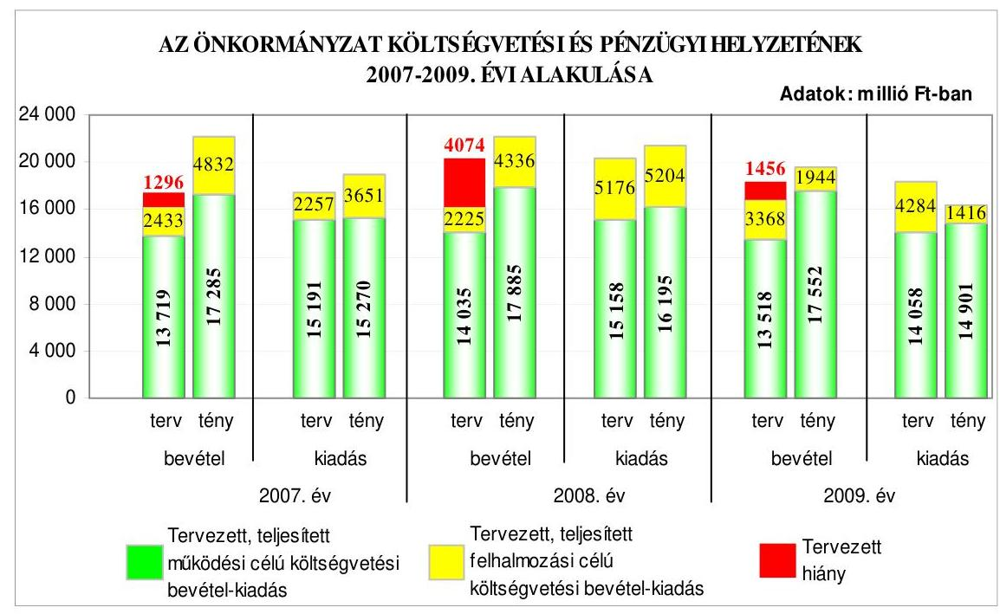
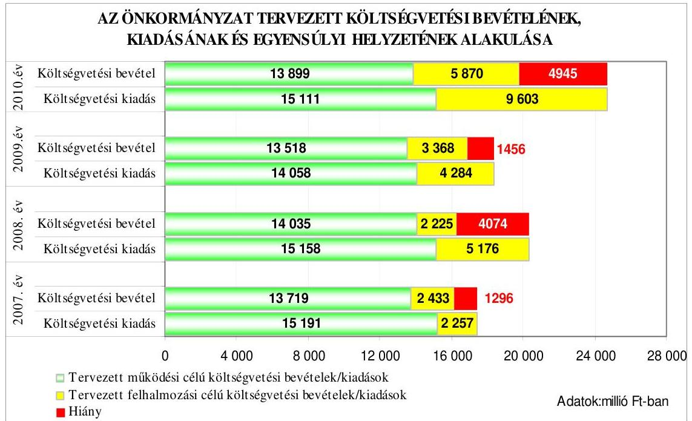
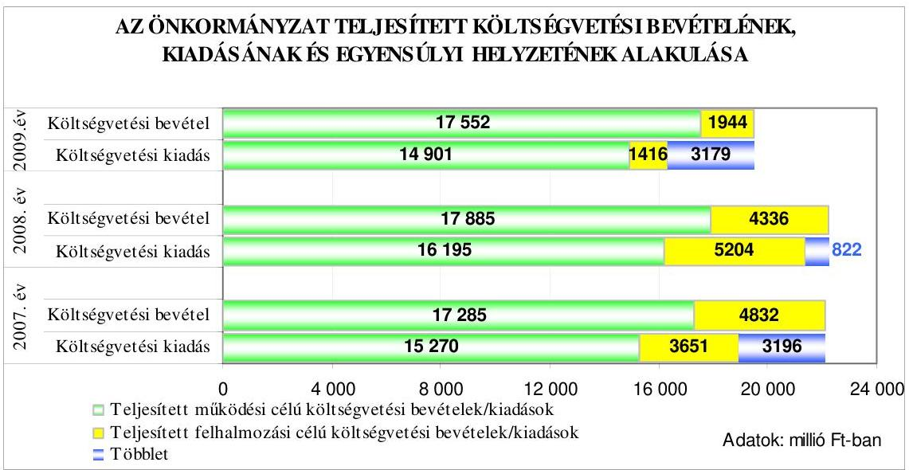
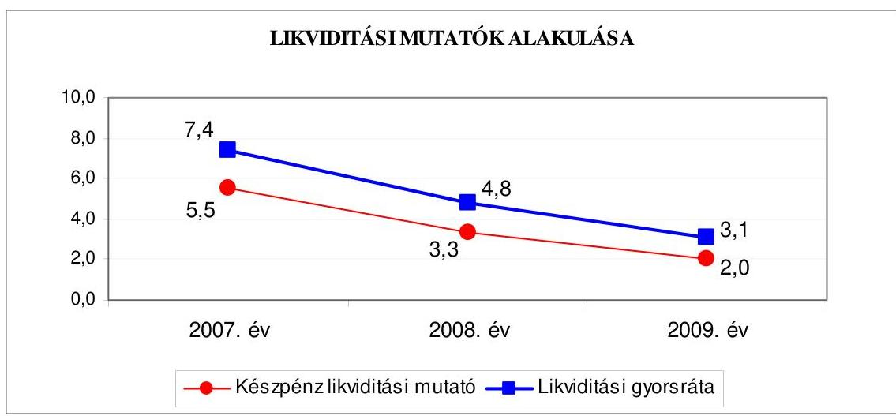
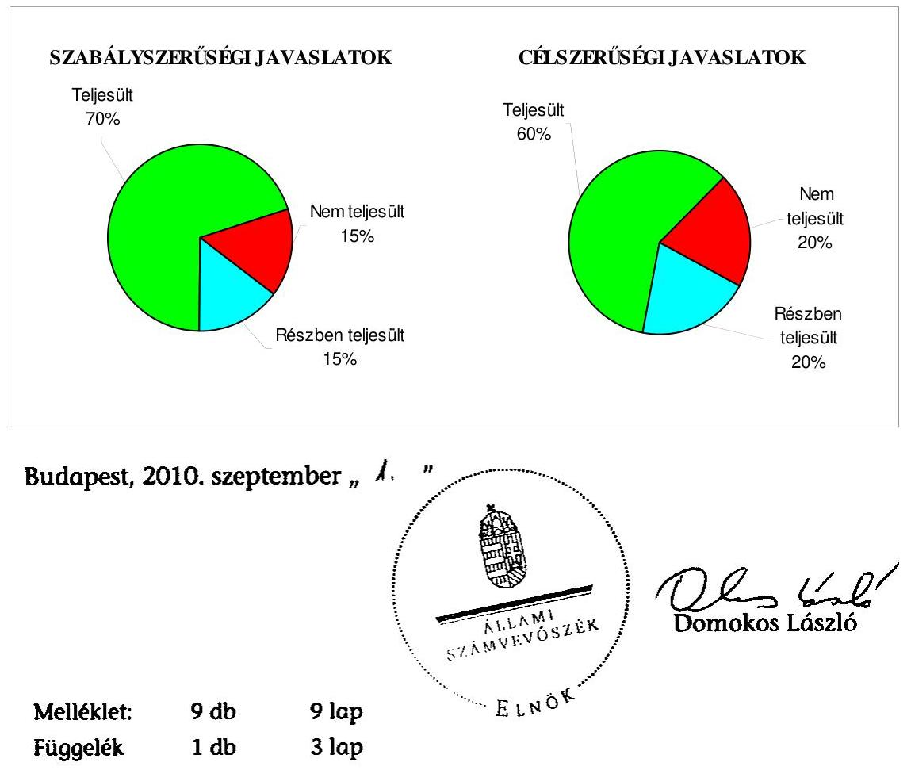
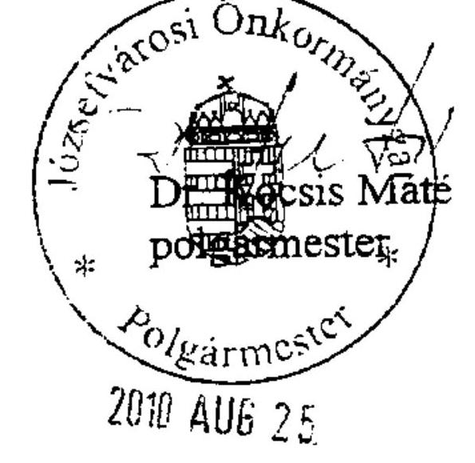
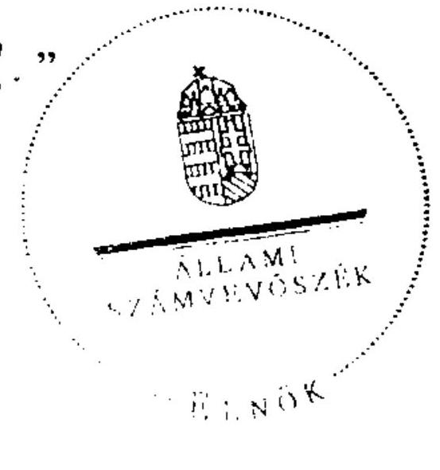

# JELENTÉS

a Budapest Főváros VIII. kerület Józsefvárosi Önkormányzat gazdálkodási rendszerének 2010. évi ellenőrzéséről

---

# 3. Önkormányzati és Területi Ellenőrzési Igazgatóság

## Átfogó Ellenőrzési Főcsoport

Iktatószám: V-3023-7/21/51/2010.
Témaszám: 966
Vizsgálat-azonosító szám: V0487

## Az ellenőrzést felügyelte:

Dr. Lóránt Zoltán
főigazgató
Az ellenőrzés végrehajtásáért felelős:
Dr. Sepsey Tamás
főigazgató-helyettes
Az ellenőrzést vezette:
Molnár Gyula Mihály
igazgatóhelyettes
Az ellenőrzést végezték:
Dr. Karáné Kőszegi Dr. Kiss Károly Páncsics Judit
Zsuzsanna tanácsadó számvevő
főtanácsadó

## A témához kapcsolódó eddig készített számvevőszéki jelentések:

## címe

Jelentés a Budapest Főváros VIII. kerület Józsefváros Önkormány-
$0554$ zata gazdálkodási rendszerének átfogó ellenőrzéséről
Jelentés a helyi és a helyi kisebbségi önkormányzatok gazdálkodási 0634 rendszerének átfogó és egyéb szabályszerűségi ellenőrzéséről
Jelentés a fővárosi önkormányzatot és a kerületi önkormányzato- 0756 kat osztottan megillető bevételek 2007. évi megosztásáról szóló önkormányzati rendelet felülvizsgálatáról
Jelentés a Magyar Köztársaság 2007. évi költségvetése végrehajtásának ellenőrzéséről
Függelék:
A helyi önkormányzatokat a 2007. évben megillető normatív hozzájárulás és átengedett személyi jövedelemadó, valamint a többcélú kistérségi társulásokat megillető normatív állami hozzájárulás és normatív részesedésű személyi jövedelemadó elszámolásának ellenőrzése

---

# TARTALOMJEGYZÉK

BEVEZETÉS ..... 11
I. ÖSSZEGZŐ MEGÁLLAPÍTÁSOK, KÖVETKEZTETÉSEK, JAVASLATOK ..... 16
II. RÉSZLETES MEGÁLLAPÍTÁSOK ..... 27

1. Az Önkormányzat költségvetési és pénzügyi helyzete ..... 27
1.1. A tervezett költségvetési bevételek és kiadások alapján a
költségvetési egyensúly, a költségvetési hiány alakulása, a hiány
tervezett finanszírozási módja, valamint a költségvetési hiány
megállapításának szabályszerűsége ..... 27
1.2. A teljesített költségvetési bevételek és kiadások alapján a pénzügyi
egyensúly, a pénzügyi hiány alakulása, a pénzügyi hiány
finanszírozása, az igénybe vett finanszírozási célú pénzügyi
eszközök hatása a pénzügyi helyzet alakulására, az eladósodásra,
valamint a fizetőképességre ..... 30
2. Az Önkormányzat felkészültsége az európai uniós források igénylésére,
felhasználására, a támogatott célkitűzés megvalósítására, működtetésére,
valamint az elektronikus közszolgáltatási feladatok ellátására ..... 40
2.1. Az európai uniós források igénybevételére, felhasználására, a
támogatott célkitűzés megvalósítására, működtetésére történt
felkészülés szabályozottságának, szervezettségének, valamint egy
támogatási szerződésben foglalt célkitűzés megvalósításának,
működtetésének eredményessége ..... 40
2.1.1. Az európai uniós forrásokra történő pályázatok benyújtására
vonatkozó döntések összhangja fejlesztési célkitűzésekkel ..... 40
2.1.2. Az európai uniós forrásokhoz kapcsolódóan a
pályázatfigyelés, a pályázatkészítés, valamint az európai
uniós támogatással megvalósuló fejlesztés lebonyolításának
belső rendje, a végrehajtás és az ellenőrzés szervezettsége ..... 42
2.1.3. Egy támogatási szerződésben foglalt célkitűzés megvalósítása,
működtetése ..... 44
2.2. Az elektronikus közszolgáltatás feltételeinek kialakítása ..... 44
3. A költségvetési gazdálkodás belső kontrolljai ..... 47
3.1. A költségvetés tervezés, a gazdálkodás és a zárszámadás készítés
folyamatában végrehajtandó belső kontrollok kialakítása ..... 47
3.2. A belső kontrollok működtetése a költségvetés tervezés, a
gazdálkodás, és a zárszámadás készítés folyamataiban ..... 50
3.3. A belső ellenőrzési kötelezettség teljesítése ..... 58

---

4. Az ÁSZ korábbi ellenőrzési javaslatai alapján készített intézkedési terv végrehajtása, hasznosítása
4.1. Az Önkormányzat gazdálkodási rendszerének átfogó ellenőrzése során tett javaslatok végrehajtására tervezett intézkedések megvalósítása
4.2. A zárszámadáshoz kapcsolódó (állami hozzájárulások, támogatások igénylésének és felhasználásának ellenőrzése), valamint a további vizsgálatok esetében a megállapítások, javaslatok alapján tett intézkedések

# MELLÉKLETEK

1. számú Az Önkormányzat gazdálkodását meghatározó adatok, mutatószámok (1 oldal)
2. számú Az önkormányzati vagyon alakulása (1 oldal)

2/a. számú Az önkormányzati kötelezettségek alakulása (1 oldal)
3. számú Az Önkormányzat 2007-2010. évi költségvetési előirányzatainak és 20072009. évi pénzügyi teljesítéseinek alakulása (1 oldal)
4. számú Tanúsítvány az európai uniós forrásokkal támogatott célok és programok 2007-2010. évi tervezett és teljesített adatairól (1 oldal)
4/a. számú Tanúsítvány az európai uniós forrásokra 2007-2010 között benyújtott pályázatokról, amelyek elbírálásáról az Önkormányzat még nem kapott tájékoztatást, valamint amelyek a támogatási szerződés megkötésének szakaszában vannak (1 oldal)
4/b. számú Tanúsítvány a 2007-2010. években benyújtott és elutasított európai uniós pályázatokról (1 oldal)
5. számú Dr. Kocsis Máté úr, Budapest Főváros VIII. kerület Józsefvárosi Önkormányzat polgármestere által adott tájékoztatás (1 oldal)
6. számú Dr. Kocsis Máté úr, Budapest Főváros VIII. kerület Józsefvárosi Önkormányzat polgármesterének tájékoztatására adott válasz (1 oldal)

## FÜGGELÉK

Tanúsítvány az Önkormányzat ellenőrzött időszakban történt váltókibocsátásáról

---

# RÖVIDÍTÉSEK, MOZAIKSZAVAK JEGYZÉKE

## Törvények

Áht.
Eisz. tv.

Kbt.
Ket.

Ktv.
Ötv.
Ptk.

## Rendeletek

Ámr. 1
Ámr. 2
Áhsz.

Ber.
18/2005. (XII. 27.) IHM rendelet

2005. évi költségvetési rendelet

2006. évi költségvetési rendelet

2007. évi költségvetési rendelet

2008. évi költségvetési rendelet

2009. évi költségvetési rendelet

2010. évi költségvetési rendelet
az államháztartás működési rendjéről szóló 217/1998. (XII. 30.) Korm. rendelet
az államháztartás működési rendjéről szóló 292/2009. (XII. 19.) Korm. rendelet
az államháztartás szervezetei beszámolási és könyvvezetési kötelezettségének sajátosságairól szóló 249/2000. (XII. 24.) Korm. rendelet
a költségvetési szervek belső ellenőrzéséről szóló 193/2003. (XI. 26.) Korm. rendelet
a közzétételi listákon szereplő adatok közzétételéhez szükséges közzétételi mintákról szóló 18/2005. (XII. 27.) IHM rendelet
Budapest Főváros VIII. kerület Józsefvárosi Önkormányzat 6/2005. (II. 25.) számú rendelete a 2005. évi költségvetésről és a végrehajtás szabályairól
Budapest Főváros VIII. kerület Józsefvárosi Önkormányzat 8/2006. (II. 22.) számú rendelete a 2006. évi költségvetésről és a végrehajtás szabályairól
Budapest Főváros VIII. kerület Józsefvárosi Önkormányzat 11/2007. (II. 20.) számú rendelete a 2007. évi költségvetésről és a végrehajtás szabályairól
Budapest Főváros VIII. kerület Józsefvárosi Önkormányzat 6/2008. (II. 27.) számú rendelete a 2008. évi költségvetésről és a végrehajtás szabályairól
Budapest Főváros VIII. kerület Józsefvárosi Önkormányzat 7/2009. (II. 27.) számú rendelete a 2009. évi költségvetésről és a végrehajtás szabályairól
Budapest Főváros VIII. kerület Józsefvárosi Önkormányzat 9/2010. (II. 22.) számú rendelete a 2010. évi költségvetésről és a végrehajtás szabályairól

---

2005. évi zárszámadási rendelet

2007. évi zárszámadási rendelet

2008. évi zárszámadási rendelet
vagyongazdálkodási rendelet

## Szórövidítések

ÁROP
ASP

ÁSZ
Bárka Színház
Belső ellenőrzési iroda
e-közszolgáltatás
FEUVE
Gazdasági bizottság
gazdasági program
informatikai stratégia

IT
jegyző
KEOP
Képviselő-testület
KMOP
Költségvetési bizottság

Budapest Főváros VIII. kerület Józsefvárosi Önkormányzat 14/2006. (IV. 19.) számú rendelete a 2005. évi költségvetési zárszámadásról
Budapest Főváros VIII. kerület Józsefvárosi Önkormányzat 31/2008. (V. 7.) számú rendelete a 2007. évi költségvetési zárszámadásról
Budapest Főváros VIII. kerület Józsefvárosi Önkormányzat 15/2009. (IV. 24.) számú rendelete a 2008. évi költségvetési zárszámadásról
Budapest Főváros VIII. kerület Józsefvárosi Önkormányzat 37/2003. (VII. 7.) számú rendelete Budapest Józsefvárosi Önkormányzat vagyonáról, valamint a versenyeztetés és a helyi költségvetési szervek beszerzési eljárásának szabályairól

ÚMFT Államreform Operatív Program
alkalmazás szolgáltató: olyan szolgáltató, amely interneten keresztül információs és feldolgozási szolgáltatásokat nyújt az önkormányzatok részére (angolul: Application Service Provider)
Állami Számvevőszék
Bárka Józsefvárosi Színházi és Kulturális Nonprofit Korlátolt Felelősségű Társaság
Budapest Főváros VIII. kerület Józsefvárosi Önkormányzat Polgármesteri Hivatalának Belső Ellenőrzési Irodája elektronikus közszolgáltatás
folyamatba épített, előzetes, utólagos és vezetői ellenőrzés
Budapest Főváros VIII. kerület Józsefvárosi Önkormányzat Gazdasági, Kerületfejlesztési és Közbeszerzési Bizottsága (2009. június 1-jéig)
Budapest Főváros VIII. kerület Józsefvárosi Önkormányzat Képviselő-testületének 139/2008. (III. 12.) számú határozatával elfogadott 2008-2014. évekre szóló Gazdasági Programja
Budapest Főváros VIII. kerület Józsefvárosi Önkormányzat Informatikai Alkalmazásfejlesztési és Üzemeltetési Koncepciója
informatikai technológia
Budapest Főváros VIII. kerület Józsefvárosi Önkormányzat jegyzője
ÚMFT Környezet és Energia Operatív Program
Budapest Főváros VIII. kerület Józsefvárosi Önkormányzat Képviselő-testülete
ÚMFT Közép-Magyarországi Operatív Program
Budapest Főváros VIII. kerület Józsefvárosi Önkormányzat Költségvetési Bizottsága

---

| NFT | Nemzeti Fejlesztési Terv |
| :--: | :--: |
| ÖKIF | „Sikeres Magyarországért" Önkormányzati Infrastruktúra Fejlesztési Hitelprogram |
| Önkormányzat | Budapest Főváros VIII. kerület Józsefvárosi Önkormányzat |
| Pénzügyi bizottság | Budapest Főváros VIII. kerület Józsefvárosi Önkormányzat Pénzügyi Ellenőrző Bizottsága (2009. június 9-éig), Budapest Főváros VIII. kerület Józsefvárosi Önkormányzat Gazdálkodási, Kerületfejlesztési, Költségvetési és Pénzügyi Ellenőrző Bizottsága (2009. június 9-étől) |
| Pénzügyi ügyosztály | Budapest Főváros VIII. kerület Józsefvárosi Önkormányzat Polgármesteri Hivatalának Pénzügyi Ügyosztálya |
| polgármester | Budapest Főváros VIII. kerület Józsefvárosi Önkormányzat polgármestere |
| Polgármesteri hivatal | Budapest Főváros VIII. kerület Józsefvárosi Önkormányzat Polgármesteri Hivatala |
| Polgármesteri hivatali SzMSz | Budapest Főváros VIII. kerület Józsefvárosi Önkormányzat Képviselő-testületének 71/2009. (III. 4.) számú határozata a Polgármesteri Hivatal Ügyrendjéről (szervezeti és működési szabályzatáról) |
| polgármesteri-jegyzői együttes utasítás ${ }^{1}$ | Az 1/2008. (XI. 21.) számú polgármesteri-jegyzői együttes utasítás a Polgármesteri Hivatalnak és a részben önállóan gazdálkodó intézményeinek, valamint a kisebbségi önkormányzatoknak a kötelezettségvállalással, utalványozással, ellenjegyzéssel, érvényesítéssel és szakmai teljesítésigazolással kapcsolatos eljárási rendjéről. |
| polgármesteri-jegyzői együttes utasítás ${ }_{2}$ | Az 5/2009. (XII. 9.) számú polgármesteri-jegyzői együttes utasítás a Polgármesteri Hivatalnak és a részben önállóan gazdálkodó intézményeinek, valamint a kisebbségi önkormányzatoknak a kötelezettségvállalással, utalványozással, ellenjegyzéssel, érvényesítéssel és szakmai teljesítésigazolással kapcsolatos eljárási rendjéről. |
| Projekt iroda | Budapest Főváros VIII. kerület Józsefvárosi Önkormányzat Polgármesteri Hivatalának Projekt Irodája |
| TÁMOP | ÚMFT Társadalmi Megújulás Operatív Program |
| ÚMFT | Új Magyarország Fejlesztési Terv |

---

.

---

# ÉRTELMEZŐ SZÓTÁR

1. elektronikus szolgáltatási szint
2. elektronikus szolgáltatási szint
3. elektronikus szolgáltatási szint
4. elektronikus szolgáltatási szint
eredményesség
európai uniós források
fejlesztési célkitűzés
fejlesztési feladat (projekt)

Az 1044/2005. (V. 11.) Korm. határozat alapján olyan információs, tájékoztató szolgáltatás, amely csak általános információkat közöl az adott üggyel kapcsolatos teendőkről és a szükséges dokumentumokról.
Az 1044/2005. (V. 11.) Korm. határozat alapján olyan egyirányú kapcsolatot biztosító szolgáltatás, amely az 1. szinten túl biztosítja az adott ügy intézéséhez szükséges dokumentumok, nyomtatványok letöltését, és azok ellenőrzéssel, vagy ellenőrzés nélküli elektronikus kitöltését, amely esetben a dokumentumok benyújtása hagyományos úton történik.
Az 1044/2005. (V. 11.) Korm. határozat alapján olyan kétirányú kapcsolatot biztosító szolgáltatás, amely közvetlen, vagy ellenőrzött kitöltésű dokumentum segítségével biztosítja az elektronikus adatbevitelt és a bevitt adatok ellenőrzését. Az ügy indításához, intézéséhez személyes megjelenés nem szükséges, de az ügyhöz kapcsolódó közigazgatási döntés (határozat, egyéb aktus) közlése, valamint a kapcsolódó illeték-, vagy díjfizetés hagyományos úton történik.
Az 1044/2005. (V. 11.) Korm. határozat alapján olyan teljes közvetlen kétirányú ügyintézési folyamatot biztosító szolgáltatás, amikor az ügyhöz kapcsolódó közigazgatási döntés is elektronikus úton kerül közlésre, illetve a kapcsolódó illeték-, vagy díjfizetés elektronikus úton is intézhető.
Egy adott tevékenység céljai megvalósításának mértéke, a tevékenység szándékolt és tényleges hatása közötti kapcsolat. (Forrás: Ámr. 1 2. § 66. pont.)
Az Európai Unió költségvetéséből, illetve az Európai Gazdasági Térség Európai Unión kívüli tagállamainak költségvetéséből származó támogatások, valamint a „Svájci Hozzájárulás" programból származó támogatás.
Az önkormányzat által ellátott kötelező, vagy önként vállalt feladatok mennyiségi (minőségi) fejlesztésére vonatkozó terv. A mennyiségi fejlesztés megvalósulhat beszerzéssel, létesítéssel, bővítéssel, átalakítással.
Az a fejlesztési feladat, amely illeszkedik az Európai Unió, illetve a Nemzeti Fejlesztési Terv által támogatott programokhoz. Az Európai Unió, illetve a Nemzeti Fejlesztési Terv és az Új Magyarország Fejlesztési Terv által meghirdetett programokhoz kapcsolódó, támogatott projektek fejlesztési feladatok megvalósításához használhatók fel az európai uniós források. A fejlesztési feladat (projekt) tartalmilag és formailag részletesen kidolgozott, megfelelő pénzügyi háttérrel és végrehajtási ütemezéssel rendelkező fejlesztési terv.

---

hazai társfinanszírozás
indikátor
irányító hatóság
kedvezményezett
központi program
közreműködő szervezet

A központi költségvetési és az elkülönített állami pénzalapokból származó finanszírozás.
A projekt megvalósulásának számszerűsíthető eredményei, mutató, jelzőszám, amelynek segítségével egy célkitűzés megvalósulásának adott szintjét lehet szemléltetni. Jelenthet egy felhasznált erőforrást, egy elért hatást, egy minőségi szintet, illetve valamilyen egyéb változást.
A strukturális alapok és a Kohéziós alap forrásainak szabályszerű, hatékony és eredményes felhasználásához szükséges intézményrendszer felső eleme. Az irányító hatóság általános és átfogó felelősséget visel a programok, projektek hatékony és szabályszerű végrehajtásáért. Felelősségi köréből eredően ellenőrzi a közösségi, valamint a hazai jogszabályok betartását, koordinálja az európai uniós források szétosztásának folyamatát, irányítja az intézményrendszer, a statisztikai és a pénzügyi nyilvántartási rendszer működését. Az Új Magyarország Fejlesztési Terv Irányító Hatósága közreműködik az Operatív Program véglegesítésében, irányítja az Operatív Program Program-kiegészítő Dokumentum kidolgozását, és közreműködő szerepet vállal e dokumentumoknak az Európai Bizottsággal történő tárgyalásaiban. Az Irányító Hatóság részt vesz továbbá a költségvetési tervezésében, valamint közreműködő szervezetek bevonásával irányítja a meghirdetett pályázatok és a központi programok végrehajtását.
Az a helyi önkormányzat, amely a támogatási szerződést kedvezményezettként aláírta, a projektet, illetve a központi programhoz kapcsolódó támogatott önkormányzati programot végrehajtja.
Az ország egészére, több régióra, egy régióra vonatkozó, de mindenképpen az önkormányzat közigazgatási területén túlmutató program, amelynél a támogatott programok kiválasztása pályáztatás nélkül, előre meghatározott feltételrendszer szerint történik, a kedvezményezettek közvetlen megkeresésével. Az Európai Unió pénzügyi alapja a Kohéziós alap, a környezetvédelem és a közlekedés terén nyújt lehetőséget az egyes tagországoknak központi programok megvalósítására.
A közreműködő szervezetek az európai uniós támogatást elnyert kedvezményezettekkel a kapcsolattartó szervek. Feladatai: a támogatási szerződés mintától eltérő egyedi támogatási szerződés-tervezetek előzetes megküldése jóváhagyásra a Nemzeti Fejlesztési Ügynökségnek; a projektek megvalósítása előrehaladásának nyomon követése, a támogatás kifizetésének engedélyezése, a folyamatba épített ellenőrzések (dokumentumalapú ellenőrzések és kockázatelemzésre alapozott helyszíni ellenőrzések) végzése, a projektek zárásával kapcsolatos feladatok ellátása, sza-

---

lebonyolítás

Nemzeti Fejlesztési Terv
operatív program
program
saját forrás
bálytalanságkezelési rendszer kialakítása és működtetése; ellenőrzési nyomvonal készítése és folyamatos aktualizálása; az Egységes Monitoring Informatikai Rendszerben az adatok folyamatos rögzítése, az adatbázis naprakészségének és megbízhatóságának biztosítása; a beszámolók készítése és megküldése a miniszter és a Nemzeti Fejlesztési Ügynökség részére az akcióterv és az éves munkaterv megvalósításában történt előrehaladásról és a szükséges intézkedésekre vonatkozó javaslatokról.
Az európai uniós források felhasználásával megvalósuló fejlesztésre irányuló műszaki, gazdasági (pénzügyi) tevékenységet magában foglaló szervezési, irányítási szolgáltatás. A szervezési szolgáltatás kiterjedhet a pályázatkészítésre, a közbeszerzési eljárás lebonyolításán keresztül a folyamatos műszaki ellenőrzésre, a pénzügyi elszámolásra, a műszaki átadás-átvételre, az üzembe helyezésre, illetve a fejlesztési folyamat egyes elemeire.
Helyzetelemzést, stratégiát a tervezett fejlesztési területek prioritásait, azok céljait és pénzügyi forrásaik megjelölését tartalmazó dokumentum, amelyet a Magyar Köztársaság készített az Európai Unió programozási irányelveinek, célkitűzéseinek megfelelően a fejlődésben lemaradó régiók fejlődésének és strukturális átalakulásának elősegítésére a kiemelt szükségletekre figyelemmel. A Nemzeti Fejlesztési Terv stratégiai fejezetének célja, hogy a 2004-2006 közötti időszakra kijelölje a strukturális alapokból támogatható fejlesztéspolitikai célkitűzéseit és prioritásait. A strukturális alapok operatív programjai: Agrár- és Vidékfejlesztés Operatív Program (AVOP); Gazdasági Versenyképesség Operatív Program (GVOP); Humán erőforrások fejlesztései Operatív Program (HEFOP); Környezetvédelem és infrastruktúra Operatív Program (KIOP); Regionális Fejlesztés Operatív Program (ROP).
Az Európai Bizottság által jóváhagyott, a Közösségi Támogatási Keret végrehajtására vonatkozó, több évre szóló intézkedésekhez kapcsolódó prioritások egységes rendszerét tartalmazó dokumentum.
Ágazati vagy térségi fejlesztési célt megvalósító fejlesztési terv, mely több egymással összefüggő projekt útján, az érintettek együttműködése alapján valósul meg.
A kedvezményezett által a támogatott projekthez biztosított forrás, amelybe az államháztartás alrendszereiből nyújtott támogatás nem számítható be. Költségvetési szervek esetén a jóváhagyott előirányzat saját forrásnak minősül.

---

szabálytalanság

támogatási szerződés

Új Magyarország Fejlesztési Terv

A jogszabályokban szereplő előírásoknak, illetve a támogatási szerződésben a felek által vállalt kötelezettségeknek a megsértése, amelyek eredményeképpen az Európai Közösség vagy a Magyar Köztársaság pénzügyi érdekei sérülnek, illetve sérülhetnek.
A strukturális alapok esetében az irányító hatóságnak, illetve a Kohéziós Alap esetében a közreműködő szervezeteknek a kedvezményezett önkormányzattal kötött szerződése, amely a támogatás felhasználásának részletes feltételeit tartalmazza. Az Új Magyarország Fejlesztési Terv keretében támogatott projektek esetében a támogatási szerződés a kedvezményezett és a Nemzeti Fejlesztési Ügynökség nevében eljáró közreműködő szervezet között jön létre. Nagyprojekt esetén a támogatási szerződést a Nemzeti Fejlesztési Ügynökség ellenjegyzi. A támogatási szerződés képezi a megvalósítás nyomon követésének, finanszírozásának és ellenőrzésének alapját.
Az Új Magyarország Fejlesztési Terv célja a foglalkoztatás bővítése és a tartós növekedés feltételeinek megteremtése. Ennek érdekében 2007-2013 között hat kiemelt területen indított el összehangolt állami és európai uniós fejlesztéseket: a gazdaságban, a közlekedésben, a társadalom megújulása érdekében, a környezet és az energetika területén, a területfejlesztésben és az államreform feladataival összefüggésben. Az Új Magyarország Fejlesztési Terv operatív programjai: Államreform Operatív Program (ÁROP); Elektronikus Közigazgatás Operatív Program (EKOP); Gazdaságfejlesztés Operatív Program (GOP); Környezet és Energia Operatív Program (KEOP); Közlekedés Operatív Program (KÖZOP); Dél-Alföldi Operatív Program (DAOP); Dél-Dunántúli Operatív Program (DDOP); Észak-Alföldi Operatív Program (ÉAOP); Észak-Magyarországi Operatív Program (ÉMOP); Közép-Dunántúli Operatív Program (KDOP); Közép-Magyarországi Operatív Program (KMOP); Nyugat-Dunántúli Operatív Program (NYDOP); Társadalmi Infrastruktúra Operatív Program (TIOP); Társadalmi Megújulás Operatív Program (TÁMOP).

---

# JELENTÉS 

## Budapest Főváros VIII. kerület Józsefvárosi Önkormányzat gazdálkodási rendszerének 2010. évi ellenőrzéséről

## BEVEZETÉS

Az Ötv. 92. § (1) bekezdése, az Állami Számvevőszékről szóló 1989. évi XXXVIII. törvény 2. § (3) bekezdése, valamint az Áht. 120/A. § (1) bekezdése alapján az önkormányzatok gazdálkodását az Állami Számvevőszék ellenőrzi. Az ellenőrzésre az Országgyűlés illetékes bizottságai részére is átadott, országosan egységes ellenőrzési program szerint került sor.

Az Állami Számvevőszék a stratégiájában foglalt célkitűzéseknek megfelelően a helyi önkormányzatok költségvetési gazdálkodási rendszerének ellenőrzését a 2007. évben megújított, teljesítmény-ellenőrzési elemekkel kiegészített ellenőrzési program alapján folytatja a 2010. évben.

Az ellenőrzés célja annak értékelése volt, hogy az Önkormányzat:

- milyen módon biztosította a költségvetési és a pénzügyi egyensúlyt a költségvetésében és annak teljesítése során, valamint változott-e a hiányzó bevételi források pótlásában a finanszírozási célú pénzügyi műveletek jelentősége, hatása;
- eredményesen készült-e fel a szabályozottság és a szervezettség terén az európai uniós források igénylésére és felhasználására, megvalósította, működtette-e a támogatott célkitűzést, továbbá biztosította-e az elektronikus közszolgáltatás feltételeit, a gazdálkodási adatok közzétételével a gazdálkodás nyilvánosságát;
- megfelelően kialakította-e és működtette-e a belső kontrollokat a költségvetés tervezés, a gazdálkodás és a zárszámadás készítés, valamint a belső ellenőrzés folyamatában, továbbá;
- megfelelően hasznosították-e a korábbi számvevőszéki ellenőrzések megállapításait, szabályszerűségi ${ }^{1}$ és célszerűségi javaslatait.

[^0]
[^0]:    ${ }^{1}$ A törvényi előírások betartásának elmulasztásakor a részletes megállapítások fejezetben egységesen a törvénysértés megjelölést alkalmazzuk, mivel az ÁSZ nem tehet különbséget a törvényi előírások között.

---

Az ellenőrzés típusa: átfogó ellenőrzés, amely - egy ellenőrzés keretében meghatározott területekre összpontosítva alkalmazza a szabályszerűségi, valamint a teljesítmény-ellenőrzés jellemzőit.

Az ellenőrzött időszak: a költségvetési egyensúly és az európai uniós támogatás igénybevételére történt felkészülés ellenőrzése esetében a 2007-2009. évek, a belső kontrollok kialakítása és működtetése tekintetében a 2009. év, az Önkormányzat gazdálkodási rendszerének 2005. évi átfogó ellenőrzéséről készített jelentésben rögzített javaslatok megvalósítása, hasznosítása, valamint a 2006 óta végzett további ellenőrzések során megfogalmazott javaslatok végrehajtása érdekében tett intézkedések vonatkozásában a 2006-2010. I. negyedév közötti időszak.

Budapest Főváros VIII. kerület lakosainak száma 2010. január 1-jén 69340 fő volt. A 2006. évi önkormányzati képviselő- és polgármester-választást követően az Önkormányzat 28 tagú Képviselő-testületének munkáját 10 állandó bizottság segítette. A Képviselő-testület a bizottságok számát 2009 májusától négyre csökkentette. A helyi önkormányzat mellett a 2006. évi önkormányzati képviselő- és polgármester-választásokat követően 10 kisebbségi önkormányzat ${ }^{2}$ működött. A polgármester a 2009. november 22-i időközi polgármester-választás óta tölti be tisztségét, a jegyző személye 2005. év óta változatlan.

Az Önkormányzat feladatainak végrehajtása érdekében a 2007. évben 35, a 2009. évben 32 költségvetési intézményt működtetett, amelyekből a 2007. évben 14 önállóan gazdálkodó, a 2009. évben öt önállóan működő és gazdálkodó volt. A feladatok ellátásában a 2007-2009. években hét gazdasági társasága vett részt. Az Önkormányzat az éves költségvetési beszámolója szerint a 2009. évben 19496 millió Ft költségvetési bevételt ért el, és 16317 millió Ft költségvetési kiadást teljesített. A teljesített költségvetési bevételek 11,9%-kal, a költségvetési kiadások 13,8%-kal maradtak el a 2007. évben teljesített költségvetési bevételektől és kiadásoktól, a teljesített felhalmozási célú költségvetési bevételek 59,8%-os, illetve a felhalmozási célú kiadások 61,2%-os csökkenése következtében. Az Önkormányzat 2009. december 31-én a könyvviteli mérleg szerint 130376 millió Ft értékű vagyonnal rendelkezett. Az Önkormányzat vagyona a 2007. év végi állományhoz viszonyítva 3,4%-kal, ezen belül a beruházások állománya 21,9%-kal, a pénzeszközök értéke 31,9%-kal csökkent. A saját tőke állománya 6,4%-kal, a tartalékok értéke 23,8%-kal csökkent, ugyanakkor közel megkétszereződött (98,6%-kal emelkedve 8945 millió Ft-ra nőtt) a kötelezettségek állománya a 2008. évben átruházott 24,1 millió svájci franknak megfelelő 3869 millió Ft összegű váltó és a 2007-2009. években felvett 906,4 millió Ft-os hosszú lejáratú hitelek hatására. A 2009. évben az összes költségvetési bevétel 53,9%-át a saját bevétel, illetve 27,3%-át a helyi adó bevétel biztosította. A 2009. évre a helyi adóbevétel összes költségvetési bevételen belüli aránya a 2007. évhez viszonyítva 3,7 százalékponttal növekedett. Az összes költségvetési kiadásból a felhalmozási célú kiadás részaránya a 2007. évhez viszonyítva 10,6 százalékponttal csökkent, a 2009. évben 8,7% volt. A felhalmozási feladatok megvalósításának a tervezettől való elmaradása a zárolt előirányzatok meg-

[^0]
[^0]:    ${ }^{2}$ bolgár, cigány, görög, lengyel, német, örmény, román, ruszin, szlovák, ukrán kisebbségi önkormányzat

---

szüntetésének hiányára, a beruházások előkészítési munkáinak, valamint a fejlesztési célú hitelek és a kivitelezések közbeszerzési eljárásainak időigényességére vezethető vissza. A 2010. évi költségvetési rendeletben 19769 millió Ft költségvetési bevételt és 24714 millió Ft költségvetési kiadást irányoztak elő. A Polgármesteri hivatalban dolgozó köztisztviselők száma 2007. január 1-jén 321 fő, 2009. december 31-én 267 fő volt, a költségvetési intézményekben foglalkoztatott közalkalmazottak száma 2007. január 1-jén 1842 fő, 2009. december 31-én 1493 fő volt. Az Önkormányzat gazdálkodását meghatározó adatokat, mutatószámokat az 1-3. számú mellékletek tartalmazzák.

Az Önkormányzat költségvetési és pénzügyi helyzetét az elemző eljárás módszerével vizsgáltuk. E körben elemeztük a költségvetés egyensúlyi helyzetének alakulását, a tervezett és teljesített költségvetési, pénzügyi hiány okait, a hiány finanszírozásának tervezett és teljesített módját, az önkormányzat pénzügyi helyzetének alakulását az eladósodás és a likviditás szempontjából.

Teljesítmény-ellenőrzés módszerével vizsgáltuk, és eredményesség szempontjából értékeltük az Önkormányzat benyújtott pályázatai kapcsolódását a Képviselő-testület által meghatározott fejlesztési célkitűzésekhez, valamint felkészültségét a belső szabályozottság, szervezettség terén az európai uniós forrásokra vonatkozó pályázati felhívások figyelésére, a pályázatok készítésére és a lebonyolítására. Az ellenőrzés során felmértük, hogy az elektronikus közigazgatási szolgáltatások működtetése érdekében milyen intézkedéseket tettek, továbbá biztosították-e a közérdekű gazdálkodási adatok meghatározott körének honlapon történő közzétételét.

A költségvetési gazdálkodás belső kontrolljainak ellenőrzése során vizsgáltuk, hogy a Polgármesteri hivatalban a költségvetés tervezés, a gazdálkodás, és a zárszámadás készítés folyamatában a belső kontrollok kialakítása és működése megfelelő biztosítékot ad-e a gazdálkodási feladatok szabályszerű ellátására. Felmértük és minősítettük a költségvetés tervezés, a gazdálkodás, és a zárszámadás készítés feladataival, továbbá a pénzügyi-számviteli területen az informatikával kapcsolatosan kialakított kontrollok, valamint azok működésének megfelelőségét. A vizsgálat során értékeltük a belső ellenőrzés szabályozottságát, működési feltételeinek kialakítását, meghatározását, továbbá működésének megfelelőségét.

A Polgármesteri hivatalban értékeltük a gazdálkodás folyamatában kulcsszerepet betöltő belső kontrollok működésének megfelelőségét, ennek keretében ellenőriztük a szakmai teljesítés igazolására és az utalvány ellenjegyzésére kialakított kontrollok végrehajtását.

---

Az ellenőrzést a következő, magas kockázatú kifizetésekre folytattuk le ${ }^{3}$
 - az államháztartáson kívülre teljesített működési és felhalmozási célú pénzeszköz átadásokra,
- az állományba nem tartozók megbízási díjaira, továbbá
- a külső szolgáltató által végzett karbantartási, kisjavítási szolgáltatásokra.

Az ellenőrzés hatékony elvégzése céljából a vizsgálandó területek kiválasztása során a kockázatokon alapuló megközelítés érvényesült, ezáltal az ellenőrzési erőforrásokat azokra a területekre fókuszáltuk, amelyeken a korábbi ellenőrzési tapasztalatok figyelembevételével legnagyobb a hibák előfordulási valószínűsége. Az ellenőrzési erőforrások ilyen típusú összpontosításával minimálisra csökkenthető a kívánt ellenőrzési bizonyosság eléréséhez szükséges időráfordítás.

A pénzügyi-számviteli folyamatokban alkalmazott belső kontrollok kialakításának és működésének ellenőrzésére a vizsgált három terület 2009. évi könyvviteli tételeiből területenként egyszerű véletlen mintát vettünk. A kijelölt gazdasági eseményre elvégzett megfelelőségi tesztek alapján értékeltük a kontrollok működésének megfelelőségét a vizsgált három területre külön-külön, majd összefoglalóan ${ }^{4}$. A helyszíni ellenőrzés megállapításainak részletes dokumentálását megfelelőségi tesztlapokon, ellenőrzési munkalapokon biztosítottuk.

Ezeken a teszt- és munkalapokon a minősítés alapjául szolgáló kérdések és a vonatkozó konkrét jogszabályhelyek megjelölése mellett értékeltük a kialakított belső kontrollokban rejlő kockázatokat ${ }^{5}$ és a kialakított kontrollok működésének megfelelőségét ${ }^{6}$.

[^0]
[^0]:    ${ }^{3}$ Az önkormányzatok kiemelt előirányzataira vonatkozóan, a vertikális folyamatokra elvégeztük a kockázatok becslését, amelynek eredményeként határoztuk meg a magas kockázatú területeket.
    ${ }^{4}$ A vizsgált három terület egyedi értékelési pontszámait a területek költségvetési súlyával arányosan összegeztük.
    ${ }^{5}$ A kialakított belső kontrollokban rejlő kockázatot alacsonynak minősítettük, ha a kontrollok megfelelő védelmet nyújtottak a hibák bekövetkezése ellen. Közepesnek minősítettük a belső kontrollokban rejlő kockázatot, amennyiben a kontrollok a lehetséges hibák többsége ellen védelmet nyújtottak. Magasnak értékeltük a kockázatot, ha a kontrollok - kialakításuk hiányában, vagy hiányos kialakításuk miatt - nem nyújtottak elegendő védelmet a lehetséges hibákkal szemben.
    ${ }^{6}$ A kontrollok működésének megfelelőségét kiválónak értékeltük abban az esetben, ha azok működése - esetleges kisebb, az egységesen meghatározott követelményrendszerben foglalt mértéket el nem érő hiányosságoktól eltekintve - megfelelt a hibák megelőzésére és kijavítására meghatározott szabályozásnak és a legmagasabb szintű elvárásoknak. Jónak minősítettük a kontrollok működését, ha a megállapított kisebb (tolerálható mértékű) hiányosságok nem veszélyeztették az ellenőrzött terület hibáinak megelőzését és kijavítását. Amennyiben a kontrollok működésében túl sok hiányosság fordult elő ahhoz, hogy a kontrollok biztosítsák a hibák megelőzését, feltárását, kijavítását és ezáltal veszélyeztették az eredményes, megbízható működést, a kontroll működésének megfelelősége gyenge minősítést kapott.

---

Az ÁSZ korábbi ellenőrzési javaslatai alapján tett intézkedéseket, illetve azok megvalósítását utóellenőrzés keretében vizsgáltuk. A gazdálkodási rendszer korábbi átfogó ellenőrzése során megfogalmazott javaslatok végrehajtására tett intézkedések megvalósítását ellenőriztük, az egyéb számvevőszéki ellenőrzések során tett javaslatok esetében pedig a kiadott intézkedéseket tekintettük át.

A helyszíni ellenőrzés során kitöltött - az ellenőrzést végző számvevő és a Polgármesteri hivatal felelős köztisztviselője által aláírt - ellenőrzési munkalapokat, azok kitöltési útmutatóit, továbbá a megfelelőségi tesztek dokumentumait a polgármester részére a számvevői jelentéssel egyidejűleg átadtuk.

A jelentés megállapításainak, javaslatainak egyeztetése során a polgármester és a jegyző arról adott részletes tájékoztatást - egyidejűleg csatolták azokat a dokumentumokat, amelyek igazolták -, hogy az időközben megtett intézkedésekkel a számvevői jelentésben tett néhány javaslatot ${ }^{7}$ megvalósították. A megtett intézkedéseket a jelentés II. Részletes megállapítások fejezetében az adott témához kapcsolt lábjegyzetben feltüntettük és a vonatkozó javaslatokat elhagytuk.

A jelentést az ÁSZ-ról szóló 1989. évi XXXVIII. tv. 25. § (1) bekezdése alapján észrevétel közlése céljából megküldtük a Budapest Főváros VIII. kerület Józsefvárosi Önkormányzat polgármesterének. A kapott tájékoztatást a jelentés 5. számú melléklete, az arra adott választ a 6. számú melléklet tartalmazza.

[^0]
[^0]:    ${ }^{7}$ A számvevői jelentésben a helyszíni ellenőrzés során a polgármesternek kettő szabályszerűségi javaslatot tettünk, melyből egyet elhagytunk. A jegyzőnek 17 szabályszerűségi és nyolc célszerűségi javaslatot tettünk, melyből nyolc szabályszerűségi és hat célszerűségi javaslatot elhagytuk.

---

# I. ÖSSZEGZŐ MEGÁLLAPÍTÁSOK, KÖVETKEZTETÉSEK, JAVASLATOK 

Az Önkormányzatnál a 2007-2010. években a tervezett költségvetési bevételek főösszege az előző évhez képest folyamatosan emelkedett. A tervezett költségvetési kiadások előző évhez viszonyított főösszege változó volt, a 2008. évre emelkedett, a 2009. évre csökkent, a 2010. évre növekedett. A 2007-2010. évek költségvetési rendeleteiben nem volt biztosított a költségvetési egyensúly, mivel a tervezett költségvetési bevételek nem nyújtottak fedezetet a költségvetési kiadásokra. A költségvetési hiány a 2007. évben a tervezett működési célú költségvetési bevételek hiányából származott a felhalmozási célú költségvetési kiadásokat meghaladó összegben tervezett felhalmozási célú bevételek mellett, a 2008-2010. években a költségvetési hiányt a tervezett működési célú költségvetési bevételek hiánya és a felhalmozási célú bevételeket meghaladó összegben tervezett felhalmozási célú kiadások együttesen okozták.

Az Önkormányzat a 2007-2010. években a költségvetési hiány finanszírozására és a finanszírozási célú pénzügyi műveletek kiadásainak forrásául, a költségvetési egyensúly biztosításához rövid és hosszú lejáratú hitelfelvételt, saját váltókibocsátást, kötvénykibocsátást tervezett, továbbá kiadást csökkentő és bevételt növelő intézkedésekről döntött.

A 2007-2009. években a költségvetés végrehajtása során a teljesített költségvetési bevételek és a teljesített költségvetési kiadások főösszege az előző évhez viszonyítva változó tendenciát mutatott. A teljesített költségvetési bevételek és a kiadások főösszege a 2008. évre emelkedett, a 2009. évre csökkent. A 20072009. években a teljesített költségvetési adatok alapján biztosított volt a pénzügyi egyensúly, mivel a teljesített költségvetési bevételek fedezetet nyújtottak a

---

teljesített költségvetési kiadásokra. A pénzügyi többletet a 2007. és a 2009. évben a teljesített működési célú költségvetési bevételek többlete és a felhalmozási célú kiadásokat meghaladó összegben teljesített felhalmozási célú bevételek eredményezték. A 2008. évben a pénzügyi többlet a teljesített működési célú költségvetési bevételek többletéből és a felhalmozási célú bevételeket meghaladó összegben teljesített felhalmozási célú kiadásokból keletkezett. Az Önkormányzatnál az éves költségvetések összeállításakor nem vették figyelembe az előző évi pénzmaradványnak és az előző években keletkezett tartalékoknak a várható összegét az Áht-ban előírtak ellenére, mivel azok 24\%-át, 14\%-át, illetve 25\%-át tervezték meg a bevételek között. Az előző évről áthúzódó kötelezettségvállalásokat és az azok forrásául szolgáló pénzmaradványt az eredeti előirányzatok között nem tervezték meg. Az előző évi pénzmaradványból, illetve az előző években keletkezett tartalékokból a szabadon felhasználható rész költségvetési hiányt, hitelfelvételi előirányzatot csökkentő tervezése sem volt megalapozott. A költségvetések végrehajtása során a pénzügyi egyensúly megteremtése érdekében előírt egyéb intézkedéseket végrehajtották, továbbá a Képviselő-testület a 2007-2008. évben a Polgármesteri hivatalt és az intézményeket átszervezte és 290 fős létszámcsökkentést hajtott végre. A 2007-2009. években a Pénzügyi bizottság a hitelfelvételekről, a kötvénykibocsátás keretszerződéséről és a váltókibocsátásról szóló előterjesztéseket előzetesen véleményezte, de az Ötv-ben előírtak ellenére a költségvetési bevételek alakulását nem kísérte figyelemmel, és nem értékelte a bevételek alakulását befolyásoló okokat.

Az Önkormányzat a 2007-2009. években a költségvetés végrehajtása során összesen 906 millió Ft hosszú lejáratú hitelt vett igénybe, melyből 866 millió Ft a fejlesztési feladatok megvalósítása érdekében felvett hosszú lejáratú hitel volt, 40 millió Ft-ot a korábban felvett fejlesztési célú hitelek kiváltására fordítottak. A 2006. évben öt lakóépület megvásárlása céljából adásvételi szerződést kötöttek, melyben vállalták, hogy a lakóépületek 24 millió svájci frankos vételárát 20 év alatt az Önkormányzat által kibocsátott, szabadon átruházható, az esedékességi időpontot megelőzően be nem mutatható 100 darab saját váltó átruházásával fizetik meg, amely 2008 februárjában megtörtént. A váltókibocsátás az Önkormányzat számára kockázatot jelentett a forint svájci frankhoz viszonyított árfolyamváltozása miatt. Az Önkormányzat 2007-2009. évek közötti pénzügyi helyzete - az eladósodásának a növekedése és a fizetőképességének a csökkenése miatt - összességében kedvezőtlenül alakult.

Az Önkormányzat fejlesztési célkitűzéseit a Józsefváros fejlesztéséről szóló 2007. februárban elfogadott rendeletben, valamint a 2008-2014. évekre szóló gazdasági programban határozta meg, melyekben figyelembe vette a megvalósítás lehetséges pénzügyi forrásait. Az Önkormányzat a 2007. évben egy, a 2008. évben nyolc, a 2009. évben négy pályázatot nyújtott be európai uniós támogatás elnyerése érdekében, amelyek fejlesztési céljai kapcsolódtak a gazdasági programban foglalt célkitűzésekhez. A 11 támogatásban részesült pályázatból kettő befejezett, míg hét folyamatban lévő, kettő a támogatási szerződés megkötés szakaszában volt. Két pályázatot elutasítottak, ezek egyike nem felelt meg a kiírási feltételeknek, a másikat forráshiány miatt nem fogadták be. A 2007-2009. évek között megkötött támogatási szerződéssel rendelkező kilenc fejlesztés tervezett 2763 millió Ft összes költségvetési kiadásának 87\%-át európai

---

uniós, 1\%-át a kapcsolódó hazai társfinanszírozás, 8\%-át saját forrás, 4\%-át hitel biztosította.

Az Önkormányzat 2007-2009. évi költségvetési rendeletei nem tartalmazták az európai uniós támogatással megvalósuló fejlesztési célkitűzésekhez kapcsolódó előző évi kötelezettségvállalásokat és az azok forrásául szolgáló előző évi pénzmaradványt. Emiatt a költségvetési rendeletek a kötelezettségvállalással lekötött pénzmaradvány összege nélkül tartalmazták a fejlesztési célkitűzések költségvetési bevételi és kiadási előirányzatait, valamint a működési és felhalmozási célú költségvetési kiadási és bevételi előirányzatokat, a felhalmozási kiadások előirányzatait feladatonként, a több éves kihatással járó fejlesztési feladatok előirányzatait éves bontásban, amelyeket a 2010. évi költségvetésben figyelembe vettek. Az Ámr. előírása ellenére a 2007. és a 2008. évi költségvetési rendeletek nem tartalmazták elkülönítetten az európai uniós forrásból megvalósuló fejlesztések bevételi és kiadási előirányzatait. A 2010. évi költségvetésben elkülönítetten is bemutatták az európai uniós forrásból megvalósuló fejlesztések bevételi és kiadási előirányzatait.

A 2007-2009. években a Polgármesteri hivatali SzMSz határozta meg az európai uniós forrásokra vonatkozó pályázatokkal összefüggésben az önkormányzati szintű pályázatkoordinálást, valamint a pályázatfigyelést végző és a döntési, illetve a döntés-előterjesztési jogkörrel rendelkezők közötti információszolgáltatási kötelezettséget. A felelősség meghatározását a pályázati referens munkaköri leírása tartalmazta. A Polgármesteri hivatalban biztosították a pályázatfigyeléssel, pályázatkészítéssel összefüggő feladatok személyi, szervezeti feltételeit. A fejlesztési feladatok lebonyolításának személyi, szervezeti feltételeit a Polgármesteri hivatalban kialakították. Az információ-szolgáltatási kötelezettség teljesítésének, a pályázatfigyelés, pályázatkészítés, valamint az európai uniós forrással támogatott fejlesztés lebonyolításának eljárási rendjét 2009. április elejétől a Pályázati szabályzat tartalmazta. A belső ellenőrzési stratégiát megalapozó kockázatelemzés, valamint a belső ellenőrzés éves ellenőrzési feladatait megalapozó kockázatelemzés nem terjedt ki az európai uniós forrásokkal támogatott fejlesztési feladatokra.

Az Önkormányzat 2007-2009. között eredményesen készült fel belső szabályozottság és szervezettség terén az európai uniós források igénybevételére és felhasználására. A gazdasági programban, az ágazati, szakmai koncepciókban, tervekben megfogalmazott fejlesztési célkitűzésekhez kapcsolódtak az európai uniós támogatások, szabályozták a pályázatfigyelést végzők és a döntési, illetve a döntés-előterjesztési jogkörrel rendelkezők közötti információszolgáltatási kötelezettséget. A Polgármesteri hivatalon belül és külső szervezet igénybevételével biztosították a pályázatfigyelés, a pályázatkészítés és a fejlesztési feladat lebonyolításának szervezeti és személyi feltételeit. Meghatározták a külső személyekkel, szervezetekkel pályázatkészítésre kötött szerződésben a pályázat szakmai és formai követelményeire vonatkozóan a pályázatkészítő felelősségét, valamint előírták a fejlesztési feladat lebonyolítását végző ellenőrzési kötelezettségeit. Nem terjedt ki azonban a belső ellenőrzési stratégiát megalapozó kockázatelemzés az európai uniós forrásokkal támogatott fejlesztési feladatokra.

---

Az Önkormányzat informatikai stratégiája tartalmazta a helyzetelemzést, valamint az e-közszolgáltatási feladatok megvalósításához szükséges közép- és hosszú távú célkitűzések meghatározását. Az Önkormányzat a 3. elektronikus szolgáltatási szint kialakítását tervezte. Az Önkormányzat a 2007-2009. évek között nem pályázott az e-közszolgáltatás fejlesztésére kiírt támogatásra. A Képviselő-testület a régióban kialakítandó ASP központhoz történő csatlakozásról döntött 2009. decemberben. Az Önkormányzat az e-közszolgáltatási feladat ellátásának személyi feltételeit vállalkozási szerződéssel biztosította, az informatikai rendszer üzemeltetésére, valamint az Önkormányzat honlapjának szerkesztésére gazdasági társasággal kötött vállalkozói szerződést. Az e-közszolgáltatási feladatokat saját számítógépes információs rendszeren keresztül, vásárolt programmal látták el. Az Önkormányzat az elektronikus ügyintézés szabályairól alkotott rendeletben kizárta a közigazgatási hatósági ügyek elektronikus úton történő intézését. Az Önkormányzat az e-közszolgáltatás keretében történő ügyintézést az 1. elektronikus szolgáltatási szinten működtette. A teljes közvetlen, kétoldalú ügyintézés megvalósításához szükséges további fejlesztéseket a pénzügyi források hiánya akadályozta.

Az Önkormányzatnál kialakították az Eisztv. alapján a közérdekű adatok honlapon történő elektronikus közzétételének lehetőségét a vonatkozó IHM rendeletben meghatározott szerkezetben. A jegyző gondoskodott a Polgármesteri hivatalon keresztül nyújtott céljellegű működési és felhalmozási támogatások közzétételéről, azonban az Áht. előírása ellenére nem tette közzé egy intézmény által nyújtott céljellegű működési támogatás adatait. A jegyző gondoskodott az Önkormányzat pénzeszközei felhasználásával, vagyonnal történő gazdálkodással összefüggő - a nettó öt millió Ft-ot elérő, vagy azt meghaladó értékű árubeszerzésre, építési beruházásra, szolgáltatás megrendelésre, vagyonértékesítésre, vagyonhasznosításra vonatkozó szerződések adatainak az Önkormányzat honlapján történő közzétételéről, azonban az Áht-ban előírtak ellenére nem tette közzé az intézmények által kötött, nettó öt millió Ft-ot elérő, vagy azt meghaladó értékű szerződések adatait. A jegyző az Ámr.-ben foglaltak ellenére nem tette közzé a 2008. évi költségvetési beszámoló szöveges indokolását az Áhsz. rendelkezése szerinti tartalmi követelményeknek megfelelően, azonban a 2009. évi költségvetési beszámoló esetében ezt a kötelezettségét az Áhsz. előírásának megfelelően teljesítette.

A költségvetés tervezési és a zárszámadás készítési folyamatok szabályozásának hiányosságai közepes kockázatot jelentettek a feladatok megfelelő, szabályszerű végrehajtásában, mivel a jegyző nem szabályozta annak ellenőrzését, hogy a Polgármesteri hivatal és az intézmények által javasolt előirányzatok megalapozottak-e, a Polgármesteri hivatalban és az intézményeknél az ismert kötelezettségeket megtervezték-e, a költségvetés tervezéséhez készített intézményi mutatószám felmérés adatai megalapozottak-e, az intézmények és a hivatali szervezeti egységek által benyújtott költségvetési igények teljesíthetőke, a saját bevételek előirányzatai és a költségvetés megalapozását szolgáló helyi rendeletek összhangja biztosított-e. A jegyző a polgármesterrel közösen 2009 júliusában szabályozta a javasolt előirányzatok megalapozottságának az ellenőrzését. A költségvetés tervezéséhez készített intézményi mutatószám felmérés adatai megalapozottságának ellenőrzését a jegyző 2009 januárjától írta elő a Népjóléti ügyosztály szakmai irányítása alá tartozó intézményeknél, az érin-

---

tettek munkaköri leírásában. A költségvetés tervezési és zárszámadás készítési folyamatban a belső kontrollok működésének megfelelősége jó volt, mivel a szabályozásban foglaltaknak megfelelően ellenőrizték, hogy az intézmények teljesítették-e a költségvetési javaslat összeállításával kapcsolatban a részükre meghatározott követelményeket, az állami hozzájárulásokkal történő elszámoláshoz közölt mutatószámok megbízhatóságát, az intézményi pénzmaradvány megállapításának szabályszerűségét, azonban a hiányos szabályozás miatt nem végezték el az intézményeknél és a Polgármesteri hivatalnál a javasolt előirányzatok megalapozottságának, az ismert kötelezettségek tervezésének, a benyújtott költségvetési igények indokoltságának és teljesíthetőségének, a saját bevételek előirányzatai és a költségvetés megalapozását szolgáló helyi rendeletek közötti összhangnak, a költségvetés tervezéséhez készített intézményi mutatószám felmérés adatai megalapozottságának az ellenőrzését. A jegyző által elkészített 2008. évi zárszámadási rendelettervezetet a polgármester 2009 áprilisában benyújtotta a Képviselő-testületnek, de azt az Ötv-ben előírtak ellenére a Pénzügyi bizottság nem véleményezte. A 2009. évre tervezett intézményi mutatószám felmérést csak a közoktatási intézményeknél ellenőrizték, a 2010. évre tervezett intézményi mutatószámok ellenőrzését minden intézménynél végrehajtották.

A gazdálkodási, a pénzügyi-számviteli és a folyamatba épített ellenőrzési feladatok szabályozottsága összességében alacsony kockázatot jelentett a feladatok megfelelő, szabályszerű végrehajtásában, mivel a jegyző a FEUVE rendszer keretében szabályozta a munkafolyamatba épített ellenőrzési jogkörök gyakorlásának rendjét, amelynek során meghatározta a szakmai teljesítés igazolásának módját, kijelölte a szakmai teljesítés igazolását végző személyeket, írásban megbízta az érvényesítőket, biztosította a felhatalmazásoknál, a megbízásoknál és a kijelöléseknél az összeférhetetlenségi követelmények érvényesülését. A jegyző elkészítette a Polgármesteri hivatal ellenőrzési nyomvonalát, a szabálytalanságok kezelésének eljárásrendjét, valamint a kockázatkezelési eljárásrendet. Annak ellenére összességében alacsony volt a kockázat, hogy nem tartalmazta a Polgármesteri hivatali SzMSz az Ámr. ${ }^{1}$-ben előírtak ellenére a Polgármesteri hivatalhoz rendelt más költségvetési szervek felsorolását, a Pénzügyi ügyosztály, mint gazdasági szervezet ügyrendje az Ámr. ${ }^{1}$-ben előírtak ellenére a gazdasági szervezet által ellátandó feladatok közül az üzemeltetéssel, fenntartással, működtetéssel, beruházással, a vagyon használatával, hasznosításával, a munkaerő-gazdálkodással kapcsolatos feladatokat, valamint a kockázatkezelési eljárásrend a válaszintézkedések beépítését a folyamatokba. A jegyző nem szabályozta az értékelési szabályzatban az értékelések ellenőrzéséért felelős munkakör meghatározását, ezen feladat ellátásának kötelezettségét nem írta elő a dolgozók munkaköri leírásaiban, illetve a selejtezési szabályzatban az üzemeltetésre, kezelésre átadott eszközök selejtezésére vonatkozóan a döntéshozatalra jogosultak körét, valamint az önköltségszámítás rendjét.

A Polgármesteri hivatalban a 2009. évben az államháztartáson kívülre történő működési és felhalmozási célú pénzeszköz átadásokkal, az állományba nem tartozók megbízási díjaival, valamint a külső szolgáltatók által végzett karbantartással, kisjavítással kapcsolatos kifizetések során a belső kontrollok működésének megfelelősége gyenge volt, mert az állományba nem tartozók megbízási díjaival kapcsolatos kiadások teljesítését megelőzően azok jogosultságá-

---

nak, összegszerűségének ellenőrzését, valamint a szerződések, megállapodások szakmai teljesítésének igazolását az Ámr. ${ }^{1}$-ben előírtak ellenére két esetben a jegyző kijelölésével nem rendelkező személy látta el, az utalványok ellenjegyzői az Ámr. ${ }^{1}$-ben előírtak ellenére nem kifogásolták a jegyző kijelölésével nem rendelkező személy által végzett szakmai teljesítésigazolásokat, valamint nem észrevételezték, hogy a szakértői tevékenységre vonatkozó megbízási szerződés megkötésekor, illetve az első alkalommal történt megbízási díj kifizetésekor a fedezet nem állt rendelkezésre. Az államháztartáson kívülre történő működési és felhalmozási célú pénzeszköz átadásokkal, az állományba nem tartozók megbízási díjaival, valamint a külső szolgáltatók által végzett karbantartással, kisjavítással kapcsolatos kiadások szakmai teljesítésigazolása nem a polgármesteri-jegyzői együttes utasítás ${ }_{1,2}$-ben meghatározott szöveg alkalmazásával történt, azt az utalványok ellenjegyzői a kifizetéseket megelőzően - aláírásuk ellenére - nem kifogásolták. A karbantartási, kisjavítási szolgáltatások főkönyvi számlán helytelenül számoltak el kis értékű tárgyi eszköz beszerzést az Áhsz-ben előírtak ellenére. A Polgármesteri hivatalban a szakmai teljesítésigazolás és az utalvány ellenjegyzés, mint belső kontrollok működtetésének hiányosságaiért, hibáiért felelősség terheli a jegyzőt, mivel a folyamatba épített előzetes, utólagos és vezetői ellenőrzés működtetése az Áht. és az Ötv. előírásai alapján a költségvetési szervként működő Polgármesteri hivatal vezetője - a jegyző - kötelessége, valamint az Ötv-ben előírtak alapján a jegyző köteles olyan pénzügyi irányítási és ellenőrzési rendszert működtetni, mely biztosítja az Önkormányzat rendelkezésére álló források szabályszerű, szabályozott felhasználását. Az Ámr. ${ }^{1}$ előírásainak nem megfelelően elvégzett kötelezettségvállalás ellenjegyzéssel kötött megbízási szerződés és az ehhez kapcsolódó kifizetések utalványozásának ellenjegyzése, illetve kifizetése alapján az ÁSZ büntető feljelentést tett. A jegyző intézkedését követően, 2010. március közepétől a szakmai teljesítésigazolás a 2010 januárjában kiadott polgármesteri-jegyzői együttes utasításban előírt módon történt. A jegyző 2010. márciusban levélben hívta fel az utalvány ellenjegyzésére felhatalmazottak figyelmét a szakmai teljesítésigazolás szabályszerű elvégzésének ellenőrzésére.

A Polgármesteri hivatal rendelkezett a jegyző által kiadott informatikai védelmi szabályzattal. A pénzügyi-számviteli tevékenységhez kapcsolódó informatikai feladatok szabályozottsága összességében alacsony kockázatot jelentett az informatikai feladatok megfelelő, szabályszerű végrehajtásában, mivel a Polgármesteri hivatal rendelkezett katasztrófa-elhárítási tervvel, eljárásrenddel a hozzáférési jogosultságokra, pénzügyi-számviteli rendszerből lekérhető volt az ellenőrzési lista (napló), valamint szabályozottak voltak a pénzügyiszámviteli program mentési eljárásai. Annak ellenére összességében alacsony volt a kockázat, hogy nem szabályozták a Polgármesteri hivatal pénzügyiszámviteli programjainak külső cég általi fejlesztésére vonatkozóan a külső fejlesztők bármilyen típusú hozzáférésének tilalmát az éles rendszerhez, a pénz-ügyi-számviteli programváltozások ellenőrzésére, tesztelésére vonatkozó eljárást, a pénzügyi-számviteli program mentési eljárása keretében a felelősségi viszonyokat, valamint nem jelölték ki az ellenőrzési lista (napló) vizsgálatáért felelős személyt. A pénzügyi-számviteli tevékenységhez kapcsolódó informatikai feladatoknál a kialakított belső kontrollok működésének megfelelősége jó volt, mivel biztosították a Polgármesteri hivatalban vezetett hozzáférési jogosultságra vonatkozó nyilvántartás teljes körűségét és naprakészségét, a főkönyvi

---

könyvelési rendszerben tárolt hozzáférési jogosultságok ellenőrizhetőségét, valamint a pénzügyi-számviteli program segítségével elkészítették az ellenőrzési listát, azonban a hiányos szabályozás miatt nem végezték el a pénzügyiszámviteli program elemeire vonatkozó változáskezelési eljárások dokumentált ellenőrzését, tesztelését, annak ellenőrzését, hogy az elmentett állományokból a pénzügyi-számviteli adatok teljes körűen helyreállíthatóak, az ellenőrzési lista (napló) ellenőrzését, valamint nem volt biztosított a mentéseket tartalmazó adathordozók védelme a környezeti ártalmaktól. A feltárt hiányosságok nem veszélyeztették az informatikai rendszerek megfelelő működtetését.

A belső ellenőrzési feladatok ellátására önálló szervezeti egységként Belső ellenőrzési irodát hoztak létre. A belső ellenőrzés szervezeti kereteinek kialakítása és szabályozásának hiányosságai a belső ellenőrzési feladatok megfelelő, szabályszerű végrehajtásában közepes kockázatot jelentettek, mivel a Ber-ben foglaltak ellenére a foglalkoztatott belső ellenőrök számát nem a feladatokkal összhangban állapították meg, a rendelkezésre álló ellenőri kapacitás a 2009. évi ellenőrzési tervben tervezett feladatokkal nem volt összhangban. A 2004-2009. évekre vonatkozó stratégiai tervet nem támasztották alá kockázatelemzéssel. A 2010-2014. évekre vonatkozó stratégiai tervet, valamint az éves ellenőrzési terveket alátámasztó kockázatelemzés nem terjedt ki az Önkormányzat többségi irányítást biztosító befolyása alatt működő gazdasági társaságok működésére, valamint az európai uniós forrásokkal támogatott fejlesztési feladatokra. Az éves ellenőrzési terveket a Képviselő-testület az Ötv-ben előírt határidőhöz képest késedelmesen hagyta jóvá. Az ellenőrzések lefolytatásához összeállított ellenőrzési programokat a Ber-ben foglaltak ellenére nem a belső ellenőrzési vezető, hanem a jegyző hagyta jóvá, azonban a kialakított szervezet szabályszerű működése esetén - a lehetséges hibák többsége ellen védelmet nyújtott. A Polgármesteri hivatalban a 2009. évben a belső ellenőrzés működésénél a kontrollok megfelelősége gyenge volt, mivel a Ber-ben foglaltak ellenére az éves tervben előirányzott ellenőrzések közel felét nem végezték el, a belső ellenőrzési vezető tartós távolléte, illetve közszolgálati jogviszonyának megszűnése miatti létszámhiány, valamint az év folyamán elrendelt soron kívüli ellenőrzések miatt. Az ellenőrzéseket nem a belső ellenőrzési vezető által jóváhagyott ellenőrzési programok alapján folytatták le. Az elvégzett vizsgálatokról jogszabályban előírt szerkezeti, tartalmi követelményeknek megfelelő ellenőrzési jelentéseket készítettek, a belső ellenőrzési vezető a jogszabályban előírt tartalommal nyilvántartást vezetett az elvégzett ellenőrzésekről, valamint az ellenőrzési jelentésekben tett megállapítások, javaslatok hasznosulásáról, a végrehajtott intézkedésekről. A jegyző teljesítette a Polgármesteri hivatal folyamatba épített, előzetes és utólagos vezetői ellenőrzésének, valamint a belső ellenőrzésnek a működtetéséről az Ámr. ${ }^{1}$-ben foglaltak szerinti formában a nyilatkozattételi kötelezettségét. A kifizetések során a belső kontrollok működésének, valamint a belső ellenőrzés működtetésénél a kontrollok megfelelősége gyenge volt, ennek ellenére a jegyző - jogi felelőssége tudatában - úgy nyilatkozott, hogy az előírásoknak megfelelően gondoskodott a Polgármesteri hivatalban a belső kontrollrendszerek szabályszerű, hatékony, eredményes és gazdaságos működéséről. A polgármester az Ötv. előírásának megfelelően, a zárszámadási rendelettervezettel egyidejűleg a Képviselő-testület elé terjesztette a költségvetési szervek éves ellenőrzési jelentései alapján készített 2008. évi összefoglaló jelentést.

---

Az ÁSZ 2005-ben végezte az Önkormányzat gazdálkodási rendszerének átfogó ellenőrzését, a jelentés 27 szabályszerűségi és kilenc célszerűségi javaslatot tartalmazott. A javaslatok megvalósulása érdekében a felelősök és a határidők megjelölésével részletes intézkedési terv készült, amelyet a Képviselő-testület hagyott jóvá.

A szabályszerűségi javaslatok közül az intézkedési tervben foglalt határidőre teljesült a költségvetési rendelet tartalmával és szerkezetével összefüggő javaslatok egyharmada. A költségvetési rendeletmódosítás határidejének betartására, a jóváhagyott előirányzatokon belüli gazdálkodásra vonatkozó javaslatokat megvalósították. A Polgármesteri hivatal gazdálkodási és pénzügyi-számviteli feladatellátásának szabályozottságára vonatkozó javaslatok háromnegyede teljesült. A gazdasági eseményeket magukba foglaló bizonylatok adatainak számviteli nyilvántartásokban történő rögzítésére, a leltározási kötelezettség teljesítésére, a vagyongazdálkodási feladatok és döntési hatáskörök meghatározására, a céljelleggel nyújtott támogatások felhasználásának ellenőrzésére, valamint a közbeszerzési eljárások során a becsült érték kiszámításánál az egybeszámítás követelményének betartására vonatkozó javaslatok teljesültek. A zárszámadási rendelet szerkezetére, tartalmára, mellékleteire vonatkozó követelmények érvényesüléséhez kapcsolódó javaslatok realizálódtak. A kisebbségi önkormányzatok gazdálkodási és ellenőrzési jogköreinek szabályozottságára és végrehajtásának szabályszerűségére vonatkozó javaslatok fele hasznosult. Az önkormányzati gazdálkodás egyéb területeinek törvényes, szabályszerű ellátását érintően tett javaslatok - önként vállalt feladatok meghatározása, akadálymentesítés - kétharmada teljesült.

Részben teljesült a költségvetési rendelet és a zárszámadási rendelet mellékleteként bemutatandó mérlegek és kimutatások tartalmi követelményei közül a több éves kihatással járó döntések és a közvetett támogatások kimutatása tartalmának meghatározására a polgármester részére tett javaslat, mert az erről szóló rendeletet 2009 júliusában fogadta el a Képviselő-testület, továbbá a jegyző a 2006. évi költségvetési rendeletben indoklással együtt mutatta be a tervezett közvetett támogatásokat, azonban a 2005. évi zárszámadásról szóló rendeletben az Áht. előírása ellenére szöveges indoklás nélkül mutatta be a közvetett támogatásokat, valamint a több éves kihatással járó döntéseket tartalmazó kimutatást összesített adatok nélkül mutatta be és szöveges indoklást sem fűzött hozzá. A költségvetési gazdálkodási és ellenőrzési jogkörök gyakorlásának szabályszerűségére a jegyzőnek tett javaslatok részben teljesültek, mivel az Ámr.,-ben foglaltak ellenére a szakmai teljesítésigazolásra kijelölt személyek az ellenőrzési feladataik elvégzése során nem a polgármesteri-jegyzői együttes utasítás ${ }^{1,2}$-ben meghatározott szöveget alkalmazták, a szakmai teljesítésigazolást a jegyző írásos kijelölésével nem rendelkező személy írta alá, és ezt a kötelezettségvállalások és utalványok ellenjegyzői nem kifogásolták. A jegyző intézkedését követően, 2010. március közepétől a szakmai teljesítésigazolás a 2010 januárjában kiadott polgármesteri-jegyzői együttes utasításban előírt módon történt. A jegyző 2010 márciusában levélben hívta fel az utalvány ellenjegyzésre felhatalmazottak figyelmét a szakmai teljesítésigazolás szabályszerű megtörténtének ellenőrzésére. Az érvényesítést a jegyző által írásban megbízott személyek végezték, annak megtörténte ellenőrzését az utalványok ellenjegyzői elvégezték. Az intézkedési tervben előírt határidőig az Ötv-ben foglaltak

---

ellenére a polgármester nem gondoskodott nyolc érintett párt közül hét párt esetében a közvetett támogatás megszüntetéséről. A helyiségbérleti szerződések bérbeadási rendelet szerinti megkötése 2010 márciusáig megtörtént.

Nem teljesült az intézkedési tervben foglalt határidőre öt javaslat. A jegyző az Áht-ban, valamint az Ámr. ${ }^{1}$-ben előírtak ellenére nem gondoskodott a 2006. évi költségvetési rendeletben arról, hogy a polgármester és a bizottságok döntése alapján felhasználható elkülönített előirányzatok a felhasználásról szóló döntés meghozataláig a céltartalékok között kerüljenek megtervezésre. Nem realizálódott a Polgármesteri hivatali SzMSz kiegészítésére vonatkozó javaslat, mivel a jegyző az Ámr. ${ }^{1}$-ben foglaltak ellenére nem gondoskodott az SzMSz-ben a Polgármesteri hivatalhoz rendelt más költségvetési szervek felsorolásáról. Az Ámr. ${ }^{1}$-ben foglaltak ellenére a kisebbségi önkormányzatokkal kötött együttműködési megállapodások megkötésére, valamint a kisebbségi önkormányzatok kötelezettségvállalásai nyilvántartásának vezetésére vonatkozó javaslatok nem valósultak meg. A kötelezettségvállalások nyilvántartását 2007 januárjától vezetik.

A célszerűségi javaslatok több mint fele hasznosult, kettő javaslat részben realizálódott. A jegyző a leltározási szabályzatban nem határozta meg a piaci értékelésbe bevont, illetve a visszaírással érintett eszközök esetében a leltár tartalmi követelményeit, valamint az intézkedési tervben előírt határidőhöz képest késedelmesen szabályozta a speciális célú támogatások esetében előírásra kerülő számadási kötelezettség tartalmi követelményeit, az elvégzendő ellenőrzések tartalmát és dokumentálásának módját.

Az ÁSZ a 2007. évben ellenőrizte az Önkormányzatnál a Fővárosi Önkormányzatot és a kerületi önkormányzatokat osztottan megillető bevételek 2007. évi megosztásáról szóló fővárosi önkormányzati rendelet felülvizsgálatát. A számvevői jelentés egy célszerűségi javaslatot tartalmazott, amellyel kapcsolatban a jegyző intézkedett, hogy az adatok ellenőrzését minden szakfeladatra vonatkozóan elvégezzék.

Az ÁSZ a 2008. évben a Magyar Köztársaság 2007. évi költségvetése végrehajtásának ellenőrzése keretében vizsgálta az Önkormányzatnál a 2007. évben az Önkormányzatot megillető normatív hozzájárulás és átengedett személyi jövedelemadó, valamint a többcélú kistérségi társulásokat megillető normatív állami hozzájárulás és normatív részesedésű személyi jövedelemadó elszámolását. A számvevői jelentés javaslatot nem tartalmazott.

Az ÁSZ által az Önkormányzat gazdálkodásának 2005. évi átfogó ellenőrzése, valamint a 2007-2008. években végzett további ellenőrzések során tett szabályszerűségi és célszerűségi javaslatok - az intézkedési tervekben foglalt határidőre - összességében 65\%-ban hasznosultak, 16\%-ban részben teljesültek, 19\%-ban nem valósultak meg.

---

A helyszíni ellenőrzés megállapításainak hasznosítása mellett javasoljuk:

# a polgármesternek 

a jogszabályi előírások maradéktalan betartása érdekében, hogy
1. javasolja a Képviselő-testületnek a jegyző elleni fegyelmi eljárás megindítását a számvevői jelentés 20. oldal harmadik bekezdésétől a 21. oldal első bekezdéséig, az 52. oldal harmadik bekezdésétől az 56. oldal második bekezdéséig, az 57. oldal második bekezdésétől az 58. oldal második bekezdéséig terjedő jogszabálysértések tekintetében, az Áht. 88. § (2) bekezdésében foglaltak és a Ktv. 51. § (1) bekezdése alapján;
a munka színvonalának javítása érdekében
2. kezdeményezze, hogy a számvevőszéki jelentésben foglaltakat a Képviselő-testület tárgyalja meg és a feltárt hiányosságok megszüntetése érdekében készíttessen intézkedési tervet a határidők és felelősök megjelölésével;

## a jegyzőnek

a jogszabályi előírások maradéktalan betartása érdekében, hogy
1. gondoskodjon az éves költségvetés eredeti előirányzatainak kialakításánál az Áht. 8/C. § (3)-(4) bekezdésében előírtaknak megfelelően arról, hogy a költségvetési rendelet tartalmazza a tervezett feladatok ellátásához teljesíthető jóváhagyott kiadásokat és a teljesítendő várható bevételeket, így az előző évről áthúzódó feladatok előirányzatait, valamint a várható előző évi pénzmaradvány és az előző évek tartalékai igénybevételét is;
2. gondoskodjon az Áht. 15/A. § (1) bekezdésének előírása szerint az Önkormányzat intézménye által nyújtott céljellegű működési támogatás közzétételéről;
3. gondoskodjon az Áht. 15/B. § (1) bekezdésének előírása szerint az Önkormányzat intézményei által kötött nettó öt millió Ft-ot elérő, vagy azt meghaladó összegű szerződések megnevezésének, tárgyának, a szerződést kötő felek nevének, a szerződés értékének, határozott időre kötött szerződések esetében annak időtartamának, illetve a szerződések adatai változásának közzétételéről;
4. a gazdálkodási, a pénzügyi-számviteli és a folyamatba épített ellenőrzési feladatok szabályszerű végrehajtási feltételeinek kialakítása érdekében
a) készítse el az Áhsz. 8. § (4) bekezdés c) pontjában, illetve a (16) bekezdésében, valamint az Ámr. 81. § (6)-(8) bekezdéseiben előírtak alapján a Polgármesteri hivatal önköltségszámítás rendjére vonatkozó szabályzatát;
b) egészítse ki a kockázatkezelési szabályzatot az Ámr. 157. §, valamint a Pénzügyminisztérium "Útmutató a kockázatkezelés kialakításához" módszertani útmutatója

---

alapján a válaszintézkedések folyamatokba való beépítésére vonatkozó szabályozással;
5. belső ellenőrzés szabályszerű kereteinek kialakítása és működtetése érdekében
a) gondoskodjon arról, hogy az Ötv. 92. § (6) bekezdés előírása alapján az éves belső ellenőrzési tervet a Képviselő-testület az előző év november 15-éig hagyja jóvá;
b) gondoskodjon arról, hogy foglalkoztatott belső ellenőrök számát a Ber. 4. § (6) bekezdésben foglaltak figyelembevételével, a belső ellenőrzési feladatokkal, a stratégiai tervben foglaltakkal összhangban, kapacitás-felmérés alapján állapítsák meg;
c) gondoskodjon a Ber. 12. § b) pontjának előírása alapján az éves ellenőrzési tervben foglalt ellenőrzések végrehajtásáról;
6. gondoskodjon az Önkormányzat gazdálkodásának 2005. évi átfogó ellenőrzése során az ÁSZ által részére tett és nem teljesült szabályszerűségi és célszerűségi javaslatok végrehajtásáról;
a munka színvonalának javítása érdekében
7. tájékoztassa - évente végzett számítások alapján - a Képviselő-testületet az Önkormányzat eladósodásának növekedésére figyelemmel arról, hogy a hosszú lejáratú, adósságot keletkeztető kötelezettségvállalásokból adódó tőke- és kamatfizetési kötelezettségét az Önkormányzat milyen feltételek biztosítása mellett tudja teljesíteni;
8. intézkedjen a belső ellenőrzés megfelelő működése érdekében arról, hogy a belső ellenőrzési feladatokat megalapozó kockázatelemzés terjedjen ki az Önkormányzat többségi irányítást biztosító befolyása alatt működő gazdasági társaságai működésére, valamint az európai uniós forrásokból megvalósított feladatok végrehajtására.

---

# II. RÉSZLETES MEGÁLLAPÍTÁSOK 

## 1. AZ ÖNKORMÁNYZAT KÖLTSÉGVETÉSI ÉS PÉNZÜGYI HELYZETE

### 1.1. A tervezett költségvetési bevételek és kiadások alapján a költségvetési egyensúly, a költségvetési hiány alakulása, a hiány tervezett finanszírozási módja, valamint a költségvetési hiány megállapításának szabályszerűsége

Az Önkormányzatnál a 2007-2010. években a tervezett költségvetési bevételek előző évhez viszonyított főösszege folyamatosan emelkedett. A tervezett költségvetési kiadások főösszege a 2007-2010. években - az előző évhez képest - változó volt, a 2008. évre 16,5\%-kal emelkedett, 2009. évre 9,8\%-kal csökkent, a 2010. évre 34,7\%-kal növekedett, ami 6372 millió Ft-os emelkedést jelentett.

A 2007-2010. években az eredeti előirányzatok alapján nem volt biztosított a költségvetési egyensúly, mivel a tervezett költségvetési bevételek nem nyújtottak fedezetet a tervezett költségvetési kiadásokra. A 2007-2010. években a működési célú költségvetési kiadásoknál a hiányzó forrás összege 1472 millió Ft, 1123 millió Ft, 540 millió Ft, és 1212 millió Ft volt. A tervezett felhalmozási célú költségvetési bevételek a 2007. évben 176 millió Ft-tal meghaladták felhalmozási célú költségvetési kiadásokat, a 2008-2010. években a felhalmozási célú költségvetési kiadások 2951 millió Ft-tal, 916 millió Ft-tal, 3733 millió Ft-tal haladták meg a tervezett felhalmozási célú költségvetési bevételeket.

---

A költségvetési hiányt a 2007. évben a tervezett működési célú költségvetési bevételek hiánya okozta, a 2008-2010. években a költségvetési hiány a tervezett működési célú költségvetési bevételek hiányából és a felhalmozási célú bevételeket meghaladó összegben tervezett felhalmozási célú kiadásokból keletkezett. Az egyes években a költségvetési hiányt az önként vállalt feladatok forráshiánya, valamint az előző évi pénzmaradványból és az előző években képződött tartalékokból a szabad rendelkezésű résznek a nem megalapozott tervezése együttesen okozta.

Az Önkormányzatnál a 2007-2010. évi költségvetési rendeletekben a költségvetési egyensúly biztosításához a költségvetési hiány finanszírozására és a finanszírozási célú pénzügyi műveletek kiadásainak forrásául rövid és hosszú lejáratú hitelfelvételt, saját váltókibocsátást, kötvénykibocsátást, továbbá kiadást csökkentő és bevételt növelő intézkedéseket terveztek:

- a 2007. évben 1449,3 millió Ft rövid lejáratú hitelfelvételt;
- a 2008. évben 1104,0 millió Ft rövid lejáratú hitel felvételt, továbbá 300 millió Ft összegben kötvénykibocsátást, és 2770,8 millió Ft összegben saját váltó kibocsátást;

A 2007-2008. években a rövid lejáratú hitelfelvétel eredeti előirányzatát évközben törölték az előző évi pénzmaradványból és az előző évek tartalékaiból kötelezettségvállalással nem terhelt, szabadon felhasználható résznek, továbbá az állami támogatásokból a bérpolitikai és a helyi szervezési intézkedésekre juttatott pótelőirányzatok tervezésével.

A Képviselő-testület a
 744/2007. (XII. 5.) számú határozattal döntött három éves kötvénykibocsátási programról 15,0 milliárd Ft összegben. A kötvénykibocsátásról szóló előterjesztés szerint a kötvénykibocsátásból származó bevételt a korábban felvett 0,5 milliárd Ft összegű fejlesztési célú hiteleknek, a Corvin-Szigony projekt 2,9 milliárd Ft-os hitelének a törlesztésére, a Corvin-Szigony projekten belül 3,9 milliárd Ft váltókibocsátással beszerzett öt lakóépület miatt keletkezett tartozások kiváltására, és a Corvin-Szigony projektben vállalt további szerződéses kötelezettségek finanszírozására, valamint az európai uniós pályázatokhoz szükséges önerő biztosítására tervezték fordítani. A kötvénykibocsátási keretszerződést a Képviselő-testület a 77/2008. (II. 27.) számú határozattal jóváhagyta.

- a 2009. évben 1600,1 millió Ft összegben kötvénykibocsátást;
- a 2010. évben 5179,2 millió Ft hosszú lejáratú fejlesztési célú hitelfelvételt.

A Képviselő-testület a 288/2009. (VII. 2.) számú határozatával módosított 142/2009. (IV. 22.) határozattal fogadta el az Önkormányzat 2009-2010. évekre vonatkozó 10676,6 millió Ft-os fejlesztési tervét, amelyben 6780,3 millió Ft összegben hagyták jóvá a felhalmozási feladatok finanszírozásához szükséges hosszú lejáratú hitelfelvétel összegét.

Hitelviszonyt megtestesítő befektetési vagy forgatási célú értékpapír értékesítését nem tervezték.

Az Önkormányzatnál a 2007-2010. évi költségvetési rendeletekben külön mellékletben - a 2007. évben 1523,2 millió Ft, a 2008. évben 1465,6 millió Ft, a 2009. évben 2430,7 millió Ft, a 2010. évben 3348,8 millió Ft összegben - hagy-

---

ták jóvá azokat a feladatokat és azok zárolt előirányzatait, amelyeket csak a Képviselő-testület külön döntése után lehetett felhasználni. A költségvetési rendeletekben a Képviselő-testület felhatalmazta a polgármestert arra, hogy az átmenetileg szabad pénzeszközökből maximum hat havi lejáratra és ügyletenként az 500 millió Ft-ot meg nem haladó összegben államilag garantált értékpapírt vásároljon vagy bankbetétként kösse le. A 2007-2010. évi költségvetési rendeletekben szabályozták, hogy a feladat elmaradásból származó előirányzat maradványok a Képviselő-testület döntéséig nem használhatók fel, a kötelezettségvállalással nem terhelt előirányzat maradványok a pénzmaradvány jóváhagyásakor elvonásra kerülnek. A 2010. évi költségvetési rendeletben úgy rendelkeztek, hogy az intézmények a bérbeadásból és az egyéb hasznosításból származó, az eredeti előirányzatot meghaladó bevételi többlet 70\%-át használhatják fel, a bevételi többlet 30\%-a elvonásra kerül. A Képviselő-testület a 2007-2010. évi költségvetési rendeletek jóváhagyásával egyidejűleg intézkedési tervet is elfogadott a működési kiadások csökkentése érdekében, valamint egyes beruházásokról szóló döntéseket visszavontak.

A 2007. évben a Képviselő-testület az 57/2007. (II. 15.) számú határozatban döntött a víz- és csatornadíjak bérlőkre történő áthárításáról, új lakbér támogatási rendszer kialakításáról és egyes intézmények megszüntetéséről. A pénzbeli és természetbeni szociális ellátások helyi szabályairól szóló rendelet módosításával az ápolási díj, az átmeneti segély, a temetési segély és a lakásfenntartási támogatások mértékét csökkentették. A 2008. évben a Képviselő-testület az 78/2008. (II. 27.) számú határozatban az adó érdekeltségi rendszer működését felfüggesztette, javasolta a Józsefvárosi Családsegítő Szolgálat és a Józsefvárosi Gyermekjóléti Szolgálat Gyermekek Átmeneti Otthona működésének ésszerűsítését. A 2009. évi költségvetési rendelet jóváhagyásával egyidejűleg a 26/2009. (II. 25.) számú határozatban forráshiány miatt elrendelték a működési feladatok bevételeinek és kiadásainak felülvizsgálatát a hatékonyabb működés és jobb kihasználás érdekében, az egyes fejlesztési döntésekről szóló határozataikat - az Okmányiroda bővítését, a panelprogram 2009. évi ütemét, a Práter utcai iskola beruházást - visszavonták, valamint rendelkeztek arról, hogy az évközben keletkező bevételi többletet, illetve kiadási megtakarítást a forráshiány csökkentésére fordítják. A 2010. évi költségvetési rendelet jóváhagyásával egyidejűleg a 41/2010. (II. 17.) számú határozatban jóváhagyták, hogy a 2010-2011. évre és az azt követő évekre tartós vagy eseti kötelezettséget csak a forrás megjelölésével vállalnak, a forrás bevételi többletből vagy kiadási megtakarításból származhat. Döntöttek arról, hogy a növekvő adósságszolgálat miatt a feladatok ellátását, annak hatékonyságát és gazdaságosságát felülvizsgálják, a költségvetési szerveknél és a Polgármesteri hivatalban az üres álláshelyek 2010. március 1-jétől a Képviselő-testület engedélye nélkül nem tölthetők be.

A jegyző a 2007-2010. években a költségvetés tervezése során az Ámr. 1 29. § (1) bekezdés j) pontjában ${ }^{8}$ előírtak szerint előirányzat felhasználási terv ${ }^{9}$ készítésével gondoskodott a likviditási feltételek kialakításáról.

[^0]
[^0]:    ${ }^{8}$ 2010. január 1-jétől az Ámr. ${ }_{2}$ 36. § (1) bekezdés k) pontja tartalmazza ezt az előírást.
    ${ }^{9}$ A 2007. évi költségvetési rendelet 19. számú melléklete, a 2008. évi költségvetési rendelet 20. számú melléklete, a 2009. és 2010. évi költségvetési rendelet 22. számú melléklete volt az előirányzat felhasználási terv.

---

A 2007-2010. évek költségvetési rendeleteiben a költségvetési bevételek és kiadások főösszegének meghatározásakor az Áht. 8/A. § (7) bekezdésében előírtak szerint jártak el, a költségvetési bevételek és kiadások között finanszírozási célú bevételeket és kiadásokat nem vettek figyelembe.

# 1.2. A teljesített költségvetési bevételek és kiadások alapján a pénzügyi egyensúly, a pénzügyi hiány alakulása, a pénzügyi hiány finanszírozása, az igénybe vett finanszírozási célú pénzügyi eszközök hatása a pénzügyi helyzet alakulására, az eladósodásra, valamint a fizetőképességre 

Önkormányzatnál a 2007-2009. években a teljesített költségvetési bevételek és a költségvetési kiadások előző évhez viszonyított főösszege változó volt, a teljesített költségvetési bevételek főösszege a 2008. évre 0,5\%-kal emelkedett, a 2009. évre 12,3\%-kal csökkent. A teljesített költségvetési kiadások főösszege a 2008. évre 13,1\%-kal emelkedett, a 2009. évre 23,7\%-kal csökkent.

Az Önkormányzatnál teljesített költségvetési bevételek főösszege a 2007. évben 22117 millió Ft, a 2008. évben 22221 millió Ft, a 2009. évben 19496 millió Ft volt. A 2007-2009. közötti időszakban a teljesített költségvetési kiadások főösszege az egyes években 18921 millió Ft, 21399 millió Ft, 16317 millió Ft volt.

A 2007-2009. években a teljesített költségvetési adatok alapján biztosított volt a pénzügyi egyensúly, mivel a teljesített költségvetési bevételek fedezetet nyújtottak a teljesített költségvetési kiadásokra. A 2007-2009. években a teljesített működési célú költségvetési kiadásoknál nem volt hiányzó forrás. A teljesített felhalmozási célú költségvetési bevételek a 2007. és a 2009. évben fedezték a felhalmozási célú költségvetési kiadásokat, a 2008. évben a felhalmozási célú költségvetési kiadások meghaladták a felhalmozási célú költségvetési bevételeket. A pénzügyi többletet a 2007. és a 2009. évben a teljesített működési célú költségvetési bevételek többlete és a felhalmozási célú kiadásokat meghaladó összegben teljesített felhalmozási célú bevételek okozták. A 2008. évben a pénzügyi többletet a teljesített működési célú költségvetési bevételek többlete és

---

a felhalmozási célú bevételeket meghaladó összegben teljesített felhalmozási célú kiadások együttesen eredményezték.

A 2007-2009. években a költségvetés végrehajtása során pénzügyi többlet keletkezett. A 2007-2009. években a költségvetési kiadások fedezettsége a költségvetési bevételekből a tervezetthez képest 24,3, 23,8 és 27,4 százalékponttal kedvezőbben alakult, ezen belül a működési és a felhalmozási célú költségvetési kiadások fedezettsége is emelkedett.

Az Önkormányzatnál a 2007-2009. években tervezett és a 2007-2009. években teljesített működési és felhalmozási célú költségvetési kiadásokra a következő arányban biztosítottak fedezetet a költségvetési bevételek:

Adatok: \%-ban

| Megnevezés | 2007.   év |  | 2008.   év |  | 2009.   év |  | 2010.   év |
| :--: | :--: | :--: | :--: | :--: | :--: | :--: | :--: |
|  | Terv | Tény | Terv | Tény | Terv | Tény | Terv |
| Működési célú költségvetési kiadások fedezettsége működési célú költségvetési bevételekből | 90,3 | 113,2 | 92,6 | 110,4 | 96,2 | 117,8 | 92,0 |
| Felhalmozási célú költségvetési kiadások fedezettsége felhalmozási célú költségvetési bevételekből | 107,8 | 132,4 | 43,0 | 83,3 | 78,6 | 137,3 | 61,1 |
| Költségvetési kiadások fedezettsége költségvetési bevételek-   ből | 92,6 | 116,9 | 80,0 | 103,8 | 92,1 | 119,5 | 80,0 |

A költségvetés végrehajtása során a tervezett költségvetési hiányhoz képest a kialakult pénzügyi többletet az egyes években a következő okok idézték elő:

- a 2007-2009. években a működési célú költségvetési bevételek 26,0\%-kal (3566,6 millió Ft), 27,4\%-kal (3849,3 millió Ft), 29,8\%-kal (4033,5 millió Ft) haladták meg az eredeti előirányzatot;

A működési célú költségvetési bevételek többlete a 2007. évben 61,7\%-ban, a 2008. évben $72,7 \%$-ban, a 2009. évben $58,8 \%$-ban az előző évi pénzmaradvány és az előző évek tartalékainak igénybevételéből keletkezett. A működési bevételi többlet $8,5 \%$-a, $18,5 \%$-a, $17,6 \%$-a az állami támogatásokból, továbbá $13,4 \%$, $5,6 \%, 3,5 \%$ a helyi adóbevételek többletéből származott.
a működési célú költségvetési kiadások a 2007. évben 0,5\%-kal (80,5 millió Ft), a 2008. évben 6,8\%-kal (1036,8 millió Ft), a 2009. évben 6,0\%-kal (842,8 millió Ft) haladták meg a tervezettet, a többletkiadás a működési célú pénzeszköz átadások felhasználási többletéből származott;
a felhalmozási célú költségvetési bevételek a 2007. évben 98,6\%-kal (2399,0 millió Ft), a 2008. évben 94,9\%-kal (2110,7 millió Ft) haladták meg a tervezettet;

---

A felhalmozási célú költségvetési bevételek többletét a 2007. évben 52\%-ban a lakások és helyiségek elidegenítéséből, valamint a tárgyi eszközök értékesítéséből származó bevétel, $24,3 \%$-át az előző évi pénzmaradvány és az előző évek tartalékainak igénybevétele okozta. A 2008. évben a bevételi többlet 32,3\%-a a lakások és helyiségek elidegenítéséből keletkezett, $47,8 \%$-a az előző évi pénzmaradvány és az előző évek tartalékainak igénybevételéből keletkezett.
a felhalmozási célú költségvetési kiadások a 2007. évben 61,7\%-kal (1393,6 millió Ft), a 2008. évben 0,5\%-kal (27,4 millió Ft) haladták meg a tervezettet. A többletkiadás a felújítási, a beruházási kiadásoknál, valamint az államháztartáson kívülre teljesített pénzeszköz átadások kiadásainál keletkezett;

- a 2007-2009. években a várható pénzmaradvány összegével ${ }^{10}$ és az előző években keletkezett fel nem használt tartalékkal ${ }^{11}$ az eredeti bevételi előirányzatok között nem számoltak reálisan, a 2007. évben 1000,0 millió Ft-ot, a 2008. évben 600,0 millió Ft-ot, a 2009. évben 908,1 millió Ft-ot, a 2010. évben 853,6 millió Ft-ot vettek figyelembe a pénzmaradvány szabadon felhasználható összegeként, ami a 2007. évben $24,2 \%$-os, a 2008. évben 13,9\%-os, a 2009. évben $24,8 \%$-os részarányt jelentett;

Az előző évről áthúzódó kötelezettségvállalásokat és az azok forrásául szolgáló pénzmaradványt az eredeti előirányzatok között nem tervezték meg, a 2007. évben 2447,6 millió Ft, a 2008. évben 2838,8 millió Ft és a 2009. évben 2225,1 millió Ft összegben a költségvetési rendelet módosításával történt meg ezek tervbe vétele. Ekkor rendelkeztek a pénzmaradványból, illetve tartalékból még szabadon felhasználható rész költségvetési hiányt, hitelfelvételi előirányzatot csökkentő tervezéséről a 2007. évben 674,4 millió Ft, a 2008. évben 865,0 millió Ft, a 2009. évben 546,8 millió Ft összegben.
az éves költségvetések összeállításakor az előző évi pénzmaradványt és az előző években keletkezett tartalékok várható összegét nem körültekintően vették figyelembe, ezért az Áht. 7. § (2) bekezdésében ${ }^{12}$ előírtakat megsértve, az éves költségvetés eredeti előirányzatainak tervezése nem volt megalapozott;

A közbenső egyeztetés során a polgármester észrevétele szerint: „A Számvevői jelentés 25. oldalán a Jegyzőnek címzett 1. pontjában foglaltak részben fogadhatók el. Az éves költségvetési rendelettervezet összeállítása során az önkormányzat az Áht. 8/C. §-ban foglalt elvek maradéktalan érvényesítésére törekszik, a „nem megalapozott tervezés" megállapítás önmagában ilyen módon nem fogadható el.
A tárgyévi költségvetésről szóló rendelettervezet az előző évi költségvetési beszámoló készítésével egyidőben, adott év első 1,5 hónapjában történik. A tervezés időszakában a szabad pénzmaradványnak becsült összege ismert, a költségvetési beszámoló elkészítését követően lehet csak pontosan meghatározni a pénzmaradvány feladattal terhelt és szabad felhasználású összegét.

[^0]
[^0]:    ${ }^{10}$ A módosított pénzmaradvány összege a költségvetési beszámoló szerint a 2006. évben 3312,0 millió Ft, a 2007. évben 3425,9 millió Ft, a 2008. évben 2809,8 millió Ft, a 2009. évben 2387,1 millió Ft volt.
    ${ }^{11}$ Az előző évek tartaléka a 2006. évben 811,7 millió Ft volt, a 2007. évben 880,0 millió Ft, a 2008. évben 858,7 millió Ft, a 2009. évben 971,6 millió Ft volt.
    ${ }^{12}$ 2010. január 1-jétől hatályát vesztette, 2010. január 1-jétől az Áht. 8/C. § (3)-(4) bekezdése szabályozza.

---

A Jelentésben foglaltak érvényesítése érdekében az önkormányzat fokozottan figyelemmel kíséri az Áht. 8/C. § (1)-(4) bekezdéseiben meghatározott elvek betartását, a megvalósult költségvetési bevételek és kiadások elszámolásakor, a költségvetés elkészítésekor és a pénzforgalomban megvalósuló tételek mellett az olyan pénzforgalommal nem járó, kiegészítő tételek elszámolásakor, amelyek elszámolása a „tartalom elsődlegessége a formával szemben" elv érvényesítése érdekében szükséges."
Az észrevétel nem megalapozott, mivel az Áht. 7. § (2) bekezdése előírása alapján a költségvetés olyan pénzügyi terv, amely az érvényességi időtartam alatt a feladat ellátásához teljesíthető jóváhagyott kiadásokat és a teljesítendő várható bevételeket előirányzatként tartalmazza. A helyi önkormányzati alrendszer esetében a rendelkezésre álló pénzeszköz év végi záró állománya, illetve annak forrásként történő számbavétele a következő év költségvetésében eredeti előirányzatként tervezhető, ezért az előző évről áthúzódó kötelezettségvállalásokat és azok forrásául szolgáló pénzmaradványt az eredeti előirányzatok között kell figyelembe venni az Ámr. 36. § (1) bekezdés b), c), d) pontja alapján a működési, a felújítási, a felhalmozási kiadások esetében.

- a beruházási kiadásokra tervezett eredeti előirányzatokat a 2007. évben 15,7\%-kal, a 2008. évben 0,5\%-kal haladta meg a teljesített kiadások összege. A 2009. évben a teljesített beruházási kiadások 69,7\%-kal maradtak el a tervezettől. Az eredeti előirányzatok tervezése során nem vették figyelembe az előző évről áthúzódó kiadásokat a 2007. évben 762,4 millió Ft, a 2008. évben 479,3 millió Ft, a 2009. évben 206,9 millió Ft összegben megsértve az Áht. 7. § (2) bekezdésében előírtakat, emiatt a tervezés nem volt megalapozott;

A beruházási kiadások a módosított előirányzatokhoz képest a 2007. évben 58,9\%-os, a 2008. évben 92,2\%-os, a 2009. évben 23,3\%-os mértékben teljesültek.

- a felújítási kiadásokra tervezett eredeti előirányzatokat a 2007. évben 13,2-szeresen, a 2008. évben 2,6-szeresen haladták meg a teljesített felújítási kiadások, a 2009. évben a pénzügyi teljesítés 23,4\%-kal maradt el a tervezettől. A felújítási kiadások tervezésekor nem vették figyelembe az előző évről áthúzódó kiadásokat a 2007. évben 516,4 millió Ft, a 2008. évben 101,6 millió Ft, a 2009. évben 129,2 millió Ft összegben megsértve az Áht. 7. § (2) bekezdésében előírtakat, emiatt a tervezés nem volt megalapozott.

A felújítási kiadások a módosított előirányzatokhoz képest a 2007. évben 79,0\%-os, a 2008. évben 54,4\%-os, a 2009. évben 27,8\%-os mértékben teljesültek.

A 2009. évben a tervezett beruházási és felújítási kiadások alacsony mértékű teljesítése az előirányzat-zárolások egész évben történt fenntartására, a finanszírozáshoz szükséges hitelszerződések októberi megkötésére és emiatt a kivitelezésre vonatkozó közbeszerzési eljárások indításának az elhúzódására vezethető vissza. Az elmaradt fejlesztési feladatok miatt a fejlesztési bevételek meghaladták a fejlesztési kiadásokat, hozzájárulva a pénzügyi többlet kialakulásához.

A költségvetések végrehajtása során a pénzügyi egyensúly megteremtése érdekében előírt egyéb intézkedések közül az átmenetileg szabad pénzeszközök lekötéséről a 2007-2009. években gondoskodtak, a lekötött betétek után kapott kamat a 2007. évben 16,3\%-kal maradt el a tervezett összegtől, a 2008-2009. évben 89,2 millió Ft, illetve 36,7 millió Ft többletbevétel keletkezett.

---

A 2007-2008. évi költségvetési rendeletekben zárolt előirányzatok felhasználását a Képviselő-testület évközben engedélyezte, a 2009. évben a működési előirányzatok felhasználását engedélyezte, de emellett újabb fejlesztési előirányzatokat zárolt, a zárolt előirányzatok összege december végén 2708,2 millió Ft volt.

A költségvetések végrehajtása során a pénzügyi egyensúly megteremtése érdekében előírt egyéb intézkedéseken túl a Képviselő-testület a lakásfenntartással kapcsolatos kiadások áthárításáról, a szociális ellátások szűkítéséről, intézményi átszervezésekről és létszámcsökkentésekről döntött.

A 2007. évben a víz- és csatornadíjak bérlőkre történő áthárítása, új lakbér támogatási rendszer kialakítása, a pénzbeli és természetbeni juttatások törvényi szintre történő csökkentése érdekében az önkormányzati rendeleteket módosították. A Képviselő-testület a 124/2007. (III. 28) számú határozatával a Józsefvárosi Kulturális Központot 2007. május 31-ével megszüntette, és helyette létrehozta a Józsefvárosi Kulturális és Sport Kft-t, a szervezeti átalakítás miatt az 560/2007. (IX. 13.) számú határozattal 37 közalkalmazotti álláshely megszüntetéséről döntöttek, hat főt a gazdasági társaság tovább foglalkoztatott. A Képviselő-testület a 123/2007. (III. 28.) számú határozatában döntött a Budapest VIII. kerület Tolnai Lajos utca 19. szám alatti Óvoda 2008. július 15-ével történő, a 290/2008. (V. 15.) számú határozatában a Jókai Mór Általános Iskola 2008. augusztus 1-jével történő megszüntetéséről, továbbá 2008. július 1-jével hét önállóan gazdálkodó általános iskolát részben önállóan gazdálkodó intézménnyé alakítottak át.

A 2007. évben szeptember 1-jével a 156/2007. (IV. 19.) számú határozattal 15 dajkai álláshelyet és kettő óvónői álláshelyet, a 271/2007. (V. 24.) számú határozattal 40 pedagógus álláshelyet és 28 technikai munkakörökhöz tartozó álláshelyet szüntettek meg. A Józsefvárosi Egészségügyi Szolgálatnál az 524/2007. (VIII. 29.) számú határozattal az álláshelyek számát 2007. október 15-étől 90 fővel csökkentették. A szociális ágazatban a 117/2007. (V. 24.) számú határozattal kilenc bölcsődei, a 119/2007. (V. 24.) számú határozattal nyolc házi gondozói, és a 120/2007. (V. 24.) számú határozattal kilenc családsegítői álláshelyet szüntettek meg. A Polgármesteri hivatalban az álláshelyek száma a 2007. évben az 559/2006. (XI. 23.) számú határozattal elrendelt szervezeti változások végrehajtásával és a 605/2007. (IX. 26.) számú határozat alapján 46 fővel csökkent, a 2008. évben a 301/2008. (V. 15.) számú határozat alapján héttel, a 2009. évben 450/2009. (XI. 4) számú határozattal, további nyolccal csökkent az álláshelyek száma.

A megvalósított létszámcsökkentési döntések hatására a személyi juttatások havi összege mintegy 36,0 millió Ft-tal, a munkaadót terhelő járulékok 11,5 millió Ft-tal csökkentek, ami éves szinten 570,0 millió Ft megtakarítást jelentett. A kiadási megtakarítást eredményező intézkedések kedvező hatással voltak a pénzügyi többlet kialakulására. Az Önkormányzat kötelező feladatot más önkormányzatnak nem adott át, és más önkormányzattól nem vett át. A költségvetések végrehajtása során a pénzügyi egyensúly megteremtése érdekében a tervezett és a nem tervezett egyéb intézkedések megvalósítása következtében a 2007-2008. években a költségvetésben tervezett hiány összege csökkent, a 2009. évben a tervezett költségvetési hiány emelkedett a felhalmozási célú költségvetési kiadásoknak a felhalmozási célú költségvetési bevételeket meghaladó összegű év közbeni emelkedése miatt.

---

A 2007-2009. években a Pénzügyi bizottság a költségvetési bevételek alakulását nem kísérte figyelemmel, és nem értékelte a bevételek alakulását befolyásoló okokat, megsértve az Ötv. 92. § (13) bekezdésének b) pontjában előírtakat ${ }^{13}$.

A 2007-2009. évi költségvetési rendeletekben a gazdálkodás általános szabályai között előírták, hogy a bevételi előirányzatok elmaradásáról és annak okairól az intézményvezetők, a jegyző, a gazdasági társaságok ügyvezetői kötelesek negyedévenként - a 2007. évben a Költségvetési bizottságot, a 2008-2009. évben a Költségvetési bizottságot és a Gazdasági bizottságot és nem a Pénzügyi bizottságot - tájékoztatni. Az érintettek a 2007-2009. években a bevételi előirányzat elmaradásról a kijelölt bizottságokat nem tájékoztatták. A 2010. évi költségvetési rendelet szerint a Pénzügyi bizottságot kellett tájékoztatni.

A 2007-2009. években összesen 906,4 millió Ft hosszú lejáratú hitelt vettek igénybe a költségvetés végrehajtása során, ebből 866,9 millió Ft a fejlesztési feladatok megvalósítása érdekében felvett hosszú lejáratú hitel volt, és 39,5 millió Ft összegben történt meg a korábban felvett fejlesztési célú hitel kiváltása. Az Önkormányzat ${ }^{14}$ az ÖKIF hitelprogram keretében 2009. október 7-én 4533 millió Ft értékben öt beruházási hitelszerződést kötött, amelyekből 2009. december 31-ig hitelfelvétel nem történt. Az Önkormányzat rövid lejáratú hitelt nem vett igénybe.

A 2007-2009. években felvett hosszú lejáratú hitelekkel kapcsolatos jellemzőket mutatja be a következő táblázat:

| Hitel célja | Szerző-   déskötés   ideje | A hitel szerződés szerinti összege millió Ft-ban | Futamidő   Év, hó | Türelmi idő   Év, hó | Kamat \%-a   Fix, vagy változó | Befolyt bevétel összege millió Ft-ban |
| :--: | :--: | :--: | :--: | :--: | :--: | :--: |
| 2007. évben: |  |  |  |  |  |  |
| Corvin -Szigony Projekt | 2004.   június 4. | 2500,0 | 20 év | 7 év 3 hónap | 3 havi BUBOR $+0,7 \%$   kamatfelár | 42,5 |
| Corvin -Szigony Projekt | 2006.   július 18. | 400,0 | 20 év | 5 év | 3 havi CHF LIBOR $+0,7 \%$ kamatfelár | 400,0 |
| Térfigyelő rendszer kialakítása | 2007.   október 1. | 130,0 | 20 év | 2 év | 3 havi BUBOR $+0,08 \%$ kamatfelár | 130,0 |

[^0]
[^0]:    ${ }^{13}$ A jegyző által 2010. július 5-én készített tájékoztatás szerint a Pénzügyi bizottság a 2010. évi költségvetés I-IV. havi teljesítéséről szóló előterjesztést megtárgyalta és a 1104/2010. (VI. 16.) számú határozatával elfogadta.
    ${ }^{14}$ A Képviselő-testület a hitelfelvétel feltételeiről és a közbeszerzési eljárás megindításáról a 288/2009. (VII. 2.) számú határozatban döntött, a közbeszerzési eljárás eredményét a 390/2009. (X. 7.) számú határozattal hagyta jóvá.

---

| Hitel célja | Szerző-   déskötés   ideje | A hitel szerződés szerinti összege millió Ft-ban | Futamidő   Év, hó | Türelmi idő   Év, hó | Kamat \%-a   Fix, vagy változó | Befolyt bevétel összege millió Ft-ban |
| :--: | :--: | :--: | :--: | :--: | :--: | :--: |
| ÖKIF közútépítésre és intézményi épületek felújítása | $\begin{aligned} & 2006. \\ & \text { december } \\ & 8 . \end{aligned}$ | 405,0 | 20 év | 3 év | 3 havi EURIBOR+ 1,56\% kamatfelár | 188,4 |
| A felsorolt szerződésekből eredően a 2007. évben befolyt összes hitelbevétel |  |  |  |  |  | 760,9 |
| 2008. évben: |  |  |  |  |  |  |
| :-- | :-- | :-- | :-- |
| ÖKIF közútépítésre és intézményi épületek felújítása | $\begin{aligned} & 2006 . \\ & \text { december } \\ & 8 . \end{aligned}$ | 405,0 | 20 év | 3 év | 3 havi EURIBOR+ 1,56\% kamatfelár | 62,6 |
| ÖKIF beruházások önrésze | $\begin{aligned} & 2006 . \\ & \text { december } \\ & 8 . \end{aligned}$ | 45,0 | 20 év | 3 év | 3 havi   BUBOR+   0,06\% ka-   matfelár | 14,6 |
| Korábbi lakásépítési hitelek kiváltása | $\begin{aligned} & 2008 . \\ & \text { szeptember } \\ & 23 . \end{aligned}$ | 39,5 | 4 év 4 hónap | 7 hónap | 3 havi BUBOR+1,3\% kamatfelár | 39,5 |
| A felsorolt szerződésekből eredően a 2008. évben befolyt összes hitelbevétel |  |  |  |  |  | 116,7 |
| 2009. évben: |  |  |  |  |  |  |
| Panel-plusz (iparosított technológiával épült lakóépületek felújítása) | $\begin{aligned} & 2006 . \\ & \text { december } \\ & 8 . \end{aligned}$ | 50,0 | 15 év | 3 év | 3 havi EURIBOR+ 1,06\% kamatfelár | 28,8 |
| ÖKIF sport célú beruházások | $\begin{aligned} & 2009 . \\ & \text { október } 7 . \end{aligned}$ | 40,0 | 10 év | 3 év | 3 havi EURIBOR+ 2,5\% kamatfelár | 0 |
| ÖKIF közútépítés és önkormányzati épületek felújítása, város-és település rehabilitáció | $\begin{aligned} & 2009 . \\ & \text { október } 7 \end{aligned}$ | 2563,0 | 10 év | 3 év | 3 havi EURIBOR+ 3,5\% kamatfelár | 0 |
| ÖKIF közoktatási intézmények épület felújítása | $\begin{aligned} & 2009 . \\ & \text { október } 7 \end{aligned}$ | 1120,0 | 10 év | 3 év | 3 havi   EURIBOR+   2,5\% kamat-   felár | 0 |

---

| Hitel célja | Szerző-   déskötés   ideje | A hitel szerződés szerinti összege millió Ftban | Futamidő   Év, hó | Türelmi idő   Év, hó | Kamat \%-a   Fix, vagy változó | Befolyt bevétel összege millió Ftban |
| :--: | :--: | :--: | :--: | :--: | :--: | :--: |
| ÖKIF egészségügyi alap-   ellátáshoz szükséges   épületek felújítása,   tárgyi eszköz beszerzé-   sek | 2009.   október 7 | 750,0 | 10 év | 3 év | 3 havi   EURIBOR+   2,5\% kamat-   felár | 0 |
| ÖKIF közművelődési intézményi épületek felújítása, bővítése | 2009.   október 7 | 60,0 | 10 év | 3 év | 3 havi   EURIBOR+   2,5\% kamat-   felár | 0 |
| A felsorolt szerződések-   ből eredően a 2009.   évben befolyt összes hitelbevétel |  |  |  |  |  | 28,8 |

Az Önkormányzat a 2007-2009. években kötvényt nem bocsátott ki, hitelviszonyt megtestesítő befektetési vagy forgatási célú értékpapírt nem értékesített. A 2006. évben öt lakóépület megvásárlása ${ }^{15}$ céljából - 2007. október 15-i teljesítési határidővel - adásvételi szerződést kötöttek, melyben rögzítették, hogy a lakóépületek vételárát szabadon átruházható, az esedékességi időpontot megelőzően be nem mutatható saját váltó átruházásával fizetik meg.

Az Önkormányzatnál a 243/2006. (VI. 8.) számú képviselő-testületi határozat alapján 2006. július 21-én kötötték meg az adásvételi szerződést, mellyel egyidejűleg öt váltósorozatot, sorozatonként 20 darab váltót bocsátottak ki, a váltókat az adásvétel tényleges teljesítéséig letétbe helyezték. A Képviselő-testület az 58/2008. (II. 6.) számú határozattal tudomásul vette az öt lakóépület birtokba adási eljárásának befejezését, és felkérte a polgármestert, hogy ennek dokumentumait írja alá. A váltók átruházása 2008. február 7-én megtörtént, amelyek összértéke 24127606 svájci franknak megfelelő 3869 millió Ft volt. A váltók ellenértékének megfizetése 2008. március 1-jétől 20 éven keresztül, minden év március 1-jén esedékes.

A 2008-2010. években évente 930268 svájci frank, majd a 2011-2027. években évente 1255106 svájci frank megfizetése válik esedékessé. A váltók összértékéből 16332367 svájci frank a tőkerész, és 7795239 svájci frank a kamatrész összege. A 2008. évben 156,9 millió Ft összegben $168,65 \mathrm{Ft} /$ svájci frank árfolyamon, a 2009. évben 197,2 millió Ft összegben $211,85 \mathrm{Ft} /$ svájci frank árfolyamon, a 2010. évben 173867 ezer Ft összegben $186,8 \mathrm{Ft} /$ svájci frank árfolyamon történt meg az esedékessé vált váltók kifizetése. A váltók kibocsátásakor a svájci frank árfolyama 169,0 Ft volt, a váltók átruházásakor a kötelezettség nyilvántartásba vétele

[^0]
[^0]:    ${ }^{15}$ A Budapest VIII. kerület Práter utca 30-32., a Vajdahunyad utca 23., a József utca 47., a Magdolna utca 53., az Orczy út 31. szám alatti lakóépületek.

---

155,35 Ft/svájci frank árfolyamon történt meg, 2008. december 31-én a tartozás állomány $178,92 \mathrm{Ft} /$ svájci frank árfolyamon került értékelésre.

A váltókibocsátás az Önkormányzat számára kockázatot jelentett a forint svájci frankhoz viszonyított árfolyamváltozása miatt.

A 2007-2009. években a hatásköri és az eljárási szabályok betartásával a hitelfelvételekről, a kötvénykibocsátás keretszerződéséről és a váltókibocsátásról szóló szerződések megkötése előtt megvizsgálták az Önkormányzat adósságot keletkeztető kötelezettségvállalásának felső határára vonatkozó előírást és annak figyelembevételével döntött a Képviselő-testület a szerződések megkötéséről. A döntések meghozatala előtt a Pénzügyi bizottság előzetesen véleményezte az Ötv. 92. § (13) bekezdés c) pontjában előírtak szerint a hitelfelvételekről, valamint a kötvénykibocsátás keretszerződéséről, a váltókibocsátásáról szóló előterjesztéseket és azokat megtárgyalásra ajánlotta a Képviselő-testületnek.

Az Önkormányzat a 2007-2009. években folyószámlahitel keretszerződést nem kötött, folyószámlahitelt és munkabérhitelt nem vett igénybe. A jegyző a költségvetés végrehajtása során az Ámr. 139. § (1) bekezdésében foglalt előírás alapján az Önkormányzat pénzállományának alakulásáról likviditási tervet készített.

A 2007-2009. években az adósságszolgálattal kapcsolatos kiadások összege 468,1 millió Ft, 794,6 millió Ft és 619,1 millió Ft volt.

Az Önkormányzat eladósodásának arányát mutatja az eladósodási mutató, az esedékességi aránymutató és az adósságszolgálati ráta:

- az Önkormányzatnál az eladósodási mutató ${ }^{16}$ értéke a 2007-2009. évek között emelkedett, az Önkormányzat eladósodása fokozódott, mivel a hosszú lejáratú hitelfelvételből és a váltókibocsátásból származó tartozás állomány összege a 2,2-szeresére nőtt, ezzel szemben az összes forrás állománya 3,4\%-kal csökkent. Az eladósodottság aránya 2007-ről 2009-re a 2,1-szeresére emelkedett;
- az Önkormányzatnál az esedékességi aránymutató ${ }^{17}$ változó tendenciát mutatott, 2007-ről 2008-ra 18,5\%-ról 12,0\%-ra csökkent, 2009-ben 16,7\%-ra emelkedett. Az esedékességi aránymutató értéke a 2009. évre a 2007. évhez képest 1,8 százalékponttal csökkent, aminek az eladósodásra ténylegesen nem volt hatása;
- az Önkormányzatnál a 2007-2009. években az adósságszolgálati ráta ${ }^{18}$ értékei $4,6 \%$-ot, $10,3 \%$-ot, és $8,1 \%$-ot mutattak, az eladósodottság tendenciájában változó volt. A 2008. és a 2009. évben az Önkormányzat a saját bevéte-

[^0]
[^0]:    ${ }^{16}$ Az eladósodási mutató a hosszú és rövid lejáratú fizetési kötelezettségek önkormányzati összes forráson belüli arányát mutatja.
    ${ }^{17}$ Az esedékességi aránymutató a rövid lejáratú fizetési kötelezettségek arányát fejezi ki az összes - rövid és hosszú lejáratú - fizetési kötelezettségen belül.
    ${ }^{18}$ Adósságszolgálati ráta a tárgyévben adósságszolgálatra (tőketörlesztés+kamat) fizetett összeg saját bevételekhez viszonyított arányát fejezi ki.

---

léből 2,2-szer, illetve 1,8-szer nagyobb hányadot fordított a korábban felvett hitelek és a kibocsátott váltó kamatainak a kifizetésére, illetve az esedékes tőketartozás törlesztésére, mint a 2007. évben. A 2008. évben a váltóátruházás miatt keletkezett tárgyévi fizetési kötelezettség, és az ehhez kapcsolódó árfolyamveszteség, valamint a kamatkiadások növekedése miatt az adósságszolgálati ráta értéke a 2007. évhez képest a 2,2-szeresére emelkedett, a 2009. évben az előző évhez képest a mutató $16,6 \%$-kal csökkent, mivel a svájci franknak az esedékességkori árfolyama a 2008. évhez képest csökkent. A 2007. évről a 2009. évre az adósságszolgálati ráta értéke 1,8-szeresére növekedett, emiatt az Önkormányzat eladósodása fokozódott.

Az Önkormányzat pénzügyi helyzete eladósodási szempontból a hosszú lejáratú fizetési kötelezettségek állományának, valamint az adósságszolgálat növekedése miatt kedvezőtlenül alakult.

Az Önkormányzat fizetőképességének, likviditásának a 2007-2009. évek közötti alakulását mutatja a készpénz likviditási mutató ${ }^{19}$ és a likviditási gyorsráta ${ }^{20}$.

A likviditási mutatók csökkenő értéke ellenére a rövid lejáratú fizetési kötelezettségek pénzügyi teljesítéséhez az Önkormányzat a 2007-2009. években megfelelő összegű pénzeszközzel rendelkezett. A 2007. évben a pénzeszközök még 5,5-szeres fedezetet, a 2009. évben már csak kétszeres fedezetet nyújtottak a rövid lejáratú fizetési kötelezettségekre. A készpénz likviditási mutató értéke a 2008. évre a háromötödére, a 2009. évben az egyharmadára csökkent. A mutató kedvezőtlen irányú változását a 2008. évi váltó átruházásból származó tárgyévet követő években esedékes fizetési kötelezettség, és a pénzeszközök állományának a 2008. évi $16,7 \%$-os, és a 2009. évi $8,5 \%$-os csökkenése együttesen eredményezte.

[^0]
[^0]:    ${ }^{19}$ A készpénz likviditási mutató kifejezi, hogy a pénzeszközök év végi állománya milyen arányban nyújt fedezetet a rövid lejáratú fizetési kötelezettségekre.
    ${ }^{20}$ A likviditási gyorsráta mutatja, hogy a rövid lejáratú fizetési kötelezettségek kiegyenlítéséhez a pénzeszközökön túl bevonható követelések, forgatási célú értékpapírok milyen arányban nyújtanak fedezetet.

---

A fizetőképesség alakulását befolyásolta - a pénzeszközök mellett - a követelések bevonása a rövid lejáratú fizetési kötelezettségek fedezetébe, a likviditási gyorsráta értéke a 2007. évről a 2009. évre közelít a készpénz likviditási mutatóhoz, mivel a követelések állományi értéke a 2008. évre 2,8\%-kal, a 2009. évre 3,4\%-kal emelkedett. A likviditási gyorsráta értéke a készpénz likviditási mutatóhoz hasonlóan, folyamatos csökkenést mutatott, a rövid lejáratú fizetési kötelezettségekre a 2007. évi 7,4-szeres fedezeti értékhez képest a 2009. évben már csak 3,1-szeres fedezet állt rendelkezésre. A készpénz likviditási mutató és likviditási gyorsráta csökkenése az Önkormányzat fizetőképességének gyengülését jelezte. Az Önkormányzat pénzügyi helyzete - a 2007-2009. évek között - fizetőképességi szempontból kedvezőtlenül alakult, de a rövid lejáratú fizetési kötelezettségek pénzügyi teljesítésére a fedezet biztosított volt.

Az Önkormányzat pénzügyi helyzete a 2007-2009. évek között - az eladósodásának a növekedése és a fizetőképességének a gyengülése miatt - összességében kedvezőtlenül alakult.
2.  AZ ÖNKORMÁNYZAT FELKÉSZÜLTSÉGE AZ EURÓPAI UNIÓS FORRÁSOK IGÉNYLÉSÉRE, FELHASZNÁLÁSÁRA, A TÁMOGATOTT CÉLKITŰZÉS MEGVALÓSÍTÁSÁRA, MŰKÖDTETÉSÉRE, VALAMINT AZ ELEKTRONIKUS KÖZSZOLGÁLTATÁSI FELADATOK ELLÁTÁSÁRA
2.1. Az európai uniós források igénybevételére, felhasználására, a támogatott célkitűzés megvalósítására, működtetésére történt felkészülés szabályozottságának, szervezettségének, valamint egy támogatási szerződésben foglalt célkitűzés megvalósításának, működtetésének eredményessége
2.1.1. Az európai uniós forrásokra történő pályázatok benyújtására vonatkozó döntések összhangja fejlesztési célkitűzésekkel

Az Önkormányzat fejlesztési célkitűzéseit a 2005. évben a 15 évre szóló Kerületfejlesztési Stratégiában, a 2007. évben a Józsefváros fejlesztéséről szóló rendeletben, ${ }^{21}$ valamint a 2008-2014. évekre szóló gazdasági programban határozta meg, melyekben figyelembe vette a megvalósítás lehetséges pénzügyi forrásait.

A Józsefváros fejlesztéséről szóló rendelet mellékletét képező, helyzetelemzésen alapuló „Kerületfejlesztési Koncepció" célkitűzése a kerület gazdasági-társadalmi helyzetének, versenyképességének erősítése és a jelentkező társadalmi problémák oldása volt, melyek forrásául az önkormányzati vagyon fejlesztési célú hasznosítását, a költségvetési forrásokat, a fejlesztési célú hitelfelvételt, az európai uniós forrásokat jelölte meg a helyi vállalkozások és a lakosság bevonása mellett. A 2008. évben elfogadott gazdasági program célkitűzései a kerületfejlesztési kon-

[^0]
[^0]:    ${ }^{21}$ Az Önkormányzat a 9/2007. (II. 19.) rendeletében döntött a Józsefváros fejlesztéséről.

---

cepcióban meghatározott ágazati és területi fejlesztéseken alapultak. A Képviselőtestület a 2008. április 9-i ülésén fogadta el az „Integrált Városfejlesztési Stratégiát"22, az annak részét képező anti-szegregációs tervet, a „Magdolna Negyed II. Program" aktualizált akcióterületi tervét, valamint a „Józsefvárosi Közoktatási Esélyegyenlőségi Program és Intézkedési terv"23 módosítását.

Az Önkormányzat a 2007-2009. években döntött európai uniós forrásokkal összefüggő fejlesztési feladatok megvalósításáról. Az Önkormányzat a 2007. évben egy, a 2008. évben nyolc, a 2009. évben négy pályázatot nyújtott be európai uniós támogatás elnyerése érdekében, amelyek fejlesztési céljai kapcsolódtak a kerületfejlesztési koncepcióban, a gazdasági programban, valamint a fejlesztési programokban foglalt célkitűzésekhez. Az Önkormányzat által az európai uniós támogatásokra a 2007-2009. évek között benyújtott 13 pályázatból 11 részesült támogatásban (ebből kettő befejezett, míg hét folyamatban lévő, kettő a támogatási szerződés megkötés szakaszában volt), két pályázatot elutasítottak. Az elutasított pályázat egyike nem felelt meg a kiírási feltételeknek, a másikat forráshiány miatt nem fogadták be.

A Polgármesteri hivatal által benyújtott 10 pályázatból a 2008. évben az általános iskolák rekonstrukciójára vonatkozó pályázat nem felelt meg a kiírási feltételeknek, a bölcsődeépítésre benyújtott pályázatot utasították el forráshiány miatt. A bölcsődeépítésre 2009. évben ismét benyújtották a pályázatot, amely 2010. március 30-án támogatásban részesült. Az Önkormányzat intézményei 2008-ban kettő, 2009-ben egy pályázatot nyújtottak be, melyekből a balatoni vakációra vonatkozó befejeződött, kettő feladat lebonyolítása - a Józsefvárosi Családsegítő Szolgálatnál és a Józsefvárosi Egyesített Bölcsődéknél - folyamatban van.

Az Önkormányzat a közreműködő szervezet támogató döntése után nem vont vissza pályázatot. A 2007-2009. évek között benyújtott és támogatási szerződéssel rendelkező kilenc pályázat tervezett 2763,3 millió Ft összes költségvetési kiadásának 87,3\%-át európai uniós támogatás, 0,6\%-át a kapcsolódó hazai társfinanszírozás, 7,9\%-át saját forrás, 4,2\%-át hitel biztosította. A támogatási szerződés megkötése szakaszában lévő kettő, 1983,1 millió Ft összes kiadással tervezett pályázat forrása 58,0\%-ban európai uniós támogatás, 38,6\%-ban saját forrás és 3,4\%-ban hitel volt. Az elutasított kettő pályázatban 90,0\% európai uniós támogatás és 10,0\% saját forrás igénybevételét tervezték. Az Önkormányzatnál a 2009. december 31-ig európai uniós forrással megvalósult, valamint a folyamatban lévő fejlesztési feladatok tervezett és teljesített kiadásait a 4. számú melléklet, a támogatási szerződés megkötésének szakaszában lévő pályázatok bemutatását a 4/a. számú melléklet, az elutasított pályázatokat a 4/b. számú melléklet tartalmazza.

Az Önkormányzat 2007-2009. évi költségvetési rendeletei nem tartalmazták az európai uniós támogatással megvalósuló fejlesztési célkitűzésekhez kapcsolódó kötelezettségvállalásokat és az azok forrásául szolgáló előző évi pénzmaradványt. A költségvetési rendeletek a kötelezettségvállalással lekötött előző évi

[^0]
[^0]:    ${ }^{22}$ A Képviselő-testület a 189/2008. (IV. 9.) számú határozatával döntött az Integrált Városfejlesztési Stratégia elfogadásáról.
    ${ }^{23}$ A Képviselő-testület a 209/2008. (IV. 9.) számú határozatával döntött a Józsefvárosi Közoktatási Esélyegyenlőségi Program és Intézkedési terv elfogadásáról.

---

pénzmaradvány összege nélkül tartalmazták a fejlesztési célkitűzések költségvetési bevételi és kiadási előirányzatait, valamint a működési és felhalmozási célú költségvetési kiadási és bevételi előirányzatokat, a felhalmozási kiadások előirányzatait feladatonként, a több éves kihatással járó fejlesztési feladatok előirányzatait éves bontásban, amelyeket a 2010. évi költségvetésben figyelembe vettek. Az Ámr. 29. § (1) bekezdés k) pontjának előírása ellenére a 2007. és a 2008. évi költségvetési rendeletek nem tartalmazták elkülönítetten az európai uniós forrásból megvalósuló fejlesztések bevételi és kiadási előirányzatait. A 2009. évi költségvetési rendeletben egy fejlesztés elkülönített bemutatása történt meg. A 2010. évi költségvetésben elkülönítetten is bemutatták az európai uniós forrásból megvalósuló fejlesztések bevételi és kiadási előirányzatait.

A 2009. évi költségvetési rendelet tartalmazta egy, a „Magdolna Negyed II. Program" európai uniós fejlesztéshez tartozó bevételi és kiadási előirányzatokat. A 2010. évi költségvetési rendelet tartalmazta az európai uniós pályázati forrásokból finanszírozott feladatok bevételi és kiadási előirányzatait, elkülönítetten az európai uniós forrásokat.

Az Önkormányzat a 2007-2009. évek között benyújtott pályázatok alapján elnyert európai uniós forrásból 2010. március 22-ig fejlesztést nem fejezett be, támogatott célkitűzésként az általános iskola által szervezett balatoni vakációt, valamint a testvérvárosok polgárainak találkozóját valósította meg.

A „Deák Diák Általános Iskola" által szervezett balatoni vakáció a tervezett forrásösszetétellel valósult meg, a testvérvárosok polgárainak találkozójára a részvételt egy testvérváros delegációja visszamondta, ezért arányosan csökkent a költségvetési kiadás és az európai uniós támogatás.

# 2.1.2. Az európai uniós forrásokhoz kapcsolódóan a pályázatfigyelés, a pályázatkészítés, valamint az európai uniós támogatással megvalósuló fejlesztés lebonyolításának belső rendje, a végrehajtás és az ellenőrzés szervezettsége

A 2007-2009. években a Polgármesteri hivatali SzMSz mellékletét képező Jegyzői és Személyügyi Iroda, 2009. november 11-től a Jegyzői Titkárság ügyrendje határozta meg az európai uniós forrásokra vonatkozó pályázatokkal összefüggésben az önkormányzati szintű pályázatkoordinálás feladatát, a felelősség meghatározását a pályázati referens munkaköri leírása tartalmazta. A Jegyzői és Személyügyi Iroda, illetve a Jegyzői Titkárság ügyrendje, valamint a munkaköri leírások 2007. január 1-től meghatározták a pályázatok nyilvántartásának kötelezettségét, azonban a pályázatok nyilvántartásának rendjét - 2009. április 1-től - a Pályázati szabályzat ${ }^{24}$ IV. pontja, módját a 2-4. számú mellékletei tartalmazták. A Jegyzői és Személyügyi Iroda, valamint a Jegyzői Titkárság ügyrendje és a pályázati referens munkaköri leírása 2007. január 1-től előírta a pályázatfigyelést végző és a döntési, illetve a döntés-előterjesztési jogkörrel rendelkezők - a Polgármesteri hivatal szervezeti egységei, külső szervezetek - közötti információ-szolgáltatási kötelezettséget,

[^0]
[^0]:    ${ }^{24}$ A Képviselő-testület a 105/2009. (III. 18.) számú határozattal fogadta el az Önkormányzat Pályázati szabályzatát, amely 2009. április 1-jén lépett hatályba.

---

azonban az információ-szolgáltatási kötelezettség teljesítésének rendjét (a kapcsolattartás módját, tartalmát, formáját, gyakoriságát) nem szabályozták. Az információ-szolgáltatási kötelezettség teljesítésének, a pályázatfigyelés, pályázatkészítés, valamint az európai uniós forrással támogatott fejlesztés lebonyolításának eljárási rendjét 2009. április 1-jétől a Pályázati szabályzat tartalmazta.

A Polgármesteri hivatalban biztosították a pályázatfigyeléssel, pályázatkészítéssel összefüggő feladatok személyi, szervezeti feltételeit. A feladatot részben köztisztviselőkkel, részben gazdasági társasággal kötött megbízási szerződéssel látták el.

A Polgármesteri hivatalban a pályázatfigyelés a jegyzői körlevél ${ }^{25}$ alapján a szervezeti egységek kijelölt köztisztviselőjének feladata volt. A pályázati referens 2006. június 23-án kelt munkaköri leírása tartalmazta a pályázatfigyelés és információ-szolgáltatási feladatot. Az Önkormányzat külső szervezettel 2007. augusztus 9-én egy éves időtartamra kötött pályázati kiírások figyelemmel kísérésére szerződést. A szerződésben rögzítették az ellátandó feladatokat, a szerződő felek képviselője közötti kapcsolattartást, az információk átadásának három napon belül a megadott címre történő, írásbeli megküldésének kötelezettségét és a felelősség szabályait.

A pályázatkészítési feladatok ellátására kötött nyolc szerződés közül hétben előírták a pályázatkészítő felelősségét a pályázat tartalmi és formai követelményeinek, valamint a pályázat céljának, számszerűsíthető eredményeinek meghatározására vonatkozóan. A közoktatási intézmények beruházásainak támogatása programra vonatkozó pályázatkészítés 2007. évben kötött szerződése nem határozta meg a pályázatkészítő felelősségét, nem írta elő a pályázat tartalmi és formai követelményeinek biztosítását. A szerződés alapján készített pályázat megírásáért díjat nem állapítottak meg. A vissza nem térítendő támogatásból szakértői díj illette meg a pályázatkészítőt, azonban az általa készített pályázat nem felelt meg a kiírási feltételeknek, így kifizetés sem történt.

A fejlesztési feladatok lebonyolításának személyi, szervezeti feltételeit a Polgármesteri hivatalban kialakították, a feladatokat a pályázati referens, a Pénzügyi ügyosztály kijelölt köztisztviselője, illetve meghatározott fejlesztések esetében a Projekt iroda látta el. A külső szervezettel 2008-ban kötött szerződésben előírták a támogatott célkitűzés megvalósításának kötelezettségét, az ellenőrzés és a kapcsolattartás rendjét. A szerződésben a kapcsolattartó ügyosztályra vonatkozóan határozták meg a felelősségi szabályokat.

A belső ellenőrzési stratégiát, valamint az ellenőrzési feladatokat megalapozó kockázatelemzés nem terjedt ki az európai uniós forrásokkal támogatott fejlesztési feladatokra.

[^0]
[^0]:    ${ }^{25}$ A jegyző 2006. augusztus 2-án körlevélben rendelte el a Polgármesteri hivatalban a szervezeti egységek vezetői részére pályázatfigyelő kijelölését, valamint a pályázati lehetőségekről az azonnali írásbeli jelzés kötelezettségét.

---

# 2.1.3. Egy támogatási szerződésben foglalt célkitűzés megvalósítása, működtetése

Az Önkormányzatnak nem volt a 2007-2009. évek között benyújtott európai uniós támogatással megvalósuló befejezett fejlesztése.

Az Önkormányzat 2007-2009. között eredményesen készült fel belső szabályozottság és szervezettség terén az európai uniós források igénybevételére és felhasználására. A gazdasági programban, az ágazati, szakmai koncepciókban, tervekben megfogalmazott fejlesztési célkitűzésekhez kapcsolódtak az európai uniós támogatások, szabályozták a pályázatfigyelést végzők és a döntési, illetve a döntés-előterjesztési jogkörrel rendelkezők közötti információszolgáltatási kötelezettséget. A Polgármesteri hivatalon belül és külső szervezet igénybevételével biztosították a pályázatfigyelés, a pályázatkészítés és a fejlesztési feladat lebonyolításának szervezeti és személyi feltételeit. Meghatározták a külső személyekkel, szervezetekkel pályázatkészítésre kötött szerződésben a pályázat szakmai és formai követelményeire vonatkozóan a pályázatkészítő felelősségét, valamint előírták a fejlesztési feladat lebonyolítását végző ellenőrzési kötelezettségeit. Nem terjedt ki azonban a belső ellenőrzési stratégiát megalapozó kockázatelemzés az európai uniós forrásokkal támogatott fejlesztési feladatokra.

### 2.2. Az elektronikus közszolgáltatás feltételeinek kialakítása

Az Önkormányzat rendelkezett „Informatikai Alkalmazásfejlesztési és Üzemeltetési Koncepció" című, a Gazdasági bizottság által elfogadott informatikai stratégiával, amely tartalmazta a helyzetelemzést, valamint az eközszolgáltatási feladatok megvalósításához szükséges közép- és hosszú távú célkitűzések meghatározását. Az Önkormányzat a 3. elektronikus szolgáltatási szint (a lakosság és a vállalkozások számára információ-szolgáltatás, teljes közvetlen, kétoldalú ügyintézés, elektronikus aláírás és ügykövetés) kialakítását tervezte.

A Gazdasági bizottság 2007. november 13-ai ülésén döntött ${ }^{26}$ az Önkormányzat informatikai stratégiájának elkészíttetéséről. Az Önkormányzat intézményeire és a Polgármesteri hivatalra kiterjedő, az Önkormányzat fejlesztési terveibe illeszkedő, hosszú távon fenntartható alkalmazásfejlesztési és üzemeltetési informatikai stratégiát 2008. május 27-én fogadta el. Az informatikai stratégia helyzetelemzése megállapította, hogy az Önkormányzatnál nincs szakértői szervezetfejlesztés, irányítás, intézkedési rendszer, hatékony munkavégzés, amelyek elemi eszközei is hiányoznak. Az informatikai stratégia meghatározta a korszerűsítés és eszközváltás nagyságrendjét (700 millió Ft), valamint a fejlesztéstől elvárható megtakarítások kalkulációját.

[^0]
[^0]:    ${ }^{26}$ A Gazdasági bizottság 1317/2007. (XI. 13.) számú határozata tartalmazza az informatikai stratégia elkészíttetését.

---

A Gazdasági bizottság a 2008. május 27-i ülésén döntött ${ }^{27}$ a „Budapest Józsefvárosi Önkormányzat és intézményei IT rendszerének fejlesztése, e-közszolgáltatási rendszer bevezetése és üzemeltetése" tárgyú közbeszerzési eljárás megindításáról.

Az informatikai stratégia szerint az önkormányzatok számára nincs a 2008. évben az ASP rendszerrel kapcsolatos pályázati lehetőség, ezért az önkormányzat saját forrásból tervezte a megvalósítást. A Képviselő-testület a 2009. évi költségvetési rendeletben erre a célra 250 millió Ft előirányzatot biztosított.

Az Önkormányzat a 2007-2009. évek között nem pályázott az e-közszolgáltatás fejlesztésére kiírt támogatásra.

Az Önkormányzat az ÁROP-3.A.1/B. intézkedés ${ }^{28}$ keretében a 2008. évben nyújtott be pályázatot az informatikai stratégiában megfogalmazott szervezetfejlesztés megvalósítása érdekében a „Polgármesteri hivatal szervezetfejlesztése" címen, amely támogatásban részesült. A fejlesztés azonban nem tartalmazott eközszolgáltatási feladatot.

A Képviselő-testület a régióban kialakítandó ASP központhoz történő csatlakozásról döntött 2009. decemberben.

Az Önkormányzatnál e-közszolgáltatási feladatokat ellátó informatikai rendszert működtettek az elektronikusan nyújtandó közszolgáltatások interneten keresztül ${ }^{29}$ történő igénybevételének biztosítására. Az Önkormányzat az e-közszolgáltatási feladat ellátásának személyi feltételeit vállalkozási szerződéssel biztosította, az informatikai rendszer üzemeltetésére, valamint az Önkormányzat honlapjának szerkesztésére gazdasági társasággal kötött vállalkozói szerződést. Az e-közszolgáltatási feladatokat saját számítógépes információs rendszeren keresztül, vásárolt programmal látták el.

Az Önkormányzat az elektronikus ügyintézés szabályairól - a Ket. 160. § (1) bekezdése ${ }^{30}$ alapján - rendeletet ${ }^{31}$ alkotott, melyben meghatározta, hogy a közigazgatási hatósági ügyek nem intézhetőek elektronikus úton.

Az Önkormányzat kizárólag a konkrét időpontra történő bejelentkezés vonatkozásában - az Internetes Közigazgatási Szolgáltató Rendszer kormányzati portálján működtetett ügyfélkapun keresztül - a kötelezően előírt ügytípusok esetében alkalmazta az elektronikus ügyintézést.

[^0]
[^0]:    ${ }^{27}$ A Gazdasági bizottság 796/2008. (V. 27.) számú határozata tartalmazza az Önkormányzat és intézményei IT rendszerének fejlesztését.
    ${ }^{28}$ Olyan eszköz, amelyek segítségével egy prioritást többéves keretben megvalósítanak, és amely lehetővé teszi a műveletek finanszírozását.
    ${ }^{29}$ Az Önkormányzat honlapja www.jozsefvaros.hu címen érhető el.
    ${ }^{30}$ A Ket. 160. § (1) bekezdését 2009. október 1-jétől hatályon kívül helyezte a 2009. évi LX. törvény 32. § (4) bekezdése.
    ${ }^{31}$ Az Önkormányzat 57/2005. (XII. 5.) számú rendelete az Önkormányzatnál alkalmazandó elektronikus ügyintézésről.

---

Az Önkormányzat az e-közszolgáltatás keretében történő ügyintézést ${ }^{32}$ az állampolgárok részére a szociális juttatások, támogatások, a helyi adózás, illetve az egészségüggyel kapcsolatos szolgáltatások esetében az 1. elektronikus szolgáltatási szinten működtette. Az üzleti vállalkozások részére az engedélyekkel kapcsolatos ügyintézést az 1. elektronikus szolgáltatási szinten biztosították. A teljes közvetlen, kétoldalú ügyintézés megvalósításához szükséges további fejlesztéseket a pénzügyi források hiánya akadályozta.

Az Önkormányzatnál nem kísérték figyelemmel az e-közszolgáltatási feladatokat ellátó informatikai rendszer ügyfelek általi igénybevételét.

Az Önkormányzatnál kialakították az Eisz. tv. 21. § (3) bekezdés alapján a közérdekű adatok honlapon történő elektronikus közzétételének lehetőségét, és eleget tettek a gazdasági adatok közzétételi kötelezettségének a 18/2005. (XII. 27.) IHM rendeletben meghatározott szerkezetben.

A 200000 Ft alatti támogatások közzétételének mellőzését lehetővé tevő önkormányzati rendeletet 2010. április 19-ig nem alkottak. A nettó öt millió Ftnál alacsonyabb összegű szerződések közzétételét előíró rendelkezést nem hoztak.

A jegyző gondoskodott az Áht. 15/A. § (1) bekezdésében előírtak alapján az Önkormányzat által nyújtott céljellegű működési és felhalmozási támogatások kedvezményezettjei nevének, a támogatás céljának, összegének, továbbá a támogatási program megvalósítási helyének az Önkormányzat honlapján történő közzétételéről ${ }^{33}$. A jegyző az Áht. 15/A. § (1) bekezdésének előírását megsértve nem tette közzé egy intézmény által nyújtott céljellegű működési támogatás adatait.

A Józsefvárosi Egészségügyi Szolgálat nyújtott céljellegű támogatást a mobiltelefon használatához a háziorvosok részére.

A jegyző gondoskodott az Önkormányzat által kötött szerződések esetében az Áht. 15/B. § (1) bekezdés alapján az Önkormányzat pénzeszközei felhasználásával, vagyonnal történő gazdálkodással összefüggő - a nettó öt millió Ft-ot ${ }^{34}$ elérő, vagy azt meghaladó értékű - árubeszerzésre, építési beruházásra, szolgáltatás megrendelésre, vagyonértékesítésre, vagyonhasznosításra vonatkozó szerződések megnevezésének (típusának), tárgyának, a szerződést kötő felek nevének, a szerződés értékének, határozott időre kötött szerződés esetében, annak időtartamának az Önkormányzat honlapján történő közzétételéről a 18/2005.

[^0]
[^0]:    ${ }^{32}$ Az Önkormányzat honlapján az „E-ÜGYINTÉZÉS" cím alatt „Ügyleírások", „Űrlapok", valamint az „Építési Szabályzat"-ról és a „Közterületek rendje"-ről szóló önkormányzati rendeletek találhatóak.
    ${ }^{33}$ Az Önkormányzat honlapja a céljellegű működési támogatások esetében 2010. március 23-án, a felhalmozási támogatások (társasházak felújításának támogatása) esetében 2010. április 7-én került ellenőrzésre.
    ${ }^{34}$ Az Önkormányzat honlapján a „6 millió Ft összeghatárt meghaladó" szerződések megnevezés szerepelt, ami a nettó öt millió Ft bruttó értékének felelt meg, a megnevezést 2010. április 8-án „szerződések nettó 5 millió Ft felett"-re módosították.

---

(XII. 27.) IHM rendeletben meghatározott szerkezetben, azonban az Áht. 15/B. § (1) bekezdésében előírtakat megsértve nem tette közzé az intézmények által kötött, nettó öt millió Ft-ot elérő, vagy azt meghaladó értékű szerződések adatait.

A jegyző az Ámr. 157/D. § (1) bekezdésében ${ }^{35}$ hivatkozott 22. számú melléklet 5. sorában foglaltak ellenére nem tette közzé a 2008. évi költségvetési beszámoló szöveges indokolását az Áhsz. 32/A. § (8) bekezdése, 40. § (4)-(11) bekezdések szerinti tartalommal.

Az Önkormányzat honlapján az éves költségvetések címszó alatt 2010. március 30-án, a Képviselő-testület 2009. április 22-i ülésére készített, az Önkormányzat 2008. évi költségvetésének végrehajtásáról szóló beszámoló és zárszámadási rendelettervezet előterjesztése és mellékletei voltak elhelyezve. A költségvetés végrehajtása címszó alatt a 2008. évi zárszámadási rendelet és mellékletei voltak láthatóak. ${ }^{36}$

A jegyző 2010. május 10-én közzétette a 2009. évi költségvetési beszámoló szöveges indokolását az előírásoknak megfelelő tartalommal.

# 3. A KÖLTSÉGVETÉSI GAZDÁLKODÁS BELSŐ KONTROLLJAI 

### 3.1. A költségvetés tervezés, a gazdálkodás és a zárszámadás készítés folyamatában végrehajtandó belső kontrollok kialakítása

A költségvetés tervezési és a zárszámadás készítési folyamatok szabályozásának hiányosságai közepes kockázatot ${ }^{37}$ jelentettek a feladatok megfelelő, szabályszerű végrehajtásában, mivel a jegyző nem szabályozta annak ellenőrzését, hogy a Polgármesteri hivatal és az intézmények által javasolt előirányzatok megalapozottak-e, a Polgármesteri hivatalban és az intézményeknél az ismert kötelezettségeket megtervezték-e, a költségvetés tervezéséhez készített intézményi mutatószám felmérés adatai megalapozottak-e.

[^0]
[^0]:    ${ }^{35}$ 2010. január 1-jétől az Ámr. 233. § (1) bekezdése tartalmazza ezt az előírást.
    ${ }^{36}$ Az Önkormányzat honlapján 2010. április 7-étől az éves költségvetések címszó alatt a költségvetéseket, a költségvetés végrehajtása címszó alatt a zárszámadási rendeleteket és mellékleteiket tették közzé.
    ${ }^{37}$ Közepesnek minősítettük a belső kontrollokban rejlő kockázatot, amennyiben a kontrollok a lehetséges hibák többsége ellen védelmet nyújtottak.

---

Az intézmények és a hivatali szervezeti egységek által benyújtott költségvetési igények teljesíthetők-e, a saját bevételek előirányzatai és a költségvetés megalapozását szolgáló helyi rendeletek összhangja biztosított-e ${ }^{38}$, azonban a kialakított belső kontrollok - működésük esetén - a lehetséges hibák többsége ellen védelmet nyújtottak.

A jegyző a polgármesterrel közösen 2009. július 21-én szabályzatot adott ki „...a költségvetési koncepció, tárgyévi költségvetés tervezése, a rendelet módosításával kapcsolatos feladatok"-ra, melyben a Pénzügyi ügyosztályvezető feladataként előírták a javasolt előirányzatok megalapozottságának az ellenőrzését a 2010. évi költségvetés elkészítésétől kezdődően. A költségvetés tervezéséhez készített intézményi mutatószám felmérés adatai megalapozottságának ellenőrzését a jegyző 2009. január 15-étől írta elő a Népjóléti ügyosztály szakmai irányítása alá tartozó intézményeknél az érintettek munkaköri leírásában.

A gazdálkodási, a pénzügyi-számviteli és a folyamatba épített ellenőrzési feladatok szabályozottsága összességében alacsony ${ }^{39}$ kockázatot ${ }^{40}$ jelentett a feladatok megfelelő, szabályszerű végrehajtásában, mivel a jegyző a FEUVE rendszer keretében szabályozta a munkafolyamatba épített ellenőrzési jogkörök gyakorlásának rendjét, amelynek során meghatározta a szakmai teljesítés igazolásának módját, kijelölte a szakmai teljesítés igazolását végző személyeket, írásban megbízta az érvényesítőket, a kötelezettségvállalás és az utalványozás ellenjegyzésére felhatalmazást adott, biztosította a felhatalmazásoknál, a megbízásoknál és a kijelöléseknél az összeférhetetlenségi követelmények érvényesülését. A jegyző elkészítette a Polgármesteri hivatal ellenőrzési nyomvonalát, a szabálytalanságok kezelésének eljárásrendjét, valamint a kockázatkezelési eljárásrendet. Annak ellenére összességében alacsony volt a kockázat, hogy nem tartalmazta a Polgármesteri hivatali SzMSz az Ámr. -ben előírtak ellenére a Polgármesteri hivatalhoz rendelt más költségvetési szervek felsorolását, a Pénzügyi ügyosztály, mint gazdasági szervezet ügyrendje ${ }^{41}$ az Ámr. -ben előírtak ellenére a gazdasági szervezet által ellátandó feladatok kö-

[^0]
[^0]:    ${ }^{38}$ A közbenső egyeztetés során a polgármester által adott tájékoztatás szerint a polgármester és a jegyző a 2010. június 16-án kiadott a Józsefvárosi Önkormányzat költségvetési koncepció, tárgyévi költségvetés tervezése, költségvetési rendelet módosításával kapcsolatos feladatok szabályzatát, amely tartalmazza a számszaki és tartalmi adatok ellenőrzési feladatait, a kérelmek megalapozottságának vizsgálatát, valamint a testületi rendeletek és határozatok hatásának bemutatását.
    ${ }^{39}$ A kialakított belső kontrollokban rejlő kockázatot összességében alacsonynak minősítettük, ha a kontrollok - esetleges kisebb, az egységesen meghatározott követelményrendszerben foglalt mértéket el nem érő hiányosságoktól eltekintve - megfelelő védelmet nyújtottak a hibák bekövetkezése ellen.
    ${ }^{40}$ A kialakított belső kontrollokban rejlő kockázatot alacsonynak minősítettük, ha a kontrollok megfelelő védelmet nyújtanak a hibák bekövetkezése ellen.
    ${ }^{41}$ A közbenső egyeztetés során a polgármester által adott tájékoztatás szerint a polgármester és a jegyző 2010. június 21-én módosította a Polgármesteri hivatal SzMSzének 4.4. pontját, melyben felsorolta a hivatalhoz rendelt önállóan működő költségvetési szerveket, valamint meghatározta, hogy a hivatal gazdasági szervezetének feladatait a Pénzügyi ügyosztály, a Szervezési és üzemeltetési ügyosztály, valamint a Gazdálkodási ügyosztály látja el.

---

zül az üzemeltetéssel, fenntartással, működtetéssel, beruházással, a vagyon használatával, hasznosításával, a munkaerő-gazdálkodással kapcsolatos ${ }^{42}$ feladatokat ${ }^{43}$, valamint a kockázatkezelési eljárásrend a válaszintézkedések beépítését a folyamatokba. A jegyző nem szabályozta az értékelési szabályzatban az értékelések ellenőrzéséért felelős munkakör meghatározását, ezen feladat ellátásának kötelezettségét nem írta elő a dolgozók munkaköri leírásaiban ${ }^{44}$, illetve a selejtezési szabályzatban az üzemeltetésre, kezelésre átadott eszközök selejtezésére vonatkozóan a döntéshozatalra jogosultak körét ${ }^{45}$, valamint az önköltségszámítás rendjét.

A korábbi ÁSZ vizsgálat javaslatainak hasznosulása következtében a 2009. évre a gazdálkodási, a pénzügyi-számviteli és a folyamatba épített ellenőrzési feladatok szabályozottsága javult, mivel a jegyző a Pénzügyi ügyosztály ügyrendjében szabályozta a vezetők és más dolgozó feladat-hatásés jogkörét, belső szabályzatban határozta meg az 50 ezer Ft-ot el nem érő kifizetések esetében a kötelezettségvállalás nyilvántartási formáját, meghatározta a főkönyvi számlák és az analitikus nyilvántartások kapcsolatát, az analitikus nyilvántartások formáját, tartalmát, azok vezetésének módját, a kapcsolódó főkönyvi számlákkal való egyeztetés dokumentálásának módját, az analitikus nyilvántartások adataiból az összesítő kimutatás elkészítésének határidejét.

A Polgármesteri hivatal rendelkezett informatikai stratégiával. A jegyző kiadta a Polgármesteri hivatalra vonatkozó informatikai biztonsági szabályzatot ${ }^{46}$ és gondoskodott az informatikával kapcsolatos szabályzatok megismertetéséről a pénzügyi-számviteli területen dolgozókkal. A Polgármesteri hivatalban a pénz-ügy-számvitel által használt programok adatai informatikai hálózaton, központi szerveren keresztül elérhetőek voltak. A Polgármesteri hivatalban az integrált pénzügyi-számviteli informatikai rendszert 1998. január 1-én vezették be.

[^0]
[^0]:    ${ }^{42}$ A Polgármesteri hivatal szervezeti egységei ügyrendjeiben foglaltak szerint az üzemeltetéssel, fenntartással, működtetéssel kapcsolatos feladatok a Szervezési és Üzemeltetési ügyosztály, a beruházással, a vagyon használatával, hasznosításával kapcsolatos feladatok a Gazdálkodási ügyosztály feladatkörébe tartoztak.
    ${ }^{43}$ A jegyző által 2010. július 5-én készített tájékoztatás szerint 2010. június 21-30. között intézkedett a Polgármesteri hivatal gazdasági szervezetéhez tartozó ügyosztályok ügyrendjének módosításáról, melyek tartalmazzák az ellátandó feladatok munkafolyamatainak leírását.
    ${ }^{44}$ A közbenső egyeztetés során a polgármester által adott tájékoztatás szerint a jegyző 2010. június 15-én a módosított értékelési szabályzatban meghatározta az értékelések ellenőrzéséért felelős munkakört, valamint kettő dolgozó munkaköri leírásában előírta az értékelési és ellenőrzési feladat ellátásának kötelezettségét.
    ${ }^{45}$ A közbenső egyeztetés során a polgármester által adott tájékoztatás szerint a jegyző 2010. június 20-án a módosított selejtezési szabályzatban meghatározta az üzemeltetésre, kezelésre átadott eszközök selejtezésére vonatkozóan a döntéshozatalra jogosultak körét.
    ${ }^{46}$ A jegyző a Polgármesteri hivatal informatikai szabályzatát 2008. október 2-i dátummal adta ki, amelynek 2. számú melléklete volt az Informatikai biztonsági szabályzat.

---

A pénzügyi-számviteli tevékenységhez kapcsolódó informatikai feladatok szabályozottsága összességében alacsony kockázatot jelentett az informatikai feladatok megfelelő, szabályszerű végrehajtásában, mivel a Polgármesteri hivatal rendelkezett katasztrófa-elhárítási tervvel, eljárásrenddel a hozzáférési jogosultságokra, a pénzügyi-számviteli rendszerből lekérhető volt az ellenőrzési lista (napló), valamint szabályozottak voltak a pénzügyi-számviteli program mentési eljárásai. Annak ellenére összességében alacsony volt a kockázat, hogy nem szabályozták a Polgármesteri hivatal pénzügyi-számviteli programjainak külső cég általi fejlesztésére vonatkozóan a külső fejlesztők bármilyen típusú hozzáférésének tilalmát az éles rendszerhez, a pénzügyi-számviteli programváltozások ellenőrzésére, tesztelésére vonatkozó eljárást, a pénzügyi-számviteli program mentési eljárása keretében a felelősségi viszonyokat ${ }^{47}$, valamint nem jelölték ki az ellenőrzési lista (napló) vizsgálatáért felelős személyt ${ }^{48}$.

# 3.2. A belső kontrollok működtetése a költségvetés tervezés, a gazdálkodás, és a zárszámadás készítés folyamataiban 

A Polgármesteri hivatalban a 2009. évben a költségvetés tervezési és zárszámadás készítési folyamatban a belső kontrollok működésének megfelelősége jó ${ }^{49}$ volt, mivel a szabályozásban foglaltaknak megfelelően ellenőrizték, hogy az intézmények teljesítették-e a költségvetési javaslat összeállításával kapcsolatban a részükre meghatározott követelményeket, az állami hozzájárulásokkal történő elszámoláshoz közölt mutatószámok megbízhatóságát, az intézményi pénzmaradvány megállapításának szabályszerűségét, azonban a hiányos szabályozás miatt nem végezték el az intézményeknél és a Polgármesteri hivatalnál a javasolt előirányzatok megalapozottságának, az ismert kötelezettségek tervezésének, a benyújtott költségvetési igények indokoltságának és teljesíthetőségének, a saját bevételek előirányzatai és a költségvetés megalapozását szolgáló helyi rendeletek közötti összhangnak, a költségvetés tervezéséhez készített intézményi mutatószám felmérés adatai megalapozottságának az ellenőrzését ${ }^{50}$. A jegyző által elkészített 2008. évi zárszámadási rendelettervezetet a polgármester 2009. április 20-án benyújtotta a Képviselőtestületnek. A Pénzügyi bizottság 2009. március 16-tól 2009. június 1-jéig terje-

[^0]
[^0]:    ${ }^{47}$ A közbenső egyeztetés során a polgármester által adott tájékoztatás szerint a jegyző 2010. június 21-én a módosított informatikai szabályzatban meghatározta a pénzügyi-számviteli program keretében a felelősségi viszonyokat, a programváltozások ellenőrzésére vonatkozó eljárásokat és azok dokumentálását.
    ${ }^{48}$ A közbenső egyeztetés során a polgármester által adott tájékoztatás szerint a jegyző 2010. június 21-én a módosított informatikai szabályzatban meghatározta, hogy a külső fejlesztők ne rendelkezzenek közvetlen hozzáférési jogosultsággal az éles rendszerhez, az ellenőrzési lista készítéséért, valamint annak ellenőrzéséért felelős személyt.
    ${ }^{49}$ Jónak minősítettük a kontrollok működését, ha a megállapított kisebb (tolerálható mértékű) hiányosságok nem veszélyeztették az ellenőrzött terület hibáinak megelőzését és kijavítását.
    ${ }^{50}$ A közbenső egyeztetés során a polgármester által adott tájékoztatás szerint a jegyző a Pénzügyi osztály ellenőrzési nyomvonalát kiegészítette az ellenőrzendő dokumentum megnevezésével, és meghatározta az ellenőrzésért felelős köztisztviselőt.

---

dő időszakban nem tartott ülést, emiatt a zárszámadási rendelettervezetet nem véleményezte és ezzel megsértette az Ötv. 92. § (13) bekezdésének a) pontjában előírtakat ${ }^{51}$. A megállapított hiányosságok nem veszélyeztették a költségvetés tervezés és zárszámadás készítés hibáinak megelőzését, feltárását és kijavítását.

A jegyző a költségvetés tervezéséhez készített intézményi mutatószám felmérés adatai megalapozottságának az ellenőrzését 2009. január 15-től szabályozta, ezért a 2009. évre tervezett intézményi mutatószám felmérés ellenőrzését csak a közoktatási intézményeknél végezték el, a 2010. évre tervezett intézményi mutatószám felmérés ellenőrzését a közoktatási és a szociális intézményeknél is végrehajtották.

A Polgármesteri hivatal a működési célú pénzeszköz átadások államháztartáson kívülre teljesített kiadásainak fedezetére a 2009. évi költségvetésben 793,6 millió Ft eredeti előirányzatot tervezett, amely összeg az év közbeni módosítások következtében 883,2 millió Ft-ra nőtt, a 2009. évi teljesítés 858,0 millió Ft volt. Az eredeti előirányzat 47,1\%-ot, a módosított 67,1\%-ot, a teljesítés 81,4%-ot képviselt az államháztartáson kívüli pénzeszköz átadások kiadási előirányzatból. A 2010. évi költségvetésben tervezett 718,9 millió Ft előirányzat az államháztartáson kívüli pénzeszköz átadások előirányzatának 37,5\%-a volt. A Polgármesteri hivatal a felhalmozási célú pénzeszköz átadások államháztartáson kívülre teljesített kiadásainak fedezetére a 2009. évi költségvetésben 891,0 millió Ft eredeti előirányzatot tervezett, amely összeg az év közbeni módosítások következtében 433,5 millió Ft-ra csökkent, a teljesítés 196,6 millió Ft volt. Az eredeti előirányzat 52,9\%-ot, a módosított 32,9\%-ot, a teljesítés 18,6%-ot képviselt az államháztartáson kívüli pénzeszköz átadások kiadási előirányzatból. A 2010. évi költségvetésben 1084,2 millió Ft eredeti előirányzatot terveztek, amely az államháztartáson kívüli pénzeszköz átadások kiadási előirányzatának 56,6\%-a volt. Az előirányzatok felhasználására vonatkozó megállapodásokban, támogatási szerződésekben ${ }^{52}$ meghatározott cél összhangban volt az önkormányzati feladatokkal.

A Polgármesteri hivatalban a 2009. évben az államháztartáson kívülre teljesített működési és a felhalmozási célú pénzeszköz átadások kifizetései során a szakmai teljesítésigazolás és az utalvány ellenjegyzés működésének megfelelősége gyenge ${ }^{53}$ volt, mert:

[^0]
[^0]:    ${ }^{51}$ A jegyző által 2010. július 5-én készített tájékoztatás szerint a Pénzügyi bizottság megtárgyalta a Józsefvárosi Önkormányzat 2009. évi költségvetésének végrehajtásáról szóló beszámolót és zárszámadási rendelettervezetet és a 674/2010. (V. 5.) számú határozatában javasolta annak megtárgyalását a Képviselő-testületnek.
    ${ }^{52}$ A megfelelőségi teszt elvégzése során ellenőrzött államháztartáson kívülre teljesített működési, illetve felhalmozási célú pénzeszköz átadás társadalmi szervezetek kulturális és sport céljainak támogatására, társasház felújításokra, önkormányzati tulajdonú gazdasági társaságok működési és felhalmozási célú támogatására történt.
    ${ }^{53}$ Amennyiben a kontrollok működésében túl sok hiányosság fordult elő ahhoz, hogy a kontrollok biztosítsák a hibák megelőzését, feltárását, kijavítását és ezáltal veszélyeztették az eredményes, megbízható működést, a kontroll működésének megfelelősége gyenge minősítést kapott.

---

- a szakmai teljesítés igazolására a jegyző által kijelölt személyek az Ámr. ${ }_{1}$ 135. § (1)-(2) bekezdésében ${ }^{54}$ előírtak ellenére a Kisfalu Kft. részére biztosított működési, illetve fejlesztési célú támogatások, bérlakás lakásbérleti jogviszony megszűnéséért pénzbeli térítés, a Kor Kontroll Társaságnak egészségnevelési rendezvényére nyújtott támogatás, a Józsefvárosi Gyermekek Üdültetéséért Közhasznú Társaságnak az üdülők működtetéséhez, valamint a Bárka Színház színházművészeti tevékenységéhez biztosított támogatás jogosultságának és összegszerűségének ellenőrzését, a szerződések, megállapodások teljesítésének szakmai teljesítésigazolását nem a polgármesteri-jegyzői együttes utasítás ${ }_{1,2}$-ben előírt módon, nem az abban meghatározott szöveg alkalmazásával végezték;

A polgármesteri-jegyzői együttes utasításban a jegyző a szakmai teljesítésigazolás módját szabályozta, ennek keretében előírta, hogy a szakmai teljesítésigazolási kötelezettség végrehajtását a „támogatási szerződés alapján a kifizetés jogosságát igazolom" szöveg használatával kell igazolni, ezzel szemben a „szerződésben foglaltak szerinti szolgáltatás teljesítését igazolom", a „támogatás teljesítését, jogosságát igazolom", az „...utalásának szükségességét és jogosságát a Kisfalu kft feladása alapján igazolom", a „kifizetés szükségességét igazolom a jóváhagyott előirányzat és a megkötött szerződés alapján" szöveget alkalmazták a szakmai teljesítésigazolók.

- az utalványok ellenjegyzője az Ámr. ${ }_{1}$ 137. § (3) bekezdése ${ }^{55}$ előírásait a 134. § (9) bekezdésében foglaltak alkalmazásával nem tartotta be, mivel a támogatások kifizetését megelőzően - aláírása ellenére - nem kifogásolta, hogy a szakmai teljesítésigazolás nem a polgármesteri-jegyzői együttes utasítás ${ }_{1,2}$-ben előírt módon történt.

A Polgármesteri hivatalnál az állományba nem tartozók megbízási díjaival kapcsolatos kiadások fedezetére a 2009. évi költségvetésben 46,9 millió Ft eredeti előirányzatot terveztek, az év közbeni módosításokkal a Képviselőtestület a módosított előirányzatot 80,1 millió Ft összegben határozta meg, a teljesítés 59,8 millió Ft összegű volt. Az eredeti előirányzat 3,5\%-os, a módosított előirányzat 5,7%-os, a teljesítés 4,7%-os részarányt képviselt a tervezett, illetve a teljesített személyi juttatások előirányzatából. A 2010. évben 127,2 millió Ft eredeti előirányzatot terveztek, amely a tervezett személyi juttatások előirányzatából 10,1%-os részarányt képviselt. A megbízási szerződések tárgya ${ }^{56}$ összhangban volt a Polgármesteri hivatal által ellátott feladatokkal.

A Polgármesteri hivatalban a 2009. évben az állományba nem tartozók megbízási díjai kifizetései során a szakmai teljesítésigazolás és az utalvány ellenjegyzés működésének megfelelősége gyenge volt, mert:

- a képviselőcsoport szakmai munkájának támogatására kötött megbízási szerződések szakmai teljesítésigazolását - két esetben - az Ámr. ${ }_{1}$ 135. § (2)

[^0]
[^0]:    ${ }^{54}$ 2010. január 1-jétől az Ámr. ${ }_{2}$ 20. § (3) bekezdés a) pontja, a 76. § (3) bekezdése, és a 77. § (4) bekezdése tartalmazza ezt az előírást.
    ${ }^{55}$ 2010. január 1-jétől az Ámr. ${ }_{2}$ 79. § (2) bekezdése tartalmazza ezt az előírást.
    ${ }^{56}$ A megfelelőségi teszt elvégzése során ellenőrzött megbízási szerződések az európai parlamenti, valamint az időközi polgármester-választásokban való közreműködésre, tanácsadói, szakértői tevékenységre, informatikai feladatok ellátására irányultak.

---

bekezdésében ${ }^{57}$ foglaltak ellenére, a jegyző írásos kijelölésével nem rendelkező személy írta alá. A szakmai teljesítés igazolására a jegyző által kijelölt személyek az Ámr. ${ }_{1}$ 135. § (1)-(2) bekezdésében előírtak ellenére az európai parlamenti, valamint az időközi polgármester-választásokban való közreműködésre, tanácsadói tevékenységre, okmánybélyeg értékesítésre vonatkozó megbízási szerződések szerinti megbízási díjai kiadásai jogosultságának és összegszerűségének ellenőrzését, a szerződések, megállapodások teljesítésének szakmai teljesítésigazolását nem a polgármesteri-jegyzői együttes utasítás ${ }_{1,2}$-ben előírt módon, nem az abban meghatározott szöveg alkalmazásával végezték ${ }^{58}$;

A polgármesteri-jegyzői együttes utasításban a jegyző a szakmai teljesítésigazolás módját szabályozta, ennek keretében előírta, hogy a szakmai teljesítésigazolási feladat végrehajtása a „szerződésben foglalt munkavégzést igazolom" szöveg használatával történik, ezzel szemben a „munka elvégzését igazolom", a „szerződésben szereplő feladat teljesítését igazolom", a „megbízási díj kifizetését igazolom, az okmánybélyeg értékesítés megtörtént" szöveget alkalmazták a szakmai teljesítésigazolók.
a 2009. szeptember 2-től december 1-jéig terjedő időszak alatt a Csécsei Béla, volt polgármesterrel szakértői tevékenységre kötött megbízási szerződés teljesítésigazolása során az Ámr. ${ }_{1}$ 135. § (1) bekezdésében előírtaknak a szakmai teljesítésigazoló alpolgármester nem tett eleget, mivel annak ellenére a szerződésnek megfelelő teljesítésként igazolta a megbízott tevékenységét, hogy a megbízott által átadott írásos dokumentumok tartalma, az abban foglaltak szerint végzett munka nem volt arányos a feladat ellátására megállapított nettó 750000 Ft/hó összegű díjazással. Kifizetése három alkalommal megtörtént;

A 2009. október 1-i kifizetés alapjául szolgáló, a megbízott munkavégzését bizonyító írásos anyag figyelemfelhívást tartalmazott az Önkormányzat költségvetési koncepciójának összeállításánál figyelembe veendő szempontokra. A megbízott 2009. október hónapban végzett tevékenysége - az alpolgármesternek írt levél szerint - oktatási javaslatok előkészítése, illetve ahhoz kapcsolódó adatgyűjtés volt, melyről írásos dokumentumot nem készített. A 2009. december 1-jei kifizetéshez a megbízott az általa végzett munkavégzés igazolásaként pályázati lehetőségre, illetve egy kutatási eredményre történő figyelemfelhívást nyújtott be.

[^0]
[^0]:    ${ }^{57}$ 2010. január 1-jétől az Ámr. ${ }_{2}$ 77. § (4) bekezdése tartalmazza ezt az előírást.
    ${ }^{58}$ A közbenső egyeztetés során a polgármester által adott tájékoztatás szerint a jegyző 2010. március 18-án intézkedett a szakmai teljesítésigazolást végző köztisztviselők felé a szakmai teljesítésigazolás esetében a kötelező szöveges forma alkalmazásáról, amely a csatolt bizonylatok alapján megtörtént.

---

- az utalványok ellenjegyzője az Ámr. ${ }_{1}$ 137. § (3) bekezdése előírásait a 134. § (9) bekezdésében foglaltak alkalmazásával nem tartotta be, az állományba nem tartozók megbízási díjai kifizetését megelőzően - aláírása ellenére nem kifogásolta, hogy a szakmai teljesítésigazolás nem a polgármesteri jegyzői együttes utasítás ${ }_{1,2}$-ben előírt módon történt ${ }^{59}$, továbbá a képviselőcsoport szakmai munkájának támogatására kötött kettő megbízási szerződés esetében a szakmai teljesítésigazolást a jegyző írásos kijelölésével nem rendelkező személy írta alá, valamint nem győződött meg a gazdálkodásra vonatkozó szabályok betartásáról az Ámr. ${ }_{1}$ 134. § (9) bekezdés a)-c) pontjában ${ }^{60}$ előírtak ellenére, nem észrevételezte, hogy a Csécsei Bélával szakértői tevékenységre vonatkozó megbízási szerződés megkötésekor, illetve az első alkalommal történt megbízási díj kifizetésekor a fedezet nem állt rendelkezésre. Csécsei Béla, volt polgármesterrel 2009. szeptember 1-jével polgármesteri tisztségéről lemondott, amit a Képviselő-testület a 346/2009. (IX. 2.) számú határozatával tudomásul vett. Ugyanezen a napon Takács Gábor alpolgármester a volt polgármesterrel megbízási szerződést kötött ${ }^{61}$, szakértői tevékenység eseti elvégzésére, melynek ellenszolgáltatásaként folyamatosan fizetendő, havonta járó nettó 750000 Ft összegű díjfizetést állapított meg, határozott időre 2009. szeptember 2-től 2014. október 15-ig terjedő időszakra. A megkötött megbízási szerződésben a felek kizárólag az együttes szándékkal történő szerződés megszüntetést kötötték ki. Ezen kikötés a Ptk. 483. § (4) bekezdésében foglaltakkal ellentétes, mivel a felmondási jogot korlátozták, illetve kizárták. A Ptk. 483. § (1) bekezdésében foglaltakba ütközik azon kikötés, mely szerint a szerződés lejárta előtti megszűnése esetén - a megbízott halála, illetve cselekvőképességének elvesztése okai kivételével - a megbízott a 2014. október 15-ig esedékes megbízási díjra jogosult. A Ptk. 483. § (1) bekezdése értelmében a megbízó az általa történő felmondás esetén kizárólag a megbízott által már elvállalt kötelezettségekért köteles helytállni. A megbízási szerződés megkötésekor, 2009. szeptember 2-án hatályos 1/2008. (XI. 21.) számú polgármesteri-jegyzői együttes utasítás alapján az alpolgármester kötelezettségvállalási joggal rendelkezett „az önkormányzat költségvetési előirányzata terhére", értékhatárra tekintet nélkül. A kötelezettséget vállaló alpolgármester a megbízási szerződés megkötésekor megsértette az Áht. 12/A. § (1) bekezdésében foglaltakat ${ }^{62}$, mivel az ellenjegyzést végző jegyző az Ámr. ${ }_{1}$ 134. § (11) bekezdésének előírása alapján írásban nem tájékoztatta az alpolgármestert arról, hogy nem áll rendelkezésre a tartós kötelezettségvállalás időtartamára jóváhagyott költségvetési előirányzat. A megbízási szerződésen a fedezet igazolásaként a Polgármesteri hivatal bérmegtakarítását je-

[^0]
[^0]:    ${ }^{59}$ A közbenső egyeztetés során a polgármester által adott tájékoztatás szerint a jegyző 2010. március 18-án intézkedett az utalvány ellenjegyzését végző köztisztviselők felé, hogy az utalvány ellenjegyzése során meg kell győződni a szakmai teljesítésigazolás szabályozás szerinti megtörténtéről, amely a csatolt bizonylatok alapján megtörtént.
    ${ }^{60}$ 2010. január 1-jétől az Ámr. ${ }_{2}$ 74. § (3) bekezdés a)-c) pontjai tartalmazzák ezt az előírást.
    ${ }^{61}$ Az Önkormányzat honlapján közzétették a megbízási szerződést az „Üvegzseb" címszó alatt.
    ${ }^{62}$ Az Áht. 12/A. § (1) bekezdése előírja, hogy „...tárgyévi fizetési kötelezettség a jóváhagyott kiadási előirányzatok mértékéig... vállalható, ...".

---

lölték meg, amely ellentétes az Ámr. 59. § (7) bekezdésében foglaltakkal, mivel a személyi juttatások előirányzatából származó, évközi átmeneti megtakarítás terhére tartós kötelezettség nem vállalható. A kötelezettségvállalás ellenjegyzője, dr. Xantus Judit jegyző az Ámr. 134. § (9) bekezdés a) és c) pontjaiban előírtakat nem tartotta be, mivel az ellenjegyzést annak ellenére végezte el, hogy a kötelezettségvállalás tárgyával összefüggő kiadási előirányzat nem állt rendelkezésre, emiatt a kötelezettségvállalás a gazdálkodásra vonatkozó szabályokkal ellentétesen történt. A megbízott részére 2009. október 1-jén történt megbízási díj kifizetésekor költségvetési előirányzat nem állt rendelkezésre, mivel az Önkormányzat 2009. október 9-én a 38/2009. (X. 9.) számú rendeletével módosította a 2009. évi költségvetésről és végrehajtási szabályairól szóló 7/2009. (II. 27.) számú rendeletét, és a módosító rendelet 21. § (1) bekezdése szerint a Polgármesteri hivatal személyi juttatások előirányzatán belül átcsoportosítást hajtottak végre, a rendszeres személyi juttatások előirányzatából 3908 ezer Ft-tal a megbízási díj előirányzatát megemelték, a „szakértői tevékenységre kötött 2009. szeptember 02-től 2014. október 15-ig, határozott időre szóló szerződés 2009. évi díja címén", valamint ugyanezen bekezdésben rögzítették 2014. október 15-ig az előzetes kötelezettségvállalást. Az utalvány ellenjegyzője, dr. Xantus Judit jegyző az Ámr. 137. § (3) bekezdése előírásait a 134. § (9) bekezdésében foglaltak alkalmazásával nem tartotta be, mivel az utalvány ellenjegyzését annak ellenére végezte el, hogy a kifizetés tárgyával összefüggő kiadási előirányzat nem állt rendelkezésre, emiatt az utalvány ellenjegyzése a gazdálkodásra vonatkozó szabályokkal ellentétesen történt. A megbízott részére 2009. október 1-je és december 1-je közötti időszakban három alkalommal történt kifizetés, a megbízási szerződés szerinti 750000 Ft/hó összegben. Tekintettel arra, hogy a megbízónak a kifizetéshez kapcsolódóan a járulék- és jövedelemadó előleg fizetési kötelezettsége keletkezett, ténylegesen az egyes kifizetések alkalmával 1636027 Ft, 1591817 Ft, és 1636027 Ft, összesen 4863871 Ft került bérszámfejtésre. A megbízási szerződésben foglaltak szerint korlátlan mobiltelefon használat is megillette a megbízottat, amely révén a 2009. augusztus 26. és 2010. január 4. közötti időszakban összesen 29746 Ft került kifizetésre. A megbízási szerződést a felek 2010. március 4-i hatállyal, közös megegyezéssel megszüntették. A megbízási szerződést megszüntető megállapodásban a 2009. november 22-én megválasztott polgármester, mint megbízó - a nagyobb kár megelőzése érdekében - kötelezettséget vállalt további kettő hónapra járó megbízási díj kifizetésére, az 1500000 Ft átutalása 2010. március 26-án megtörtént, a járulék- és jövedelemadó előleg fizetési kötelezettséget is figyelembe véve összesen 3458511 Ft került bérszámfejtésre. A Csécsei Béla, volt polgármesterrel kötött megbízási szerződés alapján az Önkormányzatot összesen 8352128 Ft kár érte. Az Ámr. 137. § (3) bekezdése alapján a 134. § (9) bekezdésében foglaltaknak nem megfelelően elvégzett kötelezettségvállalás ellenjegyzéssel kötött megbízási szerződés és az ehhez kapcsolódó kifizetések utalványozásának ellenjegyzése, illetve kifizetése alapján az ÁSZ büntető feljelentést tett.

A Polgármesteri hivatalnál a külső szolgáltatók által végzett karbantartási, kisjavítási szolgáltatásokkal kapcsolatos kiadások fedezetére a 2009. évi költségvetésben 445,2 millió Ft eredeti előirányzatot terveztek, amely összeg az év közben történt módosításokkal 539,9 millió Ft-ra emelkedett, a 2009. évi tel-

---

jesítés 434,3 millió Ft volt. A tervezett dologi kiadásokból az eredeti előirányzat 12,5\%-os, a módosított előirányzat 12,4\%-os, illetve a teljesítés 12,3\%- részarányt képviselt. A 2010. évben 362,6 millió Ft volt az eredeti előirányzat, amely a tervezett dologi kiadásokon belül 7,1\%-os részarányt képviselt.

A megrendelésben, szerződésben meghatározott munka ${ }^{63}$ kapcsolódott a Polgármesteri hivatal által ellátott feladatokhoz. A Polgármesteri hivatalban a 2009. évben a karbantartási, kisjavítási szolgáltatások kifizetései során a szakmai teljesítésigazolás és az utalvány ellenjegyzés működésének megfelelősége gyenge volt, mert:

- a szakmai teljesítés igazolására a jegyző által kijelölt személyek az Ámr. ${ }_{1}$ 135. § (1)-(2) bekezdésében előírtak ellenére a dugulás-elhárítás, riasztó javítás, csatornatisztítás, asztalos és üvegezési munkák kiadásai jogosultságának és összegszerűségének ellenőrzését, a szerződések, megállapodások és megrendelések teljesítésének szakmai teljesítésigazolását nem a polgármesteri-jegyzői együttes utasítás ${ }_{1,2}$-ben előírt módon, nem az abban meghatározott szöveg alkalmazásával végezték ${ }^{64}$;

A polgármesteri-jegyzői együttes utasításban a jegyző a szakmai teljesítésigazolás módját szabályozta, ennek keretében előírta, hogy a szakmai teljesítésigazolási kötelezettség végrehajtását a „szerződésben foglaltak szerinti szolgáltatás teljesítését igazolom" szöveg használatával történik, ezzel szemben a „munka elvégzését és szükségességét igazolom" szöveget alkalmazták a szakmai teljesítésigazolók.

- az utalványok ellenjegyzője az Ámr. ${ }_{1}$ 137. § (3) bekezdése előírásait a 134. § (9) bekezdésében foglaltak alkalmazásával nem tartotta be, a javítási, karbantartási munkák kifizetését megelőzően - aláírása ellenére - nem kifogásolta, hogy a szakmai teljesítésigazolás nem a polgármesteri-jegyzői együttes utasítás ${ }_{1,2}$-ben előírt módon történt ${ }^{65}$.

A karbantartási, kisjavítási szolgáltatások 55228 számú főkönyvi számlán helytelenül számoltak el egy esetben kis értékű tárgyi eszközbeszerzést - gépkocsi gumiszőnyeg - az Áhsz. 9. számú melléklet 9. c) pontjában foglaltakkal szemben, mivel a könyvviteli elszámolásra utaló főkönyvi számlaszámot az Ámr. ${ }_{1}$ 135. § (5) bekezdésében foglalt előírás ellenére nem a gazdasági esemény

[^0]
[^0]:    ${ }^{63}$ A megfelelőségi teszt elvégzése során ellenőrzött külső szolgáltatók által végzett karbantartások, kisjavítások út, valamint zöldterület karbantartásokra, iroda- és számítástechnikai eszközök javítására, a Polgármesteri hivatal épületének karbantartására irányultak.
    ${ }^{64}$ A közbenső egyeztetés során a polgármester által adott tájékoztatás szerint a jegyző 2010. március 18-án intézkedett a szakmai teljesítésigazolást végző köztisztviselők felé a szakmai teljesítésigazolás esetében a kötelező szöveges forma alkalmazásáról, amely a csatolt bizonylatok alapján megtörtént.
    ${ }^{65}$ A közbenső egyeztetés során a polgármester által adott tájékoztatás szerint a jegyző 2010. március 18-án intézkedett az utalvány ellenjegyzését végző köztisztviselők felé, hogy az utalvány ellenjegyzése során meg kell győződni a szakmai teljesítésigazolás szabályozás szerinti megtörténtéről, amely a csatolt bizonylatok alapján megtörtént.

---

tartalmának megfelelően jelölte ki az érvényesítő, és azt javító napló útján sem helyesbítették ${ }^{66}$.

A Polgármesteri hivatalban a 2009. évben az államháztartáson kívülre történő működési és felhalmozási célú pénzeszköz átadásokkal, az állományba nem tartozók megbízási díjaival, valamint a külső szolgáltatók által végzett karbantartással, kisjavítással kapcsolatos kifizetések során a belső kontrollok működésének megfelelősége gyenge volt, mert az állományba nem tartozók megbízási díjaival kapcsolatos kiadások teljesítését megelőzően azok jogosultságának, összegszerűségének ellenőrzését, valamint a szerződések, megállapodások szakmai teljesítésének igazolását az Ámr. ${ }_{1}$ 135. § (2) bekezdésében foglaltak ellenére kettő esetben a jegyző kijelölésével nem rendelkező személy látta el, az utalványok ellenjegyzői az Ámr., 137. § (3) bekezdésében foglaltak ellenére nem kifogásolták a jegyző kijelölésével nem rendelkező személy által végzett szakmai teljesítésigazolásokat, valamint nem győződtek meg a gazdálkodásra vonatkozó szabályok betartásáról az Ámr. ${ }_{1}$ 134. § (9) bekezdés a)-c) pontjában előírtak ellenére, nem észrevételezték, hogy a szakértői tevékenységre vonatkozó megbízási szerződés megkötésekor, illetve az első alkalommal történt megbízási díj kifizetésekor - 2009. október 1-jén - a fedezet nem állt rendelkezésre. Az államháztartáson kívülre történő működési és felhalmozási célú pénzeszköz átadásokkal, a külső szolgáltatók által végzett karbantartással, kisjavítással, valamint az állományba nem tartozók megbízási díjaival kapcsolatos kiadások szakmai teljesítésigazolása az Ámr. ${ }_{1}$ 135. § (1)-(2) bekezdésében előírtak ellenére nem a polgármesteri-jegyzői együttes utasítás ${ }_{1,2}$-ben előírt módon történt ${ }^{67}$, azt az utalványok ellenjegyzői a kifizetéseket megelőzően az Ámr. ${ }_{1}$ 137. § (3) bekezdésében foglaltak ellenére nem kifogásolták ${ }^{68}$. A Polgármesteri hivatal pénzügyi-számviteli/gazdálkodási tevékenységében megállapított hiányosságok miatt a belső kontrollok nem működtek hatékonyan, ezért a jegyző a felelős, mivel a belső kontrollrendszer megszervezéséért és hatékony működtetéséért az Áht. 88. § (1) bekezdés e) pontjában foglaltak alapján, valamint a FEUVE rendszer létrehozásáért, működtetéséért az Áht. 121. § (1) bekezdésében foglaltak alapján - az Áht. 66. §-a szerint költségvetési szervként működő Polgármesteri hivatal Ötv. 36. § (2) bekezdése szerinti vezetője - a jegyző a felelős. A jegyző a FEUVE rendszer előírásoknak megfelelő működtetését nem biztosította, ennek ellenére a 2009. évi elemi költségvetési beszámolóhoz kapcsolódóan az Ámr. ${ }_{2}$ 21. számú melléklete alapján - jogi felelőssége tudatában - úgy nyilatkozott, hogy az előírásoknak megfelelően gondoskodott a Polgármesteri hivatalban a belső kontrollrendszerek szabályszerű, hatékony, eredményes és gazdaságos működéséről.

[^0]
[^0]:    ${ }^{66}$ A közbenső egyeztetés során a polgármester által adott tájékoztatás szerint a jegyző 2010. június 14-én intézkedett a Pénzügyi ügyosztály vezetője felé a gazdasági esemény tartalmának megfelelő könyvelés betartása és ellenőrzése érdekében.
    ${ }^{67}$ A közbenső egyeztetés során a polgármester által adott tájékoztatás szerint a jegyző csatolta az előírásoknak megfelelően végzett szakmai teljesítésigazolások dokumentumait.
    ${ }^{68}$ A közbenső egyeztetés során a polgármester által adott tájékoztatás szerint a jegyző csatolta az előírásoknak megfelelően végzett utalvány ellenjegyzések dokumentumait.

---

A jegyző intézkedését követően, 2010. március 18-tól a szakmai teljesítésigazolás a 2010. január 15-én kiadott polgármesteri-jegyzői együttes utasításban ${ }^{69}$ előírt módon történt.

A 2010. január 15-én kiadott polgármesteri-jegyzői együttes utasítás szerint a szakmai teljesítésigazolás a szabályzat mellékletében meghatározott, a gazdasági esemény bizonylatához külön csatolandó szakmai teljesítésigazoló lapon történik. A jegyző a 2010. március 18-án kiadott körlevélben hívta fel a szakmai teljesítésigazolásra kijelöltek figyelmét arra, hogy kizárólag a szabályzatban meghatározott módon végezzék a szakmai teljesítésigazolást.

A jegyző 2010. március 18-án levélben hívta fel az utalvány ellenjegyzésre felhatalmazottak figyelmét a szakmai teljesítésigazolás szabályszerű megtörténtének ellenőrzésére.

A Polgármesteri hivatalban a 2009. évben a pénzügyi-számviteli tevékenységhez kapcsolódó informatikai feladatoknál a kialakított belső kontrollok működésének megfelelősége jó volt, mivel biztosították a Polgármesteri hivatalban vezetett hozzáférési jogosultságra vonatkozó nyilvántartás teljes körűségét és naprakészségét, a főkönyvi könyvelési rendszerben tárolt hozzáférési jogosultságok ellenőrizhetőségét, valamint a pénzügyi-számviteli program segítségével elkészítették az ellenőrzési listát, azonban a hiányos szabályozás miatt nem végezték el a pénzügyi-számviteli program elemeire vonatkozó változáskezelési eljárások dokumentált ellenőrzését, tesztelését, annak ellenőrzését, hogy az elmentett állományokból a pénzügyi-számviteli adatok teljes körűen helyreállíthatóak, az ellenőrzési lista (napló) ellenőrzését ${ }^{70}$, valamint nem volt biztosított a mentéseket tartalmazó adathordozók védelme környezeti ártalmaktól ${ }^{71}$. A feltárt hiányosságok nem veszélyeztették az informatikai rendszerek megfelelő működtetését.

# 3.3. A belső ellenőrzési kötelezettség teljesítése 

A Képviselő-testület a 418/2004. (X. 21.) számú határozatával - a Polgármesteri hivatali SzMSz módosításával - önálló szervezeti egységként Belső ellenőrzési

[^0]
[^0]:    ${ }^{69}$ A 2/2010. (I. 15.) számú polgármesteri-jegyzői együttes utasítás a polgármesteri hivatalnak és a részben önállóan gazdálkodó intézményeinek, valamint a kisebbségi önkormányzatoknak a kötelezettségvállalással, utalványozással, ellenjegyzéssel, érvényesítéssel és szakmai teljesítésigazolással kapcsolatos eljárási rendjéről.
    ${ }^{70}$ A közbenső egyeztetés során a polgármester által adott tájékoztatás szerint a jegyző 2010. június 21-én a módosított informatikai szabályzatban meghatározta az elvégzendő feladatok gyakoriságát, dokumentálásának módját és ellenőrzési kötelezettségét.
    ${ }^{71}$ A közbenső egyeztetés során a polgármester által adott tájékoztatás szerint a jegyző 2010. június 21-én intézkedett az informatikai rendszerekben tárolt adatok mentését tartalmazó adathordozók környezeti ártalmaktól való védelme érdekében legalább 60 perces tűzállósággal bíró adattárolásra szolgáló kazetta tárolására alkalmas széf beszerzéséről.

---

irodát hozott létre, a belső ellenőrzési feladatok ellátásának módja ${ }^{72}$ megfelelt az Ötv. 92. § (7) bekezdésében előírtaknak. A Polgármesteri hivatali SzMSz-ben a Belső ellenőrzési iroda közvetlen jegyzői alárendeltségét, irányítását rögzítették, biztosították a belső ellenőrzés funkcionális függetlenségét.

A belső ellenőrzés szervezeti kereteinek kialakítása és szabályozásának hiányosságai a belső ellenőrzési feladatok megfelelő, szabályszerű végrehajtásában közepes kockázatot jelentettek, mivel a foglalkoztatott belső ellenőrök számát nem a feladatokkal összhangban állapították meg, a rendelkezésre álló ellenőri kapacitás a 2009. évi ellenőrzési tervben tervezett feladatokkal nem volt összhangban.

A belső ellenőrzés létszáma a 2009. év elején kettő fő volt, amely az intézményi ellenőrzési, a Polgármesteri hivatalra vonatkozó ellenőrzési feladatok és az év folyamán a Polgármesteri hivatalban elrendelt nyolc soron kívüli ellenőrzés miatt nem állt arányban a szervezet által ellátandó feladatokkal. A belső ellenőrzési vezető tartós távolléte, illetve köztisztviselői jogviszonyának megszűnése miatt a 2009. január 5-től augusztus 1-ig terjedő időszakban egy fő belső ellenőr volt. A nem megfelelő ellenőri kapacitás miatt a 2009. évben az intézmények tekintetében kettő, a Polgármesteri hivatalnál öt ellenőrzési feladat elmaradt és azokat a 2010. évi ellenőrzési tervben ismételten tervezték.

A 2004-2009. évekre vonatkozó stratégiai tervet nem támasztották alá kockázatelemzéssel. Az éves ellenőrzési terveket alátámasztó kockázatelemzés nem terjedt ki az Önkormányzat többségi irányítást biztosító befolyása alatt működő gazdasági társaságok működésére, valamint az európai uniós forrásokkal támogatott fejlesztési feladatokra. Az éves ellenőrzési terveket az Ötv. 92. § (6) bekezdésében előírtakat megsértve a Képviselő-testület késedelmesen ${ }^{73} hagyta jóvá. Az ellenőrzések lefolytatásához összeállított ellenőrzési programokat - a belső ellenőrzési vezető tartós távolléte, illetve közszolgálati jogviszonyának megszűnése miatti munkavégzési kötelezettség alóli felmentés idején - a jegyző ${ }^{74}$ hagyta jóvá ${ }^{75}$, azonban a kialakított szervezet - szabályszerű működése esetén - a lehetséges hibák többsége ellen védelmet nyújtott.

A 2010-2014. évek időszakára kiterjedő stratégiai tervben meghatározták a kiemelt kockázatú területeket: a szervezeti egységek szabályozottsága, a gazdálkodás szabályszerűsége, az önkormányzati vagyon védelme, a normatív állami támogatások igénylése és elszámolása, az intézményhálózatban bekövetkezett változások, a beruházások és az azokhoz kapcsolódó pályázatok, tekintettel az

[^0]
[^0]:    ${ }^{72}$ A fővárosi és fővárosi kerületi, megyei, megyei jogú városi önkormányzatoknál 2007. január 1-jétől kötelező a belső ellenőrzési egység létrehozása, kivéve, ha társulás keretében látják el a belső ellenőrzést.
    ${ }^{73}$ A Képviselő-testület a Polgármesteri hivatal 2009. évi ellenőrzési tervét a 198/2009. (V. 20.) számú, a 2010. évi ellenőrzési tervet a 475/2009. (XI. 25.) számú határozatával fogadta el.
    ${ }^{74}$ A Ber. 23. § (3) bekezdése előírja, hogy az ellenőrzési programot a belső ellenőrzési vezető hagyja jóvá.
    ${ }^{75}$ A közbenső egyeztetés során a polgármester által adott tájékoztatás szerint 2010. február 4-étől az ellenőrzési programokat a belső ellenőrzési vezető hagyta jóvá.

---

európai uniós pénzforrásokra is. A 2010. évi ellenőrzési tervben a stratégiai tervben kiemelt kockázatú területek közül az intézmények és a Polgármesteri hivatal szervezeti egységei gazdálkodásának szabályszerűsége, a normatív állami támogatások igénylése és elszámolása, az intézményhálózatban bekövetkezett változások - általános iskolák gazdálkodási jogkörének módosulása - ellenőrzését tervezték.

A Polgármesteri hivatalban a 2009. évi ellenőrzési terv nyolc ellenőrzést tartalmazott, pénzügyi ellenőrzés keretében a 2008. évi pénzmaradvány kimutatásának és felosztásának, a Szervezési és Üzemeltetési ügyosztály pénzkezelésének ellenőrzését, szabályszerűségi ellenőrzés keretében a céljelleggel nyújtott támogatások rendeltetésszerű felhasználásának, a 2008. évi költségvetés és zárszámadás elkészítésének, a beszerzések és közbeszerzések dokumentálásának, a kötelezettségvállalás, az utalványozás, az ellenjegyzés és az érvényesítés napi gyakorlatban történő érvényesülésének, az európai parlamenti választásokhoz biztosított pénzeszközök felhasználásának ellenőrzését. Az informatikai rendszer ellenőrzéseként a Polgármesteri hivatalban működő informatikai rendszerek vizsgálatát - külső szakértő bevonásával - tervezték. Az Önkormányzat felügyelete alá tartozó költségvetési intézményeket érintően hét ellenőrzést terveztek, három intézménynél a pénzügyi-gazdasági tevékenység szabályozottságát, szabályszerű működésük ellenőrzését, egy intézménynél utóvizsgálatot, valamint az intézményvezetők által kötött megbízási és szolgáltatási szerződések felülvizsgálatát. Pénzügyi ellenőrzés keretében a 2008. évi közoktatási célú normatív állami hozzájárulások igénylésének és elszámolásának, valamint a 2008. évi pénzmaradvány kimutatás és felosztásának ellenőrzését tervezték. A 2010. évi ellenőrzési tervben a Polgármesteri hivatal tekintetében kilenc ellenőrzés szerepelt, szabályszerűségi ellenőrzés keretében a 2010. évi költségvetés megalapozottságának, a közterület használatra vonatkozó dokumentációk, a 2009. évben elmaradt ${ }^{76}$ kettő ellenőrzést, valamint utóellenőrzéseket. Pénzügyi ellenőrzések lefolytatását a 2009. évi beszámoló és pénzmaradvány, az országgyűlési és az önkormányzati választások tekintetében terveztek. A 2009. évben elmaradt informatikai rendszerek vizsgálatát ismételten betervezték. Az intézményekre vonatkozóan tervezett öt ellenőrzés keretében négy intézménynél a pénzügyi-gazdasági tevékenység szabályozottságának, szabályszerű működésének, valamint a 2009. évi közoktatási célú normatív állami hozzájárulások igénylésének és elszámolásának - pénzügyi ellenőrzés keretében történő - vizsgálatát tervezték.

A belső ellenőrzési feladat ellátása a - a Polgármesteri hivatal szervezeti egységeként létrehozott - Belső ellenőrzési iroda keretében valósult meg. A Polgármesteri hivatalban a 2009. évben a belső ellenőrzés működésénél a kontrollok megfelelősége gyenge volt, mivel

- az éves tervben előirányzott ellenőrzések 53,3%-át végezték el, a Polgármesteri hivatalban öt, az intézmények tekintetében kettő ellenőrzés végrehajtása maradt el. A kockázatelemzésben magas kockázatúnak értékelt területek tervezett ellenőrzése a Polgármesteri hivatalban három, az intézményeknél

[^0]
[^0]:    ${ }^{76}$ A 2009. évben elmaradt a beszerzések és közbeszerzések dokumentálásának, valamint a céljelleggel nyújtott támogatások rendeltetésszerű felhasználásának ellenőrzése.

---

kettő esetben nem történt meg ${ }^{77}$. Az elmaradás okai egyrészről a belső ellenőrzési vezető tartós távolléte, illetve közszolgálati jogviszonyának megszűnése miatti létszámhiány, másrészről az év folyamán elrendelt soron kívüli ellenőrzések voltak, ezek miatt az ellenőri kapacitás nem volt elegendő a tervezett belső ellenőrzési feladatok végrehajtására. A jegyző 2009. év májusában pályázatot írt ki a belső ellenőrzési vezetői álláshelyre, és 2009. augusztus 1-jével kinevezésre került a belső ellenőrzési vezető.

[^0]:    ${ }^{77}$ A 2009. évben nem került sor a beszerzések és közbeszerzések dokumentálásának, a céljelleggel nyújtott támogatások rendeltetésszerű felhasználásának, valamint az európai parlamenti választásokhoz biztosított pénzeszközök felhasználásának ellenőrzésére. Az intézmények tekintetében a 2008. évi közoktatási célú normatív állami hozzájárulások igénylésének és elszámolásának, valamint a 2008. évi pénzmaradvány kimutatás és felosztás ellenőrzése maradt el.
 vezető. Az ÁSZ vizsgálat időpontjában a Belső ellenőrzési iroda létszáma kettő fő volt;

- az ellenőrzéseket ellenőrzési programok alapján folytatták le, amelyeket azonban nem a belső ellenőrzési vezető hagyott jóvá, hanem a jegyző.

A Polgármesteri hivatalban a 2009. évi ellenőrzési tervben nem tervezett, nyolc soron kívüli ellenőrzést végeztek: az időközi polgármester-választásra fordított pénzeszközök felhasználásának, a Polgármesteri hivatal gépkocsivezetőinek üzemanyag és túlmunkavégzés elszámolásainak, a Polgármesteri hivatal taxi csekk felhasználásának és elszámolásának, a házipénztár-kezelés szabályszerűségének - a Polgármesteri hivatal mellett hat intézménynél -, a Vagyongazdálkodási ügyosztály Projekt irodája feladatellátásának, a 2009. I. félévi főkönyvi könyvelés szabályszerűségének, a Pénzügyi ügyosztály által vezetett 50 ezer Ft alatti kötelezettségvállalások nyilvántartásának, valamint a „Magdolna Negyed I-II. Program" szociális projektre vonatkozó nyilvántartási feladatok ellátásának vizsgálatát.

Az elvégzett vizsgálatokról a Ber-ben előírt szerkezeti, tartalmi követelményeknek megfelelő ellenőrzési jelentések készültek, az ellenőrzött szervezetek egy esetben tettek észrevételt, illetve kilenc esetben intézkedési tervet készítettek. A feltárt hiányosságok megszüntetéséről az ellenőrzött szervezetnél az intézkedési terv végrehajtásáról készített beszámoló alapján, illetve utóellenőrzés keretében győződtek meg. A belső ellenőrzési vezető a jogszabályban előírt tartalommal nyilvántartást vezetett az elvégzett ellenőrzésekről, valamint az ellenőrzési jelentésekben tett megállapítások, javaslatok hasznosulásáról, a végrehajtott intézkedésekről. A jegyző teljesítette a FEUVE, valamint a belső ellenőrzés működtetéséről az Ámr.; 149. § (2) bekezdés c) pontjában foglaltak alapján a Polgármesteri hivatalra vonatkozóan az Ámr.; 23. mellékletében foglaltak szerinti formában a nyilatkozattételi kötelezettségét. A Polgármesteri hivatalban a 2009. évben az államháztartáson kívülre történő működési és felhalmozási célú pénzeszköz átadásokkal, az állományba nem tartozók megbízási díjaival, valamint a külső szolgáltatók által végzett karbantartással, kisjavítással kapcsolatos kifizetések során a belső kontrollok működése, valamint a belső ellenőrzés működtetésénél a kontrollok megfelelősége gyenge volt, ennek ellenére a jegyző - jogi felelőssége tudatában - úgy nyilatkozott, hogy az előírásoknak megfelelően gondoskodott a Polgármesteri hivatalban a belső kont-

[^0]
[^0]:    ${ }^{77}$ A Polgármesteri hivatalon belül a magas kockázatúnak értékelt területek közül elmaradt a közbeszerzések dokumentáltsága ellenőrzése, a 2008. évi költségvetés és zárszámadás vizsgálata, valamint a 2008. évi pénzmaradvány kimutatás és felosztás ellenőrzése. Az intézmények tekintetében nem valósult meg egy általános iskola szabályszerűségi ellenőrzése, és egy intézmény átalakítás vizsgálata.

---

rollrendszerek szabályszerű, hatékony, eredményes és gazdaságos működéséről. A polgármester az Ötv. 92. § (10) bekezdés előírásainak megfelelően, a zárszámadási rendelettervezettel egyidejűleg a Képviselő-testület elé terjesztette ${ }^{78}$ a költségvetési szervek éves ellenőrzési jelentései alapján készített 2008. évi összefoglaló jelentést.

# 4. Az ÁSZ KORÁBBI ELLENŐRZÉSI JAVASLATAI ALAPJÁN KÉSZÍTETT INTÉZKEDÉSI TERV VÉGREHAJTÁSA, HASZNOSÍTÁSA 

### 4.1. Az Önkormányzat gazdálkodási rendszerének átfogó ellenőrzése során tett javaslatok végrehajtására tervezett intézkedések megvalósítása

Az ÁSZ a 2005. évben végezte az Önkormányzat gazdálkodási rendszerének átfogó ellenőrzését, a jelentés 27 szabályszerűségi és kilenc célszerűségi javaslatot tartalmazott. A javaslatok megvalósulása érdekében a felelősök és a határidők megjelölésével részletes intézkedési terv készült, amelyet a Képviselő-testület a 456/2005. (XI. 29.) számú határozatával jóváhagyott.

Az intézkedési tervben előírt határidőre az ÁSZ által tett javaslatok 66,6%-a megvalósult, 16,7%-a részben hasznosult, 16,7%-a nem teljesült. A szabályszerűségi javaslatok 70,4%-a realizálódott, 14,8%-a részben valósult meg, 14,8%-a nem hasznosult. A célszerűségi javaslatok 55,6%-a realizálódott, 22,2%-22,2%-a részben hasznosult, illetve nem teljesült.

## A következő szabályszerűségi javaslatokat valósították meg:

- a 2006. évi költségvetési rendeletben a Képviselő-testület hatáskörének átruházása a jogszabályi előírásoknak megfelelően történt, mivel a Képviselőtestület a tanácsnok és az alpolgármester részére nem biztosított döntési és előirányzat átcsoportosítási hatáskört;
- az intézmények a költségvetésben jóváhagyott előirányzataikat nem lépték túl, tárgyévi fizetési kötelezettséget az előirányzatok mértékéig vállaltak;
- a 2005. évi költségvetési rendeletet a jogszabályi előírásnak megfelelően - a tárgyévet követő évben, a költségvetési beszámoló elkészítési határidejéig módosították;
- a Pénzügyi ügyosztály ügyrendje tartalmazta a vezetők és dolgozók feladat-, hatás- és jogkörét;
- az 50 ezer Ft-ot el nem érő kifizetések esetében a kötelezettségvállalások nyilvántartási formáját a polgármesteri-jegyzői együttes utasításban szabályozták;

[^0]
[^0]:    ${ }^{78}$ A 2008. évben végzett ellenőrzésekről szóló beszámolót a Képviselő-testület a zárszámadási rendelettervezet tárgyalásakor a 139/2009. (IV. 22.) számú határozatával fogadta el.

---

- a számviteli politikában rögzítették a főkönyvi számlák és az analitikus nyilvántartások kapcsolatát, az analitikus nyilvántartások formáját, tartalmát, azok vezetésének módját, a kapcsolódó főkönyvi számlákkal való egyeztetés dokumentálásának módját, valamint az analitikus nyilvántartások adataiból az összesítő kimutatás elkészítésének határidejét;
- az egyéb gazdasági események bizonylatainak, valamint az analitikus nyilvántartásokból készített összesítő bizonylatoknak az adatait a gazdasági esemény megtörténte után, legkésőbb a tárgynegyedévet követő hónap 15. napjáig rögzítették a könyvekben, valamint a számlarendben előírtaknak megfelelően negyedévente elvégezték a főkönyvi és analitikus nyilvántartás egyeztetését;
- a Polgármesteri hivatalban a kötelezettségvállalásokról olyan folyamatos és naprakész nyilvántartást vezettek, amelyből megállapítható volt az évenkénti kötelezettségvállalás összege, valamint gondoskodtak az utalványrendeleteken a kötelezettségvállalás nyilvántartásba vételi sorszámának feltüntetéséről;
- a jegyző gondoskodott a pénztárzárások alkalmával a pénzkezelési szabályzatban előírt - 500 ezer Ft, illetve a 2005. december 7-i jegyzői külön engedély alapján az 1000 ezer Ft - házipénztári keret betartatásáról;
- az ingatlanok és az üzemeltetésre átadott eszközök leltározása mennyiségi felvétellel, 2005. december 31-i forduló nappal megtörtént;
- a vagyongazdálkodási rendelet módosításával ${ }^{79}$ megszüntették a versenyeztetési eljárás alóli kivételt a „zártkörű elhelyezés" és a „vagyonügyleti megbízás", mint vagyonügyleti eljárások alkalmazása esetén;
- a jegyző gondoskodott a céljellegű támogatások rendeltetésszerű felhasználásának ellenőrzéséről;
- a közbeszerzési eljárások során a becsült érték kiszámításánál az egybeszámítás Kbt. szerinti követelményét érvényesítették;
- a 2005. évi zárszámadási rendeletet az elfogadott költségvetéssel összehasonlítható módon - az eredeti és a módosított költségvetési előirányzatokkal együtt - készítették el;
- a jogszabályi előírásoknak megfelelően a 2005. évi zárszámadási rendelet 22. számú mellékletében bemutatták a létszámkeret változását önállóan és részben önállóan gazdálkodó költségvetési szervek szerinti tagolásban, az önkormányzati intézmények által teljesített felújítási és felhalmozási kiadásokat feladatonként, illetve célonként az 1/b. számú mellékletben, továbbá a Polgármesteri hivatal költségvetésének teljesítését a költségvetési rendeletben jóváhagyott feladatonkénti tagolásban;

[^0]
[^0]:    ${ }^{79}$ A módosításra a 6/2006. (II. 15.) számú rendelettel, 2006. február 18-i hatállyal került sor.

---

- a Polgármesteri hivatalnak és a részben önállóan gazdálkodó intézményeinek, valamint a kisebbségi önkormányzatoknak a kötelezettségvállalással, utalványozással, ellenjegyzéssel, érvényesítéssel és szakmai teljesítésigazolással kapcsolatos eljárási rendjéről a 2006. évben kiadott polgármesteri-jegyzői együttes utasításban a jegyző rendelkezett a kisebbségi önkormányzatok gazdálkodása tekintetében a szakmai teljesítés igazolásának módjáról, kijelölte a szakmai teljesítés igazolását végző személyeket, valamint írásban adott megbízást az érvényesítési feladatok végzésére;
- a Polgármesteri hivatal számviteli politikája - számlarendje - tartalmazta a kisebbségi önkormányzatok gazdálkodásával kapcsolatos sajátos feladatokat, a kisebbségi önkormányzatokkal kötött együttműködési megállapodásokban rögzítették a kisebbségi önkormányzatok számviteli nyilvántartásainak az Önkormányzat nyilvántartásain belüli elkülönített vezetését;
- az Önkormányzat 38/2002. (XI. 7.) számú rendelete - a Képviselő-testület Szervezeti és Működési Szabályzatáról - 2006. július 10-től hatályos módosításának 2. számú mellékletében szerepeltették az Önkormányzat önként vállalt feladatait;
- a 2006. évben a háziorvosi rendelők, a 2008. évben a Polgármesteri hivatal akadálymentesítése megtörtént.

# A következő szabályszerűségi javaslatokat részben hasznosították: 

- 2009 júliusáig a költségvetési rendelet és a zárszámadási rendelet mellékleteként bemutatandó mérlegek és kimutatások tartalmi követelményei részben kerültek meghatározásra, a vagyonkimutatás céljára külön mellékletet csatoltak a költségvetési rendeletekhez, a több éves kihatással járó döntések és a közvetett támogatások kimutatásának elkészítését előírták, de ezek tartalmát nem határozták meg - megsértve az Áht. 118. § (1) bekezdés 2. pontjában és (2) bekezdés 2. pontjában foglalt előírásokat -, erről az Önkormányzat a polgármester kezdeményezésére 30/2009. (VII. 17.) számon önálló rendeletet alkotott. A 2006. évi költségvetési rendelet 18. számú mellékletében indoklással együtt mutatták be a tervezett közvetett támogatásokat. A jegyző a 2005. évi zárszámadási rendelet 23. számú mellékletében bemutatta a 2005-ben nyújtott közvetett támogatásokat, az Áht. 118. §-ában ${ }^{80}$ előírtakat megsértve azonban nem mutatta be a szöveges indoklást, a 24. számú mellékletében bemutatta a több éves kihatással járó döntéseket évenkénti bontásban, de az Áht. 118. §-ában ${ }^{81}$ előírtakat megsértve nem szöveges indoklással együtt mutatta be az Áht. 116. § 9. pontjában előírt összesítést ${ }^{82}$;
- a szakmai teljesítésigazolásra kijelölt személyek a kifizetések alapbizonylatait aláírásukkal és dátummal ellátták, azonban - az Ámr. 137. § (1)-(2) be-

[^0]
[^0]:    ${ }^{80}$ 2007. január 1-jétől az Áht. 118. § (2) bekezdés 2. e) pontja írja elő.
    ${ }^{81}$ 2007. január 1-jétől az Áht. 118. § (2) bekezdés 2. d) pontja írja elő.
    ${ }^{82}$ A közbenső egyeztetés során a polgármester által adott tájékoztatás szerint a 2009. évi zárszámadás közzététele tartalmazta a közvetett támogatások szöveges indokolását, a több éves kötelezettségvállalással járó döntéseket évente összesítve, szöveges indokolással.

---

kezdéseiben előírtak ellenére - nem a polgármesteri-jegyzői együttes utasításban meghatározott szöveget alkalmazták. Az állományba nem tartozók megbízási díjaival kapcsolatos kifizetések közül a képviselőcsoport szakmai munkájának támogatására kötött kettő megbízási szerződés esetében az Ámr. 135. § (2) bekezdésében foglaltak ellenére, a szakmai teljesítésigazolást a jegyző írásos kijelölésével nem rendelkező személy írta alá. A jegyző intézkedését követően, 2010. március 18-tól a szakmai teljesítésigazolás a 2010. január 15-én kiadott polgármesteri-jegyzői együttes utasításban előírt módon történt. Az érvényesítést a jegyző által írásban megbízott személyek végezték;

- a kötelezettségvállalások és utalványozások ellenjegyzése során az ellenjegyzők nem győződtek meg az Ámr. 134. § (9) bekezdésében foglaltak ellenére arról, hogy a kötelezettségvállalás tárgyával - az állományba nem tartozók megbízási díjaival - összefüggő kiadási előirányzat biztosítja-e a fedezetet, valamint az Ámr. 137. § (3) bekezdésében előírtak ellenére nem kifogásolták, hogy a szakmai teljesítésigazolás nem a polgármesteri-jegyzői együttes utasításban előírt módon történt, a képviselőcsoport szakmai munkájának támogatására kötött megbízási szerződések esetében - kettő esetben - a szakmai teljesítésigazolást a jegyző írásos kijelölésével nem rendelkező személy írta alá. A jegyző 2010. március 18-án levélben hívta fel az utalvány ellenjegyzésre felhatalmazottak figyelmét a szakmai teljesítésigazolás szabályszerű megtörténtének ellenőrzésére, amelyet az ellenjegyzők figyelembe vettek. Az érvényesítés megtörténtének ellenőrzését az utalványok ellenjegyzői elvégezték, az érvényesítők a főkönyvi számla kijelölése során szolgáltatás megrendelést nem jelöltek ki támogatásként;
- a polgármester az intézkedési tervben előírt 2006. április 30-ig nem gondoskodott a nyolc párt közül hét esetében a közvetett támogatás megszüntetéséről, ezzel megsértették az Alkotmány 70/A. §-ában meghatározott alkotmányos jogegyenlőséget, illetve az Ötv. 1. § (2) bekezdésében és a 78. §-ának (1) bekezdésében foglaltakat. Egy párt 2005. november 15-én a helyiség bérleti jogviszonyt megszüntette. A 2006-tól 2010. március 30-ig terjedő időszakban a hét párt részére biztosított helyiségek bérleti díjait összhangba hozták az Önkormányzat bérbeadási rendeletében ${ }^{83}$ meghatározott díjakkal, illetve megtörtént a helyiségek elidegenítési rendelet ${ }^{84}$ szerinti eladása.

# A következő szabályszerűségi javaslatokat nem teljesítették:

- a jegyző az Áht. 73. § (1) bekezdését megsértve, valamint az Ámr. 29. § (1) bekezdés e) 2. pontjában ${ }^{85}$ előírtak ellenére nem gondoskodott a 2006. évi költségvetési rendelet összeállításakor arról, hogy a polgármester és a bizott-

[^0]
[^0]: ${ }^{83}$ Az Önkormányzat 17/2005. (IV. 20.) rendelete az Önkormányzat tulajdonában álló nem lakás céljára szolgáló helyiségek bérbeadásának feltételeiről.
    ${ }^{84}$ Az Önkormányzat 15/2005. (IV. 20.) rendelete az Önkormányzat tulajdonában álló nem lakás céljára szolgáló helyiségek elidegenítésének feltételeiről.
    ${ }^{85}$ 2010. január 1-jétől az Ámr. 36. § (1) bekezdés eb) pontja rendelkezik erről.

---

ságok döntése alapján felhasználható előirányzatok ${ }^{86}$ a felhasználásról szóló döntés meghozataláig a céltartalékok között kerüljenek megtervezésre;

- a jegyző nem gondoskodott arról, hogy a Polgármesteri hivatal szervezeti és működési szabályzata az Ámr. 13/A. § (3) bekezdés h) pontjában ${ }^{87}$ foglaltaknak megfelelően tartalmazza a Polgármesteri hivatalhoz rendelt más költségvetési szervek felsorolását, valamint ezen szerveknél a pénzügyigazdasági tevékenységet ellátó személyek feladatkörének, munkakörének meghatározását;
- a jegyző nem intézkedett az Ámr. 29. § (11) bekezdésében ${ }^{88}$ foglaltak betartása érdekében, mivel a kisebbségi önkormányzatokkal az együttműködési megállapodásokat tárgyév január 15-ét követően kötötték meg ${ }^{89}$;
- a kisebbségi önkormányzatok kötelezettségvállalásairól az Ámr. 134. § (13) bekezdésében ${ }^{90}$ előírt folyamatos és naprakész nyilvántartás vezetéséről a jegyző az előírt határidőig nem intézkedett. A kötelezettségvállalások nyilvántartását 2007. január 1-től vezetik, amely alkalmas az évenkénti kötelezettségvállalás összegének a megállapítására.

# A következő célszerűségi javaslatokat valósították meg:

a 2006. évi költségvetési rendeletben önkormányzati alapok megnevezést nem alkalmaztak. A jegyző gondoskodott az informatikai katasztrófaelhárítási terv elkészítéséről, a pénzügyi-számviteli feladatok ellátását végző munkatársak munkaköri leírása tartalmazta a szakmai tevékenységük során használandó számítástechnikai programok használatát. Az önkormányzati vagyon szerzésére, elidegenítésére, illetőleg hasznosítására kötött szerződésekről a vagyongazdálkodási rendeletben előírt ügyleti nyilvántartást a 2006. évtől folyamatosan vezették.

## A következő célszerűségi javaslatokat részben hasznosították:

a kötelezettségvállalással, utalványozással, valamint az ellenjegyzéssel felhatalmazott személyek beszámoltatása módjának és formájának szabályozása a 4/2005. (IX. 05.) számú polgármesteri-jegyzői együttes utasításban megtörtént, azonban a felhatalmazottak beszámoltatása - a kötelezettségvállalás analitikus nyilvántartása alapján - az intézkedési tervben előírt határidőhöz - 2006. I. negyedév - képest késedelmesen, a 2008. évtől működött.

[^0]
[^0]: ${ }^{86}$ Az elkülönített keret előirányzatok a tisztségviselők, a tanácsnokok, és a frakciók javaslatai alapján kerültek felhasználásra.
    ${ }^{87}$ 2010. január 1-jétől az Ámr. 20. § (2) bekezdés k) pontja rendelkezik erről.
    ${ }^{88}$ 2010. január 1-jétől az Ámr. 37. § (5) bekezdése rendelkezik erről.
    ${ }^{89}$ Az együttműködési megállapodásokat - a kisebbségi önkormányzat 2006. évi működési feltételeinek biztosításáról - a Képviselő-testület a 2006. február 22-i ülésén, míg az egyes kisebbségi önkormányzatok 2006. február 8. és 15. közötti időszakban hagyták jóvá. Az együttműködési megállapodások aláírására 2006. május 29. és június 13. közötti időszakban került sor.
    ${ }^{90}$ 2010. január 1-jétől az Ámr. 75. § (1) bekezdése rendelkezik erről.

---

# A következő célszerűségi javaslatokat nem teljesítették:

a jegyző a leltározási szabályzatban nem rögzítette a piaci értékelésbe bevont, illetve a visszaírással érintett eszközök esetében a leltár tartalmi követelményeit ${ }^{91}$. A jegyző az intézkedési tervben előírt határidőhöz - 2005. december 31. - képest késedelmesen, 2007. október 1-jén jegyzői utasításban szabályozta a speciális célú támogatások esetében előírásra kerülő számadási kötelezettség tartalmi követelményeit, az elvégzendő ellenőrzések tartalmát és dokumentálásának módját.

A javaslatok hasznosítása eredményeként összességében javult a költségvetési rendeletmódosítás határidejének betartása, a jóváhagyott előirányzatokon belüli gazdálkodás, a pénzügyi-számviteli feladatellátás szabályozottsága, a közbeszerzés szabályszerűsége, a zárszámadási rendelet szerkezetére, tartalmára vonatkozó előírások betartása.

### 4.2. A zárszámadáshoz kapcsolódó (állami hozzájárulások, támogatások igénylésének és felhasználásának ellenőrzése), valamint a további vizsgálatok esetében a megállapítások, javaslatok alapján tett intézkedések

Az ÁSZ 2007. november hónapban elvégezte az Önkormányzatnál a Fővárosi Önkormányzatot és a kerületi önkormányzatokat osztottan megillető bevételek 2007. évi megosztásáról szóló fővárosi önkormányzati rendelet felülvizsgálatát. A számvevői jelentés egy célszerűségi javaslatot tartalmazott. A javaslattal kapcsolatban a jegyző intézkedési tervet nem adott ki, azonban intézkedett a 2008. évi forrásmegosztás esetében, hogy az adatok ellenőrzését minden szakfeladatra vonatkozóan elvégezzék.

Az ÁSZ 2008. május-június hónapokban, a Magyar Köztársaság 2007. évi költségvetése végrehajtásának ellenőrzése keretében vizsgálta az Önkormányzatnál a 2007. évben az Önkormányzatot megillető normatív hozzájárulás és átengedett személyi jövedelemadó, valamint a többcélú kistérségi társulásokat megillető normatív állami hozzájárulás és normatív részesedésű személyi jövedelemadó elszámolását. A számvevői jelentés javaslatot nem tartalmazott.

Az ÁSZ által az Önkormányzat gazdálkodásának 2005. évi átfogó ellenőrzése, valamint a 2007-2008. években végzett további ellenőrzések során tett szabályszerűségi és célszerűségi javaslatok - az intézkedési tervekben foglalt határidőre - összességében 67,6\%-ban hasznosultak, 16,2\%-ban részben teljesültek, 16,2\%-ban nem valósultak meg.

[^0]
[^0]: ${ }^{91}$ A közbenső egyeztetés során a polgármester által adott tájékoztatás szerint a jegyző által 2007. április 1. napján kiadott leltározási szabályzatban meghatározta a piaci értékelésbe bevont, illetve a visszaírással érintett eszközök esetében a leltár tartalmi követelményeit.

---

Az Önkormányzatnál a 2005. év óta végzett ÁSZ ellenőrzések során tett javaslatok hasznosulásának megoszlását a következő ábra szemlélteti:

---

Budapest Főváros VIII. kerület Józsefvárosi Önkormányzat

# Az Önkormányzat gazdálkodását meghatározó adatok, mutatószámok

| Megnevezés | |
| :--: | :--: |
| A település állandó lakosainak száma (fő) 2010. január 1-jén | 69340 |
| A Képviselő-testület tagjainak a száma (fő) (2009. december 31-én) | 28 |
| A Képviselő-testület munkáját segítő állandó bizottságok száma (2009. december 31-én) | 4 |
| A Polgármesteri hivatalban foglalkoztatott köztisztviselők száma (fő) (2009. december 31-én) | 267 |
| Az összes vagyon értéke a 2009. december 31-i könyvviteli mérleg szerint (millió Ft) | 130376 |
| Az adósságállomány (hosszú és rövid lejáratú kötelezettség) 2009. december 31-én (millió Ft) | 8658 |
| Az egy lakosra jutó adósságállomány 2009. december 31-én (Ft) | 124863 |
| Az összes 2009. évben teljesített költségvetési bevétel (millió Ft) | 19496 |
| Ebből: saját bevétel (millió Ft), melyből | 10507 |
| helyi adóbevétel (millió Ft) | 5322 |
| Az egy lakosra jutó 2009. évi költségvetési bevétel (Ft) | 281165 |
| Az egy lakosra jutó 2009. évi saját bevétel (Ft) | 151529 |
| Az egy lakosra jutó 2009. évi helyi adóbevétel (Ft) | 76752 |
| Saját bevétel/Összes költségvetési bevétel aránya a 2009. évben (\%) | 53,9 |
| Helyi adó bevétel/Összes költségvetési bevétel aránya a 2009. évben (\%) | 27,3 |
| Az összes teljesített költségvetési kiadás a 2009. évben (millió Ft) | 16317 |
| Ebből: felhalmozási célú költségvetési kiadás (millió Ft) | 1416 |
| A 2009. évi költségvetési kiadásból a felhalmozási célú költségvetési kiadás aránya (\%) | 8,7 |
| Az egy lakosra jutó 2009. évi költségvetési kiadás (Ft) | 235319 |
| Az egy lakosra jutó 2009. évben teljesített felhalmozási célú költségvetési kiadás (Ft) | 20421 |
| A költségvetési intézmények száma 2009. december 31-én (db) | 32 |
| Ebből: önállóan működő (db) | 27 |
| A költségvetési intézményekben foglalkoztatott közalkalmazottak száma (fő) (2009. december 31-én) | 1493 |

---

Budapest Főváros VIII. kerület Józsefvárosi Önkormányzat

# Az önkormányzati vagyon alakulása

| Mérlegsor
megnevezése | 2007.év
(millió Ft) | 2008. év
(millió Ft) | 2009. év
(millió Ft) | Változás \%-a (Előző év=100\%) | | |
| --- | --- | --- | --- | --- | --- | --- |
| | | | | 2008/2007. | 2009/2008. | 2009/2007. |
| Immateriális javak | 49 | 29 | 12 | 59,2 | 41,4 | 24,5 |
| Tárgyi eszközök | 127380 | 125733 | 123862 | 98,7 | 98,5 | 97,2 |
| ebből: ingatlanok | 86937 | 87552 | 87436 | 100,7 | 99,9 | 100,6 |
| beruházások, felújítások | 561 | 470 | 438 | 83,8 | 93,2 | 78,1 |
| Befektetett pénzügyi eszközök | 1138 | 1090 | 1064 | 95,8 | 97,6 | 93,5 |
| Üzemeltetésre átadott eszközök | 212 | 220 | 216 | 103,8 | 98,2 | 101,9 |
| Befektetett eszközök összesen | 128779 | 127072 | 125154 | 98,7 | 98,5 | 97,2 |
| Forgóeszközök összesen | 6239 | 5526 | 5222 | 88,6 | 94,5 | 83,7 |
| ebből: követelések | 1476 | 1517 | 1568 | 102,8 | 103,4 | 106,2 |
| pénzeszközök | 4214 | 3374 | 2871 | 80,1 | 85,1 | 68,1 |
| Eszközök összesen | 135018 | 132598 | 130376 | 98,2 | 98,3 | 96,6 |
| Saját tőke összesen | 126124 | 120203 | 118085 | 95,3 | 98,2 | 93,6 |
| Tartalék összesen | 4391 | 3657 | 3346 | 83,3 | 91,5 | 76,2 |
| Kötelezettségek összesen | 4503 | 8738 | 8945 | 194,0 | 102,4 | 198,6 |
| ebből: hosszú lejáratú kötelezettségek | 3375 | 7391 | 7212 | 219,0 | 97,6 | 213,7 |
| rövid lejáratú kötelezettségek | 768 | 1009 | 1446 | 131,4 | 143,3 | 188,3 |
| Források összesen: | 135018 | 132598 | 130376 | 98,2 | 98,3 | 96,6 |

Forrás: Magyar Államkincstár éves költségvetési beszámoló "01" számú űrlap ÁSZ ellenőrzés során korrigált adatai.

---

Budapest Főváros VIII. kerület Józsefvárosi Önkormányzat

# Az önkormányzati kötelezettségek alakulása

| Mérlegsor
megnevezése | 2007.év
(millió Ft) | 2008. év
(millió Ft) | 2009. év
(millió Ft) | Változás \%-a (Előző év=100\%) | | |
| --- | --- | --- | --- | --- | --- | --- |
| | | | | 2008/2007. | 2009/2008. | 2009/2007. |
| Hosszú lejáratú kötelezettségek összesen | 3375 | 7391 | 7212 | 219,0 | 97,6 | 213,7 |
| ebből: hosszú lejáratra kapott kölcsönök | 227 | 138 | 52 | 60,8 | 37,7 | 22,9  |
|  tartozások fejlesztési célú kötvénykibocsátásból |  |  |  |  |  |   |
|  tartozások működési célú kötvénykibocsátásból |  |  |  |  |  |   |
|  beruházási és fejlesztési hitelek | 3148 | 3269 | 3269 | 103,8 | 100,0 | 103,8  |
|  működési célú hosszú lejáratú hitelek |  |  |  |  |  |   |
|  egyéb hosszú lejáratú kötelezettségek |  | 3984 | 3890 |  | 97,6 |   |
|  Rövid lejáratú kötelezettségek összesen | 768 | 1009 | 1446 | 131,4 | 143,3 | 188,3  |
|  ebből: rövid lejáratú kölcsönök |  |  |  |  |  |   |
|  rövid lejáratú hitelek |  |  |  |  |  |   |
|  kötelezettségek áruszállításból, szolgáltatásból | 337 | 223 | 281 | 66,2 | 126,0 | 83,4  |
|  garancia- és kezességvállalásból szárm. köt. |  |  |  |  |  |   |
|  h. lejár. kapott kölcsön köv. évet terh.törl.részl. | 92 | 90 | 175 | 97,8 | 194,4 | 190,2  |
|  felh.c.kötv.kib-ból szárm.tart.köv.évet terh.r. |  |  |  |  |  |   |
|  műk.c.kötv.kib-ból szárm.tart.köv.évet terh.r. |  |  |  |  |  |   |
|  beruh.fejl.hitel köv.évet terhelő törl. részlete | 14 | 21 | 36 | 150,0 | 171,4 | 257,1  |
|  működési c.hosszú lej.hitel köv.évet terh.törl.r. |  |  |  |  |  |   |
|  egyéb hosszú lej.köt.köv.évet terh.törl. részlete |  |  |  |  |  |   |

Forrás: Magyar Államkincstár éves költségvetési beszámoló "01" számú űrlap adatai.

---

Budapest Főváros VIII. kerület Józsefvárosi Önkormányzat

Az Önkormányzat 2007-2010. évi költségvetési előirányzatainak és 2007-2009. évi pénzügyi teljesítéseinek alakulása

|  Megnevezés | 2007. év |  |  |  | 2008. év |  |  |  | 2009. év |  |  |  | 2010.  |
| --- | --- | --- | --- | --- | --- | --- | --- | --- | --- | --- | --- | --- | --- |
|   | Eredeti | Módosított | Teljesítés (millió Ft) | Teljesítés/ eredeti előirányzai % | Eredeti | Módosított | Teljesítés (millió Ft) | Teljesítés/ eredeti előirányzai % | Eredeti | Módosított | Teljesítés (millió Ft) | Teljesítés/ eredeti előirányzai % | Eredeti  |
|   | előirányzat (millió Ft) |  |  |  | előirányzat (millió Ft) |  |  |  | előirányzat (millió Ft) |  |  |  | előirányzat (millió Ft)  |
|  Működési célú költségvetési bevételek összesen | 13 719 | 16 995 | 17 285 | 126,0 | 14 035 | 17 049 | 17 885 | 127,4 | 13 518 | 16 974 | 17 552 | 129,8 | 13 899  |
|  Működési célú költségvetési kiadások összesen | 15 191 | 17 187 | 15 270 | 100,5 | 15 158 | 17 323 | 16 195 | 106,8 | 14 058 | 16 548 | 14 901 | 106,0 | 15 111  |
|  Működési célú költségvetési bevételek és kiadások egyenlege: hiány-, többlet + | -1 472 | -192 | 2 015 |  | -1 123 | -274 | 1 690 |  | -540 | 426 | 2 651 |  | -1 212  |
|  Felhalmozási célú költségvetési bevételek összesen | 2 433 | 5 474 | 4 832 | 198,6 | 2 225 | 4 963 | 4 336 | 194,9 | 3 368 | 3 189 | 1 944 | 57,7 | 5 870  |
|  Felhalmozási célú költségvetési kiadások összesen | 2 257 | 6 086 | 3 651 | 161,8 | 5 176 | 7 242 | 5 204 | 100,5 | 4 284 | 5 175 | 1 416 | 33,1 | 9 603  |
|  Felhalmozási célú költségvetési bevételek és kiadások egyenlege: hiány-, többlet+ | 176 | -612 | 1 181 | 671,0 | -2 951 | -2 279 | -868 |  | -916 | -1 986 | 528 |  | -3 733  |
|  Költségvetési bevételek összesen | 16 152 | 22 469 | 22 117 | 136,9 | 16 260 | 22 012 | 22 221 | 136,7 | 16 886 | 20 163 | 19 496 | 115,5 | 19 769  |
|  Költségvetési kiadások összesen | 17 448 | 23 273 | 18 921 | 108,4 | 20 334 | 24 565 | 21 399 | 105,2 | 18 342 | 21 723 | 16 317 | 89,0 | 24 714  |
|  Költségvetési bevételek és kiadások egyenlege: hiány-, többlet+ | -1 296 | -804 | 3 196 |  | -4 074 | -2 553 | 822 |  | -1 456 | -1 560 | 3 179 |  | -4 945  |
|  Finanszírozási célú pénzügyi bevételek | 1 449 | 921 | 761 |  | 4 175 | 2 713 | 2 644 |  | 1 600 | 1 717 | 29 |  | 5 179  |
|  Finanszírozási célú pénzügyi kiadások | 153 | 117 | 117 |  | 101 | 160 | 161 |  | 144 | 157 | 157 |  | 234  |
|  Finanszírozási célú pénzügyi műveletek egyenlege | 1 296 | 804 | 644 |  | 4 074 | 2 553 | 2 483 |  | 1 456 | 1 560 | -128 |  | 4 945  |

*Forrás: -* Magyar Államkincstár éves költségvetési beszámoló "80" számú űrlap ÁSZ ellenőrzés során korrigált (könyvvizsgáló auditálási eltérését is figyelembe véve) adatai; - a 2010. évi adatok esetében az Önkormányzat 2010. évi költségvetése; - a költségvetési bevétel-kiadás működési-felhalmozási célra történt megosztásánál az analitikus nyilvántartás.

---

Budapest-Filmesz VIZ. kerület összefizése Önkormányzat

4. számú melléklet a V-3021-7/21/2010. számú jelentéshez

TANÚSÍTVÁNY az európai uniós forrásokkal támogatott célok és programok 2007-2010. évi tervezett és teljesített adatairól

|  Sur-
cator | Az európai uniós forrásokkal támogatott
program megnevezése és a pályázat célja | Tervezett
tervezése
bekezdése
költség | az összes készülést 2007-2010 adatok tervezett költségvetési adatok (millió Ft)
az összes kiadási finanszírozó források |  |  |  |  |  |  |  |  |  |  |  |  |  |  |  |  |  | Az összes készülést 2007-2010 kiadott teljesített költségvetési adatok (millió Ft)
az összes kiadási finanszírozó források |   |
| --- | --- | --- | --- | --- | --- | --- | --- | --- | --- | --- | --- | --- | --- | --- | --- | --- | --- | --- | --- | --- | --- | --- | --- |
|   |  |  |  |  |  |  |  |  |  |  |  |  |  |  |  |  |  |  |  |  |  |  |   |
|   |  |  |  |  |  |  |  |  |  |  |  |  |  |  |  |  |  |  |  |  |  |  |   |
|  1 |  |  |  |  |  |  |  |  |  |  |  |  |  |  |  |  |  |  |  |  |  |  |   |
|   |  |  |  |  |  |  |  |  |  |  |  |  |  |  |  |  |  |  |  |  |  |  |   |
|  2 |  |  |  |  |  |  |  |  |  |  |  |  |  |  |  |  |  |  |  |  |  |  |   |
|   |  |  |  |  |  |  |  |  |  |  |  |  |  |  |  |  |  |  |  |  |  |  |   |
|  3 |  |  |  |  |  |  |  |  |  |  |  |  |  |  |  |  |  |  |  |  |  |  |   |
|   |  |  |  |  |  |  |  |  |  |  |  |  |  |  |  |  |  |  |  |  |  |  |   |
|  4 |  |  |  |  |  |  |  |  |  |  |  |  |  |  |  |  |  |  |  |  |  |  |   |
|   |  |  |  |  |  |  |  |  |  |  |  |  |  |  |  |  |  |  |  |  |  |  |   |
|  5 |  |  |  |  |  |  |  |  |  |  |  |  |  |  |  |  |  |  |  |  |  |  |   |
|   |  |  |  |  |  |  |  |  |  |  |  |  |  |  |  |  |  |  |  |  |  |  |   |
|  6 |  |  |  |  |  |  |  |  |  |  |  |  |  |  |  |  |  |  |  |  |  |  |   |
|   |  |  |  |  |  |  |  |  |  |  |  |  |  |  |  |  |  |  |  |  |  |  |   |
|  7 |  |  |  |  |  |  |  |  |  |  |  |  |  |  |  |  |  |  |  |  |  |  |   |
|   |  |  |  |  |  |  |  |  |  |  |  |  |  |  |  |  |  |  |  |  |  |  |   |
|  8 |  |  |  |  |  |  |  |  |  |  |  |  |  |  |  |  |  |  |  |  |  |  |   |
|   |  |  |  |  |  |  |  |  |  |  |  |  |  |  |  |  |  |  |  |  |  |  |   |
|   |  |  |  |  |  |  |  |  |  |  |  |  |  |  |  |  |  |  |  |  |  |  |   |
|  9 |  |  |  |  |  |  |  |  |  |  |  |  |  |  |  |  |  |  |  |  |  |  |   |
|   |  |  |  |  |  |  |  |  |  |  |  |  |  |  |  |  |  |  |  |  |  |  |   |
|  10 |  |  |  |  |  |  |  |  |  |  |  |  |  |  |  |  |  |  |  |  |  |  |   |
|   |  |  |  |  |  |  |  |  |  |  |  |  |  |  |  |  |  |  |  |  |  |  |   |
|  11 |  |  |  |  |  |  |  |  |  |  |  |  |  |  |  |  |  |  |  |  |  |  |   |
|   |  |  |  |  |  |  |  |  |  |  |  |  |  |  |  |  |  |  |  |  |  |  |   |
|  12 |  |  |  |  |  |  |  |  |  |  |  |  |  |  |  |  |  |  |  |  |  |  |   |
|   |  |  |  |  |  |  |  |  |  |  |  |  |  |  |  |  |  |  |  |  |  |  |   |
|  13 |  |  |  |  |  |  |  |  |  |  |  |  |  |  |  |  |  |  |  |  |  |  |   |
|   |  |  |  |  |  |  |  |  |  |  |  |  |  |  |  |  |  |  |  |  |  |  |   |
|  14 |  |  |  |  |  |  |  |  |  |  |  |  |  |  |  |  |  |  |  |  |  |  |   |
|   |  |  |  |  |  |  |  |  |  |  |  |  |  |  |  |  |  |  |  |  |  |  |   |
|  15 |  |  |  |  |  |  |  |  |  |  |  |  |  |  |  |  |  |  |  |  |  |  |   |
|   |  |  |  |  |  |  |  |  |  |  |  |  |  |  |  |  |  |  |  |  |  |  |   |
|  16 |  |  |  |  |  |  |  |  |  |  |  |  |  |  |  |  |  |  |  |  |  |  |   |
|   |  |  |  |  |  |  |  |  |  |  |  |  |  |  |  |  |  |  |  |  |  |  |   |
|  17 |  |  |  |  |  |  |  |  |  |  |  |  |  |  |  |  |  |  |  |  |  |  |   |
|   |  |  |  |  |  |  |  |  |  |  |  |  |  |  |  |  |  |  |  |  |  |  |   |
|  18 |  |  |  |  |  |  |  |  |  |  |  |  |  |  |  |  |  |  |  |  |  |  |   |
|   |  |  |  |  |  |  |  |  |  |  |  |  |  |  |  |  |  |  |  |  |  |  |   |
|  19 |  |  |  |  |  |  |  |  |  |  |  |  |  |  |  |  |  |  |  |  |  |  |   |
|   |  | 
 |  |  |  |  |  |  |  |  |  |  |  |  |  |  |  |  |  |  |  |  |   |
|  20 |  |  |  |  |  |  |  |  |  |  |  |  |  |  |  |  |  |  |  |  |  |  |   |
|   |  |  |  |  |  |  |  |  |  |  |  |  |  |  |  |  |  |  |  |  |  |  |   |
|  21 |  |  |  |  |  |  |  |  |  |  |  |  |  |  |  |  |  |  |  |  |  |  |   |
|   |  |  |  |  |  |  |  |  |  |  |  |  |  |  |  |  |  |  |  |  |  |  |   |
|  22 |  |  |  |  |  |  |  |  |  |  |  |  |  |  |  |  |  |  |  |  |  |  |   |
|   |  |  |  |  |  |  |  |  |  |  |  |  |  |  |  |  |  |  |  |  |  |  |   |
|  23 |  |  |  |  |  |  |  |  |  |  |  |  |  |  |  |  |  |  |  |  |  |  |   |
|  24 |  |  |  |  |  |  |  |  |  |  |  |  |  |  |  |  |  |  |  |  |  |  |   |
|  25 |  |  |  |  |  |  |  |  |  |  |  |  |  |  |  |  |  |  |  |  |  |  |   |
|  26 |  |  |  |  |  |  |  |  |  |  |  |  |  |  |  |  |  |  |  |  |  |  |   |
|  27 |  |  |  |  |  |  |  |  |  |  |  |  |  |  |  |  |  |  |  |  |  |  |   |
|  28 |  |  |  |  |  |  |  |  |  |  |  |  |  |  |  |  |  |  |  |  |  |  |   |
|  29 |  |  |  |  |  |  |  |  |  |  |  |  |  |  |  |  |  |  |  |  |  |  |   |
|  30 |  |  |  |  |  |  |  |  |  |  |  |  |  |  |  |  |  |  |  |  |  |  |   |
|  31 |  |  |  |  |  |  |  |  |  |  |  |  |  |  |  |  |  |  |  |  |  |  |   |
|  32 |  |  |  |  |  |  |  |  |  |  |  |  |  |  |  |  |  |  |  |  |  |  |   |
|  33 |  |  |  |  |  |  |  |  |  |  |  |  |  |  |  |  |  |  |  |  |  |  |   |
|  34 |  |  |  |  |  |  |  |  |  |  |  |  |  |  |  |  |  |  |  |  |  |  |   |
|  35 |  |  |  |  |  |  |  |  |  |  |  |  |  |  |  |  |  |  |  |  |  |  |   |
|  36 |  |  |  |  |  |  |  |  |  |  |  |  |  |  |  |  |  |  |  |  |  |  |   |
|  37 |  |  |  |  |  |  |  |  |  |  |  |  |  |  |  |  |  |  |  |  |  |  |   |
|  38 |  |  |  |  |  |  |  |  |  |  |  |  |  |  |  |  |  |  |  |  |  |  |   |
|  39 |  |  |  |  |  |  |  |  |  |  |  |  |  |  |  |  |  |  |  |  |  |  |   |
|  40 |  |  |  |  |  |  |  |  |  |  |  |  |  |  |  |  |  |  |  |  |  |  |   |
|  41 |  |  |  |  |  |  |  |  |  |  |  |  |  |  |  |  |  |  |  |  |  |  |   |
|  42 |  |  |  |  |  |  |  |  |  |  |  |  |  |  |  |  |  |  |  |  |  |  |   |
|  43 |  |  |  |  |  |  |  |  |  |  |  |  |  |  |  |  |  |  |  |  |  |  |   |
|  44 |  |  |  |  |  |  |  |  |  |  |  |  |  |  |  |  |  |  |  |  |  |  |   |
|  45 |  |  |  |  |  |  |  |  |  |  |  |  |  |  |  |  |  |  |  |  |  |  |   |
|  46 |  |  |  |  |  |  |  |  |  |  |  |  |  |  |  |  |  |  |  |  |  |  |   |
|  47 |  |  |  |  |  |  |  |  |  |  |  |  |  |  |  |  |  |  |  |  |  |  |   |
|  48 |  |  |  |  |  |  |  |  |  |  |  |  |  |  |  |  |  |  |  |  |  |  |   |
|  49 |  |  |  |  |  |  |  |  |  |  |  |  |  |  |  |  |  |  |  |  |  |  |   |
|  50 |  |  |  |  |  |  |  |  |  |  |  |  |  |  |  |  |  |  |  |  |  |  |   |
|  51 |  |  |  |  |  |  |  |  |  |  |  |  |  |  |  |  |  |  |  |  |  |  |   |
|  52 |  |  |  |  |  |  |  |  |  |  |  |  |  |  |  |  |  |  |  |  |  |  |   |
|  53 |  |  |  |  |  |  |  |  |  |  |  |  |  |  |  |  |  |  |  |  |  |  |   |
|  54 |  |  |  |  |  |  |  |  |  |  |  |  |  |  |  |  |  |  |  |  |  |  |   |
|  55 |  |  |  |  |  |  |  |  |  |  |  |  |  |  |  |  |  |  |  |  |  |  |   |
|  56 |  |  |  |  |  |  |  |  |  |  |  |  |  |  |  |  |  |  |  |  |  |  |   |
|  57 |  |  |  |  |  |  |  |  |  |  |  |  |  |  |  |  |  |  |  |  |  |  |   |
|  58 |  |  |  |  |  |  |  |  |  |  |  |  |  |  |  |  |  |  |  |  |  |  |   |
|  59 |  |  |  |  |  |  |  |  |  |  |  |  |  |  |  |  |  |  |  |  |  |  |   |
|  60 |  |  |  |  |  |  |  |  |  |  |  |  |  |  |  |  |  |  |  |  |  |  |   |
|  61 |  |  |  |  |  |  |  |  |  |  |  |  |  |  |  |  |  |  |  |  |  |  |   |
|  62 |  |  |  |  |  |  |  |  |  |  |  |  |  |  |  |  |  |  |  |  |  |  |   |
|  63 |  |  |  |  |  |  |  |  |  |  |  |  |  |  |  |  |  |  |  |  |  |  |   |
|  64 |  |  |  |  |  |  |  |  |  |  |  |  |  |  |  |  |  |  |  |  |  |  |   |
|  65 |  |  |  |  |  |  |  |  |  |  |  |  |  |  |  |  |  |  |  |  |  |  |   |
|  66 |  |  |  |  |  |  |  |  |  |  |  |  |  |  |  |  |  |  |  |  |  |  |   |
|  67 |  |  |  |  |  |  |  |  |  |  |  |  |  |  |  |  |  |  |  |  |  |  |   |
|  68 |  |  |  |  |  |  |  |  |  |  |  |  |  |  |  |  |  |  |  |  |  |  |   |
|  69 |  |  |  |  |  |  |  |  |  |  |  |  |  |  |  |  |  |  |  |  |  |  |   |
|  70 |  |  |  |  |  |  |  |  |  |  |  |  |  |  |  |  |  |  |  |  |  |  |   |
|  71 |  |  |  |  |  |  |  |  |  |  |  |  |  |  |  |  |  |  |  |  |  |  |   |
|  72 |  |  |  |  |  |  |  |  |  |  |  |  |  |  |  |  |  |  |  |  |  |  |   |
|  73 |  |  |  |  |  |  |  |  |  |  |  |  |  |  |  |  |  |  |  |  |  |  |   |
|  74 |  |  |  |  |  |  |  |  |  |  |  |  |  |  |  |  |  |  |  |  |  |  |   |
|  75 |  |  |  |  |  |  |  |  |  |  |  |  |  |  |  |  |  |  |  |  |  |  |   |
|  76 |  |  |  |  |  |  |  |  |  |  |  |  |  |  |  |  |  |  |  |  |  |  |   |
|  77 |  |  |  |  |  |  |  |  |  |  |  |  |  |  |  |  |  |  |  |  |  |  |   |
|  78 |  |  |  |  |  |  |  |  |  |  |  |  |  |  |  |  |  |  |  |  |  |  |   |
|  79 |  |  |  |  |  |  |  |  |  |  |  |  |  |  |  |  |  |  |  |  |  |  |   |
|  80 |  | 
 |  |  |  |  |  |  |  |  |  |  |  |  |  |  |  |  |  |  |  |  |   |
|  81 |  |  |  |  |  |  |  |  |  |  |  |  |  |  |  |  |  |  |  |  |  |  |   |
|  82 |  |  |  |  |  |  |  |  |  |  |  |  |  |  |  |  |  |  |  |  |  |  |   |
|  83 |  |  |  |  |  |  |  |  |  |  |  |  |  |  |  |  |  |  |  |  |  |  |   |
|  84 |  |  |  |  |  |  |  |  |  |  |  |  |  |  |  |  |  |  |  |  |  |  |   |
|  85 |  |  |  |  |  |  |  |  |  |  |  |  |  |  |  |  |  |  |  |  |  |  |   |
|  86 |  |  |  |  |  |  |  |  |  |  |  |  |  |  |  |  |  |  |  |  |  |  |   |
|  87 |  |  |  |  |  |  |  |  |  |  |  |  |  |  |  |  |  |  |  |  |  |  |   |
|  88 |  |  |  |  |  |  |  |  |  |  |  |  |  |  |  |  |  |  |  |  |  |  |   |
|  89 |  |  |  |  |  |  |  |  |  |  |  |  |  |  |  |  |  |  |  |  |  |  |   |
|  90 |  |  |  |  |  |  |  |  |  |  |  |  |  |  |  |  |  |  |  |  |  |  |   |
|  91 |  |  |  |  |  |  |  |  |  |  |  |  |  |  |  |  |  |  |  |  |  |  |   |
|  92 |  |  |  |  |  |  |  |  |  |  |  |  |  |  |  |  |  |  |  |  |  |  |   |
|  93 |  |  |  |  |  |  |  |  |  |  |  |  |  |  |  |  |  |  |  |  |  |  |   |
|  94 |  |  |  |  |  |  |  |  |  |  |  |  |  |  |  |  |  |  |  |  |  |  |   |
|  95 |  |  |  |  |  |  |  |  |  |  |  |  |  |  |  |  |  |  |  |  |  |  |   |
|  96 |  |  |  |  |  |  |  |  |  |  |  |  |  |  |  |  |  |  |  |  |  |  |   |
|  97 |  |  |  |  |  |  |  |  |  |  |  |  |  |  |  |  |  |  |  |  |  |  |   |
|  98 |  |  |  |  |  |  |  |  |  |  |  |  |  |  |  |  |  |  |  |  |  |  |   |
|  99 |  |  |  |  |  |  |  |  |  |  |  |  |  |  |  |  |  |  |  |  |  |  |   |
|  100 |  |  |  |  |  |  |  |  |  |  |  |  |  |  |  |  |  |  |  |  |  |  |   |
|  101 |  |  |  |  |  |  |  |  |  |  |  |  |  |  |  |  |  |  |  |  |  |  |   |
|  102 |  |  |  |  |  |  |  |  |  |  |  |  |  |  |  |  |  |  |  |  |  |  |  |   |
|  103 |  |  |  |  |  |  |  |  |  |  |  |  |  |  |  |  |  |  |  |  |  |  |  |   |
|  104 |  |  |  |  |  |  |  |  |  |  |  |  |  |  |  |  |  |  |  |  |  |  |  |   |
|  105 |  |  |  |  |  |  |  |  |  |  |  |  |  |  |  |  |  |  |  |  |  |  |  |   |
|  106 |  |  |  |  |  |  |  |  |  |  |  |  |  |  |  |  |  |  |  |  |  |  |  |   |
|  107 |  |  |  |  |  |  |  |  |  |  |  |  |  |  |  |  |  |  |  |  |  |  |  |   |
|  108 |  |  |  |  |  |  |  |  |  |  |  |  |  |  |  |  |  |  |  |  |  |  |  |   |
|  109 |  |  |  |  |  |  |  |  |  |  |  |  |  |  |  |  |  |  |  |  |  |  |  |   |
|  110 |  |  |  |  |  |  |  |  |  |  |  |  |  |  |  |  |  |  |  |  |  |  |  |   |
|  111 |  |  |  |  |  |  |  |  |  |  |  |  |  |  |  |  |  |  |  |  |  |  |  |   |
|  112 |  |  |  |  |  |  |  |  |  |  |  |  |  |  |  |  |  |  |  |  |  |  |  |   |
|  113 |  |  |  |  |  |  |  |  |  |  |  |  |  |  |  |  |  |  |  |  |  |  |  |   |
|  114 |  |  |  |  |  |  |  |  |  |  |  |  |  |  |  |  |  |  |  |  |  |  |  |  |   |
|  115 |  |  |  |  |  |  |  |  |  |  |  |  |  |  |  |  |  |  |  |  |  |  |  |  |  |   |
|  116 |  |  |  |  |  |  |  |  |  |  |  |  |  |  |  |  |  |  |  |  |  |  |  |  |  |   |
|  117 |  |  |  |  |  |  |  |  |  |  |  |  |  |  |  |  |  |  |  |  |  |  |  |  |  |  |   |
|  118 |  |  |  |  |  |  |  |  |  |  |  |  |  |  |  |  |  |  |  |  |  |  |  |  |  |  |   |
|  119 |  |  |  |  |  |  |  |  |  |  |  |  |  |  |  |  |  |  |  |  |  |  |  |  |  |  |   |
|  120 |  |  |  |  |  |  |  |  |  |  |  |  |  |  |  |  |  |  |  |  |  |  |  |  |  |  |   |
|  121 |  |  |  |  |  |  |  |  |  |  |  |  |  |  |  |  |  |  |  |  |  |  |  |  |  |  |  |   |
|  122 |  |  |  |  |  |  |  |  |  |  |  |  |  |  |  |  |  |  |  |  |  |  |  |  |  |  |  |  |   |
|  123 |  |  |  |  |  |  |  |  |  |  |  |  |  |  |  |  |  |  |  |  |  |  |  |  |  |  |  |  |   |
|  124 |  |  |  |  |  |  |  |  |  |  |  |  |  |  |  |  |  |  |  |  |  |  |  |  |  |  |  |  |   |
|  125 |  |  |  |  |  |  |  |  |  |  |  |  |  |  |  |  |  |  |  |  |  |  |  |  |  |  |  |  |  |   |
|  126 |  |  |  |  |  |  |  |  |  |  |  |  |  |  |  |  |  |  |  |  |  |  |  |  |  |  |  |  |  |   |
|  127 |  |  |  |  |  |  |  |  |  |  |  |  |  |  |  |  |  |  |  |  |  |  |  |  |  |  |  |  |  |   |
|  128 |  |  |  |  |  |  |  |  |  |  |  |  |  |  |  |  |  |  |  |  |  |  |  |  |  |  |  |  |  |   |
|  129 |  |  |  |  |  |  |  |  |  |  |  |  |  |  |  |  |  |  |  |  |  |  |  |  |  |  |  |  |  |   |
|  130 |  |  |  |  |  |  |  |  |  |  |  |  |  |  |  |  |  |  |  |  |  |  |  |  |  |  |  |  |  |  |   |
|  131 |  |  |  |  |  |  |  |  |  |  |  |  |  |  |  |  |  |  |  |  |  |  |  |  |  |  |  |  |  |  |  |   |
|  132 |  |  |  |  |  |  |  |  |  |  |  |  |  |  |  |  |  |  |  |  |  |  |  |  |  |  |  |  |  |  |  |  |   |
|  133 |  |  |  |  |  |  |  |  |  |  |  |  |  |  |  |  |  |  |  |  |  |  |  |  |  |  |  |  |  |  |  |  |  |   |
|  134 |  |  |  |  |  |  |  |  |  |  |  |  |  |  |  |  |  |  |  |  |  |  |  |  |  |  |  |  |  |  |  |  |  |   |
|  135 |  |  |  |  |  |  |  |  |  |  |  |  |  |  |  |  |  |  |  |  |  |  |  |  |  |  |  |  |  |  |  |  |  |   |
|  136 |  |  |  |  |  |  |  |  |  |  |  |  |  |  |  |  |  |  |  |  |  |  |  |  |  |  |  |  |  |  |  |  |  |   |
|  137 |  |  |  |  |  |  |  |  |  |  |  |  |  |  |  |  |  |  |  |  |  |  |  |  |  |  |  |  |  |  |  |  |  |   |
|  138 |  |  |  |  |  |  |  |  |  |  |  |  |  |  |  |  |  |  |  |  |  |  |  |  |  |  |  |  |  |  |  |  |  |  |   |
|  139 |  |  |  |  |  |  |  |  |  |  |  |  |  |  |  |  |  |  |  |  |  |  |  |  |  |  |  |  |  |  |  |  |  |  |   |
|  140 |  |  |  |  |  |  |  |  |  |  |  |  |  |  |  |  |  |  |  |  |  |  |  |  |  |  |  |  |  |  |  |  |  |  |  |   |
|  141 |  |  |  |  |  |  |  |  |  |  |  |  |  |  |  |  |  |  |  |  |  |  |  |  |  |  |  |  |  |  |  |  |  |  |  |   |
| 142 |  |  |  |  |  |  |  |  |  |  |  |  |  |  |  |  |  |  |  |  |  |  |  |  |  |  |  |  |  |  |  |  |  |  |  |  |   |
| 143 |  |  |  |  |  |  |  |  |  |  |  |  |  |  |  |  |  |  |  |  |  |  |  |  |  |  |  |  |  |  |  |  |  |  |  |  |  |  |   |
| 144 |  |  |  |  |  |  |  |  |  |  |  |  |  |  |  |  |  |  |  |  |  |  |  |  |  |  |  |  |  |  |  |  |  |  |  |  |  |   |
| 145 |  |  |  |  |  |  |  |  |  |  |  |  |  |  |  |  |  |  |  |  |  |  |  |  |  |  |  |  |  |  |  |  |  |  |  |  |  |   |
| 146 |  |  |  |  |  |  |  |  |  |  |  |  |  |  |  |  |  |  |  |  |  |  |  |  |  |  |  |  |  |  |  |  |  |  |  |  |  |   |
| 147 |  |  |  |  |  |  |  |  |  |  |  |  |  |  |  |  |  |  |  |  |  |  |  |  |  |  |  |  |  |  |  |  |  |  |  |  |  |  |   |
| 148 |  |  |  |  |  |  |  |  |  |  |  |  |  |  |  |  |  |  |  |  |  |  |  |  |  |  |  |  |  |  |  |  |  |  |  |  |  |  |  |   |
| 149 |  |  |  |  |  |  |  |  |  |  |  |  |  |  |  |  |  |  |  |  |  |  |  |  |  |  |  |  |  |  |  |  |  |  |  |  |  |  |   |
| 150 |  |  |  |  |  |  |  |  |  |  |  |  |  |  |  |  |  |  |  |  |  |  |  |  |  |  |  |  |  |  |  |  |  |  |  |  |  |  |   |
| 151 |  |  |  |  |  |  |  |  |  |  |  |  |  |  |  |  |  |  |  |  |  |  |  |  |  |  |  |  |  |  |  |  |  |  |   |
| 152 |  |  |  |  |  |  |  |  |  |  |  |  |  |  |  |  |  |  |  |  |  |  |  |  |  |  |  |  |  |  |  |  |  |  |   |
| 153 |  |  |  |  |  |  |  |  |  |  |  |  |  |  |  |  |  |  |  |  |  |  |  |  |  |  |  |  |  |  |  |  |  |  |   |
| 154 |  |  |  |  |  |  |  |  |  |  |  |  |  |  |  |  |  |  |  |  |  |  |  |  |  |  |  |  |  |  |  |  |  |  |   |
| 155 |  |  |  |  |  |  |  |  |  |  |  |  |  |  |  |  |  |  |  |  |  |  |  |  |  |  |  |  |  |  |  |  |  |  |  |  |   |
| 156 |  |  |  |  |  |  |  |  |  |  |  |  |  |  |  |  |  |  |  |  |  |  |  |  |  |  |  |  |  |  |  |  |  |  |  |  |  |  |   |
| 157 |  |  |  |  |  |  |  |  |  |  |  |  |  |  |  |  |  |  |  |  |  |  |  |  |  |  |  |  |  |  |  |  |  |  |  |  |  |  |   |
| 158 | | | | | | | | | | | | | | | | | | | | | | | | | | | | | | | | | | | | | | |
| 159 | | | | | | | | | | | | | | | | | | | | | | | | | | | | | | | | | | | | |
| 160 | | | | | | | | | | | | | | | | | | | | | | | | | | | | | | | | | | | | | |
| 161 | | | | | | | | | | | | | | | | | | | | | | | | | | | | | | | | | | | | |
| 162 | | | | | | | | | | | | | | | | | | | | | | | | | | | | | | | | | | | | | | |
| 162 | | | | | | | | | | | | | | | | | | | | | | | | | | | | | | | | | | | | | |
| 163 | | | | | | | | | | | | | | | | | | | | | | | | | | | | | | | | | | | | |
| 164 | | | | | | | | | | | | | | | | | | | | | | | | | | | | | | | | | | | |
| 165 | | | | | | | | | | | | | | | | | | | | | | | | | | | | | | | | | | | | |
| 166 | | | | | | | | | | | | | | | | | | | | | | | | | | | | | | | | | |
| 167 | | | | | | | | | | | | | | | | | | | | | | | | | | | | | | | | |
| 167 | | | | | | | | | | | | | | | | | | | | | | | | | | | | | | |
| 168 | | | | | | | | | | | | | | | | | | | | | | | | | | | | | | | | |
| 169 | | | | | | | | | | | | | | | | | | | | | | | | | | | | | | | |
| 170 | | | | | | | | | | | | | | | | | | | | | | | | | | | | | | | | | | | | | |
| 171 | | | | | | | | | | | | | | | | | | | | | | | | | | | | | | | | | | |
| 180 | | | | | | | | | | | | | | | | | | | | | | | | | | | | | | | | | | | | | | | | | | | | | | | | | | | | | | | | | | | | | | | | | | | | | | | | | | | | | | | | | | | | | | | | | | | | | | | | | | | | | | | | | | | | | | | | | | | | | | | | | | | | | | | | | | | | | | | | | | | | | | | | | | | | | | | | | | | | | | | | | | | | | | | | | | | | | | | | | | | | | | | | | | | | | | | | | | | | | | | | | | | | | | | | | | | | | | | | | | | | | | | | | | | | | | | | | | | | | | | | | | | | | | | | | | | | | | | | | | | | | | | | | | | | | | | | | | | | | | | | | | | | | | | | | | | | | | | | | | | | | | | | | | | | | | | | | | | | | | | | | | | | | | | | | | | | | | | | | | | | | | | | | | | | | | | | | | | | | | | | | | | | | | | | | | | | | | | | | | | | | | | | | | | | | | | | | | | | | | | | | | | | | | | | | | | | | | | | | | | | | | | | | | | | | | | | | | | | | | | | | | | | | | | | | | | | | | | | | | | | | | | | | | | | | | | | | | | | | | | | | | | | | | | | | | | | | | | | | | | | | | | | | | | | | | | | | | | | | | | | | | | | | | | | | | | | | | | | | | | | | | | | | | | | | | | | | | | | | | | | | | | | | | | | | | | | | | | | | | | | | | | | | | | | | | | | | | | | | | | | | | | | | | | | | | | | | | | | | | | | | | | | | | | | | | | | | | | | | | | | | | | | | | | | | | | | | | | | | | | | | | | | | | | | | | | | | | | | | | | | | | | | | | | | | | | | | | | | | | | | | | | | | | | | | | | | | | | | | | | | | | | | | | | | | | | | | | | | | | | | | | | | | | | | | | | | | | | | | | | | | | | | | | | | | | | | | | | | | | | | | | | | | | | | | | | | | | | | | | | | | | | | | | | | | | | | | | | | | | | | | | | | | | | | | | | | | | | | | | | | | | | | | | | | | | | | | | | | | | | | | | | | | | | | | | | | | | | | | | | | | | | | | | | | | | | | | | | | | | | | | | | | | | | | | | | | | | | | | | | | | | | | | | | | | | | | | | | | | | | | | | | | | | | | | | | | | | | | | | | | | | | | | | | | | | | | | | | | | | | | | | | | | | | | | | | | | | | | | | | | | | | | | | | | | | | | | | | | | | | | | | | | | | | | | | | | | | | | | | | | | | | | | | | | | | | | | | | | | | | | | | | | | | | | | | | | | | | | | | | | | | | | | | | | | | | | | | | | | | | | | | | | | | | | | | | | | | | | | | | | | | | | | | | | | | | | | | | | | | | | | | | | | | | | | | | | | | | | | | | | | | | | | | | | | | | | | | | | | | | | | | | | | | | | | | | | | | | | | | | | | | | | | | | | | | | | | | | | | | | | | | | | | | | | | | | | | | | | | | | | | | | | | | | | | | | | | | | | | | | | | | | | | | | | | | | | | | | | | | | | | | | | | | | | | | | | | | | | | | | | | | | | | | | | | | | | | | | | | | | | | | | | | | | | | | | | | | | | | | | | | | | | | | | | | | | | | | | | | | | | | | | | | | | | | | | | | | | | | | | | | | | | | | | | | | | | | | | | | | | | | | | | | | | | | | | | | | | | | | | | | | | | | | | | | | | | | | | | | | | | | | | | | | | | | | | | | | | | | | | | | | | | | | | | | | | | | | | | | | | | | | | | | | | | | | | | | | | | | | | | | | | | | | | | | | | | | | | | | | | | | | | | | | | | | | | | | | | | | | | | | | | | | | | | | | | | | | | | | | | | | | | | | | | | | | | | | | | | | | | | | | | | | | | | | | | | | | | | | | | | | | | | | | | | | | | | | | | | | | | | | | | | | | | | | | | | | | | | | | | | | | | | | | | | | | | | | | | | | | | | | | | | | | | | | | | | | | | | | | | | | | | | | | | | | | | | | | | | | | | | | | | | | | | | | | | | | | | | | | | | | | | | | | | | | | | | | | | | | | | | | | | | | | | | | | | | | | | | | | | | | | | | | | | | | | | | | | | | | | | | | | | | | | | | | | | | | | | | | | | | | | | | | | | | | | | | | | | | | | | | | | | | | | | | | | | | | | | | | | | | | | | | | | | | | | | | | | | | | | | | | | | | | | | | | | | | | | | | | | | | | | | | | | | | | | | | | | | | | | | | | | | | | | | | | | | | | | | | | | | | | | | | | | | | | | | | | | | | | | | | | | | | | | | | | | | | | | | | | | | | | | | | | | | | | | | | | | | | | | | | | | | | | | | | | | | | | | | | | | | | | | | | | | | | | | | | | | | | | | | | | | | | | | | | | | | | | | | | | | | | | |      |    |  |     |            |      |             |  |    |      |    |          |     |            |    |       |             |  |           |  |    |             |            |     |                 |     |             |     |     |             |      |              |  |    |      |     |               |      |              |      |          |      |            |             |    |           |             |              |                |            |     |               |                    |            |            |              |              |              |                              |      |                      |    |               |              |                  |                |               |                    |                   |                |                                                                                                                                                                           

---

Budapest Főváros VIII. kerület Józsefvárosi Önkormányzat

A benyújtott pályázat adatai (millió) 51.

az európai uniós forrásokra 2007-2010 között benyújtott pályázatokról, amelyek elbírálásáról az Önkormányzat még nem kapott tájékoztatást, valamint amelyek a támogatási szerződés megkötésének szakaszában vannak

| Sorszám | Az európai uniós forrásokra benyújtott pályázat megnevezése és célja | összes kiadás | az összes kiadási finanszírozói források | | | | | | | | | | | | | | | | | | | | | | | | | | | | | | | | | | | | | | | | | | | | | | | | | | | | | | | | | | | | | | | | |
| --- | --- | --- | --- | --- | --- | --- | --- | --- | --- | --- | --- | --- | --- | --- | --- | --- | --- | --- | --- | --- | --- | --- | --- | --- | --- | --- | --- | --- | --- | --- | --- | --- | --- | --- | --- | --- | --- | --- | --- | --- | --- | --- | --- | --- | --- | --- | --- | --- | --- | --- | --- | --- | --- | --- | --- | --- | --- | --- | --- | --- | --- | --- | --- | --- | --- | --- | --- | --- | --- | --- | --- | --- | --- | --- | --- | --- | --- | --- | --- | --- | --- | --- | --- | --- | --- | --- | --- | --- | --- | --- | --- | --- | --- | --- | --- | --- | --- | --- | --- | ---

---

Budapest Főváros VIII. kerület Józsefvárosi Önkormányzat

4/b. számú melléklet a V-3023-7/21/2010. számú jelentéshez

TANÚSÍTVÁNY a 2007-2010. években benyújtott és elutasított európai uniós pályázatokról

| Sor-szám | Az európai uniós forrásokra benyújtott és elutasított pályázat megnevezése és célja | összes kiadás | a benyújtott pályázat adatai (millió Ft) az összes kiadás finanszírozó források | | | | | | | | | | | | | | | | | | | | | | | | | | | | | |
| --- | --- | --- | --- | --- | --- | --- | --- | --- | --- | --- | --- | --- | --- | --- | --- | --- | --- | --- | --- | --- | --- | --- | --- | --- | --- | --- | --- | --- | --- | --- | --- | --- |
| | | | | | | | | | | | | | | | | | | | | | | | | | | | | | | | | |
| | | | | | | | | | | | | | | | | | | | | | | | | | | | | | | | |
 |   |
|   |  |  |  |  |  |  |  |  |  |  |  |  |  |  |  |  |  |  |  |  |  |  |  |  |  |  |  |  |  |  |  |   |
|   |  |  |  |  |  |  |  |  |  |  |  |  |  |  |  |  |  |  |  |  |  |  |  |  |  |  |  |  |  |  |  |   |
|   |  |  |  |  |  |  |  |  |  |  |  |  |  |  |  |  |  |  |  |  |  |  |  |  |  |  |  |  |  |  |  |   |
|   |  |  |  |  |  |  |  |  |  |  |  |  |  |  |  |  |  |  |  |  |  |  |  |  |  |  |  |  |  |  |  |   |
|   |  |  |  |  |  |  |  |  |  |  |  |  |  |  |  |  |  |  |  |  |  |  |  |  |  |  |  |  |  |  |  |   |
|   |  |  |  |  |  |  |  |  |  |  |  |  |  |  |  |  |  |  |  |  |  |  |  |  |  |  |  |  |  |  |  |   |
|   |  |  |  |  |  |  |  |  |  |  |  |  |  |  |  |  |  |  |  |  |  |  |  |  |  |  |  |  |  |  |  |   |
|   |  |  |  |  |  |  |  |  |  |  |  |  |  |  |  |  |  |  |  |  |  |  |  |  |  |  |  |  |  |  |  |   |
|   |  |  |  |  |  |  |  |  |  |  |  |  |  |  |  |  |  |  |  |  |  |  |  |  |  |  |  |  |  |  |  |   |
|   |  |  |  |  |  |  |  |  |  |  |  |  |  |  |  |  |  |  |  |  |  |  |  |  |  |  |  |  |  |  |  |   |
|   |  |  |  |  |  |  |  |  |  |  |  |  |  |  |  |  |  |  |  |  |  |  |  |  |  |  |  |  |  |  |  |   |
|   |  |  |  |  |  |  |  |  |  |  |  |  |  |  |  |  |  |  |  |  |  |  |  |  |  |  |  |  |  |  |  |   |
|   |  |  |  |  |  |  |  |  |  |  |  |  |  |  |  |  |  |  |  |  |  |  |  |  |  |  |  |  |  |  |  |   |
|   |  |  |  |  |  |  |  |  |  |  |  |  |  |  |  |  |  |  |  |  |  |  |  |  |  |  |  |  |  |  |  |   |
|   |  |  |  |  |  |  |  |  |  |  |  |  |  |  |  |  |  |  |  |  |  |  |  |  |  |  |  |  |  |  |  |   |
|   |  |  |  |  |  |  |  |  |  |  |  |  |  |  |  |  |  |  |  |  |  |  |  |  |  |  |  |  |  |  |  |   |
|   |  |  |  |  |  |  |  |  |  |  |  |  |  |  |  |  |  |  |  |  |  |  |  |  |  |  |  |  |  |  |  |   |
|   |  |  |  |  |  |  |  |  |  |  |  |  |  |  |  |  |  |  |  |  |  |  |  |  |  |  |  |  |  |  |  |   |
|   |  |  |  |  |  |  |  |  |  |  |  |  |  |  |  |  |  |  |  |  |  |  |  |  |  |  |  |  |  |  |  |   |
|   |  |  |  |  |  |  |  |  |  |  |  |  |  |  |  |  |  |  |  |  |  |  |  |  |  |  |  |  |  |  |  |   |
|   |  |  |  |  |  |  |  |  |  |  |  |  |  |  |  |  |  |  |  |  |  |  |  |  |  |  |  |  |  |  |  |   |
|   |  |  |  |  |  |  |  |  |  |  |  |  |  |  |  |  |  |  |  |  |  |  |  |  |  |  |  |  |  |  |  |   |
|   |  |  |  |  |  |  |  |  |  |  |  |  |  |  |  |  |  |  |  |  |  |  |  |  |  |  |  |  |  |  |  |   |
|   |  |  |  |  |  |  |  |  |  |  |  |  |  |  |  |  |  |  |  |  |  |  |  |  |  |  |  |  |  |  |  |   |
|   |  |  |  |  |  |  |  |  |  |  |  |  |  |  |  |  |  |  |  |  |  |  |  |  |  |  |  |  |  |  |  |   |
|   |  |  |  |  |  |  |  |  |  |  |  |  |  |  |  |  |  |  |  |  |  |  |  |  |  |  |  |  |  |  |  |   |
|   |  |  |  |  |  |  |  |  |  |  |  |  |  |  |  |  |  |  |  |  |  |  |  |  |  |  |  |  |  |  |  |   |
|   |

---

Dr. Kocsis Máté
polgármester

# Budapest Főváros VIII. kerület JÓZSEFVÁROSI ÖNKORMÁNYZAT 

Polgármesteri Hivatala
1082 Budapest, Baross utca 63-67.
Tel: 459-2201, Fax: 333-1597
Email: kocsis.mate@jozsefvaros.hu

Állami Számvevőszék
Domokos László
Elnök részére

## Budapest

Apáczai Csere János u. 10.
1052

## Tisztelt Elnök Úr!

A Fővárosi és Pest Megyei Ellenőrzési Iroda „Budapest Főváros VIII. kerület Józsefvárosi Önkormányzat gazdálkodási rendszerének 2010. évi ellenőrzéséről" szóló, 2010. július 14-én kelt Számvevői Jelentéssel kapcsolatosan további észrevételt nem teszünk, az abban foglaltakat elfogadjuk.
Kérjük, hogy a tárgyévi költségvetés nem megalapozott tervezésére vonatkozó megállapításukkal kapcsolatos észrevételünket a végleges jelentésben szíveskedjenek feltüntetni.
A Jelentést a szeptemberi képviselő-testületi ülésre beterjesztem és az elfogadott intézkedési tervet megküldöm Önöknek.

Budapest, 2010. augusztus 25.

Tisztelettel:

---

# 6. számú melléklet 

a V-3023-7/21/2010. számú jelentéshez

## ÉLNÖK

Ikt. szám: V-3023-7/21/49/2010.

## Dr. Kocsis Máté úr, polgármester

Budapest Főváros VIII. kerület Józsefváros Önkormányzata

## Budapest

## Tisztelt Polgármester Úr!

Köszönettel megkaptam Budapest Főváros VIII. kerület Józsefvárosi Önkormányzat gazdálkodási rendszerének 2010. évi ellenőrzéséről készült számvevőszéki jelentéshez küldött levelét, az abban foglaltak alapján kérésének megfelelően a tárgyévi költségvetés nem megalapozott tervezésével kapcsolatos korábbi észrevételüket és az arra adott válaszunkat a végleges jelentésben feltüntetjük.

A megállapítások, javaslatok egy részének az ellenőrzést követő megvalósításáról, a hiányosságok megszüntetéséről a vizsgálat vezetőjének 2010. július 7-én, a jegyző által küldött tájékoztatás és a csatolt dokumentumok alapján a megvalósult intézkedéseket a számvevőszéki jelentésben az érintett megállapításhoz kapcsolt lábjegyzetben szerepeltetjük és a vonatkozó javaslatokat elhagyjuk. Ilyennek tekintjük a Pénzügyi Bizottság zárszámadási rendelet-tervezet véleményezésére és a bevételi előirányzatok, illetve a vagyonváltozás alakulásának értékelésére, valamint a gazdasági szervezet ügyrendjének a gazdasági szervezet által ellátandó feladatok munkafolyamatainak leírásával történő kiegészítésére irányuló javaslatokat.

Köszönöm polgármester úr és munkatársai ellenőrzés során tanúsított hozzáállását, amellyel az ellenőrzés megvalósításában részt vettek, azt segítették.

Budapest, 2010. szeptember ,,1.".

Tisztelettel:

Domokos László

---

# Tanúsítvány az Önkormányzat ellenőrzött időszakban történt váltókibocsátásáról

|  Sor-szám | Megnevezés | Igen (I) / Nem (N) / Nem értelmezhető X | Megjegyzés  |
| --- | --- | --- | --- |
|  1. | Bocsátott-e ki váltót az Önkormányzat |  |   |
|  2. | a 2006. évben | I | Az Önkormányzat 2006. július 21-én közbeszerzési eljárásban lakóingatlan adásvételi szerződést kötött a H-OTK Kftvel 5 db társasházra. Az Önkormányzat vállalta, hogy a lakóingatlanok vételárát 24.127.606 CHF összegben, ötször 20 db, szabadon átruházható és az esedékességi időpontot megelőzően be nem mutatható saját váltósorozat átruházásával teljesíti. A váltókat az Önkormányzat e napon a Commerzbanknál letéti szerződéssel, letétbe helyezte.  |
|  3. | a 2007. évben | N |   |
|  4. | a 2008. évben | I | Az Önkormányzat a 2008. évben ruházta át a beruházó részére az 5 db lakóépület ellenértékeként a 2006. évben kiállított és letétbe helyezett, összesen 100 db váltót.  |
|  5. | a 2009. évben | N |   |
|  6. | a 2010. évben | N | Ellenőrzött időszak elég időpontja 2009. december 31.  |
|  7. | Ha 2-5. sorban lévő válasz között van igen, akkor melyik évben, hány alkalommal, milyen értékben történt meg a váltó átruházása |  |   |
|  8. | a 2007. évben | N | Összege(i):  |
|  9. | a 2008. évben | 5 sorozat, sorozatunként 20 db váltó került átadásra a beruházó részére | Összege(i): I. sorozat 7.590.883 CHF, II. sorozat 3.879.815 CHF, III. sorozat 5.221.503 CHF, IV. sorozat 4.184.583 CHF, V. sorozat 3.250.822 CHF, összesen 24.127.066 CHF. Az egyes váltó sorozatokon belül az első három évre azonos, összesen 930.268 CHF/év, és az ezt követő 17 évre is azonos összegben 1.255.106 CHF/év összegben történt meg a váltók átadása.  |
|  10. | a 2009. évben | N | Összege(i):  |
|  11. | a 2010. évben | N | Összege(i):  |

---

Budapest Főváros VIII. kerület Józsefvárosi Önkormányzat

a V-3023-7/21/2010.számú jelentéshez

|  Sor-szám | Megnevezés | Igen (I) / Nem (N) / Nem értelmezhető % | Megjegyzés  |
| --- | --- | --- | --- |
|  12. | Ha 2-5. sorban lévő válasz között van igen, akkor |  |   |
|  13. | mikor bocsátotta ki a váltót | dátum(ok): | 2006. július 21. napján történt meg a váltók letétbe helyezése a Commerzbank Zrt-nél, a váltók átadása 2008. február 7. napján történt meg a beruházó H-OKT KB részére.  |
|  14. | mennyi a kibocsátott váltó futamideje | időszak: év, hó, nap | 20 év  |
|  15. | mikor jár le a váltó (a fizetési kötelezettség utolsó éve) | év | 2027. március 1. napján  |
|  16. | mennyi a kibocsátott váltó összege összesen | millió Ft | 24.127.606 CHF, melynek értéke 4.054.479 e Ft volt 2006 június 1-jén 168,04 Ft/CHF árfolyamon számolva.  |
|  17. | A 2006-2010 közötti kibocsátott váltók közül hány esetben volt a váltó |  |   |
|  18. | fix kamatozású | 1 alkalom | A váltók 24.127.606 CHF értékéből 16.332.367 CHF a tőkerész, és 7.795.239 CHF a kamatrész értéke, ami 3,882%-os kamatnak felel meg. A váltó kibocsátási értékének meghatározása a 2006. június 1-én lezárult közbeszerzési eljárás 2. tárgyalási fordulójának eredményeként, és az ajánlattétel és a szerződés kötés közötti időszakra meghatározott korrekciós tényezővel történt meg. Az előterjesztés szerint a beruházás 2006. évi jelenértékét 2.079.548 e Ft-ban határozták meg 5,5%-os diszkont ráta mellett.  |
|  19. | változó kamatozású | N |   |
|  20. | váltó fajtája - saját váltó volt-e | 1 | saját váltó kibocsátás történt  |
|  21. | váltóállomány könyvviteli mérleg szerinti értéke a 2008. év végén | millió Ft | 4.150,47 millió Ft  |
|  22. | váltóállomány könyvviteli mérleg szerinti értéke a 2009. év végén | millió Ft | 4060,2 millió Ft  |
|  23. | A váltókibocsátás tervezett felhasználási területe(t) |  |   |
|  24. | a) működési cél | N | Összeg(e)(i):  |
|  25. | b) felhalmozási cél | 1 | Összeg(e)(i):  |
|  26. | terveztek-e a váltókibocsátást európai uniós forrásnal megvalósuló fejlesztések saját forrásának fedezetére | N |   |
|  27. | ha igen, mekkora annak összege | millió Ft |   |
|  28. | történt-e váltókibocsátás a 2007-2009. években európai uniós forrásnal megvalósult fejlesztések saját forrásának fedezetére | N |   |
|  29. | ha igen, mekkora annak összege | millió Ft |   |
|  30. | milyen konkrét fejlesztési cél érdekében történt váltó kibocsátás | 1 | 2006. szeptember 30-tól 2007. október 15.-ig terjedő időszakban megépítendő 5 db lakóépület ellenértékének részletekben történő kifizetésének finanszírozására.  |
|  31. | e) egyéb cél | N | Összeg(e)(i):  |

2. oldal

---

Budapest Főváros VIII. kerület Józsefvárosi Önkormányzat

a V-3023-7/21/2010.számú jelentéshez

|  Sor-szám | Megnevezés | Igen (I) / Nem (N) / Nem értelmezhető % | Megjegyzés  |
| --- | --- | --- | --- |
|  32. | Mennyi a váltó(k) átadása és az első kifizetés esedékessége közötti időtartam |  | A váltók átadásától, 2008. február 7.-től 2008. március 1-ig az első kifizetés esedékességéig 22 nap telt el.  |
|  33. | A váltó átadásától az első kifizetésig évente mekkora összegű kamatfizetési kötelezettség terheli az Önkormányzatot | 2007. évben 10 millió Ft, 2008. évben 20 millió Ft | nem volt  |
|  34. | Az Önkormányzat milyen bevételekből tervezi visszafizetni a váltót a váltóvénykibocsátásról szóló döntés, vagy annak előterjesztése szerint | helyi adók bevételekből | a mindenkori éves költségvetés bevételekből tervezik a részkifizetéseket teljesíteni  |
|  35. | A váltó-kifizetés tervezett összegéből |  |   |
|  36. | mennyi a tőketörlesztés 2008. évi összege | millió Ft | 107,391 millió Ft  |
|  37. | mennyi a kamatfizetési kötelezettség 2008. évi összege | millió Ft | 49,5 millió Ft  |
|  38. | mennyi a tőketörlesztés 2009. évi összege | millió Ft | 134,922 millió Ft  |
|  39. | mennyi a kamatfizetési kötelezettség 2009. évi összege | millió Ft | 62,154 millió Ft  |
|  40. | mennyi a tőketörlesztés 2010. évi összege | millió Ft | 117,645 millió Ft  |
|  41. | mennyi a kamatfizetési kötelezettség 2010. évi összege | millió Ft | 56,129 millió Ft  |
|  42. | mennyi a tőketörlesztés 2011. évi összege | millió Ft | 161,82 millió Ft  |
|  43. | mennyi a kamatfizetési kötelezettség 2011. évi összege | millió Ft | 74,587 millió Ft  |
|  44. | A váltó kibocsátásának évében a váltókibocsátásból eredő tárgyév kötelezettségvállalás összege (tőketörlesztés és kamat) az éves adósságot keletkeztető kötelezettségvállalás felső határának mekkora részét jelentette? |  |   |
|  45. | 2007. évben | % | nem volt esedékes törlesztés  |
|  46. | 2008. évben | % | 3,3% (156,9 millióFt/ 4795,9 millió Ft)  |
|  47. | 2009. évben | % | 4,1%, (197,1 millió Ft/ 4.812,1 millió Ft)  |
|  48. | 2010. évben | % | 4,0%, (173,8 millió Ft/4.353,3 millió Ft)  |
|  49. | A 2007-2009. években a váltókibocsátásból származó tárgyév adósságszolgálatra (tőke és kamatfizetési kötelezettség) teljesített kiadás a tárgyévben teljesített saját bevételeknek (a beszámoló űrlapgarultúra 25. számú űrlapjának 9. sora szerint) mekkora részét jelentette? |  |   |
|  50. | 2007. évben | % | nem volt kifizetés  |
|  51. | 2008. évben | % | 2,0% (156,9 millióFt/ 7697 millió Ft)  |
|  52. | 2009. évben | % | 2,6% (197,1 millió Ft kifizetés történt/7.631,57 millió Ft)  |
|  53. | 2010. évben | % | 2,4% (173,8 millió Ft kifizetés történt/7.274,4 millió Ft)  |

Dátum: 2010. 06. 09.

Felelős köztisztviselő

3. oldal

3. oldal
