# ÁLLAMI   SZÁMVEVŐSZÉK 

## JELENTÉS

a Magyar Köztársaság 2009. évi költségvetése végrehajtásának ellenőrzéséről

1016
T/1062/1
2010. augusztus
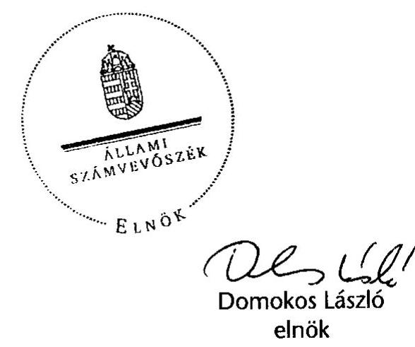

---

# 1. Szervezetirányítási és Müködtetési Igazgatóság 

Vizsgálat-azonosító szám: V0466
Témaszám: 960

## Az ellenőrzést felügyelte:

Dr. Csapodi Pál
főtitkár

## Az ellenőrzés végrehajtásáért felelős:

Dr. Kékesi László
főtitkárhelyettes

## Az ellenőrzést vezette:

Horváthné Menyhárt Erika
főcsoportfőnök-helyettes

## Az ellenőrzést végezték:

| Bojtos Rozália | Göller Géza | Nagyné Lakhézi Éva |
| :-- | :-- | :-- |
| tanácsadó | főtanácsadó | számvevő tanácsos |
| Dr. Somorjai Zsoltné | Vicze Klára | Bálint Józsefné |
| számvevő tanácsos | számvevő tanácsos | címzetes főmunkatárs |

## 2. Államháztartás Központi Szintjét Ellenőrző Igazgatóság

## Az ellenőrzést felügyelte:

Dr. Becker Pál
főigazgató

## Az ellenőrzés végrehajtásáért felelős:

Horváth Sándor
főigazgató-helyettes

## Az ellenőrzést vezették:

Hámoriné Maróti Györgyi
főcsoportfőnök-helyettes
Morvay András
osztályvezető főtanácsos
Szarka Péterné
igazgatóhelyettes

Holé Sándorné Dr.
igazgatóhelyettes
Pongrácz Éva
osztályvezető főtanácsos
Tolnai Lászlóné
osztályvezető főtanácsos

## Az összefoglaló jelentést készítették:

Baki István
számvevő tanácsos
Csomsztek Ramóna
számvevő gyakornok
Dormán István Zoltán
számvevő
Gáspár Eszter
számvevő gyakornok
Gyeraj Péter
számvevő
Horváth József
főtanácsadó
Jagicza Istvánné
számvevő tanácsos

Bamberger Mária
tanácsadó
Deli Gáborné
számvevő tanácsos
Farkas László
főtanácsadó
Görgényi Gábor
számvevő tanácsos
Holló András
számvevő
Huszár József
számvevő tanácsos
Dr. Jakab Kornél
számvevő tanácsos

Czmarkó Frigyes
számvevő
Dombovári Nóra
számvevő tanácsos
Ferencz Katalin
tanácsadó
Gyarmati István
tanácsadó
Horcsin Attila
számvevő tanácsos
Huszárné Borbás Melinda
számvevő
Jeszenkovits Tamás
tanácsadó

---

Keresztes Tamás számvevő
Dr. Mészáros Leila számvevő
Niklai Heléna számvevő tanácsos
Polyák Ferenc számvevő tanácsos
Sali Sándorné számvevő
Séra Andrásné főtanácsadó
Szilágyi Zsuzsanna tanácsadó
Vas Lajos
főtanácsadó

## Az ellenőrzést végezték:

Baki István számvevő

Dr. Baloghné Sebestyén Éva számvevő
Béres László számvevő
Burenzsargal Narantuja számvevő tanácsos
Dalmayné Szerző Ildikó számvevő
Dr. Dicső Ildikó számvevő
Domokosné Kurilla Edit tanácsadó
Farkas László főtanácsadó
Fekete Gábor tanácsadó
Ferencz Katalin tanácsadó
Ganter Ildikó számvevő
Gombás István számvevő
Gyeraj Péter számvevő
Hajdu Károlyné tanácsadó
Horváth József főtanácsadó
Huszárné Borbás Melinda számvevő
Dr. Jártas Ágnes tanácsadó

Dr. Király László tanácsadó
Marozsán Katalin számvevő
Pető Krisztina számvevő tanácsos
Dr. Pósch Gábor főtanácsadó
Sápi Henriett számvevő
Szabóné Simai Mária számvevő tanácsos
Vacsora Erika számvevő tanácsos
Zakar László számvevő tanácsos

Balázs Melinda tanácsadó
Bamberger Mária tanácsadó
Bíró Endre tanácsadó
Czmarkó Frigyes számvevő
Dancsóné Kuron Ildikó számvevő tanácsos
Dombovári Nóra számvevő tanácsos
Dormán István Zoltán számvevő
Federics Adrienn számvevő tanácsos
Fekete Győr László számvevő
Dr. Fónyad Erzsébet számvevő tanácsos
Gáspár Eszter számvevő gyakornok
Görgényi Gábor számvevő tanácsos
György Mária számvevő tanácsos
Holló András számvevő
Horváthné Herbáth Mária tanácsadó
Jagicza Istvánné számvevő tanácsos
Jeszenkovits Tamás tanácsadó

Dr. Lengyel Attila főtanácsadó
Molnár Bálint számvevő
Peisch Annamária számvevő
Dr. Remport Katalin főtanácsadó
Sebők Katalin számvevő gyakornok
Szilágyi Gyöngyi főtanácsadó
Varsányiné Dudás Eleonóra számvevő
Zaroba Szilvia számvevő tanácsos

Balkay Attila tanácsadó
Beck Miklós számvevő tanácsos
Bravics Judit Barbara számvevő gyakornok
Csomsztek Ramóna számvevő gyakornok
Deli Gáborné Számvevő tanácsos
Dr. Domján Eszter tanácsadó
Éva Katalin
főtanácsadó
Fehérné Jagasich Mariann számvevő tanácsos
Feketéné Hajkó Andrea számvevő
Fülöpné Nagy Mariann számvevő
Gergely Tilda számvevő
Gyarmati István tanácsadó
Hadnagyné Papp Ildikó számvevő
Horcsin Attila számvevő tanácsos
Huszár József számvevő tanácsos
Dr. Jakab Kornél számvevő tanácsos
Jordanics Tamás számvevő

---

| Karsai Lászlóné   főtanácsadó | Kincses Erzsébet Eszter   számvevő | Dr. Király László   tanácsadó |
| :-- | :-- | :-- |
| Kiss Ferenc Károlyné   számvevő | Kocsis Ferencné   számvevő | Kovácsy Tamás   számvevő tanácsos |
| Kriston-Vizi János   számvevő tanácsos | Krüzselyi Attila   számvevő tanácsos | Dr. Lengyel Attila   főtanácsadó |
| Lucza Anikó   számvevő tanácsos | Major Lászlóné   számvevő tanácsos | Dr. Majoros Sándor   főtanácsadó |
| Marozsán Katalin   számvevő | Dr. Mészáros Leila   számvevő | Molnár Bálint   számvevő |
| Molnár Imre   főtanácsadó | Némethné Nagy Mária   számvevő | Niklai Heléna   számvevő tanácsos |
| Dr. Novák Csilla   tanácsadó | Osztoics Danica   számvevő | Dr. Pataki Magdolna   főtanácsadó |
| Peisch Annamária   számvevő | Pető Krisztina   számvevő tanácsos | Polyák Ferenc   számvevő tanácsos |
| Dr. Pósch Gábor   főtanácsadó | Dr. Remport Katalin   főtanácsadó | Salamin Viktor   számvevő |
| Sali Sándorné   számvevő | Samu István   számvevő tanácsos | Sápi Henriett   számvevő |
| Sebők Katalin   számvevő gyakornok | Séra Andrásné   főtanácsadó | Dr. Sipos Dóra   számvevő tanácsos |
| Szabó Erzsébet   számvevő tanácsos | Szabóné Simai Mária   számvevő tanácsos | Szenthelyi Dávid   számvevő gyakornok |
| Szepes Béla   számvevő tanácsos | Szilágyi Gyöngyi   főtanácsadó | Szilágyi Zsuzsanna   tanácsadó |
| Dr. Szima Mária   főtanácsadó | Szöllősiné Hrabóczki Etelka   főtanácsadó | Temesváry Miklós   számvevő tanácsos |
| Terbe Mónika   számvevő tanácsos | Tóth Bálint   főtanácsadó | Trenovszki István   főtanácsadó |
| Turai Erzsébet   számvevő | Vacsora Erika   számvevő tanácsos | Varsányiné Dudás Eleonóra   számvevő |
| Vas Lajos   főtanácsadó | Dr. Vass Gábor   tanácsadó | Vásárhelyi Zoltán   tanácsadó |
| Verő Tünde   számvevő | Villányi Antal   számvevő tanácsos | Vincze Ibolya   számvevő |
| Vitányi István   számvevő tanácsos | Vlasits Ágnes   számvevő | Zagyi Judit   számvevő tanácsos |
| Zakar László   számvevő tanácsos | Zaroba Szilvia   számvevő tanácsos | Fogarasi Miklós   külső munkatárs |
| Krémó Márkné   külső munkatárs |  |  |

# A témához kapcsolódó eddig készített számvevőszéki jelentések: 

## címe

Jelentés a Magyar Köztársaság 2005. évi költségvetése végrehajtásának ellenőrzéséről 0628
Jelentés a Magyar Köztársaság 2006. évi költségvetése végrehajtásának ellenőrzéséről 0724
Jelentés a Magyar Köztársaság 2007. évi költségvetése végrehajtásának ellenőrzéséről 0824
Jelentés a Magyar Köztársaság 2008. évi költségvetése végrehajtásának ellenőrzéséről 0928

---

# TARTALOMJEGYZÉK 

BEVEZETÉS ..... 9
I. ÖSSZEGZŐ MEGÁLLAPÍTÁSOK, KÖVETKEZTETÉSEK, JAVASLATOK ..... 13

1. A zárszámadási dokumentum ..... 14
2. Központi költségvetés ..... 15
3. A beszámolók megbízhatósága ..... 25
3.1. Az ÁSZ által ellenőrzött beszámolók megbízhatósága ..... 25
3.2. A fejezeti belső ellenőrzési szervezeti egységek megbízhatósági ellenőrzéseinek eredményei ..... 26
4. Az Európai Uniótól származó források felhasználása ..... 27
5. Az elkülönített állami pénzalapok és a társadalombiztosítás pénzügyi alapjai ..... 31
5.1. Az elkülönített állami pénzalapok ..... 32
5.2. A társadalombiztosítás pénzügyi alapjai ..... 37
6. A fejezetek gazdálkodását, az Európai Uniós támogatások felhasználását érintő több éve fennálló hiányosságok (rendszerhibák) ..... 43
7. A helyi önkormányzatok költségvetési kapcsolatai ..... 47
II. RÉSZLETES MEGÁLLAPÍTÁSOK ..... 59
A) A ZÁRSZÁMADÁSI DOKUMENTUM TÖRVÉNYESSÉGI ÉS SZÁMSZAKI ELLENŐRZÉSE ..... 61
8. A zárszámadási dokumentum tartalma, szerkezete ..... 63
9. A dokumentumra vonatkozó Áht.-előírások teljesítése ..... 64
10. A zárszámadási dokumentum külső és belső egyezősége ..... 68
11. Fejezeti indokolások ..... 69
B) HELYSZÍNI ELLENŐRZÉS ..... 71
B1. A KÖZPONTI KÖLTSÉGVETÉS ..... 73
12. A központi költségvetés 2009. évi törvényi előirányzatainak teljesítése, a hiány alakulása ..... 73
13. A központi költségvetés finanszírozása és a kincstári egységes számla likviditása ..... 75

---

2.1. A központi költségvetés finanszírozási igénye ..... 75
2.2. A központi költségvetés tényleges finanszírozása ..... 78
3. A központi költségvetés központi előirányzatai ..... 84
3.1. A központi költségvetés közvetlen bevételei ..... 84
3.1.1. Vállalkozások költségvetési befizetései ..... 85
3.1.2. Fogyasztáshoz kapcsolt adók ..... 92
3.1.3. A lakosság befizetései ..... 96
3.1.4. Egyéb költségvetési bevételek ..... 100
3.1.5. Az állami vagyonnal kapcsolatos bevételek ..... 102
3.1.6. Uniós elszámolások ..... 102
3.1.7. A vám és egyes adónemek visszatérítése ..... 103
3.2. A központi költségvetés közvetlen bevételei elszámolásának megbízhatósága ..... 104
3.2.1. A belső kontrollok múködése az APEH-nél és a VP-nél ..... 112
3.2.2. Az állami vagyonnal kapcsolatos bevételek elszámolásának megbízhatósága ..... 114
3.3. A köztartozások behajtására tett intézkedések ..... 114
3.3.1. Az adóhátralékok behajtására tett intézkedések ..... 114
3.3.2. Végrehajtói letéti rendszer ..... 117
3.3.3. Fizetési könnyítési és méltányossági jog gyakorlása az APEH- nél ..... 118
3.3.4. A vámhatóság által kezelt vám- és adótartozások behajtására tett intézkedések ..... 119
3.3.5. A költségvetési szervek tartozásállománya, köztartozásai ..... 120
3.4. A központi költségvetés közvetlen kiadásai ..... 122
3.4.1. Az előirányzatok felhasználása ..... 122
3.4.2. A központi költségvetés kamatelszámolásai, tőkevisszatérü- lései, az adósság- és követelés-kezelés költségei ..... 132
3.4.3. A központi költségvetés terhére vállalt kezességek ..... 143
3.4.4. A központi költségvetés általános, cél- és stabilitási tartalékának felhasználása ..... 152
3.4.5. Az állami vagyonnal kapcsolatos kiadások ..... 158
3.5. A központi költségvetés közvetlen kiadásai elszámolásainak megbízhatósága ..... 158
4. A közvetlen bevételek és kiadások elszámolásában érintett szervezetek informatikai rendszereinek értékelése ..... 169
5. A fejezetek költségvetésének végrehajtása ..... 178
5.1. A szabályozottsággal kapcsolatos megállapítások ..... 178
5.1.1. A Kt.-ben a költségvetési szervekre megfogalmazott feladatok végrehajtása ..... 178
5.1.2. A vagyontörvény végrehajtásának 2009. évi tapasztalatai ..... 180

---

5.1.3. A KSZF jogszabályban meghatározott feladatellátása, annak hatása a költségvetési szervek kiadási előirányzatainak teljesítésére, külön kitérve a fejezeteknél tapasztalt ellátási színvonalra ..... 185
5.1.4. Központosított Illetményszámfejtő Rendszer (KIR) működése ..... 187
5.1.5. A teljesítményértékelési rendszer (TÉR) 2009. évi tapasztalatai ..... 189
5.1.6. Összkormányzati projekt alakulása ..... 191
5.1.7. A zárszámadással kapcsolatos egyéb ellenőrzések ..... 192
5.1.7.1. Közérdekű bejelentés alapján végzett ellenőrzés ..... 192
5.1.7.2. Az egyházakat és civil szervezeteket megillető 1+1\%-os személyi jövedelemadó felajánlások ..... 194
5.1.7.3. Az egyházi közoktatási kiegészítő támogatás 2009. évi alakulása ..... 195
5.1.8. A fejezeti egyensúlyi tartalék ..... 200
5.2. A fejezetek bevételi és kiadási előirányzatainak teljesítése, az előirányzat-maradványok alakulása, az intézmények finanszírozása ..... 200
5.2.1. A bevételi és kiadási előirányzatok teljesítése ..... 200
5.2.2. Az előző évi előirányzat-maradványok felhasználása és a tárgyévi előirányzat-maradványok alakulása ..... 202
5.2.3. A költségvetési intézmények finanszírozása ..... 205
5.2.3.1. Az előirányzat-felhasználási keret megnyitása, felhasználása ..... 205
5.3. A beszámolók megbízhatósága ..... 208
5.3.1. Alkotmányos fejezetek, igazgatási címek, fejezeti kezelésű előirányzatok beszámolói pénzügyi (szabályszerúségi) ellenőrzésének tapasztalatai ..... 208
5.3.1.1. Az ún. alkotmányos, illetve egyintézményes fejezetek, fejezeti jogosítványú költségvetési címek beszámolói pénzügyi (szabályszerúségi) ellenőrzésének tapasztalatai ..... 208
5.3.1.2. Az igazgatási címek, alcímek elemei beszámoló jelentéseinek megbízhatósága ..... 213
5.3.1.3. A fejezeti kezelésű előirányzatok elszámolásai pénzügyi (szabályszerúségi) ellenőrzésének tapasztalatai ..... 224
5.3.1.4. A fejezetek belső ellenőrzési egységei által ellenőrzött intézmények elemi beszámoló jelentéseinek megbízhatósága ..... 231
5.3.2. Uniós Fejlesztések fejezet beszámolóinak megbízhatósága ..... 233
6. Az EU-Támogatások és az uniós tagsággal összefüggő hazai befizetések ..... 240
7. A belső kontrollrendszerek múködése ..... 247
8. Letéti számlák ..... 251
8.1. A központi letéti számla ..... 251
8.2. Fejezeti letéti számlák ..... 252

---

9. A korábbi ÁSZ ellenőrzések megállapításaival kapcsolatban tett intézkedések ..... 255
B.2. AZ ELKÜLÖNÍTETT ÁLLAMI PÉNZALAPOK ÉS A TÁRSADALOMBIZTOSÍTÁS PÉNZÜGYI ALAPJAI ..... 265
B.2.1. AZ ELKÜLÖNÍTETT ÁLLAMI PÉNZALAPOK ..... 268
10. Munkaerőpiaci Alap ..... 268
1.1. Az MPA költségvetési beszámolója ..... 269
1.2. Az MPA pénzügyi helyzete ..... 270
1.2.1. Az MPA bevételei ..... 271
1.2.2. Az MPA kiadásai ..... 271
1.3. Az MPA ellenőrzési rendszere ..... 275
1.4. Az MPA-ra vonatkozó korábbi ÁSZ javaslatok hasznosulása ..... 276
11. Szülőföld Alap ..... 276
2.1. Az SZA költségvetési beszámolója ..... 278
2.2. Az SZA pénzügyi helyzete ..... 278
2.2.1. Az SZA bevételei ..... 278
2.2.2. Az SZA kiadásai ..... 279
2.3. Az SZA ellenőrzési rendszere ..... 280
2.4. Az SZA-ra vonatkozó korábbi ÁSZ javaslatok hasznosulása ..... 280
12. Központi Nukleáris Pénzügyi Alap ..... 280
3.1. A KNPA költségvetési beszámolója ..... 281
3.2. A KNPA pénzügyi helyzete ..... 281
3.2.1. A KNPA bevételei ..... 281
3.2.2. A KNPA kiadásai ..... 282
3.3. A KNPA ellenőrzési rendszere ..... 283
13. Nemzeti Kulturális Alap ..... 283
4.1. Az NKA költségvetési beszámolója ..... 284
4.2. Az NKA pénzügyi helyzete ..... 284
4.2.1. Az NKA bevételei ..... 284
4.2.2. Az NKA kiadásai ..... 284
4.3. Az NKA ellenőrzési rendszere ..... 285
14. Wesselényi Miklós Ár- és Belvízvédelmi Kártalanítási Alap ..... 285
5.1. A WMA költségvetési beszámolója ..... 286
5.2. A WMA pénzügyi helyzete ..... 286
5.2.1. A WMA bevételei ..... 286
5.2.2. A WMA kiadásai ..... 286
5.3. A WMA ellenőrzési rendszere ..... 287
15. Kutatási és Technológiai Innovációs Alap ..... 287

---

6.1. A KTIA költségvetési beszámolója ..... 287
6.2. A KTIA pénzügyi helyzete ..... 288
6.2.1. A KTIA bevételei ..... 288
6.2.2. A KTIA kiadásai ..... 288
6.3. A KTIA ellenőrzési rendszere és közzétételi kötelezettsége ..... 288
6.4. A KTIA-ra vonatkozó korábbi javaslatok hasznosulása ..... 289
B.2.2. A TÁRSADALOMBIZTOSÍTÁS PÉNZÜGYI ALAPJAI ..... 289

1. Nyugdíjbiztosítási Alap ..... 289
1.1. Az Ny. Alap költségvetési beszámolóinak minősítése ..... 289
1.2. A költségvetési beszámoló tartalma ..... 290
1.2.1. Az Ny. Alap pénzügyi helyzetének értékelése ..... 290
1.2.2. Az Ny. Alap pénzforgalma és likviditása ..... 292
1.2.3. Az Ny. Alap mérlegtételeinek értékelése ..... 292
1.3. Az alapkezelő feladatellátása ..... 293
1.4. Az Ny. Alap 2009. évi bevételeinek alakulása ..... 294
1.4.1. Az Ny. Alap költségvetési bevételeinek teljesülése ..... 294
1.4.2. Az APEH éves adatszolgáltatása és az abból előállított adatok megbízhatósága ..... 295
1.5. Az Ny. Alap kiadásainak alakulása ..... 297
1.5.1. Az ellátási kiadások ..... 297
1.5.2. A múködési kiadások alakulása ..... 301
1.6. Az Ny. Alapot érintő korábbi ÁSZ javaslatok hasznosulása ..... 302
1.6.1. A munkáltatói nyugdíjbiztosítási járulék és a biztosítotti nyugdíijárulék pontos értékének megállapítása ..... 302
1.6.2. Egyes nyugdíjszakmai szabályok egyszerűbb, költségkímélőbb megváltoztatása ..... 302
2. Egészségbiztosítási Alap ..... 304
2.1. Az E. Alap beszámolási kötelezettségére vonatkozó megállapítások ..... 304
2.2. Az E. Alap 2009. évi pénzügyi helyzete ..... 305
2.3. Az E. Alap bevételei ..... 306
2.4. Az E. Alap kiadásai ..... 307
2.5. Az OEP és igazgatási szervei szabályozottsága ..... 313
2.6. Az Alap ellenőrzési rendszere ..... 313
2.7. Az OEP 2009. évi múködési költségvetésének teljesítése ..... 315
2.8. Az E. Alapot érintő korábbi javaslatok hasznosulása ..... 316
B.3. AZ ÁLLAMHÁZTARTÁS HELYI SZINTJE, A HELYI ÖNKORMÁNYZATOK ..... 318
3. A Kvtv. mellékleteiben meghatározott központi támogatások elszámolásának szabályszerűsége ..... 318
1.1. Előirányzatok nyilvántartása ..... 318

---

1.1.1. Az eredeti előirányzatok jogcímenkénti megfelelősége a Kvtv.- ben és a PM-ÖM együttes rendeletben ..... 318
1.1.2. Az előirányzat módosítások szabályszerűsége ..... 319
1.2. A helyi önkormányzatok jogcímenkénti támogatásai és hozzájárulásai ..... 324
1.2.1. A települési önkormányzatot megillető, a településre kimutatott személyi jövedelemadó ..... 324
1.2.2. A megyei önkormányzatok személyi jövedelemadó részesedése ..... 324
1.2.3. A települési önkormányzatok jövedelem- differenciálódásának mérséklése ..... 324
1.2.4. Normatív hozzájárulások ..... 325
1.2.5. A helyi önkormányzatok által felhasználható központosított előirányzatok ..... 327
1.2.6. A helyi önkormányzatok múködőképességének megőrzését szolgáló kiegészítő támogatások ..... 335
1.2.6.1. Önhibájukon kívül hátrányos helyzetben lévő helyi önkormányzatok támogatása ..... 336
1.2.6.2. Állami támogatás a tartósan fizetésképtelen helyzetbe került helyi önkormányzatok adósságrendezésére irányuló hitelfelvétel visszterhes kamattámogatására, az adósságrendezés alatt múködési célra igényelhető támogatásra, valamint a pénzügyi gondnok díjára ..... 338
1.2.6.3. A múködésképtelen önkormányzatok egyéb támogatása ..... 338
1.2.7. A helyi önkormányzatok színházi támogatása ..... 341
1.2.7.1. Kőszínházak múködtetési hozzájárulása ..... 341
1.2.7.2. Művészeti tevékenység kiadásaihoz való hozzájárulás ..... 342
1.2.7.3. Bábszínházak múködtetési hozzájárulása ..... 342
1.2.7.4. Bábszínházak művészeti tevékenységének kiadásaihoz való hozzájárulás ..... 342
1.2.7.5. Önkormányzati színházak pályázati támogatása ..... 343
1.2.7.6. Kiemelt művészeti célok pályázati támogatása ..... 343
1.2.7.7. Az önkormányzatok által támogatott magánszínházak pályázati támogatása ..... 344
1.2.8. A normatív kötött felhasználású támogatások ..... 344
1.2.8.1. Kiegészítő támogatás egyes közoktatási feladatokhoz ..... 345
1.2.8.2. Egyes szociális feladatok támogatása ..... 345
1.2.8.3. Helyi önkormányzatok hivatásos tűzoltóságok támogatása ..... 346
1.2.8.4. A többcélú kistérségi társulások támogatása ..... 346
1.2.9. Felhalmozási célú támogatások ..... 346
1.2.9.1. Címzett és céltámogatások ..... 346
1.2.9.2. A helyi önkormányzatok fejlesztési feladatainak támogatása ..... 348

---

1.2.9.3. A helyi önkormányzatok vis maior támogatása ..... 350
1.2.9.4. Vis maior tartalék ..... 351
1.2.10.Budapest 4-es - Budapest Kelenföldi pályaudvar-Bosnyák tér - közötti metróvonal építésének támogatása ..... 352
1.2.11. A leghátrányosabb helyzetű kistérségek felzárkóztatásának támogatása ..... 357
1.3. IX. Helyi önkormányzatok támogatásai és átengedett személyi jövedelemadója fejezet Kormány hatáskörben létrehozott új címei ..... 358
1.3.1. Roma Kulturális Központ létrehozása ..... 358
1.3.2. A házi segítségnyújtás és/vagy jelzőrendszeres házi segítség- nyújtást ellátási szerződés keretében biztosító helyi önkormányzatok ..... 359
1.3.3. A IX. fejezet 17., 18. és 19. címei ..... 359
2. A Helyi önkormányzatok előző évi elszámolása és ellenőrzése során megállapított eltérések rendezésének szabályszerűsége ..... 360
3. A helyi önkormányzatoknak nyújtott támogatások folyósításának megbízhatósága ..... 362
4. Utóellenőrzés ..... 363
MELLÉKLETEK ..... 367
RÖVIDÍTÉSEK JEGYZÉKE ..... 381

---

.

---

# JELENTÉS 

## BEVEZETÉS

A Magyar Köztársaság 2009. évi költségvetését a 2008. évi CII. törvény (Kvtv.) hagyta jóvá, amely magában foglalta a központi költségvetés, az elkülönített állami pénzalapok és a társadalombiztosítás pénzügyi alapjai előirányzatait. A törvény az állami költségvetés összességében 13876 806,6 M Ft kiadási és 13226 143,6 M Ft bevételi főösszegének elfogadása mellett az összesített hiány összegét 650 663,0 M Ft-ban állapította meg.

A Kvtv. a 2009. év során három alkalommal került módosításra.

- A Magyar Köztársaság 2008. évi költségvetésének végrehajtásáról szóló 2009. évi CXXIX. törvény - az egyházak hitéleti és közcélú tevékenységének anyagi feltételeiről szóló 1997. évi CXXIV. törvény előírása alapján - módosította a központi költségvetés kiadási előirányzatát, ezen belül az Oktatási és Kulturális Minisztérium érintett kiadási előirányzata 140,3 M Ft-tal növekedett. (A Magyar Köztársaság 2008. évi költségvetésének végrehajtásáról szóló 2009. évi CXXIX. törvény felhatalmazása alapján a Kormány a 30/2010. (II. 19.) Korm. rendeletben az egyházi közoktatási intézményfenntartókat 3283,8 M Ft egyszeri közoktatási kiegészítő támogatásban részesítette. Az Állami Számvevőszék számítása szerint az egyházi közoktatási intézményfenntartókat a 2008. évre 4304,4 M Ft kiegészítő támogatás illette volna meg.)
- A Magyar Köztársaság 2009. évi költségvetése módosításáról szóló 2009. évi LXIX. törvény a Kvtv. 5. sz. mellékletét, a helyi önkormányzatok által felhasználható központosított előirányzatokat módosította, így az sem az öszszesített kiadási és bevételi főösszeget, sem az összesített hiány mértékét nem változtatta meg.
- A Kvtv. 2009. évi CXVII. törvénnyel való módosítása - a Munkaerőpiaci Alap központi költségvetésbe való befizetési kötelezettségének csökkentésével - 15,0 Mrd Ft bevételi előirányzat csökkenést jelentett a központi költségvetésnek.

A módosítások összességükben - az államháztartás pozíciójának változatlansága mellett - a központi költségvetési alrendszer hiányának 15,1 Mrd Ft összegű növekedését eredményezte. A nemzetközi pénzügyi-gazdasági folyamatok hazai hatásainak mérséklése érdekében, a romló makrogazdasági mutatók figyelembe vételével a Kormány év közben módosította az államháztartási hiánycélt és ennek teljesítésére - kormányzati hatáskörben - jelentős, a költségve-

---

tési szerveken kívül a lakosság széles rétegeit érintő kiadási intézkedéscsomagokról döntött.

A Kormány a költségvetés végrehajtásáról készített törvényjavaslatot és a döntéshozatalhoz szükséges információkat az éves zárszámadási dokumentumban terjeszti az Országgyúlés elé, amit az - az Áht. előirása szerint - együtt tárgyal a zárszámadás ellenőrzéséről készített számvevőszéki jelentéssel.

Az ellenőrzés célja a 2009. évi költségvetések ${ }^{1}$ végrehajtásáról szóló beszámolók és elszámolások, a központi költségvetés közvetlen bevételei és kiadásai megbízhatóságának értékelése, valamint annak elősegítése volt, hogy a Magyar Köztársaság 2009. évi költségvetésének végrehajtásáról az Országgyúlésnek benyújtott törvényjavaslat valósághúen tükrözze a pénzügyi folyamatokat.

A Magyar Köztársaság 2009. évi költségvetéséről szóló törvény végrehajtását (zárszámadás) - törvényi kötelezettségünknek és az országgyúlési határozatoknak megfelelően - szabályszerűségi, megbízhatósági szempontból vizsgáltuk. Az ellenőrzés során nem volt célunk a gazdálkodás változó körülményei miatt meghozott kormányzati intézkedések társadalmi-gazdasági hatásainak, a költségvetés végrehajtása gazdasági folyamatainak célszerűségi, eredményességi szempontból való értékelése. Ez utóbbiakról az Állami Számvevőszék (ÁSZ) tematikus jelentései szólnak.

A költségvetések végrehajtásának szabályszerűségét, a beszámolók megbízhatóságát a financial audit módszerével értékeltük. Teljes körűen ellenőriztük az ún. alkotmányos fejezetek, a fejezeti jogosítvánnyal rendelkező költségvetési címek, a fejezetek igazgatási címei és a fejezeti kezelésű előirányzatok beszámolóit, valamint a központi költségvetés közvetlen bevételeinek és kiadásainak elszámolását.

Az ellenőrzés az előző évekhez viszonyítva szűkebb intézményi körre terjedt ki. A központi költségvetés ellenőrzését a fejezetek belső ellenőrzési szervezeti egységeivel együttműködve - az általuk megvalósított, a fejezetekhez tartozó intézményi kör megbízhatósági ellenőrzésével - végeztük el.

Az elkülönített állami pénzalapoknál - a Magyar Köztársaság 2009. évi költségvetését megalapozó egyes törvények módosításáról szóló 2008. évi LXXXII. törvény 2. § (11) bekezdése alapján módosított Áht. 57. § (3) bekezdése -, a társadalombiztosítás pénzügyi alapjainál - ugyanezen törvény 2. § (22) bekezdésével módosított Áht. 86/A. § (2) bekezdése alapján - megváltozott az ellenőrzés módszere. A korábbi években az alapoknál kötelező volt a beszámolók könyvvizsgálata. 2010. január 1-jétől az ÁSZ által kidolgozott módszertan szerint kellett a beszámolók ellenőrzését elvégezni. A szabályozás nem egyértelmú meghatározása miatt a különböző alapoknál eltérő gyakorlat alakult ki. Az ÁSZ az alapokat megillető, az Adó- és Pénzügyi Ellenőrzési Hivatal által beszedett bevételek megbízhatóságát ellenőrizte. Az alapok beszámolóinak megbízhatósá-

[^0]
[^0]:    ${ }^{1}$ A helyszíni ellenőrzésre meghatározott körben a központi költségvetési szervek (elemi) költségvetései.

---

gáról készített könyvvizsgálói jelentéseket - az egyes alapokról szóló megállapításaink megfogalmazásakor - hasznosítottuk.

Az előző évhez hasonlóan a 2009. évi gazdálkodás ellenőrzése során is kiemelt figyelmet fordítottunk a belső pénzügyi kontrollrendszerek kiépítettségére és működésére. Ellenőrzésünk keretében a számviteli nyilvántartások pontosságát és teljességét, a beszámoló készítés követelményeinek érvényesítését, a vagyon és a források védelmét biztosító fő kontrollokat értékeltük.

Az ellenőrzés keretében külön értékeltük az Európai Unióval kapcsolatos elszámolásokat.

Az ellenőrzés során áttekintettük a Magyar Köztársaság 2008. évi költségvetése végrehajtásának ellenőrzéséről készített számvevőszéki jelentésben ( valamint a számvevői jelentésekben) rögzített hiányosságok felszámolására tett intézkedéseket.

Az ÁSZ a zárszámadás ellenőrzése során a IX. Helyi önkormányzatok támogatásai és átengedett személyi jövedelemadója fejezetben szereplő támogatásokat és hozzájárulásokat, azok előirányzatai teljesítésének szabályosságát a támogatások folyósításának kincstári utalásáig vizsgálta. A helyi önkormányzatoknál helyszíni ellenőrzést nem végzett.

- Az ÁSZ megalakulása óta évente helyszínen vizsgálta a központi költségvetésből a helyi önkormányzatok részére juttatott állami támogatások és hozzájárulások igénylésének és elszámolásának szabályszerűségét. Az ÁSZ megállapításai alapján a jogosulatlanul igénybe vett támogatások visszafizetéséről, valamint a pótlólagosan járó összegekről az évenkénti zárszámadási törvény keretében az Országgyúlés döntött.
- A Magyar Államkincstár feladat- és hatásköre a helyi önkormányzatok állami támogatásainak és hozzájárulásainak ellenőrzésében 2008-tól bővült, és kapacitása is jelentősen megnövekedett, ezért az ÁSZ fokozatosan csökkentette ezen ellenőrzéseit.

Az ÁSZ 2010. évi ellenőrzési terve szerint novemberben megkezdi a helyi önkormányzatokat és a többcélú kistérségi társulásokat megillető normatív hozzájárulások és normatív kötött felhasználású támogatások igénylése és elszámolása kincstári felülvizsgálati rendszerének ellenőrzését. A teljesítményellenőrzés módszerével megvalósítandó ellenőrzés során az Állami Számvevőszék a 2008-2010. évekre kiterjedően - értékeli a címben jelzett területen a Magyar Államkincstár felülvizsgálati tevékenységének eredményességét.

Zárszámadási ellenőrzésünk alapján 55 javaslatot tettünk, esetenként megismételve, nyomatékosítva korábbi javaslatainkat. Ezekkel erősíteni kívánjuk a zárszámadás adatainak megbízhatóságát, a pénzfelhasználások átláthatóságát, illetve elősegíteni a feltárt hibák jövőbeni elkerülését.

Az ellenőrzés lefolytatásának jogi alapját az Állami Számvevőszékről szóló 1989. évi XXXVIII. törvény 1. § (2), a 2. § (1), valamint ezen jogszabályi előírásokra figyelemmel a 2. § (3), (5)-(6) és (9) bekezdései, a 17. § (1), a 18. § (2) be-

---

kezdései, továbbá az államháztartásról szóló 1992. évi XXXVIII. törvény 104. § (3) és a 120/A. § (1) bekezdései együttesen képezték.

A jelentés két kötetből áll. Az első kötet az ellenőrzés legfontosabb megállapításait és javaslatait, illetve a zárszámadási dokumentum törvényességi és számszaki ellenőrzésére, az államháztartás alrendszereire, valamint az egyes kiemelt témákra vonatkozó részletes megállapításokat tartalmazza. A második kötet (Függelék) a költségvetési fejezetekre, az EU-támogatásokkal és az uniós tagsággal összefüggő hazai befizetésekre, az elkülönített állami pénzalapokra, a társadalombiztosítási alapokra és a helyi önkormányzatok költségvetési kapcsolataira vonatkozó részletes megállapításokat és javaslatokat foglalja magában.

---

# I. ÖSSZEGZŐ MEGÁLLAPÍTÁSOK, KÖVETKEZTETÉSEK, JAVASLATOK 

Az államháztartás alrendszereinek 2009. évi tervezett bevételi előirányzata 16 514,9 Mrd Ft, kiadási előirányzata 17 299,6 Mrd Ft, hiánya 784,7 Mrd Ft volt, ami a GDP 2,8\%-ának felelt meg. Az államháztartás tényleges hiánya 1014,3 Mrd Ft (a GDP 3,9\%-a), ami 229,6 Mrd Ft-tal (29,3\%-kal) haladja meg az eredeti előirányzatot.

A hiány növekedéséhez az államháztartás egyes elemei a következő mértékben járultak hozzá:

Az államháztartás 2009. évi hiánya, pénzforgalmi szemléletben (Mrd Ft)

| Megnevezés | Eredeti   előirányzat | Tényleges   teljesítés | Eltérés |
| :-- | :--: | :--: | :--: |
| Központi költségvetés | $-660,8$ | $-743,7$ | $-82,9$ |
| Elkülönített állami pénzalapok | 19,0 | $-31,4$ | $-50,4$ |
| Egészségbiztosítási Alap | $-8,9$ | $-149,5$ | $-140,6$ |
| Nyugdíjbiztosítási Alap | 0,0 | $-7,2$ | $-7,2$ |
| Önkormányzatok | $-134,0$ | $-82,5$ | 51,5 |
| Államháztartás összesen | $\mathbf{- 7 8 4 , 7}$ | $\mathbf{- 1 0 1 4 , 3}$ | $\mathbf{- 2 2 9 , 6}$ |

Forrás: a zárszámadási törvényjavaslat

A hiány költségvetési törvényben megjelenített eredeti előirányzatát - a helyi önkormányzatok kivételével - meghaladták a teljesítési adatok. A helyi önkormányzatok egyenlege a költségvetési irányszámnál kedvezőbben alakult, de a 2008. év végi pozitív egyenlegük ( 15,6 Mrd Ft) a 2009. év végére negatívba fordult.

2009-hez hasonlóan az elmúlt évekre is jellemző volt, hogy az államháztartás szintjén a tényleges hiány több száz milliárd forinttal tért el (2007-ben és 2008ban a tervezetthez képest kedvezőbben alakulva) az eredetileg előirányzottól.

Mivel a tervezési - és ennek részeként a világgazdasági - környezet folyamatai teljes körűen nem jelezhetőek előre, ezért alapvető a mindenkori hiánycél eléréséhez és megtartásához a pontos tervezés, a felelős költségvetési gazdálkodás. A magyar nemzetgazdaság hitelességének megítélése szempontjából kulcsfontosságú a kitűzött hiánycél betartása.

---

A költségvetési politika alakításában, a költségvetés fenntarthatóságának megítélésében fontos mutató a folyó gazdálkodás eredményét kifejező ún. elsődleges egyenleg, amely a múltban felhalmozott adósság kamatterhe nélkül veszi figyelembe a kiadásokat. Gazdaságpolitikai lényege szerint azt a bevételi és kiadási kört tartalmazza, ahol a kormányzat intézkedéseket hozhat az adósságállomány csökkentése érdekében.
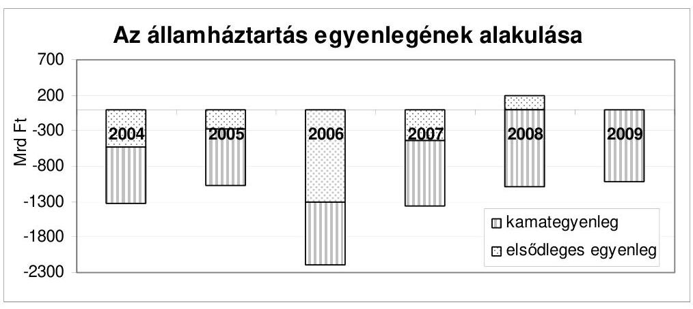

Forrás: zárszámadási törvényjavaslatok
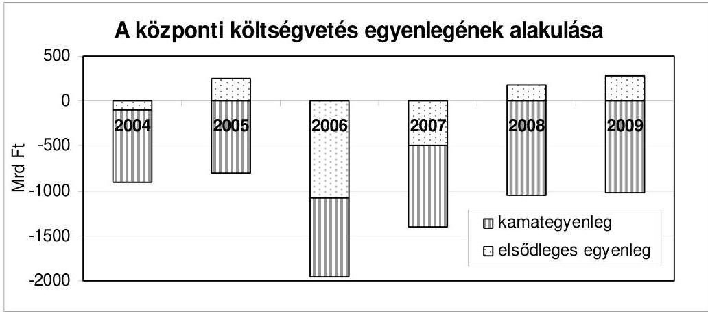

Forrás: zárszámadási törvényjavaslatok
Az államháztartás szintjén a 2008. év kivételével nem sikerült pozitív elsődleges egyenleget elérni. (Az államháztartás pénzforgalmi szemléletű elsődleges egyenlege 2009-ben -9,8 Mrd Ft, a központi költségvetésé 275,8 Mrd Ft volt.) Hosszú távon, a költségvetés vitelének fenntarthatósága érdekében biztosítani kell az adósságráta, azaz a GDP arányos adósságállomány csökkentését. Ennek feltétele az elsődleges többlet.

# 1. A ZÁrSZÁmadási DOKUMENTUM 

A zárszámadási dokumentum a normaszöveg és a törvényi mellékletek összhangja, az általános indokolás és mellékleteinek egyezősége tekintetében sokat, kedvezően változott az évek során. A dokumentumban bemutatott adatok összevetése az intézményi beszámolók összesített adataival évről-évre kisebb el-

---

térést mutat. Az általános indokolás esetenként kiegészül új és aktuális, informatív elemekkel.

Az alapvetően jellemző tartalmi összhang és a kedvező változások mellett, a hatályos szabályozási környezet nem változott, így az ÁSZ ismételni tudja korábbi megállapítását, hogy a jelenlegi prezentációs rendszer nem támogatja megfelelően az információtartalom állandóságát, az átláthatóságot, az évek közötti összevetést és a folyamatokról való képalkotást, ide értve a célok és azok teljesülésének követhetőségét, a hosszú távú kötelezettségvállalások összefoglaló, rendszerezett bemutatását.

Az Áht. folyamatos változtatása mellett annak a zárszámadási dokumentumra vonatkozó előírásai nem változtak, holott az ÁSZ folyamatosan jelzi, hogy azok nem teljes körűek, nem pontosak és teljesítésük ebből adódóan is rendre hiányos, illetve nem egyértelműen megítélhető.

A költségvetési törvény előírásainak teljesítése nehezen áttekinthető, az információk a zárszámadási törvényjavaslat különféle részeiben - esetenként évenként változó módon - jelennek meg: a zárszámadási törvényjavaslat normaszövegében, törvényi mellékleteiben, általános indokolásában, illetve fejezeti köteteiben.

Az éves zárszámadási dokumentumokra vonatkozó ellenőrzési tapasztalatok alapján megállapítható, hogy a prezentáció minősége érdemben nem javulhat a zárszámadás összeállításának szabályozása, a prezentáció tartalmi, szerkezeti meghatározása nélkül.

A zárszámadási dokumentumra vonatkozó megállapítások részletes kifejtése a jelentés első kötetének II. Részletes megállapítások fejezet A) A zárszámadási dokumentum törvényességi és számszaki ellenőrzése c. pontjában található meg.

# 2. KöZponti KöltsÉGvetés 

A központi költségvetés 2009. évi hiánya 743,7 Mrd Ft volt, ami 67,8 Mrd Fttal (10\%-kal) haladta meg a - Magyar Köztársaság 2009. évi költségvetéséről szóló 2008. évi CII. törvény módosításáról szóló 2009. évi CXVII. törvénnyel módosított hiány összegét. A hiány megítélésénél indokolt figyelembe venni, hogy annak összege 126,3 Mrd Ft-tal kevesebb a központi költségvetés 2008. évi hiányánál.

A hiány lényegében már 2009. első félévének végére kialakult, mivel annak félévi összege az év végi hiány $96 \%$-át tette ki.

A központi költségvetés hiányának a törvényben rögzítetthez viszonyítva kedvezőtlen alakulása az elmúlt nyolc évben öt év során (2002-2004 között, 2006ban és 2009-ben) volt tapasztalható.

---

A központi költségvetés hiánya 2004-ben 218,2 Mrd Ft-tal (32,6\%-kal) haladta meg a tervezettet, 2005-ben 265,4 Mrd Ft-tal ( $32,6 \%$-kal) maradt el az előirányzattól, 2006-ban ismét 40,3 Mrd Ft-tal ( $2,1 \%$-kal) haladta meg a törvényben előirányzott összeget, míg a 2007. évben 258,4 Mrd Ft-tal (16,6\%-kal) és a 2008. évben 247,6 Mrd Ft-tal ( $22,2 \%$-kal) alacsonyabb volt a törvényben előirányzott összegnél.
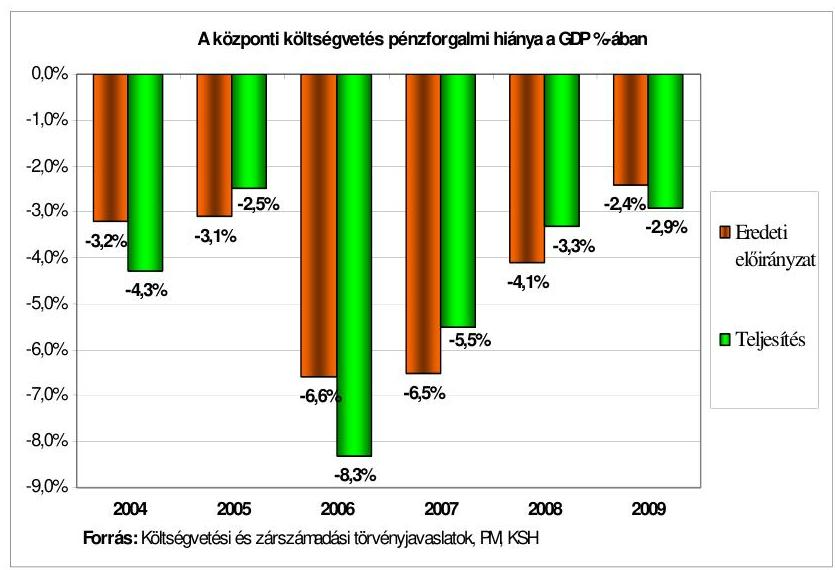

A 2009. évi hiány alakulását befolyásolta, hogy a költségvetés egyensúlya szempontjából meghatározó jelentőségű egyes előirányzatok és azok teljesítései kisebb vagy nagyobb mértékben eltértek egymástól.

A hiány alakulására hatással volt továbbá, hogy három kormányhatározat (januári 47,1 Mrd Ft, márciusi 54,1 Mrd Ft, júliusi 29,5 M Ft) alapján összesen 101,2 Mrd Ft összegű zárolás történt. Egy 2009 júliusi kormányhatározat a Kormány felügyelete alá tartozó szervek (TB alapok nélkül²) maradványtartási kötelezettségeként összesen 535,2 Mrd Ft-ot, majd az ezt módosító októberi kormányhatározat alacsonyabb, 527,3 Mrd Ft összeget írt elő. Ezek az intézkedések mérsékelték a hiány növekedését.

A hiány emelkedéséhez az is hozzájárult, hogy az MVH nem tudta törleszteni a KESZ-hez kapcsolódó megelőlegezési számláról felvett 561,0 M Ft összegű hitelt, miután ezen összeg EU-tól való beérkezéséről az MgSzH nem tájékoztatta a Hivatalt, és átutalásáról az MVH részére nem intézkedett. Ennek következtében a jelzett összeg a fejezeti kezelésű előirányzatok EU támogatása jogcímen bevételként nem került elszámolásra.

Az adóbevételek összességében 415,6 Mrd Ft-tal maradtak el a törvényben előirányzott összegektől ( 6524,2 Mrd Ft). Ennek alapvető oka az, hogy az előirányzatok tervezési alapját képező makrogazdasági folyamatok a 2009. év során a prognosztizáltnál lényegesen kedvezőtlenebbül alakultak.

[^0]
[^0]:    ${ }^{2}$ A központi költségvetési fejezetek 2009. évi maradványtartási kötelezettsége teljesítését megalapozó intézkedésekről szóló 2007/2009. (VII. 29.) Korm. határozat az Ny. Alapnak 1,04 Mrd Ft, az E. Alapnak 3,28 Mrd Ft maradványtartási kötelezettséget rendelt el. A módosított kormányhatározat a Ny. Alap kötelezettségét nem változtatta, az E. Alap maradványtartási kötelezettségét 5,6 M Ft-tal csökkentette.

---

A GDP a prognosztizált 1\% helyett 6,3\%-kal esett vissza, a háztartások fogyasztási kiadásai csökkenésének üteme a tervezett kétszerese ( $-7,6 \%$ ) volt, a bruttó álló-eszköz-felhalmozás 6,5\%-kal esett vissza a prognosztizált 0,9\%-kal szemben, míg az infláció $0,3 \%$-ponttal volt alacsonyabb $(4,5 \%)$ a tervezett emelkedés üteménél.

Az adóbevételek miatti kiesést részben ellensúlyozták az egyéb bevételekből (31,5 Mrd Ft), az adósságszolgálattal kapcsolatos bevételekből (68,7 Mrd Ft) és az állami vagyonnal kapcsolatos befizetésekből (46,1 Mrd Ft) származó többletek. Az állami vagyonnal kapcsolatos befizetések vonatkozásában szükséges megjegyezni, hogy a többletbefizetések többsége (a korábbi évekhez hasonlóan) osztalékelőlegekből, illetve osztalék elszámolásból (35,0 Mrd Ft) származott, továbbá a KVI megszűnése következtében az MNV Zrt. letéti számláján lévő 4,0 Mrd Ft - több mint másfél év elteltével - 2009 augusztusában került hasznosítási bevételként a költségvetésbe befizetésre.

A költségvetési szervek és fejezeti kezelésű előirányzatok többletbevétele 286,8 Mrd Ft volt, azonban a hiány növekedését okozták ezen előirányzatok 365,9 Mrd Ft-tal nagyobb összegű kiadásai. A hiány alakulására kedvezően hatott, hogy bár egyes kiadási előirányzatok (az államháztartás alrendszereinek támogatása, az állam által vállalt kezesség érvényesítése) 23,2 Mrd Ft öszszegben - jogszerűen - túlteljesültek, de más előirányzatok (az adósságszolgálat és kamattérítés, az egyedi és normatív támogatások, a családi támogatások és szociális juttatások, az állami vagyonnal kapcsolatos kiadások, a kormányzati rendkívüli és egyéb kiadások és a lakásépítési támogatások) kiadásai az előirányzottnál 90,9 Mrd Ft-tal alacsonyabb összegben realizálódtak.

Az ÁSZ minden alkalommal (a 2008 szeptemberében benyújtott, majd viszszavont, az októberben újólag benyújtott törvényjavaslatról szóló, az Országgyűlés Költségvetési, pénzügyi és számvevőszéki bizottsága számára készített Véleményében, valamint annak novemberi módosításával kapcsolatos Észrevételekben is) felhívta a figyelmet a makrogazdasági folyamatok kockázataira és a tervezett adóbevételek realizálhatóságának bizonytalanságára.
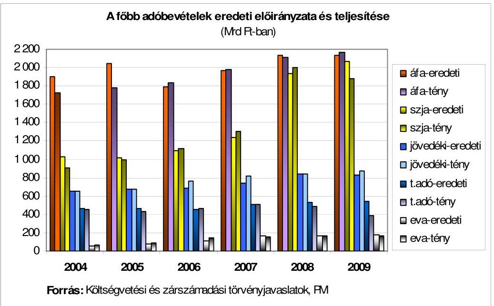

---

Az ÁSZ a társasági adó, a személyi jövedelemadó, továbbá a társas vállalkozások különadója és a magánszemélyek különadója teljesülését magas kockázatúnak minősítette. Ezen adónemek előirányzathoz (2827,5 Mrd Ft) viszonyított bevétel elmaradása 385,4 Mrd Ft, amelynek összegét csak mérsékelte az általános forgalmi adó és a jövedéki adó előirányzatait összesen 72,2 Mrd Ft-tal meghaladó túlteljesítés. Az általános forgalmi adóból származó többletbevétel (33,4 Mrd Ft) oka az évközi adókulcs emelés és a kiutalások előző évi összegénél 164,9 Mrd Ft-tal kisebb összege. A jövedéki adó többlet bevétele (38,8 Mrd Ft) a dohánytermékek korábban nem tapasztalt mértékű év végi, az adóemelés keresletcsökkentő hatásának mérséklését célzó készletezés következménye. A kisebb adók bevételei - a környezetterhelési díj és az egyéb lakossági adók kivételével - elmaradtak a tervezettől.

A 2009. évi zárszámadási törvényjavaslatban a központi költségvetés közvetlen bevételeinek teljesítési adatai - az állami vagyonnal kapcsolatos bevételek kivételével (az ÁSZ korlátozott minősítést adott) megbízhatóak. Az APEH és a VP (a központi költségvetés közvetlen bevételeinek $72,1 \%$-át realizálják) a vizsgált bevételek esetében valamennyi lényeges adóztatási, illetékeztetési, vámigazgatási, jövedéki tevékenységet az előírások és a saját belső szabályozásai szerint látta el. A belső kontrollok megfelelően múködtek.

A központi költségvetés közvetlen kiadási előirányzatainak teljesítési adatai - a lakástámogatások és az állami vagyonnal kapcsolatos kiadások kivételével (az ÁSZ korlátozott minősítést adott) - megbízhatóak. A lakástámogatásoknál az ÁSZ a 2005. évi zárszámadás ellenőrzése óta minden évben jelzi, hogy - egyes hitelintézetek, változó körben - több éve jelentős (a 2009. évben 12,9 Mrd Ft) összegben folyósítanak támogatást a jogszabály által előírt új szerződés hiányában.

Az adósságszolgálattal kapcsolatos kiadások mérlegadata a teljesülésről - a Nemzetközi Valutaalap hitele utáni rendelkezésre állási jutalék 7,2 Mrd Ft öszszegű előirányzatának és 0,3 Mrd Ft összegű teljesülésének kivételével, mivel azok nem a tartalmuknak megfelelő költségvetési soron jelennek meg - megbízható képet ad.

A zárszámadás általános indokolása első alkalommal ad számot a költségvetés követelésállományáról, annak alakulásáról és a változások főbb okairól. Ezt az ÁSZ évek óta hiányolta. A követelésállomány zárszámadás során történő bemutatását annak utóbbi években tapasztalt ugrásszerű emelkedése is indokolta. Ezt jól szemlélteti, hogy az adó- (és 2007-től az illeték-) hátralékok állománya az elmúlt öt évben a 2005. évi 735,2 Mrd Ft-ról több mint kétszeresére 1722,9 Mrd Ft-ra nőtt, ezen belül a felszámolással érintett hátralékok megháromszorozódtak.

A hátralékállomány növekedése az APEH kimutatásai szerint az összetétel folyamatos romlásával párosult, 2007-ben az állomány 58,2\%-a, 2008-ban $64,8 \%-a, 2009$-ben már $70 \%$-a a nem múködő adózók köréből származott.

---

Az állami adóhatóságnál az adóhátralék állomány adatai megbízhatóak voltak, az illetékek hátralékállománya ( $80,8 \mathrm{Mrd} \mathrm{Ft}$ ) a teljes körű dokumentáltság hiánya miatt nem pontos.

Az adózók folyószámláin megjelenő illetéktartozás és az informatikai rendszerekből lekérhető adatok 2-5\%-a nem volt összhangban a könyvelési hibák, valamint a feldolgozatlan ügyhátralék következtében, annak ellenére, hogy az adóhatóság az ügyhátralék $80 \%$-át a 2009. évben feldolgozta.

Az APEH valamennyi rendelkezésére álló lehetőséget (végrehajtási eljárások számának progresszív növelése, informatikai rendszerek fejlesztése, állományi törlések, engedményezés miatti törlések) felhasznált a hátralékképződés emelkedésének megakadályozására, de a 2008. évhez viszonyított növekedés összegét ( $312,5 \mathrm{Mrd} \mathrm{Ft}$ ) csak mérsékelni tudta.

Az előző évhez viszonyítva 4,6\%-kal csökkent a túlfizetéses állomány (733,3 Mrd Ft), amelynek döntő része a 2009. évben sem jelent az adózók felé fennálló fizetési kötelezettséget. A túlfizetéses állomány elsősorban adózói hibából (hibásan benyújtott, feldolgozhatatlan bevallások, téves bevételi vagy beszedési számlára utalt összegek) származott.

# A hátralékos és túlfizetéses állományok egyenlegei* 

|  | 2006 |  | 2007 |  | 2008 |  | 2009 |  |
| :-- | :--: | :--: | :--: | :--: | :--: | :--: | :--: | :--: |
| Megnevezés | Mrd   Ft | $\begin{gathered} 2006 / \\ 2005 \end{gathered}$ | Mrd   Ft | $\begin{gathered} 2007 / \\ 2006 \end{gathered}$ | Mrd   Ft | $\begin{gathered} 2008 / \\ 2007 \end{gathered}$ | Mrd   Ft | $\begin{gathered} 2009 / \\ 2008 \end{gathered}$ |
| Hátralékos állomány | 949,4 | $129,1 \%$ | 1079,7 | $113,7 \%$ | 1410,4 | $130,6 \%$ | 1722,9 | $122,2 \%$ |
| Túlfizetéses állomány | 772,4 | $131,9 \%$ | 836,5 | $108,3 \%$ | 766,9 | $91,7 \%$ | 733,3 | $95,6 \%$ |

* az APEH adatszolgáltatása alapján

Az MNV Zrt.-nél a 2008. évhez viszonyítva jelentős javulás mutatkozott a bevételek feldolgozottságának a mértékében, a megbízhatóságot növelően az egyes bevételek tényleges jogcím szerinti nyilvántartásában és elszámolásában, az adatszolgáltatásban, beleértve az egyes tranzakciók - előző évinél - szélesebb körű ellenőrizhetőségét biztosító dokumentációkkal való alátámasztottságot is. Az MNV Zrt. 2009 februárjától az állami vagyonnal kapcsolatos ${ }^{3}$ bevételeket naponta dolgozza fel. Ennek eredményeként a bevételek ÁHT azonosítóval való ellátása, a bevételek jogcím szerinti beazonosítása és a bevételek feldolgozottsága, és ehhez kapcsolódóan a Kincstár részére történt adatszolgáltatás minősége javult.

[^0]
[^0]:    ${ }^{3}$ Az állami vagyonnal kapcsolatos részletes megállapításokat a Függelék tartalmazza. A XLIII. Az állami vagyonnal kapcsolatos bevételek és kiadások fejezet egyes költségvetési soraira vonatkozóan az MNV Zrt. 2009. évi tevékenységének ellenőrzéséről szóló ÁSZ jelentés is tartalmaz megállapításokat.

---

A kiadások tekintetében a 2008. évihez viszonyítva azonban kedvezőtlen változás volt tapasztalható. Az ÁSZ a 2009. évben az állami vagyonnal kapcsolatos bevételeket és kiadásokat egyaránt korlátozott minősítéssel látta el.

Az állami vagyon hasznosításának lényegi keretei - a 2008. évi zárszámadás ellenőrzésénél tapasztaltakkal összehasonlítva - változatlanok maradtak. Az MNV Zrt. a 2009. évben úgy látta el a rábízott állami vagyon kezelésével kapcsolatos feladatait, hogy változatlanul nem rendelkezett az állami vagyont tételes leltárral alátámasztó, az állami részesedések aktualizált értékét tartalmazó, szabályos, pontos és teljes körú vagyonnyilvántartással. (Az MNV Zrt. tájékoztatása alapján a helyszíni ellenőrzés lezárásakor az állami vagyon leltárfelvétele folyamatban volt.)

Az ÁSZ ez alkalommal is felhívja a figyelmet, hogy az MNV Zrt. mérlegkészítési határideje 2010. augusztus 15-e, így az továbbra sincs összhangban a zárszámadáshoz kapcsolódó beszámolási kötelezettség határidejével.

Az MNV Zrt. a 254/2007. (X. 4.) Korm. rendeletben rögzített vagyonnyilvántartási kötelezettségének teljes körűen megfelelni a 2009. évben sem tudott.

Az ÁSZ a korábbi évekhez hasonlóan a 2009. évben is úgy ítélte meg, hogy - a szervezeti keretektől függetlenül - az ingatlan értékesítésből származó bevételek előirányzata és teljesítése nincs összhangban egymással.

Több (összesen 165,5 M Ft összegű) esetben jelezte az ÁSZ, hogy az elszámolások nem a bevétel, illetve kiadás tartalmának megfelelően történtek. Az MNV Zrt. nem tudta 1,5 Mrd Ft összegű egyéb ingatlan értékesítésből származó bevétel teljes körű, tételes tartalmát megadni, valamint összesen 119,7 M Ft összegű módosítás tartalmát, összetételét és indokoltságát sem rögzítette a helyszíni ellenőrzés lezárásáig.

Három esetben (Nemzeti Lóverseny Kft. Dunakeszi-Alag ingatlanát érintő adásvétel, VPOP elhelyezési igényének érdekében megvalósult beruházás, Honvédelmi Minisztérium Elektronikai, Logisztika és Vagyonkezelő Zrt.-vel kötött szerződés) fogalmazott meg az ÁSZ kifogásokat.

A nemzetgazdasági elszámolások kiadásai és bevételei teljesítésének megbízhatóságát az 1. sz. melléklet tartalmazza. A minősítésekhez kapcsolódó megállapítások a Jelentésben a Részletes megállapításokon belül, a 3.2. A központi költségvetés közvetlen bevételei elszámolásának megbízhatósága, a 3.5. A központi költségvetés közvetlen kiadásai elszámolásának megbízhatósága, valamint a Függelék XLIII. Az állami vagyonnal kapcsolatos bevételek és kiadások fejezetében találhatók.

---

A 2009. évben az államháztartás finanszírozási ${ }^{4}$ igénye a 2009. évi költségvetés előirányzatait megalapozó finanszírozási ${ }^{5}$ tervhez, a 2008 novemberi, illetve a 2009 januári és a 2009 márciusi módosított finanszírozási tervekben szereplő összegekhez képest kedvezőtlenebbül, míg a májusi finanszírozási tervben szereplő összeghez képest kedvezőbben alakult.

A 2009. évben a kincstári kör ${ }^{6}$ nettó finanszírozási igénye 921,3 Mrd Ft volt, amely 77,6 Mrd Ft-tal magasabb az előirányzatot megalapozó finanszírozási tervben szereplő összegnél ( 843,7 Mrd Ft). Ennek oka, hogy míg a központi költségvetés egyenlege 114,7 Mrd Ft-tal kedvezőbben alakult, addig a társadalombiztosítás egyenlege 165,1 Mrd Ft-tal, az elkülönített állami pénzalapok egyenlege 27,3 Mrd Ft-tal maradt el az előirányzatot megalapozó finanszírozási tervtől.

A 2009. évi teljes nettó finanszírozási igény ${ }^{7} 885,8$ Mrd Ft volt, ami 201,7 Mrd Ft-tal alacsonyabb az előirányzatot megalapozó finanszírozási tervben tervezett 1087,5 Mrd Ft összegnél.

Az államháztartás központi szintjének forrásszükségletét - az előirányzatot megalapozó finanszírozási tervhez képest (1095,4 Mrd Ft) 179,0 Mrd Ft-tal alacsonyabb - 916,4 Mrd Ft összegű teljes nettó kibocsátás ${ }^{8}$ biztosította, ami tartalmazza az IMF-től 2009. március 30-án és 2009. szeptember 29-én, illetve az Európai Bizottságtól 2009. március 26-án és 2009. július 6-án lehívott, összesen 1726,0 Mrd Ft összegű devizahitelt is. A devizahitel nélküli nettó kibocsátás -778,2 Mrd Ft volt.

A Nemzetközi Valutaalap által biztosított hitelkeretből 720,1 Mrd Ft, az Európai Bizottság által biztosított keretből 1005,9 Mrd Ft összegben történt hitellehívás. A 2009. évben lehívott 1726,0 Mrd Ft összegű devizahitelt az állam az esedékes adósságtörlesztésekre (lejáró forintadósság és devizakötvény törlesztése) használta fel. A 2008. évi lehívás egy részéből - az Áht. 8/B § (1) bekezdé-

[^0]
[^0]:    ${ }^{4}$ Az éves finanszírozási szükségletet a lejáró adósság megújítási igénye, valamint a központi költségvetés, a TB alapok, az elkülönített állami pénzalapok mindenkori hiánya határozza meg. Ezen túl a finanszírozási igényt módosíthatja a KESZ egyenlegének és az MNB kiegyenlítési tartalékának változása, az Áht.-ban nevesített megelőlegezési, illetve likviditási hitelek nyújtása, az uniós kifizetésekkel kapcsolatos megelőlegezések és a privatizációs bevételek költségvetést érintő hányada.
    ${ }^{5}$ A finanszírozási terv magába foglalja a nettó finanszírozási igényt, valamint az adósság finanszírozását. Az adósságkezelési műveletek közé a hitelfelvételek és törlesztések, az állampapír visszafizetések és kibocsátások, valamint a hitelátvállalások miatti kifizetések tartoznak.
    ${ }^{6}$ A központi költségvetésnek, a társadalombiztosítás pénzügyi alapjainak és az elkülönített állami pénzalapoknak az egyenlegei együttesen.
    ${ }^{7}$ A központi költségvetés hiánya, a TB pénzügyi alapjainak finanszírozási szükséglete, az elkülönített állami pénzalapok finanszírozási szükséglete, az MNB tartalékfeltöltésének, valamint az európai uniós mezőgazdasági támogatások előfinanszírozása és viszszatérítése egyenlegének összege, amely nem tartalmazza az adósságátvállalásokat.
    ${ }^{8}$ A forint és deviza kibocsátások, hitelfelvételek és törlesztések, illetve a deviza betét műveletek egyenlegei összesen.

---

sének b) pontja alapján - a Magyar Állam 2009-ben három hitelintézetnek (MFB Zrt., OTP Nyrt., FHB Nyrt.) nyújtott hitelt, amelynek 2009. december 31én fennálló állománya 445,4 Mrd Ft volt. A fennmaradó - az MNB-nél betétként elhelyezett - állománya 2009. év végi összege 679,4 Mrd Ft volt ${ }^{9}$.

Az államadósság finanszírozásába bevont devizahitelek közvetett módon növelik az MNB kötvényállományát, mivel a többlet likviditást az MNB saját kötvényeinek eladásával vonja ki a forgalomból. A kötvényállománynak a forint, illetve devizahozamok közötti kamatkülönbözete várhatóan negatív hatással lesz az MNB eredményére. Az MNB tv. rendelkezése szerint a veszteség eredménytartalékot meghaladó része a központi költségvetést terheli, amely az államadósságot és a hiányt is növeli. A 2009. évben a költségvetésnek térítési kötelezettsége nem keletkezett. Várhatóan a 2012. évben jelentkezik térítési kötelezettség, amely a költségvetést 49,0 Mrd Ft összegben terheli.

# A központi költségvetés, a társadalombiztosítás és az elkülönített pénzalapok finanszírozása 2009-ben biztosított volt. 

A központi költségvetés bruttó adóssága a 2009. év végén 18 964,9 Mrd Ft volt, ami 6,9\%-kal haladja meg a tervezettet és $4,8 \%$-kal a 2008. évit.
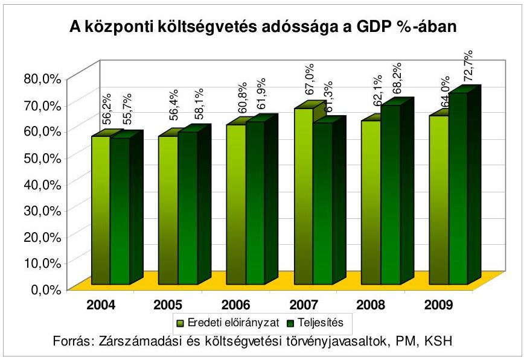

Az adósságállomány - a betétként elhelyezett IMF/EU hitelrésszel együtt - a GDP arányában $72,7 \%$-ot tett ki, ami $4,5 \%$-ponttal magasabb az előző évi (68,2\%) értéknél. Az előző évhez viszonyítottan a növekedési ütem 2004-ben 9,5\%, 2005-ben 10,1\%, 2006-ban 15,2\%, 2007-ben 6\%, 2008-ban 16,2\%, 2009ben $4,8 \%$.

Az elmúlt évi növekedést a nemzetközi hitelcsomagból történő lehívás és a forint leértékelődése okozta. A 2009. évben 1726,0 Mrd Ft igénybevétele történt meg az IMF/EU által nyújtott nemzetközi hitelcsomagból. Kedvezőtlenül ala-

[^0]
[^0]:    ${ }^{9}$. Az MNB eredményével összefüggő adatokat a Magyar Nemzeti Bank 2009. évi múködésének ellenőrzéséről szóló ÁSZ jelentés tartalmazza.

---

kultak a devizaárfolyamok is, mivel $264,8 \mathrm{Ft} /$ euróról ${ }^{10} 270,8 \mathrm{Ft} /$ euróra ${ }^{11}$ emelkedtek.

Az adósságállomány növekedéséhez 2009-ben kis mértékben ugyan, de hozzájárult az EMGA támogatások KESZ-ről történt megelőlegezéseinek -94,0 Mrd Ft összegű egyenlege.

A Kincstár adatai szerint a 2004-2009. években az EMGA támogatások KESZ-ről történő megelőlegezése összesen 1322,1 Mrd Ft, az Unió által visszatérített összeg összesen 1119,3 Mrd Ft volt. Így a megelőlegezés egyenlege összesen -202,8 Mrd Ft.

Az EMGA támogatások 2009. évi KESZ-ről történt megelőlegezése 342,5 Mrd Ft, az Unió által visszatérített összeg 248,5 Mrd Ft volt.

Az adósságállományon belül a devizában fennálló adósság aránya tovább növekedett, a 2008. évben 37,6\% volt, a 2009. évben 44,7\%-ot tett ki. Ennek oka egyrészt a forint állampapírok iránti kereslet nagymértékű csökkenésének ellensúlyozása, amelyet az ÁKK Zrt. az Európai Bizottság és a Nemzetközi Valutaalap által nyújtott devizahitel részbeni felhasználásával pótolt, másrészt a forint euróhoz viszonyított árfolyamának gyengülése. A központi költségvetés devizában fennálló adósságállománya a 2009. év végén 10476,2 Mrd Ft volt, ami $25 \%$-os emelkedést jelent az előző év végihez képest.

A költségvetési szervek finanszírozási helyzetét a 2009. év egészében is magas, a második félévben pedig jelentősen növekvő tartozásállomány jellemezte. A tartozásállomány emelkedését nagyrészt a 2009-ben előírt maradványtartási kötelezettség betartása, és a később felszabaduló pénzeszközök terhére vállalt kifizetések halasztása okozta. A magas összegek ellenére az adósság átmeneti, likviditási jellegűnek tekinthető.

A 2009. év első felében az állomány - az előző évi szinthez hasonlóan - havi 12,0-15,0 Mrd Ft között változott. Az első hat havi átlag 13,3 Mrd Ft, ami alig haladja meg az előző év átlagát ( $12,7 \mathrm{Mrd}$ Ft). Az év második felében azonban a központi költségvetési szervek tartozásállománya jelentős mértékben megemelkedett. Augusztusban az adósság már meghaladta a 20,0 Mrd Ft-ot, és az év utolsó két hónapjában 30,0 Mrd Ft körül alakult. A második félévi átlagos állomány $24,5 \mathrm{Mrd}$ Ft, ami közel kétszerese az előző évi, illetve az első félévi átlagos értékeknek. A 2009. évi átlagos éves tartozásállomány 18,9 Mrd Ft, ami az előző évi átlag közel másfélszerese.

A minősített (az eredeti költségvetési előirányzat 3,5\%-át, illetve az 50,0 M Ft-ot meghaladó) tartozás átlagos mértéke 2,2 Mrd Ft volt, amely 0,1 Mrd Ft-tal kevesebb az előző évinél. Az év végi állományt tekintve azonban sokkal kedvezőtlenebb a helyzet: 2009 decemberében a minősített adósság 3,9 Mrd Ft volt, ami az előző évi záró állomány 2,8-szorosát érte el.

A minősített tartozás nagy része két intézménynél koncentrálódik: az év végi állomány fele ( $2,0 \mathrm{Mrd}$ Ft) a Honvédelmi Minisztériumhoz tartozó Állami Egész-

[^0]
[^0]:    ${ }^{10}$ 2008. december 31-ei devizaárfolyam. Forrás: MNB
    ${ }^{11}$ 2009. december 31-ei devizaárfolyam. Forrás: MNB

---

ségügyi Központnál, további egynegyede ( $0,99 \mathrm{Mrd}$ Ft) a Pécsi Tudományegyetemnél jelentkezett.

A tartozásállomány adósság-nemenkénti megoszlása jelentősen nem változott. A mennyiségében és arányában továbbra is meghatározó mértékű egyéb szállítói tartozás mellett a korábban megtett intézkedések, illetve az Adóhivatallal közös tartozásfigyelő rendszer múködésének hatására, és a Kincstár (új köztartozás keletkezését megakadályozó) nettó finanszírozási rendjének bevezetésével az intézmények adó- és járulék tartozása lényegében felszámolásra került.

A zárolás intézményével a Kincstári Biztosi Irodának 2009-ben sem kellett élnie.

A központi költségvetés tartalékainak (általános tartalék, céltartalék, stabilitási tartalék) 2009. évi előirányzata összesen 192,0 Mrd Ft volt. Az év során 92,5 Mrd Ft került a fejezetekhez átcsoportosításra, amiből 2,1 Mrd Ft visszszarendezése történt meg 2009-ben. Ezt figyelembe véve a tartalékok felhasználása összesen 90,4 Mrd Ft (47,1\%), míg az év végi maradvány 101,6 Mrd Ft volt.

Az általános tartalékból történt átcsoportosítás az átcsoportosított előirányzat $59,8 \%$-át kitevő összegben ( $27844,8 \mathrm{M}$ Ft) nem volt indokolt, az igénylés nem felelt meg az Áht. 25. § (1) bekezdésében előírtaknak. Ezzel azonosak az ÁSZ korábbi években tett megállapítása is. A fejezetek többletforrás igénye egyes feladatok esetében nem minősült előre nem valószínűsíthetőnek, nem tervezhetőnek, illetve előirányzott, de elháríthatatlan ok miatt elmaradó bevétel miatt pótolandónak (pl. a KüM részére támogatás kifizetetlen tagdíttartozásokra, a Rendőrség és a BV éves költségvetéséhez pótlólagos támogatás, az EU 2011-es magyar elnökségének ellátásával összefüggő feladatok finanszírozása stb.). Az éves előirányzat 47,2 Mrd Ft-os összegének 30,1\%-át kitevő 14,2 Mrd Ft-os átcsoportosításra 2009 decemberének második felében (17-e és 29-e között) került sor.

A céltartalékok 66,8 Mrd Ft-os előirányzatából 45,9 Mrd Ft került átcsoportosításra a Kvtv. 4. §-ában meghatározott különféle személyi kifizetések fedezeteként, amelyből az elszámolási és visszatérítési kötelezettség alapján év közben 2,1 Mrd Ft visszarendezésre került. Így az előirányzat teljesülése 43,8 Mrd Ft, az év végi maradvány 23,0 Mrd Ft volt. A jelentős mértékű maradvány (34,4\%) fő oka, hogy a Kvtv. 4. és 5. §-ában szereplő 11 jogcímből 6 esetében nem történt felhasználás, melyet a PM a gazdasági helyzettel, illetve azzal indokolt, hogy ezekre a jogcímekre nem érkezett olyan igény, amelynek nem teljesítése esetén zavarok keletkezhettek volna az adott intézmények múködésében.

A Kvtv. stabilitási tartalék címén 78,0 Mrd Ft előirányzatot tartalmazott, mely nem került felhasználásra, így az év végi maradvány az előirányzat öszszegével megegyezik. Két esetben - a 1096/2009. (VI. 19.) Korm. határozattal és a 1108/2009. (VII. 10.) Korm. határozattal - a Kormány a stabilitási tartalék helyett az általános tartalékból csoportosított át összesen 1,1 Mrd Ft-ot. Az előirányzat átcsoportosításokra a Kvtv. 44. §-ában, valamint a 71. § (2) bekezdésében foglalt rendelkezésektől eltérően került sor.

---

# 3. A BESZÁmolÓk MEGBÍZHATÓsÁGA 

### 3.1. Az ÁSZ által ellenőrzött beszámolók megbízhatósága

A korábbi évek gyakorlatának megfelelően a költségvetés végrehajtásának szabályszerűségét, a beszámolók megbízhatóságát a helyszínen ellenőriztük a központi költségvetés fejezeteinél (igazgatási cím/alcím, fejezeti kezelésű előirányzatok cím) és a fejezeti jogosítványú költségvetési szerveinél. A beszámolók ellenőrzését az ÁSZ által - az Egyesült Királyság Számvevőszékével együttműködve, az INTOSAI ellenőrzési, valamint a magyar könyvvizsgálati előírásokra vonatkozó standardokra is figyelemmel - kidolgozott módszertanok alapján folytattuk le. Az ellenőrzött beszámolókat véleményadással minősítettük.

## A 2009. évi zárszámadás ellenőrzése során az ÁSZ által lefolytatott pénzügyi szabályszerűségi vizsgálatok alapján a központi költségvetés fejezetei kiadási főösszege 53,1\%-ának megbízhatóságát minősítettük.

A költségvetési beszámolóról adott minősítő vélemény lehet: elfogadó vélemény (figyelemfelhívó megjegyzéssel), korlátozott vélemény és elutasító vélemény.

- Elfogadó vélemény a költségvetési beszámolóról akkor adható, ha 95\%-os bizonyossággal megállapítható, hogy a költségvetési beszámolót az elfogadott számviteli alapelvek következetes alkalmazásával készítették el, az megfelel a törvényi előírásoknak és a vonatkozó egyéb rendelkezéseknek, a beszámoló a vagyoni, pénzügyi helyzetről, a gazdálkodásról a valóságnak megfelelő, megbízható képet ad.

Abban az esetben, ha az ellenőrzés a beszámoló megbízhatóságát nem befolyásoló hiányosságot tár fel, az elfogadó véleményt figyelemfelhívó megjegyzéssel kell ellátni.

- Korlátozott véleménnyel minősíti az ellenőrzés azt a költségvetési beszámolót, amelyre elfogadó vélemény nem adható, azonban a feltárt hibák a lényegességi küszöböt nem érik el, illetve a tapasztalt szabálytalanságok a beszámoló elutasítását nem indokolják. A korlátozott véleménynek tartalmaznia kell, hogy a költségvetési beszámoló mely részeire vonatkozik a korlátozás. A véleményben egyértelműen ki kell fejteni a korlátozás okait, és amennyiben lehet, azok beszámolóra gyakorolt hatásának számszerúsítését is.
- Elutasító véleményt kell adni a költségvetési beszámoló megbízhatóságáról, ha az ellenőrzés során tapasztalt, lényegességi küszöböt meghaladó mértékű, a beszámoló megbízhatóságát befolyásoló jelentős hibák, szabálytalanságok kihatásai miatt a beszámoló nem ad megbízható és valós képet a vagyoni, pénzügyi helyzetről.

Az ÁSZ által végzett 52 pénzügyi szabályszerűségi ellenőrzésből 39 beszámolót elfogadó véleménnyel láttunk el, ebből 26 esetben figyelemfelhívó megjegyzést fogalmaztunk meg. 10 beszámoló korlátozott, és 3 beszámoló elutasító minősítést kapott.

---

Elfogadó véleménnyel láttuk el az OGY, a KE, az ALB, az OBH, a BIR, az MKÜ és a GVH fejezetek, a Költségvetési Tanács, a MeHIg, az ÖM, a HM, az IRM, az NFGM, a KvVM, a KüM, az Uniós Fejlesztések (NFÜ), az OKM, a PM, az SZMM, a KSH és az MTA fejezetek igazgatási címei/alcímei, a PNSZ címen belül az NBH, az IH és az NBSZ alcímek, az OAH, az NHH, a MEH, az EBF, az MSZH, a PSZÁF és a KEHI intézmények, az ÖM, a HM, a KvVM, a KHEM, a KüM, az EüM, a PM és az MTA fejezetek fejezeti kezelésű előirányzatai 2009. évi beszámolóit.

Az ellenőrzés során feltárt - a beszámoló megbízhatóságát nem befolyásoló - hiányosságok miatt az elfogadó véleményünket figyelemfelhívó megjegyzéssel láttuk el az OBH és a BIR fejezeteknél, a Költségvetési Tanács, az ÖM, a HM, az IRM, az NFGM, a KvVM, a KüM, az Uniós Fejlesztések (NFÜ), az OKM, a PM és az SZMM fejezetek igazgatásainál, a PNSZ címen belül az NBH, az IH és az NBSZ alcímek, az NHH, a MEH, az EBF és az MSZH intézményeknél, a HM, a KvVM, a KüM, az EüM, a PM és az MTA fejezetek fejezeti kezelésű előirányzatainál.

Az ÁSZ beszámolóját a külső könyvvizsgáló elfogadó véleménnyel látta el.
Korlátozott minősítéssel láttuk el a beszámolókat egyes előirányzatokra, illetve mérlegsorokra vonatkozóan az ME fejezet KSZF intézménye, az FVM, a KHEM fejezetek igazgatási címeinek, valamint az EüM Központi Igazgatása alcíme beszámolóiban, továbbá az ME, az IRM, az NFGM, az Uniós Fejlesztések, az OKM és az SZMM fejezetek fejezeti kezelésű előirányzatairól készített beszámolókban.

Elutasító minősítéssel láttuk el a Közbeszerzések Tanácsa és a PNSZ címen belül az Szervezett Bünözés Elleni Koordinációs Központ alcím, valamint a Földmúvelésügyi és Vidékfejlesztési Minisztérium fejezet fejezeti kezelésű előirányzatainak 2009. évi költségvetési beszámolóit.

A beszámolókról megfogalmazott véleményünket, és annak indokait a Függelék tartalmazza.

# 3.2. A fejezeti belső ellenőrzési szervezeti egységek megbízhatósági ellenőrzéseinek eredményei 

A 2009. évben 12 fejezet (ME, ÖM, FVM, HM, NFGM, KHEM, KüM, OKM, EüM, PM, SZMM, KSH) ellenőrzési szervezete vállalta, hogy az ÁSZ ellenőrzéseit kiegészítve elvégzik az irányításuk alá tartozó egyes intézmények megbízhatósági ellenőrzését. Összességében 63 tervezett ellenőrzésből 59 valósult meg. Az ME, az ÖM, az FVM, a HM, az NFGM, a KHEM, az OKM, az EüM és a KSH fejezeteknél a vállalt ellenőrzéseket teljes körűen teljesítették. A fejezetek belső ellenőrzési szervezeti egységei - a megbízhatósági ellenőrzéseik alapján - a központi költségvetés fejezetei kiadási főösszege 9,3\%-át minősítették.

Az elvégzett ellenőrzésekből 46 elfogadó minősítéssel zárult, amelyből 21 esetben tett az ellenőrzés figyelemfelhívó megjegyzést, 6 beszámoló kapott korlátozott minősítést és 7 beszámolót utasítottak el.

---

Korlátozott véleménnyel minősítette az ellenőrzés a NUSI, az MH Támogató Dandár csapat, a HM Infrastrukturális Ügynökség központi, az NKH, az OMSZ és az NKTH beszámolóit.

Elutasító véleménnyel látta el az ellenőrzés az Országos Sportegészségügyi Intézet, az Iparművészeti Múzeum, a HM Fejlesztési és Logisztikai Ügynökség csapat és központi, az MH Logisztikai Ellátó Központ központi, és az MH Dr. Radó György Honvéd Egészségügyi Központ csapat és központi intézmények beszámolóit.

Az alkotmányos és az egyintézményes fejezetek, a fejezetek igazgatási címei/alcímei és fejezeti kezelésű előirányzatai beszámolóinak minősítéseit a jelentés 2. sz. melléklete, a minisztériumok fejezeti belső ellenőrzési egységei által végzett megbízhatósági ellenőrzések minősítéseit a jelentés 3. sz. melléklete tartalmazza.

# 4. Az Európai Uniótól SzÁrmazó forRÁsOK FelHASZNÁlása 

Az Európai Uniótól (EU) származó, a költségvetésben megjelenő és költségvetésen kívüli tételek együttes 1178,1 Mrd Ft-os összege több mint ötszörösen meghaladta a teljesített hazai befizetési kötelezettség (223,7 Mrd Ft) összegét.

A költségvetésben megjelenő - az EU támogatások utólagos megtérülése nélküli - EU források 8\%-kal (72,3 Mrd Ft-tal) elmaradtak a tervezettől, ugyanakkor a központi költségvetési eszközök felhasználása 24\%-kal (43,5 Mrd Ft-tal) túllépte a tervezett előirányzatot, ami kockázatot jelent a költségvetés teljesítésének szempontjából, mivel hiánynövelő tényezőként hat.

Az EU-tól származó bevétel elmaradás és a hazai költségvetésből történő kiadás túlteljesítés eredőjeként az EU forrásokat is tartalmazó előirányzatok teljesülése összesen 16,1\%-kal (115,8 Mrd Ft-tal) maradt el a tervezett összegtől. Az EU források és a hazai társfinanszírozás tényleges felhasználásának a tervezettel szembeni, egymástól eltérő tendenciáját az egyes támogatási csoportoknál eltérő indokok magyarázzák.

Az Nemzeti Fejlesztési Terv I. (NFT I.) esetében a pénzügyi válságra tekintettel az Európai Bizottság (EU Bizottság) az eredeti 2008. december 31-ei zárási határidőt 2009. június 30 -áig meghosszabbította, így még a 2009. évben is teljesíthetőek voltak az NFT I.-hez kapcsolódó kifizetések, azonban az EU-tól forráslehívásra már nem került sor.

A Kohéziós Alapból (KA) a közlekedési és a környezetvédelmi szektorban 2009-ig sor került a jelentősebb összegű szerződések megkötésére. A Nemzeti Fejlesztési Ügynökség (NFÜ) egyes KA projektek esetében pénzügyi megállapo-dás-módosításokat nyújtott be az EU Bizottsághoz. A kérelmekben - többek között egyéb tartalmi változtatások mellett - az elszámolhatósági határidő hoszszabbítását kérte annak érdekében, hogy a projektek sikeres lezárására megfelelő időkeret álljon az intézményrendszer rendelkezésére.

---

A 2009. évben az eredeti 59,5 Mrd Ft KA előirányzathoz képest jelentős, 123,5 Mrd Ft-os túlteljesítés történt, melyből az EU általi hozzájárulás 67,5 Mrd Ft-ot tett ki. A túlteljesülés indoka, hogy a 2008. év végi számlakifizetések jelentős része átcsúszott a 2009. évre.

A pénzügyi és gazdasági recesszió befolyásolta a KA-ból támogatott projektek 2009. december 31-éig elért eredményeit.

A kiviteli szerződéssel való lekötés a közlekedési projekteknél a várható összköltség EU támogatási részének $84 \%$-át, a környezetvédelmi projekteknél pedig a $88 \%$-át érte el.

Az Új Magyarország Fejlesztési Terv (ÚMFT) 2009. évi 655,0 Mrd Ft eredeti kiadási előirányzatával szemben a kifizetés teljesítés 468,8 Mrd Ft volt. Ezen belül 390,6 Mrd Ft összegű EU-s forrásfelhasználáshoz 78,2 Mrd Ft hazai támogatás társult, amely tartalmazza a Munkaerőpiaci Alaptól átvett támogatást is. A 2009. évi teljesítés elmaradt a tervezettől a támogatások lebonyolításának időigénye miatt.

Minden operatív program (OP) esetén sor került a 2009. év végére az első kifizetési igénylések EU Bizottságnak történő megküldésére, ami feltétele volt annak, hogy a tagállam a már átutalt előleget ne veszítse el.

Az Egyéb strukturális támogatások esetében az INTERREG Közösségi Kezdeményezés Programjait a 2007-2013-as időszakban felváltó Európai Területi Együttmúködés (ETE) keretében valósulnak meg - az EU belső határai mentén kétoldalú fejlesztési programok. Az IPA (Előcsatlakozási Támogatási Eszköz, Horvátország és Szerbia tekintetében) programokat az EU Bizottság 2008 márciusában fogadta el. A kifizetések a kétkörös pályázati kiírások, valamint a nemzetközi egyeztetések időbeli elhúzódása miatt elmaradtak a tervezettől.

A Nemzeti Vidékfejlesztési Terv (NVT) esetében az 1260/1999 EK Tanácsi Rendelet alapján a 2004-2006-os időszakra vonatkozó 751,1 M EUR forrást 2008. december 31-éig használhatta fel Magyarország. Ennek következtében a Földművelésügyi és Vidékfejlesztési Minisztérium fejezet 10/11/01 Nemzeti Vidékfejlesztési Terv Intézkedések sor a 2009. évben eredeti kiadási előirányzattal már nem rendelkezett.

A lezárult NVT programok jogosulatlanul felhasznált támogatásainak követeléseiből származó bevétel 2009-ben 762,6 M Ft volt, amelyhez még hozzájárult az előző évről áthúzódó, kötelezettségvállalással nem terhelt 148,9 M Ft maradvány. Így a módosított kiadási előirányzat $911,5 \mathrm{M}$ Ft volt.

Az előirányzatról jogorvoslati eljárások miatt az NVT intézkedésekre 149,6 M Ft kifizetés történt, valamint elvonásra került a 2008. évi maradvány összege (148,9 M Ft). Az előbbieken túl az EU Bizottság részére visszautalásra került a 2009. első félévében befolyt követelések EU-s része, amely $91,2 \mathrm{M} \mathrm{Ft}$, továbbá 420,9 M Ft támogatásértékű működési kiadás került átcsoportosításra más előirányzatokra. 2009-ben mindösszesen 810,7 M Ft kiadás teljesült.

---

Az EU Bizottság 2009-ben elfogadta a program lezárásáról szóló, valamint a 2008. évi végrehajtási jelentést. Az EU Bizottság a 2009. év végén, illetve 2010ben átutalta a program keretösszegéből a szabályoknak megfelelően visszatartott $5 \%$ forrást.

Az Új Magyarország Vidékfejlesztési Program (ÚMVP) céljaira 2009. december 31-éig 184,5 Mrd Ft támogatás kifizetésére került sor.

Az 1320/2006 EK Rendelet értelmében az NVT keretből indított többéves kötelezettségvállalások a 2007-2013-as időszakban az ÚMVP keretében folytatódnak.

Az ÚMVP programok - a nemzetközi és hazai gazdasági és pénzügyi válság ellenére - az eredeti előirányzatot meghaladó mértékben teljesültek, melyhez kétféle intézkedés járult hozzá. Magyarország élt az Európa Tanács 473/2009/EK rendeletében meghatározott lehetőséggel, amely szerint az Európai Mezőgazdasági Vidékfejlesztési Alapból (EMVA) finanszírozott programok a 2009. év folyamán maximum 10\%-kal magasabb EU-s finanszírozási aránnyal kerülhettek kifizetésre. 2009. IV. negyedévben az I. és III. tengely és a Technikai Segítségnyújtás (TS) intézkedés esetében $25 \%$ helyett $15 \%$, a II. és a IV. tengely esetében pedig $20 \%$ helyett csupán $10 \%$ nemzeti önrész került kifizetésre. A megemelt EU általi finanszírozás 21,7 Mrd Ft többletforrás kifizetését tette lehetővé. Emellett az ÚMVP egyes intézkedései esetén a 2009. évben nyújtandó támogatási előleg fizetéséről szóló 91/2009. (IV. 22.) Korm. rendelet alapján az ÚMVP I. tengelyes beruházásai jogcímeken 32,7 Mrd Ft előleg kifizetése történt meg. 2009. december 31-éig az elszámolt előleg összege 7,1 Mrd Ft.

Az ÚMVP keretében a LEADER Helyi Akciócsoportok részére nyújtandó működési előlegről szóló 220/2009. (X. 8.) Korm. rendelet alapján a 96 helyi akciócsoport részére 1,5 Mrd Ft előleg kifizetésére került sor, amely a LEADER múködési költségvetésének legfeljebb 20\%-át jelenti.

A Halászati Operatív Programot (HOP) az EU Bizottság 2008-ban hagyta jóvá, így abban az évben a programra kifizetés nem történt. A 2009. évben az FVM előleg-konstrukció bevezetésével, valamint a II. tengelyen belüli új intézkedéssel (közvetlen kifizetés) kívánta felgyorsítani a program megvalósulását. Az előlegfizetés lehetőségének biztosítása azonban nem valósult meg, valamint adminisztratív okok (a lebonyolító szervezetrendszer kialakítása) miatt a kötelezettségvállalások év végére tolódtak ki. Mindezek következtében a kifizetések is elhúzódtak, a 2009. évben csak a HOP végrehajtó szervezetének kialakításával és munkabérek kifizetésével összefüggő, 52,7 M Ft-os kiadások valósultak meg a TS intézkedés keretében.

A SAPARD program a 2009. évben eredeti kiadási előirányzattal - a program 2008. évi lezárására tekintettel - már nem rendelkezett. Az előirányzat módosítására, illetve a kifizetések és bevételek teljesítésére a korábbi vitás jogügyletek rendezéséből fakadó követelések, illetve kötelezettségek teljesítése miatt 183,8 M Ft összegben került sor.

Az Átmeneti Támogatás célja a közösségi jogszabályok végrehajtása és érvényesítése terén a tagállamok igazgatási kapacitásainak fejlesztése és megerősítése, valamint a bevált gyakorlatok kölcsönös cseréjének előmozdítása. A

---

2009. évi eredeti kiadási előirányzat 738,8 M Ft , amelyből a költségvetési támogatás 33 M Ft volt. A 2009. évi teljesítés összege 1464,3 M Ft volt, amelyből az EU-s forrás 882,8 M Ft-ot tett ki. A tervezett kifizetéseket meghaladó hazai támogatás-kifizetés teljesítése maradvány-felhasználásból adódott.

Az egyéb európai uniós támogatások közül összegükben a legjelentősebbek az ún. TEN-T programok (közlekedési, energetikai és távközlési hálózatok fejlesztése), a Norvég Finanszírozási Mechanizmusok program támogatásai, valamint az ún. egyéb agrártámogatások (igyál tejet program, méhészeti program, egyes speciális szövetkezések támogatása, egyes állatbetegségek ellenőrzése és felszámolása, EU-s programok áfa fedezete). Ezen programok eredeti tervezett kiadása ( $18,8 \mathrm{Mrd}$ Ft) az összes egyéb EU-s kiadás összegének mintegy háromnegyedét tette ki. Az egyéb európai uniós támogatásokra teljesített kiadás 2009-ben 15,3 Mrd Ft volt.

Az említett támogatások tekintetében a 2009. évi eredeti kiadási előirányzattól való eltérést általában a különböző programok keretén belül nyújtott támogatások kifizetéseinek következő évre való áthúzódása, illetve a támogatott projektek tervezettnél lassabb ütemben történő megvalósulása okozta.

A programok közül 2009-ben zárult le az EGT és a Norvég Finanszírozási Mechanizmusok program kötelezettségvállalási időszaka, ahol a rendelkezésre álló keret és a valós lekötések közötti különbséget egyrészt az árfolyamkülönbözetekből fakadó eltérés, másrészt a kötelezettségvállalási határidő lejártát követően visszalépett projektekből megmaradt források adják.

A költségvetésen kívüli támogatások finanszírozása a Kincstári Egységes Számláról (KESZ) történik. A támogatások ezen körébe tartoznak a közvetlen termelői támogatások (egységes terület alapú támogatás) és az agrárpiaci támogatások ${ }^{12}$.

A közvetlen termelői támogatások címén feltüntetett 228,7 Mrd Ft tartalmazza a 2009. év során ( $181,8 \mathrm{Mrd}$ Ft) és a korábbi évekhez (2004-től 2008-ig) kapcsolódó ( $46,9 \mathrm{Mrd}$ Ft) jogalap után kifizetett összegeket, illetve a már kifizetett, de az EU által kerettúllépés miatt nem finanszírozott tételeket ( $31,2 \mathrm{M} \mathrm{Ft}$ ).

Az EU által nem finanszírozott összegek forrása a központi költségvetés FVM fejezetének "Árfolyamkockázat és egyéb, EU által nem térített kiadások" előirányzata.

A 91,4 Mrd Ft összeget kitevő Agrárpiaci támogatások tartalmazzák az exporttámogatásokra kifizetett 1,6 Mrd Ft-os, a belpiaci támogatások címén folyósított 74,0 Mrd Ft-os, az egyéb agrárpiaci támogatásokra kifizetett 13,5 Mrd Ft-os (ebből az EU által keret-túllépés miatt nem finanszírozott összeg 12,2 M Ft ${ }^{13}$ ), az intervencióhoz kapcsolódó raktározási, szállítási, bevizsgálási költségtérítés

[^0]
[^0]:    ${ }^{12}$ Az utóbbi kategóriába tartoznak az exporttámogatások, belpiaci támogatások, az egyéb agrárpiaci támogatások és az intervenciós felvásárlásokhoz kapcsolódó raktározási szállítási költségtérítés és a finanszírozási költségtérítés.
    ${ }^{13}$ Forrása az FVM fejezet „Árfolyamkockázat és egyéb, EU által nem térített kiadások" előirányzata.

---

1,8 Mrd Ft-os és az intervencióhoz kapcsolódó finanszírozási költségtérítés 0,5 Mrd Ft-os összegét.

Az intervenciós beavatkozás során a 2009. évben a Mezőgazdasági és Vidékfejlesztési Hivatal (MVH) 21,4 Mrd Ft-ot fordított a felvásárlás megelőlegezésére. Ezzel szemben a gabona, a cukor és az alkohol értékesítéséből befolyt összeg 0,6 Mrd Ft. Az egyenleg ennek megfelelően -20,8 Mrd Ft. Az elmúlt évtől eltérően a 2009. évben nagyobb összeget fordítottak a felvásárlásra, mint amennyi befolyt az értékesítésekből. A kisebb értékesítési volumennek tudható be az intervencióhoz kapcsolódó raktározási, szállítási, bevizsgálási költségtérítés tervezetthez ( 245,0 M Ft ) viszonyított magasabb teljesülése $(1853,6 \mathrm{MFt})$.

Az EU által térített közvetlen termelői támogatásokra (egységes területalapú támogatások (SAPS)) a KESZ-ről történő finanszírozás keretében 2009-ben 228,7 Mrd Ft kifizetés történt, melyet a hazai forrásból finanszírozott kiegészítő nemzeti támogatás (top-up) 87,5 Mrd Ft-tal egészített ki.

A top-up előirányzatot - a korábbi évekhez hasonlóan - külön törvényi soron nem tervezte meg a tárca annak ellenére, hogy az Állami Számvevőszék az előző évek ellenőrzései során ezt kifogásolta.

A központi költségvetésre vonatkozó megállapítások részletes kifejtése a Jelentés első kötetének II. Részletes Megállapítások fejezetben, illetve a Függelékben találhatók.

# 5. AZ ELKÜLÖNÍTETT ÁLLAMI PÉNZALAPOK ÉS A TÁRSADALOMBIZTOSÍTÁS PÉNZÜGYI ALAPJAI 

Az elkülönített állami pénzalapok és a társadalombiztosítás pénzügyi alapjai esetében a beszámolók minősítésére az Áht. könyvvizsgálatot írt elő. Az Áht. módosítás értelmében 2010. január 1-jétől az alapok beszámolójának ellenőrzését az ÁSZ által kidolgozott módszertan szerint kell végrehajtani. A módszertant a szabályozás módosítása alapján már a 2009. évi költségvetés végrehajtásáról szóló zárszámadás során alkalmazni kellett.

A Magyar Köztársaság 2009. évi költségvetését megalapozó egyes törvények módosításáról szóló 2008. évi LXXXII. törvény 2. § (11) bekezdése módosította az Áht. 57. § (3) bekezdését, illetve a 2. § (22) bekezdése az Áht. 86/A. § (2) bekezdését. A változás lényege az volt, hogy míg a 2008. évben az alapok beszámolóinak minősítését a független könyvvizsgálók végezték, és a véleményt az alapok egyéb, szabályszerűségi ellenőrzése során hasznosítottuk, addig a 2009. évre vonatkozó ellenőrzés végrehajtása során az alapok APEH által beszedett bevételi adatainak megbízhatóságát - adatvédelmi okok miatt - az ÁSZ minősítette, és a független könyvvizsgálók az alapok egyéb bevételeiről, illetve a kiadási adataikról mondtak véleményt.

Az elkülönített állami pénzalapok és a társadalombiztosítás pénzügyi alapjainak 2009. évi összes bevétele 4553,0 Mrd Ft volt, melyből a bevételek jelentős részét, mintegy $75 \%$-át, 3411,5 Mrd Ft-ot járulékok és hozzájárulások formájában az APEH szedte be. Az ellenőrzést az APEH-nél az alapok bevételi adatainak megbízhatósága vonatkozásában elvégeztük.

---

Az APEH szedi be a Munkaerőpiaci Alap, a Nemzeti Kulturális Alap, a Kutatási és Technológiai Innovációs Alap, illetve, az Egészségbiztosítási és a Nyugdíjbiztosítási Alap járulék és hozzájárulás bevételeit.
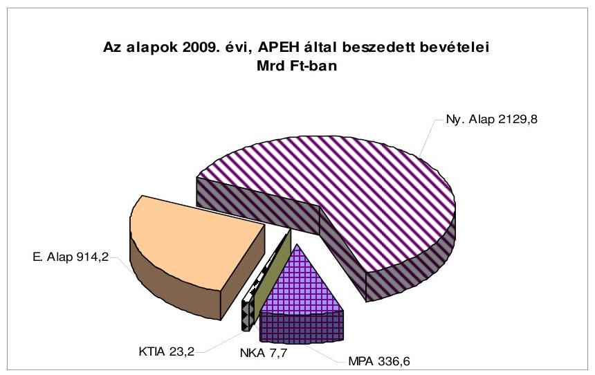

Az alapok APEH által beszedett bevételeiről kiadott ÁSZ „Vélemény" ${ }^{14}$-t az alapok felett rendelkező, a felügyeletét ellátó minisztériumoknak, alapkezelőknek határidőre megküldtük. A „Vélemény" az alapok beszámolóiban szereplő bevételi adatok megbízhatóságára irányuló pénzügyi szabályszerűségi ellenőrzés során szerzett tapasztalatok alapján rögzíti, hogy az APEH által beszedett bevételek adatai megbízható és valós képet mutatnak.

Az alapok könyvvizsgálói az ÁSZ módszertan alapján - egy kivétellel, két alapot érintően ${ }^{15}$ - együttmúködtek az ellenőrzés végrehajtása során és az alapok APEH által beszedett bevételeiről kiadott ÁSZ „Véleményt" az alapok beszámolói megbízhatóságának megítélésénél hasznosították.

A hatályos szabályozás belső ellentmondásokkal terhelt, mert a módosításkor átmeneti szabályokat nem állapítottak meg, és nem tisztázták a könyvvizsgálat és „a beszámoló ellenőrzése" fogalmak közötti különbséget, illetve a beszámolók ellenőrzésének folyamatában a szereplők (alapkezelő, könyvvizsgáló, felügyelő miniszter, kormány, ÁSZ) kapcsolatát és felelősségét az ellenőrzési feladat végrehajtásában. Az ellenőrzés tapasztalatai alapján kezdeményeztük a szabályozás felülvizsgálatát.

# 5.1. Az elkülönített állami pénzalapok 

Az államháztartás elkülönített állami pénzalapok alrendszerét a 2009. évben is hat alap: a Munkaerőpiaci Alap (MPA), a Szülőföld Alap (SZA), a Központi Nukleáris Pénzügyi Alap (KNPA), a Nemzeti Kulturális Alap

[^0]
[^0]:    ${ }^{14}$ A „Vélemény"-t az alapok APEH által beszedett bevételi adatainak megbízhatóságáról a Függelék tartalmazza.
    ${ }^{15}$ Két alapnak - a Szülőföld és a Kutatási és Technológiai Innovációs Alapnak - azonos a könyvvizsgálója, aki nem vette figyelembe a jogszabályváltozást.

---

(NKA), a Wesselényi Miklós Ár- és Belvízvédelmi Kártalanítási Alap (WMA), valamint a Kutatási és Technológiai Innovációs Alap (KTIA) alkotta. Az alapok az állami költségvetés 1-1 fejezetét képezték.

Az elkülönített állami pénzalapok 465,2 Mrd Ft bevétele az állami költségvetés bevételeinek 5,6\%-át, az alapok mintegy 496,5 Mrd Ft kiadása pedig a költségvetés kiadásainak 5,4\%-át képezték. Az alapok között - költségvetési bevételi és kiadási előirányzatai alapján - meghatározó az MPA, részesedése 2009ben az alapok összes bevételéből mintegy $80 \%$, összes kiadásából $86 \%$ volt. A többi elkülönített állami pénzalap bevételei a költségvetésben kis összeget képeznek, azonban a törvényben rögzített céljaiknak megfelelően sajátos, egyedi feladatokat látnak el.
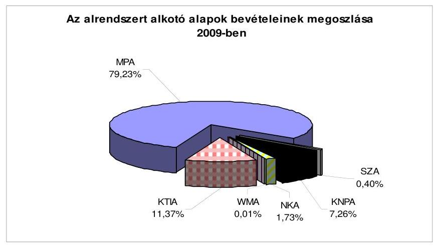

Az alapok 2009. évi összesített tárgyévi egyenlege, -31 363,0 M Ft-ra teljesült. A hiányt az alapok felhalmozott maradványa fedezte. Alrendszeri szinten a bevételek a vártnál kedvezőtlenebbül alakultak, a kiadások a tervezettet meghaladták. Az alrendszer befizetése a központi költségvetésbe 143,6 Mrd Ft volt, az alrendszer költségvetési támogatása 40,6 Mrd Ft-ot tett ki. A különbözet 103,0 Mrd Ft-ot jelentett a központi költségvetés javára.

Az MPA 2009. évi bevételeinek és kiadásainak különbözeteként 58 583,7 M Ft hiány keletkezett. Az MPA az előző években felhalmozott maradványát (70 350,7 M Ft) a tárgyévben részben felhasználta. A bevételek alul-, valamint a kiadások kisebb mértékű túlteljesülésének következtében az MPA 2009. évi GFS egyenlege negatív lett, pénzkészlete 12 086,0 M Ft-ra, a likviditási tartalék szintje alá csökkent.

Az Flt. 2006. január 1-től hatályos 39/D. §-a értelmében az MPA rendelkezésére álló pénzeszközök tárgyév végi záróállománya nem lehet kevesebb a likviditási tartaléknál, amely a tárgyévi kiadási főösszeg eredeti előirányzatának 25/365 része. A likviditási tartalék 2009. évre érvényes összege 28 718,38 M Ft volt.

Az MPA részére a Kvtv. 419 288,4 M Ft kiadási és bevételi előirányzatot hagyott jóvá. A Kvtv. 2009. évi módosítása ${ }^{16}$ a kiadási főösszeget - azon belül a költ-

[^0]
[^0]:    ${ }^{16}$ A Magyar Köztársaság 2009. évi költségvetéséről szóló 2008. évi CII. törvény módosításáról szóló 2009. évi CXVII. törvény.

---

ségvetési befizetés összegét 15000,0 M Ft-tal - 404 288,4 M Ft-ra csökkentette. Az MPA bevételi főösszegének teljesítése $368563,0 \mathrm{M} \mathrm{Ft}$, a költségvetési kiadásának összege 427 146,7 M Ft volt.

Az MPA 2009. évi bevételei az eredeti előirányzathoz viszonyítva 50 741,7 M Ft-tal alulteljesültek. A bevételek csökkenésében szerepet játszott a bruttó keresettömeg csökkenése és további bevételkiesést eredményeztek a járulékmérték változások: 2009. július 1-jétől a munkaadói járulék, valamint a vállalkozói járulék csökkent.

A teljesített bevételek 75,4\%-át a járulékbevételek, több mint 16\%-át a hozzájárulások képezték, további 6,6\%-a a TÁMOP intézkedés előfinanszírozásának megtérítéséből, és mintegy $2 \%$-a a bérgarancia törlesztésből, illetve egyéb bevételekből keletkezett.

A Kormány - a 2009. március 11-ei üléséről készített összefoglaló szerint - felhívta a MPA felett rendelkezésre jogosult minisztert, hogy a költségvetési hiánycél tartása érdekében az Alap 2009. évi költségvetése végrehajtása során 23,0 Mrd Ft-os egyenlegjavulást érjen el. A döntéseket az Alap felett rendelkező miniszter hozta meg, így - mivel az MPA esetében a 2009. évben nem került sor előirányzatok Kormány általi zárolására, csökkentésére, illetve törlésére - a Kormánynak nem kellett az Áht. 38/A. §-ban előírt tájékoztatási kötelezettségeinek eleget tennie.

A kiadások 22 858,3 M Ft-tal túlteljesültek. Az aktív támogatásoknál és a szakképzési és felnőttképzési célú kifizetéseknél az eredeti előirányzathoz viszonyítva kevesebb kifizetés történt, a passzív kifizetések és a bérgarancia kifizetések a gazdasági válság hatása miatt magasabb összegben teljesültek.

Az MPA kiadásainak belső arányai alakulását a következő ábra szemlélteti:
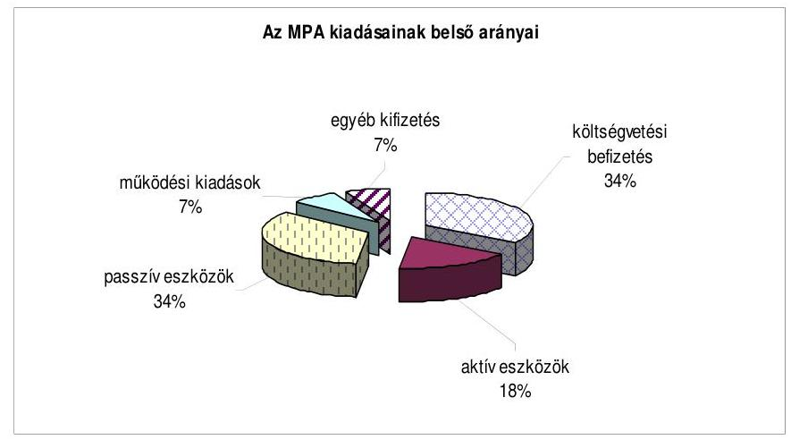

A kiadások belső arányai azt mutatják, hogy továbbra is nagyobb hányadot képeznek az MPA részére a Kvtv.-ben meghatározott pénzeszköz átadások. A növekedést a szociális ellátórendszer változásával összefüggő „Út a munkához" program forrásszükséglete igényelte. A Kvtv. előírja, hogy a befizetett összegek hasznosulásáról a törvényjavaslat keretében szakmai értékelést kell készíteni, de a beszámolás a program esetében csak formálisan történt

---

meg. A törvényjavaslat keretében az átadott pénzeszközökről egyik program esetében sem történt szakmai értékelés.

Az Alap céljainak megfelelő hosszabb távú, koncentrált felhasználási lehetőségeket 2009-ben háttérbe szorította az államháztartási hiánycél tartásának elsődlegessége.

A gazdasági válság kezelésére, az MPA központi alaprészéből finanszírozott munkahelymegtartást célzó támogatásoknál az Országos Foglalkoztatási Közalapítvány által bonyolított pályázatok esetében a pályázati programokhoz kapcsolódó személyi feltételek csak részben voltak biztosítottak. A támogatási szerződésekben a vizsgálat nagyobb szabálytalanságot nem állapított meg. A pénzügyi elszámolásokban észlelt kisebb pontatlanságot a helyszíni ellenőrzés ideje alatt javították. A feltárt kisebb szabályozásbeli problémákra az ellenőrzés javaslatot fogalmazott meg (lásd a Függelékben).

Az MPA-ra irányuló ellenőrzési tevékenység az előző évhez hasonlóan a 2009. évben sem felelt meg a törvényben meghatározottaknak. Az Alap vonatkozásában a miniszter ${ }^{17}$, illetve a minisztérium Ellenőrzési Osztálya a jogszabályokban előírt ellenőrzést nem végzett. A költségvetési szervek belső ellenőrzéséről szóló 193/2003. (XI. 26.) Korm. rendeletnek (Ber.) megfelelő, az MPA-ra vonatkozó független belső ellenőrzés múködtetése az SZMM feladata. Az MPA pénzeszközeinek felhasználását a Foglalkoztatási és Szociális Hivatal és a regionális munkaügyi központok ellenőrzési szervezeti egységei vizsgálták. A képzési alaprész tekintetében az NSZFI is végzett ellenőrzést. A 2008. évi zárszámadás során az MPA ellenőrzési rendszerének felülvizsgálatára tett javaslatunk most is időszerú.

Az Alap 2009. évről szóló éves beszámolóját a független könyvvizsgáló hitelesítő záradékkal látta el.

A Szülőföld Alap (SZA) részére a Kvtv. 1000,1 M Ft kiadási és bevételi előirányzatot hagyott jóvá. A bevételi előirányzaton önkéntes befizetések, adományok címen $0,1 \mathrm{M}$ Ft-ot, költségvetési támogatásként 1000,0 M Ft-ot terveztek, egyéb bevétellel nem számoltak. A bevételek előirányzata a beszámolási időszakban 3410,4 M Ft-ra módosult, melyet a nem tervezett, egyéb bevételek címen keletkezett bevételek eredményeztek. A költségvetés tervezésének gyakorlatát az ÁSZ kifogásolta, mert törvényben meghatározott bevételekkel az alapkezelő nem számolt az Alap költségvetése összeállításakor. Az egyéb bevételek az MPA-ból történt pénzeszköz átadásból, illetve az előző évi maradvány igénybevételéből adódtak. A bevételek teljesítése 1881,8 M Ft volt.

Az évközi előirányzat-módosítások következtében a kiadási előirányzat is módosult, a kiadások teljesítése 2763,5 M Ft volt, melyből 2376,3 M Ft-ot a támogatások finanszírozására fordítottak.

[^0]
[^0]:    ${ }^{17}$ A központi államigazgatási szervekről, valamint a Kormány tagjai és az államtitkárok jogállásáról szóló 2006. évi LVII. törvény nem teszi lehetővé a hatékonysági és a pénzügyi ellenőrzés hatáskör leadását.

---

Az Alapból nyújtott támogatások 100\%-át nyilvános pályázat keretében használták fel. A pályázathoz a jogszabályban előírt mellékleteket a korábbi évek gyakorlatával ellentétben nem előzetesen, hanem a szerződéskötéssel egyidejúleg kérték be. A pályázati felhívások - saját források megléte és annak mértéke kivételével - teljes körűen tartalmazták az alapról szóló törvényben meghatározott elemeket.

Az Alapot felügyelő miniszter és az SZA kezelője felelős az Alap ellenőrzési feladatai ellátásáért, ennek keretében a pénzügyi és teljesít-mény-ellenőrzések lebonyolításáért. Az alapkezelő ellenőrzési szervezeti egységgel nem rendelkezett. A belső ellenőrzési feladatokat vállalkozói szerződés alapján külső szervezet látta el, az ellenőrzések nem terjedtek ki a pályázati rendszer múködésének, a források felhasználásának vizsgálatára, teljesítmény-ellenőrzést nem végeztek. Az Alap 2009. évről szóló éves beszámolóját a független könyvvizsgáló hitelesítő záradékkal látta el.

A Központi Nukleáris Pénzügyi Alap (KNPA) 2009. évi bevétele 33 751,4 M Ft-ra teljesült, amely az eredeti előirányzatot ( 32 915,1 M Ft) 2,5\%kal haladta meg. Az Alap bevételei a Kvtv.-ben a Paksi Atomerőmú Zrt. részére előírt befizetésből, a hulladéktermelők eseti befizetéseiből, az Alap felhalmozott pénzeszközének értékállóságát biztosító költségvetési támogatásból, illetve egyéb bevételekből adódtak. Az Alap a 2009. év végén 149 379,4 M Ft felhalmozott pénzeszközzel zárt, amelyet a jövőbeni tevékenységek fedezetére képzett. Az Alap 2009. évről szóló éves beszámolóját a független könyvvizsgáló hitelesítő záradékkal látta el.

A Nemzeti Kulturális Alap (NKA) kiadási és bevételi előirányzatát a Kvtv. 8815,0 M Ft-ban határozta meg, amiből a kulturális járulékbevétel 8700,0 M Ft-ot, az egyéb (nem adójellegű) bevételek 115,0 M Ft-ot tettek ki. Az NKA bevételei 9841,2 M Ft-ra (a pénzforgalmi teljesítés 8041,2 M Ft-ra, az előző évi maradvány pénzforgalom nélküli bevételként való igénybevétele 1800,0 M Ft-ra), kiadásai 9668,4 M Ft-ra teljesültek. Az Alap a 2009. évi kiadásainak $8,7 \%$-át a múködési kiadásokra fordította. Az NKA 2008. évi halmozott előirányzat-maradványa 3946,8 M Ft volt, amiből az Áht. 55. § (1) bekezdése alapján miniszteri engedéllyel 1800,0 M Ft-ot a kulturális járulék bevétel kiesésének pótlására és az előző évekről áthúzódó kötelezettségvállalások teljesítésére használtak fel. A 2009. év végi maradvány 172,4 M Ft, a halmozott maradvány pedig 2319,1 M Ft lett. Az NKA 2009. évi beszámolóját a független könyvvizsgáló hitelesítő záradékkal látta el.

A Wesselényi Miklós Ár- és Belvízvédelmi Kártalanítási Alap (WMA) bevételi és kiadási előirányzatát a Kvtv. 23,4 M Ft-ban határozta meg, amelyből 6,0 M Ft-ot rendszeres befizetésként (a kártalanítási szerződések díjfizetései) és 17,4 M Ft-ot költségvetési támogatásként irányoztak elő. Az Alap létrehozásáról szóló törvény biztosítja az önkéntes, nem rendszeres befizetéseknek és adományoknak az elfogadását és bevételek közé sorolását, de a 2009. évben ilyen jogcímen befizetés nem volt. A kártalanítási szerződéssel rendelkezők rendszeres befizetéseinek összege $6,0 \mathrm{MFt}$ volt, az összes bevétel pedig 23,4 M Ft-ra teljesült. Az Alapra vonatkozóan a Kvtv. káreseménnyel összefüggő kiadási előirányzatot nem tartalmazott, az év közben felmerült káresemény miatt az alapkezelő - a múködési kiadások terhére - előirányzat-

---

átcsoportosítást végzett 1,5 M Ft összegben, így a kiadások előirányzata nem változott. Az előirányzatnak az előző évekhez viszonyított alacsonyabb felhasználása a WMA jövőjének bizonytalanságával, valamint a bér- és rezsiköltségek kifizetésének a Kincstár 2009. évi költségvetéséből történő átvállalásával függött össze.

Az Alapnak likviditási problémája nem volt. Az előző évek felhalmozódott maradványát ( $287,1 \mathrm{M}$ Ft) az év során fel nem használt előirányzatok maradványa 15,8 M Ft-tal tovább növelte, a maradvány az év végére 302,9 M Ftra emelkedett. Az Alap éves beszámolóját független könyvvizsgáló hitelesítő záradékkal látta el.

A Kutatási és Technológiai Innovációs Alap (KTIA) kiadásaira és bevételeire a Kvtv. eredeti és módosított előirányzatként 55 909,6 M Ft-ot határozott meg. Az Alap bevételei 52 927,9 M Ft-ra teljesültek, amelyből $28695,1 \mathrm{M}$ Ft a költségvetési támogatás, $23179,0 \mathrm{M}$ Ft az innovációs járulék bevétel volt. Az Alap kiadásai az év közben elrendelt 20,0 Mrd Ft-os egyenlegtartási kötelezettség részleges feloldása után 43035,8 M Ft-ra, az eredeti előirányzat 77\%-ára teljesültek. Ebből 37573,0 M Ft-ot a hazai innováció támogatására, 2515,9 M Ft-ot az alapkezelő feladatellátására, a fennmaradó 2946,9 M Ft-ot pedig a Kvtv.-ben előírt egyéb célokra fordítottak. Az Alapot a kutatásfejlesztésért felelős miniszter a Nemzeti Kutatási és Technológiai Hivatal (NKTH) közremúködésével múködtette. Az Alap beszámolóját a független könyvvizsgáló hitelesítette. A beszámoló vizsgálatakor a jogszabályi változásokra a könyvvizsgáló nem volt tekintettel, ezért - a 2009. évi zárszámadási tapasztalatok alapján - a könyvvizsgáló megbízását a 2010. évre nem támogattuk.

Az alapok felügyeletét ellátó minisztereknek, valamint az alapok kezelőinek a Magyar Köztársaság 2008. évi költségvetésének végrehajtásáról szóló jelentésben tett javaslataink többségében hasznosultak. A javaslatok hasznosulására vonatkozó megállapításokat részletesen a Jelentés II. Részletes megállapítások fejezete alaponként tartalmazza.

Az elkülönített állami pénzalapokra vonatkozó megállapítások részletes kifejtése a Jelentés első kötetének II. Részletes megállapítások, Az elkülönített állami pénzalapok c. részben, illetve a Függelék c. kötetben találhatóak.

# 5.2. A társadalombiztosítás pénzügyi alapjai 

Az államháztartás társadalombiztosítási alrendszerét a Nyugdíjbiztosítási Alap (Ny. Alap) és az Egészségbiztosítási Alap (E. Alap) alkotja. Az államháztartás társadalombiztosítási alrendszerének 2009. évi teljesített bevételi főösszege 4128,9 Mrd Ft, kiadási főösszege 4285,6 Mrd Ft, összevont hiánya 156,7 Mrd Ft volt. Az előirányzott 8,9 Mrd Ft-os értéket 147,8 Mrd Ft-tal meghaladó hiányt - a gazdasági válság miatt - a Kormány kiadáscsökkentő, a költségvetési hiánycél tartása érdekében hozott intézkedései nem tudták ellensúlyozni (az E. Alap vonatkozásában végrehajtott járulékmérték csökkentésből és a járulékfizetési hajlandóság, illetve képesség romlásából adódó bevételcsökkenést).

---

Az alapokhoz kormányrendelet ${ }^{18}$ alapján a miniszterelnök kincstárnokot jelölt ki. A kincstárnokok kinevezése az elkülönített állami pénzalapok esetében jogszerú volt, de az E. Alap és az Ny. Alap esetében a hatályos szabályozásnak nem felelt meg, mivel a vonatkozó rendelkezés a társadalombiztosítás pénzügyi alapjaira nem terjedt ki. A szabályozás időközben bekövetkezett változása ${ }^{19}$ már biztosítja az összhangot.

A társadalombiztosítás pénzügyi alapjainak költségvetési beszámolóját könyvvizsgálók hitelesítették, a hatályos szabályozás csak részben érvényesült. Az Áht. 86/A. §-ának eltérő értelmezése miatt az Ny. Alap könyvvizsgálója - az ÁSZ módszertanát is szem előtt tartva - a nemzetközi és magyar könyvvizsgálati standardokkal összhangban álló saját módszertan szerint végzett ellenőrzést. Az E. Alap könyvvizsgálója az ÁSZ módszertan alapján vizsgált, az alapok APEH által beszedett bevételeiről kiadott ÁSZ „Véleményt" az E. Alap bevételi adatai megbízhatóságának megítélésénél hasznosította.

A társadalombiztosítási alapok meghatározó bevételi forrásai a társadalombiztosítási járulékok és az egyéni biztosítotti járulékok. Ezek együttes mértéke bérarányosan $44,5 \%$ volt, amely az egészségbiztosítási járulék a 2009. július 1-jei csökkenését követően 41,5\% lett.

A munkáltató által fizetendő társadalombiztosítási járulék 29\%, a biztosítotti $15,5 \%$ volt, amely az egészségbiztosítási járuléknak a munkáltató által fizetendő része \%-os mértékének 2009. július 1-jei, a minimálbér kétszeresét meg nem haladó része után fizetendő járulék csökkenését követően, a munkáltatói járulékmérték 26\%-ra csökkent, az egyéni, biztosított által fizetendő \% nem változott.

A kedvezményes járulékmértékekkel történő foglalkoztatást lehetővé tevő START-kártya bevételek megosztási aránya is változott a két alap között, a járulékkiesést a jogszabály alapján az MPA téríti meg a társadalombiztosítás pénzügyi alapjainak.

Az átláthatóság követelményét - véleményünk szerint - továbbra sem elégíti ki. A kifogásolt gyakorlat szerint az Ny. Alapot és az E. Alapot megillető, meghatározott járulékbevételek - a korábban alkalmazott járulék-nemenkénti önálló számla helyett - összevont számlára érkeznek. Javaslatunkat a Kormány adóegyszerúsítési szándéka miatt töröltük ${ }^{20}$.

[^0]
[^0]:    ${ }^{18}$ Az Ámr. 152/A § (1) bekezdése, illetve a 169/2009. (VIII. 26.) Korm. rendelet szerint 2009. VIII. 27-én hatályba lépő 152/A-152/C §-ai alapján.
    ${ }^{19}$ Az Áht. 46/A. §-át módosító, az egyes gazdasági és pénzügyi tárgyú törvények megalkotásáról szóló 2010. évi XC. törvény 47. §-a szerint a kincstárnoki rendszert - jelentős feladat változás mellett - költségvetési (fő)felügyelői rendszer váltja fel, amely szabálymódosulás feloldja az ellenőrzés során kifogásolt összhang hiányát.
    ${ }^{20}$ A 2008. évi zárszámadási jelentésben szereplő indokok nem változtak, és az E. Alap 2010. január 1-től megváltozott, további összevonásokat tartalmazó befizetési rendje véleményünk szerint a vállalkozói adminisztrációt nem csökkentette.

---

Az Ny. Alap a 2009. évet 7221,3 M Ft hiánnyal zárta. Az Ny. Alapnak a megtett kiadáscsökkentő intézkedések mellett azért nem alakult ki egyensúlyi helyzete az év végére, mivel - a gazdasági válság miatt - a tervezetthez viszonyítva elmaradtak a járulékbevételek, és az Igazságügyi és Rendészeti Minisztérium nem teljesítette teljes egészében a Kvtv.-ben meghatározott pénzátadási kötelezettségét. (Az IRM elmaradás összege a teljes hiány közel 13\%-a volt.) Az Ny. Alap mérlegei jogszabályi előirás hiányában nem tartalmazzák a START kártyával és az EKHO-val összefüggő járuléktartozások és túlfizetések összegét, valamint a szolgáltató nem szerződésszerű teljesítése miatt az Elektronikus Kormányzati Gerinchálózat által nyújtott szolgáltatások igénybevételét biztosító eszközök értékét.

Az Ny. Alap napi likviditását, az ellátási kiadások teljesítésének zavartalanságát a Kvtv. rendelkezése alapján, a KESZ-ről igénybe vett kamatmentes hitel biztosította. Az Ny. Alapnak a vizsgált évben minden munkanapon hiteltartozása volt. A hitelfelvételek alapvetően az előírások szerint, havonta módosított ütemezésű terv szerint alakultak.

Az Ny. Alap 2009. évi bevételének törvényi előirányzata 2999,3 Mrd Ft, a teljesítés 2859,5 Mrd Ft volt. Az Ny. Alappal szembeni járuléktartozás - az APEH adatközlése szerint - a 2009. év végén 165,1 Mrd Ft volt, amelyből az évvégén 72,9\%-ot (120,4 Mrd Ft-ot) értékvesztésként számoltak el. A központi költségvetés hozzájárulása az 599,9 Mrd Ft-os előirányzatot megközelítően 599,1 Mrd Ft-ban teljesült.

Az Ny. Alap 2009. évi kiadási főösszege 2866,8 Mrd Ft, ami 132,5 Mrd Ft-tal a törvényi előirányzat alatt teljesült. Az ellátási kiadások törvényi előirányzata 2974,4 Mrd Ft volt, ami 2841,1 Mrd Ft-ra teljesült, amelyből a kiadások 99,8\%-át a nyugdíjkiadások tették ki.

Az Ny. Alapot terhelő nyugellátások kiadási előirányzata 2967,9 Mrd Ft volt, és 2834,4 Mrd Ft-ra teljesült. A 2008. évi nyugdíjkiadásoknál (2891,7 Mrd Ft) 2\%-kal, 57,2 Mrd Ft-tal alacsonyabb kifizetés történt, mert a Kormány javaslatára az Országgyűlés az Ny. Alapot illetően - összhatását tekintve 143,8 Mrd Ft-os - megszorító intézkedéseket tett. A költségvetésben tervezett, de az elmaradt intézkedésekkel csökkentett előirányzat 2875,3 Mrd Ft értéket mutat. ${ }^{21}$ A kiadások teljesítése így számítva 98,6\%-os, a 40,9 Mrd Ft megtakarítás mellett.

A nyugellátásokat a 2009. évben csak január 1-jei hatállyal emelték, minden 2009. év előtt nyugdíjba vonult személyre kiterjedően. Az államháztartás egyensúlyának javítása érdekében, a Kormány javaslatára az Országgyűlés előbb korlátozta, majd megszüntette a 13. havi nyugdíjat, és 2010. január 1jére halasztotta a nyugdíjkorrekciós intézkedés következő ütemét. A nyugdíj mellett munkát végzőkre vonatkozó nyugdíjnövelési szabály ${ }^{22}$ - korábbi években kifogásolt bonyolult, bürokratikus rendszere - nem változott, a

[^0]
[^0]:    ${ }^{21}$ 2967,9 Mrd Ft -9,3 Mrd Ft -83,4 Mrd Ft=2875,3 Mrd
    ${ }^{22}$ A társadalombiztosítási nyugellátásról szóló 1997. évi LXXXI. törvény (Tny.) 22/A. §.

---

változtatás szükségessége melletti érveinket a továbbiakban is fenntartjuk.

Az Ny. Alap múködési kiadásaira szũkülő pénzügyi keretek álltak rendelkezésre. A nyugdíjbiztosítási ágazat a folyamatos jogszabályi változásokból eredő, illetve az azokhoz kapcsolódó ügyviteli és számítástechnikai háttér biztosításához szükséges többletfeladatainak - változatlan engedélyezett létszámkerettel - folyamatos túlmunkával, erősen szervezett és kontrollált gazdálkodás mellett tudott megfelelni.

Az Ny. Alaphoz - 2009. augusztus 28 -ai hatállyal, a törvényi elöírással összhangban nem álló módon - kincstárnokot neveztek ki. A kincstárnoki rendszert bevezető kormányrendelet ${ }^{23}$ illetve az arra jogi alapot adó törvényi rendelkezés hatályba lépése ${ }^{24} 127$ nappal eltért, és a kincstárnok kinevezésre az Ny. Alapnál annak ellenére került sor, hogy a vonatkozó rendelkezés a társadalombiztosítás pénzügyi alapjaira nem terjedt ki. Mindez a szabályozással elérendő célok és a kapcsolódó folyamatok összhangjának a hiányára, illetve a nem kellően átgondolt jogalkotásra utal. A kincstárnok tevékenysége az Alapnál érdemi segítséget nem jelentett csak többlet adminisztrációt okozott.

Az Ny. Alap ellenőrzési rendszere a 2009. évben is megfelelően működött.
Az E. Alap bevételi és kiadási oldala között a 2009. évben nem volt egyensúly. A bevételi főösszeg 1269 366,2 M Ft-ra, a kiadási 1418 842,1 M Ftra teljesült. Az E. Alapban a költségvetésben jóváhagyott 8852,1 M Ft-os hiánnyal szemben közel tizenhétszer nagyobb, 149 475,9 M Ft deficit képződött.
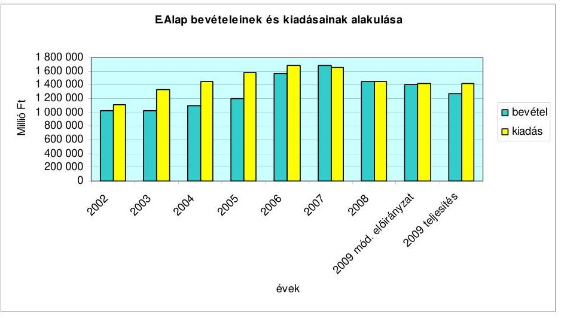

[^0]
[^0]:    ${ }^{23}$ Az Ámr.-t módosító 169/2009. (VIII. 26.) Korm. rendelet
    ${ }^{24}$ Az Ny. Alaphoz a kincstárnokot 2009. augusztus 28 -ai hatállyal nevezték ki. A kormányrendelet megalkotása nem az Áht. módosításával egyidejűleg történt. Az Áht.-t módosító 2009. évi CIX. törvény 2. § (26) és (62) bekezdései csak 2010. január 1-jével léptek hatályba.

---

Az egészségügyi ágazat tényleges hiánya valójában nagyobb az Alapban kimutatottnál, ugyanis az Alap deficites egyenlege miatt nem kellett megtérítenie ${ }^{25}$, ezért a kiadásai között nem jelent meg az egészségügyi ágazat részére a központi költségvetésből (MeH céltartalékából) kifizetett bérpolitikai intézkedések megtérítésének összege (10 342,8 M Ft).

A 2009. évben, az előző évhez viszonyítva kedvezőtlen költségvetési pozícióhoz hozzájárult bevételi oldalon a GYED kiadás megtérítésének a megszüntetése, valamint a kiadási oldalon egy új jogcím, a GYED-ben részesülők nyugdíjbiztosítási járulék megjelenése ${ }^{26}$.

A 2009. évi hiány tervezettől való jelentős eltérését a bevételi oldal alulteljesítése okozta. A bevétel elmaradás mértéke 9,9\% (139 347,8 M Ft). A járulék- és hozzájárulás bevételeknél a legnagyobb a tervezetthez képest az elmaradás, 146 317,4 M Ft (14\%). Az eltérés fő oka, hogy a munkáltatói járulék bevételi előirányzat a júliusi járulékmérték csökkenés ${ }^{27}$ hatását nem tartalmazta. A munkáltatói járulék bevétel teljesítése 104 898,9 M Ft-tal maradt el a tervezettől. A biztosítotti járulékmérték nem változott, de a teljesítés ezen az előirányzaton is kevesebb a tervezettnél, az elmaradása 39 710,8 M Ft volt. A 2008. évihez viszonyítva a bevételcsökkenés 5,2\%, amely közel azonos a bruttó keresettömeg csökkenéssel ${ }^{28}$.

A kiadási oldalt a bevételek elmaradása miatt tartani kellett, így az eredeti előirányzathoz viszonyítva csak 0,1\%-os (1276,0 M Ft) volt a kiadási többlet. A kiadási oldalon túllépés mutatkozott a pénzbeli ellátások, a gyógyászati segédeszköz támogatás és az EU tagállamokkal kapcsolatos elszámolások előirányzatain.

A gyógyító-megelőző ellátások kiadásainál megszorítást jelentett, hogy 13 050,0 M Ft-ot a múködési költségelőleg jogcímre csoportosítottak át, de azt a felhasználási szabályok miatt az OEP az ellátások finanszírozásához nem tudta igénybe venni, így az intézkedés forráskivonásnak (zárolásnak) felelt meg. A csökkentett előirányzatok betartása miatt szükségessé vált

[^0]
[^0]:    ${ }^{25}$ A Kvtv. 24. § (2) bekezdése szerint.
    ${ }^{26}$ A GYED megtérítés megszűnése 42 046,5 M Ft bevétel csökkenést, a GYED-ben részesülők nyugdíjbiztosítási járulék kiadása $21605,0 \mathrm{M}$ Ft többletkiadást okozott.
    ${ }^{27}$ A foglalkoztató és a biztosított egyéni vállalkozó által fizetendő egészségbiztosítási járulék mértéke 2009. július 1-jétől - a minimálbér kétszeresének megfelelő járulékalapig - 5\%-ról 2\%-ra csökkent.
    ${ }^{28}$ A 2009. évben 5\%-os a bruttó keresettömeg csökkenés (KSH adat). A bruttó kereset tömeg változás \%-a a KSH adatközlése szerint a teljes munkaidőben alkalmazásban állók a 4 fő fölötti vállalkozások és a központi és helyi költségvetés szervezeti, társadalombiztosítás és kijelölt non-profit szervezetek adatai alapján értendő.

---

az összevont szakellátásban az elszámolási szabályok megváltoztatása ${ }^{29}$, amelynek következtében az ellátások finanszírozottsága jelentősen csökkent. Az intézmények gazdálkodásában bekövetkezett nehézségek miatt a szakmai szervezetek és a minisztérium külön megállapodást kötött az aktív fekvőbeteg és a járóbeteg ellátás finanszírozása vonatkozásában pótlólagos forrás (2009. évben $4500,0 \mathrm{M} \mathrm{Ft}^{30}$ ) bevonásáról, és az elszámolási idő 3 hónapról 2 hónapra történő módosításáról ${ }^{31}$.

Az ártámogatással nyújtott szolgáltatások közül a gyógyszertámogatás kiadásai lényegében a tervezetten belül maradtak, az előző évek stagnálása után mérsékelt, 5,4\%-os emelkedés volt megfigyelhető. A gyógyászati segédeszközök előirányzatát - annak alultervezettsége miatt - 7329,9 M Ft-tal megemelték. A gyógyászati segédeszközök támogatásának előirányzata évek óta a finanszírozási lehetőségekhez igazított, ezért nem szakmai, hanem költségvetési szempontok alapján szigorító-enyhítő rendelkezések váltogatásával tartják az előirányzatot. A 2009. évben az alapkezelő egy szakmailag megalapozott, rendszerszintű átalakítást készített elő, melynek hatására az utolsó negyedévben csökkent a támogatáskiáramlás és így a módosított előirányzatnál 3427,6 M Ft-tal kevesebb lett a kiadás.

Az E. Alap 2009. évi hitelállományának éven belüli alakulását folyamatos és egyre nagyobb mértékű növekedés jellemezte. Az első három hónap második fele, valamint április hónapban 6 nap volt hitelmentes. Májustól minden nap hitelfelvétel történt.

A 2009. évi folyamatok kapcsán még sürgetőbbé vált a bevételek és kiadások összhangjának a megteremtése. A 2010. évi költségvetési tervezet kapcsán megfogalmaztuk, hogy „a bevételek és a kiadások összhangját célzó intézkedések egyik eszköze az, hogy az Áht. 86. § (9) bekezdése alapján a Kormánynak egyensúlyt helyreállító javaslatokat kell az Országgyúlés elé terjeszteni, ha az Alap bevételei tartósan nem fedezik a várható kiadásokat". Javaslattétel a 2009. évben sem történt. A jogszabályi kötelezettséget 2010. január 1-jétől a 2010. évi költségvetést megalapozó egyes törvények módosításáról szóló 2009. évi CIX. tv. 51. § (1) bekezdés d) pontja alapján az Országgyúlés hatályon kívül helyezte.

[^0]
[^0]:    ${ }^{29}$ Az egészségügyi szolgáltatások E. Alapból történő finanszírozásáról szóló 43/1999. (III. 3.) Korm. rendelet módosításáról szóló 58/2009. (III. 18.) Korm. rendelettel hatályát vesztette a 2009. évre megállapított teljesítményvolumen korlátos finanszírozás és bevezették az előre meghatározott alapdíjjal finanszírozott teljesítmény (EMAFT), és az ezen felüli teljesítmények kétféle elszámolásának kombinált módszerét. Az új finanszírozási rendszerben ugyan minden teljesítményt elszámoltak (nemcsak az előre meghatározott teljesítményvolumen), de nem minden teljesítményt finanszíroztak teljes értéken.
    ${ }^{30}$ Az egészségügyi szolgáltatások E. Alapból történő finanszírozásáról szóló 43/1999. (III. 3.) Korm. rendelet módosításáról szóló 232/2009. (X. 16.) Korm. rendelet alapján.
    ${ }^{31}$ Az egészségügyi szolgáltatások E. Alapból történő finanszírozásáról szóló 43/1999. (III. 3.) Korm. rendelet módosításáról szóló 291/2009. (XII. 18.) Korm. rendelet 8. § szerint.

---

Az elkülönített állami pénzalapoknak és a társadalombiztosítás pénzügyi alapjainak minősítéseit a 4. sz. melléklet tartalmazza. A társadalombiztosítás pénzügyi alapjaira vonatkozó megállapítások részletes kifejtése a Jelentés első kötetének II. Részletes megállapítások, A társadalombiztosítás pénzügyi alapjai c. pontjában, illetve a Függelék c. kötetben találhatóak.

# 6. A fejezetek gazdálkodÁsÁt, az Európai UniÓs TÁmOGATÁsOK FELHASZNÁLÁSÁT ÉRINTŐ TÖBB ÉVE FENNÁLLÓ HIÁNYOSSÁGOK (RENDSZERHIBÁK) 

A fejezetek gazdálkodását érintően a pénzügyi (szabályszerúségi) ellenőrzés során kiemelt figyelmet fordítunk azokra a témákra, amelyek már az előző évi zárszámadás során is felmerültek és szinte minden ellenőrzött szervezeti egységet érintenek.

A Vtv. hatályba lépése óta már a harmadik alkalommal került sor a költségvetés végrehajtásának pénzügyi (szabályszerúségi) ellenőrzésére, melynek során minden évben megállapítottunk a Vtv. hatálybalépéséhez köthető problémákat (társasági részesedések átadása, vagyonkezelői szerződések megkötése, eszközök térítésmentes átadása). A megállapításainkat az ÁSZ jelentésekben megfogalmaztuk és jeleztük a tényt, hogy az intézmények gazdálkodásától független, külső tényezők játszottak közre a problémák kialakulásában.

A Vtv. 59. § (5) bekezdése alapján előírt a központi költségvetési szervekkel kötött hatályos vagyonkezelési szerződések felülvizsgálata és a törvény előírásainak megfelelő módosítása a 2009. évben sem történt meg. Az MNV Zrt. által a költségvetési szerveknek megküldött vagyonkezelési, illetve bérleti szerződés tervezetek többsége nem került aláírásra.

A 2008. évben az ingyenes vagyonátadást az államháztartáson belül a jogszabályi előírások nem tették lehetővé. A jogszabályi előírások 2009. január 1-jével már lehetővé tették a vagyonkezelői jog átadását, azonban az áfa fizetési kötelezettség fennállásával kapcsolatosan jogbizonytalanság keletkezett, mivel már nem volt hatályban a költségvetési szervekre vonatkozó adó- és illetékmentességet rögzítő törvényi előírás (Áht. 109/F. § (4) bekezdés). A KSZF főigazgatója a helyzet rendezése érdekében a PM-től kért állásfoglalást. A PM 2009. november 30-ai keltezésű állásfoglalása szerint a vagyonkezelői jogok átadása kapcsán - az adóalanyiság hiánya miatt - nem állt fenn az adófizetési kötelezettség.

Az ÁSZ által vizsgált központi költségvetési szervezetek körében 2009. december 31-éig mindössze két szerződést kötöttek meg (HM, KSH fejezetek), a helyszíni ellenőrzés időszakában, két esetben (MEH intézmény, ÖM fejezet) történt előrelépés a vagyonkezelési szerződések vonatkozásában.

A korábbi években megvalósított szervezeti átalakulásokkal - a KSZF feladatátvételével - kapcsolatos eszköz átadások teljes körü végrehajtásának elmaradása miatt a korábban keletkezett számviteli rendezetlenség a 2009. évben továbbra is fennállt.

---

A KSZF-fel kötött vagyonkezelési szerződésekben, szolgáltatási megállapodásokban szereplő, azonban még át nem adott vagyonelemeket az érintett tárcák döntően mérlegükben, saját eszközként szerepeltették (ÖM, FVM, IRM, NFGM, KvVM, KüM, OKM, SZMM), a PM a „0" számlaosztályban tartotta nyilván azokat.

A számviteli nyilvántartások szerint a 2009. évben a KSZF - a Vtv. hatálybalépése előtt realizált, de akkor teljes körűen nem rendezett vagyonkezelői jog átadásához kapcsolódóan - az ÖM-től és a PM-től vett át ingatlant.

Az integrált központi szolgáltatás kialakítása érdekében hozott korábbi kormányrendelet, illetve kormányhatározatok végrehajtásával elindult folyamatot - amelyet a feladatellátás rendszerének (a kormányzati negyed kialakításának elmaradása) módosulása is befolyásolt - a Vtv. előírásai, illetve a vonatkozó egyéb jogszabályokkal (Áht., áfa törvény) való összhang hiánya (az áfamentesség hatályon kívül helyezése és az ezzel összefüggő forráshiány) jelentős mértékben akadályozta. A jogszabályi előírások változását, illetve a megfelelő jogértelmezés elkészülését követően már - a jelentés lezárásának időpontjáig nem maradt idő az elmaradt vagyonátadások lebonyolítására. A vagyoni helyzet szabályszerű kimutatásához továbbra is szükséges a jogszabályok közötti összhang megteremtése.

A KSZF a 2009. évben is végrehajtotta a jogszabályi előírásokban és a fejezetekkel kötött megállapodásokban rögzített feladatait, azonban az ellátott szervezetek továbbra is jeleztek a folyamatos ellátáshoz, az adatszolgáltatások elégtelenségéhez, a beszerzések, felújítások elmaradásához kapcsolódó problémákat. A felmerülő problémák egy részét, amely az átadott előirányzatokat meghaladó igények felmerüléséből adódott, további előirányzat-átadásokkal (összesen 202,2 M Ft) kezeltek.

A KSZF és az ellátott intézmények között a feladat zökkenőmentes ellátása érdekében a folyamatos egyeztetést, a KSZF által a 2008. évben előkészített normatívákra vonatkozó - jogszabálytervezet felülvizsgálatát, majd annak elfogadását szükségesnek tartjuk.

Az ÁSZ ellenőrzése során évek óta foglalkozik a Központosított Illetményszámfejtő Rendszerrel, amely bevezetésének célja a Kormány hatálya alá tartozó szervezetek egységes munkaügyi, ügyviteli eljárási és információs rendszerének megteremtése volt. A rendszer hiányosságaira már a korábbi évek ellenőrzéseiben is felhívtuk a figyelmet, azonban azok egy része a 2009. évben továbbra is fennállt, illetve újabb problémák keletkeztek.

Az intézményektől az illetmény számfejtési feladatokat - megállapodás alapján - a Kincstár Regionális Igazgatóságai vették át, azonban a megállapodásban rögzített feladatokat és határidőket a Kincstár jelentős késéssel teljesítette. A KIR múködése a feladatok Kincstárnak történő átadását követően sem volt zökkenőmentes. Programhibák és az adatszolgáltatástól eltérő számfejtések egyaránt előfordultak.

Az intézmények havi adóbevallásai általában nem egyeztek meg a Kincstár által készített könyvelési értesítővel, ezért a könyvelés és a nettó finanszírozás adatai között eltérés mutatkozott, a jogviszony megszűnését követően kb. 1 hét és másfél hónap közötti időszak alatt készültek el az igazolások, az adatokhoz, egyes funk-

---

ciókhoz a szervezetek hozzáférése korlátozott, nincs módjuk lekérdezésekre, adatkinyerésekre, amely a munkáltatói adatszolgáltatást nehezítette.

A tárcák szabályozási tevékenységének több éve megállapított hiányossága, hogy az ellenőrzött időszakra vonatkozó működési és gazdálkodási szabályozások későn, a tárgyévre vonatkozóan visszamenőleges hatállyal készülnek el, vagy az aktualizálásuk (jogszabály-, illetve szervezeti változások miatt) elmarad, s mindez hátrányosan befolyásolja a szabályszerű gazdálkodást.

A gazdálkodással kapcsolatosan feltárt évente ismétlődő, illetve rendszerhibák sokrétűek, de önmagukban a beszámoló megbízhatóságát nem, vagy csak alkalmanként befolyásolják.

Megbízási-, illetve számlás szellemi tevékenység végzésére történik szerződéskötés olyan feladat ellátására, amelyet a hatályos Ktv. szerint csak közszolgálati jogviszonyban lehet ellátni. Gyakori, hogy a szerződésekben a feladat-meghatározása általános, a feladat elvégzése nem dokumentálható, így nem ellenőrizhető. A külföldi kiküldetéseknél az előlegek elszámolása gyakran késedelmesen történik meg, de az abból eredő jogszabályi kötelezettségnek (adó- és járulékfizetés) sem tesznek eleget. A fejezeti kezelésű előirányzatoknál az ellenőrzés céltól eltérő felhasználást állapított meg. A kötelezettségvállalással terhelt előirányzatmaradványok dokumentálása esetenként hiányos illetve nem megfelelő volt.

A költségvetési beszámoló mérlegének leggyakoribb, és évek óta visszatérő problémája, az egyes mérlegsorok leltári alátámasztásának teljes vagy részbeni hiánya, továbbá egyes mérlegtételek a hatályos jogszabályoknak, belső szabályozásoknak nem megfelelő értékelése.

Az aktív és passzív pénzügyi elszámolások között kimutattak oda nem tartozó, illetve több éves rendezetlen tételeket is.

A beszámoló Kiegészítő mellékletének hiányossága, hogy abban nem tüntetik fel a jogszabályok által meghatározott, a beszámoló értékelése szempontjából fontos adatokat, tényeket.

Az intézmények, fejezeti kezelésű előirányzatok beszámolóinak pénzügyi (szabályszerúségi) ellenőrzése során minden évben, így a 2009. évi zárszámadás ellenőrzésének keretében a költségvetési beszámolók megbízhatóságát befolyásoló kockázatok mérséklése szempontjából értékeltük a belső kontrollrendszerek kiépítettségét és múködését.

A beszámolók megbízhatóságát befolyásoló hibák, szabálytalanságok előfordulása az intézmények körében a belső kontrollrendszer nem megfelelő kiépítettségével, a FEUVE hiányosságaival, a pénzügyi jogkörök gyakorlását támogató kontrollok nem kielégítő működésével függtek össze. A fejezeti kezelésű előirányzatok tekintetében a beszámoló megbízhatóságát befolyásoló hibák, szabálytalanságok a számviteli rendszer nem megfelelő informatikai támogatottsága, a pénzügyi jogkörök gyakorlásához kapcsolódó kontrollok hiányos múködése miatt keletkeztek. Mindezek szerepet játszottak abban, hogy az intézmények közel 20\%-ánál, míg a fejezeti kezelésű előirányzatok 50\%ánál a feltárt hibák miatt a beszámolót minősített záradékkal láttuk el.

---

A belső ellenőrzés működése során nem járult hozzá kellően a belső kontrollrendszer javításához, így nem támogatta eredményesen a kockázatok csökkentését.

A belső kontrollrendszerek összehangolt kiépítésének, következetes és folyamatos működésének - az ellenőrzésünk során feltárt - hiányossága miatt nem szolgáltak hatékony eszközként az elemi beszámolók megbízhatóságát befolyásoló kockázatok mérsékléséhez, a hibák, szabálytalanságok előfordulásának kiküszöböléséhez.

Az EU források zárszámadási ellenőrzése során az ÁSZ évek óta hiába kifogásolja azt a rendszerhibát, hogy a kötelezettségvállalás analitikus nyilvántartása globálisan történik, s abból az évenkénti kötelezettségvállalás mértéke nem állapítható meg. Ez nem felel meg az Ámr. 134. § (13) bekezdésében foglalt előírásoknak. Visszatérő megállapításunk továbbá, hogy az ÜMFT operatív programjairól és az INTERREG-ről készített beszámolók esetében az Ámr. 135-138. §aiban fogalmazottakkal összhangban nem álló módon jártak el, mivel a lebonyolítási számláról történő utalásról utalványlapot nem készítettek.

Az uniós forrásfelhasználást érintő - az elmúlt évben is kifogásolt - szabályozási hiányosság, hogy azoknál a fejlesztéseknél, ahol a beruházást először a hazai költségvetésből finanszírozták, majd ezt később EU-támogatással váltják fel nincs olyan egyértelmú, minden érintettre kiterjedő, általánosan alkalmazandó előírás, amely megfelel a kötelezettségvállalások hazai költségvetési szabályozásának, és egyúttal lehetővé teszi az EU-s támogatások és költségvetési előirányzatok felhasználásának átláthatóságát, figyelembe véve a pénzforgalmi és a nem pénzforgalmi tételeket is.

Rendszerhibaként tártuk fel, hogy nem állt rendelkezésre a zárás utáni főkönyvi kivonat. Ennek hiányában a mérlegvalódiság elvének érvényre jutásáról nem tudtunk meggyőződni, a „Tartalékok" állományi adatát a zárás előtti főkönyvi kivonat adatai alapján ellenőriztük.

Rendszerhibaként értékeltük azt is, hogy az NFÜ 2009-ben is elvégezte (illetve a közremúködő szervezetekkel elvégeztette) az adósságállomány egyeztetését, azonban a korábbi évektől eltérően nem az Értékelési Szabályzat szerinti 2009. december 31-ei fordulónappal, hanem 2009. október 30-ai állapotra vonatkozóan. Ezáltal a beszámolókban nem az adósok által visszaigazolt követelésállomány szerepel. Az október 30-ai egyeztetett állomány változtatását az analitika alapján vették figyelembe.

Szinte minden operatív programnál előforduló hiba, hogy a könyvelésben már 2008. óta nyilvántartott kötelezettségeket 2009-ben a közremúködő szervezetek az irányító hatóságok felé ugyan rendezték (az előleg felhasználásával elszámoltak), azonban a beszámoló készítéséig - a programok szintjén - ez nem került rendezésre. A mérlegek tehát tartalmaztak olyan kihelyezett előlegeket, amelyek elszámolására 2009. évben már sor került, azonban az érintett összegek követelések közül történő kivezetése a beszámoló készítéséig nem történt meg.

---

# 7. A HELYI ÖNKORMÁNYZATOK KÖLTSÉGVETÉSI KAPCSOLATAI 

A helyi önkormányzatokat, a helyi kisebbségi önkormányzatokat és a többcélú kistérségi társulásokat megillető támogatások és hozzájárulások ${ }^{32}$ előirányzatait a Kvtv. 1. számú mellékletében a IX. Helyi önkormányzatok támogatásai és átengedett személyi jövedelemadója fejezet tartalmazta. Ennek alapján az önkormányzatokat a 2009. évben 1290,0 Mrd Ft illette meg, ami 58,7 Mrd Ft-tal volt kevesebb a 2008. évinél.

Az előirányzat-módosítások - Kormány és fejezeti hatáskörben - az Áht.ban és a Kvtv.-ben meghatározott szabályoknak megfelelően történtek. Év végére az előirányzat 1311,1 Mrd Ft-ra változott. A helyi önkormányzatok támogatásai és átengedett személyi jövedelemadójának módosított előirányzata 1,6\%-kal (21,1 Mrd Ft-tal) haladta meg az eredeti előirányzatot. Az előirányzat 1308,5 Mrd Ft-ra teljesült, ami az eredeti előirányzatnál 1,4\%-kal magasabb, a módosított előirányzatnál 0,2\%-kal alacsonyabb.

A Kormány a 2009. évben az 1212/2009. (XII. 15.) és az 1222/2009. (XII. 29.) határozatával három új költségvetési címet hozott létre, összesen 62,0 M Ft öszszegben. A határozat mindhárom esetben felhatalmazta az önkormányzati minisztert a támogatás soron kívüli folyósítására. Rögzítette továbbá a szerződéskötési kötelezettséget és az utólag (2011. december 31-éig) történő elszámolás lehetőségét. Nem tartalmazta azonban egyik esetben sem a támogatási szerződés megkötésének határidejét. A szerződések aláírására a 2010. évben került sor (két esetben február 15-én, egy esetben április 13-án), holott a támogatást már a 2009. évben folyósították.

Az ÁSZ már a 2008. évi zárszámadás ellenőrzéséről szóló jelentésében jelezte (bár akkor jelentősebb, 17,1 Mrd Ft összeg esetében), hogy szabálytalannak tartja az ÖM eljárását, mely szerint úgy biztosít támogatást az év utolsó napjaiban, hogy a pénzügyi folyósítást megelőzően a támogatásokra szerződést nem kötött.

Az Országgyűlés felhasználási kötöttséggel járó állami támogatást állapított meg központosított előirányzatként a Kvtv. 5. számú mellékletben felsorolt, a helyi önkormányzatok, települési és területi kisebbségi önkormányzatok és a többcélú kistérségi társulások által ellátandó feladatokra. A 2009. év során a központosított előirányzatok száma kettővel bővült. A Kvtv. alapján a központosított előirányzatok cím 30 jogcímének összesített eredeti előirányzata 142,3 Mrd Ft, a módosított előirányzata 159,6 Mrd Ft volt, amelynek felhasználása 137,4 Mrd Ft-ra teljesült. A teljesülés az eredeti előirányzatnál 3,4\%-kal, a módosított előirányzatnál 13,9\%-kal alacsonyabb.

Az eredeti előirányzat 17,3 Mrd Ft összegű növekedése döntően a Helyi szervezési intézkedésekhez kapcsolódó többletkiadások támogatása jogcím előirány-

[^0]
[^0]:    ${ }^{32}$ A helyi önkormányzatra vonatkozó megállapítások részletes kifejtése a jelentés első kötetének II. Részletes megállapítások fejezet Az államháztartás helyi szintje, a helyi önkormányzatok c. pontjában, illetve a második, Függelék c. kötetben található.

---

zatának 4,1 Mrd Ft, illetve a Bérpolitikai intézkedések támogatása jogcím előirányzatának 10,8 Mrd Ft összegű emelésével függött össze.

A Kvtv. 5. számú melléklete kijelölte az igénybevétel feltételének, döntési rendjének, folyósításának, felhasználásának és elszámolásának részletes szabályairól szóló rendelet kiadásáért felelős minisztert. A központosított előirányzatok vonatkozásában a Kvtv. 26 rendelet megalkotását írta elő. A rendeletalkotásra vonatkozó határidőt, amelyet a Kvtv. tartalmazott, 24 esetben nem tartották be az ágazati miniszterek (pl. helyi közösségi közlekedés normatív támogatása - közlekedési, hírközlési és energiaügyi miniszter és önkormányzati miniszter; Új Tudás- Műveltség Program keretében a pedagógusok anyagi ösztönzését szolgáló támogatások - oktatási és kulturális miniszter; lakossági víz- és csatorna szolgáltatás támogatása - környezetvédelmi és vízügyi miniszter).

# A Budapest 4-es - Budapest Kelenföldi pályaudvar-Bosnyák tér közötti - metróvonal ${ }^{33}$ építésének 2009. évi 9500,0 M Ft-os támogatási előirányzata ${ }^{34} 13890,1 \mathrm{M}$ Ft összegben teljesült, ami 46,2\%-kal magasabb a tervezettnél. Az előirányzat túlteljesítésének oka az Európai Bizottság döntése, amely szerint az I. szakasszal összefüggő 11 szerződés finanszírozását nem biztosítja uniós forrásból, így a kieső támogatás államra jutó részét ezen címből kellett biztosítani. 

Az ÖM-nek az utalvány elkészítésekor szakmai vagy pénzügyi szempontból a 2009. évben sem volt ellenőrzési lehetősége. A helyzetből adódóan az ÖM nem tett eleget a Kvtv. 51. § (5) bekezdésében meghatározott ellenőrzési kötelezettségének. Az ÖM a 2009. évben sem érvényesíthette utalványozási felelősségét, mivel - a korábbi évekkel egyezően - a finanszírozási folyamatra sem rálátása, sem befolyása nem volt. Az ÁSZ ezt a hiányosságot a 2006., a 2007. és a 2008. évi zárszámadás ellenőrzése során is jelezte.

A 2009. évben a Kincstár negyedévente küldött tájékoztatást az ÖM felé az adott időszakban teljesített kifizetésekről. Mivel a tájékoztatás nem állt az ÖM rendelkezésére minden olyan napon, amikor pénzforgalmi tranzakció történt, az utalványok és a kifizetések naprakész egyeztetésére nem volt lehetőség.

A számvevőszéki ellenőrzés szerint a Budapest 4-es metróvonal beruházása előirányzatának kezelését és a teljesítés ellenőrzését azon fejezet kötelezettségei között kell megjeleníteni, amely a beruházás szakmai megvalósításáért felelős. Az ÁSZ ezt a 2006., a 2007. és a 2008. évi zárszámadás ellenőrzése során is jelezte. A változásra a metrótörvény módosításával van lehetőség.

A 2005. évi LXVII. törvény 2. § (2) bekezdése értelmében a kontrollpozíció gyakorlását segítő szakértői szolgáltatás igénybevételére az Âllam az állami támogatásból évente legfeljebb 50,0 M Ft összeget használhat fel. Ebből a keretből -

[^0]
[^0]:    ${ }^{33}$ A beruházás vizsgálatával A 4-es metró beruházási folyamatának ellenőrzéséről szóló ÁSZ jelentés foglalkozik, amelynek tervezett közzététele 2010 októbere.
    ${ }^{34}$ A jelentésen belül Az államháztartás helyi szintje, a helyi önkormányzatok címú fejezet 3.2.10. pontja tartalmazza részletesen a megállapításokat.

---

a korábbi évekhez hasonlóan - a 2009. évben sem történt felhasználás. Az ÁSZ helyszíni ellenőrzésének befejezéséig az „Állami Szakértő" megbízására irányuló pályázatot nem írták ki.

A budapesti 4-es - Budapest Kelenföldi pályaudvar-Bosnyák tér közötti - metróvonal megépítésének állami támogatásáról szóló 1059/2005. (VI. 4.) Korm. határozat 9. pontjában a Kormány megbízta a KEHI elnökét, hogy a beruházás megvalósítását ellenőrizze, és évente egy alkalommal tegyen jelentést a Kormány részére. A 10. pontban felhívta a pénzügyminisztert, valamint a gazdasági és közlekedési minisztert, hogy félévente adjanak tájékoztatást a Kormány részére a budapesti 4-es metró-projekt előrehaladásáról. A 2009. évben valamennyi érin-tett szerv - a gazdasági és közlekedési miniszter kivételével - a jogszabályi elő-írásoknak megfelelően eleget tett jelentési, illetve tájékoztatási megbízásának.

A Gazdasági és Közlekedési Minisztérium feladatai 2008. május 15-étől a két jogutódhoz, a Közlekedési, Hírközlési és Energiaügyi, illetve a Nemzeti Fejlesztési és Gazdasági Minisztériumhoz kerültek. A számvevőszéki ellenőrzés szerint ezt már a 2008. évi zárszámadáskor is jeleztük - szükséges a 1059/2005. (VI. 4.) Korm. határozat 10. pontjának pontosítása, mivel az írja elő, hogy mely jogutód minisztérium felelős a metró beruházással kapcsolatos jelentéstételi kötelezettségért.

A beruházásra fordítandó összeg nagysága - a 2009. évi és az előző évi zárszámadások számvevőszéki ellenőrzésekor tapasztaltnál - fokozottabb ellenőrzési tevékenységet indokol a Magyar Állam képviseletével megbízott PM részéről. Az erőteljesebb szakmai ellenőrzésnek - a Kormány tájékoztatásán túlmenően - a megvalósítás folyamatának közvetlen vizsgálatát is magában kell foglalnia.

Budapest Főváros Önkormányzata és a BKV Zrt. között létrejött - a budapesti 4es metróvonal Budapest Kelenföldi pályaudvar és Budapest Keleti pályaudvar közötti szakasza beruházói feladatainak ellátására 2004. január 19-én megkötött és 2005. augusztus 17-én módosított - szerződés értelmében a BKV köteles a beruházás során hozott beruházói döntések és a beruházás megvalósítása ellenőrzésére „Független Ellenőrző Mérnököt" megbízni. Budapest Főváros Önkormányzata és az Európai Beruházási Bank között 2005. július 18-án létrejött pénzügyi szerződés 6.09 pontja is előírja „egy független és nemzetközi gyakorlattal rendelkező mérnök" alkalmazását. A „Független Ellenőrző Mérnök" a BKV által, a Főváros egyetértésével meghatározott feltételek szerint végezné feladatát, azonban a számvevőszéki ellenőrzés lezárásáig - a korábbi évekhez hasonlóan - továbbra sem alkalmazták a mérnököt.

---

# JAVASLATOK 

A helyszíni ellenőrzés megállapításainak hasznosítása mellett javasoljuk:

## a Kormánynak

1. Fordítson figyelmet arra, hogy a központi költségvetés általános tartalékából csak az Áht. 25. § (1) bekezdésében előírt feltételek megléte esetén kerüljön előirányzat átcsoportosításra a fejezetekhez.
2. Kezdeményezze az Áht. 26. § (4) bekezdésében foglaltak módosítását, hogy
a) valamennyi, az általános tartalékból nyújtott támogatás átcsoportosítására vonatkozó kormányhatározatban határidőhöz kötött elszámolási és - az igényelt célra fel nem használt része tekintetében, illetve nem az igényelt célra történő felhasználás esetén - egyidejű visszatérítési kötelezettség kerüljön meghatározásra;
b) meghatározásra kerüljön az elszámolási és a fel nem használt rész tekintetében visszatérítési kötelezettséggel átcsoportosított általános tartalék előirányzat felhasználása elszámolásának, az esetleges visszatérítési kötelezettség teljesítésének figyelemmel kíséréséért felelős(ök) személye.
3. Kezdeményezze, hogy az Áht. írja elő: a központi költségvetést érintő új tartalékfajta bevezetésére vonatkozó szabályozást az adott évi költségvetési törvény teljes körűen (cél, forrás, felhasználás módja és lehetősége) tartalmazza.
4. Intézkedjen az Ámr. 57. §-ában foglaltak módosítására, hogy az általános tartalékból történő előirányzat-átcsoportosításhoz készített előterjesztésnek képezze mellékletét a támogatást igénylő szervezet részéről kötelezően kitöltendő adatlap (formanyomtatvány), amely tartalmaz valamennyi adatszolgáltatási kötelezettséget, amelyet a jogszabályok előírnak, a kitöltési útmutatóval együtt.
5. Tekintse át az állami vagyonra vonatkozó szabályozást abból a szempontból, hogy az állami vagyon a központi költségvetési szervek nyilvántartásaiban és költségvetési beszámolóiban egységes szempontok szerint, a valóságnak megfelelően kimutatható legyen, és gondoskodjon a jogi szabályozás ehhez szükséges összehangolásáról.
6. Követelje meg az államháztartás működési rendjéről szóló hatályos jogszabály költségvetési szerv alapítására vonatkozó előírásainak maradéktalan betartatását annak érdekében, hogy minden újonnan alapított költségvetési szerv működésének és üzemeltetésének indítása előírásszerűen történhessen.
7. Kezdeményezze - a hatályos törvényi szabályozás belső összhangjának megteremtése érdekében - az elkülönített állami pénzalapok és a társadalombiztosítás pénzügyi alapjainak könyvvizsgálatára, a beszámolók ellenőrzésére vonatkozó törvényi előírások felülvizsgálatát.
8. A következetes és egységes szabályozás kialakítása céljából vizsgálja felül az elkülönített állami pénzalapok és az APEH számlái között a Kincstár által lebonyolított for-

---

galmak jogszabályi hátterét, azon belül az alapok bevételei negatív egyenlegeinek rendezését.
9. Intézkedjen annak érdekében, hogy az Áht. 38/A. §-ban a Kormány részére meghatározott kötelezettségek alól a Munkaerőpiaci Alap felett rendelkező miniszterre történő döntésátruházás se adjon mentességet.
10. Kezdeményezze a foglalkoztatás elősegítéséről és a munkanélküliek ellátásáról szóló - többször módosított - 1991. évi IV. törvény (Flt.) és a költségvetési törvények szerint finanszírozható kiadások körének felülvizsgálatát annak érdekében, hogy csak a Munkaerőpiaci Alap céljaival (munkanélküliség kezelése és foglalkoztatás elősegítése) szorosan összefüggő kiadásokra történhessenek kifizetések.

# a nemzetgazdasági miniszternek 

11. Szabályozza a zárszámadás elkészítésének folyamatát, írja elő a zárszámadási törvényjavaslat prezentációjának tartalmi és formai követelményeit.
12. Intézkedjen, hogy a központi költségvetés általános tartalékának átcsoportosítására készített kormány-előterjesztésekben a fejezetek által jelzett forrásigények -az Áht. 25. § (1) bekezdésében és az Ámr. 57. §-ában foglaltakkal összhangban - kellően megalapozottak és indoklással alátámasztottak legyenek.
13. Intézkedjen, hogy a Magyar Állammal szemben fennálló külföldi követelések elengedéséről szóló megállapodások - a nemzetközi és hazai végrehajtás egyértelműségének elősegítése érdekében - pontosan rögzítsék a követelések elengedésének elszámolási feltételeit.
14. Intézkedjen a lakástámogatásokkal kapcsolatban, hogy
a) a lakástámogatások folyósításában érintett hitelintézetek esetében a szerződések mielőbb megkötésre kerüljenek, valamint, hogy a jövőben új szerződés hiányában ne kerüljön sor lakástámogatás folyósítására;
b) a fiatalok, valamint a többgyermekes családok lakáscélú kölcsöneinek állami támogatásáról szóló 134/2009. (VI. 23.) Korm. rendelet 10. § (9) bekezdése alapján módosított, új megbízási szerződések a hitelintézetekkel mielőbb megkötésre kerüljenek;
c) külön utasítás szabályozza a lakástámogatások felhasználási rendjét;
d) a hitelintézetek a jövőben a jogszabály által előírt határidőig teljesítsék kincstári adatszolgáltatási kötelezettségüket.
15. Vizsgálja felül az alapokat megillető osztott adónemekkel (START-kártya, EKHO) kapcsolatos adatszolgáltatás rendjét, és biztosítsa, hogy a társadalombiztosítás pénzügyi alapjainak kezelői megbízható analitika alapján könyvelhessék a járulékfizetőktől és az MPA-tól érkező bevételeihez kapcsolódó tartozások és túlfizetések értékét. Tegyen intézkedéseket, hogy a START-kártyához kapcsolódó járulék kiegészítésnek az MPA általi megtérítése a törvényben meghatározott határidőben teljesíthető legyen, és szükség szerint intézkedjen annak jogi szabályozásáról.

---

16. Vizsgálja felül a Munkaerőpiaci Alap ellenőrzési rendszerét és intézkedjen, hogy a jogszabályban meghatározott hatáskörök érvényre juttatásával az ellenőrzési kötelezettségek teljesüljenek.
17. Vizsgálja felül a budapesti 4-es - Budapest Kelenföldi pályaudvar-Bosnyák tér közötti - metróvonal építésével kapcsolatos 2005. évi LXVII. törvény 2. § (2) bekezdésében foglaltakat, tekintettel az uniós finanszírozás megnövekedett arányára, és azt követően intézkedjen annak betartása vagy módosítása érdekében.
18. Az Uniós Fejlesztések szakterületet érintően
a) kezdeményezze a 281/2006. (XII. 23.) Korm. rendelet olyan irányú módosítását, hogy biztosítható legyen az ÚMFT elkülönített, eredményszemléletű könyvvezetése és az államháztartási szemléletű könyvvezetés alapján készített beszámoló összhangja;
b) vizsgálja felül és dolgoztassa ki a PM NAO Iroda belső ellenőrzési egysége által végzett tanácsadói tevékenységre fordított ellenőri kapacitás kimutatásának részletes előírásait, valamint tartassa be a 281/2006. (XII. 23.) Korm. rendeletben a PM NAO Iroda számára előírt beszámoló készítésre vonatkozó jogszabályi kötelezettséget;
c) helyeztesse hatályon kívül a 2010. január 1-jétől hatályos, új Ámr. 78. § (5) bekezdését, amely szerint az európai uniós forrásokból nyújtott támogatások külön jogszabály szerinti lebonyolítási számláról történő kifizetését nem szükséges utalványozni;
d) alakíttassa ki a központi költségvetéssel történő elszámolás elveinek, módszertanának és számviteli eljárásainak szabályait azoknál a fejlesztéseknél, ahol a beruházást először a hazai költségvetésből finanszírozták, majd ezt később EUtámogatással váltják fel. Olyan egyértelmű, minden érintettre kiterjedő, általánosan alkalmazandó előírás szükséges, amely megfelel a kötelezettségvállalások hazai költségvetési szabályozásának, és egyúttal lehetővé teszi az EU-s támogatások és költségvetési előirányzatok felhasználásának átláthatóságát, figyelembe véve a pénzforgalmi és a nem pénzforgalmi tételeket is.
19. Rendelje el, hogy az Adó- és Pénzügyi Ellenőrzési Hivatal elnöke a támogatások gyakorított igénybevétele és az egyszeri támogatási előleg engedélyezésénél követendő eljárásról szóló 2/2005. (AEÉ 4.) APEH utasításban konkrétan határozza meg a rendszeres túligénylés fogalmát.
20. Utasítsa a Magyar Államkincstár elnökét
a) az NFM Informatikai Államtitkársága által meghatározott szakmai elvárások alapján az informatikai terület szabályozó rendszerének felülvizsgálatára, a központi költségvetési intézményekre vonatkozó - az NFM Informatikai Államtitkársága által meghatározott - általános informatikai stratégiához illeszkedő intézményi szintű informatikai stratégia kidolgozására, valamint az informatikai biztonsági szabályzat aktualizálására;
b) a K-11-es program múködésének felülvizsgálatára, annak érdekében, hogy a beszámolókban ne maradhasson számszaki hiba.

---

21. Rendelje el a Vám- és Pénzügyőrség Országos Parancsnoka számára, hogy
a) szüntesse meg az informatikai rendszerek hiányosságait a kockázatot jelentő kézi beavatkozások elkerülése érdekében;
b) vizsgáltassa felül a jövedéki bírság hátralékállománya összetételét és gondoskodjon a csökkentéséről, elsősorban a működő gazdálkodók körében;
c) egészíttesse ki az informatikai biztonság felügyeleti ellenőrzési rendszerét úgy, hogy az ellenőrzések tervezési folyamatának a kockázatelemzés is részévé váljon;
d) egészíttesse ki a jövedéki informatikai rendszert úgy, hogy az elektronikus úton benyújtott jövedéki adóbevallások eredeti formában közvetlenül megjeleníthetőek, valamint nyomtathatóak legyenek.

# a nemzeti fejlesztési miniszternek 

22. Kezdeményezze az MNV Zrt. rábízott vagyonnal kapcsolatos beszámolási kötelezettségének a módosítását, hogy az a költségvetési beszámolási kötelezettséggel összhangba kerüljön.
23. Intézkedjen az állami vagyonnal kapcsolatos bevételek és kiadások előirányzatának megalapozottságáról, biztosítsa az előirányzat és a teljesítés összhangját.
24. Intézkedjen a Nemzeti Lóverseny Kft. Dunakeszi-Alag ingatlanát érintő adásvételi ügylet kapcsán a Magyar Állam tulajdonába került ingatlanok hasznosításával kapcsolatos jogi helyzet rendezéséről.
25. Intézkedjen az állami vagyonnal kapcsolatos társasági részesedések értékesítése és a hitelviszony jellegű műveletek költségvetési szempontú kontrolljáról és zárszámadásban történő teljes körű bemutatásáról.
26. Vizsgáltassa ki a VPOP elhelyezését szolgáló beruházást.
27. Vizsgáltassa ki az ingatlankezelési, őrzési szolgáltatások biztosítására kiírt pályázat körülményeit, illetve a HM El Zrt.-vel megkötött szerződést.
28. Intézkedjen a kárpótlási jegyek életjáradékra váltásáról szóló 1992. évi XXXI. tv. és az Áht. összhangja megteremtése érdekében.
29. Intézkedjen a központosított előirányzatok vonatkozásában az önkormányzatok támogatásával kapcsolatos rendeletalkotási kötelezettség jogszabályban előírt határidejének betartásáról.
30. Vizsgáltassa meg a Garantiqa Hitelgarancia Zrt. vesztesége kialakulásának tényezőit, körülményeit, továbbá - szükség esetén - intézkedjen a kapcsolódó, tulajdonosi joggyakorlásról szóló határozatok módosításáról és arról, hogy a Zrt.-nél a garancia állomány emelkedése az összetétel javulásával, a beváltások összegének és állományhoz viszonyított arányának csökkenésével, valamint a beváltott garanciák megtérülési arányának növekedésével járjon együtt, továbbá legyen összhangban a kormány gazdaságpolitikájával.

---

31. Kezdeményezze a budapesti 4-es - Budapest Kelenföldi pályaudvar-Bosnyák tér közötti - metróvonal megépítésének állami támogatásáról szóló 1059/2005. (VI. 4.) Korm. határozat 10. pontjának módosítását a megváltozott kormányzati struktúra figyelembevételével.
32. Vizsgálja felül az állami vagyonra vonatkozó jogszabályokat, készítsen előterjesztést a Kormány részére a szükséges törvénymódosításra, illetve a Kormány hatáskörébe tartozó szabályozás aktualizálására annak érdekében, hogy az állami vagyonnal való gazdálkodás során az egyértelmú jogalkalmazás megvalósuljon és az állami vagyonról közölt információk megalapozottsága céljából a nyilvántartási és felelősségi követelmények érvényre juttathatók legyenek.
33. Az Uniós Fejlesztések szakterületet érintően
a) gondoskodjon arról, hogy - az Áht. 124. § (9) pontjában kapott felhatalmazása alapján az Áht. 49. § (5) p) pontjában előírtaknak megfelelően - a fejezeti kezelésű előirányzatok felhasználásáról, a felhasználással kapcsolatos rendelkezési jogosultságokról, a kezelési költségekről, az előirányzat-maradványok jóváhagyásáról és következő évi felhasználásáról, az éven túli kötelezettségvállalásról, a visszterhesen nyújtható támogatások (kölcsönök) folyósításának és visszatérítésének, az előlegek folyósításának és elszámolásának, a behajthatatlan követelésekről való lemondásnak a rendjéről szóló szabályozás (rendelet) évente február 15-éig megjelenjen;
b) vizsgálja felül az EU-s támogatások előlegfizetésre vonatkozó szabályait, annak érdekében, hogy a támogatott projekt biztonságosan végrehajtható legyen, ennek keretében az előlegnyújtás szabályai és az előleg mértéke ne veszélyeztessék más projektek és programok megvalósulását a rendelkezésére álló források tekintetében.

# a nemzetgazdasági miniszternek és a nemzeti fejlesztési miniszternek 

34. Kezdeményezzék az államháztartás szervezetei beszámolási és könyvvezetési kötelezettségeinek sajátosságairól szóló 249/2000. (XII. 24.) Korm. rendelet módosítását annak érdekében, hogy a költségvetési szerv vagyonkezelésébe tartozó gazdasági társaságra vonatkozóan a saját tőke elemeinek átrendezésével megvalósuló jegyzett tőke emelést - amely pénzforgalommal nem jár, és emiatt a részesedés bekerülési értéke nem változik - a költségvetési szerv beszámolójában szabályszerűen ki lehessen mutatni.

## a közigazgatási és igazságügyi miniszternek

35. Intézkedjen annak érdekében, hogy a központi költségvetés céltartalék előirányzata fejezetekhez történő átcsoportosításának feltételét képező, jogszabályban előírt ellenőrzési kötelezettségüknek az érintett szervezetek eleget tegyenek.
36. Vizsgálja felül a Ket. előírásai alkalmazásának tapasztalatait, gyakorlati érvényesülését és kezdeményezze a tapasztalatok alapján a szabályozás - ügyfelek jogbiztonságát nem sértő - költségtakarékos módosítását.

---

37. Intézkedjen, hogy a korábbi években beruházás keretében a K-600 hírrendszerrel kapcsolatban beszerzett eszközök átadás-átvétele az illetékes tárca és a KEK KH között megvalósuljon, és az előírt külön megállapodást a KSZF bevonásával megkössék.
38. Biztosítsa, hogy a KEK KH adja át az Ny. Alap kezelésébe az EKG szolgáltatások igénybevételét biztosító eszközöket, tekintettel arra, hogy a szolgáltató nem szerződés szerint teljesített.
39. a Szülőföld Alapot érintően
a) vizsgálja felül az Alap ellenőrzési rendszerét és intézkedjen az Alapból nyújtott támogatások felhasználásának ellenőrzéséről;
b) intézkedjen a Szülőföld Alapról szóló 2005. évi II. törvény és a végrehajtására vonatkozó 355/2006. (XII. 27.) Korm. rendelet felülvizsgálatáról, hogy a pályázati eljárásokban alkalmazott gyakorlat és a jogszabályok összhangja megteremtődjön.

# a nemzeti erőforrás miniszternek 

40. Intézkedjen a központosított előirányzatok vonatkozásában az önkormányzatok támogatásával kapcsolatos rendeletalkotási kötelezettség jogszabályban előírt határidejének betartásáról.
41. Vizsgálja meg a társadalombiztosítási nyugellátásról szóló 1997. évi LXXXI. törvény (Tny.) 22/A. §-ában foglalt előírás módosításának lehetőségét annak érdekében, hogy a kereső tevékenységet folytató nyugdíjasok évente egyszer, egyszerű módon, a járulékalapot képező jövedelmükkel arányos nyugdíjemelésben részesüljenek.

## a belügyminiszternek

42. Intézkedjen a központosított előirányzatok vonatkozásában az önkormányzatok támogatásával kapcsolatos rendeletalkotási kötelezettség jogszabályban előírt határidejének betartásáról.
43. Intézkedjen annak érdekében, hogy az önkormányzatok részére szerződéskötés nélkül támogatás folyósítására ne kerüljön sor.

## a belügyminiszternek és a külügyminiszternek

44. Kezdeményezze az Alkotmányvédelmi Hivatal vonatkozásában a belügyminiszter, míg az Információs Hivatal vonatkozásában a külügyminiszter a 32/2004. (III. 2.) Korm. rendelet módosítását annak érdekében, hogy a szolgálatok költségvetési beszámolója elkészítésekor és az azt megalapozó elszámolási szabályok kialakításakor a számvitelről szóló 2000. évi C. törvény és a kormányrendelet közötti összhang a külső számlák vonatkozásában biztosítható legyen.

---

# a vidékfejlesztési miniszternek 

45. Intézkedjen - a központosított előirányzatok vonatkozásában - az önkormányzatok lakossági víz- és csatornaszolgáltatás támogatásával kapcsolatos rendeletalkotási kötelezettség jogszabályban meghatározott határidejének betartásáról.
46. Intézkedjen a 2011. évi költségvetési törvényjavaslat előkészítése során - a kormány vidékfejlesztési céljainak megvalósulása érdekében - az Agrárvállalkozási Hitelgarancia Alapítvány által garantált Gazdahitelek állami kamattámogatásához szükséges források biztosítására.
47. Biztosítsa, hogy a különböző ágazati és szakmai szervezetek, képviseletek, a szakmai kamarák, valamint az egyéb szervezetek támogatása oly módon történjen, hogy lehetőleg a tárgy év végéig, de legkésőbb a beszámoló elkészítésének időpontjáig a támogatás felhasználásának szakmai és pénzügyi elszámolása megtörténjen.
48. Alakíttassa át az átláthatóság biztosítása érdekében a földművelésügyi és vidékfejlesztési szakterület éves költségvetésének összeállítása, tervezése során a fejezeti kezelésű előirányzatok címrendjét, legyen figyelemmel a központosított bevételek körében bekövetkezett változásokra is.

## a fejezetek, fejezeti jogosultságú költségvetési szervek felügyeletét, irányítását ellátó szervek vezetőinek

49. Tegyék meg a szükséges intézkedéseket az ÁSZ ellenőrzések megállapításai alapján, - különös tekintettel a minősített véleményt tartalmazó jelentésekre (lásd. 2.sz. melléklet) - a felsorolt hiányosságok haladéktalan felszámolása, a beszámoló számszaki adatainak rendezése, valamint a feltárt hibák ismétlődésének megakadályozása érdekében.
50. Intézkedjenek az irányításuk alá tartozó költségvetési szerveknél a vonatkozó jogszabályi előírásokkal összhangban lévő, valamint az intézményi sajátosságokra is kiterjedő működési (SzMSz, Ügyrend, munkaköri leírások stb.), gazdálkodási (Számviteli Politika és mellékletei) szabályozások és végrehajtási eljárások határidőre történő, teljes körű kiadására és azok maradéktalan végrehajtására, különös tekintettel a Kbt.ben, az Ámr.-ben, valamint az Áhsz.-ben foglaltakra.
51. Vizsgálják felül a megbízási szerződéssel történő foglalkoztatást, a foglalkoztatott külső munkatársak szerződéseit, és szükség esetén intézkedjenek a jogszabályoknak megfelelő foglalkoztatás érdekében.
52. Intézkedjenek a minisztérium feladatellátásának nagyságrendjével, valamint a Ber. előírásaival összhangban lévő belső ellenőrzési szervezeti egység kialakítására, személyi és tárgyi feltételeinek folyamatos biztosítására, függetlenségének jogszabályokban foglaltak szerinti megteremtésére.
53. Intézkedjenek a belső kontroll elemek - kontrollkörnyezet, kockázatkezelés, kontrolltevékenység, információ és kommunikáció, valamint monitoring rendszer - kialakítására és a kontrollkörnyezet részeként az egyes szakterületek ellenőrzési nyomvonalának elkészítésére, valamint a folyamatba épített előzetes, utólagos és vezetői ellenőrzés hatékonyságának növelésére.

---

54. Intézkedjenek, hogy a belső ellenőrzés kockázatelemzésen alapuló munkatervébe kerüljön a kockázatosabbnak ítélt munkaterületek - különösen a fejezeti kezelésű előirányzatok - kontrolljainak ellenőrzése.

# az Országgyúlési Biztosok részére 

55. Kezdeményezzék az OBH-ra vonatkozó jogszabályok összhangjának megteremtését, a fejezetet irányító szerv vezetőjének egyértelmű kijelölését.

---

.

---

# II. RÉSZLETES MEGÁLLAPÍTÁSOK

---

.

---

A) A ZÁRSZÁMADÁSI DOKUMENTUM TÖRVÉNYESSÉGI ÉS SZÁMSZAKI ELLENŐRZÉSE

---

.

---

# 1. A ZÁRSZÁMADÁSI DOKUMENTUM TARTALMA, SZERKEZETE 

A törvényjavaslat normaszövege, törvényi mellékletei és általános indokolásának alapvetően jellemző tartalmi összhangja mellett továbbra is - a korábbi évekével egyező vagy azokhoz hasonló - hiányosságok tapasztalhatók a zárszámadási dokumentum átláthatósága, döntés-előkészítést támogató jellege tekintetében.

A 2009. évi törvényjavaslatról is elmondható, hogy a zárszámadás összeállításának szabályozása, a dokumentumra vonatkozó prezentációs előírások hiányában a törvényjavaslat összeállítása egyfajta szokásjogot követ, és nem az információk súlyozására és áttekinthetőségére, következtetések levonására törekszik. A teljesített feladatok megítélésére is alkalmas információt helyenként - nem azonos szerkezetben és nem azonos mélységben - csak az egyes fejezetek beszámolói tartalmaznak.

Az államháztartási törvény (Áht.) zárszámadásra vonatkozó megfogalmazásai: „a zárszámadási törvényjavaslat benyújtásakor a Kormány tájékoztatni köteles az Országgyűlést", „a Kormány a zárszámadási törvényjavaslatban köteles beszámolni az Országgyűlésnek", „az Országgyűlést a zárszámadás keretében évente kell tájékoztatni" kifejezésekre korlátozódnak. Így nem egyértelmú, hogy mit kell törvényi normaszövegben, annak mellékleteként, illetve az általános indokolás tájékoztató kimutatásaként, mellékleteként, vagy a fejezeti indokolások között bemutatni.

A zárszámadási dokumentum összeállítására vonatkozó előírásokon belül tisztázásra vár az a módszertani kérdés is, hogy mit tekint az előterjesztő mérlegnek és levezetésnek. A számvitelről szóló törvények és kormányrendeletek mind ez ideig nem definiálták egyértelműen az államháztartás zárszámadásakor bemutatandó számviteli és pénzügyi mérlegek, levezetések, kimutatások, elszámolások tartalmát.

A mellékletek, információs táblák többségének megjelenítése az évek során jellemzően azonos, azonban a számozott törvényi mellékletek köre folyamatosan változik. Egyes törvényi mellékletek az évek során különböző szerkezetben, illetve esetlegesen jelennek meg, ami az előző évekkel való összehasonlíthatóságot nehezíti. Az előző évekhez hasonlóan az új mellékletek megjelenésének, illetve a régiek elmaradásának indokairól az általános indokolás nem tesz említést.

A törvényi rendelkezésekről való döntéshozatalt az általános indokolás hivatott elősegíteni. Tartalmi szabályozás a törvényjavaslat általános indokolására vonatkozóan sincs, így az előterjesztő megítélése és a rendelkezésre álló információk határozzák meg annak részletezettségét, mélységét.

A korábbi évek gyakorlatától eltérően az általános indokolás IV. fejezete a Kormány adó- és járulékpolitikájának bemutatása helyett az adó- és járulékbeszedési tevékenységet értékeli. Az elemzés az adóhátralékok felhalmozódását a válságra vezeti vissza, nem is kísérli meg - néhány adminisztratív intézkedésen túlmenően - a hatóságok tevékenységét a tartozás-állomány csökkentésére tett erőfeszítésekkel összefüggésben értékelni. Az államháztartási, illetve költségvetési

---

egyensúly biztosítása, valamint a hiánycél elérése érdekében szükséges bevételek előteremtésére irányuló kormányzati szándékokról szóló tájékoztatás teljesen hiányzik a dokumentumból.

Az általános indokolás V. fejezet 2.6.7. pontja értékeli a „bevételek és kiadások kormányzati funkciónkénti alakulását" a „költségvetési szervi, szakmai fejezeti kezelésű előirányzatok" c. melléklet alapján. A funkciók értékelése évről-évre tartalmaz hiányosságokat. A 2009. évi előterjesztésben nem történik említés pl. az alapfokú és a középfokú oktatásról (2008-ban a társadalombiztosítási és jóléti feladatokról nem szerepelt értékelés).

Az általános indokolás a korábbi évekhez képest részletesebben mutatja be az állami vagyon kezelésével kapcsolatos információkat. E témakörben az előző évi egy melléklethez képest öt melléklet szerepel, amelyek közül négy a MNV Zrt. rábízott, illetve közvetlen kezelésű vagyonának állományi adatait mutatja be ${ }^{35}$.

Az általános indokolásban évről-évre megjelenik olyan önálló alcímmel jelölt elemző rész, amely jószerint a vonatkozó mellékletekben bemutatott számadatok, százalékos viszonyszámok megismétlésére korlátozódik, a feladatok teljesítésének érdemi indokolása nélkül.
„Az állami feladatellátás funkcionális bemutatása, változásának jellemzői" fejezet szinte csak az általános indokolás „Az államháztartás konszolidált funkcionális kiadásai" c. melléklete százalékos megoszlási adatait írja le.

A törvényjavaslat általános indokolásának mellékletei között, a kormányzati szektor uniós statisztikai adatait bemutató táblák nemzetközi kitekintést nyújtanak. A kormányzati egyenleg alakulásának, egyes bevételeinek és kiadásainak és a különböző funkciókon teljesített kiadások nemzetközi, idősoros összehasonlítása informatív.

A törvényjavaslat részletes indokolása - a korábbi évekhez hasonlóan - érdemi indokoló elemeket, új információkat, alátámasztó adatokat nem tartalmaz, a legtöbb esetben a normaszöveg egyes bekezdéseinek szinte változatlan megismétlésére szorítkozik. Így jelen formájában és információ-tartalmával feleslegesen növeli a terjedelmet.

# 2. A DOKUMENTUMRA VONATKOZÓ ÂHT.-ELŐíRÁSOK TELJESÍTÉSE 

A zárszámadási törvényjavaslat jellemzően megfelel az Áht. előírásainak, azonban néhány törvényi rendelkezés teljesítésének korábbiakhoz hasonló hiányosságait évről-évre megállapítja a számvevőszéki ellenőrzés.

Az Áht. zárszámadási dokumentum összeállítására vonatkozó előírásai - tartalmi, szerkezeti vonatkozásban - nem teljes körűek. Ebből adódóan a törvényjavaslat összeállításához, és így annak ellenőrzéséhez sem adnak megfelelő hátteret. Az ÁSZ a zárszámadási ellenőrzés alkalmával többször jelezte, hogy külön szabályozás kialakítását tartja indokoltnak a törvényjavaslat

[^0]
[^0]:    ${ }^{35}$ Az állami vagyonról szóló törvény 19. § (3) bekezdése alapján a Kormány az MNV Zrt. múködéséről és az állami vagyonnal való gazdálkodásáról évente, a tárgyévet követő év szeptember 30. napjáig beszámol az Országgyűlésnek.

---

tartalmi, szerkezeti összeállításához szükséges és elégséges információk egyértelmú meghatározásával. Érdemi elmozdulás e tekintetben évek óta nem történt, így ismételten megállapíthatjuk, hogy az Áht. egyes előírásai - melyeknek a korábbiakban is jellemzően megfelelt a törvényjavaslat - most is teljesülnek. Hasonlóan az előző évekhez, néhány előirás teljesítése csak részleges vagy nem történt meg, illetve egyes előirások teljesítésének megítélését rontják a rendelkezések egyértelműségének hiányosságai.

Az Áht. 8/A. § (1) és a 28. § (2) bekezdése is előírja, hogy a költségvetés végrehajtásáról szóló beszámoláskor jóvá kell hagyni a költségvetési hiány finanszírozásának módját. A törvényjavaslat 3-6. §-ai, az általános indokolás, valamint annak mellékletei bemutatják a finanszírozás fontosabb összefüggéseit, számadatait.

Az Áht. 12/C. § (7) bekezdése előírja, hogy a költségvetési törvényjavaslat, illetve a zárszámadási törvényjavaslat benyújtásakor a Kormány tájékoztatni köteles az Országgyűlést a hosszú távú kötelezettségvállalások állományáról a fejezetek és a várható kifizetések éve szerinti bontásban. Sem a törvényjavaslat, sem az indokolások nem mutatják be összefoglalóan, rendszerezetten a hosszú távú kötelezettségvállalások állományát, annak ellenére, hogy az Áht. 12/C. § (1) bekezdése szerint a Kincstár negyedévente kimutatást készít a hosszú távú kötelezettségvállalásokról. Az előző évhez hasonlóan a PPP-projektek megvalósítási folyamatairól, eredményeiről, illetve ezen programok következő évekre való számszerű kihatásairól sem tartalmaz tájékoztatást a zárszámadási törvényjavaslat. Az egyes projektekre néhány mondatos utalás található az általános indokolásban, illetve a fejezeti kötetekben.

Az Áht. 20. §-ának (6) bekezdése előírja, hogy a Kormány a címrend változásáról a költségvetés végrehajtásáról szóló törvényjavaslat indokolásában részletesen beszámol. Az előző évekhez hasonlóan az előterjesztés erről áttekintést nem ad, csak a fejezeti kötetekben indokolja az évközi címrend változásokat.

Az Áht. 23. §-ának (1)-(2) bekezdése értelmében a központi beruházások megvalósítására szolgáló pénzeszközöket „Beruházás" alcímen kell megtervezni és teljesítésüket bemutatni. Az 1000 M Ft összköltség feletti beruházásokat tételesen, az értékhatár alattiakat összevontan kell megjeleníteni. A törvényjavaslat általános indokolása csak felsorolja a 2009-ben végrehajtott 1000 M Ft összköltség feletti 3 db beruházást (Vásárhelyi-terv, HM lakástámogatási program, Mátyás-templom rekonstrukciója). A beruházásokról a fejezeti indokolások sem szólnak részletesen, azokban nem követhető nyomon, hogy az 1000 M Ft-ot meghaladó felhasználás milyen feladatok megvalósítását szolgálta. A Vásárhe-lyi-terv nem jelenik meg nevesítetten a fejezeti indokolásban.

Az ÁSZ évek óta kifogásolja az általános tartalék felhasználásának gyakorlatát. Az Áht. 25. § (1) bekezdése előírja, hogy az általános tartalékot az előre nem valószínűsíthető, nem tervezhető kiadásokra, illetve az előirányzott, de elháríthatatlan ok miatt elmaradó bevételek pótlására kell képezni. A 2009. évi tartalék-felhasználás a törvény előírását - a korábbi évekhez hasonlóan - nem teljesíti.

---

Az Áht. 33/A. § (10) bekezdése szerint a Kormány a zárszámadási törvényjavaslatban köteles beszámolni az Országgyűlésnek az Áht. 33/D. §-ának megfelelő állami kötelezettségvállalásokról (kezességekről, különféle garanciákról és viszontgaranciákról), az azok alapján teljesített kifizetésekről és az azokból származó megtérülésekről. A törvényjavaslat 1. sz. mellékletében, általános indokolásában, annak mellékleteiben bemutatja az állam által vállalt kezességeket, viszontgaranciákat, illetve az azok érvényesítésére előirányzott és fordított összegek, állományok alakulását, valamint a kezesség-visszatérülés összegét.

Az Áht. 56. § szerint a gazdasággal összefüggő alap esetében a zárszámadásról szóló törvényjavaslat tárgyalása során az Országgyűlést tájékoztatni kell az érintett gazdasági kamaráknak az alap indokoltságára és további múködésére vonatkozó véleményéről. Mivel nincs meghatározva a törvényi előírásban, hogy pontosan milyen formában és mikor kell ezt a tájékoztatást megadni, így a zárszámadási dokumentum összeállításával szemben nem állítható ez a kritérium, mégis e véleményeket - célszerűen - a zárszámadási törvényjavaslat vonatkozó részében elhelyezve ismerhetné meg az Országgyűlés.

Az elkülönített állami pénzalapok beszámolói ellenőrzésének eredményéről az Áht. 57. § (4) bekezdése szerint a Kormány a zárszámadás keretében tájékoztatja az Országgyűlést. Az elmúlt évekhez hasonlóan 2009-ben is, a könyvvizsgálók megállapítása szerint, az alapok mindegyikének beszámolója a vagyoni, pénzügyi és jövedelmi helyzetükről megbízható és valós képet ad. Az egyes alapokról kiadott könyvvizsgálói záradékok a fejezeti indokolások mellékleteiben szerepelnek.

Az Áht. 86. § (1) bekezdése szerint az alapok hiányának a központi költségvetés terhére történő elszámolását zárszámadáskor kell rendezni. A törvényjavaslat 18. § (1) és (2) bekezdése szól az alapok hiányának rendezéséről.

Az Áht. 86/A. § (1) és (3) bekezdése szerint a társadalombiztosítási alapok költségvetése végrehajtásának ellenőrzési eredményéről a Kormány a zárszámadás keretében tájékoztatja az Országgyűlést. A fejezeti indokoló kötetekben szerepelő könyvvizsgálati záradékok szerint az alapok konszolidált éves költségvetési beszámolói az alapok 2009. december 31-én fennálló vagyoni, pénzügyi és jövedelmi helyzetéről megbízható és valós képet adnak.

Az Áht. 108/A. §-ának (7) bekezdése szerint a külföldi követelésekkel való gazdálkodásról az Országgyűlést a zárszámadás keretében évente kell tájékoztatni. Ennek során be kell mutatni a külföldi követelések alakulását országonként, követeléstípusonként, lejárat szerint, ezeken belül külön a lejárt és a kétessé vált állományt. A törvényjavaslat az általános indokolás mellékletei között „A központi költségvetés hitel-, kölcsön- és betéti ügyleteiből származó követelései 2009-ben" c. táblázatban bemutatja a külfölddel szemben fennálló követelések állományát országonként, volt rubel és dollár elszámolású bontásban, a már lejárt állományt, valamint jelzi a nem kétes követeléseket.

Az Áht. 114. §-ának (3) bekezdése előírásának megfelelően a törvényjavaslat általános indokolásának mellékletei tartalmazzák az államháztartás funkcionális és közgazdasági osztályozás szerinti mérlegeit.

---

Az Áht. 115. §-a előírása szerint a mérlegeknek a zárszámadáskor a vonatkozó év terv- és tény-, illetve az előző év tényadatait kell tartalmazniuk. A központi költségvetés 2009. évi végrehajtásának mérlegében az előző évekhez hasonlóan csak a törvényi módosított előirányzatok és a teljesítési adatok szerepelnek, az eredeti előirányzatok és az előző évi tényadatok nem.

Az Áht. 116. § (2) bekezdésének 1. pontja szerint zárszámadáskor be kell mutatni az államháztartás költségvetési mérlegeit alrendszerenként és összevontan, közgazdasági és funkcionális tagolásban. A funkcionális és közgazdasági osztályozás szerint összeállított mérlegek - az Áht. előírásainak megfelelően - a 2008. évi teljesítési adatokat és a 2009. évi eredeti előirányzatokat is tartalmazzák.

Az Áht. 116. § (2) bekezdésének 2. pontja alapján zárszámadáskor be kell mutatni az államháztartás alrendszerei költségvetési egyenlegének összefüggését és kapcsolatát az EU felé jelentendő mutatóval: a kormányzati szektor hiányával (maastrichti deficitmutató), illetve a kamatkiadásokat figyelmen kívül hagyó elsődleges egyenlegmutatóval ${ }^{36}$ (maastrichti elsődleges egyenlegmutató).

Az általános indokolás a XIV. „A kormányzati szektor adóssága és hiánya az EU módszertana szerint" c. fejezetében foglalkozik a kormányzati szektor adósságának és hiányának az Európai Unió módszertana szerinti bemutatásával. A szöveges bemutatást egészítik ki az általános indokolás mellékleteiként szereplő táblázatok. Ezek felépítése és tartalma az előző évben bemutatottaknak felel meg. „Az államháztartási egyenleg és a kormányzati szektor uniós statisztikai egyenlegének eltérése" c. táblázat tartalmazza a maastrichti egyenlegmutató összetevőit, a GDP arányában. A maastrichti elsődleges egyenlegmutatót a táblázat nem vezeti le. Az általános indokolás az elsődleges egyenleg alakulását nem elemezi, arra nem tér ki. (A központi költségvetés pénzforgalmi szemléletű elsődleges egyenlege 2009-ben 275,8 Mrd Ft, az államháztartás elsődleges egyenlege $-9,8 \mathrm{Mrd} \mathrm{Ft})$

Az Áht. 116. § (2) bekezdés 3. pontja előírja, hogy az Országgyűlés részére zárszámadáskor be kell mutatni a központi költségvetés adóbevételeiben érvényesülő közvetett támogatásokat (pl. adóelengedéseket, adókedvezményeket) tartalmazó kimutatást adónemenként. Az adóelengedésről a törvényjavaslat, annak általános és fejezeti indokolása tájékoztatást nem tartalmaz. A társasági adó és az SZJA adókedvezmények számadatai a fejezeti indokolásban, a XLII. "A központi költségvetés főbb bevételei" fejezet mellékletében megtalálhatók, a változásokról azonban szöveges elemzés, értékelés nem készült.

Az Áht. 116. § (2) bekezdésének 4. pontja alapján az államháztartás alrendszereinek könyvviteli mérlegét elkülönítetten kell bemutatni. A Kormány a zár-

[^0]
[^0]:    ${ }^{36}$ Az elsődleges egyenleg általánosan elfogadott, alkalmazott számítási módja során a költségvetés egyenlegét meg kell tisztítani az adósságszolgálati bevételek között elszámolt szorosan vett kamatbevételtől, a nemzetközi pénzügyi kapcsolatok, illetőleg adósságszolgálati kamat- és járulékos kiadások között elszámolt kamatkiadásoktól. A privatizációs bevételek sem részei az elsődleges egyenlegnek, mert azok átmeneti jellegúek. Ha az elsődleges egyenleg pozitív, akkor az adott évi bevételek fedezték a kiadásokat, és csak a korábban felhalmozott adósság kamatterhe okozott hiányt.

---

számadási törvényjavaslat általános indokolásának mellékletei között bemutatja ezeket a mérlegeket.

Az Áht. 2006. december 31-ig hatályos 116. §-a előírta, hogy zárszámadáskor az Országgyúlés részére be kell mutatni az államháztartás alrendszereinek vagyonkimutatását. Ezt az előírást 2007. január 1-jétől felváltotta az államháztartás alrendszerei könyvviteli mérlegeinek bemutatása.

Az Áht. 116. § (2) bekezdésének 5. pontja szerint be kell mutatni zárszámadáskor az állami költségvetés finanszírozását bemutató pénzforgalmi kimutatást. Az ennek megfeleltethető táblázat az általános indokolás mellékletei között szerepel.

Az Áht. 116. § (2) bekezdése előírja, hogy zárszámadáskor az Országgyúlés részére tájékoztatásul be kell mutatni az államháztartás adósságát instrumentumok, valamint bel- és külföldi hitelezők szerinti bontásban összevontan és alrendszerenként (6. pont); a központi költségvetés adósságát instrumentumok, bel- és külföldi hitelezők, forint és deviza, valamint éven belüli és éven túli lejárat szerinti bontásban (7. pont); továbbá az Áht. 110. §-ában meghatározott adósság-kategóriákat összefüggéseikkel együtt (8. pont). A törvényjavaslat bemutatja az általános indokolás mellékletei között „A központi költségvetés bruttó adósságának alakulása 2007-2009 között" c. táblázatot, illetve az általános indokolás önkormányzati alrendszerről szóló fejezetében az önkormányzatok adósságának alakulását. Az államháztartásra összevont adósságtáblázat nem szerepel a dokumentumban.

Az Áht. 116. § (2) bekezdésének 9. pontja alapján a központi költségvetés által nyújtott hitelek állományát instrumentumok, bel- és külföldi hitelfelvevők, lejárat szerinti bontásban zárszámadáskor be kell mutatni. Az általános indokolás mellékletei között „A központi költségvetés hitel-, kölcsön- és betéti ügyleteiből származó követelései 2009-ben" c. táblázat foglalkozik a hitelekkel.

Az Áht. 117. §-a meghatározza az alapok bemutatásra kerülő mérlegeit. A hivatkozott pontokban (Áht. 116. § (1) bekezdés 1. pont a) és b), (2) bekezdés 1. és 4. pontok) leírt követelményeknek a törvényjavaslat eleget tett.

# 3. A ZÁrSZÁMADÁSI DOKUMENTUM KÜLSŐ És BELSŐ EGYEZŐSÉGE 

A törvényjavaslat mellékletei, általános indokolása és annak mellékletei közötti összhang folyamatosan javul. Mindezek mellett a zárszámadási dokumentum áttekintésekor - egyre csökkenő számban - találkozik az ellenőrzés adateltérésekkel, indokolások hiányával és nehezen követhető számszaki összefüggésekkel. A hiányosságokat az ÁSZ ismétlődően jelezte. Ezek egy részét az előterjesztő az előző évek és a 2009. évi törvényjavaslatnál is figyelembe vette, de az általános indokolás és mellékleteinek összhangja továbbra sem teljes körű.

A törvényjavaslat általános indokolásában továbbra is megjelennek számszaki pontatlanságok, indokolási hiányosságok:

A Kvtv. 4. § (6) és (8) bekezdésében található, a céltartalék felhasználásának egyes szabályait megállapító felhatalmazásról az általános indokolás XIII. „Felhatalmazások" c. fejezete számol be, azt jelezve, hogy átcsoportosítás ilyen címen

---

nem történt. Ezzel szemben az 1175/2009. (X. 20.) és az 1217/2009. (XII. 21.) Korm. határozatok a Kvtv. 4. § (7) és (8) bekezdése alapján történő átcsoportosítást tartalmaznak, és erről az általános indokolás a céltartalék felhasználását bemutató XII. fejezet 2.2. pontja, valamint a „Tájékoztató a különféle személyi kifizetések alakulásáról" c. melléklet számol be.
„Az MNV Zrt. által közvetlenül kezelt termőföldek 2009. évi vagyonváltozása" c. levezetés termőföld nyitó mérlegértéke egyezik, záró állományi értéke azonban nem egyezik meg „A Magyar Állam rábízott vagyona eszközállományának változása az előzetes mérlegadatok alapján" c. mérleg „Termőföldek" során megjelenített mérlegadatokkal.

A 2009. évi zárszámadási törvényjavaslat általános indokolás mellékletei között „A központi költségvetés hitel-, kölcsön- és betéti ügyleteiből származó követelései 2009-ben" c. táblázat 2008. évi adatainak és a 2008. évi zárszámadási törvényjavaslatban bemutatott azonos táblázat adatainak összevetéséből megállapíthatók, hogy ugyanarra a 2008. december 31-i időpontra - az előterjesztő tájékoztatása szerint technikai okból adódóan - a 2009. évi, illetve a 2008. évi zárszámadási törvényjavaslat néhány eltérő összeget jelenít meg.

- Így lejárt állományként rendre: Kuba - 3992,8 M Ft, illetve 3949,8 M Ft, Algéria 768,8 M Ft, illetve 706,2 M Ft, Etiópia 1397,3 M Ft, illetve 1234,9 M Ft, Nigéria 489,4 M Ft, illetve 424,1 M Ft, Szudán 2254,3 M Ft, illetve 1975,6 M Ft. Hasonlóképpen eltérő állományi adatot jelöl meg a táblázat alárendelt köl-csöntőke-kötvény követelésként 19 581,9 M Ft, illetve 16 075,7 M Ft összegben.

# 4. Fejezeti indokolások 

A fejezeti indokolások összeállításához a Pénzügyminisztérium a zárszámadási köriratban szempontrendszert fogalmazott meg az előző éviekhez hasonlóan. A fejezetek irányításáért felelős szervek (továbbiakban: fejezetek) eltérő színvonalon tartották magukat a köriratban megfogalmazottakhoz. Minden szempontra részletesen kitérő beszámolót ismét a XIII. HM és a XXI. EüM készített. A fejezeti indokolások esetenként több száz oldal terjedelműek, az információkhoz jutást évek óta csak három fejezet könnyítette meg tartalomjegyzékkel (XIX. Uniós fejlesztések, XXI. EüM, XXVI. SzMM).

A fejezet általános ismertetését, küldetését a fejezetek nagy része - változó terjedelemben és részletezettséggel - bemutatta, egyes fejezeteknél csak jogszabályra való hivatkozással. A fejezet irányítását ellátó szerv és a fejezethez tartozó intézmények nevének, internet címének és törzskönyvi azonosítójának bemutatása szinte teljes körben megvalósult (a XII. FVM kivételével).

A feladatok teljesítését, az intézmény-korszerűsítéseket, az érintett fejezeteknél a feladatkör változásának hatását a gazdálkodásra a fejezetek nagy része bemutatta. A létszámcsökkentésről, a dologi kiadások terén tett takarékossági intézkedésekről való beszámolást nem minden fejezet érintette.

A zárszámadási körirat a fejezeti indokolás részeként új elemként kérte a nonprofit gazdasági társaságoknak, a (köz)alapítványoknak, a társadalmi szervezeteknek, a köztestületeknek adott nem normatív támogatások bemutatását a közhasznú szervezetekről szóló 1997. évi CLVI. törvény 26. § c) pontjában meghatározott közhasznú tevékenységek szerinti részletezésben. A fejezetek

---

beszámolójukban a gazdasági társaságokban való érdekeltségeik felsorolásánál említik a nonprofit társaságokban való érdekeltségeiket, de a nem normatív támogatások körirat által kért bemutatása csak elvétve fordul elő.

A vagyonváltozás bemutatása a fejezetre összesítve az indokolások felében található meg, változó terjedelemben (előfordul, hogy csak a fő mérlegsorok kerülnek bemutatásra). A követelésállomány alakulását, a behajtási problémákat, a behajtás érdekében tett intézkedéseket, az elszámolt értékvesztést, illetve a behajthatatlan követelésként kivezetett állomány nagyságát a fejezetek többsége bemutatta.

Az érintett tárcák beszámolnak a letéti számlák egyenlegének, forgalmának alakulásáról, a vállalkozási tevékenységek bevételeiről. Az érintett fejezetek bemutatták az MNV Zrt.-től 2008-ban vagyonkezelésbe, tulajdonosi joggyakorlásra átvett társasági részesedések körét.

A kincstári finanszírozás továbbfejlesztéséről, a kincstári információszolgáltatás tapasztalatairól, valamint a KESZ-en kívül lebonyolított pénzforgalomról beszámoló fejezetek száma az előző évihez hasonlóan továbbra is alacsony.

A fejezeti beszámolók az előző évekhez hasonlóan tartalmazzák az intézményi működőképesség, az előirányzat-módosító intézkedések hatásának, a főbb bevételi és kiadási tételek, a személyi juttatások, a dolgozók lakásépítési támogatására fordított pénzeszközök, a munkaerőre vonatkozó adatok bemutatását. Az előirányzat-módosítások alakulásáról, az előirányzat-maradványokról való beszámolás teljes körűnek tekinthető. A fejezetek a fejezeti egyensúlyi tartalék felhasználásáról, valamint a maradványképzési kötelezettség teljesítéséről jellemzően beszámolnak. Az intézményi beszámolók a kiszervezett tevékenységeket általában nem ismertetik.

---

B) HELYSZÍNI ELLENŐRZÉS

---

.

---

# B1. A KÖZPONTI KÖLTSÉGVETÉS 

## 1. A KÖZPONTI KÖLTSÉGVETÉS 2009. ÉVI TÖRVÉNYI ELŐIRÁNYZATAINAK TELJESÍTÉSE, A HIÁNY ALAKULÁSA

A Magyar Köztársaság 2009. évi költségvetése végrehajtásának alrendszerenkénti összesített adatait - összevetve az előző évi teljesítéssel - a következő táblázat tartalmazza.

| Megnevezés |  | 2008. évi teljesítés | 2009. évi |  |  |
| :--: | :--: | :--: | :--: | :--: | :--: |
|  |  |  | Eredeti ${ }^{37}$ | Módosított ${ }^{38}$ | Teljesítés |
|  |  | elöirányzat |  |  |  |
|  |  | M Ft-ban |  |  |  |
| Központi költségvetés | Bevételi föösszeg | 8159 285,1 | 8300 171,5 | 8285 171,5 | 8324 226,2 |
|  | Kiadási föösszeg | 9029 247,4 | 8960 963,4 | 8961 103,7 | 9067 944,2 |
|  | Egyenleg | -869 962,3 | -660 791,9 | -675 932,2 | -743 718,0 |
| TB alapok | Bevételi föösszeg | 4302 832,0 | 4408 020,5 | 4408 020,5 | 4128 911,7 |
|  | Kiadási föösszeg | 4370 325,5 | 4416 872,6 | 4416 872,6 | 4285 608,9 |
|  | Egyenleg | -67 493,5 | -8 852,1 | -8 852,1 | -156 697,2 |
| Elkülönített állami pénzalapok | Bevételi föösszeg | 485 379,5 | 517 951,6 | 517 951,6 | 465 173,0 |
|  | Kiadási föösszeg | 457 182,6 | 498 970,6 | 483 970,6 | 496 536,0 |
|  | Egyenleg | 28 196,9 | 18 981,0 | 33 981,0 | -31 363,0 |
| Összesen | Bevételi föösszeg | 12947 496,6 | 13226 143,6 | 13211 143,6 | 12918 310,9 |
|  | Kiadási föösszeg | 13856 755,5 | 13876 806,6 | 13861 946,9 | 13850 089,1 |
|  | Egyenleg | -909 258,9 | -650 663,0 | -650 803,3 | -931 778,2 |

A 2009. évi államháztartási hiány 281 115,2 M Ft-tal magasabb az eredeti törvényi és $280974,9 \mathrm{M}$ Ft-tal, $43,2 \%$-kal a módosított előirányzatnál.

[^0]
[^0]:    ${ }^{37}$ A Magyar Köztársaság 2009. évi költségvetéséről szóló 2008. évi CII. törvény szerint.
    ${ }^{38}$ A Magyar Köztársaság 2009. évi költségvetéséről szóló 2009. évi CXVII. törvény 6. § (3) bekezdése alapján.
    ${ }^{39}$ Tartalmazza a központi költségvetés finanszírozását a kincstári rendszerben, a KESZ likviditásával kapcsolatos műveleteket, illetve a kincstári körön kívüli finanszírozást is.

---

A zárszámadási törvényjavaslat számozott mellékletét képező, a központi költségvetés 2009. évi végrehajtását tartalmazó mérleg föösszegei eltérnek a törvényben rögzített eredeti előirányzatok összegeitől. A bevételi főoszszeg ( $8324226,7 \mathrm{MFt}$ ) $24054,7 \mathrm{M}$ Ft-tal, a kiadási főösszeg ( $9067944,2 \mathrm{M}$ Ft) 106 980,8 M Ft-tal, míg a hiány ( $743718,0 \mathrm{MFt}$ ) $82926,1 \mathrm{M}$ Ft-tal magasabb a költségvetési törvényben meghatározott összegeknél.

A központi költségvetés hiányának a tervezetthez képest kedvezőtlen alakulása az elmúlt 8 évben 2002-2004. között és 2006-ban volt tapasztalható. 2009-ben a központi költségvetés tervezett hiánya 82,9 Mrd Ft-tal, 12,5\%-kal magasabb a törvényben rögzített összegnél.

A központi költségvetés hiánya 2002-ben 251,6 Mrd Ft-tal (20,7\%-kal), 2003ban 163,4 Mrd Ft-tal ( $28,7 \%$-kal), 2004-ben 218,2 Mrd Ft-tal ( $32,6 \%$-kal) haladta meg a tervezettet, 2005-ben 265,4 Mrd Ft-tal ( $32,6 \%$-kal) maradt el az előirányzattól, 2006-ban ismét 40,3 Mrd Ft-tal ( $2,1 \%$-kal) haladta meg a törvényben előirányzott összeget, míg a 2007. évben 258,4 Mrd Ft-tal (16,6\%-kal) és 2008. évben 247,6 Mrd Ft-tal ( $22,2 \%$-kal) alacsonyabb volt a törvényben előirányzott összegnél.

A 2009. évi hiány alakulását befolyásolta, hogy a költségvetés egyensúlya szempontjából meghatározó jelentőségű egyes előirányzatok és azok teljesítése kisebb vagy nagyobb mértékben eltérnek egymástól.

A beszedő szervek bevételei (az APEH és a VP) a tervezetthez képest több mint 400,0 Mrd Ft-tal maradtak el a tervezettől. A központi költségvetés főbb bevételi jogcímei közül az előirányzathoz képest a személyi jövedelemadóból 188,2 Mrd Ft-tal, a társasági adóból 154,9 Mrd Ft-tal, a társas vállalkozások különadójából 38,4 Mrd Ft-tal és a regisztrációs adóból 48,5 Mrd Ft-tal kevesebb folyt be a központi költségvetésbe. Az egyéb uniós bevételek 27,5 Mrd Ft-tal maradnak el az előirányzattól. A bevételi többletek a jövedéki adóból ( 38,8 Mrd Ft összegben) és az általános forgalmi adóból ( 33,4 Mrd Ft összegben) származtak. Az állami vagyonnal kapcsolatos befizetésekből 46,1 Mrd Fttal, az egyéb bevételekből 31,5 Mrd Ft-tal és az adósságszolgálattal kapcsolatos bevételekből 68,7 Mrd Ft-tal több bevétele származott a költségvetésnek az eredeti előirányzatnál. A bevételek növekedéséhez jelentősen hozzájárult, hogy a költségvetési szervek és a fejezeti kezelésű előirányzatok bevételei 286,8 Mrd Fttal, illetve az államháztartás alrendszereinek befizetései 49,2 Mrd Ft-tal meghaladták a törvényi előirányzatot.

Az egyes kiadási tételeknél a költségvetési szervek és fejezeti kezelésű előirányzatok 365,7 Mrd Ft-tal, az államháztartás alrendszereinek támogatása 19,5 Mrd Ft-tal és az állam által vállalt kezesség érvényesítése 3,7 Mrd Ft-tal haladta meg a módosított előirányzatot. Az adósságszolgálat és kamattérítés 28,6 Mrd Ft-tal, az egyedi és normatív támogatások 22,8 Mrd Ft-tal, a családi támogatások és szociális juttatások 12,1 Mrd Ft-tal, az állami vagyonnal kapcsolatos kiadások 13,1 Mrd Ft-tal, a kormányzati rendkívüli és egyéb kiadások 8,1 Mrd Ft-tal és a lakásépítési támogatások 6,2 Mrd Ft-tal maradtak el a törvényi előirányzattól.

---

A hiány emelkedéséhez közvetetten hozzájárult, hogy az MVH nem tudta törleszteni a KESZ-hez kapcsolódó megelőlegezési számláról felvett 561,0 M Ft öszszegű hitelt, miután ezen összeg EU-tól való beérkezéséről az MgSzH nem tájékoztatta a Hivatalt és átutalásáról az MVH felé nem intézkedett. Ennek következtében a jelzett összeg a fejezeti kezelésű előirányzatok EU támogatása jogcímen bevételként nem kerülhetett elszámolásra.

# 2. A KÖZPONTI KÖLTSÉGVETÉS FINANSZíROZÁSA ÉS A KINCSTÁRI EGYSÉGES SZÁMLA LIKVIDITÁSA 

### 2.1. A központi költségvetés finanszírozási igénye

A 2009. évi költségvetésről szóló 2008. évi CII. tv. 3. §-ában az Országgyűlés felhatalmazta a pénzügyminisztert, hogy a központi költségvetés 2009. évi hiányát finanszírozza, a Kincstári Egységes Számla (KESZ) folyamatos likviditását biztosítsa és a központi költségvetés adósságát, valamint a Magyar Államkincstár által kezelt követeléseit kezelje.

A 2009. évi költségvetési tervezés során figyelembe vett, a költségvetés kamatelőirányzatait megalapozó finanszírozási tervet az ÁKK Zrt. Igazgatósága 2008 szeptemberében fogadta el, majd szeptember és október folyamán - a PM által megküldött prognózisokat figyelembe véve - többször felülvizsgálta. Az egyik ilyen tervváltozatot (előirányzatot megalapozó finanszírozási terv) tartalmazza a költségvetési törvény. Az előirányzatot megalapozó finanszírozási terv a kincstári kör ${ }^{40}$ nettó finanszírozási igényét 843,6 Mrd Ft-ban határozta meg. A központi költségvetés pénzforgalmi hiánya 854,6 Mrd Ft, a társadalombiztosítás pénzügyi alapjainak többlete 14,1 Mrd Ft, valamint az elkülönített állami pénzalapok hiánya pedig $3,1 \mathrm{Mrd}$ Ft volt. A teljes nettó finanszírozási igényt ${ }^{41}$ a terv 1087,5 Mrd Ft-ban határozta meg, tekintettel az európai uniós elszámolások egyenlegére ( $-5,9 \mathrm{Mrd} \mathrm{Ft}$ ), az MNB kiegyenlítési tartalékának $80,9 \mathrm{Mrd}$ Ft összegű feltöltésére, illetve a Richter átcserélhető kötvény 157,1 Mrd Ft összegű visszavásárlására ${ }^{42}$. Az előirányzatot megalapozó finanszírozási terv a 2009. évre hitelátvállalást és privatizációs bevételt nem tartalmazott. A KESZ-t érintő nettó piaci kibocsátást 1095,4 Mrd Ft-ban, az év végi megelőlegezések összegét 120,0 Mrd Ft-ban irányozta elő.

[^0]
[^0]:    ${ }^{40}$ A központi költségvetés, a társadalombiztosítás pénzügyi alapjainak és az elkülönített állami pénzalapok egyenlegei együttesen, amely nem tartalmazza a kincstári körön kívül finanszírozott tételeket.
    ${ }^{41}$ A központi költségvetés hiánya, a TB pénzügyi alapjainak finanszírozási szükséglete, az elkülönített állami pénzalapok finanszírozási szükséglete, az MNB tartalékfeltöltésének, valamint az európai uniós mezőgazdasági támogatások előfinanszírozása és viszszatérítése egyenlegének összege, amely nem tartalmazza az adósságátvállalásokat.
    ${ }^{42}$ A PM jelezte, hogy a 2009. évi finanszírozás keretében az ÁKK Zrt.-nek szükséges biztosítani a 2009-ben lejáró Richter átcserélhető kötvény 157,1 Mrd Ft összegű ellenértékét.

---

A költségvetés 2009. évi alakulását az ÁKK Zrt. Igazgatósága 2008. november, 2009. január, március, május, július, augusztus, szeptember, október, november hónapokban tárgyalta. A finanszírozási terv módosításánál az ÁKK Zrt. figyelembe vette a PM által az ÁKK Zrt. részére megküldött és a PM hivatalos honlapján megjelent a 2009. évi költségvetés teljesülésére vonatkozó prognózisokat (a központi költségvetés, a társadalombiztosítási alapok, az elkülönített állami pénzalapok havi egyenlegét, a központi kormányzat elsődleges egyenlegét, a várható kamategyenleget, a központi kormányzat teljes egyenlegét, továbbá az MNB és a költségvetés közötti finanszírozási jellegű átutalásokat, az európai uniós elszámolások egyenlegét).

A pénzügyminiszter a 2009. évi előirányzatot megalapozó finanszírozási tervet a 2008. novemberi jóváhagyása után - alapítói határozattal - három alkalommal (januárban, márciusban és májusban) módosította. A módosítások szükségességét a nemzetközi pénz- és tőkepiaci válság indokolta, amely következtében a finanszírozási lehetőségek tovább romlottak, így a PM előrejelzései alapján a teljes nettó finanszírozási igény és a nettó kibocsátás jelentősen eltért az előirányzatot megalapozó finanszírozási tervtől.

- Az előirányzatot megalapozó finanszírozási terv 2008 novemberében kidolgozott és az alapító által jóváhagyott módosítását (alap finanszírozási terv) az indokolta, hogy 189,1 Mrd Ft-tal csökkent a központi költségvetés hiánya. A költségvetési törvényjavaslatban szereplő nettó kamatkiadást (1124,6 Mrd Ft) - amely a PM által képzett kockázati tartalékot is tartalmazza - a 2008. novemberi finanszírozási terv 16,6 Mrd Ft-tal alacsonyabb öszszegben, 1108,0 Mrd Ft-ban tartalmazta. A kincstári kör finanszírozási igénye a novemberi tervben ( 652,4 Mrd Ft) jelentősen, 191,3 Mrd Ft-tal alacsonyabb volt az előirányzatot megalapozó finanszírozási tervben szereplő ( 843,7 Mrd Ft) összegnél. Ennek alapvető oka, hogy a nemzetközi pénz- és tőkepiaci válság hatására a magyar állampapír-piacon bekövetkezett változások következében a Kormány módosította a 2009. évi költségvetési politikáját. A megváltozott novemberi finanszírozási terv magasabb összegű nettó kamatkiadást prognosztizált, továbbá a központi költségvetés egyenlegének jelentős, 189,1 Mrd Ft összegű, illetve az elkülönített állami pénzalapok finanszírozási szükségletének 22,1 Mrd Ft-os javulásával, míg a társadalombiztosítás hiányának 19,9 Mrd Ft összegű romlásával számolt. A novemberi terv az MNB kiegyenlítési tartalékának feltöltési igényét már nem tartalmazta, míg a Richter átcserélhető kötvény (-166,4 Mrd Ft) 9,3 Mrd Ft-tal, továbbá az európai uniós elszámolások ( $-14,0 \mathrm{Mrd}$ Ft) 8,1 Mrd Ft-tal magasabb egyenlege szerepelt a költségvetési törvényjavaslathoz készített tervhez képest. A teljes nettó finanszírozási igény 832,7 Mrd Ft, amely az előirányzatot megalapozó finanszírozási tervhez képest (1087,5 Mrd Ft) 254,8 Mrd Ft-tal alacsonyabb volt. A novemberi finanszírozási terv a 2009. évre hitelátvállalást és privatizációs bevételt továbbra sem tartalmazott. A KESZ-t érintő nettó piaci kibocsátást 845,5 Mrd Ft összegben tartalmazta a novemberi finanszírozási terv, amelyben az előirányzatot megalapozó tervben szereplő 1095,4 Mrd Ft összeghez képest jelentős mértékben, 249,9 Mrd Ft-tal lecsökkentették. Ennek oka, hogy az előirányzatot megalapozó finanszírozási terv a magyar állampapír-piac stabilizálódásával és a külföldi befektetők részéről megnövekedett kereslettel számolt. Ezzel szemben a nemzetközi pénzügyi

---

események hatására szükség volt az állampapírok kibocsátásának csökkentésére. A kötvénykibocsátásokat 1095,0 Mrd Ft-tal alacsonyabb összegben, 980,0 Mrd Ft-ban, a diszkont kincstárjegyek kibocsátását is 1154,5 Mrd Ft-tal alacsonyabb összegben, 3343,4 Mrd Ft-ban tartalmazta az alap finanszírozási terv.

- Az alap finanszírozási terv 2009 januárjában kidolgozott és az alapító által jóváhagyott módosítását az indokolta, hogy a piaci helyzet tovább romlott, ezért szükséges volt módosítani a kibocsátási szerkezetet. A 2009. januári tervben az első negyedévben államkötvény aukció nem szerepelt, amely éves szinten 174,7 Mrd Ft összegű csökkenést jelentett a kötvénykibocsátásokban az alap finanszírozási tervben szereplő 980,0 Mrd Ft-hoz képest. Az ÁKK Zrt. a bruttó kibocsátást a diszkont kincstárjegyek esetében 216,0 Mrd Ft-tal megnövelte. A januári tervmódosításban a központi költségvetés, a társadalombiztosítás pénzügyi alapjai és az elkülönített állami pénzalapok hiánya 650,6 Mrd Ft volt. A teljes nettó finanszírozási igény 867,7 Mrd Ft volt, tekintettel a Richter adósságtörlesztésének 166,4 Mrd $\mathrm{Ft}^{43}$ összegére és az európai uniós elszámolások -50,7 Mrd Ft-os egyenlegére. A teljes nettó kibocsátást a januárban módosított terv 103,4 Mrd Ft-tal alacsonyabb összegben, 742,1 Mrd Ft-ban tartalmazta. A teljes nettó finanszírozási igény 867,7 Mrd Ft, amely 34,9 Mrd Ftos többletfinanszírozási igényt jelentett. Ezt a tervek szerint részben a 2008ban lehívott és az MNB-nél devizabetétként elhelyezett EB hitelből történő 500,0 M euró összeg felhasználás, részben a KESZ állomány finanszírozza.
- A 2009. januári finanszírozási terv 2009 márciusában átdolgozott és az alapító által jóváhagyott módosítását a tovább romló pénz- és tőkepiaci helyzet indokolta. Erre tekintettel későbbre kellett halasztani a rendszeres és a korábbi tervekhez képest kisebb mennyiségú államkötvény kibocsátásokat, ami éves szinten 297,1 Mrd Ft összegű csökkenést, 508,2 Mrd Ft-ot jelentett. Emellett a piaci stabilizáció, az IMF hitelkeret egy részének felhasználása, valamint az év végi bruttó adósság és a fenntartott devizabetét állomány csökkentése érdekében a korábbi tervekben nem szereplő, 899,4 Mrd Ft-tal magasabb összegű államkötvény visszavásárlást tartalmaz a márciusi finanszírozási terv szemben a januárival. A márciusi tervmódosításban a központi költségvetés, a társadalombiztosítás pénzügyi alapjai és az elkülönített állami pénzalapok hiánya ( 733,6 Mrd Ft) 83,0 Mrd Ft-tal nőtt a januári tervben szereplő 650,6 Mrd Ft-hoz képest. A teljes nettó finanszírozási igény 864,0 Mrd Ft volt, tekintettel a Richter adósságtörlesztésének (166,4 Mrd Ft) 12,8 Mrd Ft-tal - a forint/euró árfolyam változás következtében - megemelkedett összegére ( 179,2 Mrd Ft) és az európai uniós elszámolások 99,5 Mrd Ft-tal magasabb egyenlegére ( 48,8 Mrd Ft ). A teljes nettó finanszírozási igényt 708,3 Mrd Ft összegű nettó kibocsátás finanszírozná, emellett nettó 288,2 Mrd Ft összegű az MNB-nél elhelyezett devizabetétfelhasználás valósulna meg, így ez utóbbival korrigált nettó kibocsátás 996,5 Mrd Ft.

[^0]
[^0]:    ${ }^{43}$ A Richter átcserélhető kötvények devizában fennálló forint-értéke az árfolyam alakulásának mértékében változik.

---

- A 2009. márciusi finanszírozási terv 2009 májusában átdolgozott és az alapító által jóváhagyott módosítását az indokolta, hogy a kincstári kör hiánya 259,9 Mrd Ft-tal, míg a teljes nettó finanszírozási igény 357,9 Mrd Ft-tal nőtt a márciusi finanszírozási tervhez képest. A PM a tervezett nettó finanszírozási igény jelentős mértékű emelkedésével számolt, amely az IMF hitelkeretnek a korábbinál magasabb összegű felhasználását teszi szükségessé. Az ÁKK Zrt. április végétől sikeresen újraindította a rendszeres államkötvények értékesítését, amelynek következtében a államkötvények nettó kibocsátása 168,2 Mrd Ft-tal volt magasabb a márciusi tervhez képest. A májusi tervmódosításban a központi költségvetés, a társadalombiztosítás pénzügyi alapjai és az elkülönített állami pénzalapok hiánya 993,5 Mrd Ft volt. A teljes nettó finanszírozási igény 1221,9 Mrd Ft volt, tekintettel a Richter adósságtörlesztésének (188,8 Mrd Ft) 9,6 Mrd Ft-tal megemelkedett összegére, az európai uniós elszámolások 88,6 Mrd Ft-tal magasabb ( $-39,7 \mathrm{Mrd}$ Ft) egyenlegére és a privatizációs bevételek 0,2 Mrd Ft-os összegére. (A korábbi finanszírozási tervek privatizációs bevételt nem tartalmaztak.) A májusi finanszírozási terv szerint a teljes nettó finanszírozási igényt 859,7 Mrd Ft összegű nettó kibocsátás finanszírozza, amely mellett 391,5 Mrd Ft összegű betétfelhasználás valósul meg, így ez utóbbival korrigált nettó kibocsátás 1251,2 Mrd Ft. A teljes nettó kibocsátást a májusi módosított terv 151,5 Mrd Ft-tal magasabb összegben (859,7 Mrd Ft-ban) tartalmazta, mint a 2009 márciusában jóváhagyott terv.

# 2.2. A központi költségvetés tényleges finanszírozása 

A 2009. évben az államháztartás finanszírozási igénye a 2009. évi költségvetés előirányzatait megalapozó finanszírozási tervhez, a 2008. novemberi, illetve a 2009. januári és a 2009. márciusi módosított finanszírozási tervekben szereplő összegekhez képest kedvezőtlenebbül, míg a májusi finanszírozási tervben szereplő összeghez képest kedvezőbben alakult.

A 2009. évben a kincstári kör nettó finanszírozási igénye 921,3 Mrd Ft volt, amely 77,6 Mrd Ft-tal magasabb az előirányzatot megalapozó finanszírozási tervben szereplő összegnél ( 843,7 Mrd Ft).

Ennek oka, hogy míg a központi költségvetés egyenlege 114,7 Mrd Ft-tal kedvezőbben alakult, addig a társadalombiztosítás egyenlege 165,1 Mrd Ft-tal és az elkülönített állami pénzalapok egyenlege 27,3 Mrd Ft-tal maradt el az előirányzatot megalapozó finanszírozási tervhez képest.

A 2009. évi teljes nettó finanszírozási igény 885,8 Mrd Ft volt, amely 201,7 Mrd Ft-tal alacsonyabb az előirányzatot megalapozó finanszírozási tervben tervezett 1087,5 Mrd Ft összegnél. Az általános indokolás nettó finanszírozási igény címen 920,2 Mrd Ft összeget említ, amely a teljes nettó finanszírozási igénytől annyiban tér el, hogy nem tartalmazza az európai uniós elszámolások 34,4 Mrd Ft-os egyenlegét.

A 2009. évben az MNB kiegyenlítési tartalékának feltöltésére nem volt szükség, mert a deviza-értékpapírok piaci értékeléséhez kapcsolódó kiegyenlítési tartalék egyenlege pozitív előjelű, 230,8 M Ft volt. Ezzel szemben az előirányzatot megalapozó finanszírozási terv 238,0 Mrd Ft-tal számolt, amely tartalmazta a

---

Richter átcserélhető kötvény 157,1 Mrd Ft összegét is. A 2009. évben 1,1 Mrd Ft privatizációs bevétel teljesült, azonban e címen bevételt az előirányzatot megalapozó finanszírozási terv nem tartalmazott.

A 2009. évben hitelátvállalás nem történt.
A központi költségvetés, a társadalombiztosítás pénzügyi alapjai és az elkülönített állami pénzalapok finanszírozása 2009-ben is biztosított volt.

Az államháztartás központi szintjének forrásszükségletét - az előirányzatot megalapozó finanszírozási tervhez (1095,4 Mrd Ft) képest 179,0 Mrd Ft-tal alacsonyabb - 916,4 Mrd Ft összegű teljes nettó kibocsátás ${ }^{44}$ biztosította, amely tartalmazza az IMF-től 2009. március 30-án és 2009. szeptember 29-én, illetve az Európai Bizottságtól 2009. március 26-án és 2009. július 6-án lehívott, összesen 1726,0 Mrd Ft összegű devizahitelt is. A devizahitel nélküli nettó kibocsátás -778,2 Mrd Ft volt.

A Nemzetközi Valutaalap által biztosított hitelkeretből 720,1 Mrd Ft, az Európai Bizottság által biztosított keretből 1005,9 Mrd Ft összegben történt hitellehívás. A 2009. évben lehívott 1726,0 Mrd Ft összegű devizahitelt az állam az esedékes adósságtörlesztésekre (lejáró forintadósság és devizakötvény törlesztése) használta fel. A 2008. évi lehívás egy részéből - az Áht. 8/B § (1) bekezdésének b) pontja alapján - a Magyar Állam 2009-ben 3 hitelintézetnek (MFB Zrt., OTP Nyrt. FHB Nyrt.) nyújtott hitelt, amelynek 2009. december 31-én fennálló állománya 445,4 Mrd Ft volt. A fennmaradó - az MNB-nél betétként elhelyezett - állomány 2009. év végi összege 679,4 Mrd Ft volt.

A 2009. évi kibocsátásokat az előirányzatot megalapozó finanszírozási tervhez viszonyítottan az alábbiak jellemezték:

- A kötvények esetében a nettó kibocsátás -1020,9 Mrd Ft-ot tett ki, amely 1564,4 Mrd Ft-tal elmaradt a tervezett 543,5 Mrd Ft-tól. Az 1564,4 Mrd Ft-os elmaradás a kötvénykibocsátások tervezetthez viszonyított 1054,9 Mrd Ft-os csökkenéséből és a törlesztések 509,5 Mrd Ft-os növekedéséből adódott.
- A diszkont kincstárjegyek nettó piaci értékesítése 165,4 Mrd Ft volt, amely 65,3 Mrd Ft-tal alacsonyabb a tervezett 230,7 Mrd Ft-nál. A különbség a törlesztések 366,7 Mrd Ft-os és a kibocsátások 432,0 Mrd Ft-os elmaradásával függött össze.
- A lakossági nettó piaci értékesítés összege -133,0 Mrd Ft volt, amely lényegesen, 133,8 Mrd Ft-tal alacsonyabb az előirányzatot megalapozó finanszírozási tervben szereplő 0,8 Mrd Ft-nál. A lakossági állampapírokon belül a kincstári takarékjegyek nettó értékesítése 48,0 Mrd Ft-tal, míg a kamatozó kincstárjegy nettó értékesítése 85,8 Mrd Ft-tal elmaradt a tervezettől.
- A forint hitelek nettó forgalma 218,8 Mrd Ft, amely 169,7 Mrd Ft-tal magasabb a tervezett 49,1 Mrd Ft-hoz képest.

[^0]
[^0]:    ${ }^{44}$ A forint és deviza kibocsátások, hitelfelvételek és törlesztések, illetve a deviza betét műveletek egyenlegei összesen.

---

- A nettó deviza kibocsátás 1686,1 Mrd Ft-ot tett ki, amely 1414,8 Mrd Fttal magasabb az előirányzott 271,3 Mrd Ft-nál. Ennek oka, hogy a külföldi befektetők magyar állampapír piacba vetett bizalmának növekedése következtében az ÁKK Zrt. 1 Mrd euró, azaz 267,7 Mrd Ft értékben piaci devizakötvényt bocsátott ki, amely nem szerepelt a korábbi tervekben. Az 1686,1 Mrd Ft tartalmazza az IMF és az Európai Bizottság által nyújtott 1726,0 Mrd Ft összegű devizahitelt is.

A KESZ átlagos állománya 464,2 Mrd Ft volt, amely az előző évektől eltérően lényegesen magasabb összeggel (114,2 Mrd Ft-tal, 32,6\%-kal) haladta meg az előirányzatot megalapozó finanszírozási tervben szereplő 350,0 Mrd Ft öszszeget.

A KESZ átlagos állomány a finanszírozási terv hó végi állományainak súlyozott átlagából került kiszámításra. A KESZ átlagos állománya 2008-ban a tervezett 334,0 Mrd Ft-tal szemben 377,7 Mrd Ft (113,1\%) volt.

A KESZ napi állományai alapján számított átlag 2004-ben 342,4 Mrd Ft, 2005ben 392,4 Mrd Ft, 2006-ban 383,5 Mrd Ft, 2007-ben 396,2 Mrd Ft, 2008-ban 381,4 Mrd Ft és 2009-ben 419,8 Mrd Ft volt.

A Kincstár 2009. évről szóló zárszámadási dokumentumának adatai alapján a KESZ optimális szintje és annak a finanszírozási folyamatokkal, illetve a KESZ napi egyenlegével való összevetése az előző évben tapasztaltaknál kedvezőbb képet mutat.

A Kincstár 2009. évről szóló zárszámadási dokumentumának adatai alapján - az ÁSZ számítása szerint - a KESZ napi egyenlege a 2009. évben csak 8 napon $(3,1 \%)$ nem érte el az optimális szinthez tartozó, devizamúveletekkel nem korrigált sáv alsó határát, míg a 2008. évben 10, a 2007. évben 12, a 2006. évben 118, a 2005. évben 93 volt ezen napok száma. A KESZ optimálisként meghatározott sávján belüli napi egyenlegek - a 2008. évi 125, a 2007. évi 127, a 2006. évi 68 és a 2005. évi 99 nappal ellentétben - 103 nap (40,6\%) esetében fordultak elő, míg 143 nap során (56,3\%) a sáv felső határát meghaladó értékek voltak. A sáv szélessége (az optimális állománytól számított $\pm 50 \mathrm{Mrd} \mathrm{Ft}$ ) ellenére a napi záró egyenlegek $68,2 \%$-a sávon kívüli érték volt, ami $17,4 \%$-ponttal alacsonyabb a 2008. évinél.

Az ÁKK Zrt. észrevételében jelezte, hogy az ÁKK Zrt. számításai szerint a KESZ egyenlege a 2009. évben csak 6 napon nem érte el az optimális szinthez tartozó, devizaműveletekkel nem korrigált sáv alsó határát.

Az Áht. 113/A. § (1) bekezdése alapján az ÁKK Zrt. feladatai közé tartozik az állami költségvetés fizetőképességének fenntartása és az állam átmenetileg szabad pénzeszközeinek kezelése.

Ezen feladat ellátása keretében a 2004. évtől az ÁKK Zrt. aktívan kezeli a KESZ állományát. Ez egy bizonyos szintnél magasabb KESZ állomány esetén aktív repó ügyletek útján történő forráskihelyezést, illetve túl alacsony KESZ állomány esetén rövid futamidejú forrásbevonást jelent a piacról. Ezek figyelembevételével az ÁKK Zrt. meghatározza azt az optimális KESZ állományt, amely biztosítja a költségvetés likviditását és biztonságos finanszírozását.

---

Az ÁKK Zrt. likviditáskezelési tevékenységének elsődleges célkitűzése a KESZ nap végi állományának az optimális szint körüli sávba igazítása, amelynek két legfontosabb eszköze a likviditási diszkont kincstárjegy és a repózás. 2008 áprilisától - az Igazgatóság döntése alapján - a likviditáskezelés tevékenységnek célja, hogy a KESZ napi záró egyenlegét továbbra is az alsó határ felett kell tartani, és a KESZ napi záró egyenlegei átléphetik az optimális szint körüli sáv felső határát. Az ÁKK Zrt. tájékoztatása szerint az ún. aszimmetrikus sávtartási szabály bevezetésének az volt az oka, hogy az állampapír-piacon tapasztalt kedvezőtlen változások következtében az ideiglenesen KESZ-en lévő többletlikviditás (mely például a tervezettnél jobb költségvetési pozíció miatt alakul ki) tartalékot jelent, és az ÁKK Zrt.-nek nem szükséges a kibocsátások visszafogásával reagálni, amely 2009-ben a piaci kibocsátások visszaépítését is támogatta.

Tekintettel a 2008. év végén kialakult finanszírozási helyzetre, a KESZ optimális állományának emelése nem jelentett volna megoldást, miután az a kibocsátások - a 2008. év végi és a 2009. évben is fennálló pénz- és tőkepiaci válság miatt - nehezen megvalósítható növelését igényelte volna, azonban a likvid eszközállomány megemelése elérhető a sáv aszimmetrikus tartásával. Az aszimmetrikus sávtartási szabályban foglaltak megvalósítása hozzájárult az állam-papír-piac múködési zavarainak, így az állam finanszírozási problémáinak megoldásához.

A 2009. évben a KESZ likviditására alapvetően három tényező hatott:

- a hitelpiaci válság újabb hulláma, majd időben gyorsan végbemenő konszolidációja;
- a hazai és nemzetközi tőkepiacok romlása;
- a költségvetési hiány csökkent, majd az IMF hozzájárulásával a hiány növekedett.

Ennek következtében a rövid forrásbevonást célzó likviditási diszkont kincstárjegy kibocsátási igény nőtt. A 2009. évben összesen 13 alkalommal, 565,0 Mrd Ft névértékben került sor likviditási diszkont kincstárjegy aukcióra, szemben a 2008. évi 12 alkalommal, amikor 396,0 Mrd Ft névértékben, illetve a 2007. évi 6 alkalommal, amikor 245,0 Mrd Ft névértékben történt aukció.

A likviditáskezelés 2009. évi tevékenységére a 2007. és 2008. évekkel ellentétben nem az aktív, hanem - a piaci korlátok miatt - a passzív oldali repó tevékenység volt jellemző.

Az aktív repóüzletek összmennyisége a teljes repóösszeg 20\%-át tette ki, szemben a 2008. évi $64 \%$-kal, illetve a 2007. évi $61 \%$-kal. Az ÁKK Zrt. a repózás segítségével 86 munkanapon helyezte sávba a KESZ-t, 39 napon a sáv felé tolta, 3 napon a piaci korlátok miatt kitolta a sávból. A 2009. évben 223 értéknapon került sor repózásra (2008-ban ez 247, 2007-ben ez 226, 2006-ban ez 209 napon történt), amely az aktivitás kismértékű csökkenését mutatja. A repókötések irányát tekintve - 6 értéknapon mindkét irányba indult repóügylet - a pénzbevonást jelentő passzív repó indulási napok (173 értéknap, 76\%) háromszor meghaladták az aktív repó indulási napokat ( 56 értéknap, 24\%). A 2009. évben a megkötött repó tranzakciók abszolút összege 23\%-kal csökkent az elmúlt évhez képest.

---

Az év végi megelőlegezés 113,4 Mrd Ft összeget tett ki, amely 6,6 Mrd Ft-tal alacsonyabb, mint a 2009. évre előirányzott ( 120,0 Mrd Ft ) összeg. A megelőlegezések (az önkormányzatok támogatásának megelőlegezése 58,1 Mrd Ft, a TB ellátás megelőlegezése $14,7 \mathrm{Mrd}$ Ft, a munkabér megelőlegezése 40,6 Mrd Ft) 2010 januárjában visszafizetésre kerültek. A 2008. év végi megelőlegezésekkel összehasonlítva az önkormányzatok támogatásának megelőlegezése 5,5 Mrd Fttal alacsonyabb, a TB ellátás megelőlegezése 1,9 Mrd Ft-tal, valamint a költségvetési szervek, a társadalombiztosítás intézményei munkabér megelőlegezése és a Munkaerőpiaci Alap ellátás megelőlegezése 5,2 Mrd Ft-tal magasabb.

A Kvtv. 27. § (1) bekezdése alapján a központi költségvetés a Kincstár útján kamatmentes hitelt nyújt a Mezőgazdasági és Vidékfejlesztési Hivatal (MVH) részére az Európai Mezőgazdasági Garancia Alapból (EMGA) finanszírozott közvetlen, piaci támogatások, az intervenciós intézkedésekhez kapcsolódó kifizetések, valamint az Európai Mezőgazdasági Vidékfejlesztési Alapból finanszírozott vidékfejlesztési támogatások felhasználására vonatkozó, nemzeti stratégiai tervekben foglalt támogatások EU által finanszírozott részének (agrártámogatások) teljesítéséhez. A Kincstár adatai szerint a 2009. évben az EMGA támogatások KESZ-ről történő megelőlegezése 342,5 Mrd Ft, az Unió által visszatérített összeg 248,5 Mrd Ft, így a megelőlegezés egyenlege -94,0 Mrd Ft volt.

A Kincstár adatai szerint a 2004-2009. években az EMGA támogatások KESZ-ről történő megelőlegezése összesen 1322,1 Mrd Ft, az Unió által visszatérített összeg összesen 1119,3 Mrd Ft volt. Így a megelőlegezés egyenlege 6 év alatt összesen $-202,8 \mathrm{Mrd} \mathrm{Ft}$.

A társadalombiztosítás pénzügyi alapjai az Áht. 18/B. § (1) bekezdésének d) pontja, valamint a Kvtv. 23. § (1) bekezdése alapján a Nyugdíjbiztosítási Alapot és az Egészségbiztosítási Alapot terhelő ellátások, valamint az alapokat nem terhelő ellátások folyamatos teljesítése érdekében a bevételek és a kiadások időbeli eltéréséből adódó átmeneti pénzügyi hiányok fedezetére a központi költségvetésből a Kincstár útján, a KESZ-hez kapcsolódó megelőlegezési számlákról rendszeresen vettek igénybe kamatmentes hitelt.

A hitel igénybevételéhez az Alapok az Áht. 101. §-ának (1) bekezdésében, a Kvtv. 23. §-ának (2) bekezdésében, az Ámr. 115. §-ában, a kincstári rendszer müködésével kapcsolatos pénzügyi szolgáltatások teljesítésének rendjéről szóló 36/1999. (XII. 27.) PM rendelet 17/A. (1) bekezdésében foglaltaknak megfelelően készítettek finanszírozási tervet.

A 2009. évben a Nyugdíjbiztosítási Alap 254, az Egészségbiztosítási Alap 209 napon vett igénybe megelőlegezési hitelt, amelyet az Ámr. 116. §-ának, valamint a Kvtv. 23. §-a (3) bekezdésének megfelelően törlesztettek.

---

# A központi költségvetés adóssága 

| 2008. év végi állomány | 2009. évi |  |  | 2009. év végi állomány/ 2009. évi módosított | 2009. év végi állomány 2008. év végi állomány  |
| --- | --- | --- | --- | --- | --- |
|   | Eredeti | Módosított | Év végi állomány |  |   |
|   | Terv |  |  |  |   |
|   | M Ft-ban |  |  | \%-ban |   |
|  18 103,9 | 17734,5 | 17734,5 | $18964,9^{45}$ | 106,9 | 104,8  |

Az adósságállomány növekedési üteme 2002-től 2006-ig, évről-évre megközelítette, illetve meghaladta a 10\%-ot, a 2007. évi mérséklődése után 2008-ban ismét jelentős mértékben növekedett, majd a 2009. évben ismét mérséklődött. (Az előző évhez viszonyítottan a növekedési ütem 2002-ben 19,5\%, 2003-ban 14,8\%, 2004-ben 9,5\%, 2005-ben 10,1\%, 2006-ban 15,2\%, 2007-ben 6\%, 2008ban $16,2 \%, 2009$-ben $4,8 \%$.)

A központi költségvetés 2009. év végi adósságállomány tervet meghaladó mértékű (6,9\%) növekedését a nemzetközi pénz- és tőkepiaci válság hatása miatti 2008. év végén jelentősen megnövekedett adósságállomány, valamint a 2009. évben jelentősen átalakult finanszírozási szerkezet és a forint leértékelődése okozta. A 2009. évi államadósság állományt jelentősen módosította, hogy a 2009. évre tervezettet megalapozó, 2008. év végére tervezett, 16 715,1 Mrd Ft összegű adósságállomány 2008. december 31-én 18 103,9 Mrd Ft-ot tett ki. Ezt a növekedést 2008-ban az IMF/EU/Világbank által nyújtott 1824,8 Mrd Ft öszszegű hitellehívás okozta. A központi költségvetés adósságát növelte a devizaárfolyamok 264,8 Ft/euróról 270,8 Ft/euróra emelkedése. A 2009. évben a jelentős, 1726,0 Mrd Ft összegű IMF/EU által nyújtott nemzetközi hitelcsomagból történő lehívás csökkentette a belföldi forintfinanszírozás szerepét. A 2009. december 31-én az MNB-nél elhelyezett és a bankoknál kihelyezett devizabetétek összege 1124,8 Mrd Ft. Az adósságállomány - a betétként elhelyezett IMF/EU/Világbank hitellel együtt - a GDP arányában 72,7\%-ot tett ki, amely 4,5 \%ponttal magasabb az előző évinél (68,2\%). (A lehívott, de hiányfinanszírozásra fel nem használt nemzetközi hitelek nélkül az államadósság mértéke 4,3\%-ponttal alacsonyabb lett volna).

A központi költségvetés forintban fennálló adósságállománya az egyéb forintkötelezettségekkel együtt 2009. december 31-én 10476,2 Mrd Ft volt, amely 774,4 Mrd Ft-tal (6,9\%-kal) alacsonyabb a 2008. év végi állománynál (11 250,6 Mrd Ft).

A központi költségvetés devizában fennálló adósságállománya az egyéb devizakötelezettséggel együtt 8468,5 Mrd Ft-ot tett ki, amely 1693,7 Mrd Ft összegű ( $25 \%$-os) emelkedést jelent a 2008. év végihez képest (6774,8 Mrd Ft).

[^0]
[^0]:    ${ }^{45}$ Az összeg a központi költségvetés forintban fennálló 10 476,2 M Ft összegű, a devizában fennálló 8468,5 M Ft összegű állományát, továbbá az ÁKK Zrt.-nél elhelyezett M2M betétek 20,1 M Ft összegű állományát tartalmazza.

---

Az adósságállomány összetétele jelentősen megváltozott az egy évvel korábbihoz képest. A devizában fennálló adósság aránya 44,7\%-ot tett ki. A teljes adósságon belül a devizaadósság részaránya a háromhavi mozgóátlaggal számolva $38,6 \%$ volt, amely kis mértékben haladta meg az ÁKK Zrt. Igazgatósága és az Alapító által elfogadott teljesítménymutató részarány sáv felső szélét. (Ez az arány 2002-ben 24,5\%, 2003-ban 24,3\%, 2004-ben 25,7\%, 2005-ben $28,2 \%$, 2006-ban $28 \%$, 2007-ben $28,8 \%$, 2008-ban $30,6 \%$ volt.) Ennek oka egyrészt a forint állampapírok iránti kereslet nagymértékű csökkenésének ellensúlyozása, amelyet az ÁKK Zrt. az Európai Bizottság és a Nemzetközi Valutaalap által nyújtott devizahitel részbeni felhasználásával pótolt, másrészt a forint euróhoz viszonyított árfolyamának gyengülése.

A KESZ forintállománya után az MNB által fizetett kamat előirányzata (a 2008. évi CII. törvény XLI. A központi költségvetés kamatelszámolásai, tőkevisszatérülései, az adósság- és követeléskezelés költségei fejezet 2/4. Kincstári egységes számla forint-betét kamatelszámolásai alcímen) 16 148,9 M Ft. A teljesítés 36373,5 M Ft volt, amely 20224,6 M Ft-tal, több mint kétszeresével haladta meg az előirányzatot. A KESZ egyenlege után a központi költségvetésbe befolyt kamat összege a magasabb állomány miatt $16,3 \mathrm{Mrd} \mathrm{Ft}$, a magasabb kamatszint alakulása miatt 3,9 Mrd Ft többletbevétel keletkezett.

A Kincstári Egységes Számla forint-betét kamatelszámolásai alcímen az előirányzott összeghez képest a teljesítés 2002-ben 7816,0 M Ft-tal ( $40,4 \%$-kal) volt magasabb, 2003-ban 7992,4 M Ft-tal ( $23,8 \%$-kal) volt alacsonyabb, míg 2004ben 19372,5 M Ft-tal ( $95,4 \%$-kal), 2005-ben 15005,0 M Ft-tal (108,1\%-kal), 2006-ban 4388,6 M Ft-tal (20,5\%-kal), 2007-ben 12644,4 M Ft (68,2\%-kal) és 2008-ban 16 876,5 M Ft-tal (201,4\%-kal) volt magasabb.

A KESZ forintbetét kamatából származó bevétel egyeztetése és elszámolása a Kincstár és az ÁKK Zrt. között rendben megtörtént.

# 3. A KÖZPONTI KÖLTSÉGVETÉS KÖZPONTI ELŐIRÁNYZATAI 

### 3.1. A központi költségvetés közvetlen bevételei

Az APEH és a VP a 2009. évben 6003,4 Mrd Ft bevételt realizált, 237,3 Mrd Fttal - 3,8\%-kal - kevesebbet, mint a 2008. évben. E bevételek aránya a központi költségvetési bevételi főösszegén belül $72,1 \%$, míg a 2008. évi arány $76,4 \%$ volt.

Az APEH kezelésébe tartozó adónemekből és illetékekből 4736,1 Mrd Ft bevétel származott, 195,6 Mrd Ft-tal kevesebb, mint a 2008. évben. (Az 1874,2 Mrd Ft összegű személyi jövedelemadóból az önkormányzatok részére átengedett bevétel 639,5 Mrd Ft volt.) A VP a 2009. évben 1267,3 Mrd Ft-ot szedett be, 41,7 Mrd Ft-tal kevesebbet, mint az előző évben.

Egyes kiemeltnek tekinthető adónemek teljesítése változó képet mutat. Az áfa 33,4 Mrd Ft-tal (1,5\%-kal), a jövedéki adó teljesítése 38,8 Mrd Ft-tal (4,7\%-kal) haladta meg az előirányzatot. A személyi jövedelemadó 188,2 Mrd Ft-tal, 9,1\%kal, a társasági adó 154,9 Mrd Ft-tal ( $28,7 \%$-kal) elmaradt a tervezettől.

---

# 3.1.1. Vállalkozások költségvetési befizetései 

Társasági adó

| 2008. évi teljesítés | 2009. évi |  |  | 2009. évi teljesítés / 2009. évi módosított elöirányzat | 2009. évi teljesítés / 2008. évi teljesítés |
| :--: | :--: | :--: | :--: | :--: | :--: |
|  | Eredeti | Módosított |  |  |  |
|  | elöirányzat |  | Teljesítés |  |  |
|  | M Ft-ban |  |  |  | \%-ban |
| 487 524,4 | 540 400,0 | 540 400,0 | 385 543,1 | 71,3 | 79,1 |

A gazdálkodó szervezetektől származó társasági adó bevétel a 2009. évre vonatkozóan 385 543,1 M Ft volt, amely az 525 076,2 M Ft befizetés és az éves (2008. évi) bevallás után visszautalt 139 533,1 M Ft különbözete.

A pénzügyi-gazdasági válság mélyülésének hatása a bevételek lényeges elmaradásában jelentkezett. Az ÁSZ a 2009. évre tervezett előirányzatot nem tartotta megalapozottnak, miután a rendelkezésre bocsátott dokumentumok nem tartalmazták azon közgazdasági megfontolásokat, amelyek alátámasztották volna, hogy - a 2008. évivel azonos szabályozás és csökkenő makrogazdasági mutatók mellett - a 2008. évi várható teljesítéshez képest 52,9 Mrd Ft-tal több társasági adóbevételt realizáljon a központi költségvetés.

Az ÁSZ a 2009. évi költségvetés véleményezése során az előirányzat teljesíthetőségét magas kockázatúnak értékelte, mert a PM a tervezéskor nem számolt kellő mértékben az akkor már várható gazdasági visszaesés tovább mélyülő hatásával. A GDP, az export növekedési ütemének jelentős csökkenése és a gazdálkodó szervezetek jövedelemtermelő képessége erőteljes mérséklődésének hatása tükröződik a társasági adóbevétel mind az előirányzattól, mind a 2008. évi teljesüléstől való elmaradásában. Az adóterhelés makroszintű mutatója, a GDP-arányos adóbevétel a 2008. és a 2009. évek között 1,8\%-ról 1,5\%-ra csökkent.

Az előirányzat teljesítésére vonatkozó általános és fejezeti indokolás helytálló, a tényleges helyzetet tükröző, a lényeges összefüggésekre magyarázatot ad. Az indokolás szerint - helyesen - az előirányzattól elmaradó teljesítés hátterében elsősorban a vártnál nagyobb gazdasági visszaesés áll, amely a vállalkozások jövedelmezőségének romlásán keresztül a befizetések jelentős csökkenésében és a kiutalások növekedésében jelentkezett.

A gazdasági visszaesés tükröződik abban is, hogy a nyereséges vállalkozások száma nagymértékben csökkent, különösen a legnagyobb adóteljesítménnyel rendelkező adózók körében.

A társasági adóelőleg-fizetés és a decemberi adóelőleg-feltöltés csökkenése elsődlegesen a pénzügyi-gazdasági válság vállalkozások eredményére gyakorolt kedvezőtlen hatásával kapcsolatos.

---

A társasági adóelőleg-fizetés és -feltöltés rendjéből következően a decemberi bevétel 2009-ben is jelentős volt, ekkor 132,6 Mrd Ft került átutalásra a központi költségvetésbe. (A december az éves adóbevétel szempontjából változatlanul meghatározó, hiszen 2009-ben ekkor érkezett az éves adóbevétel 34,4\%-a, míg 2008-ban ez a részarány $35,7 \%$ volt). A 2009. évben 41,6 Mrd Ft-tal (23,9\%-kal) kevesebb volt a bevétel, mint a 2008. év decemberében befolyt adó összege ( $174,2 \mathrm{Mrd}$ Ft). Az említett decemberi bevételen belül a feltöltés ugyan arányaiban közel azonos, azonban összegében jelentősen elmaradt az előző évitől. A feltöltés becsült összege 100,7 Mrd Ft volt, szemben a 2008. év decemberi mintegy 133,0 Mrd Ft-os feltöltéssel. A társasági adóbevétel előirányzatának teljesülését az is befolyásolta, hogy 2009-ben jelentősen növekedett az adóelőleg mérséklését kérő adózók száma, illetőleg a mérséklés összege. Míg 2008-ban 31,3 Mrd Ft, 2009-ben már 49,2 Mrd Ft összegű adóelőleget mérsékelt az adóhatóság, amely érdemben hozzájárult az előirányzattól való 2009. évi elmaradáshoz.

# Társas vállalkozások különadója 

| 2008. évi teljesítés | 2009. évi |  |  | 2009. évi teljesítés / 2009. évi módosított elöirányzat | 2009. évi teljesítés / 2008. évi teljesítés |
| :--: | :--: | :--: | :--: | :--: | :--: |
|  | Eredeti | Módosított | Teljesítés |  |  |
|  | elöirányzat |  |  |  |  |
|  | M Ft-ban |  |  |  | \%-ban |
| 200 492,5 | 195 300,0 | 195 300,0 | 156 859,2 | 80,3 | 78,2 |

Az ÁSZ a 2009. évre tervezett előirányzat megalapozottságával kapcsolatosan nem tudott véleményt kialakítani, mert a rendelkezésére álló dokumentumok (a társasági adóval azonosan) nem tartalmazták azon közgazdasági megfontolásokat, amelyek alapján az előző évivel azonos szabályozás és csökkenő makrogazdasági mutatók mellett az előző évivel közel azonos bevétel realizálódhasson a 2009. évben.

Az általános és fejezeti indokolással az ellenőrzés egyetért, mely szerint a költségvetési előirányzattól elmaradó bevétel hátterében - hasonlóan a társasági adóhoz - elsődlegesen a prognosztizáltnál nagyobb mértékű gazdasági visszaesés áll. Ennek következtében csökkentek a befizetések és növekedtek az előző évvel kapcsolatos visszaigénylések (kiutalások).

A társas vállalkozások különadójából származó költségvetési bevétel a 2008. évi 200,5 Mrd Ft-ról 2009-ben 156,9 Mrd Ft-ra csökkent, amely 43,6 Mrd Ft-os (21,8\%-os) mérséklődést jelent. A bruttó befizetések pedig 22,8 Mrd Ft-tal (10,7\%-kal) csökkentek, míg a kiutalások 20,8 Mrd Ft-tal (156,5\%-kal) emelkedtek.

A 2008. év elszámolásával kapcsolatban - a 2008. évről 2009-ben benyújtott adóbevallásokban - a vállalkozások 13,3 Mrd Ft befizetendő és 53,9 Mrd Ft viszszaigényelhető különadóról adtak számot, így a befizetések és a kiutalások egyenlege -40,6 Mrd Ft volt, amely 27,7 Mrd Ft-tal meghaladta az előző évben beadott bevallásokban feltüntetett -12,9 Mrd Ft-os egyenleget, s érdemben hozzájárult a különadóból származó költségvetési bevétel 2009-ben tapasztalt csökkenéséhez.

---

A befizetések csökkenésének irányába hatott, hogy az adóalanyok - hasonlóan a társasági adó előleghez - sok esetben kérték a negyedévekre előírt adóelőlegeik mérséklését, a társasági adóval egyező okok miatt. A 2009. évben ilyen jogcímen 18,5 Mrd Ft adóelőleg törlése történt, szemben a 2008. évi 9,7 Mrd Ft-tal.

A különadóból származó költségvetési bevétel havi/negyedéves teljesülése (szezonalítása) lényegében követi a társasági adóban megfigyelhető tendenciát. Jellegzetessége, hogy - az év végén esedékes feltöltés következtében - a decemberi bevétel súlya döntő. 2009-ben az utolsó hónapban folyt be az éves külön-adó-bevétel 43,6\%-a (2008-ban a decemberi hónap bevételi részaránya $42 \%$ volt).

Hitelintézetek és pénzügyi vállalkozások különadója

| 2008. évi teljesítés | 2009. évi |  |  | 2009. évi teljesítés / 2009. évi módosított elöirányzat | 2009. évi teljesítés / 2008. évi teljesítés |
| :--: | :--: | :--: | :--: | :--: | :--: |
|  | Eredeti | Módosított | Teljesítés |  |  |
|  | elöirányzat |  |  |  |  |
|  | M Ft-ban |  |  | \%-ban |  |
| $-793,6$ | - | - | $-364,2$ | - | 45,9 |

A hitelintézetek és pénzügyi vállalkozások különadója 2007-től megszűnt, így a 2009. évi költségvetés ezen a címen előirányzatot nem tartalmazott. Az adóhatóság a korábbi évek különadójának elszámolásával összefüggésben 2009-ben 0,4 Mrd Ft-ot utalt ki a vállalkozások részére. A tárgyévi kiutalás a központi költségvetésben bevételt csökkentő tételként jelent meg.

Hitelintézeti járadék

| 2008. évi teljesítés | 2009. évi |  |  | 2009. évi teljesítés / 2009. évi módosított elöirányzat | 2009. évi teljesítés / 2008. évi teljesítés |
| :--: | :--: | :--: | :--: | :--: | :--: |
|  | Eredeti | Módosított | Teljesítés |  |  |
|  | Elöirányzat |  |  |  |  |
|  | M Ft-ban |  |  | \%-ban |  |
| 12 642,1 | 13000,0 | 13000,0 | 12619,0 | 97,1 | 99,8 |

Az előirányzat teljesíthetősége a 2009. évi költségvetési törvényjavaslat véleményezésekor nem volt megítélhető, mivel a helyszíni ellenőrzés lezárásáig dokumentációk, számítási anyagok nem álltak az ellenőrzés rendelkezésére.

Az általános indokolás szerint az előirányzattól való kis mértékű eltérést elsősorban a 2009. évi adóalap tervezettnél alacsonyabb összege okozta. Az indokolás hiányos, mivel nem tér ki az elmaradás alapvető okaira, így a hitelintézetek állami kamat támogatással, kamatkiegyenlítéssel érintett hitelállományának alakulására.

---

# Egyszerúsített vállalkozói adó 

| 2008. évi teljesítés | 2009. évi |  |  | 2009. évi teljesítés / 2009. évi módosított elöirányzat | 2009. évi teljesítés / 2008. évi teljesítés |
| :--: | :--: | :--: | :--: | :--: | :--: |
|  | Eredeti | Módosított | Teljesítés |  |  |
|  | elöirányzat |  |  |  |  |
|  | M Ft-ban |  |  |  | \%-ban |
| 166 537,0 | 172 900,0 | 172 900,0 | 169 703,5 | 98,2 | 101,9 |

Az ÁSZ-nak a 2009. évi törvényjavaslat véleményezése során - háttérszámítások hiányában - nem volt módjában megítélni az előirányzat megalapozottságát és teljesíthetőségét. Azonban az ÁSZ felhívta a figyelmet a 2008. évi (a PM tervezési alapját képező) előirányzattól várható elmaradásra, tekintettel az adóalanyok számának csökkenésére és a gazdasági válság bevételcsökkentő hatására.

Az egyszerűsített vállalkozói adó bevételek ugyan kismértékben, de évek óta elmaradnak a tervezett előirányzattól (a 2008. évben több mint 2,0 Mrd Ft-tal, a 2009. évben több mint 3,0 Mrd Ft-tal kevesebb bevétel realizálódott).

A fejezeti indokolás nem tartalmazott egyértelmú és adatokkal alátámasztott magyarázatot az elmaradás okaira.

## Bányajáradék

| 2008. évi teljesítés | 2009. évi |  |  | 2009. évi teljesítés / 2009. évi módosított elöirányzat | 2009. évi teljesítés / 2008. évi teljesítés |
| :--: | :--: | :--: | :--: | :--: | :--: |
|  | Eredeti | Módosított | Teljesítés |  |  |
|  | Elöirányzat |  |  |  |  |
|  | M Ft-ban |  |  |  | \%-ban |
| 38 761,1 | 33 500,0 | 33 500,0 | 26620,5 | 79,5 | 68,7 |

A 2009. évi költségvetés tervezésének időszakában kiszélesedő világgazdasági válság várható hatásai bizonytalansággal voltak prognosztizálhatók. Az előirányzat számításokkal alátámasztott volt, erre és a korábbi évek tapasztalataira tekintettel a bányajáradékból származó bevételek teljesíthetőségét az ÁSZ alacsony kockázatúnak minősítette.

Az előirányzattól való elmaradás a - bányajáradék bevétel mintegy 90\%-át kitevő - kőolaj és földgáz kitermelésének és fajlagos értékének a 2008. évhez viszonyított csökkenéséből adódott. A 2008. évhez képest a kőolaj kitermelés volumene $2,1 \%$-kal, míg éves átlagos fajlagos értéke $34 \%$-kal csökkent 2009-ben. A földgáz éves átlagos fajlagos értéke ugyanakkor $31 \%$-kal volt kisebb a 2008. évinél.

---

# Játékadó-bevétel 

| 2008. évi teljesítés | 2009. évi |  |  | 2009. évi teljesítés 2009. évi   módosított   elöirányzat | 2009. évi teljesítés / 2008.   évi teljesítés |
| :--: | :--: | :--: | :--: | :--: | :--: |
|  | Eredeti | Módosított | Teljesítés |  |  |
|  | elöirányzat |  |  |  |  |
|  | M Ft-ban |  |  | \%-ban |  |
| 72734,0 | 75900,0 | 75900,0 | 66736,1 | 87,9 | 91,8 |

A 2009. évi költségvetés tervezésének 2008. évi időszakában a világgazdasági válság várható hatásai - az egyébként számításokkal megalapozottnak, és a teljesíthetőség tekintetében alacsony kockázatúnak minősített játékadó bevételnél - nem kerültek figyelembevételre.

A PM az indokolásában szerencsejáték típusok szerint tényszerűen mutatja be azokat az ok-okozati összefüggéseket, amelyek a játékbevételek alakulásában és ezen keresztül a játékadó 2009. évi előirányzatának teljesülésében szerepet játszottak.

A 2009. évben a gazdasági válság okozta jövedelemcsökkenés kedvezőtlenül érintette a szerencsejátékok iránti keresletet és ezzel összefüggésben a költségvetés játékadóból származó bevétele számottevően csökkent.

A 2009. évi tervezésnél az ún. hatos lottó esetében figyelembe vették a 2008. évi nyereményhalmozódásból eredő kimagasló és várhatóan nem ismétlődő forgalmat. Ezért az előirányzattól való elmaradás e játéktípus esetében mindössze 12,4 M Ft. A fogadásos játékok tekintetében az előirányzattól való elmaradás már 3287,0 M Ft, amelyből 1342,3 M Ft a Tippmix játékból származó bevétel túltervezéséből adódik. 2000,0 M Ft előirányzatot pedig a külföldi online fogadás szervezőire vonatkozó adóbevételre terveztek, de ezzel szemben teljesítés nem áll, mivel az erre vonatkozó törvényjavaslatot nem terjesztették az Országgyűlés elé. A pénznyerő automaták utáni játékadó bevételnél a tervezetthez képest közel 5,0 Mrd Ft-tal kevesebb bevétel realizálódott.

## Ökoadók

## Energiaadó

| 2008. évi teljesítés | 2009. évi |  |  | 2009. évi teljesítés / 2009. évi teljesítés / 2008. évi teljesítés |  |
| :--: | :--: | :--: | :--: | :--: | :--: |
|  | Eredeti | Módosított | Teljesítés |  |  |
|  | Elöirányzat |  |  |  |  |
|  | M Ft-ban |  |  | \%-ban |  |
| 14 843,2 | 15000,0 | 15000,0 | 13 182,9 | 87,9 | 88,8 |

A számvevőszéki ellenőrzés az energiaadó előirányzat tervezetet, az azt megalapozó számítások alapján, alacsony kockázatúnak minősítette.

---

A PM indokolása szerint az előirányzattól való elmaradást a makrogazdasági feltételek romlása miatt lecsökkent ipari energiafelhasználás okozta. A csökkenés a földgázfelhasználás utáni befizetésekben jelentkezett erőteljesebben (a visszaesés több mint $15 \%$ volt), az elektromos energia utáni befizetések mintegy 1,5\%-kal mérséklődtek. A számvevőszéki ellenőrzés az indokolásban foglaltakkal egyetért.

# Környezetterhelési díj 

| 2008. évi teljesítés | 2009. évi |  |  | 2009. évi teljesítés / 2009. évi   módosított   elöirányzat | 2009. évi teljesítés / 2008.   évi teljesítés |
| :--: | :--: | :--: | :--: | :--: | :--: |
|  | Eredeti | Módosított |  |  |  |
|  | elöirányzat |  | Teljesítés |  |  |
| M Ft-ban |  |  |  | \%-ban |  |
| 10318,4 | 9500,0 | 9500,0 | 10702,7 | 112,7 | 103,7 |

A véleményezés során az előirányzatot alátámasztó számítások nem álltak az ÁSZ rendelkezésére. Az előirányzatot a PM a 2008. évi várható teljesítés adatainak figyelembevételével tervezte meg. Az előirányzat teljesíthetőségét a korábbi évek tapasztalatai alapján a számvevőszéki vélemény alacsony kockázatúnak minősítette.

A korábbi évekhez hasonlóan a 2009. évi teljesítésre vonatkozóan a helyszíni ellenőrzés lezárásáig a környezetterhelési dí előirányzatának teljesítéséről szöveges elemző anyag nem állt a számvevőszéki ellenőrzés rendelkezésére, valamint a törvényjavaslat általános indokolása sem tartalmazza a túlteljesítés okát.

Ennek az az oka, hogy a környezetterhelési díj jogi szabályozása és a bevételek tervezése tekintetében a felelősség kérdése a PM és a KvVM között évek óta nem rendezett. Ezt a problémát a PM már az ÁSZ 2008. évi zárszámadásról szóló jelentéséhez adott észrevételében jelezte. A PM 2008 szeptemberében javaslatot tett a KvVM-nek, hogy a környezetterhelési díjjal kapcsolatos kérdésekben a KvVM járjon el, a környezetvédelmi termékdíj esetében meglévő tárcafelelősséghez hasonlóan. Előrelépés az ellenőrzés lezárásáig nem történt.

A környezetterhelési díjról szóló 2003. évi LXXXIX. törvény alapján a környezetvédelmi beruházást megvalósító beruházók a kivitelezés időtartama alatt időarányosan díjkedvezményt vehetnek igénybe. A 2008. évi bevallások alapján 148 adózó 5272,1 M Ft kedvezményt, a 2009. évre vonatkozóan - a 2010. június 30 -ig feldolgozott adatok szerint - 128 adózó 2176,2 M Ft kedvezményt érvényesített.

---

Egyéb befizetések*

| 2008. évi teljesítés | 2009. évi |  |  | 2009. évi teljesítés / 2009. évi módosított elöirányzat   \%-ban | 2009. évi teljesítés / 2008. évi teljesítés |
| :--: | :--: | :--: | :--: | :--: | :--: |
|  | Eredeti | Módosított | Teljesítés |  |  |
|  | Elöirányzat |  |  |  |  |
|  | M Ft-ban |  |  |  |  |
| 29 310,1 | 31000,0 | 31000,0 | 21733,6 | 70,1 | 74,2 |

* központi költségvetést megillető rész

Az egyéb befizetések (bírságok, késedelmi pótlék) jogcímen az APEH és a VP általi befizetésből a központi költségvetés és a TB alapok részére 35,7 Mrd Ft realizálódott.

Az APEH a TB alapok részére átengedett hányadot az előírásoknak megfelelően, határidőben bocsátotta rendelkezésre.

A zárszámadási törvényjavaslat indokolása szerint - a helyszíni ellenőrzés véleményével egyezően - az előirányzattól való elmaradás elsősorban az EK Bíróság C-74/08 ítéletre vezethető vissza, amely szerint az államháztartási támogatásokra jutó, a 2004-2005. években le nem vonható általános forgalmi adót az adózók utólag, önellenőrzéssel visszaigényelhetik. A visszaigényelt összeghez kötődően kifizetett késedelmi kamat 2009. december végéig 10,2 Mrd Ft összeget tett ki. A költségvetés készítésének időszakában az EK Bíróság döntése még nem volt ismert.

Az ÁSZ a 2009. évi költségvetési törvényjavaslatról szóló Véleményében az előirányzat teljesíthetőségét - a tervezéskor rendelkezésre álló dokumentációk alapján - alacsony kockázatúnak értékelte.

# Energiaellátók jövedelemadója 

| 2008. évi teljesítés | 2009. évi |  |  | 2009. évi teljesítés / 2009. évi telfesítés / 2008. évi teljesítés |
| :--: | :--: | :--: | :--: | :--: |
|  | Eredeti | Módosított | Teljesítés |  |
|  | elöirányzat |  |  |  |
|  | M Ft-ban |  |  | \%-ban |
| - | 30000,0 | 30000,0 | 24 170,0 | 80,6 |

Az energiaellátók jövedelemadója a távhőszolgáltatás versenyképesebbé tételéről szóló 2008. évi LXVII. törvénnyel került bevezetésre 2009. január 1-jei hatállyal. A törvény állami feladatnak minősíti a távhő lakossági felhasználóit sújtó versenyhátrány csökkentésében és megszüntetésében való közreműködést. A lakossági távhőfelhasználás költségeinek csökkentéséhez és korszerűsítéséhez szükséges forrásokat a törvény a nemzetgazdasági átlaghoz képest kimagasló jövedelmezőségű energiaellátó vállalkozásokra, átmeneti időre - a 2009. és a 2010. évre - kivetett különadóval biztosítja.

---

Az adó alapja a külföldön elért jövedelem nélkül számított, a hivatkozott törvény által meghatározott tényezőkkel korrigált adózás előtti eredmény. A jövedelemadó mértéke a pozitív adóalap $8 \%$-a.

Az adónemen realizált 2009. évi bevétel 5830,0 M Ft-tal marad el az előirányzattól. Ennek oka - a PM indokolása és a számvevőszéki ellenőrzés megítélése szerint - a törvény hatálya alá tartozó vállalkozások tervezettnél kevesebb eredménye a gazdasági visszaesés hatásaként.

# Cégautóadó 

| 2008. évi teljesítés | 2009. évi |  |  | 2009. évi teljesítés/ 2009. évi   módosított   elöirányzat | 2009. évi teljesítés / 2008. évi teljesítés |
| :--: | :--: | :--: | :--: | :--: | :--: |
|  | Eredeti | Módosított | Teljesítés |  |  |
|  | elöirányzat |  |  |  |  |
|  | M Ft-ban |  |  | \%-ban |  |
| - | 27000,0 | 27000,0 | 18036,7 | 66,8 | - |

A személyi jövedelemadóban a cégautó magáncélú használata miatti adóztatás 2009. február 1-jétől megszűnt, és ezzel egyidejűleg a gépjárműadóról szóló 1991. évi LXXXII. törvény részévé vált. Az adónem évközi bevezetésére tekintettel az előirányzat tervezésekor nyolc havi bevétel került figyelembevételre. A tervezés a KEK KH gépjármú-nyilvántartásában szereplő nem természetes személy tulajdonában álló személygépkocsik számán alapult. Az előirányzat képzése során a kisebb ( $7000 \mathrm{Ft} / \mathrm{hó}$ ) adómértékkel számoltak, ennek eredményeként becsülték az éves adóbevételt 34-39 Mrd Ft összegben.

A teljesítés az előirányzattól 8963,3 M Ft-tal marad el, amely a PM indokolása szerint az alacsony adófizetési hajlandóságnak tudható be. A számvevőszéki ellenőrzés az indokolást nem tartja helytállónak, miután az APEH-nek a kincstári mérleghez adott adatszolgáltatása szerint ezen adónem hátraléka 1,2 Mrd Ft volt 2009. december 31-én. (Az APEH az elmaradás okát a szabályozás által meghatározott adó alapban jelölte meg.)

### 3.1.2. Fogyasztáshoz kapcsolt adók

## Általános forgalmi adó

| 2008. évi teljesítés | 2009. évi |  |  | 2009. évi teljesítés / 2009. évi   teljesítés /   2008. évi   teljesítés |
| :--: | :--: | :--: | :--: | :--: |
|  | Eredeti | Módosított | Teljesítés |  |
|  | elöirányzat |  |  |  |
|  | M Ft-ban |  |  | \%-ban |
| 2114 088,5 | 2135 100,0 | 2135 100,0 | 2168 488,2 | 101,6 | 102,6 |

A 2009. évi előirányzat megalapozottságát a számítási anyagok és egyéb dokumentációk, valamint a tervezett jogszabály-módosítások ismeretének hiányában az ÁSZ-nak nem volt módjában teljes körűen értékelni. A tervezés alapját képező makrogazdasági mutatók ismeretében azonban az előirányza-

---

tot túlzottnak minősítette. A kiutalások 10,9\%-os (a 2008. évi 1489,6 Mrd Ft-ról a 2009. évi 1324,7 Mrd Ft-ra történő) csökkenése, valamint a jogszabályváltozások (az adókulcs emelése) következtében az előirányzatot kis mértékben (1,6\%-kal) meghaladó bevétel realizálódott.

Az előirányzat teljesítésére vonatkozóan az ellenőrzés egyetért az általános indokolásban foglaltakkal, mely szerint az évközi adómérték változások és átsorolások ellensúlyozták a gazdasági válság nyomán csökkenő áfa bevételt.

A globális gazdasági válság hatása a hazai és a külső kereslet jelentős mérséklődésében, a termeléscsökkenésben, a mérséklődő fogyasztásban, a visszaeső beruházásokban, a csökkenő reálkeresetekben, valamint a munkanélküliség emelkedésében nyilvánult meg. A 2009. évben a bruttó hazai termék volumene 6,3\%-kal csökkent. A háztartások végső fogyasztása 6,7\%-os csökkenést mutatott, ezen belül a háztartások fogyasztási kiadása 7,6\%-kal esett vissza, a 2009. évi reálkereset pedig 2,4\%-kal csökkent. A végső fogyasztás összesen 5,7\%-kal mérséklődött. A fogyasztás csökkenését az éves átlagos 4,2\%-os infláció csak részben kompenzálta.

A kiutalások 163,4 Mrd Ft-tal csökkentek, miután a gazdasági növekedés korábban döntő tényezőit jelentő, egyúttal az áfa-kiutalásokat meghatározó export és a beruházások visszaesése szintén drasztikus volt. A beruházások volumene 8,6\%-kal, folyóáron 6\%-kal csökkent 2009-ben, míg az export forintban számított értéke 9,6\%-kal esett vissza.

A C-74/08. számú Parat-ügyben született bírósági döntés következtében kamatok nélkül összesen mintegy 37,1 Mrd Ft áfa-visszaigénylés bizonyult jogosnak, melyből 2009-ben 18,3 Mrd Ft került pénzforgalmilag rendezésre.

Az indokolás részletesen kitér a világgazdasági válság nyomán a makrogazdasági tényezők alakulására, az egyszeri tételek hatására, de nem fordít kellő figyelmet az adómérték változásokból eredő bevételnövekmény számszaki kihatásának a bemutatására. Az indokolás szerint „a költségvetés nettó áfa bevételének bázishoz viszonyított 54,4 Mrd Ft-tal (2,6\%-kal) való növekedését elsősorban a bruttó áfa bevételek kiutalásoknál visszafogottabb csökkenése eredményezte." Ezzel egyetértve az ÁSZ szükségesnek tartja az indokolást azzal is kiegészíteni, hogy a pénzforgalomban a havi bevallók október-november hónapokra vonatkozó befizetendő adókötelezettsége még a 2009. évben teljesült, míg a visszaigényelhető adó tekintetében ezen időszak visszaigényléseinek pénzügyi teljesítése - az Art. szabályainak megfelelően - már csak a 2010. évben realizálódott.

Jövedéki adó

| 2008. évi teljesítés | 2009. évi |  |  | 2009. évi teljesítés / 2009. évi módosított elöirányzat | 2009. évi teljesítés / 2008. évi teljesítés |
| :--: | :--: | :--: | :--: | :--: | :--: |
|  | Eredeti | Módosított | Teljesítés |  |  |
|  | Elöirányzat |  |  |  |  |
|  | M Ft-ban |  |  |  | \%-ban |
| 842 958,0 | 830 000,0 | 830 000,0 | 868 815,5 | 104,7 | 103,1 |

---

Az üzemanyagok termékcsoportjában 489,3 Mrd Ft (a bevétel 56,3\%-a), a dohánytermékek után 298,2 Mrd Ft (a bevétel 34,3\%-a), míg az egyéb termékek után 81,3 Mrd Ft (a bevétel 9,4\%-a) adóbefizetés történt.

A 2009. évben az előirányzat túlteljesítését döntően a dohánytermékek korábbiakban nem tapasztalt mértékű, év végi, az adóemelést megelőző készletezése eredményezte.

A PM fejezeti indokolásában termékcsoportonként értékeli a jövedéki adóbevételek 2009. évi alakulását. Az üzemanyagok 489,3 Mrd Ft összegű jövedéki adóbevétele 4,1 Mrd Ft-tal, 0,9\%-kal volt magasabb az előző évinél, a növekedést a mintegy 8,1 Mrd Ft-ot kitevő (adóemelésből eredő) bevétel, illetve a mezőgazdasághoz felhasznált 4,0 Mrd Ft-tal megnövekedett visszatérítés egyenlege jelentette. A bevételek $44 \%$-a benzin, $56 \%$-a pedig a gázolaj utáni adóbevételekből származott. A szeszesitalok és egyéb termékek jövedéki adóbevétele 81,3 Mrd Ft, mintegy 5,6 Mrd Ft-tal, 6,5\%-kal alacsonyabb az előző évinél. A bevétel csökkenését az adóemelés, valamint a sör (szárazanyag tartalomban mért) szabadforgalmának 8,5\%-os és a tömény szeszek mintegy 5,5\%-os forgalomcsökkenése okozta. A dohánytermékek után befizetett jövedéki adóbevétel 298,2 Mrd Ft, 27,4 Mrd Ft-tal, 10,1\%-kal volt magasabb az előző évinél. Az adóbevétel növekedését döntően a 2009. január 1-jei és a 2009. július 1-jei adóemelések, valamint az év végi kiugró - a tervezettnél mintegy 30,0 Mrd Ft-tal magasabb - készletezés jelentette. A számvevőszéki ellenőrzés az indokolásban foglaltakkal egyetért.

A számvevőszéki ellenőrzés az előirányzat-tervezetet teljesíthetőnek ítélte meg, amelyet a tények alátámasztanak.

A jövedéki adó visszautalások összege a 2009. évben 28,1 Mrd Ft volt, az előző évinél (23,9 Mrd Ft) 17,6\%-kal magasabb. A visszautalások összege a jövedéki adóbevétel 3,1\%-ának felelt meg a 2009. évben, míg a 2008. évben ez az arány $2,7 \%$ volt.

A visszautalásokból 27,3 Mrd Ft-ot (96,9\%-ot) tett ki az üzemanyag jövedéki adójának a visszautalása, amely a mezőgazdaságban felhasznált gázolaj utáni, valamint a vasúti, hajózási és légiforgalmi társaságok részére történő visszafizetéseket jelentette.

A jövedéki adóellenőrzések esetében a 2009. évben jelentős arányeltolódás volt tapasztalható. A kiutalás előtti ellenőrzések száma közel kétszeresére nőtt, míg a bevallások utólagos vizsgálatainak száma a felére, az egyes adókötelezettségek teljesítésére irányuló ellenőrzések száma pedig az ötödére esett vissza. Az arányeltolódást az ellenőrzési súlypontok engedélyes alanyi kör irányába történő átrendezése, valamint az ellenőrzések szakmai mélységének és a lezárt időszakot eredményező ellenőrzések arányának növekedése okozta.

A kiutalás előtti ellenőrzés esetszáma 6915 db volt, ami 93,8\%-os növekedést jelentett a 2008. évi esetszámhoz ( 3568 db ) viszonyítva. Az elutasított igények száma 20 db , az előző évben 33 db volt. Az elutasított igények összege $3,7 \mathrm{M} \mathrm{Ft}$, ami az előző évinél 63,7\%-kal volt alacsonyabb. A kiutalás előtti ellenőrzések esetszámának döntő része ( $98,1 \%$ ) a mezőgazdasági visszatérítésekhez kapcsolódott, hasonlóan a korábbi évekhez. Az összes elutasított igény a mezőgazdasági visszatérítésekre vonatkozott.

---

A bevallások utólagos vizsgálatára irányuló adóellenőrzések 2009. évi esetszáma 178 db volt, az előző évinél ( 383 db ) $53,5 \%$-kal alacsonyabb. Az ellenőrzések döntő része ( $91 \%$ ) a mezőgazdasági visszatérítésekhez kapcsolódott, hasonlóan a korábbi évekhez. Az ellenőrzés során megállapított jogosulatlan visszaigénylések esetszáma 83 db volt, az összes ellenőrzés $46,6 \%$-a, a 2008. évi $44,1 \%$-kal szemben. A jogosulatlan igények összege $30,1 \mathrm{M}$ Ft volt, melyből $25,8 \mathrm{M}$ Ft a mezőgazdasági visszatérítéseket érintette. (A jogosulatlan igények a 2008. évben 39,1 M Ft-ot tettek ki.)

Az egyes adókötelezettségek teljesítésére irányuló adóellenőrzések 2009. évi esetszáma 42 db volt, az előző évinek ( 190 db ) közel ötöde. Az ellenőrzések döntő része $(92,8 \%)$ a mezőgazdasági visszatérítésekhez kapcsolódott, hasonlóan a korábbi évekhez.

# Regisztrációs adó 

| 2008. évi teljesítés | 2009. évi |  |  | 2009. évi teljesítés / 2009. évi módosított elöirányzat | 2009. évi teljesítés / 2008. évi teljesítés |
| :--: | :--: | :--: | :--: | :--: | :--: |
|  | Eredeti | Módosított | Teljesítés |  |  |
|  | Elöirányzat |  |  |  |  |
|  | M Ft-ban |  |  | \%-ban |  |
| 86775,4 | 82 100,0 | 82 100,0 | 33552,4 | 40,9 | 38,7 |

A bevétel jelentős elmaradását a 2008. év végén kibontakozó és 2009-ben elmélyülő gazdasági válság hatásaként a gépjármú-kereslet visszaesése okozta.

A 2009. évben az új gépjárművek értékesítése a 2008. évihez képest mintegy $60 \%$-kal, az import használt gépjárműveké pedig $48 \%$ körüli mértékben esett vissza. A gazdasági és pénzügyi válság az autópiacon kiemelten éreztette negatív hatását. A fizetőképes kereslet és a banki finanszírozás jelentős mértékben visszaesett, az értékesítésben addig meghatározó szerepet betöltő lízing pedig szinte megszűnt. A forint árfolyam változása miatti importár emelkedés, valamint az áfa kulcs 20\%-ról 25\%-ra történő emelése további keresletszúkítést okozott.

A PM részletes indokolása szerint az új gépjárművek értékesítése a 2009. év első negyedévi $50 \%$-os visszaesést követően, a második negyedévben közel $60 \%$-kal, a harmadik negyedévben $70-80 \%$-kal esett vissza a 2008. évihez viszonyítva. A visszaesés mértéke a negyedik negyedévben 60-65\%-ra mérséklődött. A regisztrációs adóbefizetések, illetve a kereskedők előre fizetései jelentősen mérséklődtek. Elsősorban a legnagyobb volument és egyben bevételt jelentő adókategóriába tartozó személygépjárművek forgalma csökkent, mintegy 65\%-os mértékben.

A regisztrációs adó visszautalások az előző évihez képest 2,8 Mrd Ft-os növekedését a hazai márka-kereskedésekben a külföldiek által vásárolt gépjárművek számának emelkedése jelentette. (A külföldön történő forgalomba helyezés esetén visszajár a kereskedő által előlegként előre befizetett regisztrációs adó.)

A regisztrációs adó előirányzat tervezetének kialakítása során készített számításoknál a PM figyelembe vette, hogy az elmúlt három évben (2006-2008) az új gépjárművek értékesítése évente átlagosan 8-10 ezer darabbal csökkent, továbbá az elmúlt évhez viszonyítottan a 2008. év I-III. negyedévében a csökkenés $6 \%$ körüli volt. A számvevőszéki ellenőrzés mindezeket figyelembe véve az elői-rányzat-tervezet teljesülését alacsony kockázatúnak minősítette.

---

# 3.1.3. A lakosság befizetései 

## Személyi jövedelemadó

| 2008. évi teljesítés | 2009. évi |  |  | 2009. évi teljesítés / 2009. évi   teljesítés /   2008. évi   teljesítés |
| :--: | :--: | :--: | :--: | :--: |
|  | Eredeti | Módosított | Teljesítés |  |
|  | elöirányzat |  |  |  |
|  | M Ft-ban |  |  | \%-ban |
| 1998 850,6 | 2062 400,0 | 2062 400,0 | 1874 224,0 | 90,9 |

A számvevőszéki vélemény a személyi jövedelemadó előirányzatának teljesülését magas kockázatúnak minősítette.

A Számvevőszék nem tartotta megalapozottnak az alkalmazottak számának mindössze 0,6\%-os mértékűre prognosztizált csökkenését. Ezzel összefüggésben jelezte továbbá, hogy az szja bevételek $90 \%$-át jelentő összevont adóalapot képező (prognosztizált) bruttó bér- és keresettömeg - a foglalkoztatottság jelzett mértékénél nagyobb csökkenése miatt - valószínúleg nem realizálódik. Ennek okaként azt jelölte meg, hogy a bér- és keresettömeget a 2009. évi tervezésnél $1,4 \%$-kal magasabb összegben állapították meg a 2008. évi várható teljesítés alapján.

A Számvevőszék felhívta a figyelmet arra is, hogy a megbízható adófizetőként jellemezhető közszféra alkalmazottainak 7\%-os keresetcsökkenése az szja adóbevételek mérséklődését okozza.

A KSH adatai szerint 2009-ben az alkalmazásban állók létszámának 2008. évhez viszonyított csökkenése $3,7 \%$ volt, a költségvetés területén a bruttó keresetek pedig - a 13. havi illetmény kifizetési szabályainak változása miatt - 7,9\%-kal maradtak el az előző évitől. A bér- és keresettömeg a 2008. évihez viszonyítva, illetve a 2009. évi előirányzat kialakításánál figyelembe vettnél - a PM adatai alapján -$3,2 \%$-kal és $4,8 \%$-kal volt alacsonyabb.

A PM által prognosztizált, a személyi jövedelemadó bevételeket meghatározó tényezőknek tervezettnél lényegesen kedvezőtlenebb alakulása alapvetően meghatározta az szja előirányzat teljesítését. A gazdasági folyamatok alakulása lényegesen eltért a tervezés peremfeltételeiként számításba vett makrogazdasági mutatóktól.

A folyóáras GDP 5,8\%-kal elmaradt az előirányzat számításánál figyelembe vett 27690,0 Mrd Ft tervezett értéktől. A GDP-arányos személyi jövedelemadó pénzforgalmi bevétel $7,4 \%$ helyett az előzetes számítások szerint $7,2 \%$-ra teljesült.

A PM indokolásával egyetértve az szja bevételek csökkenését okozták a személyi jövedelemadóról szóló törvény 2009. július 1-jei változásai is, amelyek közül az adótábla sávhatárának visszamenőleges hatályú, 1,9 M Ft-ra emelésének költségvetési kihatása a PM indokolás alapján közel 50,0 Mrd Ft volt.

---

A teljesítés kedvezőtlen alakulásához hozzájárult a visszaigénylést tartalmazó adóbevallások számának 2008. évihez viszonyított növekedése is, amelyre a PM indoklása is kitér.

A személyi jövedelemadó beszedési számla bevételi oldala a 2008. évhez viszonyítva $5,3 \%$-kal ( $2109165,0 \mathrm{M}$ Ft-ról $1997760,0 \mathrm{M}$ Ft-ra) csökkent, míg a kiadási oldala $12 \%$-kal ( $110314,0 \mathrm{M}$ Ft-ról $123536,0 \mathrm{M}$ Ft-ra) emelkedett.

Az szja bevétel csökkenésének további tényezője az igénybe vett kedvezmények tervezettet 36,3 Mrd Ft-tal meghaladó növekedése. Ezt a tételt és növekedésének okait a fejezeti indokolás nem tartalmazza.

Az egyszerúsített bevallás 2009. január 1-jei hatállyal került bevezetésre. Ezzel egyidejúleg hatályát veszítette a 2005. évtől múködtetett adóhatósági adó-megállapítás intézménye.

Az önadózás elvére épülő új adózási forma választása esetén az adózók - már a 2008. évi adóbevallási kötelezettségük tekintetében is - az adóhatóság közremúködésével tehettek eleget. A hatályon kívül helyezett adóhatósági adómegállapítás intézményétől abban különbözik az egyszerúsített bevallás, hogy az egyszerúsített adóbevallás esetében megmarad az önadózás, az adóhatóság csak segítséget nyújt a bevallás elkészítéséhez.

Az egyszerúsített bevallás alapjául szolgáló bevallási ajánlatot az adózónak, az önadózás elve alapján egyeztetnie kell saját igazolásaival. Az adózónak az ajánlatot egyezőség esetén változatlanul, míg eltérés esetén kiegészítve, illetve javítva kell aláírtan visszaküldenie az adóhatóság részére. Ezzel a magánszemély teljesítette a bevallási kötelezettségét.

Az egyszerúsített bevallás elkészítésére a 2009. évben 347938 adózó nyújtott be nyilatkozatot az adóhatósághoz, amelynek $84,9 \%$-a felelt meg a jogszabályi előírásoknak. Az érvényes nyilatkozatok száma az szja bevallások számának 7,6\%-át tette ki. Az APEH az érvényes adózói nyilatkozatokkal azonos számú 295521 db - bevallási ajánlatot küldött ki az adózók által megadott e-mail, vagy postai címre. A kiküldött bevallási ajánlatok 85,5\%-át módosítás és kiegészítés nélkül elfogadva küldték vissza az adózók az adóhatóság részére.

A vagyongyarapodási vizsgálatok száma és aránya közel felére csökkent a 2008. évhez képest.

Az APEH összes ellenőrzésén belül a vagyonosodási vizsgálatok számának aránya a 2008. évi 8,3\%-ról 4,1\%-ra esett vissza 2009-ben és ez 3103 vizsgálatot jelentett.

A vagyonosodási vizsgálatok számszerú csökkenése annak következménye, hogy a bevallások utólagos vizsgálatára irányuló ellenőrzéseken belül a rendelkezésre álló revizori kapacitások felhasználása a 2009. évi ellenőrzési irányelvektől $(13,3 \%)$ eltérően $(9,2 \%)$ teljesült.

A gazdasági válság hatásaként az „Átalakuló, az adókötelezettséget kezdő, illetve megszüntető és jogutód nélkül megszűnő vállalkozások ellenőrzése" kategóriába tartozó vizsgálatok a revizori kapacitás $17,2 \%$-kát kötötték le a tervezett 11,7\%-kal szemben.

---

A 2009. évben lezárult vagyongyarapodási vizsgálatok 19,0 Mrd Ft nettó adókülönbözetet tártak fel, mely összegből 15,5 Mrd Ft vált jogerőssé.

A bírósági szakaszba került pernyertesség aránya a 2008. évi 72,7\%-ról 61,9\%ra mérséklődött a 2009. évben, azonban a nyertes perek pertárgyi értéke az előző évivel közel azonos ( $3,9 \mathrm{Mrd} \mathrm{Ft}$ ) volt. Az összes pertárgyi érték meghaladta a 4,7 Mrd Ft-ot.

# Magánszemélyek különadója 

| 2008. évi teljesítés | 2009. évi |  |  | 2009. évi teljesítés / 2009. évi módosított elöirányzat | 2009. évi teljesítés / 2008. évi teljesítés |
| :--: | :--: | :--: | :--: | :--: | :--: |
|  | Eredeti | Módosított | Teljesítés |  |  |
|  | elöirányzat |  |  |  |  |
|  | M Ft-ban |  |  |  | \%-ban |
| 27 642,1 | 29 400,0 | 29 400,0 | 25504,9 | 86,8 | 92,3 |

Az Állami Számvevőszék az előirányzat teljesítését magas kockázatúnak ítélte meg, miután a magánszemélyek különadójából származó bevételeket meghatározó tényezők PM által prognosztizált alakulását - a személyi jövedelemadóval azonosan - nem tartotta megalapozottnak.

A PM a zárszámadási törvényjavaslat indokolásában - az ellenőrzés véleményével megegyezően - a magánszemélyek különadójából származó bevétel visszaesésének okaként jelöli meg - az adóalap csökkenése mellett - a különadó számításában jövedelemküszöbként alkalmazott, a járulékfizetés felső határát képező 7137,0 M Ft-nak a 7446,0 M Ft-ra emelését.

## Egyéb lakossági adóbevételek

| 2008. évi teljesítés | 2009. évi |  |  | 2009. évi teljesítés / 2009. évi módosított elöirányzat | 2009. évi teljesítés / 2008. évi teljesítés |
| :--: | :--: | :--: | :--: | :--: | :--: |
|  | Eredeti | Módosított | Teljesítés |  |  |
|  | Elöirányzat |  |  |  |  |
|  | M Ft-ban |  |  |  | \%-ban |
| 5785,2 | 5300,0 | 5300,0 | 8272,1 | 156,1 | 143,0 |

A számvevőszéki ellenőrzés az egyéb lakossági adóbevételek (bérfőzési szeszadó, egyéb lakossági vámbefizetések) 2009. évi előirányzatát alacsony kockázatúnak minősítette, amelyet a teljesítés alátámaszt.

A realizált bevételből 8057,7 M Ft-ot a bérfőzési szeszadó, 214,4 M Ft-ot az egyéb adóbefizetések tettek ki.

Az indokolásokban foglaltak szerint, amellyel az ellenőrzés egyetért, a bérfőzési szeszadó bevétel 2008. évihez viszonyított 2785,5 M Ft-os növekményét a kedvező gyümölcstermés, valamint az alacsony felvásárlási árak miatt megnövekedett bérfőzetés eredményezte.

---

# Illetékbevételek 

| 2008. évi teljesítés | 2009. évi |  |  | 2009. évi teljesítés / 2009. évi módosított elöirányzat | 2009. évi teljesítés / 2008. évi teljesítés |
| :--: | :--: | :--: | :--: | :--: | :--: |
|  | Eredeti | Módosított |  |  |  |
|  | elöirányzat |  | Teljesítés |  |  |
|  | M Ft-ban |  |  |  | \%-ban |
| 130972,5 | 128 400,0 | 128 400,0 | 112 175,9 | 87,4 | 85,6 |

A központi költségvetés teljes illeték bevételének 67,2\%-a (75 425,8 M Ft) az APEH által realizált bevétel (a Magyar Posta Zrt. 14,9\%-ot, a Magyar Államkincstár 14,2\%-ot, a VPOP, az önkormányzati adóhatóság és a Cégbíróság együttesen 3,7\%-os bevételi arányt képviselt).

Az előirányzattól való elmaradás elsősorban a pénzügyi-gazdasági válság következtében visszaeső ingatlan- és gépjármú forgalmazással függ össze.

Az illetéknemek tekintetében - az öröklési és az ajándékozási illeték kivételével a teljesítések a 2009. évre tervezett összegektől kisebb összegben realizálódtak. Az öröklési illeték 2009. évi tervezett összege ( $900,0 \mathrm{MFt}$ ) 3309,9 M Ft-ra teljesült. Ez 1752,1 M Ft-tal maradt el a 2008. évi teljesítéstől, melynek oka, hogy az öröklési illetékbevételben éreztette hatását a 2009. év január 1-jétől hatályos az I. rokonsági csoportba tartozó örökös által megszerzett örökrész tiszta értékéből 20,0 M Ft - illetékmentesség.

Az ÁSZ - a 2009. évi költségvetés véleményezése során - az előirányzat teljesíthetőségét alacsony kockázatúnak értékelte. Az előirányzat tervezése során a pénzügyi-gazdasági válság illetékbevételekre gyakorolt hatása bizonytalansággal volt megítélhető.

A fejezeti indokolás szerint - az ellenőrzés véleményével részben egyezően - az előirányzattól elmaradó teljesítéshez hozzájárult a 2009. évi fizetési könnyítési kérelmek nagy száma. Az ellenőrzés véleménye szerint a jelentősen visszaesett ingatlan- és gépjármúvásárlás mellett az elmaradáshoz az is hozzájárult, hogy a fizetési könnyítésre és mérséklésre irányuló kérelmekre vonatkozó jogerős elsőfokú engedélyező határozatok a 2009. évben megközelítőleg azonos összeget érintettek, mint a 2008. évben (a 2008. évben 24,5 Mrd Ft, a 2009. évben 23,3 Mrd Ft).

Az ellenőrzés véleménye szerint az előirányzattól való elmaradás oka továbbá, hogy a 2009. évben 5197,3 M Ft méltányosság címen került törlésre, ami a 2008. évi méltányosság címén törölt összeg ( 2361,2 M Ft ) több mint 2-szerese.

Az előirányzattól való elmaradáshoz hozzájárult az is, hogy az APEH végrehajtási tevékenységének eredményeképpen a 2009. évben 14,8\%-kal kevesebb folyt be illetékekből ( 14,6 Mrd Ft), mint a 2008. évben.

Az APEH által beszedett illetékbevételek a Kvtv.-ben meghatározottak szerint átutalásra kerültek.

---

# 3.1.4. Egyéb költségvetési bevételek 

| 2008. évi teljesítés | 2009. évi |  |  | 2009. évi teljesítés / 2009. évi módosított elöirányzat | 2009. évi teljesítés / 2008. évi teljesítés |
| :--: | :--: | :--: | :--: | :--: | :--: |
|  | Eredeti | Módosított | Teljesítés |  |  |
|  | elöirányzat |  |  |  |  |
|  | M Ft-ban |  |  | \%-ban |  |
| 44763,0 | 8446,0 | 8446,0 | 39899,3 | 472,4 | 89,1 |

Az egyéb költségvetési bevételek cím vegyes bevételek alcímének 2009. évi teljesítése 39 899,3 M Ft. Az előirányzathoz viszonyított több mint négyszeres túlteljesítésre az általános indokolás részletesen kitér, bemutatja az egyes jogcímcsoportok tervezetthez viszonyított eltéréseit. A helyszíni ellenőrzés az indokolásban foglaltakat helytállónak tartja. A 2009. év augusztusától a magánnyugdíjrendszerből a társadalombiztosítási nyugdíjrendszerbe visszalépők után a nyugdíjpénztárak összesen 26335,2 M Ft-ot fizettek be az államkasszába.

A központi költségvetés erre előirányzatot nem tartalmazott, miután a közteherviselés rendszerének átalakítását célzó törvénymódosításokról szóló 2009. évi LXXVII. tv. XVII. fejezete 2009. július 9-i hatállyal módosította a magánnyugdíjról és a magánnyugdíjpénztárakról szóló 1997. évi LXXXII. tv. 24. §-át, mely szerint a visszalépő pénztártag a magánnyugdíjpénztárral szembeni követelését a pénztár pénzben, vagy értékpapírban a Magyar Államnak adja át, amit a központi költségvetésben az egyéb bevételek között kell elszámolni.

A 2008. évi teljesítéshez képest azért történt alacsonyabb összegben az előirányzat tervezése, mert a 2008. évben egyszeri, nem ismétlődő, nagy összegű bevételi tételek realizálódtak (pl. MAVIR egyszeri 30,5 Mrd Ft-os befizetése).

A túlteljesítéshez hozzájárult továbbá az egyéb vegyes bevételek jogcímcsoport előirányzatának (4886,0 M Ft-nak) több mint kétszeres teljesítése is.

A jogcímcsoporton belül a legjelentősebb összegű bevételek az előző évi kiadásokból származó visszatérülések 4829,8 M Ft-os összegéből - amelyből a két legjelentősebb támogatás, a nem lakás céljára igénybevett állami támogatások 2073,8 M Ft-ot, a lakáskedvezmények visszafizetései 1073,9 M Ft-ot jelentettek -, továbbá a verseny-felügyeleti bírság 4565,1 M Ft-os összegéből, valamint az önkormányzatok kamattérítésének 1455,1 M Ft-os összegéből származtak. Pótelőirányzat ellensúlyozásaként - az OKM fejezetnél keletkezett kötelezettségvállalással nem terhelt - 900,0 M Ft összegű előirányzat-maradvány is megjelent a bevételek között.

A 2009. évi költségvetési törvényjavaslat előkészítése során a jogcímcsoport tervezett összbevételének a pénzügyminisztériumi kalkulációja és annak számvevőszéki megítélése helyes volt. A számvevőszéki ellenőrzés az előirányzatot számszakilag alátámasztottnak, a teljesítést biztonságosan teljesíthetőnek ítélte.

A jogcímcsoportban a vegyes bevételek (különféle díjak és egyéb befizetések, OECF késedelmi kamatok, perköltségekre folyósított kintlévőségekből származó visszafizetések, talált tárgyak értékesítésének bevételei stb.) címen összesen

---

4671,3 M Ft folyt be, amelyből a legnagyobb részt a verseny-felügyeleti bírság (4565,1 M Ft) képviselte.

Az előző évi költségvetési kiadásokból származó visszatérülések bevételcsoportban elszámolásra kerülő, nem lakás céljára igénybevett támogatások (2073,8 M Ft) és a lakáskedvezmények visszafizetéséből (1073,9 M Ft) összesen 3147,7 M Ft folyt be a költségvetésbe.

Az 1996. évi CXIII. tv. 24. § (5) bekezdése részletesen tartalmazza a felvett állami támogatás elszámolásának rendjét, a jogosulatlan felhasználás következményeit, az eljáró intézmények jogait és kötelezettségeit. Ennek keretében a törvény kimondja, hogy jogosulatlan felhasználás esetén a jogerős fizetési meghagyás, illetőleg a fizetési kötelezettséget megállapító jogerős bírósági határozat végrehajtható okirat, amely alapján a lakás-takarékpénztár megkeresésére a tartozást az állami adóhatóság a központi költségvetés javára adók módjára hajtja be.

A lakáscélú állami támogatásokat igénybevevők meghatározóan a 12/2001. (I. 31.) Korm. rendelet 19. § (5), (6) és (7) bekezdéseit sértették meg. A hivatkozott szabályok elsődlegesen a jogosulatlan felhasználásra, az elszámolás során bemutatott számlák valódiságára és hitelességére, valamint a bizonylatok megőrzésére vonatkoztak.

Az 1099/2009. (VI. 26.) Korm. határozat elrendelte a IX. fejezeten belül a Roma Kulturális Központ cím létrehozását, azonban - a korábbi évek gyakorlatától eltérően - a vonatkozó kormányhatározatban nem rendelkezett arról, hogy a 2008. évi előirányzat-maradvány az Oktatási és Kulturális Minisztérium fejezetből a Kincstár Különleges bevételek bevételi számlájára kerüljön átvezetésre. Az egyéb vegyes bevételek között azonban pótelőirányzat ellensúlyozásaként megjelent a 900,0 M Ft-os összeg, ami kiadásként a IX. fejezet Helyi Önkormányzatok támogatásai és átengedett személyi jövedelemadója 15. Roma Kulturális Központ címén szerepel.

Az önkormányzatok a támogatások jogszerútlen felhasználása, az indokoltnál nagyobb összegű támogatás igénylése, vagy a támogatások jogszerútlen elszámolása után a 2009. évben 1455,1 M Ft kamattérítést fizettek be a költségvetésbe, ami a jogcímcsoport összbevételének 12,4\%-a.

A kezesség- és viszontgarancia érvényesítésének megtérüléséből származó költségvetési bevételként a Kincstár a 2009. évben 1827,7 M Ft-ot mutatott ki. Ezen összeg, jelentős mértékben ( $48,7 \%$-kal) elmaradt a XLII. Központi költségvetés fő bevételei fejezet 4/1/9. jogcímcsoportjának 3560,0 M Ft összegű előirányzatától.

A költségvetés terhére korábban kifizetett egyedi, jogszabályi kezesség és viszontgarancia megtérüléséből származó bevételekből:

- a Kormány által vállalt egyedi kezesség beváltásából a Profi Liga Kft. ellen folytatott végrehajtási eljárás eredményeként 1,0 M Ft folyt be,
- a MEHIB Zrt. kárkinnlevőségéből 140,5 M Ft került költségvetési bevételként kimutatásra,
- a Garantiqa Hitelgarancia Zrt. 1334,8 M Ft megtérülésből származó összeget fizetett be a költségvetésbe,

---

- az Agrár-Vállalkozási Hitelgarancia Alapítvány behajtási tevékenysége eredményeként $228,2 \mathrm{M}$ Ft folyt be a költségvetésbe,
- a közszférában dolgozók lakáshiteleihez vállalt kezességhez kapcsolódó beváltásokból $38,0 \mathrm{M}$ Ft térült meg, míg
- a fészekrakó programhoz vállalt kezesség alapján történt beváltásokból 18,0 M Ft-os megtérülés történt,
- az agrárgazdasági kezességek megtérüléseként 61,3 M Ft folyt be,
- az MFB Zrt. által korábban beváltott kezességből (SZEMA Szövetkezet f.a.) 5,4 M Ft térült meg, mely összeg az előző évekhez kapcsolódóan - az APEH általi téves nyilvántartásbavétel következtében - került a Kincstár kimutatásába. Rendezésére 2009-ben került sor a 2008. évi számvevőszéki ellenőrzés eredményeként elvégzett, a Kincstár és APEH közt lefolytatott egyeztetés alapján.

# 3.1.5. Az állami vagyonnal kapcsolatos bevételek 

Az állami vagyonnal kapcsolatos bevételekre vonatkozó megállapításokat a Függelék (XLIII. Az állami vagyonnal kapcsolatos bevételek és kiadások fejezet) tartalmazza.

### 3.1.6. Uniós elszámolások

Vámbeszedési költség megtérítése

| 2008. évi teljesítés | 2009. évi |  |  | 2009. évi teljesítés / 2009. évi módosított elöirányzat | 2009. évi teljesítés / 2008. évi teljesítés |
| :--: | :--: | :--: | :--: | :--: | :--: |
|  | Eredeti | Módosított | Teljesítés |  |  |
|  | Elöirányzat |  |  |  |  |
|  | M Ft-ban |  |  | \%-ban |  |
| 9211,1 | 8078,1 | 8078,1 | 7994,6 | 99,0 | 86,8 |

A PM és a VP munkaanyagaiban a 2009. évre (a közösségi bevételeket is tartalmazó), 31,9 Mrd Ft összegű - az előző évinél (36,7 Mrd Ft) 13,1\%-kal alacsonyabb - vámbevétellel számolt, tekintettel a gazdasági válság miatt várható forgalomkiesésre. A zárszámadási törvényjavaslat általános indokolása szerint a vámbeszedési költség megtérítése alapjául szolgáló bruttó vám a 2009. évben 34,8 Mrd Ft volt, ami az előző évi bruttó vámhoz képest (38,4 Mrd Ft) 9,4\%-kal alacsonyabb. Ezen összegek a vámvisszatérítést is tartalmazzák, ami nem képezi alapját a vámbeszedési költség megtérítésének.

A központi költségvetés a közösségi vámbevételekből 8,0 Mrd Ft-tal részesült, ami a PM prognózisának helyességét igazolta.

Az EU csatlakozás óta a harmadik országokból származó termékbehozatal esetén a közösségi egységes vámtarifa szerinti, illetve az azoktól egységes elvek alapján eltérített, egyes termékkörökre vonatkozó kedvezményes vámtételeket kellett alkalmazni a fizetési kötelezettség meghatározásakor. A közösségi vámjogi szabályozás - költségvetési szempontból - kiemelkedő változása a több tagállamra kiterjedő, egységes engedélyezés lehetőségének kiterjesztése volt. Ez a helyi vámkezelés egyszerúsített engedélyét és az egyszerúsített nyilatkozattételi engedély ki-

---

adását jelentette. A PM tájékoztatása szerint „Ennek költségvetési hatása a szabad forgalomba bocsátás vámeljárásra, több tagállamra kiterjedő helyi vámeljárásban közvetlen, tekintve, hogy a vámbevétel nemzeti hányadát ilyen esetben az engedélyező és a tényleges behozatalt bonyolító közremúködő hatóság tagállamai között meg kell osztani".

A bevételmegosztás miatt a PM 4,2 Mrd Ft-os bevételkieséssel számolt, azonban a gyakorlati érvényesítésére a 2009. évben nem került sor, mivel engedélykérelem nem érkezett. A nemzeti vámjogi eljárásokat érintő egyéb szabályokban történt pontosítások - a PM tájékoztatása szerint - a hatékonyabb vámbeszedési tevékenységet szolgálták.

A PM fejezeti indokolása szerint, a vámmal érintett import forgalom az előző évihez képest $15,8 \%$-kal mérséklődött, amelynek meghatározó szerepe volt a bevételek csökkenésében. A vámmal érintett kereskedelmi forgalom a tervezetthez képest több mint $20 \%$-kal csökkent, ezt nem tudta ellensúlyozni a vámbeszedés hatékonyságának növelése, és az sem, hogy a közösségi szabályozásváltozás gyakorlati alkalmazásának elmaradása miatt mégsem volt bevételkiesés. Az EU átlaghoz képest a magyar import nagyobb arányban tartalmaz alacsonyabb vámtételű termékeket, illetve meghatározóbb a vámkedvezménnyel érintett országokból származó forgalom aránya. A közösségi szinten jellemző, 1\% körüli átlagvámhoz képest a magyar átlagvám lényegesen alacsonyabb, a 2009. évben $0,63 \%$-ot tett ki.

A számvevőszéki ellenőrzés a 2009. évi költségvetés véleményezése során a 8078,1 M Ft előirányzat-tervezetet alacsony kockázatúnak minősítette.

# 3.1.7. A vám és egyes adónemek visszatérítése 

A 2009. évben a vámból és adókból, valamint díjakból (áfa, statisztikai illeték, fogyasztási adó, vámpótlék, regisztrációs adó, környezetvédelmi termékdíj stb.) összesen 7487,6 M Ft visszatérítés történt, a 2008. évinél 77,8\%-kal több.

Ennek oka, hogy a 2008. évhez képest közel $40 \%$-kal növekedett a vámhatósághoz felterjesztett visszautalási, vagy jóváírási kérelmek száma, döntően a regisztrációs adó - külföldre történő kiszállítást követő - visszatérítésével kapcsolatosan. Ennek hatásaként a vámhatóság 4,5 Mrd Ft összegű regisztrációs adót térített vissza.

A vámhatóság 52,2 M Ft-tal több általános forgalmi adót utalt vissza. (A 2009. évben 802,6 M Ft visszautalást teljesítettek, míg a 2008. évben 750,4 M Ft volt a visszautalt összeg.)

Az uniós vámszámláról a 2009. évben 1759,7 M Ft visszautalás történt, amely mintegy $18,9 \%$-kal több, mint az előző évben ( $1479,6 \mathrm{M}$ Ft). A csatlakozás előtti időszakban vezetett vámszámláról a 2009. évben 67,5 M Ft kiutalás történt, amely $38,4 \%$-a a 2008. évben teljesített összegnek ( $175,7 \mathrm{M} F \mathrm{Ft}$ ).

A visszatérítési eljárásokat minden évben pénzügyi és szakmai felülvizsgálat alá vonták, amelynek módja azonos volt a korábbi évekével.

A 2009. év során összesen 617 vámvisszatérítéshez kapcsolódó felülvizsgálat történt (1609,2 M Ft-ot érintő) a 2008. évi 995 esettel szemben.

---

A 7 regionális parancsnokság, valamint a Központi Repülőtéri Parancsnokság 482 esetben vizsgálta felül az 1,0 E Ft és 3,0 M Ft közötti visszatérítésről rendelkező határozatokat. A vizsgálatok 480,7 M Ft-ra terjedtek ki, jogsértő határozatot nem találtak.

A 3,0 M Ft feletti visszatérítésekről rendelkező határozatok közül 71 esetben, 1128,5 M Ft értékre kiterjedően történt felülvizsgálat. A vámhatóság felügyeleti jogkörénél fogva jogszerútlennek talált 2 határozatot. Egy esetben 6,4 M Ft vámot - jogtalan visszautalás miatt - ismételten előírt a szóban forgó gazdálkodónak, amely megfizetésre került. A másik esetben az érintett összeg - 6,8 M Ft - ismételt beszedése az ellenőrzés lezárásakor még folyamatban volt.

A régiós felülvizsgálatok a korábbi évekhez hasonlóan több eseti hiányosságot és típushibát tártak fel, amelyekről jelentéseikben a felügyeleti szerv részére beszámoltak. A felterjesztések szerint a parancsnokságok a hiányosságok megszüntetésére a vám- és pénzügyőri hivatalok felé a szükséges intézkedéseket megtették.

A Munkalapok vezetése több esetben hiányos, pontatlan volt, a feltüntetett jogszabályi rendelkezések nem voltak pontosak, a Közösségi Vámkódexet létrehozó 2913/92/EGK Tanácsi rendelet végrehajtásáról szóló 2454/93/EGK rendelet 111. mellékletében szereplő okmányt nem kérte be a vámvisszatérítést végző vámszerv.

A típushibák között ismételten kisebb szabálytalanságok, a határozatokkal kapcsolatos formai hiányosságok, az ügyfél általi kérelem határidőn túli benyújtása, a kérelmező által felterjesztett iratanyag hiányosságai szerepeltek.

# 3.2. A központi költségvetés közvetlen bevételei elszámolásának megbízhatósága 

A 2009. évi zárszámadási törvényjavaslatban az APEH és a VP felelősségi körébe tartozó adó- és vámbevételek, illetékek, pótlékok összege valamennyi bevételi nemnél megegyezett a nemzetgazdasági számlákon teljesített 2009. évi pénzforgalom év végi záró egyenlegeként kimutatott adatokkal.

A Kincstár a 2009. évben is teljes körűen tisztázta a hibás tételeket és a tételek helyesbítését az előírásoknak megfelelően dokumentálta.
2009. december 31-én az APEH által kezelt bevételekről vezetett analitikus nyilvántartás adatai - a nem azonosított 551,0 M Ft ( 6875 tétel) figyelembevételével - megegyeztek a Kincstár adónemenként vezetett főkönyvi számláinak egyenlegével és a zárszámadási törvényjavaslatban kimutatott bevételek adataival. (A 2008. évben a nem azonosított állomány 1592,8 M Ft (13 102 tétel) volt.) A 2009. évi azonosítatlan állományból 176,7 M Ft-ot (4245 tételt) az illetékek képviseltek. (A 2008. évben a nem azonosított illetékek száma 7400, öszszege 538,2 M Ft volt.)

A folyószámlák logikai zárásakor, 2010. április 30-án a nem azonosított állomány 36,0 M Ft volt, melyből az illetékek 4,8 M Ft-ot tettek ki. A tételszám az előző évi logikai záráskor kimutatotthoz képest 54,1\%-kal (562-ről 258-ra) csökkent. A tételszámból az illetékek a 2008. évi zárási időponthoz mérten 492-ről 164-re csökkentek. Az azonosítatlan tételek főképp a gépjármú vagyonszerzési

---

illeték befizetésekből származtak. Az azonosítási problémák nagy része abból adódott, hogy a KEK KH által szolgáltatott adatok között nem szerepel kötelező jelleggel az adóazonosító szám, és azt az okmányirodák által kiadott csekkeken az adózók sem mindig tüntetik fel.

A nem azonosított tételek állományának csökkenését az APEH döntően az ügyfélszolgálatok fokozott figyelemfelhívó és az átutalások közlemény rovatának szabályszerű kitöltésére vonatkozó tájékoztató tevékenységével érte el. Emellett az adószámmal, illetve adóazonosítóval ellátott, névre szóló csekkek számának növelése is hozzájárult az azonosítatlan befizetési állomány érdemi csökkenéséhez. (Az okmányiroda által kiadott, gépjármú vagyonszerzési illeték befizetésére szolgáló csekkek állami adóhatóság általi megszemélyesítése nem megoldható.)

Az APEH - a 2009. évi beszámolóhoz és mérlegjelentéshez szükséges - a központi költségvetés követelés- és kötelezettségállományáról szóló információkat a Kincstár részére határidőben biztosította. A Kincstár által vezetett főkönyvi könyvelés és az APEH-SZTADI kincstári elszámolása alapján készített analitikus nyilvántartás összhangban van a - többször módosított - 240/2003. (XII. 17.) Korm. rendelet előírásaival, beleértve a zárómérleg, az adósok főkönyvi számlái és az adósleltár közötti egyezőséget.

A VP-nél a 2009. évben is a 66/2006. (VII. 10.) VPOP utasítás szabályozta az Európai Uniót megillető vámösszegek könyvelését és elszámolását, valamint az Európai Uniót megillető áfa alapú hozzájárulás meghatározását. Az utasítás szabályozta továbbá a megállapított közösségi jogosultságok (vámösszegek) „A" vagy „B" számla ${ }^{46}$ szerinti könyvelését, a beszedés szabályait, a számlák közötti átvezetéseket, a jelentési és a „B" számlát érintő egyéb jelentési kötelezettségeket, valamint az ellenőrzést.

A számvevőszéki ellenőrzés a 2006. és a 2007. évi zárszámadás vizsgálatát követően javasolta a kockázatot jelentő, manuálisan végzendő feladatok elektronikus úton való kiváltását. 2008. szeptember 4-én új felhasználói program került telepítésre, melynek megkezdődött a tesztelése. Ez azonban a helyszíni ellenőrzés befejezéséig, a 2010. évben sem került bevezetésre.

A vámhatóságnál a 2009. évben és a 2010. évben (az ellenőrzés lezárásáig) sem történt meg az Európai Közösség saját forrásainak biztosítása érdekében a manuálisan készített nyilvántartások, jelentési kötelezettségek kiváltását szolgáló új „AB" számla program bevezetése, mivel a tesztelések során problémák kerültek feltárásra, amelyek a program módosítását tették szükségessé (pl. a befizetések statikus állapotának rögzítése). A program kiegészítéseként folyamatban van még a felhasználói alkalmazáshoz elengedhetetlen lekérdezési funkciók kidolgozása és a várhatóan nem beszedhető összegek kimutatásának nyilvántartása is.

Az APEH a társasági adó bevételek 2009. évi elszámolása során valamenynyi lényeges adóztatási területre vonatkozóan törvényesen és a saját belső rendelkezései, irányelvei szerint járt el. Az elszámolási és az ellenőrzési rendszer biztosította, hogy a terhelések és jóváírások, valamint az adónemet terhelő ki-

[^0]
[^0]:    ${ }^{46}$ Az EU-t megillető vámösszegek könyvelésére és elszámolására szolgáló számlák.

---

utalt visszatérítések, illetve az egyes adónemek közötti átvezetések az előírásoknak megfelelően, általában határidőre megtörténtek.

A visszautalásokat és átvezetéseket szabályszerűen, a szükséges és indokolt felülvizsgálatok után engedélyezték.

Az ÁSZ vizsgálatra kiválasztott valamennyi kiutalást tartalmazó tételnél adóügyi felülvizsgálat történt, beleértve az 500,0 M Ft feletti visszautalásokat, illetve átvezetéseket, melyeknél - az igazgatóságok által a SZTADI-ba továbbított pénzforgalmi tételek kezelésének rendjéről szóló 1076/B/2007. APEH utasításban előírt engedélyek rendelkezésre álltak.

A bevallások ellenőrzésére kialakított kiutalás előtti kiválasztó rendszer az Art. 90. §-ának előírása szerint meghatározott szempontrendszer alapján választotta ki a bevallásokat. Az ÁSZ vizsgálatra kiválasztott tételek (melyek 1/3-át a bevallások, 2/3-át az átvezetési és kiutalási kérelmek jelentették) 29,3\%-át az APEH rendszere kiválasztotta ellenőrzésre, de a kijelölt tételek 41,5\%-ánál lehetett volna az ellenőrzést lefolytatni.

Az APEH ellenőrzés szakmai alátámasztottsága az előző évhez képest javult, de ezúttal is előfordult, hogy nem volt kellően megalapozott az ellenőrzés mellőzése.

A vizsgált tételek ellenőrzése során megállapításra került, hogy a kiutalt tételek 18,8\%-a „nem kezdő vállalkozás", 12,5\%-a „többszöri egymást követő megállapítás nélkül zárult revízió", 12,5\%-a a „folyószámla általában túlfizetéses", 6,2\%-a „szűk revizori kapacitás" és szintén 6,2\% pedig „egyéb" jogcímen mentesült az ellenőrzés alól.

A behajtási szakterület belső kontrolljai megfelelően múködtek. A végrehajtási eljárást általában az esedékességi határidőre tekintettel kezdték meg.

Az egyszerúsített vállalkozói adó bevételi számlán lebonyolított tranzakciók esetében a bevallások, az átvezetési és kiutalási kérelmek adóhatósági kezelése az Art.-nak és a vonatkozó belső utasításoknak megfelelően történt.

Az APEH az Art. 164. § (1) bekezdése szerint járt el, amikor az eva és más adónemeken nyilvántartott túlfizetés kiutalására irányuló kérelem alapján hozott határozatában, egyes túlfizetési tételek kiutalását elévülés miatt megtagadta.

A bevallás feldolgozás folyamatában a tételek 4,8\%-át kitevő - külön-külön 5,0 M Ft nagyságrendű - önellenőrzési bevallást, kiutalás előtt végzett ellenőrzésre, a számítógépes rendszer kiválasztotta. Az ellenőrzés a bevallásokat „szük revizori kapacitás" ok-kóddal elengedte és a kiutalások a szükséges és indokolt adóügyi felülvizsgálatok után történtek.

Az APEH a feltöltési kötelezettséggel érintett adónemek esetében a bevallások beadásának határidejéhez igazodóan az informatikai rendszer segítségével vizsgálta a jogszabályokban előírt feltöltési kötelezettségek 2008. évi adózónkénti teljesítését.

A feltöltési kötelezettséggel érintett adónemek (társasági adóelőleg, társas vállalkozások különadó-előlege, egyszerúsített vállalkozói adóelőleg, valamint hitelin-

---

tézeti járadékelőleg) esetében a feltöltési kötelezettség elmulasztása miatt a 2009. évben az adóhatóság 12184 alkalommal szabott ki mulasztási bírságot 1641,7 M Ft összértékben, melyből az eva alanyokat érintő bírsághatározatok száma összesen 4335 db , a kiszabott mulasztási bírság összege 294,0 M Ft volt.

A benyújtott személyi jövedelemadó bevallások érkeztetésének, valamint feldolgozásának folyamata az egységes ügymenetet biztosító belső utasításban foglalt eljárási rendnek megfelelt.

Az APEH az Art. 34. § (1) bekezdése alapján az szja bevallások helyességét megvizsgálta. Az új bevallás feldolgozó (UBEV) rendszerben a hibák kiszűrését szolgáló kontrollokat, a számszaki és logikai ellenőrzéseken alapuló - a személyi jövedelemadó bevalláshoz kidolgozott - összefüggés-vizsgálatokat az adóhatóság elvégezte. A bevallás feldolgozás fázisaiban a folyamatba épített kontrollok megbízhatóan múködtek.

A vizsgált esetek feldolgozási folyamatában jellemzően ügyintéző által elvégzett ún. „adóhatósági javítást" tapasztalt az ellenőrzés. A javítás eredményességét a rendszer a beépített kontrollok alapján kijelzi. Indokolt esetben az Art. 34. § (1) bekezdésének megfelelően a javításról írásban értesítették az adózót.

A hibásan benyújtott bevallások száma 2009-ben - az APEH nyilvántartása szerint 656405 db volt, ami a 2008. évhez viszonyítva $45,1 \%$-os csökkenést jelent. A csökkenés összefügg az internetes bevallás kitöltő programot igénybe vevők számának növekedésén kívül azzal, hogy az új központi feldolgozó rendszer üzembe helyezése révén az adóhatóság a 2009. évtől, az internetes nyomtatvány kitöltő felületen olyan számszaki és összefüggés ellenőrzést biztosít, amelyet a bevallás feldolgozó rendszerben alkalmaz.

A bevallás feldolgozás folyamatában a bevallások kiutalás előtti ellenőrzését és annak dokumentálását - az Art. 90. § (6) bekezdése alapján - a belső utasításnak megfelelően végezte az adóhatóság.

A visszaigénylést tartalmazó szja bevallások 55,2\%-a kiutalás előtti ellenőrzésre kiválasztásra került. A kiválasztott tételek $8 \%$-ában ( 172641 db ) köztartozás felülvizsgálatot végeztek, 9752 db -ot pedig ellenőrzés alá vontak.

A személyi jövedelemadó adónemet érintően a kiutalás előtti ellenőrzések eredményeként jogerősen visszatartott összeg a 2008. évi 232,7 M Ft-ról a 2009. évben 370,2 M Ft-ra - 59,1\%-kal - nőtt.

Az UBEV rendszer más rendszerekkel való integráltsága alapján minden teljes vagy részleges kiutalást tartalmazó bevallás esetében automatikusan elvégzi a köztartozások felülvizsgálatát. Ennek eredményeként a személyi jövedelemadó adónem vonatkozásában a 2009. évben 172641 db bevallás került kiszűrésre, ami 2008-hoz képest $28,8 \%$-os növekedést jelent.

Az adó összegének teljes vagy részleges kiutalását tartalmazó szja bevallásoknál az APEH 95\%-ban betartotta az Art. 37. § (4) bekezdése szerinti 30 napos kiutalásra nyitva álló határidőt. A fennmaradó 5\%-ban az adóhatóság az Art. 37. § (6) bekezdése alapján késedelmi kamatot fizetett.

---

Személyi jövedelemadó adónemben a 2009. évben az APEH 11,8 M Ft késedelmi kamatot fizetett ki, ami a 2008. évhez képest $76,8 \%$-os csökkenést jelentett.

A lakáscélú kedvezmény igénybevételére irányuló adóhatósági eljárásoknál a kérelmek elbírálásánál, valamint a visszatérítendő összeg könyvelésénél és kiutalásánál az APEH az Szja tv. 63. §-a és a vonatkozó 7002/2008. (AEÉ 6.) APEH irányelv alapján járt el.

A számítógépes rendszerben a programok által biztosított kontrollok mellett az APEH a folyamatok rendszeres ellenőrzésére is figyelmet fordított.

A könyvelő program hibáját a folyamatba épített kontrollok tárták fel, mivel a 2008. évi szja bevallások esetében az adózói adatot könyvelték a folyószámlákra, az ellenőrzött adóügyi adatok helyett. A feltárt hiba országosan 2593 db szja bevallás könyvelésének felülvizsgálatát és ennek vonzataként az Art. 34. § (1) bekezdése szerinti adózói kiértesítést jelentett.

Egy 231,0 M Ft összegű kiutalásnál a belső kontrollok nem működtek megfelelően.

A tranzakcióhoz kapcsolódó dokumentumok alapján az adózót meg nem illető kifizetés a kontroll pontokon keletkezett hiba miatt történt meg. A kiutalást megelőző ellenőrzést követően, a bevallás feldolgozás ellenőrzési szakaszában - emberi mulasztás miatt - elmaradt a pénzügyi teljesítésre vonatkozó törlés. A feldolgozás pénzforgalmi fázisában a folyamatba épített informatikai kontroll sem akasztotta meg a tételt, mivel nem választotta ki összegoldásra, azaz ismételt jóváhagyásra. Az adott ellenőrzés típusba sorolt bevallás olyan vezérlőkóddal volt ellátva, amelyet a pénzforgalmi fogadó programnak nem kellett kiválasztania. Az összeg végül is visszautalásra került az Személyi jövedelemadó számlára.

Az APEH az illetékbevételek 2009. évi elszámolása során valamennyi lényeges illetékeztetési tevékenységére vonatkozóan általában törvényesen és a saját belső szabályozásának megfelelően járt el.

Az illeték ügyekben eljáró más adóhatóságok az esetek jelentős részében nem voltak tekintettel az Itv.-ben előírt dokumentációk átadási határidejére, késleltetve ezzel az APEH illetékkiszabási tevékenységét.

A rendelkezésre álló dokumentációk és adatok alapján a hagyatékátadások tekintetében az esetek $60 \%$-ának, míg az ajándékozási és visszterhes vagyonátruházási jogügyletek esetén az ingatlan tulajdonjogának, valamint az ingatlanhoz kapcsolódó vagyoni értékű jog szerzéséhez tartozó okiratok mindössze 1/3-a került az állami adóhatósághoz az Itv. által előírt határidőn belül.

Az Itv. előírásai szerint a hagyaték bejelentése céljából a közjegyző a hagyatékátadó végzést a jogerőre emelkedéstől számított 15 napon belül, míg az ingatlan tulajdonjogának az ingatlanhoz kapcsolódó vagyoni értékű jognak a megszerzéséhez benyújtott okiratokat az ingatlanügyi hatóság az érkezést követő 8 napon belül az állami adóhatóságnak (2007. január 1-jét megelőzően az illetékhivatalnak) köteles megküldeni. A 2009. évben a Közép-magyarországi Regionális Igazgatóság és az ingatlanügyi hatóság együttműködése során az Itv. által előírt átadási határidő betartása érdekében hetente két alkalommal került sor az iratok átadás-átvételre.

---

Az Art. 5/A. §-ában meghatározott, belső utasításban is előírt határidőt az illetékkiszabások közel $3 / 4$ részénél - beleértve a Ket. 33. § (3) bekezdése szerinti ügyintézésbe nem számító időtartamot - az APEH nem tartotta be.

A helyszíni vizsgálat alá vont ügyiratforgalom tekintetében 60 napot meghaladóan $38,6 \%, 180$ napon túl $28,1 \%, 360$ napot meghaladóan $3,5 \%$ és 540 napon túl $3,5 \%$ volt az ügyintézések átfutási ideje.

Nem járt el jogszerűen az adóhatóság, miután a 30 napon túli illetékkiszabási esetek csak 4\%-ánál fordult elő, hogy az adóhatóság tájékoztatta az adózót az illetékkiszabás ügyintézési határidejének 30 nappal történő meghosszabbításáról.

A vagyonszerzési illetékek tekintetében az adóhatóságnak az érdemi döntést 30 napon belül kell meghoznia. Ez a határidő egy alkalommal legfeljebb 30 nappal meghosszabbítható. A határidő hosszabbításáról az APEH - a vonatkozó belső utasításában foglaltak alapján - tájékoztató levél formájában köteles értesíteni az adózót.

Megállapítható, hogy a belső kontrollok az elfogadható hibahatáron belüli hiányosságokkal eredményesen múködtek.

A helyszíni szemléket az Itv., illetve az illetékekkel kapcsolatos ügyiratok kezeléséről, valamint az illetékek kiszabásáról, elszámolásáról és könyveléséről szóló 40/2006. (XII. 25.) PM rendeletben foglaltak szerint folytatták le.

A lefolytatott helyszíni szemlék 14,3\%-ánál az értékelő bizottsági ülésekről készült jegyzőkönyvek viszont hiányosan, illetve 7,1\%-ánál nem kerültek kitöltésre.

A 2009. évben az APEH összesen 87909 db helyszíni szemlét végzett, 11 053-mal kevesebbet, mint a 2008. évben. Ez összefügg az ingatlan értékesítések számának csökkenésével. Az állami adóhatóságnál az illeték szakterület szakmai értékelési mutatója a jogügyletek arányában határozza meg az elvégzendő helyszíni értékelések számát. A lefolytatott szemlék 76,1\%-ánál a megállapított forgalmi érték megegyezett a bejelentett értékkel, 22,3\%-ánál a megállapított forgalmi érték nagyobb (megállapított illetékalap különbözete $123504,3 \mathrm{MFt}$ ), míg 1,6\%-ánál kisebb (megállapított illetékalap különbözete $20388,6 \mathrm{MFt}$ ) volt, mint a bejelentett érték.

A visszterhes vagyonszerzési illeték kiszabási ügyeinek megszüntetésére illetékkiszabás nélkül is van mód. Ezen okok közé tartozik a „hivatalból való megszüntetés", melynek egyik altípusa az „egyéb" ok. Az illetékügy „hivatalból való megszüntetésére" akkor kerül sor, amikor valamilyen ok miatt nem kell az illeték ügyében döntést hozni, tehát nem kell az illetéket kiszabni (pl. elhunyt az adózó, tévesen indítják meg az ügyet, nincs a szerződésben tulajdonjog szerzés).

A 2009. évben 16810 db ügyet zártak le „egyéb" ok-kóddal, ami a hivatalból lezárt ügyek ( 29474 db ) $57 \%$-a, az összes technikai tevékenységgel lezárt ügyeknek ( 33541 db ) pedig az $50,1 \%$-át teszi ki.

Az illetékfizetési kötelezettség nélkül lezárt, elintézett ügyeket - a jogszerűség ellenőrzése céljából - 2009-ben az APEH felülvizsgálta. A vizsgálat során azonban

---

csak 20 tétel véletlenszerű kiválasztására került sor. A kiválasztott tételek az ügylezárások tekintetében szabályosak voltak.

A számvevőszéki helyszíni ellenőrzés időszakában a regionális igazgatóságoknál az „egyéb" ok-kóddal történő ügylezárások okait feltáró felmérést végeztek. Az APEH tájékoztatása szerint - 2010. június 30-ig a felmérés alapján - 5 altípussal bővítik az ügylezárási kódokat (pl. öröklési szerződés, téves jogügylet indítás, nincs tulajdonjog/vagyoni értékű jog szerzés), amit az ellenőrzés kevésnek ítél, illetve célszerűnek tartja az „egyéb" ok-kód kiváltását nevesített ügylezárási kódokkal.

Törvényességi vizsgálat keretében - az illetékeket érintően - a 2008. évben „az ingatlantulajdon és a hozzá kapcsolódó jogok visszterhes vagyonátruházási illetékének kiszabása és az azzal kapcsolatos mentességek, kedvezmények alkalmazása", a 2009. évben „a jogorvoslati illetékekkel kapcsolatos eljárások" témában került sor ellenőrzés lefolytatására.

A törvényességi vizsgálatok javaslataival összefüggésben intézkedési tervek készültek, az intézkedések végrehajtásáról az érintett szervezeti egységek gondoskodtak. A vizsgálatok során felmerült problémák megoldásai azonban több esetben az Art. és az Itv. módosításával érhetők el. Az állami adóhatóság a jogszabálymódosításokra a 2009. évben írásban javaslatot tett a Pénzügyminisztérium részére. Az Itv. ez irányú módosítására a helyszíni vizsgálat lezárásáig nem került sor.

Az Art. 112. § (1) bekezdésében foglaltaknak megfelelően az APEH regionális igazgatóságai a 2009. évben is rendszeres ellenőrzést végeztek azoknál a szervezeteknél, amelyek illeték- vagy dijköteles ügyekkel foglalkoztak. A vizsgálatok célja az illetékekre vonatkozó jogszabályokban megállapított illetékkötelezettség teljesítésének, valamint az illetékbélyeggel vagy illetékbevételi számlára pénzzel fizetendő díjak megfizetésének szabályszerűsége volt.

Az igazgatóságok ütemtervben határozták meg a vizsgálandó ügyek számát. A közigazgatási, rendvédelmi és igazságszolgáltatási szerveknél került ellenőrzésre összesen 33840 úgy, melyből 316 ügynél tártak fel szabálytalanságot. Hiányosság elsősorban az illetékbélyeg értéktelenítésével kapcsolatban mutatkozott (az illetékbélyeg értéktelenítse nem az Itv. 75. §-ában foglaltak szerint történt). A feltárt szabálytalanságok a helytelen jogértelmezésre, illetve rossz gyakorlatra vezethetőek vissza. Az APEH a szabálytalanságokra felhívta a vizsgált szervek figyelmét. Egy szervnél utóellenőrzés lefolytatását tartották indokoltnak a 2010. évben.

Az általános forgalmi adónál az APEH teljes adóztatási tevékenységét átfogó belső kontrollok megfelelően működtek. A kiutalások és az adónemek közötti átvezetések szabályszerűségét és az elszámolások megbízhatóságát a folyamatba épített kontrollok biztosították.

A követeléseket (kiutalásokat) tartalmazó tételeknél minden esetben adóügyi felülvizsgálat történt (az ellenőrzés alá vontak kivételével). Az 500,0 M Ft feletti kiutalásoknál, illetve átvezetéseknél a belső utasítás szerinti engedélyek rendelkezésre álltak. Az import termékek és szolgáltatások után elszámolandó áfa (kivetés helyett) önadózással történő bevallását lehetővé tevő VPOP engedélyeket a dokumentációk tartalmazzák.

---

Az adóhatósági jelenlét fokozódott (az ellenőrzések száma 19,5\%-kal meghaladta az előző évi adatokat), viszont a bevallások kiutalás előtti ellenőrzésének aránya 1/3-ával csökkent. Az ellenőrzés felhívja a figyelmet, hogy a költségvetési érdekek szempontjából is kiemelt ellenőrzési típus arányának ilyen mértékű visszaesése kockázatot hordoz.

A visszaigénylést tartalmazó bevallások ellenőrzöttségi szintje az előző évi 10,4\%ról $7,2 \%$-ra csökkent, mert nagyobb hangsúlyt kapott (törvényi kötelezettség) a felszámolás alatti és a megszűnő vállalkozások vizsgálata. Az ellenőrzési szint mérséklődését befolyásolta, hogy a bevallások száma csökkent, továbbá a kockázatkezelés is hatékonyabbá vált.

A bevallások kiutalás előtti ellenőrzéseinek aránya a 2008. évben 23,2\%, a 2009. évben $12,6 \%$ volt.

Az ellenőrzések szabályszerűen és határidőben kerültek végrehajtásra. A határozathozatal során az áfa törvény, az Art. és a Ket. előírásait betartották.

Az adóellenőrzésre kiválasztott tételek 25\%-ánál vitatható okok miatt elmaradt a revízió.

A 2008. évi zárszámadás vizsgálata során tett „egyéb" elengedési ok-kód alkalmazásával kapcsolatos ÁSZ megállapítás alapján az APEH 2010-ben módosította az eljárási rendet. A 2009. évi vizsgálatoknál így a módosított eljárási rend még nem jelentkezhetett.

Az „egyéb" jogcímen történt elengedés az áfa adónemnél is kiemelkedik a többi jogcímeken történt revízió alóli mentességek közül. Az „egyéb" ok-kóddal a tranzakciók 30\%-ánál nem rendeltek el ellenőrzést.
„Szűk revizori kapacitás" miatt történt revízió alóli felmentés egy önkormányzat esetében 1356,9 M Ft összegben, melynek indokoltsága a nagyságrend miatt vitatható. A tranzakciók 15\%-ánál ezen jogcím szerepelt az ellenőrzés elmaradásaként.

Az adóellenőrzésre kiutalt tételek 20\%-a „többszöri egymást követő megállapítás nélkül zárult revízió", 10\%-a „stabil, folyamatos, ismert múködés", 5\%-a „nem kezdő vállalkozás", és szintén 5\% pedig „tevékenységéből adódóan visszaigénylő" jogcímen mentesült az ellenőrzés alól.

A VP-nél az uniós vámbevételek dokumentumai a tartalmi és formai követelményeknek megfeleltek.

A VPOP üzemanyagok jövedéki adója (bevétel, visszatérítés), egyéb termékek jövedéki adója, a dohánygyártmány jövedéki adó, az energiaadó, a regisztrációs adó (bevétel, visszatérítés), az import áfa és a dohánygyártmány áfa bevételi számlákra a befizetések és visszatérítések az előírásoknak megfelelően, határidőben megtörténtek, az ellenőrzött bizonylatok (határozatok, adóbevallások és mellékleteik) a tartalmi és formai követelményeknek megfeleltek.

Az egyéb költségvetési bevételek jogszerűen, a hatályos jogszabályokkal összhangban teljesültek, az elszámolást a Kincstár a vonatkozó előírások szerint végezte el.

---

# 3.2.1. A belső kontrollok múködése az APEH-nél és a VP-nél 

Az APEH belső kontroll rendszere - a számvevőszéki ellenőrzési tapasztalatok szerint - a 2009. évben is jól működött. A belső kontrollok kiterjesztésében a tárgyévben is a kockázatkezelés kapott nagyobb hangsúlyt, beleértve az adóelkerülés visszaszorítását célzó modelleket.

Az adóügyi folyamatokban - a nyilvántartásba vételt követően - a belső kontrollok múködése nyomon követhető. Az adóügyi ellenőrzés és feldolgozás valamennyi fázisában ellenőrzési pontok (hibaellenőrzés, kétszeres rögzítés, fo-lyószámla-könyvelés, köztartozás ellenőrzés, formai és logikai ellenőrzés, teljes-ség-vizsgálat, összefüggés-vizsgálat) biztosítják a szabályszerűség és a megbízhatóság követelményeinek teljesítését. A hibátlan bevallások a számítógépes programban szereplő paramétereknek megfelelően adóügyi felülvizsgálatra, kiutalás előtti ellenőrzésre és köztartozás felülvizsgálatra kiválasztásra kerültek.

A köztartozás felülvizsgálata során a kiválasztott bevallásoknál (igénylőlapoknál, kérelmeknél) az igénylés jogos összegének megállapítása után a felülvizsgálatot végző főosztályok a visszatartásról minden esetben szabályszerű végzést hoztak.

A kiutalások pénzforgalmi teljesítéséről a belső utasításokban előírtak (engedély, jóváhagyás, megerősítés) szerint a SZTADI az igazgatósági leválogatásnak megfelelően - folyamatba épített kontrollok alkalmazásával - gondoskodott.

A jól múködő rendszer biztosította, hogy az utalások általában a kamatmentes kiutalásra nyitva álló határidő utolsó napjáig teljesültek. A pénzforgalmi tételek teljesítéséről a rendszer nyugtát küldött a tranzakciót indító igazgatóság részére.

Az adóügyi terület kiemelt rendszerfejlesztése is a kockázatkezelés feladatait hivatott erősíteni. A törzsadattár és az új bevallás feldolgozás (UBEV) Oracle rendszerben történő alkalmazása elősegítette az ellenőrzöttebb, a hibákat hatékonyabban elkerülő bevallás feldolgozás megvalósítását, ami az adóztatási munka egészére meghatározó.

A tárgyévben az illetékeztetési feladatok támogatására a rendszer bővült a 4 éves feltételes illetékmentesség moduljának első részével, valamint az Itv. örökösödési illetéket érintő változások kezelésére alkalmas programmódosítással. (Itv. 16. § (1) bek. c) pontja szerinti 20,0 M Ft-os részleges mentesség.) E modulok által támogatott illetékeztetési tevékenységgel az ellenőrzés megbízhatósága számottevően javult.

Az ellenőrzési területen a folyamatba épített és vezetői ellenőrzés a kontroll adatok felhasználásával, az ellenőrzésről készült jegyzőkönyvek vezetői felülvizsgálatával valósult meg.

Az ellenőrzési feladatok évről évre megbízhatóbb feltételeit teremtik meg a többéves fejlesztési projektekben folytatott rendszerfejlesztések, melyek az Ellenőrzés Korszerűsítési Projekt (EKP) keretében valósulnak meg.

---

A 2009. évben fejlesztésre kerültek az ellenőrzési alapfolyamat ügyintézését támogató, korszerű rendszer (ELLVITA) egyes termékei.

Az ellenőrzéssel összefüggő kockázatkezelést támogatja az első ellenőrzési adatpiac, amely egy-egy adózó társasági adóbevallásának öt éves idősorba rendezett adatait és a gazdálkodására jellemző mutatószámait jeleníti meg és dolgozza fel.

A kockázatkezelési fejlesztésekre alapozva elkészült az APEH új integrált kockázatelemző és kiválasztó rendszere. A Rugalmas Adóellenőrzési Döntéstámogató és Adatbányászati Rendszerben (RADAR) kialakításra került egy önálló kockázatelemzési adattárház, melyben 14 APEH adatkör adatainak együttes figyelembevételével összesített kiválasztási listákat, továbbá kockázatbecslő statisztikai modelleket és optimális kiválasztási szempont kombinációkat állítanak elő.

A RADAR projekt keretében a 2009. évben a legnagyobb kockázatokra (láncügyletek) csalásfelderítő valószínűségi modelleket alakítottak ki. A modellszabályok alapján rendszeresen, többszázezer áfa alany kockázati osztályokba sorolása vált lehetővé.

A végrehajtási területen a Korszerűsítési Projektben a hátralékok hatékony kezelésének lehetőségét biztosító, a tömegszerű feladatok elvégzését támogató alkalmazások készültek el. A hátralékos adózók új szűrési és leválogatási rendszerének kialakítása az automatikusan végrehajtás alá vonható (végrehajtás szempontjából kockázatos) adózók leválogatására irányul. Mindez a hátralékkezelésbe, végrehajtásra történő eredményesebb kiválasztást, a végrehajtási eljárások gyorsabb befejezését, az automatizmusok körének jelentős bővítésével az erőforrások hatékonyabb kihasználását szolgálja.

A Vám- és Pénzügyőrségnél a vám- és adóbeszedés végrehajtásának törvényességét és a megbízhatóságát a 2009. évben is biztosították a belső kontrollok. A vámigazgatási, adóügyi, jövedéki, ellenőrzési tevékenység menetében a folyamatba épített belső kontrollok betöltötték szerepüket. A kialakított feldolgozási rend megfelelő, a kontrollfunkciók szabályozottan múködnek, így az adatfeldolgozás zártsága és megbízhatósága biztosított.

A szakmai (felügyeleti) ellenőrzéseket a vámhatóság felső, közép- és alsófokú szervei (szakmai igazgatóságok, középfokú, illetve fő/vámhivatalok) útján látja el.

Az ellenőrzési terv összeállításához - a hatékony feladatellátás érdekében - kockázatelemzés készült.

A VP-nél a 2009. évben az államháztartási bevételi számlákon történő elszámolások feldolgozási folyamatai ellenőrizhetően és átláthatóan múködtek. A kialakított szakterületenkénti ellenőrzési nyomvonalakat folyamatosan aktualizálják, amelyekben a feladatok (a vonatkozó szabályzatokkal), illetve a végrehajtásért felelős szervezeti egységek, ellenőrzési pontok meghatározásra kerülnek. Megállapítható, hogy a 2009. évben az ellenőrzések a hatályos jogszabályok és a kiadott belső utasítások szerint történtek.

A vámhatóság a 2009. évben a belső ellenőrzése keretében, az államháztartási számlákat érintően két vizsgálatot folytatott.

---

A VP-nél az informatikai jogosultságok kezelése, az informatikai lekérdezési jogosultságok vizsgálata, valamint az elektronikus úton benyújtott jövedékiadóbevallások és a jövedékiadó-visszaigénylések feldolgozása során nem minden esetben működtek megfelelően a belső kontrollok.

Az informatikai rendszer átfogó ellenőrzése során megállapításra került, hogy az esetek többségében a kiadott jogosultságok nem felelnek meg a vonatkozó előírásoknak, ezért a vizsgálat javasolta mind a jogosultságok, mind az azt szabályozó előírások felülvizsgálatát, valamint a lekérdezések indokoltságának rendszeres felülvizsgálatát. A belső ellenőrzés megállapításai, javaslatai alapján a hibák, hiányosságok megszüntetése érdekében intézkedési terv összeállítására került sor, amelynek végrehajtása folyamatos. Az intézkedési terv időarányos végrehajtása szerint egyes lekérdezési lehetőségek felülvizsgálata 2009. december 31-ig megtörtént.

A korábbi belső felülvizsgálati tevékenység keretében hiányosságként tárták fel, hogy az elektronikusan beérkező okmányok, így az adóbevallások és visszaigénylések esetében sem került betartásra a közigazgatási hatósági eljárás és szolgáltatás általános szabályairól szóló törvény vonatkozó rendelkezése, mert a dokumentum megérkezését követően nem három napon belül végezték el a megfelelőség vizsgálatot és teljesítették a visszatérítést. A Regionális Ellenőrzési Központ (REK) vezetősége a hiányosság azonnali megszüntetése céljából parancsnoki parancsban szabályozta az elektronikusan beérkező bevallások és egyéb adatok feldolgozásának rendjét. Megállapítható, hogy a korábbi hiányosságok megszüntetésre kerültek.

Az Ámr. 155. § (1) bekezdése rögzíti, hogy a költségvetési szerv vezetője a szerv működésének sajátosságaira tekintettel köteles kialakítani, működtetni és fejleszteni a szervezet belső kontrollrendszerét. A jogszabályban foglaltaknak megfelelően a VP a PM által kiadott belső kontroll standardok figyelembevételével a Belső kontroll kézikönyv kidolgozását, a VP SZMSZ (ellenőrzési rendszer fejezet) módosítását, valamint a VP Úgyintézési Szabályzat vonatkozó fejezete aktualizálását elvégezte. A Belső kontroll kézikönyv 2010. április 1-jétől hatályba lépett.

# 3.2.2. Az állami vagyonnal kapcsolatos bevételek elszámolásának megbízhatósága 

Az állami vagyonnal kapcsolatos bevételek elszámolásának megbízhatóságára vonatkozó megállapításokat a Függelék tartalmazza.

### 3.3. A köztartozások behajtására tett intézkedések

### 3.3.1. Az adóhátralékok behajtására tett intézkedések

A zárszámadási törvényjavaslat általános indokolása első alkalommal mutatja be (az adó- és járulékbeszedési tevékenység értékelésén belül) a költségvetés követelésállományának alakulását és a változások főbb okait.

Az ÁSZ a zárszámadási vizsgálatai során (2003. év óta) szinte minden évben azt állapította meg, hogy a PM nem adott számot a költségvetés követelésállományának alakulásáról és a változás okairól, pedig az utóbbi években tapasztalt progresszív állománynövekedés indokolta volna ennek szükségességét.

---

Az adózók költségvetés felé fennálló tartozása - az APEH folyószámla állományának adónemre egyenlegezett 2009. évi adatai szerint - 1722,9 Mrd Ft volt, ami $22,2 \%$-kal haladta meg a 2008. évi záró kimutatást. Figyelemre méltó azonban, hogy az illetéktartozás ( $80,8 \mathrm{MrdFt}$ ) 4,2\%-kal csökkent a 2008. évihez képest, elsősorban az állományból való törlések összegének növekedése miatt ( $5,5 \mathrm{Mrd}$ Ft).

Az adóhátralék állományi adatai 2009-ben megbízhatóak voltak, az illetékek hátralékállománya nem pontos.

Az adózók folyószámláin megjelenő illetéktartozás és az informatikai rendszerekből lekérhető adatok 2-5\%-a nem volt összhangban a könyvelési hibák, valamint a feldolgozatlan ügyhátralék következtében, annak ellenére, hogy az adóhatóság az ügyhátralék $80 \%$-át a 2009. évben feldolgozta.

Az APEH a rendelkezésére álló valamennyi lehetőséget (a végrehajtási cselekmények számának progresszív növelése, az informatikai rendszerek bővítése és fejlesztése, az állományi törlések, engedményezések miatti törlések, valamint engedményezésen kívüli eszközök) felhasználta, hogy a hátralékok növekedésének gátat szabjon, de a növekedés ütemét csak mérsékelni tudta. Az APEH ez irányú tevékenységét a pénzügyi-gazdasági válság is nehezítette.

Az APEH a 2009. évi összevont (adó + járulék + illetéktartozások) behajtási előirányzatát ( 275,0 Mrd Ft) teljesítette ugyan, azonban a beszedett 282,2 Mrd Ft $3,4 \%$-kal elmaradt a 2008. évi bevételtől (292,2 Mrd Ft).

A bevételi előirányzat teljesítését az APEH a végrehajtási cselekmények számának (és összegének) növelésével érte el. Az APEH a 2009. évben 602587 behajtási ügyet indított, $24,3 \%$-kal többet, mint a 2008. évben. Az ügyszámhoz kapcsolódóan 861,3 Mrd Ft-ot vontak végrehajtás alá.

A végrehajtási bevételekből az adóbevétel 175,6 Mrd Ft volt, ami 0,8\%-kal haladta meg az előző évi összeget. A behajtott illetékbevétel 14,6 Mrd Ft volt, 14,8\%-kal kevesebb, mint a 2008. évben.

A behajtási és hátralékkezelési feladatok megvalósítása az informatikai rendszerek folyamatos fejlesztésével, új programok bevezetésével történt.

Az Elektronikus Árverési Felület (EÁF) fejlesztésében a legjelentősebb változás a 2009. évben az ingatlanok értékesítését biztosító program, ami által a megtérülési arány kedvezőbb ( $75,4 \%$ ) a hagyományos árverésekénél (50\%).

A behajtásból származó bevételekből a legeredményesebb végrehajtási cselekmények (beszedési megbízás, végrehajtást követő befizetés) bevétele a 2008. évi bevételekhez képest csökkent. Az egyéb, lényegesen kisebb bevételt realizáló végrehajtási cselekmények (jövedelem-letiltás, követelés-foglalás, ingó- és ingatlan-árverés) bevétele kis mértékben növekedett.

A kibocsátott beszedési megbízásokból az inkasszó összegének 32,6\%-os növelése ellenére kevesebb bevétel ( 159,3 Mrd Ft) származott, mint az előző évben ( 177,8 Mrd Ft). A megtérülési mutató mindössze 7,4\% volt, a 2008. évi 11\%-kal szemben. A végrehajtási cselekményt követően teljesített befizetések szintén csökkentek. A bevétel $81,0 \mathrm{Mrd}$ Ft, míg az előző évben 108,6 Mrd Ft volt. Jövedelemletiltásból 4,2 Mrd Ft (a 2008. évben 3,8 Mrd Ft), követelésfoglalásból 2,4 Mrd Ft

---

(a 2008. évben 0,9 Mrd Ft) folyt be. Az ingó- és ingatlanárverésből származó bevétel 2,0 Mrd Ft volt, 0,5 Mrd Ft-tal több, mint az előző évben. A bevételből az elektronikus árverés összege 0,9 Mrd Ft volt.

A hátralékállomány összetétele a behajthatóság szempontjából - a korábbi évekhez hasonlóan - nemcsak kedvezőtlen, hanem a 2008. évhez képest tovább romlott.

A hátralékállomány 70\%-a nem behajtható (a 2008. évben az állomány 64,8\%át tette ki a nem múködő adózók köre). A felszámolás alatt állók tartozása $40,4 \%$-kal, a felszámolás kezdeményezéssel érintetteké $9,2 \%$-kal növekedett a bázisidőszakhoz mérten.

A hátralékkezelési eszközök között a legnagyobb hatású intézkedés - az eredménytelen végrehajtás után foganatosított - felszámolás kezdeményezés.

Az APEH a tárgyidőszakban 6420 cég ellen 230,0 Mrd Ft hátralékra vonatkozóan indítványozott felszámolást (a 2008. évben 6841 cég ellen kezdeményeztek felszámolást 252,5 Mrd Ft tartozást érintően). A bíróságok által elrendelt felszámolások $46,4 \%$-át kezdeményezte az adóhatóság.

A hátralékok mérséklésének technikai eszköze a tartozás végrehajthatatlanná nyilvánítása, az elévülés miatti törlés, ami a méltányosság alapján és a cégbírósági cégtörlések kapcsán törölt tételekkel együtt csökkenti a hátralékállományt. Az állományból való törlések az előírásoknak megfeleltek.

A hátralékkezelési technikák alkalmazásával a 2009. évben 221,2 Mrd Ft-ot töröltek a nyilvántartásból, amelyből 193,2 Mrd Ft az adók, 9,0 Mrd Ft az illetékek hátralékállományát mérsékelte (a 2008. évben 93,5 Mrd Ft-ot töröltek, amelyből 79,0 Mrd Ft volt az adó és 3,5 Mrd Ft az illeték összege).

A felszámolás alatt álló gazdálkodókkal szembeni követelés engedményezése, valamint a nem engedményezett követelések miatti törlések - az APEH adatszolgáltatása szerint - összesen 361,0 Mrd Ft-tal csökkentették a hátralékok állományát (a 2008. évben a törlések összege 334,0 Mrd Ft volt).

Az engedményezésen kívül (a jóváhagyott közbenső és a zárómérlegek alapján, valamint az egyezséggel zárult felszámolásokból és egyéb hitelezői kielégítésből, továbbá a felszámolási fenyegetettség hatására) 1624,5 M Ft folyt be.

A felszámolással érintett gazdálkodók hátralékállománya - a folyamatos köve-telés-engedményezés és a nagy összegű törlések ellenére - progresszíven emelkedett.

A felszámolás alatt állók tartozása a tárgyévben - a folyószámla állomány adózóra egyenlegezett kimutatása szerint - 851,6 Mrd Ft volt, ami 40,4\%-kal több mint a 2008. évben.

A követelés-engedményezés - a behajtásban közreműködő állami cég részére a 2009. évben is érvényes szerződés alapján történt.

A követelés-engedményezés megtérülési mutatója a 2009. évben is alacsony volt. A hitelezői követelés engedményese - a Magyar Követelés Kezelő Zrt. - mindössze

---

645,1 M Ft-ot fizetett az APEH részére. A megtérülés a tőkére vetítve 1\%, a pótlékokkal együtt $0,6 \%$ volt.

Az APEH nyilvántartása szerint az adónemre egyenlegezett túlfizetéses állomány a 2009. évben 733,3 Mrd Ft volt, 33,6 Mrd Ft-tal kevesebb, mint az előző évben. Az állományi adat nem pontos - a hátralékokhoz hasonlóan - az illetékállomány teljes körű dokumentáltságának hiánya miatt. A túlfizetéses állomány jelentős része ezúttal sem jelent feltétlenül és teljes összegben az adózók felé fennálló fizetési kötelezettséget.

A túlfizetéses állomány képződése a 2009. évben is döntően adózói hibából származott. A hibásan benyújtott, feldolgozhatatlan bevallások melletti befizetések átmenetileg, a rendezésig túlfizetést mutatnak a folyószámlán, mivel a befizetésekkel szemben nincs előírás.

Túlfizetés mutatkozik a folyószámlán akkor is, ha az adózók október havi áfa elszámolásuk utáni - november 20-ig esedékes bevallásukban szereplő 500 E Ft-ot meghaladó összeg - kiutalása áthúzódik a következő évre.

Önellenőrzés esetén az is előfordult - kötelezettség csökkenésnél -, hogy ezer Ft helyett forintban töltötték ki a bevallást, így a hiba kijavításáig (amely az adózó ismételt önellenőrzésével valósulhat meg) átmenetileg túlfizetést tartottak nyilván a folyószámlán.

Az Art. 150/A. § hatályba lépésével (2009. január 1.) a hatósági átvezetésnek is tulajdonítható a túlfizetéses állomány csökkenése, amely döntően a múködő adóalanyi körhöz tartozó túlfizetéses állomány mérséklődésében jelentkezett $(-39,5 \mathrm{Mrd} \mathrm{Ft})$.

# 3.3.2. Végrehajtói letéti rendszer 

Az APEH végrehajtói letéti számláinak a 2009. év végi állománya - a 2008. évi rendhagyóan alacsony záró egyenleghez (2830,4 Mrd Ft) képest - 1,5-szeresére növekedett, de a megelőző évek állományát nem haladja meg.

A regionális igazgatóságok végrehajtói letéti számláinak 2009. évi záró egyenlege a letéti számlák forgalmának 14,5\%-os csökkenése mellett a 2008. év végi állományhoz mérten 50,4\%-kal - 1426,7 M Ft-tal - növekedett.

A letéti állomány ugrásszerű emelkedése a befolyt összegek haladéktalan felosztása és a költségvetési bevételi számlákra - a legrövidebb időn belüli - utalása mellett történt.

A végrehajtói letéti számlák 2009. december 31-ei állománya 4257,1 M Ft, az előző évi záró állomány 2830,4 M Ft volt. A letéti számlák forgalma 280 167,5 M Ft, a 2008. évben pedig 244 502,2 M Ft volt. A követel forgalom (a letéti számlára utalt összeg) az előző évhez képest 36 334,7 M Ft-tal csökkent.

A letéti számlák év végi egyenlege a 2009. évben sem érte el az APEH által realizált bevételek egy ezrelékét, így érdemben nem volt hatással az egyes bevételek éves összegére.

---

A regionális igazgatóságok letéti számláin 2009. december 31-én lévő összeg 99,2\%-át a folyószámlák logikai zárásának időpontjáig, 2010. április 30 -áig a megfelelő bevételi számlákra utalták.

# 3.3.3. Fizetési könnyítési és méltányossági jog gyakorlása az APEHnél 

Az APEH a fizetési kedvezményi (fizetési könnyítés, adómérséklés) kérelmek elbírálásánál az adózók átmeneti fizetési gondjainak enyhítését is figyelembe vette az Art. 133. és 134. §-ai által adott lehetőségeken belül. Ebben fontos szerepük volt a feltételekhez kötött fizetési könnyítési határozatoknak.

Az APEH a fizetési könnyítésekkel kapcsolatos hatósági tevékenysége során a 2009. évben is a vonatkozó előírások és a belső utasítások szerint járt el.

A fizetési kedvezmények alaposabb elbírálását, a fizetési kötelezettség teljesítésének, illetve nemfizetés esetén a behajthatóság valószínűségének növelését segítette a 2009. évben is az adósminősítő rendszer (AMIR).

A 2009. évben 217 esetben 50,0 Mrd Ft tartozásra vonatkozóan végeztek adósminősítést olyan ügyben, amelyben kötelező volt a minősítés. A kockázatkezelés a fizetési kedvezményekkel érintett adósok hátralékának 15\%-ára terjedt ki.

A fizetési kedvezményekre irányuló kérelmek száma az előző években kezelt kérelmekhez képest kis mértékben, azonban a kérelmekben érintett összegekhez viszonyítva (döntően a pénzügyi-gazdasági válsággal összefüggően) a 2008. évhez képest jelentősen, 51,2 Mrd Ft-tal emelkedett. Az illetékekre vonatkozó kérelmeknél 2,0 Mrd Ft összegű növekedés mutatkozott.

A 2009. évben kezelt fizetési kedvezményekkel érintett kérelmek száma 280784 db volt, ami 337,2 Mrd Ft tartozásra vonatkozott. Az úgyszám 1,7\%-kal, a kérelmezett összeg 17,9\%-kal emelkedett.

A 2009. évben (az előző évről áthúzódó kérelmekkel együtt) 237282 db I. fokú határozatot hoztak, amelynek $81 \%$-a vált jogerőssé a tárgyévben.

Az I. fokú jogerős határozatok 37,4\%-a helyt adó, 29,1\%-a részben helyt adó, $24,5 \%$-a elutasító volt, $9 \%$-ánál az eljárást megszüntették.

Az I. fokú határozatokban engedélyezett kedvezmények összege 126,0 Mrd Ft volt, ami 10,0 Mrd Ft-tal több, mint az előző évben. A fizetési könnyítésre vonatkozó határozatokban 117,2 Mrd Ft hátralék átütemezését engedélyezték. A tartozás mérséklésére irányuló határozatokban 8,8 Mrd Ft volt a törölt összeg.

Az I. fokú határozatban elutasított kérelmekben a tartozások összege 106,6 Mrd Ft volt, 5,1 Mrd Ft-tal több, mint az előző évben. Az adóhatóság 88,6 Mrd Ft tartozás átütemezésére vonatkozó kérelmet utasított el. Ezen összeg 1,8 Mrd Ft-tal meghaladja a 2008. évi összeget. A tartozás mérséklését tartalmazó kérelmek ügyében hozott határozatok 18,0 Mrd Ft törlését nem tették lehetővé, 3,4 Mrd Ft-tal többet, mint az előző évben.

A megalapozottságot mutatja, hogy az I. fokú határozatokat a II. fokon eljáró hatóság közel 90,0\%-ban helybenhagyta (a 2008. évben ez az arány $85,3 \%$

---

volt). Az alaphatározatokkal szemben - az áthúzódásokat is figyelembe véve az adózók 1553 esetben fellebbeztek, ami az I. fokú határozatoknak mindössze $0,7 \%-a$.

# 3.3.4. A vámhatóság által kezelt vám- és adótartozások behajtására tett intézkedések 

A VP nyilvántartásai szerint 2009. december 31 -én a tartozások összege $52156,4 \mathrm{M}$ Ft, a túlfizetések összege pedig $21214,2 \mathrm{M}$ Ft-ot tett ki.

A tartozásokon belül a tőke összege $20799,4 \mathrm{M}$ Ft, a kamat, bírság összege 31357,0 M Ft-ot tett ki. A túlfizetéseken belül a tőke összege $18808,5 \mathrm{M}$ Ft, a pótlék, bírság összege 2405,7 M Ft volt.

A 2008. december 31-ei adatokhoz viszonyítva 2009-re a tartozások összege $7,7 \%$-kal, a túlfizetések összege $1,5 \%$-kal nőtt. A tartozásállományon belül a tőke összege $1 \%$-kal csökkent a befizetések, folyószámla rendezések és a még elszámolatlan vámbiztosíték rendezése következtében. A kamat, bírság összege (26 663,2 M Ft) azonban 14,4\%-kal (4085,2 M Ft-tal) növekedett a múködő gazdálkodóknál, kiemelkedően a jövedéki bírság hátraléknál.

A Jövedéki Igazgatóság írásbeli nyilatkozata szerint a 2009. évben az illegális tevékenységek (cigaretta csempészet, import jövedéki termék esetén a vámkezelés hiánya, számla nélkül történő értékesítés, zárjegy nélküli forgalmazás stb.) viszszaszorítása, illetve felszámolása érdekében végzett ellenőrzések következtében jelentős mértékben növekedett a kiszabott fizetési kötelezettségek (adó, bírság) öszszege. A hátralékállomány 4085,2 M Ft-os növekedését 12 gazdálkodó tartozásának 951,7 M Ft, 31 magánszemélyt érintően 1646,5 M Ft összegű, valamint a külföldi adósok és jelentős tartozást el nem érő magánszemélyek kintlévősége okozta.

A túlfizetéses állomány az ügyfelek - esetenként az előleget figyelmen kívül hagyó - kétszeres, illetőleg többlet befizetéseiből, a folyószámlák rendezetlenségéből stb. adódott.

A kinnlevőségi állomány összetételében nőtt a működő vállalkozások hátraléka. A hátralékállomány növekedésének jelentős részét a jövedéki bírság 4085,2 M Ft összegű emelkedése jelentette.

Az 52 156,4 M Ft tartozásállomány 20,5\%-át (10 705,3 M Ft) tették ki a folyamatban lévő csőd-, felszámolási és végelszámolási eljárással érintett ügyfelek tartozásai. A hátralék 4,4\%-a, 2282,0 M Ft a törölt és a jogutóddal megszűnt szervezetek tartozása. A múködő gazdálkodók, valamint a folyamatban lévő végrehajtási eljárás alatt állók tartozása az összes hátralék 75,1\%-a (39 169,1 M Ft) volt.

Az elévült tételek törlésének eredményeként az 1996. előtti folyószámla rendszerben nyilvántartott tartozások összege a 2008. évi 1644,6 M Ft-ról 2009-re 1209,0 M Ft-ra csökkent.

A behajtási tevékenységből származó összes bevétel a 2009. évben 466,0 M Ft volt, amely az előző évinél 16,3\%-kal magasabb. Ennek oka, hogy az azonnali beszedési megbízásokból befolyt összeg az előző évhez képest mintegy kétszeresére emelkedett.

---

A VPSZP a 2009. évben 6119 db azonnali beszedési megbízást bocsátott ki, az előző évinél $57,8 \%$-kal többet, amelynek $29,5 \%-a, 1804 \mathrm{db}$ eredménytelen, $31,2 \%$-a időközben törölt volt. A sikertelenség oka elsősorban a gazdálkodók számláin mutatkozó fedezethiány. A beszedési megbízással követelt összeg 1438,0 M Ft-ot tett ki. A beszedési megbízás eredményeként teljesült összeg 306,0 M Ft, a követelés $21,3 \%$-a, az előző évinek több mint kétszerese.

Az APEH-nek végrehajtásra átadott követelések összege 35 118,2 M Ft-ot tett ki, amelyből egy tétel $26298,8 \mathrm{M}$ Ft volt (behajtási jogsegély címen, külföldi állampolgártól). A VP által vezetett végrehajtói letéti számlára az APEH 2009. december 31 -éig 160,0 M Ft-ot utalt át, amely a behajtani kért összeg 0,46\%-a (a 2008. évi arány $1,9 \%$ volt).

A felszámolási eljárásokból 0,2 M Ft folyt be. A 2009. évben 226 db felszámolási eljárás fejeződött be (az előző évi 8,6\%-a), a hitelezői veszteség 2987,6 M Ft-ot tett ki, az előző évihez viszonyítva 3,3\%-os a növekedés. A felszámolás alatt álló gazdálkodók száma 2009. december 31-én 8270 db volt, amely a 2008. évihez viszonyítva $20,3 \%$-os növekedést jelent.

A 2009. évben végelszámolás alatt állók folyó évi kötelezettségeik (vám- és adótartozások) teljesítésére 6,2 M Ft-ot fizettek be, ami az előző évinek 7,2\%-a.

A csődegyezség alatt állók részéről a 2009. évben sem történt befizetés. A 2009. évben 2 db csődeljárás lezárult, az eljárással érintettek tőketartozása 634,0 M Ft-ot tett ki. A csődeljárás alatt álló gazdálkodók száma 2009. december 31 -én 34 db volt.

# 3.3.5. A költségvetési szervek tartozásállománya, köztartozásai 

A 2009. év a tartozásállomány alakulása szempontjából két szakaszra tagolható. (A tartozásállományt a lejárt esedékességű - döntően szállítói - követelések képezik.)

Az év első felében az állomány - az előző évi szinthez hasonlóan - havi 1215 Mrd Ft között változott. Az első hat havi átlag 13,3 Mrd Ft, ami alig haladja meg az előző évi átlagot ( $12,7 \mathrm{Mrd}$ Ft). Az év második felében azonban a központi költségvetési szervek tartozásállománya jelentős mértékben megemelkedett. Augusztusban az adósság már meghaladta a 20,0 Mrd Ft-ot, és az év utolsó két hónapjában értéke 30,0 Mrd Ft körül alakult. A 2009. évi átlagos éves tartozásállomány 18,9 Mrd Ft, ami az előző évi átlag közel másfélszerese.

A tartozásállomány emelkedésével romlott az átlagos éves adósságállománynak az összes eredeti költségvetési előirányzathoz viszonyított aránya is, de 1\%os mértéke még mindig nem tekinthető jelentősnek. (2008-ban ez az arány $0,7 \%$ volt.)

A tartozásállomány emelkedését nagyrészt a 2009-ben előírt maradványtartási kötelezettség betartása és a később felszabaduló pénzeszközök terhére vállalt kifizetések halasztása okozta. A magas összege ellenére az adósság átmeneti, likviditási jellegűnek tekinthető, és kincstári, ezen belül kincstári biztosi eszközökkel továbbra is kezelhető volt az év során. A tartozás záró állománya december

---

31-én 29,8 Mrd Ft volt, ami az előző évi 10,2 Mrd Ft-os záró állomány közel háromszorosa.

A minősített (az eredeti költségvetési előirányzat 3,5\%-át, illetve az 50 M Ft-ot meghaladó) tartozás átlagos mértéke 2,2 Mrd Ft volt, amely 0,1 Mrd Ft-tal kevesebb az előző évinél. Az év végi állományt tekintve azonban sokkal kedvezőtlenebb a helyzet: 2009 decemberében a minősített adósság 3,9 Mrd Ft volt, ami az előző évi záró állomány 2,8-szorosát érte el.

A minősített tartozás nagy része mindössze két intézménynél koncentrálódik: az év végi állomány fele ( $2,0 \mathrm{Mrd}$ Ft) a Honvédelmi Minisztériumhoz tartozó Állami Egészségügyi Központnál, további egynegyede ( $0,99 \mathrm{Mrd}$ Ft) a Pécsi Tudományegyetemnél jelentkezett.

Az adósság lejárat szerinti összetételében továbbra is (az esedékességtől számítottan) a 30 nap alatti tartozás a legjelentősebb, éves átlagban 10,0 Mrd Ft volt és az összes tartozás $53 \%$-át tette ki. A 30-60 nap közötti állomány 4,0 Mrd Ft (22\%), a 60 napon túli 2,9 Mrd Ft (15\%), az átütemezett adósság 2,0 Mrd Ft (10\%) volt. Ugyanezek az adatok 2008-ban rendre a következők voltak: 56\%, $20 \%, 20 \%, 4 \%$.

A tartozásállomány adósság-nemenkénti megoszlása jelentősen nem változott. A mennyiségében és arányában továbbra is meghatározó mértékű egyéb szállítói tartozás mellett a korábban megtett intézkedések, az adóhivatallal közös tartozásfigyelő rendszer múködésének hatására, és a Kincstár (új köztartozás keletkezését megakadályozó) nettó finanszírozási rendjének bevezetésével az intézmények adó- és járuléktartozása lényegében felszámolásra került.

Az egyéb (szállítókkal, szolgáltatókkal szembeni) tartozásállomány mértéke éves átlagban 17,6 Mrd Ft, aránya az összes tartozás 93\%-a. Az állammal szembeni tartozás a felügyeleti szervekhez be nem fizetett összegeket (földvédelmi járulék, rendvédelmi szervek által beszedett bírság) tartalmazza, és az összes adósság 7\%át tette ki 2009-ben (2008-ban ez az arány $97 \%$ és $3 \%$ volt).

Az adós költségvetési szervek száma 2009-ben 120-180 között alakult, az átlagosan 155 intézmény $12 \%$-kal több az előző évinél. Átlagosan 72 intézménynek csak 30 nap alatti tartozása volt, átlagosan 52 intézmény azonban minden lejárati időre jelzett tartozást. Az egy adós intézményre jutó átlagos tartozás a 2008. évi 93,0 M Ft-ról a 2009. évre 122,0 M Ft-ra emelkedett. Az előző években kialakult helyzettel azonos, hogy néhány kiugróan magas adóssággal rendelkező intézmény mellett a kisebb összegű és rövid időtartamú tartozás a jellemző, mutatva a likviditás átmeneti zavarait.

A Kincstári Biztosi Iroda szervezi a kincstári biztosi rendszer múködésének folyamatát. 2009-ben mindössze 3 intézménynél volt szükség az adósság kincstári biztosi eszközökkel történő kezelésére. Ennek keretében összesen 3 kincstári biztos, és 4 biztosi szakértő kirendelésére került sor.

A Pécsi Tudományegyetemen 2009-ben is folytatódott a 2004 decembere óta kisebb megszakításokkal végzett kincstári biztosi tevékenység. A gazdálkodás külső körülményeinek, részben az egészségügyi finanszírozás rendszerének változása következtében az adósság tervezett ütemű felszámolását nem sikerült megvalósítani, így az intézménynél továbbra is indokolt a kincstári biztosi jelenlét.

---

Az Állami Egészségügyi Központhoz (ÁEK) a milliárdos nagyságrendű, és egyre növekvő tartozásállomány keletkezése miatt kirendelt kincstári biztos 2009. augusztus 10-én kezdte meg munkáját. Az adósságállomány növekedése miatt az intézménynél 2009-ben nem zárult le a kincstári biztosi tevékenység.

A Közigazgatási és Elektronikus Közszolgáltatások Központi Hivatalához (KEK KH) a milliárdos nagyságrendű tartozásállomány keletkezése miatt került sor kincstári biztos kirendelésére. A biztos 2009. október 15-én kezdte meg munkáját. Az intézkedési terv végrehajtásának nyomon követése érdekében a kincstári biztos az intézménynél folytatja munkáját, tevékenysége 2009-ben nem zárult le.

A zárolás intézményével a Kincstári Biztosi Irodának 2009-ben sem kellett élnie.

# 3.4. A központi költségvetés közvetlen kiadásai 

### 3.4.1. Az előirányzatok felhasználása

A Kvtv. 44. §-ában foglaltak szerint a tv. 14. számú melléklete tartalmazza azon előirányzatok körét, ahol a teljesülés külön szabályozott módosítás nélkül is eltérhet az előirányzattól. Ezen kiadási előirányzatok esetében a túllépés jogszerűen történt.

## X. Miniszterelnökség fejezet 13. K-600 hírrendszer múködtetésére

| 2008. évi teljesítés | 2009. évi |  |  | 2009. évi teljesítés / 2009. évi módosított elöirányzat | 2009. évi teljesítés / 2008. évi teljesítés |
| :--: | :--: | :--: | :--: | :--: | :--: |
|  | Eredeti | Módosított | Teljesítés |  |  |
|  | elöirányzat |  |  |  |  |
| M Ft-ban |  |  |  | \%-ban |  |
| 369,6 | 400,0 | 40,0 | - | - | - |

A K-600 hírrendszer müködtetésére cím 2007. január elsejétől a X. Miniszterelnökség fejezet 13. címén szerepel.

A KEK KH létrehozásról, feladatairól és hatásköréről szóló 276/2006. (XII. 23.) Korm. rendeletet módosító 278/2008. (XI. 28.) Korm. rendeletben foglaltak szerint a Kormány 2008. 11. 29-től a KEK KH-t jelölte ki az egyes kormányzati elektronikus hírközlési hálózatműködtetési, valamint közigazgatási informatikai, és az ahhoz szorosan kapcsolódó feladatok ellátására. A XIX-481/1/2009. számú Megállapodás 9. pontja rendelkezett a MeH és a KEK KH közötti - a K-600 hírrendszer múködtetésére szolgáló kiadással kapcsolatos dokumentációk - átadásátvételéről, amely 2009. 03. 15-ig megtörtént. A KEK KH az előírásoknak megfelelően az előirányzatról és a teljesítésről elkülönített nyilvántartást és elszámolást vezet.

A 2005/2009. (IV.) Korm. határozat alapján 40,0 M Ft zárolásra került. Így a 400,0 M Ft összegű előirányzatból 360,0 M Ft volt felhasználható, amely átcsoportosításra került. A 360,0 M Ft-ból 345,7 M Ft összegű kötelezettségvállalásra került sor. A 345,7 M Ft-ból 2009-ben 43,3 M Ft került felhasználásra, ami a

---

K-600 hírrendszer üzemeltetésére és fenntartására szolgált. 302,4 M Ft kötelezettségvállalás terhelt maradványként a 2010. évre áthúzódott. A 14,3 M Ft kötelezettségvállalással nem terhelt maradvány kezeléséről a helyszíni ellenőrzés lezárásáig a ME fejezet részéről nem történt döntés. Beruházás keretében nem szereztek be eszközt a 2009. évben. A kötelezettségvállalással terhelt maradvány a KEK KH éves költségvetési beszámolójában elkülönítetten szerepelt.

Az általános indokolás megfelelően mutatja be a K-600 hírrendszer múködtetése cím 2009. évi alakulását.

A 13. K-600 hírrendszer múködtetésére szolgáló előirányzatot a HM Védelmi Hivatala tervezte meg a Miniszterelnöki Hivatal Infokommunikációért és EKözigazgatásért Felelős Szakállamtitkárságával való együttmúködés mellett. A cím előirányzata a rendelkezésre álló dokumentációk és a háttérszámítások alapján megalapozott volt.

# XI. Önkormányzati Minisztérium fejezet 14. Lakástámogatások 

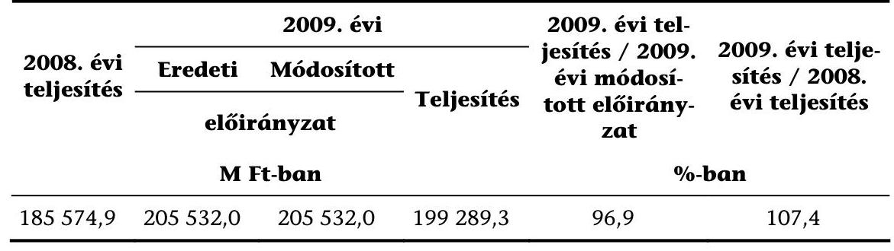

A 14. Lakástámogatások cím a 2009. évben a XI. Önkormányzati Minisztérium fejezetén belül a 14/1. Egyéb lakástámogatások alcímből áll. Az Egyéb lakástámogatások alcímen belül - az Önkormányzati Minisztérium Lakásügyi Főosztálya (ÖM Lakásügyi Főosztály) által kidolgozott, az előirányzat terhére ellátandó feladathoz igazodó - 26 speciális jogcímcsoportot a 12/2001. (I. 31.) Korm. rendelet alapján alakította ki az ÖM.

Lakásépítési kedvezmény; Adó-visszatérítési támogatás; Mozgáskorlátozottak támogatása; Megelőlegezett lakásépítési kedvezmény; Megelőlegezett kedvezmény esetén állam által az ügyfél helyett fizetett kamatok és költségek; Megelőlegezett kedvezmény esetén a gyermekvállalás 60 napon túli bejelentése miatt, a támogatottat terhelő kamat és költségek visszafizetése; Fiatalok és többgyermekes családok kamattámogatása; Megvásárolt hitelállomány után járó költségtérítés; Folyósítási költségek; Garancia érvényesítése; Energia megtakarító hitelek kamattámogatása; Az 1990 előtti fix kamatozású hitelek kamatkiegészítése; Betétesek áruvásárlási kölcsönének kamattámogatása; Lakás-takarékpénztári megtakarítások támogatása; Kiegészítő kamattámogatás; Jelzáloglevéllel finanszírozott hitelek kamattámogatása; Törlesztési támogatás; Önkormányzati lakásfelújítási célú hitelek kamattámogatása; Viziközmú kamattámogatás; Egyéb kamattámogatás; Lakástámogatások kommunikációja (tájékoztatási költségek); Kényszerbérletek felszámolása; Fiatalok otthonteremtési támogatása; ÖKO-Program; Megelőlegezett lakáskölcsönhöz kapcsolódó kamat visszatérítések; Ügyfél számára jóváírt kamat az utólagos lakásépítési kedvezmény.

A 2008. évhez viszonyított növekedést a lakáscélú állami támogatásokról szóló, többször módosított 12/2001. (I. 31.) Korm. rendelet 1/A. §-a alapján a lakásvá-

---

sárláshoz kapcsolódó támogatás felfüggesztése miatt előrehozott, illetve a lakástakarékpénztári támogatás iránt megnövekedett igények okozták.

Az általános és fejezeti indokolás megfelelően mutatja be a Lakástámogatások cím 2009. évi alakulását.

A 2009. évre a Lakástámogatások előirányzat-tervezetét az ÖM Lakásügyi Főosztálya tervezte meg, amelyet az ellenőrzés megalapozottnak minősített.

# XVII. Közlekedési, Hírközlési és Energiaügyi Minisztérium fejezet 13. Vállalkozások folyó támogatása 

| 2008. évi teljesítés | 2009. évi |  |  | 2009. évi teljesítés / 2009. évi módosított elöirányzat | 2009. évi teljesítés / 2008. évi teljesítés |
| :--: | :--: | :--: | :--: | :--: | :--: |
|  | Eredeti | Módosított | Teljesítés |  |  |
|  | elöirányzat |  |  |  |  |
| M Ft-ban |  |  |  | \%-ban |  |
| 199 381,5 | 195660,0 | 194900,0 | 175468,8 | 90,0 | 88,0 |

A XVII. KHEM fejezet címrendjében a 13. Vállalkozások folyó támogatása cím Egyedi támogatások, ellentételezések 1. alcíme a Bányabezárás (1000,0 M Ft) és A helyközi személyszállítási közszolgáltatások és a vasúti pályahálózat müködtetésének ellentételezése ( $193900,0 \mathrm{MFt}$ ) jogcímcsoportokat tartalmazza.

A Bányabezárás jogcímcsoportról a 2009. évben 1000,0 M Ft-ot fizettek ki, ami a módosított előirányzattal megegyezik. Az eredeti előirányzatból (1760,0 M Ft) 760,0 M Ft az 1033/2009. (III. 17.) Korm. határozat alapján zárolásra került. A Bányavagyon-hasznosító Nonprofit Közhasznú Kft. az egyes gazdálkodó szervezetek részére nyújtott 2009. évi egyedi támogatásokról, költségtérítésekről, valamint az egyéb vállalati támogatások keretében nyújtott termelési támogatásokról szóló 110/2009. (V. 22.) Korm. rendelet előírásai alapján vette igénybe a támogatást.

A helyközi személyszállítási közszolgáltatások és a vasúti pályahálózat müködtetésének ellentételezése (amelyek a MÁV-START Zrt., a GYSEV Zrt., a MÁV Zrt. és az autóbusszal szolgáltatást nyújtó társaságok személyszállítási közszolgáltatásaihoz, valamint a MÁV Zrt., illetve a GYSEV Zrt. által müködtetett vasúti pályahálózatokhoz kapcsolódó költségtérítések) előirányzat 193 900,0 M Ft volt. A teljesített kifizetés $174468,8 \mathrm{MFt}$ ( $90 \%$ ) volt. Az egyes gazdálkodó szervezetek részére nyújtott 2009. évi egyedi támogatásokról, költségtérítésekről, valamint az egyéb vállalati támogatások keretében nyújtott termelési támogatásokról szóló 110/2009. (V. 22.) Korm. rendeletben meghatározottak szerint történt a támogatás igénybevétele.

Az ellenőrzés megítélése szerint az általános és fejezeti indokolás az előirányzat megvalósulásáról pontos képet ad.

Az ÁSZ a 2009. évi költségvetés véleményezése során az előirányzatok megalapozottságát és betarthatóságát az azokat alátámasztó dokumentációk hiánya miatt nem tudta minősíteni.

---

# XX. Oktatási és Kulturális Minisztérium fejezet 15. Kormányzati rendkívüli kiadások 

| 2008. évi teljesítés | 2009. évi |  |  | 2009. évi teljesítés / 2009. évi módosított elöirányzat | 2009. évi teljesítés / 2008. évi teljesítés |
| :--: | :--: | :--: | :--: | :--: | :--: |
|  | Eredeti | Módosított | Teljesítés |  |  |
|  | elöirányzat |  |  |  |  |
|  | M Ft-ban |  |  | \%-ban |  |
| 9018,5 | 9770,0 | 9770,0 | 8980,5 | 91,9 | 99,6 |

Az előirányzatnál alacsonyabb kifizetést egy kárpótlás 2009. évre tervezett kártalanítási összegének csökkentése okozta.

A PM és az OKM az előirányzat megtervezésekor - többek között - a Pécs, Szent István tér 8-10. szám alatti ingatlanoknak a Ciszterci Rend Zirci Apátsága tulajdonba adásával és ezzel kapcsolatosan Pécs város önkormányzatának 1,5 Mrd Ft-os kártalanításával számolt, amely összegből a 2009. évi kifizetés közel 1,0 Mrd Ft-ot jelentett volna. A Kormány azonban úgy döntött, hogy a Pécsi Önkormányzat részére a 2009. évben 200,0 M Ft, a 2011. évben pedig 1300,0 M Ft összegű kártalanítás kerül kifizetésre (a Pécs II. Szent István tér 8-10. szám alatti ingatlannak a Ciszterci Rend Zirci Apátsága tulajdonba adásának végrehajtásáról szóló 1209/2009. (XII. 11.) Korm. határozat).

Az ellenőrzés megítélése szerint a zárszámadási törvényjavaslat szöveges indokolása a Kormányzati rendkívüli kiadások előirányzatának megvalósulásáról pontos képet ad.

A 2009. évi OKM fejezet 15. cím Kormányzati rendkívüli kiadások cím előirányzatát az ÁSZ megalapozottnak minősítette.

## XXII. Pénzügyminisztérium fejezet 15. Vállalkozások folyó támogatása

| 2008. évi teljesítés | 2009. évi |  |  | 2009. évi teljesítés / 2009. évi módosított elöirányzat | 2009. évi teljesítés / 2008. évi teljesítés |
| :--: | :--: | :--: | :--: | :--: | :--: |
|  | Eredeti | Módosított | Teljesítés |  |  |
|  | elöirányzat |  |  |  |  |
|  | M Ft-ban |  |  |  | \%-ban |
| 3759,2 | 6490,0 | 6490,0 | 3613,5 | 55,7 | 96,1 |

A PM fejezetben a 15. Vállalkozások folyó támogatása cím Egyéb vállalati támogatások alcíme a Termelési támogatás jogcímcsoportot, míg a Normatív támogatások alcím a Megváltozott munkaképességűek kereset-kiegészítése jogcímcsoportot és az Eximbank Zrt. kamatkiegyenlítése jogcímcsoportot tartalmazza.

A Termelési támogatás jogcímcsoport Mecseki uránbányászok baleseti járadékainak és egyéb kártérítési kötelezettségeinek átvállalása jogcímén 221,5 M Ft-ot használtak fel, 5,7\%-kal kevesebbet, mint az előirányzat (235,0 M Ft).

---

A Termelési támogatás jogcímcsoport Egyéb megszűnt jogcímek miatt járó támogatás jogcímről a 2009. évben 16,5 M Ft-ot fizettek ki, ami az előirányzat (5,0 M Ft) 3-szorosa. A teljesítés törvényi felhatalmazás alapján, külön szabályozás nélkül is eltérhetett az előirányzattól, azonban az általános és fejezeti indokolások nem tértek ki az eltérés okaira. Az eltérést a megváltozott munkaképességűek normatív támogatásának a 2009. évre áthúzódó kifizetései okozták. (A megváltozott munkaképességűek foglalkoztatását szolgáló, a 8/1983. (VI. 29.) EüM-PM együttes rendeleten alapuló normatív támogatás rendszere 2007. július 1-jével szűnt meg.)

Az Eximbank Zrt. kamatkiegyenlítése jogcímcsoport a 2871,5 M Ft összegű éves folyósítással az 5500,0 M Ft törvényi előirányzat alatt teljesült, ami az előirányzat 52,2\%-a. A fejezeti indokolás - az ellenőrzés véleményével megegyezően - az alulteljesülés okaként a refinanszírozási konstrukció év közbeni, a pénzpiacokon kialakult kedvezőtlen likviditási helyzet miatti kényszerú felfüggesztését jelölte meg. A támogatás igénybevétele a 16/1998. (V. 20.) PM rendelet vonatkozó előírásai szerint történt.

A Megváltozott munkaképességűek kereset-kiegészítése jogcímcsoport keretében 504,0 M Ft kifizetés történt, ami az előirányzat 67,2\%-a. Az előirányzattól való elmaradás oka az ellátottak számának tervezettnél intenzívebb csökkenése, ami a 2008. 01. 01-jétől hatályos jogszabályi változások (387/2007. (XII. 23.) Korm. rendelet és a 23/1991. (II. 9.) Korm. rendelet) elhúzódó hatásaira vezethető viszsza. (A 2009. évben a havonta átlagosan ellátottak száma a 2008. évi 304 fơről 256 főre csökkent.)

A Megváltozott munkaképességűek kereset-kiegészítése jogcímcsoport 2009. évi elszámolása a központi költségvetés mérlegében nem az egyedi és normatív támogatások mérlegsoron, hanem a családi támogatások, szociális juttatások mérlegsoron belül a jövedelempótló és kiegészítő szociális támogatások között jelenik meg, ami az ellenőrzés megítélése szerint nem biztosítja az átláthatóságot és a következetességet.
Az ÁSZ a 2009. évi költségvetés véleményezése során az előirányzatok megalapozottságát és betarthatóságát az azokat alátámasztó dokumentációk hiánya miatt nem tudta minősíteni.
Az ellenőrzés megítélése szerint az általános és fejezeti indokolás az előirányzat megvalósulásáról pontos képet ad.

# XXII. Pénzügyminisztérium fejezet 16. Fogyasztói árkiegészítés 

| 2008. évi teljesítés | 2009. évi |  |  | 2009. évi teljesítés / 2009. évi módosított előirányzat | 2009. évi teljesítés / 2008. évi teljesítés |
| :--: | :--: | :--: | :--: | :--: | :--: |
|  | Eredeti | Módosított | Teljesítés |  |  |
|  | elöirányzat |  |  |  |  |
|  | M Ft-ban |  |  | \%-ban |  |
| 107 623,0 | 106 000,0 | 106 000,0 | 107 397,9 | 101,3 | 99,8 |

Az előirányzat túlteljesülésének okait a fejezeti indokolás megfelelő részletességgel tartalmazza. Eszerint a túlteljesülést a kedvezményes utazások vártnál kisebb csökkenése, valamint a bázis- és tárgyév viszonylatában jelentkező pénzforgalmi áthúzódás okozta.

---

A távolsági közlekedéshez nyújtott árkiegészítés az előirányzatot 1,6\%-kal haladta meg, míg a helyi tömegközlekedésben 0,3\%-kal maradt el a kifizetés az előirányzattól. (Az ESA szerinti 2009. évi kifizetés 1\%-kal haladta meg az előirányzatot.) A 2008. évről történt áthúzódás az előirányzatot 3667,6 M Ft-tal haladta meg.

Az ÁSZ a 2009. évi költségvetés véleményezése során az előirányzat megalapozottságáról nem tudott megbizonyosodni, miután a szükséges dokumentumok, számítási anyagok nem álltak rendelkezésre.

# XXII. Pénzügyminisztérium fejezet 17. Egyéb költségvetési kiadások 

| 2008. évi teljesítés | 2009. évi |  |  | 2009. évi teljesítés / 2009.   évi módosított   elöirányzat | 2009. évi teljesítés / 2008.   évi teljesítés |
| :--: | :--: | :--: | :--: | :--: | :--: |
|  | Eredeti | Módosított | Teljesítés |  |  |
|  | elöirányzat |  |  |  |  |
|  | M Ft-ban |  |  | \%-ban |  |
| 25753,2 | 23871,0 | 22387,4 | 23588,4 | 105,4 | 91,6 |

Az eredeti előirányzat a módosítás során 1483,6 M Ft-tal csökkent az Országmozgósítás gazdasági felkészülés központi kiadásaiból történt 442,0 M Ft, a Honvédelmi Tanács és a Kormány speciális múködési feltételeinek biztosítására szolgáló kiadásból 815,0 M Ft és a Rendkívüli beruházási tartalék 226,6 M Ft összegű átcsoportosítása következtében.

A PM fejezetből a Védelmi felkészítés előirányzataival kapcsolatos egyes költségvetési előirányzatok fejezetek közötti átcsoportosítása a 2005/2009. (IV.) Korm. határozat alapján történt. Az Országmozgósítás, gazdasági felkészülés központi kiadásai 2009. évi 497,0 M Ft-os előirányzatából a Kormány döntése értelmében 442,0 M Ft, a Honvédelmi Tanács és a Kormány speciális múködési feltételeinek biztosítása 2009. évi 900,0 M Ft-os előirányzatából 815,0 M Ft volt felhasználható. A Kormány a fennmaradó 55,0 M Ft, illetve 85,0 M Ft összeget zárolta. A felhasználható előirányzatok a 2005/2009. (IV.) Korm. határozat alapján meghatározott fejezetekhez átcsoportosításra kerültek.

A PM fejezetből a Rendkívüli beruházási tartalék jogcímcsoport 500,0 M Ft előirányzatából 273,4 M Ft - az államháztartás egyensúlyi helyzetének megteremtésére irányuló kormányzati célkitűzések és a költségvetés kiadásai mértékének csökkentését elősegítő pénzügyi intézkedések hatékony végrehajtása érdekében nem került átcsoportosításra. A 226,6 M Ft összegű előirányzat pénzügyminiszteri döntést követő - fejezetek közötti átcsoportosítása megtörtént.

A 2009. évi előirányzathoz képest az 5,4\%-os túllépést a Felszámolással kapcsolatos kiadások (132,7\%), a Helyi önkormányzatok állami támogatásának elszámolásából eredő fizetési kötelezettség (164,3\%) és az Ügyfélnek visszajáró vámbiztosíték, egyéb vámvisszatérítések több mint ötszörös túlteljesítése okozta.

Az EXIMBANK és a MEHIB Zrt. behajtási jutaléka előirányzat 3,0 M Ft-ot tartalmazott. Az előirányzat terhére 1,6 M Ft kifizetése történt - jogszerűen - a MEHIB Zrt. részére behajtott összegek jutalékaként.

---

A Kvtv. 41. § (3) bekezdésében foglaltak alapján az ÁKK Zrt. részére az állami kezességvállalást tartalmazó kormányhatározatok alapján a felveendő hitelek pályáztatásában való részvételért közremúködői díjként 3,6 M Ft került kifizetésre. Előirányzatot közremúködői díjra a Kvtv. nem tartalmazott.

A PM az általános és fejezeti indokolásban megfelelően mutatja be a teljesülés alakulását.

A 17. Egyéb költségvetési kiadások cím előirányzatait - az 1\% szja közcélú felhasználása, az ÁKK Zrt. közreműködési díja kivételével - az előző évek tapasztalatai, valamint az előző évi teljesítés, illetve a várható teljesítés összegének figyelembevételével tervezte meg a PM. A cím jogcímcsoportjaiban megtervezett előirányzatokat a rendelkezésre álló dokumentációk és háttérszámítások alapján - az 1\% szja közcélú felhasználása jogcímcsoport kivételével, amelyre a helyszíni ellenőrzés lezárásakor adat nem állt rendelkezésre - a számvevőszéki ellenőrzés megalapozottnak minősítette.

# XXII. Pénzügyminisztérium fejezet 24. Kormányzati rendkívüli kiadások 

| 2008. évi teljesítés | 2009. évi |  |  | 2009. évi teljesítés / 2009. évi módosított előirányzat | 2009. évi teljesítés / 2008. évi teljesítés |
| :--: | :--: | :--: | :--: | :--: | :--: |
|  | Eredeti | Módosított | Teljesítés |  |  |
|  | elöirányzat |  |  |  |  |
|  | M Ft-ban |  |  | \%-ban |  |
| 5877,3 | 12046,3 | 5689,0 | 5422,3 | 95,3 | 92,3 |

A cím két alcímet tartalmaz, a Pénzbeli kárpótlás és a Pénzügyigazgatás korszerűsítése alcímeket. A Pénzügyigazgatás korszerűsítése alcím 6357,3 M Ft öszszegű előirányzatából az 1033/2009. (III. 17.) Korm. határozat alapján 3000,0 M Ft zárolásra került. Az alcím előirányzatából fennmaradt 3357,3 M Ft teljes egészében átcsoportosításra került. A Kormányzati rendkívüli kiadások módosított, 5689,0 M Ft összegű előirányzata megegyezik a Pénzbeli kárpótlás alcím előirányzatával, amely tartalmazza a Pénzbeli kárpótlás, Az 1947-es Párizsi Békeszerződésből eredő kárpótlás és a Pénzbeli kárpótlás folyósítási költségei jogcímcsoportokat. Az előirányzatnál alacsonyabb kifizetés a magasabb életjáradékkal rendelkező kárpótoltak arányának csökkenésével függ össze.

Az ellenőrzés megítélése szerint a zárszámadási törvényjavaslat szöveges indokolása a Kormányzati rendkívüli kiadások előirányzatának megvalósulásáról pontos képet ad.

A PM fejezet 24. cím Kormányzati rendkívüli kiadások cím 2009. évi előirányzatát - a Pénzügyigazgatás korszerűsítése alcím kivételével - az ÁSZ megalapozottnak minősítette. A 2009. évi költségvetés véleményezése során a Pénzügyigazgatás korszerűsítése alcím előirányzatának megalapozottsága a rendelkezésre álló dokumentáció alapján nem volt megítélhető.

---

# XXII. Pénzügyminisztérium fejezet 26. Garancia és hozzájárulás a társadalombiztosítási ellátásokhoz 

| 2008. évi teljesítés | 2009. évi |  |  | 2009. évi teljesítés / 2009. évi módosított elöirányzat | 2009. évi teljesítés / 2008. évi teljesítés |
| :--: | :--: | :--: | :--: | :--: | :--: |
|  | Eredeti | Módosított | Teljesítés |  |  |
|  | elöirányzat |  |  |  |  |
|  | M Ft-ban |  |  |  | \%-ban |
| 835048,8 | 913590,5 | 915 175,7 | 913794,4 | 99,8 | 109,4 |

A módosított előirányzat és a teljesítés közötti eltérést a Korkedvezménybiztosítási járulék címén átadott pénzeszköz jogcímcsoport 85,1\%-os teljesítése okozta.

A Korkedvezmény-biztosítási járulék címén átadott pénzeszköz jogcímcsoport előirányzata 9295,0 M Ft volt, amelyből 7913,7 M Ft teljesült. Az elmaradást az okozta, hogy a befolyt járulék összege nem érte el a tervezéskor számított összeget.

Az év során a Kormány 1585,2 M Ft-tal módosította az előirányzatot, az alapkezelők által nem tervezhető működési kiadások biztosítása érdekében. Az átcsoportosítás 66,6\%-a a Nyugdíjbiztosítási Alapot, míg 33,4\%-a az Egészségbiztosítási Alapot érintette. Az átcsoportosítások az általános tartalék (550,6 M Ft) és a céltartalék ( 1034,6 M Ft) terhére történtek, melyek során új költségvetési jogcímcsoportok jöttek létre.

Az ellenőrzés megítélése szerint a zárszámadási törvényjavaslat szöveges indokolása a Garancia és hozzájárulás a társadalombiztosítási ellátásokhoz előirányzatának megvalósulásáról pontos képet ad.

A 2009. évi tervezés számvevőszéki véleményezésének lezárása után az előirányzatot a PM 17,0 Mrd Ft-tal megemelte, melynek összetételét az ellenőrzés nem ismerte, így a megalapozottság megítélésére nem volt módja.

## XXII. Pénzügyminisztérium fejezet 28. Nemzetközi elszámolások kiadásai

| 2008. évi teljesítés | 2009. évi |  |  | 2009. évi teljesítés / 2009. évi módosított elöirányzat | 2009. évi teljesítés / 2008. évi teljesítés |
| :--: | :--: | :--: | :--: | :--: | :--: |
|  | Eredeti | Módosított | Teljesítés |  |  |
|  | elöirányzat |  |  |  |  |
|  | M Ft-ban |  |  |  | \%-ban |
| 14 158,8 | 8018,3 | 8018,3 | 9456,4 | 117,9 | 66,8 |

A nemzetközi pénzügyi kapcsolatokból eredő kiadások előirányzattól eltérő teljesülését alapvetően a tervezéskor használt árfolyamok és a teljesítés időpontjában aktuális árfolyamok eltérése okozta.

---

Az ellenőrzés megítélése szerint a zárszámadási törvényjavaslat szöveges indokolása a Nemzetközi elszámolások kiadásai előirányzatának megvalósulásáról pontos képet ad.

A 2009. évi PM fejezet 28. cím Nemzetközi elszámolások kiadásai cím előirányzatát az ÁSZ megalapozottnak minősítette.

# XXVI. Szociális és Munkaügyi Minisztérium 20. Családi támogatások 

| 2008. évi teljesítés | 2009. évi |  |  | 2009. évi teljesítés / 2009. évi módosított elöirányzat | 2009. évi teljesítés / 2008. évi teljesítés |
| :--: | :--: | :--: | :--: | :--: | :--: |
|  | Eredeti | Módosított | Teljesítés |  |  |
|  | elöirányzat |  |  |  |  |
|  | M Ft-ban |  |  |  | \%-ban |
| 502 971,8 | 468 959,0 | 468 959,0 | 464 646,6 | 99,1 | 92,4 |

A Családi támogatások költségvetési cím a 2009. évben hét alcímet foglalt magába: 20/1. családi pótlék, 20/2. anyasági támogatás, 20/3. gyermekgondozási segély, 20/5. gyermeknevelési támogatás, 20/6. apákat megillető munkaidőkedvezmény távolléti díjának megtérítése, 20/7. pénzbeli gyermekvédelmi támogatások és a 20/8. életkezdési támogatás. A Családi támogatások cím előirányzata a tervezés szintjén teljesült.

A Családi pótlék alcím előirányzata 373 960,0 M Ft, a teljesítés 366 562,8 M Ft (98\%) volt. A 2009. évi előirányzat 2086229 gyermek figyelembevételével került megtervezésre, 2009-ben 2029771 gyermek után fizetett a központi költségvetés családi pótlékot.

Az Anyasági támogatás előirányzata 7500,0 M Ft, a Kincstár által teljesített kiutalás 6458,5 M Ft (86,1\%) volt. Az előirányzat alulteljesülésének oka, hogy az ellátásban részesülők átlagos létszáma a tervezettnél alacsonyabban alakult.

A Gyermekgondozási segély előirányzata 59 160, M Ft, a Kincstár által kiutalt ellátmány $64357,9 \mathrm{M} \mathrm{Ft}(108,8 \%)$ volt. Az előirányzat túlteljesülésének oka, hogy a tervezetthez képest $3,4 \%$-kal növekedett az ellátást igénybevevők létszáma.

A Gyermeknevelési támogatás előirányzata 15 939,0 M Ft, a Kincstár által teljesített kiutalás 13 793,3 M Ft (86,5\%) volt. Az előirányzat alulteljesülésének oka, hogy a támogatásban részesülők száma elmaradt a tervezésnél alapul vett igényjogosultaktól.

Az Apákat megillető munkaidő-kedvezmény távolléti díjának megtérítése alcím előirányzata 1656,0 M Ft, a Kincstár által kiutalt ellátmány 1666,3 M Ft (100,6\%) volt.

A Pénzbeli gyermekvédelmi támogatások alcím előirányzata 6000,0 M Ft, a Kincstár által kiutalt ellátmány 6570,1 M Ft (109,5\%) volt. Az előirányzat túlteljesülése összefügg egyrészt azzal, hogy 5\%-kal nőtt a rendszeres gyermekvédelmi kedvezményben részesülők száma, másrészt 2009. szeptember l-jével 5\%-kal emelkedett - a Gyvt. módosítása alapján - a jogosultsági feltételként figyelembe vehető egy főre jutó jövedelem összege.

---

Az életkezdési támogatás alcím előirányzata 4744,0 M Ft volt, amely 5237,7 M Ft-ra (110,4\%) teljesült. Az előirányzat túlteljesülésének oka, hogy a 2006., 2007., 2008. években született gyermekek részére megnyitott számlákon megtörtént az ötéves állampapír kamatával megegyező kamat jóváírása.

A fejezeti indokolás a teljesülésről megfelelő képet ad.
A 20. Családi támogatások 2009. évi előirányzat-tervezeteinek kialakítását a számvevőszéki ellenőrzés a rendelkezésre álló dokumentáció és a háttérszámítások alapján megalapozottnak minősítette. A Kormány a T/6380. számon benyújtott törvényjavaslatát visszavonta és a makrogazdasági változások alapján átdolgozott törvényjavaslatot T/6571. számon, 2008. október 18-án terjesztette az Országgyűlés elé. A T/6571. számú költségvetési tervezetben a Családi támogatásokra fordítható kiadások összege 60,2 Mrd Ft-tal volt kevesebb, a visszavont javaslatban szereplőnél. Az általános indokolásban foglaltak alapján a csökkenés - többek között - az infláció növekedési ütemének mérséklődésével függött össze, továbbá azzal, hogy a családi pótlék gyermekenkénti összegének - az infláció mértékével megegyező - növekedésére csak 2009. szeptember 1-jétől kerülhetett sor. A családi támogatások finanszírozási rendszerének átstrukturálódásából adódóan 45,0 Mrd Ft a visszavont javaslatban még az SZMM fejezetben „gyermekgondozási dij részleges megtérítése" címen szerepelt, míg a benyújtott törvényjavaslatban már az E Alapnál jelent meg a GYED teljes körű fedezete. A számvevőszéki ellenőrzés az új törvényjavaslatban szereplő előirányzatok megalapozottságáról már nem tudott véleményt adni, mivel kialakításuk dokumentumai nem álltak rendelkezésre.

# XXVI. Szociális és Munkaügyi Minisztérium 21. Egyéb szociális ellátások és költségtérítések 

| 2008. évi teljesítés | 2009. évi |  |  | 2009. évi teljesítés / 2009. évi módosított elöirányzat | 2009. évi teljesítés / 2008. évi teljesítés |
| :--: | :--: | :--: | :--: | :--: | :--: |
|  | Eredeti | Módosított |  |  |  |
|  | elöirányzat |  | Teljesítés |  |  |
|  | M Ft-ban |  |  |  | \%-ban |
| 182 305,6 | 183 372,0 | 183 372,0 | 175829,1 | 95,9 | 96,4 |

Az Egyéb szociális ellátások és költségtérítések címnél a tervezettől való eltérés az ún. kifutó jellegű ellátások - a vonatkozó jogszabályok alapján, új igényjogosultság megállapítására évek óta nem került sor - alulteljesüléséből adódik. Az egyéb támogatások (cukorbetegek támogatása, lakbértámogatás) 92,9\%-os, a mezőgazdasági járadék 97,8\%-os, illetve a házastársi pótlék 98,9\%-os szinten teljesültek. Ennek oka az ellátottak tervezettnél alacsonyabb száma.

A 21. Egyéb szociális ellátások és költségtérítések cím három alcímet foglalt magába. A 21/2. Jövedelempótló és jövedelemkiegészítő szociális támogatások alcím 2009. évi előirányzata 155372,2 M Ft volt, amely 149358,1 M Ft-ra (96,1\%) teljesült. A 21/3. a Különféle jogcímen adott térítések alcím előirányzata 26 500,0 M Ft volt, amely 24 971,0 M Ft-ra (94,2\%) teljesült. A 20/4 alcím a Folyósított ellátások utáni térítés alcím előirányzata 1500,0 M Ft, amely 100\%ra teljesült.

---

A jövedelempótló és jövedelemkiegészítő ellátások előirányzattól való elmaradása a politikai rehabilitációs ellátások 7,2\%-os, az egyéb támogatások 7\%-os, a megváltozott munkaképességűek járadéka 6,9\%-os, a mezőgazdasági járadék 2,2\%-os, a házastársi pótlék 1,1\%-os, az egészségkárosodási járadék 0,9\%-os tervezettnél alacsonyabb és a bányászok korengedményes nyugdíja, szénjárandóság kiegészítése és kereset-kiegészítése tervezettet - 2,2\%-kal, a rokkantsági járadéknál 1,5\%-kal, fogyatékossági támogatás és a vakok személyi járadékánál $0,9 \%$-kal - meghaladó teljesülésének egyenlegeként alakult ki.

A fejezeti indokolás a teljesülésről megfelelő képet ad.
A Magyar Köztársaság 2009. évi költségvetéséről szóló T/6571. számú költségvetési tervezethez a PM által 2008. októberében benyújtott módosító javaslat alapján az Egyéb szociális ellátások és költségtérítések címnél összességében 6100,0 M Ft összegű csökkenés következett be, amelynek legjelentősebb tételei a megváltozott munkaképességűek járadékának 2800,0 M Ft, a fogyatékossági támogatásoknak és a vakok személyi járadékának 1200,0 M Ft, valamint a politikai rehabilitációs és más nyugdíj-kiegészítések 800,0 M Ft összegű csökkenései. Az előirányzatok megalapozottságáról - a változást alátámasztó dokumentáció hiánya miatt - az ÁSZ nem tudott véleményt adni.

# 3.4.2. A központi költségvetés kamatelszámolásai, tőkevisszatérülései, az adósság- és követelés-kezelés költségei 

A központi költségvetés kamatelszámolásai, tőkevisszatérülései, az adósság- és követelés-kezelés költségei kiadási előirányzata

| 2008. évi teljesítés | 2009. évi |  |  | 2009. évi teljesítés / 2009. évi   teljesítés /   2008. évi   teljesítés |
| :--: | :--: | :--: | :--: | :--: |
|  | Eredeti | Módosított | Teljesítés |  |
|  | elöirányzat |  |  |  |
|  | M Ft-ban |  |  |  |
| 1154 101,3 | 1208 846,2 | 1208 846,2 | 1180244,2 | 97,6 |

Az előirányzottnál alacsonyabb kamatkiadás a forintban fennálló adósság kamatának 83 758,9 M Ft-os megtakarításából, a devizában fennálló adósság kamatának 47 316,0 M Ft-os és az egyéb költségek 7840,9 M Ft-os többletkiadásából származott.

Az Országgyűlés 2008. december 15-én fogadta el a Magyar Köztársaság 2009. évi költségvetéséről szóló 2008. évi CII. törvényt. A XLI. A központi költségvetés kamatelszámolásai, tőkevisszatérülései, az adósság- és követelés-kezelés költségei fejezet címrendjében a Nemzetközi Valutaalap hitele utáni rendelkezésre állási jutalék előirányzatát ( 7225,0 M Ft) a devizában fennálló adósság kamatkiadásai között szerepeltették. Ezt a kiadási előirányzatot a fejezeten belül az adósság- és követeléskezelés egyéb kiadásai címen kellett volna tervezni, mivel az előirányzat tartalma jutalék és nem kamatkiadás.

Az ÁSZ által véleményezett T/6380. számú, a Magyar Köztársaság 2009. évi költségvetéséről szóló, 2008 szeptemberében készített, visszavont törvényjavaslat még nem tartalmazhatta az előirányzatot. Azonban a 2008. októberi, T/6571. számon

---

benyújtott költségvetési törvényjavaslat kamatkiadásokat és egyéb költségeket tartalmazó fejezete sem tartalmazta a Nemzetközi Valutaalap hitele utáni rendelkezésre állási jutalék előirányzatát, melynek okait a PM a 2010. 05. 07-én az ÁSZ részére küldött e-mailjében a következőben határozta meg: „2008 októberére az ÁKK elkészítette az akkor még nyugodt piaci körülményekre alapozott finanszírozási tervét, és a 41-es fejezet egyes címeire vonatkozó elörejelzését. Azonban a válság teljesen átrajzolta a finanszírozási lehetőségeket. Ugyanakkor az IMF-EU hitelcsomag részletei, a nagyságán túlmenően nem voltak láthatók. A hozzá kapcsolódó kamatláb és jutalékok nagyságával kapcsolatban sem tudtunk helytálló információra szert tenni, amint arról sem, hogy milyen mértékü lesz a lehívás. Ennek ellenére készült a rendelkezésre álló szükös információk alapján becslés a jutalékokra. A fejezet címrendjének átírására nem került sor. (A 2010-es költségvetési törvényjavaslatban már felvételre került az „IMF hitelek kamatelszámolásai" és az „EU hitelek kamata" cím a devizahitelek közé.) A költségvetési törvényjavaslat Országgyülésnek történő benyújtását követően eszkalálódott pénzügyi krízis következményeinek számszaki hatásait módosító inditványokkal kezelte a pénzügyi kormányzat, ill. a törvényhozás, azonban a költségvetés kamatkiadásokat tartalmazó fejezetének szerkezeti változását eredményező teljesen új címrend kialakítására nem került sor."

A kamatkiadások csökkenését az okozta, hogy a 2009. évi költségvetés kamatkiadási előirányzatainak kialakításánál figyelembe vett egyes tényezők a prognosztizált értéktől eltérően alakultak, mivel a nemzetközi pénz- és tőkepiaci válság finanszírozásra gyakorolt hatásaival a tervezéskor még csak részben lehetett számolni.

A központi költségvetés finanszírozási és a lejáró államadósság megújítási szerkezete 2009-ben eltért az előirányzat készítése során figyelembe vett kibocsátási szerkezettől. Az év első negyedében (egy aukció kivételével) az állam nem bocsátott ki államkötvényt. Áprilistól már rendszeresen sor került államkötvény aukciókra, azonban a kötvénypiaci helyzet következtében kezdetben csak kis összegben volt lehetőség az értékesítésre. Ebben az időszakban a diszkontkincstárjegyek és a lakossági állampapírok értékesítése folyamatos volt, és a finanszírozás részben a Nemzetközi Valutaalap és az Európai Bizottság által biztosított nemzetközi hitelcsomagból történt. Az államkötvény piacon jelentkező problémák csökkentése érdekében az adósságkezelő, a nemzetközi hitelcsomag fedezetével közel 500 Mrd Ft összegű rendkívüli visszavásárlási programot (március 18 -június 10 . között) hirdetett és valósított meg.

2009-ben nagy összegű deviza forrásbevonás és az év nagy részében negatív nettó forintkibocsátás történt.

A forintadósság 824,1 Mrd Ft-os előirányzott nettó kibocsátása -769,7 Mrd Ft-on teljesült. A devizaadósság 271,3 Mrd Ft-os tervezett nettó kibocsátása 1686,1 Mrd Ft-on valósult meg.

Az előirányzattól lényegesen eltérő finanszírozási folyamatok és az árfolyam alakulása hatással volt a 2009. évi kamatkiadások szerkezetére.

A 2009-re tervezett átlagos $245,5 \mathrm{Ft} /$ EUR-hoz képest a tényleges átlagos árfolyam 280,6 Ft/EUR volt, ami magasabb a 2008. évi átlagos $251,3 \mathrm{Ft} /$ EUR-nál.

---

Devizában fennálló adósság kamatkiadása

| 2008. évi teljesítés | 2009. évi |  |  | 2009. évi teljesítés / 2009. évi módosított elöirányzat | 2009. évi teljesítés / 2008. évi teljesítés |
| :--: | :--: | :--: | :--: | :--: | :--: |
|  | Eredeti | Módosított | Teljesítés |  |  |
|  | elöirányzat |  |  |  |  |
|  | M Ft-ban |  |  |  | \%-ban |
| 195 886,1 | 247916,6 | 247916,6 | 295232,6 | 119,1 | 150,7 |

Az előirányzottnál magasabb kamatkiadás a devizahitelek után fizetett kamatkiadás 44576,7 M Ft-os, a devizakötvényekben fennálló adósság után fizetett összeg 9622,2 M Ft-os többletkiadásából, és a Nemzetközi Valutalapnak fizetett rendelkezésre állási jutalék 6882,9 M Ft-os csökkenéséből származott.

A devizában fennálló adósság kamatelszámolásainak előirányzata 2,9\%-kal alacsonyabb lenne a Nemzetközi Valutaalap hitele utáni rendelkezésre állási jutalék előirányzata nélkül. A teljesítés előirányzattól való eltérése ezáltal 14,5\%-kal növekedne. A Nemzetközi Valutalap hitele után fizetett rendelkezésre állási jutalék 342,1 M Ft-os teljesülése a XLI. fejezet összesen kiadásainak 0,03\%-át, a devizában fennálló adósság kamatelszámolásainak $0,12 \%$-át jelenti.

A devizahitelek kamatelszámolásainak 46 331,4 M Ft-os előirányzata 196,2\%on ( $90908,1 \mathrm{M}$ Ft) teljesült. A devizahitelek után elszámolt magasabb kamatkiadás ( $44576,7 \mathrm{M}$ Ft) a nemzetközi pénzügyi szervezetektől felvett hitelek után fizetett kamatok 42 895,5 M Ft-os és az 1999-től felvett devizahitelek kamatterhének 1681,2 M Ft-os többlet kamatából származott.

A nemzetközi pénzügyi szervezetektől és külföldi pénzintézetektől felvett hitelek utáni kamatkiadás 46331,4 M Ft-os előirányzata 192,6\%-ban (89 226,9 M Ft) teljesült. A kamatkiadásokat 26 118,5 M Ft-tal csökkentette az EBB hitelek, az ET Fejlesztési Bank hitelei, a MÁV Rt.-től, a GySEV Rt.-től 2002-ben átvállalt hitelek és az EBRD hitelek kamatelszámolásainak elmaradása a tervezett értéktől. A kamatkiadásokat 69 014,0 M Ft-tal növelte a Világbanki hitelek, a KfW hitelek, az ÁAK Rt.-től 2002-ben átvállalt devizahitelek, a Nemzetközi Valutaalap és az Európai Bizottság által biztosított hitelek kamatkiadásainak előirányzott összeghez viszonyított többlete.

A Nemzetközi Valutaalap és Európai Bizottság által biztosított hiteleknek nem volt kamatkiadási előirányzata. A Nemzetközi Valutaalaptól lehívott hitelek kamatkiadása 41631,4 M Ft-on, az Európai Bizottság által biztosított hiteleké 27 170,2 M Ft-on teljesült. A felvett hitelek kamatozása a hitelnyújtó és a lehívás időpontja szerint különböző. A Nemzetközi Valutaalap hitele változó kamatozású, a kamat mértéke hetente kerül meghatározásra. A 2008. évi lehívás átlagkamatlába 2,23\%, a 2009. évi első lehívásé $3,36 \%$, az utolsó lehívásé pedig 3,27\% volt, amelynek a 2009. évben már kamatfizetési kötelezettsége is keletkezett. Az Európai Bizottság által nyújtott mindkét hitelelem fix kamatozású, a kamat mértéke 3,25\%. A Nemzetközi Valutaalap által biztosított hitelkeretből 2009-ben 720,1 Mrd Ft, az Európai Bizottság által biztosított hitelkeretből 1005,9 Mrd Ft összegben történt hitellehívás. A lehívott hiteleket az adósságkezelő az esedékes adósságtörlesztésre (lejáró forintadósság és devizakötvény törlesztése) használta fel.

---

A nemzetközi fejlesztési intézményektől felvett hitelek lehívási összege és ütemezése eltért a tervezettől. Az Európai Beruházási Banktól 2584,3 M Ft összegű devizahitel került lehívásra a 2009. év folyamán. A kamatkiadás 18 098,6 M Ft-tal volt kevesebb az előirányzottnál. Az ET Fejlesztési Banktól 986,2 M Ft összegű devizahitel lehívása történt meg. A tervezett kamatkiadástól az elmaradás 7907,2 M Ft volt, amelyet befolyásolt a változó kamatok mérséklődése is.

Az 1999-től felvett devizahitelek utáni kamatfizetés 1681,2 M Ft volt. A lehívásra kerülő rulírozó hitelek összegét az ÁKK Zrt. által a partnereknél elhelyezett betétek nagysága határozza meg.

Amennyiben nem euróban, hanem más devizában (elsősorban USD, JPY, GPB) von be forrást az állam, akkor azokat az ÁKK Zrt. devizacsere ügyletek (swapok: egy devizában esedékes kifizetést cserélnek el egy másik devizában esedékes kifizetésre) segítségével átalakítja euró alapú kötelezettségekre. Az ilyen fedezeti ügyletekhez kapcsolódóan az ÁKK Zrt. és a vele szerződésben álló külföldi partnerek partnerkockázatot csökkentő eljárást (ún. marked-to-market (M2M): pozíció pillanatnyi piaci árfolyamok melletti kiértékelése) alkalmaznak, mely megállapodások keretében a felek rendszeresen meghatározzák az egymással kötött swap ügyletek piaci értékét. Az a fél, akinek oldaláról a swap piaci értéke negatív és az a kiértékelési küszöbértéket meghaladja, ezen piaci értékkel megegyező összegű betétet helyez el a másik félnél. Ha az ÁKK Zrt.-nek betétet kell elhelyeznie valamelyik partnerénél, az befolyásolja a likviditáskezelést. A marked-to-market ügyletek nem átmeneti forrásigényének biztosítására az ÁKK Zrt. rulírozó deviza hitel felvételét tartotta indokoltnak.

Az 1999-től kibocsátott devizakötvények után fizetendő kamat előirányzata (194 358,0 M Ft) 104,6\%-on teljesült. A túllépés oka az árfolyamhatás, amelyet részben csökkentett a kötvénykibocsátás volumenének előirányzattól való elmaradása.

2009-ben piaci forrásbevonásra került sor, ami egy 5 éves futamidejű, fix kamatozású, 1000 M EUR értékű kötvénykibocsátás keretében valósult meg 267,9 Mrd Ft értékben.

Az angol és amerikai kötvények után kifizetett kamat összege 2,0 M Ft volt, amely $0,2 \mathrm{M}$ Ft-tal kevesebb volt, mint az előirányzott összeg.

Az adósságkezelő 1998-ban átvette az angol fontban és amerikai dollárban denominált kötvényeket. A szerződés szerint az amerikai kötvények 2027-ben, az angol kötvények 2018-ban jártak volna le. Az angol kötvények 2005. 05. 01-jén visszafizetésre kerültek az ütemezett törlesztéseken felüli visszavásárlások eredményeként. Jelentősen lerövidült az amerikai kötvények hátralevő futamideje is (lejárat: 2013. 07. 01). A fennálló tartozás a 2009. év végén 27,8 M Ft volt.

Az M2M betétekkel kapcsolatos kamatkiadásoknak nem volt előirányzata. A teljesült összeg 673,4 M Ft. Az M2M betétek nagyságát (közvetve a kamatkiadását) a partnerek által elhelyezett betétek összege határozza meg. Az előirányzatok elkészítésének időszakában az elhelyezendő betétek összege nem ismert. A külföldi partnerek a 2009. év végén 20113,5 M Ft értékben helyeztek el betétet az ÁKK Zrt.-nél.

---

# Forintadóssággal kapcsolatos kamatkiadások 

| 2008. évi teljesítés | 2009. évi |  |  | 2009. évi teljesítés / 2009. évi módosított elöirányzat | 2009. évi teljesítés / 2008. évi teljesítés |
| :--: | :--: | :--: | :--: | :--: | :--: |
|  | Eredeti | Módosított | Teljesítés |  |  |
|  | elöirányzat |  |  |  |  |
|  | M Ft-ban |  |  | \%-ban |  |
| 937579,1 | 950328,0 | 950328,0 | 866569,1 | 91,2 | 92,4 |

Az előirányzottnál alacsonyabb kamatkiadás a forinthitelekben fennálló adósság kamatának 11 588,6 M Ft-os többletkiadásából, az államkötvényekben fennálló adósság után fizetett összeg 89 690,0 M Ft-os, és a kincstárjegyek után fizetett kamat 5657,5 M Ft-os csökkenéséből származott.

A forinthitelek kamatkiadásainak 13 488,0 M Ft-os előirányzata 185,9\%-on teljesült. Az eltérés az Európai Beruházási Banktól (M3 autópálya hitel kamata, Innovációs hitel kamata, Kohéziós hitel kamata, Térség hitel kamata) felvett forinthitelek kamatkiadásainak 10 062,4 M Ft-os és az ET Fejlesztési Bank forinthitelek kamatelszámolásainak 1526,2 M Ft-os többletköltségéből származott.

A Magyar Állam 2009-ben nagyrészt forintban vett fel hiteleket (az Európai Beruházási Banktól 158 980,8 M Ft és az ET Fejlesztési Banktól 59 833,2 M Ft öszszegben), amelyből többlet kamatkiadás származott.

A forint államkötvényekkel kapcsolatos kamatelszámolások 746 918,2 M Ft-os előirányzata $88 \%$-on teljesült. A piaci értékesítésű államkötvények kamatelszámolásainál 93 180,1 M Ft-os csökkenés, míg a nem piaci értékesítésű kötvények kamatelszámolásainál 3490,1 M Ft-os többlet jelentkezett.

A piaci értékesítésű, hiányt finanszírozó államkötvények kamatkiadásának 710 414,9 M Ft-os előirányzata 86,9\%-on teljesült, mivel az előirányzottnál kevesebb kötvény került kibocsátásra. A kötvények nettó kibocsátásának előirányzata 543,5 Mrd Ft, a megvalósult összeg -1020,9 Mrd Ft volt.

A nem piaci értékesítésű államkötvények 36 503,3 M Ft-os előirányzata 109,6\%on teljesült. A lakással, konszolidációval kapcsolatos államkötvények, a kamatmentes adósság kötvényesítésével kapcsolatos államkötvények kamatkiadásai okozták a többletet. A magasabb hozamok az előirányzathoz képest növelték a kötvények kamatkiadásait. A rubelkövetelések megvásárlását fedező államkötvények kamatkiadásainak 479,3 M Ft-os előirányzata 100\%-on teljesült. Az ÁPV Rt. gázközművek miatti tartalékfeltöltést fedező kötvényei utáni kamatkiadás 285,1 M Ft-os előirányzata 111,3\%-on teljesült. A többletkiadást a visszavásárlások összegének előirányzattól való elmaradása okozta. Az MFB Rt.-nek átadott államkötvények 1378,2 M Ft-os előirányzata 100\%-on teljesült. Az átadott államkötvények fix kamatozásúak és ennek következtében a hozamok változása nem befolyásolta a kamatkiadást.

A kincstárjegyek kamatkiadása 189 921,8 M Ft-os előirányzata 97\%-on teljesült, mivel a diszkont kincstárjegyek utáni kiadás (a kincstárjegyek kamatkiadásainak $78,6 \%$-a) kevesebb volt az előirányzottnál.

---

A diszkont kincstárjegyek kamatkiadásának 152001,7 M Ft-os előirányzata 95,3\%-on teljesült. A tervezetthez (230,7 Mrd Ft) képest a teljesült nettó kibocsátás 65,3 Mrd Ft-tal kisebb volt. A diszkont kincstárjegyek értékesítése a lejárt jegyek megújítását és a Kincstári Egységes Számla likviditásának biztosítását szolgálta.

A lakossági kincstárjegyek 37 920,1 M Ft-os előirányzott kamatkiadása 104\%-on teljesült. A lakossági kincstárjegyek magasabb kamatkiadásából 1279,7 M Ft-ot a volumenhatás, 249,5 M Ft-ot a struktúra és az eltérő hozamok indokolnak. A kincstári takarékjegyek átlagos futamideje rövidebb volt a tervezettnél a részben előrehozott visszaváltások következtében.

Adósságkezelés egyéb kiadásai

| 2008. évi teljesítés | 2009. évi |  |  | 2009. évi teljesítés / 2009. évi módosított elöirányzat | 2009. évi teljesítés / 2008. évi teljesítés |
| :--: | :--: | :--: | :--: | :--: | :--: |
|  | Eredeti | Módosított | Teljesítés |  |  |
|  | elöirányzat |  |  |  |  |
|  | M Ft-ban |  |  |  | \%-ban |
| 20636,1 | 10601,6 | 10601,6 | 18442,5 | 174,0 | 89,4 |

Az adósságkezelés egyéb kiadásainál 7840,9 M Ft volt a többletkiadás az előirányzathoz képest. Ha az adósságkezelés egyéb kiadásain belül a Nemzetközi Valutalap hitele után fizetett rendelkezésre állási jutalék 7225,0 M Ft előirányzatát a megfelelő költségvetési soron szerepeltették volna, akkor a cím 2009. évi előirányzata $68 \%$-kal magasabb, így az előirányzattól való eltérés 7840,9 M Ft helyett 958,0 M Ft lett volna. A Nemzetközi Valutalap hitele után fizetett 342,1 M Ft összegű rendelkezésre állási jutalék az ezen a jogcímen teljesült kiadások összegét $1,9 \%$-kal növelné.

A deviza elszámolások 1814,4 M Ft-os előirányzata több mint 5-szörösére (10 049,5 M Ft) teljesült. A piaci kibocsátások, hitelfelvételek, átvállalások jogcímen 843,8 M Ft többletköltség keletkezett, mivel a tervezetthez képest növekedtek a devizakötvényhez kapcsolódó jutalékok. A deviza elszámolások kiadásainak 73,5\%-át a Nemzetközi Valutaalaptól felvett és az Európai Bizottság által biztosított hitelek után fizetett jutalék képezi. Ezeken a jogcímeken - mivel a 2009. évi költségvetés tervezésekor a hitelfelvételi szándék és a hitel összege nem volt ismert - nem szerepeltek kiadási előirányzatok.

A Nemzetközi Valutaalap által biztosított hitelkeretből 2009-ben 720,1 Mrd Ft összegben történt hitellehívás, amelyért 3381,4 M Ft jutalékot fizetett az adósságkezelő. Az Európai Bizottság által biztosított hitelkeretből 1005,9 Mrd Ft értékben felvett hitelért 4009,9 M Ft jutalék került kifizetésre.

A forint elszámolások 7022,5 M Ft-os előirányzata 94,4\%-on teljesült. Az alacsonyabb költséget a lakossági állampapírok értékesítésében történt forgalomcsökkenés okozta.

Az állampapírok lakossági értékesítését támogató kiadásokra előirányzott 880,0 M Ft 99,9\%-on teljesült.

Az adósságkezelés költségeinek 882,0 M Ft-os előirányzata 100\%-on teljesült.

---

A Követeléskezelés költségei alcím 2,7 M Ft-os előirányzata 11,1\%-on teljesült. Az előirányzat alulteljesülésének oka, hogy a 2009. év során nem került sor külföldi követelések leépítését célzó pályázatok kiírására.

A központi költségvetés kamatelszámolásai, tőkevisszatérülései, az adósság- és követelés-kezelés költségei bevételi előirányzata

| 2008. évi teljesítés | 2009. évi |  |  | 2009. évi teljesítés / 2009. évi módosított előirányzat | 2009. évi teljesítés / 2008. évi teljesítés |
| :--: | :--: | :--: | :--: | :--: | :--: |
|  | Eredeti | Módosított | Teljesítés |  |  |
|  | elöirányzat |  |  |  |  |
|  | M Ft-ban |  |  | \%-ban |  |
| 93 122,1 | 75756,9 | 75756,9 | 144 447,5 | 190,7 | 155,1 |

Az előirányzatot meghaladó teljesítés oka, hogy a kamatbevételek a tervezettnél 68,6 Mrd Ft-tal és a tőkekövetelések visszatérüléséből származó bevételek 0,1 Mrd Ft-tal magasabb összegben teljesültek.

A devizában fennálló adósság bevételeinek előirányzata 173,0 M Ft volt, a teljesülés 23 926,2 M Ft (közel 14-szeres) volt.

A Devizaszámla kamatelszámolásainál nem terveztek bevételi előirányzatot, a teljesülés $87,3 \mathrm{M}$ Ft volt.

Az M2M betétekkel kapcsolatos kamatbevételek 173,0 M Ft-os előirányzata 1876,0 M Ft-on (10-szeresére) teljesült. Az M2M betétek nagyságát (közvetve a kamatbevételt) az ÁKK Zrt. által elhelyezett betétek összege határozza meg. Az előirányzatok elkészítésének időszakában az elhelyezett betétek nagysága előre nem tervezhető. Az ÁKK Zrt. külföldi partnereknél elhelyezett M2M betéteinek összege a 2009. év végén 115 560,9 M Ft volt.

A Nemzetközi Valutaalap hiteleiből származó betét kamatánál nem terveztek bevételi előirányzatot, a teljesülés 10281,1 M Ft volt, ami a Nemzetközi Valutaalap első hitelcsomagjának felhasználásából származott. Ez a hitelelem a pénzügyi közvetítő rendszer stabilitásának elősegítése céljából került lehívásra. A hitel nagyobbik része betétként került elhelyezésre a Magyar Nemzeti Banknál, ami után a költségvetésnek kamatbevétele keletkezett. Az ÁKK Zrt. betétszámláinak állománya az MNB-nél 2009. december 31-én 696 690,7 M Ft volt, amiből az elkülönítve tartott betétállomány 561292,0 M Ft volt, a pénzügyi közvetítő rendszer stabilitásának erősítéséről szóló 2008. évi CIV. törvényben foglaltaknak megfelelően.

A bankoknak nyújtott hitelből származó kamatbevételnél nem terveztek bevételi előirányzatot, a teljesülés 10712,1 M Ft volt. A Nemzetközi Valutaalap első hitelcsomagjának másik része továbbhitelezésre került az MFB Zrt., az OTP Nyrt., illetve az FHB Nyrt. részére az Áht. 8/B. § (1) bekezdésének b) pontja alapján. A felvevő bankok által visszaigazolt hitelek 2009. december 31-i állománya 445 395,1 M Ft volt.

---

Az EB hitelekből származó betét kamatbevételeinél nem terveztek bevételi előirányzatot, a teljesülés $969,7 \mathrm{M}$ Ft volt.

A forintban fennálló adósság kamatbevételeinek 73 490,5 M Ft-os előirányzata 161\%-on teljesült. A tervezett bevételi előirányzat túlteljesülése ( $44841,9 \mathrm{M}$ Ft) az állami kölcsön és az államkötvények felhalmozott kamatbevételének, a diszkont kincstárjegyek kamatelszámolásainak, a KESZ kamatbevételének, valamint az intervenciós felvásárlás előfinanszírozási költségének megtérítése többletéből adódott.

Az Állami kölcsön kamatelszámolása jogcím 6,4 M Ft összegű előirányzata 16,9 M Ft-on, több mint 2,5-szeresére teljesült. A Kvtv. 89. § (1) bekezdése értelmében az Országgyúlés 2009. január 5-ei hatállyal lemond a Magyar Államnak az Altek Tégla és Cserépipari Kft.-vel szemben fennálló 6,4 M Ft összegű állami kölcsön kamat-követeléséről, valamint az ehhez kapcsolódó késedelmi és büntetőkamatok 2008. december 31-én fennálló összegéről. A Kvtv. 89. § (2) bekezdése értelmében az (1) bekezdés szerinti követelés-elengedés alapján elszámolt összeg a késedelmi és büntető kamat összegével eltérhet az előirányzattól.

A Magyar Köztársaság 2000. évi költségvetésének végrehajtásáról szóló 2001. LXXV. törvény 24. § (3) bekezdése értelmében az Országgyúlés 2001. december 31-ig elengedi az Altek Tégla és Cserépipari Kft. 21,3 M Ft összegű, a Magyar Állammal szembeni tartozását. A Kincstár 2001. november 19-én törölte nyilvántartásából a 21,3 M Ft tőketartozást, de technikai hibából adódóan a cég kamattartozása továbbra is fennmaradt. Az el nem engedett kamattartozás a Kvtv.-ben került rendezésre. Az Áht. 14. § (1) bekezdésének megfelelően a 16,9 M Ft a XXII. Pénzügyminisztérium fejezet 32. Adósság-átvállalás és tartozás-elengedés cím 6. Altek Kft.-vel szembeni állami kölcsön kamat-követelés elengedése alcím kiadásaként jelenik meg.

A piaci értékesítésű államkötvények felhalmozott kamatelszámolásának és árfolyamnyereségének 55 965,6 M Ft-os tervezett bevétele 141,3\%-on teljesült, döntően a megvalósított államkötvény visszavásárlási aukciók eredményeként.

Az Alárendelt kölcsöntőke-kötvény kamatelszámolása jogcím 1314,5 M Ft-os előirányzata 118,4\%-on teljesült. A többletbevétel oka, hogy a kamatok a tervezettnél magasabb szinten alakultak.

A Kincstári Egységes Számla 16 148,9 M Ft-os kamat előirányzata 225,2\%-on teljesült. A 20224,6 M Ft-os többlet kamatbevétel két hatás eredménye. A Kincstári Egységes Számla tervezettnél nagyobb átlagos állománya miatt a kamatbevétel 16276,9 M Ft-tal növekedett. Az előirányzottnál magasabb átlagkamatláb pedig 3947,7 M Ft-tal növelte a kamatbevételt.

Az Intervenciós felvásárlás előfinanszírozási költségének megtérítése alcím 35,0 M Ft-os előirányzata 495,4 M Ft-on, 14-szeresére teljesült. A kamatot az Európai Unió az intervenciós készletek felvásárlásának időpontjától az általa meghatározott időpontban és volumenben történő értékesítéséig terjedő időszakra fizeti a megelőlegezésre fordított összeg után. A tervezés időpontjában azzal számoltak, hogy az Európai Unió által belső élelmiszer-segélyre szánt mintegy 500 E tonna szétosztása rövid idő alatt megtörténik. Ezzel szemben a

---

folyamat lelassult, így amíg a készletek nem kerülnek szétosztásra, addig az Európai Unió fizeti utána a költségtérítést.

Az ellenőrzés megítélése szerint a XLI. A központi költségvetés kamatelszámolásai, tőkevisszatérülései, az adósság- és követelés-kezelés költségei fejezetről szóló - az ÁKK Zrt. által készített - általános- és fejezeti indokolás szövege pontos képet ad a fejezet előirányzatainak megvalósulásáról. Bemutatja, hogy a Nemzetközi Valutaalap hitele utáni rendelkezésre állási jutalék megfelelő költségvetési soron történő megjelenítése esetén az adósság- és követeléskezelés költségei hogyan alakultak volna.

A Magyar Köztársaság 2009. évi költségvetése végrehajtásáról szóló törvényja-vaslat-tervezet 2010. június 30 -án rendelkezésre bocsátott fejezeti kötetének 2009. évi zárszámadás (Összesítő) táblájában a XLI. A központi költségvetés kamatelszámolás, tőkevisszatérülései, az adósság- és követelés-kezelés költségei 2009. évi módosított előirányzatának összege (utolsó előtti oszlop) 1814,4 M Fttal kisebb összeget ( 1207031,8 M Ft) tartalmaz. A helyes összeg 1208 846,2 M Ft.

A törvényjavaslat-tervezet részletes szöveges indoklása 3. címénél az adósságés követeléskezelés egyéb kiadásain belül a 3. alcíménél - az adósságkezelés költségeinél - a helyes összeg $882,0 \mathrm{M}$ Ft és nem $880,0 \mathrm{M}$ Ft, ahogy a szövegben szerepel.

Tökekövetelések visszatérülése

| 2008. évi teljesítés | 2009. évi |  |  | 2009. évi teljesítés / 2009. évi módosított előirányzat | 2009. évi teljesítés / 2008. évi teljesítés |
| :--: | :--: | :--: | :--: | :--: | :--: |
|  | Eredeti | Módosított | Teljesítés |  |  |
|  | elöirányzat |  |  |  |  |
|  | M Ft-ban |  |  | \%-ban |  |
| 11 161,8 | 2093,4 | 2093,4 | 2188,7 | 104,6 | 19,6 |

A tervezettől való eltérés a kormányhitelek lebontásából származó bevételek 234,8 M Ft-tal magasabb és a nemzetközi pénzügyi szervezetek által nyújtott és belföldre kihelyezett hitelek törlesztése 139,5 M Ft-os elmaradásának egyenlegeként alakult ki.

Kormányhitelek visszatérülése alcím

| 2008. évi teljesítés | 2009. évi |  |  | 2009. évi teljesítés / 2009. évi módosított előirányzat | 2009. évi teljesítés / 2008. évi teljesítés |
| :--: | :--: | :--: | :--: | :--: | :--: |
|  | Eredeti | Módosított | Teljesítés |  |  |
|  | elöirányzat |  |  |  |  |
|  | M Ft-ban |  |  | \%-ban |  |
| 685,4 | 1561,0 | 1561,0 | 1795,8 | 115,0 | 262,0 |

A 2009. évi előirányzatoknál Albánia, Kambodzsa, Nicaragua és Etiópia esetében magasabb összeg térült meg. Ennek oka, hogy a tervezéskor figyelembe vett

---

156,66 Ft/USD árfolyam magasabb szinten alakult a teljesítéskor a forint leértékelődése miatt.

A volt rubel elszámolású országoknak korábban nyújtott kormányhitelek viszszatérülésére 315,7 M Ft előirányzatot terveztek, amelynél 57,7 M Ft-tal több bevétel teljesült. A bevételek az Albániával (303,9 M Ft) és Kambodzsával (69,5 M Ft) szemben fennálló követelések visszatérüléséből származtak.

A kambodzsai követelésből 2009-ben 355433 USD - Kambodzsa részéről 216659 USD, illetve a Külügyminisztérium által átutalt 138774 USD összeggel együtt - összesen 69,5 M Ft összegű befizetés teljesült a központi költségvetés felé.

A volt dollár elszámolású országoknak korábban nyújtott kormányhitelek viszszatérülésére 1245,3 M Ft előirányzatot terveztek, amelynél 177,1 M Ft-tal magasabb bevétel teljesült. A bevételek a Nicaraguával (25,1 M Ft) és Etiópiával (1397,3 M Ft) szemben fennálló követelések visszatérüléséből származtak.

A Magyar Állam Etiópiával szemben fennálló követelésének költségvetési elszámolása 2009. január 5-én megtörtént, miután a követelés elengedésre került. Az Áht. 14. § (1) bekezdésének megfelelően az 1397,3 M Ft a XXII. Pénzügyminisztérium fejezet 32. Adósság-átvállalás és tartozás-elengedés cím 5. Külföldi követelések elengedése alcím kiadásaként jelenik meg.

Az Áht. 108/A. § (1) bekezdése értelmében a központi költségvetés külföldi követeléseivel való gazdálkodásért a költségvetési törvény keretein belül a Kormány felelős. A (2) bekezdés értelmében a külföldi követelésekkel való gazdálkodás feladatát az államháztartásért felelős miniszter a Kincstár közremúködésével látja el.

A Kvtv. 89. § (4) bekezdése értelmében az Országgyűlés tudomásul veszi, hogy a Magyar Köztársaság Kormánya és az Etióp Demokratikus Szövetségi Köztársaság Kormánya között 2005. évben megkötött Fejlesztési Együttmúködésről, valamint Magyarországnak Etiópiával szemben fennálló követelései átfogó rendezéséről szóló megállapodások végrehajtása eredményeként a Magyar Államnak az etióp féllel szembeni 7435 912,02 amerikai dollár (2008. szeptember 2-ai MNB devizaárfolyamon számítva 1224,9 M Ft) összegű követelése megszűnt. Az Országgyűlés elrendelte, hogy a követelés-elengedés költségvetési elszámolása a 2008. év utolsó munkanapján érvényes MNB devizaárfolyamon számolva, 2009. január 5-ei hatállyal történjen meg. A Kvtv. 89. § (4) bekezdése értelmében az előirányzat - a 2008. szeptember 2-ai MNB devizaárfolyamon számítva - 1224,9 M Ft volt. A 89. § (5) bekezdése értelmében a (4) bekezdés szerinti követelés-elengedés alapján elszámolt összeg a devizaárfolyam változás következtében eltérhet az előirányzattól.

A 2109/2005. (VI. 16.) Korm. határozatban megfogalmazottak szerint a Kormány egyetértett a Magyar Köztársaság Kormánya és az Etióp Demokratikus Szövetségi Köztársaság Kormánya között Magyarországnak Etiópiával szemben fennálló követelései átfogó rendezéséről szóló megállapodás létrehozásával és az abban foglaltak jóváhagyásával. Felhatalmazta a pénzügyminisztert, illetve az általa megjelölt személyt a megállapodás Kormány nevében történő aláírására.

A felek - a Magyar Köztársaság Kormánya és az Etióp Demokratikus Szövetségi Köztársaság Kormánya - a Magyar Állammal szemben fennálló etióp tartozás

---

rendezését szolgáló megállapodást (Megállapodás) 2005. június 28 -án aláírták. A Megállapodás angol nyelven, illetve egy nem hivatalos fordításban magyar nyelven áll rendelkezésre. A Megállapodás 1. cikke meghatározza a tartozás összegét, amely az 1978. december 5-én aláírt Hitel megállapodás, illetve annak 1986. május 27 -én készült kiegészítése alapján összesen 7154 114,35 USD. A Megállapodás 2. cikke kimondja az adósság elengedését, azaz: „a Felek megállapodnak, hogy a jelen Megállapodás aláirásának napjától az 1. cikkben említett összes tartozást lejártnak és hatályon kivülinek tekintik. A Magyar Fél az Etióp Fél e hitel kapcsán keletkezett adósságát elengedi." A Megállapodásban foglaltak szerint a felek 2005-ben teljes és feltételhez nem kötött elengedésben állapodtak meg annak ellenére, hogy a Megállapodás 3. cikke megállapítja, hogy az etióp félnek 750000 USD összeget, a teljes hiteltartozás $10 \%$-át olyan projekt társfinanszírozására kell felhasználnia, amelyet a két Fél külön fejlesztési együttmúködési megállapodásban rögzít.

Az ÁSZ megállapítja, hogy a Megállapodás szövege pontatlan, mivel nem határozták meg egyértelműen a felek kötelezettségeit, továbbá a követeléselengedés elszámolásának feltételeit, azaz az elengedés és a fejlesztési együttmúködésre szánt összeg etióp fél részéről történő biztosításának elszámolásbeli összekapcsolását. Ennek ellenére a követelés-elengedést a szerződés aláírásának, illetve hatályba lépésének évében, azaz már 2005-ben, de legkésőbb 2006-ban meg lehetett volna valósítani és ezzel egy időben elszámolni.

A PM megítélése szerint vitatható „az adósság-elengedés feltételhez nem kötött jellegű minősítése, és így az is, hogy a követelés-elengedést a szerződés aláírásának, illetve hatályba lépésének évében, azaz már 2005-ben, de legkésőbb 2006ban kellett volna elszámolni, vagy arra a fejlesztési projekt vélelmezett befejezését figyelembe véve volt célszerú javaslatot tenni."

A követelés teljes elengedése esetén az Áht. 108. § (2) bekezdése előírja, hogy az államháztartás alrendszereinek követeléseiről lemondani csak törvényben lehet. A törvényi felhatalmazásra sem 2005-ben, sem 2008-ban nem került sor. A Megállapodás jelzett pontatlanságából adódóan a törvényi megjelenítésre 2009-ben került sor. A Kvtv. 89. § (4) bekezdése értelmében - a követelés elengedés vagy a követelésről való lemondás helyett - az Országgyűlés tudomásul veszi, hogy a Magyar Államnak az etióp féllel szembeni követelése megszűnt.

Nemzetközi pénzügyi szervezetek és külföldi pénzintézetek belföldre kihelyezett hiteleinek tőke visszatérülése alcím

| 2008. évi teljesítés | 2009. évi |  |  | 2009. évi teljesítés / 2009. évi módosított előirányzat | 2009. évi teljesítés / 2008. évi teljesítés |
| :--: | :--: | :--: | :--: | :--: | :--: |
|  | Eredeti elöirányzat | M Ft-ban | Teljesítés |  |  |
| 260,3 | 417,9 | 417,9 | 278,4 | 66,6 | 107,0 |

Az OECF hitelek tőke-visszatérülése jogcímcsoportra előirányzott összeg alulteljesülésének oka, hogy a Kvtv.-ben az előirányzat - 278,6 M Ft helyett egy tech-

---

nikai hiba folytán - tévesen, 417,9 M Ft összegben jelent meg. A Magyar Köztársaság 2009. évi költségvetéséről szóló T/6380. számú szeptemberben készült, visszavont és a T/6571. számú októberi, benyújtott törvényjavaslatban még helyesen a 278,6 M Ft összeg szerepelt a dokumentumok 144. oldalán.

Az Áht. 14. § (1) bekezdésének megfelelően a 139,3 M Ft a XXII. Pénzügyminisztérium fejezet 32. Adósság-átvállalás és tartozás-elengedés cím 2. Várpalota és Régiója Környezet-védelmi Rehabilitációs Programra (OECF) létrehozott céltársulás 2009. évi kölcsöntörlesztésének részleges elengedése alcím kiadásaként jelenik meg.

Deák Istvánné országgyúlési képviselő 2008 novemberében módosító javaslatot terjesztett elő a Magyar Köztársaság 2009. évi költségvetéséről szóló, T/6571. számú törvényjavaslathoz - a Házszabály 94. §-ában, 102. § (1) és a 121. § (7) bekezdésében foglaltaknak megfelelően -, hogy a 89. §-a egészüljön ki a (6) bekezdéssel. A képviselő asszony indoka, hogy a Várpalota és Régiója Környezetvédelmi Rehabilitációs Programra létrehozott céltársulás önkormányzatainak ( 7 db ) a költségvetéstől kapott kölcsönt 2014-ig kell visszafizetniük. Az elkövetkezendő időszak várható uniós beruházásainak önrészét ilyen kölcsöntörlesztés mellett egyes önkormányzatok csak nehezen tudnák költségvetésükből biztosítani, ezért indokolt az állami követelés részleges elengedése. A hét önkormányzat a 2009. évben összesen 139,1 M Ft összegű befizetést teljesített a költségvetésbe.

Az Állami alapjuttatás járadéka alcím 114,5 M Ft-os előirányzata 100\%-on teljesült.

# 3.4.3. A központi költségvetés terhére vállalt kezességek 

Az állam által vállalt kezesség és viszontgarancia érvényesítése

| 2008. évi   teljesítés | 2009. évi |  |  | 2009. évi telje-   sítés   / 2009. évi   módosított   elöirányzat | 2009. évi telje-   sítés / 2008.   évi teljesítés |
| :--: | :--: | :--: | :--: | :--: | :--: |
|  | Eredeti | Módosított | Teljesítés |  |  |
|  | elöirányzat |  |  |  |  |
|  | M Ft-ban |  |  | \%-ban |  |
| 17138,5 | 16715,0 | 16715,0 | 20409,2 | 122,1 | 119,1 |

A Kvtv. a XXII. PM fejezet 18. az állam által vállalt kezesség és viszontgarancia érvényesítése címén (9 alcímen) a 2009. évre 16715,0 M Ft-ot irányzott elő. E költségvetési előirányzatok terhére 2009-ben 8 alcímen, valamint téves utalások rendezéseként $(0,7 \mathrm{MFt})$ összesen 20 409,2 M Ft került elszámolásra.

Egyes alcímeken - előirányzat módosítás nélkül - túlteljesítés történt, amelyet a Kvtv. 44. §-ában foglaltak alapján a 14. sz. melléklet 1. pontja tett lehetővé. Elszámolásuk jogszerű volt.

---

Az előirányzatot lényegesen (3694,2 M Ft-tal) meghaladó teljesítés okai az alábbiak:

- Meghatározó, hogy a Garantiqa Hitelgarancia Zrt. (GH Zrt.) 12 000,0 M Ftos előirányzata terhére pénzforgalmilag $16899,3 \mathrm{M} \mathrm{Ft}(140,8 \%)$ kifizetés történt.
- Az ún. fészekrakó programhoz vállalt kezességből eredő fizetési kötelezettség 400,0 M Ft-os előirányzatával szemben 1256,0 M Ft kezességérvényesítés történt.

A valamivel több, mint háromszorost meghaladó előirányzat-teljesülés oka, hogy a tervezéskor becsültet jóval meghaladta a megvalósult létszámleépítés (a munkanélküliségi ráta 2009-ben 10,4\%-os mértékű volt), amely a 2008. év őszétől kezdődő gazdasági és pénzpiaci válság magyarországi hatásaival függ össze.

- Az Agrár-Vállalkozási Hitelgarancia Alapítvány költségvetési viszontgaranciái fedezetéül 1000,0 M Ft előirányzat szolgált, melynek terhére 1216,2 M Ft került felhasználásra.
- A Magyar Exporthitel Biztosító Zrt. (MEHIB Zrt.) biztosítási tevékenységéből eredő fizetési kötelezettség 200,0 M Ft-os előirányzata terhére 378,8 M Ft kifizetés történt.
- A közszférában dolgozók lakáshiteleihez vállalt kezességből eredő fizetési kötelezettség 400,0 M Ft összegű előirányzata terhére 415,0 M Ft kifizetés történt.

A központi költségvetés kiadásait mérsékelte, hogy

- az EXIMBANK Zrt. 1400,0 M Ft és az MFB Zrt. 100,0 M Ft összegű előirányzatai terhére kifizetés nem történt,
- az agrárhitelekhez vállalt kezességből eredő fizetési kötelezettség 1215,0 M Ft összegű előirányzata 243,2 M Ft összegben teljesült.

A Kormány által vállalt egyedi kezességből eredő fizetési kötelezettségre a Kvtv. előirányzati összeget nem tartalmazott és ezen jogcímen kezességbeváltás sem volt.

A 2009. évi költségvetés megalapozottságának véleményezése során az Állami Számvevőszék az állami kezességekkel és garanciákkal kapcsolatos kiadási és bevételi előirányzatokat - az agrárgazdasági kezesség kivételével - megalapozottnak minősítette.

A Kormány 2009-ben a 100 000,0 M Ft összegű egyedi állami kezesség- és állami garanciavállalási keret terhére három egyedi állami kezességet vállalt, összesen 16 600,0 M Ft (16,6\%) összegben. (A kormányhatározatokat az általános indokolás részletesen tartalmazza.)

Kezesi szerződések megkötésére nem került sor, miután a kedvezményezettek a hitelt nem vették fel.

---

Az Áht. 33/B. § (1) bekezdése értelmében az államháztartásért felelős miniszter a Kvtv. 34. §-ában meghatározott 300000,0 M Ft összegű (a vállalás időpontjában forintra átszámított) állomány mértékéig vállalhatott - a kultúráért felelős miniszter javaslatára - 2009-ben kiállítási garanciát és viszontgaranciát. E felhatalmazás alapján 2009-ben 13 kiállításhoz kapcsolódva 355055,9 M Ft-nak megfelelő devizaösszegben történt garanciavállalás. Emellett 2009. január 1-jétől május 25-éig (különböző lejárattal) terhelte az állományi keretet négy, 2008-ban, illetve 2009-ben megnyitott kiállításra a 2008. évben vállalt kiállítási garanciák összesen 17330,6 M Ft-os összege is. A 2009. év folyamán 13 kiállítás befejeződött, így az ezekre vállalt kiállítási garanciák összesen 170828,5 M Ft-os összege nem terhelte tovább a 300000,0 M Ft-os állományi keretet.

Az általános indokolás mellékletét képező kimutatásban a 2009. december 31én nyitva lévő négy kiállításhoz kapcsolódóan a keretterhelés és a garanciaállomány együttes összege két számot tartalmaz. Az egyik a vállalások időpontjával 201 558,0 M Ft, a másik 2009. december 31-én 203 884,6 M Ft. A különbség 2326,6 M Ft.

Az eltérés oka az, hogy a garanciaállományt a PM a Kötelezvény pénzügyminiszter által történő aláírásának napján érvényes MNB árfolyammal számított Ft összegben, a Kincstár pedig a PM negyedéves, devizában készített adatszolgáltatása alapján, az MNB által a negyedév utolsó banki napján közzétett devizaárfolyamon forintosítva köteles nyilvántartani.

Kiállítási garancia érvényesítésére 2009-ben - a korábbi évekhez hasonlóan nem került sor.

Az MFB ügyleteiért három módon vállalhatott a Kormány kezességet, illetve garanciát. Forrásszerzési hiteleiért és kötvénykibocsátásaiért 1200,0 Mrd Ft, harmadik fél javára vállalt készfizető kezességeiért, bankgaranciáért, illetve hitelnyújtásaiért 400,0 Mrd Ft, továbbá az általa finanszírozott ügyletekhez kapcsolódó hosszú lejáratú deviza-hitelek árfolyamkockázatára 1400,0 Mrd Ft öszszegben. Az MFB Zrt. ezen előírásokat betartotta, miután az éven túli forrásbevonás 733,8 Mrd Ft (61,2\%), a készfizető kezesség- és bankgarancia-vállalás, valamint hitelnyújtás 140,9 Mrd Ft (35,2\%), az árfolyamgarancia állománya pedig 1065,2 Mrd Ft $(76,1 \%)$ volt.

A Kvtv. 35. § (2) és (3) bekezdéseiben foglalt felhatalmazása alapján a Kormány 6 esetben vállalt kezességet az MFB Zrt. hitelére, amelyek közül két ügylet esetében (Tartalékgazdálkodási Közhasznú Társaság, Sávoly Motorcentrum Fejlesztő Kft.) hitelkérelem nem került benyújtásra, illetőleg az Alapítói határozatban előírt szerződéskötési feltételek határidőre nem teljesültek. (A kormányhatározatokat az általános indokolás részletesen tartalmazza.)

A Kvtv. az EXIMBANK Zrt. által forrásszerzés céljából felvett hitelek és hitelintézetektől elfogadott betétek, valamint a kibocsátott kötvények együttes állományának 2009. évi felső határát 320,0 Mrd Ft-ban határozta meg. A Bank hitelintézetekkel szemben fennálló kötelezettségei 2009. december 31-én 197,7 Mrd Ft-ot (61,8\%) tettek ki.

---

A Kvtv. az EXIMBANK Zrt. számára a központi költségvetési terhére vállalt exportcélú garanciaügyletek 2009. december 31-én fennálló állományát legfeljebb 80,0 Mrd Ft összegben írta elő. A Bank ezen előírást betartotta, miután a kibocsátott garanciaállomány az év végén 35,9 Mrd Ft-ot (44,9\%) tett ki. Ez az állomány az előző évihez viszonyítva 2,1 Mrd Ft összegű csökkenést jelent.

A MEHIB Zrt. által vállalható nem piacképes kockázatok elleni biztosítási kötelezettség keretösszegét a Kvtv. 450,0 Mrd Ft-ban határozta meg. A keret kihasználása a 2009. december 31-ei állomány alapján 54,1\% (243,3 Mrd Ft) volt, amely jelentősen ( 74,0 Mrd Ft-tal) meghaladta az előző évi állományt.

Az ellenőrzés indokoltnak tartja kiemelni, hogy a MEHIB Zrt. állománynövekedésére, tevékenységének bővülésére, ezáltal a magyar export növelésére irányuló célkitűzései az elmúlt 2 évben - a gazdasági válság körülményei ellenére is eredményesen valósultak meg, miután az állomány 2007. december 31-éhez viszonyítottan 110,0 Mrd Ft-tal emelkedett úgy, hogy összetétele minimális kockázatot hordoz, miután 2007-ben kezességbeváltás nem volt, 2008-ban 0,4 M Ft, 2009-ben 378,8 M Ft kezességbeváltására került sor. A nagyarányú állománynövekedés egyúttal az adózás előtti eredmény jelentős emelkedésével párosult. (Az adózás előtti eredmény 2008-ban 542,3 M Ft, 2009-ben 739,5 M Ft volt.)

A Kvtv. előírása szerint a GH Zrt. által vállalt készfizető kezesség állománya 2009. december 31-én a 900,0 Mrd Ft-ot nem haladhatta meg. A kezességállomány ezen időpontban 400,7 Mrd Ft volt, mely összeg 44,5\%-os keretkihasználást jelentett a Kincstárnak küldött auditált adatok szerint. Az állomány a 2008. év végi állományt 38,9 Mrd Ft-tal haladta meg.

Az állománynövekedés az ún. hagyományos („normál ügyek") termékek 35,9 Mrd Ft összegű garanciavállalása révén valósult meg. A Széchenyi-kártya típusú hitelek garanciavállalása - az elmúlt évhez hasonlóan - kis mértékben (2,4 Mrd Ft-tal) csökkent az előző évi záróállományhoz viszonyítottan, azonban a garancia portfólióban a súlya ( $48,5 \%$ ) változatlanul jelentős. A lízing ügyletekhez vállalt garanciák állománya ( 0,9 Mrd Ft) 0,2 Mrd Ft-tal nőtt, a faktoring ügyletekhez kapcsolódó kezességek állománya változatlan maradt, a „Sikeres Magyarországért Program" keretében vállalt állomány ( 0,4 Mrd Ft-tal) emelkedett az előző év végi állományhoz képest.

A 2009. évi költségvetési törvényjavaslatról készített Véleményben az Állami Számvevőszék a normaszövegben szereplő ( 900,0 Mrd Ft-os) állományt túlzottnak minősítette. A 2009. december 31-i (auditált) állományi adatok a vélemény helyességét alátámasztották. A költségvetési hátterű garancia állomány összege 400,7 Mrd Ft volt.

A saját kockázatra és az EIB viszontgaranciával vállalt kezességek állománya az elmúlt 3 évben jelentősen, a 2007. évi 11,5 Mrd Ft-ról 2009-ben 103,3 Mrd Ft-ra nőtt. (Ezen állományból 16,6 Mrd Ft-ot az EIB viszontgarantált.) A saját kockázatra vállalt kezességállományból a 2009. évben nem történt beváltás, azonban a 2008. év őszén benyújtott és felfüggesztett 633,6 M Ft összegű beváltási kérelmet a CIB Bank Zrt. polgári peres eljárás alá vonta. A társaság 2010. évi terve a saját kockázatra vállalt kezességek beváltását

---

2,3 Mrd Ft összegben tartalmazza, melyből 2010. május 31-ig 0,7 Mrd Ft kifizetésére került sor, $0,5 \mathrm{Mrd}$ Ft összeget jelentettek a beváltás alatti kérelmek és $0,2 \mathrm{Mrd}$ Ft összegű beváltási kérelemhez kapcsolódó állami viszontgarancia jogszerűségét a Kincstár vitatja.

A 2009. év végi (504,0 Mrd Ft) kezességállomány 549,8 Mrd Ft összegű hitel felvételét tette lehetővé, segítve ezáltal a KKV szektor érintett gazdálkodóinak múködését a gazdasági visszaesés kedvezőtlen feltételei között. A garanciavállalás nemzetgazdasági hatását jelenleg csak a 2008. évi adatokkal lehet érzékeltetni, miután a 2009. évre vonatkozó adó- és járulék bevallások feldolgozása folyik, azok összesített adatai 2010 augusztusában állnak rendelkezésre. A Részvényi Jogok Gyakorlójának 6/2008. (IV. 4.) sz. határozatában foglalt előírásnak megfelelően a GH Zrt. 2009. évről szóló üzleti jelentése azt tartalmazza, hogy a „kezességvállalás nemzetgazdasági jelentőségét támasztja alá, hogy 2008-ban a Garantiqa Rt. által garantált KKV-k mintegy 260 Mrd Ft adó- ás járulékbefizetést teljesitettek. ${ }^{47}$ A Garantiqa Rt. becslései szerint 2010-ben a garantált ügyfélkör 280330 Mrd Ft adó- és járulékbefizetést teljesíthet a költségvetés részére".

A GH Zrt. 2009-ben 2354 költségvetési hátterű beváltásnál 27,2 Mrd Ft kezességet fizetett ki. A kifizetett garancia összege 11,4 Mrd Ft-tal nőtt a megelőző évihez képest, és két év alatt közel háromszorosára emelkedett. Ennek következtében a költségvetési viszontgarancia előirányzat ( $12,0 \mathrm{Mrd}$ Ft) is túlteljesült, öszszességében 16,9 Mrd Ft volt. Ez egyúttal azt is jelenti, hogy a 2007. évi előirányzatot meghaladó költségvetési kiadás ( $0,9 \mathrm{Mrd}$ Ft) többszörösére $(4,9 \mathrm{Mrd} \mathrm{Ft})$ emelkedett.

A költségvetési előirányzatok és a teljesített kifizetések elmúlt 6 évben tapasztalt jelentős emelkedése összefüggésben van a GH Zrt. kezességállományának növekedésével.

A viszontgarantált kezességállomány a 2004. évi 174,6 Mrd Ft-ról a 2009. év végére $400,7 \mathrm{Mrd}$ Ft-ra, azaz a 2,3-szeresére növekedett. Ezen időszak alatt a költségvetés kiadásai közel 8 -szorosára emelkedtek. (2004: 2,2 Mrd Ft, 2009: 16,9 Mrd Ft)

Az állomány ugrásszerű növekedése mellett szerepet játszott a gazdálkodás környezetének változása, a válság és az azzal járó, a vállalkozásokat sújtó külső hatások. Részben ezek is hozzájárultak az állomány, a beváltások arányának és a költségvetés kiadásainak növekedéséhez.

A GH Zrt. költségvetési viszontgaranciával biztosított állománynövelése a központi költségvetés számára progresszíven növekvő kockázatot jelent, mivel a 2004. évi (az előző év végi állami viszontgarancia állományhoz viszonyított) 2,8\%-os beváltási arány 2009-ben 7,5\%-ra emelkedett, ami jóval meghaladta az előző évi szintet (5\%). Kiemelendő, hogy a 2008. évi állomány 68,2\%-át jelentő ún. normál ügyletek beváltási aránya 2009-ben 8,2\%, míg a Széchenyi

[^0]
[^0]:    ${ }^{47}$ A Garantiqa Zrt. által végzett elemzés szerint, amely az APEH-től kapott adatközlésen alapul. A közölt adat nettó jellegű, azaz figyelembe veszi a KKV-k által visszaigényelt adó hatását.

---

kártyához vállalt garanciák beváltási aránya csak 6\% volt. Ez az arány a saját kockázatra vállalt kezességek állományával együtt is magas, 6,6\%.

Az előzőeket alátámasztja, hogy a befejezett behajtások megtérülési aránya is romlott (a 2004. évben 34\%, a 2009. évben 16,6\% volt).

A mérleg szerint eredmény már a 2008. évben visszaesett, majd a 2009. évben veszteséggé alakult.

A 2004-2007. évek között a mérleg szerinti eredmény 1,5-1,6 Mrd Ft között volt, a 2008. évben már 1,0 Mrd Ft-tal kevesebb eredmény realizálódott, a 2009. évben pedig $1,9 \mathrm{Mrd}$ Ft veszteség keletkezett.

A 2010. évi tervezett veszteség 2,5 Mrd Ft. Ez együtt jár a társaság saját tőkéjének további romlásával.

A mérleg szerinti eredmény alakulásának megfelelően a saját tőke a 2004-2008. évek között 4,4 Mrd Ft-tal nőtt, a 2009. évben már 1,9 Mrd Ft-tal csökkent, 2009. december 31-én 24,7 Mrd Ft volt. A társaság 2010. évre tervezett saját tőkéje 22,5 Mrd Ft.

A társaság helyzete összefügg a garanciavállalással, mivel a befektetések hozama az elmúlt 5 évben közel azonos összegű (2,3-2,5 Mrd Ft) volt.

A garanciavállalással kapcsolatos bevételek és kiadások (garanciadíj, bruttó megtérülés, állami garancia, folyósított beváltás, megtérülés államot illető hányada) egyenlege 2004-ben 1,6 Mrd Ft, 2005-ben 1,1 Mrd Ft, 2006-ban -0,5 Mrd Ft, 2007-ben 0,4 Mrd Ft, 2008-ban -0,4 Mrd Ft, 2009-ben pedig $-4,1$ Mrd Ft volt.

A 2010. évi költségvetési hátterű garanciaállomány beváltásának tervezett öszszege 28,6 Mrd Ft, ami valószínűsíthetően nagyobb lesz. Ezt támasztja alá, hogy a GH Zrt. 2010. május 31-éig 11,4 Mrd Ft összegű kezességet váltott be és 6,4 Mrd Ft-ot jelentő kérelem van beváltás alatt.

A Részvényesi Jogok Gyakorlója két határozatban rögzítette a GH Zrt.-vel kapcsolatos tulajdonosi elvárásokat.

A 6/2008. (IV. 4.) sz. határozat felkérte a Nemzeti Vagyongazdálkodási Tanácsot, hogy pozitív eredmény elérése mellett ne elsődlegesen a nyereség mértékét tekintse célkitűzésnek, hanem a KKV-k hitelezését segítő garanciaállomány növekedését. A határozat rögzítette azt is, hogy a Társaságnak, alaprendeltetésének alárendelten, törekednie kell a rendelkezésére bocsátott, a GDP belső árindexe alakulásával korrigált jegyzett tőkéje rendelkezésre bocsátása időpontjától számított reálértékének megőrzésére, a költségtakarékos múködésre és a kezességbeváltás szintjének alacsonyan tartására. A határozat előírta, hogy a Hitelgarancia Zrt. tevékenysége eredményeképp generált többlet költségvetési hasznokat a mindenkori üzleti terv részeként be kell mutatni.

A 30/2009. (XI. 13.) sz. határozat - az előző határozatban foglaltakat megerősítve, egyúttal kiegészítve - a Nemzeti Vagyongazdálkodási Tanácsot arra kérte fel, hogy a GH Zrt. 2009-2010. évi múködése során pozitív működési eredmény követelményként ne kerüljön megfogalmazásra, tekintettel a KKV-hitelezés fenntartását elősegítő és a válság hatását tompító aktivitásra. Ennek megfelelően a Tanács

---

a tulajdonosi elvárásnak elsődlegesen a garanciaállomány növekedését, és ne az ennek hatásaként jelentkező nyereség vagy veszteség mértékét tekintse. A határozat tartalmazza, hogy a Társaság a garanciaállomány növekedése során saját tőkéje Hpt. szerinti tőkemegfelelését biztosítsa. Tartalmazza a határozat azt is, hogy a Társaság a garanciavállalásoknál fokozott gondossággal járjon el, és törekedjen az állami kitettség minimalizálására.

E határozatban foglaltakkal kapcsolatosan a helyszíni ellenőrzés megjegyzi, hogy a Részvényesi Jogok Gyakorlója határozatát azt követően hozta, amikor már ismert volt előtte a GH Zrt. 2009. I. félévi közel 1,0 Mrd Ft összegű vesztesége.

A GH Zrt. vezérigazgatója 2010. június 29-ei észrevételében jelezte, hogy „A határozatok az Állami Vagyonkezelő testületeire vonatkoztatva szabnak feladatokat, nem pedig a Garantiqára (a határozatokat társaságunk hivatalosan meg sem kapta!)."

Ezzel kapcsolatosan a helyszíni ellenőrzés azt állapította meg, hogy a 30/2009. (XI. 13.) sz. határozatot a GH Zrt. 2009. november 13-án iktatta.

A Kincstár és a GH Zrt. közötti viszontgarancia szerződésben biztosított jogkörében a Kincstár Támogatásokat és Járadékokat Kezelő Főosztálya 2009. december 1-11. között ellenőrzést tartott a GH Zrt.-nél.

A vizsgálat tárgyát képezte - többek között - a GH Zrt. által 2009 szeptemberében benyújtott, a K-BOKSZ Kft. kezességbeváltásával kapcsolatos (294,0 M Ft összegű) viszontgarancia igénylésének ügye. A Kincstár ezen igényt visszautasította.

A jegyzőkönyvben foglaltak szerint a Kincstár TJKF álláspontja az, hogy GH Zrt. 2008. évi üzletszabályzata 5.1. pontjának értelmében a viszontgarancia igény teljesítése nem indokolt, miután a hitel folyósítása megelőzte az állami kezességgel biztosított készfizető kezességi szerződés megkötését. A jegyzőkönyv tartalmazza azt is, hogy az üzletszabályzat 2.4./b. pontjában rögzített tendenciák is jelentkeztek a K-BOX Kft. gazdálkodásában, miután a társaság a 2008. december 19-i keltű szerződés meghosszabbítását kérte, majd 2009. március 27 -én a Cégközlönyben közzétételre került a cég felszámolása.

A GH Zrt. 2007. 11. 20-án saját kockázatra kezességet vállalt a 2007. 10. 30-án megkötött 500,0 M Ft összegű hitelszerződéshez. A de minimis (csekély támogatásra vonatkozó EU) szabályok változása következtében a GH Zrt. által 2008. 12. 19-én kötött készfizető kezességvállalási szerződése alapján az eredeti ügylet államilag viszontgarantált ügyletté vált úgy, hogy a kezességi szerződés rendelkezett a korábbi - saját kockázatra vállalt - szerződés megszűnéséről. A hitel folyósítása a költségvetési hátterú kezességvállalási szerződés előtt (2008. 02. 26.) történt.

A GH Zrt. megítélése szerint jogszerűen jártak el, miután a saját kockázatra kötött szerződést kiváltották az állami viszontgaranciával biztosított kezességvállalási szerződéssel a de minimis szabályok változása kapcsán. Ez nem új készfizető kezesség vállalását jelentette, hanem a korábbi helyébe lépett, ezért a hitelfolyósításhoz képest nem lehetett utólagos. Ez előnyös volt a hiteladós számára a kezességvállalási díj alacsonyabb mértéke miatt, és előnyös volt a bank számára a kisebb tőkekövetelmény miatt. A cég követte a bankok általános

---

gyakorlatát, azaz az előnyösebb feltételek alkalmazását érvényesítette a már élő ügyletekre.

Az érintett felek a GH Zrt. kezdeményezésére a Pénzügyminisztériumban 2010 áprilisában egyeztetést tartottak, az álláspontok azonban nem változtak. Erre tekintettel a pénzügyminiszter kérésére megküldték az üggyel kapcsolatos, valamint az álláspontjukat részletező dokumentumokat. A pénzügyminiszter döntéséről a számvevőszéki ellenőrzés, az ellenőrzés lezárásáig nem rendelkezett dokumentumokkal.

A számvevőszéki ellenőrzés indokoltnak tartja jelezni, hogy e viszontgarancia kifizetése esetén precedens teremtődhet arra, hogy a GH Zrt. saját kockázatra vállalt kezességei következményeit a költségvetésre hárítja. A Kincstártól kapott tájékoztatás szerint mintegy 30 ügyben 7,0-8,0 Mrd Ft összegben történt „átkötés". (A számvevőszéki ellenőrzésnek a 2010. évi zárszámadás ellenőrzése során válik lehetősége ezen ügyletek tételes vizsgálatára, a hitel visszafizetésével, illetve a beváltási kérelemmel zárult kezességvállalások értékelésére.)

Az Agrár-Vállalkozási Hitelgarancia Alapítvány készfizető kezességállományának felső határát a Kvtv. 120,0 Mrd Ft-ban határozta meg. A 2009. december 31-én fennálló állomány - az előző évit 7,4\%-kal meghaladva - 58,6 Mrd Ft volt, amely $48,8 \%$-os keretkihasználást jelentett.

Az Alapítvány 2009-ben összesen 2651 darab új kezességet vállalt 36,2 Mrd Ft összegben, továbbá $10,5 \mathrm{Mrd}$ Ft meglévő kötelezettségvállalást hosszabbított meg. Kiemelkedő, hogy az újonnan vállalt kezességek közel feléhez az ún. Gaz-dakártya-gazdahitel konstrukcióban nyújtott az Alapítvány 7,5 Mrd Ft összértékben garanciát. Az állománynövekedésben szerepet játszott az Alapítvány azon kezdeményezése, hogy a mezőgazdasági csoportkezesség szabályai szerint nyíljon lehetőség mezőgazdasági vállalkozások beruházásaihoz kedvezményes díjú kezesség nyújtására. Mindez a bankok hitelezési politikája szigorodásának ellensúlyozására szolgált.

Magyarország uniós bejelentéssel élt és ennek eredményeként megjelent a 70/2009. (VI. 19.) FVM rendelet. A válság hatásai enyhítése céljából az Alapítvány aktív tevékenységet vállalt és kezességvállalással kapcsolódott több államilag támogatott hitelkonstrukcióhoz, így például a MFB Zrt. által működtetett különböző hitelprogramokhoz.

Az Európai Bizottság 2009/C 16/01 közleményében foglalt intézkedései közül az Alapítvány számára két átmeneti támogatási kategória, az ún. 500000 eurós felső határ és a kezességvállalás formájában nyújtott átmeneti támogatás alkalmazása vált lehetővé 2010. december 31-éig. Az Alapítvány e lehetőséggel élt és bővítette kezességállományát.

Az átmeneti támogatás a mindenkori piaci kezességi díjhoz képest 25\%-kal mérsékeltebb kezességi díjon ad lehetőséget készfizető kezességvállalásra, továbbá meghatározott feltételek teljesülése esetén akár 90\%-os kezességnyújtás is megvalósulhat.

---

A 2009. évi költségvetés tervezéséről szóló véleményében az ÁSZ a tervezett állomány összegét túlzottnak minősítette, mely a 2009. évi állomány ismeretében indokolt volt.

A költségvetés tervezésekor az Alapítvány 2009-re a beváltások növekedésével számolt. A 2008. évi 676,7 M Ft összegű viszontgaranciával szemben 2009-ben már 1216,2 M Ft-ot kellett teljesíteni a költségvetésnek. A kifizetés az előirányzat összegét ( $1000,0 \mathrm{M}$ Ft) meghaladta.

A beváltások alakulására a 2008. második felében kibontakozó és 2009-ben elmélyülő pénzügyi és gazdasági válság hatással volt. A pénzügyi intézményeknek kifizetett beváltások 2009. évi összege 1,7 Mrd Ft volt.

2009-ben 68 behajtás fejeződött be, melyek megtérülése 47,6\% volt. Ennek oka egyrészt az Alapítvány saját behajtási tevékenységének bővülése és hatékonyságának növekedése, másrészt 14 ügyben a követelés ( $75,8 \mathrm{M}$ Ft) teljes összegében megtérült. Kiemelkedő, hogy az elmúlt két év visszaesését követően a megtérülési arány újra magas szintet ért el. (2004. 37,7\%; 2005. 43,1\%; 2006. 49,1\%; 2007. 31,4\%; 2008. $28,6 \%)$.

A lezárt kezességek visszatérülési aránya az Alapítvány megalapításától kezdődően (1991-2009) 40,1\%.

Az Alapítvány az elmúlt 6 évben (a 2004-2009 közötti időszakban) alapvetően eredményesen múködött. Az Alapítvány tevékenységének egyes jellemzőiben azonban megmutatkozik a magyar gazdaság 2006-tól kezdődő visszaesése.

- A kezességállomány 2004. évi (az Agrár-Európa hitelek hatását tükröző) magas (67,8 Mrd Ft összegű) állománya kétévi (2006., 2007.) stagnálást követően 2008-ban 5,9 Mrd Ft-tal (56,6 Mrd Ft-ra), 2009-ben pedig 4,2 Mrd Ft-tal nőtt. Az állomány 2006. és 2007. évi alakulásában szerepet játszott, hogy az EUhoz való csatlakozást követően az uniós előírások lényegesen átalakították a mezőgazdasági támogatási rendszert. Ennek hatása megjelent a hitelezési rendszerben is. A 2009. évi állomány alakulásában egyaránt megjelentek a gazdasági visszaesés, valamint az EU és a Kormány intézkedéseinek hatásai.
- A költségvetés kiadásai a 2004. évi 465,0 M Ft-ról 2008-ra mintegy 212,0 M Fttal nőttek, azonban minden egyes évben az előirányzatnál 40-50\%-kal kisebb összeget jelentettek. Ezen időszakban a beváltási arány (2004. 1,79\%; 2008. 2,13\%) még a felét sem érte el a nemzetközi gyakorlatban elfogadott 5\%-os értéknek. A gazdasági válság hatásaként a 2008. évhez viszonyítottan közel megkétszereződtek a költségvetés ez irányú kiadásai, azonban a beváltási arány (3\%) - a körülményekre tekintettel - még mindig alacsony.
- A beváltott kezességek megtérülési aránya évről-évre változóan ugyan, de magas.
- Az Alapítvány saját tőkéje az elmúlt 6 évben 7,5 Mrd Ft-tal (21,5 Mrd Ft-ra) emelkedett. Az áttekintett időszak első három évében a mérleg szerinti eredmény 2,0 Mrd Ft körül alakult, ami 2007-ben és 2008-ban csökkent ugyan, de valamivel meghaladta az 1,4 Mrd Ft-ot. A 2009. évi eredmény 0,7 Mrd Ft volt.
- Figyelemreméltó, hogy a garanciavállalás bevételeinek és kiadásainak egyenlege (207,6 M Ft) 70,6 M Ft-tal (50,4\%-kal) haladja meg a 2008. évi értékeket, amely a garanciavállalás megalapozottságát mutatja.

---

A Takarékbank Zrt. kezdeményezésére - az Alapítvány közreműködésével 2007 őszén került bevezetésre a Gazdahitel és a hitelhez kapcsolódó Gazdakártya. A konstrukció népszerűsége indulásától kezdődően változatlan, miután 2010. május közepéig közel 3000 esetben került sor kezességnyújtásra, 16,5 Mrd Ft-ot megközelítő hitelösszegben. A kezességek együttes összege meghaladja a 13,0 Mrd Ft-ot, az átlagos hitelkeret összege 5,6 M Ft.

A konstrukciót gyakorlatilag a kis- és középvállalkozásokról, fejlődésük támogatásáról szóló 2004. évi XXXIV. tv. (KKV. tv.) és az alapítványi üzletszabályzat hatálya alá tartozó vállalkozások vehetik igénybe. Az eddigi tapasztalatok alapján azonban a legjellemzőbb az egyéni és családi gazdálkodók, őstermelők részére történő hitelnyújtás, elsősorban növénytermesztés céljára.

A Kvtv. szerint állami kezesség állt fenn a Diákhitel Központ Zrt.-nek (DK) a diákhitelezési rendszer finanszírozására felvett hiteleiből, illetve kibocsátott kötvényeiből eredő fizetési kötelezettségei mögött.

A DK 2009-re vonatkozó finanszírozási tervét a pénzügyminiszter 2008. december 29-én hagyta jóvá. A diákhitelek refinanszírozását szolgáló kötelezettségek teljes összege 2009. december 31-én 190,9 Mrd Ft volt, amely 20,2 Mrd Ft-tal haladta meg az előző év végi állományt. Kezesség beváltására a DK forrásbevonásai kapcsán 2009 végéig nem került sor.

Az állami kezességvállalások és nyújtott hitelek állománya a Kincstár nyilvántartása szerint 2009. december 31-én 2701,7 Mrd Ft volt, amely 384,8 Mrd Ft-tal (16,6\%-kal) több volt az előző év végi állománynál.

Az állományváltozás meghatározó mértékben a kiállítási garanciák (200,1 Mrd Ft), a Garantiqa Hitelgarancia Zrt. (53,9 Mrd Ft) és a MEHIB Zrt. (73,7 Mrd Ft) állománynövekedésének következménye.

Az állam által vállalt kezességek és nyújtott hitelek állományáról - az ellenőrzés észrevételei alapján - a Kincstár teljes körű és az érintett szervezetekkel egyező nyilvántartással rendelkezik.

A zárszámadási törvényjavaslat - PM által készített - általános indokolásában az állami kezességvállalás és viszontgarancia 2009. évi teljesítési adatai kellően részletezettek és helytállóak.

# 3.4.4. A központi költségvetés általános, cél- és stabilitási tartalékának felhasználása 

A Kvtv. 1. sz. mellékletében a X. Miniszterelnökség fejezet 20. cím 1. Költségvetés általános tartaléka alcím 2009. évi előirányzata 47 177,7 M Ft. Bevétel elmaradás miatt az általános tartalék zárolására, illetve törlésére a 2009. évben nem került sor.

A Kormány az Áht. 38. §-ának (1) bekezdésében kapott felhatalmazás alapján, az Ámr. 47. § (1) bekezdése szerinti joggyakorlása során a központi költségvetés általános tartalékának 47 177,7 M Ft-os előirányzatából - a pénzügyminiszter és a fejezetek felügyeletét ellátó szervek vezetői által benyújtott előterjesztések

---

alapján - 2009-ben 24 határozattal, összesen 46 573,9 M Ft felhasználását (fejezetekhez történő átcsoportosítását) rendelte el. A központi költségvetés általános tartalékának év végi fel nem használt összege (maradványa) 603,8 M Ft volt.

A központi költségvetés általános tartalék előirányzatának képzése az Áht. 26. § (1) bekezdésében előírt mérték (kiadási főösszeg 0,5\%-a és 2\%-a között) alsó határa közelében történt.

A Kvtv. szerinti általános tartalék előirányzat 47 177,7 M Ft-os összege a központi költségvetés kiadási főösszegének (8 960 963,4 M Ft) 0,5\%-át tette ki.

Az általános tartalék felhasználásánál a Kormány betartotta az első félévi kötelezettségvállalás 40\%-os felső korlátját (Áht. 26. § (2) bekezdés). Az első félévben kiadott kormányhatározatokban történt 18 561,3 M Ft kötelezettségvállalás az általános tartalék 2009. június 30 -án érvényben lévő 47 177,7 M Ft-os előirányzatának 39,3\%-át tette ki.

Az általános tartalékból a Kormány 19 fejezethez csoportosított át előirányzatot, amelyből 26,4\%-kal 1 fejezet (IRM), 20\%-kal szintén 1 fejezet (KüM), 1020\% közötti arányban, összesen 24,6\%-kal 2 fejezet (MeH, HM), míg 5\% alatti arányban, összesen 29\%-kal 15 fejezet (OGY, KE, ÖM, FVM, NFGM, KvVM, KHEM, OM, EüM, PM, SZMM, KSH, MTA, NKTH, Ny. Alap) részesült.

A központi költségvetés általános tartaléka 46 573,9 M Ft-os előirányzatátcsoportosításának jogcímek szerint 21,5\%-át (10 000,0 M Ft) az IRM-nek a Rendőrség költségvetéséhez nyújtott támogatás, 11,3\%-át (5243,1 M Ft) a KüM költségvetése terhére lehívott és fedezethiány miatt kifizetetlen ENSZ és EBESZ tagdijtartozások rendezésére adott támogatás, 6,1\%-át (2850,0 M Ft) a KüM múködési költségeihez kapcsolódó árfolyamveszteség finanszírozásához adott támogatás, míg a fennmaradó $61,1 \%$-ot ( $28480,8 \mathrm{MFt}$ ) számos tevékenység egyenként kisebb összegű és arányú ( $5 \%$ alatti) támogatása tette ki.

A jogszabályi előírás (Ámr. 47. § (2) bekezdés) szerint a pénzügyminiszternek az előterjesztéssel egyidejúleg tájékoztatnia kell a Kormányt az általános tartalék igénybevételének naprakész helyzetéről. Ez valamennyi esetben megtörtént a PM által készített és az előterjesztéshez csatolt kimutatással, mellyel a jogszabályi előírásoknak a PM eleget tett. Emellett az előterjesztésben is bemutatásra került a jóváhagyott előirányzat, a felhasznált előirányzat és a még rendelkezésre álló, átcsoportosítható előirányzat.

Az írásos előterjesztéseknek és a határozatoknak minden esetben mellékletét képezte az Ámr. 3. sz. mellékletében meghatározott adatlap az előírt adattartalommal (Ámr. 47. § (2) és (3) bekezdés).

A Kormány valamennyi előirányzat-átcsoportosításról nyilvános (1000-es) határozatban döntött (Áht. 39. § (4) bekezdés).

A kormányhatározatok egy részénél - több fejezetet érintően - a 2009. évi előirányzat átcsoportosítására teljes egészében visszatérítési, illetve utólagos elszámolási és a fel nem használt rész tekintetében előirányzat-visszatérítési kötelezettséggel került sor. Az elszámolások és visszatérítések egy kivétellel, ahol az elszámolás feltétele még nem teljesült, megtörténtek. A Kormány a 2009-ben

---

visszautalt 98,5 M Ft-os összeggel az általános tartalék előirányzatát nem módosította.

Az Áht. 26. § (4) bekezdésében foglalt rendelkezés szerint az általános tartalékból elszámolási, valamint visszatérítési kötelezettséggel nyújtott támogatás összegét, illetve annak fel nem használt részét az Egyéb vegyes bevételek számlára kell befizetni, amellyel az adott évi általános tartalék előirányzatát a Kormány megnövelheti.

A 2009. évi általános tartalék terhére megemelt fejezeti előirányzatok felhasználására, esetleges maradványára vonatkozó információval a PM a többi esetben - ahol elszámolási, illetve visszapótlási kötelezettséget nem írt elő a kormányhatározat - a korábbi évekhez hasonlóan nem rendelkezik.

A Kormány döntéseinél a kedvezményezettek részére nem fogalmazott meg az általános tartalékból juttatott forrás felhasználására vonatkozó, a PM felé teljesítendő célszerűségi, eredményességi és egyéb beszámolási kötelezettséget, az - kiemelés nélkül - a fejezet beszámolójában szerepel.

A zárszámadási törvényjavaslatnak a központi költségvetés általános tartalék előirányzat felhasználásáról készített általános indokolásában a 2009. évi előirányzat, felhasználás és év végi maradvány a PM által vezetett analitikus nyilvántartással, valamint a Kincstár nyilvántartásával egyezően került bemutatásra. Az általános indokolásban a visszatérítési kötelezettséggel, illetve elszámolási és a fel nem használt rész tekintetében visszatérítési kötelezettséggel átcsoportosított előirányzatok felhasználásának elszámolása tételesen ismertetésre került.

A Kvtv. 1. sz. mellékletében a X. Miniszterelnökség fejezet 20/2/1 Céltartalékok Különféle személyi kifizetések jogcímcsoportjának 2009. évi kiadási előirányzata 66 791,5 M Ft volt, melynek terhére 45 911,6 M Ft átcsoportosításáról született kormánydöntés, illetve PM intézkedés. Év közben az - egyes kormányzati rendelkezésekben előírt - elszámolási kötelezettségek egy részének teljesítése megtörtént. Ez alapján 2009-ben összesen 2132,2 M Ft visszatérítésére született döntés kormányzati hatáskörben. Így a 2009. évi teljesítés 43779,4 M Ft volt.

A Kvtv. 4. § (2), (3), (6), (7) és (8) bekezdései szerinti céltartalék előirányzatának átcsoportosítására a Kormány, míg a Kvtv. 4. § (1) bekezdése és 5. §-a szerinti céltartalék előirányzatának - felmérés alapján történő - átcsoportosítására a pénzügyminiszter kapott felhatalmazást [Kvtv. 49. § (3) bekezdés.]

A Kvtv. 4. és 5. §-a 2009-ben 11 címen biztosított lehetőséget a központi költségvetés céltartalékának felhasználására a vonatkozó jogszabályokban előírt feltételek teljesülése esetén. A 11 címből 5-nél történt felhasználás a későbbiekben ismertetett módon, míg 6 cím esetében nem történt felhasználás.

Nem került előirányzat-átcsoportosításra sor a központi költségvetési szerveknél létszámcsökkentések személyi kifizetéseire (Kvtv. 4. § (1) bekezdés a) pont), a 2008-ban támogatást nyert egészségügyi szolgáltatók 2008. évi létszámcsökkentései 2009. évben esedékessé váló személyi kifizetéseire (Kvtv. 4. § (1) bekezdés e) pont), a 2008. évben elrendelt szervezeti és egyéb intézkedésekkel összefüggő, 2009-ben esedékessé váló személyi kifizetésekre (Kvtv. 4. § (2) bekezdés), a költ-

---

ségvetési szerveknél a 2008. év után járó 13. havi illetmény 2009. évben történő elszámolásából adódó különbözet összegére (Kvtv. 4. § (6) bekezdés), a különböző illetmények csökkentése miatti kifizetésekre (Kvtv. 4. § (8) bekezdés), valamint a központi költségvetési szerveknél foglalkoztatottak munkateljesítményeinek elismerésére (Kvtv. 5. §).

A céltartalék előirányzat 2009. évi fel nem használt része (maradványa) 23012,1 M Ft. Nem volt felhasználás és a PM-től kapott információ szerint nem volt írásban benyújtott támogatás igénylés sem az előzőekben ismertetett 6 cím összesen 10800,0 M Ft összegű előirányzata terhére.

A Kvtv. 4. és 5. §-aiban szereplő 6 jogcímen elmaradt felhasználást a PM a gazdasági helyzetre való hivatkozással és azzal indokolta, hogy létszámcsökkentésre, valamint a 2008. évben elrendelt szervezeti és egyéb intézkedésekkel összefüggő, 2009-ben esedékessé váló személyi kifizetésekre - melyekhez az előirányzat is rendelkezésre állt - nem érkezett olyan igény, amelynek nem teljesítése esetén zavarok keletkeztek volna az adott intézmények múködésében.

A teljesítéssel érintett 5 címre, összesen 55991,5 M Ft előirányzat terhére, 43779,4 M Ft felhasználás történt ( $78,2 \%$ ).

A Kvtv. 4. § (1) bekezdésének b) pontja alapján, a 12312/2009. PM intézkedéssel az EU intézményeiben foglalkoztatott köztisztviselő és hivatásos állományú nemzeti szakértők számára a 209/2004. (VII. 9.) Korm. rendeletben meghatározott kiadások fedezetére a 146/2005. (VII. 27.) Korm. rendeletben szabályozott módon történő előirányzat-igénylés alapján két ütemben, összesen 188,9 M Ft átcsoportosítás történt a céltartalék előirányzatából.

A Kvtv. 4. § (1) bekezdésének c) pontja alapján, a 7356/2009. PM intézkedéssel, az ösztöndíjas foglalkoztatásról szóló 2004. évi CXXIII. törvényben meghatározott kiadások fedezetére a 20/2005. (II. 11.) Korm. rendeletben szabályozott előirányzatigényléssel négy ütemben, összesen 146,3 M Ft előirányzat-átcsoportosítás történt a céltartalékból.

A Kvtv. 4. § (1) bekezdésének d) pontja alapján, a PM negyedévenkénti, valamint egy pótigény alapján összesen öt intézkedésével a prémiumévek programmal és a különleges foglalkoztatási állománnyal kapcsolatos egyes munkáltatói kiadások költségvetési megtérítésére a 2004. évi CXXII. tv. alapján kiadott 8/2005 (II. 8.) PM rendelettel szabályozott módon 2783,5 M Ft került átcsoportosításra a céltartalékból. A rendelet alapján a PM-nek ellenőrzési kötelezettsége a beérkezett igényekkel kapcsolatban nem volt. A KEHI részéről a témával kapcsolatban ellenőrzésre még egyszer sem került sor. A program 2005-ben kezdődött, eredetileg 2006. december 31-ig történő belépési lehetőséggel és a legfeljebb 3 éven belül előrehozott öregségi nyugdíjat figyelembe véve 2009-es befejezéssel. Időközben a 2004. évi CXXII. tv. törvény módosításával 5 évre emelkedett a figyelembe vehető előrehozatal, amellyel két évvel kitolódott a programban való részvétel lehetősége. A program legutóbb 2008-ban került meghosszabbításra a legkésőbb 2010. december 31-ig történő belépéshez igazodóan 2015. december 31-ig. Konkrét forrásmegjelölésre a rendelet módosítása során nem került sor. A rendelet „a 2006-2015. évekre vonatkozóan az éves költségvetési törvényben meghatározott forrás"-t jelöli meg a program fedezetéül. Ez 2009-ben is - a korábbi évekkel egyezően - a központi költségvetés céltartaléka.

---

A Kvtv. 4. § (3) bekezdése alapján, a Kormány a 1138/2009. (VIII. 19.) határozatával 1100,0 M Ft átcsoportosításáról rendelkezett a helyi önkormányzatok szervezési intézkedéseinek támogatására.

A Kvtv. 4. § (7) bekezdése alapján, a Kormány a 6/2009. (I. 20.) rendeletével két ütemben, egy elszámolással összesen 30 892,9 M Ft átcsoportosításáról rendelkezett a költségvetési szerveknél foglalkoztatottak 2009. évi havi keresetkiegészítésének finanszírozásáról. Az évközi, összesen 2132,2 M Ft-os visszarendezés figyelembe vételével a felhasználás 2009-ben 28 760,7 M Ft volt.

Szintén a Kvtv. 4. § (7) bekezdése alapján, a Kormány a 6/2009. (I. 20.) rendeletével két ütemben, összesen 10 800,0 M Ft-ot csoportosított át a helyi önkormányzatok bérpolitikai intézkedéseivel összefüggő kiadások támogatására.

A számvevőszéki helyszíni ellenőrzés a Kvtv., a kapcsolódó jogszabályok, a vonatkozó kormánydöntések és a PM rendelet, illetve az Útmutató alapján készített fejezeti felmérések, egyéb munkaanyagok és összesítő kimutatások felülvizsgálatára terjedt ki.

A PM az előirányzat-átcsoportosítással érintett jogcímekre beérkezett igényeket a rendelkezésére álló adatok alapján megvizsgálva, szükség szerint egyeztetve teljesítette.

Az írásos kormány-előterjesztéseknek és -határozatoknak, valamint a PM intézkedéseknek minden esetben mellékletét képezte az Ámr. 3. sz. mellékletében meghatározott adatlap az előírt adattartalommal (Ámr. 47. § (2) és (3) bekezdései).

A központi költségvetés 2009. évi céltartaléka különféle személyi kifizetések jogcímcsoport előirányzatának felhasználásáról a zárszámadási törvényjavaslat tervezet általános indokolásában a PM megbízhatóan - a kincstári nyilvántartással egyezően - számol be.

A központi költségvetés tartalék-előirányzatainak új fajtája a 2009. évtől a Stabilitási tartalék, amely a X. Miniszterelnökség fejezet 20. cím 3. alcímén jelenik meg.

A stabilitási tartalék 2009. évi előirányzata nem került felhasználásra, így a maradvány az előirányzattal egyezően 78 000,0 M Ft.

A 2009. év során egy kormányhatározat került kiadásra (1188/2009. (XI. 10.)), amelyben a Kormány arról döntött, hogy nem hajt végre átcsoportosítást a stabilitási tartalék terhére. A számvevőszéki ellenőrzés megítélése szerint kormányhatározat kiadására az adott előirányzatra vonatkozó kormányzati átcsoportosítási, csökkentési, zárolási szándékról való döntés esetén van szükség, a hatályos jogszabályi előírásokkal összhangban, ellenkező esetben nem.

A zárszámadási törvényjavaslatnak a központi költségvetés stabilitási tartalék előirányzata felhasználásáról készített általános indokolásában a 2009. évi előirányzat, felhasználás és év végi maradvány a PM által vezetett analitikus nyilvántartással, valamint a Kincstár nyilvántartásával egyezően került bemutatásra. Az általános indokolás azonban nem tartalmazza az 1096/2009. (VI. 19.) Korm. határozattal a stabilitási tartalék helyett az általá-

---

nos tartalékból átcsoportosított 1097,6 M Ft-os kormányzati döntést, melyre a Kvtv. 44. §-ában foglalt rendelkezéssel ellentétesen, valamint a 1108/2009. (VII. 10.) Korm. határozattal a stabilitási tartalék helyett az általános tartalékból átcsoportosított 50,0 M Ft-os kormányzati döntést, melyre a Kvtv. 71. § (2) bekezdésében foglalt rendelkezéssel ellentétesen került sor.

Az általános indokolásból az előzőek bemutatása hiányzik és a normaszöveg javaslat sem tartalmazza a felhatalmazástól eltérő intézkedés tudomásul vételét.

A kincstári körbe tartozók költségvetési előirányzatai módosításának nyilvántartási rendjét 2008 óta az évente aktualizálásra kerülő PM tájékoztató előirásai tartalmazzák.

A PM a tájékoztatót évente a költségvetési törvény és az ahhoz kapcsolódó főbb jogszabályok (Áht., Ámr. stb.) változásainak ismeretében aktualizálja.

A számvevőszéki ellenőrzés megítélése szerint a tájékoztatót minden évben - a költségvetési törvény jóváhagyásával egyidejúleg, de legkésőbb a tárgyévet megelőző év végéig - aktualizálni kell, amennyiben a költségvetési törvényben a tárgyévre jóváhagyott bármely előirányzathoz kapcsolódóan új kódszám kiadása válik szükségessé az adott előirányzat Kincstárban történő nyilvántartásba vételéhez és évközi átcsoportosításához.

A 2008 áprilisában kiadott 8005/2008. (PK. 5.) PM tájékoztatót 2009. március 20-ával hatálytalanította a 2009. évre jóváhagyott költségvetési törvényhez kapcsolódóan helyette hatályba lépő - 6/2009. (IV. 15.) PM tájékoztatóval módosított - 4/2009. (III. 20.) PM tájékoztató. Ez azt jelenti, hogy az év első 3 és fél hónapjában nem állt rendelkezésre teljes körúen a 2009. évi előirányzatok kincstári nyilvántartásához szükséges kódrendszer állomány. A Kvtv. 2009-ben egy új tartalékfajta, a stabilitási tartalék bevezetéséről rendelkezett, melyet a Kincstár év elején az előző évi kódrendszerben meglévő központi egyensúlyt biztosító tartalék címen vett nyilvántartásba és egész évben ott is tartotta nyilván a főkönyvében.

A 8005/2008. (PK. 5.) PM tájékoztató, majd évközi hatályba lépését követően a 4/2009. (III. 20.) PM tájékoztató alapján vezetett - a kormányhatározattal, illetve PM intézkedéssel előírt előirányzat-módosításokat kóddal ellátó és regisztráló, ügyirat számot is tartalmazó - számítógépes nyilvántartás a központi költségvetés tartalékainak előirányzatát és átcsoportosítási adatait megfelelően tartalmazza.

A Kormány által jóváhagyott előirányzat-módosításokkal kapcsolatos nyilván-tartásba-vételről és a nyilvántartási adatokról a PM a közzétételtől számított 5 munkanapon belül köteles tájékoztatni a Kincstárt (Ámr. 55. § (1) és (2) bekezdései). A tájékoztatás - két kivételtől eltekintve - az előírt határidőn belül megtörtént.

---

# 3.4.5. Az állami vagyonnal kapcsolatos kiadások 

Az állami vagyonnal kapcsolatos kiadásokra vonatkozó megállapításokat a Függelék (XLIII. Az állami vagyonnal kapcsolatos bevételek és kiadások fejezet) tartalmazza.

### 3.5. A központi költségvetés közvetlen kiadásai elszámolásainak megbízhatósága

A zárszámadási törvényjavaslatban a központi költségvetés 2009. évi közvetlen kiadásai - a Lakástámogatások kivételével - teljes körúek, megbízható és valós képet mutatnak az elszámolásokról.

A K-600 hírrendszer múködtetésére szolgáló előirányzatok terhére korábban beszerzett eszközök átadás-átvétele 2009-ben az NFGM és a KEK KH között nem történt meg.

A 2009. március 20-án megkötött XIX-481/1/2009. számú Megállapodás 15. pontja szerint a 2009. évben az átadásra kerülő feladatokhoz tartozó eszközök átadás-átvételét az NFGM-nek és a KEK KH-nak végre kellett volna hajtania a KSZF bevonásával. Az átadás-átvételre nem került sor, mivel az átadásra benyújtott eszközcsoportok szakmai felülvizsgálata a helyszíni ellenőrzés lezárásakor még folyamatban volt.

A központi költségvetés tartalékainak célját, képzésének, felhasználásának módját, feltételeit, mértékét az Áht., az Ámr., valamint a Kvtv. előírásai szabályozzák. Felhasználásukról (fejezetekhez történő átcsoportosítás) kormányrendeletekben és kormányhatározatokban, valamint PM intézkedésekben történik rendelkezés. Tekintettel a központi költségvetés tartalék előirányzatainak (általános, cél- és központi egyensúlyi tartalék) felhasználásával kapcsolatban - a korábbi évek zárszámadásainak számvevőszéki ellenőrzése során tapasztalt problémákra (jogosulatlan igények és átcsoportosítások, a jogszabályi háttér hiányosságai stb.), melyeket sem a belső ellenőrzés, sem a KEHI nem vizsgált, valamint a tartalék előirányzatokkal való gazdálkodás iránti fokozott figyelemre a 2009. évben is valamennyi átcsoportosításra kiterjedő tételes vizsgálatra került sor.

A PM Ellenőrzési Főosztálya az elmúlt 6 évben a központi költségvetés tartalékaival kapcsolatos eljárást és feladatvégzést nem vizsgálta. Álláspontjuk szerint, mivel jogszabály nem írja elő, így a tartalékokra vonatkozó ellenőrzési kötelezettségük nincs. A Kincstár Ellenőrzési Főosztálya részéről sem volt az elmúlt 6 évben vizsgálat a központi költségvetés tartalékaival kapcsolatos - Kincstáron belüli eljárás és ügyintézés vonatkozásában. A KEHI részéről vizsgálat az elmúlt 6 évben a központi költségvetés tartalék előirányzataival való gazdálkodás PM-et és Kincstárat érintő részére (előirányzat-átcsoportosítások és azok nyilvántartása) vonatkozóan nem történt.

A PM FEUVE rendszere, az előírt új FEUVE szabályzatok (ellenőrzési nyomvonal, kockázatkezelési és szabálytalanság kezelési) csak a PM gazdálkodására készültek, a központi költségvetés tartalékaira nem. A PM Ellenőrzési Főosztálya a 2007-ben tárgyban lefolytatott utóellenőrzés során javasolta a PM-en be-

---

lül a fontosabb szakmai területekre is a FEUVE rendszer és szabályzatok kialakítását. Erre azonban sem 2008-ban, sem 2009-ben nem került sor.

A központi költségvetés általános tartalékának előirányzata terhére benyújtott támogatási igények és azok alapján történt előirányzatátcsoportosítások dokumentumainak helyszíni vizsgálata során az ÁSZ ellenőrzés megállapította, hogy 2009-ben sem minden esetben feleltek meg a kor-mány-előterjesztések, illetve a kormányhatározatok a jogszabályi előírásoknak a következők miatt.

Három alkalommal a jogszabályi előírástól (Ámr. 47. § (1) bek.) eltérően, írásos előterjesztés nélkül, a kormányülésen szóban előterjesztett javaslatok alapján került sor az általános tartalék előirányzatának fejezetekhez történő átcsoportosítására, összesen 3697,0 M Ft összegben.

Két esetben a tárgyidőszakot megelőző, többszörös (ugyanarra a célra és időszakra) kötelezettségvállalás történt a Kormány részéről az általános tartalék terhére a vonatkozó jogszabályi tiltás ellenére, az egyik esetben dokumentáltan a PM szakmai álláspontjának a figyelmen kívül hagyásával.

Az Áht. 26. § (3) bekezdésének rendelkezése értelmében az általános tartalék terhére a tárgyidőszakot megelőzően kötelezettség nem vállalható.

Az OKM támogatási igénye alapján először az 1014/2009. (II. 10.) Korm. határozattal 40,0 M Ft, majd a 1060/2009. (IV. 24.) Korm. határozattal 160,0 M Ft került átcsoportosításra az általános tartalék előirányzatából az OKM-hez az ELTE Ruszisztikai kutatási és módszertani központ (Központ) múködtetésének személyi és dologi költségeire.

A számvevőszéki helyszíni ellenőrzés során - a PM-nél rendelkezésre álló háttérlevelezésekből - megállapítást nyert, hogy az 1014/2009. (II. 10.) Korm. határozattal 40,0 M Ft négy évre szóló, évente 10,0-10,0 M Ft támogatási igény alapján került átcsoportosításra az OKM fejezet 2. cím Egyetemek, főiskolák (ELTE) sorra, majd ezt követően az 1060/2009. (IV. 24.) Korm. határozattal 160,0 M Ft szintén a Központ négy évre szánt múködési támogatásaként került átcsoportosításra az OKM fejezet 11. cím Alapítványok, közalapítványok támogatása sorra.

Az igénylés során, melyben az OKM és a PM között közremúködőként a Miniszterelnöki Hivatal járt el, mindkét esetben (2008. december, 2009. március) a múködési szerződés megkötésének előfeltételeként volt feltüntetve a négy évre (2009-2013) kért összeg biztosítása a 2009. évi központi költségvetés általános tartalékából. 2008 szeptemberében már ismert volt a Központ múködtetésének költségvonzata és ily módon tervezhető lett volna az OKM 2009. évi költségvetésében a tárgyévi pénzügyi fedezet.

A PM szakapparátusa a 2009 áprilisában - a második igényléshez a pénzügyminiszter részére - készített feljegyzésben egyértelműen jelezte, hogy az első átcsoportosítással adott 40,0 M Ft nem az eredeti célt szolgálta, továbbá, hogy nem támogatja a négy éves támogatás egyösszegű biztosítását a 2009. évi általános tartalék előirányzatból, mivel az ellentétes az Áht. vonatkozó rendelkezéseivel. Ennek ellenére megszületett a kormányzati döntés az előzőekben ismertetettek szerint.

---

Két esetben a Kvtv. rendelkezésétől eltérően került sor az általános tartalékból előirányzat átcsoportosítására a stabilitási tartalékból történő átcsoportosítás helyett.

A 1096/2009. (VI. 19.) Korm. határozattal a Kormány - a PM által készített előterjesztésben foglalt javaslat alapján - átcsoportosított 1097,6 M Ft-ot az általános tartalék terhére a Honvédelmi Minisztérium fejezethez az afgán választások katonai biztosításában való szerepvállalás támogatására, elszámolási és a fel nem használt rész tekintetében visszatérítési kötelezettséggel.

A „Válságkezelő és békemúveletek keretében felajánlott alegységek (NFR és Battle Group)" feladatot a Kvtv. 14. számú melléklete tartalmazza. A Kvtv. 44. §-ában foglalt rendelkezés értelmében „Az 1. §-ban meghatározott kiadási és bevételi elöirányzatok közül a 14. számú mellékletben megállapított esetekben a teljesülés külön szabályozott módosítás nélkül is eltérhet az előirányzattól, melynek fedezete a stabilitási tartalék terhére kerül megállapításra".

A 1108/2009. (VII. 10.) Korm. határozattal a Kormány - a PM által készített előterjesztésben foglalt javaslat alapján - átcsoportosított 50,0 M Ft-ot az általános tartalék terhére a Pénzügyminisztérium fejezethez a Nyugdíjbiztosítási Alap támogatása címén a 13. havi nyugdíj kifizetésével összefüggő működési kiadások elszámolására.

A Kvtv. 71. § (2) bekezdésében az Országgyűlés felhatalmazza a szociális és munkaügyi minisztert, hogy engedélyezze a nyugellátásban részesülő személyek évközi nyugellátás-emelése és a tizenharmadik havi nyugdíj, valamint a nyugdíjak korrekciós célú emelésének végrehajtását a Nyugdíjbiztosítási Alap többletbevételei terhére, ennek hiányában a stabilitási tartalékkal szemben.

A számvevőszéki ellenőrzés megállapítása szerint a Kvtv. 44. §-ában, valamint 71. § (2) bekezdésében foglalt rendelkezések OGY általi módosítása nélkül nem volt a Kormánynak felhatalmazása arra, hogy a teljes egészében rendelkezésre álló 78000,0 M Ft-os stabilitási tartalék előirányzat helyett - hivatkozással az ismert költségvetési és gazdasági folyamatokra - az általános tartalék még meglévő előirányzata terhére rendelje el az 1097,6 M Ft és az 50,0 M Ft, összesen 1147,6 M Ft támogatás átcsoportosítását.

A kormányhatározatokban hivatkozás történik a Kormány - Áht. 38. § (1) bekezdésében biztosított - jogkörére. Eszerint a Kormány rendelkezik az általános tartalékkal - és ha a költségvetési törvény másként nem rendelkezik - a céltartalékokkal. Ennek nem mondanak ellent az Országgyűlésnek a Kvtv. 44. §-ában, valamint 71. § (2) bekezdésében foglalt azon rendelkezései, melyek adott feladathoz rendelten forrásmegjelölést tartalmaznak és nem előirányzat feletti rendelkezési jogot, így azokat a Kormány nem bírálhatja felül az Áht. 38. § (1) bekezdésére történő hivatkozással.

Az általános tartalék előirányzatának átcsoportosítása 42 esetben, az átcsoportosított előirányzat $59,8 \%$-át kitevő összegben ( $27844,8 \mathrm{MFt}$ ) nem volt indokolt. Az igénylés nem felelt meg az Áht. 25. § (1) bekezdésében előírtaknak, mivel a fejezetek többletforrás igénye nem minősült előre nem valószínűsíthetőnek, nem tervezhetőnek, illetve előirányzott, de elháríthatatlan ok miatt elmaradó bevétel miatt pótolandónak.

---

A Kormány 24 határozattal, összesen 83 előirányzat átcsoportosításról döntött az általános tartalék terhére a 2009. évben.

A szükséges előirányzat a fejezeteknél - azon esetekben, amikor a feladat, illetve tevékenység a tervezéskor már ismert, egyes esetekben folyamatban lévő volt - átgondoltabb költségvetés készítéssel, illetve forrásbiztosítással tervezhető lett volna.

Az előirányzat-átcsoportosítási kérelmek jelentős részére (az átcsoportosított előirányzat 58,4\%-át kitevő összeg, $27179,7 \mathrm{M}$ Ft) 2009-ben is egyes előirányzatok alultervezettsége, illetve a fejezeti és a helyi önkormányzati kötelező fejezeti egyensúlyi tartalékképzés, több esetben zárolás, valamint maradványtartási kötelezettség miatt került sor. Mindezek együtt olyan terheket rónak a fejezetekre és az önkormányzatokra, amelyek már veszélyeztetik a feladatok ellátását és emiatt van szükség a támogatás más forrásból való biztosítására. Az ilyen kérelem alapján hozott előirányzat-átcsoportosítási döntéssel a Kormány valójában az általános tartalékból - az általános tartalék Áht.-ban meghatározott céljától eltérően - a fejezetek, illetve az önkormányzatok múködési és felhalmozási költségeit finanszírozta, a korábbi évekhez (2005-2008) hasonlóan, amit az ÁSZ minden évben kifogásolt a zárszámadásokról szóló jelentéseiben.

Év végén a Kormány a 1226/2009. (XII. 29.) számú határozatával 11 156,8 M Ft átcsoportosítását rendelte el az általános tartalék előirányzata terhére, 5 fejezetnek nyújtva támogatást 12 különböző jogcímen. Tekintettel az éves zárás előtti utolsó munkanapokra, nem volt indokolt és kellően megalapozott az előirányzat átcsoportosítása. 2009. utolsó munkanapjain már tárgyévi feladat érdemben és ilyen nagyságrendben nem végezhető, tehát az előirányzat átcsoportosítása - mint az egyébként az előterjesztésből és az azt alátámasztó dokumentumokból egyértelműen kiderül részben a fejezetek forráshiányának kompenzálása céljából a 2009. évi múködési költségekre, számlatartozások rendezésére, részben pedig a következő időszaki, azaz a 2010. évi feladatokra, szolgáltatások igénybevételére történt.

A hivatkozott határozattal a következő átcsoportosításokról döntött a Kormány:

- 4203,7 M Ft a Miniszterelnökség fejezetnek maradványtartási kötelezettségre hivatkozással; a közoktatásban részt vevő oktatók és hallgatók számára 3 éves megállapodás keretében jogtiszta szoftverek vásárlására; Digitális Rádiótávközlő rendszer és hozzá kapcsolódó szolgáltatási szerződés folyamatos finanszírozására, valamint civil és non-profit szervezetek támogatására;
- 200,0 M Ft az Önkormányzati Minisztériumnak sportszövetségek szakmai feladatai ellátására, világjátékokra történő felkészülés finanszírozására;
- 800,0 M Ft a Honvédelmi Minisztériumnak gépjármú programban meglévő forráshiány részbeni kompenzálására;
- 5243,1 M Ft a KüM-nek finanszírozási nehézségek miatt elmaradt nemzetközi tagdíjak (ENSZ, EBESZ), illetve 2009-ben teljesítendő, 2010. évre vonatkozó tagdíjak pénzügyi rendezésére;
- 650,0 M Ft az OKM-nek a Szépművészeti Múzeum, a Magyar Állami Operaház és a Liszt Ferenc Zeneművészeti Egyetem működési kiadásainak kiegészítésére, valamint egy közalapítvány támogatására.

---

Az átcsoportosítás elrendelése során elszámolási és visszafizetési kötelezettség a kormányhatározatban nem került előírásra, továbbá a költségvetésben (2009. évi és 2010. évi) már tervezett feladatok általános tartalékból történő részbeni finanszírozására került sor.

A központi költségvetés céltartaléka Különféle személyi kifizetések jogcímcsoportjának a Kvtv. 4. és 5. §-ai szerinti célokat szolgáló előirányzatából támogatás a vonatkozó jogszabályokban meghatározott támogatásigénylési feltételeket és szempontokat érvényesítő felmérés keretében volt igényelhető.

A költségvetési szerv a támogatási igényét a felmérés szerinti adatlapon a fejezet felügyeletét ellátó szervnek nyújthatta be. E szerv a vonatkozó jogszabályban foglalt igénylési feltételeknek való megfelelés vizsgálatát és a számszaki ellenőrzést követően a fejezet összesített igényét megküldte a PM-nek.

A pénzügyminiszter a beérkezett támogatásigénylések felülvizsgálatát követően, a feltételek megléte esetén intézkedhetett az igényelt összeg átcsoportosításáról. Kivétel ez alól a prémiumévek program, ahol a PM-nek nincs az előirányzat átcsoportosítását megelőzően ellenőrzési kötelezettsége.

A számvevőszéki ellenőrzés a vonatkozó kormányrendeletekben a PM részére előírt ellenőrzési kötelezettséggel (a támogatási igény jogosultságának teljesítés előtti vizsgálata) kapcsolatban megállapította - csakúgy, mint 2005-ben, 2006ban, 2007-ben és 2008-ban -, hogy a többnyire nem egyértelmű kormányrendeletek alapján készített költségvetési intézményi igénylések, felügyeleti szervek által sok esetben ellenőrzés nélkül megküldött anyaga alapján a PM nem tudott e kötelezettségének eleget tenni.

A korábbi évek KEHI jelentéseinek megállapításai is alátámasztják, hogy a Korm. rendeletek nem adnak egyértelmű útmutatást az igénylések szabályszerű összeállításához és későbbi ellenőrzéséhez (pl. milyen jogcímen, milyen összegek igényelhetők, a felügyeleti szerveknek és a PM-nek milyen ellenőrzési kötelezettsége van, és azt hogyan kell ellátnia és dokumentálnia).

A korábbi években a céltartalékok jogszerű igénybevételének ellenőrzése keretében lefolytatott KEHI vizsgálatok megállapításai alapján az ÁSZ a 2008. évi zárszámadás ellenőrzéséről készített jelentésében javasolta a Kormánynak, hogy „Gondolja át a központi költségvetés céltartalékának felhasználásával kapcsolatos KEHI ellenőrzések kiterjesztési lehetőségeit és intézkedjen annak megvalósítása érdekében.".

A KEHI részéről a korábbi években (2006-2008) lefolytatott vizsgálatokról készült jelentésekben foglalt megállapítások szerint a kormányrendeletek nem minden esetben adnak egyértelmű útmutatást az igénylések szabályszerű összeállításához és későbbi ellenőrzéséhez. A PM részére megfogalmazásra került javaslatként a gyakorlati alkalmazást fokozottabban támogató útmutatók kidolgozása. A fejezetek részéről több esetben hibás támogatási igények érkeztek be a PM-hez, mivel a felügyeleti szervek egy része nem ellenőrizte tartalmilag a támogatási igényeket. Az ellenőrzött szervek számos esetben figyelmen kívül hagyták a támogatás igénybevételének feltételeit és eljárásrendjét szabályozó kormányrendelet és a végrehajtására kiadott PM útmutató szabályait. A KEHI vizsgálatok eredményeként több esetben visszafizetési kötelezettség került előírásra a jogosulatlanul igénybe vett támogatások miatt az érintett fejezetek, illetve intézményeik részére.

---

A központi költségvetés stabilitási tartalékának céljáról, képzésének módjáról, mértékéről, igénybevételének feltételeiről sem az Áht., sem az Ámr., sem az adott évi költségvetési törvény nem rendelkezik. Kizárólag a felhasználás egy feltételét tartalmazza a Kvtv. 50. § (3) bekezdése, melynek értelmében az Országgyűlés felhatalmazza a Kormányt, hogy a költségvetési és gazdasági folyamatok függvényében döntsön a stabilitási tartalék felhasználásáról. Arról azonban egyetlen jogszabályban sem történik rendelkezés, hogy mi célból, milyen körben, milyen feltételek mellett és hogyan lehet igénybe venni a stabilitási tartalék éves előirányzatát.

A számvevőszéki vizsgálat már a 2007. és 2008. évi zárszámadás ellenőrzése során megállapította és jelezte ezt a problémát, akkor még a központi egyensúlyi tartalék vonatkozásában.

A Kincstár belső kontrolljai nem múködtek megfelelően a központi költségvetés stabilitási tartaléka előirányzatának nyilvántartásba vétele esetében, mivel a főkönyvi szám megnevezése nem követte a Kvtv. szerinti előirányzat megnevezést. Míg a stabilitási tartalék 2009. évi 78 000,0 M Ft-os előirányzatát a Kincstár az analitikus rendszerében (TSH előirányzat-nyilvántartó rendszer) 271734 ÁHTT Stabilitási tartalék megnevezés alatt tartotta nyilván, addig a főkönyvi nyilvántartásában nem történt meg az ÁHTT-hez rendelt - a korábbi években Államháztartási egyensúlyt biztosító tartalék nyilvántartására szolgáló - főkönyvi szám megnevezésének módosítása stabilitási tartalékra. A központi költségvetés 2009. évi előzetes mérlegében pedig a stabilitási tartalék Kvtv.-ben jóváhagyott előirányzatának (törvénnyel módosított előirányzat) és maradványának (módosított előirányzat) 78 000,0 M Ft-os összege tévesen központi egyensúlyi tartalékként került feltüntetésre.

A Kincstár egyéb, nem a főkönyvi rendszer részét képező nyilvántartásaiban, kimutatásaiban, valamint az 1/2009. (II. 20.) PM utasítás alapján a PM-nek adott „Havi tájékoztató a Központi Kormányzat költségvetési helyzetéről" 5/1. számú mellékletét képező Tájékoztatóban a stabilitási tartalék megnevezése, előirányzata a Kvtv. előírásának megfelelően szerepel.

A Lakástámogatásoknál a 2005., a 2006., a 2007. évi és a 2008. zárszámadás számvevőszéki ellenőrzése megállapította, hogy az előirányzat terhére hat hitelintézet esetében - aláírt új szerződés hiányában történt kifizetés. Ez a szabálytalanság 2009-ben három hitelintézet esetében állt fenn. Az elszámolt összeg 6,2\%-a, 12,4 Mrd Ft került kifizetésre aláírt új szerződés hiányában. A három hitelintézet közül egyik sem volt azonos a korábban szerződést meg nem kötött hitelintézetekkel.

Az új megbízási szerződések a 2008. évben - a korábbi évekhez képest - tartalmi kérdésekben is változtak, illetve új rendelkezésekkel egészültek ki. (Így többek között a kamattámogatás adott évi összegének meghatározása, a nem magyar állampolgár igénylőnél a jogosultsági feltételek megszűnése esetén a visszafizetendő összeg számítása, a hitelintézet tájékoztatási kötelezettsége a hiteladósok részére az állami kamattámogatás összegéről, a hiteladós felhatalmazása a személyi adatok Kincstár részére való átadására, a hitelintézetek Magyar Állammal szembeni felelőssége, a Kincstár helyszíni ellenőrzésének jogosultsága, közreműködés hatósági eljárásban.)

---

A lakástámogatások folyósításáról, illetve elszámolásáról szóló szerződéseket alá nem író hitelintézetek 2009-ben nem tettek eleget a 12/2001. (I. 31.) Korm. rendelet 24. § (15) bekezdésében foglaltaknak, mely szerint a hitelintézet a támogatások, valamint az előlegek folyósításáról és az azokkal való elszámolás rendjéről a miniszterrel és a Kincstárral szerződést köt. Az ÖM ennek ellenére 2009-ben - a korábbi évekhez hasonlóan - folyósította részükre is a támogatásokat.

A 12/2001. (I. 31.) Korm. rendelet 2009. VII. 1-jétől történt szigorítása mellett, amely felfüggesztette az 1/A. §-a alapján felsorolt támogatások folyósítását, megjelent egy új - a fiatalok, valamint a többgyermekes családok lakáscélú kölcsöneinek állami támogatásáról szóló 134/2009. (VI. 23.) - Korm. rendelet. Ezen kormányrendelet 10. § (9) bekezdése alapján a hitelintézeteknek és a jel-zálog-hitelintézeteknek a folyósított támogatásokra és az azokkal való elszámolás rendjéről, valamint a pénzügyi ellenőrzéshez szükséges adatszolgáltatásról a lakáspolitikáért felelős miniszterrel és a Kincstárral szerződést kell kötnie, amelyre a 2009. évben nem került sor. Az ÖM a támogatást ennek ellenére 2009. december és 2010. április 2. között 1,1 M Ft összegben folyósította a hitelintézetek részére. Az első folyósítás 2009. december hónapban 75,3 E Ft volt.

A 14. Lakástámogatások címnél az előirányzat terhére történő kifizetésekre az önkormányzati miniszter által jóváhagyott, a fejezeti kezelésű előirányzatok felhasználásának rendjéről szóló 4/2009. (II. 27.) ÖM utasítás vonatkozik. A Lakástámogatások címre vonatkozó külön szabályozásra nem került sor, annak ellenére, hogy a lakástámogatások előirányzata nem a fejezetben, hanem ún. vonal alatti tételként jelenik meg, elszámolása nemzetgazdasági számlán történik. Az előirányzat tartalmát tekintve nem fejezeti kezelésű előirányzat, így az ellenőrzés megítélése szerint indokolt annak külön utasításban történő szabályozása. A Kincstár a 12/2001. (I. 31.) Korm. rendelet 18. § (7) bekezdése alapján elkészített egy feldolgozási rendet, amelyben szabályozta a Kincstár és a hitelintézetek közötti adatküldési és ellenőrzési eljárásokat. A hitelintézetek évente, a tárgyévet követő június 30 -áig az adatszolgáltatási kötelezettségüknek - 1 hitelintézetet és 3 jelzálog-hitelintézetet kivéve - eleget tettek.

A Kincstár a 2009. évben a támogatottakkal szemben hatósági eljárásokat folytatott le, illetve a hitelintézeteknél is hajtott végre ellenőrzéseket. A Kincstár, bár ellenőrizte az egyik új szerződést alá nem író hitelintézetet, de a szerződés hiányát nem állapította meg, erre vonatkozó vizsgálatot nem folytatott. A 12/2001. (I. 31.) Korm. rendelet 18. § (8) és a 24. § (15) bekezdéseiben és az ÖMmel, a Kincstárral és a hitelintézetekkel megkötött megbízási szerződésben foglaltakat figyelembe véve, a Kincstár ellenőrzi a hitelintézetek elszámolását. Az elszámolás ellenőrzésére a hitelintézetek által is aláírt szerződések alapján kerülhet sor. Így a Kincstárnak értelemszerúen ellenőriznie kell - még ha azt vonatkozó szabályozás nem is írja közvetlenül elő -, hogy a hitelintézetek megkö-tötték-e az új szerződést.

A Fogyasztói árkiegészítés a személyszállításban az állam által biztosított utazási kedvezmények miatti bevételkiesés ellentételezését szolgálja.

A számvevőszéki vizsgálatra kiválasztott tételek 25\%-ánál fordult elő, hogy - a közlekedési szolgáltató vállalkozások gyakorított támogatási engedély birtoká-

---

ban - az igényelt előleg legalább 10\%-kal meghaladta a bevallott juttatási öszszeget. A $10 \%$-ot meghaladó túligényléseknél az összesen igénybe vett előleg 2882,8 M Ft-tal ( $61,8 \%$-kal) haladta meg az összesen bevallott juttatási összeget. A többletet az elszámolás időpontjával egyidejűleg fizették vissza fél, illetve másfél hónap igénybevétel után.

Egy gyakorított engedéllyel rendelkező adózó esetében a 4 hónapra igényelt előleg $67,7 \%$-kal haladta meg a bevallott juttatási összeget, míg egy másik szintén gyakorított engedéllyel rendelkező adózónál - 2 hónapról rendelkezésre álló bevallás alapján - 74,3\%-kal haladta meg az előleg a bevallott juttatás összegét.

A támogatások gyakorított igénybevétele és az egyszeri támogatási előleg engedélyezésénél követendő eljárásról szóló 2/2005. (AEÉ 4.) APEH utasítás 1. § (9) bekezdése előírja, hogy mely esetekben kerül sor a gyakorított igénybevételről szóló engedély visszavonására. Az előírt feltételeket az eljárási szakterület havonta köteles felülvizsgálni. A hivatkozott utasítás szerint az engedély visszavonására kerül sor abban az esetben is, ha az adózó által igényelt előleg rendszeresen, legalább 10\%-kal meghaladja a ténylegesen járó támogatás összegét. Az utasítás a „rendszeres" fogalom meghatározását nem tartalmazza.

Az adóhatóság tájékoztatása szerint a vonatkozó APEH utasításban meghatározott feltételek vizsgálatát az ügyintézők végzik, a 2009. évben gyakorított engedély visszavonására nem került sor.

A támogatások gyakorított igénybevétele és az egyszeri támogatási előleg engedélyezésénél követendő eljárásról szóló 2/2005. (AEÉ 4.) APEH utasítás rögzíti továbbá, hogy a „határozatlan időtartamra szóló engedéllyel rendelkező adózókat az ellenőrzési szakterületnek évente ellenőriznie kell, hogy az engedélyezéskor meglévő feltételek az adott időszakban is fennállnak-e". A 2009. évben 4 adózó rendelkezett határozatlan időtartamú engedéllyel. Az ellenőrzési szakterület a gyakorított igénybevételre jogosító engedélyezéskor meglévő feltételek ellenőrzésére vizsgálatot nem indított, az adózóknál elvégzett ellenőrzések csak részben voltak alkalmasak a feltételek kontrollálására. A határozatlan időre szóló költségvetési támogatások gyakorított igénybevételére jogosító engedélyhez kötődő évenkénti ellenőrzési kötelezettség tárgyban az APEH Központi Hivatal Ellenőrzési Főosztálya az APEH valamennyi Regionális Igazgatóságának ellenőrzési szakigazgatója és a Kiemelt Adózók Igazgatóságának szakigazgatója részére 2010. április 1-jén 38/2010/Ell. számmal körlevelet adott ki, melyben felhívta a figyelmet a fentiekben említett ellenőrzési szakterületet érintő feladat végrehajtásának fokozott figyelemmel kísérésére.

Az Egyéb költségvetési kiadások, a Kormányzati rendkívüli kiadások, a Garancia és hozzájárulás a társadalombiztosítási ellátásokhoz és a Nemzetközi elszámolások kiadási előirányzatainak teljesülését, illetve az azok terhére történt kifizetéseket, könyvelési és bizonylati alátámasztásukat, illetve az adott címek mérlegadatait a vonatkozó jogszabályok, valamint belső utasítások előírásai szerint állították össze.

A GH Zrt.-nél és az Agrár-Vállalkozási Hitelgarancia Alapítványnál a belső szabályozásokban foglaltak szerint jártak el.

A GH Zrt. a 2009. évben 773 db, összesen 68,2 Mrd Ft összegű hitelhez kapcsolódó garanciavállalási kérelmet utasított el, továbbá 449 esetben 63,4 Mrd Ft ösz-

---

szegű hitelhez kért garanciakérelmet módosított. Az elutasítás, illetve módosítás okait alapvetően a vonatkozó jogszabályi előírásoknak, illetve a belső szabályzatoknak való meg nem felelés, a korábbi évek kevésbé eredményes gazdálkodása, az üzleti tervek megalapozatlansága, a saját tőke jegyzett tőkéhez viszonyított alacsony volta, a hitelcél megvalósíthatatlansága képezték.

A gazdasági társaság 1,6 Mrd Ft összegű kérelem beváltását tagadta meg, elsősorban a fedezeti háttér hozzájárulás nélküli változtatása, határidőn túl kezdeményezett beváltás, a hitellel kapcsolatos eseményről történő banki tájékoztatás elmaradása miatt, valamint a beváltás kapcsán végzett ellenőrzés szerint a garanciavállaláskor nem álltak fenn a kezességvállalás feltételei. A módosított öszszegű beváltási kérelmek 253,1 M Ft-ot tettek ki 2009-ben.

A Széchenyi-kártya beváltási kérelmek közül 53 db-ot (374,3 M Ft-os összegben) utasítottak el.

Az Agrár-Vállalkozási Hitelgarancia Alapítvány a 2009. évben 77 db 2,5 Mrd Ft összegű garanciakérelmet utasított el, miután az ezekben foglaltak nem feleltek meg az üzletszabályzat előírásainak (hitelképtelen vállalkozás, fedezethiány, az alapítványi adósminősítés szerint túlzott kockázat). Az Alapítvány 28 esetben 449,5 M Ft összegű garancia beváltását utasította el a folyósítási feltételek nem teljesítése, fennálló köztartozás és hitelkiváltás miatt.

A viszontgaranciával érintett és ellenőrzött szervezetek szerződésállományának, a garanciabeváltás- és megtérülés dokumentumainak helyszíni ellenőrzése során megállapítható volt, hogy ezen szervezetek a vonatkozó jogszabályok előírásait betartották.

Az ellenőrzés a MEHIB Zrt.-nél a kifizetések és megtérülések teljes körére, a GH Zrt.-nél a kifizetések összegének 68,8\%-át, a megtérülések összegének 84,9\%át jelentő ügyletekre, az Agrár-Vállalkozási Hitelgarancia Alapítványnál a kifizetések összegének 76,3\%-át, a visszafizetések 82,4\%-át kitevő pénzügyi tranzakciókra terjedt ki.

A nemzetgazdasági számlákon kimutatott pénzügyi tranzakciók összegei megegyeztek - a helyszíni ellenőrzésnek az agrárgazdasági kezességérvényesítés kifizetéseivel és megtérülésével kapcsolatos észrevételei alapján tett módosítást követően - az analitikus helyek nyilvántartásában szereplő tételekkel.

Az elsőfokú adóhatóságok az agrárgazdasági hitelekhez és a lakáshitelekhez vállalt állami kezesség érvényesítésének elbírálása során jogszerűen jártak el. A számvevőszéki helyszíni ellenőrzés által vizsgált kiutalást elrendelő határozatok meghatározó hányada (78,4\%) az illetékes adóhatóság ellenőrzési jegyzőkönyvén alapult.

A beváltási kérelmek elbírálása az előírások szerint történt: a beváltási kérelmekben szereplő 6,2 Mrd Ft helyett a kiutalást elrendelő határozatok mindössze 2,3 Mrd Ft-ot hagytak jóvá, jelentősen (3,9 Mrd Ft-tal) csökkentve a központi költségvetés ezirányú kiadásait.

A kezességbeváltási kérelmek elbírálásának jogszerűségét tanúsítja, hogy a 2009-ben érkezett 595 fellebbezésből 505 esetben új eljárásra utasító II. fokú határozat született.

---

A helyszíni ellenőrzés tételesen vizsgálta az agrárgazdasági kezesség jogcímen teljesített kifizetések összegének 89,1\%-át, a visszafizetések 78,6\%-át, a köztisztviselők és a hivatásos állomány lakáshiteleihez kapcsolódó kezesség jogcímen kifizetett összegek $61,3 \%$-át, a visszafizetések $57,4 \%$-át valamint a „fészekrakó" programhoz vállalt kezességek jogcímen kifizetett összegek 18,6\%-át, a visszafizetések $55,6 \%$-át.

A jogszerű eljárás feltételeit biztosította a 110/2006. (V. 5.) Korm. rendelet módosítását követően kiadott 1142/B/2007. APEH Elnöki utasítás. (Az év során az utasítás két alkalommal - 2009. 06. 10. és 11. 04. hatállyal - módosult.) Az ellenőrzési tevékenységet jelentősen segítette a 2007-ben átdolgozott módszertani útmutató.

Az egyedi, a jogszabályi és az agrárgazdasági kezességvállalással kapcsolatos pénzügyi tranzakciókat az APEH több alkalommal a Kincstárral egyeztette és ennek eredményeként a vonatkozó nemzetgazdasági számlák és az APEH kimutatásai közötti egyezőség fennáll.

A költségvetés agrárgazdasági és a lakáshitelekhez kapcsolódó állami kezesség érvényesítése jogcímen történt kiadásai mérsékléséhez érdemben hozzájárult az APEH hatósági tevékenysége.

A korábbi évek kezességbeváltásaihoz kapcsolódó és 2009-ben befejeződő 53 közigazgatási peres eljárásban a Fővárosi Bíróság és a Legfelsőbb Bíróság ítéleteiben helybenhagyta a jogerős adóhatósági határozatban foglaltakat. Ezen ítéletek 118,6 M Ft összegű kezességbeváltási kérelem jogszerú elutasítását tanúsítják.

A fellebbezések elbírálása során a másodfokú (helybenhagyó) határozatokban összesen 259,6 M Ft összegű kezesség beváltását utasította el az adóhatóság.

Az ellenőrzés megítélése szerint indokolt az APEH KAIG a kezességbeváltási kérelmek elbírálását végző munkatársak létszámának felülvizsgálata, miután 2009-ben jelentősen megnőtt az állami kezességgel biztosított lakáshitelekkel kapcsolatos beváltások száma. (A beváltások száma 2008-ban 433 db, 2009ben 686 db volt.) Alátámasztja ezt az is, hogy 2010. május végéig 1572 db új lakáshitellel kapcsolatos kezességbeváltási kérelem érkezett az Igazgatóságra.

Az óvadékkal biztosított agrárgazdasági hitelszerződések alapján történő kezességbeváltás adóhatósági ellenőrzésének gyakorlata a 2009. évben egységes és megfelelő volt. Az óvadékkal biztosított hitelügylethez kapcsolódó kezességbeváltási kérelmek esetén ( 2 beváltott, 38 elutasított) megtörtént - egy kérelem kivételével - az adóhatósági vizsgálat során az óvadék-szerződésben történő kikötésének, valamint a lekötött óvadék sorsának a vizsgálata és a vizsgálati megállapítások alapján került sor a kezességbeváltási kérelem elbírálására, a kérelem teljesítésére, vagy elutasítására.

Egy felszámolás alatt álló agrár-szövetkezet 20,0 M Ft összegű hitelével kapcsolatos kezességbeváltási kérelem elbírálása során az adóhatóság vizsgálati megállapításairól szóló jegyzőkönyv nem tartalmazta a 13,5 M Ft összegű óvadék bevonását a hiteladós tartozásának rendezésébe.

A Családi támogatások, valamint az Egyéb szociális ellátások és költségtérítések címek vonatkozásában a szabályozási rendszer kialakított, a támogatások folyósításánál betartották a jogszabályi előírásokat, a kiutalás

---

rendszere megfelelt a jogszabályi követelményeknek. A nemzetgazdasági számlákról teljesített Családi támogatások, valamint Egyéb szociális ellátások és költségtérítések címek kiadásainak folyósítása az OEP és a kincstári Igazgatóságok által beküldött, a PM és Kincstár Családtámogatási Főosztálya által jóváhagyott finanszírozási terveken, továbbá az ONYF által a Kincstárhoz benyújtott elszámolásokon alapult. Az ellenőrzés lényeges hibát, szabálytalanságot nem tapasztalt. A Kincstár betartotta az 1/2009. (II. 20.) PM utasításban foglaltakat.

Az adósságkezelési múveletek végrehajtását az ÁKK Zrt. integrált adósságkezelő és elszámoló rendszere (Inforex rendszer) támogatja. Az adósságkezelési informatikai rendszer és az Inforex rendszer által kezelt adósságkezelési folyamatok szabályozásának felülvizsgálatát (auditját) az Ernst \& Young Tanácsadó Kft. végezte. A kamatelszámolásokkal kapcsolatos jogszabályi előirásokat és utasításokat betartották és a belső kontroll rendszerek megfelelően múködtek.

A forint- és devizaadósságból származó kamatkiadások tranzakcióinak ellenőrzése után megállapítható, hogy az integrált adósságkezelő és elszámoló rendszerben rögzített adatok azonosak az alapdokumentáció (szerződések, kifizetőhelyek jelentései, jegyzési összesítők stb.) adataival (összeg, kamatláb, devizanem, esedékesség stb.).

Az adósság után fizetendő kamat összegét jól állapították meg. A változó kamatozású devizaadósság esetében a kamatláb mértéke megfelel az adott időszakban érvényes kamatlábnak (EURIBOR, EONIA, LIBOR) és a felárnak. A devizaadósság elszámolásánál az időszakra alkalmazott árfolyamok megegyeznek az MNB által nyilvántartott árfolyamokkal. A változó kamatozású forint adósság esetében a kamat mértékét a megfelelő lejáratú kincstárjegyek átlaghozama alapján határozták meg.

A forint- és deviza adóssághoz kapcsolódó költségek és jutalékok tranzakcióinak ellenőrzése után megállapítható, hogy az adósság után fizetendő költségek összegét jól állapították meg. A devizaadósság jutalékai és egyéb költségei elszámolásánál az időszakra alkalmazott árfolyamok megegyeznek az MNB által nyilvántartott árfolyamokkal.

A mérlegadatok az adott címek előirányzatainak teljesüléséről és elszámolásáról - a Nemzetközi Valutaalap hitele utáni rendelkezésre állási jutalék 7225,0 M Ft összegű előirányzatának és 342,1 M Ft összegű teljesítésének kivételével, mivel azok nem a tartalmuknak megfelelő költségvetési soron kerültek bemutatásra - megbízható és valós képet mutatnak.

Az ÁKK Zrt. 2009. évi leltára az ÁKK Zrt. leltározási szabályzata alapján készült, amely tartalmazza az adósságállomány leltározásának módját, az adósságleltárak alátámasztására bekért dokumentumok körét, az egyeztetések munkafolyamatait és a benne résztvevő egységek feladatait. Az egyeztetés az Inforex és egyéb nyilvántartások, számlakivonatok, bankkivonatok és a partnerek által szolgáltatott adatok alapján történt. Az Inforex rendszer adatainak és a leltárak adatainak egyezősége biztosított és a számítógépes lekérdezések (riportok) alapján ellenőrizhető.

---

A Kincstárnál a kamatbevételekhez és a tőke visszatérülésekhez kapcsolódó szerződések, megállapodások, levelezések és az átutalások dokumentumai szabályszerűen rendelkezésre álltak. Az adósok a kivetett kamat összegének megfelelően teljesítették fizetési kötelezettségeiket. A kamatbevételek és tőke visszatérülések tételeit a szerződésekben és megállapodásokban foglaltaknak megfelelően számolták el, a nyilvántartások egyezőek voltak, a jogszabályi előírásokat és a belső szabályozásokban foglaltakat betartották.

Az állami vagyonnal kapcsolatos kiadások elszámolásának megbízhatóságára vonatkozó megállapításokat a Függelék tartalmazza.

# 4. A KÖZVETLEN BEVÉTELEK ÉS KIADÁSOK ELSZÁmolÁSÁBAN ÉRINTETT SZERVEZETEK INFORMATIKAI RENDSZEREINEK ÉRTÉKELÉSE 

A VP szervezetében a munkavégzésének alapvető szabályozási feltételei biztosítottak. Az ellenőrzésben érintett szervezeti egységek feladatait és hatásköreit a vizsgált időszakban hatályos SzMSz, illetve ügyrendek határozták meg. A 87/2008. (VIII. 22.) VPOP utasítással kiadott SZMSZ alapján az országos parancsnokhelyettesi poszt helyett már két felelősségi- és hatáskörrel rendelkező parancsnokhelyettes létezik, s ezek közül a szabályzat az országos parancsnok gazdasági és informatikai helyettesének feladatai és felelősségei közt rögzíti az informatikai területtel kapcsolatos feladatokat. Az informatikai terület képviselete a VP felső vezetésében a 2009. év folyamán biztosított volt.

A testület informatikai szervezete három szintre tagolódik: az informatikai terület központi irányító szerve a VPIF, amely közvetlen felügyeletet gyakorol a központi rendszerek fejlesztéséért felelős VPRK és a központi infrastruktúrát üzemeltető VPIÜK felett. Az alsó és középfokú szervek a helyi üzemeltetési feladatok ellátására saját informatikai szervezeti egységekkel rendelkeznek, amelyek felett szintén a VPIF gyakorolja a szakmai felügyeletet. A fejlesztési és üzemeltetési feladatkörök - többek között az Informatikai Tárcaközi Bizottság 12. sz. ajánlásában előírt - szervezeti szinten történő szétválasztását a VPIÜK és a VPRK elhatárolása megfelelően biztosította.

Az informatikai biztonság kialakításának és karbantartásnak szervezeti kereteit a VP SzMSz-e meghatározza. Ezen túlmenően a VP a vizsgált időszakban rendelkezett biztonsági politikával, IBSZ-szel, valamint informatikai adatbiztonsági és adatvédelmi szabályzattal. Az IBSZ az Informatikai Tárcaközi Bizottság 12. sz. ajánlása, valamint a COBIT informatikai szabálykönyv (nemzetközileg elfogadott informatikai kontroll célok gyüjteménye) előírásain alapul. Az IBSZ olyan szabályozást fogalmaz meg, amely - következetes végrehajtása esetén biztosítja az informatikai rendszer zárt, teljes körű, folyamatos és a kockázatokkal arányos védelmét. A VP 2009-ben rendelkezett aktualizált Információtechnológiai Stratégiával.

A VPOP OPH és a VPIF - a külső vállalkozók által végrehajtott biztonsági felmérések eredményei alapján - 2009 márciusában kiadta a Vám- és Pénzügyőrség Informatikai Biztonsági Fejlesztési Koncepcióját (koncepció). Ezen koncepció a 2010. évben kiadmányozott, a 2010. és 2011. évekre szóló biztonsági stratégia szerves részét képezi. A koncepcióban szereplő feladatok közül az ellenőrzött időszakban több feladatot is megvalósították már.

---

A szervezet a vizsgált időszakban rendelkezett a vámadat-feldolgozó rendszerek üzemen kívül kerülése esetén követendő eljárásról szóló utasítással, valamint 2009 októberében kiadásra került a múködésfolytonossági terv is. Szabályzat írja elő a múködésfolytonossági tervek tesztelését, amelyek az aktualizálást követően kerülnek végrehajtásra, így azok tesztelésére nem kerülhetett még sor a számvevőszéki helyszíni ellenőrzés lezárásáig.

A VP fizikai és logikai hozzáférési jogosultságainak kialakítása szabályozott. A szabályozás teljes körű, az abban foglaltakat betartották. Az adatok mentése és a mentéseket tartalmazó adathordozók biztonságos tárolása szabályozott. A vírusvédelem szabályozási és szervezeti kereteit a VP kialakította, a vírusvédelemmel kapcsolatos követelményeket és eljárásokat az adatbiztonsági szabályzat határozta meg.

A VP központi rendszereinél a külső és belső szabályozásnak megfelelően kialakított ügyviteli és adminisztrációs rendszer megteremti a lehetőséget a feladatoknak a jogszabályokban meghatározott feltételek szerinti elvégzésére. A folyamatos és biztonságos üzemeltetés feltételeit kialakították.

A VPOP csak a hálózati rendszeréhez rendelkezik naprakész üzemeltetési dokumentációval, az operációs rendszereihez és az adatbázis-kezelöihez azonban már nem állnak rendelkezésre naprakész dokumentációk, ami az üzemeltetés területén jelent kockázatot.

A VP folyószámla rendszere biztosítja a kötelezettségeknek és azok teljesítésének zárt rendszerú vezetését és figyelését. A folyószámla rendszert széttagolt, informatikai szempontból heterogén, kötegelt adatfeldolgozás jellemzi. Jelentős a manuális, operátori beavatkozást igénylő tevékenységek száma, a jelenleg múködő platformok nem egységes szerkezetűek és jellemzően nem kompatibilisek. A zárt rendszerben való megfelelő szintű működését adminisztratív szabályozással és folyamatokkal biztosítják, ami nem csak kockázatot jelent, de jelentős többletterheket is ró a szervezetre. A folyószámlarendszerben nem került naplózásra minden olyan tevékenység, amely a számlavezető rendszer, annak moduljai, adatbázisai módosításával jár, illetve a hozzáférésekhez kapcsolódik, valamint a jogosultságok beállításai és a biztonsági beállítások változásai sem nyomonkövethetők. A folyószámlarendszerben nem történt az elmúlt években helyreállítási teszt annak ellenőrzésére, hogy az elmentett állományokból a kritikus fontosságú rendszerelemek helyreállíthatóak-e, ami a múködés biztonságára jelent kockázatot. A jelenlegi rendszer felváltására a 2006. évben döntés született és a Folyószámla Projekt keretében megkezdődött az új moduláris és dinamikus felépítésű, a folyószámla vezetéssel kapcsolatos ügyviteli tevékenységet támogató rendszer létrehozása, ami illeszkedik a Vám- és Pénzügyőrség Informatikai Stratégiájához és Biztonsági Stratégiájához. Az új rendszer migrációja több ütemben készült, 2008-ban kezdődött és 2010. januárban zárult le teljes körűen. A migrációs terveket és jegyzőkönyveket az ellenőrzés teljes körűnek ítélte meg. 2010. januártól az új folyószámla-kezelő rendszer (EFO) éles üzemú múködése kiváltotta az előző folyószámla-kezelő rendszert. Az EFO tesztelése az általános biztonsági elveknek megfelelően tesztkörnyezetben, tesztadatbázissal történt. Egy külső auditor cég ellenőrizte az új rendszer bevezetését, az auditálás a számvevőszéki helyszíni ellenőrzés lezárását követően fejeződik be.

---

A jövedéki szakmai folyamatok informatikai alkalmazásokkal történő támogatására szolgáló Nemzeti Jövedéki Informatikai Rendszer (NJIR) első részeinek bevezetésére az 1998. évben került sor. Az NJIR-t kettősség jellemzi, mivel az üzemeltetés szempontjából teljes egészében, míg az adatok feldolgozását érintően részben decentralizált. Az NJIR helyreállítására vonatkozó eljárásrenddel a vizsgált időszakban nem rendelkezett, ami a rendszer decentralizáltsága miatt a központi jövedéki adatbázis esetében jelentős kockázatot jelent. Az elektronikus úton benyújtott jövedéki adóbevallásokat a vámhatóság által múködtetett adóbevallás feldolgozó informatikai rendszer nem képes közvetlenül megjeleníteni, valamint kinyomtatni. E hiányosság miatt nem biztosított az Szt.-ben rögzített valódiság elvének érvényesülése, mivel az eredeti bizonylat megjelenítését a rendszer nem biztosítja. A VPIF felé a szakigazgatóságtól nem érkezett megkeresés a fenti hiányosság megszüntetésére. A rendelkezésre álló, az ügyfélkapun keresztül benyújtott XML formátumú bevallások az ABEV nyomtatványkitöltő programmal megnyithatók és kinyomtathatók. Ez azonban csak jelentős ügyintézői többletmunka révén végezhető el. A VP tájékoztatása szerint a 2010. szeptember 30án megszűnő NJIR-t a Központosított Jövedéki Informatikai Rendszer (KJIR) váltja fel, melynek migrációja a számvevőszéki helyszíni ellenőrzés lezárásakor folyamatban volt. Azonban ez a program sem alkalmas a jelzett hiányosság megszűntetésére.

Az informatikai rendszer hardver és szoftver elemeire vonatkozó változáskezelési eljárások csak a VPRK által fejlesztett szakmai rendszerek vonatkozásában szabályozottak. Az informatikai rendszer bármely elemére vonatkozó változtatási kérelem dokumentált. A változtatások ellenőrzésére, tesztelésére vonatkozó eljárások szabályozottak. A VP rendelkezik fizikailag, illetve logikailag elkülönített informatikai rendszerrel a változások előzetes tesztelésére.

Az informatikai rendszerek fejlesztésének és dokumentálásának rendszere több szinten szabályozott, az abban foglaltakat betartották. Az IBSZ tartalmazza a rendszer-, az IT infrastruktúra, valamint az alkalmazásfejlesztések követelményeit. A külső és belső fejlesztésekre vonatkozó előírások elkülönülten is jelentkeznek a szabályzatban. A VP alkalmazásfejlesztési feladatait szabályozott módon, projektek formájában valósítja meg a VPRK keretein belül. Mind a külső, mind a belső fejlesztésekre vonatkozó szervizelési rend szabályozott.

A testület szakmai feladatvégzését támogató informatikai rendszereinek fejlesztése folyamatos. A szakmai tevékenység támogatása, felgyorsítása és biztonságossá tétele érdekében a legkülönfélébb munkaterületekre készültek felhasználói szoftverek. Ezek folyamatos aktualizálás alatt állnak, a naprakész jogkövetés és újabb feladatkör lefedés, funkció támogatása érdekében.

A VPOP Szolgálati Ügyrendje az OPH Koordinációs Osztály feladataként írja elő, hogy „tervezi és végrehajtja az informatikai biztonsággal kapcsolatos ellenörzéseket", a VPIF számára pedig általános jellegú informatikai ellenőrzési feladatot határoz meg. Az utasítás alapján az informatikai biztonság rendszeres ellenőrzésében a régiók informatikai szervezeti egységei is közremúködnek, feladatkörükbe tartozik az alsófokú vámszervek rendszeres, legalább havi gyakoriságú vizsgálata.

---

A vizsgált időszakban az OPH Koordinációs Osztálya Informatikai Biztonsági Csoportjának létszáma 2 főre nőtt, a feladatellátása javult. Az OPH Koordinációs Osztálya Informatikai Biztonsági Csoportja által végrehajtott ellenőrzések az utasításban előírt követelményeket kielégítették, és a feltárt hiányosságok megszüntetésével hozzájárultak az informatikai biztonsági előírások érvényesüléséhez.

A 2009. év folyamán az OPH Koordinációs Osztálya Informatikai Biztonsági Csoportja kialakította kockázatelemzési módszertanát a VP informatikai biztonsági ellenőrzéseinek tervezéséhez. A VP észrevételében jelezte, hogy a módszertan „a 2010-ben kiadásra kerülő aktualizált IBSZ mellékletét fogja képezni, ami a helyszini ellenőrzés lezárásáig nem készült el". A módszertan mindenképp előrelépést jelent az eddigi ellenőrzési gyakorlathoz képest, mivel összefoglalja az ellenőrzési módszereket, az ellenőrzés lefolytatásának időbeli és tartalmi jellemzőit. A módszertan azonban nem ad iránymutatást az ellenőrizendő terület kiválasztásához, azaz elnevezése ellenére nem tartalmaz kockázatelemzési módszereket. Az Informatikai Biztonsági Csoport egyedi ellenőrzési területeinek kiválasztását log-elemzések, ellenőrzési jegyzőkönyvek, biztonsági események vizsgálata alapján végzi. E kiválasztási folyamat azonban dokumentáció és módszertan hiányában annak kockázatát hordozza, hogy egyes biztonságilag érzékeny területek vizsgálatára nem kerül sor.

Az operatív feladatellátástól független informatikai rendszerellenőrzés szervezeti feltételeit a VP-nél kialakították. Az Ellenőrzési Igazgatóság a 2009. évi tevékenységét a vonatkozó jogszabályokban és belső szabályzatokban megfogalmazottak alapján, az ellenőrzési igazgató, mint belső ellenőrzési vezető által összeállított és az országos parancsok által jóváhagyott 2008-2012. évekre szóló belső ellenőrzési stratégiában és a 2009. évre szóló belső ellenőrzési tervben foglaltak figyelembevételével végezte. Az informatikai rendszerellenőrzések lefolytatása az országos parancsnok közvetlen alárendeltségébe tartozó Ellenőrzési Igazgatóság feladatkörében szerepelt, az igazgatóság 3 felsőfokú informatikai végzettségű ellenőrrel rendelkezett. Az Ellenőrzési Igazgatóság informatikai ellenőrzést a 2008-2009. években informatikai rendszerellenőrzés keretében, a Jövedéki Informatikai Rendszer átfogó értékelésénél végzett.

A Kincstár feladatainak teljes körét információs rendszerek támogatják, amelyek szerves részét képezik a szervezet elszámolási és adattovábbítási folyamatainak, valamint adatnyilvántartásainak.

A Kincstárnál a szervezet munkavégzésének alapvető szabályozási feltételei biztosítottak. A Kincstár a vizsgált időszakban rendelkezett elfogadott SZMSZ-szel (8/2008. (VI. 6.) PM utasítás), illetve annak 2009. évi módosításával (9/2009. (X. 9.) PM utasítás), amely tartalmazza az ellenőrzésben érintett szervezeti egységek feladatainak és hatásköreinek meghatározását. Az SZMSZ egyértelműen rögzíti az informatikai feladatellátás felügyeletét és képviseletét a testület felső vezetésében. Az informatikai igazgató közvetlenül a Kincstár elnökének irányítása alá tartozik, az informatikai feladatellátás megfelelő szinten képviselt a szervezetben. Az informatikai rendszer egységes irányítása, fejlesztése, üzemeltetése szempontjából a vizsgált időszakban előrelépést jelentett, hogy az informatikai igazgató a regionális igazgatóságokon belül múködő te-

---

rületi szervek informatikai irodáinak tevékenysége felett közvetlen szakmai irányítást gyakorolt.

A Kincstárnál az informatikai feladatokat az informatikai igazgató alá tartozó főosztályok - az Alkalmazásfejlesztési Főosztály, az Alkalmazott Rendszerek Üzemeltetési Főosztály, az Informatikai Üzemeltetési Főosztály és a regionális igazgatóságok tekintetében az informatikai irodák - látják el. A feladatmegosztás tükrözi azt a nemzetközi sztenderdek szerinti szakmai elvárást, hogy az informatikai fejlesztést és üzemeltetést egymástól elkülönített szervezeti egységek lássák el. Az ellenőrzött időszakban érvényes szervezeti és ügyviteli szabályzatok alapján az informatikai feladatellátásban egyértelműen elhatároltak a fel-adat- és felelősségi körök.

A Kincstárnál sem a 2009. évben, sem az ellenőrzés lezárásig nem volt olyan szervezeti egység, illetve személy, akinek előírt feladata az informatikai biztonsági ellenőrzés. Az informatikai biztonsági ellenőrzési funkció hiánya magas kockázatot jelent a Kincstár, valamint - az államháztartás pénzügyi rendszerében betöltött szerepe miatt - az államháztartás működésében is.

A Kincstár rendelkezik Informatikai Biztonsági Szabályzattal (48/2004. sz. Elnöki utasítás), ugyanakkor az informatikai biztonság részletes eljárásait szabályozó előírások hiányosak. Az IBSZ és az IBSZ Végrehajtási Utasításának (VU) előírásai az üzemeltetési feladatok és a fizikai védelem vonatkozásában megfelelnek az ITB 12. sz. ajánlásának és az ISO/IEC 17799. sz. szabványának, ugyanakkor egyes feladatokra - az ellenőrzésre, a felügyeleti tevékenységekre, a logikai védelem, az alkalmazási kontrollok és a fejlesztések tervezésére - vonatkozó biztonsági előírások tekintetében hiányosságokat mutatnak. Egyrészt a Kincstár a vizsgált időszakban nem rendelkezett informatikai biztonsági politikával, átfogó múködésfolytonossági és katasztrófatervvel, informatikai stratégiával, valamint minőségbiztosítási eljárásrenddel, ugyanakkor minden informatikai rendszerhez elkészültek a biztonságos üzemeltetés feltételeit szabályozó utasítások.

2009 augusztusában sor került adatvédelmi és adatbiztonsági szabályzat kiadására, melynek célja, hogy meghatározza a személyes adatok Kincstárnál történő kezelésének rendjét, biztosítsa a személyes adatok védelme alkotmányos elveinek, az információs önrendelkezési jognak és az adatbiztonság követelményeinek érvényesülését. E szabályzat kiemelt jelentőségű előrelépést jelent a Kincstárnál kezelt személyes adatok mennyisége miatt. Az adatvédelmi és adatbiztonsági szabályzathoz és a múködésfolytonossági tervekhez is szervesen kapcsolódó adatvagyon felmérése a 2009. évben megtörtént, azonban az ellenőrzés megítélése szerint szerkezete hiányos, kitöltése nem egységes módon valósult meg.

Az adatvagyon nyilvántartása nem tartalmazza az adatok osztályba sorolását típusonként (pl.: személyes adat, szolgálati adat, államtitok, adótitok, stb.), valamint kockázati szintek szerint. Továbbá csökkenti a folyamatos felhasználhatóságát, hogy az adatgazda névhez és nem pozícióhoz kötött, a mentésre és az adatok helyére vonatkozó rovatok kitöltése nem egységes.

---

Az informatikai rendszer üzemzavara esetén felmerülő rendkívüli helyzetben történő pénzforgalmi szolgáltatások (számlavezető-, értékpapír-forgalmazórendszer) teljesítése szabályozott, de a Kincstár csak a kiemelt informatikai vonatkozásában rendelkezik átfogó múködésfolytonossági tervvel. Az informatikai rendszer üzemzavara esetén felmerülő rendkívüli helyzetben történő pénzforgalmi szolgáltatások teljesítésének rendjét a 43/2008. sz. Elnöki utasítás tartalmazza. Az utasítás célja a Kincstárnál az informatikai és adatátviteli rendszerek időleges meghibásodása miatt előforduló rendkívüli helyzetekben a minimális pénzforgalmi szolgáltatások teljesítésének szabályozása. A szabályzatban foglalt technológia tesztelése az elmúlt 4 évben csak a rendszer külső szakértő általi auditálása során történt meg. A Kincstárnál a katasztrófa-terv elkészítése elkezdődött a KGR projekt megvalósításával párhuzamosan, amelynek során földrajzilag elkülönült katasztrófaközpontot terveznek létrehozni.

A Kincstár nem rendelkezik olyan átfogó szabályzattal, amely egyértelműen meghatározza a számítástechnikai eszközök és dokumentációk kezelését, nyilvántartását, a változáskezelés folyamatát és dokumentáltságát. Az ezekre vonatkozó eljárásrendeket a számviteli területre, illetve az informatikára vonatkozó szabályzatok tartalmazzák.

A központi szervereket befogadó helyiségek fizikai hozzáférésének védelme megfelel az ITB. 12. sz. ajánlásában rögzített fokozott biztonsági szintnek.

A jogosultságok kezelése szabályozott, azt az üzemeltetés végzi, de nincs elkülönített szervezeti egység kijelölve a fizikai megvalósításra. A Kincstár az általa elfogadott biztonsági irányelvekkel ellentétes gyakorlatra kényszerül a technológiák elavulása miatt és a hozzáférési kockázatokat nagymértékben növeli, azáltal, hogy a jelszó megváltoztatását nem mindegyik rendszer kényszeríti ki. Az UNIX operációs rendszer esetén és a T200X számlavezető rendszerbe való bejelentkezéshez az elérés technológiájából adódóan nem oldható meg a jelszó-változtatás. Az ezzel kapcsolatos kockázatot csökkenti, hogy a számlavezető rendszerhez használt jelszavak a hálózatra történő bejelentkezéshez használt jelszavaktól eltérőek. A különböző alkalmazások indításához más, akár több felhasználói azonosító és jelszó is szükséges. A Kincstár 2010. július 30-ai észrevételében jelezte, hogy a „fentiekre megoldást a KGR projektben megvalósuló technológiák adnak".

Az IBSZ-ben megfogalmazott biztonsági szabályozások alapvető hiányossága, hogy az alkalmazásokra nézve nem határoznak meg sem naplózási, sem felügyeleti előírásokat, hogy mit és milyen tartalommal kell naplózniuk a szoftvereknek, ki a felelős a felülvizsgálati szempontok meghatározásáért és a rendszeres felülvizsgálat végrehajtásáért. A Kincstárban csak részben naplózzák az érzékeny vagy kritikus fontosságú központi rendszerekhez, alkalmazói szoftverekhez, adatbázisokhoz való hozzáféréssel, vagy módosítással járó tevékenységeket. A Kincstár észrevételében jelezte, hogy a „2010-ben indított projekt keretében ezekre a naplózási hiányosságokra a megoldás elkészül".

Az alkalmazások közül csak a Clavis értékpapír kereskedelmi rendszer naplózása elégíti ki az általános biztonsági elvárásokat. Itt minden tranzakció esetében utólag is nyomon követhető, hogy ki, mikor, mit hajtott végre a rendszerben, illetve lehetőség van különböző szempontú szűrések (riportok) végrehajtá-

---

sára. A számlavezető rendszer (T200X) is rendelkezik speciális naplózással (pénzmozgással kapcsolatos tranzakciók naplózása).

A Kincstár személyi számítógépeinek, valamint adathordozóinak a vírusvédelme megoldott. Az adatok mentése és a mentéseket tartalmazó adathordozók biztonságos tárolása szabályozott, a mentések végrehajtása megfelelően megoldott. A Kincstár észrevételében jelzettek alapján „azonban a mentett adatokkal csak kizárólag visszatöltési tesztet nem végeztek. A 2009. évben (az előző évekhez hasonlóan) többször történt éles helyreállítás, ami nem tekinthető tesztnek, azonban a helyreállíthatóság kérdéseire pozitív választ adtak". A helyreállítások sikeresek voltak, a mentések szabályszerű végrehajtása a rendszer folyamatos, biztonságos múködését garantálta. A mentéseket tartalmazó adathordozók a mentés helyszínétől fizikailag elkülönített, legalább külön épületben történő tárolása megoldott. Az IBSZ előírja továbbá, hogy minden egyes, a „Katasztrófa Elhárítási Terv"-ben rögzített katasztrófa típushoz rendelni kell egy „Mentési utasítást". A vizsgált időszakra vonatkozóan sem a „Katasztrófa Elhárítási Terv", sem a „Mentési utasítás" nem állt rendelkezésre.

A Kincstárnál a hivatalos adatforgalmazásban felhasználásra kerülő adathordozókon történő adatátvitel, az adathordozók tárolása, és az épületből (használatból) kikerülő adathordozók megsemmisítése szabályozott, amit az IBSZ egyértelműen rögzít.

# A Kincstár rendszergazdák munkájára vonatkozó szabályozása hiányos, tevékenységük ellenőrzése és elszámoltatása nem megfelelő. 

A T200X számlavezető rendszer felhasználóinak adminisztrációját jelenleg is az UNIX rendszergazdák végezték. Ezt a gyakorlatot az ÁSZ már korábbi jelentéseiben is kifogásolta. Az ellenőrzött időszakban érvényesülő gyakorlat, amely szerint a fent említett szerepkörök két személy felelősségi körébe tartoznak (miután az UNIX rendszergazdák felveszik a felhasználókat, a számlavezető rendszergazdák adnak speciális jogosultságokat a felvett felhasználóknak), a viszszaélések kockázatát csökkenti.

A számítógépes hálózat központi elemei (szerverek, aktív eszközök, rendezőmezők) megfelelő fizikai védelemmel ellátott helyiségekben kerültek elhelyezésre. A hálózat központi elemeit befogadó helyiségek tűzvédelme, szünetmentes áramellátása, hőmérséklet és páratartalom szabályozása biztosított. A Kincstár rendelkezik Tűzriadó Tervvel, a terv tartalmazza a tűzjelzés módját, az alkalmazottak riasztásának rendjét és az alkalmazottak tűz esetén szükséges feladatait. A Tűzriadó Tervet a 2009. évben sem tesztelték.

A Kincstár számlavezetési tevékenységét a - nemzetgazdasági szempontból kiemelkedő jelentőségű - T200X Számlavezető rendszer támogatja. A számlavezető rendszer a banki funkciókon túlmenően magában foglalja a kincstári múködés egyéb információit, így pl. a kötelezettségvállalást, kiemelt előirányzatonkénti teljesítést.

A számlavezető rendszer több mint 10 éve került bevezetésre, a vele szemben támasztott igények jelentősen megváltoztak, amelynek következményeként a rendszer és annak fejlesztő eszköze is az általa biztosított lehetősé-

---

gek határán teljesít. A számlavezető rendszer nem alkalmas arra, hogy naplózzák az adatbázisokhoz való hozzáféréseket, csak a be- és kilépések kerülnek naplózásra. A fenti hiányosságból eredő hozzáférési, adatmódosítási kockázatot csökkenti, hogy van lehetőség speciális naplózásra, ami a pénzmozgással kapcsolatos tranzakciók nyomonkövetését szolgálja. A rendszer nem kényszeríti ki a jelszavak cseréjét, az előírt szabályok teljes körű betartását, pl. a régi jelszavak tiltása, a 3-4 sikertelen próbálkozásra a hozzáférési kísérletek korlátozását. Nem biztosított, hogy a rendszerváltoztatások (mind a hardver, mind a szoftver) azonnal tükröződjenek az üzemeltetési leírásokban is. Nem szabályozottak és dokumentáltak az informatikai rendszer hardver és szoftver elemeire vonatkozó változáskezelési eljárások. Nem szabályozottak a változtatások ellenőrzésére, tesztelésére vonatkozó eljárások. A T200X alkalmazás esetében az éles- és a teszt adatbázis szétválasztása a 2008. évben megtörtént.

A K11 feldolgozó rendszer egy (DOS alapú, Clipperben fejlesztett) elavult informatikai alkalmazás. Feladata a költségvetés tervezésének és a beszámoló összeállításának támogatása. A rendszer igen magas kockázatot hordoz, ugyanis 15 éves technológiára épül, továbbfejlesztése ezen a platformon nem megoldható. A rendszer üzemeltetése során nincsenek elhatárolva a fel-adat- és felelősségi körök, ami szintén magas kockázatot jelent. A K11 rendszer kiváltására a KGR keretében kerül sor.

A külső és belső informatikai hálózatok, illetve telekommunikációs rendszerek kapcsolódása, üzemeltetése teljes körűen szabályozott, a szabályozás biztosítja azok folyamatos és kockázatokkal arányos védelmét.

A Kincstár egyes szervereinek elavultsági szintje az utóbbi években kritikussá vált, azonban a 2007-2008. években jelentős szervercseréket végeztek el, amik a T200X, a Clavis, a KIR, a Családtámogatási rendszer, a régiós iktatórendszer, az önkormányzati kapcsolatrendszer és a levelezőrendszer szervereit érintették.

A külső szervezetek bevonásával megvalósuló fejlesztési projektek egységes, szabályozott kezelése a szállítók standardjai alapján történik. A tesztelés folyamatának értékeléséhez azonban a szükséges feltétel nem biztosított, mivel nem került rögzítésre a tesztelés egységes követelménye. A külső támogatást biztosító cégek feladatait az IBSZ és a szolgáltatókkal kötött szerződések rögzítik. A szándékos, rosszindulatú adatmódosításra irányuló szolgáltatói magatartást a Kincstár kontrolljai a 2009. évben nem tették lehetővé.

Az informatikai biztonsági intézkedések és azok betartásának rendszeres ellenőrzése csak részlegesen megoldott, mivel az informatikai terület végez folyamatba épített ellenőrzést. Az informatikai terület függetlenített belső ellenőrzése megfelelő szakképzettségű munkatárs hiányában nem megoldott. Ennek következtében informatikai rendszerellenőrzés a 2009. évben (az előző évekhez hasonlóan) nem történt.

A 2009. évi zárszámadás ellenőrzése keretében sor került az APEH illetékkezelő rendszerének informatikai ellenőrzésére is.

Az APEH illetékkezelő rendszere biztosítja az illeték-kötelezettségek és azok teljesítésének zárt rendszerủ vezetését és figyelését.

---

Az illetékkezelő rendszer fizikai és logikai hozzáférési jogosultságainak kialakítása szabályozott. Az illetékkezelő rendszerben minden olyan tevékenység naplózásra kerül, amely az illetékkezelő rendszer moduljainak, adatbázisainak módosításával jár, illetve a hozzáférésekhez kapcsolódik. Az adatok mentése és a mentéseket tartalmazó adathordozók biztonságos tárolása szabályozott, a mentések végrehajtása megfelelően megoldott. A mentett adatokkal visszatöltési tesztet azonban nem végeztek, ami szükséges lenne a rendszer biztonságos üzemeltetéséhez, a lehetséges hibák feltárásához.

A változtatások megkezdése előtt hardverszinten készülnek visszaállítási tervek, a szoftver változások esetében pedig a programok a tesztelést követően kerülnek átadásra. Így azok esetében visszaállítási tervek nem készülnek és nem is indokoltak. A változtatások ellenőrzésére, tesztelésére vonatkozó eljárások az Alkalmazásfejlesztési Szabályzat szerint történnek. A változtatások előzetes tesztelése tesztkörnyezetben kerül ellenőrzésre az átadások előtt.

Az illetékkezelő rendszer zárt, on-line rendszerben múködik. Ez alól csak három rögzítési folyamat tér el, a befizetés könyvelése, a kiadási napló rögzítése, illetve a kiszabási folyamat, ahol biztosítják a teljes körű adatrögzítés miatti esetleges ellenőrzések lehetőségét. Az illetékkezelő rendszer felépítése moduláris és dinamikus. A modulok kialakítása a szakmai főosztály megrendelései és a folyamatos konzultációk alapján történik az APEH SZTADI-nál. Az APEH a 2007. évben átvette az illetékkezelési feladatokat az Illetékhivataltól és ezzel egyidőben a modulok jelentős és működéshez szükséges része kialakításra került. Ezt követően ezek fejlesztése folyamatosan valósult meg, s a számvevőszéki helyszíni ellenőrzés időszakában, illetve azt követően is folytatódik. Ezen fejlesztések a törvényi változásokból, illetve a tapasztalatokból adódnak. A modulok átadás előtt tesztkörnyezetben kerülnek ellenőrzésre, a részletes felhasználói dokumentáció rendelkezésre áll.

Az illetékkiszabás során a különböző feltételekhez kötött, ún. feltételes kedvezmények és az azok feltételeinek lejáratát ellenőrző funkciók hiánya - az ellenőrzés véleménye szerint - jelentős többletterhet ró a szervezetre. Az ezen funkciókat megvalósító modulok megrendelése megtörtént a SZTADI felé, azonban a szűk humánerőforrás kapacitás (5-9 fő dolgozik a teljes illetékrendszeren, azonban ugyanezek a munkatársak nem illetékkel összefüggő feladatokat is végeznek) miatt - a számvevőszéki helyszíni ellenőrzés időszakában - ezen modulok még nem készültek el. Megvalósításuk sorrendje az adott kedvezmények összegszerű állománya alapján kerül meghatározásra.

A 2009. évben az illetékkezelő rendszer fejlesztései nagyrészt törvénymódosításokhoz kapcsolódtak. Kiemelt jelentőségű fejlesztés volt azonban az ingatlanbeépítési kedvezményhez kapcsolódó, 4 részből álló modul első részének megvalósulása, melynek segítségével a kedvezményhez tartozó határozat közvetlenül az illetékkezelő rendszerből kinyerhető, kiváltva ezzel a korábban manuális úton való megvalósítását.

---

# 5. A FEJEZETEK KÖLTSÉGVETÉSÉNEK VÉGREHAJTÁSA 

### 5.1. A szabályozottsággal kapcsolatos megállapítások

### 5.1.1. A Kt.-ben a költségvetési szervekre megfogalmazott feladatok végrehajtása

A Kt. 44. § (4) bekezdése alapján az alapító (irányító) szervek 2009. május 15-ig kötelesek voltak az irányításuk alá tartozó költségvetési szervek, az általuk vagy az irányításuk alá tartozó költségvetési szervek által alapított gazdálkodó szervezetek közfeladat ellátásának módját szervezeti szempontból felülvizsgálni, a költségvetési szerveket az (5) bekezdés előírása alapján 2009. június 1-jéig besorolni. A törvényi előírásokat a 44. § (4) bekezdés előírása alapján 2009. június 1-jéig - az alapító okiratok módosításával - kellett érvényesíteni.

A Kt. alkalmazásához kapcsolódó egyes feladatokról szóló 1013/2009. (II. 10.) Korm. határozat előírása alapján a tárcáknak az intézkedési és jogalkotási feladatokról - a határidőket és az egyes munkafázisok időigényét szem előtt tartó - intézkedési tervet kellett készíteniük és arról a pénzügyminisztert tájékoztatni.

A tárcák - a KüM kivételével - az 1013/2009. (II. 10.) Korm. határozat szerinti intézkedési terv készítési kötelezettségüknek eleget tettek, arról a pénzügyminisztert tájékoztatták.

A fejezetek irányító szervei a Kt. 44. § (4) bekezdése által előírt felülvizsgálati kötelezettségüknek összességében eleget tettek.

A HM fejezet irányító szerve a Kt. 44. § (4) bekezdésében előírt felülvizsgálatot a fejezet által alapított, vagyonkezelésbe tartozó nonprofit és profitorientált társaságoknál dokumentálható módon nem végezte el.

A fejezetek irányító szervei az irányításuk alá tartozó költségvetési szerveket a Kt. előírásának megfelelően besorolták, az alapító okiratok módosítását elvégezték. Az alapító okiratok a Kt. 4. §-ában előírtaknak megfeleltek, de a kiadásnál a június 1-jei határidőt részben külső, részben belső okokra visszavezethetően a tárcák nem minden esetben tudták betartani.

A minisztériumok, illetve a kormányhivatalok alapító okiratait - az MSZH kivételével - a miniszterelnök 2009. június 26-án írta alá és azok 2009. július 1-jén léptek hatályba.

A KT a Kt.-ben foglalt tartalmi előírásoknak megfelelő Alapítói Okiratát a 2010. január 21. napján fogadták el. Az Alapító Okirat törzskönyvi nyilvántartásba vétele a Kincstár részéről 2010. április 23 -ai hatállyal történt meg.

Az OBH fejezet az Alapító Okiratot - amely rögzíti a fejezetre vonatkozó előírt adatokat - határidőre elkészítette, azonban annak kiadására nem került sor, mivel az egyik biztos nem írta alá. Az Alapító Okirat kiadásához az SzMSz „biztosok általi" értelmezésében mind a négy biztos egyetértése szükséges. Az Alapító Okiratot 2010. május 27 -én három biztos aláírásával adták ki.

---

A HM fejezet irányító szerve a Kt. 44. § (5)-(6) bekezdéseiben meghatározott, a besorolásra és bejegyeztetésre vonatkozó kötelezettségét teljesítette, a módosított alapító okiratokat 2009. december 31-ig adta ki.

Az MSZH Alapító Okiratát a miniszterelnök 2009. augusztus 31-én írta alá.
Az NFÜ-nél az Alapító Okirat Kt. szerinti módosítását tartalmazó, miniszteri jóváhagyást kérő levelet 2009. december 16-án írták alá. Az NFÜ Alapító Okiratának módosítását és az egységes szerkezetbe foglalt Alapító Okiratot a nemzeti fejlesztési és gazdasági miniszter 2009. december 21-én írta alá. A Kincstár 2009. december 22-ei dátummal vezette át a kért módosításokat.

Az OKM fejezet irányítása alá tartozó költségvetési szervek Kt. szerinti besorolása határidőben megtörtént, azonban az alapító okiratok módosítása, kincstári bejegyzése elhúzódott.

A KEHI módosított Alapító Okiratát a pénzügyminiszter 2009. november 9-én írta alá.

Az SZMM irányítása alá tartozó költségvetési szervezetek alapító okiratai a Kt.ben meghatározott 2009. június 1-jei határidő után készültek el.

A költségvetési szervek közhiteles nyilvántartását a Kt. 5. §-a alapján a Kincstár vezeti. A Kincstár a Kt. 44. § (4)-(5) bekezdéseiben előírt adatváltozásokat - a (11) bekezdés előírásának megfelelően - 2009. június 30-ig, 2009. július 1-jei hatállyal volt köteles nyilvántartásba venni. A Kincstár az előírt határidőt az alapító okiratok késedelmes kiadása miatt nem minden esetben tudta betartani, illetve a törzskönyvi bejegyzésnél a kincstári rendszerben is előfordult hiba. A Kincstári bejegyzések az alapító okiratok kiadását követő dátummal történtek, de előfordult, hogy a fejezet irányító szervének kérelme alapján a kincstári bejegyzés visszamenőleges hatállyal történt meg.

Az ME fejezethez tartozó költségvetési szervek alapító okiratait 2009. május 27. és szeptember 18. közötti időszakban aktualizálták, vagy újra kiadták, valamennyinél július 1-jei hatálybalépéssel. Az alapító okiratokat eljuttatták a Kincstárhoz, amely az adatmódosítási kérelmeknek helyt adva, a törzskönyvi nyilvántartáson a kért módosításokat 2009. július 1-jei hatállyal végrehajtotta, azokról határozatot adott ki a MeH részére.

A PM fejezetnél a minisztérium és a Kincstár késedelme miatt a változások átvezetése a törzskönyvben késedelmesen történt meg (valamennyi intézmény esetében 2009. szeptember 4-ei egyedi kincstári határozatokkal, amelyeket 2009. szeptember 24-én módosítottak, mivel programhiba miatt a változás bejegyzésekor kiadott törzskönyvi kivonatokból hiányoztak a nyilvántartásba bejegyzett szakfeladat rend szerinti besorolások adatai).

Az Ámr. 10. § (5) bekezdésének előírása alapján az irányító szervnek a költségvetési szervet az alaptevékenységének jellege szerint - a PM által kiadott államháztartási szakágazati rendben meghatározott - szakágazatba kellett sorolnia. Az Ámr. 10. § (6) bekezdése előírja, hogy a költségvetési szervek alap-, kiegészítő, kisegítő és vállalkozási tevékenységét az államháztartási szakfeladatok rendjének megfelelően - szakfeladat számmal és megnevezéssel - kell meghatározni, továbbá a 171. § (2) bekezdése alapján „A költségvetési szervek alapító okiratainak az e rendelet 10. § (6) bekezdésének megfelel-

---

lő módosítását 2009. szeptember 30-ig el kell végezni és a Kincstárnak be kell nyújtani." .

A költségvetési szervek Kt. 44. § (4)-(5) bekezdései alapján kiadott alapító okiratai az Ámr. 10. § (5) bekezdésének előírása, illetve az Ámr. 165. § (8)-(9) bekezdései alapján kiadott PM tájékoztatók - a 8008/2009. (HÉ 51.) PM tájékoztató az államháztartási szakfeladatok rendjéről, az 5/2009. (III. 27.) PM tájékoztató az államháztartási szakfeladatok rendje használatának útmutatójáról és a szakfeladatok tartalmi meghatározásáról - előírásai alapján kialakított szakágazati és szakfeladatrendi besorolásokat tartalmazták. A besorolások öszszességében megfeleltek az előírásoknak.

A BIR fejezet intézményeinél az alaptevékenységen (Bíróságok tevékenysége) kívül Üdültetés szakfeladatot a Legfelsőbb Bíróság, a Heves és a Veszprém Megyei Bíróság Alapító Okiratában tüntettek fel, a Somogy Megyei Bíróság Alapító Okiratában azonban e tevékenység nem jelenik meg.

# 5.1.2. A vagyontörvény végrehajtásának 2009. évi tapasztalatai 

Az állami vagyonról szóló 2007. évi CVI. törvény (Vtv.) érvényesülésére a következő körülmények hatottak a 2009. évben:

- a törvény 2007. szeptember 25-én lépett hatályba;
- állami vagyonnak minősül a Vtv. 1. § (2) bekezdése szerint az állami tulajdonban lévő ingó dolog, valamint a dolog módjára hasznosítható természeti erő, az állami tulajdonban lévő termőföldekből álló, külön törvényben szabályozott Nemzeti Földalap, az állami tulajdonban lévő (előbbiekben fel nem sorolt) ingatlan, az állami tulajdonban lévő értékpapír és az államot megillető társasági részesedés és más vagyoni értékű jog;
- a tulajdonosi jogok gyakorlója a Magyar Nemzeti Vagyonkezelő Zrt. (MNV Zrt.);
- a fejezetek kezelésében volt állami vagyonelemek átvételét szabályozó szerződések megkötésére csak részlegesen került sor a 2007. és a 2008. év során;
- a Vtv. hatálybalépése előtt a költségvetési szervek a vagyonkezelésükben lévő ingatlanra a KVI-vel kötöttek szerződést. A Vtv. 59. § (5) bekezdése úgy rendelkezett, hogy a központi költségvetési szervekkel kötött, a törvény hatályba lépésekor hatályos vagyonkezelési szerződéseket 2008. június 30 -áig felül kell vizsgálni és e törvény előírásainak megfelelően kell módosítani. A Vtv.-ben elöírt felülvizsgálat a 2009. évben sem történt meg. Az MNV Zrt. által a költségvetési szerveknek megküldött vagyonkezelési, illetve bérleti szerződés tervezetek nem kerültek aláírásra;

A szervezetek részére az MNV Zrt. által 2008. június hónapban megküldött szer-zödés-tervezetek bérleti, illetve vagyonkezelési díffizetési kötelezettséget tartalmaztak, amelyek alapját és mértékét vitatták a költségvetési szervek, továbbá jelezték, hogy a költségvetésük a bérleti dijra nem tartalmaz fedezetet. Többszörös egyeztetést követően a 2009. évben kiküldött szerződés tervezetek már nem tartalmaztak vagyonkezelési díffizetési kötelezettséget. Ennek ellenére az ellenőrzés-

---

be vont intézmények közül 2009. december 31-ig mindössze két szerződés megkötésére került sor.

A fenti megállapításhoz az MNV Zrt. 2010. július 30-án kelt észrevétele a következőket tartalmazza:
„Megjegyezzük, hogy a vagyonkezelési szerződések felülvizsgálata megtörtént, mivel a törvényben rögzített határidőig a Vtv. előírásainak megfelelő vagyonkezelési és bérleti szerződéseket Társaságunk megküldte a központi költségvetési szervek részére. A felülvizsgálat véleményünk szerint nem egyenlő a valamennyi fél által aláirt szerződéssel.

Az első mondattal kapcsolatban megjegyezzük, hogy MNV/01/26876/1/2009. iktatószámú, 2009. június 18. napján kelt átiratában az MNV Zrt. jelezte a Pénzügyminisztérium felé a Vtv.-ben elöirt 2008. június 30. napjáig tartó határidő módosításának szükségességét, mivel az, az MNV Zrt. részére tartalmazott kötelezettséget, holott a vagyonkezelési szerződések polgári jogi jogügyletek, amelyekhez mindkét fél egyhangú szerződéses akarata szükséges. A PM válaszában kifejtette, hogy az MNV Zrt. által tett ellenvetések és aggályok nem győzték meg arról, hogy az intézkedés elhamarkodott és átgondolatlan lett volna. A vagyontörvény megalkotásának elhamarkodott voltát az ÁSZ is jelezte.

Ezen átiratban az MNV Zrt. ismételt szövegszerü javaslatot tett az Áht. 108. § (2) bekezdésére is, amellyel a későbbi, a szövegjavaslattól eltérő módosítással kapcsolatos jogértelmezési viták elkerülhetőek lettek volna.

Az utolsó mondat téves megállapítást tartalmaz, mivel a vagyonkezelési és bérleti szerződések közül - amennyiben a jelentés készitője a 2008-ban kiküldött szerződésekre gondol, és a bérleti szerződés kifejezés használata erre enged következtetni, mivel bérleti szerződés kiküldésére kizárólag 2008-ban került sor - egynek az aláírására sem került sor az ellenérték-fizetési kötelezettség, fedezet nélküli kötelezettségvállalás tilalma miatt (Vtv - költségvetési törvény - Áht. ellentmondása).

Az ellenérték-fizetési kötelezettség törvényi eltörlését követően megküldött, átdolgozott vagyonkezelési szerződések közül valóban nem minden központi költségvetési szervvel került sor a szerződés megkötésére, annak ellenére, hogy az MNV Zrt. minden szervvel írásbeli és/vagy szóbeli egyeztetést (is) folytatott a konszenzus mielőbbi elérése érdekében."

Az ÁSZ által vizsgált központi költségvetési szervezetek körében 2009. december 31-éig mindössze két szerződést kötöttek meg (HM, KSH fejezetek), a helyszíni ellenőrzés időszakában, két esetben (MEH intézmény, ÖM fejezet) történt előrelépés a vagyonkezelési szerződések vonatkozásában.

- A HM fejezet és az MNV Zrt. a HM feladatkörébe tartozó vagyontárgyak, köztük az említett nonprofit és profitorientált gazdasági társaságok vagyonkezelésére 2008. május 29 -ével vagyonkezelési szerződést kötött.
- A KSH fejezet rendelkezik vagyonkezelésbe vett eszközökkel, ezek kezeléséről 2009. július 10-én vagyonkezelési szerződést kötött az MNV Zrt.-vel.
- A MEH és az MNV Zrt. többszöri egyeztetést követően 2010 márciusában írta alá a Vtv. szerinti vagyonkezelői szerződést és azt 2010. április 23-án a MEH-et irányító KHEM vezetője hagyta jóvá.
- Az ÖM által megfogalmazott vagyonkezelési szerződés tervezetét a helyszíni ellenőrzés alatt - az MNV Zrt. 2010. április 13-án e-mailben történő tájékoztatása szerint - az NVT jóváhagyta.

---

A fenti megállapításhoz az MNV Zrt. 2010. július 30-án kelt észrevétele a következőket tartalmazza:
„Megjegyezzük, hogy az ÖM-mel leegyeztetett egységes szerkezetü vagyonkezelési szerződést az NVT 176/2010. (II.24.) NVT sz. határozatával fogadta el, és a felek által a szerződés 2010. május 25. napján aláírásra került."

- az állami vagyonnal való gazdálkodás szabályait az MNV Zrt. vonatkozásában a Vtv. 23-26. §-ai, míg a vagyonkezelésre vonatkozó előírásokat a Vtv. 27-28. §-ai tartalmazzák, a KSZF pedig a 272/2003. (XII. 24.) Korm. rendelet alapján a Vtv. által meghatározott körben - többek között - vagyongazdálkodási feladatokat lát el;

A jogszabályi változások ${ }^{48}$ a KSZF alaptevékenységének egyrészt mennyiségi bővülését, másrészt minőségi változását eredményezték. A korábbi gyakorlattól eltérően a MeH mellett, már a Magyar Köztársaság minisztériumai számára is a KSZF szolgáltatja a szakfeladatok ellátásához szükséges infrastruktúrát és munkakörnyezetet.

- a KSZF részben jogutódlással (272/2003. (XII. 24.) Korm. rendelet 1. §), részben ingyenes vagyonátadásra irányuló szerződésekkel szerzett vagyonkezelői jogokat. Az időközben hatályba lépett Vtv. rendelkezései, valamint nemzetbiztonsági szempontok érvényesítése miatt azonban a központosításhoz szükséges eszközök és előirányzatok átadás-átvétele nem volt teljes körű (az EüM fejezet esetében maradéktalanul realizálódtak az előírt feladatok);

A vagyonkezelői jog átruházásának tilalma miatt legmarkánsabban a KSZF vonatkozásában merültek fel gyakorlati problémák, mivel - bár ezt a szervezetet terhelik az ellátási, vagyonkezelési, beszámolási és könyvvezetési feladatok is nem tudta térítésmentesen átvenni az eszközöket, amelyeket az általa ellátott költségvetési szervek szereztek be.

- az Áht. 108. § (2) bekezdésének 2008. évben hatályos szabályozása miatt a múködéshez nélkülözhetetlen vagyonelemek átadás-átvétele lehetetlenült el a központi költségvetésben. Az MNV Zrt.-hez érkeztek kezdeményezések a térítésmentes átadás engedélyezése iránt annak érdekében, hogy a minisztériumok átadhassák a vagyonelemeket a KSZF vagyonkezelésébe, de az MNV Zrt. a hozzájárulást az Áht. 108. § (2) bekezdése miatt nem adhatta meg.

A Magyar Köztársaság 2009. évi költségvetését megalapozó egyes törvények módosításáról szóló 2008. évi LXXXII. törvény - többek között - több ponton módosította az Áht.-t is. A törvény 2009. január 1-jei hatállyal módosította az Áht. 108. §-ának (2) bekezdését, így lehetőség nyílt a vagyonkezelői jog ingyenes átadására.

[^0]
[^0]:    ${ }^{48}$ Az államháztartás hatékony múködését elősegítő szervezeti átalakításokról és az azokat megalapozó intézkedésekről szóló 2118/2006. (VI. 30.) Korm. határozat, és az annak módosításáról szóló 2255/2006. (XII. 25.) Korm. határozat, a Központi Szolgáltatási Főigazgatóságról szóló 272/2003. (XII. 24.) Korm. rendelet módosítása, a 298/2006. (XII. 23.) Korm. rendelet.

---

Az Áht. 109/F. § (4) bekezdésének 2007. szeptember 24-éig hatályos szövege szerint a kincstári vagyonkezelésbe adása, a kincstári vagyon ellenérték nélkül más használatába adása, valamint a kincstári vagyonhoz kapcsolódó jogok és más immateriális javak gazdasági társaságnak nem pénzbeli betétként, hozzájárulásként történő átengedése áfa- és illetékmentes volt. A jogszabályi előírások 2009. január 1-jével ugyan lehetővé tették a vagyonkezelői jog átadását, az áfa fizetési kötelezettség fennállásával kapcsolatosan azonban jogbizonytalanság keletkezett, mivel már nem volt hatályban az államháztartás szervezeteire vonatkozó adó- és illetékmentességet rögzítő törvényi szakasz. A KSZF főigazgatója 2009. július 13-án állásfoglalást kért, amelyre a PM részéről 2009. november 30-án a Forgalmi adók, vám és jövedéki főosztályának vezetője válaszolt, mely szerint:
„Az általános forgalmi adóról szóló 2007. évi CXXVII. törvény („áfa tv.") 2. §-a értelmében az adóztatandósághoz több feltétel egyidejű teljesülése szükséges. Így többek között szolgáltatás nyújtása esetében (amely körbe vagyonkezelői jog átadása tartozik) az adóztatandóság előfeltétele az is, hogy az adóalany által, ilyen minőségben legyen teljesített. Az állami vagyonról szóló 2007. évi CVI. törvény („Vtv.") 3. §-a alapján az állami vagyon feletti tulajdonosi jogok és kötelezettségek összességét - ha törvény eltérően nem rendelkezik - a Magyar Állam nevében a Nemzeti Vagyongazdálkodási Tanács („Tanács") gyakorolja. A Tanács feladatait a Magyar Nemzeti Vagyonkezelő Zrt. („MNV Zrt.") útján, annak ügyvezető szerveként látja el. ...

A fentiekre tekintettel az állami vagyon tulajdonosa polgári jogalanyként a Magyar Állam, az ezzel összefüggő jogokat és kötelezettségeket az MNV Zrt. ügyvezető szerveként müködő önálló döntési jogkörrel igen, de önálló jogalanyisággal nem rendelkező testület gyakorolja, és ezen döntések alapján létrejövő jogviszonyban a Magyar Államot az MNV Zrt. képviseli, mint törvényes képviselő.

Az MNV Zrt. tehát az állami vagyon hasznosításával kapcsolatos polgári jogviszonyokban a Magyar Állam nevében jár el, jogokat és kötelezettségeket saját neve alatt nem szerez, illetve nem vállal. Ebből következően adóalanyként kizárólag a Magyar Állam jöhetne szóba.

Ahhoz, hogy a szóban forgó adóalanyi státusz fennálljon, két feltételnek kell teljesülnie [áfa tv. 5. §-ának (1) bekezdése]. Az egyik feltétel az érintett jogképességére irányul, amely jelen esetre nézve teljesül is. ...

A másik feltétel az adóalanyi minőséget megalapozó gazdasági tevékenység saját név alatti folytatását írja elő. E feltétel azonban a Magyar Államra szükségképpen nem teljesülhet, lévén e tekintetben nincs neki saját (értsd: jogi személyiségen belüli) olyan szervezete, amelyen keresztül, vagy amely által gazdasági tevékenységet - az áfa tv. értelmében - folytathatna.

A fentiek alapján, tehát a vagyonkezelői jogátadás, a költségvetési szervek számára - az adóalanyi minőség hiánya miatt - nem adóztatandó."

Az állásfoglalás alapján a vagyonkezelői jogok átadása kapcsán adóalanyiság hiánya miatt nem állt fenn adófizetési kötelezettség, tehát a 2009. évben nem lett volna akadálya annak, hogy a rendezetlen (át nem vett) vagyon a 2009. év során átvételre kerüljön az áfa megfizetése nélkül.

A PM állásfoglalása alapján az MNV Zrt. 2010. január 12-ére dolgozta ki a vagyonkezelői jog átadás-átvételének eljárásrendjét.

Ezek szerint a vagyon átadása a KSZF részletes indoklással ellátott, az irányító szerv jóváhagyását is tartalmazó kérelmére indulhat, amelyhez szükséges a va-

---

gyonkezelői jogot átadni kívánó szervezet (amennyiben nem minisztériumról van szó, akkor az irányító szervének jóváhagyása is szükséges) nyilatkozata, amely szerint lemond a vagyonkezelői jogról és támogatja a KSZF általi megszerzését. A vagyonkezelői jog átadás-átvételére vonatkozó megállapodást az MNV Zrt. készíti elő.

A fenti megállapításhoz az MNV Zrt. 2010. július 30-án kelt észrevétele a következőket tartalmazza:
„Megjegyezzük, hogy ezen eljárásrend arra az esetre irányadó, ha arra tekintettel, hogy az adott vagyontárgy az állami feladatainak ellátásához már nem szükséges, a vagyonkezelői jogot gyakorló központi költségvetési szerv a vagyonkezelői jogot másik központi költségvetési szerv részére át kívánja adni az átvevő szerv állami feladatainak ellátása érdekében. A megállapítás jelen szövegkörnyezetében nem következtethető ki, hogy ez az időpont milyen dokumentumon alapul, az mire vonatkozott."

A szervezeti átalakulásokkal kapcsolatos eszközátadások leállása miatt korábban keletkezett számviteli rendezetlenség a 2009. évben továbbra is fennállt. A KSZF-fel kötött vagyonkezelési szerződésekben, szolgáltatási megállapodásokban szereplő, azonban még át nem adott vagyonelemeket az érintett fejezetek döntően mérlegükben, saját eszközként szerepeltették (ÖM, FVM, IRM, NFGM, KvVM, KüM, OKM, SZMM), ugyanakkor a PM a „0" számlaosztályban tartotta nyilván azokat.

A fenti megállapításhoz az MNV Zrt. 2010. július 30-án kelt észrevétele a következőket tartalmazza:
„Megjegyezzük, hogy a vagyonkezelői jog térítésmentes átadásával kapcsolatos problematika 2008 óta valóban fennáll. Társaságunk MNV/01/61777/0/2008. iktatószámú levelében már jelezte ezt a PM számára, szövegszerü javaslatot tett az Áht. 108. § (2) bekezdésének módosítására. A javaslatot MNV/01/26876/1/2009. iktatószámú átiratunkban - kisebb pontositással - továbbra is fenntartottuk az egyértelmü jogalkalmazás feltételeinek és az eszközök jogi sorsának rendezése érdekében. A KSZF 2009. december 22. napján kelt, KSZF/4162/4/2009. iktatószámú levelével megküldte a jelentésben is hivatkozott PM állásfoglalást az ÁFA-fizetési kötelezettségről az MNV Zrt. részére. Gazdasági szakterületünk 2010. január 19. napján írásban tájékoztatást küldött a PMállásfoglalás elfogadásáról. Az MNV Zrt. 2010. július 21. napján, MNV/01/24768/3/2010. iktatószámú átiratában jelezte a KSZF felé, hogy a 272/2003. (XII. 24.) kormányrendelettel érintett vagyoni körre vonatkozóan a jogszabály által kimondott jogutódlásra tekintettel az ingóságok átvételéről Társaságunk közremüködése, hozzájárulása nélkül gondoskodhat."

A számviteli nyilvántartások szerint a KSZF mindössze két fejezettől vett át ingatlant a 2009. évben, azonban ezek a Vtv. hatályba lépése előtt realizált, de akkor teljes körűen nem rendezett vagyonkezelői jog átadásokhoz kapcsolódtak.

Az ÖTM, valamint a KSZF képviselői 2007. július 17-én megállapodást kötöttek az 1054 Budapest, Hold u. 1. (Bank u. 2.) szám (hrsz. 24781.) alatti irodaház vagyonkezelői jogának térítésmentes átadásáról. A tulajdoni lapon foglaltak szerint a Földhivatal 2007. szeptember 17-én bejegyezte a KSZF vagyonkezelői jogát. Az ÖM a nyilvántartásából - az ÁSZ javaslatának megfelelően - 2009. évben vezette ki az ingatlant, amelyet ezzel egyidejúleg rögzítettek a KSZF számviteli nyilvántartásában.

---

A PM és a KSZF képviselői által 2007. január 23-án aláírt költségvetési megállapodás alapján a Földhivatal 2008. április 24-én elutasította a Budapest V. kerület József nádor tér 2. szám alatti, valamint a Budapest II. kerület Csalogány utca 9. szám alatti ingatlanok vagyonkezelői jogának bejegyzését a KSZF javára. A vagyonkezelési jog bejegyzésére 2009. június 15-én sor került. A KSZF 2009. szeptember 28-án rögzítette az ingatlant a számviteli nyilvántartásában.

A Vtv. előírásai és a vonatkozó jogszabályok (áfa törvény, Áht.) közötti összhang hiánya (az Áfa-mentesség hatályon kívül helyezése és az ezzel összefüggő forráshiány) jelentős mértékben akadályozta az integrált központi szolgáltatás kialakítása érdekében hozott korábbi kormányhatározatok, illetve kormányrendelet végrehajtásával elindult folyamatot. A vagyonkezelői jog átadásátvételének elmaradását éveken át az ellentmondó és a jogalkalmazók számára nehezen értelmezhető jogszabályi előirások idézték elő. A jogszabályi előírások változása, illetve a megfelelő jogértelmezés után a jelentés lezárásának időpontjáig nem maradt idő a helyzet rendezésére.

A Vtv. hatályba lépése óta már a harmadik alkalommal került sor az éves költségvetés zárszámadásának pénzügyi (szabályszerűségi) vizsgálatára. Az ellenőrzések ismétlődő tapasztalata szerint az állami vagyonnal kapcsolatos szabályozás következetlen illeszkedése az általános jogszabályi környezetbe és az emiatt keletkezett gyakori eltérő jogértelmezések lehetősége nem biztosította a zárszámadási törvényjavaslatok tartalmi egységét a központi költségvetési gazdálkodás egyes területei között. Emiatt indokolt az állami vagyonra vonatkozó szabályozás áttekintése, hogy az egyértelmú jogalkalmazás megvalósuljon és a zárszámadási törvényjavaslatban az állami vagyonról közölt információk megalapozottsága érdekében a nyilvántartási és felelősségi követelmények érvényesítése végrehajtható legyen.

# 5.1.3. A KSZF jogszabályban meghatározott feladatellátása, annak hatása a költségvetési szervek kiadási előirányzatainak teljesítésére, külön kitérve a fejezeteknél tapasztalt ellátási színvonalra 

A KSZF által elvégzendő feladatok jogi alapját a Magyar Köztársaság minisztériumainak felsorolásáról szóló 2006. évi LV. törvény, a végrehajtására kiadott 2112/2006. (VI. 28.) Korm. határozat, a központi államigazgatási szervekről, valamint az államháztartás hatékony működését elősegítő szervezeti átalakításokról és az azokat megalapozó intézkedésekről szóló 2118/2006. (VI. 30.) Korm. határozat, valamint a KSZF-ről szóló 272/2003. (XII. 24.) Korm. rendeletet (a KSZF rendelet) módosító 298/2006. (XII. 23.) Korm. rendelet biztosítja.

A KSZF a feladatai ellátásához szükséges szervezeti struktúrát létrehozta. Az Úgyfélkapcsolati Igazgatóság az ellátott minisztériumokhoz kialakította az adott intézmény ellátásáért felelős főosztályt. Az Úgyfélkapcsolati Igazgatóság felelt az intézmények működéséhez szükséges műszaki és elhelyezési feltételek biztosításával, az ehhez kapcsolódó gazdasági, valamint a vagyongazdálkodás körébe tartozó egyes feladatok ellátásáért, valamint az informatikai és telekommunikációs, gépjármú-fenntartási és üzemeltetési tevékenységért.

---

A KSZF-nél 2009. június 15 -ével átszervezést hajtottak végre, amelynek során az Úgyfélszolgálati Igazgatóság átalakulásával létrejött az Ellátási és Ingatlanüzemeltetési Igazgatóság, ezen belül az ellátott intézményenkénti főosztályi elkülönítettség megszűnt. Az informatikai, telekommunikációs, valamint a gép-jármú-fenntartásai és üzemeltetési feladatok átkerültek az Informatikai és Gép-jármú-üzemeltetési Igazgatósághoz.

Ezt követően került sor a KSZF raktározási tevékenységének teljes átalakítására, melynek során az egy adott készletféleségekre egységes szakleltárakat hoztak létre, amelynek eredményeként jelentősen lecsökkent a KSZF által üzemeltetett tároló helyek száma.

A tevékenységének 2007. évi bővülése során a KSZF átvette a minisztériumok raktárait, amelyből kizárólag az adott intézmény ellátása történt. Ez azzal járt, hogy a KSZF hasonló jellegú készleteit akár több raktárban is tárolhatta, és a nagyszámú tároló hely nehezen kezelhető és áttekinthető készletgazdálkodási tevékenységet eredményezett.

A KSZF és a minisztériumok között 2009. évben is többször történt előirányzatátadás, amelyek révén összesen 202,2 M Ft átcsoportosítása valósult meg a minisztériumoktól a KSZF-hez. Az átcsoportosítások irányítószervi (77,6 M Ft) és intézményi (124,7 M Ft) hatáskörben történtek.

Irányítószervi hatáskörben az ÖM, FVM, HM, IRM, NFGM, KvVM, KHEM, KüM, OKM, EüM, PM és a KSZF között csoportosítottak át előirányzatot. Intézményi hatáskörben 2008. évi maradványt vett át a KSZF a FVM-től és az KHEM-től.

A KSZF 2009. évben is elvégezte a jogszabályi előírásokban és a fejezetekkel kötött megállapodásokban rögzített feladatait, azonban az ellátott szervezetek számos esetben számoltak be problémákról.

Az ÖM-nél az intézményi beruházások esetében az informatikai beruházásokat saját forrásból finanszírozták.

Az FVM-ben a KSZF által át nem vett eszközök, szellemi termékek, gépek, berendezések selejtezését a minisztérium munkatársai végezték el.

A NFGM jogelődjét, a GKM-et a GKM GI látta el, amelynek a jogutódja a 2007. évben a KSZF lett. Sem a jogelőd GKM, sem az NFGM nem rendelkezett létszámmal az immateriális javak, tárgyi eszközök és üzemeltetésre átadott eszközök nyilvántartásához, kezeléséhez, továbbá nem igényelték a fejlesztőktől az eszköznyilvántartási modult az integrált ügyviteli rendszerhez.

A KüM és a KSZF között 2009. március hónapban Szolgáltatási Megállapodás született, melyben többek között előirták, hogy a pénzügyi fedezetet biztosító költségvetési előirányzat meghatározása a Felek közös felelőssége, ez azonban a gyakorlatban nem múködik, mivel nem határozták meg, hogy melyik fél kötelezettsége a szükséges intézkedések kezdeményezése a Kormánynál.

Az OKM részére a 2007. március 30 -án létrejött Szolgáltatási Megállapodás alapján a KSZF 2007. április 1-jétől biztosítja a - feladatai ellátásához szükséges tárgyi feltételeket, a munkakörnyezetet és infrastruktúrát, beleértve ezek üzemeltetését és karbantartását. Az ellátatlan feladatok (pl. Jogtár, taxicsekkek biztosí-

---

tása, informatikai üzemeltetési szolgáltatások) tárgyában többszöri levelezést követően sem sikerült érdemi előrelépést elérni.

Az EüM beszámolójában foglaltak szerint a minisztérium ellátásában, működésében, üzemeltetésében egész évben problémák jelentkeztek, folyamatos ellátási zavarok léptek fel. A minisztérium kevés információt kapott az évközi felhasználásokról. Tárgyévben 1,8 M Ft bekerülési értékű beruházást (ingatlan felújítás és szoftver beszerzés) a szolgáltató KSZF helyett az EüM bonyolított le. Az előző évben beszerzett tárgyi eszközök és üzemeltetésbe adott gépjárművek KSZF-nek történő átadására nem került sor, melynek mérlegben kimutatott nettó értéke $9,4 \mathrm{M} \mathrm{Ft}$.

Több intézménynél (pl. ÖM, KvVM) problémát jelentett a napi múködtetés, illetve a leltározás során, hogy az üzemeltetéshez szükséges vagyontárgyak átadásának elmaradása miatt azonos területen, irodában egyaránt megtalálhatóak az ellátott intézmények vagyonkezelésében, valamint a KSZF vagyonkezelésében lévő eszközök.

Az ÖM vagyonkezelésében lévő eszközöknél a leltározás során összesen mintegy 2,1 M Ft leltárhiányt állapítottak meg. A hiány az ÖM álláspontja szerint teljes egészében a KSZF által történt költöztetések, eszközcserék kapcsán keletkezett.

A KvVM leltározása során megállapított hiány esetében személyi felelősség megállapítása nem történt meg. A KvVM álláspontja szerint a többszöri intézmény átszervezés, megszüntetés, eszköz átadás-átvétel, a szinte folyamatos költözködés miatt az eszközök útja alig követhető.

A felmerülő problémák, ellátási zavarok miatt a KSZF-nek (bevonva az irányító szervet) egyeztetnie szükséges az ellátott intézményekkel. Az ellátás egységesítése érdekében a KSZF már a 2008. évben előkészítette a jogszabálytervezetet, amelynek kiadására a 2009. évben sem került sor.

# 5.1.4. Központosított Illetményszámfejtő Rendszer (KIR) múködése 

A központosított illetményszámfejtésről szóló 172/2000. (X. 18.) Korm. rendelet szerint a rendszer működtetésének célja a Korm. rendelet hatálya alá tartozó szervezetek egységes munkaügyi, ügyviteli, eljárási és információs rendszerének megteremtése volt. A rendelet szabályozza a központosított illetményszámfejtésre, a nettó illetmények, egyéb személyi jellegű kifizetések és a közterhek elszámolására, az ezzel kapcsolatos információszolgáltatásra és ellenőrzésre vonatkozó előírásokat.

A 2006-2008. évi zárszámadás keretében többek között a KIR programhibájára hívtuk fel a figyelmet.

A 2006. évi zárszámadás keretében megállapítottuk, hogy az érintett szervezetek „az adó- és járulékfizetési, valamint elektronikus bevallási kötelezettségüknek a KIR által előállított havi összesitő listák, illetve bevallások alapján tettek eleget. A KIR programhibája miatt (az elért javulás ellenére) a havi bevallások adatai a fizetési kötelezettség adataival nem egyeztek meg, ezért az intézmények - tőlük független okok miatt - előirt adóbevallási kötelezettségüknek szabályszerűen nem tudtak eleget tenni."

A 2007. évre vonatkozóan a KIR múködéséről alkotott véleményünk alapjaiban nem változott, „a 2007. évi müködésben visszatérő és új problémák jelentkeztek (pl. a

---

nyugdíjas munkavállalók foglalkoztatása következtében felmerülő nyugdijjárulék elszámolását a szoftverfejlesztők késve oldották meg; a START-kártyás munkavállalók foglalkoztatása következtében jelentkező kedvezmények elszámolása a rendszer keretében nem volt megoldott)".

A 2008. évi zárszámadás keretében megállapítottuk, hogy „A beszámolási időszakban pozitív változás nem történt, a KIR adatszolgáltatásai nem lettek biztonságosabbak. A korábbi időszakhoz képest lényegesen megnőtt az egyeztetések száma és időigénye. A KIR a könyveléshez, a beszámolóhoz nem szolgáltat egyértelmú és megbízható adatokat, illetve az adatok hibásan, késedelmesen jutottak el az intézményekhez. A KIR és az EBEV rendszer közötti problémamentes adatszolgáltatást teljes körüen nem sikerült megoldani. Az intézmények kézi nyilvántartás vezetésére kényszerültek. A rendszert üzemeltető szakemberek a jogszabályi változásokat nem időben vezették át."

A központosított illetményszámfejtésről szóló 172/2000. (X. 18.) Korm. rendelet módosításáról szóló 81/2009. (IV. 10.) Korm. rendelet 6. §-a rendelkezett a központosított illetmény számfejtési rendszer teljes körűvé tételéről. A központosított illetményszámfejtő rendszert a rendelet hatálybalépésének napján még nem alkalmazó központi költségvetési szerv esetében a fejezetet irányító szerv vezetője és a Kincstár elnöke megállapodásban rögzíti az illetmény számfejtési feladatok Kincstár részére történő átadásának időpontját és az ehhez szükséges feladatok ellátásának ütemezését. Ezeket a megállapodásokat 2009. június 30áig kellett megkötni.

A rendelet az Ámr. 1. §-a (2) bekezdésének a)-d) pontjai hatálya alá tartozó szervekre (minisztériumok, tárca nélküli miniszterek hivatali szervei, a központi költségvetésben önálló fejezettel rendelkező szervek, az irányításuk alá tartozó költségvetési szervek, a társadalombiztosítás pénzügyi alapjai és a társadalombiztosítás költségvetési szervei) terjed ki.

A fejezeteket irányító szerv vezetői a megállapodásokat a Kincstárral megkötötték. Az intézmények illetményszámfejtését a Magyar Államkincstár Regionális Igazgatóságai vették át 2009. július, illetve november 1-jétől. A megállapodásban rögzített feladatokat és határidőket a Kincstár jelentős késéssel teljesítette. A feladatok Kincstárnak történő átadását követően problémák jelentkeztek, a KIR múködése nem volt zökkenőmentes. Programhibák és az adatszolgáltatástól eltérő számfejtések egyaránt előfordultak.

A KIR és az EBEV rendszer közötti adatátvitelben az évek óta fennálló hiányosságokat a beszámolási időszakban sem oldották meg, amelyhez hozzáadódtak a társadalombiztosítási jogszabályokban 2009. július 1-jétől bevezetett változtatásokból adódó problémák.

Az FVM-nél, az IRM-nél, az OKM-nél, az EüM-nél, a PSZÁF-nál, az SZMMnél, az MSZH-nál a havi adóbevallások adatai általában nem egyeztek meg a Kincstár által készített könyvelési értesítővel, ezért a könyvelés és a nettófinanszírozás között eltérés mutatkozott. (Az IRM-nél az APEH kimutatása szerint a folyószámla összegyenlege 6,0 M Ft adózói többletet mutatott; az EüM-nek - az intézmény számításai szerint - 4,2 M Ft tartozása volt az APEH felé; a SZMM-nél az adó és járulék nyilvántartás összevont egyenlege 3,6 M Ft-tal több az APEH folyószámlájára befizetett összevont adó- és járulék egyenlegénél.) Az eltéréseket a minisztériumok (pl. IRM, OKM) folyamatosan jelezték a Kincstárnak, azonban érdemi változás nem történt. A KIR bérfeladás és adóbevallás munkáltatói járu-

---

lékok modulja közötti eltéréseket többletmunkával kellett korrigálni és egyedileg javítani az analitikus nyilvántartásban.

A rendszer további hiányossága, hogy nem támogatta megfelelően a munkáltatói adatszolgáltatási és bérszámfejtési feladatok ellátását.

A KSZF-nél a Kincstár a tárgyévben nem biztosította a megállapodás I.2. pontja szerinti külön programot a munkaügyi iratok feldolgozásához. A megállapodás szerint a jogviszony megszüntetés esetén a jogszabályban előírt igazolásokat a Kincstár azonnali hatállyal kiállítja, illetve ehhez kapcsolódóan a végelszámolást elkészíti és a KSZF-en keresztül gondoskodik az okiratok munkavállalóhoz történő eljuttatásáról. Ezzel szemben az iratok Kincstárnak való megküldését, illetve a jogviszony-megszúnését követően kb. 1 hét és másfél hónap közötti időszak alatt készültek el az igazolások, nehezítve ezzel azok kiadását, így az új munkahelyi felvételt vagy nyugdíjba vonulók esetén a nyugdíj összegének megállapítását. A kilépő dolgozóknak kiadandó igazoláson lévő betűk közül sok olvashatatlan (pl. közalkalmazotti igazolás). Az igazolás nem hiteles. Sok évre ez a dolgozó egyetlen igazolása a jogviszonyáról. A hibák kiszűrésére csak utólagos lehetőség van. A 2009 októberéig jól múködő - a hibák kiszűrésére kiválóan alkalmas - próbajegyzék előállítása megszűnt. A végleges utaláshoz készített állományból kell a hibákat megállapítani, melyre ekkor már csak nagyon kevés idő áll rendelkezésre.

Az FVM Központi Igazgatásnál a KIR-t 2009. január 1-jétől alkalmazták. Az FVM bérszámfejtést végző munkatársai a rendszeres személyi juttatás moduljából nem tudnak lekérdezni a napi operatív munkával kapcsolatos adatokat. Az adatokhoz való hozzáférése csak a Kincstár munkatársa részére biztosított. A zavartalan napi feladatellátás érdekében ezért 16 excel táblát vezettek a rendszeres juttatásokkal kapcsolatban.

Az MSZH-nál jelentősen korlátozott a hozzáférés bizonyos funkciókhoz, nincs módjuk lekérdezésekre, adatkinyerésekre, amely a munkáltatói adatszolgáltatást nehezítette (pl. kilépő munkavállaló szükséges papírjainak kiállítása Békéscsabán történt, és időben 7-10 napig is elhúzódott, mire az intézmény postázni tudta azokat az érintettnek). A bérszámfejtésben havonta kb. 10-15 tételnél fordult elő hiba. Korábban kaptak ún. próbajegyzéket, és előzetes hibaszűrést tudtak végezni. 2009-ben a végleges jegyzéket kapták az utaló állománnyal együtt, így csak utólagos ellenőrzésre volt lehetőségük és kézi javításra az utalásoknál, amelyekhez a számfejtés rendezése a hóközi bérszámfejtéssel történt.

# 5.1.5. A teljesítményértékelési rendszer (TÉR) 2009. évi tapasztalatai 

A teljesítményértékelési rendszer szabályait a köztisztviselői teljesítményértékelés és jutalmazás szabályairól szóló 301/2006. (XII. 23.) Korm. rendelet határozta meg. A rendeletben foglaltakat 2009. január 1-jétől a központi államigazgatási szervek területi és helyi szerveinek, valamint a közigazgatási hivatalok köztisztviselőire is alkalmazni kell.

A kormányrendelet „a közigazgatás személyi állománya teljesítményének hatékonyabb értékelése érdekében" szabályozta a teljesítményértékelés és a jutalmazás rendjét. A kormányrendelet értelmében a köztisztviselői besorolású dolgozók részére teljesítményhez kötött jutalom állapítható meg az egyénileg kitűzött célok és fejlesztési feladatok teljesítése alapján.

---

Az Uniós Fejlesztések fejezet és a PSZÁF cím élt a 31/2008. (II. 21.) Korm. rendelet 13. § (1) bekezdésében előírtakkal.
„Az a kormányhivatal és központi hivatal, amely olyan normatív módon szabályozott és a 2007. évben múködő teljesítményértékelési rendszert és egyéni teljesítményalapú jutalmazási rendszert alkalmaz, amelyet 2008. március 31-ig a Miniszterelnöki Hivatalt vezető miniszter az e rendeletben foglalt rendszerrel egyenértékünek fogad el, jogosult e teljesítményértékelési és jutalmazási rendszerét - az e rendeletben foglaltaktól eltérően alkalmazni. A kormányhivatal és a központi hivatal az egyenértékünek elfogadott rendszerekben bekövetkező változtatást előzetesen köteles az irányítási, illetve felügyeleti jogot gyakorló miniszter útján egyeztetni a Miniszterelnöki Hivatalt vezető miniszterrel."

Az Uniós Fejlesztések fejezet rendelkezett a MeHVM 2008. június 4-én kelt hozzájárulásával, mely szerint a már 2007-ben működő teljesítményértékelési- és egyéni teljesítményalapú jutalmazási rendszert használhatja tovább a tárca.

A PSZÁF cím kialakított jutalmazási rendszerét a MeHVM engedélyezte, egyenértékűnek minősítve a hivatkozott kormányrendeleten alapuló jutalmazási rendszerrel. Az Ámr. 58. § (5) és 59. § (2) bekezdései szerinti korlát a Felügyelet jutalomkeretére 2009-ben sem vonatkozott.

A köztisztviselők jutalmazásának egyes átmeneti szabályairól szóló 240/2009. (X. 20.) Korm. rendelet pontosította a jutalomalapot (nem vezető beosztású köztisztviselők illetve tanácsadók vonatkozásában), és meghatározta a kifizethető jutalmak maximális mértékét.

A 2008. évben a központi költségvetési szerveknél foglalkoztatottak munkateljesítményei elismerésének forrását a 2007. évi CLXIX. törvény 5. §-a alapján a X. Miniszterelnökség fejezet 20. cím (Céltartalékok) 2. jogcímcsoport (Központi teljesítményösztönzési- és értékelési keret) biztosította. A Kvtv. 2009. évben erre a célra - nevesített - forrást nem tartalmazott. A tárcáknál 2009. évben a TÉR teljesítés forrását jellemzően a normatív jutalomról történő átcsoportosítás, a személyi juttatás előirányzatok tárgyévi megtakarítása, a többletbevételek és az előző évi előirányzat-maradvány biztosította.

Az FVM fejezetnél a teljesítményhez kötött jutalomra eredeti előirányzatot nem terveztek, a teljesítésre a normatív jutalom előirányzat módosításával teremtettek fedezetet.

A HM fejezetnél a normatív jutalom a HM Igazgatás költségvetésében általános parancsnoki jutalom címen jelenik meg, a TÉR jutalmat is itt tervezték.

Az MSZH intézménynél a jutalmak kifizetésének fedezetét az elért többletbevétel biztosította.

A KHEM fejezetnél a teljes munkaidőben foglalkoztatottak TÉR jutalmát a normatív jutalomnál tervezték meg.

Az NHH intézménynél a TÉR jutalmak fedezetét a többletbevétel biztosította.
Az OAH és a MEH intézményeknél a kifizetéshez szükséges előirányzat fedezetét a saját bevétel biztosította.

---

Az EüM fejezetnél a teljesítményhez kötött jutalomnak eredeti előirányzata nem volt. A teljesítés forrása a normatív jutalomról átcsoportosított összegen kívül a személyi juttatás előirányzatok tárgyévi megtakarítása volt.

A PM fejezetnél a teljesítményhez kötött jutalomra eredeti előirányzatot szabályszerűen nem terveztek. A módosított előirányzat forrásai: a 2008. évi maradványból, az EU-s programok forrásaiból, előirányzat-átrendezésből származtak. Továbbá növelték az előirányzatot 175,1 M Ft-tal az irányító szerv által a fejezeti általános tartalék terhére, a többletfeladatok elismerésére jóváhagyott pótelőirányzatból.

A KEHI teljesítményhez kötött jutalmat nem tervezett, a normatív jutalmak előirányzatának átcsoportosításából, az alapilletmények megtakarításából, a 2008. évi maradványból biztosították a kifizetés fedezetét.

A tárcák - az EüM, az NFGM, a PM fejezetek és az EBF intézmény kivételével éltek a jogszabályban meghatározott előlegfizetés lehetőségével.

A tárcák - az IRM fejezet kivételével - a TÉR jutalom megállapításánál betartották a kormányrendeletben meghatározott értékhatárokat.

Az IRM fejezetnél a 2009. évi teljesítményértékeléshez kötött jutalom megállapításakor nem tartották be teljes körűen a többször módosított 301/2006. (XII. 23.) Korm. rendelet 19/A. §-ában (kategóriába sorolás) leírtakat, melynek következtében 1,2 M Ft-tal magasabb összegű jutalmat fizettek ki.

Az ellenőrzés során az SZMM fejezetnél fogalmaztunk meg további - TÉR-re vonatkozó - megállapítást.

Az SZMM fejezetnél a teljesítményértékeléssel kapcsolatos célkitűzések nem készültek el a 301/2006. (XII. 23.) Korm. rendelet 3. § (6) bekezdésében meghatározott időpontig, az ellenőrzött munkavállalók célkitűzéseit 2009. április 1. és 30. között készítették el. A jogszabályban meghatározott féléves értékelések határidőre, az év végi értékelések az ellenőrzött tételek közül öt esetben a 301/2006. (XII. 23.) Korm. rendelet 5. § (1) bekezdésében meghatározott november 30-i határidő után készültek el.

# 5.1.6. Összkormányzati projekt alakulása 

Az összkormányzati projektről szóló 246/2007. (IX. 26.) Korm. rendelet alapján 2009. évben új projekt nem indult.
2009. évben ezen a jogcímen kifizetés az IRM, az NFGM, az EüM, a PM és a KSH fejezeteknél történt a 2008. évi projektekhez kapcsolódóan, a 2008. évi előirányzat-maradvány terhére.

Az IRM fejezetnél az előző évi összkormányzati projekt keretében a BÁH-nál került elszámolásra $0,5 \mathrm{M} \mathrm{Ft}$.

---

# 5.1.7. A zárszámadással kapcsolatos egyéb ellenőrzések 

### 5.1.7.1. Közérdekú bejelentés alapján végzett ellenőrzés

A Magyar Köztársaság 2009. évi költségvetéséről szóló törvény végrehajtásának ellenőrzési programjában közérdekű és egyéb bejelentések alapján végzendő ellenőrzési feladat volt egy állampolgári bejelentésben nevesített gazdálkodó szervezet (Alcoa-Köfém Kft.) részére egyedi kormánydöntés (EKD) alapján nyújtott vissza nem térítendő támogatás körülményeinek vizsgálata.

A Kormány befektetés-ösztönzési politikájának stratégiai fontosságú eszköze volt 2003-tól az egyedi kormánydöntéssel nyújtott támogatás.

Az EKD alapján nyújtott támogatás - múködési támogatásnak nem minősülő visszafizetési kötelezettség nélküli végleges juttatás (vissza nem térítendő támogatás), melynek jogcímei a „múködő tőke befektetések ösztönzése" és a „regionális vállalati központok kialakítása". A támogatás feltételeit a Kormány a jogszabályok keretei között egyedileg állapítja meg és rögzíti a támogatási szerződésekben. A támogatásnyújtás elbírálási folyamata eljárásrend alapján történik.

A feladat teljesítése során ellenőrzött támogatást a GKM, majd NFGM (továbbiakban: Minisztérium) fejezeti kezelésű előirányzata közé sorolt Beruházásösztönzési célelőirányzat (BC) terhére finanszírozták.

Az eltelt időszakban a beruházás-ösztönzési stratégia cél- és eszközrendszerének felülvizsgálata többször megvalósult. Az egyedi kormánydöntéssel nyújtott támogatások odaítélésének eljárásrendjét, prioritásait a Minisztérium a gazdasági környezet változásának és a támogatás-igénybevétel tapasztalatainak figyelembevételével igyekezett a célszerűség követelményéhez igazítani.

A támogatás feltételeit a Kormány a jogszabályok keretei között egyedileg állapította meg és azokat a támogatási szerződések tartalmazták. A támogatási célok teljesülése attól is függött, hogy a kedvezményezett mennyiben tudott eleget tenni az eredeti szerződésben vállalt kötelezettségeinek.

A támogatási szerződések módosítását a gazdasági válság hatásainak megjelenése előtt jellemzően technikai okok indokolták, ezt követően váltak gyakorivá a beruházási időszak és az azt követő monitoring időszak meghosszabbítására/kitolására, a tevékenységek átcsoportosítására vagy az új munkahely fenntartási vállalás csökkentésére irányuló kezdeményezések.

A szerződésmódosítással kapcsolatos döntéshozatal a célszerűség mérlegelése elé állította a támogatót, hogy szigorúan érvényesíti-e a teljesítési garanciákat, vagy a realitásokhoz alkalmazkodóan milyen megoldással tudja megőrizni a támogatásokhoz fűződő célkitűzéseket. A szerződés-módosítások elfogadására/elvetésére vonatkozó kormányzati döntéseket általánosságban az alapvető célkitűzés prioritása (a beruházás megvalósításának elsődlegessége) határozta meg.

A Minisztérium hatáskörébe tartozóan célszerűen azt a szemléletet képviselte, hogy a kormányzati támogatással a beruházás elérje az eredeti célját (megvalósuljon, múködőképes legyen). A létszámleépítések, elbocsátások következményei-

---

nek munkaerő-piaci eszközökkel történő kezelése más tárcákra, intézményekre (SZMM, MFB) hárul.

Az Alcoa-Köfém Kft. fejlesztési projekthez nyújtott állami támogatásról szóló döntés, illetve annak előkészítése a jogszabályoknak és eljárásrendeknek megfelelt, az adott időszak gazdaságpolitikai cél- és eszközrendszerébe illeszkedett.

A támogatási szerződésekben általánosíthatóan szerepeltetett kötelezettségvállalásokon túl a Társaság a támogatás fejében vállalta, hogy 17,7 Mrd Ft elszámolható költségű, gyártmányfejlesztési célokat szolgáló beruházást hajt végre 2004. december és 2007 decembere között, a beruházás által létrehozott kapacitásokat fenntartja az üzembe helyezést követően legalább a monitoring időszak végéig. Ezen kívül a rögzített bázis árbevételen felüli többlet árbevétel elérésére, a többletlétszám alkalmazására, ezen belül a felsőfokú végzettségűek meghatározott arányának fenntartására is kötelezettséget vállalt.

A beruházás megvalósításával elérendő elsődleges cél az árbevétel növelése volt, magas importtartalommal, emellett foglalkoztatás bővítés is szerepelt a Társaság vállalásai között, többletlétszámként 184 fő, ami a beruházás következményeként létrejövő növekmény.

A 2005-2007 között végrehajtott gyártmányfejlesztési beruházás - a Társaság beszámolójával alátámasztottan - lényegében (kisebb eltérésekkel) az eredetileg tervezettek szerint, határidőre valósult meg.

Az Alcoa-Köfém Kft. a támogatási szerződés aláírása óta szükítette magyarországi tevékenységét, jelentős szervezeti átalakításokat és létszámleépítéseket hajtott végre.

A szervezeti és tulajdonosi változások is motiválták az eredeti támogatási szerződések módosításának kezdeményezését (2007, 2008 és 2009. években is). A módosításokhoz a támogató a hozzájárulását adta, mivel azokkal az eredeti vállalások nem sérültek. A társvállalkozások bevonása a foglalkoztatott létszámra vonatkozó kötelezettségvállalás teljesítését nem befolyásolta.

Az eredeti, 2005. november 14-én aláírt támogatási szerződéstől eltérően az Alcoa-Köfém Kft.-n kívül a szerződésbe társvállalkozásként belépő, a kiszervezett tevékenységekre létrehozott társvállalkozások is kötelezettjei és teljesítői lettek a szerződéses vállalásoknak, függetlenül az időközben bekövetkezett tulajdonosi változásoktól.

A Társaság 2009-ben létszámvállalásra vonatkozó módosítást kezdeményezett, ami már a kötelezettségvállalását érdemben érintette.

A 2009. évi módosítás előzményeként - 2008 novemberében - a kedvezőtlen világgazdasági folyamatokra tekintettel, ennek Alcoa-t érintő hatásaira hivatkozva kezdeményezték a létszámvállalással kapcsolatos támogatási feltételrendszer átgondolását (konkrét kérés volt, hogy a létszámbővítés ne legyen a támogatás feltétele). A támogató részéről a létszám-kötelezettségtől történő elálláshoz nem járultak hozzá, mindössze a létszámvállalás rugalmasabb kezelésére láttak lehetőséget.

---

A támogató a létszámbővítés - támogatási feltételekből történő - elhagyására irányuló kérést visszautasítva olyan módosításhoz adta a hozzájárulását, ami megőrizte a lehetőségét az eredeti célkitúzés teljesülésének, az eredeti célkitúzés elérését évenkénti teljesítés helyett öt év átlagában tette lehetővé.

A szankcionálhatóság fenntartási (monitoring) időszak végére történt áthelyezésével ugyanakkor megnyílt annak az elvi lehetősége, hogy az állami támogatás egyik célja, a foglalkoztatás folyamatos megtartása, bővítése egy vagy több évben nem az eredeti vállalásnak megfelelően teljesül.

A társaság a vállalt létszámot meghaladó foglalkoztatásról számolt be a 2008. évi monitoring jelentésében.

Az Alcoa-Köfém Kft. a tervezett gyártmányfejlesztési beruházást végrehajtotta, a vállalt kötelezettségeit a projekt megvalósítását követően a fenntartási időszak első évében (2008-ban) teljesítette. A támogatási szerződés betartásának teljes körú értékelésére a fenntartási időszak lezárását követően nyílik lehetőség.

# 5.1.7.2. Az egyházakat és civil szervezeteket megillető 1+1\%-os személyi jövedelemadó felajánlások 

A Magyar Köztársaság miniszterelnökének felkérésére, amelyre a négy történelmi egyház képviselőivel történt találkozóját követően került sor, az egyházakat és civil szervezeteket megillető $1+1 \%$-os személyi jövedelemadó felajánlások APEH általi kezelési, feldolgozási és ellenőrzési rendszerét kívántuk elvégezni a Magyar Köztársaság 2009. évi költségvetéséről szóló törvény végrehajtásának ellenőrzése keretében.

A vizsgálat - amelynek lefolytatása adótitokra történt hivatkozással nem valósult meg - célja az lett volna, hogy feltárja, mi okozta az állampolgárok személyi jövedelemadó bevallásaihoz csatolt rendelkező nyilatkozatok egy része esetében azok érvénytelennek minősítését és emiatt az 1\%-ról rendelkező adófelajánlások kedvezményezettek számára történő jóváírásának elmaradását.

A vizsgálat előkészítésekor az APEH közölte álláspontját, amely szerint a személyi jövedelemadó meghatározott részének az adózó rendelkezése szerinti felajánlásáról szóló 1996. évi CXXVI. tv. (Szftv.) 5. § (6) bekezdésének előírásai értelmében az adóhatóság csak a rendelkező nyilatkozatok teljesítését érintő jogvita esetén - a jogvita jogerős határozattal történő lezárásáig -, az abban eljáró személynek, illetve az szja adóbevallások adóhatósági vagy önellenőrzés utáni módosítását követő eljárás során engedélyezheti az egymástól elkülönített adatok (adóbevallások és rendelkező nyilatkozatok adatai) összekapcsolását. Ezt az álláspontot az APEH elnöke a PM szakállamtitkárától kapott jogszabály értelmezésre alapozta. Az APEH álláspontját az ÁSZ figyelembe vette és a vizsgálat lefolytatásától elállt, amiről a Magyar Köztársaság miniszterelnökét tájékoztatta.

---

Az előkészítés során az APEH tanúsítványt állított ki, amely a 2008. és a 2009. rendelkező években az adóhatósághoz érkezett nyilatkozatok (ezen belül az érvénytelennek minősített nyilatkozatok) összehasonlítását tartalmazza azok dbszáma és az általuk érintett adóösszegekre vonatkozóan. A tanúsítvány adatainak megalapozottságát - az ellenőrzés meghiúsulása miatt - mintavételes eljárással nem volt alkalmunk megvizsgálni.

A tanúsítvány adataiból a következő arányok számíthatók. Az érvénytelen nyilatkozatok aránya az összes nyilatkozatok számához viszonyítva a két évben enyhén csökkent ( $4,86 \%$-ról 4,03\%-ra). Az érvénytelen nyilatkozatok megoszlása az egyházak és a civil szervezetek között mindkét évben közel azonos (egyházak: $31,1 \%$ és $29,9 \%$, civil szervezetek: $68,9 \%$ és $70,1 \%$ ) volt. Az érvénytelen nyilatkozatok által érintett felajánlott adóösszeg aránya az összes nyilatkozat által érintett felajánlott adóösszeghez képest enyhén csökkent (4,97\%-ról 4,42\%-ra). Az APEH által közölt leggyakoribb okok az érvénytelenné nyilvánításra: az szja határidőre történő meg nem fizetése, az adóbevallások késedelmes benyújtása, nem érvényes technikai szám megadása, több kedvezményezett számára rendelkezés, nem múködő kedvezményezett számára történő rendelkezés.

Az adatok megalapozottságának minősítését és az ebből származó következtetések levonását - a szükséges jogszabályi felhatalmazás alapján - csak egy, a belső kontrollrendszer múködését is vizsgáló ellenőrzés tudná biztosítani.

# 5.1.7.3. Az egyházi közoktatási kiegészítő támogatás 2009. évi alakulása 

Az egyházi közoktatási intézmények állami támogatását a lelkiismereti és vallásszabadságról, valamint az egyházakról szóló 1990. évi IV. törvény és a Vatikáni megállapodást kihirdető 1999. évi LXX. törvény alapozza meg.

A támogatásra vonatkozó konkrét szabályozást alapvetően a közoktatásról szóló 1993. évi LXXIX. törvény, a végrehajtásáról szóló 20/1997. (II. 13.) Korm. rendelet, valamint a kapcsolódó miniszteri rendeletek tartalmazzák.

Az ágazati törvény mellett egy speciális törvény - az egyházak hitéleti és közcélú tevékenységének anyagi feltételeiről szóló 1997. évi CXXIV. törvény (ún. egyházfinanszírozási törvény) - is rendelkezik az egyházi közoktatás feladatellátásának állami támogatásáról.

A közoktatási közfeladatot ellátó egyházak az egyház-finanszírozási törvény és annak indoklása alapján kiegészítő támogatásra jogosultak ${ }^{49}$.

[^0]
[^0]:    ${ }^{49}$ A 0807 sz. 2008 májusában közzétett, az Oktatási és Kulturális Minisztérium fejezetnél a közoktatási feladatok finanszírozására fordított pénzeszközök hasznosulásának ellenőrzéséről szóló ÁSZ jelentés foglalkozott részletesen az egyházi kiegészítő támogatás 2005. és 2006. évi alakulásával. A 0824 sz. 2008. augusztusi, a Magyar Köztársaság 2007. évi költségvetése végrehajtásának ellenőrzéséről szóló ÁSZ jelentés tartalmazta az egyházi kiegészítő támogatás 2007. évi alakulását. Az egyházi kiegészítő támogatás 2008. évi alakulását a 0928 sz. 2009. augusztus, a Magyar Köztársaság 2008. évi költségvetése végrehajtásának ellenőrzéséről szóló ÁSZ Jelentés tartalmazta.

---

Az egyházak hitéleti és közcélú tevékenységének anyagi feltételeiről szóló 1997. évi CXXIV. törvény szerint a kiegészítő támogatás biztosításával az állam az egyházi közoktatási tevékenységet a helyi önkormányzatok hasonló tevékenységével azonos mértékű támogatásban részesíti. A törvény szabályozza a kiegészítő támogatás meghatározását, számítását, valamint a tervezett és tényleges adatok ismeretében az eltérés rendezését.

A 2009. évi kiegészítő támogatás előzetes összegének meghatározása a törvényi előírásnak megfelelően a költségvetés tervezésekor ismert adatok alapján, az éves költségvetésről szóló törvényben történt.

A kiegészítő támogatás (előleg) összege a 2009. évben 245700 Ft/fő/év volt.
Az ellenőrzés részére megküldött adatok szerint a 2009. évben az egyházi közoktatási intézmények kiegészítő támogatásának teljesített összege 24 487,9 M Ft volt. A kiegészítő támogatás végleges összege a tényleges zárszámadási adatok ismeretében állapítható meg.

Az egyházi kiegészítő támogatás 2009. évi egyenlegrendezésének ellenőrzéséhez - az új kormányzati struktúrának megfelelően - a Közigazgatási és Igazságügyi Minisztérium (KIM) Egyházi, nemzetiségi és civil társadalmi kapcsolatok Államtitkársága, a Nemzeti Eröforrás Minisztérium (NEFMI) Oktatási Államtitkársága (Közoktatási Helyettes Államtitkár), valamint a Nemzetgazdasági Minisztérium (NGM) közölt adatokat.

Az Állami Számvevőszék az egyházi kiegészítő támogatás 2009. évi számításához, a megküldött adatszolgáltatás (közoktatási ágazati működési és felújítási kiadások, költségvetési szerv működési és felhalmozási bevételei, valamint szakfeladatok) jogszabály szerinti megfelelőségét ellenőrizte. Ennek során megállapította, hogy az adatszolgáltatás - a megmaradt hiányosságok mellett - a 2008. évihez viszonyítva kedvező irányban változott.

A Nemzetgazdasági Minisztérium Önkormányzati, területfejlesztési és agrárgazdálkodási főosztály által összeállított adatállomány a figyelembe vehető 2009. évi közoktatási ágazati működési és felújítási kiadásokat a jogszabályi előírásoknak megfelelően tartalmazza, ugyanakkor a 2009. évi múködési és felhalmozási bevételek között szerepel a támogatásértékű működési bevétel.

A minisztérium a jogcímek között négy olyan szakfeladatot (551360, 803416, 804017, 804028) is szerepeltetett, amelyek már a 2008. évi ellenőrzés megállapítása szerint sem tartoztak a közoktatás szakfeladat-rendjébe.

Az Állami Számvevőszék a 2009. december 31-én hatályos jogszabályok: az egyházak hitéleti és közcélú tevékenységének anyagi fel-

---

tételeiről szóló 1997. évi CXXIV. törvény ${ }^{50}$ (án. egyház-finanszírozási törvény) és az államháztartás múködési rendjéről szóló 217/1998. (XII. 30.) Korm. rendelet előírásai alapján alakította ki az ellenőrzési álláspontját.

A 2009. évben az egyház-finanszírozási törvény kiegészítő támogatásra vonatkozó előírásai nem változtak.

A 2009. január 1-jétől hatályos Ámr. 8. § (3) bekezdés c) pontjának, valamint az 57. § (2) bekezdésének megnevezése változott, de a hivatkozott jogszabályhelyek tartalmukban nem változtak. A „saját bevétel" megnevezés „a költségvetési szerv működési és felhalmozási bevételei"-re módosult.

Az egyház-finanszírozási törvény alapján az önkormányzatok közoktatási ágazati múködési kiadási és felújítási költségei közé az elemi beszámoló következő tételei tartoznak: személyi juttatások összesen, munkaadókat terhelő járulékok, dologi kiadások áfa-val, egyéb folyó kiadások, támogatásértékű működési kiadás, támogatásértékű felújítási kiadás, előző évi múködési célú előirányzatmaradvány, pénzmaradvány átadás, múködési célú pénzeszközátadás államháztartáson kívülre, felújítási célú pénzeszközátadások államháztartáson kívülre, társadalom-, szociálpolitikai és egyéb juttatás, támogatás, ellátottak pénzbeli juttatásai, felújítás, felújítás előzetesen felszámított áfa-ja.

Az NGM által a NEFMI, a KIM és az ellenőrzés részére átadott táblázat tartalmazza a támogatási kölcsönök nyújtását, törlesztését. Ez a tétel az egyház-finanszírozási törvény szerint nem képezi részét az önkormányzati közoktatási ágazati múködési kiadásoknak és felújítási költségeknek.

Az Ámr. 8. § (3) bekezdés c)-ca)-cb) pontjai és az 57. § (2) bekezdése szerint - az elemi beszámoló tételei közül - múködési és felhalmozási bevétel ${ }^{51}$ : hatósági jogkörhöz köthető múködési bevétel, egyéb saját bevétel, áfa-bevételek, áfavisszatérülések, hozam- és kamatbevételek, tárgyi eszközök, immateriális javak értékesítése, pénzügyi befektetések bevételei.

[^0]
[^0]:    ${ }^{50}$ Az 1997. évi CXXIV. törvény 6. § (3) bekezdés előírása szerint „Az önkormányzatok adott ágazati müködési kiadásainak és felújítási költségeinek összegét csökkenteni kell az intézményi saját bevételekkel, továbbá a közoktatásra központosított elöirányzatból adott olyan külön támogatással, amelyhez pályázat útján az önkormányzati és egyházi fenntartó, illetve intézményei egyaránt hozzájuthatnak. Az így megállapított összegből határozandó meg a normatív támogatás aránya és a kiegészitő támogatás számított összege."
    ${ }^{51}$ A 8. § (3) bekezdés c)-ca)-cb) pontjai szerint a múködési és felhalmozási bevétel: „hatósági jogkörhöz köthető - a költségvetési szervet a külön jogszabályban meghatározott mértékben megillető - bevételekből (igazgatási szolgáltatási dij, felügyeleti dij, bírság), közszolgáltatási és vállalkozási bevételként a költségvetési szerv tevékenysége során keletkező müködési és felhalmozási célú bevételből" származik. Az 57. § (2) bekezdése szerint „a költségvetési szerv müködési és felhalmozási bevételei különösen a következők: a) az igazgatási szolgáltatási dij, b) a felügyeleti jellegü tevékenység dija, c) a bírságból származó bevétel, d) az áru- és készletértékesités ellenértéke, e) a szolgáltatások ellenértéke, f) bérleti és lízingdij, g) az intézményi ellátási dijak, h) az alkalmazottak térítése, i) az alkalmazott, hallgató, tanuló stb. kártérítése és egyéb térítése, j) a felhalmozási és tőke jellegü bevételek."

---

Az NGM által megküldött táblázat tartalmazza a támogatásértékű működési bevételt, illetve adatai között szerepel a működési célú pénzeszközátvétel államháztartáson kívülről és a támogatási kölcsönök visszatérülése, amelyek az Ámr. szerint nem tartoznak a saját bevételek közé.

A kiegészítő támogatásnál figyelembe vehető intézményi működési és felhalmozási bevételek között az Ámr.-nek megfelelően szerepelnek az áfa-bevételek és áfa-visszatérülések, a hozam- és kamatbevételek, a tárgyi eszközök és immateriális javak értékesítése, valamint a pénzügyi befektetések bevételei.

A 2009. évi egyházi kiegészítő támogatás zárszámadási egyenlegrendezéséhez mind a NEFMI, mind a KIM megkapta az NGM az önkormányzati költségvetési beszámolók 21. és 22. számú űrlapjának - a négy nem közoktatási szakfeladat adatait is tartalmazó - közoktatásra vonatkozó, a 2009. évi kincstári adatokon alapuló, összegzett adatait tartalmazó táblázatot, valamint a normatív hozzájárulásokkal, a kötött normatív támogatásokkal, továbbá a központosított előirányzatokkal való önkormányzati elszámolások (önbevallások) elemi beszámolóban szereplő adatait tartalmazó 31., 33. és 51. számú űrlapokat.

# Az NGM az egyenlegrendezéshez nem készített levezetési táblát, mi- 

vel az egyenlegrendezésre vonatkozó egyeztetést az iskolafenntartó egyházakkal a NEFMI Oktatási Államtitkársága, illetve a KIM Egyházi, nemzetiségi és civil társadalmi kapcsolatok Államtitkársága közösen folytatja le.

A KIM Egyházi, nemzetiségi és civil kapcsolatok Államtitkárság 2010. június 29-ére összehívta egyeztető megbeszélésre az iskolafenntartó egyházak szakértőit, és előzetesen rendelkezésükre bocsátotta a NEFMI Oktatási Államtitkárság által összeállított kiegészítő támogatás egyenlegrendező számításával kapcsolatos levezető táblázatot.

## A KIM Egyházi, nemzetiségi és civil kapcsolatok Államtitkárság a lefolytatott egyeztetést követően megküldte az ellenőrzés részére „az

egyházi szakértői egyeztetésen közös megegyezéssel kialakított" a - zárszámadási törvényjavaslathoz készített - 2009. évi egyházi kiegészítő támogatás egyenlegrendezés levezetését tartalmazó táblázatot.

Az ellenőrzés megállapítása szerint a Nemzetgazdasági Minisztérium által közölt adatok kincstári adatbázissal való egyezősége biztosított.

A táblázat működési és felújítási kiadási, valamint működési és felhalmozási bevételi adatai megállapításánál - helyesen - figyelmen kívül hagyták a négy nem közoktatási szakfeladat adatait. Ugyancsak nem vették figyelembe a hatályos jogszabályoknak megfelelően a kiadásoknál a támogatási kölcsönök nyújtását, törlesztését.

Az önkormányzati közoktatási múködési kiadások és felújítási költségek 2009. évi összegei - figyelmen kívül hagyva a négy nem közoktatási szakfeladat kiadási és felújítási összegét - a kincstári adatbázis alapján a következők: személyi juttatások összesen (481 908714 E Ft), munkaadókat terhelő járulékok (143611137 E Ft), dologi kiadások áfa-val (197771159 E Ft), egyéb folyó kiadások (2 874145 E Ft), támogatásértékű múködési kiadás (14 753303 E Ft), támo-

---

gatásértékű felújítási kiadás ( 164471 E Ft), előző évi múködési célú előirányzatmaradvány, pénzmaradvány átadás ( 1803939 E Ft), múködési célú pénzeszközátadások államháztartáson kívülre ( 2860980 E Ft), felújítási célú pénzeszközátadások államháztartáson kívülre ( 98310 E Ft), társadalom-, szociálpolitikai és egyéb juttatás, támogatás ( 746317 E Ft), ellátottak pénzbeli juttatásai (4 385736 E Ft), felújítás (16 940468 E Ft), felújítás előzetesen felszámított áfa-ja (4 144561 E Ft), összesen 872063240 E Ft.

A bevételeknél nem vették figyelembe a támogatásértékű működési bevételt, a múködési célú pénzeszközátvételt államháztartáson kívülről és a támogatási kölcsönök visszatérülését. Ugyanakkor a múködési és felhalmozási bevételek között nem szerepelnek a tárgyi eszközök, immateriális javak értékesítéséből, valamint az értékesített tárgyi eszközök, immateriális javak áfa-ból származó bevételei.

Az önkormányzati múködési és felhalmozási bevételek 2009. évi összege - figyelmen kívül hagyva a négy nem közoktatási szakfeladat bevételi összegeit - a kincstári adatbázis alapján: hatósági jogkörhöz köthető múködési bevétel (14 780 E Ft), egyéb saját bevétel ( 43547346 E Ft), áfa-bevételek, áfavisszatérülések (12 395246 E Ft), hozam- és kamatbevételek ( 824443 E Ft), tárgyi eszközök, immateriális javak értékesítése ( 93725 E Ft), pénzügyi befektetések bevételei ( 592 E Ft), összesen 56876132 E Ft.

Az egyenlegrendező táblában a pályázati adatok nem teljes körúek, az egyeztetés még nem zárult le.

A KIM Egyházi, nemzetiségi és civil társadalmi kapcsolatok Államtitkárság Egyházi Kapcsolatok Titkárság mb. főosztályvezetője 2010. július 8-án megkereséssel fordult a Nemzetgazdasági Minisztérium helyettes államtitkárához, a megkeresést tartalmazó levelet az ellenőrzés részére megküldte. Levelében tájékoztatást adott arról, hogy megkezdték „a 2009. évi egyházi kiegészítő támogatás zárszámadási törvényben rögzítendő egyenlegrendezéséről szóló egyeztetést az egyházak szakértőivel. Az egyeztetés jelenlegi állása szerint a zárszámadási törvényben rögzítendő összeg: 756946 E Ft, ez az összeg azonban néhány egyeztetendő adat következtében még változhat." A minisztériumtól az egyeztetés során egyházi szakértői oldalról felmerült kérdések megválaszolásában kérnek szakmai segítséget, melynek megadása után újabb egyeztetést tartanak az egyházi szakértőkkel, majd ezt követően megküldik az Állami Számvevőszék részére az egyenlegrendezési levezető számítást.

A Magyar Köztársaság 2009. évi költségvetéséről szóló törvény végrehajtásáról szóló törvényjavaslat tervezet 11. § (1) bekezdése rendelkezik az egyházi közoktatási intézményfenntartókat megillető egyszeri - a 2009. évi önkormányzati közoktatási támogatást kompenzáló - közoktatási kiegészítő támogatásról. A normaszöveg nem tartalmaz összeget, mivel a zárszámadási egyenlegrendezés - egyház-finanszírozási törvény szerinti - végleges kiszámítása és annak egyeztetése még nem történt meg.

---

# 5.1.8. A fejezeti egyensúlyi tartalék 

A Kvtv. az OGY, a KE, az ALB, az OBH, a BIR, az MKÜ, a GVH, valamint az MTA fejezetek költségvetésében fejezeti egyensúlyi tartalékot, a többi fejezetnél - a Kvtv. 50. § (2) bekezdése szerint - zárolt egyensúlyi tartalékot hagyott jóvá.

A Kvtv. 50. § (1) bekezdése alapján a fejezetek költségvetésében jóváhagyott fejezeti egyensúlyi tartalék saját hatáskörben, feltételekhez (saját bevétel teljesítése, működőképesség fenntartása, megkezdett beruházások, felújítások készültségi foka) kötötten kerülhetett felhasználásra.

A fejezeti egyensúlyi tartalékot a jogszabályi előírásoknak megfelelően a fejezetek - a KE fejezet kivételével - különböző jogcímeken teljes egészében felhasználták.

Az OGY fejezetnél valamennyi jogszabályi feltétel adott volt a tartalék felhasználásához, amelyet - a felhasználáshoz igazodóan - az intézményi belső szabályzatban foglaltak alapján a Hivatalhoz és a Levéltárhoz csoportosítottak át.

Az ALB fejezetnél a tartalékot az irányító szerv vezetőjének engedélyével használták fel, az Alkotmánybíróság megalakulásának 20. évfordulójára rendezett konferenciával kapcsolatos többletkiadások finanszírozására.

Az OBH fejezetnél a tartalékot a felügyeleti szerv vezetőjének engedélyével üzemeltetési kiadások finanszírozására használták fel.

A BIR fejezetnél a teljes összeg átadásra került a Bíróságok címhez a dologi kiadások hiányának fedezetére.

Az MKÜ fejezetnél a tartalék összege a fejezeti szabályozás alapján átadásra került az Ügyészségek címhez az intézményi beruházási kiadásokra.

Az MTA fejezetnél a felhasználásra jóváhagyott támogatást az intézmények és a fejezeti kezelésű előirányzatok pótelőirányzatként kapták meg.

A többi fejezetnél a Kvtv. - 50. § (2) bekezdése szerint - zárolt egyensúlyi tartalékot hagyott jóvá. A 1214/2009. (XII. 18.) Korm. határozat 1. pontja alapján a Kormány nem kezdeményezte a zárolt fejezeti egyensúlyi tartalékok felszabadítását.

### 5.2. A fejezetek bevételi és kiadási előirányzatainak teljesítése, az előirányzat-maradványok alakulása, az intézmények finanszírozása

### 5.2.1. A bevételi és kiadási előirányzatok teljesítése

A saját bevételek teljesítése a Kvtv.-ben meghatározott eredeti bevételi előirányzatokhoz viszonyítva a fejezeteknél, a fejezeti jogosítványú költségvetési szerveknél és a kormányhivataloknál - a KHEM fejezet és az EBF fejezeti jogosítványú költségvetési szerv kivételével - 100\% felett volt (a módosított saját bevételi előirányzatok és a teljesítési adatok nem tartalmazzák a pénzforgalom nélküli bevételeket).

---

Azon fejezeteknél, amelyeknél az eredeti bevételi előirányzat a kiadási előirányzat 10-25\% közötti részét finanszírozza (ME, ÖM, NFGM, KvVM, SZMM, MTA fejezetek) az eredeti előirányzatokhoz viszonyítva - az ME fejezet kivételével - 150\%-ot meghaladó a teljesítés.

A KvVM fejezet esetében a teljesítés közel hatszorosa az eredeti előirányzatnak. A növekedés oka a működési és felhalmozási bevételek növekedése (új feladatokból származó bevételek, uniós támogatások bevételei, pályázati bevételek, kapacitások hasznosításából származó bevételek, Kioto-i egységek értékesítési bevétele).

A jelentős, 50 Mrd Ft feletti eredeti bevételi előirányzattal rendelkező tárcák közül a FVM, az OKM és az EüM fejezeteknél a teljesítés az eredeti előirányzathoz képest $120 \%$ feletti volt.

Az FVM fejezetnél a teljesítés közel kétszerese az eredeti előirányzatnak. Ennek oka az uniós többletbevétel, az uniós támogatások árfolyamnyeresége és az intézmények, valamint a fejezeti kezelésű előirányzatok többletbevétele.

Az 1 Mrd Ft-nál több eredeti bevételi előirányzattal rendelkező fejezetek közül az ÖM, a HM, az NFGM, a KvVM, az SZMM és az MTA fejezeteknél a módosított bevételi előirányzat teljesítése $100 \%$ felett volt.

Az ME és a KSH fejezeteknél, valamint a KT fejezeti jogosítványú költségvetési szervnél 10\%-nál nagyobb volt a lemaradás a módosított előirányzathoz képest.

A kiadási előirányzatok teljesítése a fejezetek, a fejezeti jogosítványú költségvetési szervek és a kormányhivatalok több mint 80\%-ánál meghaladta az eredeti előirányzatot.

Az FVM, a KvVM, az Uniós Fejlesztések, a PM, az SZMM fejezeteknél és a KT fejezeti jogosítványú költségvetési szervnél a teljesítés az eredeti előirányzathoz képest $\mathbf{1 3 0 \%}$ felett volt.

Az FVM fejezetnél a túlteljesítés oka az uniós támogatásoknál 2008-ban képződött maradvány felhasználása volt.

A KvVM fejezetnél a túlteljesítést elsősorban a dologi kiadások, a felhalmozási kiadások, a kölcsönök és a fejezeti kezelésű előirányzatok növekedése okozta.

A PM fejezetnél a növekedés oka az előző évi pénzmaradvány előirányzatosítása, valamint a többlet-bevétel felhasználása volt.

A KT fejezeti jogosítványú költségvetési szervnél túlteljesítést a dologi kiadásokon belül a hirdetmények ellenőrzéséhez és megjelentetéséhez kapcsolódó kommunikációs szolgáltatások kiadásainak növekedése okozta.

Az ALB, az ÖM és az NFGM fejezeteknél, továbbá a PSZÁF fejezeti jogosítványú költségvetési szervnél a Kvtv.-ben meghatározott eredeti kiadási előirányzat teljesítése $\mathbf{1 0 0 \%}$ alatt volt.

---

Az ÖM fejezetnél az eredeti kiadási előirányzathoz képest 73\%-os a teljesítés, amelyben a döntő szerepet a távhőszolgáltatás korszerűsítése és kompenzáció fejezeti kezelésű előirányzat más fejezethez (SZMM) való átcsoportosítása, illetve a feladat megkezdésének elhúzódása okozta.

A módosított kiadási előirányzatokon belül teljesített - a PM fejezet kivételével - valamennyi fejezet és fejezeti jogosítványú költségvetési szerv.

Jelentős (20\%-nál nagyobb) megtakarítás mutatkozott az ME, az ÖM, az NFGM fejezeteknél és a KT, valamint a PSZÁF fejezeti jogosítványú költségvetési szerveknél.

Az NFGM fejezetnél a 45\% körüli elmaradást döntő részben az előirányzat zárolások és a maradványtartási kötelezettség okozta.

A PSZÁF fejezeti jogosítványú költségvetési szervnél a több mint 58\%-os elmaradást a 11,8 Mrd Ft összegű maradványtartási kötelezettség okozta, amelyre csak 2010. évi kötelezettség volt vállalható.

# 5.2.2. Az előző évi előirányzat-maradványok felhasználása és a tárgyévi előirányzat-maradványok alakulása 

A tárcák 2008. évi előirányzat-maradványának felülvizsgálatát a PM elvégezte, a jóváhagyás 2009. július 3-án és október 14-én történt meg, melyekről a fejezeteket levélben értesítették.

Az Ámr. 66. § (1) és (3) bekezdései szerint a pénzügyminiszter a kötelezettségvállalással nem terhelt maradványt a tárgyévet követő év május 15 -éig, az előirány-zat-maradványt szeptember 15-éig hagyja jóvá. A PM a kormányrendeletben előírt határidőket nem tartotta be.

A Kormány több kormányhatározatban rendelkezett a központi költségvetési fejezetek 2008. évi kötelezettségvállalással nem terhelt előirányzatmaradványainak fejezeten belüli, illetve fejezetek közötti átcsoportosításáról.

Az 1129/2009. (VII. 30.) és az 1168/2009. (X. 8.) Korm. határozat a 2008. évi elői-rányzat-maradványok fejezeten belüli (ÖM, NFGM, KvVM, KHEM, KüM, OKM, EüM, SZMM, KT) átcsoportosítására vonatkoztak. Az 1099/2009. (VI. 26.), az 1201/2009. (XI. 24.) és az 1219/2009. (XII. 23.) Korm. határozatok fejezeten belüli és fejezetek közötti átcsoportosításokat egyaránt tartalmaztak.

Megállapítottuk, hogy az ellenőrzött tételeknél a 2008. évi előirányzatmaradvány felhasználása - a KSZF intézmény és az SZMM fejezeti kezelésű előirányzatai kivételével - szabályszerű volt.

A KSZF-nél az Ellenőrzési Főosztály vizsgálta a 2008. évi előirányzat-maradvány felhasználását és megállapította, hogy a maradvány felhasználására a jogszabályban meghatározott határidőn túl (2009. június 30.) is sor került, amelyhez az intézmény nem rendelkezett az Ámr. 66. §-ában előírt engedéllyel, valamint az intézmény kötelezettségvállalással terhelt maradványként kimutatott olyan tételeket is, amelyek mögött nem volt 2008. évi valós kötelezettségvállalás.

Az SZMM fejezeti kezelésű előirányzatait érintő kötelezettségvállalással terhelt maradványok szerződéseinek aláírása 2008. évben megtörtént, de az azokban

---

meghatározott feladatok nem minden esetben terhelték szabályszerűen a 2008. évi költségvetést (azok megvalósítása 2009. évben történt).

A központi költségvetési fejezetek részére a 2007/2009. (VII. 29.) Korm. határozat 2009. évre - az Alapok nélkül - 535 227,6 M Ft maradványtartási kötelezettséget írt elő, melyet a 2011/2009. (X. 28.) Korm. határozat 527 245,0 M Ftra módosított. A tárcák a maradványtartási kötelezettségnek - az MSZH intézmény kivételével - eleget tettek.

Az MSZH számára a 2011/2009. (X. 28.) Korm. határozat 677,2 M Ft maradványtartási kötelezettséget írt elő, amelynek a szervezet a tárgyévi kiadások átütemezésével is csak 639,2 M Ft összegben tudott eleget tenni, mivel a bevételei 97,6 M Ft-tal elmaradtak az előirányzottaktól.

A tárcák a 2009. évi előirányzat-maradványt - a KT kivételével - a jogszabályokban meghatározottak szerint állapították meg.

A KT beszámolójában 998,3 M Ft előirányzat-maradványt mutattak ki. A maradvány összege 223,5 M Ft-tal kevesebb a valós összegnél a bevételi lemaradás sor téves meghatározása miatt. A kiadási előirányzatból 1467,6 M Ft kiadási megtakarítás keletkezett, melyet helyesen 245,8 M Ft bevételi lemaradás csökkentett.

Az igazgatási címeknél, alcímeknél 2009. évben 1000,0 M Ft-ot meghaladó maradvány a KvVM, a KHEM és az OKM fejezeteknél keletkezett.

A KvVM igazgatása 2009. évi előirányzat-maradványa 1032,0 M Ft, melyből kötelezettségvállalással terhelt $982,5 \mathrm{M}$ Ft, a kötelezettségvállalással nem terhelt előirányzat-maradvány $49,5 \mathrm{M}$ Ft. A kötelezettségvállalással terhelt előirányzatmaradványból az Ámr. új 208. § (1) bekezdése értelmében a központi költségvetést megillető rész 6,6 M Ft, amely a létszámstop miatt keletkezett. A kötelezettségvállalással nem terhelt előirányzat-maradvány teljes összegét felhasználásra javasolta a fejezet vezetése.

A KHEM Igazgatás jóváhagyandó előirányzat-maradványa 1075,2 M Ft, melyből kötelezettségvállalással terhelt $809,1 \mathrm{M}$ Ft, kötelezettségvállalással nem terhelt 266,1 M Ft. A jelentős mértékű ( $827,7 \mathrm{M}$ Ft) kiadási megtakarításból származó előirányzat-maradvány egyrészt a 2009. decemberi személyi jellegű kifizetésekből és járulékaikból, továbbá a 2010. január hónapra áthúzódó kifizetésekből, valamint az előírt maradványtartási kötelezettség teljesítése érdekében a 2010. évre átütemezett kifizetésekből adódik.

Az OKM igazgatása 2009. évi jóváhagyandó előirányzat-maradványa 1030,4 M Ft, melyből 69,0 M Ft a költségvetési szervet meg nem illető összeg. A felhasználható előirányzat-maradvány $961,4 \mathrm{M}$ Ft, melyből kötelezettségvállalással terhelt $957,4 \mathrm{M}$ Ft, a szabad előirányzat-maradvány $4,0 \mathrm{M}$ Ft. A kötelezettségvállalással terhelt előirányzat-maradványból a dologi kiadások összege 762,5 M Ft, a személyi juttatások és a kapcsolódó járulékok maradványa 165,2 M Ft volt. A jelentős összegű maradványt a maradványtartási kötelezettség és a fejezeti kezelésű előirányzatok december hónapban történt átcsoportosítása okozta.

Megállapítottuk, hogy az ellenőrzött tételeknél a kötelezettségvállalással terhelt előirányzat-maradványok dokumentálása - az SZMM igazgatása kivételével - szabályosan történt.

---

Az SZMM igazgatása kötelezettségvállalással terhelt előirányzatok nyilvántartásában három - összesen 253,9 E Ft összegű, a 2009. december 31-ei szállítói leltárban szereplő - számla nem került kimutatásra. Ennek következtében az intézmény 2009. évi kötelezettségvállalással terhelt maradványa kevesebb a valós értéknél.

A fejezeti kezelésű előirányzatok címeken 30000,0 M Ft-ot meghaladó összegű előirányzat-maradvány az NFGM, a KvVM, a KHEM, az Uniós Fejlesztések és az SZMM fejezeteknél keletkezett.

Az NFGM fejezetnél a fejezeti kezelésű előirányzatok 2009. évi maradványa 32708,1 M Ft, amely meghaladja még a fejezet jogszabályban meghatározott maradványtartási kötelezettségét ( 24813,9 M Ft) is. Az előirányzat-maradvány 86,4\%-a kötelezettségvállalással terhelt, melyből 15 306,8 M Ft a 25/3/1 Beruházás ösztönzési célelőirányzat maradványa.

A KvVM fejezetnél a 2009. évi maradvány összege 40003,3 M Ft volt, melyből kötelezettségvállalással terhelt 39 566,6 M Ft (98,9\%). A 10/2/11 Zöld Beruházási Rendszer végrehajtásának feladatai törvényi sor kötelezettségvállalással terhelt maradványa 36077,3 M Ft.

A KHEM fejezetnél a 2009. évi előirányzat maradvány összege 42038,6 M Ft, amelyből kötelezettségvállalással terhelt 38953,4 M Ft, a le nem kötött előirányzat maradvány összege 3085,2 M Ft. A 12/5/2 Útpénztár fejezeti kezelésű előirányzat maradványa 30800,0 M Ft volt, melynek felhasználására 2009. évben a tárca részére előírt maradványtartási kötelezettség teljesítése miatt nem került sor.

Az Uniós Fejlesztések fejezetnél a jóváhagyandó előirányzat-maradvány 139041,4 M Ft, ebből a kötelezettségvállalással terhelt maradvány 119365,7 M Ftot, míg a kötelezettségvállalással nem terhelt előirányzat-maradvány 19675,7 M Ftot képvisel.

Az SZMM fejezet előirányzat-maradványa 52 337,8 M Ft volt, melyből a költségvetési szervet meg nem illető összeg 5753,7 M Ft, így a felhasználható maradvány 46584,1 M Ft, melynek 70,3\%-a volt kötelezettségvállalással terhelt. A fejezeti kezelésű előirányzatok jelentős összegű maradványát a PM által előírt évközi maradványtartási kötelezettség, a felhasználásra visszahagyott előző évi előirányzatok, az év közben meghirdetett pályázati keretek maradványai, valamint a befolyt bevételek terhére év végén megkötött támogatási szerződések, kiírt újabb pályázatok kifizetéseinek következő évre való áthúzódása okozta. A tárca 1000,0 M Ft feletti előirányzat maradványt a 16/92 Hozzájárulás a lakossági energiaköltségekhez ( 15338,9 M Ft), a 16/17 Képzéssel támogatott közmunkaprogram (1349,8 M Ft), a 16/38/2 Megváltozott munkaképességűek foglalkoztatásával összefüggő költségkompenzáció ( 6300,2 M Ft), a 16/44/1 Szociális alap és szakosított ellátások, módszertani feladatok támogatása (1060,9 M Ft), a 16/51/5 Roma telepeken élők lakhatási és szociális integrációs programja (1028,4 M Ft), a 16/52/2 Nemzeti Civil Alapprogram (2755,2 M Ft), és a 16/62 Kríziskezelő program ( 1630,5 M F) törvényi sorokon mutatott ki.

Megállapítottuk, hogy a fejezeti kezelésű előirányzatok kötelezettségvállalással terhelt előirányzat-maradványainak dokumentálása - az OKM, az EüM és az SZMM fejezetek kivételével - szabályosan történt.

---

Az OKM fejezetnél a fejezeti kezelésű előirányzatok 2009. évi maradványának összegét több törvényi sor (11/11/10 Kulturális és oktatási szakdiplomáciai feladatok, 11/13/4 Nem állami intézmények felújítás, beruházás, 11/32/7 Közkultúra, kulturális vidékfejlesztés és kisebbségi kultúra támogatása) esetében olyan szerződések alapján is lekötötték, melyekben a támogatás célja 2010-ben megvalósuló esemény vagy a 2010. évi költségvetés végrehajtásához kapcsolódik.

Az EüM fejezeti kezelésű előirányzatainak tárgyévi kötelezettségvállalással terhelt maradványa szerződésekkel, megállapodásokkal alátámasztott volt, de egyes esetekben (10/2/12 Határon túli magyarok egészségügyi ellátásának támogatása) nem a tárgyévi feladatok fedezetére, hanem a következő évi kiadásokra teremtettek forrást.

Az SZMM fejezetnél a 16/92 Hozzájárulás a lakossági energiaköltségekhez előirányzat 2009. évi kötelezettségvállalással terhelt maradványát - 13 867,3 M Ft összegben - dokumentációval nem tudták alátámasztani.

A fejezetek irányító szervei a 2009. évi előirányzat-maradványok felülvizsgálatát elvégezték, jóváhagyásra a PM felé megküldték. A 2009. évi kötelezettségvállalással nem terhelt maradvány PM általi felülvizsgálata és jóváhagyása az Ámr. 66. § (1) bekezdésében foglalt határidőn belül - 2010. április 30-án történt.

A Kormány 2010. évben több kormányhatározattal - 1019/2010. (II. 4.), 1039/2010. (II. 22.), 1042/2010. (II. 23.), 1053/2010. (III. 2.), 1060/2010. (III. 5.), 1089/2010. (IV. 9.), 1097/2010. (IV. 21.), 1099/2010. (IV. 23.), 1124/2010. (V. 13.), 1126/2010. (V. 19.) - rendelkezett a központi költségvetési fejezetek 2009. évi kötelezettségvállalással nem terhelt előirányzat-maradványainak fejezeten belüli, illetve fejezetek közötti átcsoportosításáról.

# 5.2.3. A költségvetési intézmények finanszírozása 

### 5.2.3.1. Az előirányzat-felhasználási keret megnyitása, felhasználása

A központi költségvetési szervek havi előirányzat-felhasználási keretét - az Áht. 102. § (1), valamint az Ámr. 109. § (1) és (2) bekezdéseiben előírtak alapján - a Kincstár automatikusan állapította meg és utalta át - a fejezeti elosztási számlákon keresztül - az előirányzat-felhasználási keretszámlákra. A Kincstár a január havi időarányos támogatási keret megnyitásakor - a HM fejezet és a PNSZ cím kivételével - a támogatásarányos személyi juttatások eredeti támogatási előirányzata 1/12-ének 40\%-ával, és a támogatásarányos munkaadókat terhelő járulékok eredeti támogatási előirányzata 1/12-ével csökkentett keretet nyitotta meg. Az Ámr. 109. § (2) bekezdése szerinti mértéktől való eltérést az irányító szervek nem kezdeményezték.

A központi költségvetési szerveknél 2009-ben elsősorban a zárolási és a maradványtartási kötelezettségnek való megfelelés okozott likviditási gondokat.

A Kormány a 2009. évi havi kereset-kiegészítés forrásigényének biztosításához az 1001/2009. (I. 13.) Korm. határozattal, az államháztartási egyensúly megőrzéséhez az 1033/2009. (III. 17.) Korm. határozattal, a minisztériumuk igazgatása személyi juttatását érintően az 1130/2009. (VII. 31.) Korm. határozattal a tárcák részére zárolást rendelt el.

---

Ennek ellenére pozitív változásként tapasztaltuk, hogy az előző évekhez viszonyítva csökkent azon fejezetek száma, amelyek finanszírozási rendből származó likviditási problémáikat támogatási keret előrehozással tudták csak megoldani.

Az időarányostól eltérő keretnyitásra került sor a BIR, az ME az FVM, a HM, a KüM, az OKM, az EüM, a PM, az SZMM és az MTA fejezeteknél. A teljesített keret-előrehozások indokoltak és dokumentáltak voltak.

A BIR fejezetnél a finanszírozási rendből származó likviditási problémákat az OIT által zárolt előirányzatok feloldásával, a költségvetési előirányzatok belső átcsoportosításaival, valamint 9 alkalommal, összesen 3155,4 M Ft értékben az elő-irányzat-felhasználási keret előrehozásával oldották meg. Keret-előrehozásra volt szükség a 13. havi illetményekre és járulékaira, a ruházati költségtérítésre, valamint az eseti kereset-kiegészítésekre. Az akadálymentesítési projekt finanszírozásához a Baranya Megyei Bíróság és a Zala Megyei Bíróság vett igénybe keretelőrehozást. A fűtéskorszerűsítés megvalósításához a Vas Megyei Bíróság három alkalommal nyújtott be keret-előrehozási kérelmet.

Az ME fejezetnél előirányzat-felhasználási keret előrehozása a feladatok nem időarányos felmerülésekor történt a Kincstár, illetve a PM illetékes vezetőjének engedélyével. Az előfinanszírozás visszapótlása megtörtént. A MeHlg likviditását negatívan befolyásolta a Kormány maradványtartás miatti zárolása, de a folyamatos múködés feltételeinek megteremtését biztosította a fejezeti tartalékból rendelkezésre bocsátott 130,0 M Ft átcsoportosítás.

Az FVM fejezet 40 intézményénél történt támogatási keret-előrehozás összesen 2811,4 M Ft összegben. Az intézmények a támogatási keret-előrehozási igényüket indokolták a Kincstár részére, amelyeket az irányító szerv a jóváhagyás után továbbított.

A HM fejezetnél a zárolás által okozott likviditási problémák miatt rendszeresen módosítani kellett a zárolások összetételét a Kincstár jóváhagyásával. Két esetben az egyenlőtlen finanszírozási igények miatt jelentős összegű keret-előrehozás történt összesen 19 786,0 M Ft összegben (GRIPEN bérleti díj, Kanadai repülőhajózó képzés kiadásai). Az eseti előfinanszírozást a havi- és a hóközi finanszírozási tervek alapján oldotta meg a Kincstár, a visszapótlás a havi finanszírozási összegek arányos csökkentésével valósult meg.

A KüM fejezetnél a Külképviseletek Igazgatásánál volt szükség a támogatási keret előrehozására két alkalommal. A keret előrehozására az alcím számára jelentős kockázati tényezőt jelentő forint-euró árfolyam kedvezőtlen alakulása miatt volt szükség. 2009. március hónapban háromhavi, szeptember hónapban kéthavi támogatási előirányzat előrehozatalára került sor, a visszapótlása megtörtént.

Az OKM fejezet intézményei a zárolásból, bevételeik nem időarányos teljesüléséből származó átmeneti likviditási problémáik mellett döntően megtartották fize-tő- és működőképességüket. A pénzügyi nehézségeket előfinanszírozással, vagy ha a visszapótlást nem tartották lehetségesnek - póttámogatással oldották meg. Az előfinanszírozások visszapótlása megtörtént. (Egy-egy intézmény pl. Szegedi Tudományegyetem, Nyugat-magyarországi Egyetem, Semmelweis Egyetem, Szépművészeti Múzeum azonban likviditási gondokkal küzdött. Adósságállománya miatt 2007-től kincstári biztos felügyelte a Pécsi Tudományegyetem müködését, gazdálkodását.)

---

Az EüM fejezet három intézményénél került sor keret előrehozására. Az Országos Tisztifőorvosi Hivatalnak a 2123,2 M Ft-os oltóanyag számla kifizetése, az EüM Központi Igazgatásnak az altató- és lélegeztetőgépek 1250,0 M Ft-os bérleti díja, az OMSZ-nek a légi jármú 800,0 M Ft-os bérleti és üzemeltetési díja okozott átmeneti likviditási gondot. Az előfinanszírozás visszapótlásáról - a havi előirányzat felhasználási keretek nyitásakor, az előrehozott keretek időarányos részének levonásával - a Kincstár gondoskodott.

A PM fejezetnél az APEH-nál és a VP-nél keletkezett likviditási probléma a maradványtartási kötelezettség miatt.

- Az APEH esetében a Kvtv. 45. §-a alapján engedélyezett előirányzat túllépések folyósítását a maradványtartási kötelezettség teljesítése érdekében júniusban (dologi kiadásokra engedélyezett túllépést) és augusztusban (intézményi beruházásokra engedélyezett túllépést) felfüggesztették, szeptemberben fedezethiány és fizetési nehézségek keletkeztek, amit november hónapban a kerettúllépés megnyitása és az intézmény saját hatáskörű, a dologi kiadások előirányzatát növelő átcsoportosítások oldottak meg.
- A VP november hónapra igényelt 2004,7 M Ft keret-előrehozást, mivel az irányító szerv által megállapított maradványtartási kötelezettségét csökkentették, de a havi keret nyitásakor az eredetileg megállapított maradványtartási kötelezettséget vették figyelembe az előirányzat-felhasználási keretet csökkentő tényezőként. Az előfinanszírozás visszapótlása megtörtént.

Az SZMM fejezet irányítása alá tartozó intézmények közül az FSZH-nál került sor előirányzat-felhasználási keret előrehozására 2009. január hóban. A támogató szolgáltatás és közösségi ellátások finanszírozási rendjéről szóló 191/2008. (VII. 30.) Korm. rendelet értelmében az egyes támogatási fajtákkal kapcsolatos előkészítési, pályáztatási és lebonyolítási feladatok végrehajtására az FSZH-t jelölték ki. A 191/2008. (VII. 30.) Korm. rendelet 16. §-a szerint az FSZH a megkötött finanszírozási szerződésekben meghatározott múködési támogatások összegét az első negyedévben 2009. január 15-éig köteles a Magyar Államkincstár igazgatóságainak átadni. A 2008. évi pályázati eljárás alapján az FSZH 532 szolgáltatás fenntartójával kötött finanszírozási szerződést három évre. A 2009. évre vállalt támogatási összeg 5456,0 M Ft volt. Az első negyedévben 2669,7 M Ft-ot kellett átutalni, mely tartalmazta a támogató alapszolgáltatás és közösségi ellátások teljes éves alaptámogatását, az alacsony küszöbű ellátások éves működési költségeinek első negyedéves összegét, valamint a támogató szolgáltatások és közösségi alapellátások teljesítményarányos első negyedéves összegét. Az FSZH a 191/2008. (VII. 30.) Korm. rendeletben és az SZMM-mel kötött megállapodásban foglalt feladatainak csak az előirányzat-felhasználási keret előrehozásával tudott eleget tenni. Az előfinanszírozás visszapótlása a 2009. évben megtörtént.

Az MTA fejezethez tartozó intézmények az év folyamán 130 esetben nyújtottak be előfinanszírozási kérelmet. Az előfinanszírozások visszapótlása szabályosan megtörtént.

Az Uniós Fejlesztések fejezet a rendelkezésére álló eszközök alkalmazásával saját hatáskörben (átcsoportosítás más előirányzatból) vagy PM jóváhagyással történő előirányzat módosítással (felülről nyitás) oldotta meg a likviditási problémát.

A fejezet sajátosságai közé tartozik, hogy az uniós előirányzatok szabadon átcsoportosíthatók a mindenkori finanszírozási szükségleteknek megfelelően a fejezet rendelkezésre álló forrásain belül. Ezen felül a fejezetnél az előirányzatok teljesü-

---

lése módosítás nélkül eltérhet az előirányzattól az eredeti támogatási előirányzat 30\%-ával (e fölött a Kormány döntése alapján túlléphetőek), amennyiben az európai uniós tagsághoz kapcsolódó támogatások felhasználása érdekében, illetve a támogatások folyósításának elmaradása esetén életbe lépő, a költségvetési törvény átcsoportosítási szabályaira vonatkozó rendelkezéseiben foglalt lehetőségek kimerültek.

A kifizetések teljesítéséhez 2009-ben igénybe kellett venni a fejezet felülről nyitási lehetőségét, melyre 26,0 Mrd Ft összegben, PM jóváhagyással a KÖZOP esetében került sor.

A Költségvetési Tanácsnál likviditási probléma nem merült fel, a finanszírozás rendjében tapasztalt eltérés abból adódott, hogy a Kvtv. nem tartalmazott előirányzatokat a takarékos állami gazdálkodásról és a költségvetési felelősségről szóló 2008. évi LXXV. törvény által 2009. március 2-ával létrehozott Költségvetési Tanács múködésére. A finanszírozás forrásait a központi költségvetés általános tartalékának felhasználásáról rendelkező 1026/2009. (III. 12.) és az 1121/2009. (VII. 23.) Korm. határozatok biztosították. Az összesen 710,0 M Ft támogatást a fejezeti kezelésű előirányzatok alcímen, a fejezeti tartalék jogcímcsoporton számszerűsítették, a kiemelt előirányzatok szerinti megbontását augusztus közepén kezdték el. Ennek következtében a Költségvetési Tanácsnak lehetősége volt az előirányzatok teljesítésarányos igénybevételére, amelyet teljes mértékben lehívtak annak ellenére, hogy a forrásnak mindössze 25,9\%-át használták fel.

# 5.3. A beszámolók megbízhatósága 

### 5.3.1. Alkotmányos fejezetek, igazgatási címek, fejezeti kezelésú előirányzatok beszámolói pénzügyi (szabályszerúségi) ellenőrzésének tapasztalatai

### 5.3.1.1. Az ún. alkotmányos, illetve egyintézményes fejezetek, fejezeti jogosítványú költségvetési címek beszámolói pénzügyi (szabályszerúségi) ellenőrzésének tapasztalatai

A Magyar Köztársaság 2009. évi költségvetése végrehajtásának vizsgálata keretében végzett pénzügyi (szabályszerúségi) ellenőrzés során az ún. alkotmányos fejezetek (az OGY, a KE, az ALB, az OBH, a BIR és az MKÜ), az egyintézményes fejezet (GVH), valamint a fejezeti jogosítvánnyal felruházott költségvetési címek (a KT, a Költségvetési Tanács, a PNSZ, az NHH, az OAH, a MEH, az EBF, a PSZÁF, a KEHI és az MSZH) költségvetési beszámolóit ellenőriztük. Az ellenőrzés célja annak megállapítása volt, hogy az éves beszámolók az Szt. és a végrehajtására kiadott Áhsz. előírásai szerint készültek-e, és ennek megfelelően megbízható és valós képet adnak-e a költségvetési szerv vagyoni és pénzügyi helyzetéről.

Az Országgyúlés fejezetén belül az OGY Hivatal, a KT és a beszámolási időszakban létrehozott Költségvetési Tanács beszámolóját ellenőriztük.

A kormányzati átalakítás következtében az MSZH fejezeti besorolása és irányító szerve többször módosult.

---

Az MSZH felügyeletét 2009. január 1-jétől a Kutatás és Technológia fejezet tárca nélküli minisztere látta el. A 88/2009. (IV. 13.) Korm. rendelet a Hivatalhoz tartozó szakmai ügyek felügyeletét megosztotta az igazságügyi és rendészeti miniszter és a nemzeti fejlesztési és gazdasági miniszter között. 2009. október 1-jétől a 177/2009. (IX. 3.) Korm. rendelet alapján a Hivatal ügyeinek teljes felügyelete az IRM fejezetbe került.

A fejezetek és a fejezeti jogosítványú címek feladatköre és szervezeti felépítése lényegesen nem változott. Az MSZH, a MEH, a PSZÁF tevékenysége kibővült, az EBF-nél a hatósági eljárási szabályok módosítására került sor.

Az MSZH költségvetési alapokmányában új feladatként jelölték meg a hamisí-tás-kalózkodás elleni küzdelmet, az elektronikus hatósági ügyintézés bővítését, az Intel szerverek karbantartását, a nemzetközi együttmúködésből fakadó kötelezettségek teljesítését, valamint a szerzői jogi feladatokat.

A MEH feladatrendszere - a földgázellátást, villamosenergia-ellátást, távhőszolgáltatást érintő jogszabályi változások miatt - módosult, illetve bővült.

Az EBF feladat- és hatásköre 2009. évben nem változott, a 2009. évi LVI. törvény a 2006. évi CXVI. törvényben meghatározott hatósági eljárási szabályokat módosította.

A PSZÁF tevékenységében a globális pénzügyi válság hatására kiemelt fontosságúvá vált a pénzügyi felügyelet megerősítése és a szervezetszabályozó hatósági funkció kialakítása.

A fejezetek és a fejezeti jogosítványú címek többségében rendelkeztek a jogszabályoknak megfelelő alapító okirattal, a szervezeti sajátosságokat figyelembevevő belső múködési szabályzatokkal. A szabályzatok közötti összhang biztosított volt.

Néhány fejezetnél és fejezeti jogosítványú címnél a szervezet és gazdálkodás szabályozottsága nem felelt meg teljes körűen az előírásoknak, szabályzatok hiányoztak, illetve kiegészítésük, pontosításuk szükséges.

A KT Ügyrendjében a gazdasági szervezet feladatellátásában bekövetkezett módosulásokat nem követték. A Kötelezettségvállalási és Értékelési Szabályzat átdolgozása szükséges.

A Költségvetési Tanács - a feltételek hiánya miatt - Ügyrenddel, Belső Ellenőrzési Kézikönyvvel, Bizonylati Szabályzattal nem rendelkezett, a gazdasági szervezet dolgozóinak munkaköri leírása nem volt. Az elkészült szabályzatok nem feleltek meg teljes körűen a jogszabályi előírásoknak.

Az ALB fejezet változatlanul ideiglenes Ügyrenddel múködött, mivel az ügyrendjéről szóló törvény megalkotására nem került sor. A szabályzatok - a Közszolgálati Szabályzat kivételével - aktualizálásra kerültek.

Az OBH SzMSz-e - részben a biztosokra vonatkozó jogszabályok közötti összhang hiánya miatt - nem határozza meg egyértelműen a négy biztos, illetve a hivatal vezetőjének egymáshoz való alá-, fölé-, vagy mellérendeltségi viszonyát, az OBH szervezeteit, azok feladatait, hatásköreit. Ebből a hiányosságból is következik, hogy az OBH Alapító Okiratát csak késedelmesen - 2010. május 27-én - három biztos aláírásával adták ki.

---

A BIR fejezetnél az önálló intézményi beszámolók változatlanul nem egységes értékelési és szabályozási elvek alapján készültek el annak ellenére, hogy az irányító szerv törekedett az egységes szabályozás megteremtésére. Az intézmények többségénél a Számviteli Politikát, az Értékelési Szabályzatot, az Informatikai Biztonsági Szabályzatot, valamint a FEUVE Szabályzatot nem aktualizálták.

Az MKÜ fejezet nem rendelkezett Közbeszerzési Szabályzattal, a Kötelezettségvállalás Szabályzatát pontosítani és a Gazdasági Főigazgatóság Ügyrendjét aktualizálni kell. Az Informatikai Biztonsági Szabályzatot nem léptették hatályba.

Az NHH Ügyrendjében nem követték a tevékenységben bekövetkezett - az SzMSzben már átvezetett - változásokat, a munkaköri leírásokat nem aktualizálták. Az SzMSz előírása nem biztosítja a belső ellenőrzés szervezeti és funkcionális függetlenségét. Szabálytalanságok kezelésére vonatkozó eljárási rend nem készült, az Értékelési Szabályzatot ki kell egészíteni.

Az OAH cím SzMSz-ét nem módosították az Alapító Okiratnak megfelelően, a számítástechnikai területen több lényeges szabályozás hiányzik.

A MEH SzMSz-ét késedelmesen módosították. A Közbeszerzési Szabályzatot pontosítani kell, a Kockázatkezelési Szabályzatot és a Belső Ellenőrzési Kézikönyvet nem aktualizálták a hatályos jogszabályi előírásoknak megfelelően. Hiányoznak az informatikai biztonság fokozását célzó eljárásrendek.

Az EBF Közszolgálati Szabályzatát és a Gazdasági Igazgatóság Ügyrendjét nem aktualizálták.

A PSZÁF nem módosította szabályzatait a törvényi változásokkal összhangban.
Az MSZH-nál a Számviteli Politika, a szigorú számadású nyomtatványok nyilvántartási rendje, a Közbeszerzési és a Közszolgálati Szabályzatok pontosításra, kiegészítésre szorulnak.

A fejezeteknél és a címeknél a költségvetési és kincstári beszámolók egyeztetése során az eltérések jellemzően rendszerbeli különbségből, illetve téves kincstári kód alkalmazásából adódtak. A fejezetek irányító szervei a beszámolókat felülvizsgálták, hiányosságot nem állapítottak meg.

A beszámolók adatait főkönyvi kivonat, analitikus nyilvántartások és leltárak támasztották alá. A mérlegsorok tartalma és értékelése - a KT fejezeti jogosítványú költségvetési cím és a PNSZ címen belül az SZBEKK alcím kivételével - megfelelt az Szt. és az Áhsz. előírásainak, nem tartalmaztak a megbízható és valós képet lényegesen befolyásoló hibás állításokat.

A KT beszámolójában az ellenőrzés a lényegességi küszöböt meghaladó mértékű hibát tárt fel.

A KT mérlegében a Költségvetési passzív átfutó elszámolások mérlegsort 223,5 M Ft-tal magasabb összegben mutatták ki, a hirdetményekre befizetett előlegek végszámlázásának elmaradása miatt. A passzív tételként való elszámolás nem felelt meg az áfa törvény 163. §-a (2) bekezdés b) pontjában foglaltaknak, ugyanis a végszámlákat a teljesítést követő 15. napig nem készítették el. A kimutatott múködési bevétel ezáltal 223,5 M Ft-tal kevesebb a valós összegnél, a bevételek elszámolásánál nem tartották be az Szt. 166. § (3) bekezdése, valamint az

---

Áhsz. 26. § (10) bekezdése előírásait. A Költségvetési tartalékok levezetése nem felelt meg az Áhsz. 25. § (1)-(2) bekezdéseiben előírtaknak.

Az SZBEKK mérlegfőösszege a helytelen könyvelési technika alkalmazása miatt 16,8 M Ft eltérést tartalmaz.

A BIR fejezetnél, az MSZH és a PSZÁF címeknél a mérlegsorokat érintően hiányosságok kerültek feltárásra.

A BIR fejezetnél az igazságügyi követelések egyedi értékelése - a nagy adatmennyiség miatt - nem valósult meg. Az éves értékelés keretében arra a követelésre, amelyre év közben nem történt befizetés, egységesen 20\%-os értékvesztést számoltak el. A fenti elszámolást az ÁSZ már a 2008. évi ellenőrzésnél is kifogásolta, és jogszabály-módosítás indítványozását javasolta. A fejezet felügyeleti szerve kezdeményezésére az Áhsz.-t módosították, és 2010. január 1-jétől a közhatalmi bevételek (igazságügyi követelések) körére is alkalmazhatóvá vált a 31/A. § szerinti csoportos értékelés, azonban a 2009. évben alkalmazott gyakorlat még nem volt jogszabályszerú.

Az MSZH mérlegében $0,1 \mathrm{M}$ Ft összegű vevőkövetelés szerepelt, amely már a tárgyévben pénzügyileg rendezésre került. A tárgyévet követő évet terhelő rövid lejáratú kötelezettségek sor nem felelt meg a kitöltési útmutatóban leírt feltételeknek, mert a beszámolóban 2010. évi teljesítésű számlát is kimutattak 3,6 M Ft összegben.

A PSZÁF a dolgozók lakásépítési kölcsönéből az Áht. 108. § (2) bekezdésének előírásával ellentétesen adott engedmény miatt 11,6 M Ft-tal alacsonyabb értékben mutatta ki a befektetett eszközök, illetve a saját tőke mérleg szerinti értékét.

Az előirányzatok közötti átcsoportosítások kormányzati és saját hatáskörben a Költségvetési Tanácsot kivéve - és azok dokumentálása szabályszerű volt.

A 2008. november 16-án létrehozott Költségvetési Tanács részére a Kvtv. nem tartalmazott előirányzatot. Két kormányhatározat alapján 710,0 M Ft összegű támogatást biztosítottak Fejezeti kezelésű előirányzatok alcímen - fejezeti általános tartalékként - a kiemelt előirányzatok bontása nélkül. A kormányzati szintű előirányzat-módosítást elsődlegesen a fejezeti kezelésű előirányzatokról szóló beszámolóban kellett volna szerepeltetni, azonban a szervezetnél ilyen beszámoló nem készült. Az intézményi beszámolóban kimutatott előirányzat-átcsoportosítás értéke összegében helyes, de ott már felügyeleti szervi hatáskörben történt átcsoportosításként szerepelt, mivel az előirányzatot a cím fejezeti előirányzat elosztási számlájáról csoportosították át.

Az irányító szervi módosításoknál a BIR fejezetnél - egy előirányzatot érintően nem a jóváhagyott célnak megfelelően csoportosítottak át.

A BIR fejezetnél a Ptk. alapján történő kártérítés előirányzat év végéig várható 4,1 M Ft-os megtakarításának összegét az OIT határozata alapján dologi kiadások fedezetére csoportosították át. Az eljárás nem felelt meg az Áht. 24. § (9) és (12) bekezdései előírásainak.

A kiadási és bevételi előirányzatok felhasználása - a következő esetektől eltekintve - szabályszerú volt. A módosított előirányzatok felhasználása során a kötelezettségvállalási jogkörök érvényesültek, a szerződéskötések, az

---

utalványozások, a teljesítésigazolások és az érvényesítések szabályosan történtek.

Az OBH által a sajtó és média tevékenységre kötött megbízási szerződéseknél a teljesítésigazolásokat az ellenőrzött tételek közül két esetben nem tudták alátámasztani dokumentumokkal. A kifogásolt szerződések értéke 6,1 M Ft volt.

A BIR fejezetnél a céljutalomban részesülők körét és a jutalom mértékét jellemzően az intézményvezetők határozták meg, a gazdasági vezetők a kifizetésekről intézkedtek, így a pénzügyi ellenjegyzés utólag vagy egyáltalán nem valósult meg, amely nem felel meg az Ámr. 18/A. § (5) bekezdése rendelkezéseinek. A céljutalmak és a vizsgált - nem igazságügyi tárgyú - megbízási szerződések nem minden esetben voltak teljesítésigazolással alátámasztva.

Az NHH-nál a normatív jutalom kifizetésére történő kötelezettségvállaláskor (2009. május 11.) a 2011-es EU elnökségi feladatok ellátásával összefüggő egyes kérdésekről szóló 2155/2008. (XI. 5.) Korm. határozattal engedélyezett 59 fő többletlétszámra számított rendszeres személyi juttatások előirányzatát is alapul vették, annak ellenére, hogy a jutalom kifizetésének időpontjában a többlet létszámra előirányzat nem állt rendelkezésükre. Éves szinten a normatív jutalmazás maximális mértékét a Hatóság 86,4 M Ft-tal túllépte. Az NHH által szellemi tevékenység végzésére kötött tanácsadói, szakértői szerződésekben foglalt feladatokra általánosan jellemző, hogy a megbízások a Ktv. 1. § (9) bekezdéssel ellentétes, folyamatos tevékenységre utaltak. A folyamatos megbízási szerződésekben szereplő feladatok szakmai megalapozottsága, indokoltsága, illetve ezen feladatok ellátásának lehetősége a megbízó szervezeti egység dolgozói által, egyértelműen nem állapítható meg.

Az EBF állományba nem tartozók juttatásainak elszámolásánál egy megbízási szerződés esetében állapított meg az ellenőrzés a Ktv. 1. § (7)-(9) bekezdéseinek, illetve az Mt. munkaviszonyra vonatkozó előírásának nem megfelelő jogviszonyban foglalkoztatást, illetve egy szerződésnél formai és tartalmi hiányosságot tapasztalt. A kifogásolt szerződésekre éves szinten 3,6 M Ft díjkifizetés történt.

A fejezeti kezelésű előirányzatokat - a BIR fejezet Ptk. alapján történő kártérítés előirányzat kivételével - a költségvetési alapokmányban rögzítetteknek és a belső szabályzatnak megfelelően használták fel, az átvett előirányzatokról elkülönített analitikus nyilvántartást vezettek.

A 2008. évi előirányzat-maradványok felhasználása az előzetes kötelezettségvállalásnak megfelelően történt, elszámolása a jogszabályi előírásoknak megfelelt.

A Kiegészítő mellékletek adatai a mérlegben és a pénzforgalmi jelentésben szereplő adatokat alátámasztották, a szöveges beszámolók tartalma megfelelt a jogszabályi előírásoknak.

Minden fejezet és cím az engedélyezett létszámkeretét betartotta.
A vagyoni, pénzügyi helyzetről megbízható, valós képet adott az OGY, a KE, az ALB, az OBH, a BIR, az MKÜ és a GVH fejezetek, a Költségvetési Tanács, a PNSZ címen belül az NBH, az IH és az NBSZ alcímek, az OAH, az NHH, a MEH, az EBF, az MSZH, a PSZÁF és a KEHI intézmények 2009. évi beszámolója.

---

Az ellenőrzés során feltárt - a beszámoló megbízhatóságát nem befolyásoló - hiányosságok miatt az elfogadó (hitelesítő) véleményünket figyelemfelhívó megjegyzéssel láttuk el az OBH és a BIR fejezeteknél, a Költségvetési Tanács, a PNSZ címen belül az NBH, az IH és az NBSZ alcímek, az NHH, a MEH, az EBF és az MSZH intézményeknél.

A KT és a PNSZ címen belül az SZBEKK alcím 2009. évi költségvetési beszámolójában a lényegességi küszöböt meghaladó mértékű, a beszámoló megbízhatóságát befolyásoló jelentős hibák, szabálytalanságok mutatkoznak, beszámolójuk nem nyújt megbízható, valós képet a vagyoni, pénzügyi helyzetről. Véleményünket a Függelék tartalmazza.

# 5.3.1.2. Az igazgatási címek, alcímek elemei beszámoló jelentéseinek megbízhatósága 

A Magyar Köztársaság 2009. évi költségvetése végrehajtásának vizsgálata keretében végzett pénzügyi (szabályszerúségi) ellenőrzés során az igazgatási címek, alcímek (az ME fejezet két alcíme: a MeHIg és a KSZF, az ÖM igazgatása, az FVM központi igazgatása, a HM igazgatása, az IRM igazgatása, az NFGM Igazgatása, a KvVM igazgatása, a KHEM Igazgatás, a KüM központi igazgatása, az NFÜ, az OKM igazgatása, az EüM Központi Igazgatás, a PM igazgatása, az SZMM igazgatása, a KSH intézmény és az MTA Titkársága cím) éves beszámolójának megbízhatóságát és az Szt.-ben foglalt alapelveknek való megfelelését - az ÁSZ által kidolgozott módszertan alapján - ellenőriztük.

A tárcák Kt. 44. § (4) bekezdésében foglalt kötelezettségüknek - az IRM igazgatása, az NFÜ és az SZMM igazgatása kivételével - határidőre eleget tettek.

Az új alapító okiratok hatálybalépését követően a SzMSz módosítását az ÖM igazgatása, a HM igazgatása és a KSH intézmény kivételével a tárcák elkészítették. Az IRM igazgatása az új SzMSz-t 2009. július 11-én adta ki, amely nem volt teljes körú.

Az IRM igazgatása SzMSz-e az Ámr. 13/A. § (3) bekezdésében leírtak közül a létrehozásáról szóló jogszabályra (határozatra) való hivatkozást, a szerv nyilvántartási számát, a szervezeti egységek engedélyezett létszámát, a szervhez rendelt más költségvetési szervek felsorolását, valamint ezen szerveknél a pénzügyi-gazdasági tevékenységet ellátó személyek feladatkörének, munkakörének meghatározását nem tartalmazta.

A szervezetek rendelkeztek az Ámr. 17. § (5) bekezdése szerinti, a gazdasági szervezetre vonatkozó Ügyrenddel, amellyel kapcsolatban az ellenőrzés során hiányosságokat tártunk fel.

Az FVM központi igazgatása Ügyrendje nem tartalmazza teljes körűen az egyes pénzügyi, számviteli és agrártámogatási folyamatokat és az azzal kapcsolatos belső szervezeti egységek (osztályok) feladatait, nem foglalkozik az analitikus nyilvántartó helyek és a KGF munkakapcsolatával, a követelések, kötelezettségek kezelésével kapcsolatos számviteli teendőkkel és azok ellenőrzésével. A Gazdálkodási Osztályra vonatkozó Ügyrend csak részben tartalmazza a vezetők feladatkörét, hatáskörét és felelősségét.

---

A HM igazgatása külön Úgyrendet nem készített, a múködést a minisztérium és a HM szervezetek (főosztályok) SzMSz-ei, valamint kabinetfőnöki intézkedések szabályozták.

Az IRM igazgatása és az NFÜ a tárgyévben az Úgyrendet nem aktualizálta.
A KvVM igazgatása Úgyrendje a szolgáltatásként ellátott intézményi számviteli feladatokat nem rögzítette.

Az Ámr. 145/A.-G. §-aiban meghatározott folyamatba épített, előzetes, utólagos és vezetői ellenőrzéshez kapcsolódó szabályzatok nem minden intézménynél feleltek meg a jogszabályi előírásoknak.

A MeHIg 2006. óta nem dolgozta ki a kockázatkezelés eljárásrendjét.
Az FVM központi igazgatása nem dolgozta ki a kontrollkörnyezet, kontrolltevékenység, információ és kommunikáció, valamint a monitoring rendszer múködését.

Az NFGM Igazgatásánál nem aktualizálták a FEUVE belső szabályozását és a Szabálytalanságok Kezelésének Eljárásrendjét.

A KvVM igazgatása a belső kontrollrendszert érintő szabályozási feladatokat részben látta el. A FEUVE-t csak a Költségvetési Főosztályra, az ellenőrzési nyomvonalat csak a gazdálkodási szakterületre dolgozták ki. A kockázat-, valamint a szabálytalanságok kezelésének szabályozása nem az intézményi sajátosságoknak megfelelő tartalommal készült el.

Az NFÜ a FEUVE szabályzatot és az Ellenőrzési nyomvonalat nem aktualizálta.
A PM igazgatása nem rendelkezett a szervezet egészére kiépített ellenőrzési nyomvonallal és kockázatkezelési szabályzattal.

A SZMM igazgatásánál a Kockázatkezelési Szabályzat, valamint az Ellenőrzési Nyomvonal 2009. évben nem került kiadásra.

Az intézmények a gazdálkodásra vonatkozó belső szabályzatok aktualizálását 2009-ben elvégezték, azok összhangban voltak az Szt., az Áhsz. és az Ámr. vonatkozó előírásaival, azonban négy intézmény esetében a szabályzatok egy része az év teljes időszakában nem volt aktualizált, amely nem felel meg az Szt. 14. § (11) bekezdés előírásainak.

A KSZF-nél az Önköltség-számítási Szabályzat és a Bizonylati Szabályzat több évi előkészítés után csak 2009 végén került módosításra.

A KvVM igazgatásánál a pénzügyi-számviteli feladatokkal kapcsolatos szabályzatok teljes körűen rendelkezésre álltak, az aktualizált előírások kiadmányozására azonban későn - 2009 szeptemberében - került sor.

A KHEM Igazgatásnál az Önköltség-számítási Szabályzat csak utólag, 2009. december 3-án készült el. A hatályba lépését 2008. július 1. és 2009. június 30. között határozták meg visszamenőleg.

Az OKM igazgatása az Önköltség-számítási Szabályzatot 2005-ben adta ki, az új szabályzat 2010. január 25-től hatályos.

---

A PM igazgatása 2009. évben nem rendelkezett Közbeszerzési Szabályzattal.
Az igazgatási címek, alcímek gazdálkodási szabályzatai egy részének kiegészítése, pontosítása, aktualizálása a következő intézményeknél szükséges.

A Számviteli Politikát, illetve a Számlarendet az FVM központi igazgatásánál, az IRM igazgatásánál, a KüM központi igazgatásánál és az SZMM igazgatásánál kell kiegészíteni, pontosítani.

Az Értékelési Szabályzatot ki kell egészíteni, pontosítani és a jogszabályi keretekhez kell igazítani a KüM központi igazgatásánál és az MTA Titkárságánál.

A Pénzkezelési Szabályzatot az NFGM Igazgatásánál és az NFÜ-nél kiegészíteni és aktualizálni szükséges, az SZMM igazgatásánál pontosítani kell.

Az Önköltség-számítási Szabályzatot az IRM igazgatásánál és a PM igazgatásánál pontosítani kell.

A Leltározási, Leltárkészítési, valamint a Selejtezési Szabályzatot az IRM igazgatása, a KüM központi igazgatása, az OKM igazgatása, az SZMM igazgatása és az MTA Titkársága intézményeknél, címeknél kiegészíteni, pontosítani kell.

A Bizonylati Szabályzatot és albumot az OKM igazgatásánál aktualizálni, az IRM igazgatásánál kiegészíteni kell. A KüM központi igazgatása Bizonylati Szabályzatának elemeit több belső szabályzat tartalmazza, indokolt lenne az egységes szabályozás.

A Kötelezettségvállalás, érvényesítés, utalványozás, ellenjegyzés rendjének szabályzatát ki kell egészíteni és pontosítani kell a HM igazgatása, az IRM igazgatása, az NFGM Igazgatása, a KüM központi igazgatása, a PM igazgatása és az MTA Titkársága esetében.

A Közbeszerzési Szabályzatot pontosítani kell a KüM központi igazgatása, az SZMM igazgatása és az MTA Titkársága esetében. A Beszerzési Szabályzat az IRM igazgatásánál nem felelt meg a jogszabályi előírásoknak, az OKM igazgatásánál az aktualizálása nem történt meg, pontosítása, kiegészítése szükséges.

A Közzzolgálati Szabályzat az IRM igazgatásánál nem felelt meg a jogszabályi előírásoknak, a KHEM Igazgatásnál aktualizálni kell, az OKM igazgatásánál, a PM igazgatásánál és az SZMM igazgatásánál pontosításra, kiegészítésre szorul.

Az NFGM Igazgatásánál az Ideiglenes külföldi kiküldetésről szóló szabályzat kiegészítése, illetve aktualizálása szükséges.

A KvVM igazgatásánál sem az ágazati, sem az intézményi informatika nem volt teljes körűen szabályozva, a meglévő szabályok aktualizálása 2005. óta elmaradt.

A Belső Ellenőrzési Szabályzatot a KHEM Igazgatásnál nem aktualizálták.
Az intézmények a 2009. évi intézményi költségvetési beszámoló és a kincstári költségvetési beszámoló egyeztetését elvégezték. A rendszerbeli és nem rendszerbeli eltérések levezetését és annak szöveges indoklását elkészítették. A fejezetek irányító szervei a beszámolók felülvizsgálatát elvégezték, a beszámolókat elfogadták.

---

A beszámolók adatait főkönyvi kivonatok, analitikus nyilvántartások és leltárak alátámasztották, kivéve a következő intézményeket:

A KSZF mérlegében a Design Center mérlegben szereplő értékéből a mobil eszközök értékét nem támasztja alá kiértékelt leltár. A KSZF befejezetlen beruházás állományának jelentős része Budapest V. kerület, Erzsébet téri Volánbusz pályaudvar elnevezésű ingatlanon található, a Magyar Design Center Központ területén. A Gazdasági Igazgatóság a leltár kiértékelését nem tudta végrehajtani, mert a leszállított és átvett mobil vagyontárgyakról a szakmai főosztály nem adott információt.

Az FVM központi igazgatása nem végezte el a leltározás valamennyi munkamúveletét. A fizikai leltár elvégzésének dokumentumait teljes körűen nem tudták bemutatni, ezáltal a Gépek, berendezések és felszerelések mérlegsor összege leltárral nem volt alátámasztott. A beszámoló többi mérlegsorának leltári alátámasztását csak 1,5 hónapos késéssel készítették el. Ezzel megsértették az Szt. 69. § (1) bekezdését és az Áhsz. 37. § (1) bekezdését.

A HM igazgatásánál a saját tőke és a tartalékok mérlegtétele leltárral nem volt alátámasztott.

A Befektetett eszközök és a Forgóeszközök egyes mérlegsorainak ellenőrzése során hiányosságokat tártunk fel.

A KSZF a megelőző években az ÖM és PM fejezetektől átvett 1224,5 M Ft értékű ingatlanokat 2009-ben számolta el térítésmentes átvételként.

Az NFGM Igazgatása analitikus és főkönyvi nyilvántartásában, mérlegében olyan (IHM-től átvett) eszközöket mutatott ki, melyeket más fejezetek használnak (MeH, HM). Az átadás-átvétel többszöri kezdeményezés ellenére sem valósult meg.

A KHEM Igazgatása részesedések mérlegsorában a Győr-Sopron-Ebenfurt Vasút Zrt. (GySEV) társaságnál a Magyar Állam 2009-ben 951,6 M Ft tőkeemelést hajtott végre, az ingó és ingatlan vagyontárgyakat, nem pénzbeli betétként a Magyar Állam nevében az MNV Zrt. bocsátotta rendelkezésre. Ezzel a jegyzett tőke 6760,0 M Ft-ra, a Magyar Állam tulajdonrésze 66,5\%-ra emelkedett, azonban a KHEM az MNV Zrt.-vel - a Cégbíróságon 2009. október 16-án bejegyzett tőkeemelés miatt - új megállapodást nem kötött, ezért a KHEM Igazgatás az állományváltozást nem vezette be a könyveibe. Az Igazgatás mérlegében a részesedések 951,6 M Ft-tal alacsonyabb összegben szerepelnek, mint a Cégbíróságnál nyilvántartott tulajdoni hányad. A Gt. 200. § (2) bekezdése szerint a részvények nyomdai úton történő előállítása a beszámoló készítés határidejéig nem történt meg.

Az NFM gazdasági helyettes államtitkára 2010. július 29-én kelt észrevételében jelezte: „2010. május hóban megtörtént a részvények nyomdai úton történő elöállítása és a KHEM általi birtokba vétele, valamint a KHEM és MNV Zrt. között 2008. szeptember 12-én létrejött, SZT 29138 számú Társasági részesedések hasznosításának átengedéséről szóló Megállapodás 2010. május 28.-án aláírt módosításával alátámasztott módon a KHEM Igazgatás bevezette könyveibe az állományváltozást. Az elszámolást követően a KHEM Igazgatás könyveiben kimutatott részesedések értéke és a tulajdoni hányad megegyezik a Cégbíróság nyilvántartásával."

A KHEM Igazgatásánál a társasági részesedéseket érintően a Vasúti Pályakapa-citás-elosztó Kft. esetében a saját tőke elemeinek átcsoportosításával, az ered-

---

ménytartalék terhére a törzstőkét 3,0 M Ft-ról 80,0 M Ft-ra emelték. A Kft.-nél a tulajdonosi jogokat a vasúti közlekedésről szóló 2005. évi CLXXXIII. törvény alapján a Magyar Állam nevében a KHEM miniszter közvetlenül (nem az MNV Zrt.-n keresztül) gyakorolja. A Magyar Állam tulajdona továbbra is 100\% maradt, a Cégbíróság a változást 2009. március 12-én jegyezte be. A KHEM Igazgatása könyveiben nem jelenítette meg a törzstőke ilyen módon történt emelését, mert az Szt. és az Áhsz. előírásai értelmében a részesedés bekerülési értéke nem változott. A jegyzett/törzstőkén felüli vagyonból történő tőkeemelés esetében a részesedés bekerülési értékét az Áhsz. nem szabályozza. Tekintettel arra, hogy a végrehajtott tőkeemelés nem járt sem pénz befizetésével, sem apport átadásával, a bekerülési értéknek a jelenlegi nyilvántartási értéket tekintették.

A KüM központi igazgatása a mérlegben az immateriális javak mérlegsor összegét a licencdíj szellemi termékként történő elszámolása következtében magasabb összegben mutatta ki. A készletek mérlegsor szabálytalanul tartalmazta a Külképviseletek igazgatása állományában lévő gépjármúvekhez beszerzett hajtó- és kenőanyag értékét.

Az NFÜ intézményi eszközállománya nemcsak a saját, hanem a fejezettől átvett eszközöket is tartalmazta. Az intézmény és a fejezet közötti eszköz-átadások több esetben sértik a számviteli alapelveket, a valódiság, a bruttó elszámolás és a világosság elveit. Az intézménynél és a fejezetnél az eszközök egyedi azonosítása teljes körűen nem valósult meg.

Az EüM Központi Igazgatás leltárában és mérlegében 2009. december 31-én öt ingatlant mutatott ki 439,5 M Ft értékben. Az EüM vagyonkezelői jogát tulajdoni lap támasztja alá. Az EüM és az MNV Zrt. 2009. évben sem kötött új vagyonkezelési szerződést, ezért az ingatlanok vagyonkezelői jogának rendezésére nem került sor. Tárgyévben 1,8 M Ft bekerülési értékű beruházást - amely az EüM használatában és a KSZF vagyonkezelésében lévő eszközökhöz kapcsolódott - a szolgáltató KSZF helyett az EüM Központi Igazgatás bonyolított le, ezért annak értéke év végén a Központi Igazgatás mérlegében szerepelt.

A Követelések és az Egyéb aktív, passzív pénzügyi elszámolások mérlegsorokhoz kapcsolódóan is tártunk fel hiányosságokat.

Az NFGM Igazgatásánál a költségvetési passzív függő elszámolások és a KvVM igazgatásánál az egyéb aktív pénzügyi elszámolások mérlegsorok teljes körű rendezése nem valósult meg.

A KüM központi igazgatásánál a követelések mérlegsor nem tartalmazott 0,6 M Ft követelést. Az egyéb aktív pénzügyi elszámolások átfutó kiadásai soron helytelenül mutattak ki téves pénzügyi kifizetést ( 10,1 M Ft), valamint a 2009. évi szakmai és pénzügyi teljesítéshez is kapcsolódó (céljutalom, megbízási díj, TÉR jutalom stb.) 2010. évi költségvetés terhére elszámolt kifizetéseket.

Az intézmények az előirányzat-módosításokat - a KvVM igazgatása és a KüM központi igazgatása kivételével - szakmailag indokoltan és szükséges mértékben, megfelelően dokumentálva, megfelelő hatáskörben (Ámr. 46-48. és 51. §-ok) hajtották végre, azok bejelentése a Kincstár részére a 36/1999. (XII. 27.) PM rendelet 16. § (3) bekezdésének megfelelően történt.

A KvVM igazgatása az intézményi hatáskörű előirányzat-átcsoportosítás szükségességét több esetben (pl.: a dologi és felhalmozási előirányzatok közötti átcsoportosítások) nem dokumentálta megfelelően.

---

A KüM központi igazgatása és a Külképviseletek Igazgatása között, illetve a KüM központi igazgatása és a fejezeti kezelésű előirányzatok között gazdasági eseményenként - jellemzően - átutalást teljesítenek (nem előirányzat-módosítást hajtanak végre). Az utóbbi eljárás ellentétes az Ámr. 46. § (6) a) pontjában meghatározott végrehajtási rendelkezéssel.

Az analitikus nyilvántartások - az FVM központi igazgatása kivételével - megfelelően támasztották alá a beszámoló 23. űrlapjában (Költségvetési előirányzatok egyeztetése) szerepeltetett adatokat.

Az FVM központi igazgatásánál a Kincstár által nyilvántartott előirányzatmódosítás adatai egyezőséget mutattak a beszámoló 23. úrlap adataival, azonban az Áht. 103. § (1)-(2) bekezdések előírásai szerint vezetett nyilvántartásokkal való egyezőségük nem állt fenn, ez által a beszámoló analitikus nyilvántartásokkal történő alátámasztottsága nem volt biztosított.

A fejezeti kezelésű előirányzatból történő átcsoportosítás esetén a címek, alcímek - az FVM központi igazgatása, a KüM központi igazgatása és a PM igazgatása kivételével - eleget tettek az elkülönített nyilvántartás vezetési és elszámolási kötelezettségnek.

Az FVM központi igazgatása a szakmai elszámolási kötelezettségnek eleget tett a külföldi kiküldetések IV. negyedévi elszámolása kivételével.

A KüM központi igazgatásánál a fejezeten belüli előirányzat-átcsoportosításoknál nem írtak elő elszámolási kötelezettséget.

A PM igazgatása irányító szerve a fejezeti általános tartalék terhére biztosított előirányzat-átcsoportosításkor az intézménynek nem írta elő az elkülönített nyilvántartási és elszámolási kötelezettséget. A minisztérium tételes elkülönített nyilvántartást teljes körűen nem vezetett, elszámolási kötelezettségének - dokumentális alátámasztás mellett - minden esetben eleget tett.

# A Kincstár az előirányzat-felhasználási keret számlát időben megnyitotta, a támogatást havonta időarányosan biztosította a tárcák részére. Az intézmények az előirányzat-felhasználási keret számlát a jogszabályi előírásoknak és a belső szabályozásnak megfelelően, szabályszerűen használták fel. 

A kiadási és bevételi előirányzatok felhasználása, a pénzügyi teljesítések dokumentálása - az alábbiak kivételével - megfelelt a jogszabályi követelményeknek és a belső szabályzatokban foglaltaknak.

## A személyi juttatások elszámolása:

A HM igazgatása a nem rendszeres személyi juttatásokat az ellenőrzött tételeknél egy kivételtől eltekintve szabályosan állapította meg, számolta el és fizette ki.

A köztisztviselők céljuttatásaira az 1218/2009. (XII. 23.) Korm. határozattal módosított 1130/2009. (VII. 31.) Korm. határozat alapján elszámolt összeget az 1218/2009. (XII. 23.) Korm. határozat 2. pontjában foglalt előírástól eltérően, amely 2010. évi kifizetést ír elő, 2009-ben kifizették.

A KüM központi igazgatásánál a teljesítményhez kötött jutalomnál a teljesítési adatok a módosított előirányzathoz képest 1,6 M Ft túllépést mutattak, amely

---

nem teljesítményhez kapcsolódó kifizetés (túlmunka ellenértéke) volt. A hibás rögzítés javítása nem történt meg.

Az EüM Központi Igazgatás 0,4 M Ft összegben fizetett ki olyan pótlékot, mely a Ktv. előírásaiban nem szerepelt. A Ktv. 78. § (1) és (3) bekezdéseiben előírtaknak nem megfelelő célfeladatot határoztak meg és jutalmat fizettek ki.

# A megbízási jogviszonyok létesítése: 

Az ÖM igazgatása, az FVM központi igazgatása, a HM igazgatása, az IRM igazgatása, az NFGM Igazgatása, a KüM központi igazgatása, az EüM Központi Igazgatás és az SZMM igazgatása megsértette a Ktv. 1. § (9) bekezdésében foglaltakat.
„A közigazgatási szerv közhatalmi, irányitási, ellenőrzési és felügyeleti hatáskörének gyakorlásával közvetlenül összefüggő, valamint ügyviteli feladat ellátására kizárólag közszolgálati jogviszony létesíthető."

A KvVM igazgatásánál a megbízási jogviszonyban történő foglalkoztatás dokumentálásának és pénzügyi elszámolásának hiányosságait (pl. a feladatot általánosságban fogalmazták meg, a teljesítés igazolása nem a szerződés szerint történt) állapítottuk meg.

A PM igazgatásánál az ellenőrzött tételek közül egy esetben a kötelezettségvállalás nem a cél szerinti felhasználásra irányult, két esetben a pénzügyi ellenjegyzés a kötelezettségvállalás után történt.

Az MTA Titkársága több szerződésénél formai és tartalmi hiányosságok jelentkeztek, mivel a szerződések nem tartalmazták kellő részletességgel a megbízott feladatait, kötelezettségét és a teljesítésigazolás tartalmát és formáját. Egy esetben a megbízási díj egyszeri ellenértékét ( $0,2 \mathrm{M}$ Ft-ot) a vállalt feladat elvégzésére szabott határidőt megelőzően számfejtették és fizették ki.

## A dologi kiadások és egyéb folyó kiadások:

Az FVM központi igazgatásánál nem tartották be maradéktalanul a kötelezettségvállalás, utalványozás, ellenjegyzés szabályait.

Az IRM igazgatása 2009. május 9. és június 1. között a külföldi kiküldetések napidíját a hatályon kívül helyezett, az állami vezetők külföldi napidíjáról szóló 4/1997. (XII. 29.) KüM rendelet alapján számfejtette, amely összesen 33 külföldi kiküldetést érintett. Közbeszerzés nélkül szereztek be étkezési- és ajándékutalványokat. Közbeszerzési eljárás mellőzésével és a kifizetési összeg (Ámr. 57/A. § (1) bekezdés b) pont) megjelölése nélkül kötöttek 2008. évben Megállapodást a Cégközlöny szerkesztésével, kiadásával és a honlap múködtetésével kapcsolatos szolgáltatás igénybevételére, mely alapján 2009. évben 184,7 M Ft értékű szállítói számlát egyenlítettek ki és számoltak el a központi költségvetés központosított bevételéből.

A KvVM igazgatásánál a belföldi vendéglátási kiadások elszámolási dokumentációja hiányos volt, a hivatalos cél igazolása két keretgazdánál nem felelt meg az Szja tv.-ben a reprezentációs kiadások elszámolásával kapcsolatban meghatározott követelményeknek.

Az EüM Központi Igazgatásnál a szerződés szerinti teljesítést nem megfelelően alátámasztó teljesítésigazolás történt ( $14,2 \mathrm{M} \mathrm{Ft}$ ), valamint természetbeni jutta-

---

tásként 3,9 M Ft összegben fizettek ki az Szja tv.-ben, illetve az intézmény belső szabályzatában előírtaknak nem megfelelő jogcímen bérleti díjat és annak adóés járulék terheit.

A PM igazgatása a külföldi kiküldetések esetében a teljesítést nem a kiküldetés elszámolását megelőzően, hanem attól függetlenül, negyedévente igazolta.

Az SZMM igazgatásánál és az MTA Titkárságánál a külföldi kiküldetésre adott előlegekkel több esetben - a jogszabályi előírásoktól, illetve a belső szabályzatban foglaltaktól eltérően - késedelmesen számoltak el. A 30 napon túli előlegek után az Szja tv. 72. § (1) és (4) bekezdésének n) pontja alapján a kamatra vonatkozó előírásokat nem érvényesítették.

Az SZMM igazgatásánál az intézményi analitikus adó- és járuléknyilvántartások összevont egyenlege nem egyezett meg az APEH folyószámla öszszevont adó- és járulékegyenlegével. Nem készítették el a szoftverfejlesztési és üzemeltetési feladatokra kötött vállalkozási szerződés összegének megbontását alátámasztó kalkulációt, a kifizetések felosztása feljegyzés alapján történt.

# A dologi kiadásokon belül a szellemi tevékenység végzésére kötött szerződések: 

Az NFGM Igazgatásánál a szellemi tevékenység végzésére kötött szerződésekben foglalt feladatok az ellenőrzött tételek között kilenc esetben a Ktv. 1. § (9) bekezdésében foglaltakkal ellentétesek voltak, folyamatos munkavégzésre utaltak, illetve a szerződésben foglalt feladatok szakmai megalapozottsága, indokoltsága egyértelmúen nem volt megállapítható.

Az OKM igazgatása 2009. augusztus 12-én szerződést kötött jogi szakértői szolgáltatásra. A teljesítések elszámolásánál a munkaóra elszámolása május hónaptól kezdődött.

Az EüM Központi Igazgatás a tanácsadói, illetve a szakértői tevékenységről szóló megbízási szerződéseket (számlás) nem egy-egy konkrét feladatra kötötte, a megbízottak a feladatokat a szerződésben előírt szakterületen a megbízó eseti felkérése, utasítása alapján látták el. A kifizetésekhez csatolt teljesítésigazolások nem minden esetben voltak megfelelően részletesek és konkrétak. Az intézmény számlázott szellemi tevékenységként számolta el a fejezeti kezelésű előirányzatokat érintő főkönyvi könyvelői, beszámoló készítési, számítógépes adatfeldolgozási és egyéb adminisztratív feladatokra kötött megbízási szerződések díjait.

Az SZMM igazgatása egy esetben a teljesítést alátámasztó dokumentációt az ellenőrzés részére nem tudta átadni, egy esetben az utalványrendelet és a teljesítés igazolása nem volt megfelelő.

## A felhalmozási kiadások teljesítése:

A KSZF 2009. november 11-én megállapodást kötött az MNV Zrt.-vel központjának (Zoltán utca 16.) kialakítása érdekében, mely alapján 2009. november 23-án felhalmozási céllal 150,6 M Ft-ot adott át az MNV Zrt. részére. Az MNV Zrt. a megállapodásban foglaltakat nem tartotta be, így a 2010. januárban esedékes részletet a KSZF már nem utalta át. A költségekkel való elszámolás a megállapodásban foglalt határidőre nem történt meg. Az MNV Zrt. a megállapodást 2010. április 8-án felmondta.

---

Az ÖM igazgatása informatikai eszközöket szerzett be, az EüM Központi Igazgatás a múködését biztosító épülethez kapcsolódó felújítási munkákat végeztetett. A két igazgatási szervezet felhalmozási kiadásai a 272/2003. (XII. 24.) Korm. rendelet alapján a KSZF feladatait képezték.

A KüM központi igazgatása az intézményi beruházásoknál egy esetben licenc díjat szellemi termékként vételezett be.

Az SZMM igazgatása a BEIK épületén végzett felújítási munkálatokat négy esetben - összesen 15,6 M Ft bruttó értékben - szerződés nélkül, megrendelés alapján bonyolította le, a garanciális kötelezettségekkel kapcsolatban írásos dokumentációt nem adtak át az ellenőrzés részére.

# Bevételek teljesítése: 

A HM igazgatása az előző évhez hasonlóan 2009-ben is saját bevétel címén számolt el - nem a HM Igazgatás nyilvántartásában szereplő - ingó vagyontárgyak bérbeadására kiszámlázott összegeket. A karbantartási, kisjavítási szolgáltatások kiadásai között karbantartási dí címén - az előbb említett vagyontárgyakkal kapcsolatban - kiadásokat számoltak el. A számlák összegének saját bevételként, illetve kiadásként történő elszámolása sértette a világosság számviteli alapelvét.

A KHEM Igazgatás a frekvenciahasználati díj bevételével kapcsolatos új megállapodást, mint jogutód nem kötötte meg, illetve nem szabályozták a bevétellel kapcsolatos feladatokat és felelősöket.

A KüM központi igazgatásánál az intézményi múködési bevételek és a múködési célú pénzeszközátvétel elszámolása - az elszámoláshoz szükséges információk beszerzését követően - nem minden esetben történt meg időben.

Az SZMM igazgatása a támogatásértékű működési bevételek ellenőrzött tételeinél a megállapodásban foglalt elszámolási kötelezettségének határidőre egy esetben nem tett eleget.

A fejezetek igazgatási címeinek engedélyezett létszámát a Miniszterelnöki Hivatalban, a minisztériumokban az igazgatási és igazgatás jellegű tevékenységet ellátó központi költségvetési szerveknél foglalkoztatottak létszámáról szóló 2057/2008. (V. 14.) Korm. határozat tartalmazza.

A Kormány a fejezetek közötti feladatátcsoportosítások következtében a MeHIg, a HM, az IRM, az NFGM, a KHEM, a KüM, és az OKM engedélyezett létszámát 2009. év folyamán módosította.

A MeHIg számára a 2057/2008. (V. 14.) Korm. határozat 2009. január 1-jén 737 fő foglalkoztatását engedélyezte, amely a fejezetek közötti létszám-átadások következtében 8 fővel, 729 főre csökkent. A MeHIg 2009. évi tényleges munkajogi nyitó létszáma 724 fő, záró létszáma 721 fő volt.

A HM igazgatása engedélyezett létszáma 2009. január 1-jén 499 fő volt, amely az 1088/2009. (VI. 11.) Korm határozattal módosított 2057/2008. ( V. 14.) Korm. határozat alapján 500 főre emelkedett, a 2155/2008. (XI. 5.) Korm. határozat alapján a 2011-es EU-elnökségi feladatok ellátásával összefüggő feladatokra további 10 fővel összesen 510 főre nőtt.

---

Az IRM igazgatása 2009. január 1-jei engedélyezett létszáma 487 fő volt, amely a jogszabály módosítása következtében 493 főre változott. Az IRM hatályos SzMSz-ében a korrigált nyitólétszám a 487 fővel szemben 507 főben került meghatározásra.

Az NFGM Igazgatása részére a 2057/2008. (V. 14.) Korm. határozat 408 fő foglalkoztatását engedélyezte. Ezt a létszámot az 1048/2009. (IV. 13.) Korm. határozat 416 főre módosította.

A KHEM Igazgatás részére a 2057/2008. (V. 14.) Korm. határozat 2009. január 1-jén 242 főt engedélyezett, amely 2009. december 31-ére 234 főre csökkent. A szervezet tényleges nyitólétszáma 234 fő, záró létszáma 225 fő volt.

A KüM központi igazgatása részére a 2057/2008. (V. 14.) Korm. határozat az engedélyezett létszámot 654 főben határozta meg, melyet év közben egy fővel megemelt. Az intézmény 2009. évi nyitólétszáma 651 fő, záró létszáma 652 fő volt.

Az OKM igazgatásának engedélyezett létszáma 2009. január 1-jén 521 fő volt, mely 2009. év folyamán 525 főre nőtt. A 2009. december 31-én betöltött álláshelyek száma 524 fő volt.

A 2057/2008. (V. 14.) Korm. határozatban megállapított létszámkeretet a KvVM, az EüM és a KSH igazgatási címei 2009. év folyamán betartották.

A Kormányhatározatban foglaltaknál magasabb létszámot foglalkoztattak a következő intézmények:

Az ÖM igazgatása részére a 2057/2008. (V. 14.) Korm. határozat 312 fő engedélyezett létszámot állapított meg, amely a 2009 év folyamán egy fővel növekedett az NFGM-től átvett feladatokhoz kapcsolódóan. Az ÖM igazgatása 2009. december 31-ei záró létszáma az engedélyezett létszámot meghaladta ( 315 fő).

Az FVM központi igazgatása részére a 2057/2008. (V. 14.) Korm. határozat 374 fő létszámot határozott meg. Más jogszabályok további 95 fő foglalkoztatását engedélyezték, így a szakmai feladatellátásra engedélyezett létszám összesen 469 fő volt. A 2009. december 31-ei létszáma 433 fő volt.

A PM igazgatása költségvetésében 2009. évben a jóváhagyott létszámkeret 504 fő volt, ami 6 fővel meghaladta a 2229/2007. (XII. 5.) Korm. határozat 1. pontja szerinti, a 2007. október 31-ei állapot rögzítésével meghatározott, 498 fős létszámot. A kormányhatározat alapján a PM az elemi költségvetésében szereplő engedélyezett létszámot nem csökkentette, arra hivatkozva, hogy a 2057/2008. (V. 14.) Korm. határozat is a 2007. október 31-ei állapot szerinti létszámot rögzítette tévedésből, miközben ez időpontot követően a 2008. évi költségvetés tárgyalása során a cím 6 fő plusz létszámot kapott. A 2008-2009. évre vonatkozó Kvtv. 504 fő személyi juttatásaira és munkaadókat terhelő járulékaira nyújtott fedezetet.

Az SZMM igazgatásának a 2057/2008. (V. 14.) Korm. határozat alapján 2009. évre engedélyezett létszáma 436 fő volt, amely a 2007-2010 közötti időszakról szóló III. középtávú fogyasztóvédelmi politika megvalósítása céljából az 1033/2007. (V. 23.) Korm. határozat alapján öt fővel emelkedett. Az intézmény az 53/2007. (III. 28.) Korm. rendeletben felsorolt feladatok végrehajtására egy főt vett át a Szociálpolitikai és Munkaügyi Intézettől. A fogyasztóvédelemről szóló 1997. évi CLV. törvény módosításával kapcsolatos törvénytervezet végrehajtására

---

az állami ügyfélszolgálat üzemeltetése öt fő többletlétszámot igényelt. A változások alapján a 2009. évi nyitólétszám 447 fő volt. A MeH 2009. november 5-i levele alapján az öt fős létszámtöbbletet - állami ügyfélszolgálat üzemeltetése - nem fogadta el. 2009. év folyamán a TÁMOP programokra, valamint az „Út a munka világába" programra összesen 13 fő határozott idejű foglalkoztatására került sor. Az előző változások figyelembevételével az SZMM igazgatása kimutatása alapján a 2009. december 31-ei engedélyezett létszám 455 fő volt. A szervezet 2009. január 1-jei nyitólétszáma 428 fő, 2009. december 31-ei záró létszáma 442 fő volt.

A fejezetek igazgatási címei, alcímei a Kiegészítő melléklet számadatokat tartalmazó űrlapjait és a szöveges indoklást elkészítették. A kiegészítő melléklet - a HM igazgatása, az IRM igazgatása, a KHEM Igazgatás és az FVM központi igazgatása kivételével - megfelelt a jogszabályokban és a PM tájékoztatóban foglalt követelményeknek.

Az FVM központi igazgatásának szöveges beszámolója nem tartalmazta a vagyonátadásával kapcsolatos feladatok ismertetését, valamint az előirányzatmódosítások jogszabályi megjelölését.

A HM igazgatása szöveges beszámolója nem tartalmazta a saját bevételek, a személyi jellegű juttatások alakulását, valamint a felhalmozási kiadások elszámolásának bemutatását.

Az IRM igazgatásának szöveges beszámolója nem részletezte a közalapítványok, az alapítványok által ellátott feladatokra teljesített kifizetéseket, továbbá nem adott szöveges értékelést az egyéb támogatási programokról.

A KHEM Igazgatás szöveges indoklásában nem tért ki az OSAP adatgyűjtés, illetve a benzin- és dízelüzemanyagok minőségének mintavételezése miatti 20092013. közötti kötelezettségvállalásra.

A vagyoni és pénzügyi helyzetről megbízható és valós képet adott a MeHIg, az ÖM, a HM, az IRM, az NFGM, a KvVM, a KÜM, az NFÜ, az OKM, a PM, az SZMM, a KSH és az MTA fejezetek igazgatási címeinek/alcímeinek 2009. évi beszámolója.

Az ellenőrzés során feltárt - a beszámoló megbízhatóságát nem befolyásoló - hiányosságok miatt az elfogadó (hitelesítő) véleményünket figyelemfelhívó megjegyzéssel láttuk el az ÖM, a HM, az IRM, az NFGM, a KvVM, a KüM, az NFÜ, az OKM, a PM és az SZMM fejezetek igazgatásainál.

A ME fejezet KSZF intézményének, az FVM, a KHEM fejezetek igazgatási címeinek, valamint az EüM Központi Igazgatása alcímének 2009. évi beszámolója a vagyoni és pénzügyi helyzetet csak korlátozott módon mutatta.

A KSZF mérlegében a befejezetlen beruházás állományában a Design Center területén található mobil eszközöket leltár nem támasztotta alá.

Az FVM központi igazgatása a mérlegének leltárral való alátámasztása csak részben valósult meg, mivel a leltározás dokumentumainak egy részét nem tudták az ellenőrzés részére bemutatni, valamint a megbízási jogviszonyban szabálytalanul foglalkoztatottak miatt.

A KHEM igazgatás a beszámolási évet követő időszakra fedezet nélkül vállalt hosszú távú kötelezettséget.

---

Az EüM Központi Igazgatása a személyi juttatások kiadásai, illetve a számlás szellemi tevékenység elszámolásai között nem a jogszabályoknak, illetve belső szabályzatoknak megfelelő kifizetéseket is teljesített.

Véleményünket a Függelék tartalmazza.

# 5.3.1.3. A fejezeti kezelésú előirányzatok elszámolásai pénzügyi (szabályszerúségi) ellenőrzésének tapasztalatai 

A Magyar Köztársaság 2009. évi költségvetése végrehajtásának vizsgálata keretében végzett pénzügyi (szabályszerúségi) ellenőrzés során az ME, az ÖM, az FVM, a HM, az IRM, az NFGM, a KvVM, a KHEM, a KüM, az OKM, az EüM, a PM, az SZMM és az MTA fejezetek fejezeti kezelésű előirányzatok címei éves beszámolóinak megbízhatóságát és az Szt.-ben foglalt alapelveknek való megfelelését ellenőriztük.

A KSH fejezeti kezelésű előirányzatai cím 2009. évben egy előirányzatot tartalmazott, a Nemzetközi tagdíjak előirányzatát ( $0,3 \mathrm{M}$ Ft), amely a fejezeti kezelésű előirányzatok felhasználási szabályairól szóló 1/2009. (SK 1.) KSH utasításban előírtaknak megfelelően beépült a KSH - mint intézmény - költségvetésébe.

Az Uniós Fejlesztések fejezet fejezeti kezelésű előirányzatról összeállított 2009. évi költségvetési beszámolóról szóló véleményünket a Jelentés 5.3.2. pontja tartalmazza.
5.3.1.3.1. A fejezeti kezelésű előirányzatok felhasználási céljainak, valamint a rendeltetésszerű felhasználások ellenőrzésének értékelése

A tárcák 2009. évre vonatkozóan az Áht. 24. § (9) bekezdése alapján az államháztartásért felelős miniszter egyetértésével elkészítették a fejezeti kezelésű előirányzatokra vonatkozó rendeleteket, illetve belső normákat (a továbbiakban: eljárásrend). Az FVM, a KüM, az OKM és az EüM esetében az eljárásrendet csak jelentős késéssel adták ki. Az NFGM fejezet esetében az eljárásrend nem tartalmazott minden szükséges szabályozást.

Az FVM fejezetnél az Áht. 49. § (5) bekezdés p) pontjában előírt tartalommal, de az előírthoz képest megkésve adták ki a földművelésügyi és vidékfejlesztési miniszter 3/B/2009. utasítását a fejezeti kezelésű előirányzatok kezelésével, felhasználásával, ellenőrzésével kapcsolatos eljárási rendről, február 15-e helyett 2009. március 27 -én léptették hatályba a 2009. évre vonatkozó szabályozást.

Az NFGM fejezet a 2009. évi Kvtv.-ben részére jóváhagyott előirányzatokra vonatkozóan a Költségvetési és Kontrolling Főosztály - a PM egyetértésével - kidolgozta a fejezeti kezelésű előirányzatok felhasználásának eljárási rendjét, amelyet a 4/2009. (II. 27.) NFGM utasítás tartalmaz. Az utasítást év közben módosította a 16/2009. (VII. 31.) NFGM utasítás, amely pontositásokat, kiegészítéseket tartalmazott az egyes előirányzatok ismertetésére, illetve a felhasználási céljaira vonatkozóan. Az utasítás az Áht. 24. § (9) bekezdése és a 49. § (5) bekezdés p) pontjában foglalt tartalmi követelményeknek megfelelően készült el, azonban nem tartalmazta a 25/2/4 Magyar találmányok külföldi bejelentése, valamint a Kincstár által lebonyolított TRFC előirányzatokra vonatkozó kezelési költségek mértékének meghatározását.

---

A KüM eljárásrendje - amelyet egyrészt 2009 áprilisában (4/2009. (IV. 10.) KüM rendelet), másrészt 2009. augusztus hónapban a 11/2009. (VIII. 14.) KüM utasítással adtak ki - nem tartalmazza a lakossági tájékoztatást a Külügyminisztérium feladatai a 2011. évi magyar EU-elnökségre való felkészüléssel kapcsolatban, annak ellenére, hogy 2009. február hónapban a Kormány részére készült Előterjesztés azt az elnökséggel járó feladatok közé sorolta. Az eljárás nem felel meg az Áht. 24. § (9) és 124. § (9) előírásainak.

Az OKM fejezeti kezelésű előirányzatok felhasználásával és elszámolásával kapcsolatos szabályokat az irányító szerv a jogszabályban előírt határidőt (2009. február 15.) meghaladóan kiadott, a szabályozó funkció betöltésére alkalmas, de hiányossággal rendelkező két eljárásrendben (Gazdálkodási szabályzat és Rendelet) dolgozta ki.

Az EüM fejezet elkészítette, de jelentős késedelemmel adta ki - miniszteri ellenjegyzés mellett - a 2009. évi fejezeti kezelésű előirányzatok felhasználási rendjét szabályozó 47/2009. (XII. 28.) EüM rendeletet.

A fejezeti kezelésű előirányzatok felhasználásának céljait az eljárási rendek, valamint az Ámr. 41. § (1) bekezdése és az Ámr. 5/a számú melléklete alapján ellenőriztük.

Az IRM és az EüM fejezetek szabályzatai az egyes fejezeti kezelésű előirányzatok tekintetében nem pontosan, illetve nem egyértelműen határozták meg a felhasználási célokat.

Az IRM fejezetnél az alapítványok, társadalmi szervezetek esetében a szabályozás nem határozta meg egyértelműen az ellátandó feladatokat és támogatási szerződésben sem rögzítették azokat, továbbá nem különítették el az alapfeladatra és a múködésre fordítható keretet.

Az EüM fejezetnél az egyes fejezeti kezelésű előirányzatok tartalma nem homogén, mivel a kialakított címrend lehetővé teszi az egyes fejezeti kezelésű előirányzatok közötti átjárhatóságot, illetve, hogy az egyes célok megvalósítására több fejezeti kezelésű előirányzati sor is fedezetet nyújtson. Pl. a Szerkezet/Intézmény átalakítás és intézményfelügyeleti feladatok jogcímen megtervezett előirányzatok terhére támogatnak intézményi felújításokat, de ugyanakkor ezek a szervezetek más jogcímsorról (pl. 10/2/41/1 Intézményi felújítások) is igényelhetnek forrást.
„A Nemzeti Erőforrás Minisztérium Közigazgatási Államtitkára a 2010. július 28án kelt észrevételében jelezte: „Az Egészségügyi Minisztérium szabályzatai egyértelmüen meghatározzák a felhasználási célokat. (A tárcák többségével ellentétben az EüM fejezetnél, a rendeleten és a szabályzaton felül évente „Részletes Felhasználási Terv" is készül.)"

A szabályozásban megjelenik a törvényi sor céljával nem teljesen összefüggő feladatok támogatása is, amelyek nem tartoznak a céle1őirányzat keretébe, sértve ezzel egyes számviteli alapelveket (világosság elve, következetesség elve stb.).
„A Nemzeti Erőforrás Minisztérium Közigazgatási Államtitkára a 2010. július 28án kelt észrevételében jelezte, hogy „...a likviditási gonddal küzdő egészségügyi intézetek támogatása, a különféle szakértői megbizási szerződések, a külföldi kiküldetési költségek témájuktól függően hol közvetlenül, hol közvetetten, de minden esetben az egészségügyi ellátási feladatokat szolgálják."

---

A fejezeti kezelésű előirányzatok rendeltetésszerű felhasználásának ellenőrzését, ennek keretében a benyújtott elszámolások felülvizsgálatát a tárcák elvégezték, azonban ellenőrzésünk hiányosságokat tárt fel az ME, az FVM, a HM, az OKM és az SZMM fejezetek esetében.

Az ME fejezet esetében a 9/2/16 EXPO 2010 Világkiállításon való részvétel előkészítése előirányzatnál az előírt időráfordításról szóló kimutatást összesen 9,6 M Ft értékben nem csatolták az elszámolásokhoz.

A 9/3/1 Európai Összehasonlító Kisebbségkutatások Közalapítvány előirányzatnál a 2008. évi támogatás maradványaként befizetett és bevételként elszámolt 27,0 M Ft megalapozottsága nem igazolható annak következtében, hogy az ezt tartalmazó pénzügyi beszámoló nem a támogatási időszakról, hanem azt meghaladó időszakról készült. A szerződés szerinti, a 2008. január 1-jétől 2008. december 12-éig terjedő időszakra vonatkozó teljesítésigazolás nem állt rendelkezésre, így a szerződés szerinti időszak tényleges kiadása és ennek alapján a 2008. évi előirányzat-maradvány összege nem állapítható meg.

A 9/6/4 Személyügyi Központ szervezetfejlesztése és teljesítmény-értékelés ÁROP2007/2.2.1 előirányzatnál két szerződő fél elszámolásaiban hiányosságként felmerült, hogy a teljesítésigazolások feladatjegyzéke csak szöveges lista, az előírt óraráfordítás kimutatás nélkül, továbbá az elvégzett feladatok jegyzékének szövegezése nem megfeleltetett a szerződések szolgáltatás megnevezéseivel és teljesítési egységével (óradíjakkal). Az ellenőrzés rendelkezésére bocsájtott dokumentumok alapján a teljesítésigazolás nem támasztható alá. A beszámoló megbízhatóságát befolyásoló téves állítás értéke 91,3 M Ft.

Az FVM a 10/5/8 Folyó kiadások és jövedelemtámogatások előirányzatból a VHT-nak és a BTT-nek 2008. december 12-én és 22-én 3100,0 M Ft támogatási előleget juttatott úgy, hogy a korábban átadott támogatási előleggel a támogatottakat nem számoltatta el, amely ellentétes az egyes állatbetegségek megelőzésével, illetve leküzdésével kapcsolatos támogatások igénylésének és kifizetésének rendjéről szóló 148/2007. (XII. 8.) FVM rendelet 7. § (2) bekezdésében foglaltakkal. A támogatási előleg folyósításánál nem vették figyelembe az Ámr. 91. § (3) bekezdésében foglalt azon követelményt, hogy a támogatási előleg indokolt esetben a program beindításához, illetve likviditásának biztosításához szükséges legkisebb összegben nyújtható. A fejezet nem szabályozta az Áht. 24. § (9)-(10) bekezdése alapján a támogatási előlegek folyósításának, elszámolásának rendjét. Az FVM fenti intézkedésének következményeként 2008-ban a VHT-nál 100,4 M Ft, a BTT-nél 81,7 M Ft kamatbevétel realizálódott törvénysértő módon. A két terméktanácstól - az ÁSZ 2008. évi zárszámadási jelentése javasolta - a kamatbevétel elvonás megtörtént. Kifogásolható, hogy lényegét tekintve 2009ben a tárca visszajuttatta a két terméktanácsnak az ÁSZ javaslatok alapján elvont kamatbevételeket, ami a 10/02/08 Ágazati szakmai szervezetek és képviseletek támogatása előirányzatról történt. A VHT 100,0 M Ft-ot, a BTT 83,0 M Ft-ot kapott a támogatási szerződések alapján. Kifogásolható az is, hogy a két támogatási szerződést 2009. december 21-én kötötték meg (a szerződések pénzügyi ellenjegyzése mindkét esetben december 16.), majd még decemberben az átutalás is megtörtént, ami lehetetlenné tette a forrás cél szerinti tárgyévi felhasználását.

A HM fejezetnél a Társadalmi szervek támogatása jogcímcsoport egy szerződésének esetében az elszámolás nem felelt meg teljes körűen a támogatási szerződés feltételeinek. Az elszámolási folyamat a helyszíni ellenőrzés lezárásakor még nem fejeződött be.

---

Az Egyéb társadalmi szervezetek támogatása előirányzat esetében a szabálytalan elszámolásokkal érintett felhasználás összesen 2,4 M Ft volt. A Budapesti Honvéd Sportegyesület támogatása és a Magyar Futball Akadémia Alapítvány támogatása előirányzatoknál a támogatási szerződések nem határozták meg egyértelmúen, hogy a támogató milyen célra adja a támogatást, milyen feladatra és milyen kiadások számolhatók el, az elszámolás nehézségekbe ütközik. Az elszámolás a helyszíni ellenőrzés időpontjában még folyamatban volt.

Az OKM fejezeti kezelésű előirányzatai felhasználásának ellenőrzése során a szerződéskötésnél és az elszámoltatásnál tapasztaltunk hiányosságokat.

A 11/7/15 „Útravaló" ösztöndíj program törvényi sor terhére az Educatio Társadalmi Szolgáltató Közhasznú Társasággal - mentortanárok továbbképzésére - kötött 61,8 M Ft összegű támogatási szerződés és annak melléklete nem volt összhangban.

A 11/7/18 Határon túli oktatási és kulturális feladatok támogatása törvényi sor esetében a Károli Gáspár Református Egyetemmel kötött 6,0 M Ft összegű támogatási szerződésben a felek a kedvezményezett számlájánál hitelszámlát jelöltek meg, melynek terhére a támogató a szerződés teljesítéséhez garanciaként előírt „Azonnali beszedési megbízásra való felhatalmazás"-t érvényesíteni nem tudta volna. Az OKM a támogatás második részletét a kedvezményezett által megjelölt, de a szerződésben meghatározott bankszámlától eltérő számlára utalta. A támogatásból $0,7 \mathrm{M}$ Ft összegű felhasználást alátámasztó bizonylatok nem feleltek meg a szerződési feltételeknek.

Az Educatio Kht. a közfeladatainak ellátásához a 11/15/7 Oktatási közhasznú társaságok által ellátott feladatok támogatása törvényi sor terhére 704,3 M Ft támogatásban részesült. A felsőoktatási és a közoktatási szakterület szerint a pénzügyi elszámolás és szakmai beszámoló érdemben nem véleményezhető, mivel az elvégzett feladatokról nem állapítható meg, hogy a közoktatáshoz vagy a felsőoktatáshoz kapcsolódnak. Nem állapítható meg továbbá, hogy Educatio Kht. egyes közfeladatai milyen összegű támogatási ráfordítással valósultak meg. Az elszámolás elfogadása a vizsgálat lezárásáig nem történt meg.

A 11/34/4 Művészeti tevékenységek támogatása törvényi sornál az OKM a törvényi sorról 44,4 M Ft-ot különített el a K\&H Bankkal kötött megállapodáshoz, mely szerint a felek közösen részt vesznek - a pályázati úton lebonyolítandó kedvezménnyel támogatott könyvszakmai hitelprogramban. Az OKM-nek a Bankkal - a megállapodás alapján - a pályázati eljárás lezárását követően támogatási szerződést kellett volna kötnie, melyet azonban nem kötöttek meg. A minisztérium a Bank és a pályázat nyertesei között létrejött hitelszerződéseket, a törlesztést igazoló bankkivonatokat sem a Banktól, sem a pályázat nyerteseitől nem kérte be. A kamattámogatások utalása a Bank által az OKM-hez benyújtott, aktuális havi kamat összegét tartalmazó táblázatok alapján történt.

A 11/50/1 Fejezeti általános tartalék eredeti előirányzata 300,0 M Ft volt és teljes mértékben felhasználásra került. Az előirányzat az előre nem tervezhető kiadások finanszírozására, valamint a fejezet gazdálkodásának egészében jelentkező, nem tervezett feladatok megoldására biztosított forrást. A felhasználás nem minden esetben előre nem tervezhető kiadásokat finanszírozott.

Az SZMM fejezet nem a fejezeti kezelésű előirányzatok felhasználásáról szóló 7/2009. (III. 18.) SZMM rendeletben megfogalmazott időpontra kötötte meg a támogatási szerződést a Magyarországi Cigányokért Közalapítvánnyal, a Fogyatékos Személyek Esélyegyenlőségéért Közalapítvánnyal, az Összefogás a Budapes-

---

ti Lakástalanokért és Hajléktalan Emberekért Közalapítvánnyal, a Magyar Máltai Szeretetszolgálattal, valamint a Fogyatékos Személyek Országos és Regionális Szervezeteinek támogatásából részesült két szervezettel.

Az FVM, a HM, az NFGM és az SZMM fejezetek esetében előfordultak a fejezeti kezelésű előirányzatok céljaitól eltérő kifizetések is. Az ME, az IRM és az SZMM esetében előfordult, hogy nem lehetett megállapítani a cél szerinti felhasználást.

A HM fejezetnél vizsgált tételek ellenőrzése során nem cél szerinti felhasználást mintegy 1,3 M Ft értékben állapítottunk meg, hatása a beszámolóra minimális. A számviteli alapelvek az elszámolásoknál érvényesültek.

Az IRM fejezetnél a Rendőrség középirányító szerv vezetője és a gazdasági vezetője által aláírt Tanúsítvány nem az átcsoportosítások szerkezetében tartalmazta a felhasználást, ezért nem lehetett egyértelműen megállapítani a fejezeti kezelésű előirányzatokból az ORFK-hoz, illetve a BRFK-hoz átcsoportosított támogatások cél szerinti felhasználását.

A Közbiztonsági feladatterv támogatása fejezeti kezelésű előirányzatból a Telepü-léső́r-program céljára kifizetett támogatások elszámolásai közül három önkormányzat $0,4 \mathrm{M}$ Ft összegben olyan kiadásokat igazolt, amelyek nem szerepeltek az elszámolható költségek között (ruházat, bakancs). Egy számla $0,1 \mathrm{M}$ Ft értékben nem volt beazonosítható.

A Fehér Gyưrű Közhasznú Egyesület a támogatás 90\%-át működésre fordította, és csak $0,8 \mathrm{M}$ Ft-ot fordított az alapfeladataként meghatározott segélyezésre és jogi képviseletre. Erre a két célra azonban külön törvényi sor van az IRM költségvetésében (Bűncselekmények áldozatainak kárenyhítése, Jogi segítségnyújtás), amelyek jogszabályon alapulnak, és közintézmény, az IH folyósítja a segélyeket, támogatásokat.

Az NFGM fejezetnél céltól eltérő felhasználás a 25/13 Üzletre hangolva, és a 25/42 Kincstári díjak előirányzatok esetében összesen 9,1 M Ft értékű kifizetésénél történt.

A 25/13 Üzletre hangolva előirányzatból a Magyar Kereskedelmi és Iparkamara közreműködésével $5,0 \mathrm{M}$ Ft kifizetése történt meg a magyar-román, illetve $4,1 \mathrm{M}$ Ft a magyar-horvát vegyes kamarák létrehozásának és múködtetésének támogatására. A két vegyes kamarának nyújtott támogatás nincs összhangban az előirányzat felhasználásának céljaival, amely kizárólag a magyar-ukrán és a magyar-szerb vegyes kamarák számára ad lehetőséget támogatás nyújtására.

A Kincstári díjak előirányzatból 12,3 E Ft kifizetése történt meg a GIRO Elszámolásforgalmi Zrt. részére a GIRODirect szolgáltatás igénybevételére, amely ellentétes az előirányzat felhasználásának céljaival.

Az SZMM tárcánál a 16/54/1 Magyarországi Cigányokért Közalapítvány törvényi sor nyújtott fedezetet 622,4 M Ft összegben a MACIKA múködési költségeinek fedezetére és a roma tanulók 2009. évi tanulmányi ösztöndíj pályázatára. A MACIKA a múködési költségeinek fedezetére nyújtott támogatás kifizetéséhez (helytelenül) 17,0 M Ft összegben vállalkozási számlákat bocsájtott ki. A számlázott összegeket alátámasztó költségkimutatást az ellenőrzés részére nem tudtak átadni, így nem volt ellenőrizhető a cél szerinti felhasználás.

---

A 16/60/10 Magyar Tanya és Falugondnoki Szolgálat részére nyújtott múködési támogatás második ( $11,6 \mathrm{M} \mathrm{Ft})$ részletének szabálytalan elszámolása miatt - a támogatási szerződésben biztosított jogával élve - a szakmai főosztály a támogatás teljes összegét ( $23,2 \mathrm{M} \mathrm{Ft})$ felmondta.

Az FVM fejezetnél eredeti céltól eltérő felhasználás a 10/02/02 Agrárkutatás, tanüzemek, felsőoktatás támogatása előirányzatnál történt a szakiskoláknak a rászoruló tanulók étkezési támogatására, ingyenes tankönyvellátás támogatására, érettségi és szakmai vizsgákra, pedagógusok szakkönyv-támogatására, valamint tanüzem fejlesztésre összesen 141,3 M Ft-ot fizettek ki. Egy tagiskola részére iskolaudvar rekonstrukciójára 3,0 M Ft-ot, autóbusz beszerzésére az FVM ASzK, Jánoshalma részére 9,0 M Ft-ot használtak fel. A kifizetések céltól eltérő felhasználásnak minősülnek, mert a 3/B/2009. utasításban foglalt céloknak nem felelnek meg.

Az ME fejezetben a 9/2/3 Afganisztáni tartományi újjáépítési segélyprogram kiadásainak támogatása előirányzatnál a szakmai kezelő szervezettől kapott információ szerint a támogatásból 4,2 M Ft-ról való elszámolása hiányzik. A támogatás felhasználásának elszámolási határideje lejárt, az elszámoltatás a helyszíni ellenőrzés lezárásakor még folyamatban volt, a teljes körú cél szerinti felhasználás megállapítása nem volt lehetséges.

A 9/3/3 Magyarországi Nemzeti Etnikai Kisebbségekért Közalapítvány támogatása előirányzatnál a Közalapítvány 2009. évi pénzügyi beszámolója a NEKF felülvizsgálata szerint szabálytalanságokat tartalmaz, annak elfogadása az ÁSZ helyszíni ellenőrzésének lezárásáig nem történt meg. A MeH általános államtitkára a cél szerinti felhasználásról szóló teljesítésigazolást nem adta ki. A fenti körülményekre tekintettel a Közalapítvány részére folyósított támogatás cél szerinti felhasználásának megállapítása a helyszíni ellenőrzés lezárásakor még nem volt lehetséges.
5.3.1.3.2. A fejezeti kezelésű előirányzatok lebonyolításában résztvevő közreműködő szervezetek és díjazásuk

A fejezeti kezelésű előirányzatok kezelésével (szakmai, pénzügyi), és/vagy lebonyolításával közreműködő szervezeteket is megbíztak a tárcák. A kapcsolódó kezelési költségek mértékét - azok felmerülése esetén - a felhasználásra vonatkozó rendeletekben, belső normákban, a lebonyolításra vonatkozó, megbízási szerződésekben szabályozták (a díj mértékét a kezelt összeg \%-ában, vagy egy összegben határozták meg).

A HM, az IRM, a KvVM, a PM és az MTA az irányításuk alá tartozó költségvetési intézményeket bízták meg az egyes előirányzatok szakmai, és/vagy pénzügyi lebonyolításával.

Az ÖM, az FVM, az NFGM, a KHEM, az OKM és az SZMM esetében külső közreműködők is részt vettek a szakmai, illetve pénzügyi lebonyolításban. A külső közreműködők jellemzően más tárcához tartozó költségvetési intézmények, nonprofit, illetve gazdasági társaságok voltak.

Az ÖM, az NFGM, a KHEM és az SZMM fejezetek a külső közreműködőnek lebonyolítási díjat is fizettek.

---

Az ÖM a Turisztikai céleloóirányzattal kapcsolatos feladatok ellátására a MAG Zrt.-vel Közremúködői megállapodást kötött. A feladatok ellátásáért évi 120,0 M Ft illeti meg a közreműködő szervezetet. Szintén a MAG Zrt. látta el a Szabadidősport támogatása, valamint a Stratégiai és Sporttudományi innovációs folyamatok múködtetése és projektjei fejezeti kezelésű előirányzatok pályázatkezelési feladatait 2009. június 30-ig. A Turisztikai célellirányzathoz kapcsolódó teljesítésigazolások egy részét a Kincstár állította ki. Az ellenszolgáltatás (jutalék) mértéke az utalványozott összegek havi $1,4 \%$-a, az utó és záró jegyzőkönyvek alapján pedig 30,0 E Ft/db volt. A Kincstár havonta az általa nyújtott szolgáltatásokról számlát állított ki, melyet a MAG Zrt. munkafolyamatba épített ellenőrzésként felülvizsgált.

Az NFGM a BC, az NBC, a KKC, és a TBE előirányzatok teljes körű pénzügyi és számviteli lebonyolításával a MAG Zrt.-t bízta meg. Az elvégzett feladatokért a MAG Zrt. 2009-ben 1263,8 M Ft összegű közreműködői díjat kapott. A kapcsolódó közreműködői feladatokra a Promei Nonprofit Kft., az ITD Hungary Zrt., a Megyei Területfejlesztési Tanácsok és a Kincstár részére további 254,7 M Ft közreműködői díj kifizetése történt meg.

A KHEM fejezet esetében a kezelési költség mértékét a 4/2010. (II. 19.) KHEM utasítás 21. §-ában szabályozták. A kezelő szervezetek tevékenységét a KKK múködtetési jogkörébe tartozó előirányzatok kivételével, az érintett előirányzatokból finanszírozták. A KKK által működtetett fejezeti kezelésű előirányzatok esetében a közreműködő szervezeteket az Útpénztár előirányzatból finanszírozták.

Az SZMM fejezet esetében a közreműködő szervezetek részére az általuk elvégzett feladat kiadására az előirányzat 4-6\%-ának (belső eljárásrend szerinti) megfelelő, egyes esetekben a szerződésben konkrétan meghatározott összeget fizettek ki kezelési költségként az előirányzatok terhére.

Az NFGM fejezetnél a külső közreműködőknek fizetendő kezelési költségek nagyságát nem minden esetben szabályozták.

A Magyar találmányok külföldi bejelentése előirányzat esetében a támogatási rendszer lebonyolításának operatív feladatait a MAG Zrt. látta el. A minisztériummal kötött megbízási szerződés alapján összesen 12,3 M Ft közreműködői díjat kapott a tárgyévben elvégzett feladataiért.

A TRFC előirányzatok lebonyolítását a Kincstár végezte az NFGM fejlesztési ügyekben jogelődjének számító MTRFH-val kötött megállapodás alapján. A kapcsolódó analitikus könyvelési feladatokat - az NFGM-mel kötött megállapodás alapján - egy üzleti tanácsadó Kft. hajtotta végre. A Kincstár 2009-ben 385,5 M Ft, a Kft. pedig 16,0 M Ft összegű közreműködői díjat kapott az előirányzatok lebonyolításában való részvételért a minisztériumtól.

# 5.3.1.3.3. A kincstári szolgáltatási díjak rendszere 

A tárcáknak az Ámr. 108/A. § alapján a fejezeti kezelésű előirányzatok felhasználását biztosító forintszámlákhoz kapcsolódóan számlavezetési díjat kell fizetniük a Kincstár részére.

Az ÖM, az FVM, a HM, az IRM, az NFGM, a KvVM, a KHEM, az OKM, és a PM fejezetek a számlavezetési díjak finanszírozására külön fejezeti kezelésű előirányzatot nyitottak. A díjak mértékét az Ámr. 24. számú melléklete tartalmazza.

---

A KHEM fejezetnél az Útpénztár és az Energiafelhasználási hatékonyság javítása célelőirányzatok rendelkeztek önálló előirányzat-felhasználási keretszámlával, ezért a felmerülő kincstári díjat is egyedileg finanszírozták.

Az EüM fejezetnél a 10/2/2 Egészségügyi ellátási és fejlesztési feladatok törvényi során belül a Szerkezet/Intézmény átalakítás és intézményfelügyeleti feladatok között jelenik meg a kincstári díj kifizetése, amely nem kapcsolódik közvetlenül az előirányzat céljához.

A 2009. évi zárszámadás keretében a fejezetek fejezeti kezelésű előirányzatairól összeállított 2009. évi költségvetési beszámolóit, a beszámolók részeit és tételeit, könyvelési és bizonylati alátámasztását a financial audit módszertanban foglaltak szerint felülvizsgáltuk.

Az ÖM, a HM, a KvVM, a KHEM, a KüM, az EüM, a PM és az MTA fejezetek esetében a fejezeti kezelésű előirányzatok 2009. évi gazdálkodása és a fejezeti kezelésű előirányzatok felhasználása összhangban volt a költségvetési gazdálkodásra vonatkozó szabályokkal. A beszámoló a vagyoni, pénzügyi helyzetről megbízható és valós képet ad, ennek megfelelően a fejezeti kezelésű előirányzatokról készített költségvetési beszámolót elfogadó (hitelesítő) véleménnyel láttuk el.

Az ellenőrzés során feltárt - a beszámoló megbízhatóságát nem befolyásoló - hiányosságok miatt az elfogadó (hitelesítő) véleményünket figyelemfelhívó megjegyzéssel láttuk el a HM, a KvVM, a KüM, az EüM, a PM és az MTA fejezetnél.

Az ME, az IRM, az NFGM, az OKM és az SZMM fejezetek fejezeti kezelésű előirányzatairól készített beszámolók az Szt. és a végrehajtására kiadott Áhsz. előírásainak eleget tesznek, de a feltárt hibák, hiányosságok befolyásolják a fejezeti kezelésű előirányzatokkal való gazdálkodásról kialakított képet, emiatt a beszámolójelentések részét képező egyes előirányzatokat, illetve mérlegsorokat korlátozott minősítéssel láttuk el.

Az FVM fejezet fejezeti kezelésű előirányzatairól készített beszámoló a számviteli törvényben foglaltak és annak végrehajtására kiadott Áhsz. előírásainak nem felel meg. A beszámoló a vagyoni, pénzügyi helyzetről nem ad megbízható és valós képet, mivel a jelentős hibák összege meghaladja a fejezeti kezelésű előirányzatok kiadási főösszegének 2\%-át, a deklarált lényegességi küszöböt, emiatt a fejezeti kezelésű előirányzatokról készített költségvetési beszámolót elutasító minősítéssel láttuk el.

Véleményünket a Függelék tartalmazza.

# 5.3.1.4. A fejezetek belső ellenőrzési egységei által ellenőrzött intézmények elemi beszámoló jelentéseinek megbízhatósága 

2009. évben 12 fejezet (ME, ÖM, FVM, HM, NFGM, KHEM, KüM, OKM, EüM, PM, SZMM, KSH) ellenőrzési szervezete vállalta, hogy az ÁSZ ellenőrzéseit kiegészítve elvégzik az irányításuk alá tartozó egyes intézmények megbízhatósági ellenőrzését. Összességében 63 tervezett ellenőrzésből 59 valósult

---

meg. Az ME, ÖM, FVM, HM, NFGM, KHEM, OKM, EüM, KSH fejezeteknél a vállalt ellenőrzéseket teljes körűen teljesítették.

Az ellenőrzött beszámolók közül 46 elfogadó záradékot kapott, amelyből 21 esetben figyelemfelhívó megjegyzést fogalmaztak meg az ellenőrzést végzők, 13 ellenőrzés zárult minősített véleménnyel, amelyből 6 korlátozott, 7 elutasító volt.

Az elfogadó és a figyelemfelhívó minősítésű beszámolóknál a vizsgálatot végző ellenőrök jellemzően azt kifogásolták, hogy a rendelkezésére bocsátott szabályzatok több esetben nem aktualizáltak, nem követik az intézeti szervezeti struktúrában bekövetkezett változásokat.

Az elutasító véleménnyel ellátott beszámolóknál a minősítéseket az alábbi hiányosságok alapozták meg:

Az OSEI elutasító minősítésű beszámolójában a mérlegfőösszeg 60\%-t képviselő beruházások és az egyéb passzív pénzügyi elszámolások mérlegértéke analitikus nyilvántartással nem alátámasztott. A tárgyi eszközök, készletek nem kerültek teljes körűen leltározásra, az elszámolt leltárkülönbözetek nem megalapozottak.

Az Iparmúvészeti Múzeum beszámolója elutasító minősítést kapott, mivel a mérleg eszközállománya nem a valós vagyoni értéket tükrözi (értékelési, besorolási hibák miatt, valamint több esetben nem számoltak el értékcsökkenést). A pénzforgalmi tranzakcióknál a kötelezettségvállalás folyamatában a jogszabályok, belső szabályzatok figyelmen kívül hagyásából származó hibás tételek összege meghaladta a lényegességi küszöböt.

A HM Fejlesztési és Logisztikai Ügynökségnél (csapat) (HM FLÜ) a beszámoló elkészítéséig nem fejezték be a leltározást, így a beszámoló nem tartalmazhatta a leltározás során feltárt hiányokat és többleteket. A beruházások, felújítások értékének számviteli alátámasztottsága nem volt megfelelő. Megállapításra került, hogy a jogelődtől átvett beruházás-állomány esetében sem analitikával, sem bármilyen más, vagyon-értéket alátámasztó bizonylattal a szervezet nem rendelkezett. A leltárban kimutatott követelések értéke nem egyezett meg a leltár alapjául szolgáló kimutatásban szereplő értékkel, ezáltal a leltár (s így a főkönyv is) több, nem valós követelést tartalmazott. A mérleg, a leltár, illetve a főkönyvi kivonat egyike sem tartalmazta az év végén fennálló munkavállalókkal szembeni követelések összegét. A hibák értéke meghaladja a Számviteli Politikában meghatározott jelentős összegű ( 100 millió Ft) hibahatárt, illetve a lényegességi küszöb értékét.

A HM Fejlesztési és Logisztikai Ügynökség (központi) által bonyolított és fizetett beszerzésekről (eszköz, készlet, beruházás) analitikát nem vezet, ezáltal nincs megfelelően kialakított egyeztetési rend arra vonatkozóan, hogy a kifizetett beszerzések maradéktalanul bevételezésre kerülnek-e. A HM FLÚ által bonyolított és fizetett felújításokat nem aktiválták, illetve könyvelték le a beruházások között. A feladat elmaradása miatt a HM FLÚ, illetve a HM fejezet vagyona kisebb értéket mutat. A szállítói kötelezettségek a leltárhoz képest a mérlegben, illetve a főkönyvben magasabb összegben kerültek kimutatásra. A hibák értéke meghaladja a Számviteli Politikában meghatározott jelentős összegű (100 millió Ft) hibahatárt, illetve a lényegességi küszöb értékét.

Az MH Logisztikai Ellátó Központ (központi) (MH LEK) esetén a követelések leltára a főkönyvi kivonattól eltérő megosztású, egymással nem összevethető.

---

A leltárérték a mérlegértékkel nem egyezik meg, mert a leltárban az értékvesztések összegei nem kerültek kimutatásra. A központi költségvetéshez kapcsolódó analitika összesített vagyonérték kimutatást nem tartalmaz, az analitika alapján készített összesítő kimutatás eltérő adattartalmú, ezért a beszámoló alátámasztására nem alkalmas. A szöveges beszámolóban a költségvetés adatai nem egyeznek a számszaki beszámolóval. A HM FLÚ által bonyolított és fizetett felújítások nem kerültek sem beruházásként könyvelésre, sem aktiválásra, ezért a HM fejezet vagyona (ezen belül az MH LEK mérlege) a valóságnál alacsonyabb értéket mutat.

Az MH Dr. Radó György Honvéd Egészségügyi Központ (csapat, központi) (MH HEK) beszámolói vizsgálata során megállapításra került, hogy nem alakult ki megfelelő, zárt bizonylati út, amely biztosítaná mind az eszköz- és anyagmozgások teljes körű nyilvántartását, mind a fizetési kötelezettségek teljesítését. A bevételezésekkel kapcsolatban több esetben volt tapasztalható a tényleges mennyiségtől eltérő bevételezés. A 2009. évi leltározás kiértékelése a beszámoló összeállításáig nem történt meg, melynek hiányában, illetve a jegyzőkönyvekben hivatkozott hibás, illetve elmaradt könyvelések rendezetlensége miatt az eltérések összegét csak nagyságrendileg lehet megállapítani. Az ellenőrzés vizsgálata alapján megállapítható, hogy a nyilvántartásban szereplő eszközök megléte bizonytalan, több leltározás, egyeztetés után sem tudták megnyugtatóan tisztázni, hogy az MH HEK milyen eszközökkel és készletekkel rendelkezik. A követelések mérlegben bemutatott értéke magasabb a tényleges értéknél, mert az adósok év végi minősítése, az értékvesztések értékelése, az értékvesztés megállapításának mértéke nem került dokumentálásra. A leltári hiányokról a káreljárások lefolytatására több éven keresztül nem került sor, mely a beszámoló Egyéb követelések sorát érinti. Mindezek alapján megállapítható, hogy a beszámoló nem a valóságnak megfelelő vagyonértéket mutatja, a befektetett eszközök, készletek, követelések mérlegsorai alátámasztottsága nem megfelelő.

# 5.3.2. Uniós Fejlesztések fejezet beszámolóinak megbízhatósága 

A 2009. évben a XIX. Uniós Fejlesztések fejezetben kerültek megtervezésre az Európai Unió strukturális és kohéziós politikájának megvalósítását biztosító pénzügyi források Magyarországnak allokált előirányzatai, továbbá egyéb nemzetközi programok forrásai. A fejezet igazgatási szerve az NFÜ, amely a nemzeti fejlesztési és gazdasági miniszter irányítása alatt múködő központi hivatal. A fejezet felügyeletét az NFÜ elnöke látta el.

A Kvtv. 51. § (6) bekezdése rendelkezik arról, hogy a XIX. Uniós Fejlesztések fejezet tekintetében a fejezet felügyeletét ellátó szerv vezetőjének tervezési, elői-rányzat-módosítási, felhasználási, beszámolási, információszolgáltatási, ellenőrzési kötelezettségét és jogát az NFÜ elnöke, szabályozási jogait és kötelezettségeit a nemzeti fejlesztési és gazdasági miniszter gyakorolja.

Az ellenőrzési időszakban a szervezetnél feladatváltozás nem következett be, az előirányzatok köre az előző évhez képest nem változott.

Az Uniós Fejlesztések fejezet fejezeti kezelésű előirányzataival való gazdálkodás minden alapvető szabályát jogszabályi előírások határozzák meg. Az előirányzatok 2009. évi felhasználását alapvetően a 11/2009. (IV. 14.) NFGM rendelet szabályozta. A jogszabály az Ámr.-rel összhangban kellő részletességgel tartalmazza az előirányzatok felhasználásának szabályait, figyelembe véve az elöi-

---

rányzatok sajátosságait. A kötelezettségvállalás, szakmai igazolás, utalványozás, ellenjegyzés feladatait az Ámr. 134-138. §-aival összhangban szabályozza.

A rendelet a korábbi évekhez hasonlóan késve, de kisebb késéssel jelent meg, 2009 januárjától 2009 áprilisáig nem volt érvényben az előirányzatok felhasználására vonatkozó szabályozás. A gyakorlatban a késedelem negatív hatása az volt, hogy a feladatfinanszírozott KA-előirányzatokból az új jogszabály megjelenéséig csak az előző évi maradvány felhasználása történhetett meg szabályosan.

A 2009. évben az egységes irányítás érdekében, az operatív programok NFÜ szervezetébe 2006-ban beolvadt irányító hatóságok - az Agrár- és Vidékfejlesztési AVOP kivételével - az NFÜ főosztályaiként működtek.

Belső szervezeti változást az jelentett, hogy a szervezeti egységek jelentős része osztály/főosztály szervezetbe tagolódott, ennek megfelelően osztályvezetők/ főosztályvezetők kinevezése történt meg, személyi változások nélkül.

Az NFÜ 2009. évi intézményi gazdálkodása és előirányzatainak felhasználása összhangban volt a költségvetési gazdálkodásra vonatkozó szabályokkal. Az intézményi beszámoló a költségvetési szerv vagyoni, pénzügyi helyzetéről megbízható és valós képet adott, azonban felhívtuk a figyelmet a Kapacitás Projektek egymás melletti, párhuzamos nyitva állása és a visszapótlások csúszása miatti „naprakészség" hiányára, az adatlapjaik és a valóság közötti ellentmondásra, az intézmény és a fejezet közötti eszköz-átadások anomáliáira, valamint - a tavalyi évben kifogásolt és továbbra is fennálló - az intézményi források fejezeti forrásból történő ütemes visszapótlásának hiányára és egyes szabályzatok aktualizálásának elmaradására (Ügyrend, a FEUVE szabályzat és az Ellenőrzési nyomvonal).

Az NFÜ a XIX. Uniós Fejlesztések fejezet fejezeti kezelésű előirányzatok 2009. évi felhasználásáról - (operatív) programonként/fejezeti kezelésű előirányzatonként - összesen 31 önálló beszámolót készített, amelyek összegzésének eredménye a fejezeti kezelésű előirányzatok összesített beszámolója. A zárszámadási vizsgálat az operatív programokhoz igazodó főkönyvi kivonattal alátámasztott, és ezért jól elkülöníthető önálló beszámolók mindegyikéről külön alkottunk véleményt, ezen vélemények összesítése alapozta meg a XIX. Uniós Fejlesztések fejezeti kezelésű előirányzatok összesített beszámolójáról kiadott Véleményünket.

Az (operatív) programokról/fejezeti kezelésű előirányzatokról készített véleményünk alapján a korlátozó záradékot és az elutasító záradékot eredményező feltárt hibák értéke összesen 10 604,6 M Ft, - a hibahatások figyelembe vétele nélkül, amely a XIX. Uniós Fejlesztések fejezet fejezeti kezelésű előirányzatairól készített összesített beszámoló 474 305,2 M Ft mérlegfőösszegéhez, illetve 650 608,1 M Ft kiadási főösszegéhez viszonyítva a mérlegfőösszeg 2,2\%-a, a kiadási főösszeg 1,6\%-a. Megállapítható, hogy a XIX. Uniós Fejlesztések fejezet fejezeti kezelésű előirányzatairól készített összesített beszámoló megbízható, valós képet ad a vagyoni, pénzügyi helyzetről, kivéve az EFK, GVOP, GOP, KA környezetvédelem, KEOP, EKOP, DDOP, ÉAOP, DAOP, ÉMOP, KMOP, ROP, AVOP beszámolókat a korlátozásként megjelölt

---

összegek tekintetében, valamint a KÖZOP, az ÁROP, a KDOP és az NYDOP beszámolókat az elutasításként megjelölt összegek tekintetében, az alábbiakban részletezettek szerint:

Az NFÜ által készített 31 beszámoló között nem volt olyan beszámoló, amely maradéktalanul megfelelt volna az előírásoknak, 14 (EGT Norvég Alap, Svájci Alap, KTK TS, VOP, EU Nagyberuházások és komplex programok, KIOP, KA közlekedés, HEFOP, EQUAL, TÁMOP, TIOP, ETE, INTERREG, INTERACT 20072013. előirányzatokról készített) beszámolót figyelemfelhívással láttunk el, 13 (EFK, GVOP, GOP, KA környezetvédelem, KEOP, EKOP, DDOP, ÉAOP, DAOP, ÉMOP, KMOP, ROP, AVOP) beszámoló korlátozó záradékot kapott, 4 (KÖZOP, ÁROP, a KDOP és az NYDOP) beszámolót elutasítottunk, mivel azok a vagyoni, pénzügyi helyzetről nem adnak megbízható valós képet.

A figyelemfelhívás során valamennyi beszámoló esetében rendszerhibának tekintettük, hogy a zárás utáni főkönyvi kivonat hiányában a Mérleg valódiság elvének érvényre jutásáról nem tudtunk meggyőződni, a „Tartalékok" állományi adatát a zárás előtti főkönyvi kivonat adatai alapján ellenőriztük, továbbá, hogy az NFÜ 2009-ben is elvégezte (illetve a KSz-ekkel elvégeztette) az adósságállomány egyeztetését, azonban a korábbi évektől eltérően nem az Értékelési Szabályzat szerinti 2009. december 31-ei fordulónappal, hanem 2009. október 30-ai állapotra vonatkozóan. Ez által a beszámolókban nem az adósok által visszaigazolt követelésállomány szerepel. Az október 30-ai egyeztetett állomány változtatását az analitika alapján vették figyelembe. Ugyancsak valamennyi beszámolót érintő rendszerhíba - amelyet az ÁSZ évek óta a zárszámadási jelentéseiben kifogásolt, azonban a témában érdemi változás ez idáig nem történt - hogy a kötelezettségvállalás analitikus nyilvántartása globálisan történik, azaz abból az évenkénti kötelezettségvállalás mértéke nem állapítható meg, amely nem felel meg az Ámr. 134. § (13) bekezdésében foglalt előírásoknak.

Az ÚMFT OP-okról, valamint az INTERREG-ről készített beszámolók esetében megsértették az Ámr. 135-138. §-ait azzal, hogy a lebonyolítási számláról történő utalásról utalványlapot nem készítettek. Emellett az Ámr. új 78. § (5) bekezdése szerint 2010. január 1-jétől az európai uniós forrásokból nyújtott támogatások külön jogszabály szerinti lebonyolítási számláról történő kifizetését nem szükséges utalványozni, amely véleményünk szerint indokolatlanul fellazítja a pénzügyi fegyelmet a nagy forgalmat lebonyolító számlák kezelésénél. A jogszabály megváltoztatására javaslatot tettünk.

Az NFÜ észrevételében jelezte, hogy "A támogatások kifizetésének elrendezése előtt ellenőrizni, szakmailag igazolni kell azok jogosultságát, összegszerüségét, a szerződés, megrendelés, megállapodás teljesitését illetve végrehajthatóságát. Az utalványozási folyamat eredményeként az Ámr. 135. § alapján a kiadás teljesitésének elrendelése történik, tehát amikor támogatás kifizetéséről rendelkezünk az EFK-ről a lebonyolítási számlára, egyben megtesszük azt a Kedvezményezett vagy a szállító felé! A továbbiakban a lebonyolítási számláról sem történhet ellenőrizetlenül utalás a KSZ részéről. Az EMIR-ben az utalások készitésénél is érvényesül a 4 szem elve, csak akkor lehet a kifizetéseket teljesiteni, ha a forráslehívás alapján a szükséges összeg megérkezett a lebonyolítási számlára. Az elkészített átutalási megbizásokat jóvá kell hagyni az arra jogosult személyeknek."

Az NGM hasonló tartalmú észrevételt tett, melyben kifejtette, hogy nem ért egyet a nemzetgazdasági miniszternek a témával kapcsolatban tett javaslatunkkal.

---

Az NFÜ FF annak érdekében, hogy az EFK és a TÁMOP beszámoló a valóságnak megfelelő képet mutassa, a mérleg fordulónapja és készítésének időpontja között a Kincstár által jóváhagyott (EG-03F jelű) bizonylat hiányában végzett könyvelést egy 2009. december 31-én készült bizonylat alapján, aminek következtében az NFÜ és a Kincstár adatai között eltérés mutatkozott. A tranzakció sértette az Szt. 15. §-ának (3) bekezdése szerinti, a valódiság elvére vonatkozó előírásokat. A bizonylat kiállításának és érvényességének okmányos feltétele lett volna az EFK-ról készített beszámoló esetében - a Kincstár tájékoztatása mellett - a Kormány engedélye is.

A KIOP-ról készített beszámoló esetében feltártuk, hogy 168,5 M Ft-ot kitevő kifizetésnél nem történt meg a pénzügyi forrás rendelkezésre állását bizonyító ellenjegyzés; a KIKSZ a NIF Zrt. részére egy esetben 0,7 M Ft-tal többet fizetett ki (áfa összege), mint amit a támogatott igényelt; néhány támogatási és kivitelezési szerződést csak a projekt fizikai zárása után módosítottak; illetve az IH nem múködteti a fenntartási jelentések rendszerét.

A KA közlekedés szakterületről készített beszámoló esetében 632,3 M Ft összeg kifizetése előzetes szakmai teljesítésigazolás nélkül történt.

A KÖZOP-ról készített beszámoló esetében szabálytalanul fizettek ki 8891,5 M Ft-ot, melyet utólag 2010-ben rendeztek/könyveltek át a helyes előirányzatra; az előlegek kifizetésénél az előzetes szakmai ellenőrzés elmaradásával megsértették az EMK előírásait; továbbá nem fizettek késedelmi kamatot a határidőn túli kifizetések után.

Az INTERREG III mérlegében a követelések összege helyes, azonban a nemzetközi támogatási programok miatti követelések sor helyett tévesen a támogatási program előlegek soron szerepel. Az INTERREG IIIA előirányzat esetében a pénzforgalmi ellenőrzés keretében vizsgált, 97,4 M Ft összértékű TS tételre vonatkozóan az IH által elvégzett ellenőrzéseket dokumentáló, MKK szerinti ellenőrzési lista nem készült.

Az Uniós Fejlesztések fejezet EFK, GVOP, GOP, KA (környezetvédelem), KEOP, EKOP, DDOP, ÉAOP, DAOP, ÉMOP, KMOP, ROP, AVOP fejezeti kezelésú előirányzatokról összeállított 2009. évi költségvetési beszámolókat a financial audit módszerével felülvizsgáltuk, és ennek keretében elegendő és megfelelő bizonyosságot szereztünk arról, hogy a beszámolók az Szt.-ben foglaltak és annak végrehajtására kiadott Áhsz. előírásainak ugyan eleget tesznek, azonban a feltárt hibák, hiányosságok befolyásolják a fejezeti kezelésű előirányzatokkal való gazdálkodásról kialakított képet. A beszámolók összességében megbízható, valós képet adnak a vagyoni, pénzügyi helyzetről, kivéve az általunk korlátozásként megjelölt - beszámolónként bontott - alábbi területeket.

Az EFK-ról készített beszámoló esetében XIX/2/7/3 Modernizációs és Euroatlanti Integrációs Projektiroda támogatása (ÁHT 208592) előirányzat 180,0 M Ft teljesített kiadása tekintetében a kedvezményezett PROMEI Kft. csak a 2009. évi 130,0 M Ft vissza nem térítendő támogatásról nyújtott be 125,4 M Ft összegű elszámolást az NFÜ felé, amelynek felülvizsgálatát az NFÜ a

---

vizsgálat lezárásáig még nem fejezte be. A helyszíni vizsgálat során nem találtunk elegendő bizonyítékot a törvényi sor tiszta záradékú minősítéséhez.

Ugyancsak az EFK-ról készített beszámoló esetében a XIX/2/8 Európai uniós programokhoz kapcsolódó tartalék (ÁHT 278767) előirányzat vonatkozásában az EGT és Norvég Finanszírozási mechanizmus program (ÁHT 2647901) keretében „a Camp Europe Felsőörs Oktatási Non-profit Kft. támogatást nyert HU0120 regisztrációs számú, Camp Europe Felsőörs - Roma Zenei Szakkollégium" című pályázat keretében, mely hiányzó önrészének forrása közvetve az Európai uniós programokhoz kapcsolódó tartalék (ÁHT 278767) zárolásának megnövelésével került támogatásra. A MeH által biztosított önrész felett még szükséges önrész forrását az NFÜ úgy teremtette meg, hogy a fejezetet érintő zárolás mértékét az EU-s programokhoz kapcsolódó tartalék előirányzatának terhére 96,3 M Ft összeggel növelte, mely összeggel egyezően a MeH-nek kevesebbet kellet zárolnia, így a felszabaduló forrásból a még szükséges önerőt biztosítani lehetett. A tranzakció tartalma az EU-s programokhoz kapcsolódó tartalék előirányzat felhasználását szabályozó 11/2009. (IV. 14.) NFGM rendelet 6. §ában megjelölt célok egyikéhez sem rendelhető.

A GVOP-ról készített beszámoló esetében a "Rövid lejáratú kötelezettségek öszszesen" mérlegsoron 79,8 M Ft eltérést találtunk, melyből 78,7 M Ft könyvelési hiba (terhelésként könyveltek két olyan tételt, amit jóváírásként kellett volna), 1,1 M Ft összeg olyan, a szállítók felé fennálló 2008. évi tartozás, amelyet az IH 2009. év folyamán már rendezett, azonban az EMIR hibája miatt a rendszerből törölni nem tudták. Emiatt a „Saját tőke" mérlegsor sem a valós helyzetet mutatja, annál a megjelölt összeggel magasabb.

Ez a probléma több beszámolót érintett, így a KA környezetvédelem szakterületről készített beszámoló „Követelések" és ezzel összefüggésben a „Saját tőke" mérlegsort 58,0 M Ft részösszeg tekintetében, valamint a GOP-ról, a KEOP-ról, az EKOP-ról, a DDOP-ról, az ÉAOP-ról, a DAOP-ról, az ÉMOP-ról és a KMOP-ról készített beszámolók a „Költségvetési aktív átfutó elszámolások", illetve ezzel összefüggésben az „Előirányzat maradvány" és a „Költségvetési tartalékok öszszesen" mérlegsorait az alábbi táblázat szerinti összegben:

| Operatív   programok | Eltérés összege   M Ft | Kiadási föösszeghez   viszonyított eltérés   $\%$ |
| :-- | :--: | :--: |
| GOP | $\mathbf{9 9 , 0}$ | 1,4 |
| KEOP | $\mathbf{1 1 6 , 6}$ | 0,5 |
| EKOP | $\mathbf{1 2 9 , 3}$ | 1,0 |
| DDOP | $\mathbf{4 2 8 , 3}$ | 1,9 |
| ÉAOP | $\mathbf{4 2 9 , 4}$ | 2,0 |
| DAOP | $\mathbf{4 9 6 , 7}$ | 2,0 |
| ÉMOP | $\mathbf{4 5 6 , 4}$ | 2,0 |
| KMOP | $\mathbf{6 5 4 , 0}$ | 1,2 |

---

A ROP-ról készített beszámoló esetében az „Egyéb követelések" (és így a „Tőkeváltozások") mérlegsoron -89,0 M Ft eltérést találtunk. A mérlegsoron a kedvezményezettek által vitatott, illetve a peres eljárás alatt lévő tételek szerepelnek, ami ellentétes az Áhsz. 9. sz. mellékletében, valamint a PM zárszámadási Tájékoztató III. fejezetében foglalt előírásokkal.

Az AVOP-ról készített beszámoló esetében az „Egyéb követelések" és a „Tőkeváltozás" mérlegsorok, és az azokat alátámasztó leltárak -55,3 M Ft összegben tartalmazzák azoknak a kedvezményezetteknek a szabálytalanságból eredő tartozását is, akik nem ismerték el tartozásukat (peres eljárás). Meg kell emelni továbbá az eltérést jelentő összeggel a nullás számlaosztályban a követelések év végi állományát is.

Az Uniós Fejlesztések fejezet KÖZOP, ÁROP, a KDOP és az NYDOP fejezeti kezelésú előirányzatról összeállított 2009. évi költségvetési beszámolóit a financial audit módszerével felülvizsgáltuk és ennek keretében elegendő és megfelelő bizonyosságot szereztünk arról, hogy a beszámolók az Szt.-ben foglaltak és annak végrehajtására kiadott Áhsz. előírásainak nem felelnek meg. A beszámoló a vagyoni, pénzügyi helyzetről nem adnak megbízható és valós képet, mivel a jelentős hibák összege meghaladja a fejezeti kezelésú előirányzat kiadási főösszegének 2\%-át, a deklarált lényegességi küszöböt.

Az NFÜ a nyilvántartási és könyvelési tevékenysége során az Áhsz. 14-43. §aiban előírtak szerint járt el, számviteli előírást nem sértett. A PM által alkalmazott technikai megoldás a költségvetés egésze szempontjából ugyan elfogadható, ugyanakkor a KÖZOP beszámoló a tényleges felhasználási adatokat nem a valóságnak megfelelően tükrözi. A KÖZOP forrásainak felhasználásáról készített nyilvántartás és beszámoló nem mutat reális valós képet, mivel a felhasználást és ezáltal a még jövőben felhasználható forrásokat nem a tényleges helyzetnek megfelelően tükrözi. Ez arra hívja fel a figyelmet, hogy bár önmagában a Kvtv. 83. § (2) bekezdése szerinti előírás nem kifogásolható, a Kvtv. és az Szt. összehangolása nem megfelelő. Ez eredményezte azt a felemás helyzetet, hogy a KÖZOP-ból készített beszámolót a számviteli elvek megsértése miatt elfogadni nem lehetett.

A 88 158,0 M Ft összes kiadást mutató beszámoló nem tartalmaz 6155,1 M Ft összegben a KÖZOP-ból történt felhasználást (kiadást) és ennek bevételi és költségvetési támogatási összegeit. Nem a valós helyzetnek megfelelően mutatja a KÖZOP-ból történt 2009. évi felhasználást, és emiatt a KÖZOP-ban a jövőben még rendelkezésre álló, felhasználható összegeket.

A beszámoló 77-78. űrlapjaiban szereplő, más fejezetekből pénzügyileg teljesített összegek sem a KÖZOP beszámoló főkönyvi kivonatával, sem a beszámoló más űrlapjaival nem egyeztethetőek. Az űrlapokba beállított, hivatkozott öszszegek dokumentális alátámasztásával az ellenőrzött szervezet nem rendelkezett, továbbá nem történt meg annak ellenőrzése sem, hogy a hazai költségvetésből más fejezeteknél valóban az űrlapokba beállított összegek kifizetése valósult meg. Így a KÖZOP beszámolóba beállított összeg valódisága dokumentumokkal nem alátámasztott, nem bizonyítható.

---

Annak érdekében, hogy a KÖZOP beszámoló a valós helyzetet tükrözze, szükséges kialakítani a központi költségvetéssel történő elszámolás elveinek, módszertanának és számviteli eljárásainak szabályait azoknál a fejlesztéseknél, ahol a beruházást először a hazai költségvetésből finanszírozták, majd ezt később EU-támogatással váltják fel. Olyan egyértelmú, minden érintettre kiterjedő, általánosan alkalmazandó előírás készítése szükséges, amely megfelel a kötelezettségvállalások hazai költségvetési szabályozásának, és egyúttal lehetővé teszi az EU-s támogatások és költségvetési előirányzatok felhasználásának átláthatóságát, figyelembe véve a pénzforgalmi és a nem pénzforgalmi tételeket is.

#### Abstract

Az NGM (PM) észrevételében jelezte: "Mint ahogy azt az Állami Számvevőszék is leírta Jelentésében, a Kvtv. 83. § (2) bekezdése szerint kell eljárni, amennyiben egy projekt hazai beruházásként, központi költségvetési támogatással indul, és az utólag megkötött Támogatási Szerződés alapján utólag számolják el az uniós támogatást bevételként, mely így a XLII. fejezetbe kerül. Mind költségvetési, mind számviteli szempontból hibás lenne az a megoldás, mely szerint a XVII. Közlekedési, Hírközlési és Energiaügyi Minisztérium fejezetben, és a XIX. Uniós fejlesztések fejezetben egyaránt szerepelne kiadásként a kérdéses összeg. Ez ellentmondana a költségvetési törvény elöírásainak és duplikációhoz vezetne, valótlan képet mutatna a 2009. évi bevételekről és kiadásokról. A 1083/2006/EK rendelet 56. cikke szól a kiadások elszámolhatóságáról, melyből az következik, hogy olyan kiadásokat is elszámolhatunk uniós támogatás terhére, melyet korábban más (nem XIX.) fejezetből teljesítettünk. Ezek a kiadások eredetileg nem a XIX. fejezetbe lettek megtervezve, ezért a zárszámadás során sem itt kell a kiadást, illetve a bevételt megjeleníteni. Ezt a problémát hidalja át a XLII. fejezetre vonatkozó költségvetési szabály. A KÖZOP forrásainak felhasználásáról valós képet lehet kapni az általános indokolás kötelezettségvállalások alakulását bemutató táblázatból, valamint a 77-78. sz. űrlapokból. Ez utóbbi azért került bele a 249/2000. (XII. 24.) Korm. rendeletbe, hogy a KÖZOP beszámolóból a fenti magyarázat alapján indokoltan hiányzó adatok követhetők legyenek. A mérlegvalódiság elvének megsértésével ebben az összefüggésben nem értünk egyet, számviteli szempontból pont így nem mondunk ellent ennek az alapelvnek. Amennyiben az ÁSZ javaslatát figyelembe véve mindkét fejezetben lekönyvelnék a kiadásokat, éppen a Számvevőszék által jelzett mérlegvalódiság elve sérülne."

Az NFÜ észrevételében jelezte, hogy "A korábban más fejezetekből finanszírozott kiadásokat (pl. 4 metró) nem pénzforgalmi kiadások között szerepel a beszámolóban. Az elutasító záradékot vitatjuk, egyrészt, mert az NFÜ jogszabályt nem sértett, ahogy a jelentés fogalmaz „NFÜ a nyilvántartási és könyvelési tevékenysége során az Áhsz. 14-43. $\&$-aiban elöírtak szerint járt el, számviteli elöírást nem sértett", másrészt álláspontunk és a PM (jelenleg NGM) szerint korábban más fejezetből teljesített kiadásokat újból nem lehet elszámolni pénzforgalmi kiadásként, mivel az duplikációhoz vezet és ellentmond a költségvetési történek is. Továbbá az NFÜ-nek nem feladata ellenőrizni, hogy a kedvezményezett milyen megelőlegezett összegeket kapott a központi költségvetés más szervezetétől, azzal hogyan számolt el, erre sem hatáskörünk, sem jogosítványunk nincs. A KÖZOP IH felelőssége, hatásköre addig terjed ki, hogy a KSZ és az IH minden olyan ellenőrzést elvégezzen, amelyet a 281/2006. (XII. 23.) Korm. Rendelet és az MK elöír, majd ez alapján a benyújtott számlák elszámolhatóságáról határidőben döntés szülessen, és a jóváhagyott számlák átforgatása megtörténjen."

Az ÁROP-ról, a KDOP-ról és az NYDOP-ról készített beszámoló esetében az alábbi táblázatban foglaltak szerint a „Költségvetési aktív átfutó elszámolások", illetve ezzel összefüggésben az „Előirányzat maradvány és a „Költségvetési tartalékok összesen" mérlegsorok, továbbá a beszámoló 42-es, előirányzatmaradvány kimutatásai a táblázatban szereplő összegek tekintetében hibásak.

---

A könyvelésben már 2008. óta nyilvántartott kötelezettségeket 2009-ben a KSzek az IH felé rendezték (az előleg felhasználásról beszámoltak), azonban a beszámoló készítéséig nem kerültek rendezésre. A feltüntetett összegeket, mint támogatási előleget a „Támogatási program előlegek" soron kellett volna könyvelni és nyilvántartani. A mérlegek tehát tartalmaztak olyan kihelyezett előlegeket, amelyek elszámolására 2009. évben már sor került, azonban az érintett összegek követelések közül történő kivezetése a beszámoló készítéséig nem történt meg.

| Operatív   programok | Eltérés   összege   M Ft | Mérlegfőösszeghez   viszonyított eltérés   $\%$ | Kiadási föösszeghez   viszonyított eltérés   $\%$ |
| :-- | :--: | :--: | :--: |
| ÁROP | $\mathbf{7 9 , 0}$ | 3,4 | 2,3 |
| KDOP | $\mathbf{4 9 8 , 2}$ | 9,6 | 4,4 |
| NYDOP | $\mathbf{5 0 4 , 2}$ | 6,7 | 4,1 |

# 6. Az EU-TÁmogatÁsok És az uniÓs tagSÁGGAL ÖSSZEFÜGGŐ HAZAI BEFIZETÉSEK 

A XIX. Uniós Fejlesztések fejezet fejezeti kezelésű előirányzatok cím részére 2009. évre a Kvtv. 751 757,0 M Ft kiadási, 604 309,3 M Ft bevételi előirányzatot és 147447,7 M Ft költségvetési támogatást hagyott jóvá. A beszámolási időszakban a kiadási előirányzat 1060 843,4 M Ft-ra, a bevételi előirányzat (pénzforgalom nélküli bevételek nélkül) 778 134,2 M Ft-ra, a támogatási előirányzat 144 232,0 M Ft-ra módosult. A pénzforgalom nélküli bevételek módosított előirányzata 138477,2 M Ft volt. A teljesítés a kiadásoknál 650 608,1 M Ft, a bevételeknél (pénzforgalom nélküli bevételek nélkül) 480959,6 M Ft, a támogatásoknál 170212,7 M Ft volt. A pénzforgalom nélküli bevételek 96 119,6 M Ft-ra teljesültek.

A XIX. Uniós Fejlesztések fejezet fejezeti kezelésű előirányzatok kiadásai esetében az előző évihez mérten 172,1\%-os volt a teljesítés, a módosított előirányzathoz képest $61,3 \%$. A bevételeknél az előző évihez mérten $185,8 \%$-os, a módosított előirányzathoz képest $61,8 \%$ volt a teljesítés.

Az NFT I. programjaira 2009-ben tervezett 51 500,0 M Ft módosított kiadási előirányzattal szemben a tényleges kiadások összege 32000,0 M Ft volt, amelyből 10 100,0 M Ft technikai jellegú maradvány átcsoportosítás volt.

Az ÚMFT 2009. évi 655 035,5 M Ft eredeti kiadási előirányzatával szemben a tényleges teljesítés $468807,9 \mathrm{M} \mathrm{Ft}(71,6 \%)$ volt.

A KA tekintetében 2009. évben az eredeti 59 508,3 M Ft előirányzathoz képest jelentős, 123 478,8 M Ft összegű túlteljesítés történt, melyből az uniós hozzájárulás 67 473,9 M Ft-ot tett ki.

Az Egyéb strukturális támogatások 2600,0 M Ft összegéből 2009. évben az INTERREG programokra összesen - a tervezett 1600,0 M Ft kifizetési előirányzat 19,1\%-a, azaz - 300,0 M Ft került kifizetésre, amelyből 80,0 M Ft az EU-nak került visszafizetésre. Az EQUAL programok esetében a tényleges 496,4 M Ft kifizetés a

---

tervezett kifizetési adat ( $561,3 \mathrm{M} \mathrm{Ft}$ ) 88,4\%-a. A határ menti együttműködést támogató ETE programok 2009. évi eredeti kiadási előirányzata 4300,0 M Ft volt, amely 3800,0 M Ft uniós forráshoz 600,0 M Ft hazai társfinanszírozási részt biztosított. A 2009. év folyamán ezekre a programokra összesen 1800,0 M Ft került kifizetésre.

Az Egyéb európai uniós támogatások közül a Norvég Alap támogatásból megvalósuló projektekre 2009. évben összesen a tervezett 7900,0 M Ft kifizetési előirányzat 69,6\%-a, 5500,0 M Ft került folyósításra. A Svájci Alapon belül 2009. évben összesen a tervezett 281,0 M Ft előirányzat 3,7\%-a, azaz 10,5 M Ft teljesült.

A Vidékfejlesztési és halászati programokra a Kvtv. 149 639,3 M Ft eredeti kiadási, 110 164,5 M Ft bevételi és 39 474,8 M Ft támogatási előirányzatot tartalmazott. A kiadási előirányzat $226369,0 \mathrm{M}$ Ft-ra, a bevételi előirányzat 170 945,2 M Ft-ra, a támogatási előirányzat pedig 37 474,8 M Ft-ra módosult. A kiadások 185 360,0 M Ft-ra, a bevételek 144 716,7 M Ft-ra, a támogatások 37 474,8 M Ft-ra teljesültek. A 17949,0 M Ft előző évi előirányzatmaradványtól a 2009. évi záró összeg mintegy 3000,0 M Ft-tal elmaradt. Az FVM fejezeti beszámolójában és a zárszámadási törvényjavaslatban azonos összeggel szerepelnek.

Az uniós agrártámogatások további körét jelenti a közvetlen uniós támogatásoknak az a köre, amelyek a központi költségvetés végrehajtásáról készült törvényjavaslatban „vonal alatti tétel"-ként szerepelnek, de az FVM éves fejezeti beszámolójában nem jelennek meg. Ezek az Agrárpiaci támogatások, melynek tervezett értéke 61 931,4 M Ft volt és 91 421,0 M Ft-ra teljesült, valamint a Közvetlen termelői támogatások, amelynek a 2009. évi tervezett értéke 166 175,0 M Ft volt és 228 712,1 M Ft-ra teljesült.

A 2009. évi költségvetési előirányzat 226 018,3 M Ft-ban határozta meg az EU költségvetéséhez való hozzájárulás összegét. 2009-ben a ténylegesen teljesített nemzeti hozzájárulás összege 223 657,8 M Ft volt. Az előirányzat és a teljesítés közötti eltérés arra vezethető vissza, hogy az EU 2008. évben keletkezett költségvetési többletét 2009-ben elosztották a tagállamok között, így ezzel az öszszeggel csökkent az ország befizetési kötelezettsége. A befizetés összege módosult továbbá a közösségi költségvetés megállapításánál figyelembe vett alapadatok (pl. a tagállami bruttó nemzeti jövedelem szintje) év közbeni felülvizsgálata, valamint a 2009. évi költségvetés tervezésekor alkalmazott (245,5 Ft/EUR) és a 2008. december 31-én az EKB által megállapított árfolyam közötti különbözet alapján (266,7 Ft/EUR).

Az EU nagy nettó befizetőinek csökkentették a közösségi költségvetés hozzájárulási kötelezettségét úgy, hogy eközben az Unió éves kifizetési előirányzat szintje megmaradt az összes tagállam GNI összegének 1,24\%-os szintjén. Ennek megfelelően minden tagállamnak (kivéve a kedvezményben részesülőket) nő a befizetési kötelezettsége, hiszen ugyanazt az összeget kevesebb tagállamnak kell teljesíteni.

---

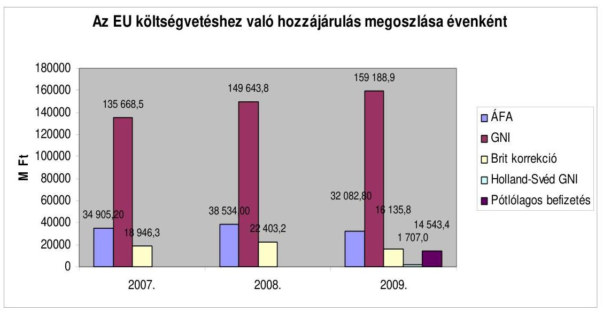

Magyarország hozzájárulása az EU költségvetéséhez évről-évre növekedést mutat. A növekedés oka a GNI alapú hozzájárulás mértékének növekedése, amelynek alapja a tagállami bruttó nemzeti jövedelemre vetített egységkulcscsal képzett összeg. A bruttó nemzeti jövedelem növekedésével párhuzamosan nő a GNI alapú hozzájárulás mértéke is. A 2009. évben a növekedés másik okaként a Svédország és Hollandia számára teljesítendő bruttó GNI csökkentés, valamint az ehhez kapcsolódó egyszeri pótbefizetés nevezhető meg.

2009-ben Magyarország GNI alapú befizetése 159 188,9 M Ft-ot tett ki, amely befizetési kötelezettségünk 71,3\%-a. GNI tartalék aktiválására a 2009. évben nem került sor. ${ }^{52}$

Bruttó GNI csökkenés Hollandia és Svédország javára címen az új saját forrás határozat (2007/436/EK, Euratom tanácsi határozat) értelmében 2009-ben Magyarországnak 1707,0 M Ft-ot kellett befizetni, mely a hozzájárulásunk 0,7\%-át adja. A fizetési kötelezettség 2009. június hónaptól jelentkezett és ettől az időponttól folyamatos kötelezettséget jelent.

Pótlólagos befizetés címén, az új saját forrás határozat rendelkezése alapján Magyarországnak egyszeri 14 543,4 M Ft összegű befizetést kellett teljesítenie, mely a 2009. évre vonatkozó hozzájárulásunk 6,5\%-át tette ki.

A 2009. évben Magyarország 32 082,8 M Ft-ot fizetett be áfa alapú hozzájárulás címén az EU költségvetésébe, amely a befizetéseink 14,3\%-át teszi ki. A befizetések havi bontásban történtek.

A 2009. évben brit korrekció jogcímen 16 135,8 M Ft került befizetésre, amely a befizetéseink 7,2\%-át teszi ki.

[^0]
[^0]:    ${ }^{52}$ A GNI tartalék felhasználására akkor kerül sor, ha a kiadások azt indokolják. A kiadások havonkénti változásának okai között szerepelhet a Strukturális Alapokból történő kifizetések volumenének hirtelen megnövekedése, a mezőgazdasági támogatások szezonális jellegű kifizetései.

---

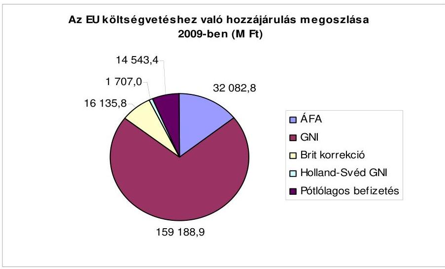

A központi költségvetés bevételi oldalán - amely ténylegesen megjelent a bevételi sorokon - az EU költségvetéséből 36 822,1 M Ft bevétel származott. Ez az összeg a Magyarországot megillető cukorilleték visszatérítés címen keletkezett 157,0 M Ft-ból, a vám visszatérítés címen befolyó 7994,6 M Ft-ból és az uniós támogatások utólagos megtérülése címen befolyó 28 670,5 M Ft-ból tevődött össze.

Az EU költségvetését illetik a vámbevételek, illetve a cukorágazat piacának közös szervezése keretein belül nyújtott hozzájárulások, melyeket a cukor-, az izoglükóz- és az inulin-gyártók teljesítenek. A vonatkozó uniós szabályok megváltozása miatt ez utóbbiak tekintetében ma már nem cukor, izoglükóz- és inulin-illetékekről, hanem termelési díjakról van szó. Ezen a jogcímen a 2009. évben 157,0 M Ft termelési díj került elszámolásra. Az EU-t megillető termelési díj 471,1 M Ft-ot tett ki.

Az EU-t megillető vámok összege a 2009. évben 24 883,2 M Ft volt.
A tagsággal nem rendelkező országokkal folytatott kereskedelem után beszedett vámokhoz kapcsolódóan „vámbeszedési költség megtérítése" alcímen 7994,6 M Ft bevétel folyt be a központi költségvetésbe. A tervezett bevétel 8078,1 M Ft volt, így a teljesülés $99 \%$.

A bevételnek az előirányzattól való elmaradását elsődlegesen a gazdasági válság hatására bekövetkezett jelentős forgalomcsökkenés magyarázza (a vámmal érintett kereskedelmi forgalom ugyanis a tervezetthez képest több, mint 20\%kal, az előző évhez viszonyítva 15,8\%-kal csökkent). Az alacsonyabb teljesüléshez továbbá a visszafizetések magas értéke is hozzájárult.

Az EU által finanszírozott programok, projektek közösségi forrás-részének utolsó részletét az EU Bizottság csak a program zárását követően téríti meg. Az egyes támogatási programok zárását követő, az EU Bizottság által teljesítendő ún. zá-ró-kifizetés összegéről a szakmailag első helyen felelős tárcának/költségvetési fejezet felügyeletét ellátó szervnek a PM részére adatot kell szolgáltatnia, azonban ezen tételek nem az egyes szaktárcák költségvetési fejezeteiben, hanem a XLII. „A központi költségvetés fő bevételei" fejezetben kerülnek megjelenítésre.

---

A 2009. évi költségvetési törvényben Uniós támogatások utólagos megtérülése címén 56079,3 M Ft-ot terveztek bevételként. 2009. évben ezen a címen az EU 28 670,5 M Ft-ot térített vissza Magyarországnak, amely az eredeti előirányzat $51,1 \%-a$.

Az EU alapokból folyósított támogatások irányítási és ellenőrzési rendszereinek sajátossága, hogy a támogatások szakmai kezeléséért, és a fejezeti kezelésű előirányzatok felhasználásáért az OP IH-k felelnek. Az IH-k - az NFT I. AVOP végrehajtásáért felelős AVOP IH kivételével - az NFÜ főosztályaiként működnek (az AVOP IH az FVM Agrár-vidékfejlesztési Főosztálya, vezetője az FVM szakállamtitkára volt).

Az FVM Agrár-vidékfejlesztési Főosztálya látta el az ÚMVP IH feladatait, míg a HOP esetében a Természeti Erőforrások Főosztály HOP IH Osztálya volt az IH. Az EMVA-ból és az EMGA-ból finanszírozott agrártámogatások vonatkozásában az MVH kifizető ügynökségi feladatokat látott el 2009-ben. A SA-ból finanszírozott AVOP, valamint az Európai Halászati Alapból folyósított támogatások végrehajtása tekintetében az irányító hatósági (AVOP IH, EHA IH) megbízások alapján KSz feladatokat végzett az MVH.

Az FVM saját szervezetén belül és az intézményi körébe tartozó más szervek (MVH, MgSzH, AMC) bevonásával látta el a központi költségvetésben nem szereplő közvetlen uniós támogatások lebonyolítását is. Ezekhez a központi költségvetés (Kincstár) forrásmegelőlegezést biztosít, amit az EU utólag megtérít.

A költségvetésen kívüli támogatások finanszírozási forrásának a megelőlegezése a KESZ-ről történt 2009-ben is. Az MVH részére, az EMGA-ból finanszírozott, a közvetlen területalapú, a piaci támogatások, az intervenciós intézkedésekhez kapcsolódó kifizetések, valamint az EMVA-ból finanszírozott vidékfejlesztési támogatások felhasználására vonatkozó agrártámogatások EU által finanszírozott része teljesítéséhez a központi költségvetés a Kincstár útján kamatmentes hitelt nyújt (Kvtv. 27. § (1) bekezdés). A 2009. évi meghitelezés összege éves szinten több mint 200000,0 M Ft-tal volt magasabb, mint a 2009. január 1-jei nyitóállomány.

Az OP-khoz hasonlóan az EU alapokból folyósított támogatások irányítási és ellenőrzési rendszereit az EU Bizottság (operatív) programonként hagyja jóvá a Tanács 1083/2006/EK rendelete és a kapcsolódó végrehajtási rendeletek alapján. Az egyes IH-k jelentései alapján az EH megvizsgálja az irányítási és ellenőrzési rendszereket és (évente) jelentést készít az EU Bizottságnak. 2009-re valamennyi OP irányítási és ellenőrzési rendszerét elfogadták.

Az IH-k, KSz-ek 2009-ben is párhuzamosan látták el a 2004-2006 és a 20072013 programozási időszak (operatív) programjainak kezelését. A 2004-2006-os időszak programjaival kapcsolatos tárgyévi feladatok jellemzően a programok, projektek zárásához, a szabálytalanság-, adósság-, és követeléskezeléshez kapcsolódtak, amelyre vonatkozóan az ÁSZ 2010-ben önálló vizsgálatot végzett.

Az SA-ból finanszírozott programjai megvalósítására az IH-k a KSz-ekkel megállapodásokat kötöttek, amelyben meghatározták az IH-k és a KSz-ek által ellátandó feladatokat. A 2008. évi zárszámadás ellenőrzése során kifogásoltuk, hogy az SA OP-k végrehajtásával kapcsolatos feladatok delegálása a KSz-ekhez

---

nem egységes keretek között történt, egyes KSz-ek a delegált feladatokat fel-adat-ellátási szerződés (SLA) alapján látják el, míg más KSz-ek feladatait együttműködési megállapodásban, vagy támogatási szerződésben szabályozták. Az SLA szerződések és azok módosításai a korábbiaknál jóval részletesebben tartalmazzák a feladatokat és a kötelezettségeket, amelyeket kiegészítettek a KSz által az OP-k lebonyolításában végzett feladatok finanszírozásának, illetve az NFÜ (IH-k) felé történő elszámolás kérdéseivel is.

E tekintetben előrelépés történt, 2009-re már csaknem mindenütt SLA szerződések léptek életbe, amelyek a támogatási feladatok lebonyolításának egységesítése irányába hatottak. A teljes egységesítés azonban még nem történt meg. A finanszírozás módjának egységesítésére tett javaslatunk 2009-re vonatkozóan nem valósult meg, a KSz-ek finanszírozásában 2009-ben is eltérések voltak tapasztalhatók.

Az uniós támogatások ellenőrzési rendszere több alrendszerből épül fel, a folyamatba épített ellenőrzésekből, a belső ellenőrzésből, és a külső ellenőrzésekből. A folyamatba épített ellenőrzések legfontosabb része a KSz-eknél zajlik, és a támogatási rendszer egyes elemeinek ellenőrzési listák alapján történő ellenőrzéséből és a helyszíni ellenőrzésekből áll. Az ellenőrzési listák alkalmazása kiterjed a támogatási folyamat minden területére, a szerződéskötéstől a kifizetések előtti ellenőrzéseken át a zárás előtti ellenőrzésekig. Ezeket a listákat a MKK-k, illetve az ÚMFT-nél az EMK és a KSz-ek audit trail-jei tartalmazzák, alkalmazásuk mindenütt kötelező.

A PM NAO Iroda ellátja a KH és igazoló hatóság számára jogszabályokban előírt feladatokat, melynek során kiállítja és benyújtja a költségigazoló nyilatkozatot az EU Bizottság részére. Az NFT I. esetében, tekintettel a záráshoz kapcsolódó összegzés szükségességére, az igazoló jelentéshez csatolni kell egy kiegészítő, záró igazoló jelentést. A záró igazoló jelentés kiállításának okmányos feltétele az IH-któl beérkező OP/projekt zárásra vonatkozó dokumentumok megléte, melyek összeállításának elhúzódása veszélyezteti az OP-k/projektek határidőre történő lezárását és kiküldését az EU Bizottságnak.

A 2007-2013. programozási időszak ÚMFT támogatások esetében a 281/2006. (XII. 23.) Korm. rendelet 23-26. §-ai írják elő az Szt. szerinti eredmény szemléletű kettős könyvvitel vezetését és éves beszámoló készítését. A PM NAO Iroda fenti jogszabályi kötelezettségének a vizsgálat lezárásáig nem tett eleget.

A PM NAO Iroda belső ellenőrzési egysége széleskörű tanácsadási tevékenységet lát el, azonban nem rendelkezik pontos kimutatással arra nézve, hogy a tanácsadási tevékenység mekkora kapacitást igényel, illetve hány ellenőrzési órát fordítanak ezen tevékenységek elvégzésére.

A PM NAO Iroda nyilatkozata szerint a tanácsadói tevékenység kapacitás igényére vonatkozóan az egységen belüli feladat megosztás révén a tanácsadói tevékenységre fordított ellenőri napok nem befolyásolták a tervezett ellenőrzések megvalósulását.

Véleményünk szerint ez veszélyezteti az Éves Ellenőrzési Tervben foglalt feladatok elvégzését, mert az ellenőrzésre fordítandó ellenőri napok és órák számát a tanácsadói tevékenység időszükséglete befolyásolhatja.

---

További probléma a tanácsadói tevékenységgel kapcsolatban, hogy a jelenlegi szabályozás szerint előfordulhat, hogy a belső ellenőrzésnek egy olyan eljárási rendet kell ellenőriznie, amely kidolgozásában tanácsadói tevékenysége keretében segédkezett.

A Kincstár látja el az ÚMFT elkülönített, eredményszemléletű, IH-KSz szintű könyvvezetését, amelyet az NFÜ-vel kötött együttműködési megállapodás alapján, átruházott feladatként végez. Tevékenységét saját kiadású számviteli kézikönyve segítségével végzi. A Kincstár az ÚMFT rész-beszámolót határidőre elkészítette, az abban szereplő aktívák és passzívák valamint az eredménykimutatás adatai a főkönyvi kivonattal alátámasztottak. A PM NAO által végzendő záráshoz szükséges Nyilatkozatot - összefüggésben a mérleg készítésének időpontjával és az NFÜ bizonylatküldési határidőre vonatkozó kötelmének egybeesésével - a Kincstár határidő után küldte meg.

Az eredményszemléletű beszámoló és az államháztartási szemléletű beszámoló mérlegtételei, valamint az eredmény kimutatás adatai - a két beszámoló típus jellegzetességei miatt - egymásnak csak korlátozottan feleltethetőek meg. Az eredményszemléletű beszámoló ráfordításainak adataiból az államháztartási beszámoló kiadás adatai levezethetőek.

Az ÚMPV igazoló szervi feladatokat a KPMG Hungária Kft. - a svájci KPMG International leányvállalataiból álló KPMG hálózat önálló tagvállalata - látta el. Az Igazoló Szervvel kötött szerződés biztosította a Kifizető Ügynökséggel kapcsolatos vizsgálatokat - az informatikai rendszervizsgálatot is beleértve - az éves jelentés, valamint a tanúsítvány kiállítását a nemzetközileg elfogadott könyvvizsgálati szabványoknak megfelelően, az EU Bizottság által megállapított iránymutatásokat figyelembe véve végezze. A 2009. pénzügyi évre vonatkozó, az EMVA/EMGA éves beszámolójának felülvizsgálatáról a KPMG fenntartás nélküli tanúsítványt adott ki, és rendben lévőnek találta a Kifizető Ügynökség által működtetett belső ellenőrzési rendszer is. Az igazolószervi szerződés azonban 2009-ben lejárt, októbertől az igazoló szervi feladatellátás nem biztosított.

A programszintű monitoring feladatok végrehajtását az IH-k és az MB, a projekt szintű monitoringgal kapcsolatos feladatokat a KSz-ek végzik. A KSz-eknél különböző szervezeti felépítésben látják el a monitoring feladatokat. Jellemzően olyan szervezeti egységek működnek, melyeknek fő feladata a monitoring tevékenység. Az AVOP-nál és a ROP-nál decentralizáltan szervezték meg a monitoring tevékenységet az MVH AVOP KSz-nél a regionális kirendeltségeken, VÁTI ROP KSz-nél a területi irodákon végzik e tevékenységet.

A monitoring szerteágazó feladatai közt a leglényegesebb a projekt előrehaladási jelentések vizsgálata, amelyekben foglaltak alapján döntik el, hogy jogose a kifizetési kérelem. A legtöbb KSz-nél a Monitoring Osztály feladata a kifizetési kérelmek vizsgálata is. E tevékenység keretében szorosan együttmúködnek a pénzügyi (kifizetési) területtel. Szintén a monitoring tevékenység részeként ellenőrzik a kifizetések jogosságát, és a köztartozás-mentességet. Az ellenőrzések megállapításai alapján a KSz-ek 2009-ben a monitoring tevékenységet az előírt jogszabályi kereteken belül megfelelően végezték.

---

A monitoring tevékenység múködtetése az MVH regionális illetékességű kirendeltségein, 2-3 főből álló Monitoring Osztályokban valósult meg. A munkakört betöltők gyakran egyéb feladatok mellett látják el ezt a tevékenységet is. Alapvetően az AVOP-hoz, az NVT-hez kapcsolódó, a kedvezményezettek által benyújtott beszámolókon alapuló adatelemzési tevékenységet folytattak. A napi munkavégzésükben meghatározó (a papíralapon benyújtott dokumentumok feldolgozásánál) a manuális munkavégzés, hiszen több számítógépes rendszerben (EMIR, SAMIR) kell az adatfeltöltés naprakészségét biztosítani.

A jogszabályi előírások szerint a számviteli nyilvántartások vezetésére az EMIR, illetve az INTERREG programoknál az IMIR rendszert, az ETE esetében az IMIR 2007-2013 rendszert kell alkalmazni. Az EMIR, IMIR rendszerek alapvetően jól töltik be a nyilvántartással kapcsolatos szerepüket, ugyanakkor több hiányosságuk is van. Ezek közül az egyik legalapvetőbb, amit az ÁSZ már évek óta kifogásol, s ami a mérlegvalódiságot is sérti, hogy az EMIR, IMIR statisztikák nem a még fennálló kötelezettségek állományát mutatják, hanem a projektekre még el nem számolt, „nyitott" összegeket. A kettő azonban a valóságban eltér egymástól. Nem állapítható meg a rendszerekből az adott évre fennálló kötelezettségvállalás összege sem. Nem szolgálja az adatbiztonságot, hogy az analitikus számlák (EMIR, IMIR) és a beszámoló elkészítését támogató FORRÁS SQL főkönyvi számlák közt nincs automatikus adatátviteli kapcsolat. Szintén általános hiányosság, hogy az EMIR-ből nem lehet értéknapos - csak tárgynapi - lekérdezéseket végezni. Az EMIR adattartalmának megbízhatóságát csökkenti, hogy az egyes KSz-ek eltérő módon és mértékben töltik fel az EMIR nyilvántartásokat.

Az NFÜ észrevételében jelezte, hogy "Az EMIR tartalmaz adott napra történő eltárolt lekérdezéseket, ezek az Adattár modulban, az egyes statisztikák előzmény funkciójával érhetők el."

Az IMIR 2007-2013 rendszer 2009. év folyamán került átvételre, élesüzemi adatokkal 2010 folyamán kerül feltöltésre.

Az MVH által 2004-től használt IIER központi adatbázisra épülő számítógépes ügyviteli keretrendszer. Az MVH országos hálózatához a kirendeltségek az EKGn keresztül kapcsolódtak.

Az MVH az IIER-en belül múködteti az ügyfél-nyilvántartási rendszert, a MePARt , valamint az intézkedésekhez kapcsolódó támogatások igazgatási és ellenőrzési rendszerét. Ugyanakkor az EMVA támogatási keretében legnagyobb volument kitevő Állattartó telepek korszerűsítése és az Önálló építéssel nem járó gépek, technológiai berendezések beszerzéséhez kapcsolódó támogatási kérelmek és egyéb iratok beadása papíralapon, feldolgozása tömegszerű adatrögzítéssel történt.

# 7. A BELSŐ KONTROLLRENDSZEREK MŰKÖDÉSE 

A 2009. évi zárszámadás ellenőrzésének keretében az alkotmányos és egy intézményes fejezetek, a fejezeti jogosítványú költségvetési címek, a fejezetek igazgatási címei, a fejezeti kezelésű előirányzatok körében végzett értékelések alapján kiemelten elemeztük a belső kontrollrendszerek kiépítettségét és múködését a költségvetési beszámolók megbízhatóságát befolyásoló kockázatok mérséklése szempontjából.

---

Az intézmények és a fejezeti kezelésű előirányzatok költségvetési beszámolóját egyaránt érintő legkockázatosabb terület az informatikai környezet szabályozottsága és múködése volt. További kockázatos terület az intézményi körben a gazdálkodási tevékenység informatikai támogatottsága, míg a fejezeti kezelésű előirányzatoknál a Kincstár munkafolyamatba épített ellenőrző funkciója volt. Az ellenőrzési nyomvonal, a kockázatkezelési eljárásrend, valamint a szabálytalanságok kezelésének eljárás rendje hiánya, illetve hiányosságai és hibái kockázatnövelő tényezők voltak a belső kontrollrendszerek kiépítésének, eredményes múködésének szempontjából.

Az informatikai környezet szabályozottsága és múködése területén az intézmények 6\%-ánál, illetve a fejezeti kezelésű előirányzatokat kezelő szervezetek 16\%-ánál hiányzott az informatikai biztonsági szabályzat. Közel 40\%-uk nem készített múködésfolytonossági tervet. A legnagyobb kockázatot az hordozza, hogy a fejlesztési és az üzemeltetési feladatok formális szétválasztása továbbra sem megoldott a vizsgált intézmények közel 1/4-énél. Növelte a kontroll kockázatot, hogy a fejlesztők hozzáférhettek az éles (munkahasználatban levő) adatokhoz. Jellemzően hiányzott a naprakész nyilvántartás arra vonatkozóan, hogy mely dolgozók milyen hozzáférési jogosultsággal rendelkeztek a szervezet hálózati rendszeréhez, operációs rendszereihez, pénzügyi számviteli szoftvereihez. Az intézmények 91\%-nál nem volt teljes körű a mentési eljárások szabályozása sem, a fejezeti kezelésű előirányzatokat kezelő szervezetek 47\%-ánál pedig nem ellenőrizték az elmentett állományokból a pénzügyi-számviteli adatok teljes körű helyreállíthatóságát.

A gazdálkodási tevékenység informatikai támogatottsága területén kockázatot jelentett - az előző évekhez hasonlóan - az analitikus nyilvántartások és a főkönyvi számlák közötti automatikus kapcsolat hiánya, illetve hiányosságai. Az intézményi körben fokozta a kockázatot, hogy több mint 1/5énél nem volt követelmény a rendszerbe került adatok ellenőrzése.

A gazdálkodási tevékenység informatikai támogatottsága, az analitikus könyvelés és a főkönyvi könyvelés közötti automatikus adatkapcsolat hiánya hozzájárult ahhoz, hogy egy fejezeti kezelésű előirányzat költségvetési beszámolójában a főkönyvi számlával egyező értékű követelésállomány és az analitikus nyilvántartás között olyan mértékű eltérés mutatkozott, amely a beszámoló elutasítását vonta maga után.

A Kincstár munkafolyamatba épített ellenőrző funkciója eredményeként a fejezeti kezelésű előirányzatokat kezelő szervezeteknél a függő-, átfutóés kiegyenlítő kiadások-bevételek eltérései következtében a vizsgált szervezetek 2/3-ának volt intézkedési kötelezettsége. A vizsgált szervezetek felénél a kincstári költségvetési beszámoló és az elemi beszámoló adatai nem egyeztek egymással. Az eltérések a legnagyobb arányban az előirányzatok teljesítésénél és a kiemelt előirányzatok adatai kapcsán fordultak elő. Az EU támogatások egyeztetése a Kincstárral negyedévente - egy szervezet kivételével - minden szervezetnél megtörtént. Minden érintett szervezet elkészítette a feladatfinanszírozásba vont fejezeti kezelésű előirányzatok és a központi beruházások feladatismertetőit, a feladatfinanszírozás engedélyokiratait és a finanszírozás alapját képező okmányokat.

---

A belső kontrollrendszer súlyponti eleme a FEUVE, megfelelő kiépítése, folyamatos és hatékony múködése kulcsfontosságú, amely felöleli a megelőző és feltáró kontrollok széles körét.

A szervezetek megfelelően kidolgozták a FEUVE elemei körében a kötelezettségvállalás, szakmai igazolás, utalványozás, ellenjegyzés, érvényesítés rendjét. Valamennyi szervezet gondoskodott a feladatkörök szabályszerű elkülönítéséről. A szabályozottság nem volt teljes körű a könyvelés, adatrögzítés területén.

Kockázatot jelent, hogy az intézmények több mint 6\%-a egyáltalán nem rendelkezett ellenőrzési nyomvonallal. Az ellenőrzési nyomvonalak több tekintetben nem feleltek meg a kiadott módszertani útmutatónak, a leggyakoribb hiányosság az egyes tevékenységek elvégzését igazoló dokumentumok azonosítójának, illetve fellelhetési helyének megjelölése, az ellenőrzési pontok kijelölése volt.

A kockázatkezelés a megfelelő kontrollrendszer kialakításának kiemelt fontosságú eleme. Az intézmények 19\%-a míg a fejezeti kezelésű előirányzatok vonatkozásában a szervezetek 27\%-a nem rendelkezett kockázatkezelési eljárásrenddel. A kialakított eljárásrendek sem voltak teljes körűek, így nem tértek ki a kockázat fogalmára, azonosítására, a Kockázatkezelő Bizottságra vonatkozó előírásokra, a kockázatok és az elfogadható kockázati szint meghatározására. A fejezeti kezelésű előirányzatok 7\%-ánál tovább növelte a kockázatot, hogy nem építették be a kockázatokra való válaszintézkedéseket a folyamatba.

Az intézmények a szabálytalanságok kezelésének eljárásrendjét - három kivételével - elkészítették. A fejezeti kezelésű előirányzatok vonatkozásában a szervezetek 13\%-a nem rendelkezett szabálytalanságok kezelését szabályozó eljárásrenddel. A kidolgozott eljárásrendek legfőbb hiányossága, hogy a vizsgált szervezetek több, mint 80\%-ánál nem hoztak létre szakértői csoportot az előforduló szabálytalanságok észlelése és kezelése érdekében, valamint nem neveztek ki szabálytalansági felelőst a szabálytalanságok észlelésével és kezelésével kapcsolatos feladatok koordinálására. A szervezetek több mint 3/4-énél nem szabályozták az eljárásrendtől eltérő esetek kezelését.

A beszámolók megbízhatóságát befolyásoló hibák, szabálytalanságok előfordulása az intézmények körében a belső kontrollrendszer megfelelő kiépítettségének hiányával, a FEUVE hiányosságaival, a pénzügyi jogkörök gyakorlását támogató kontrollok nem kielégítő működésével függtek össze. A fejezeti kezelésú előirányzatok tekintetében a beszámolók megbízhatóságát befolyásoló hibák és szabálytalanságok a számviteli rendszer informatikai támogatottsága, az analitikus könyvelés és a főkönyvi könyvelés közötti automatikus adatkapcsolat hiánya; a FEUVE rendszerén belül a pénzügyi jogkörök gyakorlásához kapcsolódó kontrollok hiányos múködése; a kötelezettségvállalás, kötelezettségvállalás ellenjegyzése, teljesítésigazolás kontrolljának nem megfelelő múködése miatt keletkeztek. Mindezek szerepet játszottak abban, hogy a feltárt hibák és a tapasztalt szabálytalanságok miatt, az intézmények esetében öt, míg a fejezeti kezelésű előirányzatok vonatkozásában nyolc beszámolót minősített záradékkal láttunk el.

---

A belső ellenőrzés egyik alapvető feladata a belső kontrollok folyamatos monitoringja, értékelése, javaslatok tétele a belső kontrollrendszer továbbfejlesztésére, a rendszert érintő javaslatok hasznosításának nyomon követése.

A belső ellenőrzés tevékenységébe tartozóan az intézmények felénél nem végzett az éves költségvetési beszámolóra vonatkozó megbízhatósági ellenőrzést, 3/4-énél nem került sor informatikai rendszer ellenőrzésre, 9\%-a nem végzett szabályszerűségi, 19\%-a pedig pénzügyi, rendszer és teljesítmény ellenőrzést. Az intézmények közel 1/5-énél a belső ellenőrzés nem vizsgálta a FEUVE kiépítését és múködését.

A fejezeti kezelésű előirányzatok esetében nem fordítottak kellő figyelmet a fejezeti kezelésű előirányzatok célszerű felhasználásának vizsgálatára, valamint nem, illetve részben ellenőrizték a fejezeti kezelésű előirányzatok kezelésének rendszerét. Az ellenőrzési témák kiválasztásánál nem érvényesítették teljes körűen a kockázatelemzésen alapuló megközelítést.

A Nemzetgazdasági Minisztérium a 2010. július 29-én tett észrevételében jelezte, hogy:
„Az ellenőrzési témák kiválasztásánál a kockázatelemzés alapján rangsorolt területek adják a vizsgálandó folyamatokat, azonban létezik számos egyéb befolyásoló tényező (Pl.: felsővezetői igények; korábbi saját, fejezetet irányító szervi, ÁSZ, KEHI ellenőrzések tapasztalatai), illetve nem utolsó szempont a várhatóan rendelkezésre álló kapacitás."

A megállapításokat is tartalmazó jelentések egy ötödénél elmulasztották az intézkedési tervek készítését, 67\%-ban pedig az intézkedési tervekben meghatározott feladatok végrehajtásának ellenőrzését.

A Nemzetgazdasági Minisztérium 2010. július 29-én tett észrevételében jelezte, hogy:
„Megjegyezzük, hogy a fejezetek a tárcánknak beküldött beszámolóikban beszámoltak arról, hogy az ellenőrzések jelentős hányadában még az ellenőrzések végrehajtásának folyamatában korrigálásra kerültek az ellenőrök által feltárt hibák, hiányosságok."

A belső ellenőrzés vizsgálatai, értékelései és javaslatai révén - feladat ellátásának hiányosságai következtében - nem támogatta teljes körűen a belső kontroll folyamatok eredményességét, az elszámoltathatóságot, így csak korlátozott mértékben járult hozzá a kontroll kockázatok mérsékléséhez.

A belső kontrollrendszerek az összehangolt kiépítésük, következetes és folyamatos működésük - ellenőrzésünk során feltárt - hiányosságai miatt nem szolgáltak eredményes eszközként az elemi beszámolók megbízhatóságát befolyásoló kockázatok mérsékléséhez, a hibák, szabálytalanságok előfordulásának kiküszöböléséhez. (Megállapításaink részletes kifejtését - amely tartalmazza az Uniós Fejlesztések fejezeti kezelésű előirányzatainak vizsgálatánál szerzett tapasztalatokat is - a Függelék tartalmazza.)

---

# 8. Letéti számLák 

### 8.1. A központi letéti számla

A központi költségvetés tevékenységi körén kívül eső, nem állami feladatellátást finanszírozó pénzeszközkezelés letéti számlán történik (Áht. 12/A. § (4) bekezdés). A központi költségvetés 2009-ben két központi letéti számlával rendelkezett, melyek kezelése a Kincstár feladatkörébe tartozik.

A zárszámadási törvényjavaslat tervezet általános indokolásának mellékletében a központi letéti számlák nyitó, éves forgalmi és záró adatai a Kincstár nyilvántartásával egyezően kerültek bemutatásra.

A 10032000-01501308 számú Központi letéti számlának 0,5 M Ft volt a 2009. évi nyitó egyenlege. Az év folyamán a számlára összesen 1,2 M Ft folyt be különböző jogcímeken. A számláról év közben 1,7 M Ft továbbutalásra került, így a számla - kerekítés nélküli - év végi záró egyenlege 13,7 E Ft volt.

A számla 0,5 M Ft-os nyitóegyenlege 12 megszűnt társadalmi szervezet vagyonának értékesítéséből származott. 2009-ben 6 megszűnt társadalmi szervezet vagyonának értékesítéséből további 0,4 M Ft folyt be a számlára. A PM rendelkezése alapján, a döntési jogosultság betartásával (1989. évi II. törvény 21. § (2) bekezdés) a teljes összeg, azaz 0,9 M Ft átutalásra került december 28 -án a közhasznú ÁGOTA Alapítvány javára. Ezt követően, december 29-én újabb megszűnt szervezet 13,7 E Ft-os megmaradt vagyona került jóváírásra a számlán, mely összeg egyben a számla 2009. évi záró egyenlege.

Egyéb jogcímen éves szinten - a 2006-2008. évekhez hasonlóan - 2009-ben is egy magyar állampolgár részére, az EU Közösségen belül különélő nem magyar állampolgárságú házastársa után összesen 0,8 M Ft családi pótlék került megállapításra, melynek pénzforgalmi elszámolása (utalása és továbbutalása a felmerült banki és postaköltségek levonása után) a központi költségvetés letéti számláján történt a Kincstár 2006. március 22 -én hozott végzése alapján, az abban foglaltak szerint. Elszámolása jogszerú volt.

A 10032000-01501315 számú Lakáscélú kedvezmények letéti számla 2008-ban került megnyitásra a KVI megszűnése miatt. A számlának 2360,5 M Ft volt a 2009. évi nyitó egyenlege. Az év során a számla forgalma bevételi oldalon 1876,7 M Ft, kiadási oldalon 1826,2 M Ft volt. A számla év végi záró egyenlege 2411,0 M Ft volt.

A KVI lakáscélú elszámolásokhoz kapcsolódó - többek között a jelzálogjog felfüggesztésére vonatkozó - feladatait a 2008. évtől a Kincstár vette át.

Olyan lakás értékesítése esetén, amelyre szociálpolitikai támogatást nyújtott az állam, az újonnan épített, illetve vásárolt új ingatlan megvételéig ezen a számlán kell letétbe helyezni a támogatás összegét. A letétbe helyezett összeg visszafizetéséről, vagy végleges költségvetési bevételként történő elszámolásáról, valamint a jelzálogjog áthelyezéséről a jegyzők értesítése alapján az Állampénztári Irodák rendelkeznek.

---

A számla kezelése és analitikájának vezetése a jogszabályi előírásnak (12/2001. (I. 31.) Korm. rendelet), valamint a Kincstár vonatkozó belső szabályzatának (34/2008. sz. Elnöki Utasítás) megfelelően, szabályszerűen történt.

A Kincstárban a belső kontrollok megfelelően múködtek. A központi letéti számlák kezelése és analitikájának vezetése a pénzügyi-, számviteli előírásokkal, valamint a Kincstár vonatkozó belső szabályzataival összhangban történt.

# 8.2. Fejezeti letéti számlák 

A központi költségvetési szervek számára külön jogszabályban rögzített esetekben, a költségvetési szervek tevékenységi körén kívül eső, nem az állami feladatellátást finanszírozó pénzeszközök átmenetileg vagy megbízás alapján lebonyolított forgalma letéti kezelésének szabályaira vonatkozó előírásokat (számlák nyitása, vezetése, letéti pénzkezelés és az arról való beszámolás) az Áht. 12/A. § (4) bekezdése, az Ámr. 108. §-a, valamint az Áhsz. 44. § (4) bekezdései tartalmazzák. A letéti számlák kezelése és nyilvántartása a vizsgált időszakban megfelelt a vonatkozó előírásoknak.

A 2009. évben forgalmat is lebonyolító fejezeti letéti számlával az MKÜ, az ÖM és az EüM fejezet rendelkezett. A ME, az NFGM és a KvVM letéti számláin a 2009. évben forgalom nem volt (az NFGM letéti számlája a beszámolási időszakot megelőzően letétbe helyezett összegek értékét mutatta).

Az MKÜ a Kincstár és a Magyar Külkereskedelmi Bank által vezetett forint illetve deviza letéti számlával rendelkezett. A Kincstár által vezetett forint letéti számla az elhunyt ügyészségi dolgozók illetmény- és egyéb személyi jellegú járandóságai, bírói ítélet alapján átmeneti jelleggel letétként kezelendő járandóságok, illetve - a 11/2003. (V. 8.) IM-BM-PM együttes rendelet alapján - a búnjelként lefoglalt pénzösszegek (deviza és Ft), valamint a Be. tv. 586. § alapján ügyész által elrendelt biztosíték kimutatására szolgál. Az illetmény jellegú letétek kifizetése jogerős hagyatéki végzés vagy bírói ítélet alapján történt. Az MKB-nál vezetett deviza letéti számla az ügyészség által lefoglalt külföldi fizetőeszköz búnjel nyilvántartására szolgál. A búnjelpénz a büntetőeljárás bírósági szakaszba kerülésekor az illetékes bíróság számlájára került átutalásra, az eljárás vádemelés nélküli lezárásakor pedig a jogosult részére utalták ki. A letéti számlákon minden változás a letétkezelők írásbeli rendelkezése szerint történt.

Az ÖM fejezet letéti számláján $9,1 \mathrm{M}$ Ft bevétel és $0,2 \mathrm{M}$ Ft kiadás mellett 8,9 M Ft egyenleg keletkezett. A letéti számlán lévő pénzeszköz az EU Szolidaritási Alap által a 2007. évi árvizi segély címen átutalt összeg szét nem osztott maradványa. A maradványról a segély felhasználásáról készült fejezeti beszámolók elfogadásával döntenek. Az EU Szolidaritási Alapja a felülvizsgálatot még nem végezte el.

Az EüM fejezeti kezelésű előirányzatai vonatkozásában a letéti számla rendeltetése az egészségvédelmi-, a kémiai terhelési-, a helyszíni-, a fogyasztóvédelmi bírságok kezelése, illetve az államháztartáson kívülről érkező pénzeszközök kezelése volt. A fejezet 2006. szeptember 1-jétől a jogszabályi környezet változása miatt nem a letéti számlán kezeli a bírság bevételeket. Az év közben letéti számlára beérkezett bírságok az előirányzat-felhasználási keretszámlán megnyitásra, illetve felhasználásra kerültek. A letéti számla nyitóegyenlege nulla Ft, a 2009. évi bevé-

---

tel 52,0 E Ft, kiadás 51,0 E Ft, a számla záró egyenlege 2009. december 31-én 1,0 E Ft volt.

Fejezeti letéti számlával nem, de intézményi letéti számlákkal rendelkezett a BIR, az FVM, a HM, az IRM, a KHEM, az OKM, a PM és az SZMM. A fejezeti számla mellett intézményi letéti számlával is rendelkezett az NFGM és az EüM.

A BIR fejezetnél a letéti számlák 15232,9 M Ft nyitó egyenlege a tárgyidőszak végén 17119,4 M Ft-ra növekedett. A letétek nyitóállománya az év folyamán 8360,9 M Ft letéti bevétellel növekedett, amelyből 6474,4 M Ft kiadás teljesült. A végrehajtói letéti számla kezelését a bírósági végrehajtásról szóló 1994. évi LIII. törvény 307. §-a (2) bekezdésének g) pontjában kapott felhatalmazás alapján a bírósági végrehajtási ügyvitelről és pénzkezelésről szóló 1/2002. (I. 17.) IM rendelet szabályozza. A bírói és elnöki letétek kezelését a bíróságon kezelt letétekről szóló 27/2003. (VII. 2.) IM rendelet szabályozza. Eszerint letétbe helyezésre kerülnek a bizonyítással és tolmácsolással kapcsolatban a feleket terhelő kiadások, továbbá a felek által teljesítendő egyéb kifizetések fedezeteinek összege. A megyei (fővárosi) bíróságok rendelkeznek felszámolási dí fedezeti letéti számlával a csődeljárásról és a felszámolási eljárásról szóló 1991. évi XLIX. törvény előírása értelmében. A csőd- és felszámolási eljárás során e letéti számlára kötelezően befizetendő összeg képezi fedezetét a felszámolók díjának abban az esetben, amikor a felszámolásra került cég vagyona arra nem nyújt fedezetet. A fenti törvény alapján a Fővárosi Bíróság rendelkezik felszámolási díj kiegészítési központi letéti számlával is. A hivatkozott törvény szerint a befolyt összegből azok a felszámolói díjak kerülnek kifizetésre, amelyekre a megyei (fővárosi) bíróságokon kezelt letét nem nyújt fedezetet.

Az FVM fejezetnél a Kincstár két intézmény számára vezet letéti számlát. A Mezőgazdasági Szakigazgatási Hivatal Központ kijelölt szervezetként az Szja tv. 20. § (1) bekezdése alapján, a törvény hatálya alá tartozó erdőgazdálkodók által befizetett összegeket és az erdőfelújítás teljesítésének arányában történő kifizetéseket kezeli és számolja el a letéti számlán. A számla 2009. évi nyitó egyenlege 8,8 M Ft volt, amelyből 1,4 M Ft kiadást teljesítettek. A záró egyenleg 7,4 M Ft volt. A 2009. július 9-én hatályba lépett az erdőről, az erdő védelméről és az erdőgazdálkodásról szóló 2009. XXXVII. tv. 72. § (1) bekezdése rendelkezik az erdő felújítási biztosítékról. Az erdészeti hatóság erdő felújítási biztosítékként többek között - a hatósági letéti számláján elhelyezett készpénzt fogadhat el, melynek részletes szabályait a törvény végrehajtásáról szóló 153/2009. (XI. 13.) FVM rendelet 46-48. §-a rögzíti. A végrehajtási szabályozás a 2009. év végén lépett hatályba, ezért a letéti számlán ehhez kapcsolódó forgalom 2009-ben nem történt.

A Mezőgazdasági és Vidékfejlesztési Hivatal Biztosíték számla az Európai Mezőgazdasági Vidékfejlesztési Alapból, az Európai Halászati Alapból, és az Európai Mezőgazdasági Garancia Alapból támogatott programok és intézkedések pénzügyi, számviteli és ellenőrzési rendszerek kialakításáról, lebonyolításának rendjéről szóló 82/2007. (IV. 25.) Korm. rendelet 5. § l) pontja alapján az MVH az EMGA, EMVA, illetve EHA-ból finanszírozott intézkedésekkel kapcsolatosan az ügyfelek által befizetett készpénzletétek fogadására szolgál. Az ügyfél teljesítése esetén az MVH innen utalja vissza az ügyfeleknek a felszabadított biztosítékok összegét. A lehívott biztosítékok összegei szintén ezen a számlán jelennek meg. Az MVH esetében a letéti számla és a biztosíték számla együttesen adják ki a letéti számla 2009. évi pénzforgalmát. A számla nyitó egyenlege 1346,6 M Ft, a bevétel 1480,3 M Ft, a kiadás 2484,9 M Ft, a záró egyenleg 342,0 M Ft volt.

---

A HM fejezet egy letéti számlával rendelkezett (év végi záró egyenlege 1,4 M Ft), amelyen a Katonai Főügyészség kezelésében a büntetőeljárások során lefoglalt hazai pénzeszközök kezelése valósult meg.

Az IRM fejezetnél a Büntetés-végrehajtás, a Rendőrség intézményei, valamint az MSZH rendelkeztek letéti számlával. A büntetés-végrehajtási intézetek kezelésében lévő letéti számlákon nyilvántartott pénzeszközök a fogvatartottak tulajdonát képezték. A pénzügyi tranzakciók rögzítése név szerinti számlalapokon történt. 2009-ben a büntetés-végrehajtási intézetek, intézmények kezelésében lévő letéti számlák összesített nyitóegyenlege 427,7 M Ft, bevétele 3976,1 M Ft, kiadása 4005,8 M Ft, záró egyenlege 398,0 M Ft volt. A Rendőrség 25 költségvetési szerve közül 2009-ben - a korábbi évekhez hasonlóan - 3 intézmény (Nemzeti Nyomozó Iroda, Köztársasági Örezred, Készenléti Rendőrség) nem rendelkezett letéti számlával. A letéti számlákon a bűnügyben eljáró hatóságok által a bűnügyek során lefoglalt pénzeszközöket, valamint azok visszautalását (pénzforgalmat) tartják nyilván. 2009-ben a letéti számlák összesített nyitóegyenlege 390,7 M Ft, bevétele 285,3 M Ft, kiadása 176,6 M Ft, záró egyenlege 499,4 M Ft volt. Az MSZH az árva mű egyes felhasználásainak engedélyezésére vonatkozó részletes szabályokról szóló 100/2009. (V. 8.) Korm. rendelet rendelkezései kapcsán nyitott letéti számlát a Kincstárnál. A számlán az év folyamán pénzmozgás nem volt.

Az NFGM fejezethez tartozó MKEH letéti számlájának 2009. évi nyitó egyenlege 264,6 M Ft, év végi záró egyenlege 30,9 M Ft volt. Év közben az egyéb letéti bevételek értéke $346,0 \mathrm{M} \mathrm{Ft}$, az egyéb letéti kiadások értéke $579,7 \mathrm{M} \mathrm{Ft}$ volt. A letéti számlán kezelendő összegeket az import engedélyek biztosítékrendszerre vonatkozó általános szabályozás, a mezőgazdasági termékeket érintő biztosíték rendszer alkalmazására vonatkozó részletes szabályok megállapításáról szóló 2220/1985/EK rendelet tartalmazta. A szabályozást kiegészítette - a többször módosított - a mezőgazdasági és élelmiszer-ipari termékekhez kapcsolódó biztosítékrendszer szabályairól szóló 17/2004. (II. 13.) Korm. rendelet, amely nemzeti hatáskörben szabályozta a biztosítékok formáit és alkalmazási lehetőségeit. A fenti szabályozás alapján az import engedélyekhez, valamint az engedélyalapú kedvezményes import vámkontingensekhez kötődő biztosítékok kezelését 2004. május 1-jétől a hivatal végzi. A szabályozás szerint az egyedi vagy keret biztosítékot készpénz letéttel (átutalással), bankgaranciával, vagy készfizető kezességgel lehet teljesíteni. Ez azt jelenti, hogy a behozatali engedélyt kérő szervezet az engedélykérelemmel egyidejűleg a letéti számlára utalja a biztosíték összegét. Az átutalt letéteket a Kincstárnál vezetett letéti számlán kezelik, amelyen a jóváírások fogadása és a visszautalások kezelése történik. Az import ügylet befejezését követően meghatározott feltételek teljesülése esetén - kerül sor a készpénzbiztosíték teljes, vagy részösszegének visszautalására, illetve az import kötelezettség teljesítésének elmulasztása esetén a biztosíték a letéti számlán marad.

A KHEM felügyelete alá tartozó MEH letéti számláján keresztül a földgázelosztás díjából származó árbevétel elosztói engedélyesek közötti szétosztása valósult meg. A Get. 146. §-a a MEH kötelezettségeként állapította meg a földgázelosztás díjából származó árbevétel hálózati engedélyesek közötti szétosztását („kiegyenlitő mechanizmus"). A PM 2009. november 11-én kelt levelében a KHEM véleményét figyelembe véve jóváhagyta a - kiegyenlítő mechanizmusok működtetésére vonatkozó - letéti számla nyitását. A kiegyenlítő mechanizmusokhoz kapcsolódó letéti számlára vonatkozó előírásokat a Get., az Ámr. és a földgáz rendszerhasználati díjak megállapításáról szóló 31/2009. (VI. 25.) KHEM rendelet tartalmazza. A Gazdasági és Humánpolitikai Főosztály kizárólag az eredeti határozat birtokában jogosult a beérkezett összegeket továbbutalni, egyéb ellenőrzési, jóváha-

---

gyatási kötelezettség nem terheli. A MEH-nek pénzvisszatartási jogosultsága nincs.

Az OKM fejezetnél két intézmény rendelkezett letéti számlával, amelyek közül a Kecskeméti Főiskola letéti számláján volt forgalom. A Kecskemét Megyei Jogú Város által felújított homokbányai lakások használatba adásakor a Kecskeméti Főiskola által kijelölt bérlők (oktatók) kauciót fizettek be, amelyet a Főiskola letétként kezel. Ezen kívül egyéb letétként kezelte a dolgozói és hallgatói kaputávirányító és étkezési kártya letéti díjainak befizetéseit, melyeket a jogviszony megszűnésekor visszafizet. A számla tárgyidőszaki nyitó és záró egyenlege egyaránt $1,2 \mathrm{M}$ Ft volt abból adódóan, hogy 2009-ben $25,4 \mathrm{M}$ Ft bevételi és ugyanilyen összegű kiadási forgalmat bonyolítottak le.

Az EüM felügyelete alá tartozó intézmények közül az Országos Alapellátási Intézet rendelkezett letéti számlával. A számlán bírósági végzés alapján a munkabér letiltásokból eredő pénzforgalmat bonyolítják le. A letéti számla nyitó egyenlege nulla Ft, a 2009. évi bevétel 324,0 E Ft, kiadás 324,0 E Ft, a számla záró egyenlege 2009. december 31 -én nulla Ft volt.

A PM fejezeten belül a Kincstár rendelkezett letéti számlával, melynek záró egyenlege $340,8 \mathrm{M}$ Ft volt. A számlán önkormányzatok adósságrendezési eljárásaival összefüggésben történtek jóváírások, illetve kifizetések.

Az SZMM fejezethez tartozó intézmények közül az OMMF, a Reménysugár Habilitációs Intézet, a Vakok Állami Intézete, az Aszódi, a Rákospalotai, a Debreceni Javítóintézet, a Kalocsai, a Zalaegerszegi Gyermekotthonok és a Károlyi István Gyermekközpont rendelkezett letéti számlával 2009. évben. A letéti számlák nyitó egyenlege $32,7 \mathrm{M}$ Ft, záró egyenlege $23,8 \mathrm{M}$ Ft volt.

Az OMMF letéti számlája az Ámr. 108. §-a alapján a Főfelügyelőség által kirótt, de az MPA számlára beszedett külföldiek engedély nélküli foglalkoztatása és a munkaügyi hatósági jogkörben kiszabott bírságbevételek, elkülönített, megbízásból történő átmeneti pénzkezelésére szolgál. A többi intézmény az ellátottak, befogadott személyek pénzét kezelte a letéti számlákon.

# 9. A KORÁBBI ÁSZ ELLENŐRZÉSEK MEGÁLLAPÍTÁSAIVAL KAPCSOLATBAN TETT INTÉZKEDÉSEK 

## A központi költségvetés nemzetgazdasági számláin elszámolt közvetlen bevételek és kiadások utóellenőrzése során a következők állapíthatók meg:

A 2008. évi ÁSZ vizsgálat során a központi költségvetés általános és központi egyensúlyi tartalék előirányzatai képzésével és felhasználásával, az igénylések megalapozottságával, az átcsoportosított előirányzatok elszámolásával és viszszatérítési kötelezettségével, a költségvetési előirányzatok módosításának nyilvántartási rendje éves aktualizálási időpontjával összefüggésben a Kormánynak tett javaslatok kapcsán mindössze egy intézkedés valósult meg.

A PM a 8005/2008. (PK. 5.) PM tájékoztató, majd évközi hatályba lépését követően a 4/2009. (III. 20.) PM tájékoztató alapján vezetett - a kormányhatározattal előírt előirányzat-módosításokat kóddal ellátó és regisztráló, ügyirat számot is tartalmazó - számítógépes nyilvántartásában, amely valamennyi, a Kvtv.-ben jóváhagyott központi költségvetési előirányzatot, így a tartalék előirányzatokat

---

(általános, cél és stabilitási) is és azok módosításait tartalmazza, az előirányzatmódosítások összegét 2009-től, az ÁSZ korábbi évek zárszámadásának ellenőrzése során tett javaslatát figyelembe véve, külön oszlopban kimutatva szerepelteti. Így készült előirányzat-fajtánkénti összesítés és ez által a nyilvántartás biztosítja az előirányzatok felhasználásának átláthatóságát, aminek hiányát a számvevőszéki ellenőrzés 2004 és 2008 között minden évben megállapította.

A 2008. évi zárszámadáshoz kapcsolódó számvevőszéki vizsgálat során az ÁSZ javasolta a Kormánynak, hogy „Gondolja át a központi költségvetés céltartalékának felhasználásával kapcsolatos KEHI ellenőrzések kiterjesztésének lehetőségeit és intézkedjen annak megvalósítása érdekében".

Javaslatot tett az ÁSZ továbbá a pénzügyminiszternek, mely szerint intézkedjen, hogy a központi költségvetés céltartalék előirányzata fejezetekhez történő átcsoportosításának feltételét képező, jogszabályban előírt előzetes ellenőrzési kötelezettségüknek mind az érintett fejezetek, mind a PM dokumentált módon tegyenek eleget. Ezen javaslat alapján sem történt intézkedés 2009-ben.

Az ÁSZ a zárszámadási ellenőrzései során a 2003. év óta szinte minden évben javasolta, hogy a pénzügyminiszter adjon számot az adózók költségvetéssel szemben fennálló tartozásáról. A 2009. évi zárszámadási törvényjavaslat általános indokolása első alkalommal mutatja be - az adó- és járulékbeszedési tevékenység értékelése kapcsán - az állami költségvetés év végi követelés állományának alakulását és a változások főbb okait.

Nem történt előre lépés az APEH - lakáscélú állami támogatásokról szóló 12/2001. (I. 31.) Korm. rendeletben meghatározottak szerinti - magánszemélyeknél történő ellenőrzéseiben, mivel azokra az Art. 72. § (4) bekezdése szerint továbbra is kizárólag a hitelintézetek megkeresése alapján kerülhet sor.

A 2007. és a 2008. évi zárszámadás vizsgálatánál az ÁSZ a pénzügyminiszter részére javasolta: „tekintse át a VP által kezelt - az APEH részére behajtásra átadott - hátralékok alakulását és intézkedjen az azokból származó bevételi arány növelése érdekében".

A behajtás eredményesebbé tétele érdekében folyamatban van az APEH és a VP közötti elektronikus adatkapcsolat bővítése. Az információs hálózat fejlesztése következtében a behajtási információ naprakészebb lesz és a gyorsabb reakcióidő a behajtási eredményeket javíthatja. Az APEH tájékoztatása szerint az IKR projekt elkészült. A projektet a Projekt-Tanács elfogadta, de anyagi eszközöket a realizálásra nem biztosítottak. Így a rendszer a 2010. I. negyedévre várt működése későbbi időpontra helyeződik át.

A PM megítélés szerint a behajtási tevékenység ez irányú lényeges javulása csak részben várható, mivel a hatályos jogszabályok alapján (az APEH megkeresését követően) a VP-nek lehetősége van a tartozások beszedésére hatósági átutalási megbízás kiadásával (amely a végrehajtás eredményesebb eszköze), továbbá jövedelem letiltással és követelésfoglalás által. Az APEH által ezt követően foganatosítható ingó, illetve ingatlan vagyontárgy végrehajtás az előző behajtási cselekményekhez képest kevésbé eredményes.

---

Az egyéb lakástámogatások előirányzat javára a 2009. évben a - 2008. évi zárszámadás számvevőszéki ellenőrzése során feltárt - jogtalan költségtérítés viszszafizetése megtörtént.

A lakáscélú állami támogatásokról szóló 12/2001. (I. 31.) Korm. rendelet 18. § (7) bekezdésében foglalt adatszolgáltatás - az előző évekhez hasonlóan a 2009. évben is csak korlátozottan szolgálta a támogatások jogszerú igénylését és annak ellenőrizhetőségét.

A 2008. évi költségvetés zárszámadásáról szóló ÁSZ jelentés az APEH elnöke részére azt a javaslatot tartalmazta a fogyasztói árkiegészítés tekintetében, hogy intézkedjen a visszaigénylő vállalkozások ellenőrzéséhez készített Útmutató aktualizálásáról és - különösen az adózási szempontból kevésbé megbízható adózók tekintetében - a kiutalás előtti ellenőrzések számának növeléséről.

Az adóhatóság - az ÁSZ javaslataiban megfogalmazott feladatoknak megfelelően - a 2009 szeptemberében elkészült Intézkedési Terv végrehajtását elrendelte, melynek következtében a javaslatok realizálása maradéktalanul megtörtént.

A 2008. évi költségvetés végrehajtásának ellenőrzése során megállapításra került, hogy „egyéb" elengedési okkóddal, valamint - a bevallások kiutalás előtti ellenőrzése nélkül - más szakmailag vitatható jogcímen több kiutalást engedélyeztek. Az ÁSZ az APEH elnöke részére javasolta az „egyéb" okkód tartalmának meghatározását, valamint intézkedését arra vonatkozóan, hogy csak szakmai indokkal alátámasztottan kerüljenek vizsgálat nélkül „elengedésre" az ellenőrzésre kiválasztott adó-visszatérítések, támogatás, illetve átvezetések.

Az ÁSZ megállapítása alapján az APEH 2010. január 7-én a vonatkozó eljárási rendet módosította, mely szerint a megalapozottságot igazoló szakmai szöveges indokolás rögzítése minden (kiutalás, átvezetés) esetben kötelező.

A 2008. évi költségvetés végrehajtásának számvevőszéki ellenőrzése az MFB Zrt. által benyújtott, a családi gazdahitelekkel kapcsolatos kezességbeváltási kérelmek elbírálásának jelentős időtartamú késedelmét állapította meg. Az APEH elnöke által 2009. szeptember 18-án kiadott Intézkedési Terv 6/a. pontja rendelkezett e hiányosság megszüntetéséről. Az APEH KAIG a rendelkezést maradéktalanul végrehajtotta, a 2006-2009. december 31-éig benyújtott 295 kérelmet (a 63 visszavont kérelem kivételével) megvizsgálta és mindössze 34 (2009-ben benyújtott) kérelem esetében nem született meg az elsőfokú határozat, mivel a vizsgálatok még nem zárultak le.

A 2008. évi költségvetés végrehajtásának vizsgálata során a számvevőszéki ellenőrzés megállapította, hogy a különböző lakáshitelekhez (köztisztviselők és hivatásos állomány, „fészekrakó") kapcsolódó kezességbeváltások során az adósok határozatban való kötelezésének eljárása az APEH-on belül - azon ügyek esetében, ahol a hitelfelvevők egyúttal egyetemleges adóstársak - nem egységes és az esetek nagy hányadánál nem az előírásoknak megfelelően történt, így nem volt jogszerú és szabályszerű.

A lakáshitelekhez kapcsolódó 2008. évi kezességbeváltások több mint felénél helytelenül csak az adóst kötelezte az APEH határozatban a beváltott kezesség

---

összegének megfizetésére, az adóstársat nem. Ennek következtében a kötelezettség előírására is csak az adós folyószámláján, a behajtási intézkedésekre pedig csak az adóssal szemben került, illetve kerül sor, annak ellenére, hogy a hitelt nyújtó hitelintézet a kezességbeváltási kérelemmel egyidejúleg minden adatot, információt és dokumentumot megadott az APEH részére az adóstárs adataira, a kezességvállalással érintett hitelből vásárolt ingatlanban szerzett - zálogjoggal terhelt - tulajdoni hányadára vonatkozóan. (A határozatok indokolásában a határozatok egyébként nevesítik is mind az adóst, mind az adóstársat a hitelfelvétel kapcsán.)

Az APEH elnökének döntése alapján az informatikai és folyószámla kezelési rendszer szükséges módosítása folyamatban van, ennek befejezését követően - várhatóan 2010 júniusában - az egységes eljárást biztosító szabályozás kiadásra kerül.

A VP informatikai biztonsága felügyeleti ellenőrzési rendszere az ÁSZ 2008. évi zárszámadási vizsgálati megállapítása szerint kiegészítésre szorul, mivel az ellenőrzések tervezési folyamata nem tartalmazza a kockázatelemzést, így egyes biztonsági szempontból érzékeny területek vizsgálatára nem kerülhet sor.

A fenti hiányosság megszüntetésére a 2009. év folyamán az OPH Koordinációs Osztálya Informatikai Biztonsági Csoportja kialakította a Kockázatelemzési módszertant a Vám- és Pénzügyőrség informatikai biztonsági ellenőrzéseinek tervezéséhez. A módszertan - a VP tájékoztatása szerint - a 2010. évben kiadott aktualizált IBSZ mellékletét képezi.

A szervezet a 2008. évben nem rendelkezett múködésfolytonossági tervvel, valamint a vizsgált időszakban - az Inter-operabilitási Projekt (IOP) rendszerei kivételével - nem történt helyreállítási teszt annak ellenőrzésére, hogy az elmentett állományokból a kritikus fontosságú rendszerelemek helyreállíthatóak-e. A múködésfolytonossági terveket a 2009. évben kiadták, de azok tesztelésére még nem került sor (tesztelésüket a terv aktualizálásakor tervezik).

A számvevőszéki ellenőrzés jelezte, hogy a Kincstárnál a 2008. évben sem volt megoldott az informatikai terület függetlenített belső ellenőrzése megfelelő szakképzettségű munkatárs hiányában. A helyszíni ellenőrzés lezárásáig ezen a területen nem történt változás, az informatikai rendszerek belső ellenőrzése továbbra is megoldatlan.

Az ellenőrzés jelezte, hogy a 2008. évben az informatikai biztonság részletes eljárásait szabályozó előírások az ellenőrzés, a felügyeleti tevékenységek, a logikai védelem, az alkalmazási kontrollok és a fejlesztések tervezésére vonatkozó biztonsági előírások tekintetében hiányosságokat mutattak. A 2009. évi helyszíni ellenőrzés időszakában ezen a területen nem történt minden területet érintő változás.

A Kincstár 2008-ban nem rendelkezett informatikai biztonsági politikával, átfogó múködésfolytonossági és katasztrófatervvel, minőségbiztosítási eljárásrenddel, aktualizált informatikai stratégiával, valamint olyan szabályzattal, amely egyértelmúen meghatározza a számítástechnikai eszközök és dokumentációk kezelését, nyilvántartását, a változáskezelés folyamatát és dokumentáltságát. A szabályozórendszer további hiányossága, hogy aktualizálása évek óta

---

elmaradt. A 2009. évben részleges változás történt. A Kincstár tájékoztatása szerint a KGR elkészültéig erőforrások hiányában csak a kiemelt régi szabályzatok aktualizálásával tudnak foglalkozni.

Az ellenőrzés felhívta a figyelmet arra a kockázati tényezőre, hogy a mentett adatokból visszatöltési tesztet a 2008. évben nem végeztek, e tekintetben a 2009. évben sem történt változás.

Az ellenőrzés a 2008. évi zárszámadás ellenőrzése során is felhívta a figyelmet, hogy a jogosultságkezelés, a hozzáférések, illetve a naplózások szabályozása és múködtetése a T200X rendszer esetében nem megfelelő. A 2009. évi helyszíni ellenőrzés lezárásáig nem történt változás. A Kincstár 2010. július 30-ai észrevételében jelezte, hogy a: „fenti okok miatt nem történhetett változás".

Az ellenőrzés jelezte, hogy a K11 feldolgozó rendszer magas kockázatot hordoz, mivel közel 15 éves technológiára épül, továbbfejlesztése ezen a platformon nem megoldható. A rendszer üzemeltetése során egyáltalán nincsenek elhatárolva a feladat és felelősségi körök, ami szintén magas kockázatot jelent. A 2009. évben ezen a területen sem történt változás. A Kincstár észrevétele szerint „ugyanakkor meg kell jegyezni, hogy 2009. év közepén elindult - 2010. évi bevezetési cél mellet - egy új technológiájú K11 rendszer fejlesztése".

A K-600 hírrendszer fejlesztése keretében beszerzett vagyoneszközöket a MeHtől történő feladatátcsoportosítás miatt az átadás-átvételt követően a KEKKHnak kell nyilvántartania. A két szervezetre vonatkozó Megállapodás előírja, hogy az - átadásra kerülő feladatokhoz tartozó - eszközök átadás-átvételéről a KSZF bevonásával a MeH-nek és a KEKKH-nak külön megállapodást kell kötnie, amelyre azonban a 2009. évben nem került sor. A 2007. évben beszerzett 30,4 M Ft összegű - eszközök továbbra sem jelennek meg egyik szervezet mérlegében sem, annak ellenére, hogy az ÁSZ a 2007. és a 2008. évi zárszámadási ellenőrzése során is jelezte a rendezés szükségességét. Az NFGM és a KEKKH közötti átadás-átvételre nem került sor a 2009. évben sem.

# Az egyes fejezetek korábbi vizsgálatai kapcsán tett megállapítások utóellenőrzése: 

A Magyar Köztársaság 2008. évi költségvetése végrehajtásának ellenőrzéséről szóló ÁSZ jelentés nem tartalmazott javaslatokat az OGY fejezetnél, valamint a KEHI fejezeti jogosítványú költségvetési szervnél.

A 2008. évi zárszámadás ellenőrzésekor megfogalmazott javaslatainkra intézkedési tervet készítettek a KE, az ALB, a BIR, az MKÜ, az ME, az ÖM, az FVM, a HM, az IRM, az NFGM, a KHEM, a KüM, az Uniós Fejlesztések, az OKM, az EüM, az SZMM, a GVH és az MTA fejezetek, valamint a KT, a KSZF, az MSZH, az OAH, a MEH, továbbá az EBF fejezeti jogosítványú költségvetési szervek.

A javaslatok teljes körű végrehajtása kizárólag a KE és a KSH fejezetnél, valamint az OAH fejezeti jogosítványú költségvetési szervnél történt meg.

Nem hasznosult az előző évben tett javaslatunk az OBH fejezetnél.

---

Az OBH fejezet részére javasoltuk, hogy a sajtó tevékenységgel kapcsolatos megbízási szerződéseknél követeljék meg a dokumentumokkal alátámasztott teljesítésigazolást, azonban a hiányosság két szerződés esetében továbbra is fennállt.

A javaslatainkban megfogalmazott feladatokat csak részben teljesítették, illetve azok végrehajtása 2009-ben folyamatban volt az ALB, a BIR, az MKÜ, az ME, az ÖM, az FVM, a HM, az IRM, az NFGM, a KvVM, a KHEM, a KüM, az Uniós Fejlesztések, az OKM, az EüM, a PM, az SZMM, az MTA fejezeteknél, valamint a KT, a KSZF, az MSZH, az NHH, a MEH, az EBF és a PSZÁF fejezeti jogosítványú költségvetési szerveknél.

A KT-nál a gazdálkodási szabályzatok jogszabályoknak megfelelő aktualizálását - a Számviteli politika, valamint a Kötelezettségvállalási és Értékelési szabályzat kivételével - elvégezték, azonban az előlegként befizetett közzétételi díjat továbbra is bevételként könyvelték, nem vették figyelembe az Áfa törvény 163. §-a (2) bekezdés (b) pontjának előírásait. Az eredménytelen hirdetmények díját, valamint a túlfizetett szerkesztési díjakat 15 napon belül nem utalták vissza, ezzel sérült a 34/2004. (III. 12.) Korm. rendelet 15. §, 28. § (7) bekezdés és 32. § előírása. A KT a hirdetmények megjelentetésére és díjazásának elszámolására vonatkozó belső kontrollrendszert nem alakította ki, ellenőrzési nyomvonalat sem készített a módosított folyamatokra.

Az ALB fejezetnél az Informatikai Biztonsági Szabályzatot kidolgozták, azonban a Közszolgálati Szabályzatot, valamint a Közszolgálati Adatvédelmi Szabályzatot továbbra sem léptették hatályba.

A BIR fejezetnél a szabályzatok javasolt aktualizálását elvégezték, de azok a decemberi közzététel miatt 2009. évben nem voltak alkalmazhatóak. A behajthatatlan követelések elszámolása és a kis összegű követelések értékelése változatlanul intézményi hatáskörben történt, ezáltal a 2009. évi beszámoló is eltérő értékelés alapján megállapított adatokat tartalmazott. Az OIT Hivatal a vizsgált időszakban informatikai biztonsági szabályzatok nélkül múködött. Nem oldódott meg az intézmények belső informatikai ellenőrzése.

Az MKÜ fejezetnél az informatikai biztonsággal kapcsolatos belső szabályozás elkészült, de 2009. év során sem léptették hatályba. A gazdálkodási szabályzatok felülvizsgálata, aktualizálása folyamatban volt.

Az ME fejezetnél kiadott intézkedési terv nem teljes körűen fedte le az előző évi javaslatainkat. A fejezet Alapító Okiratát módosították, a foglalkoztatottak szabadságoltatásának hiányosságait kiküszöbölték, ezen a területen a belső kontroll folyamatokat kiépítették. Nem készült el a Kockázatkezelési Szabályzat, továbbá az Informatikai Biztonsági Szabályzatot nem módosították. A KSZF-nél az Önköltségszámítási-, a Selejtezési- és a Bizonylati Szabályzatot csak év végén módosították, így az tárgyévben nem volt alkalmazható.

Az ÖM fejezetnél az előirányzat-átcsoportosítások során minden esetben előírták az elszámolási kötelezettséget, módosították a sportköztestületek bérleti szerződéseit, továbbá az előfinanszírozással kihelyezett támogatásokból keletkezett kamatokat visszautalták az ÖM fejezet részére.

A Vtv. 59. § (5) bekezdése szerint a vagyonkezelési szerződések felülvizsgálatát végrehajtották, a szerződéstervezetet az MNV Zrt. részére benyújtották, de a szerződés megkötésére 2009. évben nem került sor. Az Ellenőrzési nyomvonalat javaslatunk ellenére nem egészítették ki. A hivatásos állomány életbiztosításával

---

kapcsolatos lebonyolítói és megbízási szerződések módosítása a helyszíni ellenőrzés időpontjáig nem történt meg (a biztosítási szerződés hatálya 2010. június 30áig állt fenn). A biztosítási szerződés megszűnése a lebonyolítói szerződés hatályát is érintette. A módosított biztosítási szerződés megkötéséhez közbeszerzési eljárás lefolytatása szükséges, melynek előkészítése megkezdődött a helyszíni ellenőrzés során. Az új biztosítási szerződésnek megfelelően a lebonyolítói szerződés is újragondolásra került. Az ÖM Ellenőrzési Főosztályának jelentése szerint a NUSI részére tett javaslatokat teljes körűen végrehajtották.

Az FVM fejezetnél az intézkedési terv nem tartalmazta a központi igazgatás belső ellenőrzésére, a KSZF részére az üzemeltetési tevékenységgel összefüggő még rendezetlen, át nem adott eszközök átadására tett intézkedést, a TS keretek eljárási rendjének felülvizsgálatát.

A vagyonelemek átadása a KSZF és az MNV Zrt. részére nem történt meg. Nem valósult meg a központi igazgatás belső ellenőrzése, a TS keret eljárásrendjének felülvizsgálata és az engedélyezett létszámon felül foglalkoztatott személyi kifizetések pénzügyi folyamatának elszámolási, nyilvántartási, ellenőrzési feladatainak átfogó szabályozása. A 2008. évben realizálódott kamatbevételek elvonására vonatkozó javaslatnak megfelelően az FVM két terméktanácstól (VHT és BTT) elvonta a kamatbevételt, azonban azt utóbb visszajuttatta részükre. Javaslatot tettünk az évek óta felhalmozódó behajthatatlan hátralék rendezésére, törlésére vonatkozó törvény-előkészítésre, érdemben ez nem történt meg.

A fejezeti kezelésű előirányzatok címrendjének racionális átalakítását sem végezték el. Javasoltuk, hogy az analitikus nyilvántartóhelyekkel kötött együttmúködési megállapodásokban rögzítsék a követelések, kötelezettségek kezelésével kapcsolatos, a fejezet számviteli politikájában rögzített követelmények érvényesítését, és a beszámoló készítése során győződjenek meg azok teljesítéséről, azonban ez nem történt meg.

A HM fejezetnél intézkedtek az előirányzatok és a létszám betartása érdekében, továbbá elkészült a fejezet Közszolgálati Szabályzata. A HM FLÚ Közbeszerzési Szabályzatát nem módosították, továbbá a HM alapítású nonprofit Kft.-k vagyonával kapcsolatos gazdasági eseményeket továbbra sem a valós vagyoni helyzetnek megfelelően számolják el. A fejezeti kezelésű előirányzatokat szakmailag kezelő HM szervek - az Ügynökségek kivételével - nem adták ki gazdálkodási intézkedésüket. A fejezeti kezelésű előirányzatok felhasználásáról szóló Utasítás előírásait sem tartották be, a szakmai igazolásra vonatkozó belső szabályzatukat sem adták ki. A pénzügyi kezelést végző szervezetek továbbra sem rendelkeztek ügyrenddel, továbbá a Kht.-k, illetve nonprofit társaságok által ellátott állami feladatok finanszírozása előirányzatnál nem ellenőrizték azt, hogy a Kht.-k múködése összhangban van-e a szakfeladatra biztosított támogatás mértékével.

Az IRM fejezetnél az elkészített intézkedési tervben foglalt feladatok végrehajtása - két kivétellel - megtörtént. A KGFO ügyrendjét elkészítették, azonban a munkatársak munkaköri leírásainak átdolgozása nem történt meg. A hivatásos állomány kedvezményes nyugellátása időarányos részének határidőben történő átutalása december hó kivételével megtörtént, akkor a maradványtartási kötelezettség következtében csak részben teljesült.

Az MSZH-nál az Elektronikus Adatkezelési Szabályzat, valamint a Közbeszerzési Szabályzat kiegészítése a helyszíni ellenőrzéskor folyamatban volt.

Az NFGM fejezetnél az SzMSz, az Ügyrend és a Leltározási Szabályzat módosítása megtörtént. A tartós külszolgálatot teljesítő munkatársakra vonatkozóan átlátha-

---

tó létszámnyilvántartást vezettek be. FEUVE szabályzattal változatlanul nem rendelkeztek, tekintettel arra, hogy a 2005. évben kiadott szabályzatot - a minisztérium többszöri átszervezését követően - nem aktualizálták. Az Áht. 24. § (9) bekezdésében foglalt kezelési költségeknek az eljárási rendben történő szabályozása 2009-ben sem volt teljes körű, a Számviteli Politika hiányosságait pedig csak részben pótolták. Az IHM által a kisebbségi önkormányzatok, valamint a vakok és gyengénlátók részére pályázati úton biztosított, a GKM (NFGM) könyveiben 2006-ban, illetve 2008-ban 0-ra leírt eszközök törvény által is támogatott módon történő átadása tárgyában a fejezet hivatalos úton megkereste az MNV Zrt.-t, tárgyévben arra válasz nem érkezett. Az NFGM könyveiben nyilvántartott, de a ME és a HM fejezet feladataihoz kapcsolódó, vagy használatukban levő eszközöknek az NFGM könyveiből való kivezetésére a KEKKH-val tárgyalásokat folytattak, az átadás lépéseit egyeztették, de a végrehajtás a helyszíni ellenőrzésünk lezárásáig nem fejeződött be. Egyéb passzív pénzügyi elszámolások esetében sem valósult meg teljes körűen az Áhsz. 9. sz. melléklet számlaosztályok tartalmára vonatkozó 4. h) pontjában előírt rendezési kötelezettség.

A KvVM fejezetnél nem készült intézkedési terv az előző évi javaslatok végrehajtására. Javaslataink - a Számviteli Politika módosítása, valamint a munkaköri leírások aktualizálása kivételével - nem hasznosultak. A folyamatba épített, előzetes, utólagos és vezetői ellenőrzések hatékonyságának növelése, valamint a fejezeti kezelésű előirányzatok ellenőrzése érdekében az SzMSz tartalmilag nem kielégítő mélységig részletezte a feladatokat. Emellett nem tartalmazta a Kt.-ből adódó új besorolást. A fejezeti kezelésű előirányzatok kezelési költsége, illetve az előlegek folyósításának és elszámolásának rendjére vonatkozó eljárásrend maradványok felhasználására vonatkozó rendelkezései továbbra sem voltak teljes körűek. A Kockázatkezelési Szabályzat tervezete elkészült, de a kodifikációja még nem fejeződött be. Nem tettek érdemi lépéseket annak érdekében, hogy a számlázott szellemi tevékenységek szerződéseiben a megbízók a feladatot (szerződés tárgyát) pontosabban fogalmazzák meg, és a teljesítésigazolás dokumentáltabb legyen.

A KHEM fejezetnél a gazdálkodási szabályzatokat módosították, de további pontosítások szükségesek. A belső ellenőrzés az Igazgatás gazdálkodási tevékenységét nem ellenőrizte.

Az NHH-nál az Alapító Okirat, az SzMSz, a Számviteli Politika és a Közszolgálati Szabályzat aktualizálása megtörtént. A belső ellenőrzés tevékenységére, szabályozottságára irányuló javaslataink nem hasznosultak. A normatív jutalom teljesítésénél nem tartották be az Ámr. 58. § (5) bekezdés és az 59. § (2) bekezdésében foglaltakat.

A MEH-nél két kivétellel hasznosították javaslatainkat. A MEH az SzMSz-ét és Kockázatkezelési Szabályzatát továbbra sem aktualizálta.

A KüM fejezetnél az immateriális javak és tárgyi eszközök értékcsökkenésének elszámolása megtörtént, a szállítói kötelezettségeket szabályszerűen mutatták ki, az előirányzat-módosításokat teljes körűen rögzítették. A Számlarend, az Értékelési Szabályzat a Leltározási, Leltárkészítési és Selejtezési Szabályzat, a Bizonylati rendhez kapcsolódó szabályzat kiegészítése, a Közbeszerzési Szabályzat aktualizálása és a Közszolgálati Szabályzat elkészítése 2009. évben sem történt meg. Az egyéb aktív átfutó kiadás mérlegtétel tartalma, besorolása 2009. évben sem felelt meg az Áhsz. 22. § (8) és (9) bekezdés előírásainak. A Ktv. 1. § (9) bekezdésbe ütköző, létszámot kiváltó szerződések száma csökkent. Az útielőlegek határidőre el nem számolt év végi állománya 2009. évben nem csökkent. A KüM központi

---

igazgatása és a fejezeti kezelésű előirányzatok között - az Ámr. 46. § (6) a) pontjában meghatározottak ellenére - nem hajtottak végre előirányzat-módosítást.

Az ÁSZ 2008. évben megállapította, hogy a KüM a Teleki László Alapítvány által alapított TLA Kft.-t - a vagyonkezelői jogának térítés nélküli lemondásával - a KVI részére átadta, így a KüM nem tett eleget a 2200/2006. (XI. 22.) Korm. határozat 7. pontjában foglaltaknak, mely szerint a TLA Kft.-t végelszámolással szüntesse meg és vagyonát a 3. és 5. pontok szerint használja fel. A KüM 2010. április 21-én kelt levelében kérte az MNV Zrt.-t, hogy a hivatkozott kormányhatározatban foglaltak végrehajtásaként a TLA Kft.-t végelszámolással szüntesse meg.

Az Uniós Fejlesztések fejezetnél nem aktualizálták az Ügyrendet, a FEUVE szabályzatot és az Ellenőrzési nyomvonalat, valamint Bizonylati Albummal sem rendelkeztek. Továbbra sem készült olyan egyértelmű, minden érintettre kiterjedő, általánosan alkalmazandó előírás, amely megfelel a hazai költségvetési szabályozásnak, és egyúttal lehetővé teszi az EU-s támogatások és költségvetési előirányzatok felhasználásának átláthatóságát. Az NFU szervezeti egységeinek feladatait átfogó, részletes szabályozás nem készült. A parkolóház használatának rendezése 2009. évben sem zárult le. Az intézményi források fejezeti forrásból történő ütemes, de legalább 30 napon belüli visszapótlásának megvalósítását sem sikerült elérni. A közremúködő szervezetekre átruházott feladatok ellenőrzését az IH-k elvégzik, de igen eltérő színvonalon és szűk területekre vonatkozóan. A belső ellenőrzés létszámának növelése, hatékonyságának javulása nem történt meg. Nem valósult meg olyan analitikus nyilvántartás vezetése, amelyből megállapítható - az Ámr. 134. § (13) bekezdésében foglaltaknak megfelelően - az évenkénti kötelezettségvállalás összege. A finanszírozás átláthatósága továbbra sem biztosított, amely 2009-ben befolyásolta a mérleg valódiságot. Az ÜMFT szervezetek belső eljárásrendje nem készült el. A közbeszerzések felülvizsgálata az ÁSZ javaslatnak megfelelően a 2004-2006. közötti időszak programjai tekintetében nem valósult meg, a közbeszerzésekkel kapcsolatos szabálytalanságok nagy része a programok zárásakor kerül feltárásra, amely az EU Bizottság általi pénzügyi korrekció alkalmazását vonja maga után.

Az OKM fejezetnél az elszámolási kötelezettséggel nyújtott támogatások felhasználásáról szóló beszámolók határidőben való elkészítésére folyamatosan figyelmet fordítanak a szakterületek, azonban a támogatottak elszámolásainak ellenőrzése során még mindig tapasztalhatók hiányosságok. A Határon Túli Magyar Oktatásért Apáczai Közalapítvány megszüntetése, illetve a megszüntetést elrendelő 2218/2006. (XII. 12.) Korm. határozat módosítása nem történt meg.

Az EüM fejezetnél az intézkedési tervben meghatározott javaslatok többsége hasznosult. Megszűnt a Miniszteri Tanácsadó Testület működése, a Regionális Fejlesztési Tanácsba delegált miniszteri képviselők útiköltségének elszámolását az eljárásrendnek megfelelően végezték. A javaslatok ellenére továbbra is előfordult a Ktv., illetve az Mt. előírásainak nem megfelelő jogviszonyban (megbízási szerződéssel) történő foglalkoztatás. Nem aktualizálták a fogyasztóvédelmi birsággal kapcsolatos belső utasítást, továbbá nem intézkedtek a támogatási szerződések módosítási gyakorlatának kivizsgálásáról, az esetleges több éven át húzódó, átadott pénzeszközök határidőben történő elszámolásáról.

Az EBF SzMSz-ét 2009. évben nem módosították, a Közszolgálati Szabályzatot, valamint a Gazdasági Főosztály Ügyrendjét nem aktualizálták.

A PM fejezetnél nem készült intézkedési terv, de javaslataink alapján a tanulmányok, szakvélemények kiadásainak elszámolása a 2009. évi beszámolóban már szabályszerű volt. A PM vagyonának átadása nem történt meg teljes körűen.

---

A „0" számlaosztályban kimutatott eszközökre vonatkozóan a KSZF 2009. augusztus hónapban megkezdte, de nem fejezte be a leltározást, a leltárkiértékelés nem történt meg. A vagyonvédelem ezen eszközök körében továbbra sem érvényesült. Az Irányító szerv továbbra sem írta elő minden esetben a fejezeti kezelésű előirányzatok intézményhez történt átcsoportosítása esetén az elkülönített nyilvántartás vezetési kötelezettséget. A Számviteli Politika továbbra sem tartalmazza az el nem ismert követelések tárgyában a felelősök és a könyvelés módjának meghatározását. A 2010. évi belső ellenőrzési munkatervben nem szerepel a javaslatnak megfelelően az előirányzatok szakmai kezelőinél a pénzügyi bizonylatok szabályszerűségének vizsgálata, különös tekintettel a bizonylatokon történő számszaki javítások számviteli szabályoknak való megfelelőségére.

A PSZÁF-nál nem készítettek intézkedési tervet, de egy kivétellel megszüntették a feltárt hiányosságokat. Az SzMSz-t nem módosították, így a Hitelintézeti Felszámoló Kht.-ban lévő részesedést továbbra is a Felügyelet egyszemélyes tulajdonaként nevesíti a hivatkozott rész.

Az SZMM fejezetnél a pénzügyi-számviteli végzettséggel nem rendelkezők érvényesítési jogkörét visszavonták, a határozatlan időre kötött megbízási szerződéseket határozott idejű szerződéssé módosították. A Számviteli Politikát kiegészítették. A 2057/2008. (V. 14.) Korm. határozatban meghatározott 436 fő SZMM igazgatási létszám módosításáról nem intézkedtek. A támogatások elszámolásához és dokumentális alátámasztásához kapcsolódóan a belső szabályzatokban megfogalmazott követelmények betartatása nem valósult meg teljes körűen. A számlaszintű ellenőrzés megvalósulásának gyakorlata nem változott, a helyszíni ellenőrzések gyakorisága nem növekedett.

Az MTA fejezetnél az intézkedési terv alapján - kettő kivételével - javaslatainkat hasznosították. A fejezeti kezelésű előirányzatok teljes körű felügyeleti ellenőrzésének megvalósítása 2009. évben valamennyi fejezeti kezelésű előirányzatra kiterjedt. A Támogatási szerződésekben meghatározott elszámolási és beszámolási kötelezettségnek továbbra sem tett eleget valamennyi támogatott határidőre. Az OTKA programok esetében az Informatikai Szabályzatot nem módosították.

---

# B.2. AZ ELKÜLÖNÍTETT ÁLLAMI PÉNZALAPOK ÉS A TÁRSADALOMBIZTOSÍTÁS PÉNZÜGYI ALAPJAI 

## Az alapok APEH által beszedett bevételei

Az elkülönített állami pénzalapok és a társadalombiztosítás pénzügyi alapjai (mind együtt: az alapok) esetében a beszámolók minősítésére az államháztartásról szóló 1992. évi XXXVIII. törvény (Áht.) - 2009. december 31-éig - könyvvizsgálatot írt elő. A Magyar Köztársaság 2009. évi költségvetését megalapozó egyes törvények módosításáról szóló 2008. évi LXXXII. törvény 2. § (11) bekezdése módosította az Áht. 57. § (3) bekezdését, illetve a 2. § (22) bekezdése az Áht. 86/A. § (2) bekezdését. A módosítás értelmében 2010. január 1-jétől az alapok beszámolójának minősítésére a törvény nem könyvvizsgálatot, hanem a beszámoló ellenőrzését írta elő, amelyet az Állami Számvevőszék által kidolgozott módszertan szerint kellett végrehajtani. Az elkészült módszertant a jogszabályi változás alapján már a 2009. évi költségvetés végrehajtásáról szóló zárszámadás során alkalmazni kellett.

A törvénymódosítással az Országgyúlés annak a feltételrendszerét kívánta megteremteni, hogy az államháztartás központi szintjének teljes körében egységes ellenőrzésszakmai követelményrendszer szerint történjen a zárszámadási törvényjavaslatban szereplő adatok megbízhatóságának, és a gazdálkodás szabályszerűségének megítélése.

Az ellenőrzést elvégeztük, az alapoknak az Adó- és Pénzügyi Ellenőrzési Hivatal (APEH) által beszedett bevételi adatainak megbízhatóságáról az ÁSZ „Véleményt" ${ }^{53}$ kiadtuk, azt - a módszertanban megadott határidőre - az alapok felett rendelkező, felügyeletét ellátó minisztériumoknak, alapkezelőknek megküldtük. A „Vélemény" az alapok beszámolóiban szereplő́ bevételi adatok megbízhatóságára irányuló pénzügyi szabályszerűségi ellenőrzés során szerzett tapasztalatok alapján rögzíti, hogy az APEH által beszedett bevételi adatok megbízható és valós képet mutatnak.

Az alapok könyvvizsgálói - a Szülőföld Alap és a Kutatási és Technológiai Innovációs Alap könyvvizsgálója kivételével - az ÁSZ módszertan alapján együttműködtek az ellenőrzés végrehajtása során, és a kiadott ÁSZ „Véleményt" az alapok bevételi adatai megbízhatóságának megítélésénél hasznosították. Tekintettel arra, hogy a 2010. január 1-jétől hatályba lépett - a könyvvizsgálattal, a beszámolók ellenőrzésével kapcsolatos - szabályozás belső ellentmondásokkal terhelt, az ellenőrzés tapasztalatai alapján kezdeményezzük a szabályozás felülvizsgálatát.

Az Áht.-nak az alapokra vonatkozó módosítása a beszámoló benyújtásának kötelező kellékeként nem könyvvizsgálatot, hanem egy olyan ellenőrzést ír elő,

[^0]
[^0]:    ${ }^{53}$ A „Véleményt" az alapok APEH által beszedett bevételi adatainak megbízhatóságáról a Függelék tartalmazza.

---

amit az ÁSZ módszertana szerint kell lefolytatni. A könyvvizsgálat költségei továbbra is az alapok költségvetését terhelik. A módosításkor átmeneti szabályokat nem állapítottak meg, és fogalmakat sem tisztáztak pl.: a szabályozás nem szól arról, hogy ki köteles az ellenőrzést elvégezni.

Az ÁSZ módszertan az APEH-nél keletkezett bevételek vonatkozásában a számvevőszéki munkatársakat, míg az alapoknál keletkező bevételeknél, illetve a kiadások vonatkozásában a könyvvizsgálókat nevesíti. A szabályváltozás ismeretében - a 2009. évi zárszámadást „próbaévnek" tekintve - vettük fel a kapcsolatot az alapok könyvvizsgálóival, illetve hajtottuk végre az alapok APEH által beszedett bevételi adatainak ellenőrzését.

Az elkülönített állami pénzalapok és a társadalombiztosítás pénzügyi alapjainak bevételei a 2009. évben összesen a 4553,0 Mrd Ft-ot tettek ki. Az elkülönített állami pénzalapok közül a Munkaerőpiaci Alap (MPA), a Nemzeti Kulturális Alap (NKA), a Kutatási és Technológiai Innovációs Alap (KTIA) és a társadalombiztosítás pénzügyi alapjai [a Nyugdíjbiztosítási Alap (Ny. Alap) és az Egészségbiztosítási Alap (E. Alap)] bevételeinek jelentős része - összes bevételének 75\%-a - járulékok és hozzájárulások formájában realizálódik. Az alapok APEH által beszedett bevételei meghaladják a 3411,5 Mrd Ft-ot.

Az alapok bevételei törvényi szinten meghatározottak, az elkülönített állami pénzalapok esetében az alapokról szóló törvények, a társadalombiztosítás pénzügyi alapjai esetében a társadalombiztosítás ellátásaira és a magánnyugdíjra jogosultakról, valamint e szolgáltatások fedezetéről szóló 1997. évi LXXX. törvény (Tbj.) rendelkezései az irányadóak.

Az alapok bevételeinek fogadását, beszedését és nyilvántartását az APEH végzi, tevékenysége alapvetően meghatározza a finanszírozandó ellátások folyamatosságát, az alapok likviditását, valamint a beszámolójelentésben megjelenő adatok valódiságát, teljességét. A bevételek ellenőrzés módszertani szempontból csoportokba sorolhatók, így a bevételeket e besorolások szerint azonos ellenőrzési módszerrel vizsgáltuk. Az ÁSZ módszertan bevételek jogcímszerinti csoportosítási elve alapján a bevételi számlákat homogén csoportnak tekintettük és egységében értékeltük.

Az alapok bevételei beszedésében és kezelésében közreműködő szervezetek - a Kincstár és az APEH - szabályozott keretek között, jól múködő kontrollokkal látták el feladataikat. A Kincstár és az APEH feladatkörébe tartozó bevételi adatok, valamint a követelések és kötelezettségek kimutatásával összefüggő folyamatok külső és belső szabályozási rendszere megfelelő volt.

A feltárt kisebb szabályozási hiányosságok - pl. az, hogy az informatikai eszközökön kezelt adatok és adatbázisok védelmi igényének meghatározása, biztonsági osztályba sorolása szabályozási oldalról teljes körűen még nem készült el nem befolyásolták az alapok beszámoló adatainak megbízhatóságát.

Az alapokat megillető bevételek és azok egyenlegeinek egyezőségét az APEH analitikus nyilvántartásai és a 2009. évi pénzforgalmat tartalmazó kincstári adatbázis alapján - statisztikai mintavételi eljárással - ellenőriztük. Az APEH által a 2009. év végi zárást követően kimutatott, az adott alapot 100\%-ban megillető bevételek és a kincstári adatbázis alapján az alapoknak átutalt öszszegek között az egyezőség fennállt.

---

A Kincstár jogszabályi felhatalmazás vagy megállapodás alapján a nemzetgazdasági számlák összes jóváírását - csökkentve az adott járuléknemben jelentkező kiutalási igényekkel - átvezette az alapok egyszámlájára. Az 5 alap esetében ez az átvezetés a 2009. évben összesen 2261,1 M Ft volt. Az ellenőrzés során elegendő bizonyosságot szereztünk arról, hogy a kiutalások jogos kifizetési kérelmeken alapultak, azonban az alkalmazott eljárásra a felhatalmazás szabályozási szintje alaponként eltérő és esetenként hiányos volt ${ }^{54}$.

A jóváírások és terhelések ellenőrzése során szerzett tapasztalatainkat az ellenőrzéshez összeállított kimutatások, és táblázatok felhasználásával dokumentáltuk. Az alapok beszámolóiban szereplő bevételi adatok megbízhatóságára irányuló pénzügyi-szabályszerúségi ellenőrzés során az alapok beszámoló jelentésében szereplő bevételi adatok megbízhatóságát megkérdőjelező, hibás tranzakciót nem találtunk.

Az alapokat érintő APEH által kimutatott 2009. évi hátralék állomány bevételekhez viszonyított aránya minden alap esetében emelkedett. (Pl.: az Ny. Alap esetében a 125 adónemkód 2008. évi hátralék állománya 141,7 Mrd Ft volt, 2009-ben 164,3 Mrd Ft.)

A vállalkozói szektor járulék hátralékai változatlanul a legjelentősebbek. Azoknál a foglalkoztatáshoz kapcsolódó adónemeknél, ahol a járulékok bevallása havonta teljesítendő, a kintlévőségek aránya az adott adónemből befolyt bevételekhez viszonyítva alacsonyabb. (Pl.: az MPA esetében a szakképzési hozzájárulás (182 adónemkód) hátraléka az adónem bevételéhez képest $15,81 \%$, a munkáltatói járulék (144 adónemkód) hátraléka, ahol havi bevallási kötelezettség áll fenn, ez az arány csak 6,91\% volt.)

A túlfizetések állománya a 2008. évhez viszonyítva csökkent az MPA, az NKA, az E. Alap és az Ny. Alap esetében. A KTIA-nál minimális emelkedés volt tapasztalható, amelyet a járulékfizetési kötelezettség teljesítésénél kialakult előlegfizetési gyakorlat indokolt. (Pl. a túlfizetés állománya az innovációs járulék esetében a 2008. évben 6266,2 M Ft, és a 2009. évben 6728,3 M Ft volt.)

Az alapok túlfizetések és hátralékok állományának vizsgálata az adatok valódiságát igazolta. A kiválasztott folyószámla állományok valós adózókat, tranzakciókat, folyószámla forgalmat és egyenleget mutattak.

Az alapok bevételeinek a leltárban feltüntetett tisztázandó tételei - az előzetes adatszolgáltatáshoz képest - rendeződtek, a pénzforgalmi adatok az alapoknak átadott pénzeszközök esetében nem változtak, a tranzakciók döntő hányadában az adózói folyószámlákon történtek rendezések, könyvelések. Az adózói folyószámlán nem könyvelt tételek összege minimális, azok nem befolyásolják az alapok bevételeinek megbízhatóságát.

[^0]
[^0]:    ${ }^{54}$ Pl.: a kulturális járulék esetében az NKA tv 6. §-a szerint, az MPA vonatkozásában az Flt. 42. §-a alapján, az APEH-Kincstár-MPA megállapodásnak megfelelően kell eljárni, az innovációs járulék esetén kormányrendelet szabályozza a visszatérítések rendjét, viszont a rehabilitációs hozzájárulásra törvényi felhatalmazás nincs.

---

Az alapok bevételei esetében az értékvesztés meghatározását az APEH jogszabályi felhatalmazás alapján, adónemenként, az adósok együttes minősítésével, egyszerúsített csoportos értékeléssel végezte. A hátralékokat adónemenként és az adózók státusza alapján (pl. felszámolás alatt álló adózók) csoportokba rendezte. Az alkalmazandó értékvesztés százalékos értékét az előző évek tapasztalati adatai alapján, adónemenként határozta meg.

A mérték meghatározása során az értékelési szabályzatban rögzített elveket alkalmazta, a mérték legfőbb tényezője az előző év adóbeszedési eredményeinek tapasztalati adata volt.

A kimutatott hátralékállományok jelentős részére az APEH értékvesztést határozott meg.

Az alapok beszámolóiban szereplő bevételi adatok megbízhatóságára irányuló pénzügyi-szabályszerúségi ellenőrzés során elegendő és megfelelő bizonyosságot szereztünk arról, hogy az elkülönített állami pénzalapoknak és a társadalombiztosítás pénzügyi alapjainak az APEH által beszedett bevételi adatai megbízható és valós képet mutatnak. A kiadott ÁSZ „Véleményt"55 a módszertanban megadott határidőre az alapok felügyeletét ellátó minisztériumoknak, alapkezelőknek és a könyvvizsgálóknak megküldtük.

# B.2.1. AZ ELKÜLÖNÍTETT ÁLLAMI PÉNZALAPOK 

## 1. Munkaerőpiaci Alap

A Munkaerőpiaci Alap (MPA) 1996. január 1-jei hatállyal jött létre a Munkanélküliek Szolidaritási Alapja, a Foglalkoztatási, a Szakképzési, a Rehabilitációs, valamint a Bérgarancia Alap összevonásával és egységes kezelésével. Az MPA a 2009. évben szolidaritási, jövedelempótló támogatás, foglalkoztatási, bérgarancia, képzési, rehabilitációs, múködési és vállalkozói alaprészekből állt.

Az MPA célja - a foglalkoztatás elősegítéséről és a munkanélküliek ellátásáról szóló többször módosított 1991. évi IV. törvény (Flt.) alapján - foglalkoztatás bővítésének, az álláskeresők munkához jutásának, a felszámolás alatt álló gazdálkodó szervezetek munkavállalói szociális biztonságának elősegítése, a munkanélküliség megelőzése és hátrányos következményeinek enyhítése és a képzési rendszer támogatása érdekében a források biztosítása.

Az MPA pénzeszközei felett döntési jogköre a Munkaerőpiaci Alap Irányító Testületének (MAT), a foglalkoztatáspolitikáért, valamint az oktatásért felelős miniszternek van. Az MPA feletti rendelkezési jogát a foglalkoztatáspolitikáért felelős miniszter az Flt.-ben meghatározott esetekben az oktatásért felelős miniszterrel megosztva gyakorolta.

[^0]
[^0]:    ${ }^{55}$ A „Véleményt" az alapok APEH által beszedett bevételeinek megbízhatóságáról a Függelék tartalmazza.

---

Az Flt. alapján igényelhető támogatásokkal, az álláskeresőknek folyósítható ellátásokkal kapcsolatos feladatokat az Állami Foglalkoztatási Szolgálat (ÁFSZ) ezen belül a Foglalkoztatási és Szociális Hivatal (FSZH), illetve az ÁFSZ országosan kiépített szervezeteként a regionális munkaügyi központok látták el.

A 2009. január 1-jén hatályba lépett, a költségvetési szervek jogállásáról és gazdálkodásáról szóló 2008. évi CV. törvény előírásainak megfelelően az MPA-t kezelő szervezetek besorolását az Szociális és Munkaügyi Minisztérium (SZMM) elvégezte, a kincstári nyilvántartásba vétel is megtörtént.

# 1.1. Az MPA költségvetési beszámolója 

Az MPA költségvetésére vonatkozó általános szabályokat az Áht. elkülönített állami pénzalapokra vonatkozó 57-58. §-ai, a 2009. évre vonatkozó szabályait a Kvtv. 65. §-a, a költségvetési előirányzatokat a Kvtv. 9. sz. melléklete és az előirányzat-módosítási kötelezettség nélkül teljesülő kiadási előirányzatait a 14. sz. melléklete tartalmazta.

Az MPA beszámolóját készítő SZMM Alapkezelési Főosztályának pénzügyi számviteli feladatai a 2009. évben is szabályozottak voltak, a Főosztály az MPA „E" jelű költségvetési beszámolójának készítéséhez szükséges adatszolgáltatást megfelelően koordinálta.

Az Alap könyvviteli mérleg főösszege a 2008. évi 152 074,0 M Ft-ról 87 221,1 M Ft -ra csökkent. Forrás oldalon a saját tőkén belül a tőkeváltozás az előző évi 62 872,4 M Ft-ról, 58 262,0 M Ft-ra mérséklődött. A költségvetési tartalék 69 944,2 M Ft-ról 11 360,5 M Ft-ra csökkent. Az egyéb rövid lejáratú kötelezettségek összege a 2008. évi 14 551,3 M Ft-ról 12 569,0 M Ft-ra mérséklődött, ami nagyrészt ( $97 \%$-ban) az adóhatóság által kimutatott túlfizetés állományból adódott. Eszköz oldalon a pénzkészlet 58 264,7 M Ft-tal csökkent, az egyéb követelésként nyilvántartott bruttó követelésállomány 52 835,6 M Ft volt, összege az előző évihez viszonyítva 7450,9 M Ft-tal mérséklődött. Az Alapot megillető követelésállományból 21 058,6 M Ft-ot egyszerűsített értékelési eljárás keretében értékvesztésként számoltak el.

Az Alap gazdálkodásáról szóló éves költségvetési beszámolót és mérleget a 2009. december 31-ig hatályos szabályozás szerint a könyvvizsgáló hitelesítette, a beszámoló ellenőrzését - a jogszabályi változásnak megfelelően - az ÁSZ által kidolgozott módszertan szerint hajtotta végre.

A könyvvizsgáló az Alap beszámolójáról elfogadó véleményt adott ki. A záradék szerint „A könyvvizsgálati ellenőrzés során a Munkaerőpiaci Alap éves elemi költségvetési beszámolóját, annak részeit és tételeit, azok könyvelési és bizonylati alátámasztását a financial audit módszerével felülvizsgáltam, és ennek alapján elegendő és megfelelő bizonyosságot szereztem arról, hogy az éves elemi költségvetési beszámolót a számviteli törvényben, illetve az államháztartás szervezetei beszámolási és könyvvezetési kötelezettségének sajátosságairól szóló 249/2000. (XII. 24.) Korm. rendeletben foglaltak és az általános számviteli elvek szerint készítették el. Az Állami Számvevőszék által az MPA bevételeiről kibocsátott pozitív (elfogadó) véleménnyel együtt az éves elemi költségvetési beszámoló az MPA vagyoni, pénzügyi és jövedelmi helyzetéről megbízható és valós képet ad, az MPA pénzeszközeinek felhasználása sza-

---

bályszerúen történt. A szöveges indokolás adattartalma összhangban áll a számszaki beszámolóban, illetőleg az azt alátámasztó dokumentumokban fellelhető adatokkal, a szöveges beszámoló megbízhatósága fennáll."

Az alapkezelő az Alapra vonatkozó közzétételi kötelezettségének eleget tett. Az SZMM az MPA gazdálkodásával kapcsolatos adatokat saját honlapján közzé teszi, az Alap költségvetési beszámolói, a foglalkoztatás és képzés céljából nyújtott támogatások adatai, a könyvvizsgáló foglalkoztatására kiírt pályázat, illetve annak eredménye, valamint a szerződés a honlapon elérhetőek.

# 1.2. Az MPA pénzügyi helyzete 

A Kvtv. az MPA bevételi és kiadási főösszegét 419 288,4, M Ft-ban határozta meg, az előírt „0" egyenleg mellett. A Kvtv. 2009. évi módosítása ${ }^{56}$ a kiadási főösszeget - azon belül a költségvetési befizetés összegét - 15000,0 M Fttal csökkentette, ezért a kiadás 404 288,4 M Ft-ra módosult.

A tárgyévben elmaradt bevételek és a megnövekedett passzív kiadások miatt az MPA bevételei 368 867,1 M Ft-ra, a kiadásai 427 128,5 M Ft-ra teljesültek. Az Alap pénzforgalmi egyenlege negatív, -58 583,7 M Ft volt, a felhalmozott pénzkészlete 12 086,0 M Ft-ra, a likviditási tartalék szintje alá csökkent. Az Alap likviditási helyzete a 2009. évben a KESZ igénybevételét nem tette szükségessé.

A Kormány - a 2009. március 11-ei üléséről készített összefoglaló szerint ${ }^{57}$ - a költségvetési hiánycél tartása érdekében az Alap 2009. évi költségvetése végrehajtása során 23,0 Mrd Ft-os egyenlegjavulását kérte az alap felett rendelkező minisztertől. A feladat végrehajtására a szociális és munkaügyi miniszter bevételnövelő és kiadáscsökkentő intézkedéseket hozott. Az alapkezelő összegzése szerint az intézkedések az MPA 2009. évi egyenlegének 14,0 Mrd Ft-os egyenlegjavulását eredményezték.

Az Áht. 38/A. § (1)-(3) bekezdése szerint, kiadáscsökkentés és zárolás esetén „A Munkaerőpiaci Alapot érintő intézkedésekről - függetlenül azok mértékétől - a Kormány az Országgyúlés mellett haladéktalanul tájékoztatja az Országos Munkaerőpiaci Tanácsot is". A Miniszterelnöki Hivatal Kormányiroda tájékoztatása szerint „az Áht. 38/A. §-ában jelzett kötelezettségek teljesitésének dokumentumait, nem áll módjukban megküldeni, mivel ilyenek törvényi feltétel hiányában nem készültek. Ugyanis a Munkaerőpiaci Alap esetében 2009. évben nem került sor előirányzatok Kormány általi zárolására, csökkentésére, illetve törlésére."

[^0]
[^0]:    ${ }^{56}$ A Magyar Köztársaság 2009. évi költségvetéséről szóló 2008. évi CII. törvény módosításáról szóló 2009. évi CXVII. törvény alapján.
    ${ }^{57}$ Ez olvasható a Magyar Köztársaság 2009. évi költségvetésének végrehajtásáról szóló törvényjavaslat tervezetében is. Az intézkedést a módosított hiánycélok elérése érdekében hozott, kiadáscsökkentést szolgáló Kormánydöntések között sorolják fel.

---

A zárolást és csökkentést ténylegesen az Alap felett rendelkező miniszter hajtotta végre annak ellenére, hogy az Alap egyenlegjavítása kormánydöntés volt. A Kormány a döntésének e formájával kikerülte az Áht. 38/A. §-ában foglalt tájékoztatási kötelezettséget.

# 1.2.1. Az MPA bevételei 

Az MPA 2009. évi költségvetési bevételei az eredeti előirányzathoz (419 288,4 M Ft) viszonyítva 50725,4 M Ft-tal alulteljesültek - az eredeti előirányzat $88 \%$-a folyt be - így a teljesítés $368563,0 \mathrm{M}$ Ft volt. A bevételek csökkenésében szerepet játszott a járulékot befizető munkavállalók számának 3,7\%-os csökkenése, a munkanélküliség növekedése ${ }^{58}$ következtében a bruttó keresettömeg visszaesése. További bevétel kiesést eredményeztek a 2009. július 1-jétől hatályba lépő járulékmérték változások.

A munkaadói járulék 2009. július 1-jéig 3\%-os mértékű volt, azt követően a minimálbér kétszeresének ( $143000,0 \mathrm{Ft}$ ) megfelelő járulékalapig 1\%-ra csökkent. A vállalkozói járulék mértéke az egészségbiztosítási járulék alapját képező jövedelem után 4\% volt 2009. június 30 -áig, majd a 2009. július 1-jétől hatályos szabályozás szerint $143000,0 \mathrm{Ft}$-ig ez a mérték $2,5 \%$-ra mérséklődött.

Az MPA bevételeinek 91,2\%-át a 2009. évben is az APEH szedte be. Az MPA APEH által beszedett bevételi adatainak ellenőrzését elvégeztük, a megállapítások alapján véleményt adtunk azok megbízhatóságáról. A többi bevétel szabályszerűségének megítélésénél - az ÁSZ módszertan szerint - a könyvvizsgáló által végzett ellenőrzésekre támaszkodtunk. A számszaki adatok elemzését az alapkezelő az Alap beszámolójának szöveges indoklásában elvégezte, azt a könyvvizsgáló megbízhatónak minősítette.

### 1.2.2. Az MPA kiadásai

A Kvtv. az MPA kiadási főösszegét 419 288,4 M Ft-ban határozta meg, majd az előirányzat 404 386,4 M Ft-ra csökkent. A 2009. évi költségvetési kiadás a módosított előirányzatot 22760,3 M Ft-tal haladta meg, és 427 146,7 M Ft-ban teljesült. Az összes kiadás 427 151,1 M Ft, amelyből a függő, átfutó kiegyenlítő tételek összege 4,4 M Ft volt.

Az Alap által a Kvtv.-ben meghatározott pénzeszköz átadások - költségvetési befizetések, múködésre átadott pénzeszközök, EU társfinanszírozás, Ny. Alapnak korengedményes nyugdíjak különbözetének megtérítése, közmunka céljára pénzeszköz átadás, társadalmi párbeszéd programok, - az Alap kiadási főöszszegéhez viszonyítva egyre nagyobb hányadot (42,14\%) képviselnek.

A központi költségvetési befizetési kötelezettség az MPA 2009. évi kiadásainak 34\%-át tette ki, mellyel ezt megelőzően utoljára az MPA felé elszámolás - az ÁSZ kezdeményezésére - a 2004. évben történt. A 2004. évi költségvetési törvény szabályozta azt az önkormányzati célokra való befizetés te-

[^0]
[^0]:    ${ }^{58} \mathrm{~A}$ munkanélküliségi ráta a 2008. év végi 7,8\%-ról a 2009. év végére 10\%-ra nőtt.

---

kintetében utoljára ${ }^{59}$. A jogszabályok 2004. óta nem rendezik egyértelmúen az MPA által finanszírozott állami feladatok teherviselésének arányát. A 2008. évi zárszámadás ellenőrzése során is kifogásoltuk ${ }^{60}$, hogy a költségvetésbe átadott pénzeszközökkel nem történik elszámolás az MPA felé.

A Kvtv. 65. §-a értelmében „a pénzösszeg felhasználásáról a feladatok ellátásáért felelősök a zárszámadási törvény keretében szakmai értékelést készítenek a Munkaerőpiaci Alap kezelője részére." Az MPA Alapkezelőjénél - az Alap beszámolójának elkészültéig - az átadott pénzeszközök felhasználásáról szakmai beszámoló nem állt rendelkezésre. Az egyeztetés során megküldött szakmai értékelés az „Út a munkához" programról a szociális és munkaügyi miniszter 192765/2009 számú november 4-ei tájékoztatójának rövid számszaki és szöveges kivonata volt, amely nem a végleges adatokat és értékelést tartalmazta. A Törvényjavaslat tervezet szöveges indoklása sem terjed ki az átadott pénzeszközök felhasználásának szakmai értékelésére.

Az MPA forrásaiból a 2009. évben 75 228,0 M Ft-ot fordítottak aktív eszközökre. Ez azt jelenti, hogy az MPA költségvetésében - a megelőző évhez képest ( 88255,0 M Ft) - az ezen eszközökre fordított kiadások 13027,0 M Ft-tal csökkentek. A Foglakoztatási és képzési támogatásoknál a kiadáscsökkentés 20660,3 M Ft volt.

Az MPA és általában a hazai források éppen abban az évben (2009-ben) szükültek jelentősen, amikor nyilvánvalóvá vált a gazdasági válság és ennek következményeként várható magas munkanélküliség. A munkanélküliség kezelésére több forrást kellett volna biztosítani, mint ami a költségvetésben szerepelt, de év közben további kiadáscsökkentő és az MPA bevételeit mérséklő intézkedéseket hoztak.

Az MPA költségvetésében a passzív kiadások (145 466,6 M Ft) a 2009. évben 45 107,8 M Ft-tal haladták meg az előző évit, és 41 185,6 M Ft-tal a tervezett mértéket.

A szakképzési hozzájárulásból, illetve a szakképzési és felnőttképzési egyéb bevételből a 2009. évben az összesen befolyó bevétel 45022,9 M Ft volt, amely a korábbi években teljesen a képzési alaprész felhasználható forrását jelentette. A Szakképzési és felnőttképzési célú kifizetések eredeti előirányzata 24 533,8 M Ft volt, az alaprész kiadásai 19 535,0 M Ft-ra teljesültek, ez az ere-

[^0]
[^0]:    ${ }^{59}$ A Magyar Köztársaság 2004. évi költségvetéséről és az államháztartás hároméves kereteiről szóló 2003. évi CXVI. törvény 67. § (1) bekezdése szerint az MPA az aktív korú nem foglalkoztatottak szociális segélyezésére fordítandó összes kiadás 75\%-át fedezi. A tv. 66. § (6) bekezdésében meghatározott, közcélú munkavégzés, valamint az aktív korú nem foglalkoztatottak szociális segélyezésére fordított összes kiadással kapcsolatos éves elszámolást a központi költségvetés és az MPA között a 2004. december 31-én fennálló állapotnak megfelelően, a 2004. évről szóló zárszámadás keretében kell elvégezni. A keletkezett különbözet az Alapot illeti meg, illetve terheli.
    ${ }^{60}$ Jelentés a Magyar Köztársaság 2008. évi költségvetése végrehajtásának ellenőrzéséről (0928).

---

deti kiadási előirányzathoz képest $4998,8 \mathrm{M}$ Ft, a befolyt bevételekhez viszonyítva pedig $25487,9 \mathrm{M}$ Ft elmaradást jelentettek.

A rehabilitációs célú munkahelyteremtő támogatások kiadásainak eredeti előirányzata a 2009. évben $4000,0 \mathrm{M}$ Ft volt, amelyet a miniszter - az MPA egyes előirányzatait érintő egyenlegjavító - döntése következtében zárolt, csak az áthúzódó kiadásokra biztosítva fedezetet. Az előirányzaton a tényleges felhasználás $617,1 \mathrm{M}$ Ft volt.

A Foglalkoztatási alaprész 2009. évi előirányzata (46 009,6 M Ft), a módosított ( $42563,1 \mathrm{M}$ Ft) és teljesítése ( $39624,7 \mathrm{M}$ Ft) is jelentősen alacsonyabb volt, mint az előző évi. A 2008. évi előirányzathoz (55 853,8 M Ft) képest a 2009. évi előirányzat $82,4 \%$, a 2009. évi teljesítés az előző évihez ( $60285,0 \mathrm{M}$ Ft) viszonyítva $65,7 \%$ volt, miközben a munkanélküliségi ráta a 2008. év végi $7,8 \%$-ról a 2009 . év végére $10 \%$-ra nőtt.

A Foglalkoztatási alaprész központi keretéből a MAT és a Regionális Munkaügyi Tanácsok (RMT) múködési költségeit is finanszírozták. A múködési költségek között keretet különítettek el a külföldi szakmai tanulmányutak kiadásaira is. A MAT esetében az elszámolt összes költség (70,5 M Ft) 39,7\%-át, az RMT-k esetében az összes kiadás ( $98,0 \mathrm{M} \mathrm{Ft}$ ) $45,8 \%$-át külföldi szakmai tanulmány utakra fordították. A tanulmány utakra fordítható keret felhasználása nem az elkülönített keret céljának megfelelően történt.

A MAT egyik tanulmányútja Izlandon volt, amely ország nem része az EU-nak.
A gazdasági válság kezelésére, az MPA központi alaprészéből finanszírozott az Országos Foglalkoztatási Közalapítvány ${ }^{61}$ (OFA) által bonyolított munkahelymegtartást célzó támogatásokat vizsgáltuk ${ }^{62}$.

Az SZMM kezdeményezésére a MAT 2008. december 15-én hozott határozatot ${ }^{63}$ a gazdasági válság következtében nehéz helyzetbe jutott munkáltatók részére támogatási programok indításáról. A programok megvalósítója - az SZMMmel kötött támogatási szerződés alapján - az OFA volt.

Az OFA a gazdasági válság következtében átmenetileg nehéz helyzetbe jutott munkáltatók részére, a létszámleépítéssel érintett munkavállalók munkahelyének megőrzése, illetve foglalkoztathatóságuk fejlesztése, valamint a gazdasági visszaesésből fakadóan átmenetileg megszűnő álláshelyek számának minimalizálása érdekében indított programot.

[^0]
[^0]:    ${ }^{61}$ A Közalapítványt - az Országos Foglalkoztatási Alapítvány általános jogutódjaként 1997. január 1-jei hatállyal határozatlan időre a Magyar Köztársaság Kormánya és a Munkaügyi Minisztérium hozta létre. Az OFA az alapító okirata szerint - többek között közremúködik az SZMM által indított az MPA-ból finanszírozott központi munkaerőpiaci - a foglalkoztatás elősegítésére és a munkanélküliség mérséklésére irányuló programok végrehajtásában.
    ${ }^{62}$ Az ellenőrzés nem terjedt ki az OFA múködésére, gazdálkodásának, a beszámoló megbízhatóságának minősítésére, csak a meghatározott programokon keresztül kísérte azt figyelemmel.
    ${ }^{63}$ 73/2008. (XII. 15.) MAT határozat

---

Az év elején rendelkezésre álló forrás összege (5950,0 M Ft) a gazdasági válság egyre erősödő hatására megnövekedett érdeklődés miatt forrásátcsoportosítások eredményeként a 2009. év végéig 9453,9 M Ft-ra nőtt.

Az OFA által nyújtott támogatásokat minden esetben pályáztatás előzte meg. A pályázati kiírásokat közzétették, a pályázati felhívások részletesen, a jogszabályi előírásoknak megfelelően tartalmazták a pályázatok benyújtásának módját, helyét, határidejét, a támogatás formáját, a támogatások nyújtásának feltételeit. A pályázatok támogatásáról - a szakértői bizottság javaslata alapján - az OFA Kuratóriuma döntött.

A pályázati programokhoz kapcsolódó személyi feltételek csak részben voltak biztosítottak. A kialakított személyi és tárgyi feltételek nem tették lehetővé a támogatási igények időben való kielégítését.

A személyi feltételek csak részben voltak biztosítottak, annak ellenére, hogy a szakmai végrehajtói feladatok lebonyolításához biztosított létszám 2009. januártól 2009. decemberig 4 fơről 10 fővel nőtt. A rendelkezésre álló létszám folyamatos emelkedése ellenére a támogatási szerződésekben vállalt lebonyolítási, folyósítási határidőket nem tartották.

A támogatások folyósítása részteljesítéshez kötött, az elfogadott pályázatok esetében beszámoló készítési kötelezettséget írtak elő a támogatások részleteinek lehívásához. A támogatási szerződések továbbfoglalkoztatási kötelezettséget is előírnak, mely a támogatott időszakkal azonos időtartamú. Az OFA ezen feltételek nem teljesülése esetén a támogatás visszavonását rendeli el, amelyre az eddigi ügyletek kapcsán nem került sor.

A meghirdetett 4 programra 2009. december 31-éig összesen 2198 db pályázat érkezett be, a benyújtott pályázatok összesen 33,0 Mrd Ft támogatási öszszegre vonatkoztak, azaz többszörösen meghaladták a rendelkezésre álló támogatási keretet. A már jóváhagyott projektek esetében a munkahelymegőrzés program 2009. december 31-éig 34680 fő munkahelyének megtartását eredményezte, ebből a támogatással érintett létszám 17788 fố volt. A munkában való újra elhelyezkedést segítő program esetében az eddigi döntéseivel az OFA - az MPA-ból származó forrás felhasználásával - 1676 fő foglalkoztatásához járult hozzá. (A még döntés előtt álló pályázatok számát tekintve ez a létszám a következő időszakban emelkedni fog, de a kifizetések már a 2010. évre húzódnak át.)

A 2009. évi zárszámadás keretében ellenőrzött támogatásoknál a támogatási szerződésekben a vizsgálat szabálytalanságot nem állapított meg, a pénzügyi elszámolásokban észlelt a kisebb pontatlanságot - a számvevő észrevétele alapján - a helyszíni ellenőrzés ideje alatt javították. A javításról készült feljegyzés egy példányát az ellenőrzést végző részére átadták.

# A feltárt kisebb szabályozásbeli problémákra az ellenőrzés javaslatot fogalmazott meg. 

Pl.: az ellenőrzések végrehajtása során a Belső Ellenőrzési Kézikönyv is irányadó, melynek aktualizálása a 2004. január 1-jétől való hatályba lépés óta nem történt

---

meg, pedig az idő közben bekövetkezett jogszabályváltozások azt mindenképpen indokolták.

A Közalapítványnál a 2009. évben sem az SZMM, sem a Kormányzati Ellenőrzési Hivatal nem végzett ellenőrzést.

# 1.3. Az MPA ellenőrzési rendszere 

Az MPA-ból nyújtott támogatások ellenőrzésének rendszere széttagolt, az egyes alaprészekre vonatkozó ellenőrzéseket az SZMM, az Nemzeti Szakképzési és Felnőttképzési Intézet (NSZFI), az ÁFSZ keretein belül az FSZH, valamint a regionális munkaügyi központok is végezhették.

A szociális és munkaügyi miniszter ellenőrzési kötelezettsége nem érvényesült, annak ellenére, hogy a törvényben előírt ${ }^{64}$ hatékonysági és a pénzügyi ellenőrzések végzését a törvény nem teszi átruházhatóvá.

A Ber. ${ }^{65}$ 2009. január 1-jétől hatályos 4. § (3) bekezdése előírja, hogy „A fejezet felügyeletét ellátó szervnek - e szerv vezetőjének közvetlen irányítása alatt álló - belső ellenőrzési egységgel kell rendelkeznie, amely ellátja a szerv belső ellenőrzését, és ellenőrzést végez a felügyelete alá tartozó elkülönített állami pénzalapok"-nál. A Korm. rendelet évközben módosult ${ }^{66}$, de az Alapot érintő belső ellenőrzési kötelezettség továbbra is fennáll, a belső ellenőrzési szervezeti egység az Áht. 121/A. § (3) bekezdésében meghatározott feladatokat lát el.

Az SZMM Ellenőrzési Osztálya az MPA 2009. évi múködésére vonatkozó ellenőrzést nem végzett, az Osztály 2009. évi - a miniszter által 2008. december 15-én jóváhagyott - ellenőrzési munkatervében az MPA múködésével, gazdálkodásával kapcsolatos ellenőrzés nem szerepelt.

A FSZH Ellenőrzési Irodája szakmai felügyeletet gyakorol a munkaügyi központok ellenőrzési tevékenysége felett, az Iroda az MPA-ból finanszírozott támogatásokkal kapcsolatban a 2009. évben sem megállapodás, sem munkaterv alapján ellenőrzést nem végzett.

Az MPA képzési alaprésze terhére nyújtott támogatások felhasználásának, az alapképzési támogatások és a gyakorlati képzést végzők hozzájárulásra kötelezettek bevallásainak helyszíni ellenőrzésére a jogszabályi előírások alapján a NSZFI ellenőrzési feladatai kiterjedtek. Az NSZFI beszámolója szerint - a rendszeres ellenőrzés hatására - a támogatottak elszámolási fegyelme, jogszabálykövető magatartása javult.

[^0]
[^0]:    ${ }^{64}$ A központi államigazgatási szervekről, valamint a Kormány tagjai és az államtitkárok jogállásáról szóló 2006. évi LVII. törvény 2. § (3) bekezdése alapján.
    ${ }^{65}$ A költségvetési szervek belső ellenőrzéséről szóló 193/2003. (XI. 26.) Korm. rendelet (Ber.)
    ${ }^{66}$ A Ber. módosításáról szóló 180/2009. (IX. 4.) Korm. rendelet szerint.

---

A regionális munkaügyi központok ellenőrzési szervezeti egységei - a belső ellenőrzési, illetve a munkaerőpiaci ellenőrzési szervezeti egységei - az ellenőrzési feladataikat az Áht., a Ber., az SzMSz, az ügyrend, az Ellenőrzési szabályzat és Kézikönyv szabályozásának megfelelően, éves ellenőrzési terv alapján látták el, melyet a regionális munkaügyi központok főigazgatói hagytak jóvá. A végzett ellenőrzési tevékenységről éves jelentés készült. Az ellenőrzések kiterjedtek a saját múködési költségek felhasználása szabályszerűségének ellenőrzésén túl, a munkanélküliek részére kifizetett ellátások pénzügyi ellenőrzésére, illetve az MPA különböző alaprészeiből nyújtott támogatások célszerú és szabályszerú felhasználásának ellenőrzésére is.

# 1.4. Az MPA-ra vonatkozó korábbi ÁSZ javaslatok hasznosulása 

A 2008. évi költségvetés végrehajtásának ellenőrzéséről szóló jelentésben ${ }^{67}$ javaslatot tettünk a szociális és munkaügyi miniszternek, hogy vizsgálja felül az MPA ellenőrzési rendszerét és intézkedjen, hogy a jogszabályban meghatározott hatáskörök érvényre juttatásával az ellenőrzési kötelezettségek teljesüljenek.

A javaslat nem hasznosult, az MPA pénzeszközeinek felhasználására vonatkozó ellenőrzések az SZMM, illetve az FSZH 2009. évi ellenőrzési tervében nem szerepeltek. A minisztérium ugyan a 2009. év végén intézkedési tervet a 2008. évi zárszámadás vizsgálata során az ÁSZ által tett javaslatokra vonatkozóan készített, de az intézkedési terv az ellenőrzési rendszer felülvizsgálatára feladatot nem írt elő.

## 2. Szülöföld Alap

A Szülőföld Alapot (SZA, Alap) az Áht. 54. § (1) bekezdésének megfelelően törvénnyel hozták létre. Az SZA célja - a Szülőföld Alapról szóló 2005. évi II. törvény alapján - a határon túli magyarságnak a szülőföldjén való egyéni és közösségi boldogulására, anyagi és szellemi gyarapodására, nyelvének és kultúrájának megőrzésére és továbbfejlesztésére, az anyaországgal való és egymás közötti sokoldalú kapcsolatának fenntartására és erősítésére támogatások nyújtása.

Az Alap 2009. április 15-éig a Miniszterelnöki Hivatalt vezető miniszter felügyelete alá, majd ezt követően a társadalompolitika összehangolásáért felelős tárca nélküli miniszterhez tartozott. Az Alapot a miniszter által alapított és a kisebbség - és nemzetpolitikáért felelős szakállamtitkár irányítása alatt múködő Szülőföld Alap Iroda kezelte.

[^0]
[^0]:    ${ }^{67}$ Jelentés a Magyar Köztársasság 2008. évi költségvetése végrehajtásának ellenőrzéséről (0928)

---

Az Alap céljainak megvalósítását elvi iránymutatása és ajánlásai alapján a Regionális Egyeztető Fórum (REF) segíti. A REF döntött a 2009. évi támogatási célokról és prioritásokról, a pályázati támogatások arányáról, illetve a támogatások régiók és szakmai kollégiumok közötti elosztásának arányáról.

A támogatások regionális, illetve kollégiumok közötti ${ }^{68}$ megoszlását a következő ábrák mutatják:
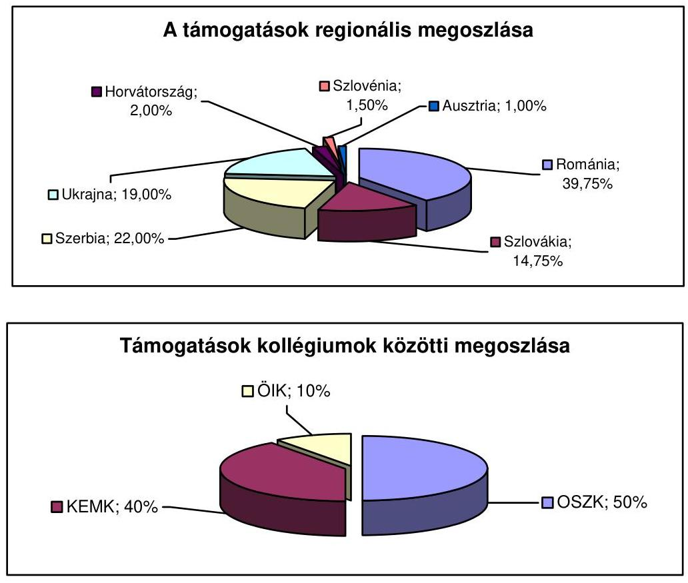

A pénzeszközök pályázatos rendszerben történő felhasználásáról a szakmai kollégiumok döntöttek. A Társadalmi Tanácsadó Testület - az Alap szakértői, tanácsadó szervezete - a REF és a szakmai kollégiumok munkáját támogatta a támogatási rendszer hatékonyabb múködése és megalapozottabb döntéshozatal elősegítése érdekében.

Az Alapból pályázat útján igényelhettek támogatást külhoni magánszemélyek, szervezetek, oktatási intézmények, kutatóintézetek, civil szervezetek és magyar lakta települések önkormányzatai.

Az Alapból nyújtott támogatások 100\%-áról nyilvános pályázat keretében döntöttek. A pályáztatás lebonyolítása, a pénzeszközök felhasználása során a kollégiumok egységes pályázati és elszámolási szabályzat alapján jártak el. Az Alap elektronikus pályázati rendszert alkalmazott, a pályázatokat elektronikus

[^0]
[^0]:    ${ }^{68} \mathrm{Az}$ ábra az Oktatási és Szakképzési Kollégium (OSZK), a Kulturális, Egyházi és Média Kollégium (KEMK) és Önkormányzati együttmúködési és Informatikai Kollégium (ÖIK) közötti megoszlást mutatja.

---

úton is be lehetett nyújtani. A jogszabályban a pályázathoz előírt mellékleteket a korábbi évek - 2008 őszéig - gyakorlatával ellentétben a 2009. évben a szerződéskötéssel egyidejúleg kérték be. Az alkalmazott eljárás nem felelt meg a jogszabály előírásainak.

A pályázati felhívások - saját források megléte és annak mértéke kivételével az alapról szóló törvényben meghatározott elemeket teljes körűen tartalmazták.

Az Alap pénzeszközeiből a 2009. évben beérkezett 3890 pályázat közül 1797 programot támogattak. A támogatott pályázatokban az igényelt támogatások összege 4263,0 M Ft, a jóváhagyott támogatási összeg - az igényelt támogatási összeg 49,7\%-a - 2120,2 M Ft volt.

Az Alap pénzeszközeinek felhasználása, a szerződéskötés, valamint a pénzügyi teljesítés során a kötelezettségvállalásra, érvényesítésre, ellenjegyzésre, utalványozásra vonatkozó előírásokat, jogköröket betartották. A pályázatok lebonyolítása során az Alap a közzétételi kötelezettségének eleget tett.

# 2.1. Az SZA költségvetési beszámolója 

Az Alap 2009. évi gazdálkodásáról készített beszámolót és a mérleget a könyvvizsgáló hitelesítette. A könyvvizsgáló a beszámoló ellenőrzése során az ÁSZ módszertant nem alkalmazta. A könyvvizsgálat megállapította, hogy a költségvetési beszámoló az Alap vagyoni, pénzügyi és jövedelmi helyzetéről megbízható és valós képet mutat.

Az Alap 2009. évi mérlegében az eszközök és források egyező főösszege 1159,7 M Ft volt, amely az előző évhez (2362,1 M Ft) viszonyítva 50,9\%-kal (1202,4 M Ft-tal) csökkent. A csökkenést a lebonyolító szervezetek elszámolásai, valamint a pénzforgalmi bevételeket meghaladó kiadások okozták.

### 2.2. Az SZA pénzügyi helyzete

Az Alap bevételei 1881,8 M Ft-ban, a költségvetési kiadásai 2763,5 M Ft-ban teljesültek, a 2009. évi pénzforgalmi egyenlege negatív, - 881,7 M Ft lett.

Az Alap 2009. évi felhasználható előirányzat-maradvány (betétállomány) 797,5 M Ft, amelyből kötelezettségvállalással terhelt maradvány 702,9 M Ft, a szabad előirányzat-maradvány 94,6 M Ft volt, a beszámoló 42. sz. űrlapjával egyezően.

A 2008. évi kötelezettség-vállalások (1611,9 M Ft) teljesítéséhez a tárgyévi bevételekből 730,3 M Ft-ot használtak fel, amely miatt az előirányzat-maradvány 881,7 M Ft-tal csökkent.

### 2.2.1. Az SZA bevételei

Az SZA részére a Kvtv. 2009. évre összesen 1000,1 M Ft - önkéntes befizetések, adományok címen $0,1 \mathrm{M}$ Ft és költségvetési támogatásként 1000,0 M Ft - bevételi előirányzatot hagyott jóvá, egyéb bevételt - pl.: az MPA-ból átvett, törvény

---

által meghatározott ${ }^{69}$ pénzeszközt - nem terveztek. Az ÁSZ a 2009. évi költségvetés véleményezése ${ }^{70}$ során a tervezés gyakorlatát kifogásolta, mert az Ámr. 27. §-a előírta a szerződési, megállapodási kötelezettségeken alapuló, valamint a tapasztalatok alapján rendszeresen előforduló bevételek, illetve kiadások tervezését, melyet az alapkezelő nem vett figyelembe.
„A 2009. évi előirányzatok kimunkálásánál nem vették figyelembe az új bevételi jogcímen elszámolt teljesités, illetve a jogszabályi előirás alapján (a szakképzési hozzájárulásról és a képzés fejlesztésének támogatásáról szóló 2003. évi LXXXVI. törvény 9. § (7) bekezdés) 2008-ban és azt követően is várható bevételeket, amelyet az ellenőrzés megkifogásolt."

Az Alapnak az „Önkéntes befizetések, adományok" címen bevétele - ahogyan az előző években - a 2009. évben sem keletkezett. Az Alap bevétele költségvetési támogatásból 1000,0 M Ft adomány-kiegészítés címen volt.

A bevételek előirányzata a beszámolási időszakban 3410,4 M Ft-ra módosult, és 1881,8 M Ft-ra teljesült a módosított előirányzathoz képest. A módosulást a nem tervezett, egyéb bevételek címen keletkezett bevétel (2410,3 M Ft) okozott. Az egyéb bevételek az SZA részére az Szht. 9. § e) bekezdése alapján a 2009. évben a Munkaerőpiaci Alapból átadott 856,0 M Ft-ból, illetve az 1554,3 M Ft előző évi maradvány igénybevételéből adódtak. A MeH fejezeti kezelésű előirányzatából - a 2009. évben megkötött megállapodások alapján - további 720,0 M Ft átcsoportosítására a tárgyévben már nem került sor, a teljesítés a 2010. évre húzódott át.

# 2.2.2. Az SZA kiadásai 

A Kvtv. az SZA részére 2009. évre 1000,1 M Ft kiadási előirányzatot tartalmazott, amelyből jogcím szerint az Alapból nyújtott támogatások előirányzata 900,1 M Ft, az Alapkezelő működési költsége 100,0 M Ft, amelyből 1,0 M Ft az Alap tranzakciós díja.

Az évközi előirányzat módosítások következtében a kiadási előirányzat a beszámolási időszakban 3410,4 M Ft-ra - az SZA-ból nyújtott támogatások előirányzata 3022,9 M Ft-ra, az alapkezelő működési költségeinek előirányzata a számlavezetési díjjal együtt 185,6 M Ft-ra növekedett, az eredetileg nem tervezett egyéb kiadások módosított előirányzata 201,9 M Ft-ra - módosult.

A kiadások teljesítése 2763,5 M Ft volt, melyből 2376,3 M Ft-ot a támogatások finanszírozására, 184,2 M Ft-ot az alapkezelő működési költségeire, 1,1 M Ft-ot tranzakciós díj költségeire, valamint 201,9 M Ft-ot egyéb kiadásokra fordítottak. Az egyéb kiadásokra fordított előirányzat a 2008. évi SZMM-mel (4,9 M Ft) és a MeH-hel kötött forrás átadásokkal kapcsolatos elszámolási kötelezettségvállalásból (197,0 M Ft) adódott.

[^0]
[^0]:    ${ }^{69}$ Az Szht. 9. § (7) bekezdése értelmében „A (2) bekezdés e) pontjában meghatározott öszszeget - a teljes keret 2\%-a - át kell csoportosítani a külön jogszabályban meghatározott Szülöföld Alapba."
    ${ }^{70}$ Vélemény a Magyar Köztársaság 2009. évi költségvetési javaslatáról (0836) 59-60. oldalán.

---

A 2009. évi előirányzatok kimunkálásánál nem vették figyelembe az új bevételi jogcímen elszámolt teljesítés, illetve a jogszabályi előírás alapján (a szakképzési hozzájárulásról és a képzés fejlesztésének támogatásáról szóló 2003. évi LXXXVI. törvény 9. § (7) bekezdés) 2008-ban és azt követően is várható bevételeket, amelyet az ellenőrzés megkifogásolt.

# 2.3. Az SZA ellenőrzési rendszere 

Az Alapot felügyelő miniszter és az alapkezelő felelős az Alap ellenőrzési feladatai ellátásáért. A miniszter ellenőrzési kötelezettsége nem érvényesült, annak ellenére, hogy a törvényben előírt ${ }^{71}$ hatékonysági és a pénzügyi ellenőrzések végzését a törvény nem teszi átruházhatóvá.

Az alapkezelő felelős az Alap ellenőrzési feladatainak ellátása keretében a pénzügyi és teljesítmény ellenőrzések lebonyolításáért. Az alapkezelő ellenőrzési szervezeti egységgel nem rendelkezett. A belső ellenőrzési feladatokat vállalkozói szerződés alapján külső szervezet látta el. A belső ellenőrzések nem terjedtek ki a pályázati rendszer múködésének, a források felhasználásának vizsgálatára, teljesítmény-ellenőrzést nem végeztek. A pályázati elszámolások szakmai és pénzügyi áttekintését, a helyszíni ellenőrzéseket az alapkezelő szakmai pénzügyi referensei folyamatba épített ellenőrzésként, munkaköri leírásuk alapján látták el.

### 2.4. Az SZA-ra vonatkozó korábbi ÁSZ javaslatok hasznosulása

A 2008. évi költségvetés végrehajtásának ellenőrzése során javasoltuk a MeH vezető miniszternek, hogy gondoskodjon az Alapból nyújtott támogatások felhasználásának ellenőrzéséről, az ellenőrzési rendszer felülvizsgálatáról, de a javaslat nem hasznosult.

## 3. Központi NukleÁris Pénzügyi Alap

A Központi Nukleáris Pénzügyi Alap (KNPA, Alap) az atomenergiáról szóló 1996. évi CXVI. törvénynek (Atomtörvény) megfelelően a radioaktív hulladékok végleges, valamint a kiégett üzemanyagok átmeneti és végleges elhelyezésére szolgáló tárolók létesítésének és üzemeltetésének, illetve a nukleáris létesítmények leszerelésének finanszírozásához forrás biztosítása. Az Alappal - a Kormánynak az Alapot kezelő Országos Atomenergia Hivatal (OAH) felügyeletét ellátó tagja - a 2009. évben a közlekedési, hírközlési és energiaügyi miniszter rendelkezett.
Az Alap tevékenységével kapcsolatos feladatokat a radioaktív hulladékok és a kiégett üzemanyag elhelyezésére, valamint a nukleáris létesítmények kezelésére kijelölt szerv létrehozásáról és tevékenységének pénzügyi forrásáról szóló 240/1997. (XII. 18.) Korm. rendelet és a Központi Nukleáris Pénzügyi Alap múködéséről és eljárásrendjéről szóló 14/2005. (VII. 25.) IM rendelet szabályozta. A radioaktív hulladékok végleges elhelyezését, valamint az atomreaktorok kiégett

[^0]
[^0]:    ${ }^{71}$ A központi államigazgatási szervekről, valamint a Kormány tagjai és az államtitkárok jogállásáról szóló 2006. évi LVII. törvény 2. § (3) bekezdése alapján.

---

üzemanyagának átmeneti és végleges elhelyezésére szolgáló tárolók létesítését, üzemeltetését, illetve a nukleáris létesítmények leszerelését a 2009. évben is a Radioaktív Hulladékokat Kezelő Közhasznú Nonprofit Kft. (RHK Kft.) végezte. A feladatai ellátásához szükséges forrás az Alapból származott.

Az Alap gazdálkodással összefüggő szabályzatai megfeleltek a jogszabályi előírásoknak.

# 3.1. A KNPA költségvetési beszámolója 

Az Alap gazdálkodásáról készített beszámolót és a mérleget könyvvizsgáló az ÁSZ módszertan alkalmazásával hitelesítette. A könyvvizsgálat megállapította, hogy a költségvetési beszámoló az Alap vagyoni, pénzügyi és jövedelmi helyzetéről, valamint a működés eredményéről megbízható és valós képet mutat. Az Alap 2009. évi költségvetési beszámolója és a kincstári beszámoló előirányzatai és teljesítési adatai között eltérés nem volt.

### 3.2. A KNPA pénzügyi helyzete

A Kvtv. az Alap 2009. évi bevételeinek előirányzatát 32 915,1 M Ft-ban, a kiadási előirányzatát 13 934,1 M Ft-ban és a betétállomány növekedését 18 981,0 M Ft-ban határozta meg, ami év közben nem módosult.

Az Alap 2009. évi bevétele 33 751,4 M Ft-ra, (102,5\%-ra), kiadása 13 913,6 M Ftra ( $99,9 \%$-ra) teljesült, amely eredményeképpen a bevételi többlet 19 837,8 M Ft lett.

Az Alap számlájának 2009. évi nyitó egyenlege 129,5 M Ft volt. A 2009. évi pénzforgalom 19 837,8 M Ft-os pozitív egyenleggel zárt, így az Alap kincstári elkülönített számlája 149 379,4 M Ft-ra nőtt. Az egyenlegek megegyeznek a Kincstár vonatkozó számlakivonatával, a „pénzforgalom egyeztetése és az előirányzatmaradvány kimutatás" c. táblázat adataival.

### 3.2.1. A KNPA bevételei

Az Alap bevételei a Paksi Atomerőmű Zrt. (PA Zrt.) befizetéseiből, az eseti beszállításokból, a központi költségvetési támogatásból és a kitermelt gránit értékesítéséből származnak.

A Kvtv. 62. §-ban meghatározott befizetési kötelezettségét a PA Zrt. teljesítette. A befizetett összeg - 22 827,5 M Ft - az Alap legnagyobb bevételi forrása, az összes bevételének 67,6\%-a volt. A radioaktív hulladékok végleges, eseti elhelyezések befizetéseiből származó 2009. évi bevétel 5,7 M Ft, ami 0,8 M Ft-tal (12,3\%) volt alacsonyabb az eredeti előirányzatnál ( $6,5 \mathrm{M} \mathrm{Ft}$ ). Az Alap további bevételét jelentette az Atomtörvény 64. § (2) bekezdése szerint a felhalmozott pénz értékállóságát biztosító költségvetési támogatás, amelynek a 2009. évi összege (10 868,3 M Ft) az összes bevétel 32,2\%-a volt. Az egyéb bevételek címen a tervezett 1,1 M Ft helyett 49,9 M Ft folyt be.

---

# 3.2.2. A KNPA kiadásai 

Az Alap módosított előirányzatából a kiadási főösszeg 64\%-át ( 9416,8 M Ft) felhalmozási célú kiadásokra, 36\%-át működési kiadásokra használták fel. A működési és felhalmozási kiadások aránya kedvezőtlenebb, mint 2008-ban volt. Az előző évben a felhalmozási célú kiadások aránya 71,7\% volt.

Az Alap 2009. évi költségvetésében biztosított keret felhasználására az RHK Kft. éves munkaprogramot készített, melyet az alappal rendelkező miniszter 2009. április 15 -én jóváhagyott. A munkaprogram alapján az OAH főigazgatója - az RHK Kft. Felügyelő Bizottsága javaslatának figyelembe vételével - elfogadta a társaság 2009. évi Üzleti tervét.

Az Alap a felhalmozási jellegú kiadásainak 100\%-át a Kft.-nek folyósította fejlesztési célú támogatásként.

A támogatásokat négy helyszínen (Bátaapáti, Paks, Püspökszilágyi és NyugatMecsek) folyó beruházási tevékenységhez használták fel. A Kft. a fejlesztési támogatás terhére a szerződéseket a közbeszerzési törvény ${ }^{72}$ betartásával, az Alapkezelő ellenjegyzésével kötötte meg.

A Kis és közepes aktivitású hulladéktároló létesítésének előkészítése cím alatt a Bátaapáti területén került kialakításra, 2009-ben a szerződés szerint 6796,6 M Ft (a felhalmozási kiadási előirányzat 72,2\%-a) kifizetése történt meg. A kifizetett pénzeszközök elszámolása megfelelt a jogszabályi előírásoknak, a belső szabályzatoknak, valamint a szerződések rendelkezéseinek.

A Püspökszilágyi regionális hulladéktároló beruházási munkáinak eredeti előirányzata 311,3 M Ft volt, ami év közben 133,0 M Ft-tal, 178,3 M Ft-ra csökkent.
Nagyaktivitású hulladéktároló telephely kiválasztására összeállított kutatási program végrehajtására rendelkezésre álló költségfedezet a megvalósult monitoring elemek üzemeltetésére, az elkészült létesítmények fenntartására és az elvégzett munkák minőség-felügyeletére biztosított fedezetet. A projekt eredeti előirányzata 300,0 M Ft volt, ami év közben nem módosult, és 298,8 M Ft-ra (99,6\%-ra) teljesült.

A Kiégett Kazetták Átmeneti Tárolója bővítésének eredeti előirányzata 1522,6 M Ft, a módosított előirányzat 1655,6 M Ft, a felhasználás 1650,8 M Ft ( $99,7 \%$ ) volt. Az előirányzat terhére kifizetett összegek elszámolása megfelelt a jogszabályi előírásoknak, a belső szabályzatoknak és a szerződések rendelkezéseinek, a pénzeszközök felhasználása jogszerű volt.

A PA Zrt. leszerelés előkészítésének eredeti előirányzata 501,0 M Ft, a felhasználás 500,6 M Ft volt. A paksi fióktelephelyen létrehozott átmeneti tárolók leszerelésével kapcsolatos tervezői munka költségét is az előirányzatnál számolták el.

[^0]
[^0]:    ${ }^{72}$ 2003. évi CXXIX. törvény a közbeszerzésekről

---

A felhalmozási kiadások finanszírozása a 2006. március 30-án az alapkezelő és a RHK Kft. között létrejött, és 2009. február 24-én módosított szerződés alapján történt. A finanszírozás megfelelt a jogszabályi előírásoknak.

A hulladéktárolók és az RHK Kft. üzemeltetési kiadása 3393,2 M Ft volt. Az előző évhez képest (ami 2008. évben 3416,4 M Ft volt) a kiadás - felügyeleti díjfizetés nélkül - 1,7\%-kal volt alacsonyabb.

A társadalmi ellenőrzési és információs társulások támogatásának tervezett és kifizetett előirányzata 994,1 M Ft volt. A 2009. évi támogatásokhoz négy társulás és azon keresztül 37 önkormányzat jutott. A támogatás összege az előző évhez (2008. évben 1090,2 M Ft volt) képest 8,8\%-kal csökkent.

Az alapkezelői tevékenységre 130,0 M Ft, az előirányzattal azonos összegű pénzeszközátadás történt. Az előző évhez viszonyítva 14\%-os növekedés történt, mert 2008. évben az alapkezelői tevékenységre átadott pénzeszköz 114,0 M Ft volt. Az elszámolások tartalmazzák az Alap számlavezetési és könyvvizsgálati diját, valamint arányosított költségeket pl.: a telefon, az adatátvitel vonaldiját, illetve munkabérköltségeket.

Az Alap múködéséről és eljárásrendjéről szóló 14/2005. (VII. 25.) IM rendelet 3. § (3) bekezdése szerint az Alap kezelésével kapcsolatban az OAH által ellátott feladatokat, valamint a szakértők és szakértői csoportok igénybevételét az Alap terhére kell finanszírozni. A múködési költségek elszámolásánál figyelembe vették a munkavállalók munkaköri feladatait, és a kapcsolódó belső szabályzatokat, így az Egységes Közszolgálati Szabályzatot. A munkaköri leírásokban rögzítették feladatként az Alap kezelésével kapcsolatos feladatokat.

Az elszámolásban szereplő tételek megfelelnek a jogszabályi előírásoknak, és az OAH gazdálkodás rendjéről szóló, a 2009. évre hatályos szabályzatnak, amely tartalmazza az átvett pénzeszközök terhére elszámolható jogcímeket és azok mértékét.

# 3.3. A KNPA ellenőrzési rendszere 

Az alapkezelő a Kft. által benyújtott fejlesztési támogatások fedezetigényének szakmai ellenőrzését és a végrehajtott munkákról a benyújtott elszámolások ellenőrzését a szakmai feladatait szabályozó eljárásrendben foglaltaknak megfelelően elvégezte. Az alapkezelő a Kft.-t, a múködési célú támogatásainak felhasználásáról - figyelembe véve, hogy forrása csak az Alapból származik - a féléves és éves beszámoló elfogadása keretében számoltatta el.

## 4. Nemzeti Kulturális Alap

A Nemzeti Kulturális Alapot (NKA, Alap) az 1993. évi XXIII. törvénnyel hozták létre, a nemzeti és az egyetemes értékek létrehozásának, megőrzésének, valamint a hazai és határon túli terjesztésének támogatása érdekében.

---

Az Alap feletti rendelkezési jogot - ágazati stratégiai döntéseivel összhangban a kultúráért felelős miniszter gyakorolja, és felel az Alap forrásainak felhasználásáért. Az Alap céljainak megvalósítását, az elvi, irányító és koordináló döntések meghozatalával a Nemzeti Kulturális Alap Bizottsága segítette. Az Alapot az Igazgatóság kezeli (önálló költségvetési szerv).

Az Alap pénzeszközeinek pályázatos rendszerben történő felhasználásáról állandó és ideiglenes szakmai kollégiumok döntöttek. A jogszabályokban rögzített feladatokat az Alap testületei és Igazgatósága látták el.

# 4.1. Az NKA költségvetési beszámolója 

A könyvvizsgáló az Alap 2009. évi beszámolójának felülvizsgálatát az ÁSZ által kiadott módszertan szerint végezte el. A felülvizsgálatról 2010. május 31 -én kiállított Független Könyvvizsgálati Jelentés szerint:
„A könyvvizsgálat során a Nemzeti Kulturális Alap 2009. évi éves költségvetési beszámolóját, annak részeit és tételeit, azok könyvelési és bizonylati alátámasztását az érvényes nemzeti könyvvizsgálati standardokban foglaltak szerint felülvizsgáltuk, és ennek alapján elegendő és megfelelő bizonyosságot szereztünk arról, hogy az éves beszámolót a számviteli törvényben, illetve az Államháztartás szervezetei beszámolási és könyvvezetési kötelezettségének sajátosságairól szóló 249/2000. (XII. 24.) Korm. rendeletben foglaltak és az általános számviteli elvek szerint készítették el. Véleményünk szerint az éves beszámoló a Nemzeti Kulturális Alap 2009. december 31-én fennálló vagyoni, pénzügyi és jövedelmi helyzetéről megbízható és valós képet ad."

### 4.2. Az NKA pénzügyi helyzete

Az Alap költségvetési beszámolója a kincstári beszámolóval egyezőséget mutatott. Az Alap pénzkészlete a tárgyidőszak végén 2322,4 M Ft, ami 1624,5 M Fttal kevesebb a 2008. évinél. Az NKA 2009. évi előirányzat-maradványa 172,4 M Ft, ami teljes mértékben kötelezettséggel terhelt. A halmozott előirányzat maradvány $2319,1 \mathrm{M} F \mathrm{~F}$.

### 4.2.1. Az NKA bevételei

Az NKA bevételeinek eredeti előirányzata 8815,0 M Ft-ot, a módosított 9811,9 M Ft-ot, a teljesítés 9841,2 M Ft-ot (a pénzforgalmi teljesítés 8041,2 M Ftot, az előző évi maradvány pénzforgalom nélküli bevételként való igénybevétele 1800,0 M Ft-ot) tett ki. Az Alap meghatározó bevétele, közel 80\%-a kulturális járulékból származott. Az eredeti előirányzatot év közben az Önkormányzati Minisztériummal kötött megállapodás alapján átadott pénzeszköz, valamint az előző évi előirányzat maradvány igénybevétele növelte.

### 4.2.2. Az NKA kiadásai

Az NKA kiadásainak eredeti előirányzata 8815,0 M Ft, a módosított 9811,9 M Ft, a teljesítés 9668,4 M Ft volt. Az alap 2009. évi bevételének 8,7\%-át fordította múködési kiadásokra. A 2009. évben 9747 pályázat érkezett, összesen 21,1 Mrd Ft támogatási igénnyel. Ebből a kollégiumok 5906-ot ítéltek támo-

---

gathatónak. Ezek összes támogatási igénye 13,6 Mrd Ft, míg a ténylegesen megítélt támogatás $8,8 \mathrm{Mrd}$ Ft volt.

# 4.3. Az NKA ellenőrzési rendszere 

A támogatások pénzügyi és szakmai ellenőrzése a jogszabályok szerint a miniszter feladata, amelyet átruházott jogkörben az OKM Ellenőrzési Főosztálya és az NKA Igazgatóságának Belső Ellenőrzési Osztálya látott el. A szakmai és pénzügyi ellenőrzés szempontjait a 9/2006. (V. 9.) NKÖM rendelet alapján az Úgyrend rögzítette, míg a Belső Ellenőrzési Osztály hatáskörét, feladatait és céljait, az ellenőrzési eljárásokat, és a módszertant a belső ellenőrzési kézikönyv tartalmazta.

Az ellenőrzési tevékenységet a 2009-2012. évekre kialakított ellenőrzési stratégiából lebontott éves terv tartalmazta, amely a 2009. évben a $21 \%$-os kapacitás hiány ( 1 fő) ellenére $92 \%$-ra teljesült. Újdonságként ki kell emelni, hogy kollégiumi támogatások teljesítmény ellenőrzését kurátorok részvételével hajtották végre.

Az NKA Igazgatósága Belső Ellenőrzési Osztályának 2009. évi, az elvégzett ellenőrzésekről szóló jelentése alapján megállapítható, hogy a pályázatokat és az Igazgatóságot érintő több mint 150 teljesítmény és pénzügyi szabályszerűségi ellenőrzés közel $0,8 \mathrm{Mrd}$ Ft támogatást világított át, ami $8,3 \%$-os lefedettségi mutatónak felelt meg. Az ellenőrzések során feltárt hiányosságok alapján közel $6,4 \mathrm{M}$ Ft összegű támogatás visszafizetésére tettek javaslatot.

## 5. Wesselényi Miklós Ár- és Belvízvédelmi Kártalanítási Alap

A Wesselényi Miklós Ár- és Belvízvédelmi Kártalanítási Alapot (WMA, Alap) az Áht. 54. § (1) bekezdésének megfelelően törvénnyel hozták létre. Az Alap célja a Wesselényi Miklós Ár- és Belvízvédelmi Kártalanítási Alapról szóló 2003. évi LVIII. törvény alapján - az ár- és árvízből eredő belvíz által veszélyeztetett területeken lakóingatlannal rendelkező természetes személyek részére lehetőség biztosítása egy öngondoskodáson alapuló, hosszú távú, előre kiszámítható és az állam által garantált kártalanítási konstrukcióban való részvételre.

Az Alappal - a rá vonatkozó törvény szerint - az államháztartásért felelős miniszter, a pénzügyminiszter rendelkezett, működtetését a Kincstár látta el.

A Kincstár a 2009. év végén 876 kártalanítási szerződést kezelt, amely 83 -mal kevesebb a 2008. év végéhez képest. A szerződések számának csökkenését több tényező együttes hatása okozta. Magyarországon 2009-ban nem volt olyan jelentősebb árvíz, amely a szerződéskötési hajlandóságot növelte volna, illetve voltak, akik a növekvő gazdasági nehézségeik miatt nem teljesítették a kártalanítási szerződésben vállalt dijfizetési kötelezettségeiket, így azokat - jogszabály alapján a 60. nap elteltével - a Kincstár megszüntette, valamint az egyéb típusú ingatlanok az Alap körébe történő bevonásáról érdemi döntés hiányában a propagálási akciót nem indították be.

---

# 5.1. A WMA költségvetési beszámolója 

Az Alap gazdálkodásáról beszámolót és mérleget kellett készíteni. A beszámoló felülvizsgálatát az Áht. 57. § (5) bekezdése szerint az ÁSZ elnökének javaslata ismeretében kiválasztott és az alappal rendelkező miniszter által megbízott könyvvizsgáló az ÁSZ módszertan alapján végezte el.

A könyvvizsgálat a beszámolót hitelesítő záradékkal látta el, amely szerint az Alap 2009. évi beszámolója a költségvetése teljesítéséről, a vagyoni, pénzügyi helyzetéről, valamint a múködés eredményéről megbízható és valós képet mutat.

A WMA 2009. évi mérlegében az eszközök és források egyező főösszege 302,9 M Ft, amely az előző évhez képest (287,1 M Ft) 5,5\%-kal (15,8 M Ft-tal) növekedett.

### 5.2. A WMA pénzügyi helyzete

Az Alapnak likviditási problémája a beszámolási időszakban nem volt. Az Alap bevételei 23,4 M Ft-ban, a költségvetési kiadásai 7,6 M Ft-ban teljesültek, a 2009. évi pénzforgalmi egyenlege 15,8 M Ft-ot tett ki.

### 5.2.1. A WMA bevételei

A Kvtv. szerint a WMA bevételi előirányzata összesen 23,4 M Ft volt, amelyből 6,0 M Ft-ot rendszeres befizetésként (a kártalanítási szerződések díjfizetései) és 17,4 M Ft-ot költségvetési támogatásként irányoztak elő.

Az Alapnak egyéb, a jogszabályok szerint lehetséges bevétele (például önkéntes, nem rendszeres befizetésekből, adományokból, nemzetközi segélyekből, múködési célú pénzeszköz átvételből) nem volt. A 2009-ban a kártalanítási szerződéssel rendelkezők rendszeres befizetéseinek összege 6,0 M Ft volt, az öszszes bevétel 23,4 M Ft-ra teljesült.

### 5.2.2. A WMA kiadásai

Az Alapnak a Kvtv.-ben rögzített kiadási előirányzata - a bevételi előirányzattal megegyezően - 23,4 M Ft volt. Az Alapra vonatkozóan, a Kvtv. káreseménynyel összefüggő kiadási előirányzatot nem tartalmazott, az év közben felmerült káresemény miatt az alapkezelő - a működési kiadások terhére - előirányzat átcsoportosítást végzett 1,5 M Ft összegben, a kiadások előirányzata nem változott.

Az Alap a tárgy évben múködési kiadásként az előirányzat 32,5\%-át használta fel, a 2009-ben a kiadások összege 7,6 M Ft, melyből az Alap múködési költsége 6,1 M Ft volt. A múködési költségből az Alapot kezelő Kincstár részére múködési célú pénzeszközátadás 1,9 M Ft-ot, a könyvvizsgálói díj 3,7 M Ft-ot, a postaköltség 0,2 M Ft-ot, a kárszakértői díj pedig 0,3 M Ft-ot tett ki.

---

Az előirányzatnak az előző évekhez viszonyított alacsonyabb felhasználása a WMA tervezett megszüntetésével, jövőjének bizonytalanságával, valamint a Kincstár 2009. évi költségvetéséből történő bér és rezsi költségek kifizetésének átvállalásával függött össze.

# 5.3. A WMA ellenőrzési rendszere 

A WMA tevékenységének ellenőrzése döntően a folyamatba épített és a vezetői ellenőrzés módszerével történik. Az ellenőrzési feladatok és a munkafolyamat teljes körű leírása Eljárásrendben került rögzítésre.

## 6. Kutatási és Technológiai Innovációs Alap

A Kutatási és Technológiai Innovációs Alapot (KTIA, Alap) a 2003. évi XC. törvény ${ }^{73}$ (Ktiatv.) hozta létre annak érdekében, hogy biztosítsa az ország versenyképességének és fenntartható fejlődésének az új ismereteken és azok alkalmazásán alapuló erősítését, ezen belül különösen a kutatás-fejlesztés és a létrehozott új tudás alkalmazásának megfelelő mértékű és kiszámítható finanszírozását, valamint az ezzel kapcsolatos társadalmi érdekek érvényre juttatását.

Az Alapot a kutatás-fejlesztésért felelős miniszter a Nemzeti Kutatási és Technológiai Hivatal (NKTH, Hivatal) közremúködésével múködteti. A Hivatal ellátja az Alap pénzeszközeinek kezelésével, felhasználásával és ellenőrzésével kapcsolatos feladatokat, melyekbe közremúködő szervezeteket is bevon. A Hivatal, az Alap forrásait szakértői vélemények alapján, egyszerű és átlátható pályáztatás keretében osztotta szét.

A költségvetési szervek jogállásáról és gazdálkodásáról szóló 2008. évi CV. törvény 2009. január 1-jén hatályba lépett rendelkezéseinek megfelelően megtörtént az NKTH tevékenységének jellege szerinti közhatalmi, feladatellátáshoz gyakorolt funkció szerinti önállóan múködő valamint gazdálkodó költségvetési szervként való besorolása és ezt követően az alapító okirat, valamint a SzMSz módosítása. 2009. április 16-ától a kutatás-fejlesztésért és technológiai innovációért felelős tárca nélküli miniszteri poszt megszűnésével a feladatokat a nemzeti fejlesztési és gazdasági miniszter vette át.
2009. január 1-jétől a kutatás fejlesztésért felelős tárca nélküli miniszter 2/2008. (X. 1.) rendeletével jóváhagyott SzMSz volt érvényben. A változást követően a ku-tatás-fejlesztésért felelős tárca nélküli miniszter hivatalába integrált szervezeti egységek visszakerültek az NKTH struktúrájába, a szervezeti átalakítást is tartalmazó új SzMSz-t a 19/2009. (XII. 4.) NFGM utasítással hagyta jóvá a miniszter.

### 6.1. A KTIA költségvetési beszámolója

Az Alap mérlegét és beszámolóját független könyvvizsgáló hitelesítette. A könyvvizsgáló szerint a beszámoló a KTIA vagyoni, pénzügyi és jövedelmi helyzetéről megbízható és valós képet mutat.

[^0]
[^0]:    ${ }^{73}$ 2003. évi XC. törvény a Kutatási és Technológiai Innovációs Alapról

---

A könyvvizsgálat nem vette figyelembe a 2009. évi zárszámadásra vonatkozó jogszabályi változást, a könyvvizsgálói jelentésből nem volt megállapítható, hogy a véleményét a könyvvizsgáló mire alapozta. A könyvvizsgáló megbízásának meghosszabbítására a 2010. költségvetési év beszámolójának és mérlegének ellenőrzésére vonatkozóan - a 2009. évi zárszámadás ellenőrzése során szerzett tapasztalatok alapján - nemleges javaslatot tettünk.

A mérlegben az eszközök és források főösszege 108944590 E Ft volt, a leltár és a kincstári elszámolás egyeztetése során eltérés nem volt.

# 6.2. A KTIA pénzügyi helyzete 

A Kvtv. az Alap kiadásaira és bevételeire 55 909,6 M Ft-ot irányzott elő.
Az Alap 2009. évi előirányzat maradványa 9876,4 M Ft, az Alap vagyona a mérleg szerinti eszközök és források egyezőségével 108 944,6 M Ft volt, míg a több évre kiható teljes kötelezettség állománya 64 728,8 M Ft-ot tett ki.

### 6.2.1. A KTIA bevételei

Az Alap bevételei 52 927,9 M Ft-ra teljesültek, amelyből 28 695,1 M Ft-ot a költségvetési támogatás, 23 179,0 M Ft-ot az innovációs járulék tett ki, a fennmaradó 1053,8 M Ft, visszterhes támogatásokból és egyéb bevételekből adódott.

Az Alapnak bevétele származott a visszterhes támogatások törlesztéseiből, amely tartalmazta a követelések késedelmes teljesítéséhez kapcsolódó késedelmi kamatok összegét is.

### 6.2.2. A KTIA kiadásai

Az Alap kiadásai az év közben elrendelt 20,0 Mrd Ft-os egyenlegtartási kötelezettség ${ }^{74}$ részleges feloldása után 43 035,8 M Ft-ra teljesültek, amelyből a hazai innováció támogatására 37573,0 M Ft-ot, az alapkezelő feladat ellátására 2515,9 M Ft-ot, a Kvtv.-ben előírt egyéb célokra pedig 2946,9 M Ft-ot fordítottak.

### 6.3. A KTIA ellenőrzési rendszere és közzétételi kötelezettsége

Az Alap kezelését végző Hivatal szervezetében az ellenőrzéseket három, egymástól elkülönült szervezeti egység - a Hivatal elnökének közvetlen alárendeltségébe tartozó belső ellenőr, a programok tervezési területén múködő Monitoring és Értékelési Osztály, illetve a pályázatok esetében az Ellenőrzési Osztály végezte.

[^0]
[^0]:    ${ }^{74}$ A központi költségvetési fejezetek 2009. évi maradványtartási kötelezettsége teljesítését megalapozó intézkedésekről szóló 2007/2009. (VII. 29.) Korm. határozat az alapkezelőnek 20,0 Mrd Ft egyenlegjavulást írt elő.

---

A belső ellenőr vizsgálta az NKTH múködését, valamint az Alap pénzeszközeinek felhasználását, a Hivatal feladatellátását segítő informatikai rendszerek múködtetését.

Az Ellenőrzési Osztály a 2009. évben összesen 59 projektet, 123 db szerződést ellenőrzött, ez a vizsgálatba vonható, lezárt támogatási szerződések 1,18\%-ának felelt meg. A feladatot évi átlagban 4,5 fő ellenőri kapacitással teljesítették, a feltárt hiányosságokat szerződések felmondásával, kifizetések felfüggesztésével, viszszafizetések előírásával szankcionálták.

Az Alap a közzétételi kötelezettségének részben eleget tett. A pályázati felhívások, útmutatók és támogatási döntések a honlapon elérhetőek, illetve a pályázati kiírásokat a Világgazdaságban és a Napi Gazdaságban megjelentették. Az Alap gazdálkodására vonatkozó adatok frissítése a honlapon viszont elmaradt, csak a 2007. év előtti információk voltak megtalálhatóak. A helyszíni ellenőrzés ideje alatt a hiányosságok pótlása megkezdődött.

# 6.4. A KTIA-ra vonatkozó korábbi javaslatok hasznosulása 

Az előző évben végzett ÁSZ ellenőrzés javaslatainak hasznosítására elnöki utasítást és intézkedési tervet adtak ki, melynek a végrehajtása a helyszíni ellenőrzés ideje alatt folyamatban volt.

## B.2.2. A TÁRSADALOMBIZTOSÍTÁS PÉNZÜGYI ALAPJAI

## 1. NyUGDÍJbIZTOSÍTÁSI Alap

### 1.1. Az Ny. Alap költségvetési beszámolóinak minősítése

Az Ny. Alap beszámolóit (a múködési „A" jelű, az ellátási „D" jelű és a kettőből konszolidált „G" jelű) a könyvvizsgáló a 2009. évben is hitelesítette. Az Ny. Alap könyvvizsgálója - az ÁSZ módszertanát is szem előtt tartva - a nemzetközi és magyar könyvvizsgálati standardokkal összhangban álló saját módszertan alapján vizsgált. A független könyvvizsgáló jelentése szerint a beszámolókban szereplő adatok az Ny. Alap 2009. december 31-én fennálló vagyoni, pénzügyi és jövedelmi helyzetéről megbízható és valós képet adnak. Az ÁSZ az APEH által beszedett járulékbevételekről adott véleményt.

A társadalombiztosítás pénzügyi alapjainak ellenőrzésére, a beszámolók minősítésére vonatkozó új szabályokat - az Áht. 86/A. § módosításával 2008 decemberében alkotta az Országgyúlés. A korábbi és a jelenlegi jogszabályok szövegét elemezve megállapítható, hogy az új szabályozás önmagában nem konzisztens, belső ellentmondásokkal terhelt. A módosításkor átmeneti szabályokat nem állapítottak meg, és nem tisztázták a könyvvizsgálat és „a beszámoló ellenőrzése" fogalmak közötti különbséget, illetve a beszámolók ellenőrzésének folyamatában a szereplők (alapkezelő, könyvvizs-

---

gáló, felügyelő miniszter, kormány, ÁSZ) kapcsolatát és felelősségét az ellenőrzési feladat végrehajtásában.

A Nyugdíj Ellenőrző Testület 2009 decemberében határozatot hozott az Ny. Alap beszámolójának könyvvizsgáló általi auditálásának szükségességéről.

A 2009. évi beszámolók esetében - mind az ellátási szektor, mind a múködési szektor vonatkozásában - az analitikus nyilvántartásban, a főkönyvi kivonatban szereplő adatok megegyeznek egymással és a beszámoló megfelelő soraival. A kincstári és az ONYF beszámoló közötti előirányzati és teljesítési adatok egyeztetése év közben folyamatosan, illetve az év zárását követően megtörtént. Az eltérések levezetését az ellenőrzés megfelelőnek minősítette, amelyek - a korábbi évekhez hasonlóan - technikai okokból (eltérő zárási időszak, eltérő beszámoló sorok) és kerekítésekből adódtak.

# 1.2. A költségvetési beszámoló tartalma 

### 1.2.1. Az Ny. Alap pénzügyi helyzetének értékelése

Az Ny. Alap éves pénzügyi helyzetét az éves költségvetési törvényben rögzített bevételi és kiadási előirányzatok, és a tény adatok viszonya határozza meg, amelyek a 2009. évben döntő mértékben a tervezett és a tényleges makrogazdasági mutatók és az ellátásokat érintő intézkedések (13. havi nyugdíj megszüntetése, nyugdíjkorrekció elhalasztása) miatti eltéréseken alapultak.

Az Ny. Alap a 2009. évet 7221,3 M Ft-os deficittel zárta, a költségvetésben meghatározott nullszaldós követelmény nem teljesült.
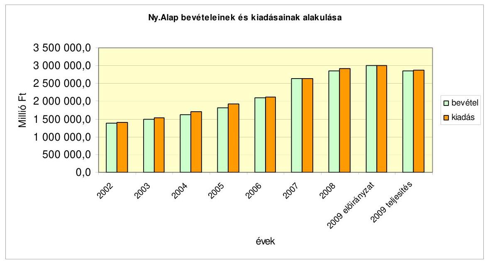

Az Ny. Alap 2009. évi bevételei ( $2859545,5 \mathrm{M}$ Ft) és kiadásai ( $2866766,8 \mathrm{M}$ Ft) nem érték el az előirányzott ( $2999306,5 \mathrm{M}$ Ft) értéket. A járulékbevételek és hozzájárulások 5,9\%-kal, az APEH-tól érkező járulékbevételek 6\%-kal voltak alacsonyabbak az előirányzottnál. A központi költségvetésben tervezett pénzeszközátadás teljesítése $599068,2 \mathrm{M}$ Ft, ami 881,3 M Ft-tal kevesebb a törvényi

---

előirányzatnál, amiben meghatározó a korkedvezmény biztosítási járulék tervezettől eltérő alakulása volt. Az egyéb járulékbevételek előirányzatából 932,6 M Ft azért nem teljesült, mert az Igazságügyi és IRM nem teljesítette teljes egészében a Kvtv. 1. sz. melléklet IRM fejezet 14. jogcímcsoportban rögzített átadandó kötelezettségét, ami azzal egyező összegben szerepelt ugyanezen törvény 11. sz. mellékletében (Ny. Alap), mint bevétel. A nyugdíjkiadások előirányzat alatti ( $-4,5 \%$ ) teljesítését a tervezéskor még figyelembe nem vehető későbbi intézkedések hatása és az automatizmusok tervezettnél kedvezőbb alakulása okozta. A múködési kiadások 3,2\%-kal haladták meg a törvényi előirányzatot, miután az érvényes szabályok szerint az előző évi előirányzat maradvány felhasználása és a központi költségvetés általános és céltartalékában tervezett kiadások felhasználása magában hordozza az előirányzat feletti teljesítést.

Az Ny. Alapnak az elmúlt évek során kimutatott tényleges hiányát vonta össze az ellenőrzés a központi költségvetés közvetlen támogatásával annak érdekében, hogy láthatóvá váljon, hogy valójában mekkora az Ny. Alap járulékpótlás nélküli költségvetési támogatása. Az Alap kiadásának, hiányának alakulását a 2002-2009. évek között az 1. sz. melléklet szemlélteti. Ebből látható, hogy az Ny. Alap közvetlen költségvetési támogatása ${ }^{75}$ az Alap kiadási főösszegéhez viszonyítva a 2009. évben 7,9\%-os, 1,5\%ponttal növekedett. Ebben meghatározó szerepe volt a bevételek (ezen belül is az APEH-tól érkező járulékbevételek) kedvezőtlen alakulásának, mert a bevételek az előirányzottól és az előző évitől is nagymértékben elmaradtak. Ha nincs ez a bevételi elmaradás, akkor a kiadások csökkenése mellett lényegesen kisebb közvetlen költségvetési támogatás is biztosította volna az Ny. Alap egyensúlyát.

Az előző évhez viszonyítva a 2009. évben az összes kiadás 2\%-kal volt alacsonyabb, az összes bevétel $0,1 \%$-kal magasabb. A nyugdíjkiadások a kiadási oldallal azonos mértékben (2\%) csökkentek ${ }^{76}$. Nem mondható ez el a bevételi oldalról, ahol a járulékbevételek - különösen az APEH-tól érkező járulékbevételek - csökkenése volt kiemelkedő, a korrigált ${ }^{77}$ érték változása $-4,5 \%$. A járulékbevételi értékek változása csak részben indokolható a bruttó keresettömeg csökkenésével, a magánnyugdíj pénztári tagok számának növekedésével, és a START-kártya alapján fizetett kedvezményes járulékfizetés növekedésével ${ }^{78}$. Sok ismeretlen tényező mellett (járulékfizetők járuléknemenkénti és keresetkategóriánkénti részletes létszámadatainak hiánya) valószínúsíthető a már 2009.

[^0]
[^0]:    ${ }^{75}$ A központi költségvetésben tervezett pénzátadás sor a közvetlen támogatás mellett járulék típusú hozzájárulásokat is tartalmaz.
    ${ }^{76}$ A 2008. évi nyugdíjkiadásoknál 2\%-kal és 57 238,0 M Ft-tal alacsonyabb kifizetés azért következett be, mert a világméretű pénzügyi krízis hatására az államháztartás egyensúlyát-javító, megszorító intézkedések váltak szükségessé, amiről a kormány javaslatára az Ny. Alapot illetően a parlament - összhatását tekintve 143,8 Mrd Ft-os rendelkezett.
    ${ }^{77}$ A bázist a 2008. évi E. Alap és Ny. Alap közötti járulékátcsoportosítás hatásával még korrigálni kellett.
    ${ }^{78}$ 2009. július 1-jétől a kedvezményes járulékfizetői kör bővült, a START-kártya befizetés aránymegosztása az Ny. Alap javára mozdult el. A korábbi 25-75\%-os arány $11,111-88,889 \%$-ra változott.

---

évben is érzékelhető, begyűrűző gazdasági válság hatása is. A központi költségvetési hozzájárulások az előző évhez viszonyítva 14,4\%-kal emelkedtek, ezen belül a közvetlen pénzeszköz átadás növekedése 51,7\%-os volt. A múködési kiadások 6,3\%-kal alacsonyabbak voltak a korábbi év kiadásainál, a dolgozók 13. havi juttatásának eltörlése miatt. Így a múködési kiadásoknak a kiadási főösszeghez viszonyított aránya csupán 0,9\%-ot tett ki az előző évi 0,94\%-kal szemben.

Mindezen folyamatok hatására alakult ki az Ny. Alap 2009. évi 7221,3 M Ftos hiánya, amelynek rendezéséről a zárszámadási törvényjavaslat intézkedik.

# 1.2.2. Az Ny. Alap pénzforgalma és likviditása 

Az Ny. Alap napi likviditását, az ellátási kiadások teljesítésének zavartalanságát a 2009. évben is a Kvtv. 23. §-a alapján a KESZ-ről igénybevett kamatmentes hitel biztosította. A vizsgált évben minden munkanapon hiteltartozás állt fenn. A havi átlagos hitelállomány 68,3-206,8 Mrd Ft között változott. A hitelszámla napi egyenlege december első 20 napjában meghaladta a 200 Mrd Ft-ot, december 10-én érte el legmagasabb, 290 901,2 M Ft-os értéket. A megelőlegezési számla állománya 2009. december 31-én 4438,0 M Ft értéket mutatott. A hitelfelvételek alapvetően az előírások szerint, havonta módosított ütemezésű terv szerint alakultak.

### 1.2.3. Az Ny. Alap mérlegtételeinek értékelése

Az Ny. Alap ellátási szektor mérlegében a főösszeg 65 970,1 M Ft, amely 12 759,1 M Ft-tal, 16,2\%-kal alacsonyabb a korábbi évi főösszegnél. Eszköz oldalon a csökkenést a követelések 16 972,3 M Ft-os csökkenése határozta meg, a pénzeszközök 5925,4 M Ft-os növekedése mellett. A források csökkenése a hitelállomány jelentős és a APEH adatszolgáltatása alapján a túlfizetés állomány (27 793, 5 M Ft) kisebb mértékű csökkenése mellett, a tőkeváltozások növekedése eredményeképpen alakult ki. Az Ny. Alap saját tőkéje 2009. december 31-én - az előző évekkel ellentétben - már pozitív egyenleget, 14 904,3 M Ft értéket mutatott. Az ellátási szektor eszközei és forrásai között - jogszabályi előírás hiányában - nem szerepelnek a megosztott járulékokhoz (START-kártya, EKHO) és az MPA-tól érkező bevételekhez kapcsolódó tartozások és túlfizetések.

Az Ny. Alap múködési szektor mérlegében az eszközök és források év végi állománya összesen 18 215,4 M Ft volt, amely a bázishoz viszonyítva 0,4\%-os csökkenés. Az eszközök között a legnagyobb hányadot változatlanul (91,1\%) a befektetett eszközök képviselik 16 592,3 M Ft-os összegben, míg a forgóeszközök állománya 1623,0 M Ft-tal 8,9\%-ot tesznek ki. A befektetett eszközökön belül az immateriális javak aránya 10\%, a tárgyi eszközöké $88,4 \%$, a befektetett pénzügyi eszköz pedig 1,6\%. A források legnagyobb hányadát $90,7 \%$-át, azaz 16 513,6 M Ft-ot a saját tőke képviseli, a tartalékok 1066,4 M Ft-ot (5,8\%-ot), a kötelezettségek 635,4 M Ft-ot (3,5\%) tesznek ki. A működési szektor eszközei között nem szerepel az EKG szolgáltatásainak igénybevételét biztosító eszközök értéke. A Magyar Telekom az eszközöket 2009. december 31-ei szerződési határidőben nem az ONYF-nek, hanem a Közigazgatási és Elektronikus Közszolgáltatások Központi Hivatalának (KEK KH) adta át. A használatra átvett eszközöket az ONYF 272,5 M Ft értékben a „0"-ás számlacsoportban tartja nyilván. A szer-

---

ződés szerinti teljesítés biztosítására a KEK KH-val az egyeztetés a helyszíni vizsgálat lezárásakor is folyamatban volt.

# 1.3. Az alapkezelő feladatellátása 

A 2009. évben hatályba lépett jogszabályok változást hoztak az Ny. Alap feladataiban ${ }^{79}$ és a nyugdíjigazgatási intézményrendszerben. A szűkülő források szükségessé tették a gazdálkodás hátterének továbbfejlesztését, erősítését is. Új feladatot jelentett a krízishelyzetbe került személyek támogatásának lebonyolítási feladata és jelentősen megnőtt a méltányossági kérelmek száma is.

A követelmények teljesítését biztosító intézkedéseit az ONYF a 2009. évi munkatervében rögzítettek szerint hajtotta végre, és arról beszámolt az Alap felügyeletét ellátó szociális és munkaügyi miniszternek.

A gazdálkodás szabályozottsága megfelelő volt, a szabályzatokat folyamatosan aktualizálták.

A kincstárnoki rendszer bevezetése érdemi hatást nem gyakorolt az Alap gazdálkodására, miközben az adminisztrációs terheket növelte.

A kincstárnoki rendszer bevezetésének törvényi jogalapja a Magyar Köztársaság 2010. évi költségvetését megalapozó egyes törvények módosításáról szóló 2009. évi CIX. törvény 2. § (26), illetve (62) bekezdéseinek 2010. január 1-jei hatályú rendelkezéseivel teremtődött meg. Ebből következően az Ámr.-t - kincstárnoki rendszert beiktató - módosító 169/2009. (VIII. 26) Korm. rendeletben hivatkozott Áht. 124. §-ában kapott felhatalmazás is csak 2010. január 1-jétől volt hatályos.

A pénzügyminiszter az általa kiadott eljárásrendhez küldött 13.752/2009. számú - 2009. szeptember 28-án iktatott - levelében a kincstárnokok kinevezésének legfőbb céljaként a 2009. évi fejezeti maradványtartási kötelezettség feltétlen teljesítését, a takarékos intézménymúködés, a fejezeti- és intézményi gazdálkodás támogatását nevezte meg. A kincstárnok előzetes véleményezési joggal rendelkezett minden 10,0 M Ft-ot elérő kötelezettségvállalás és kifizetés felett a dologi, beruházási, illetve nem rendszeres személyi juttatások tekintetében. A kincstárnok további feladatát képezte - a kincstár adatszolgáltatása alapján - a szállítóiszolgáltatói tartozásállomány, a bevételek alakulásának, a kintlévőségek behajtásának, maradványtartási kötelezettség alakulásának vizsgálata.

Az átgondoltság hiányára utal az is, hogy a kincstárnok feladatainak részletes szabályozása időben eltérően és nem egységes szinten ${ }^{80}$ - Ámr., illetve PM által kiadott „A kincstárnoki feladat ellátás eljárásrendje" - valósult meg.

[^0]
[^0]:    ${ }^{79}$ A Ket. változása miatt át kellett alakítani a jogorvoslati rendszert, a szakigazgatás és a területi ellenőrzés eljárásrendjeit, illetve azok informatikai háttereit. A Ket. előírásának megfelelően az ONYF és az igazgatási szerveinek új alapító okiratait illetve SzMSzeit megfelelő tartalommal, határidőben kiadták.
    ${ }^{80}$ Az Ámr. módosításáról szóló 205/2009. (IX. 22.) Korm. rendelet október 1-jétől léptette hatályba az előzetes kötelezettségvállalások kincstárnoki bejelentési kötelezettségének formai követelményeit, míg a többi adatszolgáltatásra csak az eljárásrend tartalmazott előírásokat.

---

A kincstárnok hatáskörébe utalt egyes ellenőrzési feladatokról összességében megállapítható, hogy részben felesleges adminisztrációt okozott, mert

- a maradványtartási kötelezettség betartatását a kincstári zárolásra hozott 2009. július 29-ei kormányintézkedés biztosította,
- a kifizetések előtti kincstárnoki ellenőrzés - az Ámr. 135. §-ának a rendelkezése és annak betartása érdekében kiépített belső kontrollokra tekintettel - érdemi eredmény helyett csak kétszeres ellenőrzési feladatot jelentett, miután a 10,0 M Ft feletti kötelezettség vállalások engedélyezésénél a célszerűséget már ellenőrizte a kincstárnok.

A szabályozás felülvizsgálatára tett javaslatunkat a szabályozási környezet időközben bekövetkezett változása miatt ${ }^{81}$ töröltük.

A Ket. módosítása is többletfeladatot jelentett az alapkezelőnek. Jelentősen megnövekedett az eljárás megindításáról, a hatáskörrel és illetékességgel rendelkező hatósághoz való áttételről, ügyintézési határidő meghosszabbításáról kibocsátott végzések száma, illetve kibővült ${ }^{82}$ az ügyfelek tájékoztatási kötelezettsége. Ezekből eredően nem minden esetben indokolható adminisztráció- és költségnövekedés (papír, a végzések - különös tekintettel a nemzetközi ügyekre - tértivevényes kézbesítésének postaköltsége) származott, és a kiküldött értesítésekkel összefüggésben növekedett az ügyfélforgalom is.

Az ONYF felügyeleti és belső ellenőrzési rendszerét jó színvonalon múködteti.

# 1.4. Az Ny. Alap 2009. évi bevételeinek alakulása 

### 1.4.1. Az Ny. Alap költségvetési bevételeinek teljesülése

A Nyugdíjbiztosítási Alap 2009. évi bevételi főösszege 2859 545,5 M Ft, mely 139 761,0 M Ft-tal, 4,7\%-kal kevesebb az előirányzott értéknél és csupán 0,1\%kal, 1897,9 M Ft-tal haladja meg az előző évi főösszeget. A bevételek alapvetően két forrásból származtak: a járulékbevételek és hozzájárulások 2245 962,8 M Ft-os összege tette ki az összes bevétel 78,5\%-át. A korábbi évben ez az arány $81,1 \%$ volt ${ }^{83}$, vagyis a tárgyévben az összes bevételen belül a járulékbevételek és hozzájárulások aránya 2,6\%-ponttal csökkent, míg a központi

[^0]
[^0]:    ${ }^{81}$ Az Áht. 46/A. §-át módosító, az egyes gazdasági és pénzügyi tárgyú törvények megalkotásáról szóló 2010. évi XC. törvény 47. §-a szerint a kincstárnoki rendszert - jelentős feladat változás mellett - költségvetési (fő)felügyelői rendszer váltja fel, amely szabálymódosulás feloldja az ellenőrzés során kifogásolt összhang hiányát.
    ${ }^{82}$ A végzés tartalmazza az ügy iktatási számát, az ügyintéző nevét és hivatali elérhetőségét, az eljárás megindításának napját, az ügyintézési határidőt, az ügyintézési határidőbe nem számító időtartamokat, a hatóság eljárási kötelezettségének elmulasztása esetén követendő eljárást, az iratokba való betekintés és nyilatkozattétel lehetőségét, illetve tájékoztatást arról, hogy az ügyfél kérelme a szükséges adatainak kezeléséhez, a belföldi jogsegély, valamint a szakhatósági eljárás lefolytatása céljából történő továbbításához való hozzájárulásnak minősül.
    ${ }^{83}$ A bázisévben a járulékbevételek és hozzájárulások 80,2\%-os arányát ki kell egészíteni a 2009. évi költségvetésben már nem szereplő - az E. Alaptól (2008. januárban egyszeri alkalommal) átvett - pénzeszköz 0,9\%-os értékével.

---

költségvetési hozzájárulások aránya ugyanolyan mértékben nőtt, értéke 599 068,2 M Ft volt.

Az Ny. Alap múködési bevételei az 1700,0 M Ft-os törvényi előirányzottat 52,7\%-kal meghaladó értékben, 2595,6 M Ft-ra teljesültek. A 2008. évben realizált 4400,8 M Ft bevételhez viszonyítva azonban $41 \%$-os a csökkenés. A bevételek bázishoz és előirányzathoz mért jelentős eltérése elsősorban a költségvetésben előre nem tervezhető - személyi juttatások és járulékaik fedezetére - a központi költségvetés általános és céltartalékából átadott pénzeszközök változásával függ össze.

# 1.4.2. Az APEH éves adatszolgáltatása és az abból előállított adatok megbízhatósága 

Az Ny. Alap járulékbevételeinek 94,1\%-át az APEH-hez érkező járulékbevétel teszi ki. Az APEH az Ámr. 114. § (5) és (6) bekezdései alapján szolgáltat adatokat az alapkezelő részére. ${ }^{84}$ Az Ámr. 114. § (8) bekezdése előírja, hogy az ONYF-nek a bevallott kötelezettség arányában kell megosztani a járulék címen részére egy összegben átutalt bevételeket. A (7) bekezdés rögzíti, hogy a szolgáltatott adatok valódiságáért az APEH tartozik felelősséggel.

Az elmúlt három évben megállapítottuk, hogy a bevallási rendszer 2006. évi változását követően az adatszolgáltatás minősége javult. A tárgyévi bevallási adatszolgáltatás adatait elemezve megállapítható volt, hogy az adatminőség tovább javult. A bevallások arányában felosztott járulék-nemenkénti adatok közgazdasági megfelelőségét 2006. év óta elemző módszerrel nem sikerült igazolni.

A korábbi években a munkáltatói és egyéni járulék adatok megfelelőségéről sem az előirányzatok, sem a tényadatok vonatkozásában nem tudtunk megbizonyosodni, a 2006-ban életbeléptetett, személyenkénti járulék bevallási rendszer feldolgozásából származó adatok minőségi problémái, valamint a munkáltatói és biztosítotti járulék nemeknek megfelelő pénzforgalmi számláinak hiánya miatt ${ }^{85}$.

Ezért továbbra is fenntartjuk az elmúlt években tett javaslatunkat, a munkáltatói és biztosítotti járulékok külön-külön számlára történő befizetésének biztosítására. Legjelentősebb érv, hogy a biztosítási alapon befizetett - egyéni várományt keletkeztető - járulékbevételekről pontos információval kell rendelkezni mindazoknak, akik e rendszerek tervezésére, irányítására és ellenőrzésére hivatottak. Az egy számlára, összesítve befizetett járulékok esetében az sem állapítható meg, hogy a dolgozóktól levont egyéni biztosítotti járulék valóban befizetésre került-e. A nem fizetés veszélye a gazdaság romló feltételei mellett növekszik.

[^0]
[^0]:    ${ }^{84}$ A 2009. évről szóló 2010. évi adatszolgáltatás a korábbi évhez hasonlóan csak két „adónem" számla (125., 187.) adatait tartalmazza.
    ${ }^{85}$ Lásd. 2006., 2007. és 2008. évi zárszámadási jelentéseket.

---

Miután a munkáltató által fizetett nyugdíjbiztosítási járulék alapja más, mint a biztosítotti járulék alapja (az egyiknek a teljes járulékalap, a másiknak a nyugdíjplafonig terjedő járulékalap), a magánnyugdíj pénztári tagok és az oda nem tartozók esetében eltérő a járulékmérték, a részletes arányok ismeretének hiányában a megosztást elvégezni csak vitatottan lehet. Megítélésünk szerint az önálló számlákra történő befizetés és nyilvántartás az átláthatóság elengedhetetlen feltétele.

A 2009. évi beszámoló elkészítéséhez tartozó adatszolgáltatási kötelezettségének az APEH - a 2010. április 20-ai feldolgozás alapján - határidőben eleget tett. Az ÁSZ APEH-nál folytatott ellenőrzése az adatok minőségét megfelelőnek tartotta. Az elmúlt évben folytatott zárszámadási jelentésben jelzett összefüggések vizsgálata is javuló adatminőséget mutat.

- A „hiba ágon" lévő, feldolgozott, de folyószámlára nem könyvelt 2010. évi adatszolgáltatásban szereplő 2009. évi bevallások adatainak összege 37,3 M Ft, a tárgyévi kötelezettség százezred része.
- A felosztás alapját képező 2009. évi bizonylatsoros bevallásokból készített összérték és a leltár-táblákban szereplő kötelezettség értéke közötti eltérés az elmúlt kétévi összeggel nagyságrendileg megegyezik, 80,1 Mrd Ft. A két kimutatás tartalma (a bizonylatsoros az adott évre vonatkozó bevallásokat tartalmazza, a leltár tábla az évi nyitóegyenleget, az ún. január 1-jei nyitókorrekciót és az adott évben esedékes összes kötelezettséget) eltérő, ami különbséget indokolhat. A 2009. évre vonatkozó bevallás-adatok és a 2009. évi tárgyévi kötelezettségként könyvelt adatok között az eltérés 1,5 Mrd Ft-ra zsugorodott. Az eltérést a folyószámlán kötelezettségként előírt revizori megállapítások indokolhatják (2007-ben 43,0 Mrd Ft, 2008. évben 13,1 Mrd Ft).
- A 2009. évi havi adatszolgáltatásokban közölt bevallások értéke és az éves bevallások összértéke közötti 10887,2 M Ft-os eltérés is arra utal, hogy az adózók részéről javult a bevallások kitöltésének minősége. (Az elmúlt két év eltérése 617 917,0 M Ft, illetve 34 170,0 M Ft volt.)

Az APEH hátralékokat és túlfizetéseket tartalmazó adatszolgáltatása alapján is mutatkozik az adózók részéről a bevallások kitöltésének minőségjavulása, a szektoriális adatok alapján azok nagyságrendje - a vállalkozások hátralék és túlfizetés, valamint a költségvetési szervek hátralék adatainak kivételével megegyezik a bevallási rendszer változását megelőző 2005. évi adatok nagyságrendjével. A 2. számú mellékletben bemutatott, szektoriális bontású 2009. évi hátralék és túlfizetés adatokat a könyvvizsgáló elfogadta. Vizsgálatunk nem terjedt ki az adatok részletes elemzésére, de a költségvetési szervek körében mutatkozó hátralék és túlfizetés állomány nagyságrendje figyelmet érdemel.

A 165 097,9 M Ft-os járuléktartozásból év végén - az Áhsz. szabályai szerint 120 434,4 M Ft értékvesztést (ez a járuléktartozás 72,9\%-a) számoltak el. Az alkalmazott gyakorlat a számviteli törvény egyedi értékelés elvét nem követi. A kintlevőségekre és a túlfizetésekre vonatkozó adatszolgáltatás nem terjed ki a START-kártyával és az EKHO-val összefüggő járuléktartozásokra és túlfizetésekre.

---

Az Ny. Alapot megillető, behajtásból származó bevételek összege az APEH adatszolgáltatása szerint a 2009. évre $57201,9 \mathrm{M}$ Ft volt, amelyből a felszámolás és csődegyezség értéke csak 317,3 M Ft-ot mutat és több mint fele inkasszó alkalmazásával folyt be, és jellemzően adott évi járuléktartozásból adódott.

# 1.5. Az Ny. Alap kiadásainak alakulása 

Az Alap 2009. évi kiadási főösszege 2866 766,8 M Ft, ami a törvényi előirányzat alatt teljesült, és alacsonyabb a 2008. évi kiadásoknál is. A kormány általi előirányzat átcsoportosítások, a korábbi évi pénzmaradványok, illetve az intézményi bevételek előirányzatosítását követően kialakult módosított előirányzathoz viszonyítva az eltérés $132539,7 \mathrm{M} \mathrm{Ft}, 4,4 \%$-kal alacsonyabb a teljesítés. Az előző évi kiadási főösszeghez viszonyítva az eltérés $58447,7 \mathrm{M} \mathrm{Ft}, 2 \%$ kal kisebb a 2008. évi értéknél. Ezen belül a nyugellátások teljesítése 2834 440,9 M Ft, a postaköltség és egyéb kiadásoké 6645,7 M Ft, a vagyongazdálkodási kiadásoké $0,3 \mathrm{MFt}$, a működési célú kiadásoké pedig $25679,9 \mathrm{MFt}$.

### 1.5.1. Az ellátási kiadások

Az ellátási kiadások 2974 427,2 M Ft-os tervezett összege 2841 086,6 M Ft-ra teljesült. Az ellátási kiadások alakulását döntően a nyugellátási kiadások határozzák meg, amelyek évek óta az ellátási kiadások 99,8\%-át teszik ki.

Az Ny. Alapot terhelő nyugellátások törvényi kiadási előirányzata 2967 907,2 M Ft volt, és 2834 440,9 M Ft-ra teljesült. Ez az összeg 2733 ezer fő éves nyugdíját fedezte. A 2008. évi 2891 678,9 M Ft-os nyugdíjkiadásoknál 2\%-kal és 57 238,0 M Ft-tal alacsonyabb kifizetés azért következett be, mert az államháztartás egyensúlyát-javító intézkedések és a világméretű pénzügyi krízis hatására a kormány javaslatára az Ny. Alapot illetően a parlament - összhatását tekintve 143,8 Mrd Ft-os - megszorító intézkedéseket tett. A változások hatását a Kvtv.-n nem vezették át. ${ }^{86}$ Az elemzéshez azonban a módosítások várt hatásainak ismerete is szükséges.

A Kvtv. a nyugdíjkorrekciós törvényben ${ }^{87}$ eredetileg 2009. januárra előirányzott emeléseket 9,3 Mrd Ft-ban, 2009. szeptemberi ütemezéssel tartalmazta. Erre a válságkezelés keretében hozott további törvénymódosítás ${ }^{88}$ alapján nem került sor, a 2009. évi korrekciós intézkedéseket 2010. január 1-jei hatállyal valósították meg. 2009. évben változtak a 13. havi nyugdíjal kapcsolatos szabályok is. A Kvtv. már figyelembe vette a kifizetésre jogosultak körének és a kifizetett öszszeg mértékének korlátozását, de nem számolhatott az ellátások július 1-jei megszüntetésével, aminek hatása 83,4 Mrd Ft megtakarítás volt.

[^0]
[^0]:    ${ }^{86}$ Miután az intézkedéseknek az előirányzatra csökkentő és nem növelő hatása volt, ezért a módosítási kötelezettség nem állt fenn.
    ${ }^{87}$ A nyugdíjak korrekciós célú emeléséről szóló 2005. évi CLXXIII. tv.
    ${ }^{88}$ A társadalombiztosítási nyugellátásról szóló 1997. évi LXXXI. törvény módosításáról szóló 2009. évi XL. tv.

---

Az elmaradt intézkedések hatásával csökkentett előirányzat 2875,3 Mrd Ft értéket mutat. ${ }^{89}$ A teljesítés így számítva 98,6\%-os, 40,9 Mrd Ft megtakarítás mellett.

A 2009. évi nyugdíjkiadások értéke 2834 440,9 M Ft.
A nyugdíjkiadásokon belül öregségi nyugdíjakra 1777 483,0 M Ft-ot, rokkantsági nyugellátásokra 632 100,5 M Ft-ot, rehabilitációs járadékra 7045,1 M Ft-ot, hozzátartozói ellátásokra 335 169,6 M Ft-ot fordítottak. A 13. havi nyugdíj márciusban kifizetett összege 82094,2 M Ft volt. Méltányossági alapon egyszeri segélyt 548,5 M Ft értékben folyósítottak.

Az öregségi nyugdíjak havi átlagos értéke 2009-ben 85800 Ft volt. Az átlagnál magasabb az előrehozott öregségi nyugdíjban részesülők (havi 101100 Ft-ról 99500 Ft-ra csökkent), valamint a korkedvezményes nyugdíjasok ellátása (141 100 Ft-ról 145400 Ft-ra nőtt). A rokkantsági és baleseti rokkantsági nyugdíjak átlaga 66700 Ft-ról 2009. évben 68800 Ft-ra nőtt. A hozzátartozói főellátások átlaga 45700 Ft-ról 46500 Ft-ra, a hozzátartozói kiegészítő ellátások átlagos összege 25300 Ft-ról 26230 Ft-ra emelkedett. Az Ny. Alapból finanszírozott ellátottak átlagos létszámának évek óta tartó növekedése megállt, 2008-ról 2009-re az átlaglétszám 22000 fővel csökkent, 2733 E fő volt.

A nyugdíjkiadások összege a 2008. évi kiadásnál 2\%-kal, 57,2 Mrd Ft-tal alacsonyabb. A csökkenést a 13. havi nyugdíjkifizetéssel kapcsolatos szabályok változásai és az ellátottak létszámcsökkenése okozta. A kiadásokat 60,4 Mrd Ft-tal csökkentette az, hogy az első félévben korlátozták a 13. havi nyugdíjra jogosultak körét és a mértékét éves szinten 80 E Ft-ban maximálták. Az ellátás II. félévi megszüntetése további 83,4 Mrd Ft megtakarítást eredményezett.

Az ellátotti létszám csökkenése - a nyugdíjkiadások elmúlt évi összegéhez viszonyítva - további 20,6 Mrd Ft csökkenést jelentett. A létszámcsökkenés elsősorban az előző évekhez hasonlóan a korhatár alatti rokkantsági nyugdíjasok és a korbetöltött öregségi nyugdíjasok körében mutatkozott, de a korhatár alatti öregségi nyugdíjasok számának növekedési üteme - a 2009. évben ható nyugdíj megállapítási szabályok ${ }^{90}$ változásának hatására - lényegesen mérséklődött (a korábbi évek 20\%-os üteme 4\%-ra esett vissza).

A nyugdíjkiadások emelkedésére a nyugdíjemelések, a rehabilitációs járadék felfutása és az ún. automatizmusokon belül, a kiegészítő ellátások számának növekedése, és az összetétel-változás, cserélődés volt hatással. A nyugdíjkiadások növekedését legnagyobb mértékben a 2009. január 1-jei 3,1\%-os emelés okozta, aminek értéke 83,3 Mrd Ft volt.

[^0]
[^0]:    ${ }^{89}$ 2967,9 Mrd Ft - 9,3 Mrd Ft - 83,4 Mrd Ft = 2875,3 Mrd Ft
    ${ }^{90}$ A nyugdíjjogosultság feltétele a keresetet biztosító jogviszony előzetes megszüntetése, a nyugdíj kiszámítási szabályok 2008. évi módosítása, a női előrehozott korhatár 59 évre történő emelése.

---

Az emelési mértéket törvényi szabály ${ }^{91}$ a nettó átlagkereset és a fogyasztói árak tervezett emelkedésének egyszerú számtani átlaga szerint (svájci indexálás) határozta meg. A Kvtv. 53. § (2) bekezdése a nettó átlagkereset tervezett növekedését 1,6\%-ban, a fogyasztói árindexet 4,5\%-ban állapította meg, ezen értékek átlaga a 3,1\%. Az emelés részletes szabályait a 353/2008. (XII. 31.) Korm. rendelet tartalmazta. Az előző évhez viszonyítva az öregségi nyugdíj legkisebb összege ( 28500 Ft ) és az árvaellátás legkisebb összege ( 24250 Ft ) nem változott. Az egyesítési (jogszabályi szóhasználattal: együttfolyósítási) összeghatár 64970 Ft-ról 66980 Ft-ra nőtt.

Az emelés a kiegészítő ellátások számát is figyelembe véve közel 3400000 ellátást érintett. Az egy főre jutó átlagos emelés teljes összege havi mintegy 2490 Ft volt.

A méltányossági emelések az előző évi emelések áthúzódó hatásaival együtt 1,4 Mrd Ft-tal emelték a kiadásokat.

A kiadás emelkedésében 6,5 Mrd Ft összeggel, 0,2\%-ban játszott szerepet egy új ellátási forma, a rehabilitációs járadék ${ }^{92}$ megállapításának és folyósításának már egész évre kiható finanszírozása, a létszám felfutása.

A korábban rokkant, az új terminológia szerint egészségkárosodást szenvedett személyek ellátórendszere gyökeresen átalakult; bevezetésre került az egészségkárosodás komplex vizsgálatán alapuló új minősítési rend. Ennek alapvető jellemzője, hogy az egészségkárosodott, megváltozott munkaképességű személyek esetén a megmaradt, a fejleszthető képességekre, a rehabilitációs esélyekre koncentrál és a jogszabály szerint együttesen értékeli az orvosi, foglalkoztatási, szociális és képzési szempontokat. Csak azok szerezhetnek jogosultságot rokkantsági nyugdíjra, akik nem rehabilitálhatók. Az új ellátásban részesülők számának növekedését mutatja, hogy a 2009. év végi 12300 fő létszám mellett az éves átlagos létszám csak 6600 fő, a 7045,1 M Ft-os kiadási összeg pedig az elmúlt évinek a 12,5-szerese. Kedvező tendencia, hogy a korhatár alatti III. csoportos rokkantsági nyugdíjasok létszáma lényegesen gyorsabb ütemben csökken, mint ahogy a rehabilitációs járadékosok száma nő.

# A kiegészítő ellátásban részesülők létszámának változása 0,8 Mrd Ft- 

os növekedést okozott.

A kiegészítő ellátásban részesülők főellátásuk - öregségi, rokkantsági nyugdíjuk mellett jogosultak az elhunyt jogszerző nyugdíjának meghatározott mértékében az özvegyi nyugdíjra. Létszámuk mintegy kétezer fővel magasabb az előző évinél, miután mind többen vannak a saját jogú nyugdíjra jogosult nők, akik özvegyi ellátásukat nem főellátásként, hanem a saját jogon szerzett ellátásuk „kiegészítéseként" kapják. E tendencia megmutatkozik a hozzátartozói főellátások számának csökkenésében.

Az összetétel-változás, cserélődés hatása az új nyugdíjak, és a megszűnő ellátások színvonala közötti eltérést mutatja. Azt is tükrözi, hogy az egyes eltérő

[^0]
[^0]:    ${ }^{91}$ A társadalombiztosítási nyugellátásról szóló 1997. évi LXXXI. törvény 62. § (4) bekezdése alapján.
    ${ }^{92}$ A 2008. január 1-jétől hatályba lépett a rehabilitációs járadékról szóló 2007. évi LXXXIV. Törvény.

---

nyugdíjszínvonalú csoportok közötti létszámarány változásának milyen hatása van a kiadásokra. A 2009. évi 0,5\%-os, 15,2 Mrd Ft-os hatás lényegesen alacsonyabb az elmúlt években tapasztaltaknál (2007-ben 2,1\%. 2008-ban 1,4\%), ami főként a nyugdíj kiszámítási szabályainak a 2008. évi megváltoztatására (alacsonyabb lett az induló nyugdíjak színvonala), illetve az új nyugdíjasok számának csökkenésére (kevesebb az új induló nyugdíj) vezethető vissza. A nyugdíj kiszámítási szabályok változása az induló nyugdíjszínvonalat mintegy 7-8\%-kal csökkentette. Emellett 2009-ben emelkedett a nők előrehozott korhatára (59 év), és ezért a nők között jelentősen megnőtt az öregségi nyugdíjkorhatáron (62 évesen) nyugdíjba vonulók aránya, akiknek általában alacsonyabb a szolgálati idejük, illetve a megállapított nyugdíjuk.

A nyugellátások év közbeni emelésére a kormány a 2009. évben javaslatot nem tett.

A kiegészítő nyugdíjemelést meghatározó paraméterek a kormány által - a döntés meghozatalakor - várt mértéknél magasabban alakultak, a nettó keresetek 2009. évi emelkedése és a nyugdíjasokat érintő árak változása alapján meghatározott érték 3,3\%-a lett.

A nyugdíjak vásárlóértéke és a nettó keresetekhez viszonyított relatív pozíciója is romlott, $6,4 \%$-kal, illetve $4,1 \%$-kal. Az elmúlt években bekövetkezett változásokat a 2002-2009. közötti időszakban a következő ábra szemlélteti.
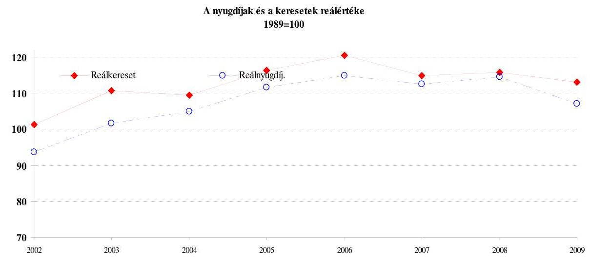

A Kvtv. 71. § (3), illetve a 76. § (1) bekezdése rögzíti a méltányossági nyugdíjintézkedések (megállapítások 200,0 M Ft, emelések 700,0 M Ft, egyszeri segélyek 150,0 M Ft) előirányzati összegeit. Ebből önálló jogcímet csak az egyszeri segélyek előirányzati sor képez. A méltányossági nyugdíjemelések és megállapítások kiadásait a megfelelő ellátáscsoportok nyugellátási kiadási sora tartalmazza. A 2009. év közepén tett megszorító intézkedésekkel párhuzamosan a méltányosságra fordítható kiadásokat a központi költségvetés általános

---

tartaléka terhére - összesen 500,0 M Ft-tal - megemelték ${ }^{93}$. További előirányzat módosításra is sor került 2009 októberében, amikor a Kvtv. felhatalmazása alapján ${ }^{94}$ a szociális és munkaügyi miniszter 1,5 M Ft átcsoportosítást engedélyezett az egyszeri segély előirányzatból a kivételes nyugellátás megállapítás előirányzatába. A méltányossági keretek felhasználásáról a függelék szól.

# 1.5.2. A múködési kiadások alakulása 

A nyugdíjágazat 2009. évi 25679,9 M Ft működési kiadása a 2008. évi 27 404,1 M Ft-hoz viszonyítva 6,3\%-kal (1724,2 M Ft) csökkent, a kiadási főoszszegnek mindössze $0,9 \%$-át tette ki, ami az ágazat hosszú távú múködtetését, a feladatellátást veszélyezteti. A dologi és a felhalmozási kiadások teljesítése (6491,0 M Ft) alig ( $0,47 \%$-kal) haladta meg az előző évi szintet ( $6460,7 \mathrm{M} \mathrm{Ft}$ ). A múködési kiadások csökkenése elsősorban a személyi juttatások és a munkaadókat terhelő járulékok soron jelentkezett, és a központi költségvetés pozíciójának javítása érdekében hozott kiadást csökkentő kormányintézkedések hatására vezethető vissza. Az előirányzatok a napi múködést csak az alapkezelő szigorú gazdálkodása mellett biztosították. A jogcímek teljesüléséről a Függelékben számolunk be.

A személyi juttatások körében az ellenőrzés a teljesítményhez kötött és céljuttatásokat vizsgálta, a megállapításokat a Függelék részletesen tartalmazza.

Az ONYF által készített előirányzat-felhasználási terv elkészítésekor a terv és az ismert feladat ellátás finanszírozási igénye között az összhang megvolt. A Kincstár által megállapított időarányos felhasználási keret minden hónapban elegendő volt az ONYF és igazgatási szervei havi kötelezettségei fedezetére. Likviditási probléma nem merült fel.

A költségvetési előirányzat 2009. évi átcsoportosításai megfeleltek a hatásköri előírásoknak, a kiemelt előirányzatokra vonatkozó szabályoknak. Az előirányzat módosításáról szóló tájékoztatási kötelezettségének az ONYF az Ámr. 55. § (4)-(5) bekezdése szerint eleget tett. Az átcsoportosítások a zavartalan múködés biztosítása érdekében történtek és indokoltak voltak.

Az Ny. Alap kiadásaira, hiányára és közvetlen költségvetési támogatására vonatkozó 2002-2009. közötti adatokat az 5. sz. melléklet, a kintlévőségek és túlfizetések alakulását (az APEH adatszolgáltatása alapján) a 6. sz. melléklet, a nyugdíj melletti foglalkoztatás hatását az államháztartás bevételeire és kiadásaira a 7. sz. melléklet tartalmazza.

[^0]
[^0]:    ${ }^{93}$ A 2009. évi központi költségvetés általános tartalékának előirányzatából történő felhasználásról szóló 1136/2009. (VIII. 14.) Korm. határozat a Nyugdíjbiztosítási Alap részére 100,0 M Ft-ot a méltányossági nyugdíjemelés és 400,0 M Ft-ot az egyszeri segély többletkiadásainak fedezetére csoportosított át.
    ${ }^{94}$ A Kvtv. 71. § (3) bekezdése szerint.

---

# 1.6. Az Ny. Alapot érintő korábbi ÁSZ javaslatok hasznosulása 

Az elmúlt években az Ny. Alap költségvetési beszámolójának ellenőrzéséről szóló számvevői jelentésekben és a Magyar Köztársaság adott évi költségvetése végrehajtásának ellenőrzéséről szóló ÁSZ jelentésekben két témában fogalmazódtak meg javaslatok. Az egyik az alap bevételei között meghatározó munkáltatói nyugdíjbiztosítási járulék és biztosítotti nyugdíijárulék pontos értékének megállapítását segítette volna elő, a másik téma, az egyes nyugdíjszakmai szabályok egyszerübb, költségkímélőbb megváltoztatására irányult.

### 1.6.1. A munkáltatói nyugdíjbiztosítási járulék és a biztosítotti nyugdíjjárulék pontos értékének megállapítása

Javasoltuk a Pénzügyminiszternek, hogy a munkáltatói nyugdíjbiztosítási járulék és a biztosítotti nyugdíjjárulék összegének pontos ismerete érdekében támogassa az APEH-ot a munkáltatói és biztosítotti járulék külön számlára történő fizetésének bevezetése érdekében.

Javaslatunk nem hasznosult, mert nem történt intézkedés annak ellenére, hogy az átállás technikai feltételeit az APEH vállalta és az adatok hiánya minőségi tervező munkát nem tesz lehetővé.

### 1.6.2. Egyes nyugdíjszakmai szabályok egyszerúbb, költségkímélőbb megváltoztatása

Korábbi évek zárszámadási javaslatai két szabályt érintettek:

- a nyugdíj melletti munkavégzés alapján történő nyugdíjemelés ${ }^{95}$ és
- a nyugdíjasok munkavégzésére vonatkozó korlátozások szabályait.

Az ÁSZ 2007. évi zárszámadási jelentésében ${ }^{96}$ javasolta a kormánynak, hogy „tegyen javaslatot az Országgyúlésnek a Tny. 22/A. §-ában foglalt elöirás módosítására annak érdekében, hogy a szabályozásból adódó nyugdíjemelési aránytalanságok lehetősége elkerülhető legyen, és egyszerüsítse a kereső tevékenységet folytató nyugdijasok nyugdijemelésének eljárási rendjét".

A javaslat nem hasznosult. Az utóvizsgálat megállapítása szerint a javaslat megismétlése indokolt.

[^0]
[^0]:    ${ }^{95}$ Tny. 22/A. §. A rendelkezés szoros tartalmi összefüggésben van a saját jogú nyugdíjasként elért keresetre 2007. április 1-jétől előírt egyéni nyugdíjárulék-fizetési kötelezettséggel. (Önkéntes jelleggel már 2007. január 1-jétől történhetett a nyugdíjjárulékfizetés.) A járulékfizetéshez kapcsolódó nyugdíjemelési kötelezettség szabályait tartalmazza a Tny. 22/A. §-a. E szerint a saját jogú nyugellátásban részesülő személy nyugellátását kérelemre minden, 2006. december 31-ét követően saját jogú nyugdíjasként történt foglalkoztatása, illetve egyéni, vagy társas vállalkozóként végzett kiegészítő tevékenysége 365 napja után, az általa ezen időszakban fizetendő nyugdíjjárulék alapja havi átlagos összegének 0,5 százalékával meg kell emelni.
    ${ }^{96}$ Jelentés a Magyar Köztársaság 2007. évi költségvetése végrehajtásának ellenőrzéséről (0824)

---

#### Abstract

Az érvényes szabályok szerint az emelést a nyugdíjasnak kell kérnie akkor, ha összegyűlt 365 napi jogviszonya. Addig akár több évig gyűjteni kell, és számon kell tartani munkaviszonyait, NYENYI igazolásait. Ez kisebb gondot okoz annak, aki folyamatosan dolgozik 365 napot, de szinte megoldhatatlan feladat elé állítja a jogszabály azokat a nyugdíjasokat, akik éveken keresztül több munkahelyen különböző foglalkoztatási viszonyban dolgoznak. Az életkor növekedésével, átmeneti foglalkoztatási viszonyok mellett mind gyakrabban fordulhat elő olyan eset is, hogy nem jut hozzá a járulékfizetéssel megalapozott nyugdíjemelés összegéhez, miután nem gyúlt össze 365 nap munkaviszonya és nincs esélye arra, hogy további foglalkoztatással azt megszerezze. De a szabály nem csak a nyugdíjasra ró többletfeladatot. A munkáltatóknak év közbeni megállapításhoz NYENYI lapot kell kiállítani, több munkáltató esetében többnek is, és a nyugdíj megállapítás folyamata sem egyszerű, a Ket. szabályainak betartásával: adatbekérés, levelezés, határozathozatal, postázás, sokszor többszöri kézbesítéssel.

Javaslatunk lényege az volt, hogy minden naptári évben az előző évben járulékalapot képező kereset $0,5 \%$-ának 12 -ed része legyen a havi nyugdíjnövelés értéke. Ezzel a nyugdíjas munkát végző mentesülne a jogviszonyok összegyűjtésének feladatától, az adott évben a járulékalapot képező keresetével arányos nyugdíjemelésben részesülne, függetlenül a jogviszonyban töltött időtől. A munkáltatók többlet adatszolgáltatásra nem lennének kötelezettek, és a nyugdíjigazgatóság feladata is egyszerűsödne, valorizációt nem kellene alkalmaznia, és folyamatos munkavégzés esetén a nyugdíjplafon átlépése miatt sem kellene a következő évben módosító határozatot hozni, visszamenőlegesen folyósítani az emelést.

Javaslatunk ismételt megfogalmazását alátámasztja, hogy az ügyintézési idők érdemben nem változtak. Egy igény elbírálása a 2008. évben átlagosan 28 napot a 2009. évben 26 napot vett igénybe (a Ket. szerint 18, illetve 12 napot).

Az Ny. Alap 2008. évi költségvetési beszámolójának ellenőrzéséről készített számvevői jelentésben javasoltuk a kormánynak, hogy „fontolja meg a nyugdij melletti foglalkoztatás illetve a kereseti korlát szabályainak felülvizsgálatát", valamint az ONYF főigazgatójának, hogy „végezze el a Tny. 22./A alapján megállapított nyugdijak statisztikai elemzését, a nyugdij melletti munkavégzés korlátozására is tekintettel annak érdekében, hogy az elemzés érvanyagot szolgáltasson a döntéshozók részére".

A nyugdíj melletti munkavégzés korlátozására vonatkozó szabályok ${ }^{97}$ feloldásának megalapozásához hozzájárult javaslatunk. A Tny. 22/A. §-a szerinti nyugdíjnövelésben részesültek 2009. évi állományának statisztikai elemzését az ONYF Közgazdasági Főosztálya elvégezte. Az elemzésből megállapítható, hogy a 2008. és a 2009. évi adatok lényegében azonos tendenciát mutatnak.

Az elemzés a nyugdíj melletti foglalkoztatás államháztartási bevételi és kiadási becslését is tartalmazta. Megállapította, hogy hasonlóan az előző évhez a nyugdíj melletti foglalkoztatás a bevételek és kiadások összehasonlítása alapján államháztartás szempontjából kedvező. A számadatokat a 3. sz. mellékletben mutatjuk be.

[^0]
[^0]:    ${ }^{97}$ Tny. 83/B. §

---

Az államháztartás nyugdíjasok foglalkoztatásából eredő bevétele meghaladja a 130,0 Mrd Ft-ot, az Ny. Alap bevétele a 68,0 Mrd Ft-ot. A nyugdíjnövelésre fordított éves kiadás ugyanakkor alig haladja meg az 1 Mrd Ft-ot. Ezen összegeknek a fele a korhatár alatti öregségi és rokkantsági nyugdíjban részesültek foglalkoztatásához kapcsolódik.

Javaslatunk hasznosult. Az elemzésekből nyert adatok lehetőséget biztosítottak a törvényhozásnak a nyugdíj mellett végzett foglalkoztatási szabályok felülvizsgálatához, alapot szolgáltattak a szabályok megváltoztatására.

A 2007. december 31-éig nyugdíjba menőknél eltörölték nyugdíjfizetés korlátozásának 2010. január 1-jétől történő bevezetését.

Változott a 2007. december 31-e után nyugdíjba vonult, kereső tevékenységet folytató öregségi nyugdíjasoknak a korlátozás mértéke. Az éves keretösszeg mértéke a 2010. január 1-jétől hatályos szabályozás a tárgyév első napján érvényes kötelező legkisebb munkabér - minimálbér - összegének tizenkétszeres mértékét tizennyolcszorosra emelte. Azoknak, akik a mindenkor érvényes nyugdíjkorhatár betöltése előtt öregségi nyugdíjasként keresőtevékenységet folytatnak mindaddig, amíg a nyugdíjas adott évi (járulékalapot képező) keresete nem éri el az ún. éves keretösszeget, keresete mellett a nyugdíjat is korlátozás nélkül felveheti. Ha azonban keresete meghaladja az éves keretösszeget, a következő hónap 1. napjától az év végéig a nyugdíj folyósítását szüneteltetni kell a korhatár betöltéséig.

A jövedelemhatárral összefüggő korlátozás alkalmazása nem zökkenőmentes a gyakorlatban. A munkáltató pontatlan bevallása, az APEH adatszolgáltatásának ${ }^{98}$ időigénye, illetve esetleges késedelme (a hibás bevallások javítása időigényes) oda vezet, hogy a törvényalkotói szándék nem tud érvényesülni.

# 2. EgészsÉgBizTosítÁsi Alap 

### 2.1. Az E. Alap beszámolási kötelezettségére vonatkozó megállapítások

Az Alapkezelő beszámolási kötelezettségének az Áhsz. 10. § (11) bekezdésében foglaltak szerint eleget tett.

Az alapok beszámolóinak minősítésére az Áht. - 2010. január 1-jéig - könyvvizsgálatot írt elő. A 2009. évi költségvetést megalapozó egyes törvények módosításáról szóló törvény módosította az Áht. 86/A. § (2) bekezdését. A módosítás értelmében 2010. január 1-jétől ÁSZ módszertant kell alkalmazni az alapok beszámolójának ellenőrzésére.

A könyvvizsgáló - az ÁSZ módszertana szerint eljárva - az elvárt bizonyossági szintnek megfelelően meggyőződött az Alap beszámolójának megbízhatóságáról. Nem tapasztaltak olyan lényeges hibát, amely meghaladta volna az Alap kiadási főösszegére megállapított határértéket (elfogadható hibahatárt). Vé-

[^0]
[^0]:    ${ }^{98}$ Az APEH és az ONYF között megkötött együttmúködési megállapodás alapján, az Art. 52. § (7) bekezdésében előírt határidőben az APEH adatszolgáltatás megtörtént, de az adatok informatikai feldolgozása hosszabb időt vett igénybe.

---

leményük szerint az Alap múködési-, ellátási- és konszolidált költségvetési beszámolói a 2009. december 31-én fennálló vagyoni, pénzügyi és jövedelmi helyzetéről megbízható és valós képet adnak. A könyvvizsgáló - aki ez idáig öt alkalommal végezte az Alapnál a minősítést visszatérő problémaként jelezte a központi és helyi belső ellenőrzési-, valamint informatikai rendszerek évek óta kifogásolt és a mai napig is meglévő hiányosságaiból eredő beszámolóban rejlő kockázatokat.

Az OEP a 2009. évben 7+1 „A" jelű intézményi, 7+1 „D" jelű ellátási, valamint egy „G" jelű konszolidált költségvetési beszámolót készített. A korábban megyei szinten szervezett igazgatóságokat 2009. január 1-jével regionális szervezetekké alakították át, ezért csökkent az „A" jelű beszámolók száma. Az átszervezéssel az éves beszámolónak megfelelő adattartalommal, leltárral és záró főkönyvi kivonattal alátámasztott beszámolót, valamint vagyonátadási jelentést kellett készíteni. Az induló mérlegeket a régiók - a 2008. évi mérlegbeszámolók készítésével egyidejúleg - 2009. január 1-jei állapotnak megfelelően készítették el. Az „A" jelű intézményi és a „D" jelű ellátási költségvetési beszámoló elkészítéséhez szükséges analitikus és szintetikus nyilvántartást számítógépes rendszerrel biztosították.

Az E. Alap ellátási beszámolójának 2009. évi mérleg főösszege 37 114,7 M Ft volt szemben a 2008. évi 67 191,1 M Ft-tal. A változást legnagyobb mértékben a pénzkészlet állomány 27 897,3 M Ft-os csökkenése okozta. A tőkeelemek vonatkozásában a saját tőke hiánya 2009-ben tovább csökkent 12 720,2 M Ft-ról 8186,9 M Ft-ra. A tartalékok állománya (az alap deficites egyenlege miatt) igen kedvezőtlen helyzetet mutat, a 2009. évi bevételi lemaradás hatására összege negatív ( $125022,8 \mathrm{M} F$ t). A kötelezettség-állomány az előző évi érték háromszorosára emelkedett ( $169880,0 \mathrm{M} F$ t) elsősorban azért, mert a rövid lejáratú, az Alap pénzhiányának finanszírozására nyújtott KESZ megelőlegezési számla záróállománya $121478,4 \mathrm{M}$ Ft volt.

# 2.2. Az E. Alap 2009. évi pénzügyi helyzete 

Az E. Alap bevételi és kiadási oldala között a 2009. évben nem volt egyensúly. A Kvtv.-ben jóváhagyott 8852,1 M Ft-os hiánnyal szemben az E. Alap a 2009. évet -149 475,9 M Ft-os egyenleggel zárta. A hiányt a bevételek elmaradása okozta. A 2009. évi járulék és hozzájárulás bevételi előirányzatok nem voltak teljesíthetőek, 14\%-os bevételi lemaradás keletkezett, amely összesen 146 317,4 M Ft volt. Az eltérés fő oka, hogy a munkáltatói járulék bevételi előirányzat a júliusi járulékmérték csökkenés ${ }^{99}$ hatását nem tartalmazta. A biztosítotti járulékmérték nem változott, ugyanakkor a teljesítés ezen az előirányzaton is elmaradt a tervezettől. Oka a gazdasági válság hatására bekövetkezett foglalkoztatás csökkenés (a KSH adatai szerint a

[^0]
[^0]:    ${ }^{99}$ A foglalkoztató és a biztosított egyéni vállalkozó által fizetendő egészségbiztosítási járulék mértéke 2009. július 1-jétől - a minimálbér kétszeresének megfelelő járulékalapig - 5\%-ról 2\%-ra csökkent.

---

foglalkoztatottak száma 2,5\%-kal, a bruttó keresettömeg 5\%-kal ${ }^{100}$ csökkent), és a 2008. évinél magasabban meghatározott előirányzat.

A bevételi főösszeg 1269 366,2 M Ft-ra, a kiadási 1418 842,1 M Ft-ra teljesült. A kiadási oldalt a bevételek alulteljesülése miatt tartani kellett, így az eredeti előirányzathoz viszonyítva csak 0,1\%-os a túllépés. Túlépés mutatkozott a pénzbeli ellátások és a gyógyászati segédeszköz támogatások kiadásán, de ugyanilyen volumenű megszorítást hajtottak végre a gyógyító-megelőző kiadásoknál, azon belül is kiemelten az összevont szakellátási kassza csökkent az előirányzathoz képest. A GYED-ben részesülők nyugdíjbiztosítási járuléka 2009-ben terhelte elöször az E. Alapot (eddig a központi költségvetés kiadása volt), összege 21 605,0 M Ft.

A kialakult kedvezőtlen gazdasági helyzet enyhítése érdekében módosításra került az egészségügyi szolgáltatások E. Alapból történő finanszírozásának részletes szabályairól szóló 43/1999. (III. 3.) Korm. rendelet (Finr). Az új szabály bevezetésével az 58/2009. (III. 18. ) Korm. rendelet 16. § (1) bekezdése alapján az első négy hónapban 13050,0 M Ft forráskivonás történt több gyógyítómegelőző kasszából. Október hónapban a 232/2009. (X. 16.) Korm. rendelet alapján 4500,0 M Ft visszaforgatásra került „egyszeri októberi hó közi kifizetés" jogcímen. A Finr. a 2009. évben 8 -szor módosult. A kiadások és bevételek öszszehangolása mindig csak az adott évben, az adott helyzetnek megfelelően történt.

A Kvtv. 74. § rendelkezése szerinti bérpolitikai intézkedések kiadása nem az E. Alapból teljesült. A MeH céltartalékából közvetlenül utalták az egészségügyi intézményeknek, és az E. Alapot a Kvtv. 24. § (2) bekezdése szerint megtérítési kötelezettség nem terhelte a 2009. évbben. Így az Alapban kimutatott hiány alacsonyabb, mint az egészségügyi ágazat tényleges hiánya.

Az E. Alap 2009. évi hitelállományának éven belüli alakulását folyamatos és egyre nagyobb mértékú növekedés jellemezte. A KESZ-hez kapcsolódó E. Alap megelőlegezési számla nyitóegyenlege 0 Ft , az I. negyedévben 0 Ft , II. negyedévben 24812,6 M Ft , a III. negyedévben 72606,0 M Ft , az év végén $121478,4 \mathrm{M}$ Ft volt.

# 2.3. Az E. Alap bevételei 

A bevételi főösszeg 1269 366,2 M Ft-ra teljesült, ez a tervezettől 9,9\%-kal, 139 347,8 M Ft-tal kevesebb. A bevételi oldal alulteljesítése a járulék és hozzájárulás bevételek 14\%-os (146 317,4 M Ft-os) elmaradásából származik.

A munkáltatói egészségbiztosítási járulékbevétel előirányzat teljesítése 314 905,9 M Ft, amely a tervezettől jelentősen, 104 898,9 M Ft-tal kevesebbre

[^0]
[^0]:    ${ }^{100}$ A 2009. évben 5\%-os a bruttó keresettömeg csökkenés (KSH adat). A bruttó kereset tömeg változás \%-a a KSH adatközlése szerint a teljes munkaidőben alkalmazásban állók a 4 fő fölötti vállalkozások és a központi és helyi költségvetés szervezeti, társadalombiztosítás és kijelölt non-profit szervezetek adatai alapján értendő.

---

teljesült. A 2008. évi teljesítéshez viszonyítva a bevétel kiesés 25,8\%-os volt, 109 716,1 M Ft. A bevétel elmaradás legfőbb tényezője a járulékmérték csökkenése, amelynek hatását az előirányzat nem tartalmazta. A 2009. július 1-jétől életbe lépő járulékmérték változása az egyes adótörvények és azzal összefüggő egyéb törvények módosításáról szóló a 2009. évi XXXV. törvényben jelent meg, amelyet az Országgyűlés 2009. május 11-ei ülésnapján fogadott el.

A biztosítotti egészségbiztosítási járulék 2009. évi teljesítése 424 335,2 M Ft, amely az előirányzatnál 39 710,8 M Ft-tal kevesebb. A biztosítotti egészségbiztosítási járulék bevételi jogcím alakulása a gazdasági válság hatását jól mutatja, mert a járulékmérték egyező az előző évivel, de a 2008. évhez képest 5,2\%-kal csökkent a teljesítés. A KSH adatai alapján a 2009. évben az előző évhez viszonyítva a foglalkoztatottak létszáma 2,5\%-kal ezen belül az alkalmazásban állók létszáma a legalább ötfős vállalkozások és a költségvetési intézmények esetén 3,7\%-kal kevesebb, a bruttó keresettömeg 5\%kal csökkent.

Az egészségügyi hozzájárulásról szóló 1998. évi LXVI. törvény jelentős módosítást nem tartalmazott a 2009. évre vonatkozóan. Az előző évhez viszonyítva mind a két jogcímen bevétel csökkenés történt, összesen 7,6\%-os mértékű. A tételes egészségügyi hozzájárulás bevétele 78 996,7 M Ft, 12 584,3 M Ft-tal kevesebb az előirányzatnál, miközben a százalékos egészségügyi hozzájárulás 30 937,4 M Ft, az előirányzatnál 3313,4 M Ft-tal több.

A központi költségvetésből érkező bevételek összesen 319 141,6 M Ft-ra, előirányzati szinten teljesültek. A GYED kiadás megtérítésének az eltörlése az oka annak, hogy a bevétel a 2008. évhez viszonyítva 9,9\%-kal csökkent.

Egészségbiztosítási tevékenységgel kapcsolatos egyéb bevételek eredeti előirányzata ( $43698,4 \mathrm{M}$ Ft) magasabban teljesült, 49 931,7 M Ft lett. A túlteljesülés oka az volt, hogy a gyógyszerforgalmazással kapcsolatos bevételekből az előirányzottnál 8059,6 M Ft-tal magasabb összeg folyt be, 43 559,6 M Ft.

# 2.4. Az E. Alap kiadásai 

A kiadási főösszeg 1418 842,1 M Ft-ra teljesült, az eredeti előirányzathoz viszonyítva 0,1\%-os a kiadási többlet. Az egészségbiztosítási ellátások kiadásainak eredeti előirányzata ( 1394 495,7 M Ft) az év folyamán 8110,6 M Ft-tal megemelkedett, ezzel az előirányzat 1402 606,3 M Ft-ra módosult. Az ellátási kiadások teljesítése 1395793,5 M Ft volt, ami 0,5\%kal marad el a módosított előirányzattól. A megtakarítás a természetbeni ellátások terén hozott megszorító intézkedések (forráskivonás a gyógyítómegelőző ellátásokból, gyógyászati segédeszközök támogatásának szigorítása) hatására jelentkezett.

A tárgyévben több változás együttes eredőjeként a 2008. évi teljesítéshez (1 372 922,3 M Ft) viszonyítva 1,7\%-os növekedés állapítható meg. Növekedett a pénzbeli ellátások, a gyógyszer és a gyógyászati segédeszköz támogatások kiadása, de ezt a hatást semlegesítette a gyógyító-megelőző kiadások, azon belül is az összevont szakellátási kassza csökkentése. A GYED-ben részesülők után megtérített nyugdíjbiztosítási járulék beemelése az E. Alap kiadásai

---

# közé és az EU tagállamokkal kapcsolatos elszámolások növekedése okozta az egészségbiztosítás ellátási kiadásainak 1,7\%-os emelkedését. 

A pénzbeli ellátások kiadásait az elmúlt két évvel szemben a 2009. évben a költségvetésben meghatározott összeg nem fedezte. Az előirányzottnál 4700,3 M Ft-tal több volt a kiadás. Az előirányzat feletti kiadás elsősorban a táppénz előirányzat csoporthoz köthető, azon belül az ún. saját jogú betegségi táppénzhez, ahol az előirányzott összegen túl további 6643,7 M Ft kiadásra volt szükség. Az eltérést a 2009. évi táppénz előirányzatnak a szakmai számításoknál kisebb összegre történő beállítása, valamint a gazdasági válság (pl.: a paszszív táppénz kiadás jelentősen, 30\% felett növekedett) okozta. Az előző évekkel ellentétben a másik két jelentős volumenű ellátási formára a Thgys-re (39 209,2 M Ft) és GYED-re kialakított keret ( 90021,0 M Ft) pontos volt. A Thgys kiadása 39 329,7 M Ft, a GYED kiadása 89 649,4 M Ft volt.

A gyógyító-megelőző ellátásban 719031,0 M Ft teljesítés mellett 8551,6 M Ft megtakarítás jelentkezett, ami gyakorlatilag teljes egészében a múködési költségelőleg jogcím év végi módosított előirányzata ( $8550,0 \mathrm{MFt}$ ) volt. A múködési költségelőlegen az egyes gyógyító-megelőző ellátásokról történő átcsoportosítás következtében állt rendelkezésre ez az összeg, az eredeti előirányzat 500,0 M Ft-ot tartalmazott. Az átcsoportosítás szabályos volt, de mivel a múködési költségelőleg előirányzat nem igényelte az emelést, az pénzügyi zárolást, illetve forráskivonást jelentett.

A gyógyító-megelőző jogcímcsoport kiadása a 2008. évihez viszonyítva 27 223,1 M Ft-tal lett kevesebb, ami 3,6\%-os csökkenés. Ez majdnem teljes egészében az összevont szakellátáson jelent meg, ahol arányaiban nagyobb, 6,1\%os megszorítás jelentkezett. Az egészségügyi szolgáltatók bevételének csökkenése ennél nagyobb mértékű volt, mert az előirányzat csökkenésén túl tartalmazta a vizitdíjakból származó bevételek elmaradását (10 960,2 M Ft), és a 2009ben a központi költségvetésből bérpolitikai intézkedés címén kifizetett összeg (10 342,8 M Ft) is alacsonyabb volt a 2008. évinél (24,5 Mrd Ft).

A ,gyógyító-megelőző ellátáshoz bérpolitikai intézkedés fedezete" címmel az Alap költségvetésében a gyógyító-megelőző ellátások jogcímen az eredetileg tervezett előirányzaton (727 582,6 M Ft) felül további 15 824,0 M Ft-ot ún. vonal alatti tételként határoztak meg. A Kvtv. 4. §-ában nevesített bérpolitikai intézkedések végrehajtásához szükséges összeget közvetlenül a központi költségvetésből fizették ki.

A Miniszterelnökség fejezet céltartalékából az ágazat számára többféle bérpolitikai célra teljesült kifizetés. A 2008. év után járó 13. havi illetmény 2009. évi részének elszámolására, a 2009. évben adott havi kereset-kiegészítésre, és a létszámleépítéssel összefüggő támogatásra összesen 10342,8 M Ft illette meg az egészségügyi intézményeket. Ebből a költségvetési szerveknél foglalkoztatottak 2009. évi havi kereset-kiegészítéséről szóló 6/2009. (I. 20.) Korm. rendelettel szabályozott havi kereset-kiegészítés összege volt a legnagyobb tételű, 8470,4 M Ft. (2008-ban a bérpolitikai intézkedések 24,5 Mrd Ft kiadást jelentettek.)

---

Az összevont szakellátás előirányzata (azon belül is a járóbeteg-ellátás és az aktív fekvőbeteg-ellátás) a múködési költségelőlegre történő átcsoportosítás következtében 10500,0 M Ft-tal csökkent, majd az októberi egyszeri kifizetés miatt 4500,0 M Ft-tal növekedett. Az év végi ún. „kasszasöprés"101 további 699,9 M Ft-tal növelte az összevont szakellátás módosított előirányzatát, ezen belül a járóbeteg és a krónikus fekvőbeteg ellátást. Az eredeti 524 715,1 M Ft-os előirányzat 519 415,0 M Ft-ra csökkent. A zárt előirányzatok miatt az egyes kiadásokhoz igazították a módosított előirányzatokat, a teljesítés majdnem 100\%-os, 519 413,8 M Ft lett.

A legnagyobb előirányzat-csökkenés az aktív fekvőbeteg ellátásban történt, ami a módosítások következtében 12545,7 M Ft-tal csökkent. (A csökkenést részben enyhítette az „Egyszeri októberi hóközi kifizetés" aktív fekvőbeteg ellátásra eső 3387,5 M Ft összegű része, mellyel a szektorra eső csökkenés mértéke 2,7\% volt, 9158,2 M Ft.) A járóbeteg szakellátás tárgyéven belüli előirányzata nem változott számottevően, ugyanakkor a 2008. évhez viszonyítva jelentős csökkentés volt tapasztalható. A 2009. évben a járóbeteg ellátás kiadását a CT, MRI kiadásokkal együtt tüntette fel a költségvetés, együttes kiadásuk 108 981,4 M Ft volt. A megelőző évben ezekre a kiadásokra 114 907,8 M Ft teljesítést számoltak el, de a szolgáltatók a vizitdíjjal 118 145,2 M Ft bevételhez jutottak. A csökkenés 9163,8 M Ft. A krónikus fekvőbeteg ellátás előirányzatát $8,8 \%$-kal, 4770,6 M Ft-tal emelték meg a kiadások teljesítéséhez.

Az összevont szakellátás terén az ellátórendszer teljesítménye nem volt összhangban a finanszírozási forrással. A kb. 7\%-kal magasabb teljesítmények kifizetése veszélyeztette a (forráselvonással is érintett) zárt kassza betartását, ezt a problémát finanszírozás-váltással kezelték. Az új, lebegőpontos elszámolás lehetővé tette a zárt kassza betartását, ugyanakkor az ellátások finanszírozottsága jelentősen csökkent. A változás nem tudta önmagában orvosolni a kialakult forráshiányt, a szolgáltatók számára finanszírozási nehézségekhez vezetett, ezért a szakma érdekképviseletei szervei és a minisztérium között tárgyalás kezdődött kiegészítő források bevonásáról. Októberben összesen 4500,0 M Ft-ot kapott a járóbeteg (1112,5 M Ft) és az aktív fekvőbeteg (3387,5 M Ft) ellátás.

Az egészségügyi ellátórendszer fejlesztéséről szóló törvényt ${ }^{102}$ (Eft.) módosító törvény szabályozta az egészségbiztosító fekvő és járó szakellátások kapacitás felosztásával és újraelosztásával kapcsolatos feladatokat. Az OEP a törvényben meghatározott szempontok figyelembevételével intézményekre lebontva elkészítette kapacitás-módosítási javaslatát, melynek leglényegesebb összevont adatait a következő táblázat tartalmazza:

[^0]
[^0]:    ${ }^{101}$ A Finr. 6. § (4) bekezdése alapján a tárgyév utolsó hónapjában a havi kifizetést követően és az átcsoportosítások után az egyes szakfeladatokon még rendelkezésre álló előirányzat a pénzügyminiszter engedélyével kifizethető. Ez az ún. „kasszasöprés".
    ${ }^{102}$ Az egészségügyi ellátórendszer fejlesztéséről szóló 2006. év CXXXII. törvényt módosító 2008. évi CVI. törvény szerint.

---

| Szakellátás | Lekötött   kapacitás   2009. márc. 30-án | Kihasználatlan   kapacitás | Többlet-   igény | OEP által   javasolt   többletigény* | Korrigált   kapacitás** |
| :-- | :--: | :--: | :--: | :--: | :--: |
| Járóbeteg   (órában) | 327952 | 71864 | 51701 | 20163 | 256088 |
| Aktív fekvő   (ágyszám) | 44908 | 4065 | 833 | 3232 | 41320 |
| Krónikus   (ágyszám) | 26676 | 2932 | 538 | 2394 | 23747 |

*Az OEP javaslata az országos átlag-kihasználtságig tartalmaz többletkapacitást
**Az OEP javaslatnak megfelelő tartalmú ÁNTSZ határozatok esetén állna elő.

Az OEP valamennyi Regionális Egészségügyi Tanács (RET) elnökének megküldte a vizsgálat eredményét 2009. szeptember 11-én. (A határidő szeptember 1-je volt a törvény szerint.) A RET-ek válaszukat közvetlenül az Állami Népegészségügyi és Tisztiorvosi Szolgálatnak (ÁNTSZ) küldik meg, aki meghozza a megfelelő határozatokat. Az ÁNTSZ határozatok végleges listája az ellenőrzés időpontjában még egyeztetés alatt áll.

Az egynapos sebészet területén a szolgáltatók 2009-ben 21625,75 teljesített súlyszámra 3,02 Mrd Ft finanszírozást kaptak. A finanszírozott esetek száma a nemzetközi összehasonlításban továbbra is alacsony mértékű, a rendelkezésre álló 3,3 Mrd Ft-os keretet a szolgáltatók a súlyszám korlát miatt egyik évben sem lépték túl. További lehetőség a 2009. január 1-jétől az Eft. 7. §. (1) bekezdése alapján az aktív fekvőbeteg-szakellátási kapacitás legfeljebb 10\%-kának erejéig egynapos ellátási kapacitásra történő átcsoportositás, amellyel egyetlen szolgáltató sem élt.

A gyógyszertámogatások jogcímcsoport eredeti előirányzata 343040,0 M Ft volt, ami az évközi módosítások eredményeképpen 343 820,1 M Ft-ra változott. A teljesítés 343 174,7 M Ft volt, ami az előző évek stagnálása után mérsékelt, 5,4\%-os emelkedést mutat. Jogcímek közötti átcsoportosítás keretében a gyógyszertámogatás céltartalék teljes, 29 500,0 M Ft-os összegével a többi előirányzatot növelték, ebből a speciális beszerzésű gyógyszerek előirányzatát 1000,0 M Ft-tal, a méltányossági gyógyszertámogatás előirányzatát 800,0 M Ft-tal, a gyógyszertámogatás kiadásait 27 700,0 M Ft-tal. ${ }^{103}$

A legnagyobb előirányzatú jogcím, a gyógyszertámogatás kiadása 2009. évben 328510,5 M Ft volt, ami 6,1\%-os, 18 947,1 M Ft-os növekedést jelent az előző évhez viszonyítva. A 2009-ben kiváltott gyógyszerek 1,1\%-kal kevesebb terápiás napra voltak elegendőek, mint 2008-ban, azonban ez az adat nem vette figyelembe a $0 \%$-os termékkör kikerülését a nyilvántartásból,

[^0]
[^0]:    ${ }^{103}$ A gyógyszertámogatás kiadásainak teljesítését további 780,0 M Ft-os emelés biztosította a gyógyászati segédeszköz támogatás és a gyógyszertámogatás 2009. év végi finanszírozásához szükséges lépésekről szóló 1180/2009. (X.30.) Korm. határozat szerint.

---

ezért a DOT ${ }^{104}$ forgalomra vonatkozóan stagnálás állapítható meg, vagyis a gyógyszerfogyasztás nem változott.

A gyógyszerfogyasztás mértéke nem változott. A normatív körben mind a fogyasztás mind a kiadások stagnálása figyelhető meg. Az eü. indikációs jogcímeken a támogatás-kiáramlás jelentősen, $9,1 \%$-kal nőtt, ami az új terápiás lehetőséget nyújtó termékek befogadásának volt köszönhető. Ezeket a biztosító úgy tudta támogatni, hogy a kiadások az előirányzatot nem lépték túl.

Az árcsökkentések visszafogottabb, de még igen jelentős eredményekhez vezettek 2009-ben. 2008-ban átlagosan 14\%-os árcsökkentésre került sor, tárgyévben 7,5\%-os volt az árcsökkentések átlagos mértéke. Enyhült a fogyasztói áron alapuló kötelező delistázási szabály ${ }^{105}$, ami kevésbé ösztönözte a szereplőket árversenyre. 2009-ben 652 gyógyszer ára csökkent szemben az egy évvel korábbi 786 -tal.

A 2007. évben bevezetett gyógyszerforgalmazást és a gyógyszertámogatást befolyásoló szabályozók múködtetése szükséges, - a korábbi évekkel szemben, amikor a kiadás kontrollálhatatlan volt - lehetővé teszik a gyógyszerkiadások tervezett előirányzaton belül tartását.

A minőségi és hatékony gyógyszerrendelésre átdolgozott szabályozókat 2009ben kezdték először alkalmazni. A Gyftv. 77. § (2) bekezdés k) pontja alapján az Egészségügyi Minisztérium szerepe a minőségi és hatékony gyógyszerrendelés értékelésének alapjául szolgáló csoportok és célértékek meghatározása, melynek a tárca a 17/2009. (V. 14.) EüM rendeletben tett eleget. Négy, terápiás területen jelöltek ki célértéket: gyomorbántalmak, cukorbetegség, magas vérnyomás, valamint vérzsírproblémák körében. Az egyes terápiás csoportokon belül a célérték feletti mennyiséget felírók aránya 2009. II. negyedévtől kezdve minden csoportban jelentősen csökkent. Fentiek alapján a rendszer eredményes, az orvosok felírási szokásai a célértékek felé közelítenek.

A gyógyászati segédeszközök jogcímcsoport eredeti előirányzata 42 450,1 M Ft volt. A gyógyászati segédeszköz támogatás és a gyógyszertámogatás 2009. év végi finanszírozásához szükséges lépésekről szóló 1180/2009. (X. 30.) Korm. határozat 7329,9 M Ft-tal megemelte az előirányzatot annak érdekében, hogy a kiadások teljesíthetőek legyenek. A Kvtv. 73. § (1) bekezdés alapján januártól minden hónapban a pénzügyminiszter engedélyére volt szükség a kiadások teljesítéséhez, mert az időarányosnál nagyobb volt a felhasználás.

Először fejezeti hatáskörben jogcímek közötti átcsoportosítás történt, 1000,0 M Ftot az egyéb gyógyászati segédeszköz előirányzatról a kötszertámogatásra, 550,0 M Ft-ot a kölcsönzés jogcímről szintén a kötszertámogatásra csoportosítottak át. Ezek a jogcímcsoport összegére nem voltak kihatással. Majd a 1180/2009.

[^0]
[^0]:    ${ }^{104}$ DOT (Days of Treatment): terápiás napok száma, amire a kiváltott dobozok elegendőek.
    ${ }^{105}$ Az OEP a Gyftv. 31. § (1) bekezdésben felsorolt esetekben kizárja a társadalombiztosítási támogatásból a gyógyszert.

---

(X.30.) Korm. határozattal elrendelt összegből 955,6 M Ft növelte a kötszertámogatás előirányzatát, 6374,3 M Ft az egyéb gyógyászati segédeszköz jogcímet.

Az év végi 46 352,4 M Ft-os kiadás teljesítéséhez azért nem volt szükség a teljes módosított előirányzatra, mert a 2009. augusztusban bevezetett intézkedések hatására a következő hónapokban kb. 1,0 Mrd Ft-tal csökkent a kiadás a megelőző 5-6 hónap átlagos kiadásához képest. Az előző évhez viszonyítva a kiadás 2009-ben 10,7\%-kal emelkedett. A kiadás növekedéséhez mind támogatás oldalon, mind lakossági térítési díj oldalon hozzájárult az áfakulcs $20 \%$-ról $25 \%$-ra történő emelkedése.

Az elmúlt években a szigorító-enyhítő rendelkezések váltogatása nem szakmai, hanem költségvetési szempontok mentén történt, de 2009-ben az Alapkezelő egy szakmailag megalapozott, rendszerszintú átalakítást készített elő. A gyógyászati segédeszköz támogatás átalakítására vonatkozó javaslatok végrehajtását két lépcsőben tervezték. Az első lépcsőt miniszteri rendelettel ${ }^{106}$ bevezetett megszorító intézkedések képezték, a támogatási kulcsok, indikációk, felírási jogosultságok és egyéb támogatási paraméterek változtatását célozták augusztus 16-ai hatállyal. A második lépcsőben megvalósítani tervezett intézkedések 2010. január 1-től léptek volna hatályba.

A létrejött gyógyászati segédeszköz támogatási rendszer a kedvezőtlen költségvetési helyzet ellenére meghatározott betegcsoportok (gyerekek, oktatásban részt vevők, aktív életet élők, keresőképességre törekvők) helyzetét javította, míg a többi betegkör vonatkozásában legalább változatlan színvonalú ellátást biztosított. A forgalmi adatok alapján két csoportban következett be a térítési díj csökkenése, miközben a támogatás emelkedett: az ortézisek, protézisek és a kommunikációra, tájékoztatásra, jeladásra szolgáló segédeszközök körében.

# A gyógyászati segédeszköz támogatás rendszerszintű átalakítása a 

2009. évben megkezdődött, az érdemi intézkedések a már létező rendszeren hajtották végre az időszerű módosításokat, illetve a meglévő rendszerhez támogató, kiegészítő funkciókat kapcsoltak. A támogatási rendszer átalakítása a 2010. évben folytatódik, de az átalakítás néhány eleme még nem valósult meg.

Így például nem jött létre a komplex szolgáltatáscsomagok vásárlása, ami felülírta volna a javítás jelenlegi gyakorlatát. A komplex szolgáltatáscsomag előnye a jelenlegi javítási rendszerrel szemben a tervezhetőség, a kisebb adminisztrációs teher, a felelős gyógyászati segédeszköz ellátás és használat a teljes kihordási időre vonatkozóan, ami hosszabb távon megtakarításhoz vezethet. Ugyancsak rendszerszintű átalakítás lett volna a közgyógyellátottak keretes rendszere, amely öszszevont gyógyszer és gyógyászati segédeszköz keretet hozott volna létre.

[^0]
[^0]:    ${ }^{106}$ A gyógyászati segédeszközök társadalombiztosítási támogatásba történő befogadásáról, támogatással történő rendeléséről, forgalmazásáról, javításáról és kölcsönzéséről szóló 14/2007. (III. 14.) EüM rendelet módosításáról szóló 25/2009. (VIII. 3.) EÜM rendelet.

---

# 2.5. Az OEP és igazgatási szervei szabályozottsága 

A Kt.-ből adódó feladatokat az OEP végrehajtotta. Megtörtént a költségvetési szerv besorolása: a tevékenységek jellege alapján, a feladatellátáshoz kapcsolódó funkciói szerint, valamint tevékenységeinek tevékenységi körök szerinti besorolása, továbbá az alaptevékenység(ek) szakfeladat-rendi besorolása.

Az OEP 2009. évben rendelkezett a kötelezően előírt gazdálkodási szabályzatokkal, melyek aktualizálása folyamatosan megtörtént.

Az OEP és területi szervei, a regionális egészségbiztosítási pénztárak jogállását, hatáskörét és feladatait az Országos Egészségbiztosítási Pénztárról szóló - a 297/2008. (XII. 11.) Korm. rendelettel módosított - 317/2006. (XII. 23.) Korm. rendelet 2009. január 1-jei hatállyal újraszabályozta, ennek megfelelően kerültek kialakításra a REP Alapító Okiratok.

A hét regionális egészségbiztosítási pénztár jogi személyiséggel rendelkező, önállóan gazdálkodó az előirányzatok felett részjogkörrel rendelkező költségvetési szervek, egyszemélyi felelős vezetővel, önálló költségvetéssel, továbbá bővülő létszám és bérgazdálkodási jogosítványokkal. A jogszerű múködést a 317/2006. (XII. 23.) Korm. rendelet mellett az Egészségügyi Miniszter által, 2008. december 23-án jóváhagyott, 2009. január 1-jétől hatályos egységes, az OEP központi szervére, valamint a REP-ekre vonatkozó Szervezeti és Múködési Szabályzat alapozta meg.

A „Biztonság és Partnerség" program a regionális átalakításon túl határozott az ügyfélszolgálati rendszer továbbfejlesztéséről, a kistérségi ügyfélszolgálati rendszer kialakításáról is. Az első ütemben 48 iroda beindítására került sor.

### 2.6. Az Alap ellenőrzési rendszere

Az E. Alap ellenőrzési rendszere átfogja a költségvetési gazdálkodás, és a szakmai, ellátási feladatok végrehajtásának területét. Az ellenőrzési feladatokat az SzMSz pontosan megfogalmazza és meghatározza az ellenőrzés végrehajtásáért felelős szervezeti kereteket. Az OEP SzMSz-e szerint a főigazgató feladata, és hatásköri teendői közé tartozik, hogy külön jogszabályokban meghatározottak szerint irányítja és múködteti az egészségbiztosítási ágazat felügyeleti-szakmai és költségvetési belső ellenőrzési rendszerét, elkészíti az előírt terveket. Az ellenőrzési feladatokat, a 2009. évben három főosztály látta el.

A kontrolltevékenység keretében a munkafolyamatba épített előzetes, utólagos és vezetői ellenőrzés (FEUVE) mindhárom elemét kialakították valamennyi szervezeti egységnél: az ellenőrzési nyomvonalat, a szabálytalanságok kezelésének, valamint a kockázatkezelés szabályzatát is. Az ellenőrzési nyomvonalak - alapvetően a gyakori szervezeti változások következtében - nem minden szakmai tevékenységre terjedtek ki, nem kellően részletezettek, ezért folyamatos pontosítást, aktualizálást igényelnek.

A Kincstárnok - az Ámr. 152/A. § (1) bekezdése alapján - az E. Alaphoz a Miniszterelnök 2009. augusztus 27-én kelt VIII/1980/2009. ikt. számú levelével került kijelölésre. A kincstárnoki feladatellátásra vonatkozó rendelkezéseket az

---

Ámr. 2009. augusztus 27-én hatályba lépő 152/A-152/C. §-ai ${ }^{107}$ tartalmazták. A feladatellátás eljárásrendjét a pénzügyminiszter adta ki.

Az OEP-nél a 10,0 M Ft feletti kötelezettségvállalásokat kellett a kincstárnokkal jóváhagyatni. 2009. évben összesen 17 alkalommal (egy alkalommal több szerződés megkötéséhez, kifizetéshez is kérték a jóváhagyást) keresték meg a kincstárnokot kötelezettségvállalás, vagy kifizetés engedélyezése céljából. A kincstárnok minden esetben megadta az engedélyt, kifogást egyetlen esetben sem emelt.

Az ellenőrzés megállapítása szerint a kincstárnoki rendszer bevezetése az E. Alapnál törvényi felhatalmazás nélkül vezették be 2009. augusztus 27 -ével, a szabályozásból a társadalombiztosítási alapokra vonatkozó rendelkezés kimaradt. ${ }^{108}$ Az Áht.-t a Magyar Köztársaság 2010. évi költségvetését megalapozó egyes törvények módosításáról szóló 2009. évi CIX. törvény módosította, mely 2010. január 1-től hatályos, de a kincstárnoki rendszerre vonatkozó rendelkezések a társadalombiztosítási alapokat illetően abban sem módosultak.

Az ellenőrzés megítélése szerint a kincstárnoki rendszer bevezetése, érdemben nem befolyásolta az E. Alap gazdálkodását. Az OEP nem vállalt semmivel kevesebb kötelezettséget, csak a tényleges 2009. évi kiadásait ütemezte át a 2010. évre, hogy a központi költségvetési fejezetek 2009. évi maradványtartási kötelezettsége teljesítését megalapozó intézkedésekről szóló 2007/2009. (VII. 29.) Korm. határozattal elrendelt kötelezettségének eleget tudjon tenni.

Az OEP belső ellenőrzési rendszerének kialakítása a Ber., valamint az Áht. 121/A. § és az Ámr. 145/A -145/H. §-ai előírásainak megfelelt.

Az OEP rendelkezett a 2009. évre éves ellenőrzési munkatervvel, mely a Ber. 18. § értelmében kockázat elemzésre épült. Az éves ellenőrzési terv elkészítése során elsősorban a rendszerellenőrzésekre helyezték a hangsúlyt, mert véleményük szerint a rendszerellenőrzések egyidejűleg - egy ellenőrzés keretében meghatározott területekre összpontosítva érvényesítik a szabályszerűségi-, valamint a teljesítmény-ellenőrzés jellemzőit.

A belső ellenőrzés a 2009. költségvetési évről megállapította, hogy az SzMSz, az ügyrendek és a munkaköri leírások nem voltak összhangban, az ügyrendek és a munkaköri leírások nem voltak kellően részletezettek, az ellenőrzési nyomvonalak aktualizálása nem minden esetben történt meg. Továbbá az egyes informatikai rendszerek, programok működése, fejlesztése, nyilvántartása és dokumentáltsága nem volt megfelelő, az egyes programok által előállított bizonylatok - eszköz üzembe helyezési okmányok, eszköz áthelyezési bizonylatok nem feleltek meg a jogszabályi (Szt.) előírásnak, valamint az OEP számviteli politikájának. A szakfeladatokra nem minden esetben készült eljárási rend, ahol volt, ott aktualizálásuk elmaradt.

Az ellenőrzések megállapításaira készített intézkedési tervben meghatározott feladatok 36\%-a határidőn túl teljesült. Az erre vonatkozó nyilvántartás jelen-

[^0]
[^0]:    ${ }^{107}$ Módosította a 169/2009. (VIII. 26.) Korm. rendelet
    ${ }^{108}$ Az Áht. 46/A. § (1) bekezdése alapján.

---

leg regisztrációs szintű. Az intézkedési tervek végrehajtásáról történő beszámoltatási rendszert fejleszteni szükséges.

Továbbra sem megoldott az informatikai rendszerek jogszabályban előírt (Áht. 121/A. § (5) bek.) ellenőrzése, a speciális szakértelemmel és előírt képesítéssel rendelkező munkatárs hiánya miatt.

Az Áht. előírja az OEP belső ellenőreinek a belső ellenőrzési tevékenységet végzők nyilvántartásába való felvételét, ami 2009. évben megtörtént, a regisztrációs kötelezettségüknek a belső ellenőrök eleget tettek.

# Az E. Alap hatékony felhasználásának érdekében 2009-ben megindult az OEP orvosszakmai ellenőrző tevékenységének koncepcionális újragondolása. Az Alapkezelő szerint „a jobb és hatékonyabb ellátás biztosítása egy olyan ellenőrzés mellett garantálható, mely az ellátó rendszerből az anomáliákat a teljesség igényére törekedve valóban kiszűri, és tükör módjára az érintettek felé visszamutatja." A szakmai ellenőrzés koncepcionális megerősítésének részeként egységes összefoglaló készült a 2009-es év ellenőrzéseiről. Az orvosszakmai és gyógyszerészeti ellenőrzés együttesen 1,6 Mrd Ft indokolatlan társadalombiztosítási támogatás-kiáramlást és finanszírozást állapított meg. Szankcióként az indokolatlan támogatások visszavonása, levonása iránt intézkedtek. 

### 2.7. Az OEP 2009. évi múködési költségvetésének teljesítése

A Kvtv. az 5. Egészségbiztosítási költségvetési szervek és központi kezelésű előirányzatok címen 936,1 M Ft saját bevételt, és 21 629,3 M Ft E. Alapból származó támogatási összeget hagyott jóvá. Az E. Alap bevételi főösszegét 22 565,4 M Ft-ban határozta meg. A módosított előirányzat $26464,3 \mathrm{M} \mathrm{Ft}$, a teljesítés a bevételeknél 26 211,1 M Ft volt.

Az E. Alap múködési kiadásaira a bevétellel egyező, 22 565,4 M Ft főösszeget hagytak jóvá. A beszámolási időszakban a módosított kiadási előirányzat 26 464,3 M Ft volt. A teljesített kiadás $23038,4 \mathrm{M}$ Ft, az év végi előirányzatmaradvány összege 3502,2 M Ft volt.

Az OEP rendelkezett előirányzat felhasználási tervvel. A terv készítésekor az ismert feladatok finanszírozási igénye és a terv összhangban voltak. A múködési kiadások finanszírozásánál a 2009. évben likviditási probléma nem merült fel. Az előirányzat módosítások, az előirányzatok közötti átcsoportosítások indokoltak és szabályszerűek voltak.

A 2009. évi államháztartási egyensúly megőrzéséhez szükséges intézkedésekről szóló 1033/2009. (III. 17.) Korm. határozat 106,8 M Ft összegű zárolást rendelt el, melyet év végén az 1214/2009. (XII. 18.) Korm. határozat alapján előirányzatcsökkentésre módosították. Felügyeleti szervi hatáskörben végrehajtott előirány-zat-módosítás 550,2 M Ft volt, melyből 0,2 M Ft többletbevétel előirányzatosítása felügyeleti hatáskörben történt. Intézményi hatáskörben 3455,6 M Ft előirányzatmódosítást hajtottak végre. A módosítás az előző évi pénzmaradvány, valamint a többletbevétel terhére történt.

---

Az E. Alap működési költségvetésének 2008. évi előirányzat-maradványát, a Pénzügyminiszter teljes összegben jóváhagyta. A 3285,9 M Ft összegből kötelezettségvállalással terhelt 3281,5 M Ft, a szabad előirányzat-maradvány 4,4 M Ft volt. Az E. Alap működési költségvetésében a 2009. évi maradványtartási kötelezettség 3281,5 M Ft volt, amely nagyrészt - 3023,0 M Ft összegben az OEP Központi Igazgatási szervénél jelentkezett. A REP-ek maradványtartási kötelezettsége - 258,5 M Ft - kizárólag a dologi előirányzatokat érintette.

A 2009. évi költségvetési tartalék összege 3502,8 M Ft a beszámoló tanúsága szerint, mely 3425,9 M Ft kiadási megtakarításból és 253,2 M Ft bevételi elmaradásból, illetve 330,1 M Ft előző évi előirányzat-maradványból tevődött össze.

A Kormány vagy miniszter irányítása, illetve felügyelete alá tartozó egyes költségvetési szervek létszámgazdálkodását érintő átmeneti intézkedésekről szóló 1127/2009. (VII. 29.) Korm. határozat alapján 2009. november 30-án meglévő üres álláshelyeket és a hozzá kapcsolódó személyi juttatásokat zárolták. Az E. Alap esetében ez 61 üres álláshelyet és az álláshelyeken nyilvántartott 2009. július 15 -től november 30 -ig számított rendszeres és nem rendszeres személyi juttatások együttes összegét, 55,2 M Ft-ot jelentett. A kormányhatározat végrehajtása következtében feladat-ellátási gondok jelentkeztek az E. Alapnál.

Le kellett állítani az egészségbiztosítói alapfeladatot ellátó orvosi, gyógyszerészi, pénzügyi szakellenőri szervezet megerősítését, a kistérségi ügyfélszolgálati szolgáltatás bővítését. Problémát jelentett az egészségügyi szolgáltatásokat támogató informatikai rendszer zavarmentes múködtetése.

A probléma megoldása érdekében az OEP főigazgatója levélben fordult a Miniszterelnöki Hivatal vezetőjéhez 39 fő alkalmazásának engedélyezése ügyében. A Miniszterelnöki Hivatal 35 fő felvételét engedélyezte az 1127/2009. (VII. 29.) Korm. határozat alapján.

A dologi, felhalmozási kiadások - takarékossági intézkedésekkel - az alapvető múködési feltételekhez biztosítva voltak.

# 2.8. Az E. Alapot érintő korábbi javaslatok hasznosulása 

A 2008. évi költségvetés végrehajtásának ellenőrzése során javasoltuk ${ }^{109}$ az egészségügy helyreállítása érdekében a Kormánynak, hogy alakítsa ki az egészségügyi finanszírozás stabil, kiszámítható és objektív rendszerét, illetve határozza meg az ellátási rendszer koncepcióját és ennek alapján készítesse el a járulék (fedezet) kalkulációt, amely figyelembe veszi a szükségletek, a lehetőségek és a kívánságok egyeztetett rendszerét, ami hosszú távon biztosítja a kiadások és bevételek összhangját. A javaslat nem hasznosult.

Az Egészségügyi Miniszternek tett javaslatunk, mely szerint az egészségügyi ellátórendszer egészének helyzetét elemezve, tegye meg a rövidtávon szükséges intézkedéseket és dolgozzon ki az ellátórendszer hosszú távú koncepciójára vo-

[^0]
[^0]:    ${ }^{109}$ Jelentés a Magyar Köztársaság 2008. évi költségvetésének végrehajtásáról (0928) 303. oldal

---

natkozó megoldási javaslatokat részben megvalósult. A 2009. novemberi teljesítmények elszámolásától kezdődően a járóbeteg és a fekvőbeteg szakellátás vonatkozásában megtörtént a finanszírozási időszak 2 hónapra csökkentése. A teljes jogcímcsoporton belül a többi ellátási forma felzárkóztatására forráshiányában még nem került sor.

A 2009. évi költségvetés véleményezése ${ }^{110}$ során javasoltuk a Kormánynak, hogy a társadalombiztosítási alapok pénzügyi önállóságának és a bevételek átláthatóságának biztosítása érdekében a befolyó járulékok önálló számlákon történő elszámolása valósuljon meg. A javaslat nem hasznosult, az adóbevallásban az egészségbiztosítást illető munkáltatói és biztosítotti járulékok továbbra is egy adónemen szerepelnek.

[^0]
[^0]:    ${ }^{110}$ Vélemény a Magyar Köztársaság 2009. évi költségvetési javaslatáról (0836) 44. oldal

---

# B.3. AZ ÁLLAMHÁZTARTÁS HELYI SZINTJE, A HELYI ÖNKORMÁNYZATOK 

## 1. A KvTV. MELLÉKLETEIBEN MEGHATÁROZOTT KÖZPONTI TÁMOGATÁSOK ELSZÁMOLÁSÁNAK SZABÁLYSZERŰSÉGE

A Kvtv. harmadik fejezetének A) pontja meghatározza a helyi önkormányzatok és a központi költségvetés kapcsolatrendszerét. A törvény 15-19. §-ai felsorolják a helyi önkormányzatok központi költségvetési kapcsolatokból származó forrásait.

| 2008. évi teljesítés | 2009. évi |  |  | 2009. évi teljesítés / 2009. évi módosított elöirányzat | 2009. évi teljesítés / 2008. évi teljesítés |
| :--: | :--: | :--: | :--: | :--: | :--: |
|  | Eredeti | Módosított | Teljesítés |  |  |
|  | elöirányzat |  |  |  |  |
|  | M Ft-ban |  |  |  | \%-ban |
| 1421 716,0 | 1289 970,9 | 1311 091,7 | 1308 451,9 | 99,8 | 92,0 |

### 1.1. Elöirányzatok nyilvántartása

### 1.1.1. Az eredeti előirányzatok jogcímenkénti megfelelősége a Kvtv.ben és a PM-ÖM együttes rendeletben

A helyi önkormányzatok, valamint a helyi kisebbségi önkormányzatok és a többcélú kistérségi társulások normatív állami hozzájárulásának és támogatásának, valamint a normatív részesedésű átengedett személyi jövedelemadójának jogcímeit és fajlagos összegeit a Kvtv. 15. § (1) bekezdése értelmében az Országgyűlés a 3. sz. mellékletben, a felhasználási kötöttséggel járó normatív támogatásokét pedig a 15. § (2) bekezdése szerint a 8. sz. mellékletben foglaltak szerint állapította meg.

A helyi önkormányzatokat és többcélú kistérségi társulásokat a 2009. évben egyes központi költségvetési kapcsolatokból megillető forrásokról szóló 2/2009. (I. 30.) PM-ÖM együttes rendelet megalkotásával a pénzügyminiszter és az önkormányzati miniszter eleget tett a Kvtv. fenti előírásának. Az Áht. 64. § (3) bekezdésében, illetve az Áht. 71. § (1) bekezdésében előírt határidőt, amely 2009. január 30., a rendelet megalkotása során betartották.

A 2/2009. (I. 30.) PM-ÖM együttes rendeletben megjelent önkormányzatonkénti, valamint a többcélú kistérségi társulásonkénti támogatások és hozzájárulá-

---

sok összege és a Kvtv. 1., 3., 4. és 8. számú mellékletében szereplő előirányzatok 6 jogcímnél, összesen 866,4 M Ft-tal térnek el. ${ }^{111}$

Az NGM 2010. július 30-ai észrevételében jelezte, hogy:
„Ez képezte tartalékát az Áht.64. § (4) bekezdése szerinti kiegészitő felmérés forrásának."

- a PM-ÖM együttes rendeletben a Szociális és gyermekjóléti alapszolgáltatás feladatai és a Gyermekek napközbeni ellátása (Kvtv. 3. számú melléklet 11., 14. alcímek) jogcímeinek összege 59,9 M Ft-tal kevesebb a Kvtv.-ben meghatározott előirányzatnál.
- a PM-ÖM együttes rendeletben a Közoktatási alap-hozzájárulások, a Közoktatási kiegészítő hozzájárulások, a Szociális juttatások, egyéb szolgáltatások (Kvtv. 3. számú melléklet 15., 16., 17. alcímek) jogcímeinek összege 604,5 M Ft-tal kevesebb a Kvtv.-ben meghatározott előirányzatnál.
- a PM-ÖM együttes rendeletben a települési és a megyei önkormányzatok személyi jövedelemadója (Kvtv. 4. számú melléklet 1., 2. címek) jogcím összege 0,1 M Ft-tal kevesebb a Kvtv.-ben meghatározott előirányzatnál.
- a PM-ÖM együttes rendeletben a települési önkormányzatok jövedelemdifferenciálódásának mérséklése (Kvtv. 4. számú melléklet 3. cím) jogcím összege 52,0 M Ft-tal kevesebb a Kvtv.-ben meghatározott előirányzatnál.
- a PM-ÖM együttes rendeletben a Pedagógusok szakszolgálata (Kvtv. 8. számú melléklet I/1. alcím) jogcím összege 0,1 M Ft-tal több a Kvtv.-ben meghatározott előirányzatnál.
- a PM-ÖM együttes rendeletben a többcélú kistérségi társulások támogatása (Kvtv. 8. számú melléklet IV. alcím) jogcím összege 150,0 M Ft-tal kevesebb a Kvtv.-ben meghatározott előirányzatnál.

# 1.1.2. Az előirányzat módosítások szabályszerűsége 

Az előirányzat módosítások hatáskör szerinti alakulása a következő volt:

|  | M Ft |
| :-- | --: |
| Megnevezés | Támogatások,   hozzájárulások |
| Országgyưlés hatáskörben | 0,0 |
| Kormány hatáskörben | 13300,0 |
| Fejezeti hatáskörben | -7663,7 |
| Döntéssel le nem kötött maradvány előirányzatosítása | 39,0 |
| Maradvány-felhasználás előirányzatosítása | 15445,5 |
| Elöirányzat-módosítás összesen | $\mathbf{2 1 1 2 0 , 8}$ |

Országgyúlési hatáskörben nem történt előirányzat módosítás.
Kormány hatáskörben öt jogcímen, összesen 13 300,0 M Ft előirányzat növekedés volt, melynek forrása fejezeten kívüli. Három jogcím esetében az előirány-

[^0]
[^0]:    ${ }^{111}$ Az összehasonlítás a 2008. XII. 21-én (közlönyállapot) megjelent Kvtv. 3., 4. és 8. számú mellékletei és a 2009. I. 30-án (közlönyállapot) megjelent PM-ÖM együttes rendelet 2., 3., 4. és 8. számú melléklete alapján történt.

---

zat átcsoportosítás ( $62,0 \mathrm{M}$ Ft) fejezeten belül történt. Összesen öt új költségvetési cím jött létre.

A Kormány a 1099/2009. (VI. 26.) számú határozatában döntött a központi költségvetési fejezetek 2008. évi kötelezettségvállalással nem terhelt előirányzat maradványainak kezeléséről. A IX. Helyi önkormányzatok támogatásai és átengedett személyi jövedelemadója fejezet 15. Roma Kulturális Központ létrehozása új cím javára $900,0 \mathrm{M}$ Ft átcsoportosítását rendelte el a XX. Oktatási és Kulturális Minisztérium fejezet 11. Fejezeti kezelésű előirányzatok cím, 13. Egyéb fejlesztési támogatások alcím, 4. Nem állami intézmények felújítás, beruházás jogcímcsoport, 2. Felhalmozási költségvetés előirányzat csoport, 0. Előző évi felhalmozási célú előirányzat-maradvány átadása kiemelt előirányzat jogcímcsoport terhére.

A Kormány a 1206/2009. (XII. 9.) számú határozatában döntött a Házi segítségnyújtást és/vagy jelzőrendszeres házi segítségnyújtást ellátási szerződés keretében biztosító helyi önkormányzatok támogatásáról. A IX. Helyi önkormányzatok támogatásai és átengedett személyi jövedelemadója fejezet 16. Házi segítségnyújtás és/vagy jelzőrendszeres házi segítségnyújtást ellátási szerződés keretében biztosító helyi önkormányzatok támogatása új jogcím javára $500,0 \mathrm{M}$ Ft átcsoportosítását rendelte el a XXVI. Szociális és Munkaügyi Minisztérium fejezet 16. fejezeti kezelésű előirányzatok cím, 48. Szociális célú humánszolgáltatások alcím, 1. Szociális célú humánszolgáltatások normatív állami támogatása jogcímcsoport terhére.

A Kormány a 2009. évben a 1212/2009. (XII. 15.) és a 1222/2009. (XII. 24.) határozatával három új költségvetési címet hozott létre, összesen 62,0 M Ft öszszegben. A határozat mindhárom esetben felhatalmazta az önkormányzati minisztert a támogatás soron kívüli folyósítására. Rögzítette továbbá a szerződéskötési kötelezettséget és az utólag (2011. december 31-éig történő) elszámolás lehetőségét. Nem tartalmazta azonban egyik esetben sem a támogatási szerződés megkötésének időpontját. A szerződések aláírására a 2010. évben került sor (két esetben február 15-én, egy esetben április 13-án), holott a támogatást már a 2009. évben folyósították.

Az ÁSZ már a 2008. évi zárszámadás ellenőrzéséről szóló jelentésében jelezte (bár akkor jelentősebb, 17,1 Mrd Ft összeg esetében), hogy nem tartja megfelelőnek az ÖM eljárását, mely szerint úgy biztosított támogatást az év utolsó napjaiban, hogy a pénzügyi folyósítást megelőzően a támogatásokra szerződést nem kötött.

A Kormány a 1212/2009. (XII. 15.) számú határozatában döntött Csép település Polgármesteri Hivatal, háziorvosi és védőnői szolgálat épületének építésére és berendezésére történő átcsoportosításról. A IX. Helyi önkormányzatok támogatásai és átengedett személyi jövedelemadója fejezet 17. Csép település Polgármesteri Hivatal, háziorvosi és védőnői szolgálat épülete építésének és berendezésének támogatása új jogcím javára $40,0 \mathrm{M}$ Ft átcsoportosítását rendelte el a IX. Helyi önkormányzatok támogatásai és átengedett személyi jövedelemadója fejezet 4. Normatív hozzájárulások cím 11. Szociális és gyermekjóléti alapszolgáltatási feladatok alcím terhére. A támogatást 2009. december 28-án utalták át.

A Kormány a 1222/2009. (XII. 29.) határozatában döntött az egyes önkormányzati beruházások központi költségvetési támogatásáról. A Kormány a IX. Helyi önkormányzatok támogatásai és átengedett személyi jövedelemadója fejezetben a létrehozta a 18. Miskolc Városi Szabadidőközpont szabadtéri sportöltöző épülete rekonstrukciójának támogatása címet. A határozat alapján a IX. Helyi ön-

---

kormányzatok támogatásai és átengedett személyi jövedelemadója fejezet 4. Normatív hozzájárulások cím, 11. Szociális és gyermekjóléti alapszolgáltatási feladatok alcím terhére $12,0 \mathrm{M}$ Ft került átcsoportosításra. A támogatást 2009. december 30 -án utalták át.

A Kormány ugyanazzal a határozattal a IX. Helyi önkormányzatok támogatásai és átengedett személyi jövedelemadója fejezetben létrehozta a 19. Sóskút település játszótere építésének támogatása címet. A határozat alapján a IX. Helyi önkormányzatok támogatásai és átengedett személyi jövedelemadója fejezet 4. Normatív hozzájárulások cím, 11. Szociális és gyermekjóléti alapszolgáltatási feladatok alcím terhére $10,0 \mathrm{M}$ Ft került átcsoportosításra. A támogatást 2009. december 30 -án utalták át.

A Kormány a 1138/2009. (VIII. 19.) számú határozatában döntött a 2009. évi központi költségvetés céltartalékából a IX. Helyi önkormányzatok támogatásai és átengedett személyi jövedelemadója fejezetben történő előirányzat átcsoportosításáról, melynek értelmében a IX. Helyi önkormányzatok támogatásai és átengedett személyi jövedelemadója fejezet 5. Központosított előirányzatok cím Helyi szervezési intézkedésekhez kapcsolódó többletkiadások támogatása jogcím javára 1100,0 M Ft-ot, a Bérpolitikai intézkedések támogatása jogcím javára 1300,0 M Ft-ot csoportosított át a X. Miniszterelnökség fejezet 20. Tartalék cím 2. Céltartalékok alcím, 1. Különféle személyi kifizetések jogcímcsoport terhére.

A Kormány a 1086/2009. (VI. 4.) számú határozatában döntött a 2009. évi központi költségvetés céltartalékából előirányzat átcsoportosításáról a IX. Helyi önkormányzatok támogatásai és átengedett személyi jövedelemadója fejezetbe, melynek értelmében a IX. Helyi önkormányzatok támogatásai és átengedett személyi jövedelemadója fejezet 5. Központosított előirányzatok cím Bérpolitikai intézkedések támogatása jogcím javára 9500,0 M Ft-ot csoportosított át, a X. Miniszterelnökség fejezet 20. Tartalék címen belül, a 2. Céltartalékok alcím, 1. Különféle személyi kifizetések jogcímcsoport terhére.

Fejezeti hatáskörben a Kvtv. 49. § (5) bekezdése alapján az önkormányzati miniszter a pénzügyminiszterrel és a támogatás jellege szerint illetékes miniszterrel egyetértésben átcsoportosításokat hajthat végre a IX. fejezeten belül. A Kvtv. 51. § (5) bekezdése alapján a IX. fejezettel összefüggő tervezési, előirányzatmódosítási, felhasználási, beszámolási, ellenőrzési jogokat és kötelezettségeket az önkormányzati miniszter gyakorolja.

Fejezeti hatáskörben összesen 7663,7 M Ft előirányzat csökkenés volt, az alábbi előirányzatoknál:

Fejezeti hatáskörben - a Kvtv. 49. § (5) bekezdése alapján - összesen 1127,4 M Ft átcsoportosítás történt a Helyi szervezési intézkedésekhez kapcsolódó többletkiadások támogatása előirányzat javára. Az 5. Központosított előirányzatok cím 1. Lakossági közmúfejlesztés támogatása előirányzat terhére $471,0 \mathrm{M}$ Ft, a 21 . Gyermekszegénység elleni program keretében nyári étkeztetés biztosítása előirányzat terhére $72,1 \mathrm{M}$ Ft, a 22. Belterületi belvízrendezési célok támogatása előirányzatból $48,0 \mathrm{M}$ Ft, továbbá a 24. Az Új Tudás-Műveltség Program keretében a pedagógusok anyagi ösztönzését szolgáló támogatások c) az osztályfőnöki feladatot ellátók támogatása előirányzat terhére 536,3 M Ft.

Fejezeti hatáskörben - a Kvtv. 49. § (5) bekezdése alapján - összesen 1755,0 M Ft átcsoportosítás történt a Helyi szervezési intézkedésekhez kapcsolódó többletkiadások támogatása előirányzat javára 5. Központosított előirányzatok cím

---

16. Esélyegyenlőséget, felzárkóztatást segítő támogatások a) Esélyegyenlőséget szolgáló intézkedések támogatása előirányzatból 628,1 M Ft, továbbá a 24. Az Új Tudás-Műveltség Program keretében a pedagógusok anyagi ösztönzését szolgáló támogatások c) az osztályfőnöki feladatot ellátók támogatása előirányzat terhére 1126,9 M Ft.

Fejezeti hatáskörben - a Kvtv. 51. § (5) bekezdése alapján - összesen 121,5 M Ft átcsoportosítás történt a Helyi szervezési intézkedésekhez kapcsolódó többletkiadások támogatása előirányzat javára. Az 5. Központosított előirányzatok cím 20. Bölcsődék és közoktatási intézmények infrastrukturális fejlesztése, valamint közösségi buszok beszerzése előirányzat terhére 31,5 M Ft, továbbá a 28. Ösztönző támogatás kistelepülések közoktatási feladatainak társulásban történő ellátásához előirányzatból $90,0 \mathrm{M} \mathrm{Ft}$.

A Helyi közösségi közlekedés normatív támogatása előirányzat javára fejezeti hatáskörben - a Kvtv. 51. § (5) bekezdése alapján - 4,4 M Ft átcsoportosítás történt a 21. Gyermekszegénység elleni program keretében nyári étkeztetés biztosítása előirányzat terhére.

Az Áht. 64. § (5) bekezdése értelmében a helyi önkormányzatoknak lehetőségük volt 2009. április 30-ig, július 31-ig, illetve október 15-ig lemondani a feladatmutatók alapján megállapított normatív hozzájárulások és támogatások előirányzatáról vagy annak egy részéről.

A megyei önkormányzatok személyi jövedelemadó-részesedése 2. címén az önkormányzatok 2009. évi feladatmutatóit érintő lemondások és pótigénylések öszszege $-14,1 \mathrm{M} \mathrm{Ft}$, a helyi önkormányzatok egymás közötti feladat átadásakor keletkezett előirányzat csökkenés, $2,2 \mathrm{M}$ Ft és a nem helyi önkormányzat részére történt évközi feladat átadások miatti előirányzat csökkenés 2,9 M Ft. A települési önkormányzatok jövedelem-differenciálódásának mérséklése 3. címén a lemondások és pótigénylések összege -7538,6 M Ft, a 4. Normatív hozzájárulások címen az önkormányzatok 2009. évi feladatmutatóit érintő lemondások és pótigénylések összege -3254,2 M Ft, illetve a 8. Normatív, kötött felhasználású támogatások címen 129,6 M Ft előirányzat csökkenés történt.

A 6. A helyi önkormányzatok működőképességének megőrzését szolgáló kiegészítő támogatások címen belül fejezeti hatáskörben 3277,9 M Ft előirányzat növekedés történt.

A Kvtv. 49. § (5) bekezdése értelmében az önkormányzati miniszter a pénzügyminiszterrel és a támogatás jellege szerint illetékes miniszterrel egyetértésben a 6. cím A helyi önkormányzatok működőképességének megőrzését szolgáló kiegészítő támogatások 6. sz. melléklet támogatási jogcímei között átcsoportosításokat hajthat végre. Ennek megfelelően a 6. sz. melléklet 3. pont A múködésképtelen helyi önkormányzatok egyéb támogatása előirányzatra 1800,0 M Ft-ot csoportosítottak át az 1. pontban meghatározott, az Önhibájukon kívül hátrányos helyzetben lévő települési önkormányzatok támogatása előirányzatról.

A Kvtv. 16. § (2) bekezdésének megfelelően a 2. A megyei önkormányzatok személyi jövedelemadó-részesedése címről 2,9 M Ft-ot csoportosítottak át a 6. sz. melléklet 1. pontjában meghatározott, az Önhibájukon kívül hátrányos helyzetben lévő települési önkormányzatok támogatása (ÖNHIKI) előirányzatra. A Kvtv. 16. § (2) bekezdése értelmében a normatív hozzájárulások és támogatások lemondásából felszabaduló előirányzatai - a nem helyi önkormányzat részére történő feladatátadással összefüggő előirányzat-csökkenés kivételével - a következő

---

sorrendben növelik az előirányzatokat: ÖNHIKI (6. sz. melléklet 1. pont), Vis maior tartalék (12. cím), A múködésképtelen önkormányzatok egyéb támogatása (6. sz. melléklet 3. pont) és az Állami támogatás a tartósan fizetésképtelen helyzetbe került helyi önkormányzatok adósságrendezésére irányuló hitelfelvétel visszterhes kamattámogatására, az adósságrendezés alatt múködési célra igényelhető támogatásra, valamint a pénzügyi gondnok díjára (6. sz. melléklet 2. pont). Ugyanilyen sorrendben növeli továbbá ezen előirányzatokat az intézményátadásból felszabaduló olyan összeg, amely nem illeti meg az átvevő intézményt.

A Kvtv. 49. § (5) bekezdése értelmében a 6 sz. melléklet 1. pontjában meghatározott ÖNHIKI előirányzatról 1800,0 M Ft átcsoportosítás történt a 6. sz. melléklet 3. pont A múködésképtelen helyi önkormányzatok egyéb támogatása előirányzatra.

A Kvtv. 16. § (2) bekezdésének megfelelően a 2. A megyei önkormányzatok személyi jövedelemadó-részesedése címről 5,1 M Ft-ot, a 3. A települési önkormányzatok jövedelem-differenciálódásának mérséklése címről 233,1 M Ft-ot, a 4. Normatív hozzájárulások címről 2412,4 M Ft-ot, illetve a 8. Normatív, kötött felhasználású támogatások címről 624,4 M Ft-ot csoportosítottak át a 6. címen belül a Kvtv. 6. számú mellékletének 3. pontjában meghatározott, A múködésképtelen helyi önkormányzatok egyéb támogatása előirányzatra.

A 4. Normatív hozzájárulások címen belül a 3. Körjegyzőség múködése alcím előirányzatából 49,3 M Ft, a 6. Lakossági folyékony hulladék ártalmatlanítása alcím előirányzatából $0,7 \mathrm{M} \mathrm{Ft}$, a 8 . Üdülőhelyi feladatok alcím előirányzatából 2,8 M Ft, a 11. Szociális és gyermekjóléti alapszolgáltatás feladatai alcím előirányzatából 831,5 M Ft, a 12. Szociális és gyermekvédelmi bentlakásos és átmeneti intézményi ellátások alcím előirányzatából 264,3 M Ft, a 13. Közoktatási hozzájárulások alcím előirányzatából 1263,8 M Ft került átcsoportosításra a 6. címen belül a Kvtv. 6. számú mellékletének 3. pontjában meghatározott, A múködésképtelen helyi önkormányzatok egyéb támogatása előirányzatra.

A 8. Normatív, kötött felhasználású támogatások címen belül az 1. Kiegészítő támogatás egyes közoktatási feladatokhoz alcím előirányzatából 14,4 M Ft, a 2. Egyes szociális feladatok támogatása alcím előirányzatából 1,3 M Ft, illetve a 4. Többcélú kistérségi társulások támogatása alcím előirányzatából 608,7 M Ft került átcsoportosításra a 6. címen belül a Kvtv. 6. számú mellékletének 3. pontjában meghatározott, A múködésképtelen helyi önkormányzatok egyéb támogatása előirányzatra.

Az Áht. 101. § (5) bekezdése értelmében a 12. cím Vis maior tartalék előirányzatot 460,0 M Ft-tal növelték meg, míg a 9. cím Címzett és céltámogatások előirányzatot ugyanilyen összeggel csökkentették.

Az Áht. 101. § (5) bekezdése értelmében, amennyiben a tárgyévben a helyi önkormányzat a számára jóváhagyott címzett és céltámogatás tárgyévben igénybe vett összegéről, vagy annak egy részéről lemond, azt visszafizeti, illetve a helyi önkormányzatok címzett és céltámogatási rendszeréről szóló 1992. évi LXXXIX. törvény rendelkezései alapján elvonásra kerül, továbbá a tárgyévet megelőzően igénybe vett összeget, vagy egy részét visszafizeti, az így felszabaduló előirányzat a múködésképtelenné vált helyi önkormányzatok kiegészítő támogatás, valamint az éves költségvetési törvényben meghatározott vis maior tartalék előirányzatát növeli.

---

Az Áht. 101. § (12) bekezdése alapján a döntéssel le nem kötött maradvány előirányzatosításánál egy előirányzatot érintő módosítás történt.

A IX. Helyi önkormányzatok támogatásai és átengedett személyi jövedelemadója fejezet 10. Helyi önkormányzatok vis maior támogatása jogcím 2008. évi maradványából került átcsoportosításra a IX. fejezet 11. Helyi önkormányzatok vis maior támogatására 39,0 M Ft összegben.

Az Áht. 101. § (13) bekezdése alapján a maradvány felhasználás előirányzatosításánál három előirányzatot érintő módosítás történt 15 445,5 M Ft összegben.

A IX. Helyi önkormányzatok támogatásai és átengedett személyi jövedelemadója fejezeten belül az 5. Központosított előirányzatok cím 14. Települési önkormányzati belterületi közutak felújításának, korszerűsítésének támogatása előirányzaton 5456,4 M Ft, a 10. A helyi önkormányzatok fejlesztési feladatainak támogatása címre 6057,0 M Ft, a 14. A leghátrányosabb helyzetű kistérségek felzárkóztatásának támogatása címre 3932,1 M Ft.

A előirányzatok 2009. évi átcsoportosításai és módosításai megfeleltek a jogszabályi előírásoknak, minden esetben tartalmazták az előirányzat módosításhoz szükséges EG03-F adatlapot.

# 1.2. A helyi önkormányzatok jogcímenkénti támogatásai és hozzájárulásai 

### 1.2.1. A települési önkormányzatot megillető, a településre kimutatott személyi jövedelemadó

A Kvtv.-ben a jogcím 129 870,0 M Ft eredeti előirányzatot tartalmazott, amelylyel a teljesítés megegyezett.

### 1.2.2. A megyei önkormányzatok személyi jövedelemadó részesedése

A Kvtv.-ben a jogcím 12 746,7 M Ft eredeti előirányzatot tartalmazott, a módosított előirányzat 12 727,5 M Ft volt. A teljesítés 12 733,8 M Ft volt, ami az eredeti előirányzatnál $0,1 \%$-kal kevesebb, a módosított előirányzatnál $0,4 \%$-kal több.

Az év során a módosított előirányzat alakulását befolyásolta az önkormányzatok 2009. évi feladatmutatóit érintő lemondások és pótigénylések összege, ami 14,1 M Ft, a helyi önkormányzatok egymás közötti feladat átadásakor keletkezett előirányzat csökkenés, ami 2,2 M Ft és a nem helyi önkormányzat részére történt évközi feladat átadások miatti előirányzat csökkenés, ami 2,9 M Ft.

### 1.2.3. A települési önkormányzatok jövedelem-differenciálódásának mérséklése

A Kvtv. a fenti jogcímen 100 485,0 M Ft eredeti előirányzatot tartalmazott, a módosított előirányzat 92 946,4 M Ft. A teljesítés 92 894,5 M Ft volt, ami az

---

eredeti előirányzatnál 7,5\%-kal, a módosított előirányzatnál 0,1\%-kal kevesebb.

A helyi önkormányzatoknak - az Áht. 64/A. § (8) bekezdése értelmében - lehetőségük volt a jövedelemkülönbség mérséklését szolgáló támogatások évközi módosítására. Az április 30-ai lemondás 233,1 M Ft, a július 31-ei lemondás 6938,9 M Ft, a július 31-ei pótigénylés $1214,8 \mathrm{M}$ Ft, az október 15 -ei lemondás $1581,4 \mathrm{M}$ Ft volt.

A teljesítés - a módosított előirányzathoz képest - az Áht. 64. § (4) bekezdése alapján, a 9/2009. (IV. 14.) PM-ÖM rendeletben jóváhagyott kiegészítő felmérés eredményeként kialakult $0,2 \mathrm{M} \mathrm{Ft}$, illetve a Kvtv.-ben biztosított előirányzat és az Áht. 64. § (3) bekezdése alapján az önkormányzatokat a feladatmutatóik alapján megillető, a 2/2009. (I. 30.) PM-ÖM rendeletben jóváhagyott támogatások 52,1 M Ft összegű különbségének egyenlege 51,9 M Ft.

# 1.2.4. Normatív hozzájárulások 

| 2008. évi teljesítés | 2009. évi |  |  | 2009. évi teljesítés / 2009. évi teljesítés / 2008. évi teljesítés |  |
| :--: | :--: | :--: | :--: | :--: | :--: |
|  | Eredeti | Módosított | Teljesítés |  |  |
|  | elöirányzat |  |  |  |  |
|  | M Ft-ban |  |  |  | \%-ban |
| 673 722,0 | 659 581,3 | 656 265,1 | 655 955,1 | 99,9 | 97,4 |

A módosított előirányzatnál 310,0 M Ft-tal alacsonyabb összegű teljesítést a következő tényezők befolyásolták: az Áht. 64. § (3) bekezdése alapján az önkormányzatokat a feladatmutatóik alapján megillető, a 2/2009. (I. 30.) PMÖM rendeletben jóváhagyott támogatások különbsége 664,4 M Ft, az Áht. 64. § (4) bekezdése alapján, a 9/2009. (IV. 14.) PM-ÖM rendeletben jóváhagyott kiegészítő felmérés eredménye 354,4 M Ft.

A Kvtv. 14. számú melléklete szerint a IX. Helyi önkormányzatok támogatásai és átengedett személyi jövedelemadója fejezet 4. Normatív hozzájárulások cím alatt szereplő előirányzatok teljesülése módosítás nélkül eltérhet az előirányzattól. A normatív hozzájárulások eredeti és módosított előirányzatát, illetve a teljesítés összegét alcímenként, valamint forrásonként a Kvtv. 1. számú mellékletével összhangban a 3. számú melléklet tartalmazza.

A helyi önkormányzatok az Áht. 64. § (1) bekezdésében foglaltaknak megfelelően a feladatmutatók szerint járó normatív hozzájárulásokat valamennyi jogcímnél a Kincstár útján igényelték a központi költségvetésből. Az igénylés lebonyolítási rendjéről a pénzügyminiszter az önkormányzati miniszterrel együttműködve tájékoztatót adott ki.

A tájékoztatókat időben, a felmérés indítása előtt bocsátották ki, melyek a szakmai segédleteket és a lebonyolítás ütemtervét tartalmazták. Külön készült tájékoztató az önkormányzatoknak/többcélú kistérségi társulásoknak és külön a kincstári Igazgatóságok számára.

---

Az önkormányzatokat megillető normatív hozzájárulások összegét az Ámr. 119. § (1)-(2) bekezdései, valamint e rendelet 10/a. és 16. számú mellékletei alapján az ÖM utalványozta.

A normatív állami támogatások és hozzájárulások ÖM által kimutatott előirányzatai és teljesítési adatai megegyeztek a Kincstár által kimutatott adatokkal.

A normatív hozzájárulás szabályszerű igénybevételét és elszámolását nehezítette és a hibák elkövetésének kockázatát növelte - a korábbi évekhez hasonlóan -, hogy az igénybevételre vonatkozó szabályokat az Országgyűlés az előző évihez képest lényegesen módosította. Különösen vonatkozik ez a Szociális gyermekvédelmi szolgáltatásokra, a Szociális és gyermekvédelmi bentlakásos és átmeneti elhelyezésre, a Közoktatási alap-hozzájárulásra és a Közoktatási kiegészítő hozzájárulásra.

A Kvtv. a Települési önkormányzatok feladatai alcímen 22 530,8 M Ft eredeti előirányzatot tartalmazott, amellyel a teljesítés megegyezett.

A Kvtv. a Körzeti igazgatás alcímen 9731,6 M Ft eredeti előirányzatot tartalmazott. A teljesítés 9734,9 M Ft volt, amely az eredeti előirányzatnál 0,3\%kal magasabb.

A Kvtv. a Körjegyzöség múködése alcímen 4811,0 M Ft eredeti előirányzatot tartalmazott, a módosított előirányzat 4804,2 M Ft. A teljesítés 4806,1 M Ft volt, amely az eredeti előirányzatnál $0,1 \%$-kal alacsonyabb, a módosított előirányzattal megegyezik.

A Kvtv. a Megyei, fövárosi önkormányzat feladatai alcímen 2826,6 M Ft eredeti előirányzatot tartalmazott, amellyel a teljesítés megegyezett.

A Kvtv. a Lakott külterülettel kapcsolatos feladatok alcímen 940,5 M Ft eredeti előirányzatot tartalmazott, amellyel a teljesítés megegyezett.

A Kvtv. a Lakossági települési folyékony hulladék ártalmatlanítása alcímen 147,2 M Ft eredeti előirányzatot tartalmazott, a módosított előirányzat 145,1 M Ft, a teljesítés 145,1 M Ft volt, amely az eredeti előirányzatnál 1,5\%kal alacsonyabb, a módosított előirányzattal megegyezett.

A Kvtv. A társadalmi-gazdasági és infrastrukturális szempontból elmaradott, illetve súlyos foglalkoztatási gondokkal küzdő települési önkormányzat feladatai alcímen 5462,3 M Ft eredeti előirányzatot tartalmazott, amellyel a teljesítés megegyezett.

A Kvtv. az Üdülőhelyi feladatok alcímen 9854,3 M Ft eredeti előirányzatot tartalmazott, a módosított előirányzat 9808,3 M Ft, a teljesítés 9872,8 M Ft volt, amely az eredeti előirányzatot $0,2 \%$-kal, a módosított előirányzatot $0,7 \%$-kal haladja meg.

A Kvtv. a Közművelődési és közgyűjteményi feladatok alcímen 16 105,4 M Ft eredeti előirányzatot tartalmazott, amellyel a teljesítés megegyezett.

---

A Kvtv. a Pénzbeli szociális juttatások alcímen 68 541,5 M Ft eredeti előirányzatot tartalmazott, amellyel a teljesítés megegyezett.

A Kvtv. a Szociális és gyermekjóléti alapszolgáltatás feladatai alcímen 42075,3 M Ft eredeti előirányzatot tartalmazott, a módosított előirányzat 41 806,1 M Ft, a teljesítés 41861,8 M Ft volt, amely $0,5 \%$-kal alacsonyabb az eredeti előirányzatnál, a módosított előirányzatot $0,1 \%$-kal haladja meg.

A Kvtv. a Szociális és gyermekvédelmi bentlakásos és átmeneti intézményi ellátások alcímen 57670,3 M Ft eredeti előirányzatot tartalmazott, a módosított előirányzat 57124,7 M Ft. A teljesítés 57219,4 M Ft volt, amely $0,8 \%$-kal alacsonyabb az eredeti előirányzatnál és $0,2 \%$-kal haladja meg a módosított előirányzatot.

A Kvtv. a Közoktatási hozzájárulások alcímen 418 884,5 M Ft eredeti előirányzatot tartalmazott, a módosított előirányzat 416 438,0 M Ft. A teljesítés 415 907,9 M Ft volt, ami $0,7 \%$-kal alacsonyabb az eredeti és $0,1 \%$-kal a módosított előirányzatnál.

# 1.2.5. A helyi önkormányzatok által felhasználható központosított előirányzatok 

A Kvtv. 16. § (1) bekezdése a) pontjában az Országgyúlés felhasználási kötöttséggel járó állami támogatást állapított meg központosított előirányzatként a Kvtv. 5. számú mellékletben felsorolt, a helyi önkormányzatok, települési és területi kisebbségi önkormányzatok és a többcélú kistérségi társulások által ellátandó feladatokra. A központosított előirányzat formájában biztosított támogatás az önkormányzatok sajátos feladataihoz járul hozzá, kiegészíti a normatív alapú támogatási rendszert.

A Kvtv. eredeti előirányzatként a 2005. évben 27 alcímen 94 450,3 M Ft-ot, a 2006. évben 28 alcímen 63 954,1 M Ft-ot, a 2007. évben 24 alcímen 98 723,8 M Ft-ot, a 2008. évben 28 jogcímen 149 407,6 M Ft-ot, a 2009. évben 30 jogcímen 142 251,5 M Ft-ot tartalmazott.

| 2008. évi teljesítés | 2009. évi |  |  | 2009. évi teljesítés / 2009. évi teljesítés / 2008. évi teljesítés |  |
| :--: | :--: | :--: | :--: | :--: | :--: |
|  | Eredeti | Módosított | Teljesítés |  |  |
|  | elöirányzat |  |  |  |  |
|  | M Ft-ban |  |  | \%-ban |  |
| 143013,5 | 142251,5 | 159607,9 | 137475,5 | 86,1 | 96,1 |

Az eredeti előirányzat 17 356,4 M Ft összegű növekedése döntően (85,9\%) a Helyi szervezési intézkedésekhez kapcsolódó többletkiadások támogatása jogcím előirányzatának 4103,9 M Ft, illetve a Bérpolitikai intézkedések támogatása jogcím előirányzatának 10 800,0 M Ft összegű emelésével függött össze.

Az előirányzat 86,1\%-os teljesülésének oka a Komprehenzív iskola modellek támogatása (7,4\%), az Önkormányzatok és jogi személyiségű társulásaik euró-

---

pai uniós fejlesztési pályázatai saját forrás kiegészítésének támogatása (11,5\%), illetve az Óvodáztatási támogatás (39,7\%) alulteljesülésével függ össze.

A központosított előirányzatok teljesülésében a következő két előirányzat a meghatározó: a Helyi közösségi közlekedés normatív támogatása, amely a központosított előirányzatok éves felhasználásának 25,6\%-át adta (137 475,4 M Ft-ból $35244,4 \mathrm{M}$ Ft), valamint a Bérpolitikai intézkedések támogatása, melynek részaránya $26,6 \%$-ot ( $36613,9 \mathrm{M}$ Ft) tett ki.

A központosított előirányzatokon belül az éves teljesítés mértéke egy - a Kvtv. 5. számú mellékletének kiegészítő szabálya alapján túlléphető - előirányzat esetében meghaladta a $100 \%$-ot, hét előirányzat teljes egészében felhasználásra került, tizennyolc előirányzatnál az éves felhasználás a módosított előirányzat alatt maradt.

A Kvtv. 5. számú melléklete tartalmazza részletezve a helyi önkormányzatok által ellátandó egyes feladatok felhasználási kötelezettséggel járó támogatásainak igénybevételi keretszabályait és összegeit. A melléklet jogcímenként megjelöli mindazon minisztériumokat és egyéb intézményeket, amelyeknek a támogatással összefüggésben rendeletalkotási kötelezettsége, illetve együttmúködési kötelezettsége van. A 2009. évben a központosított előirányzatok 5. címéhez 30 költségvetési sor tartozott.

A Kvtv. a központosított előirányzatok vonatkozásában 26 rendelet megalkotását írta elő.

Az ÖM-hez öt, a KvVM-hez egy, a KHEM-hez kettő, az SZMM-hez kettő, az OKMhez tizennégy jogcím szabályozási feladatai tartoztak. A területfejlesztéshez kapcsolódó jogcím, illetve a bérpolitikai intézkedések támogatása jogcím esetében az Országgyúlés felhatalmazta a Kormányt a felhasználás általános és sajátos szabályainak rendeleti úton történő megállapítására.

A rendeletalkotásra vonatkozó határidőt, amelyet a Kvtv. tartalmazott, csupán két rendelet esetében tartották be az ágazati miniszterek.

Az önkormányzatok - az Áht. 64/B. § (3) bekezdésében foglaltaknak megfelelően - támogatási igényeiket, pályázataikat a Kincstár Regionális Igazgatósága illetékes megyei szervezeti egységein (kincstári Igazgatóságok) keresztül jutatták el a támogatásokat elbíráló minisztériumokhoz.

A benyújtott igényléseket a kincstári Igazgatóságok szabályszerűségi szempontból megvizsgálták. A 2008. évtől a kincstári Igazgatóságok számára rendelkezésére áll a Kincstár Önkormányzati Főosztálya és az érintett minisztériumok által közösen kidolgozott egységes iránymutatás a központosított előirányzatokkal összefüggő pályázatok előzetes szabályszerűségi ellenőrzésének gyakorlatára vonatkozóan, ami alapján a kincstári Igazgatóságok egységes szempontok alapján végzték a felülvizsgálatot. Ennek ellenére előfordult (Helyi közösségi közlekedés normatív támogatása, Helyi szervezési intézkedésekhez kapcsolódó többletkiadások támogatása), hogy a minisztériumok - a szakmai ellenőrzés során - további hiánypótlást, pontosítást kértek az önkormányzatoktól. A hiányosságok arra hívják fel a figyelmet, hogy a kincstári Igazgatóságok ugyan eleget tettek a szabályszerűségi felülvizsgálati feladataiknak, viszont a

---

kontrollok nem megfelelően működtek a szabályszerűségi felülvizsgálatok során.

Az Áht. 64/B. § (3) bekezdése alapján a kincstári Igazgatóságok - a támogatásról szóló jogszabály, illetve tájékoztató alapulvételével - a rendelkezésükre álló iratok, saját nyilvántartásuk, illetve helyszíni vizsgálat alapján szabályszerűségi szempontból megvizsgálják a támogatási igényeket, és szükség esetén, jogszabályban meghatározott rövid határidő kitűzésével hiánypótlásra, módosításra hívják fel az önkormányzatokat. Amennyiben az önkormányzatok a hiánypótlásra való felhívásnak nem tettek eleget, vagy nem megfelelően teljesítették azt, a kincstári Igazgatóságok a támogatási igényeket nem továbbították az elbírálásra jogosult szervnek és erről értesítették az önkormányzatokat.

Az Áht. 64/D. § (1) bekezdése alapján a helyi önkormányzatok központi költségvetésből származó, a Helyi önkormányzatok támogatásai és átengedett személyi jövedelemadója fejezetben szereplő támogatásai, hozzájárulásai és év végi elszámolásának szabályszerűségét a Kincstár a tárgyévet követő év végéig felülvizsgálja.

A minisztériumoknál a pályázatok szakmai felülvizsgálatát az ágazati rendeletben meghatározott feltételek teljesítésére vonatkozóan, illetve a szakértők által kialakított bírálati szempontok alapján végezték el. Az egyes jogcímek esetében a terjedelmes pályázatok felülvizsgálata, a döntés előkészítéssel kapcsolatos feladatok elvégzése a minisztériumok apparátusainak, a szabályszerűségi felülvizsgálat, a hiánypótoltatás a kincstári Igazgatóságoknak adott jelentős feladatot.

A központosított előirányzatokból az önkormányzatok egyrészt pályázat, másrészt igénylés alapján, valamint központilag rendelkezésre álló információk alapján részesültek. A központosított előirányzatok tizenhat jogcíménél pályázati úton ítélték oda a támogatást, ami $48 \%$-ot képviselt a központosított előirányzatok teljesített összegéből.

A pályázati úton elnyerhető központosított előirányzatok jogcímeinek száma néggyel nőtt a 2008. évi tizenkét jogcímhez képest, míg a folyósított támogatások részesedése (48\%) a teljesített kiadásokból nem változott az előző évhez képest.

# Az önkormányzatoknál nem, csak a minisztériumoknál végzett ellenőrzés megállapításai a következők: 

A Lakossági víz- és csatornaszolgáltatás támogatása előirányzatát a Kvtv. 6,3\%-kal csökkentette az előző évhez képest. A támogatás igénybevételi, felhasználási szabályait az ágazati minisztérium - a Kvtv. előírásaihoz képest közel másfél hónap késedelemmel alkotta meg. A támogatás szabályozását tartalmazó ágazati rendelet előírta az önkormányzatok számára a támogatással való elszámolás határidejét a tényleges felhasználás alapján, meghatározta a támogatás-visszafizetés eseteit, a visszafizetendő összeg meghatározásának módját. Az ÁSZ előző években tett - az elszámolással és az elszámoltatással kapcsolatos - javaslatai a 2009. évi szabályozásban rendezésre kerültek. A 3/2009. (III. 10.) KvVM rendelet már pontosan meghatározza az azonos vízbázishoz, illetve szennyvíztisztítóhoz tartozó települések támogatásának elszámolási szabályait, mely szerint a gesztor önkormányzat pályázata esetében a gesztornak települési önkormányzatonként kell a támogatással elszámolni. A pályázatok fe-

---

lülvizsgálata, a támogatások odaítélése és folyósítása megfelelt a 3/2009. (III. 10.) KvVM rendelet előírásainak.

A Kompok, révek fenntartásának, felújításának támogatása előirányzat az előző évivel megegyező volt. A támogatás igénybevételi, felhasználási szabályait az ágazati minisztérium - a Kvtv. előírásaihoz képest - három hónap késedelemmel alkotta meg. A támogatási célok között - a rendeletnek megfelelőn első helyen szerepelt a vízi járművek biztonságos közlekedéséhez szükséges fejlesztések támogatása, ezt követte az átkelés működőképességét biztosító feltételek megteremtésének támogatása, az átkelésekhez vezető utak felújítása azonban nem volt támogatható. A pályázatok felülvizsgálata, a támogatások odaítélése és folyósítása megfelelt a 22/2009. (V. 11.) KHEM rendelet előírásainak.

A Kiegészítő támogatás nemzetiségi nevelési, oktatási feladatokhoz előirányzatát a Kvtv. az előző évivel azonos összegben tartalmazta. A támogatás igénybevételi, felhasználási szabályait az ágazati minisztérium a Kvtv.-ben előírt határidőhöz képest közel három hét késedelemmel tette közzé. Az előző évhez képest sem a támogatási jogcím előirányzata, sem a támogatott feladatok száma nem változott. A 2009. évben új elemként jelent meg az ágazati rendeletben hogy működési támogatást igényelhettek azok a fenntartók is, amelyek a 2008/2009. tanévig az általuk fenntartott nemzetiségi nyelvoktató iskolában a nemzetiségi kétnyelvű oktatást felmenő rendszerben legalább a 2. évfolyamig bevezették. A pályázatok felülvizsgálata, a támogatások odaítélése és folyósítása megfelelt a 10/2009. (III. 6.) OKM rendelet előírásainak.

A Könyvtári és közművelődési érdekeltségnövelő támogatás, múzeumok szakmai támogatása előirányzat az előző évivel megegyező volt. Mind a könyvtári, mind a közművelődési támogatás esetében a döntési javaslatok előkészítése, a támogatási összegek meghatározása a jogszabályi előírásoknak megfelelően történt. A döntéshozás során az OKM döntési jogköre behatárolt volt, mivel - az ágazati rendelet előírásainak megfelelően - a támogatás összege a helyi ráfordítások arányában került meghatározásra. Az önkormányzat csak abban az esetben nem részesült támogatásban, ha az általa benyújtott pályázat formailag nem felelt meg a 4/2004. (II. 20.) NKÖM rendelet előírásainak. A múzeumok szakmai támogatását szabályozó ágazati rendelet - az ÁSZ előző években tett javaslatai alapján - már pontosan meghatározta a támogatás igénybevételéhez szükséges önerő számításához figyelembe veendő vetítési alapot. A támogatási szerződések megkötésére késedelmesen került sor, így a támogatásban részesült önkormányzatok az ágazati rendeletben meghatározott határidőt követően kapták meg a támogatás összegét. A Könyvtári és közművelődési érdekeltségnövelő és a múzeumok szakmai támogatásának esetében a pályázatok felülvizsgálata, a támogatások odaítélése és folyósítása megfelelt a 4/2004. (II. 20.) NKÖM rendelet és a 12/2009. (III. 27.) OKM rendelet előírásainak.

A Helyi önkormányzatok hivatásos zenekari és énekkari támogatása előirányzat a 2008. évihez képest 63,4\%-kal többet tartalmazott. A támogatás igénybevételi, felhasználási szabályait az ágazati minisztérium a Kvtv.-ben előírt határidőt követően, két hét késedelemmel tette közzé. Az ágazati rendelet a Kvtv. előírásaival összhangban két részre bontotta a támogatási előirányzatot: a hivatásos önkormányzati zenekarok és énekkarok, valamint az egyéb hivatásos zenei előadó-művészeti szervezetek támogatására. A rendelet melléklete volt az a két adatlap, amelyet a pályázathoz ki kellett tölteni.

---

A helyi önkormányzatok hivatásos zenekari és énekkari támogatását szabályozó 2009. évi ágazati rendelet - az ÁSZ előző években tett javaslatai alapján - már pontosan meghatározta, hogy az adatlapok 1-7 soraiban a 2009. évi létszámadatokat kell feltüntetni, továbbá az önkormányzati, fenntartói és egyéb költségvetési forrást Ft-ban kell megadni. A pályázatok felülvizsgálata, a támogatások odaítélése és folyósítása megfelelt a 8/2009. (III. 4.) OKM rendelet előírásainak.

A Helyi szervezési intézkedésekhez kapcsolódó többletkiadások támogatása előirányzat az előző évihez képest $56 \%$-kal kevesebbet tartalmazott. A támogatás igénybevételi, felhasználási szabályait az ágazati minisztérium a Kvtv.-ben előírt határidőhöz képest öt nap késedelemmel tette közzé. A központi költségvetési támogatás a pályázót a feladatellátás racionálisabb megszervezéséből adódó - a pályázó által intézményi szinten és az összesített létszámban is kimutatható álláshely-megszüntetéssel együtt járó - létszámcsökkentési döntéseihez kapcsolódó 2008. és 2009. években esedékes jogszabályi kötelezettségek teljesítéséhez illette meg. A pályázat keretében a - tényleges létszámcsökkentést megvalósító - munkaviszony megszüntetése miatt a jogszabályban előírt, kötelező mérték szerint megállapított és kifizetendő felmentési időre járó illetmény fele, a végkielégítés jogszabály szerinti teljes összege, valamint mindezek járulékai voltak támogathatók. Az öregségi nyugdíjban, a csökkentett összegű előrehozott öregségi nyugdíjban, a rokkantsági nyugdíjban, valamint a baleseti rokkantsági nyugdíjban részesülők esetében a felmentési időre járó illetmény fele, valamint ezen összeg járulékai voltak támogathatók. A 2009. évben az előző évhez képest jelentős változás nem történt a pályázók létszámcsökkentési döntéseivel kapcsolatos költségvetési hozzájárulás igénylésére vonatkozó szabályokban, azonban pontosító, kiegészítő szabályozással módosult az ágazati rendelet. A pályázatot abban az esetben lehetett benyújtani, ha a pályázó mind intézményi szinten, mind pedig az összesített létszámában ki tudta mutatni - az esetleges létszámbővülések elfogadható indokolása mellett - az álláshely megszüntetésével együtt járó létszámcsökkenést, az álláshelyeknek intézményenként egyértelműen beazonosíthatóknak kellett lenniük. A pályázóknak vizsgálniuk kellett a létszámátcsoportosítás lehetőségét is, mielőtt a létszámcsökkentési döntésüket meghozták. Az ágazati rendelet alapján a 2009. évben támogathatóak voltak a körjegyzőségek létrehozásával megszűnő álláshelyek, illetve a több körjegyzőség összevonásával megszűnő státuszok. A pályázatok felülvizsgálata, a támogatások odaítélése és folyósítása megfelelt az 5/2009. (II. 20.) ÖM rendelet előírásainak.

Az Önkormányzatok és jogi személyiségú társulásaik európai uniós fejlesztési pályázatai saját forrás kiegészítésének támogatása jogcímen biztosított előirányzat az előző évihez képest 9,9\%-kal többet tartalmazott. A támogatás igénybevételi, felhasználási szabályait az ágazati minisztérium - a Kvtv. előírásaihoz képest - több mint egy hónap késedelemmel alkotta meg. A 2009. évben a támogatás felhasználására vonatkozó szabályokban - az előző évekhez hasonlóan - érvényesült az elmaradottság, illetve a jövedelmi viszonyok alapján differenciált támogatás elve. A támogatás folyósítása az uniós támogatások folyósításához igazodva, a közremúködő szervezetek igazolása alapján, teljesítményarányosan utólag történt. A pályázatok felülvizsgálata, a támogatások odaítélése és folyósítása megfelelt a 19/2009. (IV. 8.) ÖM rendelet előírásainak.

A Helyi közösségi közlekedés normatív támogatása előirányzat az előző évivel megegyező volt. A támogatás igénybevételi, felhasználási szabályait az ágazati minisztérium a Kvtv.-ben előírt határidőhöz képest két hét késedelemmel tette közzé. A 2009. évben az előző évhez képest nem változott a helyi közösségi közlekedés normatív támogatás igénylésének szabályozása. Támogatásra az önkormányzatok az Európai Közösségek Tanácsának 1191/69/EGK rendelete alap-

---

ján megállapított, a helyi közlekedési közszolgáltatás ellátása során felmerülő tárgyévet megelőző évi - veszteség erejéig pályázhattak. Ezen túlmenően a Kvtv. alapján a Fővárosi Önkormányzat 2009. évi támogatása nem lehetett kevesebb a 2008. évinél, de nem haladhatta meg a veszteség mértékét. 2009-ben is - az előző évhez hasonlóan - az önkormányzatok részére megítélt támogatás folyósítása nem egy összegben, hanem 2009. szeptember hónaptól havi részletekben történt, a tényleges támogatás és az év közben igénybe vett előleg figyelembe vételével. A pályázatok felülvizsgálata, a támogatások odaítélése és folyósítása megfelelt a 20/2009. (IV. 17.) KHEM-ÖM együttes rendelet előírásainak.

A Települési önkormányzati belterületi közutak felújításának, korszerűsítésének támogatása előirányzat az előző évivel megegyező volt. A 2009. évben is az előző évben le nem hívott, de szerződéssel lekötött támogatások tényleges lehívási összegével továbbra is túlléphető volt a tárgyévi előirányzat. A pályázatok felülvizsgálata, a támogatások odaítélése és folyósítása megfelelt a 85/2009. (IV. 10.) Korm. rendelet előírásainak.

Az alapfokú múvészetoktatás támogatása előirányzat az előző évivel megegyező volt. A támogatás igénybevételi, felhasználási szabályait az ágazati minisztérium a Kvtv.-ben előírt határidőhöz képest két hét késedelemmel tette közzé. A pályázatok felülvizsgálata, a támogatások odaítélése és folyósítása megfelelt a 16/2009. (IV. 2.) OKM rendelet előírásainak.

A bölcsődék és közoktatási intézmények infrastrukturális fejlesztése, valamint közösségi buszok beszerzése előirányzatból a bölcsődék és közoktatási intézmények infrastrukturális fejlesztéseire az önkormányzatok, az intézményi társulások székhelyönkormányzatai és a többcélú kistérségi társulásaik, a közösségi buszok beszerzésére a többcélú kistérségi társulások igényelhettek támogatást. A támogatás igénybevételi, felhasználási szabályait az ágazati minisztérium - a Kvtv. előírásait betartva - határidőre alkotta meg. Az önkormányzati miniszter és a nyertes pályázók a támogatási szerződéseket az ágazati rendeletben előírt határidőre megkötötték. A pályázatok felülvizsgálata, a támogatások odaítélése és folyósítása megfelelt a 8/2009. (II. 26.) ÖM rendelet előírásainak.

A Belterületi belvízrendezési célok támogatása jogcím előirányzata az előző évivel megegyező volt. Az előirányzat a 2008. évben megkötött támogatási szerződések 2009. évi ütemére nyújtott fedezetet. A pályázatok felülvizsgálata, a támogatások odaítélése és folyósítása megfelelt a 13/2008. (III. 26.) ÖTM rendelet előírásainak.

A Komprehenzív iskola-modellek támogatása jogcímet a Kvtv. új előirányzatként tartalmazta. A támogatást az önkormányzatok a Közokt. tv. 33. § (3) bekezdésében meghatározott egységes komprehenzív iskolák indításához, egységes iskolai feladatok megszervezéséhez, előkészítéséhez igényelhették. A támogatás igénybevételi, felhasználási szabályait az ágazati minisztérium a Kvtv.-ben előírt határidőhöz képest két hét késedelemmel tette közzé. A pályázatok felülvizsgálata, a támogatások odaítélése és folyósítása megfelelt a 18/2009. (IV. 2.) OKM rendelet előírásainak.

Ösztönző támogatás kistelepülések közoktatási feladatainak társulásban történő ellátásához jogcímet a Kvtv. új előirányzatként tartalmazta. Az előirányzatból támogatás volt igényelhető azon többcélú kistérségi társulások, illetve intézményi társulások által fenntartott közoktatási intézmények múködési kiadásaihoz, melyekhez 1500 fő és az az alatti települési önkormányzat által korábban önállóan fenntartott közoktatási intézmény 2009. szeptember 1-jétől tagintézményként csatlakozott. A támogatás igénybevételi, felhasználási szabályait

---

az ágazati minisztérium a Kvtv.-ben előírt határidőhöz képest négy nap késedelemmel tette közzé. A pályázatok felülvizsgálata, a támogatások odaítélése és folyósítása megfelelt a 4/2009. (II. 4.) ÖM rendelet előírásainak.

A szegregált lakókörnyezet felszámolásának támogatása jogcímet a Kvtv. új előirányzatként tartalmazta. A támogatást az önkormányzatok a telepeken, a telepszerű lakókörnyezetben élők társadalmi integrációjának (lakókörnyezeti, iskolai, szociális, egészségügyi) megteremtéséhez igényelhették. A támogatás igénybevételi, felhasználási szabályait az ágazati minisztérium a Kvtv.-ben előírt határidőhöz képest két és fél hónap késedelemmel tette közzé. A pályázatok felülvizsgálata, a támogatások odaítélése és folyósítása megfelelt a 13/2009. (V. 29.) SZMM-ÖM együttes rendelet előírásainak.

A Sportlétesítmények felújításának támogatása jogcímet a Kvtv. új előirányzatként tartalmazta. Támogatást a helyi önkormányzatok az általuk fenntartott sportlétesítmények felújításához igényelhették. A támogatás igénybevételi, felhasználási szabályait az ágazati minisztérium a Kvtv.-ben előírt határidőre tette közzé. Az önkormányzati miniszter késedelmes döntése miatt a támogatási szerződések az ágazati rendeletben megjelölt határidő után kerültek megkötésre. A pályázatok felülvizsgálata, a támogatások odaítélése és folyósítása megfelelt a 15/2009. (III. 17.) ÖM rendelet előírásainak.

A központosított előirányzatok 10 jogcíménél az önkormányzatok részére igénylés alapján nyújtottak támogatást. Ezen előirányzatok 42\%-kal részesedtek a központosított előirányzatok 2009. évi teljesítési összegéből.

Az igénylés alapján juttatott központosított előirányzatok jogcímeinek száma megegyezett a 2008. évivel, a folyósított támogatások részesedése (42\%) a teljesített kiadásokból sem változott az előző évhez képest.

Az önkormányzatoknál nem, csak a minisztériumoknál ellenőrzött igénylés alapján folyósított támogatások ellenőrzési megállapításai a következők:

A Lakossági közmúfejlesztés támogatása előirányzat az előző évihez képest 42,5\%-kal kevesebbet tartalmazott. A 2009. évben az előző évhez képest nem történt változás a támogatás igénylésére vonatkozó szabályokban. A 2009. évi szabályozás sem zárja ki annak lehetőségét, hogy egy magánszemély akár több lakóingatlan közművesítésére is igényeljen és kapjon közmúfejlesztési támogatást. A 2009. évi lakossági közmúfejlesztés támogatása kétféle támogatásmértéken és a közműfejlesztési hozzájárulás megállapítási időpontjától függően - háromféle feltételrendszeren alapult, melyet az önkormányzatoknak egyszerre kellett figyelembe vennie és alkalmaznia a támogatási igénylések befogadásakor és a központi támogatás igénylésekor. Az igénylések felülvizsgálata és a támogatások folyósítása megfelelt a 73/1999. (V. 21.) Korm. rendelet, a 110/2002. (V. 14.) Korm. rendelet és a 262/2004. (IX. 23.) Korm. rendelet előírásainak.

Az Ózdi martinsalak felhasználása miatt kárt szenvedett lakóépületek tulajdonosainak kártalanítása előirányzat az előző évihez képest 33,3\%-kal kevesebbet tartalmazott. Az OKF a támogatási igények jogszerüségét az ózdi martinsalak felhasználásával készült lakóépületek tulajdonosainak kárenyhítéséről szóló 40/2003. (III. 27.) Korm. rendelet előírásainak megfelelően felülvizsgálta. Az igénylések felülvizsgálata és a támogatások folyósítása megfelelt a 40/2003. (III. 27.) Korm. rendelet előírásainak.

---

Az érettségi és szakmai vizsgák lebonyolításának támogatása előirányzata az előző évihez viszonyítva, több mint háromszorosára növekedett. A támogatás igénybevételi, felhasználási szabályait az ágazati minisztérium a Kvtv.-ben előírt határidőt követően, két hét késedelemmel tette közzé. Az igénylések felülvizsgálata, a támogatások odaítélése és folyósítása megfelelt a 13/2009. (IV. 2.) OKM rendeletben előírtaknak.

Az Esélyegyenlőséget, felzárkóztatást segitő támogatások előirányzata az előző évinek az 1,6-szeresére növekedett. Az előirányzatból a képességkibontakoztató, integrációs felkészítés, óvodai fejlesztő program szervezésének támogatására, az integrációs rendszerben részt vevő intézményekben dolgozó pedagógusok anyagi támogatására, valamint a sajátos nevelési igényű tanulók tankönyvtámogatására, a felzárkóztató oktatás támogatására, az Arany János Szakiskolai Kollégiumi program támogatására, a nem magyar állampolgár tanköteles tanulók oktatásának támogatására, a tartós gyógykezelés alatti oktatás támogatására, az iskolapszichológusi-hálózat fejlesztésének támogatására, és a pedagógiai szakszolgálatok szervezéséhez igényelhettek az önkormányzatok támogatást. A támogatás igénybevételi, felhasználási szabályait az ágazati minisztérium a Kvtv.-ben előírt határidőt követően, két hét késedelemmel tette közzé. Az igénylések felülvizsgálata, a támogatások odaítélése és folyósítása megfelelt a 2/2009. (I. 30.) OKM rendelet, a 15/2009. (IV. 2.) OKM rendelet és a 23/2009. (V. 22.) OKM rendelet előírásainak.

A Közoktatás-fejlesztési célok támogatása előirányzat az előző évivel megegyező volt. Az előirányzat a szakmai és informatikai fejlesztésekre, a minőségbiztosítás, mérés, értékelés, ellenőrzés feladataira, valamint a teljesítménymotivációs pályázati alapból a kiemelt munkavégzésért megállapítható keresetkiegészítéshez nyújtott fedezetet. A támogatás igénybevételi, felhasználási szabályait az ágazati minisztérium a Kvtv.-ben meghatározott határidőhöz képest két hét késedelemmel tette közzé. Az igénylések felülvizsgálata, a támogatások odaítélése és folyósítása megfelelt a 28/2009. (VIII. 19.) OKM rendelet és a 17/2009. (IV. 2.) OKM rendelet előírásainak.

A Gyermekszegénység elleni program keretében nyári étkeztetés biztosítása előirányzat az előző évinek a kétszeresét tartalmazta. A támogatást azok a települési önkormányzatok igényelhették, amelyek vállalták, hogy 2009. június 16-ától 2009. augusztus 31-éig terjedő időszakra legalább 44, legfeljebb 54 munkanapon keresztül folyamatosan, napi egyszeri meleg-étkeztetést biztosítanak a rendszeres gyermekvédelmi kedvezményben részesülő gyermekek részére. A támogatás igénybevételi, felhasználási szabályait az ágazati minisztérium a Kvtv.ben előírt határidőhöz képest egy hét késedelemmel alkotta meg. Az igénylések felülvizsgálata, a támogatások odaítélése és folyósítása megfelelt a 11/2009. (IV. 22.) SZMM rendelet előírásainak.

A Bérpolitikai intézkedések támogatása igénybevételi, felhasználási szabályait a Kormány a 6/2009. (I. 20.) rendeletében szabályozta. Az önkormányzatok a támogatást az általuk fenntartott költségvetési szervek munkavállalói részére jogszabály alapján járó kereset-kiegészítés és az ahhoz kapcsolódó járulékok kifizetésére fordíthatták. Az igénylések felülvizsgálata és a támogatások folyósítása megfelelt a 6/2009 (I. 20.) Korm. rendelet előírásainak.

Az Új Tudás-Múveltség Program keretében a pedagógusok anyagi ösztönzését szolgáló támogatások jogcímet a Kvtv. új előirányzatként tartalmazta. A támogatásokat a helyi önkormányzatok az általuk fenntartott közoktatási intézményekben közalkalmazotti jogviszonyban foglalkoztatott pedagógusok differenciált anyagi ösztönzéséhez igényelhették. A támogatás igénybevételi, fel-

---

használási szabályait az ágazati minisztérium a Kvtv.-ben előírt határidőt követően, két hét késedelemmel tette közzé. Az igénylések felülvizsgálata, a támogatások odaítélése és folyósítása megfelelt a 36/2008. (XII. 23.) OKM rendelet, a 23/2009. (IV. 22.) OKM rendelet és a 19/2009. (IV. 2.) OKM rendelet előírásainak.

Iskolai gyakorlati oktatás a szakközépiskola tizenegy-tizenkettedik évfolyamán jogcímet a Kvtv. új előirányzatként tartalmazta. A Kvtv. alapján támogatást igényelhettek a helyi önkormányzatok a fenntartásukban lévő szakközépiskolákban vagy szakközépiskolai tevékenységet ellátó intézményegységben, tagintézményben a tizenegy-tizenkettedik évfolyamon folyó, nappali oktatás munkarendje szerint szervezett szakmai orientáció és szakmacsoportos gyakorlati oktatásban részt vevő tanulók után, a 2009/2010. tanév szeptember 1jétől december 31-éig tartó időszakra. A támogatás igénybevételi, felhasználási szabályait az ágazati minisztérium a Kvtv.-ben előírt határidőt követően, két hét késedelemmel tette közzé. Az igénylések felülvizsgálata, a támogatások odaítélése és folyósítása megfelelt a 14/2009. (IV. 2) OKM rendelet előírásainak.

Az Óvodáztatási támogatás jogcímet a Kvtv. új előirányzatként tartalmazta. Az óvodáztatási támogatás a rendszeres gyermekvédelmi kedvezményben részesülő gyermek szülőjének jár, akinek óvodáztatási támogatásra való jogosultságát a gyermekek védelméről és a gyámügyi igazgatásról szóló 1997. évi XXXI. törvény 20/C. §-a és a gyámhatóságokról, valamint a gyermekvédelmi és gyámügyi eljárásról szóló 149/1997. (IX. 10.) Korm. rendelet 68/F. §-a alapján megállapították. Az igénylések felülvizsgálata és a támogatások folyósítása megfelelt az 1997. évi XXXI. törvény és a 149/1997. (IX. 10.) Korm. rendelet előírásainak.

A központosított előirányzatok három jogcíménél - a határátkelőhelyek fenntartásának támogatása, a 2008. évi jövedelemdifferenciálódás mérséklésénél beszámítással érintett önkormányzatok támogatása, illetve a belterületi utak szilárd burkolattal való ellátásának támogatása esetében - pályázat és igénylés nélkül, a központilag rendelkezésre álló információk alapján biztosították a támogatást az önkormányzatok részére. A települési és területi kisebbségi önkormányzatok támogatási előirányzatának 25\%-a feladat alapú, amelyet nem a központilag rendelkezésre álló információk alapján biztosítanak, hanem a települési és területi kisebbségi önkormányzatok pályázat útján igényelhetik. Az előző évihez viszonyítva a pályázat és igénylés nélkül nyújtott támogatások jogcímeinek a száma nem változott, a teljesített összes kiadásból az így folyósított támogatások aránya is $10 \%$ maradt. A támogatás mértékének megállapítására és folyósítására a Kvtv. 5. sz. mellékletében foglaltaknak, illetve a 375/2007. (XII. 23.) Korm. rendelet előírásainak megfelelően került sor.

# 1.2.6. A helyi önkormányzatok múködőképességének megőrzését szolgáló kiegészítő támogatások 

| 2008. évi teljesítés | 2009. évi |  |  | 2009. évi teljesítés / 2009. évi teljesítés / 2008. évi teljesítés |
| :--: | :--: | :--: | :--: | :--: |
|  | Eredeti | Módosított | Teljesítés |  |
|  | elöirányzat |  |  |  |
| M Ft-ban |  |  |  | \%-ban |
| 18 044,1 | 14500,0 | 17777,9 | 16232,2 | 91,3 | 90,0 |

---

# 1.2.6.1. Önhibájukon kívül hátrányos helyzetben lévő helyi önkormányzatok támogatása 

A Kvtv. az ÖNHIKI eredeti előirányzataként 13 000,0 M Ft-ot tartalmaz. A módosított előirányzat 11 202,9 M Ft. A 1797,1 M Ft összegű előirányzat csökkenés fejezeti hatáskörben történő ÖNHIKI-ről más előirányzat javára, illetve ÖNHIKI-re más előirányzat terhére történő átcsoportosításból ered, amely megfelel a Kvtv. 16. § (2) és a 49. § (5) bekezdéseiben foglaltaknak.

A Kvtv. 49. § (5) bekezdése értelmében az önkormányzati miniszter a pénzügyminiszterrel és a támogatás jellege szerint illetékes miniszterrel egyetértésben a 6. cím A helyi önkormányzatok működőképességének megőrzését szolgáló kiegészítő támogatások 6. sz. melléklet támogatási jogcímei között átcsoportosításokat hajtott végre. Ennek megfelelően a 6. sz. melléklet 1. pontjában meghatározott, ÖNHIKI előirányzatról 1800,0 M Ft-ot csoportosítottak át a 6. sz. melléklet 3. pont A működésképtelen helyi önkormányzatok egyéb támogatása előirányzatra.

A Kvtv. 16. § (2) bekezdésének megfelelően a 2. A megyei önkormányzatok személyi jövedelemadó-részesedése címről 2,9 M Ft-ot csoportosítottak át a 6. sz. melléklet 1. pontjában meghatározott ÖNHIKI előirányzatra. A Kvtv. 16. § (2) bekezdése értelmében a normatív hozzájárulások és támogatások lemondásból felszabaduló előirányzatai - a nem helyi önkormányzat részére történő feladatátadással összefüggő előirányzat-csökkenés kivételével - az alábbi sorrendben növelik az előirányzatokat: ÖNHIKI (6. sz. melléklet 1. pont), Vis maior tartalék (12. cím), A működésképtelen önkormányzatok egyéb támogatása (6. sz. melléklet 3. pont) és az Állami támogatás a tartósan fizetésképtelen helyzetbe került helyi önkormányzatok adósságrendezésére irányuló hitelfelvétel visszterhes kamattámogatására, az adósságrendezés alatt működési célra igényelhető támogatásra, valamint a pénzügyi gondnok dijára (6. sz. melléklet 2. pont). Ugyanilyen sorrendben növeli továbbá ezen előirányzatokat az az intézményátadásból felszabaduló összeg, amely nem illeti meg az átvevő intézményt.

Az ÖNHIKI teljesítése 9915,2 M Ft volt, ami az eredeti előirányzatnál (13 000,0 M Ft) 23,7\%-kal, a módosított előirányzatnál (11 202,9 M Ft) 11,5\%kal alacsonyabb, valamint a 2008. évi teljesítésnél (8570,0 M Ft) 15,7\%-kal magasabb.

A Kvtv. 6. sz. melléklete alapján ÖNHIKI támogatást a működési forráshiányból és az önkormányzati kötelező feladatok alacsony szintű ellátási képességéből eredően az önhibájukon kívül hátrányos helyzetben levő települési önkormányzatok igényelhetnek. E támogatást csak azok az önkormányzatok igényelhetik, amelyek a normatívan képződő forrásokon túl a saját források maximális feltárása és a kiadások lehetséges csökkentésére tett intézkedések mellett sem képesek a kötelező önkormányzati feladatok ellátására.

A Kvtv. 2009. február 10-ei határidővel Módszertani útmutató elkészítését írta elő a pénzügyminiszter számára az önkormányzattól elvárható bevételek és az elismerhető kiadások számításához. A PM a jogszabályi határidőt betartva 2009. február 9-én - küldte meg az Útmutatót a kincstári Igazgatóságok részére.

Az Útmutató részletesen tartalmazta az igénylés összeállításának, benyújtásának feltételeit. Az önkormányzatok tárgyév április 24-ig, illetve szeptember 30ig nyújthatták be az igénylést a kincstári Igazgatóságokon keresztül a PM-be.

---

Az igényléshez szöveges indokolást és a Kvtv.-ben előírt dokumentumokat kellett csatolni. A második ütemben - főszabályként - az az önkormányzat igényelhetett támogatást, amelyik az első ütemben ezt nem tette meg.

A kincstári Igazgatóságok ellenőrzését követően az igénylések további felülvizsgálatát a PM végezte. Ellenőrizte az igénylések törvényi előírásoknak való megfelelését, a kizáró feltételek figyelembe vételét, illetve a csatolt mellékletek meglétét, az adatok valódiságát és egyezőségét.

A pénzügyminiszter a támogatásról a Kvtv.-ben előírt határidőt betartva 2009. július 15 -ig, illetve november 30 -ig - hozta meg döntését. Ennek alapján a 2009. évben az első támogatási ütemben 778 önkormányzatból 698 önkormányzat kapott 8577,3 M Ft támogatást, a második ütemben 192 önkormányzatból 169 önkormányzat kapott 1337,9 M Ft támogatást.

A második ütem 169 támogatott önkormányzata közül 131 az első ütemben is kapott támogatást, így összesen 736 önkormányzat részesült támogatásban.

A Kvtv. értelmében az első alkalommal megállapított támogatás átutalására a nettó finanszírozás keretében - a közzététel hónapjáig időarányosan járó támogatásra szólóan, az előleggel korrigálva egy összegben, a további részre vonatkozóan havi ütemezésben került sor. A tárgyév szeptember 30 -áig benyújtott igénylés alapján megállapított kiegészítő támogatás átutalása a közzétételt követően, soron kívül történt. A Kvtv. 51. § (5) bekezdése értelmében a támogatás utalványozása az ÖM feladata volt. A 2009. évben az ÖNHIKI támogatások utalványozásának, utalásának gyakorlata megfelelt a jogszabályi előírásoknak.

A Kvtv. alapján az önkormányzatoknak lehetőségük volt a tárgyévi kiegészítő támogatás terhére 2009. február 5-éig, illetve március 5-éig előleget igénybe venni. Az igénybe vett előlegről az önkormányzatok 2009. május 31-éig mondhattak le írásban. A 2009. évben 321 önkormányzat 3322,8 M Ft előleget vett fel.

Az önkormányzat által igényelt előleg összege nem haladhatta meg az önkormányzat részére 2008. évben folyósított kiegészítő támogatás összegének 70\%-át. Azon önkormányzatok esetében, amelyek a 2008. évben nem igényeltek kiegészítő támogatást, az előleg az önkormányzat költségvetési rendeletében meghatározott múködési célú hitel összegének legfeljebb 50\%-a.

Az előleg folyósításától a lemondás időpontjáig igénybe vett előleget a 2008. évi átlagos jegybanki alapkamat kétszeresével növelten, a nettó finanszírozás keretében kell elszámolni. Mind az igénybevételi, mind a lemondási szándékot - a kincstári Igazgatóságokon keresztül - az ÖM felé kellett jelezni.

Az előleg igénylésének és a lemondásnak 2009. évi gyakorlata megfelelt a Kvtv. előírásainak.

A pénzügyminiszter - a Kvtv.-ben előírt határidőt betartva - az előirányzat felhasználásról az Országgyúlés Önkormányzati és Területfejlesztési Bizottságát 2010. február 28 -áig tájékoztatta.

---

1.2.6.2. Állami támogatás a tartósan fizetésképtelen helyzetbe került helyi önkormányzatok adósságrendezésére irányuló hitelfelvétel visszterhes kamattámogatására, az adósságrendezés alatt múködési célra igényelhető támogatásra, valamint a pénzügyi gondnok díjára

A Kvtv. ezen költségvetési sorra vonatkozóan 100,0 M Ft eredeti előirányzatot tartalmaz. A 2009. évi teljesítés 6,0 M Ft volt.

A Kvtv. értelmében - a helyi önkormányzatok adósságrendezési eljárásáról szóló 1996. évi XXV. törvény, valamint az ezen törvény végrehajtásának egyes kérdéseiről szóló 95/1996. (VII. 4.) Korm. rendeletnek megfelelően - állami támogatás adható a tartósan fizetésképtelen helyzetbe került helyi önkormányzatok adósságrendezésére irányuló hitelfelvétel visszterhes kamattámogatására, az adósságrendezés alatt múködési célra igényelhető támogatásra, valamint a pénzügyi gondnok díjára.

A tartósan fizetésképtelen helyzetbe került helyi önkormányzatok támogatására a 2009. évben három igénybejelentés érkezett az ÖM-be, amelynek felülvizsgálatát követően Pilisjászfalu Község Önkormányzata 1,8 M Ft, Kajászó Község Önkormányzata 3,0 M Ft, illetve Opályi Község Önkormányzata 1,2 M Ft mindhárom esetben a pénzügyi gondnok díjára fedezetet biztosító - támogatásban részesült.

A Pest Megyei Bíróság Pilisjászfalu Község Önkormányzata ellen indított adósságrendezési eljárást 2008. november 11-én kelt végzésével, a Fejér Megyei Bíróság Kajászó Község Önkormányzata ellen indított adósságrendezési eljárást 2008. december 4-én kelt végzésével, illetve a Szabolcs-Szatmár-Bereg Megyei Bíróság Opályi Község Önkormányzata ellen indított adósságrendezési eljárást 2009. július 7-én kelt végzésével - a hitelezők és az adós között létrejött egyezségre figyelemmel - befejezettnek nyilvánította. Az adott bíróság az eljárást befejező végzéssel egyidejúleg a helyi önkormányzatok adósságrendezési eljárásáról szóló 1996. évi XXV. tv. 32. § (5) bekezdése értelmében a pénzügyi gondnokot felmentette tisztsége alól és megállapította az 1,8 M Ft, a 3,0 M Ft és az 1,2 M Ft összegű díját.

A helyi önkormányzatok adósságrendezési eljárásáról szóló 1996. évi XXV. tv. 33. § (1) bekezdése értelmében a pénzügyi gondnoki díj összegét az adott évi költségvetési törvény határozza meg. A Kvtv. 6. sz. mellékletének 2.3. pontja alapján a 2009. évben a pénzügyi gondnok díjának összege - az általános forgalmi adóval együtt - legalább 0,8 M Ft, legfeljebb 3,0 M Ft lehetett.

Az ÖM a támogatások odaítélését illetően a vonatkozó jogszabályi előírásoknak megfelelően járt el.

A támogatásokat a helyi önkormányzatok adósságrendezési eljárásáról szóló 1996. évi XXV. törvény végrehajtásának egyes kérdéseiről szóló 95/1996. (VII. 4.) Korm. rendelet 9. § (2) bekezdése alapján az illetékes kincstári Igazgatóságoknál vezetendő elkülönített letéti számlákra utalták.

# 1.2.6.3. A múködésképtelen önkormányzatok egyéb támogatása 

A Kvtv.-ben a múködésképtelen önkormányzatok egyéb támogatásának eredeti előirányzata 1400,0 M Ft, módosított előirányzata 6475,0 M Ft volt. Az

---

5075,0 M Ft előirányzat növekedés 5 előirányzat átcsoportosításából ered. Az előirányzatok a jogszabályi előírásoknak megfelelően kerültek módosításra.

A Kvtv. 49. § (5) bekezdése értelmében az önkormányzati miniszter a pénzügyminiszterrel és a támogatás jellege szerint illetékes miniszterrel egyetértésben a 6. cím A helyi önkormányzatok működőképességének megőrzését szolgáló kiegészítő támogatások 6. sz. melléklet támogatási jogcímei között átcsoportosításokat hajtott végre. Ennek megfelelően a 6. sz. melléklet 1. pontjában meghatározott, az Önhibájukon kívül hátrányos helyzetben lévő települési önkormányzatok támogatása előirányzatról 1800,0 M Ft-ot csoportosítottak át a 6. sz. melléklet 3. pont A működésképtelen helyi önkormányzatok egyéb támogatása előirányzatra.

Az Áht. 64. § (5) bekezdése értelmében a helyi önkormányzatoknak lehetőségük volt 2009. április 30-ig, július 31-ig, illetve október 15-ig lemondani a feladatmutatók alapján megállapított normatív hozzájárulások és támogatások előirányzatáról vagy annak egy részéről. A normatív hozzájárulások és támogatások lemondásából felszabaduló összegekből 3275,0 M Ft-ot csoportosítottak át a 6. címen belül a Kvtv. 6. sz. mellékletének 3. pontjában meghatározott, A működésképtelen helyi önkormányzatok egyéb támogatása előirányzatra.

A Kvtv. 16. § (2) bekezdésének megfelelően a 2. A megyei önkormányzatok személyi jövedelemadó-részesedése címről 5,1 M Ft-ot, a 3. A települési önkormányzatok jövedelemdifferenciálódásának mérséklése címről 233,1 M Ft-ot, a 4. Normatív hozzájárulások címről 2412,4 M Ft-ot, illetve a 8. Normatív, kötött felhasználású címről 624,4 M Ft-ot csoportosítottak át a 6. címen belül a Kvtv. 6. sz. mellékletének 3. pontjában meghatározott, A működésképtelen helyi önkormányzatok egyéb támogatása előirányzatra.

A 2009. évi teljesítés 6311,0 M Ft volt, ami az eredeti előirányzat (1400,0 M Ft) 4,5-szerese, a módosított előirányzathoz (6475,0 M Ft) képest azonban 2,5\%kal, valamint a 2008. évi teljesítéshez ( 9469,9 M Ft) képest 33,4\%-kal maradt el.

A támogatás azon települési önkormányzatok részére adható, amelyek működőképessége az ÖNHIKI alapján igénybe vehető támogatások mellett nem biztosítható. A Kvtv. alapján a megyei önkormányzatoknak az önkormányzati miniszter visszatérítendő, vagy vissza nem térítendő támogatást adhat, amelyet célhoz, feladathoz is köthet. A támogatás az ÖNHIKI-vel el nem ismert, az önkormányzatok kötelező feladataival összefüggő működési kiadásokhoz igényelhető. Az igényelhető támogatás összege - a rendkívüli és előre nem tervezhető esetek kivételével - nem haladhatja meg az önkormányzat költségvetési rendeletében elfogadott működési célú, éven belüli hitelek ÖNHIKI-vel csökkentett összegét.

Az önkormányzati miniszter számára a támogatás igényléséhez és felhasználásához Útmutató elkészítését írta elő a Kvtv. 2009. február 10-i határidővel, amely az előírt határidőn túl, 2009. február 27-én lépett hatályba. A 2010. évben a BM rendeletalkotási kötelezettségének határidőben eleget tett.

A BM észrevételében jelezte, hogy „a 2010. évi költségvetési törvény felhatalmazása alapján a támogatás igényléséhez és felhasználásához 2010. február 10-éig kellett elkészülnie az Útmutatónak. A szakfőosztály határidőn belül elkészítette az Útmutató tervezetét, amely 2010. február 12-én jelent meg a Hivatalos Értesítöben."

---

A múködésképtelen helyi önkormányzatok egyéb támogatásával kapcsolatos döntés-előkészítési feladatokról szóló 2/2009. (II. 27.) ÖM utasítás tartalmazza az igénylés kötelező mellékleteként beküldendő adatlapokat, valamint kellő részletességgel tartalmazza a kitöltésükhöz szükséges információkat.

Az utasítás és az útmutató értelmében „támogatás ugyanazon helyi önkormányzat részére, adott költségvetési éven belül csak egyszeri alkalommal javasolható, kivéve, ha különös méltánylást érdemlő körülmény áll fenn". Ezzel szemben a 2009. évben támogatott önkormányzatok között 577 az év során egynél többször kapott támogatást, amelyből 454 önkormányzat kétszer (ebből jégkár miatt csak 4 önkormányzat), 118 önkormányzat háromszor (ebből jégkár miatt csak 15 önkormányzat), 5 önkormányzat - Csaholc, Kisléta, Nagyhalász, Nyírbogdány és Nyírkarász - négyszer (ebből jégkár miatt 3 önkormányzat) kapott támogatást a 2009. év folyamán.

A 2009. évi zárszámadási ellenőrzés megállapította, hogy a méltánylást érdemlő körülmény lehetséges eseteit - a szabályozás és a gyakorlat jelentős eltérésére való tekintettel - szükséges egyértelműbben szabályozni. A 2/2009. (II. 27.) ÖM utasítás és az útmutató felsorolta azokat a tényezőket, amelyekre kiemelt figyelmet kell fordítani a döntés előkészítés során. Arra vonatkozóan azonban nem tartalmazott előírást a 2/2009. (II. 27.) ÖM utasítás, hogy ezen tényezők fennállását, vagy mértékét hogyan kell számbavenni, milyen mértékben kell érvényesíteni. Továbbra sem volt megítélhető az egyes szempontok támogatási összegre gyakorolt hatása. Ezen hiányosságot az ÁSZ a 2006., 2007. és 2008. évi zárszámadásról szóló jelentésében is jelezte.

A támogatási kérelmek benyújtása év közben - a kincstári Igazgatóságokon keresztül - folyamatos volt. A kincstári Igazgatóságok a szabályszerűségi vizsgálatot követően továbbították az igényléseket az ÖM felé. A kérelmek ÖM-be való beérkezésének utolsó határideje 2009. november 27. volt a jóváhagyott támogatások tárgyévi felhasználhatósága érdekében.

Az utasítás értelmében a támogatás összegéről az önkormányzati miniszter az előre nem látható, soron kívüli döntést igénylő esetek kivételével - három ütemben döntött.

A 2009. június 7-én bekövetkezett vihar okozta károk enyhítéséről szóló 1094/2009. (VI. 15.) Korm. határozat értelmében a Kormány egyetértett azzal, hogy a Szabolcs-Szatmár-Bereg megyében 2009. június 7-én történt rendkívüli vihar okozta károk helyreállításához támogatást igényelhessenek az érintett települési önkormányzatok az elemi lakhatási feltételek biztosítása érdekében. A támogatás igénylésének feltételrendszerét a határozat melléklete tartalmazza. A határozat 3. pontja értelmében a támogatás a Kvtv. 6. sz. mellékletének 3. pontjában meghatározott jogcím terhére kerül folyósításra. Ezen a jogcímen Szabolcs-Szatmár-Bereg megyében 33 önkormányzat részesült 369,2 M Ft előlegben.

A 1094/2009. (VI. 15.) Korm. határozat 6. pontja értelmében a károsultnak 2009. augusztus 31-ig számlával igazoltan kellett elszámolnia az önkormányzatnak a támogatás felhasználásáról, amelyet az önkormányzat 2009. szeptember 30-ig helyszíni ellenőrzés keretében megvizsgált. A jegyző 2009. no-

---

vember 30-ig - az ÖM által számára előzetesen megküldött adatlapon - ingatlanonként tételesen elszámolt a központi támogatás felhasználásáról, amelyet két példányban megküldött az Igazgatóságnak. Az Igazgatóság az egyik példányt az ÖM felé továbbította. A központi támogatás felhasználásának jogszerűségét a kincstári Igazgatóságok ellenőrizték. Ennek alapján 30 önkormányzatnak keletkezett visszafizetési kötelezettsége 171,8 M Ft összegben.

A 2009. évben a Kvtv. 6. sz. mellékletének 3. pontjában meghatározott A működésképtelen önkormányzatok egyéb támogatása előirányzaton 1400 önkormányzat igényelt támogatást. Közülük 1327 részesült támogatásban, ami az igénylő önkormányzatok 94,8\%-a. Az igényelt támogatási összeg összesen 42 403,3 M Ft volt, amelyből a felülvizsgálatot követően 6311,0 M Ft-ot hagyott jóvá az önkormányzati miniszter.

A 2009. évben 77 önkormányzat részesült visszafizetendő támogatásban, összesen 411,3 M Ft összegben. Közülük 2 önkormányzat már visszafizette a támogatást, 40 önkormányzatnak - az önkormányzati miniszter engedélyével - elengedték a visszafizetendő támogatást (306,8 M Ft összegben). 34 önkormányzatnak 2010. május 31-ig és egy önkormányzatnak 2010. június 30-ig kell visszafizetnie a támogatást.

A miniszteri döntést követően az ÖM által készített önkormányzatonkénti utalványozási lista alapján a Kincstár folyósította a támogatási összegeket.

A 2009. évi támogatások odaítélése és utalása vonatkozásában a támogatási kérelmek nyilvántartása, a döntések előkészítése és a támogatási összegek folyósítása a jogszabályi előírásoknak megfelelően történt.

# 1.2.7. A helyi önkormányzatok színházi támogatása 

| 2008. évi teljesítés | 2009. évi |  |  | 2009. évi teljesítés / 2009. évi módosított előirányzat | 2009. évi teljesítés / 2008. évi teljesítés |
| :--: | :--: | :--: | :--: | :--: | :--: |
|  | Eredeti | Módosított | Teljesítés |  |  |
|  | elöirányzat |  |  |  |  |
|  | M Ft-ban |  |  | \%-ban |  |
| 11010,0 | 13 870,1 | 13870,1 | 13870,1 | 100,0 | 126,0 |

A Kvtv. 16. § (1) bekezdés b) pontja szerint az Országgyűlés felhasználási kötöttséggel járó állami támogatást állapított meg az önálló színházat fenntartó, illetve színházat vagy színházi produkciót támogató helyi önkormányzatok részére.

A Kvtv. 7. számú melléklete alapján a következő címeken részesültek a színházak hozzájárulásból:

### 1.2.7.1. Köszínházak múködtetési hozzájárulása

A támogatás eredeti előirányzata 9518,3 M Ft, amely megegyezik a teljesítéssel. A támogatás 36 színháznak ( 13 fővárosi) a működtetéséhez járult hozzá.

---

# 1.2.7.2. Művészeti tevékenység kiadásaihoz való hozzájárulás 

A támogatás eredeti előirányzata 1700,0 M Ft , amely megegyezik a teljesítéssel. A fenti összegből 33 színház részesült a művészeti tevékenység kiadásaihoz való hozzájárulásból.

### 1.2.7.3. Bábszínházak múködtetési hozzájárulása

A Kvtv. ezen a címen 377,0 M Ft eredeti előirányzatot tartalmazott, amely megegyezik a teljesítéssel. A fenti összegből 11 megyei bábszínház részesült.

### 1.2.7.4. Bábszínházak múvészeti tevékenységének kiadásaihoz való hozzájárulás

A Kvtv. ezen a címen 190,0 M Ft eredeti előirányzatot tartalmazott, amely megegyezik a teljesítéssel. A fenti összegből 11 megyei bábszínház részesült, művészeti tevékenységének kiadásaihoz, a hozzájárulásból.

A Kvtv. alapján felhatalmazást kapott az oktatási és kulturális miniszter, hogy a Művészeti tevékenység kiadásaihoz való hozzájárulásnak és a Bábszínházak művészeti tevékenysége kiadásaihoz való hozzájárulásának az igénybevételi rendjét 2009. január 31-éig rendeletben szabályozza. Rendeletalkotási kötelezettségének az oktatási és kulturális miniszter késedelmesen tett eleget, az általa kiadott 6/2009. (II. 25.) OKM rendelet ${ }^{112}$ hatálybalépésének időpontja 2009. II. 26. volt.

A 6/2009. (II. 25.) OKM rendelet 2. § (4) bekezdése alapján a művészeti tevékenység kiadásaihoz való hozzájárulásra jogosult helyi önkormányzat a Kvtv. 7. számú melléklet a) pontjában szereplő színházak és c) pontjában szereplő bábszínházak adatszolgáltatása alapján értesítette a kincstári Igazgatóságokat színházanként, bábszínházanként elkülönítetten a 2008. évben realizált fizető nézők számáról.

A kincstári Igazgatóságok az igényléseket - az Áht. 64/B. § (3) bekezdése alapján - felülvizsgálták és 2009. március 31-ig továbbították az OKM részére.

Az egyes színházakat megillető, a művészeti tevékenység kiadásaihoz való hozzájárulás összegét a beküldött adatok alapján az oktatási és kulturális miniszter állapította meg. A támogatás felosztásáról szóló döntés az OKM honlapján is közzétételre került.

Az érintett helyi önkormányzatok és a részükre jóváhagyott egyes jogcímeken meghatározott támogatási összegek jegyzékét az OKM 2009. május 5 -ig megküldte az ÖM részére, és egyben értesítette az önkormányzatokat. Az önkormányzatokat megillető támogatás összegét az ÖM utalványozása alapján a Kincstár a nettó finanszírozás keretében folyósította. Az első folyósítás 2009.

[^0]
[^0]:    ${ }^{112}$ A helyi önkormányzatok által fenntartott kőszínházak, bábszínházak 2009. évi támogatásáról szóló 6/2009. (II. 25.) OKM rendelet.

---

május hónapban időarányosan, a továbbiakban havi egyenlő részletekben történt.

# 1.2.7.5. Önkormányzati színházak pályázati támogatása 

A fenti támogatást az OKM pályázati felhívása alapján a helyi önkormányzatok által fenntartott, illetve támogatott - az a) pontban nem szereplő - szabadtéri színházak, illetve nemzetiségi színházak igényelhették.

Az önkormányzati színházak pályázati támogatásának eredeti előirányzata 523,8 M Ft, amely megegyezik a teljesítéssel. A fenti összegből 18 önkormányzati színház részesült pályázati támogatásban.

Az e célra felosztható támogatási összeg megoszlása a következő: szabadtéri színházakra 396,1 M Ft, nemzetiségi színházakra 127,7 M Ft.

Az elosztásról - az oktatási és kulturális miniszter által kiírt pályázatok szerint - szakmai kuratórium javaslata alapján a miniszter döntött. A támogatás az önkormányzatot illette meg.

A Kvtv. 7. számú mellékletének e) pontja alapján az OKM nyílt pályázatot hirdetett a helyi önkormányzatok által fenntartott, illetve támogatott hivatásos szabadtéri és nemzetiségi színházak támogatására. A pályázatban meghatározták a támogathatók körét, a pályázat feltételeit, határidejét.

A pályázatokat elbíráló kuratórium ülése 2009. március 31-én volt.
A 6/2009. (II. 25.) OKM rendelet 3. § (2) bekezdése alapján a támogatás felosztását az OKM 2009. május 4-én közzétette a minisztérium honlapján.

A támogatási összeg jegyzékét az OKM 2009. május 5-én utalványozás céljából megküldte az ÖM részére. Az ÖM utalványozása alapján a megítélt támogatást a Kincstár a helyi önkormányzatok részére nettó finanszírozás keretében, május hónapban, egy összegben folyósította.

### 1.2.7.6. Kiemelt múvészeti célok pályázati támogatása

A támogatás eredeti előirányzata 400,0 M Ft, amely megegyezik a teljesítéssel. A támogatásból 99 önkormányzati színház részesült a kiemelt művészeti célok pályázati támogatásához. Az elosztásról, szakmai kuratórium javaslata alapján, az oktatási és kulturális miniszter döntött. A támogatás az önkormányzatot illette meg.

A Kvtv. 7. számú mellékletének f) pontja alapján az OKM nyílt pályázatot hirdetett a helyi önkormányzatok által fenntartott, illetve támogatott kiemelt művészeti célok pályázati támogatására.

A támogatás felosztását az OKM 2009. december 7-én közzétette a minisztérium honlapján. A támogatási összeg jegyzékét az OKM 2009. december 7-én utalványozás céljából megküldte az ÖM-nek, valamint értesítette a támogatásban részesült helyi önkormányzatokat. Az ÖM utalványozása alapján a meg-

---

ítélt támogatást a Kincstár a helyi önkormányzatok részére nettó finanszírozás keretében december hónapban egy összegben folyósította.

# 1.2.7.7. Az önkormányzatok által támogatott magánszínházak pályázati támogatása 

A fenti címen megjelent támogatás eredeti előirányzata $1161,0 \mathrm{M} \mathrm{Ft}$, amely megegyezik a teljesítéssel. A fenti összegből 36 önkormányzat részesült az általa támogatott magán színházak pályázati támogatásából.

Az elosztásról a szakmai kuratórium javaslata alapján a miniszter döntött. A támogatás az önkormányzatot illeti meg.

A támogatásban részesített önkormányzatokat és színházakat az OKM levélben értesítette, egyben a döntést az OKM honlapján 2009. május 7 -én közzétették. A 6/2009. (II. 25.) OKM rendelet 4. § (1) bekezdése alapján a helyi önkormányzatok a kapott támogatás felhasználásáról 2009. december 31-i határnappal a zárszámadás keretében kötelesek elszámolni.

Az ÖM utalványozása alapján a megítélt támogatást a Kincstár a helyi önkormányzatok részére nettó finanszírozás keretében, június hónapban, egy öszszegben folyósította.

A színházi támogatások előirányzati és teljesítési adatai az ÖM és a Kincstár kimutatásában, valamint az önkormányzati beszámolók összesített 16-os űrlapján megegyeztek. A támogatások igénylése és folyósítása megfelelt a Kvtv. 7. számú melléklet és a 6/2009. (II. 25.) OKM rendelet előírásainak.

### 1.2.8. A normatív kötött felhasználású támogatások

A Kvtv. 15. § (2) bekezdése szerint az Országgyúlés felhasználási kötöttséggel járó normatív állami támogatást állapított meg a helyi önkormányzatok és többcélú kistérségi társulások részére a Kvtv. 8. számú mellékletében meghatározott feltételek szerint.

| 2008. évi teljesítés | 2009. évi |  |  | 2009. évi teljesítés / 2009. évi módosított   2009. évi teljesítés   2008.   2009.   2009.   2009.   2009.   2009.   2009.   2009.   2009.   2009.   2009.   előirányzat |  |
| :--: | :--: | :--: | :--: | :--: | :--: |
|  | elöirányzat |  | Teljesítés |  |  |
|  | M Ft-ban |  |  | \%-ban |  |
| 178 695,7 | 179 986,3 | 179 856,7 | 216 627,6 | 120,4 | 121,2 |

Az önkormányzatok 2009. évi feladatmutatóit érintő lemondások és pótigények a következőképpen alakultak: az április 30-ai lemondás -643,2 M Ft, a július 31ei lemondás -261,2 M Ft, a július 31-ei pótigénylés $1155,1 \mathrm{M}$ Ft, az október 15-ei lemondás -378,7 M Ft volt. A nem helyi önkormányzat részére történt feladat átadások -1,6 M Ft-ot jelentettek. A lemondások és a pótigénylés egyenlege összesen 129,6 M Ft-tal csökkentette az eredeti előirányzatot.

---

Az előirányzatot meghaladó teljesítés oka, hogy az egyes jövedelempótló ellátások és az önkormányzat által szervezett közcélú foglalkoztatás címekre a tervezettnél nagyobb összegű lehívás történt.

A Kvtv. 14. számú mellékletének 1. pontja szerint a teljesülés külön szabályozás nélkül is eltérhet az előirányzattól.

A teljesítés - a módosított előirányzathoz képest - az Áht. 64. § (4) bekezdése alapján, a 9/2009. (IV. 14.) PM-ÖM rendeletben jóváhagyott kiegészítő felmérés eredményeként $59,7 \mathrm{M} \mathrm{Ft}$, a normatív kötött felhasználású támogatások automatikus többlet felhasználásának összege 36711,2 M Ft volt.

A normatív kötött felhasználású támogatások folyósítása a legtöbb jogcímnél felmérés alapján történt, ha az adott támogatás szerepelt a 9/2009. (IV. 14.) PM-ÖM együttes rendeletben. Az Egyes jövedelempótló ellátások és az önkormányzat által szervezett közcélú foglalkoztatás támogatása jogcímen az önkormányzatok év közbeni igénylés alapján havonta jutottak támogatáshoz.

A támogatás mértékének megállapítása és folyósítása a Kvtv. előírásainak megfelelően történt.

# 1.2.8.1. Kiegészítő támogatás egyes közoktatási feladatokhoz 

A Kvtv. ezen az alcímen összesen 6407,0 M Ft eredeti előirányzatot tartalmazott. Az önkormányzatok feladatmutatóit érintő lemondások, a kiegészítő felmérés, a pótigények, az önkormányzati körön kívülről származó feladatátvétel, továbbá az önkormányzati körön kívülre történő feladatátadások együttesen alakították ki a 6410,4 M Ft összegű módosított előirányzatot. A teljesítés 6287,4 M Ft volt, ami az eredeti és a módosított előirányzatnál 1,9\%-kal alacsonyabb.

A Pedagógus szakvizsga, továbbképzés, szakmai szolgáltatások igénybevételének támogatása 1647,4 M Ft eredeti előirányzatot tartalmazott, a módosított előirányzat 1643,7 M Ft, a teljesítés 1643,7 M Ft volt, ami az eredeti előirányzatnál $0,1 \%$-kal volt kevesebb és a módosított előirányzattal egyező volt.

A fövárosi és megyei közalapítványok szakmai tevékenységének támogatása 500,0 M Ft eredeti előirányzatot tartalmazott, ami megegyezett a teljesítéssel.

A Pedagógiai szakszolgálat támogatásán 3764,8 M Ft az eredeti előirányzat, a módosított előirányzat 3772,2 M Ft, a teljesítés 3649,2 M Ft volt, ami az eredeti előirányzatnál 3,1\%-kal, a módosított előirányzatnál 3,3\%-kal alacsonyabb.

A Diáksporttal kapcsolatos feladatok támogatása 494,8 M Ft eredeti előirányzatot tartalmazott, ami megegyezik a teljesítéssel.

### 1.2.8.2. Egyes szociális feladatok támogatása

A Kvtv. ezen az alcímen 105 989,5 M Ft eredeti előirányzatot tartalmazott, a módosított előirányzat 105 987,4 M Ft, a teljesítés 142 848,7 M Ft volt, ami az eredeti előirányzatot és a módosított előirányzatot 34,8\%-kal haladta meg.

---

Az Egyes jövedelempótló ellátások és az önkormányzat által szervezett közcélú foglalkoztatás támogatására a Kvtv. 105 641,5 M Ft eredeti előirányzatot tartalmazott. A teljesítés 142 502,5 M Ft volt, ami az eredeti előirányzatnál 34,9\%-kal magasabb volt.

A Szociális továbbképzés és szakvizsga támogatása 348,0 M Ft eredeti előirányzatot tartalmazott, a módosított előirányzat $345,9 \mathrm{M} \mathrm{Ft}$, a teljesítés $346,2 \mathrm{M} \mathrm{Ft}$ volt, ami az eredeti előirányzatnál $0,5 \%$-kal volt kevesebb és a módosított előirányzattal közel azonos volt.

# 1.2.8.3. Helyi önkormányzatok hivatásos tűzoltóságok támogatása 

A Kvtv. ezen az alcímen 36 837,2 M Ft eredeti előirányzatot tartalmazott, ami megegyezett a teljesítéssel.

### 1.2.8.4. A többcélú kistérségi társulások támogatása

A Kvtv. ezen az alcímen 30 752,6 M Ft eredeti előirányzatot tartalmazott, a módosított előirányzat $30621,7 \mathrm{M}$ Ft volt, a teljesítés $30654,3 \mathrm{M}$ Ft volt, ami az eredeti előirányzatnál $0,3 \%$-kal volt kevesebb, a módosított előirányzatnál $0,1 \%$-kal több volt.

Az önkormányzatok 2009. évi feladatmutatóit érintő lemondások és a pótigényt követő átcsoportosítás után alakult ki a módosított előirányzat.

A teljesítés megoszlása a következő volt: Általános feladatok támogatása 3969,3 M Ft, Közoktatási feladatok támogatása 15 553,7 M Ft, Szociális, gyermekgondozási és gyermek jóléti feladatok támogatása 7818,9 M Ft, Mozgókönyvtári és egyes közművelődési feladatok támogatása $2125,8 \mathrm{M}$ Ft, Belső ellenőrzési feladatok támogatása $1186,6 \mathrm{M} F \mathrm{t}$.

### 1.2.9. Felhalmozási célú támogatások

### 1.2.9.1. Címzett és céltámogatások

| 2008. évi teljesítés | 2009. évi |  |  | 2009. évi teljesítés / 2009. évi   módosított   előirányzat | 2009. évi teljesítés / 2008.   évi teljesítés |
| :--: | :--: | :--: | :--: | :--: | :--: |
|  | Eredeti | Módosított | Teljesítés |  |  |
|  | elöirányzat |  |  |  |  |
|  | M Ft-ban |  |  | \%-ban |  |
| 34940,7 | 10000,0 | 9540,0 | 3778,2 | 39,6 | 10,8 |

A módosítás az Áht. 101. § (5) bekezdése értelmében történt, mely szerint a 12. cím Vis maior tartalék előirányzatot 460,0 M Ft -tal növelték meg a 9. cím Címzett és céltámogatások előirányzatának terhére.

A helyi önkormányzatok címzett és céltámogatásáról szóló 1992. évi LXXXIX. törvény (Cct.) 1. §-a alapján az önkormányzatok címzett támogatást igényelhetnek a céltámogatási körben nem támogatható vízgazdálkodási, egészségügyi fekvő- és járóbeteg-szakellátási célú, szociális, közoktatási és kulturális ön-

---

kormányzati térségi, vagy jogszabály által elfogadott országos, illetve törvényben meghatározott fővárosi, megyei szakmai fejlesztési programba foglalt önkormányzati feladatok ellátását szolgáló, kiemelt fontosságú, $250,0 \mathrm{M} \mathrm{Ft}$ feletti beruházási összköltségű önkormányzati beruházások, továbbá a szennyvízelvezetést és -tisztítást szolgáló, 1,0 Mrd Ft feletti összköltségű beruházások megvalósítására.

A Magyar Köztársaság 2008. évi költségvetéséről szóló 2007. évi CLXIX. tv. 92. §-a alapján 2009-ben az Országgyúlés nem nyújtott címzett támogatást új induló beruházásokhoz.

Magyarország a 2007. és a 2013. évek között az EU kohéziós politikája keretében 22,4 Mrd euró, illetve az Európai Mezőgazdasági és Vidékfejlesztési Alapból további mintegy 3,0 Mrd euró fejlesztési forrásra jogosult, így lehetőség nyílik többek között a korábban címzett támogatással megvalósuló beruházási célok uniós forrásokból történő finanszírozására is.

A Cct. 7. sz. melléklete egy fő területet - a működő kórházak és szakrendelők gép-műszer beszerzései - jelöl meg támogatható célként a 2008-2009. évekre. Céltámogatás - az igények rangsorolását követően - a megvalósíthatósági tanulmány alapján meghatározott szakmai, műszaki és pénzügyi szempontból legkedvezőbb változat szerinti költség alapján nyújtható. A Cct. 4. § (1) bekezdése értelmében céltámogatás az 1,0 Mrd Ft, illetve az 1,0 Mrd Ft alatti beruházási összköltségű önkormányzati beruházások megvalósításához igényelhető.

A 2009. évben 4 önkormányzati beruházás kapott összesen 84,6 M Ft céltámogatást.

A Cct. 17. § (2) bekezdése alapján a beruházó önkormányzatnak finanszírozási szerződést kellett kötnie címzett támogatás esetén a Kincstárral. Céltámogatás esetén a Kincstár keret-megállapodást kötött az önkormányzat számlavezető hitelintézetével a céltámogatás lehívásáról, illetve a finanszírozás rendjéről. Ennek értelmében a számlavezető bank a céltámogatást a Kincstártól hívta le.

A Kincstár vagy a számlavezető bank a központi támogatást a támogatási cél teljesítését igazoló, ki nem egyenlített számla alapján hívhatta le a támogatási arányok betartásával. A Kincstár a jogszabályoknak megfelelően megkötötte valamennyi érintett önkormányzattal a finanszírozási szerződést, illetve a pénzintézettel a megállapodást. A finanszírozási szerződések - a Cct. 17. § (4) bekezdése előírásainak eleget téve - felhatalmazást tartalmaznak az önkormányzat részéről arra, hogy a pénzintézet az arányos központi támogatáson felüli összeget minden számla kiegyenlítésekor leemelje a központi támogatás címzettjeként megnevezett önkormányzat számlájáról.

A címzett és céltámogatások finanszírozásának szabályozása megfelelt a vonatkozó jogszabályi és kincstári belső utasítások előírásainak.

A támogatások odaítélése során a Cct. 1. § (3) és 4/A. § (2) bekezdései nevesítik a Regionális Egészségügyi Tanácsot, illetve a Területi Vízgazdálkodási Tanácsot, amelyek szakmai szervezetként javaslatot tettek a támogatásra. A folyósításnál azonban nem ezek a szervezetek ellenőrizték, hogy a számlán jelzett szolgáltatás, elvégzett munka stb. ténylegesen kapcsolódik-e a beruházáshoz,

---

és a támogatási cél megvalósulását szolgálja-e. A kincstári Igazgatóságok - a támogatások folyósítása és a pénzügyi lebonyolítás során - a benyújtott számláknak a támogatási/finanszírozási szerződéssel, illetve az ezek hátterét jelentő dokumentumokkal (igénybejelentés, vállalkozási szerződések) való összhangját, továbbá a benyújtott számla szabályosságát ellenőrizték.

A megvalósítást követő ellenőrzésről a helyi önkormányzatok címzett és céltámogatása felhasználásának részletes szabályairól szóló 19/2005. (II. 11.) Korm. rendelet 14. § (9) bekezdése úgy rendelkezett, hogy az ÖM és - az ÖM koordinálásával - a szakminisztériumok a támogatás rendeltetésszerú felhasználását ellenőrizhetik, ez azonban nem jelentett ellenőrzési kötelezettséget. A számvevőszéki ellenőrzés a 2008. évi zárszámadási ellenőrzés során is jelezte, hogy átgondolásra érdemes azon szervezetekhez rendelni az ellenőrzési lehetőséget, amelyek szakmai szervezetként javaslatot tesznek a támogatásra. Az ÁSZ javaslatot fogalmazott meg a nemzeti fejlesztési és gazdasági miniszter részére, hogy kezdeményezze a Regionális Egészségügyi Tanács és a Területi Vízgazdálkodási Tanács Címzett és céltámogatások rendeltetésszerú felhasználásának ellenőrzésébe történő bevonását annak érdekében, hogy az ÖM és a szakminisztériumok mellett szakmai szervezetek is elvégezzék a teljesítések igazolását. A javaslatot indokoltnak találták és módosították a 19/2005. (II. 11.) Korm. rendelet 14. § (9) bekezdését, amely 2010. február 27-étől lépett hatályba.

# 1.2.9.2. A helyi önkormányzatok fejlesztési feladatainak támogatása 

Az Országgyűlés a Kvtv. 16. § (1) bekezdés d) pontjában felhasználási kötelezettséggel járó állami támogatást állapított meg a helyi önkormányzatok fejlesztési feladataira, amely előirányzat a Regionális Fejlesztési Tanácsokat (Tanács) illette meg.

| 2008. évi teljesítés | 2009. évi |  |  | 2009. évi teljesítés/2009. évi módosított előirányzat | 2009. évi teljesítés/2008. évi teljesítés |
| :--: | :--: | :--: | :--: | :--: | :--: |
|  | Eredeti | Módosított | Teljesítés |  |  |
|  | elöirányzat |  |  |  |  |
| M Ft-ban |  |  |  | \%-ban |  |
| - | 10 170,0 | 16 227,0 | 7543,57 | 46,5 | - |

Az Áht. 101. § (12) bekezdése alapján 6057,0 M Ft összegű előirányzat módosítás az előző évek előirányzat-maradványából történt.

A decentralizált fejlesztési programok támogatási kereteinek régiónkénti összegét a Kvtv. 16. sz. melléklete határozta meg. A helyi önkormányzatok fejlesztési és vis maior feladataira a Kvtv. 16. sz. melléklete 10 170,0 M Ft-ot tartalmazott.

A 2008. évhez képest változás, hogy a helyi önkormányzatok fejlesztési feladatainak támogatása, illetve a vis maior feladatok a 2009. évben külön címen jelennek meg. A változás oka, hogy a fejlesztési feladatok támogatása lehetőséget ad a programszerű finanszírozásra is, míg a vis maior keret ettől eltérő szabályok szerint - előre nem látható feladatokra - kerül felhasználásra.

---

A Kvtv. 16. § (1) bekezdése d) pontjának, da) és db) alpontjaiban foglaltak alapján az előirányzat
$50 \%$-a a területfejlesztési támogatásokról és a decentralizáció elveiről, a kedvezményezett térségek besorolásának feltételrendszeréről szóló 67/2007. (VI. 28.) OGY határozat III. 2. pontjának ba) alpontja alapján;
$50 \%$-a a területfejlesztési támogatásokról és a decentralizáció elveiről, a kedvezményezett térségek besorolásának feltételrendszeréről szóló 67/2007. (VI. 28.) OGY határozat III. 2. pontjának bb) alpontja alapján került elosztásra.

A Kvtv. 16. számú melléklete meghatározta a decentralizált fejlesztési programok támogatási kereteinek régiónkénti összegét. A Kvtv. 63. §-ának (3) bekezdésében felhatalmazást kapott a Kormány, hogy a decentralizált fejlesztési programok általános és program-specifikus támogatási feltételeit 2009. január 31-éig rendeletben szabályozza. A Kormány a felhatalmazásnak késve tett eleget, mert a 85/2009. (IV. 10.) Korm. rendeletet csak 2009 áprilisában alkotta meg.

A támogatás nyújtásának általános feltételeit és a támogatás formáját a 85/2009. (IV. 10.) Korm. rendelet 5-6. §-ai, a régiók közötti felosztást az 1. számú melléklete tartalmazza. A helyi önkormányzatok fejlesztési feladatainak támogatására fennálló keretösszegről való döntés joga a Tanácsot illette meg.

A támogatás tárgyévi keret terhére megítélt, azonban még tárgyévben lemondásból, visszavonásból, közbeszerzés miatti összköltségcsökkenésből eredő támogatási összeget a Tanács a tartaléklistán szereplő pályázatok támogatására fordította. Erről a Tanács legkésőbb tárgyév december 15-éig hozhatott döntést.

Az utalványozással, a nyilvántartással kapcsolatos feladatokat az ÖM végezte.
A 85/2009. (IV.10.) Korm. rendelet megjelenésének elhúzódása miatt az önkormányzatoknak rövidebb idő állt rendelkezésre a pályázatok elkészítésére és benyújtására. A Tanács döntéshozatala is elhúzódott. Az önkormányzatoknak jóváhagyott összegeket később tudták utalni. Mindez hozzájárult, hogy a teljesítés jelentős mértékben ( $53,5 \%$-kal) elmaradt a tervezettől.

A területi kiegyenlítést szolgáló önkormányzati fejlesztések támogatása (TEKI) 5085,0 M Ft eredeti előirányzatot tartalmazott, a módosított előirányzat 7931,1 M Ft, a teljesítés $3717,6 \mathrm{M}$ Ft volt, ami az eredeti előirányzattól $26,9 \%$-kal, a módosított előirányzattól $53,1 \%$-kal marad el.

Az önkormányzati fejlesztések támogatása területi kötöttség nélkül (CÉDE) 5085,0 M Ft eredeti előirányzatot tartalmazott, a módosított előirányzat 8295,9 M Ft, a teljesítés 3825,9 M Ft volt, ami az eredeti előirányzattól 24,8\%kal, a módosított előirányzattól $53,8 \%$-kal marad el.

A 85/2009. (IV. 10.) Korm. rendelet 5. § (1) bekezdése alapján a TEKI és a CÉDE előirányzatokból, illetve ezen előirányzatok korábbi évi kereteiből támogatott ugyanazon fejlesztéshez csak egy alkalommal nyújtottak támogatást. A támogatás formája vissza nem térítendő támogatás volt.

---

A rendelet 11. § (1) bekezdésének b) pontja alapján a fejlesztés megvalósításához az önkormányzatoknak és a társulásoknak a TEKI és CÉDE előirányzatok esetében legalább 10\% saját forrással kell rendelkezniük.

A 85/2009. (IV. 10.) Korm. rendelet 17. § (2) bekezdése alapján a támogatásokat a Kincstár - az Ámr. 90-92. §-aiban előírtak szerint - folyósította.

A helyi önkormányzatok fejlesztési feladatainak támogatására vonatkozó belső szabályozás a Kincstárnál és az ÖM-nél megfelelt a jogszabályi előírásoknak.

# 1.2.9.3. A helyi önkormányzatok vis maior támogatása 

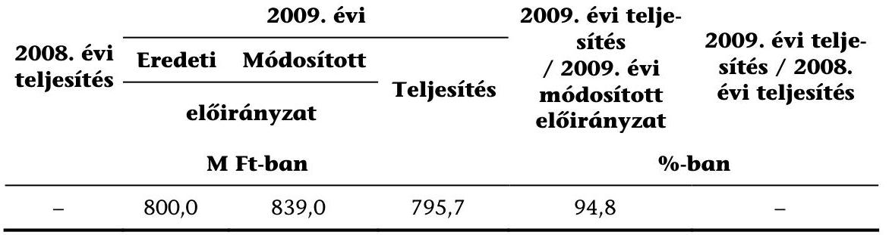

A Kvtv. 16. § (1) bekezdésének e) pontja a helyi önkormányzatok részére vis maior támogatást határoz meg.

Az Áht. 101. § (12) bekezdése alapján a IX. Helyi önkormányzatok támogatásai és átengedett személyi jövedelemadója fejezet 10. Helyi önkormányzatok vis maior támogatása jogcím 2008. évi maradványából került átcsoportosításra a IX. fejezet 11. Helyi önkormányzatok vis maior támogatására 39,0 M Ft összegben.

A Kvtv. 16. § (1) bekezdés e) pontja alapján a helyi önkormányzatok vis maior támogatásának 70\%-a egyenlő arányban (Kvtv. 16. § (1) bekezdés ea) pontja szerint), 30\%-a a 2007. évben ár-, belvíz, rendkívüli időjárás, illetve pince-, partfalomlás okozta károk enyhítéséhez jóváhagyott támogatás összege arányában került elosztásra.

A Kvtv. 16. számú melléklete meghatározza a decentralizált fejlesztési programok támogatási kereteinek régiónkénti összegét. A Kvtv. 63. §-ának (3) bekezdésében felhatalmazást kapott a Kormány, hogy a decentralizált fejlesztési programok általános és program-specifikus támogatási feltételeit 2009. január 31-éig rendeletben szabályozza. A Kormány a felhatalmazásnak késve tett eleget, mert a 33/2009. (II. 20.) Korm. rendeletet ${ }^{113}$ csak 2009 februárjában alkotta meg.

A 33/2009. (II. 20.) Korm. rendelet 1. § (3) bekezdésének a) pontja alapján a Tanács döntött - igénylés alapján - a helyi önkormányzatok fejlesztési és vis maior feladatainak támogatásáról. A támogatás igénylésének feltétele volt, hogy a káreseményt - a kárt követő 5 napon belül - az önkormányzat írásban bejelentse a Tanács és a Megyei Katasztrófavédelmi Igazgatóság, a Fővárosban a Fővárosi

[^0]
[^0]:    ${ }^{113}$ A helyi önkormányzatok vis maior támogatása és a vis maior tartalék előirányzatok felhasználásának részletes szabályairól szóló 33/2009. (II. 20.) Korm. rendelet.

---

Polgári Védelmi Igazgatóság felé. A bejelentést követő 10 napon belül a Tanács és a Megyei Katasztrófavédelmi Igazgatóság képviselője a helyszínen meggyőződött a káresemény valódiságáról, arról jegyzőkönyvet állítottak ki.

A 2009. évben 195 önkormányzati kérelemre összesen 795,7 M Ft támogatást utaltak át.

A Kincstárnál szükség volt az igénylések 2\%-ánál a kincstári Igazgatóságok formai megfelelőségre vonatkozó ellenőrzését követően - a szakmai ellenőrzés mellett - arra, hogy a formai okok miatt hiánypótlást kérjenek az önkormányzatoktól.

Az Áht. 64/B. § (3) bekezdése értelmében a kincstári Igazgatóságok - a támogatásról szóló jogszabály, illetve tájékoztató alapulvételével - a rendelkezésre álló iratok, saját nyilvántartásuk, illetve helyszíni vizsgálat alapján szabályszerűségi szempontból megvizsgálták a támogatási igényeket, és szükség esetén, jogszabályban meghatározott rövid határidő kitűzésével, hiánypótlásra hívták fel az önkormányzatokat. Az Áht. 64/D. § (3) bekezdése értelmében, amennyiben az önkormányzatok a hiánypótlásra való felhívásnak nem tettek eleget, vagy nem megfelelően teljesítették azt, a kincstári Igazgatóságok a támogatási igényeket nem továbbították az elbírálásra jogosult szervnek és erről értesítették az önkormányzatokat.

Az Áht. 64/D. § (1) bekezdése alapján a helyi önkormányzatok a központi költségvetésből származó, a IX. Helyi önkormányzatok támogatásai és átengedett személyi jövedelemadója fejezetben szereplő támogatásai, hozzájárulásai és év végi elszámolásának szabályszerűségét a Kincstár a tárgyévet követő év végéig felülvizsgálta.

A helyi önkormányzatok vis maior támogatására vonatkozó belső szabályozás a Kincstárnál és az ÖM-nél megfelelt a jogszabályi előírásoknak.

# 1.2.9.4. Vis maior tartalék 

| 2008. évi teljesítés | 2009. évi |  |  | 2009. évi teljesítés / 2009. évi   módosított   előirányzat | 2009. évi teljesítés / 2008.   2008.   2009.   2008.   2009.   2009.   2009.   2009.    |
| --- | --- | --- | --- | --- | --- |
|   | Eredeti | Módosított |  |  |   |
|   | elöirányzat |  |  |  |   |
|   | M Ft-ban |  |  | \%-ban |   |
|  635,1 | 360,0 | 820,0 | 682,6 | 83,2 | 107,5  |

A Kvtv. 16. § (1) bekezdésének f) pontja alapján vis maior jogcímen támogatást határoz meg.

A Kvtv. 16. § (2) bekezdése alapján az eredeti előirányzatot 460,0 M Ft-tal módosították, fejezeti hatáskörben. A fenti összeg a címzett és céltámogatások előirányzat lemondásaiból került átcsoportosításra. A 2009. évben 158 önkormányzati kérelemre, összesen 682,6 M Ft-ot folyósított a Kincstár.

A vis maior tartalék igénybevételi feltételeit a 33/2009. (II. 20.) Korm. rendelet 8. §-a tartalmazza.

---

A minisztériumokban a pályázatok szakmai felülvizsgálatát a rendeletben meghatározott feltételek fennállására vonatkozóan végezték el.

A Kincstárnál szükség volt több esetben a kincstári Igazgatóságok formai megfelelőségre vonatkozó ellenőrzését követően - a szakmai ellenőrzés mellett - arra, hogy a formai okok miatt hiánypótlást kérjenek az önkormányzatoktól.

Az Áht. 64/B. § (3) bekezdése értelmében a kincstári Igazgatóságok - a támogatásról szóló jogszabály, illetve a tájékoztató alapulvételével - a rendelkezésre álló iratok, saját nyilvántartásuk, illetve helyszíni vizsgálat alapján szabályszerűségi szempontból megvizsgálták a támogatási igényeket és szükség esetén, jogszabályban meghatározott rövid határidő kitűzésével, hiánypótlásra hívták fel az önkormányzatokat. Amennyiben az önkormányzatok a hiánypótlásra való felhívásnak nem tettek eleget, vagy nem megfelelően teljesítették azt, a kincstári Igazgatóságok a támogatási igényeket nem továbbították az elbírálásra jogosult szervnek és erről értesítették az érintett önkormányzatot.

Az Áht. 64/D. § (1) bekezdése alapján a helyi önkormányzatok a központi költségvetésből származó, a IX. Helyi önkormányzatok támogatásai és átengedett személyi jövedelemadója fejezetben szereplő támogatásai, hozzájárulásai és év végi elszámolásának szabályszerűségét a Kincstár a tárgyévet követő év végéig felülvizsgálta.

A helyi önkormányzatok vis maior tartalék támogatásaira vonatkozó belső szabályozás a Kincstárnál és az ÖM-nél megfelelt a jogszabályi előírásoknak.

# 1.2.10. Budapest 4-es - Budapest Kelenföldi pályaudvar-Bosnyák tér közötti metróvonal építésének támogatása 

| 2008. évi teljesítés | 2009. évi |  |  | 2009. évi teljesítés / 2009. évi módosított előirányzat | 2009. évi teljesítés / 2008. évi teljesítés |
| :--: | :--: | :--: | :--: | :--: | :--: |
|  | Eredeti | Módosított | Teljesítés |  |  |
|  | elöirányzat |  |  |  |  |
|  | M Ft-ban |  |  |  | \%-ban |
| 43482,8 | 9500,0 | 9500,0 | 13890,1 | 146,2 | 31,9 |

Az előirányzat túlteljesítésének oka az Európai Bizottság döntése, mely szerint az I. szakasszal összefüggő 11 szerződés finanszírozását nem biztosítja uniós forrásból, így a nem finanszírozott, állami rész hozzájárulását ezen címből kellett biztosítani.

A költségvetés tervezése során a 2009. évben az uniós forrás metróprojektbe történő bevonásával számoltak. A magyar fél 2008. augusztus 11-én nyújtotta be Támogatási Kérelmét az Európai Bizottság felé. Az európai uniós gyakorlatot figyelembe véve a projekt elbírálásának időpontja bizonytalan volt, így lehetővé tették az előirányzat túllépését, amellyel biztosították a projekt finanszírozásának folyamatosságát. A Kvtv. 14. számú mellékletének 7. pontja rendelkezik erről: „Az európai uniós támogatások megelőlegezése miatt; de legfeljebb a budapesti 4-es - Budapest Kelenföldi pályaudvar-Bosnyák tér közötti - metróvonal megépítésének állami támogatásáról szóló 2005. évi LXVII. törvény szerinti építési feladatok finanszírozási szerződésben foglalt arányos támogatás folyósítása céljából

---

túlléphető." Az Európai Bizottság döntése 2009. szeptember 2-án született meg, amelynek alapján a metró projekt I. szakasza a Kohéziós Alapból 728,0 M euró forráshoz juthat.

A budapesti 4-es - Budapest Kelenföldi pályaudvar-Bosnyák tér közötti - metróvonal megépítésének állami támogatásáról szóló 2005. évi LXVII. törvény 2. § (1) bekezdése az Állam által a Főváros részére a budapesti 4-es metróvonal megépítéséhez nyújtott támogatás maximális összegét 2002. évi áron, általános forgalmi adó nélkül, összesen 208 869,6 M Ft-ban határozta meg.

A PM által a Kormány részére készített beszámoló alapján 2009 decemberében az Állam által a Főváros részére nyújtott támogatás 2009. évi folyóáron számított összege 157 415,4 M Ft volt, amely lecsökkent az uniós támogatás miatt. Az esetlegesen felmerülő többletköltségeket a Magyar Állam és a Budapest Főváros Önkormányzata között létrejött - a budapesti 4-es metróvonal Budapest Kelenföldi pályaudvar és Budapest Keleti pályaudvar közötti szakasza közös finanszírozásáról 2004. január 19-én megkötött, 2005. június 18-án módosított - szerződés (Finanszírozási Szerződés) szerint nem az Államnak, hanem a Fővárosnak kell finanszíroznia.

A budapesti 4-es - Budapest Kelenföldi pályaudvar-Bosnyák tér közötti - metróvonal megépítésének állami támogatásáról szóló 1059/2005. (VI. 4.) Korm. határozat értelmében a 4-es metró beruházója a Főváros 100\%-os tulajdonában lévő Budapesti Közlekedési Részvénytársaság. A határozat tartalmazza a projektköltségek arányosítását, azaz a Főváros vállalja, hogy a projektköltség 21,02197\%-át maga finanszírozza.

A 2005. évi LXVII. törvény 4. §-a alapján az Állam által vállalt támogatási kötelezettség folyóáras összegét, valamint az állami támogatás felhasználásának állami kontrolljára fordítandó összeget a 2006-2010. évekre vonatkozó éves költségvetési kiadásként elő kell irányozni a IX. Helyi önkormányzatok támogatása és átengedett személyi jövedelemadója (korábban: IX. Helyi önkormányzatok támogatása) fejezetben.

A 1059/2005. (VI. 4.) Korm. határozat 6. pontja értelmében a projekt teljes lebonyolítása a Magyar Államkincstáron keresztül történik, amit a Budapest 4-es metróvonal beruházás finanszírozásának eljárásrendjéről szóló 17/2007. sz. 2007. november 13-án hatályba lépett - Elnöki Utasítás szabályoz.

Az ÖM-nek - a korábbi évekhez hasonlóan - az utalvány elkészítésekor szakmai vagy pénzügyi szempontból a 2009. évben nem volt ellenőrzési lehetősége. A helyzetből adódóan az ÖM nem tett eleget a Kvtv. 51. § (5) bekezdésében meghatározott ellenőrzési kötelezettségének, amelyet a jogszabály a IX. Helyi önkormányzatok támogatásai és átengedett személyi jövedelemadója fejezet vonatkozásában számára előír. Továbbá - az előzőekben leírtakra tekintettel a 2009. évben sem érvényesíthette utalványozási felelősségét, mivel - a korábbi évekkel egyezően - a finanszírozási folyamatra sem rálátása, sem befolyása nem volt. Az ÁSZ ezt a hiányosságot a 2006., a 2007. és a 2008. évi zárszámadás ellenőrzése során is jelezte.

A 2009. évben a Kincstár negyedévente küldött tájékoztatást az ÖM felé az adott időszakban teljesített kifizetésekről. Mivel a tájékoztatás nem állt az ÖM

---

rendelkezésére minden olyan napon, amikor pénzforgalmi tranzakció történt, az utalványok és a kifizetések naprakész egyeztetésére nem volt lehetőség.

A számvevőszéki ellenőrzés megítélése szerint a Budapest 4-es metróvonal beruházásának előirányzata kezelését és a teljesítés ellenőrzését azon fejezet kötelezettségei között kell megjeleníteni, amely fejezet a beruházás szakmai megvalósításáért felelős. Az ÁSZ ezt a 2006., a 2007. és a 2008. évi zárszámadás ellenőrzése során is jelezte. A változtatásra azonban a metrótörvény módosításával van lehetőség.

Az ÖM által készített utalványok - a korábbi évekhez hasonlóan - a 2009. évben sem tettek eleget sem tartalmilag, sem formailag a 217/1998. (XII. 30.) Korm. rendelet 136. § (4) bekezdésében foglaltaknak.

Az utalvány nem tartalmazta a kedvezményezett megnevezését, címét, bankszámlájának a számát, sem a fizetés időpontját, módját, illetve az ellenjegyző aláírását.

A Kincstár által vezetett 2009. évi nyilvántartás, amely alátámasztja az utalványon szereplő összeget, áttekinthető.

A kincstári kifizetések, illetve elszámolások analitikával való alátámasztottsága teljes körű. A TKF 2007. október 5-én hatályba lépett ügyrendje világosan és egyértelműen tartalmazza az ellenőrzési nyomvonalat.

A Kincstár Ellenőrzési Főosztálya a PM 248/42/2009. iktatószámú levele alapján végrehajtotta a budapesti 4-es - Budapest Kelenföldi pályaudvar-Bosnyák tér közötti - metróvonal építése finanszírozását érintő átfogó vizsgálatát. Az ellenőrzés célja annak megállapítása volt, hogy a Kincstár 4-es metróvonal beruházás finanszírozásához kapcsolódó feladatait a jogszabályoknak megfelelően látja-e el. A kincstári ellenőrzés „korlátozottan megfelelő" minősítéssel zárult, főbb megállapításai a következők voltak:

- a finanszírozási folyamatban a Kincstár ellenőrzési jogosultsága kizárólag formai, technikai ellenőrzésre korlátozódik;
- a Kincstár Támogatásokat Közvetítő Főosztálya a szerződésben meghatározott feladatainak a vizsgált időszakban eleget tett;
- a munkavégzés folyamatában az ellenőrzés nem minden esetben követhető nyomon;
- a finanszírozás folyamatában a Kincstár hatáskörén túlmutató hiányosságok láthatók.

Az ellenőrzés két javaslatot tett - a munkavégzés folyamatában az ellenőrzés dokumentálása, illetve az eljárásrend aktualizálása történjen meg -, amelyre a Kincstár Támogatásokat Közvetítő Főosztály vezetője elkészítette intézkedési tervét és megtette a szükséges intézkedéseket annak végrehajtása érdekében.

A Kincstár - a BKV Zrt.-vel és Budapest Főváros Önkormányzatával kötött szerződés alapján - valamennyi szerződést, számlát, az ahhoz tartozó teljesítésigazolást, a forrásrészletezést minden lehívás kezdeményezésekor megkapott a be-

---

ruházótól. A Kincstárban rendelkezésre álló dokumentációk alapján a Kincstár minden esetben ellenőrizte a beküldött dokumentumok szabályszerűségét, a forrásmegosztás arányát. Ezután kérte az ÖM-től a forrás biztosítását. A szerződésnek megfelelően a Kincstár a számlatulajdonost összevont és tételes számlakivonattal értesítette minden olyan napon, amikor a számlán pénzforgalmi tranzakció történt, illetve minden hónap 10 -ig az előző hónap összevont kimutatásával. A 2009. évben a Kincstár valamennyi beérkezett lehívásnál - a beérkező szerződések, számlák ellenőrzése, illetve a számlatulajdonos tájékoztatása vonatkozásában - a szerződésben leírtak alapján járt el. A Kincstár által teljesített kifizetések szerződésekkel, számlákkal alátámasztottak voltak.

A 17/2007. sz. Elnöki Utasítás 4. pontjában foglalt előírásokkal összhangban az 500,0 M Ft feletti kifizetéseket minden esetben a Likviditás Menedzselési Bizottság engedélyezte.

A 2005. évi LXVII. törvény 2. § (2) bekezdése értelmében a kontrollpozíció gyakorlását segítő szakértői szolgáltatás igénybevételére az Állam az állami támogatásból évente legfeljebb 50,0 M Ft összeget használhat fel. Ebből a keretből a korábbi évekhez hasonlóan - a 2009. évben sem történt felhasználás.

A tárgyévben fel nem használt részt a tárgyévet követő kettő hónapon belül az Állam a Főváros számára a budapesti 4-es metróvonal megépítéséhez nyújtandó állami támogatásként igénybe vehetővé teszi.

Az ÁSZ helyszíni ellenőrzésének befejezéséig az „Állami Szakértő" megbízására irányuló pályázatot nem írták ki.

#### Abstract

A PM írásban jelezte, hogy „a projekt I. szakaszának döntő többsége uniós forrásból kerül finanszírozásra (EU Bizottság 2009. szeptember 2-i döntése értelmében a beruházás 728 millió euró KA forráshoz jut az I. szakasz vonatkozásában). Így a pénzügyi ellenőrzés minősége és mélysége, illetve a projekt megvalósításának ellenőrzése várhatóan szigorúbb lesz az uniós rendszer szabályai szerint, mint azt a jelenlegi finanszírozási struktúra lehetővé teszi. Tekintve, hogy az uniós finanszírozás előkészítése 2006-ban megkezdődött, a PM az Állami Szakértő beszerzésére irányuló 2006-ban már megkezdett közbeszerzési előkészületeket leállította, tekintettel arra, hogy az uniós ellenőrzési mechanizmus szigorúbb kontrollt tesz lehetővé a meglévő struktúrához képest." A 4-es metró beruházás esetében ezáltal „a Közlekedési Operatív Program Irányító Hatóság, a Közremúködő Szervezet (KIKSZ Zrt.) folyamatba épített, illetve mintavételes ellenőrzés útján, a KEHI, az ÁSZ, az Európai Bizottság, az Európai Számvevőszék mind-mind a feladatkörüknek megfelelő jogosítványok birtokában nyerhetnek betekintést a projektbe, fogalmazhatják meg észrevételeiket és tehetnek javaslatokat. ... Amennyiben ... a II. szakasz is - részben vagy egészben - uniós forráshoz jutna, az uniós finanszírozás miatt ... a fenti projektelemek bekerülnének a szigorúbb uniós kontroll-mechanizmusba. Várhatóan a közeljövőben ismertté válik a kormányzat álláspontja a II. szakasz kapcsán, így ennek hiányában egyelőre nem lehet konkrét döntést hozni az állami szakértő alkalmazásáról a II. szakasz vonatkozásában."

A budapesti 4-es - Budapest Kelenföldi pályaudvar-Bosnyák tér közötti - metróvonal megépítésének állami támogatásáról szóló 1059/2005. (VI. 4.) Korm. határozat 9. pontjában a Kormány megbízta a KEHI elnökét, hogy a beruházás megvalósítását ellenőrizze, és évente egy alkalommal jelentést tegyen a Kormány részére. A 10. pontban felhívta a pénzügyminisztert, a gazdasági és közlekedési minisztert, hogy félévente adjanak tájékoztatást a Kormány részére a

---

budapesti 4-es metró-projekt előrehaladásáról. A 2009. évben az érintett szervek - a gazdasági és közlekedési miniszter kivételével - a jogszabályi előírásoknak megfelelően eleget tettek jelentési, illetve tájékoztatási kötelezettségüknek.

A Gazdasági és Közlekedési Minisztérium 2008. május 15 -én szétvált két jogutódra: a Közlekedési, Hírközlési és Energiaügyi, illetve a Nemzeti Fejlesztési és Gazdasági Minisztériumra. A számvevőszéki ellenőrzés megítélése szerint amelyet már a 2008. évi zárszámadáskor is jelzett - a 1059/2005. (VI. 4.) Korm. határozat 10. pontjának pontositására van szükség. Meg kellene határozni, hogy mely jogutód minisztérium felelős a metró beruházással kapcsolatos jelentéstételi kötelezettségért.

A PM írásban jelezte, hogy „az 1059/2005. (VI.4.) Korm. határozat kapcsán a PM több alkalommal kezdeményezte a 10. pont módosítását, azonban ez a kezdeményezés nem járt sikerrel, mivel a Szakmapolitikai Munkacsoport ülésére beterjesztett előterjesztések a munkacsoport döntése alapján nem lettek benyújtva a Kormány ülésére." A PM írásban jelezte továbbá, hogy „az utóbbi három alkalommal (2008. november, 2009. május, 2009. december) az 1059/2005. (VI. 4.) Korm. határozat 10. pontja alapján elkészített jelentések a Szakmapolitikai Munkacsoport döntése alapján nem lettek benyújtva a Kormány ülésére. A 10. pontban előírt tájékoztatási kötelezettség így funkcióját vesztette, valójában "kiüresedett", mivel azokat a Kormány nem tárgyalta."

A beruházásra fordítandó összeg nagysága - a 2009. évi és az előző évi zárszámadások számvevőszéki ellenőrzésekor tapasztaltnál - fokozottabb ellenőrzési tevékenységet indokol a Magyar Állam képviseletével megbízott PM részéről. Az erőteljesebb szakmai ellenőrzésnek - a Kormány tájékoztatásán túlmenően - a megvalósítás folyamatának közvetlen vizsgálatát is magában kell foglalnia.

A PM írásban jelezte, hogy „a jelenlegi szerződés szerint - a kontroll fokozása szempontjából - az állami szakértő beszerzésére van egyedül lehetősége. ... az Âllamnak csak az állami szakértő beszerzésével erősítheti a kontrollt, más eszköze nincs a jelenlegi Finanszírozási Szerződés szerint."

A Finanszírozási Szerződés 9.2. pontjában a Főváros kötelezettséget vállalt arra, hogy a BKV Zrt. a közbeszerzési eljárás előkészítésének megkezdése előtt írásban megküldi az Állam részére a tervezett beszerzés tárgyának meghatározását. A Főváros kötelezettséget vállalt arra is, hogy a BKV Zrt. a közbeszerzési eljárás eredményeként kötött szerződést megküldi az Állam részére. Az Állam és a Főváros közötti szerződésben foglaltaknak megfelelően a BKV Zrt. a 2009. évben tervezett beszerzések dokumentációját, illetve a megkötött szerződéseket megküldte az Állam részére, melyekkel kapcsolatban az Állam kifogást nem emelt. A Finanszírozási Szerződés módosítása a korábbinál nagyobb lehetőséget ad ugyan az állami kontroll érvényesülésére, de a jelenlegi szerződéses struktúra továbbra is a kontroll szűk körű szintjét teszi csak lehetővé. A módosított Finanszírozási Szerződés 9.3. pontja értelmében az Állam még mindig nem emelhet kifogást a 9.2. pont szerint megküldött szerződést illetően a beszerzés tárgyának meghatározásával kapcsolatos rendelkezésével szemben, ha az lényegében megegyezik a tervezett beszerzés tárgyával. A Finanszírozási Szerződés szerint lényegében megegyezőnek minősül a beszerzés tárgya különösen abban az esetben, ha az eltérés csupán az, hogy a mennyisége kisebb, vagy meghatározása részletesebb.

---

Budapest Főváros Önkormányzata és a BKV Zrt. között létrejött - a budapesti 4es metróvonal Budapest Kelenföldi pályaudvar és Budapest Keleti pályaudvar közötti szakasza beruházói feladatainak ellátására 2004. január 19-én megkötött és 2005. augusztus 17-én módosított - szerződés értelmében a BKV köteles a beruházás során hozott beruházói döntések és a beruházás megvalósítása ellenőrzésére „Független Ellenőrző Mérnököt" megbízni. Budapest Főváros Önkormányzata és az Európai Beruházási Bank között 2005. július 18-án létrejött pénzügyi szerződés 6.09 pontja is előírja „egy független és nemzetközi gyakorlattal rendelkező mérnök" alkalmazását. A „Független Ellenőrző Mérnök" a BKV által - a Főváros egyetértésével - meghatározott feltételek szerint végezné feladatát, azonban a számvevőszéki ellenőrzés lezárásáig - a korábbi évekhez hasonlóan - továbbra sem alkalmazták a szerződésben előírt mérnököt.

# 1.2.11. A leghátrányosabb helyzetú kistérségek felzárkóztatásának támogatása 

| 2008. évi teljesítés | 2009. évi |  |  | 2009. évi teljesítés / 2009. évi teljesítés / 2008. évi teljesítés |  |
| :--: | :--: | :--: | :--: | :--: | :--: |
|  | Eredeti | Módosított | Teljesítés |  |  |
|  | elöirányzat |  |  |  |  |
|  | M Ft-ban |  |  | \%ban |  |
| 4503,9 | 5850,0 | 9782,1 | 4941,1 | 50,5 | 109,7 |

A 47/2008. (III. 5.) Korm. rendelet 12. § (1) bekezdése lehetővé tette a rendelkezésre álló előirányzatok tárgyévi, kötelezettséggel terhelt maradványának a következő év végéig való felhasználását. Az Áht. 101. § (13) bekezdése értelmében a LEKI támogatására előirányzott állami támogatásnak a tárgyévet megelőző év döntéssel lekötött maradványaiból a tárgyév december 31-éig igénybe vett összeggel a központi költségvetésben a tárgyévre megtervezett ilyen célú előirányzatát meg kell emelni. A 2008. évi előirányzatból 3998,8 M Ft maradvány állt rendelkezésre, melyből 3932,1 M Ft összeggel módosították a 2009. évi eredeti előirányzatot.

Az egyes 2009. évi decentralizált önkormányzati fejlesztési és területfejlesztési célú, valamint egyes 2009. évi központi előirányzatok felhasználásának részletes szabályairól szóló 85/2009. (IV. 10.) Korm. rendelet értelmében az előirányzat rendeltetése az önkormányzati feladatellátás és az ezekhez kapcsolódó tárgyi eszközök fejlesztése, immateriális javak beszerzése, valamint a helyi gazdaság élénkítését szolgáló programok megvalósítása a meglévő egyenlőtlenségek mérséklése érdekében. Támogatást igényelhetnek azok a települési, megyei önkormányzatok, önkormányzati társulások és többcélú kistérségi társulások, amelyek a kedvezményezett térségek besorolásáról szóló 311/2007. (XI. 17.) Korm. rendelet 2. számú mellékletében meghatározott leghátrányosabb helyzetű kistérségek jegyzékén szereplő kistérségeken belül vannak, illetve amelyek fejlesztéseiket ezen kistérségeken belül akarják megvalósítani, és a fejlesztés a kistérség fejlődését szolgálja.

A Kvtv. 16. számú melléklete meghatározza a decentralizált fejlesztési programok támogatási kereteinek régiónkénti összegét. A Kvtv. 63. § (3) bekezdésében felhatalmazást kapott a Kormány, hogy az ezen mellékletben szereplő decent-

---

ralizált fejlesztési programok általános és program-specifikus támogatási feltételeit 2009. január 31-éig rendeletben szabályozza. A Kormány a felhatalmazásnak eleget téve, de késve megalkotta a 85/2009. (IV. 10.) Korm. rendeletet, amelynek értelmében pályázat keretében a leghátrányosabb helyzetű kistérségek felzárkóztatásának támogatására rendelkezésre álló keret felhasználásáról a Tanács dönt. A pénzügyi lebonyolítással (különösen az utalványozással, az előirányzat-átadással, a nyilvántartással, a féléves és éves beszámolással) kapcsolatos feladatokat az ÖM végzi.

A 2009. évben 634 db pályázat támogatásáról döntött a Tanács. A pályázók együttesen 5725,8 M Ft összegű támogatásra kötöttek szerződést. A 2009. évi 4941,1 M Ft összegű teljesítéshez a 2008. évi maradványösszeget (3932,1 M Ft) és a 2009. évi eredeti előirányzatból 1009,0 M Ft-ot használtak fel.

A leghátrányosabb helyzetű kistérségek felzárkóztatási támogatásának Kincstár által alkalmazott finanszírozási rendje megfelel a vonatkozó jogszabályoknak és a kincstári belső utasítások előírásainak.

# 1.3. IX. Helyi önkormányzatok támogatásai és átengedett személyi jövedelemadója fejezet Kormány hatáskörben létrehozott új címei 

### 1.3.1. Roma Kulturális Központ létrehozása

A fejezetek egyensúlyi tartalékának felhasználásáról szóló 2175/2008. (XII. 17.) Korm. határozat alapján a Kormány 900,0 M Ft átcsoportosításáról döntött a Fővárosi Önkormányzat részére, a Fővárosi Roma Kulturális Központ létrehozása érdekében. A Korm. határozat alapján a forrás a XX. OKM fejezetben állt rendelkezésre.

A Roma Kulturális Központ létrehozásával összefüggő egyes kérdésekről szóló 1041/2009. (IV. 8.) Korm. határozat felhatalmazta az oktatási és kulturális minisztert, hogy a Támogatottal szerződést kössön és a támogatást az önkormányzatnál erre a célra létrehozott, elkülönített számlára folyósítsa.

A központi költségvetési fejezetek 2008. évi kötelezettségvállalással nem terhelt előirányzat-maradványainak kezeléséről szóló 1099/2009. (VI. 26.) Korm. határozat alapján az előbbi jogszabály módosításra került, amely szerint a támogatás a IX. Helyi önkormányzatok támogatásai és átengedett személyi jövedelemadója fejezet 15. Roma Kulturális Központ létrehozása címre került átcsoportosításra.

A szerződés alapfeltétele volt a projektjavaslat elkészítése, mely 2009. július 28án aláírásra került. Az ÖM és Budapest Főváros Önkormányzata közötti támogatási szerződés megkötésére 2009. november 12-én került sor. A szerződésben rögzítették, hogy annak hatályba lépését követően az ÖM átutalja a 900,0 M Ft-ot Budapest Főváros Önkormányzata bankszámlájára. Az utalás 2009. december 6-án megtörtént.

---

# 1.3.2. A házi segítségnyújtás és/vagy jelzőrendszeres házi segítségnyújtást ellátási szerződés keretében biztosító helyi önkormányzatok 

A Házi segítségnyújtást és/vagy a jelzőrendszeres házi segítségnyújtást ellátási szerződés keretében biztosító helyi önkormányzatok támogatásáról szóló 1206/2009. (VI. 26.) Korm. határozat alapján a XXVI. SZMM fejezet 16. Fejezeti kezelésű előirányzatok cím, 48. Szociális célú humánszolgáltatások alcím, 1. Szociális célú humánszolgáltatások normatív állami támogatása jogcímcsoportról 500,0 M Ft került átcsoportosításra a Kvtv. 1. számú melléklete IX. Helyi önkormányzatok támogatásai és átengedett személyi jövedelemadója fejezet, 16. A házi segítségnyújtást és/vagy a jelzőrendszeres házi segítségnyújtást ellátási szerződés keretében biztosító helyi önkormányzatok támogatása új cím javára.

A házi segítségnyújtás, illetőleg a jelzőrendszeres házi segítségnyújtást ellátási szerződés keretében biztosító helyi önkormányzatok támogatásáról, valamint az e szolgáltatások körében tevékenységet végző személyek elmaradt juttatásainak megelőlegezéséről szóló 278/2009. (XII. 9.) Korm. rendelet 2-7. §-ai (hatályon kívül helyezve 2010. április 1-jétől) tartalmazzák az önkormányzati támogatásra vonatkozó szabályokat.

A támogatásban 3 önkormányzat (Velence Város, Várpalota Város, Boba Község Önkormányzata) és 6 többcélú kistérségi társulás (Sarkad és környéke Többcélú Kistérségi Társulás, Balassagyarmati Kistérség Többcélú Társulása, Rétság Kistérség Többcélú Társulása, Celldömölki Kistérség Önkormányzatainak Többcélú Társulása, Sopron-Fertőd Kistérségi Többcélú Társulás, Győri Többcélú Kistérségi Társulás) részesült. Az előirányzatból 199,9 M Ft került folyósításra, mivel az 500,0 M Ft átcsoportosításakor az igényfelmérés még nem történt meg. A támogatás - a Kincstártól kapott tájékoztatás alapján - az ellátást végző munkavállalók elmaradt díjazását biztosította.

A támogatásban részesült valamennyi önkormányzat megkötötte - a 278/2009. (XII. 9.) Korm. rendelet 2-3. §-ában előírt - ellátási szerződést a Fenntartóval. A támogatásokat az ÖM soron kívüli utalványozása alapján a Kincstár - a 278/2009. (XII. 9.) Korm. rendelet 4. § (4) bekezdésében előírt határidőt betartva 2009. december 28 -án átutalta.

Az előirányzat részbeni felhasználása összefüggött a Fenntartóval kapcsolatos év közbeni problémákkal is. A Fenntartó számára támogatás folyósítás nem történt, így az ellátásban részt vevő munkavállalók bérét sem tudta kifizetni.

### 1.3.3. A IX. fejezet 17., 18. és 19. címei

A Kormány a 2009. évben a 1212/2009. (XII. 15.) és a 1222/2009. (XII. 29.) határozatával három új költségvetési címet hozott létre, összesen 62,0 M Ft öszszegben. A határozat mindhárom esetben felhatalmazta az önkormányzati minisztert a támogatás soron kívüli folyósítására. Rögzítette továbbá a szerződéskötési kötelezettséget és az utólagos (2011. december 31-éig történő) elszámolás lehetőségét. Nem tartalmazta azonban egyik esetben sem a támogatási szerződés megkötésének határidejét. A szerződések aláírására a 2010. évben ke-

---

rült sor (két esetben február 15-én, egy esetben április 13-án), holott a támogatást már a 2009. évben folyósították.

Az ÁSZ már a 2008. évi zárszámadás ellenőrzéséről szóló jelentésében jelezte (bár akkor jelentősebb, 17,1 Mrd Ft összeg esetében), hogy nem tartja megfelelőnek az ÖM eljárását, mely szerint úgy biztosít támogatást az év utolsó napjaiban, hogy a pénzügyi folyósítást megelőzően a támogatásokra szerződést nem kötött.

# 2. A Helyi önkORMÁNYZATOK Előző ÉVI elsZámolása És ellenÖrzése Során megÁllapítOTT eltérések RENDeZésének SzABÁLYSZERŰSÉGE 

A helyi önkormányzatok befizetési kötelezettségeként a XLII. A központi költségvetés fő bevételei fejezet 5. Költségvetési befizetések cím 2. alcíme 6500,0 M Ft eredeti előirányzatot tartalmazott - a 2008. évivel egyezően amely $14871,8 \mathrm{M}$ Ft-ra $(228,8 \%)$ teljesült.

Az alcímre 3 számlával összefüggésben érkezhettek befizetések: Önkormányzatok, költségvetési szervek vállalkozási befizetései; Nem önkormányzati szervezeteknek nyújtott támogatások elszámolása; Önkormányzatok előző évről származó befizetései.

Az önkormányzatok, illetve költségvetési szervek vállalkozási befizetései a vállalkozási tevékenységükből származó eredmény elszámolása során keletkezett befizetési kötelezettségeiből az Áht. 96. § (5)-(6) bekezdései alapján származó bevétel, figyelemmel az alaptevékenység ellátásához felhasznált részre.

Az „Önkormányzatok, költségvetési szervek vállalkozási befizetései számla" egyenlege $-4,5 \mathrm{M}$ Ft volt, amely $1,1 \mathrm{M}$ Ft befizetésből és 5,6 M Ft kiutalásból (téves befizetések rendezése) képződött.

Egy Kft. 2008. július 1-jén a 2007. évi helyi iparűzési adó 4,9 M Ft-os összegét tévesen a „10032000-01079050" számla javára teljesítette, a Fővárosi Önkormányzat Helyi Adó Bevételi számla helyett. A téves utalás rendezése 2009. október 2án történt meg.

A nem önkormányzati szervezeteknek nyújtott támogatások elszámolásával összefüggésben a 2009. évben befizetés nem történt.

A helyi önkormányzatok - önkormányzatok előző évről származó befizetései számlára - történő befizetései a 2008. évi zárszámadási törvény végrehajtásával, az Állami Számvevőszék megállapításaival és a helyi önkormányzatok központi költségvetési kapcsolatokból származó forrásai igénybevétele és elszámolása szabályszerűségének felülvizsgálatával voltak összefüggésben.

Az Országgyűlés a helyi önkormányzatok 2008. évi költségvetési kapcsolataiból származó visszafizetési kötelezettségeit a Magyar Köztársaság 2008. évi költségvetésének végrehajtásáról szóló 2009. évi CXXIX. (zárszámadási) törvény 7. § (4)-(8) bekezdéseiben határozta meg. Ennek értelmében az önkormányzatok sa-

---

ját elszámolása szerint 10248,3 M Ft visszafizetési kötelezettségük keletkezett, ebből az összegből 2009-ben 9167,8 M Ft teljesült.

Az önkormányzatok a kincstári Igazgatóságok felülvizsgálata kapcsán 5708,5 M Ft-ot fizettek vissza a 2009. év során.

A zárszámadási tv. 7. § (1) bekezdése előírta a PM és az ÖM számára a zárszámadási tv. hatályba lépését követő 30 napon belül együttes rendelet megalkotását a helyi önkormányzatok költségvetési kapcsolatokból adódó önkormányzatonként és jogcímenként részletezett elszámolását. A 2/2010. (I. 15.) PM-ÖM együttes rendelet megjelentetésére - a jogszabályban megjelölt határidőhöz képest pár nap késedelemmel - 2010. január 15-én került sor.

A zárszámadási tv. 7. § (9) bekezdése értelmében az Ámr. 126. §-a (1) bekezdésének a) pontja alapján az éves beszámoló szerinti helyi önkormányzati visszafizetési kötelezettséghez kapcsolódó késedelmi kamat-fizetési kötelezettség 2009. március 27. napjától keletkezett. A zárszámadási tv. 7. § (10) bekezdése kimondja, hogy amennyiben ezen határidőt követő 90 napon belül a befizetések nem érkeznek meg a Kincstár megfelelő számlájára, a Kincstár az Áht. 64/A. §ának (6) bekezdése alapján intézkedik a központi költségvetést megillető követelés érvényesítéséről.

A Kincstár 2009. október 12-én 270 önkormányzat ellen nyújtott be azonnali beszedési megbízást 729,9 M Ft (tőketartozás) összegben, ami meg is térült. Az igénybevételi kamat tartozásra 170 önkormányzat esetében 132,0 M Ft összegű, a késedelmi kamatfizetési kötelezettségre pedig 678 önkormányzat vonatkozásban 125,8 M Ft összegű inkasszó került benyújtásra.

A saját elszámolásból eredő visszafizetési kötelezettséget - Biri, Kisnamény, Selyeb és Tiszaderzs önkormányzatok kivételével - rendezték az önkormányzatok. A négy önkormányzat ellen adósságrendezési eljárás indult, így nem tudták a 2008. évi beszámolóból eredő fizetési kötelezettségüket teljesíteni.

Az önkormányzatok saját elszámolásai alapján a normatív hozzájárulások és a normatív kötött felhasználású támogatások, valamint a központosított támogatások elszámolásából a helyi önkormányzatokat megillető pótlólagos támogatásokat - 5327,0 M Ft összegben - a Kincstár 2009. május 13-án utalta az érintett önkormányzatok számlájára.

A Magyar Köztársaság 2008. évi költségvetéséről szóló 2007. évi CLXIX. törvény 4. számú mellékletének B) III. 8. pontja értelmében a 2008. évi jövedelemdifferenciálódás mérsékléséről történő év végi elszámoláskor megmaradó összeg a kiegészítésben részesülő önkormányzatokat megilleti. Ennek összege 2240,4 M Ft volt.

A Kincstár összesítette az önkormányzatok 2008. éves költségvetési beszámolóinak 50. úrlapján szereplő adatokat, amelyeket továbbított a PM-be. Ott meghatározásra került az önkormányzatonként utalandó támogatási összeg. Erről a PM értesítést küldött a Kincstárba, amely ennek megfelelően teljesítette a kiutalást.

---

A jövedelemkülönbség mérséklés elszámolásából a helyi önkormányzatokat megillető pótlólagos támogatásokat - 2240,4 M Ft összegben - a Kincstár 2009. május 14 -én utalta az érintett önkormányzatok számára.

A 2009. évi kifizetéseket alátámasztó kincstári dokumentáció teljes körű volt. Az elszámolások, az önkormányzatok felé való kifizetések a jogszabályi előírásoknak megfelelően történtek.

# 3. A HELYI ÖNKORMÁNYZATOKNAK NYÚJTOTT TÁMOGATÁSOK FOLYÓSÍTÁSÁNAK MEGBÍZHATÓSÁGA 

A 2009. évi tranzakciókból kiválasztott tételeknél az elszámolások megbízhatóságának, szabályszerűségének ellenőrzésére került sor. Az ellenőrzés kiterjedt a tételek összegének megfelelőségére, az ÖM és egyéb érintett szervek, illetve a Kincstár nyilvántartásainak egyezőségére. Emellett kiterjedt az ÖTM 305-40/4/2006., az ÖTM 305-40/23/2006., az ÖTM 305-40/24/2006., az ÖTM 305-40-48/2007., az ÖTM/40/1/2008., az ÖTM/40/23/2008., az ÖTM/40/49/2008., és az ÖTM/40/56/2008. számú rendelkezéseiben megjelölt személyek ellenjegyzésének, utalványozásának vizsgálatára.

Az ellenőrzött tranzakciók között valamennyi - jelen vizsgálattal érintett - költségvetési sorra vonatkozóan szerepeltek tételek. Az ellenőrzés során megállapításra került, hogy az önkormányzatok támogatásainak odaítélésében, illetve folyósításában részt vevő szervezetek esetében a Kincstár belső ellenőrzése megfelelően múködik, a formailag nem megfelelő pályázatok és a szakmailag indokolatlan igénylések kiszűrésére.

A metróberuházás számvevőszéki ellenőrzése alapján megállapítható, hogy az állami kontroll továbbra sem teljes körű.

A folyamatba épített ellenőrzés a 2009. évben nem kellő mértékben működött az ÖM által felügyelt és a Kincstáron keresztül finanszírozott 13. Budapest 4-es - Budapest Kelenföldi pályaudvar-Bosnyák tér közötti - metróvonal építésének támogatása cím vonatkozásában.

Az ÖM-nek az utalvány elkészítésekor szakmai vagy pénzügyi szempontból ellenőrzési lehetősége nem volt a metróprojekt tekintetében. A helyzetből adódóan az ÖM nem tett eleget a Kvtv. 51. § (5) bekezdésében meghatározott ellenőrzési kötelezettségének, amelyet a jogszabály a IX. Helyi önkormányzatok támogatásai és átengedett személyi jövedelemadója fejezet vonatkozásában számára előír. Továbbá - az előzőekben leírtakra tekintettel - nem érvényesíthette utalványozási felelősségét, mivel a finanszírozási folyamatra sem rálátása, sem befolyása nem volt.

Az ellenjegyzők, utalványozók személye, aláírása azonos volt az ÖTM 305-40/4/2006., az ÖTM 305-40/23/2006., az ÖTM 305-40/24/2006., az ÖTM 305-40-48/2007., az ÖTM/40/1/2008., az ÖTM/40/23/2008., az ÖTM/40/49/2008., és az ÖTM/40/56/2008. számú rendelkezéseiben előírtakkal.

Az utalványokon szereplő összegek és a számvevőszéki vizsgálat által végzett ellenőrző számítások, illetve a támogatási döntésről készült jegyzőkönyvekben,

---

az egyéb kiadások és bevételek dokumentációjában szereplő adatok megegyeztek.

A Kincstár felé küldött utalványok tételei és az azokon szereplő összegek megegyeztek az ÖM analitikus nyilvántartásában megjelenő tételekkel.

Az ellenőrzött tételek esetén az ÖM által küldött utalványban, illetve rendelkező levélben megjelölt terhelendő fejezet és címrendi besorolás megegyezett a Kincstár által a tételekhez rendelt nemzetgazdasági számlaszámmal és államháztartási azonosítóval.

# 4. UtóELLENŐRZÉs 

Az ÁSZ már a 2008. évi zárszámadás során jelezte, hogy a Kormány úgy biztosított összesen 17 123,3 M Ft-ot az év utolsó időszakában, hogy a támogatások folyósítása minden esetben megelőzte a szerződéskötések időpontját, annak ellenére, hogy a feladatok végrehajtására a 2009. évtől kezdődően kerülhetett sor. Az ÁSZ javaslatot tett az önkormányzati miniszternek, hogy a 2008. év végén - a Kormány hatáskörben létrehozott új címek közül - folyósított támogatásoknál vizsgálja felül a szerződéskötés feltételeit.

Az ÖM a szerződéskötés feltételeit felülvizsgálta, a szerződéskötésekre minden esetben utólag (2009. I.-II. negyedévben) került sor.

Az ÁSZ már a 2006., a 2007., és a 2008. évi zárszámadás során is jelezte, hogy az ágazati miniszterek a rendeletalkotás során nem tartják be a Kvtv.-ben előírt határidőket és minden évben javaslatot fogalmazott meg a rendeletalkotási határidő betartására vonatkozóan. Az előző években megfogalmazott javaslatok a 2009. évi zárszámadás során csak részben hasznosultak. A Kvtv. a központosított előirányzatok vonatkozásában 26 rendelet megalkotását írta elő, a határidőt csupán két rendelet esetében tartották be az ágazati miniszterek. Ezáltal nagy mértékben lerövidült a pályázatok elkészítésére rendelkezésre álló idő.

Az ÁSZ a 2008. évi zárszámadás ellenőrzése során javaslatot tett a környezetvédelmi és vízügyi miniszter részére, hogy pontosítsa a lakossági víz- és csatornaszolgáltatás támogatásáról szóló ágazati rendelet elszámolási szabályait az azonos vízbázishoz, illetve szennyvíztisztítóhoz tartozó települések együttes kezelésének a meghatározásával. A javaslat beépítésre került a 3/2009. (III. 10.) KvVM rendeletbe, amelynek 6. § (6) bekezdése alapján a gesztor önkormányzat pályázata esetében a gesztornak települési önkormányzatonként kell a támogatással elszámolni. Az önkormányzatok, illetve gesztor önkormányzatok a 2010. évi zárszámadás keretében - a 3/2009. (III. 10.) KvVM rendelet 6. § (10) bekezdése alapján - számolnak el a 2009. évi támogatás felhasználásáról.

Az ÁSZ a 2008. évi zárszámadás ellenőrzése során javaslatot fogalmazott meg a közlekedési, hírközlési és energiaügyi miniszter részére, hogy intézkedjen a helyi közösségi közlekedés normatív támogatása felosztásával kapcsolatos eljárásrend felülvizsgálatáról, valamint gondoskodjon a támogatás odaítélésében részt vevő KHEM, PM és ÖM közötti feladatmegosztás újragondolása érdekében.

---

Az ÁSZ jelentés alapján Intézkedési terv készült - 2010. január 31. határidővel - a normatív támogatás felosztásával kapcsolatban KHEM-PM-ÖM közös szakértői munkacsoportot alakított ki a támogatás odaítélésében részt vevő tárcák közötti feladatmegosztás újragondolása érdekében. A támogatás odaítélésénél a manuális papíralapú adatrögzítést és feldolgozást felváltó elektronikus adatbekérés, valamint az adatfeldolgozás számítógépes programmal történő feldolgozásának kialakítása az ellenőrzés lezárásáig még nem fejeződött be.

A budapesti 4-es - Budapest Kelenföldi pályaudvar-Bosnyák tér közötti - metróvonal megépítésének állami támogatásáról szóló 1059/2005. (VI. 4.) Korm. határozat 10. pontjában a Kormány felhívta a pénzügyminisztert, a gazdasági és közlekedési minisztert, hogy félévente adjanak tájékoztatást a Kormány részére a budapesti 4-es metró-projekt előrehaladásáról. A 2008. évben valamennyi érintett szerv - a gazdasági és közlekedési miniszter kivételével - a jogszabályi előírásoknak megfelelően eleget tett jelentési, illetve tájékoztatási megbízásának. A Gazdasági és Közlekedési Minisztérium 2008. május 15-én szétvált két jogutódra: a Közlekedési, Hírközlési és Energiaügyi, illetve a Nemzeti Fejlesztési és Gazdasági Minisztériumra. A 2008. évi számvevőszéki ellenőrzés megállapítása szerint a 1059/2005. (VI. 4.) Korm. határozat 10. pontjának pontosítására van szükség, amely előírja, hogy mely jogutód minisztérium felelős a jelentéstételi kötelezettségért. Az ÁSZ javaslatot fogalmazott meg a Kormány részére, hogy intézkedjen a budapesti 4-es - Budapest Kelenföldi pályaudvarBosnyák tér közötti - metróvonal megépítésének állami támogatásáról szóló 1059/2005. (VI. 4.) Korm. határozat 10. pontjának módosításáról a GKM jogutód intézményei beszámolási kötelezettségének tisztázása és érvényesítése érdekében. Az ÁSZ helyszíni ellenőrzésének lezárásig a 1059/2005. (VI. 4.) Korm. határozatot nem módosították.

A PM írásban jelezte, hogy „az 1059/2005. (VI.4.) Korm. határozat kapcsán a PM több alkalommal kezdeményezte a 10. pont módosítását, azonban ez a kezdeményezés nem járt sikerrel, mivel a Szakmapolitikai Munkacsoport ülésére beterjesztett előterjesztések a munkacsoport döntése alapján nem lettek benyújtva a Kormány ülésére." A PM írásban jelezte továbbá, hogy „az utóbbi három alkalommal (2008. november, 2009. május, 2009. december) az 1059/2005. (VI. 4.) Korm. határozat 10. pontja alapján elkészített jelentések a Szakmapolitikai Munkacsoport döntése alapján nem lettek benyújtva a Kormány ülésére. A 10. pontban előírt tájékoztatási kötelezettség így funkcióját vesztette, valójában "kiüresedett", mivel azokat a Kormány nem tárgyalta."

A budapesti 4-es - Budapest Kelenföldi pályaudvar-Bosnyák tér közötti - metróvonal megépítésének állami támogatásáról szóló 2005. évi LXVII. törvény 2. § (2) bekezdése értelmében a kontrollpozíció gyakorlását segítő szakértői szolgáltatás igénybevételére az Állam az állami támogatásból évente legfeljebb 50,0 M Ft összeget használhat fel. Ebből a keretből a 2008. évben sem történt felhasználás. Az ÁSZ 2008. évi zárszámadás helyszíni ellenőrzésének lezárásáig az Állami Szakértő beszerzésére irányuló pályázatot nem írták ki. Az ÁSZ javaslatot fogalmazott meg a pénzügyminiszter részére, hogy gondoskodjon a Budapest 4-es - Budapest Kelenföldi pályaudvar-Bosnyák tér közötti - metróvonal építésével kapcsolatos 2005. évi LXVII. törvény 2. § (2) bekezdésének megfelelő állami kontrollpozíció érvényesítéséről. Az ÁSZ helyszíni ellenőrzésének lezárásig az Állami Szakértő beszerzésére irányuló pályázatot nem írták ki.

---

A Budapest 4-es - Budapest Kelenföldi pályaudvar-Bosnyák tér közötti - metróvonal építésének támogatása költségvetési sorra vonatkozó kincstári belső ellenőrzésre - melyet a támogatási összeg nagyságrendje indokolttá tenne - a 2006-2008. évek között nem került sor. Az ÁSZ javaslatot fogalmazott meg a pénzügyminiszter részére, hogy kezdeményezze a Magyar Államkincstár elnökénél, hogy gondoskodjon a Budapest 4-es - Budapest Kelenföldi pályaudvarBosnyák tér közötti - metróvonal építése finanszírozását érintő átfogó belső ellenőrzés megvalósításáról. Az ÁSZ által megfogalmazott javaslatnak a PM eleget tett és a PM államtitkára felkérte a Kincstár elnökét, hogy tegye meg a szükséges lépéseket a 4-es metró beruházás átfogó belső ellenőrzésének megvalósítása érdekében. A Kincstár elnöke 2010. január 8-án kelt levele mellékleteként megküldte a PM államtitkára részére a belső ellenőrzés alapján készült jelentést és jelezte, hogy a jelentés javaslatainak megvalósítását azonnali hatálylyal elrendelte.

A múködésképtelen önkormányzatok egyéb támogatásaira vonatkozóan az ÁSZ javaslatot fogalmazott meg az önkormányzati miniszternek, hogy intézkedjen az ÖM utasításban és az ahhoz kiadott Útmutatóban meghatározott szempontok szabályozásban való érvényesítéséről annak érdekében, hogy a támogatási összeg odaítélése egységes és szakmailag megalapozott legyen, továbbá a méltánylást érdemlő körülmények egyértelműbb szabályozásáról az utasítással ellentétes gyakorlat megszűntetése érdekében. Az utasítás és az útmutató a 2009. évben továbbra sem tartalmazta a fent nevezett szempontokat és a méltánylást érdemlő körülményeket.

Az ÁSZ javaslatot fogalmazott meg a nemzeti fejlesztési és gazdasági miniszter részére, hogy kezdeményezze a Regionális Egészségügyi Tanács és a Területi Vízgazdálkodási Tanács bevonását a Címzett és céltámogatások rendeltetésszerú felhasználásának ellenőrzésébe annak érdekében, hogy az ÖM és a szakminisztériumok mellett szakmai szervezetek is elvégezzék a teljesítések igazolását. Az NFGM elkészítette intézkedési tervét, amely tartalmazta a javaslat megvalósíthatóságának szakmai vizsgálatát - a címzett és céltámogatással kapcsolatos feladatokat ellátó - önkormányzatokért felelős miniszterrel együttműködve, illetve a javaslat szakmai indokoltságának megítélése esetén a törvénymódosítás előkészítésének kezdeményezését az önkormányzatokért felelős miniszter felé. Az ÁSZ javaslatát elfogadták és a 19/2005. (II. 11.) Korm. rendelet 14. § (9) bekezdését - a javaslatnak megfelelően - módosították, amely 2010. február 27től lépett hatályba.

Budapest, 2010. augusztus

---

.

---

MELLÉKLETEK

---

.

---

1. sz. melléklet

Nemzetgazdasági elszámolások pénzügyi (szabályszerúségi) ellenőrzéseinek minősítései

| FEJEZET/CÍM |  | MEGNEVEZÉS | MINŐSÍTÉS |
| :--: | :--: | :--: | :--: |
| IX. |  | Helyi önkormányzatok támogatásai és átengedett személyi jövedelemadója | Elfogadó |
| X. |  | Miniszterelnökség (ME) |  |
|  | 13. | K-600 hírrendszer múködtetésére | Elfogadó |
|  | 20. | Tartalékok | Elfogadó |
| XI. |  | Önkormányzati Minisztérium (ÖM) |  |
|  | 14. | Lakástámogatások | Korlátozott |
| XX. |  | Oktatási és Kulturális Minisztérium (OKM) |  |
|  | 15. | Kormányzati rendkívüli kiadások | Elfogadó |
| XXII. |  | Pénzügyminisztérium (PM) |  |
|  | 16. | Fogyasztói árkiegészítés | Elfogadó |
|  | 17. | Egyéb költségvetési kiadások | Elfogadó |
|  | 18. | Állam által vállalt kezesség és viszontgarancia érvényesítése | Elfogadó |
|  | 24. | Kormányzati rendkívüli kiadások | Elfogadó |
|  | 26. | Garancia és hozzájárulás a társadalombiztosítási el-   látásokhoz | Elfogadó |
|  | 28. | Nemzetközi elszámolások kiadásai | Elfogadó |
| XXVI. |  | Szociális és Munkaügyi Minisztérium (SZMM) |  |
|  | 20. | Családi támogatások | Elfogadó |
|  | 21. | Egyéb szociális ellátások és költségtérítések | Elfogadó |
| XLI. |  | A központi költségvetés kamatelszámolásai, tőkevisszatérülései, az adósság- és követeléskezelés költségei |  |
|  |  | Adósságszolgálattal kapcsolatos bevételek | Elfogadó |
|  |  | Adósságszolgálattal kapcsolatos kiadások | Elfogadó |
| XLII. |  | A központi költségvetés fő bevételei |  |
|  |  | APEH illetékességébe tartozó bevételek | Elfogadó |
|  |  | VP illetékességébe tartozó bevételek | Elfogadó |
|  |  | Egyéb költségvetési bevételek | Elfogadó |
| XLIII. |  | Az állami vagyonnal kapcsolatos bevételek és kiadások |  |
|  | 1. | Az állami vagyonnal kapcsolatos bevételek | Korlátozott |
|  | 2. | Az állami vagyonnal kapcsolatos kiadások | Korlátozott |

---

# A költségvetési fejezetek, igazgatási címek és fejezeti kezelésű előirányzatok beszámolói pénzügyi (szabályszerüségi) ellenőrzéseinek minősítései 

| FEJEZET/FEJEZETI JOGOSÍTVÁNYÚ KÖLTSÉGVETÉSI SZERV |  | Minősités |
| :--: | :--: | :--: |
| I. | Országgyülés (OGY) 1. és 4. cím | Elfogadó |
|  | Közbeszerzések Tanácsa (KT) | Elutasító |
|  | Költségvetési Tanács | Elfogadó   figyelemfelhívó megjegyzéssel |
| II. | Köztárasági Elnökség (KE) | Elfogadó |
| III. | Alkotmánybíróság (ALB) | Elfogadó |
| IV. | Országgyülési Biztosok Hivatala (OBH) | Elfogadó   figyelemfelhívó megjegyzéssel |
| VI. | Bíróságok (BIR) | Elfogadó   figyelemfelhívó megjegyzéssel |
| VIII. | Magyar Köztásaság Úgyészsége (MKÚ) | Elfogadó |
| X. | Miniszterelnökség (ME) (1-9. cím) |  |
|  | MEH Igazgatás (MEHIg) | Elfogadó |
|  | Központi Szolgáltatási Főigazgatóság (KSzF) | Korlátozott |
|  | ME fejezeti kezelésű előirányzatok | Korlátozott |
|  | Polgári Nemzetbiztonsági Szolgálatok SZBEKK | Elutasító |
|  | Polgári Nemzetbiztonsági Szolgálatok NBH | Elfogadó   figyelemfelhívó megjegyzéssel |
|  | Polgári Nemzetbiztonsági Szolgálatok IH | Elfogadó   figyelemfelhívó megjegyzéssel |
|  | Polgári Nemzetbiztonsági Szolgálatok NBSZ | Elfogadó   figyelemfelhívó megjegyzéssel |
| XI. | Önkormányzati Minisztérium (1-12. cím) (ÖM) |  |
|  | ÖM Központi Igazgatás | Elfogadó   figyelemfelhívó megjegyzéssel |
|  | ÖM fejezeti kezelésű előirányzatok | Elfogadó |
| XII. | Földmüvelésügyi és Vidékfejlesztési Minisztérium (FVM) |  |
|  | FVM Központi Igazgatás | Korlátozott |
|  | FVM fejezeti kezelésű előirányzatok | Elutasító |
|  |  |  |

---

| FEJEZET/FEJEZETI JOGOSÍTVÁNYÚ KÖLTSÉGVETÉSI SZERV |  | Minősítés |
| :--: | :--: | :--: |
| XIII. | Honvédelmi Minisztérium (HM) |  |
|  | HM Igazgatás | Elfogadó   figyelemfelhívó megjegyzéssel |
|  | HM fejezeti kezelésű előirányzatok | Elfogadó   figyelemfelhívó megjegyzéssel |
| XIV. | Igazságügyi és Rendészeti Minisztérium (IRM) |  |
|  | IRM Igazgatás | Elfogadó   figyelemfelhívó megjegyzéssel |
|  | IRM fejezeti kezelésű előirányzatok | Korlátozott |
|  | Magyar Szabadalmi Hivatal (MSZH) | Elfogadó   figyelemfelhívó megjegyzéssel |
| XV. | Nemzeti Fejlesztési és Gazdasági   Minisztérium (NFGM) |  |
|  | NFGM Igazgatás | Elfogadó   figyelemfelhívó megjegyzéssel |
|  | NFGM fejezeti kezelésű előirányzatok | Korlátozott |
| XVI. | Környezetvédelmi és Vízügyi   Minisztérium (KvVM) |  |
|  | KvVM Igazgatás | Elfogadó   figyelemfelhívó megjegyzéssel |
|  | KvVM fejezeti kezelésű előirányzatok | Elfogadó   figyelemfelhívó megjegyzéssel |
| XVII. | Közlekedési, Hírközlési és Energiaügyi   Minisztérium (KHEM) |  |
|  | KHEM Igazgatás | Korlátozott |
|  | KHEM fejezeti kezelésű előirányzatok | Elfogadó |
|  | Magyar Energia Hivatal | Elfogadó   figyelemfelhívó megjegyzéssel |
|  | Nemzetközi Hírközlési Hatóság | Elfogadó   figyelemfelhívó megjegyzéssel |
|  | Országos Atomenergia Hivatal | Elfogadó |
| XVIII. | Külügyminisztérium (KüM) |  |
|  | KÜM Központi Igazgatása | Elfogadó   figyelemfelhívó megjegyzéssel |
|  | KÜM fejezeti kezelésű előirányzatok | Elfogadó   figyelemfelhívó megjegyzéssel |
|  |  |  |

---

| FEJEZET/FEJEZETI JOGOSÍTVÁNYÚ KÖLTSÉGVETÉSI SZERV |  | Minősítés |
| :--: | :--: | :--: |
| XIX. | Uniós Fejlesztések |  |
|  | Nemzeti Fejlesztési Ügynökség | Elfogadó   figyelemfelhívó megjegyzéssel |
|  | Uniós fejlesztések fejezeti kezelésű előirányzatok | Korlátozott |
| XX. | Oktatási és Kulturális Minisztérium (OKM) |  |
|  | OKM Igazgatás | Elfogadó   figyelemfelhívó megjegyzéssel |
|  | OKM fejezeti kezelésű előirányzatok | Korlátozott |
| XXI. | Egészségügyi Minisztérium (EüM) |  |
|  | EüM Központi Igazgatás | Korlátozott |
|  | EüM fejezeti kezelésű előirányzatok | Elfogadó   figyelemfelhívó megjegyzéssel |
|  | Egészségbiztositási Felügyelet (EBF) | Elfogadó   figyelemfelhívó megjegyzéssel |
| XXII. | Pénzügyminisztérium (1-12. cím) (PM) |  |
|  | PM Központi Igazgatása | Elfogadó   figyelemfelhívó megjegyzéssel |
|  | PM fejezeti kezelésű előirányzatok | Elfogadó   figyelemfelhívó megjegyzéssel |
|  | Pénzügyi Szervezetek Állami Felügyelete (PSZÁF) | Elfogadó |
|  | Kormányzati Ellenörzési Hivatal (KEHI) | Elfogadó |
| XXVI. | Szociális és Munkaügyi Minisztérium (SZMM) |  |
|  | SzMM Igazgatás | Elfogadó   figyelemfelhívó megjegyzéssel |
|  | SZMM fejezeti kezelésű előirányzatok | Korlátozott |
| XXX. | Gazdasági Versenyhivatal (GVH) | Elfogadó |
| XXXI. | Központi Statisztikai Hivatal (KSH) |  |
|  | KSH Igazgatása | Elfogadó |
|  | KSH fejezeti kezelésű előirányzat |  |
| XXXIII. | Magyar Tudományos Akadémia (MTA) |  |
|  | MTA Titkárság | Elfogadó |
|  | MTA fejezeti kezelésű előirányzatok | Elfogadó   figyelemfelhívó megjegyzéssel |
| I-XXXIII. | FEJEZETEK ÖSSZESEN |  |

---

# A minisztériumok belsó ellenőrzési egységei által végzett megbízhatósági ellenőrzések minősítései

|  Fejezet | Ellenőrzött intézmény | Minősítés  |
| --- | --- | --- |
|  X. Miniszterelnökség | Kormányzati Személyügyi Szolgáltató és Közigazgatási Képzési Központ | Elfogadó  |
|  XI. Önkormányzati Minisztérium | Országos Katasztrófavédelmi Főigazgatóság | Elfogadó  |
|   | Nemzeti Utánpótlás-nevelési és Sportszolgáltató Intézet | Korlátozott  |
|  XII. Földművelésügyi és Vidékfejlesztési Minisztérium | Mezőgazdasági Szakigazgatási Hivatal | Elfogadó  |
|   | Mezőgazdasági és Vidékfejlesztési Hivatal | Elfogadó  |
|   | Erdészeti Tudományos Intézet | Elfogadó figyelemfelhívó megjegyzéssel  |
|   | Magyar Mezőgazdasági Múzeum | Elfogadó  |
|   | Országos Mezőgazdasági Könyvtár és Dokumentációs Központ | Elfogadó  |
|   | Baranya Megyei Földhivatal | Elfogadó  |

---

| Fejezet | Ellenőrzött intézmény | Minősítés |
| :--: | :--: | :--: |
| XIII. Honvédelmi Minisztérium | HM Közgazdasági és Pénzügyi Ügynökség, Budapest csapat | Elfogadó figyelemfelhívó megjegyzéssel |
|  | HM Közgazdasági és Pénzügyi Ügynökség, Budapest központi | Elfogadó |
|  | HM Fejlesztési és Logisztikai Ügynökség, Budapest csapat | Elutasító |
|  | HM Fejlesztési és Logisztikai Ügynökség, Budapest központi | Elutasító |
|  | HM Fejlesztési és Logisztikai Ügynökség, Budapest nemzetközi | Elfogadó figyelemfelhívó megjegyzéssel |
|  | HM Infrastrukturális Ügynökség, Budapest csapat | Elfogadó figyelemfelhívó megjegyzéssel |
|  | HM Infrastrukturális Ügynökség, Budapest központi | Korlátozott |
|  | MH Logisztikai Ellátó Központ, Budapest, csapat | Elfogadó figyelemfelhívó megjegyzéssel |
|  | MH Logisztikai Ellátó Központ, Budapest, központi | Elutasító |
|  | MH Dr. Radó György Honvéd Egészségügyi Központ, Budapest csapat | Elutasító |
|  | MH Dr. Radó György Honvéd Egészségügyi Központ, Budapest központi | Elutasító |
|  | MH Támogató Dandár, Budapest csapat | Korlátozott |
|  | MH Támogató Dandár, Budapest központi | Elfogadó |
|  | MH Müveleti Központ, Budapest | Elfogadó |
|  | MH Katonai Igazgatási és Adatfeldolgozó Központ, Budapest | Elfogadó |
|  | MH Központi Kiképző Bázis, Szentendre | Elfogadó figyelemfelhívó megjegyzéssel |
|  | MH Kinizsi Pál Tiszthelyettes Szakképző Iskola, Szentendre | Elfogadó |
|  | MH Összhaderőnemi Parancsnokság, Székesfehérvár | Elfogadó |
|  | MH Katonai Közlekedési Központ, Budapest csapat | Elfogadó |
|  | MH Katonai Közlekedési Központ, Budapest központi | Elfogadó |
|  | MH Geoinformációs Szolgálat, Budapest | Elfogadó |
|  | MH Kelet-Magyarországi Hadkiegészítő Parancsnokság, Szolnok csapat | Elfogadó |
|  | MH Nyugat-Magyarországi Hadkiegészítő Parancsnokság, Veszprém | Elfogadó figyelemfelhívó megjegyzéssel |

---

|  Fejezet | Ellenőrzött intézmény | Minősítés  |
| --- | --- | --- |
|  XV. Nemzeti Fejlesztési és Gazdasági Minisztérium | Magyar Kereskedelmi Engedélyezési Hivatal | Elfogadó  |
|  XVII. Közlekedési, Hírközlési és Energiaügyi Minisztérium | Magyar Bányászati és Földtani Hivatal | Elfogadó  |
|   | Közlekedésbiztonsági Szervezet | Elfogadó figyelemfelhívó megjegyzéssel  |
|   | Nemzeti Közlekedési Hatóság | Korlátozott  |
|   | Közlekedésfejlesztési Koordinációs Központ | Elfogadó figyelemfelhívó megjegyzéssel  |
|   | MÁV Kórház és Rendelőintézet Szolnok intézmény | Elfogadó  |
|   | Bányászati Utókezelő és Éjjeli Szanatórium | Elfogadó  |
|   | Magyar Állami Földtani Intézet | Elfogadó  |
|   | Magyar Állami Eötvös Loránd Geofizikai Kutatóintézet | Elfogadó  |
|  XX. Oktatási és Kulturális Minisztérium | Eötvös József Főiskola (Baja) | Elfogadó figyelemfelhívó megjegyzéssel  |
|   | Színház- és Filmművészeti Egyetem | Elfogadó figyelemfelhívó megjegyzéssel ó  |
|   | Liszt Ferenc Zeneművészeti Egyetem | Elfogadó figyelemfelhívó megjegyzéssel  |
|   | Eötvös Lóránd Tudományegyetem | Elfogadó figyelemfelhívó megjegyzéssel  |
|   | Magyar Képzőmúvészeti Egyetem | Elfogadó figyelemfelhívó megjegyzéssel  |
|   | Dunaújvárosi Főiskola | Elfogadó figyelemfelhívó megjegyzéssel  |
|   | Balassi Intézet | Elfogadó figyelemfelhívó megjegyzéssel  |
|   | Magyar Természettudományi Múzeum | Elfogadó figyelemfelhívó megjegyzéssel  |
|   | Iparművészeti Múzeum | Elutasító  |

---

|  Fejezet | Ellenőrzött intézmény | Minősítés  |
| --- | --- | --- |
|  XXI. Egészségügyi Minisztérium | Országos Mentőszolgálat | Korlátozott  |
|   | Országos Sportegészségügyi Intézet | Elutasító  |
|   | Országos Idegtudományi Intézet | Elfogadó figyelemfelhívó megjegyzéssel  |
|   | Parádfürdői Állami Kórház | Elfogadó figyelemfelhívó megjegyzéssel  |
|  XXII. Pénzügyminisztérium | Pénzügyminisztérium Informatikai Szolgáltató Központ | Elfogadó  |
|  XXVI. Szociális és Munkaügyi Minisztérium | Észak-alföldi Regionális Munkaügyi Központ | Elfogadó figyelemfelhívó megjegyzéssel  |
|  XXXI. Központi Statisztikai Hivatal | KSH Könyvtár | Elfogadó figyelemfelhívó megjegyzéssel  |
|   | KSH Népességtudományi Kutató Intézet | Elfogadó  |
|  XXXIV.Kutatás és Technológia | Nemzeti Kutatási és Technológiai Hivatal | Korlátozott  |

---

# Az elkülönített állami pénzalapok és a társadalombiztosítás pénzügyi alapjainak minősítései 

| Fejezet/Megnevezés |  | Minősités |
| :-- | :-- | :-- |
| APEH (az Elkülönített Állami Pénzalapok és Társada-   lombiztosítási Pénzügyi Alapjai javára beszedett bevéte-   lek tekintetében) | Elfogadó |  |
| Elkülönített Állami Pénzalapok |  |  |
| LXIII. | Munkaerőpiaci Alap | Elfogadó |
| LXV. | Szülőföld Alap | Elfogadó |
| LXVI. | Központi Nukleáris Pénzügyi Alap | Elfogadó |
| LXVII. | Nemzeti Kulturális Alap | Elfogadó |
| LXVIII. | Wesselényi Miklós Ár- és Belvízvédelmi Kárta-   lanítási Alap | Elfogadó |
| LXIX. | Kutatási és Technológiai Innovációs Alap | Elfogadó |
| Társadalombiztosítás Pénzügyi Alapjai |  |  |
| LXXI. | Nyugdíjbiztosítási Alap | Elfogadó |
| LXXII. | Egészségbiztosítási Alap | Elfogadó |

---

5. sz. melléklet

Az Ny. Alap kiadása, hiánya és közvetlen költségvetési támogatása 2002-2009. között:

| Év | Hiány | Ebből:   Magánnyugdíj pénztári kötelező tagdíjbevételből meg nem térített összeg | Központi költségvetésben tervezett pénzátadás | Hiányelengedés és tervezett pénzátadás összesen -2.+4. | Nettó hiányelengedés és tervezett pénzátadás összesen -2.-3.+4. | Nyugdíjbiztosítási Alap kiadási főösszege | $\begin{gathered} 5 . / 7 . \\ \% \end{gathered}$ | $\begin{gathered} 6 . / 7 . \\ \% \end{gathered}$ |
| :--: | :--: | :--: | :--: | :--: | :--: | :--: | :--: | :--: |
| 1. | 2. | 3. | 4. | 5. | 6. | 7. | 8. | 9. |
| 2002 | $-14,2$ | 21,6 | 185,2 | 199,4 | 177,8 | 1405,9 | 14,2 | 12,6 |
| 2003 | $-39,0$ | 27,0 | 115,9 | 154,9 | 127,9 | 1540,1 | 10,1 | 8,3 |
| 2004 | $-80,2$ | 41,2 | 144,3 | 224,5 | 183,3 | 1707,0 | 13,2 | 10,7 |
| 2005 | $-93,5$ | 29,8 | 187,3 | 280,8 | 251,0 | 1916,0 | 14,7 | 13,1 |
| 2006 | $-19,5$ | 33,0 | 321,0 | 340,5 | 307,5 | 2113,1 | 16,1 | 14,6 |
| 2007 | 0 | 1,8 | 138,5 | 138,5 | 136,7 | 2 354,1* | 5,9 | 5,8 |
| 2007 | 0 | 1,8 | 138,5 | 138,5 | 136,7 | 2 642,6** | 5,2 | 5,2 |
| 2008 | $-67,7$ | 23,1 | 143,4 | 211,1 | 188,0 | 2925,3 | 7,2 | 6,4 |
| 2009 | $-7,2$ | $-0,1^{* * *}$ | 218,0**** | 225,2 | 225,3 | 2866,8 | 7,9 | 7,9 |

*A korábbi évek adattartamával azonosan, korábban az E. Alap által fedezett rokkantnyugdíjjal kapcsolatos kiadások nélkül **A 2008. év adattartalmával azonosan a rokkantnyugdíjjal kapcsolatos kiadásokkal együtt
***A számításhoz szükséges adatokat az APEH szolgáltatta
****Beleértve a méltányossági kifizetésére biztosított többlet

---

6. sz. melléklet

# Az APEH adatszolgáltatása alapján a kintlévőségek* 

M Ft-ban

| Megnevezés | 2005. XII. 31. | 2006. XII. 31. | 2007. XII. 31. | 2008. XII. 31. | 2009. XII. 31. |
| :-- | --: | --: | --: | --: | --: |
| Költségvetési   szervek | 395,2 | 8767,2 | 4539,0 | 920,5 | 1294,9 |
| Vállalkozások | 82811,7 | 118309,9 | 89842,3 | 113779,3 | 136622,1 |
| Non profit   szervezetek | 2102,1 | 30255,6 | 1610,2 | 2016,5 | 2236,9 |
| Egyéni vál-   lailkozások | 14434,7 | 42036,1 | 13680,9 | 13632,2 | 14174,8 |
| Magánszemé-   lyek | 11069,2 | 14314,6 | 11704,9 | 11643,2 | 10769,2 |
| APEH adósok   összesen | $\mathbf{1 1 0 8 1 2 , 9}$ | $\mathbf{2 1 3 6 8 3 , 4}$ | $\mathbf{1 2 1 3 7 7 , 3}$ | $\mathbf{1 4 1 9 9 1 , 7}$ | $\mathbf{1 6 5 0 9 7 , 9}$ |
| APEH érték-   vesztés | $\mathbf{- 6 8 3 7 8 , 7}$ | $\mathbf{- 1 0 0 9 8 8 , 9}$ | $\mathbf{- 6 6 1 5 0 , 2}$ | $\mathbf{- 7 9 9 5 4 , 9}$ | $\mathbf{- 1 2 0 4 3 4 , 4}$ |

## Az APEH adatszolgáltatása alapján a túlfizetések*

M Ft-ban

| Megnevezés | 2005. XII. 31. | 2006. XII. 31. | 2007. XII. 31. | 2008. XII. 31. | 2009. XII. 31. |
| :-- | --: | --: | --: | --: | --: |
| Költségvetési   szervek | 4021,4 | 68989,0 | 32555,3 | 7685,4 | 3767,7 |
| Vállalkozások | 9520,1 | 25963,1 | 22719,1 | 13677,2 | 16551,6 |
| Non profit   szervezetek | 1474,9 | 2182,6 | 2858,4 | 4695,1 | 1514,5 |
| Egyéni vál-   lailkozások | 5145,7 | 4805,2 | 5833,7 | 4548,1 | 4320,4 |
| Magánszemé-   lyek | 1414,5 | 3373,3 | 1729,2 | 1789,0 | 1639,3 |
| APEH túlfize-   tés összesen | $\mathbf{2 1 5 7 6 , 6}$ | $\mathbf{1 0 5 3 1 3 , 2}$ | $\mathbf{6 5 6 9 5 , 7}$ | $\mathbf{3 2 3 9 4 , 8}$ | $\mathbf{2 7 7 9 3 , 5}$ |

*a korkedvezmény biztosítási járulék adataival együtt

---

# A nyugdíj melletti foglalkoztatás hatása az államháztartás bevételeire és kiadásaira (becslés) 

M Ft-ban

| BEVÉTELEK* | Járulékmérték | Összesen | Ebből: Korhatár alatti öregségi és rokkantsági nyugdíj |
| :--: | :--: | :--: | :--: |
| Foglalkoztató által fizetett nyugdíjbiztosítási járulék | $24,0 \%$ | 48720 | 24101 |
| Biztosított által fizetett nyugdíjjárulék | $9,5 \%$ | 19285 | 9540 |
| Nyugdíjbiztositási Alapot megillető járulékok |  | 68006 | 33642 |
| Foglalkoztató által fizetett egészségbiztosítási járulék | $5,0 \%$ | 10150 | 5021 |
| Biztosított által fizetett természetbeni egészségbiztosítási járulék | $4,0 \%$ | 8120 | 4017 |
| Egészségbiztositási Alapot megillető járulékok |  | 18270 | 9038 |
| Munkaerőpiaci Alapot megillető járulékok | $3,0 \%$ | 6090 | 3013 |
| Járulékok összesen |  | 92366 | 45692 |
| Becsült SZJA átlag** | 20,0\% | 40600 | 20085 |
| BEVÉTELEK (járulékok és SZJA) ÖSSZESEN |  | 132966 | 65777 |
| KIADÁSOK |  |  |  |
| Nyugdíjbiztositási Alap éves kiadási többlete |  | 1015 | 502 |

*2009. június 30-ig érvényes szabályok szerint
**ONYF becslés, ami azon alapul, hogy a nyugdíj (az összeszámítás miatt) "feltolja" a mellette szerzett keresetet egy magasabb sávba

---

# RÖVIDÍTÉSEK JEGYZÉKE 

| ABEV | Általános nyomtatványkitöltő program |
| :--: | :--: |
| AEÉ | Adó- és Ellenőrzési Értesítő |
| ALB | Alkotmánybíróság |
| AMC | Agrármarketing Centrum |
| AMIR | Adósminősítő rendszer |
| APEH | Adó- és Pénzügyi Ellenőrzési Hivatal |
| APEH KAIG | Adó- és Pénzügyi Ellenőrzési Hivatal Kiemelt Adózók Igazgatósága |
| APEH-SZTADI | Adó- és Pénzügyi Ellenőrzési Hivatal Számítástechnikai és Adatfeldolgozó Intézet |
| Art. | Az adózás rendjéről szóló 2003. évi XCII. törvény |
| Atomtörvény | Az atomenergiáról szóló 1996. évi CXVI. törvény |
| AVOP | Agrár- és Vidékfejlesztési Operatív Program |
| ÁAK Rt. | Állami Autópályakezelő Részvénytársaság |
| ÁBKSz Kft. | Árvízvédelmi és Belvízvédelmi Központi Szervezet Nonprofit Közhasznú Kft. |
| ÁEK | Állami Egészségügyi Központ |
| áfa | általános forgalmi adó |
| áfa tv. | Az általános forgalmi adóról szóló 2007. évi CXXVII. törvény |
| ÁFSZ | Állami Foglalkoztatási Szolgálat |
|  | Az államháztartás szervezeti beszámolási és könyvvezetési kötelezettségének sajátosságairól szóló 249/2000. (XII. 24.) Korm. rendelet |
| ÁHT | Államháztartási egyedi azonosító kód |
| Áht. | Az államháztartásról szóló 1992. évi XXXVIII. törvény |
| ÁKK Zrt. | Államadósság Kezelő Központ Zártkörűen működő részvénytársaság |
| ÁMEI | Ásványolajtermék Minőségellenőrzési Zártkörűen működő részvénytársaság |
| Ámr. | Az államháztartás múködési rendjéről szóló 217/1998. (XII. 30.) Korm. rendelet |
| Ámr. új | Az államháztartás múködési rendjéről szóló 292/2009. (XII. 19.) Korm. rendelet |
| ÁNTSZ | Állami Népegészségügyi és Tisztiorvosi Szolgálat |
| ÁPV Zrt. | Állami Privatizációs Vagyonkezelő Zártkörűen múködő részvénytársaság |
| ÁROP | Államreform Operatív Program |
| ÁSZ | Állami Számvevőszék |
| ÁT | Átmeneti Támogatás programjai |
| BA Zrt. | Budapest Airport Zártkörűen Múködő Részvénytársaság |

---

| BÁH | Bevándorlási és Állampolgársági Hivatal |
| :--: | :--: |
| bbl | hordó |
| BC | Beruházás-ösztönzési Célelőirányzat |
| Be. tv. | A büntetőeljárásról szóló 1998. évi XIX. törvény |
| BEF | Belső Ellenőrzési Főosztály |
| BEIK | Budapesti Európai Ifjúsági Központ |
| Ber. | A költségvetési szervek belső ellenőrzéséről szóló 193/2003. (XI. 26.) Korm. rendelet |
| BIR | Bíróságok |
| BKV Zrt. | Budapesti Közlekedési Vállalat Zártkörúen múködő részvénytársaság |
| BM | Belügyminisztérium |
| BRFK | Budapesti Rendőrfőkapitányság |
| BTT | Baromfi Termék Tanács |
| BUBOR | Budapesti bankközi kamatláb |
| BV | Büntetés-végrehajtás |
| BVOP | Büntetés Végrehajtás Országos Parancsnoksága |
| Cct. | A helyi önkormányzatok címzett és céltámogatási rendszeréről szóló 1992. évi LXXXIX. törvény |
| CÉDE | Céljellegú decentralizált támogatás |
| COBIT | Controll Objectives for Information and related Technology |
| CT | Computer Tomográf |
| CT-EcoSTAT | A CompuTREND Kft. által fejlesztett gazdasági és gazdálkodási rendszer |
| DAOP | Dél-Alföldi Operatív Program |
| Db | Darab |
| DDOP | Dél-Dunántúli Operatív Program |
| DK | Diákhitel Központ Zrt. |
| DOS | Disc Oparating System |
| DOT | Days of Treatment (Terápiás Napok Száma) |
| E Ft | Ezer forint |
| E. Alap | Egészségbiztosítási Alap |
| EÁF | Elektronikus Árverési Felület |
| EBB | Egyesített Budapesti Bérlet |
| EBESZ | Európai Biztonsági és Együttmúködési Szervezet |
| EBEV (eBEV) | Elektronikus bevallás |
| EBF | Egészségbiztosítási Felügyelet |
| EBRD | Európai Újjáépítési és Fejlesztési Bank |
| EFK | Elöirányzat-Felhasználási Keretszámla |
| EFK-ról készített beszámoló | Egyéb uniós támogatásokról készített beszámoló |
| EFO | Elektronikus Folyószámlakezelő rendszer |
| EG | Előirányzat módosításokat tartalmazó űrlap |
| EGT | Európai Gazdasági Térség |

---

| EH | 2007-2013 programozási periódus Ellenőrzési Hatóság |
| :--: | :--: |
| EHA | Energiahatékonysági Hitel Alap |
| EHA | Európai Halászati Alap (EU részekben) |
| eho | Egészségügyi hozzájárulás |
| Eho tv. | az egészségügyi hozzájárulásról szóló 1998. évi LXVI. törvény |
| EIB | Európai Beruházási Bank |
| EK | Európai Közösség |
| EKD | egyedi kormánydöntés |
| EKG | Elektronikus Kormányzati Gerinchálózat |
| EKHO | Egységes Közteherviselési Hozzájárulás |
|  | Energia Központ Nonprofit Kft. / Energia Központ Ener- |
| EKN Kft/EK Kht. | giahatékonysági, Környezetvédelmi és Energia Informá-   ciós Ügynökség Közhasznú társaság |
| EKOP | Elektronikus Közigazgatás Operatív Program |
| EKP | Ellenőrzési Korszerűsítési Projekt |
| ELLVITA | Az ellenőrzési alapfolyamat ügyintézését támogató, kor-   szerú rendszer |
| ELMÚ | Budapesti Elektromos Múvek Nyrt. |
| ELTE | Eötvös Loránd Tudományegyetem |
| EMAFT | előre meghatározott alapdíjjal finanszírozott teljesítmény |
| EMGA | Európai Mezőgazdasági Garancia Alap |
| EMIR | Egységes Monitoring Információs Rendszer |
| EMK | ÚMFT Egységes Múködési Kézikönyve |
| EMOGA | Európai Mezőgazdasági Orientációs és Garancia Alap |
| EMT | az előadó-múvészeti szervezetek támogatásáról és sajátos   foglalkoztatási szabályairól szóló 2008. évi XCIX. törvény |
| EMVA | Európai Mezőgazdasági Vidékfejlesztési Alap |
| ENSZ | Egyesült Nemzetek Szervezete |
| EONIA | Euro Overnight Index Average / egy napos euró átlag index |
| EQUAL | A 2000-2006-os költségvetési időszak egyik EU-s Közössé-   gi Kezdeményezés támogatási formája |
| ERFA | Európai Regionális Fejlesztési Alap |
| ESA | Európa Statisztikai Adattár |
| ESZA | Európai Szociális Alap |
| ESZA Kft. | ESZA Társadalmi Szolgáltató Nonprofit Kft. |
| ET | Európa Tanács |
| ETE | Európai Területi Együttmúködés |
| EU | Európai Unió |
| EU Bizottság | Európai Bizottság |
| EUR | Euró |
| EURES | Európai Foglalkoztatási Szolgálat |
| EURIBOR | Frankfurti EUR betéti kamatláb |
| EUROCANET | European Carousel Network |

---

| EUROSAI | European Organisation of Supreme Audit Institution A legfőbb ellenőrzési intézmények európai szervezete |
| :--: | :--: |
| EüM | Egészségügyi Minisztérium |
| eva | egyszerúsített vállalkozói adó |
| EXIMBANK Zrt. | Magyar Export-Import Bank Zártkörúen múködő rész-vény-társaság |
| EXPO | Nemzetközi Szakmai Vásár |
| ÉAOP | Észak-Alföldi Operatív Program |
| ÉMOP | Észak-Magyarországi Operatív Program |
| f.a. | felszámolás alatt lévő |
| FAO | Food and Agriculture Organization - Egyesült Nemzetek Élelmezési és Mezőgazdasági Szervezete |
| FEUVE | Folyamatba épített, előzetes, utólagos és vezetői ellenőrzés |
| FF | Nemzeti Fejlesztési Ügynökség Fejezeti Főosztálya |
| Finr. | Az egészségügyi szolgáltatások E. Alapból történő finanszírozásáról szóló 43/1999. (III. 3.) Korm. rendelet |
| Flt. | A foglalkoztatás elősegítéséről és a munkanélküliek ellátásáról szóló 1991. évi IV. törvény |
| Forrás SQL | Integrált ügyviteli rendszer |
| FSZH | Foglalkoztatási és Szociális Hivatal |
| FVM | Földmúvelésügyi és Vidékfejlesztési Minisztérium |
| FVM ASzK | FVM Agrár-szakképző Központ |
| GDP | Gross Domestic Product - Bruttó hazai termék |
| Get. | A földgázellátásról szóló 2003. évi XLII. törvény |
| GFS | Government Financial Statistics |
| GH Zrt. | Garantiqa Hitelgarancia Zártkörúen múködő részvénytársaság |
| GIIR | Gazdálkodási Integrált Informatikai Rendszer |
| GKM | Gazdasági és Közlekedési Minisztérium |
| GKM GI | Gazdasági és Közlekedési Minisztérium Gazdasági Igazgatósága |
| GNI | Gross National Income - Bruttó Nemzeti Jövedelem |
| GNP | Gross National Product - Bruttó nemzeti termék |
| GOP | Gazdaságfejlesztési Operatív Program |
| Gt. | A gazdasági társaságokról szóló 2006. évi IV. törvény |
| GVH | Gazdasági Versenyhivatal |
| GVOP | Gazdasági Versenyképesség Operatív Program |
| GYED | Gyermekgondozási díj |
| GYES | Gyermekgondozási segély |
| GYET | Gyermeknevelési támogatás |
| Gyftv. | A biztonságos és gazdaságos gyógyszer és gyógyászati segédeszköz ellátás, valamint a gyógyszerforgalmazás általános szabályairól szóló 2006. évi XCVIII. törvény |

---

| GySEV | Győr-Sopron-Ebenfurthi Vasút Zártkörúen múködő részvénytársaság |
| :--: | :--: |
| Gyvt. | A gyermekek védelméről és a gyámügyi igazgatásról szóló 1997. évi XXXI. törvény |
| Hatóság | Nemzeti Hírközlési Hatóság |
| HBCS | Homogén Betegség Csoport |
| HÉ | Hivatalos Értesítő |
| HEFOP | Humánerőforrás-fejlesztési Operatív Program |
| HEP | Humán Erőforrás Programok |
| HM | Honvédelmi Minisztérium |
| HM EI Zrt. | Honvédelmi Minisztérium Elektronikai, Logisztika és Vagyonkezelő Zrt. |
| HM FLÜ | HM Fejlesztési és Logisztikai Ügynökség |
| HM IKH | Honvédelmi Minisztérium Ingatlankezelési Hivatal |
| HM IÜ | HM Infrastrukturális Ügynökség |
| HM KPÜ | Honvédelmi Minisztérium Közgazdasági és Pénzügyi Ügynökség |
| HM VGF | HM Védelemgazdasági Főosztály |
| HM VTVF | HM Védelmi Tervezési és Vagyongazdálkodási Főosztály |
| HOP | Halászati Operatív Program |
| Hpt. | A hitelintézetekről és a pénzügyi vállalkozásokról szóló 1996. évi CXII. törvény |
| HYFERP | Hybrid Fund for Enterprise Restructing and Privatisation |
| IBR | Irányított Betegellátás Rendszere |
| IBSZ | Informatikai Biztonsági Szabályzat |
| IEC | International Electrotechnical Commission |
| IGF | NFÜ Intézményi Gazdálkodási Főosztály |
| IgH | Igazoló Hatóság (EU részekben) |
| IH | Irányító Hatóság (EU részekben) |
| IHM | Informatikai és Hírközlési Minisztérium |
| IIER | Integrált Igazgatási és Ellenőrzési Rendszer |
| IKR | Informatikai Korszerúsítési Rendszer |
| IM | Igazságügyi Minisztérium |
| IMF | Nemzetközi Valuta Alap |
| IMIP | intézményi minőségirányítási program |
| IMIR | INTERREG Monitoring és Információs Rendszer |
| INTERACT 20072013. | Az ETE INTERACT programja a 2007-2013-as időszakban |
| INTERREG | Az EU belső határrégióinak fejlesztését célzó program (Interregionális Együttmúködés) |
| IOP | Interoperabilitási Projekt |
| IPA | Instrument for Pre-Accession Assistance |
| IRM | Igazságügyi és Rendészeti Minisztérium |

---

| ISO | International Organization for Standardization (egy nemzetközi szövetség, ami több mint 100 nemzet szabványosítási tagszervezeteit foglalja magába, és számos nemzetközi szabványt tart karban) |
| :--: | :--: |
| ISPA | Instrument for Structural Policies for Pre-Accession (Strukturális Politikák Csatlakozás Előtti Eszköze) |
| IT | Információs Társadalom |
| ITB | Informatikai Tárcaközi Bizottság |
| ITD Hungary Zrt. | Magyar Befektetési és Kereskedelemfejlesztési Zártkörúen múködő részvénytársaság |
| Itv. | Az illetékekről szóló 1990. évi XCIII. törvény   Joint European Resources for Micro to Medium |
| JEREMIE | Enterprises (EU forrásból finanszírozott támogatás, pénzügyi eszköz) |
| JPY | japán yen |
| KA | Kohéziós Alap |
| KAP | Közös Agrárpolitika |
| KAT | adózók költségvetési kapcsolatain alapuló kategorizálási rendszer |
| Kbt. | A közbeszerzésekről szóló 2003. évi CXXIX. törvény |
| KDOP | Közép-Dunántúli Operatív Program |
| KE | Köztársasági Elnökség |
| KEHI | Kormányzati Ellenőrzési Hivatal |
| KEK KH | Közigazgatási és Elektronikus Közszolgáltatások Központi Hivatala |
| KEMK | Kulturális, Egyházi és Média Kollégium |
| KEOP | Környezet és Energia Operatív Program |
| KESZ | Kincstári Egységes Számla |
| Ket. | A közigazgatási hatósági eljárás és szolgáltatás általános szabályairól szóló 2004. évi CXL. törvény |
| Kft. | Korlátolt felelősségú társaság |
| KfW | Kreditanstalt für Wiederaufbau (Újjáépítési és Hitelbank) |
| KGF | Költségvetési és Gazdálkodási Főosztály |
| KGFO | Költségvetési és Gazdasági Főosztály |
| KGR | Költségvetési Gazdálkodási Rendszer |
| KH | Kifizető Hatóság |
| KHEM | Közlekedési, Hírközlési és Energiaügyi Minisztérium |
| KHR | Központi Hitelinformációs Rendszer |
| Kht. | Közhasznú társaság |
| KIKSZ | Közlekedésfejlesztési Integrált Közremúködő Szervezet |
| KIKSZ Zrt. | KIKSZ Közlekedésfejlesztési Zártkörűen múködő részvénytársaság |
| KIM | Közigazgatási és Igazságügyi Minisztérium |
| Kincstár | Magyar Államkincstár |
| KIOP | Környezetvédelmi és Infrastruktúra Operatív Program |

---

| KIR | Központi Illetményszámfejtő Rendszer |
| :--: | :--: |
| KJIR | Központosított Jövedéki Informatikai Rendszer |
| KKC | Kis- és középvállalkozói célelőirányzat |
| KKK | Közlekedésfejlesztési Koordinációs Központ |
| KKV | kis és középvállalkozások |
| KKV tv. | Kis és középvállalkozásokról, fejlesztésük támogatásáról szóló 2004. évi XXXIV. törvény |
| KMOP | Közép-Magyarországi Operatív Program |
| KMR | Kincstári Monitoring Rendszer (az OTMR neve 2008. január 1-jétől |
| KMRMK | Közép-magyarországi Regionális Munkaügyi Központ |
| KNPA | Központi Nukleáris Pénzügyi Alap |
| KOR IH | Koordinációs Irányító Hatóság |
| Korm. | Kormány |
| KÖZIG | Közigazgatási Reform Programok |
| Közokt. tv. | A közoktatásról szóló 1993. évi LXXIX. törvény |
| KÖZOP | Közlekedés Operatív Program |
| KPI | Kutatás-fejlesztési Pályázati és Kutatáshasznosítási Iroda |
| KSH | Központi Statisztikai Hivatal |
| KSZ | Közremúködő Szervezet (EU részekben) |
| KSZF | Központi Szolgáltatási Föigazgatóság |
| KT | Közbeszerzések Tanácsa |
| Kt. | A költségvetési szervek jogállásáról és gazdálkodásáról szóló 2008. évi CV. törvény |
| KTIA | Kutatási és Technológiai Innovációs Alap |
| Ktiatv. | A Kutatási és Technológiai Innovációs Alapról szóló 2003. évi XC. törvény |
| KTK | Kincstári Tranzakciós Kód |
| KTK IH | Közösségi Támogatási Keret Irányító Hatóság |
| Ktv. | A köztisztviselők jogállásáról szóló 1992. évi XXIII. törvény |
| KüM | Külügyminisztérium |
| KVI | Kincstári Vagyoni Igazgatóság |
| Kvtv. | A Magyar Köztársaság 2009. évi költségvetéséről szóló 2008. évi CII. törvény |
| KvVM | Környezetvédelmi és Vízügyi Minisztérium |
| KvVM FI | KvVM Fejlesztési Igazgatósága |
| LEADER | Közösségi Kezdeményezés a vidék gazdasági fejlesztéséért |
| LEKI | Leghátrányosabb helyzetú kistérségek felzárkóztatásának támogatása |
| LIBOR | London Inter Bank Offered Relate (Londoni bankközi kamatláb) |
| M | millió |
| M Ft | millió forint |
| M2M | marked-to-market |

---

| MACIKA | Magyarországi Cigányokért Közalapítvány |
| :--: | :--: |
| MAG Zrt. | Magyar Gazdaságfejlesztési Központ Támogatásközvetítő Zártkörúen múködő részvénytársaság |
| MALÉV | Magyar Légiközlekedési Részvénytársaság |
| MAT | Munkaerőpiaci Alap Irányító Testülete |
| MÁV-START Zrt. | Magyar Államvasutak START Zártkörúen múködő részvénytársaság |
| MÁV Zrt. | Magyar Államvasutak Zártkörúen múködő részvénytársaság |
| MAVIR | Magyar Villamosenergia-ipari Átviteli Rendszerirányító Zártkörúen múködő részvénytársaság |
| MB | Monitoring Bizottság |
| ME | Miniszterelnökség |
| MeH | Miniszterelnöki Hivatal |
| MEH | Magyar Energia Hivatal |
| MEHIB Zrt. | Magyar Exporthitel Biztosító Zártkörúen múködő részvénytársaság |
| MeHIg | Miniszterelnöki Hivatal Igazgatás |
| MeHVM | Miniszterelnöki Hivatalt Vezető Miniszter |
| MePAR | Mezőgazdasági Parcella Azonosító Rendszer |
| MFB | Magyar Fejlesztési Bank |
| MFB Zrt. | Magyar Fejlesztési Bank Zártkörúen múködő részvénytársaság |
| $\operatorname{MgSzH}$ | Mezőgazdasági Szakigazgatási Hivatal |
| MH | Magyar Honvédség |
| MKB | MKB Bank Zártkörúen múködő részvénytársaság |
| MKEH | Magyar Kereskedelmi Engedélyezési Hivatal |
| MKIK | Magyar Kereskedelmi és Iparkamara |
| MKK | Múködési Kézikönyv |
| MKM | Művelődési és Közoktatási Minisztérium |
| MKÜ | Magyar Köztársaság Ügyészsége |
| MNB | Magyar Nemzeti Bank |
| MNV Zrt. | Magyar Nemzeti Vagyonkezelő Zártkörúen múködő részvénytársaság |
| MPA | Munkaerőpiaci Alap |
| Mrd | milliárd |
| MRI | Magnetic Resonance Imaging (Mágneses Magrezonancia Képalkotás) |
| MSZH | Magyar Szabadalmi Hivatal |
| Mt. | A Munka Törvénykönyvéről szóló 1992. évi XXII. törvény |
| MTA | Magyar Tudományos Akadémia |
| MTRFH | Magyar Terület és Regionális Fejlesztési Hivatal |
| MVH | Mezőgazdasági és Vidékfejlesztési Hivatal |
| MV Zrt. | Magyar Vállalkozásfinanszírozási Zrt. |

---

| MVM Zrt. | Magyar Villamos Múvek Zártkörúen múködő részvénytársaság |
| :--: | :--: |
| NATO | North Atlantic Treaty Organisation (Észak-atlanti Szerződés Szervezete) |
| NBC | Nemzeti Beruházás-ösztönzési Célelőirányzat |
| NBH | Nemzetbiztonsági Hivatal |
| NBSZ | Nemzetbiztonsági Szakszolgálat |
| NEFMI | Nemzeti Erőforrás Minisztérium |
| Nek. tv. | a nemzeti és etnikai kisebbségek jogairól szóló 1993. évi LXXVII. törvény |
| NEKF | Nemzeti és Etnikai Kisebbségek Főosztálya |
| NEP | Nemzeti Energiatakarékossági Program |
| NEP | Nemzetközi Együttmúködési Program (EU részekben) |
| NFA | Nemzeti Földalap |
| NFGM | Nemzeti Fejlesztési és Gazdasági Minisztérium |
| NFM | Nemzeti Fejlesztési Minisztérium |
| NFT | Nemzeti Fejlesztési Terv |
| NFT I. | I. Nemzeti Fejlesztési Terv a 2004-2006-os Európai Unió költségvetési periódusra készített |
| NFÜ | Nemzeti Fejlesztési Ügynökség (a Nemzeti Fejlesztési Hivatal jogutódja) |
| NGM | Nemzetgazdasági Minisztérium |
| NHH | Nemzeti Hírközlési Hatóság |
| NIF Zrt. | Nemzeti Infrastruktúra Fejlesztő Zártkörúen múködő rész-vénytársaság |
| NJIR | Jövedéki Informatikai Rendszer |
| NKA | Nemzeti Kulturális Alap |
| NKA tv. | Nemzeti Kulturális Alapról szóló 1993. évi XXIII. törvény |
| NKH | Nemzeti Közlekedési Hatóság |
| NKÖM | Nemzeti Kulturális Örökség Minisztériuma |
| NKTH | Nemzeti Kutatási és Technológiai Hivatal |
| NL Kft. | Nemzeti Lóverseny Kft. |
| NSZFI | Nemzeti Szakképzési és Felnőttképzési Intézet |
| NUSI | Nemzeti Utánpótlás-nevelési és Sportszolgáltató Intézet |
| NVT | Nemzeti Vagyongazdálkodási Tanács |
| NVT | Nemzeti Vidékfejlesztési Terv (EU részekben) |
| Ny. Alap | Nyugdíjbiztosítási Alap |
| NYDOP | Nyugat-Dunántúli Operatív Program |
| NYENYI | Nyugdíjbiztosítási Egyéni Nyilvántartólap |
| NYJI | Nyugdíjbiztosítási Jogorvoslati Igazgatóság |
| NYUFIG | Nyugdíjfolyósító Igazgatóság |
| OAH | Országos Atomenergia Hivatal |
| OBH | Országgyúlési Biztosok Hivatala |
| OECF | Japan's Overseas Economic Cooperation Fund |
| OEP | Országos Egészségbiztosítási Pénztár |

---

| OFA | Országos Foglalkoztatási Közalapítvány |
| :--: | :--: |
| OFI | Oktatáskutató és Fejlesztő Intézet |
| OGY | Országgyúlés |
| OGY Hivatala | Országgyúlés Hivatala |
| OH | Oktatási Hivatal |
| OIT | Országos Igazságszolgáltatási Tanács |
| OKF | Országos Katasztrófavédelmi Főigazgatóság |
| OKM | Oktatási és Kulturális Minisztérium |
| OKMTI | Oktatási és Kulturális Minisztérium Támogatáskezelő Igazgatósága |
| OKNT | Országos Köznevelési Tanács |
| OKTAZON | Oktatási azonosító adatbázis |
| OM | Oktatási Minisztérium |
| OMMF | Országos Munkabiztonsági és Munkaügyi Főfelügyelőség |
| OMSZ | Országos Mentőszolgálat |
| ONYF | Országos Nyugdíjbiztosítási Főigazgatóság |
| OP | Operatív Programok |
| OPH | Országos Parancsnoki Hivatal |
| ORFK | Országos Rendőr-főkapitányság |
| OSAP | Országos Statisztikai Adatgyűjtési Program |
| OSEI | Országos Sportegészségügyi Intézet |
| OSZK | Oktatási és Szakképzési Kollégium |
| OTKA | Országos Tudományos Kutatási Alapprogramok |
| OTKA tv. | Az Országos Tudományos Kutatási Alapprogramokról szóló 1997. évi CXXXVI. törvény |
| OTMR | Országos Támogatási Monitoring Rendszer (a KMR neve 2007. december 31-éig) |
| OTP Bank Nyrt. | Országos Takarékpénztár és Kereskedelmi Bank Nyílt részvénytársaság |
| ÖIK | Önkormányzati együttmúködési és Informatikai Kollégium |
| ÖKO porgram | Távhővel ellátott lakóépületek hőfogyasztás szabályozási lehetőségének megteremtésére indított program |
| ÖM | Önkormányzati Minisztérium |
| ÖMIP | Önkormányzati Minőségbiztosítási Program |
| ÖNHIKI | Önhibájukon kívül hátrányos helyzetben lévő települési önkormányzatok támogatása |
| ÖTM | Önkormányzati és Területfejlesztési Minisztérium |
| Ötv. | A helyi önkormányzatokról szóló 1990. évi LXV. törvény |
| PA Zrt. | Paksi Atomerőmú Zártkörűen múködő részvénytársaság |
| PéP tv. | Prémiumévek programról és különleges foglalkoztatási állományról szóló 2004. évi CXXII. törvény |
| PK | Pénzügyi Közlöny |
| pl. | például |
| PM | Pénzügyminisztérium |

---

| PM NAO | Pénzügyminisztérium Nemzeti Programengedélyező Iro-   da |
| :--: | :--: |
| PNSZ | Polgári Nemzetbiztonsági Szolgálatok |
| PPP | Public Private Partnership, (Közfeladatok megoldása a   köz-szféra és a magántőke együttmúködésével) |
| PROMEI Kht. | PROMEI Modernizációs és Euroatlanti Integrációs Projekt   Iroda Közhasznú Társaság |
| PSZÁF | Pénzügyi Szervezetek Állami Felügyelete |
| Psztv. | A Pénzügyi Szervezetek Állami Felügyeletéről szóló 2007.   évi CXXXV. törvény |
| Ptk. | A Polgári Törvénykönyvről szóló 1959. évi IV. törvény |
| RADAR | Rugalmas Adóellenőrzési Döntéstámogató és Adatbá-   nyászati Rendszer |
| REF | Regionális Egyeztető Fórum |
| REK | Regionális Ellenőrzési Központ |
| REP | Regionális Egészség Pénztár |
| RET | Regionális Egészségügyi Tanács |
| RHK Kft. | Radioaktív Hulladékokat Kezelő Közhasznú Nonprofit   Korlátolt Felelősségú Társaság |
| RJGY | Részvényesi jogok gyakorlója |
| RMK | Regionális munkaügyi központok |
| RMT | Regionális Munkaügyi Tanácsok |
| ROP | Regionális Fejlesztés Operatív Program |
| Rt. | Részvénytársaság |
| SA | strukturális alap(ok) |
| SAMIR | SAPARD AVOP Monitoring Információs Rendszer   Special Accession Programme for Agriculture and Rural |
| SAPARD | Development (EU Előcsatlakozási alapból finanszírozott   mezőgazdasági és vidékfejlesztési célú támogatás) |
| SAPS | Single Area Payment Scheme (Egységes Területalapú   Támogatás) |
| SLA szerződés | Service-Level Agreement (a KSZ-ekkel kötött feladat-   ellátási szerződés) |
| SPS | Összevont egységes gazdaságtámogatási rendszer   A pályakezdő fiatalok, az ötven év feletti munkanélküli-   ek, valamint a gyermek gondozását, illetve a családtag |
| START-kártya | ápolását követően munkát keresők foglalkoztatásának   elősegítéséről, továbbá az ösztöndíjas foglalkoztatásról   szóló 2004. évi CXXIII. törvény |
| sz. | számú |
| SZA | Szülőföld Alap |
| Szatv. | A Szülőföld Alapról szóló 2005. évi II. törvény |
| SZBEKK | Szervezett Bűnözés Elleni Koordinációs Központ   a személyi jövedelemadó meghatározott részének az adó-   zó rendelkezése szerinti felajánlásáról szóló 1996. évi   CXXVI. törvény |

---

| Szht. | A szakképzési hozzájárulásról és a képzésfejlesztésének támogatásáról szóló 2003. évi LXXXVI. törvény |
| :--: | :--: |
| Szja | személyi jövedelemadó |
| Szja tv. | A személyi jövedelemadóról szóló 1995. évi CXVII. törvény |
| SZMM | Szociális és Munkaügyi Minisztérium |
| SzMSz | Szervezeti és Múködési Szabályzat |
| Szt. | A számvitelről szóló 2000. évi C. törvény |
| TAJ | Társadalombiztosítási Azonosító Jel |
| TÁMOP | Társadalmi Megújulás Operatív Program |
| TB | Társadalombiztosítás |
| TB alapok | Társadalombiztosítás pénzügyi alapjai |
| TB járulék | társadalombiztosítási járulék |
| TBB | Tárcaközi Bíráló Bizottság |
| TBE | Magyar vállalkozások tőzsdei bevezetésének támogatása a társadalombiztosítás ellátásaira és a magánnyugdíjra |
| Tbj. | jogosultakról, valamint e szolgáltatások fedezetéről szóló 1997. évi LXXX. törvény |
| TEKI | Területi kiegyenlítést szolgáló fejlesztési támogatás |
| TEN-T | Transzeurópai Közlekedési Hálózat |
|  | A köztisztviselői teljesítményértékelés és jutalmazás szabályairól szó 301/2006. (XII. 23.) Korm. rendelet szerinti teljesítményértékelési rendszer |
| Thgys | Terhességi gyermekágyi segély |
| TIOP | Társadalmi Infrastruktúra Operatív Program |
| TJKF | MÁK Támogatásokat és Járadékokat Kezelő Főosztály |
| TkB | Tárcaközi Bizottság |
| TKF | Magyar Államkincstár Támogatásokat Közvetítő Főosztály |
| Tny. | A társadalombiztosítási nyugellátásról szóló 1997. évi LXXXI. törvény |
| top-up | Nemzeti területalapú kiegészítő támogatás |
| TRFC | Terület és Régiófejlesztési Célelóirányzat |
| TS | Technikai Segélynyújtás |
| TSH | Elöirányzat-nyilvántartó Rendszer (Kincstár) |
| Ttv. | A helyi önkormányzatok társulásairól és együttmúködéséről szóló 1997. évi CXXXV. törvény |
| TVK | Teljesítmény Volumen Korlát |
| UBEV | Új bevallás feldolgozás |
| új Get. | A Get. és a 2008. évben szakaszosan hatályba lépő 2008. évi XL. törvény |
| ÚMFT | Új Magyarország Fejlesztési Terv |
| ÚMVP | Új Magyarország Vidékfejlesztési Program |
| USD | amerikai dollár |

---

| VÁTI | VÁTI Magyar Regionális Fejlesztési és Urbanisztikai |
| :-- | :-- |
|  | Nonprofit Kft. |
| VHT | Vágóállat- és Hús Szakmaközi Szervezet és Terméktanács |
| VIES | Árinformációs Csererendszer |
| VM | Vidékfejlesztési Minisztérium |
| VOP | Végrehajtási Operatív Program |
| VP | Vám- és Pénzügyőrség |
| VPIF | VPOP Informatikai Főosztálya |
| VPIÜK | Vám- és Pénzügyőrség Informatikai Üzemeltetési Köz- |
| VPOP | pont |
| VPOP OPH | Vám- és Pénzügyőrség Országos Parancsnoksága |
|  | Vám- és Pénzügyőrség Országos Parancsnoksága Orszá- |
| VPRK | gos Parancsnok Hivatala |
| VPSZP | Vám- és Pénzügyőrség Rendszerfejlesztő Központ |
| Vtv. | Vám- és Pénzügyőrség Számlavezető Parancsnoksága |
| VU | Az állami vagyonról szóló 2007. évi CVI. törvény |
| WMA | Végrehajtási Utasítás |
|  | Wesselényi Miklós Ár- és Belvízvédelmi Kártalanítási |
| Zrt. | Alap |
|  | Zártkörűen múködő részvénytársaság |