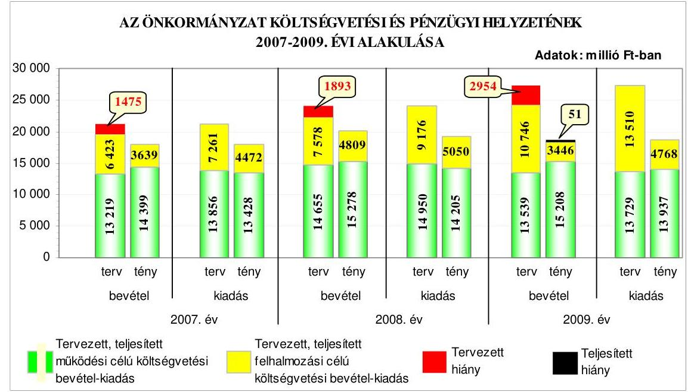
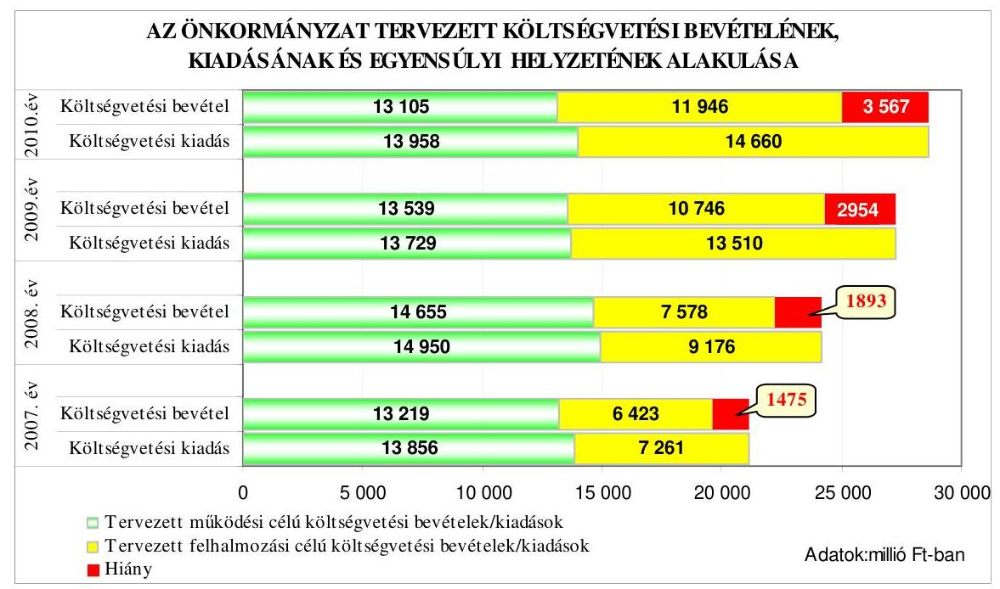
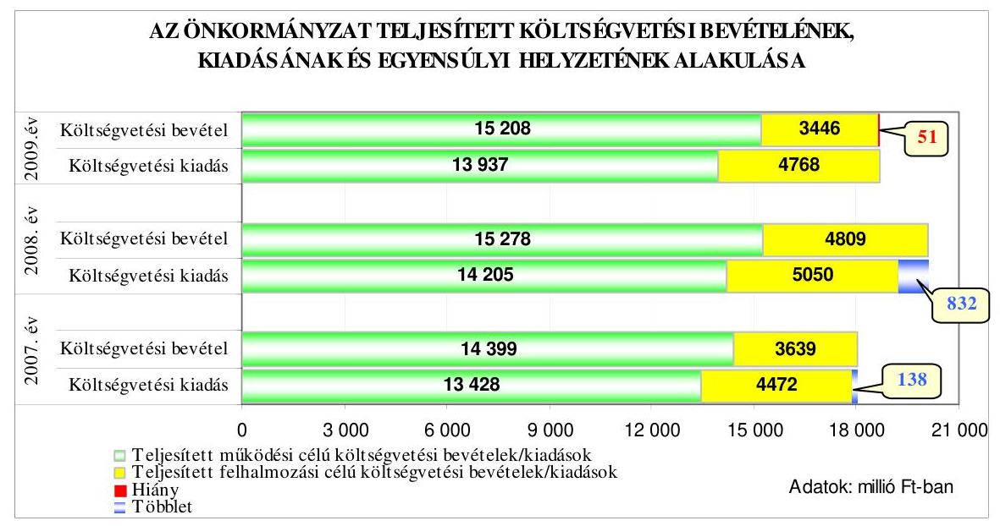
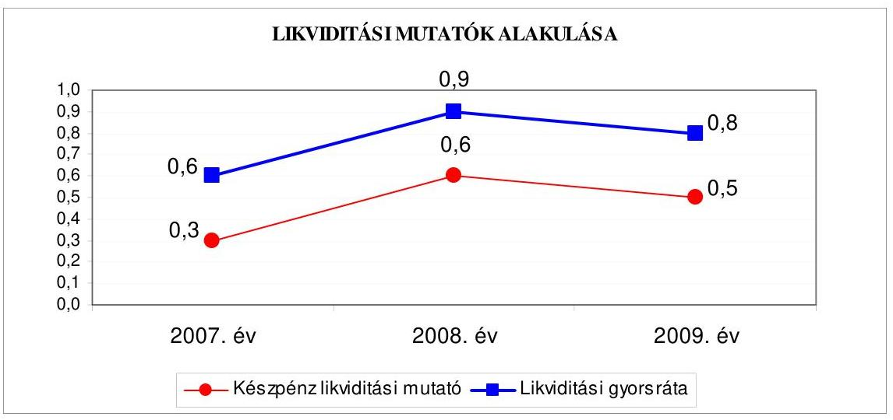
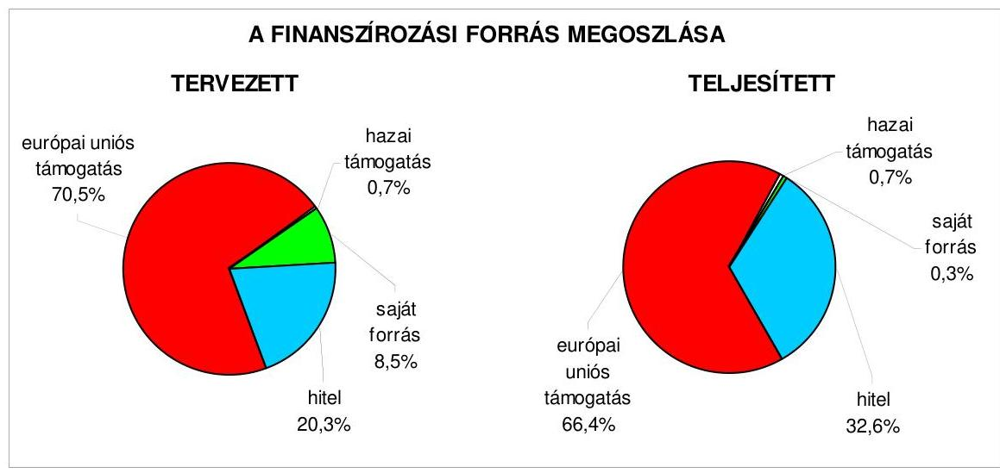
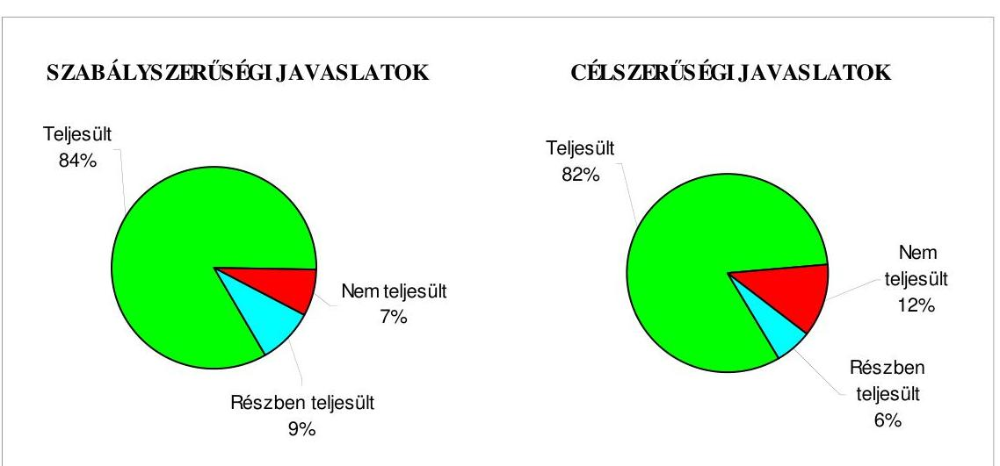
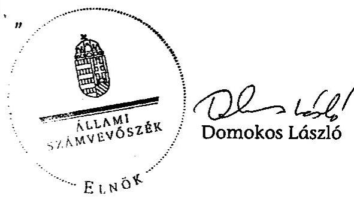
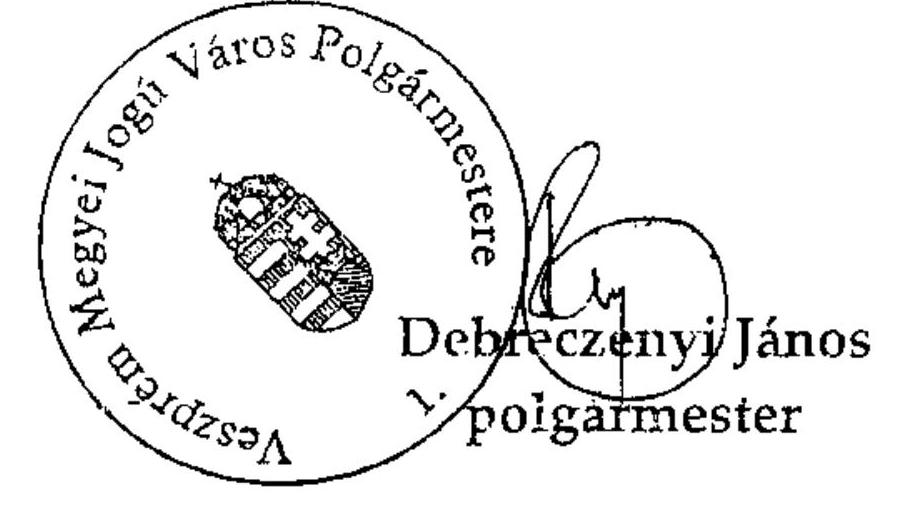
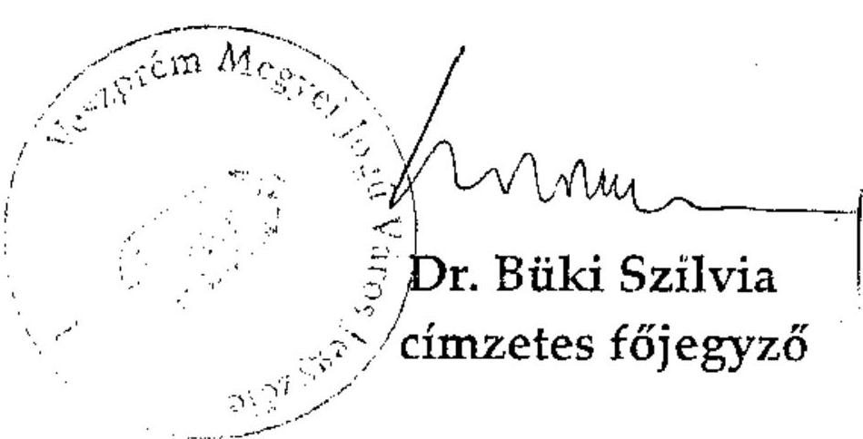

# ÁLLAMI   SZÁMVEVŐSZÉK 

## JELENTÉS

Veszprém Megyei Jogú Város Önkormányzata gazdálkodási rendszerének 2010. évi ellenőrzéséről

---

# 3. Önkormányzati és Területi Ellenőrzési Igazgatóság 

3.3. Átfogó Ellenőrzések Főcsoport

Iktatószám: V-3023-7/30/20/2010.
Témaszám: 966
Vizsgálat-azonosító szám: V0499

## Az ellenőrzést felügyelte:

Dr. Lóránt Zoltán
főigazgató
Az ellenőrzés végrehajtásáért felelős:
Dr. Sepsey Tamás
főigazgató-helyettes
Az ellenőrzést vezette:
Kántor Ilona
főtanácsos, irodavezető
Az ellenőrzést végezték:
Szarvas Szilárd Komlósiné Bogár Éva Szabó Leonóra Ildikó
számvevő tanácsos
számvevő tanácsos számvevő

## A témához kapcsolódó eddig készített számvevőszéki jelentések:

## címe

Jelentés Veszprém Megyei Jogú Város Önkormányzata gazdálkodási rendszerének átfogó ellenőrzéséről
Jelentés a Magyar Köztársaság 2005. évi költségvetése végrehajtásának ellenőrzéséről
Függelékek:

- a kötött felhasználású támogatások 2005. évi felhasználásának ellenőrzése
- a helyi önkormányzatok 2005. évi normatív állami hozzájárulás igénylésének és elszámolásának ellenőrzése
- a helyi önkormányzatok beruházásaihoz és rekonstrukcióihoz nyújtott 2005. évi felhalmozási célú támogatások ellenőrzése
Jelentés a helyi és a helyi kisebbségi önkormányzatok gazdálkodási rendszerének átfogó és egyéb szabályszerűségi ellenőrzéséről
Jelentés a települési önkormányzatok vízrendezési és csapadékvíz 0708 elvezetési feladatai ellátásának ellenőrzéséről
Jelentés a Sport XXI. Létesítményfejlesztési Program keretében támogatott önkormányzati PPP beruházások megvalósításának és önkormányzati feladatok ellátására gyakorolt hatásának ellenőrzéséről

---

Jelentés a Magyar Köztársaság 2008. évi költségvetése végrehajtásának ellenőrzéséről
Függelék:

- a helyi önkormányzatok beruházásaihoz és rekonstrukcióihoz nyújtott 2008. évi felhalmozási célú támogatások ellenőrzése

---

# TARTALOMJEGYZÉK 

BEVEZETÉS ..... 13
I. ÖSSZEGZŐ MEGÁLLAPÍTÁSOK, KÖVETKEZTETÉSEK, JAVASLATOK ..... 18
II. RÉSZLETES MEGÁLLAPÍTÁSOK ..... 31

1. Az Önkormányzat költségvetési és pénzügyi helyzete ..... 31
1.1. A tervezett költségvetési bevételek és kiadások alapján a
költségvetési egyensúly, a költségvetési hiány alakulása, a hiány
tervezett finanszírozási módja, valamint a költségvetési hiány
megállapításának szabályszerűsége ..... 31
1.2. A teljesített költségvetési bevételek és kiadások alapján a pénzügyi
egyensúly, a pénzügyi hiány alakulása, a pénzügyi hiány
finanszírozása, az igénybe vett finanszírozási célú pénzügyi
eszközök hatása a pénzügyi helyzet alakulására, az eladósodásra,
valamint a fizetőképességre ..... 33
2. Az Önkormányzat felkészültsége az európai uniós források igénylésére,
felhasználására, a támogatott célkitúzés megvalósítására, múködtetésére,
valamint az elektronikus közszolgáltatási feladatok ellátására ..... 40
2.1. Az európai uniós források igénybevételére, felhasználására, a
támogatott célkitúzés megvalósítására, múködtetésére történt
felkészülés szabályozottságának, szervezettségének, valamint egy
támogatási szerződésben foglalt célkitúzés megvalósításának,
múködtetésének eredményessége ..... 40
2.1.1. Az európai uniós forrásokra történő pályázatok benyújtására
vonatkozó döntések összhangja fejlesztési célkitúzésekkel ..... 41
2.1.2. Az európai uniós forrásokhoz kapcsolódóan a
pályázatfigyelés, a pályázatkészítés, valamint az európai
uniós támogatással megvalósuló fejlesztés lebonyolításának
belső rendje, a végrehajtás és az ellenőrzés szervezettsége ..... 44
2.1.3. Egy támogatási szerződésben foglalt célkitúzés megvalósítása,
múködtetése ..... 46
2.2. Az elektronikus közszolgáltatás feltételeinek kialakítása ..... 49
3. A költségvetési gazdálkodás belső kontrolljai ..... 53
3.1. A költségvetés tervezés, a gazdálkodás és a zárszámadás készítés
folyamatában végrehajtandó belső kontrollok kialakítása ..... 53
3.2. A belső kontrollok múködtetése a költségvetés tervezés, a
gazdálkodás, és a zárszámadás készítés folyamataiban ..... 55
3.3. A belső ellenőrzési kötelezettség teljesítése ..... 58

---

4. Az ÁSZ korábbi ellenőrzési javaslatai alapján készített intézkedési terv végrehajtása, hasznosítása
4.1. Az Önkormányzat gazdálkodási rendszerének átfogó ellenőrzése során tett javaslatok végrehajtására tervezett intézkedések megvalósítása
4.2. A zárszámadáshoz kapcsolódó (állami hozzájárulások, támogatások igénylésének és felhasználásának ellenőrzése), valamint a további vizsgálatok esetében a megállapítások, javaslatok alapján tett intézkedések

# MELLÉKLETEK 

1. számú Az Önkormányzat gazdálkodását meghatározó adatok, mutatószámok (1 oldal)
2. számú Az önkormányzati vagyon alakulása (1 oldal)

2/a. számú Az önkormányzati kötelezettségek alakulása (1 oldal)
3. számú Az Önkormányzat 2007-2010. évi költségvetési előirányzatainak és 20072009. évi pénzügyi teljesítéseinek alakulása (1 oldal)

3/a. számú Az Önkormányzat által a 2007-2009. években felvett hosszú lejáratú hitelek jellemzői ( 3 oldal)
4. számú Tanúsítvány az európai uniós forrásokkal támogatott célok és programok 2007-2010. évi tervezett és teljesített adatairól (3 oldal)
4/a. számú Tanúsítvány az európai uniós forrásokra 2007-2010 között benyújtott pályázatokról, amelyek elbírálásáról az Önkormányzat meg nem kapott tájékoztatást ( 1 oldal)
4/b. számú Tanúsítvány a 2007-2010. években benyújtott és elutasított európai uniós pályázatokról (1 oldal)
5. számú Adatlap az európai uniós forrással támogatott Veszprém Mártírok útja $0+000+905 \mathrm{~km}$ közötti szakaszának és csapadékvíz elvezetésének felújítása feladatról ( 3 oldal)
6. számú Debreczenyi János úr, Veszprém Megyei Jogú Város Önkormányzata polgármestere által adott tájékoztatás (4 oldal)
7. számú Debreczenyi János úr, Veszprém Megyei Jogú Város Önkormányzata polgármestere részére adott válasz (2 oldal)

---

# RÖVIDÍTÉSEK, MOZAIKSZAVAK JEGYZÉKE 

## Törvények

Áht.
ÁSZ tv.
Eisz. tv.
Kbt.
Ket.
Ötv.
Számv. tv.

## Rendeletek

Áhsz.

Ámr. 1
Ámr. 2
Ber.
2007. évi költségvetési rendelet
2007. évi zárszámadási rendelet
2008. évi költségvetési rendelet
2008. évi zárszámadási rendelet
2009. évi költségvetési rendelet
2010. évi költségvetési rendelet

SzMSz
az államháztartásról szóló 1992. évi XXXVIII. törvény az Állami Számvevőszékről szóló 1989. évi XXXVIII. törvény
az elektronikus információszabadságról szóló 2005. évi XC. törvény
a közbeszerzésekről szóló 2003. évi CXXIX. törvény
a közigazgatási hatósági eljárás és szolgáltatás általános szabályairól szóló 2004. évi CXL. törvény
a helyi önkormányzatokról szóló 1990. évi LXV. törvény a számvitelről szóló 2000. évi C. törvény

Az államháztartás szervezetei beszámolási és könyvvezetési kötelezettségének sajátosságairól szóló 249/2000. (XII. 24.) Korm. rendelet
az államháztartás múködési rendjéről szóló 217/1998. (XII. 30.) Korm. rendelet
az államháztartás múködési rendjéről szóló 292/2009. (XII. 19.) Korm. rendelet
a költségvetési szervek belső ellenőrzéséről szóló 193/2003. (XI. 26.) Korm. rendelet
Veszprém Megyei Jogú Város Önkormányzatának 6/2007. (II. 22.) rendelete az Önkormányzat 2007. évi költségvetéséről
Veszprém Megyei Jogú Város Önkormányzatának 16/2008. (IV. 30.) rendelete az Önkormányzat 2007. évi költségvetésének végrehajtásáról
Veszprém Megyei Jogú Város Önkormányzatának 4/2008. (II. 28.) rendelete az Önkormányzat 2008. évi költségvetéséről
Veszprém Megyei Jogú Város Önkormányzatának 17/2009. (IV. 30.) rendelete az Önkormányzat 2008. évi költségvetésének végrehajtásáról
Veszprém Megyei Jogú Város Önkormányzatának 4/2009. (II. 27.) rendelete az Önkormányzat 2009. évi költségvetéséről
Veszprém Megyei Jogú Város Önkormányzatának 4/2010. (II. 26.) rendelete az Önkormányzat 2010. évi költségvetéséről
Veszprém Megyei Jogú Város Önkormányzatának 35/2002. (XI. 15.) számú rendelete az Önkormányzat Szervezeti és Múködési Szabályzatáról

---

vagyongazdálkodási rendelet

18/2005. (XII. 27.) IHM rendelet

## Szórövidítések

áfa
ÁROP
ASP

ÁSZ
Belső ellenőrzési iroda
belső ellenőrzési kézikönyv $_{1}$
belső ellenőrzési kézikönyv $_{2}$
ellenőrzési nyomvonal

EKOP
e-kormányzati feladatokról szóló Korm. határozat
e-közszolgáltatás
értékelési szabályzat

EU Önerő Alap

FEUVE
főjegyző

Veszprém Megyei Jogú Város Önkormányzatának 22/2005. (VI. 27.) rendelete az Önkormányzat vagyonáról, a vagyongazdálkodás és a vagyonhasznosítás szabályairól
a közzétételi listákon szereplő adatok közzétételéhez szükséges közzétételi mintákról szóló 18/2005. (XII. 27.) IHM rendelet
általános forgalmi adó
ÚMFT Államreform Operatív Program
alkalmazás szolgáltató: olyan szolgáltató, amely interneten keresztül információs és feldolgozási szolgáltatásokat nyújt az önkormányzatok részére (angolul: Application Service Provider)
Állami Számvevőszék
Veszprém Megyei Jogú Város Önkormányzat Polgármesteri Hivatal Belső Ellenőrzési Irodája
Veszprém Megyei Jogú Város Önkormányzat Polgármesteri Hivatalának 2007. október 15-től hatályos Belső ellenőrzési kézikönyve (a főjegyző 2007. október 8-án hagyta jóvá)
Veszprém Megyei Jogú Város Önkormányzat Polgármesteri Hivatalának 2009. december 1-jétől hatályos Belső ellenőrzési kézikönyve (a főjegyző 2009. november 15-én hagyta jóvá)
Veszprém Megyei Jogú Város Polgármesteri Hivatalának ellenőrzési nyomvonala, a hivatali SzMSz 2. számú melléklete
ÚMFT Elektronikus Közigazgatási Operatív Program
a közigazgatás korszerűsítését szolgáló aktuális e-
kormányzati feladatokról szóló 1044/2005. (V. 11.) Korm. határozat
elektronikus közszolgáltatás
Veszprém Megyei Jogú Város Önkormányzat Polgármesteri Hivatala 2007. január 1-jétől hatályos Eszközök és források értékelési szabályzata (jóváhagyta a főjegyző)
a 2007. évi költségvetési törvény 5. számú mellékletének 12. pontjában, a 2008. évi költségvetési törvény 5. számú mellékletének 12. pontjában és a 2009. évi költségvetési törvény 5. számú mellékletének 12. pontjában, a 2010. évi költségvetési törvény 5. számú mellékletének 9. pontjában meghatározott központosított költségvetési előirányzat
folyamatba épített, előzetes, utólagos és vezetői ellenőrzés
Veszprém Megyei Jogú Város Önkormányzatának címzetes főjegyzője

---

| Gazdasági bizottság | Veszprém Megyei Jogú Város Önkormányzatának Gazdasági Bizottsága |
| :--: | :--: |
| gazdasági program | Veszprém Megyei Jogú Város Önkormányzatának 157/2007. (VI. 27.) számú határozata a 2007-2010. évekre szóló gazdasági programról |
| gazdasági ügyrend | Veszprém Megyei Jogú Város Önkormányzatának 2009. január 1-jétől hatályos Gazdasági Úgyrendje (jóváhagyta a főjegyzö) |
| GVOP | NFT Gazdasági és Vidékfejlesztési Operatív Program |
| HEFOP | NFT Humánerőforrás Operatív Program |
| hivatali SzMSz | Veszprém Megyei Jogú Város Önkormányzatának 251/2006. (XI. 30.) számú határozata a Veszprém Megyei Jogú Város Önkormányzat Polgármesteri Hivatalának Szervezeti és Müködési Szabályzatáról |
| informatikai stratégia | Veszprém Megyei Jogú Város Önkormányzatának 84/2004. (IV. 29.) számú határozata a Veszprém Megyei Jogú Város Önkormányzatának Informatikai stratégiájáról, melynek felülvizsgálatát a Közgyűlés a 283/2007. (XI. 29.) számú határozattal fogadta el |
| IEE-INTENSE Projekt | Nemzetközi együttmüködés a hatékony energiafelhasználási szokások és módok önkormányzati előmozdítása érdekében |
| ISPA | Infrastrukturális Fejlesztéseket Támogató Előcsatlakozási Alap |
| IT | informatikai technológia |
| kabinetiroda vezető | Veszprém Megyei Jogú Város Önkormányzat Polgármesteri Hivatal Kabinetirodájának vezetője |
| KDAT | Közép-dunántúli Akcióterv |
| KDOP | Közép-dunántúli Regionális Operatív Program |
| kockázatkezelési eljárásrend | Veszprém Megyei Jogú Város Polgármesteri Hivatalának kockázatkezelési eljárásrendje (a hivatali SzMSz 4. számú melléklete) |
| Kohéziós Alap | az EU-s tagállamok környezetvédelmi és közlekedési infrastrukturális fejlesztési projektjeinek támogatására létrehozott pénzügyi alap |
| Közgyűlés | Veszprém Megyei Jogú Város Önkormányzatának Közgyűlése |
| közreműködő szervezet ${ }_{1}$ | Közép-Dunántúli Regionális Fejlesztési Ügynökség Kht. (KDRFÜ) |
| közreműködő szervezet ${ }_{2}$ | VÁTI Magyar Regionális Fejlesztési és Urbanisztikai Kht. (VÁTI Kht.) |
| kulturális irodavezető | Veszprém Megyei Jogú Város Önkormányzat Polgármesteri Hivatal Kulturális Irodájának vezetője |
| MÁK | Magyar Államkincstár |
| NFT | Nemzeti Fejlesztési Terv |
| NFÜ | Nemzeti fejlesztési Ügynökség |

---

| Oktatási iroda | Veszprém Megyei Jogú Város Önkormányzat Polgármesteri Hivatal Oktatási Irodája |
| :--: | :--: |
| oktatási irodavezető | Veszprém Megyei Jogú Város Önkormányzat Polgármesteri Hivatal Oktatási Irodájának vezetője |
| pályázati szabályzat | az Önkormányzat által pályázati úton tervezett és megvalósított fejlesztésekkel kapcsolatos feladatok rendjéről szóló 4/2008. (IV. 7.) számú polgármesteri és jegyzői együttes utasítás |
| pénzkezelési szabályzat | Veszprém Megyei Jogú Város Önkormányzat Polgármesteri Hivatalának 2008. március 1-jétől hatályos Pénz- és értékkezelési szabályzata (jóváhagyta a főjegyző) |
| Pénzügyi bizottság | Veszprém Megyei Jogú Város Önkormányzatának Pénzügyi és Költségvetési Bizottsága |
| Pénzügyi iroda | Veszprém Megyei Jogú Város Önkormányzat Polgármesteri Hivatal Pénzügyi Irodája |
| pénzügyi irodavezető | Veszprém Megyei Jogú Város Önkormányzat Polgármesteri Hivatal Pénzügyi Irodájának vezetője |
| polgármester | Veszprém Megyei Jogú Város Önkormányzatának polgármestere |
| Polgármesteri hivatal | Veszprém Megyei Jogú Város Önkormányzatának Polgármesteri Hivatala |
| stratégiai ellenőrzési $\operatorname{terv}_{1}$ | Veszprém Megyei Jogú Város Önkormányzat 2005-2009. évekre szóló stratégiai ellenőrzési terve (a főjegyző 2004. április 25 -én hagyta jóvá) |
| stratégiai ellenőrzési $\operatorname{terv}_{2}$ | Veszprém Megyei Jogú Város Önkormányzat 2010-2014. évekre szóló stratégiai ellenőrzési terve (a főjegyző 2010. január 7-én hagyta jóvá) |
| szociálpolitikai irodavezető | Veszprém Megyei Jogú Város Önkormányzat Polgármesteri Hivatal Szociálpolitikai, Egészségügyi és Közigazgatási Irodájának vezetője |
| TÁMOP   társulás $_{1}$ | ÚMFT Társadalmi Megújulás Operatív Program   Észak-Balatoni Térség Regionális Települési Szilárdhulladék Kezelési Önkormányzati Társulás |
| társulás $_{2}$ | Veszprém és Térsége Szennyvízelvezetési és Kezelési Önkormányzati Társulás |
| TIOP | ÚMFT Társadalmi Infrastruktúra Operatív Program |
| ÚMFT | Új Magyarország Fejlesztési Terv |
| Vagyongazdálkodási és Projektkoordinációs csoport | Veszprém Megyei Jogú Város Önkormányzat Polgármesteri Hivatal Városfejlesztési és Városüzemeltetési Iroda Vagyongazdálkodási és Projektkoordinációs csoportja |
| Városépítészeti iroda | Veszprém Megyei Jogú Város Önkormányzat Polgármesteri Hivatal Városépítészeti Irodája |
| városépítészeti irodavezető | Veszprém Megyei Jogú Város Önkormányzat Polgármesteri Hivatal Városépítészeti Irodájának vezetője |

---

Városfejlesztési és Városüzemeltetési iroda Városfejlesztési csoport

Veszprém Megyei Jogú Város Önkormányzat Polgármesteri Hivatal Városfejlesztési és Városüzemeltetési Irodája
Veszprém Megyei Jogú Város Önkormányzat Polgármesteri Hivatal Városfejlesztési és Városüzemeltetési Iroda Városfejlesztési csoportja

---

# ÉRTELMEZŐ SZÓTÁR 

1. elektronikus szolgáltatási szint
2. elektronikus szolgáltatási szint
3. elektronikus szolgáltatási szint
4. elektronikus szolgáltatási szint

EMIR
európai uniós források
eredményesség

Az 1044/2005. (V. 11.) Korm. határozat alapján olyan információs, tájékoztató szolgáltatás, amely csak általános információkat közöl az adott üggyel kapcsolatos teendőkről és a szükséges dokumentumokról.
Az 1044/2005. (V. 11.) Korm. határozat alapján olyan egyirányú kapcsolatot biztosító szolgáltatás, amely az 1. szinten túl biztosítja az adott ügy intézéséhez szükséges dokumentumok, nyomtatványok letöltését, és azok ellenőrzéssel, vagy ellenőrzés nélküli elektronikus kitöltését, amely esetben a dokumentumok benyújtása hagyományos úton történik.
Az 1044/2005. (V. 11.) Korm. határozat alapján olyan kétirányú kapcsolatot biztosító szolgáltatás, amely közvetlen, vagy ellenőrzött kitöltésű dokumentum segítségével biztosítja az elektronikus adatbevitelt és a bevitt adatok ellenőrzését. Az ügy indításához, intézéséhez személyes megjelenés nem szükséges, de az ügyhöz kapcsolódó közigazgatási döntés (határozat, egyéb aktus) közlése, valamint a kapcsolódó illeték-, vagy díjfizetés hagyományos úton történik.
Az 1044/2005. (V. 11.) Korm. határozat alapján olyan teljes közvetlen kétirányú ügyintézési folyamatot biztosító szolgáltatás, amikor az ügyhöz kapcsolódó közigazgatási döntés is elektronikus úton kerül közlésre, illetve a kapcsolódó illeték-, vagy díjfizetés elektronikus úton is intézhető.
Egységes Monitoring Informatikai Rendszer az Európai Unió által nyújtott egyes pénzügyi támogatások felhasználásával megvalósuló programok, projektek figyelemmel kísérésére kialakított számítógépes nyilvántartási rendszer, amely a programok és a projektek adatait gyüjti, rendszerezi és tartja nyilván.
Az Európai Unió költségvetéséből, illetve az Európai Gazdasági Térség Európai Unión kívüli tagállamainak költségvetéséből származó támogatások, valamint a „Svájci Hozzájárulás" programból származó támogatás.
Egy adott tevékenység céljai megvalósításának mértéke, a tevékenység szándékolt és tényleges hatása közötti kapcsolat. (forrás: Ámr., 2. § 66. pont)

---

fejlesztési feladat (projekt)
fejlesztési célkitúzés
hazai társfinanszírozás
indikátor
intézkedés
irányító hatóság
kedvezményezett

Az a fejlesztési feladat, amely illeszkedik az Európai Unió, illetve a Nemzeti Fejlesztési Terv által támogatott programokhoz. Az Európai Unió, illetve a Nemzeti Fejlesztési Terv és az Új Magyarország Fejlesztési Terv által meghirdetett programokhoz kapcsolódó, támogatott projektek fejlesztési feladatok megvalósításához használhatók fel az európai uniós források. A fejlesztési feladat (projekt) tartalmilag és formailag részletesen kidolgozott, megfelelő pénzügyi háttérrel és végrehajtási ütemezéssel rendelkező fejlesztési terv.
Az önkormányzat által ellátott kötelező, vagy önként vállalt feladatok mennyiségi (minőségi) fejlesztésére vonatkozó terv. A mennyiségi fejlesztés megvalósulhat beszerzéssel, létesítéssel, bővítéssel, átalakítással.
A központi költségvetési és az elkülönített állami pénzalapokból származó finanszírozás.
A projekt megvalósulásának számszerúsíthető eredményei, mutató, jelzőszám, amelynek segítségével egy célkitúzés megvalósulásának adott szintjét lehet szemléltetni. Jelenthet egy felhasznált erőforrást, egy elért hatást, egy minőségi szintet, illetve valamilyen egyéb változást.
Az európai uniós támogatások esetében az Európai Unió olyan támogatási eszköze, amely segítségével egy prioritást élvező feladat megvalósítása több év alatt történik.
A strukturális alapok és a Kohéziós alap forrásainak szabályszerű, hatékony és eredményes felhasználásához szükséges intézményrendszer felső eleme. Az irányító hatóság általános és átfogó felelősséget visel a programok, projektek hatékony és szabályszerű végrehajtásáért. Felelősségi köréből eredően ellenőrzi a közösségi, valamint a hazai jogszabályok betartását, koordinálja az európai uniós források szétosztásának folyamatát, irányítja az intézményrendszer, a statisztikai és a pénzügyi nyilvántartási rendszer múködését. Az Új Magyarország Fejlesztési Terv Irányító Hatósága közremúködik az Operatív Program véglegesítésében, irányítja az Operatív Program Program-kiegészítő Dokumentum kidolgozását, és közremúködő szerepet vállal e dokumentumoknak az Európai Bizottsággal történő tárgyalásaiban. Az Irányító Hatóság részt vesz továbbá a költségvetési tervezésében, valamint közremúködő szervezetek bevonásával irányítja a meghirdetett pályázatok és a központi programok végrehajtását.
Az a helyi önkormányzat, amely a támogatási szerződést kedvezményezettként aláíria, a projektet, illetve a központi programhoz kapcsolódó támogatott önkormányzati programot végrehajtja.

---

központi program
közreműködő szervezet
lebonyolítás
lebonyolítás
operatív program

Nemzeti Fejlesztési Terv

Az ország egészére, több régióra, egy régióra vonatkozó, de mindenképpen az önkormányzat közigazgatási területén túlmutató program, amelynél a támogatott programok kiválasztása pályáztatás nélkül, előre meghatározott feltételrendszer szerint történik, a kedvezményezettek közvetlen megkeresésével. Az Európai Unió pénzügyi alapja a Kohéziós alap, a környezetvédelem és a közlekedés terén nyújt lehetőséget az egyes tagországoknak központi programok megvalósítására.
A közremúködő szervezetek az európai uniós támogatást elnyert kedvezményezettekkel a kapcsolattartó szervek. Feladatai: a támogatási szerződés mintától eltérő egyedi támogatási szerződés-tervezetek előzetes megküldése jóváhagyásra a Nemzeti Fejlesztési Ügynökségnek; a projektek megvalósítása előrehaladásának nyomon követése, a támogatás kifizetésének engedélyezése, a folyamatba épített ellenőrzések (dokumentumalapú ellenőrzések és kockázatelemezésre alapozott helyszíni ellenőrzések) végzése, a projektek zárásával kapcsolatos feladatok ellátása, szabálytalanságkezelési rendszer kialakítása és múködtetése; ellenőrzési nyomvonal készítése és folyamatos aktualizálása; az Egységes Monitoring Informatikai Rendszerben az adatok folyamatos rögzítése, az adatbázis naprakészségének és megbízhatóságának biztosítása; a beszámolók készítése és megküldése a miniszter és az Nemzeti Fejlesztési Ügynökség részére az akcióterv és az éves munkaterv megvalósításában történt előrehaladásról és a szükséges intézkedésekre vonatkozó javaslatokról.
Az európai uniós források felhasználásával megvalósuló fejlesztésre irányuló műszaki, gazdasági (pénzügyi) tevékenységet magában foglaló szervezési, irányítási szolgáltatás. A szervezési szolgáltatás kiterjedhet a pályázatkészítésre, a közbeszerzési eljárás lebonyolításán keresztül a folyamatos műszaki ellenőrzésre, a pénzügyi elszámolásra, a múszaki átadás-átvételre, az üzembe helyezésre, illetve a fejlesztési folyamat egyes elemeire.
Az Európai Bizottság által jóváhagyott, a Közösségi Támogatási Keret végrehajtására vonatkozó, több évre szóló intézkedésekhez kapcsolódó prioritások egységes rendszerét tartalmazó dokumentum.
Helyzetelemzést, stratégiát a tervezett fejlesztési területek prioritásait, azok céljait és pénzügyi forrásaik megjelölését tartalmazó dokumentum, amelyet a Magyar Köztársaság készített az Európai Unió programozási irányelveinek, célkitűzéseinek megfelelően a fejlődésben lemaradó régiók fejlődésének és strukturális átalakulásának elősegítésére a kiemelt szükségletekre figyelemmel. A Nemzeti Fejlesztési Terv stratégiai fejezetének célja, hogy a 2004-2006 közötti időszakra kijelölje a strukturális alapokból támogatható fejlesztéspolitikai célkitűzéseit és prioritásait. A strukturá-

---

|  | lis alapok operatív programjai: Agrár- és Vidékfejlesztés Operatív Program (AVOP); Gazdasági Versenyképesség Operatív Program (GVOP); Humán erőforrások fejlesztései Operatív Program (HEFOP); Környezetvédelem és infrastruktúra Operatív Program (KIOP); Regionális Fejlesztés Operatív Program (ROP). |
| :--: | :--: |
| prioritás | A közösségi támogatási kerettervben vagy támogatásban elfogadott stratégia valamely prioritása; ehhez rendelik hozzá az alapokból és egyéb pénzügyi eszközökből, valamint a tagállam megfelelő pénzügyi forrásaiból származó hozzájárulást, továbbá a meghatározott célok összességét. |
| program | Ágazati vagy térségi fejlesztési célt megvalósító fejlesztési terv, mely több egymással összefüggő projekt útján, az érintettek együttmúködése alapján valósul meg. |
| regionális program | Az ágazati és regionális prioritásokat egyaránt tartalmazó operatív program regionális prioritása, illetve támogatási konstrukciója. |
| saját forrás | A kedvezményezett által támogatott projekthez biztosított forrás, amelybe az államháztartás alrendszereiből nyújtott támogatás nem számítható be. Költségvetési szervek esetén a jóváhagyott előirányzat saját forrásnak minősül. |
| szabálytalanság | A jogszabályokban szereplő előírások, illetve a támogatási szerződésben a felek által vállalt kötelezettségeknek a megsértése, amelyek eredményeképpen az Európai Közösség vagy a Magyar Köztársaság pénzügyi érdekei sérülnek, illetve sérülhetnek. |
| Új Magyarország Fejlesztési Terv | Az Új Magyarország Fejlesztési Terv célja a foglalkoztatás bővítése és a tartós növekedés feltételeinek megteremtése. Ennek érdekében 2007-2013 között hat kiemelt területen indított el összehangolt állami és európai uniós fejlesztéseket: a gazdaságban, a közlekedésben, a társadalom megújulása érdekében, a környezet és az energetika területén, a területfejlesztésben és az államreform feladataival összefüggésben. Az Új Magyarország Fejlesztési Terv operatív programjai: Államreform Operatív Program (ÁROP); Elektronikus Közigazgatás Operatív Program (EKOP); Gazdaságfejlesztés Operatív Program (GOP); Környezet és Energia Operatív Program (KEOP); Közlekedés Operatív Program (KÖZOP); Dél-Alföldi Operatív Program (DAOP); Dél-Dunántúli Operatív Program (DDOP); Észak-Alföldi Operatív Program (ÉAOP); Észak-Magyarországi Operatív Program (ÉMOP); Közép-Dunántúli Operatív Program (KDOP); Közép-Magyarországi Operatív Program (KMOP); Nyugat-Dunántúli Operatív Program (NYDOP); Társadalmi Infrastruktúra Operatív Program (TIOP); Társadalmi Megújulás Operatív Program (TÁMOP). |

---

támogatási szerződés

A strukturális alapok esetében az irányító hatóságnak, illetve a Kohéziós Alap esetében a közremúködő szervezeteknek a kedvezményezett önkormányzattal kötött szerződése, amely a támogatás felhasználásának részletes feltételeit tartalmazza. Az Új Magyarország Fejlesztési Terv keretében támogatott projektek esetében a támogatási szerződést a kedvezményezett és a Nemzeti Fejlesztési Ügynökség nevében eljáró közremúködő szervezet között jön létre. Nagyprojekt esetén a támogatási szerződést a Nemzeti Fejlesztési Ügynökség ellenjegyzi. A támogatási szerződés képezi a megvalósítás nyomon követésének, finanszírozásának és ellenőrzésének alapját.

---

# JELENTÉS 

## Veszprém Megyei Jogú Város Önkormányzata gazdálkodási rendszerének 2010. évi ellenőrzéséről

## BEVEZETÉS

Az Ötv. 92. § (1) bekezdése, az Állami Számvevőszékről szóló 1989. évi XXXVIII. törvény 2. § (3) bekezdése, valamint az Áht. 120/A. § (1) bekezdése alapján az önkormányzatok gazdálkodását az Állami Számvevőszék ellenőrzi. Az ellenőrzésre az Országgyűlés illetékes bizottságai részére is átadott, országosan egységes ellenőrzési program szerint került sor.

Az Állami Számvevőszék a stratégiájában foglalt célkitűzéseknek megfelelően a helyi önkormányzatok költségvetési gazdálkodási rendszerének ellenőrzését a 2007. évben megújított, teljesítmény-ellenőrzési elemekkel kiegészített ellenőrzési program alapján folytatja a 2010. évben.

Az ellenőrzés célja annak értékelése volt, hogy az Önkormányzat:

- milyen módon biztosította a költségvetési és a pénzügyi egyensúlyt a költségvetésében és annak teljesítése során, valamint változott-e a hiányzó bevételi források pótlásában a finanszírozási célú pénzügyi műveletek jelentősége, hatása;
- eredményesen készült-e fel a szabályozottság és a szervezettség terén az európai uniós források igénylésére és felhasználására, megvalósította, működtette-e a támogatott célkitűzést, továbbá biztosította-e az elektronikus közszolgáltatás feltételeit, a gazdálkodási adatok közzétételével a gazdálkodás nyilvánosságát;
- megfelelően kialakította-e és működtette-e a belső kontrollokat a költségvetés tervezés, a gazdálkodás és a zárszámadás készítés, valamint a belső ellenőrzés folyamatában, továbbá;
- megfelelően hasznosították-e a korábbi számvevőszéki ellenőrzések megállapításait, szabályszerűségi ${ }^{1}$ és célszerűségi javaslatait.

[^0]
[^0]:    ${ }^{1}$ A törvényi előírások betartásának elmulasztásakor a részletes megállapítások fejezetben egységesen a törvénysértés megjelölést alkalmazzuk, mivel az ÁSZ nem tehet különbséget a törvényi előírások között.

---

Az ellenőrzés típusa: átfogó ellenőrzés, amely - egy ellenőrzés keretében meghatározott területekre összpontosítva alkalmazza a szabályszerűségi, valamint a teljesítmény-ellenőrzés jellemzőit.

Az ellenőrzött időszak: az 1. és 2. programpontoknál a 2007-2009. évek, a 3. ellenőrzési programpont tekintetében a 2009. év, a 4. programpontnál az önkormányzatok gazdálkodási rendszerének 2005. évi átfogó ellenőrzéséről készített jelentésben rögzített javaslatok megvalósítását, hasznosítását, valamint a 2006-2010 I. negyedév között végzett további ellenőrzések során megfogalmazott javaslatok végrehajtása érdekében tett intézkedések tekintetében a 2006-2010. I. negyedév közötti időszak.

Veszprém város lakosainak száma 2010. január 1-jén 57654 fő volt. A 2006. évi önkormányzati képviselő és polgármester választást követően az Önkormányzat 25 tagú Közgyűlésének munkáját kilenc állandó bizottság segítette. A helyi önkormányzat mellett a 2006. évi önkormányzati képviselő és polgármester választásokat követően négy ${ }^{2}$ kisebbségi önkormányzat múködött. A polgármester a 2006. évi önkormányzati képviselő és polgármester választás óta tölti be tisztségét, a főjegyző személye 1997. július 1. óta változatlan.

Az Önkormányzat feladatainak végrehajtása érdekében a 2007. évben 44, a 2009. évben 39 költségvetési intézményt múködtetett, amelyekből a 2007. évben tíz önállóan gazdálkodó, a 2009. évben kilenc önállóan múködő és gazdálkodó volt. A feladatok ellátásában a 2007. és a 2009. évben is tíz gazdasági társasága vett részt. Az Önkormányzat az éves költségvetési beszámolója szerint a 2009. évben 18654 millió Ft költségvetési bevételt ért el, és 18705 millió Ft költségvetési kiadást teljesített. A teljesített költségvetési bevételek 3,4\%kal, a költségvetési kiadások 4,5\%-kal haladták meg a 2007. évben teljesített költségvetési bevételeket és kiadásokat a teljesített múködési célú költségvetési bevételek és a teljesített múködési és felhalmozási célú kiadások növekedése következtében. Az Önkormányzat 2009. december 31-én a könyvviteli mérleg szerint 73668 millió Ft értékű vagyonnal rendelkezett. Az Önkormányzat vagyona a 2007. év végi állományhoz viszonyítva 8,5\%-kal emelkedett, az immateriális javak, a tárgyi eszközök, a befektetett pénzügyi eszközök és az üzemeltetésre átadott eszközök állománya növekedésének hatására. Az összes költségvetési bevétel 44,4\%-át a saját bevétel, illetve 24,9\%-át a helyi adó bevétel biztosította a 2009. évben. A helyi adóbevétel összes költségvetési bevételen belüli aránya a 2007. évihez viszonyítva fél százalékponttal csökkent a 2009. évben. Az összes költségvetési kiadásból a felhalmozási célú kiadás részaránya a 2007. évhez viszonyítva a 2009. évre fél százalékponttal nőtt, a 2009. évben $25,5 \%$ volt. A 2010. évi költségvetési rendeletben 25051 millió Ft költségvetési bevételt és 28618 millió Ft költségvetési kiadást irányoztak elő. Az Önkormányzat forrásainak értéke a 2007-2009 közötti időszakban a saját tőke növekedése miatt összességében 7,9 százalékponttal emelkedett. A Polgármesteri hivatalban dolgozó köztisztviselők száma 2007. január 1-jén 228 fő, 2009. december 31-én 229 fő volt, a költségvetési intézményekben foglalkoztatott közalkalmazottak száma 2007. január 1-én 2651 fő, 2009. december 31-én 2515 fő

[^0]
[^0]:    ${ }^{2}$ cigány, lengyel, német, örmény kisebbségi önkormányzat

---

volt. Az Önkormányzat gazdálkodását meghatározó adatokat, mutatószámokat az 1-3. számú mellékletek tartalmazzák.

Az Önkormányzat költségvetési és pénzügyi helyzetét az elemző eljárás módszerével vizsgáltuk. E körben elemeztük a költségvetés egyensúlyi helyzetének alakulását, a tervezett és teljesített költségvetési, pénzügyi hiány okait, a hiány finanszírozásának tervezett és teljesített módját, az önkormányzat pénzügyi helyzetének alakulását az eladósodás és a likviditás szempontjából.

Teljesítmény-ellenőrzés módszerével vizsgáltuk, és eredményesség szempontjából értékeltük az Önkormányzat benyújtott pályázatai kapcsolódását a Képvi-selő-testület által meghatározott fejlesztési célkitűzésekhez, valamint felkészültségét a belső szabályozottság, szervezettség terén az európai uniós forrásokra vonatkozó pályázati felhívások figyelésére, a pályázatok készítésére, és a lebonyolítására. Értékeltük továbbá egy támogatási szerződésben rögzített célkitúzés (számszerűsíthető eredmények, indikátorok) megvalósításának eredményességét. Az ellenőrzés során felmértük, hogy az elektronikus közigazgatási szolgáltatások működtetése érdekében milyen intézkedéseket tettek, továbbá biztosították-e a közérdekú gazdálkodási adatok meghatározott körének honlapon történő közzétételét.

A költségvetési gazdálkodás belső kontrolljainak ellenőrzése során vizsgáltuk, hogy a Polgármesteri hivatalban a költségvetés tervezés, a gazdálkodás, és a zárszámadás készítés folyamatában a belső kontrollok kialakítása és múködése megfelelő biztosítékot ad-e a gazdálkodási feladatok szabályszerű ellátására. Felmértük és minősítettük a költségvetés tervezés, a gazdálkodás, és a zárszámadás készítés feladataival, továbbá a pénzügyi-számviteli területen az informatikával kapcsolatosan kialakított kontrollok megfelelőségét, valamint azok múködésének megfelelőségét. A vizsgálat során értékeltük a belső ellenőrzés szabályozottságát, múködési feltételeinek kialakítását, meghatározását, továbbá múködésének megfelelőségét.

A Polgármesteri hivatalban értékeltük a gazdálkodás folyamatában kulcsszerepet betöltő belső kontrollok múködésének megfelelőségét, ennek keretében ellenőriztük a szakmai teljesítés igazolására és az utalvány ellenjegyzésére kialakított kontrollok múködését. Az ellenőrzést a következő, kiemelt kockázatuk alapján kiválasztott ${ }^{3}$ kifizetésekre folytattuk le ${ }^{4}$ :

[^0]
[^0]:    ${ }^{3}$ Az önkormányzatok kiemelt előirányzataira vonatkozóan, a vertikális folyamatokra elvégeztük a kockázatok becslését, amelynek eredményeként határoztuk meg a magas kockázatú területeket.
    ${ }^{4}$ A korábbi ellenőrzési tapasztalataink szerint ezeken a területeken a jegyzők nem, vagy hiányosan szabályozták a megbízás, megrendelés indokoltságának, szükségességének elbírálására, igazolására, valamint a teljesítések dokumentálására, a kiadások jogosultságának, összegszerűségének ellenőrzésére irányuló kontrollokat. További kockázatot jelentett, ha a külső szolgáltató által végzett karbantartási, kisjavítási munkák 50 ezer Ft alatti megrendeléseire vonatkozóan a jegyzők nem alakították ki a kötelezettségvállalások rendjét és nyilvántartási formáját, valamint a szabályozás elmulasztása esetén nem történt meg az írásbeli kötelezettségvállalás és annak az ellenjegyzése sem.

---

- az államháztartáson kívülre teljesített működési és felhalmozási célú pénzeszköz átadásokra,
- az állományba nem tartozók megbízási díjaira, továbbá
- a külső szolgáltató által végzett karbantartási, kisjavítási szolgáltatásokra.

Az ellenőrzés hatékony elvégzése céljából a vizsgálandó területek kiválasztása során a kockázatokon alapuló megközelítés érvényesült, ezáltal az ellenőrzési erőforrásokat azokra a területekre fókuszáltuk, amelyeken a korábbi ellenőrzési tapasztalatok figyelembevételével legnagyobb a hibák előfordulási valószínűsége. Az ellenőrzési erőforrások ilyen típusú összpontosításával minimálisra csökkenthető a kívánt ellenőrzési bizonyosság eléréséhez szükséges időráfordítás.

A pénzügyi-számviteli folyamatokban alkalmazott belső kontrollok kialakításának és működésének ellenőrzésére a vizsgált három terület 2009. évi könyvviteli tételeiből területenként egyszerű véletlen mintát vettünk. A kijelölt gazdasági eseményre elvégzett megfelelőségi tesztek alapján értékeltük a kontrollok működésének megfelelőségét a vizsgált három területre külön-külön, majd öszszefoglalóan ${ }^{5}$. A helyszíni ellenőrzés megállapításainak részletes dokumentálását megfelelőségi tesztlapokon, ellenőrzési munkalapokon biztosítottuk. Ezeken a teszt- és munkalapokon a minősítés alapjául szolgáló kérdések és a vonatkozó konkrét jogszabályhelyek megjelölése mellett értékeltük a kialakított belső kontrollokban rejlő kockázatokat ${ }^{6}$ és a kialakított kontrollok múködésének megfelelőségét ${ }^{7}$.

Az ÁSZ korábbi ellenőrzési javaslatai alapján tett intézkedéseket, illetve azok megvalósítását utóellenőrzés keretében vizsgáltuk. A gazdálkodási rendszer korábbi átfogó ellenőrzése során megfogalmazott javaslatok végrehajtására tett

[^0]
[^0]:    ${ }^{5}$ A vizsgált három terület egyedi értékelési pontszámait a területek költségvetési súlyával arányosan összegeztük.
    ${ }^{6}$ A kialakított belső kontrollokban rejlő kockázatot alacsonynak minősítettük, ha a kontrollok - múködésük esetén - megfelelő védelmet nyújtottak a hibák bekövetkezése ellen. Közepesnek minősítettük a belső kontrollokban rejlő kockázatot, amennyiben a kontrollok - múködésük esetén - a lehetséges hibák többsége ellen védelmet nyújtottak. Magasnak értékeltük a kockázatot, ha a kontrollok - kialakításuk hiányában, vagy hiányos kialakításuk miatt - nem nyújtottak elegendő védelmet a lehetséges hibákkal szemben.
    ${ }^{7}$ A kontrollok múködésének megfelelőségét kiválónak értékeltük abban az esetben, ha azok múködése - esetleges kisebb, az egységesen meghatározott követelményrendszerben foglalt mértéket el nem érő hiányosságoktól eltekintve - megfelelt a hibák megelőzésére és kijavítására meghatározott szabályozásnak és a legmagasabb szintű elvárásoknak. Jónak minősítettük a kontrollok múködését, ha a megállapított kisebb (tolerálható mértékű) hiányosságok nem veszélyeztették az ellenőrzött terület hibáinak megelőzését és kijavítását. Amennyiben a kontrollok múködésében túl sok hiányosság fordult elő ahhoz, hogy a kontrollok biztosítsák a hibák megelőzését, feltárását, kijavítását és ezáltal veszélyeztették az eredményes, megbízható múködést, a kontroll múködésének megfelelősége gyenge minősítést kapott.

---

intézkedések megvalósítását ellenőriztük, az egyéb számvevőszéki ellenőrzések során tett javaslatok esetében pedig a kiadott intézkedéseket tekintettük át.

A helyszíni ellenőrzés során kitöltött - az ellenőrzést végző számvevő és a Polgármesteri hivatal felelős köztisztviselője által aláírt - ellenőrzési munkalapokat, azok kitöltési útmutatóit, továbbá a megfelelőségi tesztek dokumentumait a polgármester részére a számvevői jelentéssel egyidejúleg átadtuk.

A jelentést az ÁSZ-ról szóló 1989. évi XXXVIII. tv. 25. § (1) bekezdése alapján észrevétel közlése céljából megküldtük Veszprém Megyei Jogú Város Önkormányzata polgármesterének. A kapott tájékoztatást a jelentés 6 . számú melléklete, az arra adott választ a 7 . számú melléklet tartalmazza.

---

# I. ÖSSZEGZŐ MEGÁLLAPÍTÁSOK, KÖVETKEZTETÉSEK, JAVASLATOK 

Az Önkormányzatnál a 2007-2010. években a tervezett költségvetési bevételek és kiadások főösszege folyamatosan növekedett. A költségvetési bevételek és kiadások egyensúlya a 2007-2010. évi költségvetési rendeletekben nem volt biztosított, mivel a tervezett költségvetési kiadások meghaladták a tervezett költségvetési bevételeket. A költségvetés hiányát a 2007-2010. években a tervezett múködési célú költségvetési bevételek hiánya, a felhalmozási célú költségvetési bevételeket meghaladó összegben tervezett felhalmozási célú költségvetési kiadások, az önként vállalt feladat forráshiánya és a pénzmaradvány tervezési hiányossága együttesen okozták. Az Önkormányzat a költségvetési rendeleteiben a költségvetési egyensúly biztosításához a 2007-2009. években folyó-számla-hitel, a 2010. évben rövid lejáratú múködési hitel, valamint hosszú lejáratú felhalmozási célú hitelek felvételét és kiadási megtakarítást eredményező intézkedések végrehajtását tervezte. A főjegyző a költségvetés végrehajtása érdekében a likviditás feltételeinek kialakításáról az éves költségvetések tervezése során folyószámlahitel-keret tervezésével, továbbá előirányzat felhasználási terv készítésével gondoskodott. A 2007-2010. évi költségvetési rendelettervezetekben a főjegyző bemutatta a költségvetési hiány összegét, ugyanakkor a költségvetés kiadási főösszegének megállapításakor - az Áht. előírásai ellenére - a finanszírozási célú pénzügyi műveletek kiadásait is figyelembe vette költségvetési hiányt módosító kiadásként. A 2010. évi költségvetési rendelet módosításában a költségvetési kiadási főösszeg megállapításakor - az Áht. előírásainak megfelelően - finanszírozási célú pénzügyi műveleteket nem vettek figyelembe költségvetési hiányt módosító kiadásként.

Az Önkormányzatnál a 2007-2009. években a teljesített költségvetési bevételek és kiadások eltérő irányban változtak, mivel a költségvetési bevételi

---

és a költségvetési kiadási főösszegek a 2008. évben növekedtek, a 2009. évben csökkentek az előző évhez viszonyítva. A 2007-2008. években a költségvetés végrehajtása során a pénzügyi egyensúly biztosított volt, a teljesített költségvetési bevételek fedezetet nyújtottak a teljesített költségvetési kiadásokra, a tervezettet meghaladó mértékű működési célú költségvetési bevételek, valamint az elért költségvetési kiadási megtakarítások miatt pénzügyi többlet keletkezett. A pénzügyi egyensúlyt a költségvetés végrehajtása során a 2009. évben nem biztosították, mivel a felhalmozási célú költségvetési kiadások meghaladták a felhalmozási célú költségvetési bevételeket. A 2009. évi pénzügyi hiányra a legnagyobb befolyással a nem teljesült támogatás értékű bevételek és az elmaradt európai uniós támogatások voltak. A múködési célú költségvetési bevételek a 2007-2009. években fedezetet nyújtottak a múködési célú költségvetési kiadásokra, a felhalmozási célú költségvetési kiadások ugyanakkor folyamatosan meghaladták a felhalmozási célú költségvetési bevételeket. Az előző évi pénzmaradvány igénybevételének tervezése nem megalapozottan történt, mivel az Áht-ban foglaltak ellenére az Önkormányzatnál a pénzmaradványt eredeti előirányzatként nem az előző évről áthúzódó kötelezettségekkel összhangban tervezték meg.

Az Önkormányzat a 2007-2009. években folyószámla-hitelt vett igénybe, melynek összege és év végén fennálló vissza nem fizetett állománya folyamatosan növekedett. A folyószámla-hiteleket az Önkormányzat az eseti likviditási problémák megoldásán túl, a realizált költségvetési bevételekből nem finanszírozott költségvetési kiadások teljesítésére is fordította, ezért az Ötv-ben foglaltak alapján azok nem tekinthetők likvid hitelnek. A folyószámla-hitelen felül a 2008. évben egy alkalommal vett fel munkabérhitelt az Önkormányzat, amelyet a költségvetési éven belül visszafizetett. A költségvetési egyensúly biztosítása érdekében hosszú lejáratú felhalmozási célú hiteleket vett fel és kiadási megtakarítást eredményező intézkedéseket hozott az Önkormányzat. A költségvetés végrehajtása során a pénzügyi egyensúly biztosításához az Önkormányzat forgatási célú, hitelviszonyt megtestesítő értékpapírokat a költségvetési éveken belül vásárolt és értékesített. A 2007-2009. években kötvényt nem bocsátott ki az Önkormányzat. A Pénzügyi bizottság figyelemmel kísérte és értékelte a költségvetési bevételek alakulását, valamint a hitelfelvételek indokait és gazdasági megalapozottságát.

Az Önkormányzat pénzügyi helyzete 2007-2009 között eladósodási szempontból összességében nem változott, a rövid lejáratú múködési célú és a hoszszú lejáratú felhalmozási célú hitelekből származó törlesztések és kamatok növekedése hatására az adósságszolgálati ráta emelkedett, az eladósodási mutató és az esedékességi aránymutató azonban javult. Az Önkormányzat pénzügyi helyzete fizetőképességi szempontból a likviditási mutatók 2007-2009 közötti emelkedése alapján javult. Az Önkormányzat 2007-2009 közötti pénzügyi helyzete eladósodásának változatlansága és fizetőképességének javulása miatt összességében nem változott.

Az Önkormányzat fejlesztési célkitűzéseit a városfejlesztési akciótervben, a gazdasági programban, valamint az integrált városfejlesztési stratégiában határozta meg. A gazdasági programot - az Ötv-ben előírtak ellenére - határidőn túl fogadta el a Közgyűlés. Az Önkormányzat európai uniós támogatásokra a 2007. évet megelőzően, de a 2007-2009. években még folyamatban lévő fejlesz-

---

tésekhez kettő, a 2007-2010. I. negyedévben 28, összesen 30 pályázatot nyújtott be. Az európai uniós forrás igénybevételére benyújtott pályázatok kapcsolódtak a gazdasági programban, valamint az integrált városfejlesztési stratégiában foglalt célkitűzésekhez. A benyújtott európai uniós pályázatokról 27 alkalommal a Közgyűlés, három esetben a pályázati szabályzatban előírtak ellenére az intézményvezető döntött. A polgármester 2010 júniusában levélben hívta fel az intézményvezetők figyelmét a pályázati szabályzat betartására.

Az Önkormányzat költségvetési rendeletei a 2007-2010. években tartalmazták az európai uniós támogatással megvalósuló feladatok működési és felhalmozási célú költségvetési bevételi és kiadási előirányzatait. A 2007-2008. évi költségvetési rendeletek - az Ámr ${ }_{1}$-ben előírtak ellenére - a többéves kihatással járó feladatok előirányzatait nem éves bontásban tartalmazták. A 2007-2008. évi költségvetési rendeletek a kettő térségi projekt kivételével az európai uniós forrásból finanszírozott támogatással megvalósuló programok, projektek bevételeit és kiadásait, a 2009-2010. évi költségvetési rendeletek az európai uniós forrásból az intézmények bonyolításában megvalósuló projektek bevételi és kiadási előirányzatait az Ámr ${ }_{1,2}$-ben előírtak ellenére elkülönítetten nem mutatták be. A 2009-2010. évi költségvetési rendeletek a többéves kihatással járó feladatok előirányzatait éves bontásban, az európai uniós forrásból finanszírozott támogatással megvalósuló programok, projektek bevételeit és kiadásait elkülönítetten tartalmazták. Az európai uniós forrásokra benyújtott pályázatok megvalósításának tervezett összes költségvetési kiadása 15361 millió Ft volt, amelynek finanszírozását 66,1\%-ban európai uniós forrásból, 8,0\%-ban hazai támogatásból, 1,5\%-ban EU Önerő Alapból, 9,1\%-ban saját pénzeszközökből, 5,8\%-ban hitelből, valamint 9,5\%-ban egyéb forrásból tervezték. Az európai uniós forrásokkal támogatott tervezett fejlesztési feladatok 1,7\%-a valósult meg, a befejezett projektek teljesített költségvetési kiadása 268,8 millió Ft volt.

Az Önkormányzatnál a 2007. évben nem szabályozták a pályázatfigyelés, a pályázatkészítés, valamint az európai uniós támogatással megvalósuló fejlesztés lebonyolítási rendjét. A tervezett fejlesztésekkel kapcsolatos pályázati feladatokat 2008 áprilisától pályázati szabályzatban határozták meg. A pályázati szabályzat a pályázatfigyelést, a pályázatkészítést, a fejlesztések lebonyolítását a Polgármesteri hivatal mellett külső szakértő feladataként határozta meg. A pályázati szabályzatban meghatározták a pályázatfigyelési, a pályázatkoordinálási, a pályázat nyilvántartási feladatok ellátásának felelősét. Az Önkormányzatnál a 2008-2009. években a pályázatfigyelést végzők és a döntési, illetve a döntés-előterjesztési jogkörrel rendelkezők közötti információszolgáltatási kötelezettség teljesítése rendjének szabályait a pályázati szabályzatban előírták. A FEUVE szabályozás az Áht-ban rögzítettek ellenére nem tartalmazott pályázatfigyeléssel és pályázatkészítéssel kapcsolatos ellenőrzési feladatokat. A FEUVE szabályozást a főjegyző 2010 februárjában kiegészítette a pályázatfigyeléssel és pályázat-készítéssel kapcsolatos ellenőrzési feladatokkal. A Polgármesteri hivatalban kialakították a pályázatfigyelés, pályázatkészítés és lebonyolítás személyi és szervezeti feltételeit. A 2008-2009. években a Polgármesteri hivatal mellett pályázatfigyelésre, a 2007-2009. években a pályázatkészítési feladatokra külső szervezet kapott megbízást. A pályázatfigyelési feladatok ellátására kötött szerződésben rögzítették a feladatellátás kötelezettségét, a kapcsolattartást, a felelősség szabályait. A pályázatkészítésre kötött szerződés-

---

ben előírták a pályázat tartalmi és formai követelményeinek a biztosítását, a pályázat céljának egyértelmú meghatározására vonatkozóan a pályázatkészítő felelősségét. Az Önkormányzatnál az éves belső ellenőrzési terveket megalapozó kockázatelemzés a 2007-2009. években nem terjedt ki, azonban a 20102014. évekre vonatkozó kiterjedt az európai uniós forrásokkal támogatott fejlesztési feladatokra.

Az Önkormányzatnak a KDOP-4.2.1/B-2007 intézkedés: a „Veszprém Mártírok útja 0+000+905 km közötti szakaszának és csapadékvíz elvezetésének felújítása" címen elnyert európai uniós forrás igénybevételével megvalósuló út és járdaépítésre, valamint csapadékvíz-elvezetésre irányuló projektet a támogatási szerződés szerinti célkitűzést teljesítve, a tervezett műszaki tartalommal valósították meg. A beruházást 206,8 millió Ft összes költséggel teljesítették, melyet a Számv. tv. előírásai ellenére a projektmenedzseri költségek figyelmen kívül hagyásával 202,8 millió Ft bekerülési költségen vettek nyilvántartásba. A feladat megvalósításának folyamatát a belső ellenőrzés nem ellenőrizte. A külső ellenőrzés által feltárt műszaki hiányosságok kijavítása megtörtént. Az Önkormányzat éves költségvetéseiben elkülönítetten nem szerepeltették a projekt keretében megvalósított építmények, zöldterületek fenntartásával, múködtetésével kapcsolatos kiadásokat, azonban szerződésekkel a működtetés feltételeit biztosították.

Az Önkormányzat a 2007-2008. I. negyedévben annak ellenére összességében nem készült fel eredményesen a belső szabályozottság és szervezettség terén az európai uniós források igénybevételére és felhasználására, hogy a városfejlesztési akciótervben, a gazdasági programban, az integrált városfejlesztési stratégiában megfogalmazott fejlesztési célkitűzésekhez kapcsolódtak az európai uniós támogatások, továbbá határidőre megvalósította a támogatási szerződésben foglalt célkitűzést, kialakították a Polgármesteri hivatalon belül és külső szervezet igénybevételével a pályázatfigyelés, a pályázatkészítés és a fejlesztési feladat lebonyolításának szervezeti, személyi feltételeit, meghatározták a külső személyekkel, szervezetekkel pályázatkészítésre kötött szerződésben a pályázat szakmai és formai követelményeire vonatkozóan a pályázatkészítő felelősséget, valamint előírták a fejlesztési feladat lebonyolítását végző ellenőrzési kötelezettségeit. Nem szabályozták azonban a pályázatfigyelést végzők és a döntési, illetve a döntés előterjesztési jogkörrel rendelkezők közötti információszolgáltatási kötelezettséget, nem terjedt ki az európai uniós forrásokkal támogatott fejlesztési feladatokra a 2005-2009. évi belső ellenőrzési stratégiát megalapozó kockázatelemzés. Az Önkormányzat a 2008. II. negyedévtől azonban eredményesen felkészült a belső szabályozottság és szervezettség terén az európai uniós források igénybevételére, a támogatások felhasználására, mivel szabályozták a pályázatfigyelést végzők és a döntési, illetve a döntés előterjesztési jogkörrel rendelkezők közötti információszolgáltatás kötelezettségét, a 2010-2014. éveire vonatkozó belső ellenőrzési stratégiát megalapozó kockázatelemzés kiterjedt az európai uniós forrásokkal támogatott fejlesztési feladatokra.

Az Önkormányzat rendelkezett informatikai stratégiával, amelyben értékelték az elért eredményeket, a 2007. évi felülvizsgálatát követően újabb informatikai stratégiai irányokat határoztak meg. Kiemelt célként tűzték ki az elektronikus szolgáltatások fejlesztését, az ügyintézés elektronikus szolgáltatási szintjének 3.

---

elektronikus szolgáltatási szintre emelését. Az e-közszolgáltatási feladatok ellátását a Polgármesteri hivatal köztisztviselőivel, a saját számítógépes információs rendszeren keresztül, vásárolt szoftverek üzemeltetésével biztosították. Az e-közszolgáltatási feladatokat ellátó informatikai rendszerben az ügyintézést négy ügykörben a 2., kettő ügykörben a 3. elektronikus szolgáltatási szinten valósították meg. Az Önkormányzatnál nem alakították ki az eközszolgáltatási feladatokat ellátó informatikai rendszer ügyfelek általi igénybevételének figyelési rendszerét.

Az Önkormányzat az Eisztv. alapján 2007. január 1-jétől kötelezett volt a közérdekű adatok közzétételére, azonban a 2007. évi közérdekű adatok közzétételét elmulasztották. A 2008-2009. években a közérdekú adatok közzétételi kötelezettségének nem a vonatkozó IHM rendeletben meghatározott módon tettek eleget, a „Közérdekú adatok,, elnevezésű hivatkozást nem az Önkormányzat honlapján közvetlenül, hanem az önkormányzati honlapon a Polgármesteri hivatal menüpontja alatt szerepeltették, valamint az Önkormányzat pénzeszközei felhasználásával, a vagyonnal történő gazdálkodással összefüggő - a nettó öt millió Ft-ot elérő, vagy azt meghaladó értékű - árubeszerzésre, építési beruházásra, szolgáltatás megrendelésére, vagyonértékesítésre, vagyongyarapításra, vagyon vagy vagyoni jog átadására, valamint koncesszióba adásra vonatkozó - szerződéseket nem a „Közérdekú adatok" között, hanem az „Üvegzseb szerződések" között egyedi hirdetményként szerepeltették. Az Áht-ban előírtak ellenére nem tették közzé az Önkormányzat által nyújtott nem normatív, céljellegű támogatások 30\%-át. Az Önkormányzat honlapján 2010 áprilisától a vonatkozó IHM rendeletnek megfelelően biztosították a közérdekú adatok, az önkormányzati és intézményi szerződések, valamint a nem normatív, céljellegű működési és fejlesztési támogatások teljes körű elektronikus közzétételét.

A főjegyző a 2007-2009. években nem a vonatkozó IHM rendeletben előírtaknak megfelelő módon gondoskodott az éves költségvetési beszámolók szöveges indokolásának Ámr ${ }_{1}$. szerinti közzétételéről, mivel az éves költségvetési beszámolók szöveges indokolását nem az Önkormányzat honlapján közvetlenül, hanem a Polgármesteri hivatal „Közérdekú adatok" menüpontja alatt tették közzé. A 2007-2008. évi költségvetési beszámolók szöveges indokolásának tartalma nem felelt meg az Áhsz-ben előírtaknak, mivel az európai uniós és egyéb támogatási programok keretében beérkezett pénz- és egyéb eszközök, továbbá az azokkal kapcsolatban felhasznált saját költségvetési források alakulását, az előirányzatok teljesítését befolyásoló tényezőket csak a kettő térségi projekt esetében tartalmazta. Az éves költségvetési beszámolók szöveges indokolásai az Áhsz-ben előírtak ellenére nem tartalmazták a közalapítványok, az alapítványok, társadalmi szervezetek által ellátott feladatokra teljesített kifizetéseket, illetve a térítésmentesen juttatott pénzeszközök értékét. Az Önkormányzat 2009. évi költségvetési beszámolójának szöveges indoklása megfelelt az Áhsz. előírásainak.

A költségvetés tervezési és a zárszámadás készítési folyamatok szabályozottsága alacsony kockázatot jelentett a feladatok megfelelő, szabályszerű végrehajtásában, mivel a főjegyzó a FEUVE rendszer keretében szabályozta a gazdasági ügyrendben, az ellenőrzési nyomvonalban és a munkaköri leírásokban a költségvetés tervezés és a zárszámadás készítés rendjét, valamint a pénzügyi irodavezető körlevélben meghatározta az intézmények részére a költségve-

---

tési javaslat összeállításával kapcsolatos követelményeket. A főjegyző előírta a költségvetési tervezéshez készített intézményi mutatószám felmérés adatai megalapozottságának, az intézményi számszaki beszámolónak a Közgyűlés által meghatározott adatszolgáltatással való összhangjának, az intézmények által az állami támogatásokkal, hozzájárulásokkal történő elszámoláshoz közölt mutatószámok adatai megbízhatóságának, az intézményi pénzmaradványok kimunkálása szabályszerűségének ellenőrzését. A költségvetés tervezési és zárszámadás készítési folyamatban a működési hibák megelőzésére, feltárására, kijavítására kialakított belső kontrollok működésének megfelelősége összességében kiváló volt, mivel a Polgármesteri hivatalban az előírásoknak megfelelően ellenőrizték az intézmények részére a költségvetési javaslat összeállításával kapcsolatban meghatározott követelmények teljesítését, a költségvetési tervezéshez készített intézményi mutatószám felmérés adatai megalapozottságát, a zárszámadás készítése folyamatában meggyőződtek az intézmények által az állami támogatásokkal, hozzájárulásokkal történő elszámoláshoz közölt mutatószámok adatainak megfelelőségéről, az intézményi pénzmaradvány megállapításának szabályszerűségéről, az intézményi számszaki beszámolók belső, valamint annak a Közgyűlés által meghatározott adatszolgáltatással való összhangjáról. Annak ellenére összességében kiváló volt a kontrollok múködésének megfelelősége, hogy az előirányzatok megalapozottságának ellenőrzése nem történt meg a 2007-2009. költségvetési rendeletek előkészítése során az előző évi pénzmaradvány igénybevételének tervezésénél, továbbá a 2007-2010. évi költségvetési rendelettervezetekben a finanszírozási célú pénzügyi műveletek kiadásait költségvetési hiányt módosító költségvetési kiadásként tervezték meg.

A gazdálkodási, a pénzügyi-számviteli és a folyamatba épített ellenőrzési feladatok szabályozottsága összességében alacsony kockázatot jelentett a feladatok megfelelő, szabályszerű végrehajtásában, mivel a főjegyző a FEUVE rendszer keretében elkészítette a gazdasági szervezet ügyrendjét, szabályozta a kötelezettségvállalás, ellenjegyzés, utalványozás, érvényesítés és szakmai teljesítés igazolás rendjét, meghatározta a gazdasági ügyrendben és a munkaköri leírásokban a pénzügyi-, gazdasági, számviteli területen foglalkoztatott köztisztviselők feladatait, hatásköreit, felelősségi jogköreit, a helyettesítés rendjét és a belső és külső kapcsolattartás módját. A főjegyző a jogszabályi előírások és a helyi sajátosságok figyelembe vételével elkészítette a számviteli politikát és a hozzákapcsolódó szabályzatok közül az eszközök és források leltározási és leltárkészítési, az eszközök és a források értékelési, az önköltségszámítási, a pénz- és értékkezelési és a felesleges vagyontárgyak hasznosításának, selejtezésének szabályzatát, a számlarendet, az ellenőrzési nyomvonalat, a kockázatkezelési eljárásrendet, és a szabálytalanságok kezelési szabályzatát. A Polgármesteri hivatal rendelkezett a Közgyűlés által jóváhagyott hivatali SzMSz-szel, mely tartalmazta a gazdasági szervezet felépítését és feladatait. Annak ellenére összességében alacsony volt a kockázat, hogy a felelős köztisztviselők munkaköri leírása nem tartalmazta az értékelési feladatokat, végrehajtásuk ellenőrzését, a számviteli szabályzatokban - az Áhsz. előírásainak ellenére - nem határozták meg a közérdekú adatszolgáltatáshoz kapcsolódó költségtérítés szabályait, valamint a felesleges vagyontárgyak hasznosításával, selejtezésével összefüggésben a minősítési jogosultsággal rendelkező munkaköröket, a hasznosítás és nyilvántartás eljárásrendjét, az ármegállapítás szabályait, az üzemeltetésre átadott eszközök tekintetében a döntéshozatalra jogosultak körét.

---

A kockázatkezelési eljárásrend nem tartalmazta a kockázatokra adható válaszok megvalósíthatósága mérlegelésének kötelezettségét és a válaszintézkedés beépítését a folyamatba. A főjegyző az értékelések ellenőrzéséért felelős köztisztviselők munkaköri leírását 2010 júniusban adta ki. A főjegyző a felesleges vagyontárgyak hasznosításának és selejtezésének szabályzatát 2010 májusában, az önköltség-számítási szabályzatot 2010 júniusában az Áhsz. előírásainak megfelelően kiegészítette. A főjegyző 2010 januárjában intézkedett a kockázatkezelési eljárásrend kiegészítéséről, az Ámr ${ }_{2}$, és a PM módszertani útmutatóban foglaltaknak megfelelően.

A Polgármesteri hivatalban a 2009. évben az államháztartáson kívülre történő működési és felhalmozási célú pénzeszközátadásokkal, az állományba nem tartozók megbízási díjaival, valamint a külső szolgáltatók által végzett karbantartási, kisjavítási szolgáltatásokkal kapcsolatos kifizetések során a belsö kontrollok múködésének megfelelősége kiváló volt, mivel a szakmai teljesítés igazolására a főjegyző által kijelölt személyek az államháztartáson kívülre történő működési és felhalmozási célú pénzeszközátadásokkal, az állományba nem tartozók megbízási díjaival, valamint a külső szolgáltatók által végzett karbantartással, kisjavítással kapcsolatos kifizetések során ellenőrizték, szakmailag igazolták a megállapodások, megbízási szerződések, megrendelések teljesítését, valamint az utalványok ellenjegyzője meggyőződött a gazdálkodásra vonatkozó szabályok betartásáról, továbbá ellenőrizte a szakmai teljesítésigazolás és érvényesítés megtörténtét.

A pénzügyi-számviteli tevékenységhez kapcsolódó informatikai feladatok szabályozottsága összességében alacsony kockázatot jelentett az informatikai feladatok megfelelő, szabályszerű végrehajtásában, mivel a Polgármesteri hivatal rendelkezett katasztrófa elhárítási tervvel, és az informatikai biztonsági szabályzat tartalmazta a hozzáférési jogosultságok megállapítására, kiosztására, módosítására, visszavonására, ellenőrzésére és nyilvántartására vonatkozó rendelkezéseket, a külső fejlesztők hozzáférésének tiltását az éles rendszerhez, továbbá, hogy a pénzügyi rendszerből lekérdezhető ellenőrző listákat melyik azonosítóval, mikor végezték, illetve mi volt a műveletek tartalma, az ellenőrzési lista vizsgálatáért felelős személy megnevezését, a pénzügyi-számviteli program-változások ellenőrzésére, tesztelésére vonatkozó eljárásokat, valamint a mentési eljárások módját, idejét, eljárásrendjét, és felelősségét, továbbá a Polgármesteri hivatalban integrált pénzügyi-számviteli rendszert vezettek be. Annak ellenére összességében alacsony volt a kockázat, hogy a Polgármesteri hivatalban nem szabályozottak a pénzügyi-számviteli program-változások ellenőrzésére, tesztelésére vonatkozó eljárások, valamint a Polgármesteri hivatal katasztrófa elhárítási tervét az ÁSZ vizsgálatot megelőző két évben nem aktualizálták. Az Önkormányzat által kötött megállapodás szerint a katasztrófa elhárítási terv aktualizálása 2010. augusztusában megtörténik. A Polgármesteri hivatalban a 2009. évben a pénzügyi-számviteli tevékenységekhez kapcsolódó informatikai feladatoknál a kialakított belső kontrollok múködésének megfelelősége összességében kiváló volt, mivel tesztelték a katasztrófa elhárítási tervet, biztosították a hozzáférési jogosultságokra vonatkozó nyilvántartás teljeskörűségét, naprakészségét és a pénzügyi és számviteli integrált rendszerben tárolt hozzáférési jogosultságok ellenőrizhetőségét. A pénzügyi-számviteli program segítségével elkészítették az ellenőrzési listát, az elmentett állomá-

---

nyokból ellenőrizték a pénzügyi számviteli adatok helyreállíthatóságát, valamint a mentéseket végrehajtották. A mentéseket tartalmazó adathordozók védelme biztosított volt. Annak ellenére összességében kiváló volt a kontrollok működésének megfelelősége, hogy a pénzügyi-számviteli programokban a jelszavak kezelésére előírt szabályok betartását nem követelték meg a dolgozóktól, és dokumentáltan nem tesztelték a pénzügyi-számviteli programok elemeire vonatkozó változáskezelési eljárásokat. A főjegyző 2010 júniusában jegyzői utasításban határozta meg a pénzügyi-számviteli program-változások ellenőrzésére, tesztelésére, a pénzügyi-számviteli programok elemeire vonatkozó változáskezelési eljárások dokumentált tesztelésére vonatkozó eljárásokat, a feladatot ellátók számára a jelszavak kezelésének szabályait.

A belső ellenőrzés szervezeti kereteinek kialakítása és szabályozása a belső ellenőrzési feladatok megfelelő, szabályszerű végrehajtásában összességében alacsony kockázatot jelentett, mivel a hivatali SzMSz-ben rögzítették a belső ellenőrzési egység jogállását, feladatait, biztosították a belső ellenőrzés függetlenségét, meghatározták a belső ellenőrzési vezető személyét, a főjegyző által jóváhagyott belső ellenőrzési kézikönyv ${ }_{1,2}$-ben meghatározták a belső ellenőrzési vezető feladatait, továbbá a belső ellenőrzés rendelkezett stratégiai ellenőrzési terv ${ }_{1,2}$-vel és a Közgyűlés által jóváhagyott éves ellenőrzési tervvel. Az ellenőrzések lefolytatásához a jogszabálynak megfelelő tartalommal a belső ellenőrzési vezető ellenőrzési programot készített, meghatározta az ellenőrzések nyilvántartásával kapcsolatos előírásokat, valamint kialakította a belső ellenőrzési jelentések esetében, és éves szinten a külső és belső ellenőrzési jelentésekben az ellenőrzési javaslatok alapján megtett intézkedések nyomon követéséről vezetendő nyilvántartást. Annak ellenére összességében alacsony volt a kockázat, hogy a stratégiai ellenőrzési terv ${ }_{1}$ nem kockázatelemzésen alapult és az éves ellenőrzési célkitűzéseket megalapozó kockázatelemzés nem terjedt ki az intézmények európai uniós forrásokból megvalósított feladatainak végrehajtására. A 2011. évre vonatkozó belső ellenőrzési terv célkitűzéseit megalapozó kockázatelemzés kialakításánál figyelembe vették az európai uniós forrásból megvalósított intézményi feladatokat. A belső ellenőrzési tervet megalapozó kockázatelemzés által magas kockázatúnak értékelt területek ellenőrzését a belső ellenőrzési terv összeállításakor figyelembe vették. A 2009. évi belső ellenőrzési terv szerint a Polgármesteri hivatalban hat témában, továbbá 23 intézménynél terveztek ellenőrzést. A 2010. évi belső ellenőrzési terv a Polgármesteri hivatalban négy, az Önkormányzat többségi tulajdonában lévő Közüzemi Zrt-nél a vagyonkezelői szerződésben rögzített feladatok végrehajtásának az ellenőrzését, valamint 16 intézménynél szintén négy témában tartalmazott ellenőrzéseket.

A Polgármesteri hivatalban a 2009. évben a belső ellenőrzés működésénél a kialakított kontrollok megfelelősége kiváló volt, mivel a belső ellenőrzés ellátásának módja megfelelt az előírásoknak, a főjegyző a 2009. évi belső ellenőrzési tervben foglaltaknak megfelelően gondoskodott a költségvetési szervek ellenőrzésének végrehajtásáról. A kockázatelemzésben magas kockázatúnak értékelt területek tervezett ellenőrzését végrehajtották, soron kívüli ellenőrzésre egy intézmény megszűnése miatt került sor. Az ellenőrzéseket a belső ellenőrzési vezető által jóváhagyott, a jogszabálynak megfelelő tartalmú ellenőrzési program alapján hajtották végre. Az ellenőrzésekről készített jelentések az előírásoknak megfelelő tartalommal készültek, a belső ellenőrzési vezető az előírt tartalom-

---

nak megfelelő nyilvántartást vezetett az elvégzett ellenőrzésekről. Az ellenőrzöttek intézkedési tervet készítettek, melyek végrehajtásáról utóvizsgálattal, valamint az intézményvezetők által készített beszámoló alapján győződtek meg. A főjegyző a belső kontrollok működésére vonatkozó Ámr,-ben előírt nyilatkozattételi, a polgármester az Ötv-ben előírt ellenőrzések értékelésére vonatkozó előterjesztési kötelezettségének eleget tett.

Az ÁSZ az Önkormányzat gazdálkodási rendszerét a 2005. évben ellenőrizte átfogó jelleggel, melynek során 36 szabályszerűségi és 11 célszerűségi javaslatot tett. A javaslatok realizálása érdekében a polgármester és a főjegyző intézkedési tervet készítettek, amit a Közgyűlés elfogadott. Az ÁSZ ellenőrzés által tett javaslatok 79\%-át megvalósították, 17\%-a részben teljesült, 4\%-a nem hasznosult. A végrehajtott szabályszerűségi javaslatok a költségvetési koncepció és a költségvetési rendelet-tervezet előkészítésére, tartalmára, az előirányzat nyilvántartási kötelezettségre, a jóváhagyott előirányzatokon belüli gazdálkodás érvényesülésére, a gazdálkodás és a pénzügyi-számviteli feladatellátás szabályozottságára, a költségvetési gazdálkodási és ellenőrzési jogkörök gyakorlásának szabályszerűségére, a leltározási kötelezettségre, a követelések év végi minősítésére, az önkormányzati vagyongazdálkodásra, a céljelleggel nyújtott támogatások szabályszerűsége érdekében szükséges intézkedésekre, a közbeszerzési eljárások lefolytatására, az intézményi beszámolók elbírálására és elfogadására, a pénzmaradvány elszámolásra, a helyi kisebbségi önkormányzatokkal való együttmúködésre, a belső ellenőrzésre és az akadálymentesítéssel kapcsolatos feladatokra vonatkoztak. Részben tettek eleget hat szabályszerűségi javaslatban megfogalmazottaknak, mivel a főjegyző meghatározta a költségvetés és a zárszámadás előterjesztésekor bemutatandó mérlegek és kimutatások tartalmi követelményeit, a költségvetési és zárszámadási rendelet-tervezetekben bemutatta a közvetett kiadásokat és azok indokolását, kivizsgáltatta a kiemelt előirányzat túllépéseket, ellenőriztette a céljellegú támogatások vonatkozásában előírt számadási kötelezettség teljesítését, ugyanakkor a költségvetési és zárszámadási rendelet-tervezetekben a több éves kihatással járó döntéseket bemutató mellékleteket nem az Áht-ban előírt tartalommal készítették el, nem biztosították a Polgármesteri hivatalban és az intézményekben a kiemelt előirányzatok betartását, valamint az Áht. előírásai ellenére a céljelleggel nyújtott támogatásoknál nem írták elő a számadási kötelezettséget és nem ellenőrizték a kedvezményezetteknél a helyszínen a támogatások felhasználását. Egy szabályszerűségi javaslat nem teljesült, mivel az Áht. előírásai ellenére az Önkormányzat költségvetési rendeleteiben a költségvetési kiadások tervezett összege finanszírozási célú pénzügyi műveleteket tartalmazott. A munka színvonalának javítása érdekében tett javaslatok körében hasznosították az informatikai rendszer és az eszközök múködtetésének és használatának szabályozására, a céljelleggel nyújtott támogatások jóváhagyására és nyilvántartására, az átmenetileg szabad pénzeszközök lekötésére, szerződésszegés miatti követelés behajtására, a költségvetési rendelet-tervezet tartalmára, valamint az üzemeltetésre átadott eszközökkel kapcsolatos szerződések felülvizsgálatára tett javaslatokat. Részben tettek eleget kettő célszerűségi javaslatban megfogalmazottaknak, mivel a polgármester és a főjegyző előírták a gazdálkodási jogkörökkel felhatalmazott személyek beszámoltatási kötelezettségét, amely nem terjedt ki valamennyi érintettre, továbbá nem kérték számon a beszámolási kötelezettség teljesítését. Egy célszerűségi javaslatot nem hajtottak végre, mivel a polgármester

---

nem kezdeményezte a főjegyző felelősségre vonását a Gazdasági bizottság előterjesztései és döntései törvényességi ellenőrzése szabályozásának és működtetésének elmulasztása miatt.

Az Önkormányzatnál az ÁSZ a zárszámadáshoz kapcsolódóan, illetve a további vizsgálatok keretében négy ellenőrzést végzett a 2006-2009. években.

A Magyar Köztársaság 2005. évi költségvetése végrehajtásának ellenőrzése keretében a kötött felhasználású támogatások 2005. évi felhasználásának ellenőrzése során a polgármesternek egy szabályszerűségi és kettő célszerűségi, a főjegyzőnek 15 szabályszerűségi és nyolc célszerűségi javaslatot tett az ÁSZ, melyekkel összefüggésben intézkedések történtek. A jelentést a Közgyűlés megtárgyalta, a hiányosságok megszüntetése érdekében készített intézkedési tervet elfogadta. Az ellenőrzés által feltárt - jogosulatlanul igénybevett kötött támogatás visszafizetésére, a kötött támogatások igénylésének és elszámolásának pontosságára, alátámasztottságára, dokumentáltságára, a nyilvántartások jogszabályban előírt vezetésére, a pénzbeli és természetben nyújtott szociális és gyermekvédelmi ellátásokról szóló rendelet módosítására, a pénzbeli elszámolások felülvizsgálatára, az elszámolások ellenőrzésére, a kiegészítő támogatások igényléséhez, valamint az elszámolásához a támogatások alapjául szolgáló létszámadatok felülvizsgálatára vonatkozó - megállapítások megszüntetése érdekében intézkedtek. A 2005. évi normatív állami hozzájárulás igénylésének és elszámolásának ellenőrzése során az ÁSZ a főjegyzőnek három szabályszerűségi javaslatot tett. A Közgyűlés a jelentést és az intézkedési tervet elfogadta. A jelentésben feltárt megállapítások megszüntetése érdekében a pénzügyi irodavezető intézkedett a jogosulatlanul igénybevett 2005. évi normatív állami hozzájárulás visszafizetéséről, valamint az oktatási irodavezető felhívta a vizsgálatban érintett intézményvezetők figyelmét arra, hogy az állami hozzájárulások igénylése és elszámolása során tartsák be az ágazati jogszabályok előírásait. Az igénybevett normatív állami hozzájárulások elszámolásának megalapozottsága érdekében az intézményi statisztikai adatok ellenőrzését beillesztették a belső ellenőrzés éves ellenőrzési terveibe. A helyi önkormányzatok beruházásaihoz és rekonstrukcióihoz nyújtott 2005. évi felhalmozási célú támogatások ellenőrzése keretében készített jelentés a polgármesternek egy célszerűségi, a főjegyzőnek egy szabályszerűségi javaslatot tartalmazott. A Közgyűlés a jelentést megtárgyalta és a javaslatok hasznosulása érdekében készített intézkedési tervet elfogadta. A Közgyűlés a címzett állami támogatás felhasználásáról készített beszámolót megtárgyalta és a maradványról történő lemondást elfogadta, az elszámolás megtörtént.

A települési önkormányzatok vízrendezési és csapadékvíz elvezetési feladatai ellátásnak ellenőrzéséről 2006. évben készített jelentés a polgármesternek kettő szabályszerűségi és egy célszerűségi, a főjegyzőnek egy-egy szabályszerűségi és célszerűségi javaslatot tartalmazott, melyek közül három javaslatra történt intézkedés. A Közgyűlés a jelentést megtárgyalta és az intézkedési tervet elfogadó határozatában felkérte a városfejlesztési-, városépítészeti és a pénzügyi irodavezetőt a vízi létesítmények adatainak tisztázására, illetve a vízelvezető rendszerek tényleges mennyiségi és műszaki állapotának a felmérésére, mely szabályszerűségi javaslatok az intézkedési tervben megadott határidőig nem teljesültek. A városfejlesztési és városüzemeltetési iroda vezetője gondoskodott a címzett támogatási pályázatoknál a beruházások megfelelő előkészítéséről, va-

---

lamint intézkedett arra vonatkozóan, hogy az Önkormányzat tulajdonát képező ingatlanok képezzék a fizetendő érdekeltségi hozzájárulás alapját.

A 2008. évben a Sport XXI. Létesítményfejlesztési Program keretében támogatott önkormányzati PPP beruházás megvalósításának és önkormányzati feladatok ellátására gyakorolt hatásának ellenőrzéséről készített jelentés a Közgyűlésnek két célszerűségi, a polgármesternek három szabályszerűségi és négy célszerűségi, a főjegyzőnek négy szabályszerűségi és egy célszerűségi javaslatot fogalmazott meg, melyek közül kilenc javaslatra vonatkozóan intézkedés történt. A Közgyűlés a jelentést megtárgyalta, az intézkedési tervet elfogadta, a határozatok pontos végrehajtására és mulasztás esetén a munkajogi szankciók alkalmazására azonban előterjesztés hiányában nem hozott intézkedést. A polgármester felülvizsgáltatta a Veszprém Aréna multifunkciós sportcsarnok tulajdonosával és üzemeltetőjével kötött szerződéseket, kezdeményezte azok módosítását, beszámoltatta a sportcsarnok üzemeltetőjét a működtetés tapasztalatairól. A főjegyző szabályozta az elektronikus dokumentumok kezelési és megőrzési rendjét, intézkedett a sportcsarnokkal kötött szolgáltatási szerződés részteljesítésének közzétételéről, a jelentős fejlesztési projektek kiemelt és összefogott kezelése érdekében bővítette az erre létrehozott szervezeti egységet. A polgármester nem intézkedett annak érdekében, hogy a jövőben önként vállalt feladatokra, továbbá a hosszú távú kötelezettségvállalásokra vonatkozó döntések előtt vizsgálják azok hatását a kötelező önkormányzati feladatellátásra, illetve az Önkormányzat pénzügyi-gazdasági helyzetére. Nem történt intézkedés a közbeszerzési eljárások során keletkezett iratok dokumentálásának és megőrzésének, továbbá a közgyűlési határozatok pontos végrehajtásának biztosítására.

A helyi önkormányzatok beruházásaihoz és rekonstrukcióihoz nyújtott 2008. évi felhalmozási célú támogatások ellenőrzéséről készült jelentésben a polgármester részére egy célszerűségi, a főjegyző részére egy szabályszerűségi és egy célszerűségi javaslatot tett az ÁSZ. A polgármester az ellenőrzött beruházásról részletes értékelést készített, amelyet a Közgyűlés elé terjesztett. A főjegyző gondoskodott arról, hogy belső ellenőrzés keretében vizsgálják az európai uniós forrásokból támogatott beruházásokat és a kapcsolódó közbeszerzési eljárásokat.

Az ÁSZ által az Önkormányzat gazdálkodásának 2005. évi átfogó ellenőrzése, valamint a 2006-2009. években végzett további ellenőrzések során tett szabályszerűségi és célszerűségi javaslatok - az intézkedési tervekben foglalt határidőre - összességében 83\%-ban hasznosultak, 8\%-ban részben teljesültek, 9\%-ban nem valósultak meg.

---

A helyszíni ellenőrzés megállapításainak hasznosítása mellett javasoljuk:

# a polgármesternek 

a jogszabályi előírások maradéktalan betartása érdekében

1. gondoskodjon az Önkormányzat gazdálkodásának 2005. évi átfogó ellenőrzése, valamint a Sport XXI. Létesítményfejlesztési Program keretében támogatott önkormányzati PPP beruházás megvalósításának és önkormányzati feladatok ellátására gyakorolt hatásának ellenőrzése során részére tett és részben, illetve nem teljesült szabályszerűségi és célszerűségi javaslatok végrehajtásáról;
a munka színvonalának javítása érdekében
2. kezdeményezze, hogy a számvevőszéki jelentésben foglaltakat a Közgyűlés tárgyalja meg és a feltárt hiányosságok megszüntetése érdekében készíttessen intézkedési tervet a határidők és felelősök megjelölésével;

## a föjegyzönek

a jogszabályi előírások maradéktalan betartása érdekében

1. gondoskodjon a tervezés megalapozottsága érdekében az Áht. 8/C. § (3)-(4) bekezdésének előírása alapján a költségvetési rendelet-tervezet elkészítése során az előző évi pénzmaradvány várható összege igénybevételének eredeti előirányzatként történő szerepeltetéséről;
2. gondoskodjon az Ötv. 91. § (7) bekezdésében foglaltak alapján a gazdasági program határidőben történő közgyűlési elfogadásáról;
3. gondoskodjon arról, hogy az éves költségvetési rendeletek elkülönítetten tartalmazzák az Ámr. 2 36. § (1) bekezdés I) pontjában foglaltak szerint az európai uniós forrásból finanszírozott támogatással az intézmények bonyolításában megvalósuló programok, projektek bevételeit és kiadásait;
4. gondoskodjon az európai uniós forrással megvalósult és nyilvántartásba vett projekt (KDOP-4.2.1/B-2007 Veszprém Mártírok útja 0+000+905 km közötti szakaszának és csapadékvíz elvezetésének felújítása) bekerülési értékének a Számv. tv. 47. § (1) bekezdésében előírtaknak megfelelő számviteli nyilvántartásba vételéről;
5. gondoskodjon az Áht. 15/A. § (1) bekezdésében előírt hatvan napos határidőt betartva a céljellegú múködési és fejlesztési támogatások kedvezményezettjeinek nevére, a támogatás céljára, összegére, a támogatási program megvalósítási helyére vonatkozó adatok közzétételéről;
6. gondoskodjon az Önkormányzat gazdálkodásának 2005. évi átfogó ellenőrzése, valamint a Sport XXI. Létesítményfejlesztési Program keretében támogatott önkormányzati PPP beruházás megvalósításának és önkormányzati feladatok ellátására gyakorolt hatásának, valamint a települési önkormányzatok vízrendezési és csa-

---

padékvíz elvezetési feladatai ellátásának ellenőrzése során részére tett és részben, illetve nem teljesült szabályszerűségi és célszerűségi javaslatok végrehajtásáról;
a munka színvonalának javítása érdekében
7. tájékoztassa - évente végzett számítások alapján - a Közgyűlést az Önkormányzat eladósodásának növekedésére figyelemmel arról, hogy a hosszú lejáratú, adósságot keletkeztető kötelezettségvállalásokból adódó tőke- és kamatfizetési kötelezettségét az Önkormányzat milyen feltételek biztosítása mellett tudja teljesíteni;
8. szabályozza az e-közszolgáltatási feladatokat ellátó informatikai rendszer ügyfelek általi igénybevételének figyelési és értékelési rendszerét.

---

# II. RÉSZLETES MEGÁLLAPÍTÁSOK 

## 1. AZ ÖNKORMÁNYZAT KÖLTSÉGVETÉSI ÉS PÉNZÜGYI HELYZETE

### 1.1. A tervezett költségvetési bevételek és kiadások alapján a költségvetési egyensúly, a költségvetési hiány alakulása, a hiány tervezett finanszírozási módja, valamint a költségvetési hiány megállapításának szabályszerűsége

Az Önkormányzatnál a 2007-2010. években a tervezett költségvetési bevételek és kiadások folyamatosan növekedtek. A tervezett költségvetési bevételek növekedését elsősorban a támogatásértékű bevételek és az európai uniótól átvett pénzeszközök emelkedése, a tervezett költségvetési kiadások növekedését döntően a beruházások értékének emelkedése okozta. A tervezett költségvetési kiadások minden évben meghaladták a tervezett költségvetési bevételeket, a 2007-2010. évi előirányzatok alapján nem volt biztosított a költségvetési egyensúly. A költségvetési bevételeken belül a múködési célú és a felhalmozási célú költségvetési bevételek minden évben meghaladták a múködési, illetve felhalmozási célú költségvetési kiadásokat. A 2007-2010. években a tervezett költségvetési hiány részaránya a költségvetési kiadásokon belül 7,0\%-7,9\%$10,8 \%-12,5 \%$ volt.

A költségvetés hiányát a 2007-2010. években a tervezett múködési célú költségvetési bevételek hiánya, valamint a felhalmozási célú költségvetési bevételekkel nem fedezett tervezett felhalmozási célú költségvetési kiadások együttesen okozták. A költségvetési hiány kialakulását a 2007. évben a múködési és a felhalmozási hiány azonos nagyságrendben okozták, a 2008. és a 2009. években a felhalmozási célú költségvetési bevételekkel nem fedezett tervezett felhalmozási célú költségvetési kiadások voltak meghatározók. A költségvetési hiány ezen belül a múködési hiány - kialakulására a 2008. évtől hatással volt továbbá, hogy önként vállalt feladatként a Veszprém Aréna multifunkciós sportcsarnok fenntartásában vállalt rész miatt, évente 575 millió Ft költségvetési kiadás terhelte az Önkormányzatot.

Az Önkormányzat 2007-2010. évi költségvetési rendeletei gesztor szerepéből adódóan a társulások ${ }_{1,2}$ költségvetési bevételeit és kiadásait is tartalmazták, amelyek 5007-6111-9269-9578 millió Ft összegben növelték az Önkormányzat költségvetési bevételi, illetve kiadási főösszegeit.

---

A pénzügyi egyensúly biztosításához az Önkormányzat 2007-2010 között folyószámla-hitel, rövid lejáratú múködési, valamint hosszú lejáratú felhalmozási célú hitelek felvételét, továbbá kiadási megtakarítást eredményező intézkedések végrehajtását tervezte. A 2007-2010. évi költségvetési rendeleteiben meglévő, hitelviszonyt megtestesítő értékpapír értékesítést, továbbá kötvénykibocsátást nem tervezett az Önkormányzat.

A költségvetési rendeletekben a múködési egyensúly biztosításához 2007-2009 között 1200-1200-2000 millió Ft folyószámla-hitel, a 2010. évben 3000 millió Ft rövid lejáratú múködési hitel, a tervezett beruházásokhoz - konkrét beruházásokhoz kapcsolódva - 1000-1818-2427-2731 millió Ft felhalmozási célú hitel felvételét hagyta jóvá a Közgyűlés. A 2007. évben az oktatási intézményekben 76,5 fő álláshely megszüntetését, a 2008. évben az intézményi kiadások átlagosan 4\%-os differenciált csökkentését, továbbá a hatékonyabb múködtetés érdekében a szociális intézményhálózat átvilágítását, a 2009. évben az intézményi kiadások átlagosan 10\%-os differenciált csökkentését, a 2010. évben 16,8 fő álláshely megszüntetését, a teljes intézményhálózat felülvizsgálatát, továbbá a nyújtott céljellegű támogatások csökkentését tervezte az Önkormányzat.

A főjegyzö a 2007-2010. évek költségvetésének tervezése során a költségvetés végrehajtása érdekében folyószámla-hitelkeret tervezésével, valamint előirány-zat-felhasználási terv készítésével gondoskodott a likviditás feltételeinek kialakításáról.

Az Önkormányzat a 2007-2010. évi költségvetési rendeleteiben bemutatta a költségvetési bevételek és kiadások különbségeként tervezett hiányt, ugyanakkor az ÁSZ korábbi ellenőrzési javaslata ellenére az Áht. 8/A. § (7) bekezdésében előírtakat megsértve a finanszírozási célú pénzügyi művele-

---

tek kiadásait - a tervezett múködési és felhalmozási célú hitelek törlesztését költségvetési hiányt módosító költségvetési kiadásként számolták el ${ }^{8}$.

A 2007. évben 725 millió Ft, a 2008. évben 1125 millió Ft, a 2009. évben 1473 millió Ft, a 2010. évben 2164 millió Ft hiteltörlesztésből származó kiadást tartalmazott az Önkormányzat költségvetési rendeletében tervezett költségvetési kiadási főösszeg.

# 1.2. A teljesített költségvetési bevételek és kiadások alapján a pénzügyi egyensúly, a pénzügyi hiány alakulása, a pénzügyi hiány finanszírozása, az igénybe vett finanszírozási célú pénzügyi eszközök hatása a pénzügyi helyzet alakulására, az eladósodásra, valamint a fizetőképességre 

Az Önkormányzatnál a teljesített költségvetési bevételek és kiadások föösszege a 2008. évben növekedett, a 2009. évben csökkent az előző évhez viszonyítva. A 2007-2009. években a teljesített költségvetési bevételek főösszege 18 038-20 087-18 654 millió Ft, a teljesített költségvetési kiadások főöszszege 17 900-19 255-18 705 millió Ft volt. A 2007. évi és a 2009. évi előirányzatok közel azonos nagyságrendben teljesültek, a teljesített költségvetési bevételek 3,4\%-kal, a teljesített költségvetési kiadások 4,5\%-kal növekedtek. A 2008. évben a teljesített költségvetési bevételek növekedését a költségvetési támogatások, a pénzmaradvány, az értékesített tárgyi eszközök és immateriális javak bevétele és a támogatásértékű bevételekből keletkezett többletbevétel, a teljesített költségvetési kiadások emelkedését a dologi kiadások és a beruházások együttesen okozták. A 2009. évben a teljesített költségvetési bevételek csökkenését a költségvetési támogatások, a pénzmaradvány, valamint az értékesített tárgyi eszközök és immateriális javak bevételeinek csökkenése, a teljesített költségvetési kiadások csökkenését a személyi juttatások és járulékaik, valamint a beruházások és felújítások kiadásainak csökkenése eredményezte.

[^0]
[^0]:    ${ }^{8}$ A közbenső egyeztetés során a polgármester és a főjegyző által adott tájékoztatás szerint az Önkormányzat 2010. évi költségvetési rendeletét a Közgyűlés a 13/2010. (IV. 29.) számú rendelettel módosította, amelyben a finanszírozási célú pénzügyi műveletek kiadásait - az Áht. előírásainak eleget téve - nem a költségvetési kiadások között mutatták be.

---

A 2007-2008. években biztosított volt a pénzügyi egyensúly, a teljesített költségvetési bevételek fedezetet nyújtottak a teljesített költségvetési kiadásokra, az Önkormányzatnak 138 millió Ft, illetve 832 millió Ft pénzügyi többlete képződött. A 2009. évben a teljesített költségvetési kiadások 0,3\%-kal meghaladták a teljesített költségvetési bevételeket, 51 millió Ft pénzügyi hiány keletkezett.

Az Önkormányzat 2007-2009. évi költségvetéseinek teljesítése során a múködési célú költségvetési bevételek folyamatosan fedezetet nyújtottak a múködési célú költségvetési kiadásokra, a felhalmozási célú költségvetési kiadások ugyanakkor mindhárom évben meghaladták a felhalmozási célú költségvetési bevételeket. A felhalmozási célú költségvetési bevételeket meghaladó felhalmozási célú költségvetési kiadásokat a 2007-2008. években hosszú lejáratú felhalmozási célú hitelekből és múködési többletbevételből, a 2009. években 47,5\%-ban hosszú lejáratú fejlesztési hitel felvételével, 52,5\%-ban a múködési célú költségvetési bevételi többlet egy részének felhasználásával finanszírozta az Önkormányzat. A 2007-2008. években a pénzügyi többletek kialakulását a múködési célú költségvetési bevételi többletek, a 2009. évben a pénzügyi hiányt a felhalmozási célú bevételeket meghaladóan teljesített felhalmozási célú kiadások okozták.

Az Önkormányzatnál a 2007-2010. években tervezett és a 2007-2009. években teljesített múködési és felhalmozási célú költségvetési kiadásokra a következő arányban biztosítottak fedezetet a költségvetési bevételek:

---

Adatok: \%-ban

| Megnevezés | 2007.   év |  | 2008.   év |  | 2009.   év |  | 2010.   év |
| :--: | :--: | :--: | :--: | :--: | :--: | :--: | :--: |
|  | Terv | Tény | Terv | Tény | Terv | Tény | Terv |
| Múködési célú költségvetési kiadások fedezettsége múködési célú költségvetési bevételekből | 95,4 | 107,2 | 98,0 | 107,6 | 98,6 | 109,1 | 93,9 |
| Felhalmozási célú költségvetési kiadások fedezettsége felhalmozási célú költségvetési bevételekből | 88,4 | 81,4 | 82,6 | 95,2 | 79,5 | 72,3 | 81,5 |
| Költségvetési kiadások fedezettsége költségvetési bevételek-   böl | 93,0 | 100,8 | 92,2 | 104,3 | 89,2 | 99,7 | 87,5 |

A 2007-2009. évek között a teljesített múködési célú költségvetési kiadások fedezettségi mutatója a tervezetthez képest kedvezőbben alakult. A teljesített felhalmozási célú költségvetési kiadások fedezettsége a 2008. évben javult, a 2007. és 2009. években romlott a tervezett mértékhez viszonyítva. A teljesített költségvetési kiadások fedezettségi mutatója a tervezettnél kedvezőbben alakult, mivel a teljesített kiadások az elmaradt bevételeknél nagyobb mértékben csökkentek az Önkormányzatnál.

A 2007-2008. években a költségvetési hiány megszüntetését, illetve a 2009. évi 2903 millió Ft-os csökkentését a tervezetthez képest, az Önkormányzat által évközben elért múködési célú költségvetési többletbevételek, a felhalmozási célú kiadások csökkentése, valamint az egyéb kiadási megtakarítást eredményező intézkedések együtt tették lehetővé.

A 2007-2009. évi költségvetési rendeletekben tervezetthez képest 1180-623-1669 millió Ft múködési célú többletbevétel folyt be, amelyben meghatározó szerepet játszottak a saját bevételek, a költségvetési támogatások és az igénybe vett pénzmaradvány. A teljesített múködési célú költségvetési kiadások a 2007-2008. években 428 millió Ft-tal, illetve 744 millió Ft-tal csökkentek, a 2009. évben 208 millió Ft-tal emelkedtek a tervezetthez viszonyítva, mely növekedés elmaradt a többletbevételek túlteljesítésének mértékétől. A 2008. évben a költségvetési hiány megszüntetéséhez, a 2009. évben a költségvetési hiány csökkentéséhez hozzájárult, hogy a beruházások elmaradása miatt a tervezett előirányzat 52,8\%-ra, illetve $34,2 \%$-ra teljesült, melynek következtében a felhalmozási célú költségvetési kiadásoknál elért megtakarítás meghaladta a felhalmozási célú költségvetési bevételek csökkenését a tervezetthez képest.

Az Önkormányzat a 2007. évben a tervezett 76,5 fő helyett 94,5 fő álláshelyet szüntetett meg, a költségvetésben tervezett intézkedések végrehajtásán felül öszszevont két általános iskolát, továbbá hat feladat közös ellátására szerződést kötött a Veszprémi Többcélú Kistérségi Társulással. A 2008. évben végrehajtották a szociális intézmények tervezett átvilágítását, amelynek alapján a Családok Átmeneti Otthonát a Családsegítő és Gyermekjóléti Központba integrálták, a Szoci-

---

ális Gondozási Központ feladatainak kiszervezésére ellátási szerződést kötöttek a Magyar Máltai Szeretetszolgálattal. A 2009. évben a Közgyűlés év közben hozott döntései alapján az oktatási intézményhálózat racionalizálása érdekében az Általános Iskolai Központi Előkészítő Műhelyt a Deák Ferenc Általános Iskolába integrálták, valamint felülvizsgálták a Környezetvédelmi és Fejlesztő Oktató Központ múködését. A költségvetési kiadások körében elérhető megtakarítások számszerúsített hatását az Önkormányzat nem mérte fel.

A 2007-2009. években a helyi adóbevételek teljesítése a tervezett mértékhez képest $104,0 \%-97,6 \%-104,7 \%$ volt, a helyi adóbevételeket megfelelően tervezte az Önkormányzat.

A költségvetés készítésekor a várható pénzmaradvány igénybevételének tervezése 2007-2009 között nem volt megalapozott, mivel a főjegyző az Áht. 7. § (2) bekezdésében ${ }^{9}$ foglaltakat megsértve nem vette figyelembe a pénzmaradványt terhelő, előző évről áthúzódó valamennyi kötelezettséget, annak ellenére, hogy ezek a tervezéskor már ismertek voltak. Az Önkormányzat 20072009. évi költségvetési rendeleteiben eredeti előirányzatként tervezett pénzmaradvány az előző évi módosított pénzmaradvány 50,8\%-át, 44,1\%-át, illetve $65,0 \%$-át nem tartalmazta ${ }^{10}$. A tervezési hiányosság hatására 2007-2009 között növekedett a működési célú forráshiány, továbbá a felhalmozási célú költségvetési kiadások és bevételek közötti különbség. Az Önkormányzat a 2007. évben 43,2 millió Ft előző években keletkezett, fel nem használt tartalékkal rendelkezett, amelyet a társulás; által megvalósítandó feladatokra különítettek el, majd a tervezettek szerint a 2008. évben használtak fel. Az előző években keletkezett tartalékot az Áhsz. 39. § (4) bekezdésében foglalt előírásoknak megfelelően pénzmaradványt csökkentő tételként számolta el az Önkormányzat. A 2009. évi költségvetési beszámolóban a rövid lejáratú likvid hitel év végi állományi értékének figyelembe vétele miatt a pénzmaradvány negatív lett.

A felújítások 2007-2008 között az év közben felmerült igények miatt 310,9 millió Ft-tal, illetve 76,0 millió Ft-tal meghaladták a tervezettet, a 2009. évben az elmaradt felújítások miatt 147,9 millió Ft megtakarítás keletkezett. A felújítási kiadások tervezetthez viszonyított eltérése a 2007-2008. években nem befolyásolta, a 2009. évben mérsékelte a költségvetési hiányt. A beruházások eredeti előirányzatai egyik évben sem teljesültek, mivel a társulásokat ${ }_{1,2}$ érintő európai uniós projektek finanszírozása nem a tervezett ütemben haladt, továbbá a költségvetési hiány megszüntetése, illetve csökkentése érdekében az Önkormányzat egyéb hivatali és intézményi beruházásokat is elhalasztott. A 2007-2009. években tervezett, de meg nem valósított beruházások értéke 3134-3585-7431 millió Ft volt. A beruházási kiadások teljesítésének eltérése a tervezetthez viszonyítva a költségvetési hiányt mérsékelte.

[^0]
[^0]:    ${ }^{9}$ A költségvetés tervezésére 2010. január 1-jétől az Áht. 8/C. § (1)-(4) bekezdései tartalmaznak előírásokat.
    ${ }^{10}$ A 2007-2009. években a tervezett pénzmaradvány igénybevétel 376,8-647,7-539,1 millió Ft, a költségvetési beszámolókban jóváhagyott előző évi módosított pénzmaradvány 765,1-1158,9-1541,4 millió Ft volt.

---

Az Önkormányzat a beruházási és felújítási kiadások esetében a támogatói és kivitelezői szerződésekkel megalapozott, tárgyévi előirányzatokat tervezte a költségvetési rendeleteiben. Az előző évről áthúzódó kiadásokat, továbbá azoknak a beruházásoknak a kiadásait, amelyek megvalósításáról vagy elhagyásáról a költségvetés elfogadását megelőzően döntöttek, a pénzmaradvány igénybe vételével egyidejűleg a költségvetés módosítása során tervezték. Az európai uniós forrással támogatott fejlesztések tervezése során a teljes bekerülési költséggel számoltak. Az utólag finanszírozott nemzetközi támogatási programok esetében a bevételeket és a kiadásokat nem az átfutó számlákon, hanem a költségvetési bevételi és kiadási számlákon könyvelték, ami biztosította az elszámolások teljességét.

Az Önkormányzatnál a Pénzügyi bizottság a 2007-2009. években figyelemmel kísérte és értékelte a költségvetési bevételek alakulását.

Megtárgyalta és értékelte az Önkormányzat következő évre vonatkozó költségvetési koncepcióját, a tárgyévi költségvetési rendelet-tervezetet és annak év közbeni módosításait, az Önkormányzat gazdálkodásának féléves, háromnegyed éves helyzetéről szóló tájékoztatót, valamint a zárszámadási rendelet-tervezetet.

A Közgyűlés a 2007. évben 1000 millió Ft, a 2008. évben 1818 millió Ft, a 2009. évben 2427 millió Ft hosszú lejáratú felhalmozási hitel felvételét hagyta jóvá a költségvetési rendeletekben feladatonként részletezett fejlesztési célok ${ }^{11}$ megvalósítása érdekében. A 2007-2009. évek között megkötött hosszú lejáratú fejlesztési hitelszerződések mindegyike változó kamatozású, 10-20 év közötti futamidejű, a tőketörlesztésre vonatkozóan egy év és hat hónap, illetve három év közötti türelmi időt tartalmazó kötelezettséget tartalmazott. A tervezett, de meg nem kezdett beruházások miatt a rendelkezésre álló hitelkeretekből 2007-ben 864,8 millió Ft-ot, a 2008. évben 632,5 millió Ft-ot, a 2009. évben 628,8 millió Ft-ot, a Közgyűlés által jóváhagyott felhalmozási célú hitelek 86,5\%-át, 34,8\%át és $25,9 \%$-át vették igénybe a szerződésekben megjelölt célokkal összhangban. A hosszú lejáratú fejlesztési hitelkeretek 14,8\%-ára a 2007. évet megelőző időszakban, $85,2 \%$-ára a 2007-2009. években kötötte meg a hitelszerződéseket a polgármester. A 2007-2009. években felvett hosszú lejáratú hitelekkel kapcsolatos jellemzőket a 3/a. számú melléklet mutatja be.

Az Önkormányzat hosszú lejáratú felhalmozási célú hitelállománya 2007. január 1-jén 1508,6 millió Ft, 2009. december 31-én 2949,3 millió Ft volt ${ }^{12}$. A hitelfelvételek során az Önkormányzatnál betartották az Ötv-ben és az Áht-ben, továbbá a költségvetési rendeletekben és a vagyongazdálkodási rendeletben foglalt, a hatáskörökre, valamint a hitelfedezet megjelölésére vonatkozó előírásokat. A Pénzügyi bizottság megvizsgálta a hitelfelvételek indokait és gazdasági megalapozottságát, az előterjesztéseket a Közgyűlés számára elfogadásra javasolta.

[^0]
[^0]:    ${ }^{11}$ A fejlesztési célok többek között intézmények rekonstrukcióját, közutak javítását és fejlesztését, csatornaépítést, vízrendezési feladatokat, zöldterület rendezést, kommunális beruházásokat, informatikai fejlesztéseket, közvilágítás bővítést, iparosított technológiával épült lakások korszerűsítését tartalmazták.
    ${ }^{12}$ A felvett fejlesztési hitelek után 529,2 millió Ft kamatot fizetett az Önkormányzat a 2007-2009. évek között.

---

Az Önkormányzat 2007-2009 között a költségvetés végrehajtása során a pénzügyi egyensúly biztosításához 3100-5850-250 millió Ft értékben vásárolt forgatási célú, hitelviszonyt megtestesítő értékpapírokat, amelyeket a költségvetési éveken belül értékesített ${ }^{13}$. Az Önkormányzat a 2007-2009. években kötvényt nem bocsátott ki.

A 2007-2009. években az Önkormányzat fennálló likviditási problémáinak megoldásához és fizetőképességének fenntartásához a költségvetési rendeletekben a finanszírozási célú pénzügyi műveletek között tervezett folyószámlahitelt vett fel. A folyószámla-hitelkeret szerződéseket minden évben a költségvetési évtől eltérően, tárgyév május hónapjától a következő naptári év májusáig kötötte meg a polgármester. A gazdálkodási feltételek változása miatt az Önkormányzatnak folyamatosan növekvő folyószámla-hitel állománya állt fenn év végén, az igénybe vett folyószámlahitelt azonban nem csak az eseti likviditási problémák megoldására, hanem a realizált költségvetési bevételekből nem finanszírozott költségvetési kiadások teljesítésére is fordították, ezért a 20072009. években igénybe vett folyószámla-hitelek az Ötv. 88. § (3) bekezdés d) pontjában foglaltak alapján nem tekinthetők likvid hitelnek. A folyószámlahitelen felül egy alkalommal, 2008 júliusában vett fel az Önkormányzat 168 millió Ft hitelt a munkabérek megelőlegezéséhez, amelyet 2008 szeptemberében visszafizettek.

Az ellenőrzött időszakban a folyószámlahitellel kapcsolatos jellemzőket mutatja be a következő táblázat:

| Megnevezés | 2007.   év | 2008.   év | 2009.   év | 2010.   1.   negyedév |
| :-- | :--: | :--: | :--: | :--: |
| A folyószámlahitel keretösszege (millió Ft-   ban) | 1200 | 1200 | 2000 | 3000 |
| Év végén fennálló folyószámlahitel (millió   Ft-ban) | 916 | 1203 | 1822 | - |
| Folyószámlahitellel zárt napok száma | 247 | 186 | 319 | 84 |
| A ténylegesen felvett folyószámlahitel   átlagos állománya (millió Ft-ban) | 543,8 | 549,2 | 837,9 | 1362,3 |
| A felvett folyószámlahitel minimum ösz-   szege (millió Ft-ban) | 40,3 | 63,9 | 1,4 | 30,3 |
| A felvett folyószámlahitel maximum ösz-   szege (millió Ft-ban) | 950,0 | 1202,9 | 1822,5 | 1822,5 |

A főjegyző a 2007-2009. években a folyamatos likviditás biztosítása érdekében az Ámr.,-ben foglaltaknak megfelelően a pénzállomány alakulását bemutató likviditási tervet készített, melyet havi gyakorisággal aktualizált.

[^0]
[^0]:    ${ }^{13}$ Az Önkormányzat a 2007-2009. években az értékpapírok vásárlása és visszaváltása közötti különbözetként 6,0-15,8-0,4 millió Ft kamatot kapott.

---

Az Önkormányzat eladósodása 2007-2008 között csökkent, a 2009. évben növekedett az előző évhez képest. Az eladósodási mutató ${ }^{14}$ a vizsgált években $8,6 \%-6,7 \%-7,1 \%$ volt, ami a rövid és hosszú lejáratú fizetési kötelezettségek együttes állománya - nem folyamatos - csökkenésének és az önkormányzati források növekedésének eredménye. Az eladósodási mutató 2008. évi kedvező változását a növekvő hosszú lejáratú fizetési kötelezettségek és a csökkenő rövid lejáratú fizetési kötelezettségek együttes állományának csökkenése, valamint az önkormányzati források értékének növekedése okozta. A 2009. évben a növekvő rövid és hosszú lejáratú kötelezettségek együttes állományának emelkedése nagyobb arányú volt, mint az önkormányzati források növekedése, kedvezőtlen irányban befolyásolva az eladósodási mutatót.

A hosszú lejáratú kötelezettségek állománya a felvett fejlesztési hitelek miatt $16,9 \%$-kal, illetve $13,7 \%$-kal folyamatosan növekedett, a rövid lejáratú hitelek állománya 2060,1 millió Ft európai uniós támogatási előleg előző évi helytelen mérlegbe állításának kivezetése miatt a 2008. évben 37,9\%-kal csökkent, a 2009. évben a vissza nem fizetett folyószámla-hitel növekedése miatt 9,9\%-kal emelkedett.

Az esedékességi aránymutató ${ }^{15}$ folyamatosan 66,2\%-ról 51,0\%-ra, majd 50,1\%-ra csökkent a 2007-2009. évek között, ami azt jelzi, hogy a rövid lejáratú kötelezettségek fizetőképességre gyakorolt hatása évről-évre mérséklődött. A rövid lejáratú fizetési kötelezettségek arányának csökkenését a 20072009. évek között a hosszú lejáratú fizetési kötelezettségeknek a fejlesztési hitelek felvételéből származó növekedése, valamint a rövid lejáratú kötelezettségek 2008. évi csökkenése és 2009. évi - a hosszú lejáratú kötelezettségek állományának növekedésénél alacsonyabb mértékű - emelkedése együttesen okozta. Az adósságszolgálati ráta ${ }^{16}$ a 2007-2009. években $17,0 \%-23,7 \%-28,7 \%$ volt, amely az eladósodás mérsékelt emelkedését jelzi, mivel az Önkormányzat a saját bevételeinek növekvő hányadát a felvett hitelei törlesztésére és a kamatok fizetésére fordítja. Az adósságszolgálati ráta növekedését a rövid lejáratú múködési és a hosszú lejáratú felhalmozási célú hitelek állományának 2008. évi 22,3\%-os és 2009. évi 26,8\%-os növekedése, továbbá a saját bevételek 2008. évi $1,9 \%$-os növekedése, illetve 2009. évi $2,5 \%$-os csökkenése együttesen okozta.

Az Önkormányzat pénzügyi helyzete eladósodási szempontból - az eladósodási mutató és az esedékességi aránymutató kedvező alakulását figyelembe véve - az adósságszolgálati ráta növekedése ellenére nem változott.

Az Önkormányzat fizetőképessége 2007-2008 között javult, majd a 2009. évben romlott, a készpénz likviditási mutató ${ }^{17}$ 0,3-0,6-0,5, a likviditási gyors-

[^0]
[^0]:    ${ }^{14}$ Az eladósodási mutató a hosszú és rövid lejáratú fizetési kötelezettségek önkormányzati összes forráson belüli arányát mutatja.
    ${ }^{15}$ Az esedékességi aránymutató a rövid lejáratú fizetési kötelezettségek arányát fejezi ki az összes - rövid és hosszú lejáratú - fizetési kötelezettségen belül.
    ${ }^{16}$ Az adósságszolgálati ráta a tárgyévben adósságszolgálatra fizetett összeg (tőketörlesztés+kamat) saját bevételekhez viszonyított arányát fejezi ki.
    ${ }^{17}$ A készpénz likviditási mutató kifejezi, hogy a pénzeszközök év végi állománya milyen arányban nyújt fedezetet a rövid lejáratú fizetési kötelezettségekre.

---

ráta ${ }^{18} 0,6-0,9-0,8$ volt. A készpénz likviditási mutató és a likviditási gyorsráta 2008. évi javulását a 2008. évben 38,5\%-kal csökkenő követelések és a 19,7\%-kal növekvő pénzeszközök év végi állományának együttes csökkenését meghaladó mértékben csökkenő rövid lejáratú fizetési kötelezettségek, 2009. évi romlását a 10,2\%-kal növekvő követelések és a 8,9\%-kal csökkenő pénzeszközök év végi állományának együttes csökkenése, valamint a rövid lejáratú kötelezettségek növekedése eredményezte.

Az Önkormányzat pénzügyi helyzete 2007-2009 között - eladósodásának és fizetőképességének mérsékelt javulását is figyelembe véve - összességében nem változott.
2. Az ÖNKORMÁNYZAT FELKÉSZÜLTSÉGE AZ EURÓPAI UNIÓS FORRÁSOK IGÉNYLÉSÉRE, FELHASZNÁLÁSÁRA, A TÁMOGATOTT CÉLKITÜZÉS MEGVALÓsÍTÁSÁRA, MÜKÖDTETÉSÉRE, VALAMINT AZ ELEKTRONIKUS KÖZSZOLGÁLTATÁSI FELADATOK ELLÁTÁSÁRA
2.1. Az európai uniós források igénybevételére, felhasználására, a támogatott célkitúzés megvalósítására, müködtetésére történt felkészülés szabályozottságának, szervezettségének, valamint egy támogatási szerződésben foglalt célkitúzés megvalósításának, müködtetésének eredményessége

[^0]
[^0]:    ${ }^{18}$ A likviditási gyorsráta mutatja, hogy a rövid lejáratú fizetési kötelezettségek kiegyenlítéséhez a pénzeszközökön túl bevonható követelések, forgatási célú értékpapírok milyen arányban nyújtanak fedezetet.

---

# 2.1.1. Az európai uniós forrásokra történő pályázatok benyújtására vonatkozó döntések összhangja fejlesztési célkitűzésekkel 

Az Önkormányzat helyzetelemzéssel alátámasztott fejlesztési célkitűzéseit a 2007-2008. évekre készített városfejlesztési akciótervben ${ }^{19}$, a 2007-2010-ig terjedő időszakra összeállított és a 2008. évben felülvizsgált gazdasági programban ${ }^{20}$, valamint az integrált városfejlesztési stratégiában ${ }^{21}$ határozta meg. A gazdasági programot az Ötv. 91. § (7) bekezdésében előírtakat megsértve határidőn túl ${ }^{22}$ - 2007. június 27 -én - fogadta el a Közgyűlés.

A városfejlesztési akcióterv stratégiai projektekre irányult, az elvégezendő feladatok és intézkedések összefoglaló dokumentuma volt, melynek elkészítésénél figyelembe vették a KDOP-ban és a KDAT-ben megfogalmazott elképzeléseket. A gazdasági program prioritásként határozta meg a városban az innovációs gazdaságfejlesztést, a közlekedésfejlesztést, a környezet minőségének fejlesztését, a kulturális turizmusfejlesztést, melyek a gazdasági program felülvizsgálatát követően is változatlanok maradtak. Az integrált városfejlesztési stratégia készítésénél figyelembe vették a gazdasági program fejlesztési célkitűzéseit. Az integrált városfejlesztési stratégia helyzetelemző része tartalmazta a város, illetve a városrészek társadalmi, gazdasági, környezeti jellemzőit, valamint azt, hogy a város milyen közszolgáltatási funkciókat lát el. Mindezeket és a város kistérségi, megyei, regionális, országos és nemzetközi szerepkörét is figyelembe véve, a városrészi célokra alapozva döntött a Közgyűlés a fejlesztési akcióterületekről.

A városfejlesztési akciótervben, a gazdasági programban, valamint az integrált városfejlesztési stratégiában legfontosabb célként határozta meg a Közgyűlés a város kereskedelmi, közszolgáltatási és kulturális szintjének fejlesztését, valamint a turisztikai vonzerő és vendégforgalom támogatását. A konkrét fejlesztések között kiemelt célként szerepelt a belváros-rehabilitációja. A fejlesztési célkitűzések meghatározásánál figyelembe vették a megvalósítás lehetséges pénzügyi forrásait.

Az Önkormányzat az európai uniós támogatásokra - a 2007. évet megelőzően, de a 2007-2009. években még folyamatban lévő fejlesztésekhez kettő, a 2007-2010. I. negyedéve között 28 - összesen 30 pályázatot nyújtott be. A pályázatok közül 22 - öt befejezett, 17 folyamatban lévő - támogatásban részesült ( $73,4 \%$ ), négy pályázatot elutasítottak ( $13,3 \%$ ), illetve négy pályázati döntésről az Önkormányzat még nem kapott tájékoztatást (13,3\%). Az európai uniós forrás igénybevételére benyújtott pályázatok kapcsolódtak a városfejlesztési akciótervben, a gazdasági programban, valamint az integrált városfejlesztési stratégiában foglalt célkitűzésekhez.

[^0]
[^0]:    ${ }^{19}$ A Közgyűlés a városfejlesztési akciótervet a 9/2007. (I. 25.) számú határozatával fogadta el.
    ${ }^{20}$ A Közgyűlés a gazdasági programot a 157/2007. (VI. 27.) számú, a felülvizsgált gazdasági programot a 293/2008. (XI. 27.) számú határozatával fogadta el.
    ${ }^{21}$ A Közgyűlés az integrált városfejlesztési stratégiát a 272/2008. (X. 30.) számú határozatával hagyta jóvá.
    ${ }^{22}$ Az Önkormányzat 2006. október 13-i alakuló ülését követő hat hónapon belül nem történt meg a gazdasági program elfogadása.

---

A benyújtott európai uniós pályázatokról 27 alkalommal a Közgyűlés, három esetben ${ }^{23}$ a pályázati szabályzat 4.13 pontjában foglaltak ellenére - mely szerint a pályázatok benyújtásáról a Közgyűlés hozhat döntést - az intézményvezető döntött ${ }^{24}$. A Közgyűlés 18-nál vállalt kötelezettséget a pályázati önrész, a saját forrás biztosítására, 12 pályázatnál az európai uniós támogatásnak nem volt feltétele a saját forrás.

A négy nem támogatott pályázat esetében az elutasítás indoka forráshiány volt. Az Önkormányzat a támogató döntése után nem lépett vissza, nem vont vissza pályázatot.

Az Önkormányzat 2007-2010. évi költségvetési rendeletei tartalmazták az európai uniós támogatással megvalósuló feladatok múködési és felhalmozási célú költségvetési kiadási és bevételi előirányzatait, és a felhalmozási kiadásokat feladatonként. Az Önkormányzat 2007-2008. évi költségvetési rendeletei a több éves kihatással járó fejlesztési feladatok előirányzatait az Ámr. ${ }_{1}$ 29. § (1) bekezdés g) pontjában foglalt ${ }^{25}$ előírás ellenére nem éves bontásban tartalmazták. Az Önkormányzat 2007-2008. évi költségvetési rendeletei a kettő térségi projekt ${ }^{26}$ kivételével az európai uniós forrásból megvalósuló projektek bevételi és kiadási előirányzatait, továbbá 2009-2010. évi rendeletei az európai uniós forrásból az intézmények bonyolításában megvalósuló projektek ${ }^{27}$ bevételi és kiadási előirányzatait az Ámr. ${ }_{1}$ 29. § (1) bekezdés k) pontjában foglalt előírás ${ }^{28}$ ellenére elkülönítetten nem mutatták be. Az Önkormányzat 2009-2010. évi költségvetési rendeletei tartalmazták éves bontásban a többéves kihatással járó fejlesztési feladatok előirányzatait, továbbá elkülönítetten az európai uniós forrásból megvalósuló projektek bevételi és kiadási előirányzatait.

Az Önkormányzatnál az európai uniós forrással megvalósult, valamint a folyamatban lévő fejlesztési feladatok tervezett és teljesített kiadásait a 4. számú melléklet, az elbírálás alatt lévő pályázatokat a 4/a. számú melléklet, míg az elutasított pályázatokat a 4/b. számú melléklet tartalmazza.

Az európai uniós forrásokra benyújtott pályázatok megvalósításának 2007-2010-re tervezett összes költségvetési kiadása 15491 millió Ft volt, amelynek finanszírozását 66,1\%-ban európai uniós forrásból, 8,0\%-ban hazai támogatás-

[^0]
[^0]:    ${ }^{23}$ TÁMOP-3.1.5-09/A/2 intézkedés: „Pedagógusképzések"; TÁMOP-3.1.5-09/A/2 intézkedés: „Pedagógusképzés"; TÁMOP-3.4.3 intézkedés: „Tehetséggondozás"
    ${ }^{24}$ A közbenső egyeztetés során a polgármester és a főjegyző által adott tájékoztatás szerint, a polgármester 2010. június 2-án levélben hívta fel valamennyi intézményvezető figyelmét a pályázati szabályzatban foglaltak betartására, köztük az európai uniós források közgyűlési felhatalmazással történő igénybevételére.
    ${ }^{25}$ 2010. január 1-től Ámr. ${ }_{2}$ 36. § (1) bekezdés h) pont
    ${ }^{26}$ Kohéziós Alap: "Szennyvïzelvezetés és kezelés Program I-II. ütem"; ISPA2002/HU/16/PE/017 intézkedés: „Észak Balatoni Térségi Regionális Települési Szilárd-hulladék-kezelés"
    ${ }^{27}$ A 2007-2008. években nem volt folyamatban európai uniós forrásból megvalósított intézményi projekt.
    ${ }^{28}$ 2010. január 1-től Ámr. ${ }_{2}$ 36. § (1) bekezdés l) pont

---

ból, 1,5\%-ban európai uniós Önerő Alapból, 9,1\%-ban saját pénzeszközökből, $5,8 \%$-ban hitelből, valamint 9,5\%-ban egyéb forrásból tervezték.

Az Önkormányzat 2007-2010. I. negyedéve között európai uniós forrásokkal támogatott, befejezett fejlesztési feladatainál a finanszírozási források tervezett és tényleges megoszlását a következő ábra mutatja:

Az Önkormányzatnál a 2007-2009. években európai uniós forrásokkal megvalósított befejezett projektek teljesített költségvetési kiadása 268,8 millió Ft volt, amelynek pénzügyi forrása 178,5 millió Ft európai uniós, 1,7 millió Ft hazai, 0,9 millió Ft önkormányzati forrás és 87,7 millió Ft hitel volt.

A befejezett fejlesztési feladatok tervezett kiadásainak 80,5\%-át teljesítették. A befejezett feladatok közül a HEFOP-3.1.3. intézkedés: „Kompetencia alapú oktatás feltételeinek a biztosítása" projektnél a tervezett összes költségvetési kiadás megegyezett a teljesített összes költségvetési kiadással. A KDOP-5.3.2.-2007 intézkedés: „Akadálymentesités a veszprémi Cholnoky Jenő Lakótelepi Tagóvodában" című fejlesztésnél a teljesített költségvetési kiadás 1,8\%-kal haladta meg a tervezett költségvetési kiadást, az építési munkák többletköltsége miatt. A KDOP-4.2.1/B-2007 intézkedés: „Veszprém Mártírok útja 0+000+905 km közötti szakaszának és csapadékvíz elvezetésének felújítása", valamint a KDOP-5.3.2.-2007 intézkedés: a „veszprémi Hriszto Botev Általános Iskola akadálymentesitésének 2. üte$m e^{\prime \prime}$ fejlesztések esetében nem volt feladatelmaradás, ennek ellenére a tervezett költségvetési kiadások 76,9\%-ban, illetve 96,9\%-ban teljesültek. E projektnél a költségek csökkenését az eredményezte, hogy a közbeszerzési eljárást követően az építési munkák kivitelezésére a tervezettnél alacsonyabb összegben kötött szerződést az Önkormányzat. A HEFOP-3.1.3/B/09/03. intézkedés: „Kompetencia alapú tanítási programok" projektnél a teljesített költségvetési kiadás 59,2\%-ban realizálódott, mivel a szállító nem teljesítette az intézményi megrendelést ${ }^{29}$.

A folyamatban lévő fejlesztési feladatok 9018,9 millió Ft tervezett költségvetési kiadásának finanszírozását az Önkormányzat 66,5\%-ban európai uniós,

[^0]
[^0]:    ${ }^{29}$ munkatankönyvek leszállítását

---

13,6\%-ban hazai támogatásból, 2,6\%-ban európai uniós Önerő Alapból, 10\%ban önkormányzati saját forrásból, 7,3\%-ban hitelből tervezte. Az el nem bírált pályázatok tervezett költségvetési kiadása 3863,4 millió Ft, amelyhez 52,5\% európai uniós támogatás, $8,7 \%$ saját forrás, $0,5 \%$ hitel és $38,3 \%$ egyéb forrás bevonását tervezték.

# 2.1.2. Az európai uniós forrásokhoz kapcsolódóan a pályázatfigyelés, a pályázatkészítés, valamint az európai uniós támogatással megvalósuló fejlesztés lebonyolításának belső rendje, a végrehajtás és az ellenőrzés szervezettsége 

Az Önkormányzatnál a 2007. évben a pályázatfigyelés, a pályázatkészítés, valamint az európai uniós támogatással megvalósuló fejlesztés lebonyolítása rendjére vonatkozó előírásokat szabályzatban nem határozták meg. Az európai uniós fejlesztési, az országos és a regionális pályázatok figyelemmel kisérését - a feladat további részletezése nélkül - a hivatali SzMSz a 2007. évben a Városfejlesztési iroda, majd 2008. január 1-jétől a Városfejlesztési és Városüzemeltetési iroda feladataként jelölte meg.

Az Önkormányzat által pályázati úton tervezett fejlesztésekkel kapcsolatos feladatokat 2008. április 7-étől a polgármester és a főjegyző pályázati szabályzatban határozták meg. A pályázati szabályzat szerint a pályázatfigyelés, a pályázatkészítés ${ }^{30}$, és a fejlesztések lebonyolítása, a végrehajtás külső szakértő segítségével is történhet. Az európai uniós források igénybevételét és lebonyolítását a hivatali SzMSz a Városfejlesztési és Városüzemeltetési iroda számára, de a konkrét feladatok részletezése nélkül határozta meg. A pályázati szabályzat a hivatali SzMSz-ben foglalt felhatalmazással összhangban a Városfejlesztési és Városüzemeltetési irodán belül múködő Vagyongazdálkodási és Projektkoordinációs csoport részére írta elő a pályázatfigyelési, a pályázati koordinálási és pályázat nyilvántartási feladatokat.

A pályázati szabályzat szerint a Vagyongazdálkodási és Projektkoordináció csoport feladataként meghatározott a pályázati feladatok előkészítése, összehangolása, az éves Pályázati Akcióterv kidolgozása, megvalósulásának értékelése, kapcsolattartás a pályázati tanácsadóval, az időarányos megvalósítás figyelemmel kísérése.

Az Önkormányzatnál a 2008-2009. években a pályázatfigyelést végzők és a döntési, illetve a döntés-előterjesztési jogkörrel rendelkezők közötti információszolgáltatási kötelezettség teljesítése rendjének szabályait a pályázati szabályzatban előírták. Az Önkormányzatnál a pályázati szabályzat tartalmazta az európai uniós forrásokra irányuló pályázatfigyelés, pályázatkészítés, valamint az európai uniós forrással támogatott fejlesztés lebonyolításával, a feladatokkal, kapcsolattartással, információáramlással, ellenőrzéssel, felelősséggel kapcsolatos eljárásrendet.

[^0]
[^0]:    ${ }^{30}$ A feladatokat a pályázati tanácsadó tevékenységi körében határozták meg.

---

A pályázati szabályzat szerint a Polgármesteri hivatal valamennyi irodájának feladata a saját területére vonatkozó fejlesztési igények összeállítása, nyilvántartása, a nyilvántartás felülvizsgálata, projektjavaslatban történő részvétel, pályázati dokumentáció összeállítása, a pályázat szakmai, tartalmi kritériumainak való megfelelő előkészítése, kapcsolattartás a projekt résztvevőivel, információk átadása, felelősségvállalás a hiánypótlásokért, a támogatási szerződés megkötéséért, a projekt végrehajtásáért. Az irodavezetők feladata a projekt szerződéses megvalósulásának nyomon követése, a teljesítések szakmai igazolása.

A FEUVE feladatokra vonatkozó szabályozás - amely a hivatali SzMSz 2. számú melléklete -, az Áht. 121. § (3) bekezdésben előírtak ellenére, nem tartalmazott pályázatfigyeléssel és pályázatkészítéssel kapcsolatos ellenőrzési feladatokat ${ }^{31}$.

Az Önkormányzat Polgármesteri hivatalában kialakították a pályázatfigyelés személyi és szervezeti feltételeit. A 2008-2009. években a Polgármesteri hivatal mellett pályázatfigyelésre külső szervezettel kötött szerződésben ${ }^{32}$ határozták meg a feladatellátás kötelezettségét, a Vagyongazdálkodási és Projektkoordinációs csoporton belül a projekt koordinátorral történő kapcsolattartást, a felelősség szabályait.

Az Önkormányzat Polgármesteri hivatalában kialakították a pályázatkészítés személyi és szervezeti feltételeit. A 2007-2009. években a pályázatkészítési feladatokra külső szervezettel kötött megbízási szerződésekben ${ }^{33}$ előírták az Önkormányzat és intézményei pályázatának tartalmi és formai követelményeinek a biztosítását, a pályázat céljának egyértelmű meghatározására vonatkozóan a pályázatkészítő felelősségét.

[^0]
[^0]:    ${ }^{31}$ A közbenső egyeztetés során a polgármester és a főjegyző által adott tájékoztatás szerint az 5/2010. (I. 26.) jegyzői utasítás alapján a FEUVE feladatokra vonatkozó szabályozás kiegészült a pályázatfigyeléssel és pályázat-készítéssel kapcsolatos ellenőrzési feladatokkal.
    ${ }^{32}$ Az Önkormányzat által a pályázati figyelést végző pályázati tanácsadóval 2007. december 28-án (2010. december 31-ig) kötött szerződés szerint a feladatkörébe a pályázat figyelés mellett az ÚMFT műveleteihez kapcsolódó és további egyéb projektek előkészítése, a pályázatírás és a támogatott projektek menedzselése tartozott.
    ${ }^{33}$ A KDOP.5.3.2-2007 intézkedés: „Akadálymentesités a veszprémi Cholnoky Jenő Lakótelepi Tagóvodában" pályázat elkészítésére 2007. július 5-én, a KDOP.5.3.2.-2007 intézkedés: „a veszprémi Hriszto Botev Általános Iskola akadálymentesitésének 2. üteme" pályázat elkészítésére 2007. szeptember 6-án kötött az Önkormányzat megbízási szerződést. Az európai uniós forrás igénybevételével tervezett fejlesztésekre vonatkozó önkormányzati pályázatok elkészítésre 2007. december 28-án aláírt harmadik megbízási szerződést keretjelleggel kötötték.

---

Az európai uniós támogatással megvalósuló programok lebonyolításának személyi és szervezeti feltételeit a Polgármesteri hivatalon belül a Vagyongazdálkodási és Projektkoordinációs csoport köztisztviselőivel, az intézmények dolgozóival és a külső szervezeteknek adott megbízás segítségével alakították ki. Az Önkormányzat 2007-2010. I. negyedéve között külső szervezettel a programok 20\%-át érintően négy szerződést kötött ${ }^{34}$, amelyekben előírták a támogatott célkitúzés megvalósításának kötelezettségét, a kapcsolattartás, a személyre szóló felelősségi szabályokat és az ellenőrzés rendjét.

A Vagyongazdálkodási és Projektkoordinációs csoport munkatársai munkaköri leírásában ${ }^{35}$ előírták a pályázatfigyelési, pályázatkészítési és lebonyolítási feladatokat, a külső szervezetekkel, a projekt érintettjeivel történő kapcsolattartást, a pályázat útján elnyert támogatással megvalósuló beruházások nyomon követését.

A 2005-2009. évekre vonatkozó stratégiai belső ellenőrzési tervet megalapozó kockázatelemzés nem terjedt ki, azonban a 2010-2014. évekre vonatkozó kiterjedt az európai uniós forrásokkal támogatott fejlesztési feladatokra. A 20072010. évekre vonatkozó, az éves belső ellenőrzési terveket megalapozó kockázatelemzések tartalmazták a Polgármesteri hivatalban végrehajtott, európai uniós forrásokkal támogatott fejlesztési feladatok szabályozásának, végrehajtásának értékelését, azonban nem terjedtek ki az intézmények európai uniós forrásokkal támogatott fejlesztési feladataira.

# 2.1.3. Egy támogatási szerződésben foglalt célkitúzés megvalósítása, múködtetése 

Az Önkormányzat a KDOP-4.2.1/B-2007 a belterületi utak fejlesztése projekt keretében „Veszprém Mártírok útja 0+000+905 km közötti szakaszának és csapadékvíz elvezetésének felújítása" címmel nyújtott be pályázatot 2007. augusztus 31-én. A projekt tervezett költségvetési kiadása 269,2 millió Ft, az igényelt támogatás mértéke az elszámolható költség 70\%-a, 188,4 millió Ft volt. A feladat a tervezettel azonos nagyságrendú támogatásban részesült, amelyről az NFÜ, mint támogató 2007. december 4-én adott tájékoztatást. A pályázat szerint a saját forrás összege 80,8 millió $\mathrm{Ft}^{36}$, amelynek $84,2 \%$ át, 68 millió Ft-ot hitelből tervezte az Önkormányzat biztosítani. A projekt tervezett célja volt a pályázatban szereplő útszakasz pályaszerkezetének kötő

[^0]
[^0]:    ${ }^{34}$ Az európai uniós forrás igénybevételével megvalósuló fejlesztési feladat lebonyolítására - a 2007. december 28-án kötött szerződésen túl - projektmenedzseri szerződést kötöttek a KDOP.5.3.2.-2007 intézkedés: „a veszprémi Hriszto Botev Általános Iskola akadálymentesitésének 2. üteme"; a KDOP.4.2.2. intézkedés: „A veszprémi belváros összekötése a Déli intézményközponttal hivatásforgalmi kerékpárút épitésével"; valamint a KDOP.2.1.1/A intézkedés: „Kolostorok és kertek a veszprémi Vár tövében" projektekre.
    ${ }^{35}$ A 2007-2009. években egy fő, a 2010. évtől kettő fő projekt koordinátor munkaköri leírása tartalmazta a feladatokat.
    ${ }^{36}$ A támogatási szerződésben a saját forrást a hitel kimutatása nélkül, egy összegben szerepeltették.

---

és kopórétegének felújítása a meglévő burkolatszélben elhelyezett szegélyek megtartásával, a biztonságos közúti forgalom érdekében.

A támogatási szerződést az Önkormányzat 2008. június 10-én kötötte meg a közremúködő szervezet ${ }_{1}$-tel. A támogatási szerződésben a projekt megvalósításának kezdő napját 2008. június 11-ében, a megvalósítás befejezésének tervezett időpontját 2008. december 15-ében határozták meg. A projekt fizikai megvalósítása 2008. szeptember 22-én befejeződött, a pénzügyi elszámolás a tervezett határidőben, 2008. december 15-én lezárult. A megvalósítás során a támogatási szerződésben vállalt célkitúzések (eredmények) teljesültek.

A projekt keretében 1130 fm csapadékcsatornát, 21 db kandelábert, $3457 \mathrm{~m}^{2}$ járdát és $10611 \mathrm{~m}^{2}$ utat építettek. Az átlagos napi jármű forgalom méréséről, folyamatos figyeléséről az út mentén sebességjelző készülékek elhelyezésével gondoskodtak. A támogatási szerződésben 15000 -es átlagos napi jármúforgalommal számoltak, a jelentett adatok szerint átlagosan 16829 jármú közlekedett a Mártírok útján. Az átépített útszakasz hossza 905,7 fm, a tömegközlekedésben érintettek száma 500 volt.

A támogatási szerződést nem módosították, azonban az Önkormányzat a projekt kivitelezése közben a műszaki és a pénzügyi adatok vonatkozásában változás bejelentést kezdeményezett a közreműködő szervezet ${ }_{1}$-nél, mivel a projekt megvalósítása nem a támogatási szerződésben meghatározott időbeli ütemezésnek megfelelően történt.

A pályázatban a közbeszerzési eljáráshoz kapcsolódó költségeket egy összegben ( 600 ezer Ft-ban) mutatták ki, azonban a projekt kivitelezőjének kiválasztására vonatkozó közbeszerzési eljárást a pályázat befogadása előtt indították, amely miatt kérték a közbeszerzési költségek 172,8 ezer Ft-tal történő csökkentését és ugyanezen összeggel a projekt előkészítés költségeinek növelését. A kivitelezés folyamán a kandeláberek cseréjével összefüggő 21971 ezer Ft többletköltség elszámolását a belterületi útépítésre tervezett költségkeretnél keletkezett maradvány terhére kérte az Önkormányzat. A közreműködő szervezet ${ }_{1}$ a kért változásokat tudomásul vette. Az egy nyílt és egy hirdetmény nélküli közbeszerzési eljárást követően a nyertes ajánlattevőkkel összesen 183,5 millió Ft értékben kötött az Önkormányzat vállalkozási szerződést. A bruttó 159 millió Ft összegű szerződést egy alkalommal - a kivitelezés során tapasztalt műszaki problémák és részben tervezési hibák miatt a befejezési határidőt - módosították. A kiegészítő útépítési munkákra vonatkozó szerződés esetében a közreműködő szervezet ${ }_{1}$ a tervezői hiányosságokból adódó kiegészítő munkákra - 2,5 millió Ft összegben - nem engedélyezte támogatás kifizetését. Az építési jellegű munkákon kívül a támogatott múszaki tartalomra további 12,8 millió Ft kifizetés teljesült, a nem támogatott műszaki tartalom költsége 13,3 millió Ft volt.

A támogatás igénybevétele a támogatási szerződésben meghatározott előírások szerint történt. Az Önkormányzat a támogatási szerződésben részére jóváhagyott 188,4 millió Ft támogatás $71,9 \%$-át, 135,5 millió Ft-ot használt fel ${ }^{37}$, mivel a projekt tényleges összköltsége a tervezett 76,8\%-a, 206,9 millió Ft volt. Az Önkormányzat a fejlesztési feladat megvalósításához szükséges saját

[^0]
[^0]:    ${ }^{37}$ Az 52,9 millió Ft összegű támogatási előirányzat maradványára vonatkozó lemondási kötelezettséget a támogatási szerződés nem tartalmazott.

---

forrás 98,7\%-át (70,4 millió Ft-ot) hitelből finanszírozta. A tervezett költségtől való alacsonyabb teljesítés oka, hogy az Önkormányzat a közbeszerzési eljárás eredményeként az építési jellegű munkákra a tervezettnél kisebb összegben kötött szerződést. A beruházás tényleges összköltségével szemben 202,8 millió Ft bekerülési érték került a számviteli nyilvántartásba, mert a projekt pénzügyi aktiválása során 4 millió Ft projektmenedzseri költséget nem vettek figyelembe a bekerülési érték részeként, ezzel megsértették a Számv. tv. 47. § (1) bekezdésében előírtakat, mely szerint az eszköz bekerülési értékének része az eszköz megszerzése, létesítése, üzembe helyezése érdekében az üzembe helyezésig az eszközhöz egyedileg hozzákapcsolható tételek együttes összege.

A belső ellenőrzés a fejlesztési feladat megvalósításának folyamatát nem ellenőrizte. Az Önkormányzat könyvvizsgálója végzett ellenőrzést a projekttel kapcsolatban, amelyről megállapította, hogy a projektet a jóváhagyott pályázat és a támogatási szerződés előírásai szerint valósították meg.

A projektet külső ellenőrzés egy alkalommal vizsgálta. A közremúködő szervezet; a záró kifizetés előtt, helyszíni szemle keretében tekintette át a projekt megvalósulását, ellenőrizte annak dokumentálását, rögzítette, hogy összességében a beruházás megfelelő minőségben és határidőre elkészült. A jegyzőkönyven rögzített műszaki hiányosságok ${ }^{38}$ alapján a polgármester intézkedett és kijavításukat a műszaki ellenőr igazolta. A külső ellenőrzés megállapításaihoz nem kapcsolódott visszafizetési kötelezettség.

Az Önkormányzat éves költségvetéseiben elkülönítetten nem szerepeltették a KDOP-4.2.1/B-2007 intézkedés: a „Veszprém Mártírok útja 0+000+905 km közötti szakaszának és csapadékvíz elvezetésének felújítása" projekt keretében megvalósított építmények, zöldterületek fenntartásával, múködtetésével kapcsolatos kiadásokat, azonban az önkormányzati közutakkal kapcsolatos - karbantartási, útellenőri, műtárgy fenntartási, köztisztasági, útburkolati jel festési szerződésekkel a múködtetés feltételeit biztosították.

A beruházás üzembe helyezését követően öt éven át projekt fenntartási jelentésben kell az Önkormányzatnak - évente egyszer - beszámolni a támogatási szerződésben foglaltak teljesüléséről, amelynek a vizsgált években ${ }^{39}$ eleget tett.

Az Önkormányzat a 2007-2008. I. negyedévben annak ellenére összességében nem készült fel eredményesen a belső szabályozottság és szervezettség terén az európai uniós források igénybevételére és felhasználására, hogy a városfejlesztési akciótervben, a gazdasági programban, az integrált városfejlesztési stratégiában megfogalmazott fejlesztési célkitúzésekhez kapcsolódtak az európai

[^0]
[^0]:    ${ }^{38}$ A műszaki hiányosságok a térburkolat és a kerítés lábazata között dilatáció kialakítása, a térburkolat szintje alatt kialakított kandeláber alépítmények esetén a hézag kitöltése, a zöldfelület területén a kandeláberek alépítményének körbetöltése, a temető kapuja előtt kerti szegély kiépítése, valamint a vízgyűjtő rácsok, csapadékvíz gyűjtők folyamatos tisztán tartása vonatkozásában merültek fel.
    ${ }^{39}$ Az Önkormányzat a fejlesztés 2008. évben történt megvalósítását követően, első alkalommal 2009. március 13-án, majd 2010. március 3-án küldte meg projekt fenntartási jelentését a közreműködő szervezet ${ }_{1}$-nek.

---

uniós támogatások, továbbá határidőre megvalósította a támogatási szerződésben foglalt célkitűzést, kialakították a Polgármesteri hivatalon belül és külső szervezet igénybevételével a pályázatfigyelés, a pályázatkészítés és a fejlesztési feladat lebonyolításának szervezeti, személyi feltételeit, meghatározták a külső személyekkel, szervezetekkel pályázatkészítésre kötött szerződésben a pályázat szakmai és formai követelményeire vonatkozóan a pályázatkészítő felelősséget, valamint előírták a fejlesztési feladat lebonyolítását végző ellenőrzési kötelezettségeit. Nem szabályozták azonban a pályázatfigyelést végzők és a döntési, illetve a döntés előterjesztési jogkörrel rendelkezők közötti információszolgáltatási kötelezettséget, nem terjedt ki az európai uniós forrásokkal támogatott fejlesztési feladatokra a 2005-2009. évi belső ellenőrzési stratégiát megalapozó kockázatelemzés. Az Önkormányzat a 2008. II. negyedévtől azonban eredményesen felkészült a belső szabályozottság és szervezettség terén az európai uniós források igénybevételére, a támogatások felhasználására, mivel szabályozták a pályázatfigyelést végző és a döntési, illetve a döntés előterjesztési jogkörrel rendelkezők közötti információszolgáltatás kötelezettségét, a 20102014. éveire vonatkozó belső ellenőrzési stratégiát megalapozó kockázatelemzés kiterjedt az európai uniós forrásokkal támogatott fejlesztési feladatokra.

# 2.2. Az elektronikus közszolgáltatás feltételeinek kialakítása 

Az Önkormányzat informatikai stratégiával rendelkezett, melyet a Közgyűlés a 84/2004. (IV. 29.) számú határozattal fogadott el.

Az informatikai stratégia tartalmazta az Önkormányzat informatikai célkitűzéseit, a főbb irányvonalakat, a rövid, a közép, valamint a hosszú távú célokat. Feladatként határozták meg az informatikai infrastruktúra folyamatos karbantartását, cseréjét, az intézmények belső folyamatainak, majd a Polgármesteri hivatal és az intézmények közötti folyamatok vizsgálatát az elektronikus ügyintézés szempontjából, az ingatlan vagyon kataszter rendszerének továbbfejlesztését, a használatban lévő űrlapok letölthetőségének megteremtését, a belső kommunikáció továbbfejlesztését, a közcélú adattartalmak megjelenítését, az önkormányzati egyablakos internetes ügyfélszolgálatának kialakítását, az adatvagyon felmérését, adatvagyon kataszter készítését, a hivatalos honlap és az információk több nyelven történő közzétételét, a munkatársak rendszeres képzését.

Az informatikai stratégiát a Közgyűlés felülvizsgálta, majd aktualizálását követően a 283/2007. (XI. 29.) számú határozatával elfogadta. A 2004. évben jóváhagyott informatikai célkitűzések megvalósítását értékelték, az elért eredményeket rögzítették, majd újabb informatikai stratégiai irányokat határoztak meg.

A 2008-2009. évekre vonatkozó helyzetértékelésben kitértek az önkormányzat belső erősségeire és belső gyengeségeire, valamint a külső forrásokból adódó lehetőségekre és veszélyekre.

A felülvizsgált informatikai stratégiában az Önkormányzat átfogó informatikai rendszer létrehozását tüzte ki célul, amely tartalmazta az összes önkormányzati feladatot, beleértve az ügyfeleknek nyújtott szolgáltatásokat, a teljes elektronikus ügyintézést. Kiemelt célként határozták meg az elektronikus

---

szolgáltatások modernizálását, meghatározott feladatok esetén ${ }^{40}$ az ügyintézés elektronikus szolgáltatás 3. szintjének elérését. Az ügyintézés elektronikus szolgáltatás 4. szintjét (ügyfajták meghatározása nélkül) további elérendő célként határozták meg.

Az Önkormányzatnál (a Polgármesteri hivatal és az intézmények között) integrált gazdálkodási rendszer, a gyámhivatali ügyintézés informatikai támogatása, a belső ügyintézési és a portál keret-rendszer múködött a 2007-2009. években.

Az Önkormányzat az informatikai feladatellátás további fejlesztéséhez pályázott az ÁROP keretében kiírt támogatásra. Az ÁROP-1A/2B intézkedésre a 2008. évben „A Polgármesteri hivatal szervezetfejlesztése" címmel benyújtott pályázat a 37,4 millió Ft összköltségben tervezett programhoz 33,7 millió Ft támogatást nyert. A szervezetfejlesztés célja a Polgármesteri hivatal szervezeti múködésének és struktúrájának, belső koordinációjának és a hivatali egységek közötti információáramlásnak, valamint az önkormányzati intézményekkel történő kapcsolattartásnak, a döntési eljárások, ügyintézési folyamatok informatikai támogatottságának fejlesztése volt, képzés, tanácsadás, tanulmányok segítségével. A támogatási szerződést 2009. február 23-án kötötte meg a közremúködő szervezet ${ }_{2}$ az Önkormányzattal, amely szerint a projektet 2010. augusztus 30-ig tervezik megvalósítani. A program végrehajtása a tervezett ütemezés szerint folyik ${ }^{41}$. Az Önkormányzat a 2007-2009. években nem nyújtott be pályázatot az EKOP pályázati forrásra.

Az Önkormányzatnál e-közszolgáltatást biztosító informatikai rendszert múködtettek, amelyről az ügyfeleket a honlapon ${ }^{42}$ elektronikusan indítható ügyek alatt tájékoztatták. Az Önkormányzatnál az e-közszolgáltatási feladat ellátásának személyi, szervezeti feltételeit a Polgármesteri hivatalon belül biztosították, az Okmányiroda 30 fő, illetve az Informatikai csoport hat fő köztisztviselőjének munkájával. Az Önkormányzat internetes honlapjának üzemeltetéséről és karbantartásáról - megbízási szerződéssel foglalkoztatott üzemeltetőn keresztül - gondoskodtak. Az e-közszolgáltatási feladatok végrehajtását a Polgármesteri hivatalban saját számítógépes információs rendszeren keresztül, vásárolt szoftverrel múködtetve oldották meg.

Az Önkormányzat az elektronikus ügyintézésről szóló 22/2007. (IV. 27.) számú rendeletében ${ }^{43}$ - a Ket. 160. § (1) bekezdésében foglalt felhatalmazás alapján -

[^0]
[^0]:    ${ }^{40}$ Az ügyintézés elektronikus szolgáltatás 3. szintjének elérését az építési engedéllyel kapcsolatos ügyek, a kereskedelmi és egyéb tevékenységek múködési engedélye, a fakivágás engedélye, a gyermekjóléti és gyermekvédelmi szolgáltatásokat ellátók múködési engedélye, a szociális juttatások, támogatások fizetései esetében tervezték.
    ${ }^{41}$ A tervezett képzések várhatóan 2010. június hónapban befejeződnek, a tanulmányok időarányosan elkészültek, a szakértői tanácsadások folyamatosan zajlanak.
    ${ }^{42}$ Az Önkormányzat honlapja www. veszpremvaros.hu néven érhető el.
    ${ }^{43}$ A rendeletet a Közgyűlés a 37/2009. (VI. 29.) számú rendelettel, 2009. szeptember 30án hatályon kívül helyezte.

---

a Polgármesteri hivatalban a közigazgatási hatósági ügyekben az elektronikus ügyintézés lehetőségét 2009. szeptember 30-ig kizárta.

A Polgármesteri hivatalban az e-közszolgáltatási feladatokat ellátó informatikai rendszert, az állampolgárok részére a gépjármúadó és a helyi adózás területén a 3. elektronikus szinten, az engedélyek, a szociális juttatások, támogatások kifizetése, az egészségüggyel kapcsolatos szolgáltatások esetében a 2. elektronikus szolgáltatási szinten múködtették. A teljes közvetlen, kétoldalú ügyintézés biztosításához további programfejlesztések szükségesek humánerőforrás biztosításával, amelyek akadálya a pénzügyi forrás hiánya.

Az Önkormányzat az Eisztv. 21. § (3) bekezdése alapján 2007. január 1-jétől kötelezett volt a közérdekú adatok közzétételére, melyet a 2007. évi közérdekú adatok közzétételére vonatkozóan nem teljesített. A 2008-2009. években a közérdekú adatok közzétételi kötelezettségének nem a 18/2005. (XII. 27.) IHM rendelet 2. § (1) bekezdésében meghatározott módon tettek eleget, mivel a közzétételre szolgáló önkormányzati honlap megnyitásakor megjelenő oldalon a közzétételi listák által előírt adatokat tartalmazó felületre mutató „Közérdekú adatok, elnevezésű hivatkozást nem az Önkormányzat honlapján közvetlenül, hanem az önkormányzati honlapon a Polgármesteri hivatal menüpontja alatt szerepeltették ${ }^{44}$.

Az Önkormányzat nem alkotott rendeletet a 200 ezer Ft-ot meg nem haladó támogatások közzétételének mellőzéséről.

A főjegyző az Áht. 15/A. § (1) bekezdésében előírtakat megsértve nem tette közzé az Önkormányzat által nyújtott, nem normatív, céljellegú múködési és fejlesztési támogatások 30\%-át, mivel a 2009. évre vonatkozó támogatások közül elmulasztotta egy egyesületnek nyújtott 60000 Ft összegű működési, valamint kettő magánszemélynek nyújtott 235250 Ft , illetve 101390 Ft összegű felhalmozási támogatás önkormányzati honlapon történő nyilvánosságra hozatalát. Az Önkormányzat intézményei nem nyújtottak céljellegú múködési és felhalmozási célú támogatást ${ }^{45}$.

A főjegyzö nem a 18/2005. (XII. 27.) IHM rendelet 2. § (1) bekezdésében előírtaknak megfelelő módon tette közzé az Önkormányzat pénzeszközei felhasználásával, a vagyonnal történő gazdálkodással összefüggő - a nettó öt millió Ft-ot elérő, vagy azt meghaladó értékú - árubeszerzésre, építési beruházásra, szolgáltatás megrendelésére, vagyonértékesítésre, vagyongyarapításra, vagyon, vagy vagyoni jog átadására, valamint koncesszióba adásra vonatkozó - önkormányzati és intézményi szerződéseket, mivel azokat az ön-

[^0]
[^0]:    ${ }^{44}$ A közbenső egyeztetés során a polgármester és a főjegyző által adott tájékoztatás szerint az Önkormányzat honlapját 2010. április 1-jétől módosították, amelynek során biztosították a közérdekú adatoknak a 18/2005. (XII. 27.) IHM rendelet 2. § (1) bekezdésében meghatározott módon történő közzétételét.
    ${ }^{45}$ A közbenső egyeztetés során a polgármester és a főjegyző által adott tájékoztatás szerint az Önkormányzat honlapját 2010. április 1-jétől módosították, amelynek során biztosították a nem normatív, céljellegú múködési és fejlesztési támogatások teljes körú elektronikus közzétételét.

---

kormányzati honlapon nem a „Közérdekü adatok", hanem az „Üvegzseb szerződések" között egyedi hirdetményként szerepeltetette ${ }^{46}$.

Nem a „Közérdekü adatok, 2009. évi szerződések" között tették közzé a Polgármesteri hivatalnál a kötelező és casco biztosításra kötött 5,54 millió Ft, szoftver licencek éves díjára 7,26 millió Ft , illetve 9,55 millió Ft , informatikai rendszer és felhasználói támogatásra 25 millió Ft , beruházási hitelre 404,26 millió Ft , kettő kölcsönszerződésre 47,93 millió Ft , illetve 72,87 millió Ft , takarításra 11,96 millió Ft , szemétlerakó bérbeadására 25 millió Ft , üzemidő igénybevételére 275,9 millió Ft összegű szerződést.

A főjegyző a 2008-2009. években nem a 18/2005. (XII. 27.) IHM rendelet 2. § (1) bekezdésében előírtaknak megfelelő módon gondoskodott az éves költségvetési beszámolók szöveges indokolásának az Ámr., 157/D. § (1) bekezdésében hivatkozott 22. számú melléklet 1.2.5. pontjában foglalt előírások szerinti közzétételéről, mivel az éves költségvetési beszámolók szöveges indokolását nem az Önkormányzat honlapján közvetlenül, hanem az önkormányzati honlapon a Polgármesteri hivatal menüpontja alatt a „Közérdekü adatok" között tették közzé. A 2007. és a 2008. évi költségvetési beszámolók szöveges indokolásának tartalma nem felelt meg az Áhsz. 40. § (7) bekezdésében előírtaknak, mivel az európai uniós és egyéb támogatási programok keretében beérkezett pénz- és egyéb eszközök, továbbá az azokkal kapcsolatban felhasznált saját költségvetési források alakulását, az előirányzatok teljesítését befolyásoló tényezőket mindössze kettő ${ }^{47}$ térségi projekt esetében tartalmazta. A 2007. és a 2008. évi költségvetési beszámolók szöveges indoklása az Áhsz. 40. § (8) bekezdésében előírtak ellenére nem tartalmazta a közalapítványok, az alapítványok, társadalmi szervezetek által ellátott feladatokra teljesített kifizetéseket, illetve a térítésmentesen juttatott pénzeszközök értékét ${ }^{48}$.

Az Önkormányzatnál nem alakították ki az e-közszolgáltatási feladatokat ellátó informatikai rendszer ügyfelek általi igénybevételének figyelési rendszerét. A szabályozás hiánya ellenére a gyakorlatban rendelkeztek információval a felhasználókról, és az elektronikus ügyfélforgalomról. Az elektronikus rendszer ügyfelek általi igénybevételének tapasztalatairól 2009. és a 2010. év januárjában az informatikai tanácsnok tájékoztatta a Közgyűlést.

[^0]
[^0]:    ${ }^{46}$ A közbenső egyeztetés során a polgármester és a főjegyző által adott tájékoztatás szerint az Önkormányzat honlapját 2010. április 1-jétől módosították, amelynek során biztosították az Áht. 15/B. § (1) bekezdésében meghatározott önkormányzati és intézményi szerződéseknek a 18/2005. (XII. 27.) IHM rendelet 2. § (1) bekezdésében előírtak szerinti elektronikus közzétételét.
    ${ }^{47}$ Kohéziós Alap: „Szennyvïzelvezetés és kezelés Program I-II. ütem"; ISPA2002/HU/16/PE/017 intézkedés: „Észak Balatoni Térségi Regionális Települési Szilárd-hulladék-kezelés"
    ${ }^{48}$ A közbenső egyeztetés során a polgármester és a főjegyző által adott tájékoztatás szerint az Önkormányzat 2009. évi költségvetésének teljesítéséről szóló 12/2010. (IV. 29.) rendelet és annak szöveges indoklása megfelel az Áhsz. 40. § (7)-(8) bekezdéseiben előírtaknak.

---

# 3. A KÖLTSÉGVEtÉsi GAZDÁlKODÁs BELSŐ KONTROLLJAI 

### 3.1. A költségvetés tervezés, a gazdálkodás és a zárszámadás készítés folyamatában végrehajtandó belső kontrollok kialakítása

A költségvetés tervezési és a zárszámadás készítési folyamatok szabályozottsága alacsony kockázatot jelentett a feladatok megfelelő, szabályszerű végrehajtásában, mivel a főjegyző a FEUVE rendszer keretében szabályozta a gazdasági ügyrendben, az ellenőrzési nyomvonalban és a munkaköri leírásokban a költségvetés tervezés és a zárszámadás készítés rendjét, valamint a pénzügyi irodavezető körlevélben meghatározta az intézmények részére a költségvetési javaslat összeállításával kapcsolatos követelményeket. A főjegyző a munkaköri leírásokban előírta a költségvetési tervezéshez készített intézményi mutatószám felmérés adatai megalapozottságának, az intézményi számszaki beszámolónak a Közgyűlés által meghatározott adatszolgáltatással való összhangjának, az intézmények által az állami támogatásokkal, hozzájárulásokkal történő elszámoláshoz közölt mutatószámok adatai megbízhatóságának, valamint az intézményi pénzmaradványok kimunkálása szabályszerűségének ellenőrzését.

A gazdálkodási, a pénzügyi-számviteli és a folyamatba épített ellenőrzési feladatok szabályozottsága összességében alacsony kockázatot jelentett a feladatok megfelelő, szabályszerű végrehajtásában, mivel a főjegyző a FEUVE rendszer keretében szabályozta a gazdasági szervezet ügyrendjét, a kötelezettségvállalás, ellenjegyzés, utalványozás, érvényesítés és szakmai teljesítés igazolás rendjét, meghatározta a gazdasági ügyrendben és a munkaköri leírásokban a pénzügyi-, gazdasági, számviteli területen foglalkoztatott köztisztviselők feladatait, hatásköreit, felelősségi jogköreit, a helyettesítés rendjét és a belső és külső kapcsolattartás módját. A főjegyző a jogszabályi előírások és a helyi sajátosságok figyelembe vételével elkészítette a számviteli politikát és a hozzákapcsolódó szabályzatok közül az eszközök és források leltározási és leltárkészítési, az eszközök és a források értékelési, az önköltség-számítási, a pénz- és értékkezelési és a felesleges vagyontárgyak hasznosításának és selejtezésének szabályzatát, a számlarendet, az ellenőrzési nyomvonalat, a kockázatkezelési eljárásrendet, és a szabálytalanságok kezelési szabályzatát. A Polgármesteri hivatal rendelkezett a Közgyűlés által jóváhagyott hivatali SzMSz-szel, mely tartalmazta a gazdasági szervezet felépítését és feladatait. Annak ellenére összességében alacsony volt a kockázat, hogy a főjegyző által jóváhagyott eszközök és források értékelési szabályzatában előírt értékelések ellenőrzéséért fellelős köztisztviselők munkaköri leírása nem tartalmazta az értékelési feladatokat, valamint az értékelések végrehajtásának ellenőrzését ${ }^{49}$, az önköltség számítási szabályzat a közérdekú adatszolgáltatáshoz kapcsolódó költségtérítés összege

[^0]
[^0]:    ${ }^{49}$ A közbenső egyeztetés során a polgármester és a főjegyző által adott tájékoztatás szerint az eszközök és források értékelési szabályzatában előírt értékelések ellenőrzéséért felelősök 2010. június 1-től hatályos munkaköri leírása tartalmazza az eszközök és források év végi értékeléséhez kapcsolódó értékelési és az értékelések végrehajtásának ellenőrzési feladatait.

---

megállapításának szabályait, a felesleges vagyontárgyak hasznosításának és selejtezésének szabályzata a minősítési jogosultsággal rendelkező munkakörök meghatározását, a hasznosítás, nyilvántartás során követendő eljárási rendet, az ármegállapítás szabályait, valamint az üzemeltetésre átadott eszközök esetében a döntéshozatalra jogosultak körét ${ }^{50}$. A kockázatkezelési eljárásrend nem tartalmazta a kockázatokra adható válaszok megvalósíthatósága mérlegelésének kötelezettségét és a válaszintézkedés beépítését a folyamatba ${ }^{51}$.

Az Önkormányzat gazdálkodásának 2005. évi átfogó ellenőrzése során tett javaslatok végrehajtása eredményeként javult az Önkormányzat gazdálkodási, a pénzügyi-számviteli és a folyamatba épített ellenőrzési feladatainak szabályozottsága, mivel a Polgármesteri hivatal pénz- és értékkezelési szabályzatát kiegészítették az utólagos elszámolásra kiadott előlegek igénylésére és nyilvántartására vonatkozó előírásokkal, a gazdasági ügyrendben módosították az 50 ezer Ft feletti kötelezettségvállalások rendjét, valamint a Számv. tvnyel összhangban módosították az eszközök és források értékelési szabályzatát az adott kölcsönként nyilvántartott követelések, valamint az egyéb hosszú lejáratú követelések minősítési szempontjainak kialakításával, értékelésével és az értékvesztés elszámolásával.

A Polgármesteri hivatal rendelkezett a Közgyűlés által jóváhagyott informatikai stratégiával. A főjegyző a 6/2006. (VI. 1.) számú jegyzői utasításban rendelkezett a Polgármesteri hivatal informatikai szabályzatáról és katasztrófa elhárítási tervéről, melyet a dolgozókkal megismertettek, és ezt az informatikai szabályzat átvételéről készített nyilatkozat aláírásával dokumentálták. Új belépő dolgozó esetén programfelhasználói nyilatkozatot töltöttek ki. A Polgármesteri hivatalban a pénzügy-számvitel által használt program adatai az informatikai hálózaton keresztül a jogosultak részére elérhetők voltak, valamint 2005. július 1-jétől kezdődően a Polgármesteri hivatalban integrált pénzügyi-számviteli rendszert vezettek be.

A pénzügyi-számviteli tevékenységhez kapcsolódó informatikai feladatok szabályozottsága összességében alacsony kockázatot jelentett az informatikai feladatok megfelelő, szabályszerű végrehajtásában, mivel a Polgármesteri

[^0]
[^0]:    ${ }^{50}$ A közbenső egyeztetés során a polgármester és a főjegyző által adott tájékoztatás szerint a főjegyző a felesleges vagyontárgyak hasznosításának és selejtezésének szabályzatát 2010. május 1-jei hatállyal az Áhsz. 37. § (5) bekezdésében foglalt előírásoknak megfelelően kiegészítette a minősítési jogosultsággal rendelkező munkakörök, a hasznosítási és nyilvántartási eljárásrend, az ármegállapítás szabályai, valamint az üzemeltetésre átadott eszközök esetében a döntéshozatalra jogosultak körének meghatározásával, az önköltség-számítási szabályzatot 2010. június 1-jei hatállyal az Áhsz. 8. § (16) bekezdésében foglalt előírásoknak megfelelően a közérdekű adatszolgáltatáshoz kapcsolódó költségtérítés összege megállapításának szabályaival.
    ${ }^{51}$ A közbenső egyeztetés során a polgármester és a főjegyző által adott tájékoztatás szerint a főjegyző a 4/2010. (I. 26.) számú jegyzői utasítással új kockázatkezelési eljárásrendet hagyott jóvá, amely az Ámr. ${ }_{2}$ 157. §-ában és a PM „Útmutató a kockázatkezelés kialakításához" módszertani útmutatójában foglaltaknak megfelelően tartalmazta a kockázatokra adható válaszok megvalósíthatósága mérlegelésének kötelezettségét és a válaszintézkedés beépítését a folyamatba.

---

hivatal rendelkezett katasztrófa elhárítási tervvel, és az informatikai biztonsági szabályzat tartalmazta a hozzáférési jogosultságok megállapítására, kiosztására, módosítására, visszavonására, ellenőrzésére és nyilvántartására vonatkozó rendelkezéseket, a külső fejlesztők hozzáférésének tiltását az éles rendszerhez, továbbá, hogy a pénzügyi rendszerből lekérdezhető ellenőrző listákat melyik azonosítóval, mikor végezték, illetve mi volt a műveletek tartalma, az ellenőrzési lista vizsgálatáért felelős személy megnevezését, a pénzügyi-számviteli program-változások ellenőrzésére, tesztelésére vonatkozó eljárásokat, valamint a mentési eljárások módját, idejét, eljárásrendjét, és felelősségét. Annak ellenére összességében alacsony volt a kockázat, hogy a Polgármesteri hivatalban nem szabályozottak a pénzügyi-számviteli program-változások ellenőrzésére, tesztelésére vonatkozó eljárások ${ }^{52}$, valamint a Polgármesteri hivatal katasztrófa elhárítási tervét a 2008-2009. években nem aktualizálták ${ }^{53}$.

Az Önkormányzat gazdálkodásának 2005. évi átfogó ellenőrzése során tett javaslatok végrehajtása eredményeként javult a pénzügyi-számviteli tevékenységekhez kapcsolódó informatikai feladatok szabályozottsága, mivel elkészítették a Polgármesteri hivatal katasztrófa elhárítási tervét, az alkalmazott programok üzemeltetési leírását, valamint szabályozták a programok hozzáférési jogosultsági rendszerét.

# 3.2. A belső kontrollok múködtetése a költségvetés tervezés, a gazdálkodás, és a zárszámadás készítés folyamataiban 

A Polgármesteri hivatalban a 2009. évben a költségvetés tervezési és zárszámadás készítési folyamatban a múködésbeli hibák megelőzésére, feltárására, kijavítására kialakított belső kontrollok múködésének megfelelősége összességében kiváló volt, mivel a Polgármesteri hivatalban az előírásoknak megfelelően ellenőrizték az intézmények részére a költségvetési javaslat összeállításával kapcsolatban meghatározott követelmények teljesítését, a költségvetési tervezéshez készített intézményi mutatószám felmérés adatai megalapozottságát, a zárszámadás készítése folyamatában meggyőződtek az intézmények által az állami támogatásokkal, hozzájárulásokkal történő elszámoláshoz közölt mutatószámok adatainak megfelelőségéről, az intézményi pénzmaradvány megállapításának szabályszerűségéről, az intézményi számszaki beszámolók belső, valamint annak a Közgyűlés által meghatározott adatszolgáltatással való összhangjáról. Annak ellenére összességében kiváló volt a kontrollok múködésének megfelelősége, hogy az előirányzatok megalapozottságának ellenőrzése nem történt meg a 2007-2009. költségvetési rendeletekben az előző évi pénzmaradvány igénybevételének tervezésénél, továbbá a 2007-2010. évi

[^0]
[^0]:    ${ }^{52}$ A közbenső egyeztetés során a polgármester és a főjegyző által adott tájékoztatás szerint a pénzügyi-számviteli programok használata során alkalmazott eljárásokról szóló 9/2010. (VI. 4.) számú jegyzői utasításban a főjegyző meghatározta a pénzügyiszámviteli program-változások ellenőrzésére és tesztelésére vonatkozó eljárásokat.
    ${ }^{53}$ A közbenső egyeztetés során a polgármester és a főjegyző által adott tájékoztatás szerint a közbeszerzési eljárás nyertesével kötendő megállapodás-tervezet a 2010. évi feladatok között tartalmazza a katasztrófa elhárítási terv aktualizálását 2010. augusztus 31-i határidővel.

---

költségvetési rendelettervezetekben a finanszírozási célú pénzügyi műveletek kiadásait költségvetési hiányt módosító költségvetési kiadásként tervezték meg.

Az Önkormányzat gazdálkodásának 2005. évi átfogó ellenőrzését követően javult a költségvetés és zárszámadás készítés folyamata, mivel a főjegyző által készített előterjesztés alapján a Közgyűlés elfogadta a költségvetési gazdálkodás jogszerű kereteinek kialakítása céljából a mérlegek és kimutatások tartalmi követelményei meghatározásáról szóló rendeletét, valamint a 2006-2010. évi költségvetési koncepciókhoz és költségvetési rendelettervezetekhez, továbbá a 2006-2008. évi zárszámadási rendelettervezetekhez egyidejűleg csatolták a Pénzügyi bizottság véleményét.

A Polgármesteri hivatalban a 2009. évi költségvetésben a múködési célú pénzeszköz átadások államháztartáson kívülre teljesített kiadásainak fedezetére 558,6 millió Ft előirányzatot terveztek, mely összeg az év közbeni módosítások következtében 628,6 millió Ft-ra emelkedett, a 2009. évi teljesítés 619,3 millió Ft volt. Felhalmozási célú pénzeszköz államháztartáson kívülre történő átadásának fedezetére a 2009. évi költségvetésben 220,2 millió Ft előirányzatot terveztek, mely összeg az év közbeni módosítások következtében 248,7 millió Ft-ra emelkedett, a teljesítés 109 millió Ft volt. Az államháztartáson kívülre átadott pénzeszközök kiadásaiból a működési célú pénzeszköz átadások tervezett előirányzata $71,7 \%$, a módosított előirányzata $71,6 \%$, valamint teljesítése $85 \%$, a felhalmozási célú pénzeszköz átadások tervezett előirányzata $28,3 \%$, a módosított előirányzata $28,4 \%$, valamint teljesítése $10 \%$ volt. A 2010. évi költségvetésben 576,2 millió Ft előirányzatot terveztek, melynek $99,7 \%$-a államháztartáson kívüli működési célú és $0,3 \%$-a felhalmozási célú pénzeszközátadás volt. A 2009. évi előirányzatok felhasználása során a támogatási szerződésekben meghatározott célok ${ }^{54}$ összhangban voltak az önkormányzati feladatokkal.

A Polgármesteri hivatalban a 2009. évben az államháztartáson kívülre teljesített múködési és felhalmozási célú pénzeszközátadásokkal kapcsolatos kiadások teljesítése során a szakmai teljesítés igazolás és az utalvány ellenjegyzés múködésének megfelelősége kiváló volt, mivel a sport, kulturális, szociális, oktatási és közbiztonsági, valamint beruházási feladatokra nyújtott támogatásokra kötött szerződésekben, megállapodásokban meghatározott feladatok teljesítésének szakmai igazolását, a kiadások jogosultságának, öszszegszerúségének ellenőrzését a szakmai teljesítés igazolására főjegyző által kijelölt személyek az előírt módon elvégezték. Az utalványok ellenjegyzője a gazdálkodásra vonatkozó szabályok érvényesüléséről, továbbá a szakmai teljesítésigazolás és az érvényesítés elvégzéséről meggyőződött.

A Polgármesteri hivatalban a 2009. évi költségvetésében az állományba nem tartozók megbízási díjaival kapcsolatos kiadások fedezetére 105,6 millió Ft előirányzatot terveztek, mely összeg az év közbeni módosítások ered-

[^0]
[^0]:    ${ }^{54}$ A megfelelőségi teszt elvégzése során ellenőrzött államháztartáson kívülre teljesített múködési és felhalmozási célú pénzeszköz átadások az Önkormányzat sport, kulturális, és szociális egyesületek múködésének, különböző rendezvények, valamint a helyi közlekedés és közbiztonság támogatására irányult.

---

ményeképpen 99,9 millió Ft-ra módosult, a teljesítés 95,4 millió Ft volt. Az eredeti előirányzat 8,9\%-os, a módosított előirányzat 7,8\%-os a teljesítés 8,0\%-os részarányt képviselt a személyi kiadások előirányzatából. A 2010. évi költségvetésben 133,1 millió Ft előirányzatot terveztek, mely a személyi kiadások előirányzatának a 10,3\%-a. A megbízási szerződésekben meghatározott feladatok kapcsolódtak a Polgármesteri hivatal által ellátott feladatokhoz ${ }^{55}$.

A Polgármesteri hivatalban a 2009. évben az állományba nem tartozók megbízási díjaival kapcsolatos kiadások teljesítése során a szakmai teljesítésigazolás és az utalvány ellenjegyzés múködésének megfelelősége kiváló volt, mivel az esküvői szertartásokon közreműködő művészeti, technikusi tevékenységekre, a Szociális Szakértői Bizottságban elnöki feladatot ellátókra, valamint fordítói, gondnoki és személygépkocsi karbantartási feladatok végrehajtására vonatkozó szerződésekben meghatározott feladatok teljesítésének szakmai igazolását, a kiadások jogosultságának, összegszerűségének az ellenőrzését a szakmai teljesítés igazolására a főjegyző által kijelölt személyek az előírt módon elvégezték. Az utalványok ellenjegyzője a gazdálkodásra vonatkozó szabályok érvényesüléséről, továbbá a szakmai teljesítés igazolás és az érvényesítés elvégzéséről meggyőződött.

A Polgármesteri hivatalban a 2009. évi költségvetésben a külső szolgáltatók által végzett karbantartási, kisjavítási szolgáltatásokkal kapcsolatos kiadások fedezetére 304,7 millió Ft előirányzatot terveztek, mely az év közbeni módosításokkal 344,4 millió Ft-ra emelkedett, a 2009. évi teljesítés 282,8 millió Ft volt. Az eredeti előirányzat és a teljesítés 13,2\%-ot, a módosított előirányzat 14,3\%-ot képviselt a 2009. évi tervezett, módosított, illetve teljesített dologi kiadásokból. A 2010. évi költségvetésben 305,4 millió Ft előirányzat szerepelt. Az előirányzat felhasználására vonatkozó kötelezettségvállalások - szerződések, megrendelések - tárgya ${ }^{56}$ összhangban volt a Polgármesteri hivatal által ellátott feladatokkal.

A Polgármesteri hivatalban a 2009. évi költségvetésben a külső szolgáltató által végzett karbantartási, kisjavítási szolgáltatásokkal kapcsolatos kiadások teljesítése során a szakmai teljesítés igazolás és az utalvány ellenjegyzés múködésének megfelelősége kiváló volt, mivel a közúti jelzőlámpák, a Polgármesteri hivatal riasztó- és tűzvédelmi rendszerének, a lift és klímaberendezéseinek karbantartására kötött szerződésekben meghatározott feladatok teljesítésének szakmai igazolását, a kiadások jogosultságának, összegszerűségének ellenőrzését a szakmai teljesítés igazolására a főjegyző által kijelölt személyek az előírt módon elvégezték. Az utalványok ellenjegyzője a gazdálkodásra

[^0]
[^0]:    ${ }^{55}$ A megfelelőségi teszt elvégzése során ellenőrzött állományba nem tartozókkal kötött megbízási szerződések az esküvői szertartásokon, a Szociális Szakértői Bizottságban közreműködők, valamint fordítói, gondnoki és személygépkocsi karbantartási feladatok végrehajtásának díjazására irányultak.
    ${ }^{56}$ A megfelelőségi teszt elvégzése során ellenőrzött külső szolgáltató által végzett karbantartások, kisjavítások az önkormányzati tulajdonú díszvilágítások, közúti jelzőlámpák, a Polgármesteri hivatal riasztó rendszerének, tűzjelző rendszerének, padlóbevonatának, lift és klímaberendezéseinek a javítására, karbantartására, valamint az Önkormányzat tulajdonában lévő utak, parkok fenntartására és karbantartására irányultak.

---

vonatkozó szabályok érvényesüléséről, továbbá a szakmai teljesítés igazolás és az érvényesítés elvégzéséről meggyőződött.

A Polgármesteri hivatalban a 2009. évben az államháztartáson kívülre történő működési és felhalmozási célú pénzeszközátadásokkal, az állományba nem tartozók megbízási díjaival, valamint a külső szolgáltatók által végzett karbantartási, kisjavítási szolgáltatásokkal kapcsolatos kifizetések során a belső kontrollok múködésének megfelelősége kiváló volt, mivel a szakmai teljesítés igazolására a főjegyző által kijelölt személyek az államháztartáson kívülre történő működési és felhalmozási célú pénzeszközátadásokkal, az állományba nem tartozók megbízási díjaival, valamint a külső szolgáltatók által végzett karbantartással, kisjavítással kapcsolatos kifizetések során ellenőrizték, szakmailag igazolták a megállapodások, megbízási szerződések, megrendelések teljesítését, valamint az utalványok ellenjegyzője meggyőződött a gazdálkodásra vonatkozó szabályok betartásáról, továbbá ellenőrizte a szakmai teljesítésigazolás és érvényesítés megtörténtét.

A Polgármesteri hivatalban a 2009. évben a pénzügyi-számviteli tevékenységekhez kapcsolódó informatikai feladatoknál a kialakított belső kontrollok múködésének megfelelősége összességében kiváló volt, mivel intézkedtek a katasztrófa elhárítási terv teszteléséről, biztosították a hozzáférési jogosultságokra vonatkozó nyilvántartás teljeskörűségét, naprakészségét és a pénzügyi és számviteli integrált rendszerben tárolt hozzáférési jogosultságok ellenőrizhetőségét. A pénzügyi-számviteli program segítségével elkészítették az ellenőrzési listát, az elmentett állományokból a pénzügyi számviteli adatok teljes körű helyreállíthatóságát ellenőrizték, valamint a mentéseket az előírt rendszerességgel végrehajtották, a mentéseket tartalmazó adathordozók védelmét biztosították. Annak ellenére összességében kiváló volt a kontrollok múködésének megbízhatósága, hogy a pénzügyi-számviteli programokban a jelszavak kezelésére előírt szabályok betartását nem követelték meg a dolgozóktól, és dokumentáltan nem tesztelték a pénzügyi-számviteli programok elemeire vonatkozó változáskezelési eljárásokat ${ }^{57}$.

# 3.3. A belső ellenőrzési kötelezettség teljesítése 

A Közgyűlés a belső ellenőrzés ellátásának módját az Ötv 92. § (8) bekezdés a) pontjában előírtaknak megfelelően - a Polgármesteri hivatal által - határozta meg, az Önkormányzat belső ellenőrzési kötelezettségét, a belső ellenőrzést végzők jogállását és feladatait a hivatali SzMSz-ben szabályozta. A hivatali SzMSz szerint a belső ellenőrzési feladatok ellátását, valamint az Önkormányzat felügyelete alá tartozó költségvetési szervek ellenőrzését a Belső ellenőrzési irodán belül négy fő főállású belső ellenőr foglalkoztatásával kell biz-

[^0]
[^0]:    ${ }^{57}$ A közbenső egyeztetés során a polgármester és a főjegyző által adott tájékoztatás szerint a pénzügyi-számviteli programok használata során alkalmazott biztonsági rendszabályokról szóló 8/2010. (VI. 4.) jegyzői utasításban a főjegyző meghatározta a pénzügyi-számviteli programokban feladatot ellátók számára a jelszavak kezelésére vonatkozó szabályokat, és a pénzügyi-számviteli programok elemeire vonatkozó változáskezelési eljárások dokumentált tesztelését.

---

tosítani. A Polgármesteri hivatalnál foglalkoztatott belső ellenőrök számát a Ber-ben foglaltaknak megfelelően kapacitás-felmérés alapján állapították meg.

A belső ellenőrzés szervezeti kereteinek kialakítása és szabályozása a belső ellenőrzési feladatok megfelelő, szabályszerű végrehajtásában összességében alacsony kockázatot jelentett, mivel a hivatali SzMSz-ben rögzítették a belső ellenőrzési egység jogállását, feladatait, biztosították a belső ellenőrzés függetlenségét, meghatározták a belső ellenőrzési vezető személyét, a főjegyző által jóváhagyott belső ellenőrzési kézikönyv ${ }_{1,2}$-ben meghatározták a belső ellenőrzési vezető feladatait, továbbá a belső ellenőrzés rendelkezett stratégiai tervvel és a Közgyűlés által jóváhagyott éves ellenőrzési tervvel ${ }^{58}$. Az ellenőrzések lefolytatásához a jogszabálynak megfelelő tartalommal a belső ellenőrzési vezető ellenőrzési programot készített, meghatározta az ellenőrzések nyilvántartásával kapcsolatos előírásokat, valamint kialakította a belső ellenőrzési jelentések esetében, és éves szinten a külső és belső ellenőrzési jelentésekben az ellenőrzési javaslatok alapján megtett intézkedések nyomon követéséről vezetendő nyilvántartást. Annak ellenére összességében alacsony volt a kockázat, hogy a stratégiai ellenőrzési terv ${ }_{1}$ nem kockázatelemzésen alapult ${ }^{59}$, és az éves ellenőrzési célkitűzéseket megalapozó kockázatelemzés nem terjedt ki az intézmények európai uniós forrásokból megvalósított feladatainak végrehajtására ${ }^{60}$.

A 2009. évi belső ellenőrzési tervet megalapozó kockázatelemzés magas kockázatúnak értékelte a Polgármesteri hivatalánál az e-közigazgatás bevezetését és működtetését, valamint az intézmények megszüntetését. Közepes kockázatúnak minősítette a Polgármesteri hivatalban lefolytatott közbeszerzések, illetve közbeszerzési eljárások ellenőrzését, a Polgármesteri hivatalban az európai uniós forrásokból megvalósított feladatok végrehajtását, az Önkormányzat többségi irányítást biztosító befolyása alatt múködő gazdasági társaságok múködését, valamint a kedvezményezett szervezeteknél az Önkormányzat költségvetéséből céljelleggel nyújtott támogatások rendeltetés szerinti felhasználására vonatkozó folyamatok értékelését. A 2010. évi belső ellenőrzési tervet megalapozó kockázatelemzés magas kockázatúnak értékelte a Polgármesteri hivatalánál az európai uniós forrásokból megvalósított feladatok végrehajtását.

A 2009. és a 2010. évi ellenőrzési terveket a belső ellenőrzési vezető készítette el, a soron kívüli feladatokra a 2009. évre a munkanap kapacitás 20\%-át, a 2010. évre az összes ellenőrzésre fordítható idő 24,3\%-át tartalékolták. A 2009. évi belső ellenőrzési terv szerint hat, a Polgármesteri hivatalban a 2008. évi be-

[^0]
[^0]:    ${ }^{58}$ A Közgyűlés az Önkormányzat 2009. évi ellenőrzési tervét a 307/2008. (XI. 27.) számú határozatával, a november 15 -ei határidőn túl hagyta jóvá, mellyel megsértették az Ötv. 92. § (6) bekezdésében előírtakat. A 2010. évi ellenőrzési tervet a Közgyűlés - a 260/2009. (X. 29.) számú határozatával - határidőn belül hagyta jóvá.
    ${ }^{59}$ A 2010-2014. évekre jóváhagyott stratégiai ellenőrzési terv ${ }_{2}$ kockázatelemzésen alapult.
    ${ }^{60}$ A közbenső egyeztetés során a polgármester és a főjegyző által adott tájékoztatás szerint a stratégiai ellenőrzési terv ${ }_{2}$ alapján 2010 januárjában megkezdődött az Önkormányzat 2011. évre vonatkozó éves belső ellenőrzési tervének célkitűzéseit megalapozó kockázatelemzés kialakítása, amely tartalmazza az európai uniós forrásokból megvalósított intézményi feladatok értékelését.

---

számoló adatainak az ellenőrzését, a költségvetésből céljelleggel nyújtott támogatások szabályszerű felhasználásának az ellenőrzését, a FEUVE rendszer múködésének vizsgálatát, az európai uniós forrásokból megvalósult projektek ellenőrzését ${ }^{61}$, az e-közigazgatás bevezetésének, működtetésének ellenőrzését, valamint a 2005-2006. évi ÁSZ vizsgálatokhoz kapcsolódó intézkedési tervek végrehajtásának az ellenőrzését tervezték. Az Önkormányzat költségvetési intézményei közül 23 intézménynél hat témában - az intézmények jogszabályi előírásoknak megfelelő, szabályszerű gazdálkodását, intézményi megszűnések, átszervezések, a 2009. évi intézményi pót-előirányzati kérelmek felülvizsgálata, a költségvetési előirányzatok és azok teljesítésének értékelése, a normatív állami támogatások felhasználása, valamint utóvizsgálatok - terveztek ellenőrzést.

A 2010. évi belső ellenőrzési terv a Polgármesteri hivatalban négy, az Önkormányzat többségi tulajdonában lévő Közüzemi Zrt-nél a vagyonkezelői szerződésben rögzített feladatok végrehajtásának az ellenőrzését, valamint az Önkormányzat 16 intézményénél szintén négy témában tartalmazott ellenőrzéseket. Ennek keretében tervezték a Polgármesteri hivatalban a 2009. évi költségvetési beszámoló valódiságának, a költségvetésből céljelleggel nyújtott támogatások szabályszerű felhasználásának, az európai uniós forrásokból megvalósult projekteknek és a belső kontroll rendszerek múködésének az ellenőrzését. Az intézményeknél a normatív állami támogatások felhasználásának, a 2010. évi intézményi költségvetési előirányzatok alakulásának, illetve az intézmény jogszabályi előírásoknak megfelelő, szabályszerű gazdálkodásának az ellenőrzését, valamint utóvizsgálatokat terveztek.

A Polgármesteri hivatalban a 2009. évben a belső ellenőrzés működésénél a kialakított kontrollok megfelelősége kiváló volt, mivel a belső ellenőrzés ellátásának módja megfelelt az előírásoknak, a főjegyző a 2009. évi belső ellenőrzési tervben foglaltaknak megfelelően gondoskodott a költségvetési szervek ellenőrzésének végrehajtásáról. A kockázatelemzésben magas kockázatúnak értékelt területek tervezett ellenőrzését végrehajtották, az ellenőrzéseket a belső ellenőrzési vezető által jóváhagyott, a jogszabálynak megfelelő tartalmú ellenőrzési program alapján végezték el. Az ellenőrzésekről készített jelentések az előírásoknak megfelelő tartalommal készültek, a belső ellenőrzési vezető az előírt tartalomnak megfelelő nyilvántartást vezetett az elvégzett ellenőrzésekről, a főjegyző a belső kontrollok múködésére vonatkozó nyilatkozattételi, a polgármester az ellenőrzések értékelésére vonatkozó előterjesztési kötelezettségének eleget tett.

A főjegyző a belső ellenőrzési egység működtetését a Belső ellenőrzési irodában foglalkoztatott köztisztviselő jogállású egy fő irodavezetővel és három fő belső ellenőrrel oldotta meg. A belső ellenőrzés végrehajtása során az Áht-ban előírt funkcionális függetlenség biztosított volt, mivel a Belső ellenőrzési iroda közvetlenül a főjegyző alá tartozott.

[^0]
[^0]:    ${ }^{61}$ A 2008. évi belső ellenőrzési tervben tervezték, és ellenőrizték a Kohéziós Alap: „Szennyvízelvezetés és kezelés Program I-II. ütem", és az ISPA2002/HU/16/PE/017 intézkedés: „Észak Balatoni Térségi Regionális Települési Szilárdhulladék-kezelés" projekteket, amelyek tervezésére és ellenőrzésére a 2009. évben is sor került.

---

A 2009. évi belső ellenőrzési terv szerinti ellenőrzéseket az ütemezésnek megfelelően végrehajtották. Soron kívüli ellenőrzésre a Polgármesteri hivatalban nem került sor, egy intézményben - a Szociális Gondozási Központ megszűnése miatt - a térítési díjaknál kimutatott hátralékok ellenőrzését végeztek el a tervezett soron kívüli ellenőrzési kapacitás terhére. Az Önkormányzat 2009. évi ellenőrzési tervében az intézmények évközi többlet előirányzat igényeinek ellenőrzését valamennyi igényt benyújtó intézményre vonatkozóan elvégezték.

Az ellenőrzött intézmények közül egy esetben az Oktatási és Egészségügyi Pénzügyi Műszaki Szolgáltatató Szervezet tett észrevételt. A Polgármesteri hivatali ellenőrzésekkel kapcsolatban a főjegyző, és az intézményvezetők a megállapított hiányosságok megszüntetése érdekében intézkedési tervet készítettek, melyek végrehajtásáról utóellenőrzéssel ${ }^{62}$, valamint az intézkedési tervekről készített beszámolókból ${ }^{63}$ győződött meg a belső ellenőrzés.

A főjegyző a belső kontrollok működését az Ámr. ${ }_{1}$ 149. § (2) bekezdés c) pontjában ${ }^{64}$ foglaltak alapján az Ámr. ${ }_{1} 23$. számú mellékletében ${ }^{65}$ rögzített nyilatkozat szerint ${ }^{66}$ értékelte.

A polgármester az Ötv. 92. § (10) bekezdésének megfelelően a zárszámadással egyidejűleg a Közgyűlés elé terjesztette az Önkormányzat felügyelete alá tartozó költségvetési szervek ellenőrzési jelentései alapján készített összefoglaló jelentést ${ }^{67}$.

Az Önkormányzat gazdálkodásának 2005. évi átfogó ellenőrzése során tett javaslatok végrehajtása eredményeként javult a Polgármesteri hivatal által ellátott belső ellenőrzési feladatok végrehajtása, mivel a 2006. évtől kezdődően az éves ellenőrzési tervek, valamint 2010. évtől az Önkormányzat stratégiai ellenőrzési terv ${ }_{2}$-e kockázatelemzésen alapult, valamennyi belső ellenőrzést a belső ellenőrzési vezető által jóváhagyott ellenőrzési program alapján hajtottak végre, az elvégzett ellenőrzésekről készített jelentések a belső ellenőrzési kézikönyv ${ }_{1,2}$-ben és a Ber-ben előírt szerkezeti és tartalmi követelmények figyelembevételével készültek, a főjegyző a Polgármesteri hivatalra vonatkozóan nyilatkozat szerint értékelte a belső kontrollok működését, a polgármester a Közgyűlés elé terjesztette a költségvetési szervek éves ellenőrzési jelentései alapján készített összefoglaló jelentést.

[^0]
[^0]:    ${ }^{62}$ A Dohnányi Ernő Zeneművészeti Szakközépiskola és Diákotthonban és az Ipari Szakközépiskola és Gimnáziumban.
    ${ }^{63}$ A 23 intézménynél hat témában az intézményvezetők, a Polgármesteri hivatalban hat témában az ellenőrzött irodavezetők intézkedési tervet készítettek a belső ellenőrzés által feltárt hiányosságok megszüntetése érdekében.
    ${ }^{64}$ 2010. január 1-jétől az Ámr. ${ }_{2}$ 217. § c) pontjában
    ${ }^{65}$ 2010. január 1-jétől az Ámr. ${ }_{2}$ 21. számú mellékletében
    ${ }^{66}$ A Közgyűlés a 82/2009. (IV. 31.) számú határozatával fogadta el a Polgármesteri hivatal FEUVE rendszerének múködéséről szóló beszámolót és a főjegyző nyilatkozatát.
    ${ }^{67}$ A Közgyűlés a 81/2009. (IV. 30.) számú határozatával a 2008. évre vonatkozó, az ellenőrzés múködéséről szóló összefoglaló ellenőrzési jelentést elfogadta.

---

# 4. Az ÁSZ KORÁBBI ELLENŐRZÉSI JAVASLATAI ALAPJÁN KÉSZÍTETT INTÉZKEDÉSI TERV VÉGREHAJTÁSA, HASZNOSÍTÁSA 

### 4.1. Az Önkormányzat gazdálkodási rendszerének átfogó ellenőrzése során tett javaslatok végrehajtására tervezett intézkedések megvalósítása

Az ÁSZ az Önkormányzat gazdálkodási rendszerét a 2005. évben vizsgálta átfogó jelleggel, amelynek során 36 szabályszerűségi és 11 célszerűségi javaslatot tett. A hibák és hiányosságok megszüntetésére a polgármester és a főjegyző az ellenőrzés ideje alatt intézkedéseket tettek, továbbá a javaslatok realizálása érdekében - a felelősöket és a határidőket tartalmazó - intézkedési tervet készítettek, amit a Közgyűlés a 31/2006. (II. 23.) számú határozatával elfogadott.

Az ÁSZ ellenőrzés által tett javaslatok 79\%-át realizálták, 17\%-a részben hasznosult, 4\%-a nem teljesült. A szabályszerűségi javaslatok 81\%-a realizálódott, 17\%-a részben hasznosult, 2\%-a nem hasznosult, a célszerűségi javaslatok $73 \%$-át realizálták, $18 \%$-át részben hasznosították, $9 \%$-át nem teljesítették.

## A következő szabályszerűségi javaslatokat valósították meg:

- a polgármester a 2006. évi költségvetési rendelettervezethez, valamint a 2007. évi költségvetési koncepció előterjesztéséhez csatolta a Pénzügyi bizottság véleményét;
- az Önkormányzat 2006. évi költségvetési rendelettervezetében bemutatták a költségvetési bevételek és kiadások különbségeként tervezett hiányt;
- a főjegyző intézkedése nyomán az Önkormányzat 2005. évi zárszámadási és a 2006. évi költségvetési rendelettervezetei feladatonként tartalmazták a Polgármesteri hivatal és az intézmények eszközbeszerzésre fordított felhalmozási kiadásait;
- az Önkormányzat átmeneti gazdálkodásáról szóló 58/2005. (XII. 12.) számú rendeletben kapott felhatalmazás alapján a polgármester az előirányzat módosításokat végrehajtotta, ennek megfelelően a Közgyűlés a 2/2006. (III. 1.) számú rendelettel módosította az Önkormányzat 2005. évi költségvetési rendeletét;
- a főjegyző 2005. november 17-től módosította a Polgármesteri hivatal pénzés értékkezelési szabályzatát, melyet kiegészített az utólagos elszámolásra kiadott előlegek igénylésére és nyilvántartására vonatkozó előírásokkal;
- a gazdasági ügyrendet 2005. november 10-én módosították az 50 ezer Ft feletti kötelezettségvállalások rendjére vonatkozó előírásokkal. A szabályozás alapján 50 ezer Ft felett a kötelezettségvállalás csak írásban és ellenjegyzéssel történhet. A Polgármesteri hivatalban a 2009. évi államháztartáson kívülre történő működési és felhalmozási célú pénzeszközátadásokkal, az állományba tartozók megbízási díjaival, valamint a külső szolgáltatók által végzett karbantartási, kisjavítási szolgáltatásokkal kapcsolatos kifizetések bi-

---

zonylatainak ellenőrzése során megállapítható, hogy az 50 ezer Ft feletti kifizetésekhez kötelezettségvállalási dokumentum kapcsolódott - megállapodás, megbízási szerződés, megrendelés - a kötelezettségvállalás és a kötelezettségvállalás ellenjegyzése megtörtént;

- az Önkormányzat átmenetileg szabad pénzeszközeinek lekötése, valamint a forgatási célú befektetésekre vonatkozó szerződések megkötése a hivatali SzMSz-ben előírtak figyelembe vételével történt. A szerződéseket a 2006. évben kötelezettségvállalóként a polgármester, ellenjegyzőként a felhatalmazott pénzügyi irodavezető írta alá;
- a közösségi célú alapítványi támogatások átadására vonatkozó döntéseket a 2006. évben a Közgyűlés hozta meg;
- a kisebbségi önkormányzatok esetében a főjegyző 2005. november 17-étől meghatározta a szakmai teljesítésigazolás módját és kijelölte a szakmai a teljesítésigazolásra jogosult személyeket;
- a Polgármesteri hivatal kezelésében levő tárgyi eszközök esetében a mérleg alátámasztására szolgáló leltározást a 2006. évtől kezdődően évente menynyiségi felvétellel végzik;
- a főjegyző 2005. november 10-én módosította az eszközök és források értékelési szabályzatát az adott kölcsönként nyilvántartott követelések, valamint az egyéb hosszú lejáratú követelések minősítési szempontjainak kialakítása, azok értékelése és szükség szerint az értékvesztés elszámolása érdekében;
- a Polgármesteri hivatal számviteli nyilvántartásában a főkönyvi számlák kijelölésénél, illetve a számviteli bizonylatok nyilvántartásba vételénél a követeléseket a vevők által elismert összegben mutatták ki a 2006. december 31-i fordulónappal készített mérlegben;
- a 2006. évben az Önkormányzattól helyiséget bérlő három pártból kettő felmondta a bérleti jogviszonyt, egy párttól az Önkormányzat vette vissza a helyiséget. Az Önkormányzat ingatlanjait 2007. január 1-jétől pártok nem bérlik, illetve nem használják;
- az Önkormányzat 2005. december 12-én módosította vagyongazdálkodási rendeletét, melyben előírta az önkormányzati vagyonkimutatás részeként az Önkormányzat tulajdonát képező, érték nélkül nyilvántartott eszközök, valamint a kezesség- és garanciavállalással kapcsolatos függő kötelezettségek állományának bemutatási követelményét;
- a Közgyűlés 2005. december 12-én módosította a vagyongazdálkodási rendeletet, törölte a versenyeztetés nélküli elidegenítésre és használatba adásra lehetőségét adó előírásokat;
- a 2006. évben értékesített önkormányzati ingatlanok elidegenítése során betartották a vagyongazdálkodási rendelet pályáztatásra és értékbecslés készíttetésére vonatkozó előírásait;
- a főjegyző az önkormányzati vagyongazdálkodás jogszerűségének biztosítása érdekében az 5/2005. (XII. 8.) számú jegyzői utasításban részletesen meghatározta a tulajdonosi jogosítványok gyakorlásával kapcsolatos döntések

---

előkészítésére és végrehajtására vonatkozó előírásokat. A szabályozás biztosította a vagyongazdálkodással kapcsolatos előterjesztések és döntések szabályszerűségének felelős ellenőrzését;

- a célszerinti felhasználás hiánya miatt „Az ízlés tsinosításáért" Alapítvány 2004. évi céljellegű támogatásából 2006. augusztus 7-én 100 ezer Ft összeget visszafizettetett a kedvezményezettel az Önkormányzat;
- a közbeszerzési eljárások esetében az Önkormányzat nevében eljáró valamennyi személy írásban nyilatkozott arról, hogy vele szemben nem áll fenn összeférhetetlenség;
- az Önkormányzat felügyelete alá tartozó intézmények részére a pénzügyi irodavezető 2006. április 28-án írásban küldött értesítést a 2005. évi számszaki beszámolóik elbírálásáról és jóváhagyásáról;
- az Önkormányzat 2005. évi zárszámadási rendeletében a tárgyévi pénzmaradványt az előző években képzett tartalékok fel nem használt részének figyelembe vétele nélkül hagyta jóvá a Közgyűlés;
- a főjegyző az Önkormányzat 2006. évi költségvetési rendelettervezetének előterjesztésében, továbbá 2006 februárjában intézkedett annak érdekében, hogy a helyi kisebbségi önkormányzatok a jogszabályban előírt módon tegyenek eleget előirányzat módosítási kötelezettségeiknek. A helyi kisebbségi önkormányzatok előirányzat módosítási szándékának jelzése esetén a főjegyző elkészíttette a vonatkozó határozattervezeteket;
- a helyi kisebbségi önkormányzatokkal kötött együttműködési megállapodások módosítását - amely magában foglalta a költségvetés évközi módosításával és a zárszámadással kapcsolatos feladatok és határidők meghatározását - a Közgyűlés a 144/2006. (VI. 22.) számú határozatával hagyta jóvá;
- a helyi kisebbségi önkormányzatok előirányzatainak alakulásáról a Polgármesteri hivatal integrált pénzügyi-számviteli program használatával 2006. január 1-je óta elkülönített nyilvántartást vezet;
- a főjegyző intézkedése alapján az Önkormányzat 2006. május 17-től gondoskodott az Örmény Kisebbségi Önkormányzat múködési feltételeinek biztosításáról;
- a Belső ellenőrzési iroda a 2006. és a 2009. években végrehajtott ellenőrzésekhez a Ber-ben előírt ellenőrzési programot készített, az intézményi ellenőrzésekről készült jelentések megfeleltek a Ber. előírásainak;
- a főjegyző a 2005. évtől kezdődően a zárszámadással egyidejűleg tájékoztatta a Közgyűlést a Polgármesteri hivatal belső ellenőrzésének tapasztalatairól, valamint a 2007. évtől kezdődően a zárszámadás keretében eleget tett nyilatkozattételi kötelezettségének;
- a mozgásukban korlátozott személyek biztonságos, akadálymentes közlekedésének biztosítása érdekében a Közgyűlés a 114/2006. (V. 25.) számú határozatával feladattervet hagyott jóvá, amelynek végrehajtásáról évente beszámoltatja a felelősöket.

---

# A következő szabályszerűségi javaslatokat részben hasznosították: 

- a költségvetés jogszerű kereteinek kialakítása céljából az Önkormányzat a 67/2006. (IX. 18.) számú rendeletben meghatározta a költségvetésének és zárszámadásának előterjesztésekor bemutatandó mérlegek és kimutatások tartalmi követelményeit, a több éves kihatással járó döntések kimutatására vonatkozó követelményeket azonban az Áht. 118. §-ában és 116. § 9. pontjában ${ }^{68}$ foglaltakat megsértve nem az előírásoknak megfelelően határozták meg;
- az Önkormányzat 2006. évi költségvetési rendelettervezete tartalmazta a közvetett kiadásokat és azok szöveges indoklását, a 2005. évi zárszámadási, valamint a 2006. évi költségvetési rendelettervezetekben azonban a főjegyző nem az Áht. 118. §-ának és 116. § 9. pontjának ${ }^{64}$ megfelelő tartalommal mutatta be a több éves kihatással járó döntéseket és azok szöveges indoklását;
- a 2005. évben előfordult kiemelt előirányzat túllépések okait a Belső ellenőrzési iroda a 2006. évi belső ellenőrzési terv végrehajtásának keretében vizsgálta a Polgármesteri hivatalban és az intézményekben. A feltárt okok alapján az ellenőrzést végzők egy intézményvezető ellen kezdeményeztek fegyelmi felelősségre vonást, a lefolytatott eljárás alapján a Közgyűlés megállapította a fegyelmi vétség elkövetésének tényét. A 2006. évben az intézményeknél 68 millió Ft-ról 20 millió Ft-ra csökkent, a Polgármesteri hivatalban 19 millió Ft-ról 21 millió Ft-ra növekedett a kiemelt előirányzat túllépések összege az előző évhez képest;
- a közpénzek felhasználásával, a köztulajdon használatának nyilvánosságával, átláthatóbbá tételével és ellenőrzésének bővítésével összefüggő szabályokról szóló 6/2005. (X. 20.) számú polgármesteri és jegyzői együttes utasításban szabályozták a céljelleggel nyújtott támogatások nem rendeltetés szerinti felhasználására, illetve a számadási kötelezettség elmulasztása esetén a visszafizetési kötelezettséggel kapcsolatos feladatokra, valamint a számadási kötelezettséget nem teljesítő szervezetek újabb támogatásból való kizárására vonatkozó előírásokat. A főjegyző a 2006. évben az Áht. 13/A. § (2) bekezdésében foglaltakat megsértve a támogatásról kötött megállapodás ellenére egy esetben nem gondoskodott a céljelleggel nyújtott támogatás számadási kötelezettségének előírásáról, továbbá két alkalommal nem gondoskodott a támogatásban részesültek elszámoltatásáról;

A „Masolygó Kórház" Alapítvány a 2006. évi 100 ezer Ft támogatás felhasználásáról készített számadást a helyszíni ellenőrzés befejezésének időpontjáig nem küldte meg a Polgármesteri hivatal részére. A Szociális Innovációs Társulással 2006. március 6-án kötött megállapodásban - a szabályozás ellenére - nem írtak elő számadási kötelezettséget, így az 2500 ezer Ft céljelleggel nyújtott támogatás felhasználásáról nem készült számadás.

[^0]
[^0]:    ${ }^{68}$ A több éves kihatással járó döntések szöveges indoklással együtt történő bemutatására 2007. január 1-jétől az Áht. 118. § (1) bekezdésének 2. b) pontja és (2) bekezdésének 2. d) pontja tartalmaznak előírásokat.

---

- a Belső ellenőrzési iroda az Önkormányzat 2006. évi ellenőrzési terve alapján végrehajtotta a céljelleggel nyújtott támogatások cél szerinti felhasználásának ellenőrzését, ennek mintavétel alapján történő helyszíni vizsgálatát azonban a 2007. évtől kezdődően folytatták le.

# A következő szabályszerűségi javaslat nem teljesült: 

- az Önkormányzat 2006. évi költségvetési rendelettervezetében az Áht. 8/A. § (7) bekezdésében foglaltakat megsértve a költségvetési kiadások tervezett összege - a költségvetési hiányt módosító kiadásként - finanszírozási célú pénzügyi műveleteket tartalmazott.

## A következő célszerúségi javaslatokat valósították meg:

- a főjegyző a 6/2006. (VI. 1.) számú jegyzői utasításban szabályozta a Polgármesteri hivatal egységei és munkatársai által használt informatikai rendszernek és az eszközök múködtetésének, használatának szabályait. A 2006. június 1-jén hatályba lépett jegyzői utasítás mellékletét képezte az informatikai biztonsági szabályzat és a katasztrófa-elhárítási terv;
- a polgármester és a főjegyző a 6/2005. (X. 20). számú együttes utasításban szabályozták a közpénzek felhasználásával, a köztulajdon használatának nyilvánosságával, átláthatóbbá tételével és ellenőrzésének bővítésével összefüggő szabályokat, valamint a céljelleggel nyújtott támogatások jóváhagyásával és nyilvántartásával kapcsolatos szabályozási elveket. Az együttes utasítás 2005. október 20-ától lépett hatályba;
- az Önkormányzat a 2006. évben egyidejúleg nem vett igénybe folyószámla hitelt, illetve nem kötött le szabad pénzeszközt úgy, hogy ezek a pénzügyi műveletek az eltérő kondíciók miatt összességében veszteséget okoztak volna;
- az önkormányzati ingatlanok főkönyvi és analitikus nyilvántartásokban kimutatott értékadatainak felülvizsgálatát, valamint a többszörösen nyilvántartott eszközök kivezetését a Pénzügyi iroda a 2005. évi beszámoló elkészítését megelőzően dokumentáltan elvégezte. A főkönyvi és az analitikus nyilvántartásokban szereplő ingatlanok összesített értékadatainak egyezősége 2006. december 31. óta biztosított;
- a főjegyző kezdeményezésére a Gazdasági bizottság elvégezte az Önkormányzat és az A \& D Bt. között 2001. december 18-án létrejött adásvételi szerződés felülvizsgálatát. Az A \& D Bt. szerződésszegése miatt a Gazdasági bizottság a szerződés módosításáról döntött, melynek alapján a gazdasági társaság 2006. augusztus 14-én 2,5 millió Ft vételár különbözetet megfizetett az Önkormányzatnak;

---

- az Önkormányzat 2006. évi költségvetési koncepciójában és rendelet tervezetében az elkülönített állami pénzalapok megnevezésére az Áht. 54. §-ának előírásaival összhangban a félreérthető „alap" helyett a „keret" kifejezést használták;
- a főjegyző az üzemeltetésre átadott eszközökkel kapcsolatos üzemeltetési szerződéseket felülvizsgáltatta, melynek eredményeként a nyilvántartott üzemeltetésre átadott eszközök értéke az üzemeltetési szerződések összegével megegyezett.

# A következő célszerúségi javaslatokat részben hasznosították: 

- a polgármester és a főjegyző a gazdálkodási jogkörökkel felhatalmazottak beszámoltatási kötelezettségét a 2006. évi egyéni teljesítménykövetelmények között határozta meg, a kötelezettségvállalási, utalványozási és ellenjegyzési jogköröket gyakorlók közül azonban négy személy esetében ez nem történt meg. A beszámolási kötelezettség minden érintettre vonatkozó előírása és teljesítése a 2008. évtől valósult meg.

Egy célszerúségi javaslatot nem valósítottak meg. A polgármester nem kezdeményezte a főjegyző felelősségre vonását, mivel a főjegyzőnek a Gazdasági bizottság előterjesztései és döntései törvényességi ellenőrzéséhez szükséges részletes szabályozás hiányosságaira, valamint a szabályozás múködtetésének elmulasztására vonatkozó 2005 decemberében adott írásbeli magyarázatát elfogadta.

### 4.2. A zárszámadáshoz kapcsolódó (állami hozzájárulások, támogatások igénylésének és felhasználásának ellenőrzése), valamint a további vizsgálatok esetében a megállapítások, javaslatok alapján tett intézkedések

A Polgármesterei hivatalnál az ÁSZ az Önkormányzat gazdálkodásának 2005. évi átfogó ellenőrzésén kívül a 2006-2009. évek között négy vizsgálatot végzett:

## A Magyar Köztársaság 2005. évi költségvetése végrehajtásának ellenőrzése keretében:

- a kötött felhasználású támogatások 2005. évi felhasználásának ellenőrzése során a polgármesternek egy szabályszerűségi és kettő célszerűségi, a főjegyzőnek 15 szabályszerűségi és nyolc célszerűségi javaslatot tett az ÁSZ, melyekkel kapcsolatban intézkedések történtek. A polgármester előterjesztése alapján a jelentést a Közgyűlés megtárgyalta, a hiányosságok megszüntetése érdekében készített intézkedési tervet a 139/2006. (VI. 22.) számú határozattal elfogadta, melyet a polgármester az intézkedési tervben előírtaknak megfelelően megküldött az ÁSZ Veszprém Megyei Ellenőrzési Irodájának. A szabályszerűségi javaslatok alapján az ellenőrzés során feltárt, jogosulatlanul igénybevett 17005 ezer Ft kötött felhasználású támogatás viszszafizetése az intézkedési tervben megadott határidőre megtörtént. A városfejlesztési és városüzemeltetési irodavezető 2010. április 8-án kelt nyilatkozata alapján a 2006. július 1-jét követően a közműfejlesztési hozzájárulás befi-

---

zetésekkel kapcsolatban a támogatás igénylésére a 262/2004. (IX. 23.) számú Korm. rendelet előírásainak a figyelembe vételével került sor, a támogatás igénylését minden alkalommal, a nyilvántartás jogszabályoknak megfelelő vezetését rendszeresen ellenőrizte. Az intézkedési terv alapján a szociálpolitikai irodavezető - a főjegyzőnek címzett 10 szabályszerűségi és négy célszerűségi javaslatot érintően - gondoskodott a pénzbeli és természetben nyújtott szociális és gyermekvédelmi ellátásokról és az ezzel kapcsolatos eljárási szabályokról szóló rendelet jogszabályi előírásoknak megfelelő módosításának előkészítéséről, a jóváhagyásáról a Közgyűlés döntött. A szociálpolitikai irodavezető az ÁSZ vizsgálata során feltárt hiányosságok részletes ismertetése, valamint a megszüntetésükre irányuló feladatok meghatározása érdekében értekezleten hívta fel az iroda dolgozóinak figyelmét a kötött felhasználású támogatások igénylésének és elszámolásának pontosságára, alátámasztottságára, dokumentáltságára, a nyilvántartások kiegészítésére, a pénzbeli ellátások felülvizsgálatára, az elszámolások ellenőrzésére, továbbá, a csoportvezetők folyamatos, illetve szúrópróbaszerű, dokumentált ellenőrizési kötelezettségére az intézkedési tervben előírt feladatok maradéktalan végrehajtása érdekében. Az oktatási irodavezető - a főjegyzőnek címzett kettő szabályszerűségi és egy célszerűségi javaslatot érintően - 2006 szeptemberétől gondoskodott a közoktatási feladatok ellátásához biztosított kiegészítő támogatások igényléséhez és elszámolásához a támogatások alapjául szolgáló létszámadatok felülvizsgálatáról, a beiskolázási tervek és a továbbképzésre fordított központi támogatások felhasználásának ellenőrzéséről, valamint a létszámcsökkenéshez történő támogatás igénybevétele esetén az engedélyezett létszám felülvizsgálatáról. A kulturális irodavezető tájékoztatta a Nemzeti Kulturális Örökség Minisztériumot arról, hogy a 2006. évi könyvtári érdekeltségnövelő támogatás igénylésének valótlan adatszolgáltatásából eredően 118 ezer Ft jogosulatlan támogatás igénybevételére került sor. A Mendelssohn Kamarazenekar Egyesülettel kötött megállapodást 2006. június 26-i dátummal módosították. A kötött felhasználású támogatások felhasználásának és elszámolásának megalapozottsága érdekében az intézményi statisztikai adatok ellenőrzését beillesztették a belső ellenőrzés 2006-2010. évi ellenőrzési terveibe;

- a 2005. évi normatív állami hozzájárulás igénylésének és elszámolásának ellenőrzésekor az ÁSZ a főjegyzőnek három szabályszerűségi javaslatot tett, melyekkel kapcsolatban intézkedés történt. A jelentést a Közgyűlés megtárgyalta, a hiányosságok megszüntetése érdekében készített intézkedési tervet a 139/2006. (VI. 22.) számú határozattal elfogadta. A Közgyűlés megbízta a pénzügyi irodavezetőt a jogosulatlanul igénybevett 9938 ezer Ft 2005. évi normatív állami hozzájárulás visszafizetésére, valamint felhívta az oktatási irodavezető és a vizsgálatban érintett intézményvezetők figyelmét arra, hogy az állami hozzájárulások igénylése és elszámolása során tartsák be az ágazati jogszabályok előírásait. A 2005. évi normatív állami hozzájárulás elszámolása megtörtént a jogosulatlanul igénybevett összeg visszafizetése megtörtént. Az igénybevett normatív állami hozzájárulások elszámolásának megalapozottsága érdekében az intézményi statisztikai adatok ellenőrzését beillesztették a belső ellenőrzés 2006-2010. évi ellenőrzési terveibe. A Szociális Gondozási Központ megbízott intézményvezetőjének a Közgyűlés előírta, hogy gondoskodjon látogatási és eseménynaplók folyamatos vezetéséről;

---

- a helyi önkormányzatok beruházásaihoz és rekonstrukcióihoz nyújtott 2005. évi felhalmozási célú támogatások ellenőrzése keretében az ÁSZ vizsgálta a Simonyi Zsigmond Ének-zenei és Testnevelési Általános Iskola címzett támogatásból történő beruházását. A jelentés a polgármesternek egy célszerűségi, a főjegyzőnek egy szabályszerűségi javaslatot tartalmazott, melyekre vonatkozóan intézkedés történt. A polgármester előterjesztése alapján a Közgyűlés a jelentést megtárgyalta és a javaslatok hasznosulása érdekében készített intézkedési tervet a 119/2006. (V. 5.) számú határozatával elfogadta. A Közgyűlés a címzett állami támogatás felhasználásáról készített beszámolót megtárgyalta és a 414 ezer Ft maradványról történő lemondást a 79/2006. (IV. 27.) számú határozatával elfogadta, az elszámolás 2006. május 2-án megtörtént.

A települési önkormányzatok vízrendezési és csapadékvíz elvezetési feladatai ellátásnak ellenőrzéséről 2006. évben készített jelentés a polgármesternek kettő szabályszerűségi és egy célszerűségi, a főjegyzőnek egy-egy szabályszerűségi és célszerűségi javaslatot tartalmazott, melyekre vonatkozóan három javaslatra történt intézkedés. A Közgyűlés a jelentést megtárgyalta és az intézkedési tervet elfogadó 280/2006. (XII. 14.) számú határozatában felkérte a városfejlesztési irodavezetőt, a városépítészeti irodavezetőt és a pénzügyi irodavezetőt a vízjogi üzemeltetési engedélyben és a számviteli nyilvántartásokban kimutatott vízi létesítmények adatai közötti eltérések tisztázására, illetve a vízelvezető rendszerek tényleges mennyiségi és műszaki állapotának felmérésére, azonban e feladatokat az intézkedési tervben megjelölt határidőre nem hajtották végre. A Közgyűlés 2007. január 1-jétől megbízta a városfejlesztési irodavezetőt a címzett támogatási pályázatoknál a beruházások megfelelő előkészítésével, valamint azzal, hogy továbbiakban az Önkormányzat tulajdonában lévő ingatlanok képezzék a fizetendő érdekeltségi hozzájárulás alapját.

# A Sport XXI. Létesítményfejlesztési Program keretében támogatott 

önkormányzati PPP beruházás megvalósításának és önkormányzati feladatok ellátására gyakorolt hatásának ellenőrzéséről a 2008. évben készített jelentés hét szabályszerűségi és hét célszerűségi javaslatot tartalmazott, melyekkel összefüggésben intézkedések eredményeként a jelentést a Közgyűlés megismerte, a javaslatok hasznosítása érdekében a 80/2009. (IV. 30.) számú határozatában intézkedési tervet fogadott el. A polgármester a jogi helyzet tisztázása érdekében felülvizsgáltatta az Önkormányzat és a Veszprém Aréna multifunkciós sportcsarnok tulajdonosa között létrejött földhasználati jogot alapító és ráépítést engedélyező megállapodásokat, továbbá az Önkormányzat által a Veszprém Aréna multi-funkciós sportcsarnok 70\% üzemidejének megvásárlására kötött szolgáltatási szerződést és intézkedett azok szükséges módosításáról. A főjegyző a 7/2010. (III. 29.) számú jegyzői utasítással hatályba helyezte a Polgármesteri hivatal iratkezelési szabályzatát, amely tartalmazza az elektronikus formában keletkező dokumentumok archiválásának rendjét. A Veszprém Aréna multifunkciós sportcsarnok 70\% üzemidejének megvásárlására kötött szolgáltatási szerződés részteljesítéséről az Önkormányzat hirdetményt tett közzé. A polgármester beszámoltatta a Veszprém Aréna multifunkciós sportcsarnok üzemeltetőjét a létesítmény működtetésének tapasztalatairól és eredményéről. A pályázati források felkutatására és megszerzésére, valamint a jelentős fejlesztési projektek kiemelt és összefogott kezelésére létre-

---

hozott Vagyongazdálkodási és Projektkoordinációs Csoport létszámát 2009. november 30-án egy fővel bővítette a főjegyző. Nem tett intézkedést a polgármester arra vonatkozóan, hogy a jövőben önként vállalt helyi közügyek esetében vizsgálni kell azok hatását a kötelező önkormányzati feladatok ellátására, továbbá a hosszú távú kötelezettségvállalásokról hozott döntések előtt fel kell mérni azoknak az Önkormányzat költségvetési helyzetére gyakorolt pénzügyigazdasági hatását. A Közgyűlés előterjesztés hiányában nem hozott intézkedést annak érdekében, hogy az érintettektől megkövetelje a közgyűlési határozatok pontos végrehajtását, mulasztás esetén munkajogi szankciót alkalmazzon a felelősökkel szemben. A közbeszerzési eljárások során keletkezett iratok dokumentálási és megőrzési kötelezettségére, továbbá a közgyűlési határozatok pontos tartalmi és határidő szerinti végrehajtására a polgármester és a főjegyző munkaértekezletek keretében hívták fel az érintettek figyelmét, ezekről a megbeszélésekről azonban írásos jegyzőkönyv vagy emlékeztető nem készült.

A helyi önkormányzatok beruházásaihoz és rekonstrukcióihoz nyújtott 2008. évi felhalmozási célú támogatások ellenőrzéséről készült jelentésben egy szabályszerűségi és két célszerűségi javaslatot tett az ÁSZ, melyekkel kapcsolatban intézkedés történt. Az Önkormányzat 2010. évi belső ellenőrzési tervének keretében a Belső ellenőrzési iroda vizsgálja az európai uniós forrásokkal támogatott beruházásokat, valamint az azokhoz kapcsolódó közbeszerzési eljárásokat. A Lovassy László Gimnázium rekonstrukciójáról és bővítéséről a polgármester részletes értékelést készített, amelyet a Közgyűlés elé terjesztett.

Az ÁSZ által az Önkormányzat gazdálkodásának 2005. évi átfogó ellenőrzése, valamint a 2006-2009. években végrehajtott további ellenőrzések során tett szabályszerűségi és célszerűségi javaslatok - az intézkedési tervekben foglalt határidőre - összességében 83\%-ban hasznosultak, 8\%-ban részben teljesültek, 9\%-ban nem valósultak meg. A Önkormányzatnál a 2005. év óta végzett ÁSZ ellenőrzések során tett javaslatok hasznosulásának megoszlását a következő ábra szemlélteti:

---

A gazdálkodás 2005. évi átfogó ellenőrzése és az egyéb ellenőrzések javaslatainak végrehajtása eredményeként javult a költségvetés és a zárszámadás készítés rendje, az Önkormányzat gazdálkodásának, vagyongazdálkodási tevékenységének, valamint belső ellenőrzésének szabályozottsága.
Budapest, 2010. szeptember , 2

Melléklet: $\quad 11 \mathrm{db} \quad 21$ lap

---

Veszprém Megyei Jogú Város Önkormányzata

# Az Önkormányzat gazdálkodását meghatározó adatok, mutatószámok 

| Megnevezés |  |
| :--: | :--: |
| A város állandó lakosainak száma (fő) 2010. január 1-jén | 57654 |
| A Közgyűlés tagjainak a száma (fő) (2009. december 31-én) | 25 |
| A Közgyűlés munkáját segítő állandó bizottságok száma (2009. december 31-én) | 9 |
| A Polgármesteri hivatalban foglalkoztatott köztisztviselők száma (fő) (2009. december 31-én) | 229 |
| Az összes vagyon értéke a 2009. december 31-i könyvviteli mérleg szerint (millió Ft) | 73668 |
| Az adósságállomány (hosszú és rövid lejáratú kötelezettség) 2009. december 31-én (millió Ft) | 5231 |
| Az egy lakosra jutó adósságállomány 2009. december 31-én (Ft) | 90731 |
| Az összes 2009. évben teljesített költségvetési bevétel (millió Ft) | 18654 |
| Ebből: saját bevétel (millió Ft), melyből | 8287 |
| helyi adóbevétel (millió Ft) | 4639 |
| Az egy lakosra jutó 2009. évi költségvetési bevétel (Ft) | 323551 |
| Az egy lakosra jutó 2009. évi saját bevétel (Ft) | 143737 |
| Az egy lakosra jutó 2009. évi helyi adóbevétel (Ft) | 80463 |
| Saját bevétel/Összes költségvetési bevétel aránya a 2009. évben (\%) | 44,4 |
| Helyi adó bevétel/Összes költségvetési bevétel aránya a 2009. évben (\%) | 24,9 |
| Az összes teljesített költségvetési kiadás a 2009. évben (millió Ft) | 18705 |
| Ebből: felhalmozási célú költségvetési kiadás (millió Ft) | 4768 |
| A 2009. évi költségvetési kiadásból a felhalmozási célú költségvetési kiadás aránya (\%) | 25,5 |
| Az egy lakosra jutó 2009. évi költségvetési kiadás (Ft) | 324435 |
| Az egy lakosra jutó 2009. évben teljesített felhalmozási célú költségvetési kiadás (Ft) | 82700 |
| A költségvetési intézmények száma 2009. december 31-én (db) | 39 |
| Ebből: önállóan működő (db) | 30 |
| A költségvetési intézményekben foglalkoztatott közalkalmazottak száma (fő) (2009. december 31-én) | 2515 |

---

Veszprém Megyei Jogú Város Önkormányzata

# Az önkormányzati vagyon alakulása

|  Mérlegsor
megnevezése | 2007.év
(millió Ft) | 2008. év
(millió Ft) | 2009. év
(millió Ft) | Változás \%-a (Előző év=100\%) |  |   |
| --- | --- | --- | --- | --- | --- | --- |
|   |  |  |  | 2008/2007. | 2009/2008. | 2009/2007.  |
|  Immateriális javak | 273 | 472 | 568 | 172,9 | 120,3 | 208,1  |
|  Tárgyi eszközök | 56123 | 58225 | 57487 | 103,7 | 98,7 | 102,4  |
|  ebből: ingatlanok | 50772 | 50913 | 52296 | 100,3 | 102,7 | 103,0  |
|  beruházások, felújítások | 4479 | 6482 | 4431 | 144,7 | 68,4 | 98,9  |
|  Befektetett pénzügyi eszközök | 4476 | 4612 | 4935 | 103,0 | 107,0 | 110,3  |
|  Üzemeltetésre átadott eszközök | 3621 | 3432 | 7512 | 94,8 | 218,9 | 207,5  |
|  Befektetett eszközök összesen | 64493 | 66741 | 70502 | 103,5 | 105,6 | 109,3  |
|  Forgóeszközök összesen | 3377 | 3354 | 3166 | 99,3 | 94,4 | 93,8  |
|  ebből: követelések | 988 | 608 | 670 | 61,5 | 110,2 | 67,8  |
|  pénzeszközök | 1284 | 1537 | 1400 | 119,7 | 91,1 | 109,0  |
|  Eszközök összesen | 67870 | 70095 | 73668 | 103,3 | 105,1 | 108,5  |
|  Saját tőke összesen | 59730 | 62722 | 67820 | 105,0 | 108,1 | 113,5  |
|  Tartalék összesen | 1243 | 1529 | $-433$ | 123,0 | $-28,3$ | $-34,8$  |
|  Kötelezettségek összesen | 6897 | 5844 | 6281 | 84,7 | 107,5 | 91,1  |
|  ebből: hosszú lejáratú kötelezettségek | 1961 | 2293 | 2608 | 116,9 | 113,7 | 133,0  |
|  rövid lejáratú kötelezettségek | 3847 | 2387 | 2623 | 62,0 | 109,9 | 68,2  |
|  Források összesen: | 67870 | 70095 | 73668 | 103,3 | 105,1 | 108,5  |

Forrás: Magyar Államkincstár éves költségvetési beszámoló "01" számú űrlap ÁSZ ellenőrzés során korrigált adatai.

---

Veszprém Megyei Jogú Város Önkormányzata

# Az önkormányzati kötelezettségek alakulása

|  Mérlegsor
megnevezése | 2007.év
(millió Ft) | 2008. év
(millió Ft) | 2009. év
(millió Ft) | Változás \%-a (Előző év=100\%) |  |   |
| --- | --- | --- | --- | --- | --- | --- |
|   |  |  |  | 2008/2007. | 2009/2008. | 2009/2007.  |
|  Hosszú lejáratú kötelezettségek összesen | 1961 | 2293 | 2608 | 116,9 | 113,7 | 133,0  |
|  ebből: hosszú lejáratra kapott kölcsönök | 17 | 0 | 0 | - | - | -  |
|  tartozások fejlesztési célú kötvénykibocsátásból | 0 | 0 | 0 | - | - | -  |
|  tartozások müködési célú kötvénykibocsátásból | 0 | 0 | 0 | - | - | -  |
|  beruházási és fejlesztési hitelek | 1942 | 2292 | 2608 | 118,0 | 113,8 | 134,3  |
|  müködési célú hosszú lejáratú hitelek | 0 | 0 | 0 | - | - | -  |
|  egyéb hosszú lejáratú kötelezettségek | 2 | 1 | 1 | 50,0 | 100,0 | 50,0  |
|  Rövid lejáratú kötelezettségek összesen | 3847 | 2387 | 2623 | 62,0 | 109,9 | 68,2  |
|  ebből: rövid lejáratú kölcsönök | 0 | 0 | 0 | - | - | -  |
|  rövid lejáratú hitelek | 916 | 1203 | 1822 | 131,3 | 151,5 | 198,9  |
|  kötelezettségek áruszállításból, szolgáltatásból | 41 | 112 | 49 | 273,2 | 43,8 | 119,5  |
|  garancia- és kezességvállalásból szárm. köt. | 0 | 0 | 0 | - | - | -  |
|  h. lejár. kapott kölcsön köv. évet terh.törl.részl. | 70 | 17 | 0 | 24,3 | - | -  |
|  felh.c.kötv.kib-ból szárm.tart.köv.évet terh.r. | 0 | 0 | 0 | - | - | -  |
|  mük.c.kötv.kib-ból szárm.tart.köv.évet terh.r. | 0 | 0 | 0 | - | - | -  |
|  beruh.fejl.hitel köv.évet terhelő törl. részlete | 209 | 270 | 342 | 129,2 | 126,7 | 163,6  |
|  müködési c.hosszú lej.hitel köv.évet terh.törl.r. | 0 | 0 | 0 | - | - | -  |
|  egyéb hosszú lej.köt.köv.évet terh.törl. részlete | 99 | 0 | 0 | - | - | -  |

Forrás: Magyar Államkincstár éves költségvetési beszámoló "01" számú űrlap adatai.

---

Veszprém Megyei Jogú Város Önkormányzata

Az Önkormányzat 2007-2010. évi költségvetési előirányzatainak és 2007-2009. évi pénzügyi teljesítéseinek alakulása

|  Megnevezés | 2007. év |  |  |  | 2008. év |  |  |  | 2009. év |  |  |  | 2010.  |
| --- | --- | --- | --- | --- | --- | --- | --- | --- | --- | --- | --- | --- | --- |
|   | Eredeti | Módosított |  | Teljesítés/ eredeti előirányzat $\%$ | Eredeti | Módosított |  | Teljesítés/ eredeti előirányzat $\%$ | Eredeti | Módosított |  | Teljesítés/ eredeti előirányzat $\%$ | Eredeti  |
|   | előirányzat (millió Ft) |  |  |  | előirányzat (millió Ft) |  |  |  |  |  |  |  | előirányzat (millió Ft)  |
|  Müködési célú költségvetési bevételek összesen | 13219 | 14201 | 14399 | 108,9 | 14655 | 14875 | 15278 | 104,3 | 13539 | 14727 | 15208 | 112,3 | 13105  |
|  Müködési célú költségvetési kiadások összesen | 13856 | 14743 | 13428 | 96,9 | 14950 | 15148 | 14205 | 95,0 | 13729 | 14753 | 13937 | 101,5 | 13958  |
|  Müködési célú költségvetési bevételek és kiadások egyenlege: hiány-, többlet + | $-637$ | $-542$ | 971 | $-152,4$ | $-295$ | $-273$ | 1073 | $-363,7$ | $-190$ | $-26$ | 1271 | $-668,9$ | $-853$  |
|  Felhalmozási célú költségvetési bevételek összesen | 6423 | 3951 | 3639 | 56,7 | 7578 | 5700 | 4809 | 63,5 | 10746 | 5467 | 3446 | 32,1 | 11946  |
|  Felhalmozási célú költségvetési kiadások összesen | 7261 | 5967 | 4472 | 61,6 | 9176 | 7474 | 5050 | 55,0 | 13510 | 8424 | 4768 | 35,3 | 14660  |
|  Felhalmozási célú költségvetési bevételek és kiadások egyenlege: hiány-, többlet+ | $-838$ | $-2016$ | $-833$ | 99,4 | $-1598$ | $-1774$ | $-241$ | 15,1 | $-2764$ | $-2957$ | $-1322$ | 47,8 | $-2714$  |
|  Költségvetési bevételek összesen | 19642 | 18152 | 18038 | 91,8 | 22233 | 20575 | 20087 | 90,3 | 24285 | 20194 | 18654 | 76,8 | 25051  |
|  Költségvetési kiadások összesen | 21117 | 20710 | 17900 | 84,8 | 24126 | 22622 | 19255 | 79,8 | 27239 | 23177 | 18705 | 68,7 | 28618  |
|  Költségvetési bevételek és kiadások egyenlege: hiány-, többlet+ | $-1475$ | $-2558$ | 138 | $-9,4$ | $-1893$ | $-2047$ | 832 | $-44,0$ | $-2954$ | $-2983$ | $-51$ | 1,7 | $-3567$  |
|  Finanszírozási célú pénzügyi bevételek | 2200 | 3283 | 1284 |  | 3018 | 3191 | 919 |  | 4427 | 4427 | 1248 |  | 5731  |
|  Finanszírozási célú pénzügyi kiadások | 725 | 725 | 222 |  | 1125 | 1144 | 221 |  | 1473 | 1444 | 241 |  | 2164  |
|  Finanszírozási célú pénzügyi műveletek egyenlege | 1475 | 2558 | 1062 |  | 1893 | 2047 | 698 |  | 2954 | 2983 | 1007 |  | 3567  |

Forrás: - Magyar Államkincstár éves költségvetési beszámoló "80" számú űrlap ÁSZ ellenőrzés során korrigált (könyvvizsgáló auditálási eltését is figyelembe véve) adatai;

- a 2010. évi adatok esetében az Önkormányzat 2010. évi költségvetése;
- a költségvetési bevétel-kiadás müködési-felhalmozási célra történt megosztásánál az analitikus nyilvántartás.

---

# Az Önkormányzat által a 2007-2009. években felvett hoszszú lejáratú hitelek jellemzői 

| Hitel célja | Szerződéskötés ideje | A hitel szerződés szerinti összege (millió Ft-ban) | Futamidő   (év, hó) | Türelmi idő (év, hó) | Kamat \%-a   fix, vagy változó | Befolyt bevétel összege (millió Ft-ban) |
| :--: | :--: | :--: | :--: | :--: | :--: | :--: |
| 2007. évben: |  |  |  |  |  | 864,8 |
| beruházási hitel a költségvetési rendeletben jóváhagyott célokra | $\begin{aligned} & 2006 . \\ & \text { VIII. } 23 . \end{aligned}$ | 212,0 | 10 év | 2 év | $\begin{aligned} & 3 \text { havi BUBOR } \\ & +0,149 \% \end{aligned}$ | 202,0 |
| beruházási hitel az iparosított technológiával épült lakások korszerűsítéséhez | $\begin{aligned} & 2006 . \\ & \text { IX. } 12 . \end{aligned}$ | 134,0 | 15 év | 3 év | $\begin{aligned} & 3 \text { havi EURIBOR } \\ & +1,035 \% \end{aligned}$ | 122,5 |
| beruházási hitel a költségvetési rendeletben jóváhagyott célokra | $\begin{aligned} & 2006 . \\ & \text { IX. } 12 . \end{aligned}$ | 257,5 | 20 év | 3 év | $\begin{aligned} & 3 \text { havi EURIBOR } \\ & +1,535 \% \end{aligned}$ | 236,9 |
| beruházási hitel a költségvetési rendeletben jóváhagyott célokra | $\begin{aligned} & 2007 . \\ & \text { VI. } 13 . \end{aligned}$ | 249,6 | 20 év | 3 év | $\begin{aligned} & 3 \text { havi EURIBOR } \\ & +1,5 \% \end{aligned}$ | 101,1 |
| beruházási hitel a költségvetési rendeletben jóváhagyott célokra | $\begin{aligned} & 2007 . \\ & \text { IX. } 27 . \end{aligned}$ | 532,5 | 10 év | 2 év | $\begin{aligned} & 3 \text { havi BUBOR } \\ & +0,09 \% \end{aligned}$ | 202,3 |
| 2008. évben: |  |  |  |  |  | 632,5 |
| beruházási hitel az iparosított technológiával épült lakások korszerűsítéséhez | $\begin{aligned} & 2006 . \\ & \text { IX. } 12 . \end{aligned}$ | 134,0 | 15 év | 3 év | $\begin{aligned} & 3 \text { havi EURIBOR } \\ & +1,035 \% \end{aligned}$ | 4,0 |

---

| Hitel célja | Szerződéskötés ideje | A hitel szerződés szerinti összege (millió Ft-ban) | Futamidő év, hó | Türelmi idő év, hó | Kamat \%-a   fix, vagy változó | Befolyt bevétel összege (millió Ft-ban) |
| :--: | :--: | :--: | :--: | :--: | :--: | :--: |
| beruházási hitel a költségvetési rendeletben jóváhagyott célokra | $\begin{aligned} & 2007 . \\ & \text { VI. } 13 . \end{aligned}$ | 249,6 | 20 év | 3 év | $\begin{gathered} 3 \text { havi EURIBOR } \\ +1,5 \% \end{gathered}$ | 6,3 |
| beruházási hitel a költségvetési rendeletben jóváhagyott célokra | $\begin{aligned} & 2007 . \\ & \text { IX. } 27 . \end{aligned}$ | 532,5 | 10 év | 2 év | $\begin{gathered} 3 \text { havi BUBOR } \\ +0,09 \% \end{gathered}$ | 231,5 |
| beruházási hitel az iparosított technológiával épült lakások korszerűsítéséhez | $\begin{aligned} & 2007 . \\ & \text { IX. } 27 . \end{aligned}$ | 162,9 | 15 év | 3 év | $\begin{gathered} 3 \text { havi EURIBOR } \\ +1,02 \% \end{gathered}$ | 86,1 |
| beruházási hitel a költségvetési rendeletben jóváhagyott célokra | $\begin{aligned} & 2008 . \\ & \text { V. } 30 . \end{aligned}$ | 331,0 | 20 év | 3 év | $\begin{gathered} 3 \text { havi EURIBOR } \\ +1,79 \% \end{gathered}$ | 22,0 |
|  |  | 284,9 |  |  | $\begin{gathered} 3 \text { havi EURIBOR } \\ +1,29 \% \end{gathered}$ | 157,5 |
| beruházási hitel a költségvetési rendeletben jóváhagyott célokra | $\begin{aligned} & 2008 . \\ & \text { V. } 30 . \end{aligned}$ | 655,0 | 10 év | 2 év | $\begin{gathered} 3 \text { havi BUBOR } \\ +0,65 \% \end{gathered}$ | 125,1 |
| 2009. évben: |  |  |  |  |  | 628,8 |
| beruházási hitel a költségvetési rendeletben jóváhagyott célokra | $\begin{aligned} & 2007 . \\ & \text { VI. } 13 . \end{aligned}$ | 249,6 | 20 év | 3 év | $\begin{gathered} 3 \text { havi EURIBOR } \\ +1,5 \% \end{gathered}$ | 121,3 |
| beruházási hitel a költségvetési rendeletben jóváhagyott célokra | $\begin{aligned} & 2007 . \\ & \text { IX. } 27 . \end{aligned}$ | 532,5 | 10 év | 2 év | $\begin{gathered} 3 \text { havi BUBOR } \\ +0,09 \% \end{gathered}$ | 50,1 |
| beruházási hitel az iparosított technológiával épült lakások korszerűsítéséhez | $\begin{aligned} & 2007 . \\ & \text { IX. } 27 . \end{aligned}$ | 162,9 | 15 év | 3 év | $\begin{gathered} 3 \text { havi EURIBOR } \\ +1,02 \% \end{gathered}$ | 19,3 |

---

| Hitel célja | Szerző-   déskötés   ideje | A hitel szerződés szerinti összege (millió Ft-ban) | Futam-   idő   év, hó | Türelmi   idő   év, hó | Kamat \%-a   fix, vagy   változó | Befolyt bevétel összege (millió Ft-ban) |
| :--: | :--: | :--: | :--: | :--: | :--: | :--: |
| beruházási hitel a költségvetési rendeletben jóváhagyott célokra | $\begin{aligned} & 2008 . \\ & \text { V. } 30 . \end{aligned}$ | 331,0 | 20 év | 3 év | 3 havi EURIBOR $+1,79 \%$ | 70,0 |
|  |  | 284,9 |  |  | 3 havi EURIBOR $+1,29 \%$ | 83,5 |
| beruházási hitel a költségvetési rendeletben jóváhagyott célokra | $\begin{aligned} & 2008 . \\ & \text { V. } 30 . \end{aligned}$ | 655,0 | 10 év | 2 év | 3 havi BUBOR $+0,65 \%$ | 120,4 |
| beruházási hitel a költségvetési rendeletben jóváhagyott célokra | $\begin{aligned} & 2009 . \\ & \text { VI. } 25 . \end{aligned}$ | 782,0 | 10 év | 1 év   6 hónap | 3 havi BUBOR $+1,98 \%$ | 164,2 |

---

Veszprém Megye: Jogi Város Önkormányzata

1. számú melléklet a

a V-3023-7/30/2010. számú jelentéshez

TANUSÍTVÁNY az európai uniós forrásokkal támogatott célok és programok 2007-2010. évi tervezett és teljesített adatairól

|  No. | Szurópai uniós forrásokkal támogatott program megnevezése és a pályázat célja | Tervezett összes teljesítési költség | Az összes kiadását 2007-2010 között tervezett költségvetési adatok (millií Ft) |  |  |  |  |  |  |  |  |  |  |  |  |  |  |  |  |  |  |  |  |  |  |  |  |  |  |  |  |  |  |  |  |  |  |  |  |  |  |   |
| --- | --- | --- | --- | --- | --- | --- | --- | --- | --- | --- | --- | --- | --- | --- | --- | --- | --- | --- | --- | --- | --- | --- | --- | --- | --- | --- | --- | --- | --- | --- | --- | --- | --- | --- | --- | --- | --- | --- | --- | --- | --- | --- | --- |
|   |  |  |  |  |  |  |  |  |  |  |  |  |  |  |  |  |  |  |  |  |  |  |  |  |  |  |  |  |  |  |  |  |  |  |  |  |  |  |  |  |  |   |
|   |  |  |  |  |  |  |  |  |  |  |  |  |  |  |  |  |  |  |  |  |  |  |  |  |  |  |  |  |  |  |  |  |  |  |  |  |  |  |  |  |  |   |
|   |  |  |  |  |  |  |  |  |  |  |  |  |  |  |  |  |  |  |  |  |  |  |  |  |  |  |  |  |  |  |  |  |  |  |  |  |  |  |  |  |  |   |
|   |  |  |  |  |  |  |  |  |  |  |  |  |  |  |  |  |  |  |  |  |  |  |  |  |  |  |  |  |  |  |  |  |  |  |  |  |  |  |  |  |  |   |
|   |  |  |  |  |  |  |  |  |  |  |  |  |  |  |  |  |  |  |  |  |  |  |  |  |  |  |  |  |  |  |  |  |  |  |  |  |  |  |  |  |  |   |
|   |  |  |  |  |  |  |  |  |  |  |  |  |  |  |  |  |  |  |  |  |  |  |  |  |  |  |  |  |  |  |  |  |  |  |  |  |  |  |  |  |  |   |
|   |  |  |  |  |  |  |  |  |  |  |  |  |  |  |  |  |  |  |  |  |  |  |  |  |  |  |  |  |  |  |  |  |  |  |  |  |  |  |  |  |  |   |
|   |  |  |  |  |  |  |  |  |  |  |  |  |  |  |  |  |  |  |  |  |  |  |  |  |  |  |  |  |  |  |  |  |  |  |  |  |  |  |  |  |  |   |
|   |  |  |  |  |  |  |  |  |  |  |  |  |  |  |  |  |  |  |  |  |  |  |  |  |  |  |  |  |  |  |  |  |  |  |  |  |  |  |  |  |  |  |   |
|   |  |  |  |  |  |  |  |  |  |  |  |  |  |  |  |  |  |  |  |  |  |  |  |  |  |  |  |  |  |  |  |  |  |  |  |  |  |  |  |  |  |  |   |
|   |  |  |  |  |  |  |  |  |  |  |  |  |  |  |  |  |  |  |  |  |  |  |  |  |  |  |  |  |  |  |  |  |  |  |  |  |  |  |  |  |  |  |   |
|   |  |  |  |  |  |  |  |  |  |  |  |  |  |  |  |  |  |  |  |  |  |  |  |  |  |  |  |  |  |  |  |  |  |  |  |  |  |  |  |  |  |  |   |
|   |  |  |  |  |  |  |  |  |  |  |  |  |  |  |  |  |  |  |  |  |  |  |  |  |  |  |  |  |  |  |  |  |  |  |  |  |  |  |  |  |  |  |   |
|   |  |  |  |  |  |  |  |  |  |  |  |  |  |  |  |  |  |  |  |  |  |  |  |  |  |  |  |  |  |  |  |  |  |  |  |  |  |  |  |  |  |  |   |
|   |  |  |  |  |  |  |  |  |  |  |  |  |  |  |  |  |  |  |  |  |  |  |  |  |  |  |  |  |  |  |  |  |  |  |  |  |  |  |  |  |  |  |   |
|   |  |  |  |  |  |  |  |  |  |  |  |  |  |  |  |  |  |  |  |  |  |  |  |  |  |  |  |  |  |  |  |  |  |  |  |  |  |  |  |  |  |  |   |
|   |  |  |  |  |  |  |  |  |  |  |  |  |  |  |  |  |  |  |  |  |  |  |  |  |  |  |  |  |  |  |  |  |  |  |  |  |  |  |  |  |  |  |   |
|   |  |  |  |  |  |  |  |  |  |  |  |  |  |  |  |  |  |  |  |  |  |  |  |  |  |  |  |  |  |  |  |  |  |  |  |  |  |  |  |  |  |  |  |   |
|   |  |  |  |  |  |  |  |  |  |  |  |  |  |  |  |  |  |  |  |  |  |  |  |  |  |  |  |  |  |  |  |  |  |  |  |  |  |  |  |  |  |  |  |   |
|   |  |  |  |  |  |  |  |  |  |  |  |  |  |  |  |  |  |  |  |  |  |  |  |  |  |  |  |  |  |  |  |  |  |  |  |  |  |  |  |  |  |  |  |   |
|   |  |  |  |  |  |  |  |  |  |  |  |  |  |  |  |  |  |  |  |  |  |  |  |  |  |  |  |  |  |  |  |  |  |  |  |  |  |  |  |  |  |  |  |   |
|   |  |  |  |  |  |  |  |  |  |  |  |  |  |  |  |  |  |  |  |  |  |  |  |  |  |  |  |  |  |  |  |  |  |  |  |  |  |  |  |  |  |  |  |   |
|   |  |  |  |  |  |  |  |  |  |  |  |  |  |  |  |  |  |  |  |  |  |  |  |  |  |  |  |  |  |  |  |  |  |  |  |  |  |  |  |  |  |  |  |   |
|   |  |  |  |  |  |  |  |  |  |  |  |  |  |  |  |  |  |  |  |  |  |  |  |  |  |  |  |  |  |  |  |  |  |  |  |  |  |  |  |  |  |  |  |   |
|   |  |  |  |  |  |  |  |  |  |  |  |  |  |  |  |  |  |  |  |  |  |  |  |  |  |  |  |  |  |  |  |  |  |  |  |  |  |  |  |  |  |  |  |  |   |
|   |  |  |  |  |  |  |  |  |  |  |  |  |  |  |  |  |  |  |  |  |  |  |  |  |  |  |  |  |  |  |  |  |  |  |  |  |  |  |  |  |  |  |  |  |   |
|   |  |  |  |  |  |  |  |  |  |  |  |  |  |  |  |  |  |  |  |  |  |  |  |  |  |  |  |  |  |  |  |  |  |  |  |  |  |  |  |  |  |  |  |  |   |
|   |  |  |  |  |  |  |  |  |  |  |  |  |  |  |  |  |  |  |  |  |  |  |  |  |  |  |  |  |  |  |  |  |  |  |  |  |  |  |  |  |  |  |  |  |   |
|   |  |  |  |  |  |  |  |  |  |  |  |  |  |  |  |  |  |  |  |  |  |  |  |  |  |  |  |  |  |  |  |  |  |  |  |  |  |  |  |  |  |  |  |  |   |
|   |  |  |  |  |  |  |  |  |  |  |  |  |  |  |  |  |  |  |  |  |  |  |  |  |  |  |  |  |  |  |  |  |  |  |  |  |  |  |  |  |  |  |  |  |   |
|   |  |  |  |  |  |  |  |  |  |  |  |  |  |  |  |  |  |  |  |  |  |  |  |  |  |  |  |  |  |  |  |  |  |  |  |  |  |  |  |  |  |  |  |  |   |
|   |  |  |  |  |  |  |  |  |  |  |  |  |  |  |  |  |  |  |  |  |  |  |  |  |  |  |  |  |  |  |  |  |  |  |  |  |  |  |  |  |  |  |  |  |   |
|   |  |  |  |  |  |  |  |  |  |  |  |  |  |  |  |  |  |  |  |  |  |  |  |  |  |  |  |  |  |  |  |  |  |  |  |  |  |  |  |  |  |  |  |  |   |
|   |  |  |  |  |  |  |  |  |  |  |  |  |  |  |  |  |  |  |  |  |  |  |  |  |  |  |  |  |  |  |  |  |  |  |  |  |  |  |  |  |  |  |  |  |   |
|   |  |  |  |  |  |  |  |  |  |  |  |  |  |  |  |  |  |  |  |  |  |  |  |  |  |  |  |  |  |  |  |  |  |  |  |  |  |  |  |  |  |  |  |  |  |   |
|   |  |  |  |  |  |  |  |  |  |  |  |  |  |  |  |  |  |  |  |  |  |  |  |  |  |  |  |  |  |  |  |  |  |  |  |  |  |  |  |  |  |  |  |  |  |   |
|   |  |  |  |  |  |  |  |  |  |  |  |  |  |  |  |  |  |  |  |  |  |  |  |  |  |  |  |  |  |  |  |  |  |  |  |  |  |  |  |  |  |  |  |  |  |   |
|   |  |  |  |  |  |  |  |  |  |  |  |  |  |  |  |  |  |  |  |  |  |  |  |  |  |  |  |  |  |  |  |  |  |  |  |  |  |  |  |  |  |  |  |  |  |   |
|   |  |  |  |  |  |  |  |  |  |  |  |  |  |  |  |  |  |  |  |  |  |  |  |  |  |  |  |  |  |  |  |  |  |  |  |  |  |  |  |  |  |  |  |  |  |   |
|   |  |  |  |  |  |  |  |  |  |  |  |  |  |  |  |  |  |  |  |  |  |  |  |  |  |  |  |  |  |  |  |  |  |  |  |  |  |  |  |  |  |  |  |  |  |   |
|   |  |  |  |  |  |  |  |  |  |  |  |  |  |  |  |  |  |  |  |  |  |  |  |  |  |  |  |  |  |  |  |  |  |  |  |  |  |  |  |  |  |  |  |  |  |   |
|   |  |  |  |  |  |  |  |  |  |  |  |  |  |  |  |  |  |  |  |  |  |  |  |  |  |  |  |  |  |  |  |  |  |  |  |  |  |  |  |  |  |  |  |  |  |   |
|   |  |  |  |  |  |  |  |  |  |  |  |  |  |  |  |  |  |  |  |  |  |  |  |  |  |  |  |  |  |  |  |  |  |  |  |  |  |  |  |  |  |  |  |  |  |   |
|   |  |  |  |  |  |  |  |  |  |  |  |  |  |  |  |  |  |  |  |  |  |  |  |  |  |  |  |  |  |  |  |  |  |  |  |  |  |  |  |  |  |  |  |  |  |  |   |
|   |  |  |  |  |  |  |  |  |  |  |  |  |  |  |  |  |  |  |  |  |  |  |  |  |  |  |  |  |  |  |  |  |  |  |  |  |  |  |  |  |  |  |  |  |  |  |   |
|   |  |  |  |  |  |  |  |  |  |  |  |  |  |  |  |  |  |  |  |  |  |  |  |  |  |  |  |  |  |  |  |  |  |  |  |  |  |  |  |  |  |  |  |  |  |  |   |
|   |  |  |  |  |  |  |  |  |  |  |  |  |  |  |  |  |  |  |  |  |  |  |  |  |  |  |  |  |  |  |  |  |  |  |  |  |  |  |  |  |  |  |  |  |  |  |   |
|   |  |  |  |  |  |  |  |  |  |  |  |  |  |  |  |  |  |  |  |  |  |  |  |  |  |  |  |  |  |  |  |  |  |  |  |  |  |  |  |  |  |  |  |  |  |  |   |
|   |  |  |  |  |  |  |  |  |  |  |  |  |  |  |  |  |  |  |  |  |  |  |  |  |  |  |  |  |  |  |  |  |  |  |  |  |  |  |  |  |  |  |  |  |  |  |   |
|   |  |  |  |  |  |  |  |  |  |  |  |  |  |  |  |  |  |  |  |  |  |  |  |  |  |  |  |  |  |  |  |  |  |  |  |  |  |  |  |  |  |  |  |  |  |  |   |
|   |  |  |  |  |  |  |  |  |  |  |  |  |  |  |  |  |  |  |  |  |  |  |  |  |  |  |  |  |  |  |  |  |  |  |  |  |  |  |  |  |  |  |  |  |  |  |   |
|   |  |  |  |  |  |  |  |  |  |  |  |  |  |  |  |  |  |  |  |  |  |  |  |  |  |  |  |  |  |  |  |  |  |  |  |  |  |  |  |  |  |  |  |  |  |  |   |
|   |  |  |  |  |  |  |  |  |  |  |  |  |  |  |  |  |  |  |  |  |  |  |  |  |  |  |  |  |  |  |  |  |  |  |  |  |  |  |  |  |  |  |  |  |  |  |  |   |
|   |  |  |  |  |  |  |  |  |  |  |  |  |  |  |  |  |  |  |  |  |  |  |  |  |  |  |  |  |  |  |  |  |  |  |  |  |  |  |  |  |  |  |  |  |  |  |  |  |   |
|   |  |  |  |  |  |  |  |  |  |  |  |  |  |  |  |  |  |  |  |  |  |  |  |  |  |  |  |  |  |  |  |  |  |  |  |  |  |  |  |  |  |  |  |  |  |  |  |  |   |
|   |  |  |  |  |  |  |  |  |  |  |  |  |  |  |  |  |  |  |  |  |  |  |  |  |  |  |  |  |  |  |  |  |  |  |  |  |  |  |  |  |  |  |  |  |  |  |  |  |   |
|   |  |  |  |  |  |  |  |  |  |  |  |  |  |  |  |  |  |  |  |  |  |  |  |  |  |  |  |  |  |  |  |  |  |  |  |  |  |  |  |  |  |  |  |  |  |  |  |  |   |
|   |  |  |  |  |  |  |  |  |  |  |  |  |  |  |  |  |  |  |  |  |  |  |  |  |  |  |  |  |  |  |  |  |  |  |  |  |  |  |  |  |  |  |  |  |  |  |  |  |   |
|   |  |  |  |  |  |  |  |  |  |  |  |  |  |  |  |  |  |  |  |  |  |  |  |  |  |  |  |  |  |  |  |  |  |  |  |  |  |  |  |  |  |  |  |  |  |  |  |  |   |
|   |  |  |  |  |  |  |  |  |  |  |  |  |  |  |  |  |  |  |  |  |  |  |  |  |  |  |  |  |  |  |  |  |  |  |  |  |  |  |  |  |  |  |  |  |  |  |  |  |   |
|   |  |  |  |  |  |  |  |  |  |  |  |  |  |  |  |  |  |  |  |  |  |  |  |  |  |  |  |  |  |  |  |  |  |  |  |  |  |  |  |  |  |  |  |  |  |  |  |  |   |
|   |  |  |  |  |  |  |  |  |  |  |  |  |  |  |  |  |  |  |  |  |  |  |  |  |  |  |  |  |  |  |  |  |  |  |  |  |  |  |  |  |  |  |  |  |  |  |  |  |   |
|   |  |  |  |  |  |  |  |  |  |  |  |  |  |  |  |  |  |  |  |  |  |  |  |  |  |  |  |  |  |  |  |  |  |  |  |  |  |  |  |  |  |  |  |  |  |  |  |  |   |
|   |  |  |  |  |  |  |  |  |  |  |  |  |  |  |  |  |  |  |  |  |  |  |  |  |  |  |  |  |  |  |  |  |  |  |  |  |  |  |  |  |  |  |  |  |  |  |  |  |   |
|   |  |  |  |  |  |  |  |  |  |  |  |  |  |  |  |  |  |  |  |  |  |  |  |  |  |  |  |  |  |  |  |  |  |  |  |  |  |  |  |  |  |  |  |  |  |  |  |  |   |
|   |  |  |  |  |  |  |  |  |  |  |  |  |  |  |  |  |  |  |  |  |  |  |  |  |  |  |  |  |  |  |  |  |  |  |  |  |  |  |  |  |  |  |  |  |  |  |  |  |  |   |
|   |  |  |  |  |  |  |  |  |  |  |  |  |  |  |  |  |  |  |  |  |  |  |  |  |  |  |  |  |  |  |  |  |  |  |  |  |  |  |  |  |  |  |  |  |  |  |  |  |  |   |
|   |  |  |  |  |  |  |  |  |  |  |  |  |  |  |  |  |  |  |  |  |  |  |  |  |  |  |  |  |  |  |  |  |  |  |  |  |  |  |  |  |  |  |  |  |  |  |  |  |  |  |   |
|   |  |  |  |  |  |  |  |  |  |  |  |  |  |  |  |  |  |  |  |  |  |  |  |  |  |  |  |  |  |  |  |  |  |  |  |  |  |  |  |  |  |  |  |  |  |  |  |  |  |  |   |
|   |  |  |  |  |  |  |  |  |  |  |  |  |  |  |  |  |  |  |  |  |  |  |  |  |  |  |  |  |  |  |  |  |  |  |  |  |  |  |  |  |  |  |  |  |  |  |  |  |  |  |  |   |
|   |  |  |  |  |  |  |  |  |  |  |  |  |  |  |  |  |  |  |  |  |  |  |  |  |  |  |  |  |  |  |  |  |  |  |  |  |  |  |  |  |  |  |  |  |  |  |  |  |  |  |  |  |   |
|   |  |  |  |  |  |  |  |  |  |  |  |  |  |  |  |  |  |  |  |  |  |  |  |  |  |  |  |  |  |  |  |  |  |  |  |  |  |  |  |  |  |  |  |  |  |  |  |  |  |  |  |  |  |  |   |
|   |  |  |  |  |  |  |  |  |  |  |  |  |  |  |  |  |  |  |  |  |  |  |  |  |  |  |  |  |  |  |  |  |  |  |  |  |  |  |  |  |  |  |  |  |  |  |  |  |  |  |  |  |  |  |   |
|   |  |  |  |  |  |  |  |  |  |  |  |  |  |  |  |  |  |  |  |  |  |  |  |  |  |  |  |  |  |  |  |  |  |  |  |  |  |  |  |  |  |  |  |  |  |  |  |  |  |  |  |  |  |  |  |   |
|   |  |  |  |  |  |  |  |  |  |  |  |  |  |  |  |  |  |  |  |  |  |  |  |  |  |  |  |  |  |  |  |  |  |  |  |  |  |  |  |  |  |  |  |  |  |  |  |  |  |  |  |  |  |  |  |  |   |
|   |  |  |  |  |  |  |  |  |  |  |  |  |  |  |  |  |  |  |  |  |  |  |  |  |  |  |  |  |  |  |  |  |  |  |  |  |  |  |  |  |  |  |  |  |  |  |  |  |  |  |  |  |  |  |  |  |  |  |  |   |
|   |  |  |  |  |  |  |  |  |  |  |  |  |  |  |  |  |  |  |  |  |  |  |  |  |  |  |  |  |  |  |  |  |  |  |  |  |  |  |  |  |  |  |  |  |  |  |  |  |  |  |  |  |  |  |  |  |  |  |  |  |  |   |
|   |  |  |  |  |  |  |  |  |  |  |  |  |  |  |  |  |  |  |  |  |  |  |  |  |  |  |  |  |  |  |  |  |  |  |  |  |  |  |  |  |  |  |  |  |  |  |  |  |  |  |  |  |  |  |  |  |  |  |  |  |  |  |  |   |
|   |  |  |  |  |  |  |  |  |  |  |  |  |  |  |  |  |  |  |  |  |  |  |  |  |  |  |  |  |  |  |  |  |  |  |  |  |  |  |  |  |  |  |  |  |  |  |  |  |  |  |  |  |  |  |  |  |  |  |  |  |  |  |  |  |  |  |   |
|   |  |  |  |  |  |  |  |  |  |  |  |  |  |  |  |  |  |  |  |  |  |  |  |  |  |  |  |  |  |  |  |  |  |  |  |  |  |  |  |  |  |  |  |  |  |  |  |  |  |  |  |  |  |  |  |  |  |  |  |  |  |  |  |  |  |  |  |  |  |  |   |
|   |  |  |  |  |  |  |  |  |  |  |  |  |  |  |  |  |  |  |  |  |  |  |  |  |  |  |  |  |  |  |  |  |  |  |  |  |  |  |  |  |  |  |  |  |  |  |  |  |  |  |  |  |  |  |  |  |  |  |  |  |  |  |  |  |  |  |  |  |   |
|   |  |  |  |  |  |  |  |  |  |  |  |  |  |  |  |  |  |  |  |  |  |  |  |  |  |  |  |  |  |  |  |  |  |  |  |  |  |  |  |  |  |  |  |  |  |  |  |  |  |  |  |  |  |  |  |  |  |  |  |  |  |  |  |  |  |  |  |  |  |  |   |
|   |  |  |  |  |  |  |  |  |  |  |  |  |  |  |  |  |  |  |  |  |  |  |  |  |  |  |  |  |  |  |  |  |  |  |  |  |  |  |  |  |  |  |  |  |  |  |  |  |  |  |  |  |  |  |  |  |  |  |  |  |  |  |  |  |  |  |  |  |  |  |  |  |   |
|   |  |  |  |  |  |  |  |  |  |  |  |  |  |  |  |  |  |  |  |  |  |  |  |  |  |  |  |  |  |  |  |  |  |  |  |  |  |  |  |  |  |  |  |  |  |  |  |  |  |  |  |  |  |  |  |  |  |  |  |  |  |  |  |  |  |  |  |  |  |  |  |  |  |  |  |  |  |  |   |
|   |  |  |  |  |  |  |  |  |  |  |  |  |  |  |  |  |  |  |  |  |  |  |  |  |  |  |  |  |  |  |  |  |  |  |  |  |  |  |  |  |  |  |  |  |  |  |  |  |  |  |  |  |  |  |  |  |  |  |  |  |  |  |  |  |  |  |  |  |  |  |  |  |  |  |  |  |  |  |  |  |  |  |   |
|   |  |  |  |  |  |  |  |  |  |  |  |  |  |  |  |  |  |  |  |  |  |  |  |  |  |  |  |  |  |  |  |  |  |  |  |  |  |  |  |  |  |  |  |  |  |  |  |  |  |  |  |  |  |  |  |  |  |  |  |  |  |  |  |  |  |  |  |  |  |  |  |  |  |  |  |  |  |  |  |  |  |  |  |  |  |  |  |  |   |
|   |  |  |  |  |  |  |  |  |  |  |  |  |  |  |  |  |  |  |  |  |  |  |  |  |  |  |  |  |  |  |  |  |  |  |  |  |  |  |  |  |  |  |  |  |  |  |  |  |  |  |  |  |  |  |  |  |  |  |  |  |  |  |  |  |  |  |  |  |  |  |  |  |  |  |  |  |  |  |  |  |  |  |  |  |  |  |  |  |   |
|   |  |  |  |  |  |  |  |  |  |  |  |  |  |  |  |  |  |  |  |  |  |  |  |  |  |  |  |  |  |  |  |  |  |  |  |  |  |  |  |  |  |  |  |  |  |  |  |  |  |  |  |  |  |  |  |  |  |  |  |  |  |  |  |  |  |  |  |  |  |  |  |  |  |  |  |  |  |  |  |  |  |  |  |  |  |  |  |  |  |  |  |  |  |  |  |  |  |  |  | 

---

|  |   |   |   |   |   |   |   |   |   |   |   |   |   |   |   |   |   |   |   |   |   |   |   |   |   |   |   |   |   |   |   |   |   |   |   |   |   |   |   |   |   |   |   |   |   |   |   |   |   |   |   |   |   |   |   |   |   |   |   |   |   |   |   |   |   |   |   |   |   |   |   |   |   |   |   |   |   |   |   |   |   |   |   |   |   |   |   |   |   |   |   |   |   |   |   |   |   |   |   |   |   |   |

---

|  |   |   |   |   |   |   |   |   |   |   |   |   |   |   |   |   |   |   |   |   |   |   |   |   |   |   |   |   |   |   |   |   |   |   |   |   |   |   |   |   |   |   |   |   |   |   |   |   |   |   |   |   |   |   |   |   |   |   |   |   |   |   |   |   |   |   |   |   |   |   |   |   |   |   |   |   |   |   |   |   |   |   |   |   |   |   |   |   |   |   |   |   |   |   |   |   |   |   |   |   |   |

---

4/a. számú melléklet a

a V-3023-7/30/2010. számú jelentéshez

Veszprém Megyei Jogú Város Önkormányzata

TANÚSÍTVÁNY az európai uniós forrásokra 2007-2010 között benyújtott pályázatokról, amelyek elbírálásáról az Önkormányzat még nem kapott tájékoztatást

|  |   |   |   |   |   |   |   |   |   |   |   |
| --- | --- | --- | --- | --- | --- | --- | --- | --- | --- | --- | --- |
|  Sor-
szám | Az európai uniós forrásokra benyújtott
pályázat megnevezése és célja | Összes kiadás | európai uniós
férengelős |  |  | A benyújtott pályázat adatai (mibli Ft)
az Összes kiadást finanszírozó források |  |  |  |  | Tervezett  |
|   |  |  |  |  |  | Nemzeti államháztartási finanszírozás |  |  |  |  |   |
|   |  |  |  |  |  | Központi (hazai) | EU Önerő Alap | hatal
(vaját) | hitel | egyéb forrás
(pl. megán) | kezdési
határköl  |
|  1. |  |  |  |  |  |  |  |  |  |  |   |
|  2. |  |  |  |  |  |  |  |  |  |  |   |
|  3. |  |  |  |  |  |  |  |  |  |  |   |
|  4. |  |  |  |  |  |  |  |  |  |  |   |
|  5. |  |  |  |  |  |  |  |  |  |  |   |
|  6. |  |  |  |  |  |  |  |  |  |  |   |
|  7. |  |  |  |  |  |  |  |  |  |  |   |
|  8. |  |  |  |  |  |  |  |  |  |  |   |
|  9. |  |  |  |  |  |  |  |  |  |  |   |
|  10. |  |  |  |  |  |  |  |  |  |  |   |
|  11. |  |  |  |  |  |  |  |  |  |  |   |
|  12. |  |  |  |  |  |  |  |  |  |  |   |
|  13. |  |  |  |  |  |  |  |  |  |  |   |
|  14. |  |  |  |  |  |  |  |  |  |  |   |
|  15. |  |  |  |  |  |  |  |  |  |  |   |
|  16. |  |  |  |  |  |  |  |  |  |  |   |
|  17. |  |  |  |  |  |  |  |  |  |  |   |
|  18. |  |  |  |  |  |  |  |  |  |  |   |
|  19. |  |  |  |  |  |  |  |  |  |  |   |
|  20. |  |  |  |  |  |  |  |  |  |  |   |
|  21. |  |  |  |  |  |  |  |  |  |  |   |
|  22. |  |  |  |  |  |  |  |  |  |  |   |
|  23. |  |  |  |  |  |  |  |  |  |  |   |
|  24. |  |  |  |  |  |  |  |  |  |  |   |
|  25. |  |  |  |  |  |  |  |  |  |  |   |
|  26. |  |  |  |  |  |  |  |  |  |  |   |
|  27. |  |  |  |  |  |  |  |  |  |  |   |
|  28. |  |  |  |  |  |  |  |  |  |  |   |
|  29. |  |  |  |  |  |  |  |  |  |  |   |
|  30. |  |  |  |  |  |  |  |  |  |  |   |
|  31. |  |  |  |  |  |  |  |  |  |  |   |
|  32. |  |  |  |  |  |  |  |  |  |  |   |
|  33. |  |  |  |  |  |  |  |  |  |  |   |
|  34. |  |  |  |  |  |  |  |  |  |  |   |
|  35. |  |  |  |  |  |  |  |  |  |  |   |
|  36. |  |  |  |  |  |  |  |  |  |  |   |
|  37. |  |  |  |  |  |  |  |  |  |  |   |
|  38. |  |  |  |  |  |  |  |  |  |  |   |
|  39. |  |  |  |  |  |  |  |  |  |  |   |
|  40. |  |  |  |  |  |  |  |  |  |  |   |
|  41. |  |  |  |  |  |  |  |  |  |  |   |
|  42. |  |  |  |  |  |  |  |  |  |  |   |
|  43. |  |  |  |  |  |  |  |  |  |  |   |
|  44. |  |  |  |  |  |  |  |  |  |  |   |
|  45. |  |  |  |  |  |  |  |  |  |  |   |
|  46. |  |  |  |  |  |  |  |  |  |  |   |
|  47. |  |  |  |  |  |  |  |  |  |  |   |
|  48. |  |  |  |  |  |  |  |  |  |  |   |
|  49. |  |  |  |  |  |  |  |  |  |  |   |
|  50. |  |  |  |  |  |  |  |  |  |  |   |
|  51. |  |  |  |  |  |  |  |  |  |  |   |
|  52. |  |  |  |  |  |  |  |  |  |  |   |
|  53. |  |  |  |  |  |  |  |  |  |  |   |
|  54. |  |  |  |  |  |  |  |  |  |  |   |
|  55. |  |  |  |  |  |  |  |  |  |  |   |
|  56. |  |  |  |  |  |  |  |  |  |  |   |
|  57. |  |  |  |  |  |  |  |  |  |  |   |
|  58. |  |  |  |  |  |  |  |  |  |  |   |
|  59. |  |  |  |  |  |  |  |  |  |  |   |
|  60. |  |  |  |  |  |  |  |  |  |  |   |
|  61. |  |  |  |  |  |  |  |  |  |  |   |
|  62. |  |  |  |  |  |  |  |  |  |  |   |
|  63. |  |  |  |  |  |  |  |  |  |  |   |
|  64. |  |  |  |  |  |  |  |  |  |  |   |
|  65. |  |  |  |  |  |  |  |  |  |  |   |
|  66. |  |  |  |  |  |  |  |  |  |  |   |
|  67. |  |  |  |  |  |  |  |  |  |  |   |
|  68. |  |  |  |  |  |  |  |  |  |  |   |
|  69. |  |  |  |  |  |  |  |  |  |  |   |
|  70. |  |  |  |  |  |  |  |  |  |  |   |
|  71. |  |  |  |  |  |  |  |  |  |  |   |
|  72. |  |  |  |  |  |  |  |  |  |  |   |
|  73. |  |  |  |  |  |  |  |  |  |  |   |
|  74. |  |  |  |  |  |  |  |  |  |  |   |
|  75. |  |  |  |  |  |  |  |  |  |  |   |
|  76. |  |  |  |  |  |  |  |  |  |  |   |
|  77. |  |  |  |  |  |  |  |  |  |  |   |
|  78. |  |  |  |  |  |  |  |  |  |  |   |
|  79. |  |  |  |  |  |  |  |  |  |  |   |
|  80. |  |  |  |  |  |  |  |  |  |  |   |
|  81. |  |  |  |  |  |  |  |  |  |  |   |
|  82. |  |  |  |  |  |  |  |  |  |  |   |
|  83. |  |  |  |  |  |  |  |  |  |  |   |
|  84. |  |  |  |  |  |  |  |  |  |  |   |
|  85. |  |  |  |  |  |  |  |  |  |  |   |
|  86. |  |  |  |  |  |  |  |  |  |  |   |
|  87. |  |  |  |  |  |  |  |  |  |  |   |
|  88. |  |  |  |  |  |  |  |  |  |  |   |
|  89. |  |  |  |  |  |  |  |  |  |  |   |
|  90. |  |  |  |  |  |  |  |  |  |  |   |
|  91. |  |  |  |  |  |  |  |  |  |  |   |
|  92. |  |  |  |  |  |  |  |  |  |  |   |
|  93. |  |  |  |  |  |  |  |  |  |  |   |
|  94. |  |  |  |  |  |  |  |  |  |  |   |
|  95. |  |  |  |  |  |  |  |  |  |  |   |
|  96. |  |  |  |  |  |  |  |  |  |  |   |
|  97. |  |  |  |  |  |  |  |  |  |  |   |
|  98. |  |  |  |  |  |  |  |  |  |  |   |
|  99. |  |  |  |  |  |  |  |  |  |  |   |
|  100. |  |  |  |  |  |  |  |  |  |  |   |
|  101. |  |  |  |  |  |  |  |  |  |  |   |
|  102. |  |  |  |  |  |  |  |  |  |  |   |
|  103. |  |  |  |  |  |  |  |  |  |  |   |
|  104. |  |  |  |  |  |  |  |  |  |  |   |
|  105. |  |  |  |  |  |  |  |  |  |  |   |
|  106. |  |  |  |  |  |  |  |  |  |  |   |
|  107. |  |  |  |  |  |  |  |  |  |  |   |
|  108. |  |  |  |  |  |  |  |  |  |  |   |
|  109. |  |  |  |  |  |  |  |  |  |  |   |
|  110. |  |  |  |  |  |  |  |  |  |  |   |
|  111. |  |  |  |  |  |  |  |  |  |  |   |
|  112. |  |  |  |  |  |  |  |  |  |  |   |
|  113. |  |  |  |  |  |  |  |  |  |  |   |
|  114. |  |  |  |  |  |  |  |  |  |  |   |
|  115. |  |  |  |  |  |  |  |  |  |  |   |
|  116. |  |  |  |  |  |  |  |  |  |  |   |
|  117. |  |  |  |  |  |  |  |  |  |  |   |
|  118. |  |  |  |  |  |  |  |  |  |  |   |
|  119. |  |  |  |  |  |  |  |  |  |  |   |
|  120. |  |  |  |  |  |  |  |  |  |  |   |
|  121. |  |  |  |  |  |  |  |  |  |  |   |
|  122. |  |  |  |  |  |  |  |  |  |  |   |
|  123. |  |  |  |  |  |  |  |  |  |  |   |
|  124. |  |  |  |  |  |  |  |  |  |  |   |
|  125. |  |  |  |  |  |  |  |  |  |  |   |
|  126. |  |  |  |  |  |  |  |  |  |  |   |
|  127. |  |  |  |  |  |  |  |  |  |  |   |
|  128. |  |  |  |  |  |  |  |  |  |  |   |
|  129. |  |  |  |  |  |  |  |  |  |  |   |
|  130. |  |  |  |  |  |  |  |  |  |  |   |
|  131. |  |  |  |  |  |  |  |  |  |  |   |
|  132. |  |  |  |  |  |  |  |  |  |  |   |
|  133. |  |  |  |  |  |  |  |  |  |  |   |
|  134. |  |  |  |  |  |  |  |  |  |  |   |
|  135. |  |  |  |  |  |  |  |  |  |  |   |
|  136. |  |  |  |  |  |  |  |  |  |  |   |
|  137. |  |  |  |  |  |  |  |  |  |  |   |
|  138. |  |  |  |  |  |  |  |  |  |  |   |
|  139. |  |  |  |  |  |  |  |  |  |  |   |
|  140. |  |  |  |  |  |  |  |  |  |  |   |
|  141. |  |  |  |  |  |  |  |  |  |  |   |
|  142. |  |  |  |  |  |  |  |  |  |  |   |
|  143. |  |  |  |  |  |  |  |  |  |  |   |
|  144. |  |  |  |  |  |  |  |  |  |  |   |
|  145. |  |  |  |  |  |  |  |  |  |  |   |
|  146. |  |  |  |  |  |  |  |  |  |  |   |
|  147. |  |  |  |  |  |  |  |  |  |  |   |
|  148. |  |  |  |  |  |  |  |  |  |  |   |
|  149. |  |  |  |  |  |  |  |  |  |  |   |
|  150. |  |  |  |  |  |  |  |  |  |  |   |
|  151. |  |  |  |  |  |  |  |  |  |  |   |
|  152. |  |  |  |  |  |  |  |  |  |  |   |
|  153. |  |  |  |  |  |  |  |  |  |  |   |
|  154. |  |  |  |  |  |  |  |  |  |  |   |
|  155. |  |  |  |  |  |  |  |  |  |  |   |
|  156. |  |  |  |  |  |  |  |  |  |  |   |
|  157. |  |  |  |  |  |  |  |  |  |  |   |
|  158. |  |  |  |  |  |  |  |  |  |  |   |
|  159. |  |  |  |  |  |  |  |  |  |  |   |
|  160. |  |  |  |  |  |  |  |  |  |  |   |
|  161. |  |  |  |  |  |  |  |  |  |  |   |
|  162. |  |  |  |  |  |  |  |  |  |  |   |
|  163. |  |  |  |  |  |  |  |  |  |  |   |
|  164. |  |  |  |  |  |  |  |  |  |  |   |
|  165. |  |  |  |  |  |  |  |  |  |  |   |
|  166. |  |  |  |  |  |  |  |  |  |  |   |
|  167. |  |  |  |  |  |  |  |  |  |  |   |
|  168. |  |  |  |  |  |  |  |  |  |  |   |
|  169. |  |  |  |  |  |  |  |  |  |  |   |
|  170. |  |  |  |  |  |  |  |  |  |  |   |
|  171. |  |  |  |  |  |  |  |  |  |  |   |
|  172. |  |  |  |  |  |  |  |  |  |  |   |
|  173. |  |  |  |  |  |  |  |  |  |  |   |
|  174. |  |  |  |  |  |  |  |  |  |  |   |
|  175. |  |  |  |  |  |  |  |  |  |  |   |
|  176. |  |  |  |  |  |  |  |  |  |  |   |
|  177. |  |  |  |  |  |  |  |  |  |  |   |
|  178. |  |  |  |  |  |  |  |  |  |  |   |
|  179. |  |  |  |  |  |  |  |  |  |  |   |
|  180. |  |  |  |  |  |  |  |  |  |  |   |
|  181. |  |  |  |  |  |  |  |  |  |  |   |
|  182. |  |  |  |  |  |  |  |  |  |  |   |
|  183. |  |  |  |  |  |  |  |  |  |  |   |
|  184. |  |  |  |  |  |  |  |  |  |  |   |
|  185. |  |  |  |  |  |  |  |  |  |  |   |
|  186. |  |  |  |  |  |  |  |  |  |  |   |
|  187. |  |  |  |  |  |  |  |  |  |  |   |
|  188. |  |  |  |  |  |  |  |  |  |  |   |
|  189. |  |  |  |  |  |  |  |  |  |  |   |
|  190. |  |  |  |  |  |  |  |  |  |  |   |
|  191. |  |  |  |  |  |  |  |  |  |  |   |
|  192. |  |  |  |  |  |  |  |  |  |  |   |
|  193. |  |  |  |  |  |  |  |  |  |  |   |
|  194. |  |  |  |  |  |  |  |  |  |  |   |
|  195. |  |  |  |  |  |  |  |  |  |  |   |
|  196. |  |  |  |  |  |  |  |  |  |  |   |
|  197. |  |  |  |  |  |  |  |  |  |  |   |
|  198. |  |  |  |  |  |  |  |  |  |  |   |
|  199. |  |  |  |  |  |  |  |  |  |  |   |
|  200. |  |  |  |  |  |  |  |  |  |  |   |
|  201. |  |  |  |  |  |  |  |  |  |  |   |
|  202. |  |  |  |  |  |  |  |  |  |  |   |
|  203. |  |  |  |  |  |  |  |  |  |  |   |
|  204. |  |  |  |  |  |  |  |  |  |  |   |
|  205. |  |  |  |  |  |  |  |  |  |  |   |
|  206. |  |  |  |  |  |  |  |  |  |  |   |
|  207. |  |  |  |  |  |  |  |  |  |  |   |
|  208. |  |  |  |  |  |  |  |  |  |  |   |
|  209. |  |  |  |  |  |  |  |  |  |  |   |
|  210. |  |  |  |  |  |  |  |  |  |  |   |
|  211. |  |  |  |  |  |  |  |  |  |  |   |
|  212. |  |  |  |  |  |  |  |  |  |  |   |
|  213. |  |  |  |  |  |  |  |  |  |  |   |
|  214. |  |  |  |  |  |  |  |  |  |  |   |
|  215. |  |  |  |  |  |  |  |  |  |  |   |
|  216. |  |  |  |  |  |  |  |  |  |  |   |
|  217. |  |  |  |  |  |  |  |  |  |  |   |
|  218. |  |  |  |  |  |  |  |  |  |  |   |
|  219. |  |  |  |  |  |  |  |  |  |  |   |
|  220. |  |  |  |  |  |  |  |  |  |  |   |
|  221. |  |  |  |  |  |  |  |  |  |  |   |
|  222. |  |  |  |  |  |  |  |  |  |  |   |
|  223. |  |  |  |  |  |  |  |  |  |  |   |
|  224. |  |  |  |  |  |  |  |  |  |  |   |
|  225. |  |  |  |  |  |  |  |  |  |  |   |
|  226. |  |  |  |  |  |  |  |  |  |  |   |
|  227. |  |  |  |  |  |  |  |  |  |  |   |
|  228. |  |  |  |  |  |  |  |  |  |  |   |
|  229. |  |  |  |  |  |  |  |  |  |  |   |
|  230. |  |  |  |  |  |  |  |  |  |  |   |
|  231. |  |  |  |  |  |  |  |  |  |  |   |
|  232. |  |  |  |  |  |  |  |  |  |  |   |
|  233. |  |  |  |  |  |  |  |  |  |  |   |
|  234. |  |  |  |  |  |  |  |  |  |  |   |
|  235. |  |  |  |  |  |  |  |  |  |  |   |
|  236. |  |  |  |  |  |  |  |  |  |  |   |
|  237. |  |  |  |  |  |  |  |  |  |  |   |
|  238. |  |  |  |  |  |  |  |  |  |  |   |
|  239. |  |  |  |  |  |  |  |  |  |  |   |
|  240. |  |  |  |  |  |  |  |  |  |  |   |
|  241. |  |  |  |  |  |  |  |  |  |  |   |
|  242. |  |  |  |  |  |  |  |  |  |  |   |
|  243. |  |  |  |  |  |  |  |  |  |  |   |
|  244. |  |  |  |  |  |  |  |  |  |  |   |
|  245. |  |  |  |  |  |  |  |  |  |  |   |
|  246. |  |  |  |  |  |  |  |  |  |  |   |
|  247. |  |  |  |  |  |  |  |  |  |  |   |
|  248. |  |  |  |  |  |  |  |  |  |  |   |
|  249. |  |  |  |  |  |  |  |  |  |  |   |
|  250. |  |  |  |  |  |  |  |  |  |  |   |
|  251. |  |  |  |  |  |  |  |  |  |  |   |
|  252. |  |  |  |  |  |  |  |  |  |  |   |
|  253. |  |  |  |  |  |  |  |  |  |  |   |
|  254. |  |  |  |  |  |  |  |  |  |  |   |
|  255. |  |  |  |  |  |  |  |  |  |  |   |
|  256. |  |  |  |  |  |  |  |  |  |  |   |
|  257. |  |  |  |  |  |  |  |  |  |  |   |
|  258. |  |  |  |  |  |  |  |  |  |  |   |
|  259. |  |  |  |  |  |  |  |  |  |  |   |
|  260. |  |  |  |  |  |  |  |  |  |  |   |
|  261. |  |  |  |  |  |  |  |  |  |  |   |
|  262. |  |  |  |  |  |  |  |  |  |  |   |
|  263. |  |  |  |  |  |  |  |  |  |  |   |
|  264. |  |  |  |  |  |  |  |  |  |  |   |
|  265. |  |  |  |  |  |  |  |  |  |  |   |
|  266. |  |  |  |  |  |  |  |  |  |  |   |
|  267. |  |  |  |  |  |  |  |  |  |  |   |
|  268. |  |  |  |  |  |  |  |  |  |  |   |
|  269. |  |  |  |  |  |  |  |  |  |  |   |
|  270. |  |  |  |  |  |  |  |  |  |  |   |
|  271. |  |  |  |  |  |  |  |  |  |  |   |
|  272. |  |  |  |  |  |  |  |  |  |  |   |
|  273. |  |  |  |  |  |  |  |  |  |  |   |
|  274. |  |  |  |  |  |  |  |  |  |  |   |
|  275. |  |  |  |  |  |  |  |  |  |  |   |
|  276. |  |  |  |  |  |  |  |  |  |  |   |
|  277. |  |  |  |  |  |  |  |  |  |  |   |
|  278. |  |  |  |  |  |  |  |  |  |  |   |
|  279. |  |  |  |  |  |  |  |  |  |  |   |
|  280. |  |  |  |  |  |  |  |  |  |  |   |
|  281. |  |  |  |  |  |  |  |  |  |  |   |
|  282. |  |  |  |  |  |  |  |  |  |  |   |
|  283. |  |  |  |  |  |  |  |  |  |  |   |
|  284. |  |  |  |  |  |  |  |  |  |  |   |
|  285. |  |  |  |  |  |  |  |  |  |  |   |
|  286. |  |  |  |  |  |  |  |  |  |  |   |
|  287. |  |  |  |  |  |  |  |  |  |  |   |
|  288. |  |  |  |  |  |  |  |  |  |  |   |
|  289. |  |  |  |  |  |  |  |  |  |  |   |
|  290. |  |  |  |  |  |  |  |  |  |  |   |
|  291. |  |  |  |  |  |  |  |  |  |  |   |
|  292. |  |  |  |  |  |  |  |  |  |  |   |
|  293. |  |  |  |  |  |  |  |  |  |   |
|  294. |  |  |  |  |  |  |  |  |  |   |
|  295. |  |  |  |  |  |  |  |  |  |   |
|  296. |  |  |  |  |  |  |  |  |  |   |
|  297. |  |  |  |  |  |  |  |  |  |   |
|  298. |  |  |  |  |  |  |  |  |  |   |
|  299. |  |  |  |  |  |  |  |  |  |   |
|  299. |  |  |  |  |  |  |  |  |  |   |
|  2910. |  |  |  |  |  |  |  |  |   |
|  2911. |  |  |  |  |  |  |  |  |   |
|  2912. |  |  |  |  |  |  |  |  |   |
|  2913. |  |  |  |  |  |  |  |  |   |
|  2913. |  |  |  |  |  |  |  |  |   |
|  2914. |  |  |  |  |  |  |  |  |   |
|  2915. |  |  |  |  |  |  |  |  |   |
|  2915. |  |  |  |  |  |  |  |   |
|  2916. |  |  |  |  |  |  |  |   |
|  2916. |  |  |  |  |  |  |  |   |
|  2917. |  |  |  |  |  |  |  |   |
|  2917. |  |  |  |  |  |  |  |   |
|  2918. |  |  |  |  |  |  |  |   |
|  2918. |  |  |  |  |  |  |  |   |
|  2918. |  |  |  |  |  |  |   |
|  2919. |  |  |  |  |  |  |  |   |
|  2919. |  |  |  |  |  |  |  |   |
|  2919. |  |  |  |  |  |  |  |   |
|  2919. |  |  |  |  |  |  |  |   |
|  2919. |  |  |  |  |  |  |  |   |
|  2919. |  |  |  |  |  |  |   |
|  2919. |  |  |  |  |  |  |   |
|  29110. |  |  |  |  |  |  |   |
|  2919. |  |  |  |  |  |  |   |
|  2919. |  |  |  |  |  |  |   |
|  2919. |  |  |  |  |  |  |   |
|  2919. |  |  |  |  |  |  |   |
|  2919. |  |  |  |  |  |  |   |
|  2920. |  |  |  |  |  |  |   |
|  2919. |  |  |  |  |  |  |  |   |
|  2919. |  |  |  |  |  |  |   |
|  2919. |  |  |  |  |  |  |   |
|  2920. |  |  |  |  |  |  |   |
|  2919. |  |  |  |  |  |   |
|  2919. |  |  |  |  |  |  |   |
|  2919. |  |  |  |  |  |  |   |
|  2919. |  |  |  |  |  |  |   |
|  2919. |  |  |  |  |  |  |   |
|  2920. |  |  |  |  |  |  |   |
|  2919. |  |  |  |  |  |  |   |
|  2919. |  |  |  |  |  |  |   |
|  2920. |  |  |  |  |  |  |   |
|  2919. |  |  |  |  |  |  |   |
|  2919. |  |  |  |  |  |  |   |
|  2920. |  |  |  |  |  |   |
|  2919. |  |  |  |  |  |  |   |
|  2919. |  |  |  |  |  |  |   |
|  2920. |  |  |  |  |  |   |
|  2919. |  |  |  |  |  |   |
|  2920. |  |  |  |  |  |  |   |
|  2919. |  |  |  |  |  |   |
|  2919. |  |  |  |  |  |   |
|  2919. |  |  |  |  |  |   |
|  2919. |  |  |  |  |  |   |
|  2919. |  |  |  |  |  |   |
|  2919. |  |  |  |  |  |   |
|  2919. |  |  |  |  |  |   |
|  2920. |  |  |  |  |  |   |
|  2919. |  |  |  |  |  |   |
|  2919. |  |  |  |  |  |   |
|  2919. |  |  |  |  |  |   |
|  2919. |  |  |  |  |  |   |
|  2919. |  |  |  |  |  |   |
|  2919. |  |  |  |  |  |   |
|  2919. |  |  |  |  |  |   |
|  2919. |  |  |  |  |  |   |
|  2919. |  |  |  |  |  |   |
|  2919. |  |  |  |  |  |   |
|  2919. |  |  |  |  |  |   |
|  2919. |  |  |  |  |  |   |
|  2919. |  |  |  |  |  |   |
|  2919. |  |  |  |  |  |   |
|  2919. |  |  |  |  |  |   |
|  2919. |  |  |  |  |  |   |
|  2919. |  |  |  |  |  |   |
|  2919. |  |  |  |  |   |
|  2919. |  |  |  |  |  |   |
|  2919. |  |  |  |  |   |
|  2919. |  |  |  |  |   |
|  2919. |  |  |  |  |  |   |
|  2919. |  |  |  |  |  |   |
|  2919. |  |  |  |  |   |
|  2919. |  |  |  |  |  |   |
|  2919. |  |  |  |  |  |   |
|  2919. |  |  |  |  |   |
|  2919. |  |  |  |  |   |
|  2919. |  |  |  |  |  |   |
|  2919. |  |  |  |  |   |
|  2919. |  |  |  |  |   |
|  2919. |  |  |  |  |  |   |
|  2919. |  |  |  |  |   |
|  2919. |  |  |  |  |   |
|  2919. |  |  |  |  |   |
|  2919. |  |  |  |  |   |
|  2919. |  |  |  |   |
|  2919. |  |  |  |  |  |   |
|  2919. |  |  |  |  |   |
|  2919. |  |  |  |   |
|  2919. |  |  |  |  |   |
|  2919. |  |  |  |   |
|  2919. |  |  |  |   |
|  2919. |  |  |  |  |   |
|  2919. |  |  |  |   |
|  2919. |  |  |  |  |   |
|  2919. |  |  |  |   |
|  2919. |  |  |  |   |
|  2919. |  |  |  |   |
|  2919. |  |  |  |   |
|  2919. |  |  |  |   |
|  2919. |  |  |  |   |
|  2919. |  |  |  |   |
|  2919. |  |  |  |   |
|  2919. |  |  |  |   |
|  2919. |  |  |  |   |
|  2919. |  |  |   |
|  |  |  |   |
|  2919. |  |  |  |   |
|  2919. |  |  |  |   |
|  2919. |  |  |   |
|  |  |  |   |
|  2919. |  |  |   |
|  2919. |  |  |  |   |
|  2919. |  |  |   |
|  2919. |  |  |   |
|  |  |   |
|  |  |  |   |
|  |  |  |   |
|  |  |   |
|  |  |  |   |
|  |  |   |
|  |  |   |
|  |  |  |   |
|  |  |   |
|  |  |   |
|  |  |  |   |
|  |  |   |
|  |  |   |
|  |  |   |
|  |  |   |
|  |  |   |
|  |  |   |
|  |  |   |
|  |  |   |
|  |  |   |
|  |  |   |
|  |  |   |
|  |  |   |
|  |  |   |
|  |  |   |
|  |  |   |
|  |  |   |
|  |  |   |
|  |  |   |
|  |  |   |
|  |  |   |
|  |  |   |
|  |  |   |
|  |  |   |
|  |  |   |
|  |  |   |
|  |  |   |
|  |  |   |
|  |  |   |
|  |  |   |
|  |  |   |
|  |  |   |
|  |

---

Veszprém Megyei Jogú Város Önkormányzata a V-3023-7/30/2010. számú jelentéshez

# TANÚSÍTVÁNY

a 2007-2010. években benyújtott és elutasított európai uniós pályázatokról

|  Sor-
szám | Az európai uniós forrásokra benyújtott és elutasított pályázat megnevezése és célja | Összes
kiadás | A benyújtott pályázat adatai (mito Ft) az összes kiadási finanszírozó források |  |  |  |  |  |  |  |  |  |  |  |  |  |  |  |  |  |  |  |  |  |  |  |  |  |   |
| --- | --- | --- | --- | --- | --- | --- | --- | --- | --- | --- | --- | --- | --- | --- | --- | --- | --- | --- | --- | --- | --- | --- | --- | --- | --- | --- | --- | --- | --- | --- |
|   |  |  |  |  |  |  |  |  |  |  |  |  |  |  |  |  |  |  |  |  |  |  |  |  |  |  |  |  |  |   |
|   |  |  | európai uniós
támogatás |  |  |  |  |  |  |  |  |  |  |  |  |  |  |  |  |  |  |  |  |  |  |  |  |  |  |   |
|   |  |  |  |  |  |  |  |  |  |  |  |  |  |  |  |  |  |  |  |  |  |  |  |  |  |  |  |  |  |   |
|  1. |  |  |  |  |  |  |  |  |  |  |  |  |  |  |  |  |  |  |  |  |  |  |  |  |  |  |  |  |  |   |
|   |  |  |  |  |  |  |  |  |  |  |  |  |  |  |  |  |  |  |  |  |  |  |  |  |  |  |  |  |  |   |
|   |  |  |  |  |  |  |  |  |  |  |  |  |  |  |  |  |  |  |  |  |  |  |  |  |  |  |  |  |  |   |
|   |  |  |  |  |  |  |  |  |  |  |  |  |  |  |  |  |  |  |  |  |  |  |  |  |  |  |  |  |  |   |
|   |  |  |  |  |  |  |  |  |  |  |  |  |  |  |  |  |  |  |  |  |  |  |  |  |  |  |  |  |  |   |
|   |  |  |  |  |  |  |  |  |  |  |  |  |  |  |  |  |  |  |  |  |  |  |  |  |  |  |  |  |  |   |
|   |  |  |  |  |  |  |  |  |  |  |  |  |  |  |  |  |  |  |  |  |  |  |  |  |  |  |  |  |  |   |
|   |  |  |  |  |  |  |  |  |  |  |  |  |  |  |  |  |  |  |  |  |  |  |  |  |  |  |  |  |  |   |
|   |  |  |  |  |  |  |  |  |  |  |  |  |  |  |  |  |  |  |  |  |  |  |  |  |  |  |  |  |  |   |
|   |  |  |  |  |  |  |  |  |  |  |  |  |  |  |  |  |  |  |  |  |  |  |  |  |  |  |  |  |  |   |
|   |  |  |  |  |  |  |  |  |  |  |  |  |  |  |  |  |  |  |  |  |  |  |  |  |  |  |  |  |  |   |
|   |  |  |  |  |  |  |  |  |  |  |  |  |  |  |  |  |  |  |  |  |  |  |  |  |  |  |  |  |  |   |
|   |  |  |  |  |  |  |  |  |  |  |  |  |  |  |  |  |  |  |  |  |  |  |  |  |  |  |  |  |  |   |
|   |  |  |  |  |  |  |  |  |  |  |  |  |  |  |  |  |  |  |  |  |  |  |  |  |  |  |  |  |  |   |
|   |  |  |  |  |  |  |  |  |  |  |  |  |  |  |  |  |  |  |  |  |  |  |  |  |  |  |  |  |  |   |
|   |  |  |  |  |  |  |  |  |  |  |  |  |  |  |  |  |  |  |  |  |  |  |  |  |  |  |  |  |  |   |
|   |  |  |  |  |  |  |  |  |  |  |  |  |  |  |  |  |  |  |  |  |  |  |  |  |  |  |  |  |  |   |
|   |  |  |  |  |  |  |  |  |  |  |  |  |  |  |  |  |  |  |  |  |  |  |  |  |  |  |  |  |  |   |
|   |  |  |  |  |  |  |  |  |  |  |  |  |  |  |  |  |  |  |  |  |  |  |  |  |  |  |  |  |  |   |
|   |  |  |  |  |  |  |  |  |  |  |  |  |  |  |  |  |  |  |  |  |  |  |  |  |  |  |  |  |  |   |
|   |  |  |  |  |  |  |  |  |  |  |  |  |  |  |  |  |  |  |  |  |  |  |  |  |  |  |  |  |  |   |
|   |  |  |  |  |  |  |  |  |  |  |  |  |  |  |  |  |  |  |  |  |  |  |  |  |  |  |  |  |  |   |
|   |  |  |  |  |  |  |  |  |  |  |  |  |  |  |  |  |  |  |  |  |  |  |  |  |  |  |  |  |  |   |
|   |  |  |  |  |  |  |  |  |  |  |  |  |  |  |  |  |  |  |  |  |  |  |  |  |  |  |  |  |  |   |
|   |  |  |  |  |  |  |  |  |  |  |  |  |  |  |  |  |  |  |  |  |  |  |  |  |  |  |  |  |  |   |
|   |  |  |  |  |  |  |  |  |  |  |  |  |  |  |  |  |  |  |  |  |  |  |  |  |  |  |  |  |  |   |
|   |  |  |  |  |  |  |  |  |  |  |  |  |  |  |  |  |  |  |  |  |  |  |  |  |  |  |  |  |  |   |
|   |  |  |  |  |  |  |  |  |  |  |  |  |  |  |  |  |  |  |  |  |  |  |  |  |  |  |  |  |  |   |
|   |  |  |  |  |  |  |  |  |  |  |  |  |  |  |  |  |  |  |  |  |  |  |  |  |  |  |  |  |  |   |
|   |  |  |  |  |  |  |  |  |  |  |  |  |  |  |  |  |  |  |  |  |  |  |  |  |  |  |  |  |  |   |
|   |  |  |  |  |  |  |  |  |  |  |  |  |  |  |  |  |  |  |  |  |  |  |  |  |  |  |  |  |  |   |
|   |  |  |  |  |  |  |  |  |  |  |  |  |  |  |  |  |  |  |  |  |  |  |  |  |  |  |  |  |  |   |
|   |

---

# ADATLAP 

## az európai uniós forrással támogatott   Veszprém Mártírok útja 0+000+905 km közötti szakaszának és csapadékvíz elvezetésének felújítása feladatról

## 1. A PÁLYÁZÓ ADATAI

1.1. A pályázó Önkormányzat neve: Veszprém Megyei Jogú Város
1.2. A pályázó Önkormányzat címe: 8200 Veszprém, Óváros tér 9.

## 2. A PROJEKT ÖSSZEGZŐ ADATAI

2.1. A pályázott program megnevezése: Belterületi utak fejlesztése
2.2. A pályázott programon belül a projekt címe: KDOP-4.2.1/B-2007 intézkedés: Veszprém Mártírok útja 0+000+905 km közötti szakaszának és csapadékvíz elvezetésének felújítása
2.3. A pályázatot készítô megnevezése: Aditus Kft.
2.4. A pályázat benyújtásának idõpontja: 2007.08.31.

### 2.5. A pályázott projekt tervezett

- teljes kiadásának összege: 269149816 Ft
2.6. A pályázott projekt megvalósításának tervezett forrása:
- támogatásának összege: 188404871 Ft
- európai uniós: 188404871 Ft
- hazai társfinanszírozás:
- EU Önerő Alap:
- saját forrás: 12744945 Ft
- hitel: 68000000 Ft

---

- egyéb forrás:
2.7. A megvalósítás tervezett kezdési és befejezési időpontja (év, hó, nap): 2008.03.03./2008.12.15

# 3. A PÁLYÁZAT ELBÍRÁLÁSA 

3.1. A pályázat elbírálásáról szóló döntés kelte: Közép-dunántúli Regionális Fejlesztési Úgynökség 2007. dec. 03.
3.2. A pályázat elbírálásának eredménye: 188404871 Ft összegű támogatásra érdemes

## 4. A TÁMOGATÁSI SZERZŐDÉS ADATAI

4.1. A támogatási szerződés megkötésének időpontja: 2008.06.10.
4.2. A projekt kezdési és befejezési időpontja: 2008.06.11/2008.12.15.
4.3. A projekt elszámolható összköltsége (kiadása): 269149816 Ft
4.4. A projekt megvalósítás forrásai:

- európai uniós támogatás: 188404871 Ft
- hazai társfinanszírozás:
- EU Önerő̉ Alap saját forrás:
- saját forrás: 12744945 Ft
- hitel: 68000000 Ft
- egyéb forrás:

### 4.5. A projekt számszerüsíthető eredményei

| Eredmény /Mutató /Indikátor neve | $\begin{aligned} & \text { Ku } \\ & \text { lcs } \\ & \text { in } \\ & \text { di } \\ & \text { ká } \\ & \text { to } \\ & \text { z } \\ & \text { (I/ } \\ & \text { N) } \end{aligned}$ | Mér-   tékegy   ség   (db, fö,   \%) | Bázis-   érték | Megvalósi-   tási   időszak   (célérték) |  |  |  | Fenntartási időszak (célérték) |  |  |  |  |
| :--: | :--: | :--: | :--: | :--: | :--: | :--: | :--: | :--: | :--: | :--: | :--: | :--: |
|  |  |  |  |  |  |  |  |  |  |  |  |  |
| Átlagos napi forgalom (ÁNF) |  | (E/nap) | 14984 | 15000 | 00 | 15100 | 15150 | 15200 | 15250 | 15300 | 0 |  |
| Elérési idö |  | (perc) | 3 | 3 | 0 | 0 | 0 | 0 | 0 | 0 | 0 | 0 |
| Felújitott és/vagy épített útszakasz hossza |  | (m) | 0 | 905,7 | 0 | 0 | 0 | 0 | 0 | 0 | 0 | 0 |

---

# 5. Ellenőrzések 

### 5.1. A külső ellenőrzések:

- az ellenőrzések száma: 1 db
- az ellenőrzést végző szervek megnevezése: Közép-Dunántúli Regionális Fejlesztési Ügynökség Kht. (KDRFÜ)

### 5.2. A külső ellenőrzések által feltárt szabálytalanságokra vonatkozó adatok:

- mely előírást nem tartották be: -
- az előírás nem teljesítésének okai: -
- a rendezésre előírt kötelezettségek: az ellenőrzésről készített jegyzőkönyv - a térburkolat és kerítés lábazat között dilatáció kialakítása, a térburkolat szintje alatt kialakított kandeláber alépítmények esetén a hézag kitöltése, a zöldfelület területén a kandeláberek alépítményének körbetöltése, a temető kapuja előtt kerti szegély kiépítése, a vízgyűjtő rácsok, csapadékvíz gyűjtők folyamatos tisztán tartása - kijavítását tartalmazta határidő nélkül.
- a rendezésre előírt kötelezettséget mennyi időn belül teljesítették: a műszaki ellenőr a KDRFÜ által javasolt javítások elvégzését dokumentáltan 2009. május 8 -án igazolta
- mekkora időbeli csúszást eredményezett ez a projekt megvalósításában (év, hó, nap): -

Kelt: 2010. április (9.

Komlósiné Bogár Éva
számvevố/tanácsos

$$
\begin{aligned}
& \text { Kanis Jenu un' } \\
& \text { Hanis Ferencné }
\end{aligned}
$$

polgármesteri hivatal képviselője

---

Veszprém Megyei Jogú Város
Polgármesteri Hivatala

Szám: 8989/7/2010.

Tárgy: Észrevétel a V 0499 vizsgálat azonosító számú számvevői jelentés megállapításaira

Állami Számvevőszék
Domokos László elnök
részére

# Budapest 

Apacaai Csete jános u. 10.
1364

## Tisztelt Elnök Úr!

Veszprém Megyei Jogú Város Önkormányzata gazdálkodási rendszerének 2010. évi ellenőrzéséről készült számvevői jelentést 2010. július 7-én kézhez vettük.
Köszönjük, hogy a vizsgálat során a közbenső egyeztetéseket követően megtett és elfogadott intézkedéseink a jelentésben feltüntetésre kerültek, azokat a Részletes megállapítások fejezet lábjegyzetei tartalmazzák, és az ezekre vonatkozó javaslatok a jelentésben már nem szerepelnek.
Az el nem fogadott intézkedések közül a tőjegyzó részére a munka színvonalának javítása érdekében tett javaslat 7. pontjához - tájékoztassa - évente végzett számítások alapján - a Közgyülést az Önkormányzat eladósoáásának növekedésére figyelemmel arról, hogy a hosszú lejáratú, adósságot keletkeztető kötelezettségvállalásokból adódó tőke- és kamatfizetés: kötelezettségét az Önkormányzat milyen feltételek biztositása mellett tudja teljesíteni- az alábbi megjegyzést tesszük:
Az Önkormányzat ćvente tájékoztatta a Közgyưlést - az Áht. 118. §. (2) b.) pontjának megfelelően - az adósság állományáról lejárat, eszközök, belföldi hitelezök szerinti

---

# Veszprém Megyei Jogú Város 

bontásban a zárszámadáskor. A költségvetés elkészitésekor ugyanilyen bontásban bemutatta a várható hitel állományát, és annak több éves kihatását, a gördülő tervezés során külön bemutatásra került a várható kamatfizetési kötelezettség is. A költségvetés minden évben tartalmazta az Ötv. 88.§. 2.-4. bekezdése alapján az éves kötelezettségvállalás felső határának megállapítását, a hitelfelvételi korlátot. A költségvetési rendelet elfogadásakor a Közgyűlés dönt az éves hitelfelvétel módjáról, formájáról, futamidejéről és a konkrét beruházási és felújítási célokról is, melyeket a rendelet melléklete tételesen ismertet. Véleményünk szerint az ellenőrzési jelentésben javasolt tájékoztatást a Közgyűlés a vizsgált időszakban folyamatosan megkapta. A hosszú lejáratú, adósságot keletkeztető kötelezettségvállalásokból adódó tőke- és kamatfizetési kötelezettségeket és azok feltételeit ismertető számszaki adatokat a mellékletben felsorolt rendeletek és megnevezett mellékleteik tartalmazzák. A hivatkozott rendeletek az ellenőrzés során átadásra kerültek.

Az ellenőrzés megállapításaira vonatkozóan észrevételt nem kívánunk tenni.
Kérjük az Elnök Urat, hogy a korábban megtett észrevételeink a végleges jelentés szövegében a megállapítások között ne kerülienek feltüntetésre.
Az Allami Szárivevêszék végleges jelentését, annak megérkezését követő első rendes Közgyűlés olé terésztiük, és a jelentésben feltárt hiányosságok megszüntetése érdekében intézkedési tervet készítünk.
Az ellenőrzés alapján elrendelt intézkedésékről a tájékoztatást megküldjük Önök részére.

Ezúton szeretnénk köszönetet mondani az ellenőrzés lefolytatása során az önkormányzat szakmai-pénzügyi tevékenységét segitő együttműködésükért.

Veszprém, 2010. július 13.

Tisztelettel:

---

# Zárszámadási rendeletek

|  Rendelet száma | 2006. évi
20/2007. (IV.29.) Őr. | 2007. évi
16/2008. (V. 05.) Őr. | 2008. évi
17/2009. (V. 04.) Őr. | 2009. évi
12/2010. (IV. 30.) Őr.  |
| --- | --- | --- | --- | --- |
|  Melléklet száma és megnevezése | 11. sz. KIMUTATÁS Veszprém Megyei Jogú Város Önkormányzata 2006. évi hitelállományának és azok törlesztésének alakulásáról lejárat és eszközök szerinti bontásban | 11. sz. KIMUTATÁS Veszprém Megyei Jogú Város Önkormányzata 2007. évi hitelállományának és azok törlesztésének alakulásáról lejárat és eszközök szerinti bontásban | 11. sz. KIMUTATÁS Veszprém Megyei Jogú Város Önkormányzata 2008. évi hitelállományának és azok törlesztésének alakulásáról lejárat és eszközök szerinti bontásban (Tájékoztató adatok az Áht. 118. §. (2) bekezdés 2. b. pontja alapján) | 16. sz. KIMUTATÁS Veszprém Megyei Jogú Város Önkormányzata 2009 évi hitelállományának és azok törlesztésének alakulásáról lejárat és eszközök szerinti bontásban (Tájékoztató adatok az Áht. 118. §. (2) bekezdés 2. b. pontja alapján)  |

---

|  Rendelet száma | 2006. évi | 2007. évi | 2008. évi | 2009. évi | 2010. évi  |
| --- | --- | --- | --- | --- | --- |
|   | 4/2006. (III. 1.) Ör. 4. §. | 6/2007. (II. 23.) Ör. 4. §. | 4/2008. (II. 29.) Ör. 4. §. | 4/2009. (II. 27.) Ör. 4. §. | 4/2010. (II. 26.) Ör. 4. §.  |
|   | 13. sz. A működési és fejlesztési célú bevételek és kiadások 2006.-2007.-2008. évi alakulását külön bemutató mérleg | 13. sz. A működési és fejlesztési célú bevételek és kiadások 2007.-2008.-2009. évi alakulását külön bemutató mérleg | 13. sz. A működési és fejlesztési célú bevételek és kiadások 2008.-2009.-2010. évi alakulását külön bemutató mérleg | 13. sz. A működési és fejlesztési célú bevételek és kiadások 2009.-2010.-2011. évi alakulását külön bemutató mérleg | 13. sz. A működési és fejlesztési célú bevételek és kiadások 2010.-2011.-2012. évi alakulását külön bemutató mérleg  |
|   | 15. sz. Veszprém Megyel Jogú Város Önkormányzata hiteltörlesztésének, hitelállományának és egyéb költségeinek alakulása 2006. évben | 15. sz. Veszprém Megyel Jogú Város Önkormányzata hiteltörlesztésének, hitelállományának és egyéb költségeinek alakulása 2007 évben | 15. sz. Veszprém Megyel Jogú Város Önkormányzata hiteltörlesztésének, hitelállományának és egyéb költségeinek alakulása 2008. évben | 15. sz. Veszprém Megyel Jogú Város Önkormányzata hiteltörlesztésének, hitelállományának és egyéb költségeinek alakulása 2009. évben | 15. sz. Veszprém Megyel Jogú Város Önkormányzata hiteltörlesztésének, hitelállományának és egyéb költségeinek alakulása 2010. évben  |
|  Mellékletek száma és megnevezése | 16. sz. KIMUTATÁS A helyi Önkormányzat adósságot keletkeztető az Ötv. 88. §-ának (2-4) bekezdése szerinti éves kötelezettségvállalásának felsőhatárának (hitelképességének) megállapításáról és a 2006. évre tervezett beruházási hitel felvételéről | 16. sz. KIMUTATÁS A helyi Önkormányzat adósságot keletkeztető az Ötv. 88. §-ának (2-4) bekezdése szerinti éves kötelezettségvállalásának felsőhatárának (hitelképességének) megállapításáról és a 2007. évre tervezett beruházási hitel felvételéről | 16. sz. KIMUTATÁS A helyi Önkormányzat adósságot keletkeztető az Ötv. 88. §-ának (2-4) bekezdése szerinti éves kötelezettségvállalásának felsőhatárának (hitelképességének) megállapításáról és a 2008. évre tervezett beruházási hitel felvételéről | 16. sz. KIMUTATÁS A helyi Önkormányzat adósságot keletkeztető az Ötv. 88. §-ának (2-4) bekezdése szerinti éves kötelezettségvállalásának felsőhatárának (hitelképességének) megállapításáról és a 2009. évre tervezett beruházási hitel felvételéről | 16. sz. KIMUTATÁS A helyi Önkormányzat adósságot keletkeztető az Ötv. 88. §-ának (2-4) bekezdése szerinti éves kötelezettségvállalásának felsőhatárának (hitelképességének) megállapításáról és a 2010. évre tervezett beruházási hitel felvételéről  |
|   | 18. sz. Veszprém Megyel Jogú Város Önkormányzatának 2006. évi felhalmozási célú hitelfelvétele létesítményenként | 18. sz. Veszprém Megyel Jogú Város Önkormányzatának 2007. évi felhalmozási célú hitelfelvétele létesítményenként | 18. sz. Veszprém Megyel Jogú Város Önkormányzatának 2008. évi felhalmozási célú hitelfelvétele létesítményenként | 18. sz. Veszprém Megyel Jogú Város Önkormányzatának 2009. évi felhalmozási célú hitelfelvétele létesítményenként | 18. sz. Veszprém Megyel Jogú Város Önkormányzatának 2010. évi felhalmozási célú hitelfelvétele létesítményenként  |

---

# Debreczenyi János úr 

polgármester
Veszprém Megyei Jogú Város Önkormányzata

Veszprém
Öváros tér 9.
8200

## Tisztelt Polgármester Úr!

Köszönettel vettem a Veszprém Megyei Jogú Város Önkormányzata gazdálkodási rendszerének 2010. évi ellenőrzéséről készült számvevőszéki jelentésre tett észrevételét.

A föjegyző részére, a munka színvonalának javítása érdekében a számvevőszéki jelentésben tett 7. számú - a hosszú lejáratú, adósságot keletkeztető kötelezettségvállalásokból adódó tőkeés kamatfizetési kötelezettség teljesítési feltételei bemutatásra vonatkozó - javaslatunkkal kapcsolatban tett észrevételével kapcsolatban szíves tájékoztatásul közlöm az alábbiakat:

Az Állami Számvevőszék a javaslat megtételekor figyelemmel volt az Ön által hivatkozott dokumentumokra, azonban nem tartotta elégségesnek azokat ahhoz, hogy a Képviselő-testület mint az Önkormányzat gazdálkodása biztonságáért felelős testület, összefogott és konkrét tájékoztatást kapjon ezen tárgykörben. Az Ön által hivatkozott dokumentumok külön-külön mutatják be az Önkormányzat hitelállományát, azok törlesztésének és egyéb költségeinek alakulását, a müködési és fejlesztési célú bevételeket és kiadásokat mérlegszerűen, a hitelképességet, a felhalmozási célú hitelfelvételt létesítményenként. Azonban, a hosszú lejáratú, adósságot keletkeztető kötelezettségvállalások, ezek kamatfizetési terheinek bemutatására, hosszú távú figyelemmel kísérésére olyan közgyűlési tájékoztatást tartanánk elfogadhatónak, amely e kötelezettségvállalások és lehetséges finanszírozási forrásuknak a kötelezettségvállalások teljes időtartamára nézve évenkénti, összefoglaló bemutatását jelentené.

Megítélésünk szerint az átláthatóságot és a felelős döntéshozatalt könnyíti meg, az Önkormányzat pénzügyi helyzetének hosszú távú stabilitását szolgálja, ha évente végzett számítások alapján a Közgyűlés a források és feladatok összevetésével részletes tájékoztatást kap a hosszú távú kötelezettségvállalásokról, azok várható terheiről, valamint arról, hogy az Önkormányzat e kötelezettségvállalásokat milyen feltételekkel és milyen módon tudja teljesíteni.

---

Tájékoztatom, hogy a levelében jelzett kérésének eleget téve az egyes javaslatainkkal kapcsolatosan tett észrevételét és az arra adott válaszunkat a végleges számvevőszéki jelentésben elhagytuk.
Köszönöm Polgármester úrnak és munkatársainak az ellenőrzés során tanúsított hozzáállását, az ellenőrzés megvalósitásának elősegitését.

Kérem a fentiek szíves elfogadását!
Budapest, 2010. július „29.„

Tisztelettel:

Domokos László