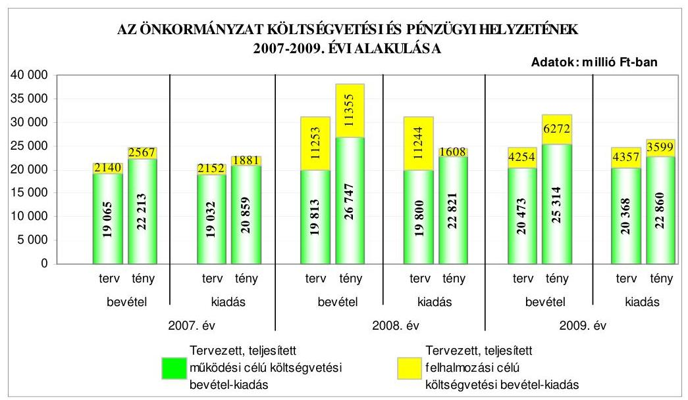
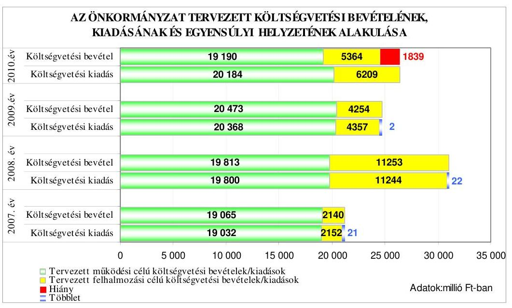
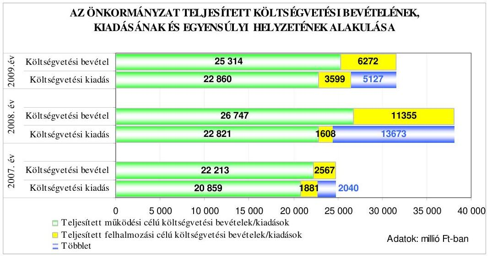
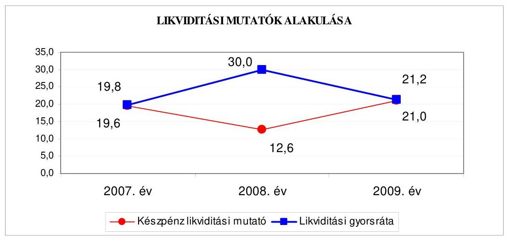
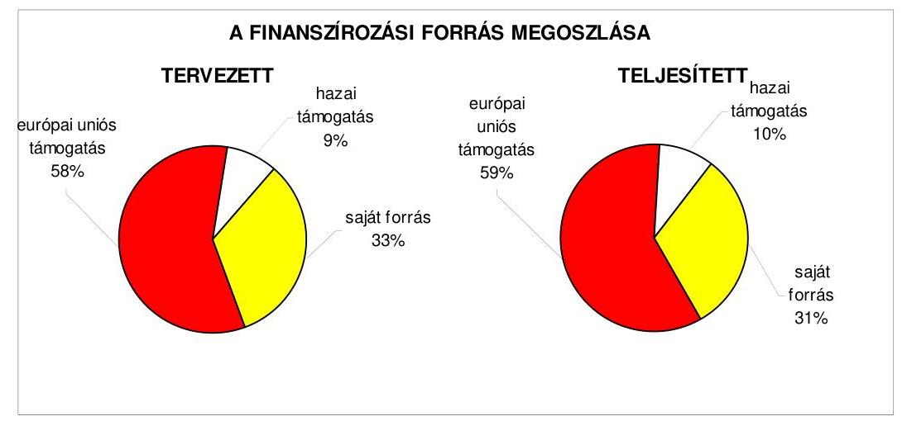
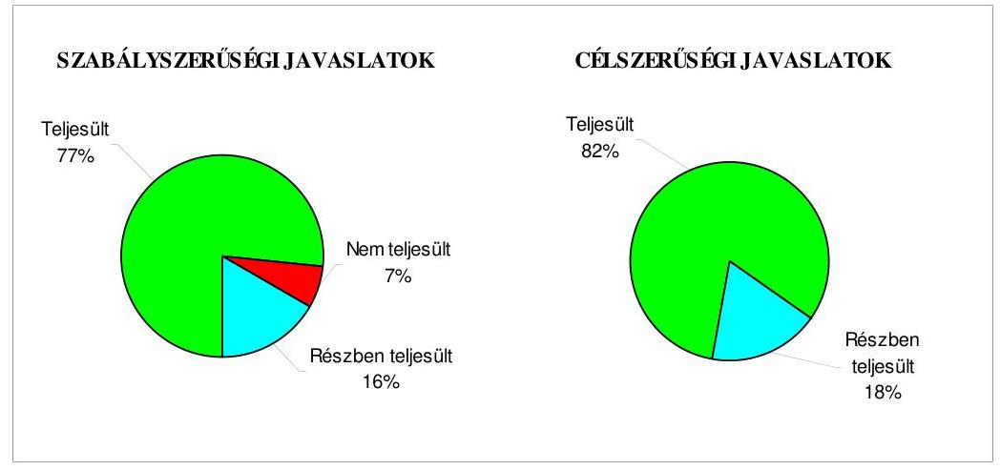
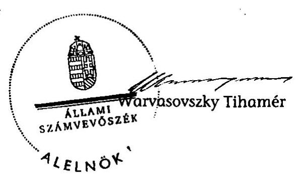
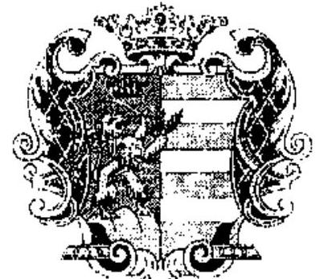
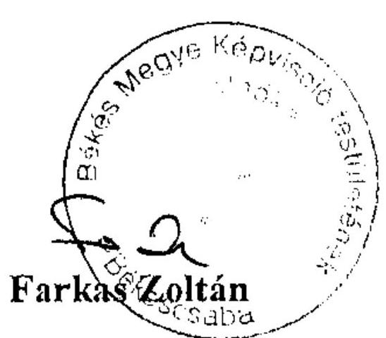

# JELENTÉS 

a Békés Megyei Önkormányzat gazdálkodási rendszerének 2010. évi ellenőrzéséről

---

# 3. Önkormányzati és Területi Ellenőrzési Igazgatóság 

3.3. Átfogó Ellenőrzések Főcsoport

Iktatószám: V-3023-7/31/20/2010.
Témaszám: 966
Vizsgálat-azonosító szám: V0491

## Az ellenőrzést felügyelte:

Dr. Lóránt Zoltán
főigazgató
Az ellenőrzés végrehajtásáért felelős:
Dr. Sepsey Tamás
főigazgató-helyettes
Az ellenőrzést vezette:
Szenténé Tubak Klára
számvevő tanácsos
Az ellenőrzést végezték:
Vida László
Kersmájer Ágota
Laki Dóra
számvevő tanácsos
A témához kapcsolódó eddig készített számvevőszéki jelentések:
címe
sorszáma
Jelentés a Békés Megyei Önkormányzat gazdálkodási rendszerének 0565
2005. évi átfogó ellenőrzéséről
Jelentés a Magyar Köztársaság 2005. évi költségvetése végrehajtásának ellenőrzéséről
Függelékek:

- a helyi önkormányzatok 2005. évi normatív állami hozzájárulás igénylésének és elszámolásának ellenőrzése
- a helyi önkormányzatok beruházásaihoz és rekonstrukcióihoz nyújtott 2005. évi felhalmozási célú támogatások ellenőrzése
Jelentés a helyi és a helyi kisebbségi önkormányzatok gazdálkodási rendszerének átfogó és egyéb szabályszerűségi ellenőrzéséről

---

# TARTALOMJEGYZÉK 

BEVEZETÉS ..... 9
I. ÖSSZEGZŐ MEGÁLLAPÍTÁSOK, KÖVETKEZTETÉSEK, JAVASLATOK ..... 14
II. RÉSZLETES MEGÁLLAPÍTÁSOK ..... 23

1. Az Önkormányzat költségvetési és pénzügyi helyzete ..... 23
1.1. A tervezett költségvetési bevételek és kiadások alapján a költségvetési egyensúly, a költségvetési hiány alakulása, a hiány tervezett finanszírozási módja, valamint a költségvetési hiány megállapításának szabályszerűsége ..... 23
1.2. A teljesített költségvetési bevételek és kiadások alapján a pénzügyi egyensúly, a pénzügyi hiány alakulása, a pénzügyi hiány finanszírozása, az igénybe vett finanszírozási célú pénzügyi eszközök hatása a pénzügyi helyzet alakulására, az eladósodásra, valamint a fizetőképességre ..... 25
2. Az Önkormányzat felkészültsége az európai uniós források igénylésére, felhasználására, a támogatott célkitűzés megvalósítására, működtetésére, valamint az elektronikus közszolgáltatási feladatok ellátására ..... 31
2.1. Az európai uniós források igénybevételére, felhasználására, a támogatott célkitűzés megvalósítására, működtetésére történt felkészülés szabályozottságának, szervezettségének, valamint egy támogatási szerződésben foglalt célkitűzés megvalósításának, működtetésének eredményessége ..... 31
2.1.1. Az európai uniós forrásokra történő pályázatok benyújtására vonatkozó döntések összhangja a fejlesztési célkitűzésekkel ..... 32
2.1.2. Az európai uniós forrásokhoz kapcsolódóan a pályázatfigyelés, a pályázatkészítés, valamint az európai uniós támogatással megvalósuló fejlesztés lebonyolításának belső rendje, a végrehajtás és az ellenőrzés szervezettsége ..... 34
2.2. Az elektronikus közszolgáltatás feltételeinek kialakítása ..... 35
3. A költségvetési gazdálkodás belső kontrolljai ..... 37
3.1. A költségvetés tervezés, a gazdálkodás és a zárszámadás készítés folyamatában végrehajtandó belső kontrollok kialakítása ..... 37
3.2. A belső kontrollok működtetése a költségvetés tervezés, a gazdálkodás, és a zárszámadás készítés folyamataiban ..... 38
3.3. A belső ellenőrzési kötelezettség teljesítése ..... 41
4. Az ÁSZ korábbi ellenőrzési javaslatai alapján készített intézkedési terv végrehajtása, hasznosítása ..... 44

---

4.1. Az Önkormányzat gazdálkodási rendszerének átfogó ellenőrzése során tett javaslatok végrehajtására tervezett intézkedések megvalósítása
4.2. A zárszámadáshoz kapcsolódó (állami hozzájárulások, támogatások igénylésének és felhasználásának ellenőrzése), valamint a további vizsgálatok esetében a megállapítások, javaslatok alapján tett intézkedések

# MELLÉKLETEK 

1. számú Az Önkormányzat gazdálkodását meghatározó adatok, mutatószámok (1 oldal)
2. számú Az önkormányzati vagyon alakulása (1 oldal)

2/a. számú Az önkormányzati kötelezettségek alakulása (1 oldal)
3. számú Az Önkormányzat 2007-2010. évi költségvetési előirányzatainak és 2007-2009. évi pénzügyi teljesítéseinek alakulása (1 oldal)
4. számú Tanúsítvány az európai uniós forrásokkal támogatott célok és programok 2007-2010. évi tervezett és teljesített adatairól (2 oldal)
4/a. számú Tanúsítvány az európai uniós forrásokra 2007-2010 között benyújtott pályázatokról, amelyek elbírálásáról az Önkormányzat meg nem kapott tájékoztatást (1 oldal)
4/b. számú Tanúsítvány a 2007-2010. években benyújtott és elutasított európai uniós pályázatokról (2 oldal)
5. számú Farkas Zoltán úr, a Békés Megyei Önkormányzat Közgyűlésének elnöke által adott tájékoztatás (1 oldal)

---

# RÖVIDÍTÉSEK, MOZAIKSZAVAK JEGYZÉKE 

## Törvények

Áht.
ÁSZ tv.

Eisz. tv.

Ket.

Ötv.
Számv. tv.

## Rendeletek

Ámr. 1
Ámr. 2
Áhsz.

Ber.
18/2005. (XII. 27.) IHM rendelet

2006. évi költségvetési rendelet
2007. évi költségvetési rendelet
2008. évi költségvetési rendelet
2009. évi költségvetési rendelet
2010. évi költségvetési rendelet
2005. évi zárszámadási rendelet
2006. évi zárszámadási rendelet
2007. évi zárszámadási rendelet
az államháztartásról szóló 1992. évi XXXVIII. törvény az Állami Számvevőszékről szóló 1989. évi XXXVIII. törvény
az elektronikus információszabadságról szóló 2005. évi XC. törvény
a közigazgatási hatósági eljárás és szolgáltatás általános szabályairól szóló 2004. évi CXL. törvény
a helyi önkormányzatokról szóló 1990. évi LXV. törvény a számvitelről szóló 2000. évi C. törvény
az államháztartás működési rendjéről szóló 217/1998. (XII. 30.) Korm. rendelet
az államháztartás működési rendjéről szóló 292/2009. (XII. 19.) Korm. rendelet
az államháztartás szervezetei beszámolási és könyvvezetési kötelezettségének sajátosságairól szóló 249/2000. (XII. 24.) Korm. rendelet
a költségvetési szervek belső ellenőrzéséről szóló 193/2003. (XI. 26.) Korm. rendelet
a közzétételi listákon szereplő adatok közzétételéhez szükséges közzétételi mintákról szóló 18/2005. (XII. 27.) IHM rendelet
Békés Megyei Önkormányzat 2/2006. (II. 3.) számú rendelete az Önkormányzat 2006. évi költségvetéséről
Békés Megyei Önkormányzat 1/2007. (II. 2.) számú rendelete az Önkormányzat 2007. évi költségvetéséről
Békés Megyei Önkormányzat 1/2008. (II. 8.) számú rendelete az Önkormányzat 2008. évi költségvetéséről
Békés Megyei Önkormányzat 2/2009. (II. 13.) számú rendelete az Önkormányzat 2009. évi költségvetéséről
Békés Megyei Önkormányzat 28/2009. (XII. 18.) számú rendelete az Önkormányzat 2010. évi költségvetéséről
Békés Megyei Önkormányzat 6/2006. (V. 5.) számú rendelete az Önkormányzat 2005. évi zárszámadásáról
Békés Megyei Önkormányzat 4/2007. (IV. 13.) számú rendelete az Önkormányzat 2006. évi zárszámadásáról
Békés Megyei Önkormányzat 5/2008. (IV. 11.) számú rendelete az Önkormányzat 2007. évi zárszámadásáról
Békés Megyei Önkormányzat 8/2009. (IV. 24.) számú rendelete az Önkormányzat 2008. évi zárszámadásáról
Békés Megyei Önkormányzat 5/2010. (IV. 30.) számú rendelete az Önkormányzat 2009. évi zárszámadásáról

---

Önkormányzat hivatalának SzMSz-e
vagyongazdálkodási rendelet

## Szórövidítések

ÁROP
ÁSZ
DAOP
EKOP
e-közszolgáltatás
FEUVE
főjegyző
HEFOP
HURO
Kórház
kötelezettségvállalási szabályzat

Közgyűlés
Közgyűlés alelnöke
Közgyűlés elnöke
Önkormányzat
Önkormányzat hivatala
Pénzügyi bizottság
Pénzügyi osztály
Területfejlesztési osztály
TÁMOP
TIOP

Békés Megyei Önkormányzat Közgyűlésének Szervezeti és Működési Szabályzatáról szóló 19/1995. (XII. 22.) számú rendeletének 8. számú függeléke az Önkormányzat Hivatalának Ügyrendjéről
Békés Megyei Önkormányzat 5/1994. (V. 27.) számú rendelete az Önkormányzat vagyonáról és a vagyontárgyak feletti rendelkezési jog gyakorlásának szabályairól

ÚMFT Államreform Operatív Program
Állami Számvevőszék
ÚMFT Dél-alföldi Operatív Program
ÚMFT Elektronikus Közigazgatási Operatív Program
elektronikus közszolgáltatás
folyamatba épített, előzetes, utólagos és vezetői ellenőrzés
Békés Megyei Önkormányzat Főjegyzője
NFT Humánerőforrás-fejlesztési Operatív Program
Magyarország-Románia Határon Átnyúló Együttműködési Program
Békés Megyei Önkormányzat Pándy Kálmán Kórháza
a főjegyző által kiadott, 2008. április 1-től hatályos kötelezettségvállalás, utalványozás, szakmai igazolás, ellenjegyzés, érvényesítés rendjéről szóló szabályzat
Békés Megyei Önkormányzat Közgyűlése
Békés Megyei Önkormányzat Közgyűlésének alelnöke
Békés Megyei Önkormányzat Közgyűlésének elnöke
Békés Megyei Önkormányzat
Békés Megyei Önkormányzat Hivatala
Békés Megyei Önkormányzat Közgyűlésének Pénzügyi és Területfejlesztési Bizottsága
Békés Megyei Önkormányzat Hivatalának Pénzügyi Osztálya
Békés Megyei Önkormányzat Hivatalának Területfejlesztési Osztálya
ÚMFT Társadalmi Megújulás Operatív Program
ÚMFT Társadalmi Infrastruktúra Operatív Program

---

# ÉRTELMEZŐ SZÓTÁR 

1. elektronikus szolgáltatási szint
2. elektronikus szolgáltatási szint
3. elektronikus szolgáltatási szint
4. elektronikus szolgáltatási szint
európai uniós források
fejlesztési feladat (projekt)
fejlesztési célkitűzés
hazai társfinanszírozás

Az 1044/2005. (V. 11.) Korm. határozat alapján olyan információs, tájékoztató szolgáltatás, amely csak általános információkat közöl az adott üggyel kapcsolatos teendőkről és a szükséges dokumentumokról.
Az 1044/2005. (V. 11.) Korm. határozat alapján olyan egyirányú kapcsolatot biztosító szolgáltatás, amely az 1. szinten túl biztosítja az adott ügy intézéséhez szükséges dokumentumok, nyomtatványok letöltését, és azok ellenőrzéssel, vagy ellenőrzés nélküli elektronikus kitöltését, amely esetben a dokumentumok benyújtása hagyományos úton történik.
Az 1044/2005. (V. 11.) Korm. határozat alapján olyan kétirányú kapcsolatot biztosító szolgáltatás, amely közvetlen, vagy ellenőrzött kitöltésű dokumentum segítségével biztosítja az elektronikus adatbevitelt és a bevitt adatok ellenőrzését. Az ügy indításához, intézéséhez személyes megjelenés nem szükséges, de az ügyhöz kapcsolódó közigazgatási döntés (határozat, egyéb aktus) közlése, valamint a kapcsolódó illeték-, vagy díjfizetés hagyományos úton történik.
Az 1044/2005. (V. 11.) Korm. határozat alapján olyan teljes közvetlen kétirányú ügyintézési folyamatot biztosító szolgáltatás, amikor az ügyhöz kapcsolódó közigazgatási döntés is elektronikus úton kerül közlésre, illetve a kapcsolódó illeték-, vagy díjfizetés elektronikus úton is intézhető.
Az Európai Unió költségvetéséből, illetve az Európai Gazdasági Térség Európai Unión kívüli tagállamainak költségvetéséből származó támogatások, valamint a „Svájci Hozzájárulás" programból származó támogatás.
Az a fejlesztési feladat, amely illeszkedik az Európai Unió, illetve a Nemzeti Fejlesztési Terv által támogatott programokhoz. Az Európai Unió, illetve a Nemzeti Fejlesztési Terv és az Új Magyarország Fejlesztési Terv által meghirdetett programokhoz kapcsolódó, támogatott projektek fejlesztési feladatok megvalósításához használhatók fel az európai uniós források. A fejlesztési feladat (projekt) tartalmilag és formailag részletesen kidolgozott, megfelelő pénzügyi háttérrel és végrehajtási ütemezéssel rendelkező fejlesztési terv.
Az önkormányzat által ellátott kötelező, vagy önként vállalt feladatok mennyiségi (minőségi) fejlesztésére vonatkozó terv. A mennyiségi fejlesztés megvalósulhat beszerzéssel, létesítéssel, bővítéssel, átalakítással.
A központi költségvetési és az elkülönített állami pénzalapokból származó finanszírozás.

---

indikátor
közreműködő szervezet
lebonyolítás
operatív program

Nemzeti Fejlesztési Terv

A projekt megvalósulásának számszerűsíthető eredményei, mutató, jelzőszám, amelynek segítségével egy célkitűzés megvalósulásának adott szintjét lehet szemléltetni. Jelenthet egy felhasznált erőforrást, egy elért hatást, egy minőségi szintet, illetve valamilyen egyéb változást.
A közreműködő szervezetek az európai uniós támogatást elnyert kedvezményezettekkel a kapcsolattartó szervek. Feladatai: a támogatási szerződés mintától eltérő egyedi támogatási szerződés-tervezetek előzetes megküldése jóváhagyásra a Nemzeti Fejlesztési Ügynökségnek; a projektek megvalósítása előrehaladásának nyomon követése, a támogatás kifizetésének engedélyezése, a folyamatba épített ellenőrzések (dokumentumalapú ellenőrzések és kockázatelemezésre alapozott helyszíni ellenőrzések) végzése, a projektek zárásával kapcsolatos feladatok ellátása, szabálytalanságkezelési rendszer kialakítása és működtetése; ellenőrzési nyomvonal készítése és folyamatos aktualizálása; az Egységes Monitoring Informatikai Rendszerben az adatok folyamatos rögzítése, az adatbázis naprakészségének és megbízhatóságának biztosítása; a beszámolók készítése és megküldése a miniszter és az Nemzeti Fejlesztési Ügynökség részére az akcióterv és az éves munkaterv megvalósításában történt előrehaladásról és a szükséges intézkedésekre vonatkozó javaslatokról.
Az európai uniós források felhasználásával megvalósuló fejlesztésre irányuló műszaki, gazdasági (pénzügyi) tevékenységet magában foglaló szervezési, irányítási szolgáltatás. A szervezési szolgáltatás kiterjedhet a pályázatkészítésre, a közbeszerzési eljárás lebonyolításán keresztül a folyamatos műszaki ellenőrzésre, a pénzügyi elszámolásra, a műszaki átadás-átvételre, az üzembe helyezésre, illetve a fejlesztési folyamat egyes elemeire.
Az Európai Bizottság által jóváhagyott, a Közösségi Támogatási Keret végrehajtására vonatkozó, több évre szóló intézkedésekhez kapcsolódó prioritások egységes rendszerét tartalmazó dokumentum.
Helyzetelemzést, stratégiát a tervezett fejlesztési területek prioritásait, azok céljait és pénzügyi forrásaik megjelölését tartalmazó dokumentum, amelyet a Magyar Köztársaság készített az Európai Unió programozási irányelveinek, célkitűzéseinek megfelelően a fejlődésben lemaradó régiók fejlődésének és strukturális átalakulásának elősegítésére a kiemelt szükségletekre figyelemmel. A Nemzeti Fejlesztési Terv stratégiai fejezetének célja, hogy a 2004-2006 közötti időszakra kijelölje a strukturális alapokból támogatható fejlesztéspolitikai célkitűzéseit és prioritásait. A strukturális alapok operatív programjai: Agrár- és Vidékfejlesztés Operatív Program (AVOP); Gazdasági Versenyképesség Operatív Program (GVOP); Humán erőforrások fejlesztései Operatív Program (HEFOP); Környezetvédelem és infrast-

---

prioritás

Új Magyarország Fejlesztési Terv (ÚMFT)
támogatási szerződés
ruktúra Operatív Program (KIOP); Regionális Fejlesztés Operatív Program (ROP).
A közösségi támogatási kerettervben vagy támogatásban elfogadott stratégia valamely prioritása; ehhez rendelik hozzá az alapokból és egyéb pénzügyi eszközökből, valamint a tagállam megfelelő pénzügyi forrásaiból származó hozzájárulást, továbbá a meghatározott célok összességét.
Ágazati vagy térségi fejlesztési célt megvalósító fejlesztési terv, mely több egymással összefüggő projekt útján, az érintettek együttműködése alapján valósul meg.
Az ágazati és regionális prioritásokat egyaránt tartalmazó operatív program regionális prioritása, illetve támogatási konstrukciója.
A kedvezményezett által támogatott projekthez biztosított forrás, amelybe az államháztartás alrendszereiből nyújtott támogatás nem számítható be. Költségvetési szervek esetén a jóváhagyott előirányzat saját forrásnak minősül.
Az Új Magyarország Fejlesztési Terv célja a foglalkoztatás bővítése és a tartós növekedés feltételeinek megteremtése. Ennek érdekében 2007-2013 között hat kiemelt területen indított el összehangolt állami

 és európai uniós fejlesztéseket: a gazdaságban, a közlekedésben, a társadalom megújulása érdekében, a környezet és az energetika területén, a területfejlesztésben és az államreform feladataival összefüggésben. Az Új Magyarország Fejlesztési Terv operatív programjai: Államreform Operatív Program (ÁROP); Elektronikus Közigazgatás Operatív Program (EKOP); Gazdaságfejlesztés Operatív Program (GOP); Környezet és Energia Operatív Program (KEOP); Közlekedés Operatív Program (KÖZOP); Dél-Alföldi Operatív Program (DAOP); Dél-Dunántúli Operatív Program (DDOP); Észak-Alföldi Operatív Program (ÉAOP); Észak-Magyarországi Operatív Program (ÉMOP); Közép-Dunántúli Operatív Program (KDOP); Közép-Magyarországi Operatív Program (KMOP); Nyugat-Dunántúli Operatív Program (NYDOP); Társadalmi Infrastruktúra Operatív Program (TIOP); Társadalmi Megújulás Operatív Program (TÁMOP).
A strukturális alapok esetében az irányító hatóságnak, illetve a Kohéziós Alap esetében a közreműködő szervezeteknek a kedvezményezett önkormányzattal kötött szerződése, amely a támogatás felhasználásának részletes feltételeit tartalmazza. Az Új Magyarország Fejlesztési Terv keretében támogatott projektek esetében a támogatási szerződést a kedvezményezett és a Nemzeti Fejlesztési Ügynökség nevében eljáró közreműködő szervezet között jön létre. Nagyprojekt esetén a támogatási szerződést a Nemzeti Fejlesztési Ügynökség ellenjegyzi. A támogatási szerződés képezi a megvalósítás nyomon követésének, finanszírozásának és ellenőrzésének alapját.

---

.

---

# JELENTÉS 

## a Békés Megyei Önkormányzat gazdálkodási rendszerének 2010. évi ellenőrzéséről

## BEVEZETÉS

Az Ötv. 92. § (1) bekezdése, az Állami Számvevőszékről szóló 1989. évi XXXVIII. törvény 2. § (3) bekezdése, valamint az Áht. 120/A. § (1) bekezdése alapján az önkormányzatok gazdálkodását az Állami Számvevőszék ellenőrzi. Az ellenőrzésre az Országgyűlés illetékes bizottságai részére is átadott, országosan egységes ellenőrzési program szerint került sor.

Az Állami Számvevőszék a stratégiájában foglalt célkitűzéseknek megfelelően a helyi önkormányzatok költségvetési gazdálkodási rendszerének ellenőrzését a 2007. évben megújított, teljesítmény-ellenőrzési elemekkel kiegészített ellenőrzési program alapján folytatja a 2010. évben.

Az ellenőrzés célja annak értékelése volt, hogy az Önkormányzat:

- milyen módon biztosította a költségvetési és a pénzügyi egyensúlyt a költségvetésében és annak teljesítése során, valamint változott-e a hiányzó bevételi források pótlásában a finanszírozási célú pénzügyi műveletek jelentősége, hatása;
- eredményesen készült-e fel a szabályozottság és a szervezettség terén az európai uniós források igénylésére és felhasználására, megvalósította, működtette-e a támogatott célkitűzést, továbbá biztosította-e az elektronikus közszolgáltatás feltételeit, a gazdálkodási adatok közzétételével a gazdálkodás nyilvánosságát;
- megfelelően kialakította-e és működtette-e a belső kontrollokat a költségvetés tervezés, a gazdálkodás és a zárszámadás készítés, valamint a belső ellenőrzés folyamatában, továbbá;
- megfelelően hasznosították-e a korábbi számvevőszéki ellenőrzések megállapításait, szabályszerűségi ${ }^{1}$ és célszerűségi javaslatait.

Az ellenőrzés típusa: átfogó ellenőrzés, amely - egy ellenőrzés keretében meghatározott területekre összpontosítva - alkalmazza a szabályszerűségi, valamint a teljesítmény-ellenőrzés jellemzőit.

[^0]
[^0]:    ${ }^{1}$ A törvényi előírások betartásának elmulasztásakor a részletes megállapítások fejezetben egységesen a törvénysértés megjelölést alkalmazzuk, mivel az ÁSZ nem tehet különbséget a törvényi előírások között.

---

Az ellenőrzött időszak: a költségvetési egyensúly és az európai uniós támogatás igénybevételére történt felkészülés ellenőrzése esetében a 2007-2010. I. negyedév közötti időszak, a belső kontrollok kialakítása és a működtetése tekintetében a 2009. év. Az önkormányzatok gazdálkodási rendszerének 2005. évi átfogó ellenőrzéséről készített jelentésben rögzített javaslatok megvalósítását, hasznosítását, valamint a 2006-tól végzett további ellenőrzések során megfogalmazott javaslatok végrehajtása érdekében a 2006-2010. I. negyedév közötti időszakban tett intézkedéseket ellenőriztük.

Békés megye lakosainak száma - a megyeszékhely Békéscsaba megyei jogú város lakosai nélkül - 2010. január 1-jén 307881 fő volt. A 2006. évi önkormányzati képviselő és polgármester választást követően az Önkormányzat 40 tagú Közgyűlésének munkáját nyolc állandó bizottság segítette. Az Önkormányzat mellett a 2007. március 4-én megtartott területi kisebbségi önkormányzati választásokat követően három ${ }^{2}$ kisebbségi önkormányzat működött. A Közgyűlés elnöke a 2006. évi önkormányzati képviselő és polgármester választás óta tölti be tisztségét, a főjegyző személye 2009. október 9-én változott.

Az Önkormányzat feladatainak végrehajtása érdekében a 2007. évben 33, a 2009. évben 14 költségvetési intézményt működtetett, amelyekből a 2007. évben 31 önállóan gazdálkodó, a 2009. évben 13 önállóan működő és gazdálkodó volt. A feladatok ellátásában a 2007-2009. években részt vett hat gazdasági társasága. Az Önkormányzat az éves költségvetési beszámolója szerint a 2009. évben 31586 millió Ft költségvetési bevételt ért el és 26459 millió Ft költségvetési kiadást teljesített. A teljesített költségvetési bevételek 28,6%-kal, a költségvetési kiadások 16,4%-kal haladták meg a 2007. évben teljesített költségvetési bevételeket és kiadásokat, a teljesített működési és felhalmozási célú költségvetési bevételek és kiadások növekedése következtében. Az Önkormányzat 2009. december 31-én a könyvviteli mérleg szerint 41732 millió Ft értékű vagyonnal rendelkezett. Az Önkormányzat vagyona a 2007. év végi állományhoz viszonyítva 9,1%-kal emelkedett, ezen belül több mint másfélszeresére nőtt a beruházások állománya a folyamatban lévő intézményi ingatlanok létrehozása, bővítése, rekonstrukciója következtében. Az ingatlanok állományának 5,7%-os növekedését a települési önkormányzatoktól térítésmentesen átvett szociális és közoktatási intézmények ingatlanjai könyvszerinti értékének könyvviteli mérlegben történő kimutatása okozta. A kötelezettségeken belül 15,7%-kal nőtt a hosszú lejáratú kötelezettségek állománya a 2007. évben svájci frankban kibocsátott kötvény forintárfolyam változásának hatására. Az összes költségvetési bevétel 30,5%-át a saját bevétel, illetve 5,5%-át az illetékbevétel biztosította a 2009. évben. Az illetékbevételek összes költségvetési bevételen belüli aránya a 2007. évihez viszonyítva 1,7 százalékponttal csökkent. Az összes teljesített költségvetési kiadásból a felhalmozási célú kiadások részaránya a 2007. évhez viszonyítva a 2009. évre 5,3 százalékponttal nőtt, a 2009. évben 13,6% volt, amelyet a teljesített beruházási kiadásoknak - a teljesített működési kiadások növekedésénél nagyobb arányú - közel kétszeres növekedése okozott. A 2010. évi költségvetési rendeletben 24554 millió Ft költségvetési bevételt és 26393 millió Ft költségvetési kiadást irányoztak elő. Az Önkormányzat hiva-

[^0]
[^0]:    ${ }^{2}$ cigány, román, szlovák kisebbségi önkormányzat

---

talában dolgozó köztisztviselők száma 2007. január 1-jén 61 fő, 2009. december 31-én 52 fő volt, a költségvetési intézményekben foglalkoztatott közalkalmazottak száma 2007. január 1-jén 4704, 2009. december 31-én 3870 fő volt. Az Önkormányzat gazdálkodását meghatározó adatokat, mutatószámokat az 1-3. számú mellékletek tartalmazzák.

Az Önkormányzat költségvetési és pénzügyi helyzetét az elemző eljárás módszerével vizsgáltuk. E körben elemeztük a költségvetés egyensúlyi helyzetének alakulását, a tervezett és teljesített költségvetési, pénzügyi hiány okait, a hiány finanszírozásának tervezett és teljesített módját, az önkormányzat pénzügyi helyzetének alakulását az eladósodás és a likviditás szempontjából.

Teljesítmény-ellenőrzés módszerével vizsgáltuk, és az eredményesség szempontjából értékeltük az Önkormányzat benyújtott pályázatainak kapcsolódását a Közgyűlés által meghatározott fejlesztési célkitűzésekhez, valamint felkészültségét a belső szabályozottság, szervezettség terén az európai uniós forrásokra vonatkozó pályázati felhívások figyelésére, a pályázatok készítésére, és a lebonyolítására. Az ellenőrzés során felmértük, hogy az elektronikus közigazgatási szolgáltatások működtetése érdekében milyen intézkedéseket tettek, továbbá biztosították-e a közérdekű gazdálkodási adatok meghatározott körének honlapon történő közzétételét.

A költségvetési gazdálkodás belső kontrolljainak ellenőrzése során vizsgáltuk, hogy az Önkormányzat hivatalában a költségvetés tervezés, a gazdálkodás, és a zárszámadás készítés folyamatában a belső kontrollok kialakítása és működése megfelelő biztosítékot ad-e a gazdálkodási feladatok szabályszerű ellátására. Felmértük és minősítettük a költségvetés tervezés, a gazdálkodás, és a zárszámadás készítés feladataival, továbbá a pénzügyi-számviteli területen az informatikával kapcsolatosan kialakított kontrollok, valamint azok működésének megfelelőségét. A vizsgálat során értékeltük a belső ellenőrzés szabályozottságát, működési feltételeinek kialakítását, meghatározását, továbbá működésének megfelelőségét.

Az Önkormányzat hivatalában értékeltük a gazdálkodás folyamatában kulcsszerepet betöltő belső kontrollok működésének megfelelőségét, ennek keretében ellenőriztük a szakmai teljesítés igazolására és az utalvány ellenjegyzésére kialakított kontrollok végrehajtását. Az ellenőrzést a következő magas kockázatú kifizetésekre folytattuk le ${ }^{3}$:

- az államháztartáson kívülre teljesített működési és felhalmozási célú pénzeszköz átadásokra,
- az állományba nem tartozók megbízási díjaira, továbbá

[^0]
[^0]:    ${ }^{3}$ Az önkormányzatok kiemelt előirányzataira vonatkozóan, a vertikális folyamatokra elvégeztük a kockázatok becslését, amelynek eredményeként határoztuk meg a magas kockázatú területeket.

---

- a gépek, berendezések, felszerelések beszerzésére, létesítésére ${ }^{4}$.

Az ellenőrzés hatékony elvégzése céljából a vizsgálandó területek kiválasztása során a kockázatokon alapuló megközelítés érvényesült, ezáltal az ellenőrzési erőforrásokat azokra a területekre fókuszáltuk, amelyeken a korábbi ellenőrzési tapasztalatok figyelembevételével legnagyobb a hibák előfordulási valószínűsége. Az ellenőrzési erőforrások ilyen típusú összpontosításával minimálisra csökkenthető a kívánt ellenőrzési bizonyosság eléréséhez szükséges időráfordítás.

A pénzügyi-számviteli folyamatokban alkalmazott belső kontrollok kialakításának és működésének ellenőrzésére a vizsgált három terület 2009. évi könyvviteli tételeiből területenként egyszerű véletlen mintát vettünk. A kijelölt gazdasági eseményre elvégzett megfelelőségi tesztek alapján értékeltük a kontrollok működésének megfelelőségét a vizsgált három területre külön-külön, majd összefoglalóan ${ }^{5}$. A helyszíni ellenőrzés megállapításainak részletes dokumentálását megfelelőségi tesztlapokon, ellenőrzési munkalapokon biztosítottuk. Ezeken a teszt- és munkalapokon a minősítés alapjául szolgáló kérdések és a vonatkozó konkrét jogszabályhelyek megjelölése mellett értékeltük a kialakított belső kontrollokban rejlő kockázatokat ${ }^{6}$ és a kialakított kontrollok működésének megfelelőségét ${ }^{7}$.

Az ÁSZ korábbi ellenőrzési javaslatai alapján tett intézkedéseket, illetve azok megvalósítását utóellenőrzés keretében vizsgáltuk. A gazdálkodási rendszer korábbi átfogó ellenőrzése során megfogalmazott javaslatok végrehajtására tett intézkedések megvalósítását ellenőriztük, az egyéb számvevőszéki ellenőrzések során tett javaslatok esetében pedig a kiadott intézkedéseket tekintettük át.

[^0]
[^0]:    ${ }^{4}$ Az Önkormányzat hivatalában nem bonyolítottak külső szolgáltatók által végzett kisjavításokat és karbantartásokat, mivel e tevékenységet az önálló költségvetési szervként működő Ellátó és Szolgáltató Szervezet végezte, ezért a gépek, berendezések, felszerelések beszerzése és létesítése területére terjesztettük ki ellenőrzésünket.
    ${ }^{5}$ A vizsgált három terület egyedi értékelési pontszámait a területek költségvetési súlyával arányosan összegeztük.
    ${ }^{6}$ A kialakított belső kontrollokban rejlő kockázatot alacsonynak minősítettük, ha a kontrollok megfelelő védelmet nyújtottak a hibák bekövetkezése ellen. Közepesnek minősítettük a belső kontrollokban rejlő kockázatot, amennyiben a kontrollok a lehetséges hibák többsége ellen védelmet nyújtottak. Magasnak értékeltük a kockázatot, ha a kontrollok - kialakításuk hiányában, vagy hiányos kialakításuk miatt - nem nyújtottak elegendő védelmet a lehetséges hibákkal szemben.
    ${ }^{7}$ A kontrollok működésének megfelelőségét kiválónak értékeltük abban az esetben, ha azok működése - esetleges kisebb, az egységesen meghatározott követelményrendszerben foglalt mértéket el nem érő hiányosságoktól eltekintve - megfelelt a hibák megelőzésére és kijavítására meghatározott szabályozásnak és a legmagasabb szintű elvárásoknak. Jónak minősítettük a kontrollok működését, ha a megállapított kisebb (tolerálható mértékű) hiányosságok nem veszélyeztették az ellenőrzött terület hibáinak megelőzését és kijavítását. Amennyiben a kontrollok működésében túl sok hiányosság fordult elő ahhoz, hogy a kontrollok biztosítsák a hibák megelőzését, feltárását, kijavítását és ezáltal veszélyeztették az eredményes, megfelelő működést, a kontroll működésének megfelelősége gyenge minősítést kapott.

---

A helyszíni ellenőrzés során kitöltött - az ellenőrzést végző számvevő és az Önkormányzat hivatalának felelős köztisztviselője által aláírt - ellenőrzési munkalapokat, azok kitöltési útmutatóit, továbbá a megfelelőségi tesztek dokumentumait a Közgyűlés elnöke részére a számvevői jelentéssel egyidejűleg átadtuk.

A jelentést az ÁSZ-ról szóló 1989. évi XXXVIII. tv.
 25. § (1) bekezdése alapján észrevétel közlése céljából megküldtük a Békés Megyei Önkormányzat Közgyűlése elnökének. A kapott tájékoztatást a jelentés 5. számú melléklete tartalmazza.

---

# I. ÖSSZEGZŐ MEGÁLLAPÍTÁSOK, KÖVETKEZTETÉSEK, JAVASLATOK 

Az Önkormányzatnál 2007-2010 között a tervezett költségvetési bevételek és kiadások főösszege változóan alakult, a 2008. évre növekedett, a 2009. évre csökkent, majd a 2010. évre ismét növekedett az előző évhez viszonyítva. A 2007-2009. években a tervezett költségvetési bevételek meghaladták a tervezett költségvetési kiadásokat, míg a 2010. évben a tervezett költségvetési bevételek nem nyújtottak fedezetet a költségvetési kiadásokra. A 2010. évi költségvetés hiányát a működési célú költségvetési bevételek hiánya és a felhalmozási célú költségvetési bevételeket meghaladó összegben tervezett felhalmozási célú költségvetési kiadások együttesen okozták. Az Önkormányzat a 2010. évi költségvetési rendeletében a költségvetési egyensúly biztosításához és a finanszírozási célú pénzügyi műveletek kiadásának forrásaként hitel felvételét tervezte. A 2007-2010. évi költségvetési rendeletekben a költségvetés kiadási főösszegének megállapításakor - az Áht-ban foglaltak ellenére - a finanszírozási célú pénzügyi műveletek kiadásait (hiteltörlesztéssel kapcsolatos kiadásokat) is figyelembe vették költségvetési kiadásként.

Az Önkormányzatnál 2007-2009 között a teljesített költségvetési bevételek főösszege változóan alakult, az előző évhez viszonyítva a 2008. évben növekedett, a 2009. évben csökkent, míg a teljesített költségvetési kiadások főösszege folyamatosan növekedett. A teljesített költségvetési bevételek 2007-2009 között fedezetet nyújtottak a költségvetési kiadásokra, pénzügyi többlet keletkezett. A 2007-2009. években az éves költségvetések végrehajtása során a teljesített működési célú költségvetési bevételeknél pénzügyi többlet keletkezett, a teljesített felhalmozási célú költségvetési bevételek is meghaladták a felhalmozási célú költségvetési kiadásokat.

---

A 2007-2009. években a teljesítés során keletkezett, a tervezetthez viszonyított magasabb összegű pénzügyi többletet elsősorban a tervezettnél magasabb összegű kamatbevételek, a pénzmaradvány tervezettnél magasabb összegű igénybevétele, az intézményi működési bevételi többlet, a költségvetési támogatás, a támogatásértékű bevételek és az illetékbevételek tervezettet meghaladó teljesítése, továbbá a 2008. évben tervezett felhalmozási céltartalék felhalmozási célú költségvetési kiadásokra történő felhasználásának elmaradása együttesen okozták. A főjegyző a 2007-2009. években gondoskodott az Önkormányzat pénzállományának alakulását bemutató likviditási terv készítéséről.

Az Önkormányzat a 2007-2009. években hosszú és rövid lejáratú hitelt nem vett fel. A Közgyűlés a 2007. évben 8000 millió Ft, valamint 1400 millió Ft svájci frank alapú, 20 éves lejáratú, változó kamatozású kötvény kibocsátásáról döntött a tervezett fejlesztési feladatok finanszírozásához szükséges saját forrás biztosítása érdekében. A törlesztés öt év türelmi idő után, félévente esedékes. Az Önkormányzat a kötvények kamatkockázatának csökkentése érdekében 2009 októberében a változó kamatot 10 éves futamidőre fix kamatra cserélte. A forint svájci frankhoz viszonyított árfolyamváltozása, valamint a kamatcsere ügylet 10 éves futamidejét követő változó kamatozás miatt a devizában történt kötvénykibocsátás az Önkormányzat számára kockázatot jelent. A kötvénykibocsátásból származó bevételt forint- és devizabetétekben helyezték el, állampapírokba fektették, valamint opciós devizaügyleteket is lebonyolítottak. A Közgyűlés az értékpapírok vételére és eladására vonatkozó döntések meghozatalára a Közgyűlés elnökét ruházta fel, az ügyletkötésekre vonatkozó szerződéseket a Közgyűlés elnöke írta alá.

Az Önkormányzat a 2007. évi költségvetés módosításakor döntött az Önkormányzat hivatalának költségvetésében a „kölcsönök kiadásai" jogcímű előirányzat 134 millió Ft-tal történő megemeléséről. Az előirányzat-módosítás célja a Kórház likviditási problémájának enyhítése volt, azonban a kölcsön nyújtásával és ennek fedezete megteremtésének céljára a kölcsönök kiadási előirányzatának módosításával nem megfelelő jogi megoldást alkalmaztak, mert az Áht-ban foglaltak szerint az önkormányzati intézmény pénzkölcsönt nem vehetett fel. A Közgyűlés az előirányzat módosításakor nem döntött a kölcsön feltételeiről. Az Önkormányzat 2007. évi költségvetési beszámolójában a Kórház részére átutalt összeg önkormányzaton kívüli, külső szerv részére adott rövid lejáratú kölcsönként, illetve követelésként történt kimutatásával nem tartották be a Számv. tv. valódiság elvére vonatkozó előírását. A Kórháznak átutalt összeg visszafizetése a 2008. évben a Közgyűlés által a Kórház részére jóváhagyott intézményfinanszírozásból pénzforgalom nélküli elszámolás keretében megtörtént.

Az Önkormányzat pénzügyi helyzete - 2007-2009 között - eladósodási szempontból összességében kedvezőtlenül változott, mivel a hosszú és rövid lejáratú kötelezettségek összes forráson belüli aránya növekedett. A hosszú lejáratú kötelezettségek év végi állományának előző évhez viszonyított 2008. évi 14%-os, valamint a 2009. évi további 2%-os növekedését a kibocsátott kötvények állományi értékének a svájci frank forintárfolyamának változása miatti növekedése okozta. Az adósságszolgálatra teljesített kiadás a 2007-2009. években folyamatosan emelkedett, a saját bevételek egyre növekvő hányadát a 2007. évet megelőzően felvett hitelek törlesztésére, a hitelek és a kötvények kamatainak fizetésére használták fel. Az Önkormányzat fizetőképessége a 2007. évről a 2009. évre javult, a pénzeszközök év végi állománya országos viszonylatban kiemelkedően magas, huszonegyszeres fedezetet nyújtott a rövid- és a hosszú lejáratú fizetési kötelezettségek pénzügyi teljesítésére, a kibocsátott kötvényekből befolyt bevételek betétben történt tartalékolása, valamint a kötvények visszafizetésére biztosított türelmi idő együttes hatásának eredményeként. A 2007-2009. évek között az Önkormányzat pénzügyi helyzete a fizetőképesség javulása és az eladósodás növekedése együttes hatásának eredményeként összességében változatlan volt.

Az Önkormányzat fejlesztési célkitűzéseit a 2007-2010-ig terjedő időszakra vonatkozó gazdasági programban, fejlesztési projektjavaslatokban rögzítette. Az Önkormányzat 2007-2010. március 31. között európai uniós támogatások megszerzése érdekében 29 pályázatot nyújtott be, amelyből egyet visszavontak a beadási határidő és a pályázati feltételek megváltozása miatt. A benyújtott pályázatok fejlesztési céljai kapcsolódtak a gazdasági programban foglalt célkitűzésekhez. A benyújtott pályázatokból 15 pályázat volt eredményes, kilenc pályázatot elutasítottak, valamint három pályázat elbírálásáról 2010. március 31-ig nem kapott tájékoztatást az Önkormányzat. Egy eredményes pályázat esetében az Önkormányzat elállt a szerződéskötéstől, mivel a pályázat benyújtása és a támogatási szerződés megkötése között eltelt időszakban a pályázatban vállalt fejlesztések egy része már megvalósult. A 2008-2010. évek költségvetési rendeleteiben elkülönítetten bemutatták az európai uniós forrásból megvalósuló projektek kiadásait és azok forrásait.

Az európai uniós források igénybevételének és lebonyolításának feladatait, az egységes pályázati rendet az Önkormányzat hivatala SzMSz-ében rögzítették. Meghatározták a Területfejlesztési osztály feladataként a pályázati információs szolgáltatási, a pályázat előkészítési, és a projekt monitoring feladatokat. Biztosították a pályázatfigyeléssel, pályázatkészítéssel és a fejlesztések lebonyolításával összefüggő feladatok végrehajtását. Ennek keretében a Területfejlesztési osztály köztisztviselőinek a munkaköri leírásában részletesen előírták az önkormányzati szintű pályázatkoordinálás feladatait, a pályázatok nyilvántartásának kötelezettségét, a pályázatfigyeléssel, a pályázatkészítéssel, valamint az európai uniós források igénybevételével megvalósuló projektek lebonyolításával kapcsolatos feladatokat. Az Önkormányzat hivatalának köztisztviselői mellett egy alkalommal bízott meg az Önkormányzat külső szervezetet pályázatkészítési feladatok ellátásával. A belső ellenőrzési stratégiát megalapozó kockázatelemzés a 2007. év kivételével kiterjedt az európai uniós forrásokkal támogatott feladatokra. Az Önkormányzat hivatalában 2007-2010. március 31-e között nem volt befejezett európai uniós támogatással megvalósult fejlesztés.

Az Önkormányzat 2007-2010. március 31. között eredményesen készült fel belső szabályozottság és szervezettség terén az európai uniós források igénybevételére és felhasználására. A gazdasági programban megfogalmazott fejlesztési célkitűzésekhez kapcsolódtak az európai uniós támogatások megszerzésére benyújtott pályázatok, szabályozták a pályázatfigyelést végzők és a döntési, illetve a döntés előterjesztési jogkörrel rendelkezők közötti információszolgáltatási kötelezettséget, továbbá - a 2007. év kivételével - kiterjedt az európai uniós forrásokkal támogatott fejlesztési feladatokra a belső ellenőrzési stratégiát megalapozó kockázatelemzés. Az Önkormányzat hivatalán belül és külső szervezet igénybevételével biztosították a pályázatfigyelés, a pályázatkészítés és a fejlesztési feladat lebonyolításának szervezeti és személyi feltételeit. Meghatározták a külső szervezettel pályázatkészítésre kötött szerződésben a pályázat szakmai és formai követelményeire vonatkozóan a pályázatkészítő felelősségét.

Az Önkormányzat a 2007-2008. évekre vonatkozó informatikai stratégiával nem rendelkezett, a 2009. és a 2010. évi informatikai stratégiákban az e-közszolgáltatási feladatokra vonatkozóan nem irányoztak elő fejlesztéseket. Az Önkormányzat hivatalában működtetett e-közszolgáltatási feladatokat ellátó informatikai rendszer az 1. elektronikus szolgáltatási szint követelményeinek felelt meg.

Az Önkormányzat honlapján a közérdekű adatok jegyzéke 2010. május 3. megelőzően nem, csak ezt követően tartalmazta a vonatkozó rendelet szerinti tagolásban a közzétételi egységeket, vagy az arra vonatkozó hivatkozást. A főjegyző - az Áht-ban előírtak ellenére - az Önkormányzat hivatala és az intézmények által a 2009. évben nyújtott nem normatív, céljellegű működési támogatások 93%-a esetében 2010. május 3-ig nem, csak azt követően tette közzé az Önkormányzat honlapján a támogatások kedvezményezettjeinek nevét, a támogatás célját, összegét, továbbá a támogatási program megvalósítási helyét. A főjegyző - az Áht-ban előírtak ellenére - az intézmények pénzeszközei felhasználásával, a vagyonnal történő gazdálkodással összefüggő, nettó öt millió Ft-ot elérő, vagy azt meghaladó értékű - árubeszerzésre, építési beruházásra, szolgáltatás megrendelésére, vagyonértékesítésre, vagyonhasznosításra vonatkozó - a 2009. évben kötött szerződések 40%-a esetében 2010. május 3-ig nem, csak azt követően tette közzé az Önkormányzat honlapján a szerződés megnevezését, tárgyát, a szerződést kötő felek nevét, a szerződés értékét, valamint a határozott időre kötött szerződések időtartamát, míg az Önkormányzat hivatalának szerződései esetében a közzététel a 2009. évben megtörtént. A 2008. évi költségvetési beszámoló szöveges indokolását a 2009. évben hiányosan tették közzé. Az Áhsz-ben előírt követelményeknek megfelelő 2008. évi, valamint 2009. évi költségvetési beszámoló szöveges indokolását 2010. május 3-án közzétették.

A költségvetés tervezési és a zárszámadás készítési folyamatok szabályozottsága alacsony kockázatot jelentett a feladatok megfelelő, szabályszerű végrehajtásában, mivel a főjegyző a FEUVE rendszer keretében szabályozta a költségvetés tervezésének és a zárszámadás elkészítésének rendjét. Előírta az intézményi számszaki beszámolók belső, valamint annak a Közgyűlés által meghatározott adatszolgáltatással való összhangjának, továbbá a költségvetési tervezéshez készített intézményi mutatószám felmérés adatai megalapozottságának, az intézmények által az állami támogatásokkal, hozzájárulásokkal történő elszámoláshoz közölt mutatószámok adatai megbízhatóságának és az intézményi pénzmaradványok kimunkálása szabályszerűségének ellenőrzését. Meghatározta az intézmények részére a költségvetési javaslat összeállításával kapcsolatos követelményeket, kijelölte a tervezési, valamint a zárszámadási feladatok koordinálásáért felelős személyeket, továbbá előírta annak ellenőrzését, hogy az intézmények és az Önkormányzat hivatalának szervezeti egységei által benyújtott költségvetési igények indokoltak és teljesíthetők-e. Az Önkormányzat hivatalában a 2009. évben a költségvetés tervezési és a zárszámadás készítési folyamatban a működésbeli hibák megelőzésére, feltárására, kijavítására kialakított belső kontrollok működésének megfelelősége kiváló volt, mert a szabályozásban foglaltaknak megfelelően ellenőrizték, hogy az intézmények teljesítették-e a költségvetési javaslat összeállításával kapcsolatban részükre meghatározott követelményeket, továbbá, hogy az Önkormányzat hivatala és az intézmények a jogszabályban foglaltaknak megfelelően dolgozták-e ki költségvetési javaslataikat. Vizsgálták, hogy az intézmények javasolt előirányzatai, a költségvetési tervezéshez készített intézményi mutatószám felmérés adatai megalapozottak-e, és az ismert kötelezettségeket megtervezték-e. Ellenőrizték a benyújtott költségvetési igények teljesíthetőségét, a saját bevételek előirányzatainak és a költségvetés megalapozását szolgáló helyi rendeleteknek az összhangját. A zárszámadás készítésének folyamatában felülvizsgálták az intézmények által az állami támogatásokkal, hozzájárulásokkal történő elszámoláshoz közölt mutatószámok adatainak megbízhatóságát, az intézményi pénzmaradványok megállapításának szabályszerűségét, és a számszaki beszámolók összhangját.

A gazdálkodási, a pénzügyi-számviteli és a folyamatba épített ellenőrzési feladatok szabályozottsága összességében alacsony kockázatot jelentett a feladatok megfelelő, szabályszerű végrehajtásában, mert az Önkormányzat hivatalának
 SzMSz-ét a Közgyűlés jóváhagyta, a főjegyző a FEUVE rendszer keretében szabályozta a pénzgazdálkodási jogkörök gyakorlását, a munkaköri leírásokban meghatározta a pénzügyi-gazdasági, számviteli területen foglalkoztatott köztisztviselők feladatait, hatásköreit, felelősségi jogköreit, valamint elkészítette a számviteli politikát. Annak ellenére összességében alacsony volt a kockázat, hogy a számlarend az Áhsz-ben előírtak ellenére nem tartalmazta a főkönyv és az analitikus nyilvántartások egyeztetését és annak dokumentálását, az ellenőrzési nyomvonal az Ámr-ben előírtak ellenére nem tartalmazott utalást arra, hogy a tevékenységeket, feladatokat részletesen mely belső szabályzat tartalmazza, az egyes tevékenység, illetve feladat elvégzését igazoló dokumentumok megnevezését és fellelhetési helyét a rendszerben. A kockázatkezelési szabályzat nem tartalmazta az elfogadható kockázati szintek meghatározását, a kockázati környezet rendszeres felülvizsgálatát.

Az Önkormányzat hivatalában az államháztartáson kívülre történő működési és felhalmozási célú pénzeszközátadásokkal, az állományba nem tartozók megbízási díjaival, valamint a gépek, berendezések, felszerelések beszerzésével kapcsolatos kifizetések során a belső kontrollok működésének megfelelősége kiváló volt, mivel a szakmai teljesítés igazolására a főjegyző által kijelölt személyek a kifizetések során ellenőrizték, szakmailag igazolták a kifizetések jogosultságát, összegszerűségét és a szerződések, megrendelések, megállapodások teljesítését, valamint az utalványok ellenjegyzője meggyőződött a gazdálkodásra vonatkozó szabályok betartásáról, továbbá ellenőrizte a szakmai teljesítésigazolás és az érvényesítés megtörténtét.

Az Önkormányzat hivatalában a pénzügyi-számviteli tevékenységhez kapcsolódó informatikai feladatok szabályozottsága összességében alacsony kockázatot jelentett a feladatok megfelelő, szabályszerű végrehajtásában, mert az Önkormányzat hivatala rendelkezett számítógépes üzemeltetési és adatvédelmi szabályzattal, katasztrófa elhárítási tervvel, meghatározták a hozzáférési jogosultságok eljárásrendjét, és a pénzügyi-számviteli programok mentési eljárásait. Annak ellenére összességében alacsony volt a kockázat, hogy nem szabályozták az Önkormányzat hivatalában használt pénzügyi-számviteli programok külső fejlesztőinek hozzáférését az éles rendszerekhez, a programváltozások ellenőrzésére, tesztelésére vonatkozó eljárásokat és nem neveztek ki a pénzügyi-számviteli rendszerből lekérhető ellenőrzési lista vizsgálatáért felelős dolgozót. A pénzügyi-számviteli tevékenységhez kapcsolódó informatikai feladatoknál a kialakított belső kontrollok működésének megfelelősége összességében kiváló volt, mivel intézkedtek a katasztrófa elhárítási terv teszteléséről, biztosították a hozzáférési jogosultságok nyilvántartásának teljes körűségét, naprakészségét és ellenőrizhetőségét, gondoskodtak a hozzáférési jelszavakra előírt szabályok betartásáról, a változáskezelési eljárások ellenőrzéséről és teszteléséről, valamint az archiválásról. Annak ellenére összességében kiváló volt a kontrollok működésének megfelelősége, hogy a pénzügyi-számviteli adatok tárolása nem az Önkormányzat hivatalában történt és nem vizsgálták rendszeresen a pénzügyi-számviteli rendszerből lekérhető ellenőrzési listát.

A belső ellenőrzés szervezeti kereteinek kialakítása és szabályozása a belső ellenőrzési feladatok megfelelő, szabályszerű végrehajtásában összességében alacsony kockázatot jelentett, mivel a belső ellenőrzés Önkormányzat hivatalának SzMSz-ében meghatározott ellátási módja megfelelt az Ötv. előírásainak. Meghatározták a belső ellenőrzési kötelezettséget, a belső ellenőrzés jogállását és feladatait, biztosították a funkcionális függetlenségét, a belső ellenőrzési kézikönyvet a főjegyző jóváhagyta, meghatározta a belső ellenőrzési vezető személyét. A 2009. és a 2010. évi ellenőrzési tervet - átruházott hatáskörben - a Pénzügyi bizottság jóváhagyta, az ellenőrzések lefolytatásához ellenőrzési programot készítettek. Annak ellenére összességében alacsony volt a kockázat, hogy a belső ellenőrzési vezető szakmai gyakorlata nem felelt meg a Ber. előírásának.

Az Önkormányzat hivatalában a 2009. évben a belső ellenőrzés működésénél a kialakított kontrollok megfelelősége összességében kiváló volt, mivel a belső ellenőrzési feladatokat az Ötv. előírásainak megfelelően a belső ellenőrzési egység végezte, melynek a funkcionális függetlenségét a belső ellenőrzési feladatok ellátása során biztosították, az ellenőrzéseket a belső ellenőrzési vezető által jóváhagyott ellenőrzési program alapján hajtották végre. Az ellenőrzésekről készített jelentések tartalmaztak ellenőrzési megállapításokat és javaslatokat, az ellenőrzött szervezetek a javaslatok realizálására intézkedési tervet készítettek. A feltárt hiányosságok megszüntetéséről, az intézkedési tervek végrehajtásáról a belső ellenőrzés meggyőződött. Annak ellenére összességében kiváló volt a belső ellenőrzés működésének megfelelősége, hogy az elvégzett ellenőrzésekről készített jelentések nem tartalmaztak következtetéseket. A főjegyző az Ámr. előírásainak megfelelően értékelte a belső kontrollok működését, eleget tett nyilatkozattételi kötelezettségének, a Közgyűlés elnöke az Ötv. előírásai szerint a Közgyűlés elé terjesztette a zárszámadási rendelettervezettel egyidejűleg a költségvetési szervek éves ellenőrzési jelentései alapján készített 2008. és 2009. évi összefoglaló jelentést, melyet a Közgyűlés elfogadott.

Az ÁSZ az Önkormányzat gazdálkodási rendszerét a 2005. évben ellenőrizte átfogó jelleggel, amelynek során 30 szabályszerűségi és 10 célszerűségi javaslatot tett. A Közgyűlés a javaslatok megvalósulása érdekében intézkedési tervet fogadott el határidők és felelősök megjelölésével. Az ÁSZ által tett javaslatok 78%-a hasznosult, 17% részben és 5% nem teljesült az intézkedési tervben foglalt határidőre, illetve a Közgyűlés elnökének tájékoztatójában megjelölt időpontra. A szabályszerűségi javaslatok 77%-a realizálódott, 16%-a részben, illetve 7%-a nem hasznosult. A célszerűségi javaslatok 80%-a realizálódott, míg 20%-a részben teljesült.

A szabályszerűségi javaslatokra megtett intézkedések a költségvetési rendelet összeállításához, tartalmához, a jóváhagyott előirányzatokon belüli gazdálkodáshoz, a gazdálkodás és a pénzügyi-számviteli feladatellátás szabályozottságának biztosításához, a költségvetési gazdálkodási és ellenőrzési jogkörök gyakorlásának szabályszerűségéhez, a gazdasági eseményeket magukba foglaló bizonylatok tartalmi követelményeknek való megfeleléséhez, az önkormányzati vagyon nyilvántartásához, a leltározási kötelezettség teljesítéséhez, a részesedések, értékpapírok év végi értékelésének szabályszerűségéhez, a vagyongazdálkodási feladatok és döntési hatáskörök meghatározásához, a céljelleggel nyújtott támogatások szabályszerűségének biztosításához, a belső ellenőrzési rendszer kialakításához, valamint a Közgyűlés éves ellenőrzésekről való tájékoztatásához kapcsolódtak.

Öt szabályszerűségi javaslat részben hasznosult, mivel a 2005. évi zárszámadási rendelettervezet előterjesztésekor a Közgyűlés részére tájékoztatásul bemutatták a közvetett támogatásokat tartalmazó kimutatást szöveges indoklással, azonban a főjegyző a 2006. évi költségvetési rendelettervezet előterjesztésekor az Áht. előírásai ellenére nem készítette el a közvetett támogatásokat tartalmazó kimutatást és annak szöveges indoklását. A Közgyűlés elnöke felhívta a 2004. évi kiadási előirányzataikat túllépő intézmények vezetőinek figyelmét a kiemelt előirányzatokon belüli gazdálkodás kötelezettségére és megvizsgáltatta a kiadási előirányzatok túllépésének okait, azonban az Áht. előírásai és a figyelem felhívás ellenére a 2005. évben öt, a 2009. évben két intézmény egyes kiemelt kiadási előirányzatát túllépte, melynek okait a Közgyűlés elnöke nem vizsgáltatta meg. A Közgyűlés a 2005. évi költségvetési rendeletet módosította és a Közgyűlés elnökét hatalmazta fel az átmenetileg szabad pénzeszközök befektetésére, azonban ezt a hatáskört a 2006. évi költségvetési rendeletben a Közgyűlés az Ötv. előírásai ellenére az Önkormányzat hivatalára ruházta át. Az átmenetileg szabad pénzeszközök befektetésére vonatkozó hatáskör gyakorlása a 2005. évben vásárolt értékpapírok esetében nem felelt meg az Ötv. előírásainak, mivel a vásárlásokról nem a Közgyűlés elnöke döntött. A 2008-2009. években a Közgyűlés elnöke döntött az átmenetileg szabad pénzeszközök befektetéséről a Közgyűléstől kapott felhatalmazás alapján. Az Áht-ban előírtak ellenére a 2009. évben nyújtott nem normatív, céljellegű támogatások 93%-ának adatait a főjegyző 2010. május 3-ig nem tette közzé az Önkormányzat honlapján. Az Áht. előírásai ellenére a főjegyző 2010. május 3-ig nem tette közzé az Önkormányzat honlapján az intézmények pénzeszközei felhasználásával, a vagyonnal történő gazdálkodással összefüggő, nettó öt millió Ft-ot elérő, vagy azt meghaladó értékű 2009. évben megkötött szerződések 40%-ának adatait, míg az Önkormányzat hivatala esetében a közzététel megtörtént. A főjegyző a 2005. évi zárszámadási rendeletben az Áht. előírása ellenére 22 intézmény közül négy esetében nem gondoskodott a felújítási előirányzatok teljesítésének célonkénti bemutatásáról.

Két szabályszerűségi javaslat nem, illetve nem az intézkedési tervben előírt határidőben hasznosult, mivel a főjegyző az intézkedési tervben meghatározott határidőre nem kezdeményezte előterjesztés elkészítésével az Ámr.₁ előírásainak megfelelő tartalommal az Önkormányzat hivatala SzMSz-ének kiegészítését az alapító okirat keltével, számával, a költségvetés végrehajtására szolgáló számlaszámmal, továbbá a gazdasági szervezet felépítésével. Ezeket az Önkormányzat hivatalának SzMSz-e 2009. január 1-től már tartalmazza. A főjegyző az Áhsz-ben előírtak ellenére nem gondoskodott a gazdasági társaságok által működtetett önkormányzati tulajdonban lévő ingatlanok számviteli nyilvántartásba vételéről.

Nyolc célszerűségi javaslatot valósítottak meg, amelyek az informatikai katasztrófa elhárítási terv elkészítésére, a pénzügyi-számviteli területen dolgozók munkaköri leírásainak kiegészítésére, a kötelezettségvállalási szabályzat mellékleteinek elkészítésére és a beszámoltatási kötelezettség teljesítésére, az átmenetileg szabad pénzeszközök befektetésére vonatkozó árajánlatok bekérésére, a gazdasági társaságok által működtetett önkormányzati tulajdonban lévő ingatlanok hasznosítására vonatkozó szerződés kiegészítésére, az ÁSZ jelentés Közgyűlés elé terjesztésére és az intézkedési terv elkészítésére, valamint a vagyongazdálkodási rendelet kiegészítésére vonatkoztak.

Két célszerűségi javaslatot részben hasznosítottak. A főjegyző gondoskodott arról, hogy a pénzügyi-számviteli területen dolgozók munkaköri leírásai 2005. november 1-től tartalmazzák az érvényesítők feladatait, azonban a szakmai teljesítést igazolók jogosultságát nem rögzítette a munkaköri leírásokban. A KELER Zrt-től a nevesített alszámla nyitás előnyeiről és hátrányairól, a szükséges teendőkről 2006 áprilisában kért tájékoztatást követően a Közgyűlés elnöke nem nyitott az Önkormányzat nevére szóló, együttes rendelkezésű alszámlát.

A Magyar Köztársaság 2005. évi költségvetése végrehajtásának ellenőrzése keretében a helyi önkormányzatok beruházásaihoz és rekonstrukcióihoz nyújtott 2005. évi felhalmozási célú támogatások 2006. évi ellenőrzése során az ÁSZ nem tett javaslatot. A 2005. évi normatív állami hozzájárulások igénylésének és elszámolásának 2006. évi ellenőrzése során az ÁSZ egy célszerűségi javaslatot tett, ennek végrehajtására a főjegyző levelében intézkedésre szólította fel a Pénzügyi osztály vezetőjét arra vonatkozóan, hogy az Önkormányzat szociális otthonaiban a működési engedélyekben feltüntetett férőhelyek számát ne haladja meg a ténylegesen működtetett férőhelyek száma.

A javaslatok hasznosításának eredményeként összességében javult a gazdálkodás és a pénzügyi-számviteli feladatellátás szabályozottsága, a költségvetési gazdálkodási és ellenőrzési jogkörök gyakorlásának szabályszerűsége, az önkormányzati vagyon nyilvántartása, a céljelleggel nyújtott támogatások szabályszerűsége, valamint a belső ellenőrzési rendszer kialakítása és működtetése.

A helyszíni ellenőrzés megállapításainak hasznosítása mellett javasoljuk:

# a Közgyűlés elnökének 

a munka színvonalának javítása érdekében
kezdeményezze, hogy a számvevőszéki jelentésben foglaltakat a Közgyűlés tárgyalja meg és a feltárt hiányosságok megszüntetése érdekében készíttessen intézkedési tervet a határidők és felelősök megjelölésével;

## a főjegyzőnek

a jogszabályi előírások maradéktalan betartása érdekében

1. gondoskodjon az Önkormányzat gazdálkodásának 2005. évi átfogó ellenőrzése során az ÁSZ által részére tett és nem teljesült szabályszerűségi és célszerűségi javaslatok végrehajtásáról;
a munka színvonalának javítása érdekében
2. tájékoztassa - évente végzett számítások alapján - a Közgyűlést az Önkormányzat eladósodásának növekedésére figyelemmel arról, hogy a hosszú lejáratú, adósságot keletkeztető kötelezettségvállalásokból adódó tőke- és kamatfizetési kötelezettségét az Önkormányzat milyen feltételek biztosítása mellett tudja teljesíteni.

# II. RÉSZLETES MEGÁLLAPÍTÁSOK 

## 1. Az ÖNKORMÁNYZAT KÖLTSÉGVETÉSI ÉS PÉNZÜGYI HELYZETE

### 1.1. A tervezett költségvetési bevételek és kiadások alapján a költségvetési egyensúly, a költségvetési hiány alakulása, a hiány tervezett finanszírozási módja, valamint a költségvetési hiány megállapításának szabályszerűsége

Az Önkormányzatnál 2007-2009 között a tervezett költségvetési bevételek és kiadások főösszege változóan alakult, a 2008. évre növekedett, a 2009. évre csökkent, majd a 2010. évre a tervezett költségvetési bevételek csökkentek, míg a tervezett költségvetési kiadások emelkedtek az előző évhez viszonyítva.⁸

A 2007-2009. években a tervezett költségvetési bevételek és kiadások egyensúlyban voltak, a 2010. évben a tervezett költségvetési bevételek nem nyújtottak fedezetet a költségvetési kiadásokra. A tervezett költségvetési bevételek az évek sorrendjében 0,1-0,1-0,01%-kal meghaladták a tervezett költségvetési kiadásokat. A 2010.
 évi költségvetési hiány költségvetési kiadásokhoz viszonyított részaránya 7,0% volt.

[^0]
[^0]:    ${ }^{8}$ A Közgyűlés 2009. december 18-án elfogadta a 2010. évi költségvetési rendeletet, melyet 2010. február 19-én módosított. A MÁK részére leadott 2010. évi költségvetésben a 2/2010. (II. 19.) számú rendelettel módosított 2010. évi költségvetési rendelet előirányzatait szerepeltették eredeti előirányzatként, így ezen adatokat vettük figyelembe a 2010. évi tervezett költségvetési bevételek és kiadások elemzése során.

---

A tervezett költségvetési bevételek és kiadások 2008. évi növekedését, illetve 2009. évi csökkenését - az előző évhez viszonyítva - a tervezett felhalmozási célú költségvetési bevételek és kiadások növekedése, illetve csökkenése okozta. A 2007. évi kötvénykibocsátásból származó bevétel 2007. december 31-én lekötött betétben állt az Önkormányzat rendelkezésére, melyből a 2008. évi költségvetésben pénzmaradvány igénybevételével felhalmozási célú tartalék előirányzatot terveztek, s ez okozta a tervezett költségvetési bevételek és kiadások 2008. évi növekedését.

A 2007-2009. években működési célú költségvetési többletet terveztek, mely fedezetet nyújtott a 2007. és a 2009. évben a tervezett felhalmozási célú költségvetési bevételeket meghaladó tervezett felhalmozási célú költségvetési kiadásokra. A 2008. évben a tervezett felhalmozási célú költségvetési bevételek meghaladták a felhalmozási célú költségvetési kiadásokat. A 2010. évi költségvetés hiányát a működési célú költségvetési bevételek hiánya és a felhalmozási célú költségvetési bevételeket meghaladó összegben tervezett felhalmozási célú költségvetési kiadások együttesen okozták.

A tervezett működési célú költségvetési többlet a 2007-2009. években 33-13105 millió Ft-ot tett ki, a működési célú költségvetési kiadásoknál a hiányzó forrás a 2010. évben 994 millió Ft volt. A tervezett felhalmozási célú költségvetési kiadások a 2007. évben 12 millió Ft-tal, a 2009. évben 103 millió Ft-tal, a 2010. évben 845 millió Ft-tal haladták meg a tervezett felhalmozási célú költségvetési bevételeket. A 2008. évben a tervezett felhalmozási célú költségvetési bevételek 9 millió Ft-tal meghaladták a felhalmozási célú költségvetési kiadásokat.

Az Önkormányzat a 2010. évi költségvetési rendeletében a költségvetési egyensúly biztosításához és a finanszírozási célú pénzügyi műveletek kiadásának forrásaként 1840 millió Ft hitelfelvételt tervezett.

A 2010. évi költségvetési rendeletben a költségvetési egyensúly biztosítása érdekében a Közgyűlés - a központi költségvetésből az Önkormányzatot megillető források előző évhez viszonyított csökkenése miatt - elrendelte, hogy az intézményekben foglalkoztatottak létszáma nem haladhatja meg 2009. évi tényleges záró állományi létszámot.

A főjegyző a 2007-2010. évi költségvetés tervezése során előirányzatfelhasználási terv készítésével gondoskodott a likviditás feltételeinek kialakításáról.

A 2007-2010. évi költségvetési rendelettervezetekben a költségvetés kiadási főösszegének megállapításakor az Áht. 8/A. § (7) bekezdésében előírtakat megsértve finanszírozási célú pénzügyi műveletek kiadásait ${ }^{9}$ (hiteltörlesztéssel kapcsolatos kiadásokat) is figyelembe vettek költségvetési hiányt, illetve többletet módosító költségvetési kiadásként.

[^0]
[^0]:    ${ }^{9}$ A 2007-2010. évi költségvetési rendeletekben a költségvetési kiadások főösszegének megállapításakor az évek sorrendjében 21-22-2-1 millió Ft hiteltörlesztési kiadást vettek figyelembe. A közbenső egyeztetés során a Közgyűlés alelnöke által adott tájékoztatás szerint a Közgyűlés 2010. június 25-én módosította a 2010. évi költségvetést, a rendeletmódosításban költségvetési hiányt módosító költségvetési kiadásként a hitelek törlesztését nem vették számításba.

---

# 1.2. A teljesített költségvetési bevételek és kiadások alapján a pénzügyi egyensúly, a pénzügyi hiány alakulása, a pénzügyi hiány finanszírozása, az igénybe vett finanszírozási célú pénzügyi eszközök hatása a pénzügyi helyzet alakulására, az eladósodásra, valamint a fizetőképességre 

Az Önkormányzatnál 2007-2009 között a teljesített költségvetési bevételek főösszege változóan alakult, az előző évhez viszonyítva a 2008. évben növekedett, a 2009. évben csökkent, míg a teljesített költségvetési kiadások főösszege folyamatosan növekedett.

A teljesített költségvetési bevételek 2007-2009 között fedezetet nyújtottak a teljesített költségvetési kiadásokra, pénzügyi többlet keletkezett.

A teljesített működési célú költségvetési bevételek a 2007-2009. években fedezetet biztosítottak a teljesített működési célú költségvetési kiadásokra, az Önkormányzatnak 1354 millió Ft, 3926 millió Ft, 2454 millió Ft működési célú pénzügyi többlete keletkezett. A teljesített felhalmozási célú költségvetési bevételek 686-9747-2673 millió Ft-tal haladták meg a felhalmozási célú költségvetési kiadásokat a 2007-2009. években. Az Önkormányzat a 2007. évben felhalmozási célú kötvényt bocsátott ki. A költségvetési bevételek alakulását a Pénzügyi bizottság a 2007-2009. években figyelemmel kísérte, értékelte az azt előidéző okokat.

Az Önkormányzatnál a 2007-2010. években tervezett és a 2007-2009. években teljesített működési és felhalmozási célú költségvetési kiadásokra a következő arányban biztosítottak fedezetet a költségvetési bevételek:

---

Adatok: %-ban

| Megnevezés | 2007.   év |  | 2008.   év |  | 2009.   év |  | 2010.   év |
| :--: | :--: | :--: | :--: | :--: | :--: | :--: | :--: |
|  | Terv | Tény | Terv | Tény | Terv | Tény | Terv |
| Működési célú költségvetési kiadások fedezettsége működési célú költségvetési bevételekből | 100,2 | 106,5 | 100,1 | 117,2 | 100,5 | 110,7 | 95,1 |
| Felhalmozási célú költségvetési kiadások fedezettsége felhalmozási célú költségvetési bevételekből | 99,4 | 136,5 | 100,1 | 706,1 | 97,6 | 174,3 | 86,4 |
| Költségvetési kiadások fedezettsége költségvetési bevételekből | 100,1 | 109,0 | 100,1 | 156,0 | 100,0 | 119,4 | 93,0 |

A 2007-2009. években a tervezetthez viszonyított magasabb összegű pénzügyi többletet, a működési és a felhalmozási célú költségvetési kiadásokra vonatkozó fedezettségi mutatók tervezetthez viszonyított kedvezőbb alakulását elsősorban a tervezettnél magasabb összegű kamatbevételek, a pénzmaradvány tervezettnél magasabb összegű igénybevétele, az intézményi működési bevételi többlet, valamint a költségvetési támogatás, a támogatásértékű bevételek és az illetékbevételek tervezettet meghaladó teljesítése, továbbá a 2008. évben tervezett felhalmozási céltartalék felhasználásának elmaradása együttesen okozták. A 2008. évi költségvetési rendeletben a felhalmozási célú céltartalék eredeti előirányzatának tervezése az Áht. 7. § (2) bekezdését megsértve nem volt megalapozott, mivel az annak fedezetéül szolgáló kötvénykibocsátásból származó bevétel (előző évi pénzmaradvány) 90,3%-át a 2008. évet követő évek fejlesztéseinek ${ }^{10}$ finanszírozására különítették el. Ugyanakkor a kötvénykibocsátás bevételéből tartalékolt pénzeszköz felhasználásával a 2008. évben forgatási célú értékpapírok (államkötvények, kincstárjegyek) vásárlására 8003 millió Ft kiadást teljesítettek, melyre nem terveztek kiadási előirányzatot, így az Áht. 8/A. § (1)(2) bekezdését megsértve a 2008. évi költségvetési rendeletben nem rendelkeztek ${ }^{11}$ a költségvetési többlet felhasználásáról.

Az Önkormányzat 2007-2009 között hosszú és rövid lejáratú hitelt nem vett fel, folyószámlahitel kerettel nem rendelkezett.

[^0]
[^0]:    ${ }^{10}$ A költségvetés készítésére vonatkozó elveket 2010. január 1-től az Áht. 8/C. § (3)-(4) bekezdése tartalmazza. A közbenső egyeztetés során a Közgyűlés alelnöke által adott tájékoztatás szerint a főjegyző intézkedett a Pénzügyi osztály vezetője felé a költségvetés tervezése megalapozottságának biztosítására, amelynek eljárási rendjére javaslatot készítését írta elő 2010. július 15-i határidőre.
    ${ }^{11}$ A közbenső egyeztetés során a Közgyűlés alelnöke által adott tájékoztatás szerint a főjegyző intézkedett a Pénzügyi osztály vezetője felé a költségvetési hiányra, illetve többletre vonatkozó előírások betartására, amelynek biztosítására eljárásrend készítését írta elő 2010. július 15-i határidőre.

---

A főjegyző a 2007-2009. években az Ámr. ${ }_{1}$ 139. § (1) bekezdésében ${ }^{12}$ előírtaknak megfelelően gondoskodott az Önkormányzat pénzállományának alakulását bemutató likviditási terv készítéséről.

A Közgyűlés a 2007. évben a 279/2007. (X. 5.) számú határozatában 8000 millió Ft, a 297/2007. (XI. 16.) számú határozatában 1400 millió Ft névértékű svájci frank alapú kötvények kibocsátásáról döntött az önkormányzati beruházásokhoz szükséges saját forrás biztosítása érdekében.

- A „Békés Megye 2027" elnevezésű, kibocsátáskori árfolyamon átszámítva 8000 millió Ft névértékű kötvényt 2007. december 20-án bocsátották ki. A 2027. szeptember 20-i lejáratú kötvény kamata változó, kamatlába 6 havi CHF LIBOR ${ }^{13}+$ évi 0,674%, a kamatfizetés 2008. március 31-től félévente esedékes, a tőketörlesztés öt év türelmi idő után, 2013. március 31-től kezdődően félévente esedékes.
- A „Békés Megvéért 2027" elnevezésű, kibocsátáskori árfolyamon átszámítva 1400 millió Ft névértékű kötvényt 2007. december 20-án bocsátották ki. A 2027. július 1-i lejáratú kötvény kamata változó, kamatlába 6 havi CHF LIBOR+ évi 0,49%, a kamatfizetés 2008. január 1-től félévente esedékes, a tőketörlesztés öt év türelmi idő után, 2013. január 1-től kezdődően félévente esedékes.

A Pénzügyi bizottság a 8000 millió Ft kötvénykibocsátás indokait és gazdasági megalapozottságát vizsgálta ${ }^{14}$, arról a Közgyűlést tájékoztatta, az 1400 millió Ft kötvénykibocsátás indokait és gazdasági megalapozottságát nem vizsgálta.

A Közgyűlés elnöke a Közgyűlés 259/2009. (X. 9.) számú határozata alapján a kötvények kamatkockázatának csökkentése érdekében a névértéknek megfelelő összegben, 10 éves futamidejű, a kibocsátáskori kamatlábnál alacsonyabb fix kamatlábbal kamatcsere ügyleteket kötött 2009. október 9-én.

A forint svájci frankhoz viszonyított árfolyamváltozása, valamint a kamatcsere ügylet 10 éves futamidejét követő változó kamatozás miatt a devizában történt kötvénykibocsátás az Önkormányzat számára kockázatot jelent.

A kötvénykibocsátásból származó bevételt öt pénzintézetnél forint- és devizabetétekben helyezték el, állampapírokba fektették, valamint opciós devizaügyleteket is lebonyolítottak. A Közgyűlés 65/2008. (III. 7.) számú határozatával elfogadott likvid pénzeszköz-, és kockázatkezelési szabályzatban foglalt felhatalmazás alapján az ügyletekről a Közgyűlés elnöke döntött az operatív csoport

[^0]
[^0]:    ${ }^{12}$ 2010. január 1-től Ámr. ${ }_{2}$ 201. § (1) bekezdése
    ${ }^{13}$ LIBOR: a London Interbank Offered Rate (londoni bankközi kamatláb) egy kamatláb, amelyet a bankok számolnak fel egymásnak a londoni bankközi piacon az általuk nyújtott hitelek után. CHF LIBOR: svájci frankban nyújtott hitelek után felszámított kamatláb a londoni bankközi piacon.
    ${ }^{14}$ a Pénzügyi bizottság a 113/2007. (X. 4.) számú határozata

---

javaslatát figyelembe véve, melynek tagjai a Közgyűlés elnöke, a projektiroda vezetője, valamint a kötvénykibocsátásból származó bevétel fel nem használt részének befektetésére vonatkozó pénzügyi tanácsadással megbízott szakértő.

A Közgyűlés elnöke 2008. április 7-én megbízási szerződést kötött a Közgyűlés 66/2008. (III. 7.) számú határozata alapján egy gazdasági társasággal a kötvénykibocsátásból származó bevétel még fel nem használt részének befektetésére vonatkozó pénzügyi tanácsadásra. A megbízási szerződés 1.1. pontja szerint a gazdasági társaság feladata az Önkormányzat felhatalmazásával folyamatos kapcsolat fenntartása a pénzintézetekkel, „javaslattétel, illetve felhatalmazás esetén üzletkötés kezdeményezése az árfolyam-, és kamatváltozásokban rejlő nyereség realizálási lehetőségek kihasználása céljából". A pénzintézetekkel kötött szerződések szerint az Önkormányzat nevében ügyletkötésre a Közgyűlés elnöke és a projektiroda vezetője külön-külön is jogosult volt, azonban az ügyletkötésre (befektetésre) vonatkozó szerződéseket a Közgyűlés elnöke írta alá.

A projektiroda vezetője részére biztosított döntési jogosultsággal a Közgyűlés részére - az Ötv. 80. § (1) bekezdésében - biztosított tulajdonosi jogokat ruházták át olyan személyre, akit az Ötv. 9. § (3) bekezdése nem nevesít a Közgyűlés hatásköreinek gyakorlására felhatalmazhatók ${ }^{15}$ között.

A kötvénykibocsátásból származó bevétel forgatásából - az Önkormányzat tájékoztatása ${ }^{16}$ szerint - 2007. december 20-tól 2009. december 31-ig 2689 millió Ft hozamot értek el, a
 kamatfizetési kötelezettség összege ezen időszak alatt 551 millió Ft volt. Az Önkormányzat 2009. év végi könyvviteli mérlegében szereplő 12690 millió Ft pénzeszközállományból a kötvénykibocsátásból származó bevétel és annak hozama 10880 millió Ft-ot tett ki, amelyből 10295 millió Ft lekötött betét, 585 millió Ft bankszámlapénz formájában állt rendelkezésre.

Az Önkormányzat a 2007. évi költségvetés módosításáról szóló 9/2007. (VI. 1.) számú rendeletében döntött az Önkormányzat hivatalának költségvetésében a „kölcsönök kiadásai" jogcímű előirányzat 134 millió Ft-tal történő megemeléséről. Az előirányzat-módosítás célja a költségvetési rendelet-módosításhoz beterjesztett indokolás szerint a Kórház részére járó kiutalatlan OEP támogatás megelőlegezésével a likviditás biztosítása volt. A Közgyűlés a hivatkozott rendeletében nem írta elő, és egyéb módon sem határozta meg a kölcsön feltételeit (lejárat, törlesztés összege, fizetési határidők), így a Kórház likviditási problémájának enyhítésére nem megfelelő jogi megoldást alkalmaztak, mert az Áht. döntéskor hatályos 100. § (1) bekezdés a) pontjában ${ }^{17}$ foglaltak szerint az önkor-

[^0]
[^0]:    ${ }^{15}$ Az Ötv. 9. § (3) bekezdése szerint a képviselő-testület egyes hatásköreit a polgármesterre, a bizottságaira, a részönkormányzat testületére, a kisebbségi önkormányzat testületére, törvényben meghatározottak szerint társulására ruházhatja. Az átruházott hatáskör tovább nem ruházható. A közbenső egyeztetés során a Közgyűlés alelnöke által adott tájékoztatás szerint a főjegyző intézkedett, hogy az átmenetileg szabad pénzeszközök hasznosítása az előírt hatásköri szabályok szerint történjen. A szükséges dokumentumok (belső szabályzat, pénzintézetekkel kötött szerződés, munkaköri leírások) elkészítésének határidejét 2010. augusztus 31-én határozta meg.
    ${ }^{16}$ a Pénzügyi osztályvezető 2010. április 9-én készített kimutatása
    ${ }^{17}$ 2009. január 1-től Áht. 100/E. § (1) bekezdés a) pontja

---

mányzati intézmény kölcsönt nem vehetett volna fel. A „kölcsönök kiadásai" előirányzatból a Kórház részére átutalt összeg számviteli elszámolása is gondot okozott. Az Önkormányzat hivatalában a Kórház kérelmei alapján a 2007. évben öt részletben, összesen 100 millió Ft kiutalásáról rendelkeztek. Az átutalt összeget a számviteli nyilvántartásokban - annak ellenére, hogy a kölcsön feltételeire vonatkozóan nem rendelkeztek döntéssel - a tartósan adott kölcsönök között mutatták ki. A Kórház az Önkormányzat hivatalától kapott 100 millió Ft-ot a számviteli nyilvántartásaiban a rövid lejáratú kötelezettségek között, rövid lejáratú kölcsönként mutatta ki annak ellenére, hogy az államháztartás szervezetei 2007. évi költségvetési beszámolójának összeállításához a Pénzügyminisztérium által kiadott tájékoztató 148. oldalának első bekezdésében foglalt útmutatás szerint az önkormányzat felügyelete alá tartozó egyéb költségvetési szerv (nem önkormányzati hivatal) a könyvviteli mérlegben a kötelezettségek között szereplő rövidlejáratú kölcsönök sorában (91. sor) adatot nem szerepeltethetett az Áht. 100. § (1) bekezdés a) pontja alapján. A likviditási gondok enyhítésére a Kórház részére átmeneti jelleggel nyújtott 100 millió Ft-nak az Önkormányzat 2007. évi költségvetési beszámolójában önkormányzaton kívüli, külső szerv részére adott rövid lejáratú kölcsönként, illetve követelésként történt kimutatásával megsértették a Számv. tv. 15. § (3) bekezdésében a valódiság elvére vonatkozó előírást ${ }^{18}$. Az átutalt összeg visszafizetése a Közgyűlés által a Kórház részére jóváhagyott intézményfinanszírozásból, pénzforgalom nélküli elszámolás keretében történt meg a 2008. évben.

Az Önkormányzat eladósodásának mértékét mutatja az adósságszolgálati ráta ${ }^{19}$, az eladósodási mutató ${ }^{20}$ és az esedékességi aránymutató ${ }^{21}$.

Adósságszolgálati kötelezettséget az Önkormányzat a 2007-2009. években a 2007. évet megelőzően felvett hosszú lejáratú hitelekkel kapcsolatban, továbbá 2008. évtől a kötvények kamatai után teljesített. Az adósságszolgálatra fordított összeg a 2007-2009. években az évek sorrendjében folyamatosan növekedett, 25-278-299 millió Ft volt. Az adósságszolgálati ráta a 2007. évi 1,4 %-ról a 2009. évi 8,1 %-ra történő emelkedése azt jelezte, hogy az Önkormányzat a saját bevételek egyre növekvő hányadát fordította a felvett hitelek törlesztésére, a hitelek és a kötvények kamatainak fizetésére.

Az eladósodási mutató a 2007. évben 26,7% volt, ami a 2008-2009. évekre 28,1%-ra emelkedett. A mutatószám 2007. év végéhez viszonyított 2009. évi emelkedése az eladósodás fokozódását jelzi, mivel a hosszú és a rövid lejáratú kötelezettségek év végi állományának növekedése meghaladta az Önkormány-

[^0]
[^0]:    ${ }^{18}$ A közbenső egyeztetés során a Közgyűlés alelnöke által adott tájékoztatás szerint a főjegyző intézkedett a Pénzügyi osztály vezetője felé, hogy a valódiság elvének betartása érdekében a kölcsönök nyújtására vonatkozó szabályokat tartsák be, az eljárásrendre vonatkozóan 2010. július 15-i határidőre javaslat készítését írta elő.
    ${ }^{19}$ Az adósságszolgálati ráta megmutatja, hogy a tárgyévben adósságszolgálatra (tőketörlesztés+kamat) fizetett összeg hány %-a a saját bevételnek
    ${ }^{20}$ Az eladósodási mutató a hosszú és rövid lejáratú fizetési kötelezettségek önkormányzati összes forráson belüli arányát mutatja.
    ${ }^{21}$ Az esedékességi aránymutató a rövid lejáratú fizetési kötelezettségek arányát fejezi ki az összes - rövid- és hosszú lejáratú - fizetési kötelezettségen belül.

---

zat összes forrás állományának növekedését. A hosszú lejáratú kötelezettségek állománya - a kibocsátott kötvény után elszámolt árfolyamveszteség miatt - a 2008. évben 13,7%-kal, a 2009. évben 1,7%-kal emelkedett az előző év végi állományhoz képest.

Az esedékességi aránymutató a 2007-2009. években változóan alakult, 5,8 %-4,1 %-5,1 % volt. A 2007. év végéhez képest történt csökkenés jelezte, hogy a 2009. év végére a rövidtávon teljesítendő kötelezettségek fizetőképességre gyakorolt hatása mérséklődött. A 2008. évben az - egyéb passzív pénzügyi elszámolások nélküli - összes fizetési kötelezettség 11,7%-os növekedése mellett a rövid lejáratú kötelezettségek év végi állományának értéke - a szállítói kötelezettségek év végi állományának csökkenése miatt - 20,3%-kal mérséklődött. Az esedékességi mutató 2009. évi egy százalékpontos növekedésének oka, hogy a rövid lejáratú fizetési kötelezettségek állománya - a szállítói kötelezettségek növekedésének hatására - 28,4%-kal emelkedett, amely meghaladta az összes fizetési kötelezettségállomány növekedésének mértékét (2,8 %).

Annak ellenére, hogy az esedékességi aránymutató javult, az Önkormányzat pénzügyi helyzete - a 2007-2009. évek között - eladósodási szempontból összességében kedvezőtlenül változott a kötvénykibocsátással összefüggésben keletkezett kötelezettség állományának - a svájci frank forintárfolyam változása miatti - növekedése, valamint az adósságszolgálatra fordított saját bevételek arányának növekedése következtében.

Az Önkormányzat fizetőképességének alakulását a következő ábra szemlélteti:

A készpénz likviditási mutató ${ }^{22}$ a 2007. év végéről a 2008. év végére csökkent, a 2009. év végére növekedett, összességében a pénzeszközök év végi állománya a 2007-2009. években fedezetet nyújtott a rövid lejáratú kötelezettségek pénzügyi teljesítésére. A 2007. évről a 2008. évre a rövid lejáratú kötelezettségek 20,3%-os csökkenése mellett a pénzeszközök állománya több mint a felére csökkent, mivel a kötvénykibocsátásból származó bevétel 100%-a a 2007. év

[^0]
[^0]:    ${ }^{22}$ A készpénz likviditási mutató kifejezi, hogy a pénzeszközök év végi állománya milyen arányban nyújt fedezetet a rövid lejáratú fizetési kötelezettségekre.

---

végén a pénzeszközök részét képező lekötött betét, míg a 2008. év végén 78%-a a pénzeszközökön kívüli forgatási célú értékpapír formájában állt az Önkormányzat rendelkezésére. A 2009. évben a kötvénykibocsátásból származó bevételek lekötött betétben történt elhelyezésével a pénzeszközök állománya huszonegyszeres fedezetet nyújtott a rövid lejáratú kötelezettségek teljesítésére. ${ }^{23}$

A likviditási gyorsráta ${ }^{24}$ a 2008. év végén növekedett az előző évhez képest, a kötvénykibocsátásból származó bevételek lekötött betétben történt elhelyezése és forgatási célú értékpapírokba történt befektetése következtében. A likviditási gyorsráta a 2008. évről a 2009. évre csökkent a követelések, pénzeszközök, forgatási célú értékpapírok együttes értékének 9,3%-os csökkenése, valamint a rövid lejáratú kötelezettségek 28,4%-os növekedése miatt.

Az Önkormányzat pénzügyi helyzete a fizetőképesség szempontjából a 2007. évről a 2009. évre javult, a pénzeszközök év végi állománya huszonegyszeres mértékben fedezetet nyújtott a rövid- és a hosszú lejáratú fizetési kötelezettségek együttes összegének pénzügyi teljesítésére.

Az Önkormányzat pénzügyi helyzete a 2007-2009. évek között a fizetőképességének javulása és az eladósodás növekedése együttes hatásának eredményeként összességében változatlan volt.
2. Az ÖNKORMÁNYZAT FELKÉSZÜLTSÉGE AZ EURÓPAI UNIÓs FORRÁSOK IGÉNYLÉSÉRE, FELHASZNÁLÁSÁRA, A TÁMOGATOTT CÉLKITŰZÉS MEGVALÓSÍTÁSÁRA, MŰKÖDTETÉSÉRE, VALAMINT AZ ELEKTRONIKUS KÖZSZOLGÁLTATÁSI FELADATOK ELLÁTÁSÁRA
2.1. Az európai uniós források igénybevételére, felhasználására, a támogatott célkitűzés megvalósítására, működtetésére történt felkészülés szabályozottságának, szervezettségének, valamint egy támogatási szerződésben foglalt célkitűzés megvalósításának, működtetésének eredményessége

[^0]
[^0]:    ${ }^{23}$ Ez országos viszonylatban kiemelkedően magas fedezettség.
    ${ }^{24}$ A likviditási gyorsráta mutatja, hogy a rövid lejáratú fizetési kötelezettségek kiegyenlítéséhez a pénzeszközökön túl bevonható követelések, forgatási célú értékpapírok milyen arányban nyújtanak fedezetet.

---

# 2.1.1. Az európai uniós forrásokra történő pályázatok benyújtására vonatkozó döntések összhangja a fejlesztési célkitűzésekkel 

Az Önkormányzat fejlesztési célkitűzéseit a 2007-2010-ig terjedő időszakra vonatkozó gazdasági programban ${ }^{25}$, valamint a 2006-2010. évekre meghatározott fejlesztési projektjavaslatokban ${ }^{26}$ rögzítette.

A gazdasági program tartalmazta a helyzetelemzést, a fejlesztési alapelveket, az Önkormányzat pénzügyi helyzetét, valamint a stratégiai fejlesztési célkitűzéseket ${ }^{27}$. A fejlesztési projektjavaslatok között néhány kiemelt projekt tekintetében részletesen bemutatták az átfogó és stratégiai célokat, a becsült költséget, a megvalósítás tervezett idejét, a projekt rövid leírását, valamint azok hatását és eredményét. A megvalósítás lehetséges pénzügyi forrásait figyelembe vették a fejlesztési célkitűzések meghatározásánál.

Az Önkormányzat 2007-2010. március 31 között európai uniós támogatások megszerzése érdekében 29 pályázatot ${ }^{28}$ nyújtott be 6426,8 millió Ft fejlesztési költséggel, amelynek 74%-át európai uniós forrásból, 3%-át hazai támogatásból, 23%-át saját forrásból tervezték finanszírozni. A benyújtott pályázatok fejlesztési céljai kapcsolódtak a gazdasági programban foglalt célkitűzésekhez. A benyújtott pályázatokból 15 pályázat volt eredményes. Elutasításra került kilenc pályázat, az elutasítás oka három pályázat esetében forráshiány, négy pályázat esetében a szakmai kidolgozottság hiánya volt, míg egy pályázatot formai hiányosság, egyet pedig a pályázati feltételeknek való megfelelés hiánya miatt utasítottak el a bírálók. Három pályázat elbírálásáról 2010. március 31-ig nem kapott tájékoztatást az Önkormányzat. Egy 280,1 millió Ft tervezett összköltségű, eredményes pályázat esetében az Önkormányzat a támogatói döntést követően elállt a szerződéskötéstől, mivel a pályázat benyújtása és a támogatási szerződés megkötése között eltelt időszakban a projektben vállalt indikátorok egy részét (felújítás) az intézményi összevonások alkalmával megvalósították. Egy pályázatot az elbírálás előtt visszavontak a beadási határidő és a pályázati feltételek megváltozása miatt.

Az Önkormányzatnál a 2007. január 1-je és 2010. március 31-e között európai uniós forrással támogatott fejlesztési feladatok tervezett és teljesített kiadásait a

[^0]
[^0]:    ${ }^{25}$ A Közgyűlés a 131/2007. (V. 4.) számú határozatával fogadta el a gazdasági programot.
    ${ }^{26}$ A Közgyűlés a 217/2006. (XI. 3.) számú határozatával fogadta el a fejlesztési projektjavaslatokat.
    ${ }^{27}$ A fejlesztési célkitűzések a következő területekre vonatkoztak: pénzügyi és gazdálkodási feladatok, egészségügyi, szociális, fogyatékos és idősügyi feladatok, közoktatási, közművelődési és sport feladatok, az Önkormányzat kisebbségi és ifjúsági kapcsolatrendszere, turisztikai és vendégfogadással kapcsolatos feladatok, nemzetközi együttműködéssel kapcsolatos feladatok, valamint

 a területfejlesztéshez, területrendezéshez köthető feladatok.
    ${ }^{28}$ Az Önkormányzati hivatal nyolc pályázatot nyújtott be, amelyből négy támogatásban részesült, az Önkormányzat által fenntartott intézmények 21 pályázatot nyújtottak be, amelyből 11 részesült támogatásban.

---

4. számú melléklet, az elbírálás alatt lévő pályázatok bemutatását a 4/a. számú melléklet, míg az elutasított pályázatok adatait a 4/b. számú melléklet tartalmazza.

Az Önkormányzat 2007-2010. évi költségvetési rendeletei tartalmazták az európai uniós támogatással megvalósuló fejlesztések, működési és felhalmozási célú költségvetési kiadási és bevételi előirányzatait, a felhalmozási kiadásokat feladatonként, valamint a többéves kihatással járó fejlesztési feladatok előirányzatait éves bontásban. A 2008-2010. évek költségvetési rendeletei tartalmazták elkülönítetten az európai uniós forrásokkal megvalósuló programok bevételi és kiadási előirányzatait, azonban az Ámr. ${ }_{1}$ 29. § (1) bekezdés k) pontjában ${ }^{29}$ előírtak ellenére a 2007. évi költségvetési rendeletben nem mutatták be elkülönítetten az európai uniós forrásból megvalósuló projektek bevételi és kiadási előirányzatait.

Az Önkormányzat 2007. január 1. - 2010. március 31-e között európai uniós forrásokkal támogatott, befejezett fejlesztési feladatainál a finanszírozási források tervezett és tényleges megoszlását a következő ábra mutatja:

Az európai uniós forrásokkal támogatott, befejezett fejlesztési feladatok teljesített kiadásai finanszírozásában a saját forrás aránya 31% volt, amely a tervezetthez képest két százalékponttal csökkent, míg az európai uniós támogatás és a hazai támogatás aránya egy százalékponttal nőtt. Ennek oka az volt, hogy a GCI-D/2008/HU-I-3 intézkedés keretében a Békés Megyei Tudásház és Könyvtár által megvalósított "EUROPE DIRECT Európai Információs Pont Hálózat Békés Megyei Információs Egység éves egyedi működési támogatás megállapodás" című projekt teljesített összes kiadása a tervezett 10,9 millió Ft helyett 9,9 millió Ft-ban realizálódott, mert a munkatervben szereplő szakmai programokat a támogató kezdeményezésére módosították.

[^0]
[^0]:    ${ }^{29}$ 2010. január 1-től az Ámr ${ }_{2}$. 36. § (1) bekezdés l) pontja.

---

# 2.1.2. Az európai uniós forrásokhoz kapcsolódóan a pályázatfigyelés, a pályázatkészítés, valamint az európai uniós támogatással megvalósuló fejlesztés lebonyolításának belső rendje, a végrehajtás és az ellenőrzés szervezettsége 

Az európai uniós források igénybevételének és felhasználásának feladatait, az egységes pályázati rendet, valamint a pályázatfigyelés és a pályázatkészítés rendjét a vizsgált időszakot megelőzően kialakították. Az Önkormányzat hivatalának SzMSz-ében a Területfejlesztési osztály feladataként rögzítették a pályázati információs szolgáltatást, a pályázat-előkészítést, lektorálást és tolmácsolást, valamint a szakmai-, módszertani-, tanácsadási-, és a projekt monitoring feladatokat. A Területfejlesztési osztály köztisztviselőinek a munkaköri leírásában részletesen előírták az önkormányzati szintű pályázat-koordinálás feladatait, a pályázat nyilvántartás vezetésének kötelezettségét és módját, a pályázatfigyelést végző és a döntési, illetve döntés-előterjesztési jogkörrel rendelkezők közötti információszolgáltatási kötelezettség teljesítésének rendjét. Meghatározták a pályázatfigyelés, a pályázatkészítés, valamint az európai uniós forrással támogatott fejlesztés lebonyolításával kapcsolatos eljárás és a kapcsolattartás rendjét. Rögzítették az információáramlás feladatait, a projektek megvalósításának figyelemmel kísérését, valamint a projektek megvalósításában való részvételt és az ellenőrzési feladatokat.

A belső ellenőrzési stratégiát megalapozó kockázatelemzés a 2007. évet követően kiterjedt az európai uniós feladatokra.

Az Önkormányzat hivatalának köztisztviselői mellett egy alkalommal bíztak meg külső szervezetet pályázatkészítési feladatok ellátásával. A pályázatkészítési feladat elvégzésére kötött megbízási szerződésben előírták a pályázatkészítő felelősségét a pályázat tartalmi és formai követelményeinek biztosítására, valamint a pályázat céljának egyértelmű meghatározására vonatkozóan.

Az Önkormányzat hivatalában nem volt befejezett európai uniós támogatással megvalósult fejlesztés 2007. január 1-je és 2010. március 31-e között.

Az Önkormányzat 2007-2010. március 31-e között eredményesen készült fel belső szabályozottság és szervezettség terén az európai uniós források igénybevételére és felhasználására, mivel a gazdasági programban megfogalmazott fejlesztési célkitűzésekhez kapcsolódtak az európai uniós támogatások megszerzésére benyújtott pályázatok, szabályozták a pályázatfigyelést végzők és a döntési, illetve a döntés-előterjesztési jogkörrel rendelkezők közötti információszolgáltatási kötelezettséget, továbbá a 2007. évet követően kiterjedt az európai uniós forrásokkal támogatott fejlesztési feladatokra a belső ellenőrzési stratégiát megalapozó kockázatelemzés. Az Önkormányzat hivatalán belül és külső szervezet igénybevételével biztosították a pályázatfigyelés, a pályázatkészítés és a fejlesztési feladat lebonyolításának szervezeti és személyi feltételeit. Meghatározták a külső szervezettel pályázatkészítésre kötött szerződésben a pályázat szakmai és formai követelményeire vonatkozóan a pályázatkészítő felelősségét.

---

# 2.2. Az elektronikus közszolgáltatás feltételeinek kialakítása 

Az Önkormányzat a 2007-2008. évekre vonatkozó informatikai stratégiával nem rendelkezett. A főjegyző által kiadott 2009. és 2010. évi informatikai stratégiák ${ }^{30}$ tartalmazták a helyzetelemzést, az informatikai fejlesztés rövid távú célkitűzéseit, de az e-közszolgáltatási feladatokra vonatkozóan nem irányoztak elő fejlesztéseket és nem határozták meg az ügyintézésben elérendő elektronikus szolgáltatási szintet. Az Önkormányzat az ÁROP, valamint az EKOP keretében az e-közszolgáltatás fejlesztésére kiírt támogatásra nem pályázott.

Az Önkormányzat hivatalában működtetett e-közszolgáltatási feladatokat ellátó informatikai rendszer az 1. elektronikus szolgáltatási szint követelményeinek felelt meg a 2007-2009. években. Az e-közszolgáltatás 1. elektronikus szolgáltatási szintjének, a tájékoztatási feladatok ellátásának személyi, szervezeti feltételeit az Önkormányzat hivatalában, valamint az intézményekben biztosították. Az önkormányzati honlap karbantartását, működtetését a sajtóreferensi asszisztens - munkaköri leírásában rögzítettek szerint - látta el, saját számítógépes információs rendszeren, vásárolt programmal, külső szolgáltatótól bérelt tárhely igénybevételével.

Az Önkormányzat az elektronikus ügyintézésről szóló 25/2005. (XII. 2.) számú rendeletében - a Ket. 2009. szeptember 30-ig hatályos 160. § (1) bekezdésében foglalt felhatalmazás alapján - az Önkormányzat hivatalában az elektronikus ügyintézés lehetőségét kizárta, azon ügyek kivételével, amelyek esetében magasabb szintű jogszabály rendelkezései alapján biztosítani kell az elektronikus út ügyfél által történő igénybevételének lehetőségét. Az e-közszolgáltatási feladatot ellátó informatikai rendszer ügyfelek általi igénybevételét nem vizsgálták.

Az Eisztv. 21. § (3) bekezdése alapján az Önkormányzat a közérdekű adatok elektronikus közzétételére 2007. január 1-jétől kötelezett.

Az önkormányzati honlapon ${ }^{31}$ a megnyitáskor megjelenő oldalon szerepelt a „Közérdekű adatok" elnevezés, de nem a 18/2005. (XII. 27.) IHM rendelet 1. számú melléklete szerinti tagolásban tartalmazta a közzétételi egységeket, vagy az arra vonatkozó hivatkozást.

A önkormányzati honlapon - 2010. május 3-ig - az Áht. 15/A. § (1) bekezdés szerinti adatok nem a Gazdálkodási adatok/Működés/Támogatások, hanem az Ügyfélszolgálat/Működési és fejlesztési támogatások, az Áht. 15/B. § (1) bekezdés szerinti adatok pedig nem a Gazdálkodási adatok/Működés/Szerződések, hanem az Ügyfélszolgálat/Nettó 5 millió Ft feletti szerződések elérési útvonalon voltak megtekinthetők.

[^0]
[^0]:    ${ }^{30}$ A főjegyző az Önkormányzati hivatal 2009. évi informatikai stratégiáját 4/2008. számú, a 2010. évit az 5/2009. számú intézkedésében adta ki.
    ${ }^{31}$ www.bekesmegye.hu

---

A közérdekű adatok jegyzékét 2010. május 3-án módosították, a honlap ezt követően a 18/2005. (XII. 27.) IHM rendelet 1. számú melléklete szerint tagolásban tartalmazza az általános közzétételi lista szerinti adatokat tartalmazó közzétételi egységeket.

A főjegyző az Áht. 15/A. § (1) bekezdésében előírtakat megsértve, az Önkormányzat hivatala és az intézmények költségvetéséből a 2009. évben nyújtott nem normatív, céljellegű működési ${ }^{32}$ támogatások 93%-a esetében 2010. május 3-ig nem, csak ezt követően - a döntés meghozatalától számított 60 napon túl ${ }^{33}$ - tette közzé az Önkormányzat honlapján a támogatás kedvezményezettjeinek nevét, a támogatás célját, összegét, továbbá a támogatási program megvalósítási helyét.

A főjegyző - az Áht. 15/B. § (1) bekezdésben előírtakat megsértve - az intézmények pénzeszközei felhasználásával, a vagyonnal történő gazdálkodással összefüggő, nettó öt millió Ft-ot elérő, vagy azt meghaladó értékű - árubeszerzésre, építési beruházásra, szolgáltatás megrendelésére, vagyonértékesítésre, vagyonhasznosításra vonatkozó - a 2009. évben kötött szerződések 40%-a esetében 2010. május 3-ig nem, csak ezt követően - a szerződés létrejöttétől számított 60 napon túl ${ }^{34}$ - tette közzé az Önkormányzat honlapján a szerződés megnevezését, tárgyát, a szerződést kötő felek nevét, a szerződés értékét, valamint a határozott időre kötött szerződések időtartamát. Az Önkormányzat hivatalának költségvetési előirányzatai terhére kötött szerződések esetében a közzététel megtörtént.

A főjegyző gondoskodott a 2008. évi költségvetési beszámoló szöveges indokolásának az Ámr. ${ }_{1}$ 157/D. § (1) bekezdésben ${ }^{35}$ hivatkozott 22. számú melléklet 1.2. pontjának 5. alpontjában előírt közzétételéről. A költségvetési beszámoló szöveges indokolása - az Áhsz. 40. § (7)-(9) és (11) bekezdéseiben előírtak ellenére - nem tartalmazta az európai uniós és egyéb támogatási programok keretében beérkezett pénz- és egyéb eszközök, továbbá az azokkal kapcsolatban felhasznált saját költségvetési források alakulását, a közalapítványok, alapítványok által ellátott feladatokra teljesített kifizetések, illetve a térítésmentesen juttatott eszközök értékének részletes felsorolását, a könyvviteli mérlegben kimutatott részesedéseket, valamint utalást a könyvvizsgálati kötelezettségre.

[^0]
[^0]:    ${ }^{32}$ A 2009. évben fejlesztési célú támogatás odaítélésére és folyósítására nem került sor.
    ${ }^{33}$ A közbenső egyeztetés során a Közgyűlés alelnöke által adott tájékoztatás szerint a főjegyző intézkedett a Pénzügyi osztály vezetője felé, hogy a céljelleggel nyújtott támogatások adatait a támogatásról szóló döntés meghozatalát követő hatvanadik napig a honlapon közzé tegyék.
    ${ }^{34}$ A közbenső egyeztetés során a Közgyűlés alelnöke által adott tájékoztatás szerint a főjegyző intézkedett a Pénzügyi osztály vezetője felé, hogy az intézmények pénzeszközeinek felhasználásával összefüggő, nettó ötmillió Ft-ot elérő, vagy azt meghaladó szerződések adatait a szerződés létrejöttét követő hatvan napon belül a honlapon közzé tegyék.
    ${ }^{35}$ 2010. január 1-től az Ámr. ${ }_{2}$ 233. § (1) bekezdése

---

A főjegyző 2010. május 3-án közzétette az Áhsz. 40. § (4)-(11) bekezdésekben foglalt követelményeknek megfelelő 2008. évi, valamint a 2009. évi költségvetési beszámoló szöveges indokolását.

# 3. A KÖLTSÉGVETÉSI GAZDÁLKODÁS BELSŐ KONTROLLJAI 

### 3.1. A költségvetés tervezés, a gazdálkodás és a zárszámadás készítés folyamatában végrehajtandó belső kontrollok kialakítása

A költségvetés tervezési és a zárszámadás készítési folyamatok szabályozottsága alacsony kockázatot jelentett a feladatok megfelelő, szabályszerű végrehajtásában, mivel a főjegyző a FEUVE rendszer keretében szabályozta a költségvetés tervezésének és a zárszámadás elkészítésének a rendjét. Az ellenőrzési nyomvonal és a Pénzügyi osztály vezetője által évenként kiadott útmutatók tartalmazták az intézményi számszaki beszámolók belső, valamint annak a Közgyűlés által meghatározott adatszolgáltatással való összhangjának, továbbá a költségvetési tervezéshez készített intézményi mutatószám-felmérés adatai megalapozottságának, az intézmények által az állami támogatásokkal, hozzájárulásokkal történő elszámoláshoz közölt mutatószámok adatai megbízhatóságának és az intézményi pénzmaradványok kimunkálása szabályszerűségének ellenőrzési kötelezettségét. Az ellenőrzési nyomvonalban és a Pénzügyi osztály vezetőjének útmutatóiban meghatározták az intézmények részére a költségvetési javaslat összeállításával kapcsolatos követelményeket, kijelölték a tervezési, valamint a zárszámadási feladatok koordinálásáért felelős személyeket, továbbá előírták annak ellenőrzését, hogy az intézmények és az Önkormányzat hivatalának szervezeti egységei által benyújtott költségvetési igények indokoltak és teljesíthetők-e.

A gazdálkodási, a pénzügyi-számviteli és a folyamatba épített ellenőrzési feladatok szabályozottsága összességében alacsony kockázatot jelentett a feladatok megfelelő, szabályszerű végrehajtásában, mert az Önkormányzat hivatalának SzMSz-ét a Közgyűlés jóváhagyta, a főjegyző a FEUVE rendszer keretében szabályozta a pénzgazdálkodási jogkörök gyakorlását, a munkaköri leírásokban meghatározta a pénzügyi-gazdasági, számviteli területen foglalkoztatott
 köztisztviselők feladatait, hatásköreit, felelősségi jogköreit, valamint elkészítette a számviteli politikát. Annak ellenére összességében alacsony volt a kockázat, hogy a számlarend az Áhsz-ben előírtak ellenére nem tartalmazta a főkönyv és az analitikus nyilvántartások egyeztetését és annak dokumentálását meghatározó szabályokat ${ }^{36}$, az ellenőrzési nyomvonal az Ámr.-ben előírtak ellenére nem tartalmazott utalást arra, hogy a tevékenységeket, feladatokat részletesen mely belső szabályzat tartalmazza, továbbá nem tartalmazta az egyes tevékenység elvégzését igazoló dokumentumok

[^0]
[^0]:    ${ }^{36}$ A közbenső egyeztetés során a Közgyűlés alelnöke által adott tájékoztatás szerint a főjegyző intézkedett a számlarendnek az analitikus nyilvántartások egyeztetését és annak és annak dokumentálását meghatározó előírásokkal történt kiegészítéséről 2010. május 15-i hatállyal.

---

megnevezését és fellelhetési helyét a rendszerben ${ }^{37}$. A kockázatkezelési szabályzat nem tartalmazta az elfogadható kockázati szintek meghatározását, a kockázati környezet rendszeres felülvizsgálatát ${ }^{38}$.

Az Önkormányzat gazdálkodásának 2005. évi átfogó ellenőrzése során tett javaslatok végrehajtása eredményeként javult az Önkormányzat gazdálkodási, a pénzügyi-számviteli és a folyamatba épített ellenőrzési feladatainak szabályozottsága, mert a főjegyző kiegészítette a kötelezettségvállalási szabályzatot 2005. szeptemberében a kötelezettségvállalásra, utalványozásra felhatalmazottak beszámolási kötelezettségének előírásával, annak számonkérési rendszerével, meghatározta a szakmai teljesítés igazolásának módját, továbbá a szabályzatokat a változásokhoz igazodóan aktualizálta.

Az Önkormányzat hivatalában a pénzügyi-számviteli feladatoknál alkalmazott informatikai rendszerek működésének szabályozottsága összességében alacsony kockázatot jelentett a feladatok megfelelő, szabályszerű végrehajtásában, mert rendelkeztek számítógépes üzemeltetési és adatvédelmi szabályzattal, katasztrófa elhárítási tervvel, meghatározták a hozzáférési jogosultságok eljárásrendjét, és a pénzügyi-számviteli programok mentési eljárásait. Annak ellenére összességében alacsony volt a kockázat, hogy szabályzatban nem korlátozták az Önkormányzat hivatalában használt pénzügyi-számviteli programok külső fejlesztőinek hozzáférését az éles rendszerekhez, nem határozták meg a programváltozások ellenőrzésének, tesztelésének rendjét és nem neveztek ki a pénzügyi-számviteli rendszerből lekérhető ellenőrzési lista vizsgálatáért felelős dolgozót ${ }^{39}$.

# 3.2. A belső kontrollok működtetése a költségvetés tervezés, a gazdálkodás, és a zárszámadás készítés folyamataiban 

Az Önkormányzat hivatalában a 2009. évben a költségvetés tervezési és zárszámadás készítési folyamatban a működésbeli hibák megelőzésére, feltárására, kijavítására kialakított belső kontrollok működésének megfelelősége kiváló volt, mert a szabályozásban foglaltaknak megfelelően ellenőrizték, hogy az intézmények teljesítették-e a költségvetési javaslat

[^0]
[^0]:    ${ }^{37}$ A közbenső egyeztetés során a Közgyűlés alelnöke által adott tájékoztatás szerint a főjegyző intézkedésére az ellenőrzési nyomvonal 2010. május 15-i hatállyal kiegészítésre került azzal, hogy a tevékenységeket, feladatokat részletesen melyik belső szabályzat tartalmazza, és meghatározták, hogy az egyes tevékenységek, feladatok elvégzését igazoló dokumentumok hol találhatók meg a rendszerben.
    ${ }^{38}$ A közbenső egyeztetés során a Közgyűlés alelnöke által adott tájékoztatás szerint a főjegyző intézkedett a kockázatkezelési szabályzatnak a kockázati szintek meghatározásával, illetve a kockázati környezet rendszeres felülvizsgálatának előírásával történő kiegészítéséről 2010. május 15-i hatállyal.
    ${ }^{39}$ A közbenső egyeztetés során a Közgyűlés alelnöke által adott tájékoztatás szerint a főjegyző 2010. július 1-jei hatállyal intézkedett annak érdekében, hogy a külső programfejlesztők nem férhetnek hozzá az éles rendszerhez, az informatikai és biztonsági szabályzatban meghatározta a programváltozások ellenőrzésének és tesztelésének eljárási rendjét és kijelölte a pénzügyi-számviteli rendszerből lekérhető listák ellenőrzését végző személyt.

---

összeállításával kapcsolatban részükre meghatározott követelményeket, továbbá, hogy az Önkormányzat hivatala és az intézmények a jogszabályban foglaltaknak megfelelően dolgozták-e ki költségvetési javaslataikat. Vizsgálták, hogy az intézmények javasolt előirányzatai, a költségvetési tervezéshez készített intézményi mutatószám felmérés adatai megalapozottak-e, és az ismert kötelezettségeket megtervezték-e. Ellenőrizték a benyújtott költségvetési igények teljesíthetőségét, a saját bevételek előirányzatainak és a költségvetés megalapozását szolgáló helyi rendeleteknek az összhangját. A zárszámadás készítés folyamatában felülvizsgálták az intézmények által az állami támogatásokkal, hozzájárulásokkal történő elszámoláshoz közölt mutatószámok adatainak megbízhatóságát, az intézményi pénzmaradvány megállapításának szabályszerűségét, és a számszaki beszámolók összhangját.

Az Önkormányzat hivatalában az államháztartáson kívülre teljesített működési és felhalmozási célú pénzeszközátadások fedezetére a 2009. évi elemi költségvetésben 81,9 millió Ft eredeti előirányzatot terveztek, amelyet évközben 382 millió Ft-ra módosítottak. A teljesítés 301,8 millió $\mathrm{Ft}^{40}$ volt. Az államháztartáson kívülre teljesített pénzeszközátadásokból a működési célú pénzeszközátadások részaránya az eredeti előirányzat esetében 100\%, a módosított előirányzatnál $82,5 \%$, a teljesítésnél $100 \%$ volt. A működési célú pénzeszközátadásokkal kapcsolatos kifizetések összhangban voltak az Önkormányzat feladataival ${ }^{41}$.

Az Önkormányzat hivatalában a 2009. évben a működési célú pénzeszközátadások államháztartáson kívülre teljesített kifizetései során a szakmai teljesítésigazolás és az utalvány ellenjegyzése működésének megfelelősége kiváló volt, mert a kifizetések jogosultságának, összegszerűségének ellenőrzését a szakmai teljesítés igazolására a főjegyző által kijelölt személyek a kötelezettségvállalási szabályzatban előírt módon elvégezték. Az utalvány ellenjegyzője a gazdálkodásra vonatkozó szabályok érvényesüléséről, továbbá a szakmai teljesítésigazolás és az érvényesítés elvégzéséről meggyőződött.

Az Önkormányzat hivatalában az állományba nem tartozók megbízási díjai fedezetére a 2009. évi elemi költségvetésben 8,6 millió Ft eredeti előirányzatot terveztek, amely összeg az évközi módosítások során 13,9 millió Ft-ra változott, a teljesítés 10 millió $\mathrm{Ft}^{42}$ volt. Az eredeti előirányzat $1,4 \%$-os, a módosított előirányzat $2,2 \%$-os, a teljesítés $2,1 \%$-os részarányt képviselt a tervezett, illetve a teljesített személyi kiadásokból. Az állományba nem tartozók megbízási díjaira

[^0]
[^0]:    ${ }^{40}$ A 2010. évi elemi költségvetésében az államháztartáson kívülre teljesített működési és felhalmozási célú pénzeszközátadások fedezetére 176,9 millió Ft eredeti előirányzatot terveztek, a működési célú pénzeszközátadások részaránya $92,1 \%$-ot képviselt a tervezett államháztartáson kívül pénzeszközátadásokból.
    ${ }^{41}$ A megfelelőségi teszt elvégzése során ellenőrzött államháztartáson kívülre teljesített működési pénzeszköz átadások társadalmi szervezetek sport, kulturális és szociális tevékenysége végzésének támogatására, valamint az Ibsen Kht. működéséhez való hozzájárulás biztosítására irányultak.
    ${ }^{42}$ A 2010. évi elemi költségvetésben az állományba nem tartozók megbízási díjai fedezetére 34,9 millió Ft eredeti előirányzatot terveztek. Az állományba nem tartozók megbízási díjainak részaránya a 2010. évben $25,2 \%$ volt a tervezett személyi kiadásokból.

---

vonatkozó megbízási szerződések, kötelezettségvállalások tárgya ${ }^{43}$ összhangban volt az Önkormányzat hivatala által ellátott feladatokkal. Az Önkormányzat hivatalánál az állományba nem tartozók megbízási díjainak kifizetéseinél a szakmai teljesítésigazolás és az utalvány ellenjegyzés működésének megfelelősége kiváló volt, mivel a kifizetések jogosultságának, összegszerűségének, a szerződésekben meghatározott feladatok teljesítésének ellenőrzését a szakmai teljesítés igazolására a főjegyző által kijelölt személyek a kötelezettségvállalási szabályzatban előírt módon elvégezték. Az utalvány ellenjegyzője a gazdálkodásra vonatkozó szabályok érvényesüléséről, továbbá a szakmai teljesítésigazolás és az érvényesítés elvégzéséről meggyőződött.

Az Önkormányzat hivatalában a gép, berendezés, felszerelés beszerzésével kapcsolatos kiadások fedezetére a 2009. évi eredeti elemi költségvetésben 606,9 millió Ft előirányzatot terveztek. A költségvetés évközi módosításai során 1043 millió Ft előirányzatot határoztak meg, a teljesítés 375,2 millió $\mathrm{Ft}^{44}$ volt. Az eredeti előirányzat 19,6\%-os, a módosított előirányzat 16,9\%-os, a teljesítés 15,4\%-os részarányt képviselt a tervezett, illetve a teljesített felhalmozási célú költségvetési kiadásokból. A gépek, berendezések, felszerelések beszerzésével, létesítésével kapcsolatos kiadások összhangban voltak az Önkormányzat hivatala által ellátott feladatokkal ${ }^{45}$.

Az Önkormányzat hivatalában a 2009. évben a gépek, berendezések, felszerelések beszerzésével kapcsolatos kiadásként elszámolt gazdasági eseményeknél a szakmai teljesítés igazolása és az utalványok ellenjegyzése működésének megfelelősége kiváló volt, mert a szerződésekben, megrendelésekben meghatározott feladatok teljesítésének, a kiadások jogosultságának, összegszerűségének ellenőrzését a szakmai teljesítés igazolására a főjegyző által kijelölt személyek a kötelezettségvállalási szabályzatban előírt módon végezték el. Az utalványok ellenjegyzői a gazdálkodásra vonatkozó szabályok érvényesüléséről, továbbá a szakmai teljesítésigazolás és az érvényesítés elvégzéséről meggyőződtek.

Az Önkormányzat hivatalában az államháztartáson kívülre történő működési és felhalmozási célú pénzeszközátadásokkal, az állományba nem tartozók megbízási díjaival, valamint a gépek, berendezések, felszerelések beszerzésével

[^0]
[^0]:    ${ }^{43}$ A megfelelőségi teszt elvégzése során ellenőrzött állományba nem tartozókkal kötött megbízási szerződések az EU Parlamenti választások jegyzőkönyv vezetési és informatikai feladataira, szaktanácsadásra, pályázati anyagok ellenőrzésére, tolmácsolási és fordítási munkákra, sajtóügyek koordinálási munkáira, ismertető újságcikkek írására, a számítógépes rendszer tesztelési feladatainak elvégzésére irányultak.
    ${ }^{44}$ A 2010. évi elemi költségvetésében a gépek berendezések, felszerelések beszerzésére 611,5 millió Ft előirányzatot terveztek. Az eredeti előirányzat 15,6\%-os részarányt képviselt a tervezett felhalmozási célú költségvetési kiadásokból.
    ${ }^{45}$ A megfelelőségi teszt elvégzése során ellenőrzött gépek, berendezések és felszerelések beszerzésével, létesítésével kapcsolatos kiadások számítástechnikai és iroda- valamint fototechnikai eszközök, mobil kommunikációs eszközök beszerzésére irányultak, egyrészt az Önkormányzati hivatal, másrészt egészségügyi, illetve oktatási intézményei részére, továbbá az Önkormányzat többségi tulajdonában lévő repülőtér kiszolgáló létesítményeinek megvalósítását szolgálták.

---

kapcsolatos kifizetések során a belső kontrollok működésének megfelelősége kiváló volt, mert a szakmai teljesítés igazolására a főjegyző által kijelölt személyek a kifizetések során ellenőrizték, szakmailag igazolták a kifizetések jogosultságát, összegszerűségét és a szerződések, megrendelések, megállapodások teljesítését, valamint az utalványok ellenjegyzője meggyőződött a gazdálkodásra vonatkozó szabályok betartásáról, továbbá ellenőrizte a szakmai teljesítésigazolás és az érvényesítés megtörténtét.

Az Önkormányzat hivatalában a 2009. évben a pénzügyi-számviteli tevékenységhez kapcsolódó informatikai feladatoknál a kialakított belső kontrollok működésének megfelelősége összességében kiváló volt, mert intézkedtek a katasztrófa elhárítási terv teszteléséről, biztosították a hozzáférési jogosultságok nyilvántartásának teljes körűségét, naprakészségét és ellenőrizhetőségét, gondoskodtak a hozzáférési jelszavakra előírt szabályok betartásáról, a változáskezelési eljárások ellenőrzéséről és teszteléséről, valamint az archiválásról. Annak ellenére összességében kiváló volt a kontrollok működésének megfelelősége, hogy a pénzügyi-számviteli adatok tárolása nem az Önkormányzat hivatalában történt, és nem vizsgálták rendszeresen a pénzügyi-számviteli rendszerből lekérhető ellenőrzési listát ${ }^{46}$.

# 3.3. A belső ellenőrzési kötelezettség teljesítése 

A belső ellenőrzés szervezeti kereteinek kialakítása és szabályozása a belső ellenőrzés megfelelő, szabályszerű végrehajtásában összességében alacsony kockázatot jelentett, mert a belső ellenőrzés meghatározásának módja megfelelt az Ötv. 92. § (7) bekezdés előírásainak, mivel az Önkormányzat a belső ellenőrzési feladatok ellátására a főjegyzőnek közvetlenül alárendelt háromfős ellenőrzési egységet hozott létre, melynek a funkcionális függetlensége biztosított volt. A belső ellenőrzési kötelezettséget, a belső ellenőrzés jogállását és feladatait az Önkormányzat hivatalának SzMSz-ében meghatározták, a belső ellenőrzési kézikönyvet a főjegyző jóváhagyta, meghatározta a belső ellenőrzési vezető személyét, a 2009. és a 2010. évi ellenőrzési tervet átruházott hatáskörben a Pénzügyi bizottság jóváhagyta, az ellenőrzések lefolytatásához ellenőrzési programot készítettek. Annak ellenére összességében alacsony volt a kockázat, hogy a belső ellenőri vezető szakmai gyakorlata ${ }^{47}$ nem felelt meg a Ber. 11. §. (4) bekezdésében foglaltaknak, a 2009. évi stratégiai ellenőrzési terv nem kockázatelemzésen alapult, a 2009. évi éves ellenőrzési célkitűzéseket megalapozó kockázatelemzés nem terjedt ki az Önkormányzat többségi irányítást biztosító befolyása alatt működő gazdasági társaságok,

[^0]
[^0]:    ${ }^{46}$ A közbenső egyeztetés során a Közgyűlés alelnöke által adott tájékoztatás szerint a főjegyző 2010. július 1-jei hatállyal az informatikai biztonsági szabályzatot kiegészítette azzal, hogy az Önkormányzat hivatalának szerverein történjen a pénzügyiszámviteli

 adatok tárolása és előírta a pénzügyi számviteli rendszerből lekérhető listák rendszeres ellenőrzésének kötelezettségét.
    ${ }^{47}$ A közbenső egyeztetés során a Közgyűlés alelnöke által adott tájékoztatás szerint a főjegyző intézkedett arra, hogy az Önkormányzat hivatalának Titkársági Osztálya készítsen elő a belső ellenőrzési vezetői munkakör betöltésére olyan pályázat kiírását, mely lehetővé teszi az előírt szakmai végzettségű belső ellenőrzési vezető kiválasztását, kinevezését.

---

közhasznú társaságok működésére és a kedvezményezett szervezeteknél az Önkormányzat költségvetéséből céljelleggel nyújtott támogatások rendeltetés szerinti felhasználására, valamint a 2009. évben és a 2010. I. negyedévben készített ellenőrzési programok nem feleltek meg a Ber. 23. §. (1) bekezdése f) pontjának és (4) bekezdése j) és k) pontja előírásainak, mivel azok nem tartalmazták az ellenőrzés módszereit, az ellenőrök megbízóleveleinek számát, az ellenőrzés tervezett időtartamát és a jelentések elkészítésének határidejét. A 2010. évben hatályos belső ellenőrzési stratégiai tervet már kockázatelemzéssel alátámasztották. A 2010. évre elvégzett kockázatelemzés kiterjedt az Önkormányzat többségi irányítást biztosító befolyása alatt működő gazdasági társaságok működésére és a kedvezményezett szervezeteknél az Önkormányzat költségvetéséből céljelleggel nyújtott támogatások rendeltetés szerinti felhasználására is. A 2010. II. negyedévben kiadmányozott ellenőrzési programok már megfeleltek a Ber. előírásainak.

Az Önkormányzat 2009. és 2010. évi ellenőrzési tervét - átruházott hatáskörben - a Pénzügyi bizottság hagyta jóvá a 151/2008. (X. 6.) számú, a 116/2009. (X. 7.) számú (módosítás) és a 128/2009. (XI. 12.) számú határozatokkal. A 2009. évi ellenőrzési tervben 13 ellenőrzési témakörben terveztek ellenőrzést, melyből hat szabályszerűségi, hét pénzügyi típusú ellenőrzés volt. A 2009. évben az Önkormányzat hivatalát érintően négy ellenőrzést terveztek, a beruházások pénzügyi-számviteli nyilvántartásainak vizsgálatát, az Önkormányzat hivatala szabályzatainak vizsgálatát, egy ${ }^{48}$ beruházás lebonyolításának vizsgálatát és egy energetikai szerződés előkészítésének a vizsgálatát. A 2009. évi belső ellenőrzési tervben az intézményeknél kilenc vizsgálatot terveztek. A közoktatási intézményeknél a sajátos nevelési igényű tanulók után járó normatív állami támogatások igénylésének jogszerűségét, egy szociális intézménynél az állami hozzájárulások alapjául szolgáló mutatószámokat, egy szociális, egy közoktatási és egy kulturális intézménynél a gazdálkodási szabályzatokat és a nem rendszeres, megbízás alapján kifizetett személyi juttatásokat, továbbá egy egészségügyi intézménynél és az ellátó szervezetnél az analitikus nyilvántartások, a főkönyvi könyvelés és a beszámolók kapcsolatát tervezték ellenőrizni. A közoktatási intézményekben a normatív és normatív kötött állami hozzájárulások igénylésének és elszámolásának ellenőrzését, egy szociális intézményben felhalmozódott térítési díjhátralék kialakulása okának vizsgálatát, az Önkormányzat többségi tulajdonában lévő repülőtéri üzemanyagkút működtetésének ellenőrzését, egy kulturális intézmény parkolója használatának és egy közoktatási intézmény érettségire felkészítő felnőttoktatási tevékenységének ellenőrzését tervezték. A soron kívüli ellenőrzési feladatokra az ellenőrzési kapacitás 10%-át tartalékolták.

A 2010. évi belső ellenőrzési tervben kilenc ellenőrzést hagyott jóvá a Pénzügyi bizottság, melyekből hat szabályszerűségi, három pénzügyi ellenőrzés volt. Az Önkormányzat hivatalában tervezték ellenőrizni a civil szervezeteknek nyújtott támogatásokat és az azokkal történő elszámolásokat, a közbeszerzési eljárások szabályszerűségét, a belső kontrollrendszerek kiépítettségét és működését. Az intézményeknél tervezték ellenőrizni a követelések nyil-

[^0]
[^0]:    ${ }^{48}$ Békés megye nyolc településének belterületi vízrendezésének beruházási feladata, melynek gesztora az Önkormányzat hivatala volt.

---

vántartását és a lejárt határidejú követelések behajtása érdekében tett intézkedéseket, az analitikus nyilvántartások, a főkönyvi könyvelés és a beszámolók kapcsolatát, a 2009. évi mérlegbeszámolók követelések mérlegsorainak alátámasztottságát, a gazdálkodási szabályzatokat és a nem rendszeres, megbízás alapján kifizetett személyi juttatásokat, a normatív állami támogatások elszámolásának alapját képező mutatószámokat, az intézményi bevételek és kiadások bizonylatainak szabályszerűségét. A soron kívüli ellenőrzési feladatokra az ellenőrzési kapacitás 20%-át tartalékolták.

A belső ellenőrzési tevékenység szabályozottsága a 2005. évi átfogó ellenőrzés során tett javaslatok végrehajtása eredményeként javult, mert az Önkormányzat hivatalának SzMSz-ében meghatározták a belső ellenőrzést végző egység jogállását és feladatait. A belső ellenőrzési vezető elkészítette, a főjegyző jóváhagyta a stratégiai ellenőrzési tervet.

Az Önkormányzat hivatalában a 2009. évben a belső ellenőrzés működésénél a kialakított kontrollok megfelelősége összességében kiváló volt, mert a belső ellenőrzési feladatokat belső ellenőrzési egység látta el, melynek funkcionális függetlenségét a belső ellenőrzés végrehajtása során biztosították. Az ellenőrzéseket a belső ellenőrzési vezető által jóváhagyott ellenőrzési program alapján hajtották végre. Az ellenőrzésekről készített jelentések tartalmaztak megállapításokat és javaslatokat, az ellenőrzött szervezetek a javaslatok realizálására intézkedési tervet készítettek. A feltárt hiányosságok megszüntetéséről, az intézkedési tervek végrehajtásáról a belső ellenőrzés meggyőződött. Annak ellenére összességében kiváló volt a belső ellenőrzés működésének megfelelősége, hogy az elvégzett ellenőrzésekről készített jelentések nem tartalmaztak következtetéseket ${ }^{49}$.

A 2009. évi belső ellenőrzési tervben foglalt ellenőrzéseket elvégezték. Az ellenőrzöttek egy esetben tettek észrevételt. A belső ellenőrzési vezető az előírt tartalommal vezette a nyilvántartásokat az elvégzett ellenőrzésekről és az azok alapján megtett intézkedések nyomon követéséről.

Az Önkormányzat hivatalában 2010. I. negyedévre nem terveztek ellenőrzést. Az intézményeknél az I. negyedévben ellenőrizték négy intézményben a követelések nyilvántartását és a lejárt határidejú követelések behajtása érdekében tett intézkedéseket, továbbá három intézményben a normatív állami támogatások elszámolásának alapját képező mutatószámokat. A megvalósult ellenőrzések közül egy pénzügyi és egy szabályszerűségi típusú ellenőrzés volt. A soron kívüli ellenőrzési feladatokra éves szinten az ellenőrzési kapacitás 20%-át tartalékolták, a 2010. I. negyedévben soron kívüli vizsgálatot nem rendeltek el.

A főjegyző az Ámr. ${ }_{1}$ 23. számú mellékletében rögzített nyilatkozati formában értékelte a belső kontrollok működését az Ámr. ${ }_{1}$ 23. számú mellékletében rögzített nyilatkozat formájában. A Közgyűlés elnöke az Ötv. 92. § (10) bekez-

[^0]
[^0]:    ${ }^{49}$ A közbenső egyeztetés során a Közgyűlés alelnöke által adott tájékoztatás szerint a főjegyző intézkedett a belső ellenőrzési vezető felé, hogy az ellenőrzésekről készített belső ellenőrzési jelentések tartalmazzanak következtetéseket.

---

désében foglalt előírás alapján a Közgyűlés elé terjesztette a költségvetési szervek éves ellenőrzési jelentései alapján készített összefoglaló jelentést a 2008. és a 2009. évi zárszámadási rendelettervezettel egyidejűleg, és azt a Közgyűlés elfogadta. ${ }^{50}$

# 4. Az ÁSZ KORÁBBI ELLENŐRZÉSI JAVASLATAI ALAPJÁN KÉSZÍTETT INTÉZKEDÉSI TERV VÉGREHAJTÁSA, HASZNOSÍTÁSA 

### 4.1. Az Önkormányzat gazdálkodási rendszerének átfogó ellenőrzése során tett javaslatok végrehajtására tervezett intézkedések megvalósítása

Az ÁSZ az Önkormányzat gazdálkodási rendszerét a 2005. évben ellenőrizte átfogó jelleggel, amelynek során 30 szabályszerűségi és 10 célszerűségi javaslatot tett. A Közgyűlés a javaslatok megvalósulása érdekében intézkedési tervet fogadott el ${ }^{51}$, határidők és felelősök megjelölésével.

Az ÁSZ által tett javaslatok 78%-a hasznosult, 17% részben és 5% nem teljesült az intézkedési tervben foglalt határidőre, illetve a Közgyűlés elnökének tájékoztatójában megjelölt időpontra ${ }^{52}$. A szabályszerűségi javaslatok 77%-a realizálódott, 16%-a részben, illetve 7%-a nem hasznosult. A célszerűségi javaslatok 80%-a realizálódott, míg 20%-a részben teljesült.

## A következő szabályszerűségi javaslatokat valósították meg:

- a Közgyűlés 2005. október 7-én elfogadta a költségvetés végrehajtásához kapcsolódó kimutatások tartalmi meghatározásáról szóló 7/2005. (III. 4.) számú rendelet kiegészítését a közvetett támogatásokra vonatkozó kimutatással és a vagyonkimutatás tartalmi követelményeivel;
- a főjegyző intézkedésének eredményeként a 2005. évben az Önkormányzat hivatalában tárgyévi fizetési kötelezettséget a jóváhagyott előirányzatok mértékéig vállaltak;
- a számviteli politika hatályát 2005. október 1-től kiterjesztették az illetékhivatalra is. A számlarend 2006. január 1-től kiegészítésre került az analitikus nyilvántartások formájával, tartalmával, azok egyeztetésének módjával, az egyeztetések dokumentálására vonatkozó előírásokkal, valamint az összesítő kimutatások elkészítésének határidejével. A főkönyvi és az analitikus nyilvántartások egyeztetését 2005. IV. negyedévtől kezdődően negyedévenként, dokumentáltan elvégezték;

[^0]
[^0]:    ${ }^{50}$ A 2008. évi beszámolót a 107/2009. (IV. 24.) számú határozattal, míg a 2009. évi beszámolót a 70/2010. (IV. 30.) számú határozattal fogadta el a Közgyűlés.
    ${ }^{51}$ A Közgyűlés az intézkedési tervet a 7/2006. (II. 3.) számú határozatával fogadta el.
    ${ }^{52}$ A Közgyűlés elnöke a számvevői jelentésben foglaltakra megtett intézkedésekről 2005. október 21-én adott tájékoztatást.

---

- a főjegyző szabályozta ${ }^{53}$ a szakmai teljesítésigazolás módját. Az utalvány ellenjegyzésére felhatalmazott és az érvényesítésre megbízott személyek elvégezték ellenőrzési feladataikat, amelyet aláírásukkal igazoltak;
- az utalványokon feltüntették a kötelezettségvállalás nyilvántartásba vételi sorszámát;
- az üzemeltetésre-, kezelésre átadott eszközökről és a hitelekről vezették az analitikus nyilvántartásokat, továbbá kiegészítették a részesedések analitikus nyilvántartását az évközbeni állományváltozás nyilvántartásával. A 2005. évi könyvviteli mérlegben a hitelviszonyt megtestesítő értékpapírok nyilvántartásba vett bekerülési értékét csökkentették a vételár részét képező (felhalmozott) kamat összegével. A számviteli nyilvántartásokban 2005. december 31-től szerepeltették az Önkormányzat Temetkezési Vállalatban lévő tulajdonosi részesedését;
- a leltározási szabályzatot módosították annak érdekében, hogy az ingatlanok és a gépek, berendezések, felszereléseken túlmenően a többi eszközre is és a forrásokra is kiterjedjen a szabályozás, valamint az ingatlanok, gépek, berendezések, felszerelések esetében a mennyiségi felvétellel történő leltározás leltározási szabályzatban előírt kétévenkénti gyakorisága rögzítésre került a vagyongazdálkodási rendelet 4. § (4) bekezdésében, továbbá gondoskodtak a leltározási szabályzatban előírtak végrehajtásáról;
- az értékpapírok és a részesedések esetében megvizsgálták az értékvesztés elszámolásának szükségességét;
- a 2005. október 7-től hatályos vagyongazdálkodási rendelet 14/A. §-ában meghatározták a követelésekről való lemondás módját és eseteit;
- a támogatott szervezetek részére előírták a számadási kötelezettséget. A költségvetési intézmények alapítványi támogatásról nem döntöttek. Gondoskodtak a támogatások felhasználásának ellenőrzéséről;
- az Önkormányzat hivatalának SzMSz-ében szabályozták, hogy a belső ellenőrök közvetlenül a főjegyzőnek alárendelve végezzék feladataikat. A belső ellenőrzési vezető kidolgozta, a főjegyző pedig 2006. január 1-gyel hatályba léptette a belső ellenőrzési kézikönyvet. A Közgyűlés a 2005. október 7-én megtartott ülésén megtárgyalta és kiegészítette az Önkormányzatnak az Áht. 118. §-ában előírt mérlegek és kimutatások tartalmi követelményeit meghatározó 7/2005. (III. 4.) számú rendeletét, amelyben előírták, hogy a zárszámadási rendeletnek tartalmaznia kell a belső ellenőrzésekről szóló éves jelentést. A Közgyűlés elnöke a költségvetési szervek 2005. évi éves ellenőrzési jelentései alapján készült összefoglaló jelentést a zárszámadási rendelet-tervezettel együtt a Közgyűlés elé terjesztette, amelyet a Közgyűlés 2006. május 5-én elfogadott;
- a Munkáspárt Békés Megyei Szervezetével 1996. november 1-jén megkötött bérleti szerződést 2005. november 9-én közös megegyezéssel megszüntették.

[^0]
[^0]:    ${ }^{53}$ A főjegyző a 03.341-17/2005. számú intézkedésében határozta meg a szakmai teljesítés igazolásának módját.

---

A Közgyűlés gondoskodott a kötelezően előírt szociális feladatok teljesítéséről, a hajléktalanok otthona és a hajléktalanok rehabilitációs intézménye ellátásának megszervezéséről. A 2007-2010. I. negyedéve közötti időszakban kilenc intézmény esetében biztosították a középületek akadálymentessé tételét. Az illetékbeszedési számla félév végi és év végi egyenlegének átvezetését követően a 2006. évi mérlegkészítés időpontjáig megtörtént az Önkormányzatot megillető rész illetékbevételként történő elszámolása, és egyidejűleg a passzív pénzügyi elszámolások csökkentése.

# A következő szabályszerűségi javaslatokat részben hasznosították: 

- a 2005. évi zárszámadási rendelettervezet előterjesztésekor a Közgyűlés részére tájékoztatásul bemutatták a közvetett támogatásokat tartalmazó kimutatást szöveges indoklással, azonban a főjegyző a 2006. évi költségvetési rendelettervezet előterjesztésekor
 - az Áht. 118. §-ában hivatkozott 116. §. 10. pontjában ${ }^{54}$ előírtakat megsértve – nem készítette el a közvetett támogatásokat tartalmazó kimutatást, és annak szöveges indoklását;
- a Közgyűlés elnöke 2005. október 25-én kelt levelében felhívta a 2004. évi kiadási előirányzataikat túllépő intézmények vezetőinek figyelmét a kiemelt előirányzatokon belüli gazdálkodás kötelezettségére, megvizsgáltatta a 2004. évi kiadási előirányzatok túllépésének okait, mely alapján felelősségre vonást nem kezdeményezett, azonban az Áht. 12/A. § (1) bekezdését megsértve a 2005. évben a 34 intézményből öt 0,5–16%-kal (0,5–18,5 millió Ft-tal), a 2009. évben 14 intézményből kettő 4,2–8,8%-kal (50,7–19 millió Ft) túllépte egyes kiemelt kiadási előirányzatát ${ }^{55}$, melynek okait a Közgyűlés elnöke nem vizsgáltatta meg ${ }^{56}$;
- a Közgyűlés az intézkedési tervben előírt határidőben – 2005. október 7-én a 2005. évi költségvetési rendeletet módosította és a Közgyűlés elnökét hatalmazta fel az átmenetileg szabad pénzeszközök befektetésére, azonban e hatáskört a 2006. évi költségvetési rendeletben – az Ötv. 9. § (3) bekezdését megsértve – ismét az Önkormányzat hivatalára ruházták át. Az átmenetileg szabad pénzeszközök befektetésére vonatkozó hatáskör gyakorlása a 2005. november 22-én és a 2005. december 20-án vásárolt állampapírok esetében sértette az Ötv. 9. § (3) bekezdésében foglaltakat, valamint nem felelt meg a 2005. évi költségvetési rendeletet módosító 20/2005. (X. 7.) rendelet 1. §-ában előírtaknak, mivel a vásárlásokról nem a Közgyűlés elnöke döntött, az adásvételi szerződéseket a Pénzügyi osztály köztisztviselői – a pénzintézetnél bejelentett módon – írták alá. A 2006. április 11-i állampapír vásárlásról a Közgyűlés elnöke döntött. A 2007–2010. évi költségvetési rendeletekben a ha-

[^0]
[^0]:    ${ }^{54}$ 2007. január 1-től az Áht. 118. § (1) bekezdés 2. c) pontja
    ${ }^{55}$ A 2005. évi zárszámadás adatai szerint az intézmények közül kettő a dologi, egy-egy pedig a pénzeszközátadás és a felhalmozási, a személyi juttatások és a munkaadói járulékok, a felhalmozás kiadási előirányzatait lépte túl. A 2009. évben egy-egy intézmény a munkaadókat terhelő járulékok, és a dologi kiadások előirányzatait lépte túl.
    ${ }^{56}$ A közbenső egyeztetés során a Közgyűlés alelnöke által adott tájékoztatás szerint intézkedett a főjegyző felé annak érdekében, hogy biztosítsa, hogy az intézmények a 2010. évi költségvetési gazdálkodás során a részükre jóváhagyott kiemelt kiadási előirányzatokon belül gazdálkodjanak.

---

táskör átruházása megfelelt az Ötv. 9. § (3) bekezdésében előírtaknak. A 2008–2009. években az átmenetileg szabad pénzeszközök befektetéséről a Közgyűlés felhatalmazása alapján a Közgyűlés elnöke döntött;

- az Áht. 15/A. § (1) bekezdésében előírtakat megsértve a főjegyző a 2009. évben nyújtott nem normatív, céljellegű támogatások 93%-a esetében a támogatás kedvezményezettjeinek nevét, a támogatás célját, összegét, továbbá a támogatási program megvalósítási helyét 2010. május 3-ig a döntés meghozatalától számított 60 napon belül nem tette közzé az Önkormányzat honlapján. Az Áht. 15/B. § (1) bekezdésben előírtakat megsértve a főjegyző az intézmények pénzeszközei felhasználásával, a vagyonnal történő gazdálkodással összefüggő, nettó öt millió Ft-ot elérő, vagy azt meghaladó értékű árubeszerzésre, építési beruházásra, szolgáltatás megrendelésére, vagyonértékesítésre, vagyonhasznosításra vonatkozó – a 2009. évben megkötött szerződések 40%-a esetében 2010. május 3-ig a szerződés létrejöttétől számított 60 napon belül nem tette közzé az Önkormányzat honlapján a szerződés megnevezését, tárgyát, a szerződést kötő felek nevét, a szerződés értékét, valamint a határozott időre kötött szerződések időtartamát, míg az Önkormányzat hivatalának költségvetési előirányzatai terhére kötött szerződések esetében a közzététel megtörtént;
- a főjegyző az Áht. 18. §-ában előírtakat megsértve nem biztosította a zárszámadási rendeletnek az elfogadott költségvetési rendelettel való összehasonlíthatóságát, mivel nem gondoskodott a 2005. évi zárszámadási rendeletben 22 intézmény közül négy esetében a felújítási előirányzatok célonkénti bemutatásáról.

# A következő szabályszerűségi javaslatokat nem, vagy nem az intézkedési tervben előírt határidőben teljesítették: 

- a főjegyző az intézkedési tervben meghatározott 2005. október 7-i határidőre nem kezdeményezte előterjesztés elkészítésével az Ámr. ${ }_{1} 10 . \S$ (4) bekezdés a), g) pontjainak ${ }^{57}$ megfelelő tartalommal az Önkormányzat hivatala SzMSz-ének kiegészítését az alapító okirat keltével, számával, a költségvetés végrehajtására szolgáló számlaszámmal, továbbá az Ámr. ${ }_{1} 17 . \S$ (4) bekezdése ${ }^{58}$ alapján a gazdasági szervezet felépítésével. Az Önkormányzat hivatalának SzMSz-e 2009. január 1-től tartalmazza az alapító okirat keltét, számát, a költségvetés végrehajtására szolgáló számlaszámot és a gazdasági szervezet felépítését;
- a főjegyző az Áhsz. 15. § (1) bekezdésében előírtak ellenére nem gondoskodott a gazdasági társaságok által működtetett önkormányzati tulajdonban lévő ingatlanok számviteli nyilvántartásba vételéről.

## A következő célszerűségi javaslatokat valósították meg:

- az Önkormányzat hivatalának informatikai katasztrófa elhárítási terve 2005. november 1-i keltezéssel kiadmányozásra került;

[^0]
[^0]:    ${ }^{57}$ 2010. január 1-től az Ámr. ${ }_{2}$ 20. § (2) bekezdés b) pontja
    ${ }^{58}$ 2010. január 1-től az Ámr. ${ }_{2}$ 20. § (2) bekezdés e) pontja

---

- a pénzügyi-számviteli területen a felhasználók munkaköri leírását 2005. november 1-től kiegészítették az informatikai rendszer használatával, illetve az általuk végzendő feladatok leírásával;
- a főjegyző a 03.341-16/2005. számú intézkedésében – a kötelezettségvállalási szabályzat mellékleteként – meghatározta a kötelezettségvállalásra, utalványozásra felhatalmazottak beszámolási kötelezettségét, valamint a gazdálkodási és ellenőrzési jogkör gyakorlására, és a kötelezettségvállalás, utalványozás ellenjegyzésére felhatalmazottak beszámoltatásának módját és formáját. A beszámolásra minden hónap utolsó vezetői értekezletén került sor. Az átmenetileg szabad pénzeszközök befektetése több befektetési szolgáltatótól bekért árajánlat alapján történt. A gazdasági társaságok által működtetett önkormányzati tulajdonban lévő ingatlanok hasznosítására vonatkozóan szerződésben rögzítették a tulajdonosi érdekek érvényesítése érdekében a használat feltételeit. A 2005. december 2-től hatályos vagyongazdálkodási rendelet 18/A. §-ában szabályozták a nyilvános pályáztatás eljárási rendjét.

# A következő célszerűségi javaslatokat részben hasznosították: 

- a főjegyző gondoskodott arról, hogy a pénzügyi-számviteli területen dolgozók munkaköri leírásai 2005. november 1-től tartalmazzák az érvényesítők feladatait, azonban a szakmai teljesítést igazolók jogosultságát nem rögzítette a munkaköri leírásokban;
- a pénzügyi befektetések biztonságának növelése és a befektetési kockázat csökkentése érdekében az Önkormányzat tájékoztatást kért 2006. április 19-én a KELER Zrt-től a nevesített alszámla nyitás előnyeiről és hátrányairól, a szükséges teendőkről. A tájékoztatást követően a Közgyűlés elnöke nem nyitott ${ }^{59}$ az Önkormányzat nevére szóló, együttes rendelkezésű alszámlát.

A javaslatok hasznosításának eredményeként összességében javult a gazdálkodás és a pénzügyi-számviteli feladatellátás szabályozottsága, a költségvetési gazdálkodási és ellenőrzési jogkörök gyakorlásának szabályszerűsége, az önkormányzati vagyon nyilvántartása, a céljelleggel nyújtott támogatások szabályszerűsége, valamint a belső ellenőrzési rendszer kialakítása és működtetése.

[^0]
[^0]:    ${ }^{59}$ A közbenső egyeztetés során a Közgyűlés alelnöke által adott tájékoztatás szerint intézkedett a főjegyző felé arra, hogy kérjen tájékoztatást a Keler Zrt-től értékpapír számla nyitásának és fenntartásának feltételeiről. A kapott tájékoztatás alapján készítsen javaslatot arra, hogy az Önkormányzat nyisson-e az Önkormányzat nevére szóló együttes rendelkezésű alszámlát a Keler Zrt-nél.

---

# 4.2. A zárszámadáshoz kapcsolódó (állami hozzájárulások, támogatások igénylésének és felhasználásának ellenőrzése), valamint a további vizsgálatok esetében a megállapítások, javaslatok alapján tett intézkedések 

A Magyar Köztársaság 2005. évi költségvetése végrehajtásának ellenőrzése keretében az Önkormányzat beruházásaihoz és rekonstrukcióihoz nyújtott 2005. évi felhalmozási célú támogatások ellenőrzése során az ÁSZ nem tett javaslatot. A 2005. évi normatív hozzájárulások igénylésének és elszámolásának ellenőrzése során az ÁSZ egy célszerűségi javaslatot tett, mely alapján a főjegyző levelében szólította fel a Pénzügyi osztály vezetőjét intézkedésre, hogy az Önkormányzat szociális otthonaiban a működési engedélyekben feltüntetett férőhelyek számát tartsák be.

Az ÁSZ által az Önkormányzat gazdálkodásának 2005. évi átfogó ellenőrzése, valamint a Magyar Köztársaság 2005. évi költségvetése végrehajtásának ellenőrzése során tett szabályszerűségi és célszerűségi javaslatok – az intézkedési tervekben foglalt határidőre – összességében 78%-ban hasznosultak, 17%-ban részben teljesültek, 5%-ban nem valósultak meg. Az Önkormányzatnál a 2005. év óta végzett ÁSZ ellenőrzések során tett javaslatok megoszlását a következő ábra szemlélteti:

Budapest, 2010. szeptember „CL”

---

Békés Megyei Önkormányzat

# Az Önkormányzat gazdálkodását meghatározó adatok, mutatószámok 

| Megnevezés |  |
| :--: | :--: |
| A megye állandó lakosainak száma (fő) 2010. január 1-jén* | 307881 |
| A Közgyűlés tagjainak a száma (fő) (2009. december 31-én) | 40 |
| A Közgyűlés munkáját segítő állandó bizottságok száma (2009. december 31-én) | 8 |
| Az Önkormányzat hivatalában foglalkoztatott köztisztviselők száma (fő) (2009. december 31-én) | 52 |
| Az összes vagyon értéke a 2009. december 31-i könyvviteli mérleg szerint (millió Ft) | 41732 |
| Az adósságállomány (hosszú és rövid lejáratú kötelezettség) 2009. december 31-én (millió Ft) | 11738 |
| Az egy lakosra jutó adósságállomány 2009. december 31-én (Ft) | 38125 |
| Az összes 2009. évben teljesített költségvetési bevétel (millió Ft) | 31586 |
| Ebből: saját bevétel (millió Ft), melyből | 9629 |
| helyi illetékbevétel (millió Ft) | 1731 |
| Az egy lakosra jutó 2009. évi költségvetési bevétel (Ft) | 102592 |
| Az egy lakosra jutó 2009. évi saját bevétel (Ft) | 31275 |
| Az egy lakosra jutó 2009. évi helyi illetékbevétel (Ft) | 5622 |
| Saját bevétel/Összes költségvetési bevétel aránya a 2009. évben (%) | 30,5 |
| Helyi illetékbevétel/Összes költségvetési bevétel aránya a 2009. évben (%) | 5,5 |
| Az összes teljesített költségvetési kiadás a 2009. évben (millió Ft) | 26459 |
| Ebből: felhalmozási célú költségvetési kiadás (millió Ft) | 3599 |
| A 2009. évi költségvetési kiadásból a felhalmozási célú költségvetési kiadás aránya (%) | 13,6 |
| Az egy lakosra jutó 2009. évi költségvetési kiadás (Ft) | 85939 |
| Az egy lakosra jutó 2009. évben teljesített felhalmozási célú költségvetési kiadás (Ft) | 11690 |
| A költségvetési intézmények száma 2009. december 31-én (db) | 14 |
| Ebből: önállóan működő (db) | 1 |
| A költségvetési intézményekben foglalkoztatott közalkalmazottak száma (fő) (2009. december 31-én) | 3870 |

[^0]
[^0]:    * Megjegyzés: A megyék esetében a lakosságszám a megyei jogú város lakosságszáma nélkül értendő!

---

Békés Megyei Önkormányzat

# Az önkormányzati vagyon alakulása

|  Mérlegsor
megnevezése | 2007. év
(millió Ft) | 2008. év
(millió Ft) | 2009. év
(millió Ft) | Változás %-a (Előző év=100\%) |  |   |
| --- | --- | --- | --- | --- | --- | --- |
|   |  |  |  | 2008/2007. | 2009/2008. | 2009/2007.  |
|  Immateriális javak | 37 | 44 | 121 | 118,9 | 275,0 | 327,0  |
|  Tárgyi eszközök | 25218 | 25721 | 27848 | 102,0 | 108,3 | 110,4  |
|  ebből: ingatlanok | 19538 | 19990 | 20653 | 102,3 | 103,3 | 105,7 |

 | 105,7  |
|  beruházások, felújítások | 3107 | 3400 | 4868 | 109,4 | 143,2 | 156,7  |
|  Befektetett pénzügyi eszközök | 192 | 199 | 161 | 103,6 | 80,9 | 83,9  |
|  Üzemeltetésre átadott eszközök | 0 | 0 | 0 | 0,0 | 0,0 | 0,0  |
|  Befektetett eszközök összesen | 25447 | 25964 | 28130 | 102,0 | 108,3 | 110,5  |
|  Forgóeszközök összesen | 12819 | 14699 | 13602 | 114,7 | 92,5 | 106,1  |
|  ebből: követelések | 1111 | 217 | 142 | 195,5 | 65,4 | 127,9  |
|  pénzeszközök | 11595 | 5921 | 12690 | 51,1 | 214,3 | 109,4  |
|  Eszközök összesen | 38266 | 40663 | 41732 | 106,3 | 102,6 | 109,1  |
|  Saját tőke összesen | 15600 | 23024 | 16823 | 147,6 | 73,1 | 107,8  |
|  Tartalék összesen | 11287 | 5294 | 12388 | 46,9 | 234,0 | 109,8  |
|  Kötelezettségek összesen | 11379 | 12345 | 12521 | 108,5 | 101,4 | 110,0  |
|  ebből: hosszú lejáratú kötelezettségek | 9625 | 10943 | 11134 | 113,7 | 101,7 | 115,7  |
|  rövid lejáratú kötelezettségek | 590 | 471 | 604 | 79,8 | 128,2 | 102,4  |
|  Források összesen: | 38266 | 40663 | 41732 | 106,3 | 102,6 | 109,1  |

Forrás: Magyar Államkincstár éves költségvetési beszámoló "01" számú űrlap ÁSZ ellenőrzés során korrigált adatai.

---

Békés Megyei Önkormányzat

# Az önkormányzati kötelezettségek alakulása

|  Mérlegsor
megnevezése | 2007.év
(millió Ft) | 2008. év
(millió Ft) | 2009. év
(millió Ft) | Változás %-a (Előző év=100\%) |  |   |
| --- | --- | --- | --- | --- | --- | --- |
|   |  |  |  | 2008/2007. | 2009/2008. | 2009/2007.  |
|  Hosszú lejáratú kötelezettségek összesen | 9625 | 10943 | 11134 | 113,7 | 101,7 | 115,7  |
|  ebből: hosszú lejáratra kapott kölcsönök | 0 | 0 | 0 | 0,0 | 0,0 | 0,0  |
|  tartozások fejlesztési célú kötvénykibocsátásból | 9400 | 10846 | 11098 | 115,4 | 102,3 | 118,1  |
|  tartozások működési célú kötvénykibocsátásból | 0 | 0 | 0 | 0,0 | 0,0 | 0,0  |
|  beruházási és fejlesztési hitelek | 40 | 38 | 36 | 0,0 | 94,7 | 0,0  |
|  működési célú hosszú lejáratú hitelek | 0 | 0 | 0 | 0,0 | 0,0 | 0,0  |
|  egyéb hosszú lejáratú kötelezettségek | 185 | 58 | 0 | 31,4 | 0,0 | 0,0  |
|  Rövid lejáratú kötelezettségek összesen | 590 | 471 | 604 | 79,8 | 128,2 | 102,4  |
|  ebből: rövid lejáratú kölcsönök | 0 | 0 | 0 | 0,0 | 0,0 | 0,0  |
|  rövid lejáratú hitelek | 0 | 0 | 0 | 0,0 | 0,0 | 0,0  |
|  kötelezettségek áruszállításból, szolgáltatásból | 514 | 444 | 590 | 86,4 | 132,9 | 114,8  |
|  garancia- és kezességvállalásból származó köt. | 0 | 0 | 0 | 0,0 | 0,0 | 0,0  |
|  h. lejár. kapott kölcsön köv. évet terh.törl.részl. | 0 | 0 | 0 | 0,0 | 0,0 | 0,0  |
|  felh.c.kötv.kib-ból szárm.tart.köv.évet terh.r. | 0 | 0 | 0 | 0,0 | 0,0 | 0,0  |
|  műk.c.kötv.kib-ból szárm.tart.köv.évet terh.r. | 0 | 0 | 0 | 0,0 | 0,0 | 0,0  |
|  beruh.fejl.hitel köv.évet terhelő törl. részlete | 20 | 2 | 2 | 10,0 | 100,0 | 10,0  |
|  működési c.hosszú lej.hitel köv.évet terh.törl.r. | 0 | 0 | 0 | 0,0 | 0,0 | 0,0  |
|  egyéb hosszú lej.köt.köv.évet terh.törl. részlete | 33 | 0 | 0 | 0,0 | 0,0 | 0,0  |

Forrás: Magyar Államkincstár éves költségvetési beszámoló "01" számú űrlap adatai.

---

Békés Megyei Önkormányzat

Az Önkormányzat 2007-2010. évi költségvetési előirányzatainak és 2007-2009. évi pénzügyi teljesítéseinek alakulása

|  Megnevezés | 2007. év |  |  |  | 2008. év |  |  |  | 2009. év |  |  |  | 2010.  |
| --- | --- | --- | --- | --- | --- | --- | --- | --- | --- | --- | --- | --- | --- |
|   | Eredeti | Módosított | Teljesítés (millió Ft) | Teljesítés/ eredeti előirány-zat % | Eredeti | Módosított | Teljesítés (millió Ft) | Teljesítés/ eredeti előirány-zat % | Eredeti | Módosított | Teljesítés (millió Ft) | Teljesítés (millió Ft) | Teljesítés/ eredeti előirány-zat %  |
|   | előirányzat (millió Ft) |  |  |  | előirányzat (millió Ft) |  |  |  | előirányzat (millió Ft) |  |  |  |   |
|  Működési célú költségvetési bevételek összesen | 19 065 | 21 815 | 22 213 | 116,5 | 19 813 | 25 199 | 26 747 | 135,0 | 20 473 | 23 626 | 25 314 | 123,6 | 19 190  |
|  Működési célú költségvetési kiadások összesen | 19 032 | 21 757 | 20 859 | 109,6 | 19 800 | 24 069 | 22 821 | 115,3 | 20 368 | 23 620 | 22 860 | 112,2 | 20 184  |
|  Működési célú költségvetési bevételek és kiadások egyenlege: hiány-, többlet + | 33 | 58 | 1 354 | 4 103,0 | 13 | 1 130 | 3 926 | 30 200,0 | 105 | 6 | 2 454 | 2 337,1 | -994  |
|  Felhalmozási célú költségvetési bevételek összesen | 2 140 | 3 019 | 2 567 | 120,0 | 11 253 | 11 790 | 11 355 | 100,9 | 4 254 | 13 873 | 6 272 | 147,4 | 5 364  |
|  Felhalmozási célú költségvetési kiadások összesen | 2 152 | 12 456 | 1 881 | 87,4 | 11 244 | 12 898 | 1 608 | 14,3 | 4 357 | 13 877 | 3 599 | 82,6 | 6 209  |
|  Felhalmozási célú költségvetési bevételek és kiadások egyenlege: hiány-, többlet+ | -12 | -9 437 | 686 |  | 9 | -1 108 | 9 747 | 108 300,0 | -103 | -4 | 2 673 |  | -845  |
|  Költségvetési bevételek összesen | 21 205 | 24 834 | 24 780 | 116,9 | 31 066 | 36 989 | 38 102 | 122,6 | 24 727 | 37 499 | 31 586 | 127,7 | 24 554  |
|  Költségvetési kiadások összesen | 21 184 | 34 213 | 22 740 | 107,3 | 31 044 | 36 967 | 24 429 | 78,7 | 24 725 | 37 497 | 26 459 | 107,0 | 26 393  |
|  Költségvetési bevételek és kiadások egyenlege: hiány-, többlet+ | 21 | -9 379 | 2 040 | 9 714,3 | 22 | 22 | 13 673 | 62 150,0 | 2 | 2 | 5 127 | 256 350,0 | -1 839  |
|  Finanszírozási célú pénzügyi bevételek | 0 | 9 400 | 9 400 |  | 0 | 0 | 0 |  | 0 | 0 | 8 003 |  | 1 840  |
|  Finanszírozási célú pénzügyi kiadások | 21 | 21 | 21 |  | 22 | 22 | 8 023 |  | 2 | 2 | 2 |  | 1  |
|  Finanszírozási célú pénzügyi műveletek egyenlege | -21 | 9 379 | 9 379 |  | -22 | -22 | -8 023 |  | -2 | -2 | 8 001 |  | 1 839  |

*Forrás:* - Magyar Államkincstár éves költségvetési beszámoló "80" számú űrlap ÁSZ ellenőrzés során korrigált (könyvvizsgáló auditálási elrését is figyelembe véve) adatai; - a 2010. évi adatok esetében az Önkormányzat 2010. évi költségvetése; - a költségvetési bevétel-kiadás működési-felhalmozási célra történt megosztásánál az analitikus nyilvántartás.

---

TANÍTVÁNY az európai uniós forrásokkal támogatott célok és programok 2007-2010. évi tervezett és teljesített adatairól

|  Sor-
tátor | Az európai uniós forrásokkal támogatott program megnevezése és a pályázat adja | Tervezett
mezőt
tekintésű
kódság | Az összes kiadásnál 2007-2010 ódását tervezett költségvetési adatok(valós Ft) |  |  |  |  |  |  |  |  |  |  |  |  |  |  |  |  |  |  |  |  |  |  |  |  |  |  |  |  |  |  |  |  |  |  |  |  |  |  |  |  |  |   |
| --- | --- | --- | --- | --- | --- | --- | --- | --- | --- | --- | --- | --- | --- | --- | --- | --- | --- | --- | --- | --- | --- | --- | --- | --- | --- | --- | --- | --- | --- | --- | --- | --- | --- | --- | --- | --- | --- | --- | --- | --- | --- | --- | --- | --- | --- |

 | --- | --- | --- | --- | --- | --- |
|   |  |  |  |  |  |  |  |  |  |  |  |  |  |  |  |  |  |  |  |  |  |  |  |  |  |  |  |  |  |  |  |  |  |  |  |  |  |  |  |  |  |  |  |  |  |  |  |  |   |
|   |  |  |  |  |  |  |  |  |  |  |  |  |  |  |  |  |  |  |  |  |  |  |  |  |  |  |  |  |  |  |  |  |  |  |  |  |  |  |  |  |  |  |  |  |  |  |  |  |   |
|   |  |  |  |  |  |  |  |  |  |  |  |  |  |  |  |  |  |  |  |  |  |  |  |  |  |  |  |  |  |  |  |  |  |  |  |  |  |  |  |  |  |  |  |  |  |  |  |  |   |
|   |  |  |  |  |  |  |  |  |  |  |  |  |  |  |  |  |  |  |  |  |  |  |  |  |  |  |  |  |  |  |  |  |  |  |  |  |  |  |  |  |  |  |  |  |  |  |  |  |   |
|   |  |  |  |  |  |  |  |  |  |  |  |  |  |  |  |  |  |  |  |  |  |  |  |  |  |  |  |  |  |  |  |  |  |  |  |  |  |  |  |  |  |  |  |  |  |  |  |  |   |
|   |  |  |  |  |  |  |  |  |  |  |  |  |  |  |  |  |  |  |  |  |  |  |  |  |  |  |  |  |  |  |  |  |  |  |  |  |  |  |  |  |  |  |  |  |  |  |  |  |   |
|   |  |  |  |  |  |  |  |  |  |  |  |  |  |  |  |  |  |  |  |  |  |  |  |  |  |  |  |  |  |  |  |  |  |  |  |  |  |  |  |  |  |  |  |  |  |  |  |  |  |   |
|   |  |  |  |  |  |  |  |  |  |  |  |  |  |  |  |  |  |  |  |  |  |  |  |  |  |  |  |  |  |  |  |  |  |  |  |  |  |  |  |  |  |  |  |  |  |  |  |  |  |   |
|   |  |  |  |  |  |  |  |  |  |  |  |  |  |  |  |  |  |  |  |  |  |  |  |  |  |  |  |  |  |  |  |  |  |  |  |  |  |  |  |  |  |  |  |  |  |  |  |  |  |   |
|   |  |  |  |  |  |  |  |  |  |  |  |  |  |  |  |  |  |  |  |  |  |  |  |  |  |  |  |  |  |  |  |  |  |  |  |  |  |  |  |  |  |  |  |  |  |  |  |  |  |   |
|   |  |  |  |  |  |  |  |  |  |  |  |  |  |  |  |  |  |  |  |  |  |  |  |  |  |  |  |  |  |  |  |  |  |  |  |  |  |  |  |  |  |  |  |  |  |  |  |  |  |   |
|   |  |  |  |  |  |  |  |  |  |  |  |  |  |  |  |  |  |  |  |  |  |  |  |  |  |  |  |  |  |  |  |  |  |  |  |  |  |  |  |  |  |  |  |  |  |  |  |  |  |  |   |
|   |  |  |  |  |  |  |  |  |  |  |  |  |  |  |  |  |  |  |  |  |  |  |  |  |  |  |  |  |  |  |  |  |  |  |  |  |  |  |  |  |  |  |  |  |  |  |  |  |  |  |   |
|   |  |  |  |  |  |  |  |  |  |  |  |  |  |  |  |  |  |  |  |  |  |  |  |  |  |  |  |  |  |  |  |  |  |  |  |  |  |  |  |  |  |  |  |  |  |  |  |  |  |  |   |
|   |  |  |  |  |  |  |  |  |  |  |  |  |  |  |  |  |  |  |  |  |  |  |  |  |  |  |  |  |  |  |  |  |  |  |  |  |  |  |  |  |  |  |  |  |  |  |  |  |  |  |   |
|   |  |  |  |  |  |  |  |  |  |  |  |  |  |  |

  |  |  |  |  |  |  |  |  |  |  |  |  |  |  |  |  |  |  |  |  |  |  |  |  |  |  |  |  |  |  |  |  |  |  |  |   |
|   |  |  |  |  |  |  |  |  |  |  |  |  |  |  |  |  |  |  |  |  |  |  |  |  |  |  |  |  |  |  |  |  |  |  |  |  |  |  |  |  |  |  |  |  |  |  |  |  |  |  |   |
|   |  |  |  |  |  |  |  |  |  |  |  |  |  |  |  |  |  |  |  |  |  |  |  |  |  |  |  |  |  |  |  |  |  |  |  |  |  |  |  |  |  |  |  |  |  |  |  |  |  |  |   |
|   |  |  |  |  |  |  |  |  |  |  |  |  |  |  |  |  |  |  |  |  |  |  |  |  |  |  |  |  |  |  |  |  |  |  |  |  |  |  |  |  |  |  |  |  |  |  |  |  |  |  |   |
|   |  |  |  |  |  |  |  |  |  |  |  |  |  |  |  |  |  |  |  |  |  |  |  |  |  |  |  |  |  |  |  |  |  |  |  |  |  |  |  |  |  |  |  |  |  |  |  |  |  |  |   |
|   |  |  |  |  |  |  |  |  |  |  |  |  |  |  |  |  |  |  |  |  |  |  |  |  |  |  |  |  |  |  |  |  |  |  |  |  |  |  |  |  |  |  |  |  |  |  |  |  |  |  |   |
|   |  |  |  |  |  |  |  |  |  |  |  |  |  |  |  |  |  |  |  |  |  |  |  |  |  |  |  |  |  |  |  |  |  |  |  |  |  |  |  |  |  |  |  |  |  |  |  |  |  |  |   |
|   |  |  |  |  |  |  |  |  |  |  |  |  |  |  |  |  |  |  |  |  |  |  |  |  |  |  |  |  |  |  |  |  |  |  |  |  |  |  |  |  |  |  |  |  |  |  |  |  |  |  |   |
|   |  |  |  |  |  |  |  |  |  |  |  |  |  |  |  |  |  |  |  |  |  |  |  |  |  |  |  |  |  |  |  |  |  |  |  |  |  |  |  |  |  |  |  |  |  |  |  |  |  |  |   |
|   |  |  |  |  |  |  |  |  |  |  |  |  |  |  |  |  |  |  |  |  |  |  |  |  |  |  |  |  |  |  |  |  |  |  |  |  |  |  |  |  |  |  |  |  |  |  |  |  |  |  |   |
|   |  |  |  |  |  |  |  |  |  |  |  |  |  |  |  |  |  |  |  |  |  |  |  |  |  |  |  |  |  |  |  |  |  |  |  |  |  |  |  |  |  |  |  |  |  |  |  |  |  |  |   |
|   |  |  |  |  |  |  |  |  |  |  |  |  |  |  |  |  |  |  |  |  |  |  |  |  |  |  |  |  |  |  |  |  |  |  |  |  |  |  |  |  |  |  |  |  |  |  |  |  |  |  |   |
|   |  |  |  |  |  |  |  |  |  |  |  |  |  |  |  |  |  |  |  |  |  |  |  |  |  |  |  |  |  |  |  |  |  |  |  |  |  |  |  |  |  |  |  |  |  |  |  |  |  |  |   |
|   |  |  |  |  |  |  |  |  |  |  |  |  |  |  |  |  |  |  |  |  |  |  |  |  |  |  |  |  |  |  |  |  |  |  |  |  |  |  |  |  |  |  |  |  |  |  |  |  |  |  |   |
|   |  |  |  |  |  |  |  |  |  |  |  |  |  |  |  |  |  |  |  |  |  |  |  |  |  |  |  |  |  |  |  |  |  |  |  |  |  |  |  |  |  |  |  |  |  |  |  |  |  |  |   |
|   |  |  |  |  |  |  |  |  |  |  |  |  |  |  |  |  |  |  |  |

  |  |  |  |  |  |  |  |  |  |  |  |  |  |  |  |  |  |  |  |  |  |  |  |  |  |  |  |  |  |  |   |
|   |  |  |  |  |  |  |  |  |  |  |  |  |  |  |  |  |  |  |  |  |  |  |  |  |  |  |  |  |  |  |  |  |  |  |  |  |  |  |  |  |  |  |  |  |  |  |  |  |  |  |   |
|   |  |  |  |  |  |  |  |  |  |  |  |  |  |  |  |  |  |  |  |  |  |  |  |  |  |  |  |  |  |  |  |  |  |  |  |  |  |  |  |  |  |  |  |  |  |  |  |  |  |  |   |
|   |  |  |  |  |  |  |  |  |  |  |  |  |  |  |  |  |  |  |  |  |  |  |  |  |  |  |  |  |  |  |  |  |  |  |  |  |  |  |  |  |  |  |  |  |  |  |  |  |  |  |   |
|   |  |  |  |  |  |  |  |  |  |  |  |  |  |  |  |  |  |  |  |  |  |  |  |  |  |  |  |  |  |  |  |  |  |  |  |  |  |  |  |  |  |  |  |  |  |  |  |  |  |  |   |
|   |  |  |  |  |  |  |  |  |  |  |  |  |  |  |  |  |  |  |  |  |  |  |  |  |  |  |  |  |  |  |  |  |  |  |  |  |  |  |  |  |  |  |  |  |  |  |  |  |  |  |   |
|   |  |  |  |  |  |  |  |  |  |  |  |  |  |  |  |  |  |  |  |  |  |  |  |  |  |  |  |  |  |  |  |  |  |  |  |  |  |  |  |  |  |  |  |  |  |  |  |  |  |  |   |
|   |  |  |  |  |  |  |  |  |  |  |  |  |  |  |  |  |  |  |  |  |  |  |  |  |  |  |  |  |  |  |  |  |  |  |  |  |  |  |  |  |  |  |  |  |  |  |  |  |  |  |   |
|   |  |  |  |  |  |  |  |  |  |  |  |  |  |  |  |  |  |  |  |  |  |  |  |  |  |  |  |  |  |  |  |  |  |  |  |  |  |  |  |  |  |  |  |  |  |  |  |  |  |  |   |
|   |  |  |  |  |  |  |  |  |  |  |  |  |  |  |  |  |  |  |  |  |  |  |  |  |  |  |  |  |  |  |  |  |  |  |  |  |  |  |  |  |  |  |  |  |  |  |  |  |  |  |   |
|   |  |  |  |  |  |  |  |  |  |  |  |  |  |  |  |  |  |  |  |  |  |  |  |  |  |  |  |  |  |  |  |  |  |  |  |  |  |  |  |  |  |  |  |  |  |  |  |  |  |  |   |
|   |  |  |  |  |  |  |  |  |  |  |  |  |  |  |  |  |  |  |  |  |  |  |  |  |  |  |  |  |  |  |  |  |  |  |  |  |  |  |  |  |  |  |  |  |  |  |  |  |  |  |  |   |
|   |  |  |  |  |  |  |  |  |  |  |  |  |  |  |  |  |  |  |  |  |  |  |  |  |  |  |  |  |  |  |  |  |  |  |  |  |  |  |  |  |  |  |  |  |  |  |  |  |  |  |  |   |
|   |  |  |  |  |  |  |  |  |  |  |  |  |  |  |  |  |  |  |  |  |  |  |  |  |  |  |  |  |  |  |  |  |  |  |  |  |  |  |  |  |  |  |  |  |  |  |  |  |  |  |  |   |
|   |  |  |  |  |  |  |  |  |  |  |  |  |  |  |  |  |  |  |  |  |  |  |  |  |  |  |  |  |  |  |  |  |  |  |  |  |  |  |  |  |  |  |  |  |  |  |  |  |  |  |  |   |
|   |  |  |  |  |  |  |  |  |  |  |  |  |  |  |  |  |  |  |  |  |

  |  |  |  |  |  |  |  |  |  |  |  |  |  |  |  |  |  |  |  |  |  |  |  |  |  |  |  |  |  |  |  |   |
|   |  |  |  |  |  |  |  |  |  |  |  |  |  |  |  |  |  |  |  |  |  |  |  |  |  |  |  |  |  |  |  |  |  |  |  |  |  |  |  |  |  |  |  |  |  |  |  |  |  |  |  |  |  |   |
|   |  |  |  |  |  |  |  |  |  |  |  |  |  |  |  |  |  |  |  |  |  |  |  |  |  |  |  |  |  |  |  |  |  |  |  |  |  |  |  |  |  |  |  |  |  |  |  |  |  |  |  |  |  |   |
|   |  |  |  |  |  |  |  |  |  |  |  |  |  |  |  |  |  |  |  |  |  |  |  |  |  |  |  |  |  |  |  |  |  |  |  |  |  |  |  |  |  |  |  |  |  |  |  |  |  |  |  |  |  |   |
|   |  |  |  |  |  |  |  |  |  |  |  |  |  |  |  |  |  |  |  |  |  |  |  |  |  |  |  |  |  |  |  |  |  |  |  |  |  |  |  |  |  |  |  |  |  |  |  |  |  |  |  |  |   |
|   |  |  |  |  |  |  |  |  |  |  |  |  |  |  |  |  |  |  |  |  |  |  |  |  |  |  |  |  |  |  |  |  |  |  |  |  |  |  |  |  |  |  |  |  |  |  |  |  |  |  |  |  |   |
|   |  |  |  |  |  |  |  |  |  |  |  |  |  |  |  |  |  |  |  |  |  |  |  |  |  |  |  |  |  |  |  |  |  |  |  |  |  |  |  |  |  |  |  |  |  |  |  |  |  |  |  |  |   |
|   |  |  |  |  |  |  |  |  |  |  |  |  |  |  |  |  |  |  |  |  |  |  |  |  |  |  |  |  |  |  |  |  |  |  |  |  |  |  |  |  |  |  |  |  |  |  |  |  |  |  |  |  |   |
|   |  |  |  |  |  |  |  |  |  |  |  |  |  |  |  |  |  |  |  |  |  |  |  |  |  |  |  |  |  |  |  |  |  |  |  |  |  |  |  |  |  |  |  |  |  |  |  |  |  |  |  |  |   |
|   |  |  |  |  |  |  |  |  |  |  |  |  |  |  |  |  |  |  |  |  |  |  |  |  |  |  |  |  |  |  |  |  |  |  |  |  |  |  |  |  |  |  |  |  |  |  |  |  |  |  |  |  |   |
|   |  |  |  |  |  |  |  |  |  |  |  |  |  |  |  |  |  |  |  |  |  |  |  |  |  |  |  |  |  |  |  |  |  |  |  |  |  |  |  |  |  |  |  |  |  |  |  |  |  |  |  |  |   |
|   |  |  |  |  |  |  |  |  |  |  |  |  |  |  |  |  |  |  |  |  |  |  |  |  |  |  |  |  |  |  |  |  |  |  |  |  |  |  |  |  |  |  |  |  |  |  |  |  |  |  |  |  |   |
|   |  |  |  |  |  |  |  |  |  |  |  |  |  |  |  |  |  |  |  |  |  |  |  |  |  |  |  |  |  |  |  |  |  |  |  |  |  |  |  |  |  |  |  |  |  |  |  |  |  |  |  |  |  |   |
|   |  |  |  |  |  |  |  |  |  |  |  |  |  |  |  |  |  |  |  |  |  |  |  |  |  |  |  |  |  |  |  |  |  |  |  |  |  |  |  |  |  |  |  |  |  |  |  |  |  |  |  |  |  |   |
|   |  |  |  |  |  |  |  |  |  |  |  |  |  |  |  |  |  |  |  |  |  |  |  |  |  |  |  |  |  |  |  |  |  |  |  |  |  |  |  |  |  |  |  |  |  |

  |  |  |  |  |  |  |  |   |
|   |  |  |  |  |  |  |  |  |  |  |  |  |  |  |  |  |  |  |  |  |  |  |  |  |  |  |  |  |  |  |  |  |  |  |  |  |  |  |  |  |  |  |  |  |  |  |  |  |  |  |  |  |  |   |
|   |  |  |  |  |  |  |  |  |  |  |  |  |  |  |  |  |  |  |  |  |  |  |  |  |  |  |  |  |  |  |  |  |  |  |  |  |  |  |  |  |  |  |  |  |  |  |  |  |  |  |  |  |  |  |   |
|   |  |  |  |  |  |  |  |  |  |  |  |  |  |  |  |  |  |  |  |  |  |  |  |  |  |  |  |  |  |  |  |  |  |  |  |  |  |  |  |  |  |  |  |  |  |  |  |  |  |  |  |  |  |  |   |
|   |  |  |  |  |  |  |  |  |  |  |  |  |  |  |  |  |  |  |  |  |  |  |  |  |  |  |  |  |  |  |  |  |  |  |  |  |  |  |  |  |  |  |  |  |  |  |  |  |  |  |  |  |  |  |   |
|   |  |  |  |  |  |  |  |  |  |  |  |  |  |  |  |  |  |  |  |  |  |  |  |  |  |  |  |  |  |  |  |  |  |  |  |  |  |  |  |  |  |  |  |  |  |  |  |  |  |  |  |  |  |  |   |
|   |  |  |  |  |  |  |  |  |  |  |  |  |  |  |  |  |  |  |  |  |  |  |  |  |  |  |  |  |  |  |  |  |  |  |  |  |  |  |  |  |  |  |  |  |  |  |  |  |  |  |  |  |  |  |   |
|   |  |  |  |  |  |  |  |  |  |  |  |  |  |  |  |  |  |  |  |  |  |  |  |  |  |  |  |  |  |  |  |  |  |  |  |  |  |  |  |  |  |  |  |  |  |  |  |  |  |  |  |  |  |  |   |
|   |  |  |  |  |  |  |  |  |  |  |  |  |  |  |  |  |  |  |  |  |  |  |  |  |  |  |  |  |  |  |  |  |  |  |  |  |  |  |  |  |  |  |  |  |  |  |  |  |  |  |  |  |  |  |   |
|   |  |  |  |  |  |  |  |  |  |  |  |  |  |  |  |  |  |  |  |  |  |  |  |  |  |  |  |  |  |  |  |  |  |  |  |  |  |  |  |  |  |  |  |  |  |  |  |  |  |  |  |  |  |  |   |
|   |  |  |  |  |  |  |  |  |  |  |  |  |  |  |  |  |  |  |  |  |  |  |  |  |  |  |  |  |  |  |  |  |  |  |  |  |  |  |  |  |  |  |  |  |  |  |  |  |  |  |  |  |  |  |   |
|   |  |  |  |  |  |  |  |  |  |  |  |  |  |  |  |  |  |  |  |  |  |  |  |  |  |  |  |  |  |  |  |  |  |  |  |  |  |  |  |  |  |  |  |  |  |  |  |  |  |  |  |  |  |  |   |
|   |  |  |  |  |  |  |  |  |  |  |  |  |  |  |  |  |  |  |  |  |  |  |  |  |  |  |  |  |  |  |  |  |  |  |  |  |  |  |  |  |  |  |  |  |  |  |  |  |  |  |  |  |  |  |   |
|   |  |  |  |  |  |  |  |  |  |  |  |  |  |  |  |  |  |  |  |  |  |  |  |  |  |  |  |  |  |  |  |  |  |  |  |  |  |  |  |  |  |  |  |  |  |  |  |  |  |  |  |  |  |  |  |  |  |  |  |  |  |  |  |  |  |  |  |  |  |  |  |  |   |
|   |  |  |  |  |  |  |  |  |  |  |  |  |  |  |  |  |  |  |  |  |  |  |  |  |  |  |  |  |  |  |  |  |  |  |  |  |  |  |  |  |  |  |  |  |  |  |  |  |  |  |  |  |  |  |  |  |  |  |  |  |  |  |  |  |  |  |  |  |  |  |  |  |   |

 |  |  |  |  |  |  |  |  |  |  |  |  |  |  |  |  |  |  |  |  |  |  |  |  |  |  |  |  |  |  |  |  |  |  |  |  |  |  |  |  |  |  |  |  |  |  |  |  |  |  |  |  |  |  |  |  |  |  |  |  |  |  |   |
|   |  |  |  |  |  |  |  |  |  |  |  |  |  |  |  |  |  |  |  |  |  |  |  |  |  |  |  |  |  |  |  |  |  |  |  |  |  |  |  |  |  |  |  |  |  |  |  |  |  |  |  |  |  |  |  |  |  |  |  |  |  |  |  |  |  |  |  |  |  |  |  |  |  |  |  |  |  |  |  |  |  |  |  |  |  |  |  |  |  |  |   |
|   |  |  |  |  |  |  |  |  |  |  |  |  |  |  |  |  |  |  |  |  |  |  |  |  |  |  |  |  |  |  |  |  |  |  |  |  |  |  |  |  |  |  |  |  |  |  |  |  |  |  |  |  |  |  |  |  |  |  |  |  |  |  |  |  |  |  |  |  |  |  |  |  |  |  |  |  |  |  |  |  |  |  |  |  |  |  |  |  |  |  |  |  |  |  |  |  |  |  |  |  |   |
|   |  |  |  |  |  |  |  |  |  |  |  |  |  |  |  |  |  |  |  |  |  |  |  |  |  |  |  |  |  |  |  |  |  |  |  |  |  |  |  |  |  |  |  |  |  |  |  |  |  |  |  |  |  |  |  |  |  |  |  |  |  |  |  |  |  |  |  |  |  |  |  |  |  |  |  |  |  |  |  |  |  |  |  |  |  |  |  |  |  |  |  |  |  |  |  |  |  |  |  |  |   |
|   |  |  |  |  |  |  |  |  |  |  |  |  |  |  |  |  |  |  |  |  |  |  |  |  |  |  |  |  |  |  |  |  |  |  |  |  |  |  |  |  |  |  |  |  |  |  |  |  |  |  |  |  |  |  |  |  |  |  |  |  |  |  |  |  |  |  |  |  |  |  |  |  |  |  |  |  |  |  |  |  |  |  |  |  |  |  |  |  |  |  |  |  |  |  |  |  |  |  |  |  |   |

---

|  |   |   |   |   |   |   |   |   |   |   |   |   |   |   |   |   |   |   |   |   |   |   |   |   |   |   |   |   |   |   |   |   |   |   |   |   |   |   |   |   |   |   |   |   |   |   |   |   |   |   |   |   |   |   |   |   |   |   |   |   |   |   |   |   |   |   |   |   |   |   |   |   |   |   |   |   |   |   |   |   |   |   |   |   |   |   |   |   |   |   |   |   |   |   |   |   |   |   |   |   |   |

---

|  |   |   |   |   |   |   |   |   |   |   |   |   |   |   |   |   |   |   |   |   |   |   |   |   |   |   |   |   |   |   |   |   |   |   |   |   |   |   |   |   |   |   |   |   |   |   |   |   |   |   |   |   |   |   |   |   |   |   |   |   |   |   |   |   |   |   |   |   |   |   |   |   |   |   |   |   |   |   |   |   |   |   |   |   |   |   |   |   |   |   |   |   |   |   |   |   |   |   |   |   |   |   |

---

Békés Megyei Önkormányzat

a V-3023-7/31/2010 számú jelentéshez

# TANÚSÍTVÁNY

az európai uniós forrásokra 2007-2010 között benyújtott pályázatokról, amelyek elbírálásáról az Önkormányzat még nem kapott tájékoztatást

|  Sor-
szám | Az európai uniós forrásokra benyújtott pályázat megtervezése és célja | A benyújtott pályázat adatai (millió Ft) az összes kiadási finanszírozó források |  |  |  |  |  |  |  |  |  |  |  |  |  |  |  |  |  |  |  |  |  |  |  |  |  |   |
| --- | --- | --- | --- | ---

 | --- | --- | --- | --- | --- | --- | --- | --- | --- | --- | --- | --- | --- | --- | --- | --- | --- | --- | --- | --- | --- | --- | --- | --- |
|   |  | összes kiadás | európai uniós finanszírozás |  |  |  |  |  |  |  |  |  |  |  |  |  |  |  |  |  |  |  |  |  |  |  |  |   |
|   |  |  |  |  |  |  |  |  |  |  |  |  |  |  |  |  |  |  |  |  |  |  |  |  |  |  |  |   |
|   |  |  |  |  |  |  |  |  |  |  |  |  |  |  |  |  |  |  |  |  |  |  |  |  |  |  |  |   |
|  1 |  |  |  |  |  |  |  |  |  |  |  |  |  |  |  |  |  |  |  |  |  |  |  |  |  |  |  |   |
|   |  |  |  |  |  |  |  |  |  |  |  |  |  |  |  |  |  |  |  |  |  |  |  |  |  |  |  |   |
|  2 |  |  |  |  |  |  |  |  |  |  |  |  |  |  |  |  |  |  |  |  |  |  |  |  |  |  |  |   |
|   |  |  |  |  |  |  |  |  |  |  |  |  |  |  |  |  |  |  |  |  |  |  |  |  |  |  |  |   |
|  3 |  |  |  |  |  |  |  |  |  |  |  |  |  |  |  |  |  |  |  |  |  |  |  |  |  |  |  |   |
|   |  |  |  |  |  |  |  |  |  |  |  |  |  |  |  |  |  |  |  |  |  |  |  |  |  |  |  |   |
|   |  |  |  |  |  |  |  |  |  |  |  |  |  |  |  |  |  |  |  |  |  |  |  |  |  |  |  |   |
|   |  |  |  |  |  |  |  |  |  |  |  |  |  |  |  |  |  |  |  |  |  |  |  |  |  |  |  |   |
|  4 |  |  |  |  |  |  |  |  |  |  |  |  |  |  |  |  |  |  |  |  |  |  |  |  |  |  |  |   |
|   |  |  |  |  |  |  |  |  |  |  |  |  |  |  |  |  |  |  |  |  |  |  |  |  |  |  |  |   |
|   |  |  |  |  |  |  |  |  |  |  |  |  |  |  |  |  |  |  |  |  |  |  |  |  |  |  |  |   |
|   |  |  |  |  |  |  |  |  |  |  |  |  |  |  |  |  |  |  |  |  |  |  |  |  |  |  |  |   |
|   |  |  |  |  |  |  |  |  |  |  |  |  |  |  |  |  |  |  |  |  |  |  |  |  |  |  |  |   |
|  5 |  |  |  |  |  |  |  |  |  |  |  |  |  |  |  |  |  |  |  |  |  |  |  |  |  |  |  |   |
|   |  |  |  |  |  |  |  |  |  |  |  |  |  |  |  |  |  |  |  |  |  |  |  |  |  |  |  |   |
|   |  |  |  |  |  |  |  |  |  |  |  |  |  |  |  |  |  |  |  |  |  |  |  |  |  |  |  |   |
|   |  |  |  |  |  |  |  |  |  |  |  |  |  |  |  |  |  |  |  |  |  |  |  |  |  |  |  |   |
|   |  |  |  |  |  |  |  |  |  |  |  |  |  |  |  |  |  |  |  |  |  |  |  |  |  |  |  |   |
|   |  |  |  |  |  |  |  |  |  |  |  |  |  |  |  |  |  |  |  |  |  |  |  |  |  |  |  |   |
|   |  |  |  |  |  |  |  |  |  |  |  |  |  |  |  |  |  |  |  |  |  |  |  |  |  |  |  |   |
|   |  |  |  |  |  |  |  |  |  |  |  |  |  |  |  |  |  |  |  |  |  |  |  |  |  |  |  |   |
|   |  |  |  |  |  |  |  |  |  |  |  |  |  |  |  |  |  |  |  |  |  |  |  |  |  |  |  |   |

 ### a V-2023-7/31/2010 számú jelentéshez

|  Sor-
szám | Az  áripus uniós formára benyújtott és
elutasított pályázat megnevezése és céljai | A benyújtott pályázat adand (millió Ft)
az üzemi kiadás finanszírozó formjuk |  |  |  |  |  |  |  |  | Tervzett |  | Az áripus uniós formára vonatkozó pályázat elutasításának
indoka  |
| --- | --- | --- | --- | --- | --- | --- | --- | --- | --- | --- | --- | --- | --- |
|   |  | összes
kiadás | áripus
uniós
támogatás | Nemzeti állandóstratégiá finanszírozó |  |  |  |  |  |  |  |  |   |
|   |  |  |  | központi
(Neve) | EU Önerő
rész | helye
(mihi) | hitel | egyéb forrás
(g) megért | kazabis | befejezési |  |  |   |
|  1 | Békés Megyei Múzeumok
Igazgatósága:
TIOP-1.2.2/08/1-2009-0050
"Múzeumok iskolai fejlesztése és
oktatási-képzési szerepének
infrastruktúrális erősítése - a Békés
Megyei Munkácsy Mihály Múzeum
oktatási-képzési szerepének erősítése" |  |  |  |  |  |  |  |  |  |  |  |  |   |
|   |  | 40,0 | 40,0 | 0,0 | 0,0 | 0,0 | 0,0 | 0,0 | 0,0 | 2009.09.01 | 2010.12.31 | pályázati formanyomtatvány hiánya (a pályázati kérelem kiemelkedése) |   |
|  2 | Harruckern János Közoktatási
Intézmény:
DAOP-2007-1-1-1/A
"Informatikai bázis létesítése a Gyula
kistérségben a Harruckern János
Közoktatási Intézmény területén" |  |  |  |  |  |  |  |  |  |  |  |  |   |

 |  |   |
|   |  | 347,5 | 150,0 | 0,0 | 0,0 | 197,5 | 0,0 | 0,0 | 2008.06.01 | 2010.03.31 | szakmai kidelgység hiánya |  |   |
|  3 | Harruckern János Közoktatási
Intézmény:
DAOP-2009-1.1.1/A
"Intézménybázis létesítése
Szabadhigolzon a Harruckern János
Közoktatási Intézmény területén a
gazdaságfejlesztés érdekében" |  |  |  |  |  |  |  |  |  |  |  |   |
|   |  | 283,8 | 141,9 | 0,0 | 0,0 | 141,9 | 0,0 | 0,0 | 2010.01.01 | 2011.06.30 | szakmai kidelgység hiánya |  |   |
|  4 | Pándy Kálmán Megyei Kórház:
HURO/0801/002
"Családszülészeti ellátás -
kiemelten a rooming-in rendszer -
meghatározó szerepe az anya-gyermek
kapcsolat alakulásában" |  |  |  |  |  |  |  |  |  |  |  |   |
|   |  | 42,3 | 34,4 | 6,1 | 0,0 | 1,8 | 0,0 | 0,0 | 2009.07.01 | 2010.07.01 | szakmai kidelgység hiánya |  |   |
|  5 | Farkas Gyula Közoktatási
Intézmény:
HURO/0801 Magyarország-Románia
Határon Átnyúló Egyeteműködési
Program 2007-2013
"Cselekedj az iskolában, energy így
dolgozunk mi!" |  |  |  |  |  |  |  |  |  |  |  |   |
|   |  | 27,1 | 21,8 | 3,9 | 0,0 | 1,4 | 0,0 | 0,0 | 2009.08.01 | 2010.07.31 | nem felelt meg a pályázati feltételeknek, az igényelt
támogatás meghaladta a maximálisan igényelhető 95 %-ot |  |   |

---

|  Suv-
sisim | Az európai uniós forrásokra benyújtott és elutasított pályázat megnevezése és célja | A benyújtott pályázat adatai (millel Ft) az óvata kiadásf finanszírozó források |  |  |  |  |  |  |  |  |  |  |  |  |  |  |  |  |  |  |  |  |  |  |  |  |  |  |  |  |  |  |  |  |  |  |  |  |  |  |  |  |  |  |  |  |  |  |  |  |  |  |  |  |  |  |  |  |  |  |  |  |  |  |  |  |  |  |  |  |  |  |  |  |  |  |  |  |  |  |  |  |  |  |  |  |  |  |  |  |  |  |  |  |  |  |  |  |  |  |  | 

---

# BÉKÉS MEGYE KÉPVISELŐ-TESTÜLETÉNEK ELNÖKE 

5601 Békéscsaba, Derkovits sor, Pf.: 118
Telefon: 66/441-156 Telefax: 66/441-609
03.231-9/2010. ikt. szám

Tárgy: Visszajelzés a V-3023-7/31/18/2010. ikt. számú számvevői jelentéshez

## Varvasovszky Tihamér alelnök úr részére

Állami Számvevőszék

## 1364 Budapest IV.

Pf. 54.

## Tisztelt Alelnök Úr!

A Békés Megyei Önkormányzat gazdálkodási rendszerének átfogó ellenőrzésével kapcsolatban megküldött V-3023-7/31/18/2010. iktatószámú levél alapján, a számvevői jelentésben foglaltakra az 1989. évi XXXVIII. számú törvény 25. § (1) bekezdése alapján, a rendelkezésemre álló 8 munkanapon belül nem kívánok észrevételt tenni, a jelentésben foglaltakat elfogadom. A helyszíni ellenőrzés megállapításainak hasznosítása érdekében a szükséges intézkedéseket megtettem.
A soron következő Közgyűlés szeptember hónapban lesz, és ezt követően fogom tájékoztatni Alelnök Urat az ellenőrzés alapján elrendelt intézkedésekről.

Köszönöm Alelnök Úr munkatársainak az ellenőrzés során tanúsított segítő hozzáállását, amellyel az ellenőrzés megvalósításában részt vettek, azt segítették.

Békéscsaba, 2010. augusztus 2.

Tisztelettel:

