# ÁLLAMI   SZÁMVEVŐSZÉK 

## JELENTÉS

a helyi önkormányzatok gazdálkodási rendszerének 2009. évi ellenőrzéséről

---

3. Önkormányzati és Területi Ellenőrzési Igazgatóság
3.3. Átfogó Ellenőrzések Főcsoport

Iktatószám: V-3001-34/2009.
Témaszám: 933
Vizsgálat-azonosító szám: V0468
Az ellenőrzést felügyelte:
Dr. Lóránt Zoltán
főigazgató
Az ellenőrzés végrehajtásáért felelős:
Dr. Sepsey Tamás
főigazgató-helyettes
Az ellenőrzést vezette:
Csecserits Imréné
főcsoportfőnök-helyettes
A Budapest fővárosi kerületi önkormányzatok ellenőrzését vezette:
Molnár Gyula Mihály
számvevő igazgatóhelyettes
A nagyközségek, községek ellenőrzését vezette:
Gyüre Lajosné
tanácsadó

A számvevői jelentések feldolgozásában és a jelentés összeállításában közremúködtek:

Gyüre Lajosné
tanácsadó
Kántor Ilona
főtanácsadó, irodavezető
Körmendi Tibor
számvevő
Puchy Márta
főtanácsadó, irodavezető
Renkó Zsuzsanna
főtanácsadó, irodavezető
Szenténé Tubak Klára
számvevő tanácsos

---

Az ellenőrzést végezték:

| Alexovics Ágota számvevő tanácsos | Balogné Dakó Eszter számvevő tanácsos | Batkiné Vas Anna számvevő |
| :--: | :--: | :--: |
| Bencsik Árpád számvevő | Benczik Lászlóné külső szakértő | Benn Imréné számvevő tanácsos |
| Bialkó Zsolt Gyula számvevő tanácsos | Bíró Zsolt   számvevő tanácsos | Borbély Zsuzsanna főtanácsos |
| Dr. Botta Tibor számvevő tanácsos | Bus András Péter számvevő | Buús Zoltánné Hütter Erzsébet számvevő |
| Czifra Erzsébet tanácsadó | Dr. Csapó Anna tanácsadó | Csepreginé Tancsik Erzsébet számvevő tanácsos |
| Dr. Csermák Judit számvevő tanácsos | Csényi István számvevő tanácsos | Dr. Csikai Zsolt irodavezető főtanácsadó |
| Csiszárné dr. Kosik Mária irodavezető főtanácsadó | Dér Géza számvevő tanácsos | Dér Lívia számvevő tanácsos |
| Eigner György Zoltán számvevő tanácsos | Endrődy Péterné számvevő tanácsos | Ébner Vilmosné irodavezető főtanácsadó |
| Dr. Fátrainé Zsebedics Katalin tanácsadó | Fejszák Tamás számvevő tanácsos | Fodor Tivadarné külső szakértő |
| Dr. Fónagy Diána számvevő tanácsos | Fórián Erika számvevő tanácsos | Földesi Emma külső szakértő |
| Gaál László számvevő tanácsos | Groholy Andrásné Hangyál Márta számvevő tanácsos | György Árpád számvevő tanácsos |
| Gyulai György Imre számvevő | Gyüre Lajosné tanácsadó | Hadházy Sándor György számvevő tanácsos |
| Dr. Hegedűs György irodavezető főtanácsadó | Hegyes Mária számvevő tanácsos | Hirka Mihály   külső szakértő |
| Dr. Horváth Klára számvevő tanácsos | Humli Tamásné tanácsadó | Iszakné Dóczé Katalin számvevő tanácsos |
| Kalmár István számvevő tanácsos | Kámán Edina számvevő | Kántor Ilona irodavezető főtanácsadó |
| Kányáné Murvai Tünde   számvevő tanácsos | Dr. Karáné Kőszegi   Zsuzsanna   főtanácsadó | Kenéz Sándor külső szakértő |
| Kersmájer Ágota irodavezető főtanácsadó | Keszthelyi Zoltán tanácsadó | Kéri Péter számvevő tanácsos |

---

| Kisapáti Angéla számvevő | Kisgergely István számvevő tanácsos | Dr. Kiss Károly tanácsadó |
| :--: | :--: | :--: |
| Klinga László számvevő tanácsos | Koczor László számvevő | Koltay Zsoltné külső szakértő |
| Komlósiné Bogár Éva számvevő tanácsos | Kozma Gábor számvevő tanácsos | Köllődné Gátai Mária számvevő |
| Körmendi Tibor számvevő | Lajterné Hudák Magdolna számvevő | Lakatos József számvevő |
| Laki Dóra számvevő tanácsos | Láng Ágnes Krisztina számvevő | Lingné Rajz Borbála irodavezető főtanácsadó |
| Luhály Matild számvevő | Dr. Marosi Gyöngyi tanácsadó | Moder Beatrix számvevő |
| Mohl Anna számvevő tanácsos | Mokánszkiné Mengyi Andrea számvevő | Molnár Gyula Mihály számvevő igazgatóhelyettes |
| Molnár Istvánné számvevő tanácsos | Morgós János   külső szakértő | Nagy Attila számvevő tanácsos |
| Nagy Ervin Barnabás számvevő | Nagy Istvánné dr. főtanácsadó | Nagy László Csaba számvevő tanácsos |
| Dr. Nagyné dr. Stiebel   Tünde   külső szakértő | Nagy Sándorné   külső szakértő | Nemesné Liva Éva   külső szakértő |
| Nyikon Zsigmondné irodavezető főtanácsadó | Palágyiné dr. Gömöri   Katalin   számvevő | Papp József számvevő tanácsos |
| Pappné Szamosi Éva számvevő tanácsos | Pálfi András számvevő tanácsos | Pálfiné Pusztai Magdolna számvevő |
| Páncsics Judit számvevő | Péntek László irodavezető főtanácsadó | Pintérné Sándor Éva számvevő |
| Preller Zsuzsanna főtanácsadó | Puchy Márta irodavezető főtanácsadó | Puskás Balázs számvevő |
| Reichert Margit számvevő | Renkó Zsuzsanna irodavezető főtanácsadó | Ritecz Tibor számvevő tanácsos |
| Somodiné Fehér Julianna   külső szakértő | Schósz Attila Ferencné számvevő tanácsos | Szabó Leonóra Ildikó számvevő |
| Szabó Tamás számvevő tanácsos | Szalontai Mária külső szakértő | Szalontai Miklós számvevő tanácsos |
| Szarvas Szilárd számvevő tanácsos | Szeibel Gáborné számvevő | Szenténé Tubak Klára számvevő tanácsos |

---

Szihalminé Kovács Zsuzsanna számvevő tanácsos
Dr. Szücs Zoltán számvevő tanácsos
Tótfalusi Zoltán számvevő
Ujvári Józsefné számvevő tanácsos
Varga Józsefné külső szakértő

Vida László számvevő tanácsos

Szilágyi Nándorné számvevő

Dr. Telkes Imre számvevő tanácsos
Tóth László számvevő tanácsos
Unger Ferenc
külső szakértő
Vasváriné dr. Rózsa Anikó
irodavezető főtanácsadó
Vojcsekné Szabó Ágnes számvevő tanácsos

Szudi Ferencné számvevő

Tímár József
külső szakértő
Tóth Tamás számvevő
Varga József irodavezető főtanácsadó

Veres Jánosné számvevő tanácsos

# A témához kapcsolódó eddig készített számvevőszéki jelentések: 

címe
sorszáma
Jelentés az egyes települési és helyi kisebbségi önkormányzatok 9908 pénzügyi-gazdasági tevékenységének 1998. évi ellenőrzési tapasztalatairól
Jelentés a helyi és a helyi kisebbségi önkormányzatok pénzügy10010 gazdasági tevékenységének 1999. évi ellenőrzési tapasztalatairól
Jelentés a helyi és a helyi kisebbségi önkormányzatok átfogó el- 0113 lenőrzéséről
Jelentés a helyi és a helyi kisebbségi önkormányzatok gazdálkodá- 0220 sának átfogó ellenőrzéséről
Jelentés a helyi és a helyi kisebbségi önkormányzatok gazdálkodá- 0319 sának átfogó ellenőrzéséről
Jelentés a helyi és a helyi kisebbségi önkormányzatok gazdálkodá- 0436 sának átfogó ellenőrzéséről
Jelentés a helyi és a helyi kisebbségi önkormányzatok gazdálkodá- 0544 sának átfogó ellenőrzéséről
Jelentés a helyi és a helyi kisebbségi önkormányzatok gazdálkodási 0634 rendszerének átfogó és egyéb szabályszerűségi ellenőrzéséről
Jelentés a helyi és a helyi kisebbségi önkormányzatok gazdálkodási 0726 rendszerének 2006. évi átfogó és egyéb szabályszerűségi ellenőrzéséről
Jelentés a helyi önkormányzatok gazdálkodási rendszerének 2007. 0822
évi átfogó és egyéb szabályszerűségi ellenőrzéséről
Jelentés a helyi önkormányzatok gazdálkodási rendszerének 2008. 0927
évi ellenőrzéséről

---

## Eierlikör (1)

Menge: 1 Drink

2 Zentiliter Zitronensaft
2 Zentiliter Zuckersirup
1 Zentiliter Zuckersirup
1 Zentiliter Zuckersirup
etwas Zuckersirup
etwas Zuckersirup
etwas Zuckersirup
etwas Zuckersirup
etwas Zuckersirup
etwas Zuckersirup
etwas Zuckersirup
etwas Zuckersirup
etwas Zuckersirup
etwas Zuckersirup
etwas Zuckersirup
etwas Zuckersirup
etwas Zuckersirup
etwas Zuckersirup
etwas Zuckersirup
etwas Zuckersirup
etwas Zuckersirup
etwas Zuckersirup
etwas Zuckersirup
etwas Zuckersirup
etwas Zuckersirup
etwas Zuckersirup
etwas Zuckersirup
etwas Zuckersirup
etwas Zuckersirup
etwas Zuckersirup
etwas Zuckersirup
etwas Zuckersirup
etwas Zuckersirup
etwas Zuckersirup
etwas Zuckersirup
et

---

# TARTALOMJEGYZÉK 

BEVEZETÉS ..... 11
I. ÖSSZEGZŐ MEGÁLLAPÍTÁSOK, KÖVETKEZTETÉSEK, JAVASLATOK ..... 16
II. RÉSZLETES MEGÁLLAPÍTÁSOK ..... 36

1. Az önkormányzatok költségvetési és pénzügyi helyzete ..... 36
1.1. A költségvetési egyensúly alakulása az ellenőrzött önkormányzatoknál ..... 37
1.2. A pénzügyi egyensúly alakulása, a pénzügyi hiány finanszírozásának hatása az eladósodásra és a fizetőképességre az ellenőrzött önkormányzatoknál ..... 38
2. Az önkormányzatok felkészültsége az európai uniós források igénylésére és felhasználására ..... 46
2.1. Az európai uniós források igénybevételére és a várható támogatás felhasználására történt felkészülés szabályozottságának, szervezettségének eredményessége ..... 46
2.1.1. Az európai uniós forrásokra történő pályázatok benyújtására vonatkozó döntések összhangja a fejlesztési célkitűzésekkel ..... 47
2.1.2. Az európai uniós forrásokhoz kapcsolódóan a pályázatfigyelés, a pályázatkészítés, valamint az európai uniós támogatással megvalósuló fejlesztés lebonyolítása belső rendjének szabályozottsága, a végrehajtás személyi, szervezeti feltételei, az ellenőrzési feladatok meghatározása ..... 51
2.1.3. A fejlesztési feladat lebonyolításánál a feladatellátás rendjére, az ellenőrzési feladatok teljesítésére, valamint a felelősségi szabályokra vonatkozó előírások betartása ..... 53
3. Az elektronikus közszolgáltatás feltételeinek kialakítása ..... 56
4. A költségvetési gazdálkodás belső kontrolljai ..... 58
4.1. A szabályozottság kockázata, valamint a belső kontrollok múködtetése a költségvetés tervezés, a gazdálkodás és a beszámolás folyamatba épített előzetes, utólagos és vezetői ellenőrzési feladatainál ..... 58
4.1.1. A költségvetés tervezés és a zárszámadás készítés folyamatának szabályozottsága, a belső kontrollok kialakítása, működtetése ..... 58
4.1.2. A pénzügyi-számviteli feladatoknál a belső kontrollok kialakítása, valamint a szakmai teljesítés igazolás és az utalvány ellenjegyzés múködtetése ..... 62

---

4.1.3. A pénzügyi-számviteli feladatoknál alkalmazott informatikai rendszerek szabályozottsága, biztonságos és dokumentált működési feltételeinek kialakítása ..... 70
4.2. A belső ellenőrzés szabályozottsága, szervezettsége és múködése ..... 73
5. Az ÁSZ korábbi ellenőrzési javaslatai alapján készített intézkedési terv végrehajtása, hasznosulása ..... 80

# MELLÉKLETEK 

1. számú Az ellenőrzött önkormányzatok jegyzéke (2 oldal)
2. számú A helyi önkormányzatok vagyonának és kötelezettség állományának ala- kulása 2006-2009 között önkormányzat-típusok szerint (1 oldal)
3. számú A helyi önkormányzatok eszközei és azok forrásai 2006-2009. évek között (1 oldal)
3/a. számú A Budapest fővárosi és kerületi önkormányzatok eszközei és azok forrásai a 2006-2009. évek között (1 oldal)
3/b. számú Az ellenőrzött önkormányzatok eszközei és azok forrásai a 2006-2009. évek között (1 oldal)
4. számú A helyi önkormányzatok 2006-2009. évi tervezett és teljesített bruttó és nettósított bevételeinek és kiadásainak alakulása (2 oldal)
4/a. számú Az ellenőrzött önkormányzatok 2006-2009. évi tervezett és teljesített bruttó és nettósított bevételeinek és kiadásainak alakulása (2 oldal)
5. számú Az ellenőrzött önkormányzatok 2006-2009. évi költségvetési előirányzata- inak és azok 2006-2008. évi pénzügyi teljesítésének alakulása (1 oldal)
6. számú Az ellenőrzött önkormányzatok tervezett és teljesített költségvetési bevéte- lei, kiadásai és egyensúlyi helyzete a 2006-2008. években (1 oldal)
6/a. számú Az ellenőrzött önkormányzatok tervezett és teljesített finanszírozási célú pénzügyi műveleteinek bevételei és kiadásai 2006-2009 között (1 oldal)
7. számú Pénzügyi helyzetet jelző mutatók alakulása (1 oldal)
8. számú Az ellenőrzött önkormányzatok eladósodási és esedékességi mutatóinak alakulása a 2006-2009 között (1 oldal)
9. számú Az európai uniós források igénybevételével és felhasználásával összefüggő felkészültség eredményességének értékelési szempontjai (1 oldal)
10. számú Az ellenőrzött önkormányzatok által benyújtott és támogatásban részesült pályázatok programonként (1 oldal)
11. számú Állampolgárokat érintő e-közigazgatási ügyköröknél biztosított elektronikus szolgáltatási szint az ellenőrzött önkormányzatoknál 2008-2009. évben (1 oldal)
12. számú Az elektronikus közszolgáltatási ügyintézési lehetőségek biztosítása ön-kormányzat-típusonként a 2008. évben (1 oldal)

---

13. számú A belső kontrollok kialakítása és múködtetése a költségvetés tervezésénél és a zárszámadás készítésénél (1 oldal)
14. számú A kialakított belső kontrollok megfelelősége tekintetében vizsgált területek kiadásainak és azok részarányának alakulása az ellenőrzött önkormányzatoknál (1 oldal)
15. számú Dr. Pintér Sándor belügyminiszter úr észrevétele (1 oldal)
16. számú Dr. Matolcsy György nemzetgazdasági miniszter észrevétele (1 oldal)
17. számú Dr. Fellegi Tamás nemzeti fejlesztési miniszter észrevétele (1 oldal)
18. számú Dr. Pintér Sándor belügyminisztérium észrevételére írt válaszlevél (1 oldal)

---

.

---

# RÖVIDÍTÉSEK JEGYZÉKE 

| Törvények |  |
| :--: | :--: |
| Áht. | az államháztartásról szóló 1992. évi XXXVIII. törvény |
| ÁSZ tv. | az Állami Számvevőszékről szóló 1989. évi XXXVIII. törvény |
| Eisztv. | az elektronikus információszabadságról szóló 2005. évi XC. törvény |
| Htv. | a helyi önkormányzatok és szerveik, a köztársasági megbízottak, valamint egyes centrális alárendeltségű szervek feladat- és hatásköreiről szóló 1991. évi XX. törvény |
| Ötv. | a helyi önkormányzatokról szóló 1990. évi LXV. törvény |
| Számv. tv. | a számvitelről szóló 2000. évi C. törvény |
| Rendeletek, határozatok |  |
| Ámr. $_{1}$ | az államháztartás múködési rendjéről szóló 217/1998. (XII. 30.) Korm. rendelet |
| Ámr. $_{2}$ | az államháztartás múködési rendjéről szóló 292/2009. (XII. 19.) Korm. rendelet |
| Áhsz. | az államháztartás szervezetei beszámolási és könyvvezetési kötelezettségének sajátosságairól szóló 249/2000. (XII. 24.) számú Korm. rendelet |
| Ber. | a költségvetési szervek belső ellenőrzéséről szóló 193/2003. (XI. 26.) számú Korm. rendelet |
| 18/2005. (XII. 27.) IHM rendelet | a közzétételi listákon szereplő adatok közzétételéhez szükséges közzétételi mintákról szóló 18/2005. (XII. 27.) IHM rendelet |
| Szórövidítések |  |
| ÁROP | ÚMFT Államreform Operatív Program |
| ÁSZ | Állami Számvevőszék |
| EKOP | ÚMFT Elektronikus Közigazgatási Operatív Program |
| e-közszolgáltatás | elektronikus közszolgáltatás |
| EU Önerő Alap | Önkormányzatok európai uniós, valamint hazai fejlesztési pályázati saját forrás kiegészítésének támogatása |
| FEUVE | 2009. január 1-től folyamatba épített, előzetes, utólagos és vezetői ellenőrzés, ezt megelőzően folyamatba épített, előzetes és utólagos vezetői ellenőrzés |
| GVOP | NFT Gazdasági Versenyképesség Operatív Program |
| önkormányzatok | az államháztartás önkormányzati alrendszerébe tartozó helyi önkormányzatok és kistérségi társulások |
| jegyző | főjegyző, jegyző, körjegyző |
| KEHI | Kormányzati Ellenőrzési Hivatal |
| képviselő-testület | közgyűlés, képviselő-testület |
| kiemelt önkormányzati kör | a megyei, a megyei jogú városi, a Budapest fővárosi és a Budapest fővárosi kerületi önkormányzatok |

---

| Kormány | Magyar Köztársaság Kormánya |
| :-- | :-- |
| NFT | Nemzeti Fejlesztési Terv |
| önkormányzati hivatal | megyei önkormányzati hivatal, főpolgármesteri hivatal,   polgármesteri hivatal, körjegyzőségi hivatal |
| SzMSz | önkormányzati hivatal szervezeti és múködési szabályza-   ta |
| PEJ | Projekt előrehaladási jelentés |
| polgármester | polgármester, közgyülés elnöke, főpolgármester |
| ÚMFT | Új Magyarország Fejlesztési Terv |

---

# ÉRTELMEZŐ SZÓTÁR 

1. elektronikus szolgáltatási szint
2. elektronikus szolgáltatási szint
3. elektronikus szolgáltatási szint
4. elektronikus szolgáltatási szint

Előcsatlakozási Alapok
európai uniós források
eredményesség
fejlesztési célkitűzés

Az 1044/2005. (V. 11.) Korm. határozat alapján olyan információs, tájékoztató szolgáltatás, amely csak általános információkat közöl az adott üggyel kapcsolatos teendőkről és a szükséges dokumentumokról.
Az 1044/2005. (V. 11.) Korm. határozat alapján olyan egyirányú kapcsolatot biztosító szolgáltatás, amely az 1. szinten túl biztosítja az adott ügy intézéséhez szükséges dokumentumok, nyomtatványok letöltését, és azok ellenőrzéssel, vagy ellenőrzés nélküli elektronikus kitöltését, amely esetben a dokumentumok benyújtása hagyományos úton történik.
Az 1044/2005. (V. 11.) Korm. határozat alapján olyan kétirányú kapcsolatot biztosító szolgáltatás, amely közvetlen, vagy ellenőrzött kitöltésű dokumentum segítségével biztosítja az elektronikus adatbevitelt és a bevitt adatok ellenőrzését. Az ügy indításához, intézéséhez személyes megjelenés nem szükséges, de az ügyhöz kapcsolódó közigazgatási döntés (határozat, egyéb aktus) közlése, valamint a kapcsolódó illeték-, vagy díjfizetés hagyományos úton történik.
Az 1044/2005. (V. 11.) Korm. határozat alapján olyan teljes közvetlen kétirányú ügyintézési folyamatot biztosító szolgáltatás, amikor az ügyhöz kapcsolódó közigazgatási döntés is elektronikus úton kerül közlésre, illetve a kapcsolódó illeték-, vagy díjfizetés elektronikus úton is intézhető.
Az Európai Unióba belépni kívánó országok számára három előcsatlakozási program állt rendelkezésre, az ISPA, SAPARD és a PHARE. Az ISPA a csatlakozás előtti strukturális politika eszköze volt, ami a környezetvédelmi és közlekedési projektek támogatását biztosította. A SAPARD az a speciális csatlakozási program volt, ami a fenntartható mezőgazdaság- és vidékfejlesztés számára adott segítséget. A PHARE főként a gazdasági és szociális kohézióra összpontosított, súlyt helyezve az intézményépítésre, különös tekintettel a kapcsolódó támogató befektetésre, illetve a "twinning" programokra, amelyek lehetővé tették, hogy a magyar szakemberek európai uniós kollegáikkal együtt dolgozva növeljék intézményeink hatékonyságát.
Az Európai Unió költségvetéséből, illetve az Európai Gazdasági Térség Európai Unión kívüli tagállamainak költségvetéséből származó támogatások, valamint a „Svájci Hozzájárulás" programból származó forrás.
A kitűzött célok megvalósításának mértékeként vagy egy tevékenység kimenete szándékolt és tényleges hatásának viszonya.
Az önkormányzat által ellátott kötelező, vagy önként vállalt feladatok mennyiségi (minőségi) fejlesztésére vonat-

---

fejlesztési feladat (projekt)
hazai társfinanszírozás
indikátor

INTERREG Közösségi
Kezdeményezés
irányító hatóság
kedvezményezett
kiemelt projekt
közremúködő szervezet
kozó terv. A mennyiségi fejlesztés megvalósulhat beszerzéssel, létesítéssel, bővítéssel, átalakítással.
A fejlesztési feladat (projekt) tartalmilag és formailag részletesen kidolgozott, megfelelő pénzügyi háttérrel és végrehajtási ütemezéssel rendelkező fejlesztési terv.
A központi költségvetési és az elkülönített állami pénzalapokból származó finanszírozás.
A projekt megvalósulásának számszerúsíthető eredményei, mutató, jelzőszám, amelynek segítségével a célkitúzés megvalósulásának adott szintjét lehet szemléltetni. Jelenthet felhasznált erőforrást, elért hatást, minőségi szintet, illetve valamilyen egyéb változást.
Az INTERREG együttmúködés egy az Európai Unió négy Közösségi Kezdeményezése közül. Az INTERREG kezdeményezéseket - szemben a regionális és egyéb strukturális programokkal - az Európai Bizottság javasolja a Tagállamoknak, mint az egész európai térség fejlesztése és kohéziója szempontjából alapvetően fontos együttmúködési területeket.
Az Irányító Hatóság általános és átfogó felelősséget visel a programok, projektek hatékony és szabályszerú végrehajtásáért. Felelősségi köréből eredően ellenőrzi a közösségi, valamint a hazai jogszabályok betartását, koordinálja az európai uniós források szétosztásának folyamatát, irányítja az intézményrendszer, a statisztikai és a pénzügyi nyilván-tartási rendszer múködését. Az Új Magyarország Fejlesztési Terv Irányító Hatósága közremúködik az Operatív Program véglegesítésében, irányítja az Operatív Program Program-kiegészítő Dokumentum kidolgozását, és közremúködő szerepet vállal e dokumentumoknak az Európai Bizottsággal történő tárgyalásaiban. Az Irányító Hatóság részt vesz továbbá a költségvetési tervezésében, valamint közremúködő szervezetek bevonásával irányítja a meghirdetett pályázatok és a központi programok végrehajtását.
Az a helyi önkormányzat, amely a központi programhoz kapcsolódó támogatott önkormányzati programot végrehajtja, a támogatási szerződést kedvezményezettként aláíra.
A Kormány által egyedileg, pályáztatás nélkül jóváhagyott projekt, amelyet az akcióterv nevesítve tartalmaz. A kiemelt projektek közös jellemzője, hogy a projekt közcélú, és a projektgazda a közszféra része (állami, önkormányzati vagy egyházi szervezet).
A közremúködő szervezetek az európai uniós támogatást elnyert kedvezményezettekkel a kapcsolattartó szervek. Feladatai: a támogatási szerződés mintától eltérő egyedi támogatási szerződés-tervezetek előzetes megküldése jóváhagyásra a Nemzeti Fejlesztési Úgynökségnek; a projektek megvalósítása előrehaladásának nyomon követése, a

---

lebonyolítás

Nemzeti Fejlesztési Terv
operatív program
program
regionális program
saját forrás
támogatás kifizetésének engedélyezése, a folyamatba épített ellenőrzések (dokumentumalapú ellenőrzések és kockázatelemezésre alapozott helyszíni ellenőrzések) végzése, a projektek zárásával kapcsolatos feladatok ellátása, szabálytalanságkezelési rendszer kialakítása és múködtetése; ellenőrzési nyomvonal készítése és folyamatos aktualizálása; az Egységes Monitoring Informatikai Rendszerben az adatok folyamatos rögzítése, az adatbázis naprakészségének és megbízhatóságának biztosítása; a beszámolók készítése és megküldése a miniszter és a Nemzeti Fejlesztési Ügynökség részére az akcióterv és az éves munkaterv megvalósításában történt előrehaladásról és a szükséges intézkedésekre vonatkozó javaslatokról.
Az európai uniós források felhasználásával megvalósuló fejlesztés múszaki, gazdasági (pénzügyi) tevékenységeit magában foglaló szervezési, irányítási szolgáltatás. A szervezési szolgáltatás kiterjedhet a pályázat-készítésre, a közbeszerzési eljárás lebonyolításán keresztül a folyamatos múszaki ellenőrzésre, a pénzügyi elszámolásra, a múszaki átadás-átvételre, az üzembe helyezésre, illetve a fejlesztési folyamat egyes elemeire.
Helyzetelemzést, stratégiát a tervezett fejlesztési területek céljait és pénzügyi forrásaik megjelölését tartalmazó dokumentum, amelyet a Kormány készített az Európai Unió programozási irányelveinek, célkitúzéseinek megfelelően a fejlődésben lemaradó régiók fejlődésének és strukturális átalakulásának elősegítésére a kiemelt szükségletekre figyelemmel. A Nemzeti Fejlesztési Terv stratégiai fejezetének célja, hogy a 2004-2006 közötti időszakra kijelölje a strukturális alapokból támogatható fejlesztéspolitikai célkitúzéseit. A strukturális alapok operatív programjai: Ag-rár- és Vidékfejlesztés Operatív Program (AVOP); Gazdasági Versenyképesség Operatív Program (GVOP); Humán erőforrások fejlesztései Operatív Program (HEFOP); Környezetvédelem és infrastruktúra Operatív Program (KIOP); Regionális Fejlesztés Operatív Program (ROP).
Az Európai Bizottság által jóváhagyott, a Közösségi Támogatási Keret végrehajtására vonatkozó, több évre szóló intézkedésekhez kapcsolódó célkitúzések egységes rendszerét tartalmazó dokumentum.
Ágazati vagy térségi fejlesztési célt megvalósító fejlesztési terv, amely több egymással összefüggő projekt útján, az érintettek együttmúködése alapján valósul meg.
Az ágazati és regionális célkitúzéseket egyaránt tartalmazó operatív program regionális prioritása, illetve támogatási konstrukciója.
A kedvezményezett által a támogatott projekthez biztosított forrás, amelybe az államháztartás alrendszereiből nyújtott támogatás nem számítható be.

---

szabálytalanság

támogatási szerződés

Új Magyarország Fejlesztési Terv

A jogszabályokban szereplő előírásoknak, illetve a támogatási szerződésben a felek által vállalt kötelezettségeknek a megsértései.
A Nemzeti Fejlesztési Ügynökség vagy a közremúködő szervezet és a kedvezményezett kötött létrejött szerződés, amely tartalmazza a támogatás nyújtásának és felhasználásának részletes feltételeit.
Az Új Magyarország Fejlesztési Terv célja a foglalkoztatás bővítése és a tartós növekedés feltételeinek megteremtése. Ennek érdekében 2007-2013 között hat kiemelt területen indított el összehangolt állami és európai uniós fejlesztéseket: a gazdaságban, a közlekedésben, a társadalom megújulása érdekében, a környezet és az energetika területén, a területfejlesztésben és az államreform feladataival összefüggésben. Az Új Magyarország Fejlesztési Terv operatív programjai: Államreform Operatív Program (ÁROP); Elektronikus Közigazgatás Operatív Program (EKOP); Gazdaságfejlesztés Operatív Program (GOP); Környezet és Energia Operatív Program (KEOP); Közlekedés Operatív Program (KÖZOP); Dél-Alföldi Operatív Program (DAOP); Dél-Dunántúli Operatív Program (DDOP); Észak-Alföldi Operatív Program (ÉAOP); Észak-Magyarországi Operatív Program (ÉMOP); Közép-Dunántúli Operatív Program (KDOP); Közép-Magyarországi Operatív Program (KMOP); Nyugat-Dunántúli Operatív Program (NYDOP); Társadalmi Infrastruktúra Operatív Program (TIOP); Társadalmi Megújulás Operatív Program (TÁMOP).

---

# JELENTÉS 

## a helyi önkormányzatok gazdálkodási rendszerének 2009 évi ellenőrzéséről

## BEVEZETÉS

Az államháztartás önkormányzati alrendszerét 2009-ben a kistérségi társulásokkal együtt 3194 helyi önkormányzat és 173 kistérségi társulás alkotta. Az önkormányzatok könyvviteli mérlegben kimutatott vagyona 2006-2009 között 10300 milliárd Ft-ról 11293 milliárd Ft-ra nőtt ${ }^{1}$. Az önkormányzatok a 2006. évben 3585 milliárd Ft, a 2009. évben ennél 3\%-kal magasabb összegű, 3694 milliárd Ft nettósított ${ }^{2}$ bevétellel gazdálkodtak. A feladatok ellátásában a 2009. évben 40 ezer köztisztviselő és 351 ezer teljes munkaidőben foglalkoztatott közalkalmazott vett részt, amely a köztisztviselők esetében 7\%-kal, a teljes munkaidőben foglalkoztatott közalkalmazottak esetében 11\%-kal alacsonyabb a 2006. évinél.

Az önkormányzatok gazdálkodását az ÁSZ az Ötv. 92. § (1) bekezdése, valamint az Áht. 120/A. § (1) bekezdése alapján ellenőrzi. Az ÁSZ a stratégiájában foglalt célkitűzéseknek megfelelően az önkormányzatok költségvetési gazdálkodási rendszerének ellenőrzési programját a 2007. évtől megújította, azt kiegészítette további - teljesítmény-ellenőrzési - elemekkel.

## Az ellenőrzés célja annak értékelése volt, hogy az önkormányzatok:

milyen módon biztosították a költségvetési és a pénzügyi egyensúlyt a költségvetésben és annak teljesítése során, valamint változott-e a finanszírozási célú pénzügyi műveletek jelentősége a hiányzó bevételi források pótlásában;
eredményesen készültek-e fel a szabályozottság és a szervezettség terén az európai uniós források igénylésére és felhasználására, továbbá biztosították-e az elektronikus közszolgáltatás feltételeit, az adatok közzétételével a gazdálkodás nyilvánosságát;
kialakították-e a külső és a belső feltételeknek megfelelően a költségvetés tervezési, gazdálkodási és zárszámadási feladatok belső kontrolljait, ezen tevékeny-

[^0]
[^0]:    ${ }^{1}$ A jelentésben szereplő 2006-2009. évekre vonatkozó önkormányzati adatok forrása a Magyar Államkincstár által az önkormányzatok költségvetési beszámolójáról készített összegzés.
    ${ }^{2}$ A nettósítás során kiszűrtük az önkormányzati hivatalok és az intézmények közötti, valamint az önkormányzatok közötti pénzeszközátadások-átvételek miatti, továbbá a pénzforgalom nélküli kiadások-bevételek miatti halmozódásokat, figyelmen kívül hagytuk a függő, átfutó és kiegyenlítő tételeket.

---

ségek szabályszerű ellátásához hozzájárult-e a folyamatba épített, előzetes, utólagos és vezetői ellenőrzés, valamint a belső ellenőrzés;
megfelelően hasznosították-e a korábbi számvevőszéki ellenőrzések megállapításait, szabályszerűségi és célszerűségi javaslatait.

Az önkormányzatok gazdálkodási rendszerének ellenőrzéséhez kapcsolódva a nagyközségi, községi önkormányzatoknál végzett ellenőrzések célja a gazdálkodás szabályszerűségét biztosító belső kontrollok kialakításának, múködésének vizsgálata volt. Ezért ezen önkormányzatoknál a gazdálkodás szabályozottságát, szabályszerűségét, a belső ellenőrzési rendszer kialakítását, működését, valamint a korábbi számvevőszéki ellenőrzések javaslatainak hasznosulását ellenőriztük.

Az ellenőrzésre az Országgyűlés illetékes bizottságai részére is átadott, országosan egységes ellenőrzési program szerint került sor, így az ahhoz nem kapcsolódó, de a gazdálkodást érintő egyéb, esetleges közérdeklődésre is számító további kérdések vizsgálatára, valamint a helyi gazdaságpolitikát megvalósítani szándékozó helyi intézkedések szakmapolitikai elemzésére az ellenőrzés nem terjedt ki.

Az Országgyűlés 47/2006. (X. 27.) számú határozata 3. c) pontjában foglaltakat figyelembe véve a kiemelt önkormányzati körben és a városi önkormányzatoknál előre meghatározott négy éves ütemezés harmadik évi időarányos teljesítését biztosítottuk, a nagyközségeknél és községeknél a szabad ellenőri kapacitás mértékéig, véletlenszerűen végeztünk ellenőrzést. A 2009. évben 119 önkormányzatnál - ezen belül a kiemelt önkormányzati körbe tartozó önkormányzatok és a városi önkormányzatok 24\%-ánál (négy megyei, hat megyei jogú városi, hat Budapest fővárosi kerületi, 66 városi önkormányzatnál), a Budapest Fővárosi Önkormányzatnál, valamint négy nagyközségi és 32 községi önkormányzatnál - folytattunk vizsgálatot. Az ellenőrzött önkormányzatok jegyzékét, valamint a kiemelt körbe tartozó önkormányzatok és a városi önkormányzatok által teljesített 2006-2009. évi bevételek és kiadások összegét a jelentés 1. és 4/a. számú mellékletei tartalmazzák.

Az ÁSZ ellenőrzései egy adott - múltbeli - időszakra vonatkoznak. Sok esetben a helyszíni ellenőrzés lefolytatása alatt az ellenőrzött önkormányzat megszüntette a feltárt szabálytalanságot, hiányosságot. Előfordult több esetben, hogy az interneten közzétett korábbi jelentéseinket olvasva egy-egy önkormányzat vezetése már az ellenőrzés megkezdése előtt feltárta és kijavította a tipikus szabálytalanságokat. A múltra nézve az ellenőrzött önkormányzatnál készült jelentés rögzítette a hiányosságot, azonban, mivel ténylegesen múködött az önkéntes hibafeltáró és kijavító kontroll, s a jövőre nézve kiküszöbölte a hibát, ezt a tényt a jelentésekben rögzítettük, a hiba kijavítására már nem tettünk javaslatot.

A helyszíni ellenőrzéseket 2009. január 5 - 2009. december 18 közötti időszakban folyamatosan végeztük. Az ellenőrzött időszak a 2006-2008. évek, valamint az ellenőrzés végrehajtásának idejétől függően, év közben a 2009. évre vonatkozóan folyamatosan bővült. Az ellenőrzés során alapvetően a 2008. évi gazdálkodásra koncentráltunk, de a pénzügyi-gazdasági folyamatokat a hely-

---

színi vizsgálat befejezéséig figyelemmel kísértük és az egyes gazdálkodási tendenciák megítélésénél a 2006-2009 közötti időszak eseményeit, adatait is értékeltük.

A költségvetési és pénzügyi helyzetet az összehasonlító elemzés módszerével vizsgáltuk a kiemelt önkormányzati körnél és a városi önkormányzatoknál. A költségvetési és pénzügyi egyensúly alakulásának bemutatása mellett elemeztük a tervezett és tényleges költségvetési hiány okait, a mérséklésére tett intézkedéseket, finanszírozásának módját, a pénzügyi helyzet alakulását.

Az európai uniós támogatások igénylésére, felhasználására történt felkészülésre vonatkozóan teljesítményellenőrzést végeztünk. Az európai uniós források figyelésére, igénylésére és felhasználására a felkészülést akkor minősítettük eredményesnek, ha a meghatározott szempontok szerinti feltételeknek megfelelt a felkészülés szabályozottsága, szervezettsége, továbbá értékeltük, hogy az igényelt európai uniós támogatások az Önkormányzat által meghatározott fejlesztési célkitűzésekhez kapcsolódtak-e. Az ellenőrzés során a közszolgáltatás korszerűsítési céljaihoz kapcsolódva felmértük, hogy az e-közszolgáltatási feladatok ellátása, illetve bevezetése, működtetése érdekében az önkormányzati hivatalokban milyen intézkedéseket tettek, valamint biztosították-e a gazdálkodáshoz kapcsolódó közérdekű adatok közzétételét.

A költségvetési gazdálkodás szabályozottságát, szabályszerűségét, a kialakított belső kontrollok működésének megfelelőségét, eredményességét teljesítmény ellenőrzési elemekkel vizsgáltuk. A kiemelt önkormányzati körbe tartozó, a városi és a nagyközségi, községi önkormányzatok hivatalában ellenőriztük, hogy a költségvetés tervezési, gazdálkodási, zárszámadás készítési feladatokra, továbbá a pénzügyi-számviteli területen biztosított informatikai folyamatokra, feldolgozásokra a belső kontrollok (a FEUVE és a belső ellenőrzés) kialakítása és múködése megfelelő biztosítékot ad-e a gazdálkodási feladatok szabályszerű ellátására. Értékeltük ezen kialakított belső kontrollok működésének megfelelőségét, eredményességét, továbbá az önkormányzati belső ellenőrzés szervezeti és szabályozási keretét, valamint azt, hogy a kontrollok hozzájárultak-e a szabályozási és működési hibák feltárásával, intézkedések kezdeményezésével, a javaslatok végrehajtásának ellenőrzésével a kontroll kockázat csökkentéséhez. Ellenőriztük a folyamatba épített ellenőrzés területén kialakított belső kontrollok között kiemelkedő jelentőséggel bíró szakmai teljesítésigazolás és utalvány ellenjegyzés végrehajtását. Az értékeléshez az ellenőrzést a következő, kiemelt kockázatuk alapján kiválasztott gazdasági eseményekkel kapcsolatos kifizetésekre folytattuk le:
a külső szolgáltató által végzett karbantartási, kisjavítási szolgáltatásokra;
a gépek, berendezések, felszerelések beszerzésére;
az államháztartáson kívülre teljesített múködési és felhalmozási célú pénzeszközátadásokra.

---

A kijelölt „tartalék terület": a személyi juttatások közül az állományba nem tartozók megbízási díjai ${ }^{3}$.

Az ellenőrzés hatékony elvégzése céljából a vizsgálandó területek kiválasztása során a kockázatokon alapuló megközelítés érvényesült, ezáltal az ellenőrzési erőforrásokat azokra a területekre fókuszáltuk, amelyeken legnagyobb a hibák előfordulási valószínűsége. Az ellenőrzési erőforrások ilyen típusú összpontosításával minimálisra csökkenthető a kívánt ellenőrzési bizonyosság eléréséhez szükséges időráfordítás.

A pénzügyi-számviteli folyamatokban alkalmazott belső kontrollok kialakításának és múködésének ellenőrzéséhez a vizsgált területek 2008. évi és - a helyszíni ellenőrzés idejét megelőző negyedév végéig terjedően - 2009. évi könyvviteli tételeiből területenként egyszerű véletlen mintát vettünk. Az így kiválasztott gazdasági eseményekre elvégzett többlépcsős megfelelőségi tesztek ${ }^{4}$ alapján értékeltük a belső kontrollok (a szakmai teljesítésigazolás és az utalvány ellenjegyzés) múködésének eredményességét, megfelelőségét. A helyszíni ellenőrzés megállapításainak részletes dokumentálását megfelelőségi tesztlapokon, ellenőrzési munkalapokon biztosítottuk. Ezeken a teszt- és munkalapokon a minősítés alapjául szolgáló kérdések és a vonatkozó konkrét jogszabályhelyek megjelölése mellett értékeltük a kialakított belső kontrollokban rejlő kockázatokat ${ }^{5}$ és a kialakított kontrollok múködésének megfelelőségét ${ }^{6}$. A helyszíni ellenőrzés során kitöltött - az ellenőrzést végző számvevő és az önkormányzati hivatal felelős köztisztviselője által aláírt - ellenőrzési munkalapokat, azok kitöltési útmutatóit, továbbá a megfelelőségi tesztek dokumentumait a polgármester részére a számvevői jelentéssel egyidejúleg átadtuk.
${ }^{3}$ A gépek, berendezések és felszerelések beszerzésével kapcsolatosan 18 önkormányzati hivatalnál nem rögzítettek gazdasági eseményt, így az ellenőrzést (ezen ellenőrzésre kijelölt terület helyett) az állományba nem tartozók megbízási díjainak kifizetéseire vonatkozóan végeztük el.
${ }^{4}$ A többlépcsős megfelelőségi teszt lényege, hogy a kiválasztott minta ellenőrzését csak addig végezzük, amíg elegendő és megfelelő bizonyítékot nem szerzünk a vizsgált kontroll megbízható/nem megbízható voltáról.
${ }^{5}$ A kialakított belső kontrollokban rejlő kockázatot alacsonynak minősítettük, ha a kontrollok megfelelő védelmet nyújtottak a hibák bekövetkezése ellen. Közepesnek minősítettük a belső kontrollokban rejlő kockázatot, amennyiben a kontrollok a lehetséges hibák többsége ellen védelmet nyújtottak. Magasnak értékeltük a kockázatot, ha a kontrollok - kialakításuk hiányában, vagy hiányos kialakításuk miatt - nem nyújtottak elegendő védelmet a lehetséges hibákkal szemben.
${ }^{6}$ A kontrollok múködésének eredményességét, megfelelőségét kiválónak értékeltük abban az esetben, ha azok múködése - esetleges kisebb, az előzetesen egységesen meghatározott követelményrendszerben foglalt mértéket el nem érő hiányosságoktól eltekintve - megfelelt a hibák megelőzésére és kijavítására meghatározott szabályozásnak és a legmagasabb szintű elvárásoknak. Jónak minősítettük a kontrollok múködését, ha a megállapított kisebb (tolerálható mértékű) hiányosságok nem veszélyeztették az ellenőrzött terület hibáinak megelőzését és kijavítását. Amennyiben a kontrollok múködésében túl sok hiányosság fordult elő ahhoz, hogy a kontrollok biztosítsák a hibák megelőzését, feltárását, kijavítását és ezáltal veszélyeztették az eredményes, megfelelő múködést, a kontrollok múködésének megfelelősége gyenge minősítést kapott.

---

A költségvetési gazdálkodás belső kontrolljainak ellenőrzése során felmértük és minősítettük, hogy a kiemelt önkormányzati körbe tartozó, a városi és a nagyközségi, községi önkormányzatok hivatalában a belső ellenőrzés kiépítettsége megfelelő biztosítékot ad-e a gazdálkodási feladatok szabályszerű ellátására. Értékeltük a belső ellenőrzésnél kialakított kontrollok múködésének megfelelőségét, azt, hogy hozzájárult-e a szabályozási és múködési hibák feltárásával, intézkedések kezdeményezésével, a javaslatok végrehajtásának ellenőrzésével a kontroll kockázat csökkentéséhez. Az önkormányzati gazdálkodásban a belső ellenőrzési kontrollok kialakítását és múködését a 2008. évre, valamint 2009. évben a helyszíni ellenőrzés megkezdését megelőző negyedév végéig terjedő időszakra vonatkozóan vizsgáltuk.

Az ÁSZ korábbi ellenőrzési javaslatai alapján megvalósított intézkedéseket utóellenőrzés keretében vizsgáltuk. A gazdálkodási rendszer átfogó ellenőrzése során megfogalmazott javaslatok végrehajtására tett intézkedések hasznosulását vizsgáltuk, a központi költségvetés zárszámadásához kapcsolódó és az egyéb ellenőrzések során megfogalmazott javaslatok esetében pedig a kiadott intézkedéseket tekintettük át.

A jelentést egyeztettük a belügyminiszterrel, a nemzetgazdasági miniszterrel és a nemzeti fejlesztési miniszterrel. Az egyeztetés során kapott észrevételeket, valamint a belügyminiszternek adott válaszlevelet a jelentéshez mellékletként csatoljuk.

---

# I. ÖSSZEGZŐ MEGÁLLAPÍTÁSOK, KÖVETKEZTETÉSEK, JAVASLATOK 

Az önkormányzati alrendszer a rendelkezésére álló eszközök és a lakosság részére nyújtott közfeladatok, szolgáltatások alapján az államháztartás meghatározó része. Az alrendszer bevétele 2006-2008 között folyamatosan nőtt, a 2009. évben az előző évhez viszonyítva csökkent. Kiadása az előző évhez viszonyítva a 2006. és a 2008. évben emelkedett, a 2007. és a 2009. évben azonban csökkent. A 2009. évi nettósított bevétel 3\%-kal, a nettósított kiadás 0,2\%kal volt magasabb a 2006. évinél. A 2009. évi nettósított bevételek 2006. évhez viszonyított emelkedése elsősorban a költségvetési támogatásokból, helyi adó és illetékekből befolyó bevételek $23 \%$-os, az előző évi pénzmaradvány igénybevétele $32 \%$-os, az intézményi bevételek $18 \%$-os növekedése valamint a személyi jövedelemadóból származó bevételek $49 \%$-os, a felhalmozási és tőkejellegú bevételek $33 \%$-os, a múködési és felhalmozási célra átvett pénzeszközök 10\%-os, a finanszírozási célú pénzügyi műveletek bevételeinek $28 \%$-os csökkenése együttes hatásának eredménye volt. A nettósított kiadások 2006-ról 2009-re történő változását a személyi juttatások és járulékaik 4\%-os, a felhalmozási kiadások $16 \%$-os csökkenésének és a folyó kiadások ${ }^{7} 15 \%$-os növekedésének együttes hatása okozta.

## AZ ÖNKORMÁNYZATOK NETTÓSÍTOTT BEVÉTELEINEK ÉS KIADÁSAINAK ALAKULÁSA

| Megnevezés | 2006. év | 2007. év | 2008. év | 2009. év |
| :-- | :--: | :--: | :--: | :--: |
| Bevételek (milliárd Ft) | 3585 | 3708 | 4083 | 3694 |
| Kiadások (milliárd Ft) | 3275 | 3250 | 3407 | 3283 |

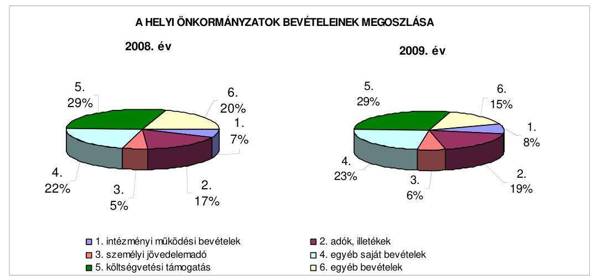

[^0]
[^0]:    ${ }^{7}$ A folyó kiadások tartalmazzák a dologi, az ellátottak pénzbeli juttatásai, a múködési célú pénzeszközátadások és a társadalompolitikai juttatások kiadásait.

---

Az önkormányzatok bevételei 2008-2009 között 10\%-kal, a kiadások 4\%-kal csökkentek. A bevételek csökkenését elsősorban a finanszírozási célú pénzügyi műveletek bevételeinek 49\%-os, a költségvetési támogatások 11\%-os, a felhalmozási és tőkejellegű bevételek 39\%-os, valamint az előző évi pénzmaradvány igénybevétel 18\%-os csökkenése okozta. A kiadások 2008-ról 2009-re történő csökkenésében meghatározó szerepe volt a finanszírozási célú pénzügyi műveletek kiadásainak 52\%-os és a személyi juttatásokra és járulékaira fordított kiadások 6\%-os csökkenésének.

Az önkormányzatok könyvviteli mérleg szerinti vagyona a 2009. év végére a 2006. évihez viszonyítva 10\%-kal nőtt, a 2009. év végén 11293 milliárd Ft volt ${ }^{8}$. A könyvviteli mérleg szerinti vagyon értékének a 2006. évről a 2009. évre történő növekedését elsősorban a pénzeszközök állományának 117\%-os, az ingatlanok és a kapcsolódó vagyoni értékú jogok állományának 5\%-os, valamint az üzemeltetésre, kezelésre, koncesszióba átadott, vagyonkezelésben lévő eszközök állományának 21\%-os emelkedése eredményezte. A pénzeszközök év végi állománya a 2006. évihez viszonyítva a 2009. év végéig 286 milliárd Ft-tal nőtt, döntően a 2007-2009 között kibocsátott kötvényekből befolyt bevételek következtében.

Adatok: milliárd Ft-ban

| AZ ÖNKORMÁNYZATOK VAGYONA |  |  |  |  |
| :-- | --: | --: | --: | --: |
| Eszközök | 2006. | 2007. | 2008. | 2009. |
| Befektetett eszközök | 9746 | 9992 | 10244 | 10476 |
| Forgóeszközök | 554 | 632 | 855 | 817 |
| ESZKÖZÖK ÖSSZESEN | $\mathbf{1 0 3 0 0}$ | $\mathbf{1 0 6 2 4}$ | $\mathbf{1 1 0 9 9}$ | $\mathbf{1 1 2 9 3}$ |
| KÖTELEZETTSÉGEK | $\mathbf{9 2 5}$ | $\mathbf{1 0 8 8}$ | $\mathbf{1 3 9 5}$ | $\mathbf{1 4 5 4}$ |
| SAJÁT VAGYON | $\mathbf{9 3 7 5}$ | $\mathbf{9 5 3 6}$ | $\mathbf{9 7 0 4}$ | $\mathbf{9 8 3 9}$ |

Az önkormányzatok év végi kötelezettség állománya 2006-2009 között 57\%-kal nőtt, a befektetett eszközállomány 2006-2009 között azonban csak 7\%-kal növekedett. A befektetett eszközöknek a kötelezettségek növekedésénél lényegesen alacsonyabb arányú növekedését okozta, hogy az önkormányzatok által kibocsátott kötvényekből befolyt bevételt az önkormányzatok még nem használták fel felhalmozási célra. Ezen bevétel a pénzeszközállomány 2006. év végi állományhoz viszonyítva a 2009. év végére mintegy kétszeresére történt emelkedését eredményezte. A kötelezettségállomány növekedésének 99\%-át a hosszú lejáratú kötelezettség, ennek 86\%-át a kötvénykibocsátások miatti kötelezettség állomány növekedése okozta. Az önkormányzatok 2009. év végi hosszú lejáratú kötelezettség állományából eredő 2010. évi fizetési kötelezettsége 54 milliárd

[^0]
[^0]:    ${ }^{8}$ Az önkormányzatok, és az ellenőrzött önkormányzatok eszközeinek és azok forrásainak részletezését a jelentés 2-3/b. számú mellékletei tartalmazzák.

---

Ft. A törlesztési kötelezettség éves összege a halasztott tőketörlesztési kötelezettség ${ }^{9}$ következtében a következő években emelkedni fog.
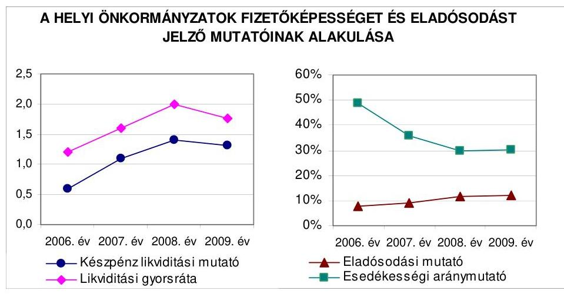

A 2006-2009. években az önkormányzatok átlagosan közel nyolctizede költségvetési hiánnyal hagyta jóvá az éves költségvetését. A költségvetés végrehajtása során a teljesített költségvetési bevételek az önkormányzatok tervezettnél jelentősen kisebb arányánál, átlagosan negyedénél nem fedezték a költségvetési kiadásokat. A 2007-2009 között a költségvetési hiányt az önkormányzatok csökkenő aránya (a 2009. év végén kevesebb, mint egyötöde) hosszú lejáratú hitel felvételével, míg a 2006-2008 között növekvő aránya (számuk 10-ről 125-re nőtt) kötvénykibocsátásból befolyt bevételből finanszírozta. A 2009. évben a kötvényt kibocsátó önkormányzatok száma 15-re csökkent. A 2006-2009 között kibocsátott kötvények legkisebb összege 0,01 milliárd Ft, a legnagyobb összege 12 milliárd Ft volt. A kibocsátott kötvények 91\%-a fejlesztési célú, 9\%-a múködési célú volt.

Az önkormányzatok összesített adatai alapján számított eladósodási mutató ${ }^{10}$ 2006-2009 közötti folyamatos emelkedése jelzi, hogy az összes forráson belül emelkedett a hosszú és rövid lejáratú kötelezettségek együttes aránya. Ugyanezen időszakban az összes kötelezettségen belül csökkent a rövid lejáratú kötelezettségek aránya, a hosszú lejáratú kötelezettségeké nőtt. Az esedékességi aránymutató ${ }^{11}$ csökkenését eredményezte, hogy a rövid lejáratú kötelezettségek állományának növekedési üteme kisebb mértékű (3\%) volt, mint az összes fizetési kötelezettség növekedése (67\%), így a rövidtávon teljesítendő kötelezettségek fizetőképességre gyakorolt hatása mérséklődött. Az eladósodás az önkormányzatok pénzügyi helyzetét hosszú távon kedvezőtlenül befolyásolja. A lik-

[^0]
[^0]:    ${ }^{9}$ Az önkormányzatok 2009. évi költségvetési beszámolójának összesített adatai szerint a 2009. december 31-én fennálló adósságállományból a törlesztő részlet a 2011. évben 67 milliárd Ft, a 2012 évben 68 milliárd Ft, a 2013. évben 71 milliárd Ft, a 2014. évben 69 milliárd Ft, a 2015. és az azt követő években együttesen 657 milliárd Ft.
    ${ }^{10}$ eladósodási mutató = összes kötelezettség-egyéb passzív pénzügyi elszámolások/öszszes forrás
    ${ }^{11}$ esedékességi aránymutató = rövid lejáratú kötelezettségek/összes kötelezettség-egyéb passzív pénzügyi elszámolások

---

vidítási mutatók ${ }^{12}$ értéke 2006-2008 között növekedett a kötvénykibocsátásokból származó bevétel betétlekötése, illetve pénzeszközök közötti nyilvántartása ${ }^{13}$ hatására. A likviditási mutatók 2007-2008. év végi emelkedését eredményező kötvénykibocsátásból befolyt bevételek azonban nem jelentik a fizetőképesség tartós, kedvező irányú változását, mivel a kötvények tőketörlesztési kötelezettsége - a türelmi idő lejáratát követően - mint rövid lejáratú kötelezettség a fizetőképességet csökkenti. A likviditási mutatók 2008-ról 2009-re történő csökkenését eredményezte a rövid lejáratú kötelezettségek növekedése, továbbá hogy az előző évinél kisebb összegben bocsátottak ki kötvényt az önkormányzatok, és a kötvénykibocsátás bevételéből származó tartalékolt pénzeszközök tervezett beruházási célokra történő felhasználása megkezdődött. A pénzügyi mutatók együttesen jelzik az önkormányzatok fokozódó eladósodását, a pénzügyi helyzet kedvezőtlen irányú változását.

# A költségvetési és pénzügyi egyensúly alakulása az ellenőrzött önkormányzatoknál 

Az ellenőrzött önkormányzatok jelentős aránya, a 2006-2009. években mintegy nyolctizede nem biztosította a tervezett költségvetési bevételek és kiadások egyensúlyát, a tervezett költségvetési bevételeik nem nyújtottak fedezetet a tervezett költségvetési kiadásokra. A költségvetési egyensúly biztosítása, a tervezett költségvetési kiadások finanszírozása és az évközi likviditás érdekében 2006-2009 között az önkormányzatok közel 80\%-a tervezett rövid lejáratú és likvid hitel felvételből, valamint a négy év átlagában mintegy fele hosszú lejáratú hitel felvételéből származó bevételt. A költségvetési rendeletük szerint az ellenőrzött önkormányzatok közül a 2006. évben egy, a 2008. évben 20, a 2009. évben már csak hét tervezett kötvénykibocsátásból származó bevételt.

Az ellenőrzött önkormányzatok közel hét tizede az évenkénti költségvetés megállapításakor - az Áht-ban előírtak ellenére - 2006-2009 között a költségvetési hiány finanszírozásával kapcsolatos pénzügyi műveletek bevételeit és kiadásait költségvetési hiányt, illetve költségvetési többletet módosító költségvetési bevételként és kiadásként számolta el. Emiatt a költségvetési rendeletben nem mutatták be az önkormányzat valós pénzügyi helyzetét, a költségvetési hiány, vagy többlet összegét, valamint a finanszírozási célú pénzügyi műveletek bevételeit, kiadásait.

[^0]
[^0]:    ${ }^{12}$ készpénz likviditási mutató = pénzeszközök/rövid lejáratú kötelezettségek likviditási gyorsráta = követelések+forgatási célú értékpapírok+pénzeszközök/rövid lejáratú kötelezettségek
    ${ }^{13}$ A kibocsátott kötvényekből befolyt bevételek - a pénzeszközök és a forgatási célú értékpapírok növekedése alapján - főként tartalékolási célokat szolgáltak, kevésbé voltak kapcsolatban a tényleges finanszírozási igényekkel.

---

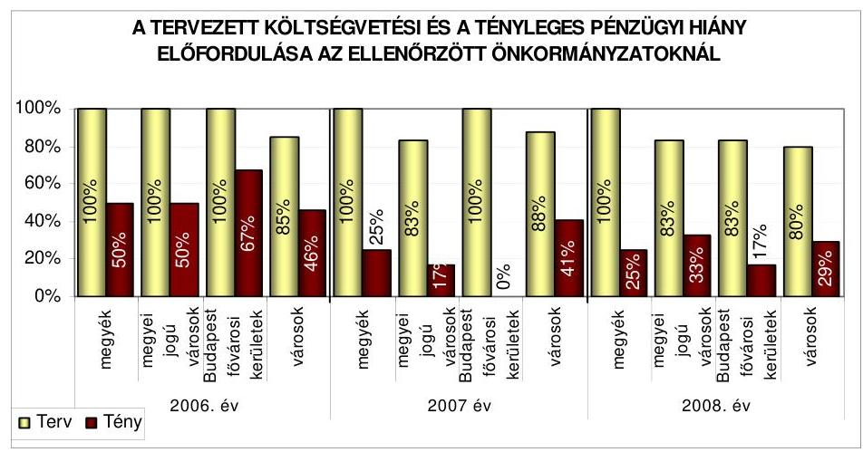

A költségvetés teljesítése során a költségvetési hiányt tervező önkormányzatok arányánál 41-54-55 százalékponttal kisebb aránynál volt pénzügyi hiány, mivel a teljesített költségvetési bevételek elegendő fedezetet biztosítottak a teljesített költségvetési kiadásokra. A teljesített múködési célú költségvetési bevételek 2006-2008 között az ellenőrzött önkormányzatok hét tizedénél fedezték a teljesített múködési célú költségvetési kiadásokat, mintegy felénél azonban a teljesített felhalmozási célú bevételeket meghaladó összegben teljesítettek felhalmozási célú költségvetési kiadásokat. A pénzügyi hiány tervezettnél kedvezőbb alakulásához hozzájárult, hogy az ellenőrzött önkormányzatok közel fele a 2006-2008. évi költségvetések előirányzatainak kialakításakor - az Áht-ban foglaltak ellenére - az előző évi pénzmaradvány igénybevételét az előző évről áthúzódó feladatok (kötelezettségek) fedezeteként nem tervezte meg, valamint az ellenőrzött önkormányzatok közel egyötöde a beruházások és a felújítások előirányzatait nem kellő alapossággal tervezte meg, így azok megvalósítása elhúzódott. A 2006-2008 között tervezett pénzmaradvány igénybevételt 68\%kal teljesítették túl az önkormányzatok. A pénzmaradványt alultervező önkormányzatok az indokoltnál nagyobb költségvetési hiányt mutattak be a 20062008. évi költségvetési rendeleteikben.

A 2006-2009. évi költségvetések végrehajtása során az ellenőrzött önkormányzatok tervezettnél 13-30-22-23 százalékponttal kisebb aránya, mintegy fele vett fel rövid lejáratú és likvid hitelt. A tervezetthez viszonyítva a hosszú lejáratú hitelt felvevő önkormányzatok aránya 2006-2009 között 6-0-5-11 százalékponttal alacsonyabb, a kötvényt kibocsátó önkormányzatok aránya 2006-2008 között 2-32-6 százalékponttal magasabb, a 2009. évben 2 százalékponttal alacsonyabb volt. Az ellenőrzött önkormányzatok több mint kétharmada a 20062009. években deviza alapú, változó kamatozású kötvényt bocsátott ki öszszesen 115,2 milliárd Ft értékben, amelyek közel nyolctizedénél a futamidő 20 év volt. A kötvénykibocsátás a deviza árfolyamváltozása, valamint a változó kamatfeltétel miatt az önkormányzatok számára kockázatot jelent.

A tőketörlesztés megkezdéséhez meghatározott türelmi idő fél és öt év között változott, de az ellenőrzött önkormányzatok közül kettő a futamidő végére egyösszegű tőketörlesztést vállalt. Az ellenőrzött önkormányzatok a kötvénykibocsátásokhoz kapcsolódó tőke és kamatfizetési kötelezettségvállalások során elvégzett számításaik alapján az adott évre vonatkozóan betartották az Ötvben meghatározottak szerinti tárgyévi kötelezettségvállalásra előírt felső határt.

---

A kötvénykibocsátásból származó évenkénti fizetési kötelezettség a 2009. évi adatok alapján számított felső határ átlagosan egyharmadát jelentette. Az Ötv. rögzíti, hogy az önkormányzatok adósságot keletkeztető éves kötelezettségvállalásának felső határa a korrigált saját bevétel. Hiányzik azonban a több éves (15-20 évi) tőketörlesztés, valamint a 10-20 év múlva esedékes egyösszegű visszafizetési kötelezettség vállalására vonatkozóan a korrigált saját bevétel, illetve az adósságot keletkeztető kötelezettségvállalás felső határa esetében a számítási módnak a meghatározása, ezért erre számításokat az önkormányzatok nem végeztek. Nem mutatták be a képviselő-testületnek, hogy a tőketörlesztés éveiben, vagy egyösszegű visszafizetés esetén a visszafizetés évében a kötvénykibocsátásból eredő kötelezettségvállalás a számításba vehető korrigált saját bevételhez viszonyítva milyen arányú fizetési kötelezettséget jelent, illetve a döntést hozó képviselő-testületek nem rendelkeztek információval arról, hogy a törlesztés éveiben (évében) a saját bevételek fedezik-e majd a vállalt fizetési kötelezettséget. A kötvénykibocsátások miatti növekvő fizetési kötelezettség az ellenőrzött önkormányzatok fokozódó eladósodásához vezetett.

A kötvények visszafizetését - a képviselő-testületi előterjesztések szerint - a saját bevételből tervezték. A kötvényt kibocsátó ellenőrzött önkormányzatok 100\%-a a kibocsátásból származó bevételt elsősorban a fejlesztési feladatok finanszírozására tervezte felhasználni. Ettől eltérően a kibocsátást követő első években mintegy kilenctizedük a kötvénykibocsátásból elért bevételből, vagy annak egy részéből különböző pénzügyi műveleteket - betételhelyezés, hazai és nemzetközi tőzsdéken forgalmazott rövid és hosszú lejáratú értékpapírok vételeeladása, határidős devizaügyletek kötése és egyéb, a pénzpiacon magas kockázatúnak minősített pénzpiaci műveleteket - végzett. A gazdálkodásra vonatkozó szabályok megsértésével elvégzett kockázatos pénzpiaci műveletek során egy ellenőrzött önkormányzatot a befektetett tőke 77\%-ának elvesztésével kár érte, amely miatt büntető feljelentést tett az ÁSZ. Az önkormányzatok szabad pénzeszközeinek különböző pénzpiaci műveletekre történő felhasználását egyértelmű jogszabályi előírás jelenleg nem tiltja. Az Ötv-ben előírtak alapján az önkormányzatok az állami hozzájárulás kivételével dönthetnek a célhoz nem kötött forrásaik betétként történő elhelyezéséről, valamint jogosultak a különféle banki szolgáltatások igénybevételéről is dönteni. Ez utóbbi előírás alapján minősülhet jogszerűnek az önkormányzatok különböző pénzpiaci művelete. A képviselő-testületeknek a döntések során az Ötv. alapján figyelembe kellett venniük, hogy a gazdálkodás biztonságáért a képviselő-testület, szabályszerűségért a polgármester a felelős. A veszteséges gazdálkodás következményei az önkormányzatot terhelik.

Az ellenőrzött önkormányzatok eladósodása nőtt, a hosszú és rövid lejáratú fizetési kötelezettség összes forráshoz viszonyított arányát jelző eladósodási mutató 2006-2009 között folyamatosan emelkedett. Az ellenőrzött önkormányzatok héttizedének a pénzügyi helyzete eladósodási szempontból 2006-2009 között kedvezőtlenül változott, az eladósodási mutató növekedett. A 2006-2008. év végi készpénz likviditási mutatók fizetőképességi szempontból javuló pénzügyi helyzetet jeleztek, mivel a kibocsátott kötvényekből befolyt és a kibocsátás évében fel nem használt pénzeszközök hatására az ellenőrzött önkormányzatoknál kétszeresére nőtt a készpénz likviditási mutató. A fizetőképesség 20062008 közötti javulását mutatja a likviditási gyorsráta növekedése is, mely szerint az ellenőrzött önkormányzatoknál a rövid lejáratú kötelezettségek kiegyen-

---

lítésébe a pénzeszközökön túl bevonható követelések és a hitelviszonyt megtestesítő értékpapírok növekvő arányban biztosítottak fedezetet. A fizetőképességi mutatók javulása azonban átmeneti, - a 2009. évben az előző évhez viszonyítva csökkentek - a kötvénykibocsátásból befolyt bevételek tartalékolásának és a kibocsátott kötvények visszafizetésére biztosított türelmi idő miatti rövid lejáratú fizetési kötelezettségállomány kisebb mértékű növekedésének az együttes következménye.

# Felkészültség az európai uniós források igénybevételére 

Az ellenőrzött önkormányzatok 22\%-a készült fel eredményesen 2007-2009 között az európai uniós források igénybevételére és a várható támogatás felhasználására. Az európai uniós források igénybevételére irányuló pályázatok a gazdasági programokban, ágazati, és településfejlesztési koncepciókban, programokban megfogalmazott fejlesztési célkitűzésekhez többségükben (94\%-ban) kapcsolódtak, azonban nem készült fel eredményesen az európai uniós források igénybevételére és felhasználására a szabályozottság terén az ellenőrzött önkormányzatok $74 \%$-a, a szervezettség vonatkozásában $4 \%$-a.

A szabályozások nem tartalmazták az ellenőrzött önkormányzatok felénél a pályázatfigyelést végzők és a döntés, illetve a döntés-előkészítési jogkörrel rendelkezők közötti információk szolgáltatásának kötelezettségét, közel egytizedénél nem írták elő a folyamatba épített, előzetes, utólagos és vezetői ellenőrzési feladatokat. Az önkormányzati hivatalban, valamint külső szervezetek, személyek igénybevételével a pályázatfigyelés, a pályázatkészítés és a fejlesztési feladat lebonyolítás személyi feltételeit az ellenőrzött önkormányzatok 95-99-98\%-a biztosította, azonban a külső szervezetekkel kötött szerződések közel egyharmadában nem rögzítették a pályázat szakmai és formai követelményeire vonatkozó felelősség szabályait, mintegy felében nem írták elő a fejlesztési feladat lebonyolítását végző ellenőrzési kötelezettségét, továbbá a belső ellenőrzési stratégiát megalapozó kockázatelemezés az ellenőrzött önkormányzatok 77\%-ánál nem terjedt ki az európai uniós forrásokkal támogatott fejlesztési feladatokra. A 2007-2009 között ellenőrzött önkormányzatok közel egytizede - az Ötv. előírása ellenére - nem fogadta el a 2006-2009 közötti időszakra szóló gazdasági programját. Az ellenőrzött önkormányzatok a vizsgált időszakban 3021 fejlesztési feladat esetében döntöttek európai uniós támogatásra vonatkozó pályázat benyújtásáról, melyek mintegy fele részesült támogatásban. A benyújtott pályázatok elutasítását a pályázati források hiánya, a szakmai kidolgozatlanság, a költséghatékonyság hiánya, a pályázatok tartalmi és formai hibái, a pályázati feltételek hiányos teljesítése, valamint egyéb hiányosságok okozták. A támogatást nyújtó szervezet döntése után a 2008-2009. években az ellenőrzött önkormányzatok 5-12\%-a a saját forrás, a jogerős építési és hatósági engedélyek hiánya, a közbeszerzési eljárás eredménytelensége, a kivitelezés költségének emelkedése miatt pályázatát visszavonta.

A 2006-2009. évek költségvetési rendeleteiben az ellenőrzött önkormányzatok mintegy fele tervezte az európai uniós forrásokkal támogatott fejlesztési feladatok bevételi és kiadási előirányzatait. Az Ámr. ${ }_{1}$-ben foglaltak ellenére az önkormányzatok közel felénél a költségvetési rendelet nem tartalmazta elkülönítetten az európai uniós támogatással megvalósuló programok összes bevételét és kiadását, továbbá mintegy kétharmadánál nem tettek eleget az Áht-ban

---

foglaltaknak, mivel a képviselő-testület tájékoztatása céljából nem mutatták be a többéves kihatással járó, európai uniós forrásból megvalósuló fejlesztési feladatokat számszerúsítve évenkénti bontásban, szöveges indoklással.

Az önkormányzatok a már befejezett fejlesztési feladatok megvalósítására 261 milliárd Ft kiadást terveztek, amelyet 99,9\%-ban felhasználtak. A kifizetési kérelmek benyújtása után a támogatások folyósítása fél hónap és másfél év közötti időtartamot vett igénybe. Az időbeli elhúzódást elsősorban az igénylést alátámasztó dokumentumok, számlák alaki és tartalmi hiányosságai okozták. A közremúködő szervezetek az előlegigényléseket, valamint a hiánytalanul benyújtott kifizetési kérelmeket az ellenőrzött projektek mintegy egyharmadánál határidőn belül teljesítették.

A támogatott fejlesztési feladatok megvalósításához az önkormányzatok a saját forrást biztosították, eleget tettek a támogatás megelőlegezési követelményének, amelynek fedezetét közel tizedük rövid lejáratú hitelből biztosította. A fejlesztési feladatokat az önkormányzatok mintegy negyede a tervezetthez viszonyítva a kiadások hiányos tervezése és a támogatási szerződés szerint el nem számolható költségek kifizetése miatt többletkiadással valósította meg. Az önkormányzati hivatalok mintegy $60 \%$-ánál az európai uniós források felhasználásával megvalósított feladatok kiadásainak és bevételeinek teljesítése során a folyamatba épített, előzetes, utólagos és vezetői ellenőrzéseket végrehajtották. A támogatásban részesült önkormányzatok döntő többségénél ( $90 \%$ nál) azonban a belső ellenőrzés nem vizsgálta az európai uniós forrás felhasználását. Az európai uniós forrással támogatott fejlesztési feladatok megvalósulását külső ellenőrző szervezetek az ellenőrzött önkormányzatok mintegy kétharmadánál vizsgálták, megállapításaikra a polgármesterek intézkedést tettek.
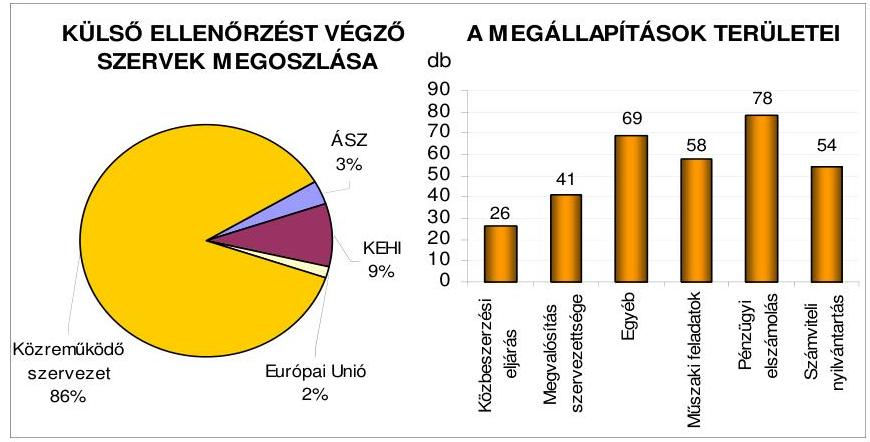

# Az e-közszolgáltatásra történő felkészülés, egyes gazdálkodási adatok nyilvánossága 

Az ellenőrzött önkormányzatok ${ }^{14}$ mintegy háromnegyede meghatározta az informatikai, illetve a közszolgáltatási stratégiáját, amelyben 29\%-uk a 4., 17\%uk a 3. elektronikus szolgáltatási szint elérését tűzte ki célul. Az e-

[^0]
[^0]:    ${ }^{14}$ Az e-közszolgáltatási feladatok ellátását a nagyközségi, községi önkormányzatoknál nem vizsgáltuk.

---

közszolgáltatás kialakításához és múködtetéséhez szükséges feltételek biztosítása érdekében az önkormányzatok kétharmada európai uniós támogatásra nyújtott be pályázatot 2006-2009 között. Az ellenőrzött önkormányzatok mintegy $90 \%$-ánál múködtettek e-közszolgáltatást biztosító informatikai rendszert, ezek $18 \%$-a az 1., $65 \%$-a a 2 . és $17 \%$-a a 3 . elektronikus szolgáltatási szinten biztosította az ügyintézést. A 3. és a 4. elektronikus szolgáltatási szintnek megfelelő ügyintézés széles körű kialakítását a pénzügyi források, az informatikához értő humán erőforrás, valamint a szükséges program hiánya késleltette.

A közérdekú adatok elektronikus közzététele során a közzétételi listákat a jegyzők egyharmada jelentette meg a 18/2005. (XII. 27.) IHM rendeletben előírt szerkezetben és tartalommal az önkormányzat honlapján. A jegyzők az önkormányzat honlapján az Áht-ban előírtak ellenére nem, vagy hiányosan tették közzé az ellenőrzött önkormányzatok 60\%-ánál a nem normatív, céljellegú múködési és fejlesztési támogatások kedvezményezettjeinek nevét, a támogatás célját, összegét, továbbá a támogatási program megvalósítási helyét. Az ellenőrzött önkormányzatok 41\%-ánál a nettó ötmillió Ft-ot elérő vagy azt meghaladó értékű árubeszerzésre, építési beruházásra, szolgáltatás megrendelésre, vagyonértékesítésre, vagyonhasznosításra vonatkozó szerződések megnevezését (típusát), tárgyát, a szerződő felek nevét, a szerződés értékét, határozott időre kötött szerződés esetében annak időtartamát, valamint az adatok változását nem tették közzé. A jegyzők $49 \%$-a - az Ámr. ${ }_{1}$-ben előírtakat figyelmen kívül hagyva - elmulasztotta az éves költségvetési beszámoló szöveges indoklásának közzétételét.

# A költségvetési gazdálkodás kontrolljai 

A költségvetés tervezési és a zárszámadás készítési folyamatok szabályozottsága az ellenőrzött - kiemelt önkormányzati körbe tartozó, valamint városi - önkormányzatok közel kétharmadánál (az előző két évben ellenőrzöttekhez viszonyítva növekvő hányadánál) összességében alacsony kockázatot jelentett a feladatok megfelelő és szabályszerű végrehajtásában, mivel a jegyzők az Ámr. ${ }_{1}$ előírásainak és a helyi sajátosságoknak megfelelően kialakították a belső kontrollokat, előírták az ellenőrzési feladatokat, határidőket és kijelölték azok felelőseit. Az önkormányzatok mintegy ötödénél (az előző években ellenőrzöttek hasonló arányánál) a szabályozás hiányosságai közepes kockázatot jelentettek a költségvetés tervezési és a zárszámadás készítési feladatok megfelelő végrehajtásában, mert a jegyzők hiányosan szabályozták az ellenőrzési feladatokat, azonban a kialakított belső kontrollok a lehetséges hibák többsége ellen védelmet nyújtottak.

A költségvetés tervezés és a zárszámadás készítés belső kontrolljainak kialakítására vonatkozó - Áht-ban előírt - kötelezettségük teljesítését a jegyzők az önkormányzatok 15\%-ánál (az előző években ellenőrzöttekhez viszonyítva csökkenő hányadánál) mulasztották el, amely önkormányzatoknál a szabályozás hiányosságai magas kockázatot jelentettek ezen feladatok megfelelő, szabályszerű végrehajtásában, ezáltal a kontrollok nem nyújtottak elegendő védelmet a lehetséges hibák ellen. A költségvetési intézmények részére a költségvetési javaslat összeállításával kapcsolatos követelményeket nem írták elő a kiemelt önkormányzati körbe tartozók, valamint a városi önkormányzatok mintegy tizedénél. Az önkormányzatok közel kétötödénél nem határozták meg

---

a költségvetési intézmények és az önkormányzati hivatal szervezeti egységei által benyújtott költségvetési igények indokoltságának, illetve teljesíthetőségének ellenőrzésére, valamint a tervezett saját bevételek előirányzatainak és az azok megalapozását szolgáló önkormányzati rendeletek összhangjának felülvizsgálatára vonatkozó belső kontrollokat. Az intézményi pénzmaradványok kimunkálásának felülvizsgálatára vonatkozó feladatokat az önkormányzatok közel egyharmadánál nem írták elő.
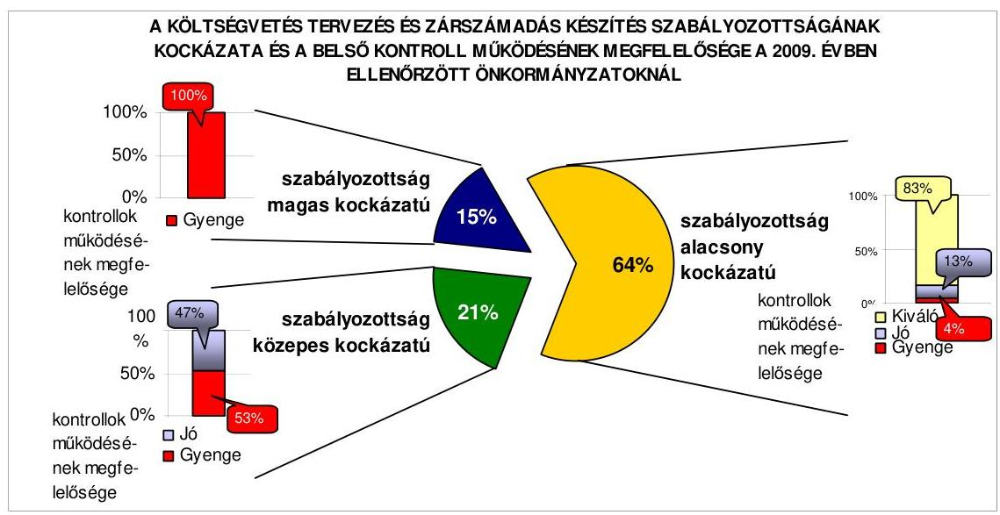

A 2007-2008. évi ellenőrzések adatait a 13. számú melléklet ábrái szemléltetik.
A költségvetés tervezés és a zárszámadás készítés folyamatában kialakított belső kontrollok múködésének megfelelősége az önkormányzatok mintegy felénél (az előző évhez viszonyítva növekvő arányánál) összességében kiváló volt, a kialakított kontrollokat múködtették, az esetleges kisebb ${ }^{15}$ hiányosságok ellenére azok teljesítették a lényeges hibák, szabálytalanságok megelőzésével, feltárásával és kijavításával kapcsolatos funkciójukat. A belső kontrollok az önkormányzatok közel kéttizedénél (az előző évhez viszonyítva csökkenő arányánál) jól múködtek, a megállapított - tolerálható mértékű - hiányosságok ellenére a kontrollok kielégítették az eredményességi elvárásokat a múködésbeli hibák megelőzése, feltárása és kijavítása tekintetében. Az önkormányzatok közel háromtizedénél (az előző évekhez képest csökkenő hányaduknál) a belső kontrollok múködésének megfelelősége gyenge volt, mert a költségvetés tervezés és a zárszámadás készítés ellenőrzésére vonatkozó kötelezettség teljesítését az Áht-ban foglalt előírások ellenére - elmulasztották, amit ezen önkormányzatok mintegy felénél a jegyzői szabályozás hiánya okozott, ezáltal nem biztosították a hibák megelőzését, feltárását, kijavítását és veszélyeztették a megbízható múködést. Nem vizsgálták az intézmények és az önkormányzati hivatalok szervezeti egységei által benyújtott költségvetési igények indokoltságát, valamint a zárszámadás készítés során az intézményi pénzmaradvány megállapítás szabályszerűségét az önkormányzatok mintegy négytizedénél. Az intézményi számszaki beszámolók belső, valamint azok képviselő-testület által megha-

[^0]
[^0]:    ${ }^{15}$ Az ellenőrzés lefolytatásához egységesen meghatározott követelményrendszerben foglalt mértéket el nem érő hiányosság esetén a „kisebb" kifejezést alkalmazzuk.

---

tározott adatszolgáltatással való összhangját az önkormányzatok közel négytizedénél nem ellenőrizték. A költségvetési intézmények részére a tervezéssel kapcsolatban meghatározott követelmények teljesítését az önkormányzatok mintegy negyedénél - az Áht. és az Ámr. ${ }_{1}$ előírásai ellenére - nem ellenőrizték, továbbá az önkormányzatok közel felénél nem végezték el a tervezett saját bevételek előirányzatainak, valamint azok megalapozását szolgáló önkormányzati rendeletek összhangjának ellenőrzését.

A gazdálkodási, a pénzügyi-számviteli és a folyamatba épített, előzetes, utólagos és vezetői ellenőrzési feladatok szabályozottsága az önkormányzatok közel hattizedénél (az előző évekhez képest növekvő arányuknál) összességében alacsony kockázatot jelentett a feladatok megfelelő és szabályszerű végrehajtásában, mivel a belső kontrollokat a jegyzők a jogszabályi előírásoknak és a helyi sajátosságoknak megfelelően kialakították. Az önkormányzatok mintegy harmadánál (az előző évekhez viszonyítva csökkenő arányánál) a szabályozás hiányosságai közepes kockázatot jelentettek a feladatok megfelelő végrehajtásában, mert a jegyzők hiányosan szabályozták az ellenőrzési feladatokat, azonban a kialakított kontrollok a lehetséges hibák többsége ellen védelmet nyújtottak. A belső kontrollok kialakítására vonatkozó kötelezettségük teljesítését a jegyzők az önkormányzatok 7\%-ánál elmulasztották, ezáltal a szabályozás hiányosságai a gazdálkodási feladatok megfelelő végrehajtásában magas kockázatot jelentettek.

Az önkormányzati hivatalok közel harmada - az Ámr. ${ }_{1}$ előírása ellenére - nem rendelkezett a képviselő-testület által jóváhagyott SzMSz-szel, egytizede a gazdasági szervezet által ellátandó feladatok szabályozására nem készített ügyrendet. A vezetők és a pénzügyi dolgozók munkaköri leírásai az önkormányzati hivatalok közel negyedénél nem tartalmazták a munkafolyamatba épített ellenőrzési jogköröket és feladatokat. Az önkormányzatok közel ötödénél a jegyzők belső szabályzatban nem rendelkeztek a pénzgazdálkodás belső kontrollját jelentő szakmai teljesítésigazolás módjáról, valamint közel tizedénél az ellenőrzési feladatok elvégzésére jogosult személyeket nem jelölték ki. Az érvényesítési feladatok ellátására az önkormányzatok mintegy tizedénél a jegyzők nem adtak írásban megbízást, illetve az írásbeli megbízásoknál nem tartották be az iskolai végzettségre és szakmai képesítésre vonatkozó előírást. Az önkormányzatok 14\%-ánál a számviteli szabályzatokban a jegyzők nem rögzítették az Áhsz-ben előírt leltározási kötelezettséget. Az üzemeltetésre, kezelésre átadott eszközök leltározásának módját az önkormányzatok ötödénél, valamint ezen eszközök selejtezésével, hasznosításával kapcsolatos döntés hozatalára jogosultak körét az önkormányzatok közel kétötödénél nem határozták meg. Az önköltségszámítás rendjét az Áhsz. előírása ellenére az önkormányzatok mintegy felénél nem határozták meg. Az ellenőrzési nyomvonalat az önkormányzatok mintegy kilenctizedénél készítették el, az elkészített ellenőrzési nyomvonalak közel tizedénél nem azonosították a folyamatokat és a folyamatgazdákat, illetve nem jelölték meg az egyes feladatok végrehajtásáért felelős szervezeti egységeket, személyeket. Az önkormányzatok mintegy kétharmadánál a jegyzők kockázatkezelési eljárásrendben rögzítették a kockázatok azonosítását, azonban mintegy felénél elmaradt a kockázatok folyamatgazdáinak, illetve az elfogadható kockázati szintnek a meghatározása. A jegyzők mintegy négyötöde meghatározta a szabálytalanságok kezelésének eljárásrendjében a szabálytalanság fogalmát, észlelési kötelezettségét, azonban közel negyedénél elmaradt

---

a szabálytalanság esetén teendő intézkedések nyomon követésének és nyilvántartásának, továbbá mintegy felénél a kockázati környezet rendszeres felülvizsgálatának előírása.

A szakmai teljesítésigazolás és az utalvány ellenjegyzés múködésének megfelelősége az ellenőrzött önkormányzatok közel egyharmadánál (az előző évekhez viszonyítva növekvő arányánál) volt összességében kiváló, a kialakított belső kontrollok folyamatosan és eredményesen múködtek, az esetleges kisebb ${ }^{16}$ hiányosságok ellenére teljesítették a múködésbeli hibák megelőzésével, feltárásával és kijavításával kapcsolatos funkciójukat. A belső kontrollok az önkormányzati hivatalok előző két évinél nagyobb hányadánál, közel ötödénél a gazdálkodás folyamatában jól múködtek, a megállapított kisebb - tolerálható mértékű - hiányosságok ellenére kielégítették az eredményességi elvárásokat a múködésbeli hibák megelőzése, feltárása és kijavítása tekintetében. A szakmai teljesítésigazolás és az utalvány ellenjegyzés múködésének megfelelősége az önkormányzatok - előző két évinél kisebb arányánál - mintegy felénél gyenge volt, mert az Ámr. ${ }_{1}$-ben foglalt előírások ellenére elmulasztották a folyamatba épített ellenőrzési feladatokra vonatkozó kötelezettség teljesítését. Ezeknél az önkormányzatoknál a belső kontrollok múködésével kapcsolatban megállapított hiányosságok, mulasztások rendszeresek voltak, egy-egy gazdasági esemény folyamatában egyidejúleg több kontroll nem, vagy nem folyamatosan és következetesen múködött, amihez a belső szabályozás hiányosságai - köztük a folyamatba épített ellenőrzési feladatok elvégzésére jogosult személyek kijelölésének elmaradása is - hozzájárultak.

Az önkormányzatok közel felénél a kiadások jogosultságának, összegszerűségének ellenőrzését, valamint a szerződések, megrendelések, megállapodások teljesítésének szakmai igazolását - az Ámr. ${ }_{1}$-ben foglalt előírások ellenére nem, vagy nem az előírásoknak megfelelően végezték el. A kiadások jogosultságának és összegszerűségének ellenőrzését, valamint a szakmai teljesítést az ellenőrzési feladatra kijelölt személyek - aláírásukkal, az igazolás dátumával, valamint az igazolási kötelezettség végrehajtásának megjelölésével - nem igazolták az önkormányzatok közel ötödénél. A kiadások jogosultságának és összegszerűségének ellenőrzését legnagyobb arányban (az ellenőrzött önkormányzatok mintegy harmadánál) az államháztartáson kívülre nyújtott múködési és felhalmozási célú pénzeszköz átadások teljesítését megelőzően mulasztották el. A szakmai teljesítésigazolás helyi szabályozásában és múködtetésében feltárt hiányosságokhoz az ellenőrzött önkormányzati hivatalokban - az ellenőrzések tapasztalatai szerint - hozzájárultak az Ámr. ${ }_{1}$ előírásaival kapcsolatos eltérő értelmezések. Az ÁSZ előző években tett, jogszabály módosításra irányuló javaslatai ellenére az Ámr. ${ }_{2}$ vonatkozó előírásai sem egyértelműek, így nem biztosítanak megfelelő, egységesen értelmezhető iránymutatást a költségvetési szervek vezetői számára - a feladatok, kötelezettségek és jogok meghatározása tekintetében - a belső kontrollok kialakításához, hatékony múködtetéséhez. Az Ámr. ${ }_{2}$ előírásai nem tartalmazzák az ellenőrzési feladat meghatározását azon kiadások elrendelésére vonatkozóan, amelyeknél a kifizetés az elvárt cél teljesítését megelőzően történik és ezért annak megvalósítását a szak-

[^0]
[^0]:    ${ }^{16}$ Az ellenőrzés lefolytatásához egységesen meghatározott követelményrendszerben foglalt mértéket el nem érő hiányosság esetén a „kisebb" kifejezést alkalmazzuk.

---

mai teljesítés igazolására kijelölt személy még nem tudja ellenőrizni (pl. előfinanszírozással megvalósuló támogatások). Nem egyértelmű továbbá az Ámr. ${ }_{2}$ szabályozása annak tekintetében, hogy a kötelezettséget vállaló szerv belső szabályzatában mely esetekre nézve nem szükséges külön előírni a szakmai teljesítésigazolás kötelezettségét, a kivételre vonatkozó utalás nem értelmezhető, mert a hivatkozott jogszabályhely az érvényesítő ellenőrzési feladatait tartalmazza, amely szerint az érvényesítőnek ellenőriznie kell az összegszerűséget, a fedezet meglétét, s azt, hogy a megelőző ügymenetben betartották-e az Áht., Áhsz., Ámr. ${ }_{2}$, és a belső szabályzatokban foglaltakat.

Az önkormányzatok mintegy tizedénél a szakmai teljesítés igazolására kijelölt személyek a kifizetések alapbizonylatait aláírásukkal és az igazolás dátumával, valamint az igazolási kötelezettség végrehajtásának megjelölésével ugyan ellátták, azonban a szakmai teljesítés igazolás módja meghatározásának hiánya miatt ezen aláírások önmagukban nem jelentették az ellenőrzés elvégzésének igazolását. Az Ámr. ${ }_{1}$ előírta a költségvetési szerv vezetője (önkormányzati hivatalok esetében a jegyző) részére, hogy a szakmai teljesítés igazolásának módjáról belső szabályzatban köteles rendelkezni, ezzel szemben az Ámr. ${ }_{2}$ rendelkezései nem írják elő nevesített kötelezettségként a költségvetési szerv vezetője részére a belső szabályozási kötelezettséget.

Jogosulatlanul végezték a szakmai teljesítés igazolását a jegyző kijelölésével nem rendelkező személyek az önkormányzatok tizedénél, amely hiányosságot ezen önkormányzatok közel harmadánál az okozta, hogy a jegyzők az Ámr. ${ }_{1}$ előírása ellenére elmulasztották kijelölni a szakmai teljesítésigazolást végző személyeket. Az Ámr. ${ }_{2}$ 2010. január 1-jétől előírja, hogy a szakmai teljesítés igazolására jogosult személyeket a kötelezettségvállaló - aki a Htv. szerint a polgármester, vagy az általa felhatalmazott személy - jelöli ki az adott kötelezettségvállaláshoz kapcsolódóan. Az esetleges visszaélések miatt kockázatos, hogy az önkormányzati hivatalok esetében főszabályként nem a jegyző jogosult a szakmai teljesítést igazoló személy kijelölésére, annak ellenére, hogy az Áht-ban foglaltak alapján (mint a költségvetési szerv vezetője) a jegyző felel a belső kontrollrendszer - ennek részeként a belső kontrollok, így a szakmai teljesítésigazolás - kialakításáért és hatékony működtetéséért.

A szakmai teljesítést igazoló személyek - az igazolás elvégzését tanúsító aláírásuk ellenére - az alapdokumentumok hiánya, illetve hiányosságai miatt nem látták el ellenőrzési feladataikat az önkormányzatok közel ötödénél, mivel a kötelezettségvállalásra vonatkozó okmányok hiányában, illetve hiányosságai miatt nem ellenőrizték a szerződésben, megrendelésben előírt feladatok teljesítését, a kiadás jogosultságát, összegszerűségét.

Az utalvány ellenjegyzés feladatait - az Ámr. ${ }_{1}$ előírásai ellenére - az önkormányzatok - előző évekhez viszonyított csökkenő hányadánál, de még mindig - közel felénél nem végezték el, mivel a jegyző, vagy az általa felhatalmazott személyek nem ellenőrizték, hogy az utalványozás nem sérti a gazdálkodásra vonatkozó szabályokat, illetve közel kétötödénél nem győződtek meg a szakmai teljesítésigazolás, és közel ötödénél az érvényesítés megtörténtéről. Az utalványokat az önkormányzatok közel tizedénél nem ellenjegyezték, illetve az utalvány ellenjegyzést jogosulatlanul a jegyző írásos felhatalmazásával nem rendelkező személyek végezték. Az utalványok ellenjegyzése az ön-

---

kormányzatok közel kétötödénél formai volt, mivel az ellenjegyzők aláírásuk ellenére nem észrevételezték, hogy a kötelezettségvállalásokat az Ámr. ${ }_{1}$-ben foglaltak ellenére nem foglalták írásba. Az utalványok ellenjegyzői az önkormányzatok közel ötödénél aláírásuk ellenére nem kifogásolták, hogy a kötelezettségvállalásokat - az Ámr. ${ }_{1}$ előírása ellenére - nem előzte meg azok ellenjegyzése.

A kötelezettségvállalások elmaradásánál, illetve nem arra jogosult által történt elvégzésénél közrejátszott a vonatkozó jogszabályok eltérő rendelkezéseiből adódó összhanghiány, mivel a Htv-ben, valamint az Ámr. ${ }_{1}$ ben foglaltak szerint az önkormányzat nevében kötelezettséget a polgármester, vagy az általa felhatalmazott személy vállalhat, míg az Áht., valamint az Ámr. ${ }_{1}$ nem az önkormányzat, hanem a költségvetési szerv feladatainak ellátását szolgáló, a kiadási előirányzatokat terhelő fizetési vagy más teljesítési kötelezettség vállalására vagy ilyen követelés előírására vonatkozóan írja elő, hogy a kötelezettségvállalás a költségvetési szerv vezetőjének vagy az általa írásban megbízott személynek a hatáskörébe tartozik. Az önkormányzat nem költségvetési szerv, viszont az önkormányzati hivatal az Áht. szerint költségvetési szervként múködik, amely költségvetési szervnek a vezetője az Ötv. alapján a jegyző. Az Ámr. ${ }_{2}$ két bekezdésében ${ }^{17}$ a kötelezettségvállalásra jogosult megjelölése nem azonos, mert az egyik bekezdés azt tartalmazza, hogy kötelezettségvállalásra a helyi önkormányzat vezetője, illetve az általa írásban megbízott, a kötelezettséget vállaló szerv alkalmazásában álló személy jogosult, míg egy másik rendelkezés szerint a polgármester, vagy az általa felhatalmazott személy vállalhat kötelezettséget a helyi önkormányzat nevében az önkormányzati hivatal költségvetési előirányzatai terhére. Az Ámr. ${ }_{2}$-ben az „önkormányzat vezetöje" meghatározás nem értelmezhető mivel nincs értelmező rendelkezés, hogy ezen rendelet alkalmazásában kit kell a helyi önkormányzat vezetőjének tekinteni Az Ötv. szerint a jegyző az önkormányzati hivatal vezetője, amely hivatal az Áht. alapján az önkormányzat gazdálkodását végrehajtó szerv, ezért a jegyző nem közvetlenül az önkormányzat, hanem annak egyik költségvetési szervének, a hivatalnak a vezetője.

A kötelezettségvállalásra jogosultak körének meghatározására irányuló jogszabályi rendelkezésekben (Htv. Áht., Ámr. ${ }_{2}$ ) a kötelezettségvállalási jogkör átadás írásbeliségére vonatkozó megfogalmazások nem egységesek, továbbá ezen jogszabályi előírások - annak indokoltsága ellenére - nem rögzítik a kötelezettségvállalásra felhatalmazható személyek körét. Az Ámr. ${ }_{2}$ a polgármester általános kötelezettségvállalási jogosultsága alóli kivételek meghatározása során lehetőséget biztosít arra, hogy „a külön jogszabály alapján a jegyző döntési hatáskörébe utalt előirányzatok esetében" a jegyző kötelezettségvállalási jogkört kaphasson, a „külön jogszabály" megfogalmazás ellentétes az Áht. előírásaival, amely csak törvény részére teszik lehetővé a kivételek megfogalmazását, ennél alacsonyabb szintű jogszabályban nem.

A szakmai teljesítésigazolás és az utalvány ellenjegyzés múködésének értékelését megalapozó megfelelőségi tesztek eredményei azt mutatták, hogy a vizsgált kulcsfontosságú belső kontrollok az önkormányzatok - bár az előző

[^0]
[^0]:    ${ }^{17}$ Ámr. ${ }_{2}$ 72. § (3) és (6) bekezdéseiben

---

évihez viszonyított 16 százalékponttal alacsonyabb arányánál, mégis - mintegy felénél továbbra sem teljesítették a múködésbeli hibák megelőzésére, feltárására és kijavítására irányuló céljaikat, így ezeknél az önkormányzatoknál fennállt a lényeges hiba, szabálytalanság bekövetkeztének lehetősége. A belső kontrollok múködésének hiányosságai következtében az önkormányzatok 5\%ánál nem a szerződésben meghatározott összeget fizették ki, illetve nem a jogosult részére teljesítettek kifizetést, továbbá 14\%-uknál előirányzat nélküli kötelezettségvállalások alapján teljesítettek kiadásokat, ezáltal nem teljesítették az Áht-ban foglalt, a jóváhagyott előirányzatokon belüli gazdálkodásra vonatkozó kötelezettséget.

Az informatikai környezet szabályozottsága az ellenőrzött önkormányzatok közel háromtizedénél összességében alacsony kockázatot jelentett az informatikai feladatok biztonságos végrehajtásában, mert az önkormányzati hivataloknál az informatikai eszközök biztonságos múködtetéséhez szükséges szabályozásokat, eljárásrendet és nyilvántartásokat megfelelően kialakították. Az ellenőrzött önkormányzatok közel egyharmadánál a pénzügyi-számviteli tevékenységhez kapcsolódó informatikai feladatok szabályozásának hiányosságai közepes kockázatot jelentettek az informatikai feladatok megfelelő múködtetésében, azonban a kialakított kontrollok a lehetséges hibák többsége ellen védelmet nyújtottak. Az ellenőrzött önkormányzatok közel négytizedénél a pénzügyi-számviteli tevékenységhez kapcsolódó informatikai feladatok szabályozásának hiányosságai magas kockázatot jelentettek az informatikai feladatok múködtetésében. Az önkormányzatok közel négytizedénél nem rendelkeztek katasztrófa elhárítási tervvel; 43\%-ánál nem szabályozták a jelszavak kezelését a pénzügyi-számviteli rendszer esetében; közel egynegyednél nem minden felhasználó rendelkezett a pénzügyi-számviteli programokhoz egyedi felhasználónévvel és jelszóval; 36\%-ánál nem rögzítették eljárásrendben a pénzügyiszámviteli rendszerek hozzáférési jogosultságait; 60\%-ánál nem korlátozták szabályzatban a külső fejlesztők bármilyen típusú hozzáférését az éles rendszerhez; 76\%-ánál a pénzügyi-számviteli programokból nem volt lekérhető tételes ellenőrzési lista.

A pénzügyi-számviteli tevékenységhez kapcsolódó informatikai feladatoknál a belső kontrollok múködésének megfelelősége az önkormányzatok 17\%-ánál összességében kiváló volt, mert biztosították a hozzáférési jogosultságokra vonatkozó nyilvántartás teljes körűségét, naprakészségét és ellenőrizhetőségét, a jelszavakra előírt szabályok betartását, dokumentálták a pénzügyiszámviteli program elemeire vonatkozó változáskezelési eljárások ellenőrzését. Az önkormányzatok 27\%-ánál a pénzügyi-számviteli tevékenységhez kapcsolódó informatikai feladatoknál a kialakított belső kontrollok megfelelősége jó volt, mivel azok a megállapított kisebb hiányosságok mellett kielégítették az elvárásokat a múködésbeli hibák megelőzése, feltárása és kijavítása tekintetében, a megállapított hiányosságok nem veszélyeztették a hibák megelőzését, feltárását és kijavítását. A pénzügyi-számviteli tevékenységhez kapcsolódó informatikai feladatoknál a belső kontrollok megfelelősége az önkormányzatok 56\%-ánál gyenge volt, mert ezen önkormányzatok hivatalainál a kontrollok múködésében túl sok hiányosság fordult elő ahhoz, hogy megfelelőnek lehessen azokat minősíteni. Az önkormányzatok mintegy négytizede nem tesztelte az üzletmenet-folytonossági tervet, vagy a katasztrófa elhárítási tervet, nem tartotta be a meghatározott hozzáférési jogosultságokat, nem ellenőrizte, hogy

---

az elmentett állományokból a pénzügyi-számviteli adatok teljes körűen helyreállíthatóak; mintegy egyharmada nem biztosította a pénzügyi-számviteli programokban a jelszavak használatára előírt szabályok betartását; 57\%-a nem dokumentálta a pénzügyi-számviteli program elemeire vonatkozó változáskezelési eljárásokat.

A belső ellenőrzés szervezeti kereteinek kialakítása és múködési feltételeinek szabályozása az ellenőrzött önkormányzatok ${ }^{18}$ 36\%-ánál (az előző évinél kisebb hányadánál) összességében alacsony kockázatot jelentett a belső ellenőrzési feladatok szabályszerű végrehajtásában, mert a belső ellenőrzés módját, jogállását meghatározták, a múködéséhez szükséges személyi, szervezeti, szabályozási feltételeket biztosították.

A belső ellenőrzési tevékenység szervezeti kereteinek kialakítása és múködési feltételeinek szabályozási hiányosságai az önkormányzatok 48\%-ánál közepes, 16\%-ánál magas kockázatot jelentettek a feladatok megfelelő végrehajtásában, mert a jogszabályi előírások ellenére hiányosan határozták meg, vagy elmulasztották a belső ellenőrzés szervezeti kereteinek kialakítását, illetve feladatainak szabályozását. Az önkormányzatok harmada nem határozta meg a belső ellenőrzési kötelezettséget, az ellenőrzést végzők jogállását, feladatait. A belső ellenőrök az önkormányzatok közel tizedénél nem rendelkeztek az előírt iskolai végzettséggel, illetve szakmai képesítéssel. Az önkormányzatok 19\%-ánál nem készítettek belső ellenőrzési kézikönyvet. A belső ellenőrzés elvégzésére vonatkozóan külső szervezettel kötött megállapodások közel kétharmadában nem szabályozták a belső ellenőrzési vezető számára jogszabályban meghatározott feladatok ellátási módját. Az önkormányzatok 16\%-a nem készített stratégiai ellenőrzési tervet, az elkészített stratégiai ellenőrzési tervet 59\%-uk nem támasztotta alá kockázatelemzéssel, valamint nem a hatályos kockázatkezelési eljárásrend alapján határozták meg a magas kockázatú területeket, továbbá 10\%-uk nem rendelkezett a képviselő-testület által jóváhagyott éves ellenőrzési tervvel. Az önkormányzatok kétharmadánál a belső ellenőrzési tervek nem tartalmazták a magas kockázatúnak értékelt területeket, valamint mintegy tizedüknél elmaradt az önkormányzati hivatali feladatok és az intézmények ellenőrzésének tervezése, továbbá $42 \%$-nál nem biztosítottak kapacitást a soron kívüli ellenőrzési feladatokra. Az ellenőrzések lefolytatásához az önkormányzatok közel tizedénél nem készítettek ellenőrzési programot, valamint az elkészített ellenőrzési programok felét - a Ber. előírása ellenére - nem a belső ellenőrzési vezető hagyta jóvá.

A belső ellenőrzés múködésénél a kialakított kontrollok megfelelősége az önkormányzatok 29\%-ánál (az előző évekhez viszonyítva növekvő hányadánál) összességében kiváló volt, mert azok megfeleltek a belső ellenőrzési tevékenység szabályozásának és a legmagasabb szintű elvárásoknak a múködésbeli hibák megelőzésével és feltárásával, célirányos intézkedésekkel. Az önkormányzatok 47\%-ánál a belső ellenőrzés múködésénél a kialakított kontrollok megfelelősége jó volt, a megállapított hiányosságok nem veszélyeztették, hogy a belső ellenőrzés megelőzze, feltárja és kijavítsa a lényeges hibákat, sza-

[^0]
[^0]:    ${ }^{18}$ A belső ellenőrzés szervezeti kereteinek szabályozását és a kialakított kontrollok múködését 109 önkormányzatnál vizsgáltuk.

---

bálytalanságokat. Az önkormányzatok 24\%-ánál a belső ellenőrzés múködésénél a kialakított kontrollok megfelelősége gyenge volt. Az önkormányzatok harmadánál nem, vagy nem valamennyi tervezett ellenőrzést végeztek el, az ellenőrzési célkitűzéseket megalapozó kockázatelemzés az európai uniós támogatással rendelkező önkormányzatok 77\%-ánál nem terjedt ki az európai uniós támogatással megvalósuló feladatokra, az önkormányzatok többségi irányítást biztosító befolyása alatt múködő gazdasági társaságokkal rendelkező önkormányzatok 83\%-ánál a gazdasági társaságok múködésével kapcsolatos kockázatok értékelésére, 71\%-nál a közbeszerzésekre, valamint 81\%-nál a céljellegú támogatások felhasználására. Az ellenőrzési jelentések harmada nem felelt meg a Ber-ben előirtaknak, a belső ellenőrzési vezető az önkormányzatok 57\%ánál nem vezetett nyilvántartást az ellenőrzésekről és a javaslatok megvalósításáról. A jegyzők 66\%-a (az előző évben 35\%-a) nyilatkozatban értékelte a belső kontrollok múködését. A polgármesterek háromnegyede a zárszámadási rendelettel egyidejúleg a képviselő-testület elé terjesztette az önkormányzat felügyelete alá tartozó költségvetési szervek éves ellenőrzési jelentései alapján készített összefoglaló jelentést.

# Az ÁSZ javaslatok realizálásának tapasztalatai 

Az ellenőrzött önkormányzatoknál 2003-2008 között végzett vizsgálatok során tett 4400 javaslat mintegy kétharmada hasznosult, a javaslatok $82 \%$-a a gazdálkodás szabályszerűségének, 18\%-a a célszerűségének, hatékonyságának javítására irányult. Az átfogó ellenőrzések javaslatainak végrehajtása, valamint a zárszámadáshoz kapcsolódó és az önkormányzati feladatokra vonatkozó ellenőrzések javaslataira tett intézkedések eredményeként javult a költségvetés és zárszámadás készítés rendje, a gazdálkodási feladatok szabályozottsága, a vagyongazdálkodás és a belső ellenőrzés szabályszerűsége.

Az önkormányzatok részére a gazdálkodási rendszer átfogó ellenőrzésekor tett mintegy 3700 javaslat közel kétharmada hasznosult. Javult a költségvetés tervezési és beszámolási folyamat megalapozottsága és szabályszerűsége a gazdasági program elkészítésével, módosításával a költségvetési rendelettervezet tartalmi és formai követelményeknek megfelelő összeállításával, a költségvetés végrehajtási szabályainak meghatározásával. A költségvetési rendeleteket határidőn belül módosították, a likviditási tervet szükség szerint aktualizálták, valamint szabályszerűen állapították meg a pénzmaradvány öszszegét. Javult az önkormányzatok gazdálkodásának szabályozottsága a költségvetési szervek egységes számviteli rendjének kialakításával, a számviteli politika és a kapcsolódó szabályzatok aktualizálásával. A gazdasági események adatait a számviteli nyilvántartásokban az előírt határidőben, az alaki és tartalmi követelményeknek megfelelő bizonylatok alapján rögzítették. A vagyongazdálkodás szabályszerűségét biztosította a versenyeztetés szabályainak önkormányzati rendeletben történt meghatározása. Az alapítványok részére céljelleggel nyújtott támogatások esetében a jogszabályi előírást betartva a képviselő-testületek döntöttek. Javult a belső ellenőrzési rendszer múködése a belső ellenőrzési feladatok megszervezésével, az éves ellenőrzési terv és az éves jelentés elkészítésével.

Az ellenőrzések javaslatainak mintegy harmada nem, vagy csak részben hasznosult. Javaslataink ellenére az önkormányzatok mintegy harmadánál a

---

költségvetés bevételi és kiadási főösszegének megállapításakor - az Áht. előírását figyelmen kívül hagyva - finanszírozási célú pénzügyi műveleteket vettek figyelembe költségvetési hiányt módosító költségvetési bevételként és kiadásként, mintegy hatodánál a költségvetési szervek a jóváhagyott előirányzatokat túllépték. Az önkormányzatok közel tizedénél - az Ámr. ${ }_{1}$ előírásai ellenére - a gazdasági szervezetek ügyrendje nem tartalmazta a vezetők és a pénzügyigazdasági feladatokat ellátó alkalmazottak feladat-, hatás- és felelősségi körét. Nem hasznosították az önkormányzatok a belső kontrollrendszer múködésének megbízhatóságára, a bizonylati rendre, a vagyon nyilvántartására és a vagyongazdálkodásra, valamint a belső ellenőrzésre vonatkozó javaslatok közel harmadát, a zárszámadási kötelezettség megfelelő tartalmú teljesítésére irányuló javaslatok közel negyedét, a céljellegú támogatások nyilvánosságára és szabályszerűségére, a közbeszerzési eljárások, a kisebbségi önkormányzatok gazdálkodásának szabályszerűségére irányuló javaslatok hatodát. A gazdálkodási feladatok és hatáskörök szabályozatlanságáért, a belső kontrollok, a belső ellenőrzés kiépítésének és múködtetésének hiányosságaiért, és a korábbi átfogó vizsgálat javaslatai realizálásának elmulasztásáért a polgármester és a jegyző személyes felelősségét állapítottuk meg 24 önkormányzatnál, és kettő önkormányzat esetében a gazdálkodásra vonatkozó szabályok megsértéséért büntető feljelentést tett az ÁSZ.

Az ellenőrzött önkormányzatoknál intézkedéseket tettek a 2003-2008. években végzett, zárszámadáshoz kapcsolódó ellenőrzések javaslatai 85\%-ának, valamint az önkormányzati feladatok 12 különböző területén lefolytatott ellenőrzések javaslatai 81\%-ának hasznosítására. Az intézkedések az állami hozzájárulások, támogatások igénylésének és elszámolásának szabályszerűségére, felhasználásának jogszerűségére, az önkormányzati feladatok szabályszerűségének, színvonalának javítására, célszerűbb megszervezésére irányultak. A 2003-2008 között végzett ÁSZ ellenőrzések javaslatainak hasznosulását a következő ábra szemlélteti:
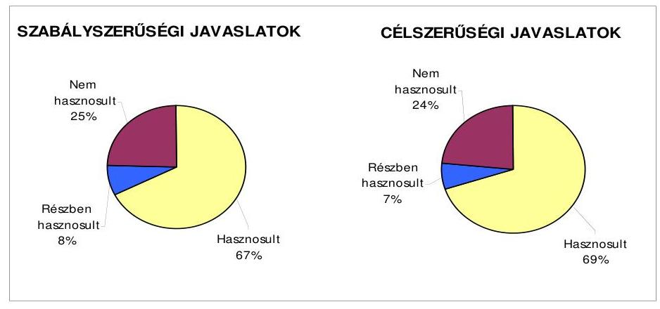

Az önkormányzatok gazdálkodási rendszerének 2008. évi ellenőrzéséről készített ÁSZ jelentésben tett javaslatok figyelembe vételével az Országgyúlés meghatározta az önkormányzatokra vonatkozóan a költségvetési hiány számításának, valamint a költségvetési rendeletben a költségvetési hiány külső-belső finanszírozásának, a finanszírozási célú pénzügyi műveletek bevételei és kiadásai figyelembevételének módját, továbbá egységesítette az Áht-ban és az Eisztvben a közérdekú gazdálkodási adatok közzétételi idejét. A Kormány kiegészítet-

---

te a Ber. előírásait a belső ellenőrzést végző társulások egyeztetési, tájékoztatási, beszámolási kötelezettségeivel.

Nem történt intézkedés az önkormányzatok kötelező feladatainak egyértelmű meghatározására. Nem valósult meg a Kbt-ben az eljárás hivatalból való kezdeményezésére az ÁSZ részére a tudomásra jutás után nyitva álló jogvesztő határidő javaslat szerinti legalább 30 naptári napra történő módosítása. A Kbt. 2008. évi módosítása során megszűnt az ÁSZ számára az a lehetőség, hogy a jogsértés tudomásra jutásához viszonyított három éves objektív jogvesztő határidőn belül jogorvoslati eljárást kezdeményezzen. Nem történt meg a müködési célú támogatások elektronikus közzétételi mintáinak kiadása.

A helyszíni ellenőrzés megállapításainak hasznosítása mellett javasoljuk:

# a belügyminiszternek és a nemzetgazdasági miniszternek 

1. kezdeményezze az Ötv. 88. § (2)-(3) bekezdéseiben foglalt, az önkormányzatok éves kötelezettségvállalásainak felső határára vonatkozó szabályozás kiegészítését annak érdekében, hogy az tartalmazzon előírást az adósságot keletkeztető kötelezettségvállalások teljes időtartamára vonatkozó felső határ számítási módjára;
2. kezdeményezze az Ötv. 88. § (1) bekezdés c) és d) pontjaiban előírtak pontosításával az önkormányzatok szabad pénzeszközeivel végezhető pénzpiaci műveletek egyértelmű meghatározását az önkormányzati gazdálkodás biztonságának elősegítése érdekében;

## a nemzetgazdasági miniszternek

1. kezdeményezze a kötelezettségvállalásra jogosultak körének meghatározására irányuló jogszabályi rendelkezések összhangjának biztosítása érdekében
a) a Htv. 139. § (1) bekezdés d) pontjában, az Áht. 100/B. § (1) bekezdésében, valamint Ámr. 72. § (3) és (6) bekezdéseiben foglalt előírások pontosítását, azaz az önkormányzati hivatal, mint költségvetési szerv nevében kötelezettségvállalásra jogosult személyek egyértelmű rögzítését, továbbá a kötelezettségvállalásra felhatalmazható személyek körének meghatározását;
b) a kötelezettségvállalási jogkör átadásának egységesen írásbeli felhatalmazásra történő módosítását;
2. kezdeményezze az Ámr. ${ }_{2}$ következő előírásainak kiegészítését, módosítását, pontosítását annak érdekében, hogy azok biztosítsanak megfelelő, egységesen értelmezhető iránymutatást a költségvetési szervek vezetői számára a belső kontrollok kialakításához és hatékony működtetéséhez a feladatok, kötelezettségek és jogok meghatározása tekintetében:
a) az Ámr. 2 20. §. (3) bekezdésének, illetve a 76. §-ának kiegészítését, azaz a szakmai teljesítés igazolás gyakorlásának módja, eljárási és dokumentálási részletszabályai belső szabályozásának nevesítetten kötelező előírását a költségvetési szervek vezetője (önkormányzati hivatalok esetében a jegyző) részére;

---

b) az Ámr. ${ }_{2}$ 76. §-ának kiegészítését a szakmai teljesítésigazolás során elvégzendő ellenőrzési feladatok meghatározásával azon kiadások elrendelésére vonatkozóan, amelyeknél a kifizetés az elvárt cél teljesítését megelőzően történik és ezért annak megvalósítását még nem tudja ellenőrizni, igazolni a szakmai teljesítés igazolására kijelölt személy;
c) az Ámr. ${ }_{2}$ 76. § (3) bekezdésében foglalt (kivételekre irányuló) szabály egyértelmú meghatározását, hogy a kötelezettséget vállaló szerv belső szabályzatában mely esetekben nem szükséges külön előírni és elvégezni a szakmai teljesítés igazolását;
d) az Ámr. ${ }_{2}$ 77. § (4) bekezdésének - a szakmai teljesítés igazolására jogosult személyek kijelölésével kapcsolatos előírás - módosítását annak érdekében, hogy az önkormányzati hivatalok esetében (a korábbi szabályozásnak megfelelően továbbra is) főszabályként a költségvetési szerv vezetője, a jegyző legyen jogosult a szakmai teljesítést igazoló személy kijelölésére, tekintettel az Áht. 88. § (1) bekezdés e) pontjában foglaltakra, miszerint a belső kontrollrendszer - ennek részeként a belső kontrollok, így a szakmai teljesítésigazolás - kialakításáért és hatékony müködtetéséért az önkormányzati hivatal esetében a jegyző a felelős;
e) az Ámr. ${ }_{2}$ 72. § (7) bekezdésének pontosítását a polgármester általános kötelezettségvállalási jogosultsága alóli kivételek meghatározása tekintetében, annak figyelembevételével, hogy az Áht. 100/B. § (1) bekezdése csak törvény részére teszi lehetővé a kivételek megfogalmazását;
3. egészítse ki a közzétételi listákon szereplő adatok közzétételéhez szükséges közzétételi mintákról szóló 18/ 2005 (XII. 27.) IHM rendelet 2. számú mellékletében a 3. gazdálkodási adatok 3.3. költségvetési beszámolók „Támogatások" közzétételi egység adatainak megnevezését a müködési célú támogatásokkal;

# a belügyminiszternek 

kezdeményezze az önkormányzatok kötelező feladatainak egyértelmű meghatározását;

## a nemzeti fejlesztési miniszternek

kezdeményezze a Kbt. 327. § (2) bekezdésének módosítását annak érdekében, hogy az ÁSZ részére a jogorvoslati eljárás kezdeményezésére nyitva álló határidő a közbeszerzési eljárás megsértésének, illetve jogellenes mellőzésének az ÁSZ tudomására jutásától számított 30 napra vonatkozzon, továbbá a jogsértés megtörténtétől számított objektív jogvesztő határidő három évre változzon.

---

# II. RÉSZLETES MEGÁLLAPÍTÁSOK 

## 1. AZ ÖNKORMÁNYZATOK KÖLTSÉGVETÉSI ÉS PÉNZÜGYI HELYZETE

Az önkormányzatok által tervezett költségvetési bevételek a 2006. évhez viszonyítva a 2009. évben 14\%-kal, (2989 milliárd Ft-ról 3393 milliárd Ft-ra), míg a költségvetési kiadások 11\%-kal (3271 milliárd Ft-ról 3633 milliárd Ft-ra) növekedtek. A teljesített bruttó költségvetési ${ }^{19}$ bevételek 2\%-kal, (3559 milliárd Ft-ról 3642 milliárd Ft-ra) nőttek, a teljesített költségvetési kiadások 3\%-kal (3404 milliárd Ft-ról 3316 milliárd Ft-ra) csökkentek a 2009. évben a 2006. évhez viszonyítva.

Az önkormányzatok és az ellenőrzött önkormányzatok által tervezett és teljesített 2006-2009. évi bruttó és nettósított bevételek és kiadások alakulását a jelentés 4., és $4 /$ a. számú mellékletei részletezik.

Az önkormányzatok 78-71-69-68\%-a 2006-2009 között költségvetési hiányt tervezett, a költségvetési bevételek elöirányzata nem biztosított fedezetet a tervezett költségvetési kiadásokra. A költségvetési hiány finanszírozására hitel felvételt ${ }^{20}$ terveztek. Az évközi likviditás, valamint a költségvetési egyensúly biztosítására az önkormányzatok 63-66-64-62\%-a tervezett rövid- és likvid hitel felvételből, 28-23-21-20\%-a hosszú lejáratú hitel felvételből és 0,1-0,2-2,1-0,7\%-a kötvénykibocsátásból származó bevételt 2006-2009 között. Az önkormányzatoknál a tervezettel szemben a teljesített költségvetési bevételek az önkormányzatok jelentősen kisebb arányánál (32-26-23-21\%-ánál) nem fedezték a költségvetési kiadásokat és a költségvetési évet pénzügyi hiánynyal záró önkormányzatok aránya évről-évre csökkent. A költségvetési egyensúly biztosítására kötvénykibocsátásból származó bevételt tervezett a 2006. évben négy, a 2007. évben hét, a 2008. évben 70 és a 2009. évben 25 önkormányzat, a költségvetés végrehajtása során azonban a 2006. évben 10, a 2007. évben 101, a 2008. évben 125 és a 2009. évben 15 önkormányzatnál teljesült kötvénykibocsátásból származó bevétel a költségvetési beszámolók adatai szerint.

Az önkormányzatoknál az eladósodási mutató 2006-2009 közötti folyamatos emelkedése jelzi, hogy az összes forráson belül emelkedett a hosszú és rövid lejáratú fizetési kötelezettségek együttes aránya. A legnagyobb mértékben a megyei önkormányzatok, a legkisebb mértékben a Budapest fővárosi kerületi önkormányzatok adósodtak el. Ugyanezen időszakban az esedékességi aránymutató folyamatos csökkenése azt jelzi, hogy az összes fizetési kötelezett-

[^0]
[^0]:    ${ }^{19}$ finanszírozási célú pénzügyi műveletek bevételei-kiadásai (hitelek felvétele és törlesztése, értékpapírok kibocsátása, értékesítése és visszavásárlása) nélkül számított bevételkiadás
    ${ }^{20}$ A költségvetési egyensúlyt rövid- és hosszú lejáratú hitelek felvételével, hitelviszonyt megtestesítő értékpapírok kibocsátásával, illetve a birtokukban lévő, hitelviszonyt megtestesítő értékpapírok értékesítésével tervezték biztosítani.

---

ségeken belül csökkent a rövid lejáratú fizetési kötelezettségek aránya a hosszú lejáratú fejlesztési hitelek és kötvénykibocsátások növekedése hatására.

Az önkormányzatok likviditási mutatói 2006-2008 között folyamatosan növekedtek, a 2009. évben csökkentek. A készpénz likviditási mutatóo ${ }^{21}$ 0,6-1,1-1,4re, a likviditási gyorsráta 1,2-1,6-2,0-ra történő emelkedése által jelzett fizetőképesség javulást a kötvénykibocsátásból származó bevétel átmenetileg betétként és értékpapírban történő elhelyezése eredményezte. A fizetőképesség 2009. évi mérséklődését jelzi a készpénz likviditási mutató 1,3-ra, a likviditási gyorsráta 1,8-ra csökkenése, amelyet a rövid lejáratú kötelezettségek növekedése, a kötvénykibocsátásból elért bevételek 2009. évi csökkenése, és a korábbi években kibocsátott kötvényekből befolyt, felhalmozási célra még fel nem használt bevételek beruházási célra történő fokozatos felhasználása miatt csökkenő betétés értékpapír állomány okozott. Az önkormányzatok fizetőképességi mutatóinak 2006-2009 közötti alakulását a jelentés 7. számú melléklete szemlélteti.

# 1.1. A költségvetési egyensúly alakulása az ellenőrzött önkormányzatoknál 

Az ellenőrzött önkormányzatok által tervezett költségvetési bevételek és kiadások előirányzatai 2006-ról a 2007-re csökkentek, a 2007-2009 között folyamatosan emelkedtek. A tervezett költségvetési bevételek a 2006. évhez viszonyítva a 2009. évben $9 \%$-kal, a költségvetési kiadások - a költségvetési bevételeknél 1 százalékponttal kisebb mértékben - 8\%-kal növekedtek. Az ellenőrzött önkormányzatok 89-89-83-78\%-a 2006-2009 között az éves költségvetésében költségvetési hiányt tervezett. Az egy önkormányzatra jutó tervezett költségvetési hiány átlagos összege 2006-2008 között 574 millió Ft-ról 812 millió Ft-ra 43\%-kal emelkedett ${ }^{22}$, legmagasabb az ellenőrzött megyei jogú városi önkormányzatoknál (a 2006. évben 1511 millió Ft, a 2008. évben 2659 millió Ft) legkisebb a városi önkormányzatoknál (a 2006. évben 271 millió Ft, a 2008. évben 396 millió Ft) volt.

Az ellenőrzött önkormányzatok 80-80-71-61\%-ánál 2006-2009 között a tervezett múködési célú költségvetési bevételek nem fedezték a múködési célú költségvetési kiadásokat, 74-63-81-55\%-ánál a felhalmozási célú költségvetési bevételeket meghaladó összegben terveztek felhalmozási célú költségvetési kiadásokat.

Az ellenőrzött önkormányzatok csökkenő aránya - 79-79-72-72\% - tervezett rövid lejáratú hitel, 76-59-45-42\%-a hosszú lejáratú hitel felvételt a költségvetési egyensúly biztosítására 2006-2009 között. A költségvetési hiányt 2006-2008 között növekvő (1-2-24\%) arányban, a 2009. évben az előző évhez viszonyítva csökkenő (8\%) arányban kötvénykibocsátásból elért bevételből tervezték finanszírozni. Az ellenőrzött önkormányzatok tervezett és teljesített 2006-2008. évi

[^0]
[^0]:    ${ }^{21}$ készpénz likviditási mutató = pénzeszközök/rövid lejáratú kötelezettségek
    ${ }^{22}$ A tervezett összes költségvetési kiadáshoz viszonyított költségvetési hiány részaránya a 2006-2008. években a megyei önkormányzatoknál 2-16\%, a megyei jogú városi önkormányzatoknál 2-25\%, a Budapest fővárosi kerületi önkormányzatoknál 1-22\% és a városi önkormányzatoknál 0,1-40\% között alakult. Az ellenőrzött önkormányzatok közül költségvetési hiányt tervező önkormányzatoknál a költségvetési hiány átlagos öszszege 644 millió Ft volt.

---

költségvetési bevételeit, kiadásait és egyensúlyi helyzetét a jelentés 6. számú melléklete tartalmazza. Az ellenőrzött önkormányzatok 53-65-63-48\%-a a költségvetési rendelet elfogadásával egyidejúleg költségvetési kiadásokat csökkentő és költségvetési bevételeket növelő intézkedéseket rendelt el a költségvetési hiány csökkentése érdekében. A kiadáscsökkentő intézkedésként leggyakrabban a költségvetési intézmények összevonásával a személyi juttatások és járulékainak előirányzatait, a fenntartási kiadások előirányzatait, továbbá az önként vállalt feladatokra korábbi években adott céljellegú támogatások előirányzatait tervezték csökkenteni. A költségvetési bevételek növelése érdekében elsősorban a pályázatok benyújtására hoztak intézkedéseket.

Az ellenőrzött önkormányzatok kilenctizedénél a jegyző a költségvetés tervezésekor gondoskodott a likviditás feltételeinek biztosításáról előirányzatfelhasználási terv készítésével, valamint kezdeményezte a folyószámla hitelkeret költségvetési rendeletben történő jóváhagyását.

Az ellenőrzött önkormányzatok 77-62-68-57\%-a 2006-2009 között az éves költségvetések megállapításakor az Áht. 8/A. § (7) bekezdésében előírtak ellenére a költségvetési hiány finanszírozásával kapcsolatos pénzügyi múveletek bevételeit és kiadásait költségvetési hiányt, illetve költségvetési többletet módosító költségvetési bevételként és kiadásként vette figyelembe. Ezáltal az elfogadott költségvetési rendelettervezetekben nem mutatták be az önkormányzat valós pénzügyi helyzetét, a tervezett költségvetési hiány, vagy többlet, valamint a finanszírozási célú pénzügyi műveletek bevételeit és kiadásait.

# 1.2. A pénzügyi egyensúly alakulása, a pénzügyi hiány finanszírozásának hatása az eladósodásra és a fizetőképességre az ellenőrzött önkormányzatoknál 

Az ellenőrzött önkormányzatok teljesített költségvetési bevétele 2006-2008 között folyamatosan emelkedett, a 2008. évi teljesített költségvetési bevételek 6,8\%-kal haladták meg a 2006. évit, míg a 2008. évi teljesített költségvetési kiadások 0,8\%-kal csökkentek (a 2009. évi teljesített költségvetési bevételek 3,4\%-kal, a teljesített költségvetési kiadások 3,6\%-kal csökkentek az előző évhez képest).
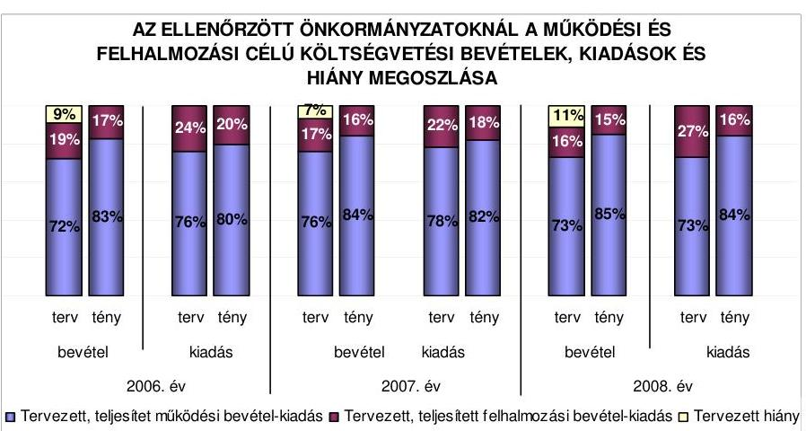

---

A költségvetés teljesítése során a költségvetési hiányt tervező önkormányzatok arányánál 41-54-55 százalékponttal kisebb aránynál volt év végén pénzügyi hiány, a 2006. évben $48 \%$-nál, a 2007. évben $35 \%$-nál és a 2008. évben $28 \%$-nál ${ }^{23}$. A 2009. év végén az ellenőrzött önkormányzatok $29 \%$-ánál nem fedezték a teljesített költségvetési bevételek a teljesített költségvetési kiadásokat. A pénzügyi hiány átlagos összege a 2006. évi 368 millió Ftról a 2008. évre 127 millió Ft-ra ( $65,5 \%$-kal), a 2009. évre 154 millió Ft-ra ( $58,2 \%$-kal) csökkent. A teljesített költségvetési bevételek a 2008. évben a megyei önkormányzatok $75 \%$-ánál, a megyei jogú városi önkormányzatok 67\%ánál, a Budapest fővárosi kerületi önkormányzatok $83 \%$-ánál és a városi önkormányzatok $71 \%$-ánál fedezték a teljesített költségvetési kiadásokat. Az ellenőrzött önkormányzatoknál 2006-2008 között tervezett és teljesített múködési és felhalmozási célú költségvetési kiadásokra a következő arányban biztosítottak fedezetet a költségvetési bevételek:

Adatok: \%-ban

| Megnevezés | 2006. év |  | 2007. év |  | 2008. év |  |
| :--: | :--: | :--: | :--: | :--: | :--: | :--: |
|  | Terv | Tény | Terv | Tény | Terv | Tény |
| Múködési célú költségvetési kiadások fedezettsége múködési célú költségvetési bevételekből | 95,6 | 104,6 | 97,9 | 107,2 | 100,1 | 109,6 |
| Felhalmozási célú költségvetési kiadások fedezettsége felhalmozási célú költségvetési bevételekből | 78,2 | 84,0 | 76,0 | 96,4 | 60,5 | 100,7 |
| Költségvetési kiadások fedezettsége költségvetési bevételekből | 91,4 | 100,4 | 93,1 | 105,3 | 89,5 | 108,1 |

A költségvetési kiadások fedezettsége a teljesített költségvetési bevételekből a tervezettnél 9-12,2-18,6 százalékponttal kedvezőbb volt 2006-2008 között. A teljesített múködési célú költségvetési bevételek ezen időszakban az önkormányzatok 61-71-71\%-ánál fedezték a teljesített múködési célú költségvetési kiadásokat, 57-56-51\%-ánál azonban a teljesített felhalmozási célú bevételeket meghaladó összeggel teljesítettek felhalmozási célú kiadásokat.

A pénzügyi hiány tervezettnél kedvezőbb 2006-2008. évi alakulásához hozzájárult, hogy az önkormányzatok 55-44-46\%-ánál a jegyző a költségvetési rendelettervezet elkészítésekor - az Áht. 7. § (2) bekezdésében ${ }^{24}$ foglaltak ellenére az előző évi pénzmaradvány igénybevételét az előző évről áthúzódó feladatok (kötelezettségek) fedezeteként nem tervezte meg és 18-16-

[^0]
[^0]:    ${ }^{23}$ A teljesített összes költségvetési kiadáshoz viszonyított költségvetési hiány részaránya a 2006-2008. években a megyei önkormányzatoknál 0,2-6\%, a 2006-2008. években a megyei jogú városi önkormányzatoknál 0,2-27\%, a Budapest fővárosi kerületi önkormányzatoknál 0,1-8\% és a városi önkormányzatoknál 0,001-31\% közötti volt.
    ${ }^{24}$ Az Áht. 7. § (2) bekezdését 2010. január 1-től hatályon kívül helyezte a 2008. évi LXXV. törvény 21. § (1) bekezdése.

---

18\%-a a beruházások, 22-16-12\%-a a felújítások előirányzatait nem kellő alapossággal tervezte meg. Az előző évi pénzmaradvány igénybevétel tervezésével összefüggő hiányosság miatt az érintett önkormányzatoknál elmaradt, vagy az indokoltnál kisebb összegben tervezték meg bevételként az előző évi - szabad, vagy kötelezettséggel terhelt - pénzmaradvány igénybevételt, valamint e bevételi előirányzathoz kapcsolódóan az előző évről áthúzódó kiadásaikat, kötelezettségeiket annak ellenére, hogy ezen feladatok ellátásához teljesíthető kiadások és azok forrása az eredeti előirányzatok tervezésekor ismertek voltak.

A 2006-2009. években az ellenőrzött önkormányzatok tervezettnél kisebb aránya, 66-49-50-49\%-a ${ }^{25}$ vett fel rövid lejáratú, és likviditási célú hitelt ${ }^{26}$, 70-59-40-31\%-a hosszú lejáratú hitelt, ugyanakkor 2006-2008 között a tervezettnél nagyobb aránya (3,7-34,1-30,5\%-a), a 2009. évben kisebb aránya ( $6,1 \%$-a) befektetési célú értékpapírt (kötvényt) bocsátott ki. A tervezettől eltérő teljesítést eredményezte, hogy a hiányzó források fedezetére a tervezett rövid- és hosszúlejáratú hitelfelvétel helyett kötvényt bocsátottak ki, továbbá a költségvetési hiányt tervező önkormányzatoknál a költségvetés végrehajtása során csökkent, vagy nem volt pénzügyi hiány, így a tervezett finanszírozási célú bevételeket (rövid-és hosszú lejáratú hiteleket) nem, vagy kisebb összegben vették igénybe.

Az ellenőrzött önkormányzatok 2006-2009 között tervezett és teljesített finanszírozási célú pénzügyi műveleteinek alakulását a jelentés 6/a. számú melléklete részletezi.

A likviditást biztosító hitelek közül a 2006-2008. években folyószámlahitelt felvevő ellenőrzött önkormányzatoknál az egy napra jutó legnagyobb folyószámlahitel összege ${ }^{27}$ 2006-2008 között 34\%-kal nőtt.

A folyószámla-hitel igénybevételével gazdálkodó önkormányzatok aránya a 2006. évi $77 \%$-ról a 2008. évre $83 \%$-ra emelkedett. Valamennyi ellenőrzött megyei önkormányzat folyószámlahitelt vett igénybe a 2006. és a 2007. évben, míg ez az arány a 2008. évben $75 \%$ volt. A vizsgált évek mindegyikében év végén az önkormányzatok $42 \%$-a rendelkezett vissza nem fizetett folyószámlahitel állománnyal, amelyet a folyószámla hitelszerződések ${ }^{28}$ lehetővé tettek.

[^0]
[^0]:    ${ }^{25}$ A 2006-2009. évi költségvetési rendeletében az ellenőrzött önkormányzatok 79-79-72-72\%-a rövid lejáratú, 76-59-45-42\%-a hosszú lejáratú hitelfelvételből, és 1,2-2,4-24,4-8,5\%-a befektetési célú értékpapír kibocsátásából származó bevételt tervezett a költségvetési egyensúly biztosításához.
    ${ }^{26}$ Likviditási célú hitelként kell kimutatni az Áhsz. 9. számú, a számlaosztályok tartalmára vonatkozó előírásokat tartalmazó mellékletének 14. f) pontja alapján a folyó-számla-, a rulírozó- és a munkabér-megelőlegezési hitelek révén befolyó bevételeket.
    ${ }^{27}$ Az egy napra jutó legnagyobb folyószámlahitel összege a 2006. évben 2261 millió Ft Sopron, a 2007. évben 3016 millió Ft, a 2008. évben 3029 millió Ft (mindkét évben) Hódmezővásárhely megyei jogú városoknál volt.
    ${ }^{28}$ Az ellenőrzött, folyószámlahitel igénybevételével gazdálkodó önkormányzatoknál a folyószámla hitelszerződéseket - az év eleji likviditás biztosítása érdekében - nem naptári évre, hanem a költségvetési rendeletek jóváhagyásának időpontjához igazodóan, általában márciustól márciusig tartó időtartamra kötötték.

---

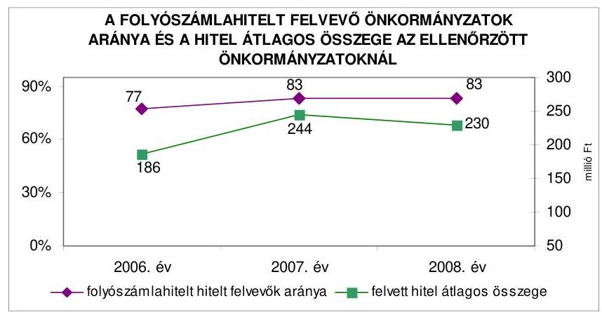

Az ellenőrzött önkormányzatok közül a 2006. évben három ${ }^{29}$, a 2007. évben 28, a 2008. évben 25, a 2009. évben öt önkormányzat bocsátott ki kötvényt, a 2006. évben összesen 17053 millió Ft, a 2007. évben 39286 millió Ft, a 2008. évben 47815 millió Ft, a 2009. évben 11003 millió Ft értékben.

A kötvények futamideje 8-25 év közötti - 71\%-nál 20-25 év - volt. A kötvénykibocsátásból elért bevétel legkisebb összege 70 millió Ft (a 2009. évben Tiszalök város önkormányzatánál), a legnagyobb összege 12000 millió Ft (a 2006. évben Hódmezővásárhely Megyei Jogú Város Önkormányzatánál, a 2008. évben a Somogy Megyei Önkormányzatnál) volt. A kötvénykibocsátásból elért bevétel átlagos összege a 2006. évről a 2009. évre 67,7\%-kal, 5684 millió Ft-ról 2201 millió Ft-ra csökkent a kötvényt kibocsátó ellenőrzött önkormányzatok számának (háromról ötre) növekedése és a kibocsátott kötvényekből befolyt bevételek ( 17052 millió Ft-ról 11003 millió Ft-ra) csökkenésének együttes hatására. A 2006-2009. évi kötvénykibocsátások hatásaként a hosszú lejáratú kötelezettségek állománya a 2006. évi végi állomány közel háromszorosára nőtt ${ }^{30}$ a 2009. év végére, ami ezen önkormányzatok fokozódó eladósodását eredményezte.

A kötvénykibocsátásból befolyt bevétel felhasználási céljaként az ellenőrzött önkormányzatok 38\%-a kizárólag felhalmozási célú kiadások finanszírozását, 62\%-a pedig a múködési és felhalmozási célú kiadások finanszírozását, valamint a korábban felvett hitelek törlesztését együttesen jelölte meg. A korábban felvett múködési célú hitelek törlesztésére 6310 millió Ft, a fejlesztési célú hitelek visszafizetésére 15515 millió Ft kiadást irányoztak elő a kötvénykibocsátásból befolyó bevételből. A 2006-2009 között kibocsátott kötvények $91 \%$-a svájci frank, $7 \%$-a forint, $2 \%$-a euro alapú volt. Valamennyi kötvénykibocsátás változó mértékủ kamatfizetési kötelezettséggel történt. A deviza árfolyamváltozása, valamint a változó kamat-

[^0]
[^0]:    ${ }^{29}$ A 2006. évben Hódmezővásárhely (12,1 milliárd Ft), Sopron (2,9 milliárd Ft) megyei jogú városok és Budapest főváros XII kerület ( 2,1 milliárd Ft) önkormányzatainál teljesült kötvénykibocsátásból finanszírozási bevétel.
    ${ }^{30}$ A 2006-2009. évi könyvviteli mérlegek adatai szerint a hosszú lejáratú kötelezettségek között a múködési célú kötvénykibocsátás miatti tartozásállomány 0-1094-1327 millió, fejlesztési célú kötvénykibocsátás miatti 15360-53709-102486-117512 millió Ft volt.

---

mérték miatt az önkormányzatok számára a kötvénykibocsátás kockázatot jelent. A tőketörlesztés megkezdéséhez meghatározott türelmi idő $0,5-5$ év között változott. A tőketörlesztés és kamatfizetés együttes összege - a 2009. évi költségvetési adatok alapján számítva - az éves adósságot keletkeztető kötelezettségvállalás felső határához viszonyítva a kötvényt kibocsátó önkormányzatok $71 \%$-ánál $30 \%$ alatti volt. Az ellenőrzött önkormányzatok közül 2006-2009 között kettő ${ }^{31}$ a futamidő végén történő egyösszegű tőketörlesztést vállalt. Az Ötv. 88. § (2) bekezdése rögzíti, hogy az önkormányzatok adósságot keletkeztető éves kötelezettségvállalásának felső határa a korrigált saját bevétel. Hiányzik azonban a több éves (15-20 évi) tőketörlesztés, valamint a 10-20 év múlva esedékes egyösszegű visszafizetési kötelezettségvállalás esetében a korrigált saját bevétel, illetve az adósságot keletkeztető kötelezettségvállalásra vonatkozó felső határ számítási módjának a meghatározása, ezért erre kiterjedő számításokat az önkormányzatok nem végeztek. Nem mutatták be a képviselő-testületnek, hogy a tőketörlesztés éveiben, vagy egyösszegű visszafizetés esetén a visszafizetés évében az adósságot keletkeztető kötelezettségvállalás a számításba vehető korrigált saját bevételhez viszonyítva milyen arányú fizetési kötelezettséget jelent, illetve a döntést hozó képviselő-testületek nem rendelkeztek információval arra vonatkozóan, hogy a törlesztés éveiben (évében) a saját bevételek fedezik-e majd a vállalt fizetési kötelezettséget.

Gyömrő Város Önkormányzata által a 2007. évben kibocsátott 447 millió Ft öszszegű kötvény visszafizetése a lejáratkor (2016. április 30.) egy összegben esedékes, amelynek a kibocsátáskori árfolyamon számított névértéke $33 \%$-kal nagyobb, mint a kibocsátás évében elért éves korrigált saját bevétel összege. A Kép-viselő-testület a visszafizetéshez szükséges forrás biztosítása érdekében évenkénti tartalék képzéséről és betétként történő elhelyezéséről döntött, amely összeg, mint a pénzmaradvány része a lejárat évében sem vehető figyelembe az önkormányzat adósságot keletkeztető kötelezettségvállalásának felső határa számítása során korrigált saját bevételként az Ötv. 88. § (3) bekezdés a)-b) pontjaiban foglaltak alapján, ezért a futamidő végi egyösszegű törlesztésre az Ötv. 88. § (3) bekezdése b) pontja szerint számított saját bevétel nem nyújt fedezetet.

A kötvény visszafizetését az érintett önkormányzatok 88\%-a a saját bevételekből, azon belül 31\%-a a helyi adókból befolyó bevételből tervezte, $12 \%$-a nem jelölte meg a visszafizetés forrását. A kötvénykibocsátásból befolyt bevételből az ellenőrzött önkormányzatok 10\%-ánál a tervezett felhasználási célt megvalósították, a korábbi hitelt visszafizették, a működési, felhalmozási célokat a befolyt bevételből megvalósították. Az ellenőrzött önkormányzatok 90\%-a a tervezett beruházási, felújítási célra történő felhasználást megelőzően a kötvénykibocsátásból elért bevételből, vagy annak egy részéből különböző pénzügyi műveleteket - betételhelyezés, hazai és nemzetközi tőzsdéken forgalmazott rövid és hosszú lejáratú értékpapírok vétele-eladása, határidős devizaügyletek kötése és egyéb, a pénzpiacon magas kockázatúnak minősített pénzpiaci műveleteket - végzett. Az elvégzett kockázatos pénzpiaci műveletek során egy ellenőrzött önkormányzatot a befektetett tőke részbeni el-

[^0]
[^0]:    ${ }^{31}$ Budapest főváros XII. kerület és Gyömrő város önkormányzatai a kötvény visszafizetésére egyösszegű tőketörlesztést vállaltak a futamidő végén. A 2008. évben ellenőrzött önkormányzatok közül három önkormányzat - Székesfehérvár megyei jogú város, Gödöllő, Újfehértó városok önkormányzatai - vállaltak a futamidő végén történő egyössszegű tőketörlesztést.

---

vesztésével 76,8 millió Ft kár érte, amelynek bekövetkezte miatt büntető feljelentést tett az ÁSZ. Az önkormányzatok szabad pénzeszközeinek különböző pénzpiaci műveletekre történő felhasználását egyértelmű jogszabályi előírás jelenleg nem tiltja. Az Ötv. 88. § (1) bekezdés c) pontja szerint az önkormányzatok az állami hozzájárulás kivételével dönthetnek a célhoz nem kötött forrásaik betétként történő elhelyezéséről, a d) pontban előírtak alapján pedig jogosultak a különféle banki szolgáltatások igénybevételéről dönteni. Ez utóbbi előírás alapján tekintették jogszerűnek a különböző pénzpiaci műveletek elvégzését az önkormányzatok. A döntések során az Ötv. 90. § (1) bekezdés alapján figyelembe kellett venniük, hogy a képviselő-testületek a felelősek a gazdálkodás biztonságáért.

A hosszú és rövid lejáratú fizetési kötelezettség összes forráshoz viszonyított arányát jelző eladósodási mutató ${ }^{32}$ 2006-2009 közötti folyamatos emelkedése is jelzi, hogy az ellenőrzött önkormányzatok eladósodása nőtt ${ }^{33}$, átlagos értéke $9,4-11,8-15,5-16,5 \%$ volt.

Az ellenőrzött önkormányzatok eladósodási mutatója a 2006. évben 0,6-51,4\%, a 2007. évben 0,3-51,7\%, a 2008. évben 0,3-54,3\% ${ }^{34}$, a 2009. évben 1,4-57,1 között alakult, a legnagyobb a megyei önkormányzatoknál ${ }^{35}$ volt. Az eladósodási mutató a 2006. év végén az ellenőrzött önkormányzatok 41\%-ánál, a 2009. év végén már csak 17\%-ánál 5\% alatti, a 2006. év végén 29\%-ánál, a 2009. év végén 38\%ánál 10-20\% közöttire emelkedett, a 2006. év végén 4\%-ánál, a 2009. év végén már $28 \%$-ánál $20 \%$ feletti volt.

Az ellenőrzött önkormányzatok 2006-2008. év végi rövid lejáratú kötelezettségeinek állománya az összes kötelezettséghez viszonyítva (esedékességi aránymutató) évente csökkent, 48,6-36,7-25,8\% volt, a 2009 év végén 26\%-ra nőtt. Az összes kötelezettség 2006-2009 közötti 94,3\%-os növekedésén belül a hosszú lejáratú kötelezettségek növekedése 179,8\%-os volt, amelynél kisebb arányban - 3,9\%-kal emelkedtek a rövid lejáratú kötelezettségek. Az összes kötelezettségen belül a hosszú lejáratú kötelezettségek 2006-2009 közötti növekedése legnagyobb - tízszeres - mértékủ volt az ellenőrzött megyei önkormányzatoknál. Az ellenőrzött városi önkormányzatok évente átlag 6\%-a csak rövid lejáratú fizetési kötelezettséggel rendelkezett. Az összes kötelezettségen belül a rövid lejáratú kötelezettségek aránya 2006-2008 között csökkent, a 2009 év végére, 2 százalékponttal nőtt, mivel a kiváltásukra fordított hosszú lejáratú kötelezettséget jelentő kötvénykibocsátás bevétele esetében a fizetési kötelezettség átlagosan 4-5 évi tőketörlesztési türelmi idő múlva esedékes.

Az ellenőrzött önkormányzatok 74\%-ánál az eladósodás növekedése miatt a pénzügyi helyzet 2006-2009 között kedvezőtlenül változott. Az ellenőrzött ön-

[^0]
[^0]:    ${ }^{32}$ eladósodási mutató = összes kötelezettség-egyéb passzív pénzügyi elszámolások/öszszes forrás
    ${ }^{33}$ Az ellenőrzött önkormányzatoknál az egyéb passzív pénzügyi elszámolások nélkül számított kötelezettségek állománya az előző évhez viszonyítva 2007-ben 31,0\%-kal, 2008-ban 37,2\%-kal, 2009-ben 8,1\%-kal növekedett.
    ${ }^{34}$ Az eladósodási mutató 2008-2009. évek végén Hódmezővásárhely Megyei Jogú Város Önkormányzatánál volt a legnagyobb.
    ${ }^{35}$ A 2009. év végén a négy ellenőrzött megyei önkormányzat közül háromnál 30\% feletti (31,8-38,4-49,2) volt az eladósodási mutató értéke.

---

kormányzatoknál az eladósodási és esedékességi mutatók 2006-2009 közötti alakulását önkormányzat típusonként a jelentés 8. számú melléklete szemlélteti.

Az önkormányzatoknál a 2006-2008. év végi likviditási mutatók emelkedése (a készpénz likviditási mutató a 2008. évben a 2006. évinek a kétszeresére, 0,8 -ról 1,6-ra, a likviditási gyorsráta a másfélszeresére nőtt) fizetőképességi szempontból javuló pénzügyi helyzetet jeleztek. A pénzeszközök, valamint a rövid lejáratú kötelezettségek kiegyenlítésébe bevonható követelések ${ }^{36}$ és a hitelviszonyt megtestesítő értékpapírok együttes összege növekvő arányban nyújtott fedezetet a rövid lejáratú kötelezettségekre.

A fizetőképesség 2006-2008 közötti javulását okozta, hogy a kötvénykibocsátásból elért bevétel betétként, értékpapírként történő tartalékolása a pénzeszközök, valamint a forgatási célú, hitelviszonyt megtestesítő értékpapírok állományát ${ }^{37}$ növelte, ugyanakkor csökkent ${ }^{38}$ a rövid lejáratú kötelezettségek könyvviteli mérleg szerinti értéke a hosszú lejáratú hitelek és kötvények visszafizetésére kapott türelmi idő miatt. A fizetőképességi mutatók a 2009. év végén az előző év végéhez viszonyított csökkenése (készpénz likviditási mutató értéke 1,3, a likviditási gyorsráta értéke 1,7 mérséklődött) jelzi, hogy az ellenőrzött önkormányzatok pénzügyi helyzete fizetőképességi szempontból kedvezőtlenül alakult, amelyet a kötvénykibocsátásból elért bevételek mérséklődése, a pénzeszközök felhalmozási célra történő felhasználása miatti pénzeszköz és értékpapír állomány előző év végéhez viszonyított csökkenése valamint a rövid lejáratú kötelezettségállomány növekedése együttesen okozott.
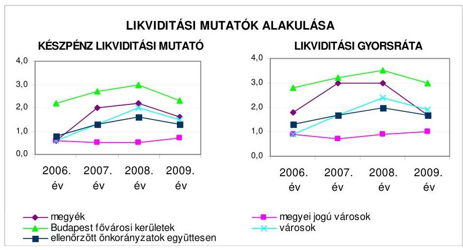

Az ellenőrzött önkormányzatoknál 2006-2008 között a pénzeszközök növekvő mértékben nyújtottak fedezetet a rövid lejáratú kötelezettségek teljesítésére.

[^0]
[^0]:    ${ }^{36}$ Az ellenőrzött önkormányzatok követelésállománya 2006-2007 között a megyei önkormányzatok illetékügyi feladatainak adóhatósághoz történő átadása miatt csökkent.
    ${ }^{37}$ A 2006. évről a 2008. évre a pénzeszközök állománya 83,9\%-kal, a hitelviszonyt megtestesítő értékpapírok állománya pedig ötszörösére nőtt, míg a 2009. év végére a pénzeszközök állománya az előző évhez képest 8,7\%-kal, a hitelviszonyt megtestesítő értékpapírok állománya 91,8\%-kal csökkent.
    ${ }^{38}$ A rövid lejáratú kötelezettségek állománya 2006-ról 2008-ra 4,8\%-kal csökkent.

---

A készpénz likviditási mutató a 2006. évben 0,0-23, a 2007. évben 0,0-14,5, a 2008. évben 0,0-27,1 és a 2009. évben 0,0-23,8 között szóródott. A legnagyobb mutatóérték három városi ${ }^{39}$ és egy megyei önkormányzatnál, a legkisebb mutatóérték több városi önkormányzatnál volt. Az önkormányzatok 25-44-62$50 \%$-ánál nyújtott fedezetet a pénzeszközök év végi állománya 2006-2009 között a rövid lejáratú kötelezettségek teljesítésére. Az arányok előző évhez viszonyított növekedését 2006-2008 között elsősorban a kötvénykibocsátásból elért bevételek tartalékban tartása okozta.

Az önkormányzatok fizetőképességének 2006-2008 közötti javulását mutatja a likviditási gyorsráta ${ }^{40}$ növekedése is, amely jelzi, hogy a rövid lejáratú kötelezettségek kiegyenlítésére a pénzeszközök, a követelések és a hitelviszonyt megtestesítő értékpapírok együttes összege növekvő arányban (1,3-1,7-29) biztosított fedezetet. A likviditási gyorsráta a 2006. évben 0,1-27,4, a 2007. évben 0,1-16,2, a 2008. évben 0,1-56,6, és a 2009 évben 0,125,0 között szóródott ${ }^{41}$. A legkisebb mutatóértékkel több városi önkormányzat ${ }^{42}$, a legnagyobbal egy megyei önkormányzat ${ }^{43}$ rendelkezett a 2006-2009. években. A fizetőképesség 2006-2008 közötti javulását mutatja, hogy a likviditási gyorsráta értéke a 2006. évben az ellenőrzött önkormányzatok 27\%-ánál, míg a 2008. évben már 52\%-ánál volt 2\% feletti, azonban a 2009. évben már csak $42 \%$-ánál volt $2 \%$ feletti.

A likviditási gyorsráta értéke egy alatti volt a 2006. év végén az ellenőrzött önkormányzatok $61 \%$-ánál, a 2007. év végén $43 \%$-ánál, a 2008. év végén $24 \%$ ánál, a 2009. év végén $40 \%$-ánál. Az egy alatti értékkel rendelkező önkormányzatok arányának 2006-2008 közötti csökkenését a pénzeszközök és forgatási célú értékpapírok állományának (kötvénykibocsátásból származó bevételek) növekedése és a kibocsátott kötvények elhalasztott tőketörlesztésének együttes hatása eredményezte. A fizetőképességi mutatók javulása átmeneti, a kötvénykibocsátásból befolyt bevételek pénzeszközök és értékpapírok formájában történő tartalékolásának és a kibocsátott kötvények visszafizetésére a pénzintézetek által nyújtott türelmi idő miatti rövid lejáratú fizetési kötelezettségállomány kisebb mértékű növekedésének az együttes következménye. A kötvénykibocsátáskor elhatározott célok teljesítésével (a tartalékolt pénzesz-

[^0]
[^0]:    ${ }^{39}$ A készpénz likviditási mutató a 2006. évben Kadarkút Város Önkormányzatánál 23, a 2007. évben Lengyeltóti Város Önkormányzatánál 14,5, a 2008. évben Veszprém Megyei Önkormányzatnál 27,1 és a 2009. évben Aszód Város Önkormányzatánál 23,8 volt.
    ${ }^{40}$ likviditási gyorsráta = követelések+forgatási célú értékpapírok+pénzeszközök/rövid lejáratú kötelezettségek.
    ${ }^{41}$ A likviditási gyorsráta értéke 2006-2009 között a megyei önkormányzatoknál 0,5 56,6, a megyei jogú városi önkormányzatoknál 0,2-4,7, a Budapest kerületi önkormányzatoknál 0,4-13,4 között szóródott.
    ${ }^{42}$ Pomáz, Hajdúsámson, Nyíradony, Kerekegyháza és Fonyód, Kunszentmárton, Pálháza, Pásztó, Tura és Csorvás városok önkormányzatainál volt legkisebb a likviditási gyorsráta értéke $(0,1)$ a 2006-2009. években.
    ${ }^{43}$ A likviditási gyorsráta értéke a 2008. évben legnagyobb a Veszprém Megyei Önkormányzatnál volt.

---

közök elhatározott célokra történő felhasználásával) a fizetőképességi mutatók kedvezőtlen változása várható a következő években.

# 2. AZ ÖNKORMÁNYZATOK FELKÉSZÜLTSÉGE AZ EURÓPAI UNIÓS FORRÁSOK IGÉNYLÉSÉRE ÉS FELHASZNÁLÁSÁRA 

### 2.1. Az európai uniós források igénybevételére és a várható támogatás felhasználására történt felkészülés szabályozottságának, szervezettségének eredményessége

Az ellenőrzött önkormányzatok 22\%-a felkészült, 78\%-a nem készült fel eredményesen az európai uniós források igénybevételére és a várható támogatás felhasználására 2006-2009 között. Az európai uniós források igénybevételére irányuló pályázatok a gazdasági programokban, ágazati, és településfejlesztési koncepciókban megfogalmazott fejlesztési célkitűzésekhez többségükben (94\%ban) kapcsolódtak, azonban a szabályozottság ${ }^{44}$ terén az ellenőrzött önkormányzatok $74 \%$-a, a szervezettség ${ }^{45}$ vonatkozásában $4 \%$-a nem készült fel eredményesen ${ }^{46}$ az európai uniós források igénybevételére és felhasználására. A szabályozások nem tartalmazták a pályázatfigyelést végzők és a döntési, illetve a döntés-előkészítési jogkörrel rendelkezők közötti információszolgáltatási kötelezettséget, nem írták elő a folyamatba épített, előzetes, utólagos és vezetői ellenőrzési feladatokat.

Az ellenőrzött önkormányzatok 95-99-98\%-a biztosította 2006-2009 között az önkormányzati hivatal szervezetén belül, valamint külső szervezetek igénybevételével a pályázatfigyelés, a pályázatkészítés és a fejlesztési feladat lebonyolításának szervezeti, személyi feltételeit. A külső szervezetekkel kötött szerződések 69\%-ában a pályázat szakmai és formai követelményére vonatkozó felelősség szabályait meghatározták, valamint $48 \%$-ában a fejlesztési feladat lebonyolítását végző ellenőrzési kötelezettségét előírták, azonban a belső ellenőrzési stratégiát megalapozó kockázatelemzés a 2007-2009. években az ellenőrzött önkormányzatok 77\%-ánál nem terjedt ki az európai uniós forrásokkal támogatott fejlesztési feladatokra. Az európai uniós források igénybevételével és felhasználásával összefüggő felkészültség eredményességének értékelési szempontjait a jelentés 9 . számú melléklete tartalmazza.

[^0]
[^0]:    ${ }^{44}$ Önkormányzati szintű szabályozás azoknak a lényeges információknak, területeknek, kapcsolattartási és ellenőrzési feladatoknak, továbbá a felelősségnek a meghatározása, amelyek hatást gyakorolnak a döntést hozó döntéseire, a sikeres pályázati tevékenységre, valamint annak eredményes megvalósítására.
    ${ }^{45}$ Az önkormányzati hivatal szervezetén belül, vagy külső személy, szervezet igénybevételével a pályázatfigyelés, a pályázatkészítés és a fejlesztési feladat lebonyolításának a személyi és szervezeti feltételeit biztosították.
    ${ }^{46}$ A 2007-2008. években nem készült fel eredményesen a szabályozottság terén az ellenőrzött önkormányzatok 92-82\%-a, a szervezettség vonatkozásában 17-17\%-a.

---

# 2.1.1. Az európai uniós forrásokra történő pályázatok benyújtására vonatkozó döntések összhangja a fejlesztési célkitűzésekkel 

Az ellenőrzött önkormányzatok a 2006-2009. évekre fejlesztési célkitüzéseiket szociális szolgáltatás-tervezési koncepciókban, feladat-ellátási, intézmény-hálózat-müködtetési- és fejlesztési tervekben, településfejlesztési koncepciókban ${ }^{47}$, valamint további szakmai programokban és tervekben ${ }^{48}$, 93\%-uk ${ }^{49}$ gazdasági programokban határozta meg. Az Ötv. 91. § (7) bekezdésében foglaltak ellenére a 2006-2009 közötti időszakra vonatkozóan gazdasági programot az önkormányzatok 7\%-a nem készített ${ }^{50}$.

A fejlesztési célkitűzések között a megyei önkormányzatok a szakképzési, az okta-tási-nevelési intézmények tárgyi feltételeinek javítását, a kórház-rekonstrukciós programok megvalósítását, a középületek akadálymentesítését, a regionális és nemzetközi partnerségi kapcsolatok kialakítását, a megyei jogú városi önkormányzatok a helyi közlekedési infrastruktúra fejlesztését, a csapadékvíz-elvezetési és hulladékgazdálkodási rendszerek kiépítését, az ipari parkok és turisztikai vonzerők fejlesztését, Budapest főváros kerületi önkormányzatai a szociális területen a hiányzó ellátási formák kialakítását, a szociális szolgáltatásoknak helyet adó intézmények épületeinek felújítását, az elektronikus ügyintézés feltételeinek biztosítását tervezték. Budapest Fővárosi Önkormányzat a középtávú városfejlesztési programjában a tömegközlekedési hálózat kiterjesztését és továbbfejlesztését, a szennyvíztisztító rendszer és létesítményeinek bővítését, a kötött pályás közlekedés előnyben részesítését, a kerékpáros közlekedés feltételeinek javítását, a szociális, város-rehabilitációs és regionális kórházprogram folytatását tervezte. A városi önkormányzatok fejlesztési céljai az intézmények felújítását és akadálymentesítését, a szennyvízelvezetés és kezelés fejlesztését, a felszíni csapadékvízelvezetés kiépítését, a belterületi utak korszerúsítését, a környezeti értékek megóvását, a kerékpárutak létesítését, az egészségügyi és szociális alapellátás humán és tárgyi feltételeinek javítását, az önkormányzati hivatalok informatikai hálózatának bővítését, valamint a testvérvárosi kapcsolatok kialakítását tartalmazták.

Az ellenőrzött önkormányzatok 84\%-nál - a 2007-2008. években ellenőrzött önkormányzatok 61\%-ánál, illetve 76\%-ánál - figyelembe vették a fejlesztések meghatározásakor azok megvalósításának lehetséges pénzügyi forrásait. Az önkormányzatok 10\%-a az NFT-ben, 25\%-a az ÚMFT-ben megjelenő pályázati lehetőségek megismerését követően, a pályázatokhoz történő csatlakozási lehetőség biztosítása érdekében módosította fejlesztési célkitűzéseit.

[^0]
[^0]:    ${ }^{47}$ Az önkormányzatok a fejlesztési koncepciókat a szociális igazgatásról szóló 1993. évi III. törvény 92. § (3)-(4) bekezdéseiben, a közoktatásról szóló 1993. évi LXXIX. törvény 85. § (4) bekezdésében előírtaknak megfelelően, valamint a területfejlesztésről és a területrendezésről szóló 1996. évi XXI. törvény figyelembevételével dolgozták ki.
    ${ }^{48}$ A stratégiai célokat az integrált városfejlesztési stratégiákban, a közép és hosszú távú fejlesztési irányokat a gyermek-, ifjúsági-, idegenforgalmi-, sport koncepciókban, továbbá a környezetvédelmi programokban rögzítették az ellenőrzött önkormányzatok.
    ${ }^{49}$ A 2007-2008. években ellenőrzött önkormányzatok 91-92\%-a rendelkezett gazdasági programmal.
    ${ }^{50}$ Abádszalók, Fertőd és Martonvásár városi önkormányzatok 2006-2009 között, Budapest főváros XVII. kerületi, valamint Göd és Sellye városi önkormányzatok 2006-2008 között gazdasági programot nem készítettek.

---

Az ellenőrzött önkormányzatok a 2006-2009. évekre vonatkozóan $1643^{51}$ - a 2007. és a 2008. években ellenőrzött önkormányzatok 600, illetve 778 - európai uniós támogatással megvalósítható fejlesztési feladathoz kapcsolódó pályázat benyújtásáról döntöttek. Budapest Fővárosi Önkormányzat esetében a Kormány egyedileg hagyta jóvá - a KMOP intézkedéseihez kapcsolódóan - 12 projekt támogatását.
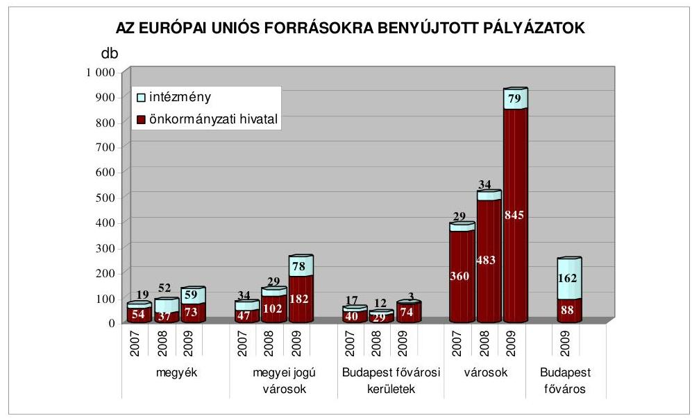

A benyújtott pályázatokban szereplő fejlesztési célok a 2007-2009 közötti években ellenőrzött önkormányzatok 0-7-6\%-ánál nem kapcsolódtak a gazdasági programokban, ágazati és településfejlesztési koncepciókban, szakmai programokban és tervekben foglalt fejlesztési célkitúzésekhez.

Az ellenőrzött önkormányzatok köréből a 2008. évben Budapest főváros X. kerületi (10 pályázatból kilenc esetben), Veresegyház, Szigetszentmiklós városi, a 2009. évben Abádszalók, Fertőd, Martonvásár, Nyíradony, Sátoraljaújhely városi önkormányzatok európai uniós pályázatai a gazdasági programban, illetve az ágazati, szakmai koncepciókban meghatározott fejlesztési célkitúzésekhez nem kapcsolódtak, elsősorban a több évre kiterjedő fejlesztési célkitúzések meghatározásának hiánya miatt.

A 2007-2009. években ellenőrzött önkormányzatoknál a benyújtott pályázatok 35-51-48\%-a támogatásban részesült, amelyek támogatási programok szerinti megoszlását a jelentés 10. számú melléklete tartalmazza.

A benyújtott pályázatok elutasítását a pályázati források hiánya, a szakmai kidolgozatlanság, a költséghatékonyság hiánya, a pályázatok tartalmi és formai hibái, a pályázati feltételek hiányos teljesítése, valamint egyéb hiányosságok okozták.

[^0]
[^0]:    ${ }^{51}$ Európai uniós támogatásból 2006-2009 között a megyei önkormányzatok 132, a megyei jogú városi önkormányzatok 260, a Budapest fővárosi kerületi önkormányzatok 77, Budapest Főváros Önkormányzata 250 és a városi önkormányzatok 924 fejlesztési feladat megvalósítását tervezték.

---

A 2007-2009 között ellenőrzött önkormányzatoknál a pályázatok elutasítását 48-44-28\%-ban a pályázati források hiánya, 27-15-17\%-ban a szakmai kidolgozatlanság, 11-7-14\%-ban a formai hibák okozták, valamint 12-24-17\%-ban nem feleltek meg a pályázati feltételeknek. A pályázatok elutasításához 2007-ben és 2009-ben 2-2\%-ban hozzájárult még a költséghatékonyság hiánya, valamint a 2008-2009. években 3-17\%-ban tartalmi hiba, és 7-5\%-ban egyéb hiányosság.

A pályázatok elutasításának szakmai hiányosságai a következők voltak: nem részletezték a szakmai tevékenységhez tartozó módszereket; nem támasztották alá a megvalósítandó program szakmai tevékenységét és fejlesztési változatait, valamint a fejlesztés irányát és a szükségszerűségét; nem volt kidolgozott a vezető partner pályázati anyaga; hiányos volt a költségvetés szöveges indoklása; elmaradt a témaválasztás indokolása és a várható eredmények ismertetése, a költségek és a konkrét szakmai tevékenység részletes bemutatása; nem készítettek elemzéséket; a bevételeket téves számítások miatt felültervezték.

Tartalmi és formai hibát jelentett: nem csatolták a vagyonkezelő hozzájáruló nyilatkozatát, a pályázó adatlapját; hiányzott a költségvetési táblák indoklásáról az aláírás, bélyegzés, a tervekről a rehabilitációs szakmérnök és a tervező aláírása, továbbá az ellenőrző listáról az aláírás; a pályázatot nem a módosított adatlapon, továbbá nem elektronikus formában nyújtották be; nem volt értékelhető a szakmai tartalom és a tervezett költségek közötti összefüggés; az óraszámok hiánya miatt a napidíjak megalapozottsága nem volt megállapítható.

Nem feleltek meg a pályázati feltételeknek mivel az iskola felújításra már támogatást kapott az önkormányzat; a kapacitáskihasználtság tervezett mértéke nem érte el a pályázati kiírásban előírtat; a pályázatot nem a jogosult szervezet nyújtotta be; nem adta ki a Regionális Fejlesztési Tanács a támogató nyilatkozatot; a projekt előkészítés költsége meghaladta a pályázati útmutatóban előírt mértéket; a pályázat nem támogatott tevékenységre vonatkozott; a konzorciumban résztvevő partnerek nem igazolták a pályázatban nevesített ingatlanok per-, teher- és igénymentességét; a külföldi partnereket nemzeti irodájuk nem támogatta; nem biztosították a környezeti, esélyegyenlőségi és a fenntarthatósági szempontok érvényesülését. A pályázatok elutasításának egyéb okai között szerepelt, hogy nem teljesítették az előírt határidőre a hiánypótlást és a hibák kijavítását, új pályázatot írtak ki; valamint az ingatlanok tulajdonviszonyának rendezetlensége.

A támogató döntése után az ellenőrzött önkormányzatok 12\%-a - a 2008. évben ellenőrzött önkormányzat 4,9\%-a - a pályázatát visszavonta ${ }^{52}$.

A támogatás lemondását indokolták a saját forrás hiányával - az önrész összegét az önkormányzat alulbecsülte, az előre nem látható műszaki munkák miatt a kivitelezés költsége növekedett, az ipari terület fejlesztése a területileg érintett tulajdonosok részére is anyagi kötelezettség-vállalást eredményezett, amire nem volt pénzügyi fedezetük -, valamint azzal, hogy az előírt határidőre nem rendelkeztek jogerős építési és hatósági engedéllyel, vagyonkezelői hozzájárulással, továbbá a közbeszerzési eljárás eredménytelenül zárult.

A 2007-2009 között ellenőrzött önkormányzatok a 2004-2009. években az európai uniós forrással támogatott befejezett és folyamatban lévő fejlesztési fel-

[^0]
[^0]:    ${ }^{52}$ Az ellenőrzött önkormányzatok köréből a 2008. évben a Jász-Nagykun-Szolnok és a Pest megyei, valamint Gárdony és Sümeg városi, a 2009. évben a Budapest Fővárosi, Budapest főváros VII., XXI. kerületi, Göd, Kecel, Ócsa, Paks, Pomáz, Püspökladány, Szabadszállás városi önkormányzatok vontak vissza pályázatot.

---

adataikhoz 998 milliárd Ft költségvetési kiadásról döntöttek. A fejlesztési célkitűzések pénzügyi fedezetét $10,4 \%$-ban saját forrásból, $87,0 \%$-ban támogatásból ( $70,0 \%$-ban európai uniós támogatásból és $15,5 \%$-ban hazai társfinanszírozásból, valamint 1,5\%-ban EU Önerő Alap támogatásból), továbbá 2,6\%-ban pénzintézeti hitelből és egyéb forrásból tervezték.

A 2004-2009 között befejezett fejlesztések tervezett és teljesített költségvetési kiadásaira a következő összetételű finanszírozási források biztosítottak fedezetet:
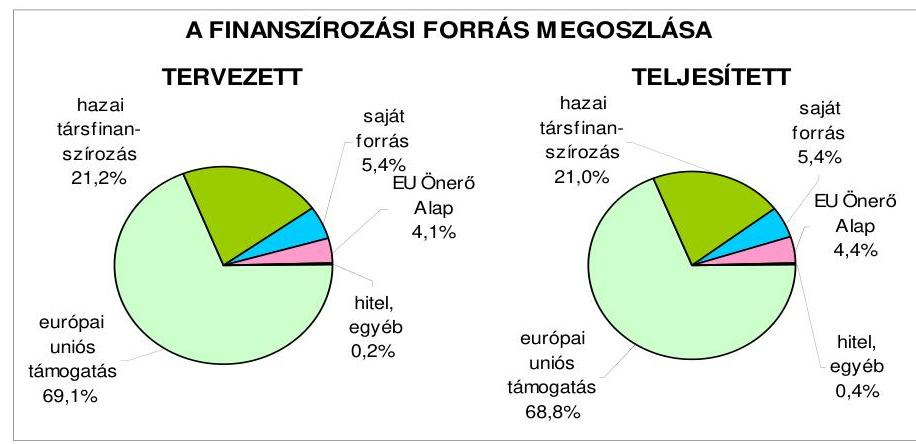

Az önkormányzatok a befejezett fejlesztési feladatok megvalósítására 261 milliárd Ft kiadást terveztek, amelyet - 231 millió Ft-tal alacsonyabb összegben -99,9\%-ban használtak fel. A hatályos támogatási szerződésekben rögzített európai uniós támogatás és hazai társfinanszírozás részaránya 0,3-0,2 százalékponttal a tervezett alatt teljesült, amelyet a közbeszerzési eljárást követően megkötött vállalkozási szerződésekben szereplő tervezettnél alacsonyabb vállalkozási díjak, az általános forgalmi adókulcs $25 \%$-ról $20 \%$-ra történő csökkentése, valamint a közremúködő szervezetek által végzett ellenőrzéskor feltárt hiányosságok miatt történt támogatáscsökkentés okozott. A költségvetési kiadások finanszírozási forrásaiban a teljesített saját forrás részaránya a tervezetthez viszonyítva nem változott, azonban a hitel és az egyéb forrás, valamint az EU Önerő Alap támogatás részaránya 0,2-0,3 százalékponttal emelkedett, amelyek fedezetet nyújtottak a pályázatban nem támogatott, valamint a kivitelezés során felmerült pótmunkák kiadásaira.

A 2006-2009. évi költségvetési rendeletekben az ellenőrzött önkormányzatok 60\%-a ${ }^{53}$ tervezte az európai uniós forrásokkal támogatott fejlesztési feladatok bevételi és kiadási elöirányzatait. Az Ámr. 29. § (1) bekezdés k) pontjában foglaltak ellenére önkormányzati szinten elkülönítetten az európai uniós támogatással megvalósuló programok bevételeit és kiadásait az önkormányzatok 48\%-a 2006-2009 között nem ${ }^{54}, 11 \%$-a csak a fejleszté-

[^0]
[^0]:    ${ }^{53}$ A 2008. évben ellenőrzött önkormányzatok 51\%-a a 2005-2008. évi költségvetési rendeletekben megtervezte az európai uniós forrással támogatott fejlesztési feladatok bevételeit és kiadásait.
    ${ }^{54}$ A költségvetési rendeletekben önkormányzati szinten, elkülönítetten nem mutatta be az európai uniós támogatással megvalósuló programok bevételeit és kiadásait a 2007ben ellenőrzött önkormányzatok 32\%-a, a 2008-ban ellenőrzött önkormányzatok 67\%a.

---

si feladatok egy részére mutatta be, illetve az önkormányzatok 17\%-a 20062008 között még nem, de a 2009. évben már bemutatta ezen bevételeketkiadásokat elkülönítetten a költségvetési rendeletben. Az Áht. 118. § (1) bekezdés 2. b) pontjában előírtaknak eleget téve a képviselő-testületek tájékoztatása céljából az önkormányzatok $34 \%$-a bemutatta ${ }^{55}$ a többéves kihatással járó európai uniós forrásból megvalósuló fejlesztési feladatokat számszerúsítve évenkénti bontásban, szöveges indokolással.

# 2.1.2. Az európai uniós forrásokhoz kapcsolódóan a pályázatfigyelés, a pályázatkészítés, valamint az európai uniós támogatással megvalósuló fejlesztés lebonyolítása belső rendjének szabályozottsága, a végrehajtás személyi, szervezeti feltételei, az ellenőrzési feladatok meghatározása 

Az európai uniós források igénybevételének és felhasználásának szabályozottsága a 2008-2009 között ellenőrzött önkormányzatoknál javult, mivel az önkormányzati hivatal belső szabályzataiban ${ }^{56}$, a köztisztviselők munkaköri leírásában az európai uniós forrásokhoz kapcsolódó feladatellátás és ellenőrzés rendjét meghatározták.

A 2008. évben ellenőrzött önkormányzatok 18\%-ánál, a 2009. évben ellenőrzött önkormányzatok 27\%-ánál határozták meg az európai uniós forrásokkal kapcsolatos feladatokat.

Az európai uniós források igénybevételének és felhasználásának szabályozásáról, illetve a meglévő szabályzatok kiegészítéséről a 2007-2009. év folyamán az önkormányzatok 34\%-ánál - a 2007-2008. években ellenőrzött önkormányzatok 5-16\%-ánál - gondoskodtak.

Az európai uniós források igénybevételének és felhasználásának feladatait és azok ellátásának belső rendjét, valamint az ellenőrzési feladatokat a 2007-2009. években ellenőrzött önkormányzatok csökkenő arányban nem szabályozták. A szabályozás területeit és mértékét a következő ábra részletezi:

[^0]
[^0]:    ${ }^{55}$ A többéves kihatással járó európai uniós forrással megvalósuló fejlesztési feladatokat számszerúsítve, évenkénti bontásban, szöveges indoklással az előző évben ellenőrzött önkormányzatok 39\%-a bemutatta.
    ${ }^{56}$ Az ellenőrzött önkormányzatok az európai uniós források igénybevételének és felhasználásának belső rendjét SzMSz-ben, ügyrendben, pályázati szabályzatban, a folyamatba épített ellenőrzési feladatokat az ellenőrzési nyomvonalban, a kötelezettségvállalási, illetve a pénzgazdálkodási szabályzatokban határozták meg.

---

| Szabályozási terület | A 2009. évben ellenőrzött önkormányzatokra vonatkozó megállapítás | A 2007-2008. években ellenőrzött önkormányzatokra vonatkozó megállapítások |
| :--: | :--: | :--: |
| Pályázatkoordinálás feladatai és a pályázat nyilvántartás vezetés felelősének kijelölése | Nem jelölték ki a pályázatkoordinálás feladatainak felelőśét $46 \%$-nál, a pályázat nyilvántartás vezetésének felelőśét $54 \%$-nál | Nem jelölték ki a pályázatkoordinálás feladatainak felelőśét 80-63\%-nál, a pályázat nyilvántartás vezetésének felelőśét $80-70 \%$-nál |
| A pályázatfigyelést végző és a döntési, illetve döntéselőterjesztési jogkörrel rendelkezők között információszolgáltatási kötelezettség meghatározása | Nem tartalmazta a szabályozás $52 \%$-nál | Nem tartalmazta a szabályozás a 2007. évben az európai uniós forrásokkal kapcsolatos információk áramlásának rendjét 83\%-nál, a 2008. évben a pályázatfigyelést végző és a döntési, illetve döntés-előterjesztési jogkörrel rendelkezők között információszolgáltatási kötelezettség 66\%-nál |
| A pályázatfigyelés, a pályázatkészités és a fejlesztési feladat lebonyolítás eljárási rendjének szabályozása | Nem határozták meg a pályázatfigyelést $59 \%$-nál, a pályázatkészítést $63 \%$-nál, az európai uniós támogatással megvalósuló fejlesztési feladat lebonyolítási rendjét $64 \%$-nál | Nem határozták meg 72-71\%-nál a pályázatfigyelést, 78-68\%-nál a pályázatkészítést, 81-76\%-nál az európai uniós támogatással megvalósuló fejlesztési feladat lebonyolítási rendjét |
| A folyamatba épített ellenőrzési feladat meghatározása | Nem határozták meg 7\%-nál | Nem határozták meg 96-61\%-nál |
| A belső ellenőrzési stratégiát megalapozó kockázatelemzés | Nem terjedt ki 77\%-nál az európai uniós forrásokkal támogatott fejlesztési feladatokra | Nem terjedt ki a 99-93\%-nál az európai uniós forrásokkal támogatott fejlesztési feladatokra |

Az európai uniós forrásokkal kapcsolatos pályázatfigyelés, pályázatkészítés, továbbá a fejlesztési feladat lebonyolítás végrehajtásának szervezeti, személyi feltételeit az önkormányzatok 95-99-98\%-a kialakította, a szervezetség aránya kedvezőbb volt, mint a 2007. és a 2008. évben ellenőrzött önkormányzatok esetében. A 2009. évben ellenőrzött önkormányzatoknál a pályázatkészítés és a fejlesztési feladat lebonyolítására az önkormányzati hivatal munkája mellett a külső személyek, szervezetek igénybevétele magasabb arányt képviselt, mint a 2007. és a 2008. évben ellenőrzött önkormányzatoknál.
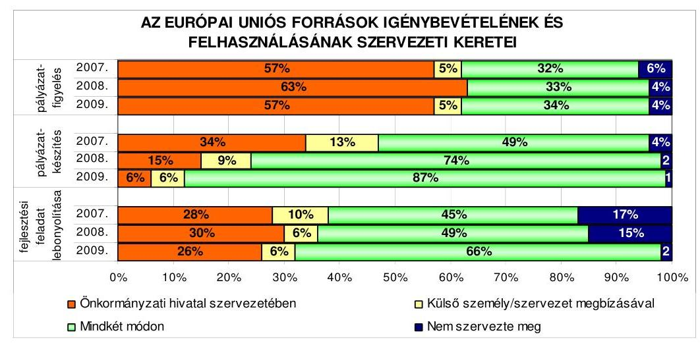

---

A 2009. évben ellenőrzött önkormányzatok 5\%-a a pályázatfigyelés, 1\%-a a pályázatkészítés, $2 \%$-a a fejlesztési feladat lebonyolításának személyi, szervezeti feltételeit nem alakította ki, míg a 2007-2008. években ellenőrzött önkormányzatok 6-4\%-a a pályázatfigyelés, 4-2\%-a a pályázatkészítés, és 17-15\%-a a fejlesztési feladat lebonyolításának személyi, szervezeti feltételeiről nem gondoskodott.

Az ellenőrzött önkormányzatok a külső szervezetekkel kötött szerződésekben:
előírták a pályázatfigyelést végző feladatait 97\%-nál, a pályázatfigyelést végző és az önkormányzati hivatal képviselője közötti kapcsolattartást 87\%-nál, az információk átadásának formáját, tartalmát, módját 81\%-nál, a felelősség szabályait 63\%-ánál;
meghatározták a pályázat készítést végző feladat-ellátási kötelezettségét 93\%nál, a megbízott külső szervezet és az önkormányzati hivatal képviselője közötti kapcsolattartást 71\%-nál, a pályázatkészítő és a pályázat benyújtásáért felelős személy közötti információk átadásának formáját, tartalmát, és módját 64-$65-60 \%$-nál, valamint a pályázat tartalmi és formai követelményeire vonatkozó felelősség szabályait 69\%-nál;
rögzítették a fejlesztési feladatok lebonyolításánál a feladat ellátási kötelezettséget, az ellenőrzés rendjét 48\%-nál, a kapcsolattartás rendjét 78\%-nál a fejlesztési feladat lebonyolítását végző személyre szóló felelősségét 63\%-nál.

# 2.1.3. A fejlesztési feladat lebonyolításánál a feladatellátás rendjére, az ellenőrzési feladatok teljesítésére, valamint a felelősségi szabályokra vonatkozó előírások betartása 

A fejlesztési feladatok lebonyolítását az ellenőrzött önkormányzatok 94\%ánál ${ }^{57}$ - 78 projekt vonatkozásában - értékeltük, amelyek 92\%-a befejeződött, az önkormányzatok a támogatást igénybe vették.

A fejlesztési feladat lebonyolítását végzők 62\%-a tájékoztatta az önkormányzati hivatalok kapcsolattartóját a támogatási szerződésben meghatározott támogatás igénybevételi ütem betartását akadályozó okokról. Az európai uniós támogatások kifizetésénél a PEJ-ek, valamint a támogatás kifizetés igénylését alátámasztó számlák, bizonylatok ellenőrzése, a hiánypótlások teljesítése 13-532 nap közötti időtartamot vett igénybe.

Szentendre Városi Önkormányzat a záró projektjelentést 2007. június 6-án benyújtotta. A közreműködő szervezet a projekt záró ellenőrzése során hiányosságot nem állapított meg, azonban a forgalomba helyezési engedély kiadását folyamatban lévőnek minősítette, amely megléte a támogatás folyósításának feltétele volt. Az Önkormányzat a forgalomba helyezési engedélyt 2008. augusztus 14.-én kapta meg, ezt követően a támogatást 2008. október 28-án folyósította a közreműködő szervezet.

[^0]
[^0]:    ${ }^{57}$ A 2006-2009. években nem fejeződött be európai uniós forrással támogatott fejlesztési feladat Budapest főváros XXIII. kerületi, Balatonfűző, Enying, Ercsi, Mindszent városi önkormányzatoknál.

---

A közremúködő szervezetek az ellenőrzött projektek 17\%-nál a támogatási előlegigényléseket 30 napon belül, $21 \%$-ánál a hiánytalanul benyújtott kifizetési kérelmeket 60 napon belül teljesítették. A kifizetési kérelmek benyújtása és a támogatás folyósítása közötti időtartam 60-180 nap volt az ellenőrzött projektek $44 \%$-ánál, 180-360 nap volt $13 \%$-ánál, 360 nap feletti volt $5 \%$-ánál ${ }^{58}$, mivel a bizonylatok, dokumentációk hiányosságai, azok pótlásai hatást gyakoroltak a felülvizsgálat időtartamára.

A számlákon nem szerepelt a projektazonosító szám, a számlaszám, az adószám, a számlaösszesítők szabályos aláírása, a számlán feltüntetett SZJ szám nem közremúködői tevékenységre vonatkozott. A megrendeléshez képest eltérés volt a számlán a címben, a tevékenység-típusban, a megbízás időtartamában és a teljesítés időpontjában, továbbá a számla el nem számolható költségeket tartalmazott. Nem csatolták a kifizetési kérelmekhez a jelenléti ívet, a projektmenedzser feladatellátását igazoló bérösszesítőt, a bankszámlakivonatok hiteles másolatait, a könyvvizsgálói jelentést, a beszerzett eszközök környezetvédelmi igazolását, az adásvételi szerződést, a visszaigazolt megrendelést, az üzembe helyezési jegyzőkönyvet, továbbá hiányzott a rehabilitációs szakértő nyilatkozata a megvalósult akadálymentesítésről. Technikai jellegű hiba volt, hogy a kifizetési kérelmet nem az „on-line számlakitöltő számítógépes rendszer" igénybevételével nyújtották be, továbbá sérültek az elektronikus adathordozón szereplő fájlok.

Gyömrő Város Önkormányzatánál a feladattal megbízott kht. a záró PEJ leadását követő öt hónap múlva végezte el projekt záró ellenőrzését, emiatt elmaradt 25 millió Ft támogatás folyósítása, azonban a támogatás jogosságát az irányító hatóság - 2009. február 20-án kelt - elektronikus levelében elismerte, ennek ellenére a közremúködő szervezet technikai okokra hivatkozva a helyszíni ellenőrzés befejezéséig a támogatás folyósításáról nem intézkedett.

A Budapest Főváros XII. Kerületi Önkormányzatot a közreműködő szervezet értesítette, hogy a „Szolgáltató Hegyvidék" projektre elnyert támogatás teljes összegét nem használta fel, továbbá a támogatási szerződésben előírt határidőig a pénzügyi elszámolására szóló kötelezettségét nem teljesítette. Előírta továbbá a projekt megvalósítása során felmerült, még el nem számolt költségek dokumentumainak benyújtását, valamint tájékoztatást kért az elszámolási késedelem okairól.

Az európai uniós forrással támogatott fejlesztési feladatok megvalósításához a költségvetésben tervezett saját forrást a támogatási szerződésben foglaltaknak megfelelően az ellenőrzött önkormányzatok biztosították, továbbá a befejezett fejlesztési feladatok $26 \%$-ánál a többletkiadások fedezetéről is gondoskodtak.

A projektek megvalósítását egy fővárosi kerületi, három megyei jogú városi és 15 városi önkormányzatnál a tervezett kiadásokhoz képest összesen 356,1 millió Ft-tal magasabb összegben teljesítették, a projekt költségvetésében nem tervezett

[^0]
[^0]:    ${ }^{58}$ A 2007-2008. években ellenőrzött önkormányzatok 30-54\%-ánál 60-180 nap közötti, 45-13\%-ánál 180-360 nap közötti, és a 2008. évben ellenőrzött önkormányzatok 7\%ánál 360 nap feletti volt a kifizetési kérelem benyújtása és a támogatás folyósításának időtartama.

---

kiadások ${ }^{59}$, a közbeszerzési eljárások eredményeként megkötött vállalkozási díjak tervezettnél magasabb összegei, valamint az tervezettnél alacsonyabb összegben folyósított támogatások miatt. A megítélt támogatás folyósítását csökkentette a közremúködő szervezet a támogatási szerződésben nem szereplő eszközbeszerzés kiadásával, továbbá nem finanszírozta a pályázatban megjelölt résztvevőknél magasabb számú részvétel miatti többletkiadásokat.

A strukturális alapok által támogatott fejlesztések esetében az önkormányzatok eleget tettek ${ }^{60}$ - Kunszentmárton Város Önkormányzata kivételével ${ }^{61}$ - a támogatás megelőlegezés követelményének, amelyet hét városi önkormányzat rövid lejáratú hitel felvételével biztosított.

Az európai uniós forrásból támogatott fejlesztési feladatokkal kapcsolatos bevételek és kiadások teljesítésénél az ellenőrzött önkormányzati hivatalok 62\%-ánál ${ }^{62}$ elvégezték a szabályozásban előirtak szerinti folyamatba épített, előzetes, utólagos és vezetői ellenőrzési feladatokat. A kötelezettségvállalás és az utalványozás ellenjegyzését az arra jogosultak, a teljesítés szakmai igazolását a jegyző által kijelölt személyek a belső szabályzatban előírt módon, az érvényesítést a megfelelő végzettséggel, szakmai képesítéssel rendelkező, írásban megbízottak végezték. Az Ámr. ${ }_{1}$ 145/A. § (1) bekezdésében foglaltak ellenére az ellenőrzött önkormányzatok 38\%-ánál a jegyző nem megfelelően gondoskodott a folyamatba épített, előzetes, utólagos és vezetői ellenőrzési kötelezettség kialakításáról és múködtetéséről.

A jegyzők nem rendelkeztek a szakmai teljesítésigazolás módjáról, és az azt végző személyek kijelöléséről. A jegyzők, illetve az általa felhatalmazott személyek nem végezték el a kötelezettségvállalások és utalványok ellenjegyzését, valamint az ellenjegyzést megelőzően nem győződtek meg a kötelezettségvállalás tárgyával összefüggő kiadási előirányzat rendelkezésére állásáról. A jegyzők által kijelölt személyek a szerződésben, a megrendelésben foglaltak szakmai teljesítését aláírásukkal nem igazolták.

A támogatásban részesült önkormányzatok 90\%-ánál - a 2007-2008. években ellenőrzött önkormányzatok $86 \%$, illetve $98 \%$-ánál - a belső ellenőrzés nem vizsgálta az európai uniós források felhasználását.

[^0]
[^0]:    ${ }^{59}$ Az önkormányzatok nem tervezték a projekt költségvetésben a közbeszerzési eljárást lebonyolító, valamint a projekt szakmai megvalósítását ellenőrző szervezet megbízási díjait, a tervezési költséget, továbbá nem számoltak a kivitelezés során szükségessé vált elektromos hálózat cseréjével, a kiszolgáló út építésével, a terület-feltárási és alapozási munkák elvégzésével kapcsolatos kiadásokkal.
    ${ }^{60}$ A 2007-2008. években ellenőrzött önkormányzatok is eleget tettek a támogatás megelőlegezési követelményének, azonban 24-20\%-ánál a saját forrás fedezetének biztosításához rövid lejáratú, illetve likviditási hitelt vettek igénybe.
    ${ }^{61}$ Kunszentmárton Város Önkormányzata 2007. január 16-ig 4,6 millió Ft, 2007. december 18-ig 539,8 millió Ft támogatás megelőlegezésére nem intézkedett. A lejárt határidejú kifizetetlen számlák miatt egy gazdasági társaság kártérítési eljárást kezdeményezett, amely során 70,3 millió Ft késedelmi kamatot és 46,9 millió Ft szerződésszegéssel okozott kár iránti igényét kívánta érvényesíteni.
    ${ }^{62}$ A 2007. évben ellenőrzött önkormányzatok 63\%-ánál, a 2008. évben ellenőrzött önkormányzatok 62\%-ánál végezték el az előírt ellenőrzési feladatokat.

---

A közreműködő szervezetek, a KEHI, és az ÁSZ a 2006-2009. években az európai uniós forrással támogatott fejlesztési feladatok megvalósításának folyamatában az ellenőrzött önkormányzatok 73\%-ánál ${ }^{63}$ - a 2007-2008. években ellenőrzött önkormányzatok 70-83\%-ánál - végeztek ellenőrzést, melynek során az ellenőrzött projektek 40\%-ánál állapítottak meg hiányosságokat ${ }^{64}$.

A közreműködő szervezetek ellenőrzéseik során megállapították a közbeszerzési eljárás lezárásáról szóló tájékoztató közzétételének elmaradását, az építési tevékenység végzésének hiányosságát, a projektre vonatkozó elkülönített főkönyvi nyilvántartását vezetésének elmulasztását. Rögzítették, hogy a műszaki tervek készítéséről a vállalkozó a számláit a projekt megkezdése után állította ki, az eredeti műszaki tervekhez képest a beruházás eltérésekkel valósult meg. A közreműködő szervezetek az ellenőrzési jelentéseikben négy önkormányzatnál, szabálytalanságot, mulasztást állapítottak meg, és a támogatás csökkentéséről döntöttek, továbbá kettő önkormányzatnál felfüggesztették a támogatás folyósítását.

# 3. AZ ELEKTRONIKUS KÖZSZOLGÁltATÁs FELTÉTELEINEK KIALAKÍTÁSA 

Az ellenőrzött önkormányzatok 73\%-a informatikai stratégiában meghatározta a közép- és hosszú távú célkitűzéseit, az e-közszolgáltatás biztosításához szükséges tárgyi, személyi és pénzügyi feltételeket, feladatokat, valamint a célkitűzések meghatározását 91\%-uk elősegítette az informatikai infrastruktúra állapotának helyzetelemzésével. A közigazgatás korszerűsítését szolgáló aktuális e-kormányzati feladatokról szóló 1044/2005. (V. 11.) Korm. határozat 1. § a) pontjában meghatározott négyszintű skálát figyelembe véve az önkormányzatok 29\%-a a 4., 17\%-a a 3., 7\%-a a 2. elektronikus szolgáltatási szint elérését tervezte. (A 4. elektronikus szolgáltatási szint elérését tervezte a megyei jogú városi önkormányzatok 33\%-a, a Budapest fővárosi kerületi önkormányzatok 17\%-a, a városi önkormányzatok 32\%-a, nem tervezte az 1. elektronikus szolgáltatási szintnél magasabb szolgáltatási szint elérését az ellenőrzött önkormányzatok 2\%-a.) Az önkormányzatok 45\%-ánál azonban nem határozták meg, hogy melyik elektronikus szolgáltatási szintre kívánnak eljutni.

Az e-közszolgáltatás kialakításához és múködtetéséhez az ellenőrzött önkormányzatok 65\%-a ${ }^{65}$ pályázatot nyújtott be európai uniós támoga-

[^0]
[^0]:    ${ }^{63}$ A közreműködő szervezetek 56, a KEHI Orosháza, Dombóvár, Komárom, Sárospatak városi önkormányzatoknál, az ÁSZ Békéscsaba Megyei Jogú Városi Önkormányzatnál végzett ellenőrzést.
    ${ }^{64}$ A 2007-2008. években ellenőrzött önkormányzatoknál a vizsgált projektek 82-74\%ánál a közreműködő szervezetek ellenőrzéseik során hiányosságokat állapítottak meg.
    ${ }^{65}$ Az e-közszolgáltatás kialakításához és múködtetéséhez pályázatot nyújtott be a megyei jogú városi önkormányzatok 83\%-a, valamint az összes Budapest fővárosi kerületi önkormányzat, amelyek közül csak egy megyei jogú város nem részesült támogatásban. A városi önkormányzatok 64\%-a nyújtott be pályázatot, ezek 88\%-a kapott támogatást.

---

tásra ${ }^{66}$ 2006-2009 között. Az ellenőrzött önkormányzatok 93\%-ánál múködtettek különböző szinten e-közszolgáltatási szolgáltatásokat biztosító informatikai rendszert és rendelkeztek internetes honlappal. Az ügyintézést egyes ügykörökben az önkormányzatok 18\%-nál az 1., 65\%-nál a 2., 17\%-nál a 3. elektronikus szolgáltatási szinten múködtették ${ }^{67}$. Az e-közszolgáltatás ügyintézési lehetőségének területeit szemlélteti a jelentés 11. számú melléklete, ennek önkormányzat típusonkénti alakulását mutatja a jelentés 12. számú melléklete.

Az ellenőrzött önkormányzatok az e-közszolgáltatási feladatok megoldását az önkormányzati hivatal köztisztviselőivel és emellett külső szervezetek bevonásával biztosították. Az e-közszolgáltatási feladatokat ellátó önkormányzatok $82 \%$-ánál vásárolt programokat használtak, mivel kevés informatikai szakember állt rendelkezésükre saját informatikai fejlesztések elvégzéséhez.

Az e-közszolgáltatási feladatokat ellátó informatikai rendszer ügyfelek általi igénybevételének figyelési rendszerét az ellenőrzött önkormányzatok 20\%-a, és ezen belül a kiemelt önkormányzati körbe tartozók 31\%-a alakította ki. Az informatikai rendszer ügyfelek általi igénybevételének tapasztalatait azonban már csak az önkormányzatok 5\%-a értékelte különböző gyakorisággal.

A közérdekű adatok elektronikus közzétételi kötelezettség ellenére 2008-ban az ellenőrzött önkormányzatok 5\%-ánál (2007. évben a közzétételre kötelezett önkormányzatok 50\%-ánál, 2006. évben 65\%-ánál) a jegyzők nem biztosították a gazdálkodásra vonatkozó adatok önkormányzat honlapján történő közzétételét. Az ellenőrzött önkormányzatok 66\%-ánál a jegyző nem tartotta be a 18/2005. (XII. 27.) IHM rendelet 2. § (1) bekezdésében foglaltakat, mivel az önkormányzati honlap megnyitásakor megjelenő oldalon nem gondoskodott a közzétételi listák által előirt adatokat tartalmazó jegyzékre vagy felületre mutató hivatkozás elhelyezéséről.

Az ellenőrzött önkormányzatok 15\%-ánál (a kiemelt önkormányzati körbe tartozók 6\%-ánál) a jegyzők az Áht. 15/A. § (1) bekezdése ellenére az önkormányzat honlapján nem tették közzé a 2008-2009. évben önkormányzati hivatal költségvetéséből nyújtott nem normatív, céljellegú múködési és fejlesztési támogatások kedvezményezettjeinek nevét, a támogatás célját, összegét, továbbá a támogatási program megvalósítási helyét, illetve ezen adatokat az önkormányzatok 40\%-ánál (a kiemelt önkormányzati körbe tartozók 50\%-ánál) a jegyzők hiányosan tették közzé ${ }^{68}$. Az ellenőrzött önkormányzatok 13\%-ánál az intézmények költségvetéséből is nyújtottak nem normatív, céljellegú múködési és fejlesztési támogatásokat, azonban ezen támogatások

[^0]
[^0]:    ${ }^{66}$ Az önkormányzatok az e-közszolgáltatás fejlesztéséhez az NFT keretén belül a GVOP 4.3 és 4.4 komponenséből, az ÚMFT keretén belül az ÁROP-ból és EKOP-ból részesülhettek támogatásban.
    ${ }^{67}$ A 4. elektronikus szolgáltatási szintnek megfelelő ügyintézés kialakítását akadályozta a pénzügyi források, az informatikához értő humán erőforrás, valamint a megfelelő és korszerű számítástechnikai eszközök és programok hiánya.
    ${ }^{68}$ A támogatásokra vonatkozó adatok közzétételét nem, vagy hiányosan biztosították a 2007. évben az önkormányzatok 58\%-ánál, a 2006. évben 51\%-ánál.

---

Áht. 15/A. § (1) bekezdésében meghatározott adatait a jegyzők 55\%-a nem tette közzé az önkormányzat honlapján.

Az ellenőrzött önkormányzatok 6\%-ánál (a városi önkormányzatok 8\%-ánál) a jegyzők a 2008-2009. években - az Áht. 15/B. § (1) bekezdésében foglaltak ellenére - az önkormányzat honlapján nem tették közzé az önkormányzati hivatal költségvetési előirányzatai terhére kötött nettó ötmillió Ft-ot elérő vagy azt meghaladó értékű árubeszerzésre, építési beruházásra, szolgáltatás megrendelésre, vagyonértékesítésre, vagyonhasznosításra vonatkozó szerződések megnevezését (típusát), tárgyát, a szerződő felek nevét, a szerződés értékét, határozott időre kötött szerződés esetében annak időtartalmát, valamint az adatok változását, illetve az önkormányzatok 29\%-ánál (a kiemelt önkormányzati körbe tartozók közül a 31\%-ánál) hiányos volt ezen adatok közzététele ${ }^{69}$. Az ellenőrzött önkormányzatok intézményeinek költségvetési előirányzatai terhére kötött nettó ötmillió Ft-ot elérő vagy azt meghaladó értékű árubeszerzésre, építési beruházásra, szolgáltatás megrendelésre, vagyonértékesítésre, vagyonhasznosításra vonatkozó szerződések megnevezését (típusát), tárgyát, a szerződő felek nevét, a szerződés értékét, határozott időre kötött szerződés esetében annak időtartalmát, valamint az adatok változását a jegyzők $43 \%$-a nem tette közzé az önkormányzat honlapján.

Az ellenőrzött önkormányzatok 49\%-ánál (ezen belül a kiemelt önkormányzati körbe tartozók 38\%-ánál) a jegyzők az Ámr. 157/D. § (1) bekezdésében hivatkozott 22. számú melléklet 1.2. pont 5. alpontjában foglaltak ellenére az önkormányzat honlapján az éves költségvetési beszámoló szöveges indoklását nem, vagy nem megfelelő adattartalommal hozták nyilvánosságra ${ }^{70}$.

# 4. A KÖLTSÉGVETÉSI GAZDÁLKODÁS BELSŐ KONTROLLJAI 

### 4.1. A szabályozottság kockázata, valamint a belső kontrollok múködtetése a költségvetés tervezés, a gazdálkodás és a beszámolás folyamatba épített előzetes, utólagos és vezetői ellenőrzési feladatainál

### 4.1.1. A költségvetés tervezés és a zárszámadás készítés folyamatának szabályozottsága, a belső kontrollok kialakítása, múködtetése

A költségvetés tervezés és a zárszámadás készítés szabályozottsága az ellenőrzött önkormányzatok 64\%-ánál (2007-ben 57\%-ánál, 2008-ban 55\%-ánál) összességében alacsony kockázatot jelentett a feladatok megfelelő, szabályszerű végrehajtásában, mivel a folyamat belső kont-

[^0]
[^0]:    ${ }^{69}$ A közzétételt nem, vagy hiányosan biztosították a 2006-2007. években az ellenőrzött önkormányzatok 64-43\%-ánál.
    ${ }^{70}$ A szerződésekre vonatkozó adatok közzétételt nem, vagy hiányosan biztosították a 2007. évben az önkormányzatok 43\%-ánál, a 2006. évben 64\%-ánál.

---

rolljait a jegyzők - az Ámr. 145/A. § (1)-(2) és a 145/B. § (1) bekezdés előírásai és a helyi sajátosságok figyelembevételével - kialakították ${ }^{71}$, rögzítették az elvégzendő ellenőrzési feladatokat és azok felelőseit ${ }^{72}$. Ezeknél az önkormányzatoknál a költségvetés tervezés és a zárszámadás készítés folyamatában kialakított belső kontrollok az esetleges kisebb ${ }^{73}$ szabályozási hiányosságok ellenére megfelelő védelmet nyújtottak a hibák bekövetkezése ellen ${ }^{74}$.

Az ellenőrzött önkormányzatok 21\%-ánál (2007-ben 18\%-ánál, 2008-ban $21 \%$-ánál) a költségvetés tervezés és a zárszámadás készítés szabályozásának hiányosságai közepes kockázatot jelentettek a feladatok megfelelő és szabályszerű végrehajtásában, mert a jegyzők hiányosan szabályozták az ellenőrzési feladatokat, de a kialakított belső kontrollok a lehetséges hibák többsége ellen védelmet nyújtottak. Az önkormányzatok 15\%-ánál (2007-ben 25\%-ánál, 2008-ban 24\%-ánál) a szabályozás hiányosságai magas kockázatot jelentettek a költségvetés tervezés és a zárszámadás készítés szabályszerű végrehajtásában, mert ezen önkormányzati hivatalokban az Áht. 121. § (1) bekezdésében foglalt előírások ellenére a jegyzők nem szabályozták, illetve hiányosan határozták meg a költségvetés tervezés és a zárszámadás készítés során elvégzendő belső kontrollokat, ezáltal a kontrollok - kialakításuk hiányában, illetve hiányos kialakításuk miatt - nem nyújtottak elegendő védelmet a lehetséges hibákkal szemben.
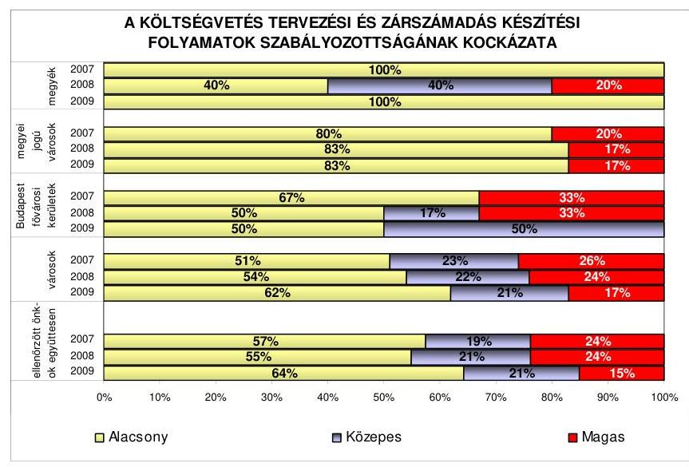

[^0]
[^0]:    ${ }^{71}$ Ezen önkormányzatok 32\%-ánál, köztük az ellenőrzött megyei önkormányzatok teljes körénél a költségvetés tervezési és a zárszámadás készítési folyamatok belső kontrolljainak kialakításánál nem állapítottunk meg hiányosságot.
    ${ }^{72}$ Az ellenőrzési feladatokat belső szabályzatokban, leíró és folyamatábrával szemléltetett ellenőrzési nyomvonalban, a gazdasági szervezetek ügyrendjében, jegyzői rendelkezésekben, körlevelekben, illetve a dolgozók munkaköri leírásaiban határozták meg.
    ${ }^{73}$ Az ellenőrzés lefolytatásához egységesen meghatározott követelményrendszerben foglalt mértéket el nem érő hiányosság esetén a „kisebb" kifejezést alkalmazzuk.
    ${ }^{74}$ A költségvetés tervezési és a zárszámadás készítési folyamatok belső kontrolljait a kiemelt önkormányzati körbe tartozók 75\%-ánál, valamint a városi önkormányzatok $62 \%$-ánál a jegyzők - az előírások figyelembe vételével a belső feltételeknek - megfelelően alakították ki.

---

A közepes és magas kockázatot a FEUVE rendszer kialakításának következő szabályozási hiányosságai okozták:

- a költségvetési javaslat összeállításával kapcsolatos követelményeket az önkormányzatok 11\%-ánál nem határozták meg a költségvetési intézmények részére ${ }^{75}$;
- a költségvetési intézmények és az önkormányzati hivatal szervezeti egységei által benyújtott költségvetési igények indokoltságának, illetve teljesíthetőségének ellenőrzésére, valamint a tervezett saját bevételek előirányzatainak és azok megalapozását szolgáló önkormányzati rendeletek összhangjának felülvizsgálatára vonatkozó belső kontrollokat az önkormányzatok 38\%-ánál nem alakították ki ${ }^{76}$;
- a költségvetés tervezéséhez készített intézményi mutatószám felmérés megalapozottságának ellenőrzését az önkormányzatok 21\%-ánál nem írták elő;
- az intézményi pénzmaradvány kimunkálásának felülvizsgálatát az Ámr., 66. § (4) bekezdésében foglalt előírás ellenére az önkormányzatok 28\%-ánál nem írták elő, valamint nem jelölték ki annak felelőseit;
- az intézményi számszaki beszámoló belső, valamint annak a képviselőtestület által meghatározott adatszolgáltatással való összhangjának ellenőrzését - az Ámr., 149. § (3) bekezdés d) pontjában előírtak ellenére - az önkormányzatok $32 \%$-ánál nem határozták meg ${ }^{77}$, a zárszámadási feladatok koordinálásáért felelős személyek kijelölését 10\%-ánál mulasztották el a jegyzők.

A költségvetés tervezés és a zárszámadás készítés folyamatában kialakított belső kontrollok múködésének megfelelősége az önkormányzatok 54\%-ánál (2007-ben 45\%-ánál, 2008-ban 35\%-ánál) összességében kiváló volt, mivel a belső szabályozásban előírt ellenőrzési és egyeztetési feladatokat elvégezték ${ }^{78}$. Ellenőrizték a költségvetés tervezéséhez készített intézményi mutatószám felmérés adatainak megalapozottságát, a költségvetési javaslat összeállítására meghatározott követelmények betartását, a költségvetési intézmények és az önkormányzati hivatalok szervezeti egységei által benyújtott költségvetési igények indokoltságát, teljesíthetőségét, továbbá a zárszámadás előkészítése során felülvizsgálták az intézményi pénzmaradvány megállapításának szabályszerűségét. A költségvetés tervezés és a zárszámadás készítés folyamatában kialakított belső kontrollok a kiemelt önkormányzati körbe tartozó önkormányzatok 69\%-ánál, valamint a városi önkormányzatok felénél megfelelően, összességében kiválóan működtek, - a megállapított eseti

[^0]
[^0]:    ${ }^{75}$ A követelményeket a kiemelt önkormányzati körbe tartozó önkormányzatok 6\%ánál, a városi önkormányzatok 12\%-ánál nem határozták meg.
    ${ }^{76}$ Ezen belső kontrollok kialakítását a megyei önkormányzatok 25\%-ánál, a megyei jogú városi önkormányzatok 17\%-ánál, a Budapest fővárosi kerületi önkormányzatok 67\%-ánál, valamint a városi önkormányzatok 38\%-ánál mulasztották el.
    ${ }^{77}$ Az ellenőrzési feladatokat a kiemelt körbe tartozó önkormányzatok 6\%-ánál, valamint a városi önkormányzatok 38\%-ánál nem írták elő.
    ${ }^{78}$ Ezen önkormányzatok 18\%-ánál, köztük az ellenőrzött megyei önkormányzatok teljes körénél a költségvetés tervezési és a zárszámadás készítési folyamatok belső kontrolljainak kialakításában és múködésében hiányosságot nem állapítottunk meg.

---

kisebb ${ }^{79}$ hiányosságok ellenére - teljesítették a lényeges hibák, szabálytalanságok megelőzésével, feltárásával és kijavításával kapcsolatos funkciójukat.

A költségvetés tervezés és a zárszámadás készítés folyamatában a belső kontrollok múködésének megfelelősége az önkormányzatok 18\%-ánál (2007-ben 20\%-ánál, 2008-ban 25\%-ánál) jó volt, mivel a kontrollok kielégítették a hibák megelőzésére és kijavítására vonatkozó elvárásokat. Ezen önkormányzatoknál a belső kontrollok múködésében megállapított kisebb (tolerálható mértékű) hiányosságok nem veszélyeztették az ellenőrzött terület hibáinak megelőzését és kijavítását. A belső kontrollok múködésének megfelelősége az önkormányzatok 28\%-ánál (2007-ben 35\%-ánál, 2008-ban 40\%ánál) volt gyenge, mert - az Áht. 121. § (1)-(3) bekezdésében foglalt előírások ellenére - a tervezés és a beszámolás folyamatában a belső kontrollokat az önkormányzati hivatalokban nem múködtették, ezáltal nem biztosították a hibák megelőzését, feltárását, kijavítását és veszélyeztették az eredményes, megbízható múködést. Ezen önkormányzatok 52\%-ánál a belső kontrollok kialakításuk hiánya miatt, míg 48\%-ánál a belső szabályozás ellenére nem múködtek.

A belső kontrollok múködésének megfelelősége Budapest főváros XII. és XVII kerület, valamint Sellye, Nyíradony, Kecel, Hajdúsámson, Tiszalök, Pálháza, Komárom, Aszód és Göd városok önkormányzatainál annak ellenére gyenge volt, hogy a szabályozottság alacsony, illetve közepes kockázatot jelentett a feladatok szabályszerű végrehajtásában, mivel az ellenőrzési feladatokat a jegyzők ugyan előírták, azonban a kialakított belső kontrollokat nem múködtették
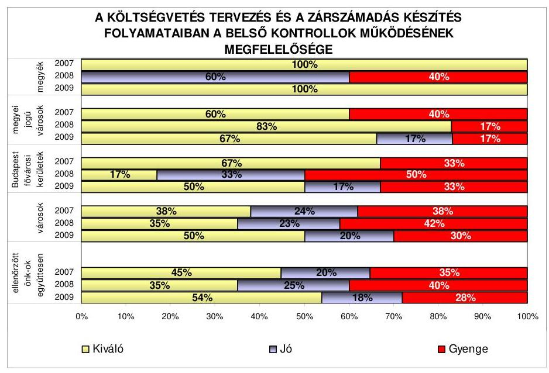

A költségvetés tervezés és a zárszámadás készítés során az Ámr. 1 145/A. § (1)-(2) és a 145/B. § (1) bekezdésében foglalt előírások ellenére nem ellenőrizték:

[^0]
[^0]:    ${ }^{79}$ Az ellenőrzés lefolytatásához egységesen meghatározott követelményrendszerben foglalt mértéket el nem érő hiányosság esetén a „kisebb" kifejezést alkalmazzuk

---

az önkormányzatok 23\%-ánál a költségvetési javaslat összeállításával kapcsolatban a költségvetési intézmények részére meghatározott szakmai és pénzügyi követelmények teljesítését, amit ezen önkormányzatok 47\%-ánál a belső kontrollok kialakításának hiánya okozott. Az intézmények és az önkormányzati hivatalok szervezeti egységei által benyújtott költségvetési igények indokoltságát az önkormányzatok 37\%-ánál nem vizsgálták, ennek oka 83\%-uknál az ellenőrzési feladat előírásának elmaradása volt. A tervezett saját bevételek előirányzatai és az azok megalapozását szolgáló önkormányzati rendeletek összhangját az önkormányzatok 48\%-ánál nem ellenőrizték, amit 72\%-ban az ellenőrzési feladat előírásának hiánya okozott;
az intézményi pénzmaradványok megállapításának szabályszerűségét az Ámr. ${ }_{1} 66 . \S$ (4) bekezdésében foglalt előírás ellenére az önkormányzatok 39\%ánál nem vizsgálták felül. A költségvetési beszámolókban az eredeti és a módosított előirányzatok, valamint a teljesítési adatok eltérése indokoltságának ellenőrzését az önkormányzatok 38\%-ánál - az Ámr. ${ }_{1} 149 . \S$ (3) bekezdés c) pontjában előírtak ellenére - nem végezték el. Az intézményi számszaki beszámolók belső, valamint azok képviselő-testület által meghatározott adatszolgáltatással való összhangjának felülvizsgálata - az Ámr. ${ }_{1} 149 . \S$ (3) bekezdés d) pontjában foglaltak ellenére - az önkormányzatok 39\%-ánál maradt el. A felülvizsgálatot elmulasztó önkormányzati hivatalok 72\%-ánál a feladat elmaradása az ellenőrzési feladat előírásának és a felelősök kijelölésének hiányára vezethető vissza.

# 4.1.2. A pénzügyi-számviteli feladatoknál a belső kontrollok kialakítása, valamint a szakmai teljesítés igazolás és az utalvány ellenjegyzés múködtetése 

A gazdálkodási, a pénzügyi-számviteli és a folyamatba épített ellenőrzési feladatok szabályozottsága az önkormányzatok 58\%-ánál (2007-ben 31\%-nál, 2008-ban 30\%-nál) összességében alacsony kockázatot jelentett a feladatok megfelelő, szabályszerú végrehajtásában, mivel a jegyzők a belső kontrollokat az Áht. 121. § (1) bekezdésében foglalt előírásoknak és a helyi sajátosságoknak megfelelően kialakították ${ }^{80}$, a kontrollok az előforduló kisebb ${ }^{81}$ szabályozási hiányosságok ellenére megfelelő védelmet nyújtottak a múködésbeli hibák bekövetkezése ellen.

A gazdálkodási, a pénzügyi-számviteli és a folyamatba épített ellenőrzési feladatok szabályozásának hiányosságai az önkormányzatok 35\%-ánál (2007-ben 38\%-nál, 2008-ban 46\%-nál) közepes kockázatot jelentettek a feladatok megfelelő végrehajtásában, mert a jegyzők hiányosan szabályozták az ellenőrzési feladatokat, azonban a kialakított belső

[^0]
[^0]:    ${ }^{80}$ A pénzügyi-számviteli feladatok belső kontrolljainak részletes szabályait az SzMSzekben, a gazdasági szervezetek ügyrendjében, a gazdálkodási és ellenőrzési jogköröket, feladatokat rögzítő szabályzatokban, a pénzügyi-számviteli szabályzatokban, az ellenőrzési nyomvonalakban, a kockázatkezelésre és a szabálytalanságok kezelésére vonatkozó szabályozásban, valamint a feladatok ellátásáért felelős köztisztviselők munkaköri leírásaiban alakították ki.
    ${ }^{81}$ Az ellenőrzés lefolytatásához egységesen meghatározott követelményrendszerben foglalt mértéket el nem érő hiányosság esetén a „kisebb" kifejezést alkalmazzuk.

---

kontrollok a lehetséges hibák többsége ellen védelmet nyújtottak. Az önkormányzatok 7\%-ánál (2007-ben 31\%-nál, 2008-ban 24\%-nál) az Áht. 121. § (1) bekezdésében foglalt előírások ellenére nem határozták meg a gazdálkodási, a pénzügyi-számviteli és a folyamatba épített ellenőrzési feladatokat, a szabályozás hiányosságai magas kockázatot jelentettek a feladatok szabályszerú végrehajtásában.
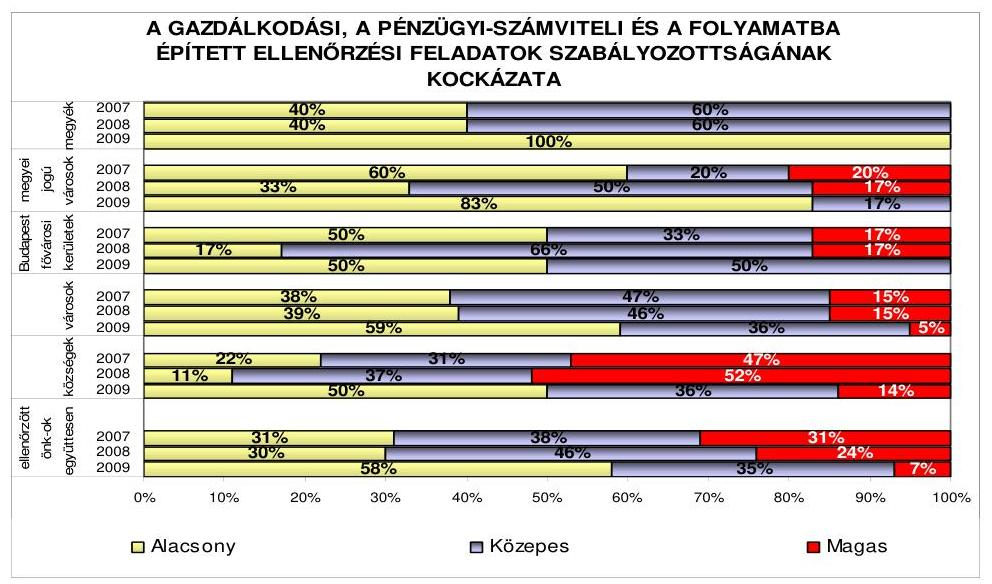

A közepes és magas kockázatot a következő szabályozási hiányosságok okozták:

- az ellenőrzött önkormányzati hivatalok 31\%-a az Ámr. 10. § (5) bekezdésében ${ }^{82}$ foglaltak ellenére nem rendelkezett a képviselő-testület által jóváhagyott SzMSz-szel, továbbá a jóváhagyott SzMSz-ek 32\%-ában az Ámr. ${ }_{1} 17 . \S$ (4) bekezdésének előírásait figyelmen kívül hagyva nem rögzítették a gazdasági szervezet felépítését és az általa, illetve a más külső szervezet által végzendő részletes feladatokat. A gazdasági szervezetek 10\%-ánál ${ }^{83}$ az Ámr. 17. § (5) bekezdésében előírtak ellenére nem készítettek ügyrendet, az elkészített ügyrendek az önkormányzatok 50\%-ánál nem tartalmazták a gazdasági szervezet által ellátandó feladatokat, a vezetők és a pénzügyi-gazdasági feladatok ellátásáért felelős alkalmazottak feladat- és hatáskörét, felelősségi körét, a helyettesítés rendjét, a belső és külső kapcsolattartás módját. A vezetők és a pénzügyi dolgozók munkaköri leírásai nem tartalmazták az operatív gazdálkodási és ellenőrzési jogköröket és feladatokat az önkormányzatok 23\%ánál ${ }^{84}$;
- a szakmai teljesítés igazolásának módjáról az önkormányzatok 16\%-ánál a jegyzők - az Ámr. ${ }_{1}$ 135. § (2) bekezdésében foglaltak ellenére - belső szabály-

[^0]
[^0]:    ${ }^{82}$ A költségvetési szervek szervezeti és múködési szabályzatával kapcsolatos előírásokat 2009. január 1-jétől az Ámr. ${ }_{1}$ 13/A. §-a, 2010. január 1-jétől az Ámr. ${ }_{2}$ 20. § (1) és (2) bekezdése tartalmazza.
    ${ }^{83}$ A gazdasági szervezet nem rendelkezett ügyrenddel a kiemelt önkormányzati körbe tartozók 25\%-ánál, a városi önkormányzatok 5\%-ánál, valamint a községi önkormányzatok $14 \%$-ánál.
    ${ }^{84}$ A munkaköri leírások nem tartalmazták a gazdálkodási és ellenőrzési jogköröket, illetve feladatokat a kiemelt önkormányzati körbe tartozók 6\%-ánál, a városi önkormányzatok 18\%-ánál, valamint a községi önkormányzatok 39\%-ánál.

---

zatban nem rendelkeztek, nem írták elő a feladatra kijelölt személyek részére a kiadások teljesítésének és a bevételek beszedésének elrendelése előtt elvégzendő ellenőrzési feladatuk végrehajtásának, dokumentálásának módját, mivel a jogszabályi előírás változását a helyi szabályozásban nem vették figyelembe. A szakmai teljesítés igazolását végző személyeket a jegyzők nem jelölték ki az ellenőrzött önkormányzatok 8\%-ánál;

- az érvényesítési feladatok ellátására a jegyzők az Ámr., 135. § (4) bekezdésében foglaltak ellenére nem adtak írásban megbízást az önkormányzatok 5\%ánál, míg az írásbeli megbízások 6\%-ánál nem tartották be az iskolai végzettségre és szakmai képesítésre vonatkozó előírásokat. A gazdálkodási és az ellenőrzési jogkörökre adott felhatalmazások, kijelölések, illetve megbízások során az önkormányzatok 4\%-ánál nem biztosították az - Ámr., 138. § (1)-(3) bekezdéseiben és az Ámr., 135. § (6), bekezdésében előírt - összeférhetetlenségi követelmények érvényesülését;
- a számviteli szabályzatokban a jegyzők nem rögzítették az Áhsz. 37. § (1) és (7) bekezdésében előírt leltározási kötelezettséget az önkormányzatok 14\%ánál. Az üzemeltetésre, kezelésre átadott eszközök leltározásának módját az Áhsz. 37. § (5) bekezdésének előírása ellenére az önkormányzatok 20\%-ánál nem szabályozták, továbbá ezen eszközök selejtezésével, hasznosításával kapcsolatos döntés hozatalára jogosultak körét 38\%-ánál nem határozták meg. Az adókkal kapcsolatos követelések egyszerüsített (csoportos) értékelési eljárásának szempontjait, dokumentumait - az Áhsz. 31/A. §-ban biztosított lehetőség, illetve a 8. § (18) bekezdésében foglalt előírás ellenére - az önkormányzatok 8\%-ánál nem szabályozták. Az önköltségszámítás rendjét az Áhsz. 8. § (4) bekezdés c) pontjában, illetve (16) bekezdésében foglaltak ellenére az önkormányzatok 51\%-ánál belső szabályzatban nem rögzítették. Az analitikus nyilvántartások vezetésének, valamint főkönyvi számlákkal történő egyeztetésének és a feladat elvégzésének dokumentálási módját az önkormányzatok 39\%-ánál az Áhsz. 49. § (2) bekezdésében előírtak ellenére nem szabályozták. A számviteli szabályzatokban meghatározott egyeztetési és ellenőrzési feladatokat a pénzügyi dolgozók munkaköri leírásai az önkormányzatok 36\%-ánál nem tartalmazták;
- az Ámr., 145/B. § előírása ellenére az önkormányzatok 8\%-ánál nem készítették el az ellenőrzési nyomvonalat. A jegyzők az ellenőrzési nyomvonalak 6\%ánál nem határozták meg a folyamatokat és a folyamatgazdákat, valamint 11\%-ánál nem jelölték meg az egyes feladatok végrehajtásért felelős szervezeti egységeket, személyeket. Az elkészített ellenőrzési nyomvonalak 31\%-a nem tartalmazott utalást arra, hogy a tevékenységeket, feladatokat részletesen mely belső szabályzatokban rögzítik, továbbá 28\%-a nem tartalmazta az egyes tevékenység, feladat elvégzését igazoló dokumentum megnevezését és nyilvántartási helyét a rendszerben. A kockázatkezelési eljárásrendben az önkormányzatok 32\%-ánál az Ámr., 145/C. § valamint a 145/A. § (3) bekezdésében hivatkozott pénzügyminisztériumi útmutató előírásai ellenére nem szabályozták a kockázatok azonosítását, illetve 44\%-ánál nem határozták meg a kockázatok folyamatgazdáit, valamint 52\%-ánál az elfogadható kockázati szintet. A szabálytalanságok kezelésének eljárásrendjében - az Ámr., 145/A. § (5) bekezdésében, valamint a 145/A. § (3) bekezdésében előírtak ellenére - a jegyzők 15\%-a nem határozta meg a szabálytalanság fogalmát, illetve észlelési kötelezettségét, valamint 23\%-a nem írta elő a szabálytalanság esetén teendő intézkedések (eljárások) nyomon követését, a szabálytalanságok és az intézkedések nyilvántartását, továbbá 51\%-a nem írta elő a kockázati környezet rendszeres felülvizsgálatát.

---

A pénzgazdálkodás folyamatában ${ }^{85}$ meghatározó, kulcsfontosságú belső kontrollok - a szakmai teljesítésigazolás és az utalvány ellenjegyzés - az önkormányzatok 31\%-ánál (2007-ben ugyanilyen arányánál, 2008-ban 18\%ánál) megfelelően, összességében kiválóan múködtek, teljesítették a lényeges hibák, szabálytalanságok megelőzésével, feltárásával és kijavításával kapcsolatos funkciójukat. A szerződésekben, megrendelésekben, megállapodásokban meghatározott feladatok szakmai teljesítésének igazolását, a kiadások jogosultságának és összegszerűségének ellenőrzését a jegyző́k által kijelölt személyek a belső szabályzatban előírt módon elvégezték. Az utalványok ellenjegyzésére jogosult személyek a folyamatba épített ellenőrzési feladataikat teljesítették, meggyőződtek arról, hogy az utalványozás nem sérti a gazdálkodásra vonatkozó szabályokat, továbbá ellenőrizték a szakmai teljesítésigazolás és az érvényesítés megtörténtét. Ezeknél az önkormányzatoknál a pénzügyi gazdálkodás folyamatában kialakított belső kontrollok - az eseti kisebb ${ }^{86}$ hiányosságok ellenére - megfelelően múködtek.

A belső kontrollok múködésének megfelelősége az önkormányzatok 15\%-ánál (2007-ben 6\%-ánál, 2008-ban 12\%-ánál) jó volt, mert a szakmai teljesítésigazolás és az utalvány ellenjegyzés múködésében feltárt kisebb (tolerálható mértékű) hiányosságok nem veszélyeztették az ellenőrzött területek hibáinak megelőzését és kijavítását. A szakmai teljesítésigazolás és az utalvány ellenjegyzés múködésének megfelelősége az önkormányzatok 54\%-ánál (2007-ben 63\%-ánál, 2008-ban 70\%-ánál) gyenge volt, mert a folyamatba épített ellenőrzési feladatokat az Ámr., 135. § (1)-(2) bekezdéseiben, valamint az Ámr., 137. § (3) bekezdésében foglalt előírások ellenére nem, illetve nem az előírásoknak megfelelően végezték. A belső kontrollok múködésével kapcsolatban megállapított hiányosságok, mulasztások rendszeresek voltak, egy-egy gazdasági esemény folyamatában egyidejűleg több kontroll nem múködött. Ezen önkormányzatok 32\%-ánál a belső kontrollok kialakításának hiánya (a szakmai teljesítésigazolás módjára irányuló belső szabályozás elmulasztása, illetve az azt végző személyek kijelölésének elmaradása) miatt nem múködtek, míg 68\%-uknál a kialakított kontroll eljárásokat nem folytatták le.

[^0]
[^0]:    ${ }^{85}$ Az értékelés alapjául szolgáló megfelelőségi teszteket a kiemelt kockázatuk alapján kiválasztott területek gazdasági eseményeivel - a külső szolgáltató által végzett karbantartási, kisjavítási szolgáltatásokkal, a gépek, berendezések és felszerelések beszerzésével, létesítésével, valamint az államháztartáson kívülre teljesített múködési és felhalmozási célú pénzeszköz átadásokkal, továbbá „mint tartalék területre", az állományba nem tartozók megbízási díjaival - kapcsolatos kifizetésekre folytattuk le.
    ${ }^{86}$ Az ellenőrzés lefolytatásához egységesen meghatározott követelményrendszerben foglalt mértéket el nem érő hiányosság esetén a „kisebb" kifejezést alkalmazzuk.

---

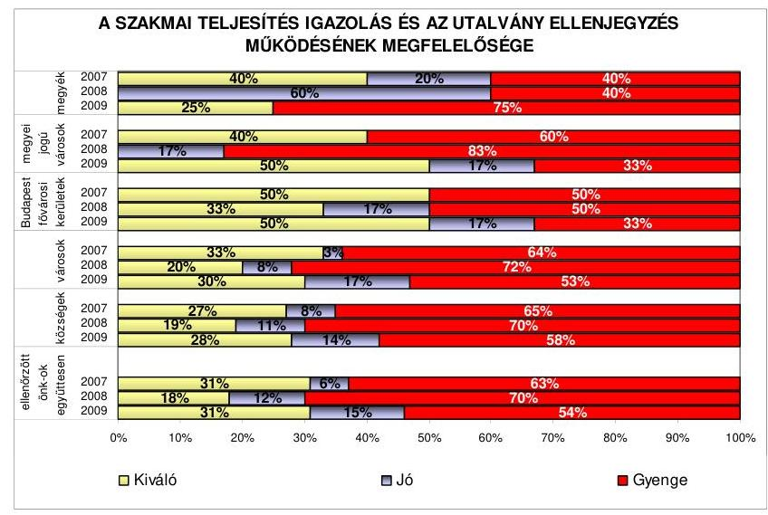

A külső szolgáltató által végzett karbantartási, kisjavítási szolgáltatásokkal, a gépek, berendezések és felszerelések beszerzésével, létesítésével, az államháztartáson kívülre teljesített múködési és felhalmozási célú pénzeszköz átadásokkal, valamint az állományba nem tartozók megbízási díjaival kapcsolatos 2008. és 2009. évi kiadásokat és azok megoszlásainak alakulását az ellenőrzött önkormányzatoknál a jelentés 14 . számú melléklete mutatja be.

A szakmai teljesítés igazolás során - az Ámr. ${ }_{1}$ 135. § (1) bekezdésében foglalt előírás ellenére - elmaradt, illetve nem az előírásoknak megfelelően történt a kiadások jogosultságának vizsgálata az önkormányzatok 44\%-ánál, (2007-ben 54\%-ánál, 2008-ban 57\%-ánál) a kifizetések összegszerűségének ellenőrzése 45\%-ánál, (2007-ben 56\%-ánál, 2008-ban 59\%-ánál) valamint a szerződés, megrendelés, megállapodás teljesítésének szakmai igazolása 40\%-ánál (2007-ben 55\%-ánál, 2008-ban 57\%-ánál).

A kiadások jogosultságának és összegszerűségének ellenőrzését, valamint a szerződésben, megrendelésben, megállapodásban foglaltak szakmai teljesítését az önkormányzatok 16\%-ánál nem igazolták, az Ámr. ${ }_{1}$ 135. § (2) bekezdésében előírtak ellenére a kifizetések alapját képező bizonylatokon nem tüntették fel a szakmai teljesítést igazoló aláírását, az igazolás dátumát, valamint nem jelölték meg az igazolási kötelezettség végrehajtását.

A kiadások jogosultságának és összegszerűségének ellenőrzését, valamint a szerződésben, megrendelésben, megállapodásban foglaltak teljesítését aláírásukkal, a dátum feltüntetésével nem igazolták az államháztartáson kívülre nyújtott múködési és felhalmozási célú pénzeszköz átadások esetében az önkormányzatok 35\%-ánál, az állományban nem tartozók megbízási díjaival kapcsolatos kiadások tekintetében 31\%-ánál, a külső szolgáltató által végzett karbantartási, kisjavítási szolgáltatásokkal kapcsolatos kiadások tekintetében 12\%-ánál, míg a gépek, berendezések és felszerelések beszerzésévek kapcsolatos kifizetések 11\%-ánál.

A kiadások jogosultságának és összegszerűségének ellenőrzését a legnagyobb arányban - az ellenőrzött önkormányzatok 35\%-ánál - az államháztartáson kívülre nyújtott múködési és felhalmozási célú pénzeszköz átadások teljesítését megelőzően mulasztották el, mert a jegyzők által kijelölt személyek az utólagos számadási kötelezettséggel nyújtott támogatások kifizetéseit megelőzően a

---

szerződésben, megállapodásban előírt támogatási célok teljesítését még nem tudták ellenőrizni, így a kapcsolódó ellenőrzési feladatokat - a kiadások jogosultságának és összegszerűségének ellenőrzését - sem végezték el. Az Ámr. ${ }_{2}$ vonatkozó ${ }^{87}$ előírásainak egyike sem tartalmazza az ellenőrzési feladat meghatározását azokra a kiadásokra vonatkozóan, amelyeknél a kifizetésekre az elvárt cél teljesítése előtt kerül sor és ezért az elvárt cél megvalósítását a szakmai teljesítés igazolására kijelölt személy még nem tudja ellenőrizni (pl. előfinanszírozással megvalósuló támogatások). Nem egyértelmű az Ámr. ${ }_{2}$ 76. § (3) bekezdésének második részében annak meghatározása, hogy a kötelezettséget vállaló szerv belső szabályzatában mely esetekre nézve nem szükséges külön előírni a szakmai teljesítés igazolás kötelezettségét, ez a kivételre vonatkozó utalás nem értelmezhető, mert a hivatkozott 77. § (1) bekezdés az érvényesítő ellenőrzési feladatait tartalmazza, amely szerint az érvényesítőnek ellenőriznie kell az összegszerűséget, a fedezet meglétét, s azt, hogy a megelőző ügymenetben betartották-e az Áht., Áhsz., Ámr. ${ }_{2}$, és a belső szabályzatokban foglaltakat.

Az önkormányzatok 12\%-ánál a szakmai teljesítés igazolásának módjáról - az Ámr. ${ }_{1}$ 135. § (2) bekezdésében előírtak ellenére - a jegyzök belső szabályzatban nem rendelkeztek. Ezekben az esetekben a kifizetések alapbizonylatain szereplő aláírás és dátum önmagában - anélkül, hogy a szakmai teljesítés igazolás ellenőrzésének végrehajtására utalna - nem jelentette a jogosultság, az összegszerűség, valamint a kötelezettségvállalásokban (szerződésben, megrendelésben, megállapodásban) foglalt teljesítés ellenőrzésének szakmai igazolását, mivel az aláírás nem jelentette a belső szabályzatban előírt feladat elvégzését. Az Ámr. ${ }_{1}$ 135. § (2) bekezdése előírta a költségvetési szervek vezetői (önkormányzati hivatalok esetében a jegyzők) részére, hogy a szakmai teljesítés igazolásának módjáról belső szabályzatban „köteles"-ek rendelkezni, ezzel szemben az Ámr. ${ }_{2}$ 20. §. (3) bekezdésének, illetve a 76. §ának rendelkezései nem írják elő nevesítetten kötelezettségként a költségvetési szervek vezetői részére a belső szabályozási kötelezettséget.

A szakmai teljesítést igazoló személyek - az igazolás elvégzését tanúsító aláírásuk ellenére - az önkormányzatok 16\%-ánál alapdokumentumok hiánya, illetve hiányosságai ${ }^{88}$ miatt nem látták el az ellenőrzési feladataikat, mivel a kötelezettségvállalásokat az Ámr. ${ }_{1}$ 134. § (8) bekezdésében előírt írásba foglalási kötelezettség ellenére nem foglalták írásba, így okmányok (írásos dokumentumok) hiányában nem ellenőrizték ${ }^{89}$ a szerződésben, illetve megrendelésben előírt feladatok teljesítését, a kiadás jogosultságát, valamint összegszerűségét.

[^0]
[^0]:    ${ }^{87}$ A szakmai teljesítés igazolás belső szabályozásával kapcsolatos előírásokat 2010. január 1-jétől az Ámr. ${ }_{2}$ 20. § (3) bekezdés a) pontja, valamint a 76. § (2)-(4) bekezdései és a 77. § (4) bekezdése rögzítik.
    ${ }^{88}$ Az önkormányzatok 14\%-ánál a dokumentumok nem tartalmazták a megrendelt termék, szolgáltatás összegét, illetve a szállító, a szolgáltató megnevezését.
    ${ }^{89}$ Megfelelő okmányok hiánya miatt a kiadások jogosultságának, összegszerűségének, illetve a szerződésben, megrendelésben foglaltak szakmai teljesítésének ellenőrzése nélkül történt az önkormányzatok 31\%-ánál a külső szolgáltató által végzett karbantartási, kisjavítási szolgáltatásokkal kapcsolatos kiadások kifizetése, 10\%-ánál a gépek, berendezések és felszerelések beszerzésévek kapcsolatos kifizetések, valamint 7\%-ánál az államháztartáson kívülre nyújtott múködési és felhalmozási célú pénzeszköz átadások kifizetése.

---

A kötelezettségvállalások írásba foglalását legnagyobb arányban - a kiemelt körbe tartozó önkormányzatok 6\%-ánál, a városi önkormányzatok 42\%-ánál, valamint a nagyközségi és községi önkormányzatok 42\%-ánál - a külső szolgáltatók által végzett karbantartási, kisjavítási feladatokkal kapcsolatos kifizetések tekintetében mulasztották el.

Jogosulatlanul, a jegyző kijelölésével nem rendelkező személyek végezték a szakmai teljesítés igazolását az önkormányzatok 10\%-ánál. Ezen önkormányzatok 31\%-ánál a kontrollok kialakításáért felelős jegyzők - az Ámr. ${ }_{1}$ 135. § (2) bekezdésében foglaltak ellenére - elmulasztották kijelölni az ellenőrzési feladatok elvégzésére jogosult személyeket, míg 69\%-uknál nem a jegyző által kijelölt személyek végezték a szakmai teljesítés igazolását. Az Ámr. ${ }_{2}$ 77. § (4) bekezdése 2010. január 1-jétől azt írja elő, hogy a szakmai teljesítés igazolására jogosult személyeket a kötelezettségvállaló írásban jelöli ki az adott kötelezettségvállaláshoz kapcsolódóan. Az esetleges visszaélések miatt kockázatos, hogy az önkormányzati hivatalok esetében főszabályként nem a jegyző jogosult a szakmai teljesítést igazoló személy kijelölésére, annak ellenére, hogy az Áht. 88. § (1) bekezdés e) pontjában foglaltak alapján (mint a költségvetési szerv vezetője) a jegyző felel a belső kontrollrendszer - ennek részeként a belső kontrollok, így a szakmai teljesítésigazolás - kialakításáért és hatékony működtetéséért.

Az utalvány ellenjegyzés során elvégzendő ellenőrzési feladatokat a jegyző, vagy az általa felhatalmazott személyek az Ámr. ${ }_{1}$ 137. § (3) bekezdésében ${ }^{90}$ foglalt előírások ellenére nem látták el, mivel az önkormányzatok 45\%-ánál (2007-ben 62\%-ánál, 2008-ban 66\%-ánál) nem ellenőrizték, hogy az utalványozás nem sérti a gazdálkodásra vonatkozó szabályokat, illetve 37\%-ánál (2007-ben 57\%-ánál, 2008-ban 56\%-ánál) nem győződtek meg a szakmai teljesítésigazolás, valamint 19\%-ánál (2007-ben 54\%-ánál, 2008-ban 49\%-ánál) az érvényesítés megtörténtéről.

A jegyző, vagy az általa felhatalmazott személyek az utalványokat nem ellenjegyezték az önkormányzatok 5\%-ánál, valamint további 3\%-uknál az ellenőrzési feladatokat - az Ámr. ${ }_{1}$ 137. § (2) bekezdésében foglaltak ellenére - jogosulatlanul, a jegyző írásos felhatalmazásával nem rendelkező személyek végezték. Az utalványok ellenjegyzése az önkormányzatok 36\%-ánál formai volt, mivel az utalvány ellenjegyzők aláírásuk ellenére nem észrevételezték, hogy a kötelezettségvállalásokat - az írásba foglalási kötelezettség ellenére - nem foglalták írásba ${ }^{91}$, illetve nem a polgármester, vagy az általa írásban felhatalmazott személyek vállaltak kötelezettséget, valamint a kötelezettségvállalásokat nem előzte meg azok ellenjegyzése ${ }^{92}$.

[^0]
[^0]:    ${ }^{90}$ Az utalvány ellenjegyzésre vonatkozó szabályokat 2010. január 1-jétől az Ámr. ${ }_{2}$ 74. §a, és 79. § (1)-(4) bekezdései tartalmazzák.
    ${ }^{91}$ A kötelezettségvállalásokat az ellenőrzött önkormányzatok 21\%-ánál nem foglalták írásba.
    ${ }^{92}$ A kötelezettségvállalások ellenjegyzése az önkormányzatok 16\%-ánál maradt el, valamint a polgármester írásos felhatalmazásával nem rendelkező személyek jogosulatlanul vállaltak kötelezettséget az önkormányzatok 3\%-ánál.

---

A kötelezettségvállalások elmaradásánál, illetve nem arra jogosult által történt elvégzésénél közrejátszott a vonatkozó jogszabályok eltérő rendelkezéseiből adódó összhanghiány:
a Htv. 139. § (1) bekezdés d) pontjában, valamint az Ámr. ${ }_{1}$ 134. § (2) bekezdésében foglaltak szerint az önkormányzat nevében kötelezettséget a polgármester, vagy az általa felhatalmazott személy vállalhat, illetve vállalhatott, míg az Áht. 100/B. § (1) bekezdése, valamint az Ámr. ${ }_{1} 134 . \S$ (1) bekezdése nem az önkormányzat, hanem a költségvetési szerv feladatainak ellátását szolgáló, a kiadási előirányzatokat terhelő fizetési vagy más teljesítési kötelezettség vállalására vagy ilyen követelés előírására vonatkozóan írja elő, hogy - törvényben meghatározott kivétellel - a kötelezettségvállalás a költségvetési szerv vezetőjének vagy az általa írásban megbízott személynek a hatáskörébe tartozik. Az önkormányzat nem költségvetési szerv, viszont az önkormányzati hivatal az Áht. 66. §-a szerint költségvetési szervként múködik, amely költségvetési szervnek a vezetöje az Ötv. 36. § (2) bekezdése alapján a jegyző;
az Ámr. ${ }_{2}$ 72. § (3) bekezdésének és a (6) bekezdésében a kötelezettségvállalásra jogosult megjelölése nem azonos és nem értelmezhető, mert az Ámr. ${ }_{2}$ 72. § (3) bekezdése azt tartalmazza, hogy kötelezettségvállalásra a helyi önkormányzat vezetöje, illetve az általa írásban megbízott, a kötelezettséget vállaló szerv alkalmazásában álló személy jogosult, míg a (6) bekezdés szerint a polgármester, vagy az általa felhatalmazott személy vállalhat kötelezettséget a helyi önkormányzat nevében az önkormányzati hivatal költségvetési előirányzatai terhére a (7) bekezdésben meghatározott kivétellel. Az Ámr. ${ }_{2}$-ben nincs értelmező rendelkezés, hogy ezen rendelet alkalmazásában kit kell a helyi önkormányzat vezetője alatt érteni, ezért a helyi önkormányzatok esetében az Ámr. ${ }_{2}$ 72. § (3) bekezdésében az „önkormányzat vezetöje" meghatározás nem értelmezhető. Az Ötv. 36. § (2) bekezdése szerint a jegyző az önkormányzati hivatal vezetője, amely hivatal az Áht. 66. §-a alapján az önkormányzat gazdálkodását végrehajtó szervezet, ezért a jegyző nem közvetlenül az önkormányzat, hanem annak egyik költségvetési szervének, a hivatalnak a vezetője.

A kötelezettségvállalásra jogosultak körének meghatározására irányuló jogszabályi rendelkezésekben (Htv. 139. § (1) bekezdés d) pontja, Áht. 100/B. § (1) bekezdése, Ámr. ${ }_{2}$ 72. § (3) és (6) bekezdései) a kötelezettségvállalási jogkör átadás írásbeliségére vonatkozó megfogalmazások nem egységesek. A Htv. 139. § (1) bekezdése d) pontja szerint a polgármester a helyi önkormányzat nevében kötelezettséget vállalhat, erre más személyt is felhatalmazhat. Az Áht. 100/B. § (1) bekezdése szerint a költségvetési szerv feladatainak ellátását (végrehajtását) szolgáló, a kiadási előirányzatokat terhelő fizetési vagy más teljesítési kötelezettség vállalása a költségvetési szerv vezetőjének vagy az általa írásban megbízott személynek a hatáskörébe tartozik. Az Ámr. ${ }_{2}$ 72. § (3) bekezdése tartalmazza, hogy kötelezettségvállalásra a helyi önkormányzat vezetője, illetve az általa írásban megbízott, a kötelezettséget vállaló szerv alkalmazásában álló személy jogosult. Az Ámr. ${ }_{2}$ 72. § (6) bekezdése szerint: a helyi önkormányzat nevében az önkormányzati hivatal költségvetési előirányzatai terhére a polgármester, vagy az általa felhatalmazott személy vállalhat kötelezettséget. Ezen hivatkozott jogszabályi előírások - an-

---

nak indokoltsága ellenére - nem rögzítik a kötelezettségvállalásra felhatalmazható személyek körét.

Hiányzik az önkormányzatok esetleges korrupciós kockázatainak csökkentését elősegítő szabályozás, amelyben a helyi önkormányzatok részére jogszabály egyértelműen meghatározza azon személyek körét, akiket a polgármester felhatalmazhat kötelezettségvállalásra (pl. alpolgármesterek, önkormányzati hivatal köztisztviselői). Jelenleg a polgármester akár külső szervezetek képviselőit (pl. gazdasági társaság alkalmazottját) is felhatalmazhatja az önkormányzat költségvetési előirányzatai terhére történő kötelezettségvállalásra, amely felhatalmazásokra azonban nem a jegyző által az önkormányzati hivatalon belül kialakított belső kontrollok vonatkoznak.

A polgármester általános kötelezettségvállalási jogosultsága alóli kivételek meghatározása során az Ámr. ${ }_{2}$ 72. § (7) bekezdésében lehetőséget biztosít arra, hogy „a külön jogszabály alapján a jegyző döntési hatáskörébe utalt előirányzatok esetében" a jegyző kötelezettségvállalási jogkört kaphasson. A „külön jogszabályi" megfogalmazás - ami magában foglalja a törvényi szabályozáson túl, még az önkormányzati rendeleti szabályozási lehetőséget is - ellentétes az Áht. 100/B. § (1) bekezdésével, amely csak törvény részére teszi lehetővé a kivételek megfogalmazását, ennél alacsonyabb szintű jogszabályban nem.

Az ellenőrzött önkormányzatok mintegy felénél a vizsgált kulcsfontosságú belső kontrollok (a szakmai teljesítésigazolás és az utalvány ellenjegyzés) nem teljesítették a múködésbeli hibák megelőzésére, feltárására és kijavítására irányuló céljaikat, ezáltal fennállt a lényeges hiba, szabálytalanság kockázata. A belső kontrollok múködésének hiányosságai következtében az önkormányzatok 5\%-ánál nem a szerződésben meghatározott összeget fizették ki, illetve nem a jogosult részére teljesítettek kifizetést, további 14\%-ánál ${ }^{93}$ a kötelezettségvállalás tárgyával összefüggő előirányzat nélküli kötelezettségvállalások alapján teljesítettek kifizetéseket. A kiadási előirányzatok hiányában teljesített kötelezettségvállalásokkal a polgármesterek, jegyzők megsértették az Áht. 93. § (1) bekezdésében foglalt, a jóváhagyott elöirányzatokon belüli gazdálkodásra vonatkozó kötelezettséget, valamint az Áht. 12/A. § (1) bekezdésének azon előírását, amely szerint tárgyévi fizetési kötelezettség a jóváhagyott kiadási előirányzatok mértékéig vállalható és kifizetés is ezen öszszeghatárig rendelhető el.

# 4.1.3. A pénzügyi-számviteli feladatoknál alkalmazott informatikai rendszerek szabályozottsága, biztonságos és dokumentált múködési feltételeinek kialakítása 

A jól kialakított és szabályozott informatikai biztonsági rendszer csökkenti a hibák, a csalások, és más illegális műveletek bekövetkezésének esélyeit, ennek ellenére az önkormányzatok tevékenységében egységesen érvényesítendő informatikai biztonsági követelményrendszert központilag még nem alakítottak

[^0]
[^0]:    ${ }^{93}$ A kiemelt körbe tartozó önkormányzatok 13\%-ánál, a városi önkormányzatok 12\%ánál, valamint a községi önkormányzatok 19\%-ánál a kifizetés időpontjában nem állt rendelkezésre a kötelezettségvállalás tárgyával összefüggő kiadási előirányzat a 2008., illetve a 2009. évi költségvetési rendeletekben.

---

ki. Az informatikai rendszer szabályozottsága az ellenőrzött önkormányzatok 29\%-ánál összességében alacsony kockázatot jelentett az informatikai feladatok biztonságos végrehajtásában, mivel az önkormányzati hivataloknál készítettek informatikai biztonsági szabályzatot, illetve rendelkeztek olyan dokumentummal, belső utasítással, amely tartalmazta az üzletmenet folytonossági tervet vagy a váratlan események bekövetkezésekor teendő intézkedéseket meghatározó informatikai katasztrófa elhárítási tervet. Ezen önkormányzatok rendelkeztek hozzáférési eljárásrenddel és kapcsolódó nyilvántartással, szabályzataikban kizárták a belső és külső fejlesztők hozzáférését a pénzügyi-számviteli rendszerekhez, továbbá a pénzügyi-számviteli rendszer hozzáféréseiről ellenőrzési listát készítettek.
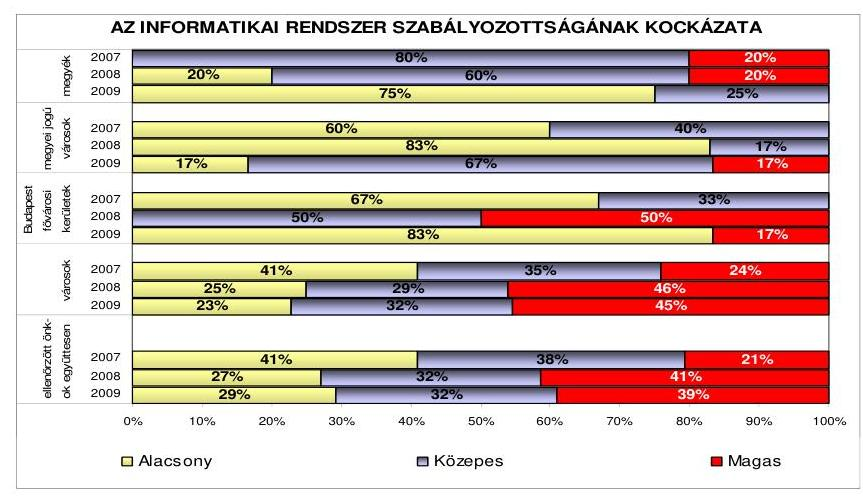

Az ellenőrzött önkormányzatok 32\%-ánál a pénzügyi-számviteli tevékenységhez kapcsolódó informatikai feladatok szabályozásának hiányosságai közepes kockázatot jelentettek az informatikai feladatok megfelelő működtetésében, azonban a kialakított kontrollok -működtetésük esetén - a lehetséges hibák többsége ellen védelmet nyújtottak. Az ellenőrzött önkormányzatok 39\%ánál a pénzügyi-számviteli tevékenységhez kapcsolódó informatikai feladatok szabályozásának hiányosságai magas kockázatot jelentettek az informatikai feladatok működtetésében. A közepes és magas kockázatot az okozta, hogy ezen önkormányzatok:
38\%-a nem rendelkezett üzletmenet folytonossági vagy katasztrófa elhárítási tervvel;

43\%-ánál nem szabályozták a jelszavak kezelését;
24\%-ánál nem minden felhasználó rendelkezett a pénzügyi-számviteli programokhoz egyedi felhasználónévvel és jelszóval;

36\%-a nem rendelkezett eljárásrenddel a pénzügyi-számviteli rendszerek hozzáférési jogosultságairól;

60\%-ánál nem korlátozták szabályzatban a külső fejlesztők bármilyen típusú hozzáférését az éles rendszerhez;

76\%-ánál a pénzügyi-számviteli programokból nem volt lekérhető tételes ellenőrzési lista;

---

83\%-ánál nem szabályozták a pénzügyi-számviteli program-változások ellenőrzésére, tesztelésére vonatkozó eljárásokat.

A pénzügyi-számviteli tevékenységhez kapcsolódó informatikai feladatoknál a kialakított belső kontrollok múködésének megfelelősége az önkormányzatok 17\%-ánál összességében kiváló volt, mivel biztosították a hozzáférési jogosultságokra vonatkozó nyilvántartás teljes körúségét, naprakészségét és ellenőrizhetőségét, a jelszavakra előírt szabályok betartását, dokumentálták a pénzügyi-számviteli program elemeire vonatkozó változáskezelési eljárások ellenőrzését.
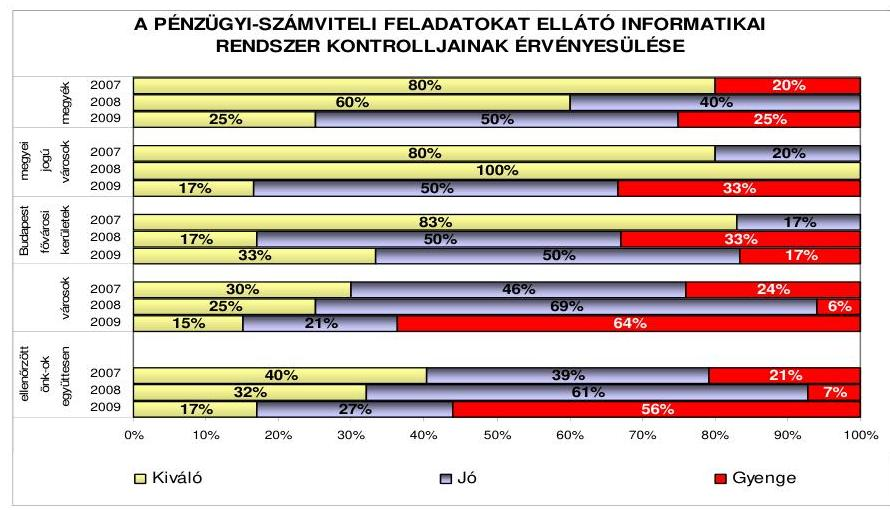

A pénzügyi-számviteli tevékenységhez kapcsolódó informatikai feladatoknál a kialakított belső kontrollok múködésének megfelelősége az önkormányzatok 27\%-ánál jó volt, mivel azok a megállapított kisebb ${ }^{94}$ hiányosságok mellett kielégítették az elvárásokat a múködésbeli hibák megelőzése, feltárása és kijavítása tekintetében, a megállapított hiányosságok nem veszélyeztették a hibák megelőzését, feltárását és kijavítását. A pénzügyi-számviteli tevékenységhez kapcsolódó informatikai feladatoknál a kialakított belső kontrollok múködésének megfelelősége az önkormányzatok 56\%-ánál gyenge volt, mivel ezen önkormányzatok hivatalainál a kontrollok múködésében túl sok hiányosság fordult elő ahhoz, hogy megbízhatónak lehessen azokat minősíteni. Az informatikai rendszer jó és gyenge múködését a következő hiányosságok miatt állapítottuk meg az önkormányzati hivataloknál:
38\%-nál nem tesztelték az üzletmenet-folytonossági tervet, vagy katasztrófa elhárítási tervet;

41\%-ánál nem tartották be a pénzügyi és számviteli integrált rendszerben, vagy a főkönyvi könyvelési rendszerben meghatározott hozzáférési jogosultságokat;

32\%-ánál nem biztosították maradéktalanul a pénzügyi-számviteli programokban a jelszavakra előírt szabályok betartását;

[^0]
[^0]:    ${ }^{94}$ Az ellenőrzés lefolytatásához egységesen meghatározott követelményrendszerben foglalt mértéket el nem érő hiányosság esetén a „kisebb" kifejezést alkalmazzuk.

---

57\%-ánál nem dokumentálták a pénzügyi-számviteli program elemeire vonatkozó változáskezelési eljárásokat, illetve a változáskezelési eljárások ellenőrzését, tesztelését;

32\%-ánál az előírt rendszerességgel nem vizsgálták a tételes ellenőrzési listákat (naplókat);

38\%-ánál nem ellenőrizték az elmentett adatállományokból a pénzügyiszámviteli adatok teljes körű helyreállíthatóságát.

# 4.2. A belső ellenőrzés szabályozottsága, szervezettsége és múködése 

A belső ellenőrzés szervezeti keretének meghatározása és múködési feltételeinek szabályozása az önkormányzatok 36\%-ánál (2008-ban 50\%ánál, 2007-ben 57\%-ánál) összességében alacsony kockázatot jelentett a belső ellenőrzés szabályszerű végrehajtásában, mert meghatározták a szervezeti és szabályozási kereteket, ezen belül a belső ellenőrzés ellátási módját, rögzítették a belső ellenőrzési kötelezettséget, az ellenőrzést végzők jogállását és feladatait, gondoskodtak a belső ellenőrzési tevékenység megszervezéséről, meghatározták a belső ellenőrzési vezető személyét, feladatait, a jegyzők megfelelő tartalmú belső ellenőrzési kézikönyvet hagytak jóvá, a belső ellenőrzés rendelkezett stratégiai és éves ellenőrzési tervvel, amelyek kockázatelemzésen alapultak, az ellenőrzések lefolytatásához ellenőrzési programot készítettek, kialakították a belső ellenőrzési nyilvántartásokat. a kialakított belső ellenőrzési szervezetek az előforduló kisebb szabályozási hiányosságok ellenére megfelelő védelmet nyújtottak a hibák bekövetkezése ellen.
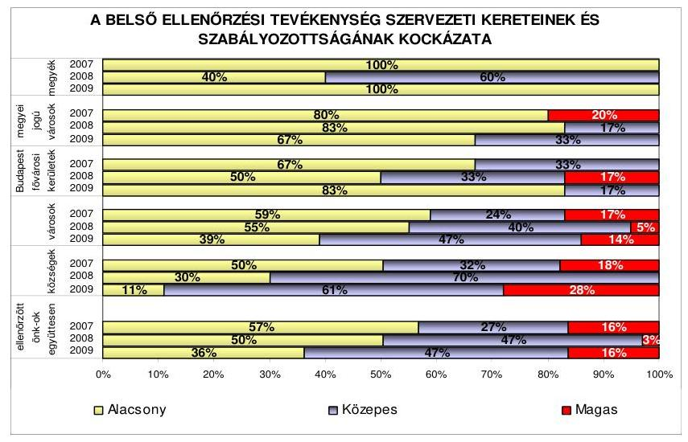

Az ellenőrzött önkormányzatok 48\%-ánál (2008-ban 47\%-ánál, 2007-ben 27\%-ánál) a belső ellenőrzés szervezeti kereteinek meghatározása, illetve szabályozásának hiányosságai közepes kockázatot jelentettek a feladatok megfelelő és szabályszerű végrehajtásában, mert hiányosan határozták meg a belső ellenőrzési feladatok ellátási módját, az önkormányzati hivatalokon belül elfoglalt helyét, a feladatainak ellátásával kapcsolatos szabályokat, azonban a kialakított szervezet - szabályszerű működtetés esetén - a lehetséges hibák többsége ellen védelmet nyújtott. Az ellenőrzött önkormányzatok 16\%-ánál

---

(2008-ban 3\%-ánál, 2007-ben 16\%-ánál) a belső ellenőrzés szervezeti kereteinek meghatározása, illetve szabályozásának hiányosságai magas kockázatot jelentettek a feladatok megfelelő ellátásában, mert a jogszabályi előírások ellenére elmulasztották a belső ellenőrzés szervezeti kereteinek kialakítását, illetve a feladatainak ellátásával kapcsolatos szabályokat nem határozták meg, ezáltal az nem nyújtott elegendő védelmet a lehetséges hibákkal szemben.

A közepes és magas kockázatot a belső ellenőrzés szervezeti keretének meghatározása, és múködési feltételeinek szabályozottsága tekintetében a következő szabályozási hiányosságok okozták:
nem határozták meg a Ber. 4. § (2) bekezdésben foglaltak ellenére SzMSz-ben a belső ellenőrzési kötelezettséget, az ellenőrzést végző személy, egység, vagy szervezet jogállását, feladatait az önkormányzatok 32\%-ánál;
nem rendelkeztek a belső ellenőrök a Ber. 11. § (1) bekezdésében előírt iskolai végzettséggel, illetve szakmai képesítéssel az önkormányzatok 8\%-ánál;
nem hagyták jóvá a jegyzők - az ellenőrzési tevékenységre vonatkozó szabályok és eljárások rögzítésére - a belső ellenőrzési kézikönyvet az önkormányzatok $19 \%$-ánál ${ }^{95}$;
nem határozták meg SzMSz-ben, ügyrendben, munkaköri leírásban, külső szolgáltatóval történő feladatellátás esetén megállapodásban, vagy más dokumentumban a belső ellenőrzési vezetők személyét az önkormányzatok 40\%-ánál ${ }^{96}$;
nem rendelkeztek - a Ber. 4/A. § (2) bekezdésének előírása ellenére - a külső szolgáltatóval történő feladatellátásról szóló megállapodásban a belső ellenőrzési tevékenység megszervezését külső erőforrással, szolgáltatóval végrehajtó önkormányzatok 64\%-ánál a belső ellenőrzési vezető számára - a Ber. 12. §ában - meghatározott feladatok ellátási módjáról;
nem rendelkezett a belső ellenőrzés - a Ber. 19. §-ban foglaltak ellenére - az önkormányzatok 16\%-ánál stratégiai ellenőrzési tervvel ${ }^{97}$, további 59\%-nál a stratégiai ellenőrzési tervet kockázatelemzéssel nem támasztották alá;
nem a hatályos kockázatkezelési eljárásrend alapján határozták meg a kockázatelemzés során - az Ámr. ${ }_{1}$ 145/C. §-ban foglaltak ellenére - az önkormányzatok 58\%-ánál a magas kockázatúnak értékelt területeket. Nem rendelkezett a belső ellenőrzés - az Ötv. 92. § (6) bekezdésében foglalt előírást figyelmen kívül hagyva - a képviselő-testületek által jóváhagyott éves ellenőrzési tervvel az önkormányzatok 12\%-ánál. Az önkormányzatok 4\%-ánál az éves ellenőrzési tervet - az ellenőrzési terv jóváhagyására jogosult, érintett önkormányzat képvise-

[^0]
[^0]:    ${ }^{95}$ A belső ellenőrzési kézikönyvet nem hagyták jóvá a jegyzők városi önkormányzatok 15\%-ánál, a községi önkormányzatok 36\%-ánál.
    ${ }^{96}$ A belső ellenőrzési feladatokat társulással ellátó önkormányzatok 46\%-ánál, a külső szolgáltatót megbízók 33\%-ánál, a szerződésessel megbízottak 25\%-ánál, az önkormányzati hivatalok 8\%-ánál nem határozták meg a belső ellenőrzési vezető személyét.
    ${ }^{97}$ A stratégiai ellenőrzési tervvel nem rendelkező önkormányzatok 80\%-a társulásban szervezte meg a belső ellenőrzést.

---

lő-testületének tájékoztatása és a jegyzővel történő egyeztetés nélkül - a kistérségi társulások társulási tanácsa hagyta jóvá. A belső ellenőrzési feladatok tervezése az önkormányzatok 63\%-ánál hiányos volt, mert a 2008. évi belső ellenőrzési tervek nem tartalmazták a - stratégiai ellenőrzési tervet, vagy az éves ellenőrzési terveket megalapozó kockázatelemzésben - magas kockázatúnak értékelt területek ellenőrzését;
az ellenőrzött önkormányzatok 6\%-a nem tervezte az önkormányzati hivatali feladatok belső ellenőrzését, 13\%-a az intézmények ellenőrzését ${ }^{98}$;
az éves ellenőrzési tervek 42\%-ánál a Ber. 21. § (4) bekezdésében foglaltak ellenére nem biztosítottak kapacitást a soron kívüli ellenőrzési feladatokra. A kép-viselő-testületek a 2008. és 2009. évben az önkormányzati hivatalban évente átlagosan négy-négy, az intézményeknél pedig a 2008. évben átlagosan hat, a 2009. évben öt ellenőrzést terveztek;
az ellenőrzések lefolytatásához a Ber. 23. § (1) bekezdésének előírása ellenére az önkormányzatok 7\%-ánál nem készítettek ellenőrzési programot. Az elkészített ellenőrzési programok 17\%-a nem felelt meg a Ber. 23. § (4) bekezdésben foglalt tartalmi követelményeknek, mivel elmaradt az ellenőrzött szerv megnevezése, vagy az ellenőrzés tárgyának, időszakának, az ellenőrzési módszerének, vagy az ellenőrzést végzők megbízólevele számának, az ellenőrzési kérdőívek meghatározása, az ellenőrök feladatmegosztásának ismertetése, az ellenőrzésre vonatkozó jogszabályi, vagy egyéb felhatalmazásra való hivatkozás, valamint az ellenőrzés tervezett időtartamának, a jelentések elkészítési határidejének meghatározása. Az ellenőrzési programok 53\%-át a Ber. 23. § (3) bekezdésének előírása ellenére nem hagyta jóvá a belső ellenőrzési vezető. A belső ellenőrzési vezető meghatározásának hiánya miatt az önkormányzatok 36\%-ánál maradt el az ellenőrzési programok szabályszerű, a belső ellenőrzési vezető által történő jóváhagyása. Az önkormányzatok 17\%-nál pedig nem a belső ellenőrzési vezető ${ }^{99}$ hagyta jóvá az ellenőrzési programokat;
nem határozták a belső ellenőrzések nyilvántartásának kialakításával kapcsolatos előírásokat a Ber. 32. § (1) bekezdésben foglaltak ellenére az önkormányzatok $21 \%$-ánál ${ }^{100}$, továbbá nem alakították ki az ellenőrzési javaslatok alapján megtett intézkedésekről a nyilvántartást a Ber. 12. § n) pontban előírtak ellenére az önkormányzatok $48 \%$-ánál ${ }^{101}$.

[^0]
[^0]:    ${ }^{98}$ Fertőd, Kisköre, Püspökladány városi önkormányzatoknál az önkormányzati hivatal és az intézmények, Szendrő város, Ajak, Buják, Végegyháza községek önkormányzati hivatalánál, további 11 önkormányzatnál az intézmények tekintetében nem terveztek ellenőrzést.
    ${ }^{99}$ A 19 önkormányzatnál a jegyző, négy önkormányzatnál a polgármester, hét önkormányzatnál a társulási tanács, öt önkormányzatnál az ellenőrzést végző gazdasági társaság vezetője, négy önkormányzatnál a belső ellenőr hagyta jóvá az ellenőrzési programot.
    ${ }^{100}$ A belső ellenőrzések nyilvántartását a városi önkormányzatok 17\%-ánál és a községi önkormányzatok 39\%-ánál nem alakították ki.
    ${ }^{101}$ A belső ellenőrzési javaslatok alapján megtett intézkedések nyilvántartásának előírása a városi önkormányzatok 48\%-ánál, a községi önkormányzatok 69\%-ánál nem történt meg.

---

Az ellenőrzött önkormányzatokon belül az ellenőrzési alapdokumentumokkal rendelkező önkormányzatok arányát szemlélteti a következő diagram:
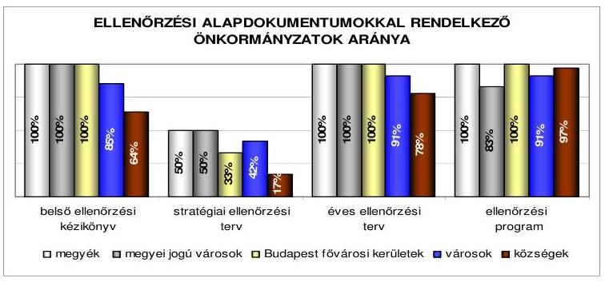

A belső ellenőrzési feladatok végrehajtása érdekében az önkormányzatok 19\%a kizárólag az önkormányzati hivatalon belül foglalkoztatott belső ellenőrt, illetve hozott létre belső ellenőrzési egységet, 4\%-a vállalkozói szerződést, 67\%-a társulási megállapodást kötött ezen feladatok ellátására. Az önkormányzatok 10\%-a a belső ellenőrzést egyidejúleg több módon - társulás és vállalkozás, társulás és köztisztviselő, vállalkozó és köztisztviselő, illetve belső szervezeti egység és társulás útján - biztosította.
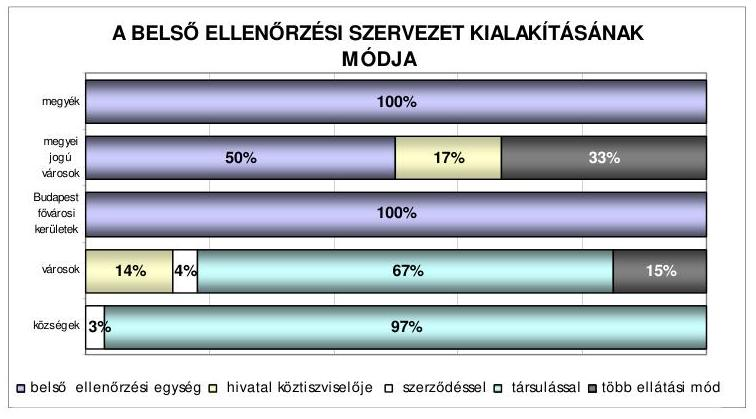

A belső ellenőrzési feladatok önkormányzati hivatalban történő ellátása esetén a belső ellenőrzés SzMSz-ben rögzített jogállása, feladata alapján az Áht. 121/A. § (4) bekezdésében előírtak ellenére az önkormányzatok 14\%-ánál a szabályozás alapján, valamint a szabályozás hiánya miatt, 17\%-ánál a végrehajtás során nem volt biztosított a belső ellenőrök funkcionális függetlensége.

A belső ellenőrzés múködésénél a kialakított kontrollok megfelelősége az önkormányzatok 29\%-ánál (2008-ban 14\%-ánál, 2007-ben 7\%ánál) összességében kiváló volt, mivel a kontrollok - a megállapított eseti kisebb ${ }^{102}$ hiányosságok ellenére - megfeleltek a belső ellenőrzési tevékenység szabályozásának és a legmagasabb szintű elvárásoknak a múködésbeli hibák megelőzésével és feltárásával, célirányos intézkedésekkel, valamint a realizálás ellenőrzésével a hibák kijavítása tekintetében.

[^0]
[^0]:    ${ }^{102}$ Az ellenőrzés lefolytatásához egységesen meghatározott követelményrendszerben foglalt mértéket el nem érő hiányosság esetén a „kisebb" kifejezést alkalmazzuk.

---

A belső ellenőrzés működésénél a kialakított kontrollok megfelelősége az önkormányzatok 47\%-ánál (2008-ban 55\%-ánál, 2007-ben 40\%-ánál) jó volt, mivel a belső ellenőrzési tevékenységet az előírásoknak megfelelően végrehajtották, a kontrollok a megállapított kisebb (tolerálható mértékű) hiányosságok mellett kielégítették az elvárásokat a belső ellenőrzés működésbeli hibáinak megelőzőse, feltárása és kijavítása tekintetében. A belső ellenőrzés működésében megállapított hiányosságok nem veszélyeztették, hogy a belső ellenőrzés megelőzőzze, feltárja és kijavíttassa a lényeges hibákat, szabálytalanságokat. A belső ellenőrzés működésénél a kialakított kontrollok megfelelősége az önkormányzatok 24\%-ánál (2008-ban 31\%-ánál, 2007-ben 53\%-ánál) gyenge volt, mert a kontrollok múködtetése nem teljesítette a lényeges hibák, szabálytalanságok és gyenge teljesítmények megelőzősével, feltárásával és kijavításával kapcsolatos funkcióját és veszélyeztette a belső ellenőrzés eredményes, megfelelő működését.
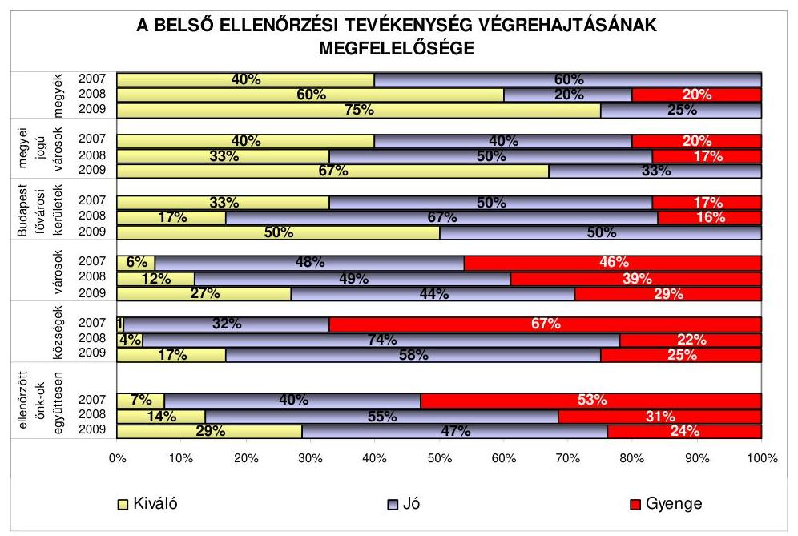

A belső ellenőrzésnél a kialakított kontrollok működésénél a következő hiányosságokat állapítottuk meg:
nyolc önkormányzatnál a jegyző az Ötv. 92. § (5) bekezdésben foglalt kötelezettsége ellenére nem gondoskodott az ellenőrzési feladatok ellátásáról, közülük ötnél az önkormányzati hivatal valamint hatnál a felügyelt költségvetési szervek ellenőrzéséről. Az ellenőrzés elmulasztása miatt ezen önkormányzatoknál a jegyző felelősségét vetettük fel;
az önkormányzatok 16\%-ánál nem végezték el, további 16\%-ánál pedig nem hajtották végre maradéktalanul a tervezett belső ellenőrzési feladatokat, ugyanakkor ezen önkormányzatok 35\%-ánál a tervezettől eltérő, soron kívüli ellenőrzési feladatokat is végeztek. A társulásokat belső ellenőrzési feladattal megbízó önkormányzatok 34\%-ánál nem állt rendelkezésre a tervezett ellenőrzési feladatok ellátásához szükséges belső ellenőri kapacitás, ennek következtében a belső ellenőrzést társulással ellátó önkormányzatok 9\%-ánál a tervezett ellenőrzéseket nem hajtották végre, további 9\%-ánál részben teljesítették;

---

a stratégiai ellenőrzési terveket és az éves ellenőrzési terveket megalapozó kockázatelemzés során magas kockázatúnak értékelt területek ellenőrzését tervező önkormányzatok 30\%-a nem végezte el valamennyi magas kockázatúnak minősített terület/feladat ellenőrzését;

A kockázatelemzéssel alátámasztott stratégiai tervekben, éves ellenőrzési tervekben az önkormányzatok 21\%-ánál a költségvetési koncepció, költségvetési- és zárszámadási rendelet készítéséhez, a költségvetési rendelet-módosításához, az előirányzat nyilvántartáshoz, a gazdálkodás és a pénzügyi-számviteli feladatellátás szabályozottságának biztosításához; 20\%-ánál a költségvetési gazdálkodási és ellenőrzési jogkörök gyakorlásának szabályszerűségéhez, a gazdasági eseményeket magukba foglaló bizonylatokkal szembeni követelmények teljesítéséhez; 14\%-ánál az önkormányzati vagyon nyilvántartásához, a vagyongazdálkodáshoz; 22\%-ánál a céljelleggel nyújtott támogatásokhoz, a költségvetési támogatások igénybevételének elszámolásához; 14\%-ánál a közbeszerzési eljárásokhoz; 11\%-ánál a kontrollok kialakításához, a belső ellenőrzéshez; 8\%-ánál az önkormányzati gazdálkodás egyéb területeinek törvényes és szabályszerű ellátásához; 11\%-ánál a költségvetési intézmények múködéséhez; 6\%-ánál a gazdasági társaságok tevékenységéhez kapcsolódó feladatokat értékelték magas kockázatúnak.
az ellenőrzött önkormányzatok 79\%-a hajtott végre európai uniós forrásból megvalósított feladatot, amelyek $77 \%$-ánál a stratégiai ellenőrzési tervet és az éves ellenőrzési tervet megalapozó kockázatelemzés nem terjedt ki e feladatok kockázatának értékelésére. A kockázatokat értékelő önkormányzatok 48\%-a (az európai uniós támogatást igénybe vevők 11\%-a) értékelte magas kockázatúnak az európai uniós forrásból megvalósított feladatok végrehajtását, amelyek ellenőrzését ezen önkormányzatok 10\%-a nem tervezte és nem végezte el;
az önkormányzatok 78\%-a hajtott végre közbeszerzéssel összefüggő feladatokat, amelyek $72 \%$-ánál a stratégiai ellenőrzési tervet és az éves ellenőrzési tervet megalapozó kockázatelemzés nem terjedt ki e feladatok végrehajtásának értékelésére. A kockázatelemzést készítő önkormányzatok 62\%-a (a közbeszerzést végzők 17\%-a) értékelte magas kockázatúnak a közbeszerzési tevékenységet, azonban ezek ellenőrzését $67 \%$-uk nem tervezte és nem végezte el;
az önkormányzatok 56\%-a rendelkezett többségi irányítást biztosító befolyása alatt működő gazdasági társasággal, amelyek 83\%-ánál a kockázatelemzés nem terjedt ki a gazdasági társaság múködésével kapcsolatos kockázatok értékelésére. A kockázatelemzés során a gazdasági társasággal rendelkező önkormányzatok 9\%-ánál értékelték magas kockázatúnak a gazdasági társaságok múködését, melyek ellenőrzését elvégezték;
valamennyi ellenőrzött önkormányzat nyújtott céljellegú támogatást, ennek ellenére az önkormányzatok $81 \%$-ánál a kockázatelemzés nem terjedt ki ennek értékelésére. Az önkormányzatok 10\%-a értékelte magas kockázatúnak e feladatok végrehajtását, melyek ellenőrzését elvégezték;
az önkormányzatok 7\%-ánál az elvégzett ellenőrzésekről ellenőrzési jelentést nem készítettek, az elkészített ellenőrzési jelentésekben nem rögzítettek az önkormányzatok 7\%-ánál az ellenőrzési kézikönyvben és a Ber-ben előírt szerkezeti, tartalmi követelmények ellenére az ellenőrzési programmal összhangban lévő megállapításokat; 8\%-ánál a Ber. 27. § (2) bekezdés j) pontja ellenére következtetéseket és javaslatokat; 19\%-ánál a Ber. 27. § (3) bekezdés b) pontjában foglaltak ellenére a múködéssel, gazdálkodással, tevékenységgel kapcsolatos

---

előnyös és hátrányos összefüggéseket; 14\%-ánál nem tartalmaztak - a Ber. 27. § (6) bekezdésében előírtak ellenére - lényegre törő, az eredményeket és a hiányosságokat összefoglaló, rövid, tömör értékelést, és ajánlásokat, javaslatokat a hiányosságok felszámolása, illetve a folyamatok hatékonyabb, eredményesebb múködése érdekében; 16\%-ánál nem tartották be az ellenőrzést követő intézkedések elrendelésének ellenőrzési kézikönyvben előírt szabályait; 39\%-ánál nem a kézikönyvben előírtaknak megfelelően végezték el a belső ellenőrzési tevékenység minőségét biztosító eljárásokat;
a belső ellenőrzések során feltárt hiányosságok megszüntetésére tett javaslatok ellenére az önkormányzatok 29\%-ánál az ellenőrzöttek nem készítettek intézkedési tervet ${ }^{103}$;
a belső ellenőrzési vezető - a Ber. 12. § n) és 32. § (1)-(2) pontjaiban előírtak ellenére - az ellenőrzött önkormányzatok 57\%-ánál nem vezetett nyilvántartást az elvégzett ellenőrzésekről és az ellenőrzési jelentésekben tett megállapítások, javaslatok alapján készült intézkedési tervben foglalt feladatok végrehajtásáról ${ }^{104}$. Az önkormányzatok 39\%-ánál a belső ellenőrök által megállapított hiányosságok megszüntetéséről indokoltsága ellenére utóellenőrzéssel, beszámoltatással, vagy egyéb módon nem győződtek meg.

A belső ellenőrzés az önkormányzatok 13\%-ánál tárt fel büntető-, szabálysérté-si-, kártérítési-, vagy fegyelmi eljárás megindítására okot adó cselekményt.

A jegyzők 66\%-a (az előző évben 35\%-a) a 2008. évi költségvetési beszámoló keretében nyilatkozati formában értékelte a belső kontrollok múködését. A polgármesterek 75\%-a (2008-ban 62\%-a, 2007-ben 54\%-a) az önkormányzat felügyelete alá tartozó költségvetési szervek éves ellenőrzési jelentései alapján készített éves összefoglaló ellenőrzési jelentést a zárszámadási rendelettel egyidejűleg képviselő-testületet elé terjesztette, amelyet azok elfogadtak, illetve tudomásul vettek.

[^0]
[^0]:    ${ }^{103}$ A kiemelt önkormányzati körbe tartozó önkormányzatok 13\%-ánál, a városi önkormányzatok 23\%-ánál, és a községi önkormányzatok 42\%-ánál nem készítettek intézkedési terveket.
    ${ }^{104}$ A belső ellenőrzési vezető a városi önkormányzatok 48\%-ánál és a községi önkormányzatok 63\%-ánál nem vezetett nyilvántartást az elvégzett ellenőrzésekről és a javaslatok végrehajtásáról.

---

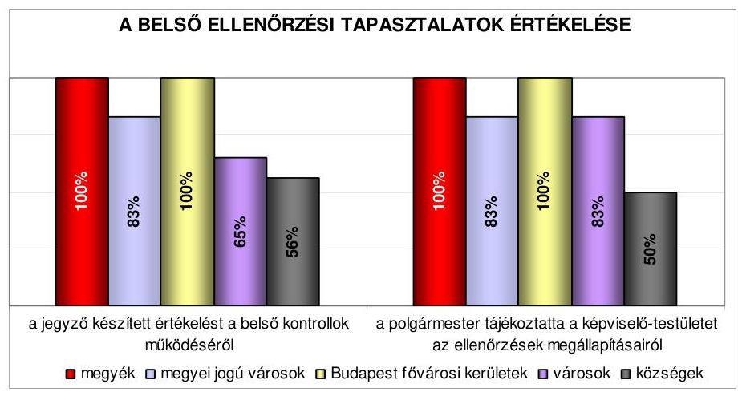
5. Az ÁSZ KorÁbbi ELLENŐRZÉSI JAVASLATAI ALAPJÁN KÉSZÍTETT INTÉZKEDÉSI TERV VÉGREHAJTÁSA, HASZNOSULÁSA

Az ellenőrzött önkormányzatok 86\%-ánál volt ÁSZ vizsgálat 20032008 között. Ezen önkormányzatoknál összesen 220 ellenőrzést folytattunk, amelyek megoszlása a következő:
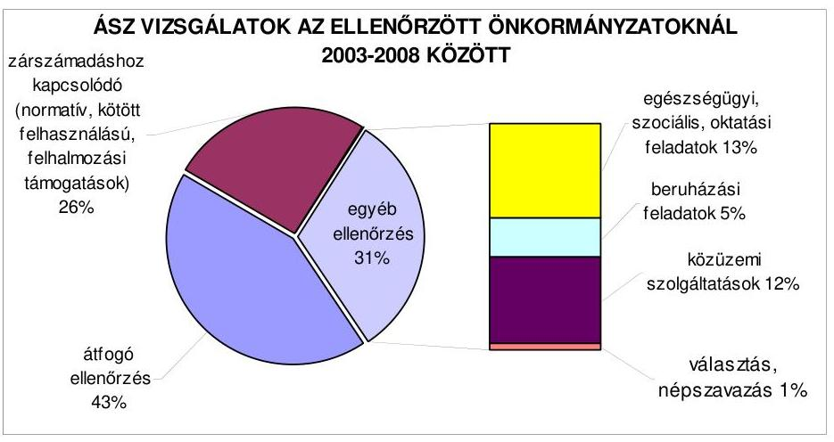

A feltárt hiányosságok megszüntetésére tett 4400 javaslat ${ }^{105} 82 \%$-a a gazdálkodás szabályszerűségének, $18 \%$-a a célszerűségének, hatékonyságának javítására irányult, a javaslatok mintegy kétharmada hasznosult.

A gazdálkodási rendszer átfogó ellenőrzése során tett 3700 javaslat 65\%-a hasznosult, megvalósították a jogszabályi előírások maradéktalan betartása, és a munka színvonalának javítása érdekében tett javaslatok 65-65\%át. A 2009. évben a gazdálkodási feladatok és hatáskörök szabályozatlanságáért, a gazdálkodási és pénzügyi-számviteli szabályok, valamint a belső ellenőrzés hiányos kialakítása és múködtetése miatt, továbbá a gazdálkodási rendszer korábbi átfogó vizsgálata során tett javaslatok realizálásának elmulasztásáért

[^0]
[^0]:    ${ }^{105}$ A 2007. évben ellenőrzött önkormányzatoknál 4550, a 2008. évben ellenőrzött önkormányzatoknál 3500 javaslat utóvizsgálatát végeztük el.

---

24 (2008-ban 17, 2007-ben 19) önkormányzatnál ${ }^{106}$ kezdeményeztük a jegyző, illetve a polgármester személyes felelősségének a megállapítását, és két önkormányzat esetében a gazdálkodásra vonatkozó szabályok megsértéséért büntető feljelentést tett az ÁSZ.

A költségvetés tervezés szabályszerűségéhez kapcsolódó javaslatok közel kétharmadát hasznosították. Elkészítették a gazdaság programot, csatolták a költségvetési koncepció előterjesztéséhez a bizottságok és a kisebbségi önkormányzatok, valamint a költségvetési rendelettervezetekhez a pénzügyi bizottság véleményét. A költségvetési rendelettervezetek a tartalmi és formai követelményeknek megfeleltek, a költségvetés végrehajtásának szabályait meghatározták. Javaslataink és az Áht. 8/A. § (7) bekezdés előírásai ellenére az önkormányzatok mintegy harmadánál a költségvetés bevételi és kiadási főöszszegének megállapításakor finanszírozási célú pénzügyi műveleteket vettek figyelembe költségvetési hiányt módosító költségvetési bevételként és kiadásként.

A költségvetési rendelet előirányzatainak módosításával, betartásával összefüggő javaslatok közel hattizedének hasznosításaként határidőn belül módosították a költségvetési rendeleteket, szükség szerinti aktualizálták a likviditási tervet. Javaslataink és az Áht. 12/A. § (1) bekezdésében foglaltak ellenére azonban az önkormányzatok 17\%-ánál túllépték a jóváhagyott költségvetési előirányzatokat.

A gazdálkodás szabályozottsága érdekében tett javaslatok 62\%-a hasznosult. Kialakították a költségvetési szervek egységes számviteli rendjét, aktualizálták a számviteli politikát és a kapcsolódó szabályzatokat. A számlarendben rendelkeztek az analitikus nyilvántartások vezetésének módjáról, formájáról, tartalmáról. Javaslataink és az Ámr. ${ }_{1} 17 . \S$ (5) bekezdésében előírtak ellenére az önkormányzatok közel tizedénél a gazdasági szervezetek ügyrendje a vezetők és a pénzügyi-gazdasági feladatokat ellátó alkalmazottak feladat-, hatás- és felelősségi körét nem tartalmazta. Nem határozták meg az önkormányzatok 14\%-ánál az Áhsz. 49. § (2) bekezdésében előírtak ellenére a főkönyv és az analitikus nyilvántartások egyeztetését és annak dokumentálását. Az önkormányzatok 8\%-ánál az Ámr. ${ }_{1}$ 134. § (3) bekezdésében foglaltak ellenére nem szabályozták az írásbeli kötelezettségvállalást nem igénylő kifizetések nyilvántartási rendjét és formáját, az Ámr. ${ }_{1}$ 135. § (2) bekezdésében foglaltak ellenére a szakmai teljesítés igazolás módját.

[^0]
[^0]:    ${ }^{106}$ A polgármester és a jegyző személyes felelősségét állapítottuk meg Gyömrő és Fertőd városok valamint Nagyesztergár község önkormányzatánál, a jegyzői feladatot ellátó személyes felelősségét állapítottunk meg Budapest főváros XIV. kerület, Abádszalók, Devecser, Fót, Hajdúsámson, Kisköre, Martfú, Martonvásár, Mindszent, Mór, Ócsa, Szendrő, Tamási városok, és Buják, Felsőörs, Gelse, Kápolna, Lókút, Lökösháza, Olaszfalu, Vaja községek önkormányzatánál. A fegyelmi eljárás kezdeményezésére nem került sor 10 önkormányzatnál, mert a jelentés átadásakor nyolc jegyzőnek, egy aljegyzőnek és egy polgármesternek megszűnt polgármesteri tisztsége további egy jegyző és egy polgármester esetében pedig a fegyelmi vétség elévült.

---

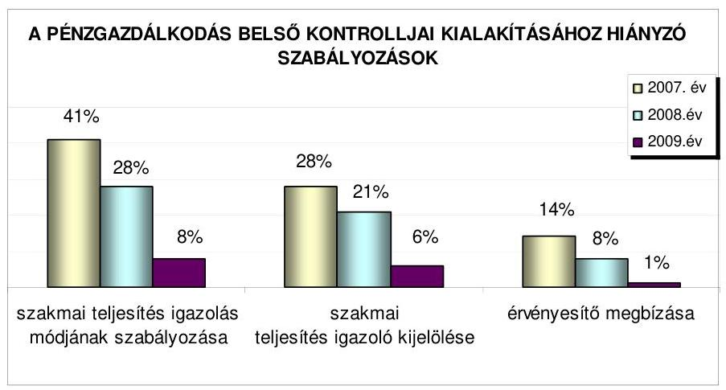

A gazdálkodási és ellenőrzési jogkörök gyakorlásának szabályszerűségéhez, és a bizonylati rendhez kapcsolódó javaslatok 57\%-a hasznosult. A gazdasági események adatait a számviteli nyilvántartásokban az előírt határidőben, az alaki és tartalmi követelményeknek megfelelő bizonylatok alapján rögzítették. Javaslataink ellenére a belső kontrollok múködése nem felelt meg az Ámr. ${ }_{1}$ 134-138. § előírásaiban foglaltaknak, mivel az önkormányzatok 8\%-ánál a kötelezettségvállalást nem foglalták írásba, 20\%-ánál a kiadások teljesítésének és a bevételek beszedésének elrendelése előtt okmányok alapján nem ellenőrizték, szakmailag nem igazolták azok jogosultságát, összegszerűségét, a szerződés, megrendelés, megállapodás teljesítését; 8\%-ánál a szakmai teljesítés igazolás alapján az érvényesítő nem ellenőrizte az összegszerűséget, a fedezet meglétét és az előírt alaki követelmények betartását; mintegy negyedénél az utalvány ellenjegyzője nem győződött meg a gazdálkodásra vonatkozó szabályok betartásáról, illetve a szakmai teljesítés igazolás szabályszerű elvégzéséről. A kötelezettségvállalásokról - az Ámr. ${ }_{1}$ 134. § (13) bekezdésében előírtak ellenére - az önkormányzatok 9\%-a nem vezetett nyilvántartást, 10\%-ánál az elkészített nyilvántartások nem voltak alkalmasak a kötelezettségvállalás évenkénti összegének megállapítására.

Az önkormányzati vagyon nyilvántartása, a vagyongazdálkodás szabályszerűsége érdekében tett javaslatok mintegy kétharmadát végrehajtották. Rendeletben rögzítették a versenyeztetés szabályait és rendjét, ingatlan értékesítésnél a forgalmi árat értékbecsléssel határozták meg. Javaslataink ellenére az önkormányzatok 13\%-ánál az értékvesztés elszámolásának szükségességét nem vizsgálták, elszámolását a Számv. tv. 54-56. §-aiban előírtak ellenére elmulasztották. Az Áht. 108. § (2) bekezdésében foglaltak ellenére az önkormányzatok tizedénél elmaradt a vagyon tulajdonjoga és vagyonkezelési joga ingyenes átruházásának, 17\%-ánál a követelésről való lemondás módjának és eseteinek rendeleti szabályozása.

A céljelleggel nyújtott támogatások szabályszerűségéhez, nyilvánosságához kapcsolódó javaslatok 75\%-a hasznosult, az alapítványok támogatásáról a képviselő-testületek döntöttek. Javaslataink ellenére az önkormányzatok mintegy tizedénél az Áht. 13/A. § (2) bekezdésében előírtak ellenére nem írtak elő a támogatottak részére számadási kötelezettséget, a számadás feltételeit, határidejét és módját.

---

A közbeszerzési eljárások lebonyolításának szabályszerűségére vonatkozó javaslatokat az önkormányzatok 13\%-ánál nem hasznosították, mivel a Kbt. 6. § (1) bekezdésében, 307. § (1) bekezdésében, 40. § (2) bekezdésében, és 292. § (1) bekezdés a) pontjában foglaltak ellenére elmulasztották a beszerzések rendjének szabályozását, a szerződésmódosítástól, teljesítéstől számított öt munkanapon belüli közzétételi kötelezettségüket, az egybeszámításra vonatkozó előírás teljesítését, illetve a közbeszerzési eljárás lefolytatását. Az ÁSZ a Közbeszerzési Döntőbizottság hivatalból való eljárását a Kbt. 327. § (1) bekezdés b) pontja alapján a közbeszerzési eljárás lefolytatásának, továbbá a közzétételi kötelezettségnek az elmulasztása miatt kettő (2007-ben négy, 2008-ban hat) önkormányzatnál kezdeményezte. A Közbeszerzési Döntőbizottság a jogsértések megtörténtét megállapította.

A Közbeszerzési Döntőbizottság a Heves Megyei Önkormányzatnál a közzétételi kötelezettség elmulasztását a D.249/5/2009., illetve a D.269/3/2009. számú határozataiban, Mezőkovácsháza Város Önkormányzatánál a közbeszerzési eljárás lefolytatásának elmulasztását a D.179/9/2009. számú határozatában megállapította, bírság kiszabását egyik esetben sem látta indokoltnak

# A zárszámadási kötelezettség teljesítésével kapcsolatos javaslatok 

közel kétharmada hasznosult, ennek figyelembevételével szabályszerűen állapították meg a pénzmaradvány összegét, az intézményvezetőket írásban értesítették a költségvetési szervek beszámolójának felülvizsgálatáról. Javaslataink ellenére az önkormányzatok negyedénél az Áht. 118. § (2) bekezdés 2. pontjában előírtak ellenére nem, vagy csak részben csatolták a zárszámadási rendelet előterjesztéséhez az önkormányzat összevont költségvetési mérlegét, a helyi kisebbségi önkormányzatok mérlegét, az adósság állományáról lejárat, eszközök, és hitelezők szerinti bontásban készített tájékoztatást, a vagyonkimutatást, szöveges indokolással a többéves kihatással járó döntések és a közvetett támogatások számszerűsítését.

## A kisebbségi önkormányzatok gazdálkodásának szabályszerűségé-

hez kapcsolódó javaslatok mintegy háromnegyede hasznosult. Felülvizsgálták a kisebbségi önkormányzatokkal kötött együttmúködési megállapodást, kiegészítették a tervezéshez, az előirányzat-módosításhoz, a beszámoláshoz kapcsolódó határidőkkel. Javaslataink ellenére az önkormányzatok öt százaléka a kisebbségi önkormányzatok vagyoni és számviteli nyilvántartásainak elkülönített vezetését az önkormányzat nyilvántartásain belül nem biztosította.

## A belső ellenőrzés kialakítása és múködése érdekében tett javaslatok

60\%-át hasznosítva az önkormányzatok a belső ellenőrzési feladatok ellátását megszervezték, a belső ellenőrök funkcionális függetlenségét biztosították, az éves ellenőrzési tervet és az éves jelentést elkészítették. Javaslataink és a Ber. 18. §-ában foglaltak ellenére az önkormányzatok $15 \%$-a nem, vagy csak részben hasznosította a stratégiai ellenőrzési terv készítésére vonatkozó javaslatot. Az önkormányzatok közel negyede a Kbt. 308. § (2) bekezdésében előírtak ellenére nem gondoskodott a közbeszerzési eljárások ellenőrzéséről.

A 2008. és a 2009. évben ellenőrzött önkormányzatoknál a gazdálkodás átfogó ellenőrzése és az egyéb vizsgálatok javaslatainak hasznosulását az alábbi ábra szemlélteti.

---

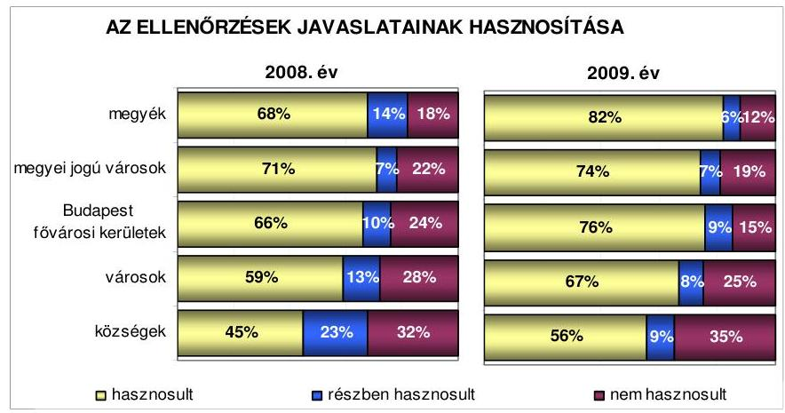

Az ellenőrzött önkormányzatoknál a 2003-2008. években végzett, zárszámadáshoz kapcsolódó vizsgálatok során tett 377 javaslat 85\%ának, és az önkormányzati feladatok 12 különböző területén lefolytatott teljesítményellenőrzések 272 javaslata 81\%-ának a megvalósítására intézkedtek. A jegyzők intézkedéseket tettek a támogatások elszámolásának költségvetési törvényben előírtak szerinti betartására, és a pontos adatszolgáltatásra, valamint a közoktatási intézményekben a maximális csoport és osztálylétszámok betartására, a közoktatási statisztika és a tanügyi nyilvántartások egyezőségének biztosítására. Elrendelték a támogatott szociális feladatok önkormányzati rendeletben rögzített szabályainak kiegészítését, az egyes pénzbeli szociális ellátások jogosultsági feltételeinek felülvizsgálatát, a támogatások felhasználása nyilvántartásának pontosítását, megszervezték a költségvetési támogatások, hozzájárulások igénylésének, és elszámolásának ellenőrzését. Intézkedtek az ágazati feladatokra, valamint a választásokra juttatott pénzeszközök szabályszerű felhasználására, elszámolására, a közműfejlesztési támogatás feltételeknek megfelelő igényelésére, a jogszabályi előírások szerinti nyilvántartás vezetésére. Kezdeményezték a közbeszerzési szabályzat módosítását, a közfoglalkoztatás lehetőségeinek vizsgálatát, a szakiskolai feladatellátáshoz az intézmény múködtetési és fejlesztési tervek elfogadását.

A helyi önkormányzatok gazdálkodási rendszerének 2008. évi ellenőrzéséről készített ÁSZ jelentésben tett javaslatok figyelembe vételével az Országgyúlés meghatározta az önkormányzatokra vonatkozóan a költségvetési hiány számításának, valamint a költségvetési rendeletben a költségvetési hiány külső-belső finanszírozásának, a finanszírozási célú pénzügyi műveletek bevételei és kiadásai figyelembevételének módját, továbbá egységesítette az Áht-ban és az Eisztvben a közérdekú gazdálkodási adatok közzétételi idejét. A Kormány kiegészítette a Ber. előírásait a belső ellenőrzést végző társulások egyeztetési, tájékoztatási, beszámolási kötelezettségeivel.

Nem történt intézkedés az önkormányzatok kötelező feladatainak egyértelmú meghatározására. Nem valósult meg a Kbt-ben az eljárás hivatalból való kezdeményezésére az ÁSZ részére a tudomásra jutás után nyitva álló jogvesztő határidő javaslat szerinti legalább 30 naptári napra történő módosítása. A Kbt. 2008. évi módosítása során megszűnt az ÁSZ számára az a lehetőség, hogy a jogsértés tudomásra jutásához viszonyított három éves objektív jogvesztő határidőn belül jogorvoslati eljárást kezdeményezzen.

---

A közbenső egyeztetés során a Közigazgatási és Igazságügyi Minisztérium közigazgatási államtitkára által adott észrevétel szerint a Kbt. módosítása nem indokolt. „A közbeszerzési eljárások alapján megkötött szerződések teljesitésének biztonsága, a felek által teljesitett szerződések elleni jogorvoslati eljárások egy éves objektiv jogvesztő határidejének három évre történő meghosszabbítása a jogbiztonság alkotmányos alapelvi követelménye alapján aggályos." Egyúttal tájékoztatást adott arról, hogy a Kbt. átfogó felülvizsgálatára rövidesen sor fog kerülni.

Az észrevétel ellenére indokolt a Kbt. javasolt módosítása, mivel a Kbt. 2009. január 1-től hatályos rendelkezései szerint az Állami Számvevőszék (a továbbiakban ÁSZ) - mint a Közbeszerzési Döntőbizottság eljárásának kezdeményezésére jogosult szervezet - számára kettő határidőt rögzít.

- A közbeszerzési eljárást lezáró jogsértő döntés megállapítása esetében az eredményhirdetést követő naptól, egyéb esetekben a vitatott ajánlatkérői döntés közzétételétől számított 30 napon belül fordulhat jogorvoslati kérelemmel az ÁSZ a Közbeszerzési Döntőbizottsághoz (Kbt. 327. § (2) bekezdés e) pont). Az ÁSZ az önkormányzatok gazdálkodási rendszerének ellenőrzését a 35/2003.(IV. 9.) OGY határozat alapján választási ciklusonként végzi, ezért a hatályos rendelkezés alapján az ÁSZ Kbt-ben foglalt jogának alkalmazására a gyakorlatban csak a helyszíni ellenőrzés ideje alatt történt eredményhirdetésekre és döntés közzétételekre alkalmazható. A vizsgált időszak jellemzően több - kettő, három - év, ennek ellenére a Kbt. előírásainak megsértésére vonatkozó előírások alapján ilyen időtávra visszamenő jogorvoslati eljárás kezdeményezésére nincs lehetőségünk.
- A közbeszerzési eljárás mellőzésével történő beszerzések esetében a szerződés megkötésének időpontjától, illetve ha ez nem állapítható meg a szerződés teljesítésének megkezdésétől számított egy éven belül van lehetősége az ÁSZ-nak a jogorvoslati eljárás kezdeményezésére (Kbt. 327. § (2) bekezdés c) pont). Ez a jogvesztő határidő - figyelemmel a több évre kiterjedő ellenőrzésre - a 2009. április 1-ig hatályos három éves objektív jogvesztő határidőhöz képest ugyancsak leszűkíti az ÁSZ jogérvényesítési lehetőségeit a Kbt-ben foglalt előírások betartásának ellenőrzése során.

Fentiek figyelembe vétele a jogszabály módosítása során indokolt.
Nem történt meg a múködési célú támogatások elektronikus közzétételi mintáinak a kiadása ${ }^{107}$.

Budapest, 2010. szeptember "

[^0]
[^0]:    ${ }^{107}$ A közzétételi listákon szereplő adatok közzétételéhez szükséges közzétételi mintákról szóló 18/2005 (XII. 27.) IHM rendelet 2. számú mellékletében a 3. gazdálkodási adatok 3.3. költségvetési beszámolók „Támogatások" közzétételi egység adatainak megnevezésénél a múködési célú támogatásokkal történő kiegészítést javasoltuk.

---

.

---

# MELLÉKLETEK

---

.

---

AZ ELLENŐRZÖTT ÖNKORMÁNYZATOK JEGYZÉKE

| Sor-
szám | Megye / főváros | Önkormányzat / település neve | megye/ főváros | megye/ jogú város | város /   fővárosi kerület | nagyközzég | község | Az önkormányzatok 2009. évi bruttó kiadásai (millió Ft) |
| :--: | :--: | :--: | :--: | :--: | :--: | :--: | :--: | :--: |
| 1 | Bács-Kiskun | KECEL |  |  | X |  |  | 1532 |
| 2 |  | KEREKEGYHÁZA |  |  | X |  |  | 1107 |
| 3 |  | KISKUNHALAS |  |  | X |  |  | 5825 |
| 4 |  | KISKUNMAJSA |  |  | X |  |  | 2230 |
| 5 |  | LAJOSMIZSE |  |  | X |  |  | 1706 |
| 6 |  | SZABADSZÁLLÁS |  |  | X |  |  | 948 |
| 1 | Baranya | BARANYA MEGYE | X |  |  |  |  | 14931 |
| 2 |  | BODA |  |  |  |  | X | 112 |
| 3 |  | SÁSD |  |  | X |  |  | 1079 |
| 4 |  | SELLYE |  |  | X |  |  | 584 |
| 1 | Békés | BÉKÉSCSABA |  | X |  |  |  | 22031 |
| 2 |  | BÉKÉSSZENTANDRÁS |  |  |  | X |  | 649 |
| 3 |  | CSANÁDAPÁCA |  |  |  |  | X | 827 |
| 4 |  | CSORVÁS |  |  | X |  |  | 1264 |
| 5 |  | DÉVAVÁNYA |  |  | X |  |  | 1852 |
| 6 |  | KÉTSOPRONY |  |  |  |  | X | 152 |
| 7 |  | LÖKÖSHÁZA |  |  |  |  | X | 283 |
| 8 |  | MEDGYESBODZÁS |  |  |  |  | X | 187 |
| 9 |  | MEZÖKOVÁCSHÁZA |  |  | X |  |  | 1482 |
| 10 |  | OROSHÁZA |  |  | X |  |  | 10402 |
| 11 |  | VÉGEGYHÁZA |  |  |  |  | X | 251 |
| 1 | Borsod-Abaúj-Zemplén | CIGÁND |  |  | X |  |  | 966 |
| 2 |  | GESZTELY |  |  |  |  | X | 554 |
| 3 |  | PÁLHÁZA |  |  | X |  |  | 305 |
| 4 |  | RÉVLEÁNYVÁR |  |  |  |  | X | 86 |
| 5 |  | SÁROSPATAK |  |  | X |  |  | 4389 |
| 6 |  | SÁTORALJAÚJHELY |  |  | X |  |  | 8718 |
| 7 |  | SZENDRÖ |  |  | X |  |  | 1760 |
| 8 |  | TOKAJ |  |  | X |  |  | 2220 |
| 9 |  | ZEMPLENAGÁRD |  |  |  |  | X | 149 |
| 1 | Budapest | BUDAPEST FÖVÁROS | X |  |  |  |  | 429471 |
| 1 | Budapest főváros | VII. KERÜLET |  |  | X |  |  | 16055 |
| 2 |  | XII. KERÜLET |  |  | X |  |  | 12880 |
| 3 |  | XIV. KERÜLET |  |  | X |  |  | 24659 |
| 4 |  | XVII. KERÜLET |  |  | X |  |  | 15035 |
| 5 |  | XXI. KERÜLET |  |  | X |  |  | 16569 |
| 6 |  | XXIII. KERÜLET |  |  | X |  |  | 6360 |
| 1 | Csongrád | HÖDMEZÖVÁSÁRHELY |  | X |  |  |  | 15501 |
| 2 |  | MINDSZENT |  |  | X |  |  | 969 |
| 1 | Fejér | ENYING |  |  | X |  |  | 1156 |
| 2 |  | ERCSI |  |  | X |  |  | 1671 |
| 3 |  | MARTONVÁSÁR |  |  | X |  |  | 873 |
| 4 |  | MÖR |  |  | X |  |  | 4454 |
| 1 | Győr-Moson-Sopron | FERTÖD |  |  | X |  |  | 1092 |
| 2 |  | SOPRON |  | X |  |  |  | 26046 |
| 1 | Hajdú-Bihar | GÁBORJÁN |  |  |  |  | X | 167 |
| 2 |  | HAJDÚSÁMSON |  |  | X |  |  | 2221 |
| 3 |  | NÁDUDVAR |  |  | X |  |  | 2180 |
| 4 |  | NYÍRADONY |  |  | X |  |  | 1935 |
| 5 |  | POLGÁR |  |  | X |  |  | 2117 |
| 6 |  | PÜSPÖKLADÁNY |  |  | X |  |  | 4730 |
| 7 |  | TÉGLÁS |  |  | X |  |  | 1306 |
| 8 |  | ZSÁKA |  |  |  | X |  | 353 |
| 1 | Heves | HEVES MEGYE | X |  |  |  |  | 11285 |
| 2 |  | KÁPOLNA |  |  |  |  | X | 186 |
| 3 |  | KISKÖRE |  |  | X |  |  | 726 |
| 1 | Jász-Nagykun-Szolnok | ABÁDSZÁLÓK |  |  | X |  |  | 1439 |
| 2 |  | KUNSZENTMÁRTON |  |  | X |  |  | 2173 |
| 3 |  | MARTFÜ |  |  | X |  |  | 1480 |

---

|  Sorszám | Megye / főváros | Önkormányzat / település neve | megye/ főváros | megye/ jogú város | város / fővárosi kerület | nagyköszég | község | Az önkormányzatok 2009. évi bruttó kiadásai (millió Ft)  |
| --- | --- | --- | --- | --- | --- | --- | --- | --- |
|  4 |  | MEZÖTÜR |  |  | X |  |  | 4 195  |
|  5 |  | TISZAFÖLDVÁR |  |  | X |  |  | 2 245  |
|  1 | Komárom-Esztergom | KOMÁROM |  |  | X |  |  | 8 065  |
|  2 |  | TATABÁNYA |  | X |  |  |  | 16 414  |
|  1 | Nógrád | BUJÁK |  |  |  |  | X | 486  |
|  2 |  | LUCFALVA |  |  |  |  | X | 258  |
|  3 |  | NAGYBÁRKÁNY |  |  |  |  | X | 176  |
|  4 |  | NEMTI |  |  |  |  | X | 105  |
|  5 |  | PÁSZTÓ |  |  | X |  |  | 2 873  |
|  1 | Pest | ASZÓD |  |  | X |  |  | 1 120  |
|  2 |  | BUDAÖRS |  |  | X |  |  | 14 631  |
|  3 |  | FÖT |  |  | X |  |  | 2 858  |
|  4 |  | GÖD |  |  | X |  |  | 2 625  |
|  5 |  | GYÖMRŐ |  |  | X |  |  | 2 722  |
|  6 |  | ÖCSA |  |  | X |  |  | 1 490  |
|  7 |  | POMÁZ |  |  | X |  |  | 2 553  |
|  8 |  | SZENTENDRE |  |  | X |  |  | 5 484  |
|  9 |  | TURA |  |  | X |  |  | 1 282  |
|  10 |  | ÜLLŐ |  |  | X |  |  | 1 282  |
|  1 | Somogy | FONYÓD |  |  | X |  |  | 1 272  |
|  2 |  | KADARKÜT |  |  | X |  |  | 1 093  |
|  3 |  | LENGYELTÓTI |  |  | X |  |  | 1 793  |
|  4 |  | NAGYBERÉNY |  |  |  |  | X | 166  |
|  5 |  | SOMOGY MEGYE | X |  |  |  |  | 23 902  |
|  1 | Szabolcs-Szatmár-Bereg | AJAK |  |  |  |  | X | 763  |
|  2 |  | DEMECSER |  |  | X |  |  | 1 746  |
|  3 |  | KEMECSE |  |  | X |  |  | 1 071  |
|  4 |  | NAGYKÁLLÓ |  |  | X |  |  | 2 433  |
|  5 |  | NYÍRBÁTOR |  |  | X |  |  | 6 735  |
|  6 |  | NYÍRBÉLTEK |  |  |  | X |  | 741  |
|  7 |  | NYÍREGYHÁZA |  | X |  |  |  | 31 534  |
|  8 |  | ÖMBÖLY |  |  |  |  | X | 94  |
|  9 |  | TISZALÓK |  |  | X |  |  | 1 160  |
|  10 |  | VAJA |  |  |  |  | X | 955  |
|  1 | Tolna | DOMBÖVÁR |  |  | X |  |  | 5 127  |
|  2 |  | FÁCÁNKERT |  |  |  |  | X | 81  |
|  3 |  | PAKS |  |  | X |  |  | 7 417  |
|  4 |  | TAMÁSI |  |  | X |  |  | 3 189  |
|  1 | Vas | KÖRMEND |  |  | X |  |  | 3 137  |
|  2 |  | KÖSZEG |  |  | X |  |  | 1 925  |
|  3 |  | NÁRAI |  |  |  |  | X | 90  |
|  4 |  | PERENYE |  |  |  |  | X | 51  |
|  5 |  | VASVÁR |  |  | X |  |  | 1 127  |
|  1 | Veszprém | BALÁTONFÜZFŐ |  |  | X |  |  | 1 592  |
|  2 |  | DEVECSER |  |  | X |  |  | 1 562  |
|  3 |  | FELSŐÖRS |  |  |  |  | X | 217  |
|  4 |  | VESZPRÉM MEGYE | X |  |  |  |  | 14 924  |
|  5 |  | ZIRC |  |  | X |  |  | 1 654  |
|  6 |  | BAKONYNÁNA |  |  |  |  | X | 258  |
|  7 |  | BÁZAKERETTYE |  |  |  |  | X | 183  |
|  8 |  | GELSE |  |  |  |  | X | 494  |
|  9 |  | LETENYE |  |  | X |  |  | 920  |
|  1 | Zala | LÖKÜT |  |  |  |  | X | 51  |
|  2 |  | NAGYESZTERGÁR |  |  |  |  | X | 134  |
|  3 |  | NAGYKANIZSA |  | X |  |  |  | 17 117  |
|  4 |  | OLASZFALU |  |  |  |  | X | 170  |
|  5 |  | VONYARCVASHEGY |  |  |  | X |  | 721  |
|  6 |  | ZALABAKSA |  |  |  |  | X | 199  |
|  7 |  | ZALACSÉB |  |  |  |  | X | 106  |
|  8 |  | ZALASZENTMIHÁLY |  |  |  |  | X | 123  |
|  Oszesen: |  | 119 | 5 | 6 | 72 | 4 | 32 | 902 560  |

---

# A HELYI ÖNKORMÁNYZATOK VAGYONÁNAK ÉS KÖTELEZETTSÉG ÁLLOMÁNYÁNAK ALAKULÁSA 2006-2009 KÖZÖTT ÖNKORMÁNYZAT-TÍPUSOK SZERINT 

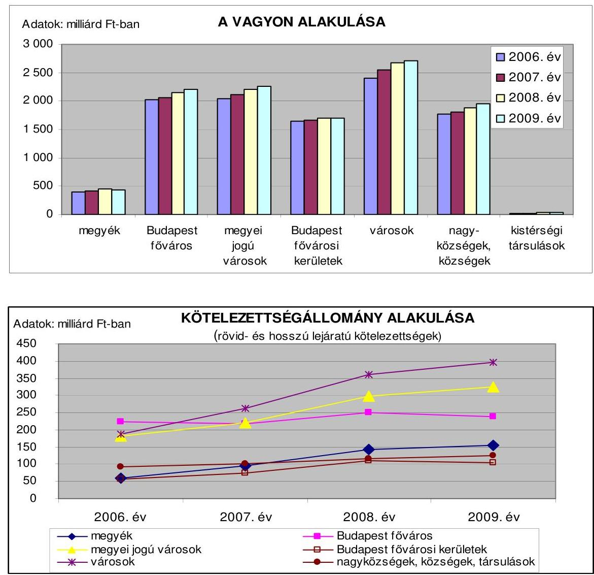

---

# A HELYI ÖNKORMÁNYZATOK ESZKÖZEI ÉS AZOK FORRÁSAI 2006-2009. ÉVEK KÖZÖTT

|  Eszközök | 2006. év | 2007. év | 2008. év | 2009. év | Változás 2009/2006 | Változás 2007/2006 | Változás 2008/2007 | Változás 2009/2008  |
| --- | --- | --- | --- | --- | --- | --- | --- | --- |
|   | milliárd Ft |  |  |  | \% |  |  |   |
|  I. Immateriális javak | 24,9 | 26,1 | 24,5 | 23,5 | 94,4 | 104,8 | 93,9 | 95,9  |
|  II. Tárgyi eszközök | 7575,9 | 7687,9 | 7803,2 | 7927,7 | 104,6 | 101,5 | 101,5 | 101,6  |
|  Ebböl: |  |  |  |  |  |  |  |   |
|  Ingatlanok és a kapcsolódó vagyoni értékú jogok | 6854,5 | 7019,0 | 7153,0 | 7215,4 | 105,3 | 102,4 | 101,9 | 100,9  |
|  Beruházások, felújítások | 397,1 | 372,4 | 356,8 | 438,9 | 110,5 | 93,8 | 95,8 | 123,0  |
|  Beruházásra adott előlegek | 11,2 | 7,6 | 5,1 | 6,6 | 58,9 | 67,9 | 67,1 | 129,4  |
|  III. Befektetett pénzügyi eszközök | 557,6 | 557,0 | 592,2 | 608,1 | 109,1 | 99,9 | 106,3 | 102,7  |
|  Ebböl: |  |  |  |  |  |  |  |   |
|  Egyéb tartós részesedés | 479,9 | 484,6 | 496,0 | 534,2 | 111,3 | 101,0 | 102,4 | 107,7  |
|  Tartós hitelviszonyt megtestesítő értékpapír | 15,6 | 16,5 | 37,6 | 19,7 | 126,3 | 105,8 | 227,9 | 52,4  |
|  IV. Üzemeltetésre, kezelésre átadott, koncesszióba adott, vagyonkezelésbe vett eszközök | 1586,9 | 1721,2 | 1824,0 | 1917,1 | 120,8 | 108,5 | 106,0 | 105,1  |
|  A) BEFEKTETETT ESZKÖZÖK | 9745,3 | 9992,2 | 10243,9 | 10476,4 | 107,5 | 102,5 | 102,5 | 102,3  |
|  I. Készletek | 12,3 | 12,0 | 11,6 | 11,4 | 92,7 | 97,6 | 96,7 | 98,3  |
|  II. Követelések | 167,8 | 111,8 | 134,4 | 138,2 | 82,4 | 66,6 | 120,2 | 102,8  |
|  Ebböl: |  |  |  |  |  |  |  |   |
|  Adósok | 115,2 | 56,1 | 62,3 | 73,8 | 64,1 | 48,7 | 111,1 | 118,5  |
|  III. Értékpapírok | 57,1 | 53,6 | 77,7 | 40,8 | 71,5 | 93,9 | 145,0 | 52,5  |
|  Ebböl: |  |  |  |  |  |  |  |   |
|  Egyéb részesedés | 6,9 | 0,4 | 0,8 | 0,7 | 10,1 | 5,8 | 200,0 | 87,5  |
|  Forgatási célú hitelviszonyt megtestesítő értékpapírok | 50,2 | 53,2 | 76,8 | 40,1 | 79,9 | 106,0 | 144,4 | 52,2  |
|  IV. Pénzeszközök | 245,5 | 381,7 | 537,1 | 531,6 | 216,5 | 155,5 | 140,7 | 99,0  |
|  V. Egyéb aktív pénzügyi elszámolások | 71,6 | 73,1 | 93,9 | 94,8 | 132,4 | 102,1 | 128,5 | 101,0  |
|  B) FORGÓESZKÖZÖK | 554,3 | 632,2 | 854,7 | 816,8 | 147,4 | 114,1 | 135,2 | 95,6  |
|  ESZKÖZÖK ÖSSZESEN | 10299,6 | 10624,4 | 11098,6 | 11293,2 | 109,6 | 103,2 | 104,5 | 101,8  |
|  D) SAJÁT TÖKE | 9178,2 | 9195,0 | 9186,1 | 9331,7 | 101,7 | 100,2 | 99,9 | 101,6  |
|  E) TARTALÉKOK | 196,0 | 341,4 | 517,7 | 507,2 | 258,8 | 174,2 | 151,6 | 98,0  |
|  I. Hosszú lejáratú kötelezettségek | 411,3 | 620,0 | 893,8 | 937,2 | 227,9 | 150,7 | 144,2 | 104,9  |
|  Ebböl: |  |  |  |  |  |  |  |   |
|  tartozások fejlesztési célú kötvénykibocsátásból | 22,1 | 188,2 | 399,8 | 431,3 | 1951,6 | 851,6 | 212,4 | 107,9  |
|  tartozások müködési célú kötvénykibocsátásból | 0,0 | 20,4 | 42,0 | 42,2 |  |  | 205,9 | 100,5  |
|  beruházási és fejlesztési hitelek | 342,7 | 367,0 | 395,2 | 405,3 | 118,3 | 107,1 | 107,7 | 102,6  |
|  müködési célú hosszú lejáratú hitelek | 7,2 | 5,3 | 4,6 | 5,6 | 77,8 | 73,6 | 86,8 | 121,7  |
|  II. Rövid lejáratú kötelezettségek | 392,9 | 349,3 | 380,5 | 404,9 | 103,1 | 88,9 | 108,9 | 106,4  |
|  III. Egyéb passzív pénzügyi elszámolások | 121,2 | 118,7 | 120,5 | 112,2 | 92,6 | 97,9 | 101,5 | 93,1  |
|  F) KÖTELEZETTSÉGEK | 925,4 | 1088,0 | 1394,8 | 1454,3 | 157,2 | 117,6 | 128,2 | 104,3  |
|  FORRÁSOK ÖSSZESEN | 10299,6 | 10624,4 | 11098,6 | 11293,2 | 109,6 | 103,2 | 104,5 | 101,8  |

Forrás: Magyar Államkincstár önkormányzati éves költségvetési beszámoló "01" számú űrlapja

---

# A BUDAPEST FÖVÁROSI ÉS KERÜLETI ÖNKORMÁNYZATOK ESZKÖZEI ÉS AZOK FORRÁSAI A 2006-2009. ÉVEK KÖZÖTT 

| Eszközök | 2006. év | 2007. év | 2008. év | 2009. év | Változás 2009/2006 | Változás 2007/2006 | Változás 2008/2007 | Változás 2009/2008 |
| :--: | :--: | :--: | :--: | :--: | :--: | :--: | :--: | :--: |
|  | milliárd Ft |  |  |  | \% |  |  |  |
| I. Immateriális javak | 3,9 | 4,4 | 4,2 | 4,7 | 120,5 | 112,8 | 95,5 | 111,9 |
| II. Tárgyi eszközök | 2571,0 | 2611,2 | 2663,9 | 2739,6 | 106,6 | 101,6 | 102,0 | 102,8 |
| Ebböl: |  |  |  |  |  |  |  |  |
| Ingatlanok és a kapcsolódó vagyoni értékú jogok | 2375,6 | 2411,5 | 2440,3 | 2483,6 | 104,5 | 101,5 | 101,2 | 101,8 |
| Beruházások, felújítások | 58,4 | 77,5 | 108,8 | 147,2 | 252,1 | 132,7 | 140,4 | 135,3 |
| Beruházásra adott előlegek | 8,5 | 5,4 | 2,3 | 0,9 | 10,6 | 63,5 | 42,6 | 39,1 |
| III. Befektetett pénzügyi eszközök | 334,3 | 321,4 | 318,5 | 332,1 | 99,3 | 96,1 | 99,1 | 104,3 |
| Ebböl: |  |  |  |  |  |  |  |  |
| Egyéb tartós részesedés | 303,3 | 300,4 | 298,4 | 312,8 | 103,1 | 99,0 | 99,3 | 104,8 |
| Tartós hitelviszonyt megtestesítő értékpapír | 0,5 | 0,1 | 0,2 | 0,2 | 40,0 | 20,0 | 200,0 | 100,0 |
| IV. Üzemeltetésre, kezelésre átadott, koncesszióba adott, vagyonkezelésbe vett eszközök | 577,0 | 588,0 | 593,6 | 595,5 | 103,2 | 101,9 | 101,0 | 100,3 |
| A) BEFEKTETETT ESZKÖZÖK | 3486,2 | 3525,0 | 3580,2 | 3671,9 | 105,3 | 101,1 | 101,6 | 102,6 |
| I. Készletek | 2,9 | 3,1 | 3,0 | 3,2 | 110,3 | 106,9 | 96,8 | 106,7 |
| II. Követelések | 47,2 | 30,1 | 40,1 | 35,8 | 75,8 | 63,8 | 133,2 | 89,3 |
| Ebböl: |  |  |  |  |  |  |  |  |
| Adósok | 35,9 | 17,0 | 18,7 | 21,3 | 59,3 | 47,4 | 110,0 | 113,9 |
| III. Értékpapírok | 30,2 | 14,1 | 18,8 | 17,9 | 59,3 | 46,7 | 133,3 | 95,2 |
| Ebböl: |  |  |  |  |  |  |  |  |
| Egyéb részesedés | 6,6 | 0,0 | 0,0 | 0,0 |  |  |  |  |
| Forgatási célú hitelviszonyt megtestesítő értékpapírok | 23,6 | 14,1 | 18,8 | 17,9 | 75,8 | 59,7 | 133,3 | 95,2 |
| IV. Pénzeszközök | 80,8 | 119,8 | 173,1 | 147,7 | 182,8 | 148,3 | 144,5 | 85,3 |
| V. Egyéb aktív pénzügyi elszámolások | 20,2 | 19,7 | 23,5 | 25,0 | 123,8 | 97,5 | 119,3 | 106,4 |
| B) FORGÓESZKÖZÖK | 181,3 | 186,8 | 258,6 | 229,6 | 126,6 | 103,0 | 138,4 | 88,8 |
| ESZKÖZÖK ÖSSZESEN | 3667,5 | 3711,8 | 3838,8 | 3901,5 | 106,4 | 101,2 | 103,4 | 101,6 |
| D) SAJÁT TÖKE | 3286,0 | 3281,5 | 3282,2 | 3371,6 | 102,6 | 99,9 | 100,0 | 102,7 |
| E) TARTALÉKOK | 73,2 | 114,1 | 171,5 | 167,1 | 228,3 | 155,9 | 150,3 | 97,4 |
| I. Hosszú lejáratú kötelezettségek | 159,2 | 185,0 | 211,7 | 218,0 | 136,9 | 116,2 | 114,4 | 103,0 |
| Ebböl: |  |  |  |  |  |  |  |  |
| tartozások fejlesztési célú kötvénykibocsátásból | 1,9 | 15,6 | 33,6 | 37,0 | 1947,4 | 821,1 | 215,4 | 110,1 |
| tartozások müködési célú kötvénykibocsátásból | 0,0 | 1,0 | 1,2 | 1,1 |  |  | 120,0 | 91,7 |
| beruházási és fejlesztési hitelek | 154,1 | 164,0 | 167,8 | 172,8 | 112,1 | 106,4 | 102,3 | 103,0 |
| müködési célú hosszú lejáratú hitelek | 0,0 | 0,0 | 0,0 | 0,0 |  |  |  |  |
| II. Rövid lejáratú kötelezettségek | 121,2 | 105,8 | 148,3 | 123,3 | 101,7 | 87,3 | 140,2 | 83,1 |
| III. Egyéb passzív pénzügyi elszámolások | 27,9 | 25,4 | 25,1 | 21,5 | 77,1 | 91,0 | 98,8 | 85,7 |
| F) KÖTELEZETTSÉGEK | 308,3 | 316,2 | 385,1 | 362,8 | 117,7 | 102,6 | 121,8 | 1013,1 |
| FORRÁSOK ÖSSZESEN | 3667,5 | 3711,8 | 3838,8 | 3901,5 | 106,4 | 101,2 | 103,4 | 101,6 |

Forrás: Magyar Államkincstár önkormányzati éves költségvetési beszámoló "01" számú űrlapja

---

# AZ ELLENŐRZÖTT* ÖNKORMÁNYZATOK ESZKÖZEI ÉS AZOK FORRÁSA A 2006-2009. ÉVEK KÖZÖTT 

| Eszközök | 2006. év | 2007. év | 2008. év | 2009. év | Változás 2009/2006 | Változás 2007/2006 | Változás 2008/2007 | Változás 2009/2008 |
| :--: | :--: | :--: | :--: | :--: | :--: | :--: | :--: | :--: |
|  | millárd Ft |  |  |  | \% |  |  |  |
| I. Immateriális javak | 3,3 | 3,7 | 3,8 | 3,7 | 112,1 | 112,1 | 102,7 | 97,4 |
| II. Tárgyi eszközök Ebböl: | 872,3 | 886,8 | 898,7 | 917,1 | 105,1 | 101,7 | 101,3 | 102,0 |
| Ingatlanok és a kapcsolódó vagyoni értékú jogok | 772,6 | 792,4 | 814,0 | 840,7 | 108,8 | 102,6 | 102,7 | 103,3 |
| Beruházások, felújítások | 54,4 | 49,3 | 38,7 | 45,3 | 83,3 | 90,6 | 78,5 | 117,1 |
| Beruházásra adott előlegek | 0,1 | 0,1 | 0,1 | 0,8 | 1600,0 | 200,0 | 100,0 | 800,0 |
| III. Befektetett pénzügyi eszközök | 35,2 | 35,1 | 42,3 | 39,1 | 111,1 | 99,7 | 120,5 | 92,4 |
| Ebböl: |  |  |  |  |  |  |  |  |
| Egyéb tartós részesedés | 21,2 | 23,6 | 27,3 | 27,6 | 130,2 | 111,3 | 115,7 | 101,1 |
| Tartós hitelviszonyt megtestesítő értékpapír | 2,0 | 1,3 | 4,0 | 2,6 | 130,0 | 65,0 | 307,7 | 65,0 |
| IV. Üzemeltetésre, kezelésre átadott, koncesszióba adott, vagyonkezelésbe vett eszközök | 245,3 | 258,3 | 279,7 | 292,7 | 119,3 | 105,3 | 108,3 | 104,6 |
| A) BEFEKTETETT ESZKÖZÖK | 1156,1 | 1183,9 | 1224,5 | 1252,6 | 108,3 | 102,4 | 103,4 | 102,3 |
| I. Készletek | 1,6 | 1,6 | 1,3 | 1,3 | 81,3 | 100,0 | 81,3 | 100,0 |
| II. Követelések | 23,7 | 16,5 | 15,6 | 19,2 | 81,0 | 69,6 | 94,5 | 123,1 |
| Ebböl: |  |  |  |  |  |  |  |  |
| Adósok | 13,9 | 7,4 | 8,1 | 10,3 | 74,1 | 53,2 | 109,5 | 127,2 |
| III. Értékpapírok | 1,7 | 6,3 | 8,5 | 0,7 | 41,2 | 370,6 | 134,9 | 8,2 |
| Ebböl: |  |  |  |  |  |  |  |  |
| Egyéb részesedés | 0,0 | 0,0 | 0,0 | 0,0 | - | - | - | - |
| Forgatási célú hitelviszonyt megtestesítő értékpapírok | 1,7 | 6,3 | 8,5 | 0,7 | 41,2 | 370,6 | 134,9 | 8,2 |
| IV. Pénzeszközök | 46,0 | 71,8 | 84,6 | 77,2 | 167,8 | 156,1 | 117,8 | 91,3 |
| V. Egyéb aktív pénzügyi elszámolások | 7,5 | 8,8 | 10,9 | 11,5 | 153,3 | 117,3 | 123,9 | 105,5 |
| B) FORGÓESZKÖZÖK | 80,5 | 105,0 | 120,9 | 109,8 | 136,4 | 130,4 | 115,1 | 90,8 |
| ESZKÖZÖK ÖSSZESEN | 1236,6 | 1288,9 | 1345,4 | 1362,4 | 110,2 | 104,2 | 104,4 | 101,3 |
| D) SAJÁT TÖKE | 1067,0 | 1056,9 | 1040,5 | 1059,2 | 99,3 | 99,1 | 98,4 | 101,8 |
| E) TARTALÉKOK | 36,8 | 65,4 | 81,7 | 64,7 | 175,8 | 177,7 | 124,9 | 79,2 |
| I. Hosszú lejáratú kötelezettségek | 59,5 | 96,0 | 154,5 | 166,5 | 279,8 | 161,3 | 160,9 | 107,8 |
| Ebböl: |  |  |  |  |  |  |  |  |
| tartozások fejlesztési célú kötvénykibocsátásból tartozások müködési célú kötvénykibocsátásból | 15,4 | 53,7 | 102,5 | 117,5 | 763,0 | 348,7 | 190,9 | 114,6 |
|  | 0,0 | 1,1 | 1,5 | 1,3 | - | - | 136,4 | 86,7 |
| beruházási és fejlesztési hitelek | 39,7 | 39,1 | 41,7 | 38,8 | 97,7 | 98,5 | 106,6 | 93,0 |
| müködési célú hosszú lejáratú hitelek | 0,3 | 0,3 | 0,2 | 0,2 | 66,7 | 100,0 | 66,7 | 100,0 |
| II. Rövid lejáratú kötelezettségek | 56,3 | 55,7 | 53,6 | 58,5 | 103,9 | 98,9 | 96,2 | 109,1 |
| III. Egyéb passzív pénzügyi elszámolások | 16,9 | 14,9 | 15,1 | 13,5 | 79,9 | 88,2 | 101,3 | 89,4 |
| F) KÖTELEZETTSÉGEK | 132,7 | 166,6 | 223,2 | 238,5 | 179,7 | 125,5 | 134,0 | 106,9 |
| FORRÁSOK ÖSSZESEN | 1236,5 | 1288,9 | 1345,4 | 1362,4 | 110,2 | 104,2 | 104,4 | 101,3 |

* Az ellenőrzött megyei, megyei jogú városi, Budapest fővárosi kerületi és városi önkormányzatok adataival.

Forrás: Magyar Államkincstár önkormányzati éves költségvetési beszámoló "01" számú űrlapja

---

# A HELYI ÖNKORMÁNYZATOK 2006-2009. ÉVI TERVEZETT ÉS TELJESÍTETT BRUTTÓ ÉS NETTÓSÍTOTT BEVÉTELEINEK ÉS KIADÁSAINAK ALAKULÁSA

|  Megnevezés | 2006. év |  |  | 2007. év |  |  | 2008. év |  |  | 2009. év |  |   |
| --- | --- | --- | --- | --- | --- | --- | --- | --- | --- | --- | --- | --- |
|   | Eredeti elöirányzat | Teljesítés bruttó összege | Teljesítés nettósított összege | Eredeti elöirányzat | Teljesítés bruttó összege | Teljesítés nettósított összege | Eredeti elöirányzat | Teljesítés bruttó összege | Teljesítés nettósított összege | Eredeti elöirányzat | Teljesítés bruttó összege | Teljesítés nettó összege  |
|  Bevételek |  |  |  |  |  |  |  |  |  |  |  |   |
|  Intézményi müködési bevételek | 233881 | 264792 | 264792 | 248261 | 272339 | 272339 | 253087 | 286201 | 286201 | 262276 | 312540 | 312540  |
|  Kamatbevételek | 11619 | 15652 | 15652 | 9797 | 19449 | 19449 | 20159 | 47694 | 47694 | 31222 | 56263 | 56263  |
|  Gépjárműadó | 49141 | 51266 | 51266 | 56635 | 62432 | 62432 | 62196 | 65713 | 65713 | 64515 | 63754 | 63754  |
|  Helyi adók és kapcsolódó pótlékok, bírságok | 409482 | 448936 | 448936 | 455021 | 505267 | 505267 | 520453 | 553342 | 553342 | 530246 | 566252 | 566252  |
|  Illetékek | 65326 | 71097 | 71097 | 57781 | 58540 | 58540 | 61561 | 67359 | 67359 | 61374 | 58371 | 58371  |
|  Személyi jövedelemadó | 467970 | 459973 | 459973 | 484406 | 492188 | 492188 | 235075 | 222622 | 222622 | 243045 | 235498 | 235498  |
|  Egyéb átengedett adók, adójellegü bevételek | 415 | 641 | 641 | 624 | 1052 | 1052 | 1072 | 1417 | 1417 | 988 | 1220 | 1220  |
|  Önkorm. megillető bírságok és egyéb sajátos bevételek | 34447 | 38477 | 38477 | 34923 | 39035 | 39035 | 34715 | 40996 | 40996 | 36232 | 42159 | 42159  |
|  Müködési célra átvett pénzeszközök | 450539 | 493931 | 457250 | 471866 | 486649 | 434378 | 490208 | 500892 | 436735 | 487441 | 465273 | 399926  |
|  Költségvetési kiegészítések, visszatérülések és előző évi pénzmaradvány átvétel | - | 150972 | 7993 | - | 159631 | 9307 | 0 | 241136 | 8484 | 0 | 37464 | 7784  |
|  Felhalmozási és tőkejellegü bevételek | 195018 | 144845 | 144845 | 194611 | 134267 | 134267 | 197766 | 158329 | 158329 | 180401 | 97318 | 97318  |
|  ebböl: |  |  |  |  |  |  |  |  |  |  |  |   |
|  Tárgyi eszköz, immateriális javak értékesítése | 105596 | 70613 | 70613 | 93583 | 55942 | 55942 | 112440 | 77282 | 77282 | 116373 | 49061 | 49061  |
|  Önkorm. lakások, egyéb helyiségek ért., cseréje | 38121 | 34336 | 34336 | 34012 | 27888 | 27888 | 35381 | 27361 | 27361 | 31521 | 15771 | 15771  |
|  Részesedések értékesítése | 27847 | 15228 | 15228 | 42632 | 23496 | 23496 | 26089 | 24317 | 24317 | 6131 | 4002 | 4002  |
|  Felhalmozási célra átvett pénzeszközök | 302353 | 223239 | 210280 | 245607 | 186329 | 175367 | 270740 | 178031 | 168551 | 320102 | 212552 | 200686  |
|  Kölcsönök visszatérülése és igénybevétele | 9696 | 14320 | 14320 | 8754 | 14721 | 14721 | 9856 | 13028 | 13028 | 8461 | 12037 | 12037  |
|  Saját bevételek összesen | 2229887 | 2378141 | 2185522 | 2268286 | 2431899 | 2218342 | 2156888 | 2376760 | 2070471 | 2226303 | 2160701 | 2054008  |
|  Önkormányzat költségvetési támogatása | 688264 | 868179 | 868179 | 701756 | 861877 | 861877 | 890763 | 1199087 | 1199087 | 897935 | 1071278 | 1071278  |
|  Előző évi pénzmaradvány igénybevétele | 71160 | 312396 | 311116 | 69770 | 312460 | 311885 | 171077 | 500211 | 499700 | 268596 | 410306 | 409393  |
|  Költségvetési bevételek | 2989311 | 3558716 | 3364817 | 3039812 | 3606236 | 3392104 | 3218728 | 4076058 | 3769258 | 3392834 | 3642285 | 3534679  |
|  Hitelek bevételei | 312872 | 207575 | 175171 | 292956 | 151063 | 109946 | 228135 | 114779 | 87390 | 243888 | 101549 | 76171  |
|  Értékpapírok bevételei | 49207 | 44512 | 44512 | 44117 | 205954 | 205955 | 138112 | 226804 | 226804 | 92679 | 82832 | 82832  |
|  Egyéb finanszírozás bevételei | - | 4534 | 0 | - | $-2339$ | 0 | - | 2489 | 0 | - | $-6108$ | 0  |
|  BEVÉTELEK ÖSSZESEN | 3351390 | 3815337 | 3584500 | 3376885 | 3960914 | 3708005 | 3584975 | 4420130 | 4083452 | 3729401 | 3820558 | 3693682  |

---

|  Adatok: millió Ft-ban |  |  |  |  |  |  |  |  |  |  |  |   |
| --- | --- | --- | --- | --- | --- | --- | --- | --- | --- | --- | --- | --- |
|   | 2006. év |  |  | 2007. év |  |  | 2008. év |  |  | 2009. év |  |   |
|  Megnevezés | Eredeti előirányzat | Teljesítés bruttó összege | Teljesítés nettósított összege | Eredeti előirányzat | Teljesítés bruttó összege | Teljesítés nettósított összege | Eredeti előirányzat | Teljesítés bruttó összege | Teljesítés nettósított összege | Eredeti előirányzat | Teljesítés bruttó összege | Teljesítés nettó összege  |
|  Kiadások |  |  |  |  |  |  |  |  |  |  |  |   |
|  Személyi juttatások | 1 101 661 | 1 113 502 | 1 113 502 | 1 088 701 | 1 122 656 | 1 122 656 | 1 095 756 | 1 143 692 | 1 143 692 | 1 045 670 | 1 089 022 | 1 089 022  |
|  Munkaadókat terhelő járulékok | 348 743 | 351 427 | 351 427 | 346 233 | 355 234 | 355 234 | 346 529 | 358 990 | 358 990 | 328 852 | 318 855 | 318 855  |
|  Dologi kiadások | 677 240 | 750 810 | 750 810 | 696 284 | 732 020 | 732 020 | 734 289 | 808 797 | 808 797 | 785 951 | 838 887 | 838 887  |
|  Egyéb folyó kiadások | 35 107 | 201 708 | 58 728 | 44 676 | 215 273 | 64 950 | 63 616 | 322 768 | 90 116 | 70 959 | 110 151 | 80 471  |
|  Eltátottak pénzbeli juttatása | 7 797 | 9 256 | 9 256 | 8 018 | 8 903 | 8 903 | 8 393 | 9 598 | 9 598 | 8 775 | 10 088 | 10 088  |
|  Működési célú pénzeszköz átadás | 107 997 | 156 088 | 119 407 | 144 621 | 178 508 | 126 237 | 172 841 | 203 184 | 139 027 | 181 086 | 203 660 | 138 313  |
|  Társadalom- és szociálpolitikai juttatások | 90 390 | 109 421 | 109 421 | 101 609 | 127 738 | 127 738 | 112 307 | 138 899 | 138 899 | 114 307 | 146 782 | 146 782  |
|  Tervezett maradvány, eredmény, tartalék | 116 742 | 1 279 | 0 | 125 381 | 575 | 0 | 245 392 | 511 | 0 | 246 785 | 912 | 0  |
|  Felújítás | 125 499 | 127 397 | 127 397 | 99 237 | 99 298 | 99 298 | 102 156 | 90 181 | 90 181 | 142 360 | 109 031 | 109 031  |
|  Intézményi beruházási kiadások | 509 386 | 437 645 | 437 645 | 428 450 | 373 195 | 373 195 | 426 846 | 338 849 | 338 849 | 534 577 | 363 659 | 363 659  |
|  Részesedések vásárlása | 3 958 | 7 834 | 7 834 | 2 314 | 5 769 | 5 769 | 2 181 | 8 388 | 8 388 | 5 794 | 11 337 | 11 337  |
|  Felhalmozási célú pénzeszköz átadások | 135 256 | 122 173 | 109 214 | 181 349 | 116 380 | 105 418 | 161 345 | 122 671 | 113 192 | 161 040 | 101 242 | 89 576  |
|  Kölcsönök nyújtása, törlesztése | 10 910 | 15 582 | 15 582 | 7 662 | 13 605 | 13 605 | 7 266 | 12 906 | 12 906 | 6 832 | 11 959 | 11 959  |
|  Költségvetési kiadások | 3 270 686 | 3 404 122 | 3 210 223 | 3 274 535 | 3 349 154 | 3 135 023 | 3 478 917 | 3 559 434 | 3 252 635 | 3 632 988 | 3 315 585 | 3 207 980  |
|  Hitelek törlesztése | 79 047 | 85 607 | 53 203 | 100 384 | 126 404 | 85 287 | 101 371 | 108 997 | 81 607 | 92 182 | 86 364 | 60 985  |
|  Értékpapírok kiadásai | 1 657 | 11 370 | 11 370 | 1 966 | 29 710 | 29 710 | 4 687 | 73 115 | 73 115 | 4 231 | 13 612 | 13 612  |
|  Egyéb finanszírozás kiadásai |  | -3 197 | 0 |  | 2 766 | 0 |  | 21 609 | 0 |  | 1 009 | 0  |
|  Kiadások Összesen | 3 351 390 | 3 497 902 | 3 274 796 | 3 376 885 | 3 508 034 | 3 250 020 | 3 584 975 | 3 763 155 | 3 407 357 | 3 729 401 | 3 416 570 | 3 282 577  |

---

AZ ELLENŐRZÖTT ÖNKORMÁNYZATOK* 2006-2009. ÉVI TERVEZETT ÉS TELJESÍTETT BRUTTÓ ÉS NETTÓSÍTOTT BEVÉTELEINEK ÉS KIADÁSAINAK ALAKULÁSA

|  Megnevezés | 2006. év |  |  | 2007. év |  |  | 2008. év |  |  | 2009. év |  |   |
| --- | --- | --- | --- | --- | --- | --- | --- | --- | --- | --- | --- | --- |
|   | Eredeti elöirányzat | Teljesítés bruttó összege | Teljesítés nettósított összege | Eredeti elöirányzat | Teljesítés bruttó összege | Teljesítés nettósított összege | Eredeti elöirányzat | Teljesítés bruttó összege | Teljesítés nettósított összege | Eredeti elöirányzat | Teljesítés bruttó összege | Teljesítés nettósított összege  |
|  Bevételek |  |  |  |  |  |  |  |  |  |  |  |   |
|  Intézményi müködési bevételek | 36612 | 38916 | 38916 | 36707 | 37863 | 37863 | 33922 | 39023 | 39023 | 36119 | 42932 | 42932  |
|  Kamatbevételek | 1768 | 2260 | 2260 | 1590 | 3455 | 3455 | 4833 | 10830 | 10830 | 6408 | 9390 | 9390  |
|  Gépjárműadó | 8076 | 8293 | 8293 | 9124 | 10247 | 10247 | 10451 | 10799 | 10799 | 10647 | 10172 | 10172  |
|  Helyi adók és kapcsolódó pótlékok, bírságok | 66794 | 74273 | 74273 | 77236 | 86147 | 86147 | 87998 | 89671 | 89671 | 87496 | 93068 | 93068  |
|  Illetékek | 10870 | 11577 | 11577 | 10532 | 9476 | 9476 | 10322 | 11004 | 11004 | 10185 | 9328 | 9328  |
|  Személyi jövedelemadó | 63343 | 61945 | 61945 | 61802 | 62744 | 62744 | 28471 | 27419 | 27419 | 29563 | 28366 | 28366  |
|  Egyéb átengedett adók, adójellegű bevételek | 43 | 75 | 75 | 77 | 128 | 128 | 120 | 175 | 175 | 115 | 157 | 157  |
|  Önkorm. megillető bírságok és egyéb sajátos bevételek | 5679 | 7494 | 7494 | 7036 | 7826 | 7826 | 7245 | 7664 | 7664 | 6813 | 8236 | 8236  |
|  Müködési célra átvett pénzeszközök | 63082 | 69095 | 66732 | 59640 | 67598 | 63978 | 59412 | 64449 | 59948 | 53603 | 54407 | 51010  |
|  Költségvetési kiegészítések, visszatérülések és előző évi pénzmaradvány átvétel | 0 | 5417 | 871 | 0 | 5642 | 428 | 0 | 7526 | 773 | 0 | 5402 | 712  |
|  Felhalmozási és tőkejellegű bevételek | 33415 | 22995 | 22995 | 28713 | 22320 | 22320 | 25447 | 13174 | 13174 | 27885 | 10810 | 10810  |
|  ebből: |  |  |  |  |  |  |  |  |  |  |  |   |
|  Tárgyi eszköz, immateriális javak értékesítése | 22187 | 11448 | 11448 | 18106 | 12696 | 12696 | 14366 | 6571 | 6571 | 16430 | 5916 | 5916  |
|  Önkorm. lakások, egyéb helyiségek ért., cseréje | 8531 | 6100 | 6100 | 7678 | 4887 | 4887 | 8452 | 4041 | 4041 | 7710 | 2510 | 2510  |
|  Részesedések értékesítése | 1366 | 3663 | 3663 | 1300 | 2930 | 2930 | 100 | 219 | 219 | 616 | 197 | 197  |
|  Felhalmozási célra átvett pénzeszközök | 35239 | 22979 | 22084 | 25423 | 20062 | 19223 | 19760 | 13479 | 12978 | 36342 | 18420 | 17784  |
|  Kölcsönök visszatérülése és igénybevétele | 1299 | 1680 | 1680 | 1689 | 2389 | 2389 | 1971 | 2588 | 2588 | 1775 | 2006 | 2006  |
|  Saját bevételek összesen | 326220 | 326999 | 319195 | 319569 | 335897 | 326224 | 289952 | 297801 | 286046 | 306951 | 292694 | 283971  |
|  Önkormányzat költségvetési támogatása | 98839 | 114577 | 114577 | 93925 | 112417 | 112417 | 125716 | 152087 | 152087 | 114449 | 135578 | 135578  |
|  Előző évi pénzmaradvány igénybevétele | 7512 | 31541 | 30809 | 15345 | 31147 | 31096 | 33711 | 55257 | 55202 | 49432 | 59637 | 59592  |
|  Költségvetési bevételek | 432571 | 473117 | 464581 | 428839 | 479461 | 469737 | 449379 | 505145 | 493335 | 470832 | 487909 | 479141  |
|  Hítelek bevételei | 51988 | 27620 | 22216 | 49939 | 25517 | 20451 | 40638 | 14385 | 11973 | 33723 | 8656 | 6254  |
|  Értékpapírok bevételei | 3632 | 18956 | 18956 | 2566 | 41498 | 41498 | 35948 | 54245 | 54245 | 24785 | 20809 | 20809  |
|  Egyéb finanszírozás bevételei |  | 1332 | 1332 |  | $-1939$ | 0 |  | 438 | 0 |  | $-1455$ | 0  |
|  BEVÉTELEK ÖSSZESEN | 488191 | 521025 | 507085 | 481344 | 544537 | 531686 | 525965 | 574213 | 559553 | 529340 | 515919 | 506204  |

---

|  Adatok millió Ft-ban |  |  |  |  |  |  |  |  |  |  |  |   |
| --- | --- | --- | --- | --- | --- | --- | --- | --- | --- | --- | --- | --- |
|   | 2006. év |  |  | 2007. év |  |  | 2008. év |  |  | 2009. év |  |   |
|  Megnevezés | Eredeti előirányzat | Teljesítés bruttó összege | Teljesítés nettósított összege | Eredeti előirányzat | Teljesítés bruttó összege | Teljesítés nettósított összege | Eredeti előirányzat | Teljesítés bruttó összege | Teljesítés nettósított összege | Eredeti előirányzat | Teljesítés bruttó összege | Teljesítés nettósított összege  |
|  Kiadások |  |  |  |  |  |  |  |  |  |  |  |   |
|  Személyi juttatások | 166 912 | 168 216 | 168 216 | 163 218 | 168 671 | 168 671 | 163 770 | 170 600 | 170 600 | 152 774 | 158 247 | 158 247  |
|  Munkaadókat terhelő járulékok | 53 008 | 53 096 | 53 095 | 51 962 | 53 310 | 53 310 | 52 073 | 53 291 | 53 291 | 48 286 | 46 547 | 46 547  |
|  Dologi kiadások | 102 700 | 113 507 | 113 507 | 105 533 | 109 438 | 109 438 | 107 427 | 114 800 | 114 800 | 112 204 | 119 574 | 119 574  |
|  Egyéb folyó kiadások | 5 794 | 13 849 | 9 303 | 7 097 | 14 749 | 9 535 | 9 137 | 21 659 | 14 906 | 11 731 | 17 235 | 12 544  |
|  Eltátottak pénzbeli juttatása | 1 481 | 1 663 | 1 663 | 1 462 | 1 582 | 1 582 | 1 500 | 1 679 | 1 679 | 1 575 | 1 711 | 1 711  |
|  Működési célú pénzeszköz átadás | 12 499 | 14 533 | 12 171 | 12 880 | 15 378 | 11 758 | 14 944 | 17 859 | 13 357 | 15 384 | 16 970 | 13 573  |
|  Társadalom- és szociálpolitikai juttatások | 11 452 | 13 126 | 13 126 | 12 145 | 14 883 | 14 883 | 13 577 | 16 281 | 16 281 | 13 887 | 17 750 | 17 750  |
|  Tervezett maradvány, eredmény, tartalék | 18 256 | 732 | 0 | 21 805 | 51 | 0 | 54 929 | 56 | 0 | 49 347 | 44 | 0  |
|  Felújítás | 14 943 | 15 722 | 15 722 | 11 274 | 10 723 | 10 723 | 12 750 | 12 881 | 12 882 | 19 679 | 14 646 | 14 646  |
|  Intézményi beruházási kiadások | 79 019 | 65 564 | 65 564 | 63 616 | 55 379 | 55 379 | 63 351 | 47 324 | 47 324 | 75 112 | 46 961 | 46 961  |
|  Részesedések vásárlása | 988 | 490 | 490 | 43 | 1 290 | 1 290 | 272 | 1 764 | 1 764 | 2 414 | 804 | 804  |
|  Felhalmozási célú pénzeszköz átadások | 4 497 | 7 556 | 6 661 | 7 754 | 7 222 | 6 383 | 7 013 | 7 055 | 6 554 | 8 874 | 7 700 | 7 064  |
|  Kölcsönök nyújtása, törlesztése | 1 936 | 3 049 | 3 049 | 1 060 | 2 169 | 2 169 | 953 | 1 961 | 1 961 | 771 | 1 958 | 1 958  |
|  Felügyeleti szex által folyósított támogatás | 0 | 0 | 0 | 796 | 616 | 616 | 217 | 0 | 0 | 0 | 0 | 0  |
|  Költségvetési kiadások | 473 485 | 471 103 | 462 567 | 460 645 | 455 461 | 445 737 | 501 913 | 467 210 | 455 399 | 512 038 | 450 147 | 441 379  |
|  Hítelek törlesztése | 14 442 | 13 856 | 8 452 | 20 598 | 25 833 | 20 768 | 23 463 | 16 141 | 13 730 | 16 713 | 12 339 | 9 938  |
|  Értékpapírok kiadásai | 264 | 845 | 845 | 101 | 5 525 | 5 525 | 589 | 18 956 | 18 956 | 589 | 832 | 832  |
|  Egyéb finanszírozás kiadásai |  | -1 198 | 0 |  | 2 263 | 0 |  | 2 868 | 0 |  | 807 | 0  |
|  Kiadások összesen | 488 191 | 484 606 | 471 864 | 481 344 | 489 082 | 472 030 | 525 965 | 505 175 | 488 085 | 529 340 | 462 511 | 452 149  |

^{1} Megyei, megyei jogú városi, Budapest fővárosi kerületi és városi önkormányzatok adatával

---

# AZ ELLENŐRZÖTT ÖNKORMÁNYZATOK* 2006-2009. ÉVI KÖLTSÉGVETÉSI ELŐIRÁNYZATAINAK ÉS AZOK 2006-2008. ÉVI PÉNZÜGYI TELJESÍTÉSÉNEK ALAKULÁSA

|  Megnevezés | 2006. év |  |  |  | 2007. év |  |  |  | 2008. év |  |  |  | 2009. év |   |
| --- | --- | --- | --- | --- | --- | --- | --- | --- | --- | --- | --- | --- | --- | --- |
|   | Eredeti elöirányzat milliárd Ft | Megosz-
lás
\% | Teljesítés milliárd Ft | Megosz-
lás
\% | Eredeti elöirányzat milliárd Ft | Megosz-
lás
\% | Teljesítés milliárd Ft | Megosz-
lás
\% | Eredeti elöirányzat milliárd Ft | Megosz-
lás
\% | Teljesítés milliárd Ft | Megosz-
lás
\% | Eredeti elöirányzat milliárd Ft | Megosz-
lás
\%  |
|  Müködési célú költségvetési kiadások összesen | 358 | 76\% | 375 | 80\% | 359 | 78\% | 375 | 82\% | 368 | 73\% | 391 | 84\% | 362 | 71\%  |
|  Felhalmozási célú költségvetési kiadások összesen | 115 | 24\% | 96 | 20\% | 101 | 22\% | 81 | 18\% | 134 | 27\% | 76 | 16\% | 150 | 29\%  |
|  Költségvetési kiadások összesen | 473 | 100\% | 471 | 100\% | 460 | 100\% | 456 | 100\% | 502 | 100\% | 467 | 100\% | 512 | 100\%  |
|  Müködési célú költségvetési bevételek összesen | 342 | 79\% | 393 | 83\% | 352 | 82\% | 402 | 84\% | 368 | 82\% | 428 | 85\% | 352 | 75\%  |
|  Felhalmozási célú költségvetési bevételek összesen | 90 | 21\% | 80 | 17\% | 77 | 18\% | 78 | 16\% | 81 | 18\% | 77 | 15\% | 119 | 25\%  |
|  Költségvetési bevételek összesen | 432 | 100\% | 473 | 100\% | 429 | 100\% | 480 | 100\% | 449 | 100\% | 505 | 100\% | 471 | 100\%  |
|  Müködési célú költségvetési bevételek és kiadások egyenlege: hiány-, többlet+ | $-16$ |  | 18 |  | $-7$ |  | 27 |  | 0 |  | 37 |  | $-10$ |   |
|  Felhalmozási célú költségvetési bevételek és kiadások egyenlege: hiány-, többlet+ | $-25$ |  | $-16$ |  | $-24$ |  | $-3$ |  | $-53$ |  | 1 |  | $-31$ |   |
|  Költségvetési bevételek és kiadások egyenlege: hiány-, többlet+ | $-41$ |  | 2 |  | $-31$ |  | 24 |  | $-53$ |  | 38 |  | $-41$ |   |
|  Finanszírozási célú pénzügyi kiadások | 15 |  | 15 |  | 21 |  | 31 |  | 24 |  | 35 |  | 17 |   |
|  Finanszírozási célú pénzügyi bevételek | 56 |  | 47 |  | 52 |  | 67 |  | 77 |  | 69 |  | 58 |   |
|  Finanszírozási célú pénzügyi műveletek egyenlege | 41 |  | 32 |  | 31 |  | 36 |  | 53 |  | 34 |  | 41 |   |

Forrás: - Magyar Államkincstár éves költségvetési beszámoló "80" számú űrlap adatai;

- a költségvetési bevétel-kiadás müködési-felhalmozási célra történt megosztásánál az önkormányzatok analitikus nyilvántartása.

---

# AZ ELLENŐRZÖTT ÖNKORMÁNYZATOK* TERVEZETT ÉS TELJESÍTETT KÖLTSÉGVETÉSI BEVÉTELEI, KIADÁSAI ÉS EGYENSÚLYI HELYZETE A 2006-2008. ÉVEKBEN 

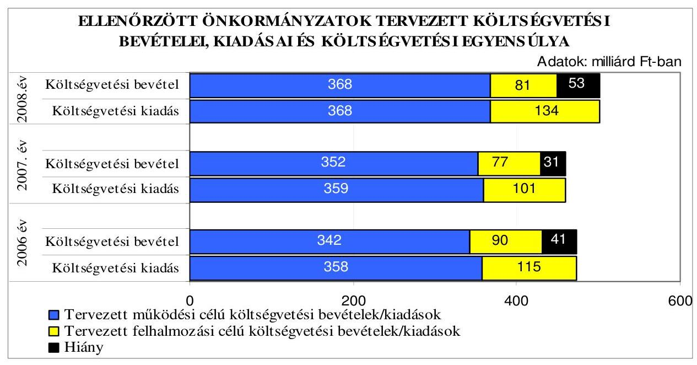

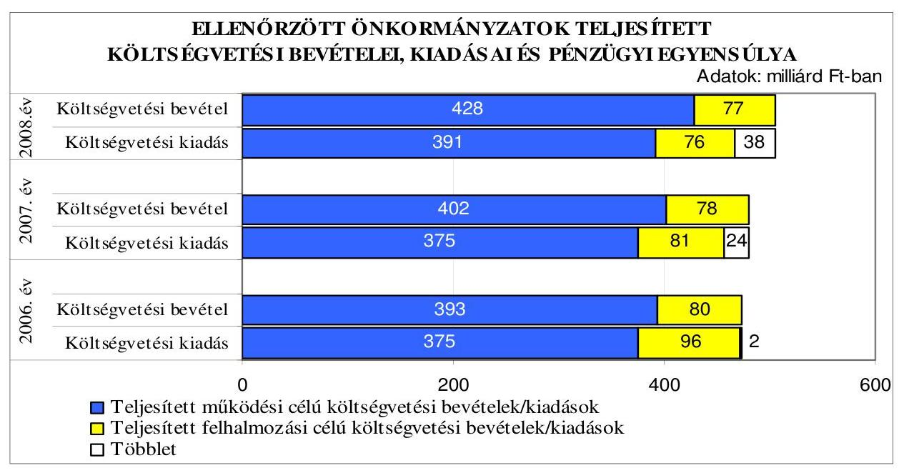

[^0]
[^0]:    * Ellenőrzött megyei, megyei jogú városi, Budapest fővárosi kerületi és városi önkormányzatok adataival.

---

# AZ ELLENŐRZÖTT ÖNKORMÁNYZATOK* TERVEZETT ÉS TELJESÍTETT FINANSZÍROZÁSI BEVÉTELEI ÉS KIADÁSAI 2006-2009 KÖZÖTT 

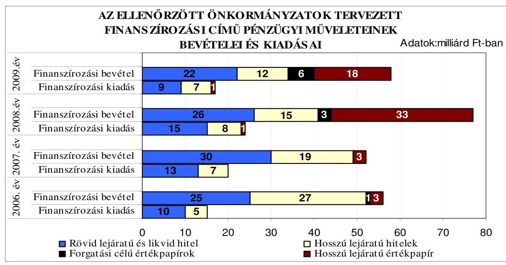
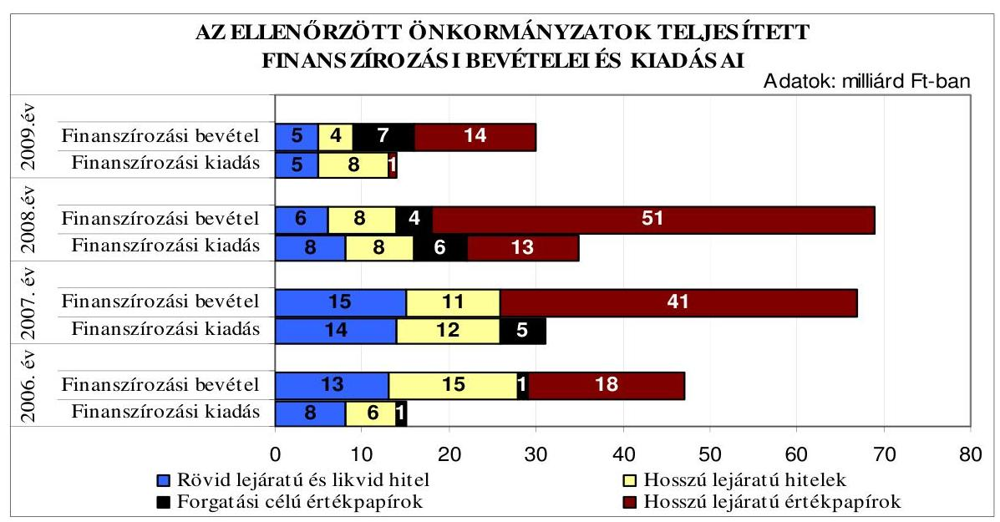

* Ellenőrzött megyei, megyei jogú városi, Budapest fővárosi kerületi és városi önkormányzatok adataival.

---

### PÉNZÜGYI HELYZETET JELZŐ MUTATÓK ALAKULÁSA

(országos adatok alapján)

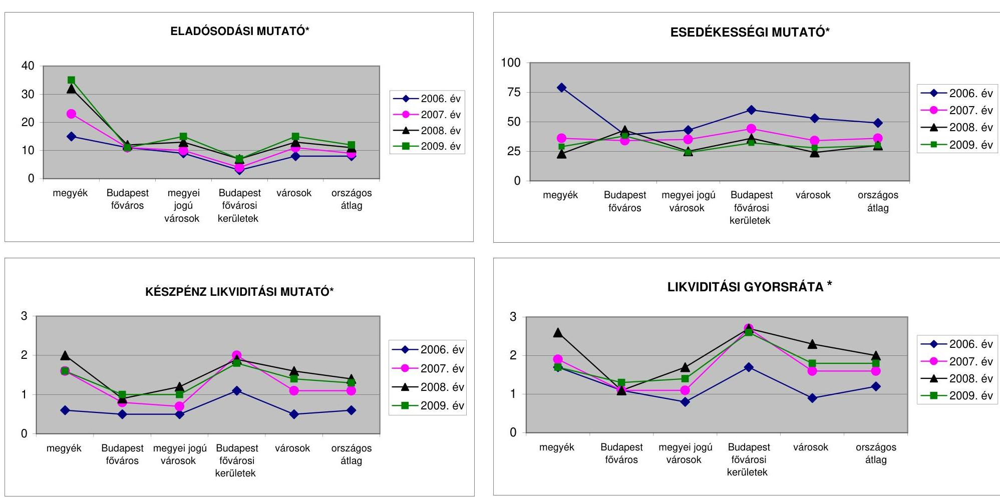

* Eladósodási mutató = [(Összes kötelezettség-egyéb passzív pénzügyi elszámolások)/Összes forrás]*100
  Esedékességi aránymutató = [Rövid lejáratú kötelezettségek/(Összes kötelezettség-egyéb passzív pénzügyi elszámolások)]*100
  Készpénz likviditási mutató = pénzeszközök/rövid lejáratú kötelezettségek
  Likviditási gyorsráta = (követelések+értékpapírok+pénzeszközök)/rövid lejáratú kötelezettségek

---

# AZ ELLENŐRZÖTT* ÖNKORMÁNYZATOK ELADÓSODÁSI ÉS ESEDÉKESSÉGI MUTATÓINAK ALAKULÁSA 2006-2009 KÖZÖTT 

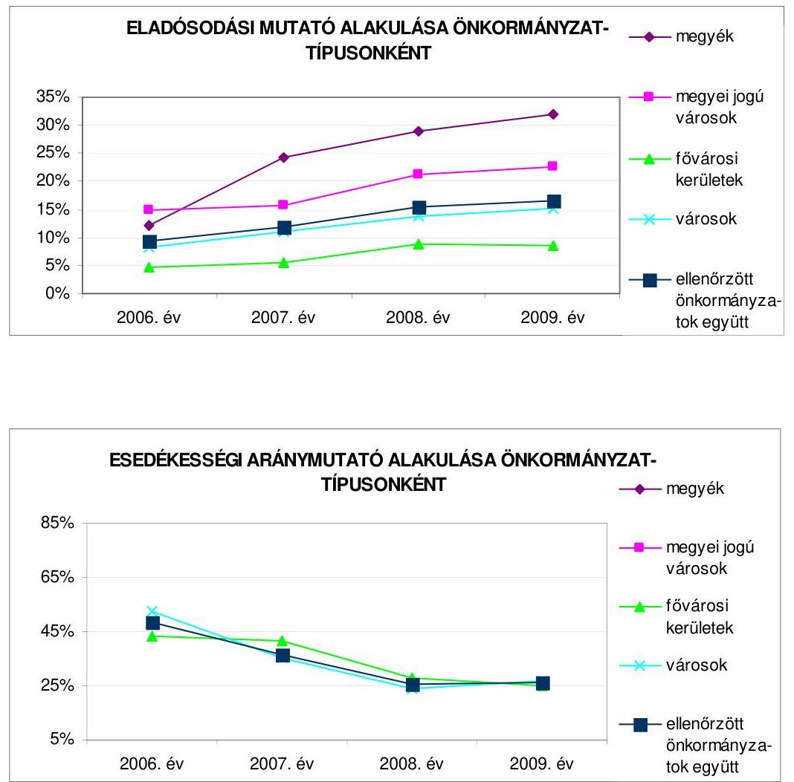

* megyei, megyei jogú városi, Budapest fővárosi kerületi és városi önkormányzatok adataival

---

# AZ EURÓPAI UNIÓS FORRÁSOK IGÉNYBEVÉTELÉVEL ÉS FELHASZNÁLÁSÁVAL ÖSSZEFÜGGŐ FELKÉSZÜLTSÉG EREDMÉNYESSÉGÉNEK ÉRTÉKELÉSI SZEMPONTJAI 

#### Abstract

Az önkormányzat európai uniós források igénybevételére és felhasználására történt felkészültségének szabályozottsága és szervezettsége eredményes volt, ha megfelelt az alábbi lényegességi szempontoknak ${ }^{1}$ :

1. az európai uniós forrásokra történő pályázatok a gazdasági programban, és/vagy ágazati szakmai koncepciókban meghatározott fejlesztési feladatokhoz kapcsolódtak;
2. a szabályozás tartalmazta a pályázatfigyelést végző és a döntési, illetve a döntés-előterjesztési jogkörrel rendelkezők közötti információszolgáltatásának kötelezettségét;
3. a folyamatba épített, előzetes és utólagos vezetői ellenőrzési feladatokat a gazdálkodásra vonatkozó területen szabályozták;
4. a belső ellenőrzési stratégiát (éves ellenőrzési tervet) megalapozó kockázatelemzés kiterjedt az európai uniós forrásokkal támogatott fejlesztési feladatokra;
5. a pályázatfigyelés, a pályázatkészítés és a fejlesztési feladat lebonyolításának szervezeti, személyi feltételeit biztosították;
6. a külső személlyel, szervezettel kötött szerződésben meghatározták - a pályázat szakmai és formai követelményeinek biztosítására vonatkozóan - a pályázatkészítést végző felelősségét;
7. előírták a fejlesztési feladat lebonyolítását végző ellenőrzési kötelezettségeit.
[^0]
[^0]:    ${ }^{1}$ A lényegesség egy bizonyos kérdés (ügy, állítás, információ, adat stb.) relatív jelentőségének vagy fontosságának a kifejezése az ellenőrzés céljaival összefüggésben. Egy kérdés akkor lényeges, ha figyelmen kívül hagyása vagy téves megítélése magára az ellenőrzésre, illetőleg az ellenőri jelentés felhasználójának döntéseire befolyásoló hatást gyakorolna; hasonlóképpen egy hamis állítás, információ is lényeges, ha hatása hasonló lenne. (A számvevőszéki ellenőrzés szakmai szabályai 2008. év)

---

# AZ ELLENŐRZÖTT ÖNKORMÁNYZATOK ÁLTAL BENYÜJTOTT ÉS TÁMOGATÁSBAN RÉSZESÜLT PÁLYÁZATOK PROGRAMONKÉNT

|  Megnevezés | Az ellenőrözött önkormányzatok pályázatai |  |  |  |  |  |  |  |   |
| --- | --- | --- | --- | --- | --- | --- | --- | --- | --- |
|   | 2007. év |  |  | 2008. év |  |  | 2009. év |  |   |
|   | Benyújtott | Támogatott | Támogatott | Benyújtott | Támogatott | Támogatott | Benyújtott | Támogatott | Támogatott  |
|   | pályázatok száma |  | pályázatok | pályázatok |  | pályázatok | pályázatok |  | pályázatok  |
|   | db |  | aránya |  |  | aránya |  |  | aránya  |
|   |  |  | \% | db |  | \% | db |  | \%  |
|  NFT operatív programjai és Kohéziós Alap |  | 178 |  | 323 | 246 | 76,2 | 157 | 121 | 77,1  |
|  ÚMFT operatív programjai |  | - |  | 332 | 71 | 21,4 | 1072 | 447 | 41,7  |
|  Egyéb támogatás* |  | 9 |  | 92 | 52 | 56,5 | 413 | 220 | 53,3  |
|  Előcsatlakozás** |  | 26 |  | 31 | 29 | 93,5 | 1 | 1 | 100  |
|  Összesen: | 600 | 213 | 35,5 | 778 | 398 | 51,2 | 1643 | 789 | 48  |

## Jelmagyarázat:

- Európai Gazdasági Térség és Norvég Finanszírozási Mechanizmus, INTERREG Közösségi Kezdeményezés, Európai Unió Socrates, Comeneus, Leonardo közösségi programjai, „EURPE Direck" információs hálózat, EACEA, testvérvárosi kapcsolatok, találkozók, Balti Városok Szövetsége, EQUAL Közösségi Kezdeményezés magyarországi programja, az Európai Unió kommunikációs együttműködési megállapodás keretében „Igazgatási partnerség", Szlovénia-Magyarország-Horvátország Szomszédsági program támogatására pályáztak az önkormányzatok. ** ISPA (Instrument for Structural Policies for Pre-Accession), SAPARD (Special Accession Programme for Agriculture and Rural Development), PHARE (Pologne, Hongrie Aide a la Reconstruction économique).

---

# ÁLLAMPOLGÁROKAT ÉRINTŐ E-KÖZIGAZGATÁSI ÜGYKÖRÖKNÉL BIZTOSÍTOTT ELEKTRONIKUS SZOLGÁLTATÁSI SZINT AZ ELLENŐRZÖTT ÖNKORMÁNYZATOKNÁL 2008-2009. évben

|  Ügykörök | 1. szint |  | 2. szint |  | 3. szint |  | Nincs |   |
| --- | --- | --- | --- | --- | --- | --- | --- | --- |
|   | 2008. | 2009. | 2008. | 2009. | 2008. | 2009. | 2008. | 2009.  |
|  Személyi okmányok elkészítése | $29 \%$ | $41 \%$ | $27 \%$ | $24 \%$ | $0 \%$ | $2 \%$ | $44 \%$ | $33 \%$  |
|  Hatósági igazolások kiadása | $24 \%$ | $32 \%$ | $34 \%$ | $30 \%$ | $0 \%$ | $5 \%$ | $42 \%$ | $33 \%$  |
|  Lakcímváltozás bejelentése | $31 \%$ | $39 \%$ | $23 \%$ | $23 \%$ | $0 \%$ | $2 \%$ | $46 \%$ | $36 \%$  |
|  Gépjármú regisztráció, adófizetés | $17 \%$ | $29 \%$ | $38 \%$ | $40 \%$ | $1 \%$ | $5 \%$ | $44 \%$ | $26 \%$  |
|  Építési engedélyezés | $20 \%$ | $22 \%$ | $46 \%$ | $45 \%$ | $1 \%$ | $5 \%$ | $33 \%$ | $28 \%$  |
|  Szociális juttatások, támogatások kifizetései | $15 \%$ | $18 \%$ | $60 \%$ | $49 \%$ | $2 \%$ | $6 \%$ | $23 \%$ | $27 \%$  |
|  Helyi adózás | $13 \%$ | $22 \%$ | $57 \%$ | $46 \%$ | $3 \%$ | $11 \%$ | $27 \%$ | $21 \%$  |
|  Egészségüggyel kapcsolatos szolgáltatások | $34 \%$ | $30 \%$ | $21 \%$ | $20 \%$ | $1 \%$ | $6 \%$ | $44 \%$ | $44 \%$  |

---

# AZ ELEKTRONIKUS KÖZSZOLGÁLTATÁSI ÜGYINTÉZÉSI LEHETŐSÉGEK BIZTOSÍTÁSA ÖNKORMÁNYZAT TIPUSONKÉNT A 2008. ÉVBEN 

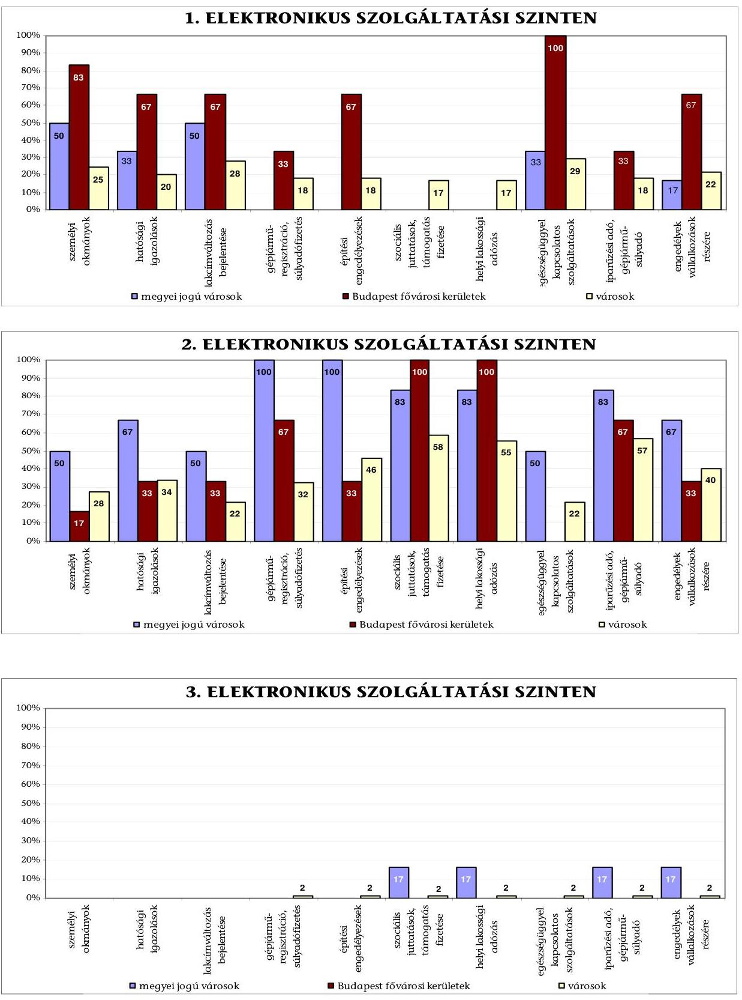

---

# A BELSŐ KONTROLLOK KIALAKÍTÁSA ÉS MŰKÖDTETÉSE A KÖLTSÉGVETÉS TERVEZÉSÉNÉL ÉS A ZÁRSZÁMADÁS KÉSZÍTÉSÉNÉL 

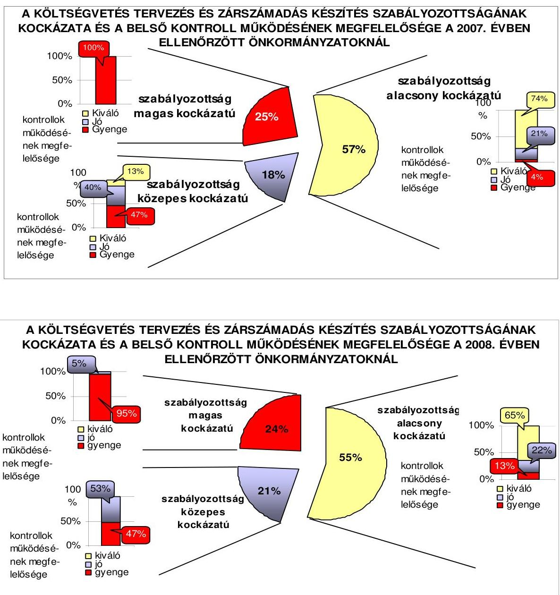

---

# A KIALAKÍTOTT BELSŐ KONTROLLOK MEGFELELŐSÉGE TEKINTETÉBEN VIZSGÁLT TERÜLETEK KIADÁSAINAK ÉS AZOK RÉSZARÁNYÁNAK ALAKULÁSA AZ ELLENŐRZÖTT ÖNKORMÁNYZATOKNÁL

|  Megnevezés | Eredeti |  |  | Módosított |  |  | Teljesítés |  |   |
| --- | --- | --- | --- | --- | --- | --- | --- | --- | --- |
|   | elöirányzat |  |  | elöirányzat |  |  |  |  |   |
|   | 2007. év | 2008. év | 2009. év | 2007. év | 2008. év | 2009. év | 2007. év | 2008. év | 2009. év  |
|  Karbantartási, kisjavítási szolgáltatások kiadásai ${ }^{[1]}$ (millió Ft) | 7652198 | 8457050 | 6659783 | 8904753 | 9899022 | 7143136 | 7775671 | 8897568 | 5558790  |
|  Karbantartási, kisjavítási szolgáltatások kiadásainak részaránya a dologi kiadásokból (\%) | 5,7 | 6,0 | 10,9 | 5,7 | 5,7 | 10,2 | 5,5 | 5,5 | 9,1  |
|  Gépek berendezések és felszerelések vásárlása, létesítése ${ }^{[2]}$ (millió Ft) | 4075532 | 4046847 | 1992381 | 7977233 | 8516457 | 2824089 | 6401966 | 5255047 | 1718855  |
|  Gépek, berendezések és felszerelések vásárlása, létesítése kiadásainak részaránya a felhalmozási kiadásokból (\%) | 6,2 | 5,9 | 2,6 | 8,1 | 7,6 | 3,7 | 8,3 | 8,6 | 4,4  |
|  Müködési célú pénzeszköz átadások államháztartáson kívülre ${ }^{[3]}$ (millió Ft) | 15500379 | 15164446 | 12343905 | 21101357 | 21365489 | 14603397 | 19916107 | 20234350 | 13195697  |
|  Müködési célú pénzeszköz átadások részaránya az államháztartáson kívüli pénzeszközátadásokból (\%) | 60,3 | 63,1 | 62,6 | 59 | 60,7 | 60,1 | 74,1 | 63,7 | 70,3  |
|  Állományba nem tartozók juttatásai ${ }^{[4]}$ (millió Ft) | 8149493 | 8556175 | 4300029 | 11832611 | 12509287 | 5549949 | 11897113 | 13035350 | 5163708  |
|  Állományba nem tartozók juttatásainak részaránya az összes személyi juttatásból (\%) | 3,9 | 4,1 | 7,8 | 5,4 | 5,5 | 9,2 | 5,6 | 5,9 | 8,9  |

[^0] [^0]: ${ }^{[1]}$ A 2007-2009. években ellenőrzött önkormányzatoknál az önkormányzati hivatalok 2007-2009. évi költségvetési beszámolója 03. úrlap 27. sor, illetve 28. sor összesített adatai szerint. ${ }^{[2]}$ A 2007-2009. években ellenőrzött önkormányzatoknál az önkormányzati hivatalok évi 2007-2009. évi költségvetési beszámolója 05. úrlap 10. sor összesített adatai szerint. ${ }^{[3]}$ A 2007-2009. években ellenőrzött önkormányzatoknál az önkormányzati hivatalok 2007-2009. évi költségvetési beszámolója 04. úrlap 22., 24, illetve 26. sorok adatai szerint. ${ }^{[4]}$ A 2007-2009. években ellenőrzött önkormányzatoknál az önkormányzati hivatalok 2007-2009. évi költségvetési beszámolója 02. úrlap 43. sorok összesített adatai szerint

---

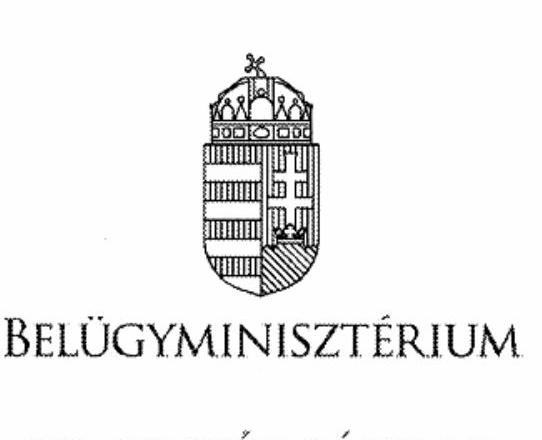

BELÜGYMINISZTÉRIUM
DR. PINTÉR SÁNDOR
minister

ÁLLAMI SZÁMVEVÖSZÉK
ÜGYVITELI IRODA
5701/2010
Érk.: JUL 28 2010

Iktatószám: ..................................................................................................................................................................................................................................................................................................................................................................................................................................................................................................................................................................................................................................................................................................................................................................................................................................................................................................................................................................................................................................................................................................................................................................................................................................................................................................................................................................................................................................................................................................................................................................................................................................................................................................................................................................................................................................................................................................................................................................................................................................................................................................................................................................................................................................................................................................................................................................................................................................................................................................................................................................................................................................................................................................................................................................................................................................................................................................................................................................................................................................................................................................................................................................................................................................................................................................................................................

---

NEMZETGAZDASÁGI MINISZTÉRIUM

MINISZTER

ÁLLAMI SZÁMVEVŐSZÉK
ÜGYVITELI IRODA
5127/2010.
Érk.: JUL 29 2010

Iktatószám: V-3001-36/2010
Melléklet: 4

16. számú melléklet
a V-3001-34/2009. számú jelentéshez

NGM/288/¾/2010.
Hiv.szám: V-3001-32/2009.
Ügyintéző: dr. Raszler Tibor

Dr. Csapody Pál Úrnak,
főtitkár

Állami Számvevőszék

Budapest

Tisztelt Főtitkár Úr!

Az Állami Számvevőszékről szóló 1989. évi XXXVIII. törvény 25. § (1) bekezdése alapján észrevételezésre megküldött, a helyi önkormányzatok gazdálkodási rendszerének 2009. évi ellenőrzéséről készített jelentést köszönettel megkaptam, arra észrevételt nem teszek.

Budapest, 2010. július 24.

Üdvözlettel:

Dr. Matolcsy György

1055 Budapest, Szemere u. 6. Telefon: (06 1) 374-2700 E-mail: gyorgy.matolcsy@ngm.gov.hu

---

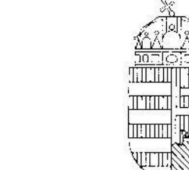

NEMZETI FEJLESZTÉSI MINISZTÉRIUM

DR. FELLEGI TAMÁS

Domokos László
elnök úr részére

## Állami Számvevőszék

## Budapest

## Tisztelt Elnök Úr!

Köszönettel megkaptam „a helyi önkormányzatok gazdálkodási rendszerének 2009. évi ellenőrzéséről" szóló ellenőrzési jelentés tervezetet.

A megküldött jelentés-tervezetre észrevételt nem kívánok tenni.
Köszönöm, hogy munkájukkal hozzájárulnak a minisztérium eredményesebb müködéséhez.

Budapest, 2010. augusztus „1 $\qquad$
Tisztelettel:
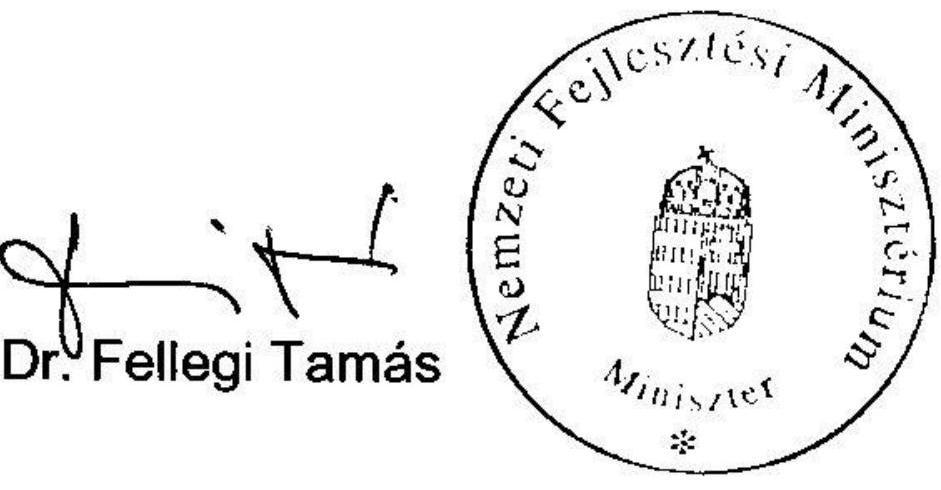

---

# 18. számú melléklet 

a V-3001/2009. számú jelentéshez

## ELNÖK

## ÁLLAMI SZÁMVEVŐSZÉK

Ikt.szám: V-3001-38/2009.
Hiv.szám: ATM/1632/2010.

## Dr. Pintér Sándor úr

miniszter

Belügyminisztérium
Budapest

## Tisztelt Miniszter Úr!

Köszönettel vettem a helyi önkormányzatok gazdálkodási rendszerének 2009. évi ellenőrzéséről készített számvevőszéki jelentéstervezetre adott észrevételét. Örömmel értesültem arról, hogy megállapításainkkal és javaslatainkkal egyetértenek.

A helyi önkormányzatok kötelező feladatainak egyértelmű meghatározását az ellenőrzési tapasztalatok alapján az Állami Számvevőszék több év óta indokoltnak, szükségesnek tartja, ezért erre évente visszatérően javaslatot tett, illetve tesz. Véleményem szerint e feladat nem kapcsolódik az új Alkotmány kidolgozásához, hanem ezt a helyi önkormányzatokról szóló törvény, valamint az önkormányzati feladatokat meghatározó ágazati törvények összehangolásával szükséges megtenni, ezért javaslom, hogy az új Alkotmány kidolgozásától függetlenül kezdeményezze a helyi önkormányzatok kötelező feladatainak egyértelmű meghatározását.

Budapest, 2010. augusztus „, ,"

Tisztelettel:
