# Allami ভ̛̃ámbrbös̊ek 

## JELENTÉS

az IKARUS és CSEPEL AUTÓ állami vállalatok
együttes szanálásának és privatizálásának
célszerüségi és szabályszerűségi vizsgálatairól
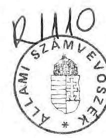

---

A vizsgálatot végezte:

Lörinc Alajos tanácsos
Vasas Sándorné dr. tanácsos

---

# T A R T A L O M J E G Y Z É K 

1. BEVEZETÉS ..... $1-2$.
II. ÖSSZEFOGLALÓ KÖVETKEZTETÉSEK, JAVASLATOK ..... $1-17$.
2. Összefoglaló következtetések ..... $3-15$.
3. Javaslatok ..... 15.
FÜGGELÉK
MELLÉKLETEK

---

Állami Számvevőszék
V-4-21/1992.
Témaszám: 105 .

# J E L E N T É S 

az IKARUS és a Csepel Autó állami vállalatok
együttes szanálásának és privatizálásának
célszerüségi és szabályszerűségi vizsgálatairól

## 1 .

## B E V E Z E T É S

A vizsgálatra az Állami Számvevőszék 1992. évi ellenőrzési terve alapján kerûlt sor.

A vizsgálat célja: hogy helyzetfeltáró, célszerűségi és szabályszerűségi vizsgálat során választ kapjunk arra a kérdésre is, hogy a "húzó" iparágként a közelmúltig fokozottan fejlesztett, a közúti jármügyártó alágazatot reprezentáló végterméket kibocsátó állami vagyon hogyan hasznosul a privatizálás során.

---

A vizsgálattal érintett szervezetek:

- Ikarus Karosszéria és Jármügyár Budapest, XVI. ker. Margit u. 2. KSHsz.: 10001428142111201
- Csepel Autógyár

Szigetszentmiklós Gyártelep
KSHsz. : 10001497142111213

- Szanáló Szervezet

Budapest, V. Vadász u. 30.
KSHsz:: 3238241051492101

- IKARUS Jármügyártó Részvénytársaság Budapest, XVI. Margit u. 2. Cégbejegyz.sz. Föv. Bíróság 01-10-041688
- REORG Gazdasági és Pénzügyi Részvénytársaság
Budapest, V. Vadász u. 30.
Cégbejegyz.sz.: Föv. Bíróság 01-10-041773

A hitelezök elszámolási kezdeményezései alapján bírósági megkeresésre a pénzügyminiszter 1990. szeptember 12-én rendelte el az egymással szoros kooperációban müködö két vállalat együttes szanálását.

A vizsgálat a szanálás elrendelésétől kezdődően áttekinti a szanálás és kapcsolódó társaságalapítás folyamatát, ellenörzi a szanálás lezárásának állapotát és ismerteti a szanálással érintett gazdálkodó egységek jelenlegi kritikus helyzetét.

Két jelentős ipari vállalatra, s ezzel összefüggésben a Szanáló Szervezet tevékenységére kiterjedő "A vizsgálat részletes megállapításai" fejezeteket - annak el nem kerülhetö terjedelme miatt - Függelékbe, s ehhez kapcsolódó Mellékletekbe helyeztük. A vizsgálati jelentés Összefoglaló következtetések, javaslatok fejezetében ezekre alapozzuk megállapításainkat, s tesszük meg javaslatainkat.

---

# II. 

## ÖSSZEFOGLALÓ KÖVETKEZTETÉSEK, JAVASLATOK

## 1. Összefoglaló következtetések

1. Az IKARUS és Csepel Autó állami vállalatok együttes állami szanálását a pénzügyminiszter 1990. szeptember 12-én rendelte el. Az együttes állami szanálás lefolytatásával a Szanáló Szervezetet bizták meg, s szanálási biztost rendeltek ki a két vállalathoz.

Az 1970-es évek iparpolitikai koncepciójának megfelelően kialakított, végtermékcentrikus jármügyártási program egyik termékének, az autóbusznak elsődleges felvevó piacai a KGST országok voltak.
A két vállalat között ekkor kialakított munkamegosztás alapján a Csepel Autó vállalat szállította - a termelését 90 \%-ban kitevố - gépészettel szerelt padlóvázat az IKARUS részére.
Így a két vállalat elméleti együttes kapacitása évi 20000 db középkategóriájú széria busz volt.
Ez a piac a politikai változások következtében a 80-as évek végére összeomlott.
2. Az Állami Vagyonügynökség, az Ipari és Kereskedelmi Minisztérium, valamint a Szanáló Szervezet nyilvános nemzetközi versenytárgyalást hirdetett a magyar közuti jármügyártás autóbuszgyártási vertikumának átalakítására. Az átalakítás célja, hogy teremtse meg a magyar közúti jármügyártásba szervesen illeszkedó, világpiacon versenyképesen megjelenó hazai autóbuszgyártást.

---

A felhívás nem váltott ki megfelelö érdeklödést, mindössze négy értékelhető pályázat érkezett, melyböl a két külföldi felett meg leginkább a pótlólagos tökebevonás, a piaci terjeszkedés, s a müszaki megújulás követelményeinek.

A nyertes az orosz piaci háttérre támaszkodó, jelentős készpénztökét felajánló, a CEIC kanadai holding által szervezett szovjet(ATEX)-tajvani konzorcium lett.

A döntésnél meghatározó szempont volt, hogy a szovjet fél ajánlatában, s az azt követö tárgyalásokon is garantálta évi 6000 busz megvásárlását.

A nemzetközi pályázat eredményhirdetését követöen előterjesztés készült a Kormány részére az IKARUS és Csepel Autó vállalatok együttes állami szanálásának és privatizációjának helyzetéről.
3. A Kormány két ízben foglalkozott a vállalatok szanálásával, s a Gazdasági Kabinet is több alkalommal tárgyalta a közúti jármüipar helyzetét.

Az első, 1991. február 14-i (3068/1991. számú) Kormányhatározat az állami szanálás befejezési határidejét 1991 április 30.-ban rögzíti, s a két vállalat együttes szervezet átalakításával egy új állami vállalat létrehozását, majd ennek privatizálását irányozza elő.
A szanálási folyamat azonban nem e Kormányhatározat által megszabott irányban haladt tovább, a feladatok az elöirt határidökre nem teljesültek.
A 100 millió dollár tőkét felajánló tajvani befektető a társaságalapítást előkészitő tárgyalások során az idöközben elbizonytalanodó szovjet piac miatt kimaradt az ajánlattevö konzorciumból. Evvel a Konzorcium által ajánlott kondiciók alapvetően megváltoztak, így mód lett volna a nemzetközi pályázat eredménytelenségének deklarálására.

---

Bár a piac egyre bizonytalanabbá vált, a szovjet orientációjú piaci stratégiára épülő társaságalapítási koncepció kidolgozása - az IKM egyre határozottabbá váló eltérő véleménye ellenére - tovább folyt.

A második (3396/1991. sz.) Kormányhatározat 1991 szeptemberében - egy évvel a szanálás elrendelése után - született.

A Kormány részére benyújtott előterjesztés nem mutatott rá a korábbi Kormányhatározattól eltérő szanálási, privatizációs megoldásokra, s a PM és az IKM közötti véleményeltérést sem tükrözte kellő módon.
A hiányos, a problémákat nem tükröző előterjesztés alapján a Kormány tudomásul vette, hogy az IKARUS és Csepel Autó vállalat együttes szanálási megállapodása aláírásra került, az IKARUS Jármügyártó Rt alapítással megalakult, az IKARUS és a Csepel Autó állami vállalatokat megszüntetik.
4. A szanálási folyamatot lezáró Szanálási Megállapodást 1991. augusztus 26-án, tehát a szanálás elrendelését követően közel egy évvel, s a második Kormányhatározat előtt két héttel írták alá az IKARUS, a Csepel Autó vállalat és a Szanáló Szervezet vezetői.
"Az állami szanálási eljárást az elrendeléstől számítva legfeljebb három, kivételes esetekben - a szanálást elrendelő szerv engedélye alapján - 6 hónapon belül kell lefolytatni."
(79/1988. MT rendelet az állami szanálásról)

A szanálási folyamat során azonban a Szanáló Szervezet nem teljesítette előírt kötelezettségeit; nem teremtette meg e tevékenység lezárását jelentő Megállapodás jogszabályban előirt feltételeit;

- a fizetőképesség helyreállítása és a gazdaságos múködés megteremtése érdekében intézkedéseket nem tettek,
- a hitelezókkel az egyezségi tárgyalások lefolytatását nem kezdeményezték, az egyezségek megkötésére nem került sor.

---

A Megállapodás csak az IKARUS vonatkozásában tartalmazott konkrét intézkedést - a részvénytársaság megalapítása tekintetében -, a Csepel Autó sorsának megoldását a jövőbe utalta. Elhatározták az IKARUS Rt megalapítását, annak kimondásával, hogy a szanálás az alapító állami vállalat felszámolásával zárul.

A Csepel Autó 4.sz. Gyáregységét államigazgatási döntéssel az IKARUS állami vállalathoz csatolták, s a szanálási folyamat lezárásaként célul tüzték ki az állami vállalat társasággá alakítását.

A két vállalat közötti adósság rendezését, a autóbuszgyártással összefüggő készletek átadás/átvételét a vállalatok külön megegyezésére utalták.
A Szanálási Megállapodás döntései alapján is ellenérdeküvé vált felek között ezek az egyezségek a mai napig nem születtek meg.

Jelenleg a két vállalat között három peres ügy van folyamatban, ebből kettő a szanálás során keletkezett viták következtében. A Csepel Autó vállalatnál mintegy 1,3 milliárd Ft értékű elfekvő készlet képződött.
5. Az IKARUS részvénytársaságot 1991. augusztus 30-án zártkörü alapítással 11,5 milliárd Ft alaptökével hozták létre.

A társaság 68,3 \%-ban magyar tulajdon; 7 milliárd Ft az IKARUS állami vállalat, s 51 millió Ft a MOGÜRT apportja, s 800 millió Ft a MOGÜRT és az MHB készpénz befizetése.
A $31.7 \%$-os külföldi tulajdoni hányad teljes egészében készpénz hozzájárulás, melyböl az ATEX Konzorcium 3,5 milliárd Ft-ot, s a CEIC 148 millió Ft-ot USD-ben teljesített. A társaságalapítást előkészítő tárgyalásokon az ATEX kifejezésre juttatta többletbefektetési szándékát, melyre mind az

---

alapításkor, mind a szindikátusi szerződésben rögzített tőkeemelési, elővásárlási, vételi jogosultságok lehetöséget adnak. Ezekkel azonban az ATEX ezideig nem élt.

A társaságalapítás VIII. 30-i idópontjával egyrészt teljesítették a magánjogi szerződésben elöirányzott 60 napos határidőt, másrészt ez azt is eredményezte, hogy a társaságban a területileg illetékes önkormányzatok nem lettek tulajdonosok, mivel a vonatkozó törvény szeptember 1-én lépett hatályba.

A társaság alapítással, s nem az átalakulási törvény szerinti általános jogutódként jött létre.

Az alapítói apportban termelési készletek nem szerepeltek, a cégbejegyzés elhúzódása miatt a likvid pénzeszközökhöz késve jutottak hozzá. Mindezek a folyó termelés mellett alapított társaság müködésében fennakadásokat okoztak.
Az alapítás körülményeiböl adódóan az átmeneti időszak finanszirozását technikailag az állami vállalat látta el.
A két belföldi befektetö készpénz hozzájárulását - 800 millió Ft-ot - az állami vállalathoz fizette be. Azt a tartozások kiegyenlítésére forditották, a társasághoz nem utalták tovább.
6. Az Állami Vagyonügynökség a társaság alapításhoz azzal a kiegészítő feltétellel járult hozzá, hogy a "társaság átvállalja a tevékenységével összefüggö valamennyi kötelezettséget, s birtokolja az ennek megfelelö vagyont".

Ennek teljesítésére az alapítók megállapodtak abban, hogy az állami vállalat az alapítással egyidejűleg a társasagnak átadja a mintegy 16 milliárd Ft értékủ tartozást, s az ennek megfelelö - apportlistában nem szereplő - eszközöket. A vállalatnak ez a megállapodása "értelmezte" az AVÜ kiegészítő feltételét, s azt, adás/ vételként kezelte.

---

Az átadás/átvétel idöben elhúzódott, még ma sem tekinthetö lezártnak. A megállapodásokat három szerzödési fázisban; 1991 november 20-án, november 25-én, és 1992. február 13-án kötötték, s mindig az alapítás időpontjára vezették vissza.
A Vagyonügynökségnek bemutatott listán is feltüntették, hogy három eszközcsoportot; a jóléti állóeszközöket, a ehhez tartozó telkeket, s a szellemi vagyont "elfogadott értéken" adják át.

A vállalat könyveiben értéken nem szereplö szabadalmai, konstrukciós, gyártási dokumentációi és eljárásai, valamint softwartermékei 1032 millió Ft értéken kerültek át.

A jóléti állóeszközök (több üdülő, bölcsőde, óvoda, sportlétesítmény, művelődési ház) a könyvszerinti nettó érték 10 \%-ában, mindösszesen 17,7 millió Ft értéken kerültek át a társasághoz.
A jóléti építményekhez kapcsolódó - összesen 104665 m 2 területü - telekingatlant 45932 eFt értéken, a vagyonértékelés $10 \%$-ában adták át.

A vagyonelemek ilyen, a tényleges piaci értékhez viszonyítva alacsony értékủ átadása jelentős gazdálkodási tartalékot jelent az alapításkor is már $32 \%$-ban külföldi tulajdonú társaság számára.
A Állami Vagyonügynökség által megfogalmazott feltétel, illetve annak részünkre adott értelmezése (cesszió), valamint a vállalat által követett eljárás eltér egymástól, de nem követi a tárgykörben kieszközölt APEH állásfoglalást sem.
A könyv szerinti értéktől eltérő elidegenités csak meghatározott esetekben (apport, értékesités, stb.) lehetséges, a mérlegszerú átadás-átvétel esetében nem.
A szanálási biztos, a Szanáló Szervezet nem követte, nem ellenörizte az állami vagyon védelmének megfelelö mértékben ezeket a megállapodásokat.

---

A vállalat és társaság képviselöi az utolsó, 1992. február 13-i megállapodásban rögzítik: "a részvénytársaság alapítása során elöirt kötelezettség átvállalását és az ezzel egyenértékü vagyonátadást kölcsönösen teljesítették."
7. Az IKARUS Jármügyártó Részvénytársaság évi 7-9 ezer busz (2/3 FÁK, $1 / 3$ egyéb viszonylat) gyártására készült fel. A több mint 10000 fö átvétele mellett az állami vállalat irányítási - szervezeti struktúráját megtartotta.
Kisebb módosítás a termelés területi szervezeteinél, illetve a technológiánál volt; összesen 78 millió Ft ráfordítással mindkét gyárban kialakították a karosszáló szalagokat kiszolgáló padlóváz gyártást és gépészeti szerelést.

A részvénytársaság 1991. évi müködését rendeléshiány, pénzügyi zavarok, akadozó beszállítások és elhúzódó vevöi fizetések jellemezték. Föleg az elmaradó szovjet (FÁK) rendelések miatt a társaság négy hónapos müködése során az elöirányzatokat $81,5-86 \%$ között teljesítette, az évet 365 millió Ft veszteséggel zárta.

A részvénytársaság 1992 évre több tervvariánst dolgozott ki. Az éves adósságszolgálati kötelezettségek teljesitését biztosító közel 7700 db busz értékesítésével számoló terv mellett, kidolgoztak egy u.n. "kontingencia tervváltozatot", amely csak 5000 db busz értékesítését tartalmazza. Az utóbbinál éves szinten 2 milliárd Ft fedezethiány mutatkozik.
Március végén a rendelésállomány kedvezőtlen alakulása miatt /1992 évre 1698-1930 db/ határozatot hoztak egy 3600-4000 autóbusz értékesítését elöirányzó, a veszteségeket minimalizáló üzleti terv kidolgozására, valamint egy többvariációs válságmenedzselési stratégia kimunkálására.
A lecsökkent kapacitásterhelés miatt mélyreható strukturalis intézkedések szükségesek, s nem zárható ki, hogy ez a társaságban müködö két gyár egyikének jelentős leépitéséhez vezet.

---

A társaság vezetése ezeknek a döntéseknek a meghozatalánál nehéz helyzetbe került, mivel a körülmények alapvetően eltérnek az alapításkor széles körben deklarált "növekedési" pályától.
8. Az IKARUS állami vállalat az előző évről 968 millió veszteséget hozott át és az 1991 évet 305 millió Ft veszteséggel zárta.
A vállalat és a részvénytársaság együttes követelése az év végén 7830 millió Ft-ot tett ki, az összes rövidlejáratú kötelezettsége pedig 9556 millió Ft volt. (Ebben nem szerepel a Csepel Autó vállalat 1,5 milliárd Ft értékủ peresített követelése.)
AZ ÁVÚ által előirt tartozás átruházási - vagyonátadási kötelezettségét az e tárgyban 1992. február 13-án kötött utolsó megállapodással az állami vállalat teljesítette.

Az állami vállalat a részvénytársaság megalakulása óta termelö tevékenységet nem folytat.
Költségek az alkalmazottak bére, annak járulékai, az irodai müködés ráfordításai formájában folyamatosan keletkeznek.

Jórészt behajthatatlan követelései, valamint felhalmozott vagyona alapvetően kiegyenlítik egymást.
A részvénytársaság elött álló nehéz strukturális döntésekre is tekintettel, célszerű az állami alapító 7 milliárd Ft névértékủ részvénycsomagját az állami vállalat hatásköréből kivonni.
A Szanálási Megállapodásban elöírt kötelezettségeit az állami vállalat teljesítette, további müködtetése nem indokolt.
9. A Csepel Autógyár állami vállalat a szanálás elrendelésének tizedik hónapjában kívül rekedt a pénzügyi-gazdasági rendezés (társaságalapítás) folyamatán.
Ez és az a tény, hogy a nélküle megalakuló IKARUS Rt saját hatáskörébe vonta a padlóváz gyártást a vállalatot készület-

---

lenül érte. Ekkor a vállalat adó és hiteltartozása 2,5 milliárd Ft, kétes követeléseinek értéke 1,5 milliárd Ft, összesen mintegy 4 milliárd Ft állt szemben 5,9 milliárd Ft-os vagyonával.
A gazdálkodásban, a likviditás biztosításában így értelemszerüen döntö jelentőségüvé vált a 2,5 milliárdos készlet hasznosítása.

A két vállalat több évtizedes kooperációs kapcsolata ellenére a gyakorlat az volt, hogy a Csepel termelés egyeztetések alapján, de szerződések nélkül szállitott.
Ez korábban jól müködött, de az IKARUS piaci pozíciói romlása miatt, a két vállalat között viták keletkeztek.
Az IKARUS-szal szembeni kétes követeléseinek értéke - a le nem zárt árvita következtében - 1990. óta 1,5 milliárd Ft (késedelmi kamat nélküli érték).
A peresített követeléseknek késedelmi kamat és ÁFA tartalma nincs, ugyanis az IKARUS az eredeti számlázott árnak megfelelő ÁFA-t fizette meg (és igényelte vissza).
Az 1492 millió Ft árvita ÁFA vonzata 373 millió Ft.

A Csepel Autógyár 1991. évi zárómérlegében lévö 2926 millió Ft értékböl az IKARUS gyártással összefüggően 1371 millió Ft értékủ készletet mutat ki.

Az így kimutatott készlet értéket növeli az a 51 db gépészettel szerelt alváz értéke (mintegy 150 millió Ft), melyet a Csepel Autó vállalat leszállított, s ezt - utólag közölve az IKARUS csak felelős örzésre vett át.
A szanálási megállapodás előkészítöi a Csepel Autógyár IKARUS termeléstöl való jelentős függösége ellenére sem rendezték az ezzel összefüggö készletek sorsát, hanem ezt a két ellenérdekü fél megállapodására bízták.
A vállalat többször is felajánlotta ezeket a készleteket, de az IKARUS-tól kitérö, illetve elutasító válaszokat kapott. Az állagukban is jelentősen romló nagyértékü alkatrészek, félkésztermékek leselejtezése elkerülhetetlennek látszik.

---

Az államigazgatási határozattal 230 millió Ft "nettó értéken" átcsatolt Szeghalmi gyár folyó termelés mellett profilváltás nélkül került az IKARUS vagyonába. Ebben az esetben is az átcsatolás időpontjában felleltározott 188420 eFt értékủ készletböl hosszú egyezkedés után 92491 eFt értékűt vett át az IKARUS.

A Szanáló Szervezet nem járt el a vagyonkezelö felelösségével, amikor a készletek felmérésében, azok további sorsának rendezésében nem intézkedett.

A szanálás elrendelése óta a Csepel Autógyár gazdasági helyzete folyamatosan romlott. Termelésének $90 \%$-át kitevö profilját elvesztette, a felhalmozódott készleteket hasznosítani nem tudja, vitatott követelései az IKARUS-tól nem folynak be. Az 1991 évet 943 millió Ft veszteséggel zárta, adótartozásait nem fizeti ( 1,7 milliárdFt), árbevétele nagyságrendekkel csökkent (1991 I.félévében 4,6 milliárd Ft, II. félévében 486 millió Ft).

Termelő üzemeinek jelentős részét bezárta, létszámát a folyamatos elbocsátásokkal csökkentette, a szellemi foglalkozásúak $42 \%$-a már elhagyta a vállalatot.
A vállalati létszám 1992 01.31-én 2843 fö, ebből a termelő üzemekben dolgozik összesen 624 fö szellemi és fizikai alkalmazott.

Pénzügyi-gazdasági helyzetének rendezését illetően a Szanáló Szervezet tevékenysége kizárólag a tartozásaira vonatkozó garanciavállalásban mutatkozott meg; összességében a vállalat 1,3 milliárd tartozása után vállalt készfizetö kezességet. Ez 739 millió Ft tekintetében - mivel a Csepel Autó nem tudja tartozásait fizetni - valóságos helytállást (költségvetési terhet) is jelent, annak kamat és késedelmi kamat terheivel együtt.

---

A vállalat 1991. évi zárómérleg adatai alapján - a befagyott készletek, a kétes követelések ráfordításként történő figyelembevételével - 6,4 milliárd tartozás áll szemben 5,7 milliárd Ft saját vagyon értékével.
A Szanálási Megállapodás szerint a Csepel Autó állami szanálása társasággá alakításával zárul le, melynek tervezett határideje: 1991. december 31-e volt.
A Szanáló Szervezet december 31-i megszünése elött két héttel megállapodtak a GROUP INT. Ltd. képviselójével (Szalay János kaliforniai befektető) a Csepel vegyes tulajdonú részvénytársasággá alakításáról. A külföldi befektető az elókészítő munkák elvégzésével a Szanáló Szervezet utód(?)ját, a REORG Rt-t bizta meg. A külföldi fél ezzel összefüggö, vállalt kötelezettségeit sem határidőre, sem a helyszini vizsgálat lezárásáig nem teljesítette. A vagyonértékelést a REORG Rt saját költségére elkészíttette, de a társaságalapításban elörelépés nem történt. Más befektetőkkel tárgyalások nincsenek folyamatban.
10. A Csödtörvény hatályba lépésével az állami szanálás intézménye megszünt. A Szanáló Szervezetet 1991 dec. 31-ével a pénzügyminiszter megszüntette. Az IKARUS és a Csepel Autó vállalatok folyamatban lévő szanálási ügyeit egy PM rendelet az ÁFI hatáskörébe utalta.

Az Állami Fejlesztési Intézet a jogszabály megjelenését követően a PM-et, IKM-et is megkereste, eligazítást igényelt feladatait és jogutódlása tekintetében. A Csepel Autó vállalatot illetően jelezte, hogy a szanálás fenntartása további kötelezettség vállalalást jelent, melyhez forrásokkal nem rendelkezik, a szanálás fenntartását irreálisnak itelte, s a felszámolási eljárás megindítását javasolta.

---

A Pénzügyminisztérium ellentmondó állásfoglalásai atekintetben, hogy a Szanáló Szervezet jogutód nélkül szünt-e meg, vagy sem, alapot adtak az AFI által megfogalmazott aggodalmakra. Érthetö, ha az államigazgatási függöségben lévő, szanálási folyamatban érintett vállalatok vezetöi is szorgalmazzák a függelmi viszonyok tisztázását.
A Szanáló Szervezet megszüntetése, a REORG Rt alapítása, a jogutódlás rendezése témakörökben az ÁSZ Elnöke célvizsgálatot indított; Megállapításait a V-13/92. 117.témaszámú jelentés tartalmazza.
A Szanáló Szervezet vezetöje és a szanálási biztos sem az IKARUS, sem a Csepel Autó állami vállalatok folyamatban lévő szanálási ügyeinek lezárásában nem járt el kellö gondossággal. A megmaradt IKARUS állami vállalat és annak vezetőjének helyzetét nem rendezték. A Csepel Autó vállalatot másfél évvel a szanálás elrendelése után kilátástalan pénzügyi és gazdasági helyzetben adták az ÁFI-nak.
11. A Szanáló Szervezet vezetöje és a szanálási biztos az IKARUS és Csepel Autó vállalatok együttes állami szanálásának elökészítése és végrehajtása során nem teljesítette a vonatkozó jogszabályban elöírt kötelezettségeket, s nem járt el kellö gondossággal a rábízott állami vagyon védelmében, a befejezetlen szanálási folyamatot egy hiányos Szanálási Megállapodással zárta le.

Az együttes szanálás három nagy ípari egység (az IKARUS Fehérvári és Mátyásföldi karosszáló gyára, s a Csepel Autó vállalat) gazdálkodásának stabilizálására, új alapokra helyezésére irányult.

Az elhúzódó szanálási folyamat során az elhatározott pénzügyi rendezés folyamatából több hónap után kívülrekedt a Csepel Autó vállalat (helyzete jelenleg rendezetlen), a társaságba bevitt két gyár kapacitásai jelenleg kihasználatlanok. A létrehozott társaság pénzügyi gondokkal küzd, s valamelyik gyár kapacitásaínak jelentős leépitésére kényszerül.

---

A szanálásban érintett kapacitások mintegy egyharmadának biztosított jelenleg a munkaellátottsága, s ez alapvetően a társaságalapítás partnerkiválasztásával, illetve a külföldi alapítóval kötött magánjogi szerzödés garanciális hiányosságaival függ össze.

# 2. Javaslatok 

Az ellenőrzés részletes megállapításaira épülő összefoglaló következtetések alapján az alábbi javaslatokat tesszük:

1. Az IKARUS állami vállalat a Szanálási Megállapodásban rögzített feladatait teljesítette, az IKARUS társaságban lévő 7 milliárdos részvénycsomag azonban még a kezelésében van. Tekintettel a társaság kritikus helyzetére, az ebbol következö iparpolitikát is érintö, strukturális döntési kényszerre, szükségesnek ítéljük az állami tulajdon kezelésének rendezését.
Az IKARUS jármügyártó alágazatban betöltött kiemelt szerepét figyelembe véve, a vagyon kezelését célszerű egy felelős szakmai vagyonkezelőre bízni, amely a pénzügyi szempontok mellett az iparpolitikai szándékokat is érvényesíti.
Ezzel egyidejüleg a funkcióját vesztett állami vállalat további müködtetése nem indokolt.

Az állami vállalat könyveiben csak részben megjelen kötelezettségek rendezése, illetve a folyamatban lévö peres ügyek továbbvitelére a részvénytársaság és az állami vallalat az Állami Vagyonügynökség felügyelete mellett dolgozza ki a megoldást.

---

2. Az IKARUS részvénytársasághoz nem apportként került tartozások és eszközök átadás-átvételét az AVÜ tételesen vizsgálja felül, s foglaljon állást atekintetben, hogy azok könyvszerinti értéktől eltérő értékelése megfelel-e az állami vagyon védelméről szóló törvény elöírásainak, az állam tulajdonosi érdekei védelmének. A vizsgálat eredményéról tájékoztassa az Állami Számvevőszéket.
3. Az IKARUS és Csepel Autó vállalatok árvitájával összefüggésben felmerült ÁFA elszámolás és visszaigénylés jogosságának megítélésére az APEH vizsgálja meg az IKARUS ÁFA elszámolását és annak nyilvántartását.
A vizsgálat eredményéről tájékoztassa az Állami Számvevőszéket.
4. A Csepel Autó állami szanálása ezideig eredménytelen. A szanálási folyamat további fenntartását a jelenlegi feltételrendszerben nem látjuk indokoltnak. A Pénzügyminisztérium foglaljon állást a szanálás meghiusulását, a felszámolás meginditását illetően. Intézkedéseiről tájékoztassa az Állami Számvevőszéket.
5. A Szanáló Szervezet nem járt el kellö gondossággal sem a társaságalapítás előkészítésénél, sem a vagyonátadás irányításánál.
A folyó termelés mellett létrehozott társaság likvid pénz és termelési készletek nélkül kezdte meg müködését, a közel 16 milliárd Ft értékủ tartozás és eszköz átadást nem ellenőrizte. (A vagyonátadás esetében egyes vagyonelemek leértékelése összességében közel 600 millió Ft, a kezességvállalás tekintetében a ma fennálló közvetlen költségvetési kötelezettség mintegy 700 millió Ft tóketartozás.)

---

Az együttes állami szanálás eredménytelensége a Szanáló Szervezet, annak vezetőjével, s a szanálási biztos tevékenységével is összefüggésbe hozható, melyért felelösséggel tartoznak. Felelősségük mértékét a Pénzügyminisztérium ítélje meg, s erről, valamint a megtett intézkedéseiről tájékoztassa az Állami Számvevőszéket.

Budapest, 1992. július
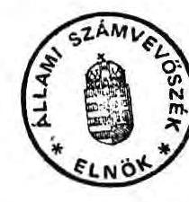
(Hagelmayer István )

---

Állami Számvevőszék
V-4-21/1992.

FÜGGELÉK ÉS MELLÉKLET
az IKARUS és Csepel Autó vállalatok együttes szanálásának és privatizálásának helyzetéröl

---

# FÜGGELÉK TARTALOMJEGYZÉKE 

## A VIZSGÁLAT RÉSZLETES MEGÁLLAPÍTÁSAI

1. Az ipari nagyvállalatok szanálásának elrendelése a Szanálási Megállapodás előkészítése, az abban foglaltak teljesítése 1.
1.1. A szanálási eljárás előzményei, az együttes szanálás elrendelése
1.2. A szanálás folyamata, a Szanálási Megállapodás előkészítése, tartalma 4.
1.3. A Szanálási Megállapodás elhatározott intézkedései, azok végrehajtásának helyzete 14.
2. Az IKARUS Karosszéria és Jármügyártó Váll. állami szanálása 20.
2.1. Az IKARUS Részvénytársaság megalapítása 20.
2.2. Az állami vállalat kötelezettségeinek átvállalása, az ennek megfelelő vagyon átadása (Az ÁVƯ Igazgatótanácsa által előirt feltétel teljesítése) 27.
2.3. Az IKARUS Jármügyártó Részvénytársaság müködése 37.
2.4. Az IKARUS állami vállalat helyzete a társaságalapítást követően 42 .
3. A Csepel Autó állami vállalat szanálása 44.
3.1. A két vállalat közötti szoros termelési kapcsolatból adódó, a szanálás elrendelésekor fennálló, illetve a szanálási folyamat során keletkezett vitás kérdések jelenlegi helyzete 49.
3.1.1. Az IKARUS állami vállalattal szembeni kétes követelések
3.1.2. Az IKARUS gyártással összefüggő készletek 50.
3.1.3. A Szeghalmi gyár átcsatolása, a gyártással összefüggő készletek sorsa

---

3.2. A Csepel Autó vállalat gazdasági helyzete 55.
4. Az IKARUS és Csepel Autó vállalatok folyamatban lévô szanálási eljárásainak átadás/átvétele a Szanáló Szervezet és az Állami Fejlesztési Intézet között

---

# A VIZSGÁLAT RÉSZLETES MEGÁLLAPÍTÁSAI 

1. Az ipari nagyvállalatok szanálásának elrendelése, a Szanálási Megállapodás előkészítése, az abban foglaltak teljesítése
1.1. A szanálási eljárás előzményei, az együttes szanálás elrendelése

A Csepel Autógyár 1990. február 15-én kezdeményezte a Fővárosi Bíróságnál az IKARUS felszámolási eljárásának meginditását, annak tartós fizetésképtelensége miatt.

A Csepel Autógyár ellen a Budapest Bank Rt. 1990. július 13-án indította a Fővárosi Bíróságnál a felszámolási eljárást.

A Bíróság mindkét szervezet tekintetében megállapította a fizetésképtelenség tényét, s megkereste a Szanáló Szervezetet, hogy kívánja-e a pénzügyminiszter a vállalatokat szanálni.

A 60-as évek közepén alakult ki az az iparpolitikai elgondolás, hogy a közúti jármúipart egy központilag támogatott jármüprogram alapján az ipar húzó ágazatává kell fejleszteni.
AZ IKARUS 1971-ig kizárólag önállóan állította elő a komplett autóbuszokat. Mikor termelése a $6000 \mathrm{db} / \mathrm{év}$ határt meghaladta, központi döntés alapján a Csepel Autó vállalat bevonásával bővítették a kapacitását.
Az államigazgatási döntést a buszgyártás növelése mellett az a körülmény is alakította, hogy a Steyr licencen alapuló diesel motorgyártás és a közepes kategóriájú tehergépkocsi szerelés KGST szakosításon alapuló megszüntetése miatt a csepeli kapacitások felszabadultak.

---

A buszok előállítási technológiáját megosztották; a gépészettel szerelt (őnjáró) padlóvázgyártást Csepelre telepítették, a karosszálás és végkikészítési műveletek az IKARUS vállalatnál maradtak. A profilírozási intézkedésekkel párhuzamosan végrehajtott fejlesztések eredményeként egy évi 20000 db elméleti gyártó kapacitás jött létre.

Az elmúlt időszakban a termékkibocsátási szám 1979-ben volt a legmagasabb; 13600 db komplett busz.

A közúti jármüiparág a központi forrásból végrehajtott technológiai rekonstrukció eredményeként igen jelentős szerepet töltött be a bruttó nemzeti termék termelésében; 1985-ben 10 \% volt a részaránya. Ennek egyharmadát az IKARUS termelése adta.
(Összehasonlításként az NSZK-ban a jármüipar részaránya 8 \%-os, Svédországban $5 \%$-os, s az iparosodó Dél-Koreában $4 \%$ )

Bár a két vállalat között a kapcsolatot nem a kölcsönös piaci érdekek, hanem felsőbb utasítások hozták létre, az IKARUS és Csepel Autógyár 1987-88-ig pénzügyi helyzetüket tekintve eredményesen müködtek.

Ez, az 1971-ben kialakított szervezeti struktura képezte a szanálás elrendelésekor is az autóbuszgyártás vertikumának alapjait. Az iparpolitikai koncepciónak megfelelő végtermékcentrikus autóbuszgyártás elsődleges felvevő piacai a KGST országai voltak.

Az itt bekövetkezett politikai változások (a két német állam egyesülése, a Szovjetúnió felbomlása) jelentős piaci változásokat hoztak magukkal:

- a NDK piac megszünt,
- a FÁK országok fizetőképes kereslete bizonytalan.

Az 1980-as évek végére mindkét vállalat pénzügyi helyzete jelentősen romlott:

- az IKARUS rövid lejáratú kötelezettségei jelentősen meghaladták követeléseit, vevői követelés állománya nem fedezte szállítói tartozásait, saját termelésű és vásárolt készleteinek magas szintje tovább rontotta likviditási pozícióit.
- a Csepel rövid lejáratú kötelezettségei meghaladták követeléseit, vevői követeléseinek állománya kétszeresére: nőtt, mivel az IKARUS nem fizette meg tartozásait.

---

A gépészettel szerelt busz padlóváz a busz értékének köze1 50\%-a. A Csepel Autógyár árbévételének mintegy $90 \%$-át az IKARUS biztosította. Az IKARUS fizetési problémái azt eredményezték, hogy a Csepel Autó sem tudta kötelezettségeit tel jesíteni.

Az ipari és kereskedelmi miniszter elöterjesztése alapján már 1990. junius 14 -én tárgyalta a buszgyártási vertikum helyzetét a Gazdasági Kabinet. Határozatot hozott a felszámolással járó jelentős állami vagyonvesztés elkerülésére, egy optimális állami intervencióra; a vertikum átstruktulására és a gazdasági je11emzők javítását követő privatizálásra.

A szanálási szándék kinyilvánítására irányuló bírósági megkeresés ugyan szeptember 10-én érkezett a Szanáló Szervezethez, az állami döntés előkészítését már korábban, augusztusban elinditották.

A Szanálási Tárcaközi Bizottság tagjainak augusztus 8-án megküldték az együttes állami szanálás elrendelésére vonatkozó döntése1őkészítő anyagot. A két vállalatot az állami vállalatokról szóló törvény, illetve a Vagyonügynökségről szóló törvény vonatkozó paragrafusai alapján az Állami Vagyonügynökség 2307/2 sz. határozatával 1990 augusztus 29-én államigazgatási felügyelet alá vonta.
(Az állami szanálásról szóló jogszabály szerint a Szanálási Megállapodás tervezetének aláírásához a testületi vezetéssel müködő állami vállalatok esetében a vállalat irányító testületének jóváhagyása szükséges. Így, az államigazgatási irányítás alá vonással a Szanáló Szervezetnek ez az egyeztetési kötelezettsége megszűnt.)

A két állami vállalat vezetőjének megbízását a Vagyonügynökség által kiadott levelek (2307/1/AVÜ/90., 2307/2/AVÜ/90.) úgy módosították, hogy "mindazon kérdésekben, amelyek a szanálást és a privatizációt vagy annak későbbi megvalósítását érinthetik csak a Szanáló Szervezet, 11letve az Állami Vagyonügynökség elözetes egyetértésével járhat el."

---

A Szanálási Tárcaközi Bizottság véleményének és a Gazdasági Kabinet állásfoglalásának figyelembe vételével a Szanáló Szervezet előterjesztette, s a pénzügyminiszter 1990. szeptember 12-én elrendelte a két vállalat együttes állami szanálási eljárásának megindítását.

# 1.2. A szanálás folyamata, a Szanálási Megállapodás előkészítése, tartalma 

Az IKARUS és Csepel vállalatok együttes szanálásának 1990. szeptember 12-i elrendelését követően a Szanáló Szervezet föállású munkatársát bízták meg a szanálási biztosi teendők el1átásával.

Az Állami Vagyonügynökség, az Ipari és Kereskedelmi Minisztérium, valamint a Szanáló Szervezet nyilvános nemzetközi versenytágyalást hirdetett a magyar közúti jármügyártás autóbuszgyártási vertikumának átalakítására. Az átalakítás célja, hogy teremtse meg a magyar közúti jármügyártásba szervesen illeszkedő, a világpiacon versenyképesen megjelenő hazai autóbuszgyártást.
Az ajánlati kiírás dokumentációját közel 20 vállalkozó csoport vásárolta meg, azonban a kezdeti érdeklődést követően a pályázat lezárásának időpontjáig mindössze négy értékelhető pályázat érkezett be:

- CEIC Holding Ltd által szervezett Szovjet Konzorcium (a továbbiakban: ATEX)kanadai-tajvani-szovjet közös ajánlat
- AMF Industries Inc. Associates (AMF) Kalifornia pályázata
- RÁBA Magyar Vagon- és Gépgyár ajánlata
- Pénzügykutató Rt. és Technoimpex Kereskedelmi Rt. közös pályázata

A Szanáló Szervezet a pályázatok elbírálásába bevonta a Price-Waterhouse szakértőit, s a pályázatok véleményezésében részt vettek az Ipari és Kereskedelmi Minisztérium és a vállalatok képviselői is. A magyar ajánlatokhoz képest a kül földi pályázatok nagyobb energiaráfordítással készültek, és koncepcionál isan kimunkáltabbak voltak. A bírálatok fôként a két külföldi pályázatot ütköztették, és a kanadai-tajvani

---

szovjet ajánlatot értékelték a kedvezőbbnek. Ez 170-180 mi11 ió USD készpénz és 50 millió USD értékủ apport, összesen 220-230 millió USD befektetését irányozta elő. Ebböl a tajvani-amerikai Ching-Fong Investment Company pénzügyi befektető 100 millió USD-t ajánlott, a fennmaradó részt az ATEX által képviselt szovjet konzorcium biztosította. (A szovjet konzorcium tagjai az Ukrán, Belorusz, Kazah és Üzbég Szállítási Minisztériumok, az Orosz Állami Szállítási Konszern, a Moszkvai Városi Szállítási Egyesülés, valamint az ATEX Külkereskedelmi Rt. A felajánlott apportot a Szovjetunióban kialakított busz értékesítési és szervizhálózat szakosított autójavító üzemek és oktatási-információs központok létesítményei képezték.)

A szovjet konzorcium 1991. évben 7-9 ezer db busz, 1992-ben 10-12 ezer, 1993-ban 13-15 ezer db busz világpiaci áron történő megvásárlását irányozta elő.
A többi ajánlatból hiányzott a gazdálkodás rövidtávú stabilizálását ígérő piaci háttér és a 100-150 millió USD befektetési előirányzatok is elmaradtak az ismertetett kondícióktól.

Az értékelhető ajánlatok számát tekintve e nemzetközi pályázat nem váltott ki megfelelő érdeklődést. Általánosítható tapasztalat, hogy a külföldi szakmai befektetők számára a magyar buszgyártási kapacitások értékét a volt szocialista, illetve szovjet piaci háttér, és annak fizetőképessége határozza meg.
A volt szocialista országokon kívüli piacokon az Ikarus eddig is konkurencia volt, így a magyar buszgyártás fenntartása és piaci terjeszkedése ezeknek a befektetőknek általában nem áll érdekében.

A nemzetközi pályázat eredményhirdetése 1990. december 20-án megtörtént. Ezt követően előterjesztés készült a Kormány részére az IKARUS-Csepel Autó együttes állami szanálásának és privatizálásának helyzetéről. Az előterjesztés megállapítja, hogy a két vállalat pénzügyi helyzete tovább romlott; az értékesítési lehetőségek beszűkültek, jelentős készárú készletek halmozódtak fel, a két vállalat így müködésképtelen.

---

Ennek alapján a Kormány az 1991. február 14-i ülésén hozott 3068/1991. sz. határozata (lásd 1. sz. melléklet) szerint

- a Kormány tudomásul veszi, hogy az IKARUS és Csepel Autógyár állami szanálása befejeződik (határidő: 1991. április 30. felelős: Szanáló Szervezet),
- a Kormány egyetért a két vállalat együttes szervezet- átalakításával; "a megmaradó részeket össze kell vonni egy új állami vállalattá", illetve egy ehhez kapcsolódó privatizációs folyamat elindításával. (határidő: 1991. április 30., felelős: a Szanáló Szervezet vezetője, az IKM és az ÁVÜ);
- felkéri a Gazdasági Kabinetet az autóbuszgyártás rövid és hosszú távú koncepciójának kidolgozására. (határidő: 1991. április 30., felelős: a pénzügyminiszter)

A szanálási folyamat azonban nem a Kormányhatározat által megszabott irányban haladt tovább, a feladatok az elöírt határidőkre nem teljesültek.

A két vállalat együttes szanálásának 1990. szeptember 12-i elrendelését követően a Szanáló Szervezet alapvető törekvése az volt, hogy a jelentős szállítási tartozások ellenére a kooperáló cégek szállítókészségét fenntartsa, a szanálással érintett vállalatoknál a termelés feltételeit biztosítsa. Az IKARUS és a Csepel. Autó Vállalat legnagyobb beszállítóival (közel 20 cégge1) október 10-én folytattak egyeztető tárgyalást az adósságállomány átütemezéséről, a folyó szállítások pénzügyi rendezéséről.
A pénzügyi intervenciók eredményeként - a vevőállomány mintegy $50 \%$-os növekedése mellett - tudták csak 1990. év folya mán a beszállítók együttmúködését, s a termelést fenntartani. A két vállalat a szerződésekben vállalt kötelezettségeit teljesítette.
Az IKARUS 1026 millió Ft veszteségge1, a Csepel Autó pedig 2 millió Ft nyereségge1 zárta az évet.
(A tárgyidőszakban a Csepel Autó-nak 480 millió Ft olyan követelése keletkezett, melyet az IKARUS-szal szemben peresített.)
Az IKARUS készáru készlete jelentősen megemelkedett; 600 db autóbusz ( 45 millió USD, azaz 3 milliárd Ft).
A szovjet fizetőkészség további romlása miatt a vállalatok általános válsága 1991-ben tovább mé lyült.

---

A Gazdasági Kabinet részére az autóbuszgyártás iparpolitikai koncepcióját is tartalmazó előterjesztést a Szanáló Szervezet állította össze.

Az előterjesztés a jövőbeni eredményes működés feltételeként külföldi befektető bevonását és a magyar tulajdon privatizálását, szerkezeti és szervezeti változást; a padlóváz és karosszálás, illetve az önhordozó karosszéria-gyártás egységes irányításának megvalósítását tűzte ki célul. A privatizációs javaslat a szovjet konzorcium ajánlatára épült.

Az előterjesztés 1. sz. melléklet "Iparpolitikai elgondolások a hazai autóbuszgyártó vertikum kibontakozására" iparpolitikai koncepcióból a következö kapacitás kihasználási peremfeltételek emelhetőek ki:
A Csepel Autó által müködtetett 2 padlóváz szerelő szalag, valamint az IKARUS-ban Budapesten és Székesfehérváron üzemelő - közel azonos kapacitású - $2 \times 2$ szerelő szalag elméleti kapacitása kétmüszakos munkarendet feltételezve, összesen 20 ezer db közepes minőségi kategóriába tartozó széria busz.

A szovjet, illetve volt szocialista országok fizetőképességének visszaesése miatt a tanulmány az éves rendelésállományt 6-7 ezer db-ra prognosztizálta, melyből 2800-3300 db/év szocialista piacon kívüli területekre kerül eladásra.

A tanulmány szerint az évi 4 ezer autóbusznál kisebb széria esetén a jelenlegi konstrukciójú termék gazdaságosan nem álltható elő.

Az önfinanszirozó módon művelhető 6000 db/év autóbusz értékesítés esetén is jelentős - a vertikumban foglalkoztatott közel 50 ezer főből 15 ezer fős -. létszámleépítéssel kell számolni.

Az IKM által készített iparpolitikai koncepciónak a várható éves buszkibocsátással kapcsolatos prognózisa arra utal, hogy a Szovjet Konzorcium ajánlatában szereplő buszrendelési előirányzatot (évi 6000 busz) az IKM már 1991. márciusában fenntartással kezelte. (Az éves szovjet exporttal kapcsolatban beigért akredítivek megnyitása rendre halasztódott.)

Az ipari és kereskedelmi miniszter, a pénzügyminiszter közösen e témakörben egy újabb előterjesztést terjesztettek 1991. áprilisában a Gazdasági Kabinet elé.

---

Ebben, az autóbusz gyártásra meghirdetett nemzetközi tendertöl függetlenül az IKARUS és Csepel Autó vállalatok likviditásának helyreállítására és privatizálására az egyik legnagyobb befektetési bank, a Merill-Lynch bevonását kezdeményezték. (A bankkal a Rába Magyar Vagon- és Gépgyár esetében azonos témakörben előrehaladott tárgyalások folytak.) A Ka binet az előterjesztést április 5-i ülésén megvitatta, és az IKARUS-Csepel Autó-Rába privatizálása tárgyában határozatot hozott a Merill-Lynch-el folytatandó tárgyalásra.

Figyelemmel a szovjet (tajvani) Konzorcium ajánlatának esetleges meghiúsulására, valamint a magyar tárgyalási pozíciók erősítésére április-júniusi időszakban a kormányzati szervek többféle elgondolás megvalósításán is munkálkodtak, puhatolódzó jellegű kezdeményezéseket tettek:

- Az IKM azt a megoldást képviselte, hogy a Csepel Autó-IKARUS vállalatokat első lépésben egy konszern típusú társasággá kell alakítani, majd második fázisban szakmai befektetőkkel kell a műszaki fejlesztést és struktúra feljavítását eszközölni. Felmerült az ágazat kutató intézetének (AUTKUT), valamint a MOGÜRT-nek a szervezeti vertikumba történő bevonása is.
- A PM-IKM közösen olyan pénzügyi befektető bevonására törekedett, mellyel a közúti jármú gyártást egységesen kezelve lehet az alágazat privatizációját lefolytatni. Bevonható pénzügyi befektetőként a Merill-Lych, a szovjet Konzorciumban is szereplő tajvani Ching-Fong, INV.-Comp., valamint a kaliforniai AMF Ind. Inch. cégeket vették számításba.
- A Szanáló Szervezet főként a szovjet (tajvani) Konzorciummal való szerződés előkészítését végezte, de megkereséseket intézett a Meryll-Lych, valamint a tenderen részt vett AMF és Technoimpex cégek felé is.

1991. április 26-án Budapesten a részvénytársaság létrehozására tárgyalások folytak a szovjet (tajvani) Konzorcium képviselöivel, melyen magyar részröl az ÁvÜ, IKM, MNB, Szanáló Szervezet képviseltette magát.

---

A tárgyaláson a Konzorcium képviselöi a társaság alapítási szándékukat megerősítve a cégalapítási határidők május 31-ig történő meghosszabbítását igényelték. Ekkor a szovjet felet képviselö ATEX már rendelkezett a társaságalapításhoz szükséges engedéllyel, valamint a befektetésre elöirányzott tökére vonatkozó bankgaranciával.
A magyar és tajvani fél azonban feltétlenül szükségesnek itélte, hogy az 1991-1995 évek közötti időszakra, évente minimálisan 5000 db autóbusz megrendelésére az ATEX biztosítson kormánygaranciát. Az igényelt garancia biztosítását az ATEX vállalta.

A tárgyaláson felvett "Emlékeztető" tartalma arra is utal, hogy a felek a szovjetek által garantált rendelést az éves termelés $60-70 \%$-át kitevő, kedvezményes árú, alapterhelésnek tekintették. A magyar és tajvani fél vállalta, hogy a termelés fennmaradó $30-40 \%$-át nem szovjet piacokon, világpiaci áron értékesítik.

Májusban a tajvani Chin-Fong cég kivált az ajánlattevö Konzorciumból. A távolmaradása vonatkozásában dokumentumok nem állnak rendelkezésre, így csak valószínüsithető, hogy ebben szerepe volt a szovjet fizetőképesség leromlásának, az esedékes akreditív-nyitások elmaradásának, az ezzel előidézett termelési fennakadásoknak. (De nem zárhatóak ki - az egyébként sokat hivatkozott - Tajvan, Kína és Szovjetunió közötti külpolitikai vonatkozások sem.)

A tajvani Ching-Fong cég kilépését követően a szovjet fél képviseletében eljáró ATEX megerősítette részvételi szándékát és elöirányozta, hogy a társaságalapításnál a kivált befektetö helyett is helytáll.

A tajvani cégnek a Konzorciumból történő kiválása nem csak azt jelentette, hogy egy 100 millió USD befektetését vállaló partner veszett el, hanem olyan tulajdonostársat kell nélkülözni,

---

aki ellensúlyozta volna a legnagyobb vevő társaságon belüli törekvéseit (árak leszorítása, szovjet gépészeti egységek beszállitásának eröltetése révén null szaldós forgalom közelitése). Egyben résztvett volna az IKARUS piaci terjeszkedésében, a termékválaszték korszerűsítést elősegitő műszaki fejlesztésében; a gépészeti hajtáslánc szükséges megújításában.

A tajvani cég kilépésével a Konzorcium által ajánlott kondíciók alapvetően megváltoztak. Ekkor mód lett volna a nemzetközi pályázat eredménytelenségének deklarálására, a visszalépéssel kapcsolatos biztosítékok érvényesítésére.

Az események a társaság alapításában érintett magyar szervek véleményét megosztották; az IKM részéről a szovjet fé1lel történő társaságalapítást illetően egy határozott ellenvélemény körvonalazódott.

Ennek ellenére a Szanáló Szervezet tekintettel a sürgető határidőkre, valamint az egyéb befektetőkkel folyó párhuzamos tárgyalások bizonytalan kimenetelère, továbbra is a szovjet Konzorciummal történő társaságalapítást támogatta.
1991. júniusában a Szanáló Szervezet, IKARUS és MOGÜRT Moszkvában tárgyaló képviselöinek Pavlov szovjet miniszterelnök kötelezettséget vállalt évi 6000 db busz megvásárlására.

Ezt követően a szovjet Konzorcium, a CEIC és a Szanáló Szervezet 1991. július 1-én megállapodást kötöttek most már az IKARUS Rt. közös megalapítására. Ez a megállapodás már nem a Kormány 3068/1991. sz. határozata szerinti, a két vállalat - a CSA és az IKARUS - együttes szanálását segíti elő.
Itt már csak az IKARUS sorsának rendezéséről van szó.
A társaságalapítás előkészítése során fokozatosan fe1erősödtek az IKARUS tartós piacvesztésére utaló momentumok: a nagy szériás szovjet rendelések elmaradása. Ez befolyásolta a létrehozandó buszgyártó társaságba bevonható - rendelésekkel terhelhető - kapacitások nagyságrendjét.

---

Az induló elképzelés szerint a létesítendő autóbusz gyártó társaságba be kívánták vonni a padlóváz-gyártással érintett csepeli kapacitásokat. Az éves buszkibocsátás 5-6 ezer db-ra csökkentett elöirányzata mellett az alváz és karosszálás területi összevonását, az IKARUS budapesti és székesfehérvári gyárai szerelő szalagjainak helyi kiszolgálását irányozták elő. Ekkor már a Csepel Autó kapacitásából csak a 4. sz. Szeghalmi Gyár átcsatolását tervezték.

A Szanáló Szervezet előkészítése alapján a Pénzügyminisztérium 1991. szeptemberében - egy évvel a szanálás elrendelése után - ismét beszámolt a Kormányülésen az IKARUS és Csepel Autó vállalatok szanálásának és privatizációjának helyzetéről; a 3068/1991. sz. Kormányhatározat teljesítéséről. A Kormány részére benyújtott Előterjesztés egyeztetése során az IKM véleményét csak részben vettek figyelembe, a véleménykülönbséget mintegy dokumentációs kérdéssé egyszerűsítve jelenítették meg.
("Az IKM álláspontja,hogy..." a kormány tel jes tájékoztatása csak e dokumemtumok bemutatásával történhet meg " A dokumentumokat a jogszabályilag illetékes szervek látták, jóváhagyták, lényegüket az előterjesztés tartalmazza, ezért nem tartom indokoltnak ezekkel terhelni a Kormány tagjait. "

Az IKM álláspontja azonban lényegi kérdésekben tért el a SzaIóná Szervezet által képviselt állásponttól:
" Az IKARUS - Csepel Autógyár privatizációs folyamatának legfontosabb tartalmi dokumentumai.... ismerete nélkül a szanálás lezárásának gazdasági indokoltsága és a privatizáció sikere nem állapítható meg. Ugyancsak elengedhetetlen azon megállapodás ismerete, mellyel az IKARUS állami vállalat az IKARUS részvénytársaságnak átengedi eszközeinek... egy részét, melyért cserébe a részvénytársaság átvállalja a volt IKARUS vállalat tartozásainak kifizetését....
a Tájékoztatóból nem állapíthatók meg azok a legfontosabb gazdasági mutatók, melyek a szanálási eljárás lezárását követően az IKARUS vállalat müködőképességét megnyugtatóan alátámaszt ják,"

---

A Szanálási Megállapodásnak azon részére, amely szerint a "Csepel Autógyár gazdasági társasággá való alakítása jelenti majd a vállalat helyzetének rendezését" is észrevételt tesz az IKM.
"A Kormány tel jesebb tájákoztatása érdekében szükséges lenne annak kimondása is, hogy a még csak szándéknyilatkozat formájában létező - privatizációs tárgyalások sikertelensége esetén a Csepel Autógyár szanálása eredménytelen lehet és azt feltehetőleg fel kell számolni."

Végezetül megállapítják, " a jelenlegi Tájékoztatóban foglalt privatizációs folyamat és ezen belül a Csepel Autógyár Szeghalmi gyáregységének az IKARUS-hoz való csatolása" nem tekinthető a 3068/1991. Kormányhatározat végrehajtásának ...

Hivatkozott IKM vélemény mindazon probléma megoldatlanságát előrevetíti, amely a szanálási eljárás ma tapasztalható, lezáratlan kérdéseit jelentik.

A Szanáló Szervezet azzal, hogy a szakmailag illetékes IKM véleményét nem vette figyelembe, az Elöterjesztésbe nem építette be, nem tette lehetővé, hogy a Kormány a realitásoknak megfelelően mérlegel jen és döntsön.

Az első, 3068/1991. sz. Kormányhatározat teljesítésének megítélésében az előterjesztők maguk is ellentmondásosan fogalmaznak:
" a Csepel Autó vállalatnál az állami szanálás az átalakulásig tart."
"A kormányhatározat ... végrehajtásra került, az együttes állami szanálás befejeződött, "

A Kormány 1991. szeptember 19.-i ülése hatályon kívül helyezte a tárgyban hozott első határozatát és felelősök és határidő megjelölése nélkül az alábbi, második, 3396/1991 sz. határozatot hozta (2. sz. melléklet):

---

A Kormány tudomásul veszi, hogy az IKARUS és a Csepel Autógyár együttes állami szanálási megállapodása aláírásra került, az IKARUS Rt alapítással megalakult, az IKARUS és Csepel Autógyár állami vállalatok megszüntetésre kerülnek.

E második kormányhatározat elött két héttel, 1991. augusztus 26-án, tehát a szanálás elrendelését követöen közel egy évvel írta alá az IKARUS Karosszéria és Jármügyár, a Csepel Autó Vállalat és a Szanáló Szervezet a Szanálási Megállapodást. /3. sz. melléklet/

Az állami szanálási folyamat lezárását jelentő Szanálási Megállapodás azonban a feltételek hiánya miatt nem lett volna aláírható. A Szanáló Szervezet - mint a szanálási folyamat irányításáért felelös szervezet - nem tett eleget jogszabályban elöirt kötelezettségeinek:

- a fizetőképesség helyreállítása, a gazdaságos müködés megteremtése vonatkozásában intézkedéseket nem tettek,
- a hitelezókkel az egyezségi tárgyalások lefolytatását nem kezdeményezték, az egyezségek megkötésére nem került sor. (A megkötött egyezmények a jogszabályi elöírások szerint a Szanálási Megállapodás kiegészítő okmányai.)

A tárgyban hatályos jogszabály szerint a Szanálási Megállapodás olyan érdemi lezárása a szanálási folyamatnak, amely rögziti a fizetőképesség helyreállításához, a gazdaságos müködés megteremtéséhez az egyes szervezetek kötelezettségeit, s azok elmulasztásának jogkövetkezményeit.

Ezzel szemben az aláírt Szanálási Megállapodás az általános célmegfogalmazáson túl ("az egyes egységek érdekeltséget növelni szükséges, a hitelezóktől átmeneti segítséget kell kapni") kiidézi a két hét múlva hatályon kívül helyezett, első

---

kormányhatározat szanálásra vonatkozó elveit, illetve erre alapozva további- a fizetőképesség helyreállítása szempontjából - általánosságban fogalmazott szervezeti intézkedéseket irányoz elő. /Szanálási Megállapodás 3. pont/

A szervezeti strukturát érintő módosítások azonban önmagukban nem jelentenek változást a fizetőképesség tekintetében.
A Szeghalmi gyár átcsatolása a két vállalat közötti vitás pénzügyi helyzethez csak még egy újabb adalékot szolgáltatott.

# 1.3. A Szanálási Megállapodás elhatározott intézkedései, azok végrehajtásának helyzete 

A következőkben áttekintjük az 1991. augusztus 26-án aláirt Szanálási Megállapodás "3. pont A fizetőképesség helyreállítása és a jövöbeni eredményes müködés feltételeinek biztosítása érdekében teendö intézkedések" fejezetében foglaltak teljesítését. (A hivatkozásoknál a Szanálási Megállapodásnak megfelelő sorszámozást alkalmazzuk.)

A 3. pont 3.1. alpontja az autóbuszgyártás fenntartásának szükségességét rögzíti.
A 3.2. alpont célul tűzi ki, hogy az autóbuszgyártás vertikumának müködését a hatékonysági szempontok figyelembe vételével új alapokra kell helyezni.
A 3.3. alpont a szervezeti átalakítás alapelvei között - hivatkozva a 3068/1991.(11.14.) sz. Kormányhatározatra - megállapítja:
"- a végszerelés-karosszálás - és alvázgyártás egy helyen történjen"
Ez az elhatározás azonban a hivatkozott Kormányhatározatban nem szerepel.

---

A Szanáló Szervezet ezzel, a Kormányhatározatra való utalással "legitimizálja" azt a már elhatározott intézkedését, hogy a közös autóbuszgyártó kapacitás létrehozása helyett, kizárólag az IKARUS kapacitásaira alapozva hozzák létre az IKARUS részvénytársaságot.

Az ily módon hivatkozott Kormányhatározat végrehajtására az alábbi intézkedéseket irányozták elő:
"3.31. Az IKARUS megszünteti a szegedi és a móri leányvállalatát." Az intézkedés végrehajtásának határideje az augusztus 26-án aláirt megállapodás szerint augusztus 31. A Szanálási megállapodás nem állapítja meg ennek pénzügyi helyzetre gyakorolt hatását.
Az IKARUS kötelezettségét úgy teljesítette, hogy a gazdálkodó egységek leányvállalati státusát megszüntette. A helyszini vizsgálat ideje alatt folyik a móri leányvállalat kft-vé alakítása.
" 3.32. A Csepel Autó vállalat a GEAR Rt önálló müködéséhez eladja a ... készleteket, állóeszközöket, ingatlanokat." Határidő: 1991. augusztus hó

A GEAR Rt. a Csepel Autó Vállalat, a MOGÜRT, a Budapest Bank és egy svéd magánszemély által alapított, Egerben működő részvénytársaság. A Csepel Autó Vállalat az állóeszközöket, ingatlanokat a társasági szerződés szerint - mellékszolgáltatásként - bérleti dij ellenében bocsátotta a GEAR Rt. rendelkezésére.

A Szanálási Megállapodás nem állapítja meg ennek pénzügyi helyzetre gyakorolt hatását.
Az elöirányzott feladat nem teljesült, mert a társaság külföldi tulajdonosa irreálisan alacsony vételi ajánlatot tett, s így a tárgyalásokat megszakitották.

A GEAR Rt ellen az APEH felszámolási eljárást kezdeményezet1, s a Heves megyei Bíróság 1991. december 20-i kelettel a fizetésképtelenséget megállapította. A 15 napos fellebbe-

---

zési határidő előtt a társaság külföldi részvényese lemondott a fellebbezésről és a bírósági határozat 1991. december 31-én (!) jogerőre emelkedett.

Ezzel párhuzamosan a Szanáló Szervezet vezetője egy 1991. december 31-i (!) keltezésű levélben értesíti a GEAR Rt igazgatóságát, hogy a Heves m. Bíróság a Szanáló Szervezetet jelölte ki felszámolóként. A Szanáló Szervezet által megbízott felszámolási biztos ugyanaz a személy, aki a Csepel Autó és IKARUS állami vállalatok együttes szanálásának szanálási biztosa is.
"3.33. Az alapító szerv - IKM - a Csepel Autógyár eszközeit átcsoportosítja - átcsatolja - az IKARUS vállalathoz. Az átcsoportosítandó vagyon nettó értéke mintegy 230 MFt."

A Szanálási megállapodásnak ez a pontja teljesült, de a tárgyban hozott államigazgatási határozat még ma is értelmezési problémákat vet fel, s csak tovább növelte a két vállalat közötti vitás kérdéseket.
(A Szeghalmi gyár átcsatolásáról a Jelentés Csepel Autó vállalatra vonatkozó fejezetében szólunk részletesen.)

A Szanálási megállapodásnak ez a pontja tér ki a fizetőképesség rendezésére: " a két vállalat közötti adósság rendezésének és az autóbusz gyártáshoz felhasználható anyagok, félkésztermékek, gyártóeszközök, stb. átadásának, megvételének módjára, ütemére külön megegyezés történik."

A hatályos jogszabály elöírásai szerint ez lett volna a Szanálási Megállapodás és "az együttes szanálási eljárás" alapvető feladata. Kétségessé teszi a megállapodás teljesíthetőségét, ha a vitás kérdések rendezését az ellenérdekü felek jövőbeni megegyezésére utaljuk.

---

3.3. Az IKARUS Rt megalapítása érdekében az IKARUS állami vállalat vagyonát egy külön megállapodás szerint az IKARUS Rt-be apportálja.
A kötelezettséget az alapítás tekintetében teljesítették. Az IKARUS Rt alapító okirata szerint a társaság 1991. augusztus 30 -án 11,5 milliárd Ft alaptőkével megalakult.

Az Rt alapítása nem az átalakulási törvény, hanem a társasági törvény szabályai szerint történt ; az alapító állami vállalat felszámolását a tartozások és eszközök átadásának lezárása után egy későbbi időpontra ütemezte a Szanáló Szervezet.

A Szanálási megállapodás 3.4 pontja szerint a Szanáló Szervezet a vállalatok müködőképességének fenntartásához, ... átmeneti segítséget nyújt 1,4 milliárd hitel biztosításával, és 3,5 milliárd Ft kezességvállalással, ill. 87 mFt . váltó garantálásával.

Az IKARUS állami vállalat 1345 eFt-ot kapott kölcsön címén, $25 \%$-os kamatra a Szanálási Alapból;

- 1990. szeptember 27-i megállapodással 800 millió Ft,
- 1990. december 21-megállapodással 45 millió Ft,
- 1991. február 8-i megállapodással 500 millió Ft.

Az IKARUS Rt a tartozásokat átvállalta, s szerződés szerint 1992 évben fizeti vissza.

A Csepel Autó vállalat 1,3 milliárd Ft összegủ hiteltartozása után készfizető kezességet vállalt a Szanáló Szervezet 1991. október 1-én. Ebből 1992. január 29-én fennállt a Budapest Bank felé $630 \quad 813,7 \mathrm{eFt}$.
Ezt a tartozását a Csepel Autó vállalat nem fizette meg határidőre.

A Budapest Bank a készfizető kezességet vállaló Szanáló Szervezethez igényét bejelentette, melyet az a szanálási ügyek folytatásával megbízott Állami Fejlesztési Intézethez továbbított.
A Szanáló Szervezet a Csepel Autó 100 millió Ft ÁVFB felé fennálló tartozása után is garanciát vállalt.

---

Az ÁVB Rt. a garancia igényét érvényesitette, promtinkasszóval követelését lehivta a Szanáló Szervezet MNB-nél vezetett Szanálási alap Céle1számolási számlájáról.

A Szanálási Megállapodás 3. pontjának befejező mondatai szerint "az IKARUS Rt megalapításával az IKARUS fizetőképessége helyreáll...
A Csepel Autógyárnál az állami szanálás a vállalat gazdasági társasággá alakulásával fejeződik be, mivel akkor teremtődik meg fizetőképessége és jövőbeni eredményes müködésének feltételei. "

A jogszabályi követelményeknek, a szanálási eljárás céljának, az ily módon határidő és felelős nélküli, jövöbeni célokat megfogalmazó Szanálási Megállapodás nem felel meg.

A Szanálási Megállapodás 4. pontja szerint az IKARUS és a Csepel Autógyár vagyonának kezelésére a Szanáló Szervezet kap megbízást.
E megállapodás folyamatos hatásköri bizonytalanságokat eredményezett, s jelent ma is, két évvel a szanálási eljárás megkezdése után. Különösen atekintetben, hogy a Szanáló Szervezet 1991. december 31-ével megszünt, s a le nem zárt szanálások ügyében az ÁFI lett a "jogutódja".

A Szanálási Megállapodás aláírását két héttel követő Kormányülésre készített előterjesztés szerint

- az IKARUS állami vállalat fizetőképessége és jövőbeni eredményes müködésének feltételei az IKARUS Rt. megalapításával létrejönnek. Az Rt vállalja a tartozások kifizetését, illetve a müködés finanszirozásának megteremtését.
- a Csepel Autógyár összes tartozása 1991. augusztus 26-án 4,5 milliárd Ft. A vállalat müködéséhez mintegy 1 milliárd Ft szükséges. Elismert követelése 2,1 milliárd Ft. A pénzügyi hiány 3,4 milliárd Ft.

---

Az elöterjesztök a nyilvánvaló, rövid távon nem megoldható pénzügyi egyensúlyi problémák ellenére úgy fogalmaznak "tehát van reális esély, hogy a pénzügyi egyensúly megteremthetö." Az előterjesztés záró gondolatai értékelik az első kormányhatározat végrehajtásának helyzetét.
Az értékelés azonban eltér az ellenőrzés tapasztalataitól, mivel az együttes szanálás nem az érvényben lévő jogszabályok maradéktalan betartása, s nem a kormány által jóváhagyott elvek szerint történt.

Az a megközelítés, miszerint az " együttes szanálás lezárható, az egyes állami vállalatok szanálása pedig a társasággá való átalakulással fejeződik be"- nem értelmezhető. Hiszen az együttes szanálást vagy sikerrel lezárták, vagy ha nem, akkor felszámolási el járásnak kell kezdödnie.
"Az állami szanálási eljárás meghiusul, ha nem jön létre megállapodás, illetöleg, ha a fizetésképtelen gazdálkodó szervezet és a hitelezök nem kötöttek egyezséget."
"Az állami szanálási eljárás meghiusulása esetén ismételt szanálási eljárásnak nincs helye." (79/1988. MT rendelet az állami szanálásról 8. §.)

Tárgybani előterjesztés elfogadását követően született második kormányhatározat (3396/1991. sz. Korm.h.) óta bekövetkezett események is alátámasztják azt a megállapításunkat, hogy a Szanálási Megállapodás a megismert előkészitettségi szinten nem volt aláírható.

Az Országgyűlés 1991. szeptember 24-ei ülésnapján elfogadta a "Csődeljárásról, a felszámolási eljárásról és a végelszámolásról" szóló törvényt. 1992. január 1-i hatályba lépésével az állami szanálás intézménye is megszűnt, mivel zárórendelkezései ezzel az időponttal hatályon kívül helyezik az állami szanálásról, s a Szanáló Szervezet működéséről szóló jogszabályt.

A pénzügyminiszter 35/1991. (XII.21.) rendelete; a folyamatban lévő szanálási eljárások befejezésével és a Szanálási Alap le-

---

zárásával kapcsolatos feladatokról 2. §-a szerint 1992 január 1. után a Szanálási Megállapodásban vállalt kötelezettségek teljesítésének figyelemmel kisérése az Állami Fejlesztési Intézet feladata.
2. Az IKARUS Jármügyártó Vállalat állami szanálása

Az 1990. szeptember 12-én elrende1t állami szanálást lezáró Megállapodást 1991. augusztus 26-án a Szaná1ó Szervezet, az IKARUS állami vállalat, a Csepel Autó állami vállalat aláirták. E megállapodás 3.3. pontjában foglaltaknak megfelelően létrehozták az IKARUS Részvénytársaságot.

# 2.1. Az IKARUS részvénytársaság megalapítása 

Az IKARUS Jármügyártó Rt. megalapításában érdekelt felek; az ATEX Külkereskedelmi Rt., a CEIC Holding Ltd, valamint a Szanáló Szervezet 1991. július 1-én Megállapodást írtak alá a társaságalapítás előkészítő feladatairól, és elfogadták a létrehozandó részvénytársaság szindikátusi szerződését. (Az alapítás-müködés szempontjából alapvető, ugyanazon a napon megkötött két dokumentum az egyes témaköröket átfedően tartalmazza, ezért az elemzést elsősorban a szindikátusi szerződésre alapozzuk.)

A szerződő felek a szindikátusi szerződésben megállapodtak, hogy a zártkörü alapítással 11,5 milliárd Ft alaptőkével hozzák létre a társaságot. Az alapítói vagyon megoszlása:

- Magyar tulajdoni rész:
$7851 \mathrm{MFt} \quad 68,3 \%$
$=$ IKARUS-Csepel Autó $\qquad$ 7000 MFt
$=$ további magyar befektetők
851 MFt
- Külföldi tulajdoni rész:
$3649 \mathrm{MFt} \quad 31,7 \%$
$=$ ATEX (USD készpénz)
$148 \mathrm{MFt}$
$=$ CEIC (USD készpénz)
$11500 \mathrm{MFt} \quad 100 \%$

---

A felek megállapodtak abban, ha az ATEX az alapításig további 3,5 milliárd Ft-nak megfelelő USD-t befizet, akkor az Rt. 15 milliárd Ft alaptőkével jön létre és ezzel az ATEX tulajdoni része 7 milliárd Ft-ra növekedik.Arra az esetre, ha a befektetendő tőke az ATEX-nek csak a társaságalapítást követően áll rendelkezésére, engedményezték, hogy tőkeemelés formájában szerezzen további 3,5 milliárd Ft értékủ részvényt.
A felek alapításhoz kapcsolódó kötelezettségeik között megállapodtak, hogy az Rt. magyar állami tulajdonából felajánlanak egy részt a társaság dologzóinak.A CEIC kötelezte magát, hogy az Rt. által kibocsátandó 50 millió USD értékủ - részvényre névértéken átváltható kötvény - eladását megszervezi.

A szindikátusi szerződés II/c. pontja rögzíti a magyar alapító 7 milliárd Ft nettó értékủ apportjának átadási módját, amely a könyvvizsgáló által igazolt, 1991. június 31-i leltárral alá-támasztott mérleg alapján történik. A megállapodás szerint az "apportlista két részből áll": ez az Rt. nyitómérlegéhez szükséges eszközökböl, valamint külön megállapodás alapján átadott eszközök és annak megfelelő szállítók, hitelek és kötelezettségek állományából.
A tárgyi apport része az IKARUS móri gyáregysége tel jes vagyonával. A felek kötelezik magukat, hogy az Rt. létrehozását követő 6 hónapon belül a móri gyárat önálló egységként megalapítják. A nem pénzbeni apportként bevitt móri vagyon érték 50 \%-nak megfelelő összegű (kb. 250 millió Ft értékű) részvényt, illetve üzletrészt a magyar állam térítésmentesen kap meg.

A szerződés III. fejezete tartalmazza a felek elövásárlási és vételi jogát. Megállapodnak, hogy az állami tulajdonban lévő részvények $24 \%$-ára - a magyar szándék kezdeményezése esetén a szindikátusi szerződést aláíró befektetőket az aláírástól számított 3 évig elövásárlási jog illeti meg.

---

A vételi jogosultságra vonatkozóan megállapodnak, hogy az alapításkori állami tulajdonban lévő részvények $50 \%$-ára a külföldi szerződő feleket a szindikátusi szerződés aláírását követő 1 év után 3 évig egyoldalú írásbeli nyilatkozattal gyakorolható vételi jog illeti meg. Az ATEX-et azonban csak akkor, ha "a szovjet megrendelések elérik a vállalt 6000 db/év autóbuszt és a megfelelö fizetési biztosítékok rendelkezésre állanak". "Az ATEX az elővásárlási és vételi jogának gyakorlásával együttesen sem szerezhet többségi részesedést."

A szerződés IV. fejezetében a jogutódlás kérdésében úgy állapodnak meg, hogy a Részvénytársaság az állami vállalatnak nem általános jogutódja, azonban az állami vállalat az őt megillető jogosultságokat (ideértve a vevőállományt is) a kötelezettségekkel összhangban ruházza át a részvénytársaságra. Az átruházásnál a pénzügyi egyensúly biztosítása szem előtt tartásával döntenek. Az átruházásra vonatkozó szerződést 60 napon belül készítik el.

A szindikátusi szerződés V. fejezetében szabályozzák a szervezeti kérdéseket, melyben többek között meghatározzák, hogy az Rt. 10 tagú igazgatósággal és 21 tagú felügyelő bizottsággal fog müködni. Szabályozzák a közgyűlés és igazgatóság hatáskörét, valamint a széles körben alkalmazott 3/4-es minősített többséghez kapcsolt döntési jogosultságot.

A garanciális szabályok (VI. fejezet) között szerepel, hogy alapításkor névreszóló részvényeket bocsátanak ki. Megjelenik a szovjet fél azon vállalása, hogy "a szovjet piacon értékesítésre kerülő termékek árát úgy határozzák meg, hogy az $20 \%$-os árbevétel arányos nyereséget tartalmazzon". Továbbá az, hogy az autóbuszok értékesítésének és alkatrész-kereskedelmi tevékenységének lebonyolítására a MOGÜRT-tel külön megállapodást kötnek.

---

A kivonatosan ismertetett 1991. július 1-ével keltezett szindikátusi szerződés megkötésénél szerződő félként magyar részröl csak a Szanáló Szervezet szerepel, azonban a szerződést az IKARUS és Csepel Autó akkori vezérigazgatói is aláirták.

Az 1991. július 1-én kialakított, másik megállapodás elsősorban a társaságalapítás előkészítésére irányult, azonban a társaság jövöbeli müködését megalapozó - a szindikátusi szerződésben nem szereplő - feladatokat is rögzít.

E megállapodásban a társaságalapítás célját - összhangban a nemzetközi pályázati felhívásban szereplő célkitűzésekkel az alábbiak szerint rögzítik:
"- a piac hosszútávú biztosítása, az autóbuszok világpiaci áron történő értékesítése

- Rt. alapítása, külső források bevonásával
- az autóbuszok gyártásában élenjáró technikai szint elérése, környezetkímélő és környezetbarát technológiák telepítése
- a munkavállalói létszám megtartása
- jelentős tisztajövedelem megteremtése,
- a magyar nemzetgazdaság egyik meghatározó ágazatának, a közúti jármügyártásnak és ennek domináns termékének az autóbusz gyártásnak a gazdaság húzó ágazatává tételével versenyképessége és jövedelemtermelö képessége növelése."

A megállapodás IV. fejezete a létrehozandó társaság müködését hosszabb távra megalapozó műszaki fejlesztési feladatokat tartalmazza. Ennek 1. pontjában a felek megállapodnak a fejlesztési feladatok megvalósításához szakmai (stratégiai) befektető bevonásában. Erre nemzetközi pályázatot szándékoztak kiírni 1991. szeptember 30-ig.
A 2. pontban a műszaki-fejlesztés alapvető céljaként a termelési és piaci szerkezet diverzifikálását, új termelési profilok és új autóbusz-típusok fejlesztését jelölték meg.

A megállapodás garanciális szabályai között a felek megegyeznek abban is (V/2. pont), hogy "amennyiben valamelyiküknek felróható magatartása miatt meghiusul a társaság alapítása, akkor e fél kártérítési általányként 1 millió USD-t köteles a többi - e szerződést aláíró félnek - megfizetni.

---

Végezetül a megállapodás V/9. pontjában - visszatérő jelleggel - azt rögzítik, hogy "a jelen megállapodás aláírásával a felek kötelezettséget vállalnak a Részvénytársaság - 60 napon belül történő - e szerződés szerinti megalapítására".

Az IKARUS Jármügyártó Részvénytársaságot az alapítók által magánjogi szerződésekbe foglalt kondíciókkal 1991. augusztus 30-án 11,5 milliárd alaptökével alapították meg.

Az Állami Vagyonügynökség Igazgatótanácsa 1991. augusztus 28-i ülésén tárgyalta meg az IKARUS Rt. végleges alapítási kondícióit és az engedélyét egy tartozásátvállalási szerződéskiegészítési feltételhez kötötte.

A társaság megalapításához a Magyar Hitel Bank Rt. 500 millió Ft készpénzzel, a MOGÜRT 300 millió készpénz és 51 millió Ft értékú apporttal, összesen 851 millió Ft-tal járultak hozzá.
(Két új befektető belépése nem változtatta meg a szindikátusi szerződésben elöirányzott alapítói tőkét, csak a magyar alapítókra előirányzott tőkerészt töltötte fel.)

Az alapítók a társaság törzstőkéjéhez vállalt készpénzbefizetést teljesítették:

- ATEX
3.500 millió Ft értékủ USD-t
- CEIC
149 millió Ft értékủ USD-t
- MHB
500 millió Ft készpénzt
- MOGÜRT
300 millió Ft készpénzt

Összesen: $\quad 4.449$ millió Ft-ot
A 7.051 millió Ft értékủ apport rendelkezésre bocsátását a magyar alapítók a következő formában biztosították:

- A MOGÜRT a tulajdonában lévő, az "IKARUS védjegy" kizárólagos használatával kapcsolatos jogosultságát 51 millió Ft értéken adta át.
- Az IKARUS Állami Vállalat 7 milliárd Ft értékủ tárgyi apportot bocsátott a társaság rendelkezésére, mely a vállalati központ, budapesti, székesfehérvári, kiskunhalasi,

---

móri, szegedi és szeghalmi (Csepel Autó volt IV. sz. gyáregysége) gyárainak üzemi földingatlanából, állóeszközeiböl és gyártóeszközökböl tevödött össze.

Könyvvizsgálói vagyonértékelést csak a könyvekben értéken nem szereplő földingatlanokra vonatkozóan készítettek, s értékét 1.580 millió Ft-ban határozták meg.

Az alapítók az apportjegyzéket, a bevitt vagyonelemek értékét elfogadták.

Az alapító okirat és társasági alapszabály 1991. augusztus 30-i aláírásával az alapítók - főként az ÁvÚ engedélyezési feltételének teljesítésére - egy, a szindikátusi szerződésben foglaltakat kiegészítő megállapodást is megkötöttek (lásd.4. sz. melléklet).

A cégalapítási dokumentációk - az alapító okirat, társasági alapszabály, a mellékletként csatolt kiegészítő megállapodás, valamint az apportjegyzék - aláírási rendje azonos. Ezeket az IKARUS Állami Vállalat részéről a Szanáló Szervezet vezetője és a vállalat vezérigazgatója, a további két belföldi, valamint két külföldi alapító részéről képviseleti jogosultságal rendelkező személyek (vezetők) írták alá.

Az IKARUS Jármúgyártó Rt. alakuló igazgatósági ülését 1991. szeptember 2-án tartották, melyen megválasztották a 10 tagú Igazgatótanácsot ( 5 fő a magyar alapítót képviseli), továbbá a 21 fős Felügyelő Bizottságot.

A Fővárosi Bíróság a 01-10-041 számon 1991. november 7-i végzésével jegyezte be a cégnyilvántartásba az IKARUS Jármügyártó Részvénytársaságot.

A társaság megalapítása tehát 1991. augusztus 30-ával megtörtént. A társaságalapításra előirányzott rövid, 60 napos átfutási időt az alapítók teljesítették. Az alapítást föleg a szov jet fél sürgette, valószínűleg a bankgaranciája meghosszabbításának elkerülése érdekében.
Az önkormányzati tulajdonlással kapcsolatos törvénymódosítások miatt, ha az alapítás szeptember 1. után történik - a földtulajdon szerint illetékes önkormányzati egyeztetések következté-

---

ben tranzakció idöszükséglete több hónappal meghosszabbodott volna. Ezt, sem a szovjet fél, sem az IKARUS nem vállalta. A társaságalapítás augusztus 30-i időpontja egyúttal azt is eredményezte, hogy a társaságban az érintett önkormányzatok nem lettek tulajdonosok. Ezzel a körülménnyel mind az alapítók, mind a vagyonvédelmi törvény alapján eljáró - a tranzakciót engedélyezö - ÁVÜ tisztában volt.

A külföldi alapító partner kiválasztásánál jelentős szempont volt a szovjet fél által vállalt $6000 \mathrm{db} / \mathrm{év}$ buszrendelésének vállalása, melynek biztosítását a szindikátusi szerződésben is rögzítették. A cégalapítás július 1-jei elhatározásakor megkötött magánjogi megállapodásban szereplő társaságmüködtetési feltételek teljesülése egy új növekedési pályára állíthatta volna a részvénytársaságot. Ez azonban nem következett be, mivel az előirányzott szovjet, illetve FÁK rendelések nem teljesülnek, a társaság gazdálkodási eredményei a rendelések elmaradása miatt folyamatosan romlanak. A kialakult helyzetben a szindikátusi szerződésnek azon vonatkozása, mely az ATEX további részvényvásárlási jogát a megrendelések teljesítéséhez köti - hatásában gyenge biztosítéknak tünik. Az állami tulajdon külföldi alapító általi kivásárlási jogosultsága ez év július 1-jétől nyílik meg. Az ATEX befektető helyzete és szándéka nem ismert, de egyes momentumokból arra lehet következtetni, hogy további IKARUS-részvény vásárlása nem áll szándékában. (Erre utal, hogy igérvenyei ellenére a társaság alapításához csak minimális befektetéssel járult hozzá, és ezidáig tőkeme lést sem kezdeményezett. A móri társaságalapításban történő részvételtől a közelmúltban visszalépett).

A müködés szempontjából meghatározó szovjet, ill. FÁK rendelések elmaradása kihasználatlan kapacitásokat, súlyosbodó gazdálkodási problémákat eredményez, melynek hatására a társaságban müködő vagyon leértékelődik. Ilyen körülmények között illuzorikus a pótlólagos tőkebevonás kapcsán korábban elhatáro-

---

zott 50 millió USD értékű - részvényekre váltható - kötvény kibocsátása, melyet ezidáig nem is kezdeményeztek. Hasonló okokból az átfogó korszerűsítést és piaci diverzifikációt elősegítő szakmai befektető bevonására irányuló nemzetközi pályázatot sem indították. A gazdálkodási tendenciák megváltoztatására, a társaság új növekedési pályára állítására irányuló és eredményt ígérő munkálatok - egy külföldi cég által végzett átvilágítás kivételével - ezideig nem bontakoztak ki. (A MERCE DES céggel - mint lehetséges szakmai befektetővel - tárgyalások vannak folyamatban. A tárgyalások eredménye és ennek hatása a közúti jármű alágazat, illetve IKARUS Rt. helyzetére a jelenlegi tárgyalási szakban még bizonytalan.)
2.2. Az állami vállalat kötelezettségeinek átvállalása, az ennek megfelelö vagyon átadása
(Az AVÜ Igazgatótanácsa által előirt feltétel teljesítése)

Az IKARUS állami vállalat társaságalapítása, az IKARUS Rt létrehozása folyó termelés mellett történt.
A Szanáló Szervezet vezetője 1991. szeptember 2-án a korábbi gazdasági igazgatót bízta meg az apport átadását, a létszám áthelyezését követően megmaradt - vagyonkezelési feladatokat ellátó - állami vállalat vezetésével. (A részvénytársaság ugyanezen napon tartott alakuló igazgatósági ülése az IKARUS addigi vezetőjét választotta meg az Rt vezérigazgatójának.)

Az állami vállalat vezetőjének megbízó levelében feladatait az alábbiak szerint határozták meg:
"- az IKARUS Karosszéria- és Jármügyár vagyonának (eszközök és tartozások) átadása az IKARUS Rt-nek

- az IKARUS Karosszéria és Jármügyár érvényes szerződéseinek cedálása az IKARUS Rt-re,
- az IKARUS Karosszéria és Jármügyár 1991. évi mérlegének el készítése, az ezzel kapcsolatos APEH vizsgálat lefolytatása,
- az IKARUS Karosszéria és Jármügyár megszüntetése ". (Mivel a szanálás az állami vállalat felszámolásával zárul le.)

---

Az állami vállalat megbizott vezetöje köteles volt a vagyont jelentösen befolyásoló döntéseit a Szanáló Szervezet vezetőjével egyeztetni.

A részvénytársaság létesítésekor az alapítók jóváhagyták a szindikátusi szerződést kiegészítő megállapodást, me1y szerint az állami vállalat az alapítással egyidejűleg a társaságnak átadja az apportlistában nem szereplő - mintegy 16 milliárd Ft értékủ - tartozást és az ennek megfelelő eszközöket.

Erre vonatkozóan az AVÜ társaságalapításra vonatkozó egyetértő levele is tartalmaz elöirást :
" A részvénytársaság megalapítására vonatkozó engedély csak azzal a szerzödéskiegészítéssel érvényes, melynek értelmében a társaság átvállalja a társaság tevékenységével összefüggö valamennyi kötelezettséget és birtokolja az ennek megfelelő vagyont."

Az Állami Vagyonügynökségnek bemutatnak ennek alátámasztására egy kölcsönösen elfogadott - aláirt - az 1991. junius 30-i állapotot tükröző ( mérleg hivatkozások nélküli, de a mérleg tagolását követő ) listát 15999116 eFt egyező eszköz és forrás értékben. (Lásd 4. sz. melléklet !)
A 1istához füzött megjegyzések 2. pontjában kimondják : "Azok az anyagi javak, amelyek a 10., 12/a., 12/b. pontokban szerepelnek teljes mértékben átadásra-átvételre kerültek az állami vállalattól az Rt. részére a mellékletekben feltüntetett, elfogadott értékben."
10. = apport I.-ben nem szereplő állóeszköz 17.781 eFt értékben
12/a. = apport I.-ben nem szereplő telek érték 45932 eFt értékben
12/b. = apport I.-ben nem szereplő szellemi vagyon 1.032 .000 Ft értékben.

---

A vállalatnak már ez a viszonylag korai megállapodása " értelmezi" az AVÜ engedélyt; az átvállalást adás-vételként kezelıék, s folyamatos egyezkedésbe kezdtek a föösszegében is változó tartozás és eszköz átvállalás tekintetében.

Az átadás-átvétel idöben elhúzódott, teljes egészében még most sem tekinthető 1ezártnak.

A megállapodásokat három szerződési fázisban: 1991. november 20-án, november 25-én és 1992. február 13-án kötötték.

A három szerződés keretében átadott tartozás és eszköz állományok - a vállalat és a részvénytársaság közötti szóhasználatban az Apport II. - értéke menetközben változott, ill. értéküket az augusztus 30-i alapítási idópontra vezették vissza.

A társaságba bevitt apportban temelési készletek nem szerepe1tek, a cégbejegyzésig a társaság a számlapénzzel nem rendelkezett, hitelhez nem tudott jutni.
A szindikátusi szerzödés elviekben lehetöséget adott az állami vállalatnál lévő eszközök igénybevételére, az első vagyonátadási megállapodást azonban csak november 20-án kötötték.

Az átmeneti időszak termelés finanszirozását - különbözö egyedi megoldásokkal - az állami vállalat látta el, illetve jelentős mértékben segítette.

Az állami vállalat alapvető feladatát képező tartozás és vagyon átadás teljesitése során több probléma is felmerült:

- miután az eszközök átadását " adás-vételként " kezelıék, ez jelentős ÁFA kötelezettséggel járt (megjegyezzük, hogy az átvevő részére ez ilyen összegü ÁFA visszaigénylési lehetöséget jelent), ugyanakkor az átvevő a kötelezettségek átmeneti finanszirozásához forrásokkal nem rendelkezett,

---

- a tartozások átvállalását a szállitókkal, ill. a hitelezókkel egyeztetnie kellett,
- a gazdasági társaságokban lévö tulajdon hányadainak átadását egyeztetnie kellett a társtulajdonosokkal (az egyeztetés még nem zárult le).

Ezek az elöre nem fel mért nehézségek abból a tényböl következtek, hogy a részvénytársaság nem átalakulással, hanem alapítással jött létre.

A tartozások - eszközök átadás-átvételének már említett három megállapodás szerinti értékét a vállalat által rendelkezésre bocsájtott 5. sz. melléklet tartalmazza.

Az eszközök és források értéke egymással egyezően 15.144.030 eFt. Ez összértékét tekintve is eltér az AVÜ-nek bemutatott 15.999.116 eFt-tól, de az időbeni elhúzódás miatt összetételében is jelentősen változott.

A szerződéskötés három szakaszához igazodóan

- az első ütemben 12843230 eFt
- a második ütemben 319656 eFt
- a harmadik ütemben 1981144 eFt
értékű tartozás és ennek megfelelő eszköz átadásáról állapodnak meg.

A megállapodásokat a Szanáló Szervezet irányította, a becsatolt megállapodásokat az AVÜ tudomásul vette.

Tekintettel az elidegenítésre kerülő állami vagyon jelentős volumenére, valamint a választott megoldásban rejlő bizonytalansági tényezőkre, a cégalapítást irányító Szanáló Szervezet nem járt el kellö gondossággal az állami tulajdon védelmében.

---

Elvárható magatartás lett volna, hogy a vagyonátadást zárómérleg készítéséhez kösse, annak elkészítését, és a vagyon átadást-átvételt - ez alapján a Vagyonügynökség által megfogalmazott feltétel teljesítését - folyamatosan figyelemmel kísérje, ellenörizze, valamint a könyvekben értéken nem szereplő vagyonelemek tekintetében szakértöi értékbecslést készítessen.

A kényszerítő körülmények között - a Szanáló Szervezet felelős aktív irányítását nélkülözve - az állami vállalat és a társaság vezetői a termelés folyamatosságának biztosítása, az átadás-átvétel lebonyolítása érdekében különböző megoldásokat alkalmaztak:

- A társaság alapításához csatlakozó két belföldi befektetö készpénz hozzájárulását, összesen 800 millió Ft-ot - MOGÚRT 300 millió Ft, MHB 500 millió Ft - az állami vállalat számlájára fizette be. A részvénytársasághoz az összeget nem utalták tovább.

Kérésünkre az állami vállalat megbízott vezetője és a társság pénzügyi igazgatója közös nyilatkozatot tett, miszerint "az IKARUS Jármügyártó Rt... nem banki átutalással kapta meg az alapítás alkalmával az Rt részére befizetett... 800 millió Ft-ot." Tájékoztatásuk szerint azt a tartozások kiegyenlítésére forditották, az Rt müködtetésére használták fel.

Erre utal az állami vállalat vezetőjének a Szanáló Szervezet vezetője részére készített 1991. október 5-i jelentésének 2/f. és g. pontja :

- az MHB az 500 millió Ft-os befektetését átutalta, ebböl 500 millió Ft hitel azonnal visszafizetésre került
- az állami vállalat az Rt gazdálkodásához 324 millió Ft hitelt felvett.

Az első, 1991 november 20-1 megállapodásban az átadott tarto-zások-eszközök együttes, azonos értéke 12.843 .230 millió Ft. Az

---

eszközök között átadják a pénzeszközöket, az értékpapírokat, a belföldi és külföldi vevők, a befejezetlen termelés, az anyagok teljes állományát, valamint a késztermék állomány egy részét (a teljes 2,1 milliárd Ft értékủ készletböl 1,7 milliárd Ft érküté készletet.)

Az ezzel egyezö kötelezettségek között átadják a rövid lejáratú forgóeszköz hiteleket, a belföldi, s külföldi szállítóállományt, a beruházási hiteleket, valamint az 1991. augusztus 30-i zárásban nem szereplő, korábban keletkezett kötelezettségeket 1,07 milliárd Ft értékben, s a hosszú lejáratú hitelek egy részét.
(Az 1991. augusztus 30-i fökönyvi kivonatban nem szereplő kötelezettségek - az Rt pénzügyi vezetőjének nyilatkozata alapján összeállított - tételes listáját a 5. sz. melléklet tartalmazza.)

A második, november 25-i megállapodás részben pontosítja a november 20-i megállapodást az abban érintett minden eszköz és forrás elem tekintetében, részben ennek alapján további eszköz és forrás elem kerül átadásra egymással azonos, 319.655 eFt értékben. (lásd 6.sz. melléklet I., II. oszlopa.)

A két megállapodás csak együtt értelmezhető, mintahogy a megállapodások AVÜ-höz jóváhagyásra történt beküldése is együtt történt. (A vállalat 3-1149/91.sz levele 1991. dec 23.)

Az eszközök között egyéb tételek mellett ekkor kerülnek átadásra a részvények, a gazdasági társaságokban lévő vagyoni betétek, valamint az AVÜ-nek a társaságalapításkor jóváhagyásra benyújtott táblázaton 10., illetve 121 a. sorszámmal szereplő megállapodás szerinti értéken átkerülő -

- jóléti állóeszközök, ill.
- apportban nem szereplő telkek.

---

A jóléti eszközök átadása
Az átadott jóléti állóeszközök könyvszerinti nettó értéke az IKARUS vállalat által becsatolt lista alapján 183.535 eFt. Az átadás-átvételi megállapodásban az eszközök között 17.781 eFt értéken, vagyis a könyvszerinti nettó érték kevesebb mint $10 \%$-ában (!) veszik figyelembe:
A vállalat tájékoztatása szerint az átadási érték meghatározásának alapjául "a nettó érték $10 \%$-a" megállapodás szolgált. A 7. sz. mellékletben példaként hozott tételeknél nem jelenítettük meg mindenhol a $10 \%$-os értéket, logikáját követve azonban megállapítható, hogy az IKARUS központi épületével szemben lévő művelődési házat 134.351 Ft-ért, a Zamárdi üdülőt a hozzátartozó gazdasági épülette1 215.560 Ft-ért, lakásokat 1.031, 4.503 Ft , illetve 5.224 Ft -ért "adtak el" mint állami tulajdont a vegyes tulajdonú társaságnak.

Az apportban nem szereplő földingatlanok átadása
Az IKARUS kezelésében lévő, a társaságalapításkor az apportban nem szereplő földingatlanok értékét a fajlagos földingatlan értékek figyelembe vételével összesen 459.324 eFt-ban határozták meg. (Lásd 8. sz. melléklet)
Az átadás-átvételnél ennek $10 \%$-ában, azaz 45.932 eFt-ban rögzítették a tartozások kompenzálására figyembe vett értékét.
Ezen az értéken átadnak :
terület rendeltetése terület $\mathrm{m}^{2}$
1akóépülethez 5098
/Bp.XVI.k. /
múvelődési ház
19712
/Budapesten és Szfehérváron/
sporttelep
12184
/Bp. XVI.k. /
óvoda
8251
/Bpesten és Szfehérváron/
munkásszálló
2060
üdülő
52755
/Zamárdiban,Bbogláron,Bfüreden, Csopakon, Fehérvárcsurgón/
Összesen 104665 m 2 területet.
Átlagot számítva ez $439 \mathrm{Ft} / \mathrm{m} 2$ telekárnak felel meg.

---

A vagyonelemek ilyen, a tényleges piaci értékhez viszonyitva alacsony értékú átadása azonban jelentös gazdálkodási tartalékot jelent a magyar állami tulajdon sérelmére az alapításkor is már $32 \%$-ban külföldi tulajdonú társaság számára.
Jelentösen sérti az állami vagyon védelmének, értékmegőrzésének elvét, indokolatlanul leértékeli az állam vagyonát.

Nem vitatjuk,hogy a Vagyonügynökségnek bemutatott összevont táblázaton (lásd 4. sz. melléklet!) ezek az összevont értékek szerepeltek, s az a megjegyzés is ott található, hogy nem könyvszerinti értéken, hanem "a mellékletben feltüntetett elfogadott értékben" adják át ezeket a vagyonelemeket.
Az IKARUS Rt alapítói és az állami vállalat 1991 augusztus 30-i megállapodása, melyet az állami vállalat képviseletében a Szanáló Szervezet vezetője is aláí, azonban az átadandó tartozások/eszközök csak nagyvonalú meghatározását adja. Az átadások/átvételek időbeni elhúzódása a keretszámok tartalmának és értékének állandó módosítását eredményezi; s az állami vállalat és a társaság közötti folyamatos egyezkedéshez vezet. Ezek az adás/vételi tárgyalások azonban úgy zajlanak, hogy az állami vállalatot a vállalat volt gazdasági igazgatója, a társaságot az állami vállalat volt vezérigazgatója képviseli. A személyek képviseleti jogosultságát nem vitatjuk, de megitélésünk szerint az érdekeik egybeesőek. A Szanáló Szervezet legalábbis aláíró félként - ezeken a tárgyalásokon nem vesz részt.
Azzal, hogy a vállalat vezetőinek tevékenységét úgy szabályozták, hogy " mindazon kérdésekben, amelyek a szanálást, a privatizációt érinthetik az AVÜ, illetve a Szanáló Szervezet előzetes egyetértésével járhat el, egy sajátos felelősség megosztás alakult ki.
A jóváhagyott keretszámok mintegy "szentesítették " azok részletező tartalmát, s a fentiek szerinti vagyonelemek aránytalan értékeléséhez és átadáshoz vezettek.

---

Az IKARUS állami vállalat 1991. szeptember 9-i levelében az átadás-átvétel lebonyolítása tekintetében APEH állásfoglalást is kért. Az állásfoglalás rögzíti, hogy az átadás keretében a vagyonelemek átértékelésére nincs lehetőség.

Ezek az értékelések összességében egy olyan variációs lehetőséget biztosítanak, hogy az "állandó" tartozásállomány mellé változó összetételű, értékủ eszközállományt (vagyont) rendelhet tek.

A szanálási biztos, a Szanáló Szervezet nem követte, nem ellenörizte az állami vagyon védelmének megfelelö mértékben ezeket a megállapodásokat.
A Szanáló Szervezet vezetője az ÁF1-t a szanálási ügyek átadásakor 1992 januárjában úgy tájékoztatta, hogy az eszközök/tartozások átadás - átvétele megtörtént.

A harmadik, 1992. február 13.-i megállapodást az állami vállalat és a társaság a vagyonátadási/átvállalási kötelezettség lezáró dokumentumának tekintik.
A megállapodás önmagában zárt konstrukciót rögzít, értelmezése azonban csak a korábbi 1991. nov. 20-i és nov. 25-i megállapodásokkal együttesen lehetséges. (5. sz. mellékletként csatolt táblázat III. oszlop.)
A szellemi termék, a vagyoni betét és késztermék átadása ellenében kubai, angolai, mozambiki kinnlévőségeket refinanszírozó - a MOGÜRT és Hungarian Bus export által felvett - hitelek 1991. augusztus 30-a után esedékes törlesztési és kamatfizetési kötelezettségeit adta át, (illetve az Rt. lépett be készfizető kezesként) 1.981 .144 ezer Ft értékben. Az IKARUS állami vállalat külföldi - nagyrészt behajthatatlan - követeléseinek 1991. december 31-i állományát a 9. sz. melléklet tartalmazza. 1991. december hó során az állami vállalat - vonatkozó MNB engedély birtokában - már 8 millió USD és 8 millió DM nem kubai követelésének leértékelését megtette. Ennek kiha-

---

tásaként kb. 500 millió Ft vesztesége keletkezett. A kubai export kinnlevőségek leértékelését szintén kezdeményezték, ebben azonban devizahatósági állásfoglalást még nem kaptak. (A kubai követelések leírásának kihatása kb. 2 milliárd Ft veszteség.)

A közel 2 milliárd Ft export refinanszirozási hitel átvállalása ellenében a következő eszközöket adták át:

- Az IKARUS Vállalat szabadalmait és teljes know-how-ját (konstrukciós és gyártási dokumentációk, el járások és software termékek, stb.) 1032 millió Ft értékben. A vállalat könyveiben értéken csak a vásárolt software termékek szerepeltek. A szellemi termékek értékelését az átadás-átvételt bonyolító felek szakértői értékelés nélkül egymás közti megállapodásban rögzítik. A megállapodás szerint a szellemi termékek ellenértékét az állami vállalat csak 1992. április 21 -én számlázza és akkor kerűl a társaság birtokába. (Értelemszerűen az átadással érintett szellemi javakat az Rt. már megalakulásától, 1991. augusztus 30.-tól kezdődően - díjfizetés nélkül - folyamatosan használta).
- Egy 610 millió Ft összegű elkülönített betét, amelyet az iráni export teljesítés garanciájaként az MHB-nál helyeztek el. A megállapodás az engedélyezést 1991. november 15. napjára - visszamenőleges hatállyal rögzíti.
(Ilyen értékủ betét sem az állami vállalat, sem a részvénytársaság évvégi mérlegében nem szerepel. Hasonló anomáliákra utal az 1991. november 25-i megállapodás 11. pontja, mely szerint az értékpapír-állományt 1324 millió Ft értékben adják át, de a felek kölcsönösen tudomással bírnak arról, hogy ténylegesen csak 400 millió Ft értékủ, a Dunabank Rt.-nél elhelyezett betét áll csak rendelkezésre.)

---

- Az állami vállalat a vagyonátadási müveletek lezárásaként átad 105 db kész buszt, mellyel a kezdeti több mint 600 buszból álló késztermék-állományát számolja fel.

Az 1992. február 13-i megállapodásban végül a felek (az állami vállalat megbizott igazgatója - mint átadó, továbbá a részvénytársaság vezérigazgatója - mint átvevő) megállapítják, hogy "a részvénytársaság alapítása során előírt kötelezettség átvállalását és az ezzel egyenértékủ vagyonátadást kölcsönösen teljesítették."

Az IKARUS Jármügyártó Részvénytársaság 1991. augusztus 30-ával folyó termelés mellett, likvid pénzeszközök és termelési készletek nélkül alakult meg. A termelési fennakadások elhárítására a több mint 15 milliárd Ft értékủ eszköz és forrás át-adás-átvételét bonyolító vezetők időszakonként rákényszerültek a jogi procedurát megelözo "egyszerüsített" termelés finanszírozási intézkedésekre. Ezek önmagukban kifogásolhatók, de a körülmények folytán nem róhatóak fel az eljáró vállalati-társasági vezetőknek. Elsősorban a társaság alapítás és az ebből következő vagyonátruházás módjából következtek és az alapításnál az állami tulajdonost képviselő Szanáló Szervezet tevékenységével hozhatóak összefüggésbe.

# 2.3. Az IKARUS Jármügyártó Részvénytársaság müködése 

A Részvénytársaság megalapítását követően megkezdte szervezetének kialakítását, létszámmal való feltöltését, a müködéshez szükséges hatósági feltételek (bankszámla nyitás, adószám, stb.) megteremtését.
A munkavállalók áthelyezése szeptember 1-ei visszamenőleges hatállyal történt, a több mint 10 ezer fő áthelyezése október végén zárult.

A Részvénytársaság változatlan struktúrában alakította ki szervezeti rendszerét, irányítási és termelésterületi szer-

---

vezete megközelitően azonos a korábbi iparvállalatéval. A központi irányító-szervezet 7 szakigazgatóságra épül. A központ szervezete annyiban módosult, hogy két szakigazgatói funkciót és egy önálló szovjet kereskedelmi osztályt hoztak létre.
A végtermék kibocsátó gyárak irányító szervezete a hagyományos személyezeti-szociális és fókönyvelői szervezeten túl 3 fömérnöki szervezetet; a müszaki fejlesztési, a minöségbiztosítási, valamint a kereskedelmi és termelési fömérnökségeket tartalmaz.
A szervezeti és müködési szabályzatot az Igazgatótanács a november 28-i ülésén vitatta meg, s ideiglenes jelleggel - a cég szervezetének teljeskörü átvilágításáig - fogadta el. A Részvénytársaság termelésterületi üzemi szervezete csak kis mértékben változott, ez azonban nem a társaságalapítással, hanem a külső kooperációk megszüntetésével, a padlóváz gyártás megszervezésével kapcsolatos.

Az IKARUS Budapesti gyára 1990-91. között 45.764 ezer Ft ráfordítással, a Székesfehérvári gyár pedig 1989-92. között 32.278 ezer Ft ráfordítással, részben MÜFE, alapítás-átszervezési, beruházási forrásokból valósította meg a csökkent kapacitással müködtetett karosszáló kapacitások kiszolgálására a padlóváz vasszerkezeti gyártást.

A gépészeti szerelésnél hasznosították a felszabadult karosszáló kapacitásokat (pl. a Székesfehérvári gyár az egyik karosszáló szalagot teljes egészben gépészeti szerelésre állította át). A csökkent tömegszerüséggel összhangban álló, fajlagosan kis költséggel megvalósított egyszerü vasszerkezet gyártási technológia nem tekinthető az automatizált csepeli kapacitásokkal párhuzamos kapacitás kiépítésének. Átcsoportosítani csak a $\mathrm{CO}_{2}$ védőgázas kézihegesztő berendezéseket, valamint egy-két profil leszabó berendezést lehetett volna, amelyre azonban nem került sor. (A költségráfordításokat és beszerzézéseket a 10. és 11. sz. mellékletek tartalmazzák.)

A társaság évi 7-9 ezer busz ( $2 / 3$ FÁK, $1 / 3$ egyéb reláció) gyártására készült fel. Erre a társaság létrehozásánál vállalt alapítói kötelezettségek megfelelő alapot adtak. Ilyen terhelésre épült ki a társaság szervezete és gyártó kapacitása.

---

A müködés beindításától kezdődően az ATEX által szervezett FÁK rendeléseknél azonban fennakadások mutatkoztak.

A megalakulást követően 1991. évi IX.-XII. hónapjaira a társaság 1725 db busz gyártását tervezte, ebből csak 1406 db készült el $(81,5 \%)$.

A marketing előrejelzések, valamint rendelésállomány alapján 1896 db autóbusz értékesítését tervezték. A 250-es típusu szovjet autóbuszok értékesítésének elmaradása, a belföldi, valamint az egyiptomi szállítás csökkentése miatt csak 1627 db busz került eladásra ( $85,8 \%$ ). Az árbevétel kiesés 1021 millió Ft-t tett ki.

A rendelések elmaradása föleg az alkatrészgyártó gyárakban okozott fennakadást a dolgozók jelentős hányada kényszerszabadságon, állásidőn volt. (Az állásidőkre, az üzemszünetekre a müködés négy hónapjában 35.235 ezer Ft bért, valamint 15.151 ezer Ft TB járulékot fizettek.)

A Részvénytársaság 1991. évi müködését a rendeléshiány, pénzügyi zavarok, veszteséges gazdálkodás és akadozó beszállitások, elhúzódó vevői fizetések jellemezték.

A likviditási zavarok a cégbejegyzést követően az alapítási készpénz tőke felhasználásával enyhültek, de ekkor is csak - az év végével - került sor a lejárt kötelezettségek kiegyenlítésére.

Az állami vállalat 1991-ben az előző évről 968.344 ezer Ft veszteséget hozott át, éves müködését 305.205 ezer Ft veszteséggel zárta. A részvénytársaságnál a 4 hónapos müködést követően 391.533 ezer Ft veszteség keletkezett.

Az állami vállalat és a részvénytársaság együttes követelése az év végén 7.830 millió Ft-ot tett ki, az összes rövidlejáratú kötelezettségük 9.556 millió Ft volt. (A kötelezettségek között nem szerepel a Csepel Autónak az IKARUS állami vállalattal szemben peresített mintegy 1,5 milliárd Ft értékủ folyamatban lévő árvitája.)

---

Az 1992. évben a gazdálkodási feszültségek a részvénytársaságban fokozódtak. A társaságnak a helyszíni ellenőrzés lezárásának időszakában (1992. április 30) még nem volt jóváhagyott üzleti terve.

Az éves termelési, értékesitési elképzelésekre két variációt dolgoztak ki.
Az üzleti terv első variációjánál 7.699 db autóbusz és felépitmény értékesitését célozták meg. Ebben a variációban a magánjogi szerződésekkel lefedett 3.500 db FÁK elöirányzathoz képest - kisebb tartalékot képezve - 3.400 db busz értékesítésével számoltak. (A terv februári összeállításáig azonban akreditivet még nem nyitottak meg.)
A 7.699 busz értékesitésére épülő optimista tervvariáns szerint a részvénytársaság 2.484 millió Ft éves eredményt érhet el, azonban az első félévben 495 millió Ft veszteség mutatkozik. Az I. félévben 750 millió Ft rövidlejáratú hitelfelvételt, valamint 1,2 milliárd Ft I. félévben esedékes fizetési kötelezettség II. félévre történő átütemezését kell biztosítani.

A másik - pesszimista terv - (kontingencia tervvariáns) éves szinten csak 5.000 db busz értékesítésével számol. Az alacsonyabb értékesités miatt csak 6,9 milliárd Ft fedezet képződik, szemben a társaság jelenlegi méreteivel összefüggésben jelentkező 8,9 milliárd Ft fix költséggel. A tervezők megállapítják, hogy a kontingencia tervvariáns az Rt. jelenlegi méretei mellett pénzügyileg nem finanszirozható. Az elözetes becslések szerint ez a kihasználatlan kapacitások leépítését, a létszám 6 ezer före való csökkentését igényli.

Az Rt. Igazgatósága március 26-i ülésén ismételten foglalkozott a társaság üzleti tervének véglegesitésével. Megállapították, hogy az indikativ lista, valamint az ATEX által korábban jelzett konstrukciók nem müködnek, ezért 7.699 db-os üzleti terv irreális, még az 5.000 db-os kontingencia terv sem látszik megvalósíthatónak. A vitában elhangzott, hogy ez a helyzet akár $30 \%$-os vagyonvesztéshez is vezethet, ezért haladéktalanul meg kell kezdeni egy többvariációs válságmenedzselési stratégia kialakítását.

---

Határozatot hoztak egy 3.600-4.000 autóbusz értékesitését elöirányozó, a veszteségeket minimalizáló tervvariáns kidolgozására, valamint a többvariációs válságmenedzselési stratégia kimunkálására. (1992. március végén a társaság fizetőképes rendelésállománya I. félévre 1.518 db , a II. félévre 180 db volt és várható volt az I. félévben további 242 db megrendelése.)

A társaság a csődbejelentési kötelezettség megelőzésére folyamatosan figyeli, hogy tartozásai az esedékességet követő 90. napot ne haladják meg. Hitelfelvételeket kezdeményez, illetve átütemezésekben állapodik meg. Különféle intézkedésekkel március-április hóban sikerült a csődbejelentési kötelezettséget elhárítani, azonban felmérések szerint a május hó kritikusnak ígérkezik.
Az operativ gazdálkodási gondok szorításában, valamint a romló gazdalkodási jellemzők mellett a társság vezetése foglalkozott a stratégiai akciók előkészítésével (kötvény -kibocsátás, stratégiai befektető bevonása, kereskedelmi-hálózat kialakítása a FÁK területén), azonban azokat nem indította be.

A móri gyár szervezetéből február 20-án 1 millió Ft alaptökével egyszemélyes Kft-t alapítottak IMAG néven. Március 1-ével tőkeemelést határoztak el. Az ATEX képviselöje a március 26-i ülésen szóban - majd gondolkodási időt követően -, írásban is bejelentette, hogy elözetes ajánlatától eltérően a törzstőke $30 \%$-át képviselö 2,3 millió USD értékủ üzletrész megvételétől visszalép.

Az IKARUS Jármügyártó Részvénytársaság szervezeti méreteinek csökkentésére és kihasználatlan kapacitásaínak leépítésére a válságmenedzselési stratégiák kimunkálása folyamatban van. A 3.600-4.000 db-os éves terhelés mellett nem zárható ki, hogy a termelési kapacitás összhangjának biztosítása a társaságban müködö két gyár egyikének jelentős leépítéséhez, és egy egyszerűsitett törzsgyári irányító szervezet kialakításához vezet. Az alacsony terhelés mellett a szükséges mélyreható strukturális, karcsúsító intézkedések ellenére is csak az önfinanszírozó müködés átmeneti fenntartását lehet célul tűzni.

---

A társaság vezetése döntései meghozatalánál nehéz helyzetbe került, mivel a kialakult helyzet alapvetően eltér az alapításkor széles körben deklarált "növekedési" pályától.
A strukturális döntések kényszerére is figyelemmel, célszerű az állami alapító 7 milliárd Ft névértékủ részvénycsomagját a vagyonkezelö állami vállalat hatásköréböl kivonni.
2.4. Az IKARUS Állami Vállalat helyzete a társaságalapítást követöen

A Szanálási megállapodás 3.34. pontjában foglaltak szerint "az IKARUS Karosszéria és Jármúgyár tudomásul veszi, hogy - az átadásra nem kerülő tételek (pl. kétes követelések) rendezése után - megszüntetésére a Szanáló Szervezet az erre felhatalmazott hatóságoknak javaslatot tesz."

Az IKARUS állami vállalat apporton felüli vagyonának átadása a tárgyban, 1992. február 13-án kötött, III. "megállapodás megkötésével és teljesítésével a részvénytársaság alapítása során elöírt kötelezettség átvállalást és az azzal egyenértékủ vagyonátadást kölcsönösen teljesítették."
Az 1991. évi mérleg, letéti mérleg elkészült.

A letéti mérleg szerint az állami vállalat a folyamatos müködéshez szükséges pénzeszközökön kívül az alábbi vagyoni eszközökkel rendelkezik:

Követelések összesen: 2.565 .057 ezer Ft
Ebböl

- belföldi vevökkel szembeni követelés 48.584 ezer Ft
- külföldi vevökkel szembeni követelés 2.498 .500 ezer Ft

A külföldi követelés Kuba, Irak, Mozambiq és Angola részére történt kiszállítások alapján keletkezett.
A vevök fizetési készsége eltérö; ott, ahol nem remélhetö teljesités, devizahatósági engedélyt kértek a követelések leírására.

- a késztermék készlet értéke 339.630 ezer Ft - 100 db 250.93. típ. autóbusz.

A mérlegkészítést követően, az eszközök/tartozások át-adás-átvételének III. ütemében átadták az IKARUS Rt-nek.

---

- a kétes követelések értéke 77.282 ezer Ft - behajtásukra a peres eljárások folyamatban vannak.
- a részvények értéke 7.291 .400 ezer Ft. Ebböl 7 milliárd az állami vállalat IKARUS Rt-be apportált vagyona, 291.400 ezer Ft a vagyoni megállapodások alapján átkerülő tulajdon.
- A vagyoni betét gazdasági társaságban 195.216 ezer Ft érték alapvetően az állami vállalat IKARUS Egyedi Kft-ben lévő tulajdoni hányada. A megállapodást ennek átadására is megkötötték.

Az állami vállalat a részvénytársaság megalakulása óta termelö tevékenységet nem folytat.

Kö1tségek az alkalmazottak bére, ennek járulékai, az irodai müködés ráfordításai formájában folyamatosan felmerülnek.

Szállítókkal szembeni tartozásainak kiegyenlítésére bevételei még nyitott követelésállományból keletkezhetnek.

Az 1991. évet 305.205 ezer Ft veszteséggel zárta, az előző évről áthozott vesztesége 968.344 ezer Ft.

A felhalmozott vagyon 2.320 .273 ezer Ft-os értéke (me1yböl mintegy 1,5 milliárd Ft az apportba bevitt üzemi telkek felértékeléséből adódott)elégendő fedezetet nyújt a veszteségek elszámolására.

Összességében az állami vállalat további müködtetését nem látjuk indokol tnak. Az állámigazgatási irányítású vállalat megszüntetését a Szanálási Megállapodás szerint a Szanáló Szervezetnek kell kezdeményeznie.

A Szanáló Szervezet azonban 1991. december 31-én jogutód nélkül megszünt.

Az állami vállalat megszüntetésével a jelenleg a tulajdonában lévő IKARUS Rt. részvények tulajdonlását is rendezni kell. Itt azonban nem egyszerűen egy részvénypakett tulajdonos váltásáról születik döntés, hiszen akinél ez a részvényköteg van, alapvetően annak kezében van a magyar közülı jármülpar egy meghatározó termékcsoportjának, a buszgyártásnak sorsa.

---

3. A Csepel Autó állami vállalat állami szanálása

A vállalattal szemben a Budapest Bank 1990. julius 13-án kezdeményezte a felszámolási eljárást.
A Szanálási Tárcaközi Bizottság javaslatára az Ikarus-szal történő együttes szanálását a Pénzügyminiszter 1990. szeptember 12-én rendelte el.

A szanálási folyamat részeként a magyar közúti jármügyártás átalakítására versenytárgyalást írtak ki.
A beérkezett négy pályázatot 1990 novemberében a Csepel Autó vállalat is véleményezte.
A nyertes orosz - tajvani konzorcium ajánlat - amely a tajvani befektető visszalépése miatt nem a pályázatban megjelölt módon valósult meg, a két szanálásba vont állami vállalat helyzetének együttes rendezését célozta meg.
Bár az orosz piac egyre bizonytalanabbá vált /a jelzett igényeknek nem volt meg a pénzügyi fedezete /, az orosz orientációjú piaci stratégiára épülő társaságalapítási koncepció kidolgozása tovább folyt.

Az együttes szanálás részeként az 1990. december 31-i mérleg alapján a Szanáló Szervezet irányítása mellett több egyeztető tárgyalást is lefolytattak az új vagyoni struktúra kialakítására; a Csepel Autó vállalat vagyonának megosztására.

Egy, a Csepel Autó vállalatnál felvett 1991.febr. 21-i Emlékeztető tanúsága szerint (12. sz. Melléklet) a Csepel Autó 1990. dec 31-i zárómérleg szerinti vagyonának - 5861 eFt-nak - kormánydöntés szerinti felosztásáról tágyaltak. Döntöttek, hogy

- az IKARUS -szal közös szervezetben müködtetik
a) az integrált autóbusz alváz szereldét / 22 ezer nm -es csarnok, fejépület. raktárak )
b) a 4. sz. gyár / Szeghalom / vázszerkezetgyártó kapacitását.
A változások után megmaradó vagyonrész 2630 millió Ft.
A Csepel Autó vállalt egy 1991.ápr. 18-i telefaxon továbbította a Szanáló Szervezet részére a teljes részletességgel kidolgozott, IKARUS részére átadandó vagyonrészt.
Ezek a megbeszélések, a vagyonmegosztásra hozott megállapodások az 1991. febr. 14-i 3068/1991. sz kormányhatározatnak megfelelő döntések előkészítését szolgálták.

---

A kormányhatározat szerint a döntés határideje 1991. április 30.; "Azok a gazdasági egységek, melyek szorosan nem kapcsolódnak a végszereléshez és az alvázgyártáshoz kerüljenek leválasztásra és privatizálásra.
A megmaradó részeket össze kell vonni egy új állami vállalattá, me1yet részvénytársasággá kell alakítani."
1991. május 17 -én a Szanáló Szervezet tájékoztatta az érintett gazdasági és szakszervezeti vezetöket, hogy 1991. július 1-töl az IKARUSból, Csepel Autógyárból és Autókutból megalakítják a Közúti Jármügyárat.

A Csepel Autógyár vezetésének 1991. junius 20-i ke1tezésű levele még egy közös részvénytársaság megalapításához szól hozzá: "Javaslom a nevet módosítani Csepel-IKARUS Közúti Jármügyárra".
" A pénzügyi források biztosításához nélkülözhetetlen a korábban említett összevont vállalati üzleti és pénzügyi tervnek az elkészítése és jóváhagyása."
1991. júniusában a Szanáló Szervezet, IKARUS és a MOGÜRT Moszkvában tárgyaló képviselöinek Pavlov szovjet miniszterelnök kötelezettséget vállalt évi 6000 db busz megvásárlására.

Az orosz szovjet konzorcium, a CEIC és a Szanáló Szervezet 1991. július 1-én megállapodást kötnek az IKARUS Rt megalapísátára.
E megállapodás már nem a kormányhatározat szellemében folytatja az együttes szanálást és már csak az IKARUS sorsának rendezéséről van szó, illetve megjelenik a Csepel Szeghalmi gyárának átcsatolására vonatkozó elképzelés.

A szanálás elrendelésének tizedik hónapjában, amikor is a szanálási biztos kezében vannak a két vállalat tekintetében a je1entős gazdasági döntések/az elsőszámú vezetők döntéseiket az IKM,az AVÜ, vagy a Szanáló Szervezettel egyeztetve hozhatják

---

meg/, a Csepel Autó vállalat kívül reked a pénzügyi-gazdasági rendezés folyamatán.

Továbbiakban a szanálási intézkedések érdemben csak az IKARUS Rt megalapításának ügyintézésére szorítkoznak.
A Szanálási Megállapodást 1991. augusztus 26-án a Csepel Autó képviseletében annak vezérigazgatója is aláirta.

Az IKARUS részvénytársaságot, az első kormányhatározat szerint folyó egyeztetésekben elöirányzott csepeli vagyonrészek átcsatolása nélkül alakitották meg, illetve államigazgatási határozattal a Csepel 4. sz. gyáregységét (Szeghalom) az IKARUS állami vállalathoz csatolták.

A szervezeti intézkedést követően a Csepel Autógyár állami vállalat vagyona 5923 millió Ft, $100 \%$-ban állami tulajdon, 208,8 hektár föld kezelői jogával rendelkezik.
Vagyonából 791 millióFt tőke az általa alapított 3 társaságban, leányvállalatban müködik, ill. 12,4 millió Ft értékủ egyéb befektetése van;
Több szociális létesítménnyel rendelkezik ; üdülő Vonyarcvashegyen, teniszpálya, óvoda, munkásszálló.
A Szigetszentmiklósi törzsgyár állóeszközeinek bruttó értéke 4527 millió Ft.
A vállalat 1991. június 30-i mérlegadatai alapján

- vásárolt készleteinek értéke 2 milliárd Ft, saját termelésű készleteinek értéke 516 millió Ft,
- kétes követeléseinek értéke 1,5 milliárd Ft/ alapvetően IKARUS-szal szembeni követelés /,
- vevői követelés állománya 3 milliárd Ft, amely mintegy 900 millió Ft-al meghaladja szállítói tartozásait,
- hiteltartozása 1,3 milliárd Ft,
- adótartozása 1,2 milliárd Ft.

Az adótartozás és hiteltartozás 2,5 milliárd Ft, valamint a kétes követelés 1,5 milliárd Ft értéke /amely, ha nem folyik be, ráfordításként jelenik meg /; összesen mintegy 4 milliárd Ft áll szemben a vállalat 5,9 milliárdos vagyonával.
A gazdálkodásban, a likviditás biztosításában így értelemszerủen döntő jelentőségűvé válik a 2,5 milliárdos értékủ készlet felhasználhatósága.

---

A szanálás elrendelésekor a Csepel Autóvállalatot irányitó vezérigazgatót (a Szanálási Megállapodást is ö írta alá) az ipari miniszter 1991. október 22-i hatállyal funkciójából 6 hónapra felfüggesztette, s vállalati biztost rendelt ki. (Vizsgálati feladatunkkal nem összefüggö okból a vezérigazgató ellen fegyelmi eljárás van folyamatban.)
A vállalati biztos megbízatása 6 hónapra szólt - tehát 1992. április 22-ig - "teljes jogkörrel, válságmenedzsernek". Fö feladatait a vállalat pénzügyi-gazdasági helyzetének elemzésében, válságkezelö stratégia kidolgozásában, s az 1992. I. félévére vonatkozó üzleti terv kidolgozásában jelölte meg az Ipani Minisztérium.
A vállalati biztos 1991. október 31-i, IKM államtitkárhoz írt levelében több tekintetben is kifogást emelt a Szanálási Megállapodást illetően.

A szanálási eljárás elhúzódása mellett kifogásolja, hogy

- a szanálási megállapodás keretében nem született egyezség "sem az IKARUS és a neki hitelezo Csepel Autógyár, sem a Csepel Autógyár és hitelezoi között"
- a fizetőképesség és müködöképesség megteremtését biztositó intézkedéseket nem hozták meg,
- az IKARUS Rt megalapítását követöen a kát állami vállalat együttes szanálása már nem értelmezhetó
- a Megállapodásban elöirányzott intézkedések nem teljesültek;
- a két vállalat közötti adósság rendezésének és az autóbuszgyártáshoz felhasználható készletek átadásának, megvételének módjára, ütemezésére megegyezés nem született meg,
- a Szeghalmi gyár államigazgatási átcsatolása nem rendezte a kapcsolódó vagyoni kérdéseket,
- az állami vagyon védelme szempontjából is azonnali intézkedést igényel a csak autóbusz gyártáshoz felhasználható, Csepel Autógyár vagyonában szereplő készletállomány.

A levél megállapítja, hogy a szanálás keretében az IKARUS létrehozta saját alvázgyártó kapacitását, a Csepel Autógyár pénzügyi helyzete romlott, a Megállapodás nem alapozta meg a Csepel Autógyár fizetőképességének és jövöbeni eredményes müködésének helyreállitását.

---

A szanálás elrendelése óta a Csepel Autógyár gazdasági helyzete egyre kilátástalanabbá vált.
Termelésének $90 \%$-át kitevö profilját elvesztette, a felhalmozódott készleteket hasznosítani nem tudja, vitatott követelései az IKARUS-tól nem folynak be.
1989. évi nyeresége 197 millió Ft, 1990. évi 2 millió Ft, az 1991. évet 943 millió Ft veszteséggel zárta.
Vásárolt készleteinek értéke az 1989. évi 2,6 milliárd Ft-ról 1991. évre 2,3 milliárd Ft-ra változott.
Jellemzöen inkurrens, nehezen hasznosítható, az idő múlásával selejtté váló anyag, gyártóeszköz.
A vásárolt készleteinek nettó árbevételhez viszonyított aránya az 1989-90 évi $18-20 \%$-ról $46 \%$-ra emelkedett.
A saját termelésű készletek aránya megkétszerezödött.
A vállalat adótartozásait nem fizeti, 1991. dec. 31-i adótartozása: 1,7 milliárd Ft.
1991. év első félévében az ipari tevékenység árbevétele 4,6 milliárd Ft, második félévében 486 millió Ft.
Ez, a második félévben elért árbevétel közel 200 millió Ft-tal kevesebb, mint az időszak fel nem osztott költsége, illetve a foglalkoztatottak élőmunka költségeihez viszonyítva, azt csak $90 \%$-ban fedezi.
1990-ben 7138 db IKARUS alvázat értékesített 1 163,8 ezer Ft egységáron, 1991 elsö félévében 2202 db-ot (1940,7 ezerFt/db) 1991 második félévében 49 db-ot( 3729,6 ezer $\mathrm{Ft} / \mathrm{db})$.
Az IKARUS alvázak értékesítése az alaptevékenység árbevételéből 1990-ben $80 \%$-ot, 1991 első félévében $90 \%$-ot, második félévêben $30 \%$-ot képviselt.

Az IKARUS alvázak volumencsökkenése, illetve arány csökkenése azonban nem egy tudatos profilváltás eredménye, hanem egy, az 1990 évihez viszonyított, folyóáron is $50 \%$-os termelés/értékesítés visszaesés. Az IKARUS igények visszaesése a vállalatot váratlanul és felkészületlenül érte.
Az IKARUS vállalattal, ill. társasággal - mint korábbi legnagyobb vevőjével - kapcsolata megromlott, vitás ügyeiket peres úton próbálják rendezni.
A vállalat kritikus helyzete miatt az elmúlt időszakban sok bírálat érte a szanálási-átalakítási tevékenységet. Ezért szükségesnek tartjuk rögzíteni, hogy a piaci realitások által

---

kikényszerített, a buszgyártási kapacitásokat csökkentö, azokat területileg koncentráló döntés elvi alapjait az ellenörzés nem vitatja.

A gépészettel szerelt padlóváz csepeli szolgáltatására irányuló korábbi munkamegosztás a nagy gyártási szériák elmaradása és a csökkenö rendelésállomány mellett gazdaságosan nem tartható fenn. Figyelembe véve, hogy a komplett buszt alvázzal egyetemben a végtermék kibocsátó IKARUS tervezi és szolgáltat ja ehhez a müszaki dokumentációkat, a változó piaci igények követése, a széria-nagyság csökkenése miatt a sürübb átállítási kényzseregy rugalmasabb rendelésfogadási gyártásirányítási és technológiai rendszert és területileg koncentrált gyártás megvalósitását igényli. Az összevont gyártás esetén jelentős szállítási költségek, a szerelési sorrendbe illesztett gépészeti egységek érkeztetésével és beépítésével jelentős készletezési és technológiai többletráfordítáok takaríthatóak meg, stb.
3.1. A két vállalat közötti szoros termelési kapcsolatból adódó, a szanálás elrendelésekor fennálló, ill. a szanálási folyamat során keletkezett vitás kérdések jelenlegi helyzete
3.1.1. Az IKARUS-szal szembeni kétes követelések

A Csepel Autóvállalat kétes követeléseinek értéke - az IKARUSSzal folytatott, le nem zárt árvita következtében - 1990 óta 1,5 milliárd Ft.
Ebben

- IKARUS-szal szembeni 1989. évi peresített árvita 482 millió Ft (ü.sz.: 23652 145/1991. Föv. B.)
- IKARUS-szal szembeni 1990. évi peresített árvita 1010 millióFt (ü.sz.: 36652 144/1991. Föv.B.)
- egyéb kinnlévőség 42 millió Ft

A peres ügyek keletkezésének alapvető oka az, a két vállalat közötti évtizedes gyakorlat, hogy a CSEPEL Autógyár az IKARUS rendelései alapján, de szállítási szerződések nélkül szállított.
Amíg a szovjet piac tekintetében az árkorlátozó szabályozás nem érvényesült, utólag mindig meg tudtak egyezni a mindkét

---

A számára kilátástalan helyzetet felismerve a Csepel Autógyár 1991. októberében bírósághoz fordult, mely során az IKARUS vállalatot tisztességtelen piaci magatartással vádolja.

Keresetét az 1990. évi LXXXVI. törvény a 50., 51. §-aira alapozza, s hivatkozik a Szanáló Szervezet IKARUS-hoz intézett 1991.VI.21-i ke1tezésű levelére. A levél a Csepel Autóvállalat panasza alapján született, s abban a Szanáló Szervezet vezetője felhívja az IKARUS vállalat vezetőit, hogy a "tartós termelési kapcsolat megszüntetését legalább egy félévvel korábban be kell jelenteni" .
A vagyon kezelőjeként azonban a pénzügyi helyzet rendezésére intézkedéseket nem tett,az IKARUS vezérigazgatóját az együtt működési kötelezettség általános gyakorlatának betartására szólítja fel. (A Fővárosi Bíróságnál a per a helyszíni vizsgálat idején folyamatban van; ü.sz.: 17 G 49 184/1991. Föv. B. ).
3.1.3. A Szeghalmi gyár átcsatolása, a gyártásával összefüggő készletek sorsa

A Szanálási Megállapodás 3.33. pontja szerint az alapító szerv /IKM/ a Csepel Autógyár eszközeit átcsoportosítja /átcsatolja/ az IKARUS vállalathoz. Az átcsoportosítandó vagyon nettó értéke mintegy 230 millió Ft.
"A két vállalat közötti adósság rendezésének és az autóbusz gyártáshoz felhasználható anyagok, félkésztermékek, gyártóeszközök, stb. átadásának, megvételének módjára, ütemére kủlőn megegyezés történik.
Határidő : 1991. augusztus 15., ill. szeptember 15."
Az Ipari Minisztérium a létesítő határozat előkészítése során egy 1991. julius 31-i ke1tezésü levélben megkereste a Szanáló Szervezet vezetőjét:
"Az IKARUS Karosszéria- és Jármügyár, valamint a Csepel Autógyár együttes szanálásának lezárására előkészített Megállapodás tervezetre vonatkozó véleményünket - mely szerint a Megállapodást összhangba kell hozni az együttes szanálás tárgyában kladott Kormány határozatban foglaltakkal - fenntartva, megkezdtük a Csepel Autógyár Szeghalmi Gyáregységének átcsatolásával kapcsolatos előkészítő munkálatokat. A

---

Vállalati Privatizációs és Szervezetfejlesztési Főosztályunk a szervezeti változással csak elvileg ért egyet, végleges döntésüket a vagyonmegosztó, illetve vagyonegyesítő mérleg ismeretében kivánják meghozni....
a Szanálási Megállapodás aláírásáról tájékoztatni és ezzel együtt a vagyonmegosztó, illetve vagyonegyesítő mérleg adatait megadni szíveskedjék."

A Szanáló Szervezet 1991. augusztus 5-i válaszában közli: "az érintett két vállalat vezérigazgatójának megegyezése alapján 1991 június 30-i állapot szerint a Csepel Autógyártól a szeghalmi gyáregység átadásával nettó értéken 230 MFt eszköz kerül át az IKARUS Karosszéria- és Jármügyárhoz.
A két vállalat közötti adósság rendezésének és az autóbusz gyártáshoz felhasználható anyagok, felkésztermékek, gyártóeszközök stb. átadásának, megvételének módjára, ütemére a közeli napokban külön megállapodás kerül aláírásra."

A külön megállapodás aláírására nem került sor.

Az Ipari Minisztérium részéről Ij-434/1991. számon kiadott Létesító Határozat módosítása szerint: "a Csepel Autógyár 4.sz. gyárát - Szeghalom - 230 millió Ft. értékben az IKARUS Ka-rosszéria- és Jármügyárhoz átcsatolom.
A Csepel Autógyár által megszerzett, az átcsatolt 4. sz. Gyár tevékenységével összefüggésben keletkezett és az átcsatolt vagyonhoz kapcsolódó jogok gyakorlása és kötelezettségek viselése az IKARUS Karosszéria és Jármügyárat illeti és terheli."

A 230 millió Ft azonban csak egy része a vállalat vagyonának (az 1991. szeptember 1-i állapot szerint az átcsatolással érintett eszközök értéke 474 millió Ft /, s a megfogalmazások pontatlansága miatt még akár véletlen egybeesésnek is tekinthetjük, hogy az átcsatolt állóeszközök nettó értéke közel ennek megfelelő összeg.
A Szanálási Megállapodást az IKARUS és Csepel vállalatok vezérigazgatói által 1991. augusztus 29-én aláirt jegyzőkönyv értelmezi úgy, hogy az államigazgatási határozat csak az állóeszközökre vonatkozik, s megállapodnak azok nettó értéken történő átadás/átvételéről.

Ebben a jegyzőkönyvben állapodnak meg a többi eszköz tekintetében; "a 4.sz. Gyár készleteit a Szanáló Szervezetben történt szóbeli megállapodás szerint számlázás mellett adjuk át".

---

A jegyzőkönyvet az IKARUS vezérigazgatója véleményeltéréssel írta alá: "A gyár készleteinek átvétele külön megállapodás alapján történik."

A Szanálási Megállapodás, az államigazgatási határozat "értelmezhetősége" azt eredményezte, hogy egy még ma sem befejezett levélváltás kezdődött el a Szeghalmi gyárban az átcsatolás idöpontjában felieltározott 188420 ezer Ft értékủ készlet sorsának rendezését illetően. A készletböl 92491 ezer Ft értékű átvehetőnek minősített az IKARUS Rt, és 1992. január 27-én /!/kifizetett, s közölte "Az ezt meghaladó - Szeghalmon tárolt - készletállomány rendelkezésükre áll, elszállítása iránt kérem mielőbbi intézkedését, addig felelősen örizzük. A Csepel Autógyár részéről további igényt vagy jogfenntartást nem áll módunkban elfogadni."
A Csepel Autógyár vezetői mind a Szanáló Szervezetet, mind az IKM-et több ízben megkeresték a vállalat számára egyértelműen hátrányos helyzet rendezése érdekében.
A Szeghalmi gyár mint szervezeti egység folyó termelés mellett került az IKARUS vagyonába - így a termeléshez szükséges készletek, gyártásban lévő készletek sorsát is ennek megfelelően kellett volna rendezni.

A Szanáló Szervezet nem járt el a vagyonkezelö felelösségével, amikor a készletek felmérésében, azok további sorsának rendezésében nem intézkedett. A megállapodás ebben az esetben sem volt bizható az ellenérdekü felek döntésére, s ha már ily módon állapodtak meg, mindenképpen jogszabályi kötelezettségénék fogva is figyelemmel kellett volna kisérnie annak teljesitését.
3.2. A Csepel Autó vállalat jelenlegi gazadasági helyzete

A vállalat pénzügyiügazdasági helyzetének rendezését illetően a Szanáló Szervezet tevékenysége kizárólag a tartozásaira vonatkozó garanciavállalásban mutatkozott meg.

---

- A Csepel Autóvállalat kötelezettségeinek egy részét váltó kibocsátással rendezte. A Szanáló Szervezet a Csepel Autó által 327 millió Ft értékben kibocsátott váltó után vállalt garanciát.
A vállalat a váltókat lejártukkor maradéktalanul kiegyenlítette, a Szanáló Szervezetnek nem kellett helytállnia.
- A vállalatnak 1990. szeptember 12-én 836,4 millió Ft le jártta tett tartozása volt a Budapest Bankkal szemben. A szanálás folyamatában - Szanáló Szervezeti garanciával erre és további 300 millió Ft hitelfelvételre kötöttek újabb hitelszerződést.
A Szanáló Szervezet garanciájával újabb 100-100 millió Ft hitelt vettek fel az Általános Vállalkozási Banktól és az Ipari Fejlesztési Banktól.

Összességében a Szanáló Szervezet a Csepel Autó vállalat 1,3 milliárd Ft hiteltartozása után vállalt garanciát 1991. októberében, 1992. január 31-ig terjedően - miközben tudomása volt róla, hogy a Szanáló Szervezet 1991. december 31-én megszünik.

A Budapest Bank által ismételten lejártta tett hitelállományból 1991. decemberében a vállalat visszafizetett 597 millió Ft-ot.
Az 1991 december 31-én fennálló, 739 millió Ft lejárt hitelállomány tekintetében a hitelezo bankok benyújtották igényüket a Szanáló Szervezet "utódjához"/ !?/, a REORG Rt-hez.
A Szanáló Szervezet volt, (a REORG Rt jelenlegi) vezetője a megkereséseket az AFI-hoz továbbította.
Az Általános Vállalkozási Bank azonban promtinkasszóval érvényesítette és az MNB-nél vezetett Szanálási Alap Céle1számolási számláról lehívta 100 millió Ft-os követelését, annak kamataival együtt.
A Szanálási Alap terhére vállalt kötelezettség ezzel a Péti Nitrogénmüvek folyó termelés finanszirozásához létesített Szanálási Alap Céle1számolási számláról került kiegyenlítésre.
A REORG. Rt. a Szanálási Alap új kezelőjénél (ÁFI) a követelés "téves" lehivása miatt nem lépett fel, igényét nem jelezte.
A Csepel Autó vállalatot viszont megkereste, s közölte a tartozás kiegyenlítését, s kérte annak megfizetését.

Eltekintve ettől az így kiegyenlített tartozástól, a Szanáló Szervezetnek, 111. annak jogutódjának (s így a költségvetés-

---

nek) 639 millió Ft tekintetében kell helytállnia a kereskedelmi bankok felé a Csepel Autó hiteleire vállalt garanciák alapján.
A garanciavállalás mellett folyósitott hitelek azonban a vállalat gazdasági problémáinak megoldásához kevésnek bizonyultak.

Az 1991. évi zárómérleg adatai alapján

- a 2,3/ ebből 1,3 milliárd Ft értékủ az IKARUS autóbusz gyártással összefüggő befagyott / készlet.
Tehát a szanálási folyamat kezdetéhez viszonyítva az IKARUS gyártással összefüggő készletek sorsa nem rendeződött.
- az 1,5 milliárd Ft kétes követelés, amelynek befolyása kétséges tehát, a két vállalat árvitájának megoldására a szanálás folyamán intézkedés nem történt.
- 540 millióFt vevői követelés, ami, ha befolyik / kétharmada féléven túli kinnlévőség/, részben kiegyenlíti szállítóí tartozásait,
- 700 millióFt hiteltartozás / amelyre a Szanáló Szervezet garanciát vállalt/,
- 1,7 milliárd Ft-ra nőtt az adótartozás,s
- 943 millióFt az 1991. évi veszteség

A befagyott készletek, a kétes követelések ráfordításként történő figyelembevételével összesen, mintegy 6,4 milliárd Ft tartozás,veszteség áll szemben a vállalat 5,7 milliárdos saját vagyon értékével.
A Csepel Autógyár mint vállalkozás a szanálási folyamat 16-ik hónapjában a profilvesztés, s gazdálkodásának könyv szerinti adatai alapján üzleti értéket nem képvisel;

1990. 12. 31.

Vásárolt keszlet
saját t. készlet
bfi vevő áll.
kfi vevöállomány
szállítói köv.
kétes követelések
r. lej.fe. hitel
h. lej.hiteltartozás
adótartozás
nyereség
veszteség

1991. 12. 31. $\mathrm{eFt}^{2} 375884$
550676
503683
38326
76628
765543
1547209
1534037
709391
212184
562828
768028
2282
282
943712

---

A korábbi munkamegosztás megszünése miatt a Csepel Autó profilváltásra kényszerül, azonban az ehhez szükséges múszaki fejlesztési eredményekkel és tőkével nem rendelkezik.
/A Csepel Autó vállalatnál szabadalmi oltalom alatt 27 db találmány áll. Ezek közül 12 hasznosítási lehetősége minimális, 6 alkalmazásban van, de az elmúlt időszak gyártási struktúrájához kötődik./
A képzett szakmai gárda tudása fokozatosan leértékelődik, egyre több dolgozótól kénytelenek megválni.

A vállalati létszám 1992. január 31-én összesen 2843 fő, ebből fizikai 2059 fő ( $72 \%$ ), szellemi 878 fő ( $28 \%$ ). A vállalati létszámból felmondás alatt van 750 fő. A szellemi foglalkozásúak $42 \%$-a már elhagyta a vállalatot.
A szerény árbevétel létrehozásában a termelő üzemekben 523 fö fizikai és 101 szellemi alkalmazott dolgozik. Vállalati vagyonőr(!) 229 fő, és készenléti állományban van 146 fő.
A CSEPEL Autógyár szanálásának megkezdése (1990 szeptember 12.) után, 1991 áprilisától a vállalat a létszámát részleges leállások mellett foglalkoztatja. A nem telephelyen töltött állásidőre 1992 márciusáig összesen 147 millió Ft bért fizetett ki. Ez a járulékokkal együtt összesen 213 millió Ft költséget jelent.
A termelés II. félévi csökkenését figyelembe véve a még állományban lévők jelentős hányadának bérét is egyfajta munkanélküli segélynek kell tekintenünk. A nagyobb mértékü elbocsátásokat a szociális mérlegelésen túl az is akadályozza, hogy a végkielégítések kifizetéséhez nem rendelkeznek forrással.
A vállalat vezetői a válságmenedzselés különböző eszközeit eltérő sullyal alkalmazták. A szervezeti struktura ésszerűsítése, az álló üzemekkel kapcsolatos költségek minimalizálására számos intézkedést tettek.
A helyszíni vizsgálat időpontjáig vagyontárgyaikat nem értékesítették, tehát azt az általánosnak mondható állami vállalati gyakorlatot, amely a vagyontárgyak felélésére irányul a vállalatnál nem tapasztaltuk.
Ugyanakkor a nélkülözhető vagyontárgyakat sem értékesítették, bár erre kihatott az a tény is, hogy a szanálási eljárás alatt a vagyonelidegenítésre vonatkozó jogosítványaik korlátozottak.
(Ez azonban nem eredményezheti a vagyoni struktura átalakítására irányuló vállalati aktivitás feladását.)

---

Az IKARUS Rt létrehozását követöen azonban a vállalati biztos, a vállalt vezetöinek energiáját elsösorban az ennek kapcsán keletkezett sérelmek orvoslásaíra irányuló tevékenység kötötte le.

Ennek feloldásában ma is - a Szanáló Szervezet megszünését követöen - gátolja őket a vállalat vagyonkezelésének tisztázatlansága, ill. a bizonytalanságot tovább növeli a Szanáló Szervezet által az "utolsó órában " létrehozott társaságalapítási megál lapodás.

A Csepel Autógyár (képviseli dr. Rédei László a Szanáló Szervezet vezetője és Kosaras Csaba vállalati biztos) és a Group International Ltd. (képviseli Szalay János) 1991. december 18-án - a Szanáló Szervezet december 31-i megszünése elöttmegállapodnak a Csepel Autógyár részvénytársasággá alakulása tárgyában:
"A Csepel Autógyár szanálásával megbízott Szanáló Szervezet ...- mint az alapító jogainak gyakorlásával megbizott szerv a vállalat véleményének (amely további elökészitő munkálatokat látott szükségesnek) kikérése után elhatározta, hogy a Csepel Autógyárat részvénytársasággá alakítja, s ennek érdekében kötelezettséget vállal arra, hogy minden szükséges intézkedést megtesz."

A részvénytársaság alaptőkéjét 19-20 millió USD összegben határozták meg. A Szanáló Szervezet a vállalat vagyonát 9-10 millió USD-nak megfelelő forint értékre becsülte, annak megfelelően, hogy az értékelők által megállapított vagyon összegével egybevetették a vállalat adósságállományát, eladhatatlan, elfekvő készleteit, kétes követeléseit, s mindezek egyenlege felelt meg a magyar állam tulajdoni hányadának. A külső vállalkozó többségi részesedést kívánt elérni. Megállapodtak, hogy az alapítással kapcsolatos előkészítő munkára munkacsoportot hoznak létre. A munkacsoport költségeinek meghitelezése a külső vállalkozó kötelezettsége, felhatalmazták dr. Szalay János urat, a Group International képviselöjét, hogy a munkacsoportot megbizza.

---

Ez az 1991. december 18-án aláirt szándéklevè eleve kizárta a Szanálási Megállapodásban elöirányzott 1991.december 31-i határidó teljesitését.

A GROUP I.Ltd. képviselöje az elökészitő munkák elvégzésével a REORG Rt-t bizta meg. Dr. Rédei László a megszünt Szanáló Szervezet volt,a REORG Rt jelenlegi vezetöje és Szalay János 1992. január 21-én megállapodtak az előkészitő munkák elvégzésében.
A Megbízó a szerződésben vállalt fizetéseket sem a vállalt határidőre /1992 febr. 20./, sem a vizsgálat idöpontjáig nem teljesítette. Ezzel társaságalapítási szándékának komolyságát is kérdésessé tette. A REORG Rt sürgető leveleire, halogató, érdemi garanciákat nem jelentő válaszokat adott.

A helyszíni vizsgálat lezárásának idópontjára a Csepel Autógyár számára ez a megoldás is szertefoszlott; fizetésképtelensége állandósult. Ezzel azonban az is egyértelmüvé vált, hogy a válságos pénzügyi helyzet valós okainak megszüntetése nélkül a szanálás nem lehetett eredményes. Az állami költségvetés terhére nyújtott 1,4 milliárd Ft értékú kezességvállalás, amely 739 millió Ft értékben valóságos helytállást is jelent, csak az akut pénzügyi problémák átmeneti és pillanatnyi rendezése volt. A két évvel ezelőtti, felszámolási helyzetet elöidéző alapkérdések (profilváltás, szervezeti keretek újrarendezése) megoldatlanok maradtak, s így a likviditási gondok újratermelödtek.
A vállalat szanálása a Szanálási Megállapodásban elöirányzott idöpontra - 1991. decenmber 31.- nem fejeződött be. A Szanáló Szervezet 1991. december 31-ével megszünt, a folyamatban lévő szanálási ügyeket az ÁFI vette át.

A CSEPEL Autó vállalat levélben (1992. január 23.) kereste meg az ÁFI-t, melyben közli, hogy 117 millió Ft összegben rövid lejáratú hitelkérelmet nyújtott be a Budapest Bankhoz, illetve kérte 526 millió Ft összegủ beruházási hitelének megújítását.
Az ÁFI vizsgálatunk idején tájékozódott a Csepel vállalat ügyeit illetően is, s aggályait a Pézügyminisztérummal. az IKM-el is közölte.

---

4. Az IKARUS és Csepel Autó állami vállalatok folyamatban lévö szanálási eljárásainak átadás/átvétele a Szanáló Szervezet és az Állami Fejlesztési Intézet között

A pénzügyminiszter 35/1991. (XII.21.) PM rendelete "a folyamatban lévö állami szanálási el járások befejezésével és a Szanálási Alap lezárásával kapcsolatos feladatokról úgy rendelkezik, hogy
"A le nem zárt szanálási el járások befejezése, ... a kötelezettségek rendezése,...teljesitésének folyamatos figyelemmel kisérése 1992. január 1-től az Állami Fejlesztési Intézet feladata.

Az Állami Fejlesztési Intézet a jogszabály megjelenését követően több levélben a Pénzügyminisztériumot és az IKM-et is megkereste. A levelekben eligazítást igényelt feladait illetően, és számos jogértelmezési problémát vetett fel jogutódlása tekintetében.
Tájékoztatta az illetékes államtitkárt, hogy a jogszabály megjelenését követően számos gazdálkodó szervezet kereste meg az Intézetet

- adósság törlesztés átütemezés
- adósságállomány elengedés
- szanálási megállapodás módosítás
- adósság átütemezésnél támogató interveniálás ügyében.

A jogutódlás tekintetében a Pénzügyminisztérium részéről el1entmondó állásfoglalások születtek:

- A Kincstári Vagyonkezelö Szervezet vezetőjét Thuma József a PM helyettes államtitkára egy 1991. december 28-i keltezésü levélben értesíti, hogy a Szanáló Szervezetet 1991. december 31-i hatállyal a pénzügyminiszter úr jogutód nélkül megszünteti.

---

- A Pénzügyminisztérium 1992. február 13-1 Naszvadi államtitkár úr által az ÁFI részére kiadott válaszában közli, hogy "a 35/1991 /XII.21./ PM rendelet tekintetében jogértelmezési probléma nem merülhet fel. ... a Szanáló Szervezet szünt meg. A jogszabályból egyértelmü, hogy ennek helyébe lép jogutódként - az Állami Fejlesztési Intézet."

Az ÁFI által felvetett problémákra úgy foglal állást, hogy az "ÁFI a megállapodásokat ne módosítsa, tehát adósságokat ne ütemezzen át, ne engedjen el és más szervezetnél ne interveniáljon ilyen ügyben.
Válságmenedzselési szempontból - adott esetben - a kérelmek indokoltak is lehetnek, de erről most már - valamennyi hitelezo bevonásával - az új csődtörvény által szabályozott csődegyezség keretében célszerű dönteni. Javasolják azérintett gazdálkodóknak, éljenek a csöd bejelentésének lehetőségével."

A CSEPEL Autógyár az ÁFI-hoz fordult támogatásért, hogy a Budapest Banknál újabb hitelt ( 177 millió Ft rövid lejáratú forgóeszköz hitelt) kapjon, illetve hogy 526 millió Ft beruházási hitelére újra szerződhessen.

Az ÁFI mind a PM, mind az IKM felé jelezte a Csepel Autó vállalat megoldatlan gazdasági problémáit.
"A CSEPEL Autógyár müködését az üzemek részleges termelése, valamint a Szanáló Szervezet garancia vállalása mellett felvett, az 1 milliárd Ft-ot meghaladó hitel, valamint a növekvö kifizetetlen tartozások tették lehetővé. A hitel azonban felhasználásra került, a szanálás pedig nem fejeződött be. A hitelt nyújtó Budapest Bank Rt. .... a hiteleket lejárttá tette és benyújtotta igényét most már az Intézet felé 631 millió Ft készfizető kezesség esedékességéről.
A CSEPEL Autógyár közben megkisérelte a jövendő Rt megalakulására hivatkozva müködéséhez újabb hitel igénylését is a BB Rt-töl, azonban a bank a hitel nyújtását természetesen garanciához köti, az Intézet pedig ilyen garanclát nyújtani nem tud..."
"2-3 héten belül a teljes fizetésképtelenség állapota következik be. ....

---

a szanálás fenntartása további költségvetési kötelezettségvállalást jelent. . .
hitel akkor áll rendelkezésre, ha a költségvetés a visszafizetést garantálja."
"Ha a záros határidőn belüli üzletkötést /az ÁFI itt a vegyes tulajdonú társaság alapításra hivatkozik/ irreálisnak ítéljük ... a szanálási eljárás fenntartását, azaz a felszámolást azonnal meg kell indítani.

Az ÁFI probléma felvetése alapján újabb levelezés kezdődött az IKM és a PM között. A helyszíni vizsgálat lezárásának idöpontjáig a Csepel Autó sorsát megnyugtatóan rendező államigazgatási döntés nem született.

Megállapítható, hogy a Pénzügyminisztérium ellentmondó állásfoglalásai atekintetben, hogy a Szanáló Szervezet jogutód nélkül szünt-e meg, vagy sem, alapot adnak az ÁFI által megfogalmazott aggodalmakra, s érthetö, ha az államigazgatási függőségben lévő, szanálási folyamatban érintett vállalatok is keresik a helyüket.

A Szanáló Szervezet vezetője, a szanálási biztos sem az IKARUS állami vállalat, sem a Csepel Autó állami vállalat folyamatban lévő szanálási ügyeinek lezárásában nem járt el kellö gondossággal.
A megmaradt IKARUS állami vállalat, s annak vezetőjének helyzetét nem rendezték.
A Csepel Autó vállalatot két évvel a szanálás elrendelése után kilátástalan pénzügyi és gazdasági helyzetben adták át az ÁFI-nak.

---

# M E L L E K L E T E K 

1. sz. 3000/1991. sz. Kormányhatározat
2. sz. 3336/1991. sz. Kormányhatározat
3. sz. Szanálási Megállapodás 1991. augusztus 26.
4. sz. A Szindikátusi Szermödés kiegészítő megállapodása 1991. augusztus 30.
5. sz. Eszközök/Forrázok átadás-átvétele 1991. november 20. november 25-1. s 1992. február 13-1 megállapodások alapján
6. sz. Az 1991. augusztus 30-1 máró főkönyvi kivonatban keletkezett kötelezettségek
7. sz. Nagyobb értékủ jóléti eszközök példaszerű felsorolása
8. sz. Földingatlanok vagyonértékelésének összeżeglali táblázata
9. sz. Fülföldi vevőkkei azemberi (nagy részt behajthatatlan) követelések 1991. december 31.
10. sz. Nyilatkozat a padlóváz gyártás kialakításával kapcsolatos ráfordításokról (IKARUS Budapest)
11. sz. Nyilatkozat a padlóváz gyártás kialakításával kapcsolatos ráfordításokról (IKARUS Székesfehérvár)
12. sz. 1991. február 21-1 Emlékeszető a Csepel Autógyár vagyonmegesztása tárgyában tartott megheszélésről
13. sz. Csepel Autó inkaszuóra adott IKARUS válasz
14. sz. IKARUS Kouperációval összehúgő befagyott készletek
15. sz. Naszvadi György PM helyettes államvitkár AVI-hou írt levele (1992. február 13.)

---

# A KORMANY 

$3068 / 1991$
határozata
az IKARUS Karosszéria- és Jármúgyár, valamint a
Czepel Autózyár együttes állami szanálásáról és
privatizációjáról

A Kormány áttekintette az IKARUS Karosszéria- és Jármúgyár, valamint a Csepel Autógyár együttes állami szanálásának privatizációjának jelenlegi helyzetét.

1. A Kormány tudomásul veszi, hogy az Ikarus és a Csepel Autógyár, Allami szanálása befejeződik.

Felelős: Szanáló Szervszet vezetö

Határooör 1991

---

2. A Kormány egyetért, hogy az Ikarus és a Csepel Autógyár szükségszerű és célszerű szervezeti átalakítása megtörténjen. Ennek keretében

- azok a gazdasági egységek, amelyek szorosan nem kapcsolódnak a végszereléshez és az alvázgyártáshoz, kerüljenek leválasztásra, illetve külön privatizálásra;

- a megmaradó részeket össze kell vonni egy új állami vállalattá, amelyet részvénytársaságáa kell átalakítani (IKARUS Autóbuszgyártó- és Forgalmazó Rt.). Ehhez kapcsolódhatnak külföldi és/vagy magyar befektetők is.

Felelős: Javaslat kidolgozásáért: Szanálo Szervezet vezetője

Döntésért: Állami Vagyonügynökség ügyvezető igazgatója

Izari és kereskedelmi miniszter

Határidő: Javaslatra: 1991. március 31. Döntésre: 1991. április 30.

3. A Kormány felkéri a Magyar Nemzeti Bank elnökét, hogy az IKARUS szovjet exportjának (2 ezer db) átmeneti finanszírozására - amennyiben a megrendelés megfelelő bankári biztosítékkal fedezett - az export előfinanszírozási konstrukció keretében nyújtson refinanszírozási hitelt.

Felelős: Magyar Nemzeti Bank elnöke

Határidő: 1991. február 20.

---

valamint a Csepel Autógyár szanálásának, illetve privatizációjának helyzetét.

Felelőa: pénzügyminiszter (a Gazdasági Kabinet vezetője) ipari és kereskedelmi miniszter
nemzetközi gazdasági kapcsolatok minisztere Allami Vagyonügynökség Igazgatótanácsának elnöke Szanáló-Szervezet vezetője
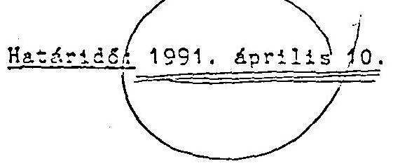

Budapest, 1991. február 14.
dr. Antall József s.k. miniszterelnök

---

# TAR AÖZIÁRSASÁG KORMANYA 

$20-1 K-30 K / 701 / 7 \times 4$

Készült: 55 példányban

FOTOZHATO IF PLO
1.3 SZ. PLO.

Kazják: a Kormány tagjai, a kormanyülések állandó résztvevöi
Csepi Lajos

## A K U R M A N Y

$3396 / 1991$
határozata
a 3068/1991. sz. határozatának végreha itásáról
1.) A Kormány áttekintette az IKARUS Karosszéria- és Jármügyár, valamint a Csepel Autógyár együttes állami szanálásának és privatizációjának helyzetét és vonatkozó 3068/1991. sz. határozatát hatályon kívül helyezi.
2.) A Kormány tudomásul veszi, hogy az IKARUS Karosszéria- és Jármügyár, valamint a Csepel Autógyár együttes állami szanálási megállapodása aláírásra került; a Csepel Autógyár szeglalmi gyára az IKARUS Karosszéria- és Jármügyárhoz átcsatolásra került; az IKARUS Rt. alapítással megalakult; az IKARUS Karosszéria- és Jármügyár, valamint a Csepel Autógyár állami vállalatok megszüntetésre kerülnek.

Budapest, 1991. szeptember 19.
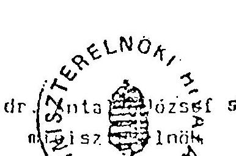

---

# Szanálási menállapodás 

## ac IKARUS Karosszéria- és Jámügyár, valamint a Csepel Autógyár és a Szanáló Szervezet között.

## 1. Elizténvek

1.1. Az 1986. évi 11., valamint az 1988. évi 26. szánú törvényerejũ rendelet, a 79/1988.(XII.7.) MT rendelet és as 50/1988. (XII. 22.) FM rendelet, továbbá ezeket módosító jogszabályok alapján végzett eljárus főbo aunkaszakai az alábbiak voltak:
1.11 A Csepel Autógyár 1990. február 15-én az IKARUS fizetésképtelensége miatt kezdeményezte a Fővárosi Bíróságnál e gazdálkodó szervezet felszámolási eljárásának meginditását. Az IKARUS nem fizetéséból adódóan a Csepel Autógyár pénsügyileg ellehetetlenült, ezért a Budapest Bank Rt. 1990. július 13-án kezdeményezte a Fövárosi Bíróságnál a Csepel Autógyár felszámolását.
1.12 Az IKARUS tekintetében a Legfelsőbb Bíróság 1990. augusztus 27-én, míg a Csepel Autógyár esetében a Fővárosi Bíróság 1990. szeptember 7-én megállapította a fizetésképtelenség tényét és 1990. szeptember 10-én átküldte az iratokat a Szanáló Szervezethez azzal, hogy kívánja-e a pénzügyminiszter a vállalatekat szanálni vagy sem.
1.13 A Szanálási Tárcaközi Bizottság megvizsgálta a tímát és a Gazdasági Kabinet júniusi állásfoglalása, valamint annak megállapítása alapján, hogy a 79/1988. (XII.7.) MT sz. rendeletben elöírt kritériumok fennállnak, javasolta az állami szanálás elrendelését.

---

Az elözöek figyelembevételével Rabár Ferenc pénzügminiszter úr 1990. szeptember 12-én elrendelte a két vállalat együttes állami szanálási el járásának megindítását.
1.2. A vállalatok 1990. évi és 1991. I. félévi föbb ašatait az 1. és 2. sz. mellékletek mutatják be.
2. Az elmúlt idöszak gazdalkodásának értékelése és a fizetésképtelensés oksi.
2.1. Az IKARUS és a Csepel Autógyár - az autóbuságyártás két alapvető egysége - a 80-as évek második felének közepeig jól prosperáló gazdálkodó szervezet volt.
2.2. A 60-as évek közepén alakult ki az az elhatározás,hogy a közúti jármüipart központilag támogatott jármüprogram alapján a III. ötéves terv (1966-70) során húzóágazattá kell fejleszteni. Ezért 1964-ben megkezdődött a gyártás és a technológia rekonstrukciója, mintegy 7 MrdFt központi forrástól. Az IHARUS ennek keretében 3,3 MrdFt visszterhes állami kölcsönt kapott, amit az elöírt ütemezésben visszafizetett.

1971-ig az IKARUS önállóan állította elő a komplett autóbuszt. Ekkor - a 6 edb-os határt meghaladva - születettent a döntés a fenékváz- és a karosszéria gyártás szétválasztására. Ezért került sor a Csepel Autógyár profiljának felszámolására, a teljes termékkör gyártásának leállitására és így felszabaduló termelő-kapacitásának bevonására az autóbuságyártásba.

A jármüprogram végtermék-centrikus volt, a háttéripar fejlesztésére nem fordított kellő figyelmet, a vállalatok közötti kapcsolatokat nem az üzleti érdekek, a piac, hanem felső utasítások hozták létre.

---

Az ekkor kialakított szervezetek és gazdasági együttmüködés képezi lényegében jelenleg is az autóbuzagyártás vertikumának alapjait.
2.3. Az IKARUS elsõ üzleti évében (1949-ben) 362 db autóbuszt gyártott és 1987-ben érte el a csúcsot 13.600 db komplett autóbusz kiszállításával.

1948-90 között több mint 200 edb autóbusz készült el, amely a világ 57 országába jutott el. Ennek mintegy $80 \%$-a tartósan a KÜST országokba - elsősorban a Szovjetunióba - értékesült.

Az IKARUS autóbuszok a világpiazon a középminőségú kategóriába tartoznak. A gyártás tömegszerüségét tekintve a 11 m feletti kategóriában a világon az IKARUS a 4. helyet, míg a csuklós autóbusz típusban az 1. helyet foglalja el.
2.4. A nemzetközi kereskedélem fejlődése az utóbbi 1-2 évben lassult, a hagyományos iparágak (így a jármúizar) termelését inkább a stagnálás jellemzi.

A jelenlegi kapacitás-kihasználtsági mutatók gyugat-Európában $70 \%$, az USA-ban 65-70 \% körül mozognak.
2.5. Nyugat-Európában megindult - elsősorban a hasconjármú gyártásban - az elkülönült nemzeti gyártók koncentrációja (pl: Ley-land-DAF, Volvo-Rensult). E mellett a külföldi eladások növelése, a piazzzerzés érdekében egyre gyakoribbá válik a termelésnek idegen, fejlődő országba való kihelyezése.

Nind szorosabbá való kapcsolatok jellemzik a nagy jármúgyártók és a beszállítók egymás közötti viszonyát, elsősorban az elsübeépítésű aggregátok, főegységek terén.

A kereskedelmi módszerek /technikák/ is jelentés változáson mentek át (pl. készpénz helyett hitel, tender kifráa).

---

2.6. A kelet-európai régió országában jelentős súlyú a magyar autóbuszok arány. Az itt bekövetkerett politikai val tozasok azonban jelentós piaci változásokat hoztak magukkal. A fizetőképes kereslet csökkenésével mérséklődött az eladható jármüvek száma, bár igény oldalról ma is jelentós nagyságrendek fogalmazódnak meg.
2.7. Az 1990-as évtized végére kialaku: pénzügyi feszültség főbb belső okai a következókben foglalhatók össze:

- az export árak államközi szerződés alapján változtak, míg a beszállítói árak a belföldi árak inflációs hatását követve emelkedtek,
- a rubelpiac központi szabályozása,
- a vállalaton belüli gazdálkodási hiányosságok, vezetési problémák,
- veszteséget okozó munkamegosztás, iparirányítási- és gazdaságpolitikai hibák.
2.3. 1991. évben a vállalatok pénzügyi helyzete alapvetčen nem javult, sőt inkább romlott.
- Az IKARUS termelési programja - a rendelésállomány alapján 1991 évre 6.093 db autóbusz, ez elózó évi volumen mintegy 73 \%-a. Ennek árbevétele megközelíti a 30 MrdFt-ot, amely az 1990. évinek közel $150 \%$-a.

A pénzügyi helyzet ennél rosszabb, mert a szovjet fél az I. negyedévi, indikatív lista alapján történt rendelésre gyár: tott 1399 db autóbuszra nem nyitotta meg az akkreditívet. Eddig 65 MUSD értóket fizettek ki.

Ennek következményeként
= egyes beszállítók nem adnak termíket, mert a jármúi;ar általános helyzete erösen leromlott és a fizetőképesség hiánya miatt a profilt nem kívánják megtartani,

---

= más szálítók csak készpénz ellenében szállítanak, mert az IKARUS firtésképtelenségét nem tudjak saját forrástól finanszírcani,
= igen nagy tömegü, értékũ készíru halmozóiott fel.

- A Csepel Autógyárnál a volumen-csökkenés jelentós kapacitás kihasználatlanságot jelent, mert az IKARUS a jelen piaci körülmények között - megteremtve saját gyártási kapacitását nem rendel a II. félévre fenéivázat a vállalattól. Es a Csepel Autógyárnál számottevö pénzügyi feszültséget okoz és foglalkoztatási gondokat jelent.

3. A fïust Exécesséz helyreállítááára és a tóvöbeni eredményes mïkösés feltételeinek biztosítása érdekében teendö intézkedések.
3.1. Az autóbuszgyártás helyzetét - iparpolitikai szempontból is vizsgálva - elemezve egyértelmüen az az álláspont alakult ki, hogy hazánkban az autóbuszgyártást fenn kell tartani. Est a következö tények támasztják alá:

- az autóbuszgyártásban jelentő́s szellemi tőke, szakmai tudás és múszaki kultúra halmozóiott fel, amely képes önerős és adaptiv fejlesztések megvalósítására;
- a technológia bizonyos lépcsökben világszinvonslú;
- jelentőz a háttéripar foglalkoztatása (mintegy 150 kooperáló vállalat és közel 50 efü).

3.2. Az autóbuszgyártásban rúsztvevö vállalatok együttmüködósének eddigi tapasztalatait, valamint a napjainkban kialakult piaci, gazdaságii helyzetet figyelembevéve le kell vonni azt a konkluziót, hogy az autóbuszgyártás vertikumának müködését a hatékonyzági szempontok figyelembevételével új alapokra kell helyezni.

---

A pínzügyi egyensúly megteremtéséhez, az eredményes szanáláshoz a szervezetet ésszerüsíteni és egyszerüsiteni kell, az egyes egységek érdekeltségét növelni szükséges, a hitelszéktól átmeneti segítséget kell kapni a folyó termeléshez, a jövedelmezõ müködéshez külsõ forrást kell bevonni és így a privatizációt elõ kell készíteni.
3.3. A szervezeti átalakítás alapelvei- a 3068/1991. (II.14.) ez. Korm. határozat alapján - a következök:

- azok a gazdasági egységek, amelyek szorosan nem kapcsolódnak a végszereléshez, kerüljenek leválasztásra,
- a végszerelés (karosszállás) és alvásgyártás egy helyen történjen,
- részvénytársaságot kell alakítani,
- privatizálni kell az IKARUS és a Csepel Autógyár vagyonát.

Ennek végrehajtása érdekében a vállalatok és az alapító szerv a következöket vállalja, illetve teszi:
3.31. Az IKARUS

- megszünteti a szegedi és móri leányvállalatát.

Határidő: 1991. augusztus 31.
3.32. A Csepel_Autógyár

- a GEAR Rt önálló müködéséhez eladja a sebességváltó gyártáshoz szükséges készleteket, állóeszközöket, épületeket, ingatlanokat.

---

A külföldi alapító tag ajánlatot tett a vételre, az adás-vételi szerzódés megkötése folyamatban.

Határidó: 1991. augusztus hó.
3.33. Az alapító szerv ( IXM )

- a Csepel Autógyár szeghalmi gyárának eszközeit átcsoportosítja (átcsatolja) az IKARUS vállalathoz. Az átcsoportcsítandó vagyon nettó értéke mintegy 230 KFt.

A két vállalat közötti adósság rendezésének és az autóbusz gyártáshoz felhasználható anyagok, félkésztermékek, gyártóeszközök, stb. átazásának, megvételének máájára, ütemére külön megegyezés történik.

Határidő: 1991. augusztus 15, ill. 1991. szeptember 15.
3.34. Az IKARUS Rt megalapítása és a további privatizáció elökészítése érdekében (az AVU IT 1991. június 26-i határozatának megfelelően)

- az IKARUS vállalat vagyonát - az 1991. július 1-én az ATEX Rt, a CEIC Ho. Ltd, az IKARUS, a Csepel Autógyár és a Szanáló Szervezet által aláírt Megállapcááanak megfelelően az IKARUS Rt-be apportálja.

Határidő: 1991. augusztus 31-1g

Az IKARUS Karosszúria- és Jámágyár tudomásul veszi, hogy - az átadásra nem kerülő tételek (pl: kétes kínnlévo̊égok) rendezése után - megezuintetésére a Szanáló Szervezet az erre felhatalmazott hatóságoknak javaslatot tesz.

---

- a Csepel Autógyár gazdasági társasággá (táraságckká) alakul át. Ennek során kell rendezni a Csepel Autógyár kétes és peresített kinnlévéségeit, inmobil készleteit és eszközeit.

Határidő: lehetőleg 1991. december 31-ig.
3.4. Szaráló Szervezet vállalja, hogy

- a vállalatok müködőképességének fenntartásához, a fizetőké pes rengelések teljesítése érdekében ótmeneti segítséget nyújt 1,4 Krait hitel biztosításával, és 3,5 Krait kezeség vállalásával, illetve 87 MPt váltó garantálásával;
- a szervezeti változtatásokhoz szükséges dokumentumokat k1dolgoztatja és a végrehajtás érdekében - jogszabályoknak megfelelően - eljár;
- a GEAR Rt-vel összefüggő vagyon értékesítéshez, valazint az IKARUS Rt megalapításához szükséges tárgyalásokat lefciytatja.
- a Csepel Autógyár és az IKARUS vállalják, hogy a vagyon értékesítéséhez, ill. az IKARUS Rt. alapításához szükséges ill. azokkal kapcsolatos olmányokat - előzetes egyeztetést feltételezve - aláírják és a vagyon értékesítésével, ill. apportálásával kapcsolatban szükséges törvényi feltételek biztosítása érdekében, a Szanáló Szervezettel egyetértésben eljárnak.
- az IKARUS az ATEX Rt - CEIC Ho.Ltd-vel 1991. július 1-én megkötött szerződéseket ismeri, azokat elfogadja, az ezekről roá háruló kötelezettségek teljesítését - az AVU jóváhagyását feltételezve - vállalja.

---

Az elôzôekben rögzített lépések végrehajtása után az IKARUSnál, valamint a Csepel Autógyárnál az együttes állami szanálás befejezhetô. Az IKARUS Rt. megalapításával az Ikarus fizetôképessége helyreáll és a jövôbeni eredményes mũködés feltételei biztosítottak. Az IKARUS szanálása a 3.34 pontban meghatározott feltételek bekövetkezésével fejezôdik be.

A Csepel Autógyárnál az állami szanálás a vállalat gazdasági társasággá való átalakulásával fejezôdik be, mivel ekkor teremtôdik meg fizetőképessége és jövôbeni eredményes mũködésének feltételei.
4. Az intézkedések végrehajtásának elmulasztása esetén érvényesítenũô következmények

A Szanáló Szervezet a 79/1988. (XII.7.) MT sz. rendelet 9.§-a alapján folyamatosan figyelemmel kíséri a vállalatok tevékenységét, gazdalkodását és amennyiben a kitüzött feladatok, célok nem valósulnak meg, köteles kezdeményezni a szükséges felelôsségrevonásokat.

Ennek megvalósítása érdekében az látszik célszerũnek, ha az IKARUS és a Csepel Autógyár vagyonának kezelésére a Szanáló Szervezet kap megbízást. Ebben az esetben biztosítható a kitũzött célok mind teljesebb megvalósítása és a rendszeres ellenôrzés.

Eudapest, 1991. augusztus 26.
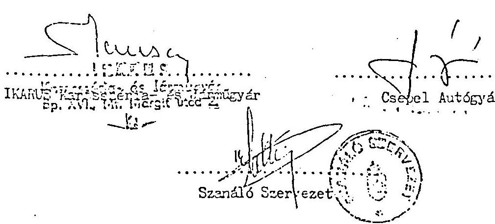

---

# Az IKARUS fobb adatai 

1990. évi 1991.I.félévi
tényszámok

1. Termelés (db)
2. Nettó árbevétel (NFt)
ebből

- export
- 8.055
2. 933
10.848
16.818
11.195 (5247 db)
3. Eredmény (NFt)
4. Üzszes eszköz (NFt)
ebből:
= pénzeszközök
= követelések
= készletek
= befektetett eszközök
= állóeszközök nettó

1. 026
$+419$
2. 367
$22.759$
$1.014 \quad 1.571$
$6.672 \quad 7.149$
$4.510 \quad 7.930$
$1.348 \quad 1.321$
$4.823 \quad 4.818$
3. Összes tartozás (NFt)
11.421
15.069
ebből:
= rövidlejáratú kötelezettségek
$7.937 \quad 10.501$
$=$ hosszúlejáratú kötelezettségek
$3.484 \quad 4.268$
4. Létszám összesen (f6)
$7.469 \quad 7.361$
ebből
5.422
$5.355$
5. Bérozinvonal
$161.490 \mathrm{Ft} / \mathrm{f} 6 / \mathrm{ev} 112.745 \mathrm{Ft} / \mathrm{f} 6 / 6 \mathrm{ho}$

---

# A Cuenel Autóryár fôbb adatai 

1990. évi ..... 1991.I.félévi
tényezámok

1. Termelés (db) ..... 7.120 ..... 2.252
2. Nettó árbevétel (NFt) ..... 10.159 ..... 4.951
ebböl

- export ..... 483 ..... 104
3. Eredmény (NFt) ..... $+2$ ..... $-75$
4. Összes eszköz (NFt) ..... 9.355 ..... 10.825
ebböl:
= pénzeszközök ..... 113 ..... 213
= követelések ..... 3.022 ..... 4.563
= készletek ..... 2.637 ..... 2.535
= befektetett eszközök ..... 796 ..... 799
= állóeszközök nettó ..... 2.787 ..... 2.075
5. Összes tartozás (NFt) ..... 5.009 ..... 4.958
ebböl:
= rövid lejáratú kötelezettségek ..... 4.446 ..... 4.958
= hosszú lejáratú kötelezettségek ..... 563
6. Létszám összesen (fő) ..... 5.071 ..... 4.936
ebböl
- fizikai ..... 3.798 ..... 3.733
7. Búrazinvonal ..... 130.374 Pt/fö/óv ..... 85.046 Pt/fö/6 hó

---

# 4.sz. melléklet 

## M. e g á 11 a p o d á s

1. Az IKARUS Karosszériu- és Jármügyár (Lovábbiakban: Állami Vállalát) hozzájárulását adja ahhoz, hogy az IKARUS Jármügyárto Részvénytársssáy (továbbiakban: IKARUS RI) nevèben, termelési és kereskedelmi kapesolatabban, valamint bárhol, ahol a névnek jelentősége van és az megietenik, az IKARUS nevel Ri toldalékkal vagy annélkül kizárólagos joggal használja.
2. A felek megállapítják, hogy az Állami vállalat az RI alapításakor ingatlanok kezelöl jogával rendelkezik. Ezen ingatlanok közül
a. az IKARUS RI apportlistájában szereplök a részvénytársság Alapító okiratainak aláírásával,
b. a külön jegyzókben szereplök, az Allami Vagyonugynökség meglévö hozzájárulása alapján,
a Szindikátusi Szerződés aláírásával az IKARUS RI tulajdonába kerülnek az ingatlannyilvántartásba történt átjegyzésüket követöen.

Az Állami Vállalat kötelezi magát arra, hogy az ingatlanok tulajdonjogának az IKARUS RI nevére történő nyilvántartásbavete léhez szükséges okíratokat kiadja.
3. Az Allami Vállalat hozzájárul, hogy IKARUS RI alapító dokumentumai aláírásakor az Allami vállalat vagyonához tartozó szolgálati találuányokból erédo jogok, kötelezettségek - az Allami Vállalat felmérése és dokumentációja alapján - az IKARUS RI tulajdonába átkerüljenek.
4. Az Allami Vállalat vagyoni hozzájárulása lvagyonbevitele) az IKARUS RI-be az alapító okírat aláírásakor tükröződik az 1. lista összefoglaló táblázatában. Feleknek tudomásuk van arról, s jelen okírat aláírásával elismerik, hogy az Allami Vállalat apportlistában nem szereplő, további eszközöket és forrásokat az Allami Vállalat az IKARUS RI-nek egymással azonos értékhon ad át az alapítással egyidejüleg. (2-es lista)

Az 1. sz. listá elemzésre kerül.
A 2. sz. lista tarlalmára vonatkozó végleges adatok 1991. szeptember 30-ig pontositásra kerülnek, erről jegy ökönyvok készülnek. A 2. sz. lista tarlalmat az eszközök, források tekintetében egymással azonos értéken kell megállapítani.

Felek kötelezettséget vállalnak arra, hogy a pontosított mellékletben szereplő eszközöket, és forrásokat.

---

az Kt alapitásával egyidejüleg - az Rt müködósinek biztosítása órdekében - egymásnak átadják, illetve átveszik.
5. Az IKARUS Rt alapítói hozzájárulnak ahhoz, hogy az Állami Vállalat dolgozói teljes létszámmal az 1991. augusztus 31-i állapot szerint az IKARUS Rt állományába áthelyozéssel átkerüljenek.

Az IKARUS Rt alapítói kötelezettséget vállalnak arra, hogy az Állami vállalat Kollektiv Szerződését órvényesnek tekintik az IKARUS Rt-re addig, amig az Rt a dolgozók érdekképviseloti szerveivel új kollektiv Szerzödést nem köt.
6. Az Állami vállalat kötelezi magát, hogy az IKARUS Rt-t, annak alapítása napján feljogosítja az általa eddig gyakorolt üzleti tevékenységek folytatása kizárólagos jogával, kötelezi magát továbbá, hogy átadja az Rt-nek minden szerződését, amely az Rt üzleti tevékenysége folytatásához szükséges.

Jelen szerződést aláró felek, mint akaratukkal egyezőt írták alá.

Budapest, 1991. augusztus 30.
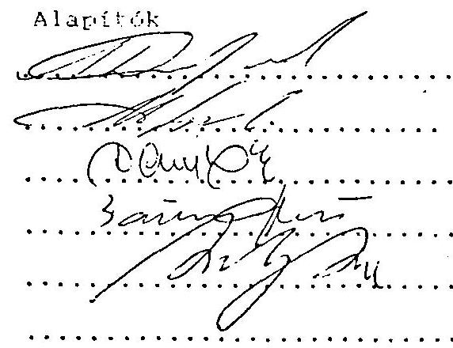

Állami vállalat

---

Az IHARIS Állami Vállalat által átadott, az Rt által átvett 12. évtés és források értéke 1991. június 30-án
13. 7 milliárd forint értékű apportjegyzéken kívül!

| 1. Férszzközök | 1.596.897 | 14. Röv.lej.forg.e.hitelek | 7.484.953  |
| --- | --- | --- | --- |
|  2. Értékpapírok | 900.080 | 15. Belföld.szállítók | 4.954.917  |
|  3. Belf.vevők | 474.985 | 16. Nüf.szállítók | 1.496.977  |
|  4. Nüf.vevők | 2.860.084 | 17. Faktoring és vált.tart. | 6.754  |
|  5. Elsz.m.váll. | 122.270 | 18. Beruh.szállítók | 20.070  |
|  6. Készlet | 8.569.962 | 19. Jöv.elszánolás | 126.103  |
|  7. Egyéb aktív. |  | 20. TB kötelezettség | 152.451  |
|  elszánolások | 273.918 | 21. Egyéb tart.és passzíva | 474.985  |
|  8. Részvények | 347.500 | 22. Hosszúlejár.forg.e.hitel | 3.171.675  |
|  9. Vagyoni letét | 190.001 | 23. Beruh.hitelek | 1.096.172  |
|  10. Apport I-ben nem |  |  |   |
|  szereplő állós. | 17.781 |  |   |
|  11. Beruházások | 115.542 |  |   |
|  12. a/Apport I-ben nem |  |  |   |
|  szereplő telek |  |  |   |
|  érték | 45.932 |  |   |
|  13./b Apport I-ben |  |  |   |
|  nem szereplő |  |  |   |
|  szellemi |  |  |   |
|  vagyon | 1.032.000 |  |   |
|  14. Farkasok |  |  |   |
|  összesen | 15.939.116 | 24. Források összesen | 15.939.116  |

1. 11.11.11.11.11.11.11.11.11.11.11.11.11.11.11.11.11.11.11.11.11.11.11.11.11.11.11.11.11.11.11.11.11.11.11.11.11.11.11.11.11.11.11.11.11.11.11.11.11.11.11.11.11.11.11.11.11.11.11.11.11.11.11.11.11.11.11.1

---

Budapest, 1991. november 20. :. melléklet

A: Ikañus Karosszúrós az Jarmu̇cvar állami valialat az az IKAñus Jarmu̇cvaro Ros

|   |  |  |  |  |  |  |  |  |  |  |  |  |  |  |  |  |  |  |  |  |  |  |  |  |  |  |  |  |  |  |  |  |  |  |  |  |  |  |  |  |  |   |
| --- | --- | --- | --- | --- | --- | --- | --- | --- | --- | --- | --- | --- | --- | --- | --- | --- | --- | --- | --- | --- | --- | --- | --- | --- | --- | --- | --- | --- | --- | --- | --- | --- | --- | --- | --- | --- | --- | --- | --- | --- | --- | --- | --- | --- |
|   |  |  |  |  |  |  |  |  |  |  |  |  |  |  |  |  |  |  |  |  |  |  |  |  |  |  |  |  |  |  |  |  |  |  |  |  |  |  |  |  |  |  |   |
|   |  |  |  |  |  |  |  |  |  |  |  |  |  |  |  |  |  |  |  |  |  |  |  |  |  |  |  |  |  |  |  |  |  |  |  |  |  |  |  |  |  |  |  |   |
|   |  |  |  |  |  |  |  |  |  |  |  |  |  |  |  |  |  |  |  |  |  |  |  |  |  |  |  |  |  |  |  |  |  |  |  |  |  |  |  |  |  |  |  |   |
|   |  |  |  |  |  |  |  |  |  |  |  |  |  |  |  |  |  |  |  |  |  |  |  |  |  |  |  |  |  |  |  |  |  |  |  |  |  |  |  |  |  |  |  |   |
|   |  |  |  |  |  |  |  |  |  |  |  |  |  |  |  |  |  |  |  |  |  |  |  |  |  |  |  |  |  |  |  |  |  |  |  |  |  |  |  |  |  |  |  |   |
|   |  |  |  |  |  |  |  |  |  |  |  |  |  |  |  |  |  |  |  |  |  |  |  |  |  |  |  |  |  |  |  |  |  |  |  |  |  |  |  |  |  |  |  |   |
|   |  |  |  |  |  |  |  |  |  |  |  |  |  |  |  |  |  |  |  |  |  |  |  |  |  |  |  |  |  |  |  |  |  |  |  |  |  |  |  |  |  |  |  |   |
|   |  |  |  |  |  |  |  |  |  |  |  |  |  |  |  |  |  |  |  |  |  |  |  |  |  |  |  |  |  |  |  |  |  |  |  |  |  |  |  |  |  |  |  |  |   |
|   |  |  |  |  |  |  |  |  |  |  |  |  |  |  |  |  |  |  |  |  |  |  |  |  |  |  |  |  |  |  |  |  |  |  |  |  |  |  |  |  |  |  |  |  |   |
|   |  |  |  |  |  |  |  |  |  |  |  |  |  |  |  |  |  |  |  |  |  |  |  |  |  |  |  |  |  |  |  |  |  |  |  |  |  |  |  |  |  |  |  |  |  |   |
|   |  |  |  |  |  |  |  |  |  |  |  |  |  |  |  |  |  |  |  |  |  |  |  |  |  |  |  |  |  |  |  |  |  |  |  |  |  |  |  |  |  |  |  |  |  |   |
|   |  |  |  |  |  |  |  |  |  |  |  |  |  |  |  |  |  |  |  |  |  |  |  |  |  |  |  |  |  |  |  |  |  |  |  |  |  |  |  |  |  |  |  |  |  |   |
|   |  |  |  |  |  |  |  |  |  |  |  |  |  |  |  |  |  |  |  |  |  |  |  |  |  |  |  |  |  |  |  |  |  |  |  |  |  |  |  |  |  |  |  |  |  |   |
|   |  |  |  |  |  |  |  |  |  |  |  |  |  |  |  |  |  |  |  |  |  |  |  |  |  |  |  |  |  |  |  |  |  |  |  |  |  |  |  |  |  |  |  |  |  |   |
|   |  |  |  |  |  |  |  |  |  |  |  |  |  |  |  |  |  |  |  |  |  |  |  |  |  |  |  |  |  |  |  |  |  |  |  |  |  |  |  |  |  |  |  |  |  |   |
|   |  |  |  |  |  |  |  |  |  |  |  |  |  |  |  |  |  |  |  |  |  |  |  |  |  |  |  |  |  |  |  |  |  |  |  |  |  |  |  |  |  |  |  |  |  |   |
|   |  |  |  |  |  |  |  |  |  |  |  |  |  |  |  |  |  |  |  |  |  |  |  |  |  |  |  |  |  |  |  |  |  |  |  |  |  |  |  |  |  |  |  |  |  |   |
|   |  |  |  |  |  |  |  |  |  |  |  |  |  |  |  |  |  |  |  |  |  |  |  |  |  |  |  |  |  |  |  |  |  |  |  |  |  |  |  |  |  |  |  |  |  |  |   |
|   |  |  |  |  |  |  |  |  |  |  |  |  |  |  |  |  |  |  |  |  |  |  |  |  |  |  |  |  |  |  |  |  |  |  |  |  |  |  |  |  |  |  |  |  |  |  |   |
|   |  |  |  |  |  |  |  |  |  |  |  |  |  |  |  |  |  |  |  |  |  |  |  |  |  |  |  |  |  |  |  |  |  |  |  |  |  |  |  |  |  |  |  |  |  |  |   |
|   |  |  |  |  |  |  |  |  |  |  |  |  |  |  |  |  |  |  |  |  |  |  |  |  |  |  |  |  |  |  |  |  |  |  |  |  |  |  |  |  |  |  |  |  |  |  |   |
|   |  |  |  |  |  |  |  |  |  |  |  |  |  |  |  |  |  |  |  |  |  |  |  |  |  |  |  |  |  |  |  |  |  |  |  |  |  |  |  |  |  |  |  |  |  |  |   |
|   |  |  |  |  |  |  |  |  |  |  |  |  |  |  |  |  |  |  |  |  |  |  |  |  |  |  |  |  |  |  |  |  |  |  |  |  |  |  |  |  |  |  |  |  |  |  |  |   |
|   |  |  |  |  |  |  |  |  |  |  |  |  |  |  |  |  |  |  |  |  |  |  |  |  |  |  |  |  |  |  |  |  |  |  |  |  |  |  |  |  |  |  |  |  |  |  |  |   |
|   |  |  |  |  |  |  |  |  |  |  |  |  |  |  |  |  |  |  |  |  |  |  |  |  |  |  |  |  |  |  |  |  |  |  |  |  |  |  |  |  |  |  |  |  |  |  |  |   |
|   |  |  |  |  |  |  |  |  |  |  |  |  |  |  |  |  |  |  |  |  |  |  |  |  |  |  |  |  |  |  |  |  |  |  |  |  |  |  |  |  |  |  |  |  |  |  |  |   |
|   |  |  |  |  |  |  |  |  |  |  |  |  |  |  |  |  |  |  |  |  |  |  |  |  |  |  |  |  |  |  |  |  |  |  |  |  |  |  |  |  |  |  |  |  |  |  |  |   |
|   |  |  |  |  |  |  |  |  |  |  |  |  |  |  |  |  |  |  |  |  |  |  |  |  |  |  |  |  |  |  |  |  |  |  |  |  |  |  |  |  |  |  |  |  |  |  |  |  |   |
|   |  |  |  |  |  |  |  |  |  |  |  |  |  |  |  |  |  |  |  |  |  |  |  |  |  |  |  |  |  |  |  |  |  |  |  |  |  |  |  |  |  |  |  |  |  |  |  |  |   |
|   |  |  |  |  |  |  |  |  |  |  |  |  |  |  |  |  |  |  |  |  |  |  |  |  |  |  |  |  |  |  |  |  |  |  |  |  |  |  |  |  |  |  |  |  |  |  |  |  |   |
|   |  |  |  |  |  |  |  |  |  |  |  |  |  |  |  |  |  |  |  |  |  |  |  |  |  |  |  |  |  |  |  |  |  |  |  |  |  |  |  |  |  |  |  |  |  |  |  |  |   |
|   |  |  |  |  |  |  |  |  |  |  |  |  |  |  |  |  |  |  |  |  |  |  |  |  |  |  |  |  |  |  |  |  |  |  |  |  |  |  |  |  |  |  |  |  |  |  |  |  |   |
|   |  |  |  |  |  |  |  |  |  |  |  |  |  |  |  |  |  |  |  |  |  |  |  |  |  |  |  |  |  |  |  |  |  |  |  |  |  |  |  |  |  |  |  |  |  |  |  |  |   |
|   |  |  |  |  |  |  |  |  |  |  |  |  |  |  |  |  |  |  |  |  |  |  |  |  |  |  |  |  |  |  |  |  |  |  |  |  |  |  |  |  |  |  |  |  |  |  |  |  |  |   |
|   |  |  |  |  |  |  |  |  |  |  |  |  |  |  |  |  |  |  |  |  |  |  |  |  |  |  |  |  |  |  |  |  |  |  |  |  |  |  |  |  |  |  |  |  |  |  |  |  |  |   |
|   |  |  |  |  |  |  |  |  |  |  |  |  |  |  |  |  |  |  |  |  |  |  |  |  |  |  |  |  |  |  |  |  |  |  |  |  |  |  |  |  |  |  |  |  |  |  |  |  |  |   |
|   |  |  |  |  |  |  |  |  |  |  |  |  |  |  |  |  |  |  |  |  |  |  |  |  |  |  |  |  |  |  |  |  |  |  |  |  |  |  |  |  |  |  |  |  |  |  |  |  |  |   |
|   |  |  |  |  |  |  |  |  |  |  |  |  |  |  |  |  |  |  |  |  |  |  |  |  |  |  |  |  |  |  |  |  |  |  |  |  |  |  |  |  |  |  |  |  |  |  |  |  |  |   |
|   |  |  |  |  |  |  |  |  |  |  |  |  |  |  |  |  |  |  |  |  |  |  |  |  |  |  |  |  |  |  |  |  |  |  |  |  |  |  |  |  |  |  |  |  |  |  |  |  |  |   |
|   |  |  |  |  |  |  |  |  |  |  |  |  |  |  |  |  |  |  |  |  |  |  |  |  |  |  |  |  |  |  |  |  |  |  |  |  |  |  |  |  |  |  |  |  |  |  |  |  |  |   |
|   |  |  |  |  |  |  |  |  |  |  |  |  |  |  |  |  |  |  |  |  |  |  |  |  |  |  |  |  |  |  |  |  |  |  |  |  |  |  |  |  |  |  |  |  |  |  |  |  |  |   |
|   |  |  |  |  |  |  |  |  |  |  |  |  |  |  |  |  |  |  |  |  |  |  |  |  |  |  |  |  |  |  |  |  |  |  |  |  |  |  |  |  |  |  |  |  |  |  |  |  |  |   |
|   |  |  |  |  |  |  |  |  |  |  |  |  |  |  |  |  |  |  |  |  |  |  |  |  |  |  |  |  |  |  |  |  |  |  |  |  |  |  |  |  |  |  |  |  |  |  |  |  |  |   |
|   |  |  |  |  |  |  |  |  |  |  |  |  |  |  |  |  |  |  |  |  |  |  |  |  |  |  |  |  |  |  |  |  |  |  |  |  |  |  |  |  |  |  |  |  |  |  |  |  |  |   |
|   |  |  |  |  |  |  |  |  |  |  |  |  |  |  |  |  |  |  |  |  |  |  |  |  |  |  |  |  |  |  |  |  |  |  |  |  |  |  |  |  |  |  |  |  |  |  |  |  |  |   |
|   |  |  |  |  |  |  |  |  |  |  |  |  |  |  |  |  |  |  |  |  |  |  |  |  |  |  |  |  |  |  |  |  |  |  |  |  |  |  |  |  |  |  |  |  |  |  |  |  |  |  |   |
|   |  |  |  |  |  |  |  |  |  |  |  |  |  |  |  |  |  |  |  |  |  |  |  |  |  |  |  |  |  |  |  |  |  |  |  |  |  |  |  |  |  |  |  |  |  |  |  |  |  |  |   |
|   |  |  |  |  |  |  |  |  |  |  |  |  |  |  |  |  |  |  |  |  |  |  |  |  |  |  |  |  |  |  |  |  |  |  |  |  |  |  |  |  |  |  |  |  |  |  |  |  |  |  |   |
|   |  |  |  |  |  |  |  |  |  |  |  |  |  |  |  |  |  |  |  |  |  |  |  |  |  |  |  |  |  |  |  |  |  |  |  |  |  |  |  |  |  |  |  |  |  |  |  |  |  |  |   |
|   |  |  |  |  |  |  |  |  |  |  |  |  |  |  |  |  |  |  |  |  |  |  |  |  |  |  |  |  |  |  |  |  |  |  |  |  |  |  |  |  |  |  |  |  |  |  |  |  |  |  |   |
|   |  |  |  |  |  |  |  |  |  |  |  |  |  |  |  |  |  |  |  |  |  |  |  |  |  |  |  |  |  |  |  |  |  |  |  |  |  |  |  |  |  |  |  |  |  |  |  |  |  |  |  |   |
|   |  |  |  |  |  |  |  |  |  |  |  |  |  |  |  |  |  |  |  |  |  |  |  |  |  |  |  |  |  |  |  |  |  |  |  |  |  |  |  |  |  |  |  |  |  |  |  |  |  |  |  |   |
|   |  |  |  |  |  |  |  |  |  |  |  |  |  |  |  |  |  |  |  |  |  |  |  |  |  |  |  |  |  |  |  |  |  |  |  |  |  |  |  |  |  |  |  |  |  |  |  |  |  |  |  |   |
|   |  |  |  |  |  |  |  |  |  |  |  |  |  |  |  |  |  |  |  |  |  |  |  |  |  |  |  |  |  |  |  |  |  |  |  |  |  |  |  |  |  |  |  |  |  |  |  |  |  |  |   |
|   |  |  |  |  |  |  |  |  |  |  |  |  |  |  |  |  |  |  |  |  |  |  |  |  |  |  |  |  |  |  |  |  |  |  |  |  |  |  |  |  |  |  |  |  |  |  |  |  |  |  |  |   |
|   |  |  |  |  |  |  |  |  |  |  |  |  |  |  |  |  |  |  |  |  |  |  |  |  |  |  |  |  |  |  |  |  |  |  |  |  |  |  |  |  |  |  |  |  |  |  |  |  |  |  |  |   |
|   |  |  |  |  |  |  |  |  |  |  |  |  |  |  |  |  |  |  |  |  |  |  |  |  |  |  |  |  |  |  |  |  |  |  |  |  |  |  |  |  |  |  |  |  |  |  |  |  |  |  |  |   |
|   |  |  |  |  |  |  |  |  |  |  |  |  |  |  |  |  |  |  |  |  |  |  |  |  |  |  |  |  |  |  |  |  |  |  |  |  |  |  |  |  |  |  |  |  |  |  |  |  |  |  |   |
|   |  |  |  |  |  |  |  |  |  |  |  |  |  |  |  |  |  |  |  |  |  |  |  |  |  |  |  |  |  |  |  |  |  |  |  |  |  |  |  |  |  |  |  |  |  |  |  |  |  |  |   |
|   |  |  |  |  |  |  |  |  |  |  |  |  |  |  |  |  |  |  |  |  |  |  |  |  |  |  |  |  |  |  |  |  |  |  |  |  |  |  |  |  |  |  |  |  |  |  |  |  |  |  |   |
|   |  |  |  |  |  |  |  |  |  |  |  |  |  |  |  |  |  |  |  |  |  |  |  |  |  |  |  |  |  |  |  |  |  |  |  |  |  |  |  |  |  |  |  |  |  |  |  |  |  |  |  |   |
|   |  |  |  |  |  |  |  |  |  |  |  |  |  |  |  |  |  |  |  |  |  |  |  |  |  |  |  |  |  |  |  |  |  |  |  |  |  |  |  |  |  |  |  |  |  |  |  |  |  |  |  |   |
|   |  |  |  |  |  |  |  |  |  |  |  |  |  |  |  |  |  |  |  |  |  |  |  |  |  |  |  |  |  |  |  |  |  |  |  |  |  |  |  |  |  |  |  |  |  |  |  |  |  |  |  |  |   |
|   |  |  |  |  |  |  |  |  |  |  |  |  |  |  |  |  |  |  |  |  |  |  |  |  |  |  |  |  |  |  |  |  |  |  |  |  |  |  |  |  |  |  |  |  |  |  |  |  |  |  |  |  |   |
|   |  |  |  |  |  |  |  |  |  |  |  |  |  |  |  |  |  |  |  |  |  |  |  |  |  |  |  |  |  |  |  |  |  |  |  |  |  |  |  |  |  |  |  |  |  |  |  |  |  |  |  |  |   |
|   |  |  |  |  |  |  |  |  |  |  |  |  |  |  |  |  |  |  |  |  |  |  |  |  |  |  |  |  |  |  |  |  |  |  |  |  |  |  |  |  |  |  |  |  |  |  |  |  |  |  |  |  |   |
|   |  |  |  |  |  |  |  |  |  |  |  |  |  |  |  |  |  |  |  |  |  |  |  |  |  |  |  |  |  |  |  |  |  |  |  |  |  |  |  |  |  |  |  |  |  |  |  |  |  |  |  |  |  |   |
|   |  |  |  |  |  |  |  |  |  |  |  |  |  |  |  |  |  |  |  |  |  |  |  |  |  |  |  |  |  |  |  |  |  |  |  |  |  |  |  |  |  |  |  |  |  |  |  |  |  |  |  |  |  |  |  |   |
|   |  |  |  |  |  |  |  |  |  |  |  |  |  |  |  |  |  |  |  |  |  |  |  |  |  |  |  |  |  |  |  |  |  |  |  |  |  |  |  |  |  |  |  |  |  |  |  |  |  |  |  |  |  |  |  |  |   |
|   |  |  |  |  |  |  |  |  |  |  |  |  |  |  |  |  |  |  |  |  |  |  |  |  |  |  |  |  |  |  |  |  |  |  |  |  |  |  |  |  |  |  |  |  |  |  |  |  |  |  |  |  |  |  |  |  |  |   |
|   |  |  |  |  |  |  |  |  |  |  |  |  |  |  |  |  |  |  |  |  |  |  |  |  |  |  |  |  |  |  |  |  |  |  |  |  |  |  |  |  |  |  |  |  |  |  |  |  |  |  |  |  |  |  |  |  |  |   |
|   |  |  |  |  |  |  |  |  |  |  |  |  |  |  |  |  |  |  |  |  |  |  |  |  |  |  |  |  |  |  |  |  |  |  |  |  |  |  |  |  |  |  |  |  |  |  |  |  |  |  |  |  |  |  |  |  |  |  |   |
|   |  |  |  |  |  |  |  |  |  |  |  |  |  |  |  |  |  |  |  |  |  |  |  |  |  |  |  |  |  |  |  |  |  |  |  |  |  |  |  |  |  |  |  |  |  |  |  |  |  |  |  |  |  |  |  |  |  |  |  |  |  |  |   |
|   |  |  |  |  |  |  |  |  |  |  |  |  |  |  |  |  |  |  |  |  |  |  |  |  |  |  |  |  |  |  |  |  |  |  |  |  |  |  |  |  |  |  |  |  |  |  |  |  |  |  |  |  |  |  |  |  |  |  |  |  |  |  |  |  |  |  |  |   |
|   |  |  |  |  |  |  |  |  |  |  |  |  |  |  |  |  |  |  |  |  |  |  |  |  |  |  |  |  |  |  |  |  |  |  |  |  |  |  |  |  |  |  |  |  |  |  |  |  |  |  |  |  |  |  |  |  |  |  |  |  |  |  |  |  |  |  |  |   |
|   |  |  |  |  |  |  |  |  |  |  |  |  |  |  |  |  |  |  |  |  |  |  |  |  |  |  |  |  |  |  |  |  |  |  |  |  |  |  |  |  |  |  |  |  |  |  |  |  |  |  |  |  |  |  |  |  |  |  |  |  |  |  |  |  |  |  |  |  |  |  |  |  |   |
|   |  |  |  |  |  |  |  |  |  |  |  |  |  |  |  |  |  |  |  |  |  |  |  |  |  |  |  |  |  |  |  |  |  |  |  |  |  |  |  |  |  |  |  |  |  |  |  |  |  |  |  |  |  |  |  |  |  |  |  |  |  |  |  |  |  |  |  |  |  |  |  |  |  |  |  |  |   |
|   |  |  |  |  |  |  |  |  |  |  |  |  |  |  |  |  |  |  |  |  |  |  |  |  |  |  |  |  |  |  |  |  |  |  |  |  |  |  |  |  |  |  |  |  |  |  |  |  |  |  |  |  |  |  |  |  |  |  |  |  |  |  |  |  |  |  |  |  |  |  |  |  |  |  |  |  |  |  |  |  |  |  |  |  |  |  |  |  |  |  |  |  |  |  |  |  |  |  |  | 

---

# 3.az. melléklet 

A szerzódés 9. pontja összesitó tábla
11.sor
$1.068 .339 \mathrm{eFt}$
összosen: 1.068 .339 eFt

A fenti melléklet tételei az RT-nél nem jelentenek költségelezámolás szempontjából kötelezettségeket, csak pénzügyi teljesítési kötelezettséggel járnak.

| 11 sor/1. Szállítói tartozások: | 126.749 eFt |
| :--: | :--: |
| 11 sor/2. VSZ. költség, |  |
| Refin. hit. kamat: | 118.731 eFt |
| 11 sor/3. Vám: | 34.494 eFt |
| 11 sor/4. Bank zárlati Ktg.: | 247.007 eFT |
| 11 sor/5. Adó tartozás: | 94.491 eFt |
| 11 sor/6. SZ.SZ. hitelkamat: | 212.733 eFt |
| 11 sor/7. Szállítói késedelmi kamat: | 234.135 eFt |

---

Az IKARUS állami vállalat által a részvénytárzasa részére átadott joléti állóeszközök több oldalas listájából néhány nagyobb értékú tétel

Ft

|   | könyvszerinti nettó érték | átadási érték  |
| --- | --- | --- |
|  vállalati központ összesen: | 54531051 | 5453105  |
|  Ezen belül pl.: |  |   |
|  -Balatonfüredi A.E.C épület | 28692039 |   |
|  -Balatonfüredi ingatlan | 3864720 |   |
|  -etterem - konyha | 12996970 |   |
|  Szfohérvári gyár összesen: | 31681592 | 3168159  |
|  Ezen belül pl.: |  |   |
|  -Gárdonyi ingatlan, telek | 535740 |   |
|  -Agárdi hétvégi pihenő | 620617 |   |
|  -Zamárdi üdülő, gazdasági épület | 2155605 |   |
|  -G.G. művelődési ház | 3611650 |   |
|  -óvoda | 15461337 |   |
|  -hétvégi pihenő/Kizgyón/ | 2751070 |   |
|  -munkásszálló | 5109369 |   |
|  -személygépkocsi |  |   |
|  Budapesti gyár összesen: | 85530390 | 8553039  |
|  Ezen belül pl.: |  |   |
|  -gondnoki lakás 10. sz. | 10316 |   |
|  -gondnoki lakás 2. sz. | 45032 |   |
|  -konyha, étterem épület 1. sz. | 490097 |   |
|  -25 db fa kis üdülőház egyenként | 6256 |   |
|  -óvoda 2. sz. | 3273298 |   |
|  -óvoda bőv. | 3107354 |   |
|  -bölcsőde | 1574829 |   |
|  -bölcsőde | 1661346 |   |
|  -kulturház | 1343516 |   |
|  -Balatonboglári üdülő | 6348055 |   |
|  -mosoda -konyha-kiszánház | 32455586 |   |
|  -sporttelepi öltsző bőv | 9321300 |   |
|  -vendegház | 2167280 |   |
|  - 5 db faház egyenként | 525497 |   |
|  -teniszpályák, roplabdapályák, kézilabdapályák, labdarúgópályák, egyéb sportlétesítmények |  |   |
|  -konyhai.mosodai gépek, berend. ö. | 3239352 |   |
|  -vitorlásható |  |   |
|  Szeghalmi gyár összesen: | 990685 | 99068  |
|  Ezen belül pl. : |  |   |
|  -szolgálati lakás ép. | 927290 |   |
|  -szolgálati lakás | 52239 |   |
|  - két lakás épület |  |   |

---

Földingatlan vagyonértékek összefoglaló táblázata az IKARUS egészére

# / apport I-ben nem szerepló tótelek / 

| Sor   szám | Helyrajzi szám | Tulajdoni lap sz. | Teruilet $m^{2}$ | Kezeló | Teruilet rendeltetése | Fajlagos érték $\mathrm{Ft} / \mathrm{m}^{2}$ | Vagyon é:   eFt |
| :--: | :--: | :--: | :--: | :--: | :--: | :--: | :--: |
| 01. | Bp. XVI. 32611/1 | 6778 | $2142 \sqrt{ }$ | Ikarus | Népstadion u.61. lakóház, udvar, stb. | 10.000 | 21.420 |
| 08. | Bp. XVI. 106774 | 6268 | $\begin{aligned} & 1 \mathrm{ha} / \\ & 6880 \sqrt{ } \end{aligned}$ | Ikarus | Müvelődési Ház | 2.500 | 42.200 |
| 09. | $\begin{aligned} & \text { Bp. XVI. } \\ & 106854 \end{aligned}$ | 6344 | $\begin{aligned} & 8 \mathrm{ha} / \\ & 4187 \sqrt{ } \end{aligned}$ | Ikarus | Sporttelap | 1.000 | 84.18. |
| 10. | $\begin{aligned} & \text { Bp. XVI. } \\ & 106359 \end{aligned}$ | 5871 | $853 \sqrt{ }$ | Ikarus | Ovoda, Bölcsöde | 3.000 | 2.555 |
| 11. | $\begin{aligned} & \text { Bp. XVI. } \\ & 106349 \end{aligned}$ | 5862 | 4289 | Ikarus | Ovoda, Bölcsöde | 3.000 | 12.86. |
| 13. | $\begin{aligned} & \text { Bp. XVI. } \\ & 106360 \end{aligned}$ | 5872 | $1693 \sqrt{ }$ | Ikarus | Nyugdijasház | 3.000 | 5.075 |
| 21. | Szfehérvár   Maroshely   7601 | 7504 | $2832 \sqrt{ }$ | Ikarus | Ikarus Gárdonyi G.   Müv. Ház | 1.000 | 2.83: |
| 22. | Szfehérvár   Rádió u.   6879/1. | 14224 | $8251 \sqrt{ }$ | Ikarus | Ovoda | 800 | 6.60: |
| 23. | Szfehérvár   Balaton u.98.   6897 | 6822 | $2060 \sqrt{ }$ | Ikarus | Munkásszálló | 800 | 1.641 |
| 24. | Zamárdi. 820 | 867 | $3291 \sqrt{ }$ | Ikarus | Udüló | 5.000 | 16.45: |
| 31. | Fehérvár Csurgó $602 / 31$. | 1476 | 8799 | Ikarus | Udüló | 700 | 6.15 |

---

| m | Helyrajzi szám | Tulajdoni $\operatorname{lsp} \mathrm{sz}$. | Terulet $\mathrm{m}^{2}$ | Kezeló | Terulet rendeltetése | Fajlugos érték $\mathrm{Ft} / \mathrm{m}^{2}$ | Vagyon ért eVt |
| :--: | :--: | :--: | :--: | :--: | :--: | :--: | :--: |
|  | Szeged, Fono gyár u. 9. | $\begin{aligned} & \text { Szeged } \\ & 4889,2289 / 32 / \mathrm{A} \end{aligned}$ | $91 \sqrt{ }$ | Ikarus | Udüló | 8.000 . | 728 |
|  | Balatonbogl. 2188 | 2129 | $\begin{aligned} & 1 \mathrm{ha} \sqrt{ } \\ & 6208 \sqrt{ } \end{aligned}$ | Ikarus | Boglari udüló | 7.000 | 113.456 |
|  | Bfiured 3939 | 4088 | $3446 \sqrt{ }$ | Ikarus | Bfiuredi udüló elötti terület | 3.500 | 12.061 |
|  | Ceopak 470 | 559 | $6911 \sqrt{ }$ | Ikarus | Csopaki udüló | 10.000 | 69.110 |
|  | Bfiured 3928 | 4082 | $7240 \sqrt{ }$ | Ikarus | Bfiuredi udüló | 6.000 | 43.440 |
|  | Kunfehérto 1497/1 | 1846 | $2144 \sqrt{ }$ | Ikarus | Kert/uduló telep | 500 | 1.072 |
|  | Székesfehérvár Börgönd u.Isk. 7723/2 | 16509 | 1263 | Ikarus | Lakások | 1.000 | 1.263 |
|  | Gárdony. Agárd 5448 | 5281 | $4625 \sqrt{ }$ | Ikarus | Udüló | 3.500 | 16.187 |

x/. Megállapodás alapján az értéke, a netto érték lo \%-ában került meghatározásra

---

Külföldi vevòk 1991. XII. 31.

Kuba hiteles: 1.873.011.493,64 T
Kuba Kp: 5.413.605,83 T
Kuba elöleg: 11.410.342.- K
Kuba össz: 1.867.019.757,47 T

Angola Kp: 7.245.286,79 T
Angola hiteles: 178.219.476.73 T
Angola össz: 185.464.763,52 T

Irak Kp: 79.848.- T
Irak hiteles: 331.737.664.- T

Irak össz: 331.367.512.- T

Mozambik: 731.446.- T
Higéria: 1.141.813,08 I
SZU. USD 37.272.072,05 T
SzU Rubel 75.002.962.- T
Összesen: 2.498.500.326,22 T

---

# NYILATKOZAT 

Alulírott Vacnai Zoltán a Sudapesti gyár igazgatója ezúton igazolom, hogy a fenólvázgyártás ráforditásai az alábbiak:
eFt-ban

| 1989 | 1990 | 1991 | 1992 | összesen: |
| :--: | :--: | :--: | :--: | :--: |

Beruházás

- $11.693,4 \quad 15.723 .3$ - 27.416 .7

Alapitás-álsz.

- $5.334,0 \quad 1.960 .5$ - 7.3:2.0
$x$ Gyártóeszköz
beszerzés
- $11.044,6$
- 11.044 .5
$x x$ Gyártóeszköz
fenntartás
Állóeszköz
fenntartás
MIFE
ÖSSZESEN:
-
-
-
-
-
-
-
$45.764,1$

Oátum: . 1992. 19.17....
$x$ Gyártóeszköz beszerzés 1991. és 1992. évben nincs adat
$x x$ Gyártóeszköz fenntartásra níncs adat
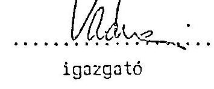
igazgató

---

# N Y I L A T K O Z A 1 

Alulirott hengn I Anpln gyrr igargntoja uutun iqszolom, hagy a fenakvazgyartas rafioroitasa; as slábulak:

|  | 1989 | 1990 | 1991 | 1992 | eft-ban   Osszesen: |
| :--: | :--: | :--: | :--: | :--: | :--: |
| Beruhazas | - | - | 13.077 | - | 13.077 |
| Alapitás-álsz. | 6.905 | 1.770 | 1.935 | - | 10.610 |
| Gyartóeszköz/ssját gyártás/ | - | - | 7.500 | 138 | 7.616 |
| Gyartóeszköz fenntartás | - | - | - | - | - |
| Allóeszköz fenntartás | - | - | - | 560 | 560 |
| MUFE | 86 | 266 | 43 | - | 395 |
| O S S Z E S I N: | 6.991 | 2.036 | 22.563 | 688 | 32.278 |

Megjegyzés: Azon fenokvázak gyártásához tarlozó költségeket, amelyeket a Csepol Autógyár uutusén gyártott, nem vettük figyelembe.
Székesfehérvár, 1992. áorilis 16.

---

# EMLÉKEZTETŐ 

a Csepel Autógyár átalakítása kapcsán a vagyonmegoszlás tárgyában tartott megbeszélésröl

A megbeszélés ideje: 1991.februar 21.
A megbeszélés helye: Csepel Autógyár vezérigazgatói tanácsterem

| Résztvevők: | dr.Rédei László | Szanálo Szervezet igazgatója |
| :-- | :-- | :-- |
|  | Virág Miklós | Szanáló szervezeti biztos |
|  | Lukácsi Gábor | CsA vezérigazgatója |
|  | Geiger Márton | CsA gazdasági igazgatója |
|  | Tósoky Zoltán | CsA közgazdasági főo.vezetője |

A megbeszélés tárgya: a Csepel Autógyár 1990.dec.31-i zárómérleg szerinti vagyonának - 5861 eft-nak - a felosztása a vállalat átszervezésére vonatkozó kormánydöntés szempontjai szerint.

A módosított szervezeti felépítésre, e felépítés vagyonszerkezetére, az egyes szervezetrészek tulajdonával kapcsolatos célkitüzésekre vonatkozóan dr.Rédei László úr a következő álláspontot alakitotta ki.

## 1.) Dugattyú-és Dugattvúgvūrūgvárto Leányvállalat

Jelenleg jogi önállósággal rendelkezö egység, 100 \%-ban Csepel Autógyár-i tulajdonban. A Csepel Autógyár mérleg szerinti vagyonából 128 MFt értóket képvisel.
A vagyonrész sorsával kapcsolatban a Szanáló Szervezet további egyeztetést kiván folytatni.
dr. Rédei úr álláspontja:

- a Csepel Autógyár mint alapító, 1991.január 1-i hatálylyal szüntesse meg az egység leányvállalati státuszát.
- Ezzel az intézkedéssel automatikusan az anyavállalat részévé válik az egység.
- A potenciális befektetők szándékaitól függően lehet tár-sasággá alakitani, vagy a megmaradó Csepel Autógyár-i szervezet keretei között müködhet tovább.

---

# 2.) GEAR RI 

Jogi önállósággal rendelkező egység, három tulajdonossal.
Tulajdon szerkezete a következõ:

| Csikász Géza külföldi befektetõ | 5 MFt |
| :-- | --: |
| MOGÚRT Gépjármú Külker.Vállalat | 10 MFt |
| Alapitói vagyonban idegen tőke | 15 MFt |
| Alapitól vagyonban Csepel Autó- |  |
| gyár-i tőke | 135 MFt |
| Alapitól vagyon összesen: | 150 MFt |
| Alaptőkén felül juttatott Csepel |  |
| Autógyár-i vagyonrész | 428 MFt |
| VAGYON ÜSSZESEN: | 578 MFt |

DroRédei úr álláspontja:

- A GEAR RT változatlan szervezeti formában müködjön tovább.
- Mivel az RT müködéséhez az állóeszközöket jelenleg a Csepel Autógyártól bérli, alaptőke emeléssel kerüljön rendezésre az idegen forrással (beruházási hiteltartozás, államkölcsön)korrigált nettó könyv-szerinti állóeszközérték és az alaptőkén felül juttatott Csepel Autógyár-i vagyonrész.
- Az alaptőke emelés utáni vagyonszerkezet:

| Idegen tőke (alapitói vagyon) | 15 MFt | $1,5 \%$ |
| :--: | :--: | :--: |
| Csepel Autógyár-i alapitói vagyon | 135 MFt |  |
| Csepel Autógyár-i alaptokén felüli | 428 MFt |  |
| vagyon |  |  |
| Allóeszközök nettó értéke | 816 MFt |  |
| Le: idegen forrás (RT fizetési kötelezettség) | $-380 \mathrm{MFt}$ |  |
| ALAPTÖKE EMELÉS UTÁNI VAGYON: | 1014 MFt | 100,0 \% |
| ebből: - CSepel Autógyár-i vagyon | 999 MFt | $98,5 \%$ |

Dr.Rédei úr, az 1991.febr.25-i közgyülésen erre az alaptőke emelésre tesz javaslatot.

---

- A potenciális befektetők szándékától függően lehet az állami tulajdonrészt privatizálni, vagy tőkebevonást végrehajtani.

Geiger úr felhivta a figyelmet arra, hogy a közuti jármügyártás szempontjából meghatározó jelentőségũ a hajtáslánc egységes szemléletü kezelése ( piaci-, fejlesztési-, minőségi- stb. szempontok). Javasolta, hogy ez a követelmény vagy szervezeti megoldással, vagy az állami tulajdon kezelési jogán kereszül érvényesithető legyen.
3.) Szerszámprognessz Kft

Jogi önállósággal rendelkező, 100 \%-ban Csepel Autógyár-i tulajdonban lévő egység. Piaci-, müködési szempontból igen szoros kapcsolatban áll a Csepel Autógyárral, állóeszközeit az alapitótól bérli.

Dr. Rédei úr álláspontja:

- A KFt változatlan szervezeti formában müködjön tovább.
- Törzstöke emeléssel el kell érni a következõ vagyonszerkezetet:

Alapitói törzstöke 10 MFt
Alapitói törzstökén felül juttatott vagyonrész 57 MFt
Állóeszközök könyv szerinti nettó értéke 39 MFt
Módosított törzstöke 106 MFt
4.) Márkaszervíz Kft

Jogi önállósággal rendelkező, 100 \%-ban Csepel Autógyár-i tulajdonban lévô egység. Piaci szempontból - mint eladó - független a Csepel Autógyártól, állóeszközeit az alapitótól bérli.

Dr. Rédei úr álláspontja:

- Az egység Kft formájában müködjön tovább.
- Törzstőke emeléssel el kell érni a következõ vagyonszerkezetet:

Alapitói törzstöke 5 MFt
Alapitói törzstökén felül juttatott vagyonrész 28 MFt
Állóeszközök könyv szerinti nettó
értéke
Módosított törzstöke
$\frac{8 \mathrm{MFT}}{41 \mathrm{MFT}}$

- Célul kell kitüzni a Kft privatizálását.

---

5.) IKARUS-szal közös szervezetben müködtetendō Csepel Autónyár-i
részek
a.) Integrált autóbusz alváz szerelde ( 22 ezer $\mathrm{m}^{2}$-os csarnok, fejépület, raktárak stb.)

A vagyonrész szoros technológiai kapcsolatban van az autóbusz karosszálással. A terület hasznosíthatósága nagymértékben függ az autóbusz piaci lehetóségeitől. (Hasonlóan a karosszáló kapacitásokhoz) Szóbajöhetō variánsok lehetnek a közös szerv.ezetben történő müködtetésre:

- A vagyonrész teljes egészében kerüljön összevonásra a társasági formában tovább müködő Ikarus vagyonnal.
- Az IKARUS társaság - korrekt feltételek alapján - a tevékenységgel kapcsolatos állóeszközöket bérelje és a szerelési tevékenységet ilyen feltételekkel bonyolitsa.

Az átadásra kerülő vagyonérték magában foglalja a Csepel Autógyár, Ikarusszal szembeni teljes követelését ( 3894 MFt) is, melyböl 1989.és 1990.évi lezáratlan árvita 1494 MFt.

Dr. Rédei úr álláspontja:

- A szervezeti változás a teljes vagyonrész átadásával történjen meg.
- A vagyon leválasztása és átadása azt jelenti, hogy a tevékenységben érintett állóeszközök és készletek átadásán túl a tevékenységgel összefüggésben felmerült vevöállomány és kétes követelés (árvita), szállitó állomány egyéb idegen források az átadás idópontjának megfelelő könyvszerinti értékkel kerüljenek át az új Ikarus szervezetébe.
- A tartozásokkal kapcsolatos minden egyéb terhet is (pl.kamatok) az új tulajdonos rendez.
b.) 4.sz. Gyár (Békés megyei telephelyek)

A vagyonrész az integrált autóbusz alvázak hegesztett vázszerkezeteinek potenciális gyártó bázisa. Célszerú profiltisztitással a jelenleg két helyen folyó vázszerkezet gyártást, a 4.sz. Gyárba indokolt koncentrálni (a jelenleg szigetszentmiklóson lévô vázszerkezetgyártó berendezések átadásával). Ezzel párhuzamosan az egyéb 4.sz.gyári profilból vissza kell Szigetszentmiklósra telepíteni a gyártott tételek egy részét az érintett állóeszközökkel együtt.
Dr. Rédei úr álláspontja: a javasolt megoldással egyetért.

---

c.) Átalakítandó Ikarusszal közös szervezetben müködtetendó vagyonrészek könyvszerinti értéke:

| Megnevezés: | Autóbusz   alváz szerelde | 4.sz.   Gyár | Összesen |
| :-- | :--: | :--: | :--: |

| Állóeszköz nettó   érték | 313 MFt | 223 MFt | 536 MFt |
| :-- | :--: | :--: | :--: |
| Készletek | 1374 MFt | 202 MFt | 1576 MFt |
| Egyéb eszközök (vevö   nélkül) | 77 MFt | - | 77 MFt |
| 0SSZESEN: | 1764 MFt | 425 MFt | 2189 MFt |

Idegen források (szállító nélkül) -1393 MFt -103 MFt -1496 MFt
Vevö-szállító állomány
egyenlege (inc.árvita
1494 MFt )
$1419 \mathrm{MFt}-27 \mathrm{MFt} \quad 1392 \mathrm{MFt}$
Könyv szerinti vagyon 1790 MFt 295 MFt 2085 MFt
Telek használati érték (becsült)
Technológia eszmei értéke (becsült)
$86 \mathrm{MFT}$
$100 \mathrm{MFT}$
6.) Az elözö pontok szerint véarehaitott szervezeti és vauvenszerkezeti változasak után meonaradó Csepel Autóovári szervezet

A változások után megnaradó vagyonrész 2630 MFt , beleértve a leányvállalati vagyont is.
Dr. Rédei úr álláspontja:

- Nem szükséges azonnali hatállyal a megmaradó szervezetet további részekre bontani.
- Célszerüségi szempontok és külsö befektetök szándékai függvényében kell kialakítani a jövöbeni szervezetet, illetve vagyonszerkezetet.

---

MEGJEGYZÉSEK:

- A vagyonfelosztás 1990.december 31-i mérleg adatait tükrözi.
- Konkrét átalakítás esetében a jelenleg rögzített vagyonelemeket korrigálni szükséges, az idôközi változásokkal.

$$
\underset{\text { Cokjicsit Gabor }}{\text { Cokjicsi Gabor }}
$$

# Csepel Autógyár

---

Csepel Autógyár mérleg szerinti vagyonának megoszlása 1990. XII. 31-én

| Megnevezés | Csepel Autó
Mérleg sze-
rinti össz: | Dugattyú- és
Dugattyúgyürü
Leányvállalat | GEAR Rt | Szerszámprog-
ress Kft. | Márkaszer-
víz Kft. | Csepel Autó
önálló részek
nélkül |
| :--: | :--: | :--: | :--: | :--: | :--: | :--: |
| állóeszközök nettó értéke | 2787 | - | - | - | - | 2787 |
| Készletek | 2638 | - | - | - | - | 2638 |
| Befektetett eszközök | 801 | 128 | 563 | 67 | 33 | 10 |
| Vevöállomány | 2899 | - | - | - | - | 2899 |
| Kétes követelések (inc.árvita) | 1547 | - | - | - | - | 1547 |
| Egyéb eszközök | 341 | - | - | - | - | 341 |
| Eszközök összesen | 11013 | 128 | 563 | 67 | 33 | 10222 |
| Szállító állomány | 2750 | - | - | - | - | 2750 |
| Váltó | 100 | - | - | - | - | 100 |
| Acótartozás | 768 | - | - | - | - | 768 |
| Beruházási hitel, állam kölcsön | 553 | - | - | - | - | 553 |
| Forgóeszköz hitel | 708 | - | - | - | - | 708 |
| Egyéb forrás | 273 | - | - | - | - | 273 |
| Összesen | 5152 | - | - | - | - | 5152 |
| Vagyon | 5861 | 128 | 563 | 67 | 33 | 5070 |

---

Csopel Autógyár mérleg szerinti vagyonának felosztása az 1991.II.21-i megbeszélés szerinti szervezet átalakulás esetében

|  Megnevezés | Csepel Autó
Mérleg sze-
rinti össz: | Integrált autó-
busz alváz
szerelés | 4.számú
Gyár | CEAR Rt. | Szerszámprog-
ress Kft. | Márkaszer-
víz Kft. | Csepel Autó
átalakított
szervezet  |
| --- | --- | --- | --- | --- | --- | --- | --- |
|  Allóoszkozök nettó értéke | 2787 | 313 | 223 | 816 | 39 | 8 | 1388  |
|  Készletek | 2638 | 1374 | 202 | - | - | - | 1062  |
|  Befektetett eszközök | 801 | - | - | 563 | 67 | 33 | 138  |
|  Ievóállomány | 2899 | 2400 | - | - | - | - | 499  |
|  Kétes követelések(inc.árvita) | 1547 | 1494 | - | - | - | - | 53  |
|  Egyéb eszközök | 341 | 77 | - | - | - | - | 264  |
|  Eszközök összesen | 11013 | 5658 | 425 | 1379 | 106 | 41 | 3404  |
|  Szállító állomány | 2750 | 2475 | 27 | - | - | - | 248  |
|  Váltó | 100 | 100 | - | - | - | - | -  |
|  Adó-tartozás | 768 | 615 | 33 | - | - | - | 120  |
|  Beruházási hitel, állam kölcs. | 553 | - | - | 380. | - | - | 173  |
|  Forgóeszköz hitel | 708 | 638 | 16 | - | - | - | 54  |
|  Egyéb forrás | 273 | 40 | 54 | - | - | - | 179  |
|  Bisszesen | 5152 | 3868 | 130 | 380 | - | - | 774  |
|  Vagyon | 5861 | 1790 | 295 | 999 | 106 | 41 | 2630  |

---

# A Connel Autóovár állóeszközeinek az autó- 

buszoyártással köavetlenül kapcsolatos ré-
sze (nuttó értéken)

1.sz.Gvár eft
$22000 \mathrm{~m}^{2}$ csarnok 148.514
Autóbusz-átadó épület 7.315
Jármúgyár régi épületrész,szemcseszóró 7.153
Futómú bemérósor 2.956
Szociális épület 12.538
Épület összesen 178.476
Festő üzem 5.778
NDK szalag 580
KOMII szalag 1.635
Gumiszerelő üzem 560
Szemcseszóró 30.606
Futómú bemérósor 2.089
Pótkocsi szerelés 36
Gerlikon üzem 25.401
Gép,berendezés 66.685
1.sz.Gvár összesen 245.161

Szürkeöntöde
Épület összesen 56.760
Gép,berendezés 10.871
KIG-ból összesen 67.631
4.sz.Gvár
Szeghalom 163.214
Körösladány 12.680
Dévaványa 18.233
Épületek összesen 194.127
Gépberendezés, Szeghalom 23.004
" ,Körösladány 988
" ,Dévaványn 4.777
Gép,berendezés összesen 28.769
4.sz.Gvár 0 s s z e s e n : 222.896
Állóeszközök összesen: 535.688

---

13.02. melléklet

A szalmá (nev. irányítaszám, cím, tehok, postallok, bizneszám) A vívó (nev. irányítaszám, cím, bizneszám) száma és megnevezései:

IRÁHUS Szálofszervár, 14.11. 2002

Adóiróziszti azonosítószám:

A magiszthetési szám: A fizetés módja: A fizetési időpontja: A szamla szótá: Pénzési adatok: A szamla tőrzés: 1991.05.27. 20075

Egyes adatok:

|  |   |   |   |   |
| --- | --- | --- | --- | --- |
|  IT3:41-39 |  |  | 9111-2 | 3-0151  |
|  Cikkizszti: A1 áru fizetéshizási KSH-besztrétési száma; ETK-számú csábvári és megnevezési, fizetés (telenzői) +4 A Külcsi |  |  | Minimális | Egység:  |
|  I.n. évi kiszállításás mód. o. árroló: |  |  |  | 1,565,702.575,-  |
|  AFA 25% |  |  |  | 456,420.000,-  |
|   |  |  |  | 2,552,125.544,-  |

Keresztezés

Helmárgó

Vd. 104. - Sz. ny. 10-40. t. M. - Számla egy számteriekkel (2212304,9 foportalól - Patrik-Nyomolt - M 1674 Msz 344.

---

303013 x. 11.
MAGYAR HITEL BANK Rt.
Budapest.
699
Ertesítés a benyújtó (jogosult) részé
Budapest. 9. XZ 09. 29.

Tárgy: Kifogás határidő́s beszedési megbízás (eljesítése ellen.

A kifogásoló (kötelezett) neve és székhelye:
Ikarus Karoszárba és Járpúgyár
Budapest.
A kifogásoló (kötelezett) pénzforgalmi jelzőszáma:
207-01428

A címzett:
Csogel Autógyár
Szigetszentmiklós

A fizetési (kifogásolási) határidő utolsó napja: 1939. 10. 06.

A megbízás sorszáma: 3440 / 100 összege: 10.757.000.- Ft

Ertesítjuk Onoket, hogy a fent megjelölt beszedési megbízásuk ügyében a kötelezettől a következő szovegú levelet kaptu:
„A fenjl számtánk terhérz benyújtott határidőz beszedési megbízás" (10.0.0.00.10.0.00.00.00.00.00.00.00.00.00.00.00.00.00.00.00.00.00.00.00.00.00.00.00.00.00.00.00.00.00.00.00.00.00.00.00.00.00.00.00.00.00.00.00.00.00.00.00.00.00.00.00.00.00.00.00.00.00.00.00.00.00.00.00.00.00.00.0

---

# Jegyzékonyv

készült 1950. május 14-én az IANUS Karoszáris- és Járműgyár
hivatatos helyisédeken, a Fővárosi Sírzeg előtt folyamatosan lévő
23.6.46015/89. sz. paras ügyben elrencelt egyeztetésről.

Jelen vannak: Csepel Autógyár felperes részéről:
dr. Marsányi Gyula jogtanácsos
Nagy Attila éresztélyvezető

IWANUS Karosszúris- és Járműgyár alperes részéről:
dr. Duronelly Robert jogtanácsos
dr. Fürst János jogtanácsos
Viparina Kázmérné éresztélyvezető
dr. Pálinkésné Kovács Katalin pénzügyi osztályvezető

A paras felek képviselői a 7. sorszám végzésben elrencelt egyeztetést
sz eljárás szerint foganatosítják:

1. A jelen jegyzőkünyvhöz mellékelik az 1.-34.-i. terjedő sorszám
aletti űrrászletezésüket, amelyek az 1989. évben szállított egyes
autókusz fenékváz típusok 1988. évi átlagárcit, és az 1989. év egyes
negyesőveiben a Csepel Autógyár által árványosítási kívánt, illetve az
IWANUS által elismert egységúrakat és ezek nagyesvivi százalékos
névkészített tartalmazzák.

Egyszám alják elő felek, hogy az egyes lapokon feltüntetett adatok a
tényleges számlázás illetve a számlák kiegyenlítése mértékének
figylerőbevételével vannak feltüntetve.

A lapokon szereplő adatok a műszaki változásadból arccú különbözőkét
nem tartalmazzák, tekintettel arra, hogy azokban esetősként a felek
megállapottak és a megállapodásnak megfelel en az árkülönböztetés
rendezték. Műszaki változásból kifolyóan a felek között
véleményeltérés nem áll fenn, illetve a felperesnek ilyen jogcimen
követelése nincsen.

2. Egyeztetés után a felperes keresztének összege: 432.424.510.-A szak
Hégyszáznyolcvankettémillió-négyszázhuszonnégyezár-ötszáztíz forint,
mely összege a felperes keresetét módosítja.

A kereset összegszárúságát illetően felek osztalják az 1989. év során
eszközült fenékvőszállítások számlázására és pénzügyi teljesítésére
vonatkozó kimutatásokat és ezek összesítését.

A kereseti összeg a osztalt kimutatásokban feltüntetett, felperesi
számlázás és alpercsi kiegyenlítés különbözők. A felperes igényt tart
az alperes által az egyes számlákból levont, az IWANUS által el nem
ismert, ki nem egyenlített árkülönbözetek kamateira is az
esedékességtől a kifizetés napjáig szémítve.

A felek az eljárás során tett eddigi jognyilatkozataikat és
álláspontjukat fenntartják, és az egyeztetési jegyzőkönyv birtokában
további 15 napon belül érdomi nyilatkozatukat illetve védekezésüket
előterjesztik.

---

A jelen jogyzikönyv elvèlasztmatatlan rászét képezik az 1.-54: sorszám alatt mellükelt részletszáask és a pünzügyi teljesítisza vonatkozó kimutatások.

Felperes vállalja, hogy a jȩyzikönyvet folyó hó 15-án a Sírdudgan banyujtja.
k.a.s.

Csegel Autógyár részéről

IKARUS Karcsazáris- és Jármúgyár részéről
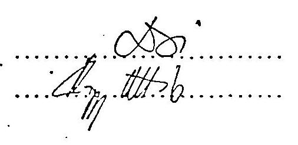

---

# 14. sm. melléklet

|  14. sm. melléklet |  |  |   |
| --- | --- | --- | --- |
|  14. sm. melléklet |  |  |   |
|  14.1. melléklet |  |  |   |
|  14.2. melléklet |  |  |   |
|  14.3. melléklet |  |  |   |
|  14.4. melléklet |  |  |   |
|  14.5. melléklet |  |  |   |
|  14.6. melléklet |  |  |   |
|  14.7. melléklet |  |  |   |
|  14.8. melléklet |  |  |   |
|  14.9. melléklet |  |  |   |
|  14.10. melléklet |  |  |   |
|  14.11. melléklet |  |  |   |
|  14.12. melléklet |  |  |   |
|  14.13. melléklet |  |  |   |
|  14.14. melléklet |  |  |   |
|  14.15. melléklet |  |  |   |
|  14.16. melléklet |  |  |   |
|  14.17. melléklet |  |  |   |
|  14.18. melléklet |  |  |   |
|  14.19. melléklet |  |  |   |
|  14.20. melléklet |  |  |   |
|  14.21. melléklet |  |  |   |
|  14.22. melléklet |  |  |   |
|  14.23. melléklet |  |  |   |
|  14.24. melléklet |  |  |   |
|  14.25. melléklet |  |  |   |
|  14.26. melléklet |  |  |   |
|  14.27. melléklet |  |  |   |
|  14.28. melléklet |  |  |   |
|  14.29. melléklet |  |  |   |
|  14.30. melléklet |  |  |   |
|  14.31. melléklet |  |  |   |
|  14.32. melléklet |  |  |   |
|  14.33. melléklet |  |  |   |
|  14.34. melléklet |  |  |   |
|  14.35. melléklet |  |  |   |
|  14.36. melléklet |  |  |   |
|  14.37. melléklet |  |  |   |
|  14.38. melléklet |  |  |   |
|  14.39. melléklet |  |  |   |
|  14.40. melléklet |  |  |   |
|  14.41. melléklet |  |  |   |
|  14.42. melléklet |  |  |   |
|  14.43. melléklet |  |  |   |
|  14.44. melléklet |  |  |   |
|  14.45. melléklet |  |  |   |
|  14.46. melléklet |  |  |   |
|  14.47. melléklet |  |  |   |
|  14.48. melléklet |  |  |   |
|  14.49. melléklet |  |  |   |
|  14.50. melléklet |  |  |   |
|  14.51. melléklet |  |  |   |
|  14.52. melléklet |  |  |   |
|  14.53. melléklet |  |  |   |
|  14.54. melléklet |  |  |   |
|  14.55. melléklet |  |  |   |
|  14.56. melléklet |  |  |   |
|  14.57. melléklet |  |  |   |
|  14.58. melléklet |  |  |   |
|  14.59. melléklet |  |  |   |
|  14.60. melléklet |  |  |   |
|  14.61. melléklet |  |  |   |
|  14.62. melléklet |  |  |   |
|  14.63. melléklet |  |  |   |
|  14.64. melléklet |  |  |   |
|  14.65. melléklet |  |  |   |
|  14.66. melléklet |  |  |   |
|  14.67. melléklet |  |  |   |
|  14.68. melléklet |  |  |   |
|  14.69. melléklet |  |  |   |
|  14.70. melléklet |  |  |   |
|  14.71. melléklet |  |  |   |
|  14.72. melléklet |  |  |   |
|  14.73. melléklet |  |  |   |
|  14.74. melléklet |  |  |   |
|  14.75. melléklet |  |  |   |
|  14.76. melléklet |  |  |   |
|  14.77. melléklet |  |  |   |
|  14.78. melléklet |  |  |   |
|  14.79. melléklet |  |  |   |
|  14.80. melléklet |  |  |   |
|  14.81. melléklet |  |  |   |
|  14.82. melléklet |  |  |   |
|  14.83. melléklet |  |  |   |
|  14.84. melléklet |  |  |   |
|  14.85. melléklet |  |  |   |
|  14.86. melléklet |  |  |   |
|  14.87. melléklet |  |  |   |
|  14.88. melléklet |  |  |   |
|  14.89. melléklet |  |  |   |
|  14.90. melléklet |  |  |   |
|  14.91. melléklet |  |  |   |
|  14.92. melléklet |  |  |   |
|  14.93. melléklet |  |  |   |
|  14.94. melléklet |  |  |   |
|  14.95. melléklet |  |  |   |
|  14.96. melléklet |  |  |   |
|  14.97. melléklet |  |  |   |
|  14.98. melléklet |  |  |   |
|  14.99. melléklet |  |  |   |
|  15.00. melléklet |  |  |   |
|  15.01. melléklet |  |  |   |
|  15.02. melléklet |  |  |   |
|  15.03. melléklet |  |  |   |
|  15.04. melléklet |  |  |   |
|  15.05. melléklet |  |  |   |
|  15.06. melléklet |  |  |   |
|  15.07. melléklet |  |  |   |
|  15.08. melléklet |  |  |   |
|  15.09. melléklet |  |  |   |
|  15.10. melléklet |  |  |   |
|  15.11. melléklet |  |  |   |
|  15.12. melléklet |  |  |   |
|  15.13. melléklet |  |  |   |
|  15.14. melléklet |  |  |   |
|  15.15. melléklet |  |  |   |
|  15.16. melléklet |  |  |   |
|  15.17. melléklet |  |  |   |
|  15.18. melléklet |  |  |   |
|  15.19. melléklet |  |  |   |
|  15.20. melléklet |  |  |   |
|  15.21. melléklet |  |  |   |
|  15.22. melléklet |  |  |   |
|  15.23. melléklet |  |  |   |
|  15.24. melléklet |  |  |   |
|  15.25. melléklet |  |  |   |
|  15.26. melléklet |  |  |   |
|  15.27. melléklet |  |  |   |
|  15.28. melléklet |  |  |   |
|  15.29. melléklet |  |  |   |
|  15.30. melléklet |  |  |   |
|  15.31. melléklet |  |  |   |
|  15.32. melléklet |  |  |   |
|  15.33. melléklet |  |  |   |
|  15.34. melléklet |  |  |   |
|  15.35. melléklet |  |  |   |
|  15.36. melléklet |  |  |   |
|  15.37. melléklet |  |  |   |
|  15.38. melléklet |  |  |   |
|  15.39. melléklet |  |  |   |
|  15.40. melléklet |  |  |   |
|  15.41. melléklet |  |  |   |
|  15.42. melléklet |  |  |   |
|  15.43. melléklet |  |  |   |
|  15.44. melléklet |  |  |   |
|  15.45. melléklet |  |  |   |
|  15.46. melléklet |  |  |   |
|  15.47. melléklet |  |  |   |
|  15.48. melléklet |  |  |   |
|  15.49. melléklet |  |  |   |
|  15.50. melléklet |  |  |   |
|  15.51. melléklet |  |  |   |
|  15.52. melléklet |  |  |   |
|  15.53. melléklet |  |  |   |
|  15.54. melléklet |  |  |   |
|  15.55. melléklet |  |  |   |
|  15.56. melléklet |  |  |   |
|  15.57. melléklet |  |  |   |
|  15.58. melléklet |  |  |   |
|  15.59. melléklet |  |  |   |
|  15.60. melléklet |  |  |   |
|  15.61. melléklet |  |  |   |
|  15.62. melléklet |  |  |   |
|  15.63. melléklet |  |  |   |
|  15.64. melléklet |  |  |   |
|  15.65. melléklet |  |  |   |
|  15.66. melléklet |  |  |   |
|  15.67. melléklet |  |  |   |
|  15.68. melléklet |  |  |   |
|  15.69. melléklet |  |  |   |
|  15.70. melléklet |  |  |   |
|  15.71. melléklet |  |  |   |
|  15.72. melléklet |  |  |   |
|  15.73. melléklet |  |  |   |
|  15.74. melléklet |  |  |   |
|  15.75. melléklet |  |  |   |
|  15.76. melléklet |  |  |   |
|  15.77. melléklet |  |  |   |
|  15.78. melléklet |  |  |   |
|  15.79. melléklet |  |  |   |
|  15.80. melléklet |  |  |   |
|  15.81. melléklet |  |  |   |
|  15.82. melléklet |  |  |   |
|  15.83. melléklet |  |  |   |
|  15.84. melléklet |  |  |   |
|  15.85. melléklet |  |  |   |
|  15.86. melléklet |  |  |   |
|  15.87. melléklet |  |  |   |
|  15.88. melléklet |  |  |   |
|  15.89. melléklet |  |  |   |
|  15.90. melléklet |  |  |   |
|  15.91. melléklet |  |  |   |
|  15.92. melléklet |  |  |   |
|  15.93. melléklet |  |  |   |
|  15.94. melléklet |  |  |   |
|  15.95. melléklet |  |  |   |
|  15.96. melléklet |  |  |   |
|  15.97. melléklet |  |  |   |
|  15.98. melléklet |  |  |   |
|  15.99. melléklet |  |  |   |
|  15.10. melléklet |  |  |   |
|  15.11. melléklet |  |  |   |
|  15.12. melléklet |  |  |   |
|  15.13. melléklet |  |  |   |
|  15.14. melléklet |  |  |   |
|  15.15. melléklet |  |  |   |
|  15.16. melléklet |  |  |   |
|  15.17. melléklet |  |  |   |
|  15.18. melléklet |  |  |   |
|  15.19. melléklet |  |  |   |
|  15.20. melléklet |  |  |   |
|  15.21. melléklet |  |  |   |
|  15.22. melléklet |  |  |   |
|  15.23. melléklet |  |  |   |
|  15.24. melléklet |  |  |   |
|  15.25. melléklet |  |  |   |
|  15.26. melléklet |  |  |   |
|  15.27. melléklet |  |  |   |
|  15.28. melléklet |  |  |   |
|  15.29. melléklet |  |  |   |
|  15.30. melléklet |  |  |   |
|  15.31. melléklet |  |  |   |
|  15.32. melléklet |  |  |   |
|  15.33. melléklet |  |  |   |
|  15.34. melléklet |  |  |   |
|  15.35. melléklet |  |  |   |
|  15.36. melléklet |  |  |   |
|  15.37. melléklet |  |  |   |
|  15.38. melléklet |  |  |   |
|  15.39. melléklet |  |  |   |
|  15.40. melléklet |  |  |   |
|  15.41. melléklet |  |  |   |
|  15.42. melléklet |  |  |   |
|  15.43. melléklet |  |  |   |
|  15.44. melléklet |  |  |   |
|  15.45. melléklet |  |  |   |
|  15.46. melléklet |  |  |   |
|  15.47. melléklet |  |  |   |
|  15.48. melléklet |  |  |   |
|  15.49. melléklet |  |  |   |
|  15.50. melléklet |  |  |   |
|  15.51. melléklet |  |  |   |
|  15.52. melléklet |  |  |   |
|  15.53. melléklet |  |  |   |
|  15.54. melléklet |  |  |   |
|  15.55. melléklet |  |  |   |
|  15.56. melléklet |  |  |   |
|  15.57. melléklet |  |  |   |
|  15.58. melléklet |  |  |   |
|  15.59. melléklet |  |  |   |
|  15.60. melléklet |  |  |   |
|  15.61. melléklet |  |  |   |
|  15.62. melléklet |  |  |   |
|  15.63. melléklet |  |  |   |
|  15.64. melléklet |  |  |   |
|  15.65. melléklet |  |  |   |
|  15.66. melléklet |  |  |   |
|  15.67. melléklet |  |  |   |
|  15.68. melléklet |  |  |   |
|  15.69. melléklet |  |  |   |
|  15.70. melléklet |  |  |   |
|  15.71. melléklet |  |  |   |
|  15.72. melléklet |  |  |   |
|  15.73. melléklet |  |  |   |
|  15.74. melléklet |  |  |   |
|  15.75. melléklet |  |  |   |
|  15.76. melléklet |  |  |   |
|  15.77. melléklet |  |  |   |
|  15.78. melléklet |  |  |   |
|  15.79. melléklet |  |  |   |
|  15.80. melléklet |  |  |   |
|  15.81. melléklet |  |  |   |
|  15.82. melléklet |  |  |   |
|  15.83. melléklet |  |  |   |
|  15.84. melléklet |  |  |   |
|  15.85. melléklet |  |  |   |
|  15.86. melléklet |  |  |   |
|  15.87. melléklet |  |  |   |
|  15.88. melléklet |  |  |   |
|  15.89. melléklet |  |  |   |
|  15.90. melléklet |  |  |   |
|  15.91. melléklet |  |  |   |
|  15.92. melléklet |  |  |   |
|  15.93. melléklet |  |  |   |
|  15.94. melléklet |  |  |   |
|  15.95. melléklet |  |  |   |
|  15.96. melléklet |  |  |   |
|  15.97. melléklet |  |  |   |
|  15.98. melléklet |  |  |   |
|  15.99. melléklet |  |  |   |
|  15.10. melléklet |  |  |   |
|  15.11. melléklet |  |  |   |
|  15.12. melléklet |  |  |   |
|  15.13. melléklet |  |  |   |
|  15.14. melléklet |  |  |   |
|  15.15. melléklet |  |  |   |
|  15.16. melléklet |  |  |   |
|  15.17. melléklet |  |  |   |
|  15.18. melléklet |  |  |   |
|  15.19. melléklet |  |  |   |
|  15.20. melléklet |  |  |   |
|  15.21. melléklet |  |  |   |
|  15.22. melléklet |  |  |   |
|  15.23. melléklet |  |  |   |
|  15.24. melléklet |  |  |   |
|  15.25. melléklet |  |  |   |
|  15.26. melléklet |  |  |   |
|  15.27. melléklet |  |  |   |
|  15.28. melléklet |  |  |   |
|  15.29. melléklet |  |  |   |
|  15.30. melléklet |  |  |   |
|  15.31. melléklet |  |  |   |
|  15.32. melléklet |  |  |   |
|  15.33. melléklet |  |  |   |
|  15.34. melléklet |  |  |   |
|  15.35. melléklet |  |  |   |
|  15.36. melléklet |  |  |   |
|  15.37. melléklet |  |  |   |
|  15.38. melléklet |  |  |   |
|  15.39. melléklet |  |  |   |
|  15.40. melléklet |  |  |   |
|  15.41. melléklet |  |  |   |
|  15.42. melléklet |  |  |   |
|  15.43. melléklet |  |  |   |
|  15.44. melléklet |  |  |   |
|  15.45. melléklet |  |  |   |
|  15.46. melléklet |  |  |   |
|  15.47. melléklet |  |  |   |
|  15.48. melléklet |  |  |   |
|  15.49. melléklet |  |  |   |
|  15.50. melléklet |  |  |   |
|  15.51. melléklet |  |  |   |
|  15.52. melléklet |  |  |   |
|  15.53. melléklet |  |  |   |
|  15.54. melléklet |  |  |   |
|  15.55. melléklet |  |  |   |
|  15.56. melléklet |  |  |   |
|  15.57. melléklet |  |  |   |
|  15.58. melléklet |  |  |   |
|  15.59. melléklet |  |  |   |
|  15.60. melléklet |  |  |   |
|  15.61. melléklet |  |  |   |
|  15.62. melléklet |  |  |   |
|  15.63. melléklet |  |  |   |
|  15.64. melléklet |  |  |   |
|  15.65. melléklet |  |  |   |
|  15.66. melléklet |  |  |   |
|  15.67. melléklet |  |  |   |
|  15.68. melléklet |  |  |   |
|  15.69. melléklet |  |  |   |
|  15.70. melléklet |  |  |   |
|  15.71. melléklet |  |  |   |
|  15.72. melléklet |  |  |   |
|  15.73. melléklet |  |  |   |
|  15.74. melléklet |  |  |   |
|  15.75. melléklet |  |  |   |
|  15.76. melléklet |  |  |   |
|  15.77. melléklet |  |  |   |
|  15.78. melléklet |  |  |   |
|  15.79. melléklet |  |  |   |
|  15.80. melléklet |  |  |   |
|  15.81. melléklet |  |  |   |
|  15.82. melléklet |  |  |   |
|  15.83. melléklet |  |  |   |
|  15.84. melléklet |  |  |   |
|  15.85. melléklet |  |  |   |
|  15.86. melléklet |  |  |   |
|  15.87. melléklet |  |  |   |
|  15.88. melléklet |  |  |   |
|  15.89. melléklet |  |  |   |
|  15.90. melléklet |  |  |   |
|  15.91. melléklet |  |  |   |
|  15.92. melléklet |  |  |   |
|  15.93. melléklet |  |  |   |
|  15.94. melléklet |  |  |   |
|  15.95. melléklet |  |  |   |
|  15.96. melléklet |  |  |   |
|  15.97. melléklet |  |  |   |
|  15.98. melléklet |  |  |   |
|  15.99. melléklet |  |  |   |
|  15.10. melléklet |  |  |   |
|  15.11. melléklet |  |  |   |
|  15.12. melléklet |  |  |   |
|  15.13. melléklet |  |  |   |
|  15.14. melléklet |  |  |   |
|  15.15. melléklet |  |  |   |
|  15.16. melléklet |  |  |   |
|  15.17. melléklet |  |  |   |
|  15.18. melléklet |  |  |   |
|  15.19. melléklet |  |  |   |
|  15.20. melléklet |  |  |   |
|  15.21. melléklet |  |  |   |
|  15.22. melléklet |  |  |   |
|  15.23. melléklet |  |  |   |
|  15.24. melléklet |  |  |   |
|  15.25. melléklet |  |  |   |
|  15.26. melléklet |  |  |   |
|  15.27. melléklet |  |  |   |
|  15.28. melléklet |  |  |   |
|  15.29. melléklet |  |  |   |
|  15.30. melléklet |  |  |   |
|  15.31. melléklet |  |  |   |
|  15.32. melléklet |  |  |   |
|  15.33. melléklet |  |  |   |
|  15.34. melléklet |  |  |   |
|  15.35. melléklet |  |  |   |
|  15.36. melléklet |  |  |   |
|  15.37. melléklet |  |  |   |
|  15.38. melléklet |  |  |   |
|  15.39. melléklet |  |  |   |
|  15.40. melléklet |  |  |   |
|  15.41. melléklet |  |  |   |
|  15.42. melléklet |  |  |   |
|  15.43. melléklet |  |  |   |
|  15.44. melléklet |  |  |   |
|  15.45. melléklet |  |  |   |
|  15.46. melléklet |  |  |   |
|  15.47. melléklet |  |  |   |
|  15.48. melléklet |  |  |   |
|  15.49. melléklet |  |  |   |
|  15.50. melléklet |  |  |   |
|  15.51. melléklet |  |  |   |
|  15.52. melléklet |  |  |   |
|  15.53. melléklet |  |  |   |
|  15.54. melléklet |  |  |   |
|  15.55. melléklet |  |  |   |
|  15.56. melléklet |  |  |   |
|  15.57. melléklet |  |  |   |
|  15.58. melléklet |  |  |   |
|  15.59. melléklet |  |  |   |
|  15.60. melléklet |  |  |   |
|  15.61. melléklet |  |  |   |
|  15.62. melléklet |  |  |   |
|  15.63. melléklet |  |  |   |
|  15.64. melléklet |  |  |   |
|  15.65. melléklet |  |  |   |
|  15.66. melléklet |  |  |   |
|  15.67. melléklet |  |  |   |
|  15.68. melléklet |  |  |   |
|  15.69. melléklet |  |  |   |
|  15.70. melléklet |  |  |   |
|  15.71. melléklet |  |  |   |
|  15.72. melléklet |  |  |   |
|  15.73. melléklet |  |  |   |
|  15.74. melléklet |  |  |   |
|  15.75. melléklet |  |  |   |
|  15.76. melléklet |  |  |   |
|  15.77. melléklet |  |  |   |
|  15.78. melléklet |  |  |   |
|  15.79. melléklet |  |  |   |
|  15.80. melléklet |  |  |   |
|  15.81. melléklet |  |  |   |
|  15.82. melléklet |  |  |   |
|  15.83. melléklet |  |  |   |
|  15.84. melléklet |  |  |   |
|  15.85. melléklet |  |  |   |
|  15.86. melléklet |  |  |   |
|  15.87. melléklet |  |  |   |
|  15.88. melléklet |  |  |   |
|  15.89. melléklet |  |  |   |
|  15.90. melléklet |  |  |   |
|  15.91. melléklet |  |  |   |
|  15.92. melléklet |  |  |   |
|  15.93. melléklet |  |  |   |
|  15.94. melléklet |  |  |   |
|  15.95. melléklet |  |  |   |
|  15.96. melléklet |  |  |   |
|  15.97. melléklet |  |  |   |
|  15.98. melléklet |  |  |   |
|  15.99. melléklet |  |  |   |
|  15.100. melléklet |  |  |   |
|  15.110. melléklet |  |  |   |
|  15.111. melléklet |  |  |   |
|  15.112. melléklet |  |  |   |
|  15.113. melléklet |  |  |   |
|  15.114. melléklet |  |  |   |
|  15.115. melléklet |  |  |   |
|  15.116. melléklet |  |  |   |
|  15.117. melléklet |  |  |   |
|  15.118. melléklet |  |  |   |
|  15.119. melléklet |  |  |   |
|  15.120. melléklet |  |  |   |
|  15.121. melléklet |  |  |   |
|  15.122. melléklet |  |  |   |
|  15.122. melléklet |  |  |   |
|  15.123. melléklet |  |  |   |
|  15.124. melléklet |  |  |   |
|  15.125. moll |  |  |   |
|  15.126. moll |  |  |   |
|  15.127. moll |  |  |   |
|  15.128. moll |  |  |   |
|  15.129. moll |  |  |   |
|  15.130. moll |  |  |   |
|  15.131. moll |  |  |   |
|  15.132. moll |  |  |   |
|  15.133. moll |  |  |   |
|  15.134. moll |  |  |   |
|  15.135. moll |  |  |   |
|  15.136. moll |  |  |   |
|  15.137. moll |  |  |   |
|  15.138. moll |  |  |   |
|  15.139. moll |  |  |   |
|  15.140. moll |  |  |   |
|  15.141. moll |  |  |   |
|  15.142. moll |  |  |   |
|  15.142. moll |  |  |   |
|  15.143. moll |  |  |   |
|  15.143. moll |  |  |   |
|  15.144. moll |  |  |   |
|  15.144. moll |  |  |   |
|  15.145. moll |  |  |   |
|  15.146. moll |  |  |   |
|  15.147. moll |  |  |   |
|  15.148. moll |  |  |   |
|  15.149. moll |  |  |   |
|  15.150. moll |  |  |   |
|  15.151. moll |  |  |   |
|  15.152. moll |  |  |   |
|  15.153. moll |  |  |   |
|  15.154. moll |  |  |   |
|  15.155. moll |  |  |   |
|  15.155. moll |  |  |   |
|  15.156. moll |  |  |   |
|  15.157. moll |  |  |   |
|  15.158. moll |  |  |   |
|  15.159. moll |  |  |   |
|  15.160. moll |  |  |   |
|  15.161. moll |  |  |   |
|  15.162. moll |  |  |   |
|  15.162. moll |  |  |   |
|  15.163. moll |  |  |   |
|  16.162. moll |  |  |   |
|  16.164. moll |  |  |   |
|  16.165. moll |  |  |   |
|  16.166. moll |  |  |   |
|  16.167. moll |  |  |   |
|  16.168. moll |  |  |   |
|  16.169. moll |  |  |   |
|  16.170. moll |  |  |   |
|  16.171. moll |  |  |   |
|  16.172. moll |  |  |   |
|  16.173. moll |  |  |   |
|  16.174. moll |  |   |
|  16.175. moll |  |  |   |
|  16.176. moll |  |  |   |
|  16.177. moll |  |   |
|  16.177. moll |  |  |   |
|  16.177. moll |  |  |   |
|  16.178. moll |  |  |   |
|  16.179. moll |  |  |   |
|  16.180. moll |  |  |   |
|  16.181. moll |  |  |   |
|  16.181. moll |  |  |   |
|  16.182. moll |  |  |   |
|  16.183. moll |  |  |   |
|  16.184. moll |  |  |   |
|  16.185. moll |  |  |   |
|  16.186. moll |  |  |   |
|  16.187. moll |  |  |   |
|  16.187. moll |  |  |   |
|  16.188. moll |  |  |   |
|  16.188. moll |  |  |   |
|  16.188. moll |  |  |   |
|  16.189. moll |  |  |   |
|  16.190. moll |  |   |
|  16.191. moll |  |   |
|  16.192. moll |  |  |   |
|  16.193. moll |  |   |
|  16.193. moll |  |   |
|  16.194. moll |  |   |
|  16.192. moll |  |  |   |
|  16.193. moll |  |   |
|  16.194. moll |  |   |
|  16.195. moll |  |   |
|  16.195. moll |  |   |
|  16.196. moll |  |   |
|  16.197. moll |  |   |
|  16.197. moll |  |   |
|  16.197. moll |  |   |
|  16.197. moll |  |   |
|  16.198. moll |  |   |
|  16.198. moll |  |   |
|  16.198. moll |  |   |
|  16.199. moll |  |   |
|  16.199. moll |  |   |
|  16.199. moll |  |   |
|  16.199. moll |  |   |
|  16.199. moll |  |   |
|  16.199. moll |  |   |
|  16.199. moll |  |   |
|  16.199. moll |  |   |
|  16.199. moll |  |   |
|  16.199. moll |  |   |
|  16.199. moll |  |   |
|  16.199. moll |  |   |
|  16.199. moll |  |   |
|  16.199. moll |  |   |
|  16.199. moll |  |   |
|  16.199. moll |  |   |
|  16.199. moll |  |   |
|  16.199. moll |  |   |
|  16.199. moll |  |   |
|  16.199. moll |  |   |
|  16.199. moll |  |   |
|  16.199. moll |  |   |
|  16.199. moll |  |   |
|  16.199. moll |  |   |
|  16.199. moll |  |   |
|  16.199. moll |  |   |
|  16.199. moll |  |   |
|  16.199. moll |  |   |
|  16.199. moll |  |   |
|  16.199. moll |  |   |
|  16.199. moll |  |   |
|  

---

|  Sunn | Aegonvesta | 2016/17 10.00 | 2017/18 10.00 | 2018/19 10.00  |
| --- | --- | --- | --- | --- |
|  2222 | Tjôotdina teisôudil va seng foppêzst hãza. | 26 200 | 7 220 | 8 206  |
|  2220 | Tjôotdina hãzudatõõõõõõõõõõõõõõõõõõõõõõõõõõõõõõõõõõõõõõõõõõõõõõõõõõõõõõõõõõõõõõõõõõõõõõõõõõõõõõõõõõõõõõõõõõõõõõõõõõõõõõõõõõõõõõõõõõõõõõõõõõõõõõõõõõõõõõõõõõõõõõõõõõõõõõõõõõõõõõõõõõõõõõõõõõõõõõõõõõõõõõõõõõõõõõõõõõõõõõõõõõõõõõõõõõõõõõ

---

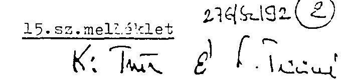

Dr. Szoke Miklós úrnak, vezérigazgato

ÁLLAMI FEJLESZTESI INTEZET

Budapest
Tisztelt szoke úr!

A 35/1991. (XII.21.) PM rendelet hatályba lépésével kapcsolatos levelében foglaltakra válaszolva az alábbiakról tájékoztatom.

Véleményem szerint jelentós jogértelmezési probléma nem merülhet fel. Az említett jogszabályból ugyanis egyértelmưen kitưnik, hogy

- a le nem zárt szanálási eljárások befejezése;
- a Szanálási Alap terhére, illetve javára vállalt kötelezettségek rendezóse) = teljesítése
- a szanálási Megállapodásokban vállalt kötelezettségek teljesítésének folyamatos (figyelemmel kisérése
az AFI feladata.

Az állami szanálásra vonatkozó megállapodásokban két fél szerepel(t). Ezek közül a Szanáló Szervezet Szünt meg. A jogszabályból egyértelma, hogy ennek a helyébe lép - jogutódként - az Állami Fejlesztési Intézet.

---

Ertheto tehát, hogy az érintett gazdálkodó szervezetek az AFI-t keresik meg keréseikkel. Ezzel kapcsolatban az a véleményem, hogy az Intézet a szanálási megállapodásokat ne módositsa, tehát adósságot ne ütemezzen át, ne engedjen el és más szervezetnél ne interveniáljon ilyen ügyben.

Válságmendezselési szempontból - adott esetben - a kérelmek indokoltak is lehetnek, de errol most már - valamennyi hitelezo bevonásával - az új csodtörvény által szabályozott csodegyezség keretében célszeru dönteni. Javasolják a: érintett gazdálkodóknak; éljenek a csod bejelentésének le-1 hatoségével.

Az AFI-nak megvan a jogalanvisága a Szanáló Szervezet, il letve a Szanálási Alap kinntlévcségeinek behajtására, hisz a rendelet szerint feladata nemcsak a kötelezettségek teljesítésének figyelemmel kísérése, hanem "a Szanálási Alap terhére, illetve javára vállalt kötelezettségek rendezésa". Az AFI-nak tehát kötelezettsége:

- a kintlévs hitelállomány; akár a felszámolási eljárás megindítása utján történő, behajtása;
- a csod- yagy felszámolási/ eljárásban a hitelezoként :történơ fellépés.

2. 

A Szanálási Alap helyett más, alapként viselkeds számla megnyitását nem tartom szükségesnek.

A kintlévcségeket kérem esedékességkor beszedni és Pénzügyminisztérium 232-90103-4000 "Különleges bevételek, bevételi számla" elnevezésa számlájára haladéktalanul átutalni; annak eredetérol pedig az Állami Költségvetési Főosztályt tájékoztatni.

---

A kötelezettségek teljesítéséhez szükséges fedezetet-a3 ésedókésséget két-héttel megelozóen/kérem az Állami Költségvetési F0osztálytól - kell0en alátámasztott indokolással - megigényelni.

Minden év január 31-éig kérek részletes tájékoztatást arról, hogy a megelozo év "Szanálási Alapot" terhel0 kötelezettségei és bevételei miként alakultak, miért és mennyiben térnek el a Szanáló Szervezet által készített és AFI-nak átadott kimutatásban (35/1991. (XII.21.) PM rendelet 1. 5 b/ pontja) foglaltaktól és mit tett az AFI a "bevételek" behajtása érdekében.

A Szanálási Alap forrásainak kielégítésére 1987-ben kibocsátott szerkezetátalakítási kötvény visszavásárlását és kamatainak fizetését az Állami Költségvetési F0osztály közvetlenül fogja az érintett bankokkal rendezni. Kérem, hogy az erre vonatkozo, Szanáló Szervezettol átvett dokumentumokat szíveskedjék rendelkezésemre bocsátani.

Egyetértése esetén az elobbieket (2.) tekintem a pénzügyminisztérium és az Állami Fejlesztési Intézet közötti közvetlen megállapodásnak (35/1991.(XII.21.) PM rendelet 2. 5 (2) bekezdés).

Esetleges észrevételeircl kérem tájékoztasson.

Budapest, 1992. február 13.

---

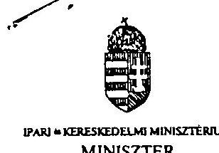

Dr. Hagelmayer István elnök úr részére
Állami Számvevôszék

B U D A P E S T
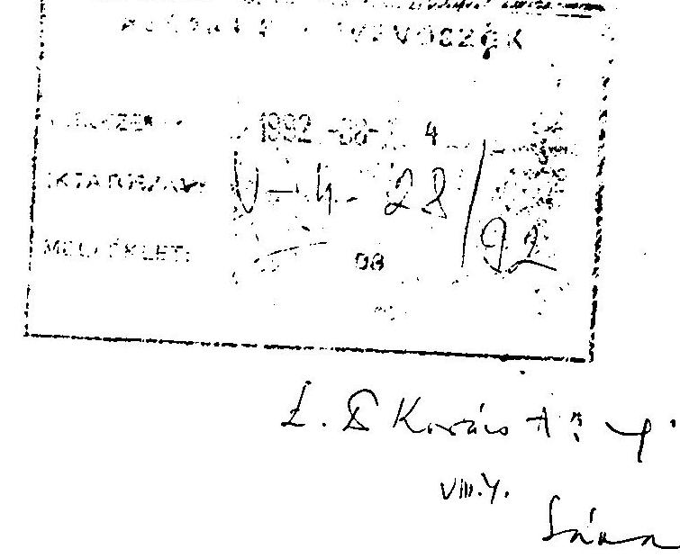

Tisztelt Elnök Úr!

Az Állami Számvevôszéknek az IKARUS és a Csepel Autó állami vállalatok együttes szanálásának és privatizálásának célszerűségi és szabályszerűségi vizsgálatáról szóló jelentését köszönettel megkaptam, észrevételeimet a következôkben foglalom össze.

A Jelentés fôbb megállapításaival és az intézkedések végrehajtásával egyetértek.

A vizsgálati jelentés az IKARUS és a Csepel Autógyár együttes szanálásának folyamatát tekinti át, vizsgálja a szanáláshoz kapcsolódó társaságalapítás helyzetét, a szanálás lezárásának állapotát és minősítô elemzést készít a szanálással érintett gazdálkodó egységek állapotáról. Elôzôek, valamint az ellenôrzés részletes megállapításaira épülô összefoglaló következtetések alapján javaslatot tesz a Jelentés.

Az 1992. június 19-i, e tárgyban írt észrevételeinkkel egyidôben megküldött korábbi dokumentumokban rögzitettük az IKM álláspontját az IKARUS Karosszé-ria- és Jármûgyár, valamint a Csepel Autó együttes állami szanálásával és privatizációjával kapcsolatban.

Az ebben foglaltak tartalmazzák a szanálással és privatizációval kapcsola-

---

tos IKM álláspontot, és kritikai észrevételeket a Szanáló Szervezet és az Allami Vagyonügynökség Igazgató Tanácsának a kormánydöntéstől eltérő eljárásáról.

Különösen az iparpolitikai álláspontban fejtettük ki, hogy a szovjet partnerekkel történő szerződéskötéssel iparpolitikai szempontból nem értünk egyet, mert nem biztosítja az autóbuszok világpiaci áron való értékesítését, az autóbuszgyártásban az élenjáró technikai szint elérését. Nem megnyugtató a szovjet piac fizetőképességének menedzselése. Összességében azt javasoltuk, hogy állapítsuk meg a tender meghiúsulását és újabb pályázat kiírását.

A Szanáló Szervezet és az Állami Vagyonügynökség Igazgató Tanácsának döntését, amely elkülönítette az IKARUS és a Csepel Autó szanálását és privatizációját, mindvégig kifogásoltuk. Hangsúlyoztuk, hogy a Csepel Autó önálló értékesítése és szanálása piacvesztése következtében elképzelhetetlen.

Az IKARUS privatizációja során is azt hangsúlyoztuk, hogy az átalakulási törvénytől eltérő jogtechnika zavaros, áttekinthetetlen elszámolási viszonyokat eredményez, magában rejti az IKARUS Rt-be vitt állami vagyon leértékelődését.

Tekintettel arra, hogy az IKARUS Rt müködőképességének helyreállítása nem valósult meg, az IKM az egyedi kormánydöntést igénylő vállalatok közé sorolta abban a reményben, hogy a pénzügyi rendezés várható hatásaként sor kerülhetne olyan fejlesztésekre, melyek elengedhetetlenek a piac bővítéséhez.

A Csepel Autó a szanálási folyamat során elszenvedett folyamatos profilvesztése, a befagyott készletek növekvō nagyságrendje, valamint a vitatott követelések nem megfelelō szanálási rendezése következtében 1992. július 17. napján az 1991. évi IL. törvény 22. §-ában foglaltak alapján felszámolási eljárás iránti kérelmet nyújtott be az illetékes bírósághoz.

Budapest, 1992. július 29.
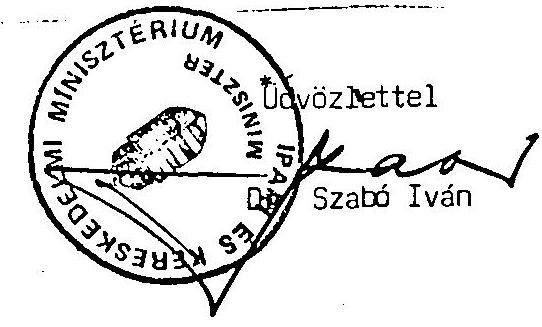

---

2494/1992.

Dr. Hagelmayer István úr
elnök

Állami Számvevőszék

# Budapest 

## Tisztelt Elnök Ưr!

Az IKARUS és CSEPEL AUTÓ állami vállalatok együttes szanálásának és privatizálásának célszerúségi és szabályszerűségi vizsgálatairól megküldött jelentéssel kapcsolatban véleményemet, észrevételeimet az alábbiakban foglalom össze.

A Pénzügyminisztérium végig figyelemmel kisérte a Szanáló Szervezet tevékenységét az IKARUS-CSEPEL AUTÓ együttes állami szanálása során.

A szanálás célja a fizetésképtelenné vált két vállalat múködőképességének, fizetőképességének helyreállítása volt, a munkahelyek lehetőleg teljes megtartása és a költségvetési ráfordítások kímélése mellett, gazdasági társasággá való átalakítással.

Nyilvánvaló, hogy a szanálás résztvevőinek ellenérdekei miatt az egyes döntési pontokon eltéró vélemények alakultak ki, amelyek ütköztetése során az adott időpontban ismert megoldási lehetőségek közül a legkedvezőbbnek ítélt változatot kellett kiválasztani. Ez az eset állt fenn az IKARUS vonatkozásában is, amikor a versenypályázat értékelése során kiválasztották a külföldi befektetőt.

A pályázat iránti érdeklődés hiánya miatt - amit a Jelentés is

---

megállapít - a döntésnél más racionális választási lehetőség nem volt. Egyedül a kiválasztott befektető biztosított olyan stratégiai lehetőséget, hogy az IKARUS az autóbuszai szinvonalát elfogadó és viszonylag olcsó áron igénylő piacon - ha a korábbinál kisebb volumenben is, de - el tudja adni termékeit. Új pályázat kiírása viszont tovább halasztotta volna a befejezést és növelte volna a szanálási költségeket. Ugyanakkor - az előző tapasztalatok alapján - nem teremtett volna jobb döntési helyzetet, illetve a vállalat csődbe kerül volna.

Az IKARUS szanálása a Szanálási Megállapodás aláírásával lezárult. Az Rt ezt követő létrehozásával bevont tőke lehetővé tette a fizetőképesség helyreállítását, az Rt jelenleg is élő múködését. Más döntési lehetőség csak a vállalat felszámolása lett volna, ami elsősorban a jelentős, több ezres - nem csak az IKARUS-nál jelentkező - munkaerő elbocsátás nyilvánvaló bekövetkezése miatt nehéz terhet róna a költségvetésre és feltehetően politikai vonatkozású kihatása is lett volna. Mindezek figyelembevételével a Szanáló Szervezet - és az ÁvÚ - döntése helyes és megalapozott volt. Az IKARUS Rt alapítás utáni múködését már a piac szabályozza, az emiatt felmerülő értékesítési, múködési problémák nem, vagy csak erőszakoltan vezethetők vissza a szanálási folyamatra.

A Szanálási Megállapodás szerint a CSEPEL AUTÓGYÁR-nál a szanálás a vállalat gazdasági társasággá való átalakulásával fejeződik be, lehetőleg 1991. december 31-ig. Ennek érdekében a Szanáló Szervezet több befektetővel is tárgyalt, de eredménytelenül.

A vállalat továbbra is fizetésképtelen, vagyis a szanálás nem járt eredménnyel. Ezért a Pénzügyminisztérium előterjesztést nyújtott be a Kormánynak, hogy jóváhagyását kérje a szanálás megszüntetéséhez. A Kormány az előterjesztést tudomásul vette és 3326/1992. (VII. 16.) határozatában - a Pénzügyminiszter felelőssége mellett - rendelkezett az állami szanálás meg-

---

szüntetéséról. (Ennek nyilvánvaló következménye a vállalat felszámolása lesz.)

A szanálási eljárást figyelemmel kisérve, az a véleményem, hogy a szanálás lényegében a vonatkozó két kormányhatározat szellemében folyt és a Szanáló Szervezet a vonatkozó jogszabályok szerint járt el. A CSEPEL AUTÓGYÁR megmaradt - IKARUS Rt-hez át nem csatolt - részei tekintetében a szanálás meghiúsulásáért a Szanáló Szervezetet nem terhelheti felelősség.

A Jelentésben rögzített javaslatokkal kapcsolatban a következôket kivánom megjegyezni:

A javaslatok 1., 2. és 3. pontjában foglaltakkal egyetértek.

A 4. pontban leírt javaslat idejét multa, mert - mint az elóbbiekben már ismertettem - a CSEPEL AUTÓGYÁR szanálásának meghiúsulása miatt a Pénzügyminsztérium f. év július elején előterjesztést nyújtott be a Kormánynak, amit az tudomásul vett és határozatot hozott (3326/1992. VII. 16.) a vállalat állami szanálásának megszüntetéséről.

A javaslat 5. pontját illetően megjegyzem, hogy a 16 Mrd Ft értékú vagyon átadását, az állami szanálások utógondozását az ÁFI-tól átvevố Reorg Rt ellenôrizni fogja.

A szanálás folyamatát végig kisérve az a véleményem, hogy a Szanáló Szervezet a vonatkozó jogszabályok betartásával járt el és a szanálás egészéért, illetve a CSEPEL AUTÓGYÁR szanálásának eredménytelenségéért nem marasztalható el.

Budapest, 1992. augusztus - J・.
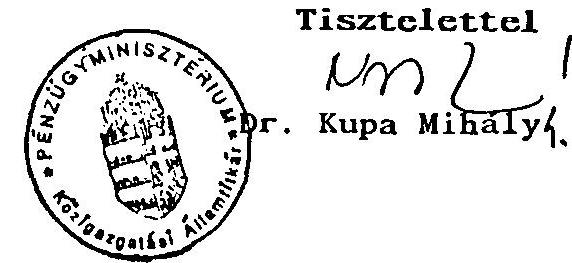

---

# Állami Fejlesztési Intézet 

Vezérigazgató

Hagelmayer István úr
elnök

Állami Számvevőszék
Budapest

Tisztelt Elnök Úrl

Köszönöm, hogy megküldte az IKARUS és Csepel Autó vállalatok együttes szanálásának és privattzálásának célszerüségi és szabályszerűségi vizsgálatairól készített jelentést.
Külön köszönöm, hogy az anyag véglegezése során legfontosabb észrevételeinket figyelembe vették.
A vizsgálati jelentés megállapításai, összefoglalókövetkeztetésel korrektek, megalapozzák a javaslatokat.
Csupán egy észrevételt füzünk a pontositás kedvéért a jelentés függelékéhez. Az 56. oldalon szerepel, hogy: "REORG RL a Szanálási Alap új kezelôjénél (ÁFI) a követelés "téves" lehívása miatt nem lépett fel, Igényét nem jelezte".
Szíves tudomásukra hozzuk, hogy a REORG RL 1992. június 12-én levelet írt az ÁFI-nak, miután a szanálási tevékenységükről kószített ÁFI-jelentés megállapította, hogy szabálytalanul használták fel a célelszámolási számlát.
A levelükben azt javasolták, hogy "A nem megfelelő számláról történő folyósitást úgy tudjuk rendezni, helyretenni, ha a Szanálási Alapról a célelszámolási számlára átutalásra kerül a 108 MFL*
Tekintettel arra, hogy a Szanálási Alap felett az ÁFI nem rendelkezik, e problémát a PM-mel kell egyeztetniük, kiváltképp azért, mert a PM 100\%-os tutajdonába került a Társaság.

Budapest, 1992. július 28.
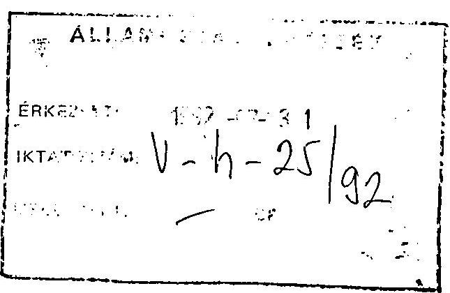

Tisztelettel
Allami Fejlesztési Intézet
$\frac{25}{2} 4$,
Dr. Szưke Miklós

---

# IKARUS 

## Állami Számvevõszék

Hagelmayer István
elnök úr

Tisztelt Elnök Úr!
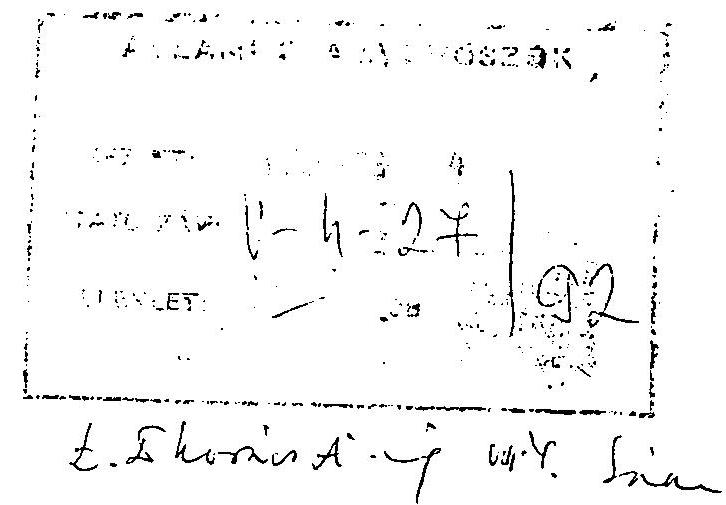

Köszönettel vettem az IKARUS és Csepel Autógyár állami vállalatok együttes szanálásáról és privatizálásának vizsgálatáról szóló jelentést. A jelentés megállapításait tényszerünek, tárgyilagosnak ítélem meg és elfogadom.

Az összefoglalásban szereplő, folyamatban lévô peres ügyekkel kapcsolatos javaslatot illetően az a véleményem, hogy azok megoldása nem lehet a részvénytársaság feladata. A Csepel Autógyárnak az IKARUS Karosszéria és Jármũgyár állami vállalat által soha el nem ismert 1,5 Mrd Ft vételár különbözet követelése, melyhez ez év végéig számítva 900 MFt-ot meghaladó kamatkövetelés járul, a szanálási eljárás során a Csepel Autógyár vagyona terhére lett volna, illetve lenne rendezhetõ. A részvénytársaság ezt a terhet nem vállalta és annak jövôbeni, akár részbeni átvállalására sem jogi, sem pénzügyi lehetôsége nincs.

A fentiek szíves tudomásul vételét kérve maradok
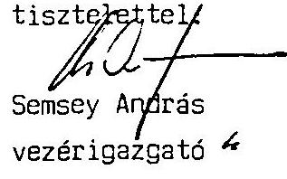

---

# IKARUS 

Állami Számvevôszék
Hagalmayor István
elnök úrnak
Budapest
Apáczai Csere János u. 10.
1052
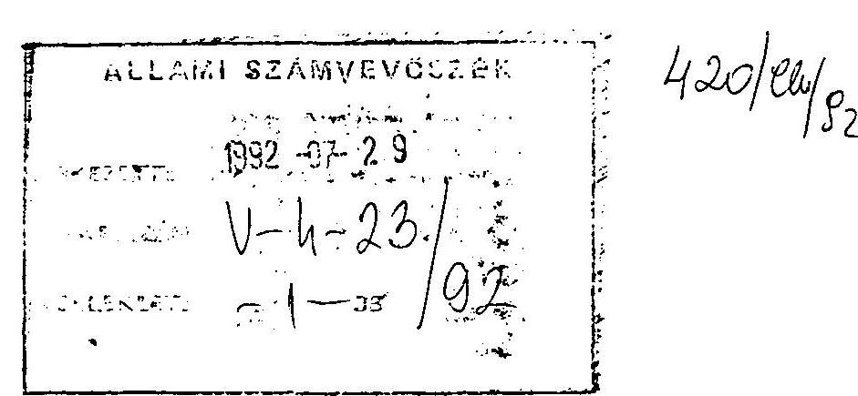

1992. július 27.
$3-h G h / 92$.

Tisztelt Elnök Ưr!
Harany:

Az Állami Számvevôszék V-4-22/1992. számú levelét, a 105 témaszámú jelentést megkaptam.

A jelentést tanulmányoztuk. Észrevételeink az Állami Számvevôszék Vagyonkezelő Föcsoportnak írt folyó év június 10.-i, 3-399/1992, számú levelünkben ismertetettekkel azonos.

Kérjük a fentiek szivas figyelembevételét.

Melléklat:
Hivatkozott levélmásolat

Tisztelettel:
IKARUS
Karoszefor és formogyar
Bórtapak
igazgató