# ÁLLAMI   SZÁMVEVŐSZÉK 

## JELENTÉS

a szervtranszplantáció, a donáció és az alternatív kezelések ellenőrzéséről

---

# 2. Államháztartás Központi Szintjét Ellenőrző Igazgatóság 

2.1. Teljesítmény Ellenőrzési Főcsoport

Iktatószám: V-2016-84/2009-2010.
Témaszám: 967
Vizsgálat-azonosító szám: V-0475

## Az ellenőrzést felügyelte:

Dr. Becker Pál
főigazgató
Az ellenőrzés végrehajtásáért felelős:
Dr. Zöldréti Attila
főcsoportfőnök
Az ellenőrzést vezette:
Winter Zsuzsa
osztályvezető főtanácsos
Az ellenőrzést végezték:

| Bravics Judit Barbara | Federics Adrienn |
| :-- | :-- |
| számvevő gyakornok | számvevő tanácsos |
| Kriston-Vizi János | Zachár Péterné |
| számvevő tanácsos | számvevő tanácsos |

Ganter Ildikó számvevő
Dr. Kaló Zoltán külső szakértő

---

# TARTALOMJEGYZÉK 

BEVEZETÉS ..... 13
I. ÖSSZEGZŐ MEGÁLLAPÍTÁSOK, KÖVETKEZTETÉSEK, JAVASLATOK ..... 19
II. RÉSZLETES MEGÁLLAPÍTÁSOK ..... 25

1. Az E. Alapból a transzplantációra fordított kiadások alakulása ..... 25
2. A magyarországi vesepótló kezelések ellenőrzése ..... 25
2.1. A dializált betegek számának, a kezelések E. Alapot terhelő kiadásainak alakulása ..... 25
2.2. A vesepótló kezelések kiadásainak összehasonlító elemzése ..... 27
2.3. A kezelőhelyek földrajzi megoszlása, egyenlő területi hozzáférés biztosítása a betegek számára ..... 29
2.4. A dializáltak számának nemzetközi adatokkal való összevetése a 2007. évi adatok alapján ..... 31
2.5. A betegtájékoztatás minősége a transzplantáció egyes típusairól ..... 33
2.6. A vesetranszplantációk számának alakulása, európai átlaghoz való viszonya, az élődonoros átültetés értékelése ..... 36
2.7. A vese-várólista vezetésének szabályai ..... 38
2.8. A vese-várólistán lévők száma, korösszetétele, a várólistán töltött várakozási idő alakulása ..... 39
2.9. Az egyes klinikákon végzett vesetranszplantációk túlélési eredményei ..... 42
2.10. A Magyar Nefrológiai Társaság dializálásra és transzplantációra vonatkozó adatainak feldolgozása, elemzése ..... 45
3. A tüdőtranszplantáció sajátosságai (hazai szervkivétel, külföldön történő beültetés, elkülönült finanszírozás) ..... 45
3.1. A tüdőtranszplantáció AKH-OKTPI közötti kétoldalú szerződés értékelése ..... 47
3.1.1. A szerződés tartalmának időbeli változása ..... 47
3.1.2. A megállapodások megvalósulása, eredményei, következményei ..... 49
3.2. A tüdőtranszplantáció egészségbiztosítói kiadása ..... 51
3.2.1. Külföldi gyógykezelés elszámolásának vizsgálata, értékelése ..... 51
3.2.1.1. 2005-2009 közötti beavatkozások kiadása az E. Alapból ..... 51
3.2.1.2. Az „elszámoláson kívüli költség" nagysága ..... 53

---

3.2.1.3. Tüdőtranszplantáltak természetbeni ellátásaira fordított egészségbiztosítói kiadások változása a túlélési idő függvényében ..... 53
4. Májtranszplantáció jellemzői ..... 55
5. Szívtranszplantáció jellemzői ..... 59
6. Hasnyálmirigy-transzplantáció jellemzői ..... 62
7. A transzplantáció és a kapcsolódó tevékenységek szabályozása ..... 64
7.1. A transzplantáció jogi szabályozása, megfelelőségük az EU irányelveknek, ajánlásoknak ..... 64
7.2. A donor felkutatás szabályozása ..... 66
7.2.1. Az agyhalál megállapításának szabálya, az agyhalált megállapító bizottságok működése ..... 67
7.2.2. A várólista vezetésének szabályozása ..... 67
8. A transzplantáció szervezeti struktúrája ..... 70
8.1. A szervátültetés szervezésének folyamata ..... 70
8.1.1. A Hungarotransplant Kht. működése, tevékenységének hatása a transzplantáció működtetésére ..... 70
8.1.2. A Szervkoordinációs Iroda tevékenysége ..... 71
8.2. A donorjelentő kórházak transzplantációban betöltött szerepe ..... 73
8.2.1. A donorjelentési aktivitás, a súlyponti kórházak donorjelentési aktivitása, az intenzív kapacitás ..... 73
8.2.2. A szervkivételi teamek munkája, a szervkivételi folyamat hatékonysága, a hideg ischaemiás idők csökkentése ..... 74
8.2.3. A donor és recipiens kiválasztás laboratóriumi háttere a központoknál ..... 74
8.3. A szervátültetést végző intézmények személyi feltételei ..... 74
9. A transzplantációs ellátást biztosító források ..... 75
9.1. Az OEP finanszírozás és a beavatkozások költsége ..... 75
9.2. A Szervkoordinációs Iroda kiadásai ..... 78
9.2.1. A Várólista Bizottságok működésének pénzügyi feltételei ..... 79
9.2.2. A HLA tipizálás és vírusszerológiai laborvizsgálatok kiadásai ..... 79

---

# MELLÉKLETEK 

1. sz. Észrevétel
2. sz. Kérdések, kritériumok és adatforrások
3. sz. Transzplantációk jellemző kiadási adatai, szervenként (2005-2009.)
4. sz. Fejlesztési kiadások 2005-2009. között a három nagy művese-szolgáltatónál (önbevallás alapján)
5. sz. Dialízis állomások és kezelőhelyek megoszlása megyénként (2009. naptári év)
6. sz. A dializált betegek kérdőívre adott válaszainak feldolgozása
7. sz. Néhány európai ország adata az egymillió lakosra vetített vesetranszplantációk száma szerint
8. sz. Az európai mezőnyben a millió lakosra vetített élődonoros vesetranszplantációk száma
9. sz. Az Eurotransplant országaiban a vese várólista és a transzplantációk számának alakulása 1969-2008 között
10. sz. Az egyes európai országokban a dializáltak és a várólistán lévők száma egymillió lakosra számítva
11. sz. Vesetranszplantáltak túlélési adatai klinikánként és országos összesen 2005-2009
12. sz. 2005-2009. évi tüdőtranszplantációk külföldi elszámolása
13. sz. 2008-as adatok a várólistán lévő új betegekről
14. sz. Donorjelentési aktivitás 2009-ben
15. sz. Intenzív szakápolók létszáma
16. sz. Nagy értékű, országosan nem elterjedt műtéti eljárások díjazása
17. sz. A donorellátás és a szervkivétel díjának alakulása
18. sz. Adatok a transzplantációhoz kapcsolódó, főcsoport nélküli HBCS-kről (*-os HBCS)
19. sz. A Szervkoordinációs Iroda tényleges kiadásai (2007-2009)
20. sz. A vese-, szív-, hasnyálmirigy-, máj- és tüdőátültetett betegek németországi Kaplan-Meier túlélési görbéje
21. sz. Tanúsítványok jegyzéke

---

# RÖVIDÍTÉSEK JEGYZÉKE 

| AKH | Allgemeines Krankenhaus der Stadt Wien -   Universitätskliniken (tüdőtranszplantációt végző kórház   Bécsben) |
| :--: | :--: |
| ÁNTSZ | Állami Népegészségügyi és Tisztiorvosi Szolgálat |
| ÁSZ | Állami Számvevőszék |
| BÉVER | OEP gyógyszertári informatikai program |
| CAPD | Hasi dialízis (Continuous Ambulatory Peritoneal   Dialysis) |
| E. Alap | Egészségbiztosítási Alap |
| EBF | Egészségbiztosítási Felügyelet |
| Ebtv. | A kötelező egészségbiztosítás ellátásairól szóló 1997. évi   LXXXIII. törvény |
| ERA-EDTA | European Renal Association - European Dialysis and   Transplant Association |
| EP | Európai Parlament |
| EPO | Erythropoietin |
| ESKI | Egészségügyi Stratégiai Kutatóintézet |
| EszCsM | Egészségügyi Szociális és Családügyi Minisztérium |
| ETI | Eurotransplant International |
| ETT TUKEB | Egészségügyi Tudományos Tanács Tudományos és Kutatásetikai Bizottság |
| EU | Európai Unió |
| EüM | Egészségügyi Minisztérium |
| Eütv. | Az egészségügyről szóló 1997. évi CLIV. törvény |
| GFR | Glomeruláris filtrációs ráta |
| GOKI | Gottsegen György Országos Kardiológiai Intézet |
| HBCS | Homogén betegségcsoport |
| *HBCS | Kiemelt homogén betegségcsoport |
| HD | Haemodialízis |
| HLA | Cadaver donor immunológiai vizsgálata   szövetösszeférhetőségi, sejtfelszíni fehérjék meghatározása |
| HDF | Haemodiafiltráció |
| KSH | Központi Statisztikai Hivatal |
| MAITT | Magyar Aneszteziológiai és Intenzív Terápiás Társaság |
| MANET | Magyar Nephrológiai Társaság |
| MTT | Magyar Transzplantációs Testület |
| OECD | Organisation for Economic Cooperation and   Development (Gazdasági Együttműködés és Fejlesztés   Szervezete) |
| OEP | Országos Egészségbiztosítási Pénztár |
| OGY | Országgyúlés |
| OKTPI | Országos Korányi TBC és Pulmonológiai Intézet |

---

| OMSZ | Országos Mentőszolgálat |
| :-- | :-- |
| OSZMK | Országos Szakfelügyeleti Módszertani Központ |
| OTH | Országos Tisztifőorvosi Hivatal |
| OTNy | Országos Transzplantációs Nyilvántartás |
| OVSZ | Országos Vérellátó Szolgálat (2006.12.31-ig) |
| OVSZK | Országos Vérellátó Szolgálat Központja (2007.01.01-től) |
| OVTB | Országos Vese Transzplantációs Bizottság |
| PD | Peritoneális dialízis |
| PMP | Per Million Population (Egymillió lakosra jutó) |
| RRT | Renal Replacement Therapy (vesepótló kezelések: dialízis |
|  | és transzplantáció) |
| SE | Semmelweis Egyetem |
| SZKI | Szervkoordinációs Iroda |
| SZMSZ | Szervezeti és Működési Szabályzat |
| UCLA | University of California, Los Angeles |

---

# ÉRTELMEZŐ SZÓTÁR 

Agyhalál

Agyhalál Bizottság

Aktív fekvőbeteg-ellátás

Alapellátás

Beteg

Cadaver szervallokáció
CAPD kezelés

Diagnosztikai
vizsgálat

Dialízis

Dominó transzplantáció

Donor

A teljes agyhalál fogalma a legtöbb országban (így Magyarországon is) elfogadott morális és jogi alapelv, a halál visszafordíthatatlan bekövetkeztének orvosi, az agyműködés totális megszűntének detektálásán alapuló meghatározására. Az agyhalál a test integritásának, a testnek, mint egészként működő organizmusnak a végleges megszűntét jelzi.
(Forrás: http://mti.dote.hu/doc/Bioetika_Nemes/FOGALOMGYUJTEMENY.doc)
Háromtagú orvosi bizottság, tagjainak egymástól függetlenül, egybehangzóan kell megállapítaniuk az agyhalál beálltát.
A fekvőbeteg-ellátó intézményben történő gyógyító, megelőző, rehabilitáló tevékenység, amelyben az ápolási idő előre tervezhető, többnyire rövid időtartamú. Az ellátásban az orvos-szakmai tevékenység a meghatározó, az ellátás célja az egészségi állapot mielőbbi helyreállítása. A besorolásban nem játszik szerepet, hogy az ellátás akut vagy krónikus betegség miatt következik-e be.
A beteg lakóhelyén, illetve annak közelében biztosítani kell, hogy választása alapján igénybe vehető, hosszú távú, személyes kapcsolaton alapuló, nemétől, korától és betegsége természetétől függetlenül folyamatos egészségügyi ellátásban részesüljön. [Az egészségügyről szóló 1997. évi CLIV. törvény 88. § (1) bek.]

Az egészségügyi ellátást igénybe vevő vagy abban részesülő személy. [Az egészségügyről szóló 1997. évi CLIV. törvény 3. § a) pont]
Halottból származó szervek szétosztása.
A peritoneális dialízis kezelés egyik típusa, amelynek során az oldatcsere kézzel történik, általában négyszer egy nap.
(Forrás: http://www.fresenius.hu/2224.htm)
Az egészségügyi szolgáltatóhoz forduló beteg panasza okának feltárására irányuló vizsgálat. [Az egészségügyről szóló 1997. évi CLIV. törvény 3. § kb) pont]
A vesepótló terápiák egyik formája, amelynek során egy féligáteresztő membrán - peritoneális dialízis esetében a beteg saját hashártyája, hemodialízis esetén pedig a dializátor membránja - segítségével a beteg véréből kiszűrjük az oldott káros anyagokat a dializáló oldatba.
(Forrás: http://www.fresenius.hu/2224.htm)
Szervek párok közötti cseréje anonim módon a legnagyobb immunegyezőség érdekében.
(Forrás: NHS www.organdonation.nhs.uk)
Az a személy, aki szervet, szövetet adományoz más személybe való átültetés céljából, illetve akinek testéből halála után szervet vagy szövetet távolítanak el más személy

---

Donorjelentés

Egészségügyi intézmény

Egészségügyi szolgáltatás

Egészségügyi szolgáltató

Élődonoros
transzplantáció
EPO kezelés

Eurotransplant
testébe történő átültetés céljából. [Az egészségügyről szóló 1997. évi CLIV. törvény 202. § d) pont]

Potenciális, halott donorról érkező értesítés, amikor az agyhalál első jeleit észlelték, és nem áll fenn abszolút kontraindikáció.
(Forrás: http://donacio.OVSZK.hu/sites/d/bemut/fogalommagyarazat.pdf)
Az egészségügyi szolgáltatók közül a rendelőintézeti járóbeteg-szakellátást vagy fekvőbeteg-szakellátást nyújtó szolgáltatók (a továbbiakban együtt: gyógyintézet), továbbá, az állami mentőszolgálat, az állami vérellátó szolgálat, valamint az egészségügyi államigazgatási szerv intézetei, amennyiben egészségügyi szolgáltatást is nyújtanak. [Az egészségügyről szóló 1997. évi CLIV. törvény 3. § g) pont]
Az egészségügyi államigazgatási szerv által kiadott működési engedély birtokában végezhető egészségügyi tevékenységek összessége, amely az egyén egészségének megőrzése, továbbá a megbetegedések megelőzése, korai felismerése, megállapítása, gyógykezelése, életveszély elhárítása, a megbetegedés következtében kialakult állapot javítása vagy a további állapotromlás megelőzése céljából a beteg vizsgálatára és kezelésére, gondozására, ápolására, egészségügyi rehabilitációjára, a fájdalom és a szenvedés csökkentésére, továbbá a fentiek érdekében a beteg vizsgálati anyagainak feldolgozására irányul, ideértve a gyógyszerekkel, a gyógyászati segédeszközökkel, a gyógyászati ellátásokkal kapcsolatos külön jogszabály szerinti tevékenységet, valamint a mentést és a betegszállítást, a szülészeti ellátást, az emberi reprodukcióra irányuló különleges eljárásokat, a művi meddővé tételt, az emberen végzett orvostudományi kutatásokat, továbbá a halott vizsgálattal, a halottakkal kapcsolatos orvosi eljárásokkal, - ideértve az ehhez kapcsolódó - a halottak szállításával összefüggő tevékenységeket is. [Az egészségügyről szóló 1997. évi CLIV. törvény 3. § e) pont]
A tulajdoni formától és fenntartótól függetlenül minden, egészségügyi szolgáltatás nyújtására és az egészségügyi államigazgatási szerv által kiadott működési engedély alapján jogosult egyéni egészségügyi vállalkozó, jogi személy vagy jogi személyiség nélküli szervezet. [Az egészségügyről szóló 1997. évi CLIV. törvény 3. § f) pont]
Élő emberből történő szerv, szervrészlet átültetés.
Erythropoietin a vesék által termelt vérképző hormon, a vesebetegek anémiájának (vérszegénységének) kezelésére használják.
(Forrás: A dialízis kezelés alapjai, Fresenius 2009)
7 európai országot magába foglaló nemzetközi szervcsere szervezet (Németország, Ausztria, Belgium, Hollandia, Luxemburg, Horvátország, Szlovénia). (Szervkoordinációs

---

Iroda, Országos Vérellátó Szolgálat: Szakmai beszámoló, 2008)

Fekvőbeteg-szakellátás

Finanszírozási szerződés

Fixdíj

Fulmináns
Graft
GFR érték
Graftelégtelenség
Haemodiafiltráció (HDF)

Haemodialízis (HD)

Haemofiltráció

A betegnek a lakóhelye közelében, fekvőbeteggyógyintézeti keretek
 között végzett egészségügyi ellátása. Ennek igénybevétele a beteg folyamatos ellátását végző orvos, a kezelőorvos vagy az arra feljogosított más személy beutalása, valamint a beteg jelentkezése alapján történik. [Az egészségügyről szóló 1997. évi CLIV. törvény 91. § (1) bek.]

Az egészségügyi szolgáltatásra a finanszírozó és a szolgáltató között létrejött szerződés. [Az egészségügyi szolgáltatások Egészségbiztosítási Alapból történő finanszírozásának részletes szabályairól szóló 43/1999. (III. 3.) Korm. rendelet 2. § i) pont]
Jogszabályban meghatározott összegű havi díjazás. [Az egészségügyi szolgáltatások Egészségbiztosítási Alapból történő finanszírozásának részletes szabályairól szóló 43/1999. (III. 3.) Korm. rendelet 2. § f) pont]
Heveny.
(Forrás: Értelmező Kéziszótár)
Átültetett szerv vagy szövet, transzplantátum.
A vesefunkciót jellemző labor és glomerulus filtrációs ráta. (EüM szakmai irányelv)
A beültetett szerv elégtelensége.
A dialízis és hemofiltráció egyidejűleg végzett kombinációja, mely a diffuzió és konvektív anyagtranszport révén a kis és középnagy molekulasúlyú anyagok leghatékonyabb eltávolítását teszi lehetővé.
(Forrás: A dialízis kezelés alapjai, Fresenius 2009)
A végstádiumú vesebetegek kezelési módja, amelynek során a beteg vérét a testen kívülre vezetik és egy egyszer használatos szereléken keresztül egy speciális szűrőhöz, a dializátorhoz, juttatják. A dializáló oldat segítségével eltávolítják a felhalmozódott méreganyagokat, ill. a folyadékfelesleget, és az így megtisztított vért visszajuttatják a szervezetbe. A folyamatot a hemodialízis készülék irányítja, amely gondoskodik a vér pumpálásáról, a véralvadásgátlók adagolásáról, a tisztítási folyamat szabályozásáról, valamint a dializáló oldat megfelelő arányú összekeveréséről, ill. az optimális áramlási sebességről. Általában a betegek heti három dialízis kezelésben részesülnek, amelyek mindegyike 3-6 órát vesz igénybe.
(Forrás: http://www.fresenius.hu/2224.htm)
A végstádiumú vesebetegek kezelési módja, amelynek során nem használnak dializáló oldatot. A vérben felhalmozódott méreganyagokat a plazma folyadékra gyakorolt konvekciós erő hatására nyomják át a féligáteresztő membránon. A filtráció során eltávolított folyadékot szubsztitúciós oldattal pótolják.
(Forrás: http://www.fresenius.hu/2224.htm)

---

Hideg ischaemiás idő (CIT)

High flux dializátorok

Homogén
betegségcsoportok (HBCS)

Incidencia

Járóbeteg-szakellátás

Járóbeteg-szakellátás kapacitása

Jelentett eset

Kaplan-Meier túlélési görbe

Konfidencia intervallum (confidence interval)

Költséghatékonyabb megoldás

Központi várólista

Az az idő, amelyet a szerv lehűtött állapotban, keringés nélkül tölt el a szervezeten kívül.
(Forrás: Veseátültetés, Járay Jenő, SE Transzplantációs és Sebészeti Klinika)
Nagy áteresztő képességű membránokat tartalmazó dializátorok, amelyek segítségével hatékonyan távozhat a vérből a folyadékfelesleg és az olyan nagyméretű urémiás toxinok is, mint a β2-mikroglobulin.
(Forrás: http://www.fresenius.hu/2224.htm)
A fekvőbeteg-ellátás finanszírozásában használt betegség osztályozási rendszer. Közel azonos gyógyítási költségigényű betegségek orvosi szempontból is elfogadható csoportjai.
Egy időtartam alatt újonnan kezelhető esetek gyakorisága.
(Forrás: Idegen Szavak Gyűjteménye)
A beteg folyamatos ellátását, gondozását végző orvos beutalása vagy a beteg jelentkezése alapján, szakorvos által végzett egyszeri, illetve alkalomszerű egészségügyi ellátás, továbbá fekvőbeteg-ellátást nem igénylő krónikus betegség esetén a folyamatos szakorvosi gondozás. [Az egészségügyről szóló 1997. évi CLIV. törvény 89. § (1) bek.]
A járóbeteg-szakellátást nyújtó helyeken (rendelésen) lekötött heti szakrendelési óraszám (heti szakorvosi és nem szakorvosi órák száma).
A transzplantációs koordinátor szervezet értesítése, ha egy beteg kezelése kapcsán a szervdonáció lehetősége felmerül. (Szervkoordinációs Iroda, Országos Vérellátó Szolgálat: Szakmai beszámoló, 2008)
A Kaplan-Meier féle túlélési analízis a halandósági arányt és a túlélési valószínűséget minden olyan időpontban figyelembe veszi, amelyben legalább egy halálozás történt. A követési idő függvényében ábrázolva kapjuk a túlélési görbét, lépcsős függvény.
(Forrás: http://www.biostat.hu/biostat/indit1.asp?p=szotar2&k=254)
Becslési intervallum, amely az ismeretlen paraméter értékét előre megadott valószínűséggel lefedi.
(Forrás: http://xenia.sote.hu/hu/biosci/docs/biometr/course/concepts)
Az ellátási színvonal csökkenése nélkül alacsonyabb költséggel nyújtott egészségügyi szolgáltatás.
Az ellátási színvonal csökkenése nélkül alacsonyabb költséggel nyújtott egészségügyi szolgáltatás.
Az az egészségügyi ellátás, amely kismértékű költségemelkedéssel a korábban alkalmazott megoldáshoz képest jelentős egészségnyereséget eredményez.
A külön jogszabályban meghatározott nagyköltségű ellátások igénybevételére váró betegek jegyzéke, továbbá a

---

Lehetséges donor

Minimumfeltételek

Minőségügyi rendszer

Multiorgan donor
Nem tiltakozott

Peritoneális dialízis (PD)

Potenciális donor

Predializált
Preemptív
transzplantáció
szerv, illetve vérsejtképző őssejt átültetésére váró betegek listája. [A kötelező egészségbiztosítás ellátásairól szóló 1997. évi LXXXIII. törvény 5/B. § j) pont]
Elsődleges vagy másodlagos agykárosodást szenvedett halott személy, akinél nem áll fenn a donációra való alkalmasságot befolyásoló orvosi vagy egyéb kontraindikáció.
(Forrás: http://donacio.OVSZK.hu/sites/d/bemut/fogalommagyarazat.pdf)
Azon követelmények összessége, amelyek az egészségügyi szolgáltatás teljesítése során a betegek, az ellátást nyújtó személyzet és a környezet biztonsága szempontjából elengedhetetlenek.
Az egészségügyi szolgáltatások minőségét és minőségfejlesztését az egészségügyi szolgáltató minőségbiztosítási, minőségfejlesztési és ellenőrzési rendszere (a továbbiakban: belső minőségügyi rendszer), valamint a szakmai felügyeletet gyakorló szervezet minőségbiztosítási, minőségfejlesztési és ellenőrzési rendszere, továbbá a megfelelőség-tanúsítás (a továbbiakban: külső minőségi rendszer) biztosítja. [Az egészségügyről szóló 1997. évi CLIV. törvény 120. §]
Több szerv donor.
Olyan dobogó szívű agyhalott, akinél nem áll fenn a szervdonációra abszolút kontraindikáció és életében nem tett tiltakozó nyilatkozatot.
(Forrás: http://donacio.OVSZK.hu/sites/d/bemut/fogalommagyarazat.pdf)
Dialízis kezelési mód, amelynek során a beteg hashártyája, vagyis a hasüreg és a hasi szervek belső falát borító hártya szolgál dializáló membránként a vér tisztításához. Az eljárás során, egy katéteren keresztül steril dializáló oldatot juttatunk a hasüregbe, majd, a kezelés végeztével eltávolítjuk onnan. A katétert sebészi úton helyezzük a beteg hasüregébe a PD kezelés megkezdése előtt. A dializáló oldat abszorbeálja (magába szívja) a méreganyagokat és a folyadékfelesleget.
(Forrás: http://www.fresenius.hu/2224.htm)
Minden olyan személy, akinél a donációra való alkalmasság tekintetében nem áll fenn orvosi kontraindikáció és megfelel a dobogószívű agyhalott donor, a nem dobogószívű donor, illetve az élődonor fogalmaknak/kritériumoknak. (Az Európa Tanács meghatározása alapján potenciális szervdonor minden olyan agyhalott, akinél a klinikai vizsgálatok kizárják a donációra való kontraindikációkat.)
(Forrás: http://donacio.OVSZK.hu/sites/d/bemut/fogalommagyarazat.pdf)
Dialízis megkezdése előtti állapot.
A veseátültetés eredményessége annál jobb, minél kevesebb ideig részesültek a betegek előzetes dialízis kezelésben. Az úgynevezett preemptív átültetést nem előzi meg művesekezelés, ezért a beültetett vese várható túlélése

---

Prevalencia

Recipiens

RET (Regionális
Egészségügy Tanács)
Split tüdő és máj
Súlyszám érték

Szakmai protokoll

Szerv- és
szövetátültetés
Szervdonáció
Szervriadó

Szervtranszplantáció
TAJ szám
különösen hosszú. Az ilyen transzplantáció értéke a legmagasabb: 56,5 M Ft-os társadalmi haszonnal jár. Ezért mindenkinél - de különösen a gyermek betegeknél - ez a módszer a leginkább javasolt eljárás a végstádiumú vesebetegség kezelésére.
(Forrás: http://www.vg.hu/kozelet/tarsadalom/a-veseatultetes-novelesenek-tarsadalmi-haszna-271754)
Meghatározott betegségben szenvedő egyének aránya (előfordulási gyakorisága) a teljes népességben.
Az a személy, akinek testébe más személyből eltávolított szervet, illetve szövetet ültetnek át gyógykezelés céljából. [Az egészségügyről szóló 1997. évi CLIV. törvény 202. § e) pont]
A RET az egészségügyi régióban a regionális egészségpolitika kialakításában közreműködő szervezet. [Az egészségügyről szóló 1997. évi CLIV. törvény 149/A. § (1) bek.]
Tüdő, illetve máj szegmens.
Aktív fekvőbeteg finanszírozási fogalom. A különböző HBCS-k, vagyis egy adott HBCS eset költségigényességét fejezi ki egy országos átlag eset költségéhez viszonyítva. Az egyes HBCS esetek súlyszámai összegezhetők (súlyszám összeg). Megszorozva az aktuális, országosan egységes súlyszám díjjal adódik az OEP díjazás összege. (Az egyes, lezajlott HBCS esetek valós, intézményi költségei ettől, természetszerűen, különböző mértékben eltérnek.)
Meghatározott betegségcsoportban és ellátási szinten, egy betegség vagy állapot - az elérhető tudományos bizonyítékokkal alátámasztott preventív, diagnosztikai, terápiás, ápolási, gondozási és rehabilitációs - ellátási folyamatával kapcsolatos tevékenységek rendszerezett listája, amely alapját képezi az egészségügyi szolgáltatások szakmai ellenőrzésének és finanszírozásának, továbbá melynek célja az ellátás biztonságának és egyenletes színvonalának biztosítása, 23/2006. (V. 18.) EüM rendelet a vizsgálati és terápiás eljárásrend kidolgozásának, szerkesztésének és szakmai egyeztetése lefolytatásának eljárásrendjéről.
Szerv és szövet eltávolítása emberi testből, valamint annak más élő személy testébe történő beültetése. [Az egészségügyről szóló 1997. évi CLIV. törvény 202. § c) pont]
Legalább egy szerv eltávolítása szervátültetés céljából. (Forrás: http://donacio.OVSZK.hu/sites/d/bemut/fogalommagyarazat.pdf)
Az az eseménysorozat, amelynek időtartama a potenciális donor kijelölésétől az adott szerv beültetésének kezdetéig tart. [A várólista alapján nyújtható ellátások részletes szabályairól szóló 287/2006. (XII. 23.) Korm. rendelet 2. § c) pont]

Szervátültetés.
Az egészségügyi, a szociális és a társadalombiztosítási és a magánnyugdíj rendszerrel kapcsolatos nyilvántartások azonosító kódja a Társadalombiztosítási Azonosító Jel [A

---

Teljesítménydíj

Utilizált szervdonor
személyazonosító jel helyébe lépő azonosítási módokról és az azonosító kódok használatáról szóló 1996. évi XX. törvény 6. § (2) bek.]
Az alapdíj és a teljesítmény szorzata. [Az egészségügyi szolgáltatások Egészségbiztosítási Alapból történő finanszírozásának részletes szabályairól szóló 43/1999. (III. 3.) Korm. rendelet 2. § h) pont]
Olyan személy, akiből szervet eltávolítottak szervátültetés céljából, és az eltávolított szerv(ek) közül legalább egy beültetése megtörtént.
(Forrás: http://donacio. OVSZK.hu/sites/d/bemut/fogalommagyarazat.pdf)

---

# JELENTÉS   a szervtranszplantáció, a donáció és az alternatív kezelések ellenőrzéséről 

## BEVEZETÉS

A szervátültetés az emberi szervek gyógyászati célú felhasználása, amelynek során egy nem működő szervet egy donortól származó működő szervre cserélnek. A végstádiumban lévő „veseelégtelenség kezelésének a legköltséghatékonyabb módja a transzplantáció, a máj, a tüdő és a szív végstádiumú elégtelensége esetében pedig az egyetlen rendelkezésre álló, életmentő kezelés."1

A sikeres transzplantációban az egészségügy teljes vertikum közreműködik az alapellátástól, a szakorvosi kezelésen át a legkorszerűbb kórházi ellátásig, a finanszírozóig.

A vizsgálattal feltárt hibák, anomáliák túlmutatnak magán a transzplantáción, a teljes egészségügy működésének hiányosságaira mutatnak rá, hiszen az ilyen típusú beteg az alapellátás; szakellátás; diagnosztika; sebészeti beavatkozás és komplex utógondozás folyamatait járja végig. Amennyiben az ellátás egymásra épülésében bárhol hiányosságok vannak az hatással van a túlélésre, a szervbeültetés eredményességére.

Jelenleg az EU-ban több szervre lenne igény, mint amennyi rendelkezésre áll, és a szervek iránti igény gyorsabban nő, mint a szervadományozás aránya. Az EU-ban 2007-ben több mint 56 ezer beteg várt megfelelő donorszervre. ${ }^{2}$
„Egyre elterjedtebb megoldás az élődonorok alkalmazása tekintettel arra, hogy az agyhalott donorokból származó szervek nem fedezik a szervek iránti növekvő igényt. Az élődonoros szervdonáció arányának növekedése több tényezőnek is betudható, többek között az elhalálozott donorok hiánya által keltett nyomásnak, a sebészeti beavatkozások fejlődésének, a kedvező transzplantációs eredményeket mutató bizonyítékoknak, valamint az alacsony donorkockázatnak."3

Ha a rendelkezésre álló szervek száma a szükségeshez képest kevés, akkor magas a halálozási arány a várakozók között, rossz az átültetések időzítése, egyre rosszabb állapotú betegeken kell elvégezni a műtétet és rosszak lesznek az eredmények.

[^0]
[^0]:    ${ }^{1}$ Az Európai Parlament és a Tanács 2010/45/EU Irányelve (2010. július 7.) az átültetésre szánt emberi szervekre vonatkozó minőségi és biztonsági előírásokról.
    ${ }^{2}$ Ugyanaz, mint az 1. lábjegyzet hivatkozás.
    ${ }^{3}$ Ugyanaz, mint az 1. hivatkozás, a 25. pont.

---

# Egymillió lakosra jutó szervátültetések számának összehasonlítása 2008. év 

| Transzplantációk száma | Vese-   átültetés | Máj-   átültetés | Szív-   átültetés | Tüdő-   átültetés ${ }^{1}$ | Hasnyál-   mirigy   átültetés |
| :-- | --: | --: | --: | --: | --: |
| Európai Unió összesen ${ }^{2}$ (db) | 17198 | 6551 | 2011 | 1293 | 756 |
| Magyarország összesen ${ }^{3}$ (db) | 259 | 36 | 22 | 11 | 5 |
| EU átlag 1 millió lakosra ${ }^{3}$ (db) | 34,9 | 13,3 | 4,1 | 2,6 | 1,5 |
| Magyarország 1 millió lakosra ${ }^{4}$ (db) | 25,8 | 3,6 | 2,2 | 1,1 | 0,5 |
| Elmaradás az EU

 átlagtól (eset) | 9,1 | 9,7 | 1,9 | 1,5 | 1,0 |
| Elmaradás finanszírozás igénye (M Ft) | 385 | 1562 | 173 | 328 | 93 |

## Megjegyzések:

${ }^{1}$ magyar recipienseknek intézményközi megállapodás alapján Bécsben ültetnek át tüdőt
${ }^{2}$ adatforrás: Newsletter Transplant, September 2009.
${ }^{3} 493$ millió lakossal számítva (Newsletter Transplant, September 2009, 13. oldal)
${ }^{4}$ KSH STADAT népességszám 10045401 fő (2008. január 1.)
Az 1. sz. táblában szereplő számokból látható, hogy a szervátültetés elterjedt gyógyító eljárássá vált, és hazánk az európai átlagtól a beavatkozások számát tekintve elmarad. A 2008. évi EU transzplantációs átlag eléréséhez további 2,5 Mrd Ft-os esetfinanszírozási-egészségbiztosítói forrásra, valamint a humánerőforrás és az egészségügyi kapacitás bővítésére lenne szükség.

A szervátültetések közül a veseátültetés a leggyakoribb. A vesebetegségben, a veseelégtelenségben szenvedők száma világszerte nő, a népesség 3-5\%-ában áll fenn. A kutatók a veseelégtelenség legfőbb okának a diabetest, a magas vérnyomást, az elhízást és ezek gyakoriságának növekedését tartják. Végstádiumú vesebetegek vesepótló kezelésére két terápia áll rendelkezésre, a vesetranszplantáció és a művesekezelés. A transzplantációnak két előnye van a művesekezeléssel szemben, egyrészt a sikeres transzplantáció költségmegtakarító beavatkozás, másrészt hosszabb és jobb életminőséget tesz lehetővé. Nemzetközi kutatások arra is ráirányították a figyelmet, hogy a transzplantáció sikerességére negatív hatással van a művesekezelés időtartama. Bebizonyították, hogy a veseátültetés eredményesebb - mind a szerv, mind a beteg túlélése hosszabb -, ha a művesekezelés megkezdése előtt, pre-emptiv kap új szervet a beteg. ${ }^{4}$ 2000-ben, az USA-ban több, mint 73 ezer transzplantált beteg 10 éves túlélésének elemzésével, bizonyították, ${ }^{5}$ hogy krónikus veseelégtelenségben szenvedő betegek életesélyeit a minél korábban végzett transzplantáció meghosszabbítja, a dialízisen eltöltött idő hossza pedig negatívan hat, mind a beültetett szerv, mind a beteg túlélésére.

Ugyanakkor nem minden krónikus vesebeteg, nem minden időben alkalmas transzplantációra. A szakma megfogalmazta a kizáró okokat: pl. sok társult

[^0]
[^0]:    ${ }^{4}$ Vassilios E.Papalois: Pre-emptive transplants for patients with renal failure; Transplantation; Vol.70. No. 4 (2000).
    ${ }^{5}$ Herwig-Ulf Meier-Kriesche-Bruce Kaplan: Effect of waiting time on renal transplant outcome; Kidney International; Vol.58.(2000), pp. 1311-1317 továbbá: „Longer waiting time on dialysis negatively impact on post-transplant graft and patient survival".

---

betegség, magas életkor, magas test-tömegindex, akut betegségek fellépése korlátozza a transzplantációk számát a beültethető donorszervek hiánya is. A vesetranszplantáció kijelölt intézményei az orvosegyetemek.

A hasnyálmirigy átültetés azoknak terápia, akik súlyos cukor- és vesebetegek, számukra egy időben történik a vese- és hasnyálmirigy-transzplantáció.

A végstádiumú szívelégtelenség kezelésének legeredményesebb módja a szívátültetés. A felnőtt lakosság 3\%-a szenved szívelégtelenségben, közülük a betegek 50\%-a 5 éven belül meghal. Felnőtt betegek szívátültetését az SE Ér- és Szívsebészeti Klinikáján végzik. 2007-ben, több éves előkészítő munka után, elkezdődött a Gyermek Szívtranszplantációs Program a Gottsegen György Országos Kardiológiai Intézetben.

Máj- és szívátültetésre csak a budapesti Semmelweis Egyetem jogosult.
Magyar betegek tüdőátültetését Bécsben az EüM, az Országos Korányi TBC és Pulmonológiai Intézet, valamint a bécsi Allgemeines Krankenhaus között létrejött szerződés alapján végzik. A szervkivétel Magyarországon, a beültetés a bécsi klinikán történik. A tüdőátültetés együttműködési megállapodását 2010. májusban módosították, az új szerződő partner az SE lett.

Transzplantációs aktivitásban 2008-ban a 26 adatközlő ország között a 16. helyen álltunk (1. sz. ábra). Magyarországon szinte kizárólagos az agyhalottból való szervkivétel, a cadaver donáció. A hazai 2-5\%-os élődonor arányhoz viszonyítva a skandináv országokban a szervátültetések akár negyven százaléka is élődonoros. A viszonylag kisszámú szervfelajánlás a szakemberek szerint gyakran az emberek tájékozatlanságából ered. A tájékozatlanság mellett a magyar népesség általános egészségi állapota is rosszabb, mint a nyugat- vagy észak-európai, illetve tengerentúli fejlettebb államok lakosságáé.

1. sz. ábra
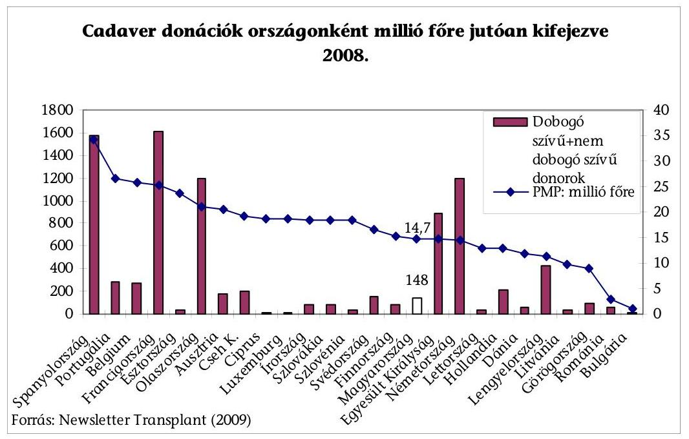

---

A szervátültetésre alkalmas betegek az OVSZK által közzétett nyilvános „várólistákra" kerülnek. A sorrendet nem a listán tartózkodás időtartama határozza meg, hanem az, hogy adott pillanatban melyik beteg vércsoportbeli, immunológiai stb. egyezőségei a legjobbak egy éppen átültethető szervhez. A listára kerüléshez a kezelőorvos javaslata szükséges, amelyet szervenként szakosodott transzplantációs bizottságok hagynak jóvá. Az ágazati rendelkezések meghatározzák a várólistákra kerülés protokolljait.

Az OVSZK 2010. június 16-án közzétett kódszámos listái szerint veseátültetésre 636 fő, májátültetésre 80 fő, szívtranszplantációra 26 fő, kombinált vesehasnyálmirigy átültetésre 17 fő, a tüdőátültetésre pedig 4 fő várakozott.

A Kormány a magyarországi transzplantációs programok végrehajtásának elősegítésére, kiemelten a szerv-szövetátültetések központi koordinálásának intézményes keretek közötti megvalósítása érdekében 2301/1999. (XI. 19.) számú határozatával adott felhatalmazást a Hungarotransplant Kht. alapítására, amely 2002. január 15-én kezdte meg működését. Működése alatt a transzplantáció valamennyi mutatója javult.

A Kht. végelszámolásáról és feladatainak az Országos Vérellátó Szolgálat részére történő átadásáról, - az állami szervek csökkentése keretében - 2006. december 31-i határidővel, a Kormány a 2249/2006. (XII. 23.) határozattal döntött, ugyanakkor a végelszámolás elhúzódott 2008 tavaszáig. A Kormány 323/2006. (XII. 23.) Korm. rendelete az OVSZK feladatai közé sorolta a szervdonáció szervezésével összefüggő koordinációs tevékenységet, így jött létre a Szervkoordinációs Iroda. Az Iroda kétszintű koordinátori hálózatot működtet, a központi irodában az országos koordinátorok dolgoznak, míg a transzplantációs központokban klinikai centrum koordinátorok. A koordináció harmadik szintjén - a donorszerveket nyújtó kórházakban - jelenleg kísérletként 4 helyen kórházi koordinátorok segítik az alkalmas donorok számának növelését.

Az Európai Parlament a szerv- és donorhiányt a tagállamok előtt álló legfőbb kihívásnak ítéli meg, és részben a tagországok együttműködésével kívánja javítani a szervátültetés elérhetőségét, valamint a 2009-2015 közötti időre cselekvési tervet fogadott el a szervadományozásra és a szervátültetésre vonatkozóan. Az Európai Parlament és a Tanács 2010. május 20-án irányelvet fogadott el az átültetésre szánt emberi szervekre vonatkozó minőségi és biztonsági előírásokról, amelyet a tagállamoknak 2 év alatt kell meghonosítaniuk. Főbb elemei: a tagállamok együttműködése, a donorszervek számának, minőségének, és biztonságának növelése, valamint a lakossággal való kommunikáció fokozása.

Transzplantáció témakörben az ÁSZ még nem végzett ellenőrzést, a művese kapacitás befogadást érintette a 0609 számú vizsgálat. Jelen vizsgálat az azóta eltelt időszak művese kapacitás befogadásait is áttekinti.

A jelen ellenőrzés célja a végstádiumú szervelégtelenségben szenvedő betegeknek a szervátültetéshez, az azt megelőző és követő kezelésekhez való hozzáférési lehetőségeinek, valamint a transzplantációs folyamat szabályozottságának és szervezettségének, továbbá az egészségbiztosítói és a költségvetési ráfordítások eredményességének, költséghatékonyságának vizsgálata volt.

---

Az ellenőrzés keretében értékeltük:

- a hazai szervátültetés szabályozása, intézményrendszere, pénzügyi/költségvetési ráfordításai elősegítik-e a transzplantációk számának növekedését;
- a magyarországi donáció és transzplantáció eredményességét.

Az ellenőrzöttek bevonásával meghatároztuk az eredményesség fogalmát, és ezek figyelembevételével kijelöltük a teljesítmény-kritériumokat.

Eredményesség: a transzplantációk számának növekedése az arra alkalmas betegek körében, és az emelkedő nemzetközi trend követése. (Elemei: várólistán lévők számának növekedése, a várakozási idő csökkenése, donorszám, donorszervek számának növekedése.)

Költséghatékonyság: a vesepótló kezelések esetében értelmezhető, a bizonyítékokon alapuló tudományos egészség-gazdaságtani elemzések megállapítása alapján.

A szervtranszplantáció és donáció vizsgálatát adatbekérésre, helyszíni interjúkra, a szervátültetést, és a betegutógondozást végző centrumok, a Szervkoordinációs Iroda, a finanszírozó OEP, valamint a dialízis ellátás tekintetében a műveseállomások és a MANET adatainak elemzésére alapoztuk, továbbá feldolgoztunk 2689 dializált beteg által kitöltött kérdőívet. Minden felsorolt szervezet részinformációval bír, azonban adataikat nem egyeztetik rendszeresen, ezért a relatív kis számok ellenére is jellemző az adateltérés. A vizsgálat a 2005-2009 között megvalósult szervátültetések eredményeit értékeli. Kísérletet tettünk az összes 2005-2009 között élt szervátültetett (prevalencia) bemutatására, de nyilvántartási ${ }^{6}$ és adatszolgáltatási hiányosságok miatt biztonsággal nem állapítható meg számuk és a hozzá tartozó OEP kiadás.

A nemzetközi és a hazai szakirodalom a túlélési idők analíziséhez, értékeléséhez jellemzően Kaplan-Meier féle túlélési grafikont alkalmaz ${ }^{7}$ (20. sz. melléklet). A vizsgálat az OEP-től nyert beavatkozási és halálozási információk birtokában közzé teszi szervek szerint a túlélési valószínűségeket, grafikonokat.

Az ellenőrzés szempontrendszerét előtanulmánnyal alapoztuk meg. A vizsgálatot a teljesítmény-ellenőrzés módszerével végeztük. Az értékelés kritériumrendszerét a 2. sz. melléklet tartalmazza.

Az ellenőrzés a 2005-2009. közötti időszakra terjedt ki, figyelemmel kísérve az ellenőrzés lezárásáig bekövetkezett változásokat.

[^0]
[^0]:    ${ }^{6}$ Az 1997. előtti veseátültetések nem szerepelnek az OEP adatbázisban. A 2004. előtti szív-, máj-, hasnyálmirigy-átültetést az EüM fejezeti kezelésű előirányzatból finanszírozta, ezért nem volt az OEP-nél finanszírozási kódja, így az adatbázisból nem lehet teljes körű a lekérdezés.
    ${ }^{7}$ Ezt a német példán mutatjuk be. Forrás: Organspende und Transplantation in Deutschland (2009).

---

Az ellenőrzés az Egészségügyi Minisztériumra (illetve jogutódjára), az Országos Egészségbiztosítási Pénztárra (OEP), az ÁNTSZ Országos Tisztifőorvosi Hivatalára, az Országos Vérellátó Szolgálatra (továbbiakban: OVSZK) terjedt ki. Adatkéréssel és interjú készítéssel a további intézményeket kerestük meg: a Semmelweis Egyetem Általános Orvostudományi Kar Transzplantációs és Sebészeti Klinikáját (máj; vese; vese- és hasnyálmirigy együtt), a Semmelweis Egyetem Ér- és Szívsebészeti Klinikáját (szív), a Magyar Nephrológiai Társaságot, a Pécsi Tudományegyetem Általános Orvostudományi Kar Sebészeti Klinikáját (POTE) (vese; vese- és hasnyálmirigy együtt), a Debreceni Egyetem Egészségügyi Centrum I. sz. Sebészeti Klinikáját (vese), a Szegedi Tudományegyetem Egészségügyi Centrum Sebészeti Klinikáját (vese), a Gottsegen György Országos Kardiológiai Intézetet (gyermekszív), az Országos Korányi TBC és Pulmonológiai Intézetet (tüdőtranszplantáció pre- és postkezelés), a B. Braun Medical Kft-t, az FMC Dialízis Center Kft-t, és a Diaverum Hungary Kft-t (dialízis vonatkozásában).

A jelentés az Eütv. XI. fejezete szerinti írásmódot alkalmazza.
Az ellenőrzés végrehajtására az Állami Számvevőszékről szóló 1989. évi XXXVIII. törvény 2. §-a (3), (5) és (9) bekezdéseinek rendelkezései adtak alapot.

A jelentést egyeztetésre megküldtük a nemzeti erőforrás miniszternek. Miniszter úr észrevételt nem tett, levelét az 1. sz. melléklet tartalmazza.

---

# I. ÖSSZEGZŐ MEGÁLLAPÍTÁSOK, KÖVETKEZTETÉSEK, JAVASLATOK 

A transzplantációs tevékenység átláthatóságát és értékelhetőségét akadályozza, hogy nincs egységes, minden szervre vonatkozó transzplantációs és dialízis regiszter Magyarországon. Alapvetően fontos lenne a szolgáltatóktól és az OEP-től független országos és nemzetközi összehasonlításra, jelentésre alkalmas regiszter működtetése. Ennek hiánya ellehetetleníti a hazai eredmények követését, kiértékelését. Nemzetközi szinten számos jó példa található ${ }^{8}$ a transzplantáló centrumok és a szervek szervátültetési eredményeit rendszeresen bemutató kiadványokra, internetes felületekre. Egy részterületen, a dialízis kezelések követése terén, az országos nefrológiai szakfelügyelő főorvos adatgyűjtést rendelt el 2010. január 1-jétől. ${ }^{9}$ A regiszterek hiánya gátolja a magyarországi transzplantációs központok és dialízis állomások minőségi mutatóinak értékelését, az adatok elemzését, a nemzetközi adatokkal való összehasonlítását. A transzplantált betegek túlélési adatainak értékelése, monitorozása a vizsgált időszakban sem az ágazatirányító, sem a Magyar Transzplantációs Társaság, sem az országos szakfelügyelő főorvos részéről nem történt meg.

A vizsgált időszakban vese-, szív-, máj-, hasnyálmirigy- és tüdőátültetések együttes száma a 2005. évi 389-ről 2009-re 354-re csökkent, ${ }^{10}$ és az E. Alap transzplantációra fordított éves kiadása is 2,5 Mrd Ft-ról 2,4 Mrd Ft-ra mérséklődött. A szervátültetések számának csökkenése ellentétes a
 nemzetközi trendekkel és a betegellátás, az egészségügy teljesítményének mérséklődésére utal. Az ágazatirányító 2005-2009. között a szervtranszplantációs betegellátás helyzetét nem értékelte és nem dolgozott ki koncepciót annak bővítésére, fejlesztésére és korszerűsítésére. Amennyiben az egészségügy a csökkenés megállítását és az 1 millió lakosra jutó 2008. évi európai átlagos szervátültetési arány elérését tűzné ki célul, akkor évente további több mint 200 beavatkozást (60-70%-os növelés) kellene végezni, ami a teljes „transzplantációs lánc" minden elemének felülvizsgálatát és megfelelő korrigálását igényelné.

[^0]
[^0]:    ${ }^{8}$ Transplant Activity in the UK, UNOS (Scientific Registry Transplant Database), www.unos.org Az adatbázisban törvényileg rögzítik az Egyesült Államokban végzett összes szervtranszplantációt. Többek közt 165000 vese- és 55000 májtranszplantált beteg adatait tartalmazza. Az USRDS (United States Renal Data System), www.usrds.org Végstádiumú vesebetegek nemzeti adatbázisa. Collaborative Transplant Study, www.ctstransplant.org Nemzetközi regiszter több mint 250000, vese-, máj-, tüdő- és hasnyálmirigy-transzplantációval kapcsolatos adattal. Az adatbázis koordinátora a heidelbergi egyetem transzplantációs és immunológiai részlege, amely 45 ország 300 centrumával áll kapcsolatban
    ${ }^{9}$ A 22/2009. (VII. 17.) EüM rendelet az egyes személyazonosításra alkalmatlan ágazati (egészségügyi, szakmai) adatok körének meghatározására, gyűjtésére, feldolgozására vonatkozó részletes szabályokról szóló 76/2004. (VIII. 19.) ESzCsM rendelet módosításáról.
    ${ }^{10}$ OEP Finanszírozási Főosztály 2010. május 21-ei lekérdezés alapján

---

Az E. Alap éves költségvetésében, valamint a transzplantációt végző centrumokkal előre meghatározott éves beavatkozási esetszámra kötött finanszírozási szerződésekben a szervátültetések forrása rendelkezésre állt. Az e célra tervezett pénzügyi keretet egyetlen évben sem merítették ki, a tüdőátültetések külföldi gyógykezelésének finanszírozását is az OEP folyamatosan biztosította. A vizsgált évek adatait a 2. sz. tábla mutatja be.

Szervátültetések száma és biztosítói kiadása a 2005. és a 2009. évekre

| Megnevezés | 2005 | 2009 | 2005-2009-es vizsgált időszak összes kiadása | 2009/2005.   (%-ban) |
| :--: | :--: | :--: | :--: | :--: |
| Transzplantációs esetszám (db) |  |  |  |  |
| Vese | 313 | 269 | 1428 | 85,94 |
| Máj | 44 | 40 | 208 | 90,91 |
| Szív | 9 | 25 | 100 | 277,78 |
| Hasnyálmirigy | 8 | 9 | 40 | 112,50 |
| Tüdő | 15 | 11 | 55 | 73,33 |
| Összesen | 389 | 354 | 1831 | 91,00 |
| Transzplantációs kiadás (M Ft) |  |  |  |  |
| Vese | 1400,4 | 1219,3 | 6449,6 | 87,07 |
| Máj | 734,0 | 677,4 | 3500,4 | 92,28 |
| Szív | 84,2 | 227,5 | 906,7 | 270,24 |
| Hasnyálmirigy | 37,8 | 48,8 | 200,4 | 129,05 |
| Tüdő * | 232,1 | 239,1 | 1044,7 | 103,04 |
| Össz1 (M Ft) | 2496,0 | 2416,2 | 12 101,7 | 96,93 |
| multiorgan (M Ft) | 30,0 | 36,6 | 168,5 | 122,00 |
| Össz2 (M Ft) | 2526,0 | 2452,8 | 12270,2 | 97,23 |

* Az éves esetszámra átlagos költséggel számított várható kiadás

Adatforrás: OEP
A végstádiumú vesebetegek száma Magyarországon és nemzetközi szinten is folyamatosan nő. A veseátültetés a hosszú távú életkilátásokat jelentősen javítja, nemcsak a túlélési ráták növelésével, de az életminőség javításával is. Ennek ellenére Magyarországon a vesetranszplantáció - a nemzetközi trendekkel is ellentétesen - 2005-2009. között 14%-kal csökkent. A dializáltak száma 12%-kal emelkedett. Ez a tendencia összefügg azzal, hogy egyre idősebb betegek kerülnek egyre nagyobb számban dialízisre, akik más betegségeik miatt sem alkalmasak transzplantációra. A dializáltak és transzplantáltak számának növekedése világszerte megfigyelhető. Ez csak a vesebetegség szűrésével, a korai gondozással lenne mérsékelhető, ami népegészségügyi kérdés is. Az ágazat elmaradt a nemzetközi gyakorlattól a transzplantációk számának jelentős növelését támogató szabályozás kidolgozásával is (a várólista vezetés és a recipiens kiválasztás szabályainak korszerűsítésével, bővítésével, pl. dominó beültetés, önkéntes szervfelajánlás, marginális donor értelmezés).

A szervezeti háttér korlátozott személyi és pénzügyi lehetőségei behatárolják a maximálisan fellelhető donorok számát. A recipiensek számának növelésére tett szakorvosi, szakfelügyelő főorvosi erőfeszítések sem elegendőek. A maga-

---

sabb számú átültetés egyik akadálya az is, hogy a szakorvosi gondozó hálózat kevés betegnek ajánlja terápiaként a transzplantációt, így nemzetközi összehasonlításban továbbra is nagyon kevesen vannak a várólistákon.
2. sz. ábra
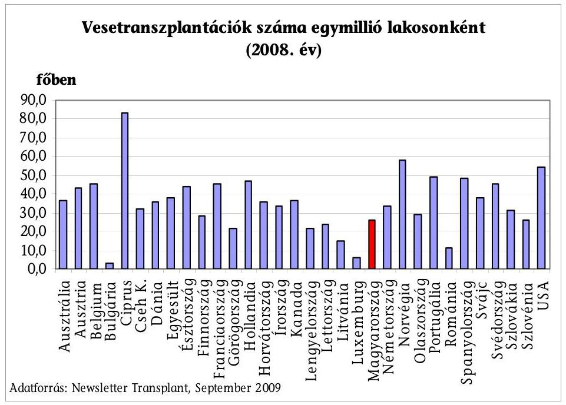

A vesepótló kezelések (transzplantáció és dialízis) közül a nemzetközi és a hazai szakirodalom szerint is a transzplantáció költséghatékonyabb ellátás az egészségbiztosító számára. Ausztriában, Svédországban, Hollandiában, Norvégiában, az Egyesült Királyságban alacsonyabb az egymillió lakosra jutó dializáltak, viszont magasabb a transzplantáltak száma, és összességében magasabb a vesepótló kezelésben részesülők száma egymillió lakosra vetítve. Magyarországon ezzel ellentétes a tendencia, a dialízisben részesülő betegek számában európai összehasonlításban a legmagasabb arányban ellátottak első harmadába tartozunk, míg a transzplantáltak számában az utolsó harmadba (2. sz. ábra). Ezt igazolják a finanszírozási kiadások változásai is, a veseátültetésre fordított kiadás mintegy 13%-kal csökkent, míg a művese ellátásra fordított kiadás - EPO nélkül a vizsgált időszakban - 0,5 Mrd Ft-tal emelkedett.

Egy vesetranszplantált beteg első évi kezelésének kiadása 7,8 M Ft,${ }^{11}$ a második évtől folyamatosan 2 M Ft, míg a dializált beteg éves természetbeni kiadása 5 M Ft, azaz a vesetranszplantáció egy olyan befektetés, amely az egészségbiztosító számára 2 éven belül megtérül a dialízis kiadások csökkentésén keresztül, és a beteg jobb életminőségben él. Egy krónikus beteg éves dializálási költsége 156 kezelést figyelembe véve 2008-ban 3,7 M Ft, 2009-ben 3,6 M Ft, betegszállítás, és egyéb gyógyszer, járó- és fekvőbeteg szakellátási kiadások nélkül. A vesetranszplantációt indokolt előnyben részesíteni a dialízissel szemben az egészségpolitikai döntéshozatalban, mind költséghatékonysági, mind túlélés és életminőség nyereség miatt. A fenti számok alapján a 2008-ban transzplantált

[^0]
[^0]:    ${ }^{11}$ A 2008. évi finanszírozás szerint 7,829 M Ft, második év 2,044 M Ft, a harmadik év 1,968 M Ft, míg a dializált beteg 4,960 M Ft

---

259 beteg megközelítőleg évi 777 M Ft megtakarítást jelent 2010-től a biztosítónak. A vese várólistán szereplő 667 beteg sikeres transzplantációja esetén a biztosító a második évtől kezdődően évi közel 2 Mrd Ft megtakarítást érne el.

A transzplantáció legfontosabb minőségi mutatója a betegtúlélés. A vesetranszplantáltak 5 éves túlélési valószínűsége megfelel az EU átlagnak, ezen belül az a budapesti klinika mutatója a legkedvezőbb és a debreceni egyetemé a legkedvezőtlenebb. ${ }^{12}$

A veserecipiens kiválasztás objektivitása független szervezet által nem biztosított. A jelenlegi gyakorlat alapján a veseátültetésre kiválasztott recipiensek esetenként akár 50 névből álló - szelekciós listára kerülnek, ahonnan a műtétet végző klinika orvosai szelektálnak tovább egyéb szempontok alapján. Ez ellentétes az európai gyakorlattal, ahol jellemzően 1-2 recipiens kerül kiválasztásra, így az egyenlő hozzáférés nem sérül.

A tüdőátültetés itthon még nem bevezetett műtéti eljárás, magyar betegeket OEP finanszírozással Bécsben operálnak. A 2001. évi első együttműködési megállapodásban kitűzött cél - a tüdőtranszplantáció magyarországi meghonosítása - máig nem valósult meg, az ágazatirányító erre vonatkozó tervet nem készített.

A 2005-2009 között érvényes és 2010 májusában módosított megállapodás a szervátültetések körülményeit, illetve az azokhoz kapcsolódó ellenszolgáltatások pontos mértékét és fizetésének módját általános jelleggel, nem az egzakt elszámolhatóság és átláthatóság követelményét szem előtt tartva határozta meg, módot adva eltérő értelmezésekre. Nem kellően érvényesíti a magyar fél érdekeit. A szaktudás átadására vonatkozó rész pontatlan, azért betartása követhetetlen. A megállapodás donortüdők kivitelére vonatkozó része az osztrák fél érdekeit tükrözi, ugyanakkor a szervbeültetések tekintetében nem biztosít a magyar félnek előnyt. Az együttműködési megállapodást az EüM végig felügyelte, az OTH ellenjegyezte. Az egyes szervkivitelek haszonszerzési céljának kizárását az Eütv. szerint az OTH-nak kell vizsgálnia. A rendelkezésünkre álló OTH eljárásrend a hivatal belső szabályozása nem elégíti ki a törvényi kötelezettséget, nem alakított ki joggyakorlatot sem a haszonszerzésre irányulás vizsgálatára, sem a kiszállított szervek nyilvántartására, engedélyeztetési folyamatára, ezért nem ellenőrizhető. 2005-2009 között a kiszállított szervek száma 160 volt, ami meghaladta a szerződésben szereplő évi 30-at. ${ }^{13}$

2005-2009 között összesen 55 tüdőátültetés történt, egy beteg esetében retranszplatációra került sor, ezért a betegek száma 54, akik közül 42 fő él. Nemzetközi összehasonlításban az 5 éves túlélési idő kiemelkedő (75%), ami azt bizonyítja, hogy a betegkiválasztás, a műtéti beavatkozás és az utógondozás magas szintű. Nemzetközi összehasonlításban az EU átlag 1 millió lakosra vetítve 2,6 tüdőátültetés, Magyarországon 1,1, azaz lényeges az elmaradásunk.

[^0]
[^0]:    ${ }^{12}$ Hivatalos szervek nem vizsgálták a túlélésekben jelentkező eltérések okait, mely jelen vizsgálatunknak sem része.
    ${ }^{13}$ Nyilvántartások adatkülönbségét mutatja, hogy az OEP ez idő alatt 144 tüdő kivételt finanszírozott.

---

A megállapodások írásban rögzítették a magyar pácienseken végzett transzplantációk elszámolását és azt is, hogy az AKH további igényeket nem támaszt. Ennek ellenére a megállapodásokhoz a felek szóbeli kiegészítést fűztek, miszerint az OEP az osztrák biztosítói díjon felül minden transzplantált beteg után további maximum 20 ezer euró költségtérítést fizet az AKH-nak. Az egészségügyi miniszter - a vizsgált időszakban - levélben engedélyezte az OEP-nek a költségtérítés fizetését. Ez az eljárás az átláthatóság követelményének nem felel meg.

A külföldi gyógykezelések pénzügyi elszámolása, a pénzügyi kötelezettségvállalás nyomon követése nem számítógépes úton történik. Az éves költségvetési beszámolókból nem állapítható meg, hogy mekkora részt képvisel a tüdőtranszplantáció. A 2005-2009. között Bécsben végzett tüdőátültetések várható összes kiadása 1044,7 M Ft, a pénzügyi teljesítés 2009. év végéig ebből 500,3 M Ft. 2010-ben további 206,0 M Ft került átutalásra és az átlagos költségek alapján számítva további áthúzódó várható kiadás 333,3 M Ft. Egy műtét átlagos számított kiadása 2005-ben 15,5 M Ft, 2008-ban 21,7 M Ft volt.

Az átültetések növelésének műtét-finanszírozási akadálya a vizsgált időszakban nem volt, ugyanakkor az utókezelés kórházi kiadásait a biztosítói finanszírozás csak részben fedezi. A tüdőátültetést, mint lehetséges terápiát a tüdőgyógyász szakorvosok még nem ismerik eléggé, ezért a lehetséges betegeket nem továbbítják a várólistára, így kevés beteg esetében kerül sor átültetésre.

Az SE Ér- és Szívsebészeti Klinikáján szívtranszplantációt, a Gottsegen György Országos Kardiológiai Intézetben gyermekszív transzplantációt végeznek, szervkivételre is ezek az intézetek jogosultak.

A gyermekszív transzplantációs program 2007. évi indulása óta 9 gyermek kapott szívet, közülük 7-en vannak életben. 2009-ben 5 sikeres transzplantációt végeztek, 1 esetben megelőző műszív-kezelést alkalmaztak. A várólistára 8 beteg került fel. Az egyetlen terület, ahol a beavatkozások száma megfelel a lakosságszámra vonatkoztatott értéknek.

A magyarországi egymillió lakosra jutó szívátültetések száma 2008-ban 41,5%-kal marad el az uniós átlagértékektől a Newsletter Transplant adatközlése szerint. A szív várólistára
 került új betegek száma nemzetközi összehasonlításban szintén nem mutat kedvező képet. A várólistán töltött idő a betegek felénél 5 hónap volt 2009-ben. Az 5 éves túlélés 77,7 %. Az adatok jobbak, mint az angliai adat, ahol az 5 éves túlélés 69-71% közötti volt, az 1995-2003. között transzplantáltaknál. Az UCLA 5 éves túlélési mutatója viszont ennél magasabb, 85 %.

Várólistán 2010 júniusában 20 beteg várt szívátültetésre, a műtéti szám emelkedésének és az eredményesség javulásának legfőbb akadálya a várólistán tartózkodók alacsony száma, azaz kevés beteget ajánlanak szívátültetésre. Nehézséget okoz a donorszív gyors szállítási követelménye is, ugyanakkor a kivett donorszervek egy része nem került felhasználásra.

2008-ban az Európai Unióban 756 hasnyálmirigy átültetés történt, ez egymillió lakosra vetítve 1,5 fő. Magyarországon a beültetés száma 5 (Newsletter

---

Transplant adata szerint), ez egymillió lakosra vetítve 0,5 transzplantációt jelent, tehát jelentősen elmarad az európai átlagtól.

A várólistára került új betegek száma 2008-ban nemzetközi összehasonlításban alacsony. A hasnyálmirigy várólistára 2008-ban 4 új beteg került fel (ez egymillió lakosra vetítve 0,4 fő), míg az Európai Unióban a várólistára kerülő új betegek száma egymillió lakosra nézve 2,45 fő volt. A hasnyálmirigyátültetések várólistáira felkerült magyarországi új betegek száma az EU-átlag felét sem éri el.

A helyszíni ellenőrzés megállapításainak hasznosítása mellett javasoljuk:

# a nemzeti erőforrás miniszternek 

1. Dolgoztassa ki a transzplantációk számának növelését szolgáló akciótervet, amelyben meghatározzák az emelkedés célszámait, folyamatosan monitoroztassa és elemeztesse az elért eredményeket, illetve intézkedjen az eredménytelenség okainak feltárására és értékeltesse a beültető centrumokat minőségi indikátorok alapján.
2. Fontolja meg nemzetközi példák alapján a dominó beültetés, az önkéntes szervfelajánlás lehetőségét és a marginális donorokra is kiterjedően szabályozza a centrumoktól független recipiens kiválasztást és várólista vezetést. (Várólista adatoktól a túlélési adatokig.)
3. Dolgoztassa ki a transzplantációs beavatkozások alapdíjának tényleges költségek szerinti meghatározását.
4. Dolgoztasson ki a transzplantációs szakma bevonásával országosan egységes utógondozást a transzplantáltak számára, és ellenőriztesse azok teljesülését.
5. Szabályozza az egységes, ellenőrizhető betegtájékoztatást a transzplantáció, a szervadományozási, a preemptív, az élő donoros, illetve szervfelajánlási lehetőségekről.
6. Intézkedjen valamennyi szervre kiterjedően a transzplantációs tevékenységet és a vesepótló kezeléseket összefoglaló országos regiszter létrehozására és működtetésére.
7. Segítse elő két- vagy többoldalú szervcsere együttműködési szerződésekkel, hogy a felajánlott, illetve itthon nem hasznosítható szervek beültetése megtörténjen, ne legyenek elveszett szervek.
8. Vizsgáltassa felül és biztosítsa a tüdőtranszplantáció folyamatának átláthatóságát, szervezési és elszámolási szabályait, a szerződött tüdőkivételek számának követhetőségét, a kontingensen felüli tüdő kiszállítások hatósági engedélyezését.

---

# II. RÉSZLETES MEGÁLLAPÍTÁSOK 

## 1. Az E. Alapból a transzplantációra fordított kiadások alakulása

Az E. Alap transzplantációs kiadásai 2005-2009. között évente 2,5-2,4 Mrd Ft körül alakultak, ez összesen 12,1 Mrd Ft kifizetést jelentett az Alapnak, ennek 53 %-át vese, 29 %-át máj, 7,5 %-át szív, 1,9 %-át kombinált vesehasnyálmirigy, 8,6 %-át pedig a tüdőbeültetés adta. A tüdő beültetések elszámolása még nem zárult le, az 1044,7 M Ft az eddig lezárt elszámolásokból számított várható kiadás. (A transzplantációk jellemző kiadásait szervenként részletesen a 3. sz. melléklet tartalmazza.)

A szervátültetések finanszírozása eltér a rutin sebészeti beavatkozások finanszírozásától. A szív-, a máj-, a vese-, és hasnyálmirigy átültetés a nagy értékű, országosan nem elterjedt műtétek körébe tartozik, $^{14}$ és a gyógyító-megelőző ellátáson belül az összevont szakellátások előirányzatának, speciális finanszírozású kasszájából szervenként eltérő egységáron finanszírozza az OEP. A tüdőátültetést Bécsben végzik, ezért finanszírozásának forrása az egészségbiztosítás pénzbeli ellátásai között, a külföldi gyógykezelések előirányzata.

A vizsgált időszakban a szervátültetésekhez szükséges pénzügyi fedezetet az E. Alapban biztosították. Forráshiány nem akadályozta a szervátültetéseket és azok számának növelését.

## 2. A MAGYARORSZÁGI VESEPÓTLÓ KEZELÉSEK ELLENŐRZÉSE

### 2.1. A dializált betegek számának, a kezelések E. Alapot terhelő kiadásainak alakulása

A végstádiumú vesebetegek száma magyarországi és nemzetközi szinten is folyamatosan nő. A dializálást igénylő betegek számának növekedését - a szűrés, gondozás fokozása mellett - a vesetranszplantáció fokozott elterjedése lassíthatja. A veseátültetés a hosszú távú életkilátásokat jelentősen javítja, nemcsak a túlélési ráták növelésével, de az életminőség jelentős javításával is.

A dialízist igénylő betegek száma és a kezelésszám Magyarországon évről-évre folyamatosan növekedett. 2009-ben a 2005. évhez viszonyítva a betegek száma 18,6 %-kal, a kezelésszám 15,3 %-kal emelkedett. A CAPD-s betegek száma 44,2 %-kal, a CAPD kezelések száma 49,3 %-kal nőtt.

[^0]
[^0]:    $^{14}$ A nagy értékű műtétek körét a 9/1993. (IV. 2.) NM rendelet, az egészségügyi szakellátás társadalombiztosítási finanszírozásának egyes kérdéseiről, 8. számú melléklete határozza meg

---

Ezt részletesen a 3. sz. tábla szemlélteti:
A dializált betegek számának és az E. Alap művesekezelések kiadásainak alakulása (2005-2009 naptári év)
3. sz. tábla

| Év | Dializált betegek   száma   (akut + kró-   nikus)   (TAJ db) | Kezelések   száma   (ezer) | CAPD-s betegek   száma   (TAJ db) | CAPD   kezelések   száma   (ezer nap) | Új betegek   száma   (TAJ db) |  | Művese kezelés kiadása** (Mrd Ft) |
| :--: | :--: | :--: | :--: | :--: | :--: | :--: | :--: |
|  |  |  |  |  | akut | krónikus |  |
| 2005. | 8340 | 700,5 | 728 | 174,7 | 2633 | 1379 | 16,8 |
| 2006. | 8815 | 734,3 | 785 | 182,0 | 2857 | 1366 | 17,1 |
| 2007. | 9131 | 771,1 | 769 | 206,1 | 2886 | 1423 | 20,6*** |
| 2008. | 9420 | 788,3 | 911 | 229,9 | 3061 | 1350 | 23,3*** |
| 2009. | 9893 | 807,9 | 1050 | 260,9 | 3211 | 1477 | 22,9*** |

*Forrás: 8. sz. tanúsítvány
**Forrás: Zárszámadási törvények
***Az erythropoietin (EPO) gyógyszerkeret 2007. április 1-jétől beépült a dialízis keretbe.
Az új betegek - adott évben dialízis kezelésre kerülők - száma is emelkedett az elmúlt években, ezen belül az akut kezelést igénylők száma 22 %-kal (2009/2005), a krónikus betegek száma 7,1%-kal (2009/2005).

A dializált betegek folyamatosan növekvő számának jövőbeni ellátására, a finanszírozás biztosítására az ágazatirányító nem dolgozott ki stratégiát, szakmai fejlesztési koncepciót, finanszírozási tervet. A művesekezelés kiadásai 2005-2008 között 38,6%-kal emelkedtek, 2009-ben csökkentek, a 2010. évi tervek szerint stagnál, amelyet a 4. sz. tábla szemléltet.

A művesekezelések kiadásának alakulása

| Megnevezés | Gyógyítómegelőző ellátások összesen (Mrd Ft) | Művesekezelés kiadása (Mrd Ft) | Művesekezelés kiadásainak növekedése az előző évhez képest | Művesekezelésre fordított kiadások aránya a gyógyítómegelőző ellátások kiadásához viszonyítva |
| :--: | :--: | :--: | :--: | :--: |
| 2005. évi teljesítés | 694,452 | 16,775 | - | 2,42% |
| 2006. évi teljesítés | 713,954 | 17,140 | 2,18% | 2,40% |
| 2007. évi teljesítés | 718,717 | 20,611 | 20,25% | 2,87% |
| 2008. évi teljesítés | 757,214 | 23,275 | 12,93% | 3,07% |
| 2009. évi teljesítés | 719,031 | 22,934 | -1,47 % | 3,19% |
| 2010. évi előirányzat | 757,632 | 22,932 | -0,01 % | 3,03% |

Adatforrás: OEP
A 2007-2008. évi előirányzata 3,5 Mrd Ft-tal emelkedett szerkezeti változás miatt a gyógyszerkassza terhére, mivel az EPO (vese eredetű anémiában szenvedő betegek ellátására vonatkozó EPO) kezelés finanszírozása 2007. április 1-jétől beépítésre került a művese ellátás finanszírozásába. A 2008. évi költségvetés-

---

ben - kormányhatározat alapján $^{15}$ - további 500 M Ft -ot csoportosítottak át a dialízis kezelésekre, az évente emelkedő betegszám ellátására. Az EPO beépítése miatti szintre hozásra ebben az évben 2,1 Mrd Ft-ot biztosított a költségvetés. 2009-ben 1,47%-kal csökkent a művese kassza. Az OEP a vizsgált időszakban a gyógyító megelőző kiadások 2,4-3,19%-át fordította a művese szolgáltatás finanszírozására.

A dializált betegek szállításának kiadásait a betegszállítási kassza finanszírozza. A kasszán belül 2007-től különíthető el a dializált betegek szállításának kiadása, ami három év alatt 70,8%-kal emelkedett 1201,1 M Ft-ról 2050,9 M Ftra.

A művese kezelések finanszírozását nem alapozták tényleges költségfelmérésre.
1993. július 1-jétől az E. Alap kezelője - Kormányrendelet $^{16}$ alapján - normatív, országosan egységes forintértékű esetátalányt állapított meg, 1994. április 16-tól dializálási eljárásonként. 1998. február 7-től az OEP a művese kezeléseket az éves költségvetési törvényben e célra rendelkezésre álló keret mértékéig $^{17}$ (felülről zárt kasszából) finanszírozza, lebegő Ft/eset értékkel. A kassza zárttá tételét a folyamatos túlteljesülés indokolta. A tervezett éves előirányzat 1/12 része az adott hónapban rendelkezésre álló forrás, amelyet a szolgáltatóknak teljesítményük arányában havonta utalványoznak.

Az OEP havonta határozza meg a dialízis alapdíját. 2005. és 2009. között az alapdíjak alakulása csaknem változatlan. Egy művesekezelés az EPO-val együtt átlagosan 2008-ban 23854 Ft, 2009-ben 23038 Ft, 2010 februárjában 23275 Ft-ba került az OEP-nek, ami azt jelenti, hogy egy krónikus vesebeteg éves dialízis ellátása több mint 3,6 M Ft.

# 2.2. A vesepótló kezelések kiadásainak összehasonlító elemzése 

A vesepótló kezelések közül a nemzetközi és a hazai szakirodalom szerint is a transzplantáció a biztosító számára költséghatékonyabb ellátás. Tekintettel a művese-ellátás finanszírozásában történt változásokra, a szinte változatlan alapdíjra megvizsgáltuk, hogy a dialízis kezelés változatlanul költségesebb-e, mint a veseátültetés, azaz az egészségpolitikai döntéshozóknak érdemes-e kiemelt prioritást biztosítani a transzplantációnak a dialízissel szemben (természetesen figyelembe véve a transzplantáció által nyerhető egészségnyereség többletet is).

[^0]
[^0]:    $^{15}$ Egyes természetbeni ellátások kiadási előirányzatainak 2008. évi átcsoportosításáról szóló 2170/2008. (XII. 12.) Korm. határozat
    $^{16}$ Az egészségügy társadalombiztosítási finanszírozásának egyes kérdéseiről szóló 52/1993. (IV. 2.) Korm. rendelet 36. § (1) bek. (1996. január 1-jétől hatályon kívül helyezte a 103/1995.(VIII. 25.) Korm. rendelet 33. § (2) bek.)
    $^{17}$ Az egészségügy társadalombiztosítási finanszírozásának egyes kérdéseiről szóló 103/1995. (VIII. 25.) Korm. rendelet 30. § (1) bek. alapján. (2008. május 16-tól hatályon kívül helyezte a 118/2008. (V. 8.) Korm. rendelet 1. § 1407. pont)

---

A kérdés megválaszolására az OEP azon személyekre gyűjtötte le a kiadási adatokat, akik 2004 májusában vagy később hivatalos várólistán voltak, illetve 2004. július 1-je után veseátültetésen estek át. A vizsgált időszak 2008. I. negyedéve volt, finanszírozási szempontból március 31-éig lezárt eseményekre, és a kiadások közül az OEP természetbeni ellátásainak (járó-fekvőbeteg szakellátásnak, betegszállításnak, gyógyszernek, dialízisnek) fedezetére terjedt ki. (A járóbeteg kiadások tartalmazták a képalkotó diagnosztikai kiadásokat, valamint a várólistán tartás költségeit is.)

A csoportokba csak azon személyek kerültek be, akik biztosítottak voltak és 2008 I. negyedévében még éltek, azaz ebben az időszakban a gyógyszerköltségük vagy dialízisköltségük nullánál nagyobb volt. A dializáltak esetében csak azon betegek kerültek a mintába, akiknél legalább 12 kezelés
 történt a 3 hónapos megfigyelési időszak alatt.

A dializált várólistás betegek 3 csoportot képeztek, (akiket még nem transzplantáltak (603 fő), akiket 3 éven belül sikertelenül transzplantáltak, és akiket 3 évnél régebben sikertelenül transzplantáltak). A sikeresen transzplantált betegek a műtéti beavatkozást követően 3-6-9-12-15-21-27-33-39-45 hónaponként kerültek csoportokba. Tekintettel arra, hogy a szervátültetést követő 15 hónap után a kiadásokban nem volt különbség, ezért a 16 hónapnál régebben sikeresen transzplantáltak összevonásra kerültek 1 csoportba (Tx 16 hó). A teljes vizsgálatba vont betegszám 1737 volt.

OEP kiadások 2008. I. negyedévében
(E Ft/fő)

| Csoport | Tx | Fekvő-   szakell | Járó-   szakell | Művese-   ell. | Beteg-   szállítás | Gyógyszer | Összes |
| :-- | :--: | :--: | :--: | :--: | :--: | :--: | :--: |
| Tx 1-3 hó | 4638 | 43 | 41 | 154 | 23 | 844 | $\mathbf{5744}$ |
| Tx 4-6 hó | 0 | 129 | 74 | 73 | 23 | 584 | $\mathbf{883}$ |
| Tx 7-9 hó | 0 | 114 | 46 | 95 | 14 | 365 | $\mathbf{634}$ |
| Tx 10-15 hó | 0 | 78 | 32 | 79 | 2 | 376 | $\mathbf{568}$ |
| Tx>Több mint 16   hó | 0 | 41 | 24 | 107 | 6 | 317 | $\mathbf{495}$ |
| Várólistás   Dializált | 0 | 46 | 64 | 964 | 57 | 108 | $\mathbf{1240}$ |
| Várólistás   Dializált (Tx>3Y) | 0 | 42 | 78 | 964 | 55 | 184 | $\mathbf{1322}$ |
| Várólistás   Dializált (Tx<3Y) | 0 | 93 | 72 | 919 | 57 | 156 | $\mathbf{1297}$ |

# Magyarázat: 

Tx=transzplantáció
$3 \mathrm{Y}=3$ év
Az 5. sz. tábla adataiból kitűnik, hogy a végstádiumú vesebetegség kezelésében a vesetranszplantáció a kezdeti magas költségek ellenére is kisebb OEP kiadásokat eredményez, mint a dialízis. Az átültetést követő 2. negyedévtől (4. hónaptól) a vesetranszplantált betegek OEP kiadásai már alacsonyabbak a művesekezelés kiadásainál. A műtét utáni 4. hónaptól közel havi 120 E Ft-tal, a 15 hónaptól a havi megtakarítás meghaladja a 250000 Ft-ot is. (Természetesen ezekben az összegekben benne van a sikertelen átültetések költsége is.)

---

A vesetranszplantált beteg első évi kezelésének kiadása 7,8 M Ft, a második évi kiadása $2,0 \mathrm{M}$ Ft és a harmadik évtől folyamatosan $2,0 \mathrm{M} \mathrm{Ft}$, míg a dializált beteg éves természetbeni kiadása $5,0 \mathrm{M} \mathrm{Ft}$, azaz a vesetranszplantáció egy olyan befektetés, mely az egészségbiztosító számára 2 éven belül megtérül a dialízis kiadások csökkentésén keresztül. (Ezt mutatja be a 3. sz. ábra.)

A vesepótló kezelések kumulált OEP kiadásai
3. sz. ábra
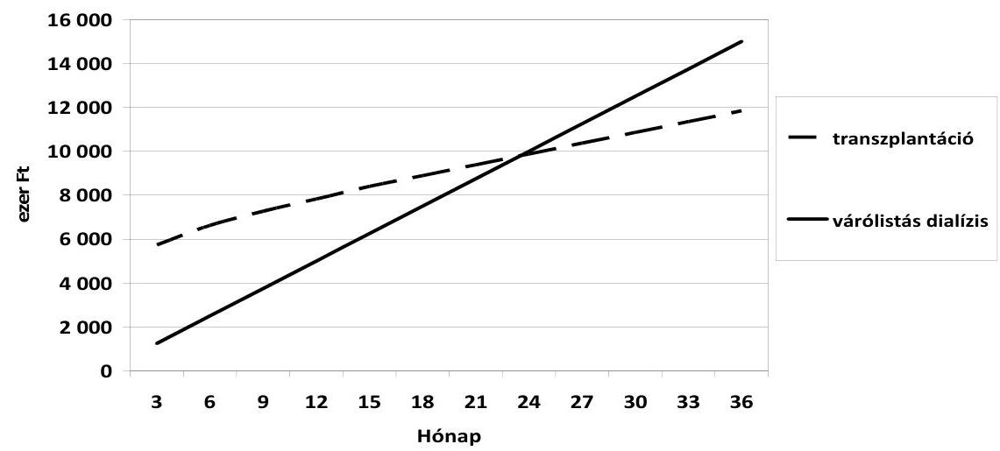

A megtérülés ráadásul csak a fiskális szempontokat veszi figyelembe, és nem számol a betegek egészségnyereségével. A vesetranszplantáció ugyanis komoly túlélés és az életminőség nyereséggel bír a dialízissel szemben. Ebből következően a végstádiumú vesebetegek kezelésében a vesetranszplantációt egyértelműen indokolt előnybe részesíteni a dialízissel szemben az egészségpolitikai döntéshozatalban.

# 2.3. A kezelőhelyek földrajzi megoszlása, egyenlő területi hozzáférés biztosítása a betegek számára 

A regionális egészségbiztosítási pénztáraknak 17 szolgáltatóval, 68 állomásra, 963 kezelőhelyre van finanszírozási szerződésük. A szolgáltatók közül 11 állami, 4 magán- és 2 alapítványi tulajdonú. A három nagy (DIAVERUM Hungary Kft., B. Braun Zrt., Fresenius (továbbiakban: FMC Kft.) dializáló cég magántulajdonban van, a telephelyek 73,6%-át és a kezelőhelyek 85,3%-át képviselik. A kezelőhelyek száma 1997-2004 között a magánszolgáltatóknál csaknem a duplájára emelkedett (444-ről 842-re), 2005 óta számottevően nem változott (958-ról 963-ra nőtt).

---

A tulajdoni arányokat a 4. sz. ábra szemlélteti:
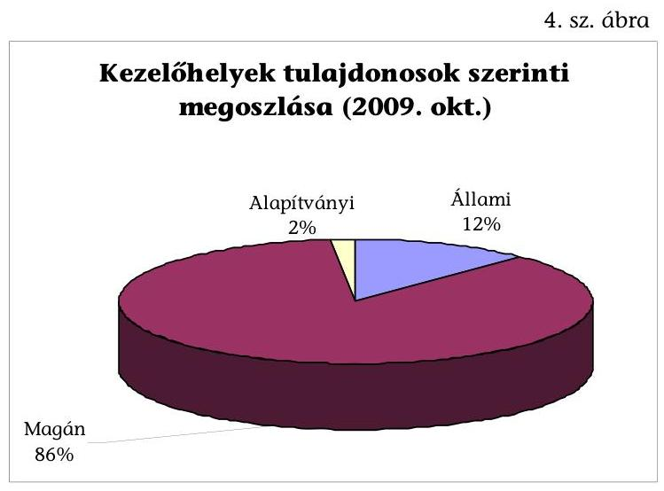

A dialízishálózat fejlesztése költséges, a betegellátás szempontjából speciális ellátás. A három nagy magánszolgáltató 2005-2009 közötti beruházásra fordított kiadásait a 4. sz. melléklet tartalmazza.

Az FMC Kft. beruházásokra az OEP bevétel 6%-át fordította, épület felújításra 635 M Ft-ot, gépvásárlásra 1886 M Ft-ot, a B. Braun Zrt., az OEP bevétel 3%-át, összesen 1001 M Ft-ot, a DIAVERUM Kft. az OEP bevétel 2%-át 309 M Ft-ot.

A kezelőhelyek számának növekedése többletkapacitási pályázat benyújtásához kötött. A krónikus dialízis kezelésre szoruló vesebetegek számának növekedése miatt az OEP Gyógyító-Megelőző Ellátási Főosztálya 2006-ban kezdeményezte a dialízis-kapacitások optimalizálását, a több műveseállomással rendelkező szolgáltató esetében a kezelőhelyek belső átcsoportosítását. 2009-ben kapacitásbővítésként, a Fővárosi Önkormányzat Uzsoki Utcai Kórház 8 kezelőhelyének befogadását hagyták jóvá Korm. határozat ${ }^{18}$ alapján.

A legkevesebb beteg Fejér (8 fő), Borsod-Abaúj-Zemplén (9 fő) és Vas (9 fő) megyékben jut egy kezelőhelyre, a legtöbb beteg pedig Budapesten (13 fő) és Nógrád megyében (13 fő). (A részletes adatokat az 5. sz. melléklet tartalmazza.)

Magyarországon 96 dialízis-kezelőhely jut egymillió lakosra. A megyékben és Budapesten az egymillió lakosra jutó kezelőhelyek száma 40 és 138 között szór. A legkedvezőbb helyzet Zala megyében van, ezt követi Budapest, Baranya és Heves megye. A legkevesebb kezelőhely egymillió lakosra Pest és Tolna megyékben jut, de itt a betegek aránya is kisebb. A kezelőhelyek száma biztosítja az egyenlő hozzáférést, nincs ellátatlan terület.

[^0]
[^0]:    ${ }^{18}$ Az Új Magyarország Fejlesztési Terv Közép-Magyarországi Operatív Program fekvőbeteg-szakellátás fejlesztésével kapcsolatos, a Fővárosi Önkormányzat „Uzsoki Utcai Kórház regionális egészségügyi központ rekonstrukció II. ütem" című kiemelt projektjével összefüggő többletkapacitás előzetes befogadásáról szóló 1035/2009. (III. 27.) Korm. határozat

---

Az egy állomásra jutó kezelések számának 15,1%-os növekedését mutatja az 5. sz. ábra 2005 és 2009 között. Ezzel szemben a kezelőhelyek száma szinte változatlan (0,5%-kal bővült), ezért a szolgáltatók a kapacitások jobb kihasználásával pl. kapacitások átcsoportosításával szolgálják a növekvő ellátási igényeket. Jelenleg az állomások 71,4%-ában 3 műszakban végzik a kezeléseket, de előfordul a 4. műszak beállítása is.
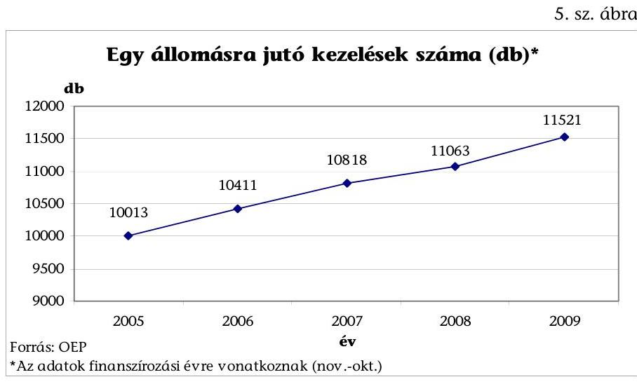

# 2.4. A dializáltak számának nemzetközi adatokkal való összevetése a 2007. évi adatok alapján 

A dializáltak számát az OEP finanszírozási adataiból nyertük. A nemzetközi adatokkal való összehasonlítást nagymértékben nehezítette, hogy az OEP statisztikai évkönyvben évente nyilvánosságra hozott dialízisre vonatkozó adatok struktúrája eltér az európai EDTA ${ }^{19}$ regiszter adatstruktúrájától.

Az OEP éves összesen betegszámot közöl, az EDTA az adott évben új, krónikus betegek számát dialízis fajtánként (incidencia), valamint az adott év december 31-én krónikus ellátásban kezelt összes betegszámot dialízis fajtánként (prevalencia).

A nemzetközi összehasonlításhoz a 2007-es adatokat vettük alapul, mert a vizsgálat időpontjában az EDTA-nak ez volt az utolsó nyilvános nemzetközi jelentése. A magyar adatokat az OEP Finanszírozási Főosztálya gyűjtötte 2007-re vonatkozóan a kívánt struktúrában.

Az OEP által 2007-re gyűjtött krónikus, új beteg (TAJ) szám 1423 fő volt, amit HD és PD betegszámra arányosítás alapján bontottunk az összes beteg arányában, így 1313 és 110 lett a megoszlás.

Az összes új beteg (akut és krónikus) 2007-ben 4309 fő volt, amelyből 2886 volt akut, tehát a krónikusan kezelt betegszám közel kétszerese. A MANET által 2007-re gyűjtött adatokban az összes új beteg 3913 volt, tehát 396 fő eltérés volt az OEP adataihoz képest.

[^0]
[^0]:    ${ }^{19}$ ERA - EDTA

---

Ez alapján 2007-ben a krónikus dializált betegek incidenciáját a 6. sz. tábla mutatja be:

Dializált betegek incidenciája 2007-ben (krónikus)

| Ország | fő |  | pmp |  |
| :-- | --: | --: | --: | --: |
|  | összes HD | összes PD | összes HD | összes PD |
| Ausztria | 976 | 108 | 117,9 | 13 |
| Belgium* | 1586 | 196 | 148,2 | 18,3 |
| Dánia | 467 | 234 | 85,6 | 42,8 |
| Egyesült Királyság | 4434 | 1397 | 72,7 | 22,9 |
| Finnország | 347 | 122 | 65,7 | 23 |
| Görögország | 1692 | 181 | 151,2 | 16,2 |
| Hollandia | 1204 | 381 | 73,5 | 23,3 |
| Izland | 15 | 7 | 48,3 | 22,5 |
| Magyarország | $\mathbf{1313}$ | $\mathbf{110}$ | $\mathbf{130,4}$ | $\mathbf{10,9}$ |
| Norvégia | 336 | 105 | 71,4 | 22,3 |
| Olaszország (csak 12 régió) | 3893 | 690 | 116 | 20,6 |
| Románia | 1478 | 317 | 68,6 | 14,7 |
| Spanyolország* | 3163 | 427 | 68,5 | 9,2 |
| Svédország | 610 | 370 | 66,7 | 40,4 |

* a pmp adatok becslésből származnak

Forrás: EDTA, OEP
A táblázatból látható, hogy a 2007-ben új betegként a rendszerbe belépett és krónikusként kezelt HD betegek egymillió lakosra vetített száma alapján Magyarország az élmezőnybe tartozik, a PD betegek számában pedig az utolsó harmadba.

Az OEP által 2007. decemberre gyűjtött összes krónikus dializált betegszám PD betegre 626 volt, HD betegre 4489. Ezt az adatot vettük figyelembe a prevalencia számításnál.

A MANET által gyűjtött adat 2007. december 31-ére 5519 fő, ami az OEP által gyűjtött 5115-nél (626+4489) 404 fővel több.

Az OEP adatközlése alapján 2007-ben 1789 személy élt, aki valaha veseátültetésen esett át. 2009-re ezt az adatot az OEP 2018-ban jelölte meg. Az alábbi táblázatban a sikeres vesetranszplantációval élők számánál az ESKI által 2007-re közölt adatot vettük alapul, ami 2218 fő volt. Becslés alapján a vesetranszplantált személyek száma valószínűleg több.

A 2007-ben dializált betegek prevalenciája december 31-én, a HD kezelésben részesült betegek száma egymillió lakosra vetítve a következő 7. sz. tábla szemlélteti.

---

Prevalencia RRT
2007. december 31-én

| Ország | Összes   RRT | Összes   HD | Összes   PD | Összes   TX | pmp |  |  |  |
| :--: | :--: | :--: | :--: | :--: | :--: | :--: | :--: | :--: |
|  |  |  |  |  | Összes   RRT | Összes   HD | Összes   PD | Összes   TX |
| Ausztria | 7738 | 3602 | 345 | 3791 | 934,4 | 435,0 | 41,7 | 457,8 |
| Belgium * | 11561 | 6173 | 656 | 4732 | 1080,5 | 576,9 | 61,3 | 442,2 |
| Dánia | 4511 | 2021 | 643 | 1827 | 826 | 370,0 | 117,7 | 334,5 |
| Egyesült Királyság | 46153 | 20567 | 4888 | 19107 | 756,9 | 337,3 | 80,2 | 313,4 |
| Finnország | 3943 | 1260 | 321 | 2362 | 745,5 | 238,2 | 60,7 | 446,6 |
| Görögország |

 11298 | 8308 | 755 | 2235 | 1009,4 | 742,3 | 67,5 | 199,7 |
| Hollandia | 13163 | 4568 | 1265 | 7324 | 803,5 | 278,8 | 77,2 | 447,1 |
| Izland | 159 | 45 | 16 | 98 | 512 | 144,9 | 51,5 | 315,6 |
| Magyarország | 7333 | 4489 | 626 | 2218 | 728,5 | 445,9 | 62,2 | 220,3 |
| Norvégia | 3692 | 886 | 208 | 2597 | 784 | 188,1 | 44,2 | 551,5 |
| Olaszország (csak 12 régió) | 35626 | 25577 | 2899 | 7148 | 1061,8 | 762,3 | 86,4 | 213,0 |
| Románia | 7918 | 6091 | 1352 | 475 | 367,5 | 282,7 | 62,7 | 22,0 |
| Spanyolország * | 30246 | 14195 | 1401 | 14523 | 654,7 | 307,3 | 30,3 | 314,4 |
| Svédország | 7969 | 2764 | 879 | 4324 | 871,1 | 302,1 | 96,1 | 472,7 |

* pmp adat becsült érték

Forrás: EDTA, OEP
Az EDTA-regiszterbe nem jelent Németország, de 2006. december 31-ei prevalencia adatok rendelkezésre állnak Németországra vonatkozóan is, ahol a pmp prevalencia 808 volt, tehát valószínűleg Európában ott a legmagasabb az egymillió lakosra jutó dializáltak száma. A táblázatból látható, hogy a HD kezelésben részesülő betegek egymillió lakosra vetített száma alapján Magyarország a vizsgált országok között az első harmadba esik.

Amennyiben nem csak a dializáltakat, hanem az összes vesepótló kezelésben részesült betegek arányát nézzük, más megállapításra jutunk. Ebben az összehasonlításban Magyarország az utolsó harmadba esik. Például Ausztriában, Svédországban, Hollandiában, Norvégiában, Egyesült Királyságban alacsonyabb az egymillió lakosra jutó dializáltak száma, viszont magasabb a transzplantáltak száma, így összességében magasabb a vesepótló kezelésben részesülők száma egymillió lakosra vetítve.

Az európai adatok ismeretében Magyarország a HD dializáltak számában az első harmadba tartozik, a PD dializáltak és a transzplantáltak számában az utolsó harmadba.

# 2.5. A betegtájékoztatás minősége a transzplantáció egyes típusairól 

Az Eütv. 13. § szerint a betegnek joga van arra, hogy részletes tájékoztatást kapjon a betegségével kapcsolatban a lehetséges alternatív eljárásokról, módszerekről és az azoktól várható eredményekről. A dialízis állomásokon, - beleértve a hálózatokat is -, a betegek a nefrológus szakorvos szóbeli tájékoztatása alapján tájékozódnak a végstádiumú veseelégtelenség kezelésének alternatíváiról, így a dialízis és a transzplantáció lehetőségéről, ezen belül az élődonoros és preemptív transzplantációról. Írásbeli egységes tájékoztatást a Diaverum hálózatban kapnak a betegek, a többi hálózatban szórólapok (Fresenius, B. Braun) állnak rendelkezésre, valamint az internetről tájékozódnak. A Diaverumnál a betegek rendelkezésére bocsátott tájékoztató anyag a transzplantáció és a dialízis túlélési és életminőség adatai közötti különbséget nem mutatja be.

Kérdőíves felmérést végeztünk azon dializáló állomások betegei között melyek több, mint 100 beteget látnak el. A betegek önkéntesen válaszoltak kérdéseinkre az ellátással és a betegtájékoztatás minőségével kapcsolatban. A 22 állomásból 11 a B.Braun, 9 az FMC és 2 a Diaverum hálózathoz tartozik, ahol 489 kezelőhelyen 2008-ban 3088 krónikus dializáltat láttak el. A kérdőívekre 2689 beteg válaszolt, az értékelést ezek alapján készítettük el (lásd 6. sz. melléklet).

A válaszadó betegek 20%-a 51-60 év közötti, 26%-a 61-70 év közötti és 27%-a 71-80 év közötti volt. A 41-50 év közöttiek 9%-ban, a 81 év felettiek 9%-ban jelentek meg a válaszadók között. A betegek 62%-a 60 év feletti.

A válaszadók 89%-a nem folytat kereső tevékenységet, 10%-a igen, és 1% nem válaszolt a kérdésre. Különösen nagy volt a kereső tevékenységet nem folytatók aránya a salgótarjáni, a debreceni és a szekszárdi dializáltak között.

A válaszadók 89%-a kielégítőnek ítélte meg a kezelőorvosától kapott előzetes tájékoztatást a lehetséges gyógymódokról. A válaszolók 10% nem kapott tájékoztatást, 1% nem jelzett semmit. Arányaiban a legtöbb nem választ a salgótarjáni és pécsi állomásokon jelölték meg a betegek, a legtöbb igen választ a debreceni és szekszárdi állomásokon.

Ugyanezt a kérdést részletesen is feltettük a nefrológiai kezelésre, a dialízis kezelésre és a transzplantációra vonatkozóan. Legtöbben - a betegek 60-98%-a a dialízis kezelésről, majd a nefrológiai kezelésről - a betegek több mint 50%-a - kaptak tájékoztatást (Tatabánya, Pécs és Nyíregyháza kivételével). A transzplantációval kapcsolatos tájékoztatás volt a legszerényebb, Szekszárd, Miskolc és Nyíregyháza kivételével a betegek többsége úgy ítélte meg, hogy nem kapott megfelelő felvilágosítást.

Hálózatonként vizsgálva, a B.Braun betegeinek 66%-a, a Diaverum betegeinek 85%-a és az FMC betegeinek 75%-a nyilatkozott úgy, hogy a transzplantációról nem kapott tájékoztatást.

A válaszadók 14%-a szerepelt a szervtranszplantációs várólistán, 84%-a nem, 2% nem válaszolt. Közülük a szombathelyi állomás betegei voltak a legmagasabb arányban a várólistán, a legalacsonyabb arányban pedig Debrecenben és Gyulán.

A válaszadó, várólistán lévő betegek 49%-a, azaz fele egy éve szerepel a listán, 36%-a 2-5 éve, 15%-a több, mint 5 éve.

Az összes válaszadó 44%-a (1181 fő) vállalná a veseátültetést, ha lenne rá lehetősége, 48%-a nem vállalná, 8%-uk pedig nem válaszolt. A legnagyobb arányban igen választ a szombathelyi, a szolnoki és a győri állomáson adtak a betegek, legnagyobb arányú az elutasítás Nyíregyházán, Miskolcon, Debrecenben, valamint a Tétényi úti állomáson. Arra a kérdésre, hogy milyen típusú transzplantációt vállalnának, Győrött és Kaposváron a legnagyobb arányban cadaver donoros transzplantációt, az élődonoros transzplantációt részesítenék előnyben a betegek Kecskeméten és Szombathelyen. Szolgáltatónként a B.Braun betegeinek 11%-a vállalna cadaver beültetést, a Diaverumnál 7,7% és az FMC-nél 7,6%. Az élődonoros beültetést a válaszadók 5,6%-a vállalná a B.Braunnál, 6,2% vállalná a Diaverumnál és 7,4% vállalná az FMC-nél.

A betegek 69%-a hallott arról, hogy az élődonoros transzplantáció várhatóan hosszabb élettartamot biztosít. Kiugróan magas arányban válaszolták ezt a szekszárdi és szolnoki állomáson, de magas arányban válaszoltak igennel a veszprémi állomáson is. A betegek 53%-a hallott arról, hogy előzetes dialízis kezelés nélkül nagyobb az esély a sikeres transzplantációra. 43% nem hallott erről, 4% nem válaszolt. A legmagasabb arányú igen válaszok Szekszárdon, Szolnokon, és Veszprémben voltak. A nemmel válaszolók Gyulán voltak a legnagyobb arányban.

A betegek 59%-a hallott arról, hogy minél hosszabb a dialízis kezelés-sorozat időtartama, annál kisebb az esély a sikeres transzplantációra, 37% nem hallott róla, míg 4% nem válaszolt a kérdésre.

A válaszokból látható, hogy a dializáltak többsége nem folytat kereső tevékenységet, amely az életminőségre is hatással van. Ez a tény szükségessé tenné szociális munkások alkalmazását a dialízis állomásokon. Korábbi években, amikor a művesekezelés fedezete jobb volt a nagy hálózatok, illetve egyes állomások alkalmaztak szociális segítőket, pl. a fővárosi Szent Margit Kórház dialízis állomásán. A finanszírozás szűkülése az ez irányú ellátás leépítését is eredményezte. (A témával foglalkozott a 2010. április 19-én megtartott IV. Országos Pszichonephrológia és Rehabilitációs Konferencia is.)

A betegek többsége elégedett a szakorvosi tájékoztatással ugyanakkor a transzplantációról kapott tájékoztatást nem tartják elegendőnek. A válaszadók 44%-a vállalna veseátültetést, mely arány magasabb, mint amennyien várólistán vannak, illetve lehetnek (13% a várólistán lévők aránya a dializáltakhoz képest). A veseátültetést elutasító betegek jellemzően, - függetlenül a szolgáltatótól-, az ország ÉK-i megyéiben élnek. A betegek kétharmada, fele tisztában van az élődonoros és a preemptív transzplantáció előnyeivel, jobb túlélési esélyeivel, és a dialízis kezelés transzplantáció sikerességére gyakorolt negatív hatásával.

A betegek elégtelen tájékoztatása a transzplantáció lehetőségeiről, a túlélési esélyekről, a várólistára kerülés objektív kritériumairól, továbbá az a tény, hogy magas a transzplantációra vállalkozó betegek aránya, alátámasztja azt az elvárást, hogy a tájékoztatás módja és tartalma, valamint ezek betegoldali dokumentálása országosan egységes legyen, mind a nefrológiai szakrendeléseken, mind a dialízis állomásokon.

# 2.6. A vesetranszplantációk számának alakulása, európai átlaghoz való viszonya, az élődonoros átültetés értékelése 

Vese transzplantációt a Debreceni Egyetem Egészségügyi Centrumának I. sz. Sebészeti Klinikáján, a Pécsi Tudományegyetem Általános Orvostudományi Karának Sebészeti Klinikáján, az SE Általános Orvostudományi Karának Transzplantációs és Sebészeti Klinikáján és a Szegedi Tudomány Egyetemen végeznek.

2005-2009. között 134620 cadaver vesetranszplantáció történt, ennek 50-54%-át a budapesti, 16-13%-át a debreceni, 16%-át pécsi, 19-17%-át a szegedi központ végezte. Az egyes években folyamatosan csökkent a beültetések száma, 5 év alatt 17%-kal. A legkevesebb vesét, 235-öt, 2008-ban ültették be, 2009-ben ez 6,3%-kal növekedett.

A vesetranszplantációk száma (beleértve a cadaver és élődonoros transzplantációt is) 2008-ban 259 db volt, ez egymillió lakosra vetítve 25,7 (Newsletter Transplant). Néhány európai ország adatát az egymillió lakosra vetített transzplantációk száma szerint a 7. sz. melléklet tartalmazza.

Az egymillió lakosra jutó transzplantációk számában Magyarország az európai országok között mind a cadaver, mind az élődonoros beültetésben az alsó harmadba tartozik. Az élődonoros átültetések száma az összes transzplantációhoz viszonyítva Magyarországon 2008-ban 9,2% volt, összesen 24 ilyen típusú beültetés történt. Ez egymillió lakosra vetítve 2,4 (pmp). A millió lakosra vetített élődonoros transzplantációk számát európai viszonylatban a 8. sz. melléklet mutatja be.

## A klinikák élődonoros transzplantációs gyakorlata

2005 és 2009 között összesen 94 db élődonoros transzplantációt végeztek (1. sz. tanúsítvány). Az összes élődonoros transzplantációból 66%-ot Budapesten (62 db), 20%-ot Pécsett (19 db), 13,8%-ot Szegeden végeztek. Debrecenben az első élődonoros transzplantációra 2010-ben került sor.

A négy klinika által 2005 és 2009 között elvégzett vesetranszplantációk alakulását (cadaver, élő db) a 6. sz. ábra szemlélteti:

[^0]
[^0]:    20 Szervkoordinációs Iroda adatai

---

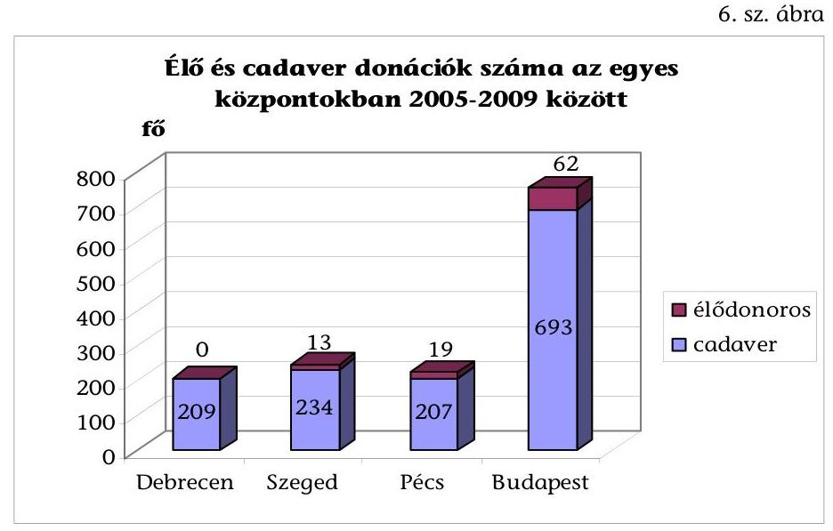

Forrás: OVSZK
Az élődonoros átültetés aránya a várólistán lévők számához képest: az OVSZK adatai szerint a várólistán 2005. december 31-én 832-en, 2006-ban 808-an, 2007-ben 672-en, 2008-ban 605-en és 2009-ben 645-en voltak. Az élődonoros átültetések száma abszolút értékben növekedett, a várólistán lévők száma csökkent (a várólista szabályok megváltozásával), így az arány javult. Ugyanakkor 2009-ben még mindig nagyon alacsony ez a szám, mert a várólistán lévők számához képest 3,7% részesült élődonoros transzplantációban. Ezt a 8. sz. tábla mutatja be.

Vese várólistán lévők száma és az élődonoros transzplantációk viszonya
8. sz. tábla

| Megnevezés | **2005** | **2006** | **2007** | **2008** | **2009** |
| :-- | --: | --: | --: | --: | --: |
| várólistán lévő száma december 31-én | 832 | 808 | 672 | 605 | 645 |
| élődonoros átültetések száma | 15 | 14 | 17 | 24 | 24 |
| az élődonoros transzplantációk száma a   várólistán lévők számához viszonyítva | 1,8% | 1,7% | 2,5% | 4,0% | 3,7% |

Forrás: OVSZK
A 9.
 sz. melléklet mutatja be az Eurotransplant országaiban a várólistán lévők számának, az élő és cadaver donoros transzplantációk számának változását 1969. és 2008. között.

Az Eurotransplant országaiban 2008-ban 11082 ember szerepelt a kombinált vese várólistán. Ugyanebben az évben 1088 élődonoros ( $9,8 \%$ ) és 3492 cadaver donoros (31,5\%) transzplantáció történt. Ebben az összehasonlításban is nagyon alacsony a magyarországi 3,7\%-os arány.

A várólistán lévők és a cadaver donoros transzplantációk aránya Magyarországon 2009-ben 38,7\%, ez jobb arány az Eurotransplanténál. Ennek egyik magyarázata, hogy a várólistán lévők aránya Magyarországon alacsonyabb, egymillió lakosra vetítve 65 fő, míg az Eurotransplant országaiban hozzávetőlegesen 85 fő.

---

# 2.7. A vese-várólista vezetésének szabályai 

A várólistán lévő transzplantációra alkalmas betegszám növelése érdekében az OEP és a dialízis szolgáltatók közötti finanszírozási szerződés is tartalmaz előírást, továbbá a Vese Várólista Bizottság eljárási rendje is megfogalmaz elvárást. Az OEP szerződés XXIII. számú művesekezelésre vonatkozó mellékszerződése kimondja, hogy „a tartós kezelteknél a dialízis megkezdése előtt, de legalább az első dialízis megkezdését követő fél éven belül a beteget országos vesetranszplantációs várólistára kell venni és azt a műveseállomáson őrzött betegdokumentációban meg kell őrizni." A szerződésben rögzítettek betartását eddig az OEP nem ellenőrizte és a nem teljesítésre szankciót nem alkalmazott. A Monitoring Testület 2010. február 15-ei ülésén azt a javaslatot fogalmazta meg az OEP számára, hogy a művese kezelés fél éven túl történő finanszírozása a beteg Vese Várólista Bizottság előtt történő megjelenéséhez, illetve a beteg transzplantációra való alkalmasságának pozitív/negatív bizottsági véleményéhez legyen kötve. Az OEP-nél a dialízis finanszírozási szerződés átdolgozás alatt van (2010. július), és a tervezet szerint az új szerződésekben a dialízis szolgáltatókat kötelezik a tartós kezelésben részesülő betegek fél éven belüli Várólista Bizottság elé történő felterjesztésére. ${ }^{21}$

A Vese Várólista Bizottság eljárási rendje értelmében (2008. szeptember 13.) a dialízis osztályok havonta jelentést küldenek az általuk kezelt krónikus betegekről a Regionális Vese Várólista Bizottságnak. Az egységes eljárásrend a gyakorlatban csak részben működik, nem minden dialízis állomás szolgáltat adatokat a Regionális Vese Várólista Bizottságnak. A szabályozás célja, hogy rálátást biztosítson a bizottságoknak a dializált betegek állapotára, státuszára.

A debreceni régióban a Debreceni Egyetem Transzplantációs osztálya számára adatot szolgáltató dialízis állomások 2010. áprilisi adatai alapján a több, mint 800 dializált betegből 181 fő ( $22,6 \%$ ) nem egyezett bele a transzplantációba, illetve a várólistára történő felvételhez szükséges vizsgálatok megkezdésébe. A transzplantációt visszautasító 60 év alattiak aránya több, mint 50\%. A 800-at meghaladó dializált betegek közül mindössze 36 főt ( $4,5 \%$ ) helyeztek várólistára, ami azt mutatja, hogy a régió vesebetegei az országos átlagnál kevésbé bíznak a transzplantációban.

A cadaver donorvese allokációja az Országos Vese Transzplantációs Várólista Bizottság működtetésében levő szoftver által készített szelekciós lista alapján történik. A rendszerfenntartást és adatbevitelt a Transzplantációs Immungenetikai Labor vese várólistát működtető munkatársai végzik. A riadók során használt szelekciós program az OVSZK Intraneten keresztül a donort kivizsgáló mind a négy HLA laboratóriumban elérhető.

A régiók szerinti illetékesség a vesék vonatkozásában kormányrendeletben meghatározott. ${ }^{22}$ A veseelosztásban elsőbbsége van annak a transzplantáló központnak, amelynek a földrajzi ellátási területén van a do-

[^0]
[^0]:    ${ }^{21}$ A 2010. július 2-ai 19-1441/99/2010. sz. OEP levél.
    ${ }^{22}$ A várólista alapján nyújtható ellátások részletes szabályairól szóló 287/2006. (XII. 23.) Korm. rendelet.

---

nor. Ez nem segíti elő az egyenlő hozzáférést a várólistáról történő kiválasztásban.

# 2.8. A vese-várólistán lévők száma, korösszetétele, a várólistán töltött várakozási idő alakulása ${ }^{23}$ 

A négy transzplantáló klinika várólista adataira, illetve az egyes régiókból a betegek másik régióba történő átjelentkezésére az OVSZK szolgáltatott adatot 2010. áprilisi állapot szerint. Az adatokat a 9. sz. tábla foglalja össze.

Vese-várólistán lévő betegek centrumok közötti átjelentkezése

| Vese-várólistán lévő betegek régiók szerint (fő) |  |  |  |  |  | Lakosságszám |  | Várólis-   tán lévők   száma   1 millió   lakosra |
| :--: | :--: | :--: | :--: | :--: | :--: | :--: | :--: | :--: |
| Régiók | 2009 | \% | Más   régió-   ból   átjött   (plusz) | Más   régióba   átment   (mínusz) | Tény-   leges   beteg-   szám | 2008.   december   31-i   állapot (fő) | Megoszlás   \%-ban |  |
| Budapest | 366 | $55 \%$ | 22 | -5 | 383 | 5284248 | $52 \%$ | 69 |
| Debrecen | 60 | $9 \%$ | 2 | -17 | 45 | 1837565 | $18 \%$ | 33 |
| Pécs | 113 | $17 \%$ | 10 | -4 | 119 | 1257029 | $12 \%$ | 90 |
| Szeged | 128 | $19 \%$ | 2 | -11 | 119 | 1739063 | $17 \%$ | 74 |
| Összesen | 667 | 100\% | - | - | - | 10117905 | 100\% | - |

Forrás: OVSZK
A vese-várólistán lévők 55\%-a a budapesti régióhoz tartozik, és 45\%-a oszlik meg a másik három klinika között. Aránytalan a klinikák közötti területi felosztás, hiszen a budapesti régióba 8 megye és Budapest lakossága tartozik, és a másik három klinika osztozik 11 megyén. Az egymillió lakosra jutó várólistán lévők számában is nagy az eltérés az egyes klinikák között, 33 és 90 között szór a várakozók száma.

A vesetranszplantációra várakozóknak van lehetőségük a területileg illetékes régióból, transzplantáló centrumból, másik régióba való ki- és bejelentkezésre, mely mutató részben a betegek értékítéletét is kifejezi. E tekintetben Budapest és Pécs a legvonzóbb, többen jelentkeznek be a régióba, mint ahányan átkérik magukat onnan. Debrecen és Szeged esetében fordított a beteg áramlás iránya.

Az OVSZK a vese-várólistán lévő betegek számát 667 főben jelölte meg, amelyből összesen 475-en vártak első transzplantációra, 158-an második transzplantációra, 31-en harmadik transzplantációra és 3 beteg várt negyedik transzplantációra (2. sz. tanúsítvány). A transzplantációra várakozók mintegy 28,7\%-a, összesen 192 fő ismételt, azaz második-harmadik transzplantációra várt.

Az Eurotransplant országaiban a várólistán lévők száma 2008-ban (kombinált vese-hasnyálmirigy nélkül) 10687 volt, ebből 8943-an első (83,7\%) és 1744-en

[^0]
[^0]:    ${ }^{23}$ Ebben a fejezetben az OVSZK adatait dolgoztuk fel. Az adatok eltérnek az OEP és a klinikák adataitól.

---

(16,3\%) ismételt transzplantációra várakoztak. Ebben az összehasonlításban magas az ismételt transzplantációra várók száma Magyarországon.

A vizsgálat keretében adatlapot küldtünk ki a dialízis szolgáltatóknak, amelyen az állomásokra jellemző adatokat kértük be. A kiküldött 67 kérdőívből 65 válasz érkezett vissza. Az állomások a 2009. december 31-én várólistán lévő betegeiket 692 főben jelezték. (Az OVSZK tájékoztatása szerint ekkor a nyilvántartásukban 695 fő volt az átmenetileg alkalmatlanokkal együtt, 645 fő volt a nyilvántartás szerint transzplantációra alkalmas állapotban.) A dialízis állomások december 31-én 6342 fő dializált beteget tartottak nyilván, az OEP adatai szerint ez a szám 5917 fő volt. A dialízis állomások a 2009-ben elvégzett élődonoros transzplantációk számát 39-ben jelölték meg, az OVSZK adatai szerint összesen 24 élődonoros transzplantáció történt.

A dialízis állomásoktól megkérdeztük, hogy hány betegüknél előzte meg a várólistára kerülés az első dialízis időpontját. 2005-ben 88 beteg esetében, majd csökkenő tendencia mellett 2009-ben 60 beteg ( $8,6 \%$-a a várólistán lévőknek) került a várólistára a dialízis megkezdése előtt. A dialízis állomások a preemptív transzplantációk számát 2009-ben 18-ban jelölték meg, az OVSZK erre vonatkozóan nem tudott adatot szolgáltatni. (Az Eurotransplant országaiban 2008-ban összesen 326 személy volt dialízis megkezdése előtt a várólistán, ez 3,05\%-a a várólistán lévőknek.)

A várólistán lévő betegek aránya a dializáltak számához képest 2009. december 31-én $11 \%$ volt. Ez az arány megyénként eltérő. Rendkívül alacsony Borsod-Abaúj-Zemplén, Hajdú-Bihar, Szabolcs-Szatmár-Bereg megyében, ahol csak 5\% (a debreceni transzplantációs központ területe). A legjobb arány Zala és Bács-Kiskun megyében található, amit a 7. sz. ábra mutat be.

---

# Várólistán lévők és dializáltak aránya megyénként (2009.) 

7. sz. ábra
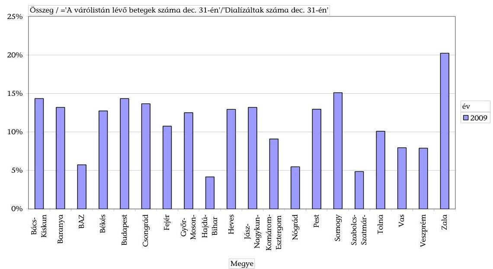

Forrás: dialízis állomások adatszolgáltatása
A várólistán lévők dializáltakhoz mért arányát nemzetközi összehasonlításban a 2007. december 31-ei állapot szerint tudtuk összehasonlítani. A dializáltak adatai az EDTA adatbázisból, a várólistán lévők adatai a Newsletter Transplant-ból származnak. A magyar adatok is 2007-re vonatkoznak, a dializáltak száma az OEP-től származó adat, a várólista adat pedig az OVSZK-tól származó adat (705), és nem egyezik a Newsletter Transplantban megjelent számmal (685).

A 10. sz. melléklet tartalmazza egyes európai országokban a dializáltak számát és a várólistán lévők számát egymillió lakosra számítva is.

A táblázatból látható, hogy a várólistán lévők aránya az összes dializálthoz viszonyítva Magyarországon 13,8\% volt 2007-ben. Ausztriában, Hollandiában kevesebb az egymillió lakosra jutó dializáltak száma, és magasabb a várólistán lévők száma. Finnország és Dánia pedig arra példa, hogy a dializáltak száma egymillió lakosra nézve kevesebb, és a várólistán lévők száma is kevesebb, mint Magyarországon, ugyanakkor a prevalencia táblázatból látható, hogy ezekben az országokban a transzplantációval élők száma egymillió lakosra vetítve magasabb. Dániában 334,5, Finnországban 446,6 pmp, illetve az évente elvégzett transzplantációk száma alapján is ott magasabbak a mutatók (Dánia 35,7; Finnország 28,2; Magyarország 25,7 pmp).

A dialízis állomásoknak kiküldött kérdőíveken megkérdeztük, hogy a betegek átlagosan mennyi idő alatt kerülnek várólistára. Az állomások által adott válaszokban (két állomás kivételével, ahol nem volt 2009-ben várólistán beteg, így 0 hónapot közöltek várakozási időre), a szórás 2 és 30 hónap között volt. Az adatok összesítése alapján az átlagos várakozási idő 2005-ben 5 hónap volt,

---

2009-re 7 hónapra nőtt ez az idő, a várólistára kerülés szabályainak változása miatt.

A várólistára kerülésig eltelt hosszú időt egyrészről azzal indokolták, hogy a betegek nem akarnak bizonyos ideig várólistára kerülni, vagy az alapbetegségük állapota nem engedi a várólistára kerülést. Másik indok, amelyet az állomások megjelöltek, a kivizsgálások hosszú ideje, azaz nem élveznek prioritást a transzplantációra várakozók az egyes vizsgálatokhoz ők is várólistára kerülnek, pl. UH, MR, CT stb. Sokszor nem fogadja el a várólista bizottság bizonyos szakorvosok véleményét, és ismételt vizsgálatot kérnek, amire szintén várakozni kell.

A nemzetközi tudományos bizonyítékok alapján minél hosszabb a dialízisen töltött idő, annál rosszabb a transzplantált vese és a betegek várható túlélése, ezért a betegek várólistára kerülésének időtartamát csökkenteni indokolt.

# 2.9. Az egyes klinikákon végzett vesetranszplantációk túlélési eredményei 

A transzplantáció eredményességét a beültetett szerv- és a beteg 1-5-10-éves túlélésével mérik. Számos tényező befolyásolja az eredményességet pl. a recipiens és a donor kiválasztás, altatás- és műtéttechnika, a posztoperatív komplikációk, rehabilitáció,
 gyógyszerelés-gondozás stb. A túlélési idők elemzése egyben választ adnak a transzplantáció folyamatában fellépő eltérésekre, megmutatja a beavatkozás, a korrekció helyét pl. a transzplantációt közvetlenül követő időszak graft-elvesztésének, vagy a beteg 1 éven túli elvesztésének jellemző és eltérő oka van, ennek megfelelően eltérő beavatkozást igényel. A túlélési adatok rendszeres, objektív elemzése a transzplantáció eredményességére hatással van, ezért alapvető biztosítói érdek, hogy a transzplantációba fektetett kiadások „megtérülését" nyomon kövesse.

Az OEP Finanszírozási valamint Informatikai osztályainak segítségével megkaptuk a 2005-2009 közötti összes vesetranszplantáció műtéti időpontját, valamint a halálozások időpontját. Ebből készültek biostatisztikai módszerrel a Kaplan-Meier 5 éves beteg-túlélési görbék, amely alapján a vesetranszplantáltak 5 éves túlélési valószínűsége 82,8 %, ezt mutatja be a 8. sz. ábra.
8. sz. ábra
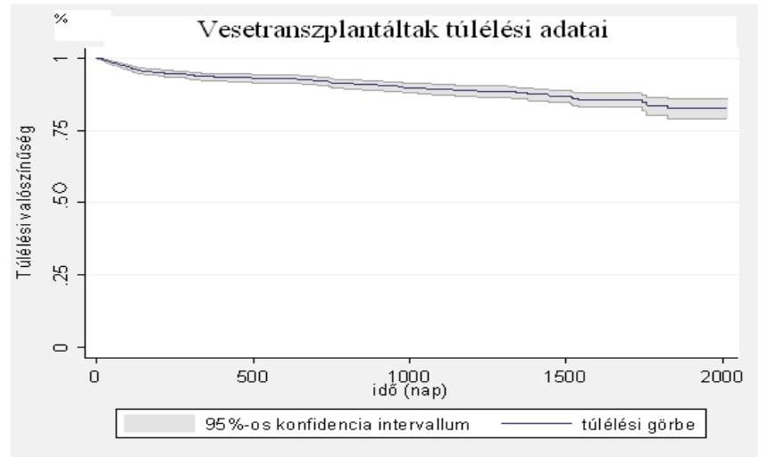

Kaplan-Meier túlélési görbe

---

A beültetett vese elvesztését, működésképtelenségét mutatja a következő Kaplan-Meier 5 éves túlélési görbe, azaz a szerv 5 éves túlélési valószínűsége 73,4 %, a 9. sz. ábra alapján.
9. sz. ábra
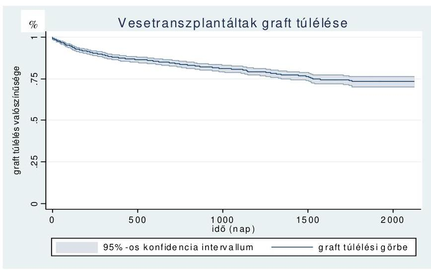

Kaplan-Meier túlélési görbe
Az országos összevont adatok alapján a hazai veseátültetések 1-3-5 éves eredményei az európai trendeknek megfelelnek (lásd mellékletben a németországi Kaplan-Meier görbéket).

A vizsgálatban a transzplantáló klinikáktól a 2005 és 2009 közötti transzplantáltakra vonatkozóan kértünk be túlélési adatokat. A szegedi és a pécsi klinika küldte meg az erre vonatkozó adatait. Az SE nem bocsátott rendelkezésünkre túlélési adatokat, a debreceni klinika június végén egyeztette adatait az OEP-pel.

Az OEP-től megkértük erre az időszakra klinikánként a transzplantáltak túlélési adatait idősoros bontásban is (30 nap, 30-60 nap, egy év, két év, három év, négy év és öt év). A klinikánként elkészült táblázatokat a 11. sz. melléklet tartalmazza (OEP adat).

A túlélési adatokból látható, hogy a 2005-ben transzplantált 313 személyből 261 él, a túlélési arány 83 %. Ennél 8 %-kal kevesebb (75 %) a Debrecenben operáltak túlélési mutatója és 5%-kal jobb az SE-é (88%). 2005 és 2009 között összesen 1428 veseátültetés történt és az adatokból látható, hogy a műtétet követő egy éven belül összesen 90 beteg halálozott el. Közülük az első 30 napon belül 13-an haltak meg az öt vizsgált év alatt, klinikánként évente 0-2 fő. A veseátültetést követő 30 és 60 nap között az öt év alatt szintén összesen 13 fő halt meg. 60 nap és egy év között a négy klinikán összesen 64 fő halt meg, és közülük 42 beteg a debreceni klinika transzplantáltjai voltak. A transzplantációk számához viszonyított egyéves túlélési arány az SE-n a legjobb (97%), ahol az átültetések fele valósul meg, és a legkedvezőtlenebb Debrecenben (80%), ahol 42-en haltak meg. Fentieket a 10. és a 11. sz. ábra szemlélteti.

---

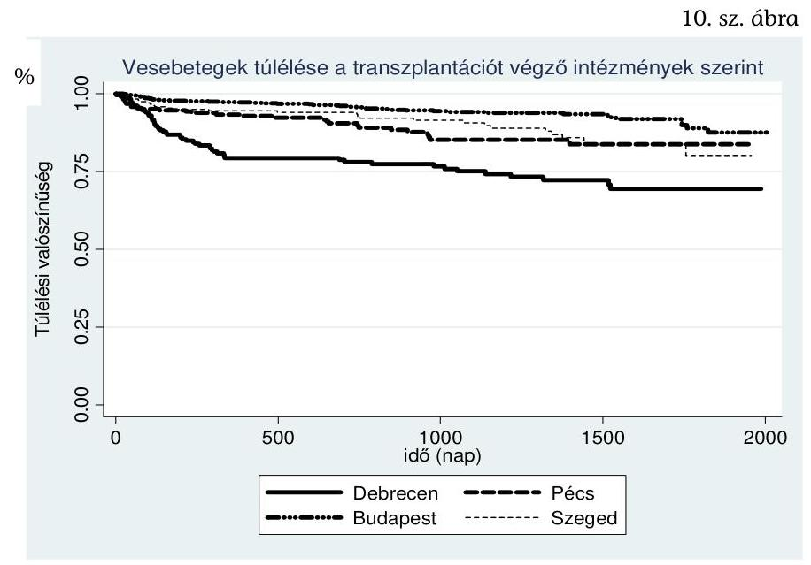

Kaplan-Meier túlélési görbe
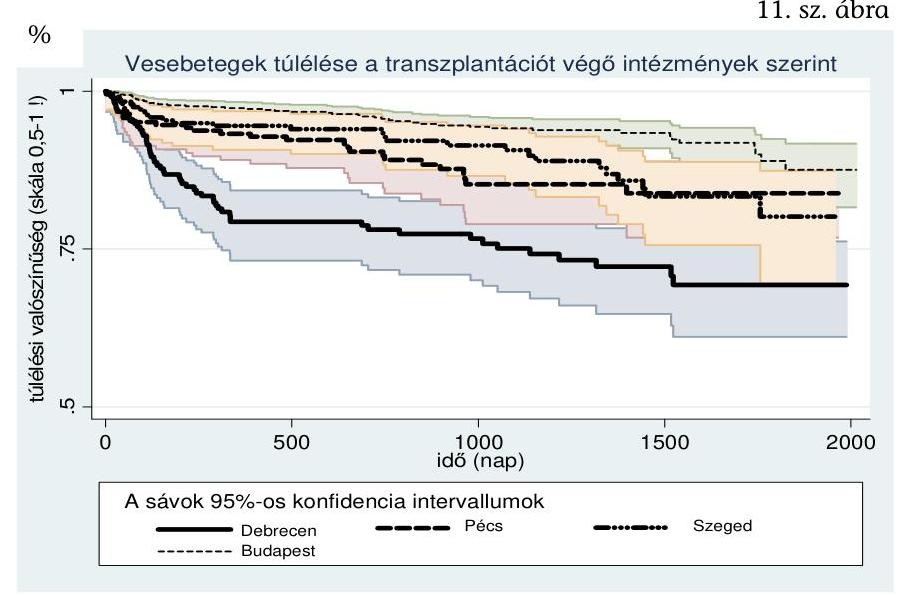

# Kaplan-Meier túlélési görbe

Kaplan-Meier elemzés alapján, a budapesti klinikán transzplantált betegek 5 éves túlélési valószínűsége 87,5 %, a pécsieké 83,8 %, szegedieké 80,1 %, a Debrecenben operáltaké 69,3 %.

A klinikák túlélési adatait a vizsgált időszakban nem értékelte sem az ágazatirányító, sem a Magyar Transzplantációs Társaság, sem az OSZMK.

Szegeden 384, Debrecenben 364, Pécsett 369, Budapesten kb. 1700 veseátültetett beteg utógondozása történik, helyi protokollok alapján meghatározott időperiódusok szerint rendelik vissza a transzplantáltakat. A transzplantációtól független valamennyi problémával a központokat keresik fel a betegek, ellátásuk speciális szaktudást igényel bármilyen fellépő betegségben.

---

# 2.10. A Magyar Nefrológiai Társaság dializálásra és transzplantációra vonatkozó adatainak feldolgozása, elemzése

A Magyar Nefrológiai Társaság (MANET) a 90-es évektől kezdődően 2004-ig gyűjtött transzplantációs és dialízis adatokat. Ezek TAJ alapú adatszolgáltatások az adatgyűjtés helye az SE Transzplantációs Klinika volt. Ezeket az adatokat a klinika akkori munkatársai feldolgozták és publikálták (pl. a hazai vesepótló kezelések eredményei 2001-ben). Az adatbázis kutatók számára korlátozottan volt hozzáférhető, a köz-számára pedig nem volt elérhető. Ezt az adatbázist az SE Transzplantációs Klinikájára telepítették, ahonnan az adatok eltűntek 2009 nyarán, ezért a Transzplantációs Klinika a rendőrségen feljelentést tett.

2006-tól kezdődően a művese állomások dialízisre vonatkozó adat begyűjtéséről a MANET rendelkezett. Ez abban az időben „papír alapú", és nem TAJ-ra szóló adatszolgáltatás volt. Az adatok összesítése 2010-re készült el, amelyet a MANET jelen vizsgálat számára átadott.
2010. január 1-jétől a 22/2009. (VII. 17.) EüM rendelet értelmében a „nefrológia-dialízis központok" részére nefrológiai adatok gyűjtését rendelték el. Ez egy on-line adatbázis, amelyben a január 1-jén kezelt összes beteg adatait rögzítették, valamint minden hónapban a változásokat közlik. A „nephroregiszter" üzemeltetése az OSZMK feladata. A jelenleg használatos szoftvert a MANET fejlesztette ki, amely további fejlesztés alatt áll. Az adatok jelenleg nem publikusak.

A MANET összesített dialízis adatokat is gyűjtött az európai ERA-EDTA regiszter számára, amelyeket 2004-ig közöltek. Azóta Magyarország nem jelent adatokat az európai vese regiszterbe.

Transzplantációra vonatkozó adatgyűjtés 2004 óta nem történt. Az ESKI honlapján, az OECD legyűjtés címszó alatt minden szervre, megtekinthetők a transzplantáltak aggregált adatai, így a vese transzplantációk számára, valamint a működő átültetett vesével élők számára vonatkozóan is. Jelenleg jogszabály nem rendeli el a transzplantációra vonatkozó regiszter működtetését.

Az ESKI a transzplantációra vonatkozó adatokat az OECD számára évente megküldte, azonban ezek validálási probléma miatt nem kerültek be az OECD által publikált jelentésbe. Magyarország transzplantációra vonatkozó adatokat jelent a Newsletter Transplant részére, a Szervkoordinációs Iroda közvetítésével.

## 3. A TÜDŐTRANSZPLANTÁCIÓ SAJÁTOSSÁGAI (HAZAI SZERVKIVÉTEL, KÜLFÖLDÖN TÖRTÉNŐ BEÜLTETÉS, ELKÜLÖNÜLT FINANSZÍROZÁS)

Jelenleg Magyarországon a tüdőátültetés még nem bevezetett műtéti eljárás, magyar betegeket OEP finanszírozással (az Eütv. és kormányrendelet, $^{24}$ valamint egy megállapodás alapján) Bécsben, $^{25}$ a tüdőátültetés közép-európai regionális centrumában $^{26}$ operálnak. Általánosságban jellemző, hogy a tüdőtranszplantáció utáni funkcionális eredmény kiváló és tartós. A betegek életminősége drámaian javul - hiszen újra oxigénpótlás nélkül, akadálytalanul mozoghatnak -, sokan munkájukhoz is visszatérnek. Nemzetközi összehasonlításban az 5 éves túlélési idő kiemelkedő (75%), ami azt bizonyítja, hogy mind a betegkiválasztás, mind a műtéti beavatkozás és az utógondozás magas szintű. A túlélési görbét a 12. sz. ábra mutatja be.
12. sz. ábra
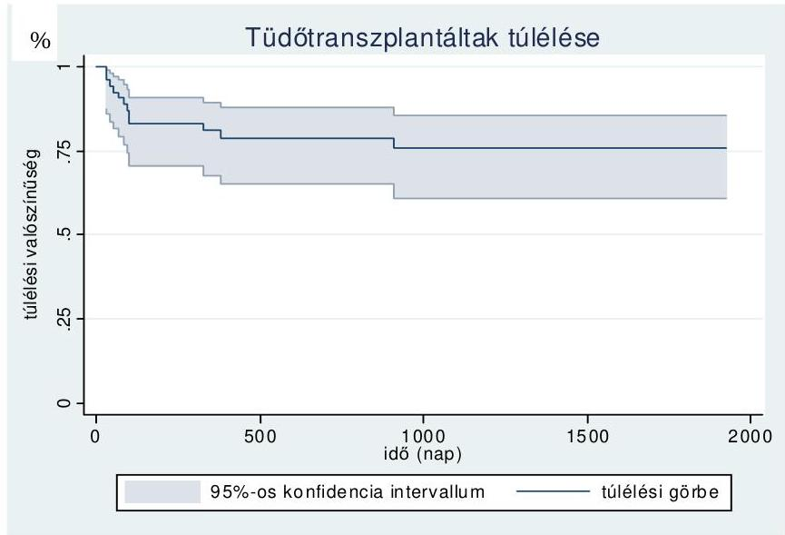

Kaplan-Meier túlélési görbe
1996-tól napjainkig közel 100 beavatkozás történt, ebből 2005. és 2009. között 55 fő. Egy beteg esetében re-transzplantációra került sor, ezért a betegek száma 54 fő, akik közül 42 fő él.

Nemzetközi összehasonlításban az EU átlag 1 millió lakosra vetítve 2,6 tüdőátültetés, Magyarországon 1,1, azaz lényeges az elmaradásunk (13. sz. ábra). A tüdőátültetés várólistájára újonnan felkerültek számadata az előzőeknél is jobban elmaradt az uniós átlagértéktől. 2008-ban a 14, újonnan listára került beteg 1,34 volt egymillió lakosra vetített 4,25 értékével, így a hazai mutató csupán 31,5 %-a volt az EU átlagának.

$^{24}$ 227/2003. (XII. 13.) Korm. rendelet a külföldi gyógykezelésekkel kapcsolatos egyes kérdésekről

---

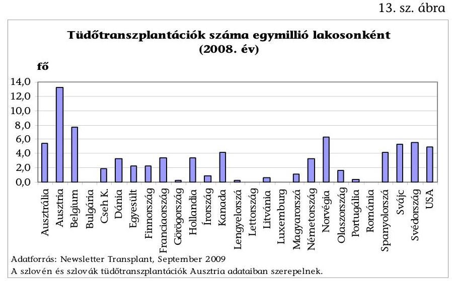

Az átültetési szám növelésének műtét finanszírozási akadálya a vizsgált időszakban nem volt, ugyanakkor az utókezelés kórházi kiadásait a biztosítói finanszírozás csak részben fedezi. A tüdőátültetést, mint lehetséges terápiát a tüdőgyógyász szakorvosok még nem ismerik eléggé, ezért a lehetséges betegeket nem továbbítják a várólistára, így kevés beteg esetében kerül sor átültetésre.

# 3.1. A tüdőtranszplantáció AKH-OKTPI közötti kétoldalú szerződés értékelése

### 3.1.1. A szerződés tartalmának időbeli változása

1996 és 2000 között szerződés nélkül, egyedi és méltányossági finanszírozással valósultak meg Bécsben a tüdőátültetések. Az első 1 oldalas megállapodást, a két kórház 2001. XI. 16-án kötötte. A megállapodás célját, tartalmát az alábbi 5 pontban foglalták össze:

- a hazai tüdőátültetést 2003 végéig tervezték bevezetni;
- meghatározták évente maximum 12 donortüdő kivitelét Ausztriába, hazai betegekbe való beültetés, illetve megfelelő magyar befogadó hiányában a bécsi várólistán levő más páciensekbe történő transzplantáció céljából;
- ellenszolgáltatásként a bécsi transzplantációs munkacsoport felkínálta a transzplantáció-specifikus szaktudás teljes körű átadását az OKTPI szakemberei részére;
- mindkét fél kijelentette, hogy a donortüdők Ausztriába történő kiviteléhez egyik félnek sem fűződik pénzügyi érdekeltsége;
- beleegyezett mindkét fél, hogy az egyezmény csak az OTH beleegyezését követően hatályos.

A szerződést 2005-ig két alkalommal módosították:

- először 2002. április 30-án, a módosítás lényege a maximálisan kivihető donortüdők számának évi 30-ra emelése, változatlan feltételek mellett;
- másodszor 2003. december 6-án, amelynek célja az egyezmény hatályának 2005. december 21-éig való meghosszabbítása.

---

2005. december 21-én új együttműködési megállapodást kötött a két fél (7 pontból áll és 1,5 oldalas). Az előzményekhez képest a változások az alábbiak:

- az egyezmény nem említi, hogy a kivitt tüdők beültetésekor köteles az osztrák fél a magyar betegeknek elsőbbséget biztosítani;
- „a donortüdők kivételét egy magyar mellkas-sebész és egy osztrák mellkas-sebész közösen végzi;"
- az AKH vállalja az explantációhoz szükséges orvosi eszközök rendelkezésre bocsátását és a szervek Ausztriába szállításának megszervezését, ennek finanszírozását, valamint azt, hogy a tüdőműtéteket az AKH érvényes orvosi irányelvvel és felvételi kritériumai szerint hajtja végre;
- tekintettel arra, hogy időközben Magyarország is belépett az EU-ba, az ott érvényes finanszírozási szabályok váltak irányadóvá;
A/ a donortüdők kivételében dolgozó magyar szakemberek munkadíját, költségeinek megtérítését az OEP vállalta;
B/ a magyar pácienseken végzett transzplantációk elszámolása az EGK 1408/71 sz. rendelet 22. cikke 1. c) bekezdésének, illetve az azt felváltó EGK 883/2004. sz. EK rendelet 20. cikkének megfelelően, az osztrák törvények keretében történik. Az AKH úgy nyilatkozott, hogy a költségtérítésen felül további igényeket nem támaszt;
- az együttműködési megállapodást határozatlan időre kötötték, még 2010 májusában is hatályos;
- a megállapodást az OEP főigazgatója is aláírta.

2006. október 3-án a transzplantációt vezető professzor levélben kezdeményezte a magyar egészségügyi miniszternél a donortüdők évi 30-as korlátozásának feloldását, egyúttal felajánlotta a 20 ezer eurós magyar garanciavállalás részleges eltörlését, engedélyt kért osztrák sebészek magyarországi tüdő-kivételére, valamint utalt arra, hogy 1100 euró költségtérítést fizet minden magyar tüdő után a Hungarotransplantnak.

A miniszter nem tartotta szükségesnek a megállapodás módosítását és kezdeményezte az illetékes magyar hatóságoknál az 1100 euró összegű juttatás kivizsgálását (vizsgálat még nem zárult le).
2009. augusztus 28-án az AKH orvosigazgatója felmondta az együttműködést két okból. A donorszervek évi 30-as korlátját nem tartotta elfogadhatónak orvosi és etikai szempontból, valamint az utógondozást már az SE végzi (nem az OKTPI).

2009 őszétől új együttműködési megállapodást készített elő az EüM közreműködésével az SE a bécsi AKH-val. Az új megállapodás elfogadásáig a 2005. évi továbbra is érvényben volt. A 6 pontból álló, 1,5 oldalas megállapodás az előző megállapodások két pontbeli módosítása. Új elemei a következők:

- A donortüdők számát nem rögzítik. A kivett donortüdőket „beültetés céljából szabad felhasználásra az
 AKH rendelkezésére bocsátják.” A szervkivételt „az AKH által kijelölt és Magyarországon tevékenység végzésére jogosult mellkas-sebész végzi.”
- Az AKH a transzplantációkkal kapcsolatos szakmai tudást az SE szakembereinek adja át.

---

A megállapodással az OTH 2010. május 12-én azzal a feltétellel értett egyet, hogy a szerződő felek a megállapodást 2010. december 31-éig kötelesek kiegészíteni a következő két feltétellel:
„A Magyarországról származó donortüdők elsődlegesen magyar betegek Ausztriában történő transzplantációja során kerülhetnek beültetésre.

Az osztrák várólistán szereplő betegek részére a kiszállított donortüdők kizárólag a megfelelő magyar recipiens hiányában kerülhetnek átültetésre.”

A tüdőkiemelésre jogszabály szerint eddig kizárólag OKTPI volt jogosult. ${ }^{27}$ Az EüM az új megállapodásra tekintettel a jogszabályt módosította, s ebben az SE Transzplantációs és Sebészeti Klinikáját tüdő kivételére is feljogosította. A szerződést nem véleményezte sem a transzplantáció, sem a tüdőgyógyászat országos szakfelügyelő főorvosa. A Tüdőtranszplantációs Bizottság 2009. június 15-én kelt levelében a donorszervek évi 30-as korlátját orvosilag nem tartotta indokoltnak.

A fentiekből megállapítható, hogy a 2005. évi, valamint a 2009. évi együttműködési megállapodások a szervátültetések körülményeit, illetve az azokhoz kapcsolódó ellenszolgáltatások pontos mértékét és fizetésének módját általános jelleggel, nem az egzakt elszámolhatóság és átláthatóság követelményét szem előtt tartva határozták meg.

# 3.1.2. A megállapodások megvalósulása, eredményei, következményei 

A megállapodás eredeti célja - a tüdőtranszplantáció hazai meghonosítása - nem valósult meg és nem is készült rá ágazatirányítói terv. A szerződésmódosítására irányuló tárgyalásokon a minisztérium képviselője jelen volt, ugyanakkor nem ő a szerződő partner. A megállapodás követésére, monitorozására, értékelésére sem az EüM, sem az OEP, sem az OTH nem alakított ki rendszert. A szakmai eredményekről szakmai fórumokon, tudományos lapokban rendszeresen beszámolnak a szakemberek, ugyanakkor a megállapodásnak a szakmai és pénzügyi együttes értékelése sem az OEP sem a tárca részéről nem készült. A szerződés-módosításokat az osztrák fél kezdeményezte és a változtatások az AKH érdekeit tükrözik.

Az első szerződés a hazai betegek donortüdővel történő ellátására irányult. A módosítások egyre inkább a szervkivitel fokozására koncentráltak, amely a 2010-es változatban már korlátozás nélküli szervkivitelt tesz lehetővé. 2005-2009 között 54 beteg kapott tüdőt, míg az OKTPI és a Szervkoordinációs Iroda jelentése szerint 160 donortüdő kivitelére került sor, 144 szervkivétel OEP finanszírozása mellett. A különbözetre egyik fél sem adott magyarázatot. A kivett és beültetésre kerülő szervek elosztása hazai és külföldi betegek között nem átlátható. A szerződésben rögzített éves 30-as keret számot 2009 kivételével minden évben meghaladta a szervkivétel.

[^0]
[^0]:    ${ }^{27}$ 18/1998. (XII. 27.) EüM rendelet az egészségügyről szóló 1997. évi CLIV. törvénynek a szerv- és szövetátültetésre, valamint tárolásra és egyes kórszövettani vizsgálatokra vonatkozó rendelkezései végrehajtásáról 5. sz. melléklet 2010. május 13-ától hatályos
    ${ }^{28}$ Az 55 beteg esetében élődonoros tüdőátültetés történt

---

ható. A kiemelt donortüdők mennyisége 2005-2009 között az OEP és a Szervkoordinációs Iroda tanúsítványa szerint eltértek egymástól a 10. sz. tábla adatai szerint:

Az OEP és az OVSZK adatainak eltérése

|  |  |  |  |  |  | 10. sz. tábla |
| :-- | --: | --: | --: | --: | --: | :--: |
| Megnevezés | $\mathbf{2 0 0 5}$ | $\mathbf{2 0 0 6}$ | $\mathbf{2 0 0 7}$ | $\mathbf{2 0 0 8}$ | $\mathbf{2 0 0 9}$ | Összesen |
| OEP adat | 29 | 28 | 28 | 29 | 30 | 144 |
| OVSZK adat | 34 | 33 | 35 | 33 | 25 | 160 |

Adatforrás: OEP és OVSZK
A magyar betegek a hazai várólista bizottság javaslata alapján az Eurotransplant bécsi várólistájára kerülnek fel az után, hogy az OEP kötelezettséget vállal a kórházi ellátás kifizetésére (és további legfeljebb 20000 euró különdíjra).

A tüdő recipiens kiválasztásának allokációs szempontjai nem meghatározottak. Egyéb szervek allokációi - a vese-hasnyálmirigy kombinált átültetést ide nem számítva - meghatározottak. Vese-, máj-, máj-veseátültetés, szívtranszplantációk allokációs szempontjait az OVSZK közzéteszi a honlapján. ${ }^{29}$ [Az Egyesült Államokban, például tüdőallokációs pontrendszer ${ }^{30}$ (LAS, lung allocation score) (a legfeljebb adható 100 pontot a diagnózis, életkor, különféle élettani, fiziológiai kondíciók stb. alapján számítják ki), továbbá a vércsoportegyezés, a tüdő mérete (donor életkora) és a műtéti helynek a donorkórháztól való távolsága (4-6 óra) alapján választják ki azt a recipienst, aki a várakozók közül megkaphatja az adott tüdőt.]

A szerződések állandó eleme a transzplantáció specifikus tudásának átadása a hazai szakemberek számára. Ennek tartalma nem került meghatározásra (milyen céllal, milyen ütemezéssel és finanszírozás mellett mit vállal a hazai és az osztrák fél, például hány mellkas-sebész, tüdőgyógyász, altatóorvos, gyógytornász kiképzését stb). A Korányi Kórház szakembereket küldött ki az utógondozás elsajátítására és 2005 márciusától át is vette a transzplantált betegek kezelését, gondozását, amellyel csökkentette az E. Alap külföldi gyógykezelési kiadásait. 2008-tól az utógondozás - személyi és pénzügyi okok miatt - részben az SE Pulmonológiai Klinikáján történik. A 2010-es megállapodás sem fogalmazza meg, hogy mit tartalmaz a „szakmai tudásátadás.”

A szervkiemelést az OKTPI-vel szerződéses kapcsolatban álló sebész végzi 2007 óta, aki Bécsben, az AKH-nál kapott speciális tüdőtranszplantációs képzést. A megelőző időszakban a Korányi sebészei, valamint - az OTH 2006. évi célvizsgálata szerint - több esetben külföldi (német) orvosok, illetve a Semmelweis Egyetem sebészei is emeltek ki tüdőket agyhalott donorokból németországi és bécsi beültetésekhez. Ezekhez a beavatkozásokhoz az OTH hozzájárulását abban az időben megkapták. A szervkivételi szaktudás a szervátültetés alapele-

[^0]
[^0]:    ${ }^{29}$ http://OVSZK.hu/hu/ujvarolistak
    ${ }^{30}$ http://en.wikipedia.org/wiki/Lung_allocation_score

---

me. Az új megállapodás lehetővé teszi, hogy az AKH jelöljön ki erre a feladatra mellkas-sebészt, ezzel mérséklődhet a hazai szakemberek transzplantációban való jártassága.

A bécsi intézmény 2008-ig 8 orvost (ezen belül 5 sebészt), illetve 2 gyógytornászt képzett ki tüdőtranszplantációra, egy magyar sebész hosszú évek óta a bécsi klinika alkalmazottja és ezért jól gyakorlott tüdőtranszplantőr. Az előzetes kivizsgálásokban, illetve utógondozásokban dolgozó 3 orvos (műtét előtti, illetve utáni beteggondozást végző, illetve patológus orvosok) kivételével a többi szakember szakismeretének hazai tüdőtranszplantációs műtétek végzésében történő hasznosítására nem történt hatásos intézkedés. A megszerzett ismeretek avulása miatt ezeknek az ismereteknek a hasznosítása a távolabbi jövőben már kétséges. Az aláírás alatt lévő új transzplantációs megállapodásba ismét beillesztették a magyar szakemberek bécsi transzplantációs képzését, miközben a magyar fél továbbra sem tervezi a tüdőtranszplantáció hazai megvalósítását. Nem ismeretes, hogy ebben az esetben valójában milyen célra képeztetjük ki a szakembereinket.

A megállapodásban mindkét fél elfogadta a magyar pácienseken végzett transzplantációk elszámolási módját és azt is, hogy az AKH további igényeket nem támaszt. Ennek ellenére a megállapodáshoz a felek szóbeli kiegészítést fűztek, miszerint az OEP minden transzplantált beteg után maximum 20 ezer euró költségtérítést fizet az AKH-nak. Az egészségügyi miniszter levélben engedélyezte az OEP-nek a költségtérítés fizetését (2005. január).

# 3.2. A tüdőtranszplantáció egészségbiztosítói kiadása 

Vizsgálatunkhoz az OEP legyűjtötte a 2005-2009 között tüdőátültetésen átesett 53 beteg természetbeni ellátásainak kiadását (fekvő-járóbeteg, gyógyszer, gyse, fogászat, betegszállítás stb. kasszák), illetve a Nemzetközi Főosztály a külföldi gyógykezelések nyilvántartásaiból a külföldi utalásokat.

Öt év alatt az 53 beteg természetbeni ellátásaira fordított kiadás 529,6 M Ft volt, továbbá a betegek után a Bécsben végzett gyógykezelésre vizsgálatunk lezárásáig összesen 711,3 M Ft-ot utalt át az OEP. Az egy beavatkozásra jutó átlagos kiadásokkal számított további áthúzódó várható kiadás 333,3 M Ft, azaz a várható összes külföldi kiadás 1044,7 M Ft (lásd a 12. sz. melléklet, 2005-2009. évi tüdőtranszplantációk külföldi elszámolása táblát).

### 3.2.1. Külföldi gyógykezelés elszámolásának vizsgálata, értékelése

### 3.2.1.1. 2005-2009 közötti beavatkozások kiadása az E. Alapból

A vizsgálathoz a Nemzetközi Főosztály gyűjtötte le a 2005-2009. évi beavatkozásokhoz kapcsolódó pénzügyi teljesítéseket. A 2009. évi kiadás 108,4 M Ft, ami az E. Alap külföldi gyógykezelésekre fordított összes kiadásának (1034,8 M Ft) 10,5%-a, amely a 2007., a 2008. és a 2009-ben transzplantált betegek 2009-ben kifizetett költségeinek felel meg. (A főkönyvi gyűjtés szerint ez 113,6 M Ft.) A bécsi műtétek pénzügyi lezárása - a számlák beérkezésének el-

[^0]
[^0]:    ${ }^{31}$ Az OEP által kiállított 15. sz. tanúsítvány és adatszolgáltatás szerint 54 beteg, 55 beavatkozása valósult meg.

---

húzódása miatt - többéves folyamat. Vizsgálatunk időszakában az 54 beteg közül 37 esetében egyenlítette ki teljesen az OEP a számlákat. A kiegyenlített számlák alapján számított egy tüdőátültetés átlagos költsége 2005-ben 15,5 M Ft, 2008-ban 21,7 M Ft volt. A 2009. évi beavatkozások közül csak 3 esetében érkezett be részszámla, ezért a 2009. évi várható egy beavatkozásra jutó kiadást a 2008. évi átlagos kiadással becsültük meg. A 2005-2009 között Bécsben végzett tüdőátültetések várható összes kiadása 1044,7 M Ft, a pénzügyi teljesítés 2009. év végéig ebből 505,3 M Ft. 2010-ben további 206,0 M Ft került átutalásra és az átlagos költségek alapján számítva további áthúzódó várható kiadás 333,3 M Ft (lásd a 12. sz. mellékletet).

A várható kiadás számítását a 11. sz. tábla szemlélteti:
Tüdőátültetések száma és finanszírozása

| Megnevezés | 2005 | 2006 | 2007 | 2008 | 2009 | Összesen |
| :-- | --: | --: | --: | --: | --: | :--: |
| Tüdőátültetések száma (db) | 15 | 8 | 10 | 11 | 11 | 55 |
| 1 tüdőátültetés átlagos térítése   (M Ft/eset) | 15,5 | 18,0 | 19,1 | 21,7 | $21,7^{*}$ | - |
| Adott évben végzett tüdőátülteté-   sek várható külföldi kiadása   (M Ft) | 232,1 | 143,7 | 190,7 | 239,1 | 239,1 | 1044,7 |

*A 2009. évi átlagos térítés a 2008. évi átlagos kiadással számolva.
Adatforrás: OEP
Az átlagszámítás figyelmen kívül hagyta azt, hogy a transzplantáció milyen műtéttel valósult meg (egyoldalú, kétoldalú, élődonoros, split, retranszplantáció stb.).

A tételes számlákban laborvizsgálatok, patológia, aneszteziológia stb. szerepelnek, amelyek részei a műtétes kórházi betegellátásnak. A kórházi ellátást viszont az osztrák biztosítónak e számláktól függetlenül külön megtéríti az OEP (az E125 nyomtatvány terhelése alapján).

Ugyanazon ellátási eset egyes kórházi elemeinek kettős finanszírozásának kizárására összevethetőknek kellene lenniük az E125 nyomtatványon kiszámlázott kórházi kezelési költségeknek az AKH extraköltség számlái tartalmával. A bizonylatok részletezettsége azonban nem azonos: az E125 nyomtatványokon egyetlen összevont kórházi kezelési költség megnevezésű tétel szerepel, míg a külön költségek több tételsorból álló részletezésekből állnak.

A pénzügyi kötelezettségvállalási eljárás a tüdőtranszplantációknál nincs összhangban a 227/2003. (XII. 13.) Korm. rendelet ${ }^{32}$ előírásaival. A rendelet mellékletének megfelelő űrlapok V. pontjában az OEP-nek a gyógykezelési költségekhez való hozzájárulási nyilatkozatának kell szerepelnie, amelyet azonban egyetlen vizsgált
 esetben sem találtunk kitöltve az iratokban. Az E112 EU űrlapon szereplő, teherviselőt feltüntető OEP adatok nem tartalmaznak összeg

[^0]
[^0]:    ${ }^{32}$ A külföldi gyógykezelésekkel kapcsolatos egyes kérdésekről szóló 227/2003. (XII. 13.) Korm. rendelet

---

megjelölést. Az összeg meghatározatlansága miatt ezek meghatározatlan összegre szóló ("bianco") kötelezettségvállalást jelentenek.

# 3.2.1.2. Az „elszámoláson kívüli költség" nagysága 

A külföldi gyógykezelések elszámolása az EU-hoz történt csatlakozás óta a közösségi rendeletek (1408/71/EGK és az 574/72/EGK) hatálya alá tartozik. Az AKH-val kötött együttműködési megállapodás is ezt az elszámolást rögzíti, amely azt jelenti, hogy az OEP az E112 nyomtatvánnyal hatalmazza fel a bécsi kórházat a beavatkozások elvégzésére és egyben fizetési kötelezettséget vállal az osztrák biztosítói finanszírozás költségeinek mértékéig. Az osztrák biztosító az E125 formanyomtatványon nyújtja be a számlát, amely a tüdőtranszplantáció egyösszegű költségét tartalmazza, abban az egyes költségelemek nem különülnek el.

A 2005-2009 között megvalósult tüdőátültetések után 2010. május 20-áig teljesített 711,3 M Ft-ból 509,1 M Ft az E125-ös számlák keretében került elszámolásra, valamint 202,2 M Ft a bécsi kórház által kibocsátott számlák után ún. „elszámoláson kívüli költség." Az „együttműködési megállapodásban" többletköltségekre vonatkozó kikötés nincs és nem meghatározott, hogy mi tekintendő többletköltségnek és hogyan történik a számlákban való érvényesítésének ellenőrzése. Az AKH a többletköltségét nem mutatta ki, a többletköltségek megtérítésének szabályai, részletei nincsenek kidolgozva, ugyanakkor a bécsi klinika jelezte, hogy ezen depozit nélkül leállítja a magyar betegek részére történő transzplantációt.

Az egészségügyi miniszter ${ }^{33}$ a folyamatos betegellátásra való tekintettel egyetértett „minden beteg esetében 20 ezer euró összegű letét garancialevéllel történő vállalásával a többletköltségek fedezetére." Az átvizsgált kórházi számlák egyike sem haladta meg a 20 ezer eurót, különböző szakorvosok honoráriumát tartalmazta. A legújabb 2009. novemberben aláírt és az OTH által 2010. május 12-én ellenjegyzett és ezzel hatályba lépett megállapodás sem rendezi az „elszámoláson kívüli költséget."

### 3.2.1.3. Tüdőtranszplantáltak természetbeni ellátásaira fordított egészségbiztosítói kiadások változása a túlélési idő függvényében

A 2005 és 2009 között tüdőátültetésen átesett 53 beteg természetbeni ellátására az egészségbiztosító összesen 529,6 M Ft-ot fordított. A kiadások 78%-át a gyógyszertámogatások képviselik, 15%-ot pedig a fekvőbeteg-ellátás, a fennmaradó 37,4 M Ft-ot járóbeteg-szakellátásra, betegszállításra, gyógyászati segédeszközre és útiköltség-térítésre fordították, ezt a 12. sz. tábla szemlélteti:

[^0]
[^0]:    ${ }^{33}$ 2005. január 2-án, majd 2006. január 4-én kelt OEP-nek szóló levelekben

---

# E. Alapból tüdő transzplantáltak természetbeni ellátása 

| Megnevezés | $\mathbf{2 0 0 5}$ | $\mathbf{2 0 0 6}$ | $\mathbf{2 0 0 7}$ | $\mathbf{2 0 0 8}$ | $\mathbf{2 0 0 9}$ | Összesen |
| :-- | --: | --: | --: | --: | --: | --: |
| E. Alap term. ellátás M Ft | 52,4 | 92,7 | 99,7 | 135,5 | 149,4 | 529,6 |
| Ebből: gyógyszer tám. M Ft | 38,2 | 74,0 | 83,1 | 107,6 | 109,3 | 412,2 |
| Fekvőbeteg ellátás M Ft | 11,5 | 12,7 | 10,6 | 17,2 | 28,0 | 80,0 |

Forrás: OEP
A szervátültetések eredményességét a hatásos szervkilökődést gátló (immunszupressziót) gyógyszerek megjelenése biztosította. Az immunszupresszió mértékét, dózisát a műtéttől eltelt időhöz, vérképhez, vesefunkcióhoz, esetlegesen fennálló fertőzésekhez kell igazítani. A kilökődési reakció leggyakoribb megjelenése az első év, a gyógyszer adagja, költsége a kilökődés súlyosságától függ.

A tüdőátültetésen átesett betegek hosszú távú biztosítói kiadására szakmai anyag sem az ágazatirányítónál, sem a biztosítónál nem állt rendelkezésre, ezért kiszámoltuk azt, hogy a műtétet követő 1-4 év betegenként mennyibe kerül. A műtétet követő első teljes év biztosítói kiadása átlagosan betegenként $4,8 \mathrm{M} \mathrm{Ft} /$ év, amely a negyedik évre $3,1 \mathrm{M}$ Ft-ra mérséklődik. Ezen belül a gyógyszerkiadás az első évben 3,8 M Ft, a negyedik évben 2,5 M Ft, míg a fekvőbeteg-ellátás 750 E Ft-ról 400 E Ft-ra csökken.

A tüdőátültetést követő 1-4. év természetbeni ellátásokra fordított biztosítói kiadásainak átlagos összege az adatok a 0-ik év (műtéti év) és a meghaltak kivételével számított értékek, ezt a 13. sz. tábla mutatja be:

Tüdőtranszplantáltak természetbeni ellátásának megoszlása

|  |  |  |  | 13. sz. tábla |
| :-- | --: | --: | --: | --: |
| Megnevezés | $\mathbf{1. év}$ | $\mathbf{2. év}$ | $\mathbf{3. év}$ | $\mathbf{4. év}$ |
| Átlagos kiadás M Ft/év/ fő | 4,8 | 3,7 | 3,4 | 3,1 |
| Gyógyszertámogatás M Ft/év/fő | 3,8 | 3,0 | 2,8 | 2,5 |
| Fekvőbeteg-ellátás M Ft/év/fő | 0,7 | 0,5 | 0,4 | 0,4 |

Forrás: OEP
2008-ban az EU-ban egymillió lakosra 2,6 a tüdőátültetések száma. Ez a mutató Magyarországon 1,1, így 57,7%-kal maradunk el az uniós átlagértékektől.

Az EU-ban a várólistákra került új betegek száma egymillió lakosra 2008-ban 4,25, míg nálunk 1,34, így 68,5%-kal maradunk el az európai átlagtól (13. sz. melléklet).

Tüdőtranszplantáció esetén a várólistára kerülés a vese-, szív, máj-, hasnyálmirigy-átültetéstől eltér.

A páciensek előzetes kivizsgálásának orvosi dokumentációját megküldik a transzplantációt végző bécsi kórháznak. A bécsi kórház pozitív döntése esetén a tüdőtranszplantációra váró magyar betegek a bécsi, azzal együtt az Eurotransplant várólistájára kerülnek felvételre. Az OVSZK honlapján közzétett hazai tüdőtranszplantációs várólista, amely mögött nem kizárólag a hazai ere-

---

detű szervek tüdődonációs potenciálja áll, hanem annál jóval nagyobb (osztrák is, illetve a még több országra kiterjedő „Eurotransplant-os"). A tüdődonációs potenciál folyamatai nem követhetők, mert a magyar fél nem kap rendszerszerű, hivatalos információt Bécstől arról, hogy a transzplantált tüdőbetegbe ültetett szerv honnan származott.

A helyszíni vizsgálat idején, 2010. május 7-én aktualizált nyilvános tüdőtranszplantációs várólistán mindössze két fő szerepelt. A külföldi adatok összevetése alapján ez a létszám jóval kisebb a tényleges igényeknél.
2008. december 31-én 5 fős volt a várólista, ami 0,5 fő/millió lakost jelent. Az EU tagállamok átlaga ${ }^{34}$ ugyanekkor 4,08 fő/millió lakos volt, ami 8,2-szerese volt a magyar várólista mutatónak. Pl. Ausztriában 7,5 fő, Belgiumban 7,1 fő, Németországban 7,2 fő, Hollandiában 11,3 fő beteg volt a várólistán egymillió lakosra vetítve 2008. december 31-én.

# 4. MÁJTRANSZPLANTÁCIÓ JELLEMZŐI 

Az 1995 óta fejlődő hazai májátültetésben az évente elvégzett 40-50 májátültetés eredményei világszínvonalúak. A máj a második leggyakrabban transzplantált szerv.

Magyarországon évente mintegy 5300 beteg meg hal meg végstádiumú májelégtelenségben. Ebből kb. 80 beteg van a májtranszplantációs várólistán. A májelégtelenség egyetlen radikális és hosszútávú túlélést biztosító gyógymódja Magyarországon is a transzplantáció.

Az élődonoros részleges májátültetés jelentősen csökkentheti a végállapotú májelégtelenségben (akut, krónikus) szenvedő és ezért transzplantációra szoruló betegek állapot romlását. A gyermekeknél különösen fontos az élődonoros szervátültetés lehetősége, mivel esetükben nagyon kevés a megfelelő méretű szerv (az ő májuk sokkal kisebb), a kisebb szervméret miatt esetükben kiválóan alkalmazható az élődonoros technológia.

Az élődonoros májátültetés elengedhetetlen feltétele, hogy az élő máj (szövet) darabolásához szükséges megfelelő ultrahangos májvágó, ami az SE-n rendelkezésre áll.

Az agyhalottból származó szervek elégtelen száma miatt a várakozási idő alatt évente 15-20 beteg hal meg. A máj anatómiai sajátosságai lehetővé teszik a szegment (parciális) májátültetést. Ezért alakult ki a „split" májprogram. ${ }^{35.}$ A split program lényege az, hogy a cadaver májat megfelezik. A májátültetés időzítése kidolgozott protokollok alapján történik. Krónikus esetekben a betegeket részletes kivizsgálás után várólistára helyezik. Az SE májambulanciáján hepatológus és sebész együtt kezdeményezi az átültetést, a várólistára helyezést megelőzi a „Fázis I", majd a „Fázis II" protokoll alapján folytatott kivizsgálás.

[^0]
[^0]:    ${ }^{34}$ A várólista és népesség alapadatok forrása a Newsletter Transplant nemzetközi transzplantációs statisztikai kiadvány 2009. szeptemberi száma
    ${ }^{35}$ Semmelweis Egyetem, ÁOK, II.sz. Gyermekklinika.

---

A hazai egymillió lakosra jutó májátültetések aránya 3,6 jelentősen az EU 13,3 átlag alatt van, ezt szemlélteti a 14. sz. ábra. A szervátültetések közül a májátültetések terén a legnagyobb az elmaradás, 73,0%-os. Az ágazatirányító nem tett lépéseket az éves esetszám növelésére.
14. sz. ábra
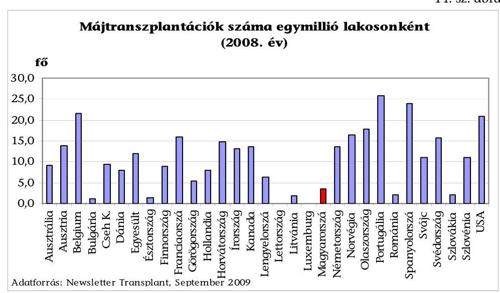

Májtranszplantációt csak az SE Transzplantációs és Sebészeti Klinikáján végeznek, bár képzett szakorvos a PTE sebészetén is van, az esetszámokat a 14. sz. tábla foglalja össze.

A májátültetések száma
2005-2009.

| Megnevezés | 2005 | 2006 | 2007 | 2008 | 2009 | Index   (2009/2005) |
| :-- | --: | --: | --: | --: | --: | :--: |
| Májátültetések száma | 44 | 46 | 42 | 36 | 40 | $90,9 \%$ |

Forrás: OVSZK
A májátültetések száma a 2005. évi 44-ről 2008-ban 36-ra esett vissza, lassú emelkedés tapasztalható 2009-re, 40-re emelkedett a beültetésszám. 2005 és 2009 között összesen 208 májbeültetés volt, a beültetés 15 alkalommal gyerekeknél történt.

A máj-várólistán lévő betegek és a cadaver donorok száma között növekvő a különbség. A gyermekdonorok hiánya és a megfelelő technika kidolgozása együttesen vezetett az élődonoros májátültetés nemzetközi elterjedéséhez. Az eddigi hazai gyakorlatban 2 ilyen gyermektranszplantáció történt, mindkettő 2006-ban. Felnőtt részére élődonoros májátültetés egy esetben, 2007-ben történt. Az OEP évente 3-6 németországi élődonoros májátültetést finanszíroz gyerekek részére a külföldi gyógykezelések között elszámolva. 2006-ban az első élődonoros májtranszplantáció külföldi vendégprofesszorának költségét is a külföldi gyógykezelés kasszából fedezték.

A magyar májátültetések közül 2008-ban egy sem volt élődonoros, miközben a fejlettebb európai országokban - Dániát és Finnországot leszámítva - minde-

---

nütt végeztek ilyeneket, sőt: Lengyelország 245 májátültetése közül 21-ben (8,5%) élő személy adományozott beültethető graftot. ${ }^{36}$

A végstádiumú szervelégtelenségben szenvedők várólistán töltött időtartamát 2009. évi adatok alapján a 15. sz. tábla mutatja be:

# Transzplantáltak létszáma várakozási idő szerint (2009) 

15. sz. tábla

| Megnevezés | Várakozási idő |  |  |  |  |  |
| :-- | :--: | :--: | :--: | :--: | :--: | :--: |
|  | Legfeljebb   5 hónap | 6-11   hónap | 12-23   hónap | 24-59   hónap | 60 vagy   több hónap | Összesen |
| Májátültetésre | 21 | 7 | 9 | 3 | - | 40 |

Forrás: OVSZK
A májátültetés várólistájára került új betegek száma 2008-ban nemzetközi összehasonlításban kedvezőtlen, összesen 130 beteg kapott orvosi javaslatot transzplantációra. Egymillió magyar lakosra vetítve ez 12,87, ami az EU 18,37 átlagának csupán 70,0%-a. A máj várólistán a halálozás a 2005. évi 11 főről, 2009-re 21 főre emelkedett.

Az SE Sebészeti és Transzplantációs Klinikáján 250-300 májátültetés utáni beteg utógondozását látják el. A Klinika 7 fő főállású belgyógyászt foglalkoztat az utógondozás ellátására. A betegek valamennyi problémájukkal a Klinika orvosaihoz fordulnak. Az SE-en belül
 a speciális esetekhez adott a konzíliumok lehetősége. A betegek rendszeres kontrollvizsgálatait itt is meghatározott időperiódusokban végzik.

Az átültetések eredményei, a betegek beavatkozást követő túlélési mutatói nemzetközi mércével mérve kiemelkedőek.

A vizsgált időszakban történt májátültetések túlélési adatait a 16. sz. tábla mutatja be:

Semmelweis Egyetem
májtranszplantáltak túlélési adatai

| Év | Transzplantációk   száma (eset) | 30   napon   belül | 30 és 60   nap között | egy év | két év | három év | négy év |
| :--: | :--: | :--: | :--: | :--: | :--: | :--: | :--: |
| 2005 | 44 | $100 \%$ | $95 \%$ | $84 \%$ | $82 \%$ | $77 \%$ | $70 \%$ |
| 2006 | 46 | $93 \%$ | $93 \%$ | $89 \%$ | $89 \%$ | $87 \%$ | $85 \%$ |
| 2007 | 42 | $100 \%$ | $100 \%$ | $86 \%$ | $81 \%$ | $79 \%$ | - |
| 2008 | 36 | $97 \%$ | $94 \%$ | $86 \%$ | $81 \%$ | - | - |
| 2009 | 40 | $95 \%$ | $95 \%$ | $85 \%$ | - | - | - |

Forrás: OEP

[^0]
[^0]:    ${ }^{36}$ Adatforrás: a Newsletter Transplant nemzetközi transzplantációs statisztikai kiadvány 2009. szeptemberi száma.

---

A májbeültetések száma - a vizsgált időszakban - 208 volt, ${ }^{37}$ közülük 42 beteg halt meg, 7 beteget 30-napnál rövidebb időn belül, 23-at 30-360 nap között, 12-t 360 napon túl veszítettek el, a $80 \%$-os túlélést a 15. sz. ábra szemlélteti. Ez az adat megfelel, illetve jobb az angliai ${ }^{38}$ túlélési adatoknál, ahol az 1995 és 2003 között a beültetetésen átesett betegek 76\%-a él, tíz éves túlélést 59\%-nál mutatnak ki. A hazai adat jobb, mint a Clinical Transplants. UCLA ${ }^{39}$ 2005. évi $74 \%$-ban kimutatott 5 éves túlélési adata.
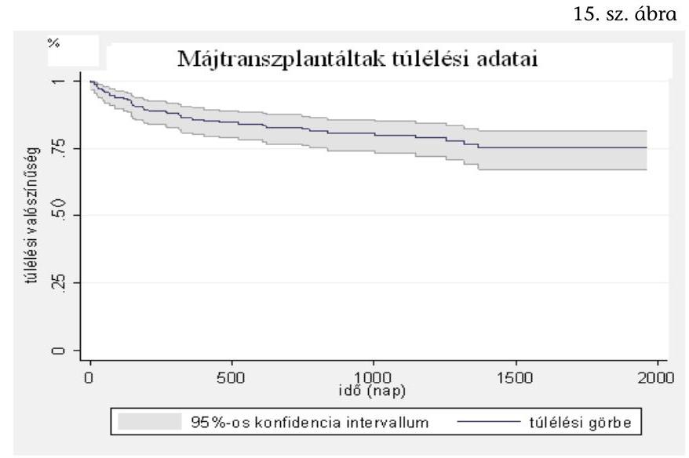

Kaplan-Meier túlélési görbe
Májátültetés legnagyobb nehézsége a megfelelő donormáj, 2009-ben 45 donormáj került kivételre és 40 felhasználásra. Alternatív megoldás a donorhiány okozta nehézségek csökkentésére a részleges májátültetés (a „split" májszegmens és az élődonor májprogram). A split program lényege az, hogy a cadaver májat megfelezik, így egy donormájjal két beteget lehet transzplantálni. Élődonoros májátültetés esetén egy egészséges donor májának egy részét távolítják el és tervezetten ültetik át a recipiensbe. Nemzetközi adatok szerint az 5 éves túlélés $90 \%$ feletti.

Egyes súlyos májelégtelenségek esetében a donorhiányt igyekeznek mérsékelni, áthidalni májpótló kezelésekkel. Ezek közül a plazmaferézis - mint első májpótló eszköz - Magyarországon a társadalombiztosításba már befogadott eljárás (akut máj-várólistán szereplő fulmináns betegek esetén). További, ún. májdializáló eljárások befogadását szorgalmazzák transzplantáló orvosok, illetve dialízis szolgáltatók. Ilyen eljárások az ún. MARS (Molecular Adsorbent Recirculating System), illetve a Prometheus-kezelés. Magyarországon jelenleg a finanszírozásba való befogadásának előkészítése van folyamatban.

[^0]
[^0]:    ${ }^{37}$ Az SZKI 206 beültetést regisztrált. Az OEP 208-at finanszírozott, az eltérés 1-1 fő 2006-ban és 2007-ben
    ${ }^{38}$ Transplant Activity in the UK 2008-2009
    ${ }^{39}$ University of California, Los Angeles

---

A transzplantáló orvosok szerint a nemzetközi adatokat hazánkra vonatkoztatva a szükséges májtranszplantációk számát évi 10-15 műtét/egymillió lakosra lehet becsülni, vagyis a jelenlegi májátültetések számát 3-5-szörösére kellene ${ }^{40}$ emelni annak érdekében, hogy minden indokolt májátültetést el lehessen végezni az alternatív technikák, az élődonor program bővítésével.

# 5. Szívtranszplantáció JELLEMZŐI 

Az SE Ér- és Szívsebészeti Klinikáján szívtranszplantációt, a GOKI-ban gyermekszív transzplantációt végeznek, és szervkivételre is ezek az intézetek jogosultak.

A vizsgált időszakban 91 alkalommal végeztek felnőtt szívtranszplantációt az SE Ér- és Szívsebészeti Klinikáján. A 2005. évi 12 felnőtt beültetés, 2006-ra 22-re nőtt, majd azt követően évente egy-egy esettel csökkent. 2006. szeptember 28-án volt a 100. szívátültetés, 15 évvel a magyar szívátültetési program 1992. évi elindítása után. A műtéti szám emelkedésének legfőbb akadálya a várólistára kerülő betegek alacsony száma.
16. sz. ábra
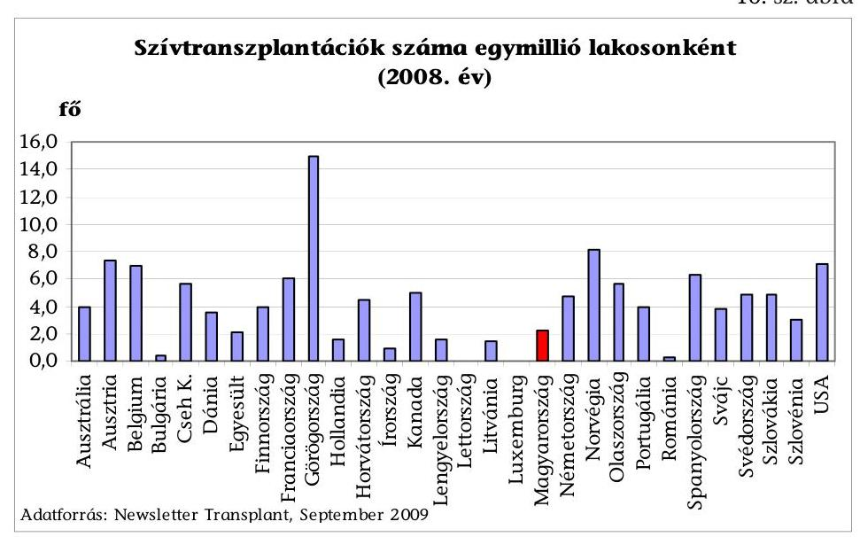

A magyarországi egymillió lakosra jutó szívátültetések száma 2008-ban 41,5\%kal maradt el az uniós átlagértékektől a 16. sz. ábra szerint.

A szív-várólistára került új betegek száma 2008-ban nemzetközi összehasonlításban szintén nem mutat kedvező képet, míg az EU-s várólistára 6,35 új beteg kerül fel egymillió lakosra, addig ez a mutató Magyarországon 2,48, tehát a hazai érték az EU-átlag 39,0\%-a volt, azaz az EU-átlag felét sem éri el egymillió lakosra vetítve.

A magyar szívsebészek szűknek tartják a várólistát. A transzplantációs tevékenység megfelelő szintre emelkedésének legfőbb és állandó akadályának tart-

[^0]
[^0]:    ${ }^{40}$ Dr. Alföldy Ferenc: Májátültetés élő donorokból, Weborvos 2006-01-17

---

ják. ${ }^{41}$ 70-80 betegnek kellene várólistán lennie. Tájékoztatás szerint kedvezőtlen hatása van a szívtranszplantőri munkára a szervkivételi díjak visszatartásának. Ez ellentétes a finanszírozó ösztönző szándékával.

# A várakozási idő a műtétet megelőzően 

A 2009-ben transzplantált 19 végstádiumú szívelégtelenségben szenvedő betegből 10 beteg 5 hónapot, 9 beteg 6-11 hónapot töltött várólistán, amelyet a 17. sz. tábla mutat be. A szívtranszplantációra várók 55,5\%-a (10 beteg) legfeljebb öt hónapon belül műtétre került.

Szívtranszplantáltak létszáma várakozási idő szerint (2009)

| Várakozási idő | legfeljebb   5 hónap | 6-11   hónap | 12-23   hónap | 24-59   hónap | 60 vagy több   hónap | Összesen |
| :-- | :--: | :--: | :--: | :--: | :--: | :--: |
| Szívátültetésre | 10 | 9 | - | - | - | 19 |

Forrás: OVSZK
2005-2006-ra nincs adatunk a várólistán tartózkodás idején történt halálozásról, 2007-ben 2 beteg, 2008-ban 7, és 2009-ben ismét 2 beteg halt meg új szívre várakozás közben.

A felnőtt szívátültetések túlélési adatait évente a 18. sz. tábla mutatja be:

## Semmelweis Egyetem szívtranszplantáltak túlélési adatai

| Év | Transzplantációk száma (eset) | 30 nap | 30 és 60   nap között | egy év | két év | három év | négy év |
| :--: | :--: | :--: | :--: | :--: | :--: | :--: | :--: |
| 2005 | 9 | $78 \%$ | $44 \%$ | $44 \%$ | $44 \%$ | $44 \%$ | $44 \%$ |
| 2006 | 20 | $90 \%$ | $80 \%$ | $70 \%$ | $70 \%$ | $70 \%$ | $70 \%$ |
| 2007 | 20 | $80 \%$ | $70 \%$ | $70 \%$ | $65 \%$ | $65 \%$ | - |
| 2008 | 22 | $73 \%$ | $73 \%$ | $73 \%$ | $73 \%$ | - | - |
| 2009 | 20 | $95 \%$ | $90 \%$ | $90 \%$ | - | - | - |

Forrás: OEP
Az SE Szívsebészeti Klinikáján a vizsgált időszakban 91 beteget transzplantáltak, közülük 70 beteg él. 15 beteget 30 napnál rövidebb idő alatt veszítettek el, 4-et egy éven belül, 1 beteget pedig 1 éven túl. A Kaplan-Meier elemzés szerint az öt éves túlélés valószínűsége 69,3\% (17. sz. ábra). Az angliai öt éves túlélés 69-71\% közötti volt az 1995-2003 között transzplantáltaknál. Az UCLA öt éves túlélési mutatója $85 \%$.

[^0]
[^0]:    ${ }^{41}$ Szabolcs Zoltán: A 100. magyar szívátültetés margójára: Egy elemző számvetés, Magyar Sebészet 60, 475-480, 2007.

---

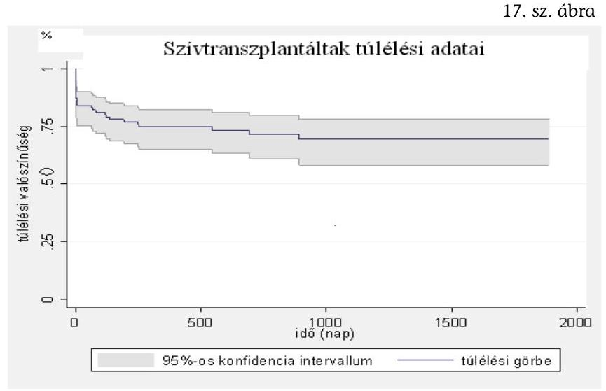

# Kaplan-Meier túlélési görbe 

A GOKI-ban a gyermekszív-transzplantációs program 2007. évi indulása óta 9 gyermek kapott szívet. 2008-ban hajtották végre az első csecsemőkori szívtranszplantációt és az első sikeres műszív-beültetést is, amit egy hónap szövődménymentes kezelés után transzplantáció követett. 2009-ben 5 sikeres transzplantációt végeztek, egy esetben megelőző műszív-kezelést alkalmaztak. A várólistára 8 beteg került fel. A beavatkozások száma megfelel a megelőző felméréseknek, a lakosság számra vonatkoztatott értéknek. A serdülők rövidebb, a kisdedek hosszabb várakozási időre számíthatnak.

Az intézet transzplantációinak túlélési adatait az OEP-től kapott értékek szerint a 19. sz. tábla mutatja be:

## GOKI gyermekszív-transzplantáltak túlélési adatai

| Év | Transzplantációk   száma (eset) | 30 nap | 30 és 60   nap között | egy év | két év | három év |
| :--: | :--: | :--: | :--: | :--: | :--: | :--: |
| 2007 | 2 | $50 \%$ | $50 \%$ | $0 \%$ | $0 \%$ | $0 \%$ |
| 2008 | 2 | $100 \%$ | $100 \%$ | $100 \%$ | $100 \%$ | - |
| 2009 | 5 | $100 \%$ | $100 \%$ | $100 \%$ | - | - |

Forrás: OEP
A gyermekszív-transzplantációs program keretében 9 transzplantációt végeztek 2005-2009 között, közülük 7-en vannak életben, egy beteget egy éven belül, 1 gyermeket 30 napnál rövidebb időn belül veszítettek el az OEP adatok szerint. Maga a klinika tanúsítványi közlése szerint 8 átültetés volt és 7 beteg él. Ugyanezt támasztja alá a Szervkoordinációs Iroda adata.

A szívtranszplantáltak utógondozását 2006. március 1-jétől az EüM Egészségpolitikai Főosztályának rendelkezése szerint a GOKI-ban látják el, mind a gyermek, mind a felnőtt betegeknél. Számuk 106 fő. Gondozásuk mindent magába foglaló részletes protokoll alapján történik, meghatározott időfaktorok szerint jelennek meg a betegek az invazív, a labor és egyéb diagnosztikai vizsgálatok céljából. Külön figyelemmel vannak a protokoll alapján arra is, hogy szociálisan is segítsék a betegeket pl. rokkantnyugdíjazás adminisztratív intézésében, segélyezési lehetőségekről való tájékoztatásban, életmód és lelki tanácsadásban. Az utógondozottak 81,1\%-a 5 éves túlélő.

# 6. Hasnyálmirigy-transzplantáció JELLEMZŐI 

Hasnyálmirigy-átültetés két klinikán történik Magyarországon az SE Transzplantációs Klinikáján és a Pécsi Tudományegyetem Sebészeti Klinikáján. Kombinált vese-hasnyálmirigy beültetés öt év alatt 40 volt, ebből 13-at a budapesti klinika, 27-et a pécsi klinika ültetett be. Hasnyálmirigy-szigetsejtet a vizsgált időszakban 4 alkalommal ültettek be a budapesti klinikán. Ez utóbbi még kutatási szakaszban van, nem befogadott eljárás.
18. sz. ábra
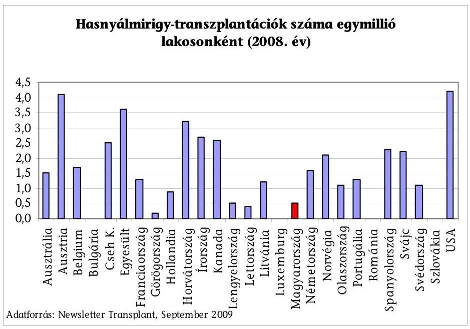

2008-ban az EU-ban 756 hasnyálmirigy-átültetés történt, ez egymillió lakosra vetítve 1,5. Magyarországon ebben az évben a beültetések száma 5 db volt (18. sz. ábra adatai szerint), ez egymillió lakosra vetítve 0,5 transzplantációt jelent, tehát jelentősen elmarad az európai átlagtól.

A hasnyálmirigy-átültetés várólistára 2008-ban 4 új beteg került fel (ez egymillió lakosra vetítve 0,4 fő), míg az EU-ban a várólistára kerülő új betegek száma egymillió lakosra nézve 2,45 fő volt. A hasnyálmirigy-átültetések várólistáira felkerült magyarországi új betegek száma az EU-átlag felét sem éri el.

A 2009-ben transzplantált 9 betegből az OVSZK adatszolgáltatása szerint 5 hónapnál kevesebb időt 1 beteg, 6-11 hónapot
 4 beteg, és 12-23 hónapot 1 beteg várakozott. A transzplantáltak 78%-a 1 évnél kevesebbet várt a transzplantációra. 3 beteg 2-5 év közötti időt várt a műtétre.

---

A túlélési adatokat a 20. sz. tábla mutatja be a vizsgált időszakban:

# Semmelweis Egyetem hasnyálmirigy-transzplantáltak túlélési adatai 

20. sz. tábla

| Év | Transzplantációk   száma (eset) | 30 nap | 30 és 60   nap   között | egy év | két év | három év | négy   év |
| :--: | :--: | :--: | :--: | :--: | :--: | :--: | :--: |
| 2005 | 2 | $50 \%$ | $50 \%$ | $50 \%$ | $50 \%$ | $50 \%$ | $50 \%$ |
| 2006 | 4 | $100 \%$ | $100 \%$ | $100 \%$ | $100 \%$ | $100 \%$ | $100 \%$ |
| 2007 | 2 | $100 \%$ | $100 \%$ | $100 \%$ | $100 \%$ | $100 \%$ | - |
| 2008 | 1 | $100 \%$ | $100 \%$ | $100 \%$ | $100 \%$ | - | - |
| 2009 | 4 | $100 \%$ | $100 \%$ | $100 \%$ | - | - | - |

Forrás: OEP
A pécsi túlélési adatokat a 21. sz. tábla mutatja be a vizsgált időszakban:
Pécsi Egyetem hasnyálmirigy-transzplantáltak túlélési adatai

| Év | Transzplantációk   száma (eset) | 30 nap | 30 és 60   nap között | egy év | két év | három év | négy év |
| :--: | :--: | :--: | :--: | :--: | :--: | :--: | :--: |
| 2005 | 6 | $100 \%$ | $100 \%$ | $100 \%$ | $100 \%$ | $100 \%$ | $100 \%$ |
| 2006 | 9 | $100 \%$ | $89 \%$ | $78 \%$ | $78 \%$ | $78 \%$ | $78 \%$ |
| 2007 | 3 | $67 \%$ | $67 \%$ | $67 \%$ | $33 \%$ | $33 \%$ | - |
| 2008 | 4 | $100 \%$ | $100 \%$ | $100 \%$ | $100 \%$ | - | - |
| 2009 | 5 | $100 \%$ | $80 \%$ | $80 \%$ | - | - | - |

Forrás: OEP
Az SE Transzplantációs és Sebészeti Klinikáján 13 kombinált vese-hasnyálmirigy transzplantáltból 1 beteg egy éven belül meghalt. A Pécsett transzplantáltak közül a kombinált vese-hasnyálmirigy beültetést 27 betegből 5 nem élte túl. Hasnyálmirigy-beültetésen öt éven belül összesen 40 beteg esett át, közülük 6-an, azaz 15% vesztette el az életét öt év alatt. A túlélés 85%-os (a 19. sz. ábra alapján), Angliában ez az arány három évre, egyéves túlélést vizsgálva 95%. (2004-2007), az UCLA adata pedig 72%.
19. sz. ábra
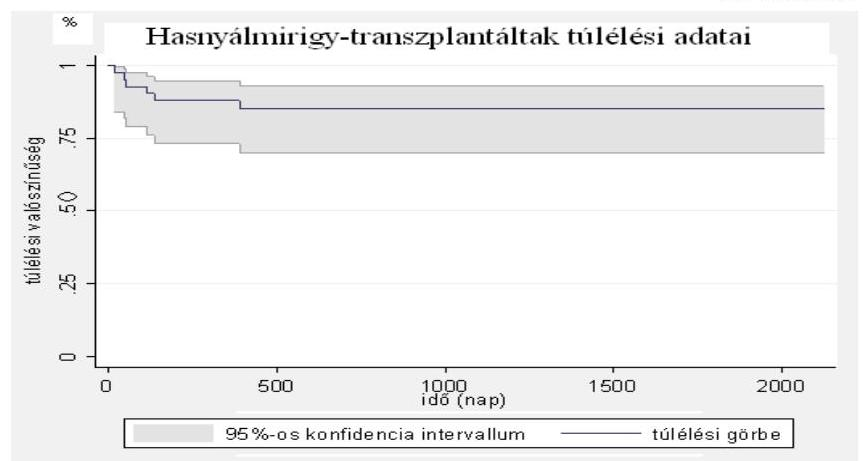

Kaplan-Meier túlélési görbe

---

# 7. A transzplantáció és a kapcsolódó tevékenységek szabályozása 

### 7.1. A transzplantáció jogi szabályozása, megfelelőségük az EU irányelveknek, ajánlásoknak

Az egészségügyről szóló törvény (továbbiakban: Eütv.) szabályozza ${ }^{42}$ a szerv- és szövetátültetést, a szervadományozást valamint szervnek élő személyből való eltávolítását, felajánlását. A törvény XI. fejezetének végrehajtási szabályait EüM rendelet ${ }^{43}$ tartalmazza.

A szerv- és szövetátültetésre vonatkozó rendelkezések több alkalommal módosultak. 2005-ben és 2008-ban változott a várólistára kerülés kezdeményezése, a hozzá kapcsolódó panaszok kivizsgálása, az agyhalál megállapítása. 2009. január 1-jétől a haszonszerzés fogalmának, valamint a szerv-adományozás ellenértékének pontosítása ${ }^{44}$ került a törvénybe.

A haszonszerzésre vonatkozó rendelkezés összhangban van az Európa Tanácsnak az emberi lény emberi jogainak és méltóságának a biológia és az orvostudomány alkalmazására tekintettel történő védelméről szóló, Oviedóban 1997. április 4-én kelt Egyezményéhez kapcsolódó, az emberi eredetű szervek és szövetek átültetéséről szóló, Genfben 2005. május 4-én aláírt Kiegészítő Jegyzőkönyvvel, melynek kihirdetéséről törvény rendelkezik. ${ }^{45}$

2007-től az Eütv. a XVII. fejezete kiegészült azzal, ${ }^{46}$ hogy nemzetközi egyezmény keretében csak viszonzás esetén vihető külföldre, illetve hozható be átültetés céljából emberi szerv, továbbá, hogy a külföldre szállítás csak magyar recipiens hiányában megengedett. Szerv kiszállításról szóló nem államközi megállapodás vagy egyezmény érvényességének feltétele egészségügyi államigazgatási szerv egyetértése. Ebben a kérdésben a hatósági joggyakorlat máig bizonytalan.

Az ágazatirányító a vizsgált időszakban foglalkozott Magyarországnak az Eurotransplant (ETI, Eurotransplant International) nemzetközi szervcsere alapítványhoz való csatlakozásával.

[^0]
[^0]:    ${ }^{42}$ 1997. évi CLIV. törvény az egészségügyről
    ${ }^{43}$ 18/1998. (XII. 27.) EüM rendelet az egészségügyről szóló 1997. évi CLIV. törvénynek a szerv- és szövetátültetésre, valamint szerv- és szövettárolásra, egyes kórszövettani vizsgálatokra vonatkozó rendelkezései végrehajtásáról
    ${ }^{44}$ „(11) Nem tekinthető a (7) bekezdés szerint haszonszerzésnek - az átültetéssel összefüggésben végzett - jogszerű orvosi vagy kapcsolódó technikai szolgáltatások igazolható dija."
    ${ }^{45}$ 2006. évi LXXX. törvény az Európa Tanácsnak az emberi lény emberi jogainak és méltóságának a biológia és az orvostudomány alkalmazására tekintettel történő védelméről szóló, Oviedóban, 1997. április 4-én kelt Egyezményéhez kapcsolódó, az emberi eredetű szervek és szövetek átültetéséről szóló, Genfben, 2005. május 4-én aláírt Kiegészítő Jegyzőkönyv kihirdetéséről.
    ${ }^{46}$ Az Eütv. 243. §-ának (6) bekezdés utolsó két mondatának kiegészítése a 2007. évi LXXI. törvény 9. §-ával

---

A szervátültetésre szoruló betegeket kezelő kórházak Európa-szerte szervhiánynyal küzdenek. Az EP, a Tanács, illetve a Bizottság egyaránt elfogadott szakértői dokumentumokat, munkaprogramot, koncepciót ${ }^{47}$ a szervátültetések bővítésére és szabályozására.

Ezek a dokumentumok nem tartalmaznak kötelező érvényű előírásokat a tagállamok, így Magyarország számára sem, hanem uniós szervezeti munkaprogramoknak minősülnek. Az uniós koncepciók elvárásokat fogalmaznak meg a tagállamok hatóságai felé. Az EP állásfoglalása [2007/2210 (INI)], 2008. április 22. (Közleményszám: 2009/C 259 E/01) a szervadományozásról és a szervátültetésről. Az állásfoglalásában az EP 17 konkrét felkérést, sürgetést, felszólítást is intézett a tagállamokhoz annak érdekében, hogy növelje a rendelkezésre álló szervek számát, növelje a transzplantációs rendszerek hatékonyságát és elérhetőségét, fokozza a lakosság tudatosságát és, hogy garantálja a jó minőséget és a biztonságot.

A Bizottság elfogadta a tagállamok közötti koordinációt és együttműködést fokozó cselekvési tervet, ${ }^{48}$ amelyben öt célkitűzés alatt tíz kiemelt intézkedést javasolt. A dokumentum az egyes intézkedéseket a Bizottságtól, illetve a tagállamoktól várja. Pl., hogy fokozatosan transzplantációs donorkoordinátorokat foglalkoztassanak a kórházakban és ösztönözzék oktatásukat.

A szabályozásban bekövetkezett változásokat a transzplantációs szakma egységes fellépése és napi élet történéseinek utólagos követése kényszerítette ki és nem a tárca összefogott előrelátó intézkedései.

Az ágazatirányító a vizsgált időszakban intézkedéseket hozott a szervkoordináció átszervezésére, a várólista vezetés korszerűsítésére, a listára kerülés szakmai irányelveinek közzétételére, a bizottságok és monitoring testület felállítására, veseelégtelenség felkutatását szolgáló GFR értékek következetes vizsgálatára, továbbá a transzplantáció finanszírozásának biztosítására, a szerkivételi és donordíjak módosítására, a szervpótló kezelések befogadására, a kivizsgálást és az utógondozást biztosító *-os HBCS-k bevezetésére. Ezek részleteit a vonatkozó anyag részek tartalmazzák. Nem történtek intézkedések a nemzetközi gyakorlat szerinti dominó transzplantáció, az önkéntes szerv felajánlás bevezetésének, illetve két vagy többoldalú szervcsere egyezmények megkötése érdekében. A szervtranszplantációs betegellátás kibővítésére, fejlesztésére és korszerűsítésére a tárca nem dolgozott ki koncepciót. A transzplantációk számának emelését nem tűzte ki célul, noha az utóbbi évek hazai tendenciáival szemben a nemzetközi gyakorlatban emelkedik a szervátültetések száma.

A tárca tüdőátültetés biztosításában folytatott koordinációs tevékenysége nem átlátható, kellően nem dokumentált, (ennek részleteit a 3.1.2. anyagrész mutatja be).

# 7.2. A donor felkutatás szabályozása 

Az Eütv. ${ }^{49}$ szerint szervátültetésre elsősorban a halottakból eltávolított szervet kell felhasználni (cadaver donáció). A donációval a tv. XI. fejezete (202-215. §), míg a halottakkal kapcsolatos eljárással a XII. fejezet (216-222/A. §) foglalkozik.

Magyarországon a szervfelajánlás a feltételezett beleegyezés elvén működik. Eszerint mindenki beleegyezett szervei halála utáni transzplantációs célú eltávolításába, aki ez ellen életében nem tiltakozott. A betegek szervkivételt ellenző tiltakozó nyilatkozatának megtételét EüM rendelet ${ }^{50}$ szabályozza, ez rendelkezik az OTNY vezetéséről és az egészségügyi intézmények ezzel kapcsolatos feladatairól.

Az Országos Transzplantációs Nyilvántartás 2009. év végén 712 érvényes tiltakozót jegyzett. A nyilvántartásban összesen 6537 fő személyes adatát tartották nyilván, közülük 1549 fő adata azon egészségügyi dolgozók nyilvántartása, akik kezdeményezhetnek adatkérést, 4276 fő pedig, akik agyhalál állapotába kerültek 1999-2009 között. Az OTNY-ben nyilvántartott adatok kezelésére az egészségügyi és a hozzájuk kapcsolódó személyes adatok kezeléséről és védelméről rendelkező 1997. évi XLVII. törvény az irányadó. Az OTNY-t az országos tiszti főorvos által kijelölt Kémiai Biztonsági Intézetben vezetik. A nyilvántartás adatbázisa csak egyedi azonosítók alapján engedélyezett kereséseket tesz lehetővé.

A vizsgált időszakban 2005-2009 között 157-en tettek tiltakozó nyilatkozatot. Elhunytakról 2005-2009 között 2759 fő esetében kértek információt. Az agyhalottak száma az egyes években 454, 583, 540, 509, 673 fő volt.

Az orvosszakma elkészítette és nyilvánosan elérhetővé tette a szervdonáció szakmai protokollját, ami alapján akár 100 ember együttműködése is szükséges szervriadó esetén a nap 24 órájában.

[^0]
[^0]:    ${ }^{49}$ 1997. évi CLIV. törvény az egészségügyről 203. § (1) bekezdés
    ${ }^{50}$ 18/1998. (XII. 27.) EüM rendelet a betegek szervkivételt ellenző tiltakozó nyilatkozatának megtételéről

---

# 7.2.1. Az agyhalál megállapításának szabálya, az agyhalált megállapító bizottságok működése 

Magyarországon a transzplantációs célú szerveltávolítást elsősorban agyhalottakból végzik. Máj-, vese- és tüdőtranszplantáció esetében élődonoros átültetés is történik. Az agyhalál megállapításának részletes szabályait EüM rendelet ${ }^{51}$ tartalmazza. Az agyműködés hiánya csak komplex tünetegyüttes fennállása esetén bizonyítható a szabályozás alapján. Az intézetekben háromtagú orvosi bizottságnak - a bizottsági tagoknak külön-külön egymástól függetlenül - kell megállapítania az agyhalál beálltát.

Az ÁSZ

 kérdőívre adott válaszok szerint, 60 válaszadóból 56 intézmény működtet agyhalál megállapító bizottságot.

Az intézetektől kért rövid véleményekben megfogalmazódott, hogy a donorgondozás jelentős mértékben elvonja a személyi kapacitást a többi beteg ápolásától, nehézkes az agyhalál bizottság összehívása, bonyolult az országos koordinátor által kért laborvizsgálatok elvégeztetése, valamint javasolták, hogy minden intenzív osztályon biztosítani kellene a gondozást kiváltó, a gondozási idő lerövidítését szolgáló műszereket. Az intézetek jó része azt állította, hogy elkötelezett a donáció mellett. Kiemelkedően sok donort mégis csak néhány kórház jelent pl. Miskolc 17/2009., Nyíregyháza 18/2009., Szolnok 18/2009., Péterfy Sándor utcai Kórház Baleseti Központ (volt Országos Baleseti Intézet) 12/2009.

### 7.2.2. A várólista vezetésének szabályozása

A várólisták vezetéséről a vizsgált időszakban két jogszabály rendelkezett. ${ }^{52}$ 2003. november 1-jétől 2006. december 31-ig ESzCsM rendelet, ${ }^{53}$ 2007. január 1-jétől Kormányrendelet. ${ }^{54}$

A Korm. rendelet újraszabályozta a transzplantációs várólisták vezetését. A korábbi Transzplantációs Bizottságok helyett 2007. január 1-jétől az OVSZK működteti a várólistákat, a feladat kimerül a listák honlapon történő közzétételében. A transzplantációra váró betegek az aktuális donorral való egyezőség (vércsoport, testméret stb.) esetén kaphatnak új szervet, tehát a transzplantációs várólista sorrendje nem a műtétre kerülés sorrendjét jelenti.

[^0]
[^0]:    ${ }^{51}$ Az egészségügyről szóló 1997. évi CLIV. törvénynek a szerv- és szövetátültetésre, valamint tárolásra és egyes kórszövettani vizsgálatokra vonatkozó rendelkezése végrehajtásáról szóló 18/1998. (XII. 27.) EüM rendelet
    ${ }^{52}$ A várólisták vezetéséről a kizárólag előzetes betegbesorolás (várólista) alapján nyújtható egészségügyi ellátásokról szóló 61/2003. (X. 27.) ESzCsM rendelet, amely 2003. november 1-jétől 2006. december 31-éig volt hatályban, illetve 2007. január 1-jétől a várólista alapján nyújtható ellátások részletes szabályairól szóló 287/2006. (XII. 23.) Korm. rendelet
    ${ }^{53}$ A várólisták vezetéséről a kizárólag előzetes betegbesorolás (várólista) alapján nyújtható egészségügyi ellátásokról szóló 61/2003. (X. 27.) ESzCsM rendelet
    ${ }^{54}$ A várólista alapján nyújtható ellátások részletes szabályairól szóló 287/2006. (XII. 23.) Korm. rendelet.

---

A várólistákkal kapcsolatos feladatok, a transzplantációs várólisták vezetése, feltöltése, ellenőrzése stb. a Transzplantációs Bizottságok (Várólista Bizottság) feladata. A kormányrendelet alapján 2007. január 1-jétől az OVSZK feladata a szervdonáció szervezésével összefüggő koordinációs tevékenység és a szakmai felügyeletet ellátó Monitoring Testület működtetése is. A Monitoring Testület működésének célja a szerv- és szövetátültetés szakmai szabályainak érvényesítése, a szerv- és szövetátültetés során az allokációs kritériumok érvényesülésének ellenőrzése stb. Az egészségügyért felelős miniszter részére beszámoló készítési kötelezettségük van, a vizsgált időszakban ennek a kötelezettségnek eleget tettek. A Várólista Bizottságok ügyrendjüket elkészítették.

A transzplantációra való alkalmasság szakmai szabályait, mint a várólistára kerülés feltételét az EüM szakmai irányelvekben rögzítette (vese, máj, szív). Ezek hatálya több alkalommal is meghosszabbításra került, jelenlegi 2011. december 31-ig szól.

A Nemzeti Tüdő Transzplantációs Várólista Bizottság módszertani levélben ${ }^{55}$ határozta meg az alkalmasság szakmai szabályait, hatálya 2008. december 31., amelyet 2011. december 31-éig meghosszabbítottak.

Az egyes szervek recipiens oldali megfelelőségének allokációs szabályait - a szív kivételével - az EüM szakmai irányelvekben rögzítette cadaver donorvese, máj-, illetve máj-vese esetében. Az egyes szervek transzplantációhoz szükséges allokációs szempontjait az OVSZK a honlapján is közzéteszi.

Szív esetében csak az OVSZK honlapján tették közzé az allokációs szempontokat.

Tüdő esetében sem az OVSZK honlapján, sem Egészségügyi Közlönyben nem kerültek meghatározásra az allokációs szempontok, tekintve, hogy a tüdőátültetéseket Bécsben végzik. A bécsi klinika allokációs szempontjai nincsenek kihirdetve.

A várólistára kerülésig eltelt idő a rendszer hatékonyságának indikátora, ezért csökkentése egyértelműen megfogalmazott célnak kell lennie. Mind a korábbi, mind a jelenleg hatályos szabályozás alapján a transzplantációra való alkalmasság kivizsgálását a beteg várólistára helyezése érdekében kezelőorvosa kezdeményezi az illetékes Várólista Bizottságnál. A 287/2006. (XII. 23.) Korm. rendelet 4. § (1) bekezdés alapján. „A kezelőorvosnak tájékoztatási kötelezettsége keretében fel kell világosítania a beteget az adott ellátás esetében létező transzplantációs várólistára való felkerülés lehetőségéről." Ennek gyakorlata, dokumentáltsága mindenütt más. Az egységes, hiteles betegtájékoztatási gyakorlat megteremtése érdekében az ágazatirányítói intézkedés szükséges. A listáról való kiválasztásnál az ÁNTSZ 2007. évi megállapítása szerint a potenciálisan transzplantációra alkalmas betegek egy része nem volt műtétre alkalmas állapotban, mert a várólistán lévők gondozása nem volt kielégítő.

[^0]
[^0]:    ${ }^{55}$ Egészségügyi Közlöny 2005. 12/I. (VII. 15.) szám; Az Egészségügyi Minisztérium módszertani levele - a tüdőtranszplantáció indikációi, ellenjavallatai, a betegkiválasztás szempontjai, a transzplantációra való alkalmasság a várólistára kerülés feltételei, a várólistáról való levétel

---

Az adott donorveséhez az objektív legmegfelelőbb recipiens kiválasztást az ún. országos szelekciós lista összeállítással teremtik meg. A szelekciós listát a 4 transzplantáló centrumtól függetlenül az OVSZK készíti el informatikai támogatottsággal, és küldi tovább a beültető centrumoknak. A lista sorrendjétől való eltérést az okozza, hogy az a beültető centrum élvez elsőbbséget a beültetésben, amelynek területéről kerül ki a donor. További eltérést okoz a lista sorrendjéhez képest, ha a beteg nem elérhető, megbetegedett stb. Ezen tények rögzítésre kerülnek, de a betegoldali dokumentálás nem követelmény, így nem kontrollálható az eltérés.

A Várólista Bizottságok tevékenységét a Monitoring Testület ellenőrizte. Az ellenőrzések a dokumentumok alapján formálisak, tapasztalataikat az ágazatirányító nem hasznosítja.

A Várólista Bizottságok ellenőrzése nem független, nem objektív, mert a várólistákra történő beteg felvételt, a szervbeültetést, a Várólista Bizottságok ellenőrzését ugyanazon személyek végzik, akik egyaránt tagok a Magyar Transzplantációs Társaságban, Várólista Bizottságokban, Monitoring Testületben. A jelenlegi működés szerint a Monitoring Testület 5 tagja közül 3 fő a Magyar Transzplantációs Társaságnak is tagja egyben, a Monitoring Testület 5 tagjára a Magyar Transzplantációs Társaság tesz javaslatot.

A várólistára kerülés, majd transzplantációra való kiválasztás nem válik ketté, azaz nem valósul meg a várólistáról történő független kiválasztás, ahogy az Eurotransplant és más európai országok esetében ez alapfeltétel.

Az Országos Koordinátori Központ vezetője munkaanyagban rögzítette, ${ }^{56}$ hogy európai követelmény a várólista kezelés és szervelosztás független szerv által történő működtetése, ahogy Angliában, Franciaországban, Szlovéniában és Csehországban.

Az Európa Tanács ajánlása ${ }^{57}$ alapján a független koordinátor szervezet fenntartásának és fejlesztésének alapelvei között szerepel, hogy a várólisták kezelése, illetve a szervek elosztása a Nemzeti Transzplantációs Szervezet hatáskörébe tartozik.

A transzplantációra történő betegkiválasztás objektivitása, átláthatósága nem biztosított. A recipiens kiválasztás a hazai gyakorlatban a transzplantáló intézmény joga, hiszen a várólistát maga a beültető intézmény vezeti, a kiválasztás a beültető orvoson múlik, aki egyébként rendszerint tagja az adott Várólista Bizottságnak, a szervkivételi teamnek. Máj-, szív-, tüdőkivételnél a recipiens már a szervkivétel előtt behívásra, előkészítésre kerül a donor vércsoportja és testméretei alapján.

[^0]
[^0]:    ${ }^{56}$ Országos hatáskörű, beültető centrumoktól független koordinátor szervezet kialakításának és fenntartásának alapelvei a Hungarotransplant Kht. 5 éves működési tapasztalatai alapján
    ${ }^{57}$ Council of Europe, Committee of Ministers [Draft recommendation $\mathrm{N}^{\circ} \mathrm{R}$ (2005) ... of the Committee of Ministers to member states on the backround, functions and responsibilities of a national transplant organisation (NTO)]

---

Minden szerv esetében országos várólistáról a régióktól független kiválasztást indokolt biztosítani, hiszen a régiós lakosságszám nagyban eltér, ezért az egyenlő hozzáférés elve súlyosan sérül.

Bármelyik szerv esetén, amennyiben a várólistán lévő beteg állapota romlik, ún. sürgős jelzéssel látható el, amely szervriadó során elsőbbséget jelent a kiválasztásban.

Az egyes szervek recipienshez történő allokálásának informatikai támogatottsága - vese kivételével - nem megoldott, a kiválasztási eljárás informatikai támogatottsága nem megfelelő és nem biztosítja a szervátültetéshez szükséges donor kiválasztás függetlenségét, átláthatóságát, ez a folyamat nem ellenőrzött. Bár a monitoring testület szakmai szempontból ellenőrzi az allokációs kritériumok érvényesülését a szerv-, szövetátültetés során, ilyen tartalmú, a testület által készített ellenőri dokumentáció nem került bemutatásra.

# 8. A TRANSZPLANTÁCIÓ SZERVEZETI STRUKTÚRÁJA 

### 8.1. A szervátültetés szervezésének folyamata

### 8.1.1. A Hungarotransplant Kht. működése, tevékenységének hatása a transzplantáció működtetése

A transzplantációs programok elősegítésére valamint a szerv és szövetátültetés koordinálására Kormány ${ }^{58}$ központi szervezet - Kht. - létrehozásáról döntött 1999-ben.

A Hungarotransplant Kht. 2001-2006 között háromszintű koordinációs szervezetet hozott létre; működése alatt rendszeressé váltak a képzések; az európai együttműködésben megvalósult konferenciákon, pályázatokon képviselte Magyarországot; a 2001-2006 közötti működése hozzájárult a transzplantációt jellemző valamennyi mutató emelkedéséhez.

A Kht. amikor nem volt megfelelő recipiens Magyarországon több alkalommal kezdeményezte donorszervek külföldi felhasználását az Eütv. XVII. fejezetének nemzetközi rendelkezései alapján. A szervek külföldre szállítását, a szervkivételek körülményeit 2006-ban vizsgálta az ÁNTSZ. Erről szóló vizsgálati jelentését 2006. július 10-én készítette el az OTH az országos tiszti főorvos által elrendelt vizsgálati szempontok szerint. Az ellenőrzés 12 intézményben 2006. január 1. és április 30. között 28 donorból eltávolított szervkivételi dokumentációjára terjedt ki.

A vizsgálat számos szabálytalanságot tárt fel elsősorban arra vonatkozóan, hogy a szervkivételeket nem az arra feljogosított szolgáltatók végezték, hanem magyarországi egészségügyi tevékenységre engedéllyel nem rendelkező külföldi orvos csoportok. Vizsgálatuk 6 esetben igazolta külföldiek részvételét. A szervkivételekből 10 esetben igazolódott, hogy a szerveket Németországba, Ausztriába,

[^0]
[^0]:    ${ }^{58}$ 2301/1999. (XI. 19.) Korm. határozat a szerv-, szövetátültetés magyarországi helyzetének egyes kérdéseihez kapcsolódó intézkedésekről

---

Olaszországba szállították. A vizsgálat súlyos megállapítása volt, hogy az eltávolított szervek közül 20 db szerv vonatkozásában nincs adat arról, hogy hol, kibe, mikor ültették be, illetve felhasználták-e. További megállapítások vonatkoztak a dokumentációk hiányosságaira, szabályozási hiányosságokra, továbbá annak dokumentálása hiányosságára, hogy igazoltan nem volt magyar recipiens. Utóbbiról a Nemzeti Transzplantációs Várólista Bizottság hiteles nyilatkozata nem állt rendelkezésre. A Kht. működése alatt a tulajdonos minisztérium évről évre tapasztalt gazdálkodási problémákat, köztartozás, törzstőke felélés miatt.

A Kht. végelszámolás indokaként - a kormány-előterjesztés - a gazdálkodási problémákon túl arra is kitér, hogy működése megosztotta a szakmai közvéleményt, illetve a betegszervezeteket. A Korm. határozattal, ${ }^{59}$ 2008. március 31-ei időponttal döntött a Hungarotransplant végelszámolással történő megszüntetéséről, feladatai és eszközei átadásáról az OVSZK részére, 2007. január 1-jétől. (Európában, Angliában van példa arra, hogy a vérellátó szervezet kereteiben működik a szervtranszplantáció szervezését végző egység.)

# 8.1.2. A Szervkoordinációs Iroda tevékenysége 

A magyarországi szervkivétel szervezésének feladatait a Hungarotransplant megszűnésével az OVSZK szervezeti egységeként a Szervkoordinációs Iroda vette át. Szervezési tevékenységének középpontjában az áll, hogy minél több szervkivétel és ennek nyomán minél több beültetés történjen a lehető legrövidebb idő alatt.

Az Iroda vezetője az OVSZK SZMSZ-e alapján - az általános főigazgatóhelyettes alárendeltségben - a vezető koordinátor, aki 2010 áprilisától igazgatói kinevezést kapott. Az igazgató alárendeltségében 6 fő országos koordinátor dolgozik főállásban, míg a vidéki centrumok koordinátorai - 6 fő - félállásban az Iroda alkalmazottai. Ezzel a megoldással nem különül el a donor oldali, illetve recipiens oldali szervezés. A budapesti Transzplantációs Klinikán nem a Koordinációs Iroda, hanem az egyetem alkalmazásában
 3 főállású koordinátor dolgozik együttműködésben az Irodával.

A Szervkoordinációs Iroda a nap 24 órájában készen áll a donorjelentések fogadására, a szervkivétellel járó feladatok ellátására, a szervriadók központi szervezésére. A szervkivétel – definíciója szerint – olyan eseménysorozat, amelynek időtartama a potenciális donor kijelölésétől az adott szerv(ek) beültetésének kezdetéig tart; ezen időszak alatt történik meg a halál megállapítása, a donor kondicionálása, a szervek alkalmasságának megítélése, meghatározott szervek esetében a recipiens(ek) kijelölése, valamint a szervek eltávolítása, beültetésre alkalmas állapotban tartása és szállítása.

Az országos koordinátorok elsősorban a donorkórház és a többi résztvevő közötti kapcsolattartást látják el a jelentéstől a szervkivételig, a donor alkalmasságának megítélését protokoll szerinti kikérdezés szerint végzik, az alkalmas donorról értesítik a szervkivételre feljogosított centrumokat, illetve előzetes

[^0]
[^0]:    ${ }^{59}$ Az államháztartás hatékony működését elősegítő szervezeti átalakításokról és az azokat megalapozó intézkedésekről rendelkező 2118/2006. (VI. 30.) Korm. határozat

---

megállapodás alapján a területileg illetékes centrumokat. Összegezve a központi szervezés folyamata a szervkivétel kezdetéig tart.

A szervezés következő szintje a szervkivételtől a beültetésig terjedő feladatok szervezése a klinikai centrumok koordinátorainak szintjén zajlik.

A centrum koordinátorok fogadják a Koordinációs Iroda donorjelentését, szükség esetén orvosi utasításra kiegészítő vizsgálatokat kérnek az országos koordinátoron keresztül a donorkórháztól, egyeztetik a szervkivétel időpontját, értesítik a szervkivételi teamet, biztosítják az ehhez szükséges anyagokat, eszközöket, továbbá ellátják a recipiens oldali szervezési feladatokat. Behívják az átültetésre alkalmas személyt, akit a vese-várólista alapján az allokációs szempontok szerint, illetve a többi szerv vonatkozásában a helyi várólistáról ítélnek alkalmasnak a beavatkozásra. A kiválasztott recipiensnek pillanatnyi egészségi állapota és kivizsgáltsági adatai alapján is meg kell felelnie. A centrum koordinátorok valamennyi paramétert dokumentáltan rögzítenek.

# A szív- és tüdőátültetések recipiens oldali szervezéséhez nincs koordinátori létszám rendelve. 

A szervezés harmadik szintje Magyarországon 2009-ig periférikus volt, jelenleg kísérleti program alapján kezdte meg a működését. A donor koordinátoroknak és kórházi koordinátoroknak kiemelkedő szerepük van a donorok felkutatásában, felismerésében a fekvőbeteg intézményeken belül.

Jelen vizsgálat felmérte, hogy mely intenzív ellátó egységgel rendelkező intézményben vannak donációs felelősök. 60 válaszadó intézet közül 50 válaszolta, hogy van donációs felelőse az intézetnek.

2009 decemberében előrelépés történt az önálló intézményi donációs felelősök foglalkoztatása érdekében. Nemzetközi tapasztalatok alapján, a donációs aktivitás növelésének leghatékonyabb eszköze a kórházi koordinátorok alkalmazása, amit az ún. "spanyol modell" igazol, ahol a koordinátori hálózat kialakításával a cadaver donorszám 36 egymillió lakosra, míg ugyanez az arány Magyarországon 15. Spanyolországban a szervező teamek száma 140 körüli.

A kórházi koordinátorok feladata, hogy látogassák azokat a kórházi osztályokat, ahol agyhalál kialakulása előfordulhat, pl. intenzív, sürgősségi, stroke, neurológiai osztályok. Az agyhalál észlelésével ők látják el a helyi szervezési teendőket, a kapcsolattartást a további résztvevőkkel, részvételt a donor ellátásában. Munkájuk nagyban hozzájárul a mielőbbi donor felismeréshez, ami növelheti a jelentett esetek számát, javíthatja a kinyert szervek minőségét.

Az OVSZK főigazgatója és az EüM szakállamtitkára között – 2009 decemberében – létrejött megállapodás értelmében, a donor koordinátori hálózat fejlesztésére 15 M Ft vissza nem térítendő támogatást nyújt a tárca egy éves időszakra. A támogatási összeg 10 M Ft-tal marad alatta az Iroda által javasoltnak, így az országos koordinátori létszám 3 fős emelésére tett javaslattal szemben 1 fős létszámfejlesztést sikerült az Irodánál megvalósítani, valamint csökkenteni kellett a bevonásra javasolt intézmények számát. A kísérleti programban a kaposvári, a veszprémi, a dunaújvárosi, és a kecskeméti kórházak 2010 áprilisától együttműködési megállapodás alapján vesznek részt. A megállapodás értelmében a kórházak vállalták, hogy kórházi koordinátort biztosítanak az intézményi donációs

---

potenciál felmérése és a donációk számának növelése érdekében. A kórházi koordinátorokat megbízási szerződés alapján foglalkoztatják. A szerződés ösztönző eleme, hogy a havi megbízási díjon felül a donorszám előző évihez viszonyított emelését donoronként 100 E Ft-tal ismeri el az Iroda.

Másik lehetséges eszköze a donorszám növelésének a donor koordinátori rendszer bevezetése, ami azt jelenti, hogy riadó esetén az országos koordinátor a donorjelentő kórházban, helyben segíti a munkát. Ehhez 1 fős létszámfejlesztés valósult meg az Irodánál 2010-ben.

Az Iroda olyan, máshol jól működő szervezési elemek bevezetésére törekszik, ami igazoltan hozzájárul a donor felkutatáshoz, a donorszám növeléséhez.

A szervkivételi riadók szervezése mellett a Szervkoordinációs Iroda kiemelt figyelmet fordít a donációt ösztönző találkozók, továbbképzések szervezésére, tájékoztatásra mind az intézmények, mind a lakosság felé.

# 8.2. A donorjelentő kórházak transzplantációban betöltött szerepe 

### 8.2.1. A donorjelentési aktivitás, a súlyponti kórházak donorjelentési aktivitása, az intenzív kapacitás

A donorjelentő kórházak és a donorjelentések számának alakulását a 22. sz. tábla adatai szemléltetik:

| Megnevezés | 2005. | 2006. | 2007. | 2008. | 2009. |
| :-- | --: | --: | --: | --: | --: |
| Donorjelentő kórházak száma | 67 | 61 | 65 | 59 | 66 |
| Összes donorjelentés | 283 | 283 | 254 | 285 | 277 |

A donorgondozás feltétele intenzív osztály működése. 2009-ben 81 kórház, klinika rendelkezett intenzív kapacitással, ebből 36 a súlyponti minősítésű intézmény, amelyek az intenzív kapacitás 59%-ával rendelkeztek, ezen intézményektől várható jelentős számú donorjelentés, melyet nem igazol vissza a gyakorlat. Egyáltalán nem jelent donort átlagosan 25-26 kórház, ezen belül pl. 2009-ben a Debreceni Egyetem Neurológiai Klinikája, a Budapesti Péterfy Sándor utcai Kórház, a Pécsi Egyetem Intenzív Terápiás Klinikája, az Állami Egészségügyi Központ stb. (A 2009. évi aktivitást 14. sz. melléklet mutatja be). A korábbiakban bemutatott pilot projekttől várják ennek a passzivitásnak a pozitív irányú változását.

Az intenzív terápiás szakorvosok létszámáról régiónként a 3. sz. tanúsítvány ad tájékoztatást. Az orvosok létszáma a vizsgált időszakban 1334-ről 1671-re nőtt, azaz 25%-kal. Az egy intenzív ágyra jutó orvos létszám így 1,2. Az intenzív szakápolók létszáma 1977 fő az ÁNTSZ jelenlegi nyilvántartása szerint, ennek alapján 1,5 ápoló jut egy intenzív ágyra országosan (15. sz. melléklet). Az intenzív ágyak száma 2005-2009 között 1400-ról 1291-re esett vissza, az átlagos kihasználtsági mutató az egyes években 60-65% közötti volt.

Az ÁSZ kérdőív feldolgozása alapján a donorgondozás hiányzó feltételei a kórházaknál: pl. 3-ban a tárgyi feltételek, 4-ben a személyi kapacitás, 8-ban az

---

agyhalottak kötelező megfelelő állapotban tartásához szükséges felszereltség, 6-ban pedig a szükséges speciális ismeretek hiánya akadályozza a donorgondozást. Az intenzív osztályokkal rendelkező intézményekben a válaszadó 60 kórházból 31-ben van betöltetlen intenzív szakorvosi állás és 35-ben betöltetlen szakdolgozói álláshely is.

# 8.2.2. A szervkivételi teamek munkája, a szervkivételi folyamat hatékonysága, a hideg ischaemiás idők csökkentése 

A szervkivételi teamet az a központ biztosítja, amely a beültetésben érdekelt, azaz alkalmas recipiense van adott szervre. A szervkivételi teamet a központok belső munkaszervezéssel ügyeleti rendben biztosítják a nap 24 órájában, a beültető teamekhez hasonlóan. A riadó szervezés időfaktorait elemzik a szervezés hatékonysága elemzése érdekében. Ennek mutatói a teljes szervezési idő, a donorgondozási idő, az agyhalottak gondozási ideje, az agyhalál észlelése és a donorjelentés közötti idő. Az észlelés és a jelentés közötti idő rövidítése növeli a szervek életképességét. 2009-ben a hasnyálmirigy kivételével ezek az idők egy órán belüliek voltak. ${ }^{60}$ Az egyes szervek esetében a szervkivételtől a beültetésig rendelkezésre álló ún. hideg idő korlátozott. Vesénél ez az idő 24-36 óra, májnál 8-12 óra, szívnél, tüdőnél és hasnyálmirigynél 4-6 óra. ${ }^{61}$

### 8.2.3. A donor és recipiens kiválasztás laboratóriumi háttere a központoknál

A HLA laboroknak a vese transzplantációt illetően speciális feladataik vannak. Magyarországon a szükséges labor kapacitás adott. A veseátültetésre váró betegek várólistán történő tartásában, a cadaver donorok esetén a recipiens kiválasztásában, azaz az allokációban az OVSZK központi HLA referencialaborja, valamint a regionális tipizáló HLA laborok vesznek részt (Debrecen, Pécs, Szeged), gyűjtik és vizsgálják a várólistán tartáshoz szükséges savókat is.

Az OVSZK keretében működő laboratórium 1971 óta végzi a vese transzplantációra váró betegek HLA tipizálását, amelynek módszertani alapjait a debreceni és szegedi Vérellátó Intézetekben fektették le az 1960-as évek közepén.

### 8.3. A szervátültetést végző intézmények személyi feltételei

A szervátültetésre feljogosított egyetemi klinikák személyi feltételeiről és az orvosok bruttó béréről a szegedi, a pécsi és a szívtranszplantációt végző klinika szolgáltatott adatot.

Az adatgyűjtés azt mutatja, hogy a 10 éves gyakorlattal rendelkező transzplantáló sebészek bére nem éri el a magyarországi átlagbér kétszeresét, a fiatalabbak esetében pedig 1,5-szörösét. A transzplantációs sebészet ma nem vonzó a fiatal orvosok számára, különösen a vidéki centrumokban nincs elegendő utánpótlás. Az EU orvos elszívó hatása ezen a területen különösen érvényesül,

[^0]
[^0]:    ${ }^{60}$ SZKI beszámoló 2009.
    ${ }^{61}$ SZKI adatai.

---

tekintettel a közel tízszeres jövedelemkülönbségre. (Míg Magyarországon az anyagi megbecsülés évi 12,7 ezer euró, illetve 17,6 ezer euró, 2005. évi adatok szerint a szomszédos Ausztriában 100 ezer euró, Németországban 58 ezer euró, Belgiumban 87,5 ezer euró.) ${ }^{62}$ Az MTT véleménye szerint ma már napi gondokat okoz a létszámhiány, illetve az utánpótlás hiánya.

# 9. A transzplantációs ellátást biztosító források 

### 9.1. Az OEP finanszírozás és a beavatkozások költsége

A nagy értékű műtéti eljárások között a transzplantációs beavatkozások fedezetét (vese, szív, máj, hasnyálmirigy) 2004. január 1-jétől az E. Alap költségvetése tartalmazza. ${ }^{63}$ Az E. Alap transzplantációs kiadásai 2005-2009. között évente 2,5-2,4 Mrd Ft körül alakultak, mely összesen 12,1 Mrd Ft volt.

Amennyiben fenti kiadásokat kiegészítjük, további – a transzplantációval összefüggő – kiadásokkal, az összeg 12,3 Mrd Ft-ra módosul.

A transzplantációval összefüggő további kiadások még: cadaver donor immunológiai (HLA), illetve vércsoport és virológiai vizsgálatai; máj-, szívtranszplantáció előtti kivizsgálás, valamint transzplantátummal élő személy ellátására fordított kiadások (*-os HBCS-jű ellátások); műszív, műmáj kezelésekre fordított kiadások; immunszupresszív szerek kiadásai. Az összeg nem tartalmazza a szervátültetettek – átültetést megelőző, illetve utógondozási – járó és fekvő beteg ellátásban végzett ellátásainak kiadásait, betegszállítási költségeket, recipiensek laborkasszát terhelő költségeit, stb.

A beavatkozások éves keretszámát az OEP az EüM egyetértésével határozza meg, amelyre az OEP a szolgáltatókkal finanszírozási keretszerződést köt. A szerződésben vállalt transzplantációs kereteket a klinikák együttesen egyik évben sem használták ki 100%-ban.

A szervátültetések díjazását – a külföldön végzett tüdőátültetést kivéve – az egészségügyi szakellátás társadalombiztosítási finanszírozásának egyes kérdéseiről szóló 9/1993. (IV. 2.) NM rendelet 8. sz. melléklete tartalmazza. ${ }^{64}$ Egy szívátültetés biztosítói esetfinanszírozása 9,0 M Ft, a májátültetésé 16,0 M Ft és a veseátültetésé 4,2 M Ft, mely díjak 2005. január 1-jétől változatlanok. A kombinált vese-hasnyálmirigy átültetés díjazásában történt egyedül változás. 2005. január 1.-2006. június 30. között 5,0 M Ft volt, azóta pedig 9,2 M Ft. (16. sz. melléklet). A díjtételeket nem alapozták tényleges költségfelmérésre és az OEP 2009-ben végzett átfogó díjparaméter karbantartása

[^0]
[^0]:   
 ${ }^{62}$ Szervátültetés Magyarországon prof. Dr. Járay Jenő (Debreceni Nephrológiai Napok).
    ${ }^{63}$ Szív-, máj-, hasnyálmirigy-átültetés során felmerülő költségek fedezetét 1998. március 14. és 2003. december 31. között a központi költségvetésben - fejezeti kezelésű előirányzatként - biztosították az EüM költségvetésében, a veseátültetéseket mindig az OEP finanszírozta.
    ${ }^{64}$ A díjtételeket az egészségügyi szakellátás társadalombiztosítási finanszírozásának egyes kérdéseiről szóló 9/1993. (IV. 2.) NM rendelet módosításáról szóló 26/2006. (VI. 26.) EüM rendelet 7. §-a 2006. július 1-jétől határozta meg.

---

sem mérte fel a transzplantáció költségeit. A díjtételek és a beavatkozások tényleges költségei közötti összhang kialakítása ágazatirányítói feladat. Az egyetemi keretek között működő transzplantációs egységek 10-30%-kal csökkentett finanszírozáshoz jutnak hozzá, mert az egyetemek a központi irányítás költségeit ezekre a beavatkozásokra is ráterhelik.

A transzplantáció költségeiről a transzplantáló intézmények jellemzően nem készítenek esetszintű költséggyűjtést, (elvétve, saját használatra, néhány esetben talált a vizsgálat teljes bekerülésre vonatkozó költségadatokat).

A GOKI-ban a gyermekszív-transzplantáció költségeit részben gyűjtötték. A gyűjtött költségek alapján megállapítható, hogy a transzplantációt fedezi a megállapított díjtétel, azonban a pre- és poszt-transzplantációs költségeket is beszámítva a tényleges ráfordítás már nagymértékben meghaladja azt. Az ún. ECMO műtét és műszív kezelés tovább növeli a tényleges kiadásokat. (Utóbbiak a transzplantációt megelőző várakozási idő áthidalásához szükségesek, amíg alkalmas donorszervet találnak.)

A kórházi donorjelentés költségeit és a szervet átültetésre előkészítő munkacsoport díjazását az egészségügyi szolgáltatások Egészségbiztosítási Alapból történő finanszírozásának részletes szabályairól szóló 43/1999. (III. 3.) Korm. rendelet 47. §-a határozta meg.

A donordíj a kórházi donorjelentéstől a szervkivételig járó gondozás díja - személyi és dologi költség -, amely a donort adó kórházaknak jár. A szervkivételi díj a szervkivételtől a transzplantációig terjedő időszakra vonatkozó, a szervkivételben résztvevő team munkadíja, valamint anyagköltség.

A donorellátás és a szervkivétel díja, illetve a kifizetett díjak megosztása a vizsgált időszakban több alkalommal módosult (17. sz. melléklet).

A rendelet alapján 2002. január 1. és 2006. december 31. között a donordíj 20%-át a szervtranszplantációs riadó koordinálását végző Hungarotransplant Kht. mint a végzett tevékenység ellenértékét kapta. Ez az összeg egyszerű donor esetén 76000 Ft, multiorgan donor esetén 100000 Ft volt, a személyi és dologi megosztás aránya pedig 56-44% volt. 2007. január 1-jétől ez az arány 70-30%.

A donordíjat a donort jelentő kórház abban az esetben kapja meg, ha a szervkivétel sikeres. A donorgondozás költségei azonban sikertelen szervkivétel - azaz fel nem használt szervek esetében is - felmerülnek a kórház számára, ez a szabály nem hat ösztönzőleg a donorjelentők esetében.

A donorszervért járó díjazás a jogszabály alapján egyszerű és multiorgan donorszervért jár, külön szervenkénti finanszírozási összeget nem határoztak meg. A donordíjak összegét a vizsgált időszakban egy alkalommal módosították. 2007. január 1-jétől egyszerű donor esetében a korábbi 380000 Ft - 20%-kal - 456000 Ft-ra, multiorgan donor esetében a korábbi 500000 Ft - szintén 20%-kal - 600000 Ft-ra változott.

A szolgáltatók a díjazás 70%-át kötelesek a szervkivételben közreműködők személyi ösztönzésére fordítani. A Szervkoordinációs Iroda ajánlása szerint a díjak 15%-át indokolt az agyhalált megállapítók részére kifizetni.

---

Az ÁSZ felmérése szerint a donorgondozásért kapott finanszírozásból az intenzív terápiás szakorvosoknak kifizetett bér nagy szórást mutat.

Van ahol akár 60 E Ft feletti összeggel díjazzák az orvosokat, van ahol mindössze 2 E Ft-tal, a két szélsőérték között jellemzőnek mondható egy esetre számítva a 20 E Ft-30 E Ft közötti érték.

Szakdolgozóknál hasonlóan szélsőséges díjazások láthatók 5,6 E Ft és 32 E Ft között. A felmérést kiterjesztettük még az egyéb intenzív osztályon dolgozókra is, közülük egy esetben magasabb volt a díjazás mértéke, mint a szakorvosnál, illetve az ápolónál. Általános a 10 E Ft alatti kifizetés három kivételtől eltekintve.

A nem intenzív osztályon dolgozókat ebből a bevételből a válaszadók közül 16 intézetben részesítették díjazásban 3 E Ft és 20 E Ft közötti nagyságrendben.

Az ÁSZ arra vonatkozó kérdésére, hogy végeznek-e esetszintű költséggyűjtést a donorgondozásról egységesen nemmel válaszoltak az intézetek, tehát nem vetik össze, hogy felmerülő donorgondozási költségeik megtérülnek-e a finanszírozásban. Ugyanakkor 5 intézet látja úgy, hogy a szükséges beavatkozások költségeit nem fedezi az OEP-díjazás.

Kivételt a tüdő kivételi díj képez, ez 4 alkalommal módosult (700000 Ft-ról 135000 Ft-ra). Az összeg csökkentésének indoka, hogy a donortüdők kivételéhez csak személyi jellegű kiadást kell fizetni, mert a kivételhez szükséges eszközöket és a donortüdők Ausztriába szállítását az osztrák fél biztosítja.

A kivétel teamnek járó összegeket szervenként eltérő összegekben finanszírozzák. Szervkivételért díjazás csak abban az esetben jár, ha azt transzplantáció követi, ez hasonlóan az előzőek szerint nem hat ösztönzően a szervkivétel team munkájára.

Pl. ha a szívkivételi team Budapestről Körmendre utazik kivenni egy szívet, és az valamilyen okból nem kerül beültetésre, a team orvosai nem kapnak díjazást munkájukért.

Az OEP 2005-2009 között donorellátásra összesen 208308 E Ft-ot, szervkivételre összesen 672228 E Ft-ot fizetett ki.

A fekvőbeteg-ellátó intézményekben a transzplantációt megelőző kivizsgálások finanszírozása érdekében három főcsoport nélküli HBCS-t vezettek be ún. *-os HBCS-ként, amit csak meghatározott intézetek számolhatnak el. A máj- és szívátültetésre várók kivizsgálását, valamint a transzplantátummal élő személyeknél felmerülő aktív kórházi ellátást igénylő esetek finanszírozását a 9/1993. (IV. 2.) NM rendelet tartalmazza. Fenti beavatkozásokra a vizsgált időszakban összesen 4185 db TAJ esetében került sor, 1,3 Mrd Ft összegben, amelyet részletesen a 18. számú melléklet mutat be. A szívátültetés előtti kivizsgálások száma növekedést mutat, 2007-ben 35, 2008-ban 42, 2009-ben 51 kivizsgálást jelentettek. A szívátültetés előtti kivizsgálás finanszírozásának bevezetésével egyidőben a szív várólistán lévők száma nőtt.

A vizsgált időszakban a májátültetés előtti kivizsgálások száma ingadozott, 36-35-17-29-25 kivizsgálás történt. Ezzel párhuzamosan azonban nőtt a májvárólistán lévők száma, amely a 2006. december 31-i 53-ról 2008. december

---

31-re 67-re emelkedett, 2010. május 13-án, a máj-várólistán lévők száma 86 fő volt.

A GOKI vezetése 2006-ban a kiegészítő HBCS kialakításához készített protokoll javaslatában (A felnőtt szívtranszplantációs jelöltek kiválasztása és preoperatív kezelése) megfogalmazta, hogy Magyarországon évi kb. 50 felnőtt szívátültetésre lenne szükség. Ebben az esetben kb. 150 betegnek kellene a szívtranszplantációs várólistán lennie, amelyhez kb. 450 beteg kivizsgálása szükséges.

A szív- és májtranszplantációig a súlyos állapotú betegek életben tartásához az ún. bridge terápiák ${ }^{65}$ alkalmazhatók. A műszív kezelést a keringés támogatására alkalmazzák meghatározott ideig. ${ }^{66}$ Műmáj kezeléssel mérgezéses, vagy a májtranszplantációra váró betegeknél májelégtelenség esetén segíthető elő a máj regenerációja, vagy biztosítható a beteg túlélése a májátültetésig.

A műszívkezelés finanszírozásba történő befogadása a helyszíni ellenőrzés időszakában került kihirdetésre, ${ }^{67}$ míg a műmájkezeléssel kapcsolatos előzetes egyeztetések folyamatban voltak.

# 9.2. A Szervkoordinációs Iroda kiadásai 

A szervezési feladatokat 2007-től ellátó Szervkoordinációs Iroda 1 fő vezető koordinátor, 3 fő országos koordinátor, illetve 6 fő félállású klinikai centrum koordinátorral ${ }^{68}$ látta el a koordinátori feladatokat, azaz összesen 7 fővel, 2010-ben az országos koordinátori létszám 1 fővel, 8 főre nőtt.

A Szervkoordinációs Iroda működésére biztosított forrás nem éri el a Hungarotransplant Kht. tevékenységére biztosított évi 100 M Ft-ot. Az Iroda tényleges kiadásai a 2007. évi 37513 E Ft-ról 2008-ra 63334 E Ft-ra, ${ }^{69}$ közel 70%-kal nőttek, 2009-re 8%-kal, 58313 E Ft-ra ${ }^{70}$ csökkentek. Ebből a személyi juttatások járulékkal együtt 73,1 - 84,5 - 87,3%-ot képviseltek. A Szervkoordinációs Iroda működését pénzügyi feltételek nem akadályozták. Az OVSZK tényleges kiadásaihoz képest a Szervkoordinációs Iroda kiadásai 0,3-0,4%-os arányt képviseltek (19. számú melléklet).

[^0]
[^0]:    ${ }^{65}$ Műszív: Ventricular Assist Device (VAD) kezelés; Műmáj: MARS (Molecular Adsorbent Recirculating System) és Prometheus kezelés
    ${ }^{66}$ A beadványban átlagosan 28 nap szerepelt, de végeztek már több mint 200 napig tartó kezelést is
    ${ }^{67}$ Az egészségügyi miniszter 35/2010. (V. 14.) EüM rendelete az egészségügyi szakellátás társadalombiztosítási finanszírozásának egyes kérdéseiről szóló 9/1993. (IV. 2.) NM rendelet, valamint a fertőző betegségek és a járványok megelőzése érdekében szükséges járványügyi intézkedésekről szóló 18/1998. (VI. 3.) NM rendelet módosításáról
    ${ }^{68}$ Az SZKI tényleges kiadásai (2007-2009) c. táblázatban 2007-re vonatkozóan 3 fő centrum koordinátor szerepel, amelynek oka, hogy az adat arányosított létszám, 3 fő áprilistól, 2 fő júniustól, 1 fő decembertől áll az OVSZK állományában
    ${ }^{69}$ DOPKI pályázat nélkül
    ${ }^{70}$ DOPKI pályázat nélkül

---

# 9.2.1. A Várólista Bizottságok működésének pénzügyi feltételei 

A vizsgált időszakban a bizottságok működésének finanszírozása megváltozott. A korábban EüM költségvetésben közvetlenül biztosított kiadások 2007. január 1-jétől - a Korm. rendelet ${ }^{71}$ hatályba lépésével - beépültek az OVSZK költségvetésébe, valamint a bizottságok támogatási összegei is megváltoztak. A Transzplantációs Bizottságok, és a Monitoring Testület működéséhez szükséges fedezetet a vizsgált időszakban biztosították, azonban ezek felhasználásához szükséges megbízási és vállalkozási szerződések megkötésére jellemzően az év utolsó negyedévében került sor, ez a gyakorlat megnehezítette a bizottságok éves feladatainak ellátását, illetve a támogatással való elszámolást.

2008-tól 50000 E Ft épült be az OVSZK költségvetésébe, részben a fenti feladatokra. 2008-ban 29,4 M Ft, 2009-ben 24 M Ft volt a bizottságok kiadása. Az OVSZK a 2010. évre vonatkozóan - a helyszíni ellenőrzés lezárásáig - nem kötötte meg a szerződést a bizottságokkal.

### 9.2.2. A HLA tipizálás és vírusszerológiai laborvizsgálatok kiadásai

A HLA tipizálásra a vesetranszplantációra váró betegek transzplantációra történő kiválasztásához, HLA ellenes antitestszűrésre, valamint vírusszerológiai vizsgálatokra minden transzplantációra váró beteg esetében szükség van.

A HLA tipizálás a szív- és tüdőtranszplantációra váró betegeknél is elvárás, a transzplantációt követő kezeléskor szükséges a rizikófelméréshez (az eltérések száma donor és recipiens között növeli a beültetés kockázatát).

A vizsgálatokra teljesített kifizetési adatokat a 23. sz. tábla szemlélteti:

| Megnevezés | 2005 | 2006 | 2007 | 2008 | 2009* |
| :--: | :--: | :--: | :--: | :--: | :--: |
| Cadaver donor immunológiai (HLA) vizsgálatai M Ft | 20,8 | 19,3 | 14,4 | 16,7 | 15,6 |
| Cadaver donor vércsoport + virológiai vizsgálatai M Ft | 10,5 | 10,5 | 8,5 | 9,8 | 9,5 |
| Összesen M Ft | 31,3 | 29,8 | 22,9 | 26,5 | 25,1 |

Forrás: OEP Statisztikai Évkönyv, az adatok naptári éves adatok

* előzetes adatok

A veseátültetésre váró betegek várólistájának fenntartásában, valamint cadaver donor esetén a legalkalmasabb recipiens kiválasztásában az OVSZK központi HLA laboratóriuma és az OVSZK regionális centrumai (Debrecen, Pécs, Szeged) HLA tipizáló laboratóriumai vesznek részt.

Budapest, 2010. szeptember 16.
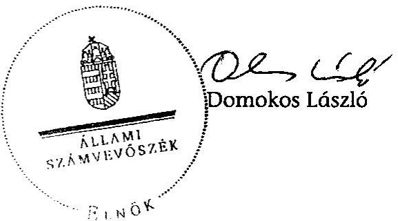
${ }^{71}$ A várólista alapján nyújtható ellátások részletes szabályairól szóló 287/2006. (XII. 23.) Korm. rendelet

---

# MELLÉKLETEK

---

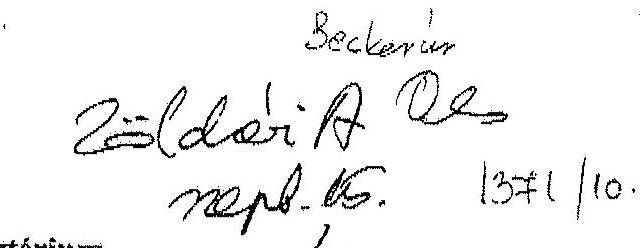

Nemzeti Erőforrás Minisztérium Miniszter

Iktatószám: 16140-1/2010-2003MIN

Hiv. szám:
 V-2016-81/2009-2010
Ügyintéző: Dr. Czappán István
Telefon: $\quad 7951054$
Melléklet: X

Domokos László Úr
elnök

Állami Számvevőszék

Budapest

ÁLLAMI SZÁMVEVŐSZÉK
ÜGYVITELI IRODA
6928/010.
Érk.: SEP 15 '2010
Iktatószám: 16140-2016-2010
Melléklet:

Tisztelt Elnök Úr!

A szervtranszplantáció, a donáció és az alternatív kezelések ellenőrzéséről készített V-2016-81/2009-2010 számú számvevőszéki vizsgálattal kapcsolatban nem kívánunk észrevételt tenni.

Budapest. 2010. 0. 0. 0. 0. nap
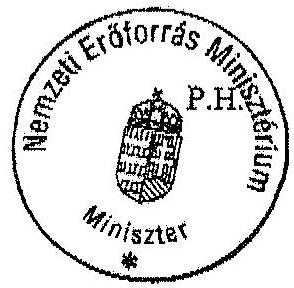

Üdvözlettel:
Cillart Mule
Dr. Réthelyi Miklós

---

# KÉRDÉSEK, KRITÉRIUMOK ÉS ADATFORRÁSOK

Főkérdés: Eredményesen szolgálja-e a szabályozási környezet és a szervezeti felépítés a transzplantációs aktivitást?

|  Kérdések |  | Kritériumok, mutatók | Adatforrás  |
| --- | --- | --- | --- |
|  1. | MEGHATÁROZTÁK-E A TRANSZPLANTÁCIÓS AKTIVITÁS ALAPELVEIT, TÖRVÉNYI ÉS RENDELETI SZABÁLYAIT? VOLTAK-E KORMÁNYZATI CÉLKITŰZÉSEK ÉS INTÉZKEDÉSEK A TRANSZPLANTÁCIÓ KITERJESZTÉSÉRE, SZÁMÁNAK NÖVELÉSÉRE? |  |   |
|  1.1. | Szabályozott-e a transzplantáció folyamata a donációtól az utógondozásig? |  |   |
|  1.1.1. | Segíti-e a szabályozás a transzplantációk számának növekedését? (élő, cadaver, preemtív, nem dobogó szívű)? Értékelték-e a szabályozás hatásait a transzplantációs aktivitásra? Átláthatóan, egyértelműen és az uniós szabályokkal, alapelvekkel összhangban határozták-e meg a szervátültetés szabályait? Részt veszünk-e uniós tapasztalatcsere programokban? Követjük-e, kiépítettük-e hazánkban a nemzetközileg elfogadott standardok alapján megfogalmazott programokat? Az uniós ajánlások, célkitűzések hozzájárultak-e a transzplantációk számának növeléséhez? A szervadományozás szabályozása megfelel-e az EU normáknak? | A transzplantáció jogszabályi hátterét megteremtették.
A szervátültetés szabályainak kidolgozása összhangban van az uniós szabályokkal, ajánlásokkal.
Uniós tapasztalatcsere programban részt veszünk.
Kidolgozták a szervátültetés hazai programját, amely összhangban van a nemzetközi standardokkal, amely hozzájárult a transzplantációk számának növekedéséhez.
A szervadományozás hazai gyakorlata illeszkedik az EU normákhoz. | Törvényi, rendeleti szabályozás
Uniós irányelvek, ajánlások  |
|  1.1.2. | Rendelkezik-e az ágazatirányító célérték meghatározással a szerv beültetések számának növelésére? Tett-e intézkedéseket a szabályozás kialakítására, működésének optimalizálására? Hatékonyan segíti-e a magyarországi tüdőtranszplantációt szabályozásának sajátosságai? | Az ágazatirányító meghatározta a szervbeültetések számának célértékeit. | Ágazati koncepció, célmeghatározás  |

---

|  1.1.3. | Szabályozott-e a donorfelkutatás, ez elősegíti-e a donációs aktivitást? A donorgondozáshoz szükséges egységes kórházi gyakorlat kialakításra került-e? Szabályozott-e az agyhalottak jelentésének kötelezettsége? | A donációt segítő protokollokat, irányelveket kidolgozták. A kórházi donorgondozás egységes elvek alapján történik.
Az agyhalottak jelentésének kötelezettségét szabályozták. | Szakmai protokollok  |
| --- | --- | --- | --- |
|  1.2. | Szabályozott-e a transzplantációs várólisták vezetésének kötelezettsége? |  |   |
|  1.2.1. | Megfelelőek-e a transzplantációs várólista bizottságok működési feltételei? A várólista bizottságok rendelkeznek-e ügyrenddel, elkészítették-e a szervbeültetések eljárási rendjét? Megvalósul-e a várólista bizottságok független ellenőrzése? | A bizottságok működése megfelel a várólista protokolloknak. | Bizottságok dokumentumai (ügyrend, jegyzőkönyv, emlékeztető)
Várólista protokollok  |
|  1.2.2. | Átlátható-e a várólistákra kerülés és a transzplantációra való kiválasztás folyamata? Tájékoztatják-e a gyakorlatban a betegellátó rendszerben a betegeket a várólistára kerülésről? Ismerik-e a betegek a transzplantációs várólistára kerülés lehetőségét és feltételeit? | A várólistára kerülés és a transzplantációra történő kiválasztása átlátható.
A betegek tájékoztatása a transzplantáció és a várólistára való kerülés lehetőségeiről, feltételeiről megtörténik. | ÁSZ kérdőív  |
|  1.2.3. | Megfelelő-e a kiválasztási folyamat informatikai támogatottsága? Objektív, érdekmentes-e a várólistáról történő beteg kiválasztás folyamata? | Az informatikai rendszer zárt (nem manipulálható), átlátható, egyidejű (online hozzáférés minden érdekeltnek). | Számítógépes program rendszerkönyve.  |
|  1.2.4. | Van-e szerepük a recipiens kiválasztásában a transzplantációs központoknak? | A kiválasztás független a transzplantációs központoktól. | Szelekciós szabályzat  |
|  1.2.5. | Van-e jogorvoslati lehetőségük a betegeknek a várólista bizottságok, illetve az etikai bizottságok döntéseivel szemben a szabályozás alapján? Benyújtottak-e betegek jogorvoslati kérelmeket? | A betegek élhetnek jogorvoslattal. | Az etikai és a várólista bizottság jogorvoslati anyagai.  |
|  2. | ELŐSEGÍTI-E A SZERVEZETI STRUKTÚRA A TRANSZPLANTÁCIÓ FEJLŐDÉSÉT, SZÁMÁNAK NÖVEKEDÉSÉT? |  |   |
|  2.1. | Célszerűen szervezett-e és követhető-e a szervátültetés szervezésének folyamata a Szervkoordinációs Irodánál? | A szervátültetés szervezésének szervezeti feltételeit megteremtették, folyamata célszerűen szervezett, követhető. |   |
|  2.1.1. | A Hungarotransplant Kht 2005-2006 közötti működése hozzájárult-e a transzplantáció hazai fejlődéséhez? Megszüntetése, felszámolása visszavetette-e a transzplantációs tevékenységet? | Működését az ágazatirányító értékelte. | Döntéselőkészítő dokumentumok.  |

---

|  2.1.2. | A Hungarotransplant Kht megszűnése után alakítottak-e ki intézményesített szervkoordinációt? A szervkoordinációs szakember ellátottság kielégítő-e? Tevékenységük hatással van-e a donációs aktivitásra? Monitorozzák-e rendszeresen a tájékoztatás és szervezés eredményességét? | A koordinációt végző szakemberek száma megfelelő. Az 1 millió lakosra jutó koordinátorok száma a nemzetközi trendet követi. Tevékenységük növelte a kórházak donációs aktivitását. | Szervkoordinációs Iroda beszámolói, elemzései  |
| --- | --- | --- | --- |
|  2.2. | Célszerűen szervezett-e, és követhető-e a szervátültetés szervezésének folyamata a donorjelentő kórházaknál? | A szervátültetés szervezésének szervezeti feltételeit megteremtették, folyamata követhető. | Kérdőív  |
|  2.2.1. | Átlátható-e a fekvőbeteg ellátó kórházak donorjelentéssel kapcsolatos tevékenysége? Van-e a szervdonációval kapcsolatban feladatuk és felelősségük? Alkalmaznak-e donációs felelősöket? Jelent-e szervkivételi riadót az összes szóba jöhető kórház? Van-e kiemelt feladatuk a sürgősségi betegellátást végző intézményeknek a donorjelentésben? | Donációs felelősöket minden SBO-val rendelkező kórház alkalmaz.
Az SBO-val rendelkező kórházak mindegyike jelent szervkivételi riadót. | ÁSZ kérdőív  |
|  2.2.2. | Az agyhalál beálltát igazoló Bizottság működik-e a fekvőbeteg intézményekben? Elegendő-e a fekvőbeteg intézmények intenzív kapacitása az agyhalottak gondozásához? Kielégítőek-e a személyi, tárgyi feltételei a donorgondozásnak a kórházakban? | Agyhalál megállapító bizottság működik. | Kérdőív  |
|  2.2.3. | Meghatározottak-e az OTH feladatai az OTNY vezetésére vonatkozóan? Tájékoztatják-e a gyakorlatban a lakosságot a szervadományozás szabályairól? | Az OTH kijelölte az OTNY-t működtető intézetét.
A lakosságot tájékoztatják a szervadományozással kapcsolatos tudnivalókról. | OTNY adatszolgáltatás  |
|  2.3. | Célszerűen szervezett-e, és követhető-e a szervátültetés szervezésének folyamata a transzplantációs klinikáknál? | A transzplantáció folyamatának szervezése megfelel a nemzetközi gyakorlatnak. | Szervezési dokumentáció  |
|  2.3.1. | Megfelelő-e a centrumok szakember ellátottsága? Indokolható-e, hogy az egyes centrumok csak bizonyos típusú beavatkozásokat látnak el? Meghatározott-e a transzplantációs klinikák szervtípusonkénti tevékenysége, ellátási kötelezettsége? | A centrumok szakember ellátottsága megfelel a követelményeknek. | 60/2003. (X. 20.) EszCsM rendelet az egészségügyi szolgáltatások nyújtásához szükséges szakmai minimumfeltételekről ÁSZ tanúsítvány  |

---

|  2.3.2. | Jól szervezett-e, és követhető-e a központokban működő szervkivételi teamek tevékenysége, tevékenységének szervezettsége a hideg ischaemiás idők csökkentése érdekében? | A donációs idő csökkent. | OVSZ beszámolók  |
| --- | --- | --- | --- |
|  2.3.3. | Biztosított-e a donor- és recipiens kiválasztást megelőző vizsgálatokhoz szükséges laboratóriumi kapacitás? | A vizsgálatokhoz szükséges laboratóriumi kapacitás elegendő számú, földrajzilag könnyen elérhető és nem növeli a hideg ischaemiás időt. | OVSZ beszámolók  |
|  2.3.4. | Szervezett-e a transzplantáltak utógondozása, a központok utógondozási tevékenysége? A transzplantáltak utógondozását belgyógyász/nefrológus szakemberek végzik-e, akik megfelelő farmakológiai ismeretekkel bírnak? | A transzplantáltak utógondozásának szervezeti feltételeit kialakították. | ÁSZ kérdőív  |
|  2.3.5. | Biztosított-e a transzplantáltak betegkövetése? Használják-e kutatási és minőségbiztosítási célokra a transzplantáció eredményességének növelése érdekében? | Országos transzplantációs nyilvántartás működik. | Transzplantáltak adatforrása  |
|  3. | BIZTOSÍTOTTAK-E A FORRÁSOK A TRANSZPLANTÁCIÓS TEVÉKENYSÉG ELLÁTÁSÁHOZ? |  |   |
|  3.1. | Biztosított-e az EüM költségvetésében és az E. Alapban a szervátültetéshez szükséges pénzügyi fedezet? | A források nem akadályozzák a szervátültetéseket és azok számának növelését. | Az E-Alap költségvetése, beszámolója  |
|  3.1.1. | Nőttek-e a transzplantációra fordított kiadások az esetszám függvényében? | A kiadások az esetszámmal arányosan nőttek. | ÁSZ tanúsítvány  |
|  3.1.2. | Változtak-e a finanszírozási összegek a transzplantációt, a donációt és a szervkivételt illetően? Ezek meghatározásához felmérték-e a tényleges gyógyítási költségeket az OEP-nél és az intézményeknél? | A finanszírozási összegek tényleges költséggyűjtésen alapulnak. | 9/1993. (IV.2.) NM rendelet 8. melléklet  |
|  3.1.3. | Biztosított-e a transzplantáltak immunszupresszív kezelésének fedezete az E. Alapban? | Korlátozás nélkül biztosított | ÁSZ tanúsítvány  |
|  3.2. | Biztosítottak-e a Szervkoordinációs Iroda működési kiadásai? | A működési kiadások biztosítottak. | OVSZ Beszámoló  |
|  3.2.1. | Összhangban vannak-e a feladatok és a kiadások? | A feladatok és a kiadások összhangban vannak. | OVSZ Beszámoló
Elemzések  |
|  4. | BIZTOSÍTOTT-E A VÉGSTÁDIUMÚ VESEBETEGEK VESEPÓTLÓ KEZELÉSE? |  |   |
|  4.1. | A dialízis kezelő állomások száma és a kezelő helyek száma az európai trendekhez igazodik millió lakosra | A dialízis kezelő állomások és a kezelőhelyek száma millió lakosra vetítve igazodik |   |

---

|   | vetítve? A kezelő helyek megoszlása területileg egyenlő hozzáférést biztosít-e a betegeknek? | az európai átlaghoz.
A kezelőhelyek száma biztosítja az egyenlő hozzáférést. | ÁSZ tanúsítvány  |
| --- | --- | --- | --- |
|  4.2. | Változott-e a nefrológiai szakma létszámellátottsága, valamint a nefrológiai járóbeteg ellátás heti óraszáma és a rendelések száma? | A nefrológiai rendelőkben dolgozó orvosok létszáma és óraszáma igazodik az európai átlaghoz. | ÁSZ tanúsítvány  |
|  4.3. | Változott-e a különböző dialízistípusokban részesülő betegek száma? A dialízált betegek száma millió lakosra vetítve a nemzetközi trendeknek megfelelő? Változott-e a transzplantáció után ismételt dialízisre kerülők száma? | A dialízált betegek száma millió lakosra vetítve, illetve az egyes dialízis típusokban résztvevők száma az európai átlagnak megfelelő. Az ismételt dialízisre kerülők aránya nem haladja meg az európai átlagot. | ÁSZ tanúsítvány  |
|  4.4. | Nőttek-e a dialízált betegek gyógyszerkiadásai az E. Alapból és egyéni szinten? Változott-e az EPO felhasználás 2007 áprilisa óta? Változott-e a transzfúziók száma a várólistás betegek körében 2007. április óta? | Az EPO kezelés a szükségletnek megfelelően biztosított.
A transzfúziók száma nem növekedett. | ÁSZ tanúsítvány  |
|  4.5. | Gyűjtött-e a Magyar Nefrológiai Társaság dializálásra vonatkozó adatokat 2005-2009 között? Ezeket feldolgozták-e, elemezték-e? | Az adatgyűjtés szervezett keretek között történik, elemzésre hozzáférhető. Az egészségügyi tárca rendelkezik az adatok feldolgozásával, elemzésével. | A dialízis állomások által a Nefrológiai Társaságnak küldött adatok  |
|  4.6. | Növekedett-e a vesetranszplantációk száma (élődonoros, cadaver, pre-emptív szakaszban)? Nemzetközi összehasonlításban a transzplantációk száma millió lakosra vetítve eléri-e az európai átlagot? A preemptív beavatkozások száma növekedett-e? Mekkora a preemptív transzplantáció aránya a várólistán levő és a teljes dializált betegkörhöz képest az adott centramban? (gyerek és felnőtt) (2005-2009) A vesetranszplantációt végző klinikák mindegyike végez-e élődonoros
 transzplantációt? Vannak-e eltérések az egyes klinikákon végzett beavatkozások túlélési adataiban? | Az európai adatokat megközelítően nőtt a transzplantációk száma, ezen belül nőtt a preemptív beavatkozások száma és aránya a várólistán lévőkhöz, valamint a dialízált betegkörhöz viszonyítva.
Esélyegyenlőség a nefrológiai/dialízis központokban
Az élődonoros transzplantációk száma növekszik. A transzplantációs központok mindegyike előnyben részesíti az élődonoros szervátültetést. | ÁSZ adatkérés, transzplantációs adatok elemzése.  |
|  4.7. | Megfelelően tájékoztatják a betegeket
- az élődonoros transzplantáció előnyeiről?
- a preemptív transzplantáció előnyeiről?
a dialízis időtartama és a transzplantáció sikertelensége közti összefüggésről? | A betegek tájékoztatása általánosan elterjedt, az abban foglalt információk egyértelműek. | ÁSZ kérdőív  |

---

|   |  |  |   |
| --- | --- | --- | --- |
|  4.8. | Növekedett-e a várólistán lévők száma, változott-e
korösszetételük? Megelőzi-e a várólistára kerülés és
az első dialízis időpontját? Ha nem, mennyi idő telik
el a várólistára kerülésig az első dialízistől? Mik a fő
okai a késleltetett várólistára kerülésnek? TÁBLA | A dialízáltak és várólistán lévők aránya
kedvező, követi az európai trendet. | Adatelemzés  |
|  4.9. | Növekedett-e az újonnan a listára kerültek száma,
változott-e korösszetételük? | Növekedett az új betegek aránya a várólistán, korösszetételük kedvezően alakul. | Adatelemzés  |
|  4.10. | Változott-e az ismételt transzplantációra várók száma? | Nem növekedett az ismételten transzplantációra várók száma | Adatelemzés  |
|  4.11. | A várólistán lévők száma és a transzplantáltak száma összességében a nemzetközi trendeknek megfelelően alakul? Mekkora a várólistán betegek aránya a
teljes dializált betegkörhöz képest (gyerek és felnőtt)?
Amennyiben a centrumban kisebb ez az arány, mint
az országos átlag, indokolható-e ez a betegösszetétel
különbségével (életkor és társbetegségek)? | A várólistán lévők, a transzplantáltak és a
dializáltak száma a nemzetközi trendeknek
megfelelően alakul. | Adatelemzés  |
|  4.12. | Csökkent-e a várólistán lévők várakozási ideje? | A várakozási idő csökkent. | Adatelemzés  |
|  4.13. | Változott-e a várólistára kerülést megelőző átlagos
kivizsgálási idő hossza? | Az átlagos kivizsgálási idő csökkent | Adatelemzés  |
|  5. | NÖVEKEDETT-E A SZERVTRANSZPLANTÁCIÓK SZÁMA A VIZSGÁLT IDŐSZAKBAN (MÁJ, SZÍV, KOMBINÁLT VESE-
HASNYÁLMIRIGY, TÜDŐ)? |  |   |
|  5.1. | Növekedett-e a transzplantációk száma? Nemzetközi
összehasonlításban a transzplantációk száma egy
millió lakosra vetítve eléri-e az európai átlagot? | A transzplantációk száma folyamatosan nő
és egy millió lakosra vetítve eléri az európai
átlagot. | ÁSZ tanúsítvány  |
|  5.2. | Megtörténik-e a betegek teljes körű tájékoztatása az
cadaver, élődonoros transzplantációról és a transzplantáció sikerének összefüggéséről? | A betegek tájékoztatása általánosan elterjedt, az abban foglalt információk egyértelműek. | Adatelemzés  |
|  5.3. | Növekedett-e a várólistán lévők száma? A várólistán
lévők száma és a transzplantáltak száma összességében a nemzetközi trendeknek megfelelően alakul? | A várólistán lévők és transzplantáltak száma növekedett. | Adatelemzés  |
|  5.3.1. | Ezen belül növekedett-e az újonnan a listára kerültek száma? Változott-e az ismételt transzplantációra várók száma? | Az újonnan várólistára kerülők száma nő. | Adatelemzés  |
|  5.3.2. | Csökkent-e a várólistán lévők várakozási ideje? Változott-e a várólistára kerülést megelőző átlagos kivizsgálási idő hossza? | A várakozási idő csökkent. | Adatelemzés  |

---

|   |  |  |   |
| --- | --- | --- | --- |
|  5.4. | Specializálódtak-e a transzplantációs központok
szervtípusonként? Vannak-e eltérések az egyes klinikákon végzett beavatkozások túlélési adataiban? | A túlélési adatokban nincs eltérés a transzplantációs centrumok között. | Adatelemzés  |
|  5.5. | Biztosított-e a tüdőtranszplantációhoz való hozzáférés? | A hozzáférés biztosított. | Szerződés  |

---

# Transzplantációk jellemző kiadási adatai, szervenként* (2005-2009)

|  Megnevezés |  | 2005 | 2006 | 2007 | 2008 | 2009 | Mindösszesen  |
| --- | --- | --- | --- | --- | --- | --- | --- |
|  VESE | donorellátás kiadásai | 43320 | 38380 | 38448 | 39216 | 34200 | 193564  |
|   | szervkivétel kiadásai | 55650 | 53900 | 57540 | 52080 | 54180 | 273350  |
|   | transzplantáció kiadásai | 1301400 | 1276800 | 1188600 | 1083600 | 1129800 | 5980200  |
|   | élődonor költségeinek megtérítése | - | - | 471 | 855 | 1121 | 2447  |
|   | összesen | 1400370 | 1369080 | 1285059 | 1175751 | 1219301 | 6449561  |
|  MÁJ | donorellátás kiadásai | - | 760 | 912 | 912 | 1368 | 3952  |
|   | szervkivétel kiadásai | 30000 | 33000 | 36900 | 32400 | 36000 | 168300  |
|   | transzplantáció kiadásai | 704000 | 736000 | 672000 | 576000 | 640000 | 3328000  |
|   | élődonor költségeinek megtérítése | - | - | - | 163 | - | 163  |
|   | összesen | 734000 | 769760 | 709812 | 609475 | 677368 | 3500415  |
|  SZÍV | donorellátás kiadásai | 380 | 380 | 912 | 912 | 1824 | 4408  |
|   | szervkivétel kiadásai | 2800 | 6300 | 6300 | 4200 | 9660 | 29260  |
|   | transzplantáció kiadásai | 81000 | 180000 | 198000 | 198000 | 216000 | 873000  |
|   | összesen | 84180 | 186680 | 205212 | 203112 | 227484 | 906668  |
|  KOMB. VESE-
HASNYÁLMIRIGY | donorellátás kiadásai | - | - | - | 456 | - | 456  |
|   | szervkivétel kiadásai | 2800 | 4550 | 1680 | 2100 | 3780 | 14910  |
|   | transzplantáció kiadásai | 35000 | 55000 | 25000 | 25000 | 45000 | 185000  |
|   | összesen | 37800 | 59550 | 26680 | 27556 | 48780 | 200366  |
|  TÜDŐ | donorellátás kiadásai | 760 | 1520 | 1368 | 1368 | 912 | 5928  |
|   | szervkivétel kiadásai | 6820 | 1080 | 2448 | 4320 | 3240 | 17908  |
|   | transzplantáció kiadásai** | 232074 | 143651 | 190692 | 239128 | 239128 | 1044673  |
|   | összesen | 239654 | 146251 | 194508 | 244816 | 243280 | 1068509  |
|  ÖSSZESEN 1 |  | 2496004 | 2531321 | 2421271 | 2260710 | 2416213 | 12125519  |
|   | multiorgan (több szervet adó) donor kiadásai | 30000 | 36500 | 32400 | 33000 | 36600 | 168500  |
|  ÖSSZESEN 2 |  | 2526004 | 2567821 | 2453671 | 2293710 | 2452813 | 12294019  |

- az adatok 2010. május 11-éig beérkezett kifizetésekből, évenkénti 1 beültetés átlagköltséggel számított várható kiadás ** - a tüdőtranszplantáció kiadásai az adott évben transzplantált betegek összes számlája alapján kifizetetett összegeket tartalmazza, azaz a későbbi időszakban beérkezett számlakifizetéseket is, amelyek nem az adott évi költségvetést terhelik. Magyarázat: Összesen 1: Mind az 5 szerv transzplantációjával kapcsolatos kiadásokat tartalmazza, kivéve a multiorgan donor kiadásokat, ahol nem elkülöníthető, hogy mely szerveket vették ki és operálták be.

---

# Fejlesztési kiadások 2005-2009 között a három nagy múvese-szolgáltatónál (önbevallás alapján)

|  Kittöltő intézmény neve | Tulajdoni forma | Év | Épület építés | Épület vásárlás | Épület felújítás | Gép vásárlás, csere | Kapacitás bővítés | Beruházás összesen | OEP bevétel összesen | Beruházási kiadás aránya az OEP bevételhez viszonyítva (\%)  |
| --- | --- | --- | --- | --- | --- | --- | --- | --- | --- | --- |
|  B. Braun Avitum Hungary Zrt. | Privát | 2005 |  |  | 16 | 149 |  | 165 | 5874 | 3%  |
|  B. Braun Avitum Hungary Zrt. | Privát | 2006 |  |  | 49 | 163 |  | 212 | 6212 | 3%  |
|  B. Braun Avitum Hungary Zrt. | Privát | 2007 |  |  | 4 | 224 |  | 228 | 8038 | 3%  |
|  B. Braun Avitum Hungary Zrt. | Privát | 2008 |  |  | 25 | 177 |  | 202 | 8975 | 2%  |
|  B. Braun Avitum Hungary Zrt. | Privát | 2009 |  |  | 32 | 162 |  | 194 | 9179 | 2%  |
|  Összesen | 2005-2009 |  |  |  | 126 | 875 |  | 1001 | 38278 | 3%  |
|  DIAVERUM Hungary Kft. | Privát | 2005 |  |  | 77 | 88 |  | 166 | 2425 | 7%  |
|  DIAVERUM Hungary Kft. | Privát | 2006 |  |  | 5 | 14 |  | 18 | 2306 | 1%  |
|  DIAVERUM Hungary Kft. | Privát | 2007 |  |  | 4 | 42 |  | 46 | 2898 | 2%  |
|  DIAVERUM Hungary Kft. | Privát | 2008 |  |  | 14 | 35 |  | 49 | 3018 | 2%  |
|  DIAVERUM Hungary Kft. | Privát | 2009 |  |  | 0 | 30 |  | 30 | 2819 | 1%  |
|  Összesen | 2005-2009 |  |  |  | 99 | 209 |  | 309 | 13466 | 2%  |
|  Fresenius Magyarország Eü. Kft | Privát | 2005 |  |  | 283 | 526 |  | 809 | 7239 | 11%  |
|  Fresenius Magyarország Eü. Kft | Privát | 2006 |  |  | 140 | 322 |  | 462 |

 7096 | $7 \%$  |
|  Fresenius Magyarország Egészségügyi Kft | Privát | 2007 |  |  | 116 | 303 |  | 419 | 8443 | $5 \%$  |
|  Fresenius Magyarország Egészségügyi Kft | Privát | 2008 |  |  | 63 | 449 |  | 512 | 9493 | $5 \%$  |
|  Fresenius Magyarország Egészségügyi Kft | Privát | 2009 |  |  | 33 | 286 |  | 319 | 9459 | $3 \%$  |
|  Összesen | 2005-2009 |  |  |  | 635 | 1886 |  | 2521 | 41730 | $6 \%$  |

Forrás: 18. sz. tanúsítvány B.Braun, Diaverum, Fresenius

---

# Dialízis állomások és kezelőhelyek megoszlása megyénként (2009. naptári év)

|  Megye | Lakosok
száma* | Állomások
száma** | Kezelőhelyek
száma** | Kezelőhelyek
\%-os
megoszlása | Millió
lakosra
jutó
kezelőhely | Kezelt
betegek
száma**
(dializált) | Kezelések
száma** | 1 kezelőhelyre
jutó betegek
száma | Lakosság/
kezelőhely | 100 ezer
lakosra jutó
kezelőhelyek
száma | 100 ezer lakosra
jutó kezelőhelyek
száma az országos
átlaghoz viszonyítva  |
| --- | --- | --- | --- | --- | --- | --- | --- | --- | --- | --- | --- |
|  Baranya | 394911 | 4 | 49 | 5 | 124 | 603 | 46001 | 12 | 8059 | 12,41 | 129,24\%  |
|  Bács-Kiskun | 530379 | 4 | 43 | 4 | 81 | 481 | 52159 | 11 | 12334 | 8,11 | 84,45\%  |
|  Békés | 371322 | 2 | 32 | 3 | 86 | 314 | 37701 | 10 | 11604 | 8,62 | 89,77\%  |
|  BAZ | 701160 | 5 | 79 | 8 | 113 | 682 | 85141 | 9 | 8875 | 11,27 | 117,36\%  |
|  Csongrád | 423826 | 7 | 45 | 5 | 106 | 531 | 37162 | 12 | 9418 | 10,62 | 110,60\%  |
|  Fejér | 428295 | 2 | 32 | 3 | 75 | 252 | 33275 | 8 | 13384 | 7,47 | 77,83\%  |
|  Győr-Moson-Sopron | 447033 | 2 | 35 | 4 | 78 | 407 | 49857 | 12 | 12772 | 7,83 | 81,55\%  |
|  Hajdú-Bihar | 542192 | 5 | 54 | 6 | 100 | 662 | 62001 | 12 | 10041 | 9,96 | 103,74\%  |
|  Heves | 314441 | 2 | 39 | 4 | 124 | 417 | 39101 | 11 | 8063 | 12,40 | 129,19\%  |
|  Komárom-Esztergom | 314450 | 2 | 31 | 3 | 99 | 339 | 39773 | 11 | 10144 | 9,86 | 102,69\%  |
|  Nógrád | 207637 | 1 | 19 | 2 | 92 | 241 | 20285 | 13 | 10928 | 9,15 | 95,32\%  |
|  Pest | 1213290 | 4 | 48 | 5 | 40 | 489 | 49396 | 10 | 25277 | 3,96 | 41,21\%  |
|  Somogy | 322197 | 2 | 30 | 3 | 93 | 362 | 34281 | 12 | 10740 | 9,31 | 96,99\%  |
|  Szabolcs-Szatmár-Bereg | 565326 | 3 | 60 | 6 | 106 | 572 | 63268 | 10 | 9422 | 10,61 | 110,55\%  |
|  Jász-Nagykun-Szolnok | 394891 | 2 | 32 | 3 | 81 | 320 | 27148 | 10 | 12340 | 8,10 | 84,41\%  |
|  Tolna | 235874 | 1 | 16 | 2 | 68 | 182 | 20769 | 11 | 14742 | 6,78 | 70,66\%  |
|  Vas | 260950 | 1 | 32 | 3 | 123 | 302 | 46330 | 9 | 8155 | 12,26 | 127,73\%  |
|  Veszprém | 360387 | 2 | 34 | 4 | 94 | 419 | 42711 | 12 | 10600 | 9,43 | 98,27\%  |
|  Zala | 290204 | 3 | 40 | 4 | 138 | 399 | 33403 | 10 | 7255 | 13,78 | 143,57\%  |
|  Budapest | 1712210 | 16 | 213 | 22 | 124 | 2861 | 243686 | 13 | 8039 | 12,44 | 129,58\%  |
|  Magyarország | 10030975 | 70 | 963 | 100 | 96 | 10835 | 1063448 | 11 | 10416 | 9,60 | 100,00\%  |

- Forrás: KSH, STADAT ** Forrás: OEP GYME

---

# A dializált betegek kérdőívre adott válaszainak feldolgozása 

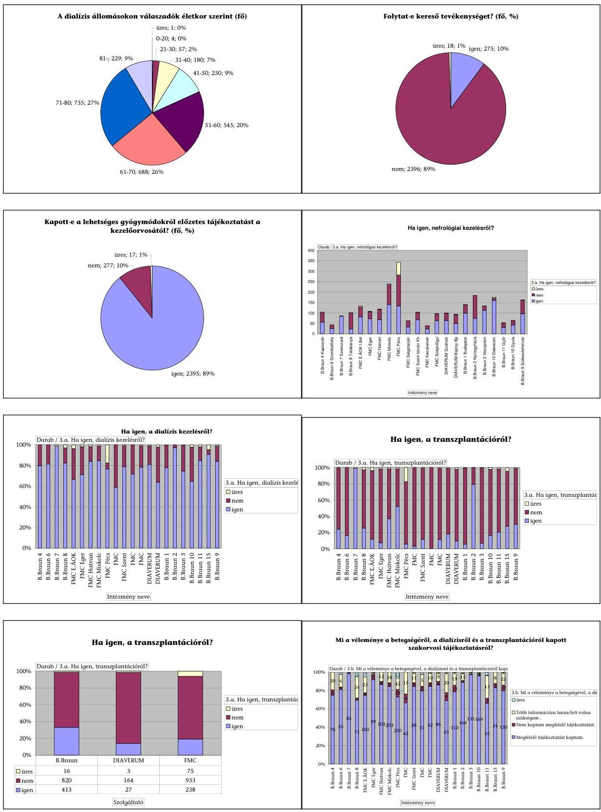

---

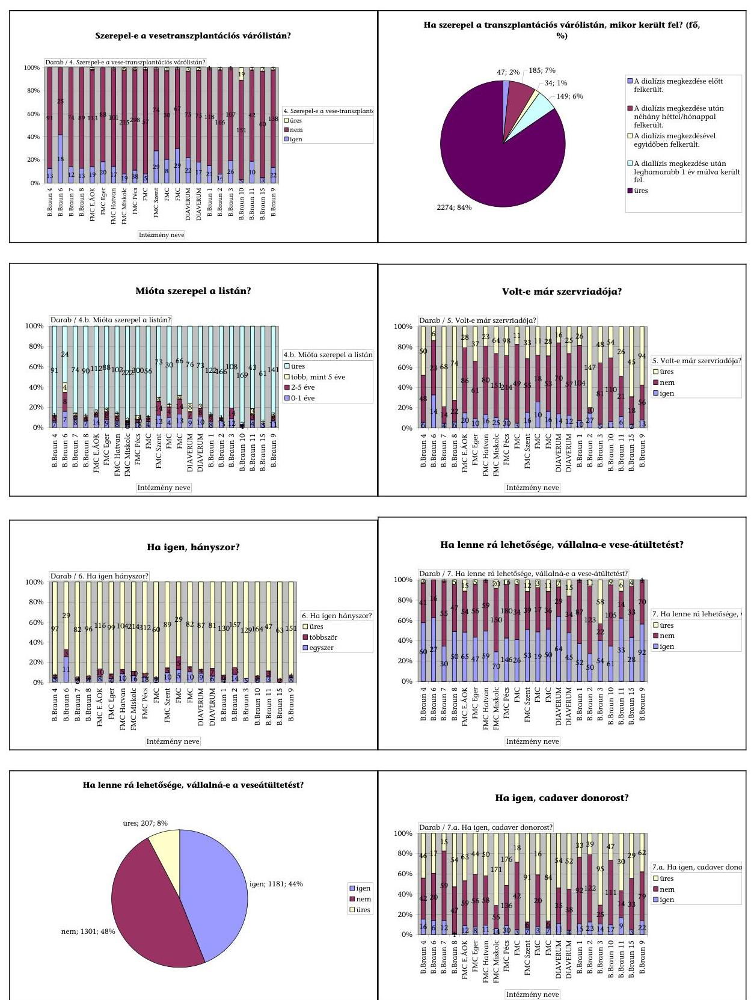

[^0]
[^0]:    Ha lenne rá lehetősége, vállalná-e a veseátültetést?
    igen: 207, 8%
    igen: 100, 46%
    igen: 1181, 44%
    igen: 1181, 44%
    igen: 1201, 46%

---

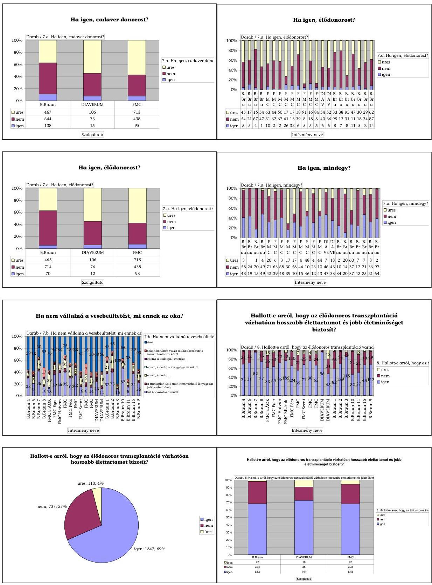

[^0]
[^0]:    Hallott-e arról, hogy az élődonoros transzplantáció várhatóan hosszabb élettartamot biztosít?
    (igen) 110,4%

---

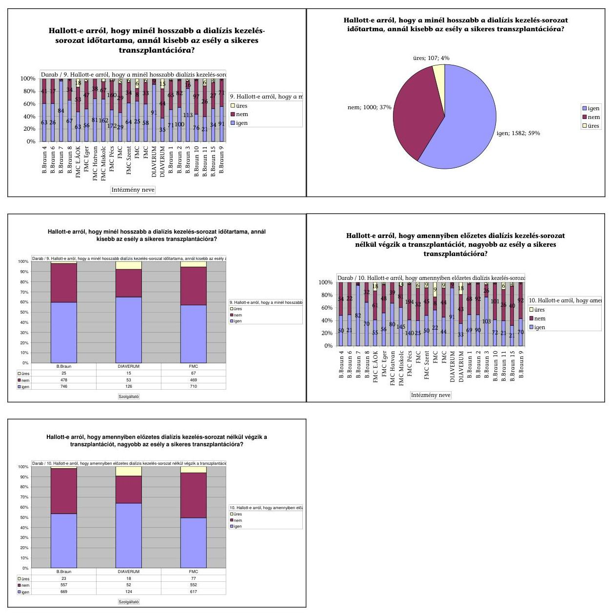

Megjegyzés: A kérdőívben szereplő intézmények:
B.Braun 4 Kaposvár
B.Braun 6 Szombathely
B.Braun 7 Szekszárd
B.Braun 8 Tatabánya

FMC E.ÁOK I. Bel.
FMC Eger
FMC Hatvan
FMC Miskolc
FMC Pécs
FMC Salgótarján
FMC Szent István Kórház

FMC Kecskemét
FMC Szépvölgyi
DIAVERUM Szolnok
DIAVERUM Bajcsy Budapest
B.Braun 1 Budapest
B.Braun 2 Nyíregyháza
B.Braun 3 Veszprém
B.Braun 10 Debrecen
B.Braun 11 Győr
B.Braun 15 Gyula
B.Braun 9 Székesfehérvár

---

# Néhány európai ország adata az egymillió lakosra 

vetített vesetranszplantációk száma szerint 2009.

| Megnevezés | vese   transzplantációk   száma (db) | millió   lakosra (fő) |
| :-- | --: | --: |
| Ciprus | 58 | 83 |
| Portugália | 524 | 49,4 |
| Spanyolország | 2229 | 48,3 |
| Hollandia | 763 | 46,5 |
| Belgium | 487 | 45,7 |
| Svédország | 419 | 45,5 |
| Franciaország | 2885 | 45,4 |
| Észtország | 57 | 43,8 |
| Ausztria | 361 | 43,3 |
| Egyesült Királyság | 2302 | 38,2 |
| Dánia | 196 | 35,7 |
| Horvátország | 158 | 35,6 |
| Németország | 2753 | 33,5 |
| Csehország | 334 | 32,1 |
| Szlovákia | 166 | 31,3 |
| Olaszország | 1656 | 29,1 |
| Finnország | 150 | 28,2 |
| Magyarország | 259 | 25,7 |
| Szlovénia | 52 | 25,7 |
| Görögország | 237 | 21,5 |
| Lengyelország | 810 | 21,2 |
| Bulgária | 19 | 2,7 |

Forrás: Newsletter transplant 2009.

---

# Az európai mezőnyben a millió lakosra vetített élődonoros vesetranszplantációk száma 

| Megnevezés | élődonoros   vesetranszplantációk   száma (db) | élődonoros   vesetranszplantációk   száma millió lakosra   (fő) |
| :-- | --: | --: |
| Ciprus | 34 | 48,6 |
| Hollandia | 411 | 25,1 |
| Egyesült Királyság | 920 | 15,3 |
| Svédország | 136 | 14,8 |
| Dánia | 74 | 13,5 |
| Ausztria | 58 | 7 |
| Németország | 565 | 6,9 |
| Görögország | 51 | 4,6 |
| Portugália | 49 | 4,6 |
| Belgium | 45 | 4,2 |
| Szlovákia | 21 | 3,9 |
| Franciaország | 222 | 3,5 |
| Spanyolország | 156 | 3,4 |
| Csehország | 29 | 2,8 |
| Magyarország | 24 | 2,4 |
| Észtország | 3 | 2,3 |
| Olaszország | 123 | 2,2 |
| Horvátország | 9 | 2 |
| Finnország | 9 | 1,7 |
| Bulgária | 11 | 1,5 |
| Lengyelország | 20 | 0,5 |

Forrás: Newsletter transplant 2009.

---

9. sz. melléklet

# Az Eurotransplant országaiban a vese-várólista és a transzplantációk számának alakulása 1969 - 2008 között 

Figure 3.1 Dynamics of the Eurotransplant kidney transplant waiting list and transplants between 1969 and 2008
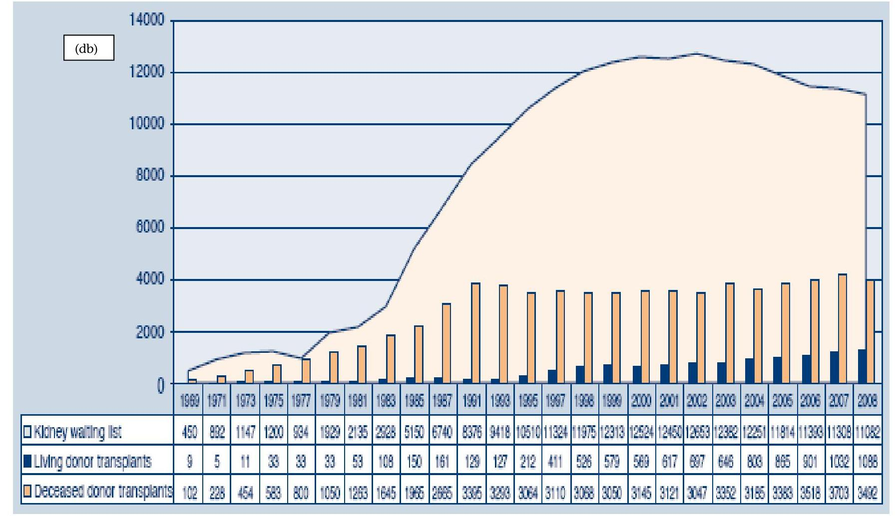

Forrás: Eurotransplant

---

# Az egyes európai országokban a dializáltak és a várólistán lévők száma egymillió lakosra számítva

|  Ország | Dializáltak száma |  |  | Dializáltak száma (pmp) |  |  | Várólistán lévők dec. 31-én | Várólistán lévők dec. 31-én (pmp) | Várólistán lévők a dializáltak arányában  |
| --- | --- | --- | --- | --- | --- | --- | --- | --- | --- |
|   | összes HD | összes PD | összes dializált | összes HD | összes PD | összes dializált |  |  |   |
|  Spanyolország* | 14195 | 1401 | 15596 |  |  | 345 | 4291 | 95 | 27,5\%  |
|  Románia | 6091 | 1352 | 7443 | 282,7 | 62,7 | 354 | 1626 | 77 | 21,8\%  |
|  Ausztria | 3602 | 345 | 3947 | 435,0 | 41,7 | 476 | 852 | 103 | 21,6\%  |
|  Hollandia | 4568 | 1265 | 5833 | 278,8 | 77,2 | 356 | 937 | 57 | 16,1\%  |
|  Finnország | 1260 | 321 | 1581 | 238,2 | 60,7 | 298 | 252 | 48 | 15,9\%  |
|  Dánia | 2021 | 643 | 2664 | 370,0 | 117,7 | 484 | 385 | 70 | 14,5\%  |
|  Magyarország | 4489 | 626 | 5115 | 445,9 | 62,2 | 506 | 705 | 70 | 13,8\%  |
|  Belgium* | 6173 | 656 | 6829 |  |  | 644 | 840 | 79 | 12,3\%  |
|  Görögország | 8308 | 755 | 9063 | 742,3 | 67,5 | 824 | 903 | 82 | 10,0\%  |
|  Svédország | 2764 | 879 | 3643 | 302,1 | 96,1 | 396 | 338 | 37 | 9,3\%  |
|  Olaszország (csak 12 régió) | 25577 | 2899 | 28476 | 762,3 | 86,4 | 489 |  |  |   |
|  Izland | 45 | 16 | 61 | 144,9 | 51,5 |  |  |  |   |
|  Norvégia | 886 | 208 | 1094 | 188,1 | 44,2 |

  |  |  |   |

---

# Vesetranszplantáltak túlélési adatai klinikánként és országos összesen 2005-2009

|  Év | transzplantációk száma | 30 nap | 30 és 60 nap | Túlélési idő |  |  |  |   |
| --- | --- | --- | --- | --- | --- | --- | --- | --- |
|   |  |  |  | egy év | két év | három év | négy év | öt év  |
|  2005 Összesen | 313 | 311 | 309 | 294 | 289 | 278 | 271 | 261  |
|  2006 Összesen | 303 | 302 | 299 | 284 | 278 | 267 | 261 |   |
|  2007 Összesen | 281 | 276 | 273 | 255 | 249 | 247 |  |   |
|  2008 Összesen | 262 | 258 | 254 | 246 | 246 |  |  |   |
|  2009 Összesen | 269 | 268 | 267 | 259 |  |  |  |   |
|  2005 | DEOEC Debrecen | 51 | 49 | 48 | 42 | 41 | 40 | 40  |
|  2006 | DEOEC Debrecen | 50 | 50 | 48 | 40 | 40 | 37 | 34  |
|  2007 | DEOEC Debrecen | 43 | 42 | 42 | 30 | 29 | 29 |   |
|  2008 | DEOEC Debrecen | 31 | 29 | 29 | 26 | 26 |  |   |
|  2009 | DEOEC Debrecen | 34 | 33 | 33 | 29 |  |  |   |
|  2005 | Pécsi Tudományegyetem | 48 | 48 | 48 | 45 | 42 | 41 | 41  |
|  2006 | Pécsi Tudományegyetem | 46 | 46 | 45 | 43 | 42 | 38 | 37  |
|  2007 | Pécsi Tudományegyetem | 49 | 47 | 45 | 44 | 43 | 41 |   |
|  2008 | Pécsi Tudományegyetem | 46 | 46 | 44 | 43 | 43 |  |   |
|  2009 | Pécsi Tudományegyetem | 35 | 35 | 34 | 34 |  |  |   |
|  2005 | Semmelweis Egyetem | 162 | 162 | 161 | 157 | 156 | 150 | 149  |
|  2006 | Semmelweis Egyetem | 153 | 153 | 153 | 149 | 144 | 142 | 141  |
|  2007 | Semmelweis Egyetem | 148 | 147 | 146 | 144 | 141 | 141 |   |
|  2008 | Semmelweis Egyetem | 144 | 143 | 142 | 139 | 139 |  |   |
|  2009 | Semmelweis Egyetem | 149 | 149 | 149 | 147 |  |  |   |
|  2005 | Szegedi Tudományegyetem | 52 | 52 | 52 | 50 | 50 | 47 | 41  |
|  2006 | Szegedi Tudományegyetem | 54 | 53 | 53 | 52 | 52 | 50 | 49  |
|  2007 | Szegedi Tudományegyetem | 41 | 40 | 40 | 37 | 36 | 36 |   |
|  2008 | Szegedi Tudományegyetem | 40 | 39 | 38 | 37 | 37 |  |   |
|  2009 | Szegedi Tudományegyetem | 51 | 51 | 51 | 49 |  |  |   |

Forrás: OEP

---

# 2005-2009. évi tüdőtranszplantációk külföldi elszámolása

|  Tüdőtranszplantáció éve | Transzplantációk száma db | Egy
transzplantációra
jutó átlagos kiadás
M Ft | Átlagos kiadás alapján számított várh. kiadás M Ft | Teljesített kiadás |  |  |  |  |  |  |   |
| --- | --- | --- | --- | --- | --- | --- | --- | --- | --- | --- | --- |
|   |  |  |  | 2005 | 2006 | 2007 | 2008 | 2009 | 2005-2009
között összes | 2010-re és a további évekre átbízódó kiadás | 2010.V.20-ig teljesített kiadás  |
|  2005 | 15 | 15,5 | 232,1 | 46,2 | 104,3 | 57,4 | 0,0 | 0,0 | 207,9 | 24,2 | 0,0  |
|  2006 | 8 | 18,0 | 143,7 |  | 26,0 | 49,6 | 40,5 | 0,0 | 116,1 | 27,5 | 0,0  |
|  2007 | 10 | 19,1 | 190,7 |  |  | 32,3 | 18,7 | 70,2 | 121,3 | 69,4 | 69,4  |
|  2008 | 11 | 21,7 | 239,1 |  |  |  | 21,9 | 23,3 | 45,1 | 194,0 | 136,5  |
|  2009 | 11 | 21,7 | 239,1 |  |  |  |  | 14,9 | 14,9 | 224,2 | 0,0  |
|  Összesen | 55 | 19,0 | 1044,7 | 46,2 | 130,3 | 139,3 | 81,1 | 108,4 | 505,3 | 539,3 | 206,0  |

A 2009. évi várható kiadást azonosnak feltételezzük a 2008. évi átlagos kiadással

---

# 2008-as adatok a várólistán lévő új betegekről

|  Megnevezés | Új beteg a Magyarországi
várólistán | Új beteg a Magyarországi
várólistán (pmp) | Új beteg EU listán
(pmp) | Magyar
pmp/EU átlag  |
| --- | --- | --- | --- | --- |
|  Vese | 255 | 25,25 | 36,9 | $68,4 \%$  |
|  Máj | 130 | 12,87 | 18,37 | $70,1 \%$  |
|  Szív | 25 | 2,48 | 6,35 | $39,1 \%$  |
|  Tüdő | 14 | 1,34 | 4,25 | $31,5 \%$  |
|  Hasnyálmirigy | 4 | 0,40 | 2,45 | $16,3 \%$  |

Forrás: OVSZK

---

# Donorjelentési aktivitás 2009-ben

## 14. sz. melléklet

|  1. Alba, Városi Önkormányzat Magyar Imre Kórház-Rendelőintézete | 3 | Veszprém Megye  |
| --- | --- | --- |
|  2. Ikaia, Városi Önkormányzat Kórház-Rendelőintézete | 4 | Bács-Kiskun Megye  |
|  3. Ikszüszágvermel, Városi Önkormányzat Dr. Karaszay Albert Kórház-Rendelőintézete | 2 | Nógrád Megye  |
|  4. Ikszücsázas, Rétby Pál Kórház-Rendelőintézete | 2 | Békés Megye  |
|  5. Iksdepezi, Állami Egészségügyi Központ | 0 | Budapest  |
|  6. Iksdepezi, Állami Egészségügyi Központ, II. település | 0 | Budapest  |
|  7. Iksdepezi, Budai Egészségügyi Központ, II. település | 1 | Budapest  |
|  8. Iksdepezi, Fővárosi Önkormányzat Bajsz-Zsilinszky Kórház és Rendelőintézet | 1 | Budapest  |
|  9. Iksdepezi, Fővárosi Önkormányzat Egyesített Szent István és Szent László Kórház és Rendelőintézet | 1 | Budapest  |
|  10. Iksdepezi, Fővárosi Önkormányzat Egyesített Szent István és Szent László Kórház és Rendelőintézet (Mereinyi Gusztáv Kh.) | 11 | Budapest  |
|  11. Iksdepezi, Fővárosi Önkormányzat Heim Pál Gyermekkórház-Madarász utcai Kórház | 0 | Budapest  |
|  12. Iksdepezi, Fővárosi Önkormányzat Heim Pál Gyermekkórház-Rendelőintézete | 2 | Budapest  |
|  13. Iksdepezi, Fővárosi Önkormányzat Juhász Ferenc Dél-Pesti Kórház | 1 | Budapest  |
|  14. Iksdepezi, Fővárosi Önkormányzat Sándor Sándor Kórház-Rendelőintézete, Arpád Kórház | 6 | Budapest  |
|  15. Iksdepezi, Fővárosi Önkormányzat  Nóri Gyula Kórház | 2 | Budapest  |
|  16. Iksdepezi, Fővárosi Önkormányzat Péterfy Sándor Utcai Kórház | 2 | Budapest  |
|  17. Iksdepezi, Fővárosi Önkormányzat Péterfy Sándor Utcai Kórház (bészeti) Központja | 12 | Budapest  |
|  18. Iksdepezi, Fővárosi Önkormányzat Péterfy Sándor Utcai Kórház, Akkord utcai Egysége (Sürgősségi Kórház) | 1 | Budapest  |
|  19. Iksdepezi, Fővárosi Önkormányzat Szent Imre Kórház | 11 | Budapest  |
|  20. Iksdepezi, Fővárosi Önkormányzat Szent János Kórház és Rendelőintézet | 4 | Budapest  |
|  21. Iksdepezi, Fővárosi Önkormányzat Szent Margit Kórház | 0 | Budapest  |
|  22. Iksdepezi, Fővárosi Önkormányzat Uzsoki Utcai Kórház-Rendelőintézete | 0 | Budapest  |
|  23. Iksdepezi, Gottsegen György Országos Kardiológiai Intézet | 0 | Budapest  |
|  24. Iksdepezi, Magyar Református Egyház Belgyógyászati Gyermekkórház | 1 | Budapest  |
|  25. Iksdepezi, Országos Vérellátó Szolgálat Tudományos Intézet | 6 | Budapest  |
|  26. Iksdepezi, SE ADK, Különleges Kórtani Török | 0 | Budapest  |
|  27. Iksdepezi, SE ADK, Neurológiai Kórtani | 0 | Budapest  |
|  28. Iksdepezi, SE ADK, 1. sz. Gyermekkórtani | 0 | Budapest  |
|  29. Iksdepezi, SE ADK, II. sz. Szülészeti és Nőgyógyászati Kórtani | 0 | Budapest  |
|  30. Legiés, Városi Önkormányzat Toldy Ferenc Kórház-Rendelőintézete | 1 | Pest Megye  |
|  31. Debrecen, Hajdú-Bihar Megyei Önkormányzat Kenézy Gyula Kórház | 0 | Hajdú-Bihar Megye  |
|  32. Debreceni Egyetem Orvos- és Egészségtudományi Centrum, Gyermekkórtani | 2 | Hajdú-Bihar Megye  |
|  33. Debreceni Egyetem Orvos- és Egészségtudományi Centrum, 1. Belklinika | 0 | Hajdú-Bihar Megye  |
|  34. Debreceni Egyetem Orvos- és Egészségtudományi Centrum, Vegyészzeti Kórtani | 0 | Hajdú-Bihar Megye  |
|  35. Debreceni Egyetem Orvos- és Egészségtudományi Centrum, Neurológiai Kórtani | 0 | Hajdú-Bihar Megye  |
|  36. Dombovár, Szent Lukács Egészségügyi Khr. | 0 | Tolna Megye  |
|  37. Dunaújváros, Szent Pantaleon Kórház Khr. | 2 | Fejér Megye  |
|  38. Eger, Magyar Önkormányzat Markhot Ferenc Kórház-Rendelőintézete | 2 | Heves Megye  |
|  39. Esztergom, Városi Önkormányzat Szent Borbála Kórház | 2 | Komárom-Esztergom Megye  |
|  40. Fényeslitke,

 Szabolcs-Szatmár-Bereg Önkormányzat Fehérgyermatyi Városi Kórház | 0 | Szabolcs-Szatmár-Bereg Megye  |
|  41. Gyöngyös, Bugát Pál Kórház Egészségügyi Szolgáltató Kht. | 1 | Nógrád Megye  |
|  42. Győr, Magyar Önkormányzat Pécs Aszódi Megyei Önkormányzati Kórház | 8 | Győr-Moson-Sopron Megye  |
|  43. Gyula, Nógrád Megyei Képviselőtestület Pénzes Sátoraljaújhelyi Kórház | 0 | Békés Megye  |
|  44. Hatvan, Városi Önkormányzat Albert Schweitzer Kórház és Rendelőintézet | 1 | Nógrád Megye  |
|  45. Hódmezővásárhely, Magyar Jogú Város Önkormányzat Újszegedi Kórház-Rendelőintézet | 4 | Csongrád Megye  |
|  46. Jászberény, Városi Egészségügyi Kórház-Rendelőintézet | 3 | Jász-Nagykun-Szolnok Megye  |
|  47. Ikszárd, Városi Önkormányzat Kórház-Rendelőintézet | 2 | Bács-Kiskun Megye  |
|  48. Ikafalva, Kaposvári Bírósági Orvosszakértői Kórház | 2 | Somogy Megye  |
|  49. Karcag, Városi Önkormányzat Készi Gábor Kórház-Rendelőintézet | 1 | Jász-Nagykun-Szolnok Megye  |
|  50. Kiskunfélegyháza, Bács-Kiskun Megyei Önkormányzat Kórház | 1 | Bács-Kiskun Megye  |
|  51. Gárdony, Városi Önkormányzat Kórház-Rendelőintézet | 0 | Fejér Megye  |
|  52. Kiskunmajsa, Városi Kórház-Rendelőintézet | 0 | Bács-Kiskun Megye  |
|  53. Kiskunhalas, Semmelweis Kórház Kht. | 1 | Bács-Kiskun Megye  |
|  54. Kistarcsa, Pest Megyei Önkormányzat Fővárosi Ferenc Kórház-Rendelőintézet | 2 | Pest Megye  |
|  55. Iksósd, Dr. Dosszilay Géza Kórház-Rendelőintézet | 1 | Csongrád Megye  |
|  56. Iksófalva, Területi Kórház | 1 | Szabolcs-Szatmár-Bereg Megye  |
|  57. Ikszárd, Borsod-Abaúj-Zemplén Megyei Önkormányzat Megyei Kórház és Egyetemi Oktatókórház | 17 | Borsod-Abaúj-Zemplén Megye  |
|  58. Ikszárd, Miskolci Egészségügyi Központ, Diósgyőri Telephely | 1 | Borsod-Abaúj-Zemplén Megye  |
|  59. Ikszárd, Miskolci Egészségügyi Központ, Semmelweis Kórház | 0 | Borsod-Abaúj-Zemplén Megye  |
|  60. Ikszárd, Városi Kórház-Rendelőintézet | 0 | Baranya Megye  |
|  61. Iksómagysodvári, Városi Önkormányzat Karolina Kórház | 0 | Győr-Moson-Sopron Megye  |
|  62. Nagykanizsa, Városi Kórház | 0 | Somogy Megye  |
|  63. Nagykálló, Magyar Jogú Városi Kórház-Rendelőintézet | 1 | Fejér Megye  |
|  64. Nyíregyháza, Szabolcs-Szatmár-Bereg Megyei Önkormányzat Jósa András Kórház-Rendelőintézet | 18 | Szabolcs-Szatmár-Bereg Megye  |
|  65. Dombóvár, Városi Önkormányzat Kórház-Rendelőintézet | 1 | Békés Megye  |
|  66. Pápa, Országos Szterházy Kórház-Rendelőintézet | 2 | Veszprém Megye  |
|  67. Pécs, Baranya Megyei Önkormányzat Kórház | 0 | Baranya Megye  |
|  68. Pécsi Tudományegyetem Orvostudományi és Egészségtudományi Centrum, Aneszteziológiai és Intenzív Terápiás Intézet | 0 | Baranya Megye  |
|  69. Pécsi Tudományegyetem Orvostudományi és Egészségtudományi Centrum, Belgyógyászati Klinika | 1 | Baranya Megye  |
|  70. Pécsi Tudományegyetem Orvostudományi és Egészségtudományi Centrum, Gyermekkórház | 2 | Baranya Megye  |
|  71. Pécsi Tudományegytem Orvostudományi és Egészségtudományi Centrum, Honvéd és Katasztrófavédelmi Önálló Intenzív Osztály | 2 | Baranya Megye  |
|  72. Pécsi Tudományegyetem Orvostudományi és Egészségtudományi Centrum, Sebészeti Klinika | 4 | Baranya Megye  |
|  73. Pécsi Tudományegyetem Orvostudományi és Egészségtudományi Centrum, Neurológiai Klinika | 4 | Baranya Megye  |
|  74. Sátoraljaújhely, Magyar Önkormányzat Szent Lázár Kórház-Rendelőintézet | 2 | Nógrád Megye  |
|  75. Sátoraljaújhely, Városi Önkormányzat Egészségügyi Kórház-Rendelőintézet | 1 | Borsod-Abaúj-Zemplén Megye  |
|  76. Szigetvár, Városi Kórház-Rendelőintézet | 0 | Somogy Megye  |
|  77. Székesfehérvár, Magyar Jogú Város Egészségügyi Kórház-Rendelőintézet | 4 | Győr-Moson-Sopron Megye  |
|  78. Szigetvár, Szent-Györgyi Albert Kórházi Központ | 0 | Csongrád Megye  |
|  79. Szegedi Tudományegyetem, Szent-Györgyi Albert Orvosi- és Gyógyszertudományi Centrum, Belklinika | 0 | Csongrád Megye  |
|  80. Szegedi Tudományegyetem, Szent-Györgyi Albert Orvosi- és Gyógyszertudományi Centrum, Gyermekkórház | 0 | Csongrád Megye  |
|  81. Szegedi Tudományegyetem, Szent-Györgyi Albert Orvosi- és Gyógyszertudományi Centrum, I. Belklinika | 0 | Csongrád Megye  |
|  82. Székesfehérvár, Fejér Megyei Önkormányzat Szent György Kórház | 12 | Fejér Megye  |
|  83. Szécsény, Tolna Megyei Önkormányzat Széchenyi János Kórház-Rendelőintézet | 3 | Tolna Megye  |
|  84. Szentes, Csongrád Megyei Önkormányzat Dr. Bugyi István Kórház | 2 | Csongrád Megye  |
|  85. Szaplonca, Városi Kórház és Rendelőintézet | 0 | Baranya Megye  |
|  86. Szentes, Jász-Nagykun-Szolnok Megyei Önkormányzat Hetényi Géza Kórház és Rendelőintézet | 18 | Jász-Nagykun-Szolnok Megye  |
|  87. Szemere, Vas Megyei és Szemere Megyei Jogú Város Markusovszky Kórház | 2 | Vas Megye  |
|  88. Tata, Komárom-Esztergom Megyei Önkormányzat Szent Borbála Kórház-Rendelőintézet | 9 | Komárom-Esztergom Megye  |
|  89. Vác, Városi Önkormányzat Jászberényi Zsidó Kórház-Rendelőintézet | 6 | Pest Megye  |
|  90. Veszprém, Magyar Önkormányzat Cserháti Ferenc Kórház-Rendelőintézet | 5 | Veszprém Megye  |
|  91. Zalaegerszeg, Zala Megyei Önkormányzat Kórház-Rendelőintézet | 4 | Zala Megye  |
|  92. Budapest, SE ÁOK, I. sz. Szülészeti és Nőgyógyászati Klinika | 1 | Budapest  |
|  93. Összesen | 277 |   |
|  94. Donorjelentő kórházak száma: | 66 |   |
|  95. Országos Vérellátó Szolgálat |  |   |
|  96. Számcsoportok mód |  |   |

 |
|  |  |  |  |  |  |  |  |  |  |  |  |  |  |  |  |  |  |  |  |  |  |  |  |  |  |  |
|  |  |  |  |  |  |  |  |  |  |  |  |  |  |  |  |  |  |  |  |  |  |  |  |  |  |  |
|  |  |  |  |  |  |  |  |  |  |  |  |  |  |  |  |  |  |  |  |  |  |  |  |  |  |  |
|  |  |  |  |  |  |  |  |  |  |  |  |  |  |  |  |  |  |  |  |  |  |  |  |  |  |  |
|  |  |  |  |  |  |  |  |  |  |  |  |  |  |  |  |  |  |  |  |  |  |  |  |  |  |  |
|  |  |  |  |  |  |  |  |  |  |  |  |  |  |  |  |  |  |  |  |  |  |  |  |  |  |  |
|  |  |  |  |  |  |  |  |  |  |  |  |  |  |  |  |  |  |  |  |  |  |  |  |  |  |  |
|  |  |  |  |  |  |  |  |  |  |  |  |  |  |  |  |  |  |  |  |  |  |  |  |  |  |  |
|  |  |  |  |  |  |  |  |  |  |  |  |  |  |  |  |  |  |  |  |  |  |  |  |  |  |  |
|  |  |  |  |  |  |  |  |  |  |  |  |  |  |  |  |  |  |  |  |  |  |  |  |  |  |  |
|  |  |  |  |  |  |  |  |  |  |  |  |  |  |  |  |  |  |  |  |  |  |  |  |  |  |  |
|  |  |  |  |  |  |  |  |  |  |  |  |  |  |  |  |  |  |  |  |  |  |  |  |  |  |  |
|  |  |  |  |  |  |  |  |  |  |  |  |  |  |  |  |  |  |  |  |  |  |  |  |  |  |  |
|  |  |  |  |  |  |  |  |  |  |  |  |  |  |  |  |  |  |  |  |  |  |  |  |  |  |  |
|  |  |  |  |  |  |  |  |  |  |  |  |  |  |  |  |  |  |  |  |  |  |  |  |  |  |  |
|  |  |  |  |  |  |  |  |  |  |  |  |  |  |  |  |  |  |  |  |  |  |  |  |  |  |  |
|  |  |  |  |  |  |  |  |  |  |  |  |  |  |  |  |  |  |  |  |  |  |  |  |  |  |  |
|  |  |  |  |  |  |  |  |  |  |  |  |  |  |  |  |  |  |  |  |  |  |  |  |  |  |  |
|  |  |  |  |  |  |  |  |  |  |  |  |  |  |  |  |  |  |  |  |  |  |  |  |  |  |  |
|  |  |  |  |  |  |  |  |  |  |  |  |  |  |  |  |  |  |  |  |  |  |  |  |  |  |  |

---

# Nagy értékű, országosan nem elterjedt műtéti eljárások díjazása

|  Megnevezés | Díjtétel 2005.01.01-től | Díjtétel 2006.07.01-től*  |
| --- | --- | --- |
|  Veseátültetés | 4200 | 4200  |
|  Szívátültetés | 9000 | 9000  |
|  Májátültetés | 16000 | 16000  |
|  Kombinált hasnyálmirigy- és veseátültetés | 5000 | 9200  |

*Forrás: Az egészségügyi szakellátás társadalombiztosítási finanszírozásának egyes kérdéseiről szóló 9/1993. (IV. 2.) NM rendelet 8. sz. melléklete, meghatározta 26/2006. (VI. 26.) EüM rendelet 2 §., a díjtételek változatlanok 2006. július 1-jétől

---

# A donorellátás és a szervkivétel díjának alakulása

|  Időszak | Donordíj (Ft) |  | Donordíj felosztása (\%) |  |  | Szervkivétel díja (Ft) |  |  |  |   |
| --- | --- | --- | --- | --- | --- | --- | --- | --- | --- | --- |
|   | Egyszerű donor | Multiorgan donor | Koordináló szerv* | Dologi ktsg. | Bérköltség** | Vese | Szív | Hasnyálmirigy | Tüdő | Máj  |
|  2004. november 1 - 2005. január 31. | 380000 | 500000 | 20% | 24% | 56% | 350000 |  | 700000 | 750000 | 750000  |
|  2005. február 1 - 2005. december 31. |  |  |  |  |  |  |  | 220000 |  |   |
|  2006. január 1 - 2006. december 31. |  |  |  |  |  |  |  | 40000 |  |   |
|  2007. január 1 - 2007. december 31. | 456000 | 600000 | - | 30% | 70% | 420000 |  | 72000 | 900000 |   |
|  2008. január 1 - |  |  |  |  |  |  |  | 135000 |  |   |

43/1999. (III. 3.) Korm. rendelet az egészségügyi szolgáltatások Egészségbiztosítási Alapból történő finanszírozásának részletes szabályairól 47. § a donordíjról: "A szerv-transzplantációs riadó jelentéséért és a szerv kivételéig történő donorellátásáért, ideértve a műtéti rendelkezésre állást is", amennyiben azt sikeres szervkivétel követi 43/1999. (III. 3.) Korm. rendelet az egészségügyi szolgáltatások Egészségbiztosítási Alapból történő finanszírozásának részletes szabályairól 47. § szervkivétel díjról: "A szervet átültetésre előkészítő munkacsoport tevékenységéért", ha azt transzplantáció követi

- A szervtranszplantációs riadó koordinálását végző, erre a feladatra felhatalmazott szerv tevékenységének az ellenértéke. A szolgáltatót köteles a szervkivételben közreműködő személyek díjazására fordítani.

Forrás: OEP Finanszírozási Főosztály

---

|  Év | Intézmény | HBCs | TAJ db | Finanszírozás
(E Ft) | TAJ db | Finanszírozás
(E Ft)  |
| --- | --- | --- | --- | --- | --- | --- |
|  2005 | 0140 Semmelweis Egyetem | 9422 Kiegészítő HBCs transzplantátummal élő személy ellátására | 475 | 144110 |  |   |
|  2005 | 0156 OKTPI | 9422 Kiegészítő HBCs transzplantátummal élő személy ellátására | 42 | 17893 |  |   |
|  2005 | 0242 Pécsi Tudományegyetem | 9422 Kiegészítő HBCs transzplantátummal élő személy ellátására | 87 | 31979 |

 |   |
|  2005 | 0643 SZTE SZAOTE Centrum, Szeged | 9422 Kiegészítő HBCs transzplantátummal élő személy ellátására | 57 | 15742 |  |   |
|  2005 | 0940 DE OEC, Debrecen | 9422 Kiegészítő HBCs transzplantátummal élő személy ellátására | 128 | 41087 | 789 | 250810  |
|  2005 | 0118 Uzsoki u. Kórház, Bp. | 9417 Májátültetés előtti kivizsgálás | 2 | 421 |  |   |
|  2005 | 0127 Szent László Kórház, Bp. | 9417 Májátültetés előtti kivizsgálás | 5 | 1392 |  |   |
|  2005 | 0140 Semmelweis Egyetem | 9417 Májátültetés előtti kivizsgálás | 9 | 2429 |  |   |
|  2005 | 0242 Pécsi Tudományegyetem | 9417 Májátültetés előtti kivizsgálás | 5 | 1532 |  |   |
|  2005 | 0643 SZTE SZAOTE Centrum, Szeged | 9417 Májátültetés előtti kivizsgálás | 1 | 341 |  |   |
|  2005 | 0701 Székesfehérvár, Szt.György MKh | 9417 Májátültetés előtti kivizsgálás | 6 | 2032 |  |   |
|  2005 | 0940 DE OEC, Debrecen | 9417 Májátültetés előtti kivizsgálás | 8 | 2600 | 36 | 10746  |
|  5 Összesen |  |  | 825 | 261556 | 825 | 261556  |
|  2006 | 0140 Semmelweis Egyetem | 9422 Kiegészítő HBCs transzplantátummal élő személy ellátására | 518 | 151057 |  |   |
|  2006 | 0156 OKTPI | 9422 Kiegészítő HBCs transzplantátummal élő személy ellátására | 16 | 5706 |  |   |
|  2006 | 0162 Gottsegen György Orsz.Kard.Int | 9422 Kiegészítő HBCs transzplantátummal élő személy ellátására | 24 | 12088 |  |   |
|  2006 | 0242 Pécsi Tudományegyetem | 9422 Kiegészítő HBCs transzplantátummal élő személy ellátására | 75 | 22097 |  |   |
|  2006 | 0643 SZTE SZAOTE Centrum, Szeged | 9422 Kiegészítő HBCs transzplantátummal élő személy ellátására | 62 | 16169 |  |   |
|  2006 | 0940 DE OEC, Debrecen | 9422 Kiegészítő HBCs transzplantátummal élő személy ellátására | 142 | 50072 | 837 | 257189  |
|  2006 | 0118 Uzsoki u. Kórház, Bp. | 9417 Májátültetés előtti kivizsgálás | 3 | 594 |  |   |
|  2006 | 0127 Szent László Kórház, Bp. | 9417 Májátültetés előtti kivizsgálás | 12 | 3955 |  |   |
|  2006 | 0140 Semmelweis Egyetem | 9417 Májátültetés előtti kivizsgálás | 9 | 2006 |  |   |
|  2006 | 0242 Pécsi Tudományegyetem | 9417 Májátültetés előtti kivizsgálás | 6 | 1868 |  |   |
|  2006 | 0701 Székesfehérvár, Szt.György MKh | 9417 Májátültetés előtti kivizsgálás | 3 | 1055 |  |   |
|  2006 | 0801 Győr, Petz A.Megyei Oktató Kh. | 9417 Májátültetés előtti kivizsgálás | 2 | 380 | 35 | 9858  |
|  5 Összesen |  |  | 872 | 267046 | 872 | 267046  |
|  2007 | 0140 Semmelweis Egyetem | 9422 Kiegészítő HBCs transzplantátummal élő személy ellátására | 430 | 119893 |  |   |
|  2007 | 0162 Gottsegen György Orsz.Kard.Int | 9422 Kiegészítő HBCs transzplantátummal élő személy ellátására | 44 | 19062 |  |   |
|  2007 | 0242 Pécsi Tudományegyetem | 9422 Kiegészítő HBCs transzplantátummal élő személy ellátására | 81 | 25168 |  |   |
|  2007 | 0643 SZTE SZAOTE Centrum, Szeged | 9422 Kiegészítő HBCs transzplantátummal élő személy ellátására | 40 | 11053 |  |   |
|  2007 | 0940 DE OEC, Debrecen | 9422 Kiegészítő HBCs transzplantátummal élő személy ellátására | 149 | 51742 | 744 | 226918  |
|  2007 | 0109 Szent István Kh.-Ri., Bp. | 9417 Májátültetés előtti kivizsgálás | 2 | 717 |  |   |
|  2007 | 0127 Szent László Kórház, Bp. | 9417 Májátültetés előtti kivizsgálás | 1 | 312 |  |   |
|  2007 | 0140 Semmelweis Egyetem | 9417 Májátültetés előtti kivizsgálás | 6 | 884 |  |   |
|  2007 | 0242 Pécsi Tudományegyetem | 9417 Májátültetés előtti kivizsgálás | 3 | 1068 |  |   |
|  2007 | 0643 SZTE SZAOTE Centrum, Szeged | 9417 Májátültetés előtti kivizsgálás | 1 | 75 |  |   |
|  2007 | 0701 Székesfehérvár, Szt.György MKh | 9417 Májátültetés előtti kivizsgálás | 2 | 545 |  |   |
|  2007 | 0940 DE OEC, Debrecen | 9417 Májátültetés előtti kivizsgálás | 2 | 466 | 17 | 4067  |

---

|  Év | Intézmény | HBCs | TAJ db | Finaszirozás (E Ft) | TAJ db | Finaszirozás (E Ft)  |
| --- | --- | --- | --- | --- | --- | --- |
|  2007 | 0140 Semmelweis Egyetem | 941U Szívátültetés előtti kivizsgálás | 1 | 365 |  |   |
|  2007 | 0162 Gottsegen György Orsz.Kard.Int | 941U Szívátültetés előtti kivizsgálás | 25 | 10076 |  |   |
|  2007 | 0242 Pécsi Tudományegyetem | 941U Szívátültetés előtti kivizsgálás | 1 | 421 |  |   |
|  2007 | 0940 DE OEC, Debrecen | 941U Szívátültetés előtti kivizsgálás | 6 | 3041 |  |   |
|  2007 | 2001 Zalaegerszeg, M-i jogú Kórház | 941U Szívátültetés előtti kivizsgálás | 2 | 842 | 35 | 14745  |
|  1 Összesen |  |  | 796 | 245730 | 796 | 245730  |
|  2008 | 0140 Semmelweis Egyetem | 9422 Kiegészítő HBCs transzplantátummal élő személy ellátására | 433 | 122254 |  |   |
|  2008 | 0162 Gottsegen György Orsz.Kard.Int | 9422 Kiegészítő HBCs transzplantátummal élő személy ellátására | 50 | 30879 |  |   |
|  2008 | 0242 Pécsi Tudományegyetem | 9422 Kiegészítő HBCs transzplantátummal élő személy ellátására | 83 | 28750 |  |   |
|  2008 | 0643 SZTE SZAOTE Centrum, Szeged | 9422 Kiegészítő HBCs transzplantátummal élő személy ellátására | 43 | 12571 |  |   |
|  2008 | 0940 DE OEC, Debrecen | 9422 Kiegészítő HBCs transzplantátummal élő személy ellátására | 133 | 47629 | 742 | 242084  |
|  2008 | 0109 Szent István Kh.-Ri., Bp. | 941T Májátültetés előtti kivizsgálás | 14 | 4084 |  |   |
|  2008 | 0140 Semmelweis Egyetem | 941T Májátültetés előtti kivizsgálás | 5 | 1906 |  |   |
|  2008 | 0242 Pécsi Tudományegyetem | 941T Májátültetés előtti kivizsgálás | 1 | 344 |  |   |
|  2008 | 0701 Székesfehérvár, Szt.György MKh | 941T Májátültetés előtti kivizsgálás | 2 | 780 |  |   |
|  2008 | 0940 DE OEC, Debrecen | 941T Májátültetés előtti kivizsgálás | 7 | 2340 | 29 | 9453  |
|  2008 | 0140 Semmelweis Egyetem | 941U Szívátültetés előtti kivizsgálás | 4 | 1793 |  |   |
|  2008 | 0162 Gottsegen György Orsz.Kard.Int | 941U Szívátültetés előtti kivizsgálás | 29 | 13338 |  |   |
|  2008 | 01A6 Honv.Min. Egészségügyi Központ | 941U Szívátültetés előtti kivizsgálás | 2 | 854 |  |   |
|  2008 | 0242 Pécsi Tudományegyetem | 941U Szívátültetés előtti kivizsgálás | 1 | 427 |  |   |
|  2008 | 0940 DE OEC, Debrecen | 941U Szívátültetés előtti kivizsgálás | 6 | 2347 | 42 | 18759  |
|  2 Összesen |  |  | 813 | 270296 | 813 | 270296  |
|  2009 | 0140 Semmelweis Egyetem | 9422 Kiegészítő HBCs transzplantátummal élő személy ellátására | 453 | 133237 |  |   |
|  2009 | 0156 OKTPI | 9422 Kiegészítő HBCs transzplantátummal élő személy ellátására | 16 | 4807 |  |   |
|  2009 | 0162 Gottsegen György Orsz.Kard.Int | 9422 Kiegészítő HBCs transzplantátummal élő személy ellátására | 61 | 32150 |  |   |
|  2009 | 0242 Pécsi Tudományegyetem | 9422 Kiegészítő HBCs transzplantátummal élő személy ellátására | 94 | 25779 |  |   |
|  2009 | 0643 SZTE SZAOTE Centrum, Szeged | 9422 Kiegészítő HBCs transzplantátummal élő személy ellátására | 43 | 11150 |  |   |
|  2009 | 0940 DE OEC, Debrecen | 9422 Kiegészítő HBCs transzplantátummal élő személy ellátására | 136 | 45273 | 803 | 252397  |
|  2009 | 0109 Szent István Kh.-Ri., Bp. | 941T Májátültetés előtti kivizsgálás | 3 | 957 |  |   |
|  2009 | 0140 Semmelweis Egyetem | 941T Májátültetés előtti kivizsgálás | 5 | 1667 |  |   |
|  2009 | 0242 Pécsi Tudományegyetem | 941T Májátültetés előtti kivizsgálás | 4 | 1090 |  |   |
|  2009 | 0701 Székesfehérvár, Szt.György MKh | 941T Májátültetés előtti kivizsgálás | 2 | 603 |  |   |
|  2009 | 0940 DE OEC, Debrecen | 941T Májátültetés előtti kivizsgálás | 11 | 2865 | 25 | 7182  |
|  2009 | 0140 Semmelweis Egyetem | 941U Szívátültetés előtti kivizsgálás | 5 | 1457 |  |

  |
|  2009 | 0162 Gottsegen György Orsz. Kard. Int | 941U Szívátültetés előtti kivizsgálás | 38 | 17078 |  |   |
|  2009 | 0940 DE OEC, Debrecen | 941U Szívátültetés előtti kivizsgálás | 8 | 2964 | 51 | 21499  |
|  1 Összesen |  |  | 879 | 281077 | 879 | 281077  |
|  Végösszeg |  |  | 4185 | 1325705 | 4185 | 1325705  |

---

# A Szervkoordinációs Iroda tényleges kiadásai (2007-2009)

|  Tényleges kiadásai (eFt) 1 | 12130911 | 13390230 | 12224211  |
| --- | --- | --- | --- |
|  ebből |  |  |   |
|  Szervkoordinációs Iroda kiadásai |  |  |   |
|  Létszám (fő) 2 | 8 | 12 | 12  |
|  ebből |  |  |   |
|  vezető koordinátor | 1 | 1 | 1  |
|  országos koordinátor | 3 | 4 | 4  |
|  centrum koordinátor | 3 | 6 | 6  |
|  Személyi juttatások járulékkal együtt (eFt) | 27401 | 53514 | 50964  |
|  Dologi kiadások (eFt) 3 | 6872 | 10720 | 10248  |
|  ebből |  |  |   |
|  képzésekre fordított kiadás 4 | 605 | 1100 | 1281  |
|  kommunikációra fordított kiadás 5 | 3282 | 2727 | 3648  |
|  személyszállítás kiadásai 6 | 1416 | 1788 | 896  |
|  irodaszer, nyomtatvány | 289 | 480 | 259  |
|  külföldi kiküldés | 569 | 2995 | 412  |
|  számításttechnikai segédanyag, eszköz, karbantartás | 410 | 221 | 214  |
|  Dopki pályázat szakértői tevékenység | 0 | 900 | 1500  |
|  Dopki pályázat könyvvizsgálati díj | 0 | 0 | 1685  |
|  egyéb dologi kiadások 7 | 301 | 539 | 389  |
|  egyéb: gépjárművek száma | 1 | 1 | 1  |
|  Felhalmozási kiadások (eFt) | 3240 | 0 | 281  |
|  ebből |  |  |   |
|  informatikai eszköz, szoftver beszerzés | 146 | 0 | 164  |
|  gépjármű beszerzés | 3094 | 0 | 0  |
|  1. bútor beszerzés | 0 | 0 | 117  |
|  Szervkoordinációs Iroda kiadásai összesen | 57613 | 84234 | 61493  |

1 Az Országos Vérellátó Szolgálat kiadása függő kiadással együtt.

2 1 fő igazgatót is tartalmaz mindhárom évben

3 A dologi kiadások nettó értéken szerepelnek, tartalmazzák a pályázat keretében kifizetett összegeket is.

4 Tartalma: belföldi kiküldetés, útiköltség, reprezentációs kiadások, oldatási költségek

5 Tartalma: pl. propaganda anyagok, reklám kiadások, hírdetések, telefon költségek, postaköltség

6 Tartalma: analitika alapján üzemanyag, taxiszámlák, gépjármű karbantartási fenntartási költségek

7 Tartalma: illetékbélyeg, védőital, üzemeltetési kiadások, foglalkozás egészségügyi szolgáltatás, szakértői tev. etb.

Igazolom, hogy a táblázatban szereplő adatok nyilvántartásainkban!

Dátum: 10.06.03.17.

Péter Péter

1. gazdasági főigazgató-helyettes

---

A vese-, szív-, hasnyálmirigy-, máj- és tüdőátültetett betegek németországi Kaplan-Meier túlélési görbéje

# Collaborative Transplant Study 

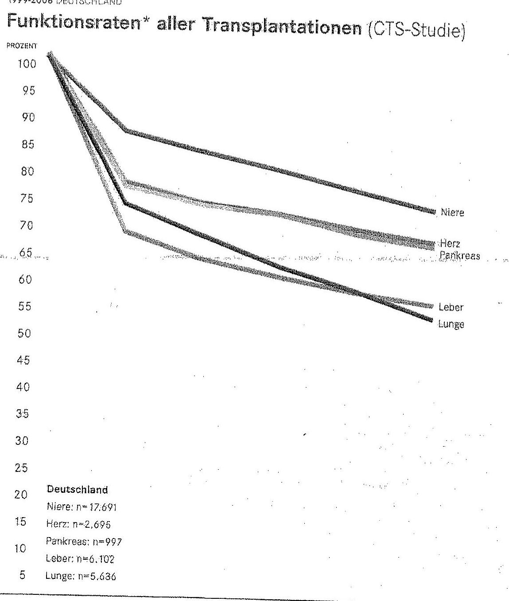

---

# Tanúsítványok jegyzéke 

1. sz. Összes vesetranszplantációk száma 2005-2009
2. sz. Várakozási idők alakulása (2009. 12. 31.)
3. sz. Intenzív terápiás szakma létszám ellátottsága régiónként

---

Kitöltő intézmény neve: OVSZK Kitöltésért felelős neve: Kitöltésért felelős telefonszáma:

Összes vesetranszplantációk száma 2005-2009

|   | 2005 |  | 2006 |  | 2007 |  | 2008 |  | 2009 |   |
| --- | --- | --- | --- | --- | --- | --- | --- | --- | --- | --- |
|  Megnevezés | Vese |  | Vese |  | Vese |  | Vese |  | Vese |   |
|   | összesen | ebből gyerek | összesen | ebből gyerek | összesen | ebből gyerek | összesen | ebből gyerek | összesen | ebből gyerek  |
|  Debrecen |  |  |  |  |  |  |  |  |  |   |
|  cadaver | 51 | 3 | 50 | 1 | 43 | 3 | 31 | 1 | 34 | 2  |
|  élő | 0 | 0 | 0 | 0 | 0 | 0 | 0 | 0 | 0 | 0  |
|  összesen | 51 | 3 | 50 | 1 | 43 | 3 | 31 | 1 | 34 | 3  |
|  ebből preemptív | 2 | 0 | 3 | 0 | 5 | 3 | 3 | 1 | 0 | 0  |
|  Szeged |  |  |  |  |  |  |  |  |  |   |
|  cadaver | 52 | 1 | 57 | 1 | 39 | 1 | 40 | 0 | 46 | 1  |
|  élő | 0 | 0 | 3 | 0 | 3 | 2 | 2 | 0 | 5 | 0  |
|  összesen | 52 | 1 | 60 | 1 | 42 | 3 | 42 | 0 | 51 | 1  |
|  ebből preemptív | 5 | 0 | 4 | 0 | 2 | 0 | 1 | 0 | 3 | 0  |
|  Pécs |  |  |  |  |  |  |  |  |  |   |
|  cadaver | 46 | 3 | 42 | 2 | 45 | 0 | 39 | 3 | 35 | 0  |
|  élő | 2 | 0 | 4 | 2 | 3 | 1 | 6 | 1 | 4 | 0  |
|  összesen | 48 | 3 | 46 | 4 | 48 | 1 | 45 | 4 | 39 | 0  |
|  ebből preemptív | 1 | 0 | 3 | 2 | 1 | 1 | 0 | 0 | 0 | 0  |
|  Budapest |  |  |  |  |  |  |  |  |  |   |
|  cadaver | 151 | 12 | 147 | 13 | 138 | 9 | 125 | 6 | 133 | 6  |
|  élő | 13 | 1 | 7 | 1 | 11 | 4 | 16 | 0 | 15 | 0  |
|  összesen | 164 | 12 | 154 | 12 | 149 | 13 | 141 | 6 | 148 | 6  |
|  ebből preemptív |  |  |  |  |  |  |  |  |  |   |
|  Összesen cad | 300 | 19 | 296 | 15 | 265 | 13 | 235 | 10 | 248 | 9  |
|  élő donoros: | 15 | 0 | 14 | 3 | 17 | 7 | 24 | 1 | 24 | 0  |
|  Összesen: | 315 | 19 | 310 | 18 | 282 | 20 | 259 | 11 | 272 | 9  |

1. sz. tanúsítvány

Igazolom, hogy a tanúsítványban szereplő adatok nyilvántartásainkkal megegyeznek.

Dátum: 2005.01.01. 10:00:00

- Budapesten nincs információ a preemptív státuszról.

* Budapesten nincs információ a preemptív státuszról.

---

Kitöltő intézmény neve: OVSZK Kitöltésért felelős neve: Dr. Rajczy Katalin Kitöltésért felelős telefonszáma:

Várakozási idők alakulása (2009. 12. 31.)

|  Kitöltés (cs.) lélekszám (várakozási szám) | 1. irpír (v. várok) | 1. irpír (v. várok) | 2. irpír (v. várok) | 1. irpír (v. várok) | 2. irpír (v. várok) | fő (Összesen)  |
| --- | --- | --- | --- | --- | --- | --- |
|  5 vagy kevesebb hónap | 1 | 1 | 27 | 149 | 178 | 26,69%  |
|  6-11 hónap | 1 | 4 | 35 | 95 | 135 | 20,24%  |
|  12-23 hónap | 1 | 3 | 28 | 103 | 134 | 20,09%  |
|  24-59 hónap | 1 | 13 | 51 | 108 | 173 | 25,94%  |
|  60 vagy több hónap | 1 | 10 | 17 | 20 | 47 | 7,05%  |
|  Összesen | 3 | 31 | 158 | 475 | 667 | 100,00%  |

Igazolom, hogy a tanúsítványban szereplő adatok nyilvántartásainkkal megegyeznek.

Dátum: 26.06.2009. 12:26:22 +02'00'

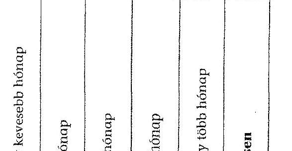

---

Kitöltő intézmény neve: OEP Kitöltésért felelős neve: Fábri Zoltán Kitöltésért felelős telefonszáma: 298-25-52/4128

Intenzív terápiás szakma létszám ellátottsága régiónként

|  Régió | 2005 | 2006 | 2007 | 2008 | 2009  |
| --- | --- | --- | --- | --- | --- |
|   | intenzív | intenzív | intenzív | intenzív | intenzív  |
|   | szakorvos | dipl. ápoló | szakorvos | dipl. ápoló | szakorvos  |
|  Közép-Magyarország | 437 | 619 | 636 | 605 | 619  |
|  Közép-Dunántúl | 133 | 152 | 154 | 156 | 158  |
|  Nyugat-Dunántúl | 81 | 146 | 147 | 158 | 158  |
|  Dél-Dunántúl | 173 | 181 | 177 | 178 | 185  |
|  Dél-Alföld | 195 | 196 | 193 | 186 | 187  |
|  Észak-Alföld | 208 | 202 | 201 | 215 | 216  |
|  Észak-Magyarország | 107 | 137 | 133 | 131 | 148

 |
|  Összesen | 1 334 | 1 633 | 1 641 | 1 629 | 1 671  |

Igazolom, hogy a tanúsítványban szereplő adatok nyilvántartásainkkal megegyeznek.

Budapest, 2010. április 28.

Dr. Rendek Vilma mb. főigazgató
