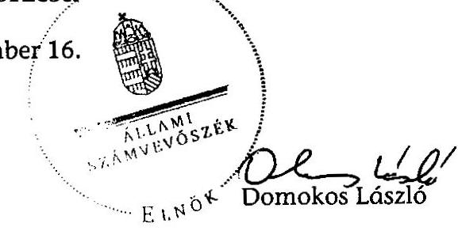
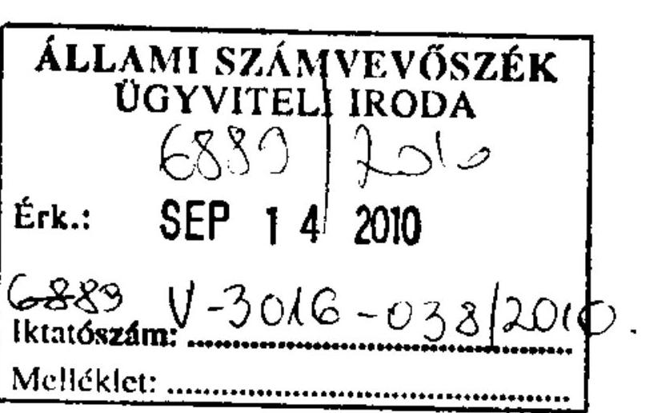
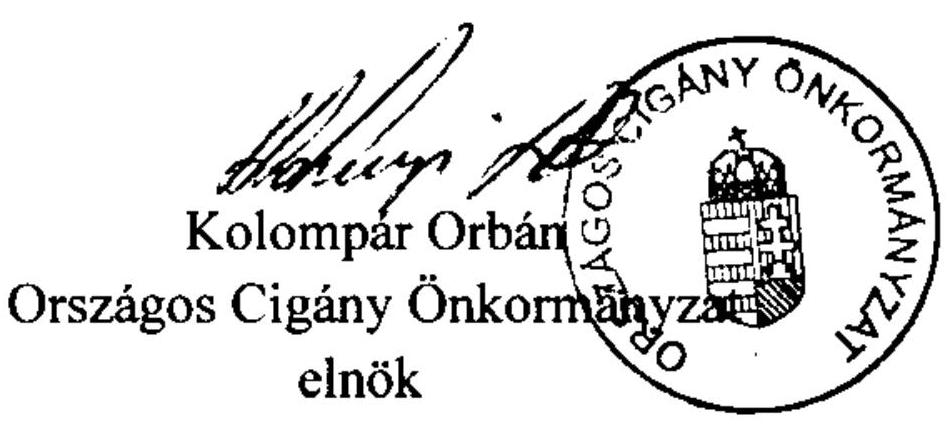

# ÁLLAMI   SZÁMVEVŐSZÉK 

## JELENTÉS

az Országos Cigány Önkormányzat
2009. évi - 2010. I. félévi gazdálkodásának ellenőrzéséről

---

3. Önkormányzati és Területi Ellenőrzési Igazgatóság
3.1. Szabályszerüségi Ellenőrzési Föcsoport
Iktatószám: V-3016-024/2010.
Témaszám: 994
Vizsgálat-azonosító szám: V-0534
Az ellenőrzést felügyelte:
Dr. Lóránt Zoltán
föigazgató
Az ellenőrzés végrehajtásáért felelős:
Dr. Elek János
általános föigazgató-helyettes
Az ellenőrzést vezették:
Horváth Balázs
főcsoportfőnök-helyettes
Solymár Ágnes
osztályvezető főtanácsos
Az összefoglaló jelentést készítette:
Szappanos Júlia
tanácsos

Az ellenőrzést végezték:

| Dormán István Zoltán | Gombás István | Horváth József |
| :-- | :-- | :-- |
| számvevő | számvevő | főtanácsadó |
| Szakmányné Bilik Mária |  | Szappanos Júlia |
| tanácsos |  | tanácsos |

A témához kapcsolódó eddig készített számvevőszéki jelentések:
címe
sorszáma
Jelentés az Országos Cigány Önkormányzat pénzügyi-gazdasági 0406 tevékenységének ellenőrzéséről
Jelentés a magyarországi nemzeti és etnikai kisebbségek támogatási 0468 si rendszerének ellenőrzéséről

---

# TARTALOMJEGYZÉK 

BEVEZETÉS ..... 5
I. ÖSSZEGZŐ MEGÁLLAPÍTÁSOK, KÖVETKEZTETÉSEK, JAVASLATOK ..... 7
II. RÉSZLETES MEGÁLLAPÍTÁSOK ..... 13

1. Az Önkormányzat múködésének és gazdálkodási rendjének szabályszerűsége ..... 13
1.1. Az Önkormányzat szervezeti és működési rendje ..... 13
1.2. A hivatal múködésének szabályozottsága ..... 15
1.3. A gazdálkodás szabályozása ..... 17
1.4. A gazdálkodási jogkörök szabályozása ..... 19
1.5. Vagyongazdálkodás, vagyonvédelem ..... 19
2. A költségvetési támogatás és állami ingyenes vagyonjuttatás felhasználása, a támogatások elszámolása ..... 21
2.1. A költségvetési támogatás felhasználásának elve ..... 21
2.2. A költségvetés végrehajtása, a támogatás felhasználása ..... 23
2.3. Adók és járulékokkal kapcsolatos kötelezettségek teljesítése ..... 27
2.4. A pályázati és egyéb támogatásokból ellátott feladatok megvalósítása, elszámolása ..... 28
2.5. Az Önkormányzat által nyújtott támogatások ..... 30
2.6. Az állami ingatlanvagyon hasznosítása ..... 31
3. Költségvetés készítése, zárszámadás ..... 32
3.1. Az éves költségvetések ..... 32
3.2. Az éves zárszámadás ..... 34
4. A könyvvezetési és beszámolási kötelezettség teljesítése ..... 35
4.1. A könyvvezetési kötelezettség teljesítése ..... 35
4.2. Beszámolási kötelezettség teljesítése ..... 38
5. Az önkormányzati gazdálkodás belső ellenőrzése ..... 40
MELLÉKLETEK
6. számú A 2009. évi-2010. I. félévi kifizetések elszámolási szabálytalanságának részletezése
7. számú A személyes felelősséggel kapcsolatos megállapítások hivatkozása, megnevezése
8. számú Önkormányzat elnökének jelentésre tett észrevétele és az arra adott válasz

---

.

---

# RÖVIDÍTÉSEK JEGYZÉKE 

## Jogszabályok

Áht.
Art.
ÁSZ tv.
Közbesz. tv.
Nek. tv.
Számv. tv.
Szja tv.
Ötv.
Áhsz.

Ámr. (régi)
Ámr. (új)
Ber.

Kög.

## Rövidített nevek

ÁSZ
KVI
MÁK
MeH
MNV Zrt.
Nyomozó Hivatal
PEB
Önkormányzat
SZMSZ
OCIMK Kht.
O.K.C. Kft.

VKK Kft.

Az államháztartásról szóló 1992. évi XXXVIII. törvény
Az adózás rendjéről szóló 2003. évi XCII. törvény
Az Állami Számvevőszékről szóló 1989. évi XXXVIII. törvény
A közbeszerzésekről szóló 2003. évi CXXIX. törvény
A nemzeti és etnikai kisebbségek jogairól szóló 1993. évi LXXVII. törvény
A számvitelről szóló 2000. évi C. törvény
A személyi jövedelemadóról szóló 1995. évi CXVII. törvény
A helyi önkormányzatokról szóló 1990. évi LXV. törvény 249/2000. (XII. 24.) Korm. rendelet az államháztartás szervezetei beszámolási és könyvvezetési kötelezettségének sajátosságairól
217/1998. (XII. 30.) Korm. rendelet az államháztartás működési rendjéről (hatálytalan 2010. január 1-jétől) 292/2009. (XII. 19.) Korm. rendelet az államháztartás működési rendjéről (hatályos 2010. január 1-jétől) 193/2003. (XI. 26.) Korm. rendelet a költségvetési szervek belső ellenőrzéséről
376/2007. (XII. 23.) Korm. rendelet a kisebbségi önkormányzatok gazdálkodásáról (hatályos 2009. december 31-ig)

Állami Számvevőszék
Kincstári Vagyoni Igazgatóság
Magyar Államkincstár
Miniszterelnöki Hivatal
Magyar Nemzeti Vagyonkezelő Zrt.
Vám- és Pénzügyőrség Dél-alföldi Regionális Nyomozó Hivatala
Pénzügyi Ellenőrző Bizottság
Országos Cigány Önkormányzat
Szervezeti és Müködési Szabályzat
Országos Cigány Információs és Múvelődési Központ Kht.
Otthonteremtő, Szakképző és Foglalkoztatási Korlátolt Felelősségű Társaság
Vállalkozásfejlesztési Koordinációs Központ Nonprofit Korlátolt Felelősségű Társaság

---

.

---

# JELENTÉS   az Országos Cigány Önkormányzat 2009. évi - 2010. I. félévi gazdálkodásának ellenőrzéséről 

## BEVEZETÉS

Az Országos Cigány Önkormányzat (Önkormányzat) kiemelt céljai között határozta meg a magyarországi cigányság társadalmi integrációjának elősegítését, kulturális autonómiájának megőrzését, hatékony politikai érdekképviseletének ellátását, a cigány kisebbségi önkormányzati rendszer munkájának segítését.

A nemzeti és etnikai kisebbségek jogairól szóló 1993. évi LXXVII. törvény (Nek. tv.) 1993. évi hatályba lépése óta folyamatosan múködik az Önkormányzat. Múködéséhez a költségvetési törvények a 2009. és a 2010. évben évente 313900 ezer Ft állami támogatást nevesítettek. A költségvetésben tervezett támogatást további pályázati és egyéb módon engedélyezett állami forrásból egészítették ki.

Az Önkormányzat gazdálkodását legutóbb az Állami Számvevőszék 2004. évben kormányzati felkérésre ellenőrizte. Tekintettel arra, hogy fontos közérdek fűződik a hátrányos helyzetű roma lakosság támogatására szánt közpénzekkel való gazdálkodás ellenőrzéséhez, illetve a legutóbbi ellenőrzéshez képest hosszú idő telt el, a Kormány felkérésére, az Állami Számvevőszékről szóló - többször módosított - 1989. évi XXXVIII. törvény 2. § (5) bekezdése, valamint a Nek. tv. 39/G. § (1) bekezdésében kapott felhatalmazás alapján soron kívül vizsgáltuk az Önkormányzat 2009. évi és 2010. I. félévi gazdálkodását.

A szabályszerűségi ellenőrzés célja annak értékelése volt, hogy:

- az Önkormányzat gazdálkodással összefüggő feladat- és hatáskörét, a hivatal múködését a Nek. tv. előírásaival összhangban szabályozták-e, érvényesí-tették-e az előírásokat;
- az Önkormányzat a 2009-2010. évi központi költségvetési támogatást a Nek. tv-ben meghatározott feladatokra használta-e fel;
- az államháztartás alrendszereitől jogszabály vagy megállapodás alapján céljelleggel kapott támogatások felhasználása, elszámolása során betartott-ták-e a jogszabályi, illetve a szerződésben foglalt előírásokat;
- az Önkormányzat részére ingyenesen juttatott állami ingatlanvagyont szabályszerűen hasznosították-e;

---

- a költségvetési tervezés, az operatív gazdálkodás, a könyvvezetési és beszámolási kötelezettség, a számviteli bizonylati elv és fegyelem gyakorlatában érvényesültek-e a jogszabályokban és a belső szabályzatokban megfogalmazott követelmények;
- az Önkormányzat kialakította-e és eredményesen múködtette-e a belső ellenőrzést.

A helyszíni ellenőrzéssel kapcsolatban szükséges rögzíteni, hogy 2010. január 15-én a Vám- és Pénzügyőrség Dél-alföldi Regionális Nyomozó Hivatala (továbbiakban: Nyomozó Hivatal) az Önkormányzat 2009. évi pénzügyi iratanyagait, pénzügyi dokumentációit lefoglalta. Ennek megfelelően a helyszíni ellenőrzés az Önkormányzat székhelyén, valamint a Nyomozó Hivatalnál, Kecskeméten történt. A búnjeljegyzék szerint rendezetlen tartalmú dossziékban, a 2006-2008. évi, valamint a 2009. évi gazdálkodási dokumentumokat vitte el a Nyomozó Hivatal.

Nehezítette az ellenőrzést, hogy a gazdálkodást megalapozó közgyűlési döntéseket, az Önkormányzat múködését és gazdálkodását alátámasztó iratokat, rendezetlen formában, több napos késedelemmel, hiányosan bocsátották a helyszíni ellenőrzést végzők rendelkezésére.

---

# I. ÖSSZEGZŐ MEGÁLLAPÍTÁSOK, KÖVETKEZTETÉSEK, JAVASLATOK 

Az Önkormányzat 2009. évi - 2010. I. félévi múködése és gazdálkodása hiányos szabályozásokon alapult. Az SZMSZ nem volt összhangban a Nek. tv. és az Ámr. előírásaival. A közgyűlés az SZMSZ-t annak ellenére nem módosította, hogy mind a hatályos jogszabályokban (hivatal jogállására, hivatalvezető 2010. január 1-jétől előírt képesítésére vonatkozóan), mind a gazdálkodási sajátosságokban (intézmények törzskönyvezésére, gazdálkodásuk feladatmegosztására, gazdasági vezető alkalmazására vonatkozóan) lényeges változások történtek. A hatályos SZMSZ-ben nem rendelkeztek az intézmények feladat- és hatásköréről, a vagyonnyilatkozatok nyilvántartási és ellenőrzési rendjéről, a közgyűlés tagjai, tisztségviselői és alkalmazottai javadalmazásának elveiről és mértékéről, az SZMSZ részeként nem készült hivatali ügyrend. Az Önkormányzat számviteli és gazdálkodási szabályozása nem felelt meg a Számv. tv., az Ámr. és az Áhsz. előírásainak. Az Önkormányzat nem aktualizálta számviteli politikáját, pénzkezelési- és leltározási szabályzatát. Jóváhagyás hiányában nem rendelkeztek az eszközök és források értékelési szabályzatával, számlarenddel, nem gondoskodtak a gazdálkodási jogkörök (kötelezettségvállalás, ellenjegyzés, utalványozás, teljesítésigazolás, érvényesítés) szabályozásáról. A nem megfelelő szabályozás is hozzájárult ahhoz, hogy az Önkormányzat nem biztosította a törvényes múködés kereteit, a szabályszerű gazdálkodás feltételeit.

A közgyűlés a Nek. tv-ben át nem ruházható hatáskörében biztosított tulajdonosi jogokat nem gyakorolta, a törzsvagyon körét nem határozta meg, annak könyvekben való nyilvántartása nem felelt meg az előírásnak. Az Önkormányzat az éves beszámolójában nem tüntette fel egy vállalkozásban való részesedését, ezáltal nem mutatta ki a kft-ben bekövetkezett, a cégnyilvántartás adatai szerinti 3600 ezer Ft vagyonvesztést. Az Önkormányzat tulajdonában lévő kft-ben ügyvezetői tisztséget látott el az elnök, amely a Nek. tv. szerint összeférhetetlen. Az Önkormányzat saját tőkéje 97804 ezer Ft-ról 66757 ezer Ft-ra csökkent, az éves költségvetést meghaladó kiadások miatt.

A költségvetési törvények az Önkormányzatnak és intézményeinek évente 313900 ezer Ft támogatást tartalmaztak. A közgyűlés az Áht-ban előírt költségvetési koncepció és az Ámr-ben meghatározott egyeztetés nélkül döntött az éves költségvetések elfogadásáról. A közgyűlési határozatok szabálytalanul nem tartalmazták a költségvetés bevételi és kiadási főösszegét, a múködési és felhalmozási bevételi-kiadási előirányzatokat, a költségvetési hiány összegét és finanszírozásának módját. Az Áht. rendelkezése ellenére a folyószámlahitel felvételét 50000 ezer Ft-tal bevételként, illetve törlesztését kiadásként tervezték. A hitelszerződést a Nek. tv. megsértésével - a rendszeres állami támogatás folyósítására kijelölt bankszámla zálogfedezetével - kötötte az Önkormányzat elnöke.

A költségvetések hiányossága volt, hogy a tervek nem határozták meg az éves létszám-előirányzatot költségvetési szervenként, a felújításokat feladatonként, a beruházásokat célonként, a többéves kihatással járó feladatok előirányzatait

---

évenkénti bontásban, az előirányzat-felhasználási ütemtervet, a tartalék felhasználási szabályait. Továbbá a bizonytalan források, a nem tervezett kötelezettségvállalások, adók és járulékok következtében nem érvényesítették a költségvetési tervezés megalapozottságának követelményét. A Nek. tv. rendelkezését figyelmen kívül hagyva a közgyűlés által elfogadott éves költségvetéseket határidőben nem tették közzé, nem a jóváhagyott költségvetésről szolgáltattak adatot a MeH-nek.

Az Önkormányzat 2009. évi gazdálkodási bevételeit 381827 ezer Ft, kiadásait 399784 ezer Ft főösszeggel teljesítette. A 2010. I. félévi pénzügyi teljesítés a főkönyvi adatok szerint 171987 ezer Ft bevételt, 194195 ezer Ft kiadást mutatott. Mindkét időszakban a kiadások meghaladták a bevételeket, mivel az évközi pénzügyi kihatású közgyűlési döntéseket előirányzat-módosítás és fedezet nélkül teljesítették, amelynek szabálytalanságát a hivatalvezető a közgyűlésnek nem jelezte. Az Önkormányzat a forráshiányát folyamatosan fennálló folyószámlahitel igénybevételével finanszírozta, amelynek záró állománya 2009. december 31 -én 48457 ezer Ft, 2010. június 30 -án 50000 ezer Ft volt. Ezen túlmenően a fizetőképességet a számlák 2-8 hónapos késedelmes teljesítésével tartották fenn. Az ellenőrzés által a nyilvántartások hiányos vezetése miatt nem volt megállapítható az Önkormányzat tényleges adósság- és kötelezettség állománya. Az Önkormányzatnál a tiszteletdíjakat a Nek. tv-ben meghatározott korlátozások figyelembevételével állapították meg. Ezen felül a képviselőknek és alkalmazottaknak havi rendszerességgel - elszámolási kötelezettség nélkül - fizettek, 35-267 ezer Ft összegű költségtérítést. A PEB elnökének annak ellenére folyósították 2009-ben a tiszteletdíjat és a költségtérítést, hogy a Nek. tvben előírt vagyonnyilatkozat-tételi kötelezettségének nem tett eleget.

Az Önkormányzat múködtetése során nem érvényesültek a jogszabályi előírások, a személyi feltételek - a hivatalvezető megfelelő képesítése és a munkaköri leírások hiányában - nem biztosították a hivatal szabályszerű múködését, nem teljesültek a szabályszerű gazdálkodás követelményei sem. A kötelezettségvállalás, az ellenjegyzés és utalványozás nem megfelelő gyakorlása következtében - a Nek. tv. előírásától eltérően - a közgyűlés nem szerzett érvényt a gazdálkodás biztonságának, az elnök és a hivatalvezető a szabályszerű gazdálkodásnak.

Az ellenőrzés az állami támogatás felhasználásához kapcsolódóan mintavétellel vizsgált 206 kifizetés elszámolása során 10475 ezer Ft értékben szabálytalan kifizetést állapított meg: 5612 ezer Ft céltól eltérő felhasználást, 2274 ezer Ft elnöki utasításra történt előirányzat nélküli kifizetést, 1528 ezer Ft számla nélküli előlegfizetést, 1061 ezer Ft szabálytalanul elszámolt gépkocsi költségtérítést (1. számú melléklet).

Az Önkormányzat az adó- és járulék-bevallási, levonási, fizetési, adóigazolási nyilatkozatok teljesítési kötelezettségét megsértette. A nyilvántartásában szereplő gépkocsi után nem vallotta be és nem fizette meg a cégautó adót. A segélyek és ösztöndíjak 10924 ezer Ft összegű kifizetését adólevonás nélkül teljesítette. A költségtérítésekre az Önkormányzat az általa kiadott adóigazolásokban a tisztségviselők és a munkavállalók költségtérítését teljes körűen elszámoltnak igazolta, a keletkezett jövedelmet nem mutatta ki. A költségtérítésre kifizetett összeg 2009. évben 52615 ezer Ft volt, 2010. évre várhatóan 114463 ezer Ft-ot tesz ki.

---

Az Önkormányzat az állami támogatás felhasználása során, a pályázati úton kapott ( 14017 ezer Ft), lezárt támogatásokat rendeltetésszerűen használta fel, a támogatási szerződésekben meghatározott elszámolási formát, a határidőt az elszámolások során betartotta. A támogatásokat intézményi számítógéppark kialakítására, a roma holokauszt megemlékezésre, a Világunk címú folyóirat megjelentetésére használta fel. Az Önkormányzat alkalmazottai bértámogatására 12626 ezer Ft-ot számolt el az illetékes munkaügyi központ felé, amelyet utófinanszírozással kapott meg.

Az Önkormányzat saját forrásai terhére nyújtott támogatások körében szabálytalanul folyósított ösztöndíjakat. A helyi kisebbségi és civil szervezeteket 3065 ezer Ft összegben a Nek. tv-t megsértve támogatta, mivel a támogatási lehetőségeket nem hozta nyilvánosságra.

A Nek. tv. alapján 2006. végén a székház az Önkormányzat tulajdonába került 11405 ezer Ft bruttó értékkel, amelynek aktuális nyilvántartási értékét az ellenőrzés nem tudta megállapítani, mivel az ingatlanról az előírt egyedi nyilvántartást nem vezették. Az ellenőrzés időszakában a székházat rendeltetésszerűen, a hivatal és az intézmények elhelyezésére használták.

Az Áht-t megsértve a hivatalvezető felelősségi körében a 2009. évi költségvetés végrehajtásáról nem készült zárszámadás, ennek következtében közgyűlési jóváhagyása sem történt meg. A 2009. évi pénzügyi-szakmai beszámolót a mérlegképes könyvelői képesítéssel nem rendelkező gazdasági vezető és az Önkormányzat elnöke írta alá, amelynek záradékkal való ellátását a könyvvizsgáló, az eredeti könyvelési dokumentáció Nyomozó Hivatal általi lefoglalása miatt, megtagadta. A közgyűlés beszámolóról szóló, elfogadó határozata nem tartalmazta a független könyvvizsgáló auditálást megtagadó véleményét. A Nek. tv. rendelkezése ellenére, a közgyűlés által elfogadott egyszerűsített éves beszámolót nem tették közzé, az ÁSZ-nál nem helyezték letétbe.

A könyvvezetés alapjául szolgáló számviteli bizonylatok nem feleltek meg az alaki, tartalmi hibák miatt a Számv. tv-ben meghatározott követelményeknek. A könyvelési rendszer zártsága nem volt biztosított, az egyes alrendszerek közötti adatszolgáltatás szabályozatlansága, valamint annak gyakorlati megvalósítása miatt. Az Önkormányzat nem gondoskodott a támogatások elkülönített nyilvántartásáról. A pénzkezelési szabályzat előírásait megsértették a pénztárellenőr hiánya, a záró pénzkészlet túllépése, a hivatal és az intézmények pénzforgalma elkülönítésének hiánya miatt, valamint azzal, hogy az Önkormányzat elnöke szabálytalanul, előre üresen írta alá a készpénzfelvételi utalványokat. A főkönyvi könyvelés és az analitikus nyilvántartások egyezősége nem állt fenn. A leltározási szabályzat előírásától eltérően a 2009. évi leltárfelvételt és annak kiértékelését teljes körűen nem végezték el, ezáltal a mérleg leltárral történő alátámasztása nem valósult meg.

Az ellenőrzés az Önkormányzat pénzügyi, vagyoni helyzetét rendezetlennek minősítette, a belső ellenőrzés szabályozatlanságát és elmulasztását állapította meg. A Pénzügyi Ellenőrző Bizottság (PEB) feladat- és hatáskörét nem szabályozták, a testület 2009-ben ellenőrzést nem végzett. Az Önkormányzat elnöke, a hivatalvezető és a gazdasági vezető korlátozottan tett eleget a folyamatba épített, előzetes, utólagos és vezetői ellenőrzési kötelezettségének.

---

Az ellenőrzés a megállapított törvényi mulasztások, a szabályozatlanság és a szabálytalan gazdálkodás miatt az Önkormányzat elnökének és hivatalvezetőjének a felelősségét állapította meg (2. számú melléklet). Az ÁSZ büntetőeljárás meginditását kezdeményezte.

A helyszíni ellenőrzés megállapításainak hasznosítása mellett javasoljuk:

# a közigazgatási és igazságügyi miniszternek 

Intézkedjen az Önkormányzat éves költségvetési támogatásai felhasználásának felülvizsgálatáról és a szabálytalan kifizetések alapján elszámolt 10475 ezer Ft támogatási összeg visszafizettetéséről.

## a nemzetgazdasági miniszternek

Rendelje el az Önkormányzat gazdálkodásának átfogó adóhatósági ellenőrzését.

## az Önkormányzat közgyülésének

1. Intézkedjen az Önkormányzat müködésének és gazdálkodási rendjének szabályszerűsége érdekében
a) az SZMSZ Nek. tv. 39/B. § (1) bekezdésének, az Ámr. (új) 18. § (1) és a 105. § (2) bekezdéseinek előírásaival való összhangjáról, a hivatal és intézményei müködési sajátosságainak megfelelő szabályozásáról;
b) a számviteli politika, a pénzkezelési és leltározási szabályzat aktualizálásáról, az eszközök és források értékelési szabályzata és a számlarend jóváhagyásáról a Számv. tv. 14. § (4)-(5) bekezdések, valamint a 161. § (1)-(2) bekezdések előírásai szerint;
c) a gazdálkodási jogosultságok (kötelezettségvállalás, ellenjegyzés, utalványozás, teljesítésigazolás, érvényesítés) Ámr. (új) 72. §, 74. §, 76. §, 78. §-aiban foglaltak szerinti szabályozásáról.
2. Határozza meg az Önkormányzat törzsvagyonának körét a Nek. tv. 37. § (1) bekezdés c) pontja előírása alapján.
3. Gyakorolja tulajdonosi jogait a Nek. tv. 60. § (1) bekezdése szerint; szüntesse meg a Nek. tv. 30/O. § (1) bekezdésben foglaltak alapján fennálló összeférhetetlenséget.
4. Nevezzen ki az Ámr. (új) 105. § (2) bekezdésnek megfelelő képesítéssel rendelkező hivatalvezetőt.
5. Hozzon határozatot a Nek. tv 39/D. § (2) bekezdésben előírtaknak megfelelően a gazdálkodás biztonságának érdekében a folyószámlahitel szerződés felülvizsgálatára.
6. Jelöljön ki gazdasági szervezetet az Önkormányzat részben önállóan gazdálkodó intézményei részére az Ámr. (új) 16. § (1) bekezdés szabályozásával összhangban, az

---

intézmények éves költségvetésének előirányzatai tekintetében a gazdálkodással, könyvvezetéssel és az adatszolgáltatással kapcsolatos feladatok elvégzésére.
7. Határozza meg a Nek. tv. 39/G. § (2) bekezdésben foglaltak szerint a pénzügyi ellenőrző bizottság feladat- és hatásköre ellátásának múködési szabályait, rendszeres beszámoltatással követelje meg szabályos múködését.
8. Hozzon határozatot a Nek. tv. 39/H. § (2) bekezdés érvényesítése érdekében a vagyonnyilatkozat tételt elmulasztó képviselőnek 2009. február és december között jogosulatlanul kifizetett juttatások visszafizettetésére.

# az Önkormányzat elnökének 

1. Terjessze elő az SZMSZ mellékletét képező hivatali ügyrendet a Nek. tv. 39/B. § (1) bekezdése értelmében.
2. Tegyen eleget az Áht. 70. §-ában előírt határidőn belül a költségvetési koncepció közgyűlés elé terjesztésének, valamint a költségvetési határozat-tervezetek szabályszerű előterjesztésének.
3. Biztosítsa az Ámr. (új) 230. § (2) bekezdés d) pontja szerint a valós tartalmú adatszolgáltatást.
4. Intézkedjen az Ámr. (új) 35. § (2) bekezdése és 40. § (5) bekezdése értelmében a költségvetésben szereplő adatok megalapozottságáról, valamint a 36. § (3) bekezdésben előírt egyeztetési kötelezettségének teljesítéséről.

## az Önkormányzat hivatalvezetőjének

1. Intézkedjen az Ámr. (új) 18. § (1) bekezdésben előírt végzettségű gazdasági vezető kinevezéséről, továbbá az alkalmazottak feladatellátását meghatározó munkaköri leírások teljes körű kiadásáról.
2. Aktualizálja az Áhsz. 49. § (6) bekezdésében meghatározottak értelmében a számviteli szabályzatokat.
3. Intézkedjen az Önkormányzat részesedéseinek teljes körű nyilvántartásba vételéről, kimutatásáról.
4. Jelezze a közgyűlésnek a Nek. tv. 39/B. § (3) bekezdésében foglaltak alapján, a döntések szabályszerűsége érdekében a költségvetési módosítások szükségességét.
5. Hozza nyilvánosságra a Nek. tv. 39/D. § (4) bekezdésben foglalt előírásoknak megfelelően a Önkormányzat által nyújtott támogatási lehetőségeket.
6. Intézkedjen a Nek. tv. 39/G. § (4) bekezdése értelmében az éves költségvetés és beszámoló közzétételéről, illetve letétbe helyezéséről.
7. Fizettesse vissza a jogosulatlanul folyósított ösztöndijat.

---

8. Biztosítsa az Áhsz. 49. § (6) bekezdése szerint a szabályszerű könyvvezetést, különösen a pénzkezelés, a leltározás és a mérleg leltárral való alátámasztása tekintetében, valamint szerezzen érvényt a Számv. tv. 167. §. (1) bekezdésben meghatározott bizonylatokkal szemben támasztott alaki és tartalmi követelményeknek.
9. Tegyen eleget az Art. 7. § (2) bekezdésben foglalt felelősségi körében teljes körűen az adó- és járulék bevallási, levonási, fizetési, adóigazolási nyilatkozatok határidőben történő teljesítésének.
10. Múködtesse a Nek. tv. 39/G. § (1) bekezdése és a Ber. együttes rendelkezései betartásával a belső ellenőrzést, gondoskodjon a folyamatba épített, előzetes, utólagos és vezetői ellenőrzésről.

---

# II. RÉSZLETES MEGÁLLAPÍTÁSOK 

## 1. Az ÖNKORMÁNYZAT MŰKÖDÉSÉNEK ÉS GAZDÁLKODÁSI RENDJÉNEK SZABÁLYSZERŰSÉGE

### 1.1. Az Önkormányzat szervezeti és múködési rendje

A közgyűlés az Önkormányzat múködésének szabályait a 2007. december 13án elfogadott, majd 2008. május 30 -án módosított SZMSZ-ben határozta meg. Az Önkormányzat az SZMSZ-t az elfogadást, illetve a módosítást követő 45. napon a Magyar Közlönyben, illetve internetes honlapján nem tette közzé, ezzel megsértette a Nek. tv. 39/G. § (4) bekezdés előírását. A hivatalvezető 2010. május 11 -én intézkedett az SZMSZ - az Önkormányzat honlapján történő nyilvánosságra hozataláról.

A hatályos SZMSZ I. fejezet 1/D. pontja sorolja fel az önkormányzat intézményeit. A szabályzat a hivatalon kívül kilenc intézményt sorol fel. A felsorolás helytelenül intézménynek nevezi a Szociális Lakásépítő Kht-t, a Roma Értelmiségi Kerekasztalt és az Idősek Tanácsát, ezért a hatályos SZMSZ nem a valós intézményszámot tükrözi.

Az ellenőrzés részére átadott és hatályos alapító okiratok alapján az Önkormányzatnak a hivatal mellett 5 db részjogkörrel rendelkező intézménye van. A hivatal és az intézmények új alapító okiratát egységesen 2009. június 22-én készítették el és az ellenőrzés részére átadott igazolások alapján a MÁK 2009. július 1-jei hatállyal törzskönyvi nyilvántartásba vette azokat. Az Önkormányzat intézményei: Országos Cigány Önkormányzat Hivatala; Országos Roma Kulturális és Média Centrum; Országos Roma Könyvtár, Levél- és Dokumentumtár; Kisebbségi Kulturális és Foglalkoztatási Módszertani Intézményhálózat; Országos Roma Közérdekú Muzeális Gyűjtemény és Kiállítási Galéria; valamint az Országos Roma Szabadidős és Képzési Központ.

Az SZMSZ II. fejezete foglalkozik a közgyűlés tagjainak és tisztségviselőinek javadalmazásával. A II. fejezet 1. pontja alapján a közgyűlés tagjainak és tisztségviselőinek javadalmazásáról a közgyűlés dönt, az erről szóló határozata az SZMSZ melléklete. A 2. pont szerint a közgyűlés határoz a költségtérítés elveiről is. A hatályban lévő SZMSZ melléklete a közgyűlés tagjainak és tisztségviselőinek, alkalmazottainak javadalmazását nem tartalmazza.

A Nek. tv. 39/C. § szerint: „Az országos önkormányzat közgyűlése által megállapítható illetmény, illetőleg tiszteletdij összege nem lehet magasabb: a) elnök esetében a köztisztviselői illetményalap tízszeresénél, b) elnökhelyettes esetében a köztisztviselői illetményalap nyolcszorosánál, c) a bizottság elnöke esetében a köztisztviselői illetményalap hatszorosánál, d) a bizottság tagja esetében a köztisztviselői illetményalap háromszorosánál, e) képviselő esetében a köztisztviselői illetményalap kétszeresénél".

A közgyűlés tagjainak és tisztségviselőinek javadalmazására vonatkozóan a Nek. tv. 39/D. § (5) bekezdése szerint „az országos önkormányzat tagjai, munkavállalói,

---

külső szervezetek, személyek, mindezek hozzátartozói csak az SZMSZ-ben megállapított korlátokkal kaphatnak juttatást az önkormányzattól."

Az Önkormányzat a 2009. és a 2010. években a betöltött tisztségétől függően eltérő juttatást fizetett ki havi rendszerességgel a törvényi előírásnak megfelelő felhatalmazás nélkül képviselőinek. A juttatás tiszteletdíjból, illetményből és költségtérítésből állt. A megállapított illetmények, tiszteletdíjak nem haladták meg a Nek. tv. 39/C. §-ában meghatározott mértéket.

Az elnök munkaviszony alapján 350 ezer Ft munkabért és 200 ezer Ft költségtérítést, valamint egy általános elnökhelyettes munkaviszony alapján 250 ezer Ft munkabért és 150 ezer Ft költségtérítést, az általános elnökhelyettes 18 ezer Ft tiszteletdíjat és 267 ezer Ft költségtérítést, az elnökhelyettesek és a bizottsági elnöKök 15 ezer Ft tiszteletdíjat és 200 ezer Ft költségtérítést, a bizottsági tagok 11 ezer Ft tiszteletdíjat és 130 ezer Ft költségtérítést kaptak 2010. I. félévben.

A 2009. évi költségtérítések mértéke a 2009. évi költségvetés szöveges indoklásában található, közgyűlési határozat nem tartalmazta az összegeket. A 2010. évi mértéket a 48/2009.12.16. közgyűlési határozatban fogadták el. A képviselői költségtérítésre vonatkozóan a Nek. tv. előírást nem tartalmaz.

Az alkalmazottak 2010. május havi bérkifizetéseinek ellenőrzésénél a kifizetett összegek két esetben - a költségtérítés tekintetében - nem voltak összhangban a rendelkezésre bocsátott munkaszerződésekben rögzítettekkel.

A munkaviszonnyal foglalkoztatott tisztségviselők munkaszerződésével kapcsolatban az ellenőrzés részére átadott munkaszerződés módosítás alapján az Önkormányzat elnökének munkabérét 2003. június 25-i közgyűlés 350 ezer Ft/hó, valamint 100 ezer Ft/hó költségtérítésben határozta meg. Az általános elnökhelyettes munkaviszonyával kapcsolatos dokumentumok közül csak a munkaszerződés második módosítását tudták az ellenőrzés részére átadni. A számfejtett öszszeggel a módosított munkaszerződés szerint, a munkavállaló személyi alapbére megegyezett. Az általános elnökhelyettesnek munkaköri leírása nem volt. Az Önkormányzat gazdasági vezetője részére költségtérítés címén 150 ezer Ft-ot fizettek ki. A költségtérítés kifizetésének jogalapjára vonatkozóan az ellenőrzés részére írásos dokumentumot nem adtak át.

A költségtérítések kifizetett összegére vonatkozóan a képviselőknek és a munkavállalóknak az Önkormányzat szabályzatban elszámolási kötelezettséget nem írt elő.

Az SZMSZ XXIX. fejezete foglalkozik a közgyűlési testület üléseinek jegyzőkönyv készítéséről és hitelesítéséről. A fejezet 2. pontja szerint a jegyzőkönyv elkészítéséről az elnök gondoskodik, melyet az elnök és a közgyűlés - elnöki javaslatra választott - két tagja hitelesít. Az ellenőrzés részére rendelkezésre bocsátott 2009. és 2010. évi közgyűléseiről készített jegyzőkönyveket és jegyzőkönyvi kivonatokat hat esetben nem hitelesítették.

A Nek. tv. 39/H. § (1) bekezdése szerint az Önkormányzat képviselője a megbízólevél átvételétől számított 30 napon belül, majd ezt követően minden év január 31-ig az e törvény melléklete szerinti vagyonnyilatkozatot köteles tenni. A Nek. tv. 39/H. § (2) bekezdés alapján a vagyonnyilatkozat tétel elmulasztása esetén - annak benyújtásáig - a képviselő nem gyakorolhatja jogait és nem

---

rendelkezhet a Nek. tv. 39/C. §-ban meghatározott juttatásokban. A Nek. tv. 39/H. § (3) bekezdése szerint a vagyonnyilatkozatot az SZMSZ-ben erre kijelölt bizottság tartja nyilván és ellenőrzi.

Az Önkormányzat SZMSZ-e a vagyonnyilatkozat tételi kötelezettségről és annak nyilvántartására és ellenőrzésére vonatkozóan előírást nem tartalmaz.

A PEB elnöke a 2008. évi vagyoni és jövedelmi helyzetére vonatkozóan 2009. január 31-ig vagyonnyilatkozatot nem adott be. A le nem adott vagyonnyilatkozat ellenére a PEB vezetőjének 2009. év folyamán minden hónapban számfejtettek 15 ezer Ft/hó tiszteletdíjat és 100 ezer Ft/hó költségtérítést. Az Önkormányzat Úgyrendi Bizottságának 2009. december 16-án tartott ülésén csak a 25/2009.12.16. számú határozatában vonta meg a képviselő jogait és költségtérítésének további folyósítását.

A PEB elnök vagyonnyilatkozat tételi kötelezettsége elmulasztásához kapcsolódóan az Önkormányzat megsértette a Nek. tv. 39/H. § (1)-(3) bekezdéseit.

Az elnöki kabinet vezetője által az ellenőrzés részére átadott kimutatás szerint az Önkormányzat a 2009. év kezdete és 2010. június 30-a között kilenc bizottságot működtetett. A bizottságok közül az Intézményhálózat és az Országos Cigány Önkormányzat Intézményei Felügyeletével Foglalkozó Bizottság (7 fő), a Lakásépítés, Terület- és Vidékfejlesztési Bizottság (9 fő), a Konfliktuskezelő és Anti-diszkriminációs Bizottság (3 fő) és a Vállalkozásfejlesztési Bizottság (4 fő) nem ülésezett. A bizottságok közül az Oktatási és Bihari János Ösztöndíjjal Foglalkozó Bizottság és a Szabadidős és Képzéssel Foglalkozó Bizottság rendelkezett a bizottságra vonatkozó SZMSZ-szel. A többi bizottság hatályos ülés- és működési rendjére vonatkozóan az ellenőrzés részére dokumentumot átadni nem tudtak.

A Vállalkozásfejlesztési Bizottság választott elnökének személye nem felelt meg Nek. tv. 30/M. § (1) bekezdésében meghatározottaknak, miszerint a bizottság elnökét a kisebbségi önkormányzati képviselők közül kell választani.

Az Önkormányzat SZMSZ-e az általa alapított intézmények feladataira és hatásköreire vonatkozóan előírást nem tartalmazott.

Az Önkormányzat hatályos SZMSZ-e az előzőekben felsorolt hiányosságok következtében nem felelt meg a Nek. tv. 39/B. § (1) bekezdésben megfogalmazottaknak.

Az Önkormányzat SZMSZ-ének közgyűlés elé terjesztése a Nek. tv. 30/E. § (1) bekezdése alapján az elnök feladatkörébe tartozik.

# 1.2. A hivatal múködésének szabályozottsága 

Az Önkormányzat hivatalának jogállását és munkaszervezeteinek feladatait az SZMSZ III. fejezete tartalmazza, mely szerint az „Országos Cigány Önkormányzat Hivatala országos költségvetési szerv". Az SZMSZ-ben a hivatal jogállását pontatlanul fogalmazták meg, ugyanis a Nek. tv. 39/B. § (5) bekezdése alapján „a hivatal országos kisebbségi önkormányzati költségvetési szerv".

---

Az SZMSZ III. fejezet 3. pontja szerint a hivatalt a hivatalvezető irányítja és felette a munkáltatói jogokat a közgyűlés gyakorolja, az elnök jogkörébe az egyéb munkáltatói jogok (pl: szabadságolások) tartoznak. A szabályzatban megfogalmazottak ellentétesek a Nek. tv. 39/B. § (2) bekezdés előírásával, mely szerint „A hivatal vezetője tekintetében - a felmentés esetét kivéve - az elnök gyakorolja a munkáltatói jogokat."

A hivatalvezető alkalmazásának feltételeit 2010. január 1-jétől az Ámr. (új) szabályozza. A rendelet 105. § (2) bekezdése szerint a „Hivatalvezetőnek igazgatásszervezői vagy állam- és jogtudományi doktori képesítéssel, okleveles közgazdász képesítéssel, vagy okleveles közigazgatási menedzser szakképesítéssel, a pénzügyi források és a vagyon mértékének megfelelő vezetési-szervezési és pénzügyi-gazdasági ismeretekkel, szakmai és vezetői gyakorlattal rendelkező, pályázati úton kiválasztott természetes személy nevezhető ki."

A hivatalvezető képesítése az ellenőrzés részére átadott dokumentumok alapján nem felelt meg a jogszabályi előírásnak.

A hivatal működésének részletes szabályairól az SZMSZ III. fejezet 5. pontja szerint a hivatal ügyrendje és egyéb, a múködéshez kapcsolódó kötelező szabályzatok rendelkeznek. A szabályzatokat az érintett szervezeti egységek vezetői készítik el, melyeket a közgyűlés hagy jóvá és azok az SZMSZ mellékletét képezik. Az ellenőrzés részére átadott, 2008. május 30 -án elfogadott SZMSZ mellékletét az ügyrend nem képezte. Az Önkormányzat SZMSZ-ének mellékletét képező ügyrend elfogadása a Nek. tv. 39/B. § (1) bekezdése alapján a közgyülés feladatkörébe tartozik.

Az elnök által 2008. június 30 -án aláírt ügyrend hatálybaléptetésére, illetve közgyűlési elfogadására vonatkozóan a hivatalvezető 2010. augusztus 2 -án tett nyilatkozata alapján, a 2007-2008. évi közgyűlési határozatok kivonatot nem tartalmaznak, ezért nem tudták az ellenőrzés részére átadni, így az Önkormányzatnak közgyűlés által jóváhagyott ügyrendje az ellenőrzött időszakra vonatkozóan nem volt. A hivatal - az önkormányzati feladatokat előkészítő, a határozatokat végrehajtó és a gazdálkodási feladatokat ellátó szervezet közgyülés által jóváhagyott, hatályos ügyrend nélkül végezte feladatait.

A hivatalon belül a gazdálkodási és pénzügyi feladatokat a gazdasági osztály végezte. A gazdasági osztály látta el a részben önállóan gazdálkodó intézmények gazdasági feladatait.
2009. április 1. és 2010. március 31. között a gazdasági osztály létszáma maximum két fő volt. A gazdasági osztály 2010. június 30 -án négy főt alkalmazott.

A gazdasági osztály vezetésével 2009. április 1-jétől az Önkormányzat gazdasági osztályán munkaszerződése alapján heti 20 órás alkalmazásban álló munkavállalót bízták meg. A gazdasági vezető munkaköri leírásában meghatározott munkaidő heti 40 órás, ez ellentétes a munkaszerződéssel.

A megbízott gazdasági vezető nem rendelkezett a feladat ellátásához szükséges, az Ámr. (új) 18. § (1) bekezdésében elöírt végzettséggel. A

---

gazdálkodási feladatok folyamatos, szabályszerű ellátásához a személyi feltételeket a hivatalvezető nem biztosította. A Nek.tv. 6/A. § (2) bekezdés c) pontja alapján az „országos kisebbségi önkormányzat esetén a munkáltatói jog magában foglalja a hivatal munkavállalói feletti munkáltatói jogot is, melyet a hivatal vezetője gyakorol".

A gazdasági szervezetben dolgozók feladatellátását nem szabályozták, az osztály 2010. június 30-i állományából két fő nem rendelkezett aláírt munkaköri leírással. A munkaköri leírással rendelkező két alkalmazott munkaköri leírása nem tartalmazta az ellátandó pénzügyi, számviteli és gazdasági feladatok határidejét és a munkakörhöz kapcsolódó ellenőrzési feladatokat.

# 1.3. A gazdálkodás szabályozása 

Az Önkormányzat gazdálkodási szabályzataira vonatkozóan az ellenőrzés részére az Önkormányzat elnöke azt az információt adta, hogy a Nyomozó Hivatal az eredeti szabályzatokat 2010. január 15 -én lefoglalta, ezért nem állnak rendelkezésre. Az informatikai rendszerből az ellenőrzés részére a számviteli politika, a pénzkezelési szabályzat és a leltárkészítési és leltározási szabályzat másolata került átadásra 2010. július 21-én, melyet az Önkormányzat elnöke írta alá és a hivatalvezető „hitetesítette".

A Nyomozó Hivatal kecskeméti kirendeltségénél lefolytatott vizsgálat során az ellenőrzés az alábbi szabályzatokat találta: Országos Cigány Önkormányzat ügyrendje elnök által 2008. január 30-án aláírva; iratkezelési szabályzat 1998. február 16., jóváhagyás és aláírás nélkül; számlatükör, dátum, jóváhagyás és aláírás nélkül; bizonylati szabályzat 2008. január 1., jóváhagyás és aláírás nélkül; eszközök és források értékelési szabályzata 2006. január 20. jóváhagyás és aláírás nélkül; közbeszerzési szabályzat 2007. május 30., azonosíthatatlan jóváhagyás és aláírás; selejtezési szabályzat 2008. január 1., jóváhagyás és aláírás nélkül; gépjármú üzemeltetési szabályzat év, dátum, jóváhagyás és aláírás nélkül.

A hivatalvezető által „hitetesített", 2009. január 1. előtt hatályba léptetett számviteli politika, pénzkezelési szabályzat, leltárkészítési és leltározási szabályzat nem tartalmazta teljes körúen az Önkormányzat hivatalára és intézményeire vonatkozóan a Számv. tv. és az Áhsz. vonatkozó előírásait, aktualizálásukról az Önkormányzat nem gondoskodott.

A számviteli politika elkészítésénél nem vették figyelembe az Önkormányzat gazdálkodási sajátosságait, a szabályozás nem tartalmazta, hogy az elszámolás és az értékelés szempontjából mit tekint lényegesnek, nem lényegesnek, jelentős és nem jelentős összegnek; nem rögzítették a megbízható, valós összkép kialakítását befolyásoló lényeges információkat; nem szabályozták a beszerzett immateriális, tárgyi eszközök üzembe helyezése dokumentálásának szabályait; nem rendelkeztek a részben önállóan gazdálkodó költségvetési szervek előirányzatai feletti rendelkezési jogosultságáról.

Az Önkormányzat pénzkezelési szabályzata nem tartalmazta: az Ámr. (új) 177. § (2) és (4) bekezdés alapján megnyitható számlák körét és rendeltetését; a pénzkezeléshez kapcsolódó összeférhetetlenségi szabályokat; a megnyitott számlák forgalmának könyvvezetési, egyeztetési rendjét; az Önkormányzat által alkalmazható fizetési módokat és azok alkalmazásának feltételét, rendjét; a banki elektronikus átutalások során alkalmazandó eljárásokat; a pénztári nyilvántartás sza-

---

bályait a több intézmény pénzforgalmának vezetésére figyelemmel; az egy, és kétforintos érmék bevonása következtében szükséges kerekítések elszámolásának szabályait; a pénztárellenőrzés lebonyolításáért felelős munkaköröket.

Az Önkormányzat leltárkészítési és leltározási szabályzata nem tartalmazta: a vagyonkezelésbe vett, illetve idegen helyen tárolt eszközök leltározásának módját; a leltározás előkészítése során elvégzendő feladatokat; a leltározás időszakában történő eszközmozgatás eljárásrendjét, bizonylatolását; a leltárak kiértékelésének feladatait, szabályait; a leltározás minden szakaszát felölelő ellenőrzési feladatokat; a leltár eltérései miatt szükségessé váló felelősségre vonással kapcsolatos feladatokat; a záró jegyzőkönyv elkészítésének határidejét.

Jóváhagyás és aláírás hiányában az ellenőrzött időszakban az Önkormányzat eszközök és források értékelési szabályzattal, selejtezési szabályzattal, számlarenddel, bizonylati szabályzattal, gépjármú üzemeltetési szabályzattal és iratkezelési szabályzattal nem rendelkezett. A Nek. tv. 39/B. § (4) bekezdése szerint a hivatal az Országos Önkormányzat szervezeteként előkészíti és végrehajtja a közgyűlés határozatait, ellátja a gazdálkodással kapcsolatos feladatokat. A hiányzó szabályzatok elkészítése a hivatalvezető, a közgyűlés elé terjesztése az elnök feladata.

A hivatalvezető által „hitelesített" szabályzatok tartalmát a hivatalvezető és a gazdasági szervezet dolgozói nem ismerték és a gazdálkodás folyamán nem alkalmazták.

A Számv. tv. 14. § (5) bekezdésében meghatározottak szerint a számviteli politika keretében el kell készíteni az eszközök és a források leltárkészítési és leltározási szabályzatát, az eszközök és a források értékelési szabályzatát és a pénzkezelési szabályzatot. A Számv. tv. 161. § (1) bekezdése írja elő kötelező jelleggel a számlarend elkészítését, (2) bekezdése pedig a számlarend tartalmát.

Az Áhsz. 8. § (12) bekezdése szerint a számviteli politika elkészítéséért, módosításáért, valamint a számlarend elkészítéséért, annak naprakészségének biztosításáért az Áhsz. 49. § (6) bekezdése szerint az államháztartás szervezetének vezetője, a hivatalvezető felelős.

A részben önállóan gazdálkodó intézmények és a hivatal gazdálkodása szabályozottan nem került elkülönítésre. Az egyes költségek intézmények közötti felosztásának módjáról, mértékéről szabályzat nem rendelkezik.

Az Önkormányzat intézményei részére az Ámr. (új) 16. § (1) bekezdés előírása ellenére nem került kijelölésre az intézmények éves költségvetésének előirányzatai tekintetében a gazdálkodással, könyvvezetéssel és az adatszolgáltatással kapcsolatos feladatok elvégzésére gazdasági szervezet. Az azonos irányítási szerv alá tartozó költségvetési szervek a munkamegosztás és felelősségvállalás rendjére megállapodást nem kötöttek.

Az Önkormányzat gazdálkodása a meglévő szabályzatok aktualizálásának, valamint közgyűlési határozattal való hatályba léptetésének hiányában nem megfelelően került szabályozásra, amely hozzájárult a gazdálkodási, a pénzügyi és a számviteli feladatok jogszabálysértó ellátásához.

---

# 1.4. A gazdálkodási jogkörök szabályozása 

Az Önkormányzat a gazdálkodási jogkörök gyakorlásának rendjét nem határozta meg. A kötelezettségvállalást és ellenjegyzést, szakmai teljesítésigazolást, érvényesítést, utalványozást, az utalvány ellenjegyzését meghatározó szabályzatot nem készített.

A gazdálkodási jogkörök gyakorlásával kapcsolatban az Önkormányzat könyvvizsgálója 2008. május 23-án kelt levelében hívta fel a hivatalvezető figyelmét, hogy gondoskodjon az Önkormányzat kötelezettségvállalási, utalványozási és érvényesítési rendjének szabályozásáról és annak soron következő közgyűlési előterjesztéséről.

A gazdálkodási jogköröket a 2009-2010. évek folyamán egyetlen alkalommal sem gyakorolták teljes körúen.

A Nek. tv. 60/C. § (1) bekezdése értelmében „a kisebbségi önkormányzatok gazdálkodására az államháztartás múködési rendjére, illetőleg a költségvetés alapján gazdálkodó szervek beszámolási és költségvetési kötelezettségének rendjére vonatkozó szabályok irányadóak".

Az Önkormányzatnál kötelezettségvállalásra a 2009. évben a Kög. 14. § (1) bekezdése az elnök, vagy az általa írásban felhatalmazott személy, 2010. évben az Ámr. (új) 72. § (10) bekezdése alapján az elnök, illetve a közgyűlés felhatalmazása alapján a hivatalvezető jogosult. A jogkörök átruházásáról közgyűlési határozatot, illetve írásbeli elnöki felhatalmazást az ellenőrzést végzők részére nem adtak át.

A kötelezettségvállalás ellenjegyzésére a 2009. évben a Kög. 14. § (1) bekezdése alapján a hivatalvezető vagy az általa írásban felhatalmazott személy, a 2010. évben az Ámr. (új) 74. § (2) bekezdés j) pontja alapján kizárólag a hivatalvezető jogosult.

Az Önkormányzatnál a 2009-2010. I. féléves gazdálkodás során a kötelezettségvállalások minden esetben ellenjegyzés nélkül történtek.

Az Önkormányzatnál a helyszíni ellenőrzést végzők részére bemutatott munkaköri leírások a gazdálkodási jogkörök gyakorlásával kapcsolatban rendelkezést nem tartalmaztak.

Az Ámr. (új) 105. § (3) bekezdés a) pontja szerint „az országos kisebbségi önkormányzat gazdálkodása végrehajtásának a közgyűlés döntéseivel összhangban történő felelős irányítása" a hivatalvezető feladata.

### 1.5. Vagyongazdálkodás, vagyonvédelem

Az Önkormányzat vagyonával önállóan gazdálkodik, a gazdálkodásának biztonságáért a kisebbségi önkormányzat testülete és annak szabályszerűségéért az elnök felelős a Nek. tv. 60/A. § (2) bekezdés szerint.

Az Önkormányzat vagyonának elkülönített része a törzsvagyon, melynek körét a kisebbségi önkormányzat testülete át nem ruházható hatáskörében, minősí-

---

tett többséggel határozza meg. A Nek. tv. 37. § (1) bekezdés c) pont szabályozása ellenére az Önkormányzat nem döntött a törzsvagyona köréről.

Az Önkormányzat az 1074 Budapest, Dohány utca 76. szám alatt található, összesen $1085 \mathrm{~m}^{2}$ területú ingatlanból 171/1085 tulajdoni hányadban, összesen $291,11 \mathrm{~m}^{2}$ területet ingyenes vagyonjuttatásként kapott a Magyar Államtól. A Nek. tv. 59/A. § (3) bekezdése szerint az egyszeri ingyenes vagyonjuttatásként megszerzett épület törzsvagyon, amely forgalomképtelen vagyontárgynak minősül.

Az Önkormányzat 2009. december 31-i, továbbá 2010. június 30-i nyilvántartásában forgalomképtelen vagyonrészt nem mutatott ki, az ingatlanrészt korlátozottan forgalomképes ingatlanként tartja nyilván könyveiben.

Az ingatlanrész könyvszerinti bruttó értéke 2006. január 1-jén 11405486 Ft, nettó értéke 10173771 Ft volt. Az Önkormányzat könyveiben nyilvántartott aktuális értéket nem lehetett a székház vonatkozásában megállapítani, mivel a főkönyvi nyilvántartáshoz nem kapcsolódott folyamatosan vezetett, azonosítható adatokat tartalmazó, egyedi ingatlan nyilvántartó lap, a főkönyvi számlán pedig több ingatlan állományi értéke szerepelt egy összegben. A korlátozottan forgalomképes egyéb épületek aktivált állománya a 2009. december 31-i főkönyvi kivonat szerint 92202 ezer Ft volt.

A 2009. évi beszámoló mérlegében az Önkormányzat az egyéb tartós részesedés soron 5000 ezer Ft összeget szerepeltetett. A kiegészítő melléklet szerint ez a tulajdonrész a Szociális Lakásépítő Kht. végelszámolás alatt lévő szervezet 3000 ezer Ft (részesedés aránya 100\%), továbbá az Otthonteremtő, Szakképző és Foglalkoztatási Korlátolt Felelősségű Társaságban (O.K.C. Kft.) meglévő 2000 ezer Ft névértékű üzletrészt (részesedés aránya 66,66\%) tartalmazza.

Az Országos Cigány Információs Központ Kht.-ban (OCIMK Kht.) lévő 3000 ezer Ft részesedés a nyilvántartásból kivezetésre került, a végelszámolás a helyszíni ellenőrzés időtartama alatt nem fejeződött be. A végelszámolótól kapott információk alapján a végelszámolás után várhatóan felosztásra kerülő vagyon nagysága 190295 ezer Ft.

Ebből az összegből 2007.07.23 - 2010.07. 12-e között 145295 ezer Ft került átutalásra az Önkormányzat részére. Az átutalt összegből 50000 ezer Ft a Bihari János ösztöndíj pályázatainak forrásaként elkülönített számlán szerepel. A maradék 95295 ezer Ft-ot - a végelszámoló jegyzőkönyvbe mondott nyilatkozata alapján - az Önkormányzat a múködése során felmerült közhasznú feladatok finanszírozására fordította.

Az O.K.C. Kft. 2008. május 13-án alakult 5000 ezer Ft jegyzett tőkével. Az Önkormányzat 2000 ezer Ft értékű tőkerészét 2008. május 4-én készpénzben fizette be az Erste Bank fiókjában.

A céginformációs rendszer, valamint az ellenőrzés részére átadott társasági szerződés adatai alapján a Kft. alapításakor az egyik vezető tisztségviselő az Önkormányzat elnöke volt, amely a Nek. tv. 30/0. § (1) bekezdése szerint összeférhetetlen a vezetői tisztség ellátásával.

---

A céginformációs rendszer nyilvántartása szerint az önkormányzat tulajdonos továbbá a Vállalkozásfejlesztési Koordinációs Központ Nonprofit Korlátolt felelősségű Társaságban (VKK Kft.). A tulajdonosi részesedés az Önkormányzat 2009. évi beszámolójában nem szerepelt. A VKK Kft. törzstőkéje 1000 ezer Ft. A VKK Kft.-ben való tulajdonosi részesedés arányáról, összegéről és a Kft. létezéséről az elnök az ellenőrzés részére érdemi információt nem adott. A VKK Kft. alapítására vonatkozóan közgyűlési határozatot, a tulajdonrész mértékéről és annak befizetéséről bizonylatot átadni nem tudtak. A cégnyilvántartási adatok szerint a VKK Kft. 2008. december 31-ei jegyzett tőkéjét elvesztette, saját tőkéje $\mathbf{- 3 6 0 0}$ ezer Ft volt.

A mérlegben szereplő és a mérlegből hiányzó részesedések valós értékének nagyságáról, illetve a kft-k múködésével kapcsolatban az Önkormányzat könyvvizsgálójának nem volt információja.

Az Önkormányzat a részesedések beszámoltatásával és a tulajdonjogok gyakorlásával kapcsolatban szabályzatban nem rendelkezett, a tulajdonosi jogkörök gyakorlásával kapcsolatban a közgyűlési határozatot az ellenőrzés részére nem adott át. A Nek. tv. 60. § (1) bekezdésében át nem ruházható hatáskörében biztosított tulajdonosi jogokat a vizsgált időszakban a közgyűlés nem gyakorolta, a gazdasági társaságok üzleti terveit, éves beszámolóit az ellenőrzött években nem tárgyalta, nem hagyta jóvá.
Az Önkormányzat mérleg szerinti saját tőkéjének összege 2008. évről 2009-re 97804 ezer Ft-ról 66757 ezer Ft-ra csökkent, amely a tőkeváltozások 31047 ezer Ft-tal történő csökkenésének az eredménye. A tőkeváltozással szembeni csökkenésként számolja el az Önkormányzat mindazon kiadásait, amelyekre az éves költségvetés nem nyújt fedezetet.
Ezek közül legjelentősebb volt a Roma Média és Információs Központ 2009. évben felmerült forrásainak pótlása 10553 ezer Ft-tal, a Világunk magazin többletkiadásának fedezete 4852 ezer Ft összegben, valamint a balatonlellei tábornál felmerült 13271 ezer Ft múködési, felújítási költség kifizetése.

# 2. A KÖLTSÉGVETÉSI TÁMOGATÁs ÉS ÁLLAMI INGYENES VAGYONJUTTATÁS FELHASZNÁLÁSA, A TÁMOGATÁSOK ELSZÁMOLÁSA 

### 2.1. A költségvetési támogatás felhasználásának elve

Az Önkormányzat és a fenntartott intézmények gazdálkodásának forrásaként, múködési feltételeinek biztosítására az éves költségvetési törvényekben meghatározott támogatás szolgált, amelynek előirányzott összege 2009-ben és 2010ben egyaránt 313900 ezer Ft volt. Ezen felül pályázati úton, illetve egyedi döntéssel jutatott támogatások, valamint a hitelkeret igénybevétele, az OCIMK Kht. végelszámolásából tervezett bevételek, a Bihari ösztöndíjra lekötött betét kamatai biztosítottak további forrást az Önkormányzat feladatainak ellátásához.

A közgyűlés által jóváhagyott 2009-2010. évi költségvetés bevételi és kiadási adatait a következő táblázat mutatja:

---

Adatok: ezer Ft-ban

| Megnevezés | 2009.   évi terv | Aránya   az ösz-   szesből | 2010.   évi terv | Aránya   az ösz-   szesből |
| :-- | :--: | :--: | :--: | :--: |
| Állami támogatás | 331900 | $53 \%$ | 313900 | $66 \%$ |
| Saját bevétel | 4360 | $1 \%$ | 4360 | $1 \%$ |
| OCIMK Kht. vagyonfelosztásból | 127000 | $21 \%$ | 57000 | $12 \%$ |
| Céltámogatás (szociális lakásépítés) | 100000 | $17 \%$ | 0 | $0 \%$ |
| Bihari ösztöndíjra elkülönített betét | 0 | $0 \%$ | 50000 | $11 \%$ |
| Folyószámlahitel | 50000 | $8 \%$ | 50000 | $11 \%$ |
| Bevételek összesen: | 595260 | $100 \%$ | 475260 | $100 \%$ |
| Képviselői tiszteletdíjak, költségtérítések | 125451 | $21 \%$ | 139957 | $29 \%$ |
| Személyi jellegű kiadások | 63824 | $11 \%$ | 62354 | $13 \%$ |
| Járulékok | 16883 | $3 \%$ | 17771 | $4 \%$ |
| Dologi kiadások | 103725 | $17 \%$ | 97441 | $21 \%$ |
| Befejezetlen beruházás | 4377 | $1 \%$ | 27737 | $6 \%$ |
| Bihari ösztöndíj betétkamata | 4000 | $1 \%$ | 0 | $0 \%$ |
| Közgyűlési döntéssel felhasználható | 50000 | $8 \%$ | 30000 | $6 \%$ |
| Bihari ösztöndíj fel nem használható | 77000 | $13 \%$ | 50000 | $11 \%$ |
| Lakásépítés előfinanszírozással | 100000 | $17 \%$ | 0 | $0 \%$ |
| Folyószámlahitel | 50000 | $8 \%$ | 50000 | $11 \%$ |
| Kiadások összesen: | 595260 | $100 \%$ | 475260 | $100 \%$ |

Az éves költségvetési törvényben meghatározott költségvetési támogatás felhasználásának elveit belső szabályzat nem rögzítette. Az Önkormányzat költségvetésének összeállításánál elsődleges szempont a képviselők javadalmazásának biztosítása volt. A költségtérítések 2010. évi emelésének következtében a képviselők és a bizottsági tagok részére előirányzott összeg a kiadási főösszeghez viszonyítva az előző évi 21\%-ról, 29\%-ra emelkedett. A tiszteletdíj nagyságát - a közgyűlési jegyzőkönyvi kivonatok szerint - a társadalombiztosítási járulékfizetés elkerüléséhez igazították, a képviselők juttatásait költségtérítés formájában biztosították, ehhez az Önkormányzatot terhelő adókat és járulékokat nem tervezték meg. A költségvetési támogatás nem biztosította sem 2009-ben, sem 2010-ben az Önkormányzat által vállalt feladatok finanszírozását. A feladatok ellátását hitelfelvétellel, későbbi pályázatokból esetlegesen elnyert támogatásokkal és az OCIMK Kht. végelszámolásából származó bevételekkel tervezték meg. Az időszakban az Önkormányzat gazdálkodását likviditási és finanszírozási problémák jellemezték.

---

# 2.2. A költségvetés végrehajtása, a támogatás felhasználása 

Az Önkormányzat 2009. évi - könyvvizsgáló által nem auditált éves beszámoló adatai szerinti - gazdálkodási bevételeit 381827 ezer Ft, kiadásait 399784 ezer Ft főösszeggel teljesítette. A 2010. I. félévi pénzügyi teljesítés a főkönyvi adatok szerint 171987 ezer Ft bevételt, 194195 ezer Ft kiadást mutatott.

Az Önkormányzat a költségvetés végrehajtásához kapcsolódóan előirányzatfelhasználási ütemtervvel és likviditási tervvel nem rendelkezett. A rendelkezésre álló pénzügyi források függvényében teljesítették a kiadásokat, ezzel összefüggésben a számlák pénzügyi rendezésénél 2-8 hónap közötti késedelmes kifizetések merültek fel. A fő kiadási jogcímek előirányzatát a teljesített kiadások meghaladták a működési célú pénzeszközátadások és 2010-ben a beruházások vonatkozásában, amely a nem megalapozott tervezésből és előirányzat nélküli kötelezettségvállalásból adódott.

Az Önkormányzat forráshiányát az OCIMK Kht. vagyonfelosztási előlegéből, továbbá a folyamatosan fennálló folyószámla-hitel igénybevételével fedezte.

Az 50000 ezer Ft összegű folyószámlahitel zálogfedezeteként azt a pénzforgalmi számlát jelölte meg az Önkormányzat, amely számlára az állami támogatások érkeznek havi rendszerességgel. A bankszámla zálogfedezetként való megjelölésével az Önkormányzat megsértette a Nek. tv. 39/D. § (2) bekezdését, mivel szabályozás szerint az államháztartás alrendszereiből kapott támogatást nem használhatják fel hitelfedezetként. Az elnök közgyűlési döntés alapján, de a kötelezettségvállalás előzetes ellenjegyzése nélkül kötötte meg mindkét évben a fedezet vonatkozásában a jogszabálysértó hitelszerződést.

Az Önkormányzat elnökének azon észrevétele, hogy „a zálogfedezet nem az állami támogatás lekötéséről szólt" nem fogadható el, mivel az Önkormányzat az ellenőrzött időszakban szabad felhasználású, saját bevétellel nem rendelkezett.

Az igénybe vett hitel összege 2009. december 31-én 48457 ezer Ft, 2010. június 30-án 50000 ezer Ft volt. A hitel visszafizetésének forrását az Önkormányzat saját bevételei nem biztosítják. A nyilvántartott bevételeket a 2009. évben 17957 ezer Ft-tal meghaladták a pénzügyileg teljesült kiadások. A jelenlegi szabályozatlan feladatellátás és gazdálkodás az igénybe vett hitel visszafizetését nem biztosítja. A pénzügyi egyensúly megítélését nehezítette, hogy az Önkormányzat bizonytalan nagyságú év végi adósság- és kötelezettségállománnyal rendelkezett. A 2009. évi nyilvántartások szerint a rövid lejáratú kötelezettségek állománya (hitellel együtt) 68466 ezer Ft volt. A teljes körű és zárt rendszerú analitikus nyilvántartások (kötelezettségvállalás, adósságállomány, előleg nyilvántartások) hiányában az Önkormányzat pénzügyi, vagyoni helyzete rendezetlen volt.

## A Nek. tv. 39/F. § (2) bekezdése alapján a gazdálkodás biztonságáért a közgyűlés, a szabályszerűségéért a közgyűlés elnöke felel.

Mindkét évben a bevételi források (pályázati támogatások) eltértek a költségvetésben tervezettől, mivel a tervezett támogatásokat nem nyerték el, illetve az írásos ígérvény ellenére a támogatási szerződéseket nem kötötték meg a támo-

---

gatók. Évközben pénzügyi vonzatú határozatokat fogadott el a közgyűlés, amelyek költségvetés-módosítást igényeltek volna.

A hivatalvezető a közgyűlésnek a Nek. tv. 39/B. § (3) bekezdésében előírt kötelezettsége ellenére nem jelezte, hogy döntéseik szabályszerűen csak a költségvetés módosítása után hajthatók végre. A hivatalvezető a szükséges költségvetés-módosításokat nem készítette elő, az elnök költségvetésmódosításra vonatkozó javaslatot nem terjesztett a közgyűlés elé, így a döntéshozó testület egyik évben sem módosította az eredeti költségvetéseket.

Kötelezettségvállalásra - egyéb szabályozás hiányában - az elnök volt jogosult. A kötelezettségvállalás előtt a hivatalvezető az Ámr. (új) 74. § (2) bekezdés j) ${ }^{1}$ pontjában hatáskörébe utalt ellenjegyzési jogkörét nem gyakorolta, a szerződések, megállapodások megkötése előtt nem vizsgálta, hogy a kötelezettségvállalás sérti-e a gazdálkodásra vonatkozó szabályokat, az előirányzat, valamint a kifizetés időpontjában a fedezet meglétét. Az évközi közgyűlési döntésekhez pénzügyi fedezetet nem rendeltek, a költségvetést nem módosították, így az ellenőrzött időszakban előirányzat és fedezet nélküli kifizetések történtek a hivatalvezető felelősségi körében.

A gazdasági vezető 2009. II. félévében és 2010. I. félévében az előirányzat és fedezet nélküli kifizetések utalványozás ellenjegyzésénél a szabálytalanságokat írásban jelezte az Ámr. (régi) 79. § (3) bekezdés előírásával összhangban. Ennek ellenére az elnök a kifizetést elrendelte az alábbi esetekben:
2009. március 5-én 150000 Ft a BZ 166945 sorszámú kiadási pénztárbizonylaton előleg kifizetés elnöki utasításra házipénztárból.
2009. június 6-án 500000 Ft , a BZ 021833 sorszámú kiadási pénztárbizonylaton az AI8SA 4485422 számú számla alapján kifizetés elnöki utasításra házipénztárból.
2010. június 21-én több számla alapján 1624369 Ft balatonlellei tábor múködéséhez szükséges eszközök, anyagok előirányzat nélküli beszerzése, kifizetés házipénztárból.

Az utalványozás utasításra történt ellenjegyzéséről a soron következő közgyűlést nem tájékoztatták, így a közgyűlés információ hiányában nem tudta megvizsgálni a szabálytalanságot és kezdeményezni az esetleges felelősségre vonást.

A Nek. tv. 39/B. § (3) bekezdése szerint a hivatal vezetője köteles jelezni az országos önkormányzat testületének, a bizottságának és az elnöknek, ha döntéseinél jogszabálysértést észlel.

Az Önkormányzat a képviselők számára tiszteletdíjat számfejtett és szabályozatlanul költségtérítést fizetett havi rendszerességgel, fix összegben. Ezeken felül pedig a közgyűlés, illetve bizottsági ülés jelenléti íve alapján a képvi-

[^0]
[^0]:    ${ }^{1}$ 2009-ben Kög. 14. § (1) bekezdés

---

selőknek útiköltség-térítést fizetett. A költségtérítés módját, az elszámolható költségek körét nem szabályozták, azokról a közgyűlés nem döntött, a kifizetett összegekről elszámolást nem kértek. A képviselők részére kifizetett tiszteletdíj és költségtérítés aránya az összes kiadáson belül 2009-ben 14\% (56 865 ezer Ft), 2010. I. félévben $30 \%$ (57 042 ezer Ft) volt.

Az útiköltség elszámolásoknál - többek között - a következő szabálytalanságokat tapasztaltuk:

Az elnök utasítására, útvonal-nyilvántartás nélkül, 2010. január 28-án 351500 Ft -ot fizettek ki az elnökhelyettesek részére a rendkívüli közgyűlésre történő utazásuk költségeinek térítésére. Az összegre előirányzat nem állt rendelkezésre, amelyet a gazdasági vezető is jelzett. A kifizetést a közgyűlés utólag nem hagyta jóvá.

Az elnök által tartott értekezletre vidékről külső személy érkezett, akinek az Önkormányzat megtérítette az útiköltségét. Az útról km elszámolás, a megbeszélésről jelenléti ív nem készült, a külső személy saját gépkocsival nem rendelkezett. A gépkocsi költségtérítését nem a saját tulajdonú gépkocsira számolta el. A költségtérítést 2010. február 19-én fizették ki, 23700 Ft összegben.

A 2010. június 25-26-án tartott rendkívüli közgyűlésen részt vevő képviselők részére 686100 Ft -ot fizettek ki utazásuk költségeinek térítésére a 795691. számú pénztárbizonylaton.

Az Önkormányzat alkalmazottai részesültek béren kívüli juttatásokban. Az ellenőrzött időszakban a hivatali dolgozók cafetéria juttatásáról nem döntött a közgyűlés, az adható juttatások köréről és mértékéről szabályzattal nem rendelkeztek. A dolgozóknak ennek ellenére ebédjegyet (havi $12000 \mathrm{Ft} / \mathrm{fő}$ ) és utazási bérletet fizettek.

Az Önkormányzatnál a 2009. évben a dologi kiadás összege 187552 ezer Ft, 2010. I. félévben 75979 ezer Ft volt.

Az Önkormányzatnál az igénybevett szolgáltatásokra kifizetett összeg 2009-ben 40194 ezer Ft, 2010-ben 14772 ezer Ft volt, amely a könyvvizsgáló, a könyvelő részére fizetett díjból, szaktanácsadók és egyéb szakértők részére történő kifizetésekből állt. A szerződéseket rendszeresen kötötték egy éven túli időtartamra, illetve határozatlan időre. A tanácsadókkal, szakértőkkel kötött határozatlan idejű szerződések mindegyikénél felmerült, hogy nem rögzítették egyértelműen az elvégzendő feladatot, a havonta benyújtott számlákat pedig azokban az esetekben is kifizették, amikor a szerződés előírása ellenére nem számoltak be a ténylegesen elvégzett munkáról.

Az ellenőrzött időszakban több alkalommal fizetett ki - szerződésben nem szabályozott módon - megbízási dí előleget:
2010. március 29-én a Gótikus Ház Kft. részére kifizetett 187500 Ft;
2009. április 29-én az elnökhelyettes részére kifizetett 800000 Ft összegű megbízási dí előleg;
2009. április 27-én az OCIMK Kht. korábbi ügyvezetője részére kifizetett 540000 Ft összegű megbízási dí előleg.

---

Az Önkormányzat a 2009. évben 2300 ezer Ft, 2010. I. félévében 1448 ezer Ft hajtó- és kenőanyagot számolt el a tulajdonában lévő gépjármú után. A gépkocsi használatáról menetlevelet, útnyilvántartást nem vezettek. A kifizetéshez üzemanyag elszámolást nem csatoltak. Az elszámolás nem a közúti gépjármúvek, az egyes mezőgazdasági, erdészeti és halászati erőgépek üzemanyag- és kenőanyag-fogyasztásának igazolás nélkül elszámolható mértékéről szóló 60/1992. (IV. 1.) Korm. rendelet 4. § (3) bekezdés c) pontjában szereplő alapnorma átalány mértéke szerint történt.

A rendezvényekre és a bizottsági ülésekre kifizetett reprezentációs kiadásokat nem szabályozták. Az Önkormányzat reprezentációra 2009-ben 13257 ezer Ft, 2010. I. félévében 2109 ezer Ft-ot fizetett ki.
2009. február 20-án a 069415 számú készpénzfizetési számla alapján élelmiszer beszerzés került kifizetésre 64035 Ft összegben.

A 2010. június hónapban megtartott rendkívüli közgyűlésre az Önkormányzat 100 adag ételt rendelt 156250 Ft összegben. A közgyűlésen az 53 fő képviselő a jelenléti í alapján teljes létszámmal nem vett részt.

A dologi kiadások között szabálytalanul, az Önkormányzat múködésével nem összefüggő kiadásokat számoltak el.

- 2009. február 20-án az elnök részére beszerzett szemüvegre 43800 Ft összeget fizettek ki átvételi igazolás és utalványozás nélkül.
- 2009. január 5-én 114369 Ft, 2009. június 19-én 26340 Ft összeget fizettek ki a Fővárosi Közterületi Parkolási Társulás szabálytalan parkolás miatti bírságból és annak vonzataiból keletkezett követeléseire.
- 2009. március 19-én 150000 Ft-ot fizettek ki a Lombard Lízing Zrt. részére a korábban lízingdíj elmaradás miatt felmondott szerződés visszaállításának feltételeként.
- Az Önkormányzat támogatási szerződés kötésével 2009. június 17-én 98000 Ft-ot számolt el szabálytalanul múködési célú pénzeszközátadásként kisebbségi önkormányzattal. A kifizetési bizonylat a rendőri intézkedést követően készített látleletek ( 28 fő érintett) felmerült költségeit tartalmazta.
- 2009. április 30-án a Fővárosi Közterületi Parkolási Társulásnak 75897 Ft-ot fizettek ki szabálytalan parkolás miatti bírságból és annak vonzataiból keletkezett követeléseire, és számoltak el az alaptevékenység kiadásai között.
- 2009. május 21-én az Önkormányzat tulajdonát nem képező Mercedes 320CDI személygépkocsi után javítási költséget fizettek ki 136870 Ft összegben.
- 2009. március 30-án 1190400 Ft összegben banki átutalással fizetett ki autópálya matrica címén az Állami Autópálya kezelő Zrt. részére. Az elszámolás mellékletét számla nem képezte. Az eszköznyilvántartás alapján az Önkormányzat tulajdonában, abban az időszakban egy gépjármú volt.
- 2009. július 15-én 282500 Ft-ot, 2009. október 20-án 15300 Ft-ot, 2010. május 11-én 30600 Ft-ot fizettek ki az elnök és magánszemélyek tulajdonában lévő gépjármúvek után autópálya matrica használat elmulasztása miatt.

Az Ámr. (új) 105. § (3) bekezdés a) pontja értelmében az országos kisebbségi önkormányzat gazdálkodásának szabályos végrehajtása, a

---

# közgyűlés döntéseivel összhangban, a hivatalvezető feladata. A fenti költségek kifizetéséért, elszámolásáért a Nek. tv. 39/F. § (2) bekezdés alapján az Önkormányzat elnöke a felelős. 

Az Önkormányzat eseti jelleggel, a számviteli nyilvántartás szerint 2009-ben 3348 ezer Ft, 2010-ben 100 ezer Ft szociális támogatást nyújtott egyéni kérelmek alapján, magánszemélyek részére. A segélyezés elveit nem szabályozták, a segélyek szubjektív megítélés alapján kerültek kifizetésre. A segélyt a kérelmező levélben kérte, mely a nevén és lakáscímén kívül azonosításra szolgáló adatot nem tartalmazott.

A kisebbségi feladatok ellátását szolgáló költségvetési támogatást a rendelkezésre álló pénzügyi beszámolók, számviteli nyilvántartások alapján nem rendeltetésszerüen használták fel.

A vizsgált időszakban az Önkormányzat az ellenőrzött dokumentumok szerint vállalkozási tevékenységet nem végzett.

### 2.3. Adók és járulékokkal kapcsolatos kötelezettségek teljesítése

Az ellenőrzés részére átadott nyilvántartások és a helyszíni ellenőrzés során kiválasztott 206 kifizetés vizsgálatának tapasztalatai alapján megállapítható, hogy az Önkormányzat adó- és társadalombiztosítási nyilvántartási, bevallási és befizetési kötelezettségeinek teljes körűen az ellenőrzött időszakban nem tett eleget.

Az Önkormányzat a munkavállalók részére fizetett cafetéria juttatások után a munkáltatót terhelő 25\%-os Szja-t a vizsgált hónapokban bevallotta.

Nem vallották be és nem fizették meg az Önkormányzat tulajdonában lévő, az elnök által magáncélra is használt személygépkocsit terhelő cégautó adót az üzembe helyezés 2004. február 18-ai időpontjától kezdődően egyetlen hónapban sem.

A segélyek és ösztöndíjak kifizetése adólevonás nélkül történt. A Nek tv., valamint a szociális igazgatásról és szociális ellátásokról szóló 1993. évi III. törvény az országos kisebbségi önkormányzatoknak nem határoz meg feladatot, illetve hatáskört a szociális ellátásban. Az Önkormányzat által kifizetett segély és ösztöndíj nem tartozik az Szja tv. 3. § 72. pontjában felsorolt, adóterhet nem viselő járandóságok közé.
2009. február 24-én támogatási szerződés keretében 20000 Ft szociális támogatást fizettek ki egyéni kérelemre. 2009. február 26-án két esetben 200000 200000 Ft került kifizetésre temetési segély címén.

Az Önkormányzat képviselőtestülete, illetve a munkavállalók bizonyos köre havi rendszerességgel részesült 35-267 ezer Ft közötti költségtérítésben. A költségtérítésből adó nem kerül levonásra. A költségtérítésben részesülők az Önkormányzat felé a részükre kifizetésre került összeggel nem számoltak el. Az Önkormányzat az általa kiadott éves adóigazolásokban a tisztségviselők és a

---

munkavállalók által felvett költségtérítéseket teljes körűen elszámoltnak igazolta, amelyek alapján jövedelmük nem keletkezett. Az adóigazolások szabálytalanul, nem az Szja. tv-ben meghatározottak szerint kerültek kiállításra.

Az Önkormányzat 2010. május hónapban a hivatal dolgozói közül az elnöknek 200 ezer Ft, az elnökhelyettesnek 150 ezer Ft, a hivatalvezetőnek 100 ezer Ft, a gazdasági vezetőnek 150 ezer Ft, a Múzeum vezetőjének 150 ezer Ft, a Könyvtár vezetőjének 150 ezer Ft, a Média Központ vezetőjének 92 ezer Ft költségtérítést fizetett ki. 2010. május hónapban 49 fő képviselő összesen 8748 ezer Ft költségtérítést kapott. A május havi kifizetést alapul véve, éves szinten 104976 ezer Ft képviselői költségtérítés kifizetése várható, amely az Önkormányzat 2010. évi költségvetésének $22 \%$-a.

Az Önkormányzat 2009. február 4-én 137667 Ft, 2009. február 20-án 64035 Ft-ot fizetett ki reprezentációs kiadásként. A felmerült kiadások bizonylatai nem tartalmazták az esemény pontos megnevezését, helyszínét és az azon résztvevők körét, így az elszámolások nem feleltek meg az Szja tv. vonatkozó előírásainak, a felhasználások természetbeni juttatásnak minősültek. Az Önkormányzat az Art. 31. § (2) bekezdésében, illetve a 2. számú mellékletében meghatározott tárgyhót követő 12 -éig nem vallotta be és nem fizette meg a természetbeni juttatások után fizetendő $54 \%$-os Szja-t és a járulékokat.

Az Art. 7. § (2) bekezdése szerint az Önkormányzatnak az adóhatóság előtti képviseletére a képviseleti joggal felhatalmazott hivatalvezető jogosult, aki hatáskörében folyamatosan megsértette az adóés járulék-bevallási, levonási, fizetési, adóigazolási nyilatkozatok teljesítését.

# 2.4. A pályázati és egyéb támogatásokból ellátott feladatok megvalósítása, elszámolása 

Az Önkormányzat a pályázati támogatási összegek felhasználásakor a kapott támogatások szerződéseiben rögzített célok elérése érdekében végezte tevékenységét, a meghatározott céloktól nem tért el, a támogatás lebonyolítási feladatokat, továbbá a szerződésekben megjelölt egyéb szakmai feladatokat látta el.

A pályázati úton juttatott támogatások (2009-ben öt, 2010-ben négy támogatás) szerződései minden esetben meghatározták a támogatással való elszámolás feltételeit és módját. Az Ámr. (régi) 57/A. § (1) bekezdésének, illetve az Ámr. (új) 112. § (6) bekezdésének megfelelően a szerződések rögzítették a támogatott tevékenység konkrét meghatározását, a támogatás összegét és kifizetésének ütemezését, a szakmai feladatok teljesítésének határidejét, az elszámolható költségek körét, az ellenőrzéssel kapcsolatos szabályokat, valamint a támogatások felhasználásának elkülönített nyilvántartási kötelezettségét.

A támogatók a támogatási szerződésekben rögzítették a támogatás felhasználásnak bizonylatolására vonatkozó szabályait. Az elkülönített nyilvántartási kötelezettségen túl előírták az eredeti könyvelési alapbizonylatok záradékolását. Az Önkormányzat a számára a támogatási szerződésekben meghatározott elszámolási formát, a határidőt az elszámolások során betartotta. A támogatások elkülönített nyilvántartásáról viszont az Önkormányzat a Nek. tv. 39/D. § (3) bekezdés előírásával ellentétesen nem gondoskodott.

---

Az Önkormányzat a 2009. évben „Kisebbségi intézmények átvételének és fenntartásának támogatása" előirányzat terhére sikeresen pályázott a MeH kiírására az alábbi esetekben:

- 5517 ezer Ft támogatást nyert az Országos Roma Könyvtár, Levél- és Dokumentumtár számítógépparkjának kialakítására, valamint egyéb műszaki eszközök beszerzésére. A beszerzett eszközök közül egy monitort belső jegyzőkönyvben rögzítettek alapján - ismeretlen tettes eltulajdonított, a többi fellelhető volt. A támogatásról készített szakmai beszámolót és pénzügyi elszámolást a támogató dokumentáltan elfogadta.
- 500 ezer Ft támogatást nyert a roma holokauszt áldozatainak tiszteletére rendezett megemlékezés alkalmából adott állófogadás költségeire. A támogatásról készített szakmai beszámolót és pénzügyi elszámolást a támogató dokumentáltan elfogadta.
- 8000 ezer Ft összegű működési és felhalmozási célú támogatást nyert utófinanszírozással, az Országos Roma Kulturális és Média Centrum költségeire. A pályázat elszámolási határideje 2010. január 31-e volt, az Önkormányzat elszámolási kötelezettségének határidőben eleget tett. Az összeg kiutalása a MeH-tól a helyszíni ellenőrzés időpontjáig nem történt meg.

A lezárt támogatások felhasználása és elszámolása megfelelt a szerződésekben foglalt előírásoknak.

Az Önkormányzat a 2009. évben „Kisebbségi koordinációs és intervenciós keret" előirányzat terhére sikeresen pályázott a MeH pályázati kiírására. Az öszszeg kiutalása a helyszíni ellenőrzés időpontjáig nem történt meg. A 1000 ezer Ft összegű mikuláscsomag pályázat elszámolási határideje 2009. december 31-e volt, az Önkormányzat elszámolási kötelezettségének határidőben eleget tett.

Az Önkormányzat a 2010. évben „Kisebbségpolitikai tevékenység támogatás" előirányzat terhére sikeresen pályázott a MeH alábbi kiírásaira:

- 2500 ezer Ft támogatást nyert a 2010-ben megrendezésre kerülő Ki mit tud programsorozat megvalósítására. A verseny megrendezése folyamatban volt, az Önkormányzat számára a támogatási szerződés 1000 ezer Ft támogatási előleget jelölt meg, amelyet a szerződésben előírt határidőig a támogató nem folyósított.
- 500 ezer Ft, utófinanszírozásos támogatást nyert a roma holokauszt 66. évfordulója alkalmából megrendezésre kerülő megemlékezésre. A támogatás elszámolása a helyszíni ellenőrzés időpontjáig nem volt esedékes.

Az Önkormányzat a 2010. évben 2000 ezer Ft vissza nem térítendő támogatást nyert a Nemzeti Kulturális Alap terhére, cigány nyelvú szentírás megjelentetésére általános és középiskolás fiatalok részére. A támogatás elszámolási határideje 2011. március 1., a 2010. június 30-ig befolyt összeg 508 ezer Ft volt.

A Magyarországi Nemzeti és Etnikai Kisebbségi Közalapítvány a Világunk című országos terjesztésű kisebbségi lap megjelentetéséhez 2009-ben 8000 ezer Ft, 2010-ben 10610 ezer Ft támogatást nyújtott. A támogatásokról minden alka-

---

lommal szerződést kötöttek, a 2009. évről készített elszámolást a támogató elfogadta, a 2010. évi elszámolás a helyszíni ellenőrzés időpontjában nem volt esedékes. Az Önkormányzat a támogatási szerződésben előírt köteles példányokat megküldte a közalapítványnak.

A támogatások elszámolásának szabályosságát a támogatók minden esetben a benyújtott dokumentumok alapján pénzügyi és szakmai szempontból ellenőrizték, a 2009-2010. években helyszíni ellenőrzést nem végeztek.

Az Önkormányzatnál 2009-ben 28 főt, 2010. I. félévében 6 főt foglalkoztattak hatósági szerződésben rögzített bértámogatással. A munkaügyi központtól kapott támogatás összege 2009-ben 11136 ezer Ft, 2010. I. félévben 1490 ezer Ft volt.

Az Önkormányzat a támogatást havonta, a bérfizetést követően a munkaügyi központ illetékes kirendeltségének beküldött elszámoló lapon igényelhette, amelyhez a bérjegyzék hiteles másolatát is csatolni kellett. A támogatás utalása is havonta történt, a támogatást az Önkormányzat alkalmazottai bértámogatására kapta és használta fel.

# 2.5. Az Önkormányzat által nyújtott támogatások 

A közgyűlés 2008. május 30-án Bihari János ösztöndíj pályázat meghirdetéséről döntött. Forrása az OCIMK Kht. végelszámolása során elkülönített 50000 ezer Ft kamata volt.

A Bihari János tanulmányi ösztöndíjra a 2008/2009-és és a 2009/2010-es szorgalmi évekre egyaránt érvényes képviselői mandátummal rendelkező nappali, esti vagy levelező, középfokú vagy felsőfokú tanulmányokat folytató cigány önkormányzati képviselők pályázhattak.

2009-ben 38 fő részére 4115 ezer Ft-ot, 2010. I. félévében 41 fő részére 3361 ezer Ft-ot fizettek ki. A támogatottak köréről minden esetben az Ösztöndíj bizottság döntött, a támogatottakkal szerződést kötöttek. Az ösztöndíj program keretében kifizetett összegek elszámolásának vizsgálata során a következő szabálytalanságokat tapasztaltuk:

- Az Ösztöndíj bizottság tagjai közül ketten részesültek támogatásban. A pályázatok elbírálásakor a bizottság SZMSZ-ében foglaltaktól eltérően, a döntéshozatalt megelőzően nem jelezték érintettségüket és a döntésben részt vettek.
- Jogosulatlanul fizettek ki 40000 Ft ösztöndíjat képviselői mandátummal nem rendelkező 15 éves tanuló részére. A pályázathoz kötelezően csatolandó kisebbségi mandátumról szóló jegyzői igazolás nem a támogatott nevére szólt.

Az Önkormányzat a 2009-2010. években pályázatot írt ki cigány kisebbségi önkormányzatok, civil szervezetek, alapítványok, iskolák részére balatonlellei nyári táboroztatásra. A pályázat keretében 2009. évben 2259 tanuló, 2010. június 30 -ig 142 tanuló térítésmentes táboroztatásának költségét számolták el, amelyre a 2009. évben 17471 ezer Ft-ot fizettek ki. A 2009. évi kiadásokat az

---

OCIMK Kht.-től átutalásra került 4200 ezer Ft és az Önkormányzat 13271 ezer Ft összeg erejéig saját forrásból fedezte. A 2010. I. félévében felmerült kiadásokat az Önkormányzat 8271 ezer Ft saját forrásból, valamint az OCIMK Kht.-től átutalásra került 720 ezer Ft-ból fedezte.

Az ellenőrzött időszakban, közgyűlési határozat alapján, az Önkormányzat további két pályázatot írt ki. A 2010. évben megrendezésre kerülő I. Országos Cigány ki mit tud versenyt, cigány származású vagy az előadással a cigánysághoz kötődő jelentkezők részére, valamint a 2010. első félévében megrendezésre kerülő I. Farkas János Országos Teremlabdarúgó tornát cigány kisebbségi önkormányzat, civil szervezet, baráti társaságok részére.

A ki mit tud tervezett költségvetése 15000 ezer Ft, amelyből az OCIMK Kht. közhasznú feladat ellátására 2010. május 25 -ig 2570 ezer Ft-ot utalt át. A verseny megrendezése a helyszíni ellenőrzés időpontjában folyamatban volt.

A labdarúgó torna tervezett költségvetése szintén 15000 ezer Ft, amelyből az OCIMK Kht. közhasznú feladat ellátására 2010. május 25 -ig 2630 ezer Ft-ot utalt át. A verseny megrendezése a helyszíni ellenőrzés időpontjában folyamatban volt.

Az Önkormányzat 2009-ben 24 szervezetet (alapítvány, egyesület, cigány kisebbségi önkormányzat), 2010-ben 6 szervezetet részesített támogatásban. A részükre kifizetett összeg 2009-ben 2285 ezer Ft, 2010. I. félévben 780 ezer Ft volt. Az Önkormányzat a fenti támogatási lehetőségeket nem hozta nyilvánosságra, ezzel megsértette a Nek. tv. 39/D. § (4) bekezdésében foglaltakat.

A támogatott szervezetekkel minden alkalommal elszámolási kötelezettséggel jogszerűen kötött támogatási szerződést az Önkormányzat. A támogatottak elszámolási kötelezettségüknek határidőre eleget tettek. Az Önkormányzat a támogatásokkal:

- támogatást nyújtott a szervezetek által megtartott rendezvényekhez;
- múködési támogatást nyújtott;
- munkabérek, járulékok 10\%-os kiegészítését támogatta.

# 2.6. Az állami ingatlanvagyon hasznosítása 

A Nek. tv. 59. §-ában foglalt rendelkezések végrehajtása érdekében - egyszeri ingyenes vagyonjuttatásként - a Magyar Állam nevében eljáró KVI az Önkormányzat tulajdonába adta a 2006. december 19-én kelt ingyenes tulajdonba adási szerződéssel az 1074 Budapest, Dohány utca 76. szám alatt található $1085 \mathrm{~m}^{2}$ alapterületű ingatlanból $291,11 \mathrm{~m}^{2}$ területet, melyet az Önkormányzat - a tulajdonba adást megelőzően - ingyenes használati megállapodás alapján bérlőként, székházként használt. Az ingatlan fennmaradó részén fennálló, határozatlan idejű, ingyenes bérleti jogviszony továbbra is fennmaradt. Az ingatlan tulajdonjogát az 57077/1/2009/09.05.15. számú határozattal jegyezték be 33679. helyrajzi számon. Az ellenőrzés időszakában az ingatlant rendeltetésszerűen, a juttatott célnak megfelelően székházként, valamint az intézmények elhelyezésére használták.

---

Az Önkormányzat egy állami tulajdonban lévó ingatlant kapott bérbe, melyet bérleti dí fizetése ellenében használt. A Balatonlelle Köztársaság u. 13. szám alatt található $15329 \mathrm{~m}^{2}$ területú üdülőépület, egyéb épület, udvar megnevezésű ingatlant kapott az MNV Zrt.-től 2008. június 26-tól szeptember 24-ig határozott időre, majd a 2008. szeptember 26-án kelt, SZT/29292. számú bérleti szerződéssel - a megkötéstől számított öt évre - az Országos Roma Szakképzési Központ és Felnőttképzési Szakkollégium múködtetése, annak alapító okiratában megjelölt alaptevékenység megvalósítása érdekében. Az ingatlan átvételkor használhatatlan, leromlott állapotú volt. Az ingatlanon az Önkormányzat felújításokat végzett. Az épületet az oktatási központ megvalósítását biztosító források hiányában jelenleg is üdültetésre használja.

Az MNV Zrt. az MNV/14/241/12/2010. számú levélben értesítette az Önkormányzatot - 2010. június 1-jei kezdő időponttal - a szerződésben biztosított 90 napos felmondási idő figyelembevételével - a bérleti szerződés felmondásáról. Az Önkormányzat és az MNV Zrt. 2010. április 21-én felvett közös jegyzőkönyvében foglaltak szerint 2008. július 24 -ig - mindkét fél által is elismert 12259 ezer Ft értékű felújítási munkát végzett az Önkormányzat az ingatlanon. A felújítási, korszerűsítési és egyéb munkák értékéből 8664 ezer Ft összegben bérleti díj beszámításra került. A fennmaradó összegről, valamint a megjelölt időpont után végzett ráfordítások elismeréséről a szerződés lezárásával születik döntés. A rendelkezésre álló levelezések szerint a tábor múködésével kapcsolatban több lakossági bejelentés érkezett, továbbá az építésügyi hatóság tájékoztatta az MNV Zrt-t, hogy az üdülőházas övezetbe sorolt területen található ingatlanon a helyi építési szabályrendelet oktatási intézmény múködését nem teszi lehetővé, így a juttatási cél nem valósulhat meg. Ez a két ok együttesen vezetett a bérleti szerződés felmondásához.

# 3. KÖLTSÉGVETÉS KÉSZÍTÉSE, ZÁRSZÁMADÁS 

### 3.1. Az éves költségvetések

A 2009. és a 2010. évi költségvetési koncepciót az elnök az Áht. 70. §-ban előírt határidőn belül nem terjesztette a közgyűlés elé, a közgyűlés egyik évben sem döntött a költségvetési koncepció elfogadásáról, ezzel az elnök megszegte a Kög. 3. § költségvetési tervezés munkaszakaszaira és feladataira vonatkozó a) pontjának előírását.

Az éves költségvetések készítése során a hivatalvezető az Ámr. (új) 36. § (3) bekezdésben ${ }^{2}$ előírt - a költségvetési szervek vezetőivel történő - egyeztetési kötelezettséget nem teljesítette. Az előterjesztést a hatályos SZMSZ X. fejezet 3. pont szerinti szabályozása ellenére aláírás és határozat-tervezet, valamint a költségvetési szervek vezetőivel történt egyeztetés írásban rögzített eredményét tartalmazó dokumentumok nélkül terjesztette be a közgyűlés elé az elnök, az Áht. 71. § (1) bekezdésben előírt február 15-i határidőn belül.

[^0]
[^0]:    ${ }^{2}$ 2009-ben Kög. 7. §

---

A költségvetés-tervezetekhez csatolták a Nek. tv. 39/G. § (2) bekezdésben előírt feladatkör alapján a PEB, a 2009. évi tervezethez a könyvvizsgáló véleményét. A 2010. évi költségvetés tervezethez könyvvizsgálói vélemény nem készült.

A vizsgált évek költségvetésének elfogadásáról szóló - a 6/2009.02.07. és a 48/2009.12.16. Közgyűlési határozatok - szabálytalanul nem tartalmazták az Önkormányzat költségvetésének bevételi és kiadási főösszegét, a működési és felhalmozási bevételeket és kiadásokat, a felújítási előirányzatokat célonként, a felhalmozási kiadásokat feladatonként, a költségvetési hiány összegét, valamint a hiány finanszírozásának módját.

A 2009. évi költségvetési határozathoz az ellenőrzést végzőknek átadott kimutatások 595260 ezer Ft bevételi és kiadási főösszegű, a MeH-nek benyújtott önkormányzati költségvetés, valamint a könyvelésben nyilvántartott előirányzatok ettől eltérő, 445260 ezer Ft főösszegű költségvetést tartalmaztak.

A 2010. évi költségvetési határozathoz az ellenőrzést végzőknek átadott kimutatások 475260 ezer Ft bevételi és kiadási főösszegű, a MeH-nek benyújtott önkormányzati költségvetés, valamint a könyvelésben nyilvántartott előirányzatok ettől eltérő, 375260 ezer Ft főösszegű költségvetést tartalmaztak.

A költségvetésben szereplő adatok megalapozottságáért az Ámr. (új) 35. § (2) és a 40. § (5) bekezdése, a számviteli szabályokkal és a statisztikai rendszerrel való tartalmi egyezőségéért az Ámr. (új) 230. § (2) bekezdés d) pontja szerint az Önkormányzat elnöke és a hivatal vezetője együttesen felelős ${ }^{3}$.

Az Önkormányzat költségvetéseiben költségvetési bevételként, illetve kiadásként mutatták ki a finanszírozási célú pénzügyi műveleteket, az 50000 ezer Ft összegű hitelfelvételt és hiteltörlesztést, az Áht. 8/A. § (4) szabályozása ellenére. Egyik év költségvetésében sem határozták meg a felújításokat feladatonként, a beruházásokat célonként, az éves létszám-előirányzatot költségvetési szervenként, a többéves kihatással járó feladatok előirányzatait éves bontásban, valamint az előirányzat-felhasználási ütemtervet. Mindkét évben terveztek tartalékot, annak felhasználási szabályait a közgyűlés nem határozta meg.

# Az éves költségvetések nem voltak megalapozottak, mivel: 

- olyan bevételi forrásokat (pályázati támogatás, OCIMK Kht. vagyonelőlege) terveztek, amelyek megszerzésének lehetősége bizonytalan volt;
- a járulékok előirányzatát, figyelembe véve a személyi kiadási összegeket és a hatályos adó- és járulékmértékeket alultervezték;
- nem mutatták be az adott költségvetési évhez kapcsolódó előző évek kötelezettségvállalásainak összegét, annak ellenére, hogy 2009-ben 17 db, 2010. évben 9 db több éves időtartamra kötött megbízási szerződés volt hatályban;
- a 2010. évben nem tervezték az Országos Roma Könyvtár, Levél- és Dokumentumtár informatikai eszközbeszerzéseit annak ellenére, hogy pályázati

[^0]
[^0]:    ${ }^{3}$ 2009-ben Kög. 17. § (3) bekezdés

---

úton elnyert támogatás összegét a támogató 2009 decemberében kiutalta az Önkormányzat részére.

A költségvetési tervezés pontatlanságához hozzájárult, hogy az Önkormányzat az Áht. 93. § (5) bekezdés előírása ellenére nem alakította ki a kötelezettségvállalások nyilvántartási rendjét, mely szerint legalább kiemelt előirányzatonként olyan részletezett analitikus nyilvántartást kell vezetni, amelyből megállapítható az egyes évek előirányzatait terhelő fizetési kötelezettség. Az Ámr. (új) 105. § (3) bekezdése b) pontja szerint a hivatalvezető hatáskörébe tartozik az önkormányzat nyilvántartásainak folyamatos vezetése.

A hivatalvezető a Nek. tv. 39/G. § (4) bekezdésben előírt kötelezettségét, a költségvetések közzétételét nem teljesítette, a közgyűlés által elfogadott költségvetést a tárgyév február 28-áig nem jelentette meg a Magyar Közlönyben, valamint az Önkormányzat internetes honlapján. A 2010. évi költségvetés honlapon való nyilvánosságra hozataláról a hivatalvezető 2010. május 11-én intézkedett, az Önkormányzat honlapján 2010. július 16-ai dátummal ellátott négy oldalt tartalmazó dokumentum található. A 2010. évi költségvetést elfogadó közgyűlési határozat nem került nyilvánosságra.

A hivatal szabályozatlan feladatellátása, az alkalmazottak nem megfelelő képzettsége vezetett a szabálytalan és megalapozatlan költségvetési tervezéshez.

# 3.2. Az éves zárszámadás 

Az Áht. 18. § előírása szerinti, a 2009. évi költségvetés végrehajtásáról szóló zárszámadás-tervezetet az elfogadott költségvetéssel összehasonlítható módon, az év utolsó napján érvényes szervezeti rendnek megfelelően nem készítette el a hivatalvezető, az elnök az Áht. 82. §-ában meghatározott időpontig - a költségvetési évet követően 4 hónapon belül - nem terjesztette a közgyülés elé, ezzel megsértették az Áht. előírását. A közgyűlés ezért nem tárgyalta, illetve nem fogadta el:

- az Ámr. (új) 36. § (3) bekezdés előírása ellenére az Önkormányzat pénzeszközeinek változását;
- az Önkormányzat adósságállományát lejárat és hitelezők szerinti bontásban; és
- a vagyonkimutatást.

A közgyűlés - az elnök előterjesztésének hiányában - az Ámr. (új) 213. § (3) bekezdés előírása ellenére nem döntött a költségvetési szervek pénzmaradványáról, az éves beszámoló részeként csak az önkormányzat egészére vonatkozó kötelezettségvállalással terhelt pénzmaradványt mutatták be.

---

# 4. A KÖNYVVEZETÉSI ÉS BESZÁMOLÁSI KÖTELEZETTSÉG TELJESÍTÉSE 

### 4.1. A könyvvezetési kötelezettség teljesítése

Az Önkormányzat eszközeinek és forrásainak állományát és azok összetételét meghatározó gazdasági múveletek bizonylatainak tartalmi, alaki követelményeit, a bizonylat-feldolgozás rendjét nem szabályozták.

A bizonylatok elszámolásával kapcsolatban csak a hivatalvezető által „hitelesített" számviteli politika 12. pontjában (az egyéb pénzforgalmat nem érintő) gazdasági műveletek hatása könyvviteli nyilvántartásban történő rögzítésének időpontja, valamint a 13. pontban a beszámoló készítésének, helyesbítésének határideje betartásáért és a beszámoló elkészítéséért való felelősség szerepel.

## A könyvelés alapjául szolgáló számviteli bizonylatok elszámolása, feldolgozása nem felelt meg teljes körűen a Számv. tv. 167. § (1) bekezdésében meghatározott alaki és tartalmi követelményeknek, mert

az ellenőrzött bizonylatok alapján:

- a vizsgált időszakban a kifizetések kötelezettségvállalásának 33\%-a nem felelt meg a jogszabályi előírásoknak. A kifizetések 22\%-át kötelezettségvállalás nem előzte meg, $11 \%$-át az arra nem jogosult írta alá;
- a bevételek beszedését és a kiadásokat megalapozó kötelezettségvállalás ellenjegyzésére egyetlen alkalommal sem került sor, amely előirányzat nélküli kifizetésekhez, illetve szabálytalan hitelszerződés megkötéséhez vezetett;
- a kifizetések szakmai teljesítés igazolása a bizonylatok 37\%-án nem került dokumentálásra, $5 \%$-át nem az arra jogosult igazolta;
- az utalványozási jogkört a bizonylatok 69\%-án nem gyakorolták, 1\%-án nem az arra jogosult írta alá;
- az utalványozás ellenjegyzése a kifizetések 65\%-ánál nem történt meg, 34\%ában nem az arra jogosult gyakorolta az aláírási jogkört;

A gazdasági osztály vezetését 2009. március 31-éig vállalkozói szerződéssel ellátó vállalkozó írásos felhatalmazás nélkül gyakorolta az utalvány ellenjegyzésének aláírását.

- a kifizetések alapbizonylatainak egyikén sem szerepelt érvényesítő aláírása;
- az utalványrendeletek, illetve az alapbizonylatok 15\%-án nem szerepelt a gazdasági művelet leírása, továbbá a rendeleten nem került rögzítésre a könyvelő aláírása, valamint a rögzítés időpontja;
- a 2010. évben az utalványrendeletek kiállítását nem az Önkormányzat gazdasági szervezete, hanem az adatrögzítéssel megbízott vállalkozó végezte.

A számítógépes könyvelési rendszer zártsága az adatfeldolgozás különböző helyeken, más rendszerrel és módszerrel történő rögzítése és az egyes rendszerek közti adatszolgáltatás szabályozatlansága, valamint gyakorlati megvalósítása miatt nem biztosított.

---

Az Önkormányzat az ellenőrzött időszakban könyvvezetési kötelezettségét a kettős könyvvitel rendszerében a számviteli bizonylatok számítógépes feldolgozása alapján két külső számviteli szolgáltató igénybevételével teljesítette a Magyar Államkincstár által rendelkezésre bocsátott TATIGAZD könyvelő programmal.

A szerződés szerint a vállalkozó feladata a megbízó által ellenőrzött, kontírozott, átadott bizonylatok számítógépen történő feldolgozása, az analitikus nyilvántartások vezetése, a banki utalások előkészítése, a bankkivonatok utalást követő felszerelése.

A megbízó kötelezettsége közé tartozik - többek között - a feladat elvégzéséhez szükséges bizonylatok átadása, a bizonylatok hitelességének igazolása, a számlák iktatás utáni átadása, a bérszámfejtés listáinak továbbítása.

A bérszámfejtés, a havi bevallások, az átutalások, a tárgyi eszközök analitikus nyilvántartása, a mérlegbeszámoló és a költségvetés elkészítése, az adóhatósághoz és más szervezetekhez, hivatalokhoz a bevallások, beszámolók határidőben történő eljuttatása a gazdasági osztály feladatát képzik. Az Önkormányzat a bérszámfejtést az INFOTÉKA Bér programmal végzi.

A bizonylatok átadása az Önkormányzat gazdasági osztálya és a könyvelést végző vállalkozás között nem szabályozott. Az átadott dokumentumokat nem iktatják, az átadásról nyilvántartást nem vezetnek. A gyakorlatban a könyvelő havonta egy-két alkalommal átveszi az összegyűjtött bizonylatokat és a vállalkozás székhelyén végzi ezek könyvelését. Számlarend és utalványrendelet hiányában, kontírozás nélkül, a program által felkínált főkönyvi számlaszámra történik a rögzítés. Az utalványrendeletet a könyvelő tölti ki és csatolja a bizonylatokhoz. Ennek következtében a hiányos gazdálkodási jogkörök gyakorlása utólag történik.

A könyvelést végző vállalkozó 2009. július 9-én levélben kérte a hivatal vezetőjét, hogy készítsék el a tárgyi eszközök tételes besorolását (forgalomképes, forgalomképtelen, korlátozottan forgalomképes), a hivatal és az intézményeire vonatkozó vagyon, valamint a vevő és szállító folyószámla nyilvántartást, a bér- és járulék analitikák vezetését, a kötelezettségvállalások vezetését, valamint az előirányzat-módosítások közgyűlési határozatai kivonatainak átadását. A könyvelést végző vállalkozó 2010. március 10-én az előzőekben felsorolt hiányosságok megszüntetésére ismételten írásban felhívta a hivatalvezető figyelmét.

Az Áhsz. 49. § (6) bekezdése szerint a naprakész könyvvezetés helyességéért a hivatalvezető felelős.

Az Önkormányzat hivatala kötelezettségvállalásokról nyilvántartást nem vezetett a vizsgált időszakban, ezáltal nem tett eleget az Ámr. (új) 75. § (1) bekezdésében megfogalmazottaknak.

Az Önkormányzat a 2009-2010. években előirányzat-módosításairól nyilvántartást nem vezetett, a módosításokat közgyűlési jóváhagyás nélkül hajtotta végre.

---

Az Önkormányzat házipénztárának múködtetése manuálisan, kézi feldolgozással történik. A pénztár által használt szigorú számadású nyomtatványok nyilvántartása, annak vezetése, az előlegek kivételével, megfelelt a Számv. tv. 168. § (3) bekezdésében előirt feltételeknek.

Az ellenőrzés által lefolytatott pénztárellenőrzés során megállapítottuk:

- az Önkormányzatnak a pénzkezelési szabályzat 10. oldal 2.3. pontjában előírtakkal ellentétben megbízott pénztárellenőre nem volt, továbbá nem került kinevezésre a pénztáros akadályoztatása esetén az őt helyettesítő személy;
- a pénztárhelyiség kialakítása nem felel meg a pénzkezelési szabályzat 7. oldal 1.2. pontjában rögzített technikai, biztonsági feltételeknek, a pénztárhelyiség ablakát és ajtaját nem a szabályzatban leírtaknak megfelelően alakították ki;
- a pénzkezelési szabályzatban meghatározott napi pénztár zárókészlet összegét (300 ezer Ft) 2009. január 1. - 2010. június 30-a között 42 esetben lépték túl;
- a pénztárban található 11 db Erste Bank kitöltetlen készpénzfelvételi utalványon szerepelt az utalványozási jogkörrel rendelkező elnök aláírása;
- a pénztárban szabályozás hiányában nem került kifüggesztésre a gazdálkodási jogkört ellátók neve, aláírás mintája;
- a napi pénztárjelentéseket, illetve a pénztári kifizetéseket 2009. január 1jétől, 2010. június 30 -áig pénztárellenőr nem írta alá;
- nem került elkülönítésre a hivatal és az önálló részjogkörrel rendelkező intézmények pénztári forgalma, ezáltal az egyes szervezetek valós készpénzállománya nem volt megállapítható;
- a pénztárban elszámolásra felvett készpénzelőlegek nyilvántartása nem szigorú számadású nyomtatványon történt, naprakészsége nem volt biztosítva;
- az ellenőrzés időpontjában a házipénztár készpénzállománya megegyezett a napi pénztárjelentésben szereplő összeggel.

Az Önkormányzat gazdasági osztálya az ellenőrzés részére a vevők, követelések, kötelezettségek, munkavállalók juttatásai, támogatások elkülönített nyilvántartására vonatkozóan analitikus nyilvántartást nem adott át.

A tárgyi eszközök állományba vételi bizonylatáról hiányzott az értékcsökkenés elszámolásának módja, mértéke, az állományba vétel napja. A szállítók kapcsolatos analitikus nyilvántartások hiányosak, a 2009. december 31-ei állomány nem tartalmazta a 4018739 számú számla 200000 Ft , valamint a 2030585 számú számla 187500 Ft összegét. A házipénztárból kifizetett előleg nyilvántartás között kimutatott előlegtartozások valódiságát dokumentumokkal igazolni nem tudták (2004-2006. év el nem számolt előlegei).

Az analitikus nyilvántartások hiányában a főkönyvi számlák és az analitikus nyilvántartások egyeztetése nem történt meg.

---

A Számv. tv. 69. § (1) bekezdése szerint "a beszámoló elkészitéséhez, a mérleg tételeinek alátámasztásához olyan leltárt kell összeállítani és megőrizni, amely tételesen, ellenőrizhető módon tartalmazza a mérleg fordulónapján meglévő eszközeit és forrásait mennyiségben és értékben."

Az Önkormányzat 2009. évi leltározásáról a 2008. február 1-jétől a hivatalvezető által „hitelesített" leltárkészítési szabályzat rendelkezett.

A szabályzat 2.5. pontja alapján a mérleget alátámasztó leltár fordulónapja tárgyév december 31-e.

A szabályzat 3.1. alapján a leltározás megkezdése előtt leltározási utasítást kell készíteni, ami a gazdasági vezető feladata, melyet a hivatalvezető hagy jóvá. A leltározási utasítás kötelező tartalmát szintén a szabályzat 3.1. pontja tartalmazta.

A 2009. évi leltározás során leltározási utasítás nem került kiadásra. Ezen oknál fogva a leltározás vezetője, a leltárellenőr személye, a leltározási ütemterv és az eszközök leltározási módja nem került meghatározásra.

A leltározást a gazdasági vezető által megbízott, iktatott megbízólevéllel két személy végezte az egész Önkormányzat területén. A leltárt az áru és göngyöleg felvételére szolgáló leltárfelvételi íveken rögzítették. A leltárfelvétel a helyszíneken (Önkormányzat intézményeinél) található eszközök felvételével történt.

A 392075 (hivatalvezető), 392082 (hivatal), 392076 (titkárság), 392077 (elnök) számú leltárívek a leltárfelvételi időpontot tartalmazták (2009.12.08.), az íveken aláírás nem szerepelt.

A 392079 (múzeum), 392081 (könyvtár) számú leltárívek közül csak a könyvtár leltáránál szerepelt leltáridőpont. A leltár fordulónapja, illetve az aláírások mindkét leltárfelvételi íven hiányoztak.

A leltárfelvételek és az analitikus nyilvántartások egyeztetése, így az esetleges hiányok és többletek kimutatása nem történt meg. Az Önkormányzatnál a 2009. december 31-ei leltárkiértékelést nem végezték el. Az Önkormányzatnál az értékkel és érték nélkül nyilvántartott tárgyi eszközön kívül a 2009. évben mást nem leltároztak.

A Leltárkészítési és leltározási szabályzat 3.1 pontja alapján a leltározási utasítás elkészítéséért a gazdasági vezető, annak jóváhagyásáért a hivatalvezető felelős.

A leltározás nem teljes körú végrehajtása következtében a 2009. évi mérleg eszköz és forrás oldalán kimutatott egyenlegek leltárral nem alátámasztottak.

# 4.2. Beszámolási kötelezettség teljesítése 

Az Áhsz. 10. § (1) bekezdése szerint az államháztartás szervei a költségvetési év első félévről június 30 -ai fordulónappal féléves elemi költségvetési beszámolót,

---

a költségvetési évről december 31-ei fordulónappal éves elemi költségvetési beszámolót kötelesek készíteni.

Az Önkormányzat a 2009. I. féléves beszámolót 2009. július 31-én küldte meg a MeH részére. A 2009. évi beszámoló továbbítását igazoló dokumentációt az ellenőrzés részére átadni nem tudtak.

A Nyomozó Hivatal által átadott 2009. évi I. félévi önkormányzati beszámoló 2009. július 20-án készült el. A beszámolót a regisztrált mérlegképes könyvelői képesítéssel nem rendelkező gazdasági vezető írta alá. A beszámolóról hiányzik az Önkormányzat vezetőjének aláírása.

Az Önkormányzat 2009. évi pénzügyi-szakmai beszámolóját 2010. április 28-i dátummal készítette el. A beszámolót a regisztrált mérlegképes könyvelői képesítéssel nem rendelkező gazdasági vezető és az Önkormányzat elnöke írta alá.

Az Önkormányzat 2009. évi pénzügyi-szakmai beszámolójához a választott könyvvizsgáló a záradék megadását és a véleménynyilvánítást megtagadta azzal az indokkal, hogy a Nyomozó Hivatal 2010. január 14-én a 2009. évre vonatkozó teljes könyvelési dokumentációt - beleértve a számlákat, bizonylatokat, szerződéseket, banki és pénztári jelentéseket - eredeti példányban elszállította. A hiányzó dokumentumok miatt a 2009. év december havi könyvelése bizonylatok és szerződések nélkül nem lehetett teljes körű, az egyezőségek nem voltak megállapíthatók, az ellenőrzést és az egyeztetést nem lehetett megoldani.

A 2009. december havi bizonylatok könyvelését a Nyomozó Hivatal által lefoglalt anyagokból készített másolatok alapján végezték el. Az anyagokat a Nyomozó Hivatal mágneses adathordozón adta át az Önkormányzatnak.

Az Önkormányzat 2010. május 14-ei közgyűlésén a 4/2010.05.14 számú közgyűlési határozatban a 2009. évi pénzügyi-szakmai beszámolót (mérlegbeszámoló, leltár és a független könyvvizsgáló auditálást megtagadó véleményét) elfogadta, illetve tudomásul vette.

# A közgyűlési határozat nem tartalmazza a beszámoló minősítésével kapcsolatban a könyvvizsgálói jelentésben leírtakat. 

Az Önkormányzat költségvetésének és elfogadott beszámolójának közzétételéről a Nek. tv. 39/G. § (4) bekezdése rendelkezik. A tv. szerint az Önkormányzatnak a közgyűlés által elfogadott költségvetést minden év február 28-áig, a gazdálkodásról elfogadott beszámolóját minden év május 15 -éig közzé kell tenni a Magyar Közlönyben és az országos önkormányzat internetes honlapján.

Az Önkormányzat a könyvvizsgálói véleményt nem tartalmazó a 2008., és a 2009. évekről készült és a közgyülés által elfogadott egyszerüsített éves beszámolót nem a Nek. tv 39/G. § (4) bekezdésben meghatározott határidőig és helyen tette közzé, az ÁSZ-nál letétbe nem helyezte.

Az Önkormányzat a 2010. I. félévének gazdálkodásáról készült elemi beszámolóját a jogszabályban meghatározott 2010. július 31-éig nem készítette el.

---

# 5. Az ÖNKORMÁNYZATI GAZDÁLKODÁs BELSŐ ELLENŐRZÉSE 

A vizsgált időszakban az Önkormányzat és hivatala gazdálkodásának ellenőrzési tevékenységét az Áht., a Nek. tv., a hatályos Ámr-ek, illetve a Ber. együttesen határozták meg. Az említett jogszabályok az Önkormányzatot arra kötelezték, hogy készítse el, illetve aktualizálja korábbi belső szabályzatait. Az Önkormányzat hatályos SZMSZ-ében az állandó bizottságok között került rögzítésre a PEB, azonban a szabályzat a feladat- és hatáskörét nem határozta meg. Az SZMSZ-ben a belső ellenőrzés helyét és szerepét sem rögzítették.

A PEB múködése szabályait meghatározó, hatályos SZMSZ-ét az ellenőrzés részére nem tudták bemutatni.

Az Önkormányzat PEB vezető posztját 2009. december hónapig betöltő elnök által az ellenőrzés részére jegyzőkönyvben elmondottak szerint, a hivatalvezető nem biztosított betekintést az önkormányzat bizonylataiba, könyveibe, ezért a PEB 2009-ben pénzügyi, gazdasági, szabályszerűségi ellenőrzést nem végzett. Ennek következtében az Önkormányzat gazdálkodását, vagyoni biztonságát nem tudták megítélni.

A 2009. évi költségvetés véleményezésénél a testület javasolta az intézményhálózat felülvizsgálatát, mivel kérdéses volt az intézményhálózat területi egységeinek teljes körű működése. A felülvizsgálatra többszöri határozat ellenére nem került sor, a bizottság javaslata nem került a közgyűlés elé.

A helyszíni vizsgálat során áttekintettük a PEB jegyzőkönyveit, amelyek tartalmukat tekintve formálisak voltak, a Nek. tv. 39/G. § (2) bekezdésében foglalt tevékenységnek nem feleltek meg. A jegyzőkönyvek szerint a bizottság érdemi munkát nem végzett, ezt támasztja alá a 2009. évi költségvetés tervezetésének megtárgyalásáról készült jegyzőkönyv is. A bizottsági tagok részéről az előterjesztett anyaghoz érdemi hozzászólás nem történt, a költségvetési tervet a testület egyhangúan elfogadta és a közgyűlésnek elfogadásra ajánlotta. A bizottság a vizsgált időszakban a hivatal gazdálkodásával kapcsolatosan nem folytatott ellenőrzést, a közgyűlésnek éves munkájáról írásos összefoglaló jelentést nem készített.

Az Önkormányzat belső ellenőrzésével kapcsolatos feladatokat a Nek. tv. 39/G. § (1) bekezdése és a Ber. együttesen határozzák meg.

Az Önkormányzat 2009 augusztusáig nem szabályozta belső ellenőrzési tevékenységét. A hivatalvezető 2009. július 26-án megbízási szerződéseket kötött egy könyvvizsgáló céggel a belső ellenőrzési szabályzatok 2009. október 31-ig történő elkészítésére. A nevezett dokumentumok elkészültek, azonban annak közgyűlési jóváhagyása az ellenőrzés időpontjáig nem történt meg. A szabályzatok elkészítője a nevezett dokumentumok tartalmát nem a szervezet sajátosságaihoz mérten határozta meg, hanem a Pénzügyminisztérium által korábban közétett mintaanyagot vette át.

Az Önkormányzat a hivatkozott törvényi előírásoknak csak részben tett eleget, a belső ellenőrzési feladatok ellátása eseti jelleggel került végrehajtásra. Az Önkormányzat 2009. július 26-án eseti megbízási szerződést kötött egy Kft.-vel,

---

amelynek keretében a 2006. január 1. és 2009. június 30. között tételesen vizsgálták a lekönyvelt bizonylatokat, a kötelezettségvállalást, az érvényesítést, az utalványozást és ellenjegyzést. A Kft. a szerződésben vállalt kötelezettségét 2009. október 13-án teljesítette.

A belső ellenőrzési vizsgálat az Önkormányzat gazdálkodására vonatkozóan súlyos hiányosságokat állapított meg.

A gazdálkodási jogkörök nem megfelelő gyakorlása, az intézmények elszámolása nem kerül szabályozásra, a megbízási, vállalkozási szerződések teljesítés igazolása nem minden esetben volt megfelelő, az előlegek kiadása és visszavezetésének analitikus nyilvántartása nem megfelelő, reprezentációs költségek nem megfelelő elszámolása, eredeti számlák hiánya, pénztárellenőr hiánya, kiküldetés, munkába járás szabályozatlansága, támogatási szerződések közgyűlés általi jóváhagyásának hiánya stb.

A jelentésben foglaltakat a PEB nem tárgyalta, annak tartalma a közgyűlés elé nem került. A belső ellenőrzés által feltárt hiányosságok megszüntetésére az Önkormányzat elnöke intézkedési tervet nem készített.

A belső ellenőrzés 2009. évi munkájáról nem készült éves összefoglaló jelentés.
A hivatalvezető 2010. évre vonatkozóan a belső ellenőrzési tevékenységet a helyszíni ellenőrzés időszakában megkötött vállalkozási szerződéssel szervezte meg.

A tanulmányozott dokumentumok tartalma alapján kijelenthető, hogy az Önkormányzat elnöke, a hivatalvezető és a gazdasági szervezet vezetője korlátozottan alkalmazta a folyamatba épített, előzetes, utólagos és vezetői ellenőrzést.

Budapest, 2010. szeptember 16.

Melléklet: $\quad 3 \mathrm{db} \quad 12$ lap

---

# A 2009. évi-2010. I. félévi kifizetések elszámolási szabálytalanságának részletezése 

A) Céltól eltérő felhasználások

| Ssz | Bizonylat azonosítója | Bizonylat   kelte | Számla   kiállítója | Megnevezése | Összeg   Ft-ban |
| :--: | :--: | :--: | :--: | :--: | :--: |
| 68. | BZ166870 | 2009.02.20 | Mednet-Vital   Bt. | elnök részére vásárolt szemüveg | 43800 |
| 168. | V9274 | 2008.12.05 | Fővárosi   Közterületi   Parkolási   Társulás | parkolási bírság és pótdíj | 114369 |
| 139. | V39181 | 2009.05.18 | Fővárosi   Közterületi   Parkolási   Társulás | parkolási bírság és pótdíj | 26340 |
| 162. | $\begin{gathered} \text { VK/09- } \\ 09944 \end{gathered}$ | 2009.02.12 | Lombard   Lizing Zrt. | lizingdíj elmaradás miatt felmondott szerződés visszaállításának díja | 150000 |
| 154. | 86. kivonat | 2009.06.17 |  | orvosi látlelet kifizetésére támogatási szerződés | 98000 |
| 144. | 2009/059 | 2009.04.30 | Fővárosi   Közterületi   Parkolási   Társulás | parkolási bírság és pótdíj | 75897 |
| 194. | BZ786739 | 2009.05.21 | Pappas Autó   Kft. | az Önkormányzat tulajdonát nem képező Mercedes 320CDI személygépkocsi javítási költsége | 136870 |
| 136. | 4501000251 | 2009.07.15 | Állami   Autópálya   kezelő Zrt | az elnök autópálya matrica használat elmulasztása következtében keletkezett birsága | 282500 |
| 116. | 2009/44 | 2009.03.30 | Állami   Autópálya   kezelő Zrt | autópálya matricák vásárlása nem önkormányzati tulajdonú gépjármú részére | 1190400 |
| 118. | 151.   kivonat | 2009.10.20 | Állami   Autópálya   kezelő Zrt | nem az önkormányzat tulajdonában lévő gépjármú után, autópálya matrica vásárlás elmulasztása miatt kiszabott bírság | 15300 |
| 49. | CB795582 | 2010.05.11 |  |  | 30600 |
| 2009.- 2010.I.félévben összesen kifizetett szociális támogatás |  |  |  |  | 3448000 |
| Összesen |  |  |  |  | 5612076 |

B) Elnöki utasításra történt fedezet nélküli kifizetések

| Ssz | Bizonylat   azonosítója | Bizonylat   kelte | Számla   kiállítója | Megnevezése | Összeg   Ft-ban |
| :-- | :--: | :--: | :--: | :-- | :--: |
| 91. | BZ166945 | 2009.03 .05 | magánsze-   mély | elszámolási előleg kifizetése elnöki   utasításra házipénztárból | 150000 |
| 97. | A185A4485   422 | 2009.06 .16 | Aquaszer Kft | elnöki utasításra kifizités házipénztárból | 500000 |
| 6. | CB795681 | 2010.06 .21 | magánsze-   mély | balatonlellei tábor múködéséhez szükséges   eszközök, anyagok előirányzat nélküli   beszerzése, kifizetés házipénztárból | 1624369 |
| Összesen |  |  |  |  | 2274369 |

---

C) Gépkocsi költségtérítés szabálytalan kifizetései

| Ssz | Bizonylat   azonosítója | Bizonylat   kelte | Számla   kiállítója | Megnevezése | Összeg   Ft-ban |
| :-- | :-- | :-- | :-- | :-- | :--: |
| 13. | CA932778 | 2010.01 .28 |  | elnök utasítására, útvonal nyilvántartás   nélkül fizették ki az elnökhelyettesek   részére a rendkívüliközgyűlésre történő   utazásuk költségét. | 351500 |
| 34. | CA932854 | 2010.02 .19 |  | elnök által tartott értekezletre vidékről   külső személy érkezett, akinek az   Önkormányzat megtérítette az utiköltségét. | 23700 |
| 1. | CB795691 | 2010.06 .25 |  | rendkívüli közgyűlésen résztvevő   képviselők részére kifizetett utazási   költségtérítés. | 686100 |
| Összesen |  |  |  |  | 1061300 |

D) Megbízási dí előlegek

| Ssz | Bizonylat azonosítója | Bizonylat kelte | Számla kiállítója | Megnevezése | Összeg Ft-ban |
| :--: | :--: | :--: | :--: | :--: | :--: |
| 181. | $\begin{gathered} \text { C08SA } \\ 2030580 \end{gathered}$ | 2010.03 .29 | Gótikus Ház Kft. | tanácsadásra kifizetett előleg | 187500 |
| 201. | KP 786618 | 2009.04 .29 | magánszemély | elnökhelyettes részére kifizetett megbízási dí előleg, előlegszámla nélkül kérelemre | 800000 |
| 199. | KP 786607 | 2009.04 .27 |  | megbízási dí előleg | 540000 |
| Összesen |  |  |  |  | 1527500 |

Mindösszesen
10475245
E) Adó- és járuléklevonás nélkül kifizetésre kerülő képviselői, alkalmazotti költségtérítések várható összege 2010. évre (2009. évi becsülhető összeg ennek 50\%-a)

|  | 2009. évi tény* (ezer Ft) | 2010. május tény (ezer Ft) | 2010. éves várható adatok a 2010. május havi tényadatok alapján (ezer Ft) |
| :--: | :--: | :--: | :--: |
| képviselők | 52615 | 8748 | 104976 |
| alkalmazottak | na. | 791 | 9487 |
| Összesen | 52615 | 9539 | 114463 |

*A 2009. évi nem auditált főkönyvi adat.

---

# A személyes felelősséggel kapcsolatos megállapítások hivatkozása, megnevezése 

| Jelentés érintett pontja | Szabálytalanság leírása | Vonatkozó jogszabály | Felelős |
| :--: | :--: | :--: | :--: |
| 1.1. | SZMSZ aktualizálása, módosítása, kiegészítése nem történt meg. | Nek. tv. 39/B. § (1) bekezdés | Elnök |
| 1.2. | A hivatalvezető nem rendelkezik a jogszabályban előírt képesítéssel. | Nek. tv. 39/B. § (2)   Ámr. (új) 105. §(2) bekezdés | Elnök |
| 1.2. | A megbízott gazdasági vezető nem rendelkezik a jogszabályban előírt képesítéssel. | Nek. tv. 6/A. § (2) c)   Ámr. (új) 18. §(1) bekezdés | Hivatalvezető |
| 1.3. | A gazdálkodási szabályzatok elkészítése és közgyűlés általi jóváhagyása nem történt meg. | Számv. tv. 14. § (12)   Áhsz. 8.§ (12) bekezdés   Áhsz. 49.§ (6) bekezdés | Hivatalvezető |
| 1.4. | A gazdálkodás szabályszerű, célszerű, hatékony végrehajtásának elmulasztása. | Ámr. (új) 105. § (3) bekezdés a) | Hivatalvezető |
| 1.5. | Az elnök gazdasági társaságban ügyvezető igazgatói tisztséget összeférhetetlen módon látott el. | Nek tv. 30/O. § (1) | Elnök |
| 1.5. | Tulajdonosi jogok gyakorlásának elmulasztása. | Nek tv. 60. § (1) | Közgyűlés |
| 2.2. | A rulírozó hitelszerződésben a bankszámla zálogfedezetként való megjelölése. | Nek tv. 39/D. § (2) | Elnök |
| 2.2. | Költségvetés módosítások készítésének elmulasztása. | Nek. tv. 39/B. § (3) | Hivatalvezető |
| 2.2. | Ellenjegyzési jogkör   gyakorlásának elmulasztása. | Ámr. (régi) 74. § (2) bekezdés | Hivatalvezető |
| 2.2. | Céltól eltérő és jogtalan költségek, kifizetések elszámolása. | Nek tv. 39/F. § (2)   Ámr. (új) 105. § (3) | Elnök   Hivatalvezető |
| 2.2. | Utasításra történt utalványozás ellenjegyzésének utólagos közgyűlési bejelentésének elmulasztása. | Ámr. (régi) 79. § (3) bekezdés   Nek. tv. 39/B. § (3) | Hivatalvezető |
| 2.3. | Adó- és járulékbevallás, levonás, fizetés, adóigazolási nyilatkozatok folyamatos megsértése. | Art. 31. § (2)   Art. 7. § (2) | Hivatalvezető |
| 3.1. | Költségvetési koncepció közgyűlési elfogadása nem történt meg. | Kög. 3. § bekezdés   a) pontja | Elnök |

---

| 3.1. | Közzétételi kötelezettség   elmulasztása. | Nek. tv. 39/G. § (4) | Hivatalvezető |
| :-- | :-- | :-- | :-- |
| 3.1. | Az önkormányzat   nyilvántartásainak folyamatos   vezetése nem történt meg. | Ámr. (új) 105. § (3)   bekezdés b) pontja   Áht. 93. § (5) | Hivatalvezető |
| 3.1. | Beszámolási, statisztikai adatok   tartalmának egyezőségének   hiánya. | Ámr. (új) 230. § (2)   bekezdés d) pont | Elnök   Hivatalvezető |
| 3.2. | Zárszámadás-tervezetet nem   készítettek, nem terjesztették a   közgyülés elé. | Áht. 18. §   Áht. 82. § | Hivatalvezető   Elnök |
| 4.1. | Naprakész könyvvezetés   helyessége nem volt biztosított. | Áhsz. 49. § (6)   bekezdése | Hivatalvezető |
| 4.1. | A beszámoló mérlegének leltárral   való alátámasztása nem történt   meg. | Számv. tv. 69. § (1)   Leltározási   szabályzat 2.1. | Hivatalvezető |
| 4.2. | Éves beszámoló közzétételének   elmulasztása. | Nek. tv 39/G. § (4) | Hivatalvezető |

---

# A:LAM! SZÁMVEVŐSZÉK 

## Érker: 2010 SIEPI 14.

## ARSZÁGOS CIGÁNY ÖNKORMÁNYZAT

1074 Budapest, Dohány u. 76.
Tel.:322-8961, 322-8903, Fax: 3228501

## ÁLLAMI SZÁMVEVŐSZÉK

1052 Budapest, Apáczai Csere J. u. 10.

Domokos László
igazgató részére

Iktsz.: 1/2010

Tárgy: észrevételek az ÁSZ 2010.08.31-1
én megküldött V-3016-019/2010
jelentéséhez.

## Tisztelt Igazgató Úr!

Az Országos Cigány Önkormányzat (OCÖ) 2009. évi - 2010. I. félévi gazdálkodásának ellenőrzési jelentése kapcsán az alábbi észrevételeket tesszük.

1) 7. oldal. Összegző megállapítások, következtetések, javaslatok fejezetében 1. bekezdés 11. sor .. az SZMSZ részeként nem készült hivatali ügyrend"

A megállapítás korrigálását kérjük, mivel az SZMSZ-hez készült ügyrend, csak közgyülés általi jóváhagyására nem került sor.
2. 7.oldal. Összegző megállapítások, következtetések, javaslatok fejezetében 2. bekezdésében .. Az önkormányzat tulajdonában lévő kft-ben ügyvezető tisztséget látott el az elnök."
Kérem ezen bekezdés kiegészítését, azzal, hogy a Kft-ben betöltött vezetői tisztség adminisztrációs hiba miatt csak ideiglenesen állt fenn. Az összeférhetetlenség 2008/11/12 napjával megszűnt
3) 7. oldal 3 bekezdés „, A hitelszerződést a Nek. tv. megsértésével - rendszeres állami támogatására kijelölt bankszáma zálogfedezetével - kötötte az önkormányzat elnöke". Kérem a szövegrész módosítását, mert az önkormányzatnak, a jogszabályi előírásoknak is megfelelően egy fő bankszámlája van, amely fogadja az összes bevételt, így a zálog fedezet nem az állami támogatás zálogfedezetként való lekötését jelenti, hanem az ezt meghaladó bevételekre vonatkozik.

---

4) 8. oldal áthúzódó szövegrész utolsó fél sora „, nem a jóváhagyott költségvetésről szolgáltattak adatot a Meh-nek" Kérem ezen szövegrész törlést.
5) 8. oldal első bekezdés 5. mondata „Ezen túlmenően a fizetőképességet a számlák 2-8 hónapos késedelmes teljesitésével tartották fenn." Ez a mondat félreértésekre adhat okot, mert az OCŐ késedelmes fizetésének szándékosságát vetheti fel, amely nem felel meg a valóságnak. Az önkormányzat által megnyert pályázati pénzek (források) a kormány részéről késedelmesen vagy nem kerültek kifizetésre a két fél részéről aláírt támogatási szerződés ellenére sem. Az önkormányzat kötelezettségvállalások terhére volt kénytelen megelőlegezni az aláirt támogatásban szereplő összegeket. Ennek tudatában és figyelembe vételével kérem, hogy a vitatott mondatot az elöfordult szóval kiegészíteni, vagy olyan módon átfogalmazni, hogy az félreértésekre ne adhasson okot.
6) 8. oldal, 2. bekezdésének első mondatának törlését javasoljuk: „Az önkormányzat müködése során nem érvényesültek a jogszabályi elöírások, a személyi feltételek - a hivatalvezető megfelelő képesitése és a munkaköri leírások hiányában - nem biztositották a hivatal szabályszerü müködését, nem teljesültek a szabályszerü gazdálkodás követelményei sem."

- A hivatalvezető képesítésének feltételeit 2010. január 1-jétől az Ámr. (új) szabályozza. A rendelet 105. § (2) bekezdése szerint: Ámr. (új) 105. § (2) bekezdésében foglalt képesítési követelményeket a 2010. január 1-jén, vagy azt követően kinevezett hivatalvezetők tekintetében kell alkalmazni; a jelenlegi hivatalvezető 2003. szeptember 10. óta van állományban, kinevezésekor ezen képesitési követelmények nem álltak fent.
- „A munkaköri leírások hiánya" szövegrész helyett a módosítási javaslat a munkaköri leírások nem teljes körüsége
- Kérem a 8. oldal utolsó előtti bekezdésben foglaltak módosítását, hiszen a képviselők autópálya matricáját és a kifizetett szociális támogatásokat a közgyülés megszavazta és jóváhagyólag elfogadta,
-     - „a 2274 ezer Ft elnöki utasításra történt előirányzat nélküli kifizetés" a közgyűlés a költségeket elismerte és döntésével jóváhagyta azokat
- „az 1528 ezer Ft tekintetében sem elfogadható a „számla nélküli előlegfizetés" mert az 1. számú mellékletben szereplő 181. Ssz. tétel nem előlegszámla, havi teljesítést takar, az a 201 -es tétel és 199 -es tétel pedig teljes egészében visszavonásra került

---

7) 10. oldal 1. bekezdése már harmadik változatban kerül az önkormányzathoz:
a 2010. augusztus 13-án személyesen átvett példányokban más szerepel az elnök és a hivatalvezető felelősségével, illetve az ÁSZ által tervezett intézkedéssel kapcsolatban, mint az augusztus 17. napján postán érkezett példányban, s más van az augusztus 31-i, véglegesnek tekinthető változatban. Kérjük, szíveskedjenek a változások okát indokolni.
8) 10. oldal ,,Az önkormányzat közgyülésének" 4. pontjának törlését javasoljuk.

A hivatalvezető képesítésének feltételeit 2010. január 1-jétől az Ámr. (új) szabályozza. A rendelet 105. § (2) bekezdése szerint: Ámr. (új) 105. § (2) bekezdésében foglalt képesítési követelményeket a 2010. január 1-jén, vagy azt követően kinevezett hivatalvezetők tekintetében kell alkalmazni; a jelenlegi hivatalvezető 2003. szeptember 10. -óta van állományban, kinevezésekor ezen képesítési követelmények nem álltak fent.
8) II. részletes megállapítások 13. oldal 1.1. Az Önkormányzat szervezeti és működési rendje első bekezdés utolsó mondat " A hivatalvezető 2010. május 11-én intézkedett az SZMSZ - az Önkormányzat honlapján történő - nyilvánosságra hozataláról. "
Kérem a leírtak módosítását, mivel az SZMSZ hatályos változata 2008-ban, az SZMSZ elfogadását követő közgyűlés után az OCÖ honlapjára (www.oco@oco.hu) kikerült.
9) 1.2. A hivatal működésének szabályozottsága. 16. oldal 2.3. bekezdés „ $A$ hivatalvezető alkalmazásának feltételeit 2010. január 1-jétől az Ámr. (új) szabályozza. A rendelet 105. § (2) bekezdése szerint „a hivatalvezető képesitése az ellenőrzés részére átadott dokumentumok alapján nem felel meg a jogszabályi elöirásoknak."
Kérem a leírtak módosítását, mivel az Ámr. (új) 105. § (2) bekezdésében foglalt képesítési követelményeket a 2010. január 1-jén, vagy azt követően kinevezett hivatalvezetők tekintetében kell alkalmazni, a jelenlegi hivatalvezető pedig 2003. szeptember 10. óta van állományban, kinevezésekor ezen képesítési követelmények nem álltak fent.
10) 19. oldal. 1.4. A gazdálkodási jogkörök szabályozása fejezet 2. bekezdése „ $A$ gazdasági jogkörök gyakorlásával kapcsolatban az Önkormányzat könyvvizsgálója 2008. május 23-án kelt levelében hívta fel a hivatalvezető figyelmét, hogy gondoskodjon az Önkormányzat kötelezettségvállalási, utalványozási és érvényesitési rendjének szabályozásáról és annak soron következő közgyülési előterjesztéséről."
Kérem a leírtak törlését, mivel a könyvvizsgáló 2008,2009,2010 években semmilyen levelezést nem folytatott a hivatalvezetővel, amely tényről a könyvvizsgáló az Ász munkatársait levélben tájékoztatta.

---

11) 19. oldal. 1.4. 3. bekezdése ,, A gazdálkodási jogköröket egyetlen alkalommal sem gyakorolták teljes körüen."
A Nek. tv. 60/C. § (1) bekezdése értelmében „A kisebbségi önkormányzatok gazdálkodására az államháztartás működési rendjére, illetőleg a költségvetés alapján gazdálkodó szervek beszámolási és költségvetési kötelezettségének rendjére vonatkozó szabályok irányadóak."

Az Önkormányzatnál Kötelezettségvállalásra 2009 - 2010. években az elnök, kötelezettségvállalás ellenjegyzésére 2009. évben a hivatalvezető által írásban felhatalmazott személy volt jogosult. Felhatalmazó levél, melyet az OCÖ munkajogásza átolvasott, a hivatalvezető, ill. a gazdasági vezető aláírt, átadásra került a vizsgálatot lefolytatók részére. 2010. éven a hivatalvezető tartós betegállománya miatt a kötelezettségvállalás ellenjegyzését szintén a gazdasági vezető gyakorolta az Ámr. 17. §(6) bekezdése alapján.

Ámr. 17. § (6) A gazdasági vezető a feladatait a költségvetési szerv vezetőjének közvetlen vezetése és ellenőrzése mellett látja el. A gazdasági vezető a gazdálkodási feladatok tekintetében a költségvetési szerv vezetőjének helyettese abban az esetben is, ha munkaköri elnevezése, beosztása ezt nem jelöli.
12) 20. oldal utolsó bekezdése „, A céginformációs rendszer, valamint az ellenőrzés részére átadott társasági szerződés adatai alapján a Kft. megalapításakor az egyik vezető tisztségviselő az Önkormányzat elnöke volt, amely a Nek. tv. 30/O. § (1) bekezdése szerint összeférhetetlen a vezetői tisztség ellátásával."
Kérem ezen bekezdés kiegészítését, azzal, hogy a Kft-ben betöltött vezetői tisztség adminisztrációs hiba miatt csak ideiglenesen állt fenn. Az összeférhetetlenség 2008/11/12 napjával megszűnt.
13)23. oldal 2.2. A költségvetés végrehajtása, a támogatás felhasználása fejezet 2 . bekezdésében ,,2010-ben a beruházások vonatkozásában, amely a nem megalapozott tervezésből és elöirányzat nélküli kötelezettségvállalásból adódott."
Kérem a leírtak módosítását, mivel az Önkormányzat közgyűlés által elfogadott 2010. évi elemi költségvetése tartalmazta a beruházás vonatkozásában az elöirányzatot.
14) Kérem a 24. oldal 2. bekezdés részletezésében felsorolt kifizetések törlését, mert ezeket az önkormányzat közgyűlése a soron következő ülésén 36/2009.03.18. 4/2010.05.14., 33/2010.06.26. határozataival elfogadta.

---

15) 25. oldal kisbetűs részének 2. és 4. bekezdésének törlését:.,Az elnök utasitására, útvonal-nyilvántartás nélkül, 2010. január 28-án 351 500.-Ft-ot fizettek ki az elnökhelyettesek részére a rendkivüli közgyülést előkészitő ülésükre történő utazásuk költségeinek téritésére. A kifizetést a közgyülés nem hagyta jóvá." Kérem a szövegrész törlését, ennek hiányában kiegészitését, azzal, hogy a kifizetések 30 napon belül visszavonásra kerültek.
„A 2010. június 25-26-án tartott rendkívüli közgyűlésen résztvevő képviselők részére 686 100.-Ft-ot fizetett ki utazásuk költségeinek térítésére a 795691. számú pénztárbizonylaton." Kérem ezen szövegrész törlését, mivel az önkormányzat 2009. december 16-i közgyűlésén a 48/2009 (12.16) határozatával elfogadta az elemi költségvetést, amely tartalmazza a képviselők közgyűlésre történő utazásának költségtérítését.
16) 25. oldal egyes bekezdésének 2. sora. „Az ellenőrzött időszakban a hivatal dolgozók cafetéria juttatásáról nem döntött a közgyűlés," A 2009. dec. 16-i közgyűlés 48/2009 (12.16) határozatával jóváhagyólag döntött a 2010. év elemi költségvetésének elfogadásáról, amely tartalmazza az ebédjegyet és az utazási bérlet költség sorokat, a dolgozók cafetéria juttatásáról.
17) 25. oldal apró betűs rész módosítását ill. pontosítását kérem az alábbiak szerint:

- 2010. március 29-én a Gótikus Ház Kft. részére kifizetett 187 500.-Ft nem előlegként lett kifizetve, hanem szerződés szerinti, de elmaradt (késedelmes) havi teljesítésről van szó.
- 2009. április 29-én a kifizetett 800 000.-Ft összegű megbízási dí előleg visszavonásra került.
2009. április 27-én kifizetett 540 000.-Ft összegű megbízási előleg visszavonásra került.

26. oldal „A dologi kiadások között szabálytalanul, az Önkormányzat működésével nem összefüggő kiadásokat számolt el."
a) Kérem első apró betűs 1. bekezdésben leírtak törlését, mivel az összeg visszavonásra került.
b) Kérem az apró betűs rész 2-5. bekezdésben szereplő összegek kifizetése jogosságának elfogadását, mivel az önkormányzat elnöke által használt autóra kirótt parkolási bírságokról van szó, amelyek az elnök munkájához elengedhetetlen hivatali ügyek, meghívások kapcsán keletkeztek.
c) Kérem az apró betűs rész 7. bekezdésének törlését, mert az önkormányzati hivatal közgyűlési döntés értelmében vásárolta meg a képviselők részére az autópálya matricát.

---

16) 27. oldal 2. bekezdése azt sugallja, hogy az OCÖ az éves állami normatív költségvetési támogatása egészét nem a költségvetési koncepcióban foglaltak szerint, nem rendeltetésszerüen használta fel. Ez a megállapítás ellentmondásban van a Jelentés 1. számú mellékletével, amely mindösszesen 10475000 Ft szabálytalan felhasználását vélelmezi, ami a vizsgált időszakra eső állami támogatás két százalékát sem éri el. Kérem az általános megfogalmazást pontosítani a félreértés elkerülése végett.
17) Kérem a 33. oldal apró betűs szövegrészének törlését vagy módosítását, mivel az említett szövegrészben szereplő összegszerủ különbségek 2009. és 2010. években egyaránt az önkormányzati költségvetésben a bevételi oldalon szereplő, de nem az önkormányzat vagyonkezelésében lévő, az OCIMK Kht. eladásából származó, még fel nem használt összeg könyveléstechnikai megoldásából adódnak.
18) Kérem a 36. oldal 4. bekezdésben foglaltak törlését, mivel a szövegben leirtak nem történtek meg.

Kérem a fent leírtak szíves figyelembevételét.

Budapest, 2010. szeptember 13.

---

# Kolompár Orbán úr 

elnök
Országos Cigány Önkormányzat

Budapest

## Tisztelt Elnök Úr!

Az Országos Cigány Önkormányzat 2009. évi - 2010. I. félévi gazdálkodásának ellenőrzéséről készült egyeztetésre megküldött számvevőszéki jelentésre tett észrevételeivel kapcsolatosan - a levelében alkalmazott számozást követve - tájékoztatom, hogy a jelentés megállapításait a következők alapján fenntartom:

1. Az ellenőrzés részére átadott 2008. május 30 -án közgyűlés által elfogadott SZMSZ mellékletét az ügyrend nem képezte.
2. A Nek. tv. 30/O. § (1) bekezdése értelmében a kisebbségi önkormányzat elnöke nem lehet az Önkormányzat által létesített, fenntartott gazdasági társaság vezetője. Az ellenőrzés részére az adminisztrációs hibát igazoló dokumentumot nem adtak át.
3. A jelentés rögzíti, hogy „az Önkormányzat az ellenőrzött időszakban szabad felhasználású, saját bevétellel nem rendelkezett". A Nek. tv. 39/D. § (2) bekezdése szerint az országos önkormányzat hitelt csak fizetőképességének veszélyeztetése nélkül vehet fel, ennek fedezetéül, illetve törlesztésére az államháztartás alrendszereiből kapott támogatást, illetve vagyont nem használhat fel.
4. Az ellenőrzés részére átadott éves költségvetési dokumentumok a vizsgált időszakra vonatkozóan eltérő bevételi és kiadási főösszeget tartalmaztak a MeH-hez benyújtott, a közgyűlés által elfogadott költségvetéshez képest.
5. Az Önkormányzat 2009. év második felében keletkezett fizetési kötelezettségeinek jelentős késedelemmel tett eleget. A 2009. szeptember-december hónapokban teljesült szolgáltatások kifizetésére 2010. I. félévében került sor. A tényleges kötelezettségek nagyságát az analitikus nyilvántartások hiányosságai, valamint a 2009. december 31-i leltár hiányában nem lehetett megállapítani.

---

6. Az önkormányzati gazdálkodásban megállapított törvényi mulasztások, szabálytalanságok előfordulásáért a hivatalvezető nem megfelelő szakmai képesítése is hozzájárult.

A gazdasági szervezet állományában két fő nem rendelkezett munkaköri leírással, két fő esetében pedig hiányos volt.

A képviselők havi rendszerességgel szabálytalanul, elszámolási kötelezettség, illetve adólevonás nélkül költségtérítésben részesültek. A szociális támogatások folyósításáról szabályzatban nem rendelkeztek, annak kifizetése egyszemélyi döntés alapján, szabálytalanul személyi jövedelemadó levonása nélkül történt.

Az 1528 ezer Ft összegű számla nélküli előlegfizetések dokumentumai szerint az előlegek kifizetéséhez előlegszámlák nem kapcsolódtak.

A szabálytalan kifizetések utólagos közgyűlési jóváhagyással nem minősíthetők szabályosnak.
7. A felmerült szabálytalanságok, jogszabályi mulasztások megalapozták a büntetőjogi eljárás megindítását, amelyet a jelentésben szerepeltetni kell.
7. A közgyűlésnek címzett, a jelentés 10. oldal 4. pontjában tett javaslatot a 6. pont első bekezdésében adott válasz indokolja.
8. A hivatalvezető a számvevők részére átadta a honlap szerkesztőjének 2010. május 11-én az SZMSZ és a költségvetés honlapon történő nyilvánosságra hozatala tárgyában írt levelét.
9. A hivatalvezető képesítésére vonatkozó megállapítást a 6. pont első bekezdésében foglaltak indokolják.
10. A könyvvizsgáló felelőssége tudatában jegyzőkönyvi nyilatkozatot tett és a számvevők részére bemutatta, illetve átadta a hivatalvezető részére 2008. május 23-án írt - a gazdálkodási jogkörök szabályozására - felhívó levelét.
11. Az ellenőrzés részére átadott bizonylatokon, illetve azokhoz csatolt utalványrendeleteken a gazdálkodási jogkörök egyetlen alkalommal sem kerültek teljes körüen gyakorlásra.
12. A jelentés megállapításainak fenntartását a 2. pontban foglaltak indokolják.
13. Az Önkormányzat 2010. évi költségvetése nem tartalmazta az Országos Roma Könyvtár, Levél- és Dokumentumtár informatikai eszközeinek beszerzésére fordított kiadási előirányzatot.

14-15. A jelentés megállapításait az ellenőrzött dokumentumok mellett a 6. pont ötödik és harmadik bekezdésében foglaltak is megalapozzák.
16. A 48/2009. (12. 16.) számú közgyűlési határozat a 2010. évi költségvetés elfogadásáról döntött. A határozat az elemi költségvetés jóváhagyására vonatkozóan információt nem tartalmaz. Az Önkormányzat az adható juttatások mértékéről és köréről szabályzattal nem rendelkezett.
17. A megbízási díjak előlegként történő szabálytalan kifizetésére tett megállapításunkat a 6. pont negyedik bekezdésében leírtak indokolják.

---

A jelentés 26. oldal „A dologi kiadások között szabálytalanul az Önkormányzat müködésével nem összefüggő kiadásokat számoltak el"alatt részbekezdésben felsoroltakat a dokumentális ellenőrzés tapasztalatai támasztják alá. Az autópálya használatra és parkolásra vonatkozó szabályok az Önkormányzat elnökére is vonatkoznak, azok megsértéséért fizetett bírságok nem képezik az Önkormányzat működésével kapcsolatos kiadásokat. Az önkormányzati képviselők részére vásárolt autópálya matrica kifizetése szabálytalan volt a 6. pont harmadik bekezdésben leírtak szerint.

Levelének 6. oldalán tett észrevételei a következők miatt nem megalapozottak:

- nincs ellentmondás abban, hogy az ellenőrzés mintavételi eljárással 10475 ezer Ft szabálytalan felhasználáson túlmenően, törvénysértő hibákat, szabálytalanságokat tárt fel, amelyek az állami támogatás szabálytalan, nem rendeltetésszerü felhasználásához vezettek;
- a költségvetés nem technikai könyvelési tételekből áll, annak fogalmát az államháztartási törvény 2/A. § (1) bekezdése határozza meg. A költségvetés olyan pénzügyi terv, amely szembeállítja az önkormányzati feladatok ellátására fordítható költségvetési kiadásokat a költségvetési bevételekkel;
- a jelentésben tett megállapításokat a könyvelést végző vállalkozó által átadott dokumentáció igazolta.

Tájékoztatom, hogy levelét és válaszomat a nyilvánosságra kerülő jelentéshez csatolom.

Budapest, 2010. szeptember 15.

Tisztelettel:

Domokos László