# ÁLLAMI   SZÁMVEVŐSZÉK 

## JELENTÉS

az állami feladat (közfeladat) ellátás szervezeti és
humánerőforrás rendszerének ellenőrzéséről

---

# 2. Államháztartás Központi Szintjét Ellenőrző Igazgatóság 

2.3. Átfogó Ellenőrzési Főcsoport

Iktatószám: V-2007-045/2009-2010.
Témaszám: 944
Vizsgálat-azonosító szám: V-0472-02

## Az ellenőrzést felügyelte:

## dr. Becker Pál

főigazgató
Az ellenőrzés végrehajtásáért felelős:
Hegedűsné dr. Müllern Veronika
főcsoportfőnök
dr. Varga Sándor
főigazgató-helyettes, főcsoportfőnök

## Az ellenőrzést vezette:

dr. Horváth Margit
osztályvezető főtanácsos
Berényi Magdolna
osztályvezető főtanácsos
A számvevői jelentések feldolgozásában és a jelentés összeállításában közreműködtek:

Dede Katalin
számvevő tanácsos, tanácsadó

Huberné Kuncsik Zsuzsanna
számvevő tanácsos, főtanácsadó

## Az ellenőrzést végezték:

## Deák Tamásné

számvevő tanácsos, főtanácsadó

Hadnagyné Papp Ildikó
számvevő
dr. Novák Zsuzsanna Csilla
számvevő tanácsos, tanácsadó

Szilas István
számvevő tanácsos, tanácsadó

Szikszainé Király Mária
számvevő tanácsos, főtanácsadó

Dede Katalin
számvevő tanácsos, tanácsadó

Kocsis Ferencné
számvevő
Oláh Róbert
számvevő tanácsos

Dr. Lacó Bálintné
számvevő tanácsos, főtanácsadó

Eötvös Magdolna
számvevő tanácsos, tanácsadó

Krüzselyi Attila
számvevő tanácsos
dr. Pataki Magdolna
számvevő tanácsos, főtanácsadó

---

| Salamin Viktor   számvevő | Szilas István   számvevő tanácsos,   tanácsadó | Alexovics Ágota   számvevő tanácsos |
| :--: | :--: | :--: |
| Bíró Zsolt   számvevő tanácsos | Dr. Botta Tibor   számvevő tanácsos | Gaál László   számvevő tanácsos |
| Gyulai György   számvevő | Hadházy Sándor   számvevő tanácsos | Dr. Hegedűs György   számvevő tanácsos,   főtanácsadó |
| Huberné Kuncsik   Zsuzsanna   számvevő tanácsos,   főtanácsadó | Kámán Edina   számvevő | Kenéz Sándor   szakértő |
| Kéri Péter   számvevő tanácsos | Kiss Rita Teréz   számvevő tanácsos | Koczor László   számvevő tanácsos |
| Komlósiné Bogár Éva   számvevő tanácsos | Korsósné Vigh Andrea   számvevő tanácsos,   tanácsadó | Dr. Lacó Bálintné   számvevő tanácsos,   főtanácsadó |
| Luhály Matild   számvevő tanácsos | Pálfiné Pusztai   Magdolna   számvevő tanácsos | Szikszainé Király   Mária   számvevő tanácsos,   főtanácsadó |
| Dr. Szücs Zoltán   számvevő tanácsos | Dr. Telkes Imre   számvevő tanácsos | Tóth Tamás   számvevő |

---

# A témához kapcsolódó eddig készített számvevőszéki jelentések: 

## címe

Jelentés a helyi önkormányzatok társulásainak ellenőrzéséről
Jelentés az államháztartáson kívüli állami feladatellátás rendszerének ellenőrzéséről
Jelentés a kistelepülések iskola-előkészítési, általános iskolai oktatási feltételeinek ellenőrzéséről
Jelentés az önkormányzatok szociális alapszolgáltatási tevékenységének ellenőrzéséről
Jelentés a központi költségvetés intézményrendszerének ellenőrzéséről:
Jelentés a települési önkormányzatok többcélú kistérségi társulásainak a közszolgáltatások és területfejlesztési feladatok ellátásában betöltött szerepének ellenőrzéséről
Jelentés az önkormányzati kórházak és bentlakásos szociális intézmények ápolásra, gondozásra fordított pénzeszközök felhasználásának ellenőrzéséről
Jelentés a helyi önkormányzatok gazdálkodási rendszerének 2007. évi átfogó és egyéb szabályszerűség ellenőrzéséről
Jelentés a magyar központi közigazgatás modernizációjának ellenőrzéséről
Jelentés a kincstári rendszer működésének ellenőrzéséről
Jelentés a sürgősségi betegellátó rendszer kialakítására, fejlesztésére fordított pénzeszközök felhasználásának ellenőrzéséről

---

# TARTALOMJEGYZÉK 

BEVEZETÉS ..... 5
I. ÖSSZEGZŐ MEGÁLLAPÍTÁSOK, KÖVETKEZTETÉSEK, JAVASLATOK ..... 10
II. RÉSZLETES MEGÁLLAPÍTÁSOK ..... 20

1. A közszféra szervezeti és humánerőforrás rendszerét érintő kormányzati, ágazati, önkormányzati stratégiák, programok, szabályozások szerepe ..... 20
1.1. Az „államreform" stratégiai célkitűzései, főbb intézkedései ..... 25
1.1.1. A költségvetési szervekre vonatkozó szabályozás főbb elemei ..... 28
1.1.2. A közfeladatok felülvizsgálata ..... 32
1.2. Az ágazati és önkormányzati stratégiák kidolgozása, összhangja a kormányzati stratégiákkal ..... 33
1.3. A központi és az önkormányzati intézményrendszer átalakítása ..... 39
1.3.1. A kiemelt ágazatokat irányító fejezetek intézmény- rendszerének változása ..... 41
1.3.2. A kiemelt ágazatok intézményrendszerének változása ..... 44
1.3.3. Az állam által alapított/tulajdonolt szervezetek szerepe a kiemelt közfeladatok ellátásában ..... 53
2. A közfeladatellátás kiadásainak változása ..... 58
2.1. A közoktatási, egészségügyi, szociális ellátás humánerőforrás kiadásainak alakulása ..... 58
2.2. Az Új Magyarország Fejlesztési Terv hozzájárulása a kiemelt közfeladatok ellátásához ..... 65
3. A kiemelt ágazatok foglalkoztatási és létszám-helyzetének alakulása ..... 67
4. A szabályozási és szervezeti változások hatása a humánerőforrás alakulására, a feladatellátás eredményességére ..... 73
5. A feladatellátásokkal kapcsolatos monitoring funkciók a vizsgált ágazatoknál ..... 82

---

# MELLÉKLETEK 

1/a. számú Nemzeti erőforrás miniszter észrevétele
1/b. számú Válasz észrevételre
1/c. számú Belügyminiszter levele
1/d. számú Nemzeti fejlesztési miniszter levele
2/a. számú A helyszíni vizsgálatra kijelölt szervezetek az államháztartás központi szintjén
2/b. számú A közfeladat-ellátás vizsgálat önkormányzati helyszínei
2/c. számú Adatszolgáltatásra felkért mintavétellel kiválasztott önkormányzatok
3. számú Táblázatok, tanúsítványok, diagramok

## FÜGGELÉKEK

1. számú Az állam által alapított/tulajdonolt államháztartáson kívüli szervezetekre vonatkozó szabályozási környezet változásai
2. számú Az EüM ágazati programjai, a szervezeti intézkedések és azok hatásai
3. számú A szakmai tevékenységet támogató központi informatikai rendszerek
4. számú A szociális és gyermekvédelmi feladatok ellátásában 2006-2008 között országosan és a vizsgált önkormányzatok körében bekövetkezett változások
5. számú Az önkormányzatok közoktatási, szociális és gyermekvédelmi, valamint egészségügyi feladatai ellátásának és az alkalmazotti létszám alakulásának 2006-2009 közötti változása
6. számú A korábbi számvevőszéki vizsgálatok utóellenőrzése

---

# RÖVIDÍTÉSEK JEGYZÉKE 

| Áht. | Az államháztartásról szóló többször módosított 1992. évi XXXVIII. törvény |
| :--: | :--: |
| Ámr. | Az államháztartás működési rendjéről szóló 217/1998. (XII. 30.) Korm. rendelet |
| Ámr. ${ }^{2}$ | Az államháztartás működési rendjéről szóló 292/2009. (XII. 19.) Korm. rendelet |
| ÁNTSZ | Állami Népegészségügyi és Tisztiorvosi Szolgálat |
| APEH | Adó- és Pénzügyi Ellenőrzési Hivatal |
| ÁSZ | Állami Számvevőszék |
| BM | Belügyminisztérium |
| COFOG | Classification of the Functions of the Government - a kormányzati tevékenységek besorolása |
| Eftv. | Az egészségügyi ellátórendszer fejlesztéséről szóló 2006.   évi CXXXII. törvény |
| EU | Európai Unió |
| EüM | Egészségügyi Minisztérium |
| Eütv. | Az egészségügyről szóló 1997. évi CLIV. törvény |
| GKM | Gazdasági és Közlekedési Minisztérium |
| Gyvt. | A gyermekek védelméről és a gyámügyi igazgatásról szóló 1997. évi XXXI. törvény |
| IM | Igazságügyi Minisztérium |
| IRM | Igazságügyi és Rendészeti Minisztérium |
| Kincstár | Magyar Államkincstár |
| KIR | Központosított Illetmény-számfejtési Rendszer |
| KSH | Központi Statisztikai Hivatal |
| KSZK | Kormányzati Személyügyi Szolgáltató és Közigazgatási Képzési Központ |
| KSZSZR | Kormányzati Személyügyi Szolgáltató Rendszer |
| Kt. | A költségvetési szervek jogállásáról és gazdálkodásáról szóló 2008. évi CV. törvény |
| Ktv. | A köztisztviselők jogállásáról szóló 1992. évi XXIII. törvény |
| Közokt. tv. | A közoktatásról szóló 1993. évi LXXIX. törvény |
| MeH | Miniszterelnöki Hivatal |
| MgSZH | Mezőgazdasági Szakigazgatási Hivatal |
| MK | Magyar Köztársaság |
| MTA | Magyar Tudományos Akadémia |
| NAP | Lisszaboni Akció Program |
| NFÜ | Nemzeti Fejlesztési Ügynökség |
| OGY | Országgyűlés |
| OEP | Országos Egészségbiztosítási Pénztár |
| OH | Oktatási Hivatal |
| OKM | Oktatási és Kulturális Minisztérium |

---

| OP | Operatív Program |
| :-- | :-- |
| OTH | Országos Tisztiorvosi Hivatal |
| Ötv. | A helyi önkormányzatokról szóló 1990. évi LXV. törvény |
| PISA | Programme for International Student Assessment - a   nemzetközi tanulói teljesítménymérés programja |
| PM | Pénzügyminisztérium |
| SZMM | Szociális és Munkaügyi Minisztérium |
| Szoctv. | A szociális igazgatásról és a szociális ellátásokról szóló   1993. évi III. törvény |
| TÁMOP | Társadalmi Megújulás Operatív Program |
| TÉR | A köztisztviselői teljesítmény-értékelés 2006-ban beveze-   tett rendszere |
| TIOP | Társadalmi infrastruktúra operatív program |
| Tkt. | Többcélú kistérségi társulás |
| Tktv. | A települési önkormányzatok többcélú kistérségi társulá-   sairól szóló 2004. évi CVII. törvény |
| ÚMFT | Új Magyarország Fejlesztési Terv |
| Vtv. | Az állami vagyonról szóló 2007. évi CVI. törvény |

---

# JELENTÉS 

## az állami feladat (közfeladat) ${ }^{1}$ ellátás szervezeti és humánerőforrás rendszerének ellenőrzéséről

## BEVEZETÉS

A Magyar Köztársaság Alkotmánya széles körben biztosítja az ún. állampolgári alapjogokat (pl. a szociális biztonsághoz, a lehető legmagasabb szintű testi és lelki egészséghez, a művelődéshez).

Vizsgálatunk az állami feladatok (közfeladatok) jelentős részét átfogó három nagy elosztó rendszerre ${ }^{2}$ (közoktatás, egészségügy, szociális és gyermekjóléti ellátás), továbbá az igazgatási szolgáltatásokra terjedt ki.

Az ellátásokra vonatkozóan a szabályozási környezet alapvető jellemzői nem változtak, azok működését, kereteit, szabályait törvényekben ${ }^{3}$ rögzítették.

Az önkormányzati rendszer ${ }^{4}$ létrejöttével 1990-ben valamennyi település megkapta a helyi önkormányzás jogát, melynek következtében széles körű feladatokkal és felelősséggel rendelkező helyi autonóm szervezetek alakultak ki, amelyek a közszektor jelentős részét (2008-ban kiadásainak mintegy negyedét) teszik ki. Az önkormányzati alrendszerben foglalkoztatják ugyanakkor a közszférában alkalmazottak mintegy kétharmadát, s itt jelenik meg kiadásként a személyi juttatások 54%-a (3/6. sz. melléklet). A rendszer már megalakulásától kezdve magában hordozta a potenciális feszültségeket a helyben működtetett intézményhálózat létrehozása (lakosságszámtól független széles körű feladat- és hatáskör telepítés), illetve ennek során a gazdaságossági, hatékonysági,

[^0]
[^0]:    ${ }^{1}$ A jogszabályban meghatározott és az alapító okiratban rögzített állami, illetve önkormányzati feladat (a költségvetési szervek jogállásáról és gazdálkodásáról szóló 2008. évi CV. törvény 1. §).
    ${ }^{2}$ A Jelentés a továbbiakban összefoglaló megnevezésükre „a humánterületek", vagy „a kiemelt ágazatok" megnevezést használja.
    ${ }^{3}$ A közoktatásról szóló 1993. évi LXXIX. törvény, a szociális igazgatásról és szociális ellátásokról szóló 1993. évi III. törvény (Szoctv.), a gyermekek védelméről és a gyámügyi igazgatásról szóló 1997. évi XXXI. törvény (Gyvt.), valamint az egészségügyről szóló 1997. évi CLIV. törvény (Eütv.). Az önkormányzatokra vonatkozóan pedig a helyi önkormányzatokról szóló 1990. évi LXV. törvény (Ötv.) előírásait is alkalmazni kell.
    ${ }^{4}$ Az államháztartás önkormányzati alrendszeréhez a helyi önkormányzatok, a kisebbségi önkormányzatok, a többcélú kistérségi társulások, az önkormányzati társulások, a törvény által ide sorolt egyéb jogi személyek, továbbá az alrendszerhez tartozók által alapított költségvetési szervek tartoznak. Ezek közül a helyi önkormányzatok és költségvetési szerveik súlya annyira meghatározó, hogy a továbbiakban - ha nincs másként jelezve - ezt a csoportot értjük „önkormányzatok" alatt.

---

szakmai szempontok érvényesítése között. Az állami szerepvállalás csökkenése, a növekvő lakossági igények teljesítése érdekében az önkormányzatokra sokszor erőn felüli feladatok ellátása hárult.

Az ellátások biztosítása kötelező, vagy önként vállalt feladatként zömében az önkormányzati szférában történt, de nemcsak az önkormányzati intézmények útján. A feladatellátásban a gazdálkodó szervezetek, egyházak, (köz)alapítványok, egyéb jogi személyek, vagy jogi személyiséggel nem rendelkező szervezetek és magánszemélyek fenntartásában működő, a szakmai feltételeknek megfelelő intézmények is részt vesznek, amelyekhez kapcsolódik a szektor semleges finanszírozás. A civil szféra szerepe továbbra sem meghatározó.

Az állam az intézmények fenntartásához normatív és egyéb hozzájárulások formájában biztosított költségvetési támogatásokat.

Az állami feladatokon (közfeladatokon) belül a hagyományos közhatalmi feladatokhoz képest jóval nagyobb a részesedése a jóléti funkcióknak. Előbbiek a GDP kevesebb, mint tíz százalékát, az utóbbiak ennek háromszorosát teszik ki.

A Kormány által 2006-ban meghirdetett reformok egyik alapvető célja a nagy elosztó rendszerek működtetésének hatékonyabbá tétele volt, amelynek konkrét programjairól és azok finanszírozásáról, az Európai Unió strukturális és kohéziós alapjaiból származó források felhasználásáról az Új Magyarország Fejlesztési Terv rendelkezett. A közfeladatok 2006-ban indult felülvizsgálatának alapvető célja annak értékelése volt, hogy az állam a megfelelő tevékenységeket, megfelelő mértékben és formában, optimális szinten,

 a lehető leghatékonyabban végezze el. A kitűzött cél elérését eleve korlátozta, hogy a felülvizsgálat a közfeladatok ellátásában meghatározó önkormányzati szférára nem terjedt ki. Nem történtek intézkedések az önkormányzatok kötelező feladatainak újbóli meghatározására, módosítására, tartalmának rögzítésére, a feladat- és hatáskörök telepítésére.

Az állami feladatok ellátása működési költségeinek csökkentését a tárcák, az alapok, ezek intézményei, illetve az önkormányzatok gazdasági és közhasznú társaságok, alapítványok létesítésével oldották meg, érdemi funkció- és feladatelemzés, hatékonyságvizsgálat nélkül.

A humánterületek súlya a GDP-ben (fogyasztási oldalon) a vizsgált időszakban tapasztalt folyamatos csökkenése ellenére 2008-ban 12,9% volt. Az állami szerepvállalás mérséklődött ugyan, de továbbra is meghatározó maradt. Az önkormányzatok működési kiadásainak több mint felét az oktatási tevékenységek, az egészségügyi, a szociális és gyermekjóléti intézményi szolgáltatások alkotják. Az igazgatási tevékenység kiadásainak hozzá számításával arányuk kétharmadra emelkedik.

A közfeladatok, ellátásuk módja, színvonala, az állampolgári hozzáférés területi eltéréseinek problémája kiemelt érdeklődést váltanak ki. Működésük, az ellátás módja, formája, minősége a lakosság legszélesebb körét közvetlenül érinti. Ez indokolttá tette, hogy a vizsgálatunk kiemelten kezelje központi és helyi szinten a közfeladat-ellátáson belül az egészségügyi, a közoktatási és a szociális ágazatoknál a racionális feladatellátást és a közpénzfelhasználás hatékonyság-

---

gát. Ugyanakkor ellenőrzésünknek nem volt feladata a vizsgált területek teljes rendszerének ${ }^{5}$ elemzése, minősítése.

Az ellenőrzés célja annak értékelése volt, hogy

- a kiemelt közfeladatoknak az államháztartás központi és helyi szintje közötti megosztását a 2006-ban kezdődő „államreform" keretei koncepcionálisan megalapozták-e, a szabályozási feltételeket megteremtették-e, a szükséges erőforrásokat biztosították-e;
- a vizsgált közfeladatok működtetésében az államháztartás központi, illetve az önkormányzati szintje által hozott döntések, megtett intézkedések milyen változásokat eredményeztek a feladatellátás szervezeti megoldásaiban;
- a létszámváltozások kellően előkészítettek, megalapozottak és összehangoltak voltak-e, elősegítették-e a közszolgáltatások szakszerűségének, színvonalának javulását, hatással voltak-e a költségvetési eszközök felhasználására;
- a létszámváltozások (csökkentések) hozzájárultak-e a feladatellátás eredményességének növeléséhez.

A helyszíni ellenőrzés a 2006-2009. évekre terjedt ki ${ }^{6}$, kitekintéssel a vizsgálat befejezéséig tartó időszak releváns folyamataira.

Az ÁSZ korábbi vizsgálatai ${ }^{7}$ a központi közigazgatás és feladatellátás területeivel átfogóan, rendszerszemléletben foglalkoztak, így számos felhasználható adat, információ rendelkezésre állt. Az önkormányzati alrendszert érintően a közfeladat-ellátásnak csak egy-egy részterületét ${ }^{8}$, elemét vizsgálta az ÁSZ, a nagy elosztórendszerek átfogó értékelésére ezen ellenőrzések nem terjedtek ki.

[^0]
[^0]:    ${ }^{5}$ Egy rendszer funkcionális elemei a szolgáltatás nyújtásának intézményei és személyzete, a finanszírozás, a kapcsolódó képzés, a szakpolitika, a szakmai szervezetek, a szolgáltatás igénybevevői, a rendszer beszállítói, a társadalmi-gazdasági környezet.
    ${ }^{6}$ Ettől az időszaktól esetenként két ok miatt eltértünk: ha a folyamatokat jobban lehetett értékelni, akkor az összehasonlítás (bázis)éve 2005 volt. Több esetben pedig a helyszíni ellenőrzés befejezéséig még nem álltak rendelkezésre 2008-nál frissebb adatok.
    7 0808. sz. Jelentés a központi költségvetés intézményrendszerének ellenőrzéséről, 0901 sz. Jelentés a magyar központi közigazgatás modernizációjának ellenőrzéséről, 0467 sz. Jelentés az államháztartáson kívüli állami feladatellátás rendszerének ellenőrzéséről, 0821 sz. Jelentés a fejezeti kezelésű előirányzatok rendszerének ellenőrzéséről, 0918 sz. Jelentés a kincstári rendszer működésének ellenőrzéséről.
    ${ }^{8} 0625$ sz. Jelentés a kistelepülések iskola-előkészítési, általános iskolai oktatási feltételeinek ellenőrzési tapasztalatairól, 0719 sz. Jelentés az önkormányzatok szociális alapszolgáltatási tevékenységének ellenőrzéséről, 0817 sz. Jelentés a települési önkormányzatok többcélú kistérségi társulásainak a közszolgáltatások és területfejlesztési feladatok ellátásában betöltött szerepének ellenőrzéséről, 0820 sz. Jelentés az önkormányzati kórházak és bentlakásos szociális intézmények ápolásra, gondozásra fordított pénzeszközök felhasználásának ellenőrzéséről, 0924 sz. Jelentés a sürgősségi betegellátó rendszer kialakítására, fejlesztésére fordított pénzeszközök felhasználásának ellenőrzéséről.

---

Az ellenőrzést a rendszerellenőrzés ${ }^{9}$ módszerével végeztük, amelynek során alkalmaztuk az ellenőrzési kritériumokat és kérdéseket, a tanúsítványok adatszolgáltatását, a kérdőíves felmérést, valamint a helyszíni interjúk készítését.

Az előkészítés tapasztalatai alapján kockázati tényezőt jelentett, hogy a szervezeti változásokat meghatározó döntéseket a rövidtávú pénzügyi érdekek jellemzik, az átalakítások eredményeinek értékelésére, így a korrekciók alkalmazására is ritkán kerül sor. Valamennyi ágazatban a teljesítmény információkat is tartalmazó értékelési rendszer hiánya az eredményesség és hatékonyság mérését nehezíti.

A vizsgálat által kijelölt területeken a gyakori átszervezések miatt a kiemelt ágazatokban az önkormányzatok költségvetési kiadásai jelentősen változtak, amelyek részben a közfeladat-ellátás intézményi társulásba vitelével, illetve a kistérségi társulási forma elterjedésével, valamint az államháztartáson kívülre szervezésével voltak összefüggésben.

A részletes ellenőrzési szempontokat előtanulmánnyal alapoztuk meg. A helyszíni ellenőrzésünk, illetve a kérdőíves felmérésünk kiterjedt az egészségügyi, szociális és közoktatási ágazat működtetésében meghatározó szerepet játszó központi költségvetési szervekre, a reprezentatív mintavétellel kijelölt önkormányzatokra, valamint a vizsgált közfeladatok területén működő egyes államháztartáson kívüli szervezetekre (2/a-c. sz. melléklet).

Jelentéstervezetünkhöz a kérdőíves felmérés, a tanúsítványok és a helyszíni ellenőrzés tapasztalatait reprezentáló számos mellékletet és függeléket készítettünk. Így a 3. sz. melléklet 33 diagramja és táblázata betekintést nyújt a fejezetek/önkormányzatok költségvetési intézményei, illetve létszáma statisztikai adataiba, a főbb egészségügyi, oktatási és szociális ellátottsági mutatókba településtípusonként, fenntartók (működtetők), továbbá a teljesített ellátások szerint. A függelékek körében mód nyílik az államháztartáson kívüli feladatellátás szabályozási vonatkozásainak, továbbá a reform által leginkább érintett egészségügyi átalakítás és hatásai áttekintésére (1-2. sz. függelék). A központi informatikai rendszerekre (Központosított Illetmény-számfejtési Rendszer, Kormányzati Személyügyi Szolgáltató Rendszer) vonatkozó megállapításainkat a 3. sz. függelékben összegeztük. Az önkormányzatok ágazati feladatellátásaiban bekövetkezett változásokat tartalmazza a 4-5. sz. függelékünk. A korábbi számvevőszéki vizsgálataink utóellenőrzéséről a 6. sz. függelékünk szól.

A rendszerek működésének különböző vetületeivel kapcsolatban számos statisztikai és egyéb adat(bázis) - beleértve a vizsgálathoz a minisztériumoktól, a Magyar Államkincstártól és az önkormányzatoktól bekért tanúsítványokat is - állt rendelkezésre, amelyeknek a belső tartalma még azonos megnevezés esetén sem feltétlenül egyezett. Ezért fontosnak tartottuk a vizsgált közszolgáltatások a jogszabályi meghatározásoknak megfeleltetett - fogalmilag és statisztikailag is egyértelmű - meghatározását.

[^0]
[^0]:    ${ }^{9}$ A rendszerellenőrzés a belső kontroll elemein belül a szabályszerűség, a szabályozottság szempontjain túlmenően értékeli a gazdaságosság, hatékonyság és eredményesség kritériumainak való megfelelést is.

---

Az adatforrások több esetben nem tették lehetővé azok közvetlen összevetését. Az egyes adatok, mutatók konkrét mértékének esetleges eltérései ellenére a változások irányát, nagyságrendjét tekintve azonban megállapításainkat ellentmondásmentesen alátámasztották.

Az ellenőrzés végrehajtásának jogszabályi alapját az Állami Számvevőszékről szóló 1989. évi XXXVIII. törvény 2. § (3), (5), valamint a 17. § (3) bekezdéseiben foglaltak képezték.

A jelentés-tervezetet egyeztettük a belügyminiszterrel, a közigazgatási és igazságügyi miniszterrel, a nemzetgazdasági miniszterrel, a nemzeti erőforrás miniszterrel és a nemzeti fejlesztési miniszterrel. Észrevételt a nemzeti fejlesztési miniszter tett. (Az észrevételt és a válaszomat a jelentés 1/a-b. sz. melléklete tartalmazza.) A belügyminiszter a jelentésben foglaltakkal egyetértett ( $1 / \mathrm{c}$. melléklet), a nemzeti fejlesztési miniszter megköszönte, hogy jelentésünkkel hozzájárultunk a közfeladatok ellátásának eredményesebb és hatékonyabb működéséhez ( $1 /$ d. melléklet). Határidőn belül nem élt észrevételezési jogával a közigazgatási és igazságügyi, valamint a nemzetgazdasági miniszter.

---

# I. ÖSSZEGZŐ MEGÁLLAPÍTÁSOK, KÖVETKEZTETÉSEK, JAVASLATOK 

Az állami feladatok felülvizsgálata, az állam működési költségeinek csökkentése, a nagy ellátórendszerek reformja évtizedek óta központi, ám napjainkig alapvetően megoldatlan feladat. Az állami feladatok és az azok végrehajtására rendelkezésre álló források közötti feszültségek növekedésében az ÁSZ e témakörben végzett vizsgálata ${ }^{10}$ szerint szerepet játszott többek között az állami feladatok nem következetes meghatározása, az államháztartáson kívüli szervezetek állami feladatellátásban való részesedésének követelményrendszer nélküli bővítése, továbbá - főleg az önkormányzatokra vonatkozóan - a gyakran változó és kevésbé egzakt szabályozás, amely a feladatok ellátására, fejlesztésére vonatkozó hosszú távú tervezést nehezítette.

Az állami feladatok decentralizálásával a helyi önkormányzatok kötelező feladatait kijelölő egyes szakmai törvények megalkotását/módosítását nem előzte meg a lakosság helyzetének, ellátási szükségleteinek, valamint az államháztartás és azon belül az önkormányzatok, különösen a kistelepülésen működők teherbíró képességének felmérése. Kimaradt az önkormányzatokra vonatkozó szabályozásokból a feladatok kötelező ellátásának elmulasztása esetére alkalmazandó eljárás a lakosság törvényekben garantált jogainak biztosítására.

2006-tól célul tűzték ki a központi intézményrendszer korszerűsítését, egyes támogató funkciók (pl. üzemeltetési ellátó szervezeti feladatok, továbbképzések) ellátásának központosítását, a költségvetési gazdálkodás szabályozásának, valamint a közszféra humánerőforrás-gazdálkodásának megújítását. Ezeket az intézkedéseket a Kormány eredményesnek ítélte meg, amit az ellenőrzési tapasztalataink csak részben igazoltak.

Az ágazati feladatok, esetenként a szükséges erőforrások kijelölését nem követte a konkrét teljesítmény-célok (elvárt eredmények, outputok) meghatározása, mutatószámok kidolgozása, a célok megvalósulásának teljes körű értékelése. A vizsgált időszakot megelőzően csak a közoktatás területén működött - a közoktatási törvény előírásainak megfelelően - szabályozott, többszintű és sokszereplős tervezési rendszer, azonban ahhoz nem készültek méretgazdaságossági és hatékonysági számítások az intézmények optimális nagyságára, a feladatellátás szervezeti kereteire ${ }^{11}$, illetve elmaradt az ágazati humánerőforrás stratégia kidolgozása.

[^0]
[^0]:    ${ }^{10} 0467$ sz. Jelentés az államháztartáson kívüli állami feladatellátás rendszerének ellenőrzéséről.
    ${ }^{11}$ A Nemzeti Erőforrás Minisztérium véleménye szerint ebbe az irányba mutatnak, hogy a Magyar Állam a közoktatási törvényben rögzíti a csoport- és osztály átlagos- és maximális létszámát, az ehhez szükséges pedagóguslétszámot, külön jogszabályban a minimális eszköz- és felszerelések körét, illetve a közoktatási intézmények épületeire vonatkozó építési előírások szabványait.

---

2006-2007-ben megtörtént a magyar közigazgatásban a központi és a területi államigazgatási szervek, valamint az irányításuk alá tartozó (köz)alapítványok, gazdasági társaságok széles körét érintő szervezeti átalakítás, amely nagyságrendjét tekintve meghaladta az utóbbi évtized hasonló célú intézkedéseit ${ }^{12}$. Hatására 2008 végéig a központi államigazgatási intézmények száma átlagosan harmadával csökkent, több szervezet regionális alapra helyezte a területi hálózatát is. Az önkormányzati szektorban a nyilvántartások összehasonlíthatósága hiányában a költségvetési szervek számának csökkenése teljeskörűen a vizsgált időszak egészére nem volt megállapítható. A rendelkezésre álló kincstári adatok alapján 2008-ról 2010-re 10%-kal lett kevesebb e szervek száma.

A költségvetési szervek jogállásáról és gazdálkodásáról szóló 2008. évi CV. törvény (Kt.) átfogóan újraszabályozta a költségvetési szervek jogállását (alapítás, átalakítás, megszüntetés stb.), a költségvetési szervek működését és gazdálkodását, valamint a közfeladatnak nem költségvetési szervi (hanem gazdálkodó szervezeti) formában való ellátását ${ }^{13}$. Emellett a szervezetekre vonatkozóan teljesítmény-követelményeket is előírt. A Kt. szervezeti átalakításra vonatkozó előírásainak végrehajtását követően a központi költségvetési szervek száma nyolcadával, az önkormányzati költségvetési szervek száma pedig 4,3%-kal csökkent. A Kt. nem hozott áttörést abban az értelemben, hogy a (központi) költségvetésben változatlanul a gazdaságilag is önálló szervezetek a meghatározóak. Az önkormányzati alrendszerben a legjellemzőbb szervezeti forma ugyancsak a saját fenntartásban működő költségvetési intézmény. Az önkormányzatoknál a költségvetési szervek centralizálására, számának csökkentésére, méretének optimalizálása az aprófalvas megyékben ${ }^{14}$ nem közelített az országos tendenciákhoz.

Nem történt meg az ágazati törvényekben előírt feladatok és a fenntartói források - beleértve az állami forrásokat is - közötti régebb óta meglévő ellentmondások feloldása. Nem tisztázódott, hogy az állam mely közszolgáltatásokat, milyen tartalommal és milyen összegű hozzájárulással biztosít. A kiemelt
 területeken az elsősorban a költségvetési szempontok alapján meghozott intézkedéseket és a szakmapolitikai szempontokat nem hangolták össze.

Ugyancsak nem oldották fel a kiemelt közfeladatoknak az államháztartás központi és önkormányzati alrendszere, illetve az önkormányzati szintek (megye, kistérség, települési önkormányzat) közötti megosztásában keletkezett finanszírozási feszültségeket.

[^0]
[^0]:    ${ }^{12}$ Az államháztartás hatékony működését elősegítő szervezeti átalakításokról és az azokat megalapozó intézkedésekről szóló 2118/2006. (VI. 30.) Korm. határozatban előírt 264 feladat több mint félszáz költségvetési intézményt és államháztartáson kívüli szervezetet érintett.
    ${ }^{13}$ A Kt. hatálybalépéséig a jogi szabályozás nem határozott meg egységes, átlátható követelményrendszert az állami feladatok államháztartáson kívülre szervezésére.
    ${ }^{14}$ Aprófalvas megyék: Borsod-Abaúj-Zemplén, Heves, Nógrád, Somogy, Szabolcs-Szatmár-Bereg, Vas, Veszprém és Zala.

---

A szervezeti átalakítások mellett 2006-ban kiemelt terület volt a közszféra humánerőforrás-gazdálkodása. Ennek keretében a stabilizációs költségcsökkentések fenntarthatóvá tételének egyik elemeként a teljesítménykövetelmények meghatározását és érvényesítését jelölték meg. Ennek ellenére sem akkor, sem azt követően nem gondoskodtak a közszféra humánerőforrás-gazdálkodási stratégiájának kidolgozásáról. Az egységesítő kormányzati törekvések ellenére a vizsgált időszakban az elvek és mértékek tekintetében a közszféra foglalkoztatási jogviszonyai szabályozásának bonyolultsága sem csökkent. A közszférában foglalkoztatottak jogviszonyát továbbra is szerteágazó törvényi szabályozás rögzíti. Ezen túlmenően az azonos szabályozási körbe tartozó intézményeknél - azok eltérő, esetenként jogszabályban is megjelenő érdekérvényesítő képessége és korábbi helyzetből fakadó determinációk miatt az egy főre jutó személyi juttatások átlagtól való eltérései -7%-tól +79%-ig terjedtek. A különbségek indokoltsága nem volt átlátható, azok a munkaerőpiac realitásain túl az egyéni munkaköri besorolások helyett intézményi szinten rögzültek.

A humánterületeket a foglalkoztatási szerkezetükre jellemző jogviszonystruktúra miatt a teljesítmény értékelés új rendszere (TÉR) csak részben, egyes (igazgatási tevékenységet végző) intézményeikre vonatkozóan érintette. A TÉR 2006-os bevezetésének ${ }^{15}$ a kiadások csökkentése mellett a Kormány 2006-2009 között is különösen nagy jelentőséget tulajdonított a közigazgatás hatékonyságának növelésében, a közszolgáltatások minőségének javulásában. Ez megalapozatlan feltételezés, elvárás volt. A TÉR eredetileg is csak a Kormány irányítása/felügyelete alatt álló szervezetek köztisztviselőire terjedt volna ki${ }^{16}$, amely a tervezetthez képest két év késéssel, legfeljebb 2011. január 1-jével valósul meg. Ez a közszférának alig 6%-át, de még a közigazgatásnak is csak szűk harmadát jelentené ${ }^{17}$. A TÉR további hiányossága volt, hogy annak bevezetésénél nem is célozták meg a közszolgálat egyéb jogviszonyait illetően a teljesítmény értékelés egységes elveinek kidolgozását. A rendszerből alapvetően hiányzik a szervezeti szintű teljesítmény értékelés, valamint a TÉR és a jutalmazáson kívüli egyéb elemek (előmenetel, díjazás, kötelező képzés) nincsenek kötelezően összekapcsolva.

[^0]
[^0]:    ${ }^{15}$ A TÉR bevezetése a köztisztviselői teljesítményértékelés és jutalmazás szabályairól szóló a 301/2006. (XII. 23.) Korm. rendelettel történt. A TÉR 2010. július 1-jével megszűnt, mivel az egyes közszolgálati jogviszonnyal összefüggő kormányrendeletek módosításáról szóló 207/2010. (VI. 30.) Korm. rendelet hatályon kívül helyezte köztisztviselői teljesítményértékelés és jutalmazás szabályairól szóló 301/2006. (XII. 23.) Korm. rendeletet (10. § g) pont).
    ${ }^{16}$ Több szervezet (Adó- és Pénzügyi Ellenőrzési Hivatal, Nemzeti Hírközlési Hatóság, Nemzeti Fejlesztési Ügynökség, Országos Egészségbiztosítási Pénztár, Pénzügyi Szervezetek Állami Felügyelete) meglévő teljesítményértékelési rendszerét a TÉR-rel egyenértékűnek fogadták el, így ott nem történt változás.
    ${ }^{17}$ A TÉR hatálya alá tartozók a köztisztviselői létszám alig 13%-át, a közszféra alkalmazottainak pedig kevesebb, mint 2%-át jelentették 2008-ban.

---

A költségvetési szektorban alkalmazottak száma 10,4%-kal csökkent ${ }^{18}$. A létszám-megtakarítások elsősorban a „klasszikus" közigazgatást („bürokrácia") ${ }^{19}$ érintették. A szélesebben vett közigazgatás ${ }^{20}$ és ezen belül a közszolgáltatások igazgatási állományának ${ }^{21}$ csökkenése eltérően valósult meg a központi igazgatásban és az önkormányzatoknál. A közigazgatásban alkalmazottak száma a központi költségvetésben 0,5%-kal csökkent.

Az önkormányzati alrendszerben az alkalmazottak száma összesen 7,3%-kal lett kevesebb, ezen belül a választott tisztségviselők és a közfoglalkoztatottak nélküli létszám csökkenése 8,0% volt 2006-2008 között. A köztisztviselők száma 5,7%-kal 41 369-re, a közalkalmazottak száma 8,6%-kal 380 147 főre, az egyéb foglalkoztatottak száma 1,9%-kal 26 332 főre csökkent. A közfoglalkoztatottak (közhasznú- és közcélú foglalkoztatottak) száma 2006-ban 18 396, 2008-ban 20 340 fő volt.

Az önkormányzati körben 2006-ról 2008-ra nagy mértékben csökkent a közoktatásban foglalkoztatottak létszáma (7,8%-kal), melyet a gyermeklétszám visszaesése mellett a közoktatás területén bevezetett kormányzati és önkormányzati intézkedések okoztak. A szociális ágazatban a létszámcsökkenés mértéke (0,6%) az ellátásban részesültek számának növekedése miatt ennél jóval kisebb, míg az egészségügyi ágazatban kiugró (17,3%), mert tovább nőttek - különösen a háziorvosi és a védőnői ellátásban - a vállalkozásban ellátott feladatok. Az igazgatási feladatokat ellátó foglalkoztatottak száma ${ }^{22}$ 2,7%-kal lett kevesebb.

Az egészségügyben, illetve a szociális ellátásokban foglalkoztatottaknál az átjárhatóságot, ezzel a hatékonyabb, rugalmas feladatellátást elősegítő képzési rendszerek egységesítését több tényező is hátráltatta. A két különálló, tartalmilag eltérő nyilvántartási rendszer közötti átjárhatóságot a két ágazat nem tudta megvalósítani a továbbképzések elismerésének eltérő rendszere miatt.

Az állampolgárok helyzetét javító, a társadalmi egyenlőtlenségeket mérséklő, a versenyképességet erősítő jóléti ellátások (oktatás, egészségügy, szociális ellátások) fejlesztését - jelentőségének felismerését és érvényesítését - fontosnak tart-

[^0]
[^0]:    ${ }^{18}$ Az összes foglalkoztatottnak 2005-ben 28,9%-a dolgozott a költségvetési szférában, 2008-ban már csak 26,1%-uk.
    ${ }^{19}$ A statisztikai nómenklatúra szerint a „klasszikus" közigazgatáshoz tartoznak a külügy, honvédelem, az igazságügy, bíróságok, a közbiztonság, közrend, és a tűzvédelem szakágazatok.
    ${ }^{20}$ Ez megfelel a korábbi statisztikai nómenklatúra „Általános közigazgatás, irányítás", illetve a 2008-tól érvényes osztályozás „Közigazgatás" szakágazatainak.
    ${ }^{21}$ Ez az adat magába foglalja az egyéb (felső)oktatási, kulturális, sport, környezetvédelmi, lakáspolitikai stb. igazgatási létszámot is. Így megfelel a korábbi statisztikai nómenklatúra „Társadalmi szolgáltatások igazgatása", illetve a jelenlegi osztályozás „Egészségügy, oktatás, kultúra, egyéb szociális szolgáltatás (kivéve: társadalombiztosítás) igazgatás" szakágazatnak. Lényegében a szakmai feladatellátáson kívüli létszámot tartalmazza.
    ${ }^{22}$ Az önkormányzati beszámoló jelentés 21-es űrlapja szerint.

---

va, Magyarország a 2007-2013 közötti időszakban a rendelkezésére álló, a strukturális és kohéziós alapokból származó uniós források legalább harmadát kívánja a humánerőforrás fejlesztésére fordítani, amelynek jelentős része közvetlenül vagy közvetve a (köz)oktatás, az egészségügy és a szociális ellátáshoz kapcsolódó területeken kerül felhasználásra. A projektek, pályázatok azonban jellemzően csak 2008-tól indultak a vizsgált időszakban, ezért eredményük még nem gyakorolt érezhető hatást a három terület feladatellátására.

A helyszíni ellenőrzés befejezésekor a rendelkezésre álló, 2008. évre vonatkozó adatok alapján Magyarország - a GDP-re vetített - egészségügyi kiadásait tekintve az EU-tagállamai középmezőnyének alján, az oktatásban pedig a közepén volt.

A kormányzati szektor ${ }^{23}$ működési költségeinek ${ }^{24}$ súlya 2006-2008 között a GDP-ben 19,1%-ról 18,6%-ra ${ }^{25}$ csökkent. Ezen belül a központi intézmények aránya 46%-ról 44%-ra, az önkormányzatoké 49%-ról 45%-ra változott, miközben a vállalati és non-profit szervezeteké 4%-ról 9%-ra emelkedett. A társadalombiztosítási alapok részesedése 1% körül maradt ${ }^{26}$. A vizsgált területek súlya a kormányzati szektorban reálértékben ${ }^{27}$ közel 200 Mrd Ft-tal csökkent. A szociális kiadások aránya a GDP-ben lényegében nem változott, az egészségügyé 0,6 százalékponttal, a közoktatásé pedig 0,5 százalékponttal mérséklődött.

A humánterületekre fordított források reálértékének csökkenése, illetve az ellátásokat szolgáló egyes működési formákat ösztönző költségvetési támogatások alapján született fenntartói döntések eredményeként átrendeződés következett be a feladatellátást nyújtó szervezetek, a foglalkoztatottak, illetve az intézmények működését biztosító fenntartók struktúrájában. Az államháztartás meghatározó szerepe továbbra is megmaradt, de az állam egyre inkább kivonult a közvetlen feladatellátásból. Ezáltal nőtt az államháztartáson kívüli szervezetek, a civil szféra részesedése. Ugyanakkor a megalapozott döntéshozatal-

[^0]
[^0]:    ${ }^{23}$ A „kormányzati szektor" a kötelező társadalombiztosítási alapokat, a helyi önkormányzatokat és a központi kormányzatot foglalja magába. A központi kormányzat része a központi költségvetés, valamint bizonyos vállalati és non-profit szférához tartozó kör. Ebben a megközelítésben a központi költségvetés része az elkülönített állami pénzalapok is.
    ${ }^{24}$ A nemzetközi összehasonlítást biztosító nemzeti számlák rendszerében a működési kiadás két tétel összegéből adódik: a munkavállalói jövedelemből (ESA-kód: D1), amely a közterhekkel együttesen tartalmazza a béreket és kereseteket, valamint a folyó termelő felhasználásból (ESA-kód: P2), ami lényegében az áruk és szolgáltatások vásárlását fedi. (A nemzeti számlák zárt elszámolási rendszere az egymásra épülő, egymásba kapcsolódó számláin és mérlegein keresztül a makrogazdaság működését és állapotát írja le a teljes gazdaság illetve a gazdasági szektorok szintjén.)
    ${ }^{25}$ A rendelkezésre álló adatok szerint nem sikerült elérni a Kormány 2006-os célkitűzését (15,2%).
    ${ }^{26}$ A 2008-as adatoknál a kerekítések miatt kisebb az összegük 100%-nál.
    ${ }^{27}$ A PM által megadott GDP deflátorokkal számolva: 2006-ban 3,9%, 2007-ben 5,9%, 2008-ban 3,6%.

---

hoz szükséges monitoring, illetve adatszolgáltatási rendszerek hiányosságai jelentős további kockázati tényezők, mivel a közszolgáltatásokat igénybe vevő állampolgárok egyre inkább az államháztartáson kívüli szervezetekkel állnak kapcsolatban, ahol az állam ellenőrző szerepe gyenge.

A központi költségvetés - a szektorsemlegesség elvét figyelembe véve - az ellátottak létszámára tekintettel normatív állami hozzájárulást, kötött felhasználású előirányzatokat, egyéb támogatásokat biztosított az intézmények fenntartói számára. A fenntartók közoktatási és szociális ellátási intézményei kiadásaihoz való központi költségvetési hozzájárulás (normatívák) részletes szabályait és mértékét az éves költségvetési törvények (mellékletei) szabályozzák ${ }^{28}$. A központi kormányzat a normatívák rendszerével már rövid távon is képes befolyásolni a feladatellátás szervezeti-intézményi kereteit, formáit és színvonalát.

A hozzájárulások rendszerét a vizsgált időszakban sem sikerült racionalizálni, bár bizonyos változások történtek. A normatívák a vonatkozó jogszabályokban meghatározott kötelező ellátásokhoz járulnak hozzá, azokon belül differenciálnak. Ezzel a finanszírozás nem ösztönöz a kezelni/támogatni kívánt feladatok komplex megközelítésére. A normatívák a valamikor megállapított értékekre, mint bázisra építve kerültek kialakításra. A normatív állami hozzájárulások együttes és fajlagos összegének évek közötti összehasonlítását nehezíti, hogy mind a feladatok, mind a normatívák köre változott.

A humánterületek feladatellátásában meghatározó önkormányzati alrendszer költségvetési kiadásai 2006-2008 között csak 3,3%-kal emelkedtek (3354,9 Mrd Ft-ra), miközben az inflációs hatás 12,2% volt. Ezért az alrendszer szereplői költségvetésük növekvő hányadát fordították működtetésre és kevesebbet költöttek beruházásokra, fejlesztésekre. Az alrendszerben az egészségügyi feladatok ellátására fordított folyó működési kiadások összege 2008-ban nem érte el a 2006. évi szintet. Ebben közrejátszott a kórházi struktúra-átalakítás és egyes feladatok „kiszervezése" is. Az összes folyó kiadáson belül a szociális és gyermekvédelmi, valamint az igazgatási kiadások aránya nőtt, miközben a közoktatási, valamint az egészségügyi kiadások részesedése csökkent.

Az önkormányzatok, többcélú kistérségi társulások részére feladataik ellátásához biztosított állami támogatások, hozzájárulások, valamint - az adatok össze-

[^0]
[^0]:    ${ }^{28}$

 Az Oktatási és Kulturális Minisztérium (OKM) fejezetnél a közoktatási feladatok finanszírozására fordított pénzeszközök hasznosulásának ellenőrzéséről szóló 0807 sz. jelentésünk szerint: „Az ellenőrzés álláspontja szerint, a 2005. és a 2006. években az egyházak kevesebb összegű kiegészítő támogatásban részesültek, mint ami az egyház-finanszírozási törvény alapján és a számításokban az államháztartás működési rendjéről szóló kormányrendelet előírásait figyelembe véve, megillette volna őket. Az OKM és a Pénzügyminisztérium által képviselt kormányzati álláspont szerint - a korábbi gyakorlat továbbviteleként - a jogszabályi rendelkezések módot adnak más, a jogszabályoktól eltérő jogértelmezésre". (Az ÁSZ számítása szerint a 2005. évi egyházi kiegészítő támogatás összege 3891,1 M Ft, a 2006. évi összeg 7871,5 M Ft, az egyenlegrendezés során elfogadott 1840,5 M Ft-os, illetve 7268,5 M Ft-os összegekkel szemben. Mindez 2653,6 M Ft-os elmaradt állami támogatást jelent.) A helyzet 2007-2008-ban sem változott.

---

összehasonlíthatósága érdekében beleszámított - normatív módon elosztott SZJA-bevételek együttes összege a 2006. évi 1098,3 Mrd Ft-ról 2008. évre 1199,1 Mrd Ft-ra, 9,2%-kal nőtt. Ennél nagyobb mértékben emelkedtek (10,8%) a humánszolgáltatást ellátó nem állami szervezeteknek juttatott normatív és kiegészítő állami hozzájárulások. A finanszírozás is szerepet játszott abban, hogy az államháztartáson kívüli szervezetek (elsősorban alapítványok, egyházak) növekvő arányban vesznek részt a feladatok ellátásában.

A közfeladatok ellátásában nőtt az államháztartáson kívüli (egyházi, alapítványi, civil, egyéb) szervezetek részvétele település- és intézménytípusonként differenciáltan, melyben szerepe volt a szektorsemleges finanszírozásnak, illetve a kiegészítő pénzügyi forrásoknak. Az egészségügyi alapellátást az önkormányzatok jellemzően vállalkozó orvossal látják el, de a szakellátásoknál is előtérbe került az egyes feladatok „kiszervezése" ${ }^{29}$. A vizsgált közoktatási feladatok közül a legnagyobb arányban ${ }^{30}$ a gimnáziumi oktatásban és a szakközépiskolai képzésben vettek részt az államháztartáson kívüli szervezetek. A szociális szolgáltatások közel 30%-át már 2005-ben is államháztartáson kívüli szervezetek látták el, arányuk a vizsgált időszakban tovább bővült ${ }^{31}$.

Nagyobb mértékű szervezeti változások történtek az egészségügyben, összhangban a Kormány által kiemelt célként megfogalmazott egészségügyi reformmal. Több országos jelentőségű kórház 2008-ban jogutód nélkül megszűnt ${ }^{32}$, feladataikat más egészségügyi intézmények vették át. A szervezeti átalakítások nem csökkentették az EüM fejezet feladatellátási kötelezettségének körét. Az Állami Népegészségügyi és Tisztiorvosi Szolgálatnál (ÁNTSZ) jól látható az az általános tapasztalat, hogy az intézményi-szervezeti átalakítások komplex hatása párhuzamosan idézett elő feladat-, lét-szám- és intézménytípus csökkenést, illetve növekedést. Az ÁNTSZ átalakítására vonatkozó kormányintézkedéseket - mint általában - nem előzte meg egy kockázatelemzésen alapuló, népegészségügyi stratégiai alapú hatásvizsgálat. Az ÁNTSZ-nél végrehajtott létszámcsökkentések szemléletesen mutatják, hogy azok önmagukban nem vezetnek a hatékonyság növekedéséhez, különösen ha a feladatrendszer sem szűkül. Az ÁNTSZ engedélyezett létszáma közel harmadával (28,7%) csökkent három év alatt. Ez főleg az alapfeladat, az egészségügyi ellenőrzés kapacitása terén jelentkezett. Mindeközben a közegészségügyi és járványügyi ellátásban a feladatok szűkülését (élelmiszerügyi szabálysértési hatáskörök) azok bővülése (nemzeti referencia laboratóriumként a géntechnológiával módosított élelmiszerek vizsgálata) is kísérte a vizsgált időszakban. Ezek együttes hatásának eredményeként az egy főre jutó - az ÁNTSZ

[^0]
[^0]:    ${ }^{29}$ A járóbeteg szakellátó intézmények 39%-át 2009-ben már államháztartáson kívüli szervezetek működtették.
    ${ }^{30}$ A gimnáziumi oktatásban részesülők 24,2%-a, a szakközépiskolások 22,5%-a államháztartáson kívüli fenntartású intézményben tanul a 2009/2010-es tanévben.
    ${ }^{31}$ A 2008. évi KSH adatok szerint arányuk 35%-ra emelkedett.
    ${ }^{32}$ Pl. a Svábhegyi Országos Gyermekallergológiai Pulmonológiai és Fejlődésneurológiai Intézet, az Országos Pszichiátriai és Neurológiai Intézet és az Országos Gyógyintézeti Központ.

---

által hatóságilag - ellenőrzendő egységszám 20%-kal nőtt. A hatósági kontroll 2008-ban már csak az egységek negyedében történt meg.

A központi szabályozás és a pénzügyi ösztönzés hatására az önkormányzatoknál is elindult a feladatellátás szervezeti kereteinek változása. Az egészségügy területén a háziorvosi ügyeletet jellemzően társulásos formában látják el. Az alapfokú oktatást elsősorban az aprófalvas településeken intézményi társulás, valamint többcélú kistérségi társulás keretében biztosítják. Az intézményi társulások mellett az önkormányzatok növekvő arányban látják el a szociális szolgáltatásokat, gyermekjóléti alapellátási feladataikat a többcélú kistérségi társulások által fenntartott intézményekben.

Az állam által alapított, illetve tulajdonolt szervezetek feladatellátása kapcsán a tárcák a Kormány által elrendelt felülvizsgálatokat ${ }^{33}$ hajtották végre. A vizsgált időszakban - összhangban az egyszerűsítési, átláthatósági törekvésekkel, illetve az intézménystruktúrák átalakításával - az államháztartáson kívüli feladatellátás központi költségvetési szervekhez való visszaszervezése volt jellemző, melynek következtében a gazdálkodó szervezetek [közhasznú társaság (Kht.), gazdasági társaság (Gt.)] száma a 2006. évi 11-ről 2009-re 3-ra (tárcánként 1), a (köz)alapítványok száma 30-ról 23-ra csökkent. A kormányzati döntések ellenére ${ }^{34}$ egyes közalapítványok nem szűntek meg, előfordult az is, hogy tevékenységük újabb állami feladattal bővült ${ }^{35}$.

Az alkalmazott költségvetési és egyéb nyilvántartási rendszerekben nincsenek kialakítva a szükséges adatszolgáltatási struktúrák, a feladatellátás hatékonyságát (fajlagos ráfordítások), a szakmai munka minőségét jellemző standardok. A humánterületek pénzügyi információs rendszere erősen input orientált, nem támogatja a feladatellátás költségeinek nyomon követését ${ }^{36}$. Az, hogy a különböző intézkedések keretében mennyi erőforrás kerül felhasználásra, meghatározható, de az, hogy elérte-e a kívánt célt, eredményezett-e és milyen mértékű megtakarítást, nem követhető. Nem állnak rendelkezésre adatok ${ }^{37}$ az intézményi társulások, illetve az államháztartáson kívüli szervezetek által nyújtott szolgáltatások költségeinek elemzésére sem. Ezek hiá-

[^0]
[^0]:    ${ }^{33}$ Az egyes költségvetési szervek átalakulásával összefüggő feladatokról szóló 2112/2007. (VI. 15.) Korm. határozat, az Ámr. módosításáról szóló 327/2008. (XII. 30.) Korm. rendelet 23. § (2), valamint a Kt. 24 §, 44. § (4).
    ${ }^{34}$ Az államháztartás hatékony működését elősegítő szervezeti átalakításokról és az azokat megalapozó intézkedésekről szóló 2118/2006. (VI. 30.) Korm. határozatban elrendelt közalapítvány megszüntetések.
    ${ }^{35}$ A jogalkotó döntése alapján a közalapítványokra vonatkozó paragrafust (Ptk. 74/G. §) törölték, ezzel megszüntette a közalapítványi formát, továbbá megtiltotta tevékenységük újabb közfeladattal való bővítését. Azt azonban nem határozta meg, mi minősül új feladatnak.
    ${ }^{36}$ Az OKM fejezetnél a közoktatási feladatok finanszírozására fordított pénzeszközök hasznosulásának ellenőrzéséről szóló 0807 sz. Jelentés megállapítása szerint az „információs rendszer hiányosságai miatt a közoktatási pénzeszközök teljes körű átláthatósága, nyomon követése nem biztosított."
    ${ }^{37}$ Ezt a problémát az államháztartás működési rendjéről szóló 292/2009. (XII. 19.) Korm. rendeletben bevezetett szakfeladatrend sem oldotta meg.

---

nyában nem értékelhető, hogy melyik szervezeti struktúrában hatékonyabb a feladatellátás, valamint célszerű-e a szolgáltatások nyújtását teljes egészében vagy annak egyes elemeit államháztartáson kívüli szervezetekkel elláttatni.

Az adatok megbízhatóságát kedvezőtlenül befolyásolta, hogy az önkormányzatok az elemi költségvetési beszámolókat hibásan készítették el ${ }^{38}$. A feladatonkénti fajlagos kiadásokhoz kapcsolódó feladat- és teljesítménymutatók helyi alakulásáról esetenként téves információt nyújtottak a központi pénzügyi információs rendszerben.

A Kormány, a minisztériumok, illetve az önkormányzatok még azokban az esetekben sem értékelték az egyes intézkedéseknek (például a szervezeti változások, illetve a létszámcsökkentések hozzájárulását a költségvetési kiadások mérséklődéséhez) az ellátások színvonalára gyakorolt hatásait, eredményességét, amikor a módszertani, statisztikai nehézségek mellett erre mód nyílt. Ez elmaradt a kormányzat által a tartós létszámcsökkentésekhez az önkormányzatok számára pályázati formában biztosított állami támogatások esetében is, miközben az önkormányzati alrendszerben 2006 és 2008 között történt létszámcsökkentés 53,7%-a központi költségvetési támogatással valósult meg. A támogatásokhoz benyújtott és nyertes pályázatok adatait, a kapcsolatos létszámcsökkentések hatását az ÖM ${ }^{39}$ sem értékelte átfogóan. Az ellenőrzött önkormányzatoknál sem volt jellemző, hogy a létszámleépítések tartósságát, az abból származó megtakarítások hatásait számszerűsítsék, utólagosan értékeljék. Az ellenőrzéssel érintett önkormányzatok több mint háromnegyede nem is számszerűsítette a létszámleépítésekből származó megtakarításait.

A helyszíni ellenőrzés megállapításainak hasznosítása mellett javasoljuk:

# a Kormánynak: 

1. Intézkedjen a közoktatási, egészségügyi, szociális ágazat - jogszabályokban meghatározott - feladatellátása színvonalának, hatékonyságának értékelését biztosító indikátorok, mutató- és mérőszámok kidolgozása érdekében.
2. Dolgoztassa ki az államháztartás információs rendszerének olyan értelmű továbbfejlesztését, amely biztosítja/támogatja a feladatellátás költségeinek átláthatóságát a célszerű és hatékony feladatellátás szervezeti struktúráinak kiválasztása érdekében, valamint az önkormányzatoknál a feladat- és teljesítménymutatók helyi alakulásának korrekt számbavétele, az intézményi társulások keretében történő feladatellátás költségeinek nyomon követhetősége céljából.
[^0]
[^0]:    ${ }^{38}$ A vizsgált önkormányzatok által megadott létszámok számos pontatlanságot tartalmaztak, a pénzügyi beszámolóban kimutatott átlaglétszám adatok nem megbízhatóak. A létszámadatok megbízhatatlanságát támasztja alá, hogy egyes önkormányzatok saját helyi információs rendszerében (a képviselő-testületek számára készített zárszámadási rendeletekben) kimutatott betöltött átlaglétszám adatok jelentősen eltértek a központi pénzügyi információs rendszer részére továbbított adatoktól.
    ${ }^{39}$ A 2010. május 25-én kihirdetett, a Magyar Köztársaság minisztériumainak felsorolásáról szóló 2010. évi XLII. törvény szerint az ÖM helyi önkormányzatokkal kapcsolatos feladatait a Belügyminisztérium látja el.

---

# a nemzeti erőforrás miniszterének: 

1. Intézkedjen a hozzá tartozó ágazatokra vonatkozó monitoring funkciók és feladatok eredményes és hatékony ellátása érdekében az alkalmazott adatgyűjtések racionalizálására, azok teljes körűségére, megbízhatóságára, naprakészségére, konzisztenciájára tekintettel.
2. Tekintse át az egészségügyi területen végrehajtott létszámcsökkentések és/vagy szervezeti átalakítások korrekciós igényeit (pl.: ÁNTSZ), a szakmai feladatellátás hatékonysága szempontjából.

## a belügyminiszternek:

Intézkedjen az önkormányzati létszámleépítések támogatásához nyújtott központi források felhasználása eredményességének, illetve a megszüntetés tartósságának értékeléséről.

---

# II. RÉSZLETES MEGÁLLAPÍTÁSOK 

## 1. A KÖZSZFÉRA SZERVEZETI ÉS HUMÁNERŐFORRÁS RENDSZERÉT ÉRINTŐ KORMÁNYZATI, ÁGAZATI, ÖNKORMÁNYZATI STRATÉGIÁK, PROGRAMOK, SZABÁLYOZÁSOK SZEREPE

A vizsgált időszakban a közoktatás, az egészségügy és a szociális ellátások területére vonatkozóan a szabályozási környezet alapvető jellemzői nem változtak. Az ellátási területek működését, kereteit, szabályait - mivel alapvető állampolgári jogok és kötelezettségek érvényesítését jelentik - törvények szabályozzák.

A kódex mélységű, a lényeges szabályozási kérdésekre kiterjedő főbb törvények: a közoktatásról szóló 1993. évi LXXIX. törvény (Közokt. tv.), a szociális igazgatásról és szociális ellátásokról szóló 1993. évi III. törvény (Szoctv.), a gyermekek védelméről és a gyámügyi igazgatásról szóló 1997. évi XXXI. törvény (Gyvt.), valamint az egészségügyről szóló 1997. évi CLIV. törvény (Eütv.). Az önkormányzatokra vonatkozóan pedig a helyi önkormányzatokról szóló 1990. évi LXV. törvény (Ötv. ${ }^{40}$ ) rendelkezik a feladatellátás kötelező és önként vállalt közfeladatairól.

A szabályozás jogi és tartalmi meghatározásáról, fejlesztéséről, az ellátáshoz szükséges források biztosításáról a központi államszervezet gondoskodik, miközben az egészségügy kivételével jellemző módon nem tart fenn intézményeket a közvetlen feladatellátáshoz. Az állam másik, a közszolgáltatásokat közvetlenül igénybe vevő állampolgárokhoz legközelebb lévő, azaz helyi önkormányzati szintje - összhangban a szubszidiaritás elvével ${ }^{41}$ - biztosítja a közszolgáltatásokat közvetlenül, a saját maga által fenntartott intézményei révén, vagy közvetve. (Az állampolgárokkal szemben végső soron a központi államszervezet, azaz a kormányzat felelős ezen közszolgáltatások biztosításáért, színvonaláért stb ${ }^{42}$.)

A magyar település-szerkezetben - európai viszonylatban - rendkívül magas a kistelepülések száma ${ }^{43}$. A jogszabályok a települési önkormányzatokra a
 köz-

[^0]
[^0]:    ${ }^{40}$ Az Ötv. a „kétharmados" törvények közé tartozik: elfogadásához a jelen lévő országgyűlési képviselők kétharmadának szavazata szükséges (Alkotmány 44/C. §).
    ${ }^{41}$ A szubszidiaritás elve szerint minden döntést és annak végrehajtását azon a lehető legalacsonyabb szinten kell elvégezni, ahol a legtöbb (közvetlen) ismeret, összehangolást igénylő érdek található.
    ${ }^{42}$ Ez természetesen nem csökkent(het)i az egyének és közösségek felelősségét az öngondoskodásban.
    ${ }^{43}$ A lakosok számát tekintve 2008-ban a települések 53,9\%-a volt 1000 fő alatti, ahol az ország népességének 7,6\%-a élt. Ezen belül 32,2\% volt az 500 fő alatti (részesedésük az összlakosságból 2,7\%), illetve 9,9\% a 200 fő alatti (a lakosság 0,4\%-a) települések aránya.

---

szolgáltatások ellátása terén széles körű felelősséget, esetenként jogokat ${ }^{44}$ állapítanak meg. Ez növeli az adminisztratív terheket és a feladat jogszerű és minőségi ellátásának kockázatait, különösen azért, mert a helyi önkormányzatok kötelező feladatait kijelölő egyes szakmai törvények megalkotását, módosítását nem előzte meg a lakosság helyzetének, ellátási szükségleteinek, valamint az államháztartás teherbíró képességének felmérése${ }^{45}$.

A kórházi struktúraátalakítás előtt számítások készültek a krónikus kapacitások növelésére, a különböző adatokat rendezték össze nem komplex helyzetértékeléssé és ebből kiinduló kapacitásigény számítássá. ${ }^{46}$

Az éves költségvetési törvényjavaslatok véleményezésekor ${ }^{47}$ folyamatosan jeleztük a feladatok és a források összhangjának hiányát.

A közoktatás statisztikai szempontból ${ }^{48}$ megfigyelt szintjei az óvodai (iskolai előkészítő oktatás), az általános iskolai (alapfokú oktatás), a középfokú (ezen belül az általános- és a szakmai) oktatás. Ez általánosságban megfelel a Közokt. tv. meghatározásainak. Az óvodai nevelés és az általános iskolai oktatás valamennyi települési önkormányzat kötelező feladata. A középfokú oktatás biztosítása a megyei, valamint a megyei jogú városi önkormányzatok kötelezettsége.

Az egészségügyi ágazatba ${ }^{49}$ tartozik valamennyi egészségügyi alap- és szakellátás, valamint az egyéb egészségügyi szolgáltatás. Az Ötv. és a szaktörvény szerint az alapellátások ${ }^{50}$ megszervezéséért és biztosításáért a települési önkormányzatok felelősek, míg a szakellátások működtetése elsősorban a megyei önkormányzatok kötelező feladata. A feladat jellegéből adódóan az ellátottak az esetek nagy részében nemcsak a feladatellátás megszervezésére, biztosítására kötelezett önkormányzat illetékességi területének lakosságát jelentik.

[^0]
[^0]:    ${ }^{44}$ Az Ötv. 38-39. §-a rendelkezései önálló polgármesteri hivatal létrehozását nem korlátozzák, kritériumokat nem határoznak meg, így alacsony népességszámú települések is alapíthatnak hivatalt még akkor is, ha azt az ellátandó feladatok köre, mértéke és az önkormányzat pénzügyi helyzete kevésbé indokolja.
    ${ }^{45}$ Ezt többször is megállapítottuk a korábbi vizsgálatainkban. Pl. a kórházi intézményrendszer átalakítása ( 0820 sz. Jelentés az önkormányzati kórházak és bentlakásos szociális intézmények ápolásra, gondozásra fordított pénzeszközei felhasználásának ellenőrzéséről).
    ${ }^{46} 0820$ sz. Jelentés az önkormányzati kórházak és bentlakásos szociális intézmények ápolásra, gondozásra fordított pénzeszközei felhasználásának ellenőrzéséről.
    ${ }^{47}$ Legutóbbi alkalommal a 0935 sz. Vélemény a Magyar Köztársaság 2010. évi költségvetési javaslatáról.
    ${ }^{48}$ A 2008-tól érvényes statisztikai osztályozás (TEÁOR'08) szerint a 85.1-3 szakágazatok.
    ${ }^{49}$ A TEÁOR'08 86 „Humán-egészségügy" ágazata.
    ${ }^{50}$ Az Eütv. 152. § (1) bekezdése szerint a települési önkormányzat az egészségügyi alapellátás körében gondoskodik a háziorvosi, házi gyermekorvosi, fogorvosi ellátásról, az alapellátáshoz kapcsolódó ügyeleti ellátásról, a védőnői ellátásról és az iskolaegészségügyi feladatok ellátásáról.

---

A szociális ágazat feladatrendszere különösen szerteágazó. A szociális védelmet igénylő élethelyzeteket a szabályozás tagoltan kezeli, továbbá a kapcsolódó adminisztráció és finanszírozás hasonló mértékű bonyolultsága növeli az ellátások működtetésének költségeit, az eredményesség biztosításának kockázatait. A szociális ellátás két alágazata a bentlakásos szociális ápolás, ellátás, illetve a szociális ellátás bentlakás nélkül ${ }^{51}$. Ezek a Szoctv-ben és a Gyvt-ben meghatározott ellátásokat, szolgáltatásokat jelenítik meg.

A szociális és gyermekvédelem terén az ágazati törvényekben meghatározott szolgáltatások biztosítása az önkormányzatok kötelező feladata. A feladatok ellátásának módját, szervezeti kereteit az önkormányzatok határozzák meg. (A szociális alapszolgáltatások és szakosított ellátások, valamint a gyermekjóléti alapellátások és gyermekvédelmi szakellátások széles körűek, azok rendszerének általános áttekintésén túlmenően, egyes kiemelt szolgáltatásokat vizsgáltunk. ${ }^{52}$ )

Az állam, az önkormányzatok, valamint egyéb „nem-állami humánszolgáltatók" (egyházi-jogi személy, társadalmi szervezet, (köz)alapítvány, egyéni vagy társas vállalkozás) személyes gondoskodást nyújtó szociális alapszolgáltatásokat és a szakosított ellátásokat is biztosítanak.

A települési önkormányzat segítséget nyújt a szociálisan rászorulók (az idősek, a pszichiátriai- és szenvedélybetegek, a fogyatékos személyek, a hajléktalanok) részére saját otthonukban és lakókörnyezetükben önálló életvitelük fenntartásában, valamint egészségi állapotukból, mentális állapotukból vagy más okból származó problémáik megoldásában a szociális alapszolgáltatások megszervezésével (Szoctv. 56-59. §-ai). A személyes gondoskodás keretébe tartozó szakosított ellátást a bentlakásos intézmények nyújtják.

A Gyvt. alapján a gyermekvédelmi rendszer működtetése állami és önkormányzati feladat. Elemei hasonló elvre épülnek, mint a Szoctv-ben meghatározott ellátások: a pénzbeli és természetbeni ellátások, a személyes gondoskodás keretébe tartozó gyermekjóléti alap- és szakellátások.

Az önkormányzatok jogszabályi kötelezettségei az egyes szociális ellátási formák biztosításában az állandó lakosságszámtól függően differenciáltak, de a Szoctv-ben és a Gyvt-ben meghatározott települési csoportok is eltérnek. Az egyes kategóriáknál a törvények megalkotása idején megállapított lakos-ságszám-határokat a társadalmi-gazdasági megalapozottság szempontjából a jogalkotást követően sem vizsgálták felül. Ez is közrejátszik abban, hogy az önkormányzatok nem látják el az ezekben a törvényekben foglalt kötelező feladataikat.

Az önkormányzat köteles biztosítani étkeztetést, házi segítségnyújtást, szociális szolgáltatásokhoz - különös tekintettel a családsegítéshez - való hozzáférést. Az az önkormányzat, amelyiknek területén kétezer főnél több állandó lakos él, családsegítést, ahol háromezer főnél több állandó lakos él az előzőeken túl az idősek

[^0]
[^0]:    ${ }^{51}$ A TEÁOR'08 szerint a bentlakásos szociális ápolás, ellátás (87 szakágazat) és a szociális ellátás bentlakás nélkül (88 szakágazat).
    ${ }^{52}$ A kiemelten vizsgált szolgáltatások: falu- és tanyagondnoki szolgáltatás, házi segítségnyújtás, családsegítés, nappali ellátások, tartós bentlakásos ellátások, gyermekjóléti szolgálat és a gyermekek napközbeni ellátása.

---

nappali ellátását, ahol tízezer főnél több állandó lakos él, ezeken kívül még jelzőrendszeres házi segítségnyújtást és nappali ellátást, továbbá támogató szolgáltatást és közösségi ellátásokat ${ }^{53}$, ahol harmincezer főnél több állandó lakos él, még szociális szolgáltatásokat és átmeneti elhelyezést nyújtó ellátást is, ahol ötvenezer főnél több állandó lakos él, utcai szociális munkát is köteles biztosítani. A megyei és a fővárosi önkormányzat köteles gondoskodni azoknak a szakosított ellátásoknak a megszervezéséről, amelyek biztosítására a települési önkormányzatok nem kötelesek (Szoctv. 86-88. §-ai).

A feladatok tartalmára, illetve ellátásuk mértékére vonatkozó szabályok nem minden esetben voltak egyértelműek, továbbá gyakran változtak, ami nehezítette az önkormányzati feladatok ellátására, fejlesztésére vonatkozó hosszú távú tervezést.

A kötelezően biztosítandó szociális ellátások esetében nem tisztázott, hogy az önkormányzat mikor teljesíti feladatát: ha minden jogos igényt kielégít, vagy az előírt szolgáltatásokat néhány igénylő számára biztosítja. Nem egyértelműen meghatározott az sem, hogy mi a tartalma a szolgáltatáshoz való hozzáférés biztosításának ${ }^{54}$.

Az önként vállalt feladatok esetén a helyi önkormányzatok szabadon dönthetnek arról, hogy annak megvalósítását vállalják-e és azokat milyen módon és mértékben látják el. Fontos követelmény, hogy az önként vállalt helyi feladatok megoldása nem veszélyeztetheti a törvény által kötelezően előírt önkormányzati feladat- és hatáskörök ellátását.

Az Ötv. 69. § (1) bekezdésében foglaltak szerint a megyei önkormányzat köteles ellátni azokat a feladatokat is, melyek megoldására a törvény nem kötelezi a települési önkormányzatot. Erre hivatkozva adták át a vizsgált körben is a városok ${ }^{55}$ az egyre nehezebben finanszírozható - addig önként vállalt - középfokú oktatási intézményeik fenntartását a megyei önkormányzatok számára. A fenntartással kapcsolatos problémák így nem oldódtak meg, csak áthelyeződtek. A zavartalan működésben kockázatot jelent, hogy az intézményi vagyonnak ez esetben csupán a használati - s nem a tulajdoni - joga követi a feladatot. Ennek következtében az állagmegóvásért való felelősség nem egyértelmű.

Az önkormányzatok az önként vállalt közszolgáltatások ellátását 55-75\%-ban a lakossági igények kielégítésével indokolták, holott a lakossági igények felmérésére az önkormányzatok 5-10\%-a vállalkozott, s ott is csak egy-egy ellátásra vonatkozóan (önkormányzatok adatszolgáltatása szerint).

Az Ötv. és egyéb jogszabályok sem rendelkeznek arról, hogy a feladatok végrehajtásának elmulasztása esetén mi az alkalmazandó eljárás. A lakosság törvényekben biztosított jogainak sérülésével járó mulasztásos törvénysértéseknek ezért nincs jogkövetkezménye.

[^0]
[^0]:    ${ }^{53}$ Az utolsó két ellátás csak 2008. december 31-éig, a jelzőrendszeres házi segítségnyújtás 2009. december 31-éig volt kötelező önkormányzati feladat.
    ${ }^{54}$ A Szoctv. 86. § (1) a)-d) pontjai szerint a települési önkormányzat köteles biztosítani étkeztetést, házi segítségnyújtást az állandó lakosainak számától függetlenül, valamint a lakosság számtól függő további szociális szolgáltatásokat.
    ${ }^{55}$ Ajka, Tapolca és Kiskunfélegyháza.

---

A vizsgált önkormányzatok mintegy 27\%-a (3 község, 8 város, 3 megyei önkormányzat, 1 kerület) nem tett maradéktalanul eleget a kötelező feladatai ellátásának, ugyanakkor differenciált körben és mértékben önként vállalt feladatokat látott el, szolgáltatásokat nyújtott a lakosság számára (az önkormányzatok adatszolgáltatása szerint).

A szociális és gyermekvédelmi ellátások területén jellemző volt, hogy míg egyes települések nem teljesítették szolgáltatási kötelezettségeiket, más önkormányzatok önként vállalt feladatként biztosították azokat a lakosság számára.

A legnagyobb mértékű elmaradás a szociális szolgáltatások közül az átmeneti elhelyezést nyújtó ellátás, az idősek és egyéb gondozottak nappali ellátása tekintetében jelentkezett. A szociális alapszolgáltatások közül az arra kötelezett önkormányzatok kevesebb, mint fele ( $47,5 \%$-a) biztosítja az idősek nappali ellátását. Önként vállalt feladatként az önkormányzatok $32 \%$-a idősek otthonát, 12,5\%-a hajléktalanok átmeneti szállását működtetett. Ugyancsak önként vállalt feladatként az önkormányzatok 9,8\%-a fogyatékos személyek, 7,8\%-a szenvedélybetegek otthonát tartott fenn. Gyermekek átmeneti otthonát az arra kötelezett önkormányzatok $50,1 \%$-a, családok átmeneti otthonát $37,5 \%$-a, gyermekotthont pedig $33,3 \%$-a működtetett. Önként vállalt feladatként az önkormányzatok $11,9 \%$-a bölcsődét, családok átmeneti otthonát három önkormányzat tartott fenn (az önkormányzatok adatszolgáltatása szerint).

A modern demokráciáktól elvárt követelmények az állampolgárok közössége fenntartásának, erősítésének egyik alapvető morális-politikai feltétele az állampolgárok közötti, az egyéni teljesítménnyel nem indokolható különbségek csökkentése, illetve a szolidaritás elvének érvényre juttatása. Az EU közösségi vívmányai (acquis communautaire), fejlesztési prioritásai is hangsúlyosan kiemelik a gazdasági, társadalmi és területi kohézió erősítésének szükségességét.

A Magyar Köztársaság Alkotmánya (1949. évi XX. törvény) is alapvető jogokként rögzíti, hogy a „Magyar Köztársaság állampolgárainak joguk van a szociális biztonsághoz; öregség, betegség, rokkantság, özvegység, árvaság és önhibájukon kívül bekövetkezett munkanélküliség esetén a megélhetésükhöz szükséges ellátásra jogosultak "[70/E. § (1) bekezdés]. Hasonlóan a „Magyar Köztársaság területén élőknek joguk van a lehető legmagasabb szintű testi és lelki egészséghez" [70/D. § (1) bekezdés]. Az Alkotmány külön nevesíti azt is, hogy hazánkban „minden gyermeknek joga van a családja, az állam
 és a társadalom részéről arra a védelemre és gondoskodásra, amely a megfelelő testi, szellemi és erkölcsi fejlődéséhez szükséges" [67. § (1) bekezdés].

Ezekre az elvekre és követelményekre hivatkozva a 2006 nyarán hivatalba lépett Kormány programja szerint egyidejűleg kívánta a gazdasági stabilizációt megteremteni, és a stabilizáció alapján a fejlesztéspolitikai intézkedéseket meghozni, amelyek - összhangban az EU törekvéseivel - megalapozzák a fenntartható fejlődést, biztosítják a gazdasági stabilitást.

Az ország fejlesztéspolitikáját 2020-ig meghatározni kívánó Országos Fejlesztéspolitikai Koncepcióról szóló 96/2005. (XII. 25.) OGY határozat 5. i pontja szerint „kiegyensúlyozott területi fejlődéssel biztosíthatjuk, hogy Magyarország valamennyi állampolgára lakóhelyétől függetlenül hasonló eséllyel juthasson hozzá az alapvető szolgáltatásokhoz, javakhoz".

---

Magyarország a lisszaboni Nemzeti Akcióprogramban több kiemelt területen (nyugdíj, önkormányzati rendszer, közigazgatás, egészségügy, felsőoktatás, szociális ellátás, foglalkoztatás, államadósság) konkrét programokat is bemutatott, amelyek célja szerint megalapozza az államháztartás hosszú távú fenntarthatóságát, kiszámítható és stabil alapot teremt a hosszú távú gazdasági fejlődésnek.

A Kormány által 2006 szeptemberében elfogadott, majd az EU által jóváhagyott „Magyarország konvergencia programja 2005-2009." több területet jelölt meg, ahol 2007 és 2013 között érdemi fejlesztéseknek kell megvalósulniuk. Ezek között szerepel a foglalkoztathatóság, az alkalmazkodóképesség javítása, az oktatási rendszer, a humán és egészségügyi infrastruktúra fejlesztése, valamint a területfejlesztés a hátrányos helyzetű térségek felzárkóztatása érdekében.

A Kormány célja szerint a közszférában a tartós kiadáscsökkenést megalapozó reformok (kiemelten a hatékonyság javításával megvalósuló szervezeti változások, illetve a teljesítménykövetelmények egyértelmű meghatározásával és érvényesítésével fenntarthatóvá tett létszámcsökkentés) hatására a közszféra folyó működési kiadásainak 2009-ig a GDP 15,2%-ára, majd a következő két évben további több mint 0,5 százalékponttal, 14,5% közelébe kell mérséklődniük${ }^{56}$ (az önkormányzatok adatszolgáltatása szerint).

# 1.1. Az „államreform" stratégiai célkitűzései, főbb intézkedései 

2006-tól célul tűzték az intézményrendszer korszerűsítését, egyes (pl. üzemeltetési-ellátási feladatok, továbbképzések) ellátásának központosítását, a költségvetési gazdálkodás szabályozásának, valamint a közszféra humánerőforrás-gazdálkodásának megújítását. A célok megvalósítására tett intézkedéseket a Kormány kiemelésre méltóan eredményesnek ítélte meg.

Magyarország - a lisszaboni Nemzeti Akcióprogram (NAP) 2008-2009. évi végrehajtásáról az Európai Bizottságnak készült - beszámolója (2009 október) kiemeli, hogy a közigazgatásban a „2006-ban megkezdődött reformintézkedések (az átszervezések, a kisebb létszám és a teljesítménymérő rendszer bevezetése) hozzájárulnak a kiadások csökkentéséhez, és növelik a közigazgatás hatékonyságát." Ezen belül a „közszolgáltatások minőségének javulását szolgálja, hogy a közigazgatás egészében sor került a teljesítménykövetelmények meghatározására, mérésének általánossá tételére [új típusú teljesítményértékelési eljárás kialakítására (TÉR)]." A szervezeti intézkedésekből származó tartós költségvetési megtakarítás összegét a Pénzügyminisztérium (PM) nettó 47 Mrd Ft-ban állapította meg.

A 2008-2011. évekre vonatkozó aktualizált Konvergencia program (2008. december) ehhez még hozzáteszi, hogy az Országgyűlés (OGY) „2008 decemberében elfogadta a költségvetési szervek jogállásáról és gazdálkodásáról szóló törvényt. A törvény legfőbb elvárt eredménye, hogy a költségvetési intézményi, valamint a fejezeti szintű működési és gazdálkodási rendszer generális újraszabályozásával egyrészt segíti a fiskális követelmények érvényesülését, másrészt támogatja a közszolgáltatások hatékony ellá-

[^0]
[^0]:    ${ }^{56}$ A 2010. januárjában aktualizált konvergencia program szerint a közszféra folyó működési kiadásai 2011-ig a GDP 16%-a alá esnek vissza.

---

tását, valamint a közhatalmi feladatok (közigazgatás, védelem, igazságszolgáltatás stb.) modern kihívásoknak megfelelő végrehajtását."

# Az átszervezésekre, a kisebb létszámra és a teljesítménymérőrendszer bevezetésének hatására vonatkozó állításokat csak részben igazolják a tények. 

A különböző kormányzati intézkedések - a Kormány által nem elemzett mértékben - hozzájárultak a (statisztikai nómenklatúra ${ }^{57}$ szerint vett) közigazgatásban ${ }^{58}$ alkalmazásban állók ${ }^{59}$ számának 2005 és 2008 közötti 21,4%-os csökkenéséhez. Ezen belül a vizsgálatunkhoz kapcsolódó közszolgáltatások igazgatásával foglalkozók állományának ${ }^{60}$ száma azonban csak 2,2%-kal csökkent, ezért arányuk nőtt a „közigazgatás" szakágazaton belül ${ }^{61}$. A költségvetési szektorban alkalmazottak száma egészében 10,4%-kal csökkent ${ }^{62}$. A létszám-megtakarítások elsősorban a „klasszikus" közigazgatást („bürokrácia") ${ }^{63}$ érintették. „klasszikus" közigazgatást („bürokrácia") érintették.

A tendenciákat nem változtatja az sem, ha figyelembe vesszük, hogy a „közigazgatás", illetve a közszolgáltatások igazgatásánál számolják el statisztikailag az egyéb ágazatokba be nem sorolt közfoglalkoztatottakat (közcélú- és közhasznú foglalkoztatás ${ }^{64}$ ). Arányuk a „közigazgatás"-ban 14,0%-ról 17,3%-ra nőtt, a közszolgáltatások igazgatásában nem változott (73,3%). Ha a közfoglalkoztatottakkal nem számolunk, akkor a létszámcsökkenés a „közigazgatás"-ban 24,6%, a közszolgáltatások igazgatásában 2,3% volt.

[^0]
[^0]:    ${ }^{57}$ Az EU előírásain alapuló statisztikai nómenklatúra, a Gazdasági tevékenységek egységes ágazati osztályozási rendszere (TEÁOR) szerinti csoportosításokban a besorolás a szervezetek főtevékenysége alapján történik. Ez azt jelenti, hogy az ágazati igazgatáshoz/irányításhoz kapcsolódó - önálló szervezetben ellátott - tevékenységek számbavétele a közigazgatás, védelem; kötelező társadalombiztosítás nemzetgazdasági ágban történik.
    ${ }^{58}$ Ez megfelel a korábbi statisztikai nómenklatúra „Általános közigazgatás, irányítás", illetve a 2008-tól érvényes osztályozás „Közigazgatás" szakágazatainak.
    ${ }^{59}$ Nem teljes munkaidő esetén legalább havi 60 munkaóra teljesítés.
    ${ }^{60}$ Ez az adat magába foglalja az egyéb (felső)oktatási, kulturális, sport, környezetvédelmi, lakáspolitikai stb. igazgatási létszámot is. Így megfelel a korábbi statisztikai nómenklatúra „Társadalmi szolgáltatások igazgatása", illetve a jelenlegi osztályozás „Egészségügy, oktatás, kultúra, egyéb szociális szolgáltatás (kivéve: társadalombiztosítás) igazgatás" szakágazatnak. Lényegében a szakmai feladatellátáson kívüli létszámot tartalmazza.
    ${ }^{61}$ Az adatok - ha másként nincsenek jelölve - a Központi Statisztikai Hivatal (KSH) adatai, vagy azokból számítottak.
    ${ }^{62}$ Az összes foglalkoztatottnak 2005-ben 28,9%-a dolgozott a költségvetési szférában, 2008-ban már csak 26,1%-uk.
    ${ }^{63}$ A statisztikai nómenklatúra szerint a „klasszikus" közigazgatáshoz tartoznak a külügy, honvédelem, az igazságügy, bíróságok, a közbiztonság, közrend, és a tűzvédelem szakágazatok.
    ${ }^{64}$ Ezen belül mintegy négy tized volt a közhasznú alkalmazottak aránya.

---

A közcélú munkáról ${ }^{65}$ a Szoctv. rendelkezik (37/H. § ${ }^{66}$ ). A Szoctv. 2000-től összekapcsolta a rendszeres szociális segély rendszerét az önkormányzat által szervezett foglalkoztatással. Az új szabályozás értelmében a rendszeres szociális segély jogosultsági feltételei között a rászorultság mellett megjelent a munkavégzés kötelezettsége is. Az önkormányzat a nem foglalkoztatott személyek részére közfoglalkoztatást szervez, amelynek időtartama legfeljebb 30 munkanap. Ennek keretében olyan állami/önkormányzati feladatot kell ellátni, amelynek teljesítéséről jogszabály alapján - az önkormányzat gondoskodik.

# A „közigazgatás" és ezen belül a közszolgáltatások igazgatási állományának csökkenése eltérően valósult meg a központi igazgatásban és az önkormányzatoknál. Az önkormányzati alrendszerben foglalkoztatottak száma összesen 7,3%-kal lett kevesebb, míg a közfoglalkoztatottak száma 10,6%-kal nőtt 2006-2008 között ${ }^{67}$. A létszámváltozás az önkormányzatoknál és a többcélú kistérségi társulások esetében ellenkező tendenciát mutat. Az önkormányzatoknál csökkent a foglalkoztatottak létszáma, a többcélú kistérségi társulásoknál ugyanakkor a feladatellátásban való részesedésük növekedése következtében a létszám 2006 és 2008 között több mint ötszörösére, 18232 főre emelkedett, míg a közigazgatásban alkalmazottak száma a központi költségvetésben 0,5%-kal csökkent. 

Az önkormányzati alrendszerben a legnagyobb mértékben a közoktatásban foglalkoztatottak létszáma csökkent, melyet a gyermeklétszám csökkenése, valamint a közoktatás területén bevezetett kormányzati és önkormányzati intézkedések okoztak. A közoktatásban foglalkoztatottak létszáma 230653 főről 7,8%-kal lett kevesebb 2008-ra. A szociális ágazatban a létszámcsökkenés az ellátásban részesültek számának növekedése miatt ennél jóval kisebb (0,6%). Az egészségügyi ágazatban tovább nőttek a vállalkozásban ellátott feladatok, ezért a foglalkoztatottak létszáma 2008-ra 17,3%-kal 73403 főre csökkent, az igazgatási feladatokat ellátók száma a 2006. évi 58179 főről 2008-ra 2,7%-kal lett kevesebb (3/23. sz. melléklet).

A közszolgáltatások igazgatásában alkalmazottak száma viszont kevésbé csökkent az önkormányzati szférában, mint a központi költségvetés intézményeinél: 1,2% és 11,9%. Ennek eredményeként a „közigazgatás" létszámában az önkormányzatok aránya 9 százalékponttal esett (66% helyett 57%), a közszolgáltatások igazgatásában viszont lényegében nem változott a 90% körüli arányuk.

[^0]
[^0]:    ${ }^{65}$ Ettől eltér a közhasznú munka, amelyre a foglalkoztatás elősegítéséről és a munkanélküliek ellátásáról szóló 1991. évi IV. törvény alapján (16/A. §) 1994-től a munkáltató részére a foglalkoztatásból eredő közvetlen költség legfeljebb hetven százalékáig terjedő mértékű támogatás állapítható meg legfeljebb egy évig, ha a közfeladat vagy közhasznú tevékenység folytatása érdekében az állami foglalkoztatási szerv által kiközvetített álláskeresőt foglalkoztat.
    ${ }^{66}$ Ezt a szakaszt az egyes szociális és foglalkoztatási tárgyú törvények módosításáról szóló 2008. évi CVII. törvény 52. § 1) a-b. pontja 2009. január 1-jével hatályon kívül helyezte.
    ${ }^{67}$ Az önkormányzati költségvetési beszámoló jelentés 34. és 35. számú űrlapok adatai.

---

Az önkormányzati hivatalok köztisztviselői létszáma 2006. január 1. és 2008. december 31. között 2500 fővel csökkent, amely a teljes önkormányzati létszámcsökkentés 6,7%-át jelentette (3/24. sz. melléklet). A hivatalokban foglalkoztatottak létszáma az ellenőrzött önkormányzatok 49,1%-ánál csökkent, 8,8%-ánál növekedett. A növekedés a városi rangot kapott települések egy részén (Ács, Nyírlugos) jelentkezett, mert kötelezővé vált az aljegyző foglalkoztatása, továbbá azoknál a körjegyzőséget fenntartó székhely-önkormányzatoknál, ahol bővült a csatlakozó települések száma (3/25. sz. melléklet).

A kormányzati szektor ${ }^{68}$ működési költségeinek súlya 2006-2008 között a GDP-ben csökkent: 19,1%-ról 18,6%-ra ${ }^{69}$. Ezen belül a költségvetési szféráé jelentősen mérséklődött (a központi intézményeké 5,5%-kal, az önkormányzatoké 9,6%-kal), a vállalati és non-profit szervezetek esetében növekedés volt, a társadalombiztosítási alapok aránya pedig változatlan maradt.

A kormányzati szektor működésében a központi intézmények aránya 46%-ról 44%-ra, az önkormányzatoké 49%-ról 45%-ra csökkent, miközben a vállalati és non-profit szervezeteké 4%-ról 9%-ra emelkedett. A társadalombiztosítási alapok súlya 1% körül maradt ${ }^{70}$.

A Kormány nem számszerűsítette teljes körűen, hogy a szervezeti változások, illetve a részben ezekkel összefüggő, részben ezektől függetlenül megvalósult létszámcsökkentések milyen mértékben járultak hozzá a költségvetési kiadások mérséklődéséhez. A köztisztviselőknek kevesebb mint egy nyolcadára vonatkozó új teljesítményértékelési rendszer alkalmazása eredményeként sem mutatható ki megtakarítás.

# 1.1.1. A költségvetési szervekre vonatkozó szabályozás főbb elemei 

Nem közvetlenül az intézmények számának csökkentése volt a célja az államháztartás működését - a Kormány álláspontja szerint - alapvetően befolyásoló, reformértékűen szabályozó új törvények közé ${ }^{71}$ tartozó, a költségvetési

[^0]
[^0]:    ${ }^{68}$ A „kormányzati szektor" a kötelező társadalombiztosítási alapokat, a helyi önkormányzatokat és a központi kormányzatot foglalja magába. A központi kormányzat része a központi költségvetés, valamint bizonyos vállalati és non-profit szférához tartozó kör. Ebben a megközelítésben a központi költségvetés része az elkülönített állami pénzalapok is.
    ${ }^{69}$ A rendelkezésre álló adatok szerint nem sikerült elérni a Kormány 2006-os célkitűzését (15,2%).
    ${ }^{70}$ A 2008-as adatoknál a kerekítések miatt kisebb az összegük 100%-nál.
    ${ }^{71}$ A másik két jogszabály az állami vagyonról szóló 2007. évi CVI. törvény ${ }^{71}$ (Vtv.) és

 a takarékos állami gazdálkodásról és a költségvetési felelősségről szóló 2008. évi LXXV. törvény. A „vagyontörvény" célja az volt, hogy javuljon az állami vagyonnal való gazdálkodás átláthatósága, hatékonysága. A 0929 sz. a Magyar Nemzeti Vagyonkezelő Zrt. 2008. évi tevékenységének ellenőrzéséről készült ÁSZ jelentés megállapította, hogy az átláthatóságra vonatkozó cél nem teljesült. A hatékonyság javulása viszonyítási alap hiányában nem volt mérhető, mivel nem készült olyan számítás, amely a korábbi elkülönült vagyonkezelő szervezetek hatáskörében lévő vagyont felmérte, működését átvilágította, elvégzett feladatait, illetve annak kiadásait, továbbá az új szervezet elvégezendő feladatait és annak kiadásait összevetette.

---

szervek jogállásáról és gazdálkodásáról szóló 2008. évi CV. törvénynek (Kt.).

A Kt. átfogóan újraszabályozza a költségvetési szervek jogállását (alapítás, átalakítás, megszüntetés stb.), a költségvetési szervek működését és gazdálkodását, valamint a közfeladatnak nem költségvetési szervi (hanem gazdálkodó szervezeti) formában való ellátását ${ }^{72}$. Emellett a szervezetekre vonatkozóan teljesítmény-követelményeket is előír.

A törvény és az újraszabályozott Ámr. ${ }^{73}$ a teljesítménykövetelményeknek csak a kereteit jelöli ki. Ezek tartalommal való megtöltése az ágazati jogszabályoknak, a fejezet irányításáért felelős szervezeteknek és az intézményeknek a feladata. A kormányzat ilyen jellegű, korábbi döntéseit azonban - a megfelelő ösztönzők/szankciók hiányában - nem tudta érdemben érvényesíteni. Az eddigi tapasztalatok alapján rendkívül bizonytalan azok sikeressége. Erre az ÁSZ is felhívta a figyelmet (pl. 0901 sz. a magyar közigazgatás modernizációjának ellenőrzéséről szóló jelentés).

A Kt. előírásai lépcsőzetesen léptek hatályba: az általános hatályosulástól (2009. január 1.) eltérően a gazdálkodásra vonatkozó szabályozások csak egy év múlva. Ezért 2009-ben alapvetően csak a jogállási szabályokat kellett az intézményeknek végrehajtaniuk.

A gazdálkodó szervezetek által történő közfeladat-ellátással kapcsolatban - az addig különböző jogszabályok összehangolásával és azok új szabályokkal való kiegészítésével - a Kt. meghatározta annak általános feltételeit. Korrupciós kockázatot hordoz azonban, hogy a Kt. általános előírásai nem érvényesek az összes gazdálkodó szervezetre, a kivételeket egyedileg, a törvény 61. §-ában határozták meg.

Az általános előírások szerint a gazdálkodó szervezetek bevétele nem származhat tartósan túlnyomóan államháztartási forrásból, továbbá a közfeladat ellátásnak az államháztartás számára ésszerűbbnek, gazdaságosabbnak és finanszírozási szempontból kedvezőbbnek kell lennie más ellátási módhoz képest, ellenkező esetben azokat kötelezően költségvetési szervvé kell átalakítani.

A kivételek közé tartoznak az Szociális és Munkaügyi Minisztérium (SZMM) fejezet egyes közalapítványai (a Betegjogi, Ellátottjogi és Gyermekjogi Közalapítvány, a Fogyatékos Személyek Esélyegyenlőségéért Közalapítvány, a Magyarországig Cigányokért Közalapítvány, és az Országos Foglalkoztatási Közalapítvány), valamint az ESZA Kht. is. Nem kell érvényesíteni a kétharmados szabályt az Állami Autópálya Kezelő Zrt., az ITD Hungary Nonprofit Közhasznú Zrt., a Magyar Állami Közútkezelő, Fejlesztő, Műszaki és Információs Kht., a Nemzeti Infrastruktúra Fejlesztő Zrt. stb. esetében sem.

A vizsgált időszakban az intézmények fenntartóinak feladata volt az irányítói/alapítói jogkörükbe tartozó szervek besorolása a Kt. szerinti új csopor-

[^0]
[^0]:    ${ }^{72}$ A Kt. hatálybalépéséig a jogi szabályozás nem határozott meg egységes, átlátható követelményrendszert az állami feladatok államháztartáson kívülre szervezésére.
    ${ }^{73}$ Az Ámr. helyébe lépő, azonos címú 292/2009. (XII. 19.) Korm. rendelet 2010. január 1-jével hatályos.

---

tokba. A fenntartók ezt elvégezték, ha nem is minden esetben az előírt május 15-ei határidőig.

A törvény a korábbi szabályozáshoz képest differenciáltabban különbözteti meg a költségvetési szervek különböző típusait. Az eltérő típusba tartozó költségvetési szervekre külön szabályokat állapít meg. A költségvetési szervek tipizálása alapító, tevékenység, továbbá feladatellátáshoz gyakorolt funkció szerint történik.

A Pénzügyminisztérium (PM) 2009. februári felmérése szerint a 633 központi költségvetési szerv mintegy kétharmada ( $62,5 \%$ ) volt önálló költségvetési szerv. A Kt. előírásainak végrehajtását követően a központi költségvetési szervek száma nyolcadával (12,2\%) csökkent. Az intézmények 56\%-a közhatalmi szervként került besorolásra (311). A közszolgáltatóként besorolt intézményeken (245) belül a közintézetek aránya majdnem kétszerese a közintézményekének $(61,2 \%$ és $36,3 \%)$.

A mindössze 6 közüzem a Magyar Tudományos Akadémia (MTA) fejezet intézményei között található. A 150 közintézet is néhány fejezethez köthető: az Egészségügyi Minisztérium (EüM) (27), az MTA (40), az OKM (30) és a Környezetvédelmi és Vízügyi Minisztérium fejezet (24) közintézetei együttesen az adott intézménycsoport $80 \%$-át adták.

A szervek közel négyötöde ( $78,3 \%$ ) került önállóan működő és gazdálkodó szervként besorolásra. Miközben az „önálló gazdálkodó", illetve az „önállóan működő és gazdálkodó" szerv fogalma tartalmilag nem teljesen vethető össze, megállapítható, hogy a Kt. nem hozott áttörést abban az értelemben, hogy a (központi) költségvetésben változatlanul jelentős számú, gazdaságilag is önálló szervezetek a meghatározóak.

2010-től az önállóan/részben önállóan működő költségvetési szervi megkülönböztetés helyébe az önállóan működő és gazdálkodó, valamint az önállóan működő költségvetési szerv meghatározás lépett. (Az utóbbi kategóriába tartozó szerv kizárólag a szakmai alapfeladata ellátását végző szervezeti egységekkel rendelkezik.)

Az önkormányzatoknál a Kincstár adatai alapján 2009. július 1-jei állapot szerint 9326 költségvetési szerv működött ${ }^{74}$, eddig az időpontig 8,3\%-uk ( 775 költségvetési szerv) Kt. szerinti besorolására nem került sor. A be nem sorolt költségvetési szervek száma 2010. január 1-jén az összes költségvetési szerv $^{75}$ (9089) 3,6\%-a volt. A besorolások elmaradásában jogértelmezési problémák is szerepet játszottak. (3/9. sz. melléklet)

Az ellenőrzéssel érintettek körében két önkormányzat között a Közokt. tv. és a Kt. összhangjának hiánya, a jogszabályokban használt eltérő fogalmak más-más értelmezése miatt alakult ki vita arról, hogy ki jogosult a közoktatási intézmény alapító okiratának módosítására.

[^0]
[^0]:    ${ }^{74}$ Ebben szerepeltek a 2010-ig költségvetési szervnek minősülő, jogi személyiséggel rendelkező önkormányzati társulások is.
    ${ }^{75}$ Ebben már nem szerepelnek a jogi személyiséggel nem rendelkező önkormányzati társulások.

---

A 2010. január 1-jei állapot szerint az önkormányzati alrendszerbe besorolt költségvetési szerveinek száma 8761 volt, melyből $24 \%$ a közhatalmi költségvetési szerv, a közszolgáltató intézmények aránya $76 \%$ volt.

Az önkormányzati alrendszerben a legjellemzőbb szervezeti forma a saját fenntartásban működő költségvetési intézmény. Az önkormányzati alrendszer besorolt költségvetési szervein belül az önállóan működő és gazdálkodó szervezetek száma 3833 (43,8\%). A költségvetési szervek több mint fele (56,2\%) önállóan működő, melynek gazdálkodási feladatait valamely más önállóan működő és gazdálkodó költségvetési szerv látja el (3/9. sz. melléklet).

A törzskönyvi nyilvántartás nem tartalmaz információt arról, hogy hány önállóan működő és gazdálkodó költségvetési szerv nem rendelkezik saját gazdasági szervezettel (számukra a gazdasági, számviteli és egyéb adminisztrációs feladatokat más önállóan működő és gazdálkodó költségvetési szerv látja el, hasonlóan az önállóan működő költségvetési szervekhez).

A szervezeti változások körében tovább folytatódott a jogi személyiséggel rendelkező társulások számának növekedése ${ }^{76}$ : a 2008. évi 221-ről, 24\%-kal, 274-re. A többcélú kistérségi társulások által fenntartott saját költségvetési intézmények száma az önkormányzati alrendszerben annak ellenére nem számottevő ${ }^{77}$, hogy a központi kormányzat törekvése és a közfeladatok finanszírozásának kialakított rendszere is ezt a működtetési formát preferálta 2006-tól kezdődően.

A megalakított önkormányzati társulások által működtetett költségvetési szervek száma (3/9. sz. melléklet) 1202, amely alig haladja meg a helyi és kisebbségi önkormányzatok által saját fenntartásban működtetett költségvetési szervek számának (5616) egyötödét ( $21,4 \%$-át).

A költségvetési szervek centralizálására, számának csökkentésére, méretének optimalizálására való törekvés az aprófalvas megyékben nem közelít az országos tendenciákhoz.

A szervezeti rendszer változása földrajzilag eltérően valósult meg (3/10. sz. melléklet). A megyénkénti adatokból kitűnik, hogy öt kistelepüléses (Baranya, Somogy, Szabolcs-Szatmár-Bereg, Vas és Zala) megyében az önállóan működő és gazdálkodó költségvetési szervek aránya magasabb, mint az országos átlag $(43,8 \%)$.

Hasonló a helyzet Heves, Nógrád és Veszprém megyében is, de ezeknél az önállóan működő és gazdálkodó költségvetési szervek aránya elmarad az országos átlagtól, ami azt jelzi, hogy itt az önkormányzatok törekedtek az adminisztrációs feladatok centralizálására.

[^0]
[^0]:    ${ }^{76}$ Hasonlóan nőtt a körjegyzőségbe tartozó önkormányzatok száma is: 2008-2010 között 2,1\%-kal (41 önkormányzattal). Az önkormányzatok 61,6\%-ánál 2010. január 1-jétől a hivatali feladatokat körjegyzőségekben látták el.
    ${ }^{77}$ Az igazgatási feladatokat ellátó költségvetési szerveken kívüli költségvetési intézmények (7056) számának mindössze 3,4\%-a.

---

Az önkormányzatok besorolt költségvetési szervein belül az önállóan működő és gazdálkodó szervezetek aránya Heves megyében 35,6\%, Nógrád megyében $40,7 \%$, Veszprém megyében $37,7 \%$.

A 10 ezer lakosra vetített költségvetési szervek számát megyénként a következő ábra szemlélteti:
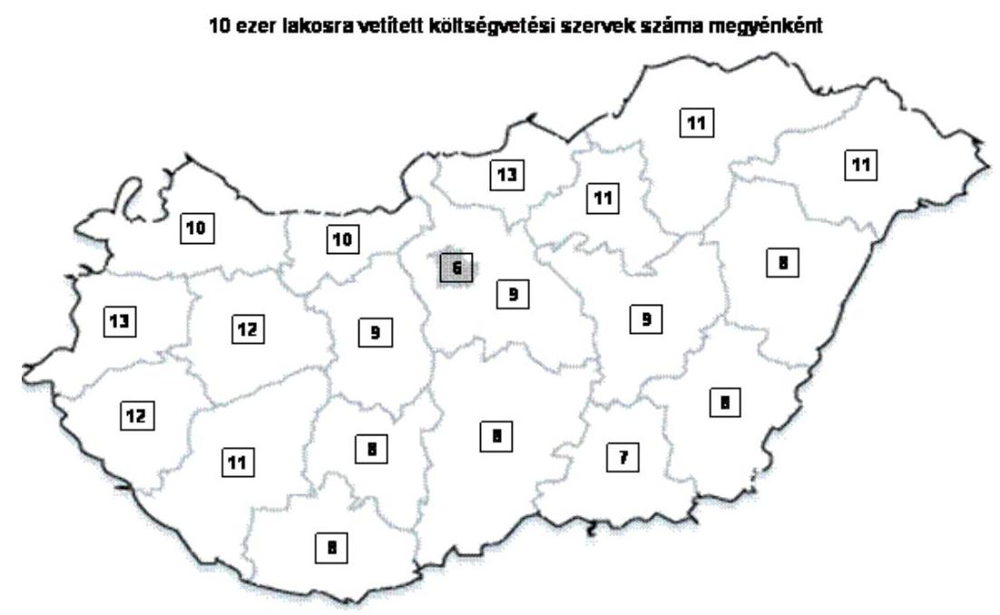

A tízezer lakosra jutó költségvetési szervek száma 2010. január 1-jén országos átlagban 8,9. Az országos átlagot jelentősen meghaladó Borsod-Abaúj-Zemplén, Somogy, Szabolcs-Szatmár-Bereg, Vas és Zala, megyék adata. (3/10. sz. melléklet)

# 1.1.2. A közfeladatok felülvizsgálata 

A költségvetési megtakarítások mielőbbi érvényesítésének kényszere miatt az átfogó átszervezésekre vonatkozó intézkedések megelőzték a közfeladatok logikailag korábbi felülvizsgálatát. Azonban nem ez volt az egyetlen oka annak, hogy a felülvizsgálat csak korlátozottan tudott hozzájárulni az intézményrendszer, illetve a feladatellátás korszerűsítéséhez.

Az ÁSZ megállapításai szerint ${ }^{78}$ a Kormány azzal az igénnyel fogott hozzá a közfeladatok felülvizsgálatához, hogy először a magyar közigazgatás történetében átfogóan ${ }^{79}$ áttekintse és értékelje a közfeladatok ellátását. A felülvizsgálat nem terjedt ki az állami feladatok teljes körére sem, még a központi közigazgatására sem, csak a Kormány irányítása/felügyelete alatt álló költségvetési szervekre vonatkozott.

[^0]
[^0]:    ${ }^{78}$ 0808. sz. Jelentés a központi költségvetés intézményrendszerének ellenőrzéséről, 0901 sz. Jelentés a magyar központi közigazgatás modernizációjának ellenőrzéséről.
    ${ }^{79}$ Az ezt megelőző másfél évtizedben számos, összességében sikertelen kísérlet történt az állami feladatok felülvizsgálatát is magába foglaló kormányzati programokra és intézkedésekre.

---

A 2229/2006. (XII. 20.) Korm. határozat szerint a közfeladat-felülvizsgálat célja, hogy „az állam a megfelelő tevékenységeket optimális szinten és a leghatékonyabban végezze el. A kulcsfontosságú feladatokra koncentrálva, növelje azok elvégzésének hatékonyságát, míg az ebbe a körbe nem tartozó feladatok, tevékenységek kiszerződésre, privatizálásra, decentralizálásra, vagy adott esetben elhagyásra kerüljenek."

A 2007-ben elkészült feladatkataszter (2700 feladatot magába foglaló 760 feladatcsoport) hasznosult, amennyiben a minisztériumokban a feladatcentrikus szemléletmód - nem számszerűsíthető hatású - elterjesztésén túl, több konkrét intézkedés alapjául szolgált ${ }^{80}$. (Az intézkedések várható vagy már realizált - egyszeri és tartós - költségvetési hatásairól nem áll rendelkezésre összesített adat.) Ezzel összefüggésben azonban az önkormányzatok kötelező feladatainak felülvizsgálatára, módosítására, feladat- és hatáskörök új telepítésére - néhány kivételtől eltekintve ${ }^{81}$ - intézkedések nem történtek. A változások a szolgáltatások kötelező jellegének megszüntetésével, a feladatellátás feltételei szabályainak egyszerűsítésével voltak kapcsolatosak. A közfeladat felülvizsgálat körének leszűkítettsége és bizonyos módszertani ellentmondások is közrehatottak abban, hogy sem az állami-, illetve közfeladat-ellátás, vagy a költségvetési tervezés, de különösen a költségvetési működés és gazdálkodás nem újult meg. Nem történt meg az ágazati törvényekben előírt feladatok és fenntartói források - beleértve az állami forrásokat is - közötti régebb óta meglévő ellentmondások feloldása. Nem tisztázódott, hogy az állam mely közszolgáltatásokat, milyen tartalommal, és milyen
 összegű támogatással biztosít.

A magyar központi közigazgatás modernizációjának ellenőrzéséről szóló jelentésünkben megállapítottuk, hogy a „célok maradéktalan végrehajtásának elmaradásában közrejátszott, hogy az állam szerepét, a közfeladatok ideális körét a projekt túl szüken határozta meg: a maradékelv alapján azokat a tevékenységeket soroltak ebbe a körbe, ahol a piaci kudarc vagy a társadalmi egyenlőtlenségek csökkentése miatt van szükség az állam beavatkozására. A közhatalmi feladatok állami ellátásának indokoltsága azonban többnyire nem ezekre vezethető vissza."
„A támogató feladatok (az intézményi és felügyeleti irányítás, igazgatás, az intézményi gazdálkodás, a humán erőforrás menedzsment, az informatikai, a jog, a vagyongazdálkodás, a belső ellenőrzés és a kommunikáció feladatai) költségeit külön nem mutatták ki, hanem - vitatható módszertani megközelítéssel - a szakmai feladatkataszterben szereplő közfeladatokra terhelték."

# 1.2. Az ágazati és önkormányzati stratégiák kidolgozása, összhangja a kormányzati stratégiákkal 

Az ágazati stratégiákban a feladatok, a szükséges erőforrások kijelölését esetenként nem követte a konkrét teljesítmény, célok (elvárt eredmények, output) meghatározása, mutatószámok kidolgozása, ezek hiányában a célok megvalósítása nem értékelhető.

A vizsgált időszakot megelőzően csak a közoktatás területén működött - a Közokt. tv. 86. §-a előírásainak megfelelően - szabályozott, többszintű és sokszereplős stratégiai tervezési rendszer, de az is bizonyos hiányosságokkal.

A középtávú közoktatás-fejlesztési stratégiában foglaltak ellenére a tematikus alágazati stratégiaként megjelölt tervezetek közül a tárca nem készítette el a humánerőforrás stratégiát, a kistérségi közoktatás-fejlesztési tervet. Nem készültek méretgazdaságossági és hatékonysági számítások az intézmények optimális nagyságára, a feladatellátás szervezeti kereteire ${ }^{82}$.

A Kormányok az egészségügy területén különböző programokat hirdettek meg. 2006-tól az államreform keretében került sor az egészségügyi rendszer átalakítására az egyensúly hosszútávon fenntartható feltételeinek kialakítása jegyében. Az egészségügyi tárca a váltakozó kormányprogramok mentén kialakította saját fejlesztéspolitikáját, az egészségügyi prioritások beépítése megtörtént azokba az országos és ágazati tervdokumentumokba ${ }^{83}$, amelyek az európai támogatási prioritásokat tartalmazzák.

A szociális szolgáltatások megújításának szükségességét - a költségvetési kényszerek mellett - indokolta, hogy a Szoctv. hatályba lépése óta eltelt időszakban a szociális szolgáltatások körében jelentős mennyiségi és minőségi változások történtek. Ennek ellenére a szolgáltatások területileg egyenetlenek, nem biztosított a hozzáférésnél az esélyegyenlőség, a szolgáltatások fejlesztése nem valós szükségleteken alapul. Hiányosak voltak a jogosultsági kritériumok egyes szolgáltatások igénybevételénél, nem határozták meg a szolgáltatások szakmailag elfogadható mennyiségi és minőségi követelményeit. A szolgáltatásokat igénybe vevőkről, a szociális szolgáltatókról nem voltak naprakész nyilvántartások, a hatósági és szakmai ellenőrzések szempontjai a rendszer működéséből adódóan nem voltak egységesek.

A szociális szolgáltatások szervezésére, az ellátások átalakítására az ágazati minisztériumban nem készült egységes, valamennyi ellátási formát meghatározó fejlesztési stratégia, közép és hosszú távú koncepció, bár egyes részterületeken (gyermekvédelem, hajléktalan ellátás) születtek külön stratégiák.

A szolgáltatások fejlesztését, az ellátás szervezeti kereteinek tervezett változtatását az önkormányzatok gazdasági programjaikban ${ }^{84}$, a szakmai törvényekben az ellátások szabályozására kötelező jelleggel előírt koncepciókban, önkormányzati rendeletekben rögzítették.

A vizsgált önkormányzatok ${ }^{85} 12,7 \%$-a nem készített gazdasági programot. Nem rendelkeztek teljes körűen a törvényekben meghatározott szakmai koncepciókkal, rendeletekkel. A vizsgált önkormányzatok 5,5\%-a nem rendelkezett közoktatási feladatellátási, intézményhálózat-működtetési és fejlesztési tervvel, 21,8\%-a szociális szolgáltatás-tervezési koncepcióval. A gazdasági program, a helyi koncepciók mintegy 67-87\%-ban tartalmaztak helyzetértékelést. A lakosság körében az előzetes igényfelmérés azonban nem volt jellemző. A programokban fejlesztési feladatok megvalósítását, intézmények felújítását, korszerűsítését, a szakmai munka tárgyi-személyi feltételeinek a javítását, új szakmai programok bevezetését tervezték (az önkormányzatok adatszolgáltatása szerint).

Az ágazati célkitűzésekkel összhangban a kiemelt közszolgáltatásokat érintően feladatként jelent meg az önkormányzati programokban, koncepciókban az oktatás minőségének fejlesztése, a tanulói kulcskompetenciák erősítése, az oktatási esélyegyenlőtlenségek mérséklése, az oktatás tárgyi, személyi feltételeinek javítása; a szociális szolgáltatások körének, az ellátottak számának a növelése, a leginkább rászoruló személyek részesítése az ellátásokban; az egészségügyi szolgáltatásokhoz való hozzáférés javítása; az igazgatási feladatoknál az e-közigazgatás feltételeinek megvalósítása, fejlesztése, a hivatali szervezeti keretek átalakítása.

Az önkormányzatok kedvezőtlen pénzügyi helyzetére tekintettel valamennyi helyi programban, koncepcióban ${ }^{86}$ megfogalmazták a hatékony feladatellátás, a költségtakarékosság igényét. Hangsúlyos szerepet kapott a központi célkitűzésekkel összhangban - a feladatellátás szervezeti kereteinek a módosítása, a támogatott közös feladatellátás bővítése, a pótlólagos pénzügyi források elérése.

A vizsgált önkormányzatok több mint fele a szervezeti intézkedéseit az elérhető támogatások feltételeinek való megfeleléssel, így pótlólagos források elnyerésével indokolta.
figyelembevételével, az önkormányzat által nyújtott kötelező és önként vállalt feladatok biztosítását, fejlesztését szolgálják.
${ }^{85}$ Alsószentmárton, Baranyajenő, Báta, Bogádmindszent, Gilvánfa, Harkány és Vaskút.
${ }^{86}$ A Közokt. tv. 85. § (4) bekezdés, 88. § (1) bekezdés és 89/A. § (5) bekezdés rendelkezései szerint az intézményeket fenntartó helyi önkormányzatok önállóan vagy más helyi önkormányzattal közösen, továbbá a többcélú kistérségi társulások közoktatási feladataik megszervezéséhez szükséges önkormányzati, társulási döntés-előkészítést szolgáló feladatellátási, intézményhálózat-működtetési tervet kötelesek készíteni. A Szoctv. 92. § (3) bekezdése a szociálisan rászorult személyek részére biztosítandó szolgáltatások meghatározása érdekében a legalább kétezer lakosú települési önkormányzat, illetve a megyei önkormányzat számára írja elő a szolgáltatás-tervezési koncepció készítését. A Szoctv., valamint a Gyvtv. ezen túlmenően a helyi önkormányzatok számára a személyes gondoskodást nyújtó ellátásokról, azok igénybevételéről, valamint a fizetendő térítési díjakról rendeletalkotási kötelezettséget is előír.

A szervezeti átalakítások mellett kulcsterület volt a humánerőforrás fejlesztése, azon belül a teljesítménykövetelmények meghatározása és érvényesítése. Ennek ellenére sem akkor sem azt követően nem határozták meg a közszféra humánerőforrás-gazdálkodási stratégiáját. Nem teljesült a 1052/2005. (V. 23.) Korm. határozatban előírt kormányzati középtávú humánpolitikai stratégia elkészítésére vonatkozó előírás ${ }^{87}$. A kormányzati intézkedések középpontjában a közszférában foglalkoztatottak közül elsősorban egyes területeken kizárólag - a köztisztviselők, különösen a központi szervek köztisztviselői álltak. A Kormány azonban a korábbiakhoz képest sem fordított nagyobb gondot arra, hogy a minisztériumok a humánerőforrás-gazdálkodás területén legalább a jogszabályokban előírt kötelezettségeiknek eleget tegyenek.

A humánterületeket a foglalkoztatási szerkezetükre jellemző jogviszonystruktúra miatt a teljesítmény értékelés új rendszere (TÉR) csak részben, egyes (igazgatási tevékenységet végző) intézményeikre vonatkozóan érintette.

A Ktv. 2001-től írta elő a teljesítményértékelést. Ennek tényezőit azonban nem rögzítették pontosan, és a szabályozás a jutalom mértékéről sem rendelkezett. A teljesítményértékelésnek nem volt következménye, az értékelt nem kapott visszajelzést, a fejlesztendő személyi kompetenciák és célok nem kerültek rögzítésre, nem jelentek meg az oktatási-képzési feladatokban ${ }^{88}$.

A TÉR 2006-os bevezetésének ${ }^{89}$ a kiadások csökkentése mellett a Kormány a vizsgált időszakban is különösen nagy jelentőséget tulajdonított a közigazgatás hatékonyságának növelésében, a közszolgáltatások minőségének javulásában.

A tevékenységet egységes és részletes előírások alapján szabályozó, új típusú fejlesztésközpontú, kompetencia alapú egyéni teljesítményértékelési rendszer bevezetésének a célja az volt, hogy világosan elkülönüljön egymástól a szervezeti hierarchiában, feladatellátásban meglévő különbözőségeket kifejező díjazás (rendszeres juttatás), és a munkavégzés színvonalában mutatkozó eltérések (jutalom). A TÉR alapján az értékelés évente, strukturált formában történik a vezető és a minősített együttműködésén alapul, a kiemelt kormányzati célokat ágazati stratégiai, szervezeti, majd az egyes szervezeti egység céljaira, ezt követően pedig az egyes munkakörök szintjén is értelmezhető, egyéni teljesítménykövetelményekké

alakított célmeghatározás alapján. Teljesítményalapú jutalom alapvetően csak a TÉR alapján lehetséges ${ }^{90}$.

Ez megalapozatlan elvárás volt. A TÉR eredetileg is csak a Kormány irányítása/felügyelete alatt álló szervezetek köztisztviselőire terjedt volna ki ${ }^{91}$. (Erre az intézményi körre is csak a tervezetthez képest két év késéssel legfeljebb 2011. január 1-jével valósul meg.) Ez a közszférának alig 6\%-át, de még a közigazgatásnak is csak szűk harmadát jelentené ${ }^{92}$. A TÉR további hiányossága volt, hogy annak bevezetésénél nem is célozták meg a közszolgálat egyéb jogviszonyait illetően a teljesítmény értékelés egységes elveinek kidolgozását. Ráadásul a közszolgáltatások minőségének javulására a TÉR hatálya alá tartozó állománynak a ráhatása rendkívül áttételes; a szabályozásban és az erőforrásallokáció színvonalának emelésében is a TÉR hatálya alá nem tartozó (szakma)politikai döntéshozóknak van meghatározó szerepe. A rendszerből alapvetően hiányzik az egyes szervezetek teljesítményének értékelése. A TÉR és a jutalmazáson kívüli egyéb elemek (előmenetel, díjazás, kötelező képzés) nincsenek kötelezően összekapcsolva ${ }^{93}$.

Az érintett szervezetek véleménye szerint a TÉR segítette a minisztériumok, a központi- és kormányhivatalok köztisztviselőire vonatkozó teljesítményértékelés módszertani, technikai egységesítését központilag kialakított informatikai rendszertámogatással, továbbá támogatta egy korszerű humánerőforrásmenedzsment szemlélet elterjedését.

Az ágazati minisztériumok (EüM, OKM, SZMM) közül ágazati humánerőforrás stratégiát csak az EüM-ben dolgoztak ki. Fejezeti, illetve intézményi humánerőforrás-fejlesztési stratégiát egyik tárcánál sem készítettek.

Az OKM ágazati szintű humánerőforrás stratégiát annak ellenére nem készített, hogy a közoktatás hosszú- és középtávú fejlesztési tervének kidolgozását a Közokt. tv. 95. §-a előírta.

Az SZMM a humánerőforrás fejlesztésével kapcsolatos kormányzati célokat fejezeti, illetve minisztériumi szintre teljes körűen nem adaptálta, azonban a fejezet intézményeinél foglalkoztatottak vonatkozásában a jogszabályokban előírtakat a gyakorlatban alkalmazta és részben a belső szabályzataiban rögzítette.

Az ágazati humánerőforrás stratégiai tervezését, reális helyzetelemzését, a megalapozott döntéshozatal előkészítését a kormányzati stratégia hiányán kívül az is akadályozta, hogy a humánerőforrás aktuális helyzetére, területi elhe-

 (OEP), Pénzügyi Szervezetek Állami Felügyelete) meglévő teljesítményértékelési rendszerét a TÉR-rel egyenértékűnek fogadták el, így ott nem történt változás.
    ${ }^{92}$ A TÉR hatálya alá tartozók a köztisztviselői létszám alig 13\%-át, a közszféra alkalmazottainak pedig kevesebb, mint 2\%-át jelentették 2008-ban.
    ${ }^{93}$ A Kormány 2008-ra átmeneti szabályokat állapított meg a jutalmazás szabályaival kapcsolatban (260/2008. (XI. 3.) Korm. rendelet, 240/2009. (X. 20.) Korm. rendelet)

---

lyezkedésére, működésének követésére vonatkozóan egységes információk nem álltak rendelkezésre. A Kormányzati Személyügyi Szolgáltató és Közigazgatási Képzési Központ (KSZK) részére benyújtandó kötelező beszámolás kivételével a megvalósult képzéseknek a munkavégzésre gyakorolt hasznosságát, eredményességét nem értékelték.

A továbbképzések rendszere többpólusú volt, azok részben a KSZK által szervezett központi képzéseken és a tárcák belső képzésein, másrészt akkreditált szakmai képzéseken keresztül valósultak meg.

A KSZK által koordinált továbbképzések elvileg a Kormány középtávú továbbképzési tervében meghatározott képzési célok végrehajtását szolgálták. Ugyanakkor a vizsgált időszakban egyrészt csökkentek a KSZK továbbképzésekre fordított forrásai, másrészt a tárcáknál megvalósított képzési programokról a KSZK-nak nem is volt teljes körűen információja. A KSZK az éves továbbképzésekre 2006-ban 120 M Ft, 2007-ben 25 M Ft, a 2008. évben 127,1 M Ft és 2009. évben $15 \mathrm{MFt}^{94}$ forrást biztosított az összes fejezet részére.

Az egészségügyi ágazatban foglalkoztatottak képzésének, továbbképzésének fejlesztésére hozott intézkedések a rezidensképzési rendszer átalakítására, a középfokú szakképzés rendszerének felülvizsgálatára, az egészségügyi dolgozók továbbképzési rendszerének folyamatban lévő módosítására, valamint a licence képzés bevezetésére vonatkoztak. Sor került továbbá a kötelező továbbképzések egységes eljárásrendjének megalkotására.

A rezidensképzési rendszer átalakítása az egészségügyi felsőfokú szakirányú szakképzési rendszerről szóló 122/2009.(VI. 12.) Korm. rendelet hatályba lépésével valósult meg ${ }^{95}$. A 2010-től bevezetésre kerülő új szakorvosképzési rendszer főbb elemei a jelenlegi rendszer hiányosságait kívánják kiküszöbölni. A tárca elvárásai szerint a bevezetésre kerülő rendszer egyaránt segíti a betegellátást és a foglalkoztatást is. A Magyar Rezidensszövetség a szakvizsga utáni 4 éves kötelező munkavégzés előírásával nem értett egyet. (Az új rendszerben a rezidensnek a végzés után 4 évig Magyarországon, a szakképesítésének megfelelő szakmában, közfinanszírozott egészségügyi szolgáltatónál kell dolgoznia.)

A szakdolgozói moduláris szakképzés bevezetése ${ }^{96}$ az egészségügyben az átjárhatóbb, strukturáltabb, rugalmasabb szakképzés kialakítását célozta meg.

A licence képzés bevezetésével új kompetenciák megszerzését segítő speciális továbbképzési rendszer kerül kialakításra, mely - a jogalkotó szándéka szerint - lehetővé teszi az egyes licence vizsgák által megszerezhető kompetenciák konkrét

[^0]
[^0]:    ${ }^{94}$ A 2009. évi továbbképzési keret a csekély mértéke miatt nem is került felosztásra a minisztériumok részére, annak felhasználásáról a KSZK központilag döntött.
    ${ }^{95}$ A tervezett rendszerben a megpályázható állások a kórházak munkaerő szükségletei, illetve a betegellátás felmért igényei alapján kerülnek meghatározásra. A hiányszakmákhoz kiemelt támogatást nyújt az új rendszer. Az első szakvizsgáját szerző jelöltet a költségvetés a szakképzés megszerzésében támogatja a képzési költségekkel, a helyettesítése támogatásával, hiányszakmák esetében a rezidensnek folyósított fizetéskiegészítéssel.
    ${ }^{96}$ A 32/2008. (VIII. 14.) EüM rendelet.

---

meghatározását, és egyben biztosítja a korábban már megszerzett jártasságok szabályozott elismerését.

A szociális ágazat továbbképzései az ellátási területekhez és munkakörökhöz igazodtak és jellemzően a szakterületek aktuális szakmai kérdéseivel foglalkoztak (pl. korai fejlesztés, betegmozgatás, családon belüli erőszak). A továbbképzési rendszer előnye a rugalmasság, mivel a szociális ágazatban a nem szociális végzettségű, de alapvégzettségének megfelelő munkakört betöltő szakembernek (pl. egészségügyi szakképesítéssel dolgozó ápoló, aki egészségügyi továbbképzésre is kötelezett) az egészségügyi továbbképzéseken megszerzett továbbképzési pontjai is beszámíthatók a szociális továbbképzés pontjaiba.

Az egészségügyben, illetve a szociális ellátásokban foglalkoztatottaknál az átjárhatóságot, ezzel a hatékonyabb, rugalmas feladatellátást elősegítő egységesítést több tényező is hátráltatta. Az egészségügyben foglalkoztatott szociális szakképesítéssel rendelkezők (szociális gondozó, ápoló, szociális munkás) a jelenlegi szabályozás alapján nem szerepelnek sem az egészségügyi, sem a szociális működési nyilvántartásban, és továbbképzésre sem kötelezettek. A két különálló, tartalmilag eltérő nyilvántartási rendszer közötti átjárhatóságot a két ágazat nem tudta megvalósítani, ezért a kredit pontok kölcsönös figyelembevétele sem tudott megvalósulni.

Az oktatási ágazat humánpolitikai súlypontja egyre több és képzettebb pedagógus munkába állítását célozta a színvonal emelése és az esélykülönbségek csökkentése érdekében. A pedagógusképzés rendszere nem volt összhangban az intézmények igényeivel. A szociális és az oktatási ágazat együttműködésének eredményeképpen a két ágazat kölcsönösen elismeri az ágazatukban foglalkoztatott szociális, illetve oktatási szakemberek által teljesített továbbképzéseket.

# 1.3. A központi és az önkormányzati intézményrendszer átalakítása 

2006-2007-ben megtörtént a magyar közigazgatásban a központi és a helyi, területi államigazgatási szervek, valamint az irányításuk alá tartozó (köz)alapítványok, gazdasági társaságok széles körét érintő szervezeti átalakítás, amely nagyságrendjét tekintve meghaladta az utóbbi évtized hasonló célú intézkedéseit.

Az intézkedéseket alapvetően csak pénzügyi és szervezet-gazdaságossági szempontból készítették elő, nem vették figyelembe a feladatellátásra gyakorolt hatást. Elmaradt az állami feladatok körének, terjedelmének ${ }^{97}$, finanszírozásának előzetes felülvizsgálata, intézményi modellek, feladat- és teljesítménymutatók, kritériumok meghatározása. A hiányosságok ellenére jelentős lépés volt a vizsgálatok, elemzések nélkül is megállapíthatóan - széttagolt, egyszerű összevonásokkal és megszüntetésekkel is ésszerűsíthető intézményrendszer kialakítása. Hatására 2008 végéig a központi államigazgatási intézmények szá-

[^0]
[^0]:    ${ }^{97}$ „A közfinanszírozás parttalanná és átláthatatlanná válik, ha az állam nem dönt egyértelműen arról, hogy konkrétan melyek azok a javak, szolgáltatások, amelyekről maga kíván gondoskodni." - A közpénzügyek szabályozásának tézisei (ÁSZ, 2007. április).

---

ma átlagosan harmadával csökkent ${ }^{98}$, több szervezet intézményrendszerének átalakításával regionális alapra helyezte a területi hálózatát. Megvalósult a minisztériumi üzemeltetési-ellátási feladatok (részleges) központosítása a Miniszterelnöki Hivatal (MeH) Központi Szolgáltatási Főigazgatásához.

Ezzel a 4 minisztériumhoz (EüM, Gazdasági és Közlekedési Minisztérium, PM, SZMM) tartozó 7 országos hálózattal rendelkező szervezet a korábbi 175 intézmény helyett - 70\%-os csökkentéssel - 51 intézménnyel folytatta a kibővült feladatainak ellátását.

Az önkormányzati szektorban a költségvetési intézmények csökkenésének száma, pontos mértéke a vizsgált időszakra nem állapítható meg, a Kincstár a 2006. január 1-jei törzskönyvi adatállomány összetételét az adatállomány nyilvántartására alkalmazott szoftver változása, a nyilvántartott adatok tartalmának módosulása miatt nem tudta rendelkezésünkre bocsátani.

A Kincstár nyilvántartása szerint az önkormányzatok által fenntartott költségvetési szervek száma 2006. január 1-jén 14341 volt. Ebben azonban a költségvetési szerveken felül más törzskönyvi nyilvántartásra kötelezett szervezetek is szerepeltek (önálló polgármesteri hivatallal nem rendelkező önkormányzatok, többcélú kistérségi társulások, a települési és területi kisebbségi önkormányzatok és területfejlesztési társulások), mert a rendszer nem különítette el a törzskönyvi nyilvántartásra kötelezett jogi személyeket, valamint a költségvetési szerveket.

Az önkormányzati alrendszer - jogi személyiségű társulások nélküli - költségvetési szerveinek száma 2008. január 1-jén 10072 volt, 2010. január 1-jére mintegy 10\%-kal lett kevesebb, melyből 4,3\% a Kt. hatása.
2007. január 1-jével átszervezték a megyei önkormányzatok által működtetett megyei/városi illetékhivatalokat. Az átszervezéssel országos szinten 1350 fő illetékhivatali dolgozó az APEH állományába került.

Az illetékhivatalok átszervezése a vizsgált három megyei önkormányzat (Bács-Kiskun, Borsod-Abaúj-Zemplén, Szabolcs-Szatmár-Bereg) hivatali létszámának mintegy 45\%-os csökkenését eredményezte. Az átszervezések eltérő mértékben érintették a hivatalok belső szervezeti felépítését.

A helyi önkormányzatok a központilag elrendelt átszervezések (illetékhivatalok) végrehajtásán túl hivatali feladataikat érintően saját kezdeményezésű átszervezéseket is végrehajtottak.

A vizsgált önkormányzatok 52,7\%-a tett intézkedéseket igazgatási, hivatali feladataikat érintő átszervezésekre. Azokat az önkormányzatok pénzügyi helyzetére is tekintettel a fokozott elvárásoknak való megfelelés, az ügyintézés korszerűsítése, színvonalának növelése, a szolgáltatások ügyfél közelibb ellátása mellett a költséghatékonysági, gazdaságossági szempontok érvényesítése indokolták. Az

[^0]
[^0]:    ${ }^{98}$ A helyi önkormányzatok igazgatási szerveinek száma is csökkent, de jóval kisebb (8,5\%) mértékben.

---

átszervezéseket ösztönözték továbbá az azokhoz az elnyerhető EU-s, valamint hazai támogatások, többlet pénzügyi források.

Az önálló polgármesteri hivatallal rendelkező önkormányzatok hivatalon belüli szervezeti intézkedéseket hajtottak végre, egyes feladataikat hivatalon kívülre szervezték ${ }^{99}$.

# 1.3.1. A kiemelt ágazatokat irányító fejezetek intézményrendszerének változása 

Az állami forráscsökkenések természetes következményeként átrendeződés volt megfigyelhető a feladatellátást biztosító szervezetek, az ott foglalkoztatottak létszámát, illetve az intézményeket fenntartók struktúráját tekintve (3/1-2. sz. mellékletek). Az állam meghatározó szerepe továbbra is megmaradt, de egyre inkább kivonult a közvetlen feladatellátásból.

Ezzel az alapvető tendenciával összhangban változtatták a humánterületek feladatellátásában résztvevő minisztériumokat a 2006-os kormányváltással járó új minisztériumi struktúra, illetve a minisztériumok irányítása alá tartozó szervezeti rendszerét érintő összkormányzati átalakítások hatásai.

A változások eltérő mértékben hatottak az egyes fejezetekre, szervezeti rendszerükre. A közoktatástól eltérően az egészségügyi és a szociális terület minisztériumi szervezete 2006 után megváltozott. A Foglalkoztatási és Munkaügyi Minisztérium (FMM) valamint az Ifjúsági, Családügyi, Szociális és Esélyegyenlőségi Minisztérium (ICSSZEM) fejezetek 2006. július 1-jével történő összevonásával - az FMM bázisán - létrejött az SZMM ${ }^{100}$. Ennek célszerűségéről nem készült elemzés.

Az egészségügyet az elmúlt öt évben (2004 októberétől 2010 elejéig) öt miniszter irányította (egy miniszter 2004-ben két hétig még egészségügyi, szociális és családügyi miniszter is volt, egy miniszter 2007-ben megbízással töltötte be a posztot két hétig).

Az államháztartás hatékony működését elősegítő szervezeti átalakításokról és az azokat megalapozó intézkedésekről szóló 2118/2006. (VI. 30.) Korm. határozat, valamint a közfeladatok felülvizsgálatának feladatairól szóló 2233/2007. (XII. 12.) Korm. határozat már mindhárom fejezetet érintette, esetenként az egyéb létszámot és/vagy szervezetre vonatkozó kormányzati intézkedésekkel együtt. Az új intézményi struktúra a korábbi intézmények bázisán

[^0]
[^0]:    ${ }^{99}$ Hatósági igazgatási feladatainak más önkormányzatok részére történő átadására 7,0\%-a intézkedett. Várossá válással kapcsolatosan két (Ács, Nyírlugos) önkormányzat hivatali létszáma nőtt. Egy önkormányzat (Zalaegerszeg), új szervezeti felépítést alakított ki. Kiskőrös önkormányzata művelődési osztályát szüntette meg. Az átszervezések, egyes hivatali feladatok ellátása módjának változása [gazdálkodási feladatok Gazdasági Ellátó Szervezethez (GESZ) szervezése, intézmények önálló gazdálkodási jogkörének biztosítása, belső ellenőrzési feladatok ellátásának átszervezése, hatósági igazgatási feladatok átvétele-átadása] miatt a hivatalok létszáma csökkent.
    ${ }^{100}$ A Magyar Köztársaság minisztériumainak felsorolásáról szóló 2006. évi LV. törvény alapján.

---

történt beolvadások, illetve több esetben a korábban már működő intézményből (névváltozással) új költségvetési szerv létrehozása eredményeként alakult ki. A szervezeti átalakítások nem csökkentették a fejezetek intézményei feladatellátási kötelezettségének körét.

A szervezeti változásokat megelőzően általánosan nem, de esetenként készültek hatástanulmányok, gazdaságossági számítások. Ugyanakkor rendre elmaradtak az utólagos értékelések.

Az OKM-nál készült néhány szervezeti átalakítást megelőző szakmai, gazdasági számítás, hatásvizsgálat: a közoktatási (Oktatási Hivatal), valamint a kulturális szakterületen (Énekkar és Kottatár Kht., a Közgyűjteményi Ellátó Szervezetének gesztori szervezetre történő átalakítása, a Magyar Nemzeti Filharmonikus Zenekar, és a Nemzeti Színház Rt.) készített.

Az OKM fejezet igazgatási és intézményi struktúrája (címrendje) - megállapításunk szerint - a változások hatásaként a feladatellátás szakmai koncentrálásával, profiltisztításával szervezettebbé, átláthatóbbá vált, amelyhez hozzájárult, hogy a fejezethez tartozó költségvetési szervek száma 2006. évi 71-ről, 2009. évre 58-ra csökkent.

A SZMM megalakulásakor az irányítása/felügyelete alá tartozó 52 költségvetési intézmény, 13 közalapítvány és 3 gazdálkodó szervezet
 a 2118/2006. (VI. 30.) Korm. határozat végrehajtásával a költségvetési intézményeinek száma 36-ra, a közalapítványok száma 11-re, a gazdálkodó szervezetek száma 2-re, majd 2008-ban tovább csökkent a közalapítványok száma 8-ra, a gazdálkodó szervezetek száma pedig egyre csökkent.

Nagyobb mértékű szervezeti változások történtek az egészségügyben, összhangban a Kormány által kiemelt célként megfogalmazott egészségügyi reformmal. Több országos jelentőségű kórház jogutód nélkül megszűnt 2008-ban, feladataikat más egészségügyi intézmény vette át.

A jogutód nélkül megszűnt intézetek az Országos Baleseti és Sürgősségi Intézet, az Országos Gyógyintézeti Központ, az Országos Pszichiátriai és Neurológiai Intézet, valamint a Svábhegyi Országos Gyermekallergológiai Pulmonológiai és Fejlődésneurológiai Intézet.

Egyes minisztériumok (EüM, HM, IRM) és a kormányzati szektorhoz tartozó gazdálkodó szervezet (MÁV) irányítása/felügyelete alá tartozó 8 egészségügyi intézmény jogi-adminisztratív összevonásával a honvédelmi miniszter alapításával és felügyelete alatt 2007. július 1-jei hatállyal központi költségvetési szervként jött létre a Honvédelmi Minisztérium Állami Egészségügyi Központ (Honvéd, Rendészeti és Vasútegészségügyi Központ) ${ }^{101}$.

A 2118/2006. (VI. 30.) Korm. határozat egyéb, az egészségügyi tárcát érintő előírásai alapvetően teljesültek. Megtörtént az OMSZ, az ÁNTSZ és az OEP

[^0]
[^0]:    ${ }^{101}$ Az Eftv., valamint a 2118/2006. (VI. 30.) Korm. határozatban, továbbá - a 2044/2007. (III. 13.) Korm. határozattal módosított - a központi egészségügyi szolgáltató szervezetek létrehozásáról szóló 2009/2007. (I. 30.) Korm. határozatban, illetve az Állami Egészségügyi Központ létrehozása érdekében szükségessé vált egyes feladatokról szóló 2058/2007. (III. 31.) Korm. határozatban foglaltak alapján.

---

regionalizációja, a Magyar Koraszülött Mentő Közalapítvány megszüntetése, feladatainak és eszközeinek OMSZ részére történő átadása, valamint az OEP-et érintően a megyei szervezetek átalakítása városi kirendeltségekké. A kormányhatározat előírásai ellenére nem valósult meg pl. egyes állami szanatóriumok, gyermekotthonok átadása helyi önkormányzatok részére, azok fogadókészségének hiányában. (A feladatot a 2236/2007. (XII. 15.) Korm. határozat törölte.)

Az EüM álláspontja szerint gazdaságossági megfontolásokból - és nem a kormányhatározat előírása nyomán - 2008. május 31-ével jogutódlással megszüntette az EüM az Országos Addiktológiai Intézetet, mely alaptevékenységeinek egy része az OTH felügyelte Országos Szakfelügyeleti és Módszertani Központhoz, másik része az Országos Orvosi Rehabilitációs Intézethez került. A jogutódok is a feladatokat átvevő intézetek lettek.

A közfeladatok felülvizsgálatának feladatairól szóló 2233/2007. (XII. 12.) Korm. határozat alapján 2008. január 1-jével a mentés és betegszállítás teljes szétválasztása megtörtént ${ }^{102}$, az OMSZ feladata továbbiakban csak a mentés és a sürgősségi betegszállítás, az egyszerű betegszállítási feladatokat kizárólag az OEP finanszírozási szerződéssel rendelkező betegszállító szervezetek végzik. A mentési és betegszállítási kasszákat a szállítási kapacitások és igények előzetes felmérése alapján választották szét.

Az OEP-pel szerződött szolgáltatók száma 2006-2007 között 46-ról 88-ra, a feladatot ellátó gépjárművek száma 233-ról 430-ra emelkedett. A betegszállítási feladatokat 2006-ban 49-51%-os arányban, 2007-ben 30-70%-os arányban látták el az OMSZ és az alternatív betegszállítók. (Másrészről a betegszállítás az OMSZ tevékenységében domináns helyet foglalt el: aránya az ellátott feladatokon belül 2005-ben 70%, 2006-ban 65%, 2007-ben 52% volt.)

Az ÁNTSZ átszervezése jól mutatja azt az általános tapasztalatot, hogy az intézményi-szervezeti átalakítások komplex hatása párhuzamosan idézett elő feladat-, létszám- és intézménytípus csökkenést, illetve növekedést.

Az ÁNTSZ feladatellátásának súlyát mutatja, hogy az EüM fejezeti intézmények összlétszámának - kisebb ingadozásokkal - több mint ötödét foglalkoztatja. A Szolgálat támogatásának a fejezeti összes támogatásból való 2006. évi több mint 50%-os részesedése a csökkentések után 2010-re még mindig több mint harmadát tette ki.

Az átalakításokat az ÁNTSZ szervezeteit, azok feladatát meghatározó 362/2006. (XII. 28.) Korm. rendelet írta elő. ${ }^{103}$ Ennek megfelelően - 2006-tól folyamatos módosításokkal - 2009 közepétől az OTH mint egyetlen központi szervezethez  kilenc szakmai-módszertani feladatokat ellátó országos intézet ${ }^{104}$, továbbá újon-

[^0]
[^0]:    ${ }^{102}$ A mentés-betegszállítás szétválasztásának célja az állami feladatellátás feltételrendszerének elhatárolása az egyéb feladatoktól, a deklaráltan állami feladatok hatékonyabb ellátása érdekében.
    103 362/2006. (XII. 28.) Korm. rendelet az Állami Népegészségügyi és Tisztiorvosi Szolgálatról és a gyógyszerészeti államigazgatási szerv kijelöléséről.
    ${ }^{104}$ Az országos intézetek: Országos Alapellátási Intézet, Országos Egészségfejlesztési Intézet, Országos Epidemiológiai Központ, Országos Élelmezés- és Táplálkozástudmányi

---

nan kialakított szervezetként hét regionális és 81 kistérségi intézmény tartozik. Egyes kistérségi intézmények mellett kirendeltségek (2009-ben 26), illetve ügyfélszolgálatok (5) működnek. A szervezetek száma a 2005. évihez képest 2009-re összességében 23%-kal csökkent.

Az ÁNTSZ szervezeti átalakításai összességében a méretgazdaságosság és a profiltisztítás - a közhatalmi (hatósági) és közszolgálati feladatok elhatárolása - irányába hatottak. Ugyanakkor az ÁNTSZ átalakítására vonatkozó kormányintézkedéseket nem előzte meg egy kockázatelemzésen alapuló, népegészségügyi stratégiai alapú hatásvizsgálat. A rövidtávú fiskális szemlélet egy hosszútávon ható tevékenység szervezeti kereteit határozta meg, amelynek tényleges nyeresége is csak rövidtávon értékelhető.

# 1.3.2. A kiemelt ágazatok intézményrendszerének változása 

Az államháztartáson kívüli szervezetek száma a humánterületek feladatellátásában összességében nőtt, település- és intézménytípusonként differenciáltan.

Ezen szervezetek a kiemelt közoktatási szolgáltatások közül a gimnázium-, szakközépiskola- és szakiskolai oktatást végző intézmények fenntartásában vesznek részt a legnagyobb, az óvodák, általános iskolák működtetésében a legkisebb arányban. (3/11. sz. melléklet)

Országosan a gimnáziumok 34,8%-át, a szakiskolák 25,5%-át, a szakközépiskolák 31,7%-át államháztartáson kívüli szervezetek tartották fenn a 2009/2010. tanévben. Ugyanezen adatok az óvodák esetében 14,6%, az általános iskoláknál 13%.

Az intézmények száma eltérő mértékben ugyan, de valamennyi oktatási szintnél csökkent. A legnagyobb mértékű csökkenés az óvodáknál és az általános iskoláknál jelentkezett.

Az önkormányzati saját fenntartásban működtetett intézmények aránya mindhárom csoportban kevesebb lett; az óvodáknál 76,7%, az általános iskoláknál 76,3%, a középiskoláknál 69,7% volt 2006/2007. tanévben, a 2009/2010. tanévre 64,7%, 64,3%, illetve 63,5%-ra csökkent ${ }^{105}$.

Ezek a folyamatok csak részben függtek össze a demográfiai/beiskolázási változásokkal. Az óvodások és középiskolások száma nem változott, az általános iskolások száma 8,2%-kal csökkent. Hosszabb távon ez a tendencia bizonyos eltérésekkel érvényesült: az 1990/91-es tanévhez viszonyítva 2008/2009-re az óvodák száma 7,7%-kal csökkent, míg az óvodásoké 16,6%-kal. Az alapfokú oktatásban

Intézet, Országos "Fredric Juliot Curie" Sugárbiológiai és Sugáregészségügyi Kutató Intézet, Országos Gyermekegészségügyi Intézet, Országos Kémiai Biztonsági Intézet, Országos Környezetegészségügyi Intézet, Országos Szakfelügyeleti és Módszertani Központ.
${ }^{105}$ A központi költségvetés által fenntartott intézmények aránya a középfokú oktatásban volt legmagasabb, de ott is csak 2-3% körül alakult.

---

még nagyobb a különbség az intézmények, illetve a tanulók számának változása között: az előző 9,7%-kal, az utóbbi viszont 32,9%-kal csökkent. A középfokú oktatásban éppen fordított folyamatok játszódtak le. Az intézmények száma jelentősebben növekedett (47,5%, de a gimnáziumoknál 93,5%), mint a tanulói létszám (11,6% és 70,1%).

Valamennyi vizsgált önkormányzatnál biztosított volt az óvodai nevelés és az általános iskolai oktatás. Önként vállalt feladatként a városok 53,8%-a működtetett középfokú oktatási intézményt, tartott fenn szakiskolát.

Az önkormányzati saját fenntartásban működtetett intézmények gyermeklétszámának csökkenése mellett jelentős (146,7%) a növekedés a társulásban fenntartott intézmények tanulólétszámában. A társulásokat preferáló kormányzati intézkedések hatására a társulásos formában működtetett intézmények száma 844-ről 1065-re 26,2%-kal nőtt, miközben az önkormányzati saját fenntartású intézmények száma 6260-ról 4311-re 31,1%-kal csökkent (3/11. sz. melléklet). Az átszervezés a feladatok tényleges ellátásában jelentős változást nem eredményezett, de lehetővé vált a társulás címén lehívható pótlólagos normatív állami támogatások, hozzájárulások igénybevétele.

Az intézményi társulási formában történő feladatellátás az általános iskolákban, valamint az aprófalvas településeken a legjellemzőbb. A megyék eltérő településszerkezetéből adódóan az országos átlagon belül nagyok az eltérések. (3/12. sz. melléklet)

Országos átlagban a 2006/2007. tanévben intézményi társulásban működött a kiemelt közoktatási intézmények 9,9%-a, a 2009/2010 tanévben 14,3%-a. (3/11. sz. melléklet) Ugyanezen adatok a vizsgált önkormányzatokat érintően 11,9%, illetve 16,6%. (3/13. sz. melléklet)

A 2006/2007. tanévtől a többcélú kistérségi társulások növekvő szerepet töltenek be - szervező tevékenységükkel - a közoktatási feladatok ellátásában, de az általuk működtetett intézmények aránya elenyésző.

Országos átlagban a többcélú kistérségi társulások az általános iskoláknak 1,9%-át, óvodáknak 1,6%-át, a vizsgált településeken 3,4%-át, illetve 3,3%-át működtették a 2009/2010. tanévben, a 2006/2007. tanévben az ellátásban még nem vettek részt. (3/11. sz. melléklet)

# Az intézmények átszervezését alapvetően a gyermeklétszám csökkenése indokolta, de közrejátszott a fenntartó önkormányzat kedvezőtlen pénzügyi helyzete és az elnyerhető állami hozzájárulás. Az egyes önkormányzatok eltérő megoldásokat alkalmaztak. 

Kisebb lakónépességgel rendelkező településeken a feladatok közös, intézményi társulásban történő ellátására intézkedtek, míg a nagyobb települések ${ }^{106}$ (a vizsgált önkormányzatok mintegy 21,8%-a) meglévő intézményeiket vonták össze, vagy adták át a megyei önkormányzatoknak.

[^0]
[^0]:    ${ }^{106}$ Ajka, Eger, Kaposvár, Kisvárda, Tapolca és Tiszavasvári.

---

Előfordult az intézmények ${ }^{107}$ többszöri átszervezése is, ami az oktatási munkát hátrányosan befolyásolta. Az átszervezések, intézményátadások nem befolyásolják az önkormányzatok ellátási kötelezettségét. Az oktatási célokat szolgáló ingatlanok eladása után - a közoktatási megállapodás megszüntetése esetén azonban gondot okozhat az oktatási feladatellátása. ${ }^{108}$

A feladatellátási helyek ${ }^{109}$ száma az egyes oktatási szinteken, országosan, ellátásonként változóan az intézmények számánál kisebb mértékben csökkent ${ }^{110}$, vagy valamelyest emelkedett. (3/11. sz. melléklet) Ennek oka, hogy az önkormányzati alrendszerben a társult településeken változatlan formában, tagintézményi keretekben továbbra is helyben történik az oktatás. Így a központi kormányzat azon célkitűzése - összhangban az önkormányzatok törekvésével -, hogy a kisgyermekek oktatása, nevelése helyben történjen megvalósult, de a feladatellátás szétaprózott rendszere nem változott.

A felső tagozatosok oktatása a vizsgált önkormányzatok 22,7%-án került át másik településre (az önkormányzatok adatszolgáltatása szerint).

A vizsgált területek feladatellátási helyeinek területi megoszlása eltérő volt (3/5-1-3/5-8. sz. mellékletek). Az óvodák és iskolák számának megoszlása 2008-ban a kis- és közepes nagyságú településeknél általában meghaladta a népesség eloszlását. A nem-állami humánszolgáltatók által fenntartott óvodák és általános iskolák elsősorban a legnagyobb városokban találhatóak, azaz minél kisebb a település, annál inkább az önkormányzat biztosítja az alapfokú oktatást.

A középfokú oktatásban eltérő volt a helyzet. Az ide tartozó intézmények a legnagyobb városokban azoknak a népességszámban elfoglalt arányuknál nagyobb mértékben koncentrálódtak. Ugyanakkor a nem-állami fenntartású intézményeknek nemcsak az arányuk volt magasabb, hanem megoszlásuk is jobban követte a népesség eloszlását ${ }^{111}$. Azaz, minél kisebb a település, annál valószínűbb, hogy ha egyáltalán rendelkezik középfokú oktatási intézménnyel, az nem állami/önkormányzati fenntartású.

A vizsgált településeken az óvodák között a nem állami fenntartásúak aránya 13,0%, az általános iskoláknál 14,9%, a gimnáziumoknál 23,6%, a szakközépiskolák között pedig 17,7% (3/13. sz. melléklet).

[^0]
[^0]:    ${ }^{107}$ A vizsgált önkormányzatok adatszolgáltatása szerint, 25% a 2006/2007-2009/2010. tanévek között többször is átszervezte közoktatási intézményeit.
    ${ }^{108}$ Biri, Hegyfalu, és Tiszavasvári adta át közoktatási intézményei működtetését közoktatási megállapodással. Biri egyúttal értékesítette is az iskola és óvoda épületét is. A jogügylettel kapcsolatban az ÁSZ büntető eljárást kezdeményezett.
    ${ }^{109}$ Feladatellátási hely: a

 Közokt. tv. 121. § (1) bekezdés 35. pontjában meghatározott székhely, valamint a 44. pont szerinti telephelyek összessége.
    ${ }^{110}$ Az óvodáknál 3,5\%-kal, az általános iskoláknál 7\%-kal csökkent a feladatellátási helyek száma, míg a gimnáziumoknál 5,1\%-kal nőtt.
    ${ }^{111}$ Ettől a szakközépiskolák adatai 2\% alatti mértékben eltérnek.

---

Az önkormányzatok megalakulásukkor az egészségügyi alapellátásokat jellemzően saját fenntartású intézményeikkel, közalkalmazottakkal biztosították. Napjainkra meghatározóvá vált, hogy a feladatellátására kötelezett önkormányzat - praxissal rendelkező - vállalkozó orvossal köt feladatellátási szerződést (3/14. sz. melléklet).

A háziorvosi ellátás szervezeti kereteiben a vizsgált időszakban jelentős elmozdulás nem történt. A hátrányos helyzetű településeken a körzetek nehezen betölthetők, ezek aránya 2008 végén országosan 2,2\% (148) volt (3/5-1. sz. melléklet).

A vizsgált települések 11,8\%-án működött 2009-ben önkormányzaton belüli szervezeti keretben a háziorvosi körzet. A 2006-2009 közötti időszakban három település (Ajka, Kiskőrös, Tarpa) vett vissza átmenetileg, vagy véglegesen körzetet működtetésre (az önkormányzatok adatszolgáltatása szerint).

A fogorvosi szolgálatok száma országosan 2006-2009 között 2,2\%-kal (77-tel) csökkent, ezen belül nőtt az államháztartáson kívüli szervezeti keretben végzett feladatellátás aránya. A fogorvosi tevékenység szakmai mutatói (esetek, beavatkozások száma) csökkentek (33,0-31,2\%-kal). (3/14. sz. melléklet)

A vizsgált önkormányzatok mintegy 4\%-a működtetett saját fenntartásban fogorvosi körzetet, melyben változás nem volt. (3/14. sz. melléklet)

Az ügyeleti ellátások terén jellemző a társulásban végzett feladatok térnyerése, a térségi ügyeleti rendszer kiépülése. A többcélú kistérségi társulások szervezésében ellátott települések száma országosan 186-tal nőtt 2006-2009 között.

A vizsgált települési önkormányzatok gondoskodtak a háziorvosi ügyeleti ellátásról, ugyanakkor a fogorvosi ügyelet 66\%-ban volt biztosított, ezáltal sérült a szolgáltatásokhoz való esélyegyenlőség követelménye. (3/16. sz. melléklet)

A területi védőnői körzetek esetében is nőtt az államháztartáson kívüli feladatellátás aránya (2006-2008 között 5,8\%-ról 9,5\%-ra). Az ellátásban nagyok az eltérések, a betöltetlen körzetek viszonylag magas száma (2008-ban 211) miatt helyettesítéssel látták el a feladatot. Emiatt a védőnők leterheltsége nem egységes, nem biztosított valamennyi rászoruló számára a megfelelő színvonalú szolgáltatásokhoz való hozzájutás. (3/17. sz. melléklet)

A vizsgált településeken 2006-2009 között a védőnői körzetek száma 10-zel (5,6\%-kal) csökkent, a betöltetlen állások száma 2-vel nőtt. A védőnői körzetek 17\%-a kettő vagy több település lakosait látta el. A védőnők feladataikat 2006-ban teljes egészében közalkalmazottként végezték, 2009-ben már 11\%-ban vállalkozásban. (3/18. sz. melléklet)

Az egészségügyi járó- és fekvőbeteg szakellátásokat nyújtó intézmények fenntartásában, működtetésében a fővárosi és a megyei önkormányzatok mellett - önként vállalt feladatként - a városi önkormányzatok is részt vesznek.

---

A vizsgált városi önkormányzatok 53,8\%-a működtetett 2009-ben szakellátó egészségügyi intézményt, közülük öt településen ${ }^{112}$ fekvőbeteg ellátást nyújtó kórház fenntartását is felvállalták. A megyei jogú városok kizárólag járó beteg ellátást biztosítottak, kórház működtetése ebben a körben nem fordult elő.

A járóbeteg-gondozó intézmények száma országosan - elsősorban a szervezeti átalakításoknak tulajdoníthatóan - 2006-2009 között csökkent (202-ről 195-re). Az államháztartáson belüli körben 21,5\%-os volt az intézmények számának csökkenése, a kiszervezett feladatellátásban 47,2\%-os volt a növekedés. (3/14. sz. melléklet)

A vizsgált önkormányzatoknál hasonló tendencia érvényesült, az önkormányzati fenntartásban működő gondozó intézetek száma 11,5\%-kal (23-ra) csökkent, míg a vállalkozási formában működőké duplájára (10-re) nőtt. (3/16. sz. melléklet)

Az önkormányzatok a járóbeteg szakellátó intézmények szervezeti változását eredményező döntést pénzügyi helyzetük kedvezőtlen alakulásával, a feladatellátás várhatóan magasabb szakmai színvonalának biztosításával, egy önkormányzat (Tapolca) esetében a fejlesztési források, a központi támogatások jobb elérhetőségével indokolták.

A vizsgált önkormányzatok 78,5\%-a döntött járóbeteg ellátó intézményének szervezeti átalakításáról, a feladat-ellátás átszervezéséről. A járóbeteg szakellátási feladatokat egy önkormányzat (Tiszavasvári) többcélú kistérségi társulásoknak adta át, négy önkormányzat ${ }^{113}$ a korábban saját fenntartásban működtetett szakellátást államháztartáson kívüli szervezeti keretben biztosította (az önkormányzatok adatszolgáltatása szerint).

Az egészségügyben a kórházak számát ${ }^{114}$ tekintve egyaránt csökkent a központilag fenntartott állami intézmények száma és aránya: a kórházak száma 2005-2008 között 3,3\%-kal ${ }^{115}$, a központilag fenntartott intézményeké ${ }^{116}$ 36,4\%-kal csökkent, így utóbbiak aránya 18,1\%-ról 11,9\%-ra esett. Nőtt (2,4-szeresére) az OEP által finanszírozott ellátásokat (is) nyújtó magánkórházak száma, bár arányuk még 2008-ban sem érte el a 7\%-ot.

[^0]
[^0]:    ${ }^{112}$ Ajka, Kiskunfélegyháza, Kisvárda, Komló és Tapolca.
    ${ }^{113}$ Eger, Kiskőrös, Komló és Tapolca.
    ${ }^{114}$ Természetesen a kórházak (ágyak) száma önmagában nem jelenti magát az egészségügyet, de még az egészségügyi ellátó rendszerrel sem azonosítható. (Különösen az aktív, a rehabilitációs és a krónikus ágyak közötti különbségtétel nélkül.) A kórházcentrikus magyar egészségügyi ellátásban azonban bizonyos általános képet mégis ad az egészségügyi ellátórendszerről. (A százezer lakosra jutó kórházi ágyak száma 2005-ben - két kivétellel - Magyarországon volt a legmagasabb Európában: 786,2; az EU-27 átlaga 590,4.)
    ${ }^{115}$ A működő ágyak száma ennél több mint háromszor nagyobb mértékben (10,8\%) csökkent.
    ${ }^{116}$ Ide számítva a közvetlenül az EüM felügyelete, a Belügyminisztérium, Honvédelmi Minisztérium, Igazságügyi Minisztérium, Igazságügyi és Rendészeti Minisztérium (2006-2010 között) fejezetekhez tartozó, valamint a MÁV-kórházakat.

---

Az önkormányzati fenntartású kórházak száma ${ }^{117}$ a 2006. évi 98-ról ötödével csökkent 2009-re, arányuk 52,9\%-ról 43,5\%-ra esett vissza. Az intézmények működtetésében megnőtt az államháztartáson kívüli szervezetek aránya. A kórháztulajdonos önkormányzatok az intézményeik működtetését gazdasági szervezeteknek vagy saját tulajdonú gazdasági társaságaiknak adták át.

Az ÁSZ 2008-ban végzett vizsgálata ${ }^{118}$ megállapította, hogy a kórházi struktúra átalakítás előtt számítások készültek a krónikus kapacitások növelésére, azonban a különböző adatgyűjtések alapján nem készültek komplex helyzetértékelések, az intézkedéseket nem előzte meg részletes szükségletfelmérés, mely a kiinduló területi kapacitásigény számításokat szakmailag megalapozhatták volna.

A kórházak számában megfigyelhető változás azonban nem jelentkezett ilyen markánsan a kórházból elbocsátott (kiírt) betegeket (az újszülött osztályok nélkül) illetően. Utóbbiak száma 2005-2008 között 10,5\%-kal, 2510 ezer főre, de a központilag fenntartott intézmények súlya csak kis mértékben (23,5\%-ról 22,4\%-ra) csökkent, illetve az önkormányzati fenntartásúaké majdnem ugyanilyen mértékben emelkedett (74,7\%-ról 75,7\%-ra).

# A kórházak földrajzi elhelyezkedésének egyenetlensége rontja az esélyegyenlőség érvényesülését.

Az ellátórendszer sajátossága, hogy az ország népességének mintegy 20\%-a él a fővárosban, ahol az összes kórházi ágy közel negyede található. A főváros vonzáskörzete, a kórházi ellátás országos hatáskörű intézményeinek budapesti székhelye részben indokolja a népesség-arányt meghaladó kórházi ágyszámarányt, de ezt figyelembe véve is jelentős az ellátások földrajzi koncentrációja.

A működő kórházi ágyak száma - 1990-ig visszatekintve - a kórházak számánál jelentősebb mértékben, a vizsgált időszakban 11,1\%-kal csökkent (3/15. sz. melléklet). Ezzel a tízezer lakosra jutó kórházi ágyak száma 79,2-ről 70,5-re esett, de ezen belül nőtt a krónikus ágyak száma, aránya. Az ágykihasználtság összességében javult (76,1\%-ról 78\%-ra), ugyanakkor a megnövelt krónikus ágyak esetében kismértékben (4 százalékponttal) romlott. Csökkent az átlagos ápolási napok száma, a krónikus ágyakon elhelyezett betegek átlagos ápolási ideje.

A vizsgált önkormányzatoknál is az összes ágyszám csökkenés (5\%) mellett erőteljesen, a 2006. évi 2\%-ról 2009-re 17,8\%-ra nőtt az államháztartáson kívüli szervezetek által működtetett kórházi ágyak aránya. A kórháztulajdonos önkormányzatok 44\%-a adta át ezen időszakban intézménye működtetését gazdasági szervezeteknek (Komló, Tapolca), vagy hozott létre saját tulajdonú gazdasági társaságot (Szabolcs-Szatmár-Bereg Megyei Önkormányzat, Vas Megyei Önkormányzat). (3/16. sz. melléklet)

[^0]
[^0]:    ${ }^{117}$ Az EüM tanúsítvány adatai szerint.
    ${ }^{118}$ A 0820 sz. Jelentés az önkormányzati kórházak, bentlakásos szociális otthonok ápolásra gondozásra fordított pénzeszközeinek hasznosításáról.

---

A 10 ezer lakosra jutó kórházi ágyak számának megyénkénti megoszlását az alábbi térkép szemlélteti (forrás: kincstári adatok):
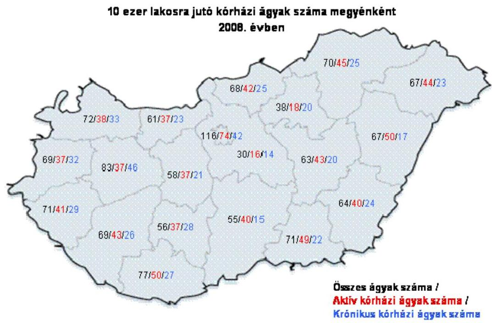

A szakellátásoknál előtérbe került egyes feladatok ellátásának „kiszervezése”. A fekvő- és járóbeteg szakellátó intézmények működtetésének államháztartáson kívüli szervezetek részére történő átadása problémákat vetett fel. ${ }^{119}$ A feladatellátás kiszervezésére az önkormányzatok nem voltak kellően felkészülve, nem készítettek előzetes hatástanulmányokat, nem mérték fel az intézkedések várható következményeit. A működtetésbe adástól, a befektetőtől elsődlegesen azt várták az önkormányzatok, hogy az „megmenti" a kórházukat, megmarad a település számára az egyik legnagyobb munkáltató, egészségügyi kultúrát, rangot biztosító intézmény. Az átszervezésekkel kapcsolatosan ugyanakkor nem számoltak azzal, hogy a működtető gazdasági helyzetének ellehetetlenülése esetén az önkormányzat, mint a feladat-ellátás kötelezettje továbbra is felelős a szolgáltatások biztosításáért.

A vizsgált önkormányzatok közül az egészségügyi szakellátási feladatok államháztartáson kívüli szervezetnek történő átadása kettő településen vetett fel ellátással kapcsolatos gondokat. Eger város a megyei önkormányzat döntése következtében fellépő ellátási hiányok (a kórház államháztartáson kívüli szervezet által történő működtetése során súlyos betegellátási zavarok jelentkezése) megoldása, lakosai biztonságos egészségügyi ellátása érdekében más önkormányzattal kötött megállapodást a járó-beteg ellátás néhány kiemelt területének biztosítására. Tapolca a kórházát működtető kft. gazdasági ellehetetlenülése, és az ebből következő szerződés megszűntetése következtében visszavette intézménye működtetését, melyet saját alapítású gazdasági társasággal kíván ellátni.

[^0]
[^0]:    ${ }^{119}$ 0921 sz. Jelentés az egyes kórházi tevékenységek kiszervezésének ellenőrzéséről.

---

Az önkormányzatok pénzügyi helyzetének kedvezőtlen alakulása, az ellátásokhoz biztosított központi hozzájárulások változásának hatására a szociális ellátások és a gyermekjóléti alapellátások szervezeti keretei 2006-2008 között az önkormányzati alrendszeren belül is változtak.

# A szociális szolgáltatást és gyermekjóléti ellátást nyújtó intézmények ${ }^{120}$ száma 2005. évi 6481-ről 2008-ra 6,2\%-kal növekedett.

A nappali ellátást biztosító intézmények (idősek klubja, hajléktalan személyek, fogyatékosok nappali intézményei) száma országosan 2006-2008 között 1489-re, 1,7\%-kal, a tartós bentlakást biztosító intézmények 2,8\%-kal, 1304-re emelkedett. Ugyanezen időszak alatt ennél erőteljesebben, 9,4\%-kal nőtt 594-re a bölcsődék száma. (3/19. sz. melléklet)

Az állam, azaz a legnagyobb szerepet játszó ${ }^{121}$ helyi önkormányzatok, önkormányzati társulások, többcélú kistérségi társulások szerepe ugyanakkor mérséklődött: arányuk az intézményi fenntartók között 84,6\%-ról 78,9\%-ra csökkent. Ennek megfelelően az egyéb fenntartóké (elsősorban non-profit szervezetek, vállalkozások) növekedett (az egyházi fenntartású intézmények száma pl. 47,4\%-kal). (3/19., 3/21. sz. melléklet)

A vizsgált önkormányzati körben az ellátásokat igénybe vevők egyre nagyobb hányadát látták el a társulások saját intézményeiben, miközben visszaszorult az önkormányzatok önálló feladatellátása és az ellátási szerződéssel, továbbá a külön megállapodással biztosított feladatellátás is.

Az önkormányzatok társulási hajlandóságát - a szociális és gyermekjóléti feladatok ellátásának területén - elsődlegesen a kiegészítő állami támogatások megszerzése, s kevésbé a szakmai megfontolások motiválták. A szociális ellátásoknál országosan a családsegítésnél a házi segítségnyújtásban és az idősek nappali ellátásában valósult meg leginkább a társulásos ${ }^{122}$ forma. (3/19. sz. melléklet)

Az ellenőrzött önkormányzatok 21,8\%-a csatlakozott 2006-2009 között intézményi társuláshoz a szociális és gyermekvédelmi feladatok ellátása érdekében. A csatlakozók 58,3\%-a volt községi önkormányzat, amely korábban feladatait saját intézmény működtetésével, vagy foglalkoztatott alkalmazásával oldotta meg. Ajka, Kaposvár, Zalaegerszeg, Fertőszentmiklós, Kisvárda városok a már meglévő szociális intézményeiket intézményi társulásba vitték annak érdekében, hogy a városi ellátottak után is magasabb állami támogatásban részesüljenek (az önkormányzatok adatszolgáltatása szerint).

Az ellenőrzött önkormányzatok 52,7\%-a hajtott
 végre a vizsgált időszakban valamilyen átszervezést a szociális feladatai ellátásában. Az önkormányzatok 81%-a a gazdaságosabb feladatellátás megvalósítását, 61,3%-uk a hatékonyabb működtetést, 51,6%-uk a többlet pénzügyi források elérését, 29%-uk az

[^0]
[^0]:    ${ }^{120}$ Az intézményi székhelyek és telephelyek együttesen.
    ${ }^{121}$ Az intézményekben belül a központi költségvetés által fenntartott intézmények aránya 0,3-0,4% volt.
    ${ }^{122}$ Intézményi- és többcélú társulások együttesen.

---

önkormányzati források felszabadítást más önkormányzati feladatellátásának finanszírozására jelölte meg az átszervezésről szóló döntésének indokaként ${ }^{123}$.

A feladatellátás szervezeti keretei a házi segítségnyújtásban az ellenőrzött önkormányzatok 47,2%-ánál, a családsegítő szolgáltatás esetében 32,7%-ánál, az idősek nappali ellátásában 31%-ánál változtak. Más szociális feladatokat ilyen magas arányú változtatások a vizsgált körben nem érintették (az önkormányzatok adatszolgáltatása szerint).

A bentlakásos intézményi ellátásban is emelkedett a társulásban fenntartott intézmények aránya. Az intézményi társulásban működtetett férőhelyek aránya 0,4%-ról 3,4%-ra, a többcélú kistérségi társulások fenntartásában működtettek aránya 4,8%-ról 9,8%-ra nőtt.

A gyermekjóléti ellátást biztosító intézményekben az ellenőrzött önkormányzatok 49%-a hajtott végre valamilyen formában átszervezést. A változtatás indokaként első helyen (73%) itt is a gazdaságosabb feladatellátás megvalósítását, 61,5%-uk a többlet pénzügyi források elérését jelölték meg ${ }^{124}$. Alig egynegyedüknél jelentkezett célként, hogy az ellátásban részesülők körét és számát növeljék (az önkormányzatok adatszolgáltatása szerint).

A szociális ellátásokhoz való hozzáférés szempontjából kedvező, hogy a szociális intézmények bizonyos típusai inkább a kis- és közepes településeken működnek. Megoszlásuk és a népesség eloszlása között az összefüggés fordított, kivéve a bentlakásos intézményeket, amelyek megoszlása közel azonos a népességével. A nem-állami fenntartású intézményekre ez úgy módosul, hogy azok inkább a közepes és legnagyobb települések felülreprezentáltak (3/5-6-3/5-8. sz. mellékletek).

Országosan a többcélú kistérségi társulások közvetlen feladatellátásában az idősek nappali és tartós bentlakásos intézményeinél a legdinamikusabb a növekedés 2006-2008 között. Ezen intézményekben az ellátottak száma 110 főről 5820 főre, illetve 242 főről 4440 főre nőtt. (3/19. sz. melléklet)

Az ellenőrzött önkormányzatok 24%-a a házi segítségnyújtást, 18%-a a családsegítést, 7,3%-a az idősek nappali ellátását, 5,5%-a az időskorúak otthonát biztosító intézményét adta át kistérségi fenntartásba. Szakosított szociális ellátási feladatokat (fogyatékosok és szenvedélybetegek bentlakásos ellátását) Tiszavasvári város valamennyi szociális szolgáltatását a többcélú kistérségi társulás közvetlen feladatellátásban biztosítja. (3/20. sz. melléklet)

A vizsgált önkormányzatoknál a többcélú kistérségi társulások közvetlen feladatellátásában a gyerekjóléti szolgáltatásban gondozottak száma több mint kétszeresére (227%), a családsegítésben 83%-kal nőtt (3/22. sz. melléklet). Idősek nappali ellátást, tartós bentlakásos intézményi ellátást e formában 2006-ban nem

[^0]
[^0]:    ${ }^{123}$ A helyszíni ellenőrzéssel érintett önkormányzatok a vizsgálat során alkalmazott feldolgozási segédletben több indokot is megjelöltek az átszervezésre, ezért a százalékos értékek a válasz előfordulási gyakoriságát jelentik.
    ${ }^{124}$ A százalékos értékek halmozódást mutatnak, mert az előfordulási gyakoriságot jelölik.

---

biztosítottak, 2008-ban az ellátottak száma 90, illetve 299 fő volt. (3/20. sz. melléklet)

A társult feladatellátás terjedése ellenére a településeken a szociális alapszolgáltatásokhoz még mindig nem egyenletes a hozzáférés. A valamennyi településen biztosítandó házi segítségnyújtás a települések egynegyedén nem volt elérhető 2008-ban. Gondot okoz a gyermekek napközbeni ellátásának hiánya is. A bölcsődék férőhelyeinek növekedése nem követte az igények bővülését, a bölcsődék átlagos kihasználtsága 130%-os volt.

# 1.3.3. Az állam által alapított/tulajdonolt szervezetek szerepe a kiemelt közfeladatok ellátásában 

Az államháztartáson kívüli feladatellátással kapcsolatban - ide nem értve a humánszolgáltatást nyújtó nem állami és nem önkormányzati fenntartói körbe tartozó szervezeteket - a tárcák a Kormány által elrendelt felülvizsgálatokat ${ }^{125}$ hajtották végre. A vizsgált időszakban - összhangban az egyszerűsítési, átláthatósági törekvésekkel, illetve az intézménystruktúrák átalakításával - az államháztartáson kívüli feladatellátás központi költségvetési szervekhez való visszaszervezése volt jellemző, melynek következtében a gazdálkodó szervezetek száma a 2006. évi 13-ról 2009-re 3-ra (tárcánként 1), a (köz)alapítványok száma 30-ról 23-ra csökkent (3/3. sz. melléklet). A kormányzati döntések ellenére ${ }^{126}$ egyes közalapítványok nem szűntek meg, előfordult az is, hogy tevékenységük újabb állami feladattal bővült ${ }^{127}$.

A vizsgált fejezetek intézményei részesedésében lévő gazdálkodó szervezetek számának csökkenéséhez a Vtv. hatálybalépése is hozzájárult ${ }^{128}$, a MNV Zrt. részére átadott gazdasági társaságok csak részben kerültek vissza a szakminisztériumok tulajdonosi joggyakorlása alá. Egyes, korábban a fejezetek intézményei részesedésben lévő gazdasági társaságokat privatizáltak, más esetben (Zánka Kht.) a Kormány eltérő döntése miatt nem született megállapodás a tulajdonosi joggyakorlás átadásáról.

Értékesítették 2006-ban az ÁNTSZ-hez tartozó ÁNTSZ Laboratórium Kft-t, az SZMM részesedésben lévő és fejezeti támogatásban nem részesülő OMKT Kft-t. A

[^0]
[^0]:    ${ }^{125}$ Az egyes költségvetési szervek átalakulásával összefüggő feladatokról szóló 2112/2007. (VI. 15.) Korm. határozat, az Ámr. módosításáról szóló 327/2008. (XII. 30.) Korm. rendelet 23. § (2), valamint a Kt. 24 §, 44. § (4).
    ${ }^{126}$ Az államháztartás hatékony működését elősegítő szervezeti átalakításokról és az azokat megalapozó intézkedésekről szóló 2118/2006. (VI.30.) Korm. határozatban elrendelt közalapítvány megszüntetések.
    ${ }^{127}$ A jogalkotó döntése alapján a közalapítványokra vonatkozó paragrafust (Ptk. 74/G. §) törölték, ezzel megszüntette a közalapítványi formát, továbbá megtiltotta tevékenységük újabb közfeladattal való bővítését. Azt azonban nem határozta meg, mi minősül új feladatnak.
    ${ }^{128}$ A Vtv. 59. § (6) bekezdése alapján a társaságok tulajdonjoga átadásra került az MNV Zrt.-nek, az állami vagyon feletti tulajdonosi jogokat és kötelezettségeket a Magyar Állam nevében a Nemzeti Vagyongazdálkodási Tanács (NVT) gyakorolta.

---

Kormány az EüM vagyonkezelésében lévő Club Aliga Rt. 100%-os tulajdonosi részesedésének privatizálásáról döntött.

A Zánka Kht. esetében a Kormány 2008. június 9-ei ülésén döntött arról, hogy a Kht. tulajdonjoga 25%+1 mértékben az SZMM-é, 25%+1 mértékben az OKM-é és 48%-ban az MNV Zrt-é legyen. A döntés nem került végrehajtásra, mert az NVT álláspontja szerint a tulajdonosi jogok ilyen megosztása jogtechnikailag kivitelezhetetlen, továbbá nagyfokú kockázattal jár.

A (köz)alapítványok körében a kormányzati struktúrában történt változások ${ }^{129}$ (2006. évi kormányváltás), valamint az intézményrendszer átalakítása következtében történtek megszüntetések, átadások, illetve összevonások. Ugyanakkor a fejezetekkel előzetesen nem egyeztetett ${ }^{130}$, hatástanulmányokkal alá nem támasztott kormányzati szándék is hozzájárult egyes intézkedések visszavonásához, illetve végrehajtásának elhúzódásához vagy annak elmaradásához.

Elhúzódott a - fenntartott oktatási intézmények további működtetésének biztosítása, illetve az alapított gazdasági társaságok vagyoni és tulajdoni helyzetének rendezése miatt - a Nemzeti Gyermek és Ifjúsági Közalapítvány megszüntetése (a helyszíni ellenőrzés idején folyamatban volt).

Az NGYIK gyermek- és ifjúsági programok szervezése mellett közoktatási intézmények fenntartásában is közreműködött, a jogutód nélküli megszüntetésére - illetve fenntartói jog átadásra - így csak iskolaszünetben, július-augusztusban kerülhet sor.

A 2218/2006. (XII. 12.) Korm. határozat ${ }^{131}$ 10. b) pontjában a - korábban megszüntetésre ítélt - Oktatásért Közalapítvány megtartása mellett döntött, egyúttal elrendelte a Határon Túli Magyar Oktatásért Apáczai Közalapítvány feladatainak átvételét is ${ }^{132}$. A Határon Túli Magyar Oktatásért Apáczai Közalapítvány a kormányzati szándék ellenére új program indítása mellett tovább működik.

A Munkaerőpiaci Alap képzési részéből 2008. decemberi döntés alapján jutott 222,6 M Ft forráshoz projekt célra, a kuratórium 2009 novemberében új programot („HATÁRTALANUL!") indított.

[^0]
[^0]:    129 A Kormány a minisztériumok átalakításával párhuzamosan rendelkezett [1069/2006. (VII. 13.) Korm. határozat] a kormányzati (köz)alapítványok felülvizsgálatáról, melynek célja annak eldöntése volt, hogy indokolt-e azok továbbműködtetése.
    ${ }^{130}$ A központi költségvetés intézményrendszerének ellenőrzéséről szóló 0808 sz. ÁSZ Jelentés megállapítása szerint a 2118/2006. (VI. 30.) Korm. határozat „dokumentált államigazgatási egyeztetése elmaradt, bár az egyeztetés megelőzhette volna az elrendelt intézkedések módosításait, kiszűrhette volna a szakmai vagy hatásköri feltételek hiányában végre nem hajtható feladatokat, az irreális határidőket".
    ${ }^{131}$ A határon túli magyarság nyelvi és kulturális önazonosságának megőrzését szolgáló támogatási rendszer hatékonyabbá tételéről szóló Korm. határozat.
    ${ }^{132}$ A Korm. határozat egyidejűleg visszavonta az Apáczai Közalapítvány létrehozásáról [1162/1998. (XII. 17.)] és az Alapító okiratának módosításáról szóló [1023/1999. (II. 26), 1074/2004. (VII. 19.), 1046/2006. (IV. 25.)] Korm. határozatokat.

---

Az OKM jogi akadályokra hivatkozott, miszerint a 2218/2006. (XII. 12.) Korm. határozat nem mondta ki az Oktatásért Közalapítvány jogutódlását, valamint nem rendezte az ingatlan beruházások támogatásához kötött jelzálogjog sorsát.

Az államháztartásról szóló 1992. évi XXXVIII. törvény és egyes kapcsolódó törvények módosításáról szóló 2006. évi LXV. törvény 2006. július 24-étől megtiltotta a közalapítványok tevékenységének újabb közfeladattal való bővítését. Ennek ellenére bővültek pl. az Oktatásért Közalapítvány (OKA) feladatai az Új Tudás - Műveltség Mindenkinek Program keretében végrehajtandó Nemzeti Tehetség Program ${ }^{133}$ lebonyolításával kapcsolatban a Nemzeti Tehetségügyi Koordinációs Fórum titkársági feladatainak ellátásával, továbbá a Nemzeti Tehetség Alap kezelésével. Az Alap felhasználásával kapcsolatos titkársági és alapkezelési feladatok kiszervezését megelőzően hatásvizsgálatot sem végeztek.

Az OKA 2008-ban a pályázati támogatásokon felül kutatási feladat elvégzésében közvetítő szerepet is ellátott, a Nemzeti Szakképzési és Felnőttképzési Intézettől 23,8 M Ft célzott támogatást kapott egy kutatás elvégeztetésére. A közbeszerzési értékhatár feletti (22,7 MFt) kutatásra közbeszerzési eljárás lebonyolítása nélkül kötöttek szerződést, mellyel megsértették a közbeszerzésekről szóló 2003. évi CXXIX. törvény 22. § (1) f, 23. § előírásait. A vállalkozási szerződést azonban az OKA tartalma és elszámolása szerint is továbbutalási céllal kapott/adott támogatásnak minősítette ${ }^{134}$ (a „vállalkozási" szerződésre fordított kiadással a működési költségeit csökkentette).

A Vtv. előírása alapján hasznosításra átengedett gazdasági társaságok tevékenysége illeszkedett a szakmai feladatellátáshoz. Súlyuk a fejezeti feladatellátásban a vizsgált időszakban jelentősen nőtt.

Az EüM fejezethez tartozó Légimentő Kht. a 100 lépés programhoz kapcsolódó „21 lépés az egészségügy átalakításáért" egészségügyi intézkedések keretében, a magyarországi légimentés középtávú fejlesztéséről szóló 2147/2005. (VII. 22.) Korm. határozat alapján alakult meg 2005. novemberében. Ezt a szervezeti formát a közhasznú szervezetek számára biztosított előnyök (pl. szponzori támogatások bevonása a működésbe), valamint a rugalmas, feladatorientált létszám kialakítás lehetőségei indokolták.

A légimentési rendszer fejlesztését az ellátási igények növekedése és az európai uniós szabályok átvétele indokolta. A 2004-es Európai Uniós csatlakozáskor egyrészt nem volt lefedett az ország légimentő bázisokkal, másrészt az akkori helikopterek az üzemeltetési problémák mellett az EU területén szükséges minősíté-

[^0]
[^0]:    ${ }^{133}$ A program célkitűzése tehetséges fiatalok megtalálása, azoknak tehetségük jellegének és szintjének megfelelő folyamatos segítése annak kibontakoztatásában, a tehetség hasznosulásának támogatása.
    ${ }^{134}$ Támogatási szerződést az államháztartásról szóló 1992. évi XXXVIII. törvény és egyes kapcsolódó törvények módosításáról szóló 2006. évi LXV. törvény 1. § c) pontjának tiltó rendelkezése (1 M Ft fölötti pályáztatás nélküli támogatásnyújtás) alapján nem köthetett.

---

sekkel sem rendelkeztek. A légimentés fejlesztése az egészségügy
 programjában szereplő sürgősségi betegellátás fejlesztésének ${ }^{135}$ egyik kiemelt területe lett.

A közhasznú társaságként a Kht. felajánlásokat, szponzori támogatásokat tud elfogadni, akár egyszeri, akár hosszú távú kötelezettségvállalás keretén belül. A vizsgált időszakban az egyes bázisok környékén működő cégek és önkormányzatok 2007-ben 45 M Ft-tal, 2008-ban 40 M Ft-tal, 2009-ben 35 M Ft-tal járultak hozzá a bázisok megépítéséhez.

Az Educatio Kht. (OKM) a Diákbónusz Kht. és a SuliNova Kht. beolvadásával és feladataik nagy részének átvételével „megaszervezetté" alakult, az OKM egyik legfontosabb végrehajtó háttérszervezete lett. Az egyesülést gazdaságossági, összehasonlító számítás nem előzte meg, azt a kormányzati szándék alapján ${ }^{136}$ hajtották végre 2007. augusztus 31-ével.

A Kormány döntése alapján az OKM az egyesülés végrehajtását megszervezte, a jogszabályi előírások teljesüléséről (egyesülési szerződés, auditált vagyonmérlegek, cégbírósági bejegyzések, alapító okirat) gondoskodott. Az egyesülés ütemterv alapján történt, folyamatát dokumentálták, arról a MeH-nek történő beszámolási kötelezettségét havi rendszerességgel teljesítették.

Az Educatio Kht. feladatrendszere az egyesüléssel nemcsak bővült, a feladatok profiltisztítása során feladatátadásra is sor került, a hatósági feladatokat az Oktatási Hivatal, a kutatás-fejlesztési feladatokat az Oktatáskutató és Fejlesztő Intézet vette át ${ }^{137}$.

Az SZMM az intézményi struktúra kialakításakor a pályázatkezelési feladatokat - a párhuzamos feladatellátást megszüntetve - az ESZA Kht-ba szervezte a minisztériumhoz tartozó pályázatkezelő szervezeti egységek integrálásával, valamint az egyéb, külső szervezetek által kezelt hazai pályázatok átvételével. A szervezeti formaválasztást egyrészt a Kht. addigi sikeres működése, másrészt a rugalmas, feladat-orientált létszám kialakítás lehetősége indokolta. Az ESZA Kht. éves szinten 11-12 Mrd Ft hazai fejezeti forrásból és a 2007-2013 programozási időszak alatti mintegy 600 Mrd Ft uniós társfinanszírozással megvalósuló támogatási programokat kezel.

A 2118/2006. (VI. 30.) Korm. határozat alapján megszüntetett (Mobilitás), illetve átszervezett (Foglalkoztatási Hivatal, Nemzeti Család- és Szociálpolitikai Intézet) intézmények pályáztatási feladatai teljes körű átvétele mellett a Kht. kezeli a Nemzeti Civil Alapprogram (NCA), Gyermek és Ifjúsági Alapprogram (GYIA), a Közmunkatanács programjai és az SZMM által kiírt pályázatokat.

[^0]
[^0]:    ${ }^{135}$ A sürgősségi ellátás fejlesztésének fontos részterülete volt a mentési (mind a földi, mind a légi) infrastruktúra fejlesztése (új mentőállomások építése, a területi egyenlőtlenségek megszüntetése, az elavult épületek felújítása, a gépjárműállomány fejlesztése, az orvosi gép- és műszerpark korszerűsítése, az ellátatlan régiókban a légimentés feltételeinek megteremtése).
    ${ }^{136}$ Az oktatási ágazatban feladatokat ellátó minisztériumi tulajdonú, szolgáltató háttérintézmények szervezetének és működésének racionalizálása.
    ${ }^{137}$ Az oktatási háttér-intézményrendszer átalakításának alapvető célja a hatósági, a szakmai és szolgáltatás jellegű feladatok szétválasztása volt.

---

Az ESZA Kht-nél a létszámigény kielégítése rugalmasan történik: a programok folyamatában időszakonként kevesebb létszám is elegendő a feladatok végrehajtásához, ekkor az erőforrás-menedzser átcsoportosítja a létszámot a munkacsúcs fázisban lévő pályázatok kezeléséhez, amikor ideiglenesen diákok foglalkoztatására is sor kerülhet.

A hasznosításra átengedett gazdasági társaságok létszáma az ellátott feladatok növekedésével jelentősen növekedett (a Légimentő Kht-nél 80\%-kal, az Educatio Kht-nél közel 2-szeresére, az ESZA Kht-nél több mint 4-szeresére). Ugyanakkor a Légimentő Kht. kivételével a létszámnövekedés ellenére sem tudták saját erővel ellátni a feladataikat, jellemző volt a külső szakértői/vállalkozási tevékenység igénybevétele. Az ESZA Kht. azonban szakmai (pénzügyi ellenőrzési, valamint monitoring) feladatokat is alvállalkozókhoz szervezett, amely az ÁSZ korábbi ellenőrzési tapasztalatai szerint is kockázatos. A közmunka programok támogatására fordított pénzeszközök hasznosulásának ellenőrzéséről szóló 0732 sz. jelentésünk megállapításai szerint a közmunkaprogramok lebonyolításában - 2007-ig az SZMM-el, azt követően az ESZA Kht-vel szerződött - közreműködő szervezetek ellenőrzési munkájának színvonala nem volt megfelelő ${ }^{138}$.

Az Educatio Kht. az alapfeladatai ellátására is kötött évente növekvő mértékben vállalkozási szerződést, így pedagógiai szakértői (2007-ben 137, 2008-ban 266 M Ft), kutatás-fejlesztési tevékenységekre (2007-ben 70, 2008-ban 363 M Ft), adatrögzítési tevékenységre (2007-ben 97, 2008-ban 98 M Ft ) és egyéb szolgáltatásokra (2007-ben 586, 2008-ban 1047 M Ft). Munkaerőbérlésre 2007-ben 72, 2008-ban 361 M Ft-ot fordítottak. A külső erőforrások igénybevételének növekedéséhez hozzájárult, hogy a 2008-ban megnőtt ÚMFT feladatok ellátásához - az arra vonatkozó támogatási szerződésben - előírt kötelező tevékenységek végrehajtásához pótlólagos erőforrás bevonásra volt szükség.

Az ESZA Kht. 2008-ban a hazai programok esetében 11000 db , az uniós programok esetében 3000 db pályázat külsős értékelésére szerződött. Több vállalkozással az alapfeladatai ellátására kötött szerződést: a pénzügyi beszámolók ellenőrzése és hiánypótoltatása (2008. június 13.), a Közmunkatanács által kiírt pályázatok nyerteseivel kötött szerződésekben foglalt kötelezettségek megvalósulásának monitorozása, valamint a Közmunkatanács által kiírt pályázatok nyerteseivel kötött szerződésekben foglalt kötelezettségek megvalósulásának pénzügyi ellenőrzése (2007. május 24.) tárgyában.

A köztulajdonban álló gazdasági szervezetek feladatellátásának éves értékelésekor a szervezeti megoldás célszerűségét, illetve a költségvetési szervi feladatellátással szembeni előnyeit a tulajdonosi joggyakorlók nem mutatták be, a feladatellátás minőségi jellemzőit sem értékelték. Az előírásokkal ellentétben nem tettek javaslatot a közfeladatok más módon, illetve más szervezeti formában való ellátására sem, ezzel megsértették az Ámr. 149/A. § (1) bekezdésében (2009. január 1-jétől 61. § (4) bekezdés) előírtakat.

[^0]
[^0]:    ${ }^{138}$ A 0732 sz. ÁSZ Jelentés megállapítása szerint: „egyetlen esetben sem jeleztek olyan hiányosságot, amely a szerződésben foglalt szankciók érvényesítését, a támogatások folyósításának felfüggesztését igényelte volna, holott a közmunka pályázatok megvalósítása során az ellenőrzés tapasztalt erre utaló hiányosságokat."

---

A költségvetési gazdálkodásnak az állami támogatásokkal kapcsolatos szabályai (utófinanszírozás) következtében szezonális likviditási hiány merült fel mind az Educatio Kht., mind az ESZA Kht. gazdálkodásában, melyet az ESZA Kht-nél a törzstőke megemelésével orvosoltak. Az Educatio kht. közhasznú tevékenysége veszteséget termelt.

Az Educatio közhasznú eredménye (veszteség) 2006-ban -406 M Ft, 2007-ben -602 M Ft, 2008-ban -118 M Ft volt, melyet részben az okozott, hogy az uniós támogatások életciklusa egyrészt a költségvetési beszámolási évtől eltérő, másrészt elszámolásuk utófinanszírozással történik. Az időleges likviditási nehézségekhez a 2007. évi jogszabályi változások eredményeként történt feladat átrendezések is hozzájárultak. Az Oktatási Hivatal lett a felelőse az Educatio Kht. által létrehozott rendszereknek ${ }^{139}$ (Közoktatási Információs rendszer, felvételi rendszer, diákigazolvány rendszer), melyekben a Kht. továbbra is ellát adatkezelői feladatokat. Ezen feladatok finanszírozására az Oktatási Hivatallal kötött feladat-ellátási szerződéskötések elhúzódtak, azok megkötésére csak 2008-ban került sor.

# 2. A KÖZFELADATELLÁTÁS KIADÁSAINAK VÁLTOZÁSA 

### 2.1. A közoktatási, egészségügyi, szociális ellátás humánerőforrás kiadásainak alakulása

A kiemelt ágazatok humánerőforrásaira fordított források alakulásának vizsgálatát jelentősen megnehezítik a rendelkezésre álló hazai és nemzetközi statisztikák eltérő, egymással (közvetlenül) össze sem vethető adatai. A különböző adatsorok lényegében azonos tendenciái szerint: a szociális kiadások aránya a GDP-ben nőtt, illetve nem változott, az egészségügyé és a közoktatásé csökkent, de ennek mértéke jelentősen függ a választott mutatótól és az összehasonlítás alapjaként szolgáló bázisévtől.

Az Eurostat - helyszíni ellenőrzés idején rendelkezésre álló - adatai alapján Magyarország kormányzati kiadásai a GDP %-ában a COFOG (Classification of the Functions of the Government - a kormányzati tevékenységek besorolása) nómenklatúra szerint 2001-2007 között végig magasabbak voltak az EU átlagánál. Az előző évhez képest a legnagyobb növekedés ( $8,7 \%$ ) 2002-ben következett be. Azt követően évenkénti csökkenések és emelkedések követték egymást, amelyek eredőjeként a mutató 2007-ben 5,2\%-kal volt magasabb, mint 2001-ben (48,9\% és $47,3 \%$ ). Az oktatás súlya a GDP-ben 2001-hez képest 2003-ra 9,4\%-kal, az egészségügyé pedig $16,3 \%$-kal nőtt. Ezt követően 2007 -re pontosan a 2001 -es szintre csökkentek ( $5,3 \%$ és $4,9 \%$ ).

Magyarország 2008-ban az egészségügyi kiadásait tekintve az EU tagállamai középmezőnyének alján, az oktatásban pedig annak a közepén volt.

A WHO legutóbbi kiadványának (World Health Statistics 2009) adatai szerint 2006-ban a fejlett államokban a szélesen vett - pl. adminisztratív kiadásokat is felölelő - egészségügyi kiadások a GDP 8-10\%-át tették ki. (Az USA kivételes és világelső a 15,3\%-kal.) Magyarország adata ( $8,3 \%$ ) a csoport alján helyezkedik el,

[^0]
[^0]:    ${ }^{139}$ A rendszerek elkészítését az OKM rendelte meg és finanszírozta.

---

lényegében együtt Finnországgal, Spanyolországgal és Szlovéniával, de magasabban, mint pl. Lengyelország (6,2\%) vagy Szlovákia (7,1\%). Ugyanebben az évben a nemzetközi összehasonlításoknál használt egyik mutató, az egy főre eső egészségügyi kiadások (vásárlóerő-paritáson ${ }^{140}$ ) Magyarországon a fejlett országokénál jóval alacsonyabbak voltak (akár 40-50\%-kal); egy szinten álltak a cseh adatokkal, $15 \%$-kal voltak magasabbak a szlováknál és $50 \%$-kal a lengyelnél.

Ugyanakkor a COFOG szerinti - a vizsgált területnél szélesebb, pl. a nyugdíjellátást is magába foglaló - szociális védelemre fordított kiadások aránya 2001-2007 között folyamatosan nőtt, összességében 19,3\%-kal ${ }^{141}$. A növekedést azonban elsősorban a nyugdíjakra fordított kiadások emelkedése okozta. A jelentős kamatkiadások mellett ez is hozzájárult a magyar kormányzati kiadások uniós átlagnál magasabb szintjének kialakulásához, fennmaradásához.

A PM módszertana szerint 2008-ban az F06 Társadalombiztosítási és jóléti szolgáltatások a GDP kiadási oldalának 17,4\%-át jelentették. Ezen belül a nyugdíjak aránya már $59,2 \%{ }^{142}$ volt.

A humánterületek arányának csökkenése megfigyelhető a GDP termelési oldalán is. A nemzeti számlák rendszerében a három terület súlya a kormányzati szektor ${ }^{143}$ bruttó kibocsátásában ${ }^{144}$ 2005-2008 között 7,67\%-ról 6,56\%-ra, 1,11 százalékponttal, $14,5 \%$-kal, reálértékben ${ }^{145}$ közel 200 Mrd Ft-tal csökkent. Az oktatásnál a csökkenés 0,50 százalékpont $14,6 \%$, az egészségügyben 0,62 , $19,0 \%$ volt, míg a szociális ellátások területén ${ }^{146}$ lényegében nem történt változás.

A három ágazat bruttó kibocsátását együttesen tekintve ( $=100 \%$ ), az egyes területek súlya némiképpen megváltozott: az oktatás változatlanul $44,4 \%$, az egész-

[^0]
[^0]:    ${ }^{140}$ A vásárlóerő-paritás (PPP - purchasing power parity) a hivatalos valuta átváltási árfolyamtól eltérően méri, hogy mennyi terméket és szolgáltatást lehet vásárolni egy valutában egy másik valutához mérve, és ezzel figyelembe veszi a különböző országokban eltérő árakat.
    ${ }^{141}$ A COFOG F10 Szociális védelem súlya a magyar GDP-ben 2001-ben 14,5\%, 2007-ben $17,3 \%$ volt.
    ${ }^{142}$ Más megközelítésben ez azt jelenti, hogy miközben 2001-2008 között 1,8\%-kal csökkent a nyugdíjban, nyugdíjszerű ellátásban részesülők száma, az ellátásukra fordított összegek a GDP 9,6\%-áról 11,5\%-ra emelkedtek.
    ${ }^{143}$ A „kormányzati szektor" a kötelező társadalombiztosítási alapokat, a helyi önkormányzatokat és a központi kormányzatot foglalja magába. A központi kormányzat része a központi költségvetés, valamint bizonyos vállalati és non-profit szférához tartozó kör. Ebben a megközelítésben a központi költségvetés része az elkülönített állami pénzalapok is.
    ${ }^{144}$ A kormányzati folyó termelő-felhasználás (P.2.), a kormányzati munkavállalói jövedelem (D.1.), az értékcsökkenés (K.1.) és a bruttó állóeszköz felhalmozás (P.51.) összegzésével számolva. (A nettó működési eredmény komponens itt elhanyagolható mértékű.)
    ${ }^{145}$ A PM által megadott GDP deflátorokkal számolva; 2006-ban 3,9\%,

 2007-ben 5,9\%, 2008-ban 3,6\%.
    ${ }^{146}$ A korábbi évek csökkenése után 2008-ban az előző évhez képest bekövetkező 3,0\%-os növekedés eredményként.

---

ségügy 42,4\%-ról 40,1\%-ra csökkent, a szociális ellátásoké viszont 13,1\%-ról 15,4\%-ra nőtt.

A humánterületekre fordított kormányzati kiadások csökkenése hasonló irányú változást eredményezett a GDP fogyasztási oldalán is. A három ágazat aránya 2005-2008 között 14,96\%-ról 12,89\%-ra, 2,07 százalékponttal (13,8\%-kal) csökkent.

A három ágazat szolgáltatásait - definíció szerint - a lakosság (háztartások) veszi igénybe, „fogyasztja". A lakossági fogyasztás elemei különböznek a finanszírozást tekintve. Egy részéért maga a háztartás fizet, másik részét a háztartásokat segítő non-profit intézmények nyújtják a lakosságnak ingyenesen. Végül pedig a legnagyobb részt a kormányzat nyújtja - közvetve vagy közvetlenül - a lakosság számára ugyancsak ingyenesen.

A vizsgált ágazatok helyzetét eltérő folyamatok jellemezték. Az egészségügy 7,49\%-ról 6,56\%-ra (0,94${ }^{147}$ százalékponttal, 12,5\%-kal) csökkent. A középfokú oktatásnál ${ }^{148}$ még erőteljesebben érvényesült a csökkenés: 5,06\%-ról 3,50\%-ra (1,57 százalékpont, 30,9\%). A szociális ellátás terén fordított folyamatok játszódtak le. Aránya a kormányzat súlyának emelkedésével együtt növekedett 2,40\%-ról 2,83\%-ra (0,43 százalékponttal, 18,0\%-kal).

A kormányzat a közforrásokat 2007 után is erőteljesen csökkenteni kívánta a közoktatás, nagyjából szinten tartani az egészségügy és - bizonyos visszaesés után - növelni a szociális ellátások területén.

A Magyar Köztársaság 2008. évi költségvetésének végrehajtásáról szóló T/10380. számú és a MK 2010. évi költségvetéséről szóló T/10554. számú törvényjavaslatok általános indokolásának mellékletei között szerepelnek az államháztartás funkcionális kiadásai (pénzforgalmi szemléletben). Ezek alapján az F04 Jóléti funkciókon belül a középfokú oktatásra (F04 a-b) fordított államháztartási kiadások közel 32\%-kal csökkennének, miközben a középfokú oktatásban résztvevők száma csak 5\%-kal mérséklődik. Az egészségügy (F05) aránya változatlan marad, míg a szociális ellátásoknál (F06) az 1,1 százalékpontos növekedést elsősorban a nyugdíjak (F06 b) emelkedése okozza.

A humánterületekre fordított központi források csökkenése miatt változott a három ágazat intézményrendszerének és a feladatellátást biztosító létszámának fenntartók és a finanszírozók szerinti struktúrája. Ennek következményeként a megalapozott ágazati stratégiák, kormányzati döntések kidolgozásához szükséges monitoring, adatszolgáltatás rendszerének a hiányosságai (teljes körűség, megbízhatóság, naprakészség tekintetében) jelentős további kockázati tényezőket hordoznak. A közszolgáltatásokat igénybevevő állampolgárok egyre inkább az államháztartáson kívüli szervezetekkel állnak kapcsolatban, ezt azonban nem követte az állam normaalkotó és ellenőrző szerepének megerősítése.

A humánterületek feladat-ellátásában meghatározó önkormányzati alrendszer tárgyévi költségvetési kiadásai a 2006. évi 3246,5 Mrd Ft-ról 2008.

[^0]
[^0]:    ${ }^{147}$ A százalékpontokban kifejezett változásoknál az eltéréseket a kerekítések okozzák.
    ${ }^{148}$ Az adatok szempontjából a pontos megfogalmazás: nem felsőfokú oktatás.

---

évre csak 3,3\%-kal emelkedtek (3354,9 Mrd Ft-ra), miközben az inflációs hatás 12,2\% volt. Az összes kiadáson belül a folyó működési kiadások ${ }^{149}$ összege 5,6\%-kal nőtt; az alrendszer szereplői költségvetésük növekvő hányadát fordították működtetésre és kevesebbet költöttek beruházásokra, fejlesztésekre. Az összképet nem befolyásolta, hogy a többcélú kistérségi társulások költségvetési kiadásai közel háromszorosára emelkedtek, mert ezek súlya az önkormányzati alrendszerben még 2008-ban is elenyésző mértékű (2\%) volt.

A folyó működési kiadások aránya 2008-ban településkategóriánként jelentősen szóródott, a fővárosi önkormányzatnál az országos átlag ${ }^{150}$ alatti volt (54,4\%) ugyanakkor az átlagot meghaladó mértékű arányt képviselt a többcélú kistérségi társulások (88,4\%), a megyei önkormányzatoknál (86,5\%), illetve a főváros kerületeiben (74,4\%).

Az önkormányzati alrendszerben az egészségügyi feladatok ellátására fordított folyó működési kiadások összege 2008-ban nem érte el a 2006. évi szintet. Ebben közrejátszott a kórházi struktúra átalakítás és egyes feladatok kiszervezése is. A közoktatásra 2,5\%-kal, a szociális- gyermekvédelemre 12,4\%-kal, az igazgatási kiadásokra 17\%-kal többet fordítottak a 2006. évinél. Az összes folyó kiadáson belül a szociális- és gyermekvédelmi, valamint az igazgatási kiadások aránya nőtt, miközben a közoktatási, valamint az egészségügyi kiadások részesedése csökkent. (3/7. sz. melléklet)

A közoktatási feladatok ellátására az önkormányzati alrendszer a 2006. évben 850 Mrd Ft-ot, a 2008. évben 871,4 Mrd Ft-ot fordított. Ugyanezek az adatok sorrendben a szociális és gyermekvédelmi ellátásban 204,5 és 229,8 Mrd, az egészségügyi ágazatban 417,5 és 415,4 Mrd, az igazgatásban 374,1 és 437,7 Mrd Ft-ot jelentettek. A folyó működési kiadásokon belül a személyi juttatások és járulékaik aránya minden kiemelt feladat esetében csökkent (3/7. sz. melléklet).

A finanszírozás összetétele tekintetében a közoktatásban a háztartások és non-profit intézmények aránya növekedett, a kormányzaté visszaesett: a megfelelő adatok 2005-ben 6,8\%, 6,9\%${ }^{151}$, 86,3\%; 2008-ban 8,8\%, 10,3\%, 80,9\%. Az egészségügyben a háztartások aránya 27,2\%-ról 28,2\%-ra, a nonprofit intézményeké pedig 1,5\%-ról 2,2\%-ra növekedett, a kormányzaté ennek megfelelően 71,3\%-ról 69,6\%-ra mérséklődött. Ezzel konzerválódott az a 2006-ra jellemző helyzet, hogy Magyarország a fejlett országok csoportjában viszonylag keveset fordított az egészségügyre, és ezen belül is kisebb volt az állami szerepvállalás aránya.

[^0]
[^0]:    ${ }^{149}$ Folyó kiadás: személyi juttatások és járulékaik, dologi és egyéb folyó kiadások és támogatások összege.
    ${ }^{150}$ A folyó működési kiadások aránya 2008-ban 71,6\%-a volt a költségvetési kiadásoknak.
    ${ }^{151}$ A non-profit intézmények adata magába foglalja az oktatás teljes vertikumában nyújtott szolgáltatásokat.

---

Az OECD-ben a kormányzati kiadások aránya az összes egészségügyi kiadásokon belül 2006-ban jellemzően a 75-95\%-os sávba esett ${ }^{152}$. Magyarország adata (70,9\%) ezen kívül volt található, és csak Lengyelországgal állt egy szinten ${ }^{153}$.

A humánterületek kormányzati bruttó kibocsátásában az önkormányzati szféra aránya az egyes területeknél eltérően alakult. Az önkormányzatok aránya 2005-2008 között a közoktatásban 97,2\%-ról 97,1\%-ra, az egészségügynél 65,7\%-ról 64,0\%-ra csökkent, a szociális ellátásokban pedig 93,1\%-ról 95,0\%-ra növekedett.

A közoktatásnál a csökkenés mértékét csak enyhíteni tudta a nem-állami humánszolgáltatók növekvő szerepe: 80,9 Mrd Ft-ról 89,4 Mrd Ft-ra (5,1\%). Ezáltal a közoktatás önkormányzati és nem-állami fenntartókon keresztül megvalósuló együttes támogatásának 4,1\%-os csökkenése helyett, 2,0\%-os növekedés volt tapasztalható.

A költségvetés oktatási kiadásai a GDP \%-ában minden oktatási szint esetében csökkentek, de eltérő mértékben: az óvodáknál 11,3\%-kal, az iskoláknál 16,6\%-kal, a középfokú oktatásban pedig csak 2,4\%-ban. Az egy tanulóra jutó költségvetési oktatási kiadások reálértéke oktatási szintenként differenciáltan változott: az óvodáknál 4,5\%-kal, az általános iskoláknál 0,7\%-kal csökkent, a középfokú oktatásban 4,3\%-kal nőtt.

A szociális ellátás terén fordított folyamatok játszódtak le. Aránya a kormányzat súlyának emelkedésével együtt növekedett 2,4\%-ról 2,8\%-ra (0,43 százalékponttal, 18,0\%-kal). A háztartások és non-profit intézmények aránya csökkent, a kormányzaté növekedett: a megfelelő adatok 2005-ben 4,6\%, 8,7\%, 86,8\%; 2008-ban 2,9\%, 6,9\%, 90,2\%.

Az új szolgáltatás állami finanszírozásához elegendő volt a működési engedély megléte, nem vizsgálták, hogy az adott település lakosai számára szükséges-e, illetve elérhető-e más szervezet keretében a szolgáltatás. A hajléktalan ellátásban az államháztartáson kívüli szervezetek jelentek meg először, szerepük azóta is meghatározó.

A hajléktalan nappali ellátottak 58,7\%-át, a hajléktalan otthonok lakóinak 70,8\%-át látták el 2008-ban.

A nem-állami humánszolgáltatók között megfigyelhető az egyházak súlyának növekedése, ami részben a kiegészítő támogatásnak köszönhető ${ }^{154}$. A

[^0]
[^0]:    ${ }^{152}$ Két nagy kivétel: Svájc 55,6\% és USA 43,7\%.
    ${ }^{153}$ A magánszektor adatai azonban nem csak a háztartások által közvetlenül fizetett kiadásokat (out-of-pocket expenditure) tartalmazzák, hanem a magánbiztosítók által teljesített kifizetéseket. Mindazonáltal a háztartások közvetlen kifizetései adják általában a nagyobb részt (kivéve az USA, ahol ez csak 23,5\%). Magyarország mutatója 77,6\%.
    ${ }^{154}$ Az egyházi és kisebbségi önkormányzati fenntartású oktatási és szociális intézmények a minden intézményt megillető alapnormákon felül kiegészítő támogatásban részesülnek. Ennek mértéke (elvileg) az önkormányzatok, mint fenntartók által az intéz-

---

közoktatás terén nyújtott szolgáltatásokban arányuk (az előző évi elszámolásokkal együttesen) 2005-ben 51,2\% volt (ezen belül a kiegészítő támogatás 14,8\%), 2008-ban már 58,7\% (a kiegészítő támogatás 46,7\%). A szociális ellátásban a megfelelő adatok 2005-ben 41,4\% (13,0\%), 2008-ban 46,0\% (21,1\%).

Az Oktatási és Kulturális Minisztérium fejezetnél a közoktatási feladatok finanszírozására fordított pénzeszközök hasznosulásának ellenőrzéséről szóló 0807 sz. Jelentés szerint: „Az ellenőrzés álláspontja szerint, a 2005. és a 2006. években az egyházak kevesebb összegű kiegészítő támogatásban részesültek, mint ami az egyházfinanszírozási törvény alapján és a számításokban az államháztartás működési rendjéről szóló kormányrendelet előírásait figyelembe véve, megillette volna őket. Az OKM és PM által képviselt kormányzati álláspont szerint - a korábbi gyakorlat továbbviteleként a jogszabályi rendelkezések módot adnak más, a jogszabályoktól eltérő jogértelmezésre". (Az ÁSZ számítása szerint a 2005. évi egyházi kiegészítő támogatás összege 3891,1 M Ft, a 2006. évi összeg 7871,5 M Ft, az egyenlegrendezés során elfogadott 1840,5 M Ft-os, illetve 7268,5 M Ft-os összegekkel szemben. Mindez 2653,6 M Ft-os elmaradt állami támogatást jelent.) A helyzet 2008-ban sem változott.

Az egészségügyi feladatok finanszírozása mind az alapellátás, mind a szakellátás vonatkozásában megoszlik az OEP és az önkormányzatok között. Az egészségügyi ellátásban az OEP biztosítja az egyes egészségügyi szolgáltatásokat/tevékenységek működtetéssel kapcsolatos finanszírozását (pontosabban az ahhoz való hozzájárulást). A fejlesztéssel, korszerűsítéssel összefüggő feladatokat a finanszírozás jelenlegi rendszerében az önkormányzatok kötelesek biztosítani.

A járó és fekvőbeteg szakellátó intézmények felújítása, korszerűsítése nagy költségigényű feladat, mely kiadások a többcsatornás finanszírozás rendszerében a tulajdonos önkormányzatokat terhelik. Az épületek korszerűsítése, bővítése, új beruházások létesítése, a korszerű orvos-technológia biztosításával összefüggő fejlesztési igények kielégítése komoly pénzügyi terhet jelent a kórháztulajdonos önkormányzatok számára, melyről csak külső (pályázati) források megszerzésével, bevonásával tudnak gondoskodni.

Az egészségügyben a közfinanszírozás összege lényegében megegyezik a költségvetés LXXII. Egészségbiztosítási Alap fejezet természetbeni ellátásaival (3.2. alcím), amelynek teljesítése 2005-ben 1100,4 Mrd Ft, 2008-ban 1136,3 Mrd Ft volt (beleértve gyógyászati ellátások és eszközök támogatását, illetve a gyógyszertámogatást). A fenntartók is nyújtanak különböző módon támogatást intézményeiknek, amelyeknek ugyancsak vannak egyéb bevételeik (pl. vállalkozási tevékenységből). Ezen kívül a központi költségvetés más formában is biztosít forrásokat (pl. a IX. Helyi önkormányzatok támogatásai és átengedett személyi jövedelemadója fejezetben a helyi önkormányzatok által fenntartott költségvetési szerveknél foglalkoztatottak eseti kereset-kiegészítése). Így az eltérés 6,6-6,8\%-os is lehet. (Az adatok összevetésénél azt is figyelembe kell venni, hogy a költségvetési adatok pénzforgalmi-, míg a KSH adatai eredményszemléletűek.)
ményeikre fordított saját (költségvetési hozzájáruláson kívüli) kiadásainak országos átlaga alapján kerül évente a költségvetési törvényekben meghatározásra.

---

A központi költségvetés - a szektorsemlegesség elvét alkalmazva - az ellátottak létszámának figyelembevételével normatív állami hozzájárulást, kötött felhasználású előirányzatokat, egyéb támogatásokat biztosít az intézmények fenntartói számára. A fenntartók közoktatási és a szociális ellátási intézményei kiadásaihoz való központi költségvetési hozzájárulások, normatívák részletes szabályait és mértékét az éves költségvetési törvények (mellékletei) szabályozzák. A normatívák rendszerével a központi kormányzat már rövidtávon is képes

 befolyásolni a feladatellátás szervezeti-intézményi kereteit, formáit és színvonalát.

Az önkormányzatok, többcélú kistérségi társulások részére - országosan - feladataik ellátásához biztosított állami támogatások, hozzájárulások, valamint az adatok összehasonlíthatósága érdekében a normatív módon elosztott SZJA-bevételek együttes összege a 2006. évi 1098,3 Mrd Ft-ról 2008-ra 1199,1 Mrd Ft-ra, 9,2%-kal nőtt.

Az önkormányzati társulások számának dinamikus növekedésében erőteljesen közrejátszott, hogy a magasabb központi támogatások elnyerése érdekében az önkormányzatok intézményi társulás formájában működtetik tovább, jellemzően a közoktatási és a szociális intézményeiket ${ }^{155}$.

Ezt meghaladó mértékben emelkedtek a (10,8%) a humánszolgáltatást ellátó nem állami szervezeteknek juttatott normatív és kiegészítő állami hozzájárulások. A finanszírozás is szerepet játszott abban, hogy az államháztartáson kívüli szervezetek növekvő arányban vesznek részt a feladatok ellátásában.

A zárszámadási törvények adatai szerint az e körben elszámolt támogatások összege 2006-ban 115,3 Mrd Ft, 2008. évben 127,8 Mrd Ft volt. Az összes támogatásnak 2006. évben 47,3%-a, 2008-ban 55%-a az egyházi, felekezeti fenntartók részére került kifizetésre. Az államháztartáson kívüli intézményfenntartók a támogatásoknak 2006-ban 73,8%-ot (85,1 Mrd Ft), 2008-ban 69,9%-át (89,4 Mrd Ft) a közoktatási feladataik ellátásához vették igénybe. A szociális és gyermekvédelmi feladatok ellátására juttatott normatív és kiegészítő támogatások összege 2006-ban 30,2 Mrd Ft-ot, 2008-ban 38,4 Mrd Ft-ot tett ki.

A hozzájárulások rendszerét a vizsgált időszakban sem sikerült racionalizálni, bár bizonyos változások történtek. A normatívák követik a vonatkozó jogszabályokban meghatározott kötelező ellátási formát, azokon belül differenciálnak. A finanszírozás ebben a formájában nem ösztönöz a támogatni kívánt feladatok komplex megközelítésére. A normatívák a valamikor megállapított értékekre, mint bázisra építve kerültek megállapításra.

2007 szeptemberétől került bevezetésre a közoktatási teljesítménymutató alapján történő finanszírozás. A számítási módszer figyelembe veszi a Közokt. tv. osztály és csoportok szervezésére vonatkozó előírásait (átlaglétszám, foglalkoztatási idő-

[^0]
[^0]:    ${ }^{155}$ Új elemként jelent meg, hogy 2006-tól a többcélú kistérségi társulások is normatív módon meghatározott támogatásokra váltak jogosulttá egyes közoktatási, szociális és gyermekvédelmi vagy egyéb - a vizsgálat által nem érintett - közfeladatok ellátásához. A 2009. évtől pedig mintegy 20-29%-kal magasabb fajlagos támogatás ( 98 ezer $\mathrm{Ft} / \mathrm{fő}$ ) volt igényelhető a többcélú kistérségi társulások saját feladatellátásban végzett szolgáltatásaihoz.

---

keret) a pedagógusok heti kötelező óraszámát, továbbá az egyes intézménytípusok társadalmi költség-igényességét kifejező intézménytípus együtthatót. A teljesítménymutató továbbra is a gyermek, illetve a tanulólétszámon alapul, ugyanakkor a pedagógus-óraszám és osztálylétszámhoz van kötve, ezáltal közvetlenebbül kötődik össze a szabályozás és finanszírozás, láthatóvá teszi, hogy mekkora osztálylétszámot, óraszámot és pedagógus állományt kíván finanszírozni a központi költségvetés.

2008-ban a szociális étkeztetésnél a fajlagos hozzájárulás összege általában $82000 \mathrm{Ft} /$ fő volt. Ugyanakkor a normatíva azon új ellátottak esetében, akikre tekintettel az önkormányzat 2007. december hónapban normatív hozzájárulásban nem részesült, és akiknek családjában az egy főre eső jövedelem a nyugdíjminimum 150%-át nem haladja meg, $92500 \mathrm{Ft} /$ fő; ha az egy főre eső jövedelem a nyugdíjminimum 300%-át meghaladja, akkor csak $65000 \mathrm{Ft} /$ fő volt.

Nem készültek összegző elemzések arra vonatkozóan, hogy a megvalósult változások mennyiben voltak a döntések elvárt és kiszámított eredményei, illetve előre nem látott, különösen nem kívánt hatások következményei. A normatív állami hozzájárulások együttes és fajlagos összegének összehasonlítását nehezíti, hogy mind a feladatok, mind a normatívák köre változott.

A 2007. évi költségvetési törvényben az ágazati szakmai célokkal összhangban a szociális étkeztetés, házi segítségnyújtás, falu- és tanyagondnoki szolgáltatás normatívája emelkedett, míg a jelzőrendszeres házi segítségnyújtás, a támogató szolgálat, a közösségi ellátás és az utcai szociális munka esetében annak összege csökkent, a nappali ellátások esetében pedig differenciáltan állapították meg.

Az önkormányzatok kötelező feladatai köréből 2009-ben kikerültek a támogató szolgálatok és a közösségi ellátások, 2010-ben a kötelező feladatok tovább csökkentek a jelzőrendszeres házi segítségnyújtás ellátásával. Ennek következtében a feladatokat ellátó szolgáltatók a hozzájárulást pályázati úton igényelhetik.

A célzottabb ellátások megszervezését ösztönzi az a 2010-től belépő, korábbinál szigorúbb előírás, hogy az időskorúak esetében több szolgáltatás együttes igénybevételekor (a nappali ellátás házi segítségnyújtással, illetve házi segítségnyújtás szociális étkeztetéssel) együttes igénybevétele esetén ellátás típusonként változó mértékű normatív állami hozzájárulás igényelhető.

# 2.2. Az Új Magyarország Fejlesztési Terv hozzájárulása a kiemelt közfeladatok ellátásához 

Az Új Magyarország Fejlesztési Terv (ÚMFT ${ }^{156}$ ), mint Magyarország Nemzeti Stratégiai Referenciakerete ${ }^{157}$ a 2007-2013. programozási időszakra vonatkozóan kijelölte a legfontosabb fejlesztési feladatokat, amelyek a kitűzött célok szerint fenntartható módon támogatják az ország társadalmi, gazdasági és kör-

[^0]
[^0]:    ${ }^{156}$ Ide kapcsolódik az Új Magyarország Vidékfejlesztési Stratégiai Terv.
    ${ }^{157}$ A nemzeti stratégiai referenciakeretek (National Strategic Reference Frameworks) célja, hogy az EU-tagállamai a gazdaságuk modernizálására irányuló intézkedéseiket leíró általánosabb nemzeti programjaikat összekapcsolják a munkahelyteremtést és a növekedést szolgáló lisszaboni stratégiával, meghatározzák az EU kohéziós politikájához kapcsolódó alapok felhasználásának nemzeti kereteit, alapvető területeit.

---

nyezeti viszonyainak javítását, a foglalkoztatás bővülését és a gazdaság növekedését biztosító fejlesztési stratégiába illeszkedő fejlesztési programok megvalósításával ${ }^{158}$.

Az ÚMFT konkretizálta, hogy milyen beavatkozásokkal szükséges az állami feladatok ésszerűsítésén és azok ellátásának eredményességén és hatékonyságán keresztül elérni a célokat, és fő vonalakban vázolta az ehhez szükséges intézményrendszert, valamint a rendelkezésre álló strukturális és kohéziós alapokból származó uniós források ( $22,4 \mathrm{Mrd} €$ ) ${ }^{159}$ felosztását a célok és évek szerint. A 6 fejlesztési prioritás közül a társadalom megújulása és a területfejlesztés közvetlenül célozta meg a befektetést a humánerőforrásba ${ }^{160}$.

Magyarország a 2007-2013 közötti időszakban rendelkezésére álló strukturális és kohéziós alapokból származó uniós források legalább harmadát kívánja a humánerőforrás-fejlesztésére fordítani, amelyek jelentős része közvetlenül vagy közvetve a (köz)oktatás, az egészségügy és a szociális ellátottsághoz kapcsolódó területeken kerül felhasználásra.

Az ÚMFT-ben több OP közvetlenül is a humánerőforrás minőségének fejlesztésére szolgál. A Társadalmi Megújulás Operatív Program (TÁMOP) az átfogó célja a munkaerő-piaci részvétel növelése. Ehhez az emberi erőforrások minőségének átfogó javítása szükséges, amelyhez a foglalkoztatás, az oktatás és képzés, a szociális terület, az egészségügy, a kultúra és a közművelődés eszközrendszerére, továbbá anti-diszkriminációs eszközökre egyaránt szükség van. A TÁMOP céljaira az összes forrás 18%-a áll rendelkezésre.

Az OP prioritási tengelyei/beavatkozásai közül egyesek direkt, mások - esetenként a beavatkozás komplexitása miatt - indirekt módon kívánják fejleszteni a jelen ellenőrzéssel érintett területeket. (A Minőségi oktatás és hozzáférés biztosítása mindenkinek megnevezésű prioritás, az Egészségmegőrzés és egészségügyi humánerőforrás-fejlesztés prioritás, a Társadalmi befogadás, részvétel erősítése prioritás egyes beavatkozásai, a szociális ellátórendszer fejlesztése, a szolgáltatásokhoz való hozzáférés javítása, különösen a halmozottan hátrányos helyzetű csoportok vonatkozásában közvetlenül, mások pl. a gyermek és ifjúsági programok ugyancsak közvetve érintik a vizsgált területeket.)

A TÁMOP beavatkozásai több „zászlóshajó program" elemeit is tartalmazzák, amely programok a különböző OP-k kapcsolódó fejlesztéseinek összehangolt, integrált megvalósítását biztosítják a rendelkezésre álló hazai és külföldi (uniós és egyéb) források felhasználásával.

A Társadalmi infrastruktúra operatív program (TIOP) a TÁMOP végrehajtásához, valamint a humán közszolgáltatások (az oktatás-képzés, az egész-

[^0]
[^0]:    ${ }^{158}$ Az 1103/2006. (X. 30.) Korm. határozat rendelkezett az ÚMFT-ről. Az Európai Bizottság 2007 májusában fogadta el.
    ${ }^{159}$ Az Európai Mezőgazdasági és Vidékfejlesztési Alapból és az Európai Halászati Alapból még mintegy 3,4 Mrd € fejlesztési forrás áll a rendelkezésünkre. Ezeket egészíti ki a hazai 15%-os társfinanszírozás.
    ${ }^{160}$ A további prioritások a gazdaságfejlesztés, a közlekedésfejlesztés, a környezeti és energetikai fejlesztés, valamint az államreform. (Ez utóbbinak is vannak a humánerő-forrás-fejlesztési vonatkozásai a közszféra munkavállalóira vonatkozóan.)

---

ségügyi ellátások, a munkaerő-piaci és szociális szolgáltatások) intézményrendszerének átfogó reformjához szükséges fizikai infrastrukturális előfeltételek megteremtéséhez járul hozzá. Célja a humán infrastruktúra területi egyenlőtlenségeinek mérséklése, a hozzáférés javítása, illetve a humán közszolgáltatások hatékonyságának növelése, átfogó reformjuk elősegítése a TIOP programjaira a források 9%-át lehet felhasználni.

A 7 regionális OP együttesen az uniós források 26%-át (5,9 Mrd €) teszi ki, amelynek 23%-a a humánerőforrás fejlesztése. Ez utóbbi azonban nemcsak a vizsgált területeket foglalja magába, hanem pl. a felsőoktatást, a kulturális- és sportfejlesztéseket, a közszolgáltatásokhoz való egyenlő esélyű hozzáférés javításához szükséges akadálymentesítést (ezen belül a helyi közigazgatás feladatainak elektronizálását, modernizálását) stb.

Ugyanakkor más OP-k programjainak a hatása ezeken a területeken is megjelenik. Pl. a Környezet és Energia OP keretében megvalósuló fejlesztések (hulladékgazdálkodás, szennyvízkezelés, ivóvízminőség-javítás) javítják az egészségügyi helyzetet, a Közlekedés OP megkönnyíti a munkahelyekhez és a közszolgáltatásokhoz való (térségi) hozzáférést, ami ugyancsak kedvezően hat az oktatásra, az egészségügyre és a szociális ellátásokra is.

A projektek, pályázatok azonban jellemzően csak 2008-ban vagy azt követően indultak, ezért eredményük még nem gyakorolt érezhető hatást a három terület feladatellátására a vizsgált időszakban.

A közoktatási és szociális ellátások fejlesztésére, feltételeinek javítására, szakmai programok megvalósítására, az esélyegyenlőség javítására a vizsgált önkormányzatok mintegy 52%-a nyert el európai uniós támogatást. Gyermekvédelmi feladatokra - ezen belül főként a bölcsődei hálózat fejlesztésére - három önkormányzat igényelt és nyert el európai uniós támogatást. Az E-közigazgatási feladatok megvalósítására a vizsgált önkormányzatok közül három, a hivatali feladatok átvilágításához 13 önkormányzat igényelt és nyert el támogatást. Az egészségügyi ellátás terén (több tízmillió Ft-os, illetve Mrd Ft-ot is elérő) európai uniós támogatásokkal integrált járó beteg szakellátási központok létesülnek, járó- és fekvőbeteg szakellátó intézmények felújítására, a sürgősségi ellátás kiépítésére kerül sor.

# 3. A KIEMELT ÁGAZATOK FOGLALKOZTATÁSI ÉS LÉTSZÁMHELYZETÉNEK ALAKULÁSA 

Az egységesítő kormányzati törekvések ellenére a vizsgált időszakban nem csökkent a közszféra foglalkoztatási jogviszonyai szabályozásának bonyolultsága. A közszférában foglalkoztatottak jogviszonyát továbbra is számos törvény szabályozza.

A közigazgatás teljesítményének növelését szolgáló rövid távú intézkedésekről és átalakításának középtávú feladatairól szóló 1052/2005. (V. 23.) Korm. határozat 2005. október 31-ei határidővel elrendelte a Kormány középtávú humánpolitikai stratégiájának kidolgozását (III/1. pont). A MeH elkészítette a javaslatát, amelyet azonban a Kormány nem tárgyalt meg. Egyes elemei (pl. a kötelező versenyvizsga) azonban beépültek a későbbi szabályozásba.

---

A kiemelt közszolgálati törvények pl.: a köztisztviselők jogállásáról szóló 1992. évi XXIII. törvény (Ktv.), a közalkalmazottak jogállásáról szóló 1992. évi XXXIII. törvény, a fegyveres szervek hivatásos állományú tagjainak szolgálati jogviszonyáról szóló 1996. évi XLIII. törvény, az igazságügyi alkalmazottak szolgálati jogviszonyáról szóló 1997. évi LXVIII. törvény, a Magyar Honvédség hivatásos és szerződéses állományú katonáinak jogállásáról szóló 2001. évi XCV. törvény, a bírák jogállásáról és javadalmazásáról szóló 1997. évi LXVII. törvény, az ügyészségi szolgálati viszonyról és az ügyészségi adatkezelésről szóló 1994. évi LXXX. törvény, a központi államigazgatási szervekről, valamint a Kormány tagjai és az államtitkárok jogállásáról szóló 2006. évi LVII. törvény.

A vizsgált időszakban is jellemző volt, hogy egyes ágazati törvények a háttérjogszabályokhoz képest „speciális" előírásokat, eltéréseket, kivételeket
 iktattak be.

A Ktv. által megállapított illetménykiegészítés legmagasabb mértéke a Kormány irányítása/felügyelete alá tartozó szervezeteknél felsőfokú iskolai végzettségű köztisztviselő esetében az alapilletményének 50%-a, középiskolai végzettségű köztisztviselő esetében az alapilletményének 15%-a (44. § (1) bekezdés). Kivételt képez a kormányhivatalként besorolt Pénzügyi Szervezetek Állami Felügyelete és a központi hivatal NFÜ, ahol az illetménykiegészítés mértéke 80%, illetve 35% (44. § (5) bekezdés).

A 2008-as intézményi beszámolók alapján megvizsgáltuk három munkaköri besorolási csoportban az egyes központi költségvetési intézmények közötti eltéréseket az egy főre (a szerveknél teljes és részmunkaidőben foglalkoztatottak) jutó személyi juttatásokban. Az eltérések tartománya -7%-tól +79%-ig terjedt (3/4. sz. melléklet).

A nem rendszeres juttatások különböző aránya és összege (szórások) is egyértelműen alátámasztja, hogy a különbségeket az intézmények eltérő, esetenként jogszabályban is megjelenő érdekérvényesítő képessége, a korábbi helyzete determinálják. A közszolgálati jogviszonyok szabályozásában, illetve az egyes jogviszonyokon belüli ágazatokban mutatkozó eltérések nem szolgálják a hatékonyságot növelő közszolgálati ethosz, a testületi szellem megerősítését sem. A feladatellátás, a munkaerőpiac realitásai miatt indokolt különbségek nem voltak átláthatóak, azok nemcsak a munkaköri besorolások szintjén, hanem intézményenként is megjelentek. A különbségek indokoltsága nem volt átlátható, azok a munkaerőpiac realitásain túl az egyéni besorolások helyett intézményi szinten rögzültek.

Történtek kedvező, előremutató lépések is a szabályozásban: megtörtént a próbaidő egységes szabályozása (a Ktv. 11/B. § és a Kjt. 21/A. §). Ennek mértéke a köztisztviselőknél legalább 3, legfeljebb 6 hónap; közalkalmazottaknál 3, illetve 4 hónap.

A köztisztviselők számára - több más európai ország (pl. Franciaország, Spanyolország, Olaszország) gyakorlatához igazodva - általános alkalmazási feltételként bevezették a közigazgatási versenyvizsgát ${ }^{161}$ (Ktv. 10/C. §), amelynek

[^0]
[^0]:    ${ }^{161}$ A központi államigazgatási szervek, a központi államigazgatási szerveinek, valamint az államigazgatási hivatalok vezetőire 2009. július 1-jétől, a köztisztviselőkre

---

kialakult az intézményrendszere (KSZK, közigazgatási hivatalok, vizsgafelkészítők) is ${ }^{162}$.

A Ktv. és a Kjt. egyaránt előírta a kötelező pályázati rendszer bevezetését (a Ktv. 10. § és a Kjt. 20/A. §) az üres álláshelyek esetében, fokozatos kiterjesztéssel ${ }^{163}$. A jogszabályok kötelezővé tették a pályázati kiírás elektronikus közzétételét a KSZK által létrehozott és működtetett KÖZIGÁLLÁS (www.kozigallas.gov.hu) oldalon ${ }^{164}$.

A 2010. június 28-án kihirdetett, a kormánytisztviselők jogállásáról szóló 2010. évi LVIII. törvény a Kormány irányítása/felügyelete alatt álló szervezeteknél a korábbi köztisztviselői jogviszony helyett létrehozta a kormánytisztviselői jogviszonyt. A törvény megszüntette a kötelező pályáztatást és versenyvizsgát; a munkáltató részéről kezdeményezett felmentés szabályai egyszerűbbekké, a költségvetés szempontjából kedvezőbbekké váltak stb. A törvény megalkotása önmagában nem mutat a közszolgálati jogviszonyok egységesítése irányába, ugyanakkor a törvényjavaslatot előterjesztő indokolás rögzíti, hogy: „Szándékaink szerint a tervezet előzménye egy, a követelményeket magas színvonalon teljesítő közszolgálati dolgozóknak komparatív előnyöket és biztonságot garantáló, megalapozott, a lehető legszélesebb hatályú, koherens közszolgálati szabályozás megalkotásának.”

A köztisztviselőkre fókuszáló kormányzati intézkedéseknek csekély hatása volt a humánterületekre, mert ezeken a tipikus foglalkoztatási forma a közalkalmazotti: a szociális ellátásban 94%, az egészségügyben 96% körül, a közoktatásban pedig 99% felett.

A központi államszervezet közvetlen részvételének eltérő mértékét jelzi, hogy a három szaktárca intézményeiben eltérő a köztisztviselők és közalkalmazottak aránya ${ }^{165}$. Az OKM fejezetnél a köztisztviselők aránya 2006-2008-ban alig 2% volt, az EüM fejezetnél 17%, az SZMM fejezetnél pedig 70% körül alakult. Ez azt
2009. december 1-jétől kell alkalmazni a versenyvizsgát a teljesítmény- és versenyelv érvényesítése érdekében. A versenyvizsga bevezetése a korábbi közigazgatási alapvizsgát váltotta fel. A korábbi alapvizsga jogi-igazgatási tárgykörein túl a versenyvizsga általános igazgatási, szociológiai, európai uniós ismereteket is tartalmaz, illetve a kompetenciák, készségek szintjén is értékeli a vizsgázót. A vizsga nem formalitás, hiszen a helyszíni ellenőrzés befejezéséig résztvevő 3288 főből csak alig több mint egyharmad (1201 fő) tette le sikeresen.
${ }^{162}$ A versenyvizsga vizsgarendjét, a mentességeket és kivételeket a Ktv. és a 126/2009. (VI. 15.) Korm. rendelet szabályozta.
${ }^{163}$ A Ktv. 20/A. §-a fokozatosan bevezeti a kötelező tartalékállomány intézményét: melynek alapján csak akkor lehet az adott üres álláshelyet külső pályázóval betölteni, ha a KSZK nyilvántartásában nincs felmentett köztisztviselő.
${ }^{164}$ A közalkalmazotti és köztisztviselői pályázatok egységes felületen történő közzététele jelentős lépés volt annak érdekében, hogy a közszféra toborzása átláthatóvá váljon. A KÖZIGÁLLÁS oldalon 2008. január 1-je és 2009. december 31-e között 36912 közalkalmazotti, és 12570 köztisztviselői álláspályázatot publikáltak. A köztisztviselői álláshelyek közül országosan 1522 volt vezetői szintű.
${ }^{165}$ Ezeknél a fejezeteknél ez a két állománycsoport teszi ki a teljes munkaidőben foglalkoztatottak 95-98%-át.

---

jelenti, hogy a szociális ellátásban kevésbé, az egészségügyben nagyobb mértékben, az oktatásban jelentős súllyal látnak el feladatokat központi intézmények. (Utóbbi területen azonban jellemzően nem a közoktatásban, hanem a felsőoktatásban.)

A három szakágazathoz tartozó költségvetési intézményekben a foglalkoztatottak túlnyomó része az önkormányzati szférában található: a közoktatást és a szociális ellátást tekintve gyakorlatilag 100% ${ }^{166}$, de az egészségügyben is közel 80%. Másrészről az önkormányzatoknál a humánterületeken alkalmazottak együttes aránya 2005-2008 között 63,3%-ról 68,3%-ra nőtt. Ugyanakkor az egyes ágazatok súlya megváltozott, mert az összes alkalmazásban állók száma csökkenésének mértékétől (10,3%) eltérően érintette őket a változás.

A közoktatásban foglalkoztatottak száma 7,8%-kal nőtt, arányuk 32,0%-ról 38,4%-ra emelkedett. A szociális ellátásban foglalkoztatottak esetében az átlagnál kisebb mértékű csökkenés (1,5%) miatt ugyancsak nőtt a súlyuk: 12,5%-ról 13,7%-ra. Az átlagnál kétszeresen nagyobb csökkenést (22,1%) mutató egészségügyi alkalmazottak aránya viszont 18,8%-ról 16,2%-ra csökkent. (A központi költségvetési intézményekben foglalkoztatott egészségügyi létszám 30,2%-kal esett vissza, miközben az átlagos létszámcsökkenés csak 10,6% volt.)

Az önkormányzatok által ellátott közigazgatási, közszolgáltatási feladatokat érintően létszámcsökkentés elrendelésére - az önkormányzatok alkotmányosan biztosított önállóságára tekintettel - központilag nem kerülhetett sor. A Kormány részben a szakmai törvények módosításával, fiskális eszközökkel, a finanszírozási rendszer változtatásával, valamint pénzügyi ösztönzők kialakításával segítette a kitűzött célok megvalósítását (pl. önkéntes alapon megszerveződő többcélú kistérségi társulások létrehozása, feladatellátásuk megerősítése, a kistérségi és intézményi társulásban történő feladatok magasabb összegű állami támogatása). Segítette a létszámcsökkentések miatt jelentkező költségek viselésében az önkormányzatokat a kormányzat azzal is, hogy a tartós létszámcsökkentésekhez pályázati formában állami támogatást biztosított. Az önkormányzati alrendszerben 2006 és 2008 között történt létszámcsökkentés 53,7%-a központi költségvetési támogatással valósult meg. Az egy létszám leépítéséhez kapcsolódó többletköltség fedezetére rendelkezésre bocsátott központi támogatás meghaladta az 1,5 M Ft-ot (3/26. sz. melléklet).

Az éves költségvetési törvényekben az e címen megtervezett költségvetési előirányzat összege 2006-ban 3,3 Mrd Ft, 2007 és 2008 években 9,1 Mrd Ft, 2009-ben pedig 5,1 Mrd Ft volt ${ }^{167}$. A támogatás igénylésével, felhasználásával kapcsolatos eljárásrendet, szabályokat az Önkormányzati Minisztérium (ÖM) által kiadott rendeletekben rögzítették. A támogatási keret felülről nyitott előirányzat volt, melyet mindhárom évben Kormány, illetve fejezeti hatáskörben módosítottak az előirányzatot jóval meghaladó igények miatt. A 2007. évi kiugró összeget az indokolta, hogy a támogatási jogcím eredeti előirányzatának évközi módosítása miatt az eredeti cél kibővült többek között a tizenharmadik havi illetmény július-

[^0]
[^0]:    ${ }^{166}$ A központi költségvetési intézmények száma mindkét esetben 1% alatt volt.
    ${ }^{167}$ Az előirányzat kizárólag a létszámcsökkentésre, a prémiumévek programmal, a korengedményes nyugdíjazással, valamint a különleges foglalkoztatási állománnyal összefüggő kifizetésekre volt felhasználható.

---

december havi részleteinek forrásaival. A tényleges felhasználás 2006-ban 4,8 Mrd Ft, 2007-ben 53,8 Mrd Ft és 2008-ban 13,7 Mrd Ft volt.

A közoktatásban alkalmazásban állók létszáma 2005-2008 között ingadozott (2006-ban csökkent, a következő évben nőtt, aztán újra csökkent) ${ }^{168}$. Ennek eredményeként az időszakban összességében 8,5%-os növekedést mutatott. A nemzetgazdaság egészében az alkalmazottak száma folyamatosan, összesen 0,9%-kal csökkent, a közoktatásban foglalkoztatottak aránya 7,0%-ról 7,7%-ra növekedett. A költségvetési szféra alkalmazottainak aránya az ágazaton belül lényegében nem változott (93-94%).

A közoktatásban foglalkoztatottak létszámának csökkenése 2006-ról 2008-ra az ellenőrzött önkormányzatok településkategóriáit eltérően érintette. A megyei jogú városokban a gyereklétszám csökkenés, valamint a saját fenntartásban működtetett intézmények átszervezése 6,8%-os létszámcsökkenést hozott. A megyei önkormányzatoknál a létszám 0,3%-kal emelkedett, a városi önkormányzatoktól 2007-ben átvett intézmények miatt. Ezek összevonása, átszervezése 2009-től kezdődött meg, melynek hatása 2010-től jelentkezik. A városokban a közoktatásban foglalkoztatott közalkalmazotti létszám 2008-ra 22,8%-kal csökkent. A városi önkormányzatok átadták középfokú intézményeiket a megyei önkormányzatoknak. Jellemző volt emellett a saját intézményeik összevonása.

Az 1000 fő feletti községekben a közoktatásban foglalkoztatottak száma 6,6%-kal nőtt, annak hatására, hogy az aprófalvakban működő intézmények fenntartására társulást alakítottak és a tagintézményként csatlakozó iskolákban foglalkoztatott létszám a székhelytelepülés iskolájának állományába került. Ugyanezen okból az 1000 fő alatti településeken 37,2%-kal csökkent a közoktatásban foglalkoztatottak száma (az önkormányzatok adatszolgáltatása szerint).

A szociális, gyermekjóléti és gyermekvédelmi feladatellátás eltolódása a nem-állami intézmények irányába megmutatkozott a foglalkoztatottságban is. A szociális ellátásban alkalmazásban állók száma folyamatosan, összességében 3,9%-kal nőtt. Arányuk ezzel az összes alkalmazottak 3,0%-áról 3,2%-ára, ezen belül a nem-költségvetési intézményekben foglalkoztatottak aránya ezt meghaladó mértékben, 12,5%-ról 17,4%-ra emelkedett.

Az önkormányzati intézményekben foglalkoztatottak létszámának csökkenése 10,6%, melynek 90,6%-a - egyes szociális és gyermekvédelmi feladatok átadása következtében - növekedésként jelentkezett a többcélú kistérségi társulásoknál.

Az ellenőrzött önkormányzatoknál 2006-ról 2008-ra a szociális ágazatban foglalkoztatott létszám 7295 főről 6821 főre, 6,5%-kal csökkent. A létszámcsökkenés az intézményi társulások és a többcélú kistérségi társulások térnyerésével, a feladatok ellátásában egyre kiterjedőbb részvételével függ össze. Vagyis gyakorlatilag létszám átcsoportosításról van szó (az önkormányzatok adatszolgáltatása szerint).

[^0]
[^0]:    ${ }^{168}$ A legalább 5 főt foglalkoztató vállalkozások, illetve létszámnagyságtól függetlenül a költségvetési és társadalombiztosítási intézmények, valamint a statisztikai adatgyűjtésre kijelölt non-profit szervezetek adatai.

---

Az egészségügyben foglalkoztatottak száma - a másik két ágazattal ellentétesen - folyamatosan csökkent. A 15,1%-os létszámcsökkenés következtében súlyuk az összes alkalmazotton belül 5,5%-ról 4,8%-ra esett vissza. A költségvetési intézmények alkalmazottainak aránya kilenc százalékponttal csökkent (88,9% és 79,8%).

A dolgozó orvosok száma 1990-hez képest 2008-ra 9,7%-kal nőtt (ezen belül a háziorvosok/házi gyermekorvosoké 11,8%-kal), ezzel a tízezer lakosra jutó orvosok száma 31,7-ről 36,0-ra javult. (Az egy háziorvosra/házi gyermekorvosra jutó lakosok száma ugyancsak javult: 1769 főről 1529 főre.)

Az egészségügyi szakdolgozók számának 4,2%-os csökkenése szakmák szerint eltérő folyamatokat takar: az asszisztensek száma 14,2%-kal csökkent, a védőnőké viszont 5,5%-kal nőtt, míg az ápolóké gyakorlatilag változatlan (0,4%-os csökkenés) volt.

Az önkormányzati alrendszerben 2006-ban foglalkoztatott összes létszám 17,3%-a az egészségügyi ágazatban tevékenykedett. Számuk 2008-ra 17,3%-kal, az arányuk 15,5%-ra csökkent.

A vizsgált önkormányzatoknál az egészségügyi ágazatban dolgozott 2006-ban a foglalkoztatottak 31,7%-a, amely arány 2008-ra 28,0%-ra csökkent. (A magas részesedés oka, hogy a vizsgálatra kijelölt önkormányzati mintában a kórházak előfordulásának gyakorisága magasabb volt, mint az országos átlag.) Az egészségügyi ágazatban foglalkoztatott létszám a vizsgált körben a
 2006. évi 14078 főről 2008-ra 10687 főre, 24,1%-kal csökkent (az önkormányzatok adatszolgáltatása szerint).

Az egyes ágazatokra jellemző tendenciák az egyes minisztériumok és irányításuk alá tartozó intézmények esetében csak bizonyos eltérésekkel figyelhetők meg. Az OKM fejezetnél a teljes munkaidőben foglalkoztatottak száma 2006 és 2008169 között 5%-kal csökkent, az SZMM-nél 5,5%-kal nőtt. Az EüM-nél azonban egyértelmű és jelentős a csökkenés: 19,4%-kal.

# A létszámcsökkentések önmagukban nem vezetnek a hatékonyság 

növekedéséhez, különösen ha a feladatrendszer sem szűkül. Erre példa az ÁNTSZ, amelynek az engedélyezett létszáma közel harmadával (28,7%) csökkent három év alatt. Ez főleg az alapfeladat, az egészségügyi ellenőrzés kapacitása terén jelentkezett. Mindeközben a közegészségügyi és járványügyi ellátásban - amelynek feladatainak szűkítését (élelmiszerügyi szabálysértési hatáskörök) azok bővülése (nemzeti referencia laboratóriumként a géntechnológiával módosított élelmiszerek vizsgálata) 170 is kísérte az utóbbi négy évben. Ezek együttes hatásának eredményeként az egy főre jutó - ÁNTSZ által hatóságilag

[^0]
[^0]:    169 A minisztériumi szervezeti- és feladatváltozások miatt a 2005-ös állapottal a későbbi évek nem összehasonlíthatók.
    170 Pl. 292/2007. (X. 31.) Korm. rendelet az egészségügyi szolgáltatások Egészségbiztosítási Alapból történő finanszírozásának részletes szabályairól szóló 43/1999. (III. 3.) Korm. rendelet és az egészségügyi miniszter feladat- és hatásköréről szóló 161/2006. (VII. 28.) Korm. rendelet módosításáról

---

- ellenőrzendő egységszám 20%-kal nőtt. A hatósági kontroll 2008-ban már csak az egységek negyedében történt meg.

2006-ban 224 ezer ellenőrzés történt, 2008-ban 133 ezer, a 2009-es várható ellenőrzési szám 111,5 ezer db. 2008-ban a kórház higiéniai szempontjából nyilvántartott szervezeti egységek száma 64129 volt, melyből csak 17270 egységet ellenőriztek a kistérségi intézetek. 171

A szervezett, célzott népegészségügyi szűrések 172 költségvetési ráfordításai nőttek, de a szűrésekben résztvevő, az azokat koordináló ÁNTSZ munkatársak száma mintegy felére csökkent. A területi feladatokhoz rendelt (kistérségi) alacsony létszám nem teszi lehetővé a hatékonyságot javító foglalkoztatási szerkezet módosítását.

A csökkent humán kapacitást némileg kompenzálja az Országos Szűrési Információs Rendszer informatikai kiépítettsége, ez azonban a szűrések eredményességét kimutató indikátorokat még nem tud előállítani.

# 4. A szabályozási és szervezeti változások hatása a humánerőforrás alakulására, a feladatellátás eredményességére 

A humánterületek értékelését nehezíti, hogy az egyes intézkedés, illetve változás hatása jelentős időkéséssel jelentkezik és/vagy az adott terület szempontjából külső tényezők determinálják azt 173, illetve a három terület jelenségei egymással is bonyolult, időben eltérően jelentkező kölcsönhatásokban mutatkoznak.

Nincsenek olyan hazai vagy külföldi módszertanok, mutatók, amelyek képesek lennének a humánterületek eredményességének (hatékonyságának) átfogó és teljes értékelését adni 174. Értékelni csak relatíve (saját korábbi helyzetéhez vagy a hasonló nemzetközi mutatókhoz 175) lehet

[^0]
[^0]:    171 A kistérségi intézetek 2008. évben végzett összesített tevékenysége. OTH adatszolgáltatás.
    172 Pl.: az emlő-, méhnyak-, vastagbélszűrés, szájüregi szűrés.
    173 Az Unió pl. az „egészség minden (szak)politikában" (Health in All Policies) megközelítése szerint a lakosság egészsége nemcsak az egészségügyi politika kérdése. Ebben kulcsszerepet játszik pl. a területfejlesztés, a dohánytermékek adóztatása, a gyógyszerekre és élelmiszerekre vonatkozó szabályozás, az állategészségügy, az egészségügyi kutatás és fejlesztés, a szociális biztosítási konstrukciók koordinálása, a munkaegészségügy és -biztonság, az import-szabályozás stb.
    174 Ez az oka annak, hogy a WHO először 2000-ben végezte el (The World Health Report 2000) a különböző országok egészségügyi rendszerének rangsorolását. (Az 1997-re vonatkozó adatok alapján Magyarország a 191 országból a 66. lett.) Később a terület komplexitására tekintettel már nem készültek ilyen sorrendek.
    175 A nemzetközi adatok összehasonlításánál meglévő módszertani nehézségeket figyelembe véve.

---

és/vagy egy-egy adott részterület vonatkozásában. Ez jól látható pl. az egészségügy esetében 176.

Csak kivételesen határozták meg azokat a mutatókat, kritériumokat, amelyek nyomon követése és értékelése alapján értékelni lehetne a humánterületeken legalább egy adott intézkedés hatását (eredményességét).

Az Eftv. 16. § (5) bekezdése szerint az egészségügyi miniszter 2008-tól évente beszámolt (2008-ban és 2009-ben) az OGY Egészségügyi Bizottságának az egészségügyi ellátórendszer működésére vonatkozó vizsgálatának eredményéről. A vizsgálathoz indikátorok is mérésre kerültek. A beszámoló nem az egészségügyi rendszer teljességéről kíván átfogó képet adni. Az egészségügyi ellátórendszer működését is alapvetően csak az Eftv. egyes előírásai (aktív- és krónikus ágyak kapacitásának megosztása kórházak/szakmák szerint, az OEP-finanszírozási szerződéssel leköthető járóbeteg-szakellátási kapacitások alakulása stb.), illetve annak idő-és térbeni változásai szempontjából elemzi (esetenként Uniós statisztikai adatokkal ütköztetve).

A humánterületek értékeléséhez nélkülözhetetlen a minősítés dimenzió pontos meghatározása. A humánterületek helyzetét átfogóan jelző, kedvezően változó egyes mutatók (például a csecsemőhalandóság és a születéskor várható élettartam) mélyebb, bővített szempontrendszer (például a regionális különbségek alakulása) szerinti elemzése árnyaltabb képet ad, a kedvezőtlen részfolyamokat is feltárja.

A csecsemőhalandóság és - természetesen ezzel is összefüggésben - a születéskor várható élettartam mutatói az EU-tagállamaiban régóta trendszerűen kedvezően változtak. Magyarországon a változások ebben az évtizedben az átlagnak megfelelőnek, illetve annál még kedvezőbbnek mutatkoztak.

A csecsemőhalandóság 2001-2008 között 31%-kal csökkent. Miközben a regionális különbségek szakadékszerűen elmélyültek; a relatív szórás duplájára emelkedett, 28,5%-ra. (Értéke 1990-ben még csak 7,9% volt.) A legkedvezőbb és legkedvezőtlenebb regionális értékek közötti százalékban kifejezett eltérés közel 100%, míg 1990-ben alig 30% volt.

A magyar férfiak születéskor várható élettartama ugyanebben az időszakban 2,4%-kal, a nőké 1,7%-kal emelkedett. Ugyanakkor hasonlóan nőttek a regionális különbségek is. A férfiak esetében a relatív szórás 177 1,34%-ról 1,50%-ra emelkedett. (1990-ben még 1,03% volt.) A nőknél is hasonlóan, bár nem ilyen kifeje-

[^0]
[^0]:    176 Az ÁSZ 1001 sz., az egynapos sebészeti ellátásra fordított pénzeszközök hasznosulásának ellenőrzéséről szóló jelentésében is megállapította, hogy a vizsgált beavatkozások az intézmények elsődleges költségszintjén voltak költség-hatékonyak: az OEP finanszírozás meghaladta az intézmények által az esetre fordított elsődleges költségeket. Ugyanakkor a maga teljességében ez a jelentés sem vállalkozott az egynapos sebészet értékelésére, már csak azért sem, mert - mint megállapította - az ellátás minőségének ellenőrzése megoldatlan, az erre utaló szövődmények nyomon-követési és értékelési rendszere kidolgozatlan.
    177 A relatív szórás az adott minta átlagától való átlagos eltérést százalékában fejezi ki. Ezáltal a relatív szórás az egyenlőtlenségek relatív mutatója: értéke érzéketlen a vizsgált értékek nagyságrendjében bekövetkező változásokra; csak a relatív pozíciók változását mutatja ki.

---

zetten mutatkozik meg az emelkedő trend, itt 0,68%-ról 0,70%-ra változott (a relatív szórás értéke 1990-ben 0,58% volt).

Az adatokat értékelve egyfelől eredményesnek minősíthetők a humánterületek működése (legalábbis ebben a vonatkozásban), hiszen nőtt a várható élettartam és csökkent a csecsemőhalandóság. Másfelől viszont kevéssé eredményesnek, mert a regionális különbségek még inkább kiéleződtek. A (területi) egyenlőtlenségek (növekedésének) mérséklését a kormányzatnak a meghirdetett céljai és számos programja ellenére a vizsgált időszakban még megkezdenie sem sikerült. A regionális különbségek jellemző módon inkább (tovább) növekedtek. A hozzáadott érték termelés fajlagos különbségei egyszerre voltak okai és következményei a területi egyenlőtlenségeknek a lakosság életminőségében, életesélyeiben megfigyelhető növekedésében (vagy legalábbis a már kialakult különbségek további fennmaradásában) is. Azaz pl. a megbetegedési és halálozási mutatókban jelenik meg, hogy általában nem sikerült Magyarországon csökkenteni a társadalmi, jövedelmi, kulturális egyenlőtlenségeket.

Az egészségügyi ellátás terén a régiók szintjén bizonyos kiegyenlítődés figyelhető meg pl. az egy háziorvosra, házi gyermekorvosra jutó lakosok számát, vagy a tízezer lakosra jutó működő kórházi ágyak terén. Emiatt ebben a vonatkozásban az egészségügyi ellátórendszer kedvezően változott. Az egészségügyi ellátórendszer működése viszont más szempontból kedvezőtlen változásokra utal. A kórházi ápolás átlagos tartamában, illetve a kórházi ágykihasználás átlagában a regionális különbségek nőttek.

A százezer főre jutó standardizált halálozási arányszámok 178 8,8%-kal csökkentek (1015,3 helyett 926,1) ebben az időszakban. Ez azonban önmagában nem a magyar egészségügy eredményességét jelenti, mivel a halálozásban nemcsak az egészségügyi ellátórendszer minősége jelenik meg. (Az egészségügyben bizonyos szakmák a többivel összevetve eredményesebbek vagy kevésbé eredményesek voltak, csak mert az egyes halálokokra vonatkozó mutatók eltérően alakultak 179).

A szociális ellátások rendszere az alapján eredményesnek tekinthető, hogy képes volt kezelni az ellátottak számának 180 40%-os növekedését a 2005-2008. évek között. A szociális ellátások rendszerének van azonban egy olyan - kormányzatilag is meghirdetett - célja, hogy a különféle szociális ellátások és szolgáltatások kellően ösztönözzék és segítsék a munkaerő-piaci integrációt. A fenti időszakban a szinte változatlan aktivitási arány 181 (54,5%) mellett a munkanélküliek aránya és száma a szociális ellátottaknál, de akárcsak a rendszeres szociális segélyben részesülteknél jóval kisebb mértékben, „csak” 8,3%-kal nőtt 182. Ez azt jelenti, hogy ebben az időszakban nem nőtt a foglalkoztatottság és a szociális ellátásban részesültek számának jelentős emelkedését nem elsősorban a munkanélküliség megugrása okozta. A szociális ellátások rendszere tehát önmagában tekintve és ebben a vonatkozásban kevéssé volt sikeres.

Az előző két területhez hasonlóan csak az előzetes értékelési kritériumok szerint elvégzett mélyebb (szakmai) elemzés tudja a közoktatást, azaz annak bizonyos aspektusait minősíteni az eredményesség szempontjából. Ezeket az oktatási kormányzat jellemző módon nem végezte el, a kutatások eredményeit hivatalosan nem értékelte.

A közoktatás (vagy annak szintjei) eredményességének megragadását célozzák a rendszeres időközökben (3-5 évente) megismételt, a tanulók bizonyos képességeit standardizált módon mérő nemzetközi felmérések, valamint az évente ismételt hazai Országos kompetenciamérés is.

A kompetenciamérések eredményeit abból a szempontból nem értékelik, hogy arra milyen hatással volt a feladatellátás szervezeti kereteinek a változása, javult-e a középiskolába járó tanulók teljesítménye.

A PISA (Programme for International Student Assessment - a nemzetközi tanulói teljesítménymérés programja) az egyik legismertebb nemzetközi felmérés, amelynek célja a versenyképes tudást biztosító alapkompetenciák mérése, a mindennapi életben használható tudás vizsgálata a közoktatás kereteit hamarosan elhagyó 15 éves tanulók körében. A legutóbbi 2006-os adatok szerint a magyar eredmények a résztvevő 57

[^0]
[^0]:    178 A mutató egy adott népesség standardizált koreloszlásra kiszámított halálozási arányszámát adja meg. Mivel koronként és nemenként a legtöbb halálok jelentősen eltérő gyakoriságú, a standardizált halálozási arányszámok használata javítja az időbeli és az országok közötti összehasonlíthatóságot, miután a népesség koreloszlásától függetlenül mérik a halálozást. Az itt alkalmazott standardizált halálozási arányszámok a WHO által meghatározott standard európai népesség alapján számítottak.
    179 Pl. a rákhalálozás 1,8%-kal nőtt (237,4 és 241,7), az isémiás szívbetegségek miatti halálozás viszont 17,0%-kal (261,3 és 216,9) csökkent. (Az isémia a vérellátás csökkenése miatt bekövetkező szöveti oxigénhiányos állapot. Ennek oka általában a vérrögképződés, amely a szívkoszorúérben szívizominfarktust okozhat.)
    180 Az ellátotti szám halmozódást tartalmaz, mert egy személy többféle ellátásban is részesülhet. (Ugyanakkor a falugondnoki, tanyagondnoki szolgáltatásnál nincs ellátotti szám.)
    181 Az aktivitási arány a 15-74 évesek körében a foglalkoztatottak és a munkanélküliek arányát jelenti.
    182 A szociális ellátásban részesülők körében a munkanélküliek aránya 2005-ben 11,7%, 2008-ban 13,0% volt.

---
 ország átlaga alatt voltak. A magyar átlag kialakulásában kedvező, hogy Magyarországon a tanulmányi eredményeikben leszakadók aránya kisebb, mint a többiek átlaga. Kedvezőtlen viszont, hogy a legjobbak aránya nálunk ugyancsak alacsonyabb. Ennél még kedvezőtlenebb, hogy az eltérő képességű diákokat már a korai életkorban kiválasztó iskolatípusokra bomló oktatási rendszerünk következményeként a tanulók eredménye közötti szóródásban Magyarországon az OECD átlagát jóval meghaladó mértékű ( $70 \%{ }^{183}$ ) az iskolák közötti különbségekből származó arány. Az iskolák közötti különbségek nagysága azt eredményezi, hogy Magyarországon a tanulók iskolaválasztása nagyobb mértékben határozza meg későbbi eredményüket, mint saját (potenciális) képességeik. Magyarországon az iskolarendszer a szociális, gazdasági és kulturális háttér szerint szegregált, az egyes iskolák nagymértékben különböznek a tanulók családi háttere alapján. Ugyanakkor az iskolákon belül viszonylag - a szülők társadalmi-gazdasági helyzetét tekintve - homogén tanulócsoportok találhatók,

[^0]
[^0]:    ${ }^{181}$ Aktivitási arány: a gazdaságilag aktívak (foglalkoztatottak és munkanélküliek) népességen belüli aránya.
    ${ }^{182}$ A munkanélküliek száma és aránya 2005-ben (átlagosan) 303,9 ezer fő, azaz 7,2\%, 2008-ban 329,2 ezer fő, $7,8 \%$ volt.
    ${ }^{183}$ A következő legmagasabb arány $60 \%$, amely Németország esetében fordul elő.

---

azaz a magyar iskolarendszer nem sikeres a társadalmi egyenlőtlenségek csökkentésében, nem képes egyenlő esélyeket biztosítani a hátrányosabb családi hátterű tanulók számára.

A PISA-felmérések egyik tanulsága, hogy a közoktatásra fordított ráfordítások (akár az egy tanulóra jutó fajlagos kiadásban, akár a GDP arányában mérve) és a tanulók átlagának legjobb vagy átlagos teljesítése közötti összefüggés nem lineáris. Ugyanakkor az is megállapítható, hogy az átlag alatti ráfordításokkal nem lehetséges élvonalbeli (köz)oktatást megteremteni, fenntartani, és fejleszteni. Magyarország az egy diákra fordított oktatási kiadásokat tekintve az OECD 30 tagországa közül a 26. helyet foglalta el.

Az egyes ágazatok esetében a hatékonyság (dinamikájának) mérése a fentebb jelzett elméleti és gyakorlati nehézségek miatt legfeljebb a makro-trendek felvázolására vállalkozhat. Nincs adat, módszertan a szolgáltatások színvonalára vonatkozóan, különösen nem ágazati szinten. Ezért csak azt lehet megállapítani, hogy változatlan szolgáltatási színvonalat feltételezve, mindhárom ágazatnál egységnyi ráfordítás (bruttó kibocsátás) mellett több ellátott számára biztosították a szolgáltatást, azaz nőtt a „hatékonyság". A közoktatásban és az egészségügyben ez úgy valósult meg, hogy a csökkenő ráfordításoknál kisebb mértékben csökkent az ellátottak száma, a szociális ellátásoknál pedig a megemelkedett ráfordításoknál nagyobb arányban nőtt az ellátottaké.

A GDP felhasználási oldalán az alapfokú oktatásnál 2005-2006 között a bruttó kibocsátás reálértékben ${ }^{184} 13,5 \%$-os volt a csökkenés, miközben az ellátottak száma csak mintegy $8 \%$-kal esett vissza ${ }^{185}$. A középfokú oktatásnál változatlan kibocsátás mellett a tanulói létszám kevesebb, mint $2 \%$-kal csökkent.

Az egészségügy bruttó kibocsátása 2006-2008 között reálértékben 12,6\%-kal csökkent ${ }^{186}$. A száz lakosra ${ }^{187}$ jutó megjelenési esetszám a járóbetegszakrendeléseken a $7,0 \%$-kal, a kórházból elbocsátott (kiírt) betegek száma $7,4 \%$-kal csökkent. A háziorvosok betegforgalma (esetszám) különösen jelentősen $16,6 \%$-kal esett ${ }^{188}$.

A bentlakásos szociális ellátásoknál a kibocsátás 2005-2008 között 2,4\%-kal, az ellátottaké $3,1 \%$-kal nőtt. A bentlakás nélküli ellátásoknál a kibocsátás önmagában is jelentős ( $3,9 \%$ ) növekedése mellett az ellátotti szám kiugró emelkedése ( $33,3 \%$ ) jellemezte.

[^0]
[^0]:    ${ }^{184}$ A PM által megadott GDP deflátorokkal számolva; 2006-ban 3,9\%, 2007-ben 5,9\%, 2008-ban 3,6\%.
    ${ }^{185}$ A gyermekek és tanulók létszámának mérése a tanévhez, míg a GDP adatok naptári évhez igazodnak.
    ${ }^{186}$ A csökkenés 2005 és 2008 között 14,2\% volt.
    ${ }^{187}$ Ebben az időszakban a lakosság létszáma gyakorlatilag változatlan volt ( $0,3 \%$-kal csökkent).
    ${ }^{188}$ A háziorvosi forgalomnak csak a hatodát kitevő házi-gyermekorvosoknál az esetszámok lényegében változatlanok maradtak.

---

A feladatellátásban résztvevők létszáma csökkent a közoktatásban és az egészségügyben, kevésbé a szociális ellátások terén. Az ellátottak számának a foglalkoztatottakétól eltérő arányú csökkenése miatt azonban az egészségügyben - a másik két ágazattól különbözően - az egy foglalkoztatottra jutó ellátotti szám csökkent. Ebből önmagában, további elemzések nélkül semmiféle következtetés nem vonható le az egészségügyi ellátás hatékonyságára vonatkozóan.

A közoktatásban mind az alapfokú-, mind a középfokú oktatásban foglalkoztatottak száma 2005-2008 között nagyobb mértékben (alapfokú oktatásban 10,0\%, középfokú oktatásban 5,3\%) csökkent ${ }^{189}$, mint a gyermekeké, tanulóké.

A létszámon belül az egyéb (nem pedagógus) foglalkoztatottak aránya a közoktatás mindkét szintjén csökkent. Ennek hatása azonban nem egyértelműen pozitív; ha nem a hatékonyabb és/vagy a kiszervezett feladatellátás eredménye, akkor ez a szakmai állomány (pedagógusok) nagyobb megterhelésével jár együtt.

Az alapfokú oktatásban az egyéb foglalkoztatottak aránya 33,2\%-ról 32,5\%-ra, a középiskolákban 31,2\%-ról 29,5\%-ra csökkent.

A szociális ellátásoknál a 3,9\%-os növekedés az elhelyezés nélküli szociális ellátásokat biztosító intézményekben alkalmazottak számának 2,4\%-os csökkenése, illetve az elhelyezés nélküli ellátásokban tapasztalható $12,8 \%$-os növekedés hatásaként jelentkezett.

Az egészségügyi ellátásban betöltött állások száma 2006-2008 között kisebb mértékben (5,9\%) csökkent, mint az ellátottak száma. Itt is megfigyelhető, hogy a gazdasági, műszaki, ügyviteli és kisegítő (fizikai) munkakörben foglalkoztatottak aránya 22,4\%-ról 20,8\%-ra csökkent.

A humánterületek átfedése abban is megjelenik, hogy az egyes területen tapasztalható (és mérhető) jelenségek okai közvetlenül sem (csak) ott keletkeznek. Erre példa az oktatásban megjelenő halmozottan hátrányos helyzetű gyermekek számának/arányának alakulása.

A Kormány deklarált - a stratégiai dokumentumokban is megjelölt - céljai közé tartozott a hátrányos helyzetű (HH) és a halmozottan hátrányos helyzetű (HHH) gyermekek számának, illetve a területi aránytalanságok csökkentése. Az adatokat tekintve egyik célt sem sikerült elérni.

A HH gyermekek, tanulók aránya valamennyi oktatási szinten emelkedett: legalább 9\% (szakközépiskolák) és legfeljebb 40\%-kal (óvodák) ${ }^{190}$. A HHH esetében a növekedés $45 \%$ (óvodák) és $82 \%$ (szakközépiskolák) közé esett. A HH gyermekek aránya az általános iskolások között pl. Észak-Magyarországon 2006/2007-ben az országos átlagnál 88\%-kal volt magasabb, míg Közép-Magyarországon

[^0]
[^0]:    ${ }^{189}$ A csökkenés összességében 7,1\% volt.
    ${ }^{190}$ Az adatok az összes oktatási formára vonatkoznak. A nappali képzésben az értékek valamivel magasabbak.

---

40\%-kal alacsonyabb. Ezek különbségek 2008/2009-re tovább nőttek: 97\% és $35 \%$.

Ezek kedvezőtlen változások voltak. Ez alapján nem a közoktatási rendszer aktuális helyzetét, hanem a társadalmi-gazdálkodási környezetet, a finanszírozási-támogatási rendszerrel összefüggésben az adatszolgáltatás minőségét, a szociális védelem működésének bizonyos szeletét, és az ugyancsak a közoktatásban megjelenő korábbi folyamatok eredményét lehet megítélni ${ }^{191}$.

A Közokt. tv. 121. § (1) bekezdés 14. pontja szerint HH gyermek, tanuló az, akit családi körülményei, szociális helyzete miatt a jegyző védelembe vett, illetve aki rendszeres gyermekvédelmi kedvezményre jogosult. Ezen belül HHH az, akinek a törvényes felügyeletét ellátó szülője önkéntes nyilatkozata szerint - óvodás gyermek esetén a gyermek három éves korában, tanuló esetében a tankötelezettség beállásának időpontjában - legfeljebb az iskola nyolcadik évfolyamán folytatott tanulmányait fejezte be sikeresen, vagy akit tartós nevelésbe vettek.

Az ÁSZ az önkormányzati alrendszer szervezeteinek az elemi költségvetési beszámolójában rendelkezésre álló szakfeladatok ${ }^{192}$, a hozzá kapcsolódó mutatószámok ${ }^{193}$ adatainak felhasználásával kidolgozta a főbb közszolgáltatások ellátására fordított folyó működési kiadások fajlagos mutatóit (3/8. sz. melléklet).

A kiadások értékelését, összehasonlítását nehezítette, hogy az egyes szakfeladatok tartalma évek között változott ${ }^{194}$, a szociális ellátásoknál egyes szakfeladatokon több szolgáltatás kiadásai is elszámolásra kerülnek.

A közoktatási feladatok legjellemzőbb országos fajlagos mutatói alapján megállapítható, hogy 2006-2008 között a legmagasabb növekedés a szakiskolai nevelés egy ellátottra jutó mutatójában következett be (45,7\%), legalacsonyabb pedig az óvodai ellátásnál (22,6\%). A 2008. évben számszerűen legmagasabb az egy ellátottra jutó folyó működési kiadás az óvodáknál (467 ezer Ft), ugyanakkor legalacsonyabb ( 367 ezer Ft) a szakiskolai képzésben volt.

A vizsgált önkormányzatoknál két év alatt a legmagasabb növekedés a szakképzés megszerzésére felkészítő iskolai oktatásnál (42,6\%), a legalacsonyabb a gimnáziumi nevelésnél ( $21 \%$ ) volt megfigyelhető. Az egy ellátottra jutó fajlagos kiadás az országos tendenciákhoz hasonlóan a vizsgált körben is az óvodáknál

[^0]
[^0]:    ${ }^{191}$ Ezért hangsúlyozza helyesen pl. Az Észak-magyarországi régió közoktatás-fejlesztési stratégiája 2007-2013. címú dokumentum, hogy a HHH bővített újratermelődésének megállítására komplex, a szervezeti és tevékenység struktúrákban összekapcsolódó művelődési, foglalkoztatási, egészségügyi, szociálpolitikai és oktatási-képzési programokra van szükség.
    ${ }^{192}$ Az éves önkormányzati költségvetési beszámoló 21 űrlapja.
    ${ }^{193}$ Az önkormányzati beszámolók 37. űrlapján kimutatott feladat- és teljesítménymutatók felhasználásával.
    ${ }^{194}$ A közoktatási intézmények fenntartásával, működtetésével kapcsolatos ráfordítások 2006-ban külön szakfeladaton (a 75176-8 Intézményi vagyon működtetése) számolták el. Ezt a szakfeladatot közoktatási kiadásaik elszámolásához a hatályos számviteli előírások ellenére nem alkalmazta a vizsgált önkormányzatok közül Babarc, Biri, Csányoszró, Diósviszló, Kemence és Ópályi önkormányzata.

---

(516 ezer Ft) volt a legmagasabb és a szakiskolai képzésben (308 ezer Ft) a legalacsonyabb.

Az egy óvodai ellátottra jutó működési kiadások jellemzően ${ }^{195}$ 2006-ban 317-724 ezer Ft, 2008-ban 320-680 ezer Ft között szóródtak. Ugyanezek rendre az általános iskolánál 311-551 ezer Ft és 379-572 ezer Ft, a gimnáziumi oktatásnál 377-642 ezer Ft 392-520 ezer Ft, a szakközépiskolai oktatásnál 412-493 ezer Ft majd 375-490 ezer Ft volt 2006-ban és 2008-ban (az önkormányzatok adatszolgáltatása szerint).

A szociális és gyermekvédelmi feladatok közül az ápoló-gondozó otthoni ellátásban következett be a folyó fajlagos működési kiadás legnagyobb mértékű, $11 \%$-os növekedése. Az egy bölcsődei ellátottra jutó folyó működési kiadás $11 \%$-kal csökkent. Ebben szerepet játszott az is, hogy 20\%-kal emelkedett az egy csoportban elhelyezhető gyermekek száma. Más feladatoknál - a családi napközi, nappali felügyelet kivételével - két év alatt a fajlagos kiadások 2-8\% között nőttek.

Országosan az egy ellátottra jutó éves kiadás 2008-ban a bentlakásos bölcsődében 1661 ezer Ft, a bölcsődében 737 ezer Ft, a házi segítségnyújtásban 221 ezer Ft, a nappali szociális ellátásban 353 ezer Ft volt.

Az egészségügyi ágazatban az aktív kórházi ágyakra jutó éves kiadások 2006-2008 között erőteljesen (38\%-kal) 8206 ezer Ft-ra növekedtek, miközben a krónikus ágyakra jutó kiadásoknál 2,4\%-os csökkenés (2010 ezer Ft-ra) következett be. A háziorvosi ellátásban ugyancsak kismértékben csökkent ( $1,2 \%$-kal) az egy ellátottra jutó kiadás. A járóbetegek szakorvosi ellátásában a fajlagos folyó működési kiadás két év alatt másfélszeresére emelkedett.

Hasonló tendenciák érvényesültek a vizsgált önkormányzatoknál is, de esetükben a háziorvosi szolgálatok által ellátottak fajlagos kiadása $42,5 \%$-kal nőtt.

A Kormány, a minisztériumok, illetve az önkormányzatok még azokban az esetekben sem értékelték az egyes intézkedések hatásait, eredményességét, amikor a módszertani, statisztikai nehézségek mellett is lett volna erre lehetőség, illetve jogszabály elő is írja. Erre az objektív körülményekkel nem igazolható jelenségre jellemző példaként szolgál az önkormányzati létszámleépítések
 támogatásához felhasznált központi források felhasználása eredményességének minősíthetősége. Ezzel kapcsolatban az ÁSZ ellenőrzéseinek általános tapasztalata, hogy az államháztartás, illetve a kormányzati szektor minden alrendszerében, szegmensében rendszerszerűen marad el az intézkedések, szabályozási változások hatásainak felmérése, értékelése. Az erre vonatkozó hiányosságok megszüntetésére vonatkozó javaslataink realizálása ugyancsak rendszerszerűen nem történik meg.

A megvalósított létszámcsökkentések illeszkedtek a feladatellátás racionalizálására, a költséghatékonyság növelésére a szakminisztériumok által elrendelt, illetve a finanszírozás eszközeivel támogatott intézkedésekhez. Jelentősen előmozdították a létszámok megcélzott változását, hiszen az önkormányza-

[^0]
[^0]:    ${ }^{195}$ A legkisebb és a legnagyobb értéket annak az átlagtól való kiugrása miatt nem vettük figyelembe.

---

ti szférában a 2006 és 2008 közötti létszámcsökkenéseknél a központi forrásból támogatott leépítések a közoktatás területén 54,5%-ot, az egészségügyi szolgáltatásoknál pedig 24,4%-ot jelentettek.

Ugyanakkor a támogatott létszámcsökkentés tartósságának, a megszüntetett álláshely visszaállításának ellenőrzése, mint azt az ÁSZ korábbi jelentéseiben ${ }^{196}$ megállapította, nem megoldott, a megadott feltételek teljesítése nem ellenőrizhető.

A támogatás elnyerésének feltétele volt többek között, hogy a létszámcsökkentéssel érintett munkavállaló meghatározott ideig az önkormányzat költségvetési szerveinél sem alkalmazható. A többcélú kistérségi társulások által benyújtott pályázatok esetében a létszámcsökkentésben érintett személyeket nem lehetett alkalmazni a társulás szervezetén belül a meglévő üres, előre láthatólag megüresedő vagy tervezett új álláshelyeken. Nem volt igényelhető a támogatás az esetben sem, ha a feladat államháztartáson kívülre történő kiszervezésekor a dolgozót a feladatot ellátó szervezet tovább foglalkoztatta. A támogatás odaítélésének további feltétele volt, hogy a pályázó az álláshelyet öt éven belül nem állítja vissza, kivéve, ha azt jogszabályváltozás, illetve kötelezően ellátandó többletfeladatok indokolják.

Ehhez a monitoring általánosságban megállapítható hiányosságain túl az is hozzájárult, hogy a támogatásokhoz benyújtott és nyertes pályázatok adatait, a kapcsolatos létszámcsökkentések hatását az ÖM átfogóan nem értékelte, arra vonatkozóan részletes elemzések nem készültek. Az ellenőrzött önkormányzatoknál sem volt jellemző, hogy a létszámleépítésekből származó megtakarítások hatásait számszerűsítsék, utólagosan értékeljék.

Az ellenőrzéssel érintett önkormányzatok 78,2%-a nem számszerűsítette a létszámleépítésekből származó megtakarításait (az önkormányzatok adatszolgáltatása szerint).

Az önkormányzati intézményekben megvalósított létszámleépítések központi támogatására benyújtott pályázatokat elbíráló tárcaközi bizottság, továbbá az ágazati irányításért felelős szaktárcák sem kísérték figyelemmel, hogy az átszervezés miatt költségvetési támogatással megvalósított létszámcsökkentés mely ágazatokat érintette. Arra vonatkozóan, hogy milyen mértékű támogatott létszámcsökkentések valósultak meg a közoktatási, a szociális és gyermekvédelmi, az egészségügyi szolgáltatások, valamint az önkormányzati igazgatási feladatok ellátása területén az illetékes tárca (ÖM) csak a jelen vizsgálatunkhoz készített kimutatást.

Nem lehet módszertani nehézségekkel, kapacitáshiánnyal stb. indokolni, hogy miért nem történik jogszabálynak megfelelően a pedagógusok egyéni teljesítmény-, illetve az oktatási intézmény külső értékelése.

A teljesítményértékeléshez az OKM nem dolgozott ki modelleket, nem határozták meg a teljesítményértékelés szakmai kritériumait, standardjait, ezért az

[^0]
[^0]:    ${ }^{196} 0724$ sz. Jelentés a Magyar Köztársaság 2006. évi, valamint 0824 sz. Jelentés a Magyar Köztársaság 2007. évi költségvetése végrehajtásának ellenőrzéséről.

---

értékelés eredményessége a feladatellátás színvonalára gyakorolt hatása csak nehezen értékelhető.

Az oktatási intézmények tárca által végzett szakmai ellenőrzésekhez, intézményértékelésekhez kötelezően alkalmazandó standardok nem állnak rendelkezésre ${ }^{197}$. A különböző körben és szinten végzett szakmai értékelések, elemzések egyes elemei működnek, azonban annak egymást erősítő, koherens rendszere még nem alakult ki.

A Közokt. tv. 102. § (2) d pontja előírása szerint a fenntartó négyévente köteles az általa fenntartott intézmény szakmai tevékenységét értékelni. Az értékelést külső szakértő végezheti a fenntartó megbízása alapján. Külső kezdeményezés, saját döntés alapján az intézményekben a tárca is végezhet szakmai ellenőrzést.

# 5. A feladATELLÁTÁSOKKAL KAPCSOLATOS MONITORING FUNKCIÓK A VIZSGÁLT ÁGAZATOKNÁL 

A megalapozott döntésekhez, az egyes intézkedések hatásának figyelemmel kíséréséhez szükséges - a fejezeti intézményeken túlmutató - monitoring-rendszer működtetése különösen fontos, mivel a vizsgált ágazatoknál a feladatokat zömében nem a minisztériumok közvetlen irányítása alá tartozó szervezetek látják el.

A monitoring feladatok eredményességét és az összegyűjtött információk felhasználhatóságát nagymértékben meghatározzák stratégiákhoz, programokhoz, az egyes tevékenységekhez kapcsolódó mutatók, indikátorok megléte, azok folyamatos összehasonlítása a végrehajtás során gyűjtött adatokkal, valamint az adatok teljes körűségére, megbízhatóságára, naprakészségére és konzisztenciájára vonatkozó kontrollok.

Általános hiányosságként tapasztaltuk, hogy a döntéshozók (Kormány, minisztériumok, önkormányzatok) a szükséges stratégiákat nem készítették el teljes körűen és/vagy nem rendeltek hozzá mérhető célokat. Az ágazati stratégiában a feladatok, esetenként a szükséges erőforrások kijelölését nem követte a konkrét teljesítmény, célok (elvárt eredmények, outputok) meghatározása, mutatószámok kidolgozása, ezek hiányában a stratégiai célok megvalósulása nem értékelhető.

Jellemző példaként tapasztaltuk, hogy az OKM humánerőforrás stratégiával nem rendelkezett, számítások nem készültek arra vonatkozóan, hogy a csökkenő gyermek-, tanulólétszám ellátásával kapcsolatosan országos szinten átlagosan a közoktatás területén milyen nagyságrendű létszám megtakarítás várható.

A humánterületekért felelős minisztériumoknál általában megfigyelhető volt, hogy teljes körűen és/vagy megbízható minőségben nem rendelkez-

[^0]
[^0]:    ${ }^{197}$ A Nemzeti Erőforrás Minisztérium közigazgatási államtitkára észrevételében jelezte, hogy az ÚMFT TÁMOP 3.1.8. konstrukció központi programjában a közoktatás átfogó minőségfejlesztése keretén belül az intézményi értékelés standard értékelési eljárásainak kidolgozására az Oktatási Államtitkárság javaslatot készít.

---

tek naprakész információval a biztosított szolgáltatásokról, a működő intézményekről, az ellátottak számáról, valamint az egyes szolgáltatások iránti igényekről.

Az OKM kimutatásaiban, elemzéseiben az ellátottak létszámát a főállásban foglalkoztatott pedagógusok létszámára vetíti, nem veszi figyelembe a részmunkaidőben, az óraadóként foglalkoztatottak, illetve az üres állások számát.

Az egészségügyi és a szociális területen nincsenek megbízható ágazati regiszterek, ami megnehezíti a teljes körű statisztikai számbavételt és a megbízható elemzést, a szolgáltatásokhoz való hozzáférés, elérhetőség vizsgálatát.

Az egészségügyi feladatellátás színvonalára és minőségi jellemzőire vonatkozóan az ágazat több felmérést és adatgyűjtést végez, illetve működtet, ezek önkéntessége, illetve elmaradásuk szankcionálásának hiánya miatt teljes körűségük és pontosságuk nem biztosított. Az ágazati monitoringra jellemző továbbá a szervezeti széttagoltság és az összehangoltság hiánya ${ }^{198}$. Így a jelentős adminisztrációs terhekkel járó nagyszámú adatgyűjtés eredményei egymással nem konzisztensek.

A vizsgált időszakban az EüM intézkedéseket tett az adatgyűjtések számának csökkentésére, azok racionalizálására, ennek eredményeként a minisztériumi adatgyűjtések köre 35-ről 19-re szűkült. A folyamatos egyszerűsítések ellenére az adatgyűjtések teljesítése még mindig jelentős adminisztrációs terhet ró az adatszolgáltatásban résztvevő intézményekre. A kiadások kontrollja szempontjából előremutató az EüM által 2008-ban elindított informatikai fejlesztés, amelynek célja a minisztérium felügyelete alá tartozó gyógyító intézmények költségeinek egységes rendszerben történő nyomon követésére, fenntartói szintű elemzésére és az esetleges gazdálkodási nehézségek előrejelzésére alkalmas informatikai rendszer kialakítása. Az előkészítés és lebonyolítás hiányosságai (várható költség és időigényt nem vizsgálták, nem határozták meg egyértelműen a projektben résztvevők feladatait és felelősségét, a termékkel kapcsolatos tartalmi követelményeket, valamint a rendszert érdemi tesztelés nélkül fogadták el) ugyanakkor a fejlesztésre fordított erőforrások hasznosulása szempontjából súlyos kockázatot hordoznak.

A szociális regiszter alkalmas a szociális intézményrendszer működtetéséhez kapcsolódó normatívák tervezésének támogatására, ugyanakkor a szolgáltatásban részesülőkről csak összevont információt tart nyilván ${ }^{199}$. A személyes szolgáltatásokra vonatkozó statisztikai adatszolgáltatás a működési engedélyben meghatározott ellátási terület alapulvételével az ellátást nyújtó fenntartó feladata. Amennyiben egy fenntartó több település lakosa számára is nyújt szolgáltatást, az ellátottság adatai nem állnak rendelkezésre településenkénti bontásban. Ezért nem állíthatók össze olyan országos szintű adatok, hogy településenként hányan és milyen szolgáltatásokban részesülnek.

[^0]
[^0]:    ${ }^{198}$ Ebben a tekintetben jobb a helyzet a másik két ágazatban, ahol a monitoring feladatok központosítottak (szociális ágazat: FSZH, közoktatás: OH, Educatio Kht.).
    ${ }^{199}$ A szociális szolgáltatásokat igénybe vevők nyilvántartása és így a szociális kiadások kontrollja és átláthatóságának növelése szempontjából előrelépést hozhat a Szoctv. 2010. október 1-jétől hatályos módosítása, amely a szolgáltatást igénybe vevők TAJ alapú nyilvántartását írja elő.

---

Az alkalmazott költségvetési és egyéb nyilvántartási rendszerekben nincsenek kialakítva a szükséges adatszolgáltatási struktúrák, a feladatellátás hatékonyságát (fajlagos ráfordítások) a szakmai munka minőségét jellemző standardok. E téren az elmúlt években több szakmai és finanszírozási jellegű -2010-től az új szakfeladatrend kialakításával - intézkedés is történt, de a közfeladatok ellátása és a költségvetés előirányzatai között továbbra sincs egyértelmű, világos, átlátható kapcsolat.

A humánterületek pénzügyi információs rendszere erősen input orientált, nem támogatja a feladatellátás költségeinek nyomon követését ${ }^{200}$. Azt, hogy a különböző intézkedések keretében mennyi erőforrás kerül felhasználásra meghatározható, de hogy elérte-e a kívánt célt, eredményezett-e és milyen mértékű megtakarítást, nem követhető. Nem állnak rendelkezésre adatok az államháztartáson kívüli szervezetek által nyújtott szolgáltatások költségeinek elemzéséhez. Ennek hiányában nem értékelhető, hogy mely szervezeti struktúrában hatékonyabb a feladatellátás, célszerű-e a szolgáltatások nyújtását teljes egészében, vagy annak egyes elemeit kiszervezni, illetve megrendelés útján a feladatot államháztartáson kívüli szervezetekkel elláttatni.

Nem kísérték figyelemmel, hogy átszervezési intézkedéseik milyen hatást gyakorolnak az egyes feladatok kiadásainak alakulására ${ }^{201}$. Az intézmény összevonások, társulások létrehozásának költségekre gyakorolt hatásának értékelése az államháztartáson belüli feladatellátásnál is gondot jelent, az önkormányzatoknál és országos szinten sem elemezhető. Ennek oka, hogy a pénzügyi információs rendszer erre vonatkozóan részletes adatokat nem tartalmaz. Az önkormányzatok által létrehozott intézményi társulásban ellátott feladatok ráfordításai elkülönítetten nem mutathatók ki, így a különböző fenntartásban biztosított feladatok ráfordításai nem összehasonlíthatók.

Ennek következtében pl. az önkormányzati társulás által működtetett költségvetési szerv összevont kiadási adata hiányában sem a székhelytelepülés, sem a társtelepülés nem tudja meghatározni az egy ellátottra jutó intézményi kiadás nagyságát. Így központi szinten a rendelkezésre álló adatokból nem elemezhető, hogy a társulásban történő feladatellátás jelent-e és milyen mértékű megtakarítást az önkormányzati alrendszerben a saját fenntartásban történő működtetéshez képest. Ennek következtében a különböző szervezeti formában (saját fenntartásban, intézményi társulásban) biztosított feladatok ráfordításai államháztartáson belül nem összehasonlíthatók.

Az intézményi társulások esetében az Áht-ban lévő szabályozás teszi lehetővé, hogy az intézményi társulások feladatellátáshoz kapcsolódó kiadásai - amennyiben arról a társulási megállapodás úgy rendelkezik - ne csak a feladatot ellátó költségvetési szerv költségvetésében jelenjenek meg, holott a kiadáshoz kapcsolódó feladatmutató abban szerepel.

[^0]
[^0]:    ${ }^{200}$ Az Oktatási Minisztérium fejezetnél a közoktatási feladatok finanszírozására fordított pénzeszközök hasznosulásának ellenőrzéséről szóló 0807 sz. jelentésünk megállapítása szerint az „információs rendszer hiányosságai miatt a közoktatási pénzeszközök teljes körű átláthatósága, nyomon követése nem biztosított."
    ${ }^{201}$ Különösen igaz ez akkor, ha az önkormányzatnak a más szervezet által ellátott kötelező vagy önként vállalt feladatai kiadásaihoz saját költségvetéséből nem kell hozzájárulnia.

---

Az adatok megbízhatóságát kedvezőtlenül befolyásolja, hogy az önkormányzatok az elemi költségvetési beszámolókat hibásan készítik el ${ }^{202}$. A feladatonkénti fajlagos kiadásokhoz kapcsolódó feladat- és teljesítménymutatók helyi alakulásáról esetenként téves információt nyújtanak a központi pénzügyi információs rendszerben.

Az ellenőrzésbe vont önkormányzatoknál több esetben ${ }^{203}$ is tapasztaltuk, hogy elemi költségvetési beszámolójukban ${ }^{204}$ nem a valós értéken mutatták ki a közfeladataik ellátását jellemző feladatmutatókat. Ennek körében típushibának tekinthető, hogy a közoktatási intézmények tanévhez igazodó év közbeni átszervezésekor a megszűnő
 és jogutód intézmények történetre vonatkozó beszámolójában is az egész évre vonatkozó feladatmutatókat (pl.: tanulólétszám adatokat) tüntették fel az önkormányzatok, amely az önkormányzati összevont beszámolókban halmozódást és ebből adódóan jelentős ellátotti létszámnövekedést okozott.

A VIII. kerületi önkormányzatnál (Budapest) 2008-ban hat iskola tanulólétszám adatai duplán kerültek be az elemi költségvetési beszámolóba. A központi információs rendszer számára továbbított 5354 fős tanulólétszám valójában ennek 53,5%-a, 2865 fő volt.

Ajka városi önkormányzatnál ugyanez a hiba fordult elő. A Kincstár a beszámoló átvételekor észre is vette a hibát, ezért a megszűnt intézmény feladatmutató záró állomány adatát töröltette az önkormányzattal a beszámolóból. Ugyanakkor a feladatmutató átlagállományának adata nem került törlésre. A költségvetési beszámolóban szerepeltetett általános iskolai 4181 fős, és gimnáziumi 608 fős tanulólétszámmal szemben 2381 általános iskolai tanuló, és 467 gimnáziumi tanuló volt a feladatmutatók éves átlagállománya.

A szabályozásból fakadó objektív okai is voltak annak, hogy az önkormányzatok nem rendelkeznek a szükséges adatokkal. Pl. az önkormányzatoknak nincs, vagy kevés információjuk van arról, hogy lakosaik hol veszik igénybe az egészségügyi alapellátást, az milyen színvonalú, hogyan alakulnak a szakmai mutatók, azokat mi indokolja. A jogszabályi előírások alapján a területi ellátási kötelezettség az egész ország területét lefedi, a betöltetlen körzetek helyettesítési rendje is szabályozott, így senki sem maradhat ellátatlanul. Ugyanakkor a „szabad orvosválasztás" miatt feladat-ellátásra kötelezett önkormányzatok számára a lakosaikat érintő egészségügyi alapellátások rendszere nehezen átlátható.

[^0]
[^0]:    ${ }^{202}$ A vizsgált önkormányzatok által megadott létszámok számos pontatlanságot tartalmaznak, a pénzügyi beszámolóban kimutatott átlaglétszám adatok nem megbízhatóak. A létszámadatok megbízhatatlanságát támasztja alá, hogy egyes önkormányzatok saját helyi információs rendszerében (a képviselő-testületek számára készített zárszámadási rendeletekben) kimutatott betöltött átlaglétszám adatok jelentősen eltérnek a központi pénzügyi információs rendszer felé továbbított adatoktól.
    ${ }^{203}$ Ács, Ajka, VIII. kerület (Budapest), Diósviszló és Eger.
    ${ }^{204}$ Az éves önkormányzati költségvetési beszámoló 37. űrlapja.

---

Jellemző volt (a vizsgált önkormányzatok 66,7%-a), hogy beszámoltatási kötelezettséget nem írtak elő a szolgáltatók számára, illetve ahol ezt tartalmazta a szerződés (a települések 58,8%-ánál), nem kérték számon a megállapodásban foglaltak teljesítését (az önkormányzatok adatszolgáltatása szerint).
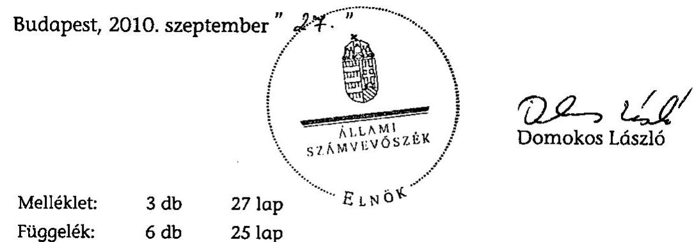

---

Mellékletek

---

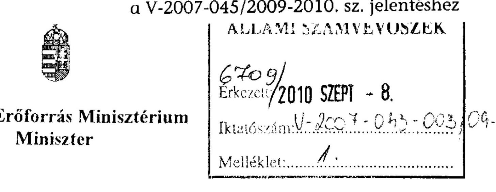

Iktatószám:11808-5/2010-1000MIN

Hiv. szám: V-2007-042/2009-2010.
Ügyintéző: dr. Koller-Mucska Dóra
Telefon: 472-8067
Melléklet: -

Domokos László úr
elnök
Állami Számvevőszék
Budapest

# Tisztelt Elnök Úr! 

Köszönettel vettem, hogy az állami feladat (közfeladat) ellátás szervezeti és humánerőforrás rendszerének ellenőrzéséről készített jelentés-tervezetre tett észrevételeim átvezetésre kerültek.

A jelentés-tervezet 69. oldalán szereplő állítás kapcsán, amely szerint az egészségügyben a tipikus foglalkoztatási forma a közalkalmazotti (96%), az alábbiakról tájékoztatom:

A most elkészült Állami Számvevőszéki jelentés részanyagának, előzményének (hivatkozási szám: V-3012-2009-10) 14. oldalán a következő állítás szerepel:
„A feladat-ellátás struktúrájával, a szervezetek változásával összhangban az Áh-n kivüli szervezetek által foglalkoztatott egészségügyi dolgozók létszáma 12898 fővel nőtt, míg az Áhn belüli szervezeteknél foglalkoztatottak létszáma 23790 fővel csökkent. Ugyanez a tendencia érvényesült az orvosok és szakdolgozók esetében is. Mindezek ellenére az egészségügyi dolgozóknak meghatározó részét (2006-ban 74%, 2008-ban 64,9%) még mindig az Áh-n belüli szervezetek foglalkoztatták."

A Központi Statisztikai Hivatal munkatársával folytatott konzultációt követően megküldték részemre azon táblázatot, amelyen a fenti állítás alapul, és amelyet levelemhez csatoltan továbbítok.

Mindezek alapján javasolom az Állami Számvevőszék korábbi saját megállapításait alapul venni, a későbbi munka során a Központi Statisztikai Hivatal OSAP 1019-es adatgyűjtése nyomán készültek hasznosításával.

---

A jelentés-tervezetben megfogalmazott, a feladat- és hatáskörömbe tartozó intézkedési javaslataival kapcsolatban a megadott határidőn belül tájékoztatom.

Budapest, 2010. szeptember 3.
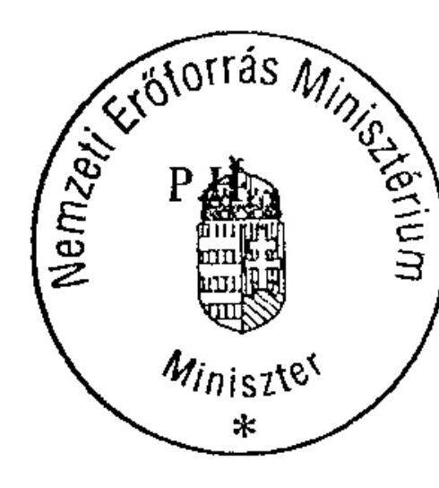

Üdvözlettel:
Cekut ML
Dr. Réthetyi Miklós

---

Egeszségügyi ellátás állás és létszámkimutatása gazdálkodási forma szerint, 2006-2008

|   |  |  |  |  |  |  |  |  |  |  |  |  |  | 2006 |  |  |  |  |   |
| --- | --- | --- | --- | --- | --- | --- | --- | --- | --- | --- | --- | --- | --- | --- | --- | --- | --- | --- | --- |
|   |  |  |  |  |  |  |  |  |  |  |  |  |  |  |  |  |  |  | Ebből. orvosi  |
|  Gazdálkodási forma |  |  |  |  |  |  |  |  |  |  |  |  |  |  |  |  |  |  |   |
|   |  |  |  |  |  |  |  |  |  |  |  |  |  |  |  |  |  |  |   |
|   |  |  |  |  |  |  |  |  |  |  |  |  |  |  |  |  |  |  |   |
|  |   |   |   |   |   |   |   |   |   |   |   |   |   |   |   |   |   |   |   |
|  |   |   |   |   |   |   |   |   |   |   |   |   |   |   |   |   |   |   |   |
|  |   |   |   |   |   |   |   |   |   |   |   |   |   |   |   |   |   |   |   |
|  |   |   |   |   |   |   |   |   |   |   |   |   |   |   |   |   |   |   |   |
|  Vállalkozási (1,2) |  |  |  |  |  |  |  |  |  |  |  |  |  |  |  |  |  |  |   |
|  |   |   |   |   |   |   |   |   |   |   |   |   |   |   |   |   |   |   |   |
|  |   |   |   |   |   |   |   |   |   |   |   |   |   |   |   |   |   |   |   |
|  |   |   |   |   |   |   |   |   |   |   |   |   |   |   |   |   |   |   |   |
|  |   |   |   |   |   |   |   |   |   |   |   |   |   |   |   |   |   |   |   |
|  |   |   |   |   |   |   |   |   |   |   |   |   |   |   |   |   |   |   |   |
|  |   |   |   |   |   |   |   |   |   |   |   |   |   |   |   |   |   |   |   |
|  |   |   |   |   |   |   |   |   |   |   |   |   |   |   |   |   |   |   |   |
|  |   |   |   |   |   |   |   |   |   |   |   |   |   |   |   |   |   |   |   |
|  Gazdálkodási forma |  | 

 |  |  |  |  |  |  |  |  |  |  |  |  |  |  |  |  |   |
|  |   |   |   |   |   |   |   |   |   |   |   |   |   |   |   |   |   |   |   |
|  |   |   |   |   |   |   |   |   |   |   |   |   |   |   |   |   |   |   |   |
|  |   |   |   |   |   |   |   |   |   |   |   |   |   |   |   |   |   |   |   |
|  Vállalkozási (1,2) |  |  |  |  |  |  |  |  |  |  |  |  |  |  |  |  |  |  |   |
|  |   |   |   |   |   |   |   |   |   |   |   |   |   |   |   |   |   |   |   |
|  |   |   |   |   |   |   |   |   |   |   |   |   |   |   |   |   |   |   |   |
|  |   |   |   |   |   |   |   |   |   |   |   |   |   |   |   |   |   |   |   |
|  |   |   |   |   |   |   |   |   |   |   |   |   |   |   |   |   |   |   |   |
|  |   |   |   |   |   |   |   |   |   |   |   |   |   |   |   |   |   |   |   |
|  |   |   |   |   |   |   |   |   |   |   |   |   |   |   |   |   |   |   |   |
|  Vállalkozási (1,2) |  |  |  |  |  |  |  |  |  |  |  |  |  |  |  |  |  |  |   |
|  |   |   |   |   |   |   |   |   |   |   |   |   |   |   |   |   |   |   |   |
|  |   |   |   |   |   |   |   |   |   |   |   |   |   |   |   |   |   |   |   |
|  |   |   |   |   |   |   |   |   |   |   |   |   |   |   |   |   |   |   |   |
|  |   |   |   |   |   |   |   |   |   |   |   |   |   |   |   |   |   |   |   |
|  |   |   |   |   |   |   |   |   |   |   |   |   |   |   |   |   |   |   |   |
|  |   |   |   |   |   |   |   |   |   |   |   |   |   |   |   |   |   |   |   |
|  |   |   |   |   |   |   |   |   |   |   |   |   |   |   |   |   |   |   |   |
|  Vállalkozási (1,2) |  |  |  |  |  |  |  |  |  |  |  |  |  |  |  |  |  |  |   |
|  |   |   |   |   |   |   |   |   |   |   |   |   |   |   |   |   |   |   |   |
|  |   |   |   |   |   |   |   |   |   |   |   |   |   |   |   |   |   |   |   |
|  |   |   |   |   |   |   |   |   |   |   |   |   |   |   |   |   |   |   |   |
|  |   |   |   |   |   |   |   |   |   |   |   |   |   |   |   |   |   |   |   |
|  |   |   |   |   |   |   |   |   |   |   |   |   |   |   |   |   |   |   |   |
|  Vállalkozási (1,2) |  |  |  |  |  |  |  |  |  |  |  |  |  |  |  |  |  |  |   |
|  |   |   |   |   |   |   |   |   |   |   |   |   |   |   |   |   |   |   |   |
|  |   |   |   |   |   |   |   |   |   |   |   |   |   |   |   |   |   |   |   |
|  |   |   |   |   |   |   |   |   |   |   |   |   |   |   |   |   |   |   |   |

   |   |   |   |   |   |   |   |
|  Vállalkozási (1,2) |  |  |  |  |  |  |  |  |  |  |  |  |  |  |  |  |  |  |   |
|  |   |   |   |   |   |   |   |   |   |   |   |   |   |   |   |   |   |   |   |
|  |   |   |   |   |   |   |   |   |   |   |   |   |   |   |   |   |   |   |   |
|  Vállalkozási (1,2) |  |  |  |  |  |  |  |  |  |  |  |  |  |  |  |  |  |  |   |
|  |   |   |   |   |   |   |   |   |   |   |   |   |   |   |   |   |   |   |   |
|  |   |   |   |   |   |   |   |   |   |   |   |   |   |   |   |   |   |   |   |
|  Vállalkozási (1,2) |  |  |  |  |  |  |  |  |  |  |  |  |  |  |  |  |  |  |   |
|  |   |   |   |   |   |   |   |   |   |   |   |   |   |   |   |   |   |   |   |
|  Vállalkozási (1,2) |  |  |  |  |  |  |  |  |  |  |  |  |  |  |  |  |  |  |   |
|  |   |   |   |   |   |   |   |   |   |   |   |   |   |   |   |   |   |   |   |
|  Vállalkozási (1,2) |  |  |  |  |  |  |  |  |  |  |  |  |  |  |  |  |  |  |   |
|  |   |   |   |   |   |   |   |   |   |   |   |   |   |   |   |   |   |   |   |
|  Vállalkozási (1,2) |  |  |  |  |  |  |  |  |  |  |  |  |  |  |  |  |  |  |   |
|  |   |   |   |   |   |   |   |   |   |   |   |   |   |   |   |   |   |   |   |
|  Vállalkozási (1,2) |  |  |  |  |  |  |  |  |  |  |  |  |  |  |  |  |  |  |   |
|  |   |   |   |   |   |   |   |   |   |   |   |   |   |   |   |   |   |   |   |
|  Vállalkozási (1,2) |  |  |  |  |  |  |  |  |  |  |  |  |  |  |  |  |  |  |   |
|  |   |   |   |   |   |   |   |   |   |   |   |   |   |   |   |   |   |   |   |
|  Vállalkozási (1,2) |  |  |  |  |  |  |  |  |  |  |  |  |  |  |  |  |  |  |   |
|  |   |   |   |   |   |   |   |   |   |   |   |   |   |   |   |   |   |   |   |
|  Vállalkozási (1,2) |  |  |  |  |  |  |  |  |  |  |  |  |  |  |  |  |  |  |   |
|  |   |   |   |   |   |   |   |   |   |   |   |   |   |   |   |   |   |   |   |
|  Vállalkozási (1,2) |  |  |  |  |  |  |  |  |  |  |  |  |  |  |  |  |  |  |   |
|  |   |   |   |   |   |   |   |   |   |   |   |   |   |   |   |   |   |   |   |
|  Vállalkozási (1,2) |  |  |  |  |  |  |  |  |  |  |  |  |  |  |  |  |  |  |   |
|  |   |   |   |   |   |   |   |   |   |   |   |   |   |   |   |   |   |   |   |
|  Vállalkozási (1,2) |  |  |  |  |  |  |  |  |  |  |  |  |  |  |  |  |  |  |   |
|  |   |   |   |   |   |   |   |   |   |   |   |   |   |   |   |   |   |   |   |
|  Vállalkozási (1,2) |  |  |  |  |  |  |  |  |  |  |  |  |  |

 |  |  |  |  |   |
|---|---|---|---|---|
|  |   |   |   |   |   |   |   |   |   |   |   |   |   |   |   |   |   |   |   |
|  Vállalkozási (1,2) |  |  |  |  |  |  |  |  |  |  |  |  |  |  |  |  |  |  |   |
|  |   |   |   |   |   |   |   |   |   |   |   |   |   |   |   |   |   |   |   |
|  Vállalkozási (1,2) |  |  |  |  |  |  |  |  |  |  |  |  |  |  |  |  |  |  |   |
|  |   |   |   |   |   |   |   |   |   |   |   |   |   |   |   |   |   |   |   |
|  Vállalkozási (1,2) |  |  |  |  |  |  |  |  |  |  |  |  |  |  |  |  |  |  |   |
|  |   |   |   |   |   |   |   |   |   |   |   |   |   |   |   |   |   |   |   |
|  Vállalkozási (1,2) |  |  |  |  |  |  |  |  |  |  |  |  |  |  |  |  |  |  |   |
|  |   |   |   |   |   |   |   |   |   |   |   |   |   |   |   |   |   |   |   |
|  Vállalkozási (1,2) |  |  |  |  |  |  |  |  |  |  |  |  |  |  |  |  |  |  |   |
|  |   |   |   |   |   |   |   |   |   |   |   |   |   |   |   |   |   |   |   |
|  Vállalkozási (1,2) |  |  |  |  |  |  |  |  |  |  |  |  |  |  |  |  |  |  |   |
|  |   |   |   |   |   |   |   |   |   |   |   |   |   |   |   |   |   |   |   |
|  Vállalkozási (1,2) |  |  |  |  |  |  |  |  |  |  |  |  |  |  |  |  |  |  |   |
|  |   |   |   |   |   |   |   |   |   |   |   |   |   |   |   |   |   |   |   |
|  Vállalkozási (1,2) |  |  |  |  |  |  |  |  |  |  |  |  |  |  |  |  |  |  |   |
|  |   |   |   |   |   |   |   |   |   |   |   |   |   |   |   |   |   |   |   |
|  Vállalkozási (1,2) |  |  |  |  |  |  |  |  |  |  |  |  |  |  |  |  |  |  |   |
|  |   |   |   |   |   |   |   |   |   |   |   |   |   |   |   |   |   |   |   |
|  Vállalkozási (1,2) |  |  |  |  |  |  |  |  |  |  |  |  |  |  |  |  |  |  |   |
|  |   |   |   |   |   |   |   |   |   |   |   |   |   |   |   |   |   |   |   |
|  Vállalkozási (1,2) |  |  |  |  |  |  |  |  |  |  |  |  |  |  |  |  |  |  |   |
|  |   |   |   |   |   |   |   |   |   |   |   |   |   |   |   |   |   |   |   |
|  Vállalkozási (1,2) |  |  |  |  |  |  |  |  |  |  |  |  |  |  |  |  |  |  |   |
|  |   |   |   |   |   |   |   |   |   |   |   |   |   |   |   |   |   |   |   |
|  Vállalkozási (1,2) |  |  |  |  |  |  |  |  |  |  |  |  |  |  |  |  |  |  |   |
|  |   |   |   |   |   |   |   |   |   |   |   |   |   |   |   |   |   |   |   |
|  Vállalkozási (1,2) |  |  |  |  |  |  |  |  |  |  |  |  |  |  |  |  |  |  |   |
|  |   |   |   |   |   |   |   |   |   |   |   |   |   |   |   |   |   |   |   |
|  Vállalkozási (1,2) |  |  |  |  |  |  |  |  |  |  |  |  |  |  |  |  |  |  |   |
|  |   |   |   |   |   |   |   |   |   |   |   |   |   |   |   |   |   |   |

 |
|  Vállalkozási (1,2) |  |  |  |  |  |  |  |  |  |  |  |  |  |  |  |  |  |  |   |
|  |   |   |   |   |   |   |   |   |   |   |   |   |   |   |   |   |   |   |   |
|  Vállalkozási (1,2) |  |  |  |  |  |  |  |  |  |  |  |  |  |  |  |  |  |  |   |
|  |   |   |   |   |   |   |   |   |   |   |   |   |   |   |   |   |   |   |   |
|  Vállalkozási (1,2) |  |  |  |  |  |  |  |  |  |  |  |  |  |  |  |  |  |  |   |
|  |   |   |   |   |   |   |   |   |   |   |   |   |   |   |   |   |   |   |   |
|  Vállalkozási (1,2) |  |  |  |  |  |  |  |  |  |  |  |  |  |  |  |  |  |  |   |
|  |   |   |   |   |   |   |   |   |   |   |   |   |   |   |   |   |   |   |   |
|  Vállalkozási (1,2) |  |  |  |  |  |  |  |  |  |  |  |  |  |  |  |  |  |  |   |
|  |   |   |   |   |   |   |   |   |   |   |   |   |   |   |   |   |   |   |   |
|  Vállalkozási (1,2) |  |  |  |  |  |  |  |  |  |  |  |  |  |  |  |  |  |  |   |
|  |   |   |   |   |   |   |   |   |   |   |   |   |   |   |   |   |   |   |   |
|  Vállalkozási (1,2) |  |  |  |  |  |  |  |  |  |  |  |  |  |  |  |  |  |  |   |
|  |   |   |   |   |   |   |   |   |   |   |   |   |   |   |   |   |   |   |   |
|  Vállalkozási (1,2) |  |  |  |  |  |  |  |  |  |  |  |  |  |  |  |  |  |  |   |
|  |   |   |   |   |   |   |   |   |   |   |   |   |   |   |   |   |   |   |   |
|  Vállalkozási (1,2) |  |  |  |  |  |  |  |  |  |  |  |  |  |  |  |  |  |  |   |
|  |   |   |   |   |   |   |   |   |   |   |   |   |   |   |   |   |   |   |   |
|  Vállalkozási (1,2) |  |  |  |  |  |  |  |  |  |  |  |  |  |  |  |  |  |  |   |
|  |   |   |   |   |   |   |   |   |   |   |   |   |   |   |   |   |   |   |   |
|  Vállalkozási (1,2) |  |  |  |  |  |  |  |  |  |  |  |  |  |  |  |  |  |  |   |
|  |   |   |   |   |   |   |   |   |   |   |   |   |   |   |   |   |   |   |   |
|  Vállalkozási (1,2) |  |  |  |  |  |  |  |  |  |  |  |  |  |  |  |  |  |  |   |
|  |   |   |   |   |   |   |   |   |   |   |   |   |   |   |   |   |   |   |   |
|  Vállalkozási (1,2) |  |  |  |  |  |  |  |  |  |  |  |  |  |  |  |  |  |  |   |
|  |   |   |   |   |   |   |   |   |   |   |   |   |   |   |   |   |   |   |   |
|  Vállalkozási (1,2) |  |  |  |  |  |  |  |  |  |  |  |  |  |  |  |  |  |  |   |
|  |   |   |   |   |   |   |   |   |   |   |   |   |   |   |   |   |   |   |   |
|  Vállalkozási (1,2) |  |  |  |  |  |  |  |  |  |  |  |  |  |  |  |  |  |  |   |
|  |   |   |   |   |   |   |   |   |   |   |   |   |   |   |   |   |   |   |   |
|  Vállalkozási (1,2) |  |  |  |  |  |  |  |  |  |  |  |  |  |  |  |  |  |  |   |
|  |   |   |   |   |   |   |   |  

 |   |   |   |   |   |   |   |   |   |   |   |
| Vállalkozási (1,2) |  |  |  |  |  |  |  |  |  |  |  |  |  |  |  |  |  |  |   |
|  |   |   |   |   |   |   |   |   |   |   |   |   |   |   |   |   |   |   |   |
| Vállalkozási (1,2) |  |  |  |  |  |  |  |  |  |  |  |  |  |  |  |  |  |  |   |
|  |   |   |   |   |   |   |   |   |   |   |   |   |   |   |   |   |   |   |   |
| Vállalkozási (1,2) |  |  |  |  |  |  |  |  |  |  |  |  |  |  |  |  |  |  |   |
|  |   |   |   |   |   |   |   |   |   |   |   |   |   |   |   |   |   |   |   |
| Vállalkozási (1,2) |  |  |  |  |  |  |  |  |  |  |  |  |  |  |  |  |  |  |   |
|  |   |   |   |   |   |   |   |   |   |   |   |   |   |   |   |   |   |   |   |   |
| Vállalkozási (1,2) |  |  |  |  |  |  |  |  |  |  |  |  |  |  |  |  |  |  |  |   |
|  |   |   |   |   |   |   |   |   |   |   |   |   |   |   |   |   |   |   |   |   |
| Vállalkozási (1,2) |  |  |  |  |  |  |  |  |  |  |  |  |  |  |  |  |  |  |  |   |
|  |   |   |   |   |   |   |   |   |   |   |   |   |   |   |   |   |   |   |   |   |   |
| Vállalkozási (1,2) |  |  |  |  |  |  |  |  |  |  |  |  |  |  |  |  |  |  |  |  |   |
|  |   |   |   |   |   |   |   |   |   |   |   |   |   |   |   |   |   |   |   |   |   |
| Vállalkozási (1,2) |  |  |  |  |  |  |  |  |  |  |  |  |  |  |  |  |  |  |  |  |   |
|  |   |   |   |   |   |   |   |   |   |   |   |   |   |   |   |   |   |   |   |   |   |
| Vállalkozási (1,2) |  |  |  |  |  |  |  |  |  |  |  |  |  |  |  |  |  |  |  |  |   |
|  |   |   |   |   |   |   |   |   |   |   |   |   |   |   |   |   |   |   |   |   |   |
| Vállalkozási (1,2) |  |  |  |  |  |  |  |  |  |  |  |  |  |  |  |  |  |  |  |  |   |
|  |   |   |   |   |   |   |   |   |   |   |   |   |   |   |   |   |   |   |   |   |   |
| Vállalkozási (1,2) |  |  |  |  |  |  |  |  |  |  |  |  |  |  |  |  |  |  |  |  |   |
|  |   |   |   |   |   |   |   |   |   |   |   |   |   |   |   |   |   |   |   |   |   |
| Vállalkozási (1,2) |  |  |  |  |  |  |  |  |  |  |  |  |  |  |  |  |  |  |  |  |   |
|  |   |   |   |   |   |   |   |   |   |   |   |   |   |   |   |   |   |   |   |   |   |   |
| Vállalkozási (1,2) |  |  |  |  |  |  |  |  |  |  |  |  |  |  |  |  |  |  |  |  |  |   |
|  |   |   |   |   |   |   |   |   |   |   |   |   |   |   |   |   |   |   |   |   |   |   |   |
| Vállalkozási (1,2) |  |  |  |  |  |  |  |  |  |  |

 |  |  |  |  |  |  |  |  |  |  |  |   |
|  |   |   |   |   |   |   |   |   |   |   |   |   |   |   |   |   |   |   |   |   |   |   |   |
|  Vállalkozási (1,2) |  |  |  |  |  |  |  |  |  |  |  |  |  |  |  |  |  |  |  |  |  |  |   |
|  |   |   |   |   |   |   |   |   |   |   |   |   |   |   |   |   |   |   |   |   |   |   |   |   |
|  Vállalkozási (1,2) |  |  |  |  |  |  |  |  |  |  |  |  |  |  |  |  |  |  |  |  |  |  |  |   |
|  |   |   |   |   |   |   |   |   |   |   |   |   |   |   |   |   |   |   |   |   |   |   |   |   |
|  Vállalkozási (1,2) |  |  |  |  |  |  |  |  |  |  |  |  |  |  |  |  |  |  |  |  |  |  |  |   |
|  |   |   |   |   |   |   |   |   |   |   |   |   |   |   |   |   |   |   |   |   |   |   |   |   |
|  Vállalkozási (1,2) |  |  |  |  |  |  |  |  |  |  |  |  |  |  |  |  |  |  |  |  |  |  |  |   |
|  |   |   |   |   |   |   |   |   |   |   |   |   |   |   |   |   |   |   |   |   |   |   |   |   |
|  Vállalkozási (1,2) |  |  |  |  |  |  |  |  |  |  |  |  |  |  |  |  |  |  |  |  |  |  |  |  |   |
|  |   |   |   |   |   |   |   |   |   |   |   |   |   |   |   |   |   |   |   |   |   |   |   |   |   |
|  Vállalkozási (1,2) |  |  |  |  |  |  |  |  |  |  |  |  |  |  |  |  |  |  |  |  |  |  |  |   |
|  |   |   |   |   |   |   |   |   |   |   |   |   |   |   |   |   |   |   |   |   |   |   |   |   |   |
|  Vállalkozási (1,2) |  |  |  |  |  |  |  |  |  |  |  |  |  |  |  |  |  |  |  |  |  |  |  |  |   |
|  |   |   |   |   |   |   |   |   |   |   |   |   |   |   |   |   |   |   |   |   |   |   |   |   |   |   |
|  Vállalkozási (1,2) |  |  |  |  |  |  |  |  |  |  |  |  |  |  |  |  |  |  |  |  |  |  |  |  |  |   |
|  |   |   |   |   |   |   |   |   |   |   |   |   |   |   |   |   |   |   |   |   |   |   |   |   |   |   |   |   |
|  |   |   |   |   |   |   |   |   |   |   |   |   |   |   |   |   |   |   |   |   |   |   |   |   |   |   |   |   |
|  Vállalkozási (1,2) |  |  |  |  |  |  |  |  |  |  |  |  |  |  |  |  |  |  |  |  |  |  |  |  |  |  |   |
|  |   |   |   |   |   |   |   |   |   |   |   |   |   |   |   |   |   |   |   |   |   |   |   |   |   |   |   |   |   |
|  |   |   |   |   |   |   |   |   |   |   |   |   |   |   |   |   |   |   |   |   |   |   |   |   |   |   |  

 |   |   |   |
|---|---|---|
|  |   |   |   |   |   |   |   |   |   |   |   |   |   |   |   |   |   |   |   |   |   |   |   |   |   |   |   |   |   |   |   |
|  |   |   |   |   |   |   |   |   |   |   |   |   |   |   |   |   |   |   |   |   |   |   |   |   |   |   |   |   |   |   |   |   |
|  |   |   |   |   |   |   |   |   |   |   |   |   |   |   |   |   |   |   |   |   |   |   |   |   |   |   |   |   |   |   |   |   |   |
|  |   |   |   |   |   |   |   |   |   |   |   |   |   |   |   |   |   |   |   |   |   |   |   |   |   |   |   |   |   |   |   |   |   |   |   |
|  |   |   |   |   |   |   |   |   |   |   |   |   |   |   |   |   |   |   |   |   |   |   |   |   |   |   |   |   |   |   |   |   |   |   |   |
|  |   |   |   |   |   |   |   |   |   |   |   |   |   |   |   |   |   |   |   |   |   |   |   |   |   |   |   |   |   |   |   |   |   |   |   |   |   |   |   |   |
|  |   |   |   |   |   |   |   |   |   |   |   |   |   |   |   |   |   |   |   |   |   |   |   |   |   |   |   |   |   |   |   |   |   |   |   |   |   |   |   |   |
|  |   |   |   |   |   |   |   |   |   |   |   |   |   |   |   |   |   |   |   |   |   |   |   |   |   |   |   |   |   |   |   |   |   |   |   |   |   |   |   |   |   |
|  |   |   |   |   |   |   |   |   |   |   |   |   |   |   |   |   |   |   |   |   |   |   |   |   |   |   |   |   |   |   |   |   |   |   |   |   |   |   |   |   |   |   |
|  |   |   |   |   |   |   |   |   |   |   |   |   |   |   |   |   |   |   |   |   |   |   |   |   |   |   |   |   |   |   |   |   |   |   |   |   |   |   |   |
|  |   |   |   |   |   |   |   |   |   |   |   |   |   |   |   |   |   |   |   |   |   |   |   |   |   |   |   |   |   |   |   |   |   |   |   |   |   |   |   |
|  |   |   |   |   |   |   |   |   |   |   |   |   |   |   |   |   |   |   |   |   |   |   |   |   |   |   |   |   |   |   |   |   |   |   |   |   |   |
|  |   |   |   |   |   |   |   |   |   |   |   |   |   |   |   |   |   |   |   |   |   |   |   |   |   |   |   |   |   |   |   |   |   |   |   |   |   |   |
|  |   |   |   |   |   |   |   |   |   |   |   |   |   |   |   |   |   |   |   |   |   |   |   |   |   |   |   |   |   |   |   |   |   |   |   |
|  |   |   |   |

   |   |   |   |   |   |   |   |   |   |   |   |   |   |   |   |   |   |   |   |   |   |   |   |   |   |   |   |   |   |   |   |
|  |   |   |   |   |   |   |   |   |   |   |   |   |   |   |   |   |   |   |   |   |   |   |   |   |   |   |   |   |   |   |   |   |   |   |   |   |   |
|  |   |   |   |   |   |   |   |   |   |   |   |   |   |   |   |   |   |   |   |   |   |   |   |   |   |   |   |   |   |   |   |   |   |   |   |   |   |   |
|  |   |   |   |   |   |   |   |   |   |   |   |   |   |   |   |   |   |   |   |   |   |   |   |   |   |   |   |   |   |   |   |   |   |   |   |   |
|  |   |   |   |   |   |   |   |   |   |   |   |   |   |   |   |   |   |   |   |   |   |   |   |   |   |   |   |   |   |   |   |   |   |   |   |   |   |
|  |   |   |   |   |   |   |   |   |   |   |   |   |   |   |   |   |   |   |   |   |   |   |   |   |   |   |   |   |   |   |   |   |   |
|  |   |   |   |   |   |   |   |   |   |   |   |   |   |   |   |   |   |   |   |   |   |   |   |   |   |   |   |   |   |   |   |   |   |
|  |   |   |   |   |   |   |   |   |   |   |   |   |   |   |   |   |   |   |   |   |   |   |   |   |   |   |   |   |   |   |   |   |   |   |   |   |
|  |   |   |   |   |   |   |   |   |   |   |   |   |   |   |   |   |   |   |   |   |   |   |   |   |   |   |   |   |   |   |   |
|  |   |   |   |   |   |   |   |   |   |   |   |   |   |   |   |   |   |   |   |   |   |   |   |   |   |   |   |   |   |   |   |   |   |   |
|  |   |   |   |   |   |   |   |   |   |   |   |   |   |   |   |   |   |   |   |   |   |   |   |   |   |   |   |   |   |   |   |   |
|  |   |   |   |   |   |   |   |   |   |   |   |   |   |   |   |   |   |   |   |   |   |   |   |   |   |   |   |   |   |   |   |   |
|  |   |   |   |   |   |   |   |   |   |   |   |   |   |   |   |   |   |   |   |   |   |   |   |   |   |   |   |   |   |   |   |
|  |   |   |   |   |   |   |   |   |   |   |   |   |   |   |   |   |   |   |   |   |   |   |   |   |   |   |   |   |   |   |
|  |   |   |   |   |   |   |   |   |   |   |   |   |   |   |   |   |   |   |   |   |   |   |   |   |   |   |   |   |   |
|  |   |   |   |   |   |   |   |   |   |   |   |   |   |   |   |   |   |   |   |   |   | 

 |  |   |   |   |   |   |   |   |   |   |   |   |   |   |
| --- | --- | --- | --- | --- | --- | --- | --- | --- | --- | --- | --- | --- | --- |
|  Gazdálkodási forma | 2006 |  |  |  | 2007 |  |  |  | 2008 |  |  |  |   |
|   |  | Összesen |  | Ebből. orvosi |  | Összesen |  | Ebből. orvosi |  | Összesen |  | Ebből. orvosi |   |
|   |  | Működéshez szükséges állások megoszlás (%) |  | Működéshez szükséges állások megoszlás (%) |  | Működéshez szükséges állások megoszlás (%) |  | Működéshez szükséges állások megoszlás (%) |  | Működéshez szükséges állások megoszlás (%) |  | Működéshez szükséges állások megoszlás (%) |   |
|  Vállalkozás (1,2) | 19,2 | 1,2 | 38,8 | 40,9 | 52,8 | 52,8 | 52,8 | 52,8 | 52,8 | 52,8 | 52,8 | 52,8 | 52,8  |
|  311 Központi felügyeleti költségvetési szerv. | 0,0 | 0,0 | 0,0 | 0,0 | 0,0 | 0,0 | 0,0 | 0,1 | 0,1 | 0,0 | 0,0 | 0,1 | 0,1  |
|  312 Központilag felügyelt költségvetési szerv. | 24,8 | 25,0 | 20,2 | 20,6 | 23,0 | 22,9 | 18,4 | 18,8 | 22,0 | 21,7 | 17,7 | 17,9 |   |
|  Központi költségvetési szerv és intézménye (31) | 24,8 | 25,0 | 20,2 | 20,6 | 23,1 | 22,9 | 18,5 | 18,8 | 22,0 | 21,8 | 17,7 | 17,9 |   |
|  321 Helyi önkormányzati végrehajtó költségvetési szerv. | 2,3 | 2,3 | 1,5 | 1,4 | 2,1 | 2,2 | 1,1 | 1,0 | 2,1 | 2,1 | 0,8 | 0,8 |   |
|  322 Helyi önkormányzat által felügyelt költségvetési szerv. | 47,7 | 46,6 | 35,3 |
 | 33,0 | 44,6 | 43,7 | 31,7 | 29,9 | 42,0 | 40,9 | 29,5 | 27,6 |   |
|  Helyi önkormányzat költségvetési szerv és intézménye (321, 322) | 50,0 | 48,9 | 36,8 | 34,4 | 46,7 | 45,8 | 32,8 | 30,9 | 44,0 | 43,0 | 30,3 | 28,3 |   |
|  366 Többcélú kistérségi társulás | 0,0 | 0,0 | - | - | 0,1 | 0,1 | 0,1 | 0,1 | 0,1 | 0,1 | 0,2 | 0,2 |   |
|  Egyéb költségvetési szerv | 0,0 | 0,0 | - | - | 0,1 | 0,1 | 0,1 | 0,1 | 0,1 | 0,1 | 0,2 | 0,2 |   |
|  Költségvetési szerv (3) | 14,9 | 1,2 | 57,0 | 54,9 | 51,0 | 50,0 | 48,0 | 47,0 | 50,0 | 47,0 | 45,0 | 44,0 |   |
|  Nonprofit szervezet (5) | 15,4 | 1,2 | 41,5 | 41,5 | 41,5 | 41,5 | 41,5 | 41,5 | 41,5 | 41,5 | 41,5 | 41,5 |   |
|  Összesen | 100,0 | 100,0 | 100,0 | 100,0 | 100,0 | 100,0 | 100,0 | 100,0 | 100,0 | 100,0 | 100,0 | 100,0 | 100,0  |

---

# Dr. Réthelyi Miklós úr 

miniszter
Nemzeti Erőforrás Minisztérium

## Tisztelt Miniszter Úr!

Az állami feladat (közfeladat) ellátás szervezeti és humánerőforrás rendszerének ellenőrzéséről készített jelentésünkre adott észrevételét köszönettel megkaptam.

Miniszter Úr észrevétele az egészségügyben foglalkoztatottak 96%-os közalkalmazotti arányára vonatkozik, amelyet nem tart reálisnak. Véleménye szerint ez az arány alacsonyabb. Ennek alátámasztására az egyik számvevői jelentésünk adataira hivatkozik, amely szerint az államháztartáshoz tartozó szervezeteknél foglalkoztatottak aránya az egészségügyi ágazaton belül 2006-ban 74%-os, 2008-ban 64,9%-os volt.

Megjegyezni kívánom, hogy az Ön által és az általunk alkalmazott KSH tábláknak más-más a viszonyítási alapja. A Jelentés 69. oldalán található adatok - így az egészségügyre vonatkozó is - a költségvetési szférán belül mutatják ágazatonként a közalkalmazottak arányát. (Az egészségügyi ágazat költségvetési intézményeinek foglalkoztatási adatait tartalmazó, az Ön által vitatott 96%-os arány kiszámításának alapjául szolgáló KSH táblázatot levelemhez csatolom.) Az Ön által hivatkozott, a leveléhez csatolt KSH táblában szereplő alacsonyabb arányszámok esetében viszont - a költségvetési szférán kívül - a nonprofit szervezeteket és vállalkozásokat is magába foglaló létszám a vetítés alapja. Jelentésünk idézett helyén az általunk alkalmazott megközelítés célszerűségét az indokolta, hogy nem a vizsgált ágazatok létszámviszonyainak alakulását, hanem kormányzati intézkedéseknek a közszféra foglalkoztatási helyzetére gyakorolt hatását elemezzük.

Véleményem szerint a különböző összefüggéseket az ÁSZ Jelentés egyértelműen és árnyaltan tartalmazza, ezért annak módosítását nem tartom szükségesnek.

Budapest, 2010. szeptember 15.
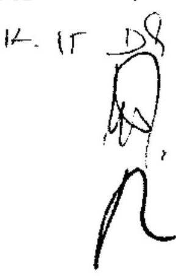

Tisztelettel:
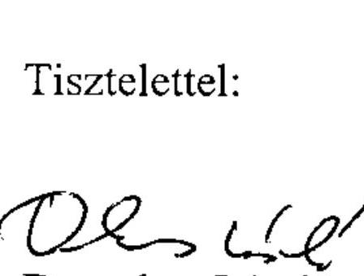

Tes Lleg
Domokos László

Melléklet: KSH OSAP IH02 sz. táblázat

---

OSAP száma: IH02
IH02
Megye, régió:Összesen
Lkat: Létszámkategória összesen
Gfo: 3== Költségvetési szerv és intézménye
Ágazat: 0000-9999
Ág,ágazatok
jele Megnevezés

A28. Átlagos állományi létszámok
Jogállás szerint

Alkalmazásban állók összesen
--------- Létszáma, (fő)
Fizikai Szellemi Összes

2006. 01-12 hó

851= Humán-
egészségügy
köztisztviselő
egyéb
közalkalmazott
közhasznú alkalmazott
közcélú alkalmazott
költségvetési intézmény összesen

0 3 463 3 463
760 199 959
27 167 87 664 114 832
96 26 122
9 0 10
28 033 91 352 119 385

2007. év 01-12 hó

851= Humán-
egészségügy
köztisztviselő
egyéb
közalkalmazott
közhasznú alkalmazott
közcélú alkalmazott
költségvetési intézmény összesen

0 2 714 2 714
601 267 868
23 883 81 624 105 507
68 29 97
6 1 7
24 558 84 634 109 192

2008. év 01-12 hó

851= Humán-
egészségügy
köztisztviselő
egyéb
közalkalmazott
közhasznú alkalmazott
közcélú alkalmazott
költségvetési intézmény összesen

0 2 515 2 515
548 315 863
20 370 72 542 92 911
53 17 69
6 2 8
20 976 75 390 96 366

---

# 1/c. sz. melléklet 

a V-2007-045/2009-2010. sz. jelentéshez

## ÁLLAMI SZÁMVEVŐSZÉK

## 6997/   Erkezet/ 2010 AUG 17.

Iktatószám: 1-2007-045-001 105. Melléklet:  AEF-294/10.

Hiv. sz.: V-2007-042/2009-2010.
Ikt. sz: ATM/952/4/2010.

## Domokos László elnök úr részére

Állami Számvevőszék

## Budapest

## Tisztelt Elnök Úr!

Az állami feladat (közfeladat) ellátás szervezeti és humánerőforrás rendszerének ellenőrzéséhez készített állami számvevőszéki jelentéssel egyetértek.

Az ellenőrzéssel összefüggésben elrendelt intézkedéseimről a kért határidőn belül tájékoztatni fogom Önt.

Budapest, 2010. augusztus 10.
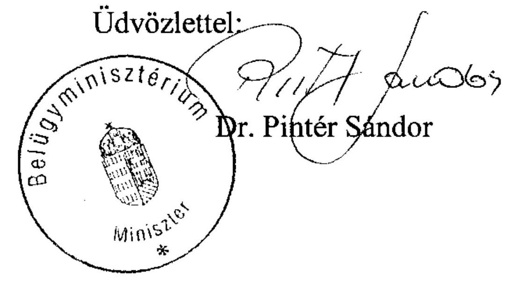

---

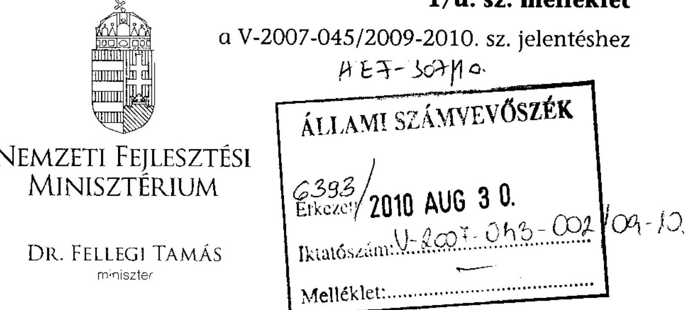

Domokos László
elnök úr
részére

Állami Számvevőszék

Budapest

Tisztelt Elnök Úr!
Iktatószám: NFM/3306/5/2010.
Hiv. szám: V-2007-042/2009-2010.
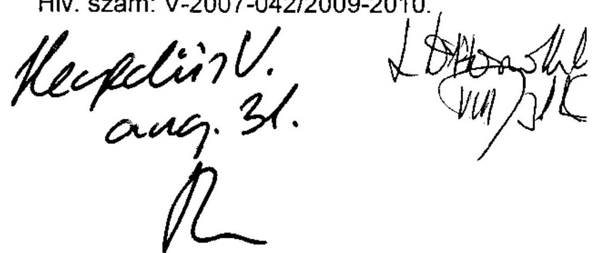

Köszönettel megkaptam „az állami feladat (közfeladat) ellátás szervezeti és humánerőforrás rendszerének ellenőrzéséről" készült jelentésüket.

A megküldött jelentésre észrevételt nem kívánok tenni.
Köszönöm, hogy munkájukkal hozzájárultak a közfeladatok ellátásának eredményesebb és hatékonyabb működéséhez.

Budapest, 2010. augusztus 20.

Tisztelettel:
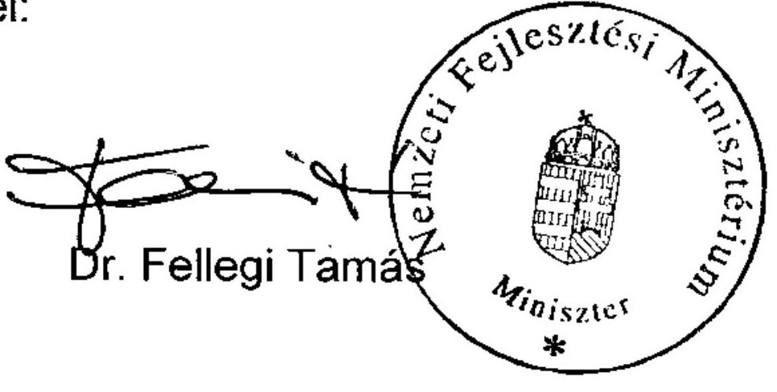

---

# A helyszíni vizsgálatra kijelölt szervezetek az államháztartás központi szintjén 

A) Minisztériumok:

Miniszterelnöki Hivatal
Pénzügyminisztérium
Igazságügyi és Rendészeti Minisztérium
Önkormányzati Minisztérium
Egészségügyi Minisztérium
Oktatási és Kulturális Minisztérium
Szociális és Munkaügyi Minisztérium
Nemzeti Fejlesztési és Gazdasági Minisztérium
B) Fejezeti intézmények

Magyar Államkincstár
Nemzeti Fejlesztési Ügynökség
Központi Statisztikai Hivatal
Kormányzati Személyügyi Szolgáltató és Közigazgatási Képzési Központ
C) Ágazati intézmények, gazdálkodó szervezetek:

Egészségügyi Minisztérium:

- Állami Népegészségügyi és Tisztiorvosi Szolgálat
- Országos Mentőszolgálat
- OMSZ Légimentő Közhasznú Társaság

Oktatási és Kulturális Minisztérium:

- Oktatási Hivatal
- EDUCATIO Társadalmi Szolgáltató Közhasznú Társaság
- Oktatásért Közalapítvány

Szociális és Munkaügyi Minisztérium:

- Foglalkoztatási és Szociális Hivatal
- Európai Szociális Alap Nemzeti Programirányító Iroda Társadalmi

Szolgáltató Közhasznú Társaság

- Betegjogi, Ellátottjogi és Gyermekjogi Közalapítvány

---

# A közfeladat-ellátás vizsgálat önkormányzati helyszínei 

|  | Megye/Főváros | Önkormányzat neve |
| :--: | :--: | :--: |
|  | Megyei Önkormányzatok: |  |
| 1 | Bács-Kiskun | Megyei önkormányzat |
| 2 | Borsod-Abaúj-Zemplén | Megyei önkormányzat |
| 3 | Szabolcs-Szatmár-Bereg | Megyei önkormányzat |
| 4 | Vas | Megyei önkormányzat |
|  | Megyei jogú városok: |  |
| 5 | Heves | Eger |
| 6 | Somogy | Kaposvár |
| 7 | Zala | Zalaegerszeg |
|  | Fővárosi kerületek: |  |
| 8 | Főváros | VIII. kerület |
|  | Városok: |  |
| 9 | Baranya | Harkány |
| 10 | Bács-Kiskun | Kiskőrös |
| 11 | Bács-Kiskun | Kiskunfélegyháza |
| 12 | Baranya | Komló |
| 13 | Győr-Moson-Sopron | Fertőszentmiklós |
| 14 | Komárom-Esztergom | Ács |
| 15 | Pest | Visegrád |
| 16 | Szabolcs-Szatmár-Bereg | Tiszavasvári |
| 17 | Szabolcs-Szatmár-Bereg | Nyírlugos |
| 18 | Szabolcs-Szatmár-Bereg | Kisvárda |
| 19 | Tolna | Bátaszék |
| 20 | Veszprém | Tapolca |
| 21 | Veszprém | Ajka |
|  | Községek: |  |
| 22 | Fejér | Káloz |
| 23 | Bács-Kiskun | Dunafalva |
| 24 | Bács-Kiskun | Vaskút |
| 25 | Baranya | Alsószentmárton |
| 26 | Baranya | Bükkösd |
| 27 | Baranya | Vokány |
| 28 | Baranya | Csányoszró |
| 29 | Baranya | Diósviszló |
| 30 | Baranya | Bogádmindszent |
| 31 | Baranya | Baranyajenő |
| 32 | Baranya | Villánykövesd |
| 33 | Baranya | Gilvánfa |
| 34 | Baranya | Babarc |
| 35 | Borsod-Abaúj-Zemplén | Vilmány |
| 36 | Borsod-Abaúj-Zemplén | Hollóháza |

---

2/b. sz. melléklet
a V-2007-045/2009-2010. sz. jelentéshez

A közfeladat-ellátás vizsgálat önkormányzati helyszínei

|  | Megye/Főváros | Önkormányzat neve |
| :--: | :--: | :--: |
| 37 | Győr-Moson-Sopron | Dunasziget |
| 38 | Pest | Kemence |
| 39 | Szabolcs-Szatmár-Bereg | Biri |
| 40 | Szabolcs-Szatmár-Bereg | Ópályi |
| 41 | Szabolcs-Szatmár-Bereg | Nyírmeggyes |
| 42 | Szabolcs-Szatmár-Bereg | Tarpa |
| 43 | Szabolcs-Szatmár-Bereg | Szatmárcseke |
| 44 | Tolna | Tengelic |
| 45 | Tolna | Tolnanémedi |
| 46 | Tolna | Bába |
| 47 | Vas | Ják |
| 48 | Vas | Hegyfalu |
| 49 | Vas | Szeleste |
| 50 | Vas | Bozsok |
| 51 | Vas | Kenéz |
| 52 | Veszprém | Öskü |
| 53 | Veszprém | Taliándörögd |
| 54 | Veszprém | Nyirád |
| 55 | Zala | Sármellék |

---

# Adatszolgáltatásra felkért mintavétellel kiválasztott önkormányzatok 

|  | Megye/Főváros | Önkormányzat neve |
| :--: | :--: | :--: |
| 1. | Fővárosi Önkormányzat | Budapest Főváros Önkormányzata |
|  | Megyei Önkormányzatok: |  |
| 2. | Békés | Megyei önkormányzat |
| 3. | Csongrád | Megyei önkormányzat |
| 4. | Heves | Megyei önkormányzat |
| 5. | Somogy | Megyei önkormányzat |
| 6. | Tolna | Megyei önkormányzat |
|  | Megyei jogú városok: |  |
| 7. | Borsod-Abaúj-Zemplén | Miskolc |
| 8. | Csongrád | Hódmezővásárhely |
| 9. | Fejér | Székesfehérvár |
| 10. | Szabolcs-Szatmár-Bereg | Nyíregyháza |
|  | Fővárosi kerületek: |  |
| 11. | Főváros | I. kerület |
| 12. | Főváros | III. kerület |
| 13. | Főváros | IV. kerület |
|  | Városok: |  |
| 14. | Baranya | Bóly |
| 15. | Baranya | Mohács |
| 16. | Baranya | Siklós |
| 17. | Bács-Kiskun | Lajosmizse |
| 18. | Bács-Kiskun | Tiszakécske |
| 19. | Bács-Kiskun | Tompa |
| 20. | Békés | Orosháza |
| 21. | Békés | Szarvas |
| 22. | Borsod-Abaúj-Zemplén | Abaújszántó |
| 23. | Borsod-Abaúj-Zemplén | Borsodnádasd |
| 24. | Borsod-Abaúj-Zemplén | Gönc |
| 25. | Borsod-Abaúj-Zemplén | Kazincbarcika |
| 26. | Borsod-Abaúj-Zemplén | Özd |
| 27. | Borsod-Abaúj-Zemplén | Pálháza |
| 28. | Borsod-Abaúj-Zemplén | Sárospatak |
| 29. | Borsod-Abaúj-Zemplén | Tiszaújváros |
| 30. | Csongrád | Csongrád |
| 31. | Fejér | Adony |
| 32. | Fejér | Bicske |
| 33. | Fejér | Bodajk |
| 34. | Fejér | Mór |
| 35. | Fejér | Sárbogárd |
| 36. | Győr-Moson-Sopron | Csorna |
| 37. | Győr-Moson-Sopron | Mosonmagyaróvár |
| 38. | Győr-Moson-Sopron | Pannonhalma |
| 39. | Győr-Moson-Sopron | Tét |
| 40. | Hajdú-Bihar | Biharkeresztes |
| 41. | Hajdú-Bihar | Hajdúböszörmény |
| 42. | Hajdú-Bihar | Hajdúnánás |
| 43. | Hajdú-Bihar | Hajdúsámson |

---

# Adatszolgáltatásra felkért mintavétellel kiválasztott önkormányzatok 

|  | Megye/Főváros | Önkormányzat neve |
| :--: | :--: | :--: |
| 44. | Hajdú-Bihar | Hajdúszoboszló |
| 45. | Hajdú-Bihar | Püspökladány |
| 46. | Heves | Bélapátfalva |
| 47. | Heves | Heves |
| 48. | Heves | Kisköre |
| 49. | Heves | Pétervására |
| 50. | Komárom-Esztergom | Dorog |
| 51. | Komárom-Esztergom | Esztergom |
| 52. | Komárom-Esztergom | Komárom |
| 53. | Komárom-Esztergom | Tata |
| 54. | Pest | Biatorbágy |
| 55. | Pest | Budaörs |
| 56. | Pest | Gyömrő |
| 57. | Pest | Monor |
| 58. | Pest | Nagykáta |
| 59. | Pest | Nagykörös |
| 60. | Pest | Pilis |
| 61. | Pest | Pilisvörösvár |
| 62. | Pest | Pomáz |
| 63. | Pest | Szigetszentmiklós |
| 64. |

 Pest | Vecsés |
| 65. | Somogy | Balatonföldvár |
| 66. | Somogy | Kadarkút |
| 67. | Somogy | Lengyeltóti |
| 68. | Szabolcs-Szatmár-Bereg | Dombrád |
| 69. | Szabolcs-Szatmár-Bereg | Záhony |
|  |  |  |
|  | Községek: |  |
| 70. | Baranya | Beremend |
| 71. | Baranya | Csonkamindszent |
| 72. | Baranya | Erdősmárok |
| 73. | Baranya | Kisdér |
| 74. | Baranya | Markóc |
| 75. | Baranya | Pócsa |
| 76. | Baranya | Vajszló |
| 77. | Baranya | Vékény |
| 78. | Bács-Kiskun | Lakitelek |
| 79. | Bács-Kiskun | Sükösd |
| 80. | Békés | Csabacsüd |
| 81. | Békés | Medgyesegyháza |
| 82. | Borsod-Abaúj-Zemplén | Arló |
| 83. | Borsod-Abaúj-Zemplén | Izsófalva |
| 84. | Borsod-Abaúj-Zemplén | Mezőkeresztes |
| 85. | Borsod-Abaúj-Zemplén | Mucsony |
| 86. | Borsod-Abaúj-Zemplén | Onga |
| 87. | Borsod-Abaúj-Zemplén | Taktaharkány |
| 88. | Csongrád | Csanádpalota |
| 89. | Fejér | Aba |
| 90. | Fejér | Előszállás |

---

# Adatszolgáltatásra felkért mintavétellel kiválasztott önkormányzatok 

|  | Megye/Főváros | Önkormányzat neve |
| :--: | :--: | :--: |
| 91. | Fejér | Lepsény |
| 92. | Fejér | Perkáta |
| 93. | Fejér | Rácalmás |
| 94. | Fejér | Sárosd |
| 95. | Fejér | Szabadbattyán |
| 96. | Győr-Moson-Sopron | Beled |
| 97. | Győr-Moson-Sopron | Hegyeshalom |
| 98. | Győr-Moson-Sopron | Nagycenk |
| 99. | Győr-Moson-Sopron | Szany |
| 100. | Győr-Moson-Sopron | Vásárosfalu |
| 101. | Hajdú-Bihar | Vekerd |
| 102. | Heves | Kál |
| 103. | Heves | Parád |
| 104. | Heves | Verpelét |
| 105. | Komárom-Esztergom | Nagyigmánd |
| 106. | Komárom-Esztergom | Tokod |
| 107. | Pest | Alsónémedi |
| 108. | Pest | Bag |
| 109. | Pest | Budakalász |
| 110. | Pest | Diósd |
| 111. | Pest | Leányfalu |
| 112. | Pest | Páty |
| 113. | Somogy | Kaposgyarmat |
| 114. | Somogy | Kára |
| 115. | Somogy | Kisasszond |
| 116. | Somogy | Somogysimonyi |
| 117. | Somogy | Szentborbás |
| 118. | Somogy | Varászló |
| 119. | Szabolcs-Szatmár-Bereg | Ajak |
| 120. | Szabolcs-Szatmár-Bereg | Tüzsér |
| 121. | Tolna | Murga |
| 122. | Vas | Döbörhegy |
| 123. | Vas | Harasztifalu |
| 124. | Vas | Kerkáskápolna |
| 125. | Vas | Mesterháza |
| 126. | Vas | Nagymizdó |
| 127. | Vas | Pinkamindszent |
| 128. | Vas | Porpác |
| 129. | Vas | Pusztacsó |
| 130. | Veszprém | Hetyefő |
| 131. | Veszprém | Németbánya |
| 132. | Veszprém | Salföld |
| 133. | Veszprém | Somlóvecse |
| 134. | Veszprém | Várkesző |
| 135. | Veszprém | Vid |
| 136. | Zala | Hernyék |

---

# Táblázatok, tanúsítványok, diagramok 

3/1. sz. A vizsgált fejezetek költségvetési intézményei számának alakulása 2006-2009 között

3/2. sz. A vizsgált fejezetek tényleges létszámának alakulása 2006-2010 között

3/3. sz. Az állam által alapított/tulajdonolt gazdasági szervezetek számának alakulása 2006-2009 között

3/4. sz. A köztisztviselői illetmények különbözőségei egyes központi intézményekben

3/5. sz. A vizsgált közfeladatokat ellátó intézmények számának megoszlása a települések lakosság szerint kialakított csoportjaihoz viszonyítva (2008. december 31.) ${ }^{1}$

3/5-1. sz. A háziorvosi ellátottság település típusonkénti alakulása
3/5-2. sz. A bölcsődei ellátottság település típusonkénti alakulása
3/5-3. sz. Az óvodai ellátottság település típusonkénti alakulása
3/5-4. sz. Az általános iskolai ellátottság település típusonkénti alakulása
3/5-5. sz. A gimnáziumi ellátottság település típusonkénti alakulása
3/5-6. sz. A szakközépiskolai ellátottság település típusonkénti alakulása
3/5-7. sz. A nappali ellátást nyújtók település típusonkénti alakulása
3/5-8. sz. A bentlakásos szociális ellátást nyújtók település típusonkénti alakulása

3/6. sz. A központi és az önkormányzati alrendszer kiadásainak, létszámés béradatainak megoszlása

3/7. sz. A helyi önkormányzati alrendszer, azon belül a közoktatási, szociális és gyermekjóléti, igazgatási folyó működési kiadásai és azok összetételének változása

[^0]
[^0]:    ${ }^{1}$ A települések lakosságszám szerinti első négy csoportja (49 999 főig) kumulált adat: a sorban következő kategória adatai tartalmazzák a megelőző csoport(ok) adatait. Az utolsó 5. csoport pedig az 50000 fő feletti településekre vonatkozik úgy, hogy a 4. csoport adataival együttesen teszik ki a $100 \%$-ot.

---

3/8. sz. A közoktatási, a szociális és az egészségügyi ágazat fajlagos kiadásainak alakulása országosan és a vizsgált önkormányzatoknál

3/9. sz. A helyi önkormányzati alrendszerbe tartozó költségvetési szervek - szervtípus és tevékenység jellege szerinti - statisztikai adatai a költségvetési szervek jogállásáról szóló 2008. évi CV. tv. előírásai szerint

3/10. sz. A helyi önkormányzati alrendszerbe tartozó költségvetési szervek megyénkénti statisztikai adatai a költségvetési szervek jogállásáról szóló 2008. évi CV. tv. előírásai szerint

3/11. sz. A közoktatási feladatok országos ellátottsági mutatói fenntartók szerint

3/12. sz. Intézményi társulásban működtetett általános iskolák arányának változása megyénként, országos adatok

3/13. sz. A vizsgált települési és megyei önkormányzatok által ellátott közoktatási feladatok főbb mutatói

3/14. sz. Az egészségügyi feladatok országos ellátottsági mutatói fenntartók (működtetők) szerint

3/15. sz. A fekvőbeteg ellátó intézmények által működtetett kórházi ágyak fenntartók szerinti száma és megoszlása

3/16. sz. A vizsgált önkormányzatok egészségügyi ellátottsági mutatói fenntartók (működtetők) szerint

3/17. sz. A védőnői feladatok országos ellátottsági mutatói fenntartók (működtetők) szerint

3/18. sz. A vizsgált önkormányzatok védőnői feladatainak ellátottsági mutatói fenntartók (működtetők) szerint

3/19. sz. A szociális feladatok főbb országos mutatói
3/20. sz. A vizsgált önkormányzatok által ellátott szociális feladatok főbb mutatói

3/21. sz. A gyermekjóléti feladatok főbb országos mutatói
3/22. sz. A vizsgált önkormányzatok által ellátott gyermekjóléti feladatok főbb mutatói

3/23. sz. Az önkormányzati alrendszerben foglalkoztatottak létszáma országosan, ágazatonként

---

3/24. sz. A helyi önkormányzatoknál választott tisztségviselők és a foglalkoztatottak létszámának országos alakulása
3/25. sz. A vizsgált önkormányzatoknál a választott tisztségviselők és a foglalkoztatottak létszámának alakulása
3/26. sz. A helyi önkormányzati alrendszerben végrehajtott támogatott létszámcsökkentések országos adatai

---

**3/1. sz. melléklet**

a V-2007-045/2009-2010. sz. jelentéshez

## **A vizsgált fejezetek költségvetési intézményei számának alakulása 2006-2009 között**

|  2006 | 55  |
| --- | --- |
|  EüM | 41  |
|  2008 | 44  |
|   | 39  |
|  2006 | 70  |
|  OKM | 68  |
|  2008 | 60  |
|   | 58  |
|  2006 | 52  |
|  SZMM | 36  |
|  2008 | 36  |
|   | 37  |

Adatforrás: A vizsgált fejezetek adatszolgáltatása

---

**3/2. sz. melléklet**

a V-2007-045/2009-2010. sz. jelentéshez

## **A vizsgált fejezetek tényleges létszámának alakulása 2006-2010 között**

|  2006 | 21588  |
| --- | --- |
|  EüM | 17817  |
|  2008 | 17251  |
|   | 17465  |
|  2010.IV.30 | 17415  |
|   | 58319  |
|  2007 | 56585  |
|   | 55242  |
|  2009 | 55419  |
|   | 58465  |
|  2006 | 7826  |
|  SZMM | 8308  |
|  2008 | 8938  |
|   | 9366  |
|  2010.IV.30 | 9419  |

Adatforrás: A vizsgált fejezetek adatszolgáltatása

---

**Az állam által alapított/tulajdonolt gazdasági szervezetek számának alakulása 2006-2009 között**

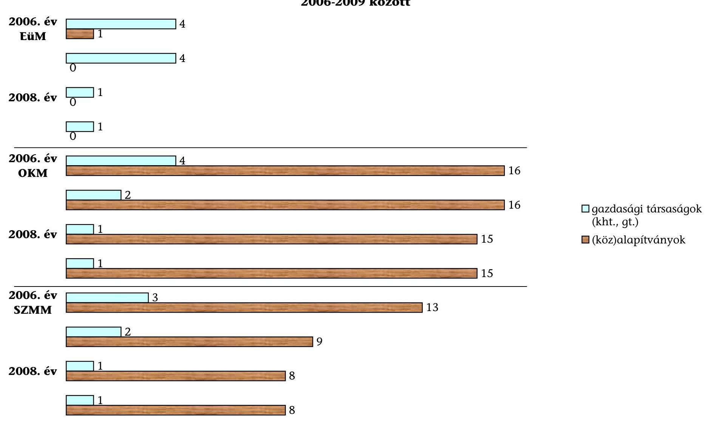

Adatforrás: A vizsgált fejezetek adatszolgáltatása

---

# A köztisztviselői illetmények különbözőségei egyes központi intézményekben (2008-ban) 

|  | munkaköri besorolási csoport |  |  |
| :--: | :--: | :--: | :--: |
| intézmény | főosztályvezető | osztályvezető | II. besorolási osztály* |
| SZMM | $100(26)$ | $100(21)$ | $100(16)$ |
| Önkormányzati Minisztérium | $98(16)$ | $110(12)$ | $165(8)$ |
| Külügyminisztérium | $93(5)$ | $116(7)$ | $87(19)$ |
| OKM | $110(31)$ | $128(27)$ | $87(22)$ |
| EüM | $127(44)$ | $128(12)$ | $81(16)$ |
| PM | $132(34)$ | $160(30)$ | $97(23)$ |
| MeH | $117(17)$ | $141(16)$ | $123(21)$ |
| MEH | $146(31)$ | $184(29)$ | $142(30)$ |
| NFÜ | $153(34)$ | $179(23)$ | $119(35)$ |
| PSZÁF | $191(40)$ | $205(21)$ | $210(25)$ |
| $\mathrm{KSH}^{[1]}$ | $95(10)$ | $98(12)$ | $77(13)$ |

* középiskolai végzettségű köztisztviselők

Az SZMM-ben foglalkoztatott köztisztviselők adott csoportja személyi juttatásának átlaga $=100$. A zárójelben álló értékek azt jelzik, hogy az adott szervezetnél (besorolási csoportonként) a teljes személyi juttatásokon belül milyen arányt képviselnek a nem rendszeres juttatások (\%).

Adatforrás: kincstári adatok
[1] A KSH is a 7 kormányhivatal egyike.

---

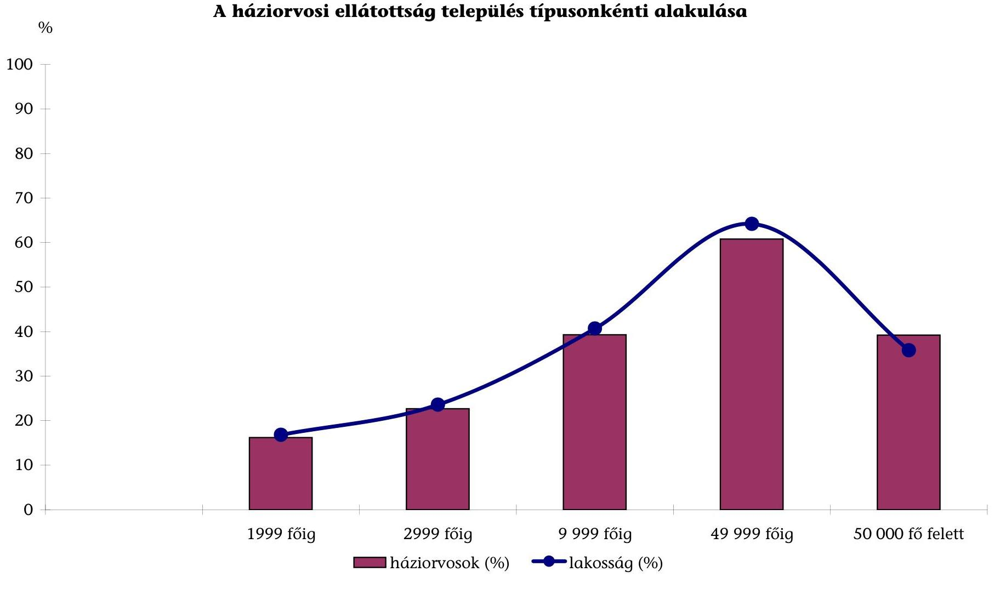

A települések lakosságszám szerinti első négy csoportja (49 999 főig) kumulált adat: a sorban következő kategória adatai tartalmazzák a megelőző csoport(ok) adatait. Az utolsó 5. csoport pedig az 50000 fő feletti településekre vonatkozik úgy, hogy a 4. csoport adataival együttesen teszik ki a $100 \%$-ot.

---

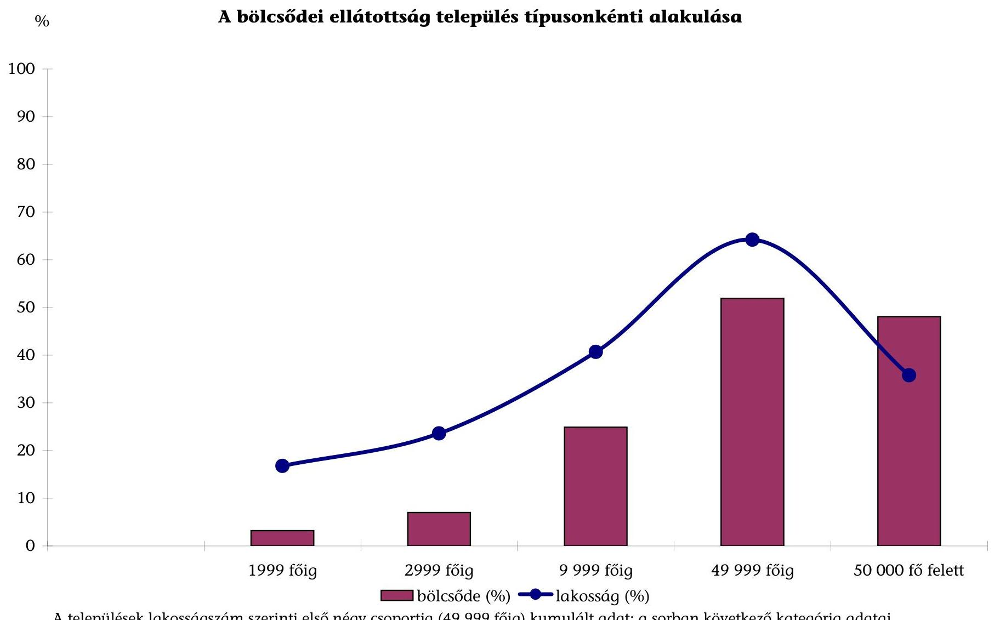

A települések lakosságszám szerinti első négy csoportja (49 999 főig) kumulált adat: a sorban következő kategória adatai tartalmazzák a megelőző csoport(ok) adatait. Az utolsó 5. csoport pedig az 50000 fő feletti településekre vonatkozik úgy, hogy a 4. csoport adataival együttesen teszik ki a $100 \%$-ot.

---

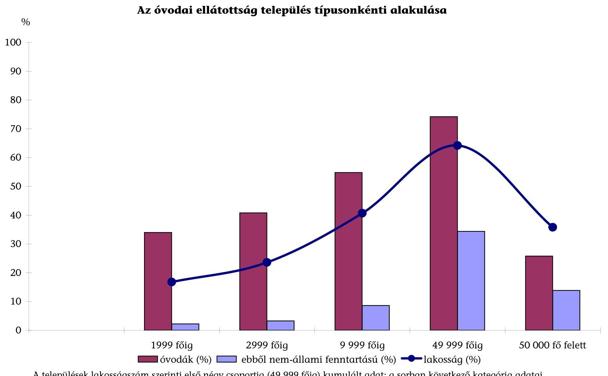

A települések lakosságszám szerinti első négy csoportja (49 999 főig) kumulált adat: a sorban következő kategória adatai tartalmazzák a megelőző csoport(ok) adatait. Az utolsó 5. csoport pedig az 50000 fő feletti településekre vonatkozik úgy, hogy a 4. csoport adataival együttesen teszik ki a $100 \%$-ot.

---

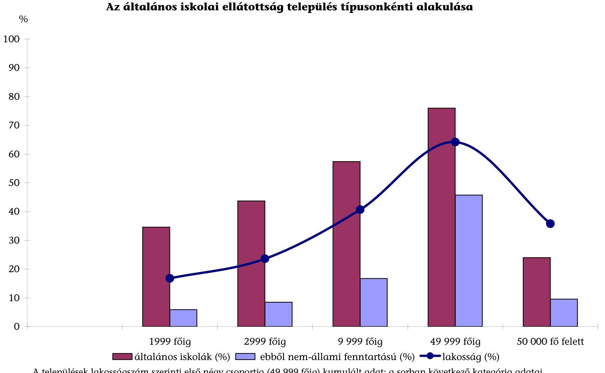

A települések lakosságszám szerinti első négy csoportja (49 999 főig) kumulált adat: a sorban következő kategória adatai tartalmazzák a megelőző csoport(ok) adatait. Az utolsó 5. csoport pedig az 50000 fő feletti településekre vonatkozik úgy, hogy a 4. csoport adataival együttesen teszik ki a $100 \%$-ot.

---

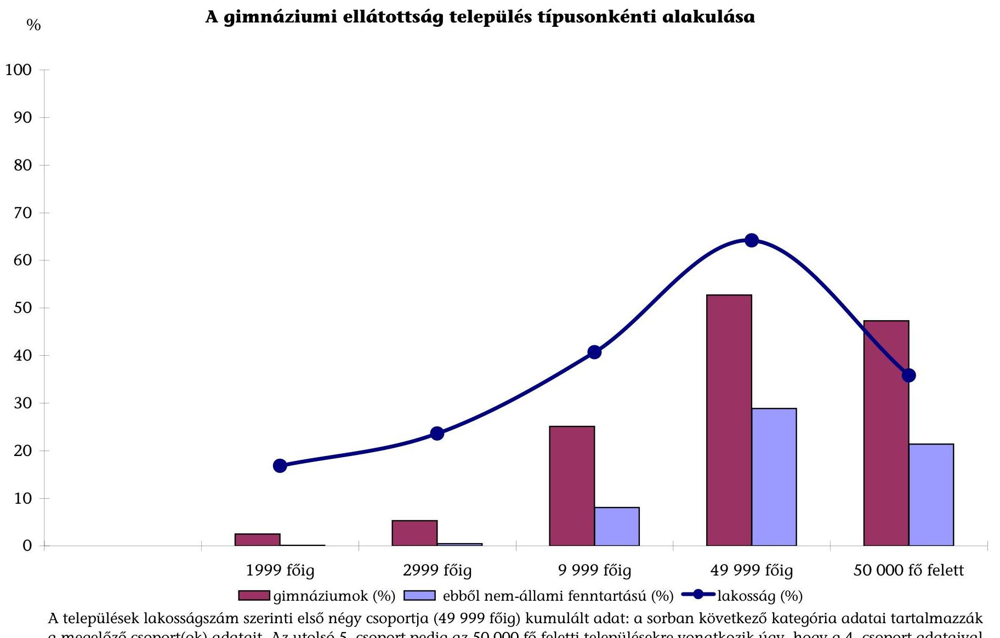

A települések lakosságszám szerinti első négy csoportja (49 999 főig) kumulált adat: a sorban következő kategória adatai tartalmazzák a megelőző csoport(ok) adatait. Az utolsó 5. csoport pedig az 50000 fő feletti településekre vonatkozik úgy, hogy a 4. csoport adataival együttesen teszik ki a $100 \%$-ot.

---

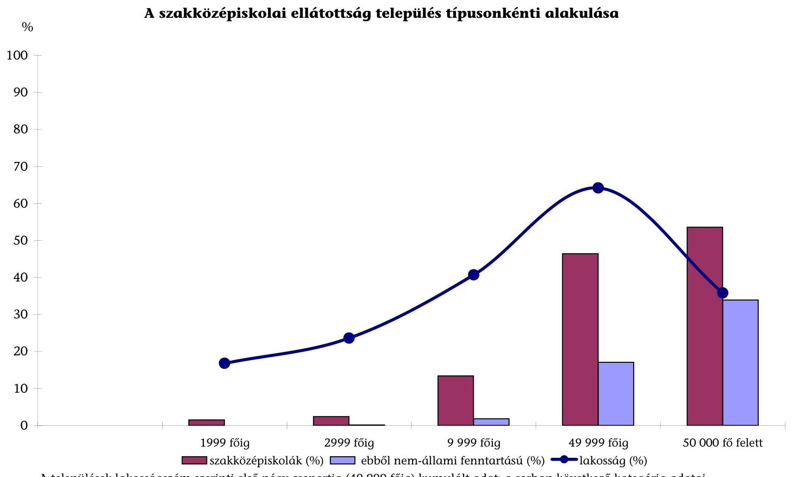

A települések lakosságszám szerinti első négy csoportja (49 999 főig) kumulált adat: a sorban következő kategória adatai tartalmazzák a megelőző csoport(ok) adatait. Az utolsó 5. csoport pedig az 50000 fő feletti településekre vonatkozik úgy, hogy a 4. csoport adataival együttesen teszik ki a $100 \%$-ot.

---

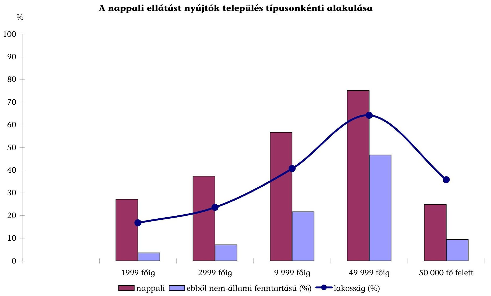

A települések lakosságszám szerinti első négy csoportja (49 999 főig) kumulált adat: a sorban következő kategória adatai tartalmazzák a megelőző csoport(ok) adatait. Az utolsó 5. csoport pedig az 50000 fő feletti településekre vonatkozik úgy, hogy a 4. csoport adataival együttesen teszik ki a $100 \%$-ot.

---

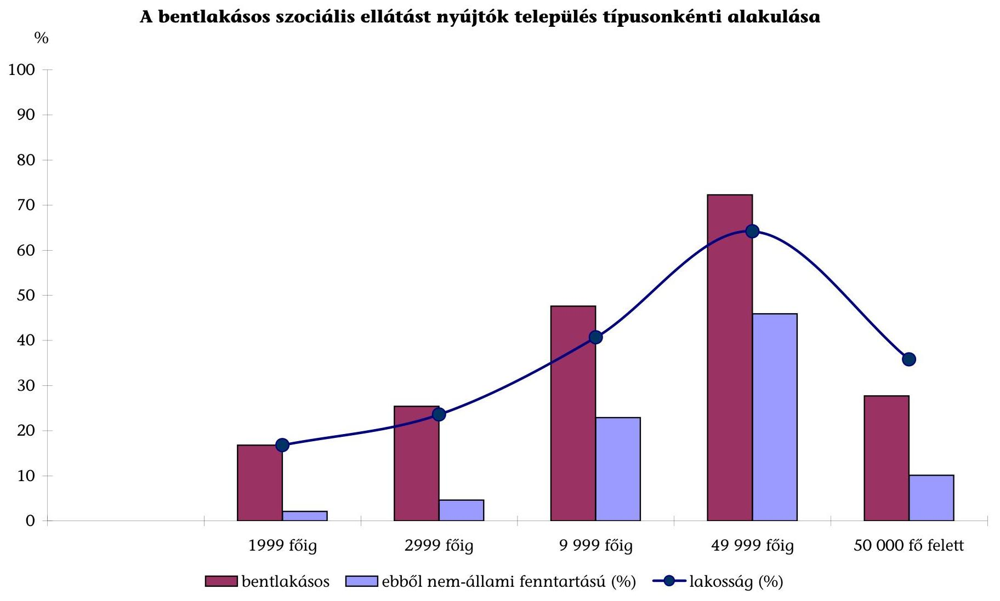

A települések
 lakosságszám szerinti első négy csoportja (49 999 főig) kumulált adat: a sorban következő kategória adatai tartalmazzák a megelőző csoport(ok) adatait. Az utolsó 5. csoport pedig az 50 000 fő feletti településekre vonatkozik úgy, hogy a 4. csoport adataival együttesen teszik ki a $100 \%$-ot.

---

**3/6. sz. melléklet** a V-2007-045/2009-2010. sz. jelentéshez

# A központi és az önkormányzati alrendszer kiadásainak, létszám- és béradatainak megoszlása

(2008)

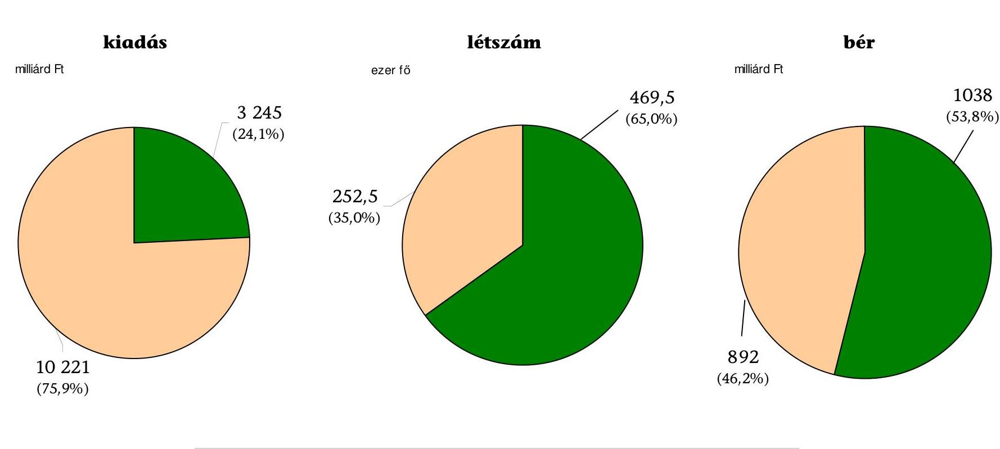

Adatforrás: A Magyar Köztársaság 2008. évi költségvetéséről szóló törvény végrehajtásáról készült törvényjavaslat általános indoklásának mellékletei

---

3/7. sz. melléklet a V-2007-045/2009-2010. sz. jelentéshez

A helyi önkormányzati alrendszer, azon belül a közoktatási, szociális és gyermekjóléti, igazgatási folyó működési kiadásai és azok összetételének változása (2006 - 2008)

|  KIADÁSOK | 2006 |  |  |  |  |  |  |  |  |  | 2008 |  |  |  |  |  |  |  |  |  |  |  | 2008/  |
| --- | --- | --- | --- | --- | --- | --- | --- | --- | --- | --- | --- | --- | --- | --- | --- | --- | --- | --- | --- | --- | --- | --- | --- |
|   | egészségügy | arány | szociális | arány | közoktatás | arány | igazgatás | arány | Mindösszesen | arány | egészségügy | arány | szociális | arány | közoktatás | arány | igazgatás | arány | Mindösszesen | arány | 2006 |  |   |
|  Személyi juttatások és járulékaik összesen | 243,0 | 58,2 | 146,8 | 71,8 | 674,6 | 79,4 | 239,2 | 63,9 | 1 464,9 | 64,4 | 228,3 | 55,0 | 162,6 | 70,8 | 683,9 | 78,5 | 261,4 | 59,7 | 1 502,7 | 62,6 | 102,6 |  |   |
|  Dologi és egyéb folyó kiadások összesen | 174,5 | 41,8 | 57,7 | 28,2 | 175,4 | 20,6 | 134,9 | 36,1 | 809,2 | 35,6 | 187,1 | 45,0 | 67,2 | 29,2 | 187,5 | 21,5 | 176,3 | 40,3 | 898,9 | 37,4 | 111,1 |  |   |
|  Folyó (működési) kiadások összesen | 417,5 |  | 204,5 |  | 850,0 |  | 374,1 |  | 2 274,2 |  | 415,4 |  | 229,8 |  | 871,4 |  | 437,7 |  | 2 401,6 |  | 105,6 |  |   |
|  folyó kiadás aránya ország összesenhez % | 18,4% |  | 9,0% |  | 37,4% |  | 16,4% |  |  |  | 17,3% |  | 9,6% |  | 36,3% |  | 18,2% |  |  |  |  |  |   |

Adatforrás: Az önkormányzati alrendszer nettósított éves beszámolóinak 21. számú űrlapjaiból készített kimutatás (ágazatokhoz tartozó szakfeladatok adatainak összesítésével)

---

A közoktatási, a szociális és az egészségügyi ágazat fajlagos kiadásainak alakulása országosan és a vizsgált önkormányzatoknál (2006 - 2008) ezer Forintban

|  Fajlagos mutató megnevezése | Fajlagos folyó kiadás (országos) |  | 2008/ 2006
\% | Fajlagos folyó kiadás (vizsgált önkormányzatok) |  | 2008/ 2006.
\%  |
| --- | --- | --- | --- | --- | --- | --- |
|   | 2006. | 2008. |  | 2006. | 2008. |   |
|  Közoktatási ágazat legjellemzőbb feladatai |  |  |  |  |  |   |
|  Óvodai nevelés |  |  |  |  |  |   |
|  egy ellátottra jutó kiadás | 381 | 467 | 122,6 | 402 | 516 | 128,5  |
|  Általános iskolai nappali rendszerű nevelés, oktatás |  |  |  |  |  |   |
|  egy tanulóra jutó kiadás | 305 | 396 | 129,8 | 286 | 359 | 125,5  |
|  Nappali rendszerű gimnáziumi nevelés, oktatás |  |  |  |  |  |   |
|  egy tanulóra jutó kiadás | 326 | 442 | 135,5 | 322 | 389 | 121,0  |
|  Nappali rendszerű szakközépiskolai nevelés, oktatás |  |  |  |  |  |   |
|  egy tanulóra jutó kiadás | 333 | 447 | 134,1 | 313 | 415 | 132,8  |
|  Nappali rendszerű szakiskolai nevelés, oktatás |  |  |  |  |  |   |
|  egy tanulóra jutó kiadás | 252 | 367 | 145,7 | 240 | 308 | 128,6  |
|  Nappali rendszerű szakkép. megszerz. felkész. iskolai oktatás |  |  |  |  |  |   |
|  egy tanulóra jutó kiadás | 359 | 462 | 128,4 | 325 | 463 | 142,6  |
|  Szociális ágazat legjellemzőbb feladatai |  |  |  |  |  |   |
|  Bentlakásos bölcsődei ellátás |  |  |  |  |  |   |
|  egy ellátottra jutó kiadás | 1537 | 1661 | 108,0 | 0 | 0 |   |
|  Ápoló-gondozó otthoni és rehab.intézeti ellátása |  |  |  |  |  |   |
|  egy ellátottra jutó kiadás | 1568 | 1739 | 110,9 | 1489 | 1647 | 110,6  |
|  Bölcsődei ellátás |  |  |  |  |  |   |
|  egy ellátottra jutó kiadás | 829 | 737 | 88,9 | 1104 | 1545 | 140,0  |
|  Családi napközi, nappali felügyelet |  |  |  |  |  |   |
|  egy ellátottra jutó kiadás | 34 | 359 | 1061,4 | 0 | 0 |   |
|  Házi segítségnyújtás |  |  |  |  |  |   |
|  egy ellátottra jutó kiadás | 216 | 221 | 102,1 | 439 | 426 | 97,1  |
|  Nappali szociális ellátás |  |  |  |  |  |   |
|  egy ellátottra jutó kiadás | 336 | 353 | 105,2 | 371 | 467 | 126,0  |
|  Egészségügyi ágazat legjellemzőbb feladatai |  |  |  |  |  |   |
|  Aktív fekvőbeteg ellátás |  |  |  |  |  |   |
|  egy körházi ágyra jutó kiadás | 5948 | 8206 | 138,0 | 6171 | 8609 | 139,5  |
|  egy ápolási napra jutó kiadás | 21 | 32 | 146,9 | 23 | 32 | 141,3  |
|  Krónikus fekvőbeteg ellátás |  |  |  |  |  |   |
|  egy körházi ágyra jutó kiadás | 2058 | 2010 | 97,6 | 2262 | 2167 | 95,8  |
|  egy ápolási napra jutó kiadás | 7,12 | 7,70 | 108,1 | 7,69 | 7,97 | 103,6  |
|  Háziorvosi szolgálat |  |  |  |  |  |   |
|  egy ellátottra jutó kiadás | 2,27 | 2,24 | 98,8 | 1,80 | 2,56 | 142,5  |
|  Járóbetegek szakorvosi ellátása |  |  |  |  |  |   |
|  egy ellátottra jutó kiadás | 1,01 | 1,51 | 149,8 | 1,05 | 1,62 | 153,9  |

Adatforrás: Az önkormányzati alrendszer, valamint a vizsgált önkormányzatok önkéntes nettósított éves beszámolóinak 21. és 37. számú űrlapjaiból készített kimutatás (az ágazatot jellemző szakfeladatok adatainak

---

A helyi önkormányzati alrendszerbe tartozó költségvetési szervek - szervtípus és tevékenység jellege szerinti - statisztikai adatai a költségvetési szervek jogállásáról szóló 2008. évi CV. tv. előírásai szerint (2010. január 1-jei állapot)

|  ő
2 | Feladatellátási funkció | Közhatalmi költségvetési szervek |  |  |  | Közszolgáltató költségvetési szervek összesen |  |  | Ebből |  |  |  |  |  |  |  |  |  |  |  |  |  |  |  |  |  |  |  |  |  |  |  |  |  |  |  |  |  |  |  |  |  |  |  |  |  |  |  |  |  |  |  |  |  |  |  |  |  |  |   |
| --- | --- | --- | --- | --- | --- | --- | --- | --- | --- | --- | --- | --- | --- | --- | --- | --- | --- | --- | --- | --- | --- | --- | --- | --- | --- | --- | --- | --- | --- | --- | --- | --- | --- | --- | --- | --- | --- | --- | --- | --- | --- | --- | --- | --- | --- | --- | --- | --- | --- | --- | --- | --- | --- | --- | --- | --- | --- | --- | --- | --- | --- | --- | --- | --- | --- | --- | --- | --- |

 | --- | --- | --- | --- | --- | --- | --- | --- | --- | --- | --- | --- | --- | --- | --- | --- | --- | --- | --- | --- | --- | --- | --- | --- | --- | --- | --- | --- |

---

A helyi önkormányzati alrendszerbe tartozó költségvetési szervek megyénkénti statisztikai adatai a költségvetési szervek jogállásáról szóló 2008. évi CV. tv. előírásai szerint (2010. január 1-jei állapot)

|  Feladatellátási funkció | Közhatalmi költségvetési szervek |  |  |  |  |  |  |  |  |  |  |  |  |  |  |  |  |  |  |  |  |  |  |  |   |
| --- | --- | --- | --- | --- | --- | --- | --- | --- | --- | --- | --- | --- | --- | --- | --- | --- | --- | --- | --- | --- | --- | --- | --- | --- | --- |
|   |  |  |  |  |  |  |  |  |  |  |  |  |  |  |  |  |  |  |  |  |  |  |  |  |   |
|   |  |  |  |  |  |  |  |  |  |  |  |  |  |  |  |  |  |  |  |  |  |  |  |  |   |
|   |  |  |  |  |  |  |  |  |  |  |  |  |  |  |  |  |  |  |  |  |  |  |  |  |   |
|   |  |  |  |  |  |  |  |  |  |  |  |  |  |  |  |  |  |  |  |  |  |  |  |  |   |
|   |  |  |  |  |  |  |  |  |  |  |  |  |  |  |  |  |  |  |  |  |  |  |  |  |   |
|   |  |  |  |  |  |  |  |  |  |  |  |  |  |  |  |  |  |  |  |  |  |  |  |  |   |
|   |  |  |  |  |  |  |  |  |  |  |  |  |  |  |  |  |  |  |  |  |  |  |  |  |   |
|   |  |  |  |  |  |  |  |  |  |  |  |  |  |  |  |  |  |  |  |  |  |  |  |  |   |
|   |  |  |  |  |  |  |  |  |  |  |  |  |  |  |  |  |  |  |  |  |  |  |  |  |   |
|   |  |  |  |  |  |  |  |  |  |  |  |  |  |  |  |  |  |  |  |  |  |  |  |  |   |
|   |  |  |  |  |  |  |  |  |  |  |  |  |  |  |  |  |  |  |  |  |  |  |  |  |   |
|   |  |  |  |  |  |  |  |  |  |  |  |  |  |  |  |  |  |  |  |  |  |  |  |  |   |
|   |  |  |  |  |  |  |  |  |  |  |  |  |  |  |  |  |  |  |  |  |  |  |  |  |   |
|   |  |  |  |  |  |  |  |  |  |  |  |  |  |  |  |  |  |  |  |  |  |  |  |  |   |
|   |  |  |  |  |  |  |  |  |  |  |  |  |  |  |  |  |  |  |  |  |  |  |  |  |   |
|   |  |  |  |  |  |  |  |  |  |  |  |  |  |  |  |  |  |  |  |  |  |  |  |  |   |
|   |  |  |  |  |  |  |  |  |  |  |  |  |  |  |  |  |  |  |  |  |  |  |  |  |   |
|   |  |  |  |  |  |  |  |  |  |  |  |  |  |  |  |  |  |  |  |  |  |  |  |  |   |
|   |  |  |  |  |  |  |  |  |  |  |  |  |  |  |  |  |  |  |  |  |  |  |  |  |   |
|   |  |  |  |  |  |  |  |  |  |  |  |  |  |  |  |  |  |  |  |  |  |  |  |  |   |
|   |  |  |  |  |  |  |  |  |  |  |  |  |  |  |  |  |  |  |  |  |  |  |  |  |   |
|   |  |  |  |  |  |  |  |  |  |  |  |  |  |  |  |  |  |  |  |  |  |  |  |  |   |
|   |  |  |  |  |  |  |  |  |  |  |  |  |  |  |  |  |  |  |  |  |  |  |  |  |   |
|   |  |  |  |  |  |  |  |  |  |  |  |  |  |  |  |  |  |  |  |  |  |  |  |  |   |
|   |  |  |  |  |  |  |  |  |  |  |  |  |  |  |  |  |  |  |  |  |  |  |  |  |   |
|   |  |  |

  |  |  |  |  |  |  |  |  |  |  |  |  |  |  |  |  |  |  |  |  |  |   |
|   |  |  |  |  |  |  |  |  |  |  |  |  |  |  |  |  |  |  |  |  |  |  |  |  |   |
|   |  |  |  |  |  |  |  |  |  |  |  |  |  |  |  |  |  |  |  |  |  |  |  |  |   |
|   |  |  |  |  |  |  |  |  |  |  |  |  |  |  |  |  |  |  |  |  |  |  |  |  |   |
|   |  |  |  |  |  |  |  |  |  |  |  |  |  |  |  |  |  |  |  |  |  |  |  |  |   |
|  

---

### **3/11. sz. melléklet**

a V-2007-045/2009-2010. sz. jelentéshez

|  Megnevezés | Összesen |  |  | Ebből: |  |  |  | Ebből: |  |  |  | Ebből: |  |  |  |   |
| --- | --- | --- | --- | --- | --- | --- | --- | --- | --- | --- | --- | --- | --- | --- | --- | --- |
|   |  |  |  |  |  |  |  |  |  |  |  |  |  |  |  |   |
|   |  |  |  |  |  |  |  |  |  |  |  |  |  |  |  |   |
|   |  |  |  |  |  |  |  |  |  |  |  |  |  |  |  |   |
|   |  |  |  |  |  |  |  |  |  |  |  |  |  |  |  |   |
|   |  |  |  |  |  |  |  |  |  |  |  |  |  |  |  |   |
|  **ÖVODAI ELLÁTÁS** |  |  |  |  |  |  |  |  |  |  |  |  |  |  |  |   |
|  Intézmények száma (db) | 3 223 | 2 498 | 77,5% | 326 | 365 | 2 897 | 2 133 | 19 | 16 | 2 474 | 1 617 | 397 | 460 | 7 | 40 |   |
|  Feladatellátási helyek száma (db) | 4 524 | 4 366 | 96,5% | 337 | 388 | 4 187 | 3 978 | 21 | 16 | 3 543 | 2 761 | 613 | 1 030 | 10 | 171 |   |
|  Gyermekek száma (fő) | 327 644 | 328 620 | 100,3% | 16 901 | 20 183 | 310 743 | 308 437 | 2 148 | 2 130 | 279 494 | 242 100 | 28 494 | 54 617 | 607 | 9 590 |   |
|  Óvodapedagógusok száma (fő) | 30 550,00 | 30 007,00 | 98,2% | 1 718,00 | 2 087,00 | 28 832,00 | 27 920,00 | 303,00 | 273,00 | 25 870,00 | 21 911,00 | 2 603,00 | 4 893,00 | 56,00 | 843,00 |   |
|  Egy csoportra jutó gyermekek száma (fő) | 22,50 | 22,82 | 101,4% | 20,56 | 21,05 | 22,62 | 22,95 | 22,38 | 22,90 | 22,76 | 23,18 | 21,38 | 22,06 | 21,68 | 22,46 |   |
|  Egy óvodapedagógusra jutó gyermekek száma (fő) | 10,72 | 10,95 | 102,1% | 9,84 | 9,67 | 10,78 | 11,05 | 7,09 | 7,80 | 10,80 | 11,10 | 10,95 | 11,16 | 10,84 | 11,38 |   |
|  Férőhely kihasználtság (gyermekek száma/férőhelyek száma) % | 93,1% | 90,5% | 97,2% | 89,0% | 86,5% | 93,4% | 90,8% | 103,8% | 105,8% | 94,2% | 92,1% | 8542,9% | 85,5% | 84,9% | 88,2% |   |
|  Egy intézményre jutó gyermekek száma (fő) | 101,7 | 131,6 | 129,4% | 51,8 | 55,3 | 107,3 | 144,6 | 113,1 | 133,1 | 113,0 | 149,7 | 71,8 | 118,7 | 86,7 | 239,8 |   |
|  **ÁLTALÁNOS ISKOLAI OKTATÁS** |  |  |  |  |  |  |  |  |  |  |  |  |  |  |  |   |
|  Intézmények száma (db) | 3 064 | 2 320 | 75,7% | 275 | 303 | 2 789 | 2 017 | 28 | 28 | 2 337 | 1 489 | 419 | 454 | 5 | 46 |   |
|  Feladatellátási helyek száma (db) | 3 591 | 3 341 | 93,0% | 295 | 364 | 3 296 | 2 977 | 28 | 28 | 2 657 | 1 936 | 602 | 846 | 9 | 167 |   |
|  Tanulók száma összesen (fő) | 831 262 | 775 516 | 93,3% | 54 699 | 63 188 | 776 563 | 712 328 | 11 309 | 11 380 | 673 343 | 519 325 | 89 774 | 150 541 | 2 137 | 31 082 |   |
|  Pedagógusok száma (fő) | 83 606,00 | 74 233,00 | 88,8% | 5 982,00 | 6 597,00 | 77 624,00 | 67 636,00 | 1 249,00 | 1 115,00 | 66 987,00 | 49 436,00 | 9 186,00 | 14 158,00 | 202,00 | 2 907,00 |   |
|  Egy osztályra jutó tanulók száma (fő) | 19,59 | 20,29 | 103,6% | 18,87 | 19,04 | 19,64 | 20,41 | 22,44 | 23,37 | 19,90 | 20,74 | 17,63 | 19,41 | 20,35 | 19,16 |   |
|  Egy pedagógusra jutó tanulók száma (fő) | 9,94 | 10,45 | 105,1% | 9,14 | 9,58 | 10,00 | 10,53 | 9,05 | 10,21 | 10,05 | 10,50 | 9,77 | 10,63 | 10,38 | 10,69 |   |
|  Egy intézményre jutó tanulók száma (fő) | 271,3 | 334,3 | 123,2% | 198,9 | 208,5 | 278,4 | 353,2 | 403,9 | 406,4 | 288,1 | 348,8 | 214,3 | 331,6 | 427,4 | 675,7 |   |
|  **SZAKISKOLAI OKTATÁS** |  |  |  |  |  |  |  |  |  |  |  |  |  |  |  |   |
|  Intézmények száma (db) | 644 | 593 | 92,1% | 130 | 151 | 514 | 442 | 22 | 8 | 482 | 408 | 10 | 20 | 0 | 6 |   |
|  Feladatellátási helyek száma (db) | 724 | 780 | 107,7% | 189 | 271 | 535 | 509 | 22 | 16 | 305 | 463 | 10 | 25 | 0 | 7 |   |
|  Tanulók száma összesen (fő) | 134 029 | 145 285 | 108,4% | 20 126 | 27 549 | 113 903 | 117 736 | 2 373 | 2 393 | 110 146 | 111 305 | 1 384 | 2 905 | 0 | 1 133 |   |
|  Pedagógusok száma (fő) | 10 326,00 | 10 523,00 | 100,0% | 1 342,00 | 1 538,00 | 8 984,00 | 8 783,00 | 303,00 | 241,00 | 8 576,00 | 8 256,00 | 105,00 | 226,00 | 0 | 62,00 |   |
|  Egy osztályra jutó tanulók száma (fő) | 22,28 | 22,44 | 100,7% | 19,46 |

 | 19,98 | 22,86 | 23,11 | 17,98 | 18,84 | 23,00 | 23,23 | 22,32 | 21,68 | 0 | 25,73 |   |
|  Egy pedagógusra jutó tanulók száma (fő) | 12,98 | 14,07 | 108,4% | 15,00 | 17,91 | 12,68 | 13,40 | 7,83 | 9,93 | 12,84 | 13,48 | 13,18 | 12,85 | 0 | 18,27 |   |
|  Egy intézményre jutó tanulók száma (fő) | 208,1 | 245,0 | 117,7% | 154,8 | 182,4 | 221,6 | 266,4 | 107,9 | 299,1 | 228,5 | 272,8 | 138,4 | 145,3 | 0 | 188,8 |   |
|  **GIMNAZIUMI OKTATÁS** |  |  |  |  |  |  |  |  |  |  |  |  |  |  |  |   |
|  Intézmények száma (db) | 627 | 621 | 99,0% | 196 | 216 | 431 | 405 | 17 | 17 | 411 | 364 | 2 | 17 | 1 | 7 |   |
|  Feladatellátási helyek száma (db) | 807 | 848 | 105,1% | 358 | 418 | 449 | 430 | 17 | 17 | 429 | 388 | 2 | 18 | 1 | 7 |   |
|  Tanulók száma összesen (fő) | 246 267 | 239 773 | 97,4% | 70 125 | 74 101 | 176 142 | 165 672 | 7 158 | 7 643 | 168 129 | 150 549 | 556 | 5 050 | 299 | 2 430 |   |
|  Pedagógusok száma (fő) | 19 284,00 | 18 359,00 | 95,2% | 5 542,00 | 5 717,00 | 13 742,00 | 12 642,00 | 730,00 | 696,00 | 12 949,00 | 11 556,00 | 56,00 | 390,00 | 27,00 | 200,00 |   |
|  Egy osztályra jutó tanulók száma (fő) | 28,89 | 28,81 | 99,7% | 27,19 | 26,91 | 29,62 | 29,75 | 29,70 | 30,82 | 29,65 | 29,84 | 25,27 | 27,45 | 24,92 | 26,70 |   |
|  Egy pedagógusra jutó tanulók száma (fő) | 12,77 | 13,06 | 102,3% | 12,65 | 12,96 | 12,82 | 13,10 | 9,81 | 10,98 | 12,98 | 13,26 | 15,44 | 12,95 | 11,07 | 12,15 |   |
|  Egy intézményre jutó tanulók száma (fő) | 392,8 | 386,1 | 98,3% | 357,8 | 343,1 | 408,7 | 409,1 | 421,1 | 449,6 | 409,1 | 413,6 | 278,0 | 297,1 | 299,0 | 347,1 |   |
|  **SZAKKÖZÉPISKOLAI OKTATÁS** |  |  |  |  |  |  |  |  |  |  |  |  |  |  |  |   |
|  Intézmények száma (db) | 807 | 684 | 84,8% | 217 | 217 | 590 | 467 | 31 | 19 | 556 | 433 | 3 | 11 | 0 | 4 |   |
|  Feladatellátási helyek száma (db) | 956 | 917 | 95,9% | 339 | 362 | 617 | 555 | 32 | 28 | 582 | 508 | 3 | 14 | 0 | 0 |   |
|  Szakközépiskolai tanulók száma összesen (fő) | 288 534 | 273 344 | 94,9% | 53 141 | 61 437 | 235 011 | 211 907 | 8 349 | 9 165 | 226 213 | 198 542 | 453 | 2 753 | 0 | 1 447 |   |
|  Pedagógusok száma (fő) | 21 254,00 | 19 772,00 | 93,0% | 2 752,00 | 2 992,00 | 18 502,00 | 16 780,00 | 936,00 | 1 027,00 | 17 527,00 | 15 451,00 | 39,00 | 193,00 | 0 | 109,00 |   |
|  Egy osztályra jutó tanulók száma (fő) | 25,62 | 25,92 | 101,2% | 22,24 | 22,95 | 26,53 | 26,93 | 23,58 | 23,50 | 26,66 | 27,14 | 22,65 | 25,26 | 0 | 26,80 |   |
|  Egy pedagógusra jutó tanulók száma (fő) | 13,56 | 13,82 | 102,0% | 19,31 | 20,53 | 12,70 | 12,63 | 8,92 | 8,92 | 12,91 | 12,85 | 11,62 | 14,26 | 0 | 13,28 |   |
|  Egy intézményre jutó tanulók száma (fő) | 357,1 | 399,4 | 111,9% | 244,9 | 283,1 | 398,3 | 453,8 | 269,3 | 482,4 | 406,9 | 458,5 | 151,0 | 250,3 | 0 | 361,8 |   |
|  Betöltetlen pedagógus álláshelyek száma (fő) | 2 383 | 2 270 | 93,3% | 169 | 140 | 2 214 | 2 130 | 37 | 102 | 2 089 | 1 832 | 87 | 148 | 1 | 48 |   |

---

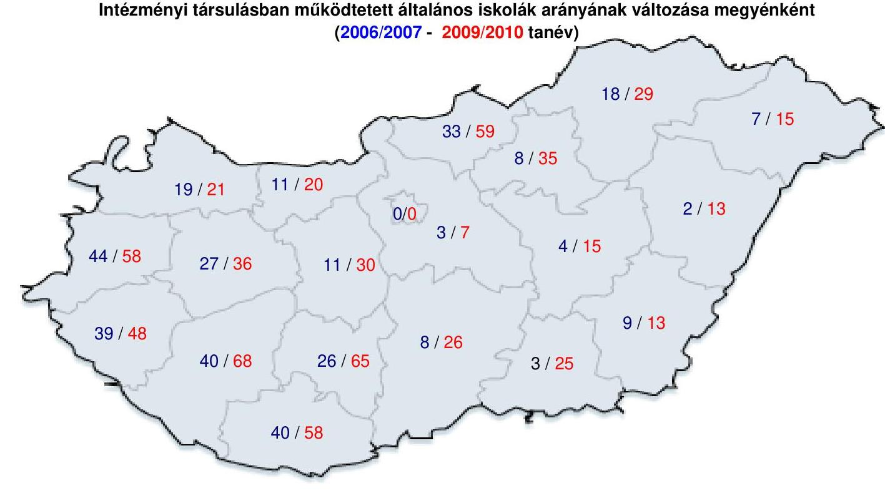

Az első szám 2006/2007 tanév, a második szám 2009/2010 tanév adatai

Adatforrás: Az Oktatási és Kulturális Minisztérium megyenkénti részletezettségű adatszolgáltatása

---

### **3/13. sz. melléklet**

a V-2007-043/2009-2010. sz. jelentéshez

|  Megnevezés | Összesen |  | változó
index % | Ebből: |  |  |  | Ebből: |  |  |  |  |  |   |
| --- | --- | --- | --- | --- | --- | --- | --- | --- | --- | --- | --- | --- | --- | --- |
|   |  |  |  | Államkincstárhoz tartozó
kórházi
szervezetek által ellátott
feladatok összesen | Államkincstárhoz tartozó
kórházi
szervezetek által ellátott
feladatok összesen |  | Államkincstárhoz tartozó
kórházi
szervezetek által ellátott feladatok összesen | Államkincstárhoz tartozó
kórházi
szervezetek által ellátott feladatok összesen |  |  |  |  |  |   |
|   | 2006/2007 | 2009/2010 | 2009/2010-
2006/2007 | 2006/2007 | 2009/2010 | 2006/2007 | 2009/2010 | 2006/2007 | 2009/2010 | 2006/2007 | 2009/2010 | 2006/2007 | 2009/2010 | 2006/2007  |
|   |  |  |  |  |  |  |  |  |  |  |  |  |  | 2009/2010:  |
|   |  |  |  |  |  |  |  |  |  |  |  |  |  | 2010:  |
|  **ÓVODAI ELLÁTÁS** |  |  |  |  |  |  |  |  |  |  |  |  |  |   |
|  Intézmények száma (db) | 116 | 92 | 79,3% | 9 | 12 | 107 | 80 | 84 | 49 | 20 | 25 | 0 | 3 | 3  |
|  Feladatellátási helyek száma (db) | 183 | 186 | 101,6% | 10 | 14 | 173 | 172 | 138 | 89 | 23 | 61 | 0 | 11 | 10  |
|  Gyermekek száma (fő) | 14 979 | 13 012 | 100,2% | 645 | 887 | 14 334 | 14 125 | 12 880 | 8 514 | 1 364 | 4 833 | 0 | 660 | 90  |
|  Óvodapedagógusok száma (fő) | 1 423,00 | 1 380,00 | 97,0% | 55,00 | 77,00 | 1 368,00 | 1 303,00 | 1 221,00 | 806,00 | 130,00 | 421,00 | 0 | 56,00 | 17,00  |
|  Egy csoportra jutó gyermekek száma (fő) | 22,87 | 23,02 | 100,7% | 24,81 | 22,74 | 22,79 | 23,04 | 23,21 | 23,14 | 20,98 | 23,46 | 0 | 24,44 | 10,00  |
|  Egy óvodapedagógusra jutó gyermekek száma (fő) | 10,53 | 10,88 | 103,3% | 11,73 | 11,52 | 10,48 | 10,84 | 10,55 | 10,56 | 10,49 | 11,48 | 0 | 11,79 | 5,29  |
|  Férőhely kihasználtság (gyermekek száma/férőhelyek száma) % | 92,3% | 90,5% | 98,0% | 96,4% | 84,7% | 92,2% | 90,9% | 93,2% | 92,3% | 84,5% | 88,9% | 0 | 90,2% | 72,0%  |
|  Egy intézményre jutó gyermekek száma (fő) | 129,1 | 163,2 | 126,4% | 71,7 | 73,9 | 134,0 | 176,6 | 153,3 | 173,8 | 68,2 | 193,3 | 0 | 220,0 | 30,0  |
|  **ÁLTALÁNOS ISKÓLAI OKTATÁS** |  |  |  |  |  |  |  |  |  |  |  |  |  |   |
|  Intézmények száma (db) | 118 | 87 | 73,7% | 9 | 13 | 109 | 74 | 77 | 56 | 25 | 26 | 0 | 3 | 7  |
|  Feladatellátási helyek száma (db) | 148 | 148 | 100,0% | 9 | 14 | 139 | 134 | 96 | 52 | 35 | 64 | 0 | 6 | 8  |
|  Tanulók száma összesen (fő) | 39 568 | 36 379 | 91,9% | 2 050 | 2 571 | 37 518 | 33 808 | 29 149 | 14 917 | 5 989 | 15 147 | 0 | 1 391 | 2 380  |
|  Pedagógusok száma (fő) | 4 086,80 | 3 659,80 | 89,6% | 243,00 | 263,00 | 3 843,80 | 3 396,80 | 2 892,80 | 1 500,80 | 610,00 |

 1 406,00 | 0 | 140,00 | 341,00  |
|  Egy osztályra jutó tanulók száma (fő) | 20,76 | 21,19 | 102,1% | 19,71 | 20,09 | 20,82 | 21,28 | 21,74 | 21,78 | 18,54 | 21,86 | 0 | 19,05 | 17,25  |
|  Egy pedagógusra jutó tanulók száma (fő) | 9,68 | 9,94 | 102,7% | 8,44 | 9,78 | 9,76 | 9,95 | 10,08 | 9,94 | 9,82 | 10,77 | 0 | 9,94 | 6,98  |
|  Egy intézményre jutó tanulók száma (fő) | 335,3 | 418,1 | 124,7% | 227,8 | 197,8 | 344,2 | 456,9 | 378,6 | 414,4 | 239,6 | 582,6 | 0 | 463,7 | 340,0  |
|  **SZAKISKOLAI OKTATÁS** |  |  |  |  |  |  |  |  |  |  |  |  |  |   |
|  Intézmények száma (fő) | 39 | 40 | 102,6% | 3 | 4 | 54 | 54 | 28 | 27 | 0 | 0 | 0 | 0 | 0  |
|  Feladatellátási helyek száma (fő) | 61 | 63 | 103,3% | 11 | 12 | 50 | 51 | 36 | 32 | 0 | 2 | 0 | 2 | 14  |
|  Tanulók száma összesen (fő) | 15 021 | 15 492 | 103,1% | 1 614 | 1 944 | 13 407 | 13 548 | 13 440 | 10 872 | 0 | 538 | 0 | 468 | 1 967  |
|  Pedagógusok száma (fő) | 1 305,50 | 1 304,00 | 99,9% | 117,00 | 140,00 | 1 188,50 | 1 164,00 | 987,50 | 893,00 | 0 | 20,00 | 0 | 53,00 | 201  |
|  Egy osztályra jutó tanulók száma (fő) | 25,54 | 24,99 | 97,9% | 20,69 | 20,04 | 26,28 | 25,90 | 27,35 | 27,73 | 0 | 26,00 | 0 | 26,00 | 21  |
|  Egy pedagógusra jutó tanulók száma (fő) | 11,31 | 11,88 | 103,3% | 13,79 | 13,89 | 11,28 | 11,64 | 11,58 | 12,17 | 0 | 16,90 | 0 | 14,18 | 10  |
|  Egy intézményre jutó tanulók száma (fő) | 385,2 | 387,3 | 100,6% | 322,8 | 324,0 | 394,3 | 398,5 | 408,6 | 402,7 | 0 | 0 | 0 | 0 | 328  |
|  **GIMNAZIUMI OKTATÁS** |  |  |  |  |  |  |  |  |  |  |  |  |  |   |
|  Intézmények száma (fő) | 41 | 38 | 92,7% | 9 | 9 | 52 | 29 | 29 | 23 | 0 | 1 | 0 | 0 | 3  |
|  Feladatellátási helyek száma (fő) | 49 | 52 | 106,1% | 10 | 10 | 39 | 42 | 34 | 33 | 0 | 2 | 0 | 1 | 5  |
|  Tanulók száma összesen (fő) | 17 549 | 18 198 | 103,7% | 3 043 | 3 166 | 14 506 | 15 032 | 11 994 | 10 594 | 0 | 540 | 0 | 380 | 2 512  |
|  Pedagógusok száma (fő) | 1 512,90 | 1 482,40 | 98,0% | 247,00 | 241,00 | 1 265,90 | 1 241,40 | 982,90 | 827,40 | 0 | 48,00 | 0 | 40,00 | 283,00  |
|  Egy osztályra jutó tanulók száma (fő) | 29,25 | 29,88 | 102,2% | 28,44 | 31,04 | 29,42 | 29,65 | 29,54 | 30,10 | 0 | 22,50 | 0 | 30,53 | 28,87  |
|  Egy pedagógusra jutó tanulók száma (fő) | 11,60 | 12,28 | 105,8% | 12,32 | 13,14 | 11,46 | 12,11 | 12,20 | 12,80 | 0 | 11,25 | 0 | 14,30 | 8,88  |
|  Egy intézményre jutó tanulók száma (fő) | 428,0 | 478,0 | 111,9% | 338,1 | 351,8 | 433,3 | 518,3 | 413,6 | 460,6 | 0 | 540,0 | 0 | 0 | 837,3  |
|  **SZAKKÖZÉPISKOLAI OKTATÁS** |  |  |  |  |  |  |  |  |  |  |  |  |  |   |
|  Intézmények száma (fő) | 63 | 63 | 98,4% | 8 | 11 | 55 | 51 | 43 | 39 | 0 | 1 | 0 | 0 | 13  |
|  Feladatellátási helyek száma (fő) | 72 | 73 | 104,2% | 9 | 13 | 63 | 62 | 49 | 46 | 0 | 1 | 0 | 2 | 14  |
|  Szakközépiskolai tanulók száma összesen (fő) | 29 877 | 30 833 | 103,2% | 4 365 | 5 611 | 25 512 | 25 222 | 19 402 | 18 430 | 0 | 389 | 0 | 439 | 6 110  |
|  Pedagógusok száma (fő) | 2 419,00 | 2 398,80 | 99,2% | 245,00 | 339,00 | 2 174,00 | 2 059,80 | 1 591,00 | 1 445,80 | 0 | 40,00 | 0 | 35,00 | 583  |
|  Egy osztályra jutó tanulók száma (fő) | 27,34 | 28,41 | 103,9% | 28,16 | 29,49 | 27,21 | 28,18 | 26,92 | 27,97 | 0 | 25,93 | 0 | 29,27 | 28  |
|  Egy pedagógusra jutó tanulók száma (fő) | 12,35 | 12,85 | 104,1% | 17,82 | 16,55 | 11,74 | 12,24 | 12,19 | 12,73 | 0 | 9,73 | 0 | 12,54 | 10  |
|  Egy intézményre jutó tanulók száma (fő) | 474,2 | 497,3 | 104,9% | 345,6 | 310,1 | 463,9 | 494,5 | 451,2 | 472,6 | 0 | 389,0 | 0 | 0 | 309  |

Adatforrás: A vizsgált önkormányzatok összesített adatszolgáltatásából készített kimutatás

---

Az egészségügyi feladatok országos ellátottsági mutatói fenntartók (működtetők) szerint (2006 - 2009)

3/14. sz. melléklet a V-2007-043/2009-2010. sz. jelentéshez

|  Megnevezés | Összes szolgáltató |  |  |  | Ebből: |  |  |  |  | Ebből: |  |  |  |  |   |
| --- | --- | --- | --- | --- | --- | --- | --- | --- | --- | --- | --- | --- | --- | --- | --- |
|   |  |  |  |  | Államháztartáson kívüli
szervezetek |  |  |  |  | Államháztartáson belüli szervezetek |  |  |  |  |   |
|   |  |  |  |  |  |  |  |  | Önkormányzati
egészségügyi intézmény | Önkormányzat |  |  |  |  |   |
|   | 2006. | 2009. |  |  | 2006. | 2009. | 2006. | 2009. | 2006. | 2009. | 2006. | 2009. | 2006. | 2009. | 2006.  |
|   | december 31. |  |  |  | december 31. |  |  | december 31. |  | december 31. |  |  |  |  |   |
|  Háziorvosi szolgáltatás |  |  |  |  |  |  |  |  |  |  |  |  |  |  |   |
|  Háziorvosi szolgáltatás (ügyelet nélkül) száma összesen | 6 792 | 6 764 |  | 99,6% | 6 309,00 | 6 336,00 | 483,00 | 428,00 | 106 | 84 | 334 | 277 | 0 | 0 | 43  |
|  Háziorvosokhoz bejelentkezeltek száma | 9 748 626 | 9 696 964 |  | 99,5% | 9 207 741 | 9 254 678 | 540 885 | 454 457 | 129 782 | 95 993 | 378 068 | 303 584 | 0 | 0 | 33 035  |
|  Egy háziorvosi (szolgáltató) jutó bejelentkezett lakosok száma | 1 435 | 1 434 |  | 99,9% | 1 459 | 1 461 | 1 120 | 1 062 | 1 224 | 1 143 | 1 132 | 1 096 | 0 | 0 | 768  |
|  Fogászati ellátás |  |  |  |  |  |  |  |  |  |  |  |  |  |  |   |
|  Szolgáltatók száma | 3 447 | 3 370 |  | 97,8% | 2 446,00 | 2 606,00 | 1 001,00 | 771,00 | 486 | 380 | 165 | 159 | 0 | 0 | 350  |
|  Esetek száma | 10 863 198 | 7 174 520 |  | 66,0% | 7 820 537,00 | 5 783 067,00 | 3 042 661,00 | 1 391 453,00 | 1 778 262 | 825 034 | 359 318 | 202 302 | 0 | 0 | 905 081  |
|  Beavatkozások száma | 28 435 056 | 19 568 875 |  | 68,8% | 21 616 055,00 | 16 146 665,00 | 6 819 001,00 | 3 422 210,00 | 3 673 017 | 1 919 691 | 913 277 | 334 635 | 0 | 0 |

 | 2 232 707  |
|  Száz lakonra jutó esetek száma | 107,81 | 70,58 |  | 65,5% |  |  |  |  |  |  |  |  |  |  |   |
|  Száz lakonra jutó beavatkozások száma | 282,19 | 192,51 |  | 68,2% |  |  |  |  |  |  |  |  |  |  |   |
|  Alapellátási ügyeletek |  |  |  |  |  |  |  |  |  |  |  |  |  |  |   |
|  Háziorvosi ügyeletek szolgáltatók száma (finanszírozó szerzők) | 574 | 295 |  | 51,4% | 98,00 | 111,00 | 476,00 | 184,00 | 78 | 53 | 579 | 353 | 56 | 26 | 3  |
|  Ebből központi ügyelet szolgáltatók száma | 257 | 212 |  | 82,5% | 73,00 | 94,00 | 184,00 | 118,00 | 52 | 35 | 115 | 56 | 14 | 25 | 3  |
|  Fogászati ügyeletek szolgáltatók száma | 11 | 24 |  | 218,2% | 7,00 | 10,00 | 2,00 | 14,00 | 2 | 11 | 0 | 3 | 0 | 0 | 0  |
|  Járóbetegek gondozóintézeti gondozása |  |  |  |  |  |  |  |  |  |  |  |  |  |  |   |
|  Járóbeteg-gondozó intézmények száma | 202 | 195 |  | 96,5% | 53,00 | 78,00 | 149,00 | 117,00 | 133 | 108 | 6 | 4 | 0 | 0 | 10  |
|  Járóbeteg-szakellátás |  |  |  |  |  |  |  |  |  |  |  |  |  |  |   |
|  Járóbeteg-ellátó intézmények száma | 470 | 420 |  | 89,4% | 212,00 | 220,00 | 258,00 | 200,00 | 171 | 141 | 42 | 30 | 0 | 0 | 45  |
|  Szolgáltatások száma | 10 420 | 9 551 |  | 91,7% | 1 815,00 | 2 660,00 | 8 605,00 | 6 891,00 | 6 399 | 5 256 | 244 | 136 | 0 | 0 | 1 962  |
|  Megjelenési esetek száma | 70 619 650 | 60 820 960 |  | 86,1% | 11 160 273,00 | 17 520 434,00 | 59 459 377,00 | 43 300 526,00 | 46 984 397 | 34 299 615 | 1 791 808 | 365 990 | 0 | 0 | 10 683 172  |
|  Száz lakonra jutó esetek száma | 700,85 | 598,32 |  | 85,4% |  |  |  |  |  |  |  |  |  |  |   |
|  Száz lakonra jutó szakorvosi munkaóra száma | 132,59 | 124,82 |  | 94,1% |  |  |  |  |  |  |  |  |  |  |   |
|  Fekvőbeteg-szakellátás |  |  |  |  |  |  |  |  |  |  |  |  |  |  |   |
|  Szolgáltatók száma | 185 | 179 |  | 96,8% | 58,00 | 83,00 | 127,00 | 96,00 | 97 | 76 | 1 | 2 | 0 | 0 | 29  |
|  Ebből ágyazzal sem rendelkező díjazásalapú ellátási végző szolgáltatók | 10 | 27 |  | 270,0% | 9,00 | 20,00 | 1,00 | 7,00 | 0 | 0 | 0 | 1 | 0 | 0 | 1  |
|  Ágyszám és betegforgalmi adatok |  |  |  |  |  |  |  |  |  |  |  |  |  |  |   |
|  Működő ágyak száma | 80 182 | 71 317 |  | 88,9% | 7 054,00 | 18 514,00 | 73 128,00 | 52 803,00 | 56 781 | 39 928 | 25 | 10 | 0 | 0 | 16 322  |
|  Ebből aktív | 59 995 | 44 350 |  | 73,9% | 4 211,00 | 10 086,00 | 55 784,00 | 34 264,00 | 42 866 | 24 703 | 0 | 0 | 0 | 0 | 12 918  |
|  Kórház | 20 187 | 26 967 |  | 133,6% | 2 843,00 | 8 428,00 | 17 344,00 | 18 539,00 | 13 915 | 15 225 | 25 | 10 | 0 | 0 | 3 404  |
|  Működő kórházi ágyak átlagos száma tízezer lakosra | 79,2 | 70,5 |  | 89,0% | 7,00 | 18,29 | 72,20 | 52,17 | 56,1 | 39,5 | 0,0 | 0,0 | 0 | 0 | 16,1  |
|  Ebből aktív | 59,3 | 43,8 |  | 73,9% | 4,20 | 9,97 | 55,10 | 33,86 | 42,3 | 24,4 | 0,0 | 0,0 | 0 | 0 | 12,8  |
|  Kórház | 19,9 | 26,6 |  | 133,8% | 2,90 | 8,32 | 17,10 | 18,31 | 13,7 | 15,0 | 0,0 | 0,0 | 0 | 0 | 3,4  |
|  Ágyelhasználás átlagos tartalma | 7,8 | 7,6 |  | 97,6% | 9,07 | 8,49 | 7,67 | 7,36 | 7,8 | 7,6 | 30,8 | 5,4 | 0,0 | 0,0 | 7,3  |
|  Ebből aktív | 6,5 | 5,8 |  | 89,4% | 6,51 | 5,91 | 6,49 | 5,79 | 6,5 | 5,8 | 0,0 | 1,0 | 0,0 | 0,0 | 6,4  |
|  Kórház | 16,1 | 14,9 |  | 92,4% | 16,95 | 16,06 | 15,95 | 14,41 | 16,6 | 14,8 | 30,8 | 24,7 | 0,0 | 0,0 | 14,1  |
|  Ágykihasználtság% (együtt) | 76,1% | 78,0% |  | 102,5% |  |  |  |  | 74,7% | 77,3% | 101,7% | 88,5% | 0,0% | 0,0% | 79,2%  |
|  Ebből aktív | 73,5% | 76,8% |  | 104,4% |  |  |  |  | 72,9% | 76,4% | 0,0% | 0,0% | 0,0% | 0,0% | 75,7%  |
|  Kórház | 83,9% | 80,0% |  | 95,3% |  |  |  |  | 80,3% | 78,7% | 101,7% | 75,1% | 0,0% | 0,0% | 92,4%  |

Adatforrás: Az Egészségügyi Minisztérium adatszolgáltatásából készített kimutatások

---

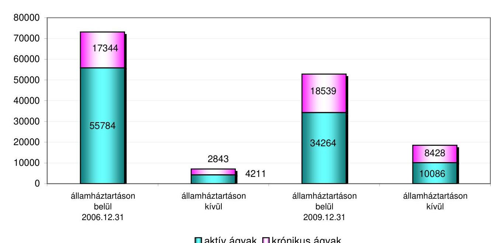

**3/15. sz. melléklet**

a V-2007-045/2009-2010. sz. jelentéshez

## **A fekvőbeteg-ellátó intézmények által működtetett kórházi ágyak fenntartók szerinti száma és megoszlása (2006-2009)**

|  Adatforrás: Az Egészségügyi Minisztérium adatszolgáltatása (az Országos Egészségbiztosítási Pénztár által az adott év december 31-én finanszírozott kórházi ágyak száma) |  |  |  |  |  |  |  |  |  |  |  |  |  |  |  |  |  |  |  |  |  |  |  |  |  |  |  |  |  |  |  |  |  |  |  |  |  |  |  |  |  |  |  |  |  |  |  |  |  |  |  |  |  |  |  |  |  |  |  |  |  |  |  |  |  |  |  |  |  |  |  |  |  |  |  |  |  |  |  |  |  |  |  |  |  |  |  |  |  |  |  |  |  |  |  |  |  |  |  |  |  |  |  |  |  |  |  |  |  |  | 

---

### **3/16. sz. melléklet**

a V-2007-043/2009-2010. sz. jelentéshez

|  Megnevezés | Összes szolgáltató |  |  |  |  |  |  |  |  |  |  |  |  |  |  |  |  |   |
| --- | --- | --- | --- | --- | --- | --- | --- | --- | --- | --- | --- | --- | --- | --- | --- | --- | --- | --- |
|   |  |  |  |  |  |  |  |  |  |  |  |  |  |  |  |  |  |   |
|   |  |  |  |  |  |  |  |  |  |  |  |  |  |  |  |  |  |   |
|   |  |  |  |  |  |  |  |  |  |  |  |  |  |  |  |  |  |   |

 |   |
|   |  |  |  |  |  |  |  |  |  |  |  |  |  |  |  |  |  |   |
|   | 2006. | 2009. |  |  |  |  |  |  |  |  |  |  |  |  |  |  |  |   |
|   | december 31. |  |  |  |  |  |  |  |  |  |  |  |  |  |  |  |  |   |
|   |  |  |  |  |  |  |  |  |  |  |  |  |  |  |  |  |  |   |
|   |  |  |  |  |  |  |  |  |  |  |  |  |  |  |  |  |  |   |
|   |  |  |  |  |  |  |  |  |  |  |  |  |  |  |  |  |  |   |
|  Háziorvosi szolgáltatás (ügyelet nélkül) száma összesen | 289 | 274 |  | 94,8% |  |  |  |  |  |  |  |  |  |  |  |  |  |   |
|  Háziorvosokhoz bejelentkezeltek száma | 358 402 | 306 178 |  | 94,8% |  |  |  |  |  |  |  |  |  |  |  |  |  |   |
|  Egy háziorvosra (szolgáltatásra) jutó bejelentkezett lakosok száma | 1 239 | 1 117 |  | 101,1% |  |  |  |  |  |  |  |  |  |  |  |  |  |   |
|  Fogászati ellátás |  |  |  |  |  |  |  |  |  |  |  |  |  |  |  |  |  |   |
|  Szolgáltatók száma | 113 | 105 |  | 92,9% |  |  |  |  |  |  |  |  |  |  |  |  |  |   |
|  Esetek száma | 292 317 | 202 560 |  | 69,3% |  |  |  |  |  |  |  |  |  |  |  |  |  |   |
|  Bevételezések száma | 769 941 | 560 596 |  | 72,8% |  |  |  |  |  |  |  |  |  |  |  |  |  |   |
|  Száz lakosra jutó esetek száma |  |  |  |  |  |  |  |  |  |  |  |  |  |  |  |  |  |   |
|  Száz lakosra jutó beavatkozások száma |  |  |  |  |  |  |  |  |  |  |  |  |  |  |  |  |  |   |
|  Alapellátási ügyelet |  |  |  |  |  |  |  |  |  |  |  |  |  |  |  |  |  |   |
|  Háziorvosi ügyelet szolgáltatóinak száma (finanszírozási szerződés) | 32 | 31 |  | 96,8% |  |  |  |  |  |  |  |  |  |  |  |  |  |   |
|  Ebből: központi ügyeleti szolgáltatók száma | 18 | 20 |  | 111,0% |  |  |  |  |  |  |  |  |  |  |  |  |  |   |
|  Fogorvosi ügyelet szolgáltatóinak száma | 9 | 9 |  | 100,0% |  |  |  |  |  |  |  |  |  |  |  |  |  |   |
|  Járóbeteg gondozóintézeti gondozás |  |  |  |  |  |  |  |  |  |  |  |  |  |  |  |  |  |   |
|  Járóbeteg gondozó intézmények száma | 31 | 33 |  | 104,3% |  |  |  |  |  |  |  |  |  |  |  |  |  |   |
|  Járóbeteg szakellátás |  |  |  |  |  |  |  |  |  |  |  |  |  |  |  |  |  |   |
|  Járóbeteg ellátó intézmények száma | 13 | 14 |  | 107,7% |  |  |  |  |  |  |  |  |  |  |  |  |  |   |
|  Szolgáltatók száma | 923 | 917 |  | 99,3% |  |  |  |  |  |  |  |  |  |  |  |  |  |   |
|  Megjelenési esetek száma | 8 448 777 | 8 023 517 |  | 95,0% |  |  |  |  |  |  |  |  |  |  |  |  |  |   |
|  Száz lakosra jutó esetek száma |  |  |  |  |  |  |  |  |  |  |  |  |  |  |  |  |  |   |
|  Száz lakosra jutó szakorvosi munkaóra száma |  |  |  |  |  |  |  |  |  |  |  |  |  |  |  |  |  |   |
|  Fekvőbeteg szakellátás |  |  |  |  |  |  |  |  |  |  |  |  |  |  |  |  |  |   |
|  Szolgáltatók száma | 12 | 10 |  | 83,3% |  |  |  |  |  |  |  |  |  |  |  |  |  |   |
|  Ebből: ágyszámmal nem rendelkező (kórházi ellátást végző) szolgáltatók | 0 | 0 |  | 0,0% |  |  |  |  |  |  |  |  |  |  |  |  |  |   |
|  Ágyszám és betegforgalmi adatok |  |  |  |  |  |  |  |  |  |  |  |  |  |  |  |  |  |   |
|  Működő ágyak száma | 9 916 | 9 421 |  | 95,0% |  |  |  |  |  |  |  |  |  |  |  |  |  |   |
|  Ebből: aktív | 7 616 | 5 953 |  | 78,2% |  |  |  |  |  |  |  |  |  |  |  |  |  |   |
|  krónikus | 2 285 | 3 468 |  | 151,8% |  |  |  |  |  |  |  |  |  |  |  |  |  |   |
|  Működő kórházi ágyak átlagos száma ezer lakosra |  |  |  |  |  |  |  |  |  |  |  |  |  |  |  |  |  |   |
|  Ebből: aktív |  |  |  |  |  |  |  |  |  |  |  |  |  |  |  |  |  |   |
|  krónikus |  |  |  |  |  |  |  |  |  |  |  |  |  |  |  |  |  |   |
|  Ápolási átlagos tartalma | 7,7 | 7,7 |  | 100,9% |  | 

 |  |  |  |  |  |  |  |  |  |  |  |   |
|  Ebből: aktív | 6,2 | 5,5 |  | 88,8% |  |  |  |  |  |  |  |  |  |  |  |  |  |   |
|  krónikus | 24,3 | 22,4 |  | 92,2% |  |  |  |  |  |  |  |  |  |  |  |  |  |   |
|  Ágylézhasszalázi (együtt) |  |  |  |  |  |  |  |  |  |  |  |  |  |  |  |  |  |   |
|  Ebből: aktív |  |  |  |  |  |  |  |  |  |  |  |  |  |  |  |  |  |   |
|  krónikus |  |  |  |  |  |  |  |  |  |  |  |  |  |  |  |  |  |   |
|  Adatforrás: A vizsgált önkormányzatok összesített adatszolgáltatásából készített kimutatás |  |  |  |  |  |  |  |  |  |  |  |  |  |  |  |  |  |   |

---

3/17. sz. melléklet a V-2007-045/2009-2010. sz. jelentéshez

A védőnői feladatok országos ellátottsági mutatói fenntartók (működtetők) szerint (2006 - 2008)

|  Megnevezés | Összes szolgáltató |  |  |  | Ebből: |  |  |  |  | Ebből: |  |  |  |  |  |   |
| --- | --- | --- | --- | --- | --- | --- | --- | --- | --- | --- | --- | --- | --- | --- | --- | --- |
|   |  |  |  |  | Állami fenntartáson
kívüli szervezetek |  |  |  |  | Állami fenntartáson
belüli szervezetek |  |  |  |  |  |   |
|   |  |  |  |  |  | Önkormányzati
egészségügyi
intézmény |  |  |  |  | Önkormányzat |  | Többcélú
kistérségi társulás |  | Országos
egészségügyi
intézmény |   |
|   | 2006. | 2008. |  |  | 2006. | 2008. | 2006. | 2008. | 2006. | 2008. | 2006. | 2008. | 2006. | 2008. | 2006. | 2008.  |
|   | december 31. |  |  |  | december 31. |  | december 31. |  | december 31. |  | december 31. |  | december 31. |  | december 31. |   |
|  Védőnői szolgálat, anya, gyermek- és csecsemővédelem |  |  |  |  |  |  |  |  |  |  |  |  |  |  |  |   |
|  Területi védőnői körzetek száma | 4 035 | 4 008 | 99,3% |  | 234 | 381 | 3 801 | 3 627 | 1 239 | 1 003 | 2 562 | 2 569 | 0 | 0 | 0 | 55  |
|  Ebből: |  |  |  |  |  |  |  |  |  |  |  |  |  |  |  |   |
|  Egy települést ellátó | 3 188 | 3 163 | 99,2% |  | 214 | 353 | 2 974 | 2 810 | 1 172 | 941 | 1 802 | 1 814 | 0 | 0 | 0 | 55  |
|  Két települést ellátó | 487 | 480 | 98,6% |  | 13 | 20 | 474 | 460 | 47 | 44 | 427 | 416 | 0 | 0 | 0 | 55  |
|  Három települést ellátó | 200 | 197 | 98,5% |  | 2 | 3 | 198 | 194 | 15 | 13 | 183 | 181 | 0 | 0 | 0 | 55  |
|  Négy települést ellátó | 100 | 102 | 102,0% |  | 1 | 1 | 99 | 101 | 3 | 2 | 96 | 99 | 0 | 0 | 0 | 55  |
|  Öt települést ellátó | 45 | 48 | 106,7% |  | 3 | 3 | 42 | 45 | 1 | 2 | 41 | 43 | 0 | 0 | 0 | 55  |
|  Ötnél több települést ellátó | 15 | 17 | 113,3% |  | 1 | 1 | 14 | 16 | 1 | 1 | 13 | 15 | 0 | 0 | 0 | 55  |
|  Védőnői szolgálatok száma | 4 999 | 5 006 | 100,1% |  | 353 | 565 | 4 646 | 4 441 | 1 796 | 1 479 | 2 836 | 2 888 | 0 | 0 | 14 | 74  |
|  Területi védőnői szolgálatok száma | 4 035 | 4 008 | 99,3% |  | 234 | 381 | 3 801 | 3 627 | 1 239 | 1 003 | 2 562 | 2 569 | 0 | 0 | 0 | 55  |
|  Ebből betöltetlen | 202 | 211 | 104,5% |  | 10 | 22 | 192 | 189 | 36 | 27 | 156 | 162 | 0 | 0 | 0 | 55  |
|  Iskolavédőnői szolgálatok száma | 964 | 998 | 103,5% |  | 119 | 184 | 845 | 814 | 557 | 476 | 274 | 319 | 0 | 0 | 14 | 19  |
|  Ebből betöltetlen | 42 | 37 | 88,1% |  | 3 | 10 | 39 | 27 | 23 | 11 | 16 | 16 | 0 | 0 | 0 | 55  |
|  Védőnői szolgálatok által ellátandók létszámai |  |  |  |  |  |  |  |  |  |  |  |  |  |  |  |   |
|  Várandós anyák száma | 53 750 | 54 367 | 101,1% |  | 3 815 | 6 001 | 49 935 | 48 366 | 20 214 | 16 851 | 29 721 | 30 662 | 0 | 0 | 0 | 853  |
|  0-6 éves korú gyermekek száma | 634 598 | 638 004 | 100,5% |  | 42 903 | 68 389 | 591 695 | 569 615 | 225 814 | 186 035 | 365 881 | 373 227 | 0 | 0 | 0 | 10 353  |
|  6 év feletti, otthongondozott tanköteles korú gyermekek száma | 6 281 | 3 563 | 56,7% |  | 208 | 403 | 6 073 | 3 160 | 2 576 | 956 | 3 497 | 2 189 | 0 | 0 | 0 | 13  |
|  Iskolai létszám | 1 387 944 | 1 349 348 | 97,2% |  | 116 459 | 179 424 | 1 271 485 | 1 169 924 | 626 066 | 517 686 | 629 958 | 626 492 | 0 | 0 | 15 461 | 25 746  |

Megjegyzés: a védőnői ellátás országos szintű adatai 2009. évre vonatkozóan nem álltak rendelkezésre

Adatforrás: Az Egészségügyi Minisztérium adatszolgáltatásából készített kimutatás

---

# A vizsgált önkormányzatok védőnői feladatainak ellátottsági mutatói fenntartók (működtetők) szerint (2006 - 2009)

|  Megnevezés | Összes szolgáltató |  |  | Ebből: |  |  |  | Ebből: |  |  |  |  |  |  |   |
| --- | --- | --- | --- | --- | --- | --- | --- | --- | --- | --- | --- | --- | --- | --- | --- |
|   |  |  |  | Állami fenntartáson kívüli szervezetek |  |  |  | Állami fenntartáson
belüli szervezetek |  |  | Önkormányzati egészségügyi intézmény |  |  |  | Önkormányzati
kistérségi társulás  |
|   |  |  |  | 2006.
december 31. | 2009. | 2009.
december 31. | 2006.
december 31. | 2009.
december 31. | 2006.
december 31. | 2009.
december 31. | 2006.
december 31. | 2009.
december 31. | 2006.
december 31.  |
|  Védőnői szolgáltat, anya, gyermek- és csecsemővédelem |  |  |  |  |  |  |  |  |  |  |  |  |  |  |   |
|  Védőnői körzetek száma összesen (db) |  | 183 | 173 | 94,4\% | 0 | 19 | 183 | 154 | 152 | 121 | 31 | 26 | 0 | 7 | 0  |
|   | egy települést ellátó körzetek száma | 139 | 138 | 99,3\% |

 0 | 17 | 139 | 121 | 123 | 102 | 16 | 14 | 0 | 5 | 0  |
|  Ebből: | két települést ellátó körzetek száma | 18 | 15 | 83,3\% | 0 | 1 | 18 | 14 | 11 | 8 | 7 | 5 | 0 | 1 | 0  |
|   | három települést ellátó körzetek száma | 6 | 7 | 116,7\% | 0 | 0 | 6 | 7 | 4 | 4 | 2 | 3 | 0 | 0 | 0  |
|   | négy települést ellátó körzetek száma | 4 | 3 | 75,0\% | 0 | 1 | 4 | 2 | 0 | 0 | 4 | 2 | 0 | 0 | 0  |
|   | öt települést ellátó körzetek száma | 4 | 3 | 76,2\% | 0 | 0 | 4 | 3 | 1 | 0 | 2 | 2 | 1 | 1 | 0  |
|   | ötnél több települést ellátó körzetek száma | 0 | 1 | 0 | 0 | 0 | 0 | 1 | 0 | 0 | 0 | 0 | 0 | 1 | 0  |
|  Védőnői állások száma összesen (fő) |  | 238 | 239 | 100,5\% | 0 | 37 | 238 | 202 | 209 | 167 | 28 | 26 | 0 | 9 | 0  |
|  Ebből: | területi védőnői állások száma | 165 | 162 | 98,6\% | 0 | 19 | 165 | 143 | 138 | 114 | 26 | 23 | 0 | 6 | 0  |
|   | Ebből: betöltetlen területi védőnői állások száma | 3 | 5 | 166,7\% | 0 | 1 | 3 | 4 | 3 | 3 | 0 | 1 | 0 | 0 | 0  |
|  Ebből: | csukádvédelmi szolgáltatást végző védőnői állások száma | 0 | 0 | 0 | 0 | 0 | 0 | 0 | 0 | 0 | 0 | 0 | 0 | 0 | 0  |
|   | Ebből: betöltetlen területi védőnői állások száma | 0 | 0 | 0 | 0 | 0 | 0 | 0 | 0 | 0 | 0 | 0 | 0 | 0 | 0  |
|  Védőnői körzetekben gondozott várandós anyák száma (fő) |  | 3903 | 6289 | 161,1\% | 0 | 298 | 3903 | 5991 | 3299 | 5329 | 603 | 404 | 1 | 258 | 0  |
|  Védőnői körzetekben gondozott 0-11 hónaposok száma (fő) |  | 4874 | 5569 | 114,3\% | 0 | 512 | 4874 | 5057 | 4335 | 4337 | 535 | 487 | 4 | 233 | 0  |
|  Védőnői körzetekben gondozott 12-35 hónaposok száma (fő) |  | 9711 | 9199 | 94,7\% | 0 | 1128 | 9711 | 8071 | 8721 | 6690 | 987 | 939 | 3 | 442 | 0  |
|  Védőnői körzetekben gondozott 3-6 évesek száma (fő) |  | 15218 | 15143 | 99,5\% | 0 | 1943 | 15218 | 13200 | 13340 | 10706 | 1874 | 1648 | 4 | 846 | 0  |
|  Védőnői körzetekben gondozott családok száma (db) |  | 18671 | 17575 | 94,1\% | 0 | 3141 | 18671 | 14434 | 15929 | 11099 | 2742 | 2375 | 0 | 960 | 0  |

Adatforrás: A vizsgált önkormányzatok összesített adatszolgáltatásából készített kimutatás

---

A szociális feladatok főbb országos mutatói (2006 - 2008)

3/19. sz. melléklet a V-2007-045/2009-2010. sz. jelentéshez

|  Megnevezés | Összesen | változás 2008/2006 index % | Állambáztartáson kivüli szervezetek | Állambáztartáson belül összesen | Szociális fenntartásban | Önkormányzati társulásban | Többcélú kistérségi társulás által | Központi költségvetési szerv által  |
| --- | --- | --- | --- | --- | --- | --- | --- | --- |
|   |  |  |  |  |  |  |  | működtetett intézményben  |
|   | 2006. | 2008. | 2006. | 2006. | 2008. | 2006. | 2008. | 2006.  |
|   | december 31. | december 31. | december 31. |  |  |  |  |   |
|  1. SZOCIÁLIS ALAPSZOLGÁLTATÁSOK, NAPPALI ELLÁTÁSOK |  |  |  |  |  |  |  |   |
|  Falu- és tanyagondnoki szolgáltatás |  |  |  |  |  |  |  |   |
|  Falu-, tanyagondnoki szolgáltatást végzők száma (fő) | 874 | 984 | 112,6% | 9 | 15 | 865 | 969 | 848  |
|  Hozó segítségnyújtás |  |  |  |  |  |  |  |   |
|  Ellátottak száma (fő) | 48088 | 48120 | 100,1% | 2323 | 6029 | 45765 | 42091 | 43412  |
|  Képviselő gondozás (old. ellátottak száma 7,3) | 7,1) | 96,7% | 10,0) | 8,8) | 7,2) | 6,9) | 7,1)  |
|  Intézményen kívüli házhoz segítségnyújtásban részesülők száma (fő) | 15042 | 38091 | 253,2% | 2202 | 21510 | 12840 | 16581 | 11203  |
|  Családgondozó szolgáltatás |  |  |  |  |  |  |  |   |
|  Szolgáltatást igénybevevők száma (fő)* | 599117 | 508324 | 127,4% |  | 23634 |  | 484690 |   |
|  Nagyüzemi szociális ellátás |  |  |  |  |  |  |  |   |
|  Hajléktalan személyek nagyüzemi ellátása |  |  |  |  |  |  |  |   |
|  Nagyüzemi, területi ellátás száma (fő) | 95 | 104 | 109,5% | 33 | 60 | 40 | 44 | 38  |
|  Pénzügyi döngés forgalom (fő) | 7049 | 8567 | 121,5% | 5074 | 6062 | 1975 | 2205 | 1931  |
|  Idősügyi ellátás |  |  |  |  |  |  |  |   |
|  Kizárólag száma (fő) | 1238 | 1207 |  | 87 | 108 | 1151 | 1099 | 1107  |
|  Felülné férőhelyek (fő) | 40904 | 41738 | 102,0% | 3527 | 3836 | 37377 | 37902 | 36033  |
|  Ellátottak száma (fő) | 39048 | 37964 | 97,2% | 3304 | 3606 | 35743 | 34358 | 34463  |
|  Kizárólag kapacitáskihasználtság (fő) | 95,5% | 91,0% | 95,3% | 93,7% | 94,0% | 95,6% | 90,6% | 95,6%  |
|  Fejlesztőszék nagyüzemi intézménye |  |  |  |  |  |  |  |   |
|  Intézmények száma (fő) | 131 | 178 | 135,9% | 47 | 75 | 84 | 103 | 79  |
|  Felülné férőhelyek (fő) | 3298 | 4247 | 128,8% | 1197 | 1639 | 2101 | 2608 | 1975  |
|  Ellátottak száma (fő) | 3108 | 4490 | 144,5% | 1105 | 2076 | 2003 | 2414 | 1893  |
|  Férőhely kihasználtság (fő) | 94,2% | 105,7% | 112,2% | 92,3% | 126,7% | 95,3% | 92,6% | 95,8%  |
|  2. TARTÓS BENTARTÁSOS ÁPOLÓ-GONDOLÓ ÉS BOHÁRÁLYSZÁTSZOCIÁLIS INTÉZMÉNYEK |  |  |  |  |  |  |  |   |
|  Intézmények száma összesen (db) | 1269 | 1304 | 102,8% | 488 | 509 | 781 | 795 | 754  |
|  Ebből: | szociális otthona | 793 | 796 | 100,4% | 239 | 242 | 434 | 434  |
|   | 94 | 106 | 112,8% | 18 | 24 | 76 | 82 | 76  |
|   | 314 | 328 | 104,5% | 102 | 112 | 212 | 216 | 198  |
|   | 45 | 49 | 108,9% | 13 | 15 | 32 | 34 | 32  |
|   | 23 | 25 | 108,7% | 16 | 16 | 7 | 9 | 7  |
|  Ellátottak száma összesen (fő) | 73658 | 73411 | 99,7% | 20764 | 21759 | 52894 | 51652 | 51685  |
|  Ebből: | 46975 | 46569 | 99,1% | 16757 | 17109 | 30218 | 29460 | 29572  |
|   | 8097 | 8188 | 101,1% | 573 | 868 | 7524 | 7320 | 7324  |
|   | 16074 | 16174 | 100,6% | 2647 | 3070 | 13427 | 13104 | 12864  |
|   | 1962 | 1917 | 97,7% | 416 | 552 | 1346 | 1365 | 1346  |
|   | 550 | 563 | 102,4% | 371 | 560 | 179 | 203 | 179  |
|  Férőhely kihasználtság összesen (fő) | 96,7% | 94,9% | 98,1% | 92,5% | 89,6% | 98,5% | 97,3% | 98,8%  |
|  Ebből: | 96,2% | 93,5% | 97,2% | 91,8% | 88,3% | 98,9% | 96,8% | 98,9%  |
|   | 100,4% | 99,1% | 98,7% | 97,0% | 93,2% | 100,6% | 99,8% | 100,6%  |
|   |

 96,6% | 96,5% | 100,0% | 93,6% | 93,2% | 96,8% | 96,9% | 97,9%  |
|   | 97,0% | 98,4% | 101,4% | 94,3% | 92,9% | 97,7% | 99,7% | 97,7%  |
|   | 94,3% | 94,3% | 100,0% | 96,4% | 94,3% | 90,4% | 94,4% | 90,4%  |

Megjegyzés*: A családsegítő szolgáltatást igénybevevők fenntartónkénti adatait a 2006. évre vonatkozóan az ágazati irányítást végző minisztérium adatgyűjtés hiányában nem tudta megadni

Adatforrás: A Szociális és Munkaügyi Minisztérium adatszolgáltatásából készített kimutatások

---

### **3/20. sz. melléklet**

a V-2007-043/2009-2010. sz. jelentéshez

|  Megnevezés | Összesen |  |  | Ebből: |  |  | Ebből: |  |  |  |  |  |  |  |  |  |   |
| --- | --- | --- | --- | --- | --- | --- | --- | --- | --- | --- | --- | --- | --- | --- | --- | --- | --- |
|   |  |  |  | Állambáztartáson kívül összesen |  |  | Állambáztartáson belül összesen |  |  |  |  |  |  |  |  |  |  |   |
|   |  |  |  |  |  |  |  |  |  |  |  |  |  |  |  |  |   |
|   |  |  | 2006. | 2009. |  | 2006. | 2009. | 2006. | 2009. | 2006. | 2009. | 2006. | 2009. | 2006. | 2009. | 2006. | 2009.  |
|   |  |  | december 31. |  |  | december 31. |  |  |  |  |  |  |  |  |  |  |   |
|   |  |  |  |  |  |  |  |  |  |  |  |  |  |  |  |  |   |
|   |  |  |  |  |  |  |  |  |  |  |  |  |  |  |  |  |   |
|  1. SZOCIÁLIS ALAPSZOLGÁLTATÁSOK, NAPPALI ELLÁTÁSOK |  |  |  |  |  |  |  |  |  |  |  |  |  |  |  |  |   |
|  Falu- és tanyagondnoki szolgáltatás |  |  |  |  |  |  |  |  |  |  |  |  |  |  |  |  |   |
|  Falu- tanyagondnokként foglalkoztatottak száma (III) | 5 | 6 | 120,0% | 1 | 2 | 4 | 4 | 4 | 4 | 0 | 0 | 0 | 0 | 0 | 0 | 0 |   |
|  Házi segítségnyújtás |  |  |  |  |  |  |  |  |  |  |  |  |  |  |  |  |   |
|  Ellátottak száma (III) | 1549 | 2050 | 132,3% | 6 | 33 | 1543 | 2017 | 1083 | 862 | 235 | 775 | 225 | 362 | 0 | 18 |  |   |
|  Egy gondozóna jutó ellátottak száma | 4,9 | 4,7 | 97,1% | 5,0 | 7,3 | 4,9 | 4,7 | 5,6 | 6,1 | 3,5 | 3,9 | 2,7 | 2,6 | 0 | 0 |  |   |
|  Jelentősen szoruló házi segítségnyújtásban részesülők száma (III) | 1045 | 1401 | 134,1% | 3 | 29 | 1042 | 1372 | 597 | 476 | 290 | 530 | 152 | 361 | 0 | 9 |  |   |
|  Családsegítő szolgáltatás |  |  |  |  |  |  |  |  |  |  |  |  |  |  |  |  |   |
|  Szolgáltatást igénybevevők száma (III)* | 41844 | 51115 | 122,2% | 0 | 71 | 41844 | 51044 | 33254 | 6845 | 5845 | 39179 | 2727 | 5000 | 18 | 20 |  |   |
|  Nappali szociális ellátás |  |  |  |  |  |  |  |  |  |  |  |  |  |  |  |  |   |
|  Hajléktalan személyek nappali ellátása |  |  |  |  |  |  |  |  |  |  |  |  |  |  |  |  |   |
|  Nappali melegedők száma (db) | 6 | 11 | 137,5% | 5 | 6 | 3 | 5 | 3 | 5 | 0 | 0 | 0 | 0 | 0 | 0 |  |   |
|  Napi átlagos forgalom (III) | 814,32 | 3799,56 | 466,6% | 729,36 | 1932,56 | 84,96 | 1867 | 84,96 | 1867 | 0 | 0 | 0 | 0 | 0 | 0 |  |   |
|  Idősek klubja |  |  |  |  |  |  |  |  |  |  |  |  |  |  |  |  |   |
|  Klubok száma (db) | 47 | 43 | 91,5% | 3 | 4 | 44 | 39 | 40 | 25 | 4 | 11 | 0 | 3 | 0 | 0 |  |   |
|  Működő férőhelyek (fb) | 1481 | 1410 | 95,2% | 46 | 55 | 1435 | 1355 | 1280 | 886 | 155 | 374 | 0 | 95 | 0 | 0 |  |   |
|  Ellátottak száma (III) | 1427 | 1276 | 89,4% | 67 | 66 | 1360 | 1210 | 1212 | 731 | 148 | 385 | 0 | 94 | 0 | 0 |  |   |
|  Klubok kapacitáskihasználtsága (%) | 96,4% | 90,5% | 93,9% | 145,7% | 120,0% | 94,8% | 89,3% | 94,7% | 82,5% | 95,5% | 102,9% | 0 | 98,9% | 0 | 0 |  |   |
|  Fogyatékkal élők nappali intézménye |  |  |  |  |  |  |  |  |  |  |  |  |  |  |  |  |   |
|  Intézmények száma (db) | 8 | 8 | 100,0% | 2 | 2 | 6 | 6 | 6 | 6 | 0 | 0 | 0 | 0 | 0 | 0 |  |   |
|  Működő férőhelyek (fb) | 214 | 184 | 86,0% | 55 | 30 | 159 | 154 | 159 | 154 | 0 | 0 | 0 | 0 | 0 | 0 |  |   |
|  Ellátottak száma (III) | 190,4 | 164 | 86,1% | 50 | 21 | 140,4 | 143 | 140,4 | 143 | 0 | 0 | 0 | 0 | 0 | 0 |  |   |
|  Férőhely kihasználtság (%) | 89,0% | 89,1% | 100,2% | 90,9% | 70,0% | 88,3% | 92,9% | 88,3% | 92,9% | 0 | 0 | 0 | 0 | 0 | 0 |  |   |
|  2. TARTÓS ÁPOLÁSRA, GONDOZÁSRA ÉS REHABILITÁCIÓS SZOCIÁLIS INTÉZMÉNYEK |  |  |  |  |  |  |  |  |  |  |  |  |  |  |  |  |   |
|  Intézmények száma összesen (db) | 69,5 | 64 | 92,1% | 13 | 11 | 56,5 | 53 | 47,5 | 43 | 5 | 4 | 0 | 2 | 4 | 4 |  |   |
|  Ebből: |  |  |  |  |  |  |  |  |  |  |  |  |  |  |  |  |   |

---

3/21. sz. melléklet a V-2007-045/2009-2010. sz. jelentéshez

A gyermekjóléti feladatok főbb országos mutatói (2006 - 2008)

|  Megnevezés | Összesen | változás 2008/2006. index % | Ebből: | Ebből:  |
| --- | --- | --- | --- | --- |
|   |  |  | Állambáztartáson kívül összesen | Állambáztartáson belül összesen  |
|   |  |  | 2006. | 2008.  |
|   | 2006. | 2008. | 2006. | 2008.  |
|   | december 31. |  | december 31. | december 31.  |
|  GYERMEKJÓLÉTI ELLÁTÁSOK |  |  |  |   |
|  Bölcsődei ellátás |  |  |  |   |
|  Intézmények száma (db) | 543 | 594 | 109,4% | 27  |
|  Működő férőhelyek (fb) | 24255 | 25937 | 106,9% | 752 |

  |
|  Beiratott gyermekek száma (fő) | 31153 | 33680 | 108,1% | 913  |
|  Férőhely kihasználtság (%) | 128,4% | 129,9% | 101,1% | 121,4%  |
|  Gyermekjóléti szolgálat |  |  |  |   |
|  Szolgálatok száma (db) | 1238 | 815 | 65,8% | 199  |
|  Gondozott gyermekek száma (fő) | 122908 | 126478 | 102,9% | 5047  |
|  Gondozási esetek száma (db) | 222736 | 206776 | 92,8% | 12914  |
|  Családi napközi |  |  |  |   |
|  Gondozott gyermekek száma (fő) | 1198 | 2621 | 218,8% | 934  |
|  Gondozási napok száma (nap) | 116350 | 260615 | 224,0% | 97177  |
|  Házi gyermekfelügyelet |  |  |  |   |
|  Gondozott gyermekek száma (fő) | 349 | 199 | 57,0% | 17  |
|  Igénybe vett gondozási órák száma (óra) | 13648 | 17436 | 127,8% | 1536  |

Adatforrás: A Szociális és Munkaügyi Minisztérium adatszolgáltatásából készített kimutatás

---

A vizsgált önkormányzatok által ellátott gyermekjóléti feladatok főbb mutatói (2006 - 2009)

|  Megnevezés | Összesen |  | változás 2009/2006 Index \% | Ebből: |  |  |  | Ebből: |  |  |  |  |  |  |   |
| --- | --- | --- | --- | --- | --- | --- | --- | --- | --- | --- | --- | --- | --- | --- | --- |
|   |  |  |  | Állambáztartáson kívül összesen |  | Állambáztartáson belül összesen |  | Állambáztartáson belüli szervezetek által ellátott feladatok |  |  |  |  |  |  |   |
|   |  |  |  |  |  |  | Saját fenntartásban |  | Önkormányzati társulásban |  | Többcélú kistérségi társulás |  | Központi költségvetési szerv |  |   |
|   |  |  |  |  |  |  |  |  |  |  |  |  |  |  |   |
|   | 2006. | 2009. |  |  | 2006. | 2009. | 2006. | 2009. | 2006. | 2009. | 2006. | 2009. | 2006. | 2009. | 2009.  |
|   | december 31. |  |  |  | december 31. |  | december 31. |  | December 31. |  | December 31. |  | December 31. |  | December 31.  |
|  GYERMEKJÓLÉTI ELLÁTÁSOK |  |  |  |  |  |  |  |  |  |  |  |  |  |  |   |
|  Bölcsődei ellátás |  |  |  |  |  |  |  |  |  |  |  |  |  |  |   |
|  Intézmények száma (db) | 25 | 25 | 100,0\% | 0 | 0 | 25 | 25 | 24 | 25 | 0 | 0 | 0 | 0 | 1 | 0  |
|  Működő férőhelyek (fő) | 1394 | 1384 | 99,3\% | 0 | 0 | 1394 | 1384 | 1334 | 1384 | 0 | 0 | 0 | 0 | 60 | 0  |
|  Beiratott gyermekek száma (fő) | 1682 | 1837 | 109,2\% | 0 | 0 | 1682 | 1837 | 1578 | 1837 | 0 | 0 | 0 | 0 | 104 | 0  |
|  Férőhely kihasználtság (\%) | 120,7\% | 132,7\% | 110,0\% | 0,0\% | 0,0\% | 120,7\% | 132,7\% | 118,3\% | 132,7\% | 0,0\% | 0,0\% | 0 | 0,0\% | 173,3\% | 0,0\%  |
|  Gyermekjóléti szolgálat |  |  |  |  |  |  |  |  |  |  |  |  |  |  |   |
|  Szolgálatok száma (db) | 43 | 37 | 86,0\% | 1 | 1 | 42 | 36 | 14 | 7 | 16 | 14 | 11 | 14 | 1 | 1  |
|  Gondozott gyermekek száma (fő) | 5401 | 5976 | 110,6\% | 29 | 13 | 5372 | 5963 | 3027 | 1349 | 1370 | 2473 | 929 | 2107 | 46 | 34  |
|  Gondozási esetek száma (db) | 13550 | 20419 | 150,7\% | 1147 | 142 | 12403 | 20277 | 8975 | 3438 | 2225 | 3389 | 1150 | 13445 | 53 | 5  |
|  Családi napközi |  |  |  |  |  |  |  |  |  |  |  |  |  |  |   |
|  Gondozott gyermekek száma (fő) | 0 | 56 | 0,0\% | 0 | 34 | 0 | 22 | 0 | 0 | 0 | 0 | 0 | 22 | 0 | 0  |
|  Gondozási napok száma (nap) | 0 | 4310 | 0,0\% | 0 | 4059 | 0 | 251 | 0 | 0 | 0 | 0 | 0 | 251 | 0 | 0  |
|  Házi gyermekfelügyelet |  |  |  |  |  |  |  |  |  |  |  |  |  |  |   |
|  Gondozott gyermekek száma (fő) | 28 | 42 | 150,0\% | 0 | 0 | 28 | 42 | 28 | 42 | 0 | 0 | 0 | 0 | 0 | 0  |
|  Igénybe vett gondozási órák száma (óra) | 3081 | 2034 | 66,0\% | 0 | 0 | 3081 | 2034 | 3081 | 2034 | 0 | 0 | 0 | 0 | 0 | 0  |

Adatforrás: A vizsgált önkormányzatok összesített adatszolgáltatásából készített kimutatás

---

Az önkormányzati alrendszerben foglalkoztatottak létszáma országosan, ágazatonként (2006-2008)
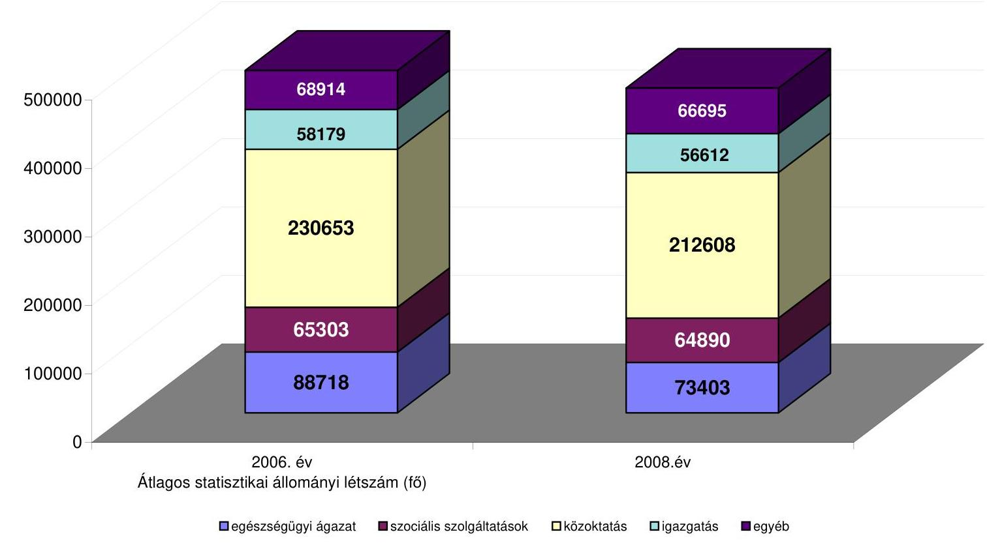

Adatforrás: Az önkormányzati alrendszer nettósított éves beszámolóinak 21. számú űrlapjain feltüntetett tényleges átlagos statisztikai állományi létszám (ágazatokhoz tartozó szakfeladatok adatainak összesítésével)

---

# A helyi önkormányzatoknál választott tisztségviselők és a foglalkoztatottak létszámának országos alakulása 

(2006 - 2009)

| Megnevezés | Létszám (fő) |  |  |  |  |  |
| :--: | :--: | :--: | :--: | :--: | :--: | :--: |
|  | 2006. év | 2007. év | 2008. év | 2009. év | $\begin{gathered} \text { Index\% } \\ (2008 / 2006) \end{gathered}$ | $\begin{gathered} \text { Index\% } \\ (2009 / 2008) \end{gathered}$ |
| Választott tisztségviselők összesen | 2304 | 2225 | 2180 | 2178 | 94,6\% | 99,9\% |
| Teljes munkaidőben foglalkoztatott köztisztviselők | 42995 | 41090 | 40473 | 40398 | 94,1\% | 99,8\% |
| Részmunkaidőben foglalkoztatott köztisztviselők | 874 | 886 | 896 | 851 | 102,5\% | 95,0\% |
| Köztisztviselők száma - összesen | 43869 | 41976 | 41369 | 41249 | 94,3\% | 99,7\% |
| Teljes munkaidőben foglalkoztatott közalkalmazottak | 395046 | 390603 | 361106 | 351215 | 91,4\% | 97,3\% |
| Részmunkaidőben foglalkoztatott közalkalmazottak | 20730 | 21231 | 19041 | 19076 | 91,9\% | 100,2\% |
| Közalkalmazottak száma - összesen | 415776 | 411834 | 380147 | 370291 | 91,4\% | 97,4\% |
| Teljes munkaidőben foglalkoztatott egyéb törvényi rendelkezések alapján foglalkoztatottak száma (önkormányzati szervek egyéb bérrendszer) | 32088 | 33590 | 37010 | 56532 | 115,3\% | 152,7\% |
| Részmunkaidőben foglalkoztatott egyéb törvényi rendelkezések alapján foglalkoztatottak száma | 13145 | 10247 | 9662 | 15780 | 73,5\% | 163,3\% |
| Egyéb törvényi rendelkezések alapján foglalkoztatottak száma összesen | 45233 | 43837 | 46672 | 72312 | 103,2\% | 154,9\% |
| Ebből közfoglalkoztatottak száma | 18396 | 19525 | 20340 | 40402 | 110,6\% | 198,6\% |
| Állományba nem tartozók létszáma | 4585 | 3662 | 3840 | 4900 | 83,8\% | 127,6\% |
| Önkormányzat által teljes és részmunkaidőben foglalkoztatottak összesen | 511767 | 503534 | 474208 | 490930 | 92,7\% | 103,5\% |

Adatforrás: Az önkormányzati alrendszer nettósított éves beszámolóinak 34-35. számú űrlapjaiból készített kimutatás

---

# A vizsgált önkormányzatoknál a választott tisztségviselők és a foglalkoztatottak létszámának alakulása (2006 - 2009)

|  Megnevezés | Létszám (fő) |  |  |  |  |   |
| --- | --- | --- | --- | --- | --- | --- |
|   | 2006. év | 2007. év | 2008. év | 2009. év | Index\%
(2008/2006) | Index\%
(2009/2008)  |
|  Választott tisztségviselők összesen | 73 | 70 | 70 | 69 | 95,2\% | 99,3\%  |
|  Teljes munkaidőben foglalkoztatott köztisztviselők | 2481 | 2172 | 2141 | 2143 | 86,3\% | 100,1\%  |
|  Részmunkaidőben foglalkoztatott köztisztviselők | 23 | 25 | 27 | 21 | 117,2\% | 75,1\%  |
|  Köztisztviselők száma - összesen | 2504 | 2197 | 2169 | 2164 | 86,6\% | 99,8\%  |
|  Teljes munkaidőben foglalkoztatott közalkalmazottak | 37860 | 35226 | 32530 | 31949 | 85,9\% | 98,2\%  |
|  Részmunkaidőben foglalkoztatott közalkalmazottak | 1243 | 1165 | 997 | 1233 | 80,2\% | 123,7\%  |
|  Közalkalmazottak száma - összesen | 39103 | 36391 | 33527 | 33182 | 85,7\% | 99,0\%  |
|  Teljes munkaidőben foglalkoztatott egyéb törvényi rendelkezések alapján foglalkoztatottak

 száma (önkormányzati szervek egyéb bérrendszer) | 1410 | 1402 | 1426 | 2405 | 101,2\% | 168,6\%  |
|  Részmunkaidőben foglalkoztatott egyéb törvényi rendelkezések alapján foglalkoztatottak száma | 487 | 321 | 250 | 125 | 49,8\% | 60,4\%  |
|  Egyéb törvényi rendelkezések alapján foglalkoztatottak száma összesen | 1897 | 1723 | 1676 | 2540 | 88,0\% | 152,9\%  |
|  Ebből közfoglalkoztatottak száma | 615 | 575 | 639 | 1587 | 103,8\% | 258,0\%  |
|  Állományba nem tartozók létszáma | 826 | 645 | 709 | 515 | 85,8\% | 72,6\%  |
|  Önkormányzat által teljes és részmunkaidőben foglalkoztatottak összesen | 44403 | 41025 | 38150 | 38470 | 85,9\% | 100,9\%  |

Adatforrás: A vizsgált önkormányzatok összesített nettósított éves beszámolóinak 34-35. számú űrlapjaiból készített kimutatás

---

A helyi önkormányzati alrendszerben végrehajtott támogatott létszámcsökkentések országos adatai (2006 - 2009)*

|  MEGNEVEZÉS | KÖZOKTATÁS |  |  |  | SZOCIÁLIS ÉS GYERMEKJÓLÉTI SZOLGÁLTATÁSOK |  |  |  | EGÉSZSÉGÜGYI ELLÁTÁSOK |  |  |  | ÖNKORMÁNYZATI HIVATALI FELADATOK |  |  |   |
| --- | --- | --- | --- | --- | --- | --- | --- | --- | --- | --- | --- | --- | --- | --- | --- | --- |
|   | 2006 | 2007 | 2008 | 2009 | 2006 | 2007 | 2008 | 2009 | 2006 | 2007 | 2008 | 2009 | 2006 | 2007 | 2008 | 2009  |
|  Létszámcsökkentéssel érintett önkormányzatok száma | 381 | 829 | 434 | 234 | 32 | 105 | 59 | 42 | 44 | 84 | 53 | 36 | 53 | 408 | 238 | 127  |
|  Létszámcsökkentéssel érintett intézmények száma | 684 | 2070 | 832 | 491 | 66 | 216 | 102 | 53 | 56 | 122 | 66 | 43 | 57 | 428 | 248 | 137  |
|  Megszüntetett álláshelyek száma (60) | 1451 | 7188 | 2132 | 1073 | 212 | 855 | 420 | 168 | 613 | 3453 | 765 | 1337 | 175 | 1043 | 424 | 217  |
|  A helyi szervezési intézkedésekhez kapcsolódóan igényelt központosított támogatás (ezer Ft) | 2700727 | 11719886 | 3471720 | 2052404 | 259637 | 992871 | 471746 | 156843 | 784040 | 5581267 | 1052437 | 1753982 | 282536 | 1672510 | 636811 | 327288  |
|  Ténylegesen folyósított (megítélt) támogatás (ezer Ft) | 2618783 | 11585255 | 3990742 | 2274223 | 253722 | 982512 | 470912 | 188498 | 759836 | 5547409 | 1062847 | 1673083 | 277480 | 1641191 | 649321 | 325034  |
|  Ebből: | adott célra felhasznált támogatás (ezer Ft) | 2618783 | 7885633 | 3049678 | 1767842 | 253722 | 823866 | 384250 | 149854 | 759836 | 4102193 | 943580 | 1523051 | 195950 | 1148095 | 471960  |
|   | feladattal terhelt, de fel nem használt támogatás összege (ezer Ft) | 0 | 3699622 | 941064 | 506381 | 0 | 158646 | 86662 | 38644 | 0 | 1445216 | 119267 | 150032 | 81530 | 493096 | 177361  |

*Megjegyzés: Az adatok a 2009. november 30-ig lezárult támogatások adatait tartalmazzák.

---

FÜGGELÉKEK

---

# Az állam által alapított/tulajdonolt államháztartáson kívüli szervezetekre vonatkozó szabályozási környezet változásai 

A vizsgált időszakban a közalapítványok megszüntetésének - feladatainak költségvetési szervbe való integrálásával, vagy fejezeti kezelésű előirányzatból való finanszírozásával - tendenciája mellett módosult az államháztartáson kívüli feladatellátás szabályozási környezete is, szigorodtak a köz-pénz-mozgás felügyeleti, ellenőrzési jogosítványai.

A Kormány a köztulajdonban álló gazdasági társaságok ${ }^{1}$ felülvizsgálata (a gazdasági szervezetekre vonatkozóan pedig azok működtetésének előnyeinek bemutatását a költségvetési szervi feladatellátással szemben ${ }^{2}$ ) mellett a közalapítványokra vonatkozóan előírta továbbműködtetés indokoltságának megvizsgálását.

A 2112/2007. (VI. 15.) Korm. határozat alapján a közszolgáltatást végző költségvetési szervek esetén kellett felülvizsgálni nonprofit gazdasági társasági formában való feladatellátás előnyeit, továbbá elrendelte a Kormány az átalakulás jogi előfeltételeinek, szabályozásának kidolgozását.

Az államháztartásról szóló 1992. évi XXXVIII. törvény (Áht.) és egyes kapcsolódó törvények módosításáról szóló 2006. évi LXV. törvény (Át.) a hatálybalépését (VIII. 24.) követő időszakra vonatkozóan megtiltotta a közalapítványok alapítását, illetve tevékenységük újabb közfeladattal való bővítését. A már működő közalapítványok alapítói pedig eldönthették, hogy továbbra is működtetik, avagy megszüntetik a közalapítványt. A megszűnő államháztartáson kívüli szervezetek révén adott támogatások nagyobb szakszerűséggel és átláthatósággal való nyújtásához az Áht. ezen módosítása ${ }^{3}$ lehetővé és szabályozottá tette, hogy az ilyen támogatási célú előirányzat elosztásában „civil" jellegű testület döntés-előkészítő szerepet töltsön be.

Az Át. törölte a Polgári Törvénykönyvről szóló 1959. évi törvény (Ptk.), közalapítványra vonatkozó 74/G. §-át. A tiltó rendelkezés mellett további szigorítás, hogy a már meglévő közalapítványok csak olyan gazdálkodó szervezetben vehetnek részt, amelyben legalább többségi befolyással (Ptk. 685/B. §) rendelkeznek, és felelősségük nem haladja meg vagyoni hozzájárulásuk mértékét. A közalapítványok által létrehozott gazdálkodó szervezetek további

[^0]
[^0]:    ${ }^{1}$ A fogalmat a köztulajdonban álló gazdasági társaságok takarékosabb működéséről szóló 2009. évi CXXII. törvény vezette be, eszerint az a gazdasági társaság, amelyben a Magyar állam többségi befolyással rendelkezik.
    ${ }^{2}$ Az egyes költségvetési szervek átalakulásával összefüggő feladatokról szóló 2112/2007. (VI. 15.) Korm. határozat.
    ${ }^{3}$ Az Áht. 24/A. § (1) alapján a fejezet felügyeletét ellátó szerv vezetője a költségvetési törvényben meghatározott (különösen oktatási, tudományos, egészségügyi, szociális, kulturális, sportcélú) közfeladat ellátására rendelkezésére álló támogatási célú fejezeti kezelésű előirányzatból a támogatási döntések előkészítéséhez szükséges szakértői munkára társadalmi jellegű, jelentős közéleti személyekből, illetve szakértőkből álló testületet is felállíthat.

---

gazdálkodó szervezetet nem alapíthatnak, és gazdálkodó szervezetben részesedést nem szerezhetnek.

A közalapítványi vagyon 5\%-ának, de legfeljebb összesen 1 M Ft mértékéig maximálták a pályázat kiírása nélkül nyújtható támogatás mértékét.

A szigorodó előírásokkal összhangban a költségvetés tervezésével és zárszámadásával kapcsolatos előírásokban is nevesítették a köztulajdonban álló gazdasági társaságokkal kapcsolatos feladatokat. A 2007. évi Tervezési Köriratban külön pontként szerepeltek a közfeladatot ellátó, állami alapítású, illetve részesedésű szervezetekkel kapcsolatos tervezési feladatok. A fejezetek intézményeinek a zárszámadás keretében indokolniuk kellett ${ }^{4}$ a közfeladatokat ellátó állami alapítású, illetve részesedésű szervezetek támogatása szükségességét és megfelelő felhasználását, továbbá a tevékenység ellátásának színvonalát, a gazdaságosságát, a jövedelmezőségét és a vagyonváltozást.

Az állami feladat-ellátás és a támogatások mértéke összhangjának teljesítése céljából a PM felhívta a figyelmet a támogatások mértékének, létjogosultságának vizsgálatára, különös tekintettel azoknál a szervezeteknél, amelyek működésének forrása alapvetően költségvetési támogatásból származott. Az értékelés módjára útmutatást is adott.

A zárszámadás keretében a fejezetek intézményeinek 2007-ig az Ámr. 19. melléklete szerint kellett értékelniük a gazdálkodó szervezeteik (és közalapítványaik) működését. Az Ámr. 19. számú mellékletének módosításai többletinformációt adnak a gazdálkodó szervezetek működéséről, és az értékelési szempontok megadásával a fejezetek beszámolóinak megalapozottságát és javaslataik alátámasztását segítik. 2008-tól az értékelést nem a 19. sz. mellékletként, hanem a zárszámadási törvényjavaslat részeként kellett bemutatni.

Az Áht. és az Ámr. 2009. január 1-jétől hatályos módosításai ${ }^{5}$ alapján az állami feladat köztulajdonban álló gazdálkodó szervezettel történő ellátásakor nemcsak a szervezet feladatellátását, illetve a nyújtott költségvetési pénzeszközök hasznosulását kell értékelni, hanem be kell mutatni a közfeladatellátás iránti igény meglétét, azoknak más szervezeti megoldásokkal szembeni előnyét, illetve szervezeti célszerűségét.

2010-től vizsgálni kell továbbá az ellátandó közfeladatok elvégzésére alkalmas államháztartáson belüli vagy kívüli szervezetek közötti versenyhelyzetet és annak feltételezett hatását a gazdaságos, hatékony, eredményes, valamint megfelelő garanciákkal rendelkező közfeladat-ellátásra.

A Kormány a vagyonnyilatkozat tételre kötelezettek körébe is fokozatosan bevonta a köztulajdonban álló gazdasági társaságok vezető tisztségviselőit.

[^0]
[^0]:    ${ }^{4}$ Az államháztartás működési rendjéről szóló 217/1998. (XII. 30.) Korm. rendelet (Ámr.) módosításáról szóló 318/2005. (XII. 26.) és 356/2006. (XII. 27.) Korm. rendeletek.
    ${ }^{5}$ Az Ámr. módosításáról szóló 327/2008. (XII. 30.) Korm. rendelet 23. § (2), Kt. 24 §.

---

2006. július 25-től az állami tulajdonú gazdasági társaságok vezető tisztségviselőit és felügyelő bizottsági tagjait, 2008. január 1-től az Országgyűlés és a Kormány által alapított közalapítványok tisztségviselőit, továbbá az állami támogatások felhasználásával kapcsolatban javaslattételre, döntésre, ellenőrzésre jogosultakat vonták be e körbe.

A gazdálkodó szervezetek által történő közfeladat-ellátás általános feltételeit - a különböző jogszabályok összehangolásával és azok új szabályokkal való kiegészítésével - a Kormány a költségvetési szervek jogállásáról és gazdálkodásáról szóló 2008. évi CV. törvényben (Státusz-törvény, Kt.) határozta meg, továbbá a fejezetek a vagyonkezelésébe tartozó gazdálkodó szervezetekre vonatkozóan ismét előírta a közfeladat-ellátás szervezeti szempontú felülvizsgálatát ${ }^{6}$ is. A Státusz-törvény hatálybalépéséig a jogi szabályozás nem határozott meg egységes, átlátható követelményrendszert az állami feladatok államháztartáson kívülre szervezésére.

Az új előírások szerint közhatalom gyakorlása nem, vagy csak törvényi kivétellel történhet gazdálkodó szervezet által, államháztartáson kívüli szervezet csak közszolgáltatást láthat el. A vezető tisztségviselőknek és felügyelő bizottsági tagoknak nyújtott személyi jellegű juttatás, javadalmazás mértéke közérdekből nyilvános adat. A Vtv.-vel összhangban a tulajdonosi jogok gyakorlására külön szerződés alapján kerülhet sor, továbbá a tőkeemeléshez, illetve a mérleg főösszeg 10\%-a feletti mértékben történő hitelfelvételhez, kezességvállalásához, ingyenes vagyonjuttatásához az NVT előzetes engedélye szükséges.

A gazdálkodó szervezetek által történő közfeladat-ellátás általános feltételeit 2009. január 1-től az Áht. 100/K-N. §-ok szabályozzák.

További változás, hogy a gazdálkodó szervezetek bevétele nem származhat tartósan túlnyomóan államháztartási forrásból, továbbá a közfeladat ellátásnak az államháztartás számára ésszerűbbnek, gazdaságosabbnak és finanszírozási szempontból kedvezőbbnek kell lennie más ellátási módhoz képest, ellenkező esetben azokat kötelezően költségvetési szervvé kell átalakítani.

A közalapítványok megszüntetésének speciális okaként határozta meg a Stá-tusz-törvény a bevételi korlátot. Ha a közalapítvány vagyonán belül az államháztartáson kívüli bevétel aránya két éven át 80% alatti, kötelező azt megszüntetni. A megszüntetést az alapítónak kell kezdeményeznie, e megszüntetési ok pontos megjelölésével kell kezdeményeznie a bírósági eljárást.

Gazdálkodó szervezetek esetében a tulajdonosi jogok gyakorlójának egy éven belül intézkednie kell e források megfelelő csökkentéséről, vagy kezdeményeznie kell a gazdálkodó szervezet átalakulását, jogutód nélküli megszüntetését, ha annak bevételében két egymást követő évben kétharmadnál magasabb arányt ér el az államháztartásból származó forrás.

[^0]
[^0]:    ${ }^{6}$ A Kt. 44. § (4) bek. előírása alapján 2009. május 15-ig kellett a közfeladatok ellátásának szervezeti szempontú
 felülvizsgálatát elvégezni a fejezetek vagyonkezelésébe tartozó gazdálkodó szervezetekre, valamint az általuk továbbalapított gazdálkodó szervezetekre vonatkozóan (az állami felsőoktatási intézmény saját gazdasági társaságai kivételével).

---

A forrás összetételre vonatkozó előírások teljesülése esetén legkorábban 2010. január 1-jétől már intézkedhet a tulajdonosi joggyakorló, ha 2008. január 1. és 2009. december 31. között fennálltak a feltételek, de előírásként 2011. január 1-jétől kötelező. A „visszaszervezés" végrehajtásának kritériumaként a törvény a közfeladat-ellátás folyamatosságát (zökkenőmentes átadás-átvétel) határozta meg (Áht. 100/O. §).

Korrupciós kockázatot hordoz, hogy a Státusz-törvény ezen előírásai nem minden gazdálkodó szervezetre érvényesek, a kivételeket a tv. 61. §-ában határozták meg.

A kivételek közé tartoznak az SZMM fejezet egyes közalapítványai (a Betegjogi, Ellátottjogi és Gyermekjogi Közalapítvány, az Országos Foglalkoztatási Közalapítvány, a Fogyatékos Személyek Esélyegyenlőségéért Közalapítvány és a Magyarországi Cigányokért Közalapítvány), valamint az ESZA Kht. is.
(Nem kell érvényesíteni a kétharmados szabályt a Nemzeti Infrastruktúra Fejlesztő Zrt., az Állami Autópálya Kezelő Zrt., a Magyar Közút Állami Közútkezelő, Fejlesztő, Műszaki és Információs Kht., az ITD Hungary Nonprofit Közhasznú Zrt., a Bányavagyon-hasznosító Kht., a Radioaktív Hulladékokat Kezelő Kht. és a Honvédelmi Minisztérium által alapított, a honvédelmi tevékenység közvetlen biztosításával és fejlesztésével kapcsolatos feladatokat ellátó gazdálkodó szervezetekre.)

Módosult a vizsgált időszakban a közhasznú társaság, mint gazdasági szervezeti forma jogszabályi környezete is. 2007. július 1-jétől már nem volt alapítható ${ }^{7}$ ebben a formában és továbbműködésére csak 2009. június 30-ig volt lehetőség.

[^0]
[^0]:    ${ }^{7}$ A gazdasági társaságokról szóló 2006. évi IV. törvény 365. § (1) bek. alapján 2007. július 1. után közhasznú társaság nem alapítható.

---

# Az EüM ágazati programjai, a szervezeti intézkedések és azok hatásai 

Az egészségügyi ellátórendszer átalakítását költséghatékonysági szempontok, kiadásainak viszonylag magas GDP aránya, továbbá a magyar népesség rossz egészségi jellemzői, illetve az évek óta tartó népességfogyás is indokolta.

A 2004-2006. évi kormányprogram ${ }^{1}$ helyzetértékelése szerint az egészségügy teljesítőképessége, szerkezete és gazdálkodása ellentmondásos:
„Az egészségügyi rendszert egyszerre jellemzi a kiemelkedő szakmai teljesítmény, a súlyos egyenlőtlenségek, a torz szerkezethez is kapcsolódó forráshiány. Az egészségügyi rendszer egyszerre pazarló és szegény."

Az egészségügyi tárca kialakította saját fejlesztéspolitikáját, az egészségügyi prioritások beépítése megtörtént azokba az országos és ágazati tervdokumentumokba, amelyek az európai támogatási prioritásokat tartalmazzák. Alapvető fejlesztési dokumentumai az Egészségügy Fejlesztéspolitikai Koncepciója ${ }^{2}$ és az Egészséges Társadalom Komplex Program ${ }^{3}$, amelyek a prioritásaiban egymásra épülő egyéb tervdokumentumok ${ }^{4}$ mellett a Nemzeti Stratégiai Referencia Keret, illetve az Új Magyarország Fejlesztési Terv egészségügyi gerincét adták.

A MeH megbízásából készült Zöldkönyv a Magyar Egészségügyről (2006.) helyzetképet adott az egészségügyi ellátás anomáliáiról, az érdekeltségi viszonyok sajátosságairól és alapot kívánt adni az egészségügyi reformnak.

A Zöldkönyv rámutatott például arra, hogy az aktív fekvőbeteg-ellátás a legdrágább ellátási forma, mert egyetlen kórházi ágy fenntartása évente 5,45 millió Ft-ba kerül, a krónikus és rehabilitációs ágyak fenntartása csupán fele annyiba.

A tárca - amellett, hogy a különböző fejlesztési dokumentumaiban hangsúlyozta a fenntartható egészségügy koncepcióját - kifejezetten a szervezeti átalakításokra, méretgazdaságosságra vonatkozó önálló tanulmányterveket nem készített, elsősorban külső vállalkozókkal készíttetett hatástanulmányokat, melyeket a szervezeti változtatások kivitelezésében, valamint az egészségügyi ellátórendszer fejlesztéséhez kapcsolódó jogszabálytervezetek előkészítésében hasznosítottak.

[^0]
[^0]:    ${ }^{1}$ Lendületben az ország! A Köztársaság kormányának programja a szabad és igazságos Magyarországért. 2004-2006. H/11640 OGY Iromány
    ${ }^{2}$ Egészségügyi Fejlesztéspolitikai Koncepció. EüM, 2005. augusztus
    ${ }^{3}$ Egészséges Társadalom Komplex Program. EüM 2006. június
    ${ }^{4}$ 96/2005. (XII. 25.) OGY határozat az Országos Fejlesztéspolitikai Koncepcióról, 97/2005. (XII. 25.) OGY határozat az Országos Területfejlesztési Koncepcióról.

---

A 2118/2006. (VI. 30.) Korm. határozat alapján összesen 23 feladat érintette az egészségügyi tárcát, melyeket a lehetőségek szerint határidőre, szakmai előkészítés után, a megszüntetésre kerülő intézmények tekintetében az államháztartási jogszabályoknak megfelelő Intézkedési terv ${ }^{5}$ alapján hajtottak végre. Az intézetek által ellátott feladatok jövőbeni ellátásáról a megszüntető okiratok rendelkeztek.

A jogutód nélkül megszűnt intézetek:
Országos Baleseti és Sürgősségi Intézet (OBSI), 2008. március 31., feladatait a Fővárosi Önkormányzat a Péterfy Sándor utcai Kórház és Rendelőintézet vette át.

Svábhegyi Országos Gyermekallergológiai Pulmonológiai és Fejlődésneurológiai Intézet (SOGYPFI), 2008. augusztus 31. A feladat ellátása a közép-magyarországi régió területén lévő súlyponti és területi kórházakban biztosított.

Országos Pszichiátriai és Neurológiai Intézet (OPNI), 2008. szeptember 30., feladatait a Fővárosi Önkormányzat, a Pest Megyei Önkormányzat, a Semmelweis Egyetem és az Országos Idegsebészeti Tudományos Intézet (jelenleg Országos Idegtudományi Intézet) vette át.

Országos Gyógyintézeti Központ (OGYK), 2008. október 30., feladatait az újonnan létesült Állami Egészségügyi Központ és a Fővárosi Önkormányzat (Szent László Kórház, jelenleg Egyesített Szent István és Szent László Kórház) vette át.

A 2118/2006. (VI. 30.) Korm. határozat egyéb, az egészségügyi tárcát érintő előírásai is teljesültek.

Az OMSZ és az ÁNTSZ regionalizációja megtörtént. Az OMSZ-nál 2008. január 1-jével megtörtént a mentés és betegszállítás szétválasztása, a mentési és betegszállítási kasszák szétválasztásával és a jogszabályok szükséges korrekciójával egyidejűleg. Az OEP-et érintően a megyei szervezetek átalakítása városi kirendeltségekké megtörtént.
2007. március 12-én szolgáltatási megállapodás és költségvetési megállapodás jött létre az EüM és a MeH Központi Szolgáltatási Főigazgatósága (KSZF) között az ingatlan vagyonkezelési- és üzemeltetési feladatok kivételével az ellátási és rendezvényszervezési feladatok átcsoportosításáról. Ugyanakkor megállapodás született továbbá egyes informatikai feladatok átcsoportosításáról a MeH Elektronikus Közszolgáltatások Központjába és a KSZF-be.

A Semmelweis Orvostörténeti Múzeum Könyvtár és Levéltár átadása az OKM fejezetnek megtörtént, 2007-ben a Múzeum költségvetése már az OKM-nél tervezték meg.

Hungarotransplant Egészségügyi Koordináló Kht. feladatai és eszközei az EüM előterjesztése nyomán a Kormányhatározatban eredetileg megjelölt OTH helyett az Országos Vérellátó Szolgálathoz (OVSZ) kerültek.

[^0]
[^0]:    ${ }^{5}$ Struktúra-átalakítás végrehajtására vonatkozó javaslat és végrehajtási ütemterv az EüM felügyelete alá tartozó központi költségvetési szervként működő egészségügyi szolgáltatói körben. 2007. március 28.

---

A 2236/2007. (XII. 15. ) Korm. hat 18. pontja szerint a Kormány a Kht. feladatainak és eszközeinek az OVSZ-hoz történő átadásáról döntött 2008. március 30-i határidővel. Az EüM és az MNV Zrt. 2008. április 30-án - a Vtv. 59. § (6) bekezdésében foglaltaknak megfelelő állapot elérése céljából - megállapodást kötött, mely alapján az EüM a Hungarotransplant Kht. üzletrészeit térítésmentesen az MNV Zrt. részére átadta.

A 2118/2006. (VI. 30.) Korm. hat. 1. sz. melléklete az Egészségügyi Szakképző és Továbbképző Intézet OGYK-ba történő integrálását írta elő. Ezt a pontot a 2255/2006. (XII. 25.) Korm. határozat 12. pontja hatályon kívül helyezte. Ennek értelmében az ETI önállóan gazdálkodó költségvetési szervi státusza megmaradt.

Gazdaságossági megfontolásokból 2008. május 31-ével jogutódlással megszüntette az EüM az Országos Addiktológiai Intézetet, mely alaptevékenységeinek egy része az OTH felügyelte Országos Szakfelügyeleti és Módszertani Központhoz, másik része az Országos Orvosi Rehabilitációs Intézethez került. A jogutódok a feladatokat átvevő intézetek lettek.

A közfeladatok felülvizsgálatával kapcsolatos további feladatokról szóló 2233/2007. (XII. 12.), valamint a 2171/2008. (XII. 12.). Korm. határozatokban az EüM fő felelősségével meghatározott feladatok döntő többsége teljesült.

A kormányhatározatokkal összefüggésben sor került a minimumkövetelmények pontosítására, valamint standard alapú minőségfejlesztés bevezetésére.

Az egészségügyi szolgáltatások nyújtásához szükséges szakmai minimumfeltételekről szóló 60/2003. (X. 20.) ESZCSM rendelet módosítására elkészült a 48/2009. (XII. 29.) EüM rendelet, amelyet 2010. július 2-ával visszavontak. (A minimumfeltételek módosítása az ellátás minőségének javítását, a hatékonyabb, biztonságosabb egészségügyi ellátást szolgálják. A minimumfeltételek egyszerűbbé, átláthatóbbá tétele javítja a hatósági engedélyezési, ellenőrzési tevékenységet.)

A rendelethez kapcsolódó szabályozási területhez tartozóan hatályba lépett az egészségügyi szolgáltatás gyakorlásának általános feltételeiről, valamint a működési engedélyezési eljárásról szóló 96/2003. (VII. 15.) Korm. rendelet módosításáról szóló 296/2009. (XII. 21.) Korm. rendelet is, amely megszüntette az egészségügyi intézmények ideiglenes működési engedély kiadásának lehetőségét, ezáltal a jogalkotó célja szerint elősegíti azt az elvárást, hogy a szolgáltató a magasabb színvonalú, biztonságos betegellátás érdekében valamennyi szükséges és a jogszabályban előírt feltételt folyamatosan teljesítse és az időközben kialakult akár személyi, akár tárgyi feltétel hiánya ne veszélyeztethesse az ellátás minőségét.

A 2118/2006. (XII. 30.) Korm. határozatban előírt 2008. január 31-ei határidővel megtörtént az egészségügyi szolgáltató országos intézetek minisztériumi fenntartásának felülvizsgálata.

A tárca álláspontja az volt, hogy az Eftv. végrehajtása során megtett intézkedéseken túlmenően az egészségügyi minisztériumi fenntartású gyógyító intézeteknél fenntartó váltást nem tervez. Intézkedési Tervben rögzítette, hogy az országos gyógyító intézetek közül népegészségügyi szempontokat figyelembe véve hosszú távon kívánatos minisztériumi felügyelet alatt megtartani költségvetési szervi formában az Országos Onkológiai Intézetet, a

---

Gottsegen György Országos Kardiológiai Intézetet, az Országos Korányi TBC és Pulmonológiai Intézetet, az Országos Orvosi és Rehabilitációs Intézetet, az Országos Idegsebészeti Tudományos Intézetet. A dokumentum leszögezte, hogy ellátási és nemzetbiztonsági érdekből hosszú távon kívánatos az OMSZ-t, az OVSZ-t és az ÁNTSZ-t a tárca felügyeletében tartani költségvetési szervi formában.

Az Országos Sportegészségügyi Intézet (OSEI) változatlan formában történő fenntartását a pekingi olimpiáig szükségesnek tartották, ugyanakkor, mivel nem lehet költséghatékonyan működtetni, az OSEI bázisán Sportegészségügyi Centrum létrehozásának koncepcióját dolgozzák ki. Nem tartották indokoltnak önkormányzati szektorba szervezni a Mátrai Gyógyintézetet, az Állami Szanatóriumot (Sopron), az Állami Szívkórházat (Balatonfüred) és az Országos Reumatológiai és Fizioterápiás Intézetet, mivel ezek likviditási gondokkal nem küzdenek, költségvetési működtetésük zavartalan. A Parádfürdői Állami Kórházban a közfinanszírozott fekvőbetegellátó kapacitás megszüntetésre került.
2008. január 1-jével megtörtént a mentés és betegszállítás teljes szétválasztása.

Az OMSZ feladata továbbiakban csak a mentés, a betegszállítási feladatokat kizárólag az OEP finanszírozási szerződéssel rendelkező betegszállító szervezetek végzik. A Magyar Köztársaság 2008. évi költségvetéséről szóló 2007. évi CLXIX. törvény elfogadásával a mentési és betegszállítási kasszák szétválasztásra kerültek, a betegszállítási kassza a továbbiakban kizárólag a betegszállítást végző szervezetek által végzett feladatok finanszírozását szolgálja, az OMSZ számára már nem hozzáférhető. (A mentésről szóló 5/2006. (II.7.) EüM rendelet, a betegszállításról szóló 19/1998. (IV.3.) NM rendelet és az egészségügyi szolgáltatások Egészségbiztosítási Alapból történő finanszírozásának részletes szabályairól szóló 43/1999. (III.3.) Korm. rendelet módosításai 2008. január 1-jével hatályba léptek, így a jogszabályi háttér is rendezett.)

A TIOP 2.2.1. Sürgősségi ellátás fejlesztés-mentés, légi mentés kiemelt projekt keretében 11,5 Mrd Ft áll rendelkezésre, amelyet a mentőállomás hálózat fejlesztésére, új mentőállomások építésére, rossz műszaki állapotúak felújítására és új mentő gépkocsik beszerzésére terveznek fordítani. Alapvető célja a prehospitális sürgősségi ellátás terén tapasztalható területi egyenlőtlenségek csökkentése, országosan az esetek 90%-ában a 15 percen belüli elérési idő biztosítása a földi és légimentő állomások hálózatának fejlesztésével, új mentőállomások létesítésével, jelenlegiek felújításával, korszerűsítésével, a bevethető egységek számának növelésével. (A konstrukció indítása: 2009. IV. negyedév, zárása: 2013. II. negyedév).

A TIOP 2.3.4. („Mentésirányítási rendszer fejlesztése") (3,5 Mrd Ft) és KMOP 4.3.3. („Közép-Magyarország Régió egészségügyi informatikájának fejlesztése") (0,6 Mrd Ft) kiemelt projekt pályázatának első kiírása (beadási határideje 2008. február 29. volt) visszavonásra került, mivel a pályázati
 anyag nem vett figyelembe minden követelményt. Az új felhívások 2009. április végén megjelentek, azokra a projektjavaslatok beadásra kerültek, megszülettek a támogatói döntések (2010. február 9-10.). A tükörprojektek fizikai zárása, a rendszerek üzemszerű működése megkezdésének tervezett időpontja 2011. július 31.

A hatékonyabb betegutak szervezése érdekében kialakításra került a fekvőbeteg-ellátó intézmények betegágy-foglaltságát - naprakész adatokkal - nyilvántartó rendszer (On-line Szabad Ágyszám Nyilvántartó Rendszer). Ennek jogszabályi alapját az egészségügyi szolgáltatások Egészségbiztosítási

---

Alapból történő finanszírozásának részletes szabályairól szóló 43/1999. (III. 1.) Korm. rendelet teremtette meg, amely az azt módosító 291/2009. (XII. 18.) Korm. rendelet révén kiegészült azzal a szabállyal, amely előírja, hogy az aktív fekvőbeteg-szakellátást nyújtó egészségügyi szolgáltató az OEP által biztosított program felhasználásával folyamatosan köteles elektronikus úton (online) jelenteni az OEP számára a rendelkezésére álló finanszírozott ágyak státuszát. Az aktív ágy a jelentés szempontjából foglalt, előfoglalt és szabad besorolásúnak minősülhet. Az OEP a szabad ágyakról folyamatosan on-line tájékoztatja az OMSZ irányító központját a sürgősségi betegelhelyezés zavartalan biztosítása érdekében.

Intézkedések történtek az otthoni szakápolást nyújtó szolgáltatók együttműködésének, integrációjának ösztönzésére, tevékenységüknek a szociális szolgáltatásokkal való összehangolására az egészségügyi és a szociális és munkaügyi miniszter együttműködésével.

Az ápolási rendszer egységesítésének soron következő feladatairól szóló 2011/2007. (I. 30.) Korm. határozat teljesítéséről az egészségügyi és a szociális és munkaügyi miniszter 2008. februárjában előterjesztést nyújtott be a Társadalompolitikai Kabinet (TPK) részére (Ikt. Sz. 411-1/2008-0004JKF) EüM, SzMM). A két tárca közös munkacsoportjának helyzetelemzése kimutatta, hogy 150 egészségügyi és 1091 telephelyen működő szociális bentlakásos intézmény - ahol 71 ezren laknak - érintett a kérdéskörben. 24 ezer a 60 év alatti fogyatékosok száma és 45 ezer 60 évnél idősebb ellátott van. Nemzetközi összehasonlításban a bentlakásos ágyak (szociális és egészségügyi ápolási együtt) száma kevés, ugyanakkor a jelentősen magasabb arányú a költségesebb intézményi ellátás, mint a saját lakáson végezhető alapellátás. Az ápolószemélyzet viszonylag kevés.

Konkrét intézkedések:

1. Az SZMM költségszámítási eredményeinek az egészségügyi elszámoláshoz jobban illeszkedő kategorizálásához és pontosításához ú.n. „utánkövetéses" vizsgálatot indított 2010-től, amelytől egy egységes nomenklatúra kialakítását remélik.
2. Az ÁNTSZ konszenzus konferenciát rendezett az egységes ápolási szakmai felügyelet kialakításáról. A módszertani előadások feltárták a szociális intézmények ellenőrzésének jogi hátterét és gyakorlati megoldásait. A szociális szolgáltatók és intézmények működésének engedélyezéséről és ellenőrzéséről szóló 321/2009 (XII. 29) Korm. rendelet az ÁNTSZ szempontjából is megnyugtatóan rendezte az engedélyezési és ellenőrzési folyamat részletkérdéseit.
3. Folyamatban van a szociális intézményi orvosi ellátás szakmai és finanszírozási kérdéseinek rendezése, a szociális intézeti orvosok státuszának a háziorvosi analógiára történő átrendezése.
4. A TÁMOP 5.4.3. konstrukció keretében modellkísérleti programként 2009. június 30-án meghirdetésre került a házi segítségnyújtó szolgáltatások kapacitásának fejlesztése a hozzátartozóikat ápolási díj folyósítása mellett gondozó személyek meghatározott körének foglalkoztatásával és képzésével. A program célcsoportja elsősorban az alanyi jogú alapösszegű ápolási díjban részesülők köre, akik tartósan beteg, súlyosan fogyatékos hozzátartozójukat ápolják. (Jelenleg alapösszegű alanyi jogú ápolási díjban mintegy 21 ezer fő részesül.) A program a várakozások szerint nemcsak a bentlakásos szociális intézeti ellátás iránti igényt, hanem a szakmailag kevésbé indokolt kórházi igénybevételt is mérsékelni fogja, továbbá lehetővé teszi az ápolási szükségleti kategó-

---

riák, ápolási tevékenység elemek és egyénekhez rendelt költségek összehasonlítását.

Az intézkedéstől az egészségügyi kiadások növekedésének a mérséklődése remélhető.

Késésben van az egészségügyi ágazati közhiteles nyilvántartások létrehozása, valamint az integrált informatikai rendszerek megvalósítása érdekében az egészségügyi intézmények közötti adatszolgáltatás tartalmának pontos meghatározása (szociális és munkaügyi miniszterrel együtt 2008. január 31.).

A tárca véleménye szerint az egészségügyi ellátórendszer teljes egészére igaz, hogy az informatikai fejlesztésekben jelentős gátat jelent a közhiteles adatállományok hiánya. Mindez fokozottan igaz az EüM felügyelete alatt álló intézményekre is. Az igazgatási feladatot ellátó intézmények jelentős hányadánál (OTH, OGYI, OEP, stb.) az is probléma, hogy nem csak „felhasználók”, hanem adatszolgáltatói is a legfontosabb nyilvántartásoknak (pl. működési engedélyek, szolgáltatói szerződések, gyógyszerek, humán erőforrások).

Az ágazati közhiteles nyilvántartásokat, és az intézmények közötti adatáramlást meghatározó szakértői anyag (az Elektronikus Közhiteles Nyilvántartások létrehozataláról szóló pályázati kiírásához készült háttéranyag) 2007. szeptembere óta rendelkezésre áll, és a feladat végrehajtásában társfelelősként kijelölt SZMM kijelölt szakértőjével egyeztetésre került. Ugyanakkor az egészségügyi ágazat közhiteles nyilvántartásának kialakítása és előkészület a bevezetésére még nem kezdődött el, a TIOP 2.3.2 „Elektronikus Közhiteles Nyilvántartások és Ágazati Portál fejlesztése” konstrukció keretében előkészítési stádiumban van. A 2009 végére tervezett projektindítás csúszik, mivel még nem került jóváhagyásra a 2009-2010. évi Akciótervben szereplő projektjavaslat akciótervi nevesítése, melynek alapján a kiemelt projekt tervezési felhívása indítható lenne. A kijelölt projektgazda saját forrással nem rendelkezik, így az indításhoz szükséges megvárni a pályázat során elnyert források rendelkezésre állását.

Az egyes társadalombiztosítási pénzbeli ellátások jogosultsági szabályainak felülvizsgálata (szociális és munkaügyi miniszterrel, valamint a pénzügyminiszterrel együtt 2008. január 31.), a kapcsolódó szabályozás kidolgozása (2009. június 30.) megtörtént.

A felülvizsgálat eredményeként szigorodtak a pénzbeli ellátások jogosultsági szabályai, illetve csökkent az ellátás összege. Ettől megtakarítást várnak az Egészségbiztosítási Alap táppénz és gyermekgondozási díj kiadásainál. A változások két törvény keretei közé beépülve módosították a kötelező egészségbiztosítás ellátásairól szóló 1997. évi LXXXIII. törvényt (Ebtv.).
1.) Az egyes adótörvények és azzal összefüggő egyéb törvények módosításáról szóló 2009. évi XXXV. törvény, melynek 28., 29., 30. és 31. §-a módosította az Ebtv.-ben a táppénz jogosultságait.
2.) A gyermekek védelméről és a gyámügyi igazgatásról szóló 1997. évi XXXI. törvény, valamint az egyes szociális tárgyú törvények módosításáról szóló 2009. évi LXXIX. törvény a gyermekgondozási díj jogosultsági feltételeiben hozott módosulást.

---

Az előterjesztés a feladat elvégzésére kitűzött határidőre nem készült el, mivel kérdéses volt, hogy az államháztartási rendszerben a pénzbeli ellátások szervezetileg hova kerülnek. Az egészségügyi pénztárakról szóló 2008. évi I. törvényt hatályon kívül helyező 2008. évi XXIV. törvény a fenti helyzetet rendezte.

A fekvőbeteg ellátás egyes intézményeinek (OBSI, SOGYPFI, OPNI, OGYK) megszüntetésével keletkezett ingó vagyonok értékesítéséből 128,6 M Ft folyt be, a nem értékesített, hanem a feladattal együtt az átvevőhöz térítésmentesen került eszközök értékéről pontos információ nem állt rendelkezésre.

Az intézetek vagyoni jogutódja az Egészségügyi Készletgazdálkodási Intézet (EKI) lett. Az EKI az egészségügyi intézmények ingóvagyon-elemeinek értékesítését bonyolította oly módon, hogy a más intézetekbe átkerült betegellátó osztályok a feladatátadással vihették magukkal az általuk további használatra minősített eszközöket, így a megszűnt intézmények eszközeinek jelentős része térítésmentesen került át a birtokukba. Az eszköz- és készletállomány értékesítése pedig börzei úton zajlott, melyből 10,2 M Ft a tárca felügyelete alá tartozó intézmények térítéssel átvett eszközértéke, 118,4 M Ft pedig az egyéb egészségügyi intézményeknek, szervezeteknek térítéssel átadott eszközérték. (Az adatok a 2009. szeptember 30-ai állapotnak felelnek meg.)

A megszűnt központi egészségügyi intézmények ingatlanjai az MNV Zrt.-nek átadásra kerültek. Az intézetek megszüntetésével jelentős - 4 ingatlanra meg sem becsült - értékű ingatlanvagyon került ki az egészségügyi ellátórendszer köréből.

A SOGYPFI ingatlanjai esetében könyv szerinti adat nincs három ingatlanra, az MNV Zrt. az összes ingatlan értékét 3397,0 M Ft-ra becsülte.

Az OPNI ingatlanjainak az MNV Zrt. által becsült forgalmi értéke 6.869,0 MFt. A megszüntetett Intézet vagyonkezelésében volt a Budapest, Völgy u. 9-11. számú ingatlan együttes. A feladatok ellátásához feleslegessé vált nővérszálló értékesítését még az Intézmény kezdeményezte. A Kincstári Vagyoni Igazgatóság által lefolytatott értékesítési pályázat - több eredménytelen forduló után 2008. októberében (696 millió Ft értékesítési áron) eredményesen lezárult. A bevétel a központi költségvetés számára befizetésre került, melyből a tárca részére keretösszeg nem került visszahagyásra.

Az OGYK 4 ingatlanjára vonatkozóan az MNV Zrt.-nek nincs becsült adata, egyúttal a könyv szerinti értékekben sincs adat. Az MNV Zrt. által ismert OGYK ingatlanjaira - 2009. november 10-éig - a megadott becsült forgalmi érték 9496,0 MFt.

Az OBSI szakmai feladataiból adódó gyógyító ellátásokat, továbbá a közfeladat ellátásához szükséges ingó- és ingatlanvagyon a Fővárosi Önkormányzat Péterfy Sándor utcai Kórház-Rendelőintézete vette át.

A fekvőbeteg ellátás négy központi intézetének megszüntetése (OPNI, SOGYPFI, OBSI, OGYK) ellenére az adósságállomány 2010 elejére közelítette a 2005. év szintjét.

Az EüM véleménye szerint: „A megszüntetésre került intézetek adósságállománya nem jár együtt a fejezet megmaradt intézetei gazdálkodási helyzetének a javulásával. Az államháztartást, s ezzel együtt a költségvetési szervek 2010. év eleji tartozás-

---

állományának összegét erősen befolyásolták a világgazdaságban bekövetkezett kedvezőtlen hatások, és e hatások enyhítése érdekében tett központi intézkedések. A gazdálkodási helyzetre hosszútávon gyakorol kedvező hatást az a kormányzati intézkedés, melynek eredményeképpen az E-Alapból 2010. év elejéig 10,5 milliárd Ft többletfinanszírozás került kifizetésre az egészségügyi intézmények részére. Ezen felül további 39,5 milliárd Ft került kiutalásra annak érdekében, hogy az egészségügyi intézmények 3 havi elcsúszással történő finanszírozása 2 hónapra rövidüljön.” (EüM, Ikt.sz.1491-16/2010-0001HUF)

# A fekvőbeteg szakellátás struktúraváltozása 

Részben a kormányzati kötelezettségként előírt közfeladat-felülvizsgálat, részben az egészségügyi fejlesztési koncepciók hatására, de a kormányzati szervezeti átalakítási előírásoktól döntően függetlenül az EüM végrehajtotta az egészségügyi fekvőbeteg szakellátás struktúrájának módosítását.

Az egészségügyi ellátórendszer működésének és változásának jogszabályi alapja volt a 2007. január 1-jén hatályba lépett Eftv., valamint annak végrehajtási rendelete, (361/2006. (XII. 28.) Korm. rendelet), továbbá a szakellátási kapacitások felosztásának szempontjairól és a szakellátási elérési szabályokról szóló 54/2006. (XII. 29.) EüM rendelet.

Az Eftv. szabályozása alapján 2007. április 1-jétől a kórházi ágyak száma az aktív fekvőbeteg szakellátás vonatkozásában 25,4%-kal csökkent, amelynek egy része a krónikus fekvőbeteg szakellátásra került átcsoportosításra. A krónikus - rehabilitációs - ápolási ágyak száma összességében mintegy 31%-kal növekedett (ezen belül a krónikus és ápolási ágyak számának növekedése megközelíti az 50%-ot, a rehabilitációs ágyak számának növekedése pedig a 27%-ot). Az aktív ágyszám csökkentés egy részét a 2006. évi struktúra-átalakítási pályázat eredményeként, a szolgáltatók vállalása alapján, lehetett végrehajtani.

A struktúraátalakítást két pályázat is segítette, egy 6,5 Mrd Ft$^6$, egy 7,5 Mrd Ft$^7$ értékben. Az első pályázat hatására összesen az aktív ellátásból kikerülő ágyszám 4276 db volt. A második pályázat preferált céljai ágyszám-csökkentést, a struktúra-átalakítással járó egyszeri beruházási költséget, valamint a létszám-leépítésével összefüggő költségeket is tartalmaztak.

Az ágazat egészének költséghatékonyságát célzó - összességében az Új Egyensúly Programmal összhangban lévő - egészségügyi reformtörekvések

[^0]
[^0]:    $^6$ Az egészségügyi intézmények működését segítő támogatásokhoz szükséges előirányzat-átcsoportosításról szóló 2164/2006. (IX. 20.) Korm. határozat alapján meghirdetett EüM pályázati felhívás az egészségügyi ellátórendszer struktúraátalakításának támogatására, az intézményi átalakítások megkezdésére [EüK 2006/19. (X. 19.)]
    $^7$ Az egészségügyi ellátórendszer fejlesztéséről szóló 2006. évi CXXXII. törvény végrehajtásával kapcsolatos egyes finanszírozási, szerződéskötési és eljárási kérdésekről szóló 41/2007. (III. 13.) Korm. rendelet 19. § (8) bek. alapján meghirdetett EüM pályázati felhívás a szakellátási normatíva felosztásáról szóló közigazgatási határozatokból adódó, a fekvőbeteg-ellátó egészségügyi szolgáltatóknál megvalósuló

 intézményi átalakítások költségeinek támogatására [EüK 2007/9. (III. 31.)]

---

egy szegmense a 2006-2007. évek átalakítási folyamataiban kudarcot vallott, ami egyaránt járt költségvetési megtakarítással és többletkiadással. Az átmeneti változások a 2007. évi tervezett adatokat módosították mind az OEP következő évei költségvetésének meghatározásakor, mind makrogazdasági szinten, az adósságállomány tekintetében. Ennek következményei még a 2009. évben is éreztették hatásukat, ami az OEP részben a válsággal is összefüggő egyenlegének romlásában, ennek folyományaként az egészségügyi ellátók finanszírozásának visszafogásában nyilvánult meg.

A több biztosítós modellt is magában foglaló akkori elképzelések részeként a vizitdíjat és a kórházi napidíjat vezették be, összege alapesetben 300 Ft volt, a fizetési mentesség mintegy négymillió főre terjedt ki, továbbá a kormány kompenzációs rendszert dolgozott ki a szociálisan rászorulóknak és a hátrányos helyzetűeknek.

A 2007. február 15-én bevezetett vizit- és kórházi napidíj valamivel több, mint 21,7 Mrd Ft bevételt eredményezett. Kevesebb lett az orvos-beteg találkozás, amiből adódóan kevesebb gyógyszert írtak fel az orvosok, ez kedvezően hatott az E-Alapra. A megtakarítás hozzávetőleg 62 Mrd Ft-ot tett ki a szaktárca adatai szerint. A vizit- és kórházi napidíjat 2008. április 1-jétől - a március 9-ei népszavazás alapján - eltörölte az OGY (2008. évi IX. törvény a 2008. március 9-i országos ügydöntő népszavazásokon hozott döntések végrehajtásáról). A 2007. évi kedvező OEP egyenleget alapul véve a következő évek bevételi-kiadási arányai is optimistán kerültek megállapításra, ugyanakkor 2009-ben már az első két hónapban 9 Mrd Ft hiánya volt az OEP-nek, ami az év végére 149 537 M Ft hiányra duzzadt (a 2009. évi tervezett hiány $5 \mathbf{2 3 6 , 1} \mathbf{M}$ Ft volt).

A kórházak év végi hiányának finanszírozása azért vált korlátozottá, mert az OEP egyenlegének további romlása a kormányzati hiánycélt, a 3,9%-t veszélyeztetette volna. ${ }^{8}$

A fekvőbeteg ellátás 10%-os kapacitás csökkenése körülbelül 1100 orvost és 4500 szakdolgozót érintett. Tekintve, hogy 2007-2008 folyamán csak a fekvőbeteg ellátás kapacitása és struktúrája alakult át, illetve erre volt kiforrott koncepció, a fekvőbeteg ellátásból felszabaduló humán erőforrás kapacitás járóbeteg ellátásban való hasznosítása nehézségekbe ütközött.

Az Eftv. értelmében a RET a régió területén működő szolgáltatók által a Tv. hatálybalépését megelőző napon lekötött aktív fekvőbeteg-szakellátási kapacitások a Tv. 1. és 2. számú melléklete szerinti aktív és krónikus normatíván felüli részének 20 százalékát a külön jogszabályban foglaltak szerint járóbetegszakellátási kapacitássá alakíthatja át és a régióban működő egészségügyi szolgáltatók között oszthatja fel. Mindezek alapján az átalakításokat a RET végezhette volna a jogszabályi szempontok figyelembevételével, erre azonban nem került sor, mivel a RET-ek ezzel a lehetőséggel nem éltek. A járóbeteg kapacitások tekintetében az egészségügyi miniszternek a struktúraváltáskor döntési jogköre nem volt. Az Eftv. alapján jelenleg is mód van a járóbeteg kapacitás fejlesztésére, és így az egészségügyi szakszemélyzet foglakoztatására.

[^0]
[^0]:    ${ }^{8} \mathrm{EB} / 37 / 2009$. (EB-128/2006-2010.) sz. Jegyzőkönyv az OGY Egészségügyi Bizottságának 2009. dec. 9-ei üléséről.

---

A dolgozók helyzetének könnyítésére indult 2007 májusában a Mobilitás program, melyre 500 M Ft-ot különített el a kormány, a Munkaerőpiaci Alap keretéből.

A tervek szerint azok az orvosok, akik 50 km-nél nagyobb távolságra vállalnak munkát (és vállalják, hogy minimum egy évig azt el is látják), egyszeri 3 havi illetményüknek megfelelő támogatásban részesülnek. Ez egy szakdolgozó esetében (bruttó 150 000 Ft átlaggal számolva) 450 000 Ft, egy orvos esetében (szintén bruttó 330 000 Ft átlaggal számolva) 990 000 Ft átlagos, egyszeri támogatást jelent. Ezt az összeget a lakóhelyre jellemző életszínvonal index változásának mértékében igyekeztek korrigálni.

A Mobilitás Program megvalósításának feladatait az Országos Foglalkoztatási Közalapítvány (OFA) bonyolította, az Egészségügyi Minisztérium elsősorban koordináló, szakmai tájékoztató és tanácsadó feladatot látott el.

Az OFA a programot meghirdette [Mobilitás Program 2007 (MOB EÜ 2007/7222], 2008-ban 114 pályázat érkezett be, melyből 1 lett elutasítva. További pályázat erre nézve nem volt. Kísérleti programként hirdették meg az egészségügyi reform által érintett szakdolgozók bevonását az otthonápolás rendszerébe (Eü-ápolás/2008., 2008. július 31-ei, és EÜÁpolás/2008-2, 2008. november 30-ai határidővel.). A program hatása még nem volt értékelhető.

---

# A szakmai tevékenységet támogató központi informatikai rendszerek 

## 1. Központi illetményszámfejtés korszerűsítése és eredményessége

A Kincstár a KIR korszerűsítés előkészítéseként külső tanácsadó cég bevonásával elvégezte a központi illetmény-számfejtési rendszer jogi, szakmai átvilágítását és a működés felülvizsgálatát. A felmérés eredményeit összegző megvalósíthatósági tanulmány elkészítését követően a Kincstár nem dolgozta ki a KIR rendszerre vonatkozó középtávú fejlesztési stratégiát, ennek hiányában a KIR fejlesztése rövidtávú feladattervek mentén, illetve jogszabályi változásokra és felhasználói bejelentésekre reagálva valósult meg.

A fejlesztési irányokat meghatározó stratégiai döntés hiányára vezethető vissza, hogy a KIR továbbfejlesztésére két, célkitűzéseiben egymást átfedő, de eltérő koncepción alapuló, egymást kizáró fejlesztés indult el.

A KIR3 projektet végül az eredményhirdetés előtt néhány nappal visszavonták, mivel a PM a beszerzésre biztosított forrásokat visszavonta.

A KIR továbbfejlesztésére indított KIR3 fejlesztés 2008 végén kezdődött és célja a meglévő KIR technológiai megújítása volt. A 2009. februárban elindított KIR+ beszerzés pedig a meglévő KIR lecserélését tűzte ki célul egy kész szoftver megvásárlásával és testre szabásával. E két feladat párhuzamos végrehajtása azt jelentette, hogy az egyik fejlesztésre fordított erőfeszítések és erőforrások nem vagy csak nagyon korlátozott mértékben hasznosultak.

Az egységes standardok és dokumentációs követelmények érvényesülésének feltételei továbbra sem biztosítottak a KIR fejlesztése során, ugyanis a Kincstár nem rendelkezik az informatikai rendszerek kialakítására, dokumentálására vonatkozó rendszerfejlesztési módszertanokkal, valamint az informatikai projektek lebonyolítására vonatkozó standardokkal, szabályzatokkal.

A KIR rendszer ${ }^{1}$ korszerűtlen, decentralizált architektúrán működik, ami folyamatos karbantartási és üzemeltetési feladatot jelent a rendszert használó intézmények számára, továbbá a különálló adatbázisok miatt a rendszer adatkonzisztencia problémákkal küzd.

A KIR körön kívül maradó intézmények mind a jogviszonyok számát, mind a bértömeget tekintve jelentős részt képviselnek a közszférán belül, ezért a

[^0]
[^0]:    ${ }^{1}$ A központosított illetményszámfejtésről a többször módosított 172/2000. (X. 18.) Korm. rendelet rendelkezik. Az államháztartás hatékony működését elősegítő szervezeti átalakításokról és az azokat megalapozó intézkedésekről szóló 2118/2006. (VI. 30.) Korm. határozat - a pénzügyminiszter és a fejezetek felügyeletét ellátó szervek vezetőinek felelősségével - a KIR teljes körűvé tételét írja elő.

---

# közszféra személyi jellegű kiadásainak teljes körű kormányzati kontrollja nem valósult meg. 

A KIR rendszer teljes körű kiterjesztését akadályozza, hogy a vonatkozó jogszabályok nem határozzák meg a rendszerrel elérni kívánt kormányzati célkitűzéseket és a KIR szerepét a kormányzati személyzetpolitikában.

A KIR INFO alrendszere deperszonalizált formában, jogviszony részletezettséggel tartalmazza a számfejtéshez szükséges, illetve a számfejtés során előállított létszám és béradatokat. A KIR információs alrendszere a rendszerben kezelt adatok körét és részletezettségét tekintve alkalmas a kormányzati személyzetpolitika támogatására, a személyi jellegű kiadásokat érintő intézkedések hatásainak elemzésére. A KIR személyzetpolitikát támogató szerepe a gyakorlatban is megmutatkozik, a rendszer adatai több kormányzati szintű döntés előkészítése és hatásainak elemzése során felhasználásra kerültek.

A Kincstár adatai szerint 2009. decemberben a KIR 10 873 intézmény illetmény-számfejtési tevékenységét támogatta. A rendszer 2009-ben mintegy 700 ezer jogviszonyt és 1600 Mrd Ft-ot kezelt a bér, adó, járulékok és egyéb kifizetések során.

A KIR-ből készített adatszolgáltatások felhasználásra kerültek például a közszférában dolgozók 2008. évi illetményemelésének előkészítése során, valamint a 2009-ben bevezetett illetménykiegészítés és a sávos munkáltatói járulék együttes költségvetési hatásainak elemzéséhez. A KIR adatok fejezeti szintű hasznosítására példaként említhető az egészségügyi tárca számára 2009-ben készített adatszolgáltatás, amely arra vonatkozott, hogy a 13. illetmény eltörlése kapcsán kereset kiegészítésként mely egészségügyi szolgáltatóknál történt kifizetés.

A KIR adatai megbízhatóságának kockázatát növelik a rendszerből szolgáltatott havi adó- és járulékbevallások rendszeres hibái, valamint az ÁSZ zárszámadási ellenőrzései során ismétlődően feltárt adatminőségi problémák.

A Magyar Köztársaság 2008. évi költségvetése végrehajtásának ellenőrzéséről szóló ÁSZ jelentés megállapítása szerint: „A KIR a könyveléshez, a beszámolóhoz nem szolgáltat egyértelmű és megbízható adatokat, illetve az adatok hibásan, késedelmesen jutottak el az intézményekhez. A KIR és az EBEV rendszer közötti problémamentes adatszolgáltatást teljes körűen nem sikerült megoldani."

A központi humán nyilvántartások körében (KÖZIGTAD, KÖZIGÁLLÁS) a Ktv. 2007-től hatályos módosítása megszüntette a köztisztviselőkre vonatkozó információk részletes, személyenkénti gyűjtését, helyette szűkebb adatkörre kiterjedő, statisztikai jellegű webes adatszolgáltatást (KÖZIGTAD) írt elő, amely nem alkalmas a Ktv.-ben meghatározott célkitűzések maradéktalan teljesítésére, és az elemzési lehetőségek szűkülésével kormányzati személyzeti politikát támogató szerepe is jelentősen csök-

---

kent, így „a közszférában foglalkoztatottakról, ezen belül a köztisztviselők számáról nincs naprakész információs bázis"2.

A KÖZIGÁLLÁS ${ }^{3}$ rendszer elsősorban a közszféra álláskínálatának trend jellegű vagy területi szempontú elemzésére alkalmas a folyamatosan bővülő adattartalma ellenére, mivel az adatok teljes körűsége - megfelelő kontrollok hiányában - nem megítélhető, továbbá azok elemezhetősége korlátozott.

# 2. A Kormányzati Személyügyi Szolgáltató Rendszer kialakítása, hatásai, kiterjesztése 

A humánügyi feladatok központosításához kapcsolódóan a MeH és a KSZK 2007-ben megkezdte a minisztériumi humán menedzsment feladatok teljes körét támogató Kormányzati Személyügyi Szolgáltató rendszer (KSZSZR) kialakítását. Az informatikai fejlesztésre az ÁROP 2.1.1 Személyügyi központ szervezetfejlesztése és teljesítményértékelés projekt keretében került sor. A projekt teljes költségvetése bruttó 1,789 Mrd Ft volt, amelyből a KSZSZR kialakítása bruttó 1098 M Ft-tal részesedett.

Az államháztartás hatékony működését elősegítő szervezeti átalakításokról és az azokat megalapozó intézkedésekről szóló 2118/2006. (VI. 30.) Korm. határozat Kormányzati Személyügyi Központ (KSZK) létrehozásáról döntött. A Korm. határozat 2007. december 15-ei módosítása elrendelte a minisztériumi humánerőforrás menedzsment feladatok átcsoportosítását a KSZK-ba.

A fejlesztés célkitűzése egy olyan integrált emberi erőforrás-gazdálkodási rendszer létrehozása volt, amely valamennyi minisztériumi HR tevékenységet támogat, komplex módon kezeli a teljes központi igazgatás személyi-, teljesítményértékelési-, szervezeti- és javadalmazási adatait, továbbá teljes körű, naprakész humán információkat szolgáltat a minisztériumokról.

Az ÁSZ megállapítása szerint a fejlesztés az előzetes tervekhez képest közel egy éves késést szenvedett, amihez a külső fejlesztő kiválasztásának elhúzódása mellett, hozzájárult a munkavégzés feltételeinek késedelmes megteremtése és a szállító nem megfelelő minőségű megvalósítási terve is.

A projekt kezdeti szakaszában a munkavégzés feltételeinek biztosítása 3 hónapos késéssel valósult meg, az adatkapcsolatok tervezését pedig a projekttel párhuzamosan zajló fejlesztések (pl. KIR fejlesztés) hátráltatták. A csúszás kezelésére a projekt véghatáridejét 2009. december 31-re módosították. A projekt további több hónapos csúszását eredményezte, hogy a szállító által átadott megvalósítási terv minősége nem felelt meg a szerződésben meghatározott, részletes rendszertervre vonatkozó követelményeknek. A nem megfelelő teljesí-

[^0]
[^0]:    ${ }^{2}$ 0901. számú jelentés a magyar központi közigazgatás modernizációjának ellenőrzéséről.
    ${ }^{3}$ A KSZK által működtetett pályáztatási és információs rendszer a közszféra álláshelyeire vonatkozóan.

---

tésből eredő csúszások miatt a MeH 2009 októberében 40 M Ft kötbér lehívását kezdeményezte.

A projekt végrehajtásában bekövetkezett csúszások kezelésére több szerződésmódosításra is sor került, melyek keretében a projekt véghatáridejét és ütemezését
 is módosították. Súlyos kockázatot hordoz, hogy az utolsó szerződésmódosításhoz kapcsolódó feladatterv és ütemezés az eredetinél lényegesen kevesebb, csupán 2 hónapos időt szán a rendszer tesztelésére.

A közfeladatok felülvizsgálatával kapcsolatos további feladatokról szóló 2233/2007. (XII. 12.) Korm. határozat (2.25. pont) elrendelte a KIR és KSZSZR rendszerek közös informatikai platformra helyezését. Ezt az előírást a közfeladatok felülvizsgálatával kapcsolatos további feladatokról szóló 2171/2008. (XII. 12.) Korm. határozat (2.11. pont) az interoperabilitás megteremtésére módosította.

Az ÜMFT ÁROP-2.2.1.-2007-0002 számú kiemelt projekt keretében megvalósuló Kormányzati Személyügyi Szolgáltató Rendszer kialakításával összefüggő egyes feladatokról szóló 1092/2009. (VI. 15.) Korm. határozat 1. k) pontja a pénzügyminiszter és a Miniszterelnöki Hivatalt vezető miniszter számára írja elő a KIR-KSZSZR adatkapcsolat lehetőségének vizsgálatát és - szükség esetén - a rendszerek összehangolt működését elősegítő szabályozás megalkotását.

A teljes körű adatkapcsolat kialakítás elmaradásának oka, hogy a KIR az adatok egy részét (pl. cafetéria és jutalom adatok) nem képes fogadni, mivel a Kincstár a KIR ez irányú módosítására nem tud fejlesztőkapacitásokat biztosítani.

A KIR-KSZSZR adatkapcsolat kialakítása kapcsán jelentkező problémák is azt támasztják alá, hogy az alkalmazott szabályozási eszközök nem biztosítják a különböző intézményeknél folyó informatikai fejlesztések megfelelő összehangolását. Az intézmények a fejlesztéseiket saját célrendszerük, prioritásaik mentén hajtják végre, ezért a magasabb, közigazgatási szinten jelentkező hatások, költséghatékonysági szempontok nem érvényesülnek.

A rendszer használatának további közigazgatási intézményekre való kiterjesztésére, illetve az ez irányú intézményi fejlesztések összehangolására, koordinációjára vonatkozóan nincs elfogadott szakmai koncepció. Kormányzati szintű koncepció és szabályozás hiányában magas a kockázata annak, hogy az egységesítési törekvések ellenére az egyes intézmények egyedi fejlesztéseket és szoftverbeszerzéseket indítanak, melyek utólagos összehangolása nem, vagy csak aránytalanul nagy ráfordításokkal valósítható meg.

A KSZSZR projekt feladata a minisztériumi humán feladatok informatikai támogatottságának megteremtése volt, azonban a fejlesztés távlati célkitűzései között megfogalmazásra került a rendszer működésének kiterjesztése a központi közigazgatás további szervezeteire. E célkitűzés elősegítése céljából a rendszerrel szemben elvárás volt, hogy valamennyi foglalkoztatási jogviszonyt kezelni tudja és bővíthető, szabadon paraméterezhető legyen.

---

A KSZSZR teljes körű bevezetését korlátozza, hogy mivel egy kész, humánerőforrás menedzsment szoftverre épül, ezért annak kiterjesztése esetén jelentős, a felhasználók számával arányosan növekvő egyszeri licensz díjat, majd folyamatosan jelentkező terméktámogatási díjat kell fizetni. A rendszer kiterjesztésének várhatóan magas költségeit támasztja alá, hogy a mintegy 1 Mrd Ft-ból kifejlesztett KSZSZR rendszer OEP-nél és APEH-nál történő bevezetésének forrásigénye az előzetes tervek szerint megközelíti a 3 Mrd Ft-ot.

A költséghatékonysági szempontok érvényesülését nem segítette elő, hogy az informatikai rendszer kiválasztása során az értékelési szempontrendszerben nem jelent meg sem az informatikai rendszer fenntartási költsége, sem a kiterjesztés teljes költségigénye.

A KSZSZR kiterjesztésének egy lehetséges modelljéül szolgálhat a MeH Nemzeti Fejlesztési Ügynökséghez benyújtott projektjavaslata, melynek elfogadása esetén a rendszer APEH-nál, és OEP-nél történő bevezetése kiemelt projektként, uniós források felhasználásával valósul meg, az Elektronikus Kormányzati Operatív Program (EKOP) keretében. A helyszíni ellenőrzés idején a projektjavaslat egyeztetése folyamatban volt.

A javaslat szerint a fejlesztés eredményeként a KSZSZR szolgáltatási köre 19 ezer fővel bővül, a projekt várhatóan 2011. december 31-én fejeződik be. A bevezetés forrásigénye az APEH esetében mintegy 1,6 Mrd Ft, az OEP-nél 1,2 Mrd Ft lesz.

---

# A szociális és gyermekvédelmi feladatok ellátásában 2006-2008 között országosan és a vizsgált önkormányzatok körében bekövetkezett változások 

## 1. Falu és tanyagondnoki szolgálat

A falu és tanyagondnoki szolgálatok száma évről évre folyamatosan növekszik, 2008-ban mintegy 700 településen működött falugondnoki szolgáltatás. Jellemzően az aprófalvas Nyugat és Dél-Dunántúlon, valamint Észak-Magyarországon magas a szolgáltatók száma.

A falu és tanyagondnoki szolgáltatást 2004-től vezették be, 2008-ban már 247 szolgálat működött országszerte. Az ellátásban részesülők számáról statisztikai adatgyűjtés nincs. A 2008. évben 984 fő volt a falu- és tanyagondnokok száma, ezt a szolgáltatást alapvetően az önkormányzatok működtetik, de a társulási formák itt is növekvő tendenciát mutatnak. Az egyéb szervezeti keretekben történő működés nem jellemző, a szolgáltatások 1,5%-át jelentette.

A falu és tanyagondnoki szolgálatok által működtetett gépjárművek száma 2006-ról 2008-ra 13,1%-kal nőtt, ezen belül önkormányzati saját fenntartású intézményekben 7,4%-kal, az önkormányzati társulásokban társulások által 58,8%-kal, az államháztartáson kívüli szolgáltatóknál 77,8%-kal. Míg többcélú kistérségi társulások által fenntartott falugondnoki szolgálat 2006-ban egyáltalán nem működött, addig 2008-ban már 34 gépjármű volt a kistérségek tulajdonában e feladatok ellátása érdekében.

Az FSZH által végzett ellenőrzések általános tapasztalata volt, hogy az előírások ellenére a tevékenységet nem vagy hiányosan dokumentálják, így az ellátások hatékonysága nehezen mérhető. Ugyanakkor a felmérések alapján a lakosság elégedett volt a szolgáltatásokkal és a falugondnokok tevékenységével.

## 2. Családsegítő szolgáltatás

A családsegítő szolgáltatást igénybe vevők száma 2006-2008 között rendkívül dinamikusan, 399 ezer főről 508 ezer főre nőtt. Az igénybevétel növekedési dinamikája összefügg a feladatok bővülésével is (az aktív korú munkanélküliekkel való együttműködés). A bővülés területi szempontból nem volt egyenletes, Somogy, Borsod-Abaúj-Zemplén, Bács-Kiskun, Csongrád megyékben duplájára nőtt az igénybe vevők száma és lakossághoz viszonyított aránya. Az ország más területein viszont stagnált, vagy csökkent a családsegítő szolgáltatást igénybe vevők száma.

| Családsegítő szolgálatok főbb adatai (2006-ban és 2008-ban) |  |  |  |
| :-- | :--: | :--: | :--: |
| Év | Szervezeti   egységek száma | Foglalkoztatottak   száma | A szolgáltatást   igénybe vevők száma |
| 2006. | 738 | 2844 | 399117 |
| 2008. | 693 | 3035 | 508138 |

---

Az igénybe vevők számának jelentős növekedését (27,4%-os) nem követte a szolgáltatásban dolgozók számának növekedése, 2008-ban 6,7%-kal dolgoztak többen a családsegítő szolgáltatásban. Ebből adódóan nőtt az egy foglalkoztatottra jutó ellátottak száma.

A családsegítő szolgálatok működtetését a nem állami szervezetek kevésbé vállalták fel.

Az ellenőrzött önkormányzatoknál 2006-ról 2008-ra a családsegítő szolgáltatást igénybe vevők száma 41844 főről 48967 főre, 17%-kal növekedett. 2006-ban államháztartáson kívüli szervezet nem vett részt a feladatok ellátásában, 2008-ban azonban az igénybe vevők 0,5%-át (233 főt) alapítvány által működtetett intézmény látta el.

Az önkormányzati alrendszeren belüli feladatellátás szervezeti megoldásai a társulások térnyerése következett be. Saját fenntartásban egyre kevesebben működtetik ezt a családsegítő szolgáltatást a települések.

Az ellenőrzött önkormányzatoknál 2006-ról 2008-ra a saját fenntartásban működtetett intézmények által ellátottak száma majdnem felére (33254 főről 18774 főre, 43,5%-kal) csökkent, miközben az önkormányzati társulások által fenntartott intézményeket igénybe vevők száma közel 4-szeresére, 5845 főről 22711 főre emelkedett. A többcélú kistérségi társulások által ellátottak számában a növekedés 166,1%-os volt (2727 főről 7257 főre).

# 3. Házi segítségnyújtás 

Az országos statisztikai nyilvántartás szerint a lakosságszámtól függetlenül biztosítandó házi segítségnyújtás a települések egynegyedén még a 2008-ban sem volt elérhető. Legnagyobb a hiány a kistelepüléseken (400 fő alattiak 38%-a), ahol túlnyomó részben élnek idős, segítségre szoruló emberek.

A házi segítségnyújtásban részesülők száma országosan 2006 és 2008 között alig változott (32 fővel nőtt), 2008-ban 48120 főt láttak el. A KSH adatai alapján a térítési díjat fizetők aránya folyamatosan csökkent, 2006-ban ez az arány 78% volt, 2008-ban az igénybevevők körülbelül 60%-a fizetett térítési díjat, vagyis a szolgáltatásban egyre inkább az alacsony jövedelemmel rendelkező személyek részesültek.

A házi segítségnyújtást egyre szélesebb körben biztosítják az államháztartáson kívüli szervezetek. Az e szervezetek által ellátottak aránya a 2006. évben nem érte el az 5%-ot, míg 2008-ra már 12,5%-ra emelkedett (gondozottjaik száma másfélszeresére nőtt).

A házi segítségnyújtásban az ellenőrzött önkormányzatoknál az államháztartáson kívüli szervezetek részesedése a 2006. évi 0,4%-ról 2008 évre majdnem háromszorosára, 1,1%-ra növekedett, de ennek ellenére részesedésük elenyésző volt a feladat ellátásában.

Ide tartozik: Az ellenőrzött önkormányzatok által az államháztartáson kívüli feladatok ellátásáról szolgáltatott adatok nem megbízhatóak, mivel azoktól a szolgáltatóktól, amelyekkel az önkormányzatok nem kötöttek feladat-ellátási szerződést vagy a megkötött szerződés nem tartalmazott a szolgáltató részéről

---

tájékoztatási kötelezettséget, nem minden esetben kaptak megbízható információt a szakmai mutatók alakulásáról.

Jelentős az arányeltolódás a társulások felé, azon belül is a többcélú kistérségi társulások térhódítása jellemző. A 2006. évben 544 személyt, míg 2008-ban már 8787 főt gondoztak, az ellátottak számának növekedése 16-szoros volt. A szembetűnő változás a finanszírozási rendszerrel függ össze, egy-egy fő ellátásához ebben a formában több támogatás vehető igénybe, mint a saját fenntartásban működtetett szolgáltatások esetében.

Országosan 2006-ban az önkormányzati saját fenntartású intézmények gondozták az ellátottak 90,3%-át, amely 2008-ra 56,1%-osra esett vissza. Az önkormányzati társulások intézményei 2006 évben a gondozottak 3,8%-át, 2008-ban 13,1%-át látták el. A legdinamikusabb növekedés a többcélú kistérségi társulások feladat ellátásában következett be, amelyek aránya az ellátottak tekintetében 1,1%-ról 18,3%-ra emelkedett.

Az országos tendenciákhoz hasonlóan alakultak a feladat ellátást jellemző mutatók a vizsgált önkormányzatoknál is, de ebben a körben az intézményi társulások felé volt jellemzőbb az arányeltolódás. Az önkormányzatok saját fenntartásában lévő intézmények által ellátottak száma 1076 főről, 898 főre, 16,5%-kal csökkent. Az önkormányzati társulások intézményeiben a szolgáltatást igénybe vevők száma 2,5-szeresére, a többcélú kistérségi társulásokban 2-szeresére nőtt.

A házi segítségnyújtásban az egy gondozóra jutó ellátottak száma országosan 7,3 főről 7,1 főre csökkent.

Ugyancsak csökkenés volt megfigyelhető az ellenőrzött településeken is, de ebben a körben a fajlagos mutató 4,9 főről 4,8-főre változott, így az egy gondozóra jutó ellátott lényegesen alacsonyabb volt, mint az országos átlag. Az ellenőrzött önkormányzatoknál az egy gondozóra jutó ellátottak száma az ezer fő alatti községek kivételével minden településtípus esetében alacsonyabb volt az országos átlagnál.

A házi gondozók között nőtt a hivatásos gondozók száma 77,4%-ról, 81,7%-ra, ezzel együtt 19,3%-kal csökkent a tiszteletdíjas foglalkoztatottak részvétele a gondozásban. Míg 2006-ban a tiszteletdíjasok aránya 18,3%-os volt, addig 2008 évben már csak a gondozók 14,3%-a látta el a feladatot ebben a formában. Az egyéb foglalkoztatottak körében is 2,9%-os csökkenés következett be.

Az ellenőrzöttek körében is 10,5%-kal nőtt a hivatásos gondozók száma. Ugyanakkor az országos tendenciával ellentétesen 18,5%-kal nőtt az egyéb foglalkoztatottak száma, miközben 12,6%-os csökkenés következett be tiszteletdíjas foglalkoztatásban.

# 4. Jelzőrendszeres házi segítségnyújtás 

A jelzőrendszeres házi segítségnyújtás 26%-a 5000 fő alatti településeken, 41%-a 5000 és 20000 fő közötti településeken működött 2008-ban, 26%-a a 20000 fő feletti településeken, míg a fővárosra ennek a szolgáltatásnak 7%-a koncentrálódott.

---

A jelzőrendszeres házi segítségnyújtásban részesülők száma 2006-2008 között 23000 fővel (53,2%) emelkedett. A szolgáltatás szakmai szabályai szigorodtak a 2009. évtől, ennek megfelelően a szolgáltatás nyújtása önmagában nem lehetséges, azt a házi segítségnyújtással együtt kell biztosítani az igénybe vevő részére. A jelzőrendszeres házi segítségnyújtás 2010-től nem kötelező feladat az önkormányzatok számára, a feladatellátást a támogató szolgáltatáshoz és a közösségi ellátáshoz hasonlóan az állami feladat ellátás körébe vonták és pályázati rendszerben támogatják.

A jelzőrendszeres házi segítségnyújtásban részesülők száma a
 vizsgált önkormányzatoknál 2006-ról 2008-ra 39,4%-kal nőtt. A legszámottevőbb mértékű növekedés az 1000 fő alatti településeken következett be, ahol több mint 2,5-szeresére nőtt a szolgáltatást igénybe vevők száma. A szakmai szabályok szigorítását követően, az ellenőrzött önkormányzatoknál a 2009. évi igénybevevők száma az előző évihez képest mindössze 1%-os csökkenést mutatott, ami az 1000 fő alatti településeken 6,7%-os volt. Ennél a településtípusnál az erőteljesebb 2009. évi csökkenésben szerepe volt annak, hogy a házi segítségnyújtásban az országos lefedettség nem biztosított, ezért a két szolgáltatás együttes igénybe vételére nincs lehetőség. Emellett a házi segítségnyújtásban az államháztartáson kívüli szolgáltatók aránya sem számottevő, míg a jelzőrendszeres házi segítségnyújtásban a költségvetési körön kívüli ellátók száma meghatározóbb volt.

# 5. Idősek nappali ellátása 

Az idősek nappali ellátásában részesültek száma 2006 és 2008 között kismértékben, 2,8%-kal csökkent, míg a férőhelyek száma hasonló mértékű (2%-os) növekedést mutatott, ebből következően a kihasználtság 4,7%-kal csökkent országos szinten. A nappali ellátást nyújtó intézmények férőhely-kihasználtsága az 500 fő alatti kistelepüléseken a legalacsonyabb. Ennél a szolgáltatásnál is jellemző tendencia, hogy az ellátásért egyre kevesebben fizetnek térítési díjat, a (2007. évben a gondozottak 70%-a fizetett az ellátásért).

A vizsgált önkormányzatoknál a férőhelyszám 2006-ról 2008-ra nem változott. Míg a társulás által fenntartott intézmények férőhelyeinek száma nőtt, addig a saját fenntartású önkormányzati intézményekben a férőhelyek számát nem az ellátottak számának csökkenésével arányosan változtatták. A saját fenntartású intézményekkel rendelkező önkormányzatok a férőhelyek számát 2006-ról 2008-ra 9,2%-kal csökkentették, miközben az ellátottak száma 23%-kal csökkent. Az önkormányzatok saját fenntartásban lévő idősek klubjainak kapacitás-kihasználtsága a fővárosi kerületek és a megyei jogú városok kivételével minden településtípuson csökkent.

Országosan az időskorúak nappali ellátását biztosító intézményekben 2006-2008. évek között a gondozók száma 12%-kal (427 fő) csökkent, az egy gondozóra jutó ellátottak száma nőtt, 2008-ban átlagosan 12 fő volt. Az ellátottak 9%-át államháztartáson kívüli szervezetek fenntartásában lévő intézményekben gondozták.

A vizsgált körben a gondozók száma 2006-ról 2008-ra 6%-kal csökkent, miközben változatlan férőhelyszám mellett 5,3%-os volt az ellátottak számának csökkenése. Az egy gondozóra jutó ellátottak száma 13,2 főről 13,4 főre emelkedett. Az államháztartáson kívüli szervezetekben ellátottak aránya 2008-ban a 2006. évi 4,7%-ról 3,9%-ra visszaesett, majd 2009-ben 5,2%-ra nőtt.

Ezen ellátásnál is megfigyelhető az önkormányzati saját fenntartású költségvetési intézmények, és a társulásban biztosított szolgáltatások közötti lényeges arányeltolódás az utóbbiak javára. A saját fenntartásban működő klubok száma 33,7%-kal csökkent, miközben az önkormányzati társulások által működtetett klubok száma több mint 4-szeresére, a többcélú kistérségi társulásoké közel 50-szeresére nőtt (4-ről 194-re).

# 6. Hajléktalanok nappali ellátása 

A hajléktalan ellátásban 2006 és 2008 között a nappali melegedők száma alig változott (9 melegedővel volt több a 2008. évben), ugyanakkor a befogadóképességük jelentősen, 30,6%-kal emelkedett. A kapacitásbővítéssel a foglalkoztatottak száma 98 fővel nőtt, 2008-ban 391 fő alkalmazásával biztosították a szolgáltatásokat.

A férőhelyeknek mintegy fele a fővárosra, 17%-a a 100 ezer fő feletti lakosú nagyvárosokra koncentrálódott. A hajléktalanok részére biztosított nappali melegedők 70%-át államháztartáson kívüli szervezetek tartották fenn 2008-ban, és csak a fennmaradó 30% működik az önkormányzati alrendszer költségvetési intézményeként.

A népkonyhák számában nem következett be változás, a vizsgált időszakban 39 helyszínen voltak megtalálhatók az országban, 2006-ban 293 főt, 2008-ban 391 főt foglalkoztattak. 2008-ban a fenntartók 34%-a volt önkormányzat, vagy társulás, kétharmadukat egyházi, alapítványi, illetve egyéb non-profit szervezetek működtették, melyeknek a feladat-ellátáson belüli részesedési aránya 2006-ról 2,5 százalékponttal növekedett.

## 7. Fogyatékosok nappali intézményei

A fogyatékosok nappali intézményeinek száma 35,9%-kal (47-tel) nőtt 2006-2008 között, férőhelyei 28,8%-kal bővültek. A szolgáltatások iránti igények bővülését jelzi, hogy az intézmények kihasználtsága 2008-ban meghaladta a 100%-ot, 4247 férőhelyen 4490 főt gondoztak. Az intézmények zsúfoltak, a gondozókra jutó ellátottak száma átlagosan 4,6 fő volt 2008-ban, a férőhelyek közel 40%-át nem állami szervek működtették. Az államháztartáson kívüli szervezetek által ellátottak aránya a vizsgált időszakban 10,7 százalékponttal nőtt.

## 8. Tartós bentlakásos intézmények

A tartós bentlakásos intézmények - időskorúak, pszichiátriai- és szenvedélybetegek, fogyatékos személyek és hajléktalanok ellátását biztosító intézmények - száma 2006-2008 között 35-tel (2,8%), a férőhelyek száma 1235-tel (1,6%) bővült. Ezen belül jelentősen (12-vel, illetve 14-el) a fogyatékos valamint a pszichiátriai intézmények száma nőtt. Az időskorúak otthonánál történt (991 fő) kapacitásbővülés a már működő intézményeken belül valósult meg.

Az intézmények kihasználtsága közelíti a 100%-ot, azonban az időskorú otthonok esetében a kihasználtság csökkent, átlagosan 93,5% volt 2008-ban. Az időskorú otthonok működő férőhelyeinek fenntartói 38,9%-ban nem állami szervezetek, a kihasználtsági mutatók ezen intézményekben (85,9-90,0%) alacsonyabbak, mint az állami intézményekben (96,5-99,1%).

Az idősellátásban jellemző a nem állami fenntartásban működő intézmények részarányának növekedése, mely egyrészt a finanszírozással, másrészt a térítési díj fizetés szabályaival függ össze. Az egyre növekvő igények kielégíthetősége miatt az elhelyezést gondozási szükséglet felmérése előzi meg, annak célja, hogy államilag támogatott ellátásban a valóban gondozásra szoruló (legalább napi négy óra) idősek részesülhessenek.

A vizsgált körben az időskorú otthonok kivételével minden bentlakásos intézmény ellátásban nőtt az intézmények kihasználtsága, amely ellátástípustól függően 98-99,3% között alakult. A 2009. évben a legmagasabb kihasználtsággal (100,6%) a szenvedélybetegek otthonai és a pszichiátriai otthonok (99,2%) működtek. Az időskorúak otthonainak kihasználtsága 2009-ben 7,5 százalékponttal, 90% alá esett vissza.

Országosan a bentlakásos intézményekben foglalkoztatottak számának alakulására intézménytípusonként nem állnak rendelkezésre adatok annak ellenére, hogy a Szoctv. végrehajtási rendeleteiben a szakmai létszámnormákat ellátási típusonként határozták meg, és ezek betartását a működést engedélyező szerv az engedély kiadásakor vizsgálja és a későbbiekben is ellenőrizni köteles.

A bentlakásos intézményrendszer egészére vonatkozóan a foglalkoztatottak száma nőtt, ezen belül kedvező tendencia, hogy a szakképzett gondozók aránya egyre magasabb, egy gondozóra átlagosan négy ellátott jutott.

Az ellenőrzött településeken az időskorúak otthonában foglalkoztatottak száma a 2008-ban kihasználtság növekedésével, 2009-ben annak csökkenésével arányosan változott. Az egy foglalkoztatottra jutó ellátottak száma 2006-ban 2,4, 2009-ben 2,5 fő volt. A pszichiátriai betegek otthonaiban az egy foglalkoztatottra jutó létszám 2,4 körül alakult 2006-2008 között. A fogyatékos ellátásban sem változott az egy gondozóra jutó ellátottak száma (1,8 fő), a hajléktalan személyek otthonaiban pedig rendre 7 fő körüli volt az egy gondozóra jutó ellátott.

Országosan a gyermekjóléti-és családsegítő szolgálatok $^{1}$ szervezeti egységeinek száma 2006-ról 2008-ra 34,2%-kal csökkent, míg az ellátásba bevont települések száma 11,9%-kal emelkedett, így megállapítható, hogy egy-egy szervezet egyre több települést lát el. A gondozott gyermekek száma alig emelkedett (3%-kal), ugyanakkor a problémakezelések között a védelembevétel 12,5%-kal magasabb, mint 2006-ban volt, nőtt a súlyosabb, esetenként halmozottan jelentkező problémákkal küzdő gyermekek száma.

[^0]
[^0]:    $^{1}$ 40000 fő ellátott felett az önkormányzatoknak sokrétű tevékenységet folytató összevont szociális intézményeket kell működtetniük.

# 9. Gyermekjóléti szolgálatok 

A gyermekjóléti szolgálatok feladatai sok tekintetben azonosak a Szoctv. által szabályozott családsegítés során nyújtott szolgáltatásokkal, a különbség alapvetően abban van, hogy a szolgáltatás célzottan a gyermekre irányul.

A gyermekjóléti szolgáltatás biztosítása valamennyi településen, míg a családsegítés a 2000 főt meghaladó településeken kötelező. A szociális, valamint a gyermekjóléti és gyermekvédelmi ellátások formáit, a szolgáltatások működési engedélyezésének rendjét, az egyes ellátások személyi-tárgyi feltételeit külön-külön jogszabályok, eltérő módon tartalmazzák.

A vizsgált időszakban az ellenőrzött önkormányzatok 49%-a hajtott végre valamilyen formában átszervezést a gyermekjóléti ellátást biztosító intézményekben, melynek indokaként 73%-uk a gazdaságosabb feladatellátás megvalósítását, 61,5%-uk a többlet pénzügyi források elérését jelölte meg $^{2}$. Az átszervezéstől az ellátás színvonalának növekedését várta az önkormányzatok fele, és alig egynegyedüknél jelentkezett célként, hogy az ellátásban részesülők körét és számát növeljék. Az önkormányzatok egyötödénél volt csak fontos szempont a társadalmi és területi egyenlőtlenségek mérséklése.

A gyermekjóléti szolgálatok száma országosan (2006-ról 2008-ra) 44,2%-kal, 423 szervezettel csökkent, miközben a szolgálatok által ellátott települések száma 2,5%-kal (75 település) nőtt. A 2008. évben már 3090 településre terjedt ki a szolgáltatók működési területe. Az ellátásba ténylegesen bevont települések száma 2008-ban 2348 volt, amely 11,9%-kal haladta meg a 2006. évi lefedettséget. Annak ellenére, hogy az ellátásba bevont települések száma jelentősen nőtt, a gondozott gyermekek száma mindössze 2,9%-kal emelkedett. Ez azzal van összefüggésben, hogy a feladat állami támogatása nem az ellátottak száma, hanem a működési terület korosztályos népessége alapján illeti meg a szolgáltatókat. A finanszírozásnak ez a formája arra ösztönözte a fenntartókat, hogy egy intézmény működési területe minél nagyobb legyen.

A vizsgált időszakban az ellenőrzött önkormányzatok 21,8%-a döntött arról, hogy a jövőben a többcélú kistérségi társulás által fenntartott intézményen keresztül biztosítja a gyermekjóléti szolgáltatás működtetését. Az önkormányzatok további 16,3%-a intézményi társuláshoz csatlakozott a feladat jövőbeli ellátása érdekében. A társult feladat-ellátáshoz csatlakozó önkormányzatok döntésében fontossági sorrendben a szakmai színvonal növelésére való törekvés, a többlet központi források elérésének feltételeinek megteremtése, az önkormányzatok pénzügyi helyzetének kedvezőtlen alakulása, a fejlesztési források elérése játszottak szerepet.

A saját fenntartású önkormányzati intézményekben gondozottak száma 2006-ról 2008-ra 27,1 százalékponttal, 49,7%-ra esett vissza, miközben az önkormányzati társulások intézményei által gondozottak 15,1%-ról 23,5%-ra, a többcélú kistérségi társulások fenntartásában lévő intézmények

[^0]
[^0]:    $^{2}$ Több indok is megjelölhető volt az önkormányzatok által az átszervezésre, ezért a százalékos értékek a válasz előfordulási gyakoriságát jelenti.

által gondozottak aránya közel hatszorosára emelkedett (4,1%-ról 23,9%-ra).

# 10. Gyermekek napközbeni ellátása 

A gyermekvédelmi ellátórendszerben a gyermekjóléti alapellátások egyik típusa a gyermekek napközbeni ellátása. A gyermekek napközbeni ellátásának célját, célcsoportját, feladatát döntően a Gyvt. 41. § (1) bekezdése tartalmazza $^{3}$. A gyermekek napközbeni ellátása megszervezhető - a gyermekek életkorának megfelelően - különösen bölcsődében, hetes bölcsődében, családi napköziben, házi gyermekfelügyelet keretében, nyári napközis otthonban vagy napközis táborban, valamint a Közokt. tv. hatálya alá tartozó óvodában, iskolai napköziben $^{4}$.

Valamennyi települési önkormányzat kötelező feladata a napközbeni ellátás valamilyen formájának biztosítása. A 10 ezer lélekszám feletti települések kötelesek a napközbeni ellátások intézményes formáját, bölcsődét működtetni. A törvényi kötelezés ellenére 2009-ben még 12 településen hiányzott ez az ellátás.

Az ellenőrzött önkormányzatok közül 13 település (23,6%) volt kötelezett a lakosságszám alapján bölcsőde fenntartására, melynek mindegyike működtetett bölcsődét. Az önkormányzatok 9,1%-a, két város és három község annak ellenére biztosította a bölcsődei ellátást a településen, hogy az számára nem volt kötelező. (Fertőszentmiklós, Bátaszék, Bozsok, Kálóz, Ják)

A bölcsődék száma 2006-2008 között 51 intézménnyel bővült, 2008-ban országosan 594 bölcsődében 25937 férőhelyen nyújtottak ellátást. A bölcsődei ellátások iránti igények megnövekedtek, az intézmények zsúfoltak, átlagos kihasználtságuk 130%-os. A bölcsődei gondozók száma 9514 fő volt, a 2006. évinél 209 fővel több. A jobb kihasználtság, és a humán erőforrás-szükséglet csökkentésének céljával 2009-ben az előírt szakmai létszámnormák változatlansága mellett megemelték az egy csoportban
 ellátható kisgyermekek számát 20%-kal (10 helyett 12 kisgyermeket láthatnak el.)

[^0]
[^0]:    ${ }^{3}$ Ennek értelmében a gyermekek napközbeni ellátásaként a családban élő gyermekek életkorának megfelelő nappali felügyeletét, gondozását, nevelését, foglalkoztatását és étkeztetését kell megszervezni azon gyermekek számára, akiknek szülei, nevelői, gondozói munkavégzésük, munkaerő-piaci részvételt elősegítő programban, képzésben való részvételük, betegségük vagy egyéb ok miatt napközbeni ellátásukról nem tudnak gondoskodni. A szolgáltatások időtartamának lehetőleg a szülő munkarendjéhez kell igazodni. Különösen az olyan gyermek számára kell biztosítani, akinek fejlődése érdekében állandó napközbeni ellátásra van szüksége, akit egyedülálló vagy időskorú személy nevel, vagy a családban három vagy több gyermeket nevelnek, és eltartója gyermekgondozási díjban nem részesül, továbbá akinek a szülője, gondozója szociális helyzete miatt az ellátásról nem tud gondoskodni.
    ${ }^{4}$ Az óvodát és az iskolai napközit a Gyvt. tehát szintén napközbeni ellátásnak tekinti, de olyan napközbeni ellátásnak, amely a Közokt. tv. hatálya alá tartozik. A Gyvt. előírása szerint alternatív napközbeni ellátásnak minősül az előírt tárgyi és személyi feltételek teljesítése esetén a csellengő, vagy egyéb okból veszélyeztetett 10 év feletti gyermekek számára nyújtott nappali felügyelet, foglalkoztatás.

---

A bölcsődék fenntartásában a társulási forma dinamikus növekedése ugyan megfigyelhető volt, de ennek eredményeként is alacsony maradt a társult feladat ellátás aránya. A 2008. évben a működő férőhelyek 2%-át önkormányzati társulások, illetve 2,3%-át többcélú kistérségi társulások intézményeiben biztosították. Az államháztartáson kívüli feladatellátóknál az összes férőhely 3,1%-a működött.

A vizsgált körben mindössze Fertőszentmiklós város hozott létre új intézményt a bölcsődei feladatok ellátására. Intézmények összevonására Kiskunfélegyházán, Komlón és Kiskőrösön került sor. Intézményi társuláshoz Bátaszék és Ják, többcélú kistérségi társuláshoz Tiszavasvári csatlakozott.

A vizsgált körben az önkormányzatoknál 2006-ról 2009-re az intézmények száma változatlan maradt. A működő férőhelyek száma jelentéktelen mértékű (1% alatti) csökkenést mutatott 2009-re. A beíratott gyermekek száma ugyanakkor 9,2%-kal emelkedett a 2009-es évre és a kihasználtság is 132,7%-ra (10 százalékponttal) nőtt a 2006. évihez képest. A társulásos feladatellátás ennél az ellátási formánál az ellenőrzött önkormányzatoknál alig jelentkezett, csupán a 2009/2010-es tanévtől döntött Bátaszék önkormányzata arról, hogy bölcsődéjét kistérségi fenntartásban működteti.

---

# Az önkormányzatok közoktatási, szociális és gyermekvédelmi, valamint egészségügyi feladatai ellátásának és az alkalmazotti létszám alakulásának 2006-2009 közötti változása ${ }^{1}$ 

A közoktatási, a szociális és gyermekjóléti, az egészségügyi feladatellátást, valamint az önkormányzatok létszámának alakulását jellemző mutatószámok és szervezeti keretek - 2006-2009 években történt - változásának értékelése érdekében a helyszínen ellenőrzött 55 önkormányzaton felül további 136 önkormányzatot kerestünk meg.

Az adatszolgáltatásra felkért önkormányzatok 29,5%-a határidőre nem tudta rendelkezésünkre bocsátani a kért adatokat, ezért az elemzés 96 önkormányzat adatait tartalmazza. A rendelkezésre álló két hónap alatt jellemzően a kiterjedt intézményhálózattal rendelkező önkormányzatok (a megkérdezettek 30%-a) nem tudták a kért tanúsítványokat kitölteni. Az önkormányzatok által megküldött adatokból készült kimutatásokat a 1-6. számú mellékletek tartalmazzák részletesen.

Az adatszolgáltatást teljesítő önkormányzatoktól² kapott és az országos, valamint a vizsgált önkormányzatok adatainak változása hasonló tendenciákat mutat. Az eltéréseket a függelékben külön kiemeljük.

Az adatok alapján, a kiemelt közszolgáltatások ellátásának főbb jellemzőiről az alábbi megállapítások tehetők:

## Közoktatási feladatok

Az óvodai ellátásban 2006-ról 2009-re az intézmények száma 8,3%-kal csökkent, miközben a feladat-ellátási helyek száma 4,4%-kal nőtt. Mindez arra utal, hogy az óvodák továbbra is a településeken maradtak, de tagintézmény formájában csatlakoztak más önkormányzatok által fenntartott intézményekhez. Az összes intézményszámon belül az államháztartáson kívüli fenntartók által működtetett intézmények számában 14,3%-os növekedés volt megfigyelhető.

Továbbra is jellemző a településeken, hogy a feladatok ellátása államháztartási szférán, költségvetésen belül történik (2006-ban 93,9%, 2009-ben 92,3%).

Az óvodás gyermekek számának 3,3%-os növekedése mellett, az óvodapedagógusok száma 0,8%-kal csökkent, melynek hatására 4,2%-kal nőtt az

[^0]
[^0]:    ${ }^{1}$ Az Állami Számvevőszék 136 önkormányzatot kért fel adatszolgáltatásra. Ebbe beletartozott a fővárosi, 3 fővárosi kerületi, 4 megyei jogú városi, 5 megyei, 56 városi, 35 nagyközségi és 32 községi önkormányzat. Az ÁSZ felkérésének határidőre nem tett eleget a fővárosi, egy megyei jogú városi, egy fővárosi kerületi, 17 városi, 7 nagyközségi és 13 községi önkormányzat.
    ${ }^{2}$ Az adatszolgáltatásra felkért önkormányzatok listáját a jelentés 2/c. sz. melléklete tartalmazza.

---

egy óvodapedagógusra jutó gyermeklétszám (2009-ben 11,2 fő volt). Az egy foglalkoztatottra jutó gyermekek száma a többcélú kistérségi társulásokban volt a legalacsonyabb (9,8 fő). A férőhelyek kihasználtsága a költségvetési intézményekben 3,7%-kal mérséklődött.

Az általános iskolai oktatásban az intézmények száma 10,3%-kal csökkent, miközben a feladat-ellátási helyek számában csak 1,7%-kal esett vissza. Ezen belül erőteljes, 25,1%-os mérséklődés következett be a saját fenntartású intézmények számában, ugyanakkor 42,9%-kal nőtt az önkormányzati társulások által fenntartott általános iskolák száma, az államháztartáson kívüli szervezetek intézményeinek száma pedig 11,5%-kal emelkedett. A pedagógusok száma nagyobb arányban csökkent (7,1%), mint a tanulók száma (4%). Az egy pedagógusra jutó tanulók száma átlagosan 11 volt 2009-ben, és a 2006. évi mutatóhoz képest 3,4%-kal emelkedett.

A gimnáziumi oktatásban csökkent mind az intézmények (8,2%-kal), mind a feladat-ellátási helyek száma (5,4%-kal). Ebben az oktatási formában nem volt jellemző, hogy önkormányzati társulások irányába tolódjon el a fenntartói irányítás. Az államháztartáson kívüli szervezetek száma sem növekedett. A tanulólétszám visszaesése 5,3%-os volt, amelynél alacsonyabb mértékben (4,2%-kal) csökkent a pedagógusok száma. Ennek hatására kis mértékben (1,1%-kal) csökkent az egy pedagógusra jutó tanuló létszám (12,7 főre).

A szakiskolai oktatást biztosító feladat-ellátási helyek száma 1,4%-kal nőtt, miközben a tanulólétszám 9,1%-kal emelkedett. Ettől elmaradt a pedagógusok számának növekedése (7,9%). Az államháztartáson kívüli fenntartók aránya ennél az intézménytípusnál 2006-ban nem érte el a 10%-ot, 2009/2010. tanévben már 13,5% volt. Az önkormányzati társulások részesedése a feladatok ellátásában elenyésző, többcélú kistérségi társulás pedig ilyen intézményt az adatszolgáltatásba vont önkormányzatok körében nem tartott fenn.

A szakközépiskolai oktatásban az államháztartáson kívüli fenntartók szerepe megnőtt. A feladat-ellátási helyek száma ebben a szférában 45,5%-kal nőtt, melynek hatására az államháztartáson kívüli szervezeteknek az intézményhálózatban való részesedése 13,1%-ról 19%-ra emelkedett. Miközben a feladat-ellátási helyek száma összességében nem változott, kismértékben (3,1%-kal) csökkent a tanulók száma és ettől némileg elmaradt a pedagógusok létszámának csökkenése (2,4%).

A közoktatási feladatok ellátottsági mutatóit a függelék 1. sz. melléklete tartalmazza.

# Szociális és gyermekjóléti feladatok 

A falu és tanyagondnoki szolgáltatások ellátásában növekvő szerepe van az Áht-n kívüli szervezeteknek, ezen belül is az egyházaknak. A feladatellátásban foglalkoztatottak száma az adatszolgáltatást teljesítő településeken 2006-ról 2009-re majdnem duplájára emelkedett (19-ről 37-re). Ezen belül 2,3-szorosára nőtt az önkormányzati társulások által alkalmazott falugondnokok száma, miközben az önkormányzatok által foglalkoztatottak száma csak 38,5%-kal emelkedett. Míg 2006-ban a többcélú kistérségi társulások nem foglalkoztattak falugondnokot, létszámuk 2009-ben már 6 főre nőtt.

A házi segítségnyújtásban részesülők száma 2006 és 2008 között 46,5%-kal nőtt. Az államháztartáson kívüli szervezetek esetében a növekedés négyszeres, míg az önkormányzati saját fenntartású intézményekben ellátottak száma több mint felével (2110 főről 977 főre) esett vissza. Az intézményi társulások által ellátottak két és félszeresére (677 főről 1668 főre), többcélú kistérségi társulások intézményei által ellátottak száma közel harmincszorosára nőtt (53 ellátottról 1446 főre). Miközben az egy gondozóra jutó ellátottak száma országosan 7,3 főről 7,1 főre csökkent, addig az adatszolgáltatást teljesítő önkormányzatoknál ennél alacsonyabb 5,5-5,4 fő volt. A házi segítségnyújtásban foglalkoztatottak száma 51,5%-kal nőtt, ami meghaladta az ellátottak számának növekedését.

A jelzőrendszeres házi segítségnyújtásban részesülők száma a 2006-2009. évek között 1751 fővel, 128,5%-kal nőtt. A feladatellátásban az államháztartáson kívüli szolgáltatók részesedése a 2006. évi 6,6%-ról 2009-re 2,7%-ra csökkent.

A családsegítő szolgáltatásban az igénybe vevők számának jelentős növekedése (37,6%-os) következett be. Az államháztartáson kívüli szolgáltatók csekély (3,8%-os) részesedése 2009-re tovább csökkent (3,3%-ra). Az államháztartáson belüli szervezetek között eltolódott az arány a társulások felé, azon belül is a többcélú kistérségi társulások által ellátottak számának közel 10-szeres növekedése volt megfigyelhető.

Az idősek nappali intézményeinek száma 3,9%-kal, a férőhelyek száma 2,3%-kal nőtt, miközben az ellátást igénybevevők száma 2,8%-kal csökkent. Emiatt a klubok kapacitáskihasználtsága is csökkent 4,6 százalékponttal. A feladatokat szinte teljes egészében államháztartáson belül látták el.

A hajléktalanok nappali ellátásában 2006 és 2009 között a nappali melegedők száma 9,3%-kal csökkent, ugyanakkor az átlagos napi forgalmuk 3,5%-kal emelkedett. A nappali melegedők mintegy 92,3%-a költségvetési szervként működött.

A fogyatékosok nappali intézményeinek száma 18,8%-kal, férőhelyeik száma ennél nagyobb mértékben 53,3%-kal nőttek 2006-2009 között. Az igények növekedését jelzi, hogy az intézmények kihasználtsága javult. A feladatellátásban csökkent az államháztartáson belüli feladatellátás aránya (84,1-ről 76%-ra). A költségvetési intézmények kétharmada önkormányzati saját fenntartásban működik.

A tartós bentlakásos intézmények - időskorúak, pszichiátriai- és szenvedélybetegek, fogyatékos személyek és hajléktalanok ellátását biztosító intézmények - száma 2006-2009 évek között 9,8%-kal csökkent, amelyen belül a legnagyobb csökkenés (40,9%) a fogyatékosok otthonainál jelentkezett. Az adatszolgáltatásba vont önkormányzatok illetékességi területén az időskorúak otthonainak felét 2009-ben már nem költségvetési szférában működtették.

A szociális ellátások közül az országos mutatóktól eltérő tendenciát a jelzőrendszeres házi segítségnyújtásnál, a hajléktalanok nappali ellátásánál és a tartós bentlakásos intézményeknél tapasztaltunk. A beküldött adatok szerint a jelzőrendszeres házi segítségnyújtásban és a hajléktalanok nappali ellátásban az adatszolgáltatást teljesítő önkormányzatoknál meghatározó az államháztartáson belüli feladatellátás. A vizsgált körben is hasonló a helyzet a jelzőrendszeres segítségnyújtás esetében. A tartós bentlakásos intézményeknél míg országosan a fogyatékosok ellátása (férőhely, ellátotti adatok) javult, addig ezen önkormányzatoknál csakúgy, mint a vizsgált körben csökkenés jelentkezett.

A 2006-2009. évek között a gyermekjóléti szolgálatok száma 20,3%-kal, míg a gondozott gyermekek száma 31,7%-kal nőtt. A gyermekjóléti szolgálatok szinte kivétel nélkül államháztartáson belül működnek, de jelentős arányeltolódás következett be a társulásos formákba. A többcélú kistérségi társulások intézményei által gondozott gyerekek száma 5,7-szeresére, az intézményi társulásoké 31,5%-kal nőtt, miközben az önkormányzati saját fenntartású intézményekben gondozottak száma 30,4%-kal csökkent.

A bölcsődék száma 2006-2009. évek között 5,6%-kal emelkedett, eközben a beíratott gyermekek száma 11,4%-kal, a férőhelyek kihasználtsága 4,4 százalékponttal nőtt. A feladatellátásban az államháztartáson kívüli szervezetek száma ugyan duplájára (egy volt kettő lett) nőtt, de szerepük ennek ellenére sem számottevő. Megfigyelhető a többcélú kistérségi társulások fenntartásában működő intézmények térnyerése, míg 2006-ban egyáltalán nem tartottak fenn ilyen intézményt a kistérségek, addig 2009-ben már az államháztartáson belüli fenntartásban működő bölcsődék 8,4%-a volt a többcélú kistérségi társulások saját intézménye.

A szociális feladatok és a gyermekjóléti alapellátások ellátottsági mutatóit a 6. számú függelék 2-3. sz. mellékletei tartalmazzák.

# Egészségügyi feladatok 

A háziorvosi szolgálatok száma 2006-ról 2009-re 1,1%-kal, az egy
 háziorvoshoz bejelentkezettek száma 3,8%-kal (1295-re) csökkent. Az önkormányzati fenntartásban működő háziorvosi szolgálatok aránya 2006 és 2009 között közel azonos volt.

A fogászati ellátásban a fogorvosok száma 2,3%-kal nőtt, ugyanakkor az esetszám 1,4%-kal csökkent. A fogorvosi ellátásban meghatározó a vállalkozó orvosok aránya, 2009 évben 96,8% e szervezeti formában működött.

Miközben a háziorvosi ügyeleti szolgáltatók száma 4,2%-kal csökkent, addig a központi ügyeletek száma az ösztönző finanszírozás hatására 2,4%-kal nőtt. Az ügyeleti szolgáltatók fele 2006-2009 között állam-

---

háztartáson kívüli szolgáltató volt, arányában 0,7 százalékpontos visszaesés volt tapasztalható 2006-2009 között (51,4%-ról, 50,7%-ra).

A védőnői körzeteknél összesen 4,1%-os növekedés volt, amelyből 66,7%-os növekedés jelentkezett az államháztartáson kívüli szolgáltatóknál. Eközben 98%-ról, 94,8%-ra csökkent a költségvetési szféra által foglalkoztatott védőnők száma.

A járóbeteg-szakellátó intézmények számának 0,8%-os csökkenése mellett az államháztartáson kívüli szolgáltatók száma 13,6%-kal nőtt. A járóbetegszakellátást közel 40%-ban államháztartáson kívüli szolgáltatók biztosították. Arányuk 2006-ról 2009-re növekedett a feladatellátásban (33,8%-ról 38,8%-ra).

Az adatszolgáltatást teljesítő 96 önkormányzatnál 47 kórház működött. A működő ágyak száma 2,6%-kal csökkent úgy, hogy az aktív ágyak száma 29%-kal csökkent, a krónikus ágyak száma pedig több mint 1,5szeresére nőtt. Az ápolás átlagos tartama az aktív ágyaknál 9,1%-kal 6 napra, a krónikus ágyaknál 27%-kal 23,8 napra csökkent. Az ágykihasználtság 3,7%-kal nőtt az aktív ágyakon, a krónikus ágyakon azonban 3,1%-kal csökkent.

Az egészségügyi feladatok jellemző ellátottsági mutatóit a függelék 4. sz. melléklete részletezi.

# Létszám alakulása 

Az önkormányzatoknál az átlagos statisztikai állományi létszám és a köztisztviselők létszáma 2006-2008 évek között 4,7%-kal, a közalkalmazottaké 4,8%-kal csökkent (5. sz. melléklet).

Az egyéb törvényi rendelkezések alapján foglalkoztatottak száma 0,3%-kal lett kevesebb, ezen belül a közfoglalkoztatottaknál 5,5%-os növekedés jelentkezett.

A 2009. évben a foglalkoztatottak átlagos statisztikai állományi létszáma 8,4%-kal tovább csökkent, ugyanakkor a közfoglalkoztatottak létszámában erőteljes (61%-os) emelkedés következett be. Az ellenőrzéssel megfigyelt feladatok³ ellátásában a legnagyobb arányban az igazgatásban és a közoktatásban került sor foglalkoztatásukra, és csak elvétve fordult elő alkalmazásuk az egészségügyi intézményekben.

A 2006-2009 között központi támogatással leépített létszám 43,3%-a közoktatási, 36%-a az egészségügyi, 13,2%-a a szociális, 4,8%-a az igazgatási létszámot érintette (6. sz. melléklet).

[^0]
[^0]:    ³ Közoktatási feladatok, egészségügyi alap- és szakellátási feladatok, szociális és gyermekvédelmi alapszolgáltatási és szakszolgáltatási feladatok, igazgatási feladatok.

---

Az összes támogatás 42,1%-a 2007-ben került felhasználásra. Az egészségügyi ágazat kivételével a kiemelt feladatoknál jellemző volt, hogy 2007-ben volt a legmagasabb támogatás és ezzel összefüggésben a létszámcsökkentés is. Az egy megüresedett álláshelyre kifizetett támogatás a vizsgált időszakban átlagosan 1495,6 ezer Ft volt. A legmagasabb 2006-ban (1659,5 ezer Ft), a legalacsonyabb pedig 2009-ben (1362,7 ezer Ft).

---

### **Kimutatás**

### **Az adatszolgáltatást teljesítő önkormányzatok közoktatási feladatainak ellátottsági mutatóiról fenntartók szerint (2006/2007-2009/2010 tanévek között)**

|   |  | Összesen |  |  |  | Előzői |  |  |  |  |  |  |  |  |  |  |   |
| --- | --- | --- | --- | --- | --- | --- | --- | --- | --- | --- | --- | --- | --- | --- | --- | --- | --- |
|   |  |  |  |  |  |  |  |  |  |  |  |  |  |  |  |  |   |
|   | Megnevezés |  |  |  |  |  |  |  |  |  |  |  |  |  |  |  |   |
|   |  | Összesen |  |  |  |  |  |  |  |  |  |  |  |  |  |  |   |
|   |  |  |  |  |  |  |  |  |  |  |  |  |  |  |  |  |   |
|   |  |  |  |  |  |  |  |  |  |  |  |  |  |  |  |  |   |
|   |  |  |  |  |  |  |  |  |  |  |  |  |  |  |  |  |   |
|   |  |  |  |  |  |  |  |  |  |  |  |  |  |  |  |  |   |
|  1 | ÓVODAI ELLÁTÁS |  |  |  |  |  |  |  |  |  |  |  |  |  |  |  |   |
|   | 2. | Intézmények száma (db) | 228,0 | 209,0 | 91,7% | 14,0 | 16,0 | 214,0 | 193,0 | 190,0 | 155,0 | 23,0 | 33,0 | 0,0 | 4,0 | 1,0 | 1,0  |
|   | 3. | Feladatellátási helyek száma (db) | 320,0 | 334,0 | 104,4% | 18,0 | 24,0 | 302,0 | 310,0 | 252,0 | 231,0 | 49,0 | 15,0 | 0,0 | 6,0 | 1,0 | 1,0  |
|   | 4. | Gyermekek száma (fő) | 36 612,0 | 37 833,0 | 103,3% | 1 413,0 | 1 834,0 | 35 199,0 | 35 999,0 | 31 302,0 | 30 000,0 | 3 766,0 | 5 517,0 | 0,0 | 372,0 | 109,0 | 110,0  |
|   | 5. | Óvodapedagógusok száma (fő) | 3 410,0 | 3 383,0 | 89,2% | 125,0 | 147,0 | 3 285,5 | 3 236,0 | 2 901,5 | 2 690,0 | 376,0 | 500,0 | 0,0 | 38,0 | 8,0 | 8,0  |
|   | 6. | Egy csoportra jutó gyermekek száma (fő) | 23,7 | 23,1 | 100,0% | 23,2 | 22,6 | 23,1 | 23,1 | 23,2 | 23,3 | 22,2 | 22,7 | 0,0 | 18,6 | 27,3 | 27,0  |
|   | 7. | Egy óvodapedagógusra jutó gyermekek száma (fő) | 10,7 | 11,2 | 104,2% | 11,3 | 12,5 | 10,7 | 11,1 | 10,8 | 11,2 | 10,1 | 11,0 | 0,0 | 9,8 | 13,6 | 13,8  |
|   | 8. | Férőhely kihasználtság (gyermekek száma/férőhelyek száma) % | 36,6% | 53,2% | 96,4% | 92,8% | 64,9% | 97,3% | 93,6% | 98,1% | 94,8% | 90,7% | 88,9% | 0 | 76,7% | 88,1% | 100,0%  |
|   | 9. | Egy intézményre jutó gyermekek száma (fő) | 160,6 | 181,0 | 112,7% | 100,9 | 114,6 | 184,5 | 186,5 | 184,7 | 183,5 | 164,7 | 167,2 | 0 | 83,0 | 109,0 | 110,0  |
|  10 |  |  |  |  |  |  |  |  |  |  |  |  |  |  |  |  |   |
|   |  |  |  |  |  |  |  |  |  |  |  |  |  |  |  |  |   |
|  11 |  | Intézmények száma (db) | 242,0 | 217,0 | 89,7% | 26,2 | 29,0 | 216,0 | 188,0 | 183,0 | 137,0 | 28,0 | 40,0 | 0,0 | 6,0 | 5,0 | 5,0  |
|   | 12. | Feladatellátási helyek száma (db) | 302,0 | 297,0 | 98,3% | 20,0 | 23,0 | 282,0 | 274,0 | 231,0 | 190,0 | 46,0 | 64,0 | 0,0 | 15,0 | 5,0 | 5,0  |
|   | 13. | Tanulók száma összesen (fő) | 34 349,0 | 41 181,0 | 96,0% | 5 704,0 | 8 449,0 | 89 249,0 | 84 139,0 | 77 217,0 | 62 830,0 | 9 997,0 | 16 881,0 | 0,0 | 5 063,0 | 7 970,0 | 9 099,0  |
|   | 14. | Pedagógusok száma (fő) | 8 878,6 | 8 248,9 | 92,9% | 521,0 | 577,0 | 8 357,8 | 7 671,9 | 7 278,3 | 6 747,3 | 876,3 | 1 450,6 | 0,0 | 268,0 | 203,0 | 194,0  |
|   | 15. | Egy osztályra jutó tanulók száma (fő) | 22,0 | 22,3 | 101,4% | 24,0 | 25,0 | 21,9 | 22,1 | 21,9 | 22,3 | 21,3 | 21,8 | 0,0 | 20,0 | 21,4 | 21,9  |
|   | 16. | Egy pedagógusra jutó tanulók száma (fő) | 10,7 | 11,1 | 103,4% | 10,9 | 11,2 | 10,7 | 11,0 | 10,6 | 10,6 | 11,4 | 11,6 | 0,0 | 10,3 | 9,7 | 10,6  |
|   | 17. | Egy intézményre jutó tanulók száma (fő) | 392,0 | 420,2 | 107,1% | 219,0 | 222,4 | 413,2 | 450,7 | 422,5 | 459,4 | 359,9 | 417,0 | 0,0 | 510,5 | 394,0 | 411,2  |
|  18 |  |  |  |  |  |  |  |  |  |  |  |  |  |  |  |  |   |

 |   |
|   |  |  |  |  |  |  |  |  |  |  |  |  |  |  |  |  |   |
|  19 |  | Intézmények száma (db) | 51,0 | 37,0 | 72,5% | 4,0 | 5,0 | 47,0 | 32,0 | 37,0 | 24,0 | 2,0 | 1,0 | 0,0 | 0,0 | 8,0 | 7,0  |
|   | 20. | Feladatellátási helyek száma (db) | 72,0 | 73,0 | 101,4% | 8,0 | 7,0 | 56,0 | 56,0 | 56,0 | 56,0 | 2,0 | 0,0 | 0,0 | 0,0 | 6,0 | 7,0  |
|   | 21. | Tanulók száma összesen (fő) | 18 971,0 | 20 981,0 | 109,1% | 577,0 | 1 160,0 | 18 394,0 | 19 531,0 | 16 602,0 | 16 272,0 | 354,0 | 281,0 | 0,0 | 0,0 | 1 438,0 | 578,0  |
|   | 22. | Pedagógusok száma (fő) | 1 394,0 | 1 503,7 | 107,9% | 46,0 | 62,0 | 1 348,0 | 1 441,7 | 1 197,3 | 1 345,7 | 23,0 | 18,0 | 0,0 | 0,0 | 128,0 | 83,0  |
|   | 23. | Egy osztályra jutó tanulók száma (fő) | 22,0 | 23,5 | 94,1% | 25,8 | 23,2 | 25,2 | 23,5 | 25,3 | 23,4 | 23,6 | 25,5 | 0,0 | 0,0 | 23,6 | 25,1  |
|   | 24. | Egy pedagógusra jutó tanulók száma (fő) | 13,0 | 13,8 | 101,1% | 12,0 | 18,7 | 13,6 | 13,5 | 13,9 | 13,8 | 15,4 | 15,6 | 0,0 | 0,0 | 11,2 | 11,8  |
|   | 25. | Egy intézményre jutó tanulók száma (fő) | 272,0 | 559,0 | 100,0% | 144,0 | 232,0 | 351,4 | 610,0 | 448,7 | 781,0 | 177,0 | 281,0 | 0,0 | 0,0 | 179,8 | 126,7  |
|  26 |  |  |  |  |  |  |  |  |  |  |  |  |  |  |  |  |   |
|   |  |  |  |  |  |  |  |  |  |  |  |  |  |  |  |  |   |
|  27 |  | Intézmények száma (db) | 61,0 | 66,0 | 91,8% | 13,0 | 15,0 | 48,0 | 43,0 | 42,0 | 38,0 | 1,0 | 0,0 | 0,0 | 0,0 | 5,0 | 3,0  |
|   | 28. | Feladatellátási helyek száma (db) | 74,0 | 70,0 | 94,6% | 18,0 | 17,0 | 58,0 | 53,0 | 49,0 | 47,0 | 1,0 | 0,0 | 0,0 | 0,0 | 6,0 | 4,0  |
|   | 29. | Tanulók száma összesen (fő) | 27 800,0 | 36 359,0 | 94,7% | 5 711,0 | 5 854,0 | 20 089,0 | 20 535,0 | 19 615,0 | 19 206,0 | 588,0 | 1 055,0 | 0,0 | 0,0 | 1 986,0 | 1 329,0  |
|   | 30. | Pedagógusok száma (fő) | 2 167,0 | 2 075,1 | 95,8% | 461,0 | 455,0 | 1 706,0 | 1 620,1 | 1 528,0 | 1 450,1 | 45,0 | 76,0 | 0,0 | 0,0 | 123,3 | 92,0  |
|   | 31. | Egy osztályra jutó tanulók száma (fő) | 30,0 | 29,3 | 97,7% | 31,9 | 28,9 | 29,6 | 29,3 | 29,7 | 29,5 | 32,7 | 31,4 | 0,0 | 0,0 | 28,1 | 27,8  |
|   | 32. | Egy pedagógusra jutó tanulók száma (fő) | 12,8 | 12,7 | 98,9% | 12,4 | 12,8 | 12,9 | 12,7 | 12,8 | 12,6 | 13,1 | 12,9 | 0,0 | 0,0 | 14,2 | 14,4  |
|   | 33. | Egy intézményre jutó tanulók száma (fő) | 455,7 | 470,3 | 103,2% | 439,0 | 446,5 | 460,2 | 477,6 | 467,0 | 479,1 | 588,0 | 502,5 | 0,0 | 0,0 | 377,2 | 441,3  |
|  34 |  |  |  |  |  |  |  |  |  |  |  |  |  |  |  |  |   |
|   |  |  |  |  |  |  |  |  |  |  |  |  |  |  |  |  |   |
|  35 |  | Intézmények száma (db) | 87,0 | 84,0 | 73,6% | 9,0 | 11,0 | 78,0 | 53,0 | 67,0 | 42,0 | 0,0 | 1,0 | 0,0 | 0,0 | 11,0 | 10,0  |
|   | 36. | Feladatellátási helyek száma (db) | 84,0 | 84,0 | 100,0% | 11,0 | 15,0 | 13,0 | 66,0 | 42,0 | 36,0 | 0,0 | 1,0 | 0,0 | 0,0 | 11,0 | 11,0  |
|   | 37. | Szakközépiskolai tanulók száma összesen (fő) | 34 188,0 | 33 114,0 | 96,9% | 2 234,0 | 2 679,0 | 31 952,0 | 30 435,0 | 27 812,0 | 26 268,0 | 0,0 | 44,0 | 0,0 | 0,0 | 4 140,0 | 4 123,0  |
|   | 38. | Pedagógusok száma (fő) | 2 762,0 | 2 686,1 | 97,6% | 214,0 | 270,0 | 2 548,0 | 2 426,1 | 2 142,0 | 2 042,1 | 0,0 | 0,0 | 0,0 | 0,0 | 406,0 | 384,0  |
|   | 39. | Egy osztályra jutó tanulók száma (fő) | 26,9 | 26,8 | 99,5% | 23,3 | 25,3 | 27,2 | 28,9 | 27,3 | 26,7 | 0,0 | 22,0 | 0,0 | 0,0 | 26,9 | 28,8  |
|   | 40. | Egy pedagógusra jutó tanulók száma (fő) | 12,4 | 12,3 | 99,2% | 10,4 | 9,9 | 12,5 | 12,5 | 13,5 | 12,9 | 0,0 | 0,0 | 0,0 | 0,0 | 10,2 | 10,7  |
|   | 41. | Egy intézményre jutó tanulók száma (fő) | 360,3 | 317,5 | 101,7% | 248,2 | 242,0 | 405,6 | 314,2 | 415,1 | 605,4 | 0,0 | 44,2 | 0,0 | 0,0 | 376,4 | 412,3  |
|   | 42. | Betöltetlen pedagógus álláshelyek száma (fő) | 170,0 | 143,3 | 81,8% | 0,0 | 0,0 | 176,0 | 143,3 | 144,0 | 116,0 | 0,0 | 1,0 | 0,0 | 0,0 | 31,0 | 33,0  |

Adafomás: Az adatszolgáltatást határidőre teljesítő önkormányzatok összesített adatszolgáltatásából készített kimutatás (96 önkormányzat)

---

### **Kimutatás**

### **az adatszolgáltatást teljesítő önkormányzatok szociális feladatainak főbb ellátási mutatóiról**

|   |  |  |  |  | Ebből: |  |  |  | Ebből: |  |  |  |  |  |  |  |   |
| --- | --- | --- | --- | --- | --- | --- | --- | --- | --- | --- | --- | --- | --- | --- | --- | --- | --- |
|   |  |  |  |  |  |  |  |  |  |  |  |  |  | Államháztartáson belüli szervezetek által ellátott feladatok |  |  |   |
|   |  |  |  |  | Áht-n kívül |  |  | Álti-n belül |  |  |  |  |  |  |  |  |   |
|   | Megnevezés |  |  |  |  |  |  |  |  |  |  |  |  |  |  |  |   |
|   |  |  |  |  |  |  |  |  |  |  |  |  |  |  |  |  |   |
|   |  |  |  |  |  |  | Álti-n belül |  |  |  |  |  |  |  |  |  |   |
|   |  |  |  |  |  |  |  |  |  |  |  |  |  |  |  |  |   |
|   |  |  |  |  |  |  |  |  |  |  |  |  |  |  |  |  |   |
|   |  |  |  |  |  |  |  |  |  |  |  |  |  |  |  |  |   |
|   |  |  |  |  |  |  |  |  |  |  |  |  |  |  |  |  |   |

  |
|   |  |  |  |  |  |  |  |  |  |  |  |  |  |  |  |  |   |
|   |  |  |  |  |  |  |  |  |  |  |  |  |  |  |  |  |   |
|   |  |  |  |  |  |  |  |  |  |  |  |  |  |  |  |  |   |
|   |  |  |  |  |  |  |  |  |  |  |  |  |  |  |  |  |   |
|   |  |  |  |  |  |  |  |  |  |  |  |  |  |  |  |  |   |
|   |  |  |  |  |  |  |  |  |  |  |  |  |  |  |  |  |   |
|   |  |  |  |  |  |  |  |  |  |  |  |  |  |  |  |  |   |
|   |  |  |  |  |  |  |  |  |  |  |  |  |  |  |  |  |   |
|   |  |  |  |  |  |  |  |  |  |  |  |  |  |  |  |  |   |
|   |  |  |  |  |  |  |  |  |  |  |  |  |  |  |  |  |   |
|   |  |  |  |  |  |  |  |  |  |  |  |  |  |  |  |  |   |
|   |  |  |  |  |  |  |  |  |  |  |  |  |  |  |  |  |   |
|   |  |  |  |  |  |  |  |  |  |  |  |  |  |  |  |  |   |
|   |  |  |  |  |  |  |  |  |  |  |  |  |  |  |  |  |   |
|   |  |  |  |  |  |  |  |  |  |  |  |  |  |  |  |  |   |
|   |  |  |  |  |  |  |  |  |  |  |  |  |  |  |  |  |   |
|   |  |  |  |  |  |  |  |  |  |  |  |  |  |  |  |  |   |
|   |  |  |  |  |  |  |  |  |  |  |  |  |  |  |  |  |   |
|   |  |  |  |  |  |  |  |  |  |  |  |  |  |  |  |  |   |
|   |  |  |  |  |  |  |  |  |  |  |  |  |  |  |  |  |   |
|   |  |  |  |  |  |  |  |  |  |  |  |  |  |  |  |  |   |
|   |  |  |  |  |  |  |  |  |  |  |  |  |  |  |  |  |   |
|   |  |  |  |  |  |  |  |  |  |  |  |  |  |  |  |  |   |
|   |  |  |  |  |  |  |  |  |  |  |  |  |  |  |  |  |   |
|   |  |  |  |  |  |  |  |  |  |  |  |  |  |  |  |  |   |
|   |  |  |  |  |  |  |  |  |  |  |  |  |  |  |  |  |   |
|   |  |  |  |  |  |  |  |  |  |  |  |  |  |  |  |  |   |

---

### **Kimutatás**

### **az adatszolgáltatást teljesítő önkormányzatok gyermekjóléti alapellátások főbb ellátási mutatóiról**

|  Sorszám | Megnevezés | Összesen | Változás 2008/2006. indés % | Ebből: | Államháztartáson belüli szervezetek által ellátott feladatok  |
| --- | --- | --- | --- | --- | --- |
|   |  |  |  | Ált-n. kívül összesen | Ált-n. belül összesen  |
|   |  |  |  |  |   |
|   |  | 2006. | 2009. | 2006. | 2009.  |
|   |  | december 31. |  |  |   |
|   |  |  |  | 2006. | 2009.  |
|   |  |  |  |  | december 31.  |
|  1 | GYERMEKJŐLÉTI ELLÁTÁSOK |  |  |  |   |
|  2 | Bölcsődei ellátás |  |  |  |   |
|  3 | Intézmények száma (db) | 72 | 76 | 105,6% | 1  |
|  4 | Működő férőhelyek (fh) | 3571 | 3842 | 107,6% | 60  |
|  5 | Beiratott gyermekek száma (fő) | 4389 | 4891 | 111,4% | 76  |
|  6 | Férőhely kihasználtság (%) | 122,9% | 127,3% | 103,6% | 126,7%  |
|  7 | Gyermekjóléti szolgálat |  |  |  |   |
|  8 | Szolgálatok száma (db) | 74 | 89 | 120,3% | 2  |
|  9 | Gondozott gyermekek száma (fő) | 13610 | 17882 | 131,4% | 64  |
|  10 | Gondozási esetek száma (db) | 23140 | 31857 | 137,7% | 338  |
|  11 | Családi napközi |  |  |  |   |
|  12 | Gondozott gyermekek száma (fő) | 35 | 1630 | 4657,1% | 35  |
|  13 | Gondozási napok száma (nap) | 1969 | 9912 | 503,4% | 1  |
|  14 | Házi gyermekfelügyelet |  |  |  |   |
|  15 | Gondozott gyermekek száma (fő) | 0 | 0 | 0 | 0  |
|  16 | Igénybe vett gondozási órák száma (óra) | 0 | 0 | 0 | 0  |

Adatforrás: Az adatszolgáltatást határidőre teljesítő önkormányzatok összesített adatszolgáltatásából készített kimutatás (96 önkormányzat)

---

## 4. sz. melléklet az 5. sz. függelékhez

### Kimutatás

|  Megnevezés | Összes szolgáltató |  |  |  | Ebből: |  |  |  | Ebből: |  |  |  |  |  |  |  |   |
| --- | --- | --- | --- | --- | --- | --- | --- | --- | --- | --- | --- | --- | --- | --- | --- | --- | --- |
|   |  |  |  |  | Államháztartáson kívüli szervezetek |  |  |  | Államháztartáson belüli szervezetek |  |  |  |  |  |  |  |   |
|   |  |  |  |  |  |  | Önkormányzati egészségügyi intézmény |  |  |  | Önkormányzat |  |  |  | Többcélú kistérségi társulás |  | Országos egészségügyi intézmény  |
|   | 2006. |  |  |  |  |  |  |  |  |  |  |  |  |  |  |  |   |

 | 2009. |  |  | 2006. | 2009. | 2006. | 2009. | 2006. | 2009. | 2006. | 2009. | 2006. | 2009. | 2006. | 2009. | 2009.  |
|   | december 31. |  |  |  | december 31. |  | december 31. |  |  | December 31. |  |  | December 31. |  |  | December 31. |   |
|  Háziorvosi szolgáltat |  |  |  |  |  |  |  |  |  |  |  |  |  |  |  |  |   |
|  Háziorvosi szolgáltat (ügyelet nélkül) száma összesen | 702 | 694 | 98,9% | 593,87 | 585,87 | 108,00 | 108,00 | 103 | 103 | 5 | 5 | 0 | 0 | 0 | 0 | 0 |   |
|  Háziorvoshoz bejelentkezelési száma | 834 213 | 898 758 | 96,2% | 746 811 | 764 689 | 187 402 | 134 069 | 183 412 | 130 342 | 3 990 | 3 727 | 0 | 0 | 0 | 0 | 0 |   |
|  Egy háziorvosi (szolgáltatásra) jutó bejelentkezési lakosok száma | 1 331 | 1 295 | 97,3% | 1 258 | 1 305 | 1 735 | 1 241 | 1 781 | 1 265 | 798 | 745 | 0 | 0 | 0 | 0 | 0 |   |
|  Fogászati ellátás |  |  |  |  |  |  |  |  |  |  |  |  |  |  |  |  |   |
|  Szolgáltatók száma | 338 | 346 | 102,3% | 328 | 335 | 10 | 11 | 9 | 11 | 1 | 0 | 0 | 0 | 0 | 0 | 0 |   |
|  Esetek száma | 411 043 | 405 731 | 98,6% | 356 676 | 316 281 | 54 967 | 89 450 | 54 967 | 89 450 | 0 | 0 | 0 | 0 | 0 | 0 | 0 |   |
|  Beavatkozások száma | 993 717 | 718 191 | 72,3% | 906 426 | 643 762 | 87 291 | 74 429 | 87 291 | 74 429 | 0 | 0 | 0 | 0 | 0 | 0 | 0 |   |
|  Száz lakosra jutó esetek száma |  |  |  |  |  |  |  |  |  |  |  |  |  |  |  |  |   |
|  Száz lakosra jutó beavatkozások száma |  |  |  |  |  |  |  |  |  |  |  |  |  |  |  |  |   |
|  Alapellátási ügyelet |  |  |  |  |  |  |  |  |  |  |  |  |  |  |  |  |   |
|  Háziorvosi ügyelet szolgáltatók száma (finanszírozási szerződés) | 72 | 69 | 95,8% | 37 | 35 | 35 | 34 | 10 | 10 | 16 | 14 | 9 | 10 | 0 | 0 | 0 |   |
|  Előző/központi ügyelet szolgáltatók száma | 41 | 42 | 102,4% | 18 | 20 | 23 | 22 | 10 | 10 | 3 | 1 | 10 | 11 | 0 | 0 | 0 |   |
|  Fogorvosi ügyelet szolgáltatók száma | 7 | 7 | 100,0% | 3 | 3 | 4 | 4 | 4 | 4 | 0 | 0 | 0 | 0 | 0 | 0 | 0 |   |
|  Járóbeteg szakellátási intézmények gondozása |  |  |  |  |  |  |  |  |  |  |  |  |  |  |  |  |   |
|  Járóbeteg gondozó intézmények száma | 34 | 32 | 94,1% | 9 | 18 | 20 | 14 | 24 | 13 | 1 | 1 | 0 | 0 | 0 | 0 | 0 |   |
|  Járóbeteg-szakellátás |  |  |  |  |  |  |  |  |  |  |  |  |  |  |  |  |   |
|  Járóbeteg-ellátó intézmények száma | 130 | 129 | 99,2% | 44 | 50 | 86 | 79 | 83 | 76 | 3 | 3 | 0 | 0 | 0 | 0 | 0 |   |
|  Szolgáltatók száma | 773 | 835 | 108,0% | 89 | 189 | 684 | 646 | 682 | 623 | 22 | 23 | 0 | 0 | 0 | 0 | 0 |   |
|  Megismerési esetek száma | 6 921 436 | 6 619 709 | 95,6% | 679 885 | 1 878 100 | 6 241 551 | 4 741 439 | 6 128 360 | 4 634 535 | 113 181 | 107 074 | 0 | 0 | 0 | 0 | 0 |   |
|  Száz lakosra jutó esetek száma |  |  |  |  |  |  |  |  |  |  |  |  |  |  |  |  |   |
|  Száz lakosra jutó szakorvosi munkaóra száma |  |  |  |  |  |  |  |  |  |  |  |  |  |  |  |  |   |
|  Fekvőbeteg-szakellátás |  |  |  |  |  |  |  |  |  |  |  |  |  |  |  |  |   |
|  Szolgáltatók száma | 47 | 47 | 100,0% | 2 | 3 | 45 | 44 | 45 | 44 | 0 | 0 | 0 | 0 | 0 | 0 | 0 |   |
|  Előző ágyazóniai szemlélő (biztosított ellátás) jegyzővel ellátás (egészségügyi) szolgáltatók | 3 | 1 | 55,5% | 0 | 0 | 0 | 1 | 0 | 1 | 0 | 0 | 0 | 0 | 0 | 0 | 0 |   |
|  Ágyszám és befogadási adatok |  |  |  |  |  |  |  |  |  |  |  |  |  |  |  |  |   |
|  Működő ágyak száma | 7 329 | 7 136 | 97,4% | 135 | 1 484 | 7 194 | 5 652 | 7 194 | 5 652 | 0 | 0 | 0 | 0 | 0 | 0 | 0 |   |
|  Előző/aktív | 5 655 | 4 581 | 81,0% | 0 | 1 079 | 5 655 | 3 502 | 5 655 | 3 502 | 0 | 0 | 0 | 0 | 0 | 0 | 0 |   |
|  Szűzlétszám | 1 674 | 2 555 | 152,6% | 135 | 405 | 1 539 | 2 150 | 1 539 | 2 150 | 0 | 0 | 0 | 0 | 0 | 0 | 0 |   |
|  Működő kórházi ágyak átlagos száma tízezer lakosra |  |  |  |  |  |  |  |  |  |  |  |  |  |  |  |  |   |
|  Előző/aktív |  |  |  |  |  |  |  |  |  |  |  |  |  |  |  |  |   |
|  Átlagos |  |  |  |  |  |  |  |  |  |  |  |  |  |  |  |  |   |
|  Ápolás átlagos tartalma | 8,2 | 8,2 | 100,0% | 53,3 | 8,7 | 8,0 | 8,1 | 8,0 | 8,1 | 0,0 | 0,0 | 0,0 | 0,0 | 0,0 | 0,0 | 0,0 |   |
|  Előző/aktív | 6,6 | 6,0 | 90,9% | 0,0 | 6,5 | 6,6 | 5,9 | 6,6 | 5,9 | 0,0 | 0,0 | 0,0 | 0,0 | 0,0 | 0,0 | 0,0 |   |
|  Átlagos | 32,6 | 23,8 | 73,0% | 53,3 | 39,8 | 31,4 | 21,9 | 31,4 | 21,9 | 0,0 | 0,0 | 0,0 | 0,0 | 0,0 | 0,0 | 0,0 |   |
|  Ágykihasználtság% (együtt) | 73,1% | 75,3% | 103,0% |  |  |  |  | 72,8% | 75,0% | 0,0% | 0,0% | 0,0% | 0,0% | 0,0% | 0,0% | 0,0% |   |
| 

 Előző/aktív | 70,8% | 73,4% | 103,7% |  |  |  |  | 70,8% | 73,2% | 0,0% | 0,0% | 0,0% | 0,0% | 0,0% | 0,0% | 0,0% |   |
|  Áronikus | 81,5% | 79,0% | 96,9% |  |  |  |  | 80,7% | 78,1% | 0,0% | 0,0% | 0,0% | 0,0% | 0,0% | 0,0% | 0,0% |   |

Adatforrás: Az adatszolgáltatást határidőre teljesítő önkormányzatok összesített adatszolgáltatásából készített kimutatás (96 önkormányzat)

---

# Kimutatás 

az adatszolgáltatást teljesítő önkormányzatoknál a választott tisztségviselők, az önkormányzati alrendszerben foglalkoztatottak létszámának alakulásáról

|  | Megnevezés | Létszám (fő) |  |  |  |  |  |
| :--: | :--: | :--: | :--: | :--: | :--: | :--: | :--: |
|  |  | 2006. év | 2007. év | 2008. év | 2009. év | $\begin{gathered} \text { Index\% } \\ (2008 / 2006) \end{gathered}$ | Index\%   (2009/2008) |
| I. | Választott tisztségviselők összesen | 133 | 128 | 129 | 123 | 97,0\% | 95,3\% |
| 2. | Teljes munkaidőben foglalkoztatott köztisztviselők | 4483 | 4277 | 4269 | 4031 | 95,2\% | 94,4\% |
| 3. | Részmunkaidőben foglalkoztatott köztisztviselők | 53 | 52 | 53 | 47 | 100,0\% | 88,7\% |
| 4. | Köztisztviselők száma - összesen | 4536 | 4329 | 4322 | 4078 | 95,3\% | 94,4\% |
| 5. | Teljes munkaidőben foglalkoztatott közalkalmazottak | 49242 | 49105 | 46891 | 41691 | 95,2\% | 88,9\% |
| 6. | Részmunkaidőben foglalkoztatott közalkalmazottak | 2309 | 2374 | 2163 | 1863 | 93,7\% | 86,1\% |
| 7. | Közalkalmazottak száma - összesen | 51551 | 51479 | 49054 | 43554 | 95,2\% | 88,8\% |
| 8. | Teljes munkaidőben foglalkoztatott egyéb törvényi rendelkezések alapján foglalkoztatottak száma (önkormányzati szervek egyéb bérrendszer) | 2665 | 2541 | 2797 | 3534 | 105,0\% | 126,3\% |
| 9. | Részmunkaidőben foglalkoztatott egyéb törvényi rendelkezések alapján foglalkoztatottak száma | 899 | 773 | 758 | 944 | 84,3\% | 124,5\% |
| 10. | Egyéb törvényi rendelkezések alapján foglalkoztatottak száma összesen | 3564 | 3314 | 3555 | 4478 | 99,7\% | 126,0\% |
| 11. | Ebből közfoglakoztatottak száma | 1208 | 1090 | 1275 | 2053 | 105,5\% | 161,0\% |
| 12. | Állományba nem tartozók létszáma | 2181 | 1951 | 2010 | 1860 | 92,2\% | 92,5\% |
| 13. | Átlagos statisztikai állományi létszám összesen | 61965 | 61201 | 59070 | 54093 | 95,3\% | 91,6\% |

Adatforrás: Az adatszolgáltatást határidőre teljesítő önkormányzatok összesített nettósított éves beszámolóinak 34-35. számú űrlapjaiból készített kimutatás (96 önkormányzat)

---

### **Kimutatás**

### **az adatszolgáltatást teljesítő önkormányzatok létszámcsökkentési döntéseivel kapcsolatos költségvetési támogatásokról**

|  Érintett | Megnevezés | Összesen |  |  |  |  | Közoktatási |  |  |  |  |  |  |  |  |  |  |  |  |  |  |  |  |  |  |  |  |  |  |   |
| --- | --- | --- | --- | --- | --- | --- | --- | --- | --- | --- | --- | --- | --- | --- | --- | --- | --- | --- | --- | --- | --- | --- | --- | --- | --- | --- | --- | --- | --- | --- |
|   |  | 2006 | 2007 | 2008 | 2009 | 2006 | 2007 | 2008 | 2009 | 2006 | 2007 | 2008 | 2009 | 2006 | 2007 | 2008 | 2009 | 2006 | 2007 | 2008 | 2009 | 2006 | 2007 | 2008 | 2009 |  |  |  |   |
|   |  |  |  |  |  |  |  |  |  |  |  |  |  |  |  |  |  |  |  |  |  |  |  |  |  |  |  |  |  |   |
|  1. | Létszámcsökkentéssel érintett önkormányzatok száma (db) | 27 | 40 | 37 | 24 | 21 | 35 | 32 | 17 | 5 | 12 | 9 | 3 | 6 | 9 | 8 | 6 | 7 | 23 | 14 | 5 |  |  |  |  |  |  |  |   |
|  2. | Létszámcsökkentéssel érintett intézmények száma (db) | 137 | 302 | 159 | 50 | 82 | 205 | 98 | 33 | 25 | 57 | 30 | 4 | 7 | 11 | 12 | 7 | 7 | 25 | 14 | 5 |  |  |  |  |  |  |  |   |
|  3. | Ebből: megszüntetett intézmény (db) | 0 | 0 | 0 | 0 | 0 | 0 | 0 | 0 | 0 | 0 | 0 | 0 | 0 | 0 | 0 | 0 | 0 | 0 | 0 | 0 | 0 | 0 | 0 | 0 |  |  |  |   |
|  4. | átszervezett (db) | 0 | 0 | 0 | 0 | 0 | 0 | 0 | 0 | 0 | 0 | 0 | 0 | 0 | 0 | 0 | 0 | 0 | 0 | 0 | 0 | 0 | 0 | 0 | 0 |  |  |  |   |
|  5. | egyéb létszámcsökkentéssel érintett (db) | 0 | 0 | 0 | 0 | 0 | 0 | 0 | 0 | 0 | 0 | 0 | 0 | 0 | 0 | 0 | 0 | 0 | 0 | 0 | 0 | 0 | 0 | 0 | 0 |  |  |  |   |
|  6. | Megszüntetett álláshelyek száma (fő) | 366 | 1 443 | 744 | 771 | 173 | 783 | 371 | 113 | 74 | 199 | 148 | 19 | 63 | 344 | 164 | 625 | 29 | 92 | 28 | 10 |  |  |  |  |  |  |  |   |
|  7. | Ebből: köztisztviselők száma (fő) | 0 | 0 | 18 | 4 | 0 | 0 | 2 | 0 | 0 | 0 | 0 | 0 | 0 | 0 | 0 | 0 | 0 | 0 | 0 | 0 | 0 | 0 | 0 |  |  |  |  |   |
|  8. | közalkalmazottak száma (fő) | 0 | 0 | 723 | 767 | 0 | 0 | 369 | 113 | 0 | 0 | 148 | 19 | 0 | 0 | 164 | 625 | 0 | 0 | 9 | 6 |  |  |  |  |  |  |  |   |
|   | Munka Törvénykönyve hatálya alá tartozók száma (fő) | 0 | 0 | 3 | 0 | 0 | 0 | 0 | 0 | 0 | 0 | 0 | 0 | 0 | 0 | 0 | 0 | 0 | 0 | 0 | 0 | 0 | 0 | 0 |  |  |  |  |   |
|  9. | A helyi szervezési intézkedésekhez kapcsolódóan igényelt központosított támogatás (ezer Ft) | 507 367 | 2 191 479 | 1 121 915 | 1 050 617 | 346 878 | 1 273 597 | 642 418 | 138 174 | 90 914 | 225 163 | 178 688 | 16 272 | 68 983 | 513 569 | 236 499 | 878 974 | 62 895 | 159 288 | 35 173 | 12 507 |  |  |  |  |  |  |  |   |
|  10. | Ténylegesen folyósított (megitált) támogatás (ezer Ft) | 599 808 | 2 182 591 | 1 221 695 | 1 100 101 | 343 332 | 1 270 313 | 726 425 | 173 520 | 89 562 | 224 310 | 178 686 | 28 499 | 66 321 | 513 569 | 253 012 | 878 389 | 62 895 | 155 503 | 34 436 | 13 508 |  |  |  |  |  |  |  |   |
|  11. | Ebből: adott célra felhasznált támogatás (ezer Ft) | 584 385 | 1 370 236 | 1 036 358 | 1 025 543 | 343 332 | 754 361 | 593 792 | 124 457 | 89 562 | 217 294 | 170 176 | 16 272 | 66 321 | 264 394 | 229 453 | 870 607 | 47 472 | 119 561 | 13 801 | 9 517 |  |  |  |  |  |  |  |   |
|  12. | feladattal terhelt, de fel nem használt támogatás összege (ezer Ft) | 15 423 | 812 355 | 185 337 | 74 558 | 0 | 515 952 | 132 613 | 49 063 | 0 | 7027 | 8510 | 1227 | 0 | 249775 | 23559 | 7774 | 15423 | 35727 | 20635 | 3000 |

 633 | 49 063 | 0 | 7 016 | 8 510 | 12 227 | 0 | 249 175 | 23 559 | 7 782 | 15 423 | 35 942 | 20 635 | 3 991 |  |  |  |  |  |  |  |   |
|  13. | eltérés (ezer Ft) | 0 | 0 | 0 | 0 | 0 | 0 | 0 | 0 | 0 | 0 | 0 | 0 | 0 | 0 | 0 | 0 | 0 | 0 | 0 | 0 | 0 | 0 | 0 |  |  |  |  |   |
|  14. | ebből: kötelezettségvállalással terhelt (ezer Ft) | 0 | 0 | 0 | 0 | 0 | 0 | 0 | 0 | 0 | 0 | 0 | 0 | 0 | 0 | 0 | 0 | 0 | 0 | 0 | 0 | 0 | 0 | 0 |  |  |  |  |   |
|  15. | visszafizetendő (ezer Ft) | 0 | 0 | 0 | 0 | 0 | 0 | 0 | 0 | 0 | 0 | 0 | 0 | 0 | 0 | 0 | 0 | 0 | 0 | 0 | 0 | 0 | 0 | 0 |  |  |  |  |   |

Adatforrás: Az Önkormányzati Minisztérium adatszolgáltatásából készített kimutatás (adatszolgáltatást határidőre teljesítő önkormányzatok pályázati adatainak és elszámolásának összesítésével)

---

# A korábbi számvevőszéki vizsgálatok utóellenőrzése 

## 1. A központi költségvetés alrendszerére vonatkozóan:

### 1.1. Jelentés a magyar központi közigazgatás modernizációjának ellenőrzéséről (0901)

A magyar központi közigazgatás modernizációjának ellenőrzéséről szóló ÁSZ jelentésünkben a közigazgatás modernizációjának stratégiai megalapozása érdekében javasoltuk a stratégiai jelentőségű dokumentumokban elfogadott beavatkozási területek részfeladatai, azok prioritásai, felelősei, ütemezésük, forrásaik meghatározását és a különböző projektek közötti szakmai-időbeli összhang megteremtését. A kormányzási képesség javítása érdekében javasoltuk továbbá, hogy gondoskodjanak a minőségi jogalkotás érvényesüléséhez (dereguláció, előzetes és utólagos hatásvizsgálatok) szükséges feltételek biztosításáról.

A javaslat összességében és érdemben nem teljesült. A Miniszterelnöki Hivataltól (MeH) kapott tájékoztatás szerint egy részterületen, az Államreform Operatív Program tekintetében a Nemzeti Fejlesztési Ügynökség folyamatosan végzi a beavatkozási területek részfeladatai, azok felelősei, ütemezésük és forrásaik összehangolását. Történtek továbbá egyes, főleg technikai intézkedések, amelyek a javaslat megvalósulását elősegíthetik (a szakhatósági közreműködések egyharmadát deregulálták 2008-ban; elektronikus kapcsolattartás lehetősége; az előzetes és utólagos hatásvizsgálatok érdekében megújították a kormány-előterjesztésekhez kötelezően kitöltendő hatásvizsgálati lapot; 2009. december 14-én kiadták a jogszabályszerkesztésről szóló 61/2009. (XII. 14.) IRM rendeletet).

Kezdeményeztük a központi államigazgatási szervekről, valamint a Kormány tagjai és az államtitkárok jogállásáról szóló 2006. évi LVII. törvénynek az állami vezetőkre vonatkozó előírásai módosítását annak érdekében, hogy a Kormány megbízatásának megszűnésekor a minisztériumi szervezet vezetői szintjeinek folyamatos működtetése biztosított legyen. A Ksztv. módosítása (52. és 63. §) alapján a minisztériumi vezetői szinteket 6 évre meghosszabbították, ezzel a javaslatot túlteljesítették.

A minisztériumi Szervezeti és Működési Szabályzatok kötelező elemeinek meghatározására vonatkozó javaslatunk alapján a költségvetési szervek szervezeti és működési szabályzatainak egységes tartalmi követelményei 2010. január 1-jétől meghatározták az államháztartás működési rendjéről szóló 292/2009. (XII. 19.) Korm. rendeletben.

A MeH erőforrásaira vonatkozó átvilágításon alapuló elemzés készítésére nem került sor, mert a gazdasági és pénzügyi válságra tekintettel a hivatal

---

költségvetése tájékoztatásuk szerint nem tette lehetővé az átvilágítás elvégzését ${ }^{1}$.

A „kisebb, olcsóbb állam" megteremtése érdekében javasoltuk a meglévő szabályozások áttekintésével, egységesítésével és kiegészítésével a költségvetési szervek legfontosabb szervezeti változásaira (alapítás, összevonás, szétválás stb.) vonatkozó normatív eljárásrend (határidők, felelősségi rend stb.) kialakítását, mely a költségvetési szervek jogállásáról és gazdálkodásáról szóló 2008. évi CV. törvény (Kt.), valamint az ennek alapján kidolgozott új államháztartási működési rend (292/2009. (XII. 19.) Korm. rendelet) elfogadásával és 2009. december 20-ai hatályba lépésével megvalósult.

Az ÁSZ ajánlásait is figyelembe véve intézkedtek a Központi Szolgáltatási Főigazgatósághoz (KSzF) központosított feladatok méretgazdaságossági előnyei kihasználásához szükséges szabályozások és döntések meghozataláról. Így

- a Külügyminisztérium (KüM) ellátási rendszerbe történő bevonása felülvizsgálatának eredményeként a KüM és a KSzF között új szolgáltatási megállapodás született, amelynek eredményeként mindkét fél számára megfelelő színvonalú szolgáltatás valósult meg. A Honvédelmi Minisztérium - speciális státuszára való tekintettel - nem került bevonásra a KSzF által ellátott szervezetek körébe;
- a normarendelet tervezetét a KSzF előkészítette, miniszteri aláírásra felterjesztette, kiadására még nem született döntés;
- a vagyonkezelési szerződés megkötésének előkészítése a Magyar Nemzeti Vagyonkezelő Zrt.-vel folytatott tárgyalások eredményeként megtörtént, véglegesítése és aláírásra való előkészítése folyamatban van; a szerződés aláírása 2010 első negyedévben várható;
- 2009 nyarán elkészült a saját és a bérelt gépkocsi-flotta üzemeltetésére vonatkozó összehasonlító tanulmány.

Továbbá átalakításra került a KSzF szervezete, illetve előkészítésre került a 2007. évi integráció során átvett, de az alapfeladatok ellátásához nem szükséges ingatlanok (pl. bérlőkijelölési jogú lakások, szállóépületek, egyes üdülőingatlanok) átadásának előkészítése az MNV Zrt. részére a tárcák, illetve a KSZF tapasztalatainak összegzése, elemzése alapján.

A szervezeti teljesítmény monitoringján alapuló folyamat- és szervezetfejlesztési javaslatunkra - a MeH-től kapott tájékoztatás alapján - tervezik a teljesítményértékelés bevezetésének a közigazgatási szervekre gyakorolt hatása átfogó értékelését. A további intézkedéseket az értékelés eredménye alapján határozzák meg.

[^0]
[^0]:    ${ }^{1}$ Az új, 2010. április 29-től felállított kormányzati struktúrában nem lesz MeH.

---

A szervezeti változásokkal és a létszám-leépítésekkel kapcsolatban a rövid távú költségvetési hatáson túlmutató előzetes és utólagos elemzés készítési javaslatunkra érdemi intézkedés nem történt ${ }^{2}$.

# 1.2. Jelentés a központi költségvetés intézményrendszerének ellenőrzéséről (0808) 

A központi költségvetés intézményrendszerének ellenőrzéséről szóló ÁSZ jelentésben tett, az állami feladatok célszerű ellátásának szervezeti modelljeit, teljesítmény kritériumainak kidolgozása javaslat részben teljesült a Kt. elfogadásával, amely meghatározza a közfeladatok ellátásának szervezeti kereteit (típusokat és ezek ismérveit, valamint az alkalmazásuk feltételeit).

A költségvetési szerveket és tevékenységüket jellemző államigazgatási és statisztikai információk összehasonlítható adattartalmának kialakítása érdekében újraszabályozták a törzskönyvi nyilvántartást. Annak naprakészségére, a bejelentési határidő elmulasztásának jogkövetkezményeire vonatkozóan ugyanakkor a szabályozás (25/2009. (XII. 19.) PM rendelet) nem rendelkezik.

### 1.3. Jelentés az államháztartáson kívüli állami feladatellátás rendszerének ellenőrzéséről (0467)

Az államháztartáson kívüli állami feladatellátás rendszerének ellenőrzéséről szóló ÁSZ jelentésünkben egységes és átlátható követelményrendszer kialakítását javasoltuk az állami feladatok államháztartáson kívülre szervezésére vonatkozóan. Bár rendező elveket továbbra sem alakítottak ki, részintézkedések történtek, áttekinthetőbb, részletesebb és szigorúbb (vagyon-nyilatkozattételi kötelezettség kiterjesztése, pályázat kiírása nélkül nyújtható támogatás mértékének maximalizálása) lett a szabályozás.

[^0]
[^0]:    ${ }^{2}$ A MeH-től kapott tájékoztatás szerint a PM által rendszeresített elemi költségvetés és beszámoló űrlapja (foglalkoztatottak funkciócsoport szerinti és azon belüli bontása) segítséget nyújt a létszám differenciált megismerésében, az intézkedés hatásának felmérésében. A 2118/2006. (VI. 30.) Korm. határozat utólagos költségvetési hatásvizsgálata ezek alapján megtörtént.

---

# 2. Az önkormányzati alrendszerre vonatkozóan: 

2.1. Jelentés a helyi önkormányzatok társulásainak ellenőrzéséről (0407)

Jelentésünkben a hatékonyabb szervezeti formák gyorsabb elterjedése érdekében javasoltuk az ösztönző rendszer, az érdekeltség továbbfejlesztését. A közigazgatás korszerűsítési programja keretében történt intézkedések eredményeként a javaslat összességében teljesült.

Fontos szerepet kapott abban a jogilag lehatárolt kistérségi szint - ennek keretében egy stabil, állandó, törvényileg meghatározott kistérségi lehatárolás - kialakítása, amely a közszolgáltatások ésszerű szervezése mellett az uniós támogatások fogadásának is optimális helyszíne és egyben a közigazgatás egy új térségi szintje lehet. Hiánytalanul és területi átfedések nélkül lefedi az ország területét, illeszkedik az Európai Unió térségi lehatárolásához.

Az önkormányzatok valós együttműködésének jogi eszközökkel, a kötelező társulások elrendelésével való megoldása a jogalkotási folyamatban nem kapta meg az Országgyűlés támogatását, így a törvényi szabályozás az anyagi ösztönzéssel párosuló önkéntes társulási elv fenntartása mellett döntött és megalkotta a települési önkormányzatok többcélú kistérségi társulásairól szóló 2004. évi CVII. törvényt (Tkt. Tv). Az erőteljes anyagi ösztönzés hatására a 2006. év végére teljes körűvé vált az ország többcélú társulásokkal való lefedettsége.

A Tkt. tv. előírta a közösen ellátott feladatok támogatását, amennyiben a társulás az oktatás és nevelés, a szociális ellátás, az egészségügyi ellátás, valamint a területfejlesztés körébe tartozó egyes feladat- és hatáskörök ellátásáról gondoskodik.

A költségvetési szervek törzskönyvi nyilvántartására vonatkozó ÁSZ javaslatra itt is intézkedések történtek. Módosult az államháztartásról szóló többször módosított 1992. évi XXXVIII. törvény (Áht) 18/B. § (1) bekezdésben foglalt szabályozás. A törzskönyvi nyilvántartás szabályozására megjelent a 25/2009. (XI. 18.) PM számú rendelet. A jogszabályhely 2009. január 1-jétől hatályos szövegezése szerint a „Kincstár vezeti a költségvetési szervek, a külön törvény alapján nyilvántartandó, illetve a költségvetési szervek gazdálkodására vonatkozó szabályokat alkalmazó egyéb jogi személyek törzskönyvi nyilvántartását".

A költségvetési szervek számára vonatkozó adatok összehasonlíthatósága azonban nem biztosított, ugyanis a Kincstár a 2006. január 1-jei törzskönyvi adatállomány összetételét a 2009. utáni szerkezetben az adatállomány nyilvántartására alkalmazott szoftver változása, a nyilvántartott adatok tartalmának módosulása miatt nem tudta rendelkezésre bocsátani.

### 2.2. Jelentés a kistelepülések iskola-előkészítési, általános iskolai oktatási feltételeinek ellenőrzési tapasztalatairól (0625)

A helyszíni ellenőrzés megállapításai alapján javasoltuk az oktatásért felelős miniszternek, hogy intézkedjen a kistelepülési feladatellátási mo-

---

dell finanszírozási rendszerére, olyan szabályozási rendszer kidolgozására, amely a gyermekek érdekeit figyelembe véve, hosszú távon elősegíti a közoktatási intézményhálózat stabilitását. Az ÁSZ javaslata részben teljesült a közoktatásról szóló 1993. évi LXXIX. törvény (Közokt. tv.) módosító rendelkezése szerint az önkormányzatoknak intézkedniük kellett a nyolc évfolyamnál kevesebb évfolyammal működő általános iskoláik átszervezésére vagy az általános iskolai feladatok iskolafenntartás nélkül történő megoldására. A Közokt. tv. 133. § (3) bekezdése alapján 2008. szeptember 1-jétől ezen intézmények csak más nyolc vagy 12 évfolyamos iskolák tagintézményeként működhetnek tovább.

Az utóvizsgálat keretében is megerősítette a tárca, hogy egyetért és indokoltnak tartja olyan szabályozó rendszer kidolgozását, amely elősegíti a közoktatási intézményhálózat stabilitását. A tagintézmények működtetése minden szakmai előnyük ellenére a továbbra is csökkenő gyermeklétszám mellett nem jelenthet végleges megoldást a kistelepülések számára. Az alacsony gyermeklétszám miatt távlatokban a tagintézmények megszüntetését is kezdeményezni kell.

Az oktatás minőségére (a tanulói teljesítmények mérésére vonatkozóan az elmúlt években) felmérések készültek, azokat településnagyság szerint értékelik. A 3/2002. (II. 15.) OM rendelet szerint minden iskola az Országos Közoktatási Értékelési és Vizsgaközpont, illetve jogutódja az Oktatási Hivatal által az intézmények részére átadott iskolai adatfeldolgozást támogató szoftverrel elő kell, hogy állítsa az adott évfolyamon tanulók teljes körére azokat a helyi adatokat, amelyek segítségével beillesztheti az intézmény önmagát az országos összesítés és feldolgozás után az országos elemzés rendszerébe. Ha a fenntartó azt tapasztalja, hogy az adott iskolában folyó pedagógiai tevékenység az országos mérés, értékelés
 eredményei szerint nem éri el a jogszabályban meghatározott minimumot, köteles felhívni az iskola igazgatóját, hogy készítsen intézkedési tervet.

Mindezek figyelembevétele mellett is az ÁSZ azon javaslatára, hogy készüljenek elemzések az intézményi társulásban, többcélú kistérségi társulások (Tkt) keretében történő közös közoktatási feladatellátás szakmai munka minőségére, eredményességére gyakorolt hatásáról, intézkedések nem történtek, továbbra sem állnak rendelkezésre standardok, melyek lehetővé teszik az iskolák szakmai munkájának minősítését, segítik a költséghatékonyság elemzését.

# 2.3. Jelentés a települési önkormányzatok többcélú kistérségi társulásainak a közszolgáltatások és területfejlesztési feladatok ellátásában betöltött szerepének ellenőrzéséről (0817) 

A Tkt-k települési önkormányzatok feladatellátásában betöltött szerepének ellenőrzéséről szóló ÁSZ jelentésben a Tkt-k szabályozási rendszere továbbfejlesztése, feladatainak meghatározására, a közszolgáltatások struktúrájában betöltött szerepének kijelölésére tett javaslat részben teljesült.

Kormány-előterjesztés kidolgozására, a Tkt-k feladataihoz kapcsolódó finanszírozás szabályainak változására történtek intézkedések. A Kormány 2009.

---

január 1-től működő általános hatáskörű területi államigazgatási szerveinek jogelődei, a közigazgatási hivatalok elvégezték a Tkt-k törvényességi ellenőrzését is. A törvényességi ellenőrzés tapasztalatainak összegzése megtörtént, az összegzés az Önkormányzati Minisztérium honlapján az Önkormányzati Tájékoztató 2008/2 számában jelent meg. Ebben megállapítást nyert, hogy a többcélú kistérségi társulások működése a kezdeti nehézségek után rugalmas, jogszerű, a társulás költségvetési döntéshozatali eljárása, a költségvetés tartalma és szerkezete megfelel az Áht. és az Ámr. rendelkezéseinek. Átfogóan azonban a Kormány nem értékelte a Tkt-k tevékenységét, az önkormányzati feladatok ellátásában betöltött szerepét, nem határozta meg a továbbfejlesztés irányát, célját, feladatait.

Az önkormányzati miniszternek tett javaslatunkra tekintettel az ösztönző támogatások rendszere differenciálódott. Magasabb összegű normatív kötött támogatás igényelhető a többcélú kistérségi társulás saját intézményében történő feladatellátás esetén, egyes támogatási jogcímek (bejáró tanulók után igényelhető ösztönző támogatás) szabályai pontosításra kerültek.

A méretgazdaságossági szempontokat érvényesítő mutatók készítésére vonatkozó javaslatunkkal a tárca egyetértett. Ennek ellenére a Tkt-k munkájának és az önkormányzati közös feladatellátás eredményeinek értékelésére alkalmas mutatók meghatározására az érintett tárcák bevonásával nem került sor.

A hatékony közpénz felhasználás érdekében megfogalmazott javaslatok, hogy egyes szociális szolgáltatások finanszírozása az ellátottak számához igazodjon, nem valósultak meg. Változást jelentett ugyanakkor, hogy szűkült az önkormányzati kötelező feladatok köre, ehhez kapcsolódóan változott a finanszírozás (pályázat útján) módja.

# 2.4. Jelentés a helyi önkormányzatok gazdálkodási rendszerének 2007. évi átfogó és egyéb szabályszerűségi ellenőrzéséről (0822) 

Az ÁSZ jelentésben az önkormányzati miniszternek tett javaslat, hogy kezdeményezze a helyi önkormányzatokról szóló 1990. évi LXV. törvény (Ötv.) 8. § (2) bekezdésében foglalt önkormányzati feladatok pontosítását annak előírásával, hogy ezt milyen szabályozási módon, milyen tartalmi részletezettséggel kell megoldaniuk, nem teljesült. A feladatok meghatározására, tartalmának rögzítésére az államreform intézkedései keretében a 2226/2006. (XII. 20.) számú Korm. határozattal elrendelt közfeladat felülvizsgálat kapcsán sem történtek intézkedések.

Budapest, 2010. szeptember
