# ÁLLAMI   SZÁMVEVŐSZÉK 

## JELENTÉS

a 4-es metró beruházási folyamatának ellenőrzéséről

---

2. Államháztartás Központi Szintjét Ellenőrző Igazgatóság
2.1. Teljesítmény Ellenőrzési Főcsoport
Iktatószám: V-2001-112/2010.
Témaszám: 972
Vizsgálat-azonosító szám: V0503
Az ellenőrzést felügyelte:
Dr. Becker Pál
főigazgató
Az ellenőrzés végrehajtásáért felelős:
Dr. Zöldréti Attila
főcsoportfőnök

# Az ellenőrzést vezette: 

## Makkai Mária

főcsoportfőnök-helyettes

## Az ellenőrzést végezték:

| Barta József | dr. Dicső Ildikó | Gaálné Izsó Éva |
| :-- | :-- | :-- |
| számvevő tanácsos | számvevő | számvevő tanácsos, ta- |
|  |  | nácsadó |
| Lucza Anikó | Major Lászlóné | Massányi Tibor |
| számvevő tanácsos | számvevő tanácsos |  |
| Nagy Ákos | Kapronczai Gabriella | Uram Ferenc |
| számvevő | számvevő tanácsos, ta- | számvevő tanácsos |
|  | nácsadó |  |

## Bank Lajos

külső munkatárs

## A témához kapcsolódó eddig készített számvevőszéki jelentések:

| címe | sorszáma |
| :-- | :-- |
| Jelentés a Magyar Köztársaság 2008. évi költségvetése végrehajtá- | 0928 |
| sának ellenőrzéséről |  |
| Jelentés a Magyar Köztársaság 2007. évi költségvetése végrehajtá- | 0824 |
| sának ellenőrzéséről |  |
| Jelentés a Magyar Köztársaság 2006. évi költségvetése végrehajtá- | 0724 |
| sának ellenőrzéséről |  |
| Jelentés a Magyar Köztársaság 2005. évi költségvetése végrehajtá- | 0628 |
| sának ellenőrzéséről |  |

---

# TARTALOMJEGYZÉK 

BEVEZETÉS ..... 7
I. ÖSSZEGZŐ MEGÁLLAPÍTÁSOK, KÖVETKEZTETÉSEK, JAVASLATOK ..... 12
II. RÉSZLETES MEGÁLLAPÍTÁSOK ..... 26

1. A beruházás célrendszerének meghatározása ..... 26
1.1. A célrendszer jogszabályi megalapozottsága ..... 26
1.2. A megvalósíthatósági tanulmány ..... 28
1.3. A Főváros döntései a beruházás célrendszerével összefüggésben ..... 29
2. Az eredményesség és hatékonyság projektszintű értékelésére alkalmazott mutatók ..... 31
3. A beruházás előkészítése ..... 34
3.1. Környezetvédelmi engedély ..... 34
3.2. Vasúthatósági engedély ..... 35
3.3. A területszerzés alakulása ..... 36
4. A szervezeti rendszer és a szerződéses stratégia ..... 39
4.1. A szervezeti rendszer ..... 39
4.2. A szerződéses stratégia ..... 45
4.3. A szakértők és tanácsadók foglalkoztatása ..... 47
5. A beruházás pénzügyi forrásainak alakulása ..... 53
5.1. A beruházás finanszírozási megoldásai, a források rendelkezésre állása és átláthatósága ..... 53
5.2. A finanszírozási szerződésben foglaltak teljesülése ..... 58
5.3. A beruházás európai uniós támogatása ..... 60
6. A vonalalagút építés ..... 69
6.1. Az alagútépítés előkészítése ..... 69
6.2. Szerződésmenedzsment, stratégia és feltételrendszer ..... 74
6.3. Fizikai megvalósítás ..... 76
7. Az állomások építése ..... 83
7.1. Az állomások építésének előkészítése ..... 84
7.2. Az állomásoknál keletkezett kötbérfizetési kötelezettségek ..... 94
8. Az alagúti és felszíni vágányok építése, rendszerek és áramellátás, metrószerelvények beszerzése ..... 95
8.1. Az alagúti és felszíni (járműtelepi) vágányok építése ..... 96
8.2. A rendszerek és áramellátás ..... 100

---

8.3. A metrószerelvények beszerzése ..... 104
9. A kapcsolódó felszíni és a kiegészítő beruházások ..... 110
9.1. A kapcsolódó felszíni beruházások ..... 110
9.2. A kiegészítő beruházások megvalósulása ..... 115
10. A beruházás külső ellenőrzései megállapításainak hasznosulásának értékelése ..... 116

# MELLÉKLETEK 

1/a sz. Budapest Fővárosi Önkormányzat észrevétele
1/b sz. Válaszlevél Budapest Fővárosi Önkormányzat észrevételére
2. sz. Megbízó 2005. évi projekt ütemterve
3. sz. Megbízó 2010. július 5.-i projekt ütemterve
4. sz. A beruházási kiadások alakulása a Magyar Köztársaság költségvetésében A beruházási kiadások forrásszerkezete a Fővárosi Önkormányzat kimutatása alapján
5. sz. A beruházási költség alakulása és elszámolása a finanszírozási szerződés alapján. A DBR nyilvántartása és a külső szakértő éves elszámolásai adatai alapján
6. sz. Végső ajánlat kifizetések ütemezése
7. sz. Északi és Déli pajzs hajtása a 4C ütemterv és a valóság szerint, és a kötbérterhes határidők
8. sz. A Bamco 4/C jogosultsági ütemterve
9. sz. Elérhető sebesség a 4-es metró egyes állomásai között (Kelenföldi pályaudvar - Keleti pályaudvar)

---

# RÖVIDÍTÉSEK JEGYZÉKE 

| Áht. | Az államháztartásról szóló 1992. évi XXXVIII. törvény |
| :--: | :--: |
| ÁSZ | Állami Számvevőszék |
| ÁSZF | általános szerződéses feltételek |
| Bamco | Bamco Konzorcium, illetve Bamco Kkt. |
| BEO | Belső Ellenőrzési Osztály |
| BKV Zrt. | Budapesti Közlekedési Zártkörűen Múködő Részvénytársaság |
| DBR | DBR Metró Projekt Igazgatóság |
| EB | Európai Bizottság |
| EIB | Európai Beruházási Bank |
| EKHT | Előzetes Környezeti Hatástanulmány |
| ETKE | Erzsébetvárosi Társasházak Közösségének és Képviselőinek Érdekvédelmi Egyesülete |
| EU | Európai Unió |
| FB | a BKV Zrt. Felügyelő Bizottsága |
| FEM | Független Ellenőrző Mérnök |
| FIDIC | Fédération Internationale des Ingénieurs-Conseils (Tanácsadó Mérnökök Nemzetközi Szövetsége) |
| FKF | Fővárosi Közlekedési Felügyelet |
| Főváros | Fővárosi Önkormányzat |
| KA | Kohéziós Alap |
| Kbt. | A közbeszerzésekről szóló 2003. évi CXXIX. törvény |
| KDB | Közbeszerzési Döntőbizottság |
| KEHI | Kormányzati Ellenőrzési Hivatal |
| Kérelem | Támogatási Kérelem |
| KHVM | Közlekedési, Hírközlési és Vízügyi Minisztérium |
| KIKSZ | Közlekedésfejlesztési Integrált Közremúködő Szervezet |
| KKK | Közlekedésfejlesztési Koordinációs Központ |
| KözOP | Közlekedés Operatív Program |
| KSZT | kerületi szabályozási terv |
| KVI | Kincstári Vagyoni Igazgatóság |
| MNV Zrt. | Magyar Nemzeti Vagyonkezelő Zrt. |
| NFÜ | Nemzeti Fejlesztési Ügynökség |
| NKH | Nemzeti Közlekedési Hatóság |
| OGY | Országgyúlés |
| OTSZ | Országos Túzvédelmi Szabályzat |
| PAD | projekt alapító dokumentum |
| PFB | Projekt Felügyelő Bizottság |
| PIB | Projekt Irányító Bizottság |

---

| PIR | pénzügyi információs rendszer |
| :-- | :-- |
| PM | Pénzügyminisztérium |
| Ptk. | a Polgári Törvénykönyvről szóló 1959. évi IV. törvény |
| SZB | Szabálytalansági Bizottság |
| SZMSZ | szervezeti és múködési szabályzat |
| VEKE | Városi és Elővárosi Közlekedési Egyesület |
| VET | Vasúthatósági engedélyezési terv |

---

# ÉRTELMEZŐ SZÓTÁR 

beruházás
beruházási szerződés
előzetes környezeti hatástanulmány
finanszírozási szerződés
kapcsolódó felszíni beruházás
kincstári szerződés
kiviteli terv
követelés

A finanszírozási szerződés szerint a budapesti 4. számú, Dél-Buda - Rákospalota metróvonal Budapest Kelenföldi pályaudvar és Budapest Keleti pályaudvar közötti szakasza előkészítése és megvalósítása azzal a műszaki tartalommal, amelyet az illetékes hatóságok által jóváhagyott műszaki tervek meghatároztak, illetve meg fognak határozni.
A Budapesti 4. sz. metróvonal Budapest Kelenföldi pályaudvar és Budapest Keleti pályaudvar közötti szakasza beruházói feladatainak ellátására Budapest Főváros Önkormányzata és a Budapesti Közlekedési Részvénytársaság között 2004. január 19-én létrejött és 2005. augusztus 17én módosított szerződés.
Az építési beruházás-előkészítés keretében a környezetvédelmi szempontok figyelembevételével, a beruházó által készíttetett tanulmány a 314/2005. (XII. 25.) Korm. rendelet előírásai szerint.
A budapesti 4. sz. metróvonal Budapest Kelenföldi pályaudvar és Budapest Keleti pályaudvar közötti szakasza közös finanszírozásáról szóló, a Magyar Állam és Budapest Főváros Önkormányzata között 2004. január 19-én kötött és 2005. július 18-án módosított szerződés.
A finanszírozási szerződés szerint a budapesti 4-es metróvonal Budapest Kelenföldi pályaudvar - Budapest Bosnyák tér közötti szakaszához kapcsolódó, de a beruházás részét nem képező, a Főváros, vagy irányítása alá tartozó cég(ek) által a Főváros finanszírozásával megvalósítandó beruházás.

1) A Főváros a BKV Zrt. és a Kincstár között a beruházás lebonyolítására 2004. január 19-én megkötött, 2005. július 18-án módosított és a pénzügyminiszter által ellenjegyzett szerződés.
2) Részben az Európai Unió Kohéziós Alapjából és az Operatív Program hazai - központi költségvetési előirányzatából finanszírozott, a Budapesti 4. sz. metróvonal I. szakasz (Kelenföldi pályaudvar - Keleti pályaudvar) és kapcsolódó felszíni beruházásai finanszírozására szolgáló kincstári számlák vezetéséről a Magyar Államkincstár, Budapest Főváros Önkormányzata és a Budapesti Közlekedési Zrt. között 2008. december 17-én létrejött szerződés.
A beruházás kivitelezéséhez szükséges valamennyi részletet tartalmazó dokumentációk (útépítési-, hídépítési-, víz-építési-, forgalomtechnikai-, környezetvédelmi-, közműtervek stb.) összessége 45/1997. (XII. 29.) KTM rendelet szerint.
Ha a vállalkozó jogosultnak tekinti magát a megvalósítás időtartamának meghosszabbítására és/vagy további fizetségre, a szerződéssel összefüggésben a vállalkozó köteles

---

metróbiztos
metrótörvény

Mérnök
műszaki tartalomváltozás
organizáció
pótmunka
támogatási szerződés
többletmunka
változtatás
értesíteni a Mérnököt, leírva a követelést kiváltó eseményt, vagy körülményt. (A vállalkozó által tervezett gépészeti és villamos berendezések tervezése-építése szerződéses feltételei 20.1. pontja szerint.)
Budapest Főváros Főpolgármesterének és Főjegyzőjének a - Budapest Főváros Önkormányzata Főpolgármesteri Hivatalának Szervezeti és Múködési Szabályzatáról, Ügyrendjéről szóló 525/2005. számú intézkedés módosítására hozott - 536/2007. számú intézkedéssel a 4-es metró beruházásának finanszírozási és feladat-ellátási struktúrájának optimális múködtetése, döntés-előkészítése, valamint koordinációja céljára létrehozott munkakör.
A budapesti 4-es - Budapest Kelenföldi pályaudvar - Bosnyák tér közötti - metróvonal első szakasza megépítésének állami támogatásáról szóló 2003. évi LV. törvény, amely helyébe a 2005. évi LXVII. törvény lépett, ami a budapesti 4-es - Budapest Kelenföldi pályaudvar - Bosnyák tér közötti - metróvonal megépítésének állami támogatásáról szól.
A beruházó és a Mérnök között létrejött szerződés szerint többek között - a kivitelezési munkák mérnöki felügyeletével megbízott szervezet.
Az építési beruházásnál a különböző tervezési szintek és megoldások, valamint a tényleges megvalósulás közötti eltérések, amelyek elmaradó munkát, pót- vagy többletmunkát eredményeznek.
Az építési folyamat térbeli és időbeli szervezése.
A szerződés alapját képező dokumentációban nem szereplő, külön megrendelt munkatétel (munkatöbblet) a 290/2007. (X. 31.) Korm. rendelet szerint.
Az Európai Unió Kohéziós Alapjából és Operatív Program hazai központi költségvetési előirányzatából származó támogatásnak a Budapesti 4. sz. metróvonal I. szakasz (Kelenföldi pályaudvar - Keleti pályaudvar) és kapcsolódó felszíni beruházásai megvalósításának finanszírozására való felhasználásáról Budapest Főváros Önkormányzata mint kedvezményezett, valamint a Nemzeti Fejlesztési Ügynökség mint támogató között 2008. december 12-én létrejött szerződés.
A tervekben szereplő, de a költségvetésből hiányzó munka a Ptk. szerint.
A Mérnök bármikor a létesítmények átadás-átvételi igazolásának kiadása előtt kezdeményezhet változtatásokat azáltal, hogy vagy utasítást ad, vagy pedig előírja a vállalkozónak, hogy adjon be egy javaslatot. (A vállalkozó által tervezett gépészeti és villamos berendezések tervezéseépítése szerződéses feltételei 13.1. pontja szerint.)

---

# JELENTÉS 

## a 4-es metró beruházási folyamatának ellenőrzéséről

## BEVEZETÉS

Az Állami Számvevőszék (továbbiakban: ÁSZ) az Országgyűlés költségvetési, pénzügyi és számvevőszéki bizottságának 2009. december 2-án bemutatott és az ÁSZ elnöke által 2009. december 7-én jóváhagyott 2010. évi ellenőrzési tervének megfelelően ellenőrizte a 4-es metró beruházási folyamatát. A főváros közlekedését hosszú távon befolyásoló beruházás vizsgálata illeszkedik az ÁSZ stratégiai célkitűzéseihez, amely szerint kiemelt figyelmet fordítunk a közlekedési infrastruktúra fejlesztésének, finanszírozásának ellenőrzésére.

A budapesti 4-es metróvonal koncepciójának kialakítása az 1970-es években kezdődött el, Budapest és környéke közlekedésfejlesztési terve 1972-ben tartalmazta a 4-es metró tervezett, Dél-Buda - Rákospalota közötti vonalát. A kivitelezés 2006 előtt alapvetően anyagi okok miatt nem kezdődött meg.

A rendszerváltás időszakában az előkészítés felgyorsult, az építésben és a finanszírozásban való közreműködésre 1990-ben a francia „Matra Transport"cég ajánlatott tett, ami a budapestitől teljesen eltérő technológiájú, automatizált metróra vonatkozott. Az ajánlatot versenyeztetés hiánya miatt nem fogadták el.

1992-ben a Kormány 3556/1992. határozatával felhatalmazta a Fővárosi Önkormányzatot (továbbiakban: Főváros), hogy a Közlekedési, Hírközlési és Vízügyi Minisztériummal (továbbiakban: KHVM) közösen versenytárgyalást írjon ki a Kálvin tér-Etele tér közötti metró szakasz megépítésére. A kormányhatározat rendelkezett arról is, hogy kedvező nemzetközi hitelek elérése érdekében fel kell venni a kapcsolatot az Európai Beruházási Bankkal (továbbiakban: EIB). A metróvonal megépítése a főváros közlekedési helyzetének javításán túl segítette volna a tervezett világkiállítás tömegközlekedési igényeinek a kielégítését. A tenderfelhívás a beruházás kormánygaranciával való megépítésére vonatkozott olyan módon, hogy a hitel tőkerészét a költségvetés, a kamatterheket pedig a főváros fizette volna vissza. A beadott három pályázatból két ajánlat maradt versenyben, amelyekben a hitelkamatokkal együtt 110-130 Mrd Ft értékű ( $5,4 \mathrm{~km}$ hosszú, 7 állomásos, kétalagutas mélyvezetésű vonal) beruházás 1997. év végéig kulcsrakész üzembe helyezésére tettek javaslatot. A lefolytatott kétoldalú tárgyalások nem hoztak elfogadható költségcsökkentő eredményeket, ezért a KHVM és a Főváros közös állásfoglalása alapján a tendert eredménytelenség miatt 1994. október végén lezárták.

1992 decemberében az EIB-vel a Főváros vezetése felvette a kapcsolatot a hitelfelvétel lehetősége érdekében. A metróépítés finanszírozhatóságát az EIB megvalósíthatósági tanulmányhoz kötötte és a tanulmány finanszírozására a

---

PHARE vissza nem térítendő alapjainak felhasználását ajánlotta. A mintegy 700 E ECU (kb. 125 M Ft) összegű szerződést a Systra/Sofretu/Sofrerail francia és a Symonds Travers Morgan angol cég közös vállalkozásának ítélte oda az Európai Unió (továbbiakban: EU) Tanácsa. A megvalósíthatósági tanulmány - amely munkáinak 70\%-át a tanácsadók által bevont hét magyar cég végezte - 1996-ban elkészült. Ebben megváltozott a metró vonalvezetése, a tanácsadók egy hosszabb, a Kelenföldi pályaudvar-Keleti pályaudvar közötti szakaszra tettek javaslatot.

Az EIB-vel megkezdett tárgyalásokkal és a megvalósíthatósági tanulmány készítésével egy időben előtérbe került orosz kezdeményezésre az orosz államadósság törlesztésének egyik lehetséges változataként oroszországi szervezeteknek a budapesti metróépítésben (Kálvin tér-Etele tér közötti szakasz) való közreműködése. Az orosz ajánlat (1995-ben) a mélyépítési munkákra és a kapcsolódó szerkezetépítésre 264 M USD ( 66 Mrd Ft), az 1996-ban adott ajánlat, amely a metrószakasz komplex, kulcsrakész megvalósítására vonatkozott, 598 M USD ( 90 Mrd Ft) összegű volt. A Főváros 1996. évi áron a szakasz megvalósítási költségét áfa nélkül 70 Mrd Ft-ra ( 465 M USD) becsülte. Az orosz államadóssággal összefüggő metróépítéssel kapcsolatos szakértői jelentéseket a Kormány több alkalommal tárgyalta, majd az 1098/1996. (IX. 17.) határozatával végleg levette a napirendről. A határozat szerint elsőbbséget kell biztosítani a megfelelő fizetési garancia mellett rövidebb idejű megtérülést nyújtó projekteknek és így a Kálvin tér-Etele tér közötti metró szakasz felszín alatti munkáinak elvégzésére az államadósság leépítése kapcsán tett orosz ajánlatot nem fogadja el.

A Kormány 1997-ben egyetértett azzal, hogy a Dél-Buda Rákospalota metróvonal I., Etele tér (Kelenföldi pályaudvar) - Baross tér (Keleti pályaudvar) szakasza, mint a központi költségvetés által támogatott önkormányzati beruházás megépüljön és úgy döntött, hogy a mintegy 514 M ECU (1996. évi áron, áfa nélkül 98,3 Mrd Ft) beruházási projektköltség finanszírozásának 60\%-át a központi költségvetés biztosítja.

A Kormány 1998 novemberében - tekintettel arra, hogy a fővárosi Dél-Buda Rákospalota metróvonal első szakasza megépítésének pénzügyi támogatása a költségvetés teherbíró képességére figyelemmel nem lehetséges - a metróvonal megépítésével kapcsolatos kormányhatározatokat hatályon kívül helyezte. Továbbá felmondta az 1998. április 7-én megkötött finanszírozási megállapodást, amely szerint a beruházást a Főváros és a Magyar Állam 40-60\%-os arányban finanszírozta volna.

Az állami finanszírozás megszüntetése után a Főváros az előrehozott felszíni rendezéseket (pl. Bartók Béla út felújítása) valósította meg. A folyamatban lévő I. szakasz pénzügyi-műszaki előkészítése 2002-2006. években zajlott le, az építés 2006-2007-ben kezdődött meg. Az első kivitelezési szerződést - a vonal alagútépítésre - 2006. január 23-án írták alá.

A Kormány a meghirdetett Európa Terv részeként a budapesti 4-es - Budapest Kelenföldi pályaudvar-Bosnyák tér közötti - metróvonal első szakasza megépítésének állami támogatásáról szóló 1048/2003. (V. 28.) határozatában döntött a metróépítésben való állami részvételről. A határozat szerint, ha a Főváros vállalja, hogy a beruházás 2002. évi áron számított, áfa nélküli 194,9 Mrd Ft

---

költségének 30\%-át maga finanszírozza, akkor a központi költségvetés a teljes költséghez szükséges összegű kiegészítő támogatást nyújt. A Főváros finanszírozási arányába beszámították a projekthez kapcsolódó felszíni beruházások költségeinek 50\%-át, 17,5 Mrd Ft-ot. Ennek figyelembevételével a finanszírozás Magyar Állam és a Főváros közötti megoszlása 79\%-21\% arányú lett. A határozat rendelkezett többek között arról is, hogy a Magyar Államkincstárral kötött szerződésben kell szabályozni az arányos finanszírozást, az arányos finanszírozás időbeli eltéréseinek valorizációs elszámolását, a folyó árak 2002. évi árra való átszámításának módszerét.

Az Országgyűlés (továbbiakban: OGY) 2003. június 23-án fogadta el a budapesti 4-es - Budapest Kelenföldi pályaudvar-Keleti pályaudvar közötti - metróvonal első szakasza megépítésének állami támogatásáról szóló 2003. évi LV. törvényt (továbbiakban: metrótörvény). A metrótörvény értelmében a Magyar Állam a központi költségvetésből 2002. évi áron, áfa nélkül összesen 153,9 Mrd Ft támogatást nyújt a Főváros részére a budapesti 4-es metróvonal I. szakaszának megépítéséhez.

2004-ben a Magyar Állam és a Főváros között létrejött, a budapesti 4-es metróvonal finanszírozására vonatkozó szerződést (továbbiakban: finanszírozási szerződés) a Kormány 2012/2004. (I. 22.) határozatával jóváhagyta. A szerződésben a Főváros kötelezettséget vállalt arra, hogy a Budapesti Közlekedési Vállalat Zártkörű Részvénytársaságot (továbbiakban: BKV Zrt. vagy beruházó) a beruházás befejezéséig irányítása alatt, a közgyűlésen szavazati jogot biztosító részvényesi többségét tulajdonában tartja.

Az 1056/2004. (VI. 8.) Korm. határozatban a Kormány vállalta a metróberuházás Keleti pályaudvar - Bosnyák tér közötti második szakasza finanszírozásában való állami részvételt és elfogadta, hogy annak projektköltsége 69,5 Mrd Ft (2002. évi nettó ár).

A budapesti 4-es - Budapest Kelenföldi pályaudvar - Bosnyák tér közötti - metróvonal megépítésének állami támogatásáról szóló 1059/2005. (VI. 4.) Korm. határozatban a Kormány jóváhagyta a beruházás megépítésének állami támogatását. A 4-es metró (I. és II. szakasz együtt) megépítésének költségét 2002. évi nettó áron 264,5 Mrd Ft-ban rögzítették. A határozatban a Kormány úgy döntött, hogy a projektköltség Fővárosra eső részének finanszírozására a Főváros által az EIB-től való hitelfelvételt garanciavállalással segíti.
2005. június 29-én lépett hatályba a budapesti 4-es metróvonal (Budapest Kelenföldi pályaudvar - Bosnyák tér közötti teljes szakasza) megépítésének állami támogatásáról szóló 2005. évi LXVII. törvény (továbbiakban: 2005. évi metrótörvény), amely szerint az állami támogatás összege a teljes szakaszra 2002. évi áron, áfa nélkül 208,9 Mrd Ft.

A 2007-2013 közötti időszakban megvalósítani tervezett közlekedésfejlesztési projektek indikatív listájáról szóló 1004/2007. (I. 30.) Korm. határozat nevesítette a budapesti 4-es metró fejlesztését. Az Új Magyarország Fejlesztési Terv részét képező Közlekedési Operatív Programot (továbbiakban: KözOP) az Európai Bizottság (továbbiakban: EB) 2007 augusztusában fogadta el, amely tartalmazza a budapesti 4-es metróberuházást. Az uniós támogatásra vonatkozó

---

támogatási kérelmet (továbbiakban: Kérelem) 2008 augusztusában nyújtották be, ami az I. szakaszra és az ahhoz kapcsolódó felszíni beruházásokra vonatkozott.

A 2008 decemberében - a Főváros, a Nemzeti Fejlesztési Ügynökség (továbbiakban: NFÜ), a KIKSZ Közlekedésfejlesztési Zrt. és a BKV Zrt. között - létrejött támogatási szerződésben a beruházás költségeként 353,8 Mrd Ft-ot rögzítettek, a támogatás összege 261,0 Mrd Ft. Ebből az EU támogatás 224,4 Mrd Ft, a hazai forrás 36,6 Mrd Ft.

A támogatási szerződést az EB Kérelmet jóváhagyó döntéséhez igazodva 2010-ben módosították. E szerint a támogatás összege 210,744 Mrd Ft, ebből EU támogatás 180,83 Mrd Ft ( 728530000 euró), a KözOP-ból folyósított hazai forrás 29,914 Mrd Ft. A támogatás forint összegét 248 HUF/EUR árfolyamon határozták meg; a támogatási szerződés szerint a támogatás összege az Igazoló Hatóság és az EU közötti elszámolás során ténylegesen alkalmazott árfolyamhoz majd hozzáigazításra kerül a kedvezményezett kezdeményezése alapján.

A Kormány határozatai, valamint a Magyar Állam és a Főváros között létrejött szerződés értelmében a teljes 4-es metróvonal beruházója a Főváros 100\%-os tulajdonában lévő BKV Zrt., amely a megvalósuló beruházás tulajdonosa és üzemeltetője lesz. A finanszírozási szerződés szerint a beruházás olyan részelemeinek beruházója és tulajdonosa a Főváros lesz, amelyek jogszabály alapján csak a Főváros beruházásában valósíthatók meg, vagy amelyeknek a tulajdonosa csak a Főváros lehet. A Főváros beruházásában megvalósuló elemek költsége is része a projekt költségének.

A BKV Rt. a metróberuházás előkészítésére és lebonyolítására 1997-ben létrehozta a DBR Metró Kft.-t, amelynek feladatait 1999 februárjától a BKV Zrt. szervezeti keretében múködő DBR Metró Projekt Igazgatóság (továbbiakban: DBR) látja el.

A költségvetési törvényekben foglaltak szerint a metróberuházásra a 2004-2010. években a központi költségvetésben 148,65 Mrd Ft normatív, kötött felhasználású állami támogatást irányoztak elő, amelyből 2009. év végével 119,87 Mrd Ft-ot használtak fel. Ezen túl a beruházáshoz 1998-ban 200 M Ft állami forrást használtak fel.

A metróberuházás I. szakasza 7,34 km hosszan, 10 állomással és a kelenföldi járműteleppel valósul meg, valamint magába foglalja a kapcsolódó felszíni beruházásokat is. A metróvonal I. szakaszának állomásai: Kelenföldi pályaudvar, Tétényi út, Bocskai út, Móricz Zsigmond körtér, Szent Gellért tér, Fővám tér, Kálvin tér, Rákóczi tér, Népszínház utca, Keleti pályaudvar.

A metróberuházás I. szakasza megvalósításának tervezett határidejét a 2004. évi finanszírozási szerződésben a 2008. év, a 2005-ben módosított finanszírozási szerződésben a 2009. év, a 2008. évi támogatási szerződésben 2011. év végére, a 2010. évben módosított támogatási szerződésben 2012. év végére határozták meg.

A jelen ellenőrzés célja annak értékelése volt, hogy a budapesti 4-es - Budapest Kelenföldi pályaudvar és a Bosnyák tér közötti - metróvonal beruházás a ter-

---

vekben, prognózisokban leírtak szerint - az „értéket a pénzért" elv alapján - hogyan segíti a budapesti közlekedés, ezen belül a tömegközlekedés fejlődését.

Ennek során értékeltük, hogy

- a 4-es metró építése a teljes körű előkészítést követően a tervezett költségeken belül és műszaki tartalommal, a központi költségvetés és a Főváros általi arányos finanszírozással, a vonatkozó jogszabályoknak, szerződéseknek megfelelően határidőben valósul-e meg;
- a tervezett és a tényleges megvalósítási költségek műszaki-gazdaságossági szempontból megalapozottak-e;
- a beruházás végrehajtásánál biztosított-e a folyamatos szakmai-pénzügyi kontroll, a Magyar Állam kontroll pozíciója, a Főváros ellenőrzési szerepe, valamint a közpénzek felhasználásának átláthatósága;
- az alkalmazott finanszírozási megoldások, a finanszírozási források biztosít-ják-e a beruházás megvalósulását; megteremtették-e az európai uniós források igénybevételéhez szükséges feltételeket.

Az ellenőrzés alapvetően a 2002. január 1. - 2010. június 30. közötti időszakra terjedt ki.

Az ellenőrzés szempontrendszerét előtanulmánnyal alapoztuk meg. Az ellenőrzés során a teljesítmény-ellenőrzés módszerét alkalmaztuk. Az ÁSZ ellenőrzése a folyamatban lévő I. szakasz megvalósítására terjedt ki, azonban a kialakított szempontrendszer alapján egyes témákban a második szakaszt is érintette. A jelentésben leírtak az I. szakaszra vonatkoznak, ahol szükséges a II. szakaszt külön nevesítjük. Az ellenőrzés során nem foglalkoztunk a beruházásokhoz kapcsolódó közbeszerzési eljárások, valamint a Magyar Államkincstáron keresztül bonyolított kifizetések szabályszerűségi ellenőrzésével. A közbeszerzéseket az uniós támogatási kérelemhez kapcsolódóan részben átvilágíttatta az NFÜ és a KIKSZ. A kifizetések szabályszerűségét az ÁSZ a mindenkori zárszámadások ellenőrzése keretében vizsgálja. A 4-es metró I. szakaszának építése folyamatban van, ezért az ellenőrzés nem ad (adhat) választ a beruházás tényleges hasznosulására.

Az ÁSZ hűtlen kezelés bűncselekménye elkövetésének alapos gyanúja miatt a Fővárosi Főügyészségnél feljelentést tett ismeretlen tettesek ellen.

Az ellenőrzés jogalapját az Állami Számvevőszékről szóló 1989. évi XXXVIII. tv. 2. § (5), (6) és (9) bekezdései képezték.

A jelentést észrevételezésre megküldtük Dr. Fellegi Tamás (NFM), Dr. Navracsics Tibor (KIM), Dr. Matolcsy György (NGM) miniszter urak és Dr. Demszky Gábor főpolgármester úr részére. A törvényes határidőn belül a minisztériumok részéről észrevétel nem érkezett. A Budapest Fővárosi Önkormányzat észrevételét és az arra adott válaszunkat a jelentés $1 / a-b$. számú melléklete tartalmazza.

---

# I. ÖSSZEGZŐ MEGÁLLAPÍTÁSOK, KÖVETKEZTETÉSEK, JAVASLATOK 

A Főváros által felügyelten, a BKV Zrt. beruházásában valósul meg a 4-es metró I. szakasza a Magyar Állam társfinanszírozása és garanciavállalása mellett, valamint az EU támogatásával. A beruházás túllépte a tervezett költség- és időkereteket és az ellenőrzés időpontjában olyan állapotban volt, amelyben a beruházás lebonyolítására létrehozott feltételrendszer miatt nem lehetett pontosan meghatározni a beruházás várható összköltségét és a befejezés időpontját. A beruházás budapesti közösségi közlekedésre - az adott közlekedési folyóson belül - tervezett pozitív hatása (napi 400 ezren felüli utas szállítása) időben késedelmesen érvényesül. A P+R parkoló tervezetthez képest kisebb kapacitású megvalósítása ( 1500 helyett 300 férőhely) csökkenti annak a lehetőségét, hogy az agglomerációból érkező gépjárművek utasai igénybe vegyék a metrót.

A kialakított feltételrendszert az előnytelen szerződéses kötelezettségek vállalása, a hibásan megválasztott lebonyolítási konstrukció alkalmazása (a vonalalagút és állomásépítéseknél a FIDIC „tervezz és épits" szerződéstípusának alkalmazása úgy, hogy jóváhagyott építési engedélyek nem álltak rendelkezésre), a műszaki előkészítéssel teljes körűen nem megalapozott határidők tervezése és szerződésbe foglalása, a független ellenőrző mérnök alkalmazásának elmulasztása és az NFÜ szerinti közbeszerzési szabálytalanságok jellemezték. A beruházás szerződéses kapcsolatrendszerének rendezése, (mivel a kivitelezők és a beruházó által elfogadott, a szerződések alapján szankcionálható ütemterv nincs) a kárfelelősségek előzetes tisztázása nélkül csak korlátozottan lehetséges, amelynek előfeltétele a szerződéses feltételrendszer (kötbérterhes határidők és hozzáférési idők) felülvizsgálata.

A 4-es metró megépítésének gondolata közel 40 évre nyúlik vissza, de érdemi előrelépés a 90-es évekig nem történt. Az 1991-től rendelkezésre álló dokumentumokban eldöntött tény volt a 4-es metróvonal megépítése az adott közlekedési folyosóban. A Főváros olyan előterjesztéseket nem tárgyalt, amelyekben - Budapest egészét és agglomerációs kapcsolatait elemezve - a finanszírozási korlátok figyelembevételével alternatív közlekedésfejlesztési lehetőségeket öszszehasonlított volna. A Fővárosnak az 1972-ben elfogadott Budapest és környéke közlekedésfejlesztési terve tartalmazta a Dél-Buda - Rákospalota metróvonalat, amelynek első ütemeként a Főváros 1992 szeptemberében döntött a hét megállót tartalmazó Etele tér-Kálvin tér közötti szakasz megépítéséről, ami nem valósult meg. A budapesti metróhálózat bővítésére 1996-ban elkészített megvalósíthatósági tanulmány az adott közlekedési folyosóban értékelte a különféle közlekedési változatokat, és azok közül a 4-es metró Kelenföldi pályaudvar és Keleti pályaudvar közötti, 10 állomást tartalmazó szakaszának együtemű megépítését javasolta. 2003-ig a beruházás alapvetően a pénzügyi fedezet hiányában nem kezdődött el.

A Főváros 2004 szeptemberében hagyta jóvá a beruházás engedélyokiratát, amely szerint a 4-es metró I. szakasza átadásának határideje 2009. év vége volt (az 2. sz. melléklet a beruházás tervezett ütemezését, a 3. sz. melléklet az aktuá-

---

lis ütemezést mutatja), a beruházás folyóáras költségét 236,5 Mrd Ft-ban határozták meg. Az engedélyokirattól eltérően a beruházás határidőben nem valósult meg, a legutolsó ütemezés szerint a forgalomba helyezés 2013. II. felében várható. A beruházás folyó áron számított költsége folyamatosan emelkedett, az aktuális prognózis szerint 370 Mrd Ft.
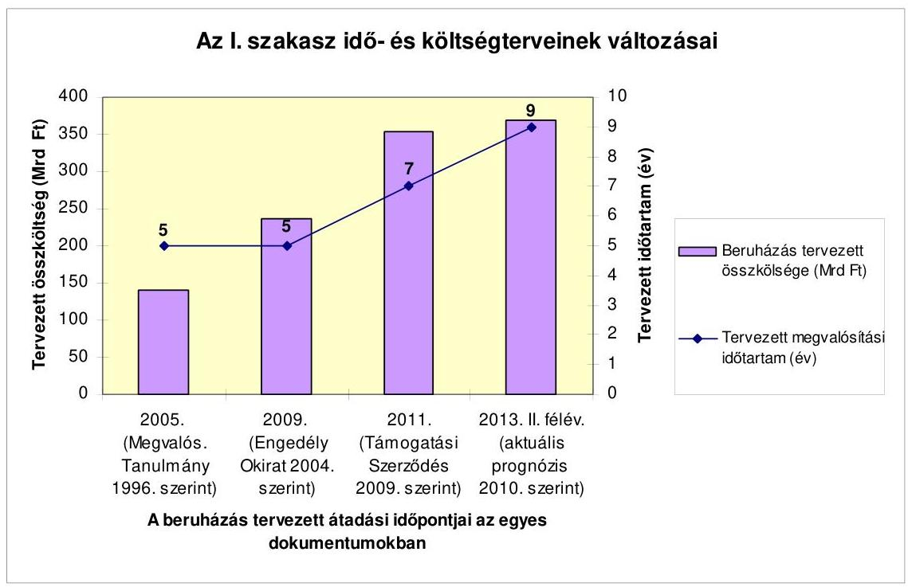

Az engedélyokiratban a 2009. december 31-i befejezési határidőt a Főváros úgy írta elő - és a későbbiekben nem módosította -, hogy 2006-ig, a kivitelezési szerződések megkötéséig a szükséges engedélyezési és területbiztosítási folyamatok nem fejeződtek be. A határidő meghatározásánál a realitásokkal nem számoltak és nem vették figyelembe a műszaki előkészítő tevékenység aktuális állapotát.

Az I. szakasz engedélyezési okiratában rögzített 2004. évi folyóáras költségéhez viszonyított 133,5 Mrd Ft-os (56,4\%) emelkedés a következő tényezők következménye. A beruházás költségeibe 39,5 Mrd Ft értékben beépültek az EU által is támogatott önkormányzati fejlesztések, rekonstrukciók (pl. Fővám tér, a Baross tér rekonstrukciója stb.). A Főváros és a DBR által kiírt építészeti versenypályázatot követően az állomások szerkezete az eredeti többszintes koncepció helyett egy légterűre módosult. Ennek következtében az állomások külső szerkezetépítésének és belső beépítésének költsége 44,8 Mrd Ft-tal nőtt. A beruházás költsége 31,4 Mrd Ft tartalékot tartalmaz a kivitelezői követelések és a változtatási utasítások miatti költségek fedezetére. Az általános tartalékon túl az egyes szerződések is tartalmaznak tartalékkeretet, amelyek összege meghaladja a 20 Mrd Ft-ot. Összességében a 370 Mrd Ft prognosztizált beruházási költség közel 14\%-a tartalék. Az árfolyamváltozás hatása 6,4 Mrd Ft költségemelkedés, 9,6 Mrd Ft költségkihatással járt a Kelenföldi pályaudvarnál az intermodalitás biztosítása, a további növekmény pedig annak következménye, hogy a szerződéses árak meghaladták a becsült mérnökárakat.

---

A forgalomba helyezés időpontja és a beruházási ráfordítások végleges összege is bizonytalan. Az időbeli kockázatot - az építési munkáknál még bekövetkezhető késésen túl - az jelenti, hogy a metrószerelvények beszerzéséhez szükséges típusengedélyek kiadásának hatósági eljárása nem zárult le, emiatt a szerelvények széria gyártása nem kezdődött meg. A beruházási költség tekintetében az jelent bizonytalanságot, hogy a kivitelezők által benyújtott követelések és a beruházó által elrendelt, illetve a kivitelezők által javasolt változtatások miatti költségtöbbleteket a rendelkezésre álló tartalékok fedezik-e. Ennek oka egyrészt, hogy a szerződés nem zárja ki annak lehetőségét, hogy a vállalkozók összeg nélküli követeléseket nyújtsanak be, amelyeket a későbbiekben áraznak be. A mintegy 1000 db el nem utasított követelés közel $40 \%$-a összeg nélküli, illetve adathiányos. Másrészt az összegszerűen is meghatározott követelések végső értékének megállapítása három lépcsős is lehet: a beruházó és a kivitelező megegyezik, ennek hiányában 3 szakértőből álló döntőbizottság határoz, amenynyiben azt a felek nem fogadják el, választott bíróság hoz döntést.
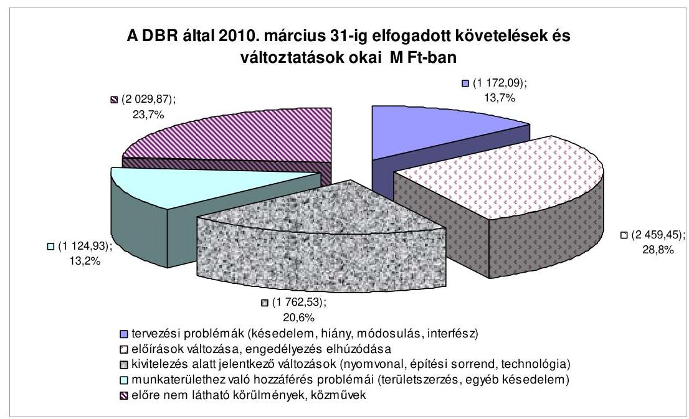

Az elfogadott követelések és változtatások (8,5 Mrd Ft) - amelyek nem tartalmazzák a döntőbizottság előtt álló követeléseket - egynegyedét az előre nem látható fizikai körülmények és közművek okozták. Az okok 76\%-a a műszakigazdasági előkészítés késedelmére és a munkaterülethez való hozzáférést szabályozó szerződéses előírások érvényesülésének hiányosságaira vezethető viszsza.

A vonalalagút kivitelezője (Bamco) a döntőbizottsághoz 50 M eurót meghaladó (mintegy 14 Mrd Ft ) követelést nyújtott be. A döntőbizottság 2010. augusztus 18-i döntése alapján az elfogadott követelés a késedelmek idő- és költségvonzatai vonatkozásában 14,5 M euró ( 4 Mrd Ft), amely a beruházó 308 napos késedelmének megállapításából következett. A Bamco jelezte, hogy a döntést nem fogadja el. A második legnagyobb értékű vitatott követelés az áramellátás és rendszerek telepítése esetében a Siemens részéről áll fenn 37,2 M euró (mintegy 10 Mrd Ft) értékben, amelyből a Mérnök 8 M eurót határozattal jóváhagyott. A Bocskai úti állomásszerkezet építőjének (SwO Metró 4 Kft.) a vitatott követelése

---

5,7 M euró (mintegy 1,5 Mrd Ft), amelyből a döntőbizottság 2,1 M eurót ítélt meg.

Nemzetközi összehasonlításban ${ }^{1}$ a budapesti 4-es metró I. szakaszának 1 km-re eső megvalósítási költségeként 214 M euró összeget vettek figyelembe. Ennek 10 európai metró építésével való összehasonlítása alapján a 4-es metró bizonyult a legdrágább vonalnak a párizsi után. Ez arra vezethető vissza, hogy az I. szakasz sűrű állomáskiosztással épül, az egylégterú állomásszerkezetek építészeti megoldásainak költsége meghaladja az átlagot, valamint a járműtelep kapacitása kielégíti a II. szakasz járműigényét is. A tanulmány megállapította, hogy a nemzetközi összehasonlítás alapján a beruházás összköltsége a műszaki tartalmával összevetve reálisnak tekinthető. Ez arra mutat rá, hogy a drágító költségtényezőket okozó műszaki tartalom jellemzi a beruházást.
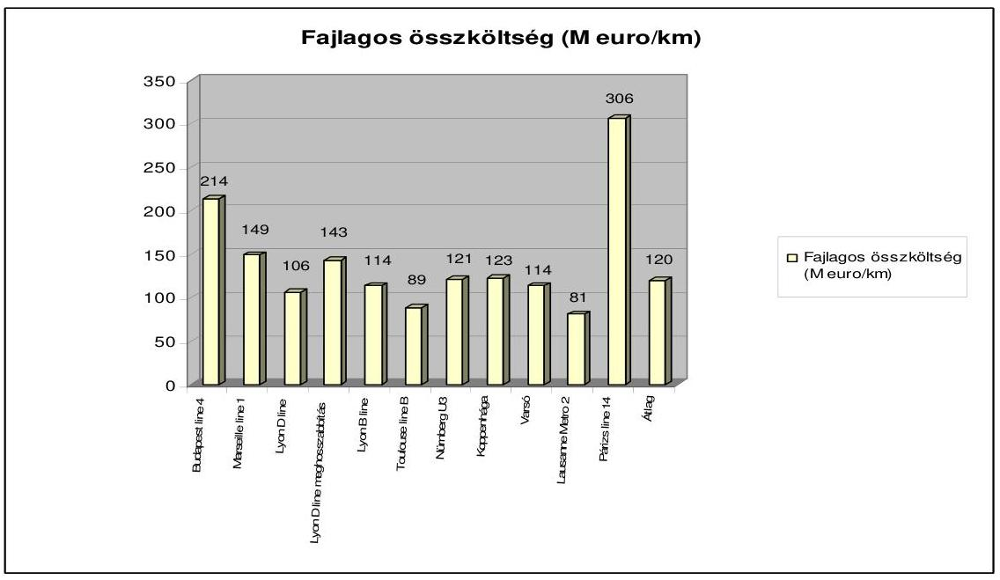

Az alagútépítés költségei tekintetében a budapesti metró a középmezőnybe tartozik ( $28,4 \mathrm{M}$ euró/km), mivel fúrt ikeralagutakkal történt a megvalósítás, ami drágább, mint a szélsőperonos megoldás. Drágító tényező, hogy a vonal mélyvezetésű, helyenként 30 m mélyen megy a belvárosi környezet, a sűrű beépítés és közműhálózat, a régi épületek következtében.

Az állomások fajlagos költsége a második legmagasabb a budapesti metrónál ( $44,0 \mathrm{M}$ euró/állomás). Ennek oka a mély elhelyezkedés, a nagy belső tér, a hosszú és középen létrehozott peron. Drágító tényezők az alkalmazott egyedi építészeti megoldások. A varsói 2-es vonal esetében ( $35,1 \mathrm{M}$ euró $/ \mathrm{km}$ ) hasonló adottságok érvényesültek, mint a budapesti metrónál (18-25 m-es mélység), 830 m-es állomássűrűség, ikeralagút, réseléses építés, 160 m -es peronhossz, városi környezet, Visztula folyó alatt vezetett vonal), ennek ellenére fajlagosan olcsóbban valósították meg.

[^0]
[^0]:    ${ }^{1}$ Forrás: A DBR megbízásából az Egis Rail tanácsadó cég által 2009-ben készített tanulmány.

---

A beruházás költségei a budapesti 4-es metrónál is tartalmazzák a felszínt érintő fejlesztéseket, amelyek közvetlenül nem kapcsolódnak a metró múködéséhez. Az ötödik legmagasabb az egy állomásra jutó felszíni fejlesztési költségek vetületében a 4-es metró ( $5,2 \mathrm{M}$ euró/állomás). A járművek tekintetében - amelyek hasonlóak a több más európai városban beszerzett járművekhez - fajlagosan alacsony költségek jellemzik a budapesti metrót. A tanácsadók igénybevétele a 4-es metró költségeinek több mint 10\%-át teszi ki. Ez a vizsgált metróvonalak között átlagosnak tekinthető.

A beruházás megkezdését a finanszírozási háttér megteremtése tette lehetővé azáltal, hogy az OGY elfogadta a 4-es metró Kelenföldi pályaudvar és Keleti pályaudvar közötti I. szakaszának állami támogatásáról szóló törvényt, amelynek összege 2002. évi áron, áfa nélkül összesen 153,9 Mrd Ft. A metrótörvénnyel módosították a Polgári Törvénykönyvet (továbbiakban: Ptk.) is, amelynek értelmében az államnak a szerződésben vállalt kötelezettségét akkor is teljesítenie kell, ha erre a költségvetés nem nyújt fedezetet. A Ptk. módosítása növelte a 4-es metró finanszírozásának biztonságát, ugyanakkor a szabály általános érvénye miatt megingathatja a költségvetés stabilitását és államadósságot generálhat más, az Állam által kötött szerződések révén is.

A beruházáshoz kapcsolódóan átfogó költségbecslés 1998-ban a Vasúthatósági Engedélyezési Tervhez (továbbiakban: VET) készült. Ezt követően hasonló részletességű újabb költségbecslést a Főváros és a BKV Zrt. nem készíttetett és nem gondoskodtak teljes körűen a mérnökár képzéséről. A tervezési folyamatokba nem épült be a költségirányítás (pl. az alagútépítésnél és az állomások építészeti tervezésénél), a költségszakértői tevékenység (mennyiség kimutatások és egységárképzések, költség-optimalizálás), mivel arra a beruházó nem adott megbízást, annak ellenére, hogy a százmilliárd Ft-os nagyságrendű beruházás esetében ez alapkövetelmény lett volna.

A 4-es metró beruházója a BKV Zrt. A metrótörvénnyel módosított vasútról szóló törvény lehetővé tette, hogy a beruházással létrejövő vagyon a Főváros vagyona helyett a BKV Zrt. tulajdonába kerül, ezáltal forgalomképessé, értékesíthetővé válik. A Főváros 2004-ben a finanszírozási szerződésben azt vállalta, hogy a BKV Zrt.-t a beruházás befejezéséig nem privatizálja.

A beruházás előkészítése során az engedélyezési folyamatok időbeni elhúzódása többletidő ráfordítási költségeket okozott. Ezt a fellebbezések, a szakhatósági hozzájárulások az érintett kerületi tulajdonosi hozzájárulások megszerzése, a hiánypótlások miatt az engedélyeztetések hosszabbodása, felfüggesztése, leállítása, illetve új eljárások indítása okozta. A környezetvédelmi, illetve a vasúthatósági engedély megszerzése iránti kérelmet a beruházó a hatóságokhoz 1999-ben nyújtotta be. A jogerős engedélyek megszerzése mintegy öt évig tartott (2003. december, illetve 2004. június). A 4-es metrót életvédelmi létesítményként (óvóhely) alapvetően a többletköltségek miatt nem jelölték ki. Az I. szakasz beruházására nem vonatkoztak a nemzetgazdasági szempontból kiemelt jelentőségű beruházások megvalósításának gyorsítását és egyszerűsítését célzó előírások, az engedélyezési folyamatok döntő hányada a jogszabály hatálybalépése előtt megkezdődött. Egyértelmű hatáskörök hiányában a közlekedési felügyelet, az építési hatóság és a kerületek között kérdéses volt, hogy ki folytatja le az állomások építési engedélyezési eljárását.

---

A beruházás megvalósításához szükséges területek megszerzésének folyamata előkészítetlen volt, az ingatlanok megszerzésére ütemterv nem készült. A területszerzési problémák a kivitelezés megkezdése után is fennálltak. A Főváros a tulajdonosokkal kötendő, öt esetben 3-4 évig is elhúzódó megegyezést és az építési tervek átterveztetését választotta és nem vizsgálta a kisajátítási eljárás kezdeményezésének lehetőségét. A tulajdoni viszonyok rendezetlensége és a területszerzés előkészítetlensége miatt felmerülő többletidő és többletköltség hatását a Főváros és a beruházó nem vizsgálta, azok értéke meghaladta a területszerzésre kifizetett 2,5 Mrd Ft-ot. Az alagútépítés megkezdése a kelenföldi kiindulópontnál közel hat hónapot késett, mivel a szükséges területet nem tudták a kivitelező részére biztosítani, emiatt közel 3 Mrd Ft többletköltség merült fel, amit a kivitelező részére kifizettek.

A beruházásnál alkalmazott szerződésstratégia értelmében a beruházást 20 különálló szerződés megkötésével, a „tervezz és épits" FIDIC szerződéses feltételrendszer alkalmazásával, generáltervező és -kivitelező nélkül valósítják meg. Az alkalmazott szerződéses megoldás szakszerűtlen volt, mert nem volt összhangban a projekt sajátosságaival (a projekt bonyolultsága, újdonsága, a közremúködők és a kapcsolatok nagy száma) és a beruházó jellemzőivel (a beruházó nem rendelkezett elegendő és felkészült humán erőforrással, a DBR létszáma alacsony volt és nem volt elegendő metróépítési tapasztalat), amit nem tudott pótolni a projektvezetői tanácsadói szolgáltatással. A szerződéses stratégiát a Főváros úgy alkalmazta, hogy az építési engedélyek teljes körűen nem álltak rendelkezésre és ennek következményeit elemzésekkel nem vizsgálták. A tervezési és kivitelezési folyamatok összehangolása (interfész kapcsolatok kezelése) a szerződések előírásai szerint a Mérnök, illetve olyan kivitelezők feladata, akik egymással nem, csak a beruházóval állnak szerződéses kapcsolatban. Az összehangoltság hiányából származó problémák megoldására, többlet költségigények áthárítására alapvetően jogi (peres) eszközök állnak rendelkezésre. A szerződéses feltételrendszer lehetőséget ad arra a kivitelezőnek, hogy csak előre jelezze a követeléseket, annak beárazása nem követelmény, elmaradása nem szankcionálható. Ebből adódóan a követelések és változtatások költségkövetkezményei nem átláthatóak, a beruházás végleges költsége az átalányáras szerződés ellenére előre megbízhatóan nem tervezhető. A szerződések értelmében, ha az elfogadott követelések és a változtatási utasítások összege meghaladja a szerződés elfogadott végösszegét, a beruházó egyéb forrásból köteles teljesíteni a különbözetet.

A beruházás vezértechnológiáját jelentő vonalalagút építése (beleértve a kapcsolódó műtárgyakat) és a Gellért téri állomás szerkezetépítése során kitűzött költség- és időcélok nem teljesültek. Ez a körülmény, mivel az alagútépítés kölcsönös függésben volt az állomásépítésekkel és az összes többi építési fázist is befolyásolta, kihatott a 4-es metró I. szakasza befejezési időpontjára. A pajzsok előrehaladásának eredetileg tervezett és a tényleges üteme között folyamatosan nőtt az eltérés. A késés több mint 126 hét lett, amelyből 35 hét a beruházó hibájából adódott, amit elismert. A többi késedelem a Mérnök szerint - a Bamco által vitatottan - a vonalalagút építőjének hibájából, a pajzshajtás ütemtervtől eltérő állásidőiből következett be. A Bamco késedelmeivel kimerítette a szerződéses ár maximum 10\%-áig terjedő kötbérfizetési kötelezettségét, ami mintegy 20 M euró összegnek felel meg. A beruházó kötbérfizetési igényt a

---

vonalalagút építéséhez kapcsolódóan az ellenőrzés lezárásáig nem érvényesített.

A beruházó 2006. év elején annak tudatában kötött szerződést a Bamco-val, hogy nem állt módjában szerződéses kötelezettségeit időben teljesíteni. A szerződéskötéskor nem állt rendelkezésre a Gellért téri állomás jóváhagyott építési engedélyezési terve, azt csak háromnegyed évvel később adták át a vállalkozónak. Továbbá az indítóakna építéséhez szükséges terület még nem állt rendelkezésre. A szakszerűtlen beruházói döntéssel megvalósult szerződéskötés eredményeként a vállalkozói követelések keretében a Bamco-nak „többletidőráfordítás" címén megítélt 17,4 M euró összeg kifizetése már teljesült a tartalékkeret terhére. Ezért a Bamco-val kötött szerződés vonatkozásában felelősség terheli a Fővárost és a BKV Zrt.-t. A beruházó kötelezettségeinek teljesítési késedelmei miatt saját hatáskörben, mérnöki változtatási utasítás formájában megváltoztatta a szerződéses feltételeket, egyrészt kötbérterhes határidőket eltörölt, másrészt 35 héttel meghosszabbította a létesítmény megvalósítási időtartamát, harmadrészt hozzáférési időket módosított. Tekintettel a vonal alagútépítés és az állomások, a vágányépítés, rendszerek stb. időbeni és térbeni kapcsolataira, a kötbérterhes határidők módosításának egyenes következményeként az összes már megkötött szerződésben foglalt kötbérterhes határidőre is hatással volt, ugyanis más kivitelezők erre való hivatkozással kimenthetik magukat a kötbérfizetési kötelezettség alól. Az így kialakult jogi helyzetben a finanszírozási szerződés szerinti többletköltség miatti fizetési kötelezettség teljes mértékben a Fővárost terheli. A tartalékkeret terhére elszámolt kártérítéseket (többletidő ráfordításokat) a támogatási szerződésben rögzített arányban az EU, az Állam és a Főváros finanszírozza.

A pajzsok előrehaladásának időbeni tervezése, egyeztetése, elfogadása önmagában ellentmondásokkal terhelt, mivel a szerződő partnerek által kölcsönösen elfogadott bázis ütemterv nem készült. Az ún. „többletidő-ráfordítások" kifizetésére, a kötbérterhes határidők, munkaterület hozzáférési időszakok módosítására, a vállalkozói követelések megalapozására a DBR által elfogadott 4C vagy/és a Bamco ún. „jogosultsági ütemterve" szolgált alapul. Az ütemtervek rossz minőségét vagy hiányát a szerződő partnerek kölcsönösen egymásnak rótták fel. A Bamco és az állomások építői által szolgáltatott ütemtervek alkalmatlanok az egységes, rendszerszemléletű, szakszerű feldolgozásra.

A vonal alagútépítés irányítása - a kölcsönösen elfogadott ütemterv és részletes költségvetés nélkül a DBR, a vonal alagútépítő és az állomásépítők közti együttműködési zavarokkal terhelten, a munkaterületek átadását vezérlő integrált ütemterv (hálóterv) hiányában - „válságmenedzsment" jelleggel valósult meg.

Az állomások műszaki, gazdasági előkészítése nem volt megfelelő, mivel az engedélyezési eljárások és az állomások szerkezetépítési tenderterveinek készítése párhuzamosan folyt. Az állomások engedélyezési terveinek elkészítését a budai állomásokon a koncepcióterv írásos véleményezésének napjához, illetve a kerületi szabályozási tervek elfogadásához kötötték a tervezési szerződésben, amelyek a szerződés megkötésekor (2004. december) nem álltak rendelkezésre. A koncepcióterv írásos véleményezése 2005. május 4-én volt, a kerületi szabályozási terveket 2006-ban fogadták el. Az építési engedély hiánya négy pesti ál-

---

lomásnál (Fővám tér, Kálvin tér, Rákóczi tér, Népszínház utca) 276,5 M Ft többletköltséget okozott. A kiviteli szerződéseket jogerős építési engedélyek nélkül kötötték meg, azok az egyes állomásokhoz a szerződéskötést követően a 3 - 8. hónapban álltak rendelkezésre.

Az állomások kivitelezése során olyan készültségi fokot kellett biztosítani, amely lehetővé tette a pajzsok áthaladását, ugyanakkor a pajzsok áthaladásának ütemétől függött az állomásszerkezet építések folytatása. Az Etele térről induló északi pajzs 2008. augusztus 24 -e helyett 2010. július 1 -jén, a déli pajzs 2008. szeptember 17-e helyett 2010. június 18-án érkezett meg a Keleti pályaudvarhoz. A pajzsok előrehaladásának a bázis ütemtervben rögzített tervezett és tényleges üteme között az eltérések fokozatosan növekedtek, megnőtt az egyes állomásokon való tartózkodási idő, ami az állomásszerkezetek költség- és időcéljainak módosulását eredményezte. Az alagútépítő és az állomásépítők, valamint a beruházó között a közel két éves késedelemért való felelősség vita tárgyát képezi a kárfelelősség, illetve a többletidő ráfordítások finanszírozásának megosztását illetően. Az alagútépítés késedelme miatt a kivitelezők 5 állomáson (Tétényi út, Fővám tér, Rákóczi tér, Népszínház utca és Keleti pályaudvar) jelentettek be többletidő és költség igényt. A többletidő költségek - ÁSZ ellenőrzés végéig - elfogadott összege 633,7 M Ft.

A DBR által az állomásoknál kiadott változtatási utasítások, valamint a benyújtott vállalkozói követelések elfogadott összege 4927,8 M Ft ( 280 Ft/euró árfolyamot figyelembe véve). Ennek 74\%-a a Kelenföldi pályaudvarhoz, a Tétényi úthoz, a Móricz Zsigmond körtérhez és a Kálvin térhez kapcsolódott. A változtatások és követelések a technológiai változásokkal, az engedélyeztetési folyamatok elhúzódásával, az építési sorrend változásával, a tervek hiányával vagy módosulásával, a műszaki, hatósági előírások változásával voltak összefüggésben. Az elfogadott követelések/változtatások miatt az eredeti szerződéses öszszegben foglalt tartalékkeret két állomásnál (Tétényi út, Kálvin tér) nem volt elégséges mértékű.

A beruházó a kivitelezési szerződésekben kötbérterhes határidőket kötött ki, amelyek azonban - az építési engedélyek időben rendelkezésre nem állása és az alagútépítés csúszása miatt - nem lehettek érdemi hatással az időcélok teljesülésére. A DBR 2010. április 30-ig a Bocskai úti állomás kivitelezője felé nyújtott be kötbérigényt 281,74 M Ft értékben, amelyet a kivitelező vitat. Más állomásoknál rendezetlen a kötbérigények érvényesítése.

A BKV Zrt. által szolgáltatott adatok szerint két állomás közötti legnagyobb távolság ( 1483 m ) a Tétényi út - Bocskai út állomások között található, a legrövidebb távolság ( 399 m ) a Szt. Gellért tér és a Fővám tér között van, az átlagos távolság 744 m . A 2-es metró vonalán a legrövidebb állomástávolság 598 m , a leghosszabb állomástávolság 1775 m (az átlagos állomástáv 1001 m ). A járművek a 9-ből 4 állomásközi szakaszon érik el a tervezett $80 \mathrm{~km} /$ óra végsebességet, ebből 2 szakaszon 200 m-nél rövidebb távon tartják ezt a sebességet. 5 állomásközi szakaszon az állomások sűrű elhelyezkedése miatt az egész távon elmaradnak ettől a sebességtől, a gyorsulási intervallumot - állandó haladási sebességű időszak nélkül - azonnal a lassítás követi.

---

A beruházási folyamat végső szakaszát képviselő rendszerek és áramellátás, valamint a metrószerelvények beszerzésére 2006-ban, a felszíni (járműtelepi) vágányok építésére 2008-ban kötött szerződést a BKV Zrt. A beruházás megelőző fázisainak összes késedelme összeadódik a három szerződés teljesítésének időszakára. Ezen szerződések munkáinak késedelme, és a megvalósítási időtartam meghosszabbodása más kivitelezők - főként az alagútépítő Bamco - által végzett, megelőző munkák csúszása miatt következett be, kivéve a metrószerelvények beszerzését. Ennek következtében kártérítési, illetve többletidő ráfordítási követelések keletkeztek.

A vágányépítés befejezésének aktuális dátuma 2012. december 2., ami két év késedelmet jelent a vágányok építésére kötött megállapodásban rögzített 2010. december 5 -éhez képest. A kivitelező ennek következtében 11 alkalommal jelentett be követeléseket a munkaterület hiányára hivatkozással, amelyek többletköltség igényét még nem számszerűsítette.

A rendszerek és áramellátási munkák befejezésének szerződés szerinti határideje 2010. április 25 -e volt, de a kivitelező 2010. május végéig - az alagútfúrásnál és az állomásépítésnél bekövetkezett csúszások miatt - nem jutott munkaterülethez, így a berendezések telepítését nem tudta elkezdeni, az elkészített berendezések leszállítása ugyanakkor folyamatos. A befejezési határidő - a 2010. januárban aktualizált projekt ütemterv szerint - várhatóan 2012. július 30. 2008-ban az ezt megelőző munkák készültsége alapján látható volt a rendszerek és az áramellátás megvalósítási idejének kitolódása, amit a Kohéziós Alap Támogatási Kérelem is kockázatként kezelt. Ennek ellenére a szerződés módosítására vagy annak kezdeményezésére a várható többletköltségek mérséklése érdekében nem került sor. A többletidő ráfordítás címén a kivitelező 37,2 M euró (10,4 Mrd Ft) kártérítés megfizetését kezdeményezte. A Mérnök határozatában 8 M eurót fogadott el, amit a kivitelező vitat.

A metrószerelvények beszerzése egy megállapodás keretein belül, de külön szerződéssel valósul meg a 2-es metróvonalra ( 22 db járműszerelvényre és kapcsolódó szolgáltatásokra) és a 4-es metróvonalra ( $15+7 \mathrm{db}$ járműszerelvényre és kapcsolódó szolgáltatásokra). Ennek indoka - a BKV Zrt. nyilatkozata szerint a nagyobb mennyiségből adódóan a tenderkiírás során elérhető, valószínűsített versenynövelő hatás, árelőnyök kihasználása volt. A két metróvonalra szállítandó járművekre az egy megállapodás keretein belüli szerződéskötés nem bizonyult előnyös döntésnek, nem mutatható ki az elvárt árelőny teljesülése. A közös megállapodás kockázatot jelentett a 4-es metró járműszerelvényeinek forgalomba helyezése szempontjából, az engedélyező hatóság a két metróvonalra a szerelvények típusengedélyezési eljárását összevontan kezelte és a 4-es metró szerelvényeinek hatósági engedélyezési eljárását a 2-es metró szerelvényei végleges típusengedélyének kiadásáig felfüggesztette. 2010. június 11-én az engedélyező hatóság a 4-es metróra vonatkozó felfüggesztést megszüntette és az eljárás folytatásáról döntött. A metrószerelvények beszerzésére olyan szerződést kötöttek, amelyben a vis maior fogalmát a szokásos jogértelmezéstől eltérően kiterjesztették a járművek típusengedélyének a megszerzésére is. A Ptk. értelmezése szerint az elháríthatatlan külső okok közé tartozó vis maior lehet például földrengés, árvíz, szélvihar stb. A típusengedély megszerzésének hatóság általi elutasítása kockázati tényező, amivel szerződéskötéskor számolni kell, ezért nem tekinthető vis maior eseménynek.

---

A metró építésével egyidejűleg valósulnak meg az annak hasznosulását segítő felszíni rendezések és kapcsolódó beruházások. Nem egyértelműen meghatározott, hogy mely felszíni beruházások és milyen értékben számolhatók el kapcsolódó beruházások címén a 4-es metró beruházási költségeként, mivel azokat a hatályos finanszírozási szerződés tételesen nem tartalmazza. A finanszírozási szerződés alapján a kapcsolódó beruházásokat az Állam nem finanszírozza. A DBR kimutatása szerint az összes felszíni rendezés és kapcsolódó beruházás tervezett összege 51,24 Mrd Ft, ebből a projekt költség 35,54 Mrd Ft, amelynek egyharmadát 2010. március 31-ig kifizették. A tervezett létesítmények közül a projektköltségbe a következők tartoznak: Bartók Béla út felújítása, Fővám tér - Vámház körút, Kálvin tér - Múzeum körút, Rákóczi tér, Baross tér felszíni rendezés, őrmezői oldal felszíni rendezése. A Baross tér rendezésére a BKV Zrt. a szerződéskötést 2010 decemberére tervezi.

A megkezdett kapcsolódó beruházások és felszíni rendezések (Kiskörút, Rákóczi tér) az alagút- és állomásépítési munkálatok elhúzódása miatt határidőre nem fejeződnek be. Emiatt a kivitelezők a felmerült többletidő ráfordításaik finanszírozására követeléseket nyújtottak be, de ezeket még nem árazták be. A felszíni rendezéseket átütemezték, de az ütemterv szerinti teljesítés kockázatos, mivel a munkák megkezdésének feltétele az alagút- és állomásépítési munkák befejezése.

A beruházás megvalósításának időszaka alatt a finanszírozás forrása biztosított volt. 2004 elejéig a Főváros finanszírozta a projekt előkészítését 11,1 Mrd Ft összegben, amelyet 2007-2008-ban a Magyar Állam elszámolt a Fővárossal. A finanszírozási szerződés megkötésével az állami forrás 2004-től állt rendelkezésre. A szerződés alapján a Magyar Állam és a Főváros közötti költségmegosztás aránya 79\% - 21\%. Az I. szakaszhoz biztosított állami támogatás adott évi öszszege megjelent az éves költségvetési törvényekben. 2010. I. negyedévével bezárólag 121,5 Mrd Ft költségvetési kiadás volt. Az I. szakaszhoz kapcsolódóan 2010. március 31-ig folyóáron, nettó értékben 189 Mrd Ft kifizetés volt, ami a költségprognózisban szereplő beruházási értéknek mintegy fele.

A Főváros és az Állam a finanszírozási kötelezettségei teljesítése érdekében az EIB-vel 2005-ben hitelszerződést kötött. A Magyar Állam a beruházás I. szakaszára vonatkozó hitelkeret teljes összegét 2005 novemberében 300 M euró és 2006 márciusában 172 M euró összegben lehívta, ami nem volt arányos a beruházás műszaki készültségi szintjével. Az előfinanszírozási céllal lehívott teljes hitelösszeg után a Magyar Államnak teljesítenie kellett a kamatfizetési kötelezettségét, 2005-től 2010. március végéig a kamatkiadás összege 17,1 Mrd Ft volt, a KESZ-en lévő, még ki nem fizetett hitelösszegből az Államnak 17,3 Mrd Ft kamatbevétele keletkezett. A Magyar Állam által felvett hitel összege 2016. szeptember 15-én egy összegben jár le. A Fővárosi Önkormányzat 2009-ig 58,5 M euró (14 971,2 M Ft) összegű EIB hitelt vett igénybe a beruházásra, amely a jóváhagyott 125 M euró hitelkeret mintegy $47 \%$-a. A Főváros EIB hitelének visszafizetését a Magyar Állam garancia-vállalással biztosítja.

2008 végétől a finanszírozási források alapvetően módosultak. Az EB 2009 szeptemberében hozott határozata alapján a Kohéziós Alapból 728,53 M euró (módosított Támogatási Szerződés szerint 180,8 Mrd Ft) támogatás fordítható

---

az I. szakasz finanszírozására, ami az elszámolható költség ( 236 Mrd Ft) $76,6 \%-a$.

Az EU támogatáshoz kapcsolódóan több szervezetnél párhuzamosan végzett külső szakértői tevékenységek költsége meghaladta a nettó 540 M Ft -ot, ezek nem eredményezték a pénzügyi erőforrások hatékony felhasználását. Az EU a közbeszerzési eljárások miatt 11 szerződéshez kapcsolódóan a Kérelemben megjelölt összeghez képest csökkentette a támogatását 175 M euró összeggel.

A beruházásnál az EU forrás elszámolása elhúzódott, a visszamenőleges, illetve folyamatos elszámolások zökkenőmentes, gyors és határidőre történő végrehajtása nem biztosított a Főváros, a DBR, a KIKSZ és az NFÜ között, mivel a KIKSZ a kifizetési kérelmek elbírálásánál nem tartja be a Támogatási Szerződésben előírt időtartamot. A pénzügyi elszámolásoknál az adatok megbízhatóságát és a nyilvántartások naprakészségét nem támogatja korszerű informatikai háttér. Az Állam és a Főváros közötti éves elszámolásokat külső szakértők végzik a DBR-el kötött megbízási szerződés alapján.

A finanszírozási szerződés és annak módosítása az Állam ellenőrzési jogát rögzítette és azt az Állam részére bemutatandó beruházói döntések körének meghatározásával alapvetően a közbeszerzési döntésekre és a finanszírozási tervre korlátozta. Az ezekhez kapcsolódó dokumentáció átadását követő 20 napon belül az Állam írásban kifogást tehet, annak elmaradásának vagy késedelmének jogkövetkezményét a finanszírozási szerződés szerint az Állam viseli. A finanszírozási terv megalapozottságához szükséges a műszaki ellenőrzés (többletköltségeket okozó tényezők értékelése) is, amelynek elvégzésére az Államnak a szerződés szerint nincsen lehetősége. A korlátozott kontroll pozíció nem elégséges a beruházási folyamat teljes körű állami ellenőrzésére. A Magyar Állam nem vette igénybe a finanszírozási szerződés által, a kontroll pozíció gyakorlásához szakértői szolgáltatásra számára biztosított évi 50 M Ft-ot. A kontroll fokozása szempontjából az uniós források bevonása fontos tényező, ennek eredményeként a beruházás felügyeletét és szakértői, műszaki ellenőrzését ellátó szervezetek száma bővült.

A Főváros, valamint a BKV Zrt. által kialakított szervezeti struktúra és döntési mechanizmus nem biztosította a beruházás hatékony és költségkímélő megvalósulását. Felelősségi jogkörök meghatározása nélkül nem értékelhető a Projekt Felügyelő Bizottság tevékenységének hatása a beruházás előrehaladására, hatékony és költségkímélő végrehajtására, továbbá az EIB-vel kötött szerződésben és a beruházási szerződésben foglaltak betartatására. A Főváros által alkalmazott metró beruházási koordinátor (metró-biztos) tevékenységéhez a Főváros nem fogalmazott meg elvárásokat és célkitűzéseket, ezért nem ítélhető meg tevékenységének eredményessége, hozzájárulása a projekt költségtakarékos megvalósulásához. A Főváros a kötelezettségvállalásokat teljes mértékben átruházta a BKV Zrt. felelősségi körébe azzal, hogy az a Főváros által elfogadott beruházási engedélyokirat feltételei szerint történhet. A BKV Zrt. szervezetébe tartozó DBR-t a vizsgált időszak alatt három projektigazgató irányította, akiknek nem határozták meg részletesen a munkaköri feladatait, a velük szemben támasztott követelményeket, mérhető elvárásokat. A DBR mint projektmenedzsment szervezet nem készült fel időben a sajátos, egy nagyberuházással járó feladatokra. A műszaki előkészítési tevékenységek keretében nem

---

végzett idő-, érték- és költségelemzéseket, nem voltak teljes körűek és nem hasznosultak a rendelkezésre álló szakértői kockázatelemzések.

A Kormány - a metrótörvények, valamint a finanszírozási szerződés értelmében - a beruházás megvalósításával kapcsolatban ellenőrzési jogkörrel rendelkezik, azonban a stratégiai döntések kivételével döntési jogkörrel nem. Ellenőrzési tevékenységét a Kormányzati Ellenőrzési Hivatalon (továbbiakban: KEHI) keresztül gyakorolja. Az ellenőrzések alapvetően szabályszerűségi ellenőrzések és nem terjednek ki a beruházás gazdaságosságának és hatékonyságának értékelésére. A Főváros által megkötött EIB hitelszerződés, valamint a Főváros és a BKV Zrt. között létrejött beruházási szerződés értelmében a Főváros, illetve az általa megbízott BKV Zrt. az ellenőrzési jogkörét (a kifizetésekre, kötelezettségvállalásokra vonatkozóan) a független ellenőrző mérnökön (továbbiakban: FEM) keresztül kellett volna hogy gyakorolja, azonban erre a feladatra nem kötöttek megbízási szerződést. A FEM hiánya miatt nem megoldott a független műszaki ellenőrzés ellátása és a Mérnök tevékenységének független ellenőrzése.

A beruházás előkészítéséhez és lebonyolításához a DBR által igénybe vett szakértői, tanácsadói tevékenységgel összefüggő kifizetés 2010. április 30-ig elérte a 20,8 Mrd Ft-ot, amely tartalmazza a projektvezetési és mérnöki feladatokat ellátó Eurometro Kft. részére kifizetett 7,2 Mrd Ft-ot is. A szakértői anyagok számos problémát és hiányosságot tártak fel a szerződéses rendszerrel, a szerződésmódosítással, valamint a projekt irányításával és ellenőrzésével összefüggésben, amelyek csak részben hasznosultak. A szakértői díjakon belül a jogi szolgáltatások összege megközelítette az 543 M Ft-ot, a folyamatos jogi tanácsadás rendelkezésre állása ellenére a szerződéses rendszer kialakításában, a kivitelezői szerződések kidolgozásában a Mérnök járt el a BKV Zrt. tanácsadójaként. A BKV Zrt. a beruházáshoz kapcsolódóan, közvetlenül is kötött szakértői, tanácsadói szerződéseket, amelyeket nem a 4-es metró projekt költségei között számoltak el. Ezen szerződések alapján összesen 238,2 M Ft-ot fizettek ki 2010. június 3 -ig.

A DBR tevékenységét 1998-tól az Eurometro Kft. mint projektvezetési tanácsadó segítette, amely FIDIC mérnöki feladatokat is ellátott. A megkötött szerződés alapján az I. szakasz előkészítésének időigényét 8,5 hónapban határozták meg, ami több mint 6 év alatt valósult meg. Az előkészítéshez kapcsolódó kifizetés az eredetileg vállalt összeg hatszorosára emelkedett ( 3,5 Mrd Ft és 3,6 M euró) és meghaladta az előkészítésre és a megvalósításra együttesen meghatározott öszszeget. Az Eurometro Kft. 2005-ben és 2006-ban három kivitelező alvállalkozójaként tervezői és tanácsadói feladatokat is végzett, ami a beruházóval kötött szerződésben meghatározott feladatokkal összeférhetetlen volt, a megrendelő érdekeivel ütközött. 2007-től ezt a gyakorlatot megszüntették. A tanácsadói szerződés 2006-ban, a megvalósítási szakaszra vonatkozó újabb szerződés hatálybalépésével egyidejűleg megszűnt. Az első szakasz megvalósításához kapcsolódó tanácsadói tevékenységet 2011. március 31-ig 2,9 Mrd Ft és 3,5 M euró összegért vállalta a Kft. A mérnökóra ráfordítások alapján meghatározott és kifizetett összegek az éves pénzügyi ütemtervek kereteit túllépték, az első szakaszra meghatározott teljes összeget a beruházás befejezése előtt, 2010. március 31vel kifizették.

---

A metróépítési munkák elhúzódása következtében és a felszíni beruházások miatt a tényleges forgalomelterelések és lezárások időtartama az állomásépítéssel érintett területeken meghaladja a tervezettet, ami a főváros közlekedésében hosszabb idejű forgalomszervezési problémákat okozott/okoz. A metróépítés késedelme a beruházásnál felmerült többletidő miatti kártérítéseken felül növelte a negatív társadalmi költségeket, amelyeket a Főváros és a beruházó nem mutat ki.

Az I. és II. szakasz teljes költsége a vonatkozó kormányhatározat szerint 2002. évi áron, áfa nélkül 264,5 Mrd Ft. A DBR kimutatása szerint folyóáron számítva a 4-es metró (I. és II. szakasz együtt) tervezett költsége 537,1 Mrd Ft.

A II. szakasz (Keleti pályaudvar - Bosnyák tér) 2002. évi áron számított nettó költsége 69,5 Mrd, folyóáron pedig 167,1 Mrd Ft. 2010. I. negyedév végéig a II. szakaszhoz kapcsolódóan 1,3 Mrd Ft költségvetési kiadás volt. A beruházás II. szakasza megvalósításának finanszírozási kockázata a fővárosi önrész rendelkezésre állása és a jelenlegi projektérték - amely mélyvezetésű technológia alapján tervezett - EU támogatásának bizonytalansága. A Főváros tájékoztatása szerint a fővárosi önrész minden évben betervezésre kerül a Főváros éves költségvetésébe és a két éves finanszírozási prognózisba. A főpolgármestert a nemzeti fejlesztési és gazdasági miniszter 2010. február 10-én kelt levelében arról tájékoztatta, hogy a finanszírozási szerződés alapján fennálló állami kötelezettségvállalás, valamint a KözOP-ban rendelkezésre álló keretösszeg együttesen megközelítőleg 56,2 Mrd Ft, ami nem fedezi a II. szakasz tervezett 167,1 Mrd Ft beruházási költségét, emiatt szükséges a hiányzó források biztosítása. A támogathatóság megítéléséhez már a pályázat benyújtásakor szükséges egy megfelelő alátámasztottságot nyújtó megvalósíthatósági tanulmány és a II. szakasz műszaki szempontból elvárható előkészítettsége.

A helyszíni ellenőrzés megállapításainak hasznosítása mellett javasoljuk

# a Kormánynak 

1. Kezdeményezze a finanszírozási szerződés módosítását annak érdekében, hogy az állam műszaki-gazdasági és pénzügyi kontroll pozíciója erősödjön az állami támogatás hatékony felhasználása céljából.
2. Kezdeményezze a finanszírozási szerződés kiegészítését azzal, hogy a Fővárost az állami támogatás visszafizetésének kötelezettsége terheli ha a BKV Zrt.-t privatizálja vagy az állami támogatással megvalósított beruházás bármely létesítményét a társaság elidegeníti, továbbá a szerződésben rögzítse a visszafizetés pénzügyi biztosítékait.

## Budapest Főváros főpolgármesterének

1. Intézkedjen arról, hogy a BKV Zrt. vizsgálja felül a kivitelezői szerződéses feltételeket (kötbérterhes határidők, hozzáférési idő és többletidő ráfordítások) és biztosítsa azok összehangolt rendezését.

---

2. Haladéktalanul bízzon meg Független Ellenőrző Mérnököt annak érdekében, hogy a független műszaki ellenőrzés érvényesüljön.
3. Szüntesse meg az engedélyezési okirat, a beruházási program és a megkötött szerződések közötti ellentmondásokat.

# a BKV Zrt. igazgatóságának 

1. Intézkedjen a változtatási utasítások és követelések beárazását elősegítő feltételrendszer kialakításáról annak érdekében, hogy az idő- és költségkockázatok csökkenjenek.
2. Biztosítsa a beruházási tevékenységek ütemezésének megalapozottságát (szerződéses feltételek és ütemtervek összehangoltságát) és a kapcsolatok beruházói hatáskörben történő hatékony, kártérítéseket megelőző kezelését.
3. Vizsgálja felül és értékelje a szakértői szerződések hasznosulását.
4. Rendezze és tegye átláthatóvá a beruházás mérnöki feladatainak szerződéses feltételrendszerét az I. és II. szakasz vonatkozásában.

---

# II. RÉSZLETES MEGÁLLAPÍTÁSOK 

## 1. A BERUHÁZÁs CÉLRENDSZERÉNEK MEGHATÁROZÁSA

### 1.1. A célrendszer jogszabályi megalapozottsága

A metrótörvény alapján a Magyar Állam a központi költségvetésből támogatást nyújt a Főváros részére a budapesti 4-es metróvonal Kelenföldi pályaudvar - Budapest Keleti pályaudvar között történő megépítéséhez, amelynek összege 2002. évi árakon, áfa nélkül összesen 153944 M Ft.

A metrótörvényt megelőzően az 1048/2003. (V. 28.) Korm. határozatban a Kormány egyetértett azzal, hogy a 4-es metró-projekt beruházója a BKV Zrt. legyen, és elfogadta, hogy a projektköltség 2002. évi árakon számítva 194919 M Ft. A határozat szerint a Kormány úgy döntött, hogy ha a projektköltség 30\%-ának a finanszírozását - amelybe a projekt kapcsolódó felszíni beruházásainak az 50\%-át beszámították - a Főváros vállalja, akkor a központi költségvetés a teljes költséghez szükséges kiegészítő támogatást nyújtja. A kormányhatározat a Főváros $30 \%$-os finanszírozási arányát rögzíti, az valójában - a kapcsolódó beruházások miatt - 21,02197\% volt. A Kormány tudomásul vette, hogy a Főváros finanszírozásával megkezdődik a második szakasz (Keleti pályaudvar - Bosnyák tér) beruházásának az előkészítése.

A metrótörvényben az OGY felhatalmazta a pénzügyminisztert, hogy a törvényben meghatározott célra és összegben az állami támogatás folyósítására kötelezettséget vállaljon és a beruházás közös finanszírozásáról rendelkező finanszírozási szerződést a Fővárossal megkösse. A törvény nem rendelkezett - az indokolás sem tartalmazza - a beruházás finanszírozásának az Állam és a Főváros közötti megoszlása arányairól, valamint arról, hogy az állami támogatás összegébe 17,5 Mrd Ft, a tervezett kapcsolódó beruházások 50\%-a beépült. A finanszírozási arányt a Kormány által jóváhagyott finanszírozási szerződés tartalmazza, amely szerint az Állam kapcsolódó beruházást nem finanszíroz.

A metrótörvényben módosították a vasútról, a polgári törvénykönyvről és az államháztartásról szóló törvényeket.

A vasútról szóló 1993. évi XCV. törvény 3. §-ának (1) bekezdése a b) pont beiktatásával módosult.
„(1) az országos közforgalmú vasúti pálya és tartozékai az állam kizárólagos tulajdonában vannak. A helyi közforgalmú vasúti pálya és tartozékai; a) törzsvagyonként a települési önkormányzatok, a fővárosban a fővárosi önkormányzat tulajdonában vannak, vagy; b) olyan gazdálkodó szervezet tulajdonában vannak, amelyben az önkormányzat, a fővárosban a fővárosi önkormányzat többségi tulajdoni részesedéssel rendelkezik."

A módosítás lehetővé tette, hogy az önkormányzat törzsvagyonába tartozó vasúti pálya (metróvonal) a BKV tulajdonát képező, forga-

---

lomképes vagyon legyen. A finanszírozási szerződésben a főváros kötelezettséget vállalt arra, hogy a BKV Zrt.-ét a beruházás befejezéséig irányítása alatt, a közgyűlésen szavazati jogot biztosító részvényesi többségét tulajdonában tartja.

A Ptk. 28. §-a a jelenleg is hatályos (2) bekezdéssel egészült ki:„A kártérítési, megtérítési és kártalanítási kötelezettség, valamint a jóhiszemú személyek irányában vállalt szerződéses kötelezettség az államot költségvetési fedezet hiányában vagy az e célra biztositott költségvetési fedezetet meghaladó mértékben is terheli."

# A törvényi kiegészítés értelmében a finanszírozási szerződésben az 

Állam által vállalt kötelezettségek teljesítése a Főváros részéről kikényszeríthetővé vált, ami növelte a 4-es metró finanszírozásának biztonságát. A Ptk. módosításával a 4-es metróhoz kapcsolódóan, de azon túlmenően is az állami szerződéses kötelezettségvállalás a költségvetés egyensúlyi helyzetére nézve kockázatos.

A Ptk. módosításának előzménye az volt, hogy a Magyar Állam 1998. november 10-én felmondta az 1998. április 7-én megkötött Dél-Buda - Rákospalota metróvonal I. szakaszának megvalósítására és finanszírozására megkötött megállapodást, amelynek értelmében a Főváros és az Állam 40-60\%-os arányban finanszírozta volna az 1996. évi árakon 514 M ECU-ra becsült beruházási projektköltséget. A felmondást követően a Főváros és a BKV Rt. bírósághoz fordultak és arra kérték a bíróságot, hogy állapítsa meg a felmondó nyilatkozat érvénytelenségét és a megállapodás hatályosságát. A Legfelsőbb Bíróság 2000. szeptember 21-i ítéletében úgy határozott, hogy az Államot fizetési kötelezettség csak az éves költségvetésben előirányzott mértékig terheli. Ezáltal a Főváros követelése az akkor hatályos Ptk. alapján behajthatatlanná vált.

Az Áht. 22. §-a a következő mondattal egészült ki: „Az 50 Mrd Ft-ot elérő vagy azt meghaladó értékú többéves fizetési kötelezettséggel járó szerződések megkötése előtt - ha törvény másként nem rendelkezik - a Kormánynak az Országgyúlés felhatalmazását kell kérnie. Az Országgyúlésnek be kell mutatni a szerződés főbb tartalmi elemeit, az állami finanszírozási szükségletet, illetve ütemezését."

Az Áht. 23. §-ának (2) bekezdése „A 25 Mrd Ft-ot elérő vagy azt meghaladó összköltségú beruházásokhoz a költségvetési törvényjavaslatban az Országgyúlés előzetes felhatalmazását kell kérni."

Az Áht. 46. §-a kiegészült a 46/A. §-sal: „A központi és társadalombiztosítási költségvetési szervnek, illetve az államot képviselő személynek vagy szervnek a 10 Mrd Ft-ot meghaladó értékú, de 50 Mrd Ft-ot el nem érő többéves fizetési kötelezettséggel járó szerződés megkötése előtt a Kormány előzetes felhatalmazását kell kérnie. Az előterjesztésben be kell mutatni a szerződés főbb tartalmi elemeit, az állami finanszírozási szükségletet, ennek kereteit, illetve ütemezését."

Az Áht. módosítása a kötelezettségvállalások átláthatósága szempontjából pozitív, a 4-es metró I. szakaszának beruházását a finanszírozási szerződés vonatkozásában érintette, aminek főbb tartalmi elemeit az OGY-nak nem mutatták be.

---

A 2005. évi metrótörvény szerint az állam által a Főváros részére nyújtott támogatás (a 4-es metró I. és II. szakaszára együttesen) maximális összege a 2002. évi árakon, áfa nélkül számítva 208870 M Ft. A kontrollpozíció gyakorlását segítő szakértői szolgáltatás igénybevételére az Állam az állami támogatásból évente legfeljebb 50 M Ft összeget használhat fel. A törvényben az OGY felhatalmazta a pénzügyminisztert, hogy a beruházás első szakaszának közös finanszírozásáról rendelkező szerződést módosítsa.

A teljes metróvonal beruházási költségét a törvényt előkészítő 1059/2005. (VI. 4.) Korm. határozat 264 466,5 M Ft-ban fogadta el, a Kormány abban is döntött, hogy ha a Főváros a projektköltség 21,02197\%-át finanszírozza, akkor a központi költségvetés a teljes költséghez szükséges összegű kiegészítő támogatást nyújt.

Ezt megelőzően a Kormány az 1056/2004. (VI. 8.) határozatában elfogadta, hogy a második szakasz (Budapest-Keleti pályaudvar-Bosnyák tér) projektköltsége 2002. évi árakon számolva (áfa nélkül) 69546 M Ft. A határozatban a Kormány fölhívta az európai integrációs ügyek koordinációjáért felelős tárca nélküli minisztert és a gazdasági és közlekedési minisztert, hogy vizsgálják meg annak lehetőségét, hogy a teljes szakasz részesülhet-e európai uniós támogatásban, és ha igen, akkor tegyék meg a szükséges intézkedéseket a támogatás elnyerése érdekében.

A nemzetgazdasági szempontból kiemelt jelentőségű beruházások megvalósításának a gyorsításáról és az egyszerűsítéséről szóló 2006. évi LIII. törvényt az OGY annak érdekében alkotta meg, hogy az EU támogatásából finanszírozott projektek megvalósítása gyorsabb, egyszerűbb és egységesebb eljárási rendben történjék meg, a rendelkezésre álló források minél hatékonyabb felhasználásával. A Kormány a 89/2007. (IV. 26.) rendeletével a 4-es metróvonal teljes szakaszát nemzetgazdasági szempontból kiemelt jelentőségű üggyé nyilvánította. A kedvező szabályozás a 4-es metró I. szakaszának megvalósításakor nem tudott érvényesülni, mivel az engedélyezési folyamatok döntő hányada a rendelet hatálybalépése előtt megkezdődött.

A mindenkori költségvetési törvényben a 4-es metró beruházásához biztosított állami támogatás adott évi összege megjelent.

A 9/2008. (II. 22.) ÖTM rendelettel 2008. május 22-én lépett életbe az új Országos Tűzvédelmi Szabályzat (továbbiakban: OTSZ), ami a beruházás lebonyolításának új tűzvédelmi követelményeit határozta meg. Ennek következtében a beruházás érintett részeinél - különösen a rendszerek és áramellátás területén a tűzjelző hálózat tervezését és kiépítését menetközben az új előírásokhoz kellett igazítani.

# 1.2. A megvalósíthatósági tanulmány 

A budapesti metróhálózat bővítésére vonatkozó, Magyarország Kormánya és az európai közösségek bizottsága megbízásából a Systra-Sofretu-Sofrerail cégek által 1996-ban készített megvalósíthatósági tanulmány a szükséges szakmai, műszaki, pénzügyi és gazdaságossági szempontok feltárását és értékelését a Dél-Buda - Rákospalota közlekedési folyosóra vonatkozóan tartalmazta. A 4-es metrót a Keleti pályaudvar - Köztársaság tér - Rákóczi tér - Kálvin tér - Fővám

---

tér - Gellért tér - Móricz Zsigmond körtér - Kosztolányi Dezső tér - Tétényi út Kelenföldi pályaudvar nyomvonalon javasolta megvalósítani.

A Dél-Buda - Rákospalota útvonalon történő utasszállítást a minimális nyom-vonal-változtatások és különböző közlekedési módok feltételezésével vizsgálták a megvalósíthatósági tanulmányban.

A vizsgálatban szereplő közlekedési változatok meghatározása és kiválasztása 3 fő csoportra alapozva történt meg:

- „Felszíni közlekedési módok" (busz és villamos) - a jelenlegi szolgáltatás megerősítésére, átszervezésére és az általános forgalomtól való jobb elválasztásra alapozva a jelenlegi szint jelentős javulásával számol.
- „Könnyü metró" (LRT) - intézkedéseket foganatosít a közlekedési rendszer egyéb forgalomtól való teljes elválasztására a sűrű városi területeken.
- „Metró", hasonlóan a 2. változathoz, a közlekedési rendszer egyéb forgalomtól teljesen elválasztva, hosszú földalatti szakaszokkal.

A három fő változaton belül 19 elemből álló alternatív listát származtattak, ami 3 felszíni, 6 LRT és 10 metró változattal számolt. A változatok kiértékelése szűkített lista alapján történt ( 1 felszíni, 2 LRT, 3 metró variáció). A variációk összefoglaló értékelése szerint a felszíni megoldási módok következetesen alacsony besorolást kaptak, az LRT alternatíva azonban előnyösen volt összehasonlítható bármely metró alternatívával. A közlekedési folyosóban jellemző közlekedési feltételek bemutatása a BKV-tól, a KSH-tól és háztartási felmérésekből származó, 1988 és 1994 közötti időszakban gyűjtött adatok alapján történt.

Az elemzések eredményeképpen levont következtetés az volt, hogy a Kelenföld Keleti pályaudvar közötti szakasz egy ütemben történő megépítése célszerű, aminek a beruházási költsége 1996-os árakon számítva 514 M ECU.

A megvalósíthatósági tanulmányt egy alkalommal, 1998-ban aktualizálták, ami a várostervezési és -fejlesztési vonatkozásokat, valamint azoknak az utasforgalmi előrejelzésekre gyakorolt hatását érintette, valamint a Kosztolányi Dezső téri állomás helyett a Bocskai úti állomást javasolta. A tanulmányi jelentés és a megvalósíthatósági tanulmány is a beruházás átadására 2003. esztendőt jelölték meg és erre az időpontra napi 435000 , illetve 414000 utast prognosztizáltak.

A felülvizsgálat nemzetközi összehasonlítást is tartalmazott, amely szerint 7 városban (Santiago, Lille, Athén, Koppenhága, London, Bangkok, Budapest) megvalósított metróberuházások közül a 4-es metróvonal a második legolcsóbb.

2008-ban az EB megbízásából egy szakértő a beruházás indokoltságát alátámasztó forgalmi modell és hatásvizsgálat aktualizálását javasolta és ennek alapján új költség-haszon elemzés készült.

# 1.3. A Főváros döntései a beruházás célrendszerével összefüggésben 

Budapest és agglomerációs kapcsolatainak távlati közlekedésfejlesztési terve 1987-ben készült.

---

A terv készítői megállapították, hogy a mélyvezetésű vonal építéséhez a szóba jöhető kivitelezőknek sem felszerelése, sem megfelelő szakembergárdája nem volt, ezért szükségesnek tartották, hogy 1990-ig meg kell teremteni az építés szakmai, anyagi és technológiai feltételeit.

A Fővárosi Önkormányzat üléseinek napirendjén 1991 - 2010 között rendszeresen szerepelt a 4-es metró beruházásának kérdése. A rendelkezésre álló dokumentumok szerint elfogadott volt, hogy az adott közlekedési folyóson belül a 4es metróvonal megépítését priorizálják.

A Főváros 1992. szeptember 10-én tárgyalta az előterjesztést a 4-es metróvonal első szakaszának a megvalósításáról, és úgy foglalt állást, hogy a fővárosi gyorsvasúti hálózat fejlesztése és továbbépítése szükséges. Annak első ütemeként hét megállóval az Etele tér - Kálvin tér közötti szakaszt határozta meg. A Fővárosi Közgyűlés 1998. szeptemberben a közgyűlés által meghatározott Kosztolányi Dezső téri állomás elhagyását és egy, a Bocskai út - Fehérvári út kereszteződéséhez csatlakozó állomás megépítését rögzítette.

A 4-es metróvonal előkészítési munkálataival kapcsolatosan a Fővárosi Közgyűlés 2000. augusztus 23-án újabb határozatot hozott. A fejlesztés szükségszerűségét azzal indokolták, hogy a főváros második legnagyobb forgalmú irányát a délnyugati terület adja, ahol a felszíni tömegközlekedési eszközökkel érdemleges kapacitásnövelést nem lehet elérni.
2000. augusztus 31-én a metróberuházás I. ütemtervéhez módosító határozati javaslatokat nyújtottak be, amelyeket a Fővárosi Közgyűlés elutasított.

Többek között javasolták az „M2-plussz" alternatíva megvalósítását. Ennek lényege a 2-es Metró meghosszabbítása a Déli pályaudvartól Kelenföldig és Budaörsig a meglévő vasúti nyomvonalon, amely 2-3 éven belül üzembe helyezhető, a tervezett 4-es metró költségeinek a töredékéből. Javaslat volt az 1-es villamos vonalának - az eredeti terveknek megfelelően az Etele térig történő - továbbvitele, továbbá az, hogy a metróberuházás I. ütemtervéből a Szent Gellért téri megálló megépítése kerüljön ki, a Móricz Zsigmond körtér és a Kálvin tér közötti szakaszt tervezzék át és a nyomvonal a Petőfi hídnál menjen át a Duna alatt.

Budapest Közlekedési Rendszerének Fejlesztési Terve 2001 májusában készült el, amelyben a kiemelt fejlesztési feladatok között szerepel a 4. sz. metróvonal megépítése.

A 4-es metró I. szakasz beruházási célokmányát a Főváros 1997. áprilisban hagyta jóvá (578-579/1997. (IV. 24.) Kgy. határozat), amely szerint az építési tevékenység 1998. II. félévében kezdődik, a forgalomba helyezés 2002 decemberében, a teljes befejezés pedig 2003 decemberében történik. 1998. júniusban a célokmány módosításával a befejezés dátuma 2003. júniusra változott. A beruházási célokmány szerint a leendő beruházás tulajdonosa a Főváros.

A Magyar Állammal szembeni peres eljárás alatt a Főváros a metróépítést folytatni kívánta, ezért a beruházási célokmányt az időszerű lehetőségekhez módosította. A beruházási célokmány 2000. augusztusi, 4. sz. módosítása (1604/2000. (VIII. 31.) Kgy. határozat) az eredeti célokmányban szereplő beruházást (4-es metró I. szakasz) annyiban érintette, hogy az előkészítés befejezését 1998-ról 2003-ra módosította. A célokmány az előrehozott felszíni rendezések

---

(pl. aluljárók, terelőszigetek, csomópontok és utak, stb.) ütemezését és költségtervét tartalmazza.

A 4. sz. módosítást követően (2000-ben, 2001-ben, 2002-ben és 2003-ban) kiadott célokmányok és engedélyokiratok a 4-es metró beruházás részfeladataira, a felszíni, illetve felszínről építhető munkálatokra vonatkoztak.

Az 1767/2004. (IX. 30.) fővárosi közgyűlési határozattal adták ki a program alapokmányt (célokmány), amelyben a 4-es metró I. szakaszának építését 5 részfeladatra bontották. A program nettó költsége folyó áron $236475,5 \mathrm{M} \mathrm{Ft}$, a tervezett befejezési időpont 2009. december volt.

Az 1769/2004. (IX.30.) fővárosi közgyűlési határozattal kiadott engedélyokirat a program alapokmánnyal (célokmány) egyező befejezési határidőt (2009. december) és végösszeget tartalmaz.

Az engedélyokiratot 58/2006. (I. 26.) fővárosi közgyűlési határozattal módosították, amely szerint a feladat a 4-es metróvonal II. szakaszával bővült. A teljes bekerülési költség (I. és II. szakasz együtt) $375775,2 \mathrm{M}$ Ft, a befejezési határidő 2010. december, ezen belül az I. szakasz kivitelezési befejezésének tervezett időpontja változatlanul 2009. december.

Az engedélyokiratot 2006. januárt követően nem módosították. A beruházást 2009 decemberére nem fejezték be, az engedélyokiratban szereplő ütemezést nem vizsgálták felül és nem igazították a kivitelezés tényleges előrehaladásához annak ellenére, hogy az 50/1998. (X. 30.) Főv. Kgy. rendelet 15. § (1) bekezdés c. pontjában előírtak szerint az engedélyokiratot módosítani kell, ha a beruházás a jóváhagyott határidőhöz képest várhatóan 6 hónapot meghaladó késedelmet szenved. Az aktuális ütemezés szerint a beruházás befejezése 2013. II. félévben várható.

A DBR, illetve a beruházás kivitelezői rendszeresen tájékoztatták a beruházással érintett területek lakosságát és az üzlettulajdonosokat a beruházás előrehaladásáról, a várható munkálatokról. Minden építési területen külön információs irodát alakítottak ki a kivitelezők annak érdekében, hogy a szükséges tájékoztatással folyamatosan a lakosság rendelkezésére álljanak.

A DBR a metróvonal tervezése és kivitelezése során folyamatosan együttműködött a Mozgássérültek Budapesti Egyesületével, valamint a Vakok és Gyengénlátók Közép-Magyarországi Regionális Egyesületével annak érdekében, hogy az egyesületek által képviselt mozgás- és látássérültek számára a biztonságos közlekedést biztosítani tudják.

# 2. AZ EREDMÉNYESSÉG ÉS HATÉKONYSÁG PROJEKTSZINTŰ ÉRTÉKELÉSÉRE ALKALMAZOTT MUTATÓK 

A Főváros a beruházáshoz kapcsolódóan több hatásvizsgálatot/tanulmányt készíttetett, amelyek tartalmaznak különböző mutatókat, ezek teljes körűen nem alkalmasak a beruházás eredményességének és hatékonyságának mérésére.

A metróberuházásról szóló döntést a „Budapesti 4-es metróvonal megvalósithatósági tanulmánya" alapozta meg. A becslések mintegy 30 évre vetítik előre a vár-

---

ható átlagos utasforgalmat, illetve a napi utazások számát. 2020. évre vonatkozóan tartalmaz becsléseket, következtetéseket.

A tanulmányban szereplő gazdasági elemzés azzal számolt, hogy „a Kelenföldi pályaudvar és a Kálvin tér közötti szakasz átadásra kerül és a metrójárat üzemelni fog a Kálvin tér és Keleti pályaudvar közötti rész építésének ideje alatt". Az 1996-os megvalósíthatósági tanulmányban szereplő gazdasági elemzések a metróvonal engedélyokiratának jóváhagyásakor elavultak voltak. A megvalósíthatósági tanulmányban szereplő gazdaságossági számítások 2005. évi üzembehelyezéssel számoltak, amit az engedélyezési okirat kiadásakor, az abban szereplő 2009. évi befejezési határidőhöz nem aktualizáltak.

A KözOP pályázatban meghatározott 10 mutatóból 7 a projekt előrehaladásának a mérésére szolgál.

Az előrehaladást mérő mennyiségi mutatók: új/rekonstruált hálózat hossza, megépített vonalalagutak hossza, megépített vágányok hossza, megépített akadálymentes megállók hossza, energiaellátási rendszerek és áramellátás, felújított vagy beszerzett jármúvek száma, aggregált múszaki készültségi fok.

Három mutató a minőségi változások hosszú távú mérésére szolgál.
A jövőbeni hatás mérésére alkalmas mutatók: megtakarított eljutási idő a fejlesztett szakaszokhoz kapcsolódóan (utasóra/év), a fejlesztések által jobb közlekedési lehetőségekkel kiszolgált lakosság száma, modal-split ${ }^{2}$ változás \%-a.

Forgalmi hatásvizsgálatok elkészítésére a DBR 2007 és 2009 között három alkalommal bízott meg egy tanácsadó kft.-t ${ }^{3}$. A megrendelések szükségességét azzal indokolta, hogy a 2007. évi vizsgálatot az EU Kérelem elkészítéséhez rendelte meg, a 2009. márciusi anyag pedig a 2007. évi adatok aktualizálását tartalmazza, amely az EU kérésére készült.

# A BKV Zrt. nem alakította ki a metróberuházás gazdaságos üzemeltetése és fenntartása feltételrendszerét és a Főváros ennek elvárásait nem határozta meg számára. 

A DBR szerint „még megfelelő idő áll rendelkezésre az üzemeltetés és fenntartás feltételrendszerének kialakítására, mivel a beruházás üzembe helyezésének várható időpontja 2013".

Az EU CBA módszertani útmutatója szerint a költség-haszon elemzést az általános tartalékkal csökkentett projektköltséggel kell elvégezni. Az I. szakaszra 2008-ban készített pénzügyi és közgazdasági értékelés szerint ezen mutató alapján a 36 Mrd Ft-os tartalék nélkül számított nettó jelenérték pozitív. Az általános tartalék felhasználása kihat a beruházás hatékonyságára.

[^0]
[^0]:    ${ }^{2}$ Modal split - a tömegközlekedés és egyéni (gépjármú) közlekedés aránya, százalékban kifejezve
    ${ }^{3}$ TRANSMAN Közlekedési Rendszergazdálkodási Tanácsadó Kft.

---

A metróvonal II. szakaszára a KözOP támogatás elnyerése érdekében 2009 szeptemberében hatásvizsgálat (CBA-elemzés ${ }^{4}$ ) készült, amely megállapította, hogy a közgazdasági haszon-költség-hányados (RBCR mutató) 1,0 alatti értéke nem teszi lehetővé az EU támogatásra történő pályázást. Azt a következtetést vonta le továbbá, hogy „az I. és a II. szakasz egy projektként hatékonynak mutatkozik, de különválasztva a II. szakasz nem éri el a megfelelő hatékonysági szintet." A hatástanulmány következtetései alapján a beruházó kérte az NFÜ tájékoztatását az EB azon állásfoglalásáról, miszerint a metró projekt kibővítése esetében nem az új szakaszt, hanem a teljes projektet kell vizsgálni a megtérülés szempontjából. A DBR munkatársainak tájékoztatása szerint a javaslatukra a helyszíni vizsgálat befejezéséig válasz nem érkezett.

A metróberuházás I. szakaszán az állomások belső beépítési tenderterveinek, a II. szakasz esetében a VET-nek az értékelemzéssel történő felülvizsgálata valósult meg. Az I. szakaszra az értékelemzés célja a metróállomások kialakítására a felhasználói, üzemeltetői szükségletek és követelmények elemzése volt a jobb érték (teljesítmény/felhasznált erőforrások) elérésére. Az értékelemzés nem hasznosult, a projektvezetési tanácsadó ${ }^{5}$ azt akkor rendelte meg, amikor már a kivitelezési szerződések aláírás előtt voltak.

Az értékelemzés az I. szakasznál több javaslatot is megfogalmazott az üzemi összekötő alagúttal, az egyes állomások számával kapcsolatban. Javasolta a Móricz Zsigmond körtéri, a Fővám téri és a Népszínház utcai állomások elhagyását és a már megépített szerkezetek más célú (mélygarázsok, üzletek) hasznosítását. A II. szakaszra megfogalmazott javaslat értelmében a kéreg alatt vezetett nyomvonallal, továbbá az egyes állomásokkal és felszíni rendezésekkel kapcsolatos javaslatok alapján 25-30 Mrd Ft takarítható meg az értékelemzés tárgyát képező kb. 110 Mrd Ft becsült költségből.

A metró építésével összefüggő forgalomelterelések és -lezárások egyrészt a közösségi közlekedésre, másrészt a gépjármú-közlekedésre fejtik ki hatásukat. Az e miatt felmerülő többletköltségek a BKV Zrt.-nél és a közlekedésben résztvevőknél jelentkeznek ún. társadalmi költségként.

A Főváros közlekedésére gyakorolt tervezett társadalmi hatások - az építés alatt - összetettek: befolyásolják a környezetszennyezés mértékét, többletköltségként jelentkezik a közlekedési torlódások, illetve elterelések miatti hosszabb távolságok következtében jelentkező többlet üzemanyag-felhasználás, megnövelhetik az utazási időszükségletet és forgalmi torlódásokat okozhatnak. A metróépítési munkák elhúzódása következtében a tényleges forgalomelterelések és -lezárások időtartama az állomásépítéssel érintett területeken meghaladja a tervezettet, ami a Főváros közlekedésében hosszabb idejű forgalomszervezési problémákat okoz.

Például a Móricz Zsigmond körtéren 795 nap helyett 1044 nap; a Fővám téren és környékén 980 nap helyett az egyes szakaszokban 1484, 1554 és 1491 nap forgalom lezárás volt; a Vásárcsarnok környékén az útlezárásokra 126 nap helyett

[^0]
[^0]:    ${ }^{4}$ CBA (Cost-Benefit Analyses): költség-haszon elemzés
    ${ }^{5}$ EUROMETRO Kft.

---

1316 nap várható. Forgalomszervezési problémákat jelent a Kálvin téren mind a gyalogos, mind a közúti forgalom elől elzárt területek mellett a folyamatos forgalom, a Baross téren és környékén az elkerülő utakon a megnövekedett forgalom lebonyolításának biztosítása. A Baross téren és a környező utcákban a felszíni rendezésre a pályázat kiírását a BKV Zrt. 2010 júliusára, a szerződéskötést pedig 2010 decemberére tervezi, így a forgalomelterelés és -lezárás megszüntetésének végső időpontja és az esetleges csúszások időtartama a helyszíni vizsgálat idején még nem ismert.

# A beruházás megvalósításának késedelméből származó hatások mértékét/összegét a Főváros és a BKV Zrt. nem vizsgálta, nem mutatta ki. 

## 3. A BERUHÁZÁs ELŐKÉszíTÉSE

A 4-es metró I. szakaszának létesítéséhez a szükséges engedélyezési és területbiztosítási folyamatok idöben elhúzódtak. A környezetvédelmi engedély, illetve a VET megszerzése iránti kérelmet a beruházó 1999-ben benyújtotta a hatóságokhoz, az engedélyek megszerzése több mint öt évig, az ellenőrzött állomások építési engedélyeinek megszerzése 7 - 14 hónapig tartott. Az engedélyezési folyamatok időbeni csúszását a szakhatósági nyilatkozatok megszerzése, a hiánypótlások miatt az engedélyeztetések hosszabbítása, felfüggesztése, leállítása, illetve új eljárások indítása okozta.

### 3.1. Környezetvédelmi engedély

A DBR a 4-es metróvonal létesítésére vonatkozó Előzetes Környezeti Hatástanulmányt (a továbbiakban: EKHT) 1999. január 5-én nyújtotta be engedélyeztetésre a Közép-Duna-Völgyi Környezetvédelmi, Természetvédelmi és Vízügyi Felügyelőségre. A Felügyelőség a 4-es metróvonal létesítését környezetvédelmi szempontból nem tartotta megalapozottnak, és a kérelmet a 2001. június 13-án kelt határozatában elutasította.

A határozat indokolása szerint a nyomvonal kijelölése önkényes, egyoldalú, lehetséges változatokat nem mutat be. Sem a nyomvonal, sem pedig az I. sz. építési szakasz nincs kellően átgondolva. A beruházás a dokumentáció szerint nem csökkenti a felszíni közlekedés nagyságát, ezáltal a környezeti levegő javulása sem várható. A környezetvédelmi hatóság elutasításában az játszott szerepet, hogy a Duna alatti alagút érinti a Gellért téri hévíz források vízbázis védőterületét, a forrásokat érő hatások nem ítélhetők meg pontosan, azok következtében visszafordíthatatlan káros folyamatok indulhatnak meg.

Megállapította a felügyelet azt is, hogy két állomás szükségességét az EKHT nem támasztja alá: „...A nyugati oldalával a József körút felé nyitott Rákóczi teret tömegközlekedési szempontból csak a körúti 4-es és 6-os villamosok szolgálják ki, autóbuszvonalak a teret nem érintik...." „... A DBR-metró egyik állomásának helyszíneként kiszemelt Köztársaság tér tömegközlekedési szempontból forgalmi árnyékhelyzetben fekszik..."

A Környezet- és Természetvédelmi Főfelügyelőség - a DBR fellebbezése folytán 2001. október 27-én kelt határozatában az I. fokú határozatot megsemmisítette és az I. fokú hatóságot új eljárás lefolytatására utasította.

---

A DBR a hiánypótlással kiegészített EKHT-t 2002. július 26-án nyújtotta be engedélyeztetésre, amelyben a nyomvonal-változatokat 4 variáció csoportban és egy önálló alternatívában mutatta be.

Az I. variációcsoportban négy változat szerepelt, ami nyomvonal tekintetében kettő. A különbség az, hogy a Duna alatti átvezetés érinti-e a triászrögöt vagy sem. A környezetvédelmi szempontból a triászrög érintése, vagy túlzott megközelítése jelentette korábban az egyik legnagyobb veszélyforrást. Nyomvonal tekintetében egy ténylegesen választható - a triászrögöt megkerülő - változat szerepel a hiánypótlással kiegészített EKHT-ban.

Az új eljárás keretében a Közép-Duna-Völgyi Környezetvédelmi Felügyelőség 2003. július 10-én bemutatott „I/d" jelű változatra 4-es metróvonal I. szakaszának létesítésére környezetvédelmi engedélyt adott.

A jogerős környezetvédelmi engedély megállapította, hogy a kiegészítés részletesen foglalkozik a 4-es metróvonal alternatíváival, összehasonlító vizsgálatot tartalmaz az egyes változatok előnyeiről, hátrányairól.

A Közép-Duna-Völgyi Környezetvédelmi Felügyelőség határozatát a Levegő Munkacsoport Országos Környezetvédő Szövetség és az Erzsébetvárosi Társasházak Közösségének és Képviselőinek Érdekvédelmi Egyesülete (a továbbiakban: ETKE) fellebbezése folytán a Környezet- és Természetvédelmi Főfelügyelőség felülvizsgálta és az elsőfokú határozatot 2003. november 25 -én megváltoztatta. A környezetvédelmi, a kulturális örökségvédelmi és a geológiai szakhatósági előírások egy részét kiegészítette, a polgári védelmi kikötéseit megsemmisítette, a határozat egyéb rendelkezéseit pedig helybenhagyta.

A környezetvédelmi engedély alapján végül a 4-es metróvonal a Fővárosi Közgyűlés 01390/1992. (XI. 26.) Kgy. és 1708/1998. (IX. 17.) Főv. Kgy. határozatában szereplő nyomvonalon valósul meg.

# 3.2. Vasúthatósági engedély 

A beruházó 1999. január 13-án vasút-létesítési engedélyt kért a Fővárosi Közlekedési Felügyelettől (továbbiakban: FKF), amely azt a jogerős környezetvédelmi engedély megszerzéséig felfüggesztette.

Az FKF az 1999. február 28-án kiadott hiánypótlásban foglaltak teljesítésének elhúzódása miatt 2000. július 31-én kelt határozatában az engedélyezési eljárást első ízben 2001. július 31-ig felfüggesztette, annak érvényességi idejét 2001. augusztus 7-én kelt határozatában meghosszabbította. A beruházó újabb kérelme alapján a Felügyelet a 2002. február 5-én kelt határozatában a felfüggesztés legkésőbbi időpontjául 2002. július 31-ét jelölte meg, 2002. szeptember 1-jén kiadott határozatában a vasúthatósági eljárást határidő nélkül, a jogerős környezetvédelmi engedély megszerzéséig felfüggesztette. Felhívta továbbá a figyelmet arra, hogy az eljárás felfüggesztése során időközben elévült szakhatósági-, közmű- és tulajdonosi hozzájárulások helyett - az eljárás folytatásához szükséges környezetvédelmi hatósági engedély benyújtásával egyidejűleg - az érvényesített hozzájárulásokat is be kell nyújtania. Az ingatlanok tulajdonosai között magánszemélyek, önkormányzati tulajdon, illetve MÁV területek voltak. Szabályozási tervek készíttetésére csak az önkormányzatoknak van joga, az érintett hivatalok és a megbízó között hónapokon át zajlottak az egyeztetések.

---

Az FKF 2003. december 17-én kelt hiánypótlási felhívásában többek között a környezetvédelmi engedély kiadását követően az abban foglaltak szerinti módosított engedélyezési tervek, a tervezett metróvonal felszínt érintő létesítményei (megállóhelyek, szellőző aknák) által érintett területek szabályozási terveit jóváhagyó nyilatkozatok, továbbá a 2002. szeptemberi felhívásában foglalt dokumentumok benyújtását kérte 2004. február 20-i határidőre.

Az FKF 2004. március 9-én a vasút-létesítési engedélyt megadta. A határozat ellen a LAKSZ, az ETKE és a Levegő Munkacsoport fellebbezést nyújtott be. A felülvizsgálat eredményeként a Közlekedési Főfelügyelet 2004. június 30-án az elsőfokú határozatot kiegészítette és a DBR kérelmére azonnal végrehajthatóvá nyilvánította.

# 3.3. A területszerzés alakulása 

A 4-es metró beruházás megvalósításához szükséges területek megszerzésére ütemterv nem készült. A tulajdoni viszonyok rendezetlensége és elfogadott KSZT hiánya miatt a területszerzési problémák a kivitelezés 2006-ban történő megkezdése után is fennálltak. A BKV 1998-ban megbízást adott a projektvezetési tanácsadónak a beruházás megvalósításához szükséges területek tulajdoni viszonyainak feltárására és a területszerzés költségeinek becslésére. Ügyvédi irodákat a területszerzési, telekalakítási problémák rendezése érdekében 2007 augusztusában és szeptemberében vont be a DBR.

A BKV Belső Ellenőrzési Osztályának (továbbiakban: BEO) 2007-es vizsgálata is rámutatott arra, hogy az ingatlanok tulajdonviszonyainak több éven keresztül húzódó nem kellő hatékonysággal kezelt rendezési folyamata hozzájárult a beruházás határidő csúszásához és többletköltségek jelentkezéséhez.

A területszerzés többletidő és többletköltség hatását a BKV Zrt. nem vizsgálta. A területszerzéssel összefüggésben benyújtott vállalkozói követelések alapján kifizetett 3 Mrd Ft többletköltség meghaladta a területszerzésért fizetett 2,5 Mrd Ftot. A Főváros a beruházás megvalósításához szükséges területeknél a tulajdonosokkal kötendő egyezséget helyezte előtérbe, a kisajátítási eljárások időigényére hivatkozva. A Főváros nem vizsgálta a kisajátítás lehetőségét, mint alternatívát, így nem támasztotta alá, hogy a megegyezés célszerűbb volt. Az alkalmazott területszerzési megoldás hatékonysága nem igazolódott be, a tulajdonosokkal való megegyezés időtartama 3-4 évet vett igénybe. A területszerzési problémák kapcsán a megegyezés mellett, a beruházás megvalósításához szükséges építési tervek átterveztetésének megoldását választotta a Főváros. Területszerzési problémák a Kelenföldi állomás, a Jármútelep és környezete, az Etele tér, illetve a Kálvin téri állomás építése kapcsán jelentkeztek.

A beruházás megvalósításához 60 db hrsz-on nyilvántartott, összesen 13 ha, $3322 \mathrm{~m}^{2}$ területű ingatlan megszerzésére volt szükség. A vizsgálat befejezéséig kifizetett területszerzési költség elérte a 2521,4 M Ft-ot.

---

A Kelenföldi Jármútelep megvalósításához - 42 db ingatlan megvásárlásával - összesen 47 db ingatlan telekalakítási eljárásának ${ }^{6}$ kezdeményezése vált szükségessé. A Kelenföldi Járműtelep építési területe, valamint a környékén lévő és a kerületi szabályozási terv (továbbiakban: KSZT) által érintett ingatlanok a Magyar Állam, Budapest Főváros Önkormányzata, Budapest Főváros XI. kerület Újbuda Önkormányzata, a MÁV Zrt. és a BKV Zrt. tulajdonában, közös tulajdonában, illetve vagyonkezelésében voltak.

A területek birtokbevételének elhúzódása miatt a járműtelep kialakítása két évvel később kezdődött: a 2005. évi előzetes ütemterv 2007. III. negyedévi szerződéskötést és 2009. II. negyedévi befejezést tartalmazott, a 2007. évi ütemterv pedig már egy éves csúszást prognosztizált. A tényleges szerződéskötés 2009 áprilisában történt.

# A jármútelephez szükséges területet a MÁV azzal a feltétellel adta el a BKV-nak, ha a KSZT szerinti Somogyi úti területeket is megveszi. A 

szabályozási terv előírta ugyanis a Somogyi út, mint közút kialakítását. A MÁV üzemi területek folyamatos és állandó megközelíthetőségének biztosítása érdekében a Somogyi út ( $1,1 \mathrm{~km}$ ) tervezése és ideiglenes kialakítása az Etele tér Borszéki utca között közel 83,2 M Ft-ba került a BKV-nak.

A BKV Zrt. és a MÁV 2005. október 21-én adásvételi szerződést kötött a Kelenföldi Járműtelep megvalósításához szükséges, a MÁV tulajdonában lévő 42 db ingatlan ( $101522 \mathbf{m}^{2}$ ) megvásárlására nettó 2349 M Ft értékben, 23140 $\mathbf{F t} / \mathbf{m}^{2}$ áron. 2005. november 11-én a járműtelep kialakításához szükséges 2 ingatlan miatt, a felek az adásvételi szerződést módosították, a vételár 2290 M Ft-ra csökkent. A két ingatlanra harmadik személy tulajdoni igényt jelentett be és igénye érvényesítésére pert indított a MÁV-val szemben. Az elhúzódó per miatt 2007. november 5-én került sor a hiányzó két ingatlan ( $3244 \mathrm{~m}^{2}$ ) megvásárlására összesen 46746 E Ft értékben, $14410 \mathrm{Ft} / \mathrm{m}^{2}$ áron. (Ezt megelőzően bérelték a 2 ingatlant az előkészítési munkákhoz.)

Az alagútpár építése 2006. október 25. helyett 2007. április 3-án kezdödött meg, mivel egy kertészeti cég, az Artfleur Orgona Kft. tulajdonában lévő területet nem tudták időben megszerezni, a pajzsindító mütárgy (indítóakna) tervét át kellett dolgozni, amelyhez egy kisebb területet kellett a Kft. tulajdonából igénybe venni. A pajzsindító mütárgy helyének megváltoztatása érintette a járműtelepi elágazás helyét és geometriáját is. Az áttervezés, illetve változtatás miatt a Bamco megközelítőleg 3 Mrd Ft-os többletköltség igényt jelentett be a BKV felé.

Az Artfleur Kft.-vel 2004 júniusában kezdődtek az egyeztetések a tulajdonában lévő terület igénybevételéről. 2005. október 17-én a DBR megbízásából ingatlan forgalmi értékbecslés készült, melyben a Kft.-nek a beruházással összefüggően 53 M Ft kártalanítási összeget határoztak meg. A Kft. 2006. március 13-án benyújtott kártalanítási igénye nettó $893,1 \mathrm{M}$ Ft volt. A DBR a kártalanítási igényt nem fogadta el és 2006. március 30-án szakvéleménnyel alátámasztott nettó 50 M -os kompenzációs ajánlatot tett.

[^0]
[^0]:    ${ }^{6}$ A telekalakítás a járműtelephez szükséges, az ingatlan nyilvántartásban több hrsz-on nyilvántartott ingatlanok egy hrsz-on történő kialakítását jelentette.

---

A 2006. augusztus 31-én kötött megállapodás alapján, a metró építéséhez szükséges területek 2007. március 31-ig történő igénybevétele miatt, egyszeri kártalanítás címén, $40358 \mathrm{Ft} / \mathrm{m}^{2}$ áron a Kelenföldi járműtelepi elágazó mútárgy és a vonalalagút megépítéséhez nettó 44 M Ft-ot fizetett ki a BKV az ingatlan igénybevételéért az Artfleur Orgona Kft.-nek. A területek átadására 2006. február helyett 2006. szeptember 1-jén került sor. A területátvétel után készült el a pajzsindító mútárgy és azt követően indulhatott az alagútfúrás.

A 4-es metró nyomvonala áthalad a Magyar Állam tulajdonában álló, Budapest XI. kerület 2818/2 hrsz. alatt „kivett sporttelepként" nyilvántartott, 2 ha $7553 \mathrm{~m}^{2}$ alapterületű, a Boldizsár utcában található ingatlanon. A sportcélú ingatlannak a Törekvés SE 1998. augusztus 22-től jogalap nélküli birtokosa. Az ingatlanon a Kelenföldi állomáshoz kapcsolódó intermodális állomás, állomási kihúzó, szellőző és állomási kijárat valósul meg.

Az Állam képviseletében eljáró Kincstári Vagyoni Igazgatóság (továbbiakban: KVI) és a BKV Zrt. az érintett ingatlan $1544 \mathrm{~m}^{2}$ alapterületű részére ideiglenes, $2429 \mathrm{~m}^{2}$ és $81 \mathrm{~m}^{2}$ alapterületű részére pedig végleges igénybevételi megállapodást 2007. július 10-én kötött, ellenszolgáltatás nélkül.

A KVI 2007. augusztus 1-jén szólította fel a sportegyesületet az ingatlan kiürítésére és annak birtokba adására, amelynek a sportegyesület nem tett eleget és tulajdoni igényt jelentett be az 1996. évi LXV. tv. ${ }^{7}$ 3. § és 5. §-ai alapján a KVI felé.

A Törekvés SE-vel kötött megállapodás alapján a BKV Zrt. a terület végleges birtokbavétele ellenében 2007. szeptember 10-én nettó 50 M Ft egyszeri kártalanítási összeget fizetett és 3 új teniszpályát létesített.

A 2008. március 19-én megkötött szerződés alapján $1544 \mathrm{~m}^{2}$ terület használatáért a BKV Zrt. 2008. március 20-tól 2 éves időtartamra nettó évi 5 M Ft-ot fizet a Magyar Állam javára. A szerződés szerint a jogcím nélküli használó eltávolítása és annak költsége a BKV Zrt.-t terheli.

A Magyar Állam az ingatlan kiürítése és a használati díj megtérítése iránt pert kezdeményezett a Fővárosi Bíróságon a sportegyesülettel szemben, amelynek Gazdasági Kollégiuma 2009. november 3-án hozott részítéletet. A bíróság kimondta, hogy a Törekvés SE az ingatlanon tulajdonjogot nem szerzett és kötelezte a sportegyesületet az ingatlan kiürítésére. A bíróság a sportegyesület viszontkeresetét elutasította. A per a vizsgálat idején még folyamatban volt, ami akadályozza az intermodális állomás területének fejlesztését.

A Kálvin téri gyalogos aluljáró részleges elbontását a metróvonal Kálvin téri állomása felszínről indított résfalas monolit vasbeton mútárgyszerkezetének építése tette szükségessé. Az átépítése 8 üzlethelyiséget érintett, azonban 3 üzlethelyiség határozatlan időre szóló bérleti szerződésének 2006. szeptember 29-én és október 4-én bérbeadó általi felmondása következtében kialakult peres helyzet akadályozta a bontási engedély megszerzését.

[^0]
[^0]:    ${ }^{7}$ Az egyes sportcélú ingatlanok tulajdoni helyzetének rendezéséről

---

A bérleti szerződéseket 1999., 2000. és 2001. évben a Főváros megbízása alapján eljáró Fővárosi Közterület-fenntartó Rt. kötötte a bérlőkkel, határozatlan időre.

A bérlők 2006 októberében bírósági eljárást kezdeményeztek, amelynek során kérték a bíróságot, hogy állapítsa meg a felmondás és a kiürítési kötelezés érvénytelenségét és a jogerős ítéletig tiltsa meg a metróprojekt kapcsán szükséges munkálatokat.

A felmondás időpontjában hatályos, a lakások és helyiségek bérletére, valamint az elidegenítésükre vonatkozó egyes szabályokról szóló 1993. évi LXXVIII. törvény alapján csereingatlan felajánlása nélkül 5 év, csereingatlannal 1 év felmondási idővel szüntetheti meg rendes felmondással a bérbeadó a bérletet.

A BKV Zrt. szakértői véleményt készíttetett, mely szerint a bérlőknek a helyiség forgalmi értékének 10-20\%-a és a „goodvill" 50-100\%-a fizethető ki. A 3 bérlő esetében ez összesen nettó 32580 E Ft lett volna. A bérlők az ajánlatot nem fogadták el, ragaszkodtak a saját ajánlatukhoz.
2007. április 26-án jött létre a megállapodás a bérlőkkel, a bérleti jogviszony 2007. május 31 -ére és a peres eljárás közös megegyezéssel történő megszüntetésére. A per tárgyát képező összesen $253,45 \mathrm{~m}^{2}$ alapterületű üzlethelyiség bérleti jogának és a pernek a megszüntetése ellenében a bérlők $348471 \mathrm{Ft} / \mathrm{m}^{2}$, összesen 88320 E Ft összegű kártalanítást kaptak.

A Nemzeti Közlekedési Hatóság (továbbiakban: NKH) a gyalogos aluljáró részleges bontását 2007. április 5-én engedélyezte, a határozat 2007. május 2-án emelkedett jogerőre. A bontási engedélyt az ütemtervhez képest 45 napos késéssel szerezte meg a DBR a bérlőkkel való megállapodás elhúzódása miatt.

A bérleti szerződések felmondásai 2006-ban a törvényi előírásoknak nem feleltek meg, nem tudtak megfelelő cserehelyiséget biztosítani, ezért 2,7-szeres kártalanítási összeget fizettek ki a bérlőknek. A területszerzés megfelelő előkészítése, illetve határozott idejű bérleti szerződések kötésével elkerülhető lett volna a 88,3 M Ft kártalanítás kifizetése. A Főváros akkor adta határozatlan időre bérbe az üzlethelyiségeket, amikor már tudott volt, hogy a metró nyomvonala érinti a területeket.

# 4. A SZERVEZETI RENDSZER ÉS A SZERZŐDÉSES STRATÉGIA 

### 4.1. A szervezeti rendszer

A metrótörvény, valamint a finanszírozási szerződés értelmében a beruházás megvalósításával kapcsolatban - annak finanszírozásáról történt stratégiai döntések kivételével - a Kormány ellenőrzési jogkörrel rendelkezik, döntési jogkörrel nem. Ellenőrzési jogkörét a vizsgált időszakban a KEHI-n keresztül gyakorolta. Az EU-val kötött támogatási szerződés alapján a beruházás megvalósítását, a támogatások szabályszerű igénybevételét az NFÜ és a KIKSZ Közlekedésfejlesztési Zrt. ellenőrzi.

A beruházó, majd a megvalósított beruházás tulajdonosa és üzemeltetője a BKV Zrt. Ennek megfelelően a Főváros és a BKV Zrt. 2004-ben szerződésben (továbbiakban: beruházási szerződés) állapodott meg a beruházói feladatok ellá-

---

tásáról, amelyben rögzítették, hogy a beruházással kapcsolatos döntéseket a BKV Zrt. hozza meg az általános döntéshozatali rendjéhez illeszkedve. A kötelezettségvállalásokat a Főváros teljes mértékben átruházta a BKV Zrt. felelősségi körébe azzal, hogy az a Főváros által elfogadott beruházási engedélyokirat feltételei szerint történhet.

2006 decemberében a Főváros kialakította a 4-es metró beruházási koordinátori munkakört (továbbiakban: metró-biztos). A metró-biztos a feladatait 2007. július 16-ig a Főjegyzői Iroda, ezt követően a Városüzemeltetési és Vagyongazdálkodási Iroda keretein belül látta el. 2010 februárjától - a vizsgálat számára átadott munkaköri leírás tervezete szerint - a metró-biztos feladatkörébe tartozik a Főpolgármesteri Iroda újonnan megalakuló Főmérnökségének vezetése is. A beruházás tekintetében döntési jogkörrel nem rendelkezik, feladatköre keretében folyamatosan vizsgálnia és elősegítenie kell az optimális költségfelhasználást, különösen a Főváros költségvetését érintő szerződéseknél. Feladatkörébe tartozik negyedéves jelentések készítése a Főváros számára a beruházás állapotáról, azonban azokat 2008-ig egy külső tanácsadói cég ${ }^{8}$ külön szerződéses díj ellenében, majd 2008-tól a DBR készítette el.

2007-ben a beruházás szervezeti struktúrája kiegészült a Projekt Felügyelő Bizottsággal (továbbiakban: PFB) és a Projekt Irányító Bizottsággal (továbbiakban: PIB), amelyek érdemben nem tudták befolyásolni a határidő csúszások és a kártérítések kialakulását. Ennek egyik oka volt, hogy nem rendelkeztek döntési hatáskörrel és ez által felelősséggel, a másik oka pedig az, hogy a szerződéses kötelezettségvállalások többsége a testületek a létrehozását megelőzően már megvalósultak.

A beruházás végrehajtásának felügyeletére és a szükséges döntések meghozatalára a BKV Zrt. szintjén 2007 márciusában hozták létre a PIB-et. Az ügyrendjében rögzített működési rendje és összetétele alapján a beruházás végrehajtásával kapcsolatos információk a végrehajtásban és a felügyeletben érintettek részére megismerhetőek, segíti a döntések előkészítését. A PIB elnöke a BKV Zrt. vezérigazgatója, tagjai között a Főpolgármesteri Hivatal is képviselteti magát.

A PIB ügyrendjének értelmében feladata a projekt aktuális, operatív tevékenységének felsőszintű áttekintése, a javaslatok véleményezése, elfogadása és a projekt múködése során felmerülő nyitott kérdések és problémák kezelése, a döntési és határozati javaslatok előkészítése a BKV Zrt. vezérigazgatója részére. A PIB egyúttal a PFB előkészítő szerve.

A PIB tagjai a Főváros részéről: metróbiztos, a Közlekedési Ügyosztály, a Költségvetési, Tervezési Ügyosztály, a Jogi Ügyosztály és a Programvégrehajtó Alosztály kijelölt képviselője. A BKV részéről: vezérigazgató, általános és műszaki vezér-igazgató-helyettes, gazdasági vezérigazgató-helyettes, kommunikációs igazgató, Műszaki igazgatóság kijelölt képviselője, DBR projektigazgató és helyettesei. Egyéb szervezetek részéről: KIKSZ Közlekedésfejlesztési Zrt. vezérigazgatója, az NFÜ főigazgatója. Állandó meghívottak: a Mérnök képviselői, kommunikációs munkatárs, FEM kijelölt képviselője, jegyzőkönyvet készítő titkár.

[^0]
[^0]:    ${ }^{8}$ AAM Vezetői Informatikai Tanácsadó Zrt

---

A PIB elé kerülő tájékoztatók a beruházáshoz kapcsolódó ad hoc jellegű problémák megoldására, illetve egyes stratégiai döntéseket előkészítő anyagokra terjedtek ki.

A PIB tájékoztatása és a résztvevők észrevételeinek meghallgatása után a vezérigazgató által hozott döntések voltak pl.: a monitoring rendszer felépítésének elfogadása, a Bocskai úti lépcső alternatív megoldására tett javaslat elvetése, felhatalmazás megegyezésre a Bamco-val a Gellért tér előtti vágánykapcsolati műtárgyon való áthaladás feltételeinek meghatározására.

A PFB a beruházás egyik felügyeleti fóruma, amely a Főváros tájékoztatása szerint politikai konzultatív testületi jelleggel múködik. A PFB 2007. szeptemberi ülésén tárgyalta az ügyrendjét és egy kiegészítéssel elfogadta. Ezt a módosítást sem a vizsgálat számára átadott 2007. szeptemberi ügyrendben, sem a 2008. októberi változatban nem vették figyelembe. Az ügyrendet előterjesztő főpol-gármester-helyettes a PFB döntését követően sem írta azt alá.

A metróbiztos a megkeresésünkre adott válaszában kifejtette, hogy „a módosítás nem tartalmazott érdemi változtatást". A változtatási javaslat arra irányult, hogy a PFB ne ellenőrizze, hanem csak figyelemmel kísérje a projekt belső információs, számviteli és pénzügyi rendjét, a projekt múködési szabályzatait és azok rendelkezéseinek végrehajtását.

A PFB feladata - az ügyrendje értelmében - a Főváros és a BKV Zrt. között a projekt megvalósítására megkötött szerződés teljesítésével kapcsolatos tevékenységek felügyelete. Felügyeleti tevékenységét úgy látta el, hogy megalakulása óta négy alkalommal számoltatta be a projektigazgatót a beruházás előrehaladásáról és az egyes problémák megoldására tett intézkedéseiről, miközben az ügyrendje főszabályként félévenkénti ülésezést ír elő.

Az ügyrend alapján a PFB elnöke a Fővárosi Önkormányzat Városüzemeltetési és Vagyongazdálkodási főpolgármester-helyettese, amely funkció 2009-ben megszűnt és egy általános főpolgármester-helyettes vette át a feladatot, de ezt a változást az ügyrenden nem vezették át. Állandó tagjai a Főpolgármesteri Iroda vezetője, a Fővárosi Közgyűlés frakciói által delegált tagok, a főjegyző és a főépítész. Állandó meghívottként vesz részt az üléseken a BKV Zrt. vezérigazgatója, a FEM képviselője, a DBR projektigazgatója, továbbá a projektfőmérnök.

A Főváros és az EIB közötti hitelszerződés, valamint a Főváros és a BKV Zrt. között megkötött beruházási szerződés előírja FEM alkalmazását a beruházás utólagos ellenőrzésének ellátására. A Főváros és a BKV Zrt. nem tartotta be a hitel-, valamint a beruházási szerződésekben foglaltakat, mivel FEM-et nem alkalmaztak. A FEM alkalmazásának elmaradásáért felelősség terheli egyrészt a BKV Zrt.-t, mint a pályázat kiírásáért és a FEM megbízásáért felelős szervezetet, másrészt a Fővárost, mivel nem követelte meg a beruházási és a hitelszerződésekben foglaltak betartását. A BKV Zrt. két alkalommal (2005. május és 2005. szeptember) indított közbeszerzési eljárást FEM alkalmazása érdekében, amelyet mindkét esetben visszavont. FEM hiányában a beruházási szerződésnek az az előírása, hogy a fizetési értesítőkhöz csatolni kell a FEM nyilatkozatait, nem valósult meg. Emiatt hiányzik egy ellenőrzési szint, továbbá nem megoldott a független műszaki ellenőrzési feladatok ellátása.

---

A BKV igazgatósága a 11 db 10 Mrd Ft-ot meghaladó értékű szerződés tartalmát megtárgyalta. Nyolc esetben felhatalmazta a BKV Zrt. vezérigazgatóját a szerződések változtatás nélküli aláírására, három esetben egyetértett azok tartalmával, de a felhatalmazást nem adta meg. Ezek a szerződések a következők:

- C-07 számú szerződés az állomások belső építésére (értéke: 39,6 Mrd Ft + áfa);
- C-08 számú szerződés az alagúti és felszíni (járműtelepi) vágányok építésére (értéke: 13,46 Mrd Ft + áfa);
- a pályázati kiíráskor együtt kezelt K2/A és K2/B számú szerződések a kapcsolódó felszíni beruházások megvalósítására (együttes értéke: 10,2 Mrd Ft + áfa).

A Fővárosi Közgyűlés az 1676/2005. (VI. 30.) Kgy. határozatában felkérte a BKV Zrt. felügyelőbizottságát, hogy a FEM kiválasztásáig szakértő bevonásával havonta ellenőrizze a beruházás megvalósulását. A BKV Zrt. felügyelőbizottsága a feladat ellátásával megbízta a BKV Zrt. könyvvizsgálóját és egy Mérnök céget a független mérnöki feladatok ellátására, de ez nem felel meg a FEM-nek. A szerződések szabályossági vizsgálatok elvégzésére terjednek ki.

A könyvvizsgáló Deloitte Kft. feladata, hogy a BKV Felügyelő Bizottságát (továbbiakban: FB) segítse a projekt végrehajtásának pénzügyi ellenőrzésében, és havonta jelentést készítsen tevékenységéről. Feladata továbbá a független mérnök által összeállított műszaki-átvételi jelentés tényleges pénzügyi, teljesítési ellenőrzése, de a kifizetéseket ellenjegyzésével nem látja el, feladatai nem helyettesítik a FEM ez irányú tevékenységét. A megbízott cég utólag és nem folyamatában ellenőrzi az elszámolásokat és azokról havonta jelentést készít az FB részére.

A FEM hiányának áthidalására a BKV Zrt. két szerződést kötött 2005. október 21-én a Metraport Bt.-vel, 2009. február 5-én a Metcontrol Kft.-vel a budapesti 4. sz. metróvonal I. szakasza független ellenőrző mérnöki feladatainak ideiglenes ellátására. A megbízás tárgya a BKV Zrt. felügyelő bizottsága részére a projektvezetési tanácsadó (Mérnök) által összeállított műszaki-átvételi jelentés tényleges műszaki auditálása (ellenőrzése). A Metraport Bt. havi nettó 500 E Ft, a Metcontrol Kft. havi 1500 E Ft dí ellenében látta, illetve látja el a feladatot. A szerződésekben foglalt feladatok és körülmények - azaz a 2005 óta a feladatokban bekövetkezett mennyiségi növekedés - nem támasztják alá a havi megbízási dí háromszorosára növekedését. A Metraport Bt. részére, 2008. december 1-ig 18 M Ft-ot, a Metcontrol Kft. részére 2010. május 31-ig közel 24 M Ft-ot fizettek ki. A szakértők havi jelentéseket készítettek, szúrópróbaszerű elszámolás ellenőrzéseket végeztek. A beruházás független ellenőrző mérnöki feladatainak ideiglenes ellátása - a vizsgálat részére átadott jelentések tartalmának értékelése alapján - nem a funkciójának megfelelő tartalommal és mértékben valósult meg. A jelentések a folyamatban lévő kivitelezési munkákat, ajánlatkérési eljárásokat, a szerződésekhez benyújtott számlákat leíró jelleggel mutatják be, a változtatási utasítások és kivitelezői követelések ellenőrzését nem tartalmazzák, nem adnak javaslatot vizsgálat indítására, a válságmenedzselésre, a kivitelezői munka leállítására vagy szerződés módosítására. Az FB intézkedését igénylő információt, dokumentumot nem találtak.

Az FB 2009. szeptember 14-ei ülésén úgy határozott, hogy a 4-es metró független ellenőrző mérnöki kontrollját a meglévő formában nem látja biztosítottnak és egyhangúlag felkérte a főpolgármestert, hogy gyorsítsa fel a FEM közbeszerzési pályázatának a lebonyolítását. A BKV vezérigazgatóját felkérte arra, hogy tekint-

---

se át a szakértővel kapcsolatos feladatellátást és lehetőség szerint, új szakértőről gondoskodjon. Felkérte továbbá a vezérigazgatót arra, hogy a szakértőnek kifizetett számlák kapcsán, a teljesítések arányosságát minden esetben vizsgálja.

A 2010. május 19-ei vezetői monitoring jelentésben foglaltak szerint a FEM közbeszerzési dokumentációján az elvégzendő feladat összetettsége miatt a Főváros és a BKV Zrt. több éve dolgozik. A jelentés nem tartalmazza, hogy mi okozza a nehézséget és a problémát.

# Közel 5 év alatt a szerződéses előírások és a KEHI folyamatos javaslatai ellenére független ellenőrző mérnököt nem alkalmaztak. FEM hiányában a beruházás független múszaki ellenőrzése nem megfelelő. 

A beruházási szerződés értelmében a BKV Zrt., vagyis annak igazgatósága felelős a beruházás megvalósulásáért. A metróberuházás megvalósításának megszervezéséért és irányításáért a DBR projektigazgató a felelős. A BKV igazgatósága beruházás feletti felügyeleti tevékenységét egyrészt a BKV Zrt. belső ellenőrzése, másrészt a PIB tevékenysége támogatja.

A BKV Zrt. belső ellenőrzése 2002-ben két, majd 2005-től minden évben több alkalommal vizsgálta a DBR tevékenységét. Ezek a vizsgálatok elsősorban célvizsgálatok voltak (pl.: egyes konkrét szerződések, alvállalkozói kapcsolatok, egyes munkálatok vizsgálata), a DBR múködésével kapcsolatban átfogó vizsgálatot 2006-ban végeztek. Ez utóbbi magában foglalta a DBR költségfelhasználásainak ellenőrzését és javaslatokat fogalmazott meg a takarékosabb és ésszerűbb költséggazdálkodásra vonatkozóan. A javaslatok megvalósításának lehetőségeit a DBR megvizsgálta, és az egy telephelyen történő elhelyezkedés kivételével intézkedéseket tett a javaslatok végrehajtása érdekében.

## A BKV Zrt. SZMSZ-e és ügyrendje nem tartalmazza részletesen a DBR feladatát és felelősségi körét. A DBR 2010. május 25 -ig nem rendelkezett jóváhagyott ügyrenddel.

A vizsgált időszakban a DBR három projektigazgató irányítása alatt múködött. A munkaszerződésekben nem határozták meg részletes munkaköri feladataikat annak ellenére, hogy tevékenységük egy kiemelt jelentőségű beruházás lebonyolításának irányítása. A projektigazgatók esetében a megkötött munkaszerződésekben rögzített feladatok általánosak és nem határozták meg részletesen a velük szemben támasztott követelményeket. A 2008. október 1-jétől alkalmazott projektigazgató esetében a BKV Zrt. vezérigazgatója ún. „teljesítményi követelményt" határozott meg a feladatok teljesítése érdekében, amelyek valójában feladatleírások, a projektigazgató bérezésének nincs feltételhez kötött része.

A DBR létszáma a 2002-2004. években 8 fő, 2005-ben 9 fő volt, ami 2006-ban 14 főre emelkedett. A DBR egy külső céget ${ }^{9}$ bízott meg a 2007-ben a 15 fővel működő igazgatóság átvilágítására, ami megállapította, hogy a DBR szervezete és működési rendje nem alkalmas a 4-es metró beruházás vezetésére, irányítására, koordinációjára, valamint a Kohéziós Alap Támogatás bevonásával kapcsolatos teendők ellátására. A szakértők javaslatai alapján került sor a Projekt

[^0]
[^0]:    ${ }^{9}$ AAM Vezetői Informatikai Tanácsadó Zrt.

---

Alapító Dokumentum (továbbiakban: PAD) és az egyes döntéshozatali szervek ügyrendjének kialakítására. A megbízási szerződés és a szerződéses összeg nagysága annak hasznosítása/hasznosíthatósága miatt nem volt indokolt.

Az auditra vonatkozó 2007. augusztus 1-jén megkötött megbízási szerződés értéke 7994 E Ft, a határidő 2007. október 15 volt. Az auditban megfogalmazott javaslat alapján 2007. november 20 -án szerződést kötöttek ugyanezzel a céggel a PAD elkészítésére 2008. június 30 -i határidővel. A 49500 E Ft értékű szerződés ezenkívül más feladatok elvégzését is magában foglalta. Nem hasznosult a megállapítások egy része. Intézkedés nem történt arra, hogy a projektigazgató feladat és hatáskörét szabályozzák és a beruházói, finanszírozói érdekeket megfelelően érvényesítsék. Az átvilágítás hasznosíthatóságát megkérdőjelezi a megállapítások és javaslatok általánossága.

A 2008 októberére véglegesített PAD a döntési mechanizmus meghatározásakor részben vette figyelembe a beruházási szerződésben meghatározott kötelezettségvállalási hatásköröket. Nem tér ki a BKV Zrt. vezérigazgatója és a BKV Zrt. igazgatósága döntéshozatali szerepére a projekt vonatkozásában annak ellenére, hogy 500 M Ft felett a BKV Zrt. vezérigazgatója, 10 Mrd Ft felett pedig a BKV igazgatósága hatáskörébe tartozik a kötelezettségvállalás, továbbá nem hivatkozik arra, hogy az erre vonatkozó előírásokat a BKV Zrt. mely szabályzatai tartalmazzák.

Jelentősebb létszámemelkedés 2009. január 1-jére történt a KEHI jelentésében javasoltak alapján elsősorban a projektvezetők és az EU koordinációval foglalkozók esetében.

A projektigazgatóság létszámának, bér- és összes költségének alakulása

| Megnevezés | 2007 | 2008 | változás   2007-ről   \%-ban | 2009 | változás   2008-ről   \%-ban |  | 2010   tervezett | változás   2009-től   \%-ban |
| :-- | :--: | :--: | :--: | :--: | :--: | :--: | :--: | :--: |
| Statisztikai létszám   (fő) | 17,85 | 30,9 | $73 \%$ | 39,0 | $26 \%$ |  | 105 | $169 \%$ |
| Bérköltség közterhek   nélkül (M Ft) | 119,4 | 278,5 | $133 \%$ | 471,9 | $69 \%$ |  | 965,0 | $104 \%$ |
| Átlagos bérköltség (M   Ft) | 6,7 | 9,0 | $35 \%$ | 12,1 | $34 \%$ |  |  |  |
| Összes költség (M Ft) | 264,0 | 557,6 | $111 \%$ | 843,8 | $51 \%$ |  | 1792,0 | $112 \%$ |

A 2010. évi tervben 66 fős létszámfejlesztést és ennek alapján 104\%-os bérköltségnövekedést terveztek azzal az indokkal, hogy a Közbeszerzések Tanácsa megsemmisítette a projektvezetési tanácsadó céggel meglévő szerződés nyílt pályázat nélküli meghosszabbítását és ezért a feladatokat a DBR-nek kell átvennie. A helyszíni vizsgálat befejezéséig a tervezett mértékú létszámbővítést nem hajtották végre.

A DBR a projektvezetési tanácsadásra az Eurometro Kft.-vel kötött szerződést 2006 júniusában. A feladatok között szerepel a minőségbiztosítási terv, szerződéses dokumentációk elkészítése, FIDIC mérnök feladatainak ellátása, projekt ellenőrzési program telepítése.

---

# 4.2. A szerződéses stratégia 

A Főváros 2000 augusztusában döntött a metróvonal Beruházási Koncepciójának elfogadásáról, amely kiterjedt a beszerzések tervezett módjára, feltételezve a hatékony műszaki előkészítést. Az engedélyokirat 2004-ben történő jóváhagyása, majd 2006-ban történő módosítása keretében az előkészítés késedelmei ellenére a szerződés típusát, az alkalmazott elszámolási módot nem vizsgálták felül, azt számításokkal, elemzésekkel nem alapozták meg.

A stratégia értelmében a BKV Zrt. a beruházást nem egy generál kivitelező alkalmazásával, hanem több különböző szerződés megkötésével valósítja meg. A stratégia indokolása szerint azt feltételezték, hogy 2-3 szerződés megkötése esetében a szerződéses árak növekednek, de ezt a következtetést nem támasztották alá elemzésekkel.

A szerződéses feltételek egyrészt az „ÁLTALÁNOS FELTÉTELEK: a Vállalkozó által tervezett GÉPÉSZETI ÉS VILLAMOS BERENDEZÉSEK TERVEZÉSE- ÉPÍTÉSE Szerződéses feltételei a kiegészítő magas és mélyépítési munkákkal a FIDIC (FEDERATION INTERNATIONALE DES INGENIEURS CONCEILS) 2001. évi magyar nyelvű kiadására alapultak. Másrészt a szerződéshez tartoztak külön jogi egységekben az előbbi feltételrendszert módosító kiegészítő Specifikus Szerződéses Feltételek, továbbá a Megbízó Követelményei 1. - 5. kötetek a szerződéses megállapodás 2. pontja szerint.

A szerződéskötési módot, illetve a szerződésstratégiát - a beruházás és a beruházó jellemzőire, valamint az engedélyek és a munkaterületek hiányára tekintettel - szakszerűtlenül választották meg az irreális időcélok ${ }^{10}$ tarthatósága érdekében. A szerződés típusát mint a szerződésstratégia első elemét tekintve az jellemezte, hogy a beruházó külön-külön kötött szerződést az állomások szerkezetépítését végző vállalkozókkal, és azok külön-külön a tervezőkkel, amely nem felelt meg a projekt jellemzőinek, bonyolultságának, a beruházó projektmenedzsmentbeli felkészültségének, illetve kapacitásának. Az elszámolási mód (a szerződésstratégia második elemeként) választását tekintve „az átalányáras típusú" elszámolási módot alkalmazták, kifizetési helyenként vagy kifizetési mérföldkövenkénti összeggel, de mennyiségi adatok nélkül. Ez az elszámolási mód nem felelt meg a projekt jellemzőinek az előre tudott áttervezések és előre nem látható fizikai körülmények vetületében. A projektmenedzsment változó intézményrendszerét a beruházó BKV, a DBR és a projekttanácsadó (EUROMETRO Kft.), később a Mérnök képezte, de idő és költségcél motivációk és a kárfelelősségek körének pontosítása nélkül. Induláskor a beruházó a projektmenedzsment végrehajtására nem rendelkezett elegendő humán erőforrással.

[^0]
[^0]:    ${ }^{10}$ A beruházó és a Mérnök véleménye szerint nem volt elegendő idő - a beruházási program időkorlátjai miatt - az engedélyezési folyamatok befejezésére, a kiviteli tervek elkészítésére, valamint az alagútépítés kiviteli tervezési felkészültségének biztosítására. Ez indokolta a kiviteli tervkészítési és kivitelezési folyamatok (előkészítő munkák) párhuzamosítását a „tervezz és épits" szerződéskötési mód keretében.

---

A szerződéses feltételrendszer nem képezett egy egységes és mindenki által azonosan értelmezhető jogi alapot a szerződő partnerek közti konfliktusmentes együttműködés biztosításához. A szerződéses feltételek nem terjedtek ki a beruházó mulasztása esetén a többletidő-ráfordításokért fizetendő kártérítési felelősség mértékére, összegére. Joghézagot jelentett, hogy a pajzsok előrehaladása és az állomásépítők tevékenységei közti összehangolást biztosító hálós ütemtervek szolgáltatásának elmaradása nem volt szankcionálható. A szerződéses feltételek lehetővé tették, hogy a több mint 300 Mrd Ft-os beruházásra kihatóan változtatási utasítással, szerződésmódosítás nélkül a Mérnök a beruházó jóváhagyásával módosítsa a főbb szerződési feltételeket. Ezek közé tartozik a befejezési határidő, a kötbérterhes határidők, az állomásépítőket érintő munkaterület hozzáférési határidői, a kifizetési szakaszhatárok és azok ütemének módosítása, vagy az ezeket integráló megvalósítási ütemtervek elfogadása, függetlenül az érvényben lévő engedélyezési okiratban foglaltaktól.

A kivitelezési véghatáridőket a szerződésekben úgy határozták meg, hogy a munkákat a megadott határidőre nem lehetett elvégezni. A DBR munkatársainak tájékoztatása szerint ${ }^{11}$ „a pályázatok kiírásakor már tudott volt, hogy az abban megjelölt teljesítési határidők nem tarthatók. Ezért kezdeményezték a Fővárosi önkormányzatnál, hogy a szerződések megkötésekor teljesitési határidőként 2009. december 31. helyett 2010. december 31-ét jelöljenek meg, tekintettel a késedelem miatt várható kötbérfizetési kötelezettségekre." A határidő módosítása elmaradásának a Rtájékoztatása szerint az volt az indoka hogy „a folyamatban lévő közbeszerzési eljárások esetén ez további késedelmet jelentett volna, mivel az eljárást újra kellett volna indítani és ez kihatott volna a projekt véghatáridejére is. "

A DBR munkatársai a velük készített interjún azt a tájékoztatást adták, hogy erre vonatkozóan dokumentumok nem állnak rendelkezésükre.

# A projekt kivitelezési fázisában a „tervezz és épits" FIDIC-re alapuló 

szerződéses feltételrendszer nem vált be a sokszereplős, létesítményenként más és más tervező (a hiányzó generáltervező), és különböző kivitelező eltérő érdekei miatt. ${ }^{12}$ Az eredeti szerződéses feltételektől való eltérések elrendelése szükségessé vált. Ennek szerződésmódosításokkal való kezelésére a Kbt. 303. §-a lehetőséget adott, ezzel szemben a rendezésre a Mérnök útján adott változtatási utasításokat alkalmazták. Az eltérések miatt az 50/1998. (X. 30.) Főv. Kgy. rendelet 15. § (1) bekezdése alapján az engedélyokirat módosítása vált szükségessé, ami nem történt meg.

A FIDIC alkalmazása lehetővé teszi a kivitelező számára, hogy 28 napon belül követelést nyújtson be a megrendelőnek a többletköltségei megtérítésére még abban az esetben is, ha annak értékét még nem tudja felmérni. A szerződések értelmében ha az elfogadott követelések és változtatási utasítások összege meghaladja a szerződés elfogadott végösszegét, a beruházó egyéb forrásból köteles teljesíteni a különbözetet.

[^0]
[^0]:    ${ }^{11}$ 2010. április 26-i interjúról felvett emlékeztető.
    ${ }^{12}$ Nem biztosította a szerződő felek közti szükséges együttműködést a Bamco szerződésében, a Megbízó Követelményei 1.1 pontjában, 14. fejezetében, az Ajánlati Nyilatkozat 7. pontjában foglaltak előirása, ill. vállalása.

---

A kivitelezőkkel kötött szerződések szerint vitás esetekben döntőbizottságnak kell döntést hozni, amely 3 tagú szakértői testület. A döntőbizottsági megállapodások tartalmazzák a tagok és az elnök díjazását, melyet nettó 224 E Ft-os napidíjban állapítottak meg. Mindegyik fél a díj felét köteles fizetni. A döntőbizottság részére a munkájával összefüggésben eddig 69590 euró kifizetése történt meg, melynek 50\%-a terheli a DBR-t.

A felek együttesen kötelesek kijelölni a döntőbizottságot 28 napon belül azután, hogy az egyik fél a másik félnek jelezte azt a szándékát, hogy a vitát a döntőbizottság elé kívánja terjeszteni. A döntési időszak a FIDIC előírása szerint 84 nap. Ha bármelyik fél elégedetlen a döntőbizottság határozatával, akkor 28 nappal a határozat kézhez vétele után a másik felet elégedetlenségéről köteles tájékoztatni, ennek hiányában a határozat véglegessé és kötelezővé válik. Amennyiben azonban nem jön létre megegyezés a szerződő felek között, bármilyen vitát, amelynek tárgyában a döntőbizottság határozata nem vált véglegessé és kötelezővé, végül választott bíráskodás útján rendeznek. Az eljárás során a Magyar Kereskedelmi és Iparkamara mellett múködő állandó választott bíróság dönt.

A helyszíni vizsgálat befejezéséig 4 kivitelezői szerződést érintően hoztak létre döntőbizottságot. A viták a metró alagút, a Bocskai úti, a Kálvin téri és a Rákóczi téri állomás építésével összefüggésben merültek fel. Az alagúttal kapcsolatos vita esetében a döntőbizottság 2010 augusztusában 187 hét időhoszszabbítást fogadott el és annak ellenértékeként 14,5 M euró ( 4 Mrd Ft) összegű költségmegtérítést (kárenyhítés) hagyott jóvá.

A Bocskai úti és a Rákóczi téri állomásszerkezet szerződéseivel kapcsolatos viták döntőbizottság általi eldöntésére 2009. december 17-én jött létre megállapodás. A megállapodás alapján a 30 napos határidő hosszabbítást figyelembe véve a döntés meghozatalának határideje 2010. július 10-e és július 22-e. A Kálvin téri állomás szerkezetépítésének szerződése keretében múködő döntőbizottság 2010. március 24-én jött létre. A vállalkozó azonban még nem nyújtotta be előterjesztését a döntőbizottsághoz.

A döntőbizottságok múködése és a 84 napos döntési határidő alkalmazása elősegítheti a megbízó és a kivitelezők közötti vitás követelések rendezését, azonban a döntés a felekre nézve nem kötelező, ezért a beruházás pénzügyi lezárásának a döntőbizottság müködtetése nem garanciája.

# 4.3. A szakértők és tanácsadók foglalkoztatása 

A 4-es metró előkészítése és megvalósítása érdekében a DBR 1997-2010 között szakértői, tanácsadói szolgáltatásokat vett igénybe. A megkötött szerződések projektvezetési, jogi, pénzügyi, kommunikációs „Public Relations"(PR), műszaki, valamint ingatlan megszerzésével összefüggő feladatokra vonatkoztak, határozott, illetve határozatlan idejűek, fix összegűek vagy óradíjasok, keretösszeg meghatározása nélkül vagy keretösszeggel, két esetben sikerdíjat is tartalmaztak.

A beruházás előkészítéséhez és lebonyolításához igénybe vett szakértői, tanácsadói tevékenységgel összefüggő kifizetés 2010. április 30-ai állapot szerint elérte a 20,8 Mrd Ft-ot, amely tartalmazza a projektvezetési és mérnöki szolgáltatást

---

nyújtó Eurometro Kft. részére kifizetett 7,2 Mrd Ft-ot is. A szakértői anyagok számos problémát és hiányosságot tártak fel a szerződéses rendszerrel, a szerződésmódosítással, valamint a projekt irányításával és ellenőrzésével összefüggésben, amelyek csak részben hasznosultak.

A DBR 1998. október 15-én kötött szerződést (továbbiakban: alapszerződés) a 4. sz. metróvonal I. szakaszának előkészítési (tervezési) munkálataira vonatkozó projektvezetési tanácsadói szolgáltatások ellátására a BMPK Konzorciummal, mely az EUROUT Kft. vezetése mellett, a Louis Berger S. A-t, az OTP Ingatlan Rt-t és a MÁV Rt.-t foglalta magába. A konzorcium önálló gazdasági társaságot hozott létre Eurometro Kft. néven, melyet a Cégbíróság 1999. február 17-én jegyzett be.

A Kft. az alapszerződés alapján a beruházás előkészítését 1999. június 30-ig nettó 590 M Ft, valamint 610000 ECU, a megvalósítást 2004. június 30-ig 2200 M Ft és 2970000 ECU átalánydíj ellenében vállalta. Az alapszerződés 14 alkalommal módosult, a módosítások során a határidők és az ellenszolgáltatás öszszege is változott. Az alapszerződés utolsó, 2005. decemberi módosítása az előkészítési szakaszhoz kapcsolódó ellenszolgáltatás összegét 2006. március 31-ei teljesítési határidővel, összesen 3493,22 M Ft és 3599000 euró összegre változtatta. Az alapszerződés alapján az I. szakasz előkészítésének időigényét 8,5 hónapban határozták meg, amelyet folyamatosan módosítottak. Az I. szakasz előkészítése több mint 6 év alatt valósult meg, az ahhoz kapcsolódó kifizetés hatszorosára emelkedett, meghaladta az alapszerződésben az előkészítés és a megvalósítás projektvezetésére együttesen meghatározott összeget. Az I. szakaszhoz kapcsolódó kivitelezéssel összefüggő projektvezetői, mérnöki feladatok csak 2006-ban jelentkeztek, így szerződésmódosításokkal a kivitelezési szakaszra ütemezett kifizetéseket az előkészítési fázisra ütemezték át.

Az alapszerződés 2001. májusi módosításáig a tanácsadó feladatait részletező féléves/éves bontású feladattervek nem készültek. A feladatok általánosan megfogalmazottak, nem számonkérhetők, a teljesítmény a szerződés alapján nem mérhető. 2001 előtt a pénzügyi ütemezés szerinti kifizetésnek - a szerződés alapján - a tényleges mérnökóra ráfordítás nem volt feltétele, a tanácsadó részére történő kifizetések és az általa ténylegesen nyújtott szolgáltatások arányossága, összhangja nem állapítható meg.

2001 májusa után, a szerződésmódosítások tartalmaztak féléves/éves bontásban feladatokat, azonban 2004 júniusáig, az elvégzendő részfeladatokra vonatkozó teljesítési határidőket nem határoztak meg.

2001 augusztusától a projektvezetési tanácsadó által teljesített szolgáltatásokat az igazolt mérnökóra ráfordítások alapján számolták el. A szerződés 2002. decemberi módosítása már a II. szakasz előkészítésének bizonyos feladatait is (a 4-es metróvonal 14 állomására vonatkozó módosított célokmány tervezet elkészítése, a II. szakaszra VET elkészíttetése, műszaki, geológiai és hidrogeológiai, geodéziai, talajvíz monitoring hálózat engedélyezéséhez szükséges felmérések, jelentések, előzetes környezeti hatástanulmány elkészíttetése, országos nyílt építészeti pályázat meghirdetése és lebonyolítása az I. és II szakaszra) tartalmazta.

---

Az alapszerződés 2006. június 30 -ával, a megvalósítási szakaszra vonatkozó projektvezetési tanácsadói szerződés hatálybalépésével egyidejűleg megszűnt.
2006. június 27-én hirdetmény nélküli tárgyalásos eljárás eredményeként újabb szerződés jött létre az Eurometro Kft.-vel 2006. július 1-jétől 2012. június 30-ig terjedő időszakra, a teljes 4-es metró előkészítési és megvalósítási szakaszainak, valamint a kapcsolódó felszíni beruházásokra vonatkozó projektvezetési tanácsadói feladatok ellátására. A szerződéses összeg nettó 5795,21 M Ft és 5911510 euró volt, amely 4941,1 M Ft és 5374100 euró ajánlati árból, $10 \%$ tartalékkeretből és 360 M Ft (a kapcsolódó felszíni beruházások megvalósítására) feltételes összegből állt. Az első szakasz megvalósítását a szerződés 1. sz. függelékében található pénzügyi ütemezés szerint 2011. március 31-ig, 2921 M Ft és 3546200 euró összegért vállalta a Kft. az időarányosan teljesítendő feladatok meghatározása nélkül.

Az Eurometro tervellenőri, műszaki ellenőri feladatokat lát el, illetve a támogatási szerződésben előírt, a beruházás előrehaladására vonatkozó nyilatkozatot tesz. A szerződés szerint az elvégzendő szolgáltatások alap, kiegészítő és különleges szolgáltatásból állnak és FIDIC mérnöki feladatokat is tartalmaznak.

A BKV Zrt. különleges szolgáltatást nem vett igénybe az Eurometro Kft.-től. A kiegészítő szolgáltatások összege 2006-2010 között megközelítette a 405 M Ftot, amelyek többek között a Kohéziós Alap támogatási kérelemmel összefüggő feladatokra, a műszaki tervek felülvizsgálatára, különleges tervellenőrzési szolgáltatásra, a Szabadság híd lezárásához forgalomelterelésre, biztosítási konstrukció felülvizsgálatára, jelentéskészítésre vonatkoztak.

A szerződés előírta, hogy a tanácsadónak minden tárgyév január 31-éig az adott évre vonatkozóan feladatlistát kell készítenie, a feladatok teljesítési határidejének feltüntetésével, valamint feljegyzéseket kell vezetnie, melyek világosan azonosítják a ráfordítási időt és költségeket. Az Eurometro Kft. 2008-tól éves bontású, a teljesítési határidőket is tartalmazó feladatlistát, tervet nem készített. Feladatlista és teljesítési határidő hiányában, az adott évre előírt feladat, illetve annak szerződésszerű teljesítése - a mérnökóra ráfordítási kimutatások ellenére - nem mérhető, nem ellenőrizhető.

A Főváros 2010. augusztus 27-én kelt levele szerint: „Az Eurometro Kft.-vel 2008 novemberétől szerződésmódosítás tárgyban indultak tárgyalások, amely alapján a projektvezetési tanácsadó szerep lezárásra került volna. A DBR felbővítésével a projektvezetési feladatok nagy részét átvette és saját hatáskörben végezte. Erre a tevékenységre, amit az Eurometro Kft. nem végzett, feladatlistát jóváhagyni nem lehetséges. A szerződésben rögzített FIDIC Mérnök tényleges feladatait a megkötött vállalkozói szerződések rögzítik, mivel azon tevékenységek a vállalkozótól is függenek."

A projektigazgató 2009. január 1-jével a II. szakasszal kapcsolatos (előkészítés és megvalósítás) projektvezetői feladatvégzést felfüggesztette, amelyre a szerződés lehetőséget adott.

A szerződés pénzügyi ütemezése 2007. március 30-án és 2009. október 30-án változott. 2007-ben - a felszínhez kapcsolódó feladatok pontosítása kapcsán, a teljes szakaszra vonatkozó pénzügyi kifizetés ütemezése 2012. június 30 -áig

---

4941,1 M Ft és 5374100 euró összegről, 5215,1 M Ft és 5374100 euró összegre változott. 2009-ben az első szakaszra vonatkozó pénzügyi kifizetés ütemezését egy évvel előbbre hozták, annak határideje 2011. március 31. helyett 2010. március 31-re módosult, ez által az I. szakaszra előirányzott teljes összeg kifizetésre került, miközben az I. szakasz befejezésének tervezett ideje 2013. II. félév. A kivitelezési szerződések azt tartalmazzák, hogy az Eurometro Kft. látja el a FIDIC mérnöki feladatokat. Ugyanakkor az Eurometroval kötött szerződés alapján az I. szakaszra vonatkozó pénzügyi teljesítés teljes mértékben megtörtént. A kivitelezőkkel és az Eurometroval kötött szerződések közötti összhang nem biztosított. Mindezek következtében az I. szakasz mérnöki munkáinak szerződéses kapcsolatrendszere rendezetlen. A pénzügyi ütemezés módosításának okaként a két és fél éves kivitelezési késedelmet jelölték meg.

A szerződés szerint a teljesítés időtartama alatt a projektvezetési tanácsadó nem kapcsolódhat be semmilyen olyan tevékenységbe, ami a szerződés szerint a megrendelő érdekével ütközhetne.

A BEO által 2007 novemberében a 4-es metróprojekt megbízott Mérnökének tevékenységével kapcsolatban felmerült összeférhetetlenségi vizsgálat megállapította, hogy az Eurometro Kft. több esetben a kivitelező alvállalkozójaként tervezői, tanácsadói feladatokat látott el, nettó 65 M Ft értékben. A Kft. mérnöki és alvállalkozói tevékenysége összeférhetetlen volt. Az ellenőrzés javaslatára fegyelmi eljárást kezdeményeztek a projektigazgatóval szemben.

Az ÁSZ vizsgálat áttekintette a BEO által vizsgált szerződésekhez kapcsolódó - a BEO ellenőrzése utáni - kifizetéseket és az Eurometro Kft. általi alvállalkozói közremúködésre utaló számlát nem talált.

A DBR megrendelésére a DLA Piper Horváth és Társai Ügyvédi Iroda 2007. november 30 -án megoldási javaslatot és akciótervet készített a 4-es metró megvalósításával kapcsolatban. A javaslatok részben valósultak meg, a DBR szervezeti fejlesztése megkezdődött, az Eurometro Kft.-től projektvezetési feladatokat vett át.

A szakértői anyagban kifejtettek szerint az Eurometro Kft. egyszerre tölt be projektvezetési tanácsadói, közbeszerzési tanácsadói, a kivitelezési szerződések (FIDIC) tekintetében jogi tanácsadói, FIDIC Mérnöki, EIB hitel és Főváros-BKV közötti finanszírozási szerződés tekintetében Független Mérnöki feladatokat. A feladatkörök párhuzamos betöltése a megbízói érdekképviseleti hatékonyságot csökkenti, mivel az adott szervezeten belül nem érvényesülnek azok az ellenőrző funkciók, melyek a különböző szerepek között beruházási projektek esetében általában fennállnak. A BKV Zrt. nem rendelkezik elegendő információval a Mérnök tevékenysége hatékonyságának méréséhez. A szakértői vélemény javasolta a FEM megbízását, a szerepek szétválasztását, ellátásuk struktúrájának kidolgozását, valamint az Eurometro Kft. és a BKV Zrt. közötti szerződés felülvizsgálatát és az arányosság szem előtt tartásával annak módosítását, továbbá a DBR szervezetének fejlesztését, annak érdekében, hogy képes legyen a kontroll feladatok hatékony ellátására.

A BKV 2010. május 19-ei Igazgatósági ülésére - a DBR által - készített vezetői monitoring jelentés szerint a projekt elhúzódása miatt keletkezett többletmunkák következtében a 2006. júniusban kötött szerződésben az I. szakaszra meghatározott pénzügyi fedezet 2010. március 31 -én kimerült, ezért a mérnöki

---

szolgáltatás folyamatos biztosítása érdekében szükségessé vált a szerződés módosítása. A mérnökóra ráfordítások alapján meghatározott és kifizetett összegek az éves pénzügyi ütemtervek kereteit túllépték, az első szakaszra meghatározott teljes szerződéses összeget a beruházás befejezése előtt kifizették.

A DBR 2009. december 14-én hirdetmény nélküli tárgyalásos közbeszerzési eljárást indított, mely eljárással kapcsolatban a Közbeszerzési Döntőbizottság (továbbiakban: KDB) hivatalból jogorvoslati eljárást kezdeményezett és 2010. február 8-án kelt határozatában megsemmisítette az ajánlattételi felhívást és a BKV által az eljárás során hozott döntéseket. A KDB döntését követően, a budapesti 4-es metró teljes körű megvalósításának ellenőrzése és a FIDIC „Mérnök" feladatok ellátására a BKV Zrt. megkezdte a nyílt közbeszerzési eljárás előkészítését. Az eljárás lefolytatásának időigénye 7-9 hónap.

Az eljárás lefolytatásáig az Eurometro Kft. a 2010. március 4-én kelt nyilatkozata alapján ellátja a FIDIC mérnök feladatait.
2010. március 31-én a Kft. aktualizált műszaki ütemtervet, éves feladattervet készített és aktualizált díjazási javaslatot tett, amelynek értelmében az első szakasz megvalósítása kapcsán nyújtott szolgáltatásaiért 2010. április 1-től 2012. június 30 -áig további 2318 M Ft összegű ellenszolgáltatást kér. A DBR álláspontja szerint a 2006-os szerződésben rögzített megbízási dí egyösszegű, a munka befejezéséig 2012. június 30 -ig terjed. A felek békés megegyezésre törekednek, az egyeztetések a helyszíni vizsgálat idején még folytak. Megegyezés hiányában vitájukat várhatóan választott bíróság útján rendezik.
2008. január 21-én a „Metró" Közlekedésfejlesztési, Beruházási és Mérnöki Szolgáltató Kft.-vel (Metróber Kft.) megbízási szerződés jött létre a projektmenedzseri feladatokban való közreműködésre nettó 20-25 E Ft-os óradíj mellett, 47500 E Ft keretösszegben. A Kft. a szerződés keretében kidolgozta a DBR Projektigazgatóság operatív projektmenedzsment csapata múködési és szervezeti szabályzatának koncepcióját. A Kft. részére nettó 400 E Ft kifizetése történt meg, az elvégzett feladattal összefüggésben. A Kft. által elvégzett feladat tartalma és színvonala nem indokolta a 16 órában, nettó 25 E Ft-os óradíjjal történő kifizetést. A szerződés legkésőbb a megbízási díj teljes összegének felhasználásakor szűnt volna meg, azonban a szerződést a DBR 2008. október 9-én azonnali hatállyal indokolás nélkül felmondta.

A DBR és az AAM Tanácsadó Zrt. között 2007. július 12-én létrejött szerződés alapján a Zrt. tanácsadói tevékenység keretében a 4-es metró projektet támogató informatikai eszközök és a projekt menedzselésére létrehozott projekt irányítási struktúra működésének támogatására szerződött 49 M Ft keretösszsegben. A vizsgálat részére átadott, az AAM által készített dokumentumokból megállapítható, hogy a szerződéses összeget kifizették, amely ellenében a tanácsadó többnyire adminisztratív feladatokat látott el (pl. emlékeztetőket; levéltervezeteket; ülés forgatókönyvet; prezentációkat készített, negyedévente metróbiztosi jelentéseket szerkesztett). A szerződés előírta a Zrt. részére havi „előrehaladási jelentés" készítését, a múltban elvégzett és a jövőben tervezett tevékenységéről. A DBR ilyen jelentéseket nem tudott a vizsgálat rendelkezésére bocsátani. Mindezek alapján a kifizetett összeg nem áll arányban a teljesítéssel.

---

2008. II. féléve óta a negyedéves metró-biztosi jelentések koordinációs feladatait a DBR saját munkavállalója által (1 fő) látja el. A Mérnök és a DBR munkavállalói által készített anyagokból, szerkesztés és - szükség esetén - kiegészítés után áll össze a metró-biztosi jelentés. A munkaköri leírás szerint a metró-biztosi jelentés koordinálása csak egy feladat a megbízott munkavállaló feladatai közül, melyre negyedévente 1-1,5 hónapot fordít. A munkavállaló éves bruttó járandóságának a metró-biztosi jelentéshez kapcsolódó arányos része nem haladja meg a bruttó 2,5 M Ft-ot.
2008. október 6-án megkötött szerződés alapján az Alterier Fleur Kft. 1124 E Ft díj ellenében a 4-es metró 2008. III. negyedéves projekt előrehaladásáról elnevezésű jelentés vezetői összefoglalóját készítette el, valamint a jelentés szerkesztését, lektorálását látta el. Az egyszeri megbízás keretében a metró biztosi jelentés új szerkezeti formát kapott.
2009. május 14-től a DBR projektmenedzsmentjéhez kapcsolódóan FIDIC követelés szakértő, kockázatkezelési szakértő, projektütemezési szakértő, geotechnikus szakértő, szellőzési szakértői, pénzügyi szakértő működik közre a beruházás megvalósításában, 2012. december 31-ig, 300-375 E Ft-os napidíj mellett.

A BKV Zrt. közvetlenül is kötött szakértői, tanácsadói szerződéseket, amelyek a 4-es metró beruházáshoz kapcsolódnak, de nem a projekt költségei között kerültek elszámolásra, ami az elszámolási elveknek nem felel meg. A szerződésekkel összefüggésben összesen 238,2 M Ft kifizetése történt meg 2010. június 3-ig. A szerződések között található az AAM Tanácsadó Zrt.-vel 2007. január 24-én megkötött 50 M Ft-os keretszerződés a Metró 4 projekt koordinációs feladatainak támogatására és 2007. december 22-én megkötött a 4-es metró beruházási projekttel összefüggő 375 M Ft-os keretösszegű szakértői szerződés. A BKV Zrt. a két szerződéssel összefüggésben összesen 154,1 M Ft-ot fizetett ki, az elvégzett feladatok teljesítését alátámasztó igazolásokat, anyagokat nem adott át a vizsgálat részére, dokumentumok hiányában a vizsgálat meghiúsult. A BKV Zrt. tájékoztatása szerint a BRFK az eredeti dokumentumokat bekérte, másolati példányok pedig nem álltak rendelkezésre.

A beruházáshoz kapcsolódó jogi szolgáltatások összege megközelítette az 543 M Ft-ot. Az ügyvédi óradíjas szerződéseket 17-38 E Ft-os óradíjjal kötötték. Sikerdíjak a területszerzési problémák megoldásához és a közbeszerzési jogorvoslatokhoz kapcsolódtak.

1997-ben, majd azt követően 1998. július 31-én a Gárdos, Benke, Mosonyi, Tomori Ügyvédi Irodával határozatlan időre szóló - 110-369 USD óradíjas szerződést kötöttek többek között a kivitelezési szerződésekkel összefüggő jogi tanácsadói feladatok ellátására a beruházás első szakasza vonatkozásában 1998. évi áron - 95 M Ft-os keretösszegben. 2004. január 15-én új megbízási szerződés jött létre az irodával, amelyben az iroda szolgáltatásait a 2. szakaszra is kiterjesztették.

Az ügyvédi iroda részére összesen közel 374,4 M Ft-ot fizettek ki, ami a teljes jogi szolgáltatásra kifizetett összeg 69\%-a. Az ügyvédi irodával megkötött szerződés lehetővé tette, hogy a DBR igénybe vegye az iroda szolgáltatásait a

---

szerződéskötéseknél, amivel nem éltek a szerződéses feltételrendszer meghatározásánál.

Az ügyvédi irodákkal kötött további megbízások, többek között hiteltárgyalásokhoz, közbeszerzésekhez, a KözOP-os támogatási kérelem és szerződés elkészítéséhez, valamint minőségellenőrzéséhez, az építéshez szükséges területek megszerzéséhez és a felmerülő kárbecslésekhez, valamint a megkötött szerződések átvilágításához, a vállalkozókkal való jogviták rendezéséhez kapcsolódnak. 2007-ben vizsgálták az uniós támogatás elnyerésének jogi kockázatait is. Az ügyvédi irodák jogi munkacsoport keretei között tárgyalták a kötbérterhes határidők módosításának problémakörét 2008-ban. Néhány esetben egymás jogi véleményét is felülvizsgálták, kiegészítették. Több ügyvédi iroda is részt vett 2007-ben és 2008-ban a Kohéziós Alap (továbbiakban: KA) támogatási kérelem és szerződés elkészítésében, menedzselésében, felülvizsgálatában.

A pénzügyi, ügyviteli, gazdasági tanácsadások összege megközelítette a 405 M Ft-ot. A pénzügyi tanácsadói szolgáltatások nyújtására két Kft.-vel állt szerződéses viszonyban a DBR 1997-től, illetve 1998-tól. A szerződéseket 2550 M Ft, illetve - 1998. évi áron - 147 M Ft keretösszegben kötötték. Könyvvizsgálatot két cég végzett a vizsgált időszakban.

A beruházás kommunikációs feladatait 1998-tól az SKBH Kft. - Sawyer Miller Group látja el. A 4-es metróval összefüggésben - 4 szerződés keretében - 1998 és 2010 között a Kft. részére összesen 328 M Ft-ot fizettek ki. A kommunikációs költségek 34\%-a a beruházás előkészítésének kommunikációjához kapcsolódott. Az előkészítési szakaszban a projektnek a lakossággal való elfogadtatása, megismertetése érdekében kifizetett 110 M Ft a teljes kommunikációs költséghez viszonyítva aránytalan.

Müszaki szakértői munka összesen 444 M Ft összegben, többek között a tervezési követelmények kidolgozásához, az engedélyeztetési eljárásokhoz, geotechnikai, mérnökgeológiai, hidrogeológiai kérdések eldöntéséhez, a metró kocsik műszaki jellemzőinek meghatározásához, az utasforgalom vizsgálatához, szeizmikus mérések elvégzéséhez kapcsolódott. Az Eketaliga Bt.-vel és az Orlai és Társa Kft.-vel szerződtek párhuzamosan 2006. október 2-án a 4-es metró járműszerelvényei beszerzésével kapcsolatos formatervezési, ergonómiai és színtervezési feladatok szakértői felügyeletére 25-25 E Ft-os óradíjjal, 975-975 E Ft kifizetése mellett. A vizsgálat részére átadott dokumentumok alapján megállapítható, hogy ugyanazt a szakértői anyagot készítették el. 2008-ban nemzetközi szintű összehasonlító tanulmány készült 85000 euró összegért, a metróépítés költségvetésével kapcsolatban követendő legjobb gyakorlat kialakításának biztosítására (benchmarking).

# 5. A BERUHÁZÁs PÉNZÜGYI FORRÁSAINAK ALAKULÁSA 

### 5.1. A beruházás finanszírozási megoldásai, a források rendelkezésre állása és átláthatósága

A beruházás finanszírozásának átláthatóságát nehezíti a finanszírozás összetett forrásszerkezete, a finanszírozásban részt vevők száma (Magyar

---

Állam, Főváros, EIB, EU), az eltérő és változó finanszírozási arányok, továbbá a módosított finanszírozási szerződés, a módosított Támogatási Szerződés, az azok rendelkezéseit kiegészítő, a KA-ból származó támogatás igénybevételére történő alkalmazásáról létrejött további szerződés feltételeinek egyidejű alkalmazása. A beruházás megvalósításának időszaka alatt a finanszírozás forrása biztosított volt, a kivitelezéshez szükséges állami források 2004-től álltak rendelkezésre.

1998-ban a Magyar Állam egyszeri, 200 M Ft költségvetési forrást biztosított a beruházásra, ezt követően 2004-ig a költségeket a Főváros megelőlegezte. Az előkészítési kiadás részeként 11 108,1 M Ft-ot a Főváros a Magyar Állammal megelőlegezett támogatásként elszámolt a 2004-ben megkötött finanszírozási szerződés alapján. Ebből a Szent Gellért tér, a belső Bartók Béla út és Móricz Zsigmond körtér, valamint a külső Bartók Béla út, a Kosztolányi Dezső tér felújítására kifizetett összegekből a metróvonalhoz kapcsolódó előrehozott építési munkák értéke 6225,7 M Ft volt. Az előkészítési kiadások fennmaradó összegében a metró I. szakaszának előkészítésére (pl.: VET, EKHT, állapotfelvétel, lebonyolítás), valamint a 2-es metró 2. kijáratának a szerkezet építésére 2004. január 19-ig kifizetett összegei szerepelnek.

A beruházás megvalósítását 2004-től a Magyar Állam és a Főváros finanszírozta a 2004. január 19-én létrejött finanszírozási szerződés alapján, amely tartalmazta a beruházás I. szakasza finanszírozásának feltételeit.

A Budapest Kelenföldi pályaudvar - Keleti pályaudvar és a Keleti pályaudvar Bosnyák tér közötti metróvonalra jóváhagyott finanszírozási források alakulása

Érték: M Ft

| Törvény,   kormányhatározat | Szakasz | Teljes   költség | Állami finanszírozás |  | Fővárosi finanszírozás |  |
| :--: | :--: | :--: | :--: | :--: | :--: | :--: |
|  |  |  | összeg max. | arány \% | összeg | arány \% |
| 1048/2003. (V. 28.) Korm.   hat. | I. | 194919,9 | 136443,9 | 70,0 | $\begin{aligned} & 40976,0+ \\ & 17500= \\ & 58476,0 \end{aligned}$ | 30,0 |
| 2003. évi LV. törvény | I. |  | $\begin{aligned} & 136443,9 \\ & +17500= \\ & 153943,9 \end{aligned}$ |  |  |  |
| 1056/2004. (VI. 8.) Korm. hat. | II. | 69545,6 |  |  |  |  |
| 1059/2005. (VI.4.) Korm. hat.   2005. évi LXVII. törvény | I.+II. | 264465,5 | 208869,6 | 78,97803 | 55595,9 | 21,02197 |

Az OGY és a Kormány részéről a beruházás költségeinek jóváhagyása áfa nélküli, 2002. évi nettó áron történt.

A Magyar Állam által vállalt finanszírozási költség összege felső korlát, amelyen felüli kiadásokat teljes egészében a Főváros fedezi a jogszabályokban, a kormányhatározatokban és a finanszírozási szerződésben foglaltaknak megfelelően.

---

2009. év végén az I. szakaszra fordított beruházási kiadás 2002. évi nettó áron 123 832,9 M Ft, a II. szakaszra pedig 1380 M Ft volt.

Az 1048/2003. (V. 28.) Korm. határozat értelmében a Főváros 30\%-os finanszírozási arányába beszámították a projekt kapcsolódó beruházási költségeinek $50 \%$-át, 17500 M Ft-ot. Ezáltal a korrigált fővárosi finanszírozási arány $21 \%$ volt 2003-ban. A metrótörvény - a kormány határozatához képest - az állami finanszírozás összegébe beépítette a kapcsolódó felszíni beruházások összegének $50 \%$-át, aminek összegével a beruházás teljes költsége megemelkedett.

A II. szakasz 69 545,6 Mrd Ft beruházás értékéről a Kormány 2004. évi június 8-i határozatával döntött. A 2005. évi metrótörvény rendelkezett a teljes beruházás (I., II. szakasz) megépítésének állami támogatásáról, és annak maximális értékéről.

A metrótörvény rendelkezése alapján a Magyar Köztársaság éves költségvetésében biztosított forrásokat és a tényleges kiadásokat az 4. sz. melléklet tartalmazza. A teljes beruházásra 2010. I. negyedévével bezárólag összesen 122 841,1 M Ft költségvetési kiadás merült fel, amelyből az I. szakasz költsége 121 529,8 M Ft, a II. szakasz pedig 1311,3 M Ft volt.

A Főváros éves költségvetésében a beruházás forrásait és azok felhasználását az 4. sz. melléklet tartalmazza. A Főváros a teljes beruházásra (I., II. szakasz) 2004-től 2010. I. negyedévével bezárólag 30071,1 M Ft saját forrást fordított, amelyből a saját erő $15099,9 \mathrm{M} \mathrm{Ft}$, az EIB-től felvett hitel pedig 14971,2 M Ft volt. Az Állam a Főváros saját erőből biztosított forrásaiból 8572,9 M Ft-ot megtérített.

A Főváros 2009. december 31-ig a beruházás tényleges ráfordításának (176,4 Mrd Ft.) 18,9\%-át finanszírozta saját forrásból, az Állam megtérítését figyelembe véve az arány $14 \%$.

A Főváros a finanszírozás tervszámait és tény értékeit I. és II. szakaszra nem bontotta meg 2006., 2007., 2008. években hivatkozással a módosított finanszírozási szerződésre (2005. előtt nem volt kifizetés a II. szakaszra).

A beruházás finanszírozására a Magyar Állam és a Főváros külön-külön az EIB-el hitelszerződést kötött 2005. július 18-án. Az EIB által biztosított hitelkeret összege a nettó teljes projektköltség ( 1167 M euró) - amely nem tartalmazta a kapcsolódó beruházásokat - 75\%-a, ami 875 M euró. A Magyar Állam és a Főváros a beruházás finanszírozási arányának megfelelően részesül az EIB hitelkeretből (79-21\%). 2005-2007. években a Magyar Állam és a Főváros finanszírozásának forrását döntően külső forrás, az EIB hitel biztosította.

A Magyar Állam és az EIB közötti hitelszerződés alapján biztosított hitelkeret felhasználásával kapcsolatos PM tájékoztatás szerint a beruházás I. szakaszára vonatkozó teljes hitelkeret összegét 2005 novemberében 300 M euró, 2006 márciusában 172 M euró összegben az általános adósságfinanszírozás részeként lehívta, ami a beruházás műszaki készültségi szintjével nem volt arányos, a projektköltség döntő hányadát kitevő kivitelezési szerződéseket 2006-tól kötötte meg a DBR. Az Állam a II. szakaszra nem hívott le EIB hitelt.

---

A Nemzetgazdasági Minisztérium 2010. augusztus 23-án kelt levele szerint: „Valamennyi nemzetközi pénzügyi intézménytől történő hitelfelvételre - így az EIB által finanszírozott 4-es metró projektre is - igaz, hogy az államadósság kezelés éves finanszírozási tervének részét képezi, azonban fontos hangsúlyozni, hogy a hitelfelvételek alapvetően projektfinanszírozási célt szolgálnak, a projekt előrehaladását és megvalósítását a hitelnyújtó intézmény ellenőrzi. A lehívott összegek forintosításra és a KESZ-en jóváírásra kerülnek, majd amikor szükség van a beruházási célú forrásra, akkor azt a KESZ-ről biztosítja az Állam. Az EIB által alkalmazott gyakorlat szerint a hitellehívás és a projekt megvalósítása pénzügyi értelemben elválhat egymástól, ez az ún. előfinanszírozás lehetősége, amellyel a 4es metró projekt kapcsán is élt a Magyar Állam".

Az Állam által lehívott hitel összege 2016. szeptember 15-én egy összegben jár le, 2005-től 2010. június közepéig a kamatkiadás összege 66,765 M euró volt.

Az EIB hitelszerződés lehetővé teszi a projekt EU forrásból történő finanszírozását, és a szerződés lehetőséget biztosít a hitelösszeg arányos csökkentésére. A KA támogatás belépése miatt az EIB-vel kötött hitelszerződést a szerződő felek nem módosították.

A PM ÁSZ számára adott tájékoztatása szerint a KA forrás belépésével az EIB továbbra is részt vesz a beruházás finanszírozásában, az uniós támogatást kiegészítő hazai önerő és az el nem számolható költségek hitellel történő finanszírozásával. Tekintettel arra, hogy a II. szakasz EU támogatásának az elvi lehetősége fennáll, ezért az EIB-vel folytatott előzetes egyeztetések alapján abban állapodtak meg, hogy a hitelszerződések módosítására a hazai egyeztetéseket követően, illetve a II. szakasz Támogatási Kérelmének benyújtása és az EB általi jóváhagyása után kerül sor.

2005-ben az állami garanciavállalás mellett létrejött EIB hitelszerződés következtében a Főváros 21\%-os finanszírozási arányát jelentő összegből 75\%-ot EIB hitelből fedez, és $25 \%$ a saját forrás. A Főváros kimutatása szerint 2005-2008. években összesen 14 971,2 M Ft EIB hitelt vett fel a beruházásra, amelyből a II. szakasz finanszírozására 84,5 M Ft-ot fordítottak.

Az EIB hitelkeretek és a lehívott hitelek összegei (M euró)

|  | Magyar   Állam | Főváros | Összesen |
| :-- | --: | --: | --: |
| I. szakasz | 472 | 125 | 597 |
| II. szakasz | 219 | 59 | 278 |
| Összesen | 691 | 184 | 875 |
| Felvett hitel | 472 | 58,5 | 530,5 |

Az I. szakaszra biztosított hitelkeret felhasználásának aránya az Állam esetében 100\%, a Fővárosnál 46,8\% (I. szakasz teljes keret: 88,86\%). Az 1077/2005. (VII. 15.) Korm. határozat alapján a Magyar Állam garanciát vállalt 184 M euró összegű EIB kölcsön és járulékai Főváros általi visszafizetésére.

A Főváros 2007. évtől az általános adósságszolgálat terhére 6,011 M euró öszszeget teljesített, 2006-ban 1,211 M euró kamatot fizetett.

---

2008. év végétől megváltozott a finanszírozás struktúrája az EU KA-ból származó támogatása miatt. A 4-es metró I. szakaszának megvalósításánál egyes projektelemeket

- a Magyar Állam és a Főváros a finanszírozási szerződés alapján finanszíroz;
- teljes egészében a Főváros finanszíroz;
- az EU KA, valamint a Magyar Állam és a Főváros finanszíroz.

Az EU támogatás esetében a hazai társfinanszírozási részt a Magyar Állam biztosítja. A különféle finanszírozási módok egyidejű meglétének az oka az, hogy nem azonos tartalmú a finanszírozási szerződés szerinti és az EU által támogatott projekt. A finanszírozási szerződés alapján a kapcsolódó beruházásokat a Magyar Állam nem finanszírozza, ezzel szemben az EU azok egy részét támogatja.

2008-2013. években az EU forrásbevonás a központi költségvetés folyóáron jelentkező kiadásait csökkenti.

A Főváros finanszírozási aránya a Támogatási Szerződéssel érintett projektnél mintegy 50\%-kal csökkent, a végső finanszírozási arány alapvetően függ a Főváros által finanszírozandó többletköltségek nagyságától. Az EU forrás igénybe vételével a korábbiakban kizárólag a Főváros által finanszírozandó felszín beruházások költségei részben beépültek a projekt költségvetésébe, azokat EU forrásból is finanszírozza a Főváros. A beruházásnál a Főváros finanszírozási aránya folyamatosan csökkent a kivitelezés időtartama alatt az alapprojekt és a felszíni beruházások költségeinél.

A 2007. és 2009. években a központi költségvetés kiadásában szereplő összesített 79,1 Mrd Ft-ból 72,76 Mrd Ft az az összeg (elszámolt költség 42,5 Mrd Ft, előleg 27,5 Mrd Ft), amelyet a 2006. december és 2008. december hónapok közötti időtartam alatt a KA-ból való finanszírozásként ismertek el. Az összeget utólagosan „visszaforgatták" a központi költségvetés fő bevételei közé (XLII. fejezet). Az EU finanszírozásból kivont 11 db szerződésnél az EU támogatás viszszarendezett összege 14,506 Mrd Ft volt (teljes összeg 16,876 Mrd Ft), amellyel az elszámolt költség összege csökkent.

Az EU-tól lehívott 32 Mrd Ft előlegből az EU forrásrész 27,5 Mrd Ft összeget képviselt. A PM adatszolgáltatása alapján a beruházásra igényelt KA támogatás összege (előleggel) 2008-2009. években 97886,123 M Ft volt, amelynek EU forrásból támogatott, közösségi hozzájárulással rendezett része $84142,422 \mathrm{M}$ Ft-ot tett ki.

A PM tájékoztatása szerint a KözOP projektekre összevontan, nem projektszinten terveznek. A 2008. évi terv 201,4 M euró volt, a tényleges lehívás összege 181,8 M euró ( $47010,6 \mathrm{M} \mathrm{Ft}$ ), 2009-ben a tervezett érték 573,8 M euró, a tényleges lehívás 350,1 M euró ( $99487,7 \mathrm{M}$ Ft) volt. A 2010. évi terv 215,8 M euró KözOP forrás bevonásával kalkulál, 2010 első negyedévében a tényleges lehívás összege 71 M euró (18 853,1 M Ft).

---

# 5.2. A finanszírozási szerződésben foglaltak teljesülése 

A finanszírozási szerződés nyilvántartások ellenőrzésére vonatkozó rendelkezése a Főváros és a DBR elkülönített nyilvántartásának éves szabályszerűségi ellenőrzését, könyvvizsgálatát tartalmazza.

A PriceWaterhousCoopers 2004-től kezdődően 2007. évvel bezárólag évente ellenőrizte a DBR éves pénzforgalmi szemléletű kimutatását, amelyek során a költségek szabályszerű és a beruházás érdekében felmerült felhasználását állapították meg.

2008-ig a Főváros saját, elkülönített nyilvántartását könyvvizsgáló nem ellenőrizte. 2008. és 2009. években a BDO Magyarország végezte el a Főváros és a DBR pénzügyi kimutatásainak auditját, ami a finanszírozási szerződésnek megfelelően nem irányult a munkák műszaki tartalmának és a kivitelezésének tervezett és tényleges megvalósulására.

A DBR a Fővárossal évente elszámolt a folyóáras beruházási költségekkel, a tárgyévi bevételekkel és a maradvány összegekkel. A Magyar Állam és a Főváros közötti költségek elszámolása folyóáron, valamint nettó 2002. évi áron történik. Az éves elszámolások a finanszírozási és a módosított finanszírozási szerződés rendelkezéseinek struktúráját követve készültek el. 2009-től az elszámolások része külön kimutatva a KözOP-ból származó forrás nagysága. A Főváros által a PM részére átadott éves elszámolásokat a minisztérium elfogadta.

A finanszírozási szerződés 2005. július 18-i módosítása a Budapest Kelenföld - Bosnyák tér közötti metróvonal (I., és II. szakasz) finanszírozási feltételeit rögzítette. A módosított finanszírozási szerződés tartalmazza, hogy a projektköltségnek minősülő, devizában teljesítendő kifizetések árfolyamának biztosítására a BKV Zrt. jogosult megkötni, vagy eladni forward ügyletet és/vagy opciós ügyletet (fedezeti ügyletek). A DBR tájékoztatása alapján az árfolyam biztosításra vonatkozó ügyletek nem jöttek létre.

Az árfolyamkockázat mérséklésére vonatkozóan a fedezeti ügyletekkel kapcsolatosan a KPMG végzett a Főváros és a DBR részére szakértői elemzést. Az elemezés megállapította, hogy ha a refinanszírozás a kifizetéseknek megfelelően lehívható euró alapú hitelből és/vagy EU támogatásból, akkor a beruházáshoz kapcsolódó árfolyamkockázat minimálisnak tekinthető.

A finanszírozási szerződés az Állam részére évente legfeljebb 50 M Ft felhasználását biztosította a kontrollpozíció gyakorlását segítő szakértői szolgáltatás igénybevételére. Az ellenőrzött időszakban szakértői szolgáltatásra nem volt kifizetés, a Magyar Állam nem vett igénybe szakértőt. A pénzügyi szabályszerűségi kontroll az állami ellenőrző szervezeteken - KEHI, ÁSZ - keresztül folyamatos.

A Nemzetgazdasági Minisztérium 2010. július 22-én kelt észrevétele szerint: „Az állam 2006 óta már többször is jelezte az ÁSZ felé, hogy a projekt kontrolljának fokozása szempontjából az európai uniós források bevonása jelentős tényező. Az állam célkitüzése az volt, hogy minél nagyobb projektrész kerüljön be uniós finanszírozásba a kont-

---

roll fokozása céljából. Az EU KA támogatás bevonását követően a beruházás felügyeletét és szakértői, múszaki ellenőrzését ellátó szervezetek száma bővült".

A módosított finanszírozási szerződés értelmében a DBR igazgatási költsége 2002. évi nettó áron 2006-ig évente nem haladhatta meg a 200 M Ft -ot, 2006-tól pedig a 300 M Ft -ot. Az igazgatási költség felső határának betartása 2007. évvel bezárólag állapítható meg.

A DBR igazgatási költsége 2004-ben 88,5 M Ft volt, 2009-ben elérte a 843,8 M Ft-ot. A 2010. évi terv 1187,6 M Ft (módosított terv: 1792,0 M Ft). 2007-től az igazgatási költségek növekményéhez (mintegy 290 M Ft ) hozzájárult a DBR által igénybe vett hazai és külföldi szakértők részére kifizetett díjak összege. 2008. évvel bezárólag a DBR igazgatási költségét a finanszírozási szerződés alapján számolták el, 2009-től részben az I. szakasz KA támogatásából, a II. szakaszt érintően a finanszírozási szerződés rendelkezéseit alkalmazzák.

Az 5. sz. mellékletben a beruházási költség 2002. évi nettó ára a külső szakértő által az ellenőrzés részére átadott számított összegeket tartalmazza. A számításokat külön program végzi, amelynek auditálását nem végeztették, illetve végezték el. A DBR-nél a beruházás teljes pénzügyi aspektusával, az igazgatóság múködésével kapcsolatos pénzügyi feladatokat külső szakértők végzik. A Profil Kft. által végzett tevékenységek megfeleltethetők a Főváros képviseletének ellátásával a beruházás finanszírozási konstrukcióival és az elszámolásokkal összefüggésben.

Az I. szakasz összköltsége folyamatosan emelkedett, a beruházási költségek tervezetthez viszonyított módosulását, illetve várható alakulását alapjaiban a határidőcél folyamatos átütemezése és a műszaki tartalom módosulása befolyásolta.

A metrótörvény az I. szakasz várható befejezési határidejét 2008. évben határozta meg, a beruházás engedélyokirata a megvalósítás időpontját 2009. évben jelölte meg, a helyszíni vizsgálat lezárásakor a befejezést 2014. I. félév végére prognosztizálták. Az engedélyokirat az I. szakasz nettó bekerülési összegét folyóáron 236 475,5 M Ft-ban határozta meg. A 2010 márciusában készült költségprognózis a beruházás I. szakaszára 370 009,8 M Ft-ot határozott meg.

A költségek árfolyam korrekcióját a Támogatási Szerződés megkötésétől kezdően végzik el. A Kérelemben a költségek tervezése az akkor aktuális 248 Ft/euró árfolyamon történt és ez alapján kötötték meg a Támogatási Szerződést. A pénzügyi teljesítésnél a kifizetés napján érvényes árfolyamon számolnak, ami csak részben azonos az alkalmazott tervezési árfolyammal, továbbá a beruházásnál a költségek nem teljes körűen merülnek fel euró-ban.

A beruházás egyes időszakokra vonatkozó pénzfelhasználási ütemtervei folyóáron és nettó értéken készültek. A pénzfelhasználási ütemtervek módosulása folyamatos volt a beruházás megvalósításának időtartama alatt.

Az éves pénzfelhasználási ütemtervek értékeit viszonyítva a DBR által kimutatott és teljesített éves kifizetésekhez (I., II. szakasz) megállapítható, hogy az ütemtervek nem a beruházás készültségi szintjének megfelelően készültek el, 2005-2008. években a tervteljesítés aránya 37,9 és $83,7 \%$ között alakult. Az

---

egyes negyedéveket követő negyedévben kalkulált értékek között számottevő (2-13 szeres) az eltérés, a negyedévek közötti ingadozások 2006. év közepétől kezdtek mérséklődni. 2009-től a pénzfelhasználási, kifizetési ütemtervek a finanszírozási szerződés feltételei alapján történő prognosztizált kifizetéseket tartalmazzák.

Az ellenőrzés során a kifizetések mérnöki szakmai alátámasztottság szempontjából vizsgált tételei voltak a kivitelezők által benyújtott részszámlák és az előlegszámlák ( 46 db ), amelyekre a 2002-2010. években kifizetéseket teljesítettek. Az ellenőrzés a számlák összegét alátámasztó szakmai teljesítésigazolás meglétére, a kifizetési igények részletezettségére, továbbá a számlák ellenőrzésének és utalványozásának megtörténtére irányult. A mérnök a kivitelezők teljesítéseit minden esetben igazolta, a DBR pedig elfogadta aláírással ellátva.

A részletes számla a kivitelezői szerződésekben foglalt feltételek szerint készült el (számlázott összeg, visszatartás, előleg visszavonás; nettó és bruttó összeg). Az ellenőrzött előlegszámlákhoz a kivitelezők - a finanszírozási szerződésben előírtaknak megfelelően - a Bank által kiállított előleg visszafizetési bankgarancia dokumentumát benyújtották.

# 5.3. A beruházás európai uniós támogatása 

Magyarország 2006 decemberében nyújtotta be a KözOP-ot az EB-nek, amelyet a Bizottság 2007 augusztusában fogadott el. A 2007-2013 közötti időszakban megvalósítani tervezett közlekedésfejlesztési projektek indikatív listájáról szóló 1004/2007. (I. 30.) Korm. határozat a városi, elővárosi közösségi közlekedés részeként rögzíti a folyamatban lévő beruházást.

A Főváros 2008. április 24-én jóváhagyta a 4-es metró beruházás Kérelmének, az I. szakaszra vonatkozó pályázati dokumentáció benyújtását, amelyet 2008. május 7-i dátummal adott át a Közreműködő Szervezet részére.

A Kormány a 2008. július 2-i ülésén döntött a beruházás Kérelmének EB részére történő benyújtásáról, amely 2008. augusztus 11-én történt meg. A KözOP EU általi támogatásának elfogadását követően egy év múlva nyújtotta be a magyar fél a Kérelmet.

A Kérelemben a projekt teljes költségének 1417,54 M euró összegéből 1125,76 M euró az I. szakasz beruházási költsége, 146,7 M euró a kapcsolódó felszíni beruházások, 145,08 M euró a tartalékkeret összege volt. A benyújtott Kérelemben az alapprojekt költsége 226 503,4 M Ft, a kapcsolódó beruházások értéke 35 005,4 M Ft, az általános tartalék összege 31 474,4 M Ft volt (összesen: 292 983,2 M Ft). A finanszírozási összetételben a KA támogatás $76,585 \%$, a hazai támogatás $12,5093 \%$, a fővárosi támogatás $10,9057 \%$ arányt képviselt.

A Kérelemhez a beruházás 1996. évi megvalósíthatósági tanulmányát csatolták, továbbá elkészítették az aktualizált költség-haszon elemzést.

A Kérelemben az I. szakaszra az EIB szakértői által 2005-ben megállapított 796 M euró összegű beruházási költséghez képest 330 M euróval magasabb beruházási költség szerepelt. A beruházási költség emelkedését az állomások egy légterű szerkezetével; emiatt új technológiák alkalmazásával; az engedélyezési eljárások so-

---

rán felmerült műszaki követelmények költségvonzatával indokolták. A költségnövekedés alátámasztására készült részletes költségbecslést az ellenőrzés részére nem adott át a DBR. A Kérelemben és a Támogatási Szerződésben kalkulált beruházási költség - az építési munkák kockázati tartaléka, valamint a 10\%-os általános tartalékkeret - együttesen 14\%-os pénzügyi tartalékkeretet tartalmaz a költségtúllépések fedezetére.

Az NFÜ 2009 márciusában szabálytalansági vizsgálatot folytatott le, amely arra irányult, hogy a beruházásra vonatkozó Támogatási Szerződés megkötését megelőzően lefolytatott közbeszerzési eljárások és szerződéskötések megfelelnek-e a vonatkozó EU irányelveknek, alapelveknek és a közösség bírósági joggyakorlatának abban az esetben is, ha a hazai jogszabályok alapján a KDB vagy bírósági eljárás elmarasztaló döntéseket nem hozott. A vizsgálat megállapításai szerint a beruházás egyes, hatályos szerződéseit olyan közbeszerzési eljárások előzték meg, amelyeknél a nyilvánosság, a verseny tisztaságának, illetve az egyenlő esélyekhez jutás elvei vélelmezhetően sérülhettek. A Szabálytalansági Bizottság - a közösségi szabályoknak való megfelelés hiánya mellett - rögzítette, hogy a közbeszerzési eljárások formájának kiválasztása, az eljárások lefolytatása és a szerződések megkötése során a kedvezményezett a közbeszerzésekről szóló 2003. évi CXXIX. törvényben (továbbiakban: Kbt.) foglalt lényeges kötelezettségeket sértett meg, és nem biztosította a közpénzből megvalósított közbeszerzések elvárt hatékonyságát. Az SZB 7 db közbeszerzési eljárásnál 11 db szerződés esetében állapította meg a szabálytalanság tényét, a pénzügyi korrekció mértéke az elszámolható költség 2-25\%-a között volt, a pénzügyi korrekció javasolt összege 6 422,075 M Ft-ot tett ki, 25,827 M euró összegben. Erről a korrekciós összegről 2009. március 30-i levelében az NFÜ tájékoztatta az EB-ot és javasolta annak a projekt elszámolható költségei közül történő törlését.

A kifogásolt szerződések voltak: az EUROMETRO Kft. projektvezetési tanácsadói szolgáltatások ellátása; a Tétényi út, Bocskai út, Móricz Zsigmond körtér állomás szerkezet tervezése és építése; a Rákóczi téri kapcsolódó felszíni beruházások; a Kelenföldi pályaudvar állomásszerkezetének építése; a Baross tér 2. sz. metróvonal Keleti pályaudvar állomás 2. kijárat belső beépítése; a Fővám tér és Kálvin tér állomás szerkezet megépítése; a Rákóczi téri és a Népszínház utcai állomás szerkezet megépítése tárgyában létrejött megállapodások.

Az EB hivatkozással a 1083/2006/EK rendelet előírásaira jelezte, hogy a vizsgált 11 db szerződés KA-ból való támogatása nincs összhangban a közösségi irányelvek alkalmazásával, és a projekt befogadhatósága érdekében a szerződések teljes összegének a projektköltségek közüli kivételére tett javaslatot.

2009 májusában az NFÜ, Főváros, BKV Zrt. részéről az EB-nél folytatott tárgyalásról szóló jelentés a beruházás kapcsán azt rögzítette, hogy a szabálytalan szerződéseknél az EU javaslata méltányos, mivel más hasonló esetekben a támogatás teljes megvonása volt az EB döntése. Így a magyar fél vállalta, hogy az önrevízió során a kifogásolt szerződéseket kiemeli a projekt uniós finanszírozásából.

Az utólagosan a támogatási konstrukcióból kiemelt szerződésekkel kapcsolatosan előzetesen az Állam kifogást nem emelt. A beruházásra jóváhagyott 2004. évi engedélyokirat rendelkezett arról, hogy a beruházás kivitelezője a Kbt. szerinti nyílt közbeszerzési eljárás útján kerül kiválasztásra. A 2006 januárjában módosított engedélyokirat lehetővé tette a nyílt eljárástól való eltérést.

---

Az aktualizált Kérelmet 2009. március 22-én ismételten benyújtották az EB részére (1. módosítás), amely az adatok és az azokon alapuló forgalmi becslések időszerűtlensége miatt vált szükségessé.
2009. június 18-án az NFÜ tájékoztatta a Főváros főpolgármesterét, hogy az EB álláspontjának figyelembevételével a KözOP IH a Kérelmet módosított pénzügyi tartalommal benyújtotta az EB részére. A projekt elszámolható költségei közül 56 624,2 M Ft, 229,5 M euró ( 11 db szerződés) összeg teljes mértékben kivételre került. Az EB 2009. június 18-i levelében 229,4 M euró összegű korrekcióról tájékoztatta az NFÜ-t a beruházás elszámolható költségeinél. Ebben szerepet játszott, hogy nem múködött a Kérelem előkészítésében résztvevő szervezetek (NFÜ, KIKSZ, Főváros, DBR) részéről olyan előzetes kontroll, amely megakadályozta volna, hogy a Kérelemben olyan szerződések is szerepeljenek, amelyek nem felelnek meg az EU által előírt pályáztatási feltételeknek (ezeket a hiányosságokat az NFÜ megbízásából készített jelentés is feltárta).

A beruházás KA finanszírozását jóváhagyó C (2009) 6793 sz. EB határozat 2009. szeptember 2-án született meg. Az EB határozatában rögzítette, hogy a beruházás megfelel az operatív program prioritásainak, segít e prioritások alapján meghatározott célok elérésében és összhangban van más közösségi politikákkal is.

Az EB határozat a projekt intézkedései között rögzíti, hogy összhangban a Budapesti Közlekedésfejlesztési Tervben foglaltakkal, ún. hozzáférési/dugódíj kerül bevezetésre a főváros belső, legforgalmasabb területein legkésőbb 2013. év végéig, amelyet a Közgyűlés 2009. január 29-én elfogadott. Az EB határozat tartalmazza a beruházással egyidejűleg - a Budapesti Közlekedésfejlesztési Tervvel való kompatibilitás megteremtése érdekében - megvalósítandó felszíni feladatokat a Kelenföldi pályaudvar állomáson, a Fővám tértől a Kálvin térig terjedően és a Keleti pályaudvar állomáson. A nagyprojektre vonatkozó KA pénzügyi hozzájárulás terve éves ütemezésben tartalmazza a 2007-2013 közötti időszakban felhasználható forrást.

A 2008-ban benyújtott Kérelemhez képest az EB jóváhagyó határozatában a nem elszámolható költség 60 783,1 M Ft-ról 117 805,9 M Ft-ra növekedett (+ 57 022,8 M Ft és 93,8\%). Az elszámolható költség aránya a teljes projektköltséghez viszonyítva 66,7\% lett.

A támogatási intenzitás 89,0943\%-ról 89,3135\%-ra változott, amelyből a KA-ból származó támogatás mértéke 76,636\%, az OP-n belüli hazai támogatási arány $\mathbf{1 2 , 6 7 7 5 \%}$. Az elszámolható költség 10,6865\%-át a kedvezményezett Főváros finanszírozza.

A beruházás esetében az EU forrásbevonás elhúzódása, a Kérelem benyújtásának és jóváhagyásának késedelme nem volt indokolt, különös tekintettel a támogatás elnyerésében közreműködő szervezetek - NFÜ, Közlekedésfejlesztési Koordinációs Központ (továbbiakban: KKK KIKSZ), DBR - által igénybe vett szakértők és tanácsadók számára, a szerződések alapján végzett tevékenységekre, amelyek átfogják az EU támogatás lebonyolításához szükséges szinte valamennyi feladatot, a kifizetett, több mint nettó 540 M Ft-ra, ami azt mutatja, hogy nem volt hatékony és célszerű az erőforrások felhasználása.

---

Az EU forrás igénybevételével a beruházás I. szakaszának finanszírozása

| Megnevezés | KA támogatás | OP állami támogatás | Fővárosi hozzájárulás | Elszámolható ktg. Összesen | Nem elszámolható ktg. | Beruházási összköltség |
| :--: | :--: | :--: | :--: | :--: | :--: | :--: |
| Támogatási Kérelem:   M euró | 903,81 |  |  | 1180,14 | 237,4 | 1417,54 |
| Támogatási Szerződés: M Ft | 224 381,2 | 36 650,1 | 31951,9 | 292 983,2 | 60783,1 | 353 766,3 |
| EU jóváhagyás, 2. sz.   Mód. Támogatási   Kérelem: M euró | 728,53 | 128,56 | 93,54 | 950,63 | 466,91 | 1417,54 |
| Mód. Támogatási Szerződés: M Ft | 180 830,6 | 29 913,9 | 25215,9 | 235 960,4 | 117 805,9 | 353 766,3 |

A Kérelem és a Szerződés megkötése időszakában a támogatás alá vont szerződések teljes körűen nem voltak beárazva. A KA támogatásba vont szerződések összetételéből megállapítható, hogy az építési szerződések száma 8 db , illetve a metrószerelvények beszerzését (értéke nem szerepel) sorolták ebbe a kategóriába. Ezek nettó összértéke 87 376,9 Mrd Ft, és 316,3 M euró, amelyek együttes összegének aránya az elszámolható költségek mintegy 70\%-át, és a beruházási költség 47\%-át teszi ki. A szerződések között továbbá az előkészítéssel (pl. tervezés), a mérnöki és szakértői szolgáltatásokkal, a területbiztosítással és kártalanítással kapcsolatos megállapodások szerepelnek.

A 25/2008. (XII. 5.) NFGM-KHEM együttes rendelet alapján a KözOP közreműködői feladatait a KIKSZ látja el. Az NFÜ a KIKSZ-szel 2008 decemberében kötött megállapodásban a közreműködői feladatokat delegálta, a tevékenységet kiszervezte. A megállapodás rendelkezése értelmében a KIKSZ átmeneti jelleggel, vagy speciális szakterületen alvállalkozókat vonhat be, a tevékenységi körébe rendelt feladatokat továbbadhatja.

Az NFÜ - tájékoztatása szerint - a beruházás EU támogatásával kapcsolatosan négy szakértői szerződést kötött, a teljesített kifizetések együttes összege megközelítette a nettó 53,7 M Ft-ot. Az NFÜ megbízásából a MultiContact Consulting Szolgáltató Kft. 2007 júliusában készítette el a beruházásra vonatkozó kockázatelemzést. A megbízási szerződést 2007. június 15 és július 31 közötti időtartamra kötötték, nettó 7,9 M Ft megbízási dí ellenében. A kockázatelemzés célja a kockázatok feltárása volt annak érdekében, hogy a KA támogatást szabályszerűen, az EU felé elszámolható módon lehessen lehívni.

A kockázatelemzés kiemelt területei voltak az idő-, többletköltség-, és a meghiúsulási kockázat, vizsgálták a jogi, közbeszerzési, pénzügyi, műszaki, engedélyezési és projektmenedzsment kockázatokat. A kritikus kockázatok között határozták meg az intézményi (projektmüködés), a mérnök, a többletmunka, az engedélyezési és tervezési, a Duna alatti alagút építésének különböző kockázatait. A „Mérnök" kockázatnál a beruházás mérnöki feladatait ellátó EUROMETRO Kft.-t önmagában kockázati tényezőként minősítették a „szerephalmozás" miatt, mivel projektvezetési. közbeszerzési, a kivitelezési szerződéseknél jogi tanácsadói és FIDIC Mérnöki feladatokat lát el.

A többletmunka kockázatai, hogy a szerződésekben meghatározott 10\% tartalékkeret felhasználásának szabályai nincsenek definiálva, illetve ezen felül is történhetnek többletmunka elszámolások, mindezek a projekt bekerülési költségét teljesen bizonytalanná teszik. Az engedélyek és a tervezés, a Duna alatti átveze-

---

tés kapcsán a projekt csúszásához vezethető körülményeket állapított meg az elemzés.

Az NFÜ jogi szakértőt, a Horváth és Társai Ügyvédi irodát vette igénybe a Támogatási Szerződés megkötése céljából, az előkészítéssel, a szerződéskötéssel és az egyeztetéssel kapcsolatos jogi feladatok ellátására.

A megbízás 2008. szeptember 15. és december 15. közötti három hónapos időtartamra szólt, a megbízási dí nettó $15,0 \mathrm{M}$ Ft volt.

Az NFÜ 2008 novemberében független jogi és közbeszerzési szakértőt bízott meg a beruházást érintő, 2007. május és 2008. december közötti időszakra vonatkozó kifizetések utólagos jogi, különösen közbeszerzési szempontú ellenőrzésével a KA terhére történő elszámolhatóság érdekében.

A Dezső és Társa Ügyvédi Irodával létrejött szerződésben a megbízási dí nettó összege 22,75 M Ft volt. Az NFÜ a COWI Magyarország Tanácsadó és Tervező Kft.-vel 2009. április 10. - 2009. június 30. közötti időtartamra, a beruházás Támogatási Kérelme EU értékelésével kapcsolatos tanácsadási tevékenység ellátására megbízási szerződést kötött nettó $8,0 \mathrm{M}$ Ft megbízási dijért.

Az NFÜ megbízásából a COWI Magyarország Tanácsadó és Tervező Kft. készítette el továbbá a KözOP támogatások, a közútfejlesztési, vasútfejlesztési, városi közösségi közlekedési projektek költség-haszon elemzésének módszertani útmutatóját 2009-ben.

A KIKSZ a jogelődje által kötött két szakértői szerződést adta át az ellenőrzés részére. A KKK KIKSZ 2007. július 1-jén a Horváth és Társai DLA Piper Ügyvédi Irodával megbízási szerződést kötött a 4-es metró beruházással kapcsolatban igénybe veendő EU támogatás érdekében, a projekt megvalósításával kapcsolatosan megkötött szerződéses dokumentáció jogi átvilágításával és kockázatelemzésével kapcsolatos jogi tanácsadói feladatok ellátására. A végteljesítési határidő 2007. augusztus 3-a, a nettó megbízási díj összege 44,2 M Ft volt. A szerződésmódosítások során a teljesítési véghatáridő változott.

A megbízott feladatát képezte a beruházás jogszabályi-intézményi, szervezeti hátterének és kapcsolatrendszerének (megrendelő, kivitelező) vizsgálata, a finanszírozási és közbeszerzési kérdések, a beruházás szerződéses dokumentációjának, engedélyezési hátterének jogi átvilágítása, és jogi szempontú kockázatelemzése.

A KKK KIKSZ 2008 júliusában vállalkozási szerződést kötött az Ernst \& Young Tanácsadó Kft.-vel a Strukturális Alapok és a KA projektek végrehajtása során, többek között pénzügyi-műszaki felülvizsgálat, és szabálytalansági gyanú vizsgál a tárgyában.

Az óradíjat nettó 13900 Ft-ban határozták meg, a keretösszeg nettó $83,1 \mathrm{M} \mathrm{Ft}$ volt 2008. december 31-ig (illetve az adott részfeladatnál a megadott munkaórakeret kimerüléséig, és a zárójelentés elfogadásáig), amelyet szerződésmódosítások során meghosszabbítottak. A megbízott Kft. a helyszíni vizsgálat idején a beruházás számláinak KA terhére történő elszámolhatóságát vizsgálja.

A Kérelem benyújtásához kapcsolódó szakmai tevékenység elvégzésére a DBR külső szakértőket vett igénybe. A műszaki dokumentációt az FMT Mérnöki Tervező Zrt. készítette el, továbbá pénzügyi szakértőkkel kötött megbízási szer-

---

ződéseket az EU támogatással kapcsolatos előkészítő feladatok ellátására, mindösszesen nettó mintegy 360 M Ft összegben, amelyböl 289,2 M Ft kifizetés volt. (A kis összegű, jellemzően műszaki jellegű megbízások a felsorolásban nem szerepelnek.)

A DBR megbízásából a Profil Kft. 2006 júliusától közreműködik a KA támogatás bevonásában és a szerződések előkészítésében 2007 májusától nettó 49 M Ft megbízási dí keretösszegig. 2008. januártól a Kérelem véglegesítésében vett részt nettó 49 M Ft keretösszeg, 2009 februárjától a Kérelem módosításában, az új finanszírozási struktúra kialakításában múködött közre nettó 25 M Ft keretösszeg ellenében. 2007-ben az EU támogatás kockázatai tanácsadói szolgáltatásra nettó 50 M Ft ellenében kötött szerződést a DBR és a MultiContact Kft. 2008-ban megkötött megbízási szerződések alapján az Univ-Plus Bt. az EU támogatás elnyerésének elősegítését látta el nettó 8 M Ft , a Consulgal a Támogatási Kérelem minőségellenőrzését nettó $4,65 \mathrm{M}$ Ft ellenében. A Metroconsult Kft.-vel 2008-ban a Támogatási Kérelem összeállítására és aktualizálására nettó 10 M Ft, 2009-ben pedig nettó $36,75 \mathrm{M}$ Ft ellenében kötött megállapodást a DBR, továbbá a szakértő a műszaki költségelemzést nettó 224 E Ft napidíj ellenében végezte. A metróprojektek összehasonlítását az Egis Rail 85 E euró díjazásért látta el. 2009-ben a TRANSMAN az aktualizált forgalmi és hatásvizsgálatot nettó 25 M Ft-ért készítette el. 2007-ben a Kovács Réti Szegheő Ügyvédi Iroda kötött megállapodás a Támogatási Szerződés előkészítésére irányult nettó 30 M Ft ellenében. A Horváth és Társa DLA Piper Ügyvédi Iroda az EU támogatással kapcsolatos jogi tanácsadásra nettó 50 M Ft-ért szerződött a DBR-rel.

A Főváros arról tájékoztatta az ellenőrzést, hogy a beruházás előkészítéséhez, kivitelezéséhez, finanszírozásához szerződéses jogviszony keretében nem vett igénybe szakértőket, a tanácsadói szerződéseket a DBR kötötte meg.

A 2008 decemberében a Főváros mint kedvezményezett, az NFÜ, a KIKSZ és BKV Zrt. mint megvalósító Támogatási Szerződést kötött az EU KA-ból és az Operatív Program hazai központi költségvetési előirányzatából származó támogatásnak a beruházás I. szakasza és kapcsolódó felszíni beruházásai megvalósításának finanszírozására való felhasználásáról.

A módosított Támogatási Szerződés értelmében a beruházás műszaki megvalósításának határideje 2012. december 31-e. A szerződés alapján: ha 2013. december 31-ig a kedvezményezettnek vagy a megvalósítónak felróható okból nem történik meg a műszaki megvalósítás, akkor a kedvezményezettnek késedelmi kötbérfizetési kötelezettsége keletkezik.

A Főváros a Támogatási Szerződés értelmében 32 Mrd Ft előleg igénybevételére volt jogosult, amelynek átutalása 2008. december 19-én megtörtént. A folyósított előleggel - a Támogatási Szerződés alapján - utólagosan számolnak el, legkésőbb a záró kifizetési kérelem jóváhagyásakor. 2008. december 20-tól a Támogatási Szerződés megkötését követően felmerült költségeknél a finanszírozás KözOP előlegből történt.

A Támogatási Szerződés alapján a projekt költségei elszámolhatóságának kezdő időpontja 2006. december 20., amely a finanszírozási időszak kezdő napja.

A Főváros és a DBR tájékoztatása szerint a támogatásból kieső szerződésekre vonatkozó kifizetések visszarendezése 9 db szerződésnél az Állam és a Főváros

---

79-21\%-os finanszírozási aránya szerint történt, az EUROMETRO Kft. és a Rákóczi tér felszíni beruházásának szerződései alapján felmerülő kifizetéseket a Főváros $100 \%$-ban finanszírozza.

A Támogatási Szerződés 1. sz. módosítását a Főváros 2010. január 28-án fogadta el. A Támogatási Szerződést a kedvezményezett 2010 februárjában, a Támogató és a KIKSZ az év áprilisában írta alá. A Támogatási Szerződés rendelkezése értelmében a szerződést - amennyiben a bizottsági határozat eltér a szerződés rendelkezéseitől - a felek a kedvezményezett értesítésétől számított 30 munkanapon belül kötelesek a bizottsági határozatnak megfelelően módosítani. A Támogatási Szerződés rendelkezését a szerződő felek nem tartották be, az előírt határidőn belül az EB határozatot és a szerződésmódosítást nem juttatta el az NFÜ a Főváros és a KIKSZ részére. A szerződésmódosítás időtartama közel nyolc hónap volt, amelyből mintegy három hónapot vett igénybe a Főváros határozatának meghozatala.

A 2009 szeptemberében jóváhagyott EU KA finanszírozás összege és aránya eltér a Támogatási Szerződésben foglaltaktól, emiatt a korábbi arányok szerinti kifizetéseket a végleges arányokra kellett módosítani. A Támogatási Szerződés módosításának elhúzódása miatt ez 2010-re tolódott át, a késedelem miatt az érintett tételek száma megnövekedett.

A visszamenőleges elszámolásokra vonatkozóan a számlák elszámolhatóságának vizsgálatát a KIKSZ által megbízott Ernst \& Young könyvvizsgáló társaság 2008 decemberében lefolytatta. Az audit eredményeképpen megállapította az elszámolhatóságot, illetve az el nem számolhatóságot. A KIKSZ álláspontja az, hogy a külső szakértő véleményét a közremúködő szervezet felülvizsgálja, amely összességében az elbírálás időtartamát 1-1,5 évvel meghosszabbította.

A KA támogatásokról 2010. június közepéig rendelkezésre álló adatok és a kapcsolódó levelezésből megállapítható, hogy a KIKSZ a kifizetési kérelmek elbírálásánál nem tartja be a Támogatási Szerződésben előírt időtartamot. A KIKSZ a 2010. áprilisi levelében elutasította a szerződéses feltételek alapján felszámított késedelmi kamatot és ígéretet tett arra, hogy betartja az elbírálási határidőt. Az elhúzódó elszámolási folyamatból megállapítható, hogy az elszámolások zökkenőmentes végrehajtása nem biztosított. Ebben érdemben előrelépést jelenthetne a lebonyolításnál a Főváros - DBR - KIKSZ közötti együttmúködés részletszabályainak rögzítése és azok betartása.

Az NFÜ 2010. júniusi tájékoztatása szerint a visszamenőleges elszámolás, illetve finanszírozás és a 11 szerződés visszarendezése miatt nincsenek függő tételek. A Főváros felé nem rendezett tételek a folyamatos elbírálás alatt álló kifizetési kérelmek. A DBR 2010. augusztus 16-án kelt levele szerint a visszamenőleges elszámolás részét képező kifizetések elszámolhatósági vizsgálatát a KIKSZ még nem zárta le, arról végleges kimutatást nem küldött a DBR és a Főváros részére. A lezáratlanság bizonytalansági tényezőt jelent az állami támogatás felső korlátjának felhasználására vonatkozó számítások tekintetében, valamint a 4-es metró finanszírozási forrásainak a központi és a fővárosi költségvetés tervezésében.

A beruházás szerződéseire teljesített kifizetések eltérő finanszírozási arányok szerinti elszámolása, a KA támogatásba bevont, majd abból kivont tételek el-

---

számolásának, és ezen túlmenően az egyes években jelentkezett korrekciós tételek alkalmazása az alapvetően bonyolult rendszer múködtetésénél további, folyamatosan felmerülő problémák kezelését teszi szükségessé.

A Főváros főpolgármestere 2010. február 17-én levelet intézett a miniszterelnökhöz a beruházás II. szakasza megvalósításához az EU forrás igénybevétele tárgyában. A nemzeti fejlesztési és gazdasági miniszter 2010. március 31-én kelt levelében a főpolgármestert tájékoztatta arról, hogy az EB korábbi állásfoglalása és a hatályos OP rendelkezések alapján a beruházás teljes szakaszára (I., II.) felhasználható maximális EU KA finanszírozási forrás 935 M euró. Az EB vélhetőleg elzárkózna a II. szakasz finanszírozási szükségleteire való hivatkozással kezdeményezett OP módosítástól egyrészt tekintettel arra, hogy egy projektre, a metróberuházásra, a teljes OP keret 15\%-a kerülhet allokálásra, másrészt az EB vélhetőleg a fővárosi tömegközlekedés rendszerjellegének megerősítését célzó projektjavaslatokat támogatna. A miniszter álláspontja az volt, hogy a finanszírozási szerződés alapján fennálló állami kötelezettségvállalás, valamint a KözOP-ban rendelkezésre álló keretösszeg megközelítőleg 56,2 Mrd Ft, együttesen nem fedezi a II. szakasz tervezett 167,1 Mrd Ft beruházási költségét, emiatt szükséges a hiányzó források biztosítása. A támogathatóság megítéléséhez már a pályázat benyújtásakor szükséges egy megfelelő alátámasztást nyújtó megvalósíthatósági tanulmány, mely az alkalmazható építési technológiák összehasonlítása és indokoltsága mellett kitér a projekt szükségességének, hasznainak elemzésére, a megtérülési és az üzemeltetési szempontok vizsgálatára is.

Az NFÜ 2010 áprilisában a II. szakasz kockázataira megfogalmazott álláspontja szerint kérdéses a finanszírozás háttere, azon belül a fővárosi önrész rendelkezésre állása. A Főváros írásbeli tájékoztatása szerint a fővárosi önrész minden évben betervezésre kerül a Főváros költségvetésébe és a 7 éves finanszírozási prognózisba. A VET által előírt technológia a legmagasabb költségszintet eredményezi, a 167 Mrd Ft kalkulált költség csökkenthető a technológia módosítása esetén, megközelítőleg 120 Mrd Ft költségszinten a beruházás KA-ból finanszírozható. A jelenlegi szinten kalkulált projektérték finanszírozása az EB-vel való tárgyalások útján a KözOP összege felemelésével, vagy a KözOP-on belüli forrás átcsoportosítással oldható meg. Ez utóbbi a teljes program mutatóira gyakorolhat kedvezőtlen hatást. A pályázati felhívás feltétele a beruházás II. szakasza elvárható előkészítettsége. Az ÁSZ ellenőrzés befejezésekor a 2002. évi egyszerűsített döntés előkészítő-anyag állt rendelkezésre, a szakaszra megvalósíthatósági tanulmány nincs. Az NFÜ kockázatot lát a II. szakasznál a közlekedésfejlesztési stratégiákhoz való illeszkedésnél, a vonalvezetésnél, a végpont kialakításában és műszaki kérdésekben. A DBR megbízásából 2009 szeptemberében készült el az előzetes forgalmi és hatásvizsgálat, a közgazdasági és pénzügyi vizsgálat. A Főváros álláspontja az, hogy a nyomvonal kijelölés megtörténte miatt nem szükséges a megvalósíthatósági tanulmány.

A PM álláspontja 2010 áprilisában a II. szakasz kapcsán az volt, hogy lehetőség szerint a beruházás mindkét szakasza EU forrásból valósuljon meg, amelynek feltétele a hazai forrás biztosítása. Az EB nem zárkózik el a II. szakasz fejlesztése elől, és az I. szakasz jóváhagyásakor alkalmazott pénzügyi korrekció ellentételezéseként a kieső projektköltség a II. szakaszra fordítható a KözOP keretén belül.

---

A Közgyűlés részére 2010 márciusában előterjesztés készült a beruházás II. szakasza pályázati dokumentációja benyújtásának előkészítése céljából, amelyet a testület nem tárgyalt.

A beruházás módosított engedélyokirata az építéstechnológiára vonatkozóan tartalmazta, hogy 2005-ben három változatot dolgoztak ki. A Főváros 2005 szeptemberében hozott határozata értelmében a testület egyetértett a II. szakaszon a mélyvezetésű, pajzsos építéstechnológia alkalmazásával, amelyhez a környezetvédelmi engedélyt 2008 januárjában adta ki a hatóság.

A Főváros a beruházásra vonatkozó szerződések analitikus nyilvántartásában az ún. számla adatlapon rögzíti (excel táblázat) a benyújtott számla részletezését, a szerződés feltételes összegét, a tartalék keretet és az egyéb költséget. A beérkezett számlákat tartalmilag és formailag ellenőrzik, a teljesítésigazolást a műszaki terület végzi, és a nyomtatványon igazolják, hogy az összeg a projektköltség terhére kifizethető (ellenjegyzés, utalványozás). A számla-adatlapot a DBR részére küldik meg a Kincstárhoz történő továbbítás céljából.

A Főváros analitikus nyilvántartásában elkülönülnek a KA finanszírozású és a finanszírozási szerződés hatálya alá tartozó szerződések, továbbá megkülönböztetik a 100\%-ban a Főváros által finanszírozott szerződéseket.

A kifizetés a pénzügyi információs rendszerben (továbbiakban: PIR) való rögzítést követően történik. Az utalványrendelet tartalmazza a számlák alapján teljesítendő nettó kifizetések finanszírozási források szerinti összegét (Állam, Főváros, EU KA, Fővárosi KA). A kifizetések Főváros és DBR közötti tételes egyeztetését félévente hajtják végre.

A Fővárosnál 2009 januárjában bevezetett PIR céljai között határozták meg, hogy a pénzügyi folyamatok különálló rendszerekben történő kezelését és nyilvántartását egységes rendszerbe integrálják több ütemben. A PIR-ben valósul meg az előirányzatok (eredeti, módosított); a szerződések, kötelezettségvállalások, fedezetbiztosítások; a vevői és szállítói számlák; a banki és pénztári elszámolások; az eszközök és készletek nyilvántartása.

A BKV Zrt. 2006 szeptemberében kiadott szabályzata tartalmazza a DBR metróberuházás számviteli és pénzügyi elszámolását és ügyviteli folyamatait. E szerint a 4-es metró beruházás nyilvántartását az SAP eszközmoduljában úgy kell végrehajtani, hogy a beruházás közvetlen ráfordításai elkülöníthetők legyenek a metróberuházás során végzett egyéb beruházások értékétől, rendelkezik a beruházási ráfordítások számviteli egyeztetéséről. A DBR az analitikus nyilvántartásában (excel táblázat) folyamatosan rögzíti a teljesített kifizetéseket, azok finanszírozási források szerinti megosztását, azokat havonta a BKV Zrt. SAP rendszerében szereplő adatokkal kontrollálják. A DBR a beruházás lebonyolítására elkülönített bankszámlával rendelkezik.

A beruházásra vonatkozó pénzügyi adatok, illetve az elszámolások szerződések szerinti megtörténtének megbízhatóságát és megalapozottságát a Fővárosnál nem támasztotta alá korszerű informatikai háttér, amelynek hiányában nem biztosított az adatok, kimutatások azonnali rendelkezésre állásra.

---

A beruházással összefüggő - Állam, nemzetközi pénzügyi szervezetek közötti pénzügyi egyeztetéseket külső szakértő támogatja. A közpénzből finanszírozott beruházás költségvetésének nagyságrendje, a finanszírozási érdekek maradéktalan érvényesítése és a felelősségi kérdések indokolják a főállású szakértő foglalkoztatását.

# 6. A vonALALAGÚT ÉPÍTÉs 

### 6.1. Az alagútépítés előkészítése

Az alagút nyomvonalának vízszintes és magassági vonalvezetését, az állomások helyét a közlekedési modell és a Duna (elsősorban a geológiai szempontok és a karsztvíz védelme miatt), továbbá az utazási időmegtakarítási (közelebb a felszínhez) szempontok határozták meg. Ez tükröződött abban, hogy a felszín alatti mélység a Duna alatt 30 méter, Budán 15 méter körüli, Pesten 20 méter körüli átlagosan. A vízszintes vonalvezetést meghatározta az állomások elhelyezkedése, ahol számításba vettek gazdaságfejlesztési, építési organizációs szempontokat is. Az állomások hossza 83-108 m között változik. Az állomások közötti távolság (mindig a peronok eleje közti távolsággal számolva) 400-1483 m közötti, az átlagos érték 800 m , de a távolsági adatok szórása igen nagy. Két olyan szakasz is van (Bocskai út és Móricz Zs. körtér, Szent Gellért tér és Fővám tér között) ahol, levonva az állomás hosszakat, a két állomás közötti alagút szakasz hossza 300 m körül alakul. Ilyen rövid távolságokon az utazási idő csökkentés kritériumai, a társadalmi gazdaságosság szempontjai mérsékelten érvényesültek. A közlekedési és várostervezési szakemberek a kialakult állomássűrűséget - amelyet a Főváros elfogadott - elsősorban a meglévő és távlati közlekedéshálózati kapcsolatok biztosításának a szükségességével, az átszállások lehetőségének biztosításával indokolták.

Az átlagos 800 m-es állomássűrűség - az állomások egyedi jellegű építészeti kialakításával együtt - önmagában költségnövelő tényezőt jelentett. A nettó projektköltség (jármúbeszerzéssel, járműteleppel, kapcsolódó felszíni beruházásokkal, állomásokkal stb. együtt) $370009,8 \mathrm{M} \mathrm{Ft}$, amely vetítve a teljes hosszra ( 7254 fm ), átlagosan $51 \mathrm{MFt} / \mathrm{fm}$. Ebből az alagútépítés fajlagos költsége nettó $49418,5 \mathrm{M} \mathrm{Ft} / 7254^{13} \mathrm{fm}=6,8 \mathrm{MFt} / \mathrm{fm}$.

A projekt megvalósíthatósági tanulmányának elkészültétől kezdve, azaz 1996tól 2005-ig számítva, a vonal alagútépítési kivitelezői szerződés megkötéséig az előkészítésre 10 év állt rendelkezésre. Az alagútépítés két éves késedelmét, a valószínúsíthető 10 Mrd-os nagyságrendú építési költségtúllépést, illetve a tartalékkeret „kártérítésre" fordítását alapvetően mégis a múszaki és gazdasági előkészítési, azaz a projektmenedzsment első fázisában történt hiányos, nem elfogadható ütemú teljesítés okozta.

A Főváros úgy határozta meg a beruházás I. szakaszának befejezési határidejét (2009. december 31.), hogy nem teremtette meg a beruhá-

[^0]
[^0]:    ${ }^{13}$ A hossz értéke az összes állomás közti távolság és a kihúzó vágányok figyelembevételével.

---

zás időbeni elkezdésének feltételeit, a beruházó 2006-ig az elvárható gondossággal nem valósította meg a műszaki-gazdasági előkészítési feladatokat. A DBR az alagútépítéshez nem tudta a munkaterületet és az építési engedélyt megfelelő időben biztosítani, továbbá a Beruházási Programhoz képest a pajzsindító mútárgy építésének kezdése is késésben volt. A Főváros a befejezési határidőt az 58/2006. (I. 26.) sz. módosított engedélyezési okiratban nem módosította. A beruházó alagútépítésre kiterjedő müszakigazdasági előkészítő tevékenysége, annak üteme nem felelt meg teljes körüen az engedélyezési okiratban, a Beruházási Programban foglaltaknak.

A műszaki előkészítési tevékenységek keretében a projektmenedzsment, a beruházó nem végzett kockázat-, idő-, költség-, és értékelemzéseket. Nem hívta fel a döntéshozók figyelmét a szakszerűtlen intézkedések (tervezési diszpozíciók, szerződésstratégia) következményeire.

# A müszaki tervezési ${ }^{14}$ folyamatok (engedélyezési, ajánlati és kiviteli 

tervek készítése) nem a szakszerű sorrendben és nem az engedélyezési okiratban, valamint a beruházási eljárásokra vonatkozó fővárosi előirásokban foglaltak szerint valósultak meg.

#### Abstract

A tervezők körét tekintve a VET, és a tenderterv készítője a FŐMTERV Rt. vezette konzorcium volt, a tenderdokumentációt a projekttanácsadó és a beruházó közösen állították össze. Az építési engedélyezési terv elkészítésére az építészeti tervpályázat nyertese, a PALATIUM Stúdió kapta a megbízást. Az alagútépítési szerződéshez tartozó kiviteli tervek elkészítése a Bamco feladata volt, amelynek a szerződés 3. kifizetési helye szerint 6080981 euró az ellenértéke, ez közelítően a szerződéses összeg 3,4\%-a. ${ }^{15}$

Ez annak ellenére történt, hogy egyrészt a tendertervek készítője ${ }^{16}$ felhívta a „normális" tervezési sorrendre a figyelmet, utalva arra, hogy a tenderterv elkészítését csak a jóváhagyott építési engedély alapján lehet megkezdeni. Másrészt a Szent Gellért téri építési engedélyezési terv készítője jelezte, hogy a kötbérterhes határidők relatív meghatározásának előfeltétele a szabályozási tervek kerületi önkormányzatok általi jóváhagyása.

Ugyanakkor a beruházó igényének megfelelően a Szent Gellért téri állomás esetében a tendertervet a tervezö a jóváhagyott építési engedélyezési terv hiányában készítette el. A tendertervben és ennek következtében az arra vonatkozó ajánlati árban is az állomásépítésnél acélcsöves megtámasztás, ill. szerkezeti megoldás szerepelt, miközben a később készült építési engedélyezési tervben az állomás vasbeton gerendás kitámasztásokkal lett ter-

[^0]
[^0]:    ${ }^{14}$ A műszaki tervezési folyamatok kiterjedtek a kerületi szabályozási tervekre, a VET-re és az Építési engedélyezési tervre a Gellért téri állomás esetében, valamint az alagútépítési szerződés tendertervi dokumentációira. Ezek közül a tendertervek nem tartoztak hatósági engedélyezési kötelezettségek alá.
    ${ }^{15}$ A pajzsok tervezését külön kifizetési hely, ill. mérföldkő tartalmazza.
    ${ }^{16}$ FŐMTERV vezette konzorcium, a tenderdokumentációt a projekttanácsadó és a beruházó közösen állították össze.

---

vezve. Ennek következménye lett az, hogy a kivitelező az engedélyezési tervnek megfelelő megvalósítás miatt követelte időveszteségei figyelembevételét és „kártérítési" költségeinek megtérítését. Ennek költségelemzési alapjaként azt az időpontot követelte számításba venni, amikor megkapta a jóváhagyott (lepecsételt) építési engedélyt, és nem az engedélyezési tervet.

A tervezési folyamatokba, figyelembe véve az áttervezéseket - különböző tervszinteken - nem épült be az értékelemzés, a műszaki tartalomváltozások átlátható követhetőségét biztosító méret- és mennyiségszámítások nyomon követése, illetve aktualizálása. A főbb múszaki (szerkezeti mennyiségi) és funkcionális adatokra vonatkozó nyilvántartás a beruházónál és a Mérnöknél nem volt fellelhető a költségadatokkal együtt. ${ }^{17}$ A beruházó a gazdaságossági összehasonlításokat nem aktualizálta, ezért nem volt biztosított az építési költségek megbízható előrejelzése. A műszaki tartalom változások költségekre gyakorolt hatásai nem voltak átláthatóak, mivel szerkezeti vagy funkcionális szempontból lényeges jellemző mennyiségi adatok hiányoztak. Ez a körülmény a nemzetközi összehasonlítások korrekt elvégezhetőségét is akadályozta.

A kiviteli tervek készítésének felelőssége és egyúttal kiviteli tervszinten a költségtakarékosság érvényesítésének lehetősége a vállalkozó hatáskörébe tartozott. A kiviteli tervek tender terveknek és az előírásoknak való megfelelőségét a Mérnök folyamatosan, szakértők bevonásával ellenőrizte.

Az engedélyezési eljárások időtartamai - a 2009. évi befejezési időcél tarthatósága érdekében - az engedélyezési okiratban, a Beruházási Programban alulbecsültek voltak, ezáltal a kapcsolatos ütemezések tarthatatlanná váltak. Nem számoltak az engedélyezési eljárások elhúzódásából származó kockázatokkal, az azokból eredő kártérítési felelősséggel.

A Gellért téren a tervezési és engedélyezési folyamatok időveszteségeinek csökkentése érdekében a Mérnök közvetlenül a szerződéskötést követően arra utasította a kivitelezőt, hogy jóváhagyott engedélyezési terv hiányában kezdje meg a kiviteli tervek készítését. ${ }^{18}$ A Szent Gellért téri késedelem és más késedelmek együttes hatásait elismerve, illetve egyeztetve, a beruházó jóváhagyásával a Mérnök által elfogadott „többletidő-ráfordítás" projekthetek száma 35 hét volt. Ezzel megnövelték a kötbérterhes határidőket. A kivitelező véleménye ugyanakkor az, hogy a (32,6-0,5+22+17+4=) 75,1 hetes (azaz 14,4 havi) kumulált idő-tartam-meghosszabbításra jogosult a fent említett Gellért téri késedelmek eredményeként, szemben a Mérnök által eddig meghatározott 35 héttel (azaz 8,1 hónappal). Továbbra is fennmaradtak szakmai nézetkülönbségek azok kártérítési összegével együtt például abban, hogy a szerkezetváltoztatással együtt megváltoztatott építési sorrend milyen következményekkel járt.

[^0]
[^0]:    ${ }^{17}$ Az érintettek szerint ez a „sárga könyves FIDIC" és a kifizetőhelyek szerinti bontás egyenes következménye volt.
    ${ }^{18}$ Az engedélyezési eljárás során még meg kellett szerezni az összes érintett fél hozzájáruló nyilatkozatát. Azok hiányában a beruházó és a Mérnök azt tartotta a legjobb megoldásnak, hogy úgy rendeli el a Bamco-nál a kiviteli tervezés megkezdését, hogy még nem volt jóváhagyott terv, vállalva annak minden költségkövetkezményét esetleges eltérés esetén.

---

A beruházó szerint a vonal alagútépítés kivitelezője a vele megkötött szerződés alapján választotta az építési módszert, továbbá saját érdekét szolgáló organizációs szempontok miatt megváltoztatta az állomás geometriáját. A vállalkozó szerint a többszintú állomás felülről lefelé, vagy alulról felfelé történő megépítésének különbözőségéből származó idő- és költségnövelő hatásokat kéri számításba venni.

Az engedélyezési okiratban foglaltak - szabályozási tervek és építési engedélyek hiányában - nem voltak összhangban a fővárosi vonatkozó rendeletek követelményeivel. A feladat időbeni végrehajtásának ütemtervei nem voltak megbízhatóak, mivel az nem az előkészítési fázis teljes körú befejezése után történt. A létesítési engedélyt a hatóságok olyan kikötésekkel adták meg, amelyek miatt újabb tervezési feladatok jelentkeztek és ezeket a kiviteli tervek készítésekor figyelembe kellett venni. ${ }^{19}$

A létesítési engedély a vonalalagútra (VET alapján ${ }^{20}$ ) 2004. június 30 -án emelkedett jogerőre, ${ }^{21}$ ekkor a területszerzés teljes körűen nem fejeződött be. (Id. Etele térnél). A Beruházási program meghatározta az I. szakasz részletes műszaki jellemzőit, amelyet a Fővárosi Közgyűlés 1769/2004. (IX. 30.) Főv. Kgy. Határozatával hagyott jóvá. A Program-Alapokmányt 2004. október 27-én hagyták jóvá.

Az alagútépítési engedélyezési- és tendertervekhez nem készült részletes költségvetési kiírás, mérnökár, így átláthatatlanná vált, hogy az engedélyezési folyamatban tett kikötések teljesítésével járó feladatok milyen többletráfordítást, késedelmet okoztak. A hatóságok az engedélyezési eljárások során - a szakterületüknek, tervbe vett fejlesztési igényeiknek megfelelőn - fenntartásaikat fejezték ki, továbbá későbbre halasztották az érdemi döntéseket, ami azt okozta, hogy a kiviteli tervezésig, illetve annak jóváhagyásáig elhúzódtak az érdemi egyeztetési feladatok.

Az engedélyezési eljárás időigényességét befolyásolta, hogy a metróberuházásra nem vonatkoztak, illetve később születtek meg a kiemelt nagyberuházások felgyorsítását célzó jogszabályi előírások. A létesítési, vagy építési engedély integrálta az összes érintett szakhatóság véleményét, amelyek nélkülözhetetlenek voltak az engedély megadhatósághoz. Kiadásának előfeltétele volt továbbá három közigazgatási, illetve közvagyoni kérdés eldöntése, amelynek az elhúzódása késleltette az engedély kiadását.

[^0]
[^0]:    ${ }^{19}$ A létesítési engedély feltételei közé tartozott, hogy az alagút és vonali műtárgyak építését csak a konkrét kivitelezési technológia ismeretében elkészített és a hatóság által jóváhagyott kiviteli tervek alapján volt szabad megkezdeni.
    ${ }^{20} 2003$ novemberében adták ki a vonalszakasz környezetvédelmi engedélyét. A jogerős vasúthatósági engedély egy éves kiadásának elhúzódása miatt az engedélyokirat a forgalomba helyezés reális időpontját 2009 decemberében határozta meg.
    ${ }^{21}$ Fővárosi Közlekedési Felügyelet ${ }^{21}$ az FV/UV/NS/A/115/46/2004. számú elsőfokú határozatával a Dél-Buda Rákospalota metróvonal első szakaszának alagút, állomás szerkezetek és járműtelep létesítéséhez az engedélyt megadta. A létesítési engedéllyel szemben benyújtott fellebbezést a Közlekedési Főfelügyelt elbírálta és az első fokon hozott határozatot kiegészítve az FO/KI/NS/A/936/7/2004 ikt. sz. határozatával jogerőre emelte 2004. június 30 -án.

---

Az eldöntendő kérdések voltak:

- a hatósági engedélyezési hatáskörök meghatározása (vagyis hogy kinek kell engedélyezni a metróállomásokat, a tömegközlekedési célt szolgáló mozgólépcsőket, felvonókat stb.);
- az épületek alatti és földalatti létesítmények speciális ingatlanviszonyainak rendezése (például a Ferencvárosi Önkormányzat szerint a földalatti létesitmények speciális ingatlanviszonyainak rendezése a földalatti vasutakra kidolgozott jogszabály hiányában az érvényben lévő bányászatról szóló törvény hatálya alá tartozik);
- azon egyesületek meghatározása, amelyek bevonhatók az engedélyezési folyamatba.

Az egyes önkormányzatok kikötéseik útján érvényre juttatták fejlesztési elképzeléseiket. Az engedélyezési eljáráshoz nem álltak rendelkezésre hiánytalanul a metróvonallal érintett kerületek jóváhagyott szabályozási tervei.

Az V. kerületi Önkormányzat javasolta gyalogos aluljáró építését a Váci utca és a Vásárcsarnok között. A VII. kerületi Önkormányzat kikötötte, hogy az eljárás során véleményezett tervtől eltérően - a Bethlen G. utcai metró feljárót nem a Baross téren kell kialakítani, hanem a Bethlen Gábor utcában, amelyhez mozgáskorlátozottak részére lift építése kötelező. Ezáltal a Bethlen Gábor utcát gyalogos utcaként kell átépíteni. Ebből eredően a 73 és 76 -os troli végállomások Garay utcába való áthelyezését a Metró beruházás keretében kell megoldani.

Nem megfelelő körültekintéssel valósult meg a BKV Zrt. által alkalmazott költségirányítás, a tervezői és költségszakértői feladatok kijelölése. A gazdasági előkészítés alapját képező építési költségbecslések, értékelemzések a különböző tervszinteken (engedélyezési és tenderterv), az áttervezések során nem készültek. Ez azt mutatta, hogy a tervezési folyamatokba nem épült be a költségirányítás, a költségszakértői tevékenység (mennyiség kimutatások és egységárképzések, költségoptimalizálás), mivel arra a beruházó nem adott célirányos megbízást, miközben 50 Mrd Ft-os nagyberuházás esetében ez alapkövetelmény lett volna.

A beruházás közelítő építési költségeit először a tenderterv készítője határozta meg 1998-ban, amikor a VET részeként elkészítette költségbecslését a teljes projektre, azon belül a vonalalagútra és a Szent Gellért téri szerkezetépítési munkákra. Ez a költségbecslés tartalmazta a költségvetési tételek mennyiségét és egységárát, nagyvonalú organizációs feltételezésekkel. A költségbecslés azonban nem volt egyenszilárdságú, mivel a járatosabb szerkezetek részletesebben, az újabb, ismeretlenebb technológiák, így az alagútépítés is az indokoltnál összevontabban szerepelt.

A beruházó 1998 óta pénzügyi tanácsadói szolgáltatást vett igénybe, ennek ellenére „nagyvonalú" láncindexes átszámításon kívül megfelelő pontosságú költségszámításokkal nem rendelkezett. A leegyszerűsített költségbecslések megbízhatósága mindezek függvényében szakmailag nem volt elfogadható.

Az 1998-as közelítő költségbecslés szolgált bázisként a későbbi összes költségbecslésnek, gazdaságossági számításoknak. A későbbiekben az alagútépítés becsült végösszegét átszámították 2002. évi bázisárra (összességében 1,47\%-os láncindex-el), majd 2006-os bázisárra

---

(1,32\%-os láncindex-el). A tenderterv készítője által kidolgozott közelítő költségbecslés pontatlanságát ezek az átszámítások halmozottan fokozták, mivel közelítően és mindig másképp tételezték fel a pénzügyi ütemtervekben az évenkénti fizikai előrehaladást, továbbá mennyiségi adatok hiányában nem számolhattak a műszaki tartalomváltozásokkal.

Az 1998-as közelítő (VET szintű) költségbecslést követően hasonló részletességú újabb költségbecslés nem készült. (A Szent Gellért téri állomás tenderszintű költségvetését a 6. sz. melléklet mutatja.) A széleskörű szakértői megbízások ellenére a beruházói költségirányítási feladatok végrehajtását félreértelmezésekkel befolyásolták a „sárga könyves" FIDIC-re hivatkozással.

A tenderterv szinten kialakított számlázási rend - ún. kifizetési helyek mennyiségi adatok nélkül - alkalmatlan volt a műszaki tartalom változások követésére és a korrekt gazdaságossági összehasonlítások elvégzésére.

Ezekhez a kifizető helyekhez nem adott meg a BKV Zrt. mennyiségi adatokat, és nem is kértek be részletesebb bontásban tájékoztató egységárakat az esetleges pótmunkákra, ill. változtatási utasításokra, vagy vállalkozói követelésekre tekintettel.

A projekt fizikai megvalósításának fázisában az ajánlati költségvetés hiánya további magas költségkockázatot jelentett, mivel a Mérnök megfelelő részletességú és térbeni szakaszolású mennyiségi és költségadatok nélkül határozta meg az elmaradó munkák szerződésbeli árát vagy a pótmunkák értékét.

Például amikor a Szent Gellért téren a költségkülönbözetet kellett kiszámítani, illetve megegyezni a kivitelezővel az acélcsöves megtámasztási megoldás vasbetonra váltásakor. Szervezési anomáliává vált az, hogy szerkezeti, vagy funkciók szerinti mennyiségi adatok nélkül kellett a Mérnöknek jóváhagyni az ütemtervek megbízhatóságát és egyúttal a kapacitások elégségességét megítélni.

# 6.2. Szerződésmenedzsment, stratégia és feltételrendszer 

A kivitelező, a francia, német, osztrák és magyar tagokból álló Bamco, azaz Budapest Alagút Metro Company Konzorcium nyerte el az alagútépítési és a Szent Gellért téri állomás szerkezetépítési, és azok kiviteli terv készítési munkálatait. A vállalkozás összesen 207415841 euró összegért, azaz közel 53 Mrd Ft-ért vállalta 143 hét alatt a 4-es metró I. szakasz $2 \times 7,0 \mathrm{~km}$ hoszszú alagútjainak (északi és déli), a pajzsindító mütárgynak, továbbá a Szent Gellért téri metróállomás szerkezetének és kapcsolódó mütárgyaknak a megépítését és a kiviteli tervek elkészítését. A tervezés és kivitelezés megvalósítására a Bamco ${ }^{22}$ jött létre, vezetője a szerződéskötéskor (2006. január 23.) a VINCI Construction Grand Projects volt, tagjai a Strabag AG, a Strabag International GmBH, Strabag Rt., és a Hídépítő Rt. voltak.

[^0]
[^0]:    ${ }^{22}$ A szerződés előírásainak megfelelően (az ajánlati nyilatkozat 4. pontja, a Különleges Szerződési Feltételek 1.14 alpontja szerint) alakított magyar gazdasági társaság, Kkt. került bejegyzésre.

---

A Megbízó, a beruházó a BKV Zrt. volt.
A megbízás nettó összege 207415841 euró volt, amelyből a szerződéses nettó ár 176500000 eurót, a napi munkák 2370841 eurót, továbbá a feltételes összeg 28545000 eurót tett ki. Szakmai szempontból ez utóbbi két összeg együttesen szolgált az átalányáras szerződéskötés jellegéből következően az előre nem látható és tervezhető ún. pótmunkák költségeinek finanszírozására. A FIDIC szerződéses feltételek kritériumai szerint e két összeg együttesen biztosította a Mérnök (EUROMETRO Kft.) által elrendelt, a beruházó által előzetesen jóváhagyott változtatási utasítások és a vállalkozó által tett és jogosnak megítélt követeléseinek fedezetét. Ez a „tartalékként kezelendő összeg" a szerződéses nettó ár $18 \%$-át teszi ki. A menetközben felmerült „kártérítés felelősség" körébe eső többlet finanszírozási igények fedezetét a szerződés nem tartalmazta és ez számviteli (beruházás valós értéke), továbbá jogi (kárfelelősségből származó költségek megoszlása) szempontból kockázatokat jelent.

# A szerződésmenedzsment hiányosságait mutatta és a szerződéses feltételek be nem tartása szempontjából felelősség terheli a Fővárosi Önkormányzatot és a BKV Zrt.-t mint beruházót azért, mert a vonal alagútépítővel 2006. év elején úgy kötöttek kivitelezői szerződést, hogy a szerződéskötéskor tudták, a BKV Zrt. nincs abban a helyzetben, hogy a szerződéses kötelezettségeit teljes körüen és időben teljesítse. Ennek halmozott következménye lett, hogy a kivitelező többletidő ráfordítási költségeinek megtérítésére - jelenleg 50 M eurót meghaladóan - tart igényt, azaz kártérítési igénnyel lépett fel, a döntőbizottság ebből 14,5 M eurót hagyott jóvá. A Bamco az el nem fogadott kártérítési igényét várhatóan peres eljárás keretében kívánja majd érvényesíteni. 

A létesítmény befejezési időpontja a vitatott kezdési időponthoz számított 143 hét az ajánlat szerint. ${ }^{23}$ A Bamco legutóbbi (7b) ütemterve szerint a befejezés 269 projekthétre valószínűsíthető. Az eltérés 126 hét és majd a döntőbizottság, vagy a Bíróság hoz döntést arról, hogy a szerződő partnereket ezért milyen felelősség terheli. A készültségi fok 2010. április 30. állapotnak megfelelően a vonalalagutak vonatkozásában $81 \%$, a Szent Gellért tér szerkezetépítés esetében $78 \%$ volt.

A FIDIC szerződéses feltételek szerint a Bamco-val kötött szerződés az EUROMETRO Kft.-t jelölte ki FIDIC Mérnöknek, akinek kárfelelősségét a hazai joggyakorlat nem értelmezi.

A Mérnök legfőbb szakmai feladatai közé tartozott az engedélyezési, kiviteli és megvalósulási műszaki tervek, ütemtervek, változtatási utasítások és követelések kezelése, ill. a kapcsolatos javaslattételek ${ }^{24}$ a beruházó felé, továbbá a műszaki ellenőrzési feladatok ellátása. Olyan, kimondottan projektmenedzseri feladatok

[^0]
[^0]:    ${ }^{23}$ A Mérnök 2007. 05. 05-i változtatási utasítással - a beruházó jóváhagyásával - a 178. hétre módosította.
    ${ }^{24}$ A KSZF 1.1.2.6. szerint a „Mérnök" a Megbízó személyzete. A KSZF 3.1. alcikkely szerint a Megbízó speciális hozzájárulása kell a költséggel és idővel kapcsolatos döntésekhez.

---

is hatáskörébe tartoztak, mint a vállalkozók közötti kapcsolatok koordinációjának („interface" management) biztosítása, vagy a Projekt szintű integrált hálóterv érvényre juttatása. ${ }^{25}$

A FIDIC Mérnök problémákat felvető jelzései, azok korrigálást célzó utasításai a tapasztaltak és dokumentumok szerint nem érték el a Bamco-nál a szerződéses kötelezettsége alapján elvárható teljesítési szintet (például ütemtervek szolgáltatási színvonala és megbízhatósága vonatkozásában). Ennek szankcionálása nem történt meg, mivel 2010 első félévig a beruházó nem élt az ÁSZF Megbízó kötelezettségei 25. pont lehetőségével. A beruházó szerint a Bamco felé az érdekérvényesítés lehetősége korlátozott volt, tekintettel a szerződésfelmondás és a kilátásba helyezett, vagy megvalósított munkafelfüggesztés egész projektre kiható potenciális következményeire. A projektmenedzsment nem tudta elérni, hogy a kivitelező a tőle elvárható színvonalon és ütemben teljesítse a tervezési és kivitelezői munkákat.

A 2009. évi befejezési időcélt tekintve a BKV Zrt. nem készült fel időben a sajátos és egy nagyberuházással járó beruházói, illetve projektmenedzsment feladatokra. Ez hozzájárult ahhoz, hogy a tartalékkeret terhére elszámolt kártérítéseket a támogatási szerződés szerint az EU, az Állam és a Főváros finanszírozza, a tartalékkeretet meghaladó többletköltségeket a Főváros. Fővárosnak és az állami költségvetésnek - az előkészítési fázisban - az előzőekben jelzett mértékben, kárfelelősségi veszélyeztetettsége keletkezett.

# 6.3. Fizikai megvalósítás 

A helyszíni vizsgálat idején aktuális ütemterv szerint az Etele térről induló északi pajzsnak 2008. augusztus 24. helyett 2010. július 4-én, a délinek pedig 2008. szeptember 17. helyett 2010. június 20 -án kellett a Keleti pályaudvarhoz megérkeznie. A pajzsok előrehaladásának eredetileg tervezett és a tényleges üteme között folyamatosan nőtt az eltérés. A késés 126 hét, amelyből 35 hét a megbízó által már elismerten a beruházó hibájából adódott. A fennmaradó 91 hét késedelem - a beruházó és a Mérnök álláspontja szerint - a pajzshajtás olyan állásidőiből következett be, amikor a vonalalagút építője saját hibájából nem tudta teljesíteni ütemtervét.

Az egész projekt fizikai megvalósítása mintegy két éves késedelembe került. Ezt a körülményt meghatározó mértékben a pajzsok előrehaladásának üteme, ill. állásidői okozták. A pajzsok (Északi és Déli) előrehaladásának sebességét az idő és az alagút hossz vetületében, a kötbérterhes határidők feltüntetésével mutatja az 7. sz. melléklet. Az ebben szereplő ún. ciklogrammos ütemtervek közül a legkorábbi mutatja az első bázis ütemtervet, amely még 143 hetes megvalósítási idővel számolt a szerződéses feltételek szerint, és a baloldalon vannak feltüntetve az eredeti kötbérterhes határidők. A második bázisütemtervet, mint a 4C ütemtervet mutatja a következő ciklogramm, amely alapját képezte a kötbérterhes határidők módosításának. (ld. jobb oldalon feltüntetve). Ebben az eset-

[^0]
[^0]:    ${ }^{25}$ A Mérnök álláspontja (szerződés 1. mellékletben foglaltak) szerint az integrált hálóterv betartása és csak rövidtávú ütemterv készítése volt a feladata.

---

ben a befejezési időpont 35 héttel csak a beruházó által elfogadottan későbbre került.

A pajzsok előrehaladásának időbeni tervezése, egyeztetése, elfogadása önmagában ellentmondásokkal terhelt, mivel a szerződő partnerek által kölcsönösen elfogadott bázis ütemterv nem létezik, miközben a hivatkozott ütemtervek (4C, vagy Bamco ún. „jogosultsági ütemterve") szolgáltak alapul az ún. „többletidőráfordítások" kifizetésére, a kötbérterhes határidők, munkaterület hozzáférési időszakok módosítására, vagy a vállalkozói követelések megalapozására, a döntőbizottsághoz került vitatott kárfelelősségi ügyek rendezésére. (A 4/C ütemtervet a 8. sz. melléklet tartalmazza.) Az ütemtervek rossz minőségével (például a hálótervekben a tartalékidők kimutatásának hiánya miatt) és megbízhatóságával (például az állomásokon a pajzsáthúzások téves időbecslése miatt) a beruházó integrált projekt ütemtervének hiányával összefüggően a szerződő partnerek kölcsönösen vádolták egymást. A helyszíni ellenőrzés az ütemtervek teljes körű átvizsgálása alapján megerősítette azon beruházói álláspontot, hogy a Bamco és az állomások építői által szolgáltatott ütemtervek alkalmatlanok az egységes, rendszerszemléletű, szakszerű feldolgozásra. Ez azonban nemcsak a vállalkozói ütemtervek kidolgozatlanságából következett, ebben szerepet játszottak a projekt előkészítési ciklusában tapasztalt költségirányítási (tételrend) és hálótervezési (tevékenységek hierarchia) feladatok elvégzésének szabályozási hiányosságai.

A tenderdokumentációk egymástól elkülönítetten kezelték a kivitelezési eseményeket és az azokhoz kapcsolódó tevékenységeket, ami az adatok és a fizikai teljesítések összehangolásának kockázatával járt. A megfelelő részletességű időarányos teljesítés mérésének a lehetőségei csak létesítmény, szerződések szintjén teremtődtek meg. A lehetőség kihasználásához azonban a feltételek nem biztosítottak, nem szerepeltették az alhálóban a kötbérterhes tevékenységeket, nem azonosak a tevékenységkódok, stb.

A fizikai megvalósítás ütemének tartására a beruházó a kivitelezői szerződésben a kötbérterhes teljesítési részhatáridők, és a munkaterületekhez való „hozzáférés" időszakának rögzítésével, és a kifizetőhelyek szerinti kifizetési határidőkkel lehetett volna befolyásolással. Azonban attól kezdve, hogy először a beruházó tért el kötelezettségei teljesítésétől, nem lehetett az eredeti ütemtervet mint viszonyítási alapot felhasználni arra, hogy a kötbérterhes határidőkkel vezéreljék a projekt időbeni céljainak megvalósulását.

A beruházói kötelezettség teljesítésének egy napos késedelme, például a döntőbizottság 2010. augusztusi döntése alapján naponta 11 M Ft-os többletköltséget okozott. A beruházó, illetve az ezen szakterületek ellátásával megbízott Mérnök a helyszíni vizsgálat lezárásáig nem vezette be az integrált hálótervek időanalízisére épülő, tartalékidő elszámoltatási rendszerét (annak heti kiértékelését).

# A projektmenedzsment nem alakított ki olyan eszközrendszert, 

amellyel elősegítette volna egy optimális integrált ütemterv kialakítását, továbbá szankcionálta volna az attól való eltérést (lásd 11 M Ft/nap kártérítés fizetendő a vonalalagút építőjének). FEM hiányában a szerződő felek egymásra hivatkozhattak, miközben késedelmeik miatt nem voltak érdekeltek a tartalékidők felhasználásának, az időcélok nem teljesítését okozó függőségi és felelősségi viszonyok kimutatására.

---

A vállalkozói követelések és beruházói/mérnöki utasítások összesítése szerint a jóváhagyott változtatások és követelések összege $13,6 \mathrm{M}$ eurót tett ki a 2010. április végi állapotnak megfelelően. Ez a rendelkezésre álló feltételes öszszegnek ( $28,6 \mathrm{M}$ euró) a $47 \%$-át jelenti. A tartalék összeg 47\%-os felhasználási aránya több okból nem tükrözte a valós helyzetet. Az összes benyújtott követelések és utasítások halmozott értéke meghaladta a 100 M eurót. Továbbá ezen felül 90 db volt a vonalalagút építője által benyújtott beárazatlan követelés. A nem kellő gondossággal kialakított szerződéses feltételrendszer alapján a kivitelezőnek a szerződéses előírás hiányában elég volt csak előre jelezni a követeléseket, annak beárazása nem volt követelmény, elmaradása nem volt szankcionálható. Ebből adódóan a követelések és változtatások költségkövetkezményei nem voltak átláthatóak.

A vállalkozói követelések és beruházói/mérnöki utasítások a következő főbb területekre vonatkoztak:

- A követelések legnagyobb arányát az időbeni késedelmek miatti követelések tették ki. A változtatások legfőbb okai értékarányosan a területszerzés késedelmére és a tervhiányra vezethetők vissza, amelyek elsősorban a beruházó felelősségi körébe tartoztak. Az eddig beárazott vállalkozói követelések okai értékarányosan elsősorban az engedélyezési folyamat elhúzódásából, a hozzáférés késedelméből következtek.

A vonalalagút építője a hozzáférési határidők elmulasztása miatt három állomás (Szent Gellért téri, Népszínház utcai, Keleti pályaudvari állomások) kivételével tett panaszt, illetve követelést nyújtott be (IV. számú tanúsítvány) ${ }^{26}$. A Szent Gellért téren a követelés kiváltó okaként az állomás tervezési és engedélyeztetési mulasztások szolgáltak.

Mivel a Bamco szerződés kapcsán még a „hozzáférés késedelmének" jogi értelmezésében is fennállnak a beruházó és kivitelező közti nézetkülönbségek, nem tudták véglegesíteni a „hozzáférési időszakokat" és azok hatását a kártérítési felelősségre. Álláspontja az, hogy kapacitás lekötését, a pajzsok előrehaladási sebességét az eredeti bázis ütemtervhez, illetve a Mérnök által változtatási utasításban elrendelt 4C ütemtervhez igazította. Az az álláspontja, hogy kényszerhelyzetben volt, mivel szerződéses kötbérfizetési kötelezettségeit menetközben nem módosította a beruházó. Ez a követelés napi 29 M Ft többletidő-ráfordítás költségtérítést jelentene. Ebben a tárgyban a döntőbizottsághoz benyújtott követeléscsomag lényegében azon a még bizonyítandó feltételezésen alapul, hogy rajta kívül álló okok miatt kellett a pajzsoknak megállni, vagy előrehaladásuk sebességének csökkentésével a teljesítményt hozzáigazítani az állomások, vagy saját készültségéhez (például építési sorrendváltás a Szent Gellért téren.)

A követeléseknél részben a beruházói, részben a vállalkozói felelősségi kérdések még tisztázatlanok. A beárazatlan követelések közül darabszám szerint 10\% felettiek az üzemeltetési igények változása, a tervezési „interface" hiányosságok, az engedélyezési folyamatok elhúzódása és a hozzáférési késedelmi okok.

[^0]
[^0]:    ${ }^{26}$ A Mérnök a Fővám téri és Tétényi úti követeléseket elutasította, a Vállalkozó a Kálvin térít visszavonta.

---

A döntőbizottság elé terjesztett vitatott ügyekkel együtt a többletköltségek miatt a beruházás várható bekerülési összege, valamint a fővárosi és a költségvetési források felhasználásának ütemterve magas kockázatú. Hasonló helyzet állt fenn - ugyan kisebb mértékben - a változtatási utasításoknál is. A közbenső állomásig, a Fővám térig történő pajzsmegérkezés kitüntetett szerepet kapott a kivitelező részéről abban az értelemben, hogy 50 M euró (közel 15 Mrd Ft) kártérítést követel részben azért, mert a Fővám téri állomás hozzáférése számára a szerződéses feltételek szerinti időpontban nem volt biztosítva. A módosított hozzáférési idő 2008. augusztus 18-tól 2009. június 7-ig tartott. A DBR szerint „nem a Fővám téri állomás készültségi foka akadályozta a Déli pajzsot abban, hogy 2009. június 30-án érkezett az állomásra. A pajzsok a vágánykapcsolati mútárgy előtt álltak, azoknak még jóváhagyott tervei sem voltak a hozzáférés időpontjában". A kivitelező döntőbizottsághoz benyújtott követelései szerint a munkaterületek biztosításának a hiányosságai akadályozták, lassították leginkább a pajzsok előrehaladását. A „hozzáférési" időszakokat a szerződés előre meghatározta, és előírta, hogy annak figyelembevételével adjanak ajánlatot a pályázók. A vonalalagút építőjének véleménye szerint a Mérnök ugyan változtatási utasítás formájában módosította a szerződésben meghatározott kötbérterhes határidőket, de a hozzáférési határidők módosítására nem történt jogszerű, ill. szerződésmódosítással járó intézkedés. ${ }^{27}$

A kivitelező a Mérnökhöz és a döntőbizottsághoz eljuttatott dokumentumai szerint összevont követelések formájában jelentette be igényét a beruházói kötelezettségek késedelmes, vagy nem teljesítéséből származó ún. többletidő ráfordításainak, vagy más néven: „időtartam-meghosszabbítási költségek" megtérítésére. Ezt esetenként hívták még „időeltolódási" költségnek is, amely valójában a megbízó kártérítési kötelezettségeinek a teljesítését jelentette, illetve azt eredményezheti. Ezeknek a követeléseknek a költségkihatása többszörös, egyfelől a napi 11 M Ft ( 31 E euró) járna számára minden napi beruházói késedelemért, másfelől naponta a kötbérterhes részhatáridők kitolódásával nem kell fizetnie például napi 65-105 ezer eurót (mintegy napi 25 M Ft-ot). Ezen felül megszúnik számára az állomásépítő által bejelentett többletidő-ráfordítások költségeinek megtérítési kötelezettsége, továbbá a Ptk. szerinti kárfelelősségi kötelezettsége.

A beruházó 2006. év elején úgy kötött szerződést a Bamco-val, hogy előzetesen tudta, nincs abban a helyzetben, hogy a szerződéses kötelezettségeit időben teljesítse. A szakszerütlen beruházói döntéssel megvalósult szerződéskötés eredményeként a vállalkozói követelések keretében a Bamco-nak „többletidő-ráfordítás"28 címén megítélt öszszegek kifizetése már teljesült a tartalékkeret terhére.

[^0]
[^0]:    ${ }^{27}$ Megbízó álláspontja az, hogy a kötbérterhes határidők módosításával egyidejűleg módosította a „hozzáférési" időszakokat is, amelyhez nem volt szükség szerződésmódosításra.
    ${ }^{28}$ A számlázási rendben a Co-02 szerződés ill., Projekt tartalékkeretek felhasználása a FIDIC szerint a vállalkozói követelések keretében „többletidő-ráfordítások" címén történt. A számlákban ez a „kivitelezési időtartam hosszabbítás" megnevezése szerepelt. Ez a szóhasználat elrejtette azt, hogy a valóságban a Bamco feleslegesen felmerült költségeit, azaz kárait fizette ki a beruházó, ezért a továbbiakban „kártérítési költségként" hivatkozunk rá.

---

A beruházó által elfogadott „többletidő-ráfordítás" címén a döntőbizottság határozatai alapján, az esedékes időtartam-meghosszabbítási költségek tekintetében a projekt tartalékkeret terhére:

- 7000000 eurót - jogfenntartással - azonnali elszámolás gyanánt, az 1A változtatás keretében, a „pajzsindító mütárggyal" kapcsolatosan;
- 5000000 eurót - jogfenntartással - az 1B változtatás keretében, „a jármütelepi elágazással" kapcsolatosan;
- 5401590,45 eurót a Co-02 szerződés tartalékkerete terhére alapvetően a „Gellért téri állomás" vonatkozásában fizetett ki. A döntőbizottság 2010 augusztusában 14456136 euró megfizetését hagyta jóvá.

A szerződéskötéskor nem állt rendelkezésre a Gellért téri állomás jóváhagyott építési engedélyezési terve, csak háromnegyed évvel később adták át azt a vállalkozónak.

Az adott hiányos szerződéses feltételrendszerben, a Mérnök FIDIC szerinti tevékenységének jogosultságával megvalósult 245 napos beruházói késedelem elismerése. Ennek változtatási utasításként való kezelésének a költségvonzata a kötbérfizetés elengedése szempontjából 15-20 M eurót jelentett. Az eddigi elismert beruházói késedelemnek a kártérítési és kötbérfizetési költség kihatásai 245 napra közelítő becsléssel azt mutatták, hogy azok a teljes építési költség egyötödét kitevő, közelítően 10 Mrd Ft veszteséget jelenthetnek.

A BKV Zrt. a késedelmek egy részének kárfelelősségét, illetve annak költségeit a 4C ütemterv elfogadásával részben magára vállalta. Álláspontja szerint a kivitelező okozta magának a Szent Gellért téri állomáson a tervezési és szerkezetépítési munkáinak késedelmével a pajzsok megállását.

A kivitelező álláspontja szerint a Gellért téri állomásépítésnél bekövetkezett építési sorrendváltoztatás kihatott a kapcsolódó műtárgyak megépítésének késedelmes teljesítésére és azokért nem tartozik felelősséggel. Ezen felül benyújtotta igényét a műtárgyak megépítésének késedelme miatti pajzsvárakozások költségeinek beruházó általi megtérítésére.

Szerződéses kötelezettségeinek teljes körű számításba vétele nélkül ${ }^{29}$ élt a kivitelező a döntőbizottsághoz benyújtott előterjesztésében azzal a feltételezéssel, hogy jogosult lehet 62+9 projekthét meghosszabbítására, és egyúttal az abból következő többletköltségek megtérítésére. Az igényelt időarányos többletköltség, azaz kártérítési összeg - a kivitelező szerint - összesen 52,5 M euró a 62+9 hétre vetítve.

A beruházó a pajzsleállások vagy sebességváltások okait az általa igazoltan a kivitelező érdekkörében elkövetett műszaki, technológiai változtatásoknak és hibáknak tartotta. Mindezek eredményeképp a beruházó, a Mérnök tartja magát ahhoz, hogy nem jár több kártérítési összeg a kivitelezőnek. Mivel prognosztizál-

[^0]
[^0]:    ${ }^{29}$ A Bamco szerződéses kötelezettségeinek teljesítésével kapcsolatos mulasztásokat a DBR Projektigazgatóságnak a döntőbizottsághoz benyújtott válaszai foglalták össze.

---

ható, hogy a döntőbizottság mindkét félnek elfogadható döntést nem tud hozni, valószínűsíthetők a peres eljárások a kivitelezői szerződés kapcsán.

# Nem alakították ki a kárfelelősség mértékének átláthatóságát, tisztázását szolgáló objektív eszközrendszert (integrált hálóterv, költségvetés, egységár-adatbázis). 

A második bázis ütemtervet például azzal a fenntartással írta alá a kivitelező képviselője, hogy a szerződő felek megállapodnak annak költségkövetkezményeiben és azok feltételeiben. A változtatási utasításkor azonban nem állapodtak meg azon összegben, amelyet a beruházónak, mint kárt okozó szerződő félnek kárfelelőssége alapján meg kell térítenie. A helyszíni vizsgálat időszakában folyamatban volt a döntőbizottság bizonyítási eljárás arra vonatkozóan, hogy ki, mikor és mivel hibázott, milyen szerződésszegést követett el és annak milyen költségvonzata van. A döntőbizottsághoz benyújtott költségszámítási megoldások, a munkaközi anyagok pedig változatlanul alapul vették az elfogadhatatlan mértékű egyszerűsítéseket beruházói és vállalkozói oldalról egyaránt, ami a szerződéskötésük pillanatában megfelelt mindkét félnek. A több Mrd Ft-ot meghaladó értékű kártérítési felelősségi ügyek (például az Etele tér vagy a Szent Gellért tér esetében) és a különböző projektciklusokban elkövetett hibák közti összefüggések objektív elemzése azonban az ok-okozati láncok alapján indokolt.

A vonalalagút építőjével kötött szerződéshez kapcsoltan a költségvetést ért jelentős károk kialakulását feltáró egyik ok-okozati lánc a következő:

- a beruházó elismerte, hogy nem tett eleget kötelezettségének és felelős az engedélyezési terv késedelmes szolgáltatásáért (a Szent Gellért téri tenderterv és engedélyezési terv ténylegesen eltért);
- ennek meghatározó oka az volt, hogy a beruházó úgy döntött, hogy jóváhagyott engedélyezési terv nélkül köt szerződést a kivitelezővel (tájékoztatás szerint ennek okai visszavezethetők a fővárosi vezetés irreális időcéljaira);
- ezt megelőzően a beruházó olyan tervezés diszpozíciót adott a tenderterv készítőjének, amely szerint a VET-et is úgy kellett elkészíteni, hogy nem volt például szabályozási terv, valamint az építésztervező is szabályozási terv hiányában kapott megbízást a tervezési tevékenységre;
- a beruházó ennek elrendelésére az engedélyokiratban szereplő nem megalapozott, irreálissá vált időcél miatt kényszerült.

A vállalkozói követelések nagyobb része a helyszíni ellenőrzés időszakában még feldolgozatlan volt, a kivitelező nem árazta be azokat, a szakértők, a Mérnök előzetes költségbecsléseket, kockázatelemzéseket, jogosultsági szakértői értékelést nem végeztek. Ennek következtében nem látható át, hogy milyen idöhosszabbításra lehet még a vállalkozó jogosult, illetve annak indokoltságát a döntőbizottság vagy a bíróság milyen mértékben fogadja el. Ugyanakkor a kivitelező által kért, a beruházó kártérítési felelősségi körébe eső költségszámítás nem alkalmas annak eldöntésére, hogy a hosszabbítási költségként megjelölt érték a tényleges kárt jelenti-e.

A kötbérfizetésekre gyakorolt hatásokat tekintve a beruházó saját hatáskörben, saját kötelezettségeinek teljesítési késedelmei miatt és Mérnöki változtatási utasítás formájában megváltoztatta a szerződéses feltételeket, azaz a kötbérter-

---

hes és hozzáférési határidőket, továbbá kifizetési szakaszokat. ${ }^{30}$ Részben kötbérterhes határidőket eltörölt, részben 35 héttel meghosszabbította a létesítmény megvalósítási időtartamát.

A kötbérterhes határidők módosítása - az azt kiváltó műszaki-gazdasági, jogi előkészítés végrehajtása - nem felelt meg a célokmányban és az engedélyokiratban foglalt céloknak és feltételeknek, továbbá az elvárható gondosságnak. A kivitelező 35 hetes késedelmes teljesítése esetén fizetendő kötbér összege közelítő becsléssel 16 M eurót, azaz 4 Mrd Ft-ot tenne ki. ${ }^{31}$

Az állami és a fővárosi finanszírozási források felhasználási ütemét az érintettek bevonása nélkül változtatták meg. A háromnegyed éves időszakra kiterjedő, a Főváros közlekedési hálózatának működtetésére, és fejlesztési lehetőségeire kiható döntést a beruházó nem egyeztette a Fővárossal, a szakhatóságokkal és kedvezőtlen műszaki, gazdasági hatásait nem modellezték, nem vették figyelembe. A döntési sorrend nem volt szabályos, hiszen először az engedélyezési okiratot kellett volna módosítani, mivel abban még ma is a 2009. decemberi befejezés az érvényes. Tekintettel az alagútépítés és az állomások, a vágányépítés, rendszerek stb. időbeni és térbeni kapcsolataira, a 245 napos kötbérterhes határidő módosítás egyenes következményeként az összes, már megkötött szerződésben foglalt kötbérterhes határidőre hatással volt. Az így kialakult jogi helyzetben a Fővárost a többletköltség vonatkozásában teljes mértékben kártérítési felelősség terheli, a tartalékkeretek esetében pedig a támogatási szerződésben meghatározott arányban az EU, az Állam és a Főváros finanszírozza.

A Bamco 2009. július 5-én a második bázis ütemterv (4C) alapján (még a 35 hetes beruházói késedelem beszámításával is) kimerítette a maximálisan, a szerződéses ár 10\%-ig terjedhető kötbérfizetési kötelezettségét, mintegy 20 M euró összegben. Ugyanakkor a kötbérterhes határidők túllépését követően a beruházó az ellenőrzés lezárásáig nem érvényesítette a Magyar Állam és a Főváros javára. A beruházó szerint ez azzal függött össze, hogy az érvényesítés elévülési ideje 5 év.

A kötbéren felül a vállalkozó kártérítési kötelezettsége a DBR tájékoztatása szerint fennáll további 10\%-ban más vállalkozóknak (állomásépítőknek, vágányépítőknek stb.) okozott károk vonatkozásában. A 10\%-on felül, illetve a vállalkozói körön kívül okozott további károkért a Ptk. szerint felel a vállalkozó.

Felelősség terheli a BKV Zrt.-t, illetve a Mérnököt és a vállalkozót azért, hogy sem az integrált projektütemtervekben, sem a kivitelező által készített ütemtervekben nem gondoskodtak arról, hogy a folyamatosan aktualizált előkészítési és kivitelezési tevékenységek tartalékidejét a kötbérterhes teljesítési határidőkhöz viszonyítva

[^0]
[^0]:    ${ }^{30}$ A beruházó véleménye az, hogy erre a szerződéses feltételek jogilag lehetőséget adtak.
    ${ }^{31}$ Az Etele tér és a Szent Gellért térállomások közötti szakaszra vonatkozó kötbér szerződés szerinti összegével, napi 65 ezer euróval számolva (KD2/04.1).

---

számítsák és elemezzék. Ez azt jelentette, hogy nem mutatták ki a késések, azaz a negatív tartalékidők mértékét.

A projektmenedzsment 2009-től folytatott kockázatkezelési tevékenységet, ez azonban nem kellő hatékonysággal járult hozzá a vezetői döntések meghozatalához, a szerződéses feltételek érvényesítéséhez. Az idő- és költségcélok szempontjából a kockázatelemzések nem voltak gyakorlatiasak, tartalékidőket, költségvetési pontosságot nem értékeltek.

Kockázatelemzések, a kockázati regiszter alkalmazását az EIB hitel és az EU támogatási kérelem elkészítése tette szükségessé, amelyek egy adott állapot szerint jogi, közbeszerzési, pénzügyi, műszaki, engedélyezési és projektmenedzsment kockázatok feltárását foglalta magában. Az EU támogatáshoz készített 2007. évi értékelés óta nem csökkentek az intézményi kockázatok, amelyek a projekt szereplők kiterjedt hálózatából, a nem megfelelő szerződéses mód megválasztásából következik. Ugyanis a projekt irányítása a felek közötti kétoldalú szerződések alapján történt, amelyek külön-külön, és folyamatosan változó feltételrendszer (műszaki tartalomváltozás, ütemtervek, kötbérterhes határidők és hozzáférési időszakok, stb.) miatt nem összehangoltan definiálják a felek kötelezettségeit és jogait.

A BKV Zrt. a teljes körű kockázatkezelési szakértői feladatok ellátása, a projekt kockázat-regiszterének megalkotása és naprakészségének biztosítása, valamint a projekttel összefüggő kockázatkezelési problémák megoldása céljából 2009. május 14-én a Matrics Consult Ltd. szakértő céggel kötött megbízási szerződést. A szerződés a megbízási díjat napidíj formájában határozta meg, amelynek összege 375000 Ft + áfa. A kockázati nyilvántartások negyedévente, aktualizáltan tartalmazzák az azonosított kockázatokat, azok várható következményét és annak elhárítására tett javaslatokat.

A 2009-től folytatott kockázatkezelés alacsony hatékonyságára utalt az, hogy

- a 2009. második negyedévi „kockázati" jelentés szerint: „a dátum szerinti előrehaladás alacsony és a projekt 9 hónappal elmaradt az ütemtervhez képest"32;
- a 2009. harmadik negyedévi jelentés szerint: „Projekt átlagosan 12 hónappal maradt el a felülvizsgált ütemezéshez képest. A Bamco benyújtotta aktualizált program felülvizsgálatát";
- a 2009. negyedik negyedévi jelentés szerint: „a projekt átlagosan 20 hónappal maradt el az ütemezéstől".

# 7. Az ÁllomÁsOK ÉPíTÉse 

A 4-es metró beruházás I. szakaszán 10 állomás épül összesen $48469 \mathrm{~m}^{2}$ alapterülettel, amelynek $30,7 \%$-án ( $14914 \mathrm{~m}^{2}$ ) a Kelenföld állomás található. Az állomások közül 4 épült nyitott, réselt technológiával (Kelenföld, Tétényi út, Móricz Zsigmond körtér és Népszínház utca); 5 vegyes (nyitott, lőttbetonos) technológiával (Bocskai út, Szt. Gellért tér, Fővám tér, Rákóczi tér és Keleti pu.). A Kálvin téri állomás lőttbetonos technológiával valósult meg. A 4-es metró állomásai 14,5 és 31 m felszín alatti mélységben, 83 és 125 m állomáshosszal

[^0]
[^0]:    ${ }^{32}$ Fordítás: jelen ellenőrzés keretében

---

épülnek, a mozgólépcsők száma összesen 103, a lifteké 35. A 10 állomás kijáratainak száma a metrószintről összesen 21.

A budai oldal legösszetettebb múszaki tartalmú állomása a Kelenföldi pu. állomás, alapterülete a metróállomások közül a legnagyobb. Az állomás 4 funkcionális egységre (aluljáró rendszer, metróállomás, két kijárati műtárgy, kihúzó alagúti műtárgy) tagolódik. Az állomás szerkezetépítési költségek 0,57 és 8,36 $\mathrm{M} \mathrm{Ft} / \mathrm{m}^{2}$ között szóródnak, ami (a 2010. március 30-i adatok alapján) azt mutatja, hogy a legnagyobb alapterületú Kelenföldi pu. állomás fajlagos költsége a legalacsonyabb. (Ezen adatok módosulnak, mivel az állomásépítések még nem teljes körúen befejezettek.)

A fajlagos állomásépítési költségek alakulása

|  | Állomásterület   $\left(\mathrm{m}^{2}\right)$ | Állomáslégtér   $\left(\mathrm{m}^{2}\right)$ | $1 \mathrm{~m}^{2}$-re jutó építési   költség (M Ft) | $1 \mathrm{~m}^{2}$-re jutó építési   költség (E Ft) |
| :-- | :--: | :--: | :--: | :--: |
| Kelenföldi pu. | 14914 | 68306 | 0,57 | 125,3 |
| Tétényi út | 2241 | 35075 | 0,59 | 102,8 |
| Bocskai út | 4331 | 74023 | 1,76 | 102,7 |
| Móricz Zs. körter | 6380 | 63841 | 1,04 | 103,5 |
| Szt. Gellért tér | 4035 | 57300 | - | - |
| Fővám tér | 1167 | 35827 | 8,36 | 272,2 |
| Kálvin tér | 3200 | 88200 | 2,73 | 99,2 |
| Rákóczi tér | 2784 | 56220 | 2,07 | 102,4 |
| Népszínház utca | 2590 | 48011 | 2,15 | 116,1 |
| Keleti pályaudvar | 6827 | 110282 | 1,92 | 118,9 |

A legmagasabb fajlagos építési költségú a Fővám téri állomás szerkezetépítése volt, ami a Duna alatti építéssel függött össze. Ezen állomás hasznos alapterülete a teljes állomási alapterület $18,5 \%$-át teszi ki, míg a másik négy állomásnál $35,5-85,9 \%$-át.

# 7.1. Az állomások építésének előkészítése 

Az állomások építésének múszaki előkészítése alapvetően a 4-es metró építészeti kialakítására - a Fővárosi Főépítészeti Iroda és a DBR által - 2003. november 20-án kiírt országos pályázat meghirdetésével kezdődött. A pályázat győzteseként a Palatium Stúdió Építészeti Kft. kapott megbízást 2004. december 2-án az I. szakasz 10 állomása koncepcióterveinek és építési engedélyezési terveinek elkészítésére. A tervezés megkezdése előtt a VET és a környezetvédelmi engedély rendelkezésre állt.

A koncepciótervek és az építési engedélyezési tervek elkészítésének alapját a Főmterv Rt. Konzorcium által 1998-ban elkészített és többször módosított VET, illetve az állomások környezetére készített szabályozási tervek képezték. A tervezési szerződés aláírásakor a budai állomások rendelkeztek szabályozási tervvel, a pesti állomásokra vonatkozóan 2006 júniusára készíttették el azokat. A szerződés keretében először az engedélyezési tervek közös alapjaiként szolgáló koncepciótervek készültek el, melyek az állomások előterveit is tartalmazták.

---

A BKV Zrt. 2004. december 21-én megindított hirdetmény nélküli tárgyalásos eljárás lefolytatása után, 2005. március 29-én kötött szerződést a Főmterv Rt. Konzorciummal a 4-es metró I. szakasza tenderterveinek elkészítésére. A Főmterv Rt. a 4-es metró vasúthatósági engedélyezési terveinek elkészítése kapcsán keletkezett kizárólagos szerzői jogok alapján vált jogosulttá a tervezői munka folytatására.
2005. év elején indult meg a tervezés, az egymásra épülő tervezési folyamatok nem különültek el, hanem egymással párhuzamosan haladtak. A múszaki előkészítés hiányát jelzi, hogy közel egyidőben készültek a - későbbi engedélyezési tervek közös alapjaiként szolgáló - koncepciótervek, az építési engedély megszerzését célzó engedélyezési tervek, valamint az engedélyezési tervekre épülő tendertervek. A tervezési szerződésekben a tervszállítások konkrét időpontjait a szerződő felek által nem befolyásolható határnapokhoz kötötték, azok konkrét időpontját még megbecsülni sem lehetett.

A 4-es metró beruházás műszaki előkészítése a tendertervek megalapozottságát nem biztosította. A Főmterv Rt. úgy készítette el a tenderterveket, hogy az állomások jóváhagyott engedélyezési tervekkel nem rendelkeztek, nem voltak jogerős építési engedélyek, a tervezések egymással párhuzamosan, a szakhatósági állásfoglalások hiányában folytak. A kiviteli szerződéseket jogerős építési engedélyek nélkül kötötték meg, azok megszerzése az egyes állomásokon a szerződéskötést követően 3-8 hónapig tartott. Az állomások építése jogerős építési engedély hiányában indult el, annak ellenére, hogy az épített környezet alakításáról és védelméről szóló 1997. évi LXXVIII. törvény 38. § (1) bekezdése kimondja, hogy „építési munkát (...) csak jogerős és végrehajtható építési engedélynek (...) megfelelően szabad végezni."

Nincs szakmai magyarázat arra, hogy a tendertervek készítési és az engedélyezési folyamatok miért azonos időszakban valósultak meg. A DBR tájékoztatása nem adott választ ennek okaira.

A DBR tájékoztatása szerint a tendertervek készítésekor az állomások építési engedélyezési terveit felhasználták, mivel azok már több hete készen álltak, továbbá „nem lehetett megvárni az építési engedélyek kiadását, hanem a kockázatot bevállalva a kész, de még jóvá nem hagyott építési engedélyezési tervek alapján indítottuk a tendertervek készitését, mert ha megvárjuk az építési engedélyt a projekt további egy évet csúszik."

---

Az állomások szerkezetépítési tervezési időszükséglete

| Állomások | Engedélyezési   terv elkészittés   határideje | Engedélyezési   terv elkészü-   lése | Engedélye-   zési terv   hatósági   záradékola-   sa | Tenderterv elké-   szítésének határ-   ideje | Tenderterv   elkészülése | Jogerős építési   engedély | Kivitelezési   szerződés meg-   kötése |
| :--: | :--: | :--: | :--: | :--: | :--: | :--: | :--: |
| Kelenföldi pu. | 2005.11. hó | 2006. 09. 21. | 2007. 06. 29. | Eng.terv+60 mn | 2006. 06. hó | 2007. 08. 10. | 2006. 12. 27. |
| Tétényi út | 2005. 06. hó | 2005. 09. 27. | 2006. 05. 02. | Eng.terv+40 mn | 2005. 09. hó | 2006. 05. 25. | 2006. 03. 01. |
| Bocskai út | 2005. 06. 30. | 2005. 09. 15. | 2006. 05 .03. | 2005. 08. 12. | 2005. 09. 02. | 2006. 05. 24. | 2006. 03. 01. |
| Móricz Zs. krt. | 2005. 07. 28. | 2005. 09. 20. | 2006. 06. 14. | 2005. 09. 09. | 2005. 09. 02. | 2006. 07. 05. | 2006. 03. 01. |
| Szt. Gellért tér |  |  | 2006 .09 .05. |  | 2005. 06. 01. |  | 2006. 01. 23. |
| Fővám tér | 2006. 09. 02. | 2005. 12. 23. | 2006. 12. 29   mód.   2009. 04. 09. | 2007. 03. 20. | 2005. 11. 25. | 2007. 01. 26. | 2006. 07. 03. |
| Kálvin tér | 2006. 10. 10. | 2005. 11. 30. | 2007. 03. 23. | 2007. 07.11. | 2005. 11. 25. | 2007. 04. 17. | 2006. 07. 03. |
| Rákóczi tér | 2005. 03. 16. | 2006. 05. 09. | 2007. 03. 27. | 2007. 11.11. | 2006. 03. 22. | 2007. 04. 17. | 2006. 09. 21. |
| Népszínház   u. | 2005. 03. 16. | 2006. 02. 27. | 2007. 03. 07. | 2007. 06.27. | 2006. 03. 22. | 2007. 04. 03. | 2006. 09. 21. |
| Keleti pu. | 2005. 05. 14. | 2006. 02. 06. | 2006. 12. 29. | 2007. 04.24. | 2006. 03. 22. | 2007. 01. 30. | 2006. 09. 21. |

A kerületi szabályozási tervek mellett a VIII. kerületi Önkormányzatnak a fakivágásról szóló rendelete is befolyásolta az engedélyezési tervek készítését, ami a Rákóczi tér és a Népszínház utca tervezését érintette. A KSZT 2005. január 20-án elkészült, a fakivágásról szóló önkormányzati rendeletet az önkormányzat 2006. július 14-én fogadta el.

A tervezési szerződésekben az engedélyezési tervek szállításának konkrét időpontjait határnapoktól - a budai állomásoknál a koncepcióterv írásos véleményezésének napjától („ $B$ " naptól), a Szent Gellért térnél és a pesti állomásoknál a szabályozási tervek elfogadásának „C1-C4" napjától - tették függővé, ami a szerződéskötéskor nem volt ismert, illetve nem rendelkeztek vele. Az állomások engedélyezési terveinek elkészítésére Kelenföld állomásnál B+160 munkanapot, a többi budai állomásnál B+40 munkanapot, a Szent Gellért térnél C1+60 munkanapot, a pesti állomásoknál C1-C4+40-90 munkanapot határoztak meg. A koncepcióterv írásos véleményezése 2005. május 4-én volt.

A DBR tájékoztatása szerint a tervezéskor ismert projekt ütemterv alapján a pajzs által érintett 9 állomás építése volt a sürgetőbb feladat, ezért maradt a végére Kelenföld állomás építési engedélyezési terveinek elkészítése.

Az engedélyezési tervek hatósági záradékolása elkészítésének 1-2 évben mérhető csúszása a tervezési és egyeztetési folyamatok hiányosságait támasztja alá.

A tendertervek tervezési feladataira megkötött szerződésben rögzítették, hogy feltételezve az állomások engedélyezési terveinek rendelkezésre állását, egy állomásszerkezet tendertervének elkészítése - a bonyolultságtól függően a munka megkezdésétől számítva 40-60 napig tart. Az engedélyezési tervek azonban nem álltak rendelkezésre, azok a tendertervekkel

---

párhuzamosan készültek, a tendertervek lehetséges határnapjait még megbecsülni sem lehetett.

Az előzetes egyeztetések során a Kelenföld pályaudvar metróállomásnál a fejlesztési elképzelések (MÁV és a Főváros) összehangolása szükségessé tette az állomásszerkezet tervezési elképzelésének módosítását, amely az építési technológia megváltoztatásával járt együtt. 2005. szeptember 26-án a Főmterv Zrt. kapott megbízást egy komplex felülvizsgálatra, amelynek eredményeképpen kialakult az állomás végleges koncepciója. A koncepció lényege, hogy az állomás peronja - az engedélyezési tervek tervezési megbízásától eltérően - nem bányászati módszerrel, hanem résfalas szerkezettel készül, ami lehetővé teszi a metró állomás és a peronok között egy elosztószint létesítését, ezáltal a vasúti és a metró peronokhoz közvetlen gyalogos kapcsolat kialakítását, amely megfelelt mind a MÁV, mind a Főváros elvárásainak, az intermodalitás elveinek megfelelően a legrövidebb átszállási kapcsolatot biztosítva. A Főmterv Zrt. tanulmánya által rögzített végleges koncepció alapján készült a Kelenföld állomásszerkezet engedélyezési és tenderterve.

A Fővám tér esetében a DBR két hónappal a kivitelezési szerződéskötést követően, 2006. szeptemberben utasítást adott a tervezőnek a kiviteli tervek elkészítésére - építési engedély hiányában - az engedélyezési tervek alapján. A jogerős építési engedély az állomásszerkezet építésére 2007. január 26-án állt rendelkezésre. Mindeközben a DBR és a kivitelező - a DBR kezdeményezésére - az engedélyezésre benyújtott terveken módosításokat végzett 2006. októberto̊l, amely - engedélyezési terv szintű - ún. korrekciós terv 2007. februárban készült el. Mindez azt jelentette, hogy a szerződés megkötésekor nem csak építési engedély nem állt rendelkezésre, hanem egyszerre folyt - a még nem engedélyezett - engedélyezési tervek szerinti kiviteli tervkészítés és az engedélyezési tervek módosítása.

Az állomások engedélyezési és tenderterveihez költségbecslés nem készült, a tervezői szerződések erre vonatkozó megbízást nem tartalmaztak.

Az állomások építési engedélyeinek megszerzése 7-14 hónapig tartott. Az engedélyezési folyamatok időbeni csúszását a szakhatósági nyilatkozatok megszerzése, a hiánypótlások miatti engedélyezési eljárás meghosszabbítása, felfüggesztése, leállítása illetve új eljárások megindítása okozta. Ezek miatt az építési engedélyezési folyamat a Kelenföld illetve a Kálvin téri állomásoknál 14 hónapig húzódott.

A pesti oldali állomások esetében 2004. decemberben még nem álltak rendelkezésre a KSZT-k, ezek hiányában az engedélyezési tervek készítését a vállalkozó - a megbízó állásfoglalása alapján, annak felelősségére - 2004. decemberben elkezdte. Az engedélyezési terveket úgy nyújtották be engedélyezésre, hogy a KSZT-kel való összhang hiányzott, a tervek csak részben tartalmazták a kerületi szabályozási tervekben és helyi építési szabályzatban foglaltakat. (Így például a Fővám tér és Kálvin tér esetében az engedélyezésre beadott tervhez nem készült el az előírtak ellenére közterület-építési és kertépítészeti terv, a tervező az érintett hatóságokkal és a kerületi főépítésszel a szükséges egyeztetéseket nem folytatta le.)

---

Az állomásszerkezetek kivitelezéséhez földterületek vásárlására nem volt szükség, mivel az érintett ingatlanok önkormányzati - kivéve 2 ingatlant - és állami tulajdonban voltak, ez utóbbiak kezelője a KVI volt. A budai állomások közül a Tétényi - Bocskai - Móricz Zs. állomások kialakításához az érintett önkormányzatok a kivitelezés idejére területhasználati díjat számláztak a kivitelezők illetve a BKV Zrt. részére.

Kelenföld állomásnál, - mivel az állomásszerkezet döntően a pályaudvar vágányai alatt került kialakításra, - a területszerzés egy ingatlant jelentett, amelynek végleges birtokbavételére 2008 márciusában került sor.

A Magyar Állam tulajdonában lévő sporttelepet a Vasútépítő Törekvés SE több évtizede jogcím nélkül használta, és 2007. április 12-én az ingatlanra tulajdoni igényt jelentett be, mellyel összefüggő per a helyszíni vizsgálat lezárásakor folyamatban volt.

Az állomások kivitelezésére - a Gellért tér kivételével, aminek építése az alagútépítéssel együtt történik - egyedileg szerződtek. Az állomásszerkezetek kivitelezésére 2006-2007. években kötötték meg az építési szerződéseket, a kivitelezés határidejének konkrét időpontját nem határozták meg, annak idejét hetekben rögzítették (kötbérterhes határidő).

A 4-es metró I. szakaszának állomásaira megkötött szerződések

| Állomás | Ajánlati ár (nettó) | Az ajánlati áron belül |  |  |
| :--: | :--: | :--: | :--: | :--: |
|  |  | feltételes összeg |  | napi munkák |
|  |  | tartalékkeret | egyéb költségek |  |
| Kelenföldi pu. | 13490 M Ft | 1700 M Ft | 300,8 M Ft | 140,6 M Ft |
| Tétényi út | 13470 E euró | 650 E euró | 250 E euró | 140,8 E euró |
| Bocskai út | 30412 E euró | 1350 E euró | 320 E euró | 118 E euró |
| Móricz Zs. körtér | 26419 E euró | 1350 E euró | 345 E euró | 465 E euró |
| Szt. Gellért tér | 207416 E euró | 21500 E euró | 7045 E euró | 2371 E euró |
| Fővám tér | 36719,1 E euró | 2100 E euró | 320 E euró | 238,2 E euró |
| Kálvin tér | 32950 E euró | 1500 E euró | 320 E euró | 197,2 E euró |
| Rákóczi tér | 5759 M Ft | 455 M Ft | 96,2 M Ft | 38,8 M Ft |
| Népszínház u. | 5572,9 M Ft | 325 M Ft | 84,5 M Ft | 45,4 M Ft |
| Keleti pu. | 13 115,9 M Ft | 520 M Ft | 107,9 M Ft | 45,4 M Ft |

A pajzsok bázis ütemtervben rögzített tervezett és tényleges előrehaladásának az üteme közötti eltérések fokozatosan növekedtek. Az Etele térről az északi fúrópajzs 2007. április 3-án, a déli fúrópajzs 2007. május 14-én indult el és az ütemterv szerint 2008. augusztus 24-én, illetve 2008. szeptember 17-én kellett volna megérkeznie a Keleti pályaudvarhoz. Ehhez képest a helyszíni vizsgálat lezárásakor ismert adatok szerint a déli pajzs 2010. június 18-án 22 hónap (közel 2 év) késéssel érkezett meg a Keleti pályaudvari állomásra. A tervek szerint a pajzs 2007. június 18-tól 2008. július 18-ig összesen 14 hónapig, ténylegesen azonban - a tervezett 14 hónaptól eltérően - 33 hónapig tartózkodott az állomásokon. A tervek szerint a pajzskiemelés 2008. szeptember 28-án lett volna esedékes, ez azonban 21 hónappal később, 2010. június végén történt meg.

---

A pajzsok állomásokra való érkezése minden esetben késett, a késedelem fokozatosan növekedett és megnőtt az egyes állomásokon való tartózkodási idő is, ami az állomásszerkezetek kivitelezése költségeinek növekedését és az időcél tarthatatlanságát okozta. A pajzsok állomásra való beérkezésének tervezett és tényleges időpontja között a Tétényi úti állomás esetében 3 hónap, a Fővám téri állomás esetében 16 hónap, a Keleti pályaudvar állomás esetében 22 hónap az eltérés.

A pajzsok késedelmes indítása mellett a csúszásban különböző okok - nyomókeretek bontása, tübbing repedések, téli leállások stb. - játszottak szerepet. Az állomások építésének ütemtervhez viszonyított késedelme a pajzsok áthaladását azonban nem akadályozta, mivel a pajzsok a szerkezetépítés csúszását meghaladó késésben voltak.

A pajzsok állomásonkénti haladása

| Állomások | Pajzs beérkezése az állomásra |  | Pajzs kilépése az állomásról |  |
| :-- | :--: | :--: | :--: | :--: |
|  | Terv szerint | Tény | Terv szerint | Tény |
| Tétényi út | 2007. 05. 28. | 2007. 09. 18. | 2007. 06. 03. | 2007. 10. 06. |
| Bocskai út | 2007. 09. 10. | 2008. 03. 08. | 2007. 09. 16. | 2008. 04. 02. |
| Móricz Zs. körtér | 2007. 10. 08. | 2008. 05. 01. | 2007. 10. 14. | 2008. 06. 03. |
| Szt. Gellért tér | 2007. 12. 03. | 2009. 03. 25. | 2008. 01. 13. | 2009. 05. 05. |
| Fővám tér | 2008. 03. 24. | 2009. 07. 01. | 2008. 03. 30. | 2009. 09. 13. |
| Kálvin tér | 2008. 04. 14. | 2009. 10. 16. | 2008. 04. 20. | 2009. 11. 01. |
| Rákóczi tér | 2008. 06. 09. | 2010. 01. 13. | 2008. 06. 15. | 2010. 03. 08. |
| Népszínház utca | 2008. 07. 14. | 2010. 04. 12. | 2008. 07. 20. | 2010. 05. 10. |
| Keleti pályaudvar | 2008. 08. 18. | 2010. 06. 18. | 2008. 09. 28.   pajzskiemelés | Még nem   emelték ki |

A táblázatban a déli pajzs haladását tüntettük fel, az északi pajzs kb. 2-3 hetes késéssel mozog mögötte, amely eltérés állandó.

A Tétényi úti állomás építésénél a Bamco által használt munkaterületen 2007. szeptember 4-én a szellőző alagút beomlott. A beomlás következtében a munkák 2007. szeptember 14-ig leálltak, az állásidő miatt többletköltségek jelentkeztek. 2007. szeptember 5-én a beomlás közvetlen hatásaként az állomásépítést végző BPV Metró 4 követelést jelentett be 30,3 E euró összegben, a jogos időtartam hosszabbítást 10 napban határozta meg. A 2. sz. szerződésmódosításban a megbízóval és a Mérnökkel folytatott egyeztetések alapján követelését visszavonta. A szellőző alagút beomlásából származó akadályoztatást - biztosítási eseményként - az állomásépítő Bamco-ra hárította.

A beomlás késedelmes helyreállítása, végleges területrendezés, közművek viszszahelyezéséből eredő késedelmekre a BPV Metró 4 összesen 116 napot és 128 E euró rezsi jellegű többletköltséget jelölt meg, amely összességében beépült a 2. sz. szerződésmódosításba.

---

Az átadott dokumentumok alapján a Bamco vagyon és felelősségi kárigényt nyújtott be a BKV Zrt.-hez. A biztosító kártérítést nem nyújtott, mivel álláspontja szerint az érvényes biztosítási szerződés alapján a kártérítés nem éri el az önrészesedés mértékét ( 750000 euró). A DBR-től azt a tájékoztatást kaptuk, hogy az alagútépítő a műtárgy közvetlen környezetében nem végzett geológiai feltárást, nem vette figyelembe a műtárgy környezetében végzett egyéb állomásépítéssel összefüggő munkákat.

Az építési szerződések részét képező Szerződéses Feltételek (SZF) tartalmazzák az 1999-ben kiadott FIDIC szerinti Általános Feltételekben (ÁF) foglaltakat, illetve az azt kiegészítő Különleges Feltételek (KF) rendelkezéseit. Az ajánlati nyilatkozatok 3/C jegyzékei a megbízó által meghatározott tartalékkeret, illetve az egyéb költségek összegét rögzítik, amelyet az ajánlattevőknek be kellett építeniük az ajánlatukba, a megkötött szerződésekben a szerződéses keretösszeg - a tartalékkeretet és egyéb költségek összegét felölelő feltételes összeget, továbbá a „napi munkák" összegét is tartalmazta. A tartalék keret meghatározására, felhasználására vonatkozó szabályokat sem a szerződés, sem a FIDIC nem ír elő, annak terhére fizették ki az állomásokat építő vállalkozó által benyújtott követeléseket és a beruházó által elrendelt változtatások miatti kiadásokat.

Az állomásoknál a tartalékkeret terhére elfogadott követelések és változtatások alakulása

|  | Elfogadott/   követelés (db) | Elfogadott   követelések   összege (Mér-   nök által   elfogadott   áron) | Elfogadott   változtatás   (db) | Elfogadott   változtatások   összege | Elfogadott   követelések és   változtatások   összege |
| :--: | :--: | :--: | :--: | :--: | :--: |
| Kelenföldi pá-   lyaudvar | 5 | 401,7 M Ft | 12 | 1279,2 M Ft | 1680,9 M Ft |
| Tétényi út | 5 | 2205,2   E euró | 14 | 414,1   E euró | 2619,3   E euró |
| Bocskai út | 20 | 552,0   E euró | 20 | 422,0   E euró | 974,0   E euró |
| Móricz Zs. Körtér | 16 | 366,9   E euró | 29 | 1465,0   E euró | 1831,9   E euró |
| Szent Gellért tér | Alagútépítési szerződés alapján kivitelezett állomás |  |  |  |  |
| Fővám tér | 2 | 206,7   E euró | 27 | 374,5   E euró | 581,2   E euró |
| Kálvin tér | 12 | 2219,0   E euró | 17 | 282,3   E euró | 2501,3   E euró |
| Rákóczi tér | 8 | 274,2 M Ft | 17 | 108,8 M Ft | 383,0 M Ft |
| Népszínház utca | 3 | 44,1 M Ft | 21 | 122,0 M Ft | 166,1 M Ft |
| Keleti pályaud-   var | 22 | 70,6 M Ft | 21 | 245,0 M Ft | 315,6 M Ft |

A benyújtott követelések egyrészt összegükben jelentenek kockázatot, másrészt a hosszabbítási igények miatt a befejezési idő is veszélyeztetett. A jelenleg rendelkezésre álló dokumentumok a pajzsok késedelmét, ezáltal az állomások kivitelezésében okozott csúszások, többletköltségek tekintetében a felelősöket nem tisztázzák. Nem egyértelmű, hogy az állomásépítő vállalkozóknak kifizetendő összegek elszámolhatóak lesznek-e az alagútfúrást végző Bamco felé.

---

A Kelenföld állomásszerkezet kivitelezésénél 1335,9 M Ft - az elfogadott követelések és változtatások 79,5\%-a - alapvetően a technológiai változásokkal, ebből adódó engedélyeztetési folyamatok elhúzódásával 251,5 M Ft (15,0\%), elsősorban a különböző késedelmekkel összefüggésbe hozható építési sorrend változásával kapcsolatos. Az elfogadott követeléseken felül nem beárazott követelés 1 db van, ami a határidők késedelmével hozható összefüggésbe.
2007. október 30-i megbízói döntés a Kelenföldi pu. állomásszerkezet kiviteli terveinek módosítását - az őrmezői oldalon a bányászott technológiával tervezett kihúzó műtárgy réselt technológiával való kiváltását - rendelte el. Ezen engedélyezési folyamatok elhúzódása, technológiai változások miatt a tartalék keret terhére 1143,4 M Ft követelés - amelyből a tervezési költség 72,4 M Ft került elszámolásra.

A DBR tájékoztatása szerint a Kelenföldi pályaudvar állomásszerkezet kivitelezésénél a korábban megkötött szerződés kiegészítése várható, az alapszerződésben nem szerepelő műszaki tartalom miatt, aminek a költsége a tervezői becslések szerint 1700 M Ft.

A Fővárosi Közgyűlés 2010. január 20-i ülésén elfogadott minimál program értelmében a kiegészítő beruházásként tervezett P+R mélygarázs építése teljes mértékben elmarad. Ennek keretében valósult volna meg a kihúzó műtárgy (a felszín alatti további két szint megépítését) befejezése. Emiatt a kihúzó műtárgy befejezése az állomás-szerkezet szerződés keretein belül valósul meg.

A Tétényi út állomásszerkezet kivitelezésénél 1843,9 E euró - az elfogadott követelések és változtatások 70,4\%-a - a hozzáférés késedelme és ezzel összefüggő építési sorrend változásával, 436,8 E euró (16,6\%) tervhiány, tervek módosulása, tervezési és kivitelezési interface hiányosságokkal, 319,5 E euró $(12,2 \%)$ a műszaki, hatósági előírások változásával hozhatók összefüggésbe.

A tervhiány, tervek módosulása, tervezési és kivitelezési interface hiányosságokhoz kapcsolódó követelések több mint egyharmadát (166,1 E euró) az állomást lefedő üvegtető szerkezetének változása miatti többletköltségek képezik. A Budapest XI. Kerületi Önkormányzat Tervtanácsa 2006. június 27-én a tervezési koncepció átgondolására, egyenes vonalú üvegtető helyett egy fél ellipszis alaprajzú, - a felvonók, mozgólépcsők és a körülöttük lévő terek lefedését is biztosító - üvegkupola tervezésére utasította a megbízót. A koncepciót a Budapest XI. Kerületi Önkormányzat Tervtanácsa 2006. december 19-ei ülésén, a módosított kiviteli terveket az NKH 2007. február 23-án hagyta jóvá, az ebből származó késedelem 43 nap.

Az üvegtető szerkezetének változása miatt beállt késedelem következtében a Tétényi út állomásszerkezet kivitelezője (BPV Metro 4) nem tudta eredeti ütemezése szerint az állomás hosszanti bélésfalait megépíteni az alagútépítő vállalkozó (Bamco) fúrópajzsainak beérkezését megelőzően. A pajzsok áthaladását követően pedig az alagútépítő vállalkozó a Tétényi úti állomás alaplemezén kiépítette a pajzsokat kiszolgáló szállító vágány hálózatát, mely a bélésfalak építését nem tette lehetővé az állomásszerkezet vállalkozója számára. A Bamco az alagútépítés elhúzódása miatt a szerződésmódosítás időpontjában sem tudta minden korlátozástól mentesen a munkaterületet véglegesen átadni a vállalkozónak. A vita lezárásaképpen a felek 422 napban határozták meg az alagútépítéssel összefüggésben keletkezett késedelem mértékét.

---

A megvalósítás eredeti időtartamának összesen 465 (43+422) nappal való meghosszabbítása alapján a létesítmény megvalósításának befejezési határideje az eredetileg tervezett - 2008. május 4. helyett, 2009. augusztus l2-re módosult. A késedelmekkel kapcsolatban a vállalkozói költségek összegét 1977,3 E euró-ban állapították meg és 2009. március 9-én a 2. sz. szerződésmódosítással rendezték. A módosítás során rendezték az üvegtető szerkezetének megváltozása miatti késedelmet, másrészt az alagútépítéssel összefüggésben keletkezett késedelmet, így a szerződéses összeg 15 447,3 E euró-ra változott.

A 2010. április 30-ig elfogadott beruházói változtatások, vállalkozói követelések a Mérnök által elfogadott javaslatok szerint a Tétényi út állomásszerkezet építésnél 465 nap késedelmet fogadtak el. A Kelenföldi pályaudvar állomásszerkezet építésnél a késedelmek mértének elfogadása a helyszíni vizsgálat lezárásáig még nem történt meg. Az elfogadott követelések összege a Kelenföldi pályaudvar állomásszerkezet építés 1700,0 M Ft tartalékát ( $98,9 \%$ ) kimerítette, a Tétényi út állomásszerkezet 650 E euró tartalék összegét két és félszeresen meghaladta.

A Móricz Zsigmond körtéri állomás esetében az elfogadott vállalkozói követelések 47,8\%-ának (175,3 E euró) oka műszaki, ill. hatósági előírások változásához köthető pótmunkák (pl. villamosvezetői tartózkodó kialakítása üzemeltetői igényre, fák átültetése).

A követelések 13,2\%-át (48,5 E euró értékben) a technológia változása (a szerkezetek többlet szakaszolása a pajzsos alagútépítés igényeihez igazodva) okozta. Ez azt jelentette, hogy az állomás szerkezetépítése során az ütemtervet folyamatosan módosítani kellett a pajzsérkezés és a pajzsáthúzás időpontjának és időtartamának módosulása miatt.

A változtatások 61,5\%-át 24 db tétel teszi ki, 900 432,24 euró értékben, amelyeknek az oka az üzemeltetési igények változása volt. A változtatások további 17,3\%-át technológia-változás (alagút szinti bélésfalak kiváltása a végtraktusokban; az állomás lábakra állítása) okozta 253,4 E euró értékben.

Az állomásszerkezet kivitelezési munkái lezárultak.
A Bocskai úti állomás esetében az elfogadott követelések 47,6\%-át (összesen 200,8 E euró értékben) műszaki, ill. hatósági előírások változása következtében előállott pótmunkák okozták. A követelések 25,2\%-a (106,5 E euró) értékben előre nem látható fizikai körülmények címén nyújtotta be a vállalkozó.

Az elfogadott változtatási utasítások 73,6\%-át 406,4 E euró értékben műszaki, illetve hatósági előírások változása okozta. A Bocskai úti állomás szerkezetének részbeni, technológiai megváltoztatása (ferde cölöpfal helyett réselt technológia alkalmazása) 438,8 E euró el nem költött forrást jelentett, a tartalékkeret kihasználtsága 69,4\%-ra csökkent.

A változtatási utasítások és a vállalkozói követelések esetében a vállalkozó és a DBR között megegyezés van, amely alól azonban a 26. számú vállalkozói követelés kivételt képez.

---

Az állomásszerkezet építő vállalkozó 2008. február 28-án nyújtotta be a DBR felé követelését 3775,7 E euró összegben „szerkezetépítés kivitelezésének időtar-tam-hosszabbítása a Bamco Kkt. és pajzskiszolgálás miatt" címen, amelyet időközben 5658,3 E euróra emelt (ami az eredeti szerződéses összeg 18\%-a). A követelést késedelmes bejelentés miatt 2009. november 9-én a Mérnök elutasította, majd 131 nap hosszabbításra eső költségeket ismert el jogosnak összesen 434,2 E euró értékben. A vállalkozó 2010. február 9-én nyújtotta be a döntőbizottsághoz az előterjesztését.

A döntőbizottság részben helyt adott a vállalkozó követelésének és jogosnak ítélte meg a 614 nap terjedelmű időhosszabbításból eredő 1554,1 E euró költségigényét, ezen túl 2108,6 E euró követelést ismert el jogosnak. A döntés ellen a DBR és a vállalkozó is elégedetlenséget jelentett be, a két fél a döntőbizottságtól a döntések részletes indokolását kérte.

A pesti állomások esetében a műszaki és hatósági előírások változásának problémája mind az öt állomásnál jelentkezett (feltöltő beton kivitelezése, ütemterv módosítás, szakhatósági engedélyezés, kábelkiváltás, résfal változtatás, stb.).

A számszerű hatását tekintve a Fővám téren az elfogadott követelések/változtatások 45,8\%-át (275,8 E euró) tervhiány és a tervek módosulása, 22,0\%-át az előre nem látható közművek miatti többletmunka okozta. A Kálvin téri állomáson elfogadott többletköltségek 54\%-át (1371,2 E euró) az előre nem látható fizikai körülmények (ezen belüli is elsősorban a Kálvin téri templom megerősítése) okozta. A Rákóczi téri állomáson a legfőbb költségnövelő ok a műszaki, hatósági előírások változása ( $93,7 \mathrm{M} \mathrm{Ft}, 24,4 \%$ ), és az építési sorrend változása ( $102,6 \mathrm{M} \mathrm{Ft}, 26,8 \%$ ) volt, a Népszínház utcánál a tervezési egyeztetési hiányosságok ( $62,3 \mathrm{M} \mathrm{Ft}, 37,3 \%$ ). A Keleti pályaudvarnál a tervek hiánya, módosulása ( $131,7 \mathrm{M} \mathrm{Ft}, 41,5 \%$ ) okozta a legtöbb többletköltséget.

A jóváhagyott kivitelezői követelések mértéke 2010. májusig nem lépte túl - a Kálvin téri állomáson kívül - a szerződésben rögzített tartalékkeretet.

A Rákóczi téri építési engedély késedelem miatt a kivitelező a döntőbizottsághoz fordult. A vállalkozó 168 nap késedelemre nyújtott be igényt, amiből a DBR 84 napot fogadott el. A vállalkozó a döntést vitatja és igényével a döntőbizottsághoz fordult.

A pesti állomásoknál az elbírálás alatt álló követelések közül 37 db az összeg nélkül beadott követelés. Az összeg megjelölésével beadott követelések közül a legnagyobb értékű a Fővám éri állomás ( $467,2 \mathrm{M}$ Ft) és a Népszínház utcai állomás ( $517,5 \mathrm{M} \mathrm{Ft}$ ) jelenti a beadott követelések összege alapján. A Fővám térnél az elbírálás alatti követelések döntő hányada a korrekciós terv miatti változtatásokhoz ( 465 E euró), a talajmechanikai állapotok miatti födémmódosításhoz ( 382 E euró) és a 2-es villamos pályájának helyreállításához (291 E euró) kapcsolódik. A Népszínház utcai követelések az alagútfúrás késedelméhez benyújtott igényeket takarják.

Az elhúzódó engedélyezési folyamaton, valamint a Fővám térnél az eredeti engedélyezési tervek átdolgozása, a Keleti pályaudvarnál a vágánykép összehú-

---

zása következtében keskenyebbre tervezett dobozszerkezet - végül elvetett, azonban késedelmet okozó - átalakítása miatti újratervezésen túl a késedelmet az alagútépítés csúszása okozta. Az elfogadott ajánlatok szerinti pajzsérkezések, illetve áthaladási idők nem teljesültek.

A 4-es metró I. szakasz állomásainak belső beépítésére vonatkozó szerződést 2007. november 26-án kötötte meg a beruházó és a Swietelsky Építő Kft. A szerződés nettó 39580,6 M Ft-os egyösszegű ajánlati ára magában foglalta a 36811,7 M Ft ajánlati árat, a $248,9 \mathrm{M}$ Ft napi munkákra fordítható összeget, valamint a 2520 M Ft feltételes összeget. A feltételes összeg 1500 M Ft tartalékkeretből és 1020 M Ft egyéb költségből tevődött össze. A szerződésben rögzített megvalósítási időtartam 157 hét.

Az állomások belső beépítése azok műszaki tartalmát tekintve alapvetően háromféle munkát jelent: a gépészeti berendezések kivitelezése, az elektromos rendszerek szerelése és az üzemi terek kialakítása. A belső beépítés a nem teherhordó funkciókat ellátó szerkezetek építését végzi (válaszfalak, födémek, lépcsők stb.). A helyszíni vizsgálat lezárásakor belső beépítési munkák a budai oldalon a Tétényi úti, Bocskai úti és a Móricz Zsigmond körtéri állomásokon folytak.

A kivitelezési szerződésben rögzített tartalékkeret kihasználtsága 4,5\%-os volt. Az állomások belső beépítésével kapcsolatos szerződésre 2010. április 12-ig 3264,6 M Ft-ot fizettek ki, amely az áfa nélküli, ajánlat szerinti árnak 8,2\%-a volt.

# 7.2. Az állomásoknál keletkezett kötbérfizetési kötelezettségek 

A kivitelezőkkel megkötött szerződések tartalmazzák az egyes állomások kivitelezési folyamatára vonatkozó kötbérterhes határidőket és a késedelmi kötbér mértékét. A kötbérterhes határidők szorosan kapcsolódnak más kivitelezők munkakezdéséhez, a munkaterülethez való hozzáféréséhez, amelyek módosulása az ütemtervek tarthatóságát befolyásolja.

Kelenföld állomásszerkezet építése a 2010. május 31-i határidőre nem készült el, a késedelmek mértékének elfogadása egyeztetés alatt áll, a kötbérterhes határidők módosítása a helyszíni vizsgálat lezárásáig nem történt meg.

A Tétényi út állomásszerkezet elkészítésének véghatárideje 2009. augusztus 12. volt. Az átadás-átvételi eljárás megkezdődött, de a szerkezetek nem feleltek meg a szerződésben előírtaknak. A 2009. október 5-i jegyzőkönyv szerint az állomás szerkezete több ponton az engedélyezettől eltérő megoldással épült meg, vágányszűkítés történt, szigetelési problémák voltak, az ajtók jelentős része nem elég pontos a szabványos ajtók beépítéséhez. A belső beépítést végző vállalkozó 2010. február 11-én az állomást birtokba vette, a szerkezet műszaki szempontból megfelelt az alapvető szerződéses feltételeknek, ugyanakkor az átadás-átvételi igazolás kiállításához szükséges megvalósulási dokumentumokat és a karbantartási kézikönyvet hiánytalanul még nem adta át. (KSzF 5.6 és 5.7 alcikkely).

---

A Mérnök és a DBR a 2009. augusztus 12. óta eltelt időszakot (243 nap) a vállalkozó késedelmének tekinti, és a 2. sz. szerződésmódosítás szerinti szerződéses keret összeg maximumát (5\%-át) azaz 772,4 E euró kötbérigényt jelzett 2010. április 19-én. A kivitelező a késedelmi kártérítésre vonatkozó igényt megalapozatlannak tartja. A kötbérfizetési kötelezettség megítélése - várhatóan - peres eljárás keretében történik.

A Móricz Zsigmond körtéri állomás esetében egyetlen kötbérterhes határidő sem teljesült az eredeti határidőre, amelynek okai a követelések dokumentumai szerint a vártnál nehezebben fejthető altalaj, egy fellelt betontömb elbontásából adódó késedelem, a hőségriadóból adódó leállások, a vállalkozó elhúzódó munkavégzése, valamint az alagútépítő vállalkozó tervezettnél későbbi érkezése és tovább maradása.

Az állomásszerkezet építését részben át kellett ütemezni, illetve át kellett szervezni, ami nem akadályozta az alagútépítést, mert az alagútépítő vállalkozó késedelme meghaladta az állomásszerkezet kivitelezésének késedelmét.

A megvalósítás kezdési időpontja 2006. március 13., a tervezett átfutás 112 hét, amellyel a befejezés 2008. május 4. lett volna. A kivitelezés valójában 2009. június 9-re fejeződött be, a projekt megvalósításának teljes csúszása 401 nap volt, amelyből a Mérnök állásfoglalása szerint 198 nap a vállalkozói késedelem, a megbízó késedelme 203 nap. A megbízó késedelme a Mérnök álláspontja szerint ún. megbízói közvetett késedelem, mivel az alagútépítésből származó késedelmek a DBR-en keresztül jelentkeznek. Költségigénnyel a szerződő felek nem éltek.

A Bocskai úti állomásnál a 6 db kötbérterhes határidőből 2 teljesült határidőre. A DBR 4 esetben jelentett be kötbérigényt, összesen 1931 E euró összegben.

A DBR a pesti oldali állomások esetében kötbérigénnyel lépett fel a kivitelezőkkel szemben, pontos kötbérösszeg megjelölése nélkül. A kivitelezők a benyújtott igényeket minden esetben visszautasították, kötbért 2010. júniusig a DBR nem érvényesített. Ennek oka az, hogy a szerződésekben szereplő határidők kitolódtak az építési engedély késedelmes átadása miatt, illetve az alagúthajtás csúszása miatt. Az ebből fakadó késedelmek mértéke a felek által vitatott.

A maximálisan kérhető kötbér az állomások szerződött összegének 10 (Fővám és Kálvin tér), illetve 15\%-a lehet, ami 14 és 21 hét közötti késedelemnél jelentkezik.

# 8. AZ ALAGÚTI És FELSZíNI VÁGÁNYOK ÉPÍTÉSE, RENDSZEREK ÉS ÁRAMELLÁTÁS, METRÓSZERELVÉNYEK BESZERZÉSE 

Az alagúti és felszíni (járműtelepi) vágányok építésére, a rendszerek és áramellátás telepítésére, valamint a metrószerelvények beszerzésére kötött megállapodások a beruházás folyamatának végső szakaszát képviselik. A szerződések teljesítését követően a beruházás kivitelezési szakasza befejeződik, a teljes metró létesítmény az utasforgalmi próbaüzemre kész állapotba kerül.

---

A beruházás előző fázisainak összes késedelme összeadódik ezen szerződések teljesítésének időszakára, ezért a határidők, ezen belül a munkaterületek hozzáférési határidőinek be nem tartása kiemelt kockázatot jelentett.

A beruházáshoz kapcsolódó előkészítő tevékenység során a három szerződés műszaki tartalmát alapvetően meghatározó dokumentum volt az 1996 októberében készült megvalósíthatósági tanulmány.

A megvalósíthatósági tanulmányban felvetődött az automatikus vonatvezérlés megvalósítása, több metró kocsi típust is számításba vettek, a vezetőfülke nélküli (automatikus) és a vezetőfülkés kocsit, 4 és 5 kocsis szerelvényeket. A rendszerekkel foglakozó részben azonban már csak az automatikus vonatvezérlés megvalósítása szerepel. A dokumentum az áramellátás kérdései közül a teljesítmény méretezésével és kiemelten a szolgáltatás továbbfejlesztési lehetőségeihez igazított tervezéssel foglalkozott, ami lehetővé teszi a növekvő igények esetén is elegendő tartalékot.

A szerződésekhez kapcsolódóan a beruházó által végzett gazdaságossági megalapozást a mérnökárak meghatározása jelentette, külön összehasonlító számítások, elemzések, gazdaságossági előkészítés nem történt.

A tervezési és kivitelezési folyamatok összehangolását a három szerződés esetében a vállalkozók feladatává tették, a kötelezettséghez azonban nem társult szankció, a beruházó számára annak betarttatása nehézségekbe ütközött. Minden vállalkozó a beruházóval került szerződéses kapcsolatba, egymás felé nem jelentkezett szerződéses kötelezettség az egyeztetések lebonyolítására. A BKV Zrt. számára nincs szerződéses eszköz az egyeztetések kikényszerítésére, a jelentkező problémák megoldására. A többlet költségigények áthárítására csak a szerződéses kereteken kívüli, jogi, peres eszközök maradtak.

A tervezési és kivitelezési folyamatok összehangolása, az interfészproblémák egyeztetése különösen a rendszerek és áramellátás szerződés tervezési szakaszában okoztak nehézséget, melyek mind az állomásépítési szerződések kivitelezői, mind a járműszerelvények szállítója felé jelentkeztek. A rendszerek és áramellátás kivitelezője, a Siemens többletköltség igényt jelentett be a BKV Zrt. felé a járműveket szállító Alstommal meghiúsuló egyeztetések, és a rendszerek tervezéséhez szükséges interfész dokumentumok elfogadásának hiánya miatt. A Siemens kiviteli terveinek elkészítését a társvállalkozók késedelme, ebből adódóan a szükséges bemenő adatok és alaprajzok hiánya, valamint interfész problémák - elsősorban a járművek kivitelezőjével - hátráltatták. A vizsgálat idején azonban az állomás specifikus tervek a budai oldalon előrehaladott állapotban voltak, ezért késedelem nem jelentkezett. A gyártási tevékenységet vállalkozói kapacitásproblémák nem hátráltatták, a legyártott berendezések beszerelése munkaterület hiánya miatt nem történhetett meg, ezért azok átmeneti raktározása vált szükségessé.

# 8.1. Az alagúti és felszíni (jármútelepi) vágányok építése 

Az alagúti és felszíni (járműtelepi) vágányok építésére 2008. október 29-én kötött szerződést a BKV Zrt. és a Tóth T. D. Fővállalkozó és Mérnökiroda Kft.

---

Az elvégzendő feladatért 13460 M Ft + áfa szerződéses keretösszegben állapodtak meg, aminek az összetevői 12320 M Ft ajánlati ár, 130 M Ft napi munkák és 1010 M Ft feltételes összeg. A feltételes összeg 850 M Ft tartalékkeretet és 160 M Ft egyéb költséget tartalmaz. A szerződés alapján 2010. április 15-ig összesen 3631 M Ft kifizetés volt.

A szerződésben a szerződéses ár meghatározása több módon jelenik meg, nem egyértelmú, nehezen áttekinthető.

A Szerződéses Megállapodás 4. pontjában ugyanannak az összegnek a megjelölésére Szerződéses Ár, Szerződéses Keretösszeg vagy az Ajánlati Ár szerepel. A Különleges Szerződéses Feltételek 1.1.1.11 pontja szerint a „Szerződéses Keretösszeg" jelenti a Szerződéses Formanyomtatványban ekként megjelölt összeget". A Különleges Szerződéses Feltételek 14.1 pontjában szereplő fogalom meghatározás szerint a „Szerződéses Ár a Szerződés Elfogadott Végösszegének egyösszegü ára".

A szerződéshez csatolták a kivitelező kiválasztása során alkalmazott tárgyalásos közbeszerzési eljárás három tárgyalási fordulója során felvett jegyzőkönyveket. A tárgyalásokon hat ajánlattevő vett részt. Az induló árajánlatok 17,6 és 26,5 Mrd Ft közötti összegeket tartalmaztak, a folyamatos árcsökkentések hatására a végső ajánlati árak 12,3 és 18,6 Mrd Ft közöttiek voltak. A győztes pályázó árajánlata volt a legkedvezőbb.

A beruházás mérnök által becsült értéke a részvételi szakasz megindításakor (2007. augusztus 22.) 12,8 Mrd Ft volt. Az ajánlati kiírást követően - feladatbővülés miatt - 2008. január 25-én elkészült felülvizsgált mérnökár becslés értéke 16,73 Mrd Ft. A mérnökárat részletes számítások alapján határozták meg, amit munkaszakaszonként és tevékenység fajtánként elkülönítve, egységárak és mennyiségek alapján kalkuláltak. A felülvizsgált mérnökár 1,63 Mrd Ft értékben tartalmazott feladatbővüléshez kapcsolható költséget. A szerződéses keretösszeg (13,46 Mrd Ft) 20\%-kal elmarad a felülvizsgálat utáni mérnökártól.

A mérnökár felülvizsgálatát indokoló többletfeladatok egyrészt a jármútelepi tenderből műszaki szükségesség miatt előrehozott feladatok, támfalépítés, megelőző közmúkiváltás, másrészt a MÁV vágánykapcsolat kiépítése. A támfalépítés a kerületi rendezési terv időközi módosítása miatt került a tendertervhez képest többletfeladatként a vágányépítés munkái közé. A megelőző közmúkiváltás a jármútelep szerződésének csúszása okán bekövetkezett változás miatt került át a vágányépítés munkái közé. A MÁV vágánykapcsolat kiépítése új elemként jelentkezik a mérnökár tételei között, mivel eredetileg nem szerepelt a tervezői költségbecslésben.

A szerződés hét jogcímen késedelmi kötbér megállapítására ad lehetőséget a beruházónak, a kötbér teljes értéke nem haladhatja meg a szerződéses keretösszseg értékének 10\%-át. 2010. május végéig a beruházó kötbérmentes határidő elmulasztása miatt nem igényelt és nem kapott térítést a kivitelezőtől kötbér jogcímen.

A vágányépítés négy vonali szakaszra osztható: kelenföldi járműtelep, Kelenföldtől Szent Gellért térig, Szent Gellért tértől Kálvin térig, Kálvin tértől Keleti pályaudvarig.

---

A Kelenföldi metró járműtelep és a vasúti megközelíthetőséget biztosító MÁV összekötő vágányra az engedélyezési tervek alapján a hatósági engedélyt 2004-ben kiadták, aminek érvényességét 2006-ban 2009. május 31-ig meghoszszabbították. Az összekötő vágány tervkészítését követően több változtatás történt a járműtelepet illetően (külön szintű vasúti keresztezési műtárgy elhagyása, magassági vonalvezetés megváltoztatása, felsővezetéki keretállás elhagyása), melynek létesítési engedélyét 2008-ban adták ki. A járműtelepet illető változtatások miatt, valamint egy nagy értékű családi házas ingatlan kivásárlásának elkerülése céljából az összekötő vágány nyomvonalát mintegy 3,5 m-rel elmozdították, ami a beruházás megvalósítása folyamatában késedelmet nem okozott. Az emiatti tervmódosítás a vállalkozó feladata volt, az a BKV Zrt. részére többletköltséget nem jelentett.

Az ingatlan (Budapest, XI., Olajbogyó u. 13.) tulajdonosai egy 2007. év áprilisi vételi ajánlatot mutattak be, mely szerint az egész ingatlan tulajdonjogának értéke 145 M Ft. A BKV Zrt. az ügyfélnek vételi ajánlatot nem tett az ingatlanra, független értékbecslést nem készíttetett. A tulajdonosokkal 2009. június 23-án kártalanítási megállapodást kötöttek, ami alapján a Beruházó az ingatlanban okozott kárért 352800 Ft -ot fizetett.

A MÁV összekötő vágány kiviteli engedélyét az NKH 2009. június 17-én adta ki, az engedély hatálybalépésének időpontja előtt a területen csak olyan tereprendezési földmunkákat végeztek, ami nem volt engedélyköteles. Az összekötő vágány és a járműtelep területén a földmunka terv szerinti kialakítása 2010. májusban még folyamatban volt.

Az EIB részére készített 2009. II. féléves előrehaladási jelentés szerint az alagúti vágányépítéshez a budai elkészült alagútszakaszok hozzáférését a kivitelező a szerződéses határidőhöz képest (2009. május 18.) késve, 2009. december 21-én kapta meg részlegesen a Swietelsky Magyarország Kft.-től. Az alagútszakaszok hozzáférésének késedelmét a Bamco munkavégzésének csúszása okozta.

Az alagúti vágányszakaszok vasúthatósági engedélyezési tervének engedélyezési eljárási folyamata 2010. május végéig nem zárult le. A vállalkozó a VET 14. pontjában előírtaknak megfelelően 2008. november 19-én beadta a vágány lekötés módját bemutató dokumentációt. Ezt követően az NKH a 2009. március 31-i határozatában előírta a vasúti pálya engedélyezési terveinek benyújtását, mert az alagútépítés során bekövetkezett eltérések miatt a vágányépítést együtt kívánta kezelni a pályaépítés terveivel.

Az alagúti vágányszakaszok vasúthatósági engedélyezési tervének jóváhagyása a budai oldal vonatkozásában 2010. február 10-én, illetve 2010. február 12-én megtörtént, kivéve Kelenföld állomás térségét ( $0+00$ szelvény - 5+10 szelvény). A 4-es metróvonal 2007. október 9-i munkaközi projekt ütemterve szerint a kiviteli tervek jóváhagyásának a budai (Kelenföld - Gellért tér közötti) szakaszra 2008. december 21-ig kellett volna megtörténni, a késedelem 59 hét.

A projekt ütemterv szerint az összes járműtelepi vágányépítési munkáknak 2009. december 12-ig kellett volna elkészülniük. A járműtelep területén 2009. év végére a támfalszerkezetek, mélyszivárgók és a csapadékvíz tározók készültek el.

---

A vágányépítés befejezésének határideje a 2010. januárban aktualizált projekt ütemterv szerint 2012. július 30., ami a megbízó 2005. december 2-i projekt ütemterve szerinti idő́ponthoz képest (2009. január 31.) 193 hét késedelmet jelent. A BKV Zrt. 2010. május 19-i igazgatósági ülésére készített előterjesztés szerint az összes vágányépítési munka befejezésének várható dátuma 2012. december 2., így a késés összesen 201 hét.

A vágányépítési munka késedelme az alagúti és felszíni (jármútelepi) vágányok építésére kötött megállapodásban rögzítettekhez képest, 107 hét, azaz 2010. december 5. A késedelem elsődleges oka mindenhol az érintett munkaterületek rendelkezésre bocsátásának késedelme.

A határidő tartásához a beruházó a pesti oldal esetében gyorsított munkavégzést tartalmazó, alternatív ütemterv kidolgozását kérte a vállalkozótól 2010-ben, ami az integrált projekt szinten jelentkező, esetleges késedelem ledolgozását célozza. A gyorsított ütemterv elfogadására 2010. május végéig nem került sor.
2010. április 15-i állapot szerint a vállalkozó által leszámlázott összeg 3739 M Ft, a ténylegesen kifizetett összeg előleggel együtt 3631 M Ft , aminek kiszámítása során az elvégzett munka esetén $27,7 \%$-os műszaki készültségi fokkal számoltak.

A beruházó által elrendelt változtatások és a vállalkozó által benyújtott, érvényes követelések száma 72 db , melyek közül 10 db -hoz határozott meg többletköltség igényt a vállalkozó. A vállalkozó által becsült többletköltség 419 M Ft, ezzel szemben a Mérnök által elfogadott többletköltség 134 M Ft, ez a szerződött összeg 1,0\%-a, a tartalékkeretnek pedig a 15,8\%-a.

A vállalkozó 2009. március és november között 7 alkalommal, 2010-ben 4 alkalommal jelentett be követeléseket a munkaterület hiányára hivatkozással, amelyeket nem árazott be. A szerződés lehetőséget ad arra, hogy a vállalkozó a követeléseit a többletköltség igény megjelölése nélkül nyújtsa be. Az Általános Szerződéses Feltételek 20/1-es Cikkelye alapján a vállalkozói követelések bejelentési határideje az észlelést követően 28 nap, azonban a követelés számszerúsítésére az ÁSZF határidőt nem szab meg. A szerződésnek ez a rendelkezése bizonytalanságot okoz a beruházás teljes bekerülési költségeinek időközi kalkulációjában, mivel ismeretlen a vállalkozó által a későbbiekben benyújtásra kerülő többletköltség nagysága.

A Kelenföldi állomás és a Gellért tér állomás közötti munkaterület (1. alagúti vágányszakasz 1-2. rész) rendelkezésre bocsátásának az alagúti és felszíni (jármútelepi) vágányok építése számára a szerződés szerint maradéktalanul meg kellet volna történni 2009. április 6. (1. alagúti vágányszakasz 1. rész) és 2009. május 11. (1. alagúti vágányszakasz 2. rész) között. A Kelenföldi állomás és a Gellért tér állomás közötti munkaterület (1. alagúti vágányszakasz 1-2. rész) rendelkezésre bocsátásának terv és tény időpontjainak eltérése (2009. május 11, illetve 2010. június 30.), azaz a késedelem mértéke 58 hét.

A Gellért tér és a Keleti pályaudvar közötti szakasz (2. alagúti vágányszakasz 1-3. rész) munkaterület rendelkezésre bocsátása 2010. május végéig nem tör-

---

tént meg. A szerződés szerinti 2009. december 1-jei határidőhöz képest 2010. május végéig a késedelem mértéke 26 hét.

A Bamco kelenföldi járműtelep déli, illetve az országos közforgalmú vasútvonal közötti összekötő vágány északi területét építési célból 2009. február 26-án adta át a Mérnöknek, az pedig a vállalkozó részére. A területek rendelkezésre bocsátásának maradéktalanul meg kellett volna történni 2008. november 17-éig (Járműtelep 2. rész, MÁV összekötő vágány) illetve 2009. március 16-ig (Összekötő vágány), a késedelem mértéke a Járműtelep 2. rész, MÁV összekötő vágány esetében 14 hét.

# 8.2. A rendszerek és áramellátás 

A rendszerek és áramellátás tervezésére, gyártására és telepítésére vonatkozóan 2006. augusztus 11-én kötött szerződést a BKV Zrt. és a Siemens M4 Budapest Konzorcium, ami a vasútbiztosító berendezés és automatikus vonatvezérlés, felügyeleti rendszerek és hírközlés, valamint a vontatási és segédüzemi villamosenergia-ellátás berendezéseinek gyártását és telepítését foglalja magába. A munkák befejezésének szerződés szerinti határideje 2010. április 25. Más munkáknál (pl. alagútfúrás, állomásépítés) bekövetkezett csúszás miatt a kivitelező 2010. május végéig nem jutott munkaterülethez, így a szerződés szerinti ütemezés nem volt tartható. A beruházó ütemterve szerint a vállalkozó várhatóan 2010 szeptemberében kapja meg az első munkaterületeket.

A létesítmény kivitelezésért és az azokban keletkezett hiányok pótlásáért kifizethető szerződéses keretösszeg: nettó 108850 E euró, ami a következő tételekből áll: szerződés elfogadott végösszege ( 97915 E euró), feltételes összeg (10 935 E euró). A szerződés elfogadott végösszegét 10 kifizetési helyre tagolták a függelékként csatolt 4. jegyzék (Kifizetések Ütemezése) szerint, a jegyzék összesen értéke (1-10 kifizetési-hely összege) 95995 E euró, az Induló Tartalék keret 1920 E euró, együtt alkotják a szerződés elfogadott végösszegét, ami 97915 E euró.

A szerződéses keretösszeg ( 108850 E euró) 9\%-kal meghaladja az előzetesen megállapított mérnökárat ( 99981 E euró). A mérnökár megállapítása során összevont tételek összesítése történt, részletes számításokkal nem támasztották alá az összegeket. A 10 kifizető hely tételes költség alábontásában 2-8 összeg szerepelt, egy kifizető hely esetében szerepelt 16 tétel.

A megállapodáshoz csatolták a kivitelező kiválasztása során alkalmazott tárgyalásos közbeszerzési eljárás hat tárgyalási fordulója során felvett jegyzőkönyveket, az eljárás során három ártárgyalást tartottak. A három fordulón két ajánlattevő vett részt. A Siemens konzorcium induló árajánlata bruttó 178,4 M euró, az M-Four-U konzorcium által az ártárgyalás első köre után adott árajánlata bruttó 157,5 M euró volt, majd kétszeri árcsökkentést követően kialakult ajánlati keretösszeg 128,4 M euró és 130,6 M euró lett.

A szerződés szerint a létesítmények tervezése és engedélyeztetése a vállalkozó feladata volt.

Az EIB részére készített 2009. I. féléves előrehaladási jelentés szerint szükségessé vált az átfogó projekt ütemterv alapján a munkák új ütemezése és az új határidők megállapítása, egyeztetése, a szerződés aktualizálása. A szerződés módosí-

---

tására vagy a módosítás kezdeményezésére nem került sor annak ellenére, hogy a szerződésben szereplő munkák befejezési határidejének időpontjára (2010. április 25.) a vállalkozó a berendezések telepítését még el sem tudta kezdeni a munkaterület rendelkezésre bocsátásának hiánya miatt.

Az áramellátás és rendszerek szerződés teljesítésének várható késedelme már 2008-ban látszott, ezt támasztja alá a Kérelemnek a szerződésre vonatkozó alábbi értékelése is.

A Kérelemnek a potenciális kockázatok kezelése és értékelése címú melléklete a szerződés vonatkozásában megállapítja, hogy „A legnagyobb bizonytalanság a metrószerelvényeknél és az állomás szerkezeti interfészeinél van." A kockázatok értékelésében kiemelik a munkaterületek hozzáférési határidőinek fontosságát, megállapítva, hogy: „A szerződés a munkaterületek hozzáférési határidőihez képest többletköltség nélkül hat hónap halasztást engedélyez. Ezen felüli csúszás esetén a vállalkozó többletigénnyel fog élni. A szerződés szerinti véghatáridő (mely azonos az üzembe helyezéssel) 2010. április 25. Ez a határidő az átütemezés miatt - Közgyűlési Határozat alapján - 2011. július 1-jére változott. Ez a módosulás a szerződésben szereplő általános költségeket figyelembe véve 1,2 Mrd forint többletet eredményezhet."

A kockázatfeltárás során kimutatott lehetséges többletköltség a kockázat kezelésének szükségességét, a szerződésmódosítás kezdeményezésének indokoltságát támasztja alá.

A szerződés elválaszthatatlan részét képező Különleges Szerződéses Feltételek 13.9. A szerződés módosítása pontjában szereplő megfogalmazás szerint „Ha a Felek a Szerződést módosítani kivánják, akkor a 2003. évi CXXIX (Közbeszerzési) törvény 303. §-val teljes összhangban kell eljárniuk." A Kbt. 303. §-a kimondja, hogy „A felek csak akkor módosíthatják a szerződésnek a felhívás, a dokumentáció feltételei, illetőleg az ajánlat tartalma alapján meghatározott részét, ha a szerződéskötést követően a szerződéskötéskor előre nem látható ok következtében - beállott körülmény miatt a szerződés valamelyik fél lényeges jogos érdekét sérti."

A beszerelések területi munkakezdése késedelmének mértéke a szerződéskötéskor előre nem volt látható, az emiatt bekövetkezett helyzet alapján a rendszerek és áramellátás szerződés - Kbt. szerinti - módosítását indokolt lett volna megkísérelni.

A BKV Zrt. álláspontja szerint: „Egy esetleges szerződésmódosításnak ebben az esetben alapvetően két kérdéskört kellene érintenie: határidő és költségek. Átfogó projekt ütemterv hiányában nem voltak előre láthatóak azok az új hozzáférési időpontok, határidők, melyekhez a módosítással alkalmazkodni kellett volna. A többletköltségek kérdéskörében jelenleg is vita van a Megbízó és a Vállalkozó között, mivel a vélemények jelentősen eltérnek egymástól, feltehetően nem lehetett volna kölcsönösen elfogadható megállapodásra jutni egy szerződésmódosítás keretében, vagy csak a Megbízó számára előnytelen feltételekkel. Meg kell még jegyezni, hogy a FIDIC szerződéses rendszer megfelelően tudja kezelni a hasonló helyzeteket, nem tart szükségesnek szerződésmódosítást."

A Kérelemben kimutatott 1,2 Mrd Ft többletköltséggel szemben a megvalósítási időtartam meghosszabbítás miatt a vállalkozó által benyújtott követelés elérte a 10 Mrd Ft-ot ( 37230 E euró).

---

A beruházó 2005. december 2-i projekt ütemterve szerint az alagúti és felszíni (járműtelepi) vágányok építése szerződés, valamint a rendszerek és áramellátás szerződés létrehozásának időpontja között 13 hónap különbséget terveztek. A rendszerek és áramellátás szerződés terv szerinti megvalósulási időszaka 2006. június 1-jétől 2009. szeptember 30-ig tartott volna teszteléssel együtt, a vágányépítés szerződésé 2007. július 1-jétől 2009. február 15-ig. A rendszerek és áramellátás szerződés megvalósulási időszakának tervezett hossza (40 hónap) meghaladja a vágányépítését ( 19,5 hónap), a terv szerint annál hamarabb kezdődik és később fejeződik be.

A BKV Zrt. álláspontja szerint a rendszerek és áramellátás munkák bonyolultsága miatt indokolt volt 40 hónapos megvalósulási időszakot tervezni, és a szerződést - az akkor ismert ütemterv - alapján 2006-ban megkötni.

A szerződéskötések tényleges időpontja (2006. augusztus 11., valamint 2008. október 29.) között 26,5 hónap telt el, ami a tervezetthez képest 13,5 hónappal hosszabb idő. A vágányépítés szerződés megkötésének - a Megbízó 2005. december 2-i projekt ütemterve szerinti - késedelme tényszerűen megállapítható, azonban igazodott az aktuális előrehaladás alapján reálisnak tekinthető ütemtervhez.

A TETRA rádiótelefon rendszer működéséhez szükséges frekvenciakijelölést a Nemzeti Hírközlési Hatóság (NHH) Hivatala két ízben (2008. szeptember 30. és 2009. január 21.) a 346/2004. (XII. 22.) Korm. rendelet előírásaira tekintettel elutasította, majd a jogszabály megváltozása után, az engedélyt 2010. január 6-án a BKV Zrt. kérelmére kiadta. A Siemens az NHH frekvenciaengedéllyel kapcsolatosan többletmunka igényt jelentett be, aminek költségvonzatát nem számszerűsítették. A frekvenciakijelölés időbeli elhúzódása - a megvalósítási időtartam meghosszabbodása miatt - a kiviteli határidőkben 2010. május végéig nem jelentett késedelmet.

A rendszerek és áramellátás tender műszaki tartalmának összeállításakor, a pályáztatás során, szerződéskötéskor az aktuális, érvényben lévő tűzvédelmi hatósági előírásokat vették figyelembe.
2008. május 22-én új OTSZ lépett életbe, amely lényegesen szigorúbb követelményeket fogalmaz meg számos területen. A tűzoltó hatóság 2008. október 18án kelt levelében közölt állásfoglalása szerint a tűzjelző hálózat tervezése és kiépítése során - mivel ennek hatósági engedélyeztetése az új OTSZ életbe lépésének időpontjában még nem kezdődött meg - már az új előírásokat kellett figyelembe venni.

A szerződés szerint a tűzjelző hálózat engedélyeztetése a kivitelező feladata. Az új követelményeknek megfelelő tűzjelző rendszer mérnök által jóváhagyott többletköltsége 156 E euró. A kiegészítő hűtés és az emelt teljesítményű transzformátorok kivitelező által becsült többletköltsége 130 E euró.

Az NKH kérésének megfelelően 2009. szeptember 15-én a vállalkozó megbízottja a metróvonal tűzjelző hálózatának rendszertervét engedélyezésre benyújtotta. Az engedélyezési eljárás során a tűzoltóság mint szakhatóság az új OTSZ szerint további műszaki követelményeket írt elő, az állomási tűzjelző központokat az irányító központtal összekötő optikai kábelhálózat redundanciájának

---

biztosítására tűz esetén is, valamint tűz esetén is működő figyelmeztető vészeseti hangosító rendszer kiépítésére. Az NKH 2009. november 27 -én adta meg az egy évig érvényes engedélyt a beépített tűzjelző rendszerre. Az előírt műszaki követelmények kivitelező által előzetesen becsült költsége 370 E euró, amit kidolgozott formában 2010. május 31-ig még nem nyújtott be.

A rendszerek és áramellátás befejezésének határideje a 2010. januárban aktualizált projekt ütemterv szerint 2012. július 30, ami a megbízó 2005. december 2-i projekt ütemterve szerinti időponthoz képest (2009. június 30.) 152 hét késedelmet jelent. A BKV Zrt. 2010. május 19-i igazgatósági ülésére készített előterjesztés szerint a szerződés várhatóan 2013. május 26-ra teljesül (az utasforgalmi próbaüzem beindítható). Ez az időpont a szerződés szerinti tervezett dátumhoz (2010. április 25.) képest 160 hét késedelmet jelent.

A bekövetkezett csúszás elsődleges oka a munkaterület hozzáférés késedelme, ezen kívül a kiviteli tervek elkészítésének késedelme (ha más szerződésektől - pl.: a metrószerelvények beszerzésére vonatkozó szerződéstől - származó adatszolgáltatáson alapulnak, a Siemens saját terveit megfelelő ütemben készíti), illetve interfészproblémák.

A munkaterületet az állomásokat építő Swietelsky Magyarország Kft. és a vágányépítés vállalkozója biztosítja a Siemens részére. A munkaterület átadási késedelmet nem ezek a vállalkozók okozzák, hanem a korábbi kivitelezési szakaszok csúszása idézte elő.
2010. április 15-i állapot szerint a Vállalkozó által leszámlázott és kifizetett öszszeg 10179 M Ft , ami $35 \%$-os műszaki készültségi foknak felel meg.

A beruházó és a Mérnök által megvizsgált változtatások és követelések száma a rendszerek és áramellátás tervezésére, gyártására és telepítésére vonatkozóan 2010. április 12 -ig 32 db volt. Ezek közül 14 beárazott követelés volt, aminek összértéke 41581 E euró, ami a szerződés végösszegének ( 97915 E euró) 42\%-a, és többszörösen meghaladja a feltételes összeget ( 10935 E euró), annak 380\%-a. A Mérnök által elfogadott többletköltség összege 8178 E euró, ami a szerződés végösszegének 8,4\%-a a feltételes összeg 75\%-a.

Kiemelkedő nagyságú a CL-04 számú, 2008. március 31-én benyújtott közbenső követelés, amit a vállalkozó - a más kivitelezők által a megelőző munkák csúszása miatti - megvalósítási időtartam meghosszabbítás miatt kezdeményezett. A vállalkozó szerinti többletköltség 37230 E euró, ebből a mérnök 7688 E euró összeget javasolt elfogadásra. A vállalkozó visszautasította a mérnök határozatát, és - 2010. március 31-én kelt levelében - döntöbizottság megalakítását indítványozta.

Beruházó viszontkövetelése szerint a Siemens M4 Budapest Konzorcium nem tett eleget annak a szerződéses kötelezettségének, hogy a biztosító berendezés és vonalvezérlés létesítési engedélyt 2007. szeptember 2-i határidővel megszerzi. A kötelemhez kapcsolható kötbérteher értéke 30 E euró/nap, de a szerződéses keretösszeg maximum 2\%-a, azaz 2177 E euró, amit 73 nap késedelem esetén érnek el.

---

A létesítési engedélyt 2009. augusztus 13-án adták ki, ami 711 nap késedelmet jelent, ebből a Beruházó szerint a Siemensnek felróható késedelem 243 nap, azaz a maximális kötbérigény támasztható. A mérnök a maximális, 2177 E euró összegű megbízói kötbérigényt 2010. február 17-én kelt határozatában jóváhagyta. A Siemens 2010. március 31-i levelében jelezte, hogy - tényleges kár keletkezésének hiánya miatt - a mérnök határozatát elutasítja, továbbá a vita megoldása érdekében döntőbizottság megalakítását indítványozta.
2010. május végéig nem történt meg a Siemens rendszerek és az Alstom jármú interfész dokumentumainak a jóváhagyása, az interfész egyeztetések 2009. október óta szünetelnek az Alstom elzárkózó magatartása miatt. Emiatt a Siemens jelezte, hogy újabb követelést fog benyújtani.

A szerződésben az interfészkezeléssel kapcsolatban az ÁSZF szerinti szankciók érvényesek, a metrószerelvények beszerzésére kötött szerződés nem tartalmaz az interfészegyeztetéssel kapcsolatos kötelezettséget. A szerződés nem rendelkezik az interfész egyeztetések elmulasztásából eredő szankciókról, ami hozzájárult ahhoz, hogy a BKV Zrt. - megfelelő eszköz hiányában - nem tudta kikényszeríteni az interfész dokumentumok (vonatvezérlés, kommunikációs rendszerek) jóváhagyását.

A Kérelemnek „A potenciális kockázatok kezelése és értékelése" című melléklete kiemeli a szoros interfész kapcsolat fontosságát, megállapítja, hogy „A metrószerelvények dinamikus paraméterei nagymértékben befolyásolják a vezető nélküli vonatvezérlés kialakítását. A jármüfejlesztés és az ATC tervezés szoros interfész együttmüködést igényel. A próbaberendezések vizsgálatait is közösen szükséges elvégezni. A fenti feladatok ellátását a megkötött szerződések csak korlátozott mértékben biztosítják, többletköltségek felmerülése várható."

# 8.3. A metrószerelvények beszerzése 

A metrószerelvények beszerzésére 2006. május 30-án kötött megállapodást a BKV Zrt. és a Budapest Metropolis Konzorcium. A Konzorcium tagjai az Alstom Transport S. A. és a Ganz Transelektro Közlekedési Zrt. A megállapodást 2006. július 31-én módosították tekintettel arra, hogy a Ganz Transelektro Közlekedési Zrt. 2006. július 13-án jogerősen felszámolás alá került. Ettől az időponttól kezdődően a megállapodást az Alstom Transport S. A., mint a konzorcium egyedüli tagja teljesíti.

A nyertes konzorcium 2005. október 21-i ajánlati felhívás alapján nyújtott be pályázati anyagot $37+7 \mathrm{db}$ metrójármú szerelvény, karbantartó eszközök, tartalék alkatrészek és kapcsolódó szolgáltatás, valamint karbantartás szállítására.

A megállapodás keretén belül külön szerződést kötöttek a 2-es metróvonalra szállítandó 22 db jármúszerelvényre és kapcsolódó szolgáltatásokra, és külön szerződést a 4-es metróvonalra szállítandó $15+7 \mathrm{db}$ jármúszerelvényre és kapcsolódó szolgáltatásokra.

A BKV Zrt. nyilatkozata szerint a két metróvonalra az egységes szerződéskötés indoka a nagyobb mennyiségből adódóan a tenderkiírás során elérhető, való-

---

színúsített versenynövelő hatás, az ebből következő árelőnyök kihasználása volt.

Az összesített szerződéses ár 263634793 euró, ami a 2010. február 4-ei hivatalos középárfolyammal (272,78 Ft/euró) számolva 71,9 Mrd (ebből az M2 vonal: 149840452 euró, azaz 40,9 Mrd Ft, az M4 vonal 113794341 euró, azaz 31,1 Mrd Ft).

Az M2 vonalhoz tartozó összesített szerződéses árból a vonalra szállítandó 22 db jármúszerelvényre és kapcsolódó szolgáltatásokra vonatkozó szerződéses ár 139281956 euró, azaz 38,0 Mrd Ft, a szerződéses karbantartási díj 10558496 euró, azaz 2,9 Mrd Ft.

Az M4 vonalhoz tartozó összesített szerződéses árból a vonalra szállítandó 15 db jármúszerelvényre és kapcsolódó szolgáltatásokra vonatkozó szerződéses ár 76444919 euró, azaz 20,9 Mrd Ft, a 7 db jármúszerelvény vételi jogához kapcsolódóan fizetendő opciós vételár 31844015 euró, azaz 8,7 Mrd Ft, a szerződéses karbantartási díj 5505407 euró, azaz 1,5 Mrd Ft.

A két metróvonalra kötött egységes szerződés, és az ebből kifolyólag realizált árengedmény nem jelent meg az összesített szerződéses árból való normatív, százalékosan meghatározott árengedmény formájában. A járműcsoportok árainak összehasonlíthatósága korlátozottan lehetséges, mivel a járművek műszaki tartalma eltérő (az M2 vonalon egy jármúszerelvény 5 kocsiból, az M4 jármúszerelvények 4 kocsiból állnak, továbbá az M4 jármúszerelvény vezetőfülke nélküli, automatikus vezérlésú).

Metrószerelvények beszerzési árai és egységárai metróvonalanként és járműcsoportonként

| Metróvonal | Szerelvények   száma (db) | Ár   (Mrd Ft) | Szerelvényenkénti   egységár   (Mrd Ft/db) | Kocsinkénti   egységár   (M Ft/db) |
| :-- | :--: | :--: | :--: | :--: |
| M2 | 22 | 38,0 | 1,73 | 345 |
| M4: | 22 | 29,6 | 1,34 | 336 |
| Ebből: |  |  |  |  |
| alapmennyiség | 15 | 20,9 | 1,39 | 347 |
| opciós mennyiség | 7 | 8,7 | 1,24 | 310 |
| Összesen | 44 | 67,6 | 1,53 | 341 |

Az egy jármúszerelvényre jutó szerződéses ár 1,53 Mrd Ft/db, az egy kocsira jutó ár 341 M Ft. Az egységáraknak a járműcsoportonkénti (M2, M4 alap, M4 opciós) csökkenő mértéke csak jármúszerelvényenként mutatható ki, kocsinkénti összehasonlításban nem. A megrendelt mennyiség növekedésével (M2, M4 alap, M4 opciós: $22+15+7 \mathrm{db}$ ) együtt járó jelentős árelőny, a kocsinkénti egységár csökkenése nem bizonyítható. További árnövelő tényező lesz az opciós tételnél, hogy 2007. december 31-nél későbbi időpontban történő megrendelés esetén a megállapodás szerint növekszik a beszerzési egységár. 2010. május 31-ig az opciós tételek megrendelése nem történt meg, a szerződésben rögzített határidő elmúlása miatt az opciós rendelésre kimutatható árelőny elvész.

---

A BKV Zrt. álláspontja szerint az Alstom a jármúvek típusengedélyének megszerzésére vonatkozó kötbérterhes határidőt elmulasztotta, ezért a maximális kötbérre (az M4 esetében: 7644 491,90 euró) tarthat igényt.

A szerződés a BKV Zrt. számára hátrányos feltételt tartalmaz, mivel a szerződéses feltételek 32-es vis maior pontja szerint a jármúvek típusengedélye megszerzésének elmulasztása vis maior eseménynek tekintendő, amennyiben az előzetes típusengedélyt megadták és a felek együttmúködtek és minden erőfeszítést megtettek a típusengedély megszerzése érdekében, különösen a szállító fellebbezéseit a hatóságok felé. Amennyiben a vis maior helyzet 6 hónap után is fenn áll a szerződést bármely fél felmondhatja. A felmondás esetén a szállító jogosult számlát adni többek között a leszállított árukért, a szerződés számára már megrendelt anyagok után. Ebben az esetben a szállító felelős azért, hogy minden erőfeszítést megtegyen a leszállított áruk és egyéb anyagok újbóli eladásáért.

Az eddigi kifizetések ütemezése a megállapodás szerint a szerződéses ár 25\%-a volt az aláírást követő 30 napon belül első előlegként, 25\% 12 hónapon belül második előlegként, a maradvány a szállítás függvényében. A szerződés feltételei szerint eddig a szerződéses összeg fele került előlegként kifizetésre, azaz 69640978 euró +38222459 euró $=107863437$ euró került átutalásra az Alstom számlájára, amelynek ellenében az Alstom ugyanezen összeggel feltétel nélkül lehívható bankgaranciákat állított.

Számlázható múszaki teljesítés még nem történt a projektben. Az előleg visszafizetési bankgaranciákon túl az Alstom a szerződéses ár 10\%-ának megfelelő teljesítési biztosítékot állított ki, amely kártérítés címén fizethető ki a BKV Zrt.-nek.

A NKH 2007. augusztus 9-én kiadta az M2 és az M4 metróvonalra készülő jármúvek előzetes típusengedélyét.

Az M4 jármúvek előzetes típusengedélyének az érvényessége 2009 augusztusában lejárt, annak beszerzését az Alstomnak újra kellett indítania, de ezt az eljárást 2009. október 12-én a hatóság felfüggesztette az M2 metró szerelvény végleges típusengedélyének jogerőre emelkedéséig. 2010. június 11-én az NKH az Alstom 2009. augusztus 26-án beadott kérelme alapján az eljárás felfüggesztését megszüntette és a továbbfolytatásáról döntött. Továbbá elrendelte, hogy az Alstom számára kiadott hiánypótlási felhívásban foglaltakat 2010. október 31-ig teljesítse.

Az NKH nyilatkozata szerint az M2 metró szerelvény végleges típusengedélyének kiadását követően kíván az M4 vonalra kerülő járművek típusengedélyével foglalkozni, mivel „a múszaki specifikáció tartalmi szempontból igen nagy átfedésben áll az AM5-M2 típusú 5 kocsis metró szerelvény kialakításával", ezért az M2 jármúvek engedélyezési eljárásának tapasztalatait fel kívánja használni. Az NKH álláspontja szerint csak azt követően tud majd érdemben foglalkozni a 4-es vonal szerelvényeivel, ha az Alstom teljesíti az előírt 1500 km -es tesztet, majd ezt követően megkapja a 2-es metró szerelvényeinek végleges típusengedélyét, mivel annak jogerőre emelkedéséig a 4-es szerelvény előzetes típusengedélyének kiadása kapcsán felmerült kérdések megalapozottan nem dönthetők el. A felfüggesztő végzés

---

ellen az Alstom, illetve a BKV Zrt. 2010. május 31-ig jogorvoslati kérelemmel nem élt, az eljárás folytatását nem kérte.

Az Alstom a szerződés szerint először a 2-es vonalra kerülő járművek prototípus vizsgálatát kezdeményezte, a vizsgálat mind a gyári, mind a BKV próbapályáján 2009. áprilisban kezdődött meg.

A 2008. szeptemberi járműszemlén az NKH észrevételeket tett a járművek homlokfali menekítő ajtajára és lejárójára, mivel a gyártó nem a magyar előírásoknak (Metró Jármú Szabályzat 3.5. pontja) megfelelően alakította ki az új metrókocsik vészkijáratait.

Az előírással szemben a vészkijárat lépcsője nem nyílt ki automatikusan, helyette az utasok számára egy létra állt volna rendelkezésre, amit szakképzett személyzet hiányában maguknak kellett volna összeszerelni és rögzíteni. A hatóság úgy ítélte meg, hogy nem biztosított a vészkijárat kinyitásával egyidejúleg a pályaszintre történő akadálymentes eljutás lehetősége. A megállapodás tartalmazza a szabványoknak való megfelelés kötelezettségét, ezért az NKH által támasztott igény összhangban volt mind a megállapodással, mind pedig a hazai szabvánnyal.

Az Alstom ezt követően legyártotta és a hatóság számára bemutatta az előírásoknak megfelelően elkészített menekítő ajtókat. 2009. április 22-én és 2009. június 3-án tartott háromoldalú (Alstom, NKH, BKV Zrt.) egyeztetések jegyzőkönyvében rögzítettek szerint az NKH az Alstom által bemutatott prezentáció alapján hozzájárult a menekítő ajtók gyártásához, és annak beépítése nélkül a prototípus tartampróbájának elvégzéséhez. Az Alstom által a kimenekítő homlokfali ajtók utólagos változtatása miatt benyújtott vállalkozói követelés összege: 4645190 euró.

A 2-es vonalra érkezett vonatokkal párhuzamosan készítették a 4-es vonalra szánt automatavezérlésű prototípus szerelvényt, aminek bemutatását a kivitelező felajánlotta a lengyelországi telephelyen. Az M4 vonal prototípus járművet a BKV Zrt. részéről nem tekintették meg a hatósági engedélyezési folyamat szüneteltetése miatt.

A hálós ütemtervek adatainak összehasonlítása alapján megállapítható, hogy a metrószerelvények beszerzése a 2010. januárban aktualizált projekt ütemterv szerint - FIDIC szerinti - kezdésének (a DBR adatszolgáltatása szerint ez az időpont 2011. február 2.) késedelme a megbízó 2005. december 2-i projekt ütemterve szerinti időponthoz képest 245 hét. Ennek oka a külföldi próbapálya hatóság általi elfogadásának hiánya, a gyártás során a hazai szabványoknak való megfeleltetés hiányosságai, valamint a típusengedély kiadásának felfüggesztése.

Az M4 vonali metrószerelvények beszerzése befejezésének határideje a 2010. januárban aktualizált projekt ütemterv szerint 2012. március 2., ami a megbízó 2005. december 2-i projekt ütemterve szerinti időponthoz képest (2009. június 30.) 139 hét késedelmet jelent. A BKV Zrt. 2010. május 19-i igazgatósági ülésére készített előterjesztés szerint az M4 vonal utolsó opciós járműszerelvényének átvételre történő felajánlásának várható időpontja 2012. augusztus 5., ami további 18 hét csúszást jelent, így a késés összesen 157 hét. Az ütemterv tartha-

---

tóságához a vállalkozónak az első széria szerelvényt 2011. első negyedévében át kell adnia.

A járművek gyártásához és üzembe helyezéséhez szükséges hatósági engedélyek, így az előzetes típusengedély és a végleges típusengedély megszerzése az Alstom szerződéses kötelezettsége saját költségére és kockázatára.

2009 augusztusában az Alstom kérvényezte az NKH-nál a 2-es metró vonalára gyártott szerelvény végleges típusengedélyének kiadását, de azt 2010. június 10-ig különböző műszaki és dokumentációs problémák miatt nem kapta meg.

Az NKH álláspontja szerint az Alstom által beadott dokumentáció nem tartalmazta elég részletezettséggel az alkalmazni kívánt műszaki megoldásokat, számos helyen kiegészítésre, hiánypótlásra szorult. Nem engedélyezték a metrókocsik üzembe helyezését, mert az NKH az átadott dokumentációkból és az elvégzett vizsgálati eredmények alapján nem tudta megállapítani, hogy a prototípus jármú mindenben megfelel-e a magyar vasúti jármúszabályzatnak, ezért független szakértőt (Certuniv Kft.) rendelt ki ennek elbírálására és további 1500 km tartampróba-vizsgálatot írt elő.

Az Alstom saját kockázatára a típusengedély nélkül legyártotta a 2-es metró vonalára szállítandó valamennyi szerelvényt.

A BKV Zrt. által kiadott közlemény szerint amennyiben az Alstom 2010. június végéig nem tudja megszerezni a végleges típusengedélyt, a BKV lehívja a bankgaranciákat, azaz visszavonja az előleget, továbbá megfontolja a szerződés felmondását. A Főváros a 2010. június 30-i időpontot 2010. július 31-re módosította.

A BKV Zrt. a végleges típusengedély megszerzését célzó végső határidejét és annak elmulasztása esetén beálló következményeket a 2010. március 11-i levelében az Alstom felé bejelentette. Eszerint, ha az M2 jármú tesztelési ütemterve szerinti 2010. június 30-i határidőig az abban foglalt feladatok nem fejeződnek be sikeresen, illetve a hivatalos eljárás részét képező, ún. QCP 36 tesztek sikertelensége estén lehívja a teljesítési bankgaranciát, továbbá a 35. pontban megfogalmazott „szerződés felmondás mulasztás miatt" jogát is érvényesíteni kívánja.

Az NKH tájékoztatása szerint abban állapodott meg az Alstommal, hogy 2010. május végéig az Alstom átadja az összes, a típusengedéllyel kapcsolatos dokumentációt a BKV Zrt.-nek, 2010. június végéig pedig benyújtja azt elbírálásra a hatóság felé. Ezt követően kezdődik meg a típusengedélyezés következő szakasza az NKH-nál. A típusengedély kiadásának időpontja mindezek alapján nem prognosztizálható.

A BKV Zrt. álláspontja szerint: „A Főváros és a BKV követelménye alapján ez az időpont 2010. július 31. Az NKH vállalta a gyorsított eljárásban történő elbírálást (22 munkanap) és mivel a dokumentáció 2010. június 30-án beadásra került, elvileg tartható a 2010. július 31-ei határidő."

A két metróvonalra szállítandó jármúvekre az egy megállapodás keretein belüli szerződéskötés nem bizonyult előnyös döntésnek, mivel nem mutatható ki az e lépéstől elvárt árelőny teljesülése, továbbá a 4-es metró beruházás befejezésé-

---

nek időpontja szempontjából jelentős kockázatot jelent a két vonal járművei típusengedélyének összekapcsolódása, megszerzésének sorrendje.

Az üzemszerű féklassulás és a szerelvények megengedett gyorsulási paraméterei ( $0,9-1,3 \mathrm{~m} / \mathrm{s}^{2}$ ) alapján megállapítható, hogy a két legközelebb lévő állomás (Szt. Gellért tér - Fővám tér.) között - melynek távolsága 399 m - elméletileg a járművek átlagsebessége legfeljebb $29 \mathrm{~km} /$ óra, legnagyobb sebessége pedig mintegy $58 \mathrm{~km} /$ óra. Az így elért átlag- és legnagyobb sebesség - a két állomás közötti csekély távolság miatt - elmarad a nagyobb távolságokon elérhető átlagos és a tervezett $80 \mathrm{~km} /$ óra végsebességtől.

A $80 \mathrm{~km} /$ óra végsebesség eléréséhez $1,3 \mathrm{~m} / \mathrm{s}^{2}$ gyorsulási és ezzel azonos lassulási érték mellett elméletileg minimum 780 m távolság szükséges. Ennél nagyobb távolság négy állomáspár között található.

A BKV Zrt.-től kapott adatok szerint két állomás közötti legnagyobb távolság a 4-es metró vonalán a Tétényi u. - Bocskai u. állomások között található, ez 1483 m , a legrövidebb állomástávolság a vonalon a Szt. Gellért tér és a Fővám tér között van, ami 399 m , az átlagos távolság 744 m . Összehasonlításként a 2-es metró esetében minden távolságparaméter 20-50\%-kal meghaladja a 4-es metró adatait. A legrövidebb állomástávolság a 2-es metrónál 598 m , ami 150\%-a a 4-es metró hasonló adatának, a leghosszabb állomástávolság: 1775 m (120\%), míg az átlagos állomástáv 1001 m (135\%).

A BKV Zrt. által átadott sebesség grafikonok szerint - 9. sz. melléklet - a járművek a 9-ből 4 állomásközi szakaszon érik el a tervezett $80 \mathrm{~km} /$ óra végsebességet, ebből 2 szakaszon 200 m-nél rövidebb távon tartják ezt a tempót. 5 állomásközi szakaszon az egész távon elmaradnak ettől a sebességtől, a gyorsulási intervallumot - állandó haladási sebességú időszak nélkül - azonnal a lassítás követi.

Az Alstom által az M2 és M4 vonalra benyújtott 8 db vállalkozói követelés (kimenekítő ajtók, akadályérzékelők, ethernet kapcsoló, átjáró külső peronvédelem, bypass kapcsoló, utastájékoztató rendszer, rádió akkumulátor, visszapillantó kamera) együttes összege 8567103 euró. Ezzel szemben bejelentett, beárazott megbízói követelés a szükséghágcsók hiánya miatt áll fent, melynek összege az M4 vonalra 2979080 euró.

A vállalkozói követelés M4-re vonatkozóan arányosított része 4791320 euró, a BKV Zrt. viszontkövetelésének M4-re eső része 1051440 euró.

A BKV Zrt. 2009. november 5-én az M2 vonalat érintően bejelentette az Alstom felé, hogy a típusengedély beszerzésének késedelme miatt a maximális (a szerződéses ár $10 \%$-a) kötbérre igényt tart. A műszaki többletek miatti költségtöbbletek és a kötbér egyenlegét a BKV Zrt. 3-4 M euró közötti összegre becsülte a BKV Zrt. javára.

Az M4 esetében a BKV Zrt. álláspontja szerint a szállítási ütemezés olyan mértékben nyitott, hogy a vállalkozói és megbízói követeléseket 2010 májusában - a szükséghágcsók hiánya miatti beárazott tételtől eltekintve (1 051440 euró) - még nem lehet kalkulálni. Ezen kívül, tekintettel az előzetes típusengedély ér-

---

vényességének elvesztésére, a BKV Zrt. álláspontja szerint az Alstom kimerítette a maximális, $10 \%$-os kötbért ( 7644492 euró).

# 9. A KAPCSOLÓDÓ FELSZÍNI ÉS A KIEGÉSZÍTŐ BERUHÁZÁSOK 

### 9.1. A kapcsolódó felszíni beruházások

A pénzügyminiszter, valamint az igazságügyi miniszter által benyújtott 2003. évi kormány-előterjesztés szerint kapcsolódó beruházások azok a fejlesztések, rekonstrukciók, amelyek nélkül múködhet a metróvonal, de ezek hozzájárulnak a metró hatékonyságának növeléséhez.

A finanszírozási szerződés értelmében a kapcsolódó felszíni beruházásokat a Főváros finanszírozza 2002. évi áron 35 Mrd Ft összegben. A finanszírozási szerződés melléklete felsorolta a kapcsolódó felszíni beruházásokat és azok tervezett ráfordításait, annak 2005. évi módosítása azonban a mellékletet törölte. Ennek következtében nem meghatározott, hogy mely felszíni beruházások és milyen értékben számolhatók el kapcsolódó beruházások címén a 4-es metró beruházás költségeként.

Kimutatás a felszíni rendezésekről és kapcsolódó beruházásokról

| Beruházás megnevezése | Szerződéses összeg (nettó) |  |  |  | 2010. március 31-ig kifizetett összeg |  | Kifizetés aránya |
| :--: | :--: | :--: | :--: | :--: | :--: | :--: | :--: |
|  | Ajánlati ár | Tartalék* | Összesen | Ebből kapcsolódó beruházásként elszámolt összeg | Kifizetés összesen | Ebből kapcsolódó beruházásként elszámolt összeg |  |
| Bartók Béla út felújítása |  |  | 11858,6 | 6070,1 | 11716,5 | 6070,1 | $98,8 \%$ |
| Baross tér - 2-es metró 2. számú kijárata |  |  | 2973,1 |  | 2970,5 |  | $99,9 \%$ |
| Állomás feletti felszíni rendezés |  |  | 2024,0 |  | 188,0 | 188,0 | $9,3 \%$ |
| Fövám tér - Vámház körút | 5757,5 | 1110,4 | 6867,9 | 6867,9 | 4502,0 | 4502,0 | $65,6 \%$ |
| Kálvin tér - Múzeum körút | 2749,6 | 555,4 | 3305,0 | 2139,7 | 2071,0 | 1038,9 | $62,7 \%$ |
| Rákóczi tér | 835,0 | 159,8 | 994,8 | 994,8 | 495,1 | 495,1 | $49,8 \%$ |
| Baross tér - felszíni rendezés** |  |  | 7849,8 | 7849,8 |  |  |  |
| Örmezői kijárat szerkezet** |  |  | 2564,9 |  |  |  |  |
| Örmezö kijárat beépítés** |  |  | 1191,3 |  |  |  |  |
| Örmezői oldal felszíni rendezése** |  |  | 10009,6 | 10009,6 |  |  |  |
| Örmezö felszín** |  |  | 1605,5 | 1605,5 |  |  |  |
| Összesen: |  |  | 51244,5 | 35 537,4 | 21943,1 | 12294,1 |  |

* Tartalék = Napi munkák + Feltételes összeg
* Tervezett projektköltség
Forrás: VI. és IX. számú tanúsítványok

---

Az előrehozott felszíni beruházások esetében a BKV Zrt. nem a teljes bekerülési összeget számolja el a metróberuházás költségeként.

A Bartók Béla út felújítása esetében egyes munkák (például a Móricz Zsigmond körtéri aluljáró, Fehérvári úti aluljáró, közműmentesítés) a metróberuházás egyéb munkanemei (előkészítési munkálatai) között szerepelnek. Emiatt az előrehozott beruházási munkákra kötött szerződéseknél a BKV Zrt. az elkészült munkákat „metró", „út" és „villamos" építésre bontotta meg. A Kálvin-tér - Múzeum körút felszíni rendezésénél metróberuházás költségeként a BKV Zrt. csak a Kálvin tér rendezésére fordítandó 2139,7 M Ft-ot számol el.

A Támogatási szerződés 4. számú melléklete tartalmazza az európai unió által támogatott kapcsolódó felszíni beruházások körét, amelyek a következők:

Őrmezői M1/M7autópálya kapcsolat, Fővám tér rekonstrukciója (2-es villamos, kerékpárutak, alsórakpart rekonstrukciója, új gyalogos aluljáró), Vámház körút a Fővám tér és Kálvin tér között (kerékpárút, 47-es villamosvágány rekonstrukció), Kálvin tér (aluljáró bővítése, villamos pálya és forgalmi sáv rekonstrukció), Rákóczi tér (új mélygarázs építése), Keleti pályaudvar (útfelület, busz és trolibusz végállomások rekonstrukciója, új gyalogos aluljáró).

# Elörehozott beruházások 

A Fővárosi Közgyűlés 2001-ben úgy döntött, hogy előrehozott beruházásként megvalósítja a Bartók Béla út felújítását, mint a metróépítéshez is kapcsolódó felszíni rendezést. A felújítási munkák elválaszthatóak voltak a metróépítési munkálatoktól, sem az alagútépítés, sem az állomások építése nem igényelte a felújított szakasz újbóli megbontását és forgalom előli elzárását.

A pályázati kiírások és ennek következtében a beruházás nem voltak megfelelően előkészítve. A felújításra megkötött öt szerződésből egyet kétszer módosítottak olyan feladatokkal, amelyeket a pályázat elkészítése során már ismerni kellett volna (például: talaj minősége, engedélyek tartalma). Emiatt a szerződéses ár másfélszeresére, 2713,4 M Ft-ról 4069,5 M Ft-ra emelkedett.

A 2004. évi finanszírozási szerződés értelmében a Főváros a Baross tér térrendezése részeként tervezte a 2. számú metróvonal 2. kijáratának megépítését. A kivitelezési szerződésben meghatározott ár 2973,1 M Ft, a kifizetés 2970,5 M Ft volt. A beruházás előkészítettségének hiányosságaira utal a kivitelezési idő meghosszabbodása, továbbá a változtatások nagy száma. A beruházás megvalósításának szerződésben meghatározott időtartama 365 nap volt, a kivitelezés azonban 518 nap alatt (2004. július 15 -től 2005. december 15 -ig) valósult meg. A késedelmes megvalósítás miatt a BKV Zrt. kötbérigénynyel nem élt. A szerződésben meghatároztak kötbérterhes határidőket, ehhez kapcsolódó részletes kivitelezési ütemterv azonban nem készült. A beruházáshoz kapcsolódóan 160 változtatást hagytak jóvá.

---

# Állomások feletti felszíni rendezések 

A felszíni rendezések kivitelezése az állomások belső beépítése szerződés ${ }^{33}$ keretében történik. A szerződéses ár összesen 39,6 Mrd Ft + áfa, amelyből a felszíni munkálatokra az ajánlati ár 2 Mrd Ft + áfa. A szerződésben meghatározott tartalékkeret összege a szerződéses ár 7\%-a, ami nincs megbontva az egyes kifizetési helyekre, ezáltal a felszíni rendezésekre sem.

Nehezíti a kötbérterhes határidők figyelését és a határidők betartása érdekében szükséges intézkedések megtételét, hogy a tendertervben szereplő ütemterv és a kivitelezési ütemterv eltérő szerkezetben készült. A kivitelezési ütemterv tartalmazza a kötbérterhes határidőket, de csak az ütemterv végén felsorolásként és nem hozzárendelve az egyes munkafolyamatokhoz és azok lezárásához.

Az alagút- és állomásépítési munkálatok elhúzódása miatt módosították az állomások belső építésére vonatkozó ütemterveket, amelyek következtében átütemezték a felszíni rendezéseket is. A tendertervben állomásonként meghatározott teljesítési határidőkhöz (a legkorábbi 2010. február 14., a legkésőbbi 2010. december 12.) képest a helyszíni vizsgálat idején aktuális ütemterv szerint 522-836 napos késéssel számoltak.

A felszíni rendezésekre vonatkozóan hat költségmódosítási igény merült fel. Ebből egynél a kivitelező a beárazást még nem készítette el, egy másiknál új műszaki megoldás merült fel, 4 esetben pedig összesen 7922923 Ft mérnök által jóváhagyott többletköltség jelentkezett.

A kivitelező a beárazást még nem készítette el a Móricz Zsigmond körtér és a Kálvin tér új építésű gyalogos aluljárók biztonsági világításának és az irányfényének kiépítésére, valamint a központra kötött tüzjelző központ kialakítására.

A Tétényi úti állomás kupolánál, az íves üvegfelületek helyett sík szegmentek alkalmazására kerül sor, ami az építési engedély módosítását vonta maga után. Amelynek az eljárása a helyszíni vizsgálat befejezéséig nem zárult le. A módosítás költséghatása a helyszíni vizsgálat idején kidolgozás alatt volt.

A Mérnök által elfogadott többletkiadások a Móricz Zsigmond körtér rendezésével és a mozgólépcsők európai szabványváltozása miatt merültek fel.

## Kiskörút felszíni rendezése

A Kiskörút felszíni rendezésének tervezésére a BKV Zrt. - a Fővárossal és a IX. kerületi Önkormányzattal közösen - 1999 decemberében egy Kft.-vel ${ }^{34} 8 \mathrm{M} \mathrm{Ft}+$ áfa értékben a „Fővám tér, Vámház körút, Kálvin tér és környezete szabályozási terve, vizsgálat, program, szabályozási terv és helyi építési szabályzat, illetve az azt hatályba léptető önkormányzati rendelet tervezete munkarészek elkészitése" tárgyában. A kft. a szabályozási terv többszöri átdolgozására és többletpéldányai elkészítésére hivatkozva $1,2 \mathrm{M} \mathrm{Ft}+$ áfa-val megemelte a szerződés alapösszegét, amelyet

[^0]
[^0]:    ${ }^{33}$ Kivitelező: Swietelsky Építő Kft.
    ${ }^{34}$ MONT-TEAMPANNON Kft.

---

a megrendelők jóváhagytak. A DBR dokumentumokkal nem tudta alátámasztani, hogy a kifizetett többletköltség arányban áll-e a többletszolgáltatásokkal.

A beruházáshoz kapcsolódóan a BKV Zrt. 2006 márciusában egy konzorcium$\mathrm{mal}^{35} 629,7 \mathrm{M} \mathrm{Ft}+$ áfa összegben kötött szerződést a Fővám térre, Kálvin térre vonatkozó kapcsolódó felszíni beruházások tervezésére, tenderterv elkészítésére. A szerződést 2006 júniusában módosították, a szerződés tárgyából törölték a Fővám tér és Kálvin tér állomás környezete rendezésére vonatkozó tenderterv elkészítését, a szerződéses alapárat $26,6 \mathrm{MFt}+$ áfa összeggel csökkentették, amelyet tartalékkeretként határoztak meg a rendkívüli szolgáltatások finanszírozására.

A BKV Zrt. a Kiskörút felszíni rendezésére pályázatot írt ki két részfeladatra. A kivitelezési feladatokat Fővám tér-Vámház körút (szerződéses érték 6867,9 M Ft), valamint Kálvin tér-Múzeum körút (szerződéses érték: 3305 M Ft) szerződésekre bontotta meg, amelyeket ugyanazzal a kivitelezővel ugyanazon a napon kötött meg a BKV Zrt. vezérigazgatója. A szerződések együttes kezelésének indokoltságát alátámasztja, hogy a 10 Mrd Ft-ot meghaladó érték miatt a BKV igazgatósága mind a pályázati kiírást, mind a szerződés-tervezeteket megtárgyalta és jóváhagyta, de nem hatalmazta fel a BKV vezérigazgatóját a szerződések megkötésére.

A szerződésben a mérföldkövek műszaki tartalma nem volt egyértelműen meghatározva.

A Mérnök szerepét ellátó EUROMETRO Kft. utólag (2010 áprilisában) kérte a kivitelezőt a mérföldkövek műszaki tartalmának részletesebb meghatározására. A Mérnök a mérföldkövek igazolását megvalósítási terv átadásához kötötte, mivel a mérföldkövek műszaki tartalma a szerződés szövegéből nem volt nyilvánvaló és egyértelmú.

A szerződésben meghatározott ütemterv szerint 2010. szeptember 30-ig tervezik a munkálatok befejezését. Az ütemterv betartását nehezíti az alagút és állomásépítések elhúzódásán kívül a Fővám téri park átépítése, amelynek végrehajtását 2008 közepén felfüggesztették, mivel az V. kerületi Önkormányzat megegyezett a Fővárossal, hogy saját beruházásában kívánja átépíteni a parkot, és ott játszóteret alakít ki. Az V. kerület nem teljesítette vállalását, ezért 2010. elején a felek megegyezése alapján a beruházás megvalósítása visszakerült a 4-es metró beruházás keretébe.

A Főváros döntése alapján a szerződés aláírását követően koncepcióváltás történt, miszerint a Kiskörúton a leállósáv helyett kétoldali kerékpársávokat kell létesíteni, ami az ütemterv módosítását vonta maga után. A kerékpársávok építése miatt 2010. március 31-ig 36,89 M Ft, Mérnök által jóváhagyott többletköltség keletkezett.

A kerékpársávok építése a hatályos építési engedély módosítását vonta maga után, amit egy társasház megfellebbezett, a kiadott jogerős határozatot bíróságnál megtámadta. A helyszíni vizsgálat befejezéséig a 47-49-es villamosok átépített létesítményeire a hatósági engedély nem állt rendelkezésre, mivel a közre-

[^0]
[^0]:    ${ }^{35}$ Főmterv-Unitef Konzorcium

---

múködő közúti szakhatóság a bírósági eljárás lezárásához kötötte a szakhatósági hozzájárulás megadását.
2010. március 31-ig a Fővám tér - Vámház körút felszíni rendezéséhez kapcsolódóan 37 db változtatási utasítást adott a Mérnök, amelyből 25 -nél a jóváhagyott többletköltség 260,23 M Ft. A Kálvin tér - Múzeum körút rendezéséhez kapcsolódóan 20 db változtatási utasítást adott a Mérnök, amelyből 12-nél a jóváhagyott többletköltség 68,64 M Ft. A kivitelező mindkét szerződénél 3-3 követelést nyújtott be, amelyek összege 17,76 M Ft, illetve 9,18 M Ft. Ezekre a többletköltségekre a szerződésben meghatározott tartalékkeret fedezetet nyújt.

# Rákóczi tér és a Baross tér felszíni rendezése 

A Rákóczi tér felszíni rendezésére kötött szerződés keretében a mélygarázs megépítését és a tér felszíni munkálatait kell elvégezni. A mélygarázs szerkezetének megépítése - amely az alagútépítés előtt elkészíthető volt - befejeződött, azonban az alagút- és állomásépítés elhúzódása miatt a további munkálatokat fel kellett függeszteni. Az alagútépítő vállalkozó késedelme miatt a felszíni rendezések nem kezdődhettek meg, az ütemterveket átdolgozták, a szerződésben a teljesítési határidőt azonban nem módosították. A megvalósítás időtartamának meghosszabbítása többletköltségeket okoz, amelyre igényét a kivitelező - beárazás nélkül - benyújtotta. A 2010 áprilisában készített ütemterv szerint a beruházás várhatóan 2011. július 31-én fejeződik be.

A BKV Zrt. 2006. március 3-án 397,5 M Ft + áfa értékben szerződést kötött egy konzorciummal ${ }^{36}$ a Rákóczi tér, Népszínház utca és Baross tér, Keleti pályaudvar felszíni rendezésének tervezésére. A szerződést 2006. június 14-én módosították, az opcióként megfogalmazott feladatokat törölték és a szerződés értékét 56,8 M Ft-tal csökkentették. Ezt az összeget tartalékkeretként elkülönítették későbbi rendkívüli szolgáltatások finanszírozására, amelyek tartalmát azonban nem határozták meg. A szerződés teljes összegét a kft. részére 2006. év folyamán kifizették, rendkívüli szolgáltatásként környezetvédelmi hatástanulmányt, valamint a Keleti pályaudvar állomás környezete, engedélyezési és tender terveit számolták el. A feladatok ellátására vonatkozóan ajánlatkérési dokumentumokat a DBR a vizsgálat számára nem adott át.

A Baross tér, Keleti pályaudvar környékének felszíni rendezésére az építési engedély 2008 szeptemberében 3 éves érvényességi időszakkal a BKV Zrt. rendelkezésére állt. Az alagút- és állomásépítések elhúzódása miatt a felszíni rendezést nem lehet elkezdeni, ezért a BKV Zrt. a kivitelezésre a pályázati felhívás megjelentetését 2010. július 30-ra, a nyertes pályázóval a szerződéskötést pedig 2010. december 5-re tervezi.

[^0]
[^0]:    ${ }^{36}$ Közlekedés Kft. vezette Konzorcium

---

# 9.2. A kiegészítő beruházások megvalósulása 

A kiegészítő beruházások körébe soroljuk a mélygarázsok, valamint a felszíni $\mathrm{P}+\mathrm{R}$ parkolók építését.

A metróberuházás keretében tervezett parkolási lehetőségek kialakításának célja az volt, hogy minél nagyobb számban tereljék át a személygépkocsival közlekedőket a közösségi közlekedés felé. Az elkészített hatásvizsgálatokban szereplő utasforgalmi becslésekből nem mutatható ki, hogy a parkolási kapacitás növelése milyen utasszám növekedést képez.

A tervezett kiegészítő beruházásoknak a metróvonal üzembe helyezéséig vagy azt követő megvalósulása a forráshiányra és kivitelezési idöszükségletre tekintettel bizonytalan, hatékonyságnövelő tényezőként azokat korlátozottan lehet számításba venni. Ezen beruházások költségeit a finanszírozási, valamint támogatási szerződések értelmében a Fővárosnak kell fedeznie. A P+R parkolók építésének költségeit a Főváros finanszírozza, a mélygarázsok építését azonban magántőkéből tervezik megvalósítani egy kft. ${ }^{37}$ bevonásával.

Három parkoló megépítése szerepel a beruházás költségvetésében:

- A Rákóczi téri 45 férőhelyes mélygarázs építése a Rákóczi téri parkrendezés keretében külön szerződés alapján történik. A kivitelező az alagútépítés elhúzódása miatt az állomásépítésnél akadályoztatva van, nem fejezhető be a mélygarázs a hiányzó födémrészek és a statikai terhelhetőség hiánya következtében. A vállalkozó beárazás nélkül követelést nyújtott be a munkák felfüggesztése miatt. Külön költségként merül fel, hogy a munkavégzés felfüggesztésétől kezdődően a munkák folytatásáig állagmegóvási és fenntartási tevékenységet kell folytatni. A várható többletköltségről - a helyszíni vizsgálat lezárásáig - megállapodás nem született.
- A Keleti pályaudvar indulási oldalán 87 férőhelyes felszíni parkoló kialakítása a Baross tér felszíni rendezése keretében valósul meg, amelyre vonatkozóan a pályázati kiírás várhatóan 2010. július 30 -án jelenik meg.
- A megvalósítás szempontjából kritikus úton van az örmezői kijáratnál a parkolók és kapcsolódó létesítmények építése. Ennek okai, hogy a P+R parkolókra kijelölt területet a MÁV csak 2012 után tudja felszabadítani, nincsen jóváhagyott KSZT, ami a szakhatósági és építési engedélyek megszerzésének előfeltétele, továbbá bizonytalanná vált a magántőke bevonása a kapcsolódó épületek felépítésére.

A 2008-ban kidolgozott és engedélyezett tervben megfogalmazottakhoz képest a Fővárosi Közgyűlés 2010. január 28-i ülésén hozott határozatában egy ún. minimál program megvalósítása mellett döntött, amelynek műszaki tartalmát 2010 februárjában fogadta el és a beruházás megvalósítására 2 Mrd Ft-ot biztosít.

[^0]
[^0]:    ${ }^{37}$ Parking Szervező, Fejlesztő és Tanácsadó Kft.

---

Eredetileg 1500 férőhelyes parkoló kialakítását, továbbá az Etele téri BKV és VOLÁN autóbusz végállomások áthelyezését tervezték. A minimál programban ezzel szemben 300 férőhelyes parkolót alakítanak ki, továbbá 10 BKV járat és 4 VOLÁN autóbuszjárat végállomásának áthelyezését tervezik.

A beruházáshoz kapcsolódó három mélygarázs megépítését tervezik magántőke bevonásával. A mélygarázsok esetében a BKV Zrt. a tervek elkészítéséért, valamint a kivitelezés megkezdéséhez szükséges engedélyek beszerzéséért felelős. A mélygarázsok megvalósításánál bizonytalan a magántőke bevonásának lehetősége a gazdasági helyzet, a tőkehiány és a beruházás várható hosszú távú megtérülési ideje következtében.

A Baross térre tervezett 496 férőhelyes mélygarázs esetében a tervek elkészültek és az építési engedély 2009 januárjától rendelkezésre áll.

A Bocskai úti 700 férőhelyes mélygarázs esetében a környezetvédelmi engedély a helyszíni vizsgálat lezárásáig nem állt rendelkezésre, a kivitelezési tervek elkészültek, az építési engedélyek beszerzésének eljárása azonban Levegő Munkacsoport kifogása miatt felfüggesztésre került.

A Múegyetem rakparton tervezett mélygarázs esetében az építési engedélyezési eljárás a helyszíni vizsgálat ideje alatt folyamatban volt. Az első fokú engedélyt a szakhatóság 2010. június 3-án kiadta.

# 10. A BERUHÁZÁs KÜLSŐ ELLENŐRZÉSEI MEGÁLLAPÍTÁSAINAK HASZNOSULÁSÁNAK ÉRTÉKELÉSE 

A Kormány a KEHI-n, az NFÜ-n és a KIKSZ-en keresztül gyakorolja ellenőrzési tevékenységét a metróberuházás felett. Ezek az ellenőrzések szabályszerűségi ellenőrzések és nem terjedtek ki a beruházás gazdaságosságának és hatékonyságának értékelésére. A beruházás eddigi szakaszait a „pénzért érték" elv alapján nem vizsgálta, vagyis nem nézte, hogy az egyes szerződések alapján végzett teljesítések arányban állnak-e az azokért kifizetett öszszeggel. Valamennyi ellenőrzési jelentés bizalmas, titkos minősitést kapott.

Az NFÜ a 2007. május és 2008. november közötti időszakban felmerült kifizetések közbeszerzési jogi szempontú utólagos ellenőrzését végeztette el egy ügyvédi irodával ${ }^{38}$ annak érdekében, hogy a teljesített kifizetések megfelelnek-e a Kohéziós Alap terhére történő elszámolhatónak. A vizsgálat megjelölte azokat a közbeszerzési eljárásokat, amelyek esetében az eljárás az EU versenyeztetési irányelvének nem teljes körű megfelelése miatt felvetődik az elszámolhatóság kockázata.

A KIKSZ Közlekedésfejlesztési Zrt. 2009-ben 15 vizsgálatot végzett az egyes kivitelezési szerződések alapján megvalósuló munkafolyamatok ellenőrzésére, amelyek nem voltak átfogóak, részletesek.

A vizsgálatok nem tártak fel intézkedést igénylő szabálytalanságot. Főbb kockázati tényezőként állapították meg, hogy nem minden esetben álltak rendelkezés-

[^0]
[^0]:    ${ }^{38}$ Dezső és Társai Ügyvédi Iroda

---

re ütemtervek, vagy ha igen, azok nem voltak elfogadva; magas kockázatot jelent a párhuzamosan futó projektek összehangolatlansága. Több vizsgálat esetében megállapította, hogy a jogerős építési engedélyek hiánya miatt a beruházás késedelemmel kezdődött, amiért a vállalkozók követelést nyújtottak be.

Az 1059/2005 (IV. 4.) Korm. határozat ${ }^{39}$ 9. pontja alapján a KEHI 2005 óta minden évben ellenőrizte a költségvetési támogatás terhére történő elszámolások megalapozottságát és szabályszerű felhasználását. A KEHI által tett javaslatok alapján a DBR elkészítette az intézkedési terveket, amelyeket a KEHI minden esetben jóváhagyott és a következő évi ellenőrzése során vizsgálta annak végrehajtását.

A KEHI ellenőrzések főbb megállapításai a következők voltak:

- A KEHI folyamatosan kifogásolta a FEM alkalmazásának hiányát. Megállapította, hogy FEM hiányában nem biztosított a beruházás folyamatában a finanszírozó érdekeinek megfelelő érvényesülése és nem megoldott a műszaki ellenőri feladatokat ellátó Mérnök szakmai felügyelete. A KEHI 2006-ban a szerződés ez irányú kötelezettségének megszegése miatt felelősség megállapítását tartotta indokoltnak. A Kormány és a Főváros nem kezdeményezett személyi felelősségre vonást. A helyszíni vizsgálat lezárásáig FEM alkalmazására nem került sor ${ }^{40}$.
- A 2008. évi jelentésében a beruházási kiadások csökkentése érdekében a KEHI javasolta a DBR szakmai összetételének felülvizsgálatát és szükség szerinti bővítését, mivel az ún. alapszerződésekben (beruházói, finanszírozási, kincstári) a számára előírt egyes feladatok külső szakértők - ügyvédi és jogi szakértők, tanácsadó cégek - megbízásai alapján teljesültek. A DBR a létszámát 17 -ről 2009. évre 38 -ra növelte.
- A 2007. évi jelentés hiányosságként állapította meg, hogy nem módosították, illetve nem aktualizálták a finanszírozási szerződést, a beruházási szerződést, valamint a Kincstár, a Főváros és a BKV Zrt. között megkötött Kincstári Szerződést annak ellenére, hogy több feltétel - projekt irányítás szervezeti kereteinek racionalizálása, beruházás befejezési határidejének elhúzódása, várható projektköltség növekedése - megváltozott. A szerződések módosítására a helyszíni vizsgálat lezártáig nem került sor.
- Nem határozták meg a mérnöki és projektvezetési tanácsadói feladatokat is ellátó EUROMETRO Kft.-nek a projekt hatékony végrehajtásában viselt szakmai felelősségét.
- A költségelszámolásokkal kapcsolatban a KEHI valamennyi vizsgálati évre vonatkozóan tett megállapításokat. Utóvizsgálataiban megállapította, hogy az egyes konkrét tételek rendezését a DBR megtette.
- A 2007. évi vizsgálat megállapította, hogy a szerződésstratégia nem felel meg teljes körűen a 4-es metróvonal komplexitásából következő építési sajá-

[^0]
[^0]:    ${ }^{39}$ A Budapesti 4-es - Budapest Kelenföldi pályaudvar-Bosnyák tér közötti - metróvonal megépítésének állami támogatásáról
    ${ }^{40}$ Lásd részletesen 7.2 fejezet

---

tosságoknak, az alkalmazott újszerű technológiáknak, a felszín alatti munkákból eredő nagyfokú bizonytalanságoknak, az alagútépítés és az állomások közti összefüggések megfelelő időben történő optimalizálási feladatainak, továbbá az építészeti igények kezelésének. Emiatt nagyfokú kockázatok alakultak ki a tervezési és engedélyezési folyamatokban a költségek becslésében. Kifogásolta az ellenőrzés, hogy a vizsgált időszakban készített költségbecslések nem megalapozottak, a beruházás műszaki tartalmát nem véglegesítették.

Budapest, 2010. szeptember 2.9.
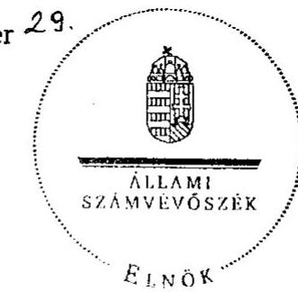

Dornokos László elnök

Melléklet: $\quad 10 \mathrm{db} \quad 45$ lap

---

MELLÉKLETEK

---

# BUDANIPEST 

1/a sz. melléklet
a V-2001-112/2010. sz. jelentéshez
FOVAROSI ONKORMANYZAT
FÖPOLGÁRMESTERE

## 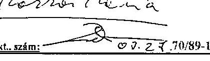

Tárgy: a 4-es metró beruházási folyamatának ellenőrzéséről készült V-2001-108/2010. számú jelentés észrevételezése

## Állami Számvevőszék   Domokos László elnök úr részére

Tisztelt Elnök Úr!

ÁLLAMI SZÁMVEVŐSZÉK
Érkezett: 2010.09 . 29. ......
Iktatószám: 4.201 . 110/2010.
Melléklet: ....................

A Fővárosi Önkormányzat az Állami Számvevőszék ellenőrzéseire az önkormányzatiság elmúlt húsz évében mindig is kiemelt figyelmet fordított. Az ÁSZ ellenőrzése lehetőséget teremt, hogy objektív vizsgálat eredményeként olyan megállapítások és javaslatok szülessenek, melyek elősegítik a közösségi források hatékonyabb felhasználását, az önkormányzati feladatok eredményesebb szolgálatát. Ezeket a megállapításokat, javaslatokat a Főváros a saját gyakorlatában igyekezett a lehető legjobban hasznosítani.

A Számvevőszék a 4-es metróra vonatkozó vizsgálatában most nincs a Főváros és nincs az ország segítségére. Az ÁSZ burkoltan kétségbe vonja a metróépítés létjogosultságát, azt, hogy Dél-Buda - Rákospalota viszonylatban csak metróval lehet hatékonyan a tömegközlekedési igényeket kiszolgálni. A Jelentésben a metróépítésnek csak negatív társadalmi költségei vannak, pozitív társadalmi hasznai megkérdőjelezhetőek. A Főváros vezetése sajnálattal állapítja meg, hogy az Állami Számvevőszék is felül arra a jobboldali kormány által keltett metróellenes hullámra, amely 1998-ban már egyszer elfektette négy évig a beruházást. Ha már mindenáron metrót kell építeni, olvasható ki a Jelentésből, akkor azt legjobb egy, a szocialista időkben volt állami nagyberuházás mintájára megvalósítani: egy nagy generálkivitelező a készen kapott terveket valósítsa meg szabott határidőre. (A nemzetközi mérnökszervezet, a FIDIC és szerződései, amit mindenütt alkalmaznak, itt nem kellenek.) Ha már minden áron metrót kell építeni, akkor az állam lehetőleg ne vállaljon kötelezettségeket, mert azzal bedönti a költségvetést. Kapcsolódó beruházásokat lehetőleg ki kell iktatni, mert azok drágítják a beruházást, de a P+R parkolókat a belvárosban is szaporítani szükséges. Ha már minden áron metrót kell építeni, akkor állomásokat ne építsének bele, mert lassításra késztetik a szerelvényeket, növelik a menetidőt, ehelyett az állomásokból mélygarázsokat illetve üzletközpontokat kell létrehozni, ha már.
Egy ország gazdasági versenyképességét, fejlettségét mutatja, hogy miképpen tud nagy kihívásoknak megfelelni, autópályákat, hidakat, és az ezeknél jóval bonyolultabb föld alatti létesítményt, metrót építeni, uniós fejlesztési támogatásokat felhasználni. Az Állami Számvevőszék adós maradt azzal, hogy felmutassa, mi a legjobb gyakorlat a metróépítés terén. „Tehát ne csak azt mutassa meg, amit rosszul csinálnak, és számon kérőként lépjen fel, hanem segítse is azokat, akik közpénzzel, közvagyonnal gazdálkodnak" - ahogy Elnök Úr egyik programadó interjújában fogalmaz.

---

Az alábbiakban olyan összefüggéseket kívánunk bemutatni, amelyek az eddigi egyeztetések ellenére, megítélésünk szerint helytelenül, de továbbra is a Jelentés részét képezik.

# I. Észrevétel a Jelentés Összegzö megállapítások, következtetések javaslatok c. fejezetére 

Az ÁSZ vizsgálat téves szakmai megállapítások alapján kriminalizálja a 4-es metró beruházást, ezzel megkérdőjelezheti a beruházás hazai és uniós támogatását, illetve az állami és uniós intézményrendszer, valamint a Főváros ellenőrzési kompetenciáját és alkalmasságát. A téves szakmai alapokra épülő ÁSZ jelentés mindezek alapján felmérhetetlen károkat okozhat mind a Magyar Államnak, mind pedig a Fővárosnak.

Az ÁSZ a rendszerváltást követő legnagyobb és legösszetettebb közösségi beruházásának, a 4-es metró vizsgálatának során nem vett igénybe olyan szakértőket, akik ismerték volna a Tanácsadó Mérnökök Nemzetközi Szövetsége (FIDIC) szerződéses gyakorlatát, és olyan szakértőket sem alkalmazott, akik a hasonló komplex beruházások lebonyolításának üzleti gyakorlatát ismerték volna.

Az ÁSZ vizsgálata során azzal a feltételezéssel élt, hogy létezik olyan ideális szerződéskötési rendszer és a beruházás megvalósításának olyan gyakorlata, amellyel lényegesen rövidebb idő alatt és többletköltségek felmerülése nélkül meg lehetne építeni a 4-es metrót. Abban az illúzióban tartja az olvasót a Jelentés, hogy létezik olyan megoldás, amelyben minden többlet időés költségráfordítást eredményező kockázatot (pl. területbiztosítás, engedélyezési eljárások elhúzódása, a létesítési engedélyekben szereplő további hatósági kikötések teljesítése, előre nem látható fizikai körülmények és közművek) egyszerűen ki lehet iktatni, nem véve tudomást róluk.

A Jelentés kimondatlanul is olyan képet sugall, oly szemlélet nevében kér számon, ahol az állam a saját tulajdonában lévő mamutvállalattal valósítja meg a metróépítést. Ahol nincsenek elkülönült tulajdonviszonyok, nincsenek elkülönült érdekeket képviselő engedélyező hatóságok (pl. kerületi önkormányzatok), nincsen közbeszerzési rendszer, ahol a beruházó/megrendelő parancsuralmi rendszerekben szokásos módon viszonyulhat a kivitelezőkhöz. A szocializmusnak ez a gyakoriata azonban Magyarországon is véget ért 1990-ben.

Mivel a 4-es metró szerződéses megoldása és kivitelezése nem felel meg ennek a gyakorlatnak, ezért az ÁSZ a beruházást előkészítetlennek, a szerződésstratégiát és a projektirányítást hibásnak minősítette és ezen az alapon hűtlen kezelés alapos gyanúja miatt büntetőeljárást kezdeményezett.

A budapesti 4-es metró beruházás a rendszerváltást követő új gazdasági, társadalmi rendszer keretei között megkezdett legnagyobb és legösszetettebb közösségi beruházás, mely a teljes magyar közigazgatási rendszert, valamint a közös állami-önkormányzati finanszírozás révén a kormányzati-önkormányzati együttmüködés lehetőségeit is próbára tette, egyben a Kohéziós Alapból történő részleges finanszírozás miatt, az Európai Uniós támogatások felhasználására és ellenőrzésére létrehozott tagállami ellenőrzési szervek vizsgáját is jelenti.

---

Az Állami Számvevőszék átfogó vizsgálata kiváló lehetőséget teremtett volna arra, hogy a hosszú időszakot felölelő összetett beruházás tapasztalatait összegezve a jövőbeni beruházások a 4-es metró beruházás hibáiból okulva gördülékenyebben, szervezettebben és költséghatékonyabb módon valósulhassanak meg.

Az Állami Számvevőszék összegző jelentésében a Kormánynak, Budapest Főváros Főpolgármesterének és a BKV Zrt. igazgatóságának megfogalmazott javaslatai azonban semmilyen módon nem adnak segítséget ahhoz, hogy a jövőbeni hasonló beruházások zökkenőmentesen, költségtakarékosan és rövidebb építési idő alatt valósuljanak meg.

A Főváros legfontosabb megállapításai az ÁSZ jelentéssel kapcsolatban:

1. Ha a metróberuházás esetén a beruházó olyan szerződés megkötésére törekedne, amely minden kockázatot a vállalkozóra telepít, akkor a közpénzzel pazarlóan bánna, mivel annak horribilis árazási következménye lenne, a szerződéses árak elfogadhatatlanul megnövekednének.
2. Az ÁSZ által hiányolt fővállalkozási szerződésben sem lehet a fővállalkozóra telepíteni azokat a kockázatokat, amelyeket az nem tud felmérni és kezelni. Ha a Főváros egy. fövállalkozóval valósította volna meg a 4 -es metró beruházást, akkor ugyanazon kockázatok esetén, amelyek a metró eddigi építése során bekövetkeztek, kiszolgáltatottabb helyzetben lett volna, mint a jelenlegi szerződéses struktúrában volt.
3. A Főváros a metró megvalósításához a legmegfelelőbb szerződéses struktúrát választotta, mivel:
(i) a legjobb nemzetközi gyakorlatnak megfelelő FIDIC Sárga Könyv szerződéses feltételeket alkalmazta, ahol minden teljesítésigazolásban, vitarendezésben intézményesült mérnöki szakértelem érvényesül;
(ii) annak megfelelően allokálta a kockázatokat és annak terheit, hogy melyik féltől várható el annak hatékonyabb kezelése, nem áraztatott be olyan kockázatokat a vállalkozókkal, amelyek kezelésére nem képesek;
(iii) a beruházás részekre bontásával erős vállalkozói versenyt generált, ami az ajánlati árak csökkenését eredményezte;
(iv) a beruházás részekre bontásával növelte a megvalósítás során előre nem látható konfliktusok bekövetkezése esetére a tárgyalási pozícióját azáltal, hogy kevésbé tette kiszolgáltatottá magát egy-egy vállalkozóval szemben, ezzel szétterítette és csökkentette a kockázatokat, és azok kezelését egy nemzetközileg bevált szerződéses intézményrendszerre bízta. Mindez a vállalkozók számára is kiszámíthatóbbá tette a beruházás lebonyolítását.

---

4. Ha a Főváros csak azután indította volna el a 4-es metró építését, ha a megvalósításhoz szükséges összes engedélyt bevárta volna, akkor valószínűsíthetően a mai napig sem kezdődhetett volna meg a beruházás (lásd örmezei kerületi szabályozási terv). A Főváros minden szükséges előkészítést elvégzett, kiválasztotta a projekt sajátosságaihoz és kockázatához legmegfelelőbb szerződéses stratégiát, a határidők meghatározásakor, az akkor rendelkezésre álló információk alapján reálisan, legjobb tudása szerint járt el.
5. A Főváros a vállalkozói szerződések megkötését követően a metróépítés késedelme miatti negatív társadalmi költségek és tényleges többlet költségek csökkentése érdekében minden ésszerű lépést megtett. Szükséges mértékben megerősítésre került a projektmenedzsment és a jól választott szerződésrendszer lehetőséget biztosított az időközben felmerült kockázatok kezelésére. A bekövetkezett késedelem, mely alapvetően a jogszabályi környezet miatt elhúzódó engedélyezési eljárásokra vezethető vissza, arányos a bekövetkezett akadályokkal és kockázatokkal.
6. Független szakértők nemzetközi összehasonlítás során átvilágították a projekt költségvetését és megállapították, hogy az műszaki tartalmával összevetve reálisnak tekinthető.
7. A várható projektköltség növekmény változatlan műszaki tartalom mellett a 2002. évben meghatározott árakhoz képest várhatóan nem haladja meg a $10 \%$-ot, amely ilyen nagy bonyolultságú, összetett projektek esetén kifejezetten alacsonynak tekinthető.
8. Az Európai Beruházási Bank és az Európai Unió is átvilágította a projektet, beleértve annak szerződéses rendszerét, projektirányítását és azt hitelezésre, valamint támogatásra alkalmasnak minősítette.

# Az Állami Számvevőszék javaslatairól: 

1. A jelentés javasolja a Kormánynak, hogy
(a) Kezdeményezze a finanszírozási szerződés módosítását annak érdekében, hogy az állam műszaki-gazdasági pénzügyi kontroll pozíciója erősödjön az állami támogatás hatékony felhasználása céljából.
(b) Kezdeményezze a finanszírozási szerződés kiegészítését azzal, hogy a Fővárost az állami támogatás visszafizetésének kötelezettsége terheli, ha a BKV Zrt.-t privatizálja vagy az állami támogatással megvalósított beruházás bármely létesítményét a társaság elidegeníti, továbbá a szerződésben rögzítse a visszafizetés pénzügyi biztosítékait.

Ha az ÁSZ javaslatokat fogalmaz meg, akkor meg kell indokolnia azok célszerűségét és meg kell vizsgálnia azok megvalósíthatóságát, amely egyik javaslat esetében sem történt meg.
ad (a) 2011-től 2014-ig, vagyis a 4-es metró 1. szakasza pénzügyi zárásáig a Finanszírozási Szerződés alapján még várhatóan 11,0 milliárd forint Állami Támogatás kifizetésére kerül

---

sor. Mivel az Állam a finanszírozási szerződés alapján a projektköltség 79\%-át finanszírozza, ez hozzávetőlegesen 14,0 milliárd forint projektköltséget jelent, amely $9,6 \%$-a a 2014 -ig esedékes teljes kifizetésnek. A projekt fennmaradó hányada a Kohéziós Alap finanszírozáshoz kapcsolódó Támogatási Szerződés alapján ( $88,7 \%$ ) és a kisebb része ( 1,7 $\%$ ) teljesen fővárosi saját erőből valósul meg. A Támogatási Szerződés alapján a projektet és a kifizetéseket kiterjedt hazai és uniós ellenőrzési szervek audítálják.

A Főváros kész arra, hogy a Finanszírozási Szerződésben további müszaki-gazdasági és pénzügyi kontroll pozíciót biztosítson az Államnak, ha az nem veszélyezteti a projekt megvalósítását és nem hárít a Fővárosra a jelenleginél nagyobb pénzügyi terheket. Megjegyezzük, hogy a Finanszírozási Szerződésben biztosított ellenőrzési jogait az Állam folyamatosan gyakorolta és gyakorolja, a projektköltség terhére biztosított müszaki ellenőrzési jogával azonban nem élt.
ad (b) A Főváros soha nem tervezte privatizálni a BKV Zrt.-t, inkább államosítani szerette volna, hiszen akkor megszabadult volna a fenntartás pénzügyi terheitől. Semmi realitása nincs egyébként a BKV magánosításának (ha lennének is ilyen szándékok), amíg nincs biztosítva annak a fenntartható finanszírozása. A Főváros a 4-es metró Kohéziós Alap támogatása során vállalta, hogy megfelel a 1370/2007. EK rendeletnek és ennek alapfeltétele, hogy igazolni tudja, hogy rendelkezik a BKV Zrt. irányitási jogaival.

Valószínűleg elkerülte az ÁSZ ellenőreinek figyelmét, hogy a Kohéziós Alap támogatáshoz kapcsolódó Támogatási Szerződésben a Főváros kötelezettséget vállalt arra, hogy a 4-es metró megvalósítását követő 5 éven belül nem idegeníti el a projekt keretében létrehozott vagyont, és ha megszegi ezt a kötelezettségvállalását, akkor a támogatás összegét vissza kell fizetnie.

Összefoglalva elmondhatjuk, hogy az ÁSZ olyan javaslatokat fogalmaz meg a Kormánynak, amelyek egyrészt neutrálisak a beruházás hatékony megvalósulása szempontjából, másrészt már a jelenlegi szerződéses kötelezettségek is biztosítják az ÁSZ által elérni kívánt célt, a BKV privatizálása pedig annak jelenlegi finanszírozási rendszerében nem valós lehetőség.
2. A jelentés Budapest Főváros Főpolgármesterének megfogalmazott alábbi javaslatai egyrészt félreértéseken alapulnak, jogszabály és szerződésellenesek, másrészt formális jellegủek, így sem a folyamatban lévő 4 -es metró beruházás, sem pedig a jövőbeni hasonló beruházások hatékonyságának javításához nem járulnak hozzá.
(a) Intézkedjen arról, hogy a BKV Zrt. vizsgálja felül a kivitelezői szerződéses feltételeket (kötbérterhes határidők, hozzáférési idő és többletidő ráfordítások) és biztosítsa azok összehangolt rendezését.
(b) Haladéktalanul bízzon meg Független Ellenőrző Mérnököt annak érdekében, hogy a független műszaki ellenőrzés érvényesüljön.
(c) Szüntesse meg az engedélyezési okirat, a beruházási program és a megkötött szerződések közötti ellentmondásokat.
ad (a) Az ÁSZ javaslata nem értelmezhető; szerződés és jogszabály ellenes. A beruházás lényegében a FIDIC Sárga Könyv alapú kivitelezési szerződések alapján valósul meg,

---

amelyek szabályozzák a kötbérterhes határidők, a követelések költségeinek és a kárfelelősség rendezésének kérdéseit, ezért azok rendezése érdekében nem kell szerződéseket módosítani. A szerződéseket akkor kell módosítani, ha olyan kérdések merülnek fel, amelyeket a szerződések nem szabályoznak, és egyben fennállnak a szerződések módosításának Kbt.-ben meghatározott feltételei.
ad (b) A Független Ellenőrző Mérnök (FEM) alkalmazását sem a Magyar Állam és a Főváros közötti Finanszírozási Szerződés, sem pedig a Kohéziós Alap finanszírozás kapcsán létrejött Támogatási Szerződés nem írja elő. A FEM alkalmazását kizárólag az EIB hitelszerződés írja elő. A Főváros a projekt megvalósításának kezdetén kiírta a FEM tendert, azonban az meghiúsult. Az azóta bekövetkezett késedelem alapvetően annak tulajdonítható, hogy időközben a projekt megvalósítása folyamatosan haladt előre, s ennek során olyan alapvető változások következtek be, amelyek a FEM feladatkörének folyamatos újradefiniálását tették szükségessé - például:
(i) a DBR Metró Projekt Igazgatóság - a megnövekedett feladatainak megfelelően megerősítésre került, emellett a projektirányítási és ellenőrzési rendszerbe beépítésre került egy Projekt Irányító Bizottság és egy Projekt Felügyelő Bizottság, ezen túlmenően a BKV Zrt. felügyelő bizottsága számára is ellenőrző feladatokat lát el folyamatosan egy külön erre a célra felkért független mérnők;
(ii) az I. szakasz műszaki készültségi foka elérte a $60 \%$-os szintet és az építési szerződések lényegében megkötésre kerültek;
(iii) az I. szakasz Kohéziós Alap támogatási kérelmének mellékleteként részletes kockázatelemzés került elkészítésre;
(iv) az I. szakaszt a Kohéziós Alap támogatási kérelem kapcsán átvilágította és ellenőrizte több EU és hazai szerv, illetve intézmény (pl. JASPERS, ECORYS, NFÜ, KIKSZ, EKKE); és
(v) az I. szakasz Kohéziós Alap támogatását az Európai Bizottság jóváhagyta és a KÖZOP keretein belül Támogatási Szerződés jött létre, amely alapján az I. szakasz megvalósítását az NFÜ és a KIKSZ folyamatosan nyomon követi és ellenőrzi, valamint azt az ÁSZ és a KEHI is időről-időre ellenőrzi.
A késedelem alapvető oka tehát, hogy a FEM feladatköre a projekt előrehaladásával folyamatosan újradefiniálásra került annak érdekében, hogy a 4 -es metró beruházás projektköltségét ne terheljük olyan feladatokkal és emiatt több milliárd forint felesleges kiadással, mely feladatokat különböző szereplők már ellátnak. Mindezeket az okokat és a projekt lebonyolításában bekövetkezett változásokat ismertettük az Európai Beruházási Bankkal és kértük a jelenlegi státusz-quo-nak megfelelő feladatkör jóváhagyását. Az EIB kérésünket 2010. szeptember 1-én jóváhagyta, három javaslatot fogalmazott meg, amelyet elfogadtunk és azzal kiegészítettük a FEM feladatkörét. A tenderkiírás folyamatban van.

Mint azt ez év júliusában is jeleztük, most is kérjük pontosítani a 40 . oldal 2. bekezdésének 2. mondatát tekintettel arra, hogy a metró biztos a Főjegyzői Iroda keretein belül 2007. július

---

16 -áig dolgozott, ezt követően a Városüzemeltetési és Vagyongazdálkodási Iroda keretein belül, majd 2010. február 1-től a Főpolgármesteri Irodán láttalátja el feladatait.
ad (c) Az engedélyezési okirat módosítása is folyamatban van, a hivatkozott ellentmondások abszolút neutrálisak a beruházás hatékony megvalósítása szempontjából.
3. A jelentés javasolja a BKV Zrt. igazgatóságának, hogy
(a) Intézkedjen a változtatási utasítások és követelések beárazását elősegítő feltételrendszer kialakításáról annak érdekében, hogy az idő- és költségkockázatok csökkenjenek.
(b) Biztosítsa a beruházási tevékenységek ütemezésének megalapozottságát (szerződéses feltételek és ütemtervek összehangoltságát) és a kapcsolatok beruházói hatáskörben történő hatékony, kártérítéseket megelőző kezelését.
(c) Vizsgálja felül és értékelje a szakértői szerződések hasznosulását.
(d) Rendezze és tegye átláthatóvá a beruházás mérnöki feladatainak szerződéses feltételrendszerét az I. és II. szakasz vonatkozásában.

A javasolt intézkedések, illetve tevékenységek a BKV Zrt., mint beruházó folyamatos tevékenységét képezik. Nem látjuk, hogy milyen szerepe van a jelentésben hivatkozott javaslatoknak, mi indokolta azok megfogalmazását, mivel a jelentésből nem derül ki, hogy azokat a BKV nem végzi, vagy nem megfelelően végzi.
ad (a) A változtatási utasítások és követelések beárazását elősegítő feltételrendszer kialakítására vonatkozó javaslat valószínűleg a vállalkozói követelések elbírálásának felgyorsítására utal, mert egyébként nehezen értelmezhető a javaslat, hiszen a feltételrendszer a szerződésekben kialakításra került és pontosan szabályozott. A vállalkozói követelések elbírálása elsősorban egyébként a FIDIC Mérnök feladata. A követelések elbírálásának felgyorsítása közvetlenül sem az idő, sem pedig a költségkockázatot nem csökkenti.
ad (b) A BKV Zrt. DBR Igazgatóságának folyamatos a projektirányitási tevékenysége.
ad (c) A BKV Zrt. DBR igazgatósága folyamatosan megköveteli az általa kötött szerződésekben foglaltak betartását és nem köt olyan szakértői szerződést, nem vesz igénybe olyan szolgáltatást, amely nem indokolt, és amely nem hasznosul.
ad (d) Az ÁSZ részletes tájékoztatást kapott a Mérnök szerződés státuszáról, ismertek számára azok az erőfeszítések, amelyeket a tárgyban a DBR Igazgatóság folyamatosan tesz.

---

# Következtetések 

Az ÁSZ jelentés javaslatai alapján összefoglalóan elmondható, hogy azok nem szolgálják a beruházás megvalósításának hatékonyabbá tételét, a javaslatok megvalósítása számos esetben növelheti a jövőbeni hasonló beruházások költségét.

Magyarországon a rendszerváltás óta nem volt példa hasonló összetettségủ projekt megvalósításához szükséges engedélyezési eljárások lefolytatására.

A jelentés eltekint az idő- és költségtúllépésben meghatározó szerepet játszó jogszabályi környezet és a kiszámíthatatlan engedélyezési eljárások vizsgálatától, bizonyítás nélkül folyamatosan kedvezőtlenül minősíti a Főváros és a BKV Zrt. beruházás megvalósításában játszott szerepét, téves szakmai feltételezésre épülő, formális, gyakran költségnövekedést eredményező és a vizsgálat kompetenciáján túllépő javaslatokat fogalmaz meg, megkérdőjelezi a nemzetközi mérnöki sztenderdeket, az állami irányítás és a Kohéziós Alap támogatás hazai intézményrendszerét.

Mindezek alapján, az ÁSZ jelentés nem járul hozzá sem a folyamatban lévő beruházás, sem pedig a jövőbeni hasonló beruházások hatékonyságának javításához, nehezíti a 4-es metró megvalósítását, és a projekt kriminalizálásán keresztül veszélyeztetheti a 4-es metró uniós támogatását.

## II. A beruházás közlekedésszakmai megalapozottságą, céljai és várható társadalmi hasznai

Az ÁSZ Jelentés szeptemberi verziója némileg tompított azon a korábbi megközelítésén, amely a 4-es metrót egy rögeszmeszerű projektnek állította be, míg az 1996-os Megvalósítási Tanulmányt egy önkényes igazolási rituálénak minősítette.

Még mindig jelentős ellentmondásokkal terhelt azonban az anyag: már az összegző rész első bekezdése is a társadalmi hasznok terén a csökkent kapacitású $\mathrm{P}+\mathrm{R}$ parkolóról beszél, mint negatívumról. A felszíni beruházásokat viszont másutt egyszerűen költségnövelő és ilyenként felesleges tényezőként kezeli.

A részletes megállapításokban az 1.2 alfejezet a' Megvalósíthatósági Tanulmánynak felrója, hogy minimális nyomvonal változtatásokat vizsgált csupán (29. oldal), a 2. fejezet a Megvalósíthatósági Tanulmány elavultságát és az engedélyokirat 2004-es elfogadását állítja kontrasztba (32. oldal). "Az 1991-től rendelkezésre álló dokumentumokban eldöntött tény volt a 4-es metróvonal megépitése az adott közlekedési folyosóban. A Fôváros olyan elöterjesztéseket nem tárgyalt, amelyekben - Budapest egészét és agglomerációs kapcsolatait elemezve - a finanszirozási korlátok figyelembevételével alternatív közlekedésfejlesztési lehetöségeket összehasonlitott volna." (12. oldal) Az "M2-plussz" javaslatról, vagyis a Kelenföld-Déli pu. összekötésről, mint egy a Közgyűlés által lesöpört figyelemre méltó alternatíváról olvashatunk (30. oldal). Továbbá a jelentés a 33. oldalon egy a DBR által megrendelt értékelemzésre hivatkozik, amely a Móricz Zsigmond körtéri, a Fővám téri és a Népszínház utcai állomások elhagyását javasolta és a helyükön üzlẹtek kialakítását, ami sajnálatos módon nem hasznosult. A 34. oldalon pedig beidézi

---

a Jelentés a Környezetvédelmi Felügyelet később megsemmisített 2001-es I. fokú határozatát a hévíz források veszélyeztetésével kapcsolatban. Jellemző a metró fölöslegességét, haszontalanságát sugalló megjegyzések: "A metróépités késedelme a beruházásnál felmerült többletidő miatti kártérítéseken felül növelte a negatív társadalmi költségeket, amelyeket a Fôváros és a beruházó nem mutat ki." (24. oldal) Másutt: "A jármüvek a 9-böl 4 állomásközi szakaszon érik el a tervezett 80 km/óra végsebességet, ebből 2 szakaszon 200 m-nél rövidebb távon tartják ezt a sebességet. 5 állomásközi szakaszon az állomások sürü elhelyezkedése miatt az egész távon elmaradnak ettől a sebességtől, a gyorsulási intervallumot - állandó haladási sebességü időszak nélkül - azonnal a lassítás követi." (19. oldal)

Eközben a 4 -és metró tényleges közlekedés- és városfejlesztési céljairól, a közlekedési rendszertervekről vagy a CBA eredményeiről alig találunk érdemi információt. A fenti megállapítások jórészét az egyeztetések során a Fôváros képviselői hitelt érdemlően, döntően dokumentumok segítségével megcáfolták, ezek ismételgetése fölösleges, mert hasztalan. A Fôváros próbálta bizonyítani, hogy a metróberuházásnak közvetlenül ki nem számítható, pozitív társadalmi haszna is van, a közvetlen közlekedési hasznosságán túl, ahogy azt a 3-as metró a Váci út környékének fejlődését szolgálva bizonyította. Az sem vált egyértelművé az ellenőrzés számára, hogy nem a két végállomással rendelkező, állomások nélküli, így folyamatos végsebességet biztosító metróvonal a leghasznosabb.

Mindezen hiába való fôvárosi erőfeszítések dacára álljon itt egy rövid összefoglalás a projekt indokoltságáról:

A XIX. század vége óta a világ nagyvárosaiban a népességnek milliós határt átlépő növekedése, a helyi közlekedési igények drámai méretű növekedésével kaotikus viszonyokat eredményezett. A káosz feloldására alkalmazott közlekedésfejlesztési eszközök közül a legeredményesebbnek a föld alá vitt vasútvonalak bizonyultak. A metró költségessége ellenére így volt leginkább biztosítható a közlekedési igény tömegessége és gyorsasága. A XX. század második felében a fejlett világ metropoliszaiban általánossá vált a metróvonalak egyre kiterjedtebb hálózatainak megépítése. Ma Budapest a meglévő három metróvonalának 32 km -ével, 52 állomásával a hasonló fejlettségủ és nagyságú városokkal összehasonlítva nem áll jól. Az 1.2 millió lakosú Prága metrója 57 állomással 60 km hosszú (ebből 24 km 1990 után épült), és az 1.7 millió lakosú Bécs is 75 km -es metróhálózattal, 100 állomással rendelkezik, ezek 'mögött Budapest jelentősen lemaradt. Valójában miért is kell Budapesten bővíteni a metróhálózatot?

Az alábbi ábra jól mutatja a fôváros gyorsvasúti, illetve a gyorsvasútra ráhordó hálózatának lefedettségét, mely alapján egyértelmủ, hogy az egyedüli irány mely nem rendelkezik kötöttpályás kiszolgálással, az a dél-budai irány.

---

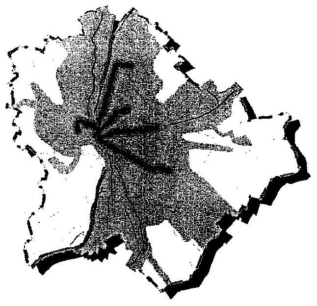

A Főváros közlekedésfejlesztési terveiben ezért évtizedek óta szerepel a dél-budai irányt kiszolgáló gyorsvasút gondolata, hiszen a Gellért-hegy révén beszoruló közlekedési hálózat a Bartók Béla út - Szent Gellért tér vonalra szorította be a térség legfontosabb közlekedési kiszolgáló elemeit, a 47-49-es villamos vonalat, illetve a 7-es autóbuszcsaládot. A villamosok 90 mp-es , míg az autóbuszok 70 mp-es, követési idővel közlekednek, ami tovább már nem fokozható, s csak állandó zsúfoltsággal, lassúsággal tudja kiszolgálni az igényeket.

A 4. metróvonal közlekedési szerepe legjobban az észak-budai közlekedés gerincét adó 2-es metróvonal szerepével írható le, hiszen a Várhegy és a Gellért hegy tömbjei által középen kettészakított Buda északi felének közlekedési gerincét a 2-es metró, adja, míg a 4-es metró ugyanezt a szerepet fogja ellátni Buda déli felében. A forgalmi indokoltságot különösen hangsúlyozza az az egyértelmű folyamat, miszerint jelenleg a legdinamikusabb városfejlődés ebben az irányban van, teljes összhangban az agglomerációs fejlődéssel. A közlekedési igények rohamosan nőnek ebben az irányban, s a korábbiaktól ellentétben a forgalom mind a város felé, mind a városból kifelé egyöntetűen és dinamikusan növekszik, mivel az elővárosokban jelentős számú munkahely teremtődött. A 4. metróvonal forgalma az átadás időszakában előreláthatóan meg fog egyezni a 2-es metróvonal forgalmával, de a későbbiekben épp a térségi fejlődés miatt tovább fog növekedni. Egyszerű szakmai kifejezéssel a dél-budai irány már ma is nagyon-nagyon metróra érett irány,

A 4. metróvonal kilenc állomos-közi távolságának átlaga 810 méter, ami lényegében megegyezik a 2-es metró állomás távolságaival. A legkisebb állomásköz is meghaladja a 400 métert, mivel a Szent Gellért tér- Fővám tér távolság, az állomás elhúzása révén megnövekedett. A Budapest belvárosa alatt a vonal függetlenül halad a felszíni hálózattól, így szerepét legjobban a közlekedési csomópontokhoz való igazodással tudja betölteni. Téves a Budapestnél sokkal nagyobb megapoliszokkal való összehasonlítás, mivel azokban az esetekben célszerú a metrókat is két, funkciók szerint elkülönülő csoportba osztani. Párizsban például a RER metrók kifutnak 70 km távolságra is a városból, míg a város területén csak minden harmadik megállóban állnak meg. A belső metrók állomás távolsága azonban ugyanolyan, mint nálunk. Párizs lakos-száma több mint 12 millió, és állandóan növekszik, szemben Budapest két millió alatti lakos-számával, amely nem növekszik. Az előkészületek időszakában részletes elemzésre került minden esetleg összevonható

---

állomás, mint Móricz Zs. körtér - Bocskai út, Szent Gellért tér - Fővám tér, Fővám tér - Kálvin tér, de a vizsgálatok minden esetben azt hozták eredményként, hogy az összevonás kedvezőtlenebb eredményre vezet. Vagy azért mert nagyobb lenne az utasvesztésből eredő veszteség, mint a gyorsabb utazásból való idönyereség, vagy az állomási forgalom nagyobb lenne annál, amit két kijárat képes lenne kiszolgálni.

# III. A szerződéses stratégia 

Az ÁSZ megállapítása szerint a beruházás rosszul megválasztott szerződéses rendszerben és előnytelen kötelezettségvállalásokkal valósul meg. Feltételezhető, hogy az ÁSZ nem mélyedt el a szerződéses feltételrendszer elemzésében, azért fogalmazta meg ezt az állítását.

A szerződéses stratégiát alapvetően a metró összetettségéből és a kivitelezők technológiai képességéből eredő műszaki adottságok és az előkészittésre rendelkezésre álló idő, valamint a beruházást irányító szervezet mérete és felkészültsége határozta meg. A szerkezetet építő kivitelezői ajánlatok esetén például a legkedvezőbb ajánlat abban az esetben érhető el, ha nem választják meg előre az építési módszert, hanem minden kivitelező a saját technológiai felkészültségének megfelelően adhat ajánlatot, és a terveket is ennek megfelelően készíttetheti el azokkal, akik annak a technológiának az ismeretével rendelkeznek. A gépészeti, vagy elektromos munkák pedig alapvetően gyártmány, illetve berendezésfüggő tevékenységek, ahol ezek ismerete szükséges az ajánlatok jó összeállításához és a tervecknek ennek kell megfelelnie.

A beruházás megvalósítása az 1913-ban alapított nemzetközi mérnökszervezet (International Federation of Consulting Engineers, FIDIC) által kidolgozott szerződéses rendszer keretében, az ún. "FIDIC Sárga Könyv" alapján történik. A FIDIC Sárga Könyv kidolgozása nemzetközi szakértők részvételével, több évtizedes tapasztalatok felhasználásával történt. A FIDIC szerződéses rendszereket a világon széles körben ismerik és alkalmazzák évtizedek óta, projektek ezrei valósulnak meg ezen szerződéses rendszer feltételei alapján. Egyebek mellett azért, mert ez a feltételrendszer annak megfelelően allokálta a kockázatokat és annak terheit, hogy melyik féltől várható el annak hatékonyabb kezelése. A FIDIC szerződéses rendszer mind a megrendelők, mind a finanszirozók, mind a vállalkozók által elfogadott és rendszeresen alkalmazott. Példáként említhető az Európai Újjáépítési és Fejlesztési Bank (EBRD), amely ugyan nem írja elő a szerződéses rendszer kötelező alkalmazását, de az általa finanszírozott projektekben kifejezetten támogatja e dokumentum használatát. Világbank Sztenderd Ajánlati Dokumentációjának I. része a FIDIC 1992-ben módosított verzióján alapul, a bank tapasztalata alapján foganatosított változtatásokkal. E dokumentáció használata kötelező a Világbank által finanszírozott projekteknél.

Az elmúlt évtizedek (piacgazdasági) tapasztalatai a beruházásokkal, azok lebonyolításával, tervezésével és finanszírozásával kapcsolatban lévô és a metróberuházás előkészítésében is részt vevő nemzetközi szakembergárdánál gyültek össze. Ezeket a városvezetés is közvetlenül megismerte, például az 1992-es kulcsrakész metró-beruházási tender sikertelensége és az 1995-ös, négy pályázaton meghirdetett és négy szersődéssel (alagútrẹkonstrukció, pályafelújitás,

---

állomásrekonstrukció és biztosítóberendezés kiépítése) sikeresen végrehajtott kisföldalattirekonstrukció kapcsán. Folyamatos volt a konzultáció az EBRD, a Világbank és elsősorban az EIB szakembereivel, akik támogatták a javasolt pályázati rendszert. A Fővárosi Közgyűlés pl. az 1999-ben készült beruházási program kapcsán már megvitatta a konstrukciót (akkor még 11 szerződéssel). Az EIB a ma is érvényben lévő hitelszerződés kapcsán több audítot hajtott végre, és visszaigazolta a javasolt rendszert.

A FIDIC szerződéses rendszer alkalmazása tehát nem elhamarkodott, meggondolatlan döntés volt, hanem a nemzetközi tapasztalatokat figyelembe vevő, körültekintő döntés.

A FIDIC Sárga Könyv ("tervezz és építs") alkalmazását szakmai és kockázatallokációs megfontolások indokolták. Mivel Magyarországon évtizedekig nem volt mélyvezetésủ metróépítés, ezért elveszett - pontosabban elavult - az a szakmai tudás, amely alapján a rendelkezésre álló legmodernebb technológiák és technikák számbavételével meghatározható lett volna az adott helyzetben az adott műszaki cél eléréshez leghatékonyabb műszaki módszer. Ezért döntött úgy a finanszírozó Főváros, és a beruházó DBR, hogy a FIDIC Sárga Könyv alkalmazásával lehetőséget ad a vállalkozó részére: határozza meg ő maga, hogy a rendelkezésére álló technológia közül melyiket kívánja alkalmazni a megrendelt munka elvégzésére. Azzal, hogy a DBR a vállalkozókra bízta a tervezést is, ezzel lehetővé tette a technológiák versenyét. Ezen felül, a "tervezz és építs" koncepcióban a tervezéssel kapcsolatos kockázatot nem a megrendelő, hanem a vállalkozó viseli. Amennyiben a terv alkalmazásával vagy módosításával kapcsolatban bármilyen probléma felmerül, a FIDIC'Sárga Könyv esetében ezt a Vállalkozó maga, saját költségen köteles elvégezni, míg más rendszerben ezt többletköltség fejében a megrendelő köteles megrendelni.

Ráadásul a tervezés külön vállalkozásba adása jelentősen növelte volna a beruházás megvalósításának időtartamát, hiszen abban az esetben a tervezésre és az építésre is két külön eljárást kellett volna alkalmazni. Az építés vállalkozásba adására irányuló eljárás kizárólag a teljes kiviteli tervdokumentáció elkészülte és jóváhagyása után kezdődhetett volna, míg a FIDIC Sárga Könyv esetében csak egy tendereztetési eljárásra van szükség, és a tervkészítés valamint az építés jelentős részben párhuzamosan is folyhat.

Az ÁSZ azt is felrója, hogy a Főváros és a BKV nem fövállalkozót alkalmazott a beruházás megvalósítására. Amint arra az ÁSZ jelentés is hivatkozik, a Főváros korábban már kért ajánlatot a tervezett metróvonal fővállalkozó általi megvalósítására. Az ekkor kapott ajánlatok és az ezen eljárás keretében a Főváros nemzetközi tanácsadója által adott értékelés azt mutatta, hogy fövállalkozók csak olyan magas kockázati felárral vállalják a beruházás megvalósítását, amely nem fogadható el.

A fővállalkozó - épp a kínálati piac szűkössége miatt - kockázatait, amelyek objektív (pl. geológiai) és szubjektív (pl. piaci hatások) oldalon egyaránt fennállnak, be fogja árazni, biztonsága érdekében túlárazni, és a megbízó számára ezek mértéke, egyáltalán mibenléte előreláthatatlan és a szerződéskötés után mindvégig átláthatatlan marad. Ebből következően az egy vállalkozós kulcsrakész megoldás szükségképpen bizonytalanabb és drágább a több vállalkozós rendszernél.

---

Fővállalkozó alkalmazása esetében igen sok olyan projekt-elem lesz, amelyeket a fővállalkozó és partnerei nem szakvállalatként, gyártóként, hanem alvállalkozók során keresztül szereznek be. Ez nemcsak a szükséges referenciák, tapasztalatok bemutatását és ellenőrzését teszi nehézzé, hanem bizonyítottan többletköltséggel (5-9-15\%-os fővállalkozói díj formájában) is jár.

Az ÁSZ semmilyen elemzéssel nem tudta alátámasztani, hogy fővállalkozó alkalmazása esetén a beruházás megvalósítása kisebb költséggel járna. Nem vizsgálta továbbá, hogy a fővállalkozó alkalmazása milyen, a Főváros és a BKV által viselt kockázatokat szüntetne meg és melyek maradnának továbbra is fent. A beruházás késedelmét okozó kockázatok közül a fővállalkozó sem vállalta volna magára például a hatósági eljárások késedelmét, a hatóságok által előírt többlet műszaki tartalom költségeit, az ingatlanszerzések esetleges elhúzódását. Az ezek okozta késedelem és többletköltség fővállalkozó esetében is ugyanígy felmerült volna. A nemzetközi tapasztalatok szerint fơvállalkozó alkalmazása olyan kockázatot is felvet, amely enélkül egyébként nem létezik. A fővállalkozó ugyanis az egész projektet domináló helyzetéből kifolyólag erősebb zsarolási potenciállal rendelkezik egy esetleges jogvita során, ami eleve magában rejti a jelentős többletköltségek felmerülésének kockázatát.

Az ÁSZ jelentés a szerződéses rendszer hibájaként értékeli azt is, hogy jelen pillanatban nem állapítható meg pontosan a beruházás befejezésének időpontja és teljes költsége. Az ÁSZ szerint ennek oka a Vállalkozó és a Megrendelő által benyújtható követelések kezelésének rendszere, továbbá a Mémök által elrendelhető Változtatások lehetősége.

A 4-es metró beruházásához hasonló nagyságú és összetettségủ projektek esetében elkerülhetetlen a megrendelő és a vállalkozó között a viták kialakulása, amelyek következtében a viták lezárásig valóban nem határozható meg a beruházás befejezési határideje és teljes költsége teljes pontossággal. Ilyen projektnél csak vágyálmokban létező, a realitásokat és tapasztalatokat teljesen figyelmen kívül hagyó esetben képzelhető el jogviták és az ezekből eredő bizonytalanságok nélkül. Nem véletlen, hogy minden tapasztalt finanszírozó - így az Európai Unió is - kötelezően előírja tartalékkeret képzését, továbbá kockázatelemzés készítését, mivel tisztában vannak azzal, hogy a költségtúllépések és az időbeli csúszások gyakorlatilag elkerülhetetlenek. A 4-es metró beruházás is rendelkezik tartalékkerettel és rendelkezik a nemzetközi gyakorlatnak megfelelően készített, az Európai Bizottság által elfogadott kockázatelemzéssel.

A FIDIC szerződéses rendszer kockázatkezelő módszerének szerves része a Vállalkozó és a Megrendelő által érvényesíthető követelések. A szerződésrendszer alkalmazásában a Vállalkozó szabályozott módon érvényesítheti a teljesítési határidő meghosszabbítására és további fizetés iránti igényét, ha a megvalósítás feltételeiben jelentős változások merültek fel. Ugyanígy a Megrendelő szintén a szerződésrendszer révén érvényesítheti az esetleges pénzkövetelését például kötbér -, illetve szavatossági/jótállási igényét. A követelések rendszere ugyan nem a FIDIC szerződéses rendszer találmánya, a felek más szerződés esetén is hasonló módon érvényesíthetnék igényeiket, de csak a FIDIC szerződéses rendszer tartalmazza kizárólag az igényérvényesítési eljárás kifinomult szabályozását.

A Vállalkozó által a szerződésben rögzített egyẹs feltételek megváltozására tekintettel érvényesíthető költségek meghatározása a szerződésben rögzített rendben történik. A Vállalkozó kizárólag a felmerült és igazolt többletköltsége, továbbá a szerződésben rögzített ésszerủ haszna megtérítését kérheti. Ez előnyösebb a megrendelő számára, mint a polgári jog általános szabályai

---

szerinti eljárás, e tekintetben a FIDIC szerzödéses rendszer alkalmazása kifejezetten előnyös a Megrendelö számára. Az ÁSZ megállapítása pontatlan. A Vállalkozó 28 napon belül jogosult a követelését benyújtani, és legfeljebb további 14 napon belül köteles az azt alátámasztó összes információt átadni a Mérnök részére. A követelés pontositásának, részletezésének és alátámasztásának kötelezettsége tehát nem határidő nélküli. Részben eltérő szabályozás a hosszantartó hatású eseményekre vonatkozik. Ezek bekövetkezését is be kell jelenteni 28 napon belül, majd további 14 napon belül a részleteket is ki kell munkálni, azután havonta közbenső követeléseket kell benyújtania a kumulált adatokkal, végül a hosszantartó esemény megszűnésétől számított 28 napon belül kell a végső követelést benyújtani. Ilyen hosszantartó események során más szabályozás logikailag nem képzelhető el, hiszen a hatása csak az esemény megszűntét követően összegezhető.

Az ÁSZ kifogásolja azt is, hogy a DBR a Változtatások helyett nem szerződésmódosítást alkalmaz. A változtatás egyoldalú hatalmi eszköz, amellyel a Mérnök a megrendelő jóváhagyásával jogosult módosítani a Megbízó követelményeit vagy a létesítményt. A változtatás tehát nem tételezi fel a Vállalkozó egyetértését, az akár a nélkül is elrendelhető. Ezzel szemben a szerződésmódosítás kizárólag a felek egyetértésével lehetséges, tehát a Vállalkozó egyetértése nélkül nem. A változtatás joga tehát sokkal előnyösebb a Megbízó számára, mint a szerződésmódosítás lehetősége, a változtatás olyan jogot biztosít a BKV számára, amelyet a polgári jog egyébként nem biztosítana. Az ÁSZ trivialitásként kezeli a közbeszerzési szerződésnek a Kbt. 303. §-a alapján történő módosíthatóságát. Ezzel szemben mind az Európai Unió közbeszerzési irányelveinek értelmezését végző Európai Bíróság és az Európai Bizottság, mind a Kbt. a szerződés módosítását szigorú feltételekkel rendkívül szűk határok között engedi csak meg, ezért - a Vállalkozóval történt megegyezés esetén is - csak kivételesen módosítható a szerződés. Az ÁSZ megállapítása abban az esetben lenne megalapozott, ha vizsgálta volna, és indokokkal alátámasztva kimutatná, hogy az általa vizsgált esetben a közbeszerzési szerződés módosítható. Az ilyen elemzés rendkívül nagy segítséget jelentett volna a beruházás megvalósításában és finanszírozásában nem csak a BKV és a Főváros, hanem valószínűleg a KIKSz és az NFÜ számára is. Jelenleg ugyanis mind a Közbeszerzési Döntőbizottság, mind az Európai Bíróság, és az Európai Bizottság gyakorlata alapján igen nehéz meghatározni azt a kört, amelyben a szerződés módosítása lehetséges, a jogszabályba ütköző módosítás pedig veszélyezteti a beruházás költségeinek az elismerhetőségét, így az Európai Unió általi finanszírozhatóságát.

Az ÁSZ kifogásolja, hogy a vállalkozók közötti együttmüködés, továbbá az ütemterv Vállalkozók általi készítése és betartása nem kikényszeríthető és nem szankcionálható.

Az ÁSZ erre vonátkozó megállapítása tárgyi tévedés. A szerződésekben létezik részteljesítési határidő (Kötbérterhes Határidő) és teljesítési határidő is. A FIDIC Sárga könyv szerint kötött szerződésnek az a lényege, hogy a Vállalkozó készíti a kiviteli terveket és saját technológia alapján épít. Ebben az esetben a szerződés megkötése pillanatában csak az engedélyezési és tender tervek, az alkalmazható technológia alapján lehet ütemtervet készíteni, de azt sorról sorra nem lehet a vállalkozónak előírni, mivel a tényleges megvalósítás a kiviteli tervek és tényleges technológia alapján történik. Így kerültek meghatározásra azok a kötbérterhes határidők és munkaterület hozzáférési idöszakok, amelyek az ismert adatok és információk alapján összeállított integrált ütemtervből adódtak. Az egyes Vállalkozók közötti együttműködés feltételeinek kezelésére többlépcsős, többszereplős rendszert tartalmaznak a vállalkozási szerződések. Az összehangolást első lépcsőben a Kijelölt Vállalkozó (ebben az esetben a

---

BAMCO) végzi. Ennek során a megjelölt vállalkozók vállalták, hogy együttmüködnek egymással és a Kijelölt Vállalkozóval. Amennyiben ilyen módon az összehangolás nem jár sikerrel, akkor a Mémök, mint a BKV képviselöje utasitással biztosíthatja az összehangolás megtörténtét. Az összehangolás megvalósítása ettől eltérő módon nem lehetséges abból a tényből kifolyólag, hogy az egymás mellett dolgozó vállalkozók egymással nem kerülnek jogviszonyba. A tervezési és a kivitelezési feladatok összehangolása egynél több vállalkozó esetén mindig a megrendelő (megbízottja) kötelezettsége és annak jogi feltételei teljesen megegyeznének a jelenlegi rendszerre irányadó feltételekkel. A beruházáson dolgozó vállalkozók soha nem kerülnek egymással jogviszonyba, ezért az összehangolással kapcsolatos véleményeltérések esetén mindig csak jogi eszközök (perek) állnak rendelkezésre, e tekintetben a beruházás semmilyen specialitással sem rendelkezik.

# IV. A beruházás késedelmének okai, a közigazgatás defektusának elmaradt elemzése 

A Jelentés félreérthetően fogalmaz a befejezési határidő tekintetében: az, hogy jelen pillanatban nem határozható meg teljes pontossággal a beruházás várható teljes költsége és befejezésének időpontja, az nem a „feltételrendszer" következménye, hanem a beruházáshoz hasonló projektek immanens jellemzője. A hasonló nagyságú és bonyolultságú projektek esetében a befejezés tervezett határideje határozható meg. A kérdés, amit a Jelentésnek minősítenie kellene: a tervezett határidő meghatározása vajon a legjobb iparági gyakorlat szerint történt-e, az reálisnak tekinthető-
e.

Mind a várható összköltség számítása, mind a harmonizált ütemterv a DBR-nél megtalálható. Ez a DBR legjobb tudása szerint rendszeresen felülvizsgálatra kerül.

Az engedélyokirat elfogadásakor - 2004. szeptember 30 -án - és annak első módosításakor 2006. január 26 -án - a megvalósítás 2009-re meghatározott határideje reális volt. Nem állt rendelkezésre olyan információ, amely alapján érdemben megkérdőjelezhető lett volna, hogy a hatósági engedélyezési eljárások és a területszerzések a becsült időtartam alatt ne lennének megvalósíthatóak. Az engedélyokiratot az ekkor rendelkezésre álló információk alapján, a Főváros és a BKV legjobb tudomása szerint kellett elkészíteni és az ennek megfelelően el is készült. Ebben az időpontban még nem volt ismert, hogy a területszerzések és az engedélyezési eljárások a megvalósítás ütemezését befolyásoló módon elhúzódnak. Az például, hogy az egyik igénybe veendő ingatlan tulajdonosa az ingatlanforgalmi szakértő által megállapított összeg közel 17-szeresére rugó összegủ kártalanítást követel, ebben az időpontban még nem volt ismert. A Főváros a Támogatási Kérelem összeállítása során 2007 - 2008 folyamán értékelte a beruházás megvalósításának költség és határidő kockázatát. A Főváros az 555/2008.(04.24.) Föv. Kgy. határozattal fogata el a KÖZOP Pályázati Adatlapot, amelyben a beruházás várható befejezési határidejét 2011. június 30 -ában határozta meg. A Főváros az 1891/2008.(12.10.) Föv. Kgy. határozattal fogadta el a Támogatási Szerződést, amelynek 3.2.4 pontja a Projekt Müszaki Megvalósításának határidejét 2011. december 31-ében határozta meg. A Főváros az 57/2010.(01.28.) Föv. Kgy. határozattal fogadta el a Támogatási Szerződés módosítását, amely a Projekt Múszaki Megvalósításának határidejét 2012., december 31-ében határozta meg. A Főváros tehát minden esetben a rendelkezésére álló információkat értékelve, azokhoz igazítva határozta meg a Beruházás befejezésének határidejét. A Főváros által hozott, a megvalósítás határidejét is érintő határozatok a befejezési határidő tekintetében felülírták az engedélyokiratban szereplő határidőt, elfogadásuktól kezdődően a Beruházás megvalósítása szempontjából az új

---

határidő volt a releváns. A Beruházás megvalósitására semmilyen hatással nem lehetett az a körülmény, hogy a korábban elfogadott engedélyokiratban a korábbi információk alapján meghatározott várható befejezési időpont szerepel.

A Jelentés szerint a területszerzés miatti késedelmek is alapvetően meghatározták a projekt időbeli csúszását, a szükséges területek megszerzésének folyamatát előkészítetlenek ítélték, és felrótták az ellenőrök, hogy a DBR nem vizsgálta a kisajátítási eljárás kezdeményezésének lehetőségét. Sőt a Jelentés szerint az alagútépítés megkezdése a kelenföldi kiinduló-pontnál közel hat hónapot késett, mivel a szükséges területet nem tudták a kivitelező részére biztosítani, emiatt közel 3 Mrd Ft többletköltség merült fel, amit a kivitelező részére kifizettek.

Az ÁSZ megállapítása ezúttal is az alkalmazandó jogszabály figyelmen kívül hagyásával született. A pajzsindító mütárgy elhelyezését és elkészítését befolyásoló ingatlan felszínének igénybevételére csak ideiglenesen kellett volna sort keríteni, ezért kisajátításának feltétele nem állt fenn. A végleges igénybevétel a felszín alatt beépített műtárgyra történt. Az építés után a felszín eredeti állapotának visszaállítása történt volna, az ingatlan az eredeti tulajdonosnál maradt. Ez az igénybevétel nem tárgya a kisajátítási törvénynek, ezért itt a tulajdonossal való megállapodás lett volna a járható út. A BKV ebből kifolyólag kényszerült megegyezésre a tulajdonosokkal. Az egyik ingatlantulajdonos által igényelt kártalanítás majd 17 -szerese volt a megbízott ingatlanforgalmi szakértő által megállapított értéknek.
Ehhez kapcsolódóan fejti ki a Jelentés, hogy felelősség terheli a Fővárosi Önkormányzatot és a BKV Zrt.-t, mint beruházót azért, mert a vonal alagútépítővel 2006. év elején úgy kötöttek kivitelezői szerződést, hogy a szerződéskötéskor tudták, a BKV Zrt. nincs abban a helyzetben, hogy a szerződéses kötelezettségeit teljes körűen és időben teljesítse.

Az ÁSZ jelentéséből nem világos, hogy milyen kötelezettségekre utal, ezért csak feltételezzük, hogy a pajzsindító műtárgy tervezett megvalósítási helyéül szolgáló ingatlan birtokbaadására. Az alagútépítési szerződés, mint hirdetménnyel induló tárgyalásos eljárás esetében az felek ajánlati kötöttsége a tárgyalások befejezésével, jelen esetben 2005. november 11 -én állt be. Ebben az időpontban a BKV számára nem volt ismert, hogy a fent említett, a pajzsindító akna feletti ingatlan tulajdonosa a szakértő által megállapított kártalanítási összeg közel 17-szeresét követeli, mivel erről csak 2006 márciusában tájékoztatta a BKV-t. Így az sem lehetett ismert, hogy a szakértői véleménnyel alá nem támasztható igény akadályozza az ingatlan igénybevételét. Ezért teljesen meglapozatlanul állítja a jelentés, hogy a BKV annak tudatában kötötte meg a szerződést, hogy az abban foglalt kötelezettségeit határidőben nem tudja teljesíteni. Emellett feltételezzük, hogy amennyiben a BKV elfogadja a tulajdonos által kért, a szakértő által megállapított sokszorosát elérő összegủ követelést, akkor most az ÁSZ ezt kérné számon, ezért kezdeményezne büntető eljárást. Hiányoljuk a jelentésből annak az elemzését - mivel csak ez alapján lehetne a tényleges következményeket felmérni -, hogy milyen következményekkel járt volna a költségvetési pénzek hatékony felhasználására az, ha a BKV a terület birtokbaadásának problémájára hivatkozással nem köti meg az alagútépítési szerződést, hanem új eljárást kezdeményez annak odaítélésére.

A területszerzési problémák egy része abból eredt, hogy a beruházón és az ingatlan tulajdonoson kívül harmadik fél is érintett/érdekelt. (Jellemzően a bérlettel/használattal terhelt ingatlanok esetében volt így.) Ezek a beruházó számára külső, erőhatásán kívül álló jogviszonyok, és mivel a beruházó a harmadik személlyel nem áll jogviszonyban így jogszerủen tárgyalni is nehezen tudott. Ezekben az esetekben a bérlő/használó a metró beruházásban üzletet szimatolt, nevezetesen a használati/bérleti jogát zsarolásra használhatta. A' harmadik személyek érdeke éppen az esetleges

---

peres/kisajátítási ügyek elhúzása és ezzel a tárgyalási pozíciójának az erősítése volt az érdeke. A magyar jogrend és eljárási gyakorlat széles lehetőséget nyújt erre. (Pl. Örmező, Kálvin tér.)

Az ÁSZ véleménye szerint a BKV nem készített előzetes felmérést a beruházás megvalósításához szükséges ingatlanokról és azok igénybevételéről. Az ÁSZ megállapítása ezúttal is tárgyi tévedést tartalmaz. A BKV megrendelésére az OTP Ingatlan Rt., mint a projektvezetési tanácsadó konzorcium tagja 1999-ben és 2000-ben felmérte és összefoglalót készített a beruházással érintett ingatlanok helyzetéről. A BKV tehát időben, a beruházás előkészítése keretében, megfelelő referenciával, szakértelemmel és tapasztalattal rendelkező tanácsadót bízott meg az ingatlanok felmérésével, ezért az ennek hiányára vonatkozó megállapítás tárgyi tévedés.

Noha a jelentés korábbi verzióiban szerepelt, a végleges változatból kikerült még az a nagyon harmatos megfogalmazás is, ami a közigazgatás teljesítményére vonatkozott a projekt kapcsán: „Az engedélyezési eljárás idöigényességét mind a jogszabályi környezet, mind a magyar közigazgatás kapacitása és felkészületlensége kedvezőtlenül befolyásolta." Az egyeztetés során kiderült, hogy ezt az ellenőrzés „nem találta bizonyítottnak."

A Főváros megítélése szerint, amíg a közigazgatási környezet, mint súlyos, a beruházás költségeire is kiható rendszerhiba, nem kerül beazonosításra, addig a 4-es metró projekt tárgyilagos megítélése várat magára. A közérdek sérelmét jelenti, hogy az Állami Számvevőszék ugyan kihangsúlyozza a beruházás csúszásának költségnövelő hatását, de az ennek alapjául szolgáló egyik releváns, meghatározó körülményt tudatosan elhallgatja. Ezzel lényegében megfosztja a jogalkotót attól, hogy a jövőbeni beruházások sikere érdekében a szükséges lépéseket beazonosítsa, és intézkedéseket tegyen a rendszerhibák kijavítására.

Megállapítható, hogy az állami beruházások során már volt olyan felismerés, hogy a közpénzekből megvalósítandó közérdekủ beruházások az általános közigazgatási szabályok keretei között nem valósíthatók meg. A Kormány 2000-ben arra kényszerült, hogy egy a 4-es metró beruházás összetettségéhez semmilyen szempontból nem mérhető beruházás érdekében a leégett Sportcsarnok újjáépítésének felgyorsítása és költséghatékony megvalósítása okán külön törvényben, az általános szabályoktól eltérő eljárási szabályokat határozzon meg. (A Budapest Sportcsarnok újjáépítéséről szóló 2000. évi XL. törvény).

Később a Kormány annak érdekében, hogy egyáltalán esélye legyen az autópálya építési program megvalósítására, az általános szabályokhoz képest radikálisan eltérő szabályokat tartalmazó törvényt volt kénytelen elfogadtatni a hatósági engedélyezési, a kisajátítási és az önkormányzati településrendezési döntéshozatal racionalizálása érdekében. (A Magyar Köztársaság gyorsforgalmi közúthálózatának közérdeküségéről és fejlesztéséről szóló 2003. évi CXXVIII., 2004. január 1-től hatályos törvény).

Objektív elemzéssel levezethető az is, hogy a jogi szabályozás nagyberuházásokat gyorsitó fejlődése már nem lehetett érdemi hatással a 4-es metró beruházásra.

A fenti, a közigazgatás defektusára vonatkozó vizsgálat hiánya miatt az ÁSZ jelentés arra sem hívja fel a Kormány figyelmét, hogy a Budapesten kialakított kétszintủ önkormányzati igazgatás diszfunkcionalitása, rendszerhibái miatt a jövőbeni fővárosi nagyberuházások idő-és költséghatékony megvalósítása, tervezhetősége továbbra sem lesz lehetséges. Azzal, hogy egyes

---

kerületi önkormányzatok kikötéseik útján, a metróépítés költségvetésének terhére kívánják érvényre juttatni fejlesztési elképzeléseiket, és ennek eléréséig az engedélyezési eljáráshoz nem fognak hiánytalanul rendelkezésre állni a metróvonallal érintett kerületek jóváhagyott szabályozási tervei, vagy a munkavégzéshez szükséges közterület-használati engedélyek, egy ma kezdődő fővárosi beruházás esetén is reálisan számolni kell és ez egyben kiszámíthatatlan tényezőként késleltetheti a város fejlesztését.

A Fővárosi Önkormányzat beruházásait ugyanis a jogszabályi környezet változatlansága esetén a jövőben is nagyban determinálja majd az a tény, hogy az építési engedélyezési eljárásokat és a kisajátításokat csak akkor lehet érdemben megkezdeni és lefolytatni, ha a kerületi önkormányzatok szabályozási tervei azt lehetővé teszik. A kerületi önkormányzatok erős alkupozícióval rendelkeznek ezen a téren (is), és saját érdekeiket és fejlesztési elképzeléseiket a felelősség terhe nélkül a nem az általuk megvalósított beruházások terhére, akár forrás ráfordítás nélkül a szabályozási lehetőséggel visszaélve érvényesíthetik. Az ehhez hasonló, közjogi eszközökkel legitimált, rendszerbe épített politikai zsarolási lehetőségen persze sem az ÁSZ jelentések, sem a fővárosi önkormányzati testületek politikai egyszínűsége nem segíthet. A metróépítés során súlyos konfliktusok és áldozatok árán szerzett tapasztalatok azt valószínüsítik, hogy erre a problémára csak az jelenthet megoldást, ha a településrendezés és közterület-használat terén a Fővárosi Önkormányzat javára megszünik Budapesten a kétszintű szabályozás, ami törvényalkotói feladat.

# V. A 4-es metró költségeinek növekedése: látszat és valóság 

A budapesti 4-es metró megvalósítása költségeinek időbeli változása tekintetében nagyon sok a köztudatba beivódott félreértés. Ez többnyire abból adódik, hogy keveredik az I. Szakasz, a II. Szakasz és a teljes beruházás bekerülési költsége, továbbá keveredik a tervezéskori „alapár" (2002. évi változatlan ár) és a különböző években közzé tett „folyóár" (tehát a várható inflációval tervezett bekerülési költség), valamint az, hogy időközben módosult a műszaki tartalom is.

Sajnálatos módon az ÁSZ jelentés nem járul hozzá e félreértések eloszlatásához. A beruházási költségek folyamatos emelkedését több helyütt valójában nem összehasonlítható értékek egymás mellé állításával tálalja. Nehéz szabadulni attól a benyomástól, hogy ez az eljárás a költségnövekedés tendenciózus dramatizálását szolgálja.

Ennek jellemző példája a Jeléntés Összegzõ Megállapításait tárgyaló részben szereplő ábra, amely az I. szakasz költségterveinek változását az 1996-os megvalósíthatósági tanulmány szerinti tervezett összköltség, valamint 2004-ben, 2009-ben és 2010-ben számított folyóáras értékek összevetése alapján mutatja be. Nem lehet eltekinteni azonban attól a ténytől, hogy az egyes időpontok folyóáras költségterveiben mind az inflációs hatás, mind a műszaki tartalom bővülése tükrözödik.

Az 1996. évben készült megvalósíthatósági tanulmány az I. Szakasz tervezett építési költségét 447 millió ECU összegben határozta meg. Ez az összeg ugyanakkor nem tartalmazta a metró kocsik értékét, de a kivitelezés járulékos költségeit sem. A metró kocsikkal együtt a teljes tervezett projektköltség nagysága 1996. évi árakon, illetve árfolyamon összesen 514 millió ECU volt. A

---

tervezés megalapozásaként 1998-ban az I. Szakasz vasúthatósági engedélyezési tervéhez részletes tervezői költségbecslés készült a megvalósíthatósági tanulmány bázisán. A tervezői költségbecslés ekkor még kiegészítésre került az előkészítési költségekkel és egyéb járulékos költségelemekkel (pl. tervezés, lebonyolítás, művezetés, földterületek vételára, próbaüzem, kisajátítás, kártalanítás, illeték stb.). Ez alapján az I. Szakasz minden költségelemre kiterjedő tervezett projektköltsége 1998. évi változatlan áron 136,8 Mrd forint (aktuális árfolyamon 569,8 millió ECU) összegben került meghatározásra.

A Magyar Állam és a Főváros között 2004-ben létrejött Finanszírozási Szerződés 2002. évi változatlan áron rögzítette a beruházási költségeket. Az 1998. évi árak átszámítása eredményeképpen az I. Szakasz tervezett projektköltsége 2002. évi áron 194,9 Mrd forintot tett ki. A 2004 szeptemberében a Fővárosi Közgyűlés által elfogadott engedélyokirat gyakorlatilag ugyanezt az összeget tartalmazta, de nem a 2002. évi árakon, hanem a kivitelezési időszakra tervezett folyóárakon.

A Finanszírozási Szerződésben meghatározott alap projektköltség a KSH által közzétett beruházási ár-indexekkel és a Főváros 2010. évi költségvetési tervezésekor alkalmazott PM tervezési árindexekkel folyóárra átszámítva 245,7 Mrd Ft. Így az aktuális 2010. évi folyóáras prognózisban az inflációs hatás a 2002. évi árakhoz képest 50,8 Mrd Ft (245,7 - 194,9 Mrd), az 1998. évi árakhoz képest pedig 108,9 Mrd Ft (245,7-136,8 Mrd).

A 2010. évi folyóáras költségterven belül ugyanakkor a műszaki tartalom bővülésének 93,9 Mrd Ft költség növekmény tudható be. A Jelentés ugyan említést tesz ennek elemeiről, de a mögöttes okokat teljes körűen nem ismerteti.

A műszaki tartalomváltozás legjelentősebb tétele az állomásszerkezetek építésével kapcsolatban felmerült 44,8 Mrd Ft. Ennek okai az alábbiak:
(a) az állomások szerkezete az eredeti többszörites koncepció helyett, a jogszabály által előírt építészeti tervpályázat eredményeként „egylégterü"-re módosult;
(b) az engedélyezési eljárások során további, eredetileg nem tervezett műszaki (főleg biztonsági) követelmények kerültek meghatározásra; és
(c) az „egylégterü" szerkezetek a magyar építészeti piacon eddig még nem előforduló, új technológiákat igényeltek, amely miatt az előzetes költségbecslés során nem állt rendelkezésre megfelelő árképzési benchmark, illetve az új technológia miatt megnövekedett építési kockázataik csökkentésére a vállalkozók növelték az áraikat.

Míg a Finanszírozási Szerződésben meghatározott alap projekt csak a szűkebben értelmezett mütárgy költségeit fedte le, a Kohéziós Alapból elnyert támogatás nyomán 39,5 Mrd Ft összegben nagyrészt uniós társfinanszírozással és kisebb részben $100 \%$-os Fővárosi saját erőből finanszírozott kapcsolódó beruházások is beépültek a projektbe. Ezáltal lehetővé vált, hogy a felszíni munkák ne csak a metró földalatti állomásainak és kijáratainak közvetlen környezetére korlátozódjanak, hanem a közösségi közlekedési funkcióra rásegítő beruházásokra, illetve a régóta megérett, a kulturált közlekedést támogató térségi rekonstrukciós munkákra is kiterjedjenek. Ebből a szempontból az is lényeges körülmény, hogy az érintett területek rendezését, szükséges átépítését ésszerű a metró beruházással egyidejűleg elvégezni, mivel a munkálatok során a felszíni

---

környezet jelentős megbolygatása, átépítése szükséges. Így összességében - az egyébként is szükséges fejlesztések megvalósítása szempontjából -- a kapcsolódó béruházások bevonása költségtakarékos megoldásként értékelhető.

További, 9,6 Mrd Ft többletköltséget eredményezett, hogy a 2004. évi műszaki tartalomhoz képest jelentősen módosult a Kelenföldi Pályaudvar állomás műszaki terve. Az állomás a GKM, a MÁV Zrt., a Főváros és a BKV Zrt. szakmai egyetértésével intermodalitást biztosító módon kerül megvalósításra. Az intermodális állomás megvalósítása eredményeként létrejövő egyes vagyontárgyak a Magyar Állam tulajdonába kerülnek, továbbá a Magyar Állam számára a tulajdonába nem kerülő vagyonrész is jelentős vagyoni előnyt eredményez a kincstári tulajdonban lévő vasúti infrastruktúra igénybevételét lehetővé tevő műszaki megoldás révén. Erre a tényre tekintettel a Főváros a Magyar Állam részvételét kérte az intermodális állomás által okozott többletköltség finanszírozásában, mely kérés nem került teljesítésre.

Megállapítható tehát, hogy a Jelentés hivatkozott ábráján bemutatott „folyóáras költségnövekmény" mintegy $90 \%$-ban egyszerűen a vetítési alapként használt árak különbségéből, illetve a műszaki tartalom eltéréseiből fakad.

Az inflációs hatás és a műszaki tartalom változás kiszűrése után a projektköltség növekedés a Finanszírozási Szerződésben rögzítetthez képest az alábbi:

|  | Mrd Ft |
| :--: | :--: |
| 1. Projektköltség folyóáron a 2010. évi Fővárosi költségvetésben | 370,0 |
| 2. A Finanszírozási Szerződésben meghatározott műszaki tartalom |  |
| 2010. évi folyóárra átszámítva | 245,7 |
| 3. Folyóár különbözet az infláció hatás kiszürése után (1-2) | 124,3 |
| 4. Műszaki tartalom változás a Finanszírozási Szerződéshez képest | 93,9 |
| ebből egy légterủ állomásszerkezetek. | 44,8 |
| kapcsolódó beruházások | 39,5 |
| Kelenföldi pályaudvar intermodalitás biztosítása | 9,6 |
| 5. Projektköltség növekedés a műszaki tartalom változás és az inflációs hatás kiszűrése után (3-4) | 30,4 |

A fenti levezetésből látható, hogy a Finanszírozási Szerződéshez viszonyítva a műszaki tartalom bővülés és az inflációs hatás kiszűrése után az I. szakasz tényleges projektköltség várható növekménye 30,4 Mrd Ft. Ez lényegében megegyezik a projekt költségvetésben szereplő általános tartalékkal. Az általános tartalék nemcsak a Finanszírozási Szerződés szerinti műszaki tartalom, hanem a műszaki tartalom változás várható költségtúllépési kockázatát is fedezi és felhasználása esetén minősül majd tényleges költségtúllépésnek,

A várható projektköltség növekmény tehát változatlan műszaki tartalom mellett $9 \%$, mely ilyen nagy bonyolultságú, összetett projekteknél kifejezetten alacsonynak tekinthető.

---

# VI. Záró megjegyzések 

A tervezetek többkörös véleményezése, a számvevőkkel folytatott hosszadalmas konzultációk ellenére a Jelentés továbbra sem szükölködik a tárgyi tévedésekben, a szakmailag tarthatatlan kijelentésekben. E kifogásolható megállapítások közül néhány fontosabbra a teljesség igénye nélkül az alábbiakban külön kitérünk:

## 1. Közbeszerzési szabálytalanságok

A Jelentés a bevezetőjében felhívja a figyelmet arra, hogy a vizsgálat nem terjedt ki a közbeszerzési eljárások szabályszerűségi ellenőrzésére. Ennek ellenére a hűtlen kezelés alapos gyanúja miatt tett feljelentését az ÁSZ közleményében első helyen a közbeszerzési szabálytalanságokkal indokolja. A Jelentés összegzése szerint ugyanakkor a beruházást az „NFÜ szerinti" közbeszerzési szabálytalanságok jellemezték. A Jelentés feltételezhetően arra a 11 szerződésre utal, amely az NFÜ döntése nyomán kikerült a projekt uniós támogatási kérelméből.

A BKV és a Főváros az NFÜ által a közbeszerzési szabályok vizsgálata tárgyában lefolytatott szabálytalansági vizsgálat ideje alatt végig vitatta, hogy a hivatkozott közbeszerzési eljárásokban jogsértés történt volna. A BKV és a Főváros vitatta az NFÜ által lefolytatott vizsgálat jogalapját is. A vizsgálat jogalapjának bizonytalanságát támasztja alá maga vizsgálat menete is. A vizsgálat ugyanis először az Európai Bizottság által kiadott útmutató alapján minősítette az általa megállapított jogsértéséket és ennek megfelelően állapította meg a jogkövetkezményeket is. A vizsgálat által jogkövetkezményként javasolt pénzügyi korrekció összege kb. 6,4 Mrd Ft volt. Ezt követően azonban az NFÜ arról küldött értesítést, hogy a bármilyen csekély mértékben kockázatosnak minősített szerződések teljes összegét ki kell venni a támogatható költségek köréből. Így a pénzügyi korrekció mértéke 56,6 Mrd Ft-ra növekedett. Még olyan csekély súlyú jogsértés esetében is, amely esetében a vizsgálat először 2 százalékos pénzügyi korrekció szükségességét állapította meg, a korrekció végül 100 százalékos lett. A Közbeszerzési Törvény alapján a jogsértés megállapítására kizárólag a Közbeszerzési Döntőbizottság vagy a bíróság jogosult kontradiktórius eljárás keretében. Amennyiben az NFÜ szabálytalanságot tár fel, akkor a Közbeszerzési Döntőbizottság eljárását lett volna köteles kezdeményezni. Ennek hiányában az NFÜ nem volt jogosult megállapítani a Közbeszerzési Törvény megsértését.

A BKV és a Főváros a beruházás megvalósitása, során a Közbeszerzési Törvény alkalmazásával járt el, nem kötött olyan szerződést, amelynek megkötését a Közbeszerzési Döntőbizottság megtiltotta a számára.

## 2. A Polgári Törvénykönyv módosításának értékelése

Az ÁSZ véleménye szerint az a szabály, , amelynek értelmében az Állam jóhiszemű harmadik személyek felé fennálló szerződéses kötelezettségét a költségvetési fedezetre tekintet nélkül is

---

köteles teljesíteni megingathatja a költségvetés stabilitását és államadósságot generálhat. Ez az értékelés álláspontunk szerint súlyosan meggondolatlan.

Az Államnak, ahhoz, hogy feladatait elláthassa, szükséges, hogy képes legyen polgári jogi jogviszonyba lépni és annak keretében több évre szóló kötelezettséget is vállalni. Az ilyen kötelezettségvállalások azonban csak abban az esetben tölthetik be funkciójukat, ha azok tényleges kötelezettséget eredményeznek. A jogállamiságnak a polgári jogi, gazdasági kapcsolatokban alapvető követelménye, hogy a szerződések kötő erővel bírjanak, a másik fél azokban bízhasson, és a jogrendszer biztosítsa azok érvényesíthetőségét. Amennyiben az Állam a költségvetésére hivatkozással mentesülhetne a jóhiszemű személyekkel szemben vállalt kötelezettsége alól, akkor egyrészről olyan kivételes helyzetbe kerülne, amely más jogalanyt nem illet meg, másrészről gyakorlatilag alkalmatlanná válna azon feladatainak ellátására, amelyekhez polgári jogi jogviszonyba kell lépnie, mivel ilyen feltételek mellett senki sem lenne hajlandó szerződni vele. A Polgári Törvénykönyv hivatkozott szabálya tehát egyrészről a jogállamiság alapvető követelményéből fakad, másrészről praktikusan ez biztosítja az Állam számára a feladatai ellátásához szükséges lehetőséget.

A költségvetés számára is hosszú távon az olyan jogi környezet biztosítja a megfelelő működési feltételeket, amely jogbiztonságot eredményez, amely biztosítja a szerződések kötőerejébe és érvényesíthetőségébe vetett bizalmat. A költségvetés stabilitását a jelentésben foglaltakkal szemben nem az a biztosítja, hogy az Állam mentesülhet a kötelezettségei alól, hanem az, hogy a kötelezettségvállalás rendje megfelelő módon szabályozott. Ezeket a szabályokat azonban nem a Polgári Törvénykönyvben, hanem például az Áht-ban kell megállapítani. Téves az a megközelítés, amely szerint a kötelezettségvállaló, jelen esetben az Állam belső eljárásrendjében esetleg előálló hiányosságok következményeit jóhiszemủ harmadik személyeknek kellene viselnie. A Magyar Állam felelőssége megalkotni és betartatni a kötelezettségvállalása rendjét meghatározó eljárási szabályokat, és kizárni, hogy ezek hiányának vagy esetleges megsértésének következményei harmadik személyek jogait sértsék. A Polgári Törvénykönyv hivatkozott szabálya a jóhiszemű harmadik személyt védi, a költségvetés jelentés által felvetett védelmét viszont a harmadik személyekre nem kiható módon, a Magyar Állam müködését meghatározó szabályokban kell biztosítani. Ezzel ellenkező megoldás nem lenne összhangban a jogállamiságból fakadó alapvető alkotmányos követelményekkel.

# 3. Az államháztartás rendelkezéseinek figyelmen kívül hagyása 

A Jelentés az Áht. éven túli állami kötelezettségvállalásokra vonatkozó módosításának tárgyalásakor felrója, hogy - noha a törvénymódosítás a 4-es metró I. szakaszának beruházását a finanszírozási szerződés vonatkozásában érintette - annak fơbb tartalmi elemeit az Országgyülésnek nem mutatták be.

A Jelentés tárgyi tévedést tartalmaz. Egyrészt az Áht. hivatkozott 22. §-a metrótörvény megalkotásakor még nem létezett. Másrészt, a finanszírozási szerződés 2005-ben történt módosításakor a kötelezettségvállalásról való döntés során az Áht. hivatkozott rendelkezését figyelembe vették. Az állami kötelezettségvállalás a 2005. évi LXVII. törvényben ennek az előírásnak megfelelően került előterjesztésre. A törvény miniszteri indokolása is tartalmazza az Áht. által előírt adatokat.

---

# 4. A kapcsolódó beruházások finanszírozása 

A Jelentés megállapítása szerint a finanszírozás és a műszaki tartalom szempontjából nem egyértelműen meghatározott, hogy mely felszíni beruházások és milyen értékben számolhatók el kapcsolódó beruházások címén a 4-es metró beruházási költségeként.

Többszöri észrevételünk ellenére sem került ki a Jelentésből ez a nyilvánvaló tárgyi tévedés. A Jelentés készítői sajnos nem értették meg, noha hivatkoznak rá, hogy a hatályos Finanszírozási Szerződés nem vonatkozik a kapcsolódó beruházások finanszírozására. A kapcsolódó beruházások csak az Állam - Főváros közötti finanszírozási arányok kialakításánál kerültek figyelembe vételre, de nem épültek be a Finanszírozási Szerződés szerinti projektköltségbe és ebből következően az Állam nem is finanszírozta a kapcsolódó beruházásokat. Ez azonban nem jelenti azt, hogy a kapcsolódó beruházások projektköltségének és finanszírozási forrásainak tervezése ne lenne szabályozott. A kapcsolódó beruházások szerződéses és mérnők árait a mindenkori projektköltségvetés elkülönítetten tartalmazza. Az uniós társfinanszírozás keretében elszámolható kapcsolódó beruházásokat a Támogatási Szerződés tételesen meghatározza. A Főváros által 100\%-ban finanszírozott kapcsolódó beruházásokra vonatkozó információkat ugyanakkor a Főváros és a BKV Zrt. közötti végleges pénzeszköz átadási-átvételi megállapodások tartalmazzák.

## 5. A vonalalagút kivitelezőjének követelései

Az ÁSZ a kivitelezői követelések tárgyalásakor úgy jár el, mint egy hollywoodi filmrendezö, aki egy maroknyi statiszta segítségével látványos csatajelentet varázsol. A Jelentés különböző szövegösszefüggésekben összesen 11 alkalommal hivatkozik a vonalalagút kivitelezőjének (Bamco) ugyanazon „ 50 M eurót meghaladó" követelésére. Eközben csupán azt az egyáltalán nem mellékes tényt nem közli, hogy a követelések kerétében a Bamco-nak korábban megfizetett 17,4 M euró ugyanazokat az eseményeket fedi le, amire a konzorcium először 115 M euró, majd 52 millió euro követelést kívánt érvényesíteni, és amiből a döntöbizottság 2010. augusztus 18-i döntése mindössze $14,5 \mathrm{M}$ eurót fogadott el. Ez alapján a kivitelezőnek valójában $2,9 \mathrm{M}$ eurós visszafizetési kötelezettsége keletkezett.

## 6. Metró-biztosi feladatok

Mint azt már korábban is jeleztük, most is jelezzük, hogy pontatlan a jelentés megállapítása a metró-biztos hivatali struktúrában való elhelyezkedését tekintve. A metró-biztos ugyanis a Föjegyzői Iroda keretein belül 2007. július 16 -áig dolgozott, ezt követően a Városüzemeltetési és Vagyongazdálkodási Iroda keretein belül, majd 2010. február 1-től a Főpolgármesteri Irodán látta/látja el feladatait.

## 7. Kálvin tér

A BKV Zrt. DBR Metró Projekt Igazgatósága kezdeményezésére, a Fővárosi Közgyűlés Tulajdonosi Bizottsága a 425/2006.(07.04.) számú határozatában foglaltak szerint egyetértett a 4-

---

es metró építési munkálataival érintett aluljárókban (Kálvin tér, Baross tér) az építési akadályt képező, és ezért elbontásra kerülő helyiségek bérleti szerződéseinek a felmondásával. A Bizottság a hivatkozott döntésével felkérte a főpolgármestert, hogy a pénzbeli térítések kifizetése és az egyeztető tárgyalások bonyolítása érdekében a BKV Zrt. felé járjon el, tekintve, hogy az akkori ütemterv szerint a Kálvin téri aluljárót 2006. október 31-re kérték kiüríteni.

A döntésre azért volt szükség, mert azon bérleti szerződések esetében, amelyek a lakások és helyiségek bérletére, valamint az elidegenítésükre vonatkozó egyes szabályokról szóló 1993. évi LXXVIII. törvénynek (továbbiakban: Ltv.) a hatályba lépését követően köttettek, az Ltv. 43.§ (1) bekezdése alapján - eltérő megállapodás hiányában - a felmondási idő egy évnél rövidebb nem lehetett.

A IX. ker. Kálvin téri aluljáróban 8 db helyiséget érintett a felmondás. Három bérlő esetében a szerződéskötés az Ltv. hatályba lépését megelőzően történt, ezért e szerződések felmondási ideje 90 nap volt. Két további bérlővel pedig határidőre megegyezés született: A Csep-Csep Kft. a felmondását tudomásul vette, és a helyiségét kiürítette. A Komet Z Kft. önerőből megvásárolta a FOTEX Kft. bérleti jogát és az ebből adódó 1.900 .000 . Ft. + Áfa alapátruházási díj fizetési kötelezettsége alól a Tulajdonosi Bizottság az 507/2006.(08.22.) számú határozatával mentesítette, ennek eredményeképpen a helyiséget kiürítette.

Három bérlővel (Jókönyv Kft., Picasso Pékség Bt., Szmrek Kft., továbbiakban együtt: bérlők) a 12 hónap felmondási idő áthidalása céljából a BKV Zrt. egyeztető tárgyalásokat folytatott a bérleti szerződések közös megegyezéssel történő megszüntetése és az ennek fejében fizetendő pénzbeli térítések mértékének a meghatározása céljából.

Az összegszerűség kérdéskörben az alább részletezett túlzott igények miatt az álláspontok nem közeledtek.

A Szmrek Kft. $\left(57 \mathrm{~m}^{2}\right)$ 1. ajánlata: $34.200 .000 . \mathrm{Ft} .+$ Áfa
2. ajánlata: $22.700 .000 . \mathrm{Ft} .+$ Áfa

A Picasso Pékség Bt. $\left(41 \mathrm{~m}^{2}\right)$ 1. ajánlata: $24.600 .000 . \mathrm{Ft} .+$ Áfa
2. ajánlata: $22.500 .000 . \mathrm{Ft} .+$ Áfa

A Jókönyv Kft. $\left(155,45 \mathrm{~m}^{2}\right) \quad$ 1. ajánlata: $93.270 .000 . \mathrm{Ft} .+$ Áfa
2. ajánlata: $56.200 .000 . \mathrm{Ft} .+$ Áfa

A BKV Zrt. igazságügyi szakértői véleményt készittetett, mely szakvélemény szerint kártérítésként a bérlőknek a helyiség forgalmi értékének a 10, maximum $20 \%$-a plusz a „goodvill" $50-100 \%$-a közti érték fizethető ki. A maximum értékkel számolva ez a Szmrek Kft. esetében 8.800.000. Ft + Áfa, a Picasso Pékség Bt. esetében 5.020.000. Ft. + Áfa és a Jókönyv Kft. esetében 18.760.000. Ft. + Áfa összeget jelentett volna. A bérlők a minimum és maximum értékhatárok közti ajánlatokat a tárgyalások során nem fogadták el, ragaszkodtak az eredeti elképzeléseikhez.

---

Miután a Kálvin téri aluljárót érintő bontási munkák kezdő időpontja 2007. április 1-re módosult, a bérlők részére postázott felmondások érvényének a fenntartása mellett, a 2006. október 31-re szóló kiürítési felhívás visszavonásra került.

# Peres eljárás: 

A Bérlők 2006 októberében bírósági eljárást indítottak az FKF Zrt. I. rendű, a Fővárosi Önkormányzat II. rendű és a BKV Zrt. III. rendủ alperes (a továbbiakban együttesen: alperesek) ellen a Pesti Központi Kerületi Bíróság előtt.

A keresetben a bérlők külön-külön arra kérték a bíróságot, hogy állapítsa meg a felmondás és a kiürítési kötelezés érvénytelenségét, továbbá a bíróság a jogerős ítéletig tiltsa el az alpereseket a metróprojekt kapcsán szükséges építési munkálatoktól. A bérlők azt is vitatták, hogy a BKV Zrt. érvényes építési engedéllyel rendelkezik, ezért ennek igazolását is kérték. Érvelésük szerint, ha a BKV Zrt. nem rendelkezik érvényes létesítési engedéllyel, akkor nem áll fenn a bérleti szerződésük 7. pontja szerinti felmondási ok (bontás).

A perben az alperesek következetesen képviselt álláspontja, hogy a felmondás jogszabályszerủ és megfelel a bérleti szerződés 7. pontjában rögzített feltételnek, miszerint a bérbeadó jogosult felmondani a bérleti jogviszonyt, ha a helyiséget a forgalom biztosítása miatt át kell alakítani vagy le kell bontani. A tárgyalások során a jogi képviselet dokumentálta az engedélyek meglétét és csatolt minden szükséges iratot, amelyek bizonyítják a felmondás jogszerűségét.

A Jókönyv Kft. és a Picasso Pékség Bt. esetében a felmondási határidő vége 2007. október 31. A Szmrek Kft. bérleti szerződése 2001. december 18-án kelt, ezért az Ltv. 2006. március 30. napjáig hatályában volt $43 . \S$ (2) bek-ben foglaltak szerint öt évig, azaz 2006. decemberéig a felmondását érintően védettséget élvezett. A védelmi idő alatt csak megfelelő cserehelyiség biztosításával lehet a szerződést felmondani.

A perrel párhuzamosan a megegyezés érdekében, és a jogszabályból adódó kötelezettség okán a bérlők részére cserehelyiségeket is felajánlottunk. A Bocskai - Fehérvári út kereszteződésében épült gyalogos aluljáróban lévő üzlethelyiségeket ( $9 \mathrm{~m}^{2}, 20 \mathrm{~m}^{2}, 12 \mathrm{~m}^{2}$ ) az alapterület és a forgalom hiánya miatt nem tartották megfelelő cserealapnak. Később a III. ker. Apát és Búza utcában lévő 55 nm -es üres üzlethelyiségeket, valamint a Csobánka tér 3. sz. alatti 110 nm -es helyiséget ajánlottuk fel megtekintésre. A bérlők ezen helyiségeket sem fogadták el.

A Szmrek Kft. a felmondásban felajánlott cserehelyiség megfelelőségét a perben is vitatta.
A perek akkori állását ismerve várható volt, hogy az eljárás még hosszan elhúzódik, és jogerős döntés a közeljövőben nem várható, ugyanakkor a Kálvin téren az építési munkálatok megkezdéséhez a kivitelező a munkaterületet 2007. április 1-re kérte átadni, a bontási munkákat május közepén tervezték elkezdeni.

Fenti események következtében bebizonyosodott, hogy a bérlőkkel a bérleti jogviszonyt a megadott határidőre megszüntetni nem tudjuk, ezért volt szükséges a továbbiakban - a bontási munkálatok időben történő megkezdésének érdekében - a megegyezés lehetőségét keresni a bérlőkkel. A BKV Zrt. tájékoztatása szerint a helyiségek kiürítése feltétlenül indokolt, ha nem tudják a munkaterületet átadni megbízói késedelembe esnek, amelynek költségvonzata és határidő csúszása álláspontjuk szerint nem megengedhető.

---

A bérlők csak a számukra elfogadható kártalanítás ellenében voltak hajlandók a bérleti jogviszonyt, valamint a peres eljárást közös megegyezéssel megszüntetni, és a helyiségeket kiürítve birtokba adni.

A bérlők jogi képviselője 2007. március 19-ei dátummal írásban rögzítette az egyezségi ajánlatukat, mely szerint a pénzügyi követelésük az alábbi volt:

# A bérlök ajánlata: 

1./ Picasso Pékség Bt. $\left(41 \mathrm{~m}^{2}\right)$
kártalanítási igénye: 15.800 .000 . Ft + Áfa
2./ SZMREK Kereskedelmi Kft. ( $57 \mathrm{~m}^{2}$ )
kártalanítási igénye: 19.800 .000 . Ft + Áfa
3./ Jókönyv Kereskedelmi és vendéglátó Kft. ( $155,45 \mathrm{~m}^{2}$ )
kártalanítási igénye: 38.000 .000 . Ft + Áfa
A BKV Zrt. az előzetes egyeztetések során úgy nyilatkozott, hogy a bérlőkkel történő megállapodásokból a Fővárosi Önkormányzatnak keletkező fizetési kötelezettségét a BKV Zrt. átvállalja (tartozásátvállalás) és a 4-es metró projektköltségének terhére teljesíti a bérlők felé. A bizottságok elé beterjesztett megállapodás-tervezet tartalmazta a bérleti jogviszony és a peres eljárás közös megegyezéssel történő megszüntetését és a BKV Zrt. tartozásátvállalását.

Az akkor hatályban lévő, a Fővárosi Önkormányzat vagyonáról, a vagyontárgyak feletti tulajdonosi jogok gyakorlásáról szóló 27/1995.(V.15.) Főv.Kgy. rendelet 14/A. § (a) pontjában foglaltak szerint a Fővárosi Önkormányzat tényleges vagy várományi vagyonát érintő perbeli vagy peren kívüli egyezség megkötésére 500 millió forint perértéket, illetve egyedi forgalmi értéket el nem érően a Gazdasági Bizottság volt jogosult, az SZMSZ 6. számú melléklete szerinti bizottság hozzájárulásával. A fent ismertetett ügyben a Gazdasági Bizottság 252/2007.(04.24.) sz. G.B. határozatával, a Pénzügyi és Közbeszerzési Bizottság a 339/2007.(04.25.) sz. PKB határozatával döntött.

A Kálvin téri gyalogos aluljáróban lévő helyiségek bontásával kapcsolatos munkálatok okán - a bontási terv alapján - a DBR Metró Projekt megkeresésére 2006-ban kezdődtek meg a helyiségek kiürítésével kapcsolatos egyeztetések. A Kálvin téri állomásra vonatkozó építéshatósági engedélyt a Nemzeti Közlekedési Hatóság Közép-magyarószáági Regionális Igazgatósága 228/15/2007. számú határozatával adta ki, mely 2007. április 17 -én emelkedett jogerőre, tehát a szerződések megkötésekor az üzlethelyiségek bontással történő érintettsége a bérbeadó számára nem volt ismert.

Meg kívánjuk jegyezni, hogy bár az ÁSZ jelentésében foglaltak szerint a három bérlőnek nettó 88.320 e Ft összegủ kártalanítás lett kifizetve, a rendelkezésünkre álló szerződések alapján ez az összeg mindösszesen 73.600 e Ft volt.

A Kálvin téri aluljáró átépítése miatt közterület-használati megállapodás alapján üzemelő üzlethelyiséget/pavilont nem kellett megszüntetni, vagy elbontatni.

---

A Jelentés szerint a bérleti szerződések felmondásai 2006-ban a törvényi előírásoknak nem feleltek meg, nem tudtak megfelelő cserehelyiséget biztosítani, ezért 2,7-szeres kártalanítási összeget fizettek ki a bérlőknek. A területszerzés megfelelő előkészítése, illetve határozott idejű bérleti szerződések kötésével elkerülhető lett volna a $88,3 \mathrm{M}$ Ft kártalanítás kifizetése. A Főváros akkor adta határozatlan időre bérbe az üzlethelyiségeket, amikor már tudott volt, hogy a metró nyomvonala érinti a területeket - foglalja össze a Jelentés.

Ezzel szemben a fenti megállapítás egyike sem fedi a valóságot: nem került sor a bérleti szerződések felmondása jogellenességének megállapítására, és nem volt ismert az eredeti szerződések megkötésekor még a metró létesítése sem.

Az előzményi iratok tanúsága és az FKF Zrt-től kapott tájékoztatás alapján a Jókönyv Kft. jogelődje az Orient Rt. volt, akinek a bérleti szerződése 1990. márc 22 -én kelt. E társaság jogelődje a VIII. ker.-i Vendéglátó Vállalat, amely társaság bérleti szerződése 1975-ben datálódik. A Picasso Pékség Bt. jogelődje az RC Kft. volt, akinek a bérleti szerződése 1995. augusztus 31-én kelt. A SZMREK Kft. a határozatlan időre szóló bérleti jogát a Bonbon Hemingway Rt-től vásárolta meg akinek a bérleti szerződése 1990. aug. 31 -én íródott alá.

A jogelődőkkel kötött szerződési időpontok bizonyítják, hogy a helyiségek bérbeadásakor nem volt még ismert, hogy a metróépítés okán a kapcsolódó felszíni beruházás alkalmával mely helyiségek képeznek majd építési akadályt és ezáltal szükségessé válik az elbontásuk.

Kérem észrevételeink szíves figyelembevételét.

Budapest, 2010. szeptember $A_{n}$
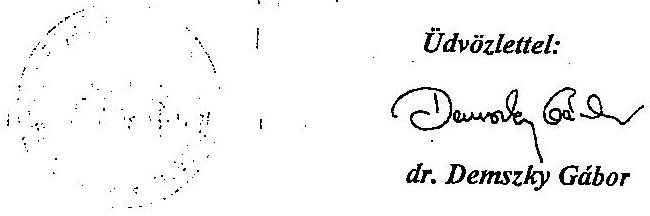

---

# Dr. Demszky Gábor ár   fópolgármester 

Budapest Fővárosi Önkormányzat

Budapest

## Tisztelt Főpolgármester Úr!

Köszönettel megkaptam a 4-es metró beruházási folyamatának ellenőrzéséről készített jelentésre küldött észrevételeit, amelyekkel kapcsolatban a következőkről tájékoztatom.
Az Állami Számvevőszék ellenőrzését a 2009 decemberében jóváhagyott ellenőrzési tervének megfelelően végezte. A teljesítményellenőrzés szempontjait - az Önökkel egyeztetett program tartalmazta, amely szerint a vizsgálat célja többek között annak értékelése volt, hogy a 4-es metró építése a teljes körű előkészítést követően a tervezett költségeken belül, határidőben valósul-e meg.
Az engedélyokirat 2004. évi elfogadásakor és annak 2006 januárjában történt módosításakor a levele szerint a megvalósítás 2009-re meghatározott határideje reális volt. Ehhez viszonyítva a tények 4 éves késedelmet mutatnak, ami a tervezett megvalósítási időtartam duplája. A költségcélok teljesítését tekintve szinte tervezhetetlen a beruházás költsége azáltal, hogy több száz a beárazatlan kivitelezői követelések száma és a pénzügyi végleges elszámolást veszélyeztetik a beruházó és kivitelezők közötti jogviták, amelyekhez milliárdos kártérítések kapcsolódnak.
Észrevételeiben - a korábbi egyeztetési fázisokhoz hasonlóan - nem tér ki ezekre a kérdésekre, állítása szerint minden optimális (előnyös szerződéskötések, projektszervezet, reális határidő stb.), a késedelmet a közigazgatás hiányosságaira hárítja át. A jelentés objektivitását szakmai érvek és a leírtak ellenkezőjét bizonyító dokumentumok nélkül kérdőjelezi meg.
Észrevételei azt mutatják, hogy nincs meg a szakmai együttműködési készség a tanulságok levonására, a beruházás folyamatát végigkísérő hiányosságok feltárására és elismerésére, a beruházás lebonyolításával kapcsolatos fővárosi rendelet fontosságának elismerésére, szakmai evidenciák elfogadására és a válságmenedzsment időszak rövidítésére. Ebből ered az, hogy a jövőbeni beruházások zökkenőmentes, költségtakarékos és rövidebb átfutási idő alatti megvalósulását is célzó javaslataink és megállapításaink hasznosságát vitatják.
A beruházás kapcsán a Fővárosnak lehetősége lett volna, hogy a magyar mérnöki szaktudásra, a szerződő partnerek jó együttműködését célul kitűző FIDIC szemléletre, megalapozott idő- és költségcélokat tartalmazó, a Főváros által jóváhagyott engedélyokiratra, majd annak az előkészítettség helyzetét figyelembe vevő 2006. évi módosítására építve modellértékűen

---

valósítsa meg a beruházást. Nem ellenőrzési prejudikáció, hanem tény, hogy a beruházás ellenpéldákkal terhelt a projektmenedzsment hatékonysági kritériumai szerint, a „sárgakönyves FIDIC"-nek a körülményeknek nem megfelelő alkalmazása és jogvitákat generáló hatása miatt. Ezt támasztja alá a kialakult beruházói kártérítések milliárdos nagyságrendje, a 4 éves késés, a költségcélok tarthatatlansága, a döntőbizottsági indokolások és a jogviták.
Rendszeresen félreértelmezi a jelentésben foglaltakat és ezzel akadályozza a leírtak hasznosulását. Az ÁSZ a jelentésben az egész fővárosra kiterjedő olyan átfogó közlekedési stratégiát hiányol, amelynek során figyelembe vették volna a fövárosi pénzügyi források korlátait (eladósodás) és a közlekedési folyosón kívüli fejlesztési lehetőségeket. A jelentés tartalmazza azokat a kritériumokat, amelyek nem csak a metróépítés, hanem minden nagy beruházás legjobb gyakorlatát jelentik és az ettől való eltéréshez fogalmazza meg a kritikai észrevételeit akár a költségirányítás, akár az ütemezés szempontjából. A jelentés célja az, hogy hozzájáruljon a beruházás átláthatóságához, az eddig feltárt hiányosságok továbbgyưrűzésének megakadályozásához és az uniós támogatások hatékony felhasználásához.
El kell utasítanom, hogy az ellenőrzés kriminalizálja a 4-es metró beruházást, a büntető eljárás kezdeményezése a szakmai megállapításokat alátámasztó dokumentumok alapján történt. A levelében leírtakkal ellentétben nem az ellenőrzés, hanem a téves szakmai döntésekre épülő beruházói tevékenység okozott már eddig is milliárdos károkat, amelyek további előfordulásának megakadályozása a jelentés egyik célja, ami a Magyar Állam és a Főváros számára is elengedhetetlen követelmény. Az ÁSZ ellenőrei áttekintették a szakértők anyagait, értékelemzési dokumentumot, amelyek nem csak a FIDIC alkalmazására vonatkozó, hanem a projektmenedzsment legjobb gyakorlatával való összehasonlításra adtak lehetőséget. Tény, hogy úgy kötöttek szerződést a kivitelezésre, hogy nem volt munkaterület és az építési engedélyek nem álltak rendelkezésre, úgy készült a tenderterv, hogy nem volt építési engedély, amit a tervezők sem tartottak normális megoldásnak. Mindennek nincs köze az Ön által hivatkozott szocializmusban folytatott gyakorlathoz, ugyanakkor eltér a Főváros saját beruházási rendeletétől. Teljes félrevezetés a mamutvállalatra való hivatkozás, mert a jelentés szakszerűen azt tartalmazza, hogy vagy egy generálkivitelező vagy egy hatékony projektmenedzsment szervezet szükséges a beruházás költség- és időcéloknak megfelelő lebonyolításához. A jelentés arra világít rá, hogy egyik sem volt meg.
A Főváros legfontosabb megállapításaival kapcsolatban álláspontunk a következő. A szerződésstratégiával kapcsolatos észrevételükben (1-3. pont) foglaltak tartalmazzák mindazon szempontokat, amelyek a választott szerződéstípus alkalmazásának előnyeit a magyarországi és a 4-es metróra jellemző előkészítési helyzettől függetlenül mutatják be. 2004-től 2006-ig az előkészítettség helyzete azonban elmaradt a tervezettől, a szerződésstratégia igazítását ezekhez a feltételekhez nem végezték el. Ennek következtében a választott stratégiának nem az előnyei, hanem a hátrányai érvényesültek. A FIDIC általános feltételek nemzetközileg elfogadottak, az ÁSZ által nem vitatottak. Azok specifikus feltételekkel való kiegészítése mindig az adott projekttől és a beruházó felkészültségétől függ. A hatékony projektmenedzsment elengedhetetlen alapkövetelmény a beruházás részekre bontásánál. A Főváros, illetve a beruházó minden szükséges előkészítést nem végzett el (4. pont), amelyet a vonalalagút építő kivitelezőnek megítélt 4 Mrd Ft-os kártérítési összeg is bizonyít. Nem elfogadható az a fővárosi álláspont, hogy engedélyek nélkül lehet szerződést kötni kivitelezővel, ami ütközik

---

saját eljárási rendjével is. Az 5. pontban lévő önértékelést az ellenőrzés részére átadott dokumentumok és a helyszíni tapasztalatok nem támasztják alá. Az ellenőrzés a 4-es metró beruházási folyamatát vizsgálta és nem volt feladata, hogy szakmailag minősítse a szakhatóságok munkáját. Az ellenőrzés részére nem adtak át olyan dokumentumokat, amelyek alátámasztották volna a szakhatóságok mulasztását. Nem volt olyan integrált projektütemterv, amelyben követték volna a szakhatósági munkák időbeli alakulását, valamint a tulajdonosi hozzájárulások hátráltató hatását. A tervezői, mérnöki, szakhatósági feladatok időbeni meglétének és minőségének alakulása a beruházói tevékenységnek, a projektmenedzsment előrelátásának és kockázatelemzésének a függvénye. Észrevételeikben ugyanakkor a külső tényezőkre (a szakhatóságokra, a kerületi önkormányzatokra) hárítják teljes körűen a beruházói felelősséget. A 6. és 8. pontban leírtak új, a jelentésben leírtak megváltoztatását igénylő információt nem tartalmaznak. A 7. pont feltételezés, ami nem bizonyított, illetve a jogviták miatt megkérdőjelezhető.
A Kormánynak szóló javaslatokkal kapcsolatban a beruházás jelenlegi helyzete egyértelműen indokolja az Állam műszaki-gazdasági kontroll pozíciójának erősítését, amelynek indokait a jelentés tartalmazza. A létesítmények elidegenítésével kapcsolatos javaslatunk a garanciája annak, hogy az állami támogatás felhasználása célirányos legyen.
A főpolgármesternek címzett javaslatok megvalósításának eddigi elmaradása is károkat okozott, ezért érthetetlen, hogy azok szükségességét vitatják és álláspontjuk nem mutatja a közpénzek felhasználásához elvárható felelősségérzet meglétét. A szerződéses feltételek felülvizsgálata elengedhetetlen, amely a kialakult kártérítési lánc megszakításának előfeltétele és a várható költségek meghatározásának egyik kritériuma. A független ellenőrző mérnök megbízására és az engedélyokirat módosítására vonatkozó javaslatunk időszerűségét jelzi, hogy levele szerint mindkettő már folyamatban van. Jelezzük, hogy a független ellenőrző mérnök feladatkörének nem csak az EIB kérésének kell megfelelni, hanem annak fő célja az, hogy segítse a beruházás hatékony lebonyolítását. Megdöbbentő és elfogadhatatlan az a véleménye, hogy az ilyen célra fordított kiadást feleslegesnek tartja. Érthetetlen az a hozzáállás, hogy a Főváros egy engedélyokirat szerepét, jelentőségét - ami a beruházás vezérfonala kell hogy legyen - abszolút neutrálisnak tekinti a beruházás hatékony megvalósítása szempontjából.
A BKV Zrt. igazgatóságának címzett javaslatokat a jelentés teljes mértékben megalapozza, mivel tényszerűen tartalmazza azt a válsághelyzetet, amely abból ered, hogy nem követelhető meg az eredeti szerződéses kötbérterhes határidők betartása a kivitelezőktől, az új határidők nem véglegesítettek, az integrált projektütemterv egyeztetése a vállalkozókkal 2006 óta folyamatban van. Nagyszámú vállalkozói követelés beárazatlan, számos döntőbizottsági ügy van hátra és nem zárható ki a választott bírósági eljárás kezdeményezése, így fennáll a kockázata annak, hogy a tartalékkereteket kimerítve a jövőben a Fővárosnak kell az összes többletköltséget finanszíroznia. A vizsgálat tapasztalata alapján és a jelentésben foglaltak szerint indokolt a szakértői szerződések felülvizsgálata. Az ÁSZ különösen magas kockázatúnak ítéli meg azt a helyzetet, hogy a Mérnök szerződéses státusza az I. szakasz vonatkozásában rendezetlen, miközben a projekt operatív irányítása a Mérnök kezében van, beleértve a kötbérterhes határidők módosításának a jogát is.

---

A következtetések címszó alatti vélemény a korábbiak harmadszori megismétlése, azokra a választ az előzőekben leírtak tartalmazzák. A következtetésekből ismételten az tűnik ki, hogy a hiányosságok feltárása és önkontroll helyett a valós helyzettől elszakadva optimálisnak tekintik saját tevékenységüket. A késedelmek konkrét okait és személyi felelősségi viszonyait nem tárták fel, miközben milliárdos károk keletkeztek. Sajnálatos ez a körülmény, mivel pontosan ez veszélyeztetheti az uniós támogatásokat. Mindezek megerősítik javaslataink szükségességét.
A közlekedésszakmai megalapozottsága keretében leírtak önkényesen összeválogatott idézetekkel azt akarja bizonyítani, hogy az ÁSZ tendenciózusan a metró feleslegességét kívánja bebizonyítani. A jelentés szövegkörnyezetéből Önök által kiemelt rövid idézetek ilyen jellegű összeállítása alkalmas arra, hogy téves következtetéseket sugalljon. A jelentés nem minősítette azt, hogy a dél-budai irány milyen mértékben érett a metróépítésre, hanem azt vizsgálta, hogy milyen mértékben volt érett, felkészült a projektmenedzsment, az előkészítettség helyzete a beruházás megkezdésére és hogy a folyamat mennyire volt kézben tartott a költség és időcélok szempontjából. Sajnálatos tény, hogy a metró időbeni hasznosulása a tervezetthez képest kitolódik.
A szerződéses stratégiával kapcsolatos véleménye nem tárgyszerű és félrevezető. Az ÁSZ jelentés nem a FIDIC szerződéses rendszer alkalmazását kifogásolja, hanem azt, hogy nem használták ki az abban rejlő és a világon széles körben, legjobb gyakorlatként alkalmazott lehetőségeket. Ez alatt azt értjük, hogy a FIDIC rendszer nem a döntőbizottság előtti kiélezett jogviták hivatkozási alapjául szolgál, hanem a szerződő partnerek közti korrekt együttműködést alapozza meg. Ennek előfeltétele az, hogy a specifikus szerződéses feltételek keretében a beruházó körültekintően meghatározza mindazon feltételeket és szankcionálási lehetőségeket, amelyek a részekre tagolt beruházás összehangolt megvalósításához szükséges. (Például hozzáférési idők, azaz munkaterületek rendelkezésre állása, beruházói késedelemért fizetendő napi kártérítési költség, tájékoztató egységárak a kivitelezői követelések és utasításokra. Ez utóbbiak hiányát a döntőbizottság is kifogásolta és rámutatott arra, hogy erre a FIDIC rendszerben is van lehetőség). Megerősítjük azon véleményünket, hogy az alkalmazott szerződésstratégia, vagyis az, hogy tagolják-e a kivitelezést vagy sem, az a FIDIC rendszertől független. Az észrevételében leírtak szerint a kivitelező felkészültsége jobb, mint a beruházóé, aki ennek következtében az adott helyzetben nem tudta meghatározni a műszaki cél eléréséhez a leghatékonyabb műszaki módszert. Kezelhetetlen és sajnálatos az, hogy ezzel indokolja a FIDIC Sárga Könyv alkalmazását. Mindez megerősíti, hogy a választott szerződéses stratégia nem volt összhangban a projektmenedzsment felkészültségével. Ebből következik a költségirányítás gyengesége és az, hogy a kivitelezőknek a beruházó kiszolgáltatottjává vált. A valóságnak nem megfelelően azt állítja, ezért vissza kell utasítani, hogy az ÁSZ a fővállalkozó alkalmazásának hiányát kifogásolja. A jelentés tartalmazza a tartalékkeret meglétét és értékét. Ugyanakkor a kockázatok abban rejlenek - amire a kockázatelemzések nem tértek ki - hogy a tartalékkeret felhasználása a kivitelezők részére kifizetett kártérítések finanszírozását is szolgálja. Az ütemterv készítésével és betartásával kapcsolatosan nincs a jelentésben tárgyi tévedés, mivel 2006. óta a szerződő partnerek által kölcsönösen elfogadott ütemterv nincs. Sajnálatos, hogy észrevételében arra az alapvető tényre nem tér ki, hogy az ütemtervek hiányából eredő problémák gyökerét azt jelentette, hogy 2006-ban maga a beruházó nem biztosította az ütemterv tarthatóságának az összes kivitelezői szerződésre kiható munkakezdési

---

feltételét (munkaterületek és engedélyek hiánya). Ennek ismeretében a kivitelezői szerződést a vonalalagút és az állomások kivitelezőivel mégis megkötötték.
A beruházás késedelmének okaival kapcsolatban az a tény, miszerint ma nem lehet megmondani a beruházás pontos költségét és tényleges befejezési határidejét, nem az ilyen bonyolultságú projektek jellemzője, hanem az előnytelen szerződéses feltételeknek a következménye (a többletidő hosszabbítási költségek számítási módjának és a kivitelezői követelések beárazási határidejének szabályozatlansága). Nem lehet azzal a véleményükkel szakmailag egyetérteni, hogy ez a bizonytalanság a beruházáshoz hasonló projektek immanens jellemzője. Ez a nem megfelelően előkészített projekteket jellemzi, amelynek a következménye a szokásosnál több és milliárdos nagyságrendű jogvita kialakulása és az ahhoz kapcsolódó finanszírozási kockázat.

A DBR által készített összköltségszámítás és a harmonizált ütemterv adatai szerepelnek a jelentésben ( 370 Mrd Ft és 2013. II. félév). Ezzel együtt az nem vitatható tény, hogy a beruházás várható teljes költsége és befejezésének időpontja ma nem meghatározható. Ennek oka a költségek esetében az, hogy a tájékoztató egységárak hiányában a beárazatlan és a kivitelezők által vitatott követelések értékét nem lehet megbecsülni és ezáltal azt sem lehet felmémi, hogy azokat a tartalékkeret fedezi-e. A költségek alakulása szempontjából milliárdos nagyságrendủ tételeket jelentenek azok a vállalkozói követelések, amelyek abból adódnak, hogy a beruházó nem teljesítette szerződéses kötelezettségeit. Ez a Bamco esetében már 4 Mrd Ft kifizetést jelentett és számolni kell a Siemens 10 Mrd Ft-os követelésével és az állomásépítésnél várható több milliárd Ft-os követeléssel. A befejezési idő kérdésében a legnagyobb kockázatot a metrószerelvények beszerzése jelenti. Hiányoljuk, hogy erről a kérdésről levelében említést sem tesz, miközben a szerelvényeknek a típusengedélyezési eljárását 2010. júniusban indították újra, a szerződés szerint a típusengedélyek kiadásának hatóság általi elutasítása vis maior eseménynek tekintendő.
Véleményéből az érzékelhető, hogy alulértékelik az engedélyokirat jelentőségét és szerepét a szerződéskötések vezérlésében. Ezzel az álláspontjukkal nem lehet egyetérteni.
A kisajátítási eljárás kezdeményezésének hiányát a jelentés nem konkrétan az alagútépítés megkezdéséhez szükséges területszerzésre állapította meg, hanem a területszerzések általános jellemzőjeként. A rendelkezésre álló adatok szerint az tény, hogy a beruházó a vonalalagút építőjével 2006. év elején úgy kötött kivitelezői szerződést, hogy a szerződéskötéskor tudta, hogy nem áll rendelkezésre a pajzsindító mütárgy megépítéséhez szükséges ingatlan, valamint a Gellért téri állomás megépítéséhez szükséges építési engedély. Ez egyértelműen azt jelenti, hogy a beruházó a kivitelezési szerződésben vállalt kötelezettségeit képtelen volt teljes körűen és időben teljesíteni. Ez alapján a jelentés megalapozottan állítja, hogy a BKV annak tudatában kötötte meg a szerződést, hogy az abban foglalt kötelezettségeit (munkaterület rendelkezésre bocsátása, jóváhagyott engedély beszerzése) nem tudja időben teljesíteni.
A jelentés nem tartalmaz tárgyi tévedést a beruházás megvalósításához szükséges ingatlanokkal kapcsolatban. A jelentésben az szerepel, hogy a BKV 1998-ban megbízást adott a projektvezetési tanácsadónak a beruházás megvalósításához szükséges területek tulajdoni viszonyainak feltárására és a területszerzés költségeinek becslésére.

---

A 4-es metró a Főváros által felügyelt beruházás, ezért joggal elvárható, hogy a Budapesten kialakított kétszintủ önkormányzati igazgatás rendszerhibáit a Főváros feltárja és azok kiküszöbölése érdekében megfelelő időben a szükséges lépéseket tegye meg. A rendszerhibával kapcsolatban leírtak konkrétumot nem tartalmaznak, általánosságok és túlmutatnak a 4-es metró beruházás problémakörén. A beruházás folyamatában a rendszerhibák beazonosítását és ezáltal a jogalkotói tevékenységet a beruházó akadályozta meg azáltal, hogy az engedélyezési eljárások folyamatait nem szerepeltette az integrált hálós ütemtervben és emiatt azok kihatása az időcélok teljesítésére nem átlátható. A közérdek sérelmét azt jelenti, hogy a beruházó milliárdos nagyságrendủ kártérítéseket fizet ki anélkül, hogy beazonosította volna annak felelősét. A jelentés tartalmazza az engedélyezési eljárás során tapasztalt hatásköri problémákat és azt, hogy a kiemelt jelentőségű beruházások megvalósításának gyorsítását célzó jogszabály az I. szakasznál nem tudott érvényesülni.
A költségek növekedésével kapcsolatban a levelében jelzi, hogy a köztudatban sok a félreértés, ugyanakkor a véleményében foglaltak nem segítik a tisztánlátást. Az ÁSZ jelentés egyértelműen összefoglalja a projektköltség növekedés elemeit, amelyek megegyeznek a véleményében leírtakkal. A véleménykülönbség az, hogy a jelentés az engedélyezési okiratot tekinti bázisnak és nem a finanszírozási szerződést. A költségnövekedésnek természetesen része a műszaki tartalomváltozás hatása is, amelynek kiszűrését semmi nem indokolja. Sajnálatos, hogy ilyen mértékủ műszaki tartalom változás mellett a beruházás engedélyokiratát a mai napig nem módosították és ezáltal a látszat az, hogy az engedélyokiratban foglaltak ma is érvényesek, ami nem felel meg a valóságnak. Az általános tartalékot nem a müszaki tartalom változásra, hanem beruházói hibából keletkező kártérítésre fordítják, és ezáltal ismeretlen összegủ költségtúllépési kockázatok alakultak/nak ki.
A közbeszerzési szabálytalanságokkal kapcsolatban arról tájékoztat, hogy az NFÜ-nek nem volt jogalapja a vizsgálat lefolytatására és vitatják azt is, hogy a közbeszerzési eljárásokban jogsértés történt. Ugyanakkor tény az, hogy a pénzügyi korrekció mértéke $56,6 \mathrm{Mrd} \mathrm{Ft}$, ami az érintett 11 szerződésnek az uniós támogatásból való teljes kivonását jelentette. Az a körülmény, hogy az NFÜ 2009-ben szabálytalansági vizsgálat keretében feltárta, hogy a közbeszerzési eljárások formájának kiválasztása, az eljárások lefolytatása és a szerződések megkötése során a Főváros a Kbt.-ben foglalt lényeges kötelezettségeket sértett meg, indokolja, hogy az ezzel kapcsolatos felelősségi viszonyok tisztázásra kerüljenek.
A Polgári Törvénykönyvvel kapcsolatban leírtak az állami kötelezettségvállalás kockázatára hívják fel a figyelmet. Mindezen túl tájékoztatom, hogy a metrótörvény vonatkozó kormányelőterjesztése szerint „Budapest Főváros Önkormányzata a törvényjavaslat előkészítése során végig azon igényét hangsúlyozta, hogy olyan megoldást kíván, amely alapján az Állam kötelezettségvállalásának a teljesítése mindenféleképpen kikényszeríthető legyen, abban az esetben is, ha a későbbiek folyamán a Kormány a teljesítéstől el kívánna állni akár forráshiányra hivatkozással."
Az Áht. esetében az észrevételében leírtak nem felelnek meg a valóságnak. A finanszírozási szerződés 2004-ben való megkötésekor az Áht. hivatkozott paragrafusa már érvényben volt, a szerződést ennek ellenére az Országgyűlésnek nem mutatták be.

---

A kapcsolódó beruházások esetében észrevételében arra nem tér ki, hogy a Magyar Állam által vállalt támogatás maximális összegében 17,5 Mrd Ft kapcsolódó beruházás szerepel. Erre való tekintettel - az átláthatóság biztosítása érdekében - elengedhetetlenül szükséges lenne az egyértelmủ meghatározása annak, hogy mi tartozik ebbe a körbe (műszakilag és forintban).
A vonalalagút kivitelezőjének követeléseivel kapcsolatos véleménye különösen rávilágít arra, hogy érvrendszerük félrevezető és nélkülözi a szakmaiságot. Nem mutat ugyanis arra rá, hogy a Bamco-nak fizikai teljesítmény nélkül fizetett ki a beruházó 4 Mrd Ft-ot. Ez több mint amennyit az egész tendertervek elkészitéséért a tervező kapott. Tény, hogy a kivitelező részére már eddig kifizettek 17,4 M eurót a beruházó hibájából elkövetett kártérítési költségként, és az is tény, hogy a döntőbizottság 2010. augusztus 18-i döntése szerint $14,5 \mathrm{M}$ eurót hagyott jóvá. Az nem értékelhető pozitívumként, hogy a két döntőbizottsági döntés közötti különbözetet a kivitelező kénytelen visszafizetni, és arra is tekintettel kell lenni, hogy ez nem végleges állapot, mivel a Bamco a döntést nem fogadta el. Az a körülmény, hogy a Bamco szabadon állapíthatja meg a kártérítési költségeket abból ered, hogy a szerződéses feltételek között nem határozták meg az egy napos kártérítési költségeket és az egész beruházás ezáltal ki van téve a döntőbizottságtól függő értékelésnek. Nem tudjuk vállalni a rendező és a statiszta szerepet sem, mivel a kialakult helyzetet nem az ellenőrzés idézte elő, annak rendezője a beruházó volt.
A metró-biztosi feladatok esetében a dátumot pontositottuk.
A Kálvin térrel kapcsolatban leírtak részletei az ellenőrzés előtt ismertek. Észrevételei megerősítik azt a tényt, hogy a bérlőknek az alapterület és a forgalom hiánya miatt nem tudtak megfelelő cserehelyiséget biztosítani. A levelében hivatkozik a jogelődőkkel kötött szerződésekre, azonban ezek a megállapításokhoz nem kapcsolódnak. Az érintett bérlőkkel 1999-ben, 2000-ben és 2001-ben kötöttek határozatlan időre szóló szerződést, miközben a megvalósíthatósági tanulmány (1996) és a Vasúthatósági Engedélyezési Terv rendelkezésre állásától ismert volt a nyomvonal.
Szándékaink szerint a jelentés hozzáadott értéke a következő fő területeken érvényesülhet. A metróépítés I. szakasza vonatkozásában a kártérítési lánc megszakítása (az alagútépítéstől a metrószerelvények beszerzéséig), további károk kialakulásának, eszkalálódásának megelőzése. Tanulságul szolgál a második szakasz hatékony lebonyolításához, valamint a kiemelt nagy beruházások megvalósításához.
Tájékoztatom Főpolgármester urat, hogy az ellenőrzésről készült jelentést - kialakult gyakorlatunknak szerint - észrevételeivel és az azokra adott válaszommal együtt küldöm meg az Országgyűlés elnökének, az illetékes bizottságai elnökeinek és a miniszterelnöknek.
Budapest, 2010. szeptember 29 .
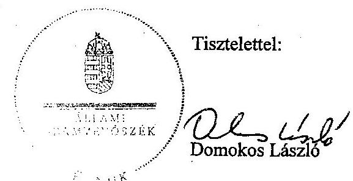

Melléklet: Jelentés

---

# Megbízó 2005. évi projekt ütemterve

## 2. sz. melléklet

### a V-2001-112/2010. sz. jelentéshez

|  Activity | 2005. | 2006. | 2007. | 2008. | 2009. | 2010.  |
| --- | --- | --- | --- | --- | --- | --- |
|  Description | 01 / 03 / 03 / 04 / 04 / 03 / 05 / 06 | 01 / 03 / 03 / 04 / 04 / 03 / 05 / 06 | 01 / 03 / 03 / 04 / 04 / 03 / 05 / 06 | 01 / 03 / 03 / 04 / 04 / 03 / 05 / 06 | 01 / 03 / 03 / 04 / 04 | 01 / 03 / 03 / 04 / 04 / 04  |
|  Szérződéskötés - Vonalalagutak |  |  |  |  |  |   |
|  Élete téri munkák |  |  |  |  |  |   |
|  Gelén téri munkák |  |  |  |  |  |   |
|  Alagúthejtés |  |  |  |  |  |   |
|  Szérződéskötés - Kelenlőd |  |  |  |  |  |   |
|  Kelenföldi pu. állomás |  |  |  |  |  |   |
|  Szérződéskötés - Tétényi - Móricz Zs. |  |  |  |  |  |   |
|  Tétényi út állomás |  |  |  |  |  |   |
|  Bocskai út állomás |  |  |  |  |  |   |
|  Móricz Zs. körlér állomás |  |  |  |  |  |   |
|  Szérződéskötés - Fővám/Kálvin tér |  |  |  |  |  |   |
|  Fővám tér állomás |  |  |  |  |  |   |
|  Kálvin tér állomás |  |  |  |  |  |   |
|  Szérződéskötés - Kielell pu. állomás |  |  |  |  |  |   |
|  Kielell pu. állomás |  |  |  |  |  |   |
|  Népszínház útra állomás |  |  |  |  |  |   |
|  Kielell pu. állomás |  |  |  |  |  |   |
|  Szérződéskötés - Balző Beépítés |  |  |  |  |  |   |
|  Kellelföld pu. állomás |  |  |  |  |  |   |
|  Tétényi út állomás |  |  |  |  |  |   |
|  Bocskai út állomás |  |  |  |  |  |   |
|  Móricz Zs. állomás |  |  |  |  |  |   |
|  Gelén tér állomás |  |  |  |  |  |   |
|  Fővám tér állomás |  |  |  |  |  |   |
|  Kálvin tér állomás |  |  |  |  |  |   |
|  Náktól út állomás |  |  |  |  |  |   |
|  Népszínház útra állomás |  |  |  |  |  |   |
|  Kielell pu. állomás |  |  |  |  |  |   |
|  Rendszerek leszitelése |  |  |  |  |  |   |
|  Szérződéskötés - Pályaépítés |  |  |  |  |  |   |
|  Pályaépítés |  |  |  |  |  |   |
|  Rendszerek leszitelése |  |  |  |  |  |   |
|  Szérződéskötés - Rendszerek, áramellátás |  |  |  |  |  |   |
|  Rendszerek, áramellátás |  |  |  |  |  |   |
|  Rendszerek leszitelése |  |  |  |  |  |   |
|  Szérződéskötés - Járművek |  |  |  |  |  |   |
|  Járművek |  |  |  |  |  |   |
|  Rendszerek leszitelése |  |  |  |  |  |   |
|  Szérződéskötés - Járműtelep |  |  |  |  |  |   |
|  Járműtelep |  |  |  |  |  |   |
|  Rendszerek leszitelése |  |  |  |  |  |   |
|  Tervezett munkák |  |  |  |  |  |   |
|  Rendezett 2. szerv. szerv. szerv. szerv. |  |  |  |  |  |   |
|  Próbálszem |  |  |  |  |  |   |
|  I. szakasz készen az utasforgalomra |  |  |  |  |  |   |

### 1.1. MELLEKLET

|  MEGBÍZÓ KÖVETELMÉNYEI
1. SZ. MELLEKLET
1. SZAKASZ | BUDAPEST 4. SZ. METRÓVONAL
MEGBÍZÓ PROJEKT ÜTEMTERVE
(Tájékoztató jellegű) |  |  |  |  |  |  |  |  |  |  |  |  |  |  |  |  |  |  |  |  |  |  |  |  |  |  |  |  |  |  |  |  |  |  |  |  |  |  |  |  |  |  |  |  |  |  |  |  |  |  |  |  |  |  |  |  |  |  |  |  |  |  |  |  |  |  |  |  |  |  |  |  |  |  |  |  |  |  |  |  |  |  |  |  |  |  |  |  |  |  |  |  |  |  |  |  |  |  |  | 

---

Megbizó 2010. július 5.-i projekt ütenterve

3. sz. melléklet a V-2001-112/2010. sz. jelentéshez

|  |   |   |   |   |   |   |   |   |   |   |   |   |   |   |   |   |   |   |   |   |   |   |   |   |   |   |   |   |   |   |   |   |   |   |   |   |   |   |   |   |   |   |   |   |   |   |   |   |   |   |   |   |   |   |   |   |   |   |   |   |   |   |   |   |   |   |   |   |   |   |   |   |   |   |   |   |   |   |   |   |   |   |   |   |   |   |   |   |   |   |   |   |   |   |   |   |   |   |   |   |

---

|  |   |   |   |   |   |   |   |   |   |   |   |   |   |   |   |   |   |   |   |   |   |   |   |   |   |   |   |   |   |   |   |   |   |   |   |   |   |   |   |   |   |   |   |   |   |   |   |   |   |   |   |   |   |   |   |   |   |   |   |   |   |   |   |   |   |   |   |   |   |   |   |   |   |   |   |   |   |   |   |   |   |   |   |   |   |   |   |   |   |   |   |   |   |   |   |   |   |   |   |   |   |  

---

|   |  |  |  |  |  |  |  |  |  |  |  |  |  |  |  |  |  |  |  |  |  |  |  |  |  |  |  |  |  |  |  |  |  |  |  |  |  |  |  |  |  |  |  |  |  |  |  |  |  |  |  |  |  |  |  |  |  |  |  |  |  |  |  |  |  |  |  |  |  |  |  |  |  |  |  |  |  |  |  |  |  |  |  |  |  |  |  |  |  |  |  |  |  |  |  |  |  |  |  |  |  |  | 

---

|  2015 | 2016 | 2017 | 2018 | 2019 | 2020 | 2021 | 2022 | 2023 | 2024 | 2025 | 2026 | 2027 | 2028 | 2029 | 2030 | 2031 | 2032 | 2033 | 2034 | 2035 | 2036 | 2037 | 2038 | 2039 | 2040 | 2041 | 2042 | 2043 | 2044 | 2045 | 2046  |
| --- | --- | --- | --- | --- | --- | --- | --- | --- | --- | --- | --- | --- | --- | --- | --- | --- | --- | --- | --- | --- | --- | --- | --- | --- | --- | --- | --- | --- | --- | --- | --- |
|  2015 | 2016 | 2017 | 2018 | 2019 | 2020 | 2021 | 2022 | 2023 | 2024 | 2025 | 2026 | 2027 | 2028 | 2029 | 2030 | 2031 | 2032 | 2033 | 2034 | 2035 | 2036 | 2037 | 2038 | 2039 | 2040 | 2041 | 2042 | 2043 | 2044 | 2045  |
|  2015 | 2016 | 2017 | 2018 | 2019 | 2020 | 2021 | 2022 | 2023 | 2024 | 2025 | 2026 | 2027 | 2028 | 2029 | 2030 | 2031 | 2032 | 2033 | 2034 | 2035 | 2036 | 2037 | 2038 | 2039 | 2040 | 2041 | 2042 | 2043 | 2044 | 2045  |
|  2015 | 2016 | 2017 | 2018 | 2019 | 2020 | 2021 | 2022 | 2023 | 2024 | 2025 | 2026 | 2027 | 2028 | 2029 | 2030 | 2031 | 2032 | 2033 | 2034 | 2035 | 2036 | 2037 | 2038 | 2039 | 2040 | 2041 | 2042 | 2043 | 2044 | 2045  |
|  2015 | 2016 | 2017 | 2018 | 2019 | 2020 | 2021 | 2022 | 2023 | 2024 | 2025 | 2026 | 2027 | 2028 | 2029 | 2030 | 2031 | 2032 | 2033 | 2034 | 2035 | 2036 | 2037 | 2038 | 2039 | 2040 | 2041 | 2042 | 2043 | 2044 | 2045  |
|  2015 | 2016 | 2017 | 2018 | 2019 | 2020 | 2021 | 2022 | 2023 | 2024 | 2025 | 2026 | 2027 | 2028 | 2029 | 2030 | 2031 | 2032 | 2033 | 2034 | 2035 | 2036 | 2037 | 2038 | 2039 | 2040 | 2041 | 2042 | 2043 | 2044 | 2045  |
|  2015 | 2016 | 2017 | 2018 | 2019 | 2020 | 2021 | 2022 | 2023 | 2024 | 2025 | 2026 | 2027 | 2028 | 2029 | 2030 | 2031 | 2032 | 2033 | 2034 | 2035 | 2036 | 2037 | 2038 | 2039 | 2040 | 2041 | 2042 | 2043 | 2044 | 2045  |
|  2015 | 2016 | 2017 | 2018 | 2019 | 2020 | 2021 | 2022 | 2023 | 2024 | 2025 | 2026 | 2027 | 2028 | 2029 | 2030 | 2031 | 2032 | 2033 | 2034 | 2035 | 2036 | 2037 | 2038 | 2039 | 2040 | 2041 | 2042 | 2043 | 2044 | 2045  |
|  2015 | 2016 | 2017 | 2018 | 2019 | 2020 | 2021 | 2022 | 2023 | 2024 | 2025 | 2026 | 2027 | 2028 | 2029 | 2030 | 2031 | 2032 | 2033 | 2034 | 2035 | 2036 | 2037 | 2038 | 2039 | 2040 | 2041 | 2042 | 2043 | 2044 | 2045  |
|  2015 | 2016 | 2017 | 2018 | 2019 | 2020 | 2021 | 2022 | 2023 | 2024 | 2025 | 2026 | 2027 | 2028 | 2029 | 2030 | 2031 | 2032 | 2033 | 2034 | 2035 | 2036 | 2037 | 2038 | 2039 | 2040 | 2041 | 2042 | 2043 | 2044 | 2045  |
|  2015 | 2016 | 2017 | 2018 | 2019 | 2020 | 2021 | 2022 | 2023 | 2024 | 2025 | 2026 | 2027 | 2028 | 2029 | 2030 | 2031 | 2032 | 2033 | 2034 | 2035 | 2036 | 2037 | 2038 | 2039 | 2040 | 2041 | 2042 | 2043 | 2044 | 2045  |
|  2015 | 2016 | 2017 | 2018 | 2019 | 2020 | 2021 | 2022 | 2023 | 2024 | 2025 | 2026 | 2027 | 2028 | 2029 | 2030 | 2031 | 2032 | 2033 | 2034 | 2035 | 2036 | 2037 | 2038 | 2039 | 2040 | 2041 | 2042 | 2043 | 2044 | 2045  |
|  2015 | 2016 | 2017 | 2018 | 2019 | 2020 | 2021 | 2022 | 2023 | 2024 | 2025 | 2026 | 2027 | 2028 | 2029 | 2030 | 2031 | 2032 | 2033 | 2034 | 2035 | 2036 | 2037 | 2038 | 2039 | 2040 | 2041 | 2042 | 2043 | 2044 | 2045  |
|  2015 | 2016 | 2017 | 2018 | 2019 | 2020 | 2021 | 2022 | 2023 | 2024 | 2025 | 2026 | 2027 | 2028 | 2029 | 2030 | 2031 | 2032 | 2033 | 2034 | 2035 | 2036 | 2037 | 2038 | 2039 | 2040 | 2041 | 2042 | 2043 | 2044 | 2045  |
|  2015 | 2016 | 2017 | 2018 | 2019 | 2020 | 2021 | 2022 | 2023 | 2024 | 2025 | 2026 | 2027 | 2028 | 2029 | 2030 | 2031 | 2032 | 2033 | 2034 | 2035 | 2036 | 2037 | 2038 | 2039 | 2040 | 2041 | 2042 | 2043 | 2044 | 2045  |
|  2015 | 2016 | 2017 | 2018 | 2019 | 2020 | 2021 | 2022 | 2023 | 2024 | 2025 | 2026 | 2027 | 2028 | 2029 | 2030 | 2031 | 2032 | 2033 | 2034 | 2035 | 2036 | 2037 | 2038 | 2039 | 2040 | 2041 | 2042 | 2043 | 2044 | 2045  |
|  2015 | 2016 | 2017 | 2018 | 2019 | 2020 | 2021 | 2022 | 2023 | 2024 | 2025 | 2026 | 2027 | 2028 | 2029 | 2030 | 2031 | 2032 | 2033 | 2034 | 2035 | 2036 | 2037 | 2038 | 2039 | 2040 | 2041 | 2042 | 2043 | 2044 | 2045  |
|  2015 | 2016 | 2017 | 2018 | 2019 | 2020 | 2021 | 2022 | 2023 | 2024 | 2025 | 2026 | 2027 | 2028 | 2029 | 2030 | 2031 | 2032 | 2033 | 2034 | 2035 | 2036 | 2037 | 2038 | 2039 | 2040 | 2041 | 2042 | 2043 | 2044 | 2045  |
|  2015 | 2016 | 2017 | 2018 | 2019 | 2020 | 2021 | 2022 | 2023 | 2024 | 2025 | 2026 | 2027 | 2028 | 2029 | 2030 | 2031 | 2032 | 2033 | 2034 | 2035 | 2036 | 2037 | 2038 | 2039 | 2040 | 2041 | 2042 | 2043 | 2044 | 2045  |
|  2015 | 2016 | 2017 | 2018 | 2019 | 2020 | 2021 | 2022 | 2023 | 2024 | 2025 | 2026 | 2027 | 2028 | 2029 | 2030 | 2031 | 2032 | 2033 | 2034 | 2035 | 2036 | 2037 | 2038 | 2039 | 2040 | 2041 | 2042 | 2043 | 2044 | 2045  |
|  2015 | 2016 | 2017 | 2018 | 2019 | 2020 | 2021 | 2022 | 2023 | 2024 | 2025 | 2026 | 2027 | 2028 | 2029 | 2030 | 2031 | 2032 | 2033 | 2034 | 2035 | 2036 | 2037 | 2038 | 2039 | 2040 | 2041 | 2042 | 2043 | 2044 | 2045  |
|  2015 | 2016 | 2017 | 2018 | 2019 | 2020 | 2021 | 2022 | 2023 | 2024 | 2025 | 2026 | 2027 | 2028 | 2029 | 2030 | 2031 | 2032 | 2033 | 2034 | 2035 | 2036 | 2037 | 2038 | 2039 | 2040 | 2041 | 2042 | 2043 | 2044 | 2045  |
|  2015 | 2016 | 2017 | 2018 | 2019 | 2020 | 2021 | 2022 | 2023 | 2024 | 2025 | 2026 | 2027 | 2028 | 2029 | 2030 | 2031 | 2032 | 2033 | 2034 | 2035 | 2036 | 2037 | 2038 | 2039 | 2040 | 2041 | 2042 | 2043 | 2044 | 2045  |
|  2015 | 2016 | 2017 | 2018 | 2019 | 2020 | 2021 | 2022 | 2023 | 2024 | 2025 | 2026 | 2027 | 2028 | 2029 | 2030 | 2031 | 2032 | 2033 | 2034 | 2035 | 2036 | 2037 | 2038 | 2039 | 2040 | 2041 | 2042 | 2043 | 2044 | 2045  |
|  2015 | 2016 | 2017 | 2018 | 2019 | 2020 | 2021 | 2022 | 2023 | 2024 | 2025 | 2026 | 2027 | 2028 | 2029 | 2030 | 2031 | 2032 | 2033 | 2034 | 2035 | 2036 | 2037 | 2038 | 2039 | 2040 | 2041 | 2042 | 2043 | 2044 | 2045  |
|  2015 | 2016 | 2017 | 2018 | 2019 | 2020 | 2021 | 2022 | 2023 | 2024 | 2025 | 2026 | 2027 | 2028 | 2029 | 2030 | 2031 | 2032 | 2033 | 2034 | 2035 | 2036 | 2037 | 2038 | 2039 | 2040 | 2041 | 2042 | 2043 | 2044 | 2045  |
|  2015 | 2016 | 2017 | 2018 | 2019 | 2020 | 2021 | 2022 | 2023 | 2024 | 2025 | 2026 | 2027 | 2028 | 2029 | 2030 | 2031 | 2032 | 2033 | 2034 | 2035 | 2036 | 2037 | 2038 | 2039 | 2040 | 2041 | 2042 | 2043 | 2044 | 2045  |
|  2015 | 2016 | 2017 | 2018 | 2019 | 2020 | 2021 | 2022 | 2023 | 2024 | 2025 | 2026 | 2027 | 2028 | 2029 | 2030 | 2031 | 2032 | 2033 | 2034 | 2035 | 2036 | 2037 | 2038 | 2039 | 2040 | 2041 | 2042 | 2043 | 2044 | 2045  |
|  2015 | 2016 | 2017 | 2018 | 2019 | 2020 | 2021 | 2022 | 2023 | 2024 | 2025 | 2026 | 2027 | 2028 | 2029 | 2030 | 2031 | 2032 | 2033 | 2034 | 2035 | 2036 | 2037 | 2038 | 2039 | 2040 | 2041 | 2042 | 2043 | 2044 | 2045  |
|  2015 | 2016 | 2017 | 2018 | 2019 | 2020 | 2021 | 2022 | 2023 | 2024 | 2025 | 2026 | 2027 | 2028 | 2029 | 2030 | 2031 | 2032 | 2033 | 2034 | 2035 | 2036 | 2037 | 2038 | 2039 | 2040 | 2041 | 2042 | 2043 | 2044 | 2045  |
|  2015 | 2016 | 2017 | 2018 | 2019 | 2020 | 2021 | 2022 | 2023 | 2024 | 2025 | 2026 | 2027 | 2028 | 2029 | 2030 | 2031 | 2032 | 2033 | 2034 | 2035 | 2036 | 2037 | 2038 | 2039 | 2040 | 2041 | 2042 | 2043 | 2044 | 2045  |
|  2015 | 2016 | 2017 | 2018 | 2019 | 2020 | 2021 | 2022 | 2023 | 2024 | 2025 | 2026 | 2027 | 2028 | 2029 | 2030 | 2031 | 2032 | 2033 | 2034 | 2035 | 2036 | 2037 | 2038 | 2039 | 2040 | 2041 | 2042 | 2043 | 2044 | 2045  |

---

# A beruházási kiadások alakulása a Magyar Köztársaság költségvetésében (MFi)

|   | 1998 | 2004. év | 2005. év | 2006. év | 2007. év | 2008. év | 2009. év | 2010. év | összesen  |
| --- | --- | --- | --- | --- | --- | --- | --- | --- | --- |
|  Terv |  | 15800,0 | 15800,0 | 15800,0 | 65550,0 | 16200,0 | 9500,0 | 10000,0 | 148650,0  |
|  Tény | 200,0 | 640,8 | 5589,1 | 20615,3 | 35648,2 | 43482,8 | 13890,1 | 2774,8 | 122841,1  |
|  Eltérés |  | $-15159,2$ | $-10210,9$ | 4815,3 | $-29901,8$ | 27282,8 | 4390,1 |  | $-25808,9$  |

2010. év tény az I. negyedévi értéket tartalmazza.

## A beruházási kiadások alakulása a Fővárosi Önkormányzat kimutatása alapján (MFi)

|  Forrás | 2004-ig | 2004-ig | 2004.év |  | 2005.év |  | 2006. év |  | 2007. év |  | 2008.év |  | 2009. év |  | 2010. év |   |
| --- | --- | --- | --- | --- | --- | --- | --- | --- | --- | --- | --- | --- | --- | --- | --- | --- |
|   |  | Tény | Terv** | Tény | Terv** | Tény | Terv** | Tény | Terv** | Tény | Terv** | Tény | Terv** | Tény | Terv** | Lnév Tény  |
|  Kig.vetés |  | 3225,4 | 3313,2 | 118,7 | 23643,7 | 724,6 | 28756,7 | 1632,3 | 75849,5 | 256,7 | 52066,6 | 2057,3 | 67313,9 | 5365,6 | 70754,9 | 1719,3  |
|  ElB.hitel |  | 7879,3 | 0,0 | 127,9 | 8518,1 | 1118,6 | 5923,8 | 4196,2 | 7615,4 | 777,2 | 866,5 | 872,0 | 0,0 | 0,0 | 0,0 | 0,0  |
|  KA számla* |  |  |  |  |  |  |  |  |  |  |  |  |  | 12069,7 |  |   |
|  KA |  |  |  |  |  |  |  |  |  |  |  |  |  | 13236,8 |  | 4095,6  |
|  Költség össz. |  | 11104,7 | 3313,2 | 246,6 | 32161,8 | 1843,2 | 34680,5 | 5828,5 | 83464,9 | 1033,9 | 52933,1 | 2929,3 | 67313,9 | 30672,1 | 70754,9 | 5814,9  |

*A KA számláról kifizetett, de el nem számolt összeg. A II. szakasz elkülönült nyilvántartása 2005.évben, és 2009. évtől van, a forrásszerkezet miatt a teljes szakasz költségeit tartalmazzák a kiadások.* *A tervszámok a projekt teljes költségét tartalmazzák.

---

# 5. sz. melléklet

a V-2001-112/2010. sz. jelentéshez

## A beruházási költség alakulása és elszámolása a finanszírozási szerződés alapján (MFt)

A DBR nyilvántartása és a külső szakértő éves elszámolásai adatai alapján

|  évek | projektköltség |  |  | elszámolás | a Finanszírozási Szerződés szerint |  |  |  | Projektköltség 2002. évi áron I. szakasz  |
| --- | --- | --- | --- | --- | --- | --- | --- | --- | --- |
|   | kifizetés*
nettó | áfa | összesen | állami
támogatás | fővárosi
támogatás | támogatás
összesen | egyéb
(bevételek) | mind-
összesen | Megelölegezett
tám. megtér.  |
|  2003 évvel bezárólag |  |  |  | 200,000 | 10832,042 | 11032,042 |  | 11032,042 |   |
|  2004. év | 887,380 | 185,063 | 1072,443 | 640,789 | 246,591 | 887,380 |  | 887,380 |   |
|  2005. év | 7195,724 |  |  | 5589,132 | 1488,469 |  |  |  |   |
|   | II. szakasz Előkészítési Kiadás* |  |  |  | 111,329 |  |  |  |   |
|   | összesen |  |  |  | 1599,798 |  |  |  |   |
|   | előre átutalt támogatás |  |  |  | $-0,782$ |  |  |  |   |
|   | összesen |  |  | 5589,132 | 1599,016 | 7188,148 | 7,575 | 7195,724 |   |
|  2006. év | 26 137,416 | 3912,240 | 30049,656 | 20615,305 | 5487,292 |  |  |  |   |
|   | előre átutalt támogatás |  |  |  | $-0,015$ |  |  |  |   |
|   |  |  |  | 20615,305 | 5487,277 | 26102,582 | 34,834 | 26 137,416 |   |
|  2007. év | 36 681,010 | 7574,523 | 44255,533 | 28958,177 | 7709,089 |  |  |  | 6690,070  |
|   | Támogatás (megtéritéssel együtt) |  |  | 35648,247 | 1019,019 |  |  |  |   |
|   | 2007-ben teljesített többlettámogatás |  |  |  | $-1,1493$ |  |  |  |   |
|   | összesen |  |  | 35648,247 | 1017,87 | 36666,117 | 14,893 | 36 681,010 |   |
|  2008. év | 46 300,665 | 6768,090 | 53068,755 | 36489,616 | 9712,620 |  |  |  | 6993,200  |
|   | Támogatás (megtéritéssel együtt) |  |  | 43482,816 | 2719,420 |  |  |  |   |
|   | 2007. évi megtérítés korrekciója |  |  | $-174,013$ | 174,013 |  |  |  | $-174,013$  |
|   | összesen |  |  | 43308,803 | 2893,43 | 46202,24 | 98,429 | 46 300,665 |   |
|  2009. év* | 17 293,581 | 3495,344 | 20788,925 | 13658,129 | 3635,451 | 17293,581 |  | 17 293,581 |   |
|   |  |  |  |  |  |  | I. szakasz összesen (2002. évi nettó ár) |  | 123 832,90  |
|   |  |  |  |  |  |  | II. szakasz összesen (2002.évi nettó ár) |  | 1380,00  |
|  össz. |  |  |  | 119660,406 | 25711,681 | 145372,087 | I-II.szakasz össz. (2002. évi nettó ár) |  | 125 212,900  |

*2005.01.01.-08.17-ig felmerült, a Főváros által finanszírozott II. szakasz projektköltség.* *A 2009. évi adatok tartalmazzák a Finanszírozási Szerződés hatálya alá visszarendezett kifizetések összegét.

---

# VÉGSŐ AJÁNLAT KIFIZETÉSEK ÜTEMEZÉSE

|  Sorsz. | Mérföldkőhöz tartozó teljesítés leírása | Határidő (hónap) | Ár (Euro)  |
| --- | --- | --- | --- |
|   |  | Megbízó általános ütemterve | Ajánlattevő ütemterve  |
|  7. kifizetés-hely -Szent Gellért tér állomás munkái |  |  |   |
|  7.1 | Résfalak építéséhez előkészítő munkák befejezése a Szent Gellért téri állomásnál | 6 | 6  |
|  7.2 | Résfalak építése a Szent Gellért téri állomásnál | 9 | 9  |
|  7.3 | Állomási szerkezet földkiemelése | 12 | 12  |
|  7.4 | Alaplemez építése a Szent Gellért tér állomáshoz | 15 | 15  |
|  7.5 | Bányászott peronalagutak és külső falazat építése | 18 | 18  |
|  7.6 | Belső szerkezet építése az üzemi terekben, hogy folyamatos akadálymentes hozzáférést kapjon a 7. szerződés vállalkozója (belső beépítés) a Szent Gellért tér állomáshoz | 19 | 19  |
|  7.7 | Külső és belső falazat építése a bányászott szellőző bekötő alagúthoz a Szent Gellért tér állomáson | 24 | 24  |
|  7.8 | Belső falazat építése a bányászott peronalagutakhoz | 25 | 25  |
|  7.9 | Szellőzőalagutak építése a Szent Gellért tér állomáson | 25 | 25  |
|  7.10 | Szent Gellért tér állomás belső szerkezet munkák | 34 | 33  |
|  7.11 | Összes többi munka elvégzése, beleértve a terület megtisztítását | 38 | 33  |
|   | 7. kifizetés-hely összesen - Szent Gellért tér állomás munkái |  |   |

---

ÉSZAKI és a DÉLI PAJZS hajtása a 4C ütemterv és a valóság szerint, és a Kötbérterhes Határidők
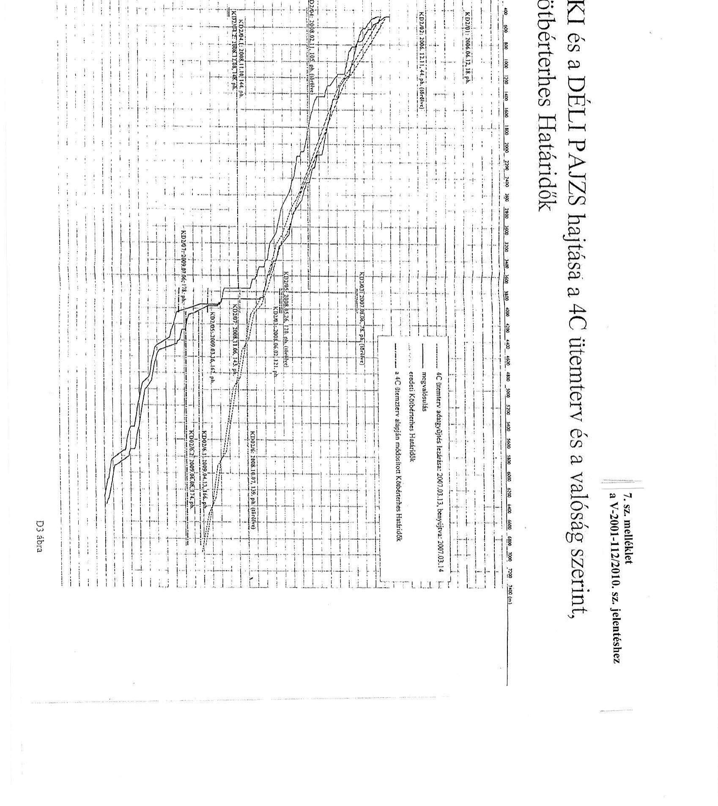

---

A BAMCO 4/C jogosultsigi ötenterve
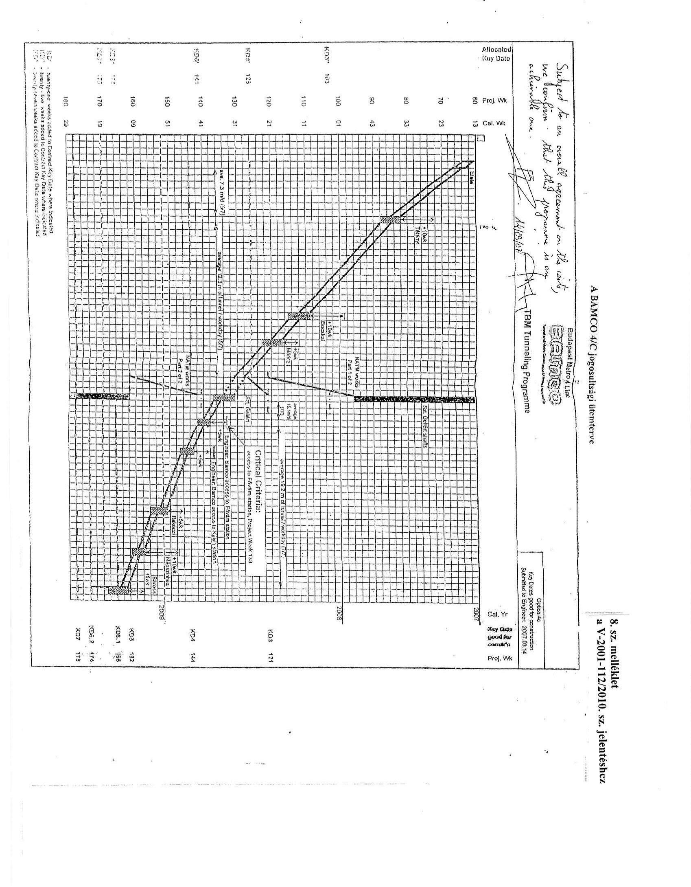

---

Elérhető sebesség a 4-es metró egyes állomásai között (Kelenföldi pályaudvar - Keleti pályaudvar)
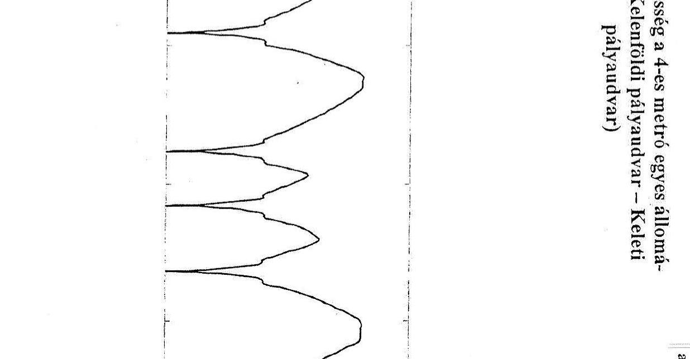