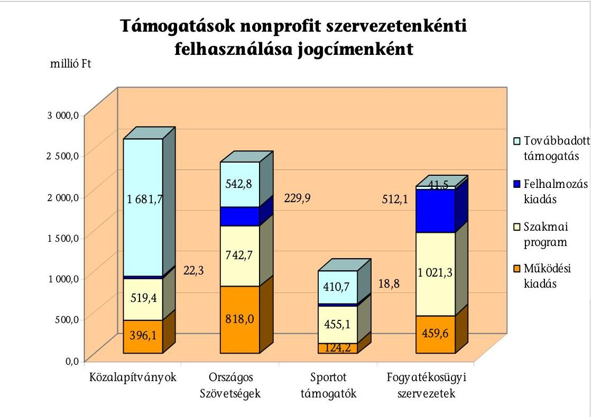
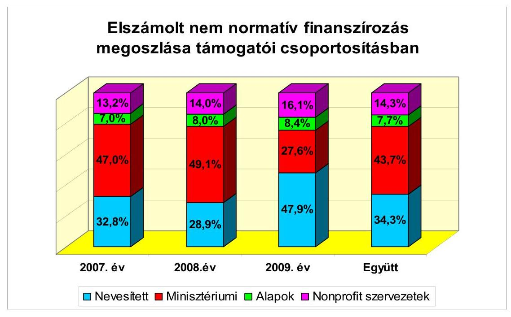
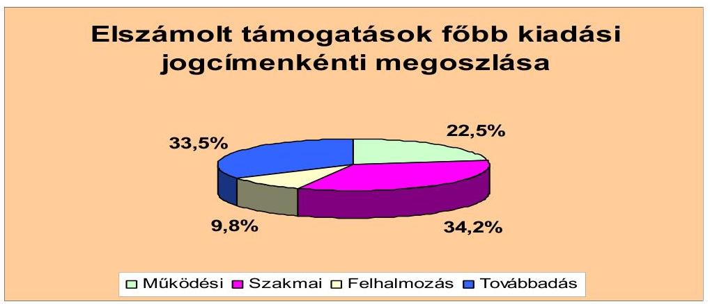
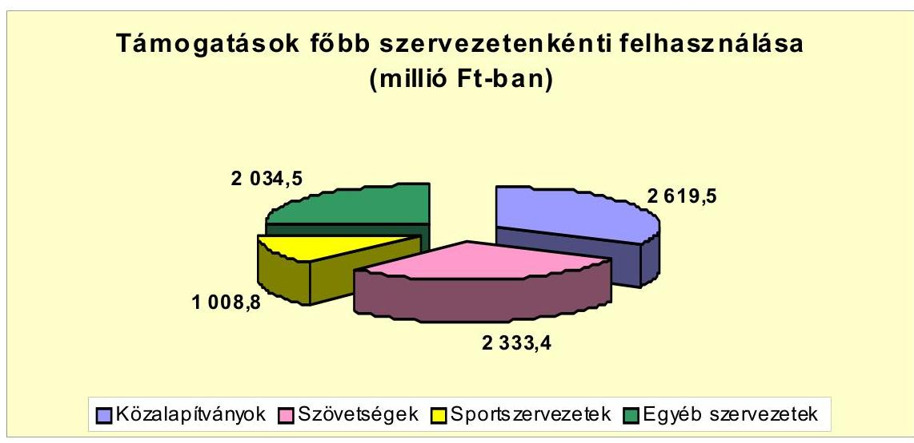
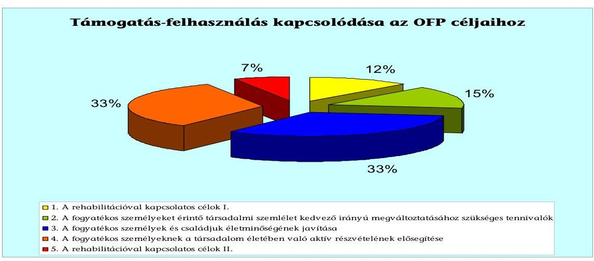
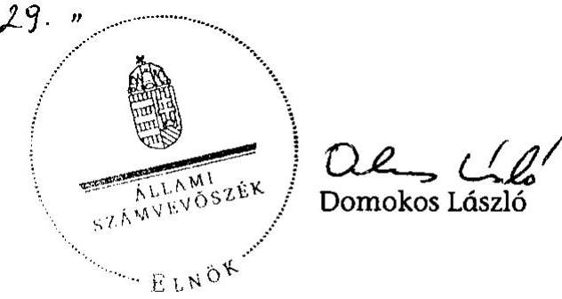

# JELENTÉS 

a fogyatékos személyek támogatásában részt vevő nonprofit szervezeteknek nyújtott nem normatív állami támogatás és ingyenes állami vagyonjuttatás felhasználásának ellenőrzéséről

---

# 3. Önkormányzati és Területi Ellenőrzési Igazgatóság 

3.1. Szabályszerüségi Ellenőrzési Föcsoport

Iktatószám: V-3002-372/2010.
Témaszám: 969
Vizsgálat-azonosító szám: V-0505

## Az ellenőrzést felügyelte:

Dr. Lóránt Zoltán
föigazgató
Az ellenőrzés végrehajtásáért felelős:
Dr. Elek János
általános föigazgató-helyettes
Az ellenőrzést vezették:
Horváth Balázs
főcsoportfőnök-helyettes
Solymár Ágnes
osztályvezető főtanácsos
Az összefoglaló jelentést készítették:
Köllődné Gátai Mária
számvevő
Dr. Veress Tiborné
számvevő
Az ellenőrzést végezték:

| Baracsi Szilvia tanácsos | Brebán Andrea tanácsos | Dr. Faragóné Tóth Mária tanácsos |
| :--: | :--: | :--: |
| Köllődné Gátai Mária számvevő | Kulcsár Lászlóné számvevő | Robák Ferencné tanácsos |
| Szakmányné Bilik Mária tanácsos | Szappanos Júlia tanácsos | Tóth István tanácsadó |
| Dr. Veress Tiborné számvevő | Vincze Béla Róbert számvevő |  |

A témához kapcsolódó eddig készített számvevőszéki jelentések:
címe
sorszáma
Jelentés a munkaképesség megőrzésére fordított pénzeszközök 0731
hasznosulásának ellenőrzéséről

---

# TARTALOMJEGYZÉK 

BEVEZETÉS ..... 9
I. ÖSSZEGZŐ MEGÁLLAPÍTÁSOK, KÖVETKEZTETÉSEK, JAVASLATOK ..... 11
II. RÉSZLETES MEGÁLLAPÍTÁSOK ..... 15

1. A fogyatékkal élők támogatásában részt vevő nonprofit szervezetek által ellátott tevékenység 2007-2009. évi finanszírozásának értékelése ..... 15
2. A nem normatív állami támogatások elszámolásának, felhasználásának helyszíni ellenőrzése ..... 16
2.1. A többcsatornás nem normatív finanszírozás rendszere ..... 16
2.2. A támogatások felhasználása ..... 17
2.2.1. A támogatások felhasználása a közalapítványoknál, az érdekvédelmi és sportszövetségeknél ..... 19
2.2.2. A támogatások felhasználása az alapítványoknál, társadalmi és egyéb szervezeteknél ..... 20
2.3. A támogatások felhasználásáról benyújtott elszámolások, feltárt szabálytalanságok ..... 21
2.4. A támogatást nyújtó és a támogatott szervezetek szerződéses kapcsolata ..... 22
2.5. A támogatások felhasználásáról készített szakmai beszámolók és pénzügyi elszámolások ellenőrzési gyakorlata ..... 23
2.6. A támogatások felhasználása során érvényesülő szabályozási környezet ..... 24
3. Az ingyenes vagyonjuttatás hasznosításának, nyilvántartásba vételének szabályszerűsége ..... 24
4. A támogatásokból megvalósított feladatok kapcsolódása az Országos Fogyatékosügyi Program céljaihoz ..... 25

---

.

---

# MELLÉKLETEK 

1. számú Ellenőrzésbe vont szervezetek 2007-2009. évi számviteli beszámolói alapján számított mutatók
2. számú Támogatások felhasználásának elszámolása főbb finanszírozási csoportonként, kiadási jogcímenként a helyszínen ellenőrzött szervezeteknél (51)
3. számú Támogatások felhasználása kiadási jogcímenként a helyszínen ellenőrzött szervezeteknél (51)
4. számú Támogatások terhére el nem számolható tételek jogcímenként, szervezetenként
5. számú A helyszínen ellenőrzötteknek nyújtott állami ingyenes vagyonjuttatás

## FÜGGELÉKEK

1. számú Az ellenőrzött nonprofit szervezetek adatai

---

.

---

# RÖVIDÍTÉSEK JEGYZÉKE 

## Jogszabályok

Alkotmány
Áfa tv.
Ámr.
Fot. tv.
Kh. tv.
Közbesz. tv.
Számv. tv.
224/2000. (XII. 19.)
Korm. rendelet
OGY határozat
1062/2007. (VIII. 7.)
Korm. határozat

## Rövidített nevek

ÁSZ
ESZA
EU
EüM
KDRMK
Kormány
KSH
KVI
MeH
MNV Zrt.
MPA
NCA
NKA
OFP
OGY
ÖM
SZMM
SZMSZ

A Magyar Köztársaság Alkotmánya - 1949. évi XX. törvény
Az általános forgalmi adóról szóló 2007. évi CXXVII. törvény
Az államháztartás működési rendjéről szóló 217/1998. (XII. 30.) Korm. rendelet

A fogyatékos személyek jogairól és esélyegyenlőségük biztosításáról szóló 1998. évi XXVI. törvény
A közhasznú szervezetekről szóló 1997. évi CLVI. törvény
A közbeszerzésekről szóló 2003. évi CXXIX. törvény
A számvitelről szóló 2000. évi C. törvény
A számviteli törvény szerinti egyes egyéb szervezetek be-számoló-készítési és könyvvezetési kötelezettségének sajátosságairól szóló 224/2000. (XII. 19.) Korm. rendelet
Az új Országos Fogyatékosügyi Programról szóló 10/2006. (II. 16.) OGY határozat

Az új Országos Fogyatékosügyi Program végrehajtásának 2007-2010. évekre vonatkozó középtávú intézkedési tervéről szóló 1062/2007. (VIII. 7.) Korm. határozat

Állami Számvevőszék
Európai Szociális Alap Nemzeti Programirányító Iroda
Társadalmi Szolgáltató Kht.
Európai Unió
Egészségügyi Minisztérium
Közép-dunántúli Regionális Munkaügyi Központ
A Magyar Köztársaság Kormánya
Központi Statisztikai Hivatal
Kincstári Vagyoni Igazgatóság
Miniszterelnöki Hivatal
Magyar Nemzeti Vagyonkezelő Zrt.
Munkaerő-piaci Alap
Nemzeti Civil Alapprogram
Nemzeti Kulturális Alap
Országos Fogyatékosügyi Program
Országgyúlés
Önkormányzati Minisztérium
Szociális és Munkaügyi Minisztérium
Szervezeti és Müködési Szabályzat

---

| A jelentésben rövidített névvel előforduló ellenőrzött szervezetek |  |
| :-- | :-- |
| AGYSZE | Autisztikus Gyermekek Szüleinek Egyesülete |
| AOSZ | Autisták Országos Szövetsége |
| ÉFOÉSZ | Értelmi Fogyatékossággal Élők és Segítőik Országos Ér- |
| FONESZ | dekvédelmi Szövetsége |
| FSZK | Fogyatékosok Nemzeti Sportszövetsége |
| Infóalap | Fogyatékos Személyek Esélyegyenlőségéért Közalapítvány |
| MEOSZ | „Informatika a látássérültekért" Alapítvány |
| MME | Mozgáskorlátozottak Egyesületeinek Országos Szövetsége |
| MPB | Mozgássérültek Mezőkövesdi Egyesülete |
| MSME | Magyar Paralimpiai Bizottság |
| MVGYOSZ | Mozgáskorlátozottak Somogy Megyei Egyesülete |
| NPAK | Magyar Vakok és Gyengénlátók Országos Szövetsége |
| OFA | Nemzetközi Pető András Közalapítvány |
| SINOSZ | Országos Foglakoztatási Közalapítvány |
| Szimbiózis Alapítvány | Szimbiózis a Harmonikus Együtt-Létért Alapítvány |
| SZMAE | Szegedi Mozgássérültek Alternatív Egyesülete |

---

# ÉRTELMEZŐ SZÓTÁR 

| Fogyatékos személy | Fogyatékos személy: az, aki érzékszervi - így különösen látás-, hallásszervi, mozgásszervi, értelmi képességeit jelentős mértékben vagy egyáltalán nem birtokolja, illetőleg a kommunikációjában számottevően korlátozott, és ez számára tartós hátrányt jelent a társadalmi életben való aktív részvétel során [1998. évi XXVI. tv. 4. § a) pontja] |
| :--: | :--: |
| Közhasznú tevékenység | A társadalom és az egyén közös érdekeinek kielégítésére irányuló, a szervezet létesítő okiratában szereplő cél szerinti tevékenység, a közhasznú szervezetekről szóló 1997. évi CLVI. törvényben meghatározott körben [Kh. tv. 26. § c) pont]. |
| Közhasznúsági jelentés | Tartalmazza a számviteli beszámolót; a költségvetési támogatás felhasználását; a vagyon felhasználásával kapcsolatos kimutatást; a cél szerinti juttatások kimutatását; a központi költségvetési szervtől, az elkülönített állami pénzalaptól, a helyi önkormányzattól, a kisebbségi települési önkormányzattól, a települési önkormányzatok társulásától és mindezek szerveitől kapott támogatás mértékét; a közhasznú szervezet vezető tisztségviselőinek nyújtott juttatások értékét, illetve összegét; a közhasznú tevékenységről szóló rövid tartalmi beszámolót [Kh. tv. 19. § (3) bekezdése]. |
| Közhasznú szervezet | Közhasznú szervezetté minősíthető a Magyarországon nyilvántartásba vett társadalmi szervezet, kivéve a biztosító egyesületet és a politikai pártot, valamint a munkáltatói és a munkavállalói érdek-képviseleti szervezetet, alapítvány, közalapítvány, köztestület, ha a létrehozásáról szóló törvény azt lehetővé teszi, országos sportági szakszövetség, nonprofit gazdasági társaság... [Kh. tv. 2. § (1) bekezdés a)-k) pont]. |
| Nonprofit szervezetek | Kormány által alapított közalapítványok, alapítványok, társadalmi szervezetek, köztestületek, nonprofit társaságok [Ellenőrzésbe vont szervezetek köre alapján] |
| Országos   Fogyatékosügyi Program | Az Országgyúlés a fogyatékos személyek esélyegyenlőségének megteremtéséhez szükséges intézkedések megalapozása érdekében Országos Fogyatékosügyi Programot határoz meg. A Programban foglaltakat az egészségügyi, foglalkoztatási, oktatási, közlekedési tervezésben, továbbá a településfejlesztésben, valamint az egyéb állami tervezés körébe tartozó döntés meghozatala során érvényre kell juttatni. [1998. évi XXVI. tv. 26. § (1) bekezdése] |
| Országos   Fogyatékosügyi Tanács | A Kormány fogyatékos üggyel kapcsolatos feladatainak ellátását az Országos Fogyatékosügyi Tanács segíti. [1998. évi XXVI. tv. 24. § (1) bekezdése] |

---

.

---

# JELENTÉS 

## a fogyatékos személyek támogatásában részt vevő nonprofit szervezeteknek nyújtott nem normatív állami támogatás és ingyenes állami vagyonjuttatás felhasználásának ellenőrzéséről

## BEVEZETÉS

Az Állami Számvevőszék (ÁSZ) stratégiájában kiemelt célként szerepel a magyarországi nonprofit szektor által felhasznált költségvetési források vizsgálata. Az esélyegyenlőséggel, ezen belül a fogyatékossággal összefüggő társadalmi feladatok megvalósítása fontos szerepet kapott hazánk Európai Unióhoz (EU) történő csatlakozásával. Az EU-hoz történő csatlakozás egyik feltétele volt, hogy a fogyatékossággal élő emberek számára megteremtődjön az esélyegyenlőség a társadalmi élet minden színterén: a fizikai és kulturális környezet, a lakhatás és közlekedési eszközök használata, a szociális és egészségügyi ellátás, az iskoláztatási és munkaalkalmak, a kulturális és társadalmi élet, valamint a sport és a szórakozás területén egyaránt.

Magyarország a Fogyatékossággal élő személyek jogairól szóló egyezmény és az ahhoz kapcsolódó Fakultatív Jegyzőkönyv kihirdetéséről szóló 2007. évi XCII. törvény alapján csatlakozott az Egyesült Nemzetek Szervezete keretében 2006. december 13-án, New Yorkban elfogadott, a Fogyatékossággal élő személyek jogairól szóló egyezményhez. Magyarországon a legutóbbi népszámlálás adatai szerint a népesség 5,7\%-a él fogyatékkal, testi, értelmi vagy olyan érzékszervi hátránnyal, amely véglegesen gátolja a megszokott életvitel szabad gyakorlását. A fogyatékos emberek hátrányainak enyhítése, esélyegyenlőségük megalapozása, illetve a társadalom szemléletmódjának alakítása érdekében az Országgyűlés (OGY) - összhangban az Alkotmánnyal és a nemzetközi jog általánosan elismert szabályaival - megalkotta a fogyatékos személyek jogairól és esélyegyenlőségük biztosításáról szóló 1998. évi XXVI. törvényt (Fot. tv.).

Az OGY a 10/2006. (II. 16.) OGY határozat alapján a fogyatékos személyek esélyegyenlőségének megteremtéséhez szükséges intézkedések megalapozása érdekében Országos Fogyatékosügyi Programot (OFP) határozott meg, amely célonként rögzítette a megvalósításhoz szükséges eszközöket és intézményeket, valamint a szükséges pénzügyi forrásokat.

A Kormánynak a program végrehajtására 2007-2010-ig tartó időszakra középtávú intézkedési tervet kellett készítenie, amelyet a 1062/2007. (VIII. 7.) Korm. határozattal fogadott el. Ebben megjelölte a célokért felelősöket, a részhatár-

---

időket és a forrásokat. A pénzügyi források fedezeteként a költségvetési törvényben az egyes fejezeti kezelésű előirányzatokat és a közalapítványok támogatását határozták meg. Az OFP sikeres megvalósításához a fogyatékos személyekkel foglalkozó nonprofit szervezetek közremúködése meghatározó jelentőségű. A program végrehajtása során a Kormány által alapított közalapítványoknak és a fogyatékossági területeknek megfelelően létrejött országos érdekvédelmi szövetségeknek a tevékenységeket ellátó szervezetek koordinálásában, pályázati programok megvalósításában, szolgáltatások megszervezésében kellett ellátni a fogyatékossághoz kapcsolódó feladatokat, a helyi szervezetek bevonásával, közreműködésével. Mindezek alapján az ÁSZ - első alkalommal - a 2010. évi ellenőrzési tervében ütemezte a fogyatékos személyek támogatásában részt vevő nonprofit szervezeteknek nyújtott nem normatív állami támogatás és ingyenes állami vagyonjuttatás felhasználásának ellenőrzését.

A magyarországi nonprofit szervezetek közül - a KSH-tól kapott nem teljes körű adatszolgáltatás szerint - több mint 1200 szervezet vesz részt a fogyatékos személyek szociális ellátásában és támogatásában, amelyből mintegy 700 szervezet részesült a 2007-2009. évek alatt nem normatív költségvetési támogatásban. Ez utóbbi csoportból 147 szervezetet oly módon választottuk ki, hogy a 20 millió Ft feletti éves támogatásban részesült szervezeteket teljes körűen, a fennmaradó szervezeteket a támogatásuk nagysága és területi megoszlása figyelembevételével, véletlen kiválasztással vettük számításba, tanúsítványi adatszolgáltatásra kérve őket (függelék). Az ellenőrzött nonprofit szervezetek 98\%-a közhasznú minősítést szerzett, az ellenőrzött időszakban 22,1 Mrd Ft központi költségvetési támogatásban részesültek, amelyből 11,6 Mrd Ft nem normatív költségvetési támogatásként teljesült. A vizsgált körben az adott időszak alatt a nem normatív állami támogatások 124\%-kal emelkedtek, ezért az ÁSZ ennek felhasználását ellenőrizte. A nonprofit szervezetek közül 17 részesült állami ingyenes vagyonjuttatásban. A tanúsítványok kiértékelése alapján a szervezetek egyharmadánál ( 51 nonprofit szervezetnél) végeztünk helyszíni ellenőrzést, amelyeknek forrásszerkezetében a központi költségvetési támogatás $62 \%$-ot tett ki. A kiválasztás reprezentatív módon, a fogyatékosság típusában, a támogatás nagyságrendjében, a szervezet területi elhelyezkedésében differenciáltan történt.

A fogyatékos személyek támogatásában részt vevő nonprofit szervezeteknek nyújtott nem normatív állami támogatás és állami ingyenes vagyonjuttatás felhasználásának ellenőrzését az Állami Számvevőszékről szóló 1989. évi XXXVIII. törvény 2. § (5) bekezdése, valamint a közhasznú szervezetekről szóló 1997. évi CLVI. törvény (Kh. tv.) 21. §-a alapján végeztük.

Az ellenőrzés célja annak megállapítására irányult, hogy a nonprofit szervezetek szabályosan és rendeltetésszerúen használták-e fel a költségvetésből kapott nem normatív támogatásokat, a kapott támogatásokkal szabályszerűen el-számoltak-e, az állami ingyenes vagyonjuttatásokat szabályszerűen használ-ták-e; a költségvetési támogatások segítették-e az Országgyúlés által a 10/2006. (II. 16.) OGY határozattal elfogadott a 2007-2013. évekre vonatkozó Országos Fogyatékosügyi Programban kitűzött célokat. A szabályszerűségi ellenőrzést az ÁSZ Ellenőrzési Kézikönyve szerint, a 2007-2009. lezárt gazdálkodási évek beszámolói alapján végeztük, valamint elvégeztük a tanúsítványi adatok elemzését is.

---

# I. ÖSSZEGZŐ MEGÁLLAPÍTÁSOK, KÖVETKEZTETÉSEK, JAVASLATOK 

A fogyatékkal élők érdekvédelmére, ellátására és támogatására hivatott nonprofit szervezetek bekapcsolódtak az Országgyúlés által elfogadott, 2007. évben megkezdett új Országos Fogyatékosügyi Programba. A szerepvállalásukra nyújtott állami támogatások 2007-2009. évi teljesítésére a számvevőszéki ellenőrzéshez csak részben álltak rendelkezésre megbízható adatok. A Kormány részéről elmaradt a program végrehajtásáról szóló - kétévenkénti kötelezettségű - jelentés Országgyúlés elé terjesztése, az OFP célkitűzései megvalósításának kiértékelése, a dupla finanszírozás elkerülésére javasolt adatszolgáltatás beindítása.

A tanúsítványi adatszolgáltatásba, ezen belül a helyszíni ellenőrzésbe vont szervezetek körében lényeges változás következett be a központi költségvetési támogatás finanszírozási módjában. A normatív költségvetési támogatások 2007-ről 2009-re 8, illetve 21\%-kal csökkentek, míg a nem normatív támogatások 124, illetve 147\%-kal emelkedtek. Utóbbi növekedés a nonprofit szervezetek programokba való aktív bekapcsolódásának tulajdonítható. A dinamikus növekedéssel a 147 szervezet összességében 11631 millió Ft nem normatív költségvetési támogatást kapott, amelyből a helyszínen ellenőrzött 51 szervezet 8028 millió Ft-tal részesült. A keresztféléves finanszírozásból adódóan 7996,2 millió Ft felhasználásáról számoltak el a szervezetek, a továbbiakban ennek felhasználásáról ad számot a jelentés.

---

A többcsatornás ${ }^{1}$ költségvetési finanszírozás rendszerében 2007. évben 2808,1 millió Ft, 2008. évben 3472,9 millió Ft, 2009. évben 1715,2 millió Ft volt a helyszínen ellenőrzött szervezetek által elszámolt támogatások összege. Alapvető hiányosságnak mutatkozott az azonos támogatási célokra kiírt pályázatok több forrásgazda részéről történő összehangolatlansága, amely lehetővé tette - az NCA, az EüM, az országos szövetségek, a Nemzeti Fejlesztési Terv Operatív Programjai múködési támogatásai között - a dupla finanszírozást.

A helyszínen ellenőrzött szervezetek múködési, szakmai, felhalmozási felhasználásként 5319,5 millió Ft támogatásról számoltak el, amelyen túlmenően 2676,7 millió Ft került nonprofit körben továbbadásra. A múködési kiadásokra 1797,9 millió Ft-ot, szakmai programokra 2738,5 millió Ft-ot, felhalmozásra 783,1 millió Ft-ot fordítottak. A támogatási szerződésekből a fogyatékossági feladatok társadalmi hasznossága esetenként a teljesítménymutatók hiányában nem volt megítélhető; országos szintű feldolgozás, értékelés sem minden esetben készült a megvalósult célok eredményességéről. A felhalmozási kiadások 9,8\% részaránnyal teljesültek. A szerződéses kötelezettség alapján a támogatások továbbadása szabályszerű volt.

A Kormány által alapított közalapítványok a hároméves gazdálkodás összesítésében 2619,5 millió Ft támogatást számoltak el, amelynek 36\%-át múködési, szakmai és felhalmozási célra fordították, $64 \%$-át meghatározott célra továbbadták a nonprofit szervezeteknek. A továbbadott támogatások a fogyatékosság különböző területeihez kapcsolódó komplex programokat finanszírozták. A szakmai tevékenység keretében többnyire rendezvényszervezési és kutatási tevékenységet végeztek. Az országos érdekképviseleti szövetségek a továbbadott támogatásaikkal, szakmai tevékenységükkel segítették elő a fogyatékkal élők öntevékenységét, összefogták a helyi szervezeteket, képviselték érdekeiket. Tevékenységük körében a szakemberek speciális képzését szervezték, nemzetközi kapcsolatokat tartottak fenn, ismeretterjesztő kiadványokat jelentettek meg. Az együttesen 2333,4 millió Ft támogatás háromnegyedét saját szervezésű feladatokra fordították, a fennmaradó hányaddal a funkcionálisan kapcsolódó szervezeteket támogatták. A fogyatékossággal élők verseny- és tömegsportjához kapcsolódó szakmai programokra az elszámolt 1008,8 millió Ft támogatás $86 \%$-a teljesült.

Az alapítványok, társadalmi és egyéb szervezetek összességében 2034,5 millió Ft támogatás felhasználásával segítették közvetlenül a fogyatékossággal élőket. A szervezetek feladatkörükben kiemelt programként támogató és segítő szolgálatokat, módszertani központot múködtettek, lakóotthonokat és majorságokat hoztak létre, illetve bővítettek, információs és tanácsadói irodákat üzemeltettek, a fecske program keretében időszakos és otthoni felügyeletet biztosítottak. Speciális feladatként valósult meg a vakvezető-kutyák képzése, a jelnyelvi tolmácsszolgáltatás, a halmozottan fogyatékosok támogatása.

[^0]
[^0]:    ${ }^{1}$ Költségvetési törvényben nevesített, pályázati és egyedi kérelem alapján engedélyezett, az elkülönített állami pénzalapoktól és a nonprofit szervezetektől kapott támogatások.

---

A helyszínen ellenőrzött nonprofit szervezetek 85\%-a a nem normatív költségvetési támogatásokat szabályszerűen, a meghatározott célra használta fel. Az ellenőrzés nyolc szervezetnél (15\%) tárt fel az elszámolt támogatás összegére vetítetten 3,5\%-os eltérést, 40,1 millió Ft értékben. A támogatások terhére szabály szerint el nem számolható tételek a céltól eltérő felhasználásból, kettős elszámolásból, számviteli és adójogszabály megsértéséből, maradvány visszafizetésének elmulasztásából adódtak. Az ellenőrzés megállapítására a feltárt összegből 12,8 millió Ft visszautalásra került a központi költségvetésbe, 13,2 millió Ft a költségvetési támogatónak megküldött új elszámolással rendeződött. Két szervezetnél további intézkedés szükséges a fennmaradt szabálytalanul elszámolt támogatás visszafizettetésére (AGYSZE 13984 ezer Ft, Magyar Parasport Szövetség 84 ezer Ft). A számviteli törvényben és a támogatási szerződésekben előírtak többszöri, súlyos megsértése miatt az AGYSZE-nél személyes felelősséget állapított meg az ellenőrzés, amelynél sikkasztás bűntettének megalapozott gyanúja miatt eljárás folyik. A nyomozást végző rendőrség megkeresésére a számvevői jelentést megküldtük.

A támogatások felhasználására, elszámolására kötött szerződések hiányosságai a feltárt hibákhoz vezettek. A programfeladatokért felelős SZMM támogatási szerződéseiből esetenként hiányzott a támogatás céljának OFP-hez kapcsolódásának meghatározása, a támogatás felhasználásával elérendő eredményességi mutatók megjelölése, a záradékolási kötelezettség teljes körű előírása. A szerződések ingatlanvásárlásnál a miniszteri rendelet előírása ellenére üzemeltetési, múködtetési kötelezettséget nem írtak elő, az elidegenítés feltételeit nem szabályozták. A támogatást adók által végzett dokumentális és helyszíni ellenőrzések formális végrehajtására utalt, hogy az ellenőrzés által feltárt visszafizetési kötelezettséget, törvénysértő személyi mulasztást nem észlelték. Nem ellenőrizték teljes körűen a közbeszerzési törvény előírásainak betartását, a támogatások felhasználásának elkülönített nyilvántartását.

A szabálytalanságokkal kapcsolatban az ellenőrzés megállapította, hogy a támogatások felhasználása során érvényesülő törvényi, rendeleti szabályozások, valamint a szerződéses követelmények több vonatkozásban nem egyértelmúek, ellentmondásosak: nincs egységes előírás a működési és szakmai célra elszámolható kiadások elkülönítésére és nyilvántartására; nincs összhang a közhasznú bevételek beszámolási rendje és a közhasznú jelentés tartalmi követelménye között.

A társadalmi szervezetek által használt állami tulajdonú ingatlanok jogi helyzetének rendezéséről szóló törvény alapján a fogyatékos személyek támogatásában részt vevő helyszínen ellenőrzött nonprofit szervezetek közül hat szervezet részesült, 792,8 millió Ft értékben állami ingyenes vagyonjuttatásban. A szervezetek mindegyike a juttatáskor meghatározott célra használta az ingatlant, ez ideig betartva a szerződéskötéskor vállalt 15 éves elidegenítési tilalmat. Két szervezet a cserét, illetve az elidegenítést a $\mathrm{KVI}^{2}$ engedélyével, szabályszerűen hajtotta végre.

[^0]
[^0]:    ${ }^{2}$ A KVI jogutódja is 2007. október 20-tól az MNV Zrt.

---

Az ellenőrzött szervezetek a kapott nem normatív költségvetési támogatásokat az OFP-ben meghatározott célok elérése érdekében használták fel, azonban a vizsgált nonprofit körben mindössze a támogatási szerződések egyötöde tartalmazta a programokhoz való kapcsolódást.

Az ellenőrzés a megállapított szabálytalanságokra figyelemmel a számvevői jelentésekben javaslatokat tett. A szervezetek a hibák, hiányosságok megszüntetésére vonatkozó javaslatokra intézkedési tervet készítettek, annak időarányos teljesítéséről beszámoltak, dokumentálták a megtett intézkedéseket.

A helyszíni ellenőrzés megállapításainak hasznosítása mellett javasoljuk:

# a Kormánynak 

1. Vizsgálja meg az új Országos Fogyatékosügyi Program végrehajtásáról szóló jelentés Országgyűlés elé terjesztése elmaradásának okát, mulasztás esetén állapítsa meg a felelősséget.
2. Kezdeményezze a fogyatékkal élők támogatásához kapcsolódó központi költségvetési finanszírozási rendszer felülvizsgálatát, különös tekintettel a nonprofit szervezetek nem normatív támogatása összehangolásának megoldására, társadalmi hasznosságának mérhetőségére.
3. Intézkedjen a támogatások pénzügyi átláthatóságát biztosító egységes informatikai alapú adatszolgáltatás kidolgozásáról a dupla finanszírozás elkerülése, az ellenőrzési adatok biztosítása érdekében.
4. Rendelje el a közhasznú szervezetekről szóló 1997. évi CLVI. törvény 18. § (2) bekezdésével összhangban a számviteli törvény szerinti egyes egyéb szervezetek be-számoló-készítési és könyvvezetési kötelezettségeinek sajátosságairól szóló 224/2000. (XII. 19.) Korm. rendelet 17. § (4) - (6) bekezdéseinek módosítását.

## a nemzeti erőforrás miniszterének

1. Intézkedjen, hogy a miniszteri rendeletekkel összhangban a támogatási szerződések írják elő az ingatlan vásárlásnál az üzemeltetési, működtetési kötelezettséget, rendelkezzen az elidegenítés betartandó szabályairól.
2. Jelölje meg a támogatási célok kapcsolódását az Országos Fogyatékosügyi Programhoz, az elérendő eredményességi mutatókat.
3. Írja elő következetesen a kettős elszámolás kizárása érdekében a támogatások elszámolásához benyújtott bizonylatok záradékolási kötelezettségét.
4. Intézkedjen a jelentés 2.3. pontjában részletezett, nem rendeltetésszerűen felhasznált támogatások visszafizettetéséről az Autisztikus Gyermekek Szüleinek Egyesületénél 13984 ezer Ft, a Magyar Parasport Szövetségnél 84 ezer Ft összegben.

---

# II. RÉSZLETES MEGÁLLAPÍTÁSOK 

## 1. A FOGYATÉKKAL ÉLŐK TÁMOGATÁSÁBAN RÉSZT VEVŐ NONPROFIT SZERVEZETEK ÁLTAL ELLÁTOTT TEVÉKENYSÉG 2007-2009. ÉVI FINANSZÍROZÁSÁNAK ÉRTÉKELÉSE

A számvevőszéki ellenőrzéshez a fogyatékkal élők támogatásában részt vevő nonprofit szervezetek nem normatív költségvetési támogatásáról nem állt rendelkezésre teljes körű adat. Ezért szükségessé vált az SZMM-től, ÖM-től, KSH-tól, illetve a fogyatékos személyek jogairól és esélyegyenlőségük biztosításáról szóló 1998. XXVI. törvény 24. § (1) bekezdésében megjelölt Országos Fogyatékosügyi Tanácstól az adatok megkérése.

Az új Országos Fogyatékosügyi Programról szóló 10/2006. (II. 16.) OGY határozat értelmében szükségesnek ítélt, a „duplafinanszírozás" elkerülésére javasolt informatikai adatszolgáltatás kidolgozására nem került sor.

Az államháztartási támogatásokra vonatkozó adatok hiányában a számvevőszéki ellenőrzést a KSH nem teljes körű adatain alapuló kiválasztással, a nonprofit szervezetektől 2007-2009. évi gazdálkodásukra vonatkozóan bekért tanúsítványi nyilatkozattal végeztük el. A reprezentatív módon kiválasztott 147 nonprofit szervezet felülvizsgált és kiértékelt gazdálkodási adatain, ezen belül 51 helyszínen vizsgált szervezet támogatási szerződéseinek mintavételes ellenőrzésén alapulnak megállapításaink.

A tanúsítványi adatszolgáltatásba vont szervezetek az ellenőrzött időszakban 41571 millió Ft alap/közhasznú tevékenységi bevételre tettek szert, amelyből 22055 millió Ft a központi költségvetésből származott. A szervezetek összesített beszámolói alapján a vállalkozási bevételek részaránya $8 \%$ volt.

A tanúsítványi adatszolgáltatást nyújtó szervezetek mintegy harmadát ellenőriztük helyszínen, ugyanakkor a közhasznú gazdálkodásuk 23243 millió Ft-ot tett ki, amelyen belül a központi költségvetési finanszírozás 14345 millió Ft-tal, $62 \%$-os részarányú volt (1. számú melléklet).

Az ellenőrzés mindkét körében lényeges változás következett be a központi költségvetési támogatás finanszírozásának módjában. A normatív költségvetési támogatások 2007-ről 2009-re 8, illetve 21\%-kal csökkentek, míg a nem normatív támogatások 124, illetve $147 \%$-kal emelkedtek.

Utóbbi dinamikus növekedése eredményeként a nem normatív támogatások 2007-2009 között a 147 szervezet összességében 11631 millió Ft-tal és $53 \%$-os részaránnyal, a helyszínen vizsgált 51 szervezetnél 8028 millió Ft-tal és $56 \%$-os többségi hányaddal teljesültek, amelyben meghatározó szerepe volt a szervezetek programfeladatokba való aktív bekapcsolódásának.

---

# 2. A NEM NORMATÍV ÁLlami TÁMOGATÁSOK ELSZÁMOLÁSÁNAK, FELHASZNÁLÁSÁNAK HELYSZÍNI ELLENŐRZÉSE 

### 2.1. A többcsatornás nem normatív finanszírozás rendszere

A szervezetek a költségvetési törvényben nevesített, a fejezeti kezelésű előirányzatokból és elkülönített állami pénzalapokból pályázati úton és egyedi kérelem alapján engedélyezett, valamint a nonprofit szervezetektől kapott céltámogatásokhoz jutottak. A nem normatív költségvetési források fedezetével 2007-2009. években 7996,2 millió Ft felhasználásáról számoltak el (2. számú melléklet).

A többcsatornás központi költségvetési finanszírozás rendszerében 2007. évben 2808,1 millió Ft; 2008. évben 3472,9 millió Ft; 2009. évben 1715,2 millió Ft támogatással számoltak el a helyszínen ellenőrzött szervezetek (2. számú melléklet). A keresztféléves finanszírozásból fakadt, hogy a 2007. évre elszámolt öszszeg közel kétszerese volt a számviteli beszámoló alapján összesített teljesítésnek (1497 millió Ft), illetve a 2009. évi támogatásokból 1980 millió Ft elszámolása 2010. június 30 -áig volt esedékes.

Nevesített támogatásban - 2007-2009 időszakában - nyolc (FSZK, FONESZ, ÉFOÉSZ, SINOSZ, AOSZ, MEOSZ, MVGYOSZ, MPB) szervezet részesült, amelyet a költségvetési törvényekben az SZMM, ÖM fejezeti kezelésű előirányzatain belül biztosítottak. A szervezetek e költségvetési címen 2743,8 millió Ft támogatást használtak fel, amelynek évenkénti részaránya az ábrázoltak szerint ingadozott.

A Kormány által alapított közalapítványoknak és a fogyatékossági területeknek megfelelően funkcionáló érdekvédelmi szövetségeknek kulcsfontosságú volt a szerepe a tevékenységeket ellátó szervezetek koordinálásában, a pályázati programok megvalósításában, a különféle szolgáltatások megszervezésében, valamint a helyi szervezetek múködésének segítésében.

---

Pályázati és egyedi támogatásokhoz valamennyi szervezet az Ámr. szabályaival összhangban jutott. A minisztériumoknak és elkülönített állami pénzalapoknak a gazdálkodás hároméves periódusában 4116,0 millió Ft felhasználásáról számoltak el. A fogyatékos személyek támogatásában részt vevő nonprofit szervezetek az ellenőrzött időszak átlagában a feladatokat 51,4\%-ban eredményes pályázatok, kérelmek alapján finanszírozták.

A pályázati kiírások többségét a fogyatékossági feladatok ellátására az SZMM, illetve kezelő szervei útján tették közzé. A fogyatékkal élők sport tevékenységéhez kapcsolódó pályázatokat a feladatot támogató ÖM írta ki. Pályázhattak a szervezetek a tevékenységükkel összhangban az EüM és a MeH által kiírt pályázatokra is. Az NKA-ból, az MPA-ból pályázati rendszer keretében, továbbá a megváltozott munkaképességű munkavállalók foglalkoztatásához nyújtható költségvetési támogatásról szóló 177/2005. (IX. 2.) Korm. rendeletben szabályozottak alapján kérelem formájában jutottak támogatáshoz a szervezetek.

A pályázati kiírások összehangolása nem történt meg, előfordult, hogy ugyanazon célra több forrásból is lehetett pályázni: pl. az NCA-ból, az EüM előirányzataiból és az országos szövetségek forrásaiból is nyújtottak támogatást múködési költségekre. Ezen túl számos szakmai program, továbbá az egyre szélesebb körben hozzáférhető Nemzeti Fejlesztési Terv Operatív Programjai pályázataira is el lehetett számolni múködési jellegú kiadásokat.

A társadalmi hasznosság megítélésére és mérésére a jelenlegi hatályos jogszabályok támpontot, módszertant nem nyújtanak. Az egyes pályázati kiírások eredményessége nem teljes körűen volt megítélhető a szerződésekben, a teljesítménymutatók eseti alkalmazása miatt. Országos szintű feldolgozás, értékelés egyes programoknál készült (pl. jelnyelvi tolmácsszolgáltatás, FECSKE program, segítőkutya-kiképzés). A támogatott szervezetek bevételi szerkezete is azt mutatta, hogy elsősorban állami támogatásból, ezen belül egyre inkább a pályázati úton elnyerhető forrásokból múködtek.

A költségvetési támogatást múködésre, szakmai programra és felhalmozásra felhasználó nonprofit szervezetek nemcsak a fejezetektől és elkülönített állami pénzalapoktól, hanem a nonprofit körbe tartozó közalapítványoktól és országos érdekvédelmi szövetségektől is támogatáshoz jutottak. Az FSZK és a helyi szervezetekkel együttműködő fogyatékos szövetségek egyrészt szakmai programokat valósítottak meg, másrészt maguk is pályáztattak és nyújtottak támogatást. A felhasználás során 1136,4 millió Ft nem normatív támogatással számoltak el, mint nonprofit körből kapott támogatással.

# 2.2. A támogatások felhasználása 

A teljes elszámolt támogatási összegből a közvetlenül múködésre, szakmai feladatokra és felhalmozásra elszámolt felhasználás 5319,5 millió Ft volt, amely mellett a nem normatív források egyharmada nonprofit körben, pályázati úton továbbadásra került (2676,7 millió Ft).

---

A szervezetek a múködéshez szükséges személyi-tárgyi feltételekre a nevesített támogatás $41,4 \%$-át, az elkülönített állami pénzalapjuttatás $33,1 \%$-át fordították. A múködési célokra együttesen 1797,9 millió Ft költségvetési támogatást használtak fel. Az alapító okiratokban foglalt célok, feladatok megvalósításához biztosították a pénzügyi fedezetet a múködési és szakmai programokra kiírt pályázatok.

A szakmai programok megvalósítására kiírt pályázatoknál a támogatások terhére elszámolt költségelemek döntő hányadában megegyeztek a múködési költségekével, amely a szervezeteknek az elszámolások keretében okozott gondot az egyértelmú megkülönböztetés hiányából adódóan. A konkrét programok: rendezvények, szakmai tapasztalatcsere; kiadványok, szakmai folyóiratok kiadása; tanulmányok, modell kísérletek végrehajtása; sporttevékenységek ellátása; nemzetközi szerepvállalás; közhasznú feladat ellátásához kapcsolódó szolgáltatások biztosítása jellegétől függően a belső arányokban volt eltérés. A szakmai programok megvalósítása során a szakértői megbízási díjak és a sporttevékenységek lebonyolításánál felmerülő speciális kiadások domináltak. A szakmai célokat a nevesített, a minisztériumi, valamint a nonprofit kör közel azonos nagyságrendben támogatta, amelyre elszámolt összes támogatás 2738,5 millió Ft volt.

A költségvetési törvényben nevesített támogatások keretében, továbbá a pályázati kiírások függvényében a szervezeteknek a szakmai programokon túl lehetőségük volt felhalmozási kiadások elszámolására is. Az államháztartás törvényi szabályozásával összhangban felhalmozási kiadásként, az egyéb intézményi felhalmozási kiadások előirányzat terhére: beruházások, felújítások, egyéb felhalmozási kiadások elszámolására került sor 783,1 millió Ft értékben. A felhalmozási kiadások teljes támogatáson belüli 9,8\%-os részaránya a támogatott szervezetek eszközállományának szinten tartására volt elegendő. Ezeknél is alapvető hiányként mutatkozott, hogy a pályázati döntéshez nem határozták meg a jövőbeni múködtetés garanciális feltételeit, követelményeit. A felhalmozási kiadásként elszámolt összeg 72\%-át, 563 millió Ft-ot beruházási, felújítási munkálatok képeztek, a $28 \%$-ot, 220,1 millió Ft-ot a szervezetek eszközbeszerzésekre fordítottak. Jelentősebb fejlesztések és beszerzések: székház vásárlása ( 125 millió Ft); iroda vásárlása ( 44 millió Ft ); rehabilitációs központok kialakítása ( 33 millió Ft); lakóotthonok létesítése ( 282,5 millió Ft); majorságok fejlesztése ( 51,9 millió Ft); gépjármú- és informatikai, egyéb segédeszköz beszerzések (201,0 millió Ft).

---

A helyszíni ellenőrzöttek közül 14 szervezet adott tovább támogatást, melyből kilenc szervezet támogatási szerződése tartalmazta a támogatás továbbadását, amelynek szabályszerűsége érdekében alapító okiratban, SZMSZ-ben, elnökségi határozatban szabályozták a támogatás felhasználását, ellenőrzését. Öt szervezet a létesítő okiratában foglaltaknak megfelelően rendelkezett a támogatás továbbadásáról. Összességében 2007-2009 időszakában 2676,7 millió Ft-ot adtak tovább. A továbbadott támogatások fedezete 76,4\%-a (2044,5 millió Ft) egyedi, $22,9 \%-a(614,2$ millió Ft$)$ nevesített és $0,7 \%-a(18,0$ millió Ft$)$ pályázati támogatás volt.

A nonprofit szervezetek fogyatékossághoz kapcsolódó célszerinti tevékenysége 394 vizsgált támogatási szerződés esetében összhangban voltak a pályázati kiírásban és a létesítő okiratokban meghatározott közhasznú feladatokkal. A helyszínen ellenőrzött 51 szervezet közül négy működött közalapítványi formában, öt országos érdekképviseleti szövetségként, huszonegy alapítványként, tizenhét társadalmi szervezetként, kettő köztestületként, egy nonprofit társaságként, egy közalapítvány által fenntartott intézményként. A nem normatív támogatások felhasználásában eltérő súllyal vettek részt (3. számú melléklet).

# 2.2.1. A támogatások felhasználása a közalapítványoknál, az érdekvédelmi és sportszövetségeknél 

A közalapítványok az elszámolt központi költségvetési támogatásukból 1681,7 millió Ft-ot (64\%) továbbadott támogatásokra, 937,7 millió Ft-ot (36\%) saját kereteken belül megvalósított működési-szakmai, felhalmozási feladatokra fordítottak. A továbbadott támogatások a komplex rehabilitációval kapcsolatos rehabilitációs mentorok képzését, álláskereső klubok kialakítását, megváltozott munkaképességű munkavállalók munkahelymegőrzésének célját szolgálták, látássérült személyek elemi és foglalkoztatási rehabilitációs központok kialakítását és működtetését, családi munkahelyi gyakorlat program megvalósítását, támogatott foglalkoztatás elősegítését szolgálták. Ezen túl szülősegítő támogatásokhoz, autista majorságok létrehozásához és múködtetéséhez, jelnyelvi tolmácsszolgálatok működtetéséhez nyújtottak segítséget. Saját szakmai tevékenységének keretében fogyatékos tanulók oktatási intézményének fenntartására, akadálymentesítési kiadvány elkészítésére, kutatási tevékenységre, konferencia szervezésére fordították a költségvetési támogatást.

---

Az ún. nevesített és egyedi támogatásokban részesülő kormányzati közalapítványok a továbbadott támogatások közel két harmadát teljesítették közvetlenül vagy közvetve az OFP-ben meghatározott célok elérése érdekében. Az OFA a támogatásokhoz kapcsolódó feladatellátásban nem vett részt, a támogatást nyújtó SZMM csak a pályáztatás lebonyolításával bízta meg. Az FSZK a támogatások pályázati úton történő továbbadásán túl, a fogyatékkal élők ellátásával kapcsolatos feladatokat is végzett. A szövetségek a kapott támogatásokból az országos tagszervezeteikkel együtt látták el a feladatokat.

Öt fogyatékossági csoport országos érdekképviseleti szövetsége összhangban a szerződéses előírásokkal az elszámolt központi költségvetési támogatásukból 542,8 millió Ft-ot (23\%) továbbadott támogatásokra, 742,7 millió Ft-ot (32\%) saját szakmai tevékenységükre fordítottak. A szövetségek mind továbbadott támogatásaikkal, mind szakmai tevékenységükkel elősegítették a fogyatékkal élők öntevékenységét, önrendelkezésének lehetőségeit. Összefogták a hazai szervezeteket, és szükség szerint képviselték őket, érdekvédelmi feladatokat láttak el. Saját tevékenységük keretében szakemberek képzését szervezték, szakés ismeretterjesztő kiadványokat jelentettek meg, kapcsolatot tartottak külföldi és hazai hasonló célú szervezetekkel. Múködési célra 818,0 millió Ft-ot (35\%), felhalmozásra 229,9 millió Ft (10\%) támogatást számoltak el. Részt vettek a fogyatékkal élőket érintő és velük kapcsolatos általános intézkedések és jogszabályok kidolgozásában és azok megvalósításában.

A sporttevékenységet támogató hat szervezet feladata a fogyatékossággal élő személyek verseny- és tömegsportjához kapcsolódóan szabadidő- és versenysport szervezetek összefogása, a nemzeti és nemzetközi sportéletben a tagok részvételi lehetőségeinek biztosítása volt. Hozzájárultak a versenyek szervezéséhez, a sport tevékenység feltételrendszerének megteremtéséhez, országos bajnokságok szervezéséhez. Támogatták a paralimpiákon és a világ- és hazai versenyeken történő részvételt és az ezekre való felkészülést továbbá sportszakmai, gazdasági, jogi szolgáltatásokat nyújtottak. A közvetlenül és közvetetten támogatott szakmai programokra 865,8 millió Ft-ot (86\%) fordítottak.

# 2.2.2. A támogatások felhasználása az alapítványoknál, társadalmi és egyéb szervezeteknél 

Nyolc szervezet - egyesület, alapítvány - foglalkozott a mozgáskorlátozott, vagy mozgássérült személyek életminőségének javításával, érdekeik képviseletével, foglalkoztatásával. Támogató és segítő szolgálatokat múködtettek, rendezvényeket szerveztek. A múködési, szakmai, felhalmozási kiadásokat megközelítően azonos arányban fedezték a támogatásokból (509 millió Ft értékben).

Négy szervezet foglalkozott az autistákat szolgáló intézmények, az autisták társadalmi beilleszkedését szolgáló lehetőségek létrejöttének, fennmaradásának segítésével. Módszertani Központot múködtettek az illetékes állami szervekkel kooperációban. A négyből három szervezet pályázati program keretében végzett beruházást az autista sérültek komplex, szakszerű pedagógiai elveken nyugvó fejlesztésének megfelelő lakóotthonok, majorságok létrehozásával, a lakóotthonok bővítésével. A felhalmozási célokra az elszámolt támogatások több mint kétharmadát fordították 261,5 millió Ft (69\%) összegben.

Fő tevékenységi körében hét szervezet célja volt a vakok és gyengén-látók

---

társadalmi integrációjának, esélyegyenlőségének elősegítése, valamint lakóhelyi rehabilitációjának és művelődésének támogatása. Segédeszközöket kölcsönöztek, elemi és foglalkozási rehabilitációs intézményeket múködtettek. A látássérült gyermekek és fiatalok integrált oktatását segítették, fogyatékos fiatalok részére a társadalmi beilleszkedésüket segítő információs és tanácsadó irodákat működtettek. A számítástechnika legújabb eredményeinek hozzáférhető tételével biztosították a látássérült emberek sikeres részvételét az oktatásban és képzésben. Vakvezető és segítő kutya képzését segítették. A megvalósított feladatokra 418,3 millió Ft támogatást számoltak el.

Tizenegy szervezet foglalkozott jellemzően értelmi fogyatékosok és családjaik társadalmi hátrányainak kiegyenlítésével, érdekeik érvényesítésével, védelmével, képviseletével. Összességében a 376,8 millió Ft támogatásból múködési és szakmai feladatokra 312,7 millió Ft-ot (83\%) használtak fel. A fogyatékos családtagok számára időszakos és otthoni felügyeletet biztosítottak. A házhoz érkező és az egyéni szükségletekhez igazodó személyi segítő a családról levette a mindennapos ápolási feladatokat, hogy ezzel csökkentse a fogyatékos családokat ápoló család társadalmi elszigeteltségét, elősegítve a társadalomba történő visszailleszkedést. A programsorozat célja az előítéletek lebontása, valamint az értelmi fogyatékos emberek társadalmi elfogadottsága volt. A művelődés és kultúra, különböző ágaiban a sérült emberek aktív részvételét segítették.

Két szervezet szolgálta a siketek és nagyothallók társadalmi beilleszkedését, valamint családtagjaik szociális kulturális ellátását, képzését. Jelnyelvi tol-mács-szolgáltatásokat nyújtottak, segítették a társadalmi életben való teljes jogú részvételt.

Négy szervezet tűzte céljául a halmozottan fogyatékos gyerekek, felnőttek és gondozóik körülményeinek javítását, és azt, hogy a kisebb-nagyobb közösségek megértőbbek, segítőkészebbek legyenek a fogyatékos emberek iránt. Az elszámolt 350,7 millió Ft támogatásból 329,3 millió Ft a különféle szakmai programokat fedezte ( $94 \%$ ).

# 2.3. A támogatások felhasználásáról benyújtott elszámolások, feltárt szabálytalanságok 

A helyszíni ellenőrzés a szervezetek 85\%-ánál (43 szervezet) fegyelmezett, jogszabályokat, támogatási szerződésekben előírtakat betartó magatartást tapasztalt. A támogatottak döntő többsége kis létszámú operatív szervezettel múködött, számviteli-gazdálkodási feladatait külső szolgáltatókkal kötött szerződés keretében látták el.

A támogatások felhasználása, elszámolása során érvényesítendő jogszabályok maradéktalan betartása összesen nyolc szervezetnél nem valósult meg (4. számú melléklet). Az ellenőrzés a felhasználás dokumentálása és az elszámolások összevetése során céltól eltérő felhasználást 23,3 millió Ft, kettős elszámolást 5,9 millió Ft, Számv. tv. és Áfa tv. megsértését 7,4 millió Ft, vissza nem utalt maradványt 3,5 millió Ft értékben állapított meg.

Az ellenőrzés által 40,1 millió Ft értékben feltárt összegből 12,8 millió Ft visszautalásra került, 13,2 millió Ft összegű hibás elszámolást a támogatóval történt egyeztetés után javították (4. számú melléklet).

---

A Magyar Parasport Szövetség a FONESZ-tól 2 szerződéssel kapott 59053 ezer Ft értékű támogatásnál 84 ezer Ft-ot szabálytalanul számolt el. A 2008/034. számú szerződés elszámolásában bér- és járulékköltségként elszámolt tételként szerepeltették a munkavállalót terhelő levonásokat is, így ennek 45 ezer Ft-os öszszege kétszeresen került figyelembe vételre. A 2009/038. számú szerződésnél duplán került elszámolásra egy számla részösszege 39 ezer Ft értékkel.

A fogyatékos személyek támogatásában részt vevő nonprofit szervezeteknek nyújtott nem normatív állami támogatások felhasználásának ellenőrzése során egy szervezetnél állapítottunk meg személyes felelősséget. Az AGYSZE vizsgálat időszakában lemondott - elnöke az alapszabályban előírt képviseleti jogkörében a Számv. tv-t és a támogatási szerződésekben meghatározott feltételeket az alábbi szerződéseknél megsértette. Az SZMM-mel kötött 21672-2/2007. számú, 50000 ezer Ft értékű támogatás terhére 308 ezer Ft bérköltséget szabálytalan munkaszerződés alapján számoltak el. Az FSZK jogelődjével kötött P/25/6/1. számú, 7500 ezer Ft értékű támogatás terhére 1138 ezer Ft-ot a valóságban nem teljesült költségeket számoltak el (napidíj, utazásszervezés költsége). A KDRMK-val kötött 9410-5/2008. számú 19200 ezer Ft támogatás elszámolása alapján 7024 ezer Ft értékű eszköz nem volt fellelhető, 3759 ezer Ft öszszegű, már korábban megvalósított és elszámolt beruházási kiadás szerepelt. Az FSZK-val kötött 4892. számú 34191 ezer Ft támogatás elszámolása szerint 1000 ezer Ft értékű bútor nem volt fellelhető, 755 ezer Ft értékű anyagköltség eredeti bizonylatával a szervezet nem rendelkezett. Az AGYSZE-nél ismeretlen tettes ellen, jelentős értékre elkövetett sikkasztás bűntettének megalapozott gyanúja miatt jelenleg eljárás folyik.

# 2.4. A támogatást nyújtó és a támogatott szervezetek szerzödéses kapcsolata 

A támogatást nyújtók a Kh. tv. 14. § (2) és az Ámr. 57/A. § (1) bekezdésének megfelelő tartalommal kötöttek szerződést. A jogszabályok minimális kötelező tartalmi előírásai miatt az ellenőrzés a nem normatív költségvetési támogatásokra megkötött szerződések körében tartalmi hiányosságokat, belső ellentmondásokat tapasztalt.

Az SZMM - mint a programért felelős - támogatási szerződéseiben az alábbi hiányosságokat tapasztaltuk:

- nem minden esetben határozták meg, hogy a támogatás az OFP mely céljához kapcsolódik, milyen eredményességi szempontokat kell érvényesíteni;
- az FSZK-val 2009. évre kötött nevesített támogatásnál a továbbadott támogatásokról a szerződéssel lekötött kötelezettség-vállalással számolhatott el, azonban nem kötötték ki, hogy a kötelezettség-vállalások összegével a tényleges kifizetések után az FSZK újra számoljon el, a keletkező maradványt utalja vissza a támogató részére;
- minden esetben előírták a támogatás továbbadása esetén a szerződéskötési kötelezettséget, amelyet az AOSZ 2008. évben, az MVGYOSZ 2007-2008. években, az intervenciós alapként kezelt támogatásokban nem tartott be, azonban a támogatásról rendelkező testületi döntés egyértelműen meghatározta a továbbadott támogatás felhasználását;

---

- az ingatlanvásárlás esetén a fejezeti kezelésű előirányzatok felhasználására évenként kiadott miniszteri rendeletek előírása ellenére üzemeltetési, múködtetési kötelezettség előírását nem alkalmazta, továbbá az elidegenítés feltételeit nem szabályozta, így ezen vásárlások esetében a 15 éves elidegenítésiés terhelési tilalmat a támogató nem írta elő (ÉFOÉSZ iroda vásárlása, MEOSZ székház vásárlása);
- a záradékolási kötelezettség előírásának elmaradásából fakadóan az ellenőrzés megállapított kettős elszámolást (Gézengúz Alapítvány). Az alapítvány a támogatás felhasználásról szóló elszámolásában 144 ezer Ft értékben olyan számlát nyújtott be a támogató felé, amelyet másik támogatásnál is elszámolt.

Az ÖM nem rögzítette a szerződésekben a Közbesz. tv. előírásainak kötelező alkalmazását, a továbbadás során azt a továbbadó szervezet sem írta elő.

Az FSZK által kötött szerződésekben 2004. május 1-jével hatályon kívül helyezett közbeszerzésekről szóló 1995. évi XL. törvényre hivatkoztak.

# 2.5. A támogatások felhasználásáról készített szakmai beszámolók és pénzügyi elszámolások ellenőrzési gyakorlata 

A támogatási szerződésekben a támogatás felhasználásának, elszámolásának ellenőrzési hatáskörével rendelkező szerveket minden esetben megjelölték. A támogató/kezelő szervek az elszámolások keretében benyújtott dokumentumok formai és tartalmi ellenőrzését folytatták le. A benyújtott elszámolásokkal kapcsolatban a támogatást adók részéről hiánypótlásra történt felszólításon kívül más intézkedés nem volt. A bekért dokumentumok alapján nem ellenőrizték, hogy a támogatott a könyvelésében a szerződések előírásának megfelelően tar-totta-e nyilván a támogatáshoz kapcsolódó bevételeket és kiadásokat, a támogatásból beszerzett tárgyi eszközök nyilvántartásba vételét. A támogatási szerződésekben előírt helyszíni ellenőrzésre 42 esetben került sor. A támogatók által megrendelt helyszíni ellenőrzést beruházási jellegű program esetében műszaki szakember, a pénzügyi ellenőrzést könyvvizsgáló bevonásával folytatták le, illetve a szakmai programoknál megbízott szakértők végezték az ellenőrzést. A többszöri helyszíni ellenőrzés formális végrehajtására utalt, hogy nem észlelték a számvevőszéki ellenőrzés által feltárt eltéréseket, személyes felelősséggel öszszefüggő szabálytalanságokat.

A 224/2000. (XII. 19.) Korm. rendelet szabályozza a könyvvizsgálati kötelezettséget, amelynek előírása alapján a vizsgált közalapítványok, illetve az Infóalap kuratóriumai szabályszerűen, könyvvizsgálati záradékkal ellátva hagyták jóvá éves beszámolóikat. Az SZMM a 100 millió Ft-ot meghaladó múködési támogatás elszámolása során előírta a támogatási szerződésekben könyvvizsgáló által hitelesített számlaösszesítő benyújtását, a szervezetek ennek megfelelően teljesítették elszámolásaikat.

---

# 2.6. A támogatások felhasználása során érvényesülő szabályozási környezet 

A szabálytalanságokkal kapcsolatban megállapítottuk, hogy a jogszabályok, szerződések számtalan esetben nem egyértelmúek, ellentmondásosak. A támogatások és azok felhasználásának elkülönített, naprakész nyilvántartását a támogatási szerződések előírják és a 224/2000. (XII. 19.) Korm. rendelet 17. § (4) - (5) bekezdései szabályozzák, amely a bevételek részletezettsége tekintetében nincs összhangban a Kh. tv. 18. § (2) bekezdésében előírtakkal. Ebből adódóan a 224/2000. (XII. 19.) Korm. rendelet 17. § (6) bekezdése előírása sincs összhangban a 17. § (4) bekezdésében meghatározott bevétel alábontására vonatkozó előírással. A leírtakból is adódóan a szervezetek a közhasznú jelentéseiket eltérő módon készítették el. A bevételeket a szervezetek a jogszabályi előírásnak megfelelően tartották nyilván. A felhasználások elkülönített nyilvántartását a szervezetek egyharmada nem oldotta meg, amelyet a támogatást nyújtók nem is kértek számon. A Közbesz. tv-t két szervezet maradéktalanul nem tartotta be (AGYSZE, Szimbiózis Alapítvány), amely hiányosságot a támogató a beruházások megvalósítása alatti helyszíni ellenőrzés során feltárhatott volna. A támogatási szerződések előírták a Közbesz. tv. betartását, de annak ellenőrzése céljából a támogató nem kért be dokumentumokat (FSZK).

Az ellenőrzés során megállapított szabálytalanságokra figyelemmel a számvevői jelentésekben javaslatokat tettünk. A szervezetek már a helyszíni ellenőrzés ideje alatt az észrevételeket hasznosították, illetve a javaslatokra intézkedési tervet készítettek, annak időarányos teljesítéséről beszámoltak, dokumentálták a megtett intézkedéseket.

## 3. AZ INGYENES VAGYONJUTTATÁs HASZNOSÍTÁSÁNAK, NYILVÁNTARTÁSBA VÉTELÉNEK SZABÁLYSZERŰSÉGE

A társadalmi szervezetek által használt állami tulajdonú ingatlanok jogi helyzetének rendezéséről szóló 1997. évi CXLII. törvény 7. § (1) bekezdése alapján a vizsgálatba bevont, fogyatékos személyek támogatásában részt vevő 147 nonprofit szervezet $11,6 \%$-a részesült állami ingyenes vagyonjuttatásban, amelyből hat szervezetnél végeztünk helyszíni ellenőrzést. Mindegyik helyszínen vizsgált szervezet ingatlant kapott (telek, épület formájában), melyek minden esetben a szervezetek múködését, illetve a tevékenységükhöz kapcsolódó feladatok ellátásának elősegítését szolgálta. Ezek szerzéskori összértéke 792,8 millió Ft volt (5. számú melléklet).

Valamennyi vizsgált szervezet az ingyenesen kapott ingatlanokat a juttatáskor meghatározott célra használta, a szerződéskötéstől számított 15 évig tartó elidegenítési tilalmat betartotta, illetve a csere, elidegenítés a KVI előzetes engedélyével történt (MME, SZMAE). Az ingatlanok rendeltetés szerinti hasznosítását az MNV Zrt. négy ingatlanhoz kapcsolódóan ellenőrizte, amelynek során a cél szerinti felhasználását állapította meg. A vizsgált 21 átadott ingatlanból kettő nullás értéken került jogszabályt sértő módon nyilvántartásba. A SZMAE a tulajdonába átadott két ingatlant nem vette nyilvántartásba, ezzel megsértette a Számv. tv. 15. § (2)-(3) bekezdésében előírt teljesség és valósiság elvét, valamint az 50. § (4) bekezdésében a térítés nélkül átvett eszköz bekerülési értékére vonatkozó rendelkezést.

---

# 4. A TÁMOGATÁSOKBÓL MEGVALÓsÍTOTT FELADATOK KAPCSOLÓDÁSA AZ ORSZÁGOS FOGYATÉKOSÜGYI PROGRAM CÉLJAIHOZ 

A Fot. tv. 26. § (4) bekezdése, valamint az OFP végrehajtásáról kiadott kormányhatározatok az OGY számára kétévente teljesítendő jelentéstételi kötelezettséget írt elő a Kormánynak. Az 1062/2007. (VIII. 7.) Korm. határozat 1. pontja alapján az első beszámolót 2008. március 15 -ig kellett benyújtani, majd ezt követően kétévente március 15 -ig. A feladat elvégzéséért kijelölt felelős a szociális és munkaügyi miniszter volt. A Kormány az OGY-t sem 2008. évben, sem 2010. évben a megjelölt határidőig nem tájékoztatta az OFP program végrehajtásáról, beszámolót nem készített.

Az OFP-ben kitűzött célokhoz a nem normatív költségvetési támogatásból megvalósuló feladatok kapcsolódásáról tanúsítványi formában nyilatkoztattuk a nonprofit szervezeteket, amelynek eredményét a következőkben ábrázoljuk.

A fogyatékosok ellátásával kapcsolatos támogatásoknál nem minden támogatás esetében volt nyomon követhető a költségvetési támogatások felhasználásának OFP programpontjában meghatározott célokhoz való kapcsolata. A támogatási szerződések egyötöde tartalmazta, hogy az adott támogatás az OFP melyik programpontjában meghatározott cél megvalósításához kapcsolódott. Ez is hozzájárult ahhoz, hogy a Kormány által nem került sor a fogyatékos személyek támogatásában részt vevő nonprofit szervezeteknek nyújtott támogatások OFP célkitűzései szerinti kiértékelésére.

Budapest, 2010. szeptember" 29.

Melléklet: $\quad 5 \mathrm{db}$
Függelék 1 db

---

# Ellenőrzésbe vont szervezetek 2007-2009. évi számviteli beszámolói alapján számított mutatók

|  Megnevezés | Tanúsítványi adatszolgáltatásba vont szervezetek (147) |  | Helyszíni ellenőrzésbe vont szervezetek (51) |   |
| --- | --- | --- | --- | --- |
|  A. Összes alap/közhasznú tevékenység bevétele | 41571 | $92 \%$ | 23243 | $94 \%$  |
|  ebből: |  |  |  |   |
|  1) központi költségvetésből kapott támogatás (fejezetek: minisztériumok, alapok) | 22055 | $53 \%$ | 14345 | $62 \%$  |
|  2) helyi önkormányzattól | 2074 | $5 \%$ | 481 | $2 \%$  |
|  3) nonprofit szervezettől kapott támogatás | 2681 | $6 \%$ | 2027 | $9 \%$  |
|  4) egyéb támogatások | 5772 | $14 \%$ | 3369 | $14 \%$  |
|  ebből: 1 \% SZJA | 5194 | $12 \%$ | 257 | $1 \%$  |
|  B. Vállalkozási tevékenység bevétele | 3437 | $8 \%$ | 1588 | $6 \%$  |
|  Bevételek összesen (A+B) | 45008 | $100 \%$ | 24831 | $100 \%$  |

|  Adatok millió Ft-ban |  |  |  |  |  |   |
| --- | --- | --- | --- | --- | --- | --- |
|  Kiegészítő mutatók a központi költségvetési támogatásokról | 2007. | 2008. | 2009. | Változás 2007-ről 2009-re \% | Összesen | Megoszlás \%  |
|  Tanúsítványi adatszolgáltatásba vont szervezetek |  |  |  |  |  |   |
|  a) normatív költségvetési támogatás | 3494 | 3733 | 3197 | $-8 \%$ | 10424 | $47 \%$  |
|  b) nem normatív költségvetési támogatás | 2345 | 4022 | 5264 | $124 \%$ | 11631 | $53 \%$  |
|  Együttesen | 5839 | 7755 | 8461 | $45 \%$ | 22055 | $100 \%$  |
|  Helyszíni ellenőrzésbe vont szervezetek |  |  |  |  |  |   |
|  a) normatív költségvetési támogatás | 2240 | 2316 | 1761 | $-21 \%$ | 6317 | $44 \%$  |
|  b) nem normatív költségvetési támogatás | 1497 | 2836 | 3695 | $147 \%$ | 8028 | $56 \%$  |
|  Együttesen | 3737 | 5152 | 5456 | $46 \%$ | 14345 | $100 \%$  |

---

# Támogatások felhasználásának elszámolása főbb finanszírozási csoportonként, kiadási jogcímenként a helyszínen ellenőrzött szervezeteknél (51)

|  Támogató / Év | Elszámolt támogatás |  |  |  |  |  |  |  |  |   |
| --- | --- | --- | --- | --- | --- | --- | --- | --- | --- | --- |
|   | Müködési célra |  | Szakmai célra |  | Felhalmozásra |  | Továbbadásra |  | Összesen |   |
|   | ezer Ft | \% | ezer Ft | \% | ezer Ft | \% | ezer Ft | \% | ezer Ft | \%  |
|  Nevesített | 358137 | 38,9 | 300688 | 32,7 | 41359 | 4,5 | 219565 | 23,9 | 919749 | 32,8  |
|  Minisztérium | 116150 | 8,8 | 401196 | 30,4 | 191132 | 14,5 | 610962 | 46,3 | 1319440 | 47,0  |
|  Alapok | 43990 | 22,4 | 72657 | 37,0 | 79802 | 40,6 | 0 | - | 196449 | 7,0  |
|  Nonprofit szervezet | 75694 | 20,3 | 208565 | 56,0 | 86874 | 23,3 | 1300 | 0,4 | 372433 | 13,2  |
|  2007. év | 593971 | 21,2 | 983105 | 35,0 | 399167 | 14,2 | 831827 | 29,6 | 2808071 | 100,0  |
|  Nevesített | 476248 | 47,5 | 191200 | 19,1 | 128751 | 12,8 | 206142 | 20,6 | 1002341 | 28,9  |
|  Minisztérium | 141624 | 8,3 | 343991 | 20,2 | 22436 | 1,3 | 1195711 | 70,2 | 1703762 | 49,1  |
|  Alapok | 65834 | 23,6 | 156845 | 56,3 | 48586 | 17,4 | 7300 | 2,7 | 278565 | 8,0  |
|  Nonprofit szervezet | 44140 | 9,0 | 356855 | 73,1 | 87031 | 17,9 | 180 | 0,0 | 488206 | 14,0  |
|  2008. év | 727846 | 21,0 | 1048891 | 30,2 | 286804 | 8,3 | 1409333 | 40,5 | 3472874 | 100,0  |
|  Nevesített | 300894 | 36,6 | 282435 | 34,4 | 59802 | 7,3 | 178565 | 21,7 | 821696 | 47,9  |
|  Minisztérium | 41950 | 8,9 | 154624 | 32,6 | 20345 | 4,3 | 256932 | 54,2 | 473851 | 27,6  |
|  Alapok | 95438 | 66,3 | 36422 | 25,3 | 12001 | 8,4 | 0 | - | 143861 | 8,4  |
|  Nonprofit szervezet | 37754 | 13,7 | 233056 | 84,5 | 4993 | 1,8 | 0 | - | 275803 | 16,1  |
|  2009. év * | 476036 | 27,8 | 706537 | 41,2 | 97141 | 5,7 | 435497 | 25,4 | 1715211 | 100,0  |
|  Nevesített | 1135279 | 41,4 | 774323 | 28,2 | 229912 | 8,4 | 604272 | 22,0 | 2743786 | 34,3  |
|  Minisztérium | 299724 | 8,6 | 899811 | 25,7 | 233913 | 6,7 | 2063605 | 59,0 | 3497053 | 43,7  |
|  Alapok | 205262 | 33,1 | 265924 | 43,0 | 140389 | 22,7 | 7300 | 1,2 | 618875 | 7,7  |
|  Nonprofit szervezet | 157588 | 13,9 | 798476 | 70,3 | 178898 | 15,7 | 1480 | 0,1 | 1136442 | 14,3  |
|  Mindösszesen | 1797853 | 22,5 | 2738533 | 34,2 | 783112 | 9,8 | 2676657 | 33,5 | 7996156 | 100,0  |

[^0] [^0]: * A 2009. évi adatok részidőszaki teljesítést tartalmaznak.

---

# Támogatások felhasználása kiadási jogcímenként a helyszínen ellenőrzött szervezeteknél (51)

|  Sorszám | Támogatott szervezetek | Müködés | Szakmai program | Felhalmozás | Továbbadott | Összesen  |
| --- | --- | --- | --- | --- | --- | --- |
|  1. | Országos Foglalkoztatási Közalapítvány | 23968 |  |  | 247184 | 271152  |
|  2. | Wesselényi Miklós Sport Közalapítvány |  | 91586 |  | 9656 | 101242  |
|  3. | Nemzetközi Pető András Közalapítvány | 121016 |  | 491 | 425593 | 547100  |
|  4. | Fogyatékos Személyek Esélyegyenlőségéért Közalapítvány | 251031 | 427825 | 21850 | 999259 | 1699965  |
|   | Közalapítványok összesen: | 396015 | 519410 | 22341 | 1681692 | 2619458  |
|  5. | Mozgáskorlátozottuk Egyesületeinek Országos Szövetsége | 49108 | 172774 | 144025 | 200367 | 566274  |
|  6. | Autisták Országos Szövetsége | 36142 | 46958 | 1405 | 658 | 85163  |
|  7. | Magyar Vukok és Gyengénlátók Országos Szövetsége | 188316 | 187681 | 9359 | 245489 | 630845  |
|  8. | Értelmi Fogyatékossággel Élők és Segítők Országos Érdekvédelmi Szövetsége | 186472 | 74026 | 50000 | 85694 | 396192  |
|  9. | Siketek és Nagyothallók Országos Szövetsége | 357952 | 261313 | 25085 | 10560 | 654910  |
|   | Országos szövetségek összesen: | 817990 | 742752 | 229874 | 542768 | 2333384  |
|  10. | Magyar Speciális Olímpia Szövetség |  | 116156 |  |  | 116156  |
|  11. | Magyar Hallássérültek Sportszövetsége | 3351 | 23398 | 319 |  | 27068  |
|  12. | Magyar Látássérültek és Mozgáskorlátozottuk Sportszövetsége | 12186 | 29254 | 1407 |  | 42847  |
|  13. | Magyar Puralimpiai Bizottság | 47451 | 188226 | 15323 | 16852 | 267852  |
|  14. | Magyar Purasport Szövetség | 17905 | 73974 | 1768 |  | 93647  |
|  15. | Fogyatékosok Nemzeti Sportszövetsége | 43315 | 24142 |  | 393818 | 461275  |
|   | Sporttevékenységet ellátók összesen: | 124208 | 455150 | 18817 | 410670 | 1008845  |
|  16. | Mozgáskorlátozottuk Somogy Megyei Egyesülete | 24404 | 24522 | 120707 |  | 169633  |
|  17. | Mozgássérültek Jász-Nagykun-Szolnok Megyei Egyesülete | 35274 | 9660 | 1041 |  | 45975  |
|  18. | Szegedi Mozgássérültek Alternatív Egyesülete | 31694 | 27241 | 4138 |  | 63073  |
|  19. | Mozgáskorlátozottuk Bekés Megyei Egyesülete | 61359 | 16053 | 7817 |  | 85229  |
|  20. | Mozgássérültek Mezőkövesdi Egyesülete | 12911 |  | 1526 |  | 14437  |
|  21. | Motiváció Mozgássérülteket Segítő Alapítvány |  | 56961 |  |  | 56961  |
|  22. | Bizobóca Alapítvány a Mozgássérült Gyermekekért | 6646 | 28552 | 5402 |  | 40600  |
|  23. | Mozgássérültek Pető András Nevelőképző és Nevelőintézete |  |  | 33067 |  | 33067  |
|   | Mozgássérülteket ellátók összesen: | 172288 | 162989 | 173698 | 0 | 508975  |
|  24. | Autisztikus Gyermekek Szüleinek Egyesülete | 6567 | 7483 | 101366 |  | 115416  |
|  25. | Szimbiózis a Harmonikus Együtt-Létért Alapítvány | 11815 | 13395 | 82500 |  | 107710  |
|  26. | Esőemberke Alapítvány a Vus Megyei Autistákért | 848 | 500 | 77500 |  | 78848  |
|  27. | Autizmus Alapítvány | 72627 | 4717 | 110 | 180 | 77634  |
|   | Autistákat ellátók összesen: | 91857 | 26095 | 261476 | 180 | 379608  |
|  28. | Informatika a Látássérültekért Alapítvány | 9300 | 769 |  |  | 10069  |
|  29. | Vukok és Gyengénlátók Győr-Moson-Sopron Megyei Egyesülete | 32988 | 6769 | 13143 |  | 52900  |
|  30. | Vukok és Gyengénlátók Közép-Magyarországi Regionális Egyesülete | 19366 | 686 |  |  | 20052  |

---

# Támogatások felhasználása kiadási jogcímenként a helyszínen ellenőrzött szervezeteknél (51)

|  Sorszám | Támogatott szervezetek | Müködés | Szakmai program | Felhalmozás | Továbbadott | Összesen  |
| --- | --- | --- | --- | --- | --- | --- |
|  31. | Fehér Bot Alapítvány | 59914 | 1000 | 3549 | 1300 | 65763  |
|  32. | KI-LÁTÁS Közhasznú Alapítvány |  | 56447 | 11282 |  | 67729  |
|  33. | Kreatív Formák Alapítvány |  | 71495 | 10262 |  | 81757  |
|  34. | Szempont Alapítvány | 1938 | 114451 | 3687 |  | 120076  |
|   | Látássérülteket ellátók összesen: | 123506 | 251617 | 41923 | 1300 | 418346  |
|  35. | Fogd a Kezem Alapítvány |  | 28012 | 1098 |  | 29110  |
|  36. | Baltiszár Színház Alapítvány | 4500 | 6707 | 193 |  | 11400  |
|  37. | Értelmi Fogyatékossággal Élők és Segítők Országos Érdekvédelmi Szövetsége Szabolcs-Szatmár-Bereg Megyei Egyesülete | 20744 | 15170 | 1760 |  | 37674  |
|  38. | Értelmi Sérültek Gyöngyház Egyesülete | 1700 |  | 3397 |  | 5097  |
|  39. | Salva Vita Alapítvány | 2450 | 32611 | 317 |  | 35378  |
|  40. | Bliss Alapítvány | 9920 | 220 | 14819 |  | 24959  |
|  41. | Bárka Alapítvány | 5787 | 2350 | 1389 |  | 9526  |
|  42. | Életet Segítő Alapítvány | 3114 | 42117 | 432 |  | 45663  |
|  43. | Szl. Cirill és Method Alapítvány |  | 46242 | 265 |  | 46507  |
|  44. | Kézenfogva - Összefogás a Fogyatékosokért Alapítvány | 3300 | 57169 | 375 | 40047 | 100891  |
|  45. | Magyar Speciális Művészeti Műhely Egyesület | 10000 | 20619 |  |  | 30619  |
|   | Értelmi sérülteket ellátók összesen: | 61515 | 251217 | 24045 | 40047 | 376824  |
|  46. | Jelmyelvi Tolmácsok a Hallássérültekért Alapítvány |  | 60074 | 2497 |  | 62571  |
|  47. | Siketek és Nagyothallók Hajdú-Bihar Megyei Egyesülete | 5532 | 21266 | 1567 |  | 28365  |
|   | Hallássérülteket ellátók összesen: | 5532 | 81340 | 4064 | 0 | 90936  |
|  48. | Regionális Szociális Forrásközpont Nonprofit KFT | 656 | 56194 | 484 |  | 57334  |
|  49. | Siketvakok Országos Egyesülete | 4287 | 83726 | 5992 |  | 94005  |
|  50. | Gézengúz Alapítvány a Születési Károsultakért |  | 57837 | 398 |  | 58235  |
|  51. | Kerek Világ Alapítvány |  | 50206 |  |  | 50206  |
|   | Több fajta sérültet ellátók összesen: | 4943 | 247963 | 6874 | 0 | 259780  |
|  Együttesen |  | 1797853 | 2738533 | 783112 | 2676657 | 7996156  |
|  Felhasználás részuránya \% |  | 22,5 | 34,2 | 9,8 | 33,5 | 100,0  |

---

# Támogatások terhére el nem számolható tételek jogcímenként, szervezetenként

|  Ellenőrzött szervezetek | Szervezet által elszámolt támogatás | Ellenőrzés által megállapított el nem számolható összeg |  |  |  |  |  | Megtett intézkedés  |
| --- | --- | --- | --- | --- | --- | --- | --- | --- |
|   |  | Vissza nem utalt maradvány | Céltól eltérő felhasználás | Kettős elszámolás | Számv.tv. 165., 169. § megsértése | Áfa tv. megsértése | Összesen |   |
|  Magyar Vakok és Gyengénlátók Országos Szövetsége | 630845 | 122 | 15895 | 5469 | 717 | 37 | 22240 | 2007-2008. évi visszafizetve, 2009. évi SZMM-mel rendezve  |
|  Autisztikus Gyermekek Szüleinek Egyesülete | 115417 | 0 | 7332 | 0 | 6652 | 0 | 13984 | személyi felelősség  |
|  Szempont Alapítvány | 120075 | 3509 | 0 | 0 | 0 | 0 | 3509 | visszafizetve  |
|  Gézengúz Alapítvány a Születési Károsultakért | 58235 | 0 | 0 | 144 | 0 | 0 | 144 | visszafizetve  |
|  Magyar Parasport Szövetség | 93648 | 0 | 0 | 84 | 0 | 0 | 84 |   |
|  Autisták Országos Szövetsége | 85163 | 0 | 82 | 0 | 0 | 0 | 82 | visszafizetve  |
|  Vakok és Gyengénlátók Közép-magyarországi Regionális Egyesülete | 20052 | $-153$ | 0 | 184 | 0 | 0 | 31 | visszafizetve  |
|  Mozgássérültek
Mezőkövesdi Egyesülete | 14436 | 0 | 0 | 0 | 1 | 0 | 1 | visszafizetve  |
|  Együttesen | 1137871 | 3478 | 23309 | 5881 | 7370 | 37 | 40075 |   |
|  Hibahányad |  |  |  |  |  |  | 3,5\% |   |

---

# A helyszínen ellenőrzötteknek nyújtott állami ingyenes vagyonjuttatás

|  Szervezet neve | Szerzés éve | Juttatott ingatlan adatai | Meghatározott felhasználási cél | Juttatási értéke  |
| --- | --- | --- | --- | --- |
|  MVGYOSZ | 1998. | Budapest, Hermina út $2582 \mathrm{~m}^{2}$ telek, $860 \mathrm{~m}^{2}$ műemlék épület | működési célt szolgáló tevékenységhez | 27851  |
|  MVGYOSZ | 1999. | Budapest, Dunadülő 1 ha $5400 \mathrm{~m}^{2}$ terület | vakvezető kutyaiskola | 3414  |
|  MVGYOSZ | 2000. | Balatonboglár, Kodály Z. $3037 \mathrm{~m}^{2}$ üdülőépület | működési célt szolgáló tevékenységhez | 45600  |
|  MVGYOSZ | 2001. | Salgótarján, Bartók B. út $33 \mathrm{~m}^{2}$ ingatlan | működési célt szolgáló tevékenységhez | 3346  |
|  MME | 2001. | Mezőkövesd Zsóri fürdő Csipke u. $787 \mathrm{~m}^{2}, 58 \mathrm{~m}^{2}$ ingatlan | működési célt szolgáló tevékenységhez | 4600  |
|  SINOSZ | 2001. | Gyula, Esze Tamás u. 2. $19 \mathrm{~m}^{2}$ iroda | helyi szervezet irodája | 923  |
|  SINOSZ | 1998 | Budapest, Benczúr u. 21. $1773 \mathrm{~m}^{2}$ telek, $1372 \mathrm{~m}^{2}$ műemlék épület | központi székház | 21913  |
|  SINOSZ | 2001. | Hódmezővásárhely, dr. Rapcsák András út 3. $334 \mathrm{~m}^{2}$ telek, $114 \mathrm{~m}^{2}$ felépítmény | helyi szervezet irodája | 13522  |
|  SINOSZ | 1998. | Pécs, Jókai u. 9. $224 \mathrm{~m}^{2}$ telek, $173 \mathrm{~m}^{2}$ felépítmény | helyi szervezet irodája | 5377  |
|  SINOSZ | 2001. | Salgótarján, Bartók B. út 10. $2472 \mathrm{~m}^{2}$ telek, $41 \mathrm{~m}^{2}$ felépítmény | helyi szervezet irodája | 4270  |
|  SINOSZ | 1898. | Heves, Hunyadi utca 19-21. $20 \mathrm{~m}^{2}$ iroda | helyi szervezet irodája | 849  |
|  SINOSZ | 2001. | Encs, Rákóczi u. 19/B. $6 \mathrm{~m}^{2}$ telek, $16 \mathrm{~m}^{2}$ felépítmény | helyi szervezet irodája | 634  |
|  SINOSZ | 2001. | Fehérgyarmat, Bessenyei u. 2. $334 \mathrm{~m}^{2}$ telek, $12 \mathrm{~m}^{2}$ felépítmény | helyi szervezet irodája | 1040  |
|  SINOSZ | 2001. | Miskolc, Rákóczi F. u. 12. $1675 \mathrm{~m}^{2}$ telek, $11 \mathrm{~m}^{2}$ felépítmény | helyi szervezet irodája | 510  |
|  SINOSZ | 1997., 2001. | Budapest, Könyves Kálmán krt.28. $6635 \mathrm{~m}^{2}$ ingatlam, $2281 \mathrm{~m}^{2}$ felépítmény | sportcentrum | 53261  |
|  SZMAE | 2000. | Szeged $22 \mathrm{~m}^{2}$ | iroda | 0  |
|  SZMAE | 2001. | Dunaalmás $719 \mathrm{~m}^{2}$ telek | pihenőházak kialakításához telek | 0  |
|  MSME | 1998. | Igal, telek felépítmény | rekreációs központ | 3128  |
|  NPAK | 1988. | Budapest, Kútvölgyi út, telek, felépítmény | működési célt szolgáló tevékenységhez | 414250  |
|  NPAK | 1988. | Budapest, Villányi út, telek, felépítmény | működési célt szolgáló tevékenységhez | 176910  |
|  NPAK | 1988. | Budapest, XII. 10733/9 hrsz. telek | működési célt szolgáló tevékenységhez | 11377  |
|  ÖSSZESEN |  |  |  | 792775  |

---

# Az ellenőrzött nonprofit szervezetek adatai 

| Sor-   sz. | Szervezet neve | székhely |
| :--: | :--: | :--: |
| I. Helyszínen ellenőrzött szervezetek |  |  |
| 1. | Autisták Országos Szövetsége | Budapest |
| 2. | Autisztikus Gyermekek Szüleinek Egyesülete | Székesfehérvár |
| 3. | Autizmus Alapítvány | Budapest |
| 4. | Baltazár Színház Alapítvány | Budapest |
| 5. | Bárka Alapítvány | Dunaharaszti |
| 6. | Bicebóca Alapítvány a Mozgássérült Gyermekekért | Budapest |
| 7. | Bliss Alapítvány | Budapest |
| 8. | Életet Segítő Alapítvány | Veszprém |
| 9. | Értelmi Fogyatékossággal Élők és Segítőik Országos Érdekvédelmi Szövetsége Szabolcs-Szatmár-Bereg Megyei Egyesülete | Nyíregyháza |
| 10. | Értelmi Fogyatékossággal Élők és Segítőik Országos Érdekvédelmi Szövetsége | Budapest |
| 11. | Értelmi Sérültek Gyöngyház Egyesülete | Iklad |
| 12. | Esőemberke Alapítvány a Vas Megyei Autistákért | Szombathely |
| 13. | Fehér Bot Alapítvány | Hajdúdorog |
| 14. | Fogd a Kezem Alapítvány | Pécs |
| 15. | Fogyatékos Személyek Esélyegyenlőségéért Közalapítvány | Budapest |
| 16. | Fogyatékosok Nemzeti Sportszövetsége | Budapest |
| 17. | Gézengúz Alapítvány a Születési Károsultakért | Budapest |
| 18. | Informatika a Látássérültekért Alapítvány | Budapest |
| 19. | Jelnyelvi Tolmácsok a Hallássérültekért Alapítvány | Budapest |
| 20. | Kerek Világ Alapítvány | Pécs |

---

| 21. | Kézenfogva - Összefogás a Fogyatékosokért Alapítvány | Budapest |
| :-- | :-- | :-- |
| 22. | KI-LÁTÁS Közhasznú Alapítvány | Kaposvár |
| 23. | Kreatív Formák Alapítvány | Szeged |
| 24. | Magyar Hallássérültek Sportszövetsége | Budapest |
| 25. | Magyar Látássérültek és Mozgáskorlátozottak Sportszövet-   sége | Budapest |
| 26. | Magyar Paralimpiai Bizottság | Budapest |
| 27. | Magyar Parasport Szövetség | Budapest |
| 28. | Magyar Speciális Művészeti Műhely Egyesület | Eger |
| 29. | Magyar Speciális Olimpia Szövetség | Budapest |
| 30. | Magyar Vakok és Gyengénlátók Országos Szövetsége | Budapest |
| 31. | Motiváció Mozgássérülteket Segítő Alapítvány | Budapest |
| 32. | Mozgáskorlátozottak Békés Megyei Egyesülete | Békéscsaba |
| 33. | Mozgáskorlátozottak Egyesületeinek Országos Szövetsége | Budapest |
| 34. | Mozgáskorlátozottak Somogy Megyei Egyesülete | Kaposvár |
| 35. | Mozgássérültek Jász-Nagykun-Szolnok Megyei Egyesülete | Szolnok |
| 36. | Mozgássérültek Mezőkövesdi Egyesülete | Mezőkövesd |
| 37. | Mozgássérültek Pető András Nevelőképző és Nevelő Intézete | Budapest |
| 38. | Nemzetközi Pető András Közalapítvány | Budapest |
| 39. | Országos Foglalkoztatási Közalapítvány | Budapest |
| 40. | Regionális Szociális Forrásközpont Nonprofit Kft | Szombathely |
| 41. | Salva Vita Alapítvány | Budapest |
| 42. | Siketek és Nagyothallók Hajdú-Bihar Megyei Egyesülete | Debrecen |
| 43. | Siketek és Nagyothallók Országos Szövetsége | Budapest |
| 44. | Siketvakok Országos Egyesülete | Budapest |
| 45. | Szegedi Mozgássérültek Alternatív Egyesülete | Szeged |

---

| 46. | Szempont Alapítvány | Budapest |
| :-- | :-- | :-- |
| 47. | Szent Cirill és Method Alapítvány | Győr |
| 48. | Szimbiózis a Harmonikus Együtt-Létért Alapítvány | Miskolc |
| 49. | Vakok és Gyengénlátók Győr-Moson-Sopron Megyei Egyesü-   lete | Győr |
| 50. | Vakok és Gyengénlátók Közép-Magyarországi Regionális   Egyesülete | Budapest |
| 51. | Wesselényi Miklós Sport Közalapítvány | Budapest |
|  | II. Tanúsítványt adó szervezetek |  |
| 52. | A Végtaghiányos Gyermekekért Alapítvány | Budapest |
| 53. | Ability Park a Fogyatékos Személyek Társadalmi Beillesz-   kedéséért Közhasznú Egyesület | Budapest |
| 54. | Afázia-az Újrabeszélők Egyesülete | Budapest |
| 55. | Alba Caritas Hungarica Alapítvány | Székesfehérvár |
| 56. | Angyalliget Közhasznú Alapítvány Az Autisták Lakóotthonáért | Debrecen |
| 57. | Aranyág Alapítvány | Budapest |
| 58. | Autista Sérültekért Zalában Alapítvány | Zalaegerszeg |
| 59. | Aut-Pont Autista Gyermekekért és Fiatalokért Alapítvány | Békéscsaba |
| 60. | Békéscsabai Civil Szervezetek Szövetsége | Békéscsaba |
| 61. | Búzavirág Alapítvány | Vámosújfalu |
| 62. | Centrál-Mentál Szociális Szolgáltató és   Munkarehabilitációs Közhasznú Társaság. | Kunbaja |
| 63. | Csupa szívek Társasága | Budapest |
| 64. | Dél-Budai Egészségügyi és Szociális Szolgáltató Nonprofit   Kft. | Budapest |
| 65. | Down Alapítvány | Budapest |
| 66. | Dunamenti Mk-ak és Egészségi Károsultak Egyesülete | Kalocsa |
| 67. | ÉFOESZ Heves Megyei Közhasznú Egyesülete | Eger |
| 68. | ÉFOESZ Pest Megyei Közhasznú Egyesülete | Dabas |
| 69. | Érted- Veled Baranyában Alapítvány | Pécs |
| 70. | Értelmes Életért Alapítvány | Budapest |
| 71. | Értelmi Fogyatékosok Csongrád Megyei Érdekvédelmi Szer-   vezete Közhasznú Egyesület | Szeged |
| 72. | Értelmi Fogyatékosok és Segítőik Országos Érdekvédelmi   Szöv.Tapolcai Közhasznú Egyesülete | Tapolca |
| 73. | Értelmi Fogyatékosok Fővárosi Érdekvédelmi Egyesülete | Budapest |
| 74. | Értelmileg Sérültek és Segítőik Győr-Moson-Sopron Megyei   Egyesülete | Győr |
| 75. | Értük- Velük Egyesület | Tatabánya |
| 76. | Erzsébeti-Soroksári Ms-ek Egyesülete | Budapest |
| 77. | Esélyegyenlőség Alapítvány | Székesfehérvár |

---

| 78. | Esélyt e Teljes Életre Közhasznú Egyesület | Kalocsa |
| :--: | :--: | :--: |
| 79. | ÉTA Szövetség | Budapest |
| 80. | Fényszóró Kulturális Alapítvány | Tahitótfalu |
| 81. | Ferencvárosi Szociális Foglalkoztató és Ellátó Nonprofit Kft. | Budapest |
| 82. | Fogyatékkal Élők Budapesti Szövetsége | Budapest |
| 83. | Fogyatékosok Fóruma | Nyíregyháza |
| 84. | Fonavita Nonprofit Kft. | Pécs |
| 85. | Gondoskodás Alapítvány | Zalalövő |
| 86. | Gondoskodás Közhasznú Egyesület | Balassagyarmat |
| 87. | Gördülő Tánccsoport Alapítvány | Budapest |
| 88. | Hajdúsági Jelnyelvi és Kommunikációs Központ Közhasznú Egyesület | Debrecen |
| 89. | Hallássérültek Identitásáért Közhasznú Egyesület | Budapest |
| 90. | Hallássérültek Rehabilitációjáért Küzdők Egyesülete | Budapest |
| 91. | Hallod Szülőklub Egyesület, Juta Búzavirág u. 7. | Juta |
| 92. | Hársfa Egyesület | Budapest |
| 93. | Hegedűs István Alapítvány | Budapest |
| 94. | Help-Esőemberekért Kht. | Tata |
| 95. | Hendikep Alapítvány | Budapest |
| 96. | Horizont Alapítvány | Eger |
| 97. | Jász-Nagykun-Szolnok Megye Esély Szociális Közalapítványa Regionális Szellemi Forrásközpont | Szolnok |
| 98. | Jelnyelvi Oktató Egyesülete | Budapest |
| 99. | Kapernaum Csoport Alapítvány | Budapest |
| 100. | Kecskeméti Foglalkoztatási Kht. | Kecskemét |
| 101. | Kék Madár Alapítvány | Szekszárd |
| 102. | Korai Fejlesztő Központot Támogató Alapítvány | Budapest |
| 103. | Kreatív Formák Alapítvány | Szeged |
| 104. | Kutyával Az Emberért Egészségügyi Szociális- Tudományos Alapítvány | Budaörs |
| 105. | Látássérültek Észak-Alföldi Regionális Egyesület | Debrecen |
| 106. | Látássérültek Regionális Közhasznú Egyesülete | Székesfehérvár |
| 107. | Magyar Karitász - Caritas Hungarica Alapítvány | Budapest |
| 108. | Magyar Terápiás és Segítőkutyás Szövetség | Debrecen |
| 109. | Magyarországi Tolókocsi Alapítvány | Budapest |
| 110. | Magyarországi Zsidó Szociális Segély Alapítvány | Budapest |
| 111. | Más Fogyatékos Gyermekekért Alapítvány | Székesfehérvár |
| 112. | Mécses Szolgáló Közösség Egyesülete | Mezőberény |
| 113. | MIOK a Hátrányos Helyzetú Emberekért Alapítvány | Pécs |
| 114. | Mozgáskorlátozottak Baranya Megyei Egyesülete | Pécs |
| 115. | Mozgáskorlátozottak Csongrád Megyei Egyesülete | Szeged |
| 116. | Mozgáskorlátozottak Egymást Segítők Egyesülete | Salgótarján |
| 117. | Mozgáskorlátozottak Közép-Magyarországi Regionális Egyesülete | Vác |
| 118. | Mozgáskorlátozottak Sárospataki és Zemplén- Térségi Egyesülete | Sárospatak |
| 119. | Mozgássérült Emberek Önálló Élet Egyesülete | Budapest |

---

| 120. | Mozgássérültek Ceglédi Önálló Egyesülete | Cegléd |
| :--: | :--: | :--: |
| 121. | Mozgássérültek Veszprém Megyei Egyesülete | Veszprém |
| 122. | Mozgássérültek Zala Megyei Egyesülete | Zalaegerszeg |
| 123. | Nap és Hold Kht. | Tököl |
| 124. | Napház Alapítvány | Szombathely |
| 125. | Napra Forgó Rehabilitációs Szolgáltató Nonprofit Közhasznú Korlátolt Felelősségú Társaság | Érd |
| 126. | Nem Adom Fel Alapítvány | Budapest |
| 127. | Oroszlán-Szikla Szociális Foglalkoztató, Szolgáltató és Kereskedelmi Kht. | Budapest |
| 128. | Önálló Másság Életminőség Fejlesztő Alapítvány | Miskolc |
| 129. | Pacsi Alapítvány | Debrecen |
| 130. | Somlai Angyalka Alapítvány a Vakvezető-Kutya Kiképzés Javára | Budapest |
| 131. | Soteria Alapítvány | Budapest |
| 132. | Súlyosan Mozgássérültek Bethesda Segélyezési Alapítvány | Budapest |
| 133. | Szalmaszál Fogyatékos Embereket Segitő Szolgálat | Ibrány |
| 134. | Székesfehérvári Csemete Alapítvány | Székesfehérvár |
| 135. | Tolna Megyei Siketek és Nagyothallók Egyesülete | Szekszárd |
| 136. | Új ÉFOÉSZ Tarnai Ottó Egyesület | Nyíregyháza |
| 137. | Üllői Mozgáskorlátozottak Egyesülete | Üllő |
| 138. | Vadvirág Alapítvány | Kaposvár |
| 139. | Vak Hadirokkantak Országos Egyesülete | Budapest |
| 140. | Vakok és Gyengénlátók Hermina Egyesülete | Budapest |
| 141. | Vakok és Gyengénlátók Nógrád Megyei Egyesülete | Salgótarján |
| 142. | Vakrepülés Szinjátszó Egyesület | Budapest |
| 143. | Vass Miklós Értelmileg Akadályozottakat Segitő Közhasznú Egyesület | Budapest |
| 144. | Védőháló-Paks Szociális Foglalkoztató Nonprofit Kft. | Budapest VIII. |
| 145. | Vésztői Sérült Gyermekekért Egyesület | Vésztő |
| 146. | Virágfüzér Értelmi Sérültek Somogy Megyei Közhasznú Egyesülete | Kaposvár |
| 147. | XVIII. Ker. Szociális Foglalkoztató és Rehabilitációs Kht. | Budapest |