# ÁLLAMI   SZÁMVEVŐSZÉK 

## VÉLEMÉNY

a Magyar Köztársaság 2011. évi költségvetési javaslatáról

1025
T/1498/1
2010. november
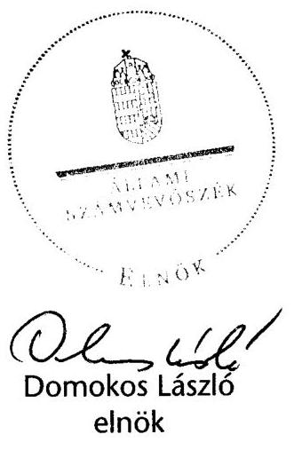

---

# 1. Szervezetirányítási és Működtetési Igazgatóság 

Vizsgálat-azonosító szám: V0483
Témaszám: 1000

## Az ellenőrzést felügyelte:

Dr. Csapodi Pál
főtitkár

## Az ellenőrzés végrehajtásáért felelős:

Dr. Kékesi László
főtitkárhelyettes

## Az ellenőrzést vezette:

Horváthné Menyhárt Erika
főcsoportfőnök-helyettes

## Az ellenőrzést végezték:

| Bojtos Rozália | Göller Géza | Nagyné Lakhézi Éva |
| :-- | :-- | :-- |
| tanácsadó | főtanácsadó | számvevő tanácsos |
| Dr. Somorjai Zsoltné | Vicze Klára | Weltherné Szolnoki Dóra |
| számvevő tanácsos | számvevő tanácsos | számvevő |
| Bálint Józsefné   címzetes főmunkatárs |  |  |

## 2. Államháztartás Központi Szintjét Ellenőrző Igazgatóság 3. Önkormányzati Területi Ellenőrzési Igazgatóság

## Az ellenőrzést felügyelte:

Dr. Becker Pál
főigazgató

## Az ellenőrzés végrehajtásáért felelős:

Horváth Sándor
főigazgató-helyettes
Varga Sándor
főigazgató-helyettes

## Az ellenőrzést vezették:

Hámoriné Maróti Györgyi
főcsoportfőnök-helyettes
Morvay András
osztályvezető főtanácsos
Szarka Péterné
igazgatóhelyettes

Holé Sándorné dr.
igazgatóhelyettes
Pongrácz Éva
osztályvezető főtanácsos
Tolnai Lászlóné
osztályvezető főtanácsos

Lődiné Cser Zsuzsanna osztályvezető főtanácsos
Szabóné Farkas Katalin osztályvezető főtanácsos
Berényi Magdolna osztályvezető főtanácsos

---

| Az összefoglaló jelentést készítették: |  |  |
| :--: | :--: | :--: |
| Balázs Melinda tanácsadó | Dankó Géza irodavezető, | Ferencz Katalin tanácsadó |
| Gáspár Eszter számvevő gyakornok | Görgényi Gábor számvevő tanácsos | Hajdu Károlyné tanácsadó |
| Holló András számvevő | Horcsin Attila számvevő tanácsos | Horváth József főtanácsadó |
| Jagicza Istvánné számvevő tanácsos | Jeszenkovits Tamás tanácsadó | Karsai Lászlóné főtanácsadó |
| Keresztes Tamás számvevő | Dr. Lengyel Attila főtanácsadó | Marozsán Katalin számvevő |
| Niklai Heléna számvevő tanácsos | Peisch Annamária számvevő | Dr. Pósch Gábor főtanácsadó |
| Dr. Remport Katalin főtanácsadó | Sápi Henriett számvevő | Séra Andrásné főtanácsadó |
| Dr. Sipos Dóra számvevő tanácsos | Szilágyi Zsuzsanna tanácsadó | Vas Lajos   főtanácsadó |
| Villányi Antal számvevő tanácsos | Vincze Ibolya számvevő |  |
| Az ellenőrzést végezték: |  |  |
| Baki István számvevő tanácsos | Balázs Melinda tanácsadó | Dr. Baloghné Sebestyén Éva számvevő |
| Bamberger Mária tanácsadó | Bene István számvevő | Béres László számvevő |
| Burenzsargal Narantuja számvevő tanácsos | Czmarkó Frigyes számvevő | Csomsztek Ramóna számvevő gyakornok |
| Dancsóné Kuron Ildikó számvevő tanácsos | Dankó Géza irodavezető, | Deli Gáborné számvevő tanácsos |
| Dombóvári Nóra számvevő tanácsos | Dr. Domján Eszter tanácsadó | Dormán István számvevő |
| Éva Katalin   főtanácsadó | Farkas László   főtanácsadó | Fehérné Jagasich Mariann számvevő tanácsos |
| Fekete Győr László számvevő | Ferencz Katalin tanácsadó | Gáspár Eszter számvevő gyakornok |
| Gergely Tilda számvevő | Görgényi Gábor számvevő tanácsos | Gyarmati István tanácsadó |
| Gyeraj Péter számvevő | Hajdu Károlyné tanácsadó | Holló András számvevő |
| Horcsin Attila számvevő tanácsos | Horváth József   főtanácsadó | Huberné Kuncsik Zsuzsanna   főtanácsadó |
| Huszár József számvevő tanácsos | Huszárné Borbás Melinda számvevő | Jagicza Istvánné számvevő tanácsos |
| Jeszenkovits Tamás tanácsadó | Karsai Lászlóné   főtanácsadó | Keresztes Tamás számvevő |

---

| Kincses Erzsébet Eszter számvevő | Kiss Ferenc Károlyné számvevő | Dr. Lengyel Attila főtanácsadó |
| :--: | :--: | :--: |
| Marozsán Katalin számvevő | Dr. Mezei Imréné irodavezető | Dr. Mészáros Leila számvevő |
| Némethné Nagy Mária számvevő | Niklai Heléna számvevő tanácsos | Peisch Annamária számvevő |
| Pető Krisztina számvevő tanácsos | Polyák Ferenc számvevő tanácsos | Dr. Pósch Gábor főtanácsadó |
| Dr. Remport Katalin főtanácsadó | Sali Sándorné számvevő | Sápi Henriett számvevő |
| Sebők Katalin számvevő gyakornok | Séra Andrásné   főtanácsadó | Dr. Sipos Dóra számvevő tanácsos |
| Szabó Erzsébet számvevő tanácsos | Szilágyi Gyöngyi   főtanácsadó | Szilágyi Zsuzsanna tanácsadó |
| Dr. Szima Mária   főtanácsadó | Szöllősiné Hrabóczki Etelka   főtanácsadó | Vacsora Erika számvevő tanácsos |
| Varga József irodavezető | Varsányiné Dudás Eleonóra számvevő | Vas Lajos   főtanácsadó |
| Vasváriné Molnár Judit számvevő | Dr. Vass Gábor tanácsadó | Villányi Antal számvevő tanácsos |
| Dr. Vincze Ibolya számvevő | Vlasits Ágnes számvevő | Zakar László számvevő tanácsos |

---

# TARTALOMJEGYZÉK 

BEVEZETÉS ..... 5
I. ÖSSZEGZŐ MEGÁLLAPÍTÁSOK, KÖVETKEZTETÉSEK, JAVASLATOK ..... 8
II. RÉSZLETES MEGÁLLAPÍTÁSOK ..... 39
A) A KÖLTSÉGVETÉSI DOKUMENTUM TÖRVÉNYESSÉGI ÉS SZÁMSZAKI ELLENŐRZÉSE ..... 41

1. Az államháztartásról szóló törvény (Áht.) előírásainak érvényesülése a törvényjavaslatban ..... 43
2. A takarékos állami gazdálkodásról és a költségvetési felelősségről szóló törvény (Kftv.) előírásainak teljesítése ..... 46
3. Észrevételek a költségvetési dokumentumhoz ..... 47
B) HELYSZÍNI ELLENŐRZÉS ..... 49
B.1. AZ ÁLLAMHÁZTARTÁS KÖZPONTI ALRENDSZERE ..... 51
4. A tervezőmunka és az ellenőrzés feltételrendszere ..... 51
5. A központi költségvetés közvetlen bevételi előirányzatai ..... 54
2.1. Vállalkozások költségvetési befizetései ..... 56
2.1.1. Társasági adó ..... 56
2.1.2. Hitelintézeti járadék ..... 57
2.1.3. Pénzügyi szervezetek különadója ..... 58
2.1.4. Cégautóadó ..... 59
2.1.5. Egyszerűsített vállalkozói adó ..... 60
2.1.6. Bányajáradék ..... 60
2.1.7. Játékadó ..... 61
2.1.8. Ökoadók ..... 62
2.1.8.1. Energiaadó ..... 62
2.1.8.2. Környezetterhelési díj ..... 63
2.1.9. Egyéb befizetések ..... 63
2.1.10.Energiaellátók jövedelemadója ..... 64
2.1.11.Az egyes ágazatokat terhelő különadók ..... 65
2.2. Fogyasztáshoz kapcsolt adók ..... 66
2.2.1. Általános forgalmi adó ..... 66

---

2.2.2. Jövedéki adó ..... 67
2.2.3. Regisztrációs adó ..... 68
2.3. A lakosság költségvetési befizetései ..... 69
2.3.1. Személyi jövedelemadó ..... 69
2.3.2. Egyéb lakossági adók ..... 71
2.3.3. Lakossági illetékek ..... 71
2.3.4. Magánszemélyek jogviszony megszűnéséhez kapcsolódó egyes jövedelmeinek különadója ..... 72
2.4. Egyéb költségvetési bevételek ..... 73
2.5. Uniós elszámolások ..... 74
3. A központi költségvetés közvetlen kiadási előirányzatai ..... 74
3.1. A központi költségvetés kamatelszámolásai, tőke-vissza-térülései, az adósság- és követeléskezelés költségei ..... 87
3.2. Állami kezességvállalás és kezesség érvényesítés ..... 92
3.3. Állami vagyonnal kapcsolatos bevételek és kiadások ..... 97
3.4. Az államháztartás központi alrendszerének tartalékai ..... 107
3.5. A kormányzati szektor egyéb elszámolásai ..... 110
4. A fejezetek költségvetési előirányzatai ..... 111
4.1. A fejezetek tervezési, szervezési és intézményi felülvizsgálatainak teljesítése ..... 111
4.1.1. A fejezetek költségvetési javaslatai megalapozottsága ..... 117
4.1.2. Bevételi előirányzatok ..... 119
4.1.3. Kiadási előirányzatok ..... 123
4.1.3.1. Létszám ..... 123
4.1.3.2. Személyi juttatások és munkaadókat terhelő járulékok ..... 128
4.1.3.3. Dologi előirányzatok ..... 134
4.1.4. Intézményi felhalmozási kiadások alakulása ..... 136
4.1.5. Kölcsönök alakulása ..... 138
4.2. A fejezeti kezelésű előirányzatok ..... 138
4.2.1. A fejezeti kezelésű előirányzatok újra rangsorolása ..... 139
4.2.2. Speciális fejezeti kezelésű előirányzatok ..... 143
4.2.2.1. A PPP programok ..... 143
4.2.2.2. „Felülről nyitott" fejezeti kezelésű előirányzatok ..... 144
4.2.3. Peres eljárásokkal kapcsolatosan tervezett előirányzatok ..... 145
4.2.4. Központi beruházások alakulása ..... 145
4.3. Az európai uniós tagsággal összefüggő előirányzatok ..... 147
4.4. A költségvetés központosított bevételei ..... 156
5. Egyéb ellenőrzési tapasztalatok ..... 157
5.1. Zöld Beruházási Rendszer ..... 157
5.2. A tanúsítványok tapasztalatai ..... 159

---

5.2.1. Az intézményi és fejezeti kezelésű előirányzatok saját bevételei ..... 160
5.2.2. Éven túli kötelezettségvállalások ..... 161
6. Elkülönített állami pénzalapok ..... 163
6.1. Munkaerőpiaci Alap ..... 164
6.2. Szülőföld Alap ..... 170
6.3. Központi Nukleáris Pénzügyi Alap ..... 173
6.4. Nemzeti Kulturális Alap ..... 176
6.5. Wesselényi Miklós Ár- és Belvízvédelmi Kártalanítási Alap ..... 178
6.6. Kutatási és Technológiai Innovációs Alap ..... 179
7. A társadalombiztosítás pénzügyi alapjai ..... 183
7.1. Nyugdíjbiztosítási Alap ..... 183
7.2. Egészségbiztosítási Alap ..... 189
B.2. AZ ÁLLAMHÁZTARTÁS ÖNKORMÁNYZATI ALRENDSZERE ..... 198

1. A költségvetési törvényjavaslatban a helyi önkormányzati alrendszerrel kapcsolatos szabályozás ..... 198
1.1. Az önkormányzati forrásszabályozás jogi megalapozottsága ..... 198
1.2. A helyi önkormányzatok forrásszabályozása ..... 198
2. A központi költségvetési kapcsolatból származó források és saját bevételek tervezésének megalapozottsága ..... 206
2.1. Normatív és egyéb állami hozzájárulások, támogatások ..... 206
2.2. Átengedett bevételek ..... 211
2.3. Saját bevételek ..... 212
3. A helyi önkormányzatok fejlesztési támogatása ..... 213
3.1. Címzett- és céltámogatások, vis maior tartalék, a fővárosi metróépítés állami támogatása ..... 213
3.2. Egyéb önkormányzati fejlesztéseket szolgáló előirányzatok ..... 215
3.3. A helyi közösségi közlekedés támogatása ..... 217
4. A helyi önkormányzatok gazdasági társaságai romló pénzügyi helyzete, az ebből fakadó kockázatok ..... 217
MELLÉKLET
5. számú Az elkülönített állami pénzalapok és a társadalombiztosítás pénzügyi alapjainak költségvetési adatai a 2011. évi költségvetés véleményezéséhez

---

.

---

# BEVEZETÉS 

Az Állami Számvevőszék (ÁSZ) az Alkotmány 32/C. §-ának (1) bekezdése, valamint az ÁSZ-ról szóló 1989. évi XXXVIII. törvény 2. §-ának (1) bekezdése alapján véleményezi az állami költségvetési javaslat megalapozottságát, a bevételi előirányzatok teljesíthetőségét.

A törvényi felhatalmazással összhangban a számvevőszéki Vélemény - a korábbi évekhez hasonlóan - közvetlenül nem foglal állást az olyan kormányzati társadalom- és gazdaságpolitikai elhatározásokkal, elgondolásokkal kapcsolatban, mint a költségvetés gazdaságélénkítő, illetve egyes területeken végrehajtandó restrikciós intézkedések jellege, illetve azok arányai.

A Véleménynek arra kell irányulnia, hogy a kimunkált előirányzatok mennyire megalapozottak, teljesítésüket a tapasztalati adatok (az előző évek tényleges és a tervévet megelőző év várható teljesítése) alátámasztják-e, valamint a javasolt jogszabályi módosítások elősegítik-e.

A számvevőszéki ellenőrzés az előző évhez hasonlóan - figyelemmel a takarékos állami gazdálkodásról és a költségvetési felelősségről szóló 2008. évi LXXV. törvényben foglaltakra - csak annyiban foglalkozott a makro adatok értékelésével, amennyiben az elkerülhetetlen volt a bevételi és kiadási főösszegek megalapozottságának véleményezésénél.

Az államháztartásról szóló 1992. évi XXXVIII. törvény (Áht.) 29. §-ának (1) bekezdése szerint a költségvetési törvényjavaslatot az Országgyűlés a számvevőszéki Véleménnyel együtt tárgyalja meg.

Az ellenőrzés célja annak megállapítása volt, hogy

- a 2011. évi költségvetési törvényjavaslat ${ }^{1}$ kimunkálása során érvényesültek-e a vonatkozó törvényi, egyéb jogszabályi, az állami irányítás egyéb jogi eszközeiben megfogalmazott előírások, illetve az előirányzatok kialakítására kiadott tervezési Tájékoztatóban² foglaltak;
- a törvényjavaslat megalapozottságát a tervezésnél alkalmazott módszerek, valamint az állami feladatrendszer és a szabályozók már érvényben lévő, illetve bevezetni tervezett módosításai megfelelően biztosítják-e;

[^0]
[^0]:    ${ }^{1}$ T/1498. számú Törvényjavaslat a Magyar Köztársaság 2011. évi költségvetéséről Budapest, 2010. október
    ${ }^{2}$ Tájékoztató a 2011. évi költségvetési törvényjavaslat összeállításához szükséges feltételekről és az érvényesítendő követelményekről, 2010. október (a fejezetek gazdasági vezetői részére 2010. október 7 -én megküldve)

---

- a 2011. évre kialakított költségvetés kiemelten vette-e számításba az EU-tagság, hazánk 2011. évi EU elnökségi feladataiból következő pénzügyigazdasági hatásokat, részletesen és megalapozottan számszerűsítették-e az EU-tól származó forrásokat és a társfinanszírozási követelményeket, valamint az EU költségvetésébe történő befizetési kötelezettséget;
- a szakmai jogszabályok változásából adódó követelmények, kihatások tükröződnek-e az önkormányzati forrásszabályozás egyes elemeiben, különösen a IX. Helyi önkormányzatok támogatásai és átengedett személyi jövedelemadója technikai fejezetben előirányzott hozzájárulások, támogatások összegében.

Véleményünket a 2010. október 18-ától október 25-éig tartó, a költségvetési előirányzatok tervezését végző szerveknél lefolytatott helyszíni ellenőrzés során szerzett tapasztalatok, valamint a 2010. október 30-án rendelkezésünkre bocsátott költségvetési törvényjavaslat alapján alakítottuk ki.

Az ellenőrzések tapasztalatait az ellenőrzöttekkel közös jegyzőkönyvben rögzítettük, ami egyben - az ellenőrzöttek észrevételei, véleményeltérései alapján - biztosította, hogy a tervező munkalehetőség szerinti utolsó változatait használjuk fel véleményünk kialakításakor.

A benyújtott költségvetési javaslatban megjelenő - a helyszíni ellenőrzés lezárása után történt - változások esetében azok tartalmát, okait, megalapozottságát ellenőrizni nem
 volt módunk, amelyet az előfordulásuk helyén meg is jelenítünk.

Az előbbiekben jelzett, leszűkült ellenőrzési lehetőségeink a központi alrendszernél - az elkülönített állami pénzalapoknak és a társadalombiztosítás pénzügyi alapjainak kivételével - a fejezetek teljes körére kiterjedő helyszíni ellenőrzés helyett alapvetően tematikus (a költségvetés szempontjából a tervezéshez kiadott Tájékoztatóban megfogalmazottak alapján kiemelt jelentőségű témák), dokumentumok értékelésére irányuló ellenőrzésre adtak módot.

A dokumentális ellenőrzés megvalósításához a tervező szervezetektől az ellenőrzéshez általunk kidolgozott Tanúsítványokat és az azokat alátámasztó dokumentáció megküldését is kértük.

A tervezési munkafolyamat alakulásából következően a helyszíni ellenőrzés során különböző kidolgozottságú dokumentumokat ellenőriztünk, amelyeket folyamatosan igyekeztünk a rendelkezésünkre bocsátott más munkadokumentumok, valamint a benyújtott költségvetési törvényjavaslat alapján aktualizálni.

Helyszíni ellenőrzést - mivel nem volt ismert, hogy a 2011. évi költségvetés milyen fejezetrendben készül - az alkotmányos fejezeteknél, a Magyar Köztársaság minisztériumainak felsorolásáról szóló 2010. évi XLII. törvényben nevesített minisztériumoknál, az Uniós Fejlesztéseknél, a Gazdasági Versenyhivatalnál, a Központi Statisztikai Hivatalnál, a Magyar Tudományos Akadémiánál, az ún. technikai fejezetek felett felügyeletet gyakorló fejezeteknél, a nemzetgazdasági elszámolások előirányzatai kimunkálásában közreműködő szervezeteknél, valamint az elkülönített állami pénzalapoknál, a társadalombiztosítás pénzügyi alapjainál,

---

illetve az alapkezelőknél, az alap felett felügyeletet gyakorló fejezeteknél végeztünk.

Az Állami Számvevőszék tervezését, előirányzatait - az eddigi gyakorlatnak megfelelően - nem ellenőriztük, így Véleményünkben a fejezetre nincs hivatkozás.

A helyi önkormányzati fejezet véleményezése során a tervezésben érintett Nemzetgazdasági Minisztériumban, Belügyminisztériumban és a Nemzeti Erőforrás Minisztériumban elérhető munkaanyagokra támaszkodhattunk. A helyi önkormányzati alrendszer 2011. évi forrásszabályozására vonatkozó számítási anyagokat 2010. október 27-én bocsátotta rendelkezésre az NGM.

A helyi önkormányzati alrendszer költségvetési kapcsolatainak IX. fejezet Helyi önkormányzatok támogatásai és átengedett személyi jövedelemadója tervezésével összefüggő feladatok, követelmények nem szerepelnek az NGM által a 2011. évi költségvetési törvényjavaslat összeállításához szükséges feltételekről és az érvényesítendő követelményekről szóló 2010. október 7-én kiadott Tájékoztatóban. A korábbi években a költségvetési tervezőmunka, a költségvetési javaslat kidolgozásának és a költségvetési törvényjavaslat összeállításának feladatait, időbeni ütemezését tartalmazó „Tervezési körirat" utalt az államháztartás önkormányzati alrendszere tervezési, szabályozási munkálataira. E szerint a tervezést, szabályozást - az államháztartás egészére szóló feltételrendszer alapulvételével - az államháztartásért felelős minisztérium végezte az önkormányzatokért felelős minisztérium és az érintett ágazati minisztériumok közvetlen bevonásával.

A költségvetési törvényjavaslat véleményezéséhez nem álltak rendelkezésre a helyi önkormányzatok pénzügyi helyzetét bemutató részletes elemzések, a korábbi intézkedések, a szabályozás várható hatását tartalmazó hatástanulmányok. Véleményünk kialakításánál hasznosítottuk a helyi önkormányzatok gazdálkodási rendszerének ellenőrzéséről szóló ÁSZ jelentésben ${ }^{3}$ és az ÁSZKUT „Pénzügyi kockázatok az önkormányzati rendszerben" témakörben készített tanulmányában összegzett tapasztalatokat is.

A Magyar Köztársaság 2011. évi költségvetéséről szóló törvényjavaslat véleményezését nehezítette, hogy a tervező munka helyszíni ellenőrzésének lezárását követően ismertük meg az Országgyűlésnek benyújtott költségvetési törvényjavaslatot, a 2011. évi költségvetést megalapozó egyes törvények módosítását tartalmazó törvényjavaslatok - az előző évhez hasonlóan - a költségvetés készítésével párhuzamosan készültek, illetve zajlott parlamenti vitájuk, valamint az egyeztetések során hatástanulmányok és modellszámítások hiányában, a folyamatosan változó munkaanyagokból kellett az eddigieknél összehasonlíthatatlanul rövidebb időkeretben a Véleményt elkészíteni.

[^0]
[^0]:    ${ }^{3}$ Jelentés a helyi önkormányzatok gazdálkodási rendszerének 2009. évi ellenőrzéséről (1019)

---

# I. ÖSSZEGZŐ MEGÁLLAPÍTÁSOK, KÖVETKEZTETÉSEK, JAVASLATOK 

## A költségvetési dokumentum

A költségvetési dokumentum tekintetében megállapítható, hogy annak normaszövege, illetve indokoló része az egyszerűsítés, illetve áttekinthetőség irányába változott. E mellett azonban az indokoló rész számadatok, magyarázatok, érdemi kifejtések, idősorok, összegző kimutatások hiányában a törvényjavaslat alátámasztásának feladatát kevéssé tölti be.

Az Áht. több helyen is rendelkezik a költségvetési törvényjavaslatot illetően a jövőt érintő kötelezettségek előirányzatainak bemutatásáról, azok korlátozásáról, és előírja a hosszú távú kötelezettségvállalások állományának a fejezetek és a várható kifizetések éve szerinti bontásban való bemutatását, a többéves elkötelezettséggel járó kiadási tételek későbbi évekre vonatkozó hatásainak bemutatását, a központi beruházások hároméves programjának bemutatását, a középtávú kötelezettségvállalási korlátozások előírását, valamint a hosszú távú kötelezettségvállalásokból eredő kifizetési keret összegének meghatározását.

Ezen előírások tartalma, illetve egymáshoz való viszonya nem egyértelmű, esetenként átfedésben van, így a törvénynek való megfelelés és annak megítélése is nehézségekbe ütközik. Mindezek mellett véleményünk szerint a költségvetési törvényjavaslatokból évek óta hiányzik egy olyan, az áttekinthetőséget, a döntések megalapozását segítő összegző kimutatás, amely fejezetenként tartalmazza valamennyi, többéves kihatású döntést és azok számszerűsített, évekre bontott hatását.

## A tervezés és az ellenőrzés feltételrendszere

A hatályos jogszabályok nem tartalmaznak pontos előírást az ÁSZ Vélemény elkészítésének feltételeire - a Tájékoztató, a fejezeti keretszámok, valamint a benyújtásra kerülő költségvetési törvényjavaslat ÁSZ részére történő átadásának időpontjára - vonatkozóan. A feltételek meghatározásának hiányában minden évben olyan időpontban bocsátják az ÁSZ rendelkezésére a szükséges dokumentumokat, amely az éves költségvetési törvényjavaslat teljes körű véleményezését nem teszi lehetővé. A Vélemény kialakítását befolyásolja az az évek óta visszatérő tény, hogy a törvényjavaslat benyújtásának időpontjában az előirányzatokat megalapozó egyes jogszabályok még nem hatályosak. A jelzett körülmények következményeként az Országgyűlés költségvetési jogának gyakorlását nem tudjuk megfelelő módon segíteni.

---

A 2011. évi költségvetési törvényjavaslatról alkotott ÁSZ Véleményt a 2010. október 18-ától október 25-éig tartó - a költségvetési előirányzatok tervezését végző szerveknél lefolytatott - helyszíni ellenőrzés során szerzett tapasztalatok, valamint a 2010. október 30-án rendelkezésünkre bocsátott költségvetési törvényjavaslat alapján alakítottuk ki. A benyújtott költségvetési törvényjavaslatban megjelenő, a helyszíni ellenőrzés lezárása után történt változások tartalmát, okait, megalapozottságát ellenőrizni nem volt módunk, ezeket az előfordulásuk helyén Véleményünkben megjelenítjük.

A helyszíni ellenőrzésen - az ÁSZ részére átadott dokumentumok alapján szerzett tapasztalatokat az ellenőrzöttekkel közös jegyzőkönyvben rögzítettük, ami - az ellenőrzöttek észrevételei, véleményeltérései alapján - biztosította, hogy a tervező munka lehetőség szerinti utolsó változatait használjuk fel véleményünk kialakításakor.

Az NGM tervezési Tájékoztató az eddigi gyakorlattól részben már eltérő, új tervezési gyakorlat megvalósítását irányozta elő, amely szerint a bázisalapú tervezési módszertant az állami feladatok körének a meghatározása, az ennek ellátásához szükséges források meghatározása váltja fel. A korábbi évek költségvetési tervezéséről alkotott ÁSZ vélemények visszatérően sürgették a bázisalapú tervezés megújításának szükségességét, így ez a jó irányba tett első lépésként értékelhető.

A Tájékoztatóban a konkrét tervezési követelmények - a fejezetek kiemelt előirányzatonkénti illetve törvényi soronkénti - meghatározásánál a korábbi tervezési gyakorlat (bázisalapú tervezés) szerinti előírások jelentek meg. A 2011. évi tervezés ellenőrzésének tapasztalatai alapján megállapítható, hogy a fejezeti keretszámok kiadása még az előző évek gyakorlatánál is részletesebb volt, erősebben érvényesült a bázis összege, kevesebb mozgásteret biztosított a fejezetek tervező szervei részére.

A Tájékoztatónak a fejezeti keretszámok visszatervezésére vonatkozó előírása, a különböző determinációknak a keretszámokba való illesztésére is kiterjedt, amely a 2011. évre előirányzott egyensúlyi célok elérése szempontjából különös hangsúlyt kapott.

# A központi költségvetés közvetlen bevételi és kiadási előirányzatai 

A 2011. évről szóló költségvetésben a XLII. fejezet kibővült, a közvetlen bevételek mellett tartalmazza a közvetlen kiadások egy részét is.

A bevételeken belül a legnagyobb arányt, 97,7%-ot a vállalkozások költségvetési befizetései, a fogyasztáshoz kapcsolt adók és a lakosság költségvetési befizetései jelentik. A fennmaradó 2,3%-ba tartoznak az egyéb költségvetési bevételek, a költségvetési befizetések és az államháztartás helyzetét kiegyensúlyozó alapból származó bevétel, valamint az egyéb uniós bevételek.

A fejezetben megjelenő közvetlen kiadások köre azokat az előirányzatokat (lakástámogatások, vállalkozások folyó támogatása, fogyasztói árkiegészítés,

---

egyéb költségvetési kiadások, állam által vállalt kezesség és viszontgarancia érvényesítése, kormányzati rendkívüli kiadások, garancia és hozzájárulás a társadalombiztosítási ellátásokhoz, nemzetközi elszámolások kiadásai, hozzájárulás az EU költségvetéséhez, adósság-átvállalás és tartozás-elengedés) tartalmazza, amelyek a 2010. évben még az NGM fejezet alatt ún. vonal alatti tételekként szerepeltek.

Néhány közvetlen kiadás a 2011. évről szóló költségvetésben is - a 2010. évi költségvetéshez hasonlóan - egyes fejezetek ún. vonal alatti tételeként jelenik meg. A tartalékok és a volt egyházi ingatlanok tulajdoni helyzetének rendezése a KIM, a rendkívüli kormányzati intézkedések az ME, a vállalkozások folyó támogatásának egy része, továbbá a K-600 hírrendszer működtetésére szolgáló előirányzat és a peres ügyek az NFM, a családi támogatások, valamint az egyéb szociális ellátások és költségtérítések a NEFMI fejezetben szerepelnek. Az adósságszolgálattal kapcsolatos bevételeket és kiadásokat az XLI. A központi költségvetés kamatelszámolásai, tőke-visszatérülései, az adósság- és követeléskezelés költségei fejezet tartalmazza. Az állami vagyonnal kapcsolatos bevételek és kiadások a XLIII. Az állami vagyonnal kapcsolatos bevételek és kiadások fejezetben és a XLIV. A Nemzeti Földalappal kapcsolatos bevételek és kiadások fejezetben szerepelnek.

# A közvetlen bevételek a költségvetési törvényjavaslatban a központi költségvetés bevételi főösszegének 75,9%-át jelentik. 

A törvényjavaslatban szereplő egyes bevételi előirányzatok összege az általános forgalmi adónál 5000,0 M Ft-tal nőtt, a jövedéki adónál 12,0 M Ft-tal csökkent a törvényjavaslatban az ÁSZ rendelkezésére bocsátott dokumentumokhoz képest, valamint megjelent egy új - az ellenőrzés során nem ismert - 78,0 Mrd Ft összegű bevételi előirányzat, az államháztartás helyzetét kiegyensúlyozó alapból származó bevétel. A bevétel forrására, illetve a változások okaira vonatkozóan az ellenőrzés nem rendelkezik információval.

A 2010. második félévében, illetve a 2011. januárjától hatályba lépő adó- és járulékmódosítások, továbbá a vállalkozói szférát (kis- és középvállalkozásokat) is érintő változások a válság hatásainak enyhítését, az abból való fokozatos kikerülést, a gazdaság növekedésének beindítását, valamint a foglalkoztatottság növelését hivatottak szolgálni a költségvetési stabilitás biztosítása mellett.

Az egyes adókkal kapcsolatos jogszabályváltozások (a társasági adót érintő 2010. évi módosítás, a személyi jövedelemadó 2011. évtől egykulcsossá válása, a pénzügyi szektor különadójának és az ún. „válságadók" 2011. évi bevezetése, azok több évre történő kiterjesztése stb.) kisebb mértékben adókiesést, nagyobb mértékben bevételnövekedést eredményeznek. A személyi jövedelemadóval kapcsolatos változás, illetve a szélesebb kör által igénybe vehető és jelentősen megemelkedő családi adókedvezmény a lakosság adóterheinek csökkentését, a rendelkezésre álló jövedelmének növelését célozzák. Az adórendszer változásai a vásárlóerő és a foglalkoztatottság növekedésének irányába kívánnak hatni.

A társasági adózásban a 2010. évi törvénymódosítás alapján 2011-től 500,0 M Ft-ra emelkedik a 10%-os kulcs alá eső adóalaprész, ami bevételcsökkenést okoz. A társasági adót mérsékli a pénzügyi szervezetek különadója és az

---

ún. válságadó fizetésére kötelezett gazdasági társaságok által - az adóalapba beszámító - fizetendő adó összege is. Az általános forgalmi adót érintően 2011-től jogharmonizációs célú módosítások következnek be. A jövedéki szabályozásban a dohánytermékekre vonatkozóan történik szabályozásváltozás az uniós irányelvnek való megfelelés érdekében. Szigorodnak az adójegy készletezéssel kapcsolatos szabályok, amelyek a bevételekre hatást gyakorolnak, és teljesülésüket kevésbé kockázatossá teszik. Csökkennek továbbá az egyéb lakossági adók befizetései a bérfőzési szeszadót érintő jogszabályváltozás miatt.

Az államháztartás egyensúlyának javítása, valamint a kieső adóbevételek pótlása érdekében azonban több - az általános adófizetési kötelezettséget meghaladó közteherviselésre képes - ágazatot érintő adó bevezetésére, illetve időbeli kiterjesztésére kerül sor a 2011. évtől kezdődően. Így a bankok, biztosító társaságok és pénzügyi lízingcégek, az energiaellátók jövedelemadó-fizetési kötelezettségének 2011-re történt időbeli kiterjesztése, a távközlési és telekommunikációs
 ágazat, az energiaszektor, valamint a kereskedelmi üzletláncok a 2010–2012. közötti időszakban különadót kötelesek befizetni a költségvetésbe, amelynek tervezett összege 2011-ben összesen közel 370,0 Mrd Ft.

A központi költségvetés 2011. évi adóbevételi előirányzat tervezeteinek megalapozottságát, annak előző évekhez viszonyított változását - a korábbi évekhez hasonlóan - teljes körűen nem tudtuk megítélni. Kedvező azonban a 2010. évi költségvetés véleményezéséhez képest bekövetkezett változás, mely szerint a 2011. évről szóló költségvetés esetében 33,5%-ra (a 2010. évinél ez az arány 96% volt) csökkent azoknak az adóbevételeknek (2012,3 Mrd Ft) az aránya, amelyekről nem tudtunk véleményt mondani. Az adóbevételek előirányzat tervezeteinek 45,7%-át értékeltük teljesíthetőnek, 14,6%-ának realizálhatóságát közepes kockázatúnak és 6,2%-át magas kockázatúnak, az ellenőrzés lezárásakor rendelkezésre álló dokumentumok alapján. A megalapozottságot részletes számítási anyagok hiányában az adóbevételek 83,2%-ánál nem tudtuk értékelni, de - ezekben az esetekben, ahol volt rá lehetőség - a teljesíthetőséget a korábbi évek tendenciái és a Költségvetési Tanács technikai kivetítései alapján minősítettük.

Magas kockázatúnak minősítettük a társasági adó előirányzat tervezetének (362,0 Mrd Ft) teljesíthetőségét, mivel nem volt ismert egyes összetevők (az adóalapot növelő és csökkentő tételek, az 500,0 M Ft-ot meghaladó adóalap összege, a korábbi években elhatárolt veszteségek 2011. évre figyelembe vett része, a nyereséges és veszteséges gazdálkodók száma, aránya) számszerűsítése, továbbá a társasági adóbevételt meghatározó fizetendő társasági adót az NGM a 2010. évi várható 380,3 Mrd Ft-tal szemben 2011-re 317,1 Mrd Ft-ban határozta meg. A rendelkezésre álló dokumentumok nem tartalmazták ennek okát és a mögötte lévő közgazdasági összefüggéseket. Magas kockázatú továbbá a hitelintézeti járadék előirányzat-tervezete (10,8 Mrd Ft), tekintettel a lakásvásárlási és építési (ezen adónemből származó bevételeket közvetlenül meghatározó) támogatások csökkentésére, valamint a 2010. évi várható teljesítésre.

Közepes kockázatúnak értékeltük a jövedéki adó előirányzat tervezetének (878,0 Mrd Ft) teljesíthetőségét, mivel az adóalanyok a dohánytermék csoportnál 2010. októberében jelentős mennyiségű adójegyet rendeltek, decemberi fizetéssel. Az előirányzat-tervezet mintegy 52,0 Mrd Ft 2010. decemberi adóbefize-

---

tés feltételezése mellett készült, amely az NGM október végén adott indokolása szerint is kockázatot jelentett, azonban az azóta véglegessé vált októberi adójegy kiadási adatok ettől nem mutatnak szignifikáns eltérést (55 Mrd Ft a fizetési kötelezettség decemberre) az NGM-től 2010. november 4-én kapott információ alapján. Az üzemanyagok tervezett forgalmára nézve bizonytalanságot jelent az olajárak és az árfolyamok alakulása.

Nem tudtunk véleményt adni a pénzügyi szervezetek különadójának (187,0 Mrd Ft) teljesíthetőségéről, mivel a rendelkezésre álló dokumentumok nem tartalmazták a szükséges összetevők (az adó alapját képező mérlegfőösszeg, korrigált díj, kamateredmény, díj- és jutalékeredmény, korrigált nettó árbevétel, nettó eszközérték, illetve a kezelt vagyon) adatait és a prognózis alapját képező feltételrendszert. Hasonlóképpen nem tudtuk minősíteni az eva (196,1 Mrd Ft), az energiaellátók jövedelemadója (20,0 Mrd Ft), az egyes ágazatokat terhelő különadók (161,0 Mrd Ft), az szja (1359,0 Mrd Ft), az illetékek (88,2 Mrd Ft) és a magánszemélyek jogviszony megszűnéséhez kapcsolódó egyes jövedelmeinek különadója (1,0 Mrd Ft) előirányzat tervezeteinek realizálhatóságát.

Az ÁSZ a 2011. évről szóló költségvetés véleményezésénél a GDP törvényjavaslatban megjelenő 3%-os növekedését elfogadva (a KT a 2010. augusztus 18-ai technikai kivetítésében 2,9%-os GDP növekedést prognosztizál a 2011. évre) jelzi, hogy a GDP nem tervezettnek megfelelő teljesülése az egyes adónemek (pl. társasági adó, áfa) realizálásánál is kockázati tényező lehet.

Az állami vagyonnal kapcsolatos bevételek és kiadások a 2011. évtől kezdődően két fejezetben jelennek meg, mivel a 2011. évtől az NFA-val kapcsolatos bevételek és kiadások egy önálló költségvetési fejezetben szerepelnek. Az állami vagyonnal kapcsolatos bevételeket és kiadásokat tartalmazó fejezetben a bevételek (34,7 Mrd Ft) 14,1%-a (az értékesítési bevételek) magas kockázatú, 85,9%-a teljesíthető és 0%-a nem megalapozott. Az állami vagyonnal kapcsolatos kiadások (73,0 Mrd Ft) 52,7%-a megalapozott. Az állami vagyonnal kapcsolatos kiadásokon belül a fejezeti tartalék összegeként 3,5 Mrd Ft-tal magasabb összeg szerepel a törvényjavaslatban, mint a helyszíni ellenőrzés lezárásaként felvett jegyzőkönyvben. A növekedés okát az ellenőrzés nem ismeri. Az NFA-val kapcsolatos bevételek (8,0 Mrd Ft) és kiadások (14,5 Mrd Ft) teljesíthetősége, illetve megalapozottsága számítások hiányában nem megítélhető.

A közvetlen kiadások a költségvetési törvényjavaslat a központi költségvetés kiadási főösszegének több mint 45%-át jelentik. Egy jelentős részüknél (adósságszolgálattal kapcsolatos kiadások, család-, illetve lakástámogatások) a kiadások előirányzat módosítási kötelezettség nélkül, az uniós támogatásoknál korlátozásokkal túlteljesíthetők. Az előirányzat-módosítási kötelezettség nélkül túlteljesíthető kiadások köre a költségvetési törvényjavaslatban rögzített hiány betartásánál kockázati tényezőként jelentkezhet. A kockázatot csökkentheti a költségvetési törvényjavaslatban a tartalékok között új költségvetési sorként megjelenő rendkívüli kormányzati intézkedések elnevezésű előirányzat (90,0 Mrd Ft). A költségvetési törvényjavaslatban már nem szerepel az általános tartalék 48,0 Mrd Ft-os összege (a helyszíni ellenőrzés lezárásaként

---

felvett jegyzőkönyvben még a tartalékok között megjelent). Az Áht. módosítására nem került sor.

Az ellenőrzés által minősített közvetlen kiadási előirányzatok esetében - a fogyasztói árkiegészítést és az NFM fejezetnél megjelenő vállalkozások folyó támogatását kivéve - a 2010. évi előirányzathoz képest változó mértékben csökkentett összegű előirányzat-tervezeteket alakítottak ki a tárcák a helyszíni ellenőrzés lezárásaként felvett jegyzőkönyvekhez rendelkezésre álló dokumentumok alapján, figyelembe véve a takarékossági követelményeket.

A központi költségvetés közvetlen kiadási előirányzatai - a volt egyházi ingatlanok tulajdoni helyzetének rendezése kivételével - megalapozottak. A magánnyugdíjpénztárba átlépők miatti járulékkiesés pótlására szolgáló előirányzat megszüntetését az indokolja, hogy a Kormány 14 hónapra felfüggeszti a magánnyugdíj-pénztári tagdíjbefizetéseket és ezzel megegyező járulék-fizetés történik az Ny. Alap részére. Az erre vonatkozó jogszabályt az Országgyűlés 2010. október 25-én fogadta el.

A törvényjavaslatban több előirányzat-tervezet összege megváltozott az ellenőrzés lezárásaként felvett jegyzőkönyvhöz rendelkezésre álló adatokhoz képest. A vállalkozások folyó támogatásának összege 46,0 Mrd Ft-tal, a garancia és hozzájárulás a társadalombiztosítási ellátásokhoz előirányzat összege 361,1 Mrd Ft-tal csökkent a korábbihoz képest. Ennek oka az ellenőrzés előtt nem ismert, így annak indokoltságáról nem áll módjában véleményt adni. Az egyéb költségvetési kiadások előirányzat tervezete is csökkent a jegyzőkönyvi állapothoz képest 2,4 Mrd Ft-tal, mivel egyes jogcímcsoportok korábbival egyező összegű előirányzatai a törvényjavaslatban már más fejezet előirányzataiként jelennek meg.

Az ellenőrzés lezárásaként felvett jegyzőkönyvhöz rendelkezésre álló - finanszírozási tervben szereplő - összeghez képest az adósságszolgálattal kapcsolatos pénzforgalmi kiadások 3,0 Mrd Ft-tal csökkennek a költségvetési törvényjavaslatban. A csökkenés a költségvetés forintban fennálló adóssága után tervezett kamatkiadással függ össze, azon belül a hiányt finanszírozó és adósságmegújító államkötvények kamatelszámolásaival. A törvényjavaslatban megjelenő előirányzat-tervezet összege 599,8 Mrd Ft, a finanszírozási tervben szereplő összeg 602,8 Mrd Ft. A törvényjavaslatban a központi alrendszer hiánya 16,9 Mrd Ft-tal magasabb, mint a finanszírozási tervben. A növekedés összegét a központi költségvetés hiányának 25,9 Mrd Ft-os tervezett csökkenése, illetve a társadalombiztosítási alapok hiányának 42,8 Mrd Ft-os növekedése határozza meg. A költségvetési törvényjavaslatban megjelenő hiányhoz kapcsolódó finanszírozási terv nem állt az ellenőrzés rendelkezésére. A költségvetési törvényjavaslat Országgyűlés által történő elfogadását követően minden költségvetési évben új finanszírozási terv készül. A 2009. novemberében jóváhagyott középtávú adósságkezelési stratégia felülvizsgálatára az ÁKK Zrt. tájékoztatása szerint - a kialakult gyakorlatnak megfelelően - 2010. novemberében kerül sor.

A 2010. évi finanszírozási terv nagymértékű változása, a 2011. évi magasabb nettófinanszírozási igény, a változó befektetői megtakarítási szerkezet, a külföldiek forint- és devizavásárlási hajlandóságának kedvezőtlen alakulása, az

---

állampapír-piaci hozamszint nem a prognózisnak megfelelő csökkenése, valamint a forint és az euró tervezett árfolyamának kedvezőtlen változása egyaránt kockázati tényezőként jelentkezhet a 2011. évi finanszírozási terv teljesülésénél.

A gazdasági válság miatt a kezességbeváltási kockázatok is megemelkedtek. Az egyes előirányzat-tervezetek számításokkal megalapozottak, de a kezesség- és garanciabeváltások tartalmaznak előre nem látható bizonytalansági tényezőket. Tekintve, hogy ez az előirányzat is felülről nyitott, a hiányt esetlegesen kedvezőtlenül érintő hatása miatt kockázatos. Az állam által vállalt kezesség és viszontgarancia érvényesítésének 2010. évi várható teljesítése 83,3%-kal haladja meg a 2010. évi előirányzatot. A lakáshitelekből származó beváltások, a GH Zrt., a MEHIB Zrt. és az EXIMBANK Zrt. költségvetést terhelő kifizetései 17,1 Mrd Ft-tal lépik túl a 2010. évi előirányzatot.

# A költségvetési szervek és a fejezeti kezelésű előirányzatok 

A Véleményünk kialakításához rendelkezésre álló rendkívül rövid idő miatt néhány napos helyszíni ellenőrzést folytattunk le a tárcák tervezést végző szerveinél, amelynek során kiemelten az NGM tervezési Tájékoztatójában foglaltak végrehajtását ellenőriztük. A helyszíni ellenőrzés tapasztalatairól - az egyeztetési folyamat időigényének csökkentése érdekében - az ellenőrzöttekkel közös jegyzőkönyvet vettünk fel.

Nehezítette mind a tervezés, mind az ellenőrzés végrehajtását a folyamatosan változó jogszabályi környezet, mivel a tervezés időszakában és azt követően is történt új jogszabályok elfogadása, illetve a hatályosak módosítása. A 2011. évi tervező munkát - a korábbi évekhez hasonlóan - jellemezte az, hogy az előirányzatok kimunkálása során még el nem fogadott (nem hatályos) jogszabályok költségvetési hatásaival is számoltak.

A korábbi évek gyakorlatától eltérően az NGM a 2011. évi támogatási keretszám kialakításánál a bázis meghatározásához valamennyi módosító tényezőt annak valóságos tartalmától függetlenül szerkezeti változásként számszerűsítette, amely nincs összhangban az Ámr. 28. § (4) bekezdésében foglaltakkal.

Az Országgyűlés - a Magyar Köztársaság minisztériumainak felsorolásáról szóló 2010. évi XLII. törvénnyel - átalakította a kormányzati struktúrát. A szervezeti módosítások következtében a fejezetek száma (az alapok és a technikai fejezetek nélkül) - a 2010. évi költségvetési törvényben szereplő 25-ről - 21-re csökkent.

A szervezet átalakítási folyamatok - a 2011. évi költségvetési tervjavaslat helyszíni ellenőrzésének befejezéséig - nem zárultak le. A költségvetési szervek működésére és gazdálkodására vonatkozó változások alapító okiraton és a törzskönyvi nyilvántartásban való átvezetése sem valósult meg teljes körűen.

A már végrehajtott - fejezetek/költségvetési szervek közötti - feladat és szervezet átadás-átvételek ellenőrzésére jelen vizsgálat nem terjedt ki, az egy későbbi vizsgálat tárgyát képezi.

---

A fejezetek irányító szervei jellemzően - a korábbi éveknek megfelelően - 2010. július-augusztus hónapban megkezdték a 2011. évi költségvetés tervezésének előkészítését. Az NGM a Tájékoztatót és a fejezeti keretszámokat, valamint a fejezeti címekre lebontott részletes adattáblákat 2010. október 7-én adta át a fejezetek részére. A fejezeti költségvetési javaslat leadásának határideje 2010. október 12-e volt, így a rövid határidő miatt - a jogszabályban előírtakkal ellentétben - a tárcák (néhány kivételtől eltekintve) intézményeik felé körlevelet nem adtak ki. A fejezetek a leosztott keretszámok, a Tájékoztató, a jogszabályok, a jogszabályi változásokra tett javaslatok, prioritások figyelembevételével készítették el költségvetési javaslataikat.

A bevételekre az NGM keretszámot nem határozott meg, de iránymutatást adott a tervezéshez. Ennek ellenőrzéséhez az ÁSZ tanúsítványt is kért a tervező szervezetektől. A költségvetési törvényjavaslathoz kialakított keretszámok és a tanúsítványok ismeretében megállapítható, hogy a tárcák - öt fejezet (KE, ALB, OBH, ME, GVH) kivételével, amelyek a sajátosságaikból adódóan
 teljes mértékben költségvetési támogatásból gazdálkodnak – megtervezték bevételi előirányzataikat. A Tájékoztató előírta, hogy a 2010. évi várható teljesítéshez viszonyított alacsonyabb bevétel tervezésénél rendelkezni kell az államháztartásért felelős miniszter engedélyével és az eltérést mindkét irányban indokolni kell. A helyszíni ellenőrzés során tapasztaltuk, hogy ezt az előírást több tárca nem tartotta be.

A várható bevételektől való eltérést a fejezetek általában indokolták, de csak két fejezet – a BM és a KüM – rendelkezett az államháztartásért felelős miniszter engedélyével.

A díjazás ellenében nyújtott szolgáltatások bevételei tervezésénél alapvetően a Tájékoztató – a bevételnek legalább a ráfordítást fedezni kell – előírását figyelembe vették.

Két tárcánál (KIM, NEFMI) a vizsgálat részére nem adták át a bevétel tervezését alátámasztó dokumentációt, így a Tájékoztató ezen előírását nem tudtuk ellenőrizni.

A 2004. évi XXXIV. törvény 2011. január 1-jétől hatályos módosítása alapján a kiszabott bírság közvetlenül a hatóság működési költségeire nem használható fel.

Két tárca – VM, BM – jelezte, hogy ezen előírás betartásával a működése nem tartható fenn. A BM Rendőrség címnél a helyszíni ellenőrzés időszakában az NGM-mel még folyamatban volt az egyeztetés.

Az NGM-től 2010. november 4-én írásban kapott információk szerint az előírás eredeti célját megtartó pontosítására tesz a Kormány javaslatot, amellyel a működés biztosíthatóvá válik.

További változást jelent a támogatás értékű bevételek tervezésében 2011. évre, hogy a korábban az MPA-tól átvett forrást támogatással kívánják kiváltani.

A 2011. évre a Regionális Képző Központoknál – az eddigi gyakorlattal szemben az MPA-tól átvett bevételi forrás helyett költségvetési támogatást terveztek, amely azonban összegében alacsonyabb.

---

A fejezetek létszámának meghatározására a Tájékoztató – a 2010. évi tervezett létszám korrekciója után az igazgatás és igazgatás jellegű költségvetési szerveknél 5%-os, a háttérintézményeknél 10%-os – létszámcsökkentést írt elő, melynek ütemezését és pénzügyi fedezetét a tárcáknak kellett meghatározni annak érdekében, hogy a felmerülő egyszeri többletkiadások forrását az év közben ezáltal, illetve az egyébként realizálódó megtakarítások biztosítsák. A létszámleépítéshez kapcsolódó, a Tájékoztató mellékletét (KKF 3. számú) képező kimutatást a tárcák elkészítették, melyben bemutatták a létszámleépítés időütemezését, várható költségeit és megtakarításait.

Az ellenőrzés során megállapításra került, hogy a háttérintézmény fogalmának nincs jogszabályi definíciója (a Tájékoztató – a KKF 2. sz. melléklet – nevesítette azon intézményeket, amelyeknél a létszámcsökkentést végre kellett hajtani). A szervezeti változásokat az 1166/2010. (VIII. 4.) Korm. határozat követte, illetve a tervezés során figyelembevett, de még nem hatályos jogszabályok nem voltak összhangban egymással, így a létszám szabályszerű tervezésének megítélése szinte lehetetlen volt.

A tárcák betartották azt a követelményt, hogy személyi juttatás nélkül létszám nem tervezhető.

A feladatnövekedés miatti létszám tervezése minden tárcánál megvalósult. Az EU-s források terhére az NFM fejezet tervezett létszámot. Az ellenőrzés során megállapítottuk, hogy a VM tárca nem mutatott ki európai uniós forrás terhére létszámot, holott már 2010. évben is – határozott idejű szerződéssel – foglalkoztattak munkavállalókat a forrás terhére.

A személyi juttatások és a munkaadókat terhelő járulékok tervezéséhez a Tájékoztató szigorú követelményeket – évek óta változatlan illetményalap/alapilletmény és közalkalmazotti illetménytábla, a nem rendszeres személyi juttatások megvonása, illetve csökkentése, a külső személyi juttatások minimális szinten történő előírása – fogalmazott meg. A tárcák – két fejezet (KIM, BM) kivételével, ahol a helyszíni ellenőrzés időszakában értékelhető dokumentáció hiányában nem volt megállapítható – betartották a változatlan illetményalap/alapilletmény és közalkalmazotti illetménytábla alkalmazásával történő rendszeres személyi juttatások tervezésére vonatkozó előírást. Jutalmat nem terveztek, a cafetéria juttatás tervezése során – a KIM kivételével, ahol nem állt rendelkezésre háttérszámítás – betartották a 200 E Ft/fő előírást. A BM jelezte, hogy forráshiány miatt a cafetéria tervezésénél a javasolt mértékű juttatást nem tudta megtervezni, ezért a helyszíni ellenőrzés idején az NGM-mel egyeztetést folytattak. A helyszíni ellenőrzés során három fejezet (KIM, NEFMI, MTA) jelezte, hogy a tervezett személyi juttatás előirányzata nem nyújt fedezetet a jogszabályokban előírt kötelező kifizetésekre. A munkaadókat terhelő járulékok tervezése minden fejezetnél a Tájékoztatóban foglaltak alapján történt.

A dologi kiadások tervezéséhez a Tájékoztató iránymutatást adott, mely szerint ésszerű takarékossági követelményeket kell érvényesíteni és a 2010. évi korrigált eredeti előirányzathoz viszonyított 5%-os megtakarítást kell érvényesíteni.

---

A Tájékoztató előírta a dologi kiadások megtakarításán belül azok egyes típusainak javasolt mértékű csökkentését is, melynek ellenőrzésére a tervezés jelenlegi szakaszában nem kerülhetett sor, mivel a tárcák ezeket az előirányzatokat csak az elemi költségvetés összeállításánál számszerűsítik.

A tárcák a kiadások rangsorolását elvégezték, a prioritásokat meghatározták. A helyszíni ellenőrzés során több tárca (BIR, KIM, VM) jelezte, hogy már a 2010. évi dologi kiadás előirányzat sem nyújtott fedezetet a kiadásokra, így várhatóan a 2011. évre tervezett előirányzat sem fogja fedezni azokat.

A dologi kiadások fedezethiányát a BIR fejezetnél más kiemelt előirányzat terhére tervezték csökkenteni.

A számlás szellemi foglalkoztatás előirányzatát hat fejezet (BIR, KIM, VM, HM, NGM, NEFMI) a helyszíni ellenőrzés során még nem számszerűsítette.

Az intézményi felhalmozási kiadások tervezéséhez a Tájékoztató hasonló iránymutatást adott – takarékossági, rangsorolási szempontok meghatározása –, mint a dologi kiadásokra, de nem írt elő kötelező csökkentést. A fejezetek jellemzően a rendelkezésre álló források alapján meghatározott kereteknek megfelelően tervezték az előirányzatot, amely az eszközök állag- és értékmegóvására, valamint a legszükségesebb tárgyi eszközök pótlására nyújt fedezetet.

A fejezeti kezelésű előirányzatok tervezésénél az NGM a támogatási keretszámot a korábbinál részletesebben – törvényi soronként – határozta meg. A tárcák – az ALB, az OBH és a GVH kivételével – terveztek fejezeti kezelésű előirányzatokat. A tervezési munka során elvégezték a fejezeti kezelésű előirányzatok felülvizsgálatát, javaslatot tettek címrend változásra.

A Tájékoztató alapján a 2011. évi EU elnökséggel kapcsolatban csak a KüM fejezetnél lehetett előirányzatot tervezni, ezzel szemben az ME is tervezett ilyen jellegű kiadást a fejezeti kezelésű előirányzatai között, a KIM pedig jelezte, hogy többletkiadása várható.

A PPP kiadásokkal kapcsolatosan az NFM fejezet – a Tájékoztató előírásainak megfelelően – a fejezeti kezelésű előirányzatok között tervezett kiadási előirányzatot. Az ÁSZ által bekért, az éven túli kötelezettségvállalásokat tartalmazó tanúsítványok alapján megállapítottuk, hogy két tárca (BM, NEFMI) intézményi kiadásként tervezett PPP-vel kapcsolatos kiadást.

A Tájékoztatóban meghatározták, hogy a „felülről nyitott” fejezeti kezelésű előirányzatok összegét a tárcáknak a keretszámban meghatározott összegben kell tervezni, az nem csökkenthető. Az érintett tárcák – két tárca (BM, NGM) kivételével – az előírásoknak megfelelően tervezték a „felülről nyitott” előirányzatokat.

A tervezés időszakában már ismert, peres eljárásokra fedezetet a fejezetek – a BM kivételével – a fejezeti kezelésű előirányzatok között terveztek.

Egy tárca (NEFMI) nem tartotta be azt az előírást, hogy a fejezeti kezelésű előirányzatok tervezésénél a tételes, jogcímre kapott támogatás többletet más jogcímre csak az államháztartásért felelős miniszter jóváhagyásával lehet átcsoportosítani.

---

A Tájékoztató a központi beruházások tervezésére adott iránymutatást. Az érintett fejezetek az előirányzatokat ennek betartásával tervezték meg.

A Tájékoztató nevesítette négy fejezetnél (KIM, NGM, NFM, VM) az egyéb központosított bevételek jogcímeit. A helyszíni ellenőrzés során megállapítottuk, hogy a tárcák az egyes címeken tervezett központosított bevételeket becsléssel, előző évi tapasztalati, vagy a várható teljesítés alapján határozták meg.

A helyszíni ellenőrzést követően az OGY részére benyújtott törvényjavaslat több fejezetnél mind a bevételeket, mind a kiadásokat, továbbá a központosított bevételeket érintően több változást tartalmazott, melynek tartalmára, okaira, megalapozottságára vonatkozóan nem rendelkezünk információval.

# Az európai uniós elszámolások 

Az EU költségvetéséhez való hozzájárulás tervezett mértéke a 2011. évre vonatkozóan 258,1 Mrd Ft, magában foglalja az áfa-alapú hozzájárulás, (36,6 Mrd Ft) a GNI alapú hozzájárulás, (208,6 Mrd Ft), valamint a brit korrekció (11,1 Mrd Ft) finanszírozási költségeit, ezen felül a Hollandia és Svédország számára teljesítendő bruttó GNI csökkenéssel összefüggő befizetési kötelezettséget is $(1,8 \mathrm{Mrd} \mathrm{Ft})$.

A törvényjavaslat 9. melléklet 1. pontja szerint a Hozzájárulás az EU költségvetéséhez cím „felülről nyitott”, azaz a címhez tartozó alcímeken tervezett összegek esetében a teljesítés külön szabályozás nélkül is eltérhet az előirányzattól.

Az uniós tagság alapján a központi költségvetést illető bevételek közül a cukorágazati hozzájárulás beszedési költségeinek megtérítése alcímen 0,2 Mrd Ft, míg a vámbeszedési költség megtérítése alcímen 8,9 Mrd Ft a 2011. évre tervezett bevétel összege. A KA projektek közösségi forrás-rész utolsó részletének EU Bizottság által a program zárását követő megtérítésével összefüggésben a XLII. fejezet 7. cím 4. Uniós támogatások utólagos megtérülés alcím KA jogcímcsoporton 20,2 Mrd Ft-ot terveztek.

A XIX. UF fejezet részére a 2011. évre az NGM (2010. október 7-én) 183,2 Mrd Ft költségvetési támogatási keretet határozott meg, amely 6,2 Mrd Ft-tal meghaladta a 2032/2008. (III. 11.) Korm. határozatban, illetve 13,3 Mrd Ft-tal a 1072/2010. (III. 24.) Korm. határozatban a fejezet részére 2011-re meghatározott keretösszeget.

A költségvetési törvényjavaslat a fejezet tekintetében 183,2 Mrd Ft – az NGM által megadott keretszámnál 51,6 M Ft-tal magasabb – támogatási összeg feladatokra történő felosztását tartalmazza, amelyből az intézményi költségvetést 2,0 Mrd Ft illeti meg, a fennmaradó 181,2 Mrd Ft a fejezeti kezelésű előirányzatok között oszlik meg.

---

Az EU támogatásokhoz kapcsolódó 2011. évi tervszámok az előző évi tervszámokhoz képest – az uniós támogatások felhasználásának sajátosságaiból adódóan – jelentős mértékű növekedést mutatnak. A 2007-2013-as EU költségvetési periódus első felében a kötelezettségvállalások jellemzőek, a projektek megvalósítása a támogatási szerződések megkötését követő 2-3 éven belül fut fel, ennek következtében a kifizetések – a szerződések megkötése után, a megvalósítás ütemének megfelelően – fokozatosan növekvő összegben jelennek meg a költségvetésben. A 2011. évre tervezett számok már ezt a folyamatot tükrözik.

Az előirányzatok 2011. évi tervezése során az előző évekhez képest pozitív irányú elmozdulás tapasztalható abban a tekintetben, hogy a KSz-ek/IH-k által a támogatási döntések, szerződések alapján a 2007-2013-as programozási periódusra már meglévő kötelezettségvállalások figyelembevételével tervezett összegeket az NFÜ FF és az NGM is elfogadta, az összegeket nem csökkentette. A támogatási igény megtervezése során az NFÜ nem a várhatóan felmerülő maximális támogatás mértékével számolt, mivel számításba vették az előirányzatok közötti átjárhatóság és a „felülről nyitás” lehetőségeit. Így a 2011-re összességében rendelkezésre álló keretösszeg az NFÜ megítélése szerint – figyelemmel az uniós előirányzatok közötti átjárhatóságra és a „felülről nyitás” lehetőségére is – biztosítani fogja a feladatok ellátását, nincs feszültség-pont a feladatellátás betarthatósága tekintetében.

Az uniós tagsághoz kapcsolódó támogatások felhasználásának elősegítésére tett intézkedésekkel kapcsolatban megállapítjuk, hogy az UF fejezet fejezeti kezelésű előirányzataira 2011-re összességében rendelkezésre álló keretösszeg biztosítja a feladatok ellátását, mivel a „felülről nyitott” előirányzatok erre lehetőséget adnak. Ugyanakkor a költségvetési törvényjavaslat – az elmúlt évre vonatkozó költségvetési törvény normaszövegével szemben – az EGT és a Norvég Finanszírozási Mechanizmus kivételével – nem tartalmazza a „felülről nyitás” igénybevételét megelőző eljárási szabályokat, azaz az előirányzatok közötti szabad átjárhatóság alkalmazását. Ez a megállapítás vonatkozik a VM, BM,
 NFM fejezet törvényjavaslat 9. melléklet 3. pontjában felsorolt előirányzataira is. Megítélésünk szerint az uniós támogatások teljes körű felhasználásához szükséges a „felülről nyitás"-t megelőzően az átjárhatóság lehetőségének év közbeni biztosítása, ugyanakkor a tervezés ezen módszere nem kényszeríti ki a fejezet részéről a feladatok finanszírozásához ténylegesen szükséges források pontos megtervezését, mivel fenti két „megengedő" szabály a költségvetési év során bármikor lehetővé teszi a források kiegészítését.

Az NGM-től 2010. november 4-én kapott írásbeli információink szerint a benyújtás előtt álló, a Magyar Köztársaság 2011. évi költségvetését megalapozó egyes törvények módosításáról szóló törvényjavaslat tervezete tartalmazza: „...a korábban a költségvetési törvények normaszövegében szereplő, az uniós forrásokhoz kapcsolódó támogatások hiánya, vagy új előirányzat nyitása esetén lehetséges átcsoportosításokra, az agrártámogatások és a cukorágazati hozzájárulás KESZ-ről történő meghitelezésére, az uniós támogatások a központi költségvetés által megelőlegezett részének, valamint a végső egyenleg Európai Bizottság általi utólagos megtérítésének a központi költségvetés fő bevételei közötti elszámolására vonatkozó paragrafusokat."

---

A fejezet 2011. évi törvényjavaslata több év óta fennálló anomáliát szüntetett meg azzal, hogy az intézmény ÚMFT lebonyolításával kapcsolatos kapacitásának biztosítására szolgáló VOP projekt tervezett forrásait beemelte az intézményi költségvetésbe. Eddig év közben, előirányzatmódosításokkal került ez a „pótlólagos" forrás az intézményhez, ami igen nagy eltérést okozott az intézmény eredeti, módosított és teljesítési adatai között. A jelenlegi tervezési eljárással az intézményi források az átláthatóság igényeinek megfelelően az intézményi feladatok ellátásához szükséges összes forrást tartalmazzák.

A VM fejezetben megjelenő uniós agrártámogatások 2011. évi biztosítását mind a fejezet, mind pedig az NGM is prioritásként kezelte. A 2010. évi alap előirányzathoz viszonyított $22825,1 \mathrm{M}$ Ft uniós támogatási többlet - az NGM egyetértésével - előirányzatokra történő megosztása a fejezet költségvetésében belső aránytalanságot okozott. A bázishoz viszonyított támogatási növekmény az Uniós programok kiegészítő támogatásánál - új előirányzat nélkül 138,1\%, az ÚMVP esetében kevesebb, mint 50\%.

Az EMGA-ból fizetendő 2010. évi egységes területalapú támogatáshoz (SAPS) nyújtandó nemzeti kiegészítő támogatás „top-up" - az NGM-mel folytatott tárgyalások során többször változott - értéke a törvényjavaslat szerint 31 300,0 M Ft, amit a Folyó kiadások és jövedelem-támogatások között terveztek meg. Az előírások betartásával végzett tervezés ellenére - az átláthatóság biztosítása érdekében - továbbra is szükségesnek tartjuk, a „top-up" elkülönített, önálló soron történő megjelenítését.

A VM fejezet költségvetése tartalmazza az Árfolyamkockázat és egyéb, az EU által nem térített kiadásokat. A törvényjavaslat az államháztartásért felelős miniszter előzetes egyetértésével az agrárpolitikáért felelős miniszter hatáskörébe utalja a fejezeten belüli előirányzat-átcsoportosítás lehetőségét (30. § (3) bekezdés). A VM fejezetnél az Unióval történő utólagos elszámolások során keletkező árfolyamnyereség felhasználása véleményünk szerint Kormánydöntést igényel, a törvénytervezet azonban az agrárpolitikáért felelős miniszter hatáskörébe utalja az előirányzat átcsoportosítás lehetőségét.

# Az elkülönített állami pénzalapok és a társadalombiztosítás pénzügyi alapjai 

Az elkülönített állami pénzalapok és a társadalombiztosítás pénzügyi alapjai az államháztartás központi alrendszerének részét képezik. A 2011. évi költségvetési törvényjavaslat előirányzatainak az elkülönített állami pénzalapok a központi alrendszer kiadásainak 3\%-át, a társadalombiztosítás pénzügyi alapjai a központi alrendszer kiadásainak 33\%-át jelentik. A tervezett megoszlást a következő ábra szemlélteti:

---

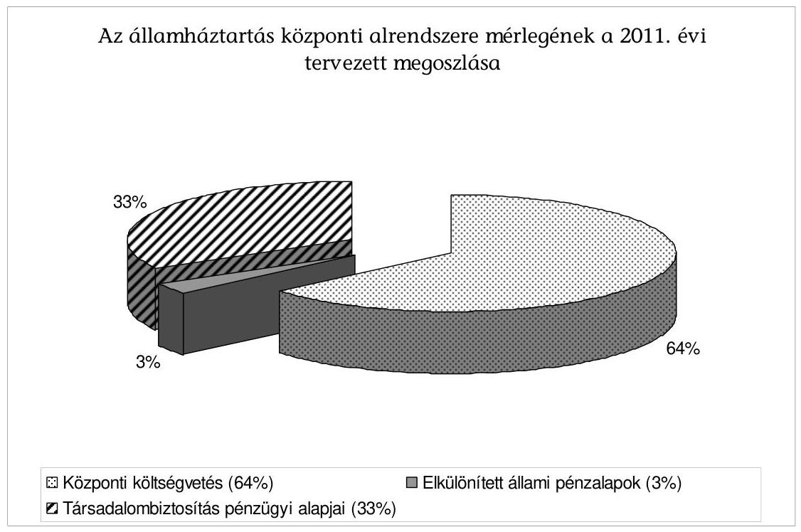

Az alapok előirányzatait - az előirányzatok 2009. évi teljesítését, a 2010. évi előirányzatokat, - illetve a 2011. évi költségvetési törvényjavaslat véleményezése során felvett jegyzőkönyvben rögzített október 21-ei állapot szerinti keretszámokat, valamint a költségvetési törvényjavaslatban szereplő előirányzatokat és azok eltéréseit - „Az elkülönített állami pénzalapok és a társadalombiztosítás pénzügyi alapjainak költségvetési adatai a 2011. évi költségvetés véleményezéséhez" című, a jelentéshez csatolt táblázatban foglaltuk össze. (1. számú melléklet)

A táblázatból megállapítható, hogy az elkülönített állami pénzalapoknál előirányzat változás 3 alapnál történt. A helyszíni ellenőrzéskor rögzítettekhez viszonyítva, a Munkaerőpiaci Alap előirányzatait mind a bevételeknél, mind a kiadásoknál 22 000,0 M Ft-tal csökkentették, a Szülőföld Alapnál az előirányzatok az NGM eredeti keretszámához képest nem csökkentek, de az alapkezelő által benyújtott költségvetési tervszámokhoz képest 218,7 M Ft-os az eltérés. A Nemzeti Kulturális Alapnál a költségvetési törvényjavaslat 800,0 M Ft plusz előirányzatot tartalmaz. Nem változott az előirányzat a Központi Nukleáris Pénzügyi Alap, a Wesselényi Miklós Ár- és Belvízvédelmi Kártalanítási Alap, valamint a Kutatási és Technológiai Innovációs Alap vonatkozásában. A társadalombiztosítás pénzügyi alapjai esetében a Nyugdíjbiztosítási Alapnál 44 612,6 M Ft-os pozitív irányú változás történt a bevételi és a kiadási előirányzatokat illetően. Az Ny. Alapnál a törvényi előírásnak megfelelően „0" szaldós egyenleget terveztek. Az Egészségbiztosítási Alapnál az egyeztetés még nem ért véget, a helyszíni ellenőrzéskor rögzített előirányzatokhoz viszonyítva a költségvetési törvényjavaslatban a bevételek 9212,1 M Ft-tal, a kiadások 19 847,8 M Ft-tal alacsonyabb összegben szerepelnek, ezzel összefüggésben - a korábbi keretszámhoz viszonyítva - az E. Alap hiánya 10 635,7 M Ft-tal nőtt, alakulása a 2010. évi hiánnyal közel azonos összegben várható.

---

# Az elkülönített állami pénzalapok 

A 2011. évben továbbra is hat elkülönített állami pénzalap működik majd: a Munkaerőpiaci Alap (MPA), a Szülőföld Alap (SZA), a Központi Nukleáris Pénzügyi Alap (KNPA), a Nemzeti Kulturális Alap (NKA), a Wesselényi Miklós Ár- és Belvízvédelmi Kártalanítási Alap (WMA), valamint a Kutatási és Technológiai Innovációs Alap (KTIA).

Az alapok 2011-re tervezett kiadási főösszege összességében 410 947,1 M Ft-ot jelent, melyből az MPA 337 238,1 M Ft-tal, az SZA 1375,4 M Ft-tal, a KNPA 16 728,5 M Ft-tal, az NKA 9607,8 M Ft-tal, a WMA 19,4 M Ft-tal, és a KTIA 45 977,9 M Ft-tal részesedik.

Az elkülönített állami pénzalapok kezelőinek a 2011. évi költségvetés tervezése során át kellett tekintenie az egyes alapok működéséről szóló törvényeket, felül kellett vizsgálniuk az alapok által ellátott feladatokat abból a szempontból, hogy hogyan illeszkednek az alapok által ellátott feladatok a kialakult új kormányzati struktúrába. Az alapoknál főszabályként kellett kezelni az egyenlegtartási kötelezettséget ${ }^{4}$. Az alapkezelők a Tájékoztatóban ${ }^{5}$ előírt kötelezettségüknek eleget tettek. Az egyes előirányzatok megalapozottságát - az Áht. 58. § rendelkezése értelmében - indokolták.

Az alapok közül a Munkaerőpiaci Alap (MPA) - a kiadási főösszege alapján - meghatározó, részesedése a 2011. évi költségvetési törvényjavaslat szerint az elkülönített állami pénzalapok összes kiadásaiból 82,1\%-ot képvisel.
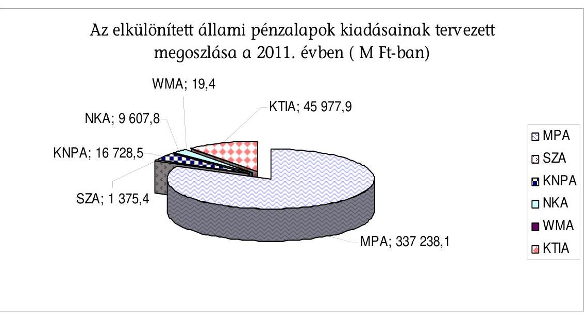

[^0]
[^0]:    ${ }^{4}$ Az egyenlegtartási kötelezettség alapján az egyes alapok egyenlege az év végére nem lehet rosszabb az Országgyúlés által a 2011. évi költségvetési törvényben jóváhagyott egyenlegnél.
    ${ }^{5}$ Tájékoztató a 2011. évi költségvetési törvényjavaslat összeállításához szükséges feltételekről és az érvényesítendő követelményekről, 2010. október (a fejezetek gazdasági vezetői részére 2010. október 7-én megküldve).

---

Az MPA 2011. évi tervezett bevételi és kiadási előirányzata a költségvetési törvényjavaslatban a keretszámhoz viszonyítva 22 000,0 M Ft-tal, 337 238,1 M Ft-ra mérséklődött. A tervezési Tájékoztatóban megadott keretszám a Nemzeti Közfoglalkoztatási Program finanszírozására 86 000,0 M Ft-ot biztosított, viszont a költségvetési törvényjavaslatban az ennek a bevételi forrását jelentő Költségvetési támogatás 64 000,0 M Ft-ra csökkent.

A 2011. évi bevételi és kiadási előirányzatok megalapozottsága teljesíthetőségének minősítése során megállapítottuk, hogy az MPA költségvetési irányszámainak meghatározásakor figyelembe vették a foglalkoztatás elősegítéséről és a munkanélküliek ellátásáról szóló - többször módosított - 1991. évi IV. törvényben (Flt.), illetve a kapcsolódó jogszabályokban és az állami irányítás egyéb jogi eszközeiben előírt, az MPA által ellátandó feladatokat.

Az MPA költségvetési tervezetében a Rehabilitációs hozzájárulás jogcímnek nem lesz bevételi előirányzata a 2011. évben, a jogcímet a XLII. A költségvetés közvetlen bevételei és kiadásai fejezet tartalmazza. Az MPA kiadásairól és bevételeiről törvényben kell rendelkezni, a törvényi változtatásokat előkészítő szövegjavaslatot - feljegyzés formájában - az alapkezelő elkészítette. Az átadott feljegyzés tartalmazta a rehabilitációs hozzájárulással összefüggő szabályozásnak az Flt.-ből való törlésére vonatkozó javaslatot. A költségvetési törvényjavaslat normaszövege - 62. § (9) bekezdése - továbbra is az Flt. 41/A. § (5) bekezdésére való hivatkozást tartalmaz a rehabilitációs hozzájárulás fizetendő mértékének meghatározásakor ${ }^{6}$.

Az MPA 2011. évi költségvetésében - a 2010. évi költségvetéshez viszonyítva - a rehabilitációs hozzájárulás bevétel elvonásával párhuzamosan először lesz bevételi összege az Európai Globalizációs Alkalmazkodási Alap ${ }^{7}$ (EGAA) előfinanszírozásából való megtérülésnek. A költségvetési törvényjavaslat kiadási oldalán 14 előirányzattal kevesebb jogcím szerepel, ugyanakkor két előirányzattal Közfoglalkoztatás kiadásai és az Egyenlegtartási és kockázatkezelési keret - a címrend kibővül.

Az MPA kiadásainak egyszerűsítése átláthatóbbá teszi az MPA költségvetését. A területi államigazgatási szervezetrendszer átalakítását megalapozó intézkedésekről szóló 1191/2010. (IX. 14.) Korm. határozat megállapítja a szervezeti integrációban résztvevő területi államigazgatási szervek körét. A területi államigazgatás szervezeti integrációja megvalósításának időpontja 2011. január 1-je. Idetartoznak az állami foglalkoztatási szervek, amelyek költségvetését a Nemzetgazdasági Minisztérium fejezetben határozták meg, de finanszírozási kötele-

[^0]
[^0]:    ${ }^{6}$ Az NGM-től kapott információink szerint a Magyar Köztársaság 2011. évi költségvetését megalapozó egyes törvények módosításáról szóló, benyújtás előtt álló törvényjavaslat tervezete szerint megszűnik az MPA rehabilitációs alaprésze. Tekintettel arra, hogy a rehabilitációs hozzájárulásból származó bevétel a 2011. évtől már nem az MPA, hanem a központi költségvetés bevételét képezi, indokolatlannak tartjuk, hogy annak alanyait, számítása módját, bevallásának módját, illetve befizetési kötelezettségét továbbra is az Flt.-ben szabályozzák.
    ${ }^{7}$ Az Alapból nyújtott támogatás a világkereskedelemben bekövetkező szerkezeti változások miatt elbocsátott munkavállalók számára biztosít szolidaritást és segítséget.

---

zettsége a Munkaerőpiaci Alapnak a szervezettel kapcsolatosan 2011. évben nem áll fenn. Ezáltal az átadott pénzeszközökkel, a központi költségvetési befizetésekkel történő elszámolások korábbi években kifogásolt szükségessége a kiadások megszűnésével okafogyottá vált.

A bevételek és kiadások 2011. évre előírt egyenlegét teljesíthetőnek minősítjük, mivel az MPA a kiadások között 10000,0 M Ft-os egyenlegtartási és kockázatkezelési kerettel tartalékot is képezett. Az Flt. 39/D. §-ában ${ }^{8}$ előírt, likviditási tartalékra vonatkozó előírás várhatóan már a 2010. évben teljesül.

Az MPA feladatellátásához rendelt pénzügyi források biztosítják a feladatellátást.

A 2009. évi költségvetés végrehajtásának ellenőrzése során javasoltuk ${ }^{9}$ a Kormánynak, hogy kezdeményezze Flt. és a költségvetési törvények szerint finanszírozható kiadások körének felülvizsgálatát annak érdekében, hogy csak a Munkaerőpiaci Alap céljaival (munkanélküliség kezelése és foglalkoztatás elősegítése) szorosan összefüggő kiadásokra történhessenek kifizetések. Az MPA 2011. évi költségvetési tervezetének véleményezésekor azt állapítottuk meg, hogy a javaslatunk hasznosult. Az MPA költségvetése leegyszerűsödött, azonban a szerkezeti változásokat megalapozó átfogó törvénymódosítások nem készültek el a költségvetési törvényjavaslat benyújtásáig.

A Szülőföld Alap (SZA) kezelője sajátos módon - az egyeztetéseket megelőzően - a 2010. évi költségvetési támogatással megnövelt összegben, 1594,1 M Ftban határozta meg és nyújtotta be a 2011. évi költségvetését. Az Alap 2011. évi tervezett bevételi és kiadási előirányzata a költségvetési törvényjavaslatban - a Tájékoztatóval egy időben keretszámként megadott 1018,1 M Ft-tal szemben, az alapkezelő NGM-mel történt egyeztetését követően 1375,4 M Ft-ra változott. A törvényjavaslatban szereplő 1375,4
 \mathrm{M}$ Ft bevétel a $0,1 \mathrm{M}$ Ft-ra tervezett önkéntes adományból, a költségvetési támogatásként tervezett eseti támogatásként meghatározott 375,3 M Ft-ból, valamint az MPA képzési alaprészből az Alapot megillető 1000,1 M Ft (szakképzési hozzájárulásból $980,0 \mathrm{M} \mathrm{Ft}$, a szakképzési egyéb bevételből $20,0 \mathrm{M} \mathrm{Ft}$) pénzeszköz átadásból adódik. Az SZA 2011. évi tervezett kiadásait a pályázat útján igényelhető támogatások ( $1237,9 \mathrm{M} \mathrm{Ft}$ ) és az alapkezelő működési költségei ( $137,5 \mathrm{M} \mathrm{Ft}$ ) képezik. A 2011. évi törvényjavaslat 1. sz. mellékletében szereplő SZA 2011. évi költségvetésében az alapkezelő kiadási működési előirányzata (137,5 M Ft) nem egyezik meg a X. KIM fejezet Szülőföld Alap Iroda költségvetési bevételi és kiadási előirányzatával ( $158,4 \mathrm{M} \mathrm{Ft}$ ). Az eltérés oka az ellenőrzés számára nem ismert, ezért javasoljuk annak felülvizsgálatát.

[^0]
[^0]:    ${ }^{8}$ Az Alap rendelkezésére álló pénzeszközök tárgyév végi záróállománya nem lehet kevesebb a tárgyévi kiadási főösszeg eredeti előirányzatának 25/365 részénél (a likviditási tartalék).
    ${ }^{9}$ Jelentés a Magyar Köztársaság 2009. évi költségvetése végrehajtásának ellenőrzéséről. (1016)

---

A Központi Nukleáris Pénzügyi Alap (KNPA) 2011. évi költségvetése szakmai szempontok alapján készült, az alapkezelő a Tájékoztató Alapra vonatkozó követelményeit betartotta. Az Alap 2011-2014. évek költségvetésében - a hosszú távú feladatai finanszírozása céljából - a bevételek meghaladják a kiadásokat. A 2011. évre benyújtott költségvetés bevételi előirányzata $31329,9 \mathrm{MFt}$, kiadási előirányzata 16728,5 M Ft, egyenlege +14 601,4 M Ft. A 2011. évre tervezett bevétel 74\%-át (23 127,5 M Ft-ot) a Paksi Atomerőmű Zrt. befizetése jogcímen tervezték meg, mértékét a jogszabályi előírások figyelembe vételével határozták meg. A tervezett bevétel teljesítése valószínűsíthető kockázatot nem jelent. A 16728,5 M Ft kiadási főösszegen belül felhalmozási célra 11 168,9 M Ft-ot, működési célra 5559,6 M Ft-ot terveztek ${ }^{10}$. A kialakított előirányzatok megegyeznek a törvényjavaslatban benyújtott összeggel és biztosítják a 2011. évre ütemezett feladatok végrehajtását. A kormányzati struktúrában történt változással összefüggésben a KNPA Szakbizottságának összetétele nem megfelelő, mert a Szakbizottsági tagok között a Nemzetgazdasági Minisztériumnak nincs képviselője.

A Nemzeti Kulturális Alap (NKA) 2011. évre benyújtott költségvetési tervezete eltér a helyszíni ellenőrzés időszakában a vizsgálatot végzők rendelkezésére bocsátott változattól. Az Alap bevételeit 8807,8 M Ft (Egyéb bevétel 116,0 M Ft, a Játékadó NKA-t megillető része címen 8691,8 M Ft) és kiadásait a szabályozásnak megfelelő jogcímeken tervezték, a működési kiadásokra - a 2010. évi eredeti előirányzattal azonos összegben - 907,0 M Ft-ot irányoztak elő. A kiadásokat az összes bevétellel azonos összegben tervezték meg. A benyújtott törvényjavaslatban az NKA 2011. évre vonatkozó előirányzata 9607,8 M Ft-ra nőtt. Az eltérés (800,0 M Ft) a XX. Nemzeti Erőforrás Minisztérium fejezet, 23. cím Alapok támogatása, 1. Nemzeti Kulturális Alap alcím előirányzatából származó költségvetési támogatásnál jelentkezik. A költségvetési támogatás kizárólag az NKA új, 11. Filmek gyártásának támogatása cím kiadásaira használható fel.

A Wesselényi Miklós Ár- és Belvízvédelmi Kártalanítási Alap (WMA) költségvetési irányszámainak meghatározásakor figyelembe vették az alapról szóló törvényben, illetve a kapcsolódó jogszabályokban és az Alap kezelője és az Alappal rendelkező között létrejött 2004. június 6-án aláírt megállapodásban foglaltakat, illetve az Alap által ellátandó feladatokat, valamint az elmúlt évek tapasztalatait, a jövőben várható gazdasági és jövedelmi előrejelzéseket. A 2011. évi előirányzatot (a bevétel megegyezik a kiadással) 19,4 M Ft-ban határozták meg, amely megegyezik a költségvetési törvényjavaslatban szereplő előirányzattal, és elegendő a feladatok ellátásához. Az

[^0]
[^0]:    ${ }^{10}$ A működési kiadás három címhez köthető: a hulladéktárolók és az RHK Kft. üzemeltetési kiadásai, a társadalmi ellenőrzési és információs társulások támogatása és az alapkezelőnek működési célra átadott pénzeszköz. Az RHK Kft.-nek - a radioaktív hulladékok és a kiégett üzemanyag elhelyezésére, valamint a nukleáris létesítmények leszerelésére kijelölt szerv létrehozásáról és tevékenységének pénzügyi forrásáról szóló 240/1997. (XII. 18.) Korm. rendelet 2. § (3) bekezdése szerint - előírt feladata a radioaktív hulladékok és kiégett fűtőelemek tárolóinak a működtetése.

---

összes kiadás irányszáma 2012-ben 21,0 M Ft, 2013-ban 22,8 M Ft és 2014-ben 23,1 M Ft. A rendszeres befizetések jogcímnél figyelembe vették a szerződéskötések számának, valamint a szerződés tárgyát képező ingatlanok értékének csökkenését is. A tervezett bevétel teljesítése - nagyságrendjét tekintve - valószínűsíthető kockázatot nem jelent.

A Kutatási és Technológiai Innovációs Alap (KTIA) 2011. évre benyújtott költségvetési törvényjavaslatában a tervezett bevételi és kiadási előirányzat - az egyensúlyi tervezés követelményeinek megfelelően - 45 977,9 M Ft. A bevételi és kiadási előirányzatokat az előírt jogcímeken tervezték, azok összege a benyújtott költségvetési törvényjavaslatban a helyszíni ellenőrzéskor rögzítetthez képest nem változott. A költségvetés bevételi oldalán az innovációs járulék bevétel összegének teljesülése kockázatot jelent, mivel a 2011. évre tervezett bevétel a 2010. évi várható bevételhez (25 074,5 M Ft) viszonyítva 14,9\% bevételnövekedést prognosztizál. A kiadási előirányzat esetében a 2010. évben a Kormány 16,0 Mrd Ft egyenlegjavulási kötelezettséget írt elő, amelyet a 2011. évi tervezéskor végleges elvonásként vettek figyelembe. A zárolás az Alap működését nehezíti és veszélyezteti a törvényben meghatározott rendeltetését („kiszámítható, biztos forrás"). A KTIA felett 2010. július 1-jétől a nemzeti fejlesztési miniszter rendelkezik. Az Alap pénzeszközeinek kezelésével, felhasználásával, valamint ellenőrzésével összefüggő feladatokat a nemzetgazdasági miniszter irányítása alatt álló Nemzeti Kutatási és Technológiai Hivatal látja el. Az Alap működését nehezíti, hogy nem azonos minisztériumhoz tartozik az Alap és az alapkezelő. Ezért javaslatot tettünk arra, hogy az Alap és az alapkezelő egy felügyelet alá kerüljön ${ }^{11}$.

# A társadalombiztosítás pénzügyi alapjai 

A társadalombiztosítás pénzügyi alapjait a 2011. évben is két alap, a Nyugdíjbiztosítási Alap (Ny. Alap), és az Egészségbiztosítási Alap (E. Alap) alkotja.

Az Ny. Alap 2004-2009. évek teljesített, valamint a 2010. évi várható teljesítést és a 2011. évi tervezett bevételi és kiadási előirányzatait a következő ábra szemlélteti:

[^0]
[^0]:    ${ }^{11}$ A T/1427 számon a Magyar Köztársaság minisztériumainak felsorolásáról szóló 2010. évi XLII. törvénnyel összefüggésben szükséges törvénymódosításokról és egyes iparjogvédelmi tárgyú törvények módosításáról szóló törvényjavaslat módosítja a Ktiatv. 10. § (1), valamint 11.§ (2) bekezdéseit, de a „kettős irányítás" problémáját nem oldja fel.

---

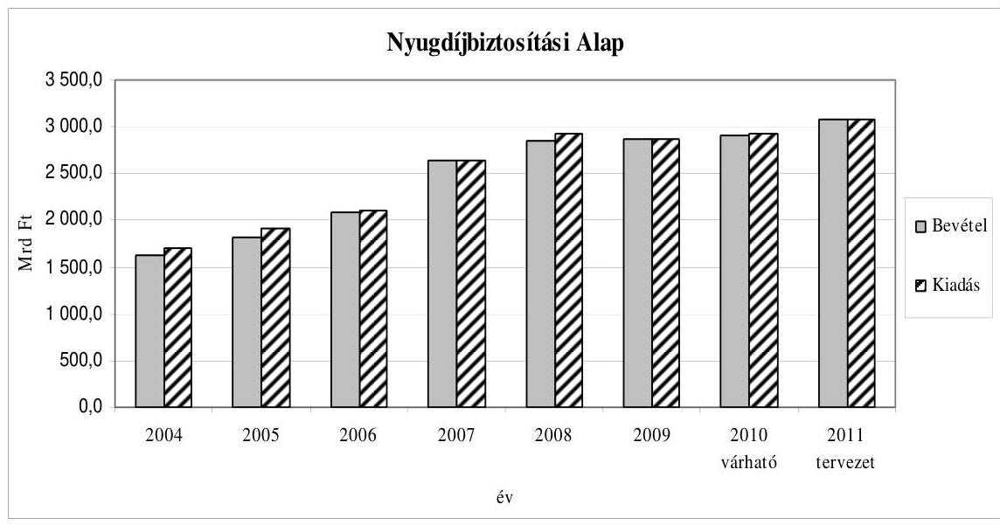

Az Ny. Alap 2011. évi tervezett kiadási és bevételi főösszege 3085 363,5 M Ft, ami az ONYF-nél a helyszíni ellenőrzés során rögzített összeget 44612,6 M Ft-tal meghaladja. Az eltérést indokolja, hogy a megváltozott makro paraméterek alapján a 2011. január 1-jei nyugdíjemelés tervezett mértéke ${ }^{12} 3,4 \%$-ról $3,8 \%$-ra növekedett, valamint figyelembe vették egy esetleges nyugdíjba vonulásra vonatkozó szabály változását ${ }^{13}$. A kiadási oldal növekedése - a „0" szaldós tervezési követelmény miatt - a bevételi oldalt is növelte. A költségvetési törvényjavaslat a bevételi oldal egyes alcímeinek elnevezését és besorolását is megváltoztatta.

A Magánnyugdíjpénztárak átutalásai jogcímcsoport a biztosítotti nyugdíjárulék alcímcsoportból az Egyéb járulékok és hozzájárulások jogcímcsoportba került át. A változtatás tartalmilag indokolt volt. További változást jelent, hogy a nyugdíjbiztosítási ellátások fedezetéül szolgáló cím alatt új alcímet - Államháztartás helyzetét kiegyensúlyozó alapból származó bevétel - hoztak létre.

A munkáltatói nyugdíjbiztosítási járulék és biztosítotti nyugdíjjárulék bevétel tervezésénél 1,9\%-os keresettömeg növekedéssel számoltak, és figyelembe vették az adó- és járuléktörvények módosítására benyújtott törvényjavaslat ${ }^{14}$ és a magánnyugdíjpénztári tagdíj helyetti járulékfizetés megvalósulásának hatásait is.

[^0]
[^0]:    ${ }^{12}$ A társadalombiztosítási nyugellátásról szóló 1997. évi LXXXI. törvény 62. § (1) bekezdés b) pontjában meghatározott 3\%-os GDP növekedés mellett a nyugdíjemelés mértékét fogyasztói árnövekedés és a tervezett országos nettó átlagkereset-növekedés 80 és 20 százalékos arányban súlyozott átlagának megfelelő mértékben kell emelni.
    ${ }^{13}$ A nők - korhatártól független, nem csökkentett összegű - 40 éves szolgálati időt követő nyugdíjazásának lehetőségére vonatkozó jogszabály még tervezet szinten sem ismert.
    ${ }^{14}$ T/1376. számú törvényjavaslat az adó- és járuléktörvények, a számviteli törvény és a könyvvizsgálói kamarai törvény, valamint az európai közösségi jogharmonizációs kötelezettségek teljesítését célzó adó- és vámjogi tárgyú törvények módosításáról.

---

Az államháztartás helyzetét kiegyensúlyozó alapból ${ }^{15}$ származó bevételt a költségvetési törvényjavaslat 450 821,9 M Ft-ban határozza meg. A benyújtott törvényjavaslatokkal kapcsolatos viták alapján feltételezhető, hogy ebbe az alapba kerül majd a magánnyugdíjpénztári tagok visszalépéséből származó bevétel. Ezt támasztja alá, hogy az összeg megegyezik a korábbi tervjavaslatban szereplő központi költségvetésben tervezett pénzeszköz átadás, a GYES-ben, GYET-ben és rehabilitációs járadékban részesülők utáni központi költségvetési térítés, valamint a Rendvédelmi szervek és a Magyar Honvédség kedvezményes nyugellátásainak kiadásaihoz hozzájárulás előirányzatainak összegével.

Az Ny. Alap 2011. évi „0" szaldós egyenlegének kockázata függ a magánnyugdíjpénztári tagok állami rendszerbe történő visszalépésének megvalósulásától is. Kifogásolható, hogy a Rendvédelmi szervek és a Magyar Honvédség kedvezményes nyugellátásainak kiadásaihoz hozzájárulás és a GYES-ben, GYET-ben és rehabilitációs járadékban részesülők utáni térítés nem a központi költségvetés kiadását terheli. A két előirányzat a költségvetési törvényjavaslatban nevesítve nem szerepel. Ez azért indokolatlan, mert az egyik előirányzat a kedvezményes nyugellátási szabályok miatti többlet költségvetési fedezete, a másik pedig állami járulékfizetési kötelezettség. Az előirányzatok törlése az átláthatóságot veszélyezteti.

A 2011. évi tervezett működési kiadás (23 456,1 M Ft) az Ny. Alap kiadási főösszegének - az előző évi 0,85\%-kal szemben - 0,77\%, ami a törvény által meghatározott, növekvő feladat-ellátási kötelezettség mellett jelentős működési kiadáscsökkenést jelent. A költségvetési törvényjavaslat általános indokolásában (237. oldalon) rögzíti, hogy a nyugdíjbiztosítási szervezet működtetésére fordítható kiadások előirányzata „biztosítja a takarékos, de hatékony működés feltételeit".

Az E. Alap várható hiánya a 2010. évben 92 167,9 M Ft, amely 38,8\%-kal (25 759,6 M Ft-tal) meghaladja a költségvetésben tervezettet.

Az E. Alap tervezett hiánya 2011-ben 98 156,3 M Ft (6,7\%), ami lényegében megegyezik az idei várható deficittel. A 2010. évhez viszonyítva a 2011. évben sem a bevételi sem a kiadási oldalon nincs olyan hatályos jogszabályi változás, amely miatt a 2011. évre tervezett hiány jelentősen eltérhet a 2010. évitől. Az Egészségbiztosítási Alap bevételi főösszege 1,2\%-kal, kiadási főösszege 1,5\%-kal növekszik a 2010. évi várható teljesítéshez képest.

[^0]
[^0]:    ${ }^{15}$ Az új alap tartalmáról a költségvetési törvényjavaslat nem tesz említést. Az új alap bevétele a magánnyugdíjpénztárak vagyonának átadásából keletkezik. Az alap törvényi szabályozása szükséges.

---

A bevételek és kiadások teljesítését a 2004-2009. évek között, illetve a 2010. évi várható teljesítést és a 2011. évi előirányzatok alakulását a következő ábra szemlélteti:
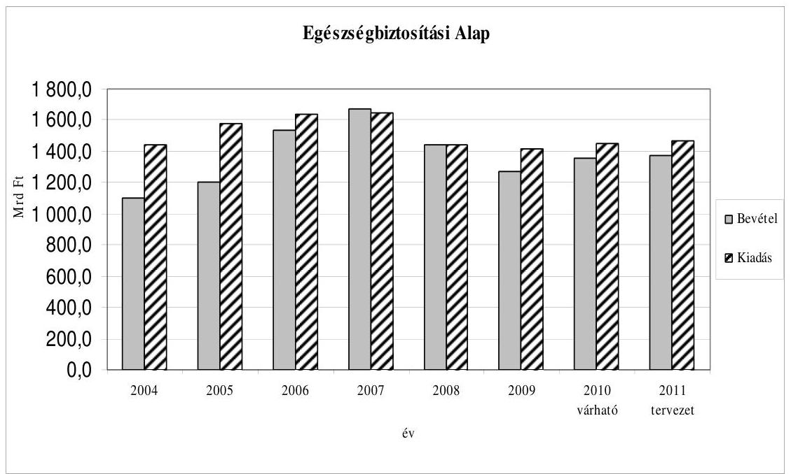

Az E. Alap 2009. óta tartósan és jelentős mértékben nincs egyensúlyban. A bevételek nem fedezik a kiadásokat, de nem készült elemzés - a bevételek és kiadások kapcsolatában - arra vonatkozóan, hogy a járulékbevételek, vagy
 a járulékot nem fizetők után biztosított központi költségvetés megtérítés összege alacsonyabb-e a ráfordításoknál. A kormányzati szándék alapján azonban látható, hogy rövidtávon nem várható az egészségügyi járulékmértékek emelkedése, így a bevételi oldalon a központi költségvetés biztosíthatja - a törvényi szabályozásnak ${ }^{16}$ megfelelően - az E. Alap egyensúlyát.

A költségvetési törvényjavaslatban az E. Alap munkáltatói és biztosítotti járulék bevétele a 2011. évben 595 692,9 M Ft. A bevétel összege az alapkezelő tervezeténél 5769,7 M Ft-tal kevesebb, mert az NGM a 1,9%-os bruttó keresettömeg növekedéssel számolt, valamint a 2010. október 15-én, az adó- és járuléktörvények módosítására benyújtott törvényjavaslat ${ }^{17}$ hatásait is figyelembe vette.

[^0]
[^0]:    ${ }^{16}$ A társadalombiztosítás ellátásaira és a magánnyugdíjra jogosultakról, valamint e szolgáltatások fedezetéről szóló 1997. évi LXXX. törvény (Tbj.) 3. § (2) bekezdése szerint az állam a társadalombiztosítási ellátások fedezetét akkor is biztosítja, ha a társadalombiztosítás kiadásai a bevételeket meghaladják.
    ${ }^{17}$ T/1376. számú törvényjavaslat az adó- és járuléktörvények, a számviteli törvény és a könyvvizsgálói kamarai törvény, valamint az európai közösségi jogharmonizációs kötelezettségek teljesítését célzó adó- és vámjogi tárgyú törvények módosításáról.

---

A költségvetési törvényjavaslatban a központi költségvetési hozzájárulások összege 642 470,0 M Ft. Az alcímen belül a legjelentősebb tétel a központi költségvetésből átadott pénzeszköz, amelynek összege 636 970,0 M Ft. Ez a 2010. évhez képest 4,1%-kal több, mert a 2010. évtől 9300 Ft/fő összegre emelt hozzájárulás a 2011. évben teljesül először 12 hónapon keresztül.

Az egészségbiztosítási tevékenységgel kapcsolatos egyéb bevételek 2011. évre tervezett összege 51 245,4 M Ft. A legjelentősebb bevételi elem 43 500,0 M Ft-tal a „Gyógyszergyártók és forgalmazók befizetései" jogcímcsoport. A 2010. évi várható bevételnél (47675,1 M Ft) a 2011. évre megállapított előirányzat azért kevesebb, mert az előirányzat forrását képező gyógyszergyártói befizetésből kutatás és fejlesztési tevékenység címén - levonható hányad a kihirdetett jogszabály ${ }^{18}$ szerint 2011. évtől a korábbi 20%-ról 100%-ra növekszik ${ }^{19}$.

Az E. Alap 2011. évre tervezett bevételi főösszege 1370 068,7 M Ft, amely a 2011. évre prognosztizált makrogazdasági paraméterek alapján teljesíthető.

Az E. Alap 2011. évi kiadási főösszege a költségvetési törvényjavaslatban 1468 225,0 M Ft, ami 19 847,8 M Ft-tal kevesebb ugyan az alapkezelő tervezeténél, de jelentősen (36402,0 M Ft-tal) meghaladja a Tájékoztatóval megadott keretszámot (1 431 823,0 M Ft). A kiadási főösszeg 21 608,9 M Ft-tal (1,5%-kal) növekszik a 2010. évi várható teljesítéshez képest.

A gyógyító-megelőző ellátások kiadására a költségvetési törvényjavaslatban 770 120,0 M Ft kiadás szerepel, amely 36 000,0 M Ft-tal több az NGM keretszámánál. E mellett a kiadás mellett az egészségügyi feladatellátásban a finanszírozásból eredően a megelőző két évhez viszonyítva kevesebb feszültségpontra számíthatunk. A költségvetési törvényjavaslat szerint 3 hónapról 2 hónapra rövidül a teljesítmények elszámolása azoknál az ellátásoknál (fogászati ellátás, otthoni szakápolás, otthoni hospice, laboratóriumi ellátás), ahol a 2010. évben nem történt meg a váltás. A módosítás miatt a fent említett jogcímeken a 2011. évben +1 havi kiadást kellett biztosítani.

Az egészségügyi ágazati prioritások és fejlesztések között a 2011. évi tervezéskor az alapkezelő a meglévő ellátórendszert kiigazító változtatások, javaslatok beépítésével tervezhetett (pl.: a Társadalmi Infrastruktúra Operatív Program (TIOP) pályázatokra befogadott többletkapacitás finanszírozása, az üzemanyagköltségek emelkedésének elismerése a mentés kiadásánál és a díjazásba épített háziorvosi ösztönzőrendszer javítása).

[^0]
[^0]:    ${ }^{18}$ A közteherviselés rendszerének átalakítását célzó törvénymódosításokról szóló 2009. évi LXXVII. törvény 164. § alapján.
    ${ }^{19}$ Az NGM-től kapott információnk szerint a Magyar Köztársaság 2011. évi költségvetését megalapozó egyes törvények módosításáról szóló, benyújtás előtt álló törvényjavaslat tervezetében a biztonságos és gazdaságos gyógyszer- és gyógyászati segédeszközellátás, valamint a gyógyszerforgalmazás általános szabályairól szóló 2006. évi XCVIII. törvényre vonatkozó módosítási javaslat alapján az engedményt a gyógyszergyártók nem az E. Alap terhére veszik majd igénybe. Ez azt jelenti - a törvényjavaslat elfogadása esetén -, hogy az E. Alapnál a „Gyógyszergyártók és forgalmazók befizetései" magasabb összegben várhatóak.

---

Nem látható még az ellátó intézményrendszer rendszerszintű újragondolására vonatkozó koncepció és részletei.

A gyógyító-megelőző ellátások kiadásainak teljesítését a 2004 - 2009. időszakban, illetve a 2010. évi várható teljesítést és a 2011. évi tervezett előirányzatot a következő ábra szemlélteti:
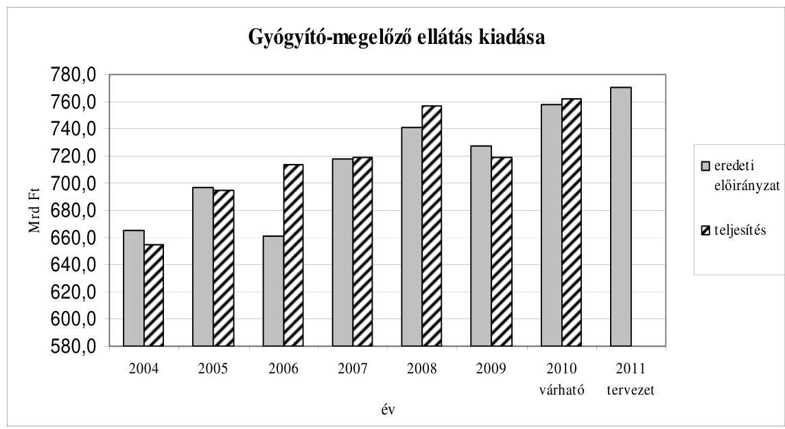

A gyógyszertámogatás kiadásaira fordítható előirányzat a költségvetési törvényjavaslat szerint 343 544,2 M Ft. Az eredetileg tervezett 358 544,2 M Ft előirányzat biztosítaná, hogy az idei várható teljesítés szintjén maradjon a kiadás. A megelőző években a gyógyszertámogatások összege mérsékelt növekedésnek indult, ezért a szintentartáshoz is megszorító intézkedésre van szükség. Az idei teljesítéshez viszonyítva érvényesítendő csökkentés igen komoly, érezhető beavatkozást igényel. Amennyiben a tervezett előirányzatot túllépik, életbe lép a gyártók jogszabályban rögzített ${ }^{20}$ sávos befizetési kötelezettsége.

A gyógyszertámogatás kiadásainak 2004-2009. évek közötti teljesítését, illetve a 2010. évi várható teljesítést, valamint a 2011. évi tervezett előirányzatot a következő ábra szemlélteti:

[^0]
[^0]:    ${ }^{20}$ A biztonságos és gazdaságos gyógyszer- és gyógyászati segédeszköz-ellátás, valamint a gyógyszerforgalmazás általános szabályairól szóló 2006. évi XCVIII. törvény 42. §-a szerint.

---

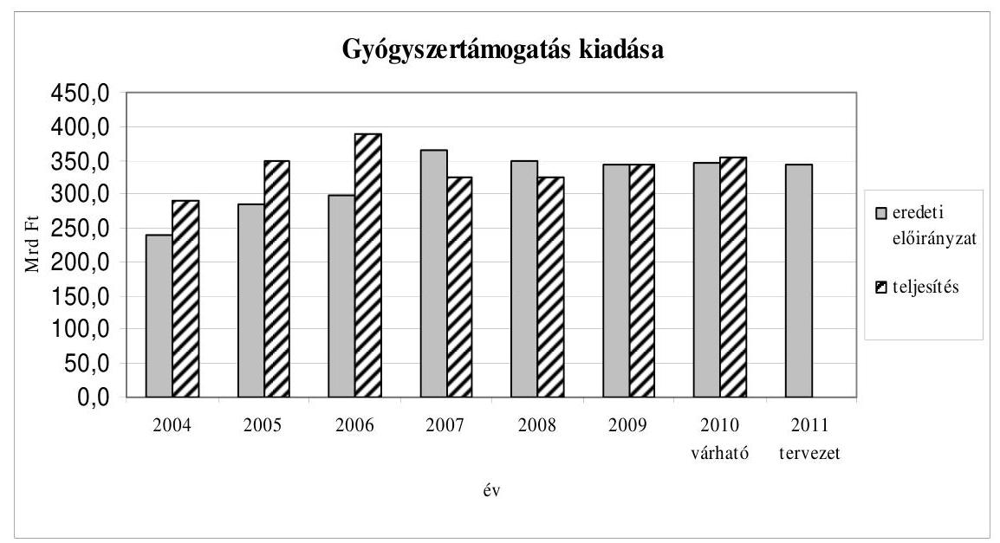

Új kiadási soron, természetbeni ellátások céltartaléka címmel 15 000,0 M Ft-ot terveztek, amelynek felhasználási szabályait a költségvetési törvényjavaslat 23. § (2) bekezdése tartalmazza. A céltartalékból a gyógyszertámogatási előirányzat időarányosat nem meghaladó teljesítése esetén - két alkalommal - lehet átcsoportosítani a gyógyító-megelőző ellátások kiadásaira, ellenkező esetben a természetbeni ellátások céltartaléka nem használható fel, azaz az Alap deficitjét csökkenti.

Az alapkezelő működési költsége (19 575,2 M Ft) az Alap kiadási főösszegének 1,3%-a, amely alacsonyabb a 2010. évi előirányzatnál (20 951,6 M Ft).
Az alapkezelő szöveges indoklásában felhívta a figyelmet arra, hogy a működtetési-üzemeltetési, valamint az informatikai fejlesztési kiadások csökkentése, valamint az 5%-os létszámcsökkentés együttesen feladatellátási zavarokat okozhat az egészségbiztosítási ágazatban, és veszélyezteti az ellenőrzés vonatkozásában eddig elért eredményeket. Az informatikai fejlesztések fedezetének megvonása (657,5 M Ft) az államháztartás egyik legnagyobb informatikai rendszerét, illetve adatbázisát kezelő OEP-nél súlyos következményekkel járhat. Az informatikai rendszerek fejlesztésére rendelkezésre álló források alacsony voltát mind az ÁSZ ${ }^{21}$, mind a könyvvizsgálat évek óta kifogásolja.

A 2011. évi költségvetési törvényjavaslatban az E. Alap költségvetésében - a Tájékoztató útmutatásának megfelelően - a kormányhivatalokba történő integrálódás költségeit nem vették figyelembe.

# Az önkormányzati alrendszer 

A 2011. évi költségvetési törvényjavaslat IX. Helyi önkormányzatok támogatásai és átengedett személyi jövedelemadó fejezetében a java-

[^0]
[^0]:    ${ }^{21}$ Jelentés a Magyar Köztársaság 2008. évi költségvetése végrehajtásának ellenőrzéséről. (0928)

---

solt előirányzat 1134,0 Mrd Ft. Ez - a központi költségvetési kapcsolatból származó két forrás együttesen - pontosan tükrözi a korábbi kötelezettségek vagy azok megszünése hatását.

Korábbi kötelezettségekre, így a helyi szervezési intézkedésekre, az ingyenes és kedvezményes étkeztetés kiterjesztésére, a budapesti 4-es metró beruházásra, a jövedelem differenciálódás mérséklésnél beszámítással érintett önkormányzatok támogatására, vis maior esetekre, belterületi belvízrendezési célokra, szociális ellátás létszámnövekedésére számításokkal megalapozott pótlólagos forrást biztosít az előirányzat. A metróberuházás finanszírozásáról rendelkező törvény ${ }^{22}$ szerint a 2006-2010 közötti költségvetési törvényekben kell meghatározni a támogatási előirányzatot. E törvényt nem módosították, így - bár az állam által vállalt támogatási kötelezettség a 2011. évi támogatási javaslat figyelembevételével is a törvényi kötelezettség keretein belül marad - nincs meg az időbeli összhang a metrótörvény és a 2011. évi költségvetési törvényjavaslat között.

Megemelték az előirányzatot a megyei, valamint a települési önkormányzatok javára szolgálóan a már életbe lépett adó és illetékszabályok (vállalkozók kommunális adójának eltörlése, valamint az illetékmentesség bővítése) önkormányzati bevételeket csökkentő hatása miatt. A törvényjavaslat szerint mód nyílik az EU támogatásban nem részesülő beruházások hazai támogatásának növelésére, köztük az iskolai és utánpótlás sport infrastruktúrájának fejlesztésére.

Elmaradó kötelezettségek (a 2010. évi kereset kiegészítés megszűnése, kifutó címzett támogatások) miatt csökkennek - itt is számításokkal alátámasztva - a támogatások.

A szakmai (ágazati) törvények módosítása a Vélemény lezárásakor még folyamatban volt, ezért ezek és az előirányzatok összhangjának megítélése nem vált e körben sem lehetővé. A változásokból kiemelkedik a közfoglalkoztatás átalakítása. Ennek főbb irányai ismertek, de hatásuk az előirányzatokra a jogszabály hiánya miatt itt sem volt véleményezhető. (A közfoglalkoztatás egységes kezelése érdekében a helyi önkormányzati támogatásokból 33,3 Mrd Ft csoportosul át a Munkaerőpiaci Alapba.)

Mindezek együttes hatására az állami támogatások és hozzájárulások, valamint az szja együttes összege az előző évi előirányzathoz viszonyítva 2,6%-kal csökken, az összehasonlítható előirányzathoz (a korrigált bázishoz) képest 4,5%-kal nő. Ez utóbbi döntő részben az említett fejlesztési támogatások növekményéből adódik. Ez azonban nem teszi lehetővé a - 2010-ben, az államháztartás egyensúlyi helyzetének javítása érdekében felfüggesztett - decentralizált, területi kiegyenlítést szolgáló fejlesztési támogatások visszahozatalát. Megállapítható ugyanakkor, hogy az uniós fejlesztési pályázatok saját forrás kiegészítésének támogatására rendelkezésre álló előirányzatból sikeres uniós pályázatok esetén - a központi támogatással segített körben - az

[^0]
[^0]:    ${ }^{22}$ 2005. évi LXVII. törvény a budapesti 4-es - Budapest Kelenföldi pályaudvar - Bosnyák tér közötti - metróvonal megépítésének állami támogatásáról.

---

önerő hiánya nem lesz akadálya a fejlesztések megvalósításának. Az államháztartás egészéhez hasonlóan a helyi önkormányzati fejezetben sem nőnek a támogatások a működési kiadások reálértékének megőrzése érdekében. A saját bevételek, ezen belül a helyi adók növelési lehetőségének kimerülése korlátot szab a kiadások önerőből történő - korábbi években még jellemző - emelésének.

A központi költségvetési kapcsolatból származó két forrás közül az átengedett személyi jövedelemadó előirányzata 7%-kal csökken. A két évvel korábbi, településekre bevallott szja illeti meg az önkormányzatokat, így az akkor kezdődő válság most jelentkezik a bevételben. Ez azonban nem rontja az önkormányzatok együttes pozícióját, mert a kialakított szabályozásnak megfelelően az állami támogatások és hozzájárulások országosan ellensúlyozzák a kiesést. Településenként az üzemeltetési, igazgatási, sport és kulturális normatíva megemelésével kívánják a lakhelyen maradó szja kiesését ellensúlyozni, amely a szegényebb gazdasági hátterű önkormányzatoknak kedvező.

A 2011. évi költségvetési törvényjavaslat az önkormányzati forrásszabályozás rendszerében, főbb elveiben alapvető változásokat nem tartalmaz. A tervezett módosítások a jogcímrendszer egyszerűsítését, az igénybevétel szabályainak áttekinthetőbbé tételét, az érvényben lévő szakmai jogszabályokkal történő összehangolását szolgálják. A szociális alapszolgáltatásokon belül a 2010-ben bevezetett „Otthon közeli ellátások" jogcím megszűnik, a „Szociális étkeztetés", a „Házi segítségnyújtás", valamint „Az időskorúak nappali intézményi ellátása" szerinti megbontást ismét bevezetik. A közoktatásban az alapfokú művészetoktatáshoz, a kollégiumok működtetéséhez kapcsolódó összes hozzájárulás az ágazat alapnormatívájában jelenik meg. A korábban pályázati úton igényelhető, központosított előirányzatok között szereplő „Szakmai, informatikai fejlesztési támogatás", „Az érettségi és szakmai vizsgák lebonyolításának támogatása", „Óvodáztatási támogatás" normatív módon jut el az önkormányzatokhoz. A különböző támogatások összehangolásával a kistérségi többcélú társulási forma ösztönzésének még hangsúlyosabbá tételével folytatódik az önkormányzatok közös feladatellátásának szorgalmazása.

A
 települési önkormányzatok jövedelem-differenciálódásának mérséklésével kapcsolatos szabályozás egyértelműbbé válik, amelyet az ellenőrzési tapasztalatok alapján az ÁSZ is javasolt. Alapja a korábbi - az önkormányzatok által becsült és évközben többször is korrigált - adat helyett mindig a tervezés évében már ismert előző évi tényleges adóerőképesség lesz. Ez így azonos lesz a jövedelemkülönbség mérséklésének másik tényezőjénél - a helyben maradó személyi jövedelemadónál - alkalmazott módszerrel.

A költségvetési törvényjavaslat 6. számú melléklete a korábbi, „A helyi önkormányzatok működőképességének megőrzését szolgáló kiegészítő támogatások" három jogcíme helyett azonos céllal egy - „Önkormányzati fejezeti tartalék" - jogcímen, megemelt összeggel javasol előirányzatot, megváltozott, részben keretjellegű igénybevételi feltételekkel. A támogatási igényléséhez 2011. február 28-áig Útmutató jelenik meg. Célszerű volna, ha a keretjellegű igénybevételi feltételek konkrét meghatározása megtörténne.

---

Az NGM-től kapott számítások alapján megállapítható, hogy folytatódik a helyi önkormányzatok forrásai szerkezetének átalakulása. Tovább csökken az állami támogatások és az átengedett szja, valamint a saját felhalmozási és tőkejellegű bevételek súlya, és csak kissé nő a saját folyó bevételek, erőteljesebben az EU-tól származó, továbbá a támogatásértékű bevételek szerepe.

A két évtizede folyamatosan bővülő önkormányzati feladatok és a finanszírozás összhangjának megteremtésére irányuló igény a helyi önkormányzatok részéről évek óta megfogalmazódik. Ennek elmaradása az önkormányzatok egy részét nehéz helyzetbe hozta. A helyi önkormányzatok növekvő számban pénzügyileg meggyengültek. Az elmúlt négy évben a közép- és hosszú távú kötelezettségvállalásuk megduplázódott. Ezen a helyzeten az „Önkormányzati fejezeti tartalék" csak ideiglenesen képes segíteni. Szükséges nemcsak a feladatok és a finanszírozás összhangjának erősítése, hanem az önkormányzati felelősségi viszonyok fokozott megjelenítése is.

Az önkormányzatok gazdálkodásában kockázatot, bizonytalanságot jelent a tulajdonukban lévő gazdasági társaságok - kiemelt mértékben a Fővárosi Önkormányzat esetében a BKV - romló pénzügyi helyzete.

---

# JAVASLATOK 

A helyszíni ellenőrzés megállapításainak hasznosítása mellett javasoljuk:

## a Kormánynak

1. Tegye kötelezővé a fejezetek részére a költségvetésről szóló törvényjavaslat összeállításához szükséges feltételek meghatározásakor - a determinációk egyértelmű kimutatása érdekében - az Áht. 12. §-ában előírt adatokra vonatkozóan az adatszolgáltatást az éven túli kötelezettségvállalásokról, különös tekintettel a PPP konstrukcióban megvalósuló beruházásokra.
2. Intézkedjen arról, hogy - az Áht. 36. § (1) bekezdés c) pontjában foglaltak megvalósítása érdekében - a tervezés időszakában a fejezetek rendelkezésére álljanak a költségvetési évet követő 3 év várható előirányzatai.
3. Kezdeményezze a tartalékok között megjelenített rendkívüli kormányzati intézkedések céljának, képzésének és felhasználásának Áht. szintű szabályozását.
4. Készítsen törvényjavaslatot az Országgyűlés számára az éves költségvetési törvények tartalmi és formai követelményeinek meghatározásáról, és minden évben rendeletben állapítsa meg a következő évi költségvetés elkészítésére vonatkozó részletes szabályokat.
5. Intézkedjen - a 2012. évi költségvetési törvényjavaslat előkészítésénél és azt követően - a költségvetést megalapozó ágazati (szakmai) törvények Országgyűlés elé terjesztéséről olyan időpontban, hogy azok költségvetési hatása érvényesüljön a tervezőmunkában.
6. Fontolja meg a Vidékfejlesztési Minisztérium az Európai Unióval történő utólagos elszámolásokhoz kapcsolódó 20. cím 7. alcím „Árfolyamkockázat és egyéb, az EU által nem térített kiadások" előirányzat felhasználásából eredő kockázatok és hasznok azonos helyen történő megjelenítése érdekében az előirányzat túlteljesülése esetén a forrás biztosításáról, illetve árfolyamnyereség realizálása esetén annak felhasználásáról való döntés Kormány hatáskörbe helyezését.
7. Intézkedjen az Állami Számvevőszék által az átláthatóság és az ellenőrizhetőség érdekében évek óta kifogásolt, a 2011. évi költségvetési törvényjavaslatban a Vidékfejlesztési Minisztérium előirányzatai között a „Folyó kiadások és jövedelemtámogatások" jogcímen megtervezett „Top-up" (hazai kiegészítő támogatás) önállóan, egy törvényi soron való megjelenéséről.
8. Szabályozza rendeletben - az atomenergiáról szóló 1996. évi CXVI. törvény 67. § o) pontjában történő felhatalmazás alapján - a Központi Nukleáris Pénzügyi Alapból a társadalmi ellenőrzési és információs társulásoknak nyújtott támogatások feltételeit.
9. Vizsgálja felül a Kutatási és Technológiai Innovációs Alap vonatkozásában az Alap (nemzeti fejlesztési miniszter) és az alapkezelő (Nemzetgazdasági Minisztérium) eltérő felügyeletének indokoltságát, intézkedjen annak érdekében, hogy az Alap és az alapkezelő egy felügyelet alá kerüljön.
10. Tekintse át a helyi önkormányzati feladatokat és a finanszírozást a köztük szükséges összhang erősítése érdekében, figyelemmel a nehéz pénzügyi helyzetbe került önkormányzatokra, az önkormányzatok közép- és hosszú lejáratú kötelezettségvállalásaira, gazdasági társaságai eladósodására.
11. Kezdeményezze - az állam pénzügyi és kontroll pozíciójának erősítése igényére is figyelemmel - a Budapest 4-es metróvonal megépítésének állami támogatásáról szóló 2005. évi LXVII. törvény és az erre alapozott finanszírozási szerződés módosítását, annak érdekében, hogy a beruházás támogatásának törvényi szabályai összhangban legyenek a 2011. évi költségvetési törvényjavaslattal és szükség esetén a további évek költségvetési törvényjavaslatával.

# a nemzetgazdasági miniszternek 

1. Kezdeményezzen olyan irányú szabályozást, hogy a Vidékfejlesztési Minisztérium fejezet 20. cím 7. alcím „Árfolyamkockázat és egyéb, az EU által nem térített kiadások" támogatási előirányzata csak abban az esetben és olyan mértékig legyen felhasználható, amilyen mértékben azt a 2011. évi költségvetési törvényjavaslat 34. § (2) bekezdése indokolja.
2. Vizsgáltassa felül az X. Közigazgatási és igazságügyi Minisztérium fejezet 7. alcím Szülőföld Alap Iroda (mint alapkezelő) és a LXV. fejezet Szülőföld Alap költségvetési javaslatában szereplő alapkezelő működési költségvetési előirányzatait, szükség szerint intézkedjen azok egyezőségéről.

## a nemzeti erőforrás miniszternek

1. Határozza meg az egészségügyi ellátó rendszer koncepcióját, ezzel összefüggésben vizsgálja felül az egészségügyi intézményrendszert és alakítsa ki a hatékony forrásfelhasználás érdekében az egészségügyi finanszírozás stabil, kiszámítható és objektív rendszerét.

---

.

---

II. RÉSZLETES MEGÁLLAPÍTÁSOK

---

.

---

A) A KÖLTSÉGVETÉSI DOKUMENTUM TÖRVÉNYESSÉGI ÉS SZÁMSZAKI ELLENŐRZÉSE

---

.

---

# 1. Az Államháztartásról szóló törvény (Áht.) előírásainak érvényesülése a törvényjavaslatban 

Az Áht. 52. § (1) bekezdése előírja, hogy a Kormány az országgyűlési képviselők általános választásának évében legkésőbb október 31-éig benyújtja az Országgyűlésnek a következő egy vagy többéves költségvetési törvényjavaslatát, és ehhez tájékoztatási céllal az államháztartás helyzetét bemutató összefoglaló táblázatokat, mérlegeket mellékel.

Ezen előírás ellenére az előterjesztők évek óta egyes törvényi előírásokat nem a költségvetési törvényjavaslat benyújtásakor, hanem később, a fejezeti indokoló kötetek részeként teljesítenek.

Az Áht. számos előírást tartalmaz a költségvetési törvényjavaslat normaszövegének tartalmára, valamint a törvényjavaslat részeként az Országgyűlés elé terjesztendő mérlegekre, kimutatásokra vonatkozóan. Az előbbi előírásokat (pl. az állami kezességvállalások és garanciák, a kifizetési keret, a kisösszegű követelések, az állami vagyon nyilvános értékesítési értékhatára) a javaslat normaszövege teljesíti. Utóbbi, a döntéshozatal érdekében tájékoztatásul bemutatandó kimutatásokra, mérlegekre vonatkozó rendelkezések tekintetében a prezentációs gyakorlat csak kevéssé változik, és az előterjesztett törvényjavaslatok évről évre csak részben felelnek meg ezen előírásoknak.

Így a 2011. évi költségvetési törvényjavaslat előterjesztésére vonatkozó törvényi előírások érvényesülésében a korábbi évekhez hasonló hiányosságok tapasztalhatóak.

Az Áht. 12/C. § (7) bekezdése szerint a költségvetési törvényjavaslat benyújtásakor a Kormány tájékoztatni köteles az Országgyűlést a hosszú távú kötelezettségvállalások állományáról a fejezetek és a várható kifizetések éve szerinti bontásban. Az Áht. e paragrafusának értelmező része szerint a jövőt érintő kötelezettségek nyilvántartásának hiányában nem hozható felelős döntés a további kötelezettségek vállalásáról, ezért a költségvetést érintő döntéseket megelőzően ezekről indokolt tájékoztatni az Országgyűlést. A törvényjavaslatban továbbra sem szerepel összegző tájékoztatás a hosszú távú kötelezettségvállalások állományáról.

Az Áht. 23. § (2) bekezdésének előírása szerint az 50 Mrd Ft-ot elérő, vagy meghaladó beruházásokhoz az Országgyűlés előzetes felhatalmazását kell kérni a költségvetési törvényjavaslatban. A törvény teljesülésének megítélése e vonatkozásban nem lehetséges. Az 1. sz. mellékletben az egyes beruházások 2011. évi tervezett kiadási előirányzata szerepel, az összköltsége nem. Az általános indokolás nem tartalmazza sem a beruházások szöveges indokolását, sem az összköltségeiket. A törvényjavaslat normaszövegében nem szerepel újonnan induló központi beruházáshoz kapcsolódó országgyűlési felhatalmazás kérése, a tájékoztatás azonban megkívánná annak konkrét jelzését is, ha az előírásnak megfelelő nagyságrendű beruházás indítása nem tervezett.

---

Az Áht. 24. § (1) bekezdése szerint a költségvetésben be kell mutatni a költségvetési létszámkeretet, a választott tisztségviselőket és a foglalkoztatottakat külön-külön. Az utóbbi évekhez hasonlóan a 2011. évi törvényjavaslat sem tartalmaz erre vonatkozó összesített táblázatot és - a korábbi évektől eltérően - az általános indokolásban sem szerepel a költségvetési létszám bemutatása.

Az Áht. 25. § (1) bekezdése szerint a központi költségvetésben általános tartalékot kell képezni az előre nem valószínűsíthető, nem tervezhető kiadásokra, illetve az előirányzott, de elháríthatatlan ok miatt elmaradó bevételek pótlására. A törvényjavaslat 1. és 2. sz. mellékletében az „általános tartalék" megnevezés nem jelenik meg. A tartalékok sor alatt „rendkívüli kormányzati intézkedések" címen 90000 millió Ft előirányzat szerepel, amelynek céljáról, rendeltetéséről a törvényjavaslatban nem történik említés. Az előirányzat nagyságrendje azonban megfelel az Áht. 26. § (1) bekezdésben az általános tartalék mértékére vonatkozó előírásnak.

Az Áht. 33/A. § (1) bekezdése szerinti, az Áht. 33/D. §-nak megfelelő állami kötelezettségvállalások alapján várható fizetési kötelezettségek fedezetére meghatározandó előirányzatokat a törvényjavaslat a XLII. A költségvetés közvetlen bevételei és kiadásai fejezet 33. Állam által vállalt kezesség és viszontgarancia érvényesítése címén, összesen 35355 M Ft összegben irányozza elő.

Az Áht. 33/A. § (2) bekezdése, és a 33/B. § (1) bekezdése szerint a költségvetési törvényben meghatározandó, az állami kezességvállalásokhoz, garanciákhoz kapcsolódó állományi keretösszegeket a törvényjavaslat normaszövege az állami kezességgel, garanciavállalással foglalkozó Hetedik fejezetében írja elő.

Az Áht. 36. § (1) bekezdés b) pontja szerint a Kormány a költségvetési törvényjavaslat benyújtásakor tájékoztatást ad a többéves elkötelezettséggel járó kiadási tételek későbbi évekre vonatkozó hatásairól. A 2011. évi törvényjavaslat nem ad összegző tájékoztatást a többéves elkötelezettséggel járó kiadási tételekről.

Az Áht. 36. § (1) bekezdés c) pontja szerint a költségvetési törvényjavaslatban teljes körűen be kell mutatni a költségvetési évet követő 3 év várható előirányzatait. Az előterjesztett törvényjavaslatban ezek az előirányzatok nem szerepelnek.

Az Áht. 36. § (1) bekezdés d) és e) pontjai szerint a törvényjavaslatnak be kell mutatnia a költségvetési törvény legfontosabb társadalmi és gazdasági hatásait és értékelni a költségvetési évet megelőző időszak gazdasági, költségvetési folyamatait. A törvényjavaslat általános indokolása bemutatja a kormányzat gazdaságpolitikáját, a költségvetési javaslat által kiemelten kezelt területeket, az egyes ágazati célkitűzéseket. Ismerteti a kormányzati szervezetrendszer átalakítására vonatkozó és az állami kiadások csökkentésére irányuló intézkedéseket, előírásokat. A célkitűzések, változtatások, intézkedések 2011. évre, illetve a középtávú költségvetési tervezés időszakára érvényes gazdasági hatásainak számszerű, összefoglaló bemutatása azonban a törvényjavaslatban nem szerepel. A gazdasági fejlődés fő jellemzőit az általános indokolás melléklete csak a 2009-2011. évekre mutatja be, az elkövetkező három

---

évre vonatkozó adatokat nem tartalmazza. Az előterjesztés nem értékeli a költségvetési évet megelőző időszak költségvetési, gazdasági folyamatait.

Az Áht. 36/B. § (1) bekezdésében foglalt rendelkezés szerint a Kormány a költségvetési törvényjavaslat benyújtásakor köteles az Országgyűlést tájékoztatni arról, hogy a javaslat elfogadása esetén - összhangban a középtávú tervekkel legalább három évre vonatkozóan milyen részletes kötelezettségvállalási korlátozásokat kíván érvényre juttatni a tárgyév során. A törvényjavaslatban ez a tájékoztató kimutatás nem szerepel, az általános indokolásban erre vonatkozó utalás nem található. A 11. sz. törvényi melléklet csak az uniós forrásra vonatkozó részletes
 kötelezettségvállalási keret-előirányzatokat tartalmazza.

Az Áht. 53/B. §-a előírja, hogy a költségvetési törvényben meg kell jelölni a rendelkezések hatályvesztésének időpontját. A törvényjavaslat 80. §-ának (1), illetve (2) bekezdésében megjelöli a rendelkezések hatályvesztését.

Az Áht. 86. § (8) bekezdése szerint a Nyugdíjbiztosítási Alap költségvetéséről szóló törvényjavaslat benyújtásakor az Országgyűlésnek tájékoztatásul be kell mutatni a Nyugdíjbiztosítási Alap bevételeire és kiadásaira vonatkozóan öt évre, a demográfiai folyamatokra és azok hatásaira vonatkozóan ötven évre szóló előrejelzést. A törvényjavaslat fő kötetében nem szerepel ilyen bemutatás. Az elmúlt évek gyakorlatában ezen előírás teljesítése a fejezeti indokoló kötetekben történt meg.

Az Áht. 115. §-a szerint az államháztartás mérlegeinek a költségvetés előterjesztésekor a vonatkozó év és az előző év várható, valamint az azt megelőző év tényadatait kell tartalmaznia. A törvényjavaslatban előterjesztett mérlegek hiányosan felelnek meg ennek az előírásnak. A törvényjavaslat 2. sz. mellékletében (a központi alrendszer mérlege) az előírt három adatsor közül csak a 2011. évi előirányzat szerepel. A 2010. évi várható adatok sehol nem jelennek meg a törvényjavaslatban.

Az Áht. 116. §-ában tételesen előírt, az Országgyűlés részére bemutatandó mérlegeket és kimutatásokat az előterjesztés továbbra sem tartalmazza teljes körűen. Az államháztartás és a központi alrendszer funkcionális és közgazdasági mérlegei csak a kiadásokat jelenítik meg, a bevételekről nem adnak tájékoztatást (a funkcionális mérlegek a kiadásokat nem összesítik). Az előző évekhez hasonlóan nem szerepel a törvényjavaslatban a közvetett támogatásokat (pl. adóelengedéseket, adókedvezményeket) tartalmazó összefoglaló kimutatás.

Az Áht. 117. §-a előírja, hogy az elkülönített állami pénzalapok költségvetésének előterjesztésekor az Országgyűlés részére legalább az Áht. 116. § (1) bekezdés 1. pontjának a)-b) pontjaiban foglalt mérlegeket kell - a szöveges indokolással együtt - az alapra vonatkozóan tájékoztatásul bemutatni, így a) alrendszerenként és összevontan, b) közgazdasági és funkcionális tagolásban. Ezen előírások nincsenek összhangban az Áht. 2. §. (1) bekezdésével, ami két alrendszert nevesít: a központi és az önkormányzati alrendszert.

---

# 2. A takarékos állami gazdálkodásról és a Költségvetési Fe-   lelövésről szóló törvény (KfTV.) előírásainak teljesíté- 

se
A Kftv. 3. és 4. §-aiban előírt, a költségvetési törvényben meghatározandó követelményekről, mutatókról a törvényjavaslat normaszövegének 4. §-a rendelkezik. A törvényjavaslat indokolásában azonban ezen előírásokkal kapcsolatosan további információ, tájékoztatás nem szerepel.

A helyszíni ellenőrzés a Kftv. rendelkezéseiből adódó követelmények érvényesülésével összefüggésben a következőket állapította meg.

A törvényjavaslat 4. § (1)-(2) bekezdésében a 2012. évi belső tételek hiányára, valamint a 2013. évi elsődleges egyenlegcélra vonatkozó számszerű adatok a Kftv. 3. § (1) bekezdésének megfelelően nominális értéken szerepelnek.

A törvényjavaslat 4. § (1)-(3) bekezdésének számszaki megalapozottságát a helyszíni ellenőrzés lezárásának 2010. október 25-ei időpontjáig az ÁSZ nem tudta megállapítani, mivel a szükséges adatok nem álltak rendelkezésre. A költségvetési törvényjavaslat országgyűlési benyújtását megelőzően az NGM-től 2010. október 29-én megkapott háttérszámítások azonban megalapozzák a törvényjavaslat 4. § (1)-(3) bekezdését.

Az NGM-től a külső-belső tételekre kapott háttérszámítás csak a 2012. évre vonatkozik, annak ellenére, hogy a 2011. évre is el kellett volna azt készíteni. Erre azért lett volna szükség, hogy a belső tételek előző évben meghatározott egyenleg feltételének teljesülése kimutatható legyen. Az NGM háttérszámításának struktúrájában az ÁSZ által - a 2011. évi törvényjavaslat mellékleteinek adatai alapján - végzett számítás szerint a belső tételek 2011. évi hiánya 5068,1 Mrd Ft. Ez az összeg összhangban van a 2010. évi költségvetésről szóló 2009. évi CXXX. törvény 5. §-ához kapcsolódóan a 73/2010. (III. 24.) Korm. rendelet 8. § (1) bekezdése szerinti előírással, miszerint 2011-ben a belső tételek egyenlege legfeljebb 5248,9 Mrd Ft lehet.

Az NGM-nek a külső-belső tételekre vonatkozó háttérszámítása alapján megállapítható, hogy a 2011. évi költségvetési törvényjavaslat 4. § (1) bekezdésében a belső tételek 2012. évi, legfeljebb 4940,5 Mrd Ft összegű hiányának számításában érvényesítették a 73/2010. (III. 24.) Korm. rendelet 8. § (2) bekezdésének előírását, amely az államháztartás központi alrendszerének 2012. évi pozitív elsődleges egyenlegcélját 475,8 Mrd Ft-ban határozta meg.

Az NGM a 2011. évi költségvetési törvényjavaslat 10. számú melléklete szerinti külső tételek listája alapján figyelembe vette a Költségvetési Tanács legutóbb 2010. május 28-án közzé tett javaslatát. Ennek megfelelően nem szerepelnek külső tételként azok a tételek, amelyeket a Költségvetési Tanács nem, illetve külön kezeltként javasolt e körbe felvenni.

A törvényjavaslat 4. § (2) bekezdés szerint a 2013. évi 499,6 Mrd Ft pozitív elsődleges egyenlegcélra vonatkozó háttérszámítás alapján nem állapítható meg, hogy az államadósság reálértékének meghatározásában miként vették figyelembe a Kftv. 3. § (3) bekezdése szerinti - a belső tételek egyenlegének

---

tárgyévet megelőző második évi tényleges értékével történő - korrekciót. A 2013. évi elsődleges egyenlegcél tekintetében ugyanakkor teljesül a Kftv. 3. § (3) bekezdés a) pontjának feltétele, miszerint az elsődleges egyenlegcél nem lehet elsődleges hiány.

A Kftv. 4. § (3) bekezdése szerint a Stabilitási és Adóreform Alapként kezelendő összegekre vonatkozó előírást vagy kimutatást a 2011. évi költségvetési törvényjavaslat nem tartalmaz, mivel a tárgyévet követő négy évre vonatkozó kitekintés a törvényjavaslatban nem jelenik meg.

A törvényjavaslatban érvényesül a Kftv. 18. § (5) bekezdésének a maastrichti deficitmutatóra vonatkozó előírása, miszerint - a GDP százalékában kifejezett maastrichti deficitmutató értéke -2,9 %, ami 0,9 %-ponttal kisebb a 2010. évi költségvetési törvényben kitűzött -3,8 %-hoz képest.

# 3. Észrevételek a költségvetési dokumentumhoz 

A törvényjavaslat indokolása és annak mellékletei a költségvetési törvénytervezet megalapozottságát és a döntéshozók hiteles tájékoztatását hivatottak elősegíteni. Az általános indokolás feladata lenne a költségvetési irányelvek törvényjavaslatban történő megjelenítését magyarázni, a mellékletek számadataival alátámasztani, az előző évhez mért változásokat azok költségvetési kihatásaival együtt szerepeltetni, mindezeket pedig az összefüggések bemutatásával elemezni.

Az indokolás terjedelme csökkent. Ez egyrészt az áttekinthetőség szempontjából kedvező, sokoldalas, megismételt információtartalmú táblázatok kerültek ki az előterjesztésből, azonban információ tekintetében szűkebb a korábbiaknál, számadatokat csak korlátozottan tartalmaz, az egyes költségvetési tételek tervezéséről nem ad információt, a terjedelem csökkenésével hasznos magyarázó részek is eltüntek.

A Kftv. rendelkezéseiből adódó követelmények, mutatók c. rész hiányában a törvény 4. §-a nem értelmezhető. Az állam által vállalt kezesség érvényesítéséről a tavalyi több oldal helyett egyetlen mondat szerepel. Az államháztartás központi alrendszere hiánya, finanszírozása, az államadósság kezelése szintén sokkal rövidebb. Az előző évhez hasonlóan hiányzik a Kormányzati beruházásokat bemutató táblázat, valamint a központi költségvetés bruttó adósságának alakulását bemutató táblázat.

A törvényjavaslat 1. sz. mellékletének XLII. A költségvetés közvetlen bevételei és kiadásai fejezetében és LXXI. Ny. Alap fejezetében összességében 528,8 Mrd Ft bevétel jelenik meg az „Államháztartás helyzetét kiegyensúlyozó alapból" címen. A törvényjavaslat nem említi ezen alap létrehozásának tényét, annak célját, forrásait.

A gazdasági fejlődés főbb jellemzői c. melléklet évről-évre más-más mutatókat tartalmaz és az adatok bemutatása is különböző időszakra vonatkozik (2007-ben 6 évre, 2008-ban 3 évre, 2009-ben 2 évre, 2010-ben és 2011-ben 3 évre).

---

A törvényjavaslat általános indokolásában (III. fejezet) röviden bemutatja a kormányzati szektor adósságát és hiányát az Európai Unió módszertana szerint. Ebben a GDP arányában szerepel az államháztartás költségvetési egyenlegének összefüggése és kapcsolata a maastrichti deficitmutatóval és elsődleges egyenleggel. A kormányzati szektor adósságával kapcsolatos táblázat nem szerepel a fejezetben.

Az Áht. 124. (2) b) bekezdésben foglalt felhatalmazás ellenére nem szabályozta a Kormány a költségvetéskor bemutatandó mellékletek, kimutatások körét és azok részletes adattartalmát.

# Technikai észrevétel 

A törvényjavaslat 78. §-ához a 76. §-hoz tartozó indokolás került megismétlésre, így tartalmilag a 78. § rendelkezéséhez a részletes indokolás hiányzik.

---

B) HELYSZÍNI ELLENŐRZÉS

---

.

---

# B.1. Az államháztartás központi alrendszere 

## 1. A tervezőmunka és az ellenőrzés feltételrendszere

Az Állami Számvevőszék az Alkotmány és a számvevőszéki törvény alapján véleményezi az állami költségvetési törvényjavaslat megalapozottságát, a bevételi előirányzatok teljesíthetőségét.

A költségvetési tervezés eljárási szabályait, a tervezési folyamat munkaszakaszait, feladatait az államháztartásról szóló 1992. évi XXXVIII. törvény (Áht.) és az államháztartás működési rendjéről szóló 292/2009. (XII. 19.) Korm. rendelet (Ámr.) szabályozzák.

A költségvetési törvényjavaslat tartalma, szerkezete, összeállításának metodikája nem meghatározott, kialakításának, parlamenti benyújtásának, illetve véleményezésre az ÁSZ-hoz való eljuttatásának szabályozása és gyakorlata évente változó külső adottság.

A hatályos jogszabályok nem tartalmaznak előírást arra vonatkozóan, hogy mennyi idő áll az ÁSZ rendelkezésére a vélemény elkészítésére, nem szabályozott a határidő, amikor (ameddig) a teljes és végleges törvényjavaslatot meg kell kapnunk. Ez minden évben eleve megnehezíti a véleményalkotás kialakításának munkaszervezését és ütemezését, feszítetté teszi a munkát. A költségvetési törvényjavaslatot rendszerint az Országgyűlés részére történő benyújtással azonos időpontban kapjuk meg. Az előbbiekben jelzett körülmények következményeként az éves költségvetési törvényjavaslatok teljes körű véleményezésével nem tudhatjuk elősegíteni az Országgyűlés költségvetési jogának gyakorlását.

A 2011. évi költségvetési törvényjavaslat kidolgozásának ütemezése - az elmúlt két évhez hasonlóan - rendkívül nehéz helyzet elé állította mind a tervező szervezeteket, mind a törvényjavaslat véleményezésére kötelezett Számvevőszéket.

Az Áht. 50. §-ában foglaltak szerint az államháztartásért felelős miniszter az országgyűlési képviselők általános választásának évében legkésőbb június 30-áig elkészíti és a Kormány elé terjeszti a költségvetési irányelveket. Az ÁSZ nem rendelkezik információval arról, hogy a költségvetési irányelvek elkészültek, azt a Kormány megtárgyalta és annak jóváhagyásáról határozatot hozott (Ámr. 26. §).

Az Áht. - 2010. július 15-étől hatályos - 52. § (1) bekezdésében foglaltak szerint a Kormány az országgyűlési képviselők általános választásának évében legkésőbb október 31-éig nyújtja be az Országgyűlésnek költségvetési törvényjavaslatát.

A költségvetési törvényjavaslat benyújtási határidejének módosítását - a törvényjavaslat részletes indokolása szerint - a megalapozottabb költségvetési javaslat elkészítése indokolja, ugyanis a korábbi szabályozás nem vette figyelembe az or-

---

szággyűlési képviselők általános választásának évében a választás lebonyolításának, az Országgyűlés és a Kormány megalakulásának időigényét.

Az államháztartásért felelős miniszter az Ámr. 26. §-a alapján készült tervezési tájékoztatóját 2010. október 7-én közvetlenül küldte meg a tárcáknak, illetve kérte fel adatszolgáltatásra az Ámr. 1. sz. mellékletében nevesített szervezeteket. A tervezési tájékoztató - eltérően a korábbi gyakorlattól - az NGM honlapján nem jelent meg. Ez az időpont - a törvényjavaslat benyújtási határidejének későbbre halasztását figyelembe véve - összehasonlítva a korábbi évek gyakorlatával nem jelentett hosszabb tervezési időszakot a tárcák részére.

Az NGM által a tervező szervezetek részére közvetlenül megküldött tájékoztató második bekezdésében az eddigi gyakorlattól részben már eltérő, új tervezési gyakorlat megvalósítását irányozta elő. Eszerint a bázisalapú tervezési módszertant az állami feladatok ellátásához szükséges források meghatározása, a tervezésben részt vevő közszereplők feladatainak áttekintése és értékelése, illetve az adott szervezet által a kormányzati struktúrában ellátandó állami feladatok körének a meghatározása váltja fel. A korábbi évek költségvetési tervezéséről alkotott ÁSZ vélemények visszatérően sürgették a bázisalapú tervezés megújításának szükségességét, így ez a jó irányba tett első lépésként értékelhető.

A tájékoztató további részeiben azonban - a konkrét tervezési követelmények meghatározása - a korábbi tervezési gyakorlat (bázisalapú tervezés)
 szerinti előírások jelentek meg. A 2011. évi tervezési folyamat ellenőrzésének tapasztalatai alapján megállapítható, hogy a fejezeti keretszámok kiadása még az előző évek gyakorlatánál is részletesebb volt, erősebben érvényesült a bázis összege, kevesebb mozgásteret biztosított a fejezetek tervező szervei részére.

A Tájékoztatónak a fejezeti keretszámok visszatervezésére vonatkozó azon előírása, amely a különböző determinációknak a keretszámokba való illesztésére is kiterjedt, a 2011. évre előirányzott egyensúlyi célok elérése szempontjából különös hangsúlyt kapott.

Az Országgyűlés törvényalkotási programjához igazodóan a Kormány által október 29-ére kitűzött határidő (amely október 30-án teljesült) a költségvetési törvényjavaslat parlamenti előterjesztésére szűk időkeretet biztosított a tárcák részére a Tájékoztatóban előírt tervezési feladatok elvégzésére, illetve rendkívül feszített ütemet követelt meg a kormányzati koordináció során.

Az új Országgyűlés megalakulása után megalkotott törvények, az új Kormány intézkedései jelentős szervezeti változásokat eredményeztek a központi költségvetés intézményi struktúrájában, illetve hatásköri átrendezésekkel jártak az állami feladatok ellátása terén. A szervezeti és hatásköri változások, valamint a tervezési gyakorlat előbbiekben említett módosulása komoly erőpróbára állította a költségvetési tervezés feladatát végző apparátust. Az intézkedések végrehajtásaként szükségessé váló fejezetek közötti megállapodások és az egyes feladatok ellátásának belső szabályozása a helyszíni ellenőrzés lezárásának időpontjában még nem volt teljes körűen biztosított, ami a 2011. évi előirányzatok tervezésének a Tájékoztató szerinti végrehajtására, valamint az ÁSZ ellenőrzés körülményeire is kihatott.

---

Az Országgyűlés elnökével történt egyeztetés alapján - a Házbizottság által jóváhagyott parlamenti ülésterv figyelembevételével - az ÁSZ Vélemény benyújtásának határideje november 8-a, amely azzal a következménnyel járt, hogy a helyszíni ellenőrzések során az ellenőrzött szervezetektől kapott adatok a kormányzaton belüli egyeztetési folyamat lezárása előtti állapotot tükrözték (az NGM november 3-ára kapta meg a tárcáktól a fejezeti indokolásokat, illetve a fejezeti kötetek benyújtására az ÁSZ Véleménnyel egy időpontban kerül sor). A tárcák költségvetési tárgyalásainak eredményét, illetve a benyújtott törvényjavaslatban történt módosítások tartalmát, okait, megalapozottságát nem volt módunk ellenőrizni.

Az ÁSZ, törvényi kötelezettségének teljesítése érdekében a Bevezetőben részletezett ellenőrzési megoldásra kényszerült. Ennek következtében nem volt lehetősége olyan vélemény kialakítására, amely az elvárható mértékben segíti az Országgyűlés törvényalkotó munkáját.

A 2011. évi költségvetési terv véleményezésekor tapasztaltak csak megerősítették a korábbi évek tanulságait, melyeket visszatérően jeleztünk: hiányoznak azok a szabályok, amelyek meghatározzák az éves költségvetési törvények tartalmi és formai követelményeit. A költségvetési törvényjavaslat e tekintetben eltér a törvényalkotás során készülő többi előterjesztéstől, hiszen évente visszatérően meghatározza az állami bevételek és kiadások tervét. Ez az évente való ismétlődés teszi indokolttá annak az igényét, hogy az Országgyűlés egy átlátható, az évek közötti összehasonlítást és a következő évekre való kitekintés megbízhatóságát is garantáló törvényjavaslatról tárgyaljon. Természetesen a mindenkori kormányzat nem korlátozható abban a szabad mozgástérben, amelyet az Alkotmány az éves pénzügyi tervek kialakításakor számára biztosít, de kívánatos e keretek között az indokolt állandóságot, a kiszámíthatóságot és nem utolsó sorban az ellenőrizhetőség lehetőségét is biztosítani.

Ezen tapasztalatok alapján jeleznünk kell, hogy indokoltnak látjuk törvényi szabályozást kialakítani az éves központi költségvetés szerkezetére, tartalmára, annak kialakításában résztvevő szervezetek feladataira vonatkozóan. Ez az államháztartásról szóló törvény előírásainak kiegészítését tenné szükségessé, de inkább egy átfogóbb jellegű, az állam teljes gazdálkodásának szabályaira is kiterjedő - az Állami Számvevőszék által már korábban is kezdeményezett - közpénzügyi törvény keretei között lenne célszerű. Az éves költségvetési terv adattartalmára, az azt megalapozó dokumentumok körére és formájára, elkészítésük határidejére, a tervezési munkát végző szervezetek tevékenységének összehangolására (ideértve az ÁSZ részére történő adatszolgáltatást) a Kormány rendelete volna hivatott intézkedni. Az Ámr. 26. §-a szerint jelenleg az államháztartásért felelős miniszter hatáskörébe utalt - a tervezésre vonatkozó tájékoztatóval kapcsolatos - feladatok végrehajtása megítélésünk szerint nem tudja biztosítani az Állami Számvevőszék számára azokat a feltételeket, amelyeket szükségesnek tartanánk ahhoz, hogy az ÁSZ vélemény az elvárható mértékben segítse az Országgyűlés munkáját.

---

# 2. A KÖZPONTI KÖLTSÉGVETÉS KÖZVETLEN BEVÉTELI ELŐIRÁNYZATAI 

A központi költségvetés adóbevételi előirányzat-tervezetei (6007,2 Mrd Ft) 83,2%-ának (4999,0 Mrd Ft) megalapozottságát - részletes számítási anyagok hiányában - az ellenőrzés nem tudta értékelni. Ezeknél a tervezett előirányzatoknál - a 2011. évtől újként bevezetésre kerülő adónemek kivételével - az előző évek tendenciáit (előirányzat-teljesítés, illetve várható és teljesült adatok) figyelembe véve ennek ellenére minősítettük a teljesíthetőséget, ahol erre lehetőség volt. Az adóbevételi előirányzat-tervezetek teljesíthetőségéről a tervezett adóbevételek 33,5%-ánál (2012,3 Mrd Ft) nem tudtunk véleményt mondani, 45,7%-át (2744,1 Mrd Ft) teljesíthetőnek, 14,6%-ának (878,0 Mrd Ft) realizálhatóságát közepes kockázatúnak, 6,2%-át (372,8 Mrd Ft) magas kockázatúnak minősítettük.

Magas kockázatúnak minősítettük a társasági adó előirányzat tervezetének (362,0 Mrd Ft) teljesíthetőségét, mivel nem volt ismert egyes összetevők (az adóalapot növelő és csökkentő tételek, az 500,0 M Ft-ot meghaladó adóalap összege, a korábbi években elhatárolt veszteségek 2011. évre figyelembe vett része, a nyereséges és veszteséges gazdálkodók száma, aránya) számszerűsítése, valamint a társasági adóbevételt meghatározó fizetendő társasági adót az NGM a 2010. évi várható 380,3 Mrd Ft-tal szemben 2011-re 317,1 Mrd Ft-ban határozta meg. Ezt nem támasztja alá, hogy az adóalap 161,0 Mrd Ft-os növekedésével szemben (magasabb adókulccsal számítva is csak 31,0 Mrd Ft adótöbbletet jelent) az adóváltozások a fizetendő adót 195,0 Mrd Ft-tal mérséklik. Magas kockázatú továbbá a hitelintézeti járadék előirányzat tervezete (10,8 Mrd Ft), tekintettel a lakásvásárlási és építési (ezen adónemből származó bevételeket közvetlenül meghatározó) támogatások csökkentésére, valamint a 2010. évi várható teljesítésre.

Közepes kockázatúnak értékeltük a jövedéki adó előirányzat tervezetének (878,0 Mrd Ft) teljesíthetőségét, mivel az adóalanyok 2010. októberében jelentős mennyiségű adójegyet rendeltek, decemberi fizetéssel, de a többletkészletezés nem prognosztizálható. A 2010. év végi készletezés a 2011. évi bevételeket csökkenti. Az előirányzat-tervezet mintegy 52,0 Mrd Ft 2010. decemberi adóbefizetés feltételezése mellett készült, amely az NGM október végi indokolása szerint is kockázatot jelentett, az azóta véglegessé vált októberi adójegy kiadási adatok (55 Mrd Ft 2010. decemberi fizetési kötelezettség) azonban nem térnek el szignifikánsan az NGM korábbi becslésétől.

Nem tudtunk véleményt adni a pénzügyi szervezetek különadójának (187,0 Mrd Ft) teljesíthetőségéről, mivel a rendelkezésre álló dokumentumok nem tartalmazták a szükséges összetevők (az adó alapját képező mérlegfőösszeg, korrigált díj, kamateredmény, díj- és jutalékeredmény, korrigált nettó árbevétel, nettó eszközérték, illetve a kezelt vagyon) adatait és a prognózis alapját képező feltételrendszert. Hasonlóképpen nem tudtuk minősíteni az eva (196,1 Mrd Ft), az energiaellátók jövedelemadója (20,0 Mrd Ft), az egyes ágazatokat terhelő különadók (161,0 Mrd Ft), az szja (1359,0 Mrd Ft), az illetékek (88,2 Mrd Ft) és a magánszemélyek jogviszony megszünéséhez kapcsolódó egyes jövedelmeinek különadója (1,0 Mrd Ft) előirányzat tervezeteinek realizálhatóságát.

Az ÁSZ a 2011. évről szóló költségvetés véleményezésénél a GDP törvényjavaslatban megjelenő 3%-os növekedését elfogadva (a KT a 2010. augusztus 18-ai technikai kivetítésében 2,9%-os GDP növekedést prognosztizál a 2011. évre) jelzi,

---

hogy a GDP nem tervezettnek megfelelő teljesülése az egyes adónemek (pl. társasági adó, áfa) realizálásánál is kockázati tényező lehet.

Az ÁSZ 2010. október 22-éig a játékadó, a bányajáradék, a környezetterhelési díj, az egyéb befizetések és az egyéb költségvetési bevételek esetében kapta meg a 2011. évi előirányzatok adatait, valamint a kapcsolódó indokolásokat, így ezen adónemek tekintetében tudott az előirányzatok megalapozottságáról, teljesíthetőségéről véleményt mondani.

A társasági adó, a hitelintézeti járadék, a pénzügyi szervezetek különadója, a cégautóadó, az egyszerűsített vállalkozói adó, az energiaadó, az energiaellátók jövedelemadója, az egyes ágazatokat terhelő különadó, az általános forgalmi adó, a jövedéki adó, a regisztrációs adó, a személyi jövedelemadó, az egyéb lakossági adók, a lakossági illetékek és a vámbeszedési költség megtérítése bevételekre vonatkozó adatok és dokumentációk 2010. október 25-én álltak az ellenőrzés rendelkezésére és eltérő mértékben tették lehetővé az előirányzattervezetek minősítését.

A jövedéki adó, a regisztrációs adó, az energiaadó, az egyéb lakossági adók és a vámbeszedési költség megtérítése bevételeknél a 2011. évi előirányzatot befolyásoló tényezőket számszerűsítették, az előirányzatot számításokkal megfelelően alátámasztották.

A társasági adó, a személyi jövedelemadó és az általános forgalmi adó 2011. évi előirányzatához a számítások eredményeit összefoglaló táblázatot készített a Nemzetgazdasági Minisztérium, de a táblázatokban szereplő tételeket (pl. társasági adóalap, összevonás alá eső jövedelmek, vásárolt fogyasztás) alapvetően meghatározó összetevőket, azok hatásait, változásait nem számszerűsítették, illetve a tételek prognosztizálásának módját sem ismertették.

A hitelintézeti járadék, a pénzügyi szervezetek különadója, a cégautóadó, az egyszerűsített vállalkozói adó, az energiaellátók jövedelemadója, az egyes ágazatokat terhelő különadó és a lakossági illetékek esetében az ellenőrzés nem kapott részletes számítást a 2011. évi előirányzatok alátámasztásához.

Az ellenőrzés a jelentősebb adóbevételekhez (társasági adó, személyi jövedelemadó, általános forgalmi adó, jövedéki adó, regisztrációs adó, pénzügyi szervezetek különadója, illetékek, egyszerűsített vállalkozói adó, cégautóadó, játékadó) tanúsítvány kitöltését is kérte a Nemzetgazdasági Minisztériumtól (NGM).

A tanúsítvány űrlapok az egyes adónemek tekintetében tartalmazták azokra az adatokra vonatkozó kéréseket, amelyek a 2011. évi költségvetési előirányzatok megalapozottságának és teljesíthetőségének megítéléséhez elengedhetetlenül szükségesek.

Az ellenőrzés az NGM-től nem kapott kitöltött tanúsítványt.
Néhány adónem esetében (jövedéki adó, regisztrációs adó, játékadó) a helyszíni ellenőrzés lezárásaként felvett jegyzőkönyvhöz rendelkezésre bocsátott szöveges indokolások és háttérszámítások lefedték a tanúsítványban kért információk körét.

A T/1498. számú, a Magyar Köztársaság 2011. évi költségvetéséről szóló törvényjavaslat 1. számú mellékletében a XLII. A költségvetés közvetlen bevételei

---

és kiadásai fejezeten belül az általános forgalmi adó előirányzataként 2 498 300,0 M Ft jelenik meg, ami 5000,0 M Ft-tal magasabb, míg a jövedéki adó előirányzata $878000,0 \mathrm{M}$ Ft, ami 12,0 M Ft-tal alacsonyabb a helyszíni ellenőrzés lezárásakor megadott összegnél. A változás okai nem ismertek. A törvényjavaslat XLII. fejezete tartalmaz egy $65000,0 \mathrm{M}$ Ft-os összeget rehabilitációs hozzájárulásként, továbbá egy $78000,0 \mathrm{M}$ Ft összegű, az államháztartás helyzetét kiegyensúlyozó alapból származó bevételt, amelyekről a helyszíni ellenőrzés időszakában nem állt rendelkezésre információ. Indokoltságuk, megalapozottságuk és teljesíthetőségük nem megítélhető.

# 2.1. Vállalkozások költségvetési befizetései 

### 2.1.1. Társasági adó

| 2009. évi teljesítés |  | 2010. évi módosított   előirányzat |  | 2010. évi várható |  | 2011.   évi   tervezet |
| :--: | :--: | :--: | :--: | :--: | :--: | :--: |
| M Ft | $2011 / 2009$   % | M Ft | $2011 / 2010$   % | M Ft | $2011 / 2010$   % | M Ft |
| 385543,1 | 93,9 | 609300,0 | 59,4 | 395000,0 | 91,6 | 362000,0 |

A 2011. évre tervezett társasági adóbevétel összege a pénzforgalmi és az ESA’95 módszertan szerint is azonos.

A társasági adó 2010. évi várható bevételének realizálása - az ellenőrzés megítélése szerint - nem valószínűsíthető, miután a társasági adóbevétel teljesítése a 2010. I-IX.
 hónapban 131,8 Mrd Ft volt és 2009 decemberében - az APEH adatai alapján - 114,0 Mrd Ft feltöltési kötelezettséget vallottak az adózók. (Az NGM által várható adatként jelzett 2010. évi bevétel a módosított előirányzattól lényegesen, 214,3 Mrd Ft-tal elmarad.)

A társasági adó tervezett előirányzata alapvetően a társasági adóról és osztalékadóról szóló 1996. évi LXXXI. törvény 2010. augusztus 16-ától hatályba lépett változására épül, és figyelembe veszi a 2010. évben bevezetett - a pénzügyi szervezeteket és egyes ágazatokat terhelő - különadók hatását is.

A fejezeti indokolás bemutatja a törvénymódosítást és annak hatásait, valamint számszerűsíti a pénzügyi szervezeteket és az egyes ágazatokat terhelő különadó bevezetésével kapcsolatos társasági adó kiesést. Az NGM szerint az adóváltozások 195,0 Mrd Ft bevételcsökkenést okoznak a 2011. évben, amely összegből a 10%-os adókulcs összeghatárának 500,0 M Ft-ra történő emelése 140,0 Mrd Ft-ot, a pénzügyi szervezeteket és egyes ágazatokat terhelő különadó bevezetése 35,0 Mrd Ft-ot, a sporttal összefüggő adókedvezmény igénybevétele 20,0 Mrd Ft-ot jelenthet.

Az adózás előtti eredmény, valamint a pozitív társasági adóalap növekedését 5,5%-ban vették figyelembe. Az indokolásban azonban nem térnek ki arra, hogy ezen növekedést mely tényezők okozzák, mivel a folyó áras GDP várható növekedése a makrogazdasági pálya adatai alapján 5,4%, és az adóalapot csökkentik a bevezetett különadók is. Az ellenőrzés közgazdaságilag nem tartja

---

indokoltnak, hogy a 2011. évi folyóáras GDP emelkedésének megfelelő mértékű adóalap növekedéssel számoltak, figyelembe véve a különadók adóalap mérséklő hatását is. Nem térnek ki az adóalapot döntően befolyásoló egyes összetevők (pl. az ellenőrzés által kitölteni kért tanúsítvány űrlapban szereplő, de át nem adott információk közül az adóalapot növelő és csökkentő tételek, az 500,0 M Ft-ot meghaladó adóalap összege, a korábbi években elhatárolt veszteségek 2011. évre figyelembe vett része, a nyereséges és veszteséges gazdálkodók száma, aránya) számszerűsítésére sem, holott ennek hiányát a 2010. évi költségvetés tervezéséről szóló Véleményében is jelezte az Állami Számvevőszék.

Az APEH 2009. évre vonatkozó gyorsjelentésében szereplő társasági adóbevallási adatok alapján az adóalap csökkentő tételek összege 6659,3 Mrd Ft (a 2008. évi adat 6090,6 Mrd Ft), az adóalap növelő tételek összege 4421,0 Mrd Ft (a 2008. évi összeg 4457,1 Mrd Ft), az előző évek elhatárolt veszteségéből a következő évre továbbvitt összeg 1784,4 Mrd Ft (a 2008. évi adat 1173,8 Mrd Ft) volt.

A társasági adóbevételt meghatározó fizetendő társasági adót - amely az eltérő üzleti éves adózók, és a speciális célú vállalkozások adóját nem tartalmazza - az NGM a 2010. évi várható 380,3 Mrd Ft-tal szemben a 2011. évben 317,1 Mrd Ft-ra tervezte, ami 63,2 Mrd Ft-os csökkenést jelent. Ezen adatot azonban nem támasztja alá, hogy az adóalap 161,0 Mrd Ft-os növekedésével szemben - amely a magasabb adókulccsal számolva is csak 31,0 Mrd Ft adótöbbletet jelent - az adóváltozások a fizetendő adót 195,0 Mrd Ft-tal mérséklik.

A KT 2010. augusztus 18-án készült Költségvetési Alappálya 2010-2014 (Technikai kivetítés) tanulmánya 504,3 Mrd Ft társasági adóbevételt prognosztizált a 2011. évre, de a jogszabályváltozások hatását az NGM-nél alacsonyabb összegben (119,8 Mrd Ft) becsülte.

A rendelkezésre álló, az előirányzat-tervezet alapjául szolgáló számítások eredményeit tartalmazó összefoglaló táblázat alapján - a részletes számítások hiányában - az előirányzat-tervezet megalapozottsága nem megítélhető, teljesíthetősége magas kockázatú.

# 2.1.2. Hitelintézeti járadék 

| 2009. évi teljesítés |  | 2010. évi módosított   előirányzat |  | 2010. évi várható |  | 2011.   évi   tervezet |
| :--: | :--: | :--: | :--: | :--: | :--: | :--: |
| M Ft | $2011 / 2009$   % | M Ft | $2011 / 2010$   % | M Ft | $2011 / 2010$   % | M Ft |
| 12619,0 | 85,6 | 13000,0 | 83,1 | n.a. | - | 10800,0 |

A 2010. I-IX. havi adatok alapján 5185,7 M Ft bevételt realizált a költségvetés a hitelintézeti járadékból, amely a 2010. évi előirányzat 39,9%-a. A rendelkezésre álló adatokat figyelembe véve a 2010. évi előirányzat teljesítése nem valószínűsíthető.

---

A fejezeti indokolás az adónemmel néhány mondatban foglalkozik. A 2011. évi előirányzatot a 2010. évi előirányzatnál 16,9%-kal alacsonyabb összegben tervezték. A tervezés során azzal számoltak, hogy a hitelintézetek állami támogatással összefüggő kamatjövedelme a 2011. évben kismértékben csökken.

A 2011. évi előirányzat-tervezet nincs összhangban az NGM fejezetnél a Lakástámogatások cím lakásvásárláshoz és építéshez kapcsolódó támogatási jogcímek (lakásépítési kedvezmény, fiatalok otthonteremtési támogatása, adóvisszatérítési támogatás, kiegészítő kamattámogatás, jelzáloglevél kamattámogatás, lakás-takarékpénztári megtakarítások támogatása) 2010. évi várható teljesítéshez viszonyított 21,3 Mrd Ft összegű (14,4%-os mértékű) csökkenésével. A hitelintézeti járadék 2009. évi I-IX. havi 50,2%-os teljesítési adata alapján a 2010. évben várhatóan nem realizálódik a 2011. évi előirányzat-tervezetnek megfelelő 10800,0 M Ft összeg sem.

A KT a 2010. augusztus 18-ai kivetítésében 12,6 Mrd Ft hitelintézeti járadék bevételt prognosztizált a 2011. évre, de a megalapozott becsléshez nem álltak rendelkezésére teljes körűen az adatok, ezért a kivetítés során a 2009. év bevételével számoltak.

Az előirányzat-tervezet megalapozottsága számítási háttéranyag hiányában nem ítélhető meg. A 2011. évi előirányzat-tervezet teljesíthetősége magas kockázatú, tekintettel a lakásvásárlási és -építési (ezen adónemből származó bevételeket közvetetetten meghatározó) támogatások csökkenésére, valamint a 2010. évi várható teljesítésre.

# 2.1.3. Pénzügyi szervezetek különadója 

| 2009. évi teljesítés |  | 2010. évi módosított   előirányzat |  | 2010. évi várható |  | 2011. évi   tervezet |
| :--: | :--: | :--: | :--: | :--: | :--: | :--: |
| M Ft | $2011 / 2009$   % | M Ft | $2011 / 2010$   % | M Ft | $2011 / 2010$   % | M Ft |
| - | - | - | - | n.a. | - | 187000,0 |

Az államháztartás egyensúlyát javító különadót a 2010. szeptember 27-étől hatályba lépő egyes gazdasági és pénzügyi tárgyú törvények megalkotásáról, illetve módosításáról szóló 2010. évi XC. törvény a 2006. évi LIX. törvény módosításaként vezette be. A törvény előírásai a 2010. évre vonatkoznak, azonban a tervek szerint további két évre (2011-2012) is fennmarad a különadó. Az adókötelezettség azon hitelintézetekre, biztosítókra és egyéb pénzügyi szervezetekre vonatkozik, amelyek 2010. július 1-jén már lezárt üzleti évre vonatkozó éves beszámolóval rendelkeztek. A törvény alapján 2011-ben a pénzügyi szervezeteket a költségvetést megillető 200,0 Mrd Ft különadó fizetési kötelezettség terheli, melynek részletes feltételeit külön törvény fogja meghatározni. Ennek Országgyűlés általi jóváhagyása az ellenőrzés lezárásáig nem történt meg.

---

A 2010. évi XC. törvény a 2010. évre részletezi az adó alapját és mértékét, amely pénzügyi szervezetenként eltérő. Az adó alapja a hitelintézetek esetében a módosított mérlegfőösszeg, a biztosítóknál a korrigált díj, az egyéb pénzügyi szervezeteknél a kamateredmény, díj- és jutalékeredmény, valamint a korrigált nettó árbevétel, a nettó eszközérték, illetve a kezelt vagyon. A 2010. évi adókötelezettséget a 2009. évre vonatkozó adatokra (adóalapokra) számítva kell a pénzügyi szervezeteknek a költségvetésbe befizetniük. A szabályozás értelmében, a 2010. évben a különadót két egyenlő részletben kell befizetni. Az adó első részét 2010. szeptember 30. napjáig, a második részét 2010. december 10. napjáig kell megfizetniük a kötelezetteknek. A Magyar Államkincstár 2010. IIX. havi adatai szerint 2010-ben a különadóból 55,9 Mrd Ft folyt be a költségvetésbe. Az APEH Tervezési és Elemzési Főosztályától megkért pénzforgalmi adatok alapján 2010. október 25-éig közel 90,5 Mrd Ft folyt be a költségvetésbe.

A 2011. évi költségvetésről szóló törvényjavaslatban a 2011. évi előirányzattervezet 187,0 Mrd Ft, míg a 2010. évi XC. törvényben 2011. évi fizetési kötelezettségként 200,0 Mrd Ft szerepel. A két összeg közötti eltérés oka az ellenőrzés számára nem ismert.

A 2011. évi előirányzat-tervezet megalapozottsága, teljesíthetősége a rendelkezésre álló dokumentumok alapján - részletes számítások hiányában - nem ítélhető meg, mivel a dokumentumok nem tartalmazzák az adó alapját képező 2011. évi prognosztizált mérlegfőösszeget, korrigált díjat, kamateredményt, díj- és jutalékeredményt, korrigált nettó árbevételt, nettó eszközértéket, illetve a kezelt vagyont, továbbá a prognózis alapját képező feltételrendszert.

# 2.1.4. Cégautóadó 

| 2009. évi teljesítés |  | 2010. évi módosított   előirányzat |  | 2010. évi várható |  | 2011.   évi   tervezet |
| :--: | :--: | :--: | :--: | :--: | :--: | :--: |
| M Ft | $2011 / 2009$   % | M Ft | $2011 / 2010$   % | M Ft | $2011 / 2010$   % | M Ft |
| 18036,7 | 155,8 | 24000,0 | 117,1 | 26500,0 | 106 | 28100,0 |

A 2010. I-IX. havi adatok szerint a cégautóadóból 19,5 Mrd Ft folyt be a költségvetésbe, ami az éves várható teljesítés 73,7%-a. Ez alapján a 2010. évi előirányzatnak megfelelő bevétel várhatóan realizálódik.

A KT a 2010. augusztus 18-ai kivetítésében 27,1 Mrd Ft cégautóadó bevételt prognosztizált a 2011. évre.

A 2011. évi előirányzat-tervezet megalapozottsága részletes számítások hiányában nem megítélhető, de az előirányzat-tervezet - az előző évek teljesítési adatait figyelembe véve - teljesíthetőnek látszik.

---

# 2.1.5. Egyszerűsített vállalkozói adó 

| 2009. évi teljesítés |  | 2010. évi módosított   előirányzat |  | 2010. évi várható |  | 2011.   évi   tervezet |
| :--: | :--: | :--: | :--: | :--: | :--: | :--: |
| M Ft | $2011 / 2009$   % | M Ft | $2011 / 2010$   % | M Ft | $2011 / 2010$   % | M Ft |
| 169703,5 | 115,6 | 182600,0 | 107,4 | 186000,0 | 105,4 | 196100,0 |

Az egyszerűsített vállalkozói adó (eva) 2011. évi előirányzat-tervezetének összege a pénzforgalmi és az ESA'95 módszertan szerint is azonos.

Az NGM által prognosztizált 2010. évi várható bevétel az előirányzatnál 3,4 Mrd Ft-tal nagyobb összegben realizálódik. A 2010. I-IX. havi adatok szerint az egyszerűsített vállalkozói adóból 91,2 Mrd Ft folyt be a költségvetésbe, ami az éves várható teljesítés 49%-a. A 2009. évben a bevétel mintegy 50,6%-a az év utolsó három hónapjában folyt be. Az ellenőrzés megítélése szerint valószínűsíthető, hogy a 2009. évi tendencia a 2010. évben is érvényesül.

A fejezeti indokolás tartalmazza ugyan az eva adóalapjának tervezett összegét (647,0 Mrd Ft), azonban az erre vonatkozó háttérszámítások nem álltak az ellenőrzés rendelkezésére.

A 2011. évi bevételt befolyásoló jogszabályi változás nem történt.
A fejezeti indokolás az adóbevallást benyújtó adóalanyok számát a 2011. évre 97000 főben jelöli meg. Az APEH adatai szerint a
 2010. február 28-ai időpontban 101132 fő volt az egyszerűsített vállalkozói adót alkalmazók száma.

A KT a 2010. augusztus 18-ai kivetítésében 190,3 Mrd Ft egyszerűsített vállalkozói adóbevételt prognosztizált a 2011. évre.

A tervezett előirányzatot alátámasztó részletes számítások hiányában az előirányzat-tervezet megalapozottsága, teljesíthetősége nem megítélhető.

### 2.1.6. Bányajáradék

| 2009. évi teljesítés |  | 2010. évi módosított   előirányzat |  | 2010. évi várható |  | 2011.   évi   tervezet |
| :--: | :--: | :--: | :--: | :--: | :--: | :--: |
| M Ft | $2011 / 2009$   $\%$ | M Ft | $2011 / 2010$   $\%$ | M Ft | $2011 / 2010$   $\%$ | M Ft |
| 26620,5 | 311,8 | 47000,0 | 176,6 | 138000,0 | 60,1 | 83 000,0 |

A 2010. I-IX. havi teljesítési adatokat ( $120148,1 \mathrm{Mrd}$ Ft) is figyelembe véve 2010. évi előirányzatot jelentősen meghaladó túlteljesülés várható a 2010. évben, amelynek okai a következők:

- a HUF/USD árfolyam a 2010. év folyamán bár változó mértékben (a 2010. év folyamán a HUF/USD havi átlagárfolyama 188-230 Ft között mozgott), de

---

jelentősen meghaladta a 2010. évi költségvetés összeállítása során prognosztizáltat;

- a kőolaj világpiaci ára magasabban alakult (átlagosan 78 USD/hordó) a tervezéskor figyelembe vettnél (75 USD/hordó);
- a tervezettnél (2011. évinél) korábban (2010. évben) kezdték visszatermelni a biztonsági földgáztárolóból az előírtat meghaladó gázmennyiséget;
- az Európai Bizottság elmarasztaló döntése alapján a MOL befizette a tiltott támogatásnak minősített összeget és kamatait (35,2 Mrd Ft).

Az NGM a bányajáradék tervezése során a Tájékozatóban a 2011. évre megadott árfolyamtól ( $211,27 \mathrm{Ft} / \mathrm{USD}$ ) eltérő, $215 \mathrm{Ft} / \mathrm{USD}$ árfolyamot vett figyelembe, valamint a bányajáradék számítás és fizetés feltételeinek változatlanságából indult ki.

A bányajáradék több mint 90%-át továbbra is a kőolaj és a földgáz termékek adják. Az NGM a 2011. évi előirányzat tervezése során a kőolaj világpiaci árának 80 USD/hordó szint feletti stabilizálódásával (amely a +3%-os bányajáradék alkalmazását jelenti), a földgáz import árának enyhe emelkedésével (az éves átlagár $85 \mathrm{Ft} / \mathrm{m}^{3}$ körüli alakulásával), illetve a szénhidrogének hazai kitermelésének további csökkenésével számolt. A prognózisok szerint a 2011. évben a biztonsági földgáztároló nem termel ki többlet-földgázt.

A MOL Nyrt. által a 2011. évben befizetni tervezett 52,0 Mrd Ft bányajáradékot - az NGM szóbeli tájékoztatása alapján - a bányászatról szóló 1993. évi XLVIII. törvény 20. § (3) bekezdés b) pontjában meghatározott képlet szerint kalkulálták, de annak részletes számítása nem állt az ellenőrzés rendelkezésére.

A külfejtéssel termelt szilárd ásványi nyersanyagok területén (elsősorban az építőanyag- és az építőipar igényeinek megfelelően), valamint az egyéb szilárd és gáznemű nyersanyagok kitermelésénél az előrejelzések szerint a bányajáradék bevételek lényeges változása nem prognosztizálható.

A rendelkezésre álló dokumentáció és a számítások alapján az előirányzattervezet megalapozottsága nem megítélhető, mivel az előirányzat 62,6%-át jelentő, MOL Nyrt. által befizetendő összeg részletes számítási anyaga nem állt az ellenőrzés rendelkezésére. Az előző évek teljesítési adatait, valamint a KT 2010. augusztus 18-ai kivetítését is figyelembe véve - amelyben a 2011. évre 87,3 Mrd Ft bányajáradék bevételt prognosztizált - az előirányzattervezet teljesíthetőnek látszik.

# 2.1.7. Játékadó 

| 2009. évi teljesítés* |  | 2010. évi módosított   előirányzat* |  | 2010. évi várható* |  | 2011. évi   tervezet* |
| :--: | :--: | :--: | :--: | :--: | :--: | :--: |
| M Ft | $2011 / 2009$   $\%$ | M Ft | $2011 / 2010$   $\%$ | M Ft | $2011 / 2010$   $\%$ | M Ft |
| 66736,1 | 72,8 | 63097,9 | 77 | 53098,0 | 91,5 | 48574,2 |

*Központi költségvetést megillető összeg

---

A 2011. évi előirányzat-tervezet alapját képező 2010. évi várható bevételt az időarányos adatok alátámasztják. A 2010. I-IX. havi adatok szerint 39 951,1 Mrd Ft folyt be a költségvetésbe, ami a várható teljesítés 75,2%-a. Az 5/90 lottóból származó játékadó bevétel 90%-a 2010. január 1-jétől a Nemzeti Kulturális Alapot illeti meg.

A játékadó bevételek 2009. évben megkezdődött csökkenése az NGM számításai szerint a 2011. évben is folytatódni fog. Az előirányzat kialakítása során a 2010. évi várható forgalmat, a Szerencsejáték Zrt. által megadott tervszámokat, valamint az APEH Szerencsejáték Felügyeleti Főosztálya által megadott információkat vették alapul.

A Luxor játékadó-bevétel változatlan marad, a visszaesés mértékét a többi sorsolásos játék esetében 10% körülire becsülik, kizárólag az ajándéksorsolás és a tombola esetében várnak növekedést. A 2010. évi várható összegnél a sorsolásos játékok esetében 12,2%-os csökkenéssel számoltak a 2011. évre.

A fogadásos játékok esetében a Tip-Mix-nél - a 2010. évi várható növekedés után - a 2011. évben további forgalom-növekedéssel számolnak. A többi fogadásos játék esetében stagnálás vagy forgalom csökkenés várható.

A kaszinók esetében a 2010. évi várható összeghez képest forgalom csökkenést terveznek, ami az ebből származó játékadó-bevétel 7,7%-os csökkenését okozza.

A pénznyerő automaták esetében a játékhelyek számának csökkenését valószínűsítik. Emiatt a 2010. évi várható bevételhez viszonyítva közel 5%-os visszaeséssel számolnak a pénznyerő automaták játékadója tekintetében.

A játékadó új elemeként jelentkezik a 2011. évben a kártyatermek játékadója. Az APEH Szerencsejáték Felügyeleti Főosztályának tájékoztatása szerint 4 esetben adtak ki engedélyt kártyaterem üzemeltetésére. Ezeknek a termeknek az üzemeltetéséből a 2011. évben a tervek szerint 100,0 M Ft bevétel származik.

A KT a 2010. augusztus 18-ai kivetítése során a 2011. évre 56,7 Mrd Ft játékadó bevételt prognosztizált.

# A 2011. évi előirányzat-tervezet a rendelkezésre álló dokumentumok alapján megalapozott és teljesíthető. 

### 2.1.8. Ökoadók

### 2.1.8.1. Energiaadó

| 2009. évi teljesítés |  | 2010. évi módosított   előirányzat |  | 2010. évi várható |  | 2011.   évi   tervezet |
| :--: | :--: | :--: | :--: | :--: | :--: | :--: |
| M Ft | $2011 / 2009$   $\%$ | M Ft | $2011 / 2010$   $\%$ | M Ft | $2011 / 2010$   $\%$ | M Ft |
| 13 182,9 | 129 | 16 400,0 | 103,7 | 16500,0 | 103 | 17 000,0 |

---

Az energiaadó 2011. évi előirányzat tervezete az ESA'95 módszertan szerint 17 500,0 M Ft, míg a pénzforgalmi befizetés előirányzat tervezete 17 000,0 M Ft. A különbség a pénzforgalmi áthúzódásokból adódik.

Az energiaadó törvényt érintő módosítások a gyakorlati jogalkalmazás során felmerült, illetve az EU által kiadott energiaadó irányelvhez igazítás miatt szükséges pontosításokat, kiegészítéseket tartalmazzák. Az irányelvi rendezéssel összhangban a szén nem tüzelő- vagy fűtőanyagkénti felhasználása után a 2011. évtől nem kell energiaadót fizetni. A módosítás bevételi hatása - az NGM indokolása alapján - nem jelentős.

A 2011. évi előirányzat-tervezet kialakításánál a gazdasági teljesítmény növekedésével arányosan növekvő energia felhasználással számoltak.

# A 2011. évi előirányzat-tervezet megalapozott és teljesíthető. 

### 2.1.8.2. Környezetterhelési díj

| 2009. évi teljesítés |  | 2010. évi módosított   előirányzat |  | 2010. évi várható |  | 2011.   évi   tervezet |
| :--: | :--: | :--: | :--: | :--: | :--: | :--: |
| M Ft | $2011 / 2009$   $\%$ | M Ft | $2011 / 2010$   $\%$ | M Ft | $2011 / 2010$   $\%$ | M Ft |
| 10702,7 | 88,8 | 9500,0 | 100 | 9500,0 | 100 | 9500,0 |

A 2011. évre az előirányzat-tervezet kialakításánál jogszabályi változásokkal nem számoltak. A fizetési kötelezettség az összes díj esetében már a 2009. évben elérte a törvényi mérték 100%-át. A díjkedvezmény igénybevételére vonatkozó szabályok a 2011. évre vonatkozóan érvényben vannak.

A 2011. évi előirányzat-tervezet megalapozottsága a rendelkezésre álló dokumentumok alapján nem ítélhető meg, de - az előző évek teljesítési adatait figyelembe véve - az előirányzat-tervezet teljesíthetőnek látszik.

### 2.1.9. Egyéb befizetések

| 2009. évi teljesítés |  | 2010. évi módosított   előirányzat |  | 2010. évi várható |  | 2011.   évi   tervezet |
| :--: | :--: | :--: | :--: | :--: | :--: | :--: |
| M Ft | $2011 / 2009$   $\%$ | M Ft | $2011 / 2010$   $\%$ | M Ft | $2011 / 2010$   $\%$ | M Ft |
| 21733,6 | 149,1 | 32000,0 | 101,3 | 35000,0 | 92,6 | 32000,0 |

A 2010. évi várható bevételt az időarányos teljesítési adatok alátámasztják.
Az előirányzat-tervezet kialakításánál az NGM a 2007-2009. évi, valamint a 2010. I-IX. havi befizetéseket (25,4 Mrd Ft), valamint az APEH és a VP javaslatait vette figyelembe, továbbá a jegybanki alapkamat viszonylagos stabilitásából indult ki.

---

Az előirányzat-tervezet meghatározásakor - helyesen - nem vették figyelembe a megszűnt nagyértékű vagyontárgyakat terhelő adószámlákkal, illetve a hitelintézetek és pénzügyi vállalkozások különadójával kapcsolatban a 2010. évben befolyt 4,0 Mrd Ft bevételt.

A 2011. évi előirányzat tervezése során kockázati tényezőként jelentkezik, hogy a fizetési könnyítési és méltányossági kérelmek elbírálása során a kötelezettségek érdemben módosulhatnak, ami előre nem prognosztizálható. Ezen kívül a 2011. évi adó- és járulék-bevételi előirányzatok tervezett összegei az előirányzat megállapítása során még nem voltak ismertek, ezért a szankciós bevételeknek a központi költségvetés és a társadalombiztosítás pénzügyi alapjai közötti pontos megoszlási aránya tekintetében a 2010. évhez képest változás következhet be, ami érinti a központi költségvetést megillető egyéb befizetések tervezett összegét. Ezen kockázatok ellenére - figyelembe véve a KT 2011. évre vonatkozó 32,7 Mrd Ft-os kivetítését is - a 2011. évi előirányzat-tervezet a rendelkezésre álló dokumentumok alapján megalapozott és teljesíthető.

# 2.1.10. Energiaellátók jövedelemadója 

| 2009. évi teljesítés |  | 2010. évi módosított   előirányzat |  | 2010. évi várható |  | 2011.   évi   tervezet |
| :--: | :--: | :--: | :--: | :--: | :--: | :--: |
| M Ft | $2011 / 2009$   $\%$ | M Ft | $2011 / 2010$   $\%$ | M Ft | $2011 / 2010$   $\%$ | M Ft |
| 24 170,0 | 82,7 | 20000,0 | 100 | n.a. | - | 20000,0 |

Az energiaellátók jövedelemadója 2009. január 1-jétől a terv szerint átmeneti jelleggel, 2 évre került bevezetésre a távhőszolgáltatás versenyképessé tételéről szóló 2008. évi LXVII. törvény alapján. A fejezeti indokolás szerint az energetikai vállalkozások a törvénymódosítás értelmében a 2011. évben is kötelesek lesznek külön jövedelemadót fizetni, azonosan a 2010-ben alkalmazott szabályokkal. A T/1376. számú törvényjavaslat értelmében módosul a távhőszolgáltatás
 versenyképesebbé tételéről szóló 2008. évi LXVII. törvény, amelyet azonban az ellenőrzés lezárásáig az Országgyűlés még nem fogadott el.

Az adó- és járuléktörvények, a számviteli törvény és a könyvvizsgálói kamarai törvény, valamint az európai közösségi jogharmonizációs kötelezettségek teljesítését célzó adó- és vámjogi tárgyú törvények módosításáról szóló T/1376. sz. törvényjavaslat 128. §-a szerint a 2008. évi LXVII. tv. 17. § (7) bekezdése hatályát veszti, mely szerint „E törvény 1-10. §-a 2011. január 1-jén hatályát veszti azzal, hogy az adóalany a 2010. adóévre vonatkozó adómegállapítási, -bevallási, -megfizetési kötelezettségeit a 2010. december 31-én hatályos szabályok szerint teljesíti."

A 2010. december 4-én hatályba lépő 2010. évi XCIV. törvény az egyes ágazatokat terhelő különadók részeként bevezette az energiaellátó vállalkozási tevékenységet folytatók különadóját. Az energiaellátók jövedelemadója előirányzat-tervezet - a fejezeti indokolás szerint - kialakításánál a különadó adócsökkentő hatását figyelembe vették. Háttérszámítások azonban nem álltak az ellenőrzés rendelkezésére. A jövedelemadóból a különadó hatására kieső költségvetési bevétel becsült összege 3,0 Mrd Ft.

---

A 2010. I-IX. havi adatok szerint az adóból 1,3 Mrd Ft folyt be a költségvetésbe, ami az éves előirányzat 6,7%-a. Ez azzal függhet össze, hogy a törvényi előírások szerint a jelentős árbevétellel rendelkező adóalanyoknak az adóév utolsó hónapjának 20. napjáig kell az adót megfizetniük. A 2009. évi I-IX. havi adatok szerint az adóból 8,6 M Ft bevétel származott, ami az éves előirányzat töredéke.

A 2011. évi előirányzat-tervezet megalapozottsága, teljesíthetősége a rendelkezésre álló dokumentumok alapján - a részletes számítások hiánya miatt - nem ítélhető meg. A dokumentumok nem tartalmazzák továbbá az adó alapját képező, a 2011. évre prognosztizált korrigált adózás előtti eredményt, továbbá a prognózis alapját képező feltételrendszert.

# 2.1.11. Az egyes ágazatokat terhelő különadók 

| 2009. évi teljesítés |  | 2010. évi módosított   előirányzat |  | 2010. évi várható |  | 2011. évi   tervezet |
| :--: | :--: | :--: | :--: | :--: | :--: | :--: |
| M Ft | $2011 / 2009$   % | M Ft | $2011 / 2010$   % | M Ft | $2011 / 2010$   % | M Ft |
| - | - | - | - | 161000,0 | 100 | 161000,0 |

A 2010. évtől a 2010-2012. évekre fizetendő különadót az államháztartás egyensúlyának javítása érdekében, az általános adófizetési kötelezettséget meghaladó közteherviselésre képes adózók különadó-kötelezettségéről szóló 2010. december 4-én hatályba lépő - 2010. évi XCIV. törvény vezette be. A törvény értelmében a 2010. évi adóbevételt a 2009. évi nettó árbevétel alapján 2010. december 20-áig kell a költségvetésbe befizetni. A bolti kiskereskedelmi, a távközlési és az energiaellátó vállalkozási tevékenységet érintő különadók vonatkozásában az adó alapja az e tevékenységekből származó nettó árbevétel. A kiskereskedelemben és a távközlési szektorban működő vállalkozásoknál a különadó az adóalapra nézve többkulcsos, az energiaellátók esetében lineáris. Mindhárom adónem esetén az adófizetők köre koncentrált.

A KT - az egyes ágazatokat terhelő különadóról szóló T/1374. számú törvényjavaslat költségvetési hatásairól készült - 2010. október 18-ai becslése szerint a bolti kiskereskedelem esetén 11 vállalat árbevétele haladja meg a 100,0 Mrd Ft-ot, ezeket az adózókat terheli a befizetések több mint 90%-a. A távközlési ágazatban az 5,0 Mrd Ft feletti árbevétellel rendelkező 15 vállalat fizeti az ágazatra jutó adótömeg 97%-át. Az energiaellátók vonatkozásában az első 5 legnagyobb árbevétellel rendelkező vállalatot az adótömeg 61%-a terheli.

A 2011. évi előirányzat-tervezet a bolti kiskereskedelem vonatkozásában 30,0 Mrd Ft, a távközlési szolgáltatók vonatkozásában 61,0 Mrd Ft, az energiaszolgáltatók esetében 70,0 Mrd Ft. A részletes indokolás alapján a tervezett bevétel a 2009. évi társasági adó bevallásokból származó - szektoronként lebontott - árbevétel adatain alapul. A KT becslése szerint a különadókból származó költségvetési bevétel - pénzforgalmi szemléletben - a 2011. évben 170,8 Mrd Ft (bolti kiskereskedelem: 37,8 Mrd Ft, távközlési szolgáltatók: 71,1 Mrd Ft, energiaellátók: 61,9 Mrd Ft). A becslés alapján a különadókból származó bevétel a 2010. évben 161,5 Mrd Ft (bolti kiskereskedelem: 37,2 Mrd Ft, távközlés szolgáltatók: 69,9 Mrd Ft, energiaellátók: 54,5 Mrd Ft).

---

A 2011. évi előirányzat-tervezet megalapozottsága, teljesíthetősége a rendelkezésre álló dokumentumok alapján - a részletes számítások hiánya miatt, továbbá mivel új adónemként, korábbi tapasztalatok, tendenciák ismerete nélkül alakították ki - nem ítélhető meg.

# 2.2. Fogyasztáshoz kapcsolt adók 

### 2.2.1. Általános forgalmi adó

| 2009. évi teljesítés |  | 2010. évi módosított   előirányzat |  | 2010. évi várható |  | 2011. évi   tervezet |
| :--: | :--: | :--: | :--: | :--: | :--: | :--: |
| M Ft | $2011 / 2009$   % | M Ft | $2011 / 2010$   % | M Ft | $2011 / 2010$   % | M Ft |
| 2168488,2 | 115 | 2313900,0 | 107,8 | 2344700,0 | 106,3 | 2493300,0 |

A törvényjavaslat általános indokolása a 2011. évben az áfa-bevételek növekedését túlnyomórészt a makrogazdasági folyamatok, továbbá az adóintézkedések közül a személyi jövedelemadó rendszer átalakításának közvetett hatásával indokolja. Az indokolást az ellenőrzés helytállónak tartja, abban az esetben, ha az egykulcsos adózás eredményeként a lakosság a növekvő jövedelmét nagyobb arányban fordítja fogyasztásra és kisebb arányban megtakarításra. Kitér arra - helyesen -, hogy az áfa-bevétel növekedését a vásárolt fogyasztás stabil bővülése teszi lehetővé, számol továbbá azzal, hogy az export várható növekedési üteme és a beruházások dinamikus felfutása - az áfa kiutalása révén - fékezi a nettó áfa-bevételt.

A 2010. I-IX. havi tényadatok alapján - bár a 71,2%-os teljesítés 1,8%-ponttal elmarad az időarányostól - a 2010. évi várható teljesítés reális, figyelemmel az EK C-74/08 bírósági ítélet (Parat-ügy) miatt visszautalt áfa összegére is.

Az általános indokolás mellékletében szereplő adatok szerint a 2011. évi tervezett áfa-bevételek emelkedését a vásárolt fogyasztásból származó adó adja, ami a tervezett teljes növekmény 73,7%-a (109,5 Mrd Ft). A tervezet a lakossági beruházások utáni áfa-bevételek tekintetében nem számol bővüléssel az ingatlanpiaci stagnálás miatt, az egyéb vásárlásoknál a takarékosabb állam követelménye miatt 4,4%-os csökkenést tervez.

Az előirányzat kialakításánál figyelembe vették az általános forgalmi adóról szóló 2007. évi CXXVII. törvény (áfa tv.) 2010. június 17-étől hatályos változását, amely szerint a közcélú adományoknak nincs áfa vonzata, ami a 2011. évre mintegy 5,0 Mrd Ft áfa-kiesést okozhat. Nem számoltak azonban az állami feladat ellátásához szükséges vagyonelem, illetve beruházás állam javára történő ellenérték nélküli átadásának adómentessé tételével, melyre az NFM tett javaslatot. Az áfa törvény ez irányú módosításának elfogadása, amelyre az ellenőrzés lezárásáig nem került sor, a bevétel teljesítésének a kockázatát növeli.

Az NGM által a 2011. évi költségvetéshez közzétett makrogazdasági pálya feltételezi az áfa-bevételekkel összefüggésben a vásárolt fogyasztás (folyóáron számított) 7,7%-os bővülését - amely magában foglalja a tervezett egykulcsos személyi jövedelemadó bevezetését - és a fogyasztói árszínvonal 3,5%-os növe-

---

kedését. A KT a 2011. évre vonatkozó technikai kivetítésében (2010. augusztus 18.) a makrogazdasági pályamutatók - a háztartási fogyasztás kiadásainak kivételével - megközelítik az NGM prognózisát. A háztartások fogyasztásánál lényeges az eltérés, a KT szerinti növekedés 1,5%, ami nem számol az egykulcsos jövedelemadó bevezetésével (csak az elfogadott törvényeket veszi figyelembe), míg az NGM 3,9%-ot jelez az Szja tv. tervezett módosításának elfogadását figyelembe véve. A KT szerinti áfa-bevétel 2481,3 Mrd Ft, ami 12,0 Mrd Ft-tal alacsonyabb a tervezettnél.

Részletes számítások hiányában az előirányzat megalapozottsága nem megítélhető, de az előirányzat-tervezet teljesíthetőnek látszik, beleértve az áthúzódó hatásokat is. Kockázatot jelenthet azonban a világgazdasági válság elhúzódása, az export és a beruházások tervezettnél gyorsabb üteme, ami az áfa-kiutalások növekedése révén visszafoghatja a nettó áfa-bevétel teljesülését.

# 2.2.2. Jövedéki adó 

| 2009. évi teljesítés |  | 2010. évi módosított előirányzat |  | 2010. évi várható |  | 2011. évi   tervezet |
| :--: | :--: | :--: | :--: | :--: | :--: | :--: |
| M Ft | $2011 / 2009$   % | M Ft | $2011 / 2010$   % | M Ft | $2011 / 2010$   % | M Ft |
| 868 815,5 | 101,1 | 892900,0 | 98,3 | 864 959,0 | 101,5 | 878 012,0 |

A jövedéki adó 2011. évi bevételi előirányzat-tervezete az ESA'95 módszertan szerint 879012,0 M Ft, a pénzforgalmi befizetés előirányzat-tervezete pedig 878 012,0 M Ft. A különbség a pénzforgalmi áthúzódásokból adódik.

A 2011. évi előirányzat alapját képező 2010. évi várható bevételt az időarányos adatok alátámasztják. A 2010. I-IX. hónapban befolyt 595 676,9 M Ft a várható teljesítés 68,9%-a.

Az előirányzat-tervezet bevétel növekménye a forgalomváltozásból, a dohánytermékek jövedéki adóemeléséből, valamint az azt megelőző készletezés hatásából adódik.

Az NGM a forgalomváltozást a makro pálya szerinti GDP volumenváltozás alapján, illetve a háztartási fogyasztás volumenváltozásából kiindulva becsülte, figyelembe véve az egyes specifikus termékköröket jellemző trendeket, valamint az adóemelés hatását is.

A jövedéki szabályozást érintően bevételi hatással járó szabályozásváltozás az NGM általános indokolása szerint a dohánytermékek esetében történik. Az uniós dohánytermékekre vonatkozó uniós irányelvnek való megfelelés érdekében a 2011. január 1-jétől tervezett cigaretta adómérték emeléssel (4%) egyidejűleg a tervezet szerint megemelésre kerül a fogyasztási dohányok adóminimuma (8%) is. Az egyéb módosítások közül a bevételekre gyakorolt hatás szempontjából nem elhanyagolható a dohány adójegy készletezéssel kapcsolatos szabályok szigorítása, valamint az üzemanyagok esetében a kísérleti motorfejlesztés számára történő adókedvezmény biztosítása. Az ellenőrzés lezárásáig a jogszabály-módosítást az Országgyűlés nem fogadta el.

---

A 2011. évi előirányzat-tervezet részletes számítási anyaggal alátámasztott.
Az összes bevétel mintegy 60%-át teszi ki az üzemanyagokat terhelő jövedéki adó. A NGM előirányzat tervezetében a termékcsoport volumenének növekedésével számolt, összhangban az általános gazdasági növekedéssel, illetve a várható fogyasztásbővüléssel. A forgalomra nézve bizonytalanságot jelent ugyanakkor az olajárak változása, illetve az árfolyam alakulása.

Az egyéb termékek (döntően alkoholok) utáni jövedéki adóbevételek az összes bevétel 9%-át teszik ki. Ezen belül a sör és a tömény szesz után keletkezik az adóbevételek 95%-a. Az alkoholtermékek 2010. évi bevételének visszaesését (13% a várható csökkenés), valamint a bérfőzési szeszadót érintő szabályok (a jövedéki adóról szóló törvény) megváltozását (2010 szeptemberétől a gyümölcspárlat készítés 50 literes adómentességi küszöbének bevezetése) is figyelembe véve, a 2011. évre forgalombővüléssel nem, csak a csökkenési ütem mérséklődésével lehet számolni.

A dohánytermékek után beszedett jövedéki adó az összes bevétel mintegy 31%-a. Az adóalanyok a 2011. január 1-jei adóemelést megelőzően októberben jelentős mennyiségű adójegyet rendeltek decemberi fizetéssel. A jelenlegi készletezési szabályok szerint október 20-áig még
 korlátlan mennyiségre adhattak le rendelést. A viszonylag alacsony mértékű adóemelést ( $4 \%$, illetve $8 \%$ ) és a csökkenő kiskereskedelmi forgalmat figyelembe véve a többlet-készletezés nem prognosztizálható. A 2010. év végi készletezés a 2011. évi adóbevételeket csökkenti, mivel a készletezési szabályok tervezett változása miatt a 2011. év végén készletezésre már nem lesz lehetőség. Az előirányzat-tervezet mintegy 52,0 Mrd Ft 2010. decemberi adó befizetés feltételezése mellett készült, amely az NGM október végi indokolása szerint is kockázatot jelentett, melyet azonban az azóta véglegessé vált adójegy kiadási adatok az NGM-től 2010. november 4-én kapott információk alapján nagyjából visszaigazoltak.

A KT a 2010. augusztus 18-ai kivetítésében 857,1 Mrd Ft jövedéki adóbevételt prognosztizált a 2011. évre.

A rendelkezésre álló dokumentumok és számítások alapján a 2011. évi előirányzat-tervezet megalapozott, a teljesíthetősége közepes kockázatú.

# 2.2.3. Regisztrációs adó 

| 2009. évi teljesítés |  | 2010. évi módosított   előirányzat |  | 2010. évi várható |  | 2011.   évi   tervezet |
| :--: | :--: | :--: | :--: | :--: | :--: | :--: |
| M Ft | $2011 / 2009$   $\%$ | M Ft | $2011 / 2010$   $\%$ | M Ft | $2011 / 2010$   $\%$ | M Ft |
| 33552,4 | 96,3 | 39300,0 | 82,2 | 30800,0 | 104,9 | 32300,0 |

A regisztrációs adó 2011. évi bevételi előirányzat-tervezete az ESA'95 módszertan szerint 32400,0 M Ft, a pénzforgalmi befizetés előirányzat-tervezete 32 300,0 M Ft. A különbség a pénzforgalmi áthúzódásokból adódik.

---

A 2011. évi előirányzat alapját képező 2010. évi várható bevételt az időarányos adatok alátámasztják. A 2010. I-IX. hónapban befolyt 22 132,6 M Ft a várható teljesítés $71,9 \%$-a.

A gépjárművek iránti kereslet a gazdasági válság hatásaként a GDP, illetve a fogyasztás átlagos mérséklődéséhez viszonyítva nagyobb mértékben csökkent. (Regisztrációs adóból a gazdasági válság előtti, 2008. évi teljesítés 86,8 Mrd Ft volt, a 2010. évi várható bevétel ennek 35,5\%-a).

Az NGM általános indokolása szerint a gépjárművek iránti kereslet - a gépjárműpiac 2010. II. félévi stabilizálódása után - várhatóan növekedni fog, és a tervek szerint ezzel összhangban megkezdődik a regisztrációs adóbefizetések emelkedése is.

A 2011. évi előirányzat-tervezet részletes számítási anyaggal alátámasztott.
Az NGM számításai szerint a bevételek közel 95\%-át a legkedvezőbb, a 8-nál jobb környezetvédelmi kategóriába tartozó (Euro-4-es, Euro-5-ös motorral felszerelt) gépjárművek utáni befizetések adják.

A 2010. évben kibontakozó trendek alapján a 4. adókategóriába tartozó (1601$1800 \mathrm{~cm}^{3}$-es Otto-, illetve 1801-2000 $\mathrm{cm}^{3}$-es Diesel motorral felszerelt) gépjárművek hozhatják a legtöbb adóbevételt, azonban a volumen továbbra is a 2. adókategóriába tartozó (1101-1400 $\mathrm{cm}^{3}$-es Otto-, illetve 1301-1500 $\mathrm{cm}^{3}$-es Diesel motorral rendelkező) gépjárművek esetén lehet a legnagyobb (itt viszont alacsonyabbak az adótételek).

A KT a 2010. augusztus 18-ai kivetítésében 34,6 Mrd Ft regisztrációs adóbevételt prognosztizált a 2011. évre.

A 2010. évi várható bevétel, valamint a rendelkezésre bocsátott dokumentumok és számítások alapján a 2011. évi előirányzat-tervezet megalapozott és teljesíthető.

# 2.3. A lakosság költségvetési befizetései 

### 2.3.1. Személyi jövedelemadó

| 2009. évi teljesítés |  | 2010. évi módosított   előirányzat |  | 2010. évi várható |  | 2011. évi   tervezet |
| :--: | :--: | :--: | :--: | :--: | :--: | :--: |
| M Ft | $2011 / 2009$   $\%$ | M Ft | $2011 / 2010$   $\%$ | M Ft | $2011 / 2010$   $\%$ | M Ft |
| 1874224,0 | 72,5 | 1881100,0 | 72,2 | 1790000,0 | 75,9 | 1359000,0 |

A 2010. I-IX. havi adatok (1317,6 Mrd Ft) alapján a 2010. évi várható teljesítés reális.

Az ESA'95 módszertan szerint a 2011. évre tervezett személyi jövedelemadó bevétel (a pénzforgalmi áthúzódások egyenlegeként) 29,1 Mrd Ft-tal alacsonyabb a 2011. évi tervezett előirányzatnál.

---

A személyi jövedelemadóról szóló törvény 2011. január 1-jétől hatályos várható módosításai jelentős adóterhelés csökkenést eredményeznek, és egyúttal adóbevétel kiesést okoznak. Az ellenőrzés lezárásáig a jogszabály-módosítást az Országgyűlés még nem fogadta el.

Az összevonás alá eső és a külön adózó jövedelmekre - a törvényjavaslat szerint - egységes ( $16 \%$-os) adókulcsot kell alkalmazni, így megszűnik az összevonás alá eső jövedelmek sávosan progresszív adózása. Megszűnik az adóterhet nem viselő járandóságok (pl. nyugdíj) adózása is. Adóalap csökkentő tétel lesz és jövedelemkorlát nélkül érvényesíthető a családi adókedvezmény, amelyet már az egy- és kétgyermekesek is igénybe vehetnek. Ezen túlmenően ennek összege is jelentősen emelkedik (egy- és kétgyermekesek esetében havonta és gyermekenként 62500 Ft-tal, míg a legalább három gyermeket nevelőknél havonta és gyermekenként 206250 Ft-tal csökkenthető az adóalap). Jelentősen átalakul a nem pénzbeli, illetőleg béren kívüli juttatások adózása is. Ugyanakkor megváltoznak az adójóváírás szabályai is (a mértéke és összege kis mértékben csökken), és az önkéntes kölcsönös biztosító pénztárakba, valamint a nyugdíjelőtakarékossági számlára - a saját befizetések után - utalható összeg mértéke is $30 \%$-ról $20 \%$-ra csökken.

A 2011. évi előirányzat-tervezet kialakítása elsősorban azon alapult, hogy a 2010. évi várható adathoz viszonyítva (az NGM által prognosztizált makro pályával összhangban) a bér- és keresettömeg 1,9\%-kal emelkedik, míg az összevontan adózó jövedelmek 6,4\%-kal csökkennek. Az összevont adóalap a 2010. évhez viszonyítva 4,7\%-kal mérséklődik. A fejezeti indokolás nem tartalmazza, hogy a bér- és keresettömeg emelkedése ellenére milyen tényezők miatt csökkennek az összevontan adózó jövedelmek. (Az ellenőrzés megítélése szerint ennek oka az adóterhet nem viselő járandóságok pl. nyugdíj adóztatásának megszűntetése. Ennek 2009. évi összege 506,5 Mrd Ft volt.) Nem számszerűsítették az összevont adóalapot alapvetően meghatározó összetevőket és azok hatásait sem.

Nem ismert az ellenőrzés előtt az összevont adóalapot jelentős összeggel (1070,9 Mrd Ft) csökkentő családi kedvezmény prognosztizálásának módja sem. A bevétel - külön adózó jövedelmek adókulcs változás miatti - csökkenésénél nem határozták meg, hogy az egyes külön adózó jövedelmek esetében figyelembe véve a 2010. évben hatályos, jövedelem típusonként eltérő adókulcsokat is - milyen hatások várhatóak az adóbevételekre.

A fejezeti indokolás részletesen bemutatja a 2011. január 1-jétől hatályba lépő, valamint a 2010. évben év közben hatályba lépett törvénymódosítások hatásait, amely szerint a változások a 2011. évre összességében 314,0 Mrd Ft bevételkiesést jelentenek.

A 16\%-os adómérték bevezetése - az NGM számításai szerint - 203,0 Mrd Ft, a természetbeni juttatások adóztatásának megváltoztatása 51,0 Mrd Ft, a családi adókedvezmény átalakítása 145,0 Mrd Ft, az egyéb módosítások 11,0 Mrd Ft bevételkiesést okoznak, míg az adójóváírás rendszerének átalakítása 96,0 Mrd Ft bevételi többletet eredményezhet.

---

A törvényi változások hatásaként az összevontan adózó jövedelmek ${ }^{23}$ átlagos adóterhelése 3,2\%-ponttal, míg az összevont adóalap ${ }^{24}$ átlagos adóterhelése 2,8\%-ponttal csökken a 2010. évi várható mértékhez képest.

A rendelkezésre álló, az előirányzat-tervezet alapjául szolgáló, de csak a számítások összesítését tartalmazó táblázatban foglaltak alapján, részletes számítások hiányában az előirányzat tervezet megalapozottsága, teljesíthetősége nem megítélhető.

# 2.3.2. Egyéb lakossági adók 

| 2009. évi teljesítés |  | 2010. évi módosított   előirányzat |  | 2010. évi várható |  | 2011.   évi   tervezet |
| :--: | :--: | :--: | :--: | :--: | :--: | :--: |
| M Ft | $2011 / 2009$   $\%$ | M Ft | $2011 / 2010$   $\%$ | M Ft | $2011 / 2010$   $\%$ | M Ft |
| 8272,1 | 3,6 | 5900,0 | 5,1 | 3100,0 | 9,7 | 300,0 |

Az egyéb lakossági adóbevételek a bérfőzési szeszadóból és az egyéb vámbefizetések utólagos elszámolásából származó befizetéseket tartalmazzák.

Az egyéb lakossági adóbefizetésekből a 2011. évben eredmény-szemléletben és pénzforgalomban is $300,0 \mathrm{M}$ Ft bevétele származhat a költségvetésnek.

A jövedéki adóról szóló törvény bérfőzési szeszadót érintő szabályai megváltoztak, ezért a 2011. évben ezen a címen nem számoltak érdemi adóbevétellel. Az 50 liter feletti gyümölcspárlat mennyiség továbbra is normál jövedéki adómértékkel adózik.

Az egyéb lakossági vámbefizetések előirányzata az elmúlt évek trendje alapján készült.

A KT a 2010. augusztus 18-ai kivetítésében 0,5 Mrd Ft egyéb lakossági adóbevételt prognosztizált a 2011. évre.

## Az előirányzat-tervezet megalapozott és teljesíthető.

### 2.3.3. Lakossági illetékek

| 2009. évi teljesítés |  | 2010. évi módosított   előirányzat |  | 2010. évi várható |  | 2011.   évi   tervezet |
| :--: | :--: | :--: | :--: | :--: | :--: | :--: |
| M Ft | $2011 / 2009$   $\%$ | M Ft | $2011 / 2010$   $\%$ | M Ft | $2011 / 2010$   $\%$ | M Ft |
| 112175,9 | 78,6 | 110000,0 | 80,2 | 85000,0 | 103,8 | 88200,0 |

[^0]
[^0]:    ${ }^{23}$ A magánszemély által az adóévben megszerzett összes önálló és nem önálló tevékenységből származó, valamint egyéb jövedelmének az összege.
    ${ }^{24}$ Az összevontan adózó jövedelem és az adóalap növelő tételek összege.

---

Az államháztartási szintű illetékbevételek 2011. évi előirányzat tervezete 129,8 Mrd Ft, amelyből a központi költségvetést 88,2 Mrd Ft, a helyi önkormányzatokat pedig 41,6 Mrd Ft illeti meg.

A központi költségvetést és az önkormányzatokat megillető 2011. évi illetékbevételek megosztása - az előző évek szerinti - változatlan elvek alapján történik.

Az NGM indokolása szerint a 2010. évi várható illetékbevételhez képest bekövetkező szerény mértékű növekedést alapvetően a gazdasági válságot követő, mérsékelt növekedés határozza meg.

A 2010. évi várható bevétel elmaradása - az ellenőrzés véleményével megegyezően - egyrészt a gazdasági válság, másrészt a 2010. évben hatályba lépett jogszabályi változások (2010. január 1-jétől hatályos a visszterhes vagyonszerzést terhelő illetékmérték csökkenése, a 2010. év közepétől pedig az egyenes ági rokonok közötti öröklés és ajándékozás illetékmentessége) hatásával függ össze. A 2010. évi illetékbevételek előirányzattól való jelentős elmaradásának további oka, hogy az ingatlanvagyonnal rendelkező társaságok vagyoni betétének adásvételével összefüggő - a 2010. évben bevezetett - új illetékfajtából a vártnál jelentősen kevesebb bevétel realizálódik (a 2010. évi tervezett bevétel 40,0 Mrd Ft, a 2010. első félévében kiszabott összeg 26,9 M Ft).

Az NGM által rendelkezésre bocsátott táblázat szerint a visszterhes ingatlanszerzést terhelő illeték tervezett bevétele 69,5 Mrd Ft (3,0 Mrd Ft-tal több, mint a 2010. évre várható bevétel). A visszterhes gépjárműszerzés utáni illeték tervezett bevétele 17,2 Mrd Ft (2,2 Mrd Ft-tal több, mint a 2010. évre várható bevétel). A 2010. év második felétől hatályba lépett jogszabályváltozás hatása az öröklés utáni illetékbevételnél a tervek szerint 700,0 M Ft, az ajándékozás utáni illetékbevételnél 600,0 M Ft csökkenést jelent a 2010. évi várható bevételekhez viszonyítva. Az
 államigazgatási – az élénkülő gépjárműpiacra való tekintettel és a bírósági eljárásokat terhelő illetékből származó bevételt a 2010. évi várható bevételnél (38,0 Mrd Ft) magasabb, 39,0 Mrd Ft összegben tervezték. A 2011. évi előirányzathoz kapcsolódó részletes számítások nem álltak az ellenőrzés rendelkezésére.

A KT 2010. augusztus 18-án készített Költségvetési Alappálya (2010-2014) című tanulmányában a központi költségvetést megillető 2011. évi illeték befizetésekből származó bevételt 70,2 Mrd Ft-ban, a 2010. évi várható bevételt 77,9 Mrd Ft-ban állapította meg.

Részletes számítások hiányában a 2011. évi előirányzat-tervezet megalapozottsága, teljesíthetősége nem megítélhető.
2.3.4. Magánszemélyek jogviszony megszünéséhez kapcsolódó egyes jövedelmeinek különadója

| 2009. évi teljesítés |  | 2010. évi módosított előirányzat |  | 2010. évi várható |  | 2011.   évi   tervezet |
| :--: | :--: | :--: | :--: | :--: | :--: | :--: |
| M Ft | $\begin{gathered} 2011 / 2009 \\ \% \end{gathered}$ | M Ft | $\begin{gathered} 2011 / 2010 \\ \% \end{gathered}$ | M Ft | $\begin{gathered} 2011 / 2010 \\ \% \end{gathered}$ | M Ft |
| - | - | - | - | - | - | 1000,0 |

---

A 2010. évben hatályba lépett jogszabály szerint a közszférában foglalkoztatott munkavállaló részére a munkaviszonya megszűnésével összefüggésben kifizetett, meghatározott korlátok feletti juttatásból 98%-os adót kell fizetni.

# A tervezett előirányzatot alátámasztó részletes számítások hiányában az előirányzat-tervezet megalapozottsága, teljesíthetősége nem megítélhető. 

Az Alkotmánybíróság a 2010. október 26-án kihirdetett ítéletében visszamenőleges hatállyal megsemmisítette a különadóról rendelkező jogszabályt. A különadóról szóló törvényt 2010. október 26-án ismét beterjesztették az Országgyűlés elé.

## 2.4. Egyéb költségvetési bevételek

| 2009. évi teljesítés |  | 2010. évi módosított   előirányzat |  | 2010. évi várható |  | 2011.   évi   tervezet |
| :--: | :--: | :--: | :--: | :--: | :--: | :--: |
| M Ft | $2011 / 2009$   % | M Ft | $2011 / 2010$   % | M Ft | $2011 / 2010$   % | M Ft |
| 11736,1 | 51,2 | 5076,0 | 118,3 | 23510,0 | 25,5 | 6006,0 |

Az Egyéb vegyes bevételek jogcímcsoport 2011. évi tervezett bevételéből 800,0 M Ft az Önkormányzatok kamattérítései, 1000,0 M Ft az Előző évi költségvetési kiadásokból visszatérülés, 1100,0 M Ft a Felszámolásokból származó bevétel, 105,0 M Ft a Kezességvállalási díj visszatérülés, 1,0 M Ft a Szanálásokból származó bevétel és 3000,0 M Ft a Vegyes bevételek. (Az Önkormányzatok kamattérítései, az Előző évi költségvetési kiadásokból visszatérülés és a Vegyes bevételek jogcímcsoportok előirányzatai a 2010. évi előirányzatokkal megegyeznek.)

A Felszámolásokból származó bevétel (a 2010. évi előirányzat 20,0 M Ft volt) tartalmazza a 2010. évi kifizetések visszatérítését. Az egyszerűsített felszámolás során a felszámolói díj kiegészítéséhez költségvetési támogatást nyújtottak, ami a Cstv. 57. § és a 7/2010. (III. 12.) PM rendelet alapján 2011 májusában térül vissza a központi költségvetésbe.

A 2010. évi várható bevétel a 2011. évi előirányzatnak közel 4-szerese, amit a jogcímcsoporton belül – az NGM tájékoztatása alapján – meghatározóan az Előző évi költségvetési kiadásokból származó visszatérülések és a Vegyes bevételek előirányzatainak 2010. évi jelentős várható túlteljesítései adnak.

A jogcímcsoport tartalmát és összetételét jogszabály, vagy egyéb jogi eszköz nem határozza meg. A jogcímcsoportban az NGM írásbeli tájékoztatása alapján azok a bevételek kerülnek elszámolásra, amelyek a költségvetési törvényben nevesített bevételi sorokhoz jogcím szerint nem kapcsolhatók, de a költségvetést közvetlenül megillető végleges bevételek, és amelyekből a teljesítések után már visszatérítések nem történnek. A jogcímcsoport bevételei, a bevételek jellege, sajátosságai miatt (büntető kamatok, bírságok, állami lakástámogatások bizonytalan összegű visszafizetései, új jogcímeken teljesülő évi egyszeri és

---

nagy összegű befizetések stb.) előre pontosan nem tervezhetők. Mindezekre tekintettel, továbbá figyelembe véve, hogy a jogcímcsoport előirányzata a 2004. évtől minden évben jelentősen túlteljesült, a 2011. évre tervezett bevétel teljesíthető és alultervezett. (A 2009. évi teljesült bevétel közel 2,5-szerese, a 2010. évi várható bevétel 4,5-szerese a 2011. évi előirányzat-tervezetnek.)

# 2.5. Uniós elszámolások 

Vámbeszedési költség megtérítése

| 2009. évi teljesítés |  | 2010. évi módosított   előirányzat |  | 2010. évi várható |  | 2011.   évi   tervezet |
| :--: | :--: | :--: | :--: | :--: | :--: | :--: |
| M Ft | $2011 / 2009$   % | M Ft | $2011 / 2010$   % | M Ft | $2011 / 2010$   % | M Ft |
| 7994,6 | 110,8 | 7200,0 | 123 | 8321,0 | 106,4 | 8857,0 |

Az EU közösségi bevételekből a nemzeti költségvetésben vámbeszedési költségtérítésként visszatartható összeg 2011. évi előirányzat tervezetét továbbra is az EU által alkalmazott közösségi vámtarifa, az EU vámkódex és az ezen alapuló közösségi és nemzeti végrehajtási szabályok, valamint az EU saját forrásai elszámolására és utalására vonatkozó szabályok, valamint az NGM által prognosztizált forgalom határozzák meg.

Az NGM részletes számításai szerint a magyar import alapján képződő bevételek meghatározásánál – a korábbi évekhez hasonlóan – csak 1% alatti átlagvám vehető figyelembe (az EU 2010. évre 1,41%-kal számolt) a 2011. évi előirányzat tervezetnél 0,62% átlagvámot vettek alapul. Számításaik szerint a 2011. évi bruttó vámbevétel 39,0 Mrd Ft-ban prognosztizálható a 2010. évi várható 34,5 Mrd Ft-tal szemben (ennek 25%-a illeti meg a magyar költségvetést).

A vámköteles forgalom az összes importnak mintegy egyharmadát érinti. A makro prognózisok alapján az összes import a 2011. évben 12%-kal emelkedik, a harmadik országos forgalom ezt némileg meghaladóan nő. A magyar behozatali szerkezetben nem számoltak lényeges elmozdulással, amely miatt az átlagvám szintjében lényeges változás következne be. Az új egységes engedélyt kérő gazdálkodók forgalma évente 5-8%-kal növekedhet, így a bruttó vámbevételeknél csökkenés várható.

## Az előirányzat-tervezet megalapozott és teljesíthető.

## 3. A KÖZPONTI KÖLTSÉGVETÉS KÖZVETLEN KIADÁSI ELŐIRÁNYZATAI

A központi költségvetés közvetlen kiadási előirányzatai – a helyszíni ellenőrzés lezárásaként felvett jegyzőkönyvek alapján – megalapozottak a Volt egyházi ingatlanok tulajdoni helyzetének rendezése és a Vállalkozások folyó támogatása 3,7%-ának kivételével. A Magánnyugdíjpénztárba átlépők miatti járulékkiesés pótlására szolgáló előirányzat megszüntetését az indokolja, hogy a Kormány 14 hónapra felfüggeszti a magánnyugdíj-pénztári tagdíjbefizetéseket és

---

ezzel megegyező járulék-fizetés történik az Ny. Alap részére. Az erre vonatkozó jogszabályt az Országgyűlés 2010. október 25-én elfogadta.

A Magyar Köztársaság 2011. évi költségvetéséről szóló törvényjavaslatban megjelenő közvetlen kiadások a kiadási főösszeg több mint 45%-át jelentik. Ezen belül az adósságszolgálat és kamattérítés kiadásai 12%-os, a garancia és hozzájárulás a társadalombiztosítási alapok kiadásaihoz 7,2%-os, a családi támogatások és szociális juttatások 7,1%-os, az egyedi és normatív támogatások 2,4%-os, valamint a lakásépítési támogatások 1,4%-os arányt képviselnek a helyszíni ellenőrzés lezárásakor rendelkezésre álló előirányzat-tervezetek alapján.

A nemzetgazdasági miniszter rendelkezése alatt álló központi költségvetési előirányzatok közül – a Magyar Köztársaság 2011. évi költségvetéséről szóló törvényjavaslat 3. §-a alapján a 9. számú melléklet szerint – számos előirányzatnál a teljesülés külön szabályozott módosítás nélkül is eltérhet az előirányzattól. Az előirányzat-módosítási kötelezettség nélkül túlteljesíthető kiadások a költségvetési törvényjavaslatban rögzített hiány betartásának kockázati tényezőiként jelennek meg már évek óta.

A 3. § alapján a 9. számú mellékletben megállapított előirányzatok közé tartoznak – a teljesség igénye nélkül – a lakástámogatások, az uniós támogatások (bár korlátozásokkal), az állam által vállalt kezesség és viszontgarancia érvényesítése, a pénzbeli kárpótlás, kivéve annak folyósítási költségeit, a nemzetközi elszámolások kiadásai, a családi támogatások, valamint a központi költségvetés kamatelszámolásai, tőke-visszatérülései és az adósság- és követeléskezelés költségei.

A 2011. évi költségvetésről szóló törvényjavaslatban – a helyszíni ellenőrzés lezárásaként felvett jegyzőkönyvektől részben eltérően – a lakástámogatások, a vállalkozások folyó támogatásának egy (korábban az NGM fejezetben megtervezett) része, a fogyasztói árkiegészítés, az egyéb költségvetési kiadások, az állam által vállalt kezesség és viszontgarancia érvényesítése, a garancia és hozzájárulás a társadalombiztosítási ellátásokhoz és a nemzetközi elszámolások kiadásai a XLII. A költségvetés közvetlen bevételei és kiadásai fejezetben jelennek meg.

Az ellenőrzés lezárásaként felvett jegyzőkönyvben szereplő tervezett kiadási előirányzatok közül a T/1498. számú törvényjavaslatban a következő előirányzattervezetek összegei változtak meg.

A XLII. fejezetben megjelenő vállalkozások folyó támogatásának – jegyzőkönyv szerinti – 6230,0 M Ft-os összege 5730,0 M Ft-ra csökkent, mivel a Megváltozott munkaképességűek kereset-kiegészítése jogcímcsoport (500,0 M Ft) a törvényjavaslatban nem a vállalkozások folyó támogatásai között szerepel. Az előirányzattervezet 500,0 M Ft-os összege átkerült a XX. NEFMI fejezet 22/2/14 Megváltozott munkaképességűek kereset-kiegészítése jogcímcsoportba.

Az egyéb költségvetési kiadások 19 280,5 M Ft-os – jegyzőkönyv szerinti – összege 16 905,5 M Ft-ra csökkent a törvényjavaslatban, mivel a települési és területi kisebbségi önkormányzatok támogatásának 1520,0 M Ft-os összege a törvényjavaslatban a KIM fejezetben, a K-600 hírrendszer működtetésére szolgáló előirányzat (145,0 M Ft-tal) csökkentett, 55,0 M Ft-os összeggel – a jegyzőkönyvtől eltérően – visszakerült az NFM fejezetbe és a magán- és egyéb jogi

---

személyek kártérítése 800,0 M Ft-os összege Peres ügyek címen szintén az NFM fejezetben szerepel. A K-600 hírrendszer működtetésére szolgáló előirányzat csökkentésének oka nem ismert.

A Garancia és hozzájárulás a társadalombiztosítási ellátásokhoz 998 449,5 M Ft-os összege 637 382,6 M Ft-ra csökkent, mivel a törvényjavaslatban a cím már csak az Ny. Alap támogatásaként a korkedvezmény biztosítási járulék címen átadott pénzeszköz (412,6 M Ft) és az E. Alap támogatásaként a központi költségvetésből járulék címen átadott pénzeszköz (636 970,0 M Ft) előirányzat tervezeteit tartalmazza. (Az előirányzat-tervezetek jegyzőkönyv szerinti összege 412,8 M Ft, illetve 636 802,0 M Ft volt.) A többi előirányzat ezen a költségvetési címen törlésre került.

Az NFM fejezetben megjelenő Vállalkozások folyó támogatásának 254 619,0 M Ft – jegyzőkönyv szerinti – előirányzat-tervezete a törvényjavaslatban 209 153,0 M Ft-ra csökkent a helyközi személyszállítási közszolgáltatások és a vasúti pályahálózat működtetésének költségtérítése jogcímcsoport tervezett előirányzatának 45 466,0 M Ft-os csökkenése következtében. A változás oka nem ismert.

Az ellenőrzés a közvetlen kiadások megalapozottságát is a helyszíni ellenőrzés lezárásaként felvett jegyzőkönyvben szereplő előirányzat-tervezetek alapján véleményezte.

# Lakástámogatások 

| 2009. évi teljesítés |  | 2010. évi módosított   előirányzat |  | 2010. évi várható |  | 2011.   évi   tervezet |
| :--: | :--: | :--: | :--: | :--: | :--: | :--: |
| M Ft | $2011 / 2009$   % | M Ft | $2011 / 2010$   % | M Ft | $2011 / 2010$   % | M Ft |
| 199289,3 | 63,2 | 147257,0 | 85,6 | 147257,0 | 85,6 | 126000,0 |

A 2010. évi
 I-IX. havi adatok alapján 105,1 Mrd Ft került kifizetésre, ami az éves várható összeg 71,4%-a. A várható összeg teljesülése valószínűsíthető.

A 2011. évre tervezett összeget az NGM Otthonteremtési Főosztálya alakította ki. Az előirányzat csökkenésének az az oka, hogy 2009. július 1-jétől a lakáscélú állami támogatásáról szóló 12/2001. (I. 31.) Korm. rendelet 1/A. §-a alapján több támogatásnemre [a lakásépítési(-vásárlási) kedvezményre, a fiatalok otthonteremtési támogatására, a jelzáloglevéllel finanszírozott hitelek kamattámogatására, a kiegészítő kamattámogatásra és az értékesítés vagy bérbeadás céljára való lakásépítési kamattámogatásra benyújtott támogatási kérelmekre] nem nyújtható állami támogatás, továbbá a törlesztési támogatás speciális jogcímcsoport 2011-től megszűnik. Ezzel összefüggésben megszűnik a megvásárolt hitelállomány után járó költségtérítés is. Ezekre a speciális jogcímcsoportokra az NGM csak a korábbi években megkötött szerződésekben vállalt kötelezettségekre, és a korábbi éveknél kisebb összegben tervezte meg a kiadásokat.

Az NGM Otthonteremtési Főosztálya a költségvetési kiadások tervezésénél a 2010. évi előirányzatot, a 2010. évi várható teljesítést, illetve az egyes speciális jogcímcsoportoknál (a megelőlegezett lakásépítési kedvezmény beváltása, a kiegészítő kamattámogatás, a jelzáloglevél kamattámogatása, a fiatalok és

---

többgyermekes családok kamattámogatása, a vízi közmű kamattámogatása, az egyéb kamattámogatás és a folyósítási költség) azok számított összegét és egyes támogatások (az energia megtakarító hitelek kamattámogatásának, az 1990 előtti fix kamatozású hitelek kamat kiegészítésének és a betétesek áruvásárlási kölcsönének kamattámogatása) kifutó jellegét vette figyelembe.

Az NGM által elkészített munkaanyagban a következő speciális jogcímcsoportok (lakásépítési kedvezmény, megelőlegezett lakásépítési kedvezmény beváltása, fiatalok otthonteremtési támogatása, kiegészítő kamattámogatás, jelzáloglevél kamattámogatása, fiatalok és többgyermekes családok kamattámogatása, lakástakarékpénztári megtakarítások támogatása, mozgáskorlátozottak támogatása, folyósítási költség, garancia érvényesítése, energia megtakarító hitelek kamattámogatása, 1990 előtti fix kamatozású hitelek kamat kiegészítése, betétesek áruvásárlási kölcsönének kamattámogatása, vízi közmű kamattámogatása, önkormányzati közmű lakásfelújítási célú hitelek kamattámogatása, egyéb kamattámogatás, lakástámogatások kommunikációja, kényszerbérletek felszámolása) szerepelnek, amelyek azonban a 2011. évi költségvetési törvényjavaslatban - a korábbi évekhez hasonlóan - előirányzatként nem jelennek meg.

Az NGM Otthonteremtési Főosztálya a 2011. évi tervezett előirányzatot számításokkal és tapasztalati adatokkal alátámasztotta.

A Lakástámogatások cím 2011. évre tervezett előirányzata a rendelkezésre álló dokumentumok és háttérszámítások alapján megalapozott.

Az előirányzat továbbra is a központi költségvetés előirányzat-módosítási kötelezettség nélkül túlteljesülő kiadásai közé tartozik, amely túlteljesítés esetén a hiány betartásánál kockázati tényező lehet.

# Egyéb költségvetési kiadások 

| 2009. évi teljesítés |  | 2010. évi módosított   előirányzat |  | 2010. évi várható |  | 2011.   évi   tervezet |
| :--: | :--: | :--: | :--: | :--: | :--: | :--: |
| M Ft | $2011 / 2009$   % | M Ft | $2011 / 2010$   % | M Ft | $2011 / 2010$   % | M Ft |
| 23588,4 | 81,7 | 24438,5 | 78,9 | 27105,0 | 71,1 | 19280,5 |

A 2010. évi I-IX. havi adatok alapján 19,8 Mrd Ft került kifizetésre, ami a 2010. évi várható összeg 72,9%-a. A várható összeg teljesülése valószínűsíthető.

A 2011. évre tervezett összeget az NGM Költségvetés tervezési és összefoglaló osztálya alakította ki.

A Vegyes kiadások alcímhez tartozó jogcímcsoportok előirányzatait - az 1% szja közcélú felhasználásának számított értéke kivételével - az előző évek tapasztalatai, a 2009. évi teljesítés, valamint a 2010. évi előirányzat és várható teljesítés összegének figyelembe vételével tervezte meg az NGM.

Az NFM fejezet címrendjében - a helyszíni ellenőrzés lezárásakor felvett jegyzőkönyv szerint - a 20. K-600 hírrendszer működtetésére cím a 2011. évtől megszűnik és az Egyéb költségvetési kiadások cím Védelmi felkészítés előirányzatai

---

jogcímcsoport Honvédelmi Tanács és a Kormány speciális működési feltételei jogcímszámon jelenik meg. (Az új megnevezés Honvédelmi Tanács és a Kormány speciális működési feltételei, K-600, KTIR működési kiadásai.) A tervezett összeg 200,0 M Ft.

Az Egyéb költségvetési kiadások cím Magán- és egyéb jogi személyek kártérítése jogcímcsoport előirányzatából - a tervek szerint - a 2011. évtől 500,0 M Ft az NGM fejezet Egyéb költségvetési kiadások címen, illetve 800,0 M Ft a XVII. Nemzeti Fejlesztési Minisztérium fejezet Magán- és egyéb jogi személyek kártérítése címen jelenik meg, ami eltér a korábbi évektől. A 2011. évig a jogcímcsoport egy összegben, egy fejezet költségvetési címeként jelent meg. (A jegyzőkönyv szerinti 19 280,5 M Ft-os összegben a 800,0 M Ft összeg is szerepel.) A jegyzőkönyv lezárásának időpontjában a fejezetek közötti megosztás indoka nem volt ismert.

Az NGM Költségvetés tervezési és összefoglaló osztálya a 2011. évi tervezett előirányzatot számításokkal és tapasztalati adatokkal alátámasztotta, kivéve a Magán- és egyéb jogi személyek kártérítése jogcímcsoportot, amelyek előirányzatai - a korábbi évekhez hasonlóan az előző évi tendenciák figyelembevételével kialakított - becsült összegek.

Az Egyéb költségvetési kiadások cím - jegyzőkönyv szerinti - 2011. évre tervezett előirányzata a rendelkezésre álló dokumentumok és háttérszámítások alapján megalapozott.

Kormányzati rendkívüli kiadások

| 2009. évi teljesítés |  | 2010. évi módosított   előirányzat |  | 2010. évi várható |  | 2011.   évi   tervezet |
| :--: | :--: | :--: | :--: | :--: | :--: | :--: |
| M Ft | $2011 / 2009$   % | M Ft | $2011 / 2010$   % | M Ft | $2011 / 2010$   % | M Ft |
| 5422,3 | 88,1 | 5177,0 | 92,3 | 5125,5 | 93,2 | 4779,4 |

A 2010. évi I-IX. havi adatok alapján 3795,1 M Ft került kifizetésre, ami az éves várható összeg 73,3%-a. A 2010. évi várható összegnél kismértékű elmaradás várható.

A Kormányzati rendkívüli kiadások cím Pénzbeli kárpótlások alcíme a Pénzbeli kárpótlás, az 1947-es Párizsi Békeszerződésből eredő kárpótlás, valamint a Pénzbeli kárpótlás folyósítási költségei jogcímcsoportokból tevődik össze. A Pénzbeli kárpótlás jogcímcsoport előirányzat tervezete 2011-ben 2832,8 M Ft, amely 14,4%-kal alacsonyabb a 2009. évi teljesítésnél, 10%-kal a 2010. évi előirányzatnál és 8,7%-kal a 2010. évi várható értéknél (3101,3 M Ft). Az 1947-es Párizsi Békeszerződésből eredő kárpótlás jogcímcsoport 2011. évi előirányzat tervezete 1852,5 M Ft, ez az összeg 7,6%-kal alacsonyabb a 2009. évi teljesítésnél, 3,9%-kal a 2010. évi előirányzatnál és 3,7%-kal a 2010. évi várható kifizetéseknél (1923,2 M Ft).

Az előirányzat-tervezetek kialakításakor a kárpótoltak átlagos havi létszámának évek óta tartó csökkenését (2011-re a pénzbeli kárpótlás esetében 12%-os

---

és a Párizsi Békeszerződésből eredő kárpótlásnál 8%-os) és a pénzbeli kárpótlás alapösszegének 2011. évre tervezett emelését (3,8% a pénzbeli kárpótlás esetében és 4,7% a Párizsi Békeszerződésből eredő kárpótlásnál) vették figyelembe.

A Pénzbeli kárpótlás folyósítási költségei jogcímcsoport 2011. évi előirányzat tervezete 94,1 M Ft, ami a 2009. évi teljesítésnél 12,9%-kal, a 2010. évi előirányzatnál és a várható teljesítésnél (101,0 M Ft) 6,8%-kal alacsonyabb. Az előirányzat-tervezet kialakításánál az NGM a 2010. évi várható teljesítésnek és a pénzbeli kárpótlásban részesülők, illetve az 1947-es Párizsi Békeszerződés alapján kárpótlásban részesülők 2009. évi tervezett létszám alakulása súlyozott átlagának (90%) , valamint a 2011. évre tervezett inflációnak (3,5%) a szorzatával számolt.

Az NGM fejezet 34. Kormányzati rendkívüli kiadások cím, Pénzbeli kárpótlás alcím jogcímcsoportjainak előirányzat-tervezetei a rendelkezésre álló dokumentumok és háttérszámítások alapján megalapozottak.

A KIM fejezet 20. Volt egyházi ingatlanok tulajdoni helyzetének rendezése cím 2011. évi előirányzat-tervezetének megalapozottsága a dokumentumok hiánya miatt nem ítélhető meg.

Garancia és hozzájárulás a társadalombiztosítási ellátásokhoz

| 2009. évi teljesítés |  | 2010. évi módosított   előirányzat |  | 2010. évi várható |  | 2011.   évi   tervezet |
| :--: | :--: | :--: | :--: | :--: | :--: | :--: |
| M Ft | $2011 / 2009$   % | M Ft | $2011 / 2010$   % | M Ft | $2011 / 2010$   % | M Ft |
| 912 209,2 | 109,4 | 1206789,7 | 82,7 | 1146126,3 | 87,1 | 998449,5 |

A 2010. évi I-IX. havi adatok alapján 907,6 Mrd Ft került kifizetésre, ami az éves várható összeg 79,2%-a. A 2010. évi várható összeg teljesülése valószínűsíthető.

A Garancia és hozzájárulás a társadalombiztosítási ellátásokhoz előirányzata a következő jogcímcsoportok, illetve alcím előirányzatait tartalmazta a jegyzőkönyv szerint a 2011. évben: az Ny. Alap kiadásainak támogatása, a GYES-en, GYET-en és rehabilitációs járadékon lévők után nyugdíjbiztosítási járulék megtérítése a Nyugdíjbiztosítási Alapnak, a Korkedvezmény-biztosítási járulék címen átadott pénzeszköz jogcímcsoportokét és az Egészségbiztosítási Alap támogatása alcíméét.

A Magánnyugdíjpénztárba átlépők miatti járulékkiesés pótlására szolgáló előirányzat megszüntetését az indokolja, hogy a Kormány 14 hónapra felfüggeszti a magánnyugdíj-pénztári tagdíjbefizetéseket és ezzel megegyező járulék-fizetés történik az Ny. Alap részére. Az erre vonatkozó jogszabályt az Országgyűlés 2010. október 25-én elfogadta. A Garancia és hozzájárulás a társadalombiztosítási ellátásokhoz cím 2011. évi előirányzatának 2010. évi előirányzathoz, illetve várható összeghez viszonyított csökkenése a jogcímcsoport megszűnésével függ össze.

---

Az Ny. Alap kiadásainak támogatása jogcímcsoport 2011. évi előirányzat tervezete 336178,3 M Ft volt, amely a 2009. évi teljesítésnél 54,5%-kal, a 2010. évi előirányzatnál és várható értéknél 69,9%-kal magasabb az Ny Alap hiányából adódóan.

A GYES-en, GYET-en és rehabilitációs járadékon lévők után nyugdíjbiztosítási járulék megtérítése a Nyugdíjbiztosítási Alapnak jogcímcsoport 2011. évi előirányzat tervezete - a jegyzőkönyv szerint - 25056,4 M Ft volt, amely a 2009. évi teljesítést (19 012,6 M Ft) 31,8%-kal, a 2010. évi előirányzatot és várható értéket (20 938,4 M Ft) 19,7%-kal haladja meg. A növekedés oka a rehabilitációs járadékban részesülők számának emelkedése.

A Korkedvezmény-biztosítási járulék címen átadott pénzeszköz 2011. évi előirányzat tervezete 412,8 M Ft volt, amely a 2007. évi bevezetés egy hónapos csúszása következtében a 2011. évre áthúzódott kötelezettség.

Az Egészségbiztosítási Alap támogatása alcím, Központi költségvetésből járulék címen átadott pénzeszköz jogcímcsoport 2011. évi előirányzat tervezete 636 802,0 M Ft volt, amely a 2009. évi kifizetésnél (313 641,0 M Ft) 103%-kal, a 2010. évi előirányzatnál és várható értéknél (611 771,0 M Ft) 4,1%-kal magasabb. A növekedés oka a 2010. évi járulékemelés egy hónapos csúszása.

Az NGM fejezet 35. Garancia és hozzájárulás a társadalombiztosítási ellátásokhoz cím - jegyzőkönyv szerinti - előirányzat-tervezetei - a Magánnyugdíjpénztárba átlépők miatti járulékkiesés pótlására jogcímcsoport kivételével, az annak megszüntetésére vonatkozó szabályozás hiányában - a rendelkezésre álló dokumentumok és háttérszámítások alapján megalapozottak. A Magánnyugdíjpénztárba átlépők miatti járulékkiesés pótlására vonatkozó jogcímcsoport megszüntetésének jogszabályi megalapozottsága az ellenőrzés idejében nem volt megítélhető.

Nemzetközi elszámolások kiadásai

| 2009. évi teljesítés |  | 2010. évi módosított   előirányzat |  | 2010. évi várható |  | 2011.   évi   tervezet |
| :--: | :--: | :--: | :--: | :--: | :--: | :--: |
| M Ft | $2011 / 2009$   % | M Ft |

 $2011 / 2010$   $\%$ | M Ft | $2011 / 2010$   $\%$ | M Ft |
| 9456,4 | 13,6 | 2982,7 | 43,2 | 2979,6 | 43,2 | 1288,3 |

A 2010. évi I-IX. havi adatok alapján 2,5 Mrd Ft került kifizetésre, ami az éves várható összeg 85,5\%-a. A 2010. évi várható összegtől kismértékű elmaradás várható.

A nemzetközi elszámolások kiadásai cím előirányzat-tervezetéhez kapcsolódó valamennyi kiadás az ország nemzetközi pénzügyi szervezetekben vállalt tagságából, illetve az ebből adódó kötelezettségvállalásából ered. A teljes kiadás meghatározó részét (77,6\%-át) a Nemzetközi Fejlesztési Társulás (IDA) alaptőke-hozzájárulás teszi ki. Az előirányzat-tervezeteket alapvetően az adott évre szóló nemzetközi kötelezettségek ismeretében alakították ki.

---

Az IDA alaptőke-hozzájárulás 2011. évi előirányzat-tervezete esetében a 16. alapfeltöltés ${ }^{25}$ (amely az IDA alaptőke-hozzájárulás 29,1\%-a) mértékére és ütemezésére a jegyzőkönyv lezárásáig nem történt megállapodás. (A tárgyalások várhatóan 2010 decemberében zárulnak le.)

A nemzetközi elszámolások kiadásai cím előirányzatai az árfolyamkockázat miatt a központi költségvetés előirányzat-módosítási kötelezettség nélkül túlteljesíthető kiadásai közé tartoznak. Esetleges túlteljesülésük a központi költségvetési hiány betartásánál csekély kockázati tényező lehet.

A NGM fejezet 36. Nemzetközi elszámolások kiadásai cím jogcímcsoportjainak előirányzat-tervezetei a rendelkezésre álló dokumentumok és háttérszámítások alapján megalapozottak.

# Vállalkozások folyó támogatása 

| 2009. évi teljesítés |  | 2010. évi módosított   előirányzat* |  | 2010. évi várható* |  | 2011.   évi   tervezet |
| :--: | :--: | :--: | :--: | :--: | :--: | :--: |
| M Ft | $2011 / 2009$   $\%$ | M Ft | $2011 / 2010$   $\%$ | M Ft | $2011 / 2010$   $\%$ | M Ft |
| 175468,8 | 145,1 | 177263,0 | 143,6 | 177263,0 | 143,6 | 254619,0 |

*A jegyzőkönyv lezárásáig a táblázatban szerepeltetett 2010. évi módosított előirányzat és a várható kiadás alapjául Az egyes gazdálkodó szervezetek részére nyújtott 2010. évi egyedi támogatásokról, költségtérítésekről, valamint az egyéb vállalati támogatások keretében nyújtott termelési támogatásokról szóló 20/2010. (II. 9.) Korm. rendelet 2010. IV. 17-étől hatályos módosításai szolgáltak. Ezen kormányrendelet 2010. X. 20-ától hatályos módosítása szerint további 23 000,0 M Ft költségtérítésben részesül a MÁV Zrt.

A 2010. évi I-IX. havi adatok alapján 137 572,6 M Ft került kifizetésre, ami az éves várható összeg 77,6\%-a. Az ÁSZ véleménye szerint - tekintettel a 20/2010. (II. 9.) Korm. rendelet 2010. X. 20-ától hatályos módosítására - a 2010. évi várható összeg túlteljesülése valószínűsíthető.

Az NFM fejezet címrendjében a Vállalkozások folyó támogatása cím Egyedi támogatások, ellentételezések alcíme a Bányabezárás és a Helyközi személyszállítási közszolgáltatások és a vasúti pályahálózat működtetésének költségtérítése jogcímcsoportokat tartalmazza.

A Bányabezárás jogcímcsoport 2011. évi előirányzat tervezete 1000,0 M Ft, ami megegyezik a 2009. évi felhasználással, valamint a 2010. évi előirányzattal és várható kifizetéssel.

Az ellenőrzés rendelkezésére állt a Bányavagyon-hasznosító Kft. 2011. évi részletes előterve, ami alátámasztja a 2011. évi előirányzat-tervezetet.

[^0]
[^0]:    ${ }^{25}$ A társulás donor országai háromévente közösen határoznak az alap feltöltésének mértékéről, melynek a 16. alapfeltöltés is része a 2011. évben.

---

A tervkészítés alapjául a 2330/2004 (XII. 21.) Korm. határozat szerinti végelszámolt bányavagyon-hasznosító zrt.-kel kötött kötelezettségvállalási szerződések és az MNV Zrt.-vel kötött, az állami tulajdonú meddő szénhidrogén kutakról szóló vagyonkezelési szerződés szolgált. (Az NFM részéről benyújtott 2011. évi 2,2 Mrd Ft-os igényhez képest tervezett az NGM 1,0 Mrd Ft-ot.)

A helyközi személyszállítási közszolgáltatások és a vasúti pályahálózat működtetésének költségtérítése jogcímcsoport - jegyzőkönyv szerinti - 2011. évi előirányzat javaslata 253619,0 M Ft volt, ami a 2009. évi felhasználásnál (174 468,8 M Ft) 45,4\%-kal, a 2010. évi módosított előirányzatnál (176 263,0 M Ft) 43,9\%-kal magasabb.

A tervezet alapján a 2011. évi előirányzatból az autóbusszal szolgáltatást végző társaságok 34084,0 M Ft-tal (a 2009. évi felhasználás mintegy 2-szerese), a vasúti személyszállítási közszolgáltatások költségtérítés keretein belül a MÁV-START Zrt. 152 382,0 M Ft-tal (a 2009. évi kifizetéssel közel egyező), a GySEV Zrt. 5771,0 M Ft-tal (a 2009. évi felhasználással közel azonos) részesül.

A tervezés során a vasúttársaságok tekintetében is a fő cél - az előző évekhez hasonlóan - a „0" szaldós finanszírozás elérése volt.

Az NGM észrevételében jelezte, hogy az Országgyűlés elé benyújtott törvényjavaslatban a helyközi személyszállítási közszolgáltatások és a vasúti pályahálózat működtetésének költségtérítése jogcímcsoport 208 153,0 M Ft-os összegéből a Volán 27 000,0 M Ft, a MÁV-START Zrt. 152 382,0 M Ft, a GySEV Zrt. 5771,0 M Ft, a vasúti pálya működtetése 23000,0 M Ft költségtérítésben részesül.

A vasúti pályaműködtetéshez nyújtandó 2011. évre tervezett költségtérítés a GySEV Zrt. részére 1950,0 M Ft, míg a MÁV Zrt. esetében 59 432,0 M Ft (a 2009. évi felhasználás mintegy 153-szorosa).

A költségtérítési igény 2010. évi előirányzathoz viszonyított jelentős mértékű emelkedéséhez a költségek növekedése mellett (megnövekedett vontatási energia költség, a mellékvonalak többletkapacitásából fakadó költségnövekedés) hozzájárultak egyrészt a vasútbiztonsági szempontból tovább nem halasztható karbantartási tevékenységek, másrészt a Vasúti Pályakapacitás-elosztó Kft. által - az Európai Unióban érvényes eljárásrend szerint - elkészített 2010/2011-es menetrendi évre vonatkozó vasúti hálózat-hozzáférési díjak is.

Az Európai Parlament és a Tanács 2001/14/EK Irányelve rendelkezik arról, hogy a tagállamoknak biztosítaniuk kell, hogy a vasúti infrastruktúra díjszabási és kapacitáselosztási rendszerei kövessék az irányelvben rögzített elveket, és így lehetővé tegyék a pályahálózat-működtető számára a rendelkezésre álló infrastruktúrakapacitás értékesítését és lehető leghatékonyabb kihasználását.

A vasúti közlekedésről szóló 2005. évi CLXXXIII. törvény, illetve a hálózathozzáférési díjak képzésének és alkalmazásának alapvető szabályairól szóló 83/2007 (X. 6.) GKM-PM együttes rendelet a nyílt hozzáférésű vasúti pályahálózatot működtető integrált/nem független vasúti társaságok által alkalmazandó hálózat-hozzáférési díjak vonatkozásában díjmegállapító szervezetként a Vasúti Pályakapacitás-elosztó Szervezetet jelölte ki.

A hálózat-hozzáférési díjhoz kapcsolódó állami költségtérítés mértékét a Közlekedési, Hírközlési és Energiaügyi Minisztérium 2009. november 4-én

---

53,0 Mrd Ft-ban állapította meg. A Díjszámítási Dokumentum alapján az állami költségtérítésből a MÁV Zrt. 51,3 Mrd Ft, a GySEV Zrt. 1,7 Mrd Ft összegű hozzájárulásban részesül, melynek finanszírozása a tervek szerint A helyközi személyszállítási közszolgáltatások és a vasúti pályahálózat működtetésének költségtérítése jogcímcsoport előirányzatából történik.

Az NFM fejezet Vállalkozások folyó támogatása cím 2011. évre - jegyzőkönyv szerinti - tervezett előirányzata a rendelkezésre álló dokumentumok és háttérszámítások alapján megalapozott.

# Családi támogatások, Egyéb szociális ellátások és költségtérítések 

| 2009. évi teljesítés |  | 2010. évi módosított   előirányzat |  | 2010. évi várható |  | 2011.   évi   tervezet |
| :--: | :--: | :--: | :--: | :--: | :--: | :--: |
| M Ft | $2011 / 2009$   $\%$ | M Ft | $2011 / 2010$   $\%$ | M Ft | $2011 / 2010$   $\%$ | M Ft |
| 640475,7 | 98 | 642143,0 | 97,8 | 634821,0 | 98,9 | 627889,0 |

A NEFMI fejezet 21. Családi támogatások címének 2011. évi előirányzat tervezete 456215,0 M Ft, ami a 2009. évi teljesülésnél (464646,6 M Ft) 1,8\%-kal, a 2010. évi előirányzatnál (461836,0 M Ft) 1,2\%-kal, a 2010. évi várható teljesítésnél (462173,0 M Ft) 1,3\%-kal alacsonyabb. A várható teljesülést az időarányos adatok alátámasztják.

A 2010. évi I-IX. havi adatok alapján 346 355,3 M Ft került kifizetésre, ami az éves várható összeg 75\%-a.

A 2011. évi előirányzat-tervezetek kialakítása a bázist képező 2010. évi várható adatok és a jogszabályi előírások alapján az ellátásban részesülők létszámának 2010. évi várható alakulása, továbbá a jogszabályi változás (2009. évi LXXIX. törvény) figyelembevételével történt. Rendszerszerű változással egyetlen ellátás vonatkozásában sem számoltak.

Az öregségi nyugdíjminimumhoz kötött ellátások 2009. évi 28500 Ft/hó összege változatlan marad a 2011. évben is, ezáltal az anyasági támogatás, a GYES és a GYET havi összegei 2011-ben sem emelkednek.

A minisztérium előzetes becslése szerint a családi pótlékra való jogosultság korhatárának csökkentésével 2010-ben 2,0 Mrd Ft, 2011-ben 8,0 Mrd Ft költségvetési megtakarítás várható.

A családok támogatásáról szóló 1998. évi LXXXIV. törvénynek, valamint a gyermekek védelméről és a gyámügyi igazgatásról szóló 1997. évi XXXI. törvénynek a tankötelezettség teljesítésével összefüggő módosításáról szóló 2010. évi LXVI. törvény 2. §-a, valamint a gyermekek védelméről és a gyámügyi igazgatásról szóló 1997. évi XXXI. törvény, valamint egyes szociális tárgyú törvények módosításáról szóló 2009. évi LXXIX. törvény 51. §-ának (8) bekezdése alapján 2010. augusztus 31-étől a családi pótlék a közoktatási intézményben tanulmányokat folytató gyermek után 20 éves korig, illetve annak a tanévnek a végéig jár, amelynek időtartama alatt a 20. életévét betölti, a sajátos nevelési igényű gyermekek kivételével (esetükben továbbra is 23 év a korhatár).

---

A Családi pótlék tervezett előirányzatának (357 726,0 M Ft) kialakításánál 1,6\%-os létszámcsökkenést vettek figyelembe, a pénzbeli gyermekvédelmi támogatások előirányzatának (6830,0 M Ft), továbbá az életkezdési támogatás tervezett előirányzatának (4952,0 M Ft) kialakításánál létszámváltozással nem számoltak. Az anyasági támogatás tervezett előirányzatának (5941,0 M Ft) kialakítása során 0,6\%-os létszámcsökkenéssel számoltak. A gyermekgondozási segély előirányzatának (65079,0 M Ft) és a gyermeknevelési támogatás előirányzatának (13782,0 M Ft) kialakítása során létszámváltozással nem számoltak. Az apákat megillető munkaidő-kedvezmény távolléti dijának megtérítésére tervezett előirányzat (1905,0 M Ft) esetében a 2010. évre várható bruttó átlagkereset növekedését (2,4%), valamint a 2011. évre 1\%-os létszámnövekedést vettek figyelembe.

A NEFMI fejezet 22. Egyéb szociális ellátások és költségtérítések címének 2011. évi előirányzat tervezete 171674,0 M Ft, ami a 2009. évi teljesülésnél (175 829,1 M Ft) 2,4\%-kal, a 2010. évi előirányzatnál (180 307,0 M Ft) 4,8\%-kal, a 2010. évi várható teljesülésnél (172648,0 M Ft) 0,6\%-kal alacsonyabb. A várható teljesülést az időarányos adatok alátámasztják.

A 2010. évi I-IX. havi adatok alapján 129 749,7 M Ft került kifizetésre, ami az éves várható összeg 75,1\%-a.

Az egyéb szociális ellátások és költségtérítések címen tervezett támogatások, járadékok, pótlékok és különféle jogcímeken adott térítések előirányzat tervezeteinek kialakítása a 2009. évi teljesülési adatokra, a 2010. évi várható kiadásokra és a létszámban 2010. évre bekövetkező változásokra tekintettel történt. Az előirányzat-tervezetek kialakításánál - a mezőgazdasági járadék, a bányászok korengedményes nyugdíja, szénjárandóság kiegészítése és kereset-kiegészítése, továbbá a politikai rehabilitációs és más nyugdíj-kiegészítések előirányzat tervezeteinek kialakítása kivételével - az ellátások összegeinek 2011. évi emelkedésével nem számoltak.

A mezőgazdasági járadék és a bányászok korengedményes nyugdíja, szénjárandóság kiegészítése és kereset-kiegészítése előirányzat-tervezetek kialakítása a nyugdíjemelés 2011-re tervezett 3,8\%-os mértékének figyelembevételével történt. A politikai rehabilitációs és más nyugdíj-kiegészítések esetében az előirányzat tervezése során az ellátottak 6\%-os növekedését vették figyelembe. Ennek oka a szépkorúak jubileumi juttatásának kiterjesztése, melynek következtében a politikai rehabilitációs és
 más nyugdíj-kiegészítések előirányzata esetében, számításba véve az ellátottak létszámának 2011. évre bekövetkező 3-4%-os csökkenését is, együttes hatásként 2011-re mintegy 6%-os létszámnövekedést és az ellátások átlagos összegének 1%-os emelkedését prognosztizálják.

A szépkorúak jubileumi köszöntéséről szóló 255/2008. (X. 21.) Korm. rendelet 4. § (3) bekezdésének c) pontja alapján 2011-ben a 90 és a 91-94 évesek, vagyis az 1921-ben, illetőleg az 1917 és 1920 között születettek részére 90 ezer forint, a 95 évesek, azaz az 1916-ban született személyek részére 95 ezer forint, a 100 évesek, vagyis az 1911-ben született szépkorúak részére 100 ezer forint jubileumi juttatás kerül kifizetésre.

A 22. cím 3 alcímet foglal magába, amelyek előirányzat-tervezetei a következőképpen alakulnak. A 22/2. Jövedelempótló és jövedelemkiegészítő szociális

---

támogatások alcím 2011. évi előirányzat tervezete 145074,0 M Ft, a 22/3. alcím a Különféle jogcímen adott térítések alcím előirányzat tervezete 25000,0 M Ft, a 22/4. a Folyósított ellátások utáni térítés alcím előirányzat tervezete 1600,0 M Ft.

A 2011. évben - a korábbi évekhez hasonlóan - a Családi támogatások és Egyéb szociális ellátások és költségtérítések a központi költségvetés előirányzatmódosítási kötelezettség nélkül túlteljesülő kiadásai közé tartoznak (az Egészségügyi feladatok ellátásával kapcsolatos hozzájárulás és a Terhességmegszakítás jogcímcsoportok előirányzatai kivételével, továbbá a Folyósított ellátások utáni térítés alcím előirányzata a nemzeti erőforrás miniszter engedélyével léphető túl), amelyek esetleges túlteljesülése a hiány betartásánál kockázati tényező lehet.

A Családi támogatások és az Egyéb szociális ellátások és költségtérítések címek 2011. évi előirányzat tervezete a rendelkezésre álló dokumentumok és a háttér számítások alapján megalapozott.

# Vállalkozások folyó támogatása 

| 2009. évi teljesítés |  | 2010. évi módosított   előirányzat |  | 2010. évi várható |  | 2011.   évi   tervezet |
| :--: | :--: | :--: | :--: | :--: | :--: | :--: |
| M Ft | $2011 / 2009$   % | M Ft | $2011 / 2010$   % | M Ft | $2011 / 2010$   % | M Ft |
| 3613,5 | 172,4 | 6380,0 | 97,6 | n.a.* | - | 6230,0 |

*A Vállalkozások folyó támogatásán belül csak a Megváltozott munkaképességűek kereset-kiegészítése jogcímcsoport 2010. évi várható felhasználása (516,0 M Ft) és az EXIMBANK Zrt. kamatkiegyenlítése jogcímcsoport 2010. évi várható kifizetése (2380,0 M Ft) állt az ellenőrzés rendelkezésére.

A 2010. október 26-án az ellenőrzés részére megküldött dokumentumok alapján az előirányzat a 2011. évben - az NGM fejezet címrendjéből - átkerül a XLII. A költségvetés közvetlen bevételei és kiadásai fejezet, 30. Vállalkozások folyó támogatása cím, Egyéb vállalati támogatások és a Normatív támogatások alcímébe. Az Egyéb vállalati támogatások alcím Termelési támogatások jogcímcsoportja a Mecseki uránbányászok baleseti járadékainak és egyéb kártérítési kötelezettségeinek átvállalása jogcímet, valamint az Egyéb megszűnt jogcímek miatt járó támogatás jogcímet tartalmazza. A Normatív támogatások alcím a Megváltozott munkaképességűek kereset-kiegészítése jogcímcsoportot és az EXIMBANK Zrt. kamatkiegyenlítése jogcímcsoportot tartalmazza. A 2011. évi előirányzat-tervezetek az NGM tájékoztatása alapján a következők:

A Mecseki uránbányászok baleseti járadékainak és egyéb kártérítési kötelezettségeinek átvállalása jogcím 2011. évi előirányzat javaslata - a 2010. évi előirányzattal megegyezően - 225,0 M Ft, ami a 2009. évi felhasználásnál (221,5 M Ft) 1,6%-kal magasabb.

---

Az Egyéb megszűnt jogcímek miatt járó támogatás jogcím 2011. évi előirányzat tervezete (5,0 M Ft) a 2010. évi előirányzattal megegyezik. Az előirányzat-tervezet a 2009. évi felhasználás (16,5 M Ft) harmada.

A Mecseki uránbányászok baleseti járadékainak és egyéb kártérítési kötelezettségeinek átvállalása és az Egyéb megszűnt jogcímek miatt járó támogatás jogcímek előirányzat-tervezeteinek megalapozottsága a szükséges dokumentumok hiányában nem megítélhető.

Dokumentumok csak a Megváltozott munkaképességűek kereset-kiegészítése jogcímcsoport tervezett előirányzataira vonatkozóan álltak rendelkezésre.

A Megváltozott munkaképességűek kereset-kiegészítése jogcímcsoport előirányzat tervezete 500,0 M Ft, ami a 2009. évi kifizetésnél (504,0 M Ft) 0,8%-kal, a 2010. évi előirányzatnál (650,0 M Ft) 23,1%-kal, a 2010. évi várható felhasználásnál (516,0 M Ft) 3,1%-kal alacsonyabb.

Az előirányzat-tervezet kialakításánál a 2010. év havi kifizetések alakulását és az ellátottak létszámának évek óta csökkenő tendenciáját vették alapul.

Az EXIMBANK Zrt. kamatkiegyenlítése jogcímcsoport 2011. évi előirányzat javaslata 5500,0 M Ft, ami a 2010. évi előirányzattal megegyezik, a 2009. évi felhasználásnak (2871,5 M Ft) közel kétszerese.

A 2011. évi kamatkiegyenlítési igény meghatározása a fennálló állományokból eredő igény (2,4 Mrd Ft) és a várható folyósítások (1,6 Mrd Ft) figyelembevételével, valamint a rendeződő tőkehelyzetből adódó többlet kihelyezés lehetőségére és a bizonytalansági tényezőkre (árfolyam és nemzetközi kamatszintek) tekintettel történt.

Az ellenőrzés megítélése szerint - az előző évek tendenciájára (2008. év 3511,7 M Ft, 2009. év 2871,5 M Ft) és a bizonytalansági tényezőkre való tekintettel - a 2011. évi tervezett előirányzathoz képest alulteljesülés valószínűsíthető.

A Megváltozott munkaképességűek kereset-kiegészítése jogcímcsoport és az EXIMBANK Zrt. kamatkiegyenlítése jogcímcsoport 2011. évre tervezett előirányzatai a - 2010. október 26-án - rendelkezésre álló dokumentumok és háttérszámítások alapján megalapozottak.

Fogyasztói árkiegészítés

| 2009. évi teljesítés |  | 2010. évi módosított előirányzat |  | 2010. évi várható |  | 2011. évi tervezet |
| :--: | :--: | :--: | :--: | :--: | :--: | :--: |
| M Ft | $\begin{gathered} 2011 / 2009 \\ \% \end{gathered}$ | M Ft | $\begin{gathered} 2011 / 2010 \\ \% \end{gathered}$ | M Ft | $\begin{gathered} 2011 / 2010 \\ \% \end{gathered}$ | M Ft |
| 107 397,9 | 101,5 | 108 500,0 | 100,5 | 108 000,0 | 100,9 | 109 000,0 |

A Fogyasztói árkiegészítés cím előirányzat tervezete a jegyzőkönyv lezárásáig nem állt rendelkezésre. A 2010. október 26-án megküldött dokumentumok

---

alapján az előirányzat a 2011. évben a XLII. A költségvetés közvetlen bevételei és kiadásai fejezet 31. címén jelenik meg.

A 2011. évi előirányzat-tervezet kialakításánál változatlan kedvezményrendszerrel és utasforgalommal számoltak. Az ingyenes utazások utáni fogyasztói árkiegészítés - 2003. évi LXXXVII. törvény által előírt - a 2011. évről szóló költségvetési törvényjavaslatban szereplő inflációval történő indexálása 1,0 Mrd Ft többlet kiadást jelent a 2010. évhez képest.

A Fogyasztói árkiegészítés cím 2011. évre tervezett előirányzata a rendelkezésre álló dokumentumok és háttérszámítások alapján megalapozott.

# 3.1. A központi költségvetés kamatelszámolásai, tőke-visszatérülései, az adósság- és követeléskezelés költségei 

A központi költségvetés bruttó adósságának tervezett összege a 2011. évre (20 854,3 Mrd Ft) 4,2%-kal magasabb a 2010. évre várható összegnél (20 004,1 M Ft). A központi költségvetés bruttó adóssága a 2011. évben a GDP arányában 73,3% (a 2010. év végére várható 74,1%).

A 2011. évi devizaadósság tervezett összege (9075,5 Mrd Ft) 156,3 Mrd Ft-tal magasabb a 2010. évi várható állományhoz (8919,2 Mrd Ft) viszonyítva és ennek következtében a devizaadósság aránya az adósságállományon belül 43,5%-ot képvisel, ami 1,1%-ponttal kevesebb a 2010. évre várhatónál (44,6%). 2011-ben összesen 4,0 Mrd euró összegű devizaadósság törlesztése esedékes, amit ugyanekkora kibocsátással kíván finanszírozni az adósságkezelő. A finanszírozás a tervek szerint közép- és hosszú futamidejú devizakötvénykibocsátással történik. 2011-ben a Nemzetközi Fejlesztési Intézményektől 800,0 M euró - fejlesztésekre és a beruházási programok megvalósításához finanszírozási forrás bevonását tervezi az ÁKK Zrt.

A központi költségvetés forintadósságának 2011. évre tervezett állománya (11 543,3 Mrd Ft) 6,4%-kal növekszik a 2010. évre várható állományhoz (10 849,4 Mrd Ft) képest. A 2011. évi tervezet a piaci finanszírozás növekvő súlyát tükrözi. A finanszírozási terv 5292,0 Mrd Ft-os bruttó forintkibocsátás mellett 4598,0 Mrd Ft-os törlesztéssel számol. A 2010. évi várható nettó forintkibocsátás (381,0 Mrd Ft) 313,0 Mrd Ft-tal elmarad a tervezett 2011. évi nettó forintkibocsátástól (694,0 Mrd Ft). A tervezett hiányt finanszírozó államkötvények állománya (7%-kal) és a diszkont-kincstárjegyeké (9,6%-kal) növekszik a 2011. év végére.

A T/1498. számú törvényjavaslatban az adósságszolgálattal kapcsolatos pénzforgalmi kiadások összességében 3000,0 M Ft-tal csökkentek. A csökkenés a költségvetés forintban fennálló adóssága után a 2011. évre tervezett kamatkiadással függ össze és azon belül a hiányt finanszírozó és adósságmegújító államkötvények kamatelszámolásaival. A törvényjavaslatban 3000,0 M Ft-tal kevesebb előirányzat (599 762,4 M Ft) szerepel, mint a 2011. évi finanszírozási tervben (602 762,4 M Ft).

Az NGM 2010. november 4-én írásban jelezte, hogy: „a törvényhozó reális esélyt lát arra, hogy a nyugdíjpénztárakból a többen lépnek vissza, aminek következtében az elsődleges egyenleg kedvezőbben alakul a tervezettnél, ami alacsonyabb kamatkiadást eredményez."

A törvényjavaslatban a központi alrendszer hiánya 16,9 Mrd Ft-tal magasabb, mint a finanszírozási tervben. A növekedés összegét a központi költségvetés hiányának 25,9 Mrd Ft-os csökkenése és a társadalombiztosítási alapok hiányának 42,8 Mrd Ft-os növekedése határozza meg.

Az NGM írásban jelezte, hogy: „a tervezés során némileg módosult az egyenlegcél ahhoz képest, amit az NGM által az ÁKK részére készített finanszírozási igény terv tartalmazott."

A költségvetési törvényjavaslatban szereplő hiányhoz kapcsolódó finanszírozási terv nem állt az ellenőrzés rendelkezésére. A költségvetési törvényjavaslat elfogadását követően az ÁKK Zrt. minden költségvetési évben új finanszírozási tervet készít, ezáltal az ellenőrzés ideje alatt rendelkezésünkre álló finanszírozási tervek előzetes terveknek minősülnek.

Az NGM írásban jelezte, hogy: „a törvényjavaslat az ÁKK finanszírozási tervét veszi át a fenti eltérések kivételével."

Az ÁKK Zrt. által elkészített, a helyszíni ellenőrzés lezárásaként felvett jegyzőkönyvben rendelkezésre álló 2011. évi finanszírozási tervben - az NGM által megküldött prognózisnak, illetve az alapkamat-pályára vonatkozó előrejelzésnek megfelelően - a központi költségvetés tervezett hiánya 631,1 Mrd Ft, a társadalombiztosítási alapok hiánya 55,4 Mrd Ft, az elkülönített állami pénzalapok többlete pedig 14,6 Mrd Ft. A központi kormányzat hiánya 671,9 Mrd Ft. A finanszírozási terv a közvetlen uniós kifizetések egyenlegének 171,2 Mrd Ft-os összegével számol, nem tartalmaz privatizációs bevételt és nem számol az MNB kiegyenlítési tartalékának feltöltésével. A központi kormányzat hiánya a 2010. évhez képest - elsősorban a központi költségvetés hiányának csökkenése következtében - 26,1%-os mérséklődést mutat. Ezáltal 2011-ben a teljes nettó finanszírozási igény 843,2 Mrd Ft, ami a 2010. évhez képest 18,2%-os csökkenést jelent.

A 2011. évi finanszírozási tervben a pénzforgalmi bruttó kamatkiadás 1055,3 Mrd Ft, amelyet az adósságállomány tervezett összege és kamatprognózis határoz meg.

A kamatok tervezése a gazdaságpolitikai programmal összhangban, azon prognózis alapján történt, ami a hozamok - euró-zónában meglevő kamatok szintjére való - fokozatos csökkenését tartalmazza.

A 2010. évi finanszírozási terv nagymértékű változása, a 2011. évi magasabb nettó finanszírozási igény, a változó befektetői megtakarítási szerkezet, a külföldiek forint és deviza vásárlási hajlandóságának kedvezőtlen alakulása, az állampapír-piaci hozamszint nem a prognózisnak megfelelő csökkenése, valamint a forint és az euró tervezett árfolyamának kedvezőtlen változása egyaránt kockázati tényezőként jelentkezhet a 2011. évi finanszírozási terv teljesülésénél.

---

A 2009 novemberében jóváhagyott középtávú adósságkezelési stratégia felülvizsgálatára - a kialakult gyakorlatnak megfelelően - az ÁKK Zrt.
 2010. novemberi igazgatósági ülésén kerül sor.

# XLI. A központi költségvetés kamatelszámolásai, tőkevisszatérülései, az adósság- és követeléskezelés költségei fejezet kiadása 

| 2009. évi teljesítés |  | 2010. évi módosított   előirányzat |  | 2010. évi várható |  | 2011. évi   tervezet |
| :--: | :--: | :--: | :--: | :--: | :--: | :--: |
| M Ft | $2011 / 2009$   $\%$ | M Ft | $2011 / 2010$   $\%$ | M Ft | $2011 / 2010$   $\%$ | M Ft |
| 1180244,2 | 90,4 | 1215790,3 | 87,8 | 1139046,5 | 93,7 | 1067416,7 |

A központi költségvetés adósságával és követelésével kapcsolatos összes folyó kiadásokra pénzforgalmi szemléletben 1067 416,7 M Ft-ot (1 065 211,7 M Ft eredményszemléletű ${ }^{26}$ összes kiadás) irányoztak elő a 2011. évre. Ebből 1055 245,7 M Ft a kamat (1 053 040,7 M Ft eredményszemléletű kamatkiadás) és 12171,0 M Ft az egyéb kiadásokra előirányzott összeg.

A 2011. évre előirányzott pénzforgalmi bruttó kamatkiadás 1055 245,7 M Ft (6,3\%-kal) 70631,2 M Ft-tal kevesebb, mint a 2010. évi várható összeg (1 125 876,9 M Ft). Ez a csökkenés két ellentétes hatás eredménye. Az adósságállomány változása (nominális növekedése) növeli az előirányzott kamatkiadás nagyságát, míg a forint-kamatszínvonal alakulása - a feltételezett kamatpálya alapján - fokozatosan csökkenti annak összegét. A GDP %-ában kimutatott bruttó kamatkiadás (3,7\%) 2011-ben 0,5\%-ponttal alacsonyabb a 2010. évi várható aránynál (4,2\%). Az előirányzott nettó kamatkiadás (996 423,2 M Ft) 2011-ben 6952,1 M Ft-tal kevesebb a 2010-re várható összegnél (1 003 375,3 M Ft), 2010-ben várhatóan a GDP 3,7\%-át, 2011-ben 3,5\%-át teszik ki.

Az eredményszemléletű bruttó kamatkiadás (1 053 040,7 M Ft) 2011-ben (2,2\%-kal) 22500,1 M Ft-tal több, mint a 2010. évi várható összeg (1 030 540,6 M Ft). A növekedést az okozza, hogy a lejáró kedvezményes kamatozású (Európai Közösség hitele) devizaadósság refinanszírozása piaci devizakötvénnyel történik, ami növeli az devizakamat átlagos szintjét. Az eredményszemléletű bruttó kamatkiadások 2010-ben várhatóan a GDP 3,8\%-át, 2011-ben 3,7\%-át teszik ki. Az előirányzott eredményszemléletű nettó kamatkiadás ${ }^{27}$ (1 038 822,3 M Ft) 2010-ben 29 559,5 M Ft-tal kevesebb a 2010-re várható összegnél (1 009 262,8 M Ft), 2010-ben és 2011-ben egyaránt várhatóan a GDP 3,7\%-át teszik ki.

A devizában fennálló adósság kamatelszámolásai címen 298 640,0 M Ft kamatkiadás szerepel 2011. évi tervezetként, ami 15 664,8 M Ft-tal magasabb a 2010. évi várható összegnél (282 975,2 M Ft). A kamatkiadás növekedését a devizahitelek kamatelszámolásainak 13298,7 M Ft-os és a devizakötvények kamatkiadásainak 2900,8 M Ft-os növekedése, valamint a mark to market ${ }^{28}$ műveletekkel kapcsolatos kamatok 534,7 M Ft-os csökkenése határozza meg.

A költségvetés forintban fennálló adóssága után a 2011. évre 756 605,7 M Ft kamatkiadást terveztek, ami 86 296,1 M Ft-tal kevesebb összeget jelent a 2010. évi várhatóhoz (842901,8 M Ft) képest. A kamatkiadás tervezett csökkenését az államkötvényekkel kapcsolatos kamatok 21 401,1 M Ft-os és a kincstárjegyek kamatainak 66 447,3 M Ft-os csökkenése, valamint a forinthitelek kamatainak 1552,3 M Ft-os növekedése határozza meg.

Az adósság- és követeléskezelés egyéb kiadásainak 2011. évi előirányzat tervezete (12 171,0 M Ft) 7,6\%-kal (998,6 M Ft-tal) kevesebb a 2010. évi várható összegnél (13 169,6 M Ft).

A Követeléskezelés költségei alcím előirányzataként a 2011. évre 1,7 M Ft-ot terveztek, ami a 2009. évi teljesült és a 2010. évi várható (0,3 M Ft) kiadáshoz képest 1,4 M Ft-tal magasabb, míg a 2010. évi előirányzatnál 1,0 M Ft-tal alacsonyabb.

# A Követeléskezelés költségei alcím előirányzat-tervezete megalapozott. 

## XLI. A központi költségvetés kamatelszámolásai, tőkevisszatérülései, az adósság- és követeléskezelés költségei fejezet kamat- és tőkebevétele

| 2009. évi teljesítés |  | 2010. évi módosított   előirányzat |  | 2010. évi várható* |  | 2011.   évi   tervezet |
| :--: | :--: | :--: | :--: | :--: | :--: | :--: |
| M Ft | $2011 / 2009$   $\%$ | M Ft | $2011 / 2010$   $\%$ | M Ft | $2011 / 2010$   $\%$ | M Ft |
| 144447,5 | 41,2 | 111402,3 | 53,4 | 123341,1 | 48,3 | 59535,3 |

* Az Intervenciós felvásárlás előfinanszírozási költségének megtérítése alcím 2010. évre várható bevételi összegét az NGM a jegyzőkönyv lezárása után bocsátotta az ellenőrzés rendelkezésére.

Az adóssággal és követelésekkel kapcsolatos pénzforgalmi bevételek 2011. évi tervezete (59 535,3 M Ft) 51,7\%-kal, 63 805,8 M Ft-tal kevesebb, mint a 2010. évi várható összeg (123341,1 M Ft). Az alacsonyabb bevétel a forintban fennálló kamatbevételek 58738,3 M Ft-os és a devizában fennálló kamatbevételek 5200,7 M Ft-os csökkenéséből, valamint a tőke követelések visszatérülésének 133,2 M Ft-os emelkedéséből adódik.

[^0]
[^0]:    ${ }^{28}$ Pozíció pillanatnyi piaci árfolyam melletti kiértékelése.

---

A 2011. évre a Nem piaci értékesítésű államkötvények kamata jogcímcsoporton belül az Alárendelt kölcsöntőkekötvény kamatelszámolása jogcímen 862,8 M Ft előirányzatot terveztek, ami a 2009. évi bevételhez (1555,8 M Ft) képest 693,0 M Ft-tal, 44,5\%-kal, a 2010. évi előirányzathoz (1379,3 M Ft) képest 516,5 M Ft-tal, 37,4\%-kal, valamint a 2010. év várható megtérüléshez (1055,7 M Ft) képest 192,9 M Ft-tal, 18,3\%-kal alacsonyabb.

Az Alárendelt kölcsöntőkekötvény kamatelszámolása jogcím előirányzat-tervezetének realizálása kockázatos, mivel a kamat a tervezettnél alacsonyabban alakulhat. (A 2010. évre várható megtérülés 23,5\%-kal marad el a 2010. évi előirányzattól.)

A 2011. évre az Intervenciós felvásárlás előfinanszírozási költségének megtérítése alcímen 60,1 M Ft előirányzatot terveztek, ami a 2009. évi teljesítéshez (495,4 M Ft) képest 435,3 M Ft-tal, 87,9\%-kal, a 2010. évi előirányzathoz (701,8 M Ft) képest 641,7 M Ft-tal, 91,4\%-kal, a 2010. év várható megtérüléshez (320,0 M Ft) képest 259,9 M Ft-tal, 81,2\%-kal alacsonyabb.

Az előirányzat teljesülése függ a gabonatermelés alakulásától, az intervenciós felvásárlás mértékétől, a kamatok és a HUF/EUR árfolyam alakulásától. Mindezen tényezőket figyelembe véve az előirányzat teljesíthetősége nem megítélhető. Az elmúlt évek teljesülései - a 2007. és a 2010. évet kivéve - azt mutatják, hogy az előirányzat évről-évre alultervezett. A 2009. évben 14szeresére, a 2008. évben több mint 3-szorosára, a 2006. évben közel 6-szorosára teljesült az eredeti előirányzat. (A 2007. évben a teljesült bevétel 2,6\%-kal maradt el, míg a 2010. évben várhatóan 54,4\%-kal marad el a tervezettől.)

A 2011. évre a tőke követelések visszatérülése címen 652,7 M Ft bevételt terveztek az érvényben lévő szerződések és megállapodások alapján, amely a 2009. évi teljesítéshez (2188,7 M Ft) képest 1536,0 M Ft-tal, 70,2\%-kal alacsonyabb, a 2010. évi előirányzathoz (611,2 M Ft) képest 41,5 M Ft-tal, 6,8\%-kal, a 2010. évi várható bevételhez (519,5 M Ft) képest 133,2 M Ft-tal, 25,6\%-kal magasabb.

A 2011. évi előirányzat csökkenés okai a következők:

- A 2010. évtől az Állami alapjuttatás járadéka alcímen előirányzatot már nem terveznek.
- A tervezhető kormányhitel követelések jelentős részét az elmúlt években visszafizették. Öt adós ország (Észak-Korea, Kuba, Algéria, Nigéria, Szudán) adósságrendezési szándéka nem ismert, ezért a 2011-2014. évekre költségvetési bevételeket az ezen országokkal szemben fennálló követelések megtérülésére nem terveztek.

A 2011. évre a kormányhitelek visszatérülése alcímen 336,1 M Ft bevételt terveztek az érvényben lévő szerződések, megállapodások alapján, amely a 2009. évi teljesítéshez (1795,8 M Ft) képest 1459,7 M Ft-tal, 81,3\%-kal alacsonyabb, a 2010. évi előirányzathoz (314,2 M Ft) képest 21,9 M Ft-tal, 7\%-kal, valamint a 2010. évi várható bevételhez (303,7 M Ft) képest 32,4 M Ft-tal, 10,7\%-kal magasabb.

---

A volt rubelrelációban nyújtott kormányhitelek tekintetében Albánia esetében az adósságtörlesztés folyamatos, a 2011. évre 308,6 M Ft bevételt terveztek.

A korábban dollárrelációban nyújtott kormányhitelek tekintetében a 2011. évben Nicaraguától 27,5 M Ft bevételt terveztek a 2004. augusztus 2-án aláírt Nicaragua és a MEHIB Zrt. között létrejött megállapodás alapján.

A Kincstár Követeléseket és Közösségi Támogatásokat Kezelő Főosztálya kellő körültekintéssel tett javaslatot a 2011. év előirányzataira. A külfölddel szemben fennálló kormányzati követelésekből azokat a törlesztő részleteket vették figyelembe, ahol a megtérülések érvényes szerződéseken alapulnak. A tervezés alapját a szerződések által előírt törlesztési tervek nyújtották, az egyes előirányzatok számításokkal megfelelően alátámasztottak.

A központi költségvetés kormányhitelek visszatérüléséből származó bevételei középtávon a korábbi évekhez viszonyítva - aktív lebontási stratégia esetén is - számottevően csökkenni fognak. A visszaesés oka, hogy a követelések a fizetőképesség és -készség szempontjából legkisebb törlesztési hajlandóságot mutató viszonylatokban maradtak fenn.

A nemzetközi pénzügyi szervezetek és külföldi pénzintézetek belföldre kihelyezett hiteleinek tőke-visszatérülése alcímen belül az OECF hitel tőke-visszatérülése jogcímcsoport 2011. évi tervezett előirányzata 316,6 M Ft, ami a 2009. évi teljesítéshez (278,4 M Ft) képest 38,2 M Ft-tal, 13,7\%-kal, a 2010. évi előirányzathoz (297,0 M Ft) képest 19,6 M Ft-tal, 6,6\%-kal, illetve a 2010. évi várható bevételhez (215,8 M Ft) képest 100,8 M Ft-tal, 46,7\%-kal magasabb.

Az OECF hitel tőke-visszatérülése jogcímcsoport 2011. évi tervezett előirányzata megalapozott, teljesíthető. A tervezés alapját a szerződések által előírt törlesztési tervek nyújtották, az előirányzat számításokkal megfelelően alátámasztott.

# 3.2. Állami kezességvállalás és kezesség érvényesítés 

A Magyar Köztársaság 2011. évi költségvetésének normaszöveg javaslata hetedik fejezete tartalmazza az állami kezesség- és garanciavállalás, viszontgarancia-vállalás és kezesi helytállás szabályozását.

A javaslat szerint a 2011-ben újonnan elvállalható egyedi állami kezességek és állami garanciák együttes összege nem haladhatja meg a 100 000,0 M Ft-ot. (A keretösszeg 2010-ben 120 000,0 M Ft, 2009-ben 100 000,0 M Ft volt.)

Kiállítási garanciák és kiállítási viszontgaranciák vállalására a tervek szerint együttesen 40000,0 M Ft-os keretösszeg áll 2011-ben rendelkezésre. A kiállítási garanciák és kiállítási viszontgaranciák együttes vállalt állománya a 2011. év egyetlen napján sem haladhatja meg a 40000,0 M Ft-ot. (A keretösszeg 2010-ben 360 000,0 M Ft, 2009-ben 300 000,0 M Ft volt.)

---

Ezen a címen az állami és önkormányzati fenntartású múzeumok által rendezett, külföldi műtárgyak bemutatását szolgáló időszakos garanciák önálló állami kötelezettségvállalásként jelentkeznek, nem terhelve ez által az egyedi kezességvállalások keretét.

A kiállítási garanciák keretösszege a 2010. évihez képest 89\%-kal csökkent. A 2011. évre összesen 10 - állami garancia mellett megvalósuló - időszaki nemzetközi kiállítást tervez a NEFMI, a 2010. évről
 áthúzódó kiállításokat is figyelembe véve. Az állományi keret csökkentése indokolt, mivel a tervezett kiállítások vállalt állománya a NEFMI jelzése alapján 40,0 Mrd Ft alatt marad.

Az egyes állami kezességvállalások (egyedi állami kezességek és állami garanciák, lakáshitelekhez kapcsolódó állami kezességek, Magyar Fejlesztési Bank Zrt. (MFB Zrt.) által vállalt készfizető kezesség és bankgarancia) után - az előző évekhez hasonlóan - a központi költségvetés javára kezességvállalási díjat kell felszámítani. A 2011. évre kezesség- és garancia-vállalási díjként 105,0 M Ft bevételt tervezett (a díj összegét az egyéb költségvetési bevételek címen belül az egyéb vegyes bevételek jogcímcsoport tartalmazza) az NGM, amely a Kincstár, valamint az MFB Zrt. javaslatait is figyelembe véve megalapozott.

A normaszöveg javaslat szerint az MFB Zrt. forrásszerzés céljából felvett éven túli hiteleinek, kölcsöneinek, valamint kötvénykibocsátásainak együttes állománya a 2011. év folyamán legfeljebb 1 400 000,0 M Ft lehet. (2010-ben az állomány felső határa szintén 1 400 000,0 M Ft.) Ehhez kapcsolódóan a normaszöveg javaslat a Kormány által vállalható árfolyam-fedezeti megállapodás által fedezett források forintban számított együttes állományát 1 600 000,0 M Ft-ban határozza meg, a 2010. évinél 200 000,0 M Ft-tal magasabb összegben.

A keretemelést az árfolyam-garancia keret kihasználtsága, valamint azok az újonnan meghirdetésre kerülő programok indokolják, amelyek a forint és EUR kamatkülönbözet kihasználásával kedvezményes hitellehetőséget nyújtanak a preferált vállalkozói és önkormányzati kör részére. (Tekintettel arra, hogy egy program indulásakor annak teljes kerete leterhelődik, ezáltal a keret terhelés mértéke meghaladja a lehívott devizaforrások összegét.)

Az MFB Zrt. által vállalható készfizető kezesség és bankgarancia állomány felső határa - az MFB Zrt. javaslatával egyezően - a 2010. évi 400 000,0 M Ft-ról 600 000,0 M Ft-ra nő, amelyet az új társaságok portfolióba kerülésével, azok finanszírozásával és egyéb jelentős állami feladatok ellátásával indokolnak. Az ellenőrzés véleménye szerint a megemelt keretösszeg kihasználása nem valószínűsíthető, miután a korábbi, 400 000,0 M Ft-os keretet a 2009. év végéig csupán 35%-ban használták ki és a lekötött keret alapján folyósított hitel állománya 17,0 Mrd Ft volt.

A normaszöveg javaslat szerint az EXIMBANK Zrt. által forrásszerzés céljából kül- és belföldi hitelintézetektől elfogadott betétek és felvett hitelek, valamint kibocsátott kötvények együttes állománya 2011. december 31-én legfeljebb 320 000,0 M Ft lehet, a 2010. évivel egyezően. A központi költségvetés terhére vállalható export célú garancia ügyletek állománya ugyanezen időpontban összesen 80 000,0 M Ft lehet, a 2010. évivel egyezően. A keret 2010-ben került megbontásra - a korábbi évektől eltérően - két jogcím alapján 40 000,0/40 000,0 M Ft-ra. A keretmérték elegendő mozgásteret nyújt a 2011-re tervezett

---

üzleti aktivitás bővítésére. A 2011. évi költségvetési törvényjavaslat a vállalható export célú garancia ügyletek keretösszegének (80 000,0 M Ft) változatlanul hagyása mellett a két jogcím vonatkozásában 60 000,0-20 000,0 M Ft-ra módosította az állományok összegét a helyszíni ellenőrzés lezárásaként felvett jegyzőkönyv szerinti megosztáshoz képest. A változás okai nem ismertek.
2010. I. félévében a kötelezettségállomány 197 030,6 M Ft, a garanciaügyletek állománya 42 300,8 M Ft volt. Az ellenőrzés véleménye szerint az állományi keretösszeg teljes kihasználása nem valószínűsíthető. A központi költségvetés terhére vállalható export célú garancia ügyletek - a 2000. évtől változatlan állományi keretének - felső határa biztonsággal betartható, az elmúlt években tapasztalt, viszonylag alacsony kihasználtságára (2007.: 39,5%, 2008.: 47,4%, 2009.: 44,9%) tekintettel.
A normaszöveg javaslat a MEHIB Zrt. által vállalt nem piacképes kockázatok elleni biztosítások állományának 2011. december 31-ei felső határát 500 000,0 M Ft-ban határozza meg, a 2010. évivel egyezően. A nem piacképes kockázatú biztosítások állományának felső határa a 2008. évi költségvetési törvényben 350 000,0 M Ft, a 2009. évben 450 000,0 M Ft volt. A fokozottabb aktivitáshoz ez a keretmérték elegendő mozgásteret nyújt, tekintettel az elmúlt évek keretkihasználására (2008.: 48%, 2009.: 54%).
A normaszöveg javaslat szerint a Garantiqa Hitelgarancia Zrt. (GH Zrt.) által költségvetési viszontgaranciával vállalható készfizető kezesség állománya 2011. december 31-én nem haladhatja meg az 500 000,0 M Ft-ot. A 2010. évhez képest a keretösszeget 50 000,0 M Ft-tal tervezik csökkenteni. Ennek oka, hogy a 2011. évre javasolt állami hátterű kezességvállalási keret megoszlik, a beruházási célú hitelek fedezetét ugyanis az európai uniós finanszírozású ga-rancia-program (JEREMIE alap részét képező garancia keret) keretében kívánják biztosítani. A JEREMIE (Közös európai források a kis- és középvállalkozásoknak Európai Uniós program) forrásból nyújtott viszontgarancia tervezett volumenét növelhetik az előző években a Széchenyi Kártya Program kiterjesztése keretében létrejött termékek is. Ebből következően a GH Zrt. által a 2011. január 1. után beruházási célú hitelekhez vállalt készfizető kezesség esetén az állami viszontgarancia nem áll fenn, amelyet a normaszöveg javaslat is tartalmaz. A módosított keretösszeg figyelembe vételével a 2010. I. félévi állományi adatokat alapul véve a keretösszeg kihasználtsága nem éri el a 82%-ot.

A normaszöveg javaslat szerint a GH Zrt. által vállalt készfizető kezesség érvényesítéséből a társaságot terhelő fizetési kötelezettségek 70%-ára - a külön jogszabályban meghatározott feltételek mellett - a Magyar Állam visszavonhatatlan állami viszontgaranciát vállal. A GH Zrt. javasolta a viszontgarancia mértékének 85%-ra történő megemelését a 2011. január 1-jét követően megkötendő szerződésekre.

Ezt azzal indokolta, hogy „a Garantiqa Hitelgarancia Zrt. az elmúlt években anticiklikus tevékenységet folytatott, amelynek eredményeképpen jelentősen növelte portfolióját. A növekvő beváltások és az ennek következtében realizált veszteségek hatására azonban a társaság veszteségessé vált. A pénzügyi egyensúly helyreállítása érdekében a konstrukció működtetésében érdekelt szereplőknek (kereskedelmi bankok, Garantiqa Hitelgarancia Zrt., központi költségvetés) egyaránt szerepet kell vállalniuk. A társaság 2010 tavaszán jelentősen felemelte a bankok által fizetendő szolgáltatási díjakat. Emellett jelentős költségcsökkentő intézkedéseket hajtott végre, illetve megkezdődött a veszteséges termékek kivezetése a piacról. Az eddigi intézkedések azonban nem elegendőek, a jövőben a központi költségvetés hozzájárulását is növelni kell annak érdekében, hogy a társaság tevékenysége - összhangban a gazdaságpolitikai célkitűzésekkel - továbbra is bővülhessen."

Az ellenőrzés véleménye szerint a viszontgarancia mértékének emelése nem indokolt. A GH Zrt. viszontgarancia mértékének növelésére irányuló törekvése nem indokolt, melynek okai a következők:

- a több új termék bevezetésével történő piacszerzési törekvés az állomány növekedés összetételének kedvezőtlen alakulásával járt,
- a beváltás-megtérülés mutató évről-évre erőteljesen romlott,
- a beváltások a központi költségvetés kiadási előirányzatát egyre nagyobb összegben terhelték meg.

A GH Zrt. által javasolt megoldás - tekintve, hogy a 2011. január 1-jét követően megkötött szerződésekre kellene alkalmazni - rövid távon nem biztosítaná a veszteséges működés elkerülését.

A normaszöveg javaslat az Agrár-vállalkozási Hitelgarancia Alapítvány (AVHA) által vállalható készfizető kezesség állományát 2011-ben 120 000,0 M Ft-ban határozza meg az előző évivel egyezően. Az ellenőrzés véleménye szerint a keretösszeg teljes kihasználása nem valószínűsíthető, miután az állományi keret kihasználtsága 2007. december 31-én 42%-os, 2008. december 31-én 47%-os, 2009. december 31-én közel 49%-os, 2010. II. negyedév végén 53%-os volt.

A normaszöveg tervezet - a 2010. évi költségvetésre vonatkozó számvevőszéki véleménynek megfelelően - már nem tartalmazza, hogy a GH Zrt. és az AVHA állami viszontgarancia nélkül, saját kockázatára is vállalhat készfizető kezességet, ugyanis ezen tevékenység végzésének engedélyezését a költségvetési törvényben szükségtelen szerepeltetni. A saját kockázatra történő kezesség vállalás a tulajdonosok döntési jogkörébe tartozik. A két garantőr szervezet által saját kockázatra vállalt kezesség azonban nincs összhangban a szervezetek létrehozásának céljaival. A saját kockázatra vállalt kezességek beváltása jelentősebb saját tőke csökkenéssel párosulhat, és ez veszélyeztetheti az állam által elvárt alapvető feladatok végrehajtását is.

A normaszöveg javaslat szerint a Magyar Vállalkozásfinanszírozási Zrt. (MV Zrt.) által a Gazdaságfejlesztés Operatív Programban, illetve a Közép-magyarországi Operatív Programban meghatározott forrásokat terhelő Garanciaeszközökre vállalt készfizető kezesség állománya a 2011. év folyamán legfeljebb 100 000,0 M Ft lehet. Az állományi mérték a GH Zrt. és az AVHA készfizető kezességvállalásaihoz kapcsolódó készfizető kezesség, illetve garancia vállalás mértékével növekedhet, de nem haladhatja meg a 150 000,0 M Ft-ot.

---

# Állam által vállalt kezesség és viszontgarancia érvényesítésének összesített adatai 

| 2009. évi teljesítés |  | 2010. évi módosított előirányzat |  | 2010. évi várható |  | 2011.   évi   tervezet |
| :--: | :--: | :--: | :--: | :--: | :--: | :--: |
| M Ft | 2011/2009   % | M Ft | 2011/2010   % | M Ft | 2011/2010   % | M Ft |
| 20 409,2 | 173,2 | 20 379,0 | 173,5 | 37 355,0 | 94,6 | 35 355,0 |

Az állam által vállalt kezesség és viszontgarancia érvényesítésének 2010. évi várható teljesítése 83,3%-kal haladja meg a 2010. évi előirányzatot. Ennek oka, hogy a lakáshitelekből („fészekrakó” hitelek, közszféra lakáshitelei) származó beváltások, valamint a Garantiqa Hitelgarancia Zrt., a MEHIB Zrt. és az EXIMBANK Zrt. költségvetést terhelő kifizetései jelentősen (17,1 Mrd Ft-tal) túllépik a 2010. évi előirányzatot.

A 2011. évi egyes jogcímekre vonatkozó előirányzatokat az NGM - az érintettekkel folytatott egyeztetést követően - az előző évek tendenciái, valamint a garantőr szervezetek, illetve a Kincstár és az APEH előzetes számításain alapuló prognózisok figyelembevételével megalapozottan állapította meg. A kezesség- és garanciabeváltások azonban tartalmaznak néhány, előre nem látható bizonytalansági tényezőt. Tekintve, hogy az előirányzat felülről nyitott, az ellenőrzés az előirányzatot kockázatosnak ítéli meg, a költségvetési hiányt esetlegesen kedvezőtlenül érintő hatása miatt.

Az EXIMBANK Zrt. garanciaügyleteihez kapcsolódó állami készfizető kezességbeváltási előirányzatot (1 500,0 M Ft) egy Zrt. ügyleteihez kiadott egyes garanciák várható beváltása miatt tervezték.

A MEHIB Zrt. 2011. évi 4 000,0 M Ft-os kárfizetési előirányzata alapvetően egy külföldi bank fizetésképtelenségével és egy külföldi céggel kapcsolatos ügylettel összefüggő fizetési kötelezettséget tartalmaz. A MEHIB Zrt. kárfizetése a külföldi bank tekintetében 7 éven keresztül, évi kb. 3,0 Mrd Ft összegben történik. A MEHIB Zrt. NGM-nek küldött javaslataiban jelezte, hogy egy másik külföldi cég nem fizetése esetén az átütemezési megállapodás alapján 2011-ben esedékes 8,28 M EUR követelést valószínűleg kárként ki kell fizetnie. Tekintettel arra, hogy a cég az átütemezett kötelezettségeit eddig határidőben teljesítette, az NGM a kárfizetéssel a tervezés során nem számolt. Ez azonban kockázatot hordoz, mert az esetleges kárfizetés összege - 280 Ft-os EUR árfolyammal számolva 2 318,4 M Ft -, ami az előirányzat túlteljesülését okozhatja.

A GH Zrt. növekvő portfoliója és a gazdasági válság hatására a társaságnál a beváltási arány az átlagos 3,5%-ról 6% fölé emelkedett. A társaság kötelezettségvállalásainak nagyobb részét az éven belüli lejáratú kártyahitel-típusú garanciák adják, amelyek a kkv-k napi működését, pénzügyi likviditását szavatolják, esetükben a forgóeszköz és fejlesztési hitelekhez képest magasabb beváltási arány valószínűsíthető. Emiatt az NGM a 2011. évben is a beváltások 2010.
 évihez hasonló nagyságrendjére számít. Abban az esetben, ha a beváltási arány tovább romlik, a 20 920,0 M Ft-os előirányzat túlteljesülése valószínűsíthető.

Az AVHA esetében az elmúlt időszak tapasztalatai és a pénzügyi válság alapján a 2011. évben jelentősebb összegű beváltásokra lehet számítani, ezért az Alapítvány garanciaügyleteiből eredő fizetési kötelezettség 1925,0 M Ft-os előirányzata magasabb a korábbi években jellemző kifizetéseknél.

Az agrárhitelek kezességérvényesítési összege változatlan tendenciát mutat, az APEH előrejelzésének megfelelően 310,0 M Ft beváltással lehet a 2011. évben számolni.

A közszférában dolgozók lakásvásárlásához nyújtott állami készfizető kezesség, valamint a „fészekrakó" program keretében a fiatalok lakásvásárlásához vállalt kezesség beváltásának jelentős csökkenése - a gazdasági válság hatásának következtében - még a 2011. évben sem várható. Nagyságrendjük együttesen az APEH becslését is figyelembe véve 6600,0 M Ft-ra tehető. (Ebből 6000,0 M Ft a „fészekrakó" hitelekhez, 600,0 M Ft a közszféra lakáshiteleihez kapcsolódik.)

Az MFB Zrt. esetében az NGM a 2011. évre az Európa agrárprogrammal kapcsolatban 50,0 M Ft beváltást tervez. Nem számol azonban az MFB Zrt. által jelzett, esetlegesen beváltásra kerülő állami garanciával két kft. hiteleivel összefüggésben. Az egyik kft. 0,8 Mrd Ft-os kezessége esetében ezt a minisztérium arra alapozza, hogy az APEH a beváltás ügyében vizsgálatot indított és az MFB Zrt. szerint számítani lehet a beváltás elutasítására. A másik kft. 22,0 Mrd Ft-os hitele esetében a hitel törlesztéséhez kormányzati segítség válhat szükségessé.

Az egyedi állami kezességvállalásoknál, valamint a nemzetközi hitelfelvételeknél, a Diákhitel Központ Zrt. fizetési kötelezettségeinél és a kiállításokhoz kapcsolódó garanciáknál beváltásokra előre láthatóan nem kerül sor.

# Kezesség-visszatérülés 

| 2009. évi teljesítés |  | 2010. évi módosított   előirányzat |  | 2010. évi várható |  | 2011.   évi   tervezet |
| :--: | :--: | :--: | :--: | :--: | :--: | :--: |
| M Ft | $2011 / 2009$   $\%$ | M Ft | $2011 / 2010$   $\%$ | M Ft | $2011 / 2010$   $\%$ | M Ft |
| 1828,0 | $112,6 \%$ | 1690,0 | $121,8 \%$ | 1690,0 | $121,8 \%$ | 2057,8 |

Az egyéb költségvetési bevételek részét képező kezesség-megtérülések előirányzat tervezete 2057,8 M Ft, melynek realizálása - a 2010. évi várható teljesítés, illetve a garantőr szervezetek és az APEH által prognosztizált adatok alapján - valószínűsíthető.

## 3.3. Állami vagyonnal kapcsolatos bevételek és kiadások

A tervek szerint a Magyar Köztársaság 2011. évi költségvetéséről szóló törvényjavaslatban megjelenik egy új, a XLIV. A Nemzeti Földalappal (NFA) kapcsolatos bevételek és kiadások fejezet. A 2011. évtől az állami vagyonnal kapcsolatos egyes bevételek és kiadások a XLIII. Az állami vagyonnal kapcsolatos bevételek és kiadások fejezetből átkerülnek a Vidékfejlesztési Minisztérium (VM) kezelésében lévő XLIV. fejezetbe. Emiatt a 2011. évi tervadatokkal összehasonlítható 2009. évi összevont teljesítési és a 2010. évi várható adatok - a korábbi évektől eltérően - nem állnak rendelkezésre. Azok a két fejezet adatainak összevonásával állíthatók elő.

---

A termőföld és az egyéb ingatlanok értékesítéséből származó bevételek, haszonbérleti díjak, az NFA-val kapcsolatos egyéb bevételek, a termőföld és egyéb ingatlanok vásárlása, az életjáradék termőföldért, a hasznosítási kötelezettség kiadásai, az NFA-val kapcsolatos egyéb kiadások, valamint a tanácsadók, értékbecslők és jogi képviselők díja, az eljárási költségek, -díjak, perköltségek, az állami ingatlanvagyon felmérése és az NFA fejezeti tartaléka.

A 2011. évről szóló költségvetési törvényjavaslatban az állami vagyonnal kapcsolatos bevételek és kiadások fejezetben, a kiadások között a fejezeti tartalék 4500,0 M Ft-tal magasabb összegben szerepel, mint a helyszíni ellenőrzés lezárásaként felvett jegyzőkönyvben. A növekedés oka nem ismert.

Az állami vagyonnal kapcsolatos bevételek ( $34,7 \mathrm{Mrd} \mathrm{Ft}$ ) 21,9%-a nem megalapozott, a $85,9 \%$-a teljesíthető, $14,1 \%$-a magas kockázatú, a szerződési hátteret és az előző évi teljesítési adatokat is figyelembe véve. Az állami vagyonnal kapcsolatos kiadások ( $73,0 \mathrm{Mrd} \mathrm{Ft}$ ) 47,3%-a nem megalapozott. A Nemzeti Földalappal kapcsolatos bevételi ( $8,0 \mathrm{Mrd} \mathrm{Ft}$ ) és kiadási ( $14,5 \mathrm{Mrd} \mathrm{Ft}$ ) előirányzat-tervezetek teljesíthetősége nem megítélhető.

Az MNV Zrt. és az MFB Zrt. a 2011. évi költségvetés XLIII. fejezetében, a Zrt. kötelezettségébe tartozó bevételek és kiadások tervezését 2010. augusztus 31-én - az NFM vagyongazdálkodásért felelős helyettes államtitkárának 2010. augusztus 31-én kelt NFM/4264/1/2010 ügyiratszámú levelében közölt utasítása alapján kezdte meg.

Az MNV Zrt. vezérigazgatója a 2010. szeptember 20-án kelt levelével együtt megküldte az MNV Zrt. javaslatát az NFM helyettes államtitkárának és a levelében arról tájékoztatta a helyettes államtitkárt, hogy a bevételi és kiadási tételekre az „előírt nullszaldós egyenleg - jelentős veszélyhelyzetek kialakulása, potenciális környezeti károk, egyes társaságok gazdálkodásának az ellehetetlenülése nélkül nem teljesíthető" és egyúttal kezdeményezte a hiánymutató közös „újragondolását". Az MNV Zrt. javaslata a XLIII. fejezet bevételi főösszegeként 25 868,3 M Ft-ot, kiadási főösszegeként 115 548,3 M Ft-ot tartalmazott, az egyenleg -89 680,0 M Ft volt.

Az NGM és az NFM a XLIII. fejezet bevételi és kiadási előirányzatait többszöri egyeztetés során módosította. A módosítások eredményeként a XLIII. fejezet bevételi főösszege 23 921,1 M Ft-ra, a kiadási főösszeg 99 008,9 M Ft-ra csökkent, a hiány 75 087,8 M Ft-ra módosult.

Az NGM államtitkára a 2010. október 6-án kelt levelében az NFM közigazgatási államtitkárát arról tájékoztatta, hogy a XLIII. fejezet bevételeire és kiadásaira az NFM olyan összeállítású javaslatot tegyen, amelyben a kiadások legfeljebb 38 500,0 M Ft-tal haladják meg a bevételeket. A javaslat elkészítésének a határidejét az NGM államtitkára - a Tájékoztatóval megegyezően - 2010. október 12-ében határozta meg.

Az NFM két javaslatot készített, az egyikben azokat a tervszámokat jelenítette meg, amelyekkel a 2011. évben a vagyongazdálkodás jelentősebb kockázatai kizárhatók. E javaslatban a fejezet bevételi főösszege 26 648,6 M Ft, a kiadási főösszege 113 258,9 M Ft, az egyenleg -86 610,3 M Ft volt. Az NFM a másik javaslatában figyelembe vette az NGM által közölt hiánymutatót, de ennek a

---

tervezetnek a végrehajtásában számtalan magas kockázatú elemre mutatott rá. Az NFM közigazgatási államtitkára, a 2010. október 12-én kelt levelében jelezte, hogy az október 7-i változatban „meghatározott keretszám veszélyezteti mind az MNV Zrt., mind az MFB Zrt. 2011. évi állami vagyonnal való gazdálkodását.", továbbá rögzítette „...megállapítható, hogy a 2011. évi központi költségvetés tervezése során nyilvánvalóvá vált, hogy a vagyongazdálkodás optimalizálásához, jogszabályban rögzített és tervezéskor ismert feladatok teljesítéséhez a megadott keretszám nem nyújt megfelelő forrást az MNV Zrt. és az MFB Zrt. részére."
2010. október 14-én az NGM és az NFM képviselői személyesen egyeztettek a XLIII. fejezet Kormány elé terjeszthető tervszámairól. Az egyeztetés során az NGM a fejezet bevételi főösszegére 34649,4 M Ft-ot, a kiadási főösszegre 73 012,8 M Ft-ot javasolt, az egyenleg -38 363,4 M Ft.

Az állami vagyonnal kapcsolatos 2011. évre tervezett bevétel 34649,4 M Ft, amelyből 4028,0 M Ft az értékesítési, 29 446,2 M Ft a hasznosítási és $1175,2 \mathrm{M}$ Ft az egyéb bevétel.

# Értékesítési bevételek 

| 2009. évi teljesítés |  | 2010. évi módosított   előirányzat |  | 2010. évi várható |  | 2011.   évi   tervezet |
| :--: | :--: | :--: | :--: | :--: | :--: | :--: |
| M Ft | $2011 / 2009$   $\%$ | M Ft | $2011 / 2010$   $\%$ | M Ft | $2011 / 2010$   $\%$ | M Ft |
| 22 118,2 | 18,2 | 37860,0 | 10,6 | 10543,8 | 38,2 | 4028,0 |

A 2011. évre tervezett értékesítési bevételből az ingatlan értékesítés 3928,0 M Ft, az egyéb eszközök értékesítéséből származó bevétel 100,0 M Ft. Az egyéb eszközök értékesítéséből származó bevételek tartalmának ismerete hiányában, valamint az NFM közigazgatási államtitkára által az NGM államtitkárának 2010. október 12-ei levelében foglaltak szerint „A magasabb ingatlan értékesítés nem támasztható alá konkrét listával, amelynél esély van az értékesítésre (értékkülönbözet 2,0 Mrd Ft)" az értékesítési bevételek nem megalapozottak, teljesülésük - az előző évek tendenciáit is figyelembe véve - magas kockázatú.

Hasznosítási bevételek

| 2009. évi teljesítés |  | 2010. évi módosított   előirányzat |  | 2010. évi várható |  | 2011.   évi   tervezet |
| :--: | :--: | :--: | :--: | :--: | :--: | :--: |
| M Ft | $2011 / 2009$   $\%$ | M Ft | $2011 / 2010$   $\%$ | M Ft | $2011 / 2010$   $\%$ | M Ft |
| 111 251,6 | 26,5 | 63517,2 | 46,4 | 41953,7 | 701,2 | 29446,2 |

A 2011. évre tervezett hasznosítási bevételekből 1488,4 M Ft bérleti díj, 2330,4 M Ft vagyonkezelői díj, 22 900,0 M Ft osztalékbevétel és 2727,4 M Ft koncessziós díjbevétel. A koncessziós bevételekből 1727,4 M Ft szerencsejáték koncesszióból, 1000,0 M Ft infrastruktúra koncesszióból származó díjbevétel.

---

Az NGM államtitkárának az NFM közigazgatási államtitkára részére megküldött, tervezési keretszámot tartalmazó levele rögzíti: „Az infrastruktúrával (távközléssel, közlekedéssel) kapcsolatos koncessziós díjbevételek megtervezése az NFM feladata." Az NFM ennek ellenére nem tervezett sem frekvenciagazdálkodással, sem autópálya koncesszióval kapcsolatos infrastruktúra koncesszióból származó bevételeket.

A tervezett adatok hiányában az NGM az infrastruktúra koncesszióból származó bevételt a 2010. évi várható teljesítés alapján állította be.

A hasznosítási bevételekre tett javaslatok - az infrastruktúra koncesszióból származó bevételek kivételével - megalapozottak. A tervezett bevétel, mivel teljesítését az infrastruktúra koncessziós bevétel esetében szerződés rögzíti, továbbá a bázisévi tervszámon alapul, teljesíthető.

Egyéb bevételek

| 2009. évi teljesítés |  | 2010. évi módosított előirányzat |  | 2010. évi várható |  | 2011.   évi   tervezet |
| :--: | :--: | :--: | :--: | :--: | :--: | :--: |
| M Ft | $\begin{gathered} 2011 / 2009 \\ \% \end{gathered}$ | M Ft | $\begin{gathered} 2011 / 2010 \\ \% \end{gathered}$ | M Ft | $\begin{gathered} 2011 / 2010 \\ \% \end{gathered}$ | M Ft |
| 8494,7 | 13,8 | 62,5 | 1880,3 | 5363,7 | 21,9 | 1175,2 |

A tervezett egyéb bevételekből 20,0 M Ft kártérítés és kártalanítás, 917,2 M Ft kamatbevétel, 238,0 M Ft a költségvetési szervek felé áthárított költségmegtérülés.

A 917,2 M Ft összegű bevétel a MALÉV Zrt. 2011. évre esedékes kamattörlesztése. Tekintettel a társaság vagyoni helyzetére, a tervezett 917,2 M Ft összegű kamatbevétel (az egyéb bevételek 78,1%-a) teljesülése magas kockázatú.

Az egyéb bevételek tervezett előirányzata - a kamatbevétel kivételével - megalapozott, a bevételek teljesíthetők.

Az állami vagyonnal kapcsolatos 2011. évre tervezett összkiadás 73012,8 M Ft, amelyből 22514,0
 M Ft a felhalmozási jellegű, 9750,0 M Ft a hasznosítással kapcsolatos, 12 858,8 M Ft a Magyar Államot a korábbi értékesítésekhez kapcsolódóan terhelő, 24410,0 M Ft a vagyongazdálkodás egyéb kiadása, 2480,0 M Ft a fejezeti tartalék és 1000,0 M Ft az áfa elszámoláshoz kapcsolódó kiadás.

---

Felhalmozási jellegű kiadások

| 2009. évi teljesítés |  | 2010. évi módosított   előirányzat |  | 2010. évi várható |  | 2011.   évi   tervezet |
| :--: | :--: | :--: | :--: | :--: | :--: | :--: |
| M Ft | $2011 / 2009$   % | M Ft | $2011 / 2010$   % | M Ft | $2011 / 2010$   % | M Ft |
| 43992,9 | 51,2 | 32171,5 | 70 | 29660,7 | 75,9 | 22514,0 |

A 2011. évre tervezett felhalmozási jellegű kiadásokból az ingatlan vásárlás 90,0 M Ft, az egyéb eszközvásárlás 50,0 M Ft, az ingatlan beruházások 5000,0 M Ft, az állami tulajdoni részesedések növekedését eredményező kiadások 16874,0 M Ft és a volt szovjet ingatlanok környezeti kármentesítése 500,0 M Ft.

Az állami tulajdonosi részesedések növelését eredményező kiadásokból (16 874,0 M Ft) 15 000,0 M Ft-ot (a felhalmozási jellegű kiadások 66,7%-a) a MALÉV Zrt. tőkehelyzetének további rendezésére terveztek, amely a veszteség folyamatos finanszírozását szolgálja, miközben a 2010. év során a társaságban történt állami szerepvállalás miatt szükségessé váló tőkeemelés összege az MNV Zrt. által átadott várható adatok szerint 26 000,0 M Ft-ot tesz ki.

# A MALÉV Zrt. vagyoni helyzetének a rendezésére vonatkozóan nem állt rendelkezésre kidolgozott koncepció, ezáltal az előirányzat nem megalapozott. 

A Támogatásokat Vizsgáló Iroda az NFM helyettes államtitkárának készült 2010. szeptember 13-ai feljegyzésében jelzi, hogy „nem látja gazdaságilag és üzletileg indokoltnak a további pénzügyi kötelezettséget és terheket jelentő állami szerepvállalást, valamint figyelemmel a cégről rendelkezésükre álló egyéb információkra és a folyamatban lévő európai bizottsági eljárásra, továbbá tekintettel arra, hogy a nemzetgazdasági szempontokat az állami támogatási szempontú megítélés során nem lehet figyelembe venni".

A felhalmozási jellegű kiadások - az állami tulajdoni részesedések növekedését eredményező kiadások kivételével - a rendelkezésre álló dokumentációk és háttérszámítások alapján megalapozottak.

Hasznosítással kapcsolatos folyó kiadások

| 2009. évi teljesítés |  | 2010. évi módosított   előirányzat |  | 2010. évi várható |  | 2011.   évi   tervezet |
| :--: | :--: | :--: | :--: | :--: | :--: | :--: |
| M Ft | $2011 / 2009$   % | M Ft | $2011 / 2010$   % | M Ft | $2011 / 2010$   % | M Ft |
| 19435,3 | 50,2 | 19070,3 | 51,1 | 17928,4 | 54,4 | 9750,0 |

A 2011. évre tervezett hasznosítással kapcsolatos folyó kiadásokból az ingatlanok fenntartása 3300,0 M Ft (ebből üzemeltetésre, fenntartásra, karbantartásra és javításra 2000,0 M Ft, az ingatlanok őrzésére 1300,0 M Ft jut), egyéb va-

---

gyonkezelésre 2000,0 M Ft és az állami tulajdonú társaságok támogatása 4450,0 M Ft.

A hasznosítással kapcsolatos kiadások 2011. évre tervezett előirányzata a rendelkezésre álló dokumentációk és háttérszámítások alapján megalapozott.

A Magyar Államot korábbi értékesítésekhez kapcsolódóan terhelő kiadások

| 2009. évi teljesítés |  | 2010. évi módosított   előirányzat |  | 2010. évi várható |  | 2011.   évi   tervezet |
| :--: | :--: | :--: | :--: | :--: | :--: | :--: |
| M Ft | $2011 / 2009$   % | M Ft | $2011 / 2010$   % | M Ft | $2011 / 2010$   % | M Ft |
| 16422,4 | 78,3 | 22599,3 | 56,9 | 13286,7 | 96,8 | 12858,8 |

A tervezett 12 858,8 M Ft-ból a jótállással és a szavatossággal kapcsolatosan 25,0 M Ft, a kezesi felelősségből eredően 500,0 M Ft, a konszernfelelősség alapján 25,0 M Ft, a belterületi föld értéke alapján, alapítói jogon járó járandóság 500,0 M Ft, az állami tulajdonosi felelősségével kapcsolatos környezetvédelmi feladatok finanszírozására 7500,0 M Ft, az egyéb bírósági döntésből eredő kiadásokra 1954,8 M Ft, az egyéb szerződéses kötelezettségekre 50,0 M Ft és az egyéb jogszabályból eredő, ezen belül a kárpótlási jegyek életjáradékra váltására 2304,0 M Ft-ot határoztak meg.

A környezetvédelmi feladatok finanszírozására a 2011. évi tervezet 7500,0 M Ft-ot tartalmaz, a 2010. évi várható teljesítés 4631,9 M Ft. Az NGM államtitkárának levelében elvárásként jelentkezett, hogy a tervezett összeg a környezetvédelmi tárca szakértőinek a bevonásával felülvizsgálatra kerüljön annak érdekében, hogy a valóban szükséges és halaszthatatlan kármentesítések kapjanak prioritást, továbbá, hogy a tervezett projektek kiadásai ne haladják meg a 2010. évre várható összeget. Ezzel szemben a javasolt kiadási összeg felülvizsgálata - az NFM szóbeli tájékoztatása alapján - időhiány miatt nem történt meg. A tervezett kiadás 61,9%-kal haladja meg a 2010. évi várható teljesítést. Az előirányzat-tervezetet a környezetvédelmi tárca felülvizsgálatának hiányában alakították ki.

A környezetvédelmi kiadás (a Magyar Államot korábbi értékesítésekhez kapcsolódóan terhelő kiadások 58,1%-a) összegeinek megalapozottsága a rendelkezésre álló dokumentációk és háttérszámítások alapján nem megítélhető.

A környezetvédelmi kiadások megalapozottságának alátámasztásával kapcsolatban az NFM észrevétele szerint a 1132/2010. (VI. 18.) Korm. határozat 12. pontja előírta az állami vagyonnal kapcsolatos kiadási előirányzatok 20,0 Mrd Ft-tal történő csökkentését. A Kormány által elrendelt megtakarítás a vagyonkezelési terv módosításának keretében került érvényesítésre. A csökkentés - az MNV Zrt. felett részvényesi jogokat gyakorló nemzeti fejlesztési miniszter döntése alapján - a környezetvédelmi feladatok finanszírozását is érintette, oly módon, hogy a Magyar Köztársaság 2010. évi költségvetéséről szóló 2009. évi

---

CXXX. törvény szerinti, az állam tulajdonosi felelősségével kapcsolatos környezetvédelmi feladatok finanszírozása elnevezésű 13 926,9 M Ft-os előirányzat felhasználási lehetősége 4631,9 M Ft-ra csökkent. A csökkentés következtében a 2010. évre a betervezett környezetvédelmi feladatok elvégzéséhez szükséges forrás így nem áll rendelkezésre a vagyonfejezetben.

A legsürgetőbb kármentesítési munkálatok ellátása érdekében az NFM a VM-hez és az NGM-hez fordult levélben, melyben jelezte, hogy az MNV Zrt. által bemutatott három nagy környezetvédelmi projekt megvalósítása - a Nitrokémiai Ipartelepek kármentesítése érdekében a Séd-Nádor csatorna medrének megtisztítása, a Simontornyai Bőrgyár kármentesítése, valamint a Gyöngyösoroszi bánya bezárása - érdekében 4,19 Mrd Ft forrás biztosítása szükséges.

A VM államtitkárának álláspontja szerint - a pénzügyi lehetőségek figyelembevételével kialakított prioritás keretében - legsürgetőbb a Simontornyai Bőrgyár területén ütemezett kármentesítési feladatokra a kellő forrásallokáció, melynek összege a 2010. évben 1699,0 M Ft, mellyel elkerülhető az előkészítő munkák eredménytelenné válása, és a környezeti állapot továbbromlása. Az államtitkár felhívta a figyelmet továbbá arra, hogy a felszín alatti vizek szempontjából érzékeny besorolású, nagy kiterjedésű munkaterületen megkezdett munka felfüggesztése a szennyezőanyagok mélyebb bemosódását, szétterülését, más környezeti elemek tovább szennyezését, és végső soron a területen és annak térségében élő lakosságot érintő humán egészségügyi kockázat növekedését okozza.

A 2010. évről áthúzódó, pontosabban a zárolás következtében átütemezett munkálatok, továbbá a 2011. évben legszükségesebb kármentesítési feladatok kockázatmentes ellátása érdekében az MNV Zrt. a 2011. évi költségvetési tervezés során 18 500,0 M Ft forrásigényt jelzett az NFM felé.

Az NGM által megadott keretszámok figyelembevételével 7500,0 M Ft került tervezésre a 2011. évi költségvetésben a Vagyonfejezetet érintően az állam tulajdonosi felelősségével kapcsolatos környezetvédelmi feladatok finanszírozására, amely csak a Simontornyai Bőrgyár kármentesítésére lesz elegendő, így jelentős környezetvédelmi kockázatokat hordoz magában a többi projekt felfüggesztése, illetve leállítása. Az október 14-ei NFM-NGM közötti egyeztetésen az NFM minimálisan további 4,5 Mrd Ft költségvetési kiadás biztosítását kérte környezetvédelmi célokra.

# A Magyar Államot a korábbi értékesítésekhez kapcsolódóan terhelő kiadások - kivéve az állam tulajdonosi felelősségével kapcsolatos környezetvédelmi feladatok finanszírozása jogcímet - a rendelkezésre álló dokumentációk és háttérszámítások alapján megalapozottak. Az előirányzatok a 2011. évben is a központi költségvetés előirányzat-módosítási kötelezettség nélkül túlteljesülő kiadásai közé tartoznak, amelyek esetleges túlteljesülésük esetén a hiány betartásánál kockázati tényezőként jelentkezhetnek. 

Az NGM észrevételében jelezte, hogy a: „korábbi értékesítésekhez kapcsolódó kiadások esetében kellően óvatos tervezés volt a jellemző, a tételek összességében nem veszélyeztették a hiánycélt."

---

Vagyongazdálkodás egyéb kiadásai

| 2009. évi teljesítés |  | 2010. évi módosított   előirányzat |  | 2010. évi várható |  | 2011.   évi   tervezet |
| :--: | :--: | :--: | :--: | :--: | :--: | :--: |
| M Ft | $2011 / 2009$   % | M Ft | $2011 / 2010$   % | M Ft | $2011 / 2010$   % | M Ft |
| 12771,2 | 269,4 | 13967,5 | 174,8 | 20844,6 | 117,1 | 24410,0 |

A vagyongazdálkodás 2011. évre tervezett egyéb kiadásaiból a tanácsadók, az értékbecslők és a jogi képviselők díja 1920,0 M Ft, az eljárási és a perköltségekre tervezett kiadási összege 90,0 M Ft. A tulajdonosi joggyakorló szervezetek működésének támogatására 9000,0 M Ft, (ezen belül az MNV Zrt-re 8000,0 M Ft, az MFB Zrt. működésének támogatására 1000,0 M Ft), az átcserélhető kötvény kamatfizetésére 10400,0 M Ft, az állami ingatlanvagyon felmérésére (Országleltár) 3000,0 M Ft került megállapításra.

Az átcserélhető kötvény kamatfizetése a rendelkezésre álló dokumentációk és háttérszámítások alapján megalapozott. Az előirányzat a 2011. évben is a központi költségvetés előirányzat-módosítási kötelezettség nélkül a túlteljesülő kiadásai közé tartoznak, amely - az árfolyam elmozdulásából adódó esetleges túlteljesülés esetén a hiány betartásánál kockázati tényező lehet.

Az állami ingatlanvagyon felmérésére az NFM, az Országleltár elkészítésével kapcsolatos időszerű intézkedésekről szóló 1172/2010. (VIII.18.) Korm. határozat koncepciója alapján az MNV Zrt. részére 3000,0 M Ft összeget tervezett. A rendelkezésre bocsátott költségkalkuláció alapján az Országleltár kiadási előirányzatának megalapozottsága nem megítélhető.

Az Országleltárral a Kormány célja meggyőződni arról, hogy a földtani közhiteles nyilvántartásban és az állami vagyon nyilvántartásban szereplő adatok hű és valós képet adnak az állami ingatlanvagyonról, továbbá a térképeket frissíthessék, az állami ingatlanvagyon kimutatás az üzleti szféra számára elérhető legyen és az alapozza meg az internet alapú vagyon nyilvántartási szolgáltatást.

A vagyongazdálkodás egyéb kiadásainak - a tulajdonosi joggyakorló szervezetek működésének támogatása és az állami ingatlanvagyon felmérése (Országleltár) (a vagyongazdálkodás egyéb kiadásainak 49,2%-a) kivételével - tervezett összegei megalapozottak. A szervezetek működésének támogatására előirányzott kiadás (a vagyongazdálkodás egyéb kiadásainak 36,9%-a) megalapozottsága az ellenőrzés rendelkezésre bocsátott dokumentumok alapján nem megítélhető.

# Fejezeti tartalék 

| 2009. évi teljesítés |  | 2010. évi módosított   előirányzat |  | 2010. évi várható |  | 2011.   évi   tervezet |
| :--: | :--: | :--: | :--: | :--: | :--: | :--: |
| M Ft |

 $2011 / 2009$   $\%$ | M Ft | $2011 / 2010$   $\%$ | M Ft | $2011 / 2010$   $\%$ | M Ft |
| 6158,8 | 40,3 | 1195,5 | 207,4 | 995,5 | 249,1 | 2480,0 |

---

A fejezeti tartalék tervezett összege megalapozott. A fejezeti tartalék 2010. évi módosított előirányzathoz viszonyított növelését a javasolt és tervezett kiadások közötti 48,0 Mrd Ft-os különbség indokolta, mivel a felmért és számszerűsített feszültségpontok kezelésének forrását a fejezeti tartalék hivatott biztosítani. A 2011. évről szóló költségvetési törvény normaszöveg javaslata 0,5 Mrd Ft alatt az NFM és az NGM hatáskörébe, e fölött a Kormány hatáskörébe utalta a fejezeti tartalék felhasználását.

# Áfa elszámolás 

| 2009. évi teljesítés |  | 2010. évi módosított   előirányzat |  | 2010. évi várható |  | 2011.   évi   tervezet |
| :--: | :--: | :--: | :--: | :--: | :--: | :--: |
| M Ft | $2011 / 2009$   $\%$ | M Ft | $2011 / 2010$   $\%$ | M Ft | $2011 / 2010$   $\%$ | M Ft |
| 2325,2 | 43 | 1000,0 | 100 | 1510,2 | 66,2 | 1000,0 |

Az NFM a normaszöveg-javaslat szerint kezdeményezheti az áfa törvény 86. § (1) bekezdésének a kiterjesztését, amely szerint a 2011. évtől általános forgalmi adó mentes lenne az állam javára „állami feladat ellátáshoz szükséges vagyonelem, befejezett és befejezetlen beruházás ellenérték nélküli átadása" és a központi költségvetési szervnek nem minősülő vagyonkezelő szerv által „létrehozott új állami vagyonba tartozó - eszköz Magyar Állam részére történő átadása". Az NFM áfa-elszámolásra tett javaslata feltételezi az áfa tv. módosítását, ami a jegyzőkönyv lezárásáig nem történt meg.

A térítésmentes állami tulajdonba adáshoz kapcsolódó áfa összege pontosan nem határozható meg, tekintettel arra, hogy előre nem ismert, mely vagyonelemek átadásának előkészítése zárul le 2011-ben. Amennyiben a törvénymódosítás elfogadásra kerül, a tervezett áfa elszámolás előirányzata tartható, ellenkező esetben a kiadás jelentősebb túllépésének a kockázatával kell számolni.

Összegezve, az NFM a 2011. évre vonatkozó tervezési kötelezettségének eleget tett. A tervezés során az NFM készített olyan javaslatot, amely teljesíti az NGM részéről megadott tervezési keretszámot, de a javaslat végrehajtásában jelentős kockázati elemeket nevesített. A tervezés a költségvetési hiánycél figyelembevételével készült.

A bevételi költségvetési címeken belül:

- az értékesítési bevételek és az egyéb bevételek 78,1\%-ának teljesítése magas kockázatú;
- a hasznosítási bevételekből a bérleti díjak, a vagyonkezelői díjak és az osztalékbevételek megalapozottak, az infrastruktúra koncesszióból származó bevételek bár nem megalapozottak, de a tervezett bevétel, mivel a teljesítés szerződésen alapul, továbbá a bázisévi tervezés szolgál alapjául, teljesíthető.

---

A kiadási költségvetési címeken belül:

- a felhalmozási jellegű kiadások közül az ingatlan vásárlás, az egyéb eszköz, az ingatlan beruházások és a volt szovjet ingatlanok környezeti kármentesítése előirányzatok megalapozottak;
- az állami tulajdoni részesedések növekedését eredményező kiadások közül a MALÉV Zrt. tőkehelyzetének rendezésére szolgáló előirányzat nem megalapozott;
- a hasznosítással kapcsolatos kiadások megalapozottak;
- a Magyar Államot a korábbi értékesítésekhez kapcsolódóan terhelő kiadások - kivéve az állam tulajdonosi felelősségével kapcsolatos környezetvédelmi feladatok finanszírozása jogcímet - a rendelkezésre álló dokumentációk és háttérszámítások alapján megalapozottak. Az előirányzatok esetleges túlteljesülésük esetén a hiány betartásánál kockázati tényezőként jelentkezhetnek;
- a környezetvédelmi kiadás összege a rendelkezésre álló dokumentációk és háttérszámítások alapján nem megítélhető;
- a vagyongazdálkodás egyéb kiadásai, a tanácsadók, az értékbecslők és a jogi képviselők díja, valamint az eljárási és a perköltségekre tervezett kiadási összegek megalapozottak;
- a tulajdonosi joggyakorló szervezetek működésének támogatására előirányzott kiadás megalapozottsága a rendelkezésre álló dokumentumok alapján nem megítélhető;
- az átcserélhető kötvény kamatfizetése a rendelkezésre álló dokumentációk és háttérszámítások alapján megalapozott. Az előirányzat az árfolyamváltozásból adódó esetleges túlteljesülés esetén a hiány betartásánál kockázati tényezőként jelentkezhet;
- az állami ingatlanvagyon (Országleltár) felmérése előirányzat-tervezet megalapozottsága a rendelkezésre bocsátott költségkalkuláció alapján nem megítélhető;
- a fejezeti tartalék tervezett összege megalapozott;
- a tervezett áfa elszámolás előirányzata tartható, amennyiben az áfa tv. módosul, ellenkező esetben a kiadás jelentősebb túllépésének a kockázatával kell számolni.

A Nemzeti Földalapról szóló 2010. évi LXXVII. tv. 4. §-a rögzíti a Nemzeti Földalapkezelő szervezet (NFA) létrehozását. A 212/2010. (VII. 1.) Korm. rendelet 94. §-a, valamint a Magyar Köztársaság 2011. évi költségvetéséről szóló törvényjavaslatának normaszövege szerint a Nemzeti Földalappal kapcsolatos bevételek és kiadások egy önálló fejezetben (XLIV.) kerülnek a Vidékfejlesztési Minisztérium (VM) irányítása alá.

Az NGM államtitkára 2010. október 6-án kelt levelében a VM közigazgatási államtitkárát arról tájékoztatta, hogy az NFA fejezet bevételeire és kiadásaira

---

vonatkozóan a minisztérium olyan összeállítású javaslatot tegyen, amelyben a kiadások legfeljebb 6500,0 M Ft-tal haladják meg a bevételeket. A javaslat elkészítésének a határidejét az NGM államtitkára - a Tájékoztatóval egyezően 2010. október 12-én határozta meg.

A Nemzeti Földalappal kapcsolatos bevételek

| 2009. évi teljesítés |  | 2010. évi módosított   előirányzat |  | 2010. évi várható |  | 2011.   évi   tervezet |
| :--: | :--: | :--: | :--: | :--: | :--: | :--: |
| M Ft | $2011 / 2009$   $\%$ | M Ft | $2011 / 2010$   $\%$ | M Ft | $2011 / 2010$   $\%$ | M Ft |
| 14898,3 | 53,7 | 14600,0 | 54,8 | 5259,6 | 152,1 | 8000,0 |

A VM az NFA-val kapcsolatos 2011. évre tervezett összbevételből a termőföld értékesítésből származó bevételt 2450,0 M Ft-ban, az egyéb ingatlanok értékesítéséből származó bevételt 50,0 M Ft-ban, a hasznosítási bevételt 5500,0 M Ft-ban határozta meg.

A Nemzeti Földalappal kapcsolatos kiadások

| 2009. évi teljesítés |  | 2010. évi módosított   előirányzat |  | 2010. évi várható |  | 2011.   évi   tervezet |
| :--: | :--: | :--: | :--: | :--: | :--: | :--: |
| M Ft | $2011 / 2009$   $\%$ | M Ft | $2011 / 2010$   $\%$ | M Ft | $2011 / 2010$   $\%$ | M Ft |
| 11313,5 | 128,2 | 6425,4 | 225,7 | 9800,0 | 148 | 14500,0 |

A VM a Nemzeti Földalappal kapcsolatos 2011. évre tervezett kiadásokat 14 500,0 M Ft-ban határozta meg, amelyből az ingatlan vásárlás 1000,0 M Ft, az életjáradék termőföldért 10 920,0 M Ft, a hasznosítási kiadások 80,0 M Ft, az egyéb vagyonkezelési kiadások 50,0 M Ft, a tanácsadók, értékbecslők és jogi képviselők díja 100,0 M Ft, az eljárási és perköltségek 50,0 M Ft, az állami ingatlanvagyon felmérése 1500,0 M Ft és a fejezeti tartalék 800,0 M Ft.

A Nemzeti Földalappal kapcsolatos 2011. évi tervezett bevételi és kiadási előirányzat számításokkal nem alátámasztottak, emiatt a bevételi és kiadási előirányzatok teljesíthetősége nem megítélhető.

A VM észrevételében jelezte, hogy „a 2010. évi várható teljesítési adatokat mind a bevételeknél, mind a kiadásoknál az MNV Zrt. adta meg, amit a 2010. I-IX. havi adatok nem támasztanak alá. Mindeközben az NFA költségvetési intézmény szervezete 2010. szeptember 1-jével alakult meg."

# 3.4. Az államháztartás központi alrendszerének tartalékai 

A 2011. év költségvetésének - ellenőrzés lezárásakor rendelkezésre álló - általános indokolása hivatkozik az Áht. hatályos vonatkozó paragrafusaira, amelyek az általános tartalék képzésének módját és feltételeit tartalmazzák.

---

Az államháztartás központi alrendszerének kiadási főösszegét tartalmazó normaszöveg és fejezeti indokolás hiányában azonban az ellenőrzés a rendelkezésre bocsátott, a normaszöveg mellékletét képező 2011. évi tervezés című táblában a X. Közigazgatási és Igazságügyi Minisztérium fejezet 19. Tartalékok cím 1. Költségvetés általános tartaléka alcím alatt szereplő 48000,0 M Ft-os előirányzat képzésének a hatályos jogszabályi előírásokkal való összhangját, mivel a kiadási főösszeg nem állt rendelkezésre, nem tudta vizsgálni.

Az Áht. 26. §-ának (1) bekezdésében foglalt rendelkezés értelmében az általános tartalék előirányzata nem lehet több, mint a központi költségvetés kiadási főösszegének 2%-a és nem lehet kevesebb, mint annak 0,5%-a.

A helyszíni ellenőrzés lezárásakor rendelkezésre álló dokumentumokhoz képest a T/1498. számú költségvetési törvényjavaslat 1. (A központi alrendszer előirányzatai) és 2. (A központi alrendszer mérlege) számú melléklete nem tartalmaz a 2011. évre előirányzatot a központi alrendszer költségvetésében a költségvetés általános tartaléka címen, miközben az Áht. 25. §-a, melynek módosítására $^{29}$ nem került sor, előírja azt és a 26. § (1) bekezdése pedig rendelkezik annak mértékéről.

A helyszíni ellenőrzés során rendelkezésére bocsátott törvényjavaslat 1. sz. mellékletében a X. Közigazgatási és Igazságügyi Minisztérium fejezet 19. Tartalékok cím 1. Költségvetés általános tartaléka alcím alatt 48000,0 M Ft-os előirányzat szerepelt. Az általános tartalék tervezett előirányzata törlésének oka nem ismert.

Az Áht. és a 2011. évről szóló költségvetési törvény normaszövege, valamint az egyéb jogszabályokban foglaltak teljes körűen meghatározzák az államháztartás központi alrendszerében a céltartalék célját, valamint képzésének módját és a céltartalékok átcsoportosítására jogosultak körét. A céltartalék előirányzat címenkénti felhasználásának módja és feltételei a kapcsolódó jogszabályokban kerülnek meghatározásra.

A rendelkezésre álló munkaanyag mellékletét képező 2011. évi tervezés című táblában a X. Közigazgatási és Igazságügyi Minisztérium fejezet 19. Tartalékok cím 2. Céltartalék alcím 1. Különféle kifizetések jogcím-csoport előirányzata 7000,0 M Ft.

A 2011. évi céltartalék előirányzat felhasználási célok szerinti összetétele a jegyzőkönyv lezárásakor a következő volt:

- 250,0 M Ft az Európai Unió intézményeiben foglalkoztatott köztisztviselő és hivatásos állományú nemzeti szakértők külön kormányrendeletben meghatározott kiadásaira;

[^0]
[^0]:    $^{29}$ Az NGM-től kapott információnk szerint az Áht.-ban történő szabályozást a Magyar Köztársaság 2011. évi költségvetését megalapozó egyes törvények módosításáról szóló törvényjavaslat tartalmazza.

---

- 250,0 M Ft a központi államigazgatási szerveknél, továbbá azok területi és helyi szerveinél a diplomás pályakezdő fiatalok munkatapasztalat-szerzése támogatására;
- 3500,0 M Ft a prémiumévek programról és a különleges foglalkoztatási állományról szóló 2004. évi CXXII. törvény szerinti munkáltatói kifizetésekre;
- 3000,0 M Ft a helyi önkormányzatok szervezési intézkedésekhez kapcsolódó többletkiadásaira, amennyiben az e jogcímen rendelkezésre álló előirányzat már felhasználásra került.

A felhasználási célok szerint a céltartalék 2011. évre tervezett előirányzata a rendelkezésre álló dokumentumok és háttérszámítások, valamint az előző évek tényleges felhasználási adatai alapján megalapozott.

A költségvetési törvényjavaslat 1. sz. mellékletében a X. Közigazgatási és Igazságügyi Minisztérium fejezet 19. Tartalékok cím 2. Céltartalék alcím 1. Különféle kifizetések jogcím-csoport előirányzata 12000,0 M Ft. Felhasználási célonkénti bontása nem ismert, tekintettel arra, hogy a helyszíni ellenőrzés időszakában rendelkezésre bocsátott javaslat mellékletében 7000,0 M Ft felhasználási célok szerint részletezett és háttérszámításokkal alátámasztott előirányzat szerepelt ugyanazokra a címekre, mint amelyek a törvényjavaslatban is szerepelnek. Az 5000,0 M Ft-os növekedés oka szintén nem volt ismert.

Az NGM 2010. november 4-én írásban jelezte, hogy az előirányzat
 „7000,0 M Ft-ról 12000 M Ft-ra történő emelése a köztisztviselők jogállásáról szóló 1992. évi XXIII. törvény módosításáról az Országgyűléshez benyújtott (T/1494 számú) törvényjavaslat eredményeként az önkormányzatoknál jelentkező kiadások fedezetének biztosítása érdekében történt. (Tehát az 5000,0 M Ft felhasználására a helyi önkormányzatok szervezési intézkedésekhez kapcsoló többletkiadások között került sor."

A céltartalékok előirányzata a korábbi évekhez hasonlóan a 2011. évben is előirányzat-módosítási kötelezettség nélkül túlteljesülhet. Emiatt az előirányzat túlteljesülése az államháztartás központi alrendszere tervezett hiányának betartásánál kockázati tényezőt jelenthet.

A 2011. évről szóló költségvetési törvényjavaslat 2. sz. mellékletét képezi a központi alrendszer mérlege, amelynek kiadási oldalán a Tartalékok megnevezés alatt két előirányzat szerepel. Az egyik Céltartalékok címen 12000,0 M Ft, a másik Rendkívüli kormányzati intézkedések címen 90000,0 M Ft.

A rendkívüli kormányzati intézkedések címen tervezett 90000,0 M Ft-os előirányzat a költségvetési törvényjavaslat 1. számú mellékletében a XI. Miniszterelnökség fejezetben jelenik meg a 3. költségvetési címen. A helyszíni ellenőrzés időszakában erről az előirányzatról nem állt rendelkezésre információ. Képzésének célja, felhasználásának módja és feltételei nem ismertek, azokról sem a 2011. évi költségvetési törvény, sem a hatályos Áht. nem rendelkezik.

---

# 3.5. A kormányzati szektor egyéb elszámolásai 

Az NGM költségvetési kapcsolataik, illetve az állami feladatellátásban való részvételük miatt a statisztikai értelemben a kormányzati szektorba besorolt állami tulajdonú társaságok tevékenységének a maastrichti egyenlegmutatóra és adósságmutatóra gyakorolt hatásait is bemutatja a törvényjavaslat. Ezért ezektől a társaságoktól tervezési és előrejelzési adatokat és információkat kért be az NGM.

A kormányzati szektorba besorolt társaságokra vonatkozóan a tulajdonosi jog gyakorlói - a Tájékoztatóban előírt - adatszolgáltatási kötelezettségüknek hiánytalanul tettek eleget a következő társaságok tekintetében: az Államadósság Kezelő Központ Zrt. (ÁKK Zrt.), a Magyar Televízió Zrt. (MTV Zrt.), a Magyar Rádió Zrt. (MR Zrt.), a Művészetek Palotája Kulturális Szolgáltató Kft., a Magyar Államvasutak Zrt. (MÁV Zrt.) és a MÁV-START Zrt., azaz megküldték az NGM részére a 2010. évi várható adatokat (eredmény kimutatás, mérleg, cashflow) és a szöveges elemzést, valamint a 2011-2014. évi tervadatokat (eredmény kimutatás, mérleg, cash-flow és a szöveges elemzést).

Az alábbi társaságok, illetve tulajdonosi joggyakorlóik hiányosan tettek eleget - a Tájékoztatóban előírt - adatszolgáltatási kötelezettségüknek: a Magyar Nemzeti Vagyonkezelő Zrt. (MNV Zrt.), a Nemzeti Infrastruktúra Fejlesztő Zrt. (NIF Zrt.), a Magyar Távirati Iroda Zrt. (MTI Zrt.), a Duna Televízió Zrt., a Nemzeti Filharmónia Ingatlanfejlesztési Kft. (NFI Kft.), az Állami Autópálya Kezelő Zrt. (ÁAK Zrt.), a Magyar Turizmus Zrt., a Beruházási, Műszaki Fejlesztési, Sportüzemeltetési és Közbeszerzési Zrt. (BMSK Zrt.), a Nemzeti Színház Zrt., a Regionális Fejlesztési Holding Zrt. és a Nitrokémiai Környezetvédelmi Tanácsadó és Szolgáltató Zrt.

A kormányzati szektor a 2010. tavaszi uniós adatszolgáltatásban, 2008. évi hatállyal egy új társasággal, a Művészetek Palotája Kulturális Szolgáltató Kft.-vel bővült, ezért ezen társaságot is bevonták a 2011. évi költségvetési tervezési folyamatba.

A 2011. évi tervszámok szerint nyolc társaságnak (ÁKK Zrt., Nitrokémiai Környezetvédelmi Tanácsadó és Szolgáltató Zrt., Regionális Fejlesztési Holding Zrt., MTV Zrt., MR Zrt., Duna Televízió Zrt., Művészetek Palotája Kulturális Szolgáltató Kft., Nemzeti Színház Zrt.) negatív és kilencnek (MNV Zrt, NIF Zrt., ÁAK Zrt., MÁV Zrt. és a MÁV-START Zrt., MTI Zrt., Magyar Turizmus Zrt., BMSK Zrt., NFI Kft.) pozitív a tervezett üzemi eredménye az eredmény kimutatás alapján és három társaság (MTV Zrt., MÁV Zrt. és a MÁV-START Zrt.) rendelkezik rövid, illetve hosszú lejáratú kötelezettséggel.

A kormányzati szektor egyéb elszámolásaival kapcsolatban az NGM észrevételében jelezte, hogy „a szeptember végi statisztikai adatszolgáltatás teljesítéséhez az NGM költségvetésért felelős helyettes államtitkára augusztus 18-án kelt levélben szeptember 10-ei határidővel a 2010. évi várható adatokra már külön adatszolgáltatást kért és kapott. Az októberi költségvetési tervezés miatt a korábbi évben szokásos rendtől eltérően a tárgyévi várható és a költségvetési évi + kitekintő évi adatok bekérése időben elvált egymástól. A tulajdonosi joggyakorlók szóbeli jelzése alapján ott, ahol nincs érdemi elmozdulás a 2010. évi várható adatokban, az októberi tervezési menetben nem küldték meg újonnan a 2010. évi várható adatokat."

---

# 4. A fejezetek költségvetési előirányzatai 

### 4.1. A fejezetek tervezési, szervezési és intézményi felülvizsgálatainak teljesítése

Az Országgyűlés a Magyar Köztársaság minisztériumainak felsorolásáról szóló 2010. évi XLII. törvénnyel átalakította a fejezeti struktúrát. A törvény nyolc minisztériumot nevezett meg (KIM, VM, HM, BM, NGM, NFM, KüM, NEFMI) és meghatározta, hogy azok a megszűnő tárcáktól milyen feladatokat vesznek át. A törvény 2. § (2) bekezdésének előírása szerint a Miniszterelnökség, mint központi államigazgatási szerv a KIM-ből kiválással jön létre.

Az átalakítás során a korábbi tizenkét minisztériumból, valamint a Miniszterelnökség fejezetből a feladatok - egy tárca kivételével (HM), amelyet a feladatváltozások nem érintettek - egy vagy több új tárcához kerültek át. A BM-hez három fejezettől, a KIM-hez négy fejezettől, az NGM-hez négy fejezettől, a NEFMI-hez négy fejezettől, az NFM-hez négy fejezettől kerültek át feladatok. A VM fejezet, az FVM és a KvVM egyesítésével jött létre. A KüM fejezethez a polgári hírszerzési feladatok irányítása került át.

Az egyes miniszterek, valamint a Miniszterelnökséget vezető államtitkár feladat- és hatásköréről szóló 212/2010. (VII. 1.) Korm. rendelet részletesen meghatározza a miniszterek és az államtitkárok általános- és szakpolitikai feladat- és hatáskörét.

A Magyar Köztársaság 2011. évi költségvetéséről szóló törvényjavaslat általános indoklása szerint az újonnan létrehozott NGM-ből való kiválással jön létre 2011. január 1-től a Nemzeti Adó- és Vámhivatal, amely fejezeti hatáskörű önálló kormányhivatalként működik tovább.

A szervezeti módosítások következtében a fejezetek száma (az alapok és a technikai fejezetek nélkül) a 2010. évi költségvetési törvényben szereplő 25-ről 21-re csökkent. A költségvetési törvényjavaslatban a Miniszterelnökség, valamint a Nemzeti Adó- és Vámhivatal már önálló fejezetként szerepel.

Egyes címek, alcímek eredeti előirányzatainak átrendezését, az új címrendi besorolásokat a Magyar Köztársaság minisztériumainak felsorolásáról szóló 2010. évi XLII. törvény 4. § (2) bekezdéséből eredő egyes feladatok végrehajtásáról szóló 1136/2010. (VI. 29.) Korm. határozat írta elő, melyet jogszabályi előírások alapján további címrend változások követtek (pl. az 1188/2010. (IX. 10.) Korm. határozat a Magyar Köztársaság minisztériumainak felsorolásáról szóló 2010. évi XLII. törvény 4. §-ának (2) bekezdéséből eredő feladatok és az egyes miniszterek, valamint a Miniszterelnökséget vezető államtitkár feladat és hatásköréről szóló 212/2010. (VII. 1.) Korm. rendeletben meghatározott feladatok összehangolásáról).

A költségvetési javaslat kidolgozása során a tárcák további címrend módosításra tettek javaslatot.

A KIM irányító szerve az intézmények esetében a 8. cím (a korábbi Regionális Államigazgatási Hivatalok helyett Megyei Közigazgatási Hivatalok) elnevezésének módosítására tett javaslatot, a fejezeti kezelésű előirányzatok 15. címénél több új alcímre vonatkozó javaslatot fogalmazott meg. A tervezett címrendi struktúra a KIM statútumában meghatározott feladatokhoz igazodott és annak megfelelően került megállapításra.

A VM fejezet intézményei között 2011. évben új címként jelennek meg a Génmegőrzési Intézmények.

A BM fejezetnél kezdeményezték az intézményi címek közé a Terrorelhárítási Központ (TEK), a BM Rendészeti Vezetőképző és Kutatóintézet (BM RVKI) címek felvételét, illetve a Nemzetközi Oktatási és Polgári válságkezelő Központ megnevezés módosítását Nemzetközi Oktatási és Polgári Válságkezelési Központ megnevezésre.

A 2011. évi törvényjavaslatban az APEH és a VP új XVI. Nemzeti Adó- és Vámhivatal fejezetként szerepel, amely 4 címet foglal magában.

Az átalakítási folyamatok a fejezeteknél még nem zárultak le.
A KvVM megszűnésével a Zöld Beruházási Rendszerrel kapcsolatos feladatok a 212/2010. (VII. 1.) Korm. rendelet (Statútum rendelet) alapján két fejezethez (NGM és NFM) kerültek, ugyanakkor a felhasználható forrás a jelenleg még hatályos 10/2009. (VII. 17.) KvVM utasításnak megfelelően a KvVM jogutódjaként szereplő VM-ben van. Az átmeneti állapotot várhatóan kormánydöntés rendezi. 2011. január 1-jétől a VM fejezetnél lévő forrás átcsoportosításra kerül az NFM fejezethez. Az NGM-től létszám, előirányzat és feladatátcsoportosítás történik szintén az NFM fejezethez. 2010 novemberétől a szakmai irányítás és a végrehajtás az NFM feladatát képezi (a jelenleg az NGM fejezetben működő energia- és klímapolitikáért felelős helyettes államtitkárság átkerül az NFM fejezethez). Az átmeneti időszakban az NGM energia- és klímapolitikáért felelős helyettes államtitkársága hatáskörébe tartoznak a kiotói kvóta egység értékesítésével kapcsolatos tervezési feladatok.

A HM felelősségi- és feladatköre változatlan maradt, de a fejezet vezetése a feladatokat átstrukturálta, a szervezetet átalakította.

A tárcák a költségvetésüket a jogszabályi előírások alapján kialakított szervezetek és ellátandó feladatok figyelembevételével tervezték meg. A Tájékoztató előírása szerint az NGM által kiadott keretszámok az érintett fejezetek között „0” szaldósan korrigálhatók.

A fejezetek/költségvetési szervek közötti átadás-átvétel nem érintette a KE-t, az ALB-ot, az OBH-t, a BIR-t, az MKÜ-t, a GVH-t, valamint a KSH-t. Az OGY esetében fejezeten belül történt feladatátcsoportosítás. Az ellenőrzés során készített jegyzőkönyvek alapján a KIM, a VM, a HM, a BM, az NGM, az NFM, a KüM, a NEFMI, valamint az MTA fejezetek betartották az átadás-átvétel során a „0” szaldós módosítási kötelezettséget. Az ellenőrzés nem terjedt ki az átadás-átvételek szabályosságának vizsgálatára.

A VM esetében a KvVM FI az NFM fejezethez, a Nemzeti éghajlatváltozási stratégia végrehajtása fejezeti kezelésű előirányzat az NGM-hez került a 2010. év során átadásra, ezért azok a tárca 2011. évi költségvetési javaslatában már nem szerepelnek.

---

A HM fejezet a Magyar Köztársaság minisztériumainak felsorolásáról szóló 2010. évi XLII. törvény 4. §-ának (2) bekezdéséből eredő egyes feladatok végrehajtásáról szóló 1136/2010. (VI. 29.) Korm. határozat, illetve annak mellékletében foglaltak alapján az SZMM-től átvette a Hozzájárulás a hadigondozásról szóló törvényt végrehajtó közalapítványhoz jogcímet, míg a NEFMI fejezetnek átadta a Honvéd Együttes Művészeti Nkft. támogatása jogcímet.

A Kül fejezetnél négy esetben történt módosítás. A Kül az NGM multilaterális kereskedelmi feladatokat ellátó szervezeti egységétől 22 fő státuszt és előirányzatot, a KIM-től 5 fő státuszt és előirányzatot vett át. A Kül az NFM-nek a vagyongazdálkodási és vagyonpolitikai feladatok ellátására 10 fő státuszához kapcsolódó előirányzatot adott át. Az NFM és a Kül közötti megállapodás tervezet tartalmazza, hogy az előirányzat átadáskor státusz átadásra nem kerül sor, mivel a létszám a kormányhatározat alapján beépült. Az Információs Hivatal és az Országos Rejtjelfelügyelet 8 fő státuszához kapcsolódó előirányzatot az ME vette át.

Az MTA fejezet a NIIFI-t átadta a NFM-nek, a Domus Hungarica programhoz tartozó előirányzatot átvette a NEFMI-től és a fejezet 8. címbe tartozó MTA ALFA intézményébe integrálta.

Az új minisztériumi struktúra kialakítását követően az Áht. előírásainak megfelelően gondoskodni kellett az új minisztériumok, illetve az irányításuk alá tartozó költségvetési szervek Alapító Okiratainak módosításáról.

A Magyar Köztársaság minisztériumainak felsorolásáról szóló 2010. évi XLII. törvény 1. §-ában felsorolt minisztériumok, valamint a Miniszterelnökség Alapító Okiratait 2010. május 29-én a miniszterelnök adta ki.

A Magyar Köztársaság minisztériumainak felsorolásáról szóló 2010. évi XLII. törvény 4. § (2) bekezdéséből eredő egyes feladatok végrehajtásáról szóló 1136/2010. (VI. 29.) Korm. határozat
 1.9. pontjának előírása szerint, a jogutód minisztériumoknak 2010. augusztus 30-ig intézkedniük kellett a jogelőd fejezethez tartozó intézményeket és fejezeti kezelésű előirányzatokat érintően a törzskönyvi nyilvántartásban történő módosítások alapját jelentő dokumentumok összeállításáról és adatainak módosításáról.

Az ME, a VM, a BM, az NGM, a Kül fejezetek a 1136/2010. (VI. 29.) Korm. határozat 1.9. pontja előírásának eleget tettek, a KIM, az NFM, a NEFMI fejezetek az előírásokat a teljes intézményi körre vonatkozóan nem tudták végrehajtani. A fejezetek közötti feladat átadás-átvételek miatt az Alapító Okiratok kiadása illetve a törzskönyvi adatmódosítások még folyamatban vannak. A HM fejezetnek az 1136/2010. (VI. 29.) Korm. határozattal kapcsolatban intézkedési kötelezettsége nem volt.

A KIM fejezetnél az aktualizált Alapító Okiratok aláírása és benyújtása a Magyar Államkincstár részére 25 intézmény esetében megtörtént (Megyei Közigazgatási Hivatalok (20 darab), Balassi Intézet, Igazságügyi Szakértői és Kutató Intézetek, Szülőföld Alap Iroda, Magyar Szabadalmi Hivatal, Kormányzati Személyügyi Szolgáltató és Közigazgatási Képzési Központ), 7 intézménynél még folyamatban volt (Közigazgatási és Igazságügyi Minisztérium, Egyenlő Bánásmód Hatóság, Közigazgatási és Elektronikus Közszolgáltatások Központi Hivatal, Igazságügyi Hivatal, Regionális képző központok, OKM Támogatáskezelő Igazgatóság, ECOSTAT Kormányzati Gazdaság- és Társadalom-stratégiai Kutató Intézet). A

---

KIM Alapító Okiratának kiadása 2010. május 29-én történt meg, melynek aktualizálása - az időközben bekövetkezett jogszabályváltozások miatt - folyamatban van.

Az NFM fejezetnél a fejezetek közötti átadás-átvétellel nem érintett (korábban a KHEM fejezethez tartozó) költségvetési szervek alapító okiratának módosítása megtörtént, azok a helyszíni ellenőrzéskor a nemzetgazdasági miniszternél voltak egyetértés beszerzése érdekében. A törzskönyvi bejegyzésre kizárólag ezt követően kerülhet sor. A szerkezeti átalakítással (fejezetek közötti átadás-átvétellel) érintett öt intézmény (PM ISZK, KvVM FI, STRAPI, KSZF, MÁFI) Alapító Okiratának módosítása folyamatban van, a dokumentumok egyeztetése a Magyar Államkincstár Törzskönyvi Nyilvántartó Osztályával lezárult. A minisztérium felügyelete alá tartozó két kormányhivatal alapító okiratának elkészítéséért és módosításáért az NFM fejezet tájékoztatása szerint - a közigazgatási és igazságügyi miniszter a felelős.

A NEFMI részben intézkedett, illetve a feladat átadás-átvételek, a fejezeten belüli átszervezések miatt folyamatosan intézkedik a jogelőd fejezethez tartozó intézmények Alapító Okiratainak módosításáról, illetve a jogelőd fejezethez tartozó intézményeket és fejezeti kezelésű előirányzatokat érintően a törzskönyvi nyilvántartási adatok módosításáról.

Az egyes gazdasági és pénzügyi tárgyú törvények megalkotásáról, illetve módosításáról szóló 2010. évi XC. törvény IV. fejezete módosította az Áht. rendelkezéseit, valamint a 66. § (1) bekezdés a) pontja 2010. augusztus 15-ével hatályon kívül helyezte a Kt.-t. A költségvetési szervek működésére és gazdálkodására vonatkozó változások alapító okiraton történő átvezetéséről a 2010. évi XC. törvény 135. §-a rendelkezett.

A költségvetési szervek működésére és gazdálkodására vonatkozó változások alapító okiratokon történő átvezetéséről a tárcák a törvény 135. § (5) és (9) bekezdéseinek előírása alapján folyamatosan intézkednek (a módosításokat az alapító okiratok első módosítása során kell átvezetni), de a 135. § (10) bekezdésben a jogi személyiségű egységgel rendelkező költségvetési szervek vonatkozásában előírt határidőt nem minden fejezet tudta betartani.

Az APEH aktualizált, 2010. szeptember 30-án kelt alapító okirata még tartalmazza a jogi személyiségű szervezeti egységeket, ami nem felel meg a 2010. évi XC. törvény 135. § (10) bekezdése előírásának. Az okirat 12. pontja a hivatkozott törvényi szakaszban foglaltaknak megfelelően ugyanakkor tartalmazza, hogy az APEH jogi személyiségű szervezeti egységei kötelezettséget nem vállalhatnak.

Az MTA fejezetnél a törzskönyvi nyilvántartás adatai alapján figyelembe vették a jogszabályi előírásokban foglalt azon előírásokat, amelyek a költségvetési szervek működésére és gazdálkodására vonatkoznak. A fejezet két jogi személyiséggel rendelkező szervezeti egységénél (Szegedi Biológiai Központ és Kémiai Kutató Központ) módosították az Alapító Okiratot.

A fejezetek irányító szervei az előző évhez hasonlóan 2010. július illetve augusztus hónapban megkezdték a 2011. évi költségvetési tervezés előkészítését.

Az Ámr. 27. § (1) bekezdésének előírása szerint „A fejezetet irányító szerv a tervezési köriratban foglaltakhoz igazodva a fejezet előirányzatainak körére, azok kiadási, bevételi, támogatási összegeire, a költségvetési szervei létszám és szakfeladatrend szerinti mutatószám adataira vonatkozó összesített javaslat (fejezeti költségvetési javaslat), valamint a fejezetbe sorolt költségvetési szervek, központi és fejezeti kezelésű előirányzatok kezelőinek javaslata összeállításához meghatározza az általános és kötelezően érvényesítendő tervezési követelményeket, előfeltételeket, módszertant, előírásokat, így különösen a belső tételek egyenlegére nézve előző évben meghatározott követelmény teljesülését."

A fejezetek irányító szervei az intézmények, illetve a fejezeti kezelésű előirányzatokat kezelő szervezetek részére meghatározták a jogszabályok által kötelezően érvényesítendő, általános tervezési követelményeket, de a Tájékoztatóban foglalt előírásokat - mivel azt a tárcák 2010. október 7-én kapták meg az NGM-től - az előírt követelményekbe nem tudták beépíteni. Az irányító szervek - az egyintézményes fejezetek kivételével - a 2011. évi költségvetési tervezéshez adatszolgáltatást kértek az irányításuk alá tartozó intézményektől, illetve a fejezeti kezelésű előirányzatokat kezelő szervezetektől.

A fejezeti költségvetési javaslat (Tájékoztató mellékletek) leadásának határideje a Tájékoztató szerint 2010. október 12. 12 óra volt, ezért az irányító szervek az Ámr. 27. § (1) bekezdés előírásának megfelelő tartalmú körlevelet 2010. október 7-ét követően sem tudtak kiadni.

A fejezetek irányító szervei az NGM keretszámok, illetve a bekért adatszolgáltatások (2010. évi várható teljesítések, előirányzat-maradvány, stb.) figyelembevételével alapvetően bázisalapon, a keretszámból kiindulva alakították ki a 2011. évi fejezeti költségvetési javaslatot.

A Kül költségvetésének kétharmada devizás kifizetés, mely a külképviseletek működésével kapcsolatos. A sajátos helyzet alapján - a 2010. évi várható teljesítéshez, illetve a 2011. évi költségvetés tervezéséhez - a 2010. augusztus 31-ei adatok és a feladatok arányos teljesítésének figyelembevételével határozták meg.

Az Ámr. 27. § (3) a) és c) pontja értelmében a fejezetet irányító szerv a költségvetési javaslat kialakításához megvizsgálja a szakmai koncepciók megvalósításához és az intézményi működéshez rendelkezésre álló szervezeti, anyagi személyi feltételeket, valamint azok bővítésének, illetve szűkítésének lehetőségeit, valamint javaslatot dolgoz ki a kiadásokat, illetve a forrásokat befolyásoló intézkedésekre, ideértve a jogszabályok szükséges módosítását.

A Tájékoztató előírta, hogy értékelni kell a hatékonyabb, eredményesebb közfeladat-ellátás irányába való elmozdulás lehetőségeit, mozgásterét, meg kell szervezni a feladatellátást. Le kell építeni a felesleges, párhuzamos kapacitásokat, az ellátandó feladatok között prioritási sorrendet kell megállapítani, és a rendelkezésre álló források elosztását ennek a figyelembevételével kell elvégezni.

A tárcák a költségvetési javaslat kidolgozása során figyelembe vették a közfeladat-ellátás hatékonyabb, eredményesebb rendszerének kidolgozásával, a párhuzamos kapacitások leépítésével kapcsolatban megtett intézkedéseket, amit a minisztériumi struktúra változása szükségessé is tett.

A BIR fejezetnél az alaptevékenység keretében oktatási tevékenységet ellátó Magyar Bíróképző Akadémia esetében felmérték és értékelték a hatékonyabb, eredményesebb közfeladat-ellátás irányába való elmozdulás lehetőségeit.

---

A VM fejezetnél a két minisztérium összevonása miatt, a párhuzamos kapacitások leépítésére a volt KvVM-nél a költségvetési és gazdálkodási, a jogi és a humánpolitikai szakterületen került sor.

A BM fejezetnél a Bűnügyi és Szakértői Intézetet (BSzKI) a Rendőrség címbe integrálták.

Az NGM-nél az APEH és a VP, a NAO Iroda és az Európai Támogatásokat Auditáló Főigazgatóság (EUTAF) intézményeknél értékelték a hatékonyabb, eredményesebb közfeladat-ellátás irányába való elmozdulás lehetőségét. A felesleges, illetve párhuzamos kapacitások leépítése érdekében az igazgatás címnél felmérték a 2010. évi és a párhuzamos feladatellátást jelentő kötelezettségvállalásokat (pl. a szellemi tevékenység végzésére kötött szerződések esetében). A felmérés eredménye a cím 2011. évi javasolt előirányzatában azonban még nem jelenik meg.

A NEFMI-nél 2010. október 19-én adták ki az ellátandó feladatokat és hatásköröket magába foglaló új Szervezeti és Működési Szabályzatot. A hatékonyabb, eredményesebb közfeladat-ellátás irányába való elmozdulás megítélésére az ellenőrzésre rendelkezésre álló időkeret nem adott lehetőséget.

A tárcák a költségvetési javaslatot a megkapott támogatási keretszámok, illetve a tervezett bevételi források elosztásával, a kialakított prioritások figyelembevételével készítették el.

A HM-nél az ellátandó feladatok prioritási sorrendjének meghatározásánál a Magyar Honvédség működőképességének fenntartása, a nemzetközi és a NATO vállalások szükségleteinek biztosítása, valamint a GRIPEN beszerzés és működtetés esedékes kötelezettségeinek teljesítése volt az elsődleges cél. Súlyt helyeztek az infrastrukturális kiadásoknál a fizetési határidők betartására, a nonprofit kft-k támogatási igényeinek teljesítésére, valamint a Honvédkórház-ÁEK működőképességének fenntartására.

A BM fejezetnél a fejezeti kezelésű előirányzatok tervezése során prioritásként kezelték a hivatásos állomány kedvezményes nyugellátása, a közbiztonsággal és katasztrófavédelemmel kapcsolatos, valamint az EU-s előirányzatokat.

Az NGM fejezetnél felvett jegyzőkönyv szerint nem prioritási sorrend felállításával, hanem a megkapott keretszám visszatervezésével és a Tájékoztató egyéb előírásainak figyelembevételével tervezték meg az előirányzatokat.

Az NFM fejezeti kezelésű előirányzatai között kiemelkedő szakmai prioritást biztosítottak a PPP programoknak, a társfinanszírozással megvalósuló uniós programoknak, az engedélyezett éven túli kötelezettségvállalásoknak, a nemzetközi egyezményhez kapcsolódó konkrét fizetési kötelezettségeknek, továbbá a jogszabályokból, kormány határozatból, valamint a kormányprogramból eredő kötelezettségeknek.

A NEFMI fejezetnél az államtitkárságok irányítása alá tartozó szakmai szervezeti egységek fejezeti kezelésű előirányzatonként elvégezték a területükön végrehajtandó feladatok rangsorolását, figyelembe véve a jogszabályi hátteret, a kötelezettségvállalásokat, a kormányprogramból eredő, valamint a nemzetközi tagságból adódó kötelezettségeket.

---

A fejezetek közül az OGY, a KIM, a VM, a HM, a BM, az NGM, az NFM, a KÜM és a NEFMI az előirányzatok teljesíthetőségének érdekében normaszöveg-javaslatot tettek, valamint kezdeményezték a gazdálkodásukkal kapcsolatos egyes jogszabályok módosítását.

A VM javaslata alapján a Földhivatalok befizetési kötelezettségeit a 2011. évi költségvetési javaslat normaszöveg tervezete tartalmazza.

A HM módosító javaslatokat tett a költségvetést megalapozó törvényekhez, valamint a honvédelmi szervezetek működésének az államháztartás működési rendjétől eltérő szabályairól szóló 346/2009. (XII. 30.) Korm. rendelethez. A normaszöveg javaslat, valamint a speciális kormányrendelet módosításai a költségvetés végrehajtását biztosítják.

Az NFM jogelődje még 2009-ben tett javaslatot, de a PM-mel történő egyeztetések 2010 áprilisában megszakadtak. A javaslat több, döntően a közlekedéssel kapcsolatos díjak módosítására vonatkozott.

A KÜM kidolgozta a köztisztviselők tartós külszolgálatáról szóló 104/2003. (VII. 18.) Korm. rendelet, valamint a konzuli védelemről szóló 2001. XLVI. törvény módosítását az előirányzatok teljesíthetőségének érdekében.

# 4.1.1. A fejezetek költségvetési javaslatai megalapozottsága 

A Magyar Köztársaság 2011. évi költségvetéséről szóló törvényjavaslat Általános indoklásának I. fejezete „A Kormányzat gazdaságpolitikájának fő vonásai, az államháztartás alakulása 2011. évben" előírja, hogy az állami kiadások csökkentése céljából a 2011. évi költségvetés összeállításakor milyen konkrét intézkedésekre, előírásokra kerül sor. A Tájékoztató, amely a 2011. évi költségvetés tervezésének feltételeit határozza meg összhangban van a költségvetési törvényjavaslat említett fejezetében foglalt előírásokkal.

A tárcáknak rendkívül rövid idő állt rendelkezésükre a fejezeti költségvetési javaslat kidolgozására.

Az NGM a 2010. október 7-én megküldött Tájékoztatóban a 2011. évi költségvetés tervezésének szempontjait, a keretszám levezetésben illetve a fejezeti címekre lebontott részletes adattáblákban a tervezés paramétereit határozta meg. A költségvetés tervezéséhez előírt mellékletek kitöltésének és továbbításának Tájékoztatóban előírt határideje 2010. október 12., az NGM-mel való egyeztetés határideje október 15. volt, a fejezeti szöveges indokolás leadási határideje 2010. november 3.

A fejezeteknek a nemzetgazdasági miniszter által megküldött 2011. évi költségvetési támogatási keretszámok figyelembevételével, a Tájékoztatóban foglaltaknak megfelelően kellett gondoskodniuk a 2011. évi költségvetési javaslat összeállításáról.

Az NGM keretszám levezetés 2010. évi
 eredeti támogatási előirányzata az 1136/2010. (VI. 29.) Korm. határozat szerinti előirányzat átrendezéseken kívül további fejezeti átrendezéseket is tartalmazott (pl. a 212/2010. (VII. 1.) Korm. rendelet az egyes miniszterek, valamint a Miniszterelnökséget vezető államtitkár feladat- és hatásköréről, az 1188/2010. (IX. 10.) Korm. határozat, illetve a szerkezeti változások között is voltak „0" szaldós fejezetek közötti átrendezések.

Az NGM a keretszám levezetésben szerkezeti változásként szerepeltette a 2011. évi állami kiadások csökkentésével kapcsolatos - a Tájékoztatóban előírt - elvonásokat.

A keretszám levezetésben szerkezeti változásként szerepelt az EHO megszűnése miatti elvonás, a jutalom elvonás, a cafetéria rendszer egységesítése miatti elvonás, a jubileumi jutalom miatti előirányzat csökkentés (kormánytisztviselőkre vonatkozóan), a dologi kiadások 5%-os illetve az állományba nem tartozók juttatásainak 20%-os támogatásarányos előirányzat csökkentése.

Az Ámr. 28. § (2) bekezdésében a szerkezeti változások előírásai között a tartós, feladatváltozáshoz kapcsolódó kiadási és bevételi előirányzat változások szerepelnek, és az Ámr. 28. § (4) bekezdésének előírása szerint „nem tekinthető szerkezeti változásnak a költségvetési szerveknél az az előirányzat-változás, amelyet a Kormány, az irányító szerv, illetve az előirányzatot átadó szerv egyszeri jellegűnek minősített".

A tárcák a 2011. évi költségvetési előirányzatok tartalmi és számszaki levezetéseite az NGM által megadott támogatási keretszámok figyelembevételével a kormányzati egyeztetés és jóváhagyás alapján állapították meg, de az Ámr. 28. § előírásának illetve az NGM keretszám levezetés összhangjának hiányára utal az is, hogy egy fejezet szerkezetében nem követte az NGM keretszám levezetésben foglaltakat.

Az NFM a fejezeti előirányzatok levezetésében (Tájékoztató KKF 1/a melléklet) a Tájékoztató által előírt elvonásokat nem a keretszám levezetésben előírtak szerint szerkezeti változásként szerepeltette, az előirányzat csökkentéseket a többletek között negatív számként jelenítette meg.

A 2010. évi költségvetéssel összefüggő egyes feladatokról szóló 1132/2010. (VI. 18.) Korm. határozatban meghatározott fejezeteknél (KIM, VM, HM, BM, NGM, NFM, KüM, NEFMI, KSH) a 2010. évi zárolás (a fejezeteknél évközben bekövetkezett szerkezeti változások miatti korrekciót figyelembe véve) beépült a 2011. évi költségvetésbe. A szerkezeti változások között szerepelt az MPA bevétel kiváltás és egyéb (cím nélküli) előirányzat csökkentés.

A jogszabályi, illetve a Tájékoztatóban előírt szerkezeti változásokon kívül a fejezetek megállapodások alapján fejezetek között, illetve fejezeten belül hajtottak végre átcsoportosításokat. A fejezetek közötti átadás-átvételek, illetve fejezeten belüli (a költségvetési szervek, illetve a költségvetési szervek és a fejezeti kezelésű előirányzatok közötti) előirányzat átrendezések a tájékoztatóban leírtak szerint „0" szaldósan történtek.

A tárcák az egyes átadás-átvételhez kapcsolódó módosításokat az Ámr.-nek megfelelően szintrehozásként is szerepeltették. Szintre hozás ezen felül más jogcímen is történt.

Az OBH az 1098/2010. (IV. 23.) Korm. határozat alapján az adatvédelmi feladatok ellátására kapott többlettámogatás kiadását, az MKÜ a 72/2009. (VII. 10.) AB határozat alapján (200 fő ügyész és 20 fő írnok létszámfejlesztést tesz szükségessé 2010. december 1-től) a tárgyalásokon kötelező ügyészi részvétel kiadásait szerepeltette ezen a jogcímen. (Ez tartalmazza a személyi juttatás, a járulékok, a dologi és beruházási többletkiadások fedezetét.)

Az NFM az 1049/2010. (II. 26.) Korm. határozat alapján a rendszeres személyi juttatások növekedésével, valamint átsorolásokkal kapcsolatos tételeket, az NGM az EUTAF (Európai Támogatásokat Auditálló Főigazgatóság) önálló cím létrehozásával kapcsolatos kiadásokat tervezte a szintrehozások között.

A rendelkezésre álló KKF 1/a mellékletek szerint a GVH-n kívül minden tárca tervezett többletet. Az átadás-átvételekből adódó többletigényeken felül az egyes jogszabályváltozásokból eredő többletfeladatokra igényeltek előirányzatot a fejezetek. Az egyes rendészeti tárgyú törvények módosításával kapcsolatosan a BIR, az MKÜ, a BM, a felsőoktatási törvényből adódóan a NEFMI, a hivatásos állományúak nyugellátásával kapcsolatban a HM, a BM, a KüM igényelt többlettámogatást.

Összességében megállapítható, hogy az előirányzatok tartalmi és számszaki levezetései - a fejezeti és az intézményi szinten (címek, kiemelt előirányzatok) megjelenő adatok - az előzőekben megfogalmazott (szerkezeti változások fogalmi meghatározását érintő) észrevételeket figyelembe véve megfelelnek az Ámr. 27., 28. és 30. §-ában foglalt előírásoknak.

# 4.1.2. Bevételi előirányzatok 

A Tájékoztató a 2011. évi költségvetési javaslat összeállításához nem adott ki kötelezően figyelembe veendő bevételi keretszámot, arra a tárcáknak saját hatáskörükben kellett javaslatot tenni, továbbá előírta, hogy a tárcák intézményenként vizsgálják felül a 2010. évi bevételi előirányzatok és a várható teljesítések alakulását. A várható éves bevételnél kevesebbet tervezni csak az államháztartásért felelős miniszter egyetértésével lehetett, a bevételi adatoktól való eltérést mindkét irányban indokolni kellett.

A KE, az ALB, az OBH, az ME és a GVH fejezetek intézményi bevételt nem terveztek, kiadásaik tervezett forrása - a GVH fejezet kivételével, ahol nem tervezhető és nem központosított bírság bevétel is realizálódik - 100%-ban központi költségvetési támogatás.

A BIR, a HM, a KSH és az MTA fejezetek a 2010. évi várható saját bevétellel azonos vagy magasabb összeget terveztek.

A BIR fejezet vezetése az intézményektől bekérte a 2010. évi bevételeket és a várható teljesítéseket, amely alapján a 2011. évi bevételeket a 2010. évi előirányzattal azonos mértékben állapították meg. Feladatváltozás, amely a bevételekre hatást gyakorolt volna, a fejezetnél nem volt.

A HM fejezetnél a bevételeket a 2010. évi előirányzat és a várható teljesítés figyelembevételével, szervezetekre lebontva, a szervezetekkel egyeztetve tervezték meg, az előző évi eredeti előirányzatnál 19,9%-kal magasabb összegben.

A KSH vezetése a várható éves bevételénél nem tervezett kevesebbet.

Az MTA fejezetnél a várható éves bevételnél magasabb összeget terveztek a 2011. évre. A bevételek növekedésének indokoltságát megalapozó számításokat a vizsgálat ideje alatt a fejezet elkészítette. (A fejezet a tervezés során a bevételek növekedésével számolt, amelynél a 2010. évi előirányzat és várható teljesítés még tartalmazta a NIIFI bevételi adatait.) Az MTA-nál fejezeti kezelésű előirányzati soron tervezték a saját bevételeknek azt a részét (Intézményekhez le nem bontott bevételek 4400,0 M Ft), melynek felhasználási jogcíme és intézményi háttere a tervezés időszakában még ismeretlen.

A BM és a KüM fejezetek a 2010. évi várható bevételnél alacsonyabb előirányzatot terveztek, amelyhez rendelkeztek az NGM egyetértésével.

A BM fejezet a várható éves adatoktól való eltérést a saját bevételekről készített tanúsítványban indokolta. Három intézménynél a várható éves bevételnél alacsonyabb összeget csak az egyszeri bevételi tétel elmaradására hivatkozva terveztek. A csökkentés az NGM államháztartásért felelős államtitkára egyetértésével történt.

A KüM fejezet indokolta a várható éves adatoktól való eltérést, amelyre az NGM egyetértésével rendelkezik. A 2011. évi bevételi elmaradást (2010. évi bevételi előirányzatban rögzített 2800,0 M Ft ingatlanértékesítési bevételt) az NGM költségvetési támogatásként biztosítja a KüM részére.

Az OGY, az MKÜ, az NGM és az NFM fejezetek a 2010. évi várható éves bevételnél alacsonyabb összegű előirányzatot terveztek, amelyhez az államháztartásért felelős miniszter egyetértésével nem rendelkeztek.

Az OGY a 2010. évi egyszeri bevételeket figyelmen kívül hagyta (biztosítási és egyéb kártérítések, cafetéria megtérülés). Mindezekről az államháztartásért felelős államtitkárt átiratban tájékoztatták. Az OGY Hivatalánál a fő bevételi forrás az Országház látogatásából származik, melynek összege 2011. első félévében Magyarország EU soros elnöki tisztségségének ellátása során megrendezésre kerülő nagyszámú rendezvény következtében várhatóan jelentősen csökkenni fog.

Az MKÜ fejezet indokolta a várható éves adatoktól való eltérést.
Az NGM fejezet intézményei közül négy intézmény tervezett a 2010. évi várható teljesítésnél alacsonyabb összegű bevételi előirányzatot, melyet indokoltak, az államháztartásért felelős miniszter egyetértésével azonban nem rendelkeztek.

Az NFM fejezet intézményeinek tervezett bevételi előirányzata jelentősen elmaradt a 2010. évi várható teljesítéstől (55 691,3 M Ft helyett csak 43 558,4 M Ft). A csökkenést indokolták, de az államháztartásért felelős miniszter egyetértésével nem rendelkeztek.

A KIM, a VM és a NEFMI fejezeteknél a költségvetési javaslat összeállítói nem indokolták a 2010. évi várható bevételi adatoktól való eltérést és nem rendelkeznek az államháztartásért felelős miniszter egyetértésével.

A helyszíni ellenőrzés lezárást követően benyújtott törvényjavaslat melléklete szerint a KIM fejezet 5 intézményét, a VM fejezet MgSzH címét, a BM fejezet Rendőrség címét és a NEFMI fejezet Országos Mentőszolgálat címét érintően az intézményi bevételek összegét módosították. A változtatás a helyszíni ellenőrzést követően került kialakításra, tartalmára, okaira, megalapozottságára vonatkozóan nem rendelkezünk információval.

A díjazás ellenében nyújtott szolgáltatások, továbbá a térítési díjak bevételeinek tervezése a Tájékoztató előírásai szerint a költségek figyelembevételével történt az OGY, a BIR, az MKÜ, a VM, a HM, a BM, az NFM, a KüM, az UF, a KSH és az MTA fejezeteknél.

Az NGM fejezetnél a díjazás ellenében nyújtott szolgáltatások jogcím esetében nem a költségeket vették figyelembe, hanem a 2010. évi várható bevételi teljesítést, és ez alapján tettek javaslatot a 2011. évi bevételi előirányzatra.

A KIM és a NEFMI fejezeteknél nem adtak át az ellenőrzés részére olyan dokumentációt, amely a költségeken alapuló bevételtervezést alátámasztotta volna.

A Tájékoztató szerinti elvárás volt a tervezés során a bevételeket szabályozó jogszabályok aktualitásának, szakszerűségének és hatékonyságának, valamint a szabályozási szint megfelelőségének felülvizsgálata.

A bevételek jogszabályi felülvizsgálatának eleget tettek, de nem készítettek normaszöveg-javaslatot az OGY, az AB, az OBH, a BIR, a HM, az NGM és a KüM fejezeteknél, mivel a hatályos előírásokat a Tájékoztatóban szereplő szempontokból megfelelőnek ítélték.

A KIM és a NEFMI fejezetek a tervkészítés során a bevételeket felülvizsgálták, a jogszabály-módosítási javaslat kidolgozása a helyszíni ellenőrzés lezárásakor folyamatban volt, azonban a vonatkozó dokumentációt az ellenőrzés részére nem adták át.

A VM és a HM fejezetek a bevételek jogszabályi felülvizsgálatának tapasztalatai alapján normaszöveg javaslatot készítettek.

A VM fejezetnél a földhivatalok bevételeinek részbeni központosítására tettek normaszöveg javaslatot.

A HM fejezet a „MIG-29" típusú repülőgépek értékesítéséből befolyó bevételek 2011. évi visszahagyására javaslatot tett, de az ebből tervezett bevételt szabályosan nem vette figyelembe a fejezet felhasználható forrásai között.

A BM fejezet Rendörség címénél a szabálysértési bírság bevételeinek felülvizsgálata a helyszíni ellenőrzés lezárásakor folyamatban volt, a cím 2011. évi bevételi előirányzatát a jogszabály-módosítás várt kedvező hatásának figyelembe vételével tervezték meg.

Az NFM jogelődjénél (KHEM) már a 2008-2009. évek között sor került az igazgatás szolgáltatási díjak költségeken alapuló meghatározására, de a PM-mel történő egyeztetéseken túl nem jutott a folyamat.

A tervezési előírások értelmében a bevételek tényleges teljesülésének tapasztalatai alapján törekedni kellett a támogatásértékű bevételek és az átvett pénzeszközök reális megtervezésére.

Az OGY, az MKÜ, a VM, a HM, a BM, az NFM, a KüM, a NEFMI, az UF, a KSH és az MTA fejezeteknél az intézményi bevételi javaslat készítése során figyelembe vették a Tájékoztató támogatásértékű bevételekre és átvett pénzeszközökre vonatkozó előírásait.

A KIM fejezetnél a bevételekre vonatkozó információk elsősorban az intézmények által benyújtott költségvetési javaslatban és szöveges indoklásban kerültek részletesen bemutatásra. Speciális problémaként jelentkezett a Regionális Képző Központoknál a korábban az MPA-tól átvett forrás támogatással történő kiváltása.

A 2011. évi tervezett előirányzatok között a Munkaerőpiaci Alapból származó támogatás összegét az NGM részben támogatással tervezi kiváltani. A támogatási többletek indoklása során a 3,9 Mrd Ft Munkaerőpiaci Alapból származó bevételt az NGM 2,6 Mrd Ft támogatással
 kívánja kiváltani, melyek után a 9 központ esetében kalkulált finanszírozási hiány 1,3 Mrd Ft, amennyiben ezen bevételt az Alaphoz benyújtott pályázatokkal nem tudják biztosítani.

A Tájékoztató szerint a bírságbevételek tervezése során tekintettel kell lenni arra, hogy a kis és középvállalkozásokról, fejlődésük támogatásáról szóló 2004. évi XXXIV. törvény 2011. január 1-jétől hatályos 12/A. §-a értelmében a kiszabott bírság közvetlenül a hatóság működési költségeire nem használható fel.

Az OGY, a KE, az ALB, az OBH, a KIM, az ME, a HM, a KüM, az UF, a GVH, a KSH és az MTA fejezetek nem rendelkeznek bírságbevétellel.

A BIR, az MKÜ, a VM, az NGM és az NFM fejezeteknél a tervezés során figyelembe vették a Tájékoztató előírásait.

A VM fejezetnél az MgSzH esetében a bírságbevételek esetleges kiesése várhatóan finanszírozási feszültséget fog okozni. A Környezetvédelmi, Természetvédelmi és Vízügyi Hatósági Szerveknél kockázati tényezőt jelent, hogy a 2004. évi XXXIV. törvény alapján a hatóságok 2011. január 1-jétől a bírságbevételeket nem fordíthatják a működésük finanszírozására. Az 1,3 Mrd Ft összegű kieső működési bevétel következtében, amennyiben azt a költségvetésben támogatással nem pótolják - eltérő időrendi sorrendben - működésképtelenné válhatnak a hatóságok.

A BM fejezetnél a Rendőrség esetében nem hajtható végre a Tájékoztató azon előírása, hogy a bírságbevételek nem használhatók fel közvetlenül a hatóság működési költségeire.

A Rendőrség esetében a költségvetési támogatási igény jelentős mértékű növekedése elkerülésének érdekében a jogszabály módosítását kezdeményezik. Az NGM a tervezés során egyetértett azzal, hogy az objektív felelősség elvéből adódó közigazgatási bírságot a rendelkezés hatálya alól mentesítsék. Ennek alapján a Rendőrség érintett bevételi előirányzatát a 2010. évi eredeti előirányzat alapján, az időközi szerkezeti változások, szintrehozások hatásainak érvényesítésével tervezték meg.

A NEFMI fejezetnél nem tudtak bemutatni arra vonatkozóan dokumentációt, hogy a bírságbevételeket milyen tervezési metodika alapján tervezték meg a 2011. évre.

---

# 4.1.3. Kiadási előirányzatok 

### 4.1.3.1. Létszám

Az NGM Tájékoztatója részletesen szabályozta a 2011. évi létszám tervezési feltételeit.

Az igazgatási és igazgatás jellegű tevékenységet ellátó költségvetési szerveknél a 2010. évi elemi költségvetésben szereplő engedélyezett létszámkeretet kellett figyelembe venni, módosítva a kiadott kormánydöntésekkel. A szervezeti intézkedések következtében felszabaduló, illetve a személyi juttatási előirányzattal nem rendelkező létszámot törölni kellett.

Az EU-s forrásokból finanszírozott, határozott idejű szerződéssel foglalkoztatott létszám az 1166/2010. (VIII. 4.) Korm. határozatban meghatározott létszámon felül volt tervezhető, amennyiben a foglalkoztatáshoz többletforrás (támogatás) nem szükséges.

A 2010. évben végrehajtott létszámcsökkentés következtében elbocsátott, de még felmentési idejüket töltő személyeket a létszámban már nem kellett szerepeltetni.

A létszám a fejezetek, költségvetési szervek közötti átadás-átvételek miatt „0" szaldósan módosítható volt.

A 2010. évi létszám az év közben belépett fejlesztésekkel és azok szintrehozásával növelhető volt.

A kialakított létszámkeretet a Tájékoztató KKF 2. számú mellékletében tételesen felsorolt igazgatási és igazgatásjellegű költségvetési szerveknél 5%-kal, a háttérintézményeknél 10%-kal kellett csökkenteni. A létszámcsökkentést időben úgy kellett ütemezni, hogy az egyszeri többletkiadások forrását az év közbeni megtakarítások biztosítsák.

A létszámtervezés ellenőrzésénél problémát jelentett, hogy a háttérintézmény fogalmának nincs jogszabályi definíciója. Nem tisztázott, hogy melyek az országos hatáskörű szervek jogállásbeli és szervezeti ismérvei. A Tájékoztatóban felsorolt igazgatási és igazgatás jellegű szervek és a háttérintézmények besorolása sem ad erre iránymutatást.

Több olyan költségvetési szerv van a költségvetési címrendben, amely sem háttérintézményként, sem igazgatási szervként nincs felsorolva (pl. Igazságügyi Hivatal, Országos Katasztrófavédelmi Főigazgatóság, Alkotmányvédelmi Hivatal). A Tájékoztató szerinti besorolás nem követi a minisztérium honlapján lévő besorolást sem (pl. a VM fejezetnél az Agrármarketing-Centrum igazgatási intézmény, míg a Tájékoztatóban háttérintézményként szerepel).

A fejezeteknél a létszám megállapítása - a KIM kivételével - az Ámr. 84. § (5) bekezdés szerint, a feladatok ellátását szolgáló álláshelyek száma, főfoglalkozású, teljes munkaidejű foglalkoztatottra átszámítva történt.

A KIM fejezetnél a jegyzőkönyv aláírásakor nem állt rendelkezésre értékelhető információ arra vonatkozóan, hogy az intézményi létszám megállapítása a feladatok ellátását szolgáló álláshelyek száma, főfoglalkozású, teljes munkaidejű foglalkoztatottra átszámítva történt-e. A tárca tájékoztatása szerint a létszám megállapítása alátámasztott. A 2010. évi elemi költségvetésben meghatározott

---

létszámból kiindulva (35. űrlap), került sor az év közben bekövetkezett megállapodásokon alapuló változások miatti módosítások bemutatására.

A közigazgatásban év közben megvalósuló átszervezés miatt a 2010. évi LVIII. törvény hatálya alá tartozó kormánytisztviselők, valamint a Kormány irányítása vagy felügyelete alatt álló központi költségvetési szervek összlétszámának felső határát az 1166/2010. (VIII. 4.) Korm. határozat állapította meg, amelyet október 19-én az 1216/2010. Korm. határozat módosított. A meghatározott létszám nem tartalmazza a prémiumévek programról és a különleges foglalkoztatási állományról szóló 2004. évi CXXII. törvény alapján foglalkoztatottak, továbbá az Európai Unió költségvetésében biztosított forrásból finanszírozott, határozott idejű jogviszony keretében foglalkoztatottak számát.

Az előírt keretet meghaladóan tervezhettek létszámot a 2011-es EU-elnökségi feladatok ellátásával összefüggő egyes kérdésekről szóló 2155/2008. (XI. 5.) Korm. határozatban felsorolt fejezetek, azonban ezt a létszámot a levezetéseknél csak a BM fejezet vette figyelembe és mutatta ki.

A tárcák az 1166/2010. (VIII. 4.) Korm. határozat költségvetési létszámkeret megállapítását nem tudták maradéktalanul betartani, mivel egyrészt a kormányhatározat a már végrehajtott szerkezeti (címrendi) változásokat nem követte teljes körűen, másrészt a minisztériumok olyan létszámváltozást is figyelembe vettek, amelyet a hatályos jogszabályi háttér még nem támasztott alá.

A KIM fejezetnél a kormányhatározat a fejezethez tartozó intézmények felsorolását és a létszámra vonatkozó adatokat nem a tényleges helyzetnek megfelelően tartalmazza. A Regionális szociális és gyámhivatalok a kormányhatározat felsorolásában a KIM fejezetnél szerepelnek, ezzel szemben a törvényjavaslat a NEFMI fejezetnél tartalmazza. A hozzá tartozó 290 fő létszámot azonban már nem vették figyelembe 4306 főben meghatározott fejezeti létszámban. Az új fejezeti struktúra kialakításában a Kormányzati Ellenőrzési Hivatal fejezeti jogosítvánnyal rendelkező szerv önálló címet (16. cím) képez, a Központi Statisztikai Hivatal pedig önálló fejezetet (XXXI.) alkot.

A fejezet irányító szerve az igazgatási és igazgatási jellegű intézmények létszámának tervezésénél - a volt Magyar Szabadalmi Hivatal kivételével - eleget tett a kormányhatározatban foglaltaknak. A volt Magyar Szabadalmi Hivatal megállapított 219 fős létszámhoz viszonyítva a költségvetési javaslatában 229 főt tervezett, a 2010. évi engedélyezett létszámmal egyezően. A 10 fős létszámnövekedés engedélyezésére még a 2009. évben a többletfeladatok ellátása miatt került sor, azonban - a Hivatal többszöri jelzése ellenére - a határozat módosítására nem került sor.

A minisztérium igazgatása 2011. évre javasolt előirányzatában szerkezeti változásként, bázist csökkentő tételként mutatta ki az ME részére a 2010. évi XLII. törvény alapján átadott 94 fős létszámot. A tárca szóbeli tájékoztatása szerint az ME kiválásához kapcsolódó 2010. évi előirányzatok átadása a KIM-ből a vizsgálat lezárásáig nem valósult meg, a megállapodás megkötésének tervezett időpontja 2010. november 1-je.

Az ME fejezetnél a kormányhatározatban engedélyezett létszámkeretét 26 fővel emelték meg az uniós elnökséggel kapcsolatos többlet feladatok miatt.

---

A VM igazgatás jellegű tevékenységet ellátó központi költségvetési szerveinél az engedélyezett összlétszám a kormányhatározatnak megfelelő. A bázis előirányzat a fejezetek közötti átrendezések miatt 111 fővel, a többlet feladatok és átszervezések miatt 49 fővel növekedett. A VM igazgatás létszáma 738 fő, amely 3 fővel magasabb az engedélyezett mértéknél (735 fő). A levezetés szerint a 2010. évi eredeti létszámirányszám 777 fő volt, amely szerkezeti változásként a fejezetek közötti „0" szaldós átrendezés miatt 39 fővel csökkent.

A HM tervezett létszáma 27500 fő, amely a 2010. évi 26500 fős költségvetési létszámhoz viszonyítva 1000 fős növekedést jelent. A növekedés a szerződéses illetve a hallgatói állománycsoportnál következik be. A fejezet létszámát a 2202/2007. (X. 29.) Korm. határozattal módosított 2204/2006. (XI. 29.) Korm. határozat maximum 28700 főben határozza meg. A HM Igazgatása részére eredetileg 490 fős létszám volt engedélyezett, azonban az 1216/2010. (X. 19.) Korm. határozat további 60 fő, összesen 550 fő létszámot határozott meg. A tervezett létszám 10 fővel magasabb a 2011-es EU-elnökségi feladatok ellátásával összefüggő egyes kérdésekről szóló 2155/2008. (XI. 5.) Korm. határozat alapján.

A BM-nél a fejezetek közötti feladatok átrendezése miatt a BM eredeti előirányzat 1743 fővel csökkent, a belépő új feladatok, kettős állampolgárság miatti egyszerűsített honosítási eljárás következtében 100 fővel, a Terrorelhárítási Központ megalakítása miatt a fejezet engedélyezett létszáma 676 fővel emelkedett. A BM igazgatásnál a kormányhatározatban foglaltakat betartották.

Az NGM engedélyezett létszámát a feladat átrendezések 188 fővel, a többlet feladatok 137 fővel növelték. Az NGM fejezetnél 3 intézmény esetében jelentkezik eltérés a kormányhatározatban foglalt létszámtól. Az NGM igazgatásnál az eltérés 23 fő, melynek oka dokumentummal alátámasztott módon nem volt megállapítható. A minisztérium a kormányhatározatban szereplő létszám elérése érdekében az előirányzati többletek között 23 fő többletigényt és a kapcsolódó személyi juttatásokat és járulékokat szerepelteti. A Kincstárnál a létszám 297 fővel, az Országos Munkavédelmi és Munkaügyi Főfelügyelőségnél (OMMF) 119 fővel magasabb a kormányhatározatban jóváhagyottnál. E két intézménynél a létszám eltérés oka, hogy a kormányhatározat a két intézmény létszámának megállapításakor nem a 2010. évi elemi költségvetésben szereplő engedélyezett létszámot vette figyelembe.

A 2011. évi fejezeti struktúrát érintő változás, hogy az APEH és a VP összevonásával a két intézmény kiválik az NGM fejezetből és új fejezetet alkot (XVI. Nemzeti Adó- és Vámhivatal). A 2010. október 19-én módosított 1166/2010. (VIII. 4.) Korm. határozatban az APEH még az NGM létszámában szerepelt.

Az NFM fejezetnél a kormányhatározathoz képest két eltérés található. Az igazgatás cím esetében 3 fővel magasabb létszámot terveztek, amit az 1216/2010. (X. 19.) Korm. határozat engedélyezett. A Magyar Bányászati és Földtani Hivatal 185 fővel alacsonyabb létszámot tervezett az 1166/2010. (VIII. 4.) Korm. határozatban meghatározottnál. Az alacsonyabb létszámot, - mivel az eredetiben tévedésből három intézmény együttes létszáma szerepelt -, a helyszíni ellenőrzéskor már összeállított kormányhatározat korrigálja, de törvényjavaslat készítésekor az NGM már a módosított létszámot vette figyelembe.

A kormányhatározat által meghatározott címrendben és az engedélyezett létszámban még szerepel a Nemzeti Hírközlési Hatóság, de a fejezet a 2011. évi létszám előirányzat kialakításánál azt már nem vette figyelembe, mivel az intézmény - Nemzeti Média- és Hírközlési Hatóság néven - az I. fejezeten belül önálló címet képez.

---

A KüM a kormányhatározatban foglalt 1786 fő létszámmal számolt. A 2011. évi javasolt létszám előirányzatot egyrészt a fejezetek közötti „0" szaldós átrendezésekhez kapcsolódóan 27 fővel, másrészt az egyszerűsített honosítási eljárás feladat elvégzéséhez 50 fő létszámmal növelték meg, így a tervezett létszám összesen 1863 fő.

Az UF fejezet központi költségvetési szervek létszámának levezetése a kormányhatározatban jóváhagyott - évek óta változatlan - létszámot (242 fő) vette alapul.

A NEFMI az előírt engedélyezett létszámkeretet az igazgatási és igazgatásjellegű tevékenységet ellátó központi költségvetési szervekre vonatkozóan betartotta. A kormányhatározat által meghatározott címrendben az Egészségbiztosítási Felügyelet 2010. szeptember 26-ával való megszüntetése jelentett változást.

A KSH eredeti létszámirányzatát a szerkezeti változások között a saját bevételek várható változása
 miatt 2 fővel, az irányító szervi változás miatt további 2 fővel növelték. A jóváhagyott 1470 fős létszám előirányzat tartalmazza a fejezethez tartozó költségvetési szervek létszámát is. A KSH intézmény 2011. évre tervezett létszámkerete 1393 fő, a kormányhatározatnak megfelelő.

Az 1166/2010. (VIII. 4.) Korm. határozat hatálya nem terjedt ki az ún. alkotmányos (OGY, KE, ALB, OBH, BIR, MKÜ), valamint a GVH és az MTA fejezetekre.

A BIR és az MKÜ fejezetekre a tervezés során a bírák jogállásáról és javadalmazásáról szóló 1997. évi LXVII. törvény és az igazságügyi alkalmazottak szolgálati viszonyáról szóló 1997. évi LXVIII. törvény, illetve az ügyészségi szolgálati viszonyról és az ügyészségi adatkezelésről szóló 1994. évi LXXX. törvény előírásait vették figyelembe.

Nem változott a létszám az ALB, a BIR és a GVH fejezeteknél.
Növekedett a tervezett létszám az új feladatként szabályszerűen jelentkező igények miatt az OGY, a KE, az OBH, az MKÜ, és az MTA fejezeteknél.

Az OGY Hivatalánál a 2010. évi képviselőtestület-váltás miatt a létszámkeret 5 fővel növekedett.

A KE fejezetnél a létszám az időközben módosult rendelkezések többletfeladatai miatt 6 fővel emelkedett, melyet nem szerkezeti változásként, hanem előirányzat többletként mutattak ki.

Az OBH 2011. évi tervezett engedélyezett létszáma 188 fő, az 1098/2010. (IV. 23.) Korm. határozat alapján a fejezet 2 fő státuszt kapott.

Az MKÜ fejezetnél a 2010. évi eredeti létszámkeret 4238 fő volt, melyet szerkezeti változásként 19 fővel emeltek meg - a személyi juttatási előirányzat előirányzatának növelése nélkül - a fejezeten belüli állománycsoportok közötti átcsoportosítás miatt. A 2011. évi 34 fős létszámnövekedést a büntetőeljárásról szóló törvény módosulása miatti többletfeladatok indokolják.

Az MTA 2010. évi eredeti előirányzatában 5694 fős létszám szerepelt. A szerkezeti változásokból adódóan 38 fős létszámnövekedéssel terveztek, ezáltal a fejezet 2011. évi tervezett létszáma 5732 fő.

---

A tárcák az európai uniós források terhére finanszírozott határozott idejű szerződéssel foglalkoztatott munkavállalót az NFM kivitelével nem terveztek.

Az NFM egy intézménynél (PM ISZK) tervezett 20 fő létszámot az EU-s források terhére, a jogszabályban meghatározott kereten felül. A foglalkoztatáshoz támogatási többletforrás nem szükséges.

A VM EU-s források terhére finanszírozott határozott idejű szerződéssel foglalkoztatott többletlétszámot nem tervezett, annak ellenére, hogy a 2010. évben a TS keret terhére határozott idejű megbízással 83 fő dolgozót foglalkoztattak.

A fejezeteknél a prémiumévek program és a különleges foglalkoztatási állományról szóló 2004. évi CXXII. törvény alapján foglalkoztatottak létszámának tervezése az 1166/2010. (VIII. 4.) Korm. határozat 1. sz. mellékletében meghatározott létszámkereten felül történt. A jogszabályi előírások hatálya nem terjedt ki az alkotmányos fejezetekre.

A „Romák foglalkoztatása a közigazgatásban" program alapján a fejezeteknél nem terveztek foglalkoztatást.

A VM fejezetnél annak ellenére nem terveztek létszámot, hogy a „Romák foglalkoztatása a közigazgatásban" program keretében ténylegesen 3 főt, a prémiumévek program keretében a 2010. évben 25 főt foglalkoztattak.

Az UF fejezetnél a programban egy fő szerepel, de a forrás nem került tervezésre az NFÜ intézménynél, külső forrásból, előirányzat-módosítással kerül majd az intézményhez.

A fejezetet irányító szervek az Áht. 49. § (5) bekezdése szerint jóváhagyták az irányításuk alá tartozó költségvetési szervek létszám előirányzatát.

A tárcák betartották az Ámr. 85. § (4) bekezdésének az előírását, létszámot személyi juttatási előirányzat nélkül, a szükségletet meghaladóan nem terveztek. A megtervezett létszámot az év közben belépett fejlesztésekkel, azok szintrehozásával és az év közben belépő fejlesztésekkel növelték.

A Tájékoztatóban felsorolt igazgatás és igazgatás jellegű költségvetési szervek 5%-os, a háttérintézmények a 10%-os létszám csökkentését a fejezetek - VM, NGM, NFM, KüM, UF, NEFMI - a Tájékoztatóban foglaltaknak megfelelően a KKF 3. számú mellékletben részletesen levezették, bemutatták a létszámleépítés időütemezését, várható költségét és megtakarítását. A létszámcsökkentés végrehajtásához szükséges saját forrás a tárcáknál rendelkezésre áll.

A VM intézményeinél összesen 744 fős létszámleépítéssel számoltak 6 igazgatási és 3 háttérintézménynél. A VM Igazgatásánál 37 fő létszám leépítése várható, amely várhatóan $50,0 \mathrm{M}$ Ft megtakarítást eredményez.

Az NGM fejezetnél a tervezett létszám leépítés 8 igazgatási és egy háttérintézményben 596 főt érint, melynek várható megtakarítási összege $471,1 \mathrm{M}$ Ft.

Az NFM fejezetnél a létszámcsökkentéssel és annak többletkiadásaival az intézmények számoltak. A tervezett létszámcsökkentés összesen 255 fővel, 6 igazgatási szervet és 5 háttérintézményt érint a fejezetnél, a kimutatott várható megtakarítás összege $38,5 \mathrm{M}$ Ft.

---

A KüM fejezetnél megtervezték az igazgatás és igazgatásjellegű költségvetési szerveknél - korrigált létszámra számított - az 5%-os létszámcsökkentést. A KüM központi igazgatása 33 fő, a Külképviseletek igazgatása 50 fő, a Magyar Külügyi Intézet 1 fő létszám leépítéssel számolt. A várható megtakarítás 136,3 M Ft.

Az UF fejezet NFÜ költségvetési szervénél a tervezett létszámcsökkentés 12 fő volt. A létszámleépítés megtakarítást nem eredményez a jelenlegi számítások szerint, mert a leépítéssel járó többletkiadások fedezetét jelenti.

A NEFMI 4 igazgatási intézményénél és 1 háttérintézménynél végrehajtott létszámcsökkentés összesen 284 fő volt, a várható megtakarítás 66,5 M Ft. A háttérintézménynél a várható megtakarítás nem fedezi a létszámleépítéssel járó kiadásokat.

Az ME és a HM fejezetet, illetve a BM fejezet egyes intézményeit mentesítették a létszámleépítés alól, illetve a többletfeladatok miatt létszámtöbbletet engedélyeztek részükre.

Az ME fejezetre a létszámcsökkentés nem vonatkozott.
A HM Igazgatásra vonatkozóan nem történt meg az 5%-os létszámcsökkenés, tekintettel az 1216/2010. (X. 19.) Korm. határozatra.

A BM fejezetnél az igazgatás és igazgatásjellegű költségvetési szerveknél az 5%-os létszámcsökkentést a BM Igazgatásnál kimutatták (17 fő), a várható megtakarítás 28,3 M Ft. A Szervezet Bűnözés Elleni Koordinációs Központ (SzBEKK) létszámát a kis állományi létszám (16 fő), a BÁH-t a kettős állampolgársággal kapcsolatos megnövekedett feladatok miatt mentesítették a létszámcsökkentés végrehajtása alól. A többletfeladatokra tekintettel 102 fő többlet létszámot terveztek. A fejezetnél a BSzKI háttérintézmény megszűnt, a Rendőrség szervezetébe integrálás következtében, így a 10%-os létszámcsökkentési kötelezettség nem érintette.

A KIM fejezetnél a létszámcsökkentések várható hatását bemutató táblázatok kitöltése a vizsgálat időpontjában még folyamatban volt, értékelhető információ és végleges, részletes háttérszámítás a helyszíni ellenőrzés lezárásakor nem állt rendelkezésre.

A KSH szerepeltette a KSH Igazgatásnál az 5%-os, a két háttérintézményénél a 10%-os létszámcsökkentést, azonban ezzel egyidejűleg kezdeményezte annak 2012. III. negyedévre történő halasztását, mivel a csökkentés a 2011. évi népszámlálás eredményes végrehajtását veszélyeztette volna. A költségvetési tárgyalás alapján a KSH-nál a 2011. évben nem kell létszámcsökkentést végrehajtani, ennek megfelelően a KSH 2010. október 15-én megküldte az NGM részére a módosított KKF 3. számú mellékletet.

# 4.1.3.2. Személyi juttatások és munkaadókat terhelő járulékok 

A Tájékoztató részletes szabályokat állapított meg a személyi juttatások tervezéséhez.

Változatlan mértékű illetményalap/alapilletmény és a közalkalmazotti illetménytábla alkalmazását írták elő. A személyi juttatás előirányzat illetményfejlesztés címen nem volt növelhető. A személyi juttatásokat úgy kellett megtervezni, hogy az fedezetet nyújtson a törvény szerinti kifizetésekre. A törvényi kötele-

---

zettségen alapuló kifizetésre előirányzatot kellett képezni, azt nem lehetett a várható megtakarításokra alapozni.

A 2011. évi személyi juttatás előirányzatot a 2010. évi eredeti előirányzatból kiindulva kellett megtervezni, amelyet csökkenteni kellett a fejezetek, intézmények közötti feladat átadások miatti összegekkel és a zárolással, ha azt a tárca ezen a kiemelt előirányzaton hajtotta végre. Az előirányzatot növelni lehetett az év közben belépett új feladatok (forrásjuttatással elismert), fejlesztések hatásával és szintrehozásával, valamint a fejezetek, intézmények közötti dokumentummal alátámasztott feladat-átvétel miatti összeggel.

A Tájékoztató nem rendelkezett az igazgatás és igazgatásjellegű költségvetési szerveknél, illetve a háttérintézményeknél a létszámcsökkentésből 2011. év során keletkező személyi juttatás megtakarításáról.

A nem rendszeres személyi juttatások előirányzatának tervezésekor a 2010. évi eredeti előirányzathoz képest jutalom nem volt tervezhető, a cafetéria juttatás a 2011. évben legfeljebb 200 ezer Ft/fő összeggel volt tervezhető, valamint a kormánytisztviselők jogállásáról szóló 2010. évi LVIII. törvény hatálya alá tartozó intézményeknél a jubileumi jutalom előirányzat a 2010. évben tervezett eredeti előirányzathoz viszonyítva csökkentésre került.

A fentieken túl előírás volt a külső személyi juttatások lehető legminimálisabb mértékre való csökkentése. Ennek érdekében felül kellett vizsgálni a megbízási szerződéseket. Az állományba nem tartozók juttatásainál a 2010. évi eredeti előirányzathoz képest a fejezeteknél átlagosan 20%-os csökkentést kellett végrehajtani.

A munkaadókat terhelő járulékoknál a hatályos jogszabályok alapján kellett megtervezni az előirányzatot. (A nyugdíjbiztosítási járulék mértéke 24%, az egészségbiztosítási járulék 2%, a munkaerőpiaci járulék 1%.)

A tárcák - a KIM és a BM fejezetek kivételével - a rendszeres személyi juttatások előirányzatát a 2010. évi eredeti előirányzathoz képest változatlan mértékű illetményalappal/alapilletménnyel és közalkalmazotti illetménytáblával határozták meg.

A KIM fejezetnél a rendszeres személyi juttatások tervezésére vonatkozó, értékelhető információ, illetve részletes háttérszámítás az ellenőrzés időpontjában nem állt rendelkezésre.

A BM fejezetnél az ellenőrzés részére átadott dokumentumok alapján nem volt ellenőrizhető, hogy a rendszeres személyi juttatásokat változatlan mértékű illetményalap/alapilletmény és közalkalmazotti illetménytábla figyelembevételével tervezték-e meg.

A személyi juttatások előirányzata - a KIM, a NEFMI és az MTA kivételével fedezetet nyújt a jogszabályokban előírt kötelező kifizetésekre.

A KIM fejezetnél az ellenőrzés időpontjában nem állt rendelkezésre információ, hogy a személyi juttatások előirányzata fedezetet nyújt-e a törvény szerinti kifizetésekre. A fejezetet irányító szerv szerint 2011-ben az intézményeknek a jóváhagyott költségvetésükön belül kell eleget tenniük a kötelezettségek teljesítéséhez szükséges pénzforrások biztosítás a feladatának.

---

A NEFMI fejezetnél a bázis alapú tervezés alapján valószínűsíthető, hogy a személyi juttatások előirányzata fedezetet nyújt a törvény szerinti kifizetésekhez, de az ellenőrzés részére rendelkezésre álló információk alapján nem mérhető, hogy a kieső források veszélyeztetik-e és milyen mértékben a feladatellátást, illetve a forráskiesés átszervezésekkel, racionálisabb munkavégzéssel kompenzálható-e.

Az MTA fejezetnél a személyi juttatások előirányzata fedezetet nyújt a törvény szerinti kifizetésekre, azonban a törvényben előírt átsorolásokra nem.

A fejezetek - a KIM és a NEFMI kivételével - betartották az Ámr. 85. § (1) bekezdésének előírását, amely szerint a rendszeres személyi juttatások előirányzatát a tárgyév február 1-jén foglalkoztatottak kinevezésében, munkaszerződésben megállapított illetménye alapján kell megtervezni.

Az ellenőrzés időpontjában a KIM birtokában nem volt olyan bizonyító erejű dokumentum, mely alapján megállapítható lett volna, hogy a rendszeres személyi juttatások előirányzatán a tárgyév február 1-jén foglalkoztatottak kinevezésben, munkaszerződésben megállapított illetményével számoltak.

A helyszíni vizsgálat megállapításaira a fejezet a jegyzőkönyvben a következő észrevételt tette: „A fejezet a jelen vizsgálat keretében is fel kívánja hívni arra a figyelmet, hogy a hivatkozott jogszabályi előírás nem értelmezhető, annak nem lehet eleget tenni. Meg kell azt is jegyezni, hogy az előírást nem a tervezés jelen szakaszában, hanem az elemi költségvetés összeállításakor lehetne az időpont miatt alkalmazni, de ennek indokoltságát, illetve a jogalkotó szándékát a mai napig nem sikerült megtudni. A fejezet véleménye továbbá, hogy a fejezeti szintű tervezés következtében intézményenként a rendszeres személyi juttatások szintjén nem kerül az előirányzat megtervezésére."

A NEFMI az ellenőrzés időpontjában (fejezeti szintű tervezés) nem állt a fejezet rendelkezésére információ annak megállapítására, hogy az intézmények betartották-e az Ámr. 85. § (1) bekezdésének előírását.

A tárcák figyelembe
 vették a Tájékoztatóban foglalt, az előirányzat növelésére, csökkentésére vonatkozó előírásokat. A fejezetek - egy kivétellel - szerkezeti változásként számolták el a jutalom, a cafetéria, a jubileumi jutalom és az állományba nem tartozók juttatásai tételek miatti csökkenéseket.

Az NFM fejezet nem szerkezeti változásként, hanem a „többletek" között negatív előjellel vette figyelembe a jutalom, a cafetéria, a jubileumi jutalom, valamint az állományba nem tartozók miatt végrehajtott csökkentéseket.

A tárcák a Tájékoztatóban foglaltaknak megfelelően jutalmat nem terveztek. A jutalom előirányzat elvonása személyi juttatás előirányzat csökkenést eredményezett az OGY, a KE, az ALB, az MKÜ, a KIM, a VM, a HM, a BM, az NGM, az NFM, a KÜM, az UF, a NEFMI, a GVH, a KSH és az MTA fejezeteknél.

Az OBH és a BIR fejezeteknél a 2010. évben sem terveztek jutalom kifizetést, így az előirányzataikat ezen a címen nem kellett csökkenteniük.

A cafetéria juttatások tekintetében - az alábbi kiegészítések figyelembe vételével - minden fejezet betartotta a Tájékoztató előírásait.

---

A KIM esetében a helyszíni ellenőrzéskor nem álltak rendelkezésre bizonyító erejű dokumentumok vagy más háttérszámítás.

A BM fejezetnél a végleges költségvetési egyeztetés a cafetéria juttatások esetében folyamatban van, mivel a BV, az OKF, a Rendőrség, a Rendőrtiszti Főiskola (RTF) és az Alkotmányvédelmi Hivatal (AH) cafetéria juttatásának nagysága jelentősen elmarad a Tájékoztató szerinti mértéktől, s a juttatások mértéke a fejezeten belül sem egységes. A juttatások szintrehozása és egységesítése 8,2 Mrd Ft többlettámogatási igénnyel járna. Az NGM-mel folytatott tervezési egyeztetésen megállapodtak arról, hogy a báziskorrekcióra vonatkozóan újabb egyeztetés szükséges, amelyre a BM javaslatot készít.

Az érintett fejezetek eleget tettek a jubileumi jutalommal összefüggő előirányzat csökkentésére vonatkozó előírásnak, amely csak a kormánytisztviselők jogállásáról szóló 2010. évi LVIII. törvény hatálya alá tartozó intézményekre vonatkozott.

Az OBH fejezetre nem vonatkozott a jubileumi jutalom kifizetésével kapcsolatos korlátozás. Az NGM-mel folytatott tárgyalások eredményeként erre a jogcímre 15,1 M Ft személyi juttatás többletet tervezhettek.

A külső személyi juttatások tervezésénél a tárcák betartották a Tájékoztató előírásait, megtakarítást terveztek az OGY, a KE, az ALB, az OBH, a BIR, az MKÜ, a KIM, a VM, a HM, a BM, az NGM, az NFM, a KÜM, a NEFMI, a KSH és az MTA fejezeteknél.

A külső személyi juttatások előirányzatainak kialakításánál egyes fejezetek - az NGM-mel történt egyeztetések alapján - a fejezeti sajátosságok figyelembe vételével a Tájékoztató előírásaitól eltértek.

A KE fejezetnél a 2010. évi előirányzatot csökkentették az előírt mértékben (2,7 M Ft), azonban - a ciklusváltásból eredően - az Elnöki vállalások miatti feladatokra tekintettel 20,2 M Ft emelés történt.

A BIR a Tájékoztató előírása szerint tervezte meg a külső személyi juttatások előirányzatait, annak ellenére, hogy a BIR fejezetnél a külső személyi juttatások között túlnyomó részben jogszabályon alapuló kifizetések jelennek meg (pl. tanúdíj, szakértői díj). Az NGM a kifizetések jogosságát elismerte, és a 174,4 M Ft-os szerkezeti változásként végrehajtott csökkentést előirányzat többletek között részben (157,5 M Ft) kompenzálta.

A HM fejezetnél a külső személyi juttatás 20%-os csökkentését a szervezeti egységek többségénél megvalósították. Ez alól kivétel a Honvéd Vezérkar közvetlen szervezete cím, ahol létrehozták a hallgatói zászlóaljat. A Zrínyi Miklós Nemzetvédelmi Egyetemen bevétel-növekedés elérése érdekében a külső oktatóknak kifizetett óradíjak növekedtek, ami kompenzálta a hallgatói ösztöndíjak kiesését. Ezért a külső személyi juttatások az előírt 20%-nál kisebb mértékben csökkentek, amely révén 122,5 M Ft megtakarítás keletkezett.

A személyi juttatások előirányzata - különböző okok következtében - összeségében csökkent az OGY, a KE, az ALB, a KIM, a VM, a HM, az NGM, és a GVH fejezeteknél, és növekedett a KSH és az MTA fejezeteknél.

---

Az OGY fejezetnél a 2010. évi egyszeri feladatok (országgyúlési választások) miatti bázis csökkenés 2043,0 M Ft volt. A helyszíni ellenőrzést követően 20,0 M Ft-tal nőtt a fejezet személyi juttatás kiadási előirányzata, amely az OGY Hivatala címen jelentkezik. A változás tartalmára, okaira, megalapozottságára vonatkozóan nem rendelkezünk információval.

A KE fejezetnél a 2010. évi egyszeri feladatok (köztársasági elnökváltás) miatt 161,7 M Ft volt a báziscsökkentés, és 50,2 M Ft előirányzati többlet jelentkezett a távozó köztársasági elnököt megillető juttatások miatt.

A VM fejezetnél a személyi juttatás előirányzatot csökkentették zárolás és megszűnő feladat miatt. A más fejezetek részére átadott, illetve átvett előirányzatok növekedést jelentettek. Bevételi többletből, illetve többlet feladatok miatt a személyi juttatás előirányzat növekedett. A helyszíni ellenőrzést követően 20,0 M Ft-tal nőtt a fejezet személyi juttatás kiadási előirányzata, amely az Agrármarketing-Centrum, a Génmegőrzési Intézmények és a Fejezeti kezelésű előirányzatok címeken jelentkezik. A változás tartalmára, okaira, megalapozottságára vonatkozóan nem rendelkezünk információval.

A HM fejezetnél a személyi juttatás előirányzatot a szerkezeti változások összességében 124,3 M Ft-tal, a szintrehozás 36,1 M Ft-tal csökkentette. A fejezetnél - a Tájékoztatóban foglalt kötelező előirányzat csökkentéseken felül - 3231,3 M Ft-tal növelte a személyi juttatás előirányzatot a struktúra átalakítás, az önkéntes védelmi tartalékos képzés. Csökkentette a nemzetközi kötelezettségek 2805,8 M Ft-tal alacsonyabb szinten tervezése. A béren kívüli személyi juttatás átstrukturálása 743,4 M Ft-ot, a Ludovika hallgatók esetében az új illetmény rendszerre átállás 143,4 M Ft-ot igényelt. Más fejezetek részére átadott előirányzatok összesen 48,2 M Ft csökkenést jelentettek.

Az NGM fejezetnél a személyi juttatások előirányzata összességében 1753,2 M Ft-tal csökkent. A más fejezetek részére átadott, illetve átvett előirányzatok összesen 54,9 M Ft növekedést jelentettek. A Kincstárt érintő többletfeladatok miatt 804,5 M Ft, a fejezetet érintő egyéb többletfeladatok (EUTAF önálló cím, NGM Igazgatás többlet létszám) miatt 949,5 M Ft többlet személyi juttatást terveztek. A saját bevétel csökkenése miatt a személyi juttatás előirányzatát 220,4 M Ft-tal alacsonyabban irányozták elő. A helyszíni ellenőrzést követően 120,7 M Ft-tal nőtt a fejezet személyi juttatás kiadási előirányzata, amely az NGM igazgatása és a Magyar Államkincstár címeken jelentkezik. A Fejezeti kezelésű előirányzatok címen belül is történtek átcsoportosítások. A változás tartalmára, okaira, megalapozottságára vonatkozóan nem rendelkezünk információval.

A KSH fejezettől megszűnő feladat miatt elvontak 1629,5 M Ft-ot. A többletbevételből 220,1 M Ft-tal, a 2011. évben esedékes népszámlálás végrehajtására 8830,0 M Ft-tal növelték meg a személyi juttatás kiadási előirányzatot.

Az MTA a kiemelt előirányzatok közül 130,5 M Ft-ot átcsoportosított a személyi juttatásokra. A saját bevételek változása miatt 1082,2 M Ft, a Lendület programra 180,0 M Ft, a központi kiadványokra 5,0 M Ft személyi juttatás kiadási előirányzat többletet tervezett a fejezet.

A személyi juttatási előirányzatokon belül előirányzati többletet terveztek az OBH, a BIR, az MKÜ, a BM, az NFM, a NEFMI, a KSH és az MTA fejezetek.

A személyi juttatások növekedését az alábbi nevesített feladatváltozások indokolták.

---

Az OBH fejezet az 1098/2010. (IV. 23.) Korm. határozatban foglaltak szerint az adatvédelemmel kapcsolatosan többletfeladatot kapott, amelynek ellátására 2 fővel növelték az engedélyezett létszámot, ezáltal a fejezet személyi juttatás előirányzatát szerkezeti változással és szintrehozással növelték.

A BIR fejezet a közbiztonság megerősítésével kapcsolatos feladatokra, a szabálysértésekről szóló 1999. évi LXIX. törvény módosításából adódó többletfeladatokra, a kötelező előresorolások részbeni fedezetére tervezett előirányzat többletet.

Az MKÜ fejezetnél a 72/2009. AB határozat alapján a büntetőeljárásról szóló 1998. évi XIX. törvény is előírja, hogy a tárgyaláson az ügyész részvétele kötelező. A határozatban foglaltak végrehajtása 200 fő ügyész és 20 fő ínok felvételét teszi szükségessé, amelyre a személyi juttatások vonatkozásában (2010. december 1-jétől) fedezetet biztosít a szintrehozás. Az ügyészségi szolgálati viszonyról és az ügyészségek adatkezeléséről szóló 1994. évi LXXX. tv. alapján, a kötelező előbbre soroláshoz a fejezet 189,0 M Ft személyi juttatás többletet tervezett. Az egyes rendészeti tárgyú és azokkal összefüggő törvények módosításának tervezete az ügyészségek feladatait kiegészítette. A meghatározott belső bűnmegelőzési és bűnfelderítési feladatokat ellátó szerv által folytatott megbízhatósági vizsgálatok felügyeletére az MKÜ fejezet 34 fő létszámfejlesztésre kapott lehetőséget, amelynek fedezete a személyi juttatásokon 223,0 M Ft többlet előirányzat.

A KIM fejezetnél összességében növekedést jelentettek a más fejezetektől átvett, illetve más fejezeteknek átadott előirányzatok. Az átadott előirányzatok közé tartozik az ME fejezet részére átadott 94 fő létszám és a hozzá tartozó 548,5 M Ft személyi juttatás előirányzata. A helyszíni ellenőrzést követően 1183,8 M Ft-tal nőtt a fejezet személyi juttatás kiadási előirányzata. A változás tartalmára, okaira, megalapozottságára vonatkozóan nem rendelkezünk információval.

A BM fejezetnél a más fejezetek részére átadott, illetve átvett előirányzatok összesen 959,3 M Ft személyi juttatás előirányzat csökkenést jelentettek. A kettős állampolgárság, valamint az egyszerűsített honosítási eljárás bevezetésével kapcsolatos feladatokra 499,6 M Ft, a Terrorelhárítási Központ felállítására 4854,5 M Ft előirányzat növekedést tervezett a fejezet. Az előző évek hiányának rendezésére 450,0 M Ft, 4130 fő próbaidős rendőr felvételére 3649,7 M Ft, a szabálysértési törvény módosítása miatt 587,6 M Ft, valamint szervezet átalakítás többlet költségeire 548,9 M Ft személyi juttatási előirányzat többletet kapott a fejezet. A helyszíni ellenőrzést követően 1243,2 M Ft-tal nőtt a fejezet személyi juttatás kiadási előirányzata, amely csaknem az összes intézményi címen jelentkezik. A változás tartalmára, okaira, megalapozottságára vonatkozóan nem rendelkezünk információval.

Az NFM fejezetnél a más fejezetek részére átadott, illetve átvett előirányzatok összesen 1776,3 M Ft növekedést jelentettek. A kötelező előresorolások részbeni fedezetére 48,7 M Ft előirányzat többletet tervezett. A 1049/2010. (II. 26.) Korm. határozatban foglaltak miatt 57,9 M Ft, a 2010. évben a KKK-nál végrehajtott létszámváltozás miatt 100,0 M Ft személyi juttatás előirányzat növekedést terveztek. Egyéb tényezők miatt a fejezet személyi juttatás előirányzatán 103,1 M Ft növekedést terveztek. A helyszíni ellenőrzést követően 2,5 M Ft-tal csökkent a fejezet személyi juttatás kiadási előirányzata, amely a Központi Szolgáltatási Főigazgatóság címen jelentkezik. A változás tartalmára, okaira, megalapozottságára vonatkozóan nem rendelkezünk információval.

A KÜM fejezetnél a más fejezetek részére átadott, illetve átvett előirányzatok összesen 47,8 M Ft személyi juttatás előirányzat növekedést jelentettek. A kettős állampolgárság, valamint az egyszerűsített honosítási eljárás bevezetésével kapcso-

---

latos feladatokra 833,1 M Ft, a külképviseletek működtetésére 529,2 M Ft, a státuszok feltöltésére 300,0 M Ft növekedést tervezett a fejezet. Bevételek változása miatt 245,5 M Ft-tal csökkent a fejezet személyi juttatás előirányzata. A helyszíni ellenőrzést követően 4,1 M Ft-tal nőtt a fejezet személyi juttatás kiadási előirányzata, amely a KÜM központi igazgatása címen jelentkezik. A változás tartalmára, okaira, megalapozottságára vonatkozóan nem rendelkezünk információval.

A NEFMI fejezetnél a más fejezetek részére átadott, illetve átvett előirányzatok összesen 996,9 M Ft személyi juttatás előirányzat csökkenést jelentettek. A bevételi előirányzatok rendezése 7749,1 M Ft személyi juttatás előirányzat növekedést eredményezett. Az EBF megszüntetése miatt 208,8 M Ft-tal csökkent az előirányzat. A fejezeten belüli előirányzat átcsoportosítások révén 68,0 M Ft-tal nőtt a személyi juttatások előirányzata. A felsőoktatási törvényből adódó
 többletek 3158,4 M Ft, az egyéb - az átadott dokumentációban nem nevesített - tételekre 1117,9 M Ft előirányzat-növekedést terveztek. A helyszíni ellenőrzést követően 97,4 M Ft-tal nőtt a fejezet személyi juttatás kiadási előirányzata, amely az Egyéb központi intézmények, a Művészeti intézmények és a Fejezeti kezelésű előirányzatok címeken jelentkezik, ugyanakkor a NEFMI igazgatása cím előirányzata csökkent. A változás tartalmára, okaira, megalapozottságára vonatkozóan nem rendelkezünk információval.

A Tájékoztató szerint a munkaadókat terhelő járulékokat a hatályos jogszabályok - a nyugdíj-biztosítási járulék mértéke 24 százalék, az egészségbiztosítási és munkaerő-piaci járulék 3 százalék, melyből az egészségbiztosítási járulék (természetbeni és pénzbeli) 2 százalék, a munkaerő-piaci járulék 1 százalék - alapján kellett megtervezni. A munkaadókat terhelő járulékok előirányzatának tervezése megfelelt a jogszabályi előírásoknak és a Tájékoztatóban foglaltaknak. A fejezetek irányító szervei az előirányzatok számszerűsítésénél a társadalombiztosítási járulék mértékének változását és a tételes egészségügyi hozzájárulás megszüntetését figyelembe vették.

# 4.1.3.3. Dologi előirányzatok 

A Tájékoztató meghatározta, hogy a dologi kiadások a fejezeti támogatási keretszámban rögzített előirányzatból és a saját bevételek növekményéből, továbbá az egyéb, kiemelt előirányzatok közötti átcsoportosításokból finanszírozhatóak.

A Tájékoztató előírásai szerint a dologi kiadások a 2010. évi eredeti, a 2010. évi költségvetéssel összefüggő egyes feladatokról szóló 1132/2010. (VI. 18.) Korm. határozat 1. pontja alapján zárolással módosított előirányzatát átlagosan 5\% megtakarítással kellett csökkenteni.

Az ésszerű takarékosság követelményének érvényesítése céljából felül kellett vizsgálni az egyes kiadások alakulását, rangsorolni kellett a feladatokat annak érdekében, hogy a megtervezett előirányzat a megfelelő helyekre koncentrálódjék. Dologi kiadásként kellett megtervezni a költségvetési szervek befizetési kötelezettségeit. A dologi kiadások között a szellemi tevékenység végzésére (számlás foglalkoztatásra) előirányzat csak indokolt esetben volt tervezhető.

Az OGY, a KE, az ALB, az OBH, a BIR, az MKÜ, az ME, a VM, a HM, a BM, az NFM, a KüM, az UF, a NEFMI, a GVH, a KSH és az MTA fejezetek irányító-

---

tó szervei a dologi kiadásokat az ésszerű takarékosság követelményének érvényesítése céljából felülvizsgálták, a feladatok rangsorolását elvégezték.

A dologi kiadások tervezésekor több fejezet jelezte, hogy az előirányzatokban forráshiány tapasztalható, a további csökkentés likviditási gondokat okozhat.

A BIR fejezetnél a felülvizsgálat alapján jelezték, hogy a dologi előirányzaton évek óta jelentős forráshiány tapasztalható, amelynek fedezetét a személyi juttatások megtakarításaiból és a fejezeti tartalékból biztosították, azonban a 2011. évre tervezett előirányzat 27,2\%-kal kevesebb a 2010. évi várhatónál.

A KIM fejezetnél a kiadások felülvizsgálatáról és a feladatok rangsorolásáról értékelhető információ és részletes háttérszámítás a jegyzőkönyv aláírásakor nem állt rendelkezésre. Az intézményekre tervezett dologi kiadások évek óta nem nyújtottak fedezetet a szükséges kiadásokra, ezért a fejezet ennek megfelelően elsősorban nem a kiadások felülvizsgálatát, hanem a többletigények elbírálását tartotta szükségesnek.

A VM felülvizsgálata szerint az általa felügyelt intézmények évek óta alulfinanszírozottak. Véleményük szerint a költségvetési előirányzatuk további csökkentése likviditási gondokat fog okozni, mint ahogyan már az idei évben is több esetben szükséges volt a tárca beavatkozása. A fejezet indoklása alapján kiemelten fontos a mezőgazdasági szakiskolák, kutatóintézetek, Nemzeti Park Igazgatóságok, valamint az MgSzH támogatásának legalább előző évi szinten tartása.

Az NGM fejezetnél a feladatokat nem rangsorolták, a dologi kiadások tervezése bázis alapon történt.

A tárcák a Tájékoztatóban meghatározott 5\%-os megtakarításra vonatkozó előírást figyelembe vették.

A VM és az NFM fejezeteknél - a Tájékoztató előírásainak megfelelően - a dologi kiadások között tervezték meg a költségvetési befizetési kötelezettség előirányzatát.

A VM fejezetnél a költségvetési befizetési kötelezettségeket (Áht. 99. §) a 2011. évi költségvetési javaslat normaszöveg-tervezet 11. § (5) bekezdése tartalmazza. A tervezet szerint 2011. évben a földhivatalok 3932,2 M Ft-ot kötelesek befizetni a bevételeikből a központi költségvetés javára.

A KIM és az NGM jelezte, hogy a költségvetési befizetési kötelezettség tervezése intézményi szinten történik. Az intézményeknek a jóváhagyott költségvetésükön belül kell eleget tenniük a kötelezettségeknek.

Az MKÜ, a BM, az UF és a GVH fejezeteknél nem terveztek szellemi számlás foglalkoztatást.

A szellemi tevékenység végzésére történő kifizetések előirányzatát a tervezés ellenőrzésének lezárásakor még nem számszerűsítették a BIR, a KIM, a VM, a HM, az NGM és a NEFMI fejezetek.

A dologi kiadások között tervezték meg a szellemi tevékenység (számlás foglalkoztatás) kiadási előirányzatát az OGY, a KE, az ALB, az OBH, az NFM, a KüM, a KSH és az MTA fejezetek.

---

Az OGY Hivatalánál a korábbi évekhez hasonlóan tervezték meg az előirányzatot a feladatok ellátásához szükséges mértékben (133,4 M Ft).

A KE fejezetnél elvégezték a bázishoz viszonyított 40\%-os csökkentést, azonban tájékoztatásuk szerint az Elnöki vállalások miatti 24,7 M Ft növekedés jelentősen megemelte a 2011. évi előirányzat szükségességét.

Az ALB fejezetnél a belső ellenőr nincs állományban, a szellemi számlás foglalkoztatás terhére az ő juttatásait tervezték.

Az NFM fejezet intézményei a 2010. évi eredeti előirányzatnál 5,5\%-kal, a 2010. évi várható kiadásoknál 30,1\%-kal alacsonyabb összegben terveztek előirányzatot a szellemi (számlás) foglalkoztatásra.

A KüM 2011. évre 16,2 M Ft-ot tervezett a szellemi (számlás) foglalkoztatásra.
A KSH az intézményeinél a 2010. évi előirányzat szintjén terveztek kifizetést, a népszámlálással összefüggésben a fejezeti kezelésű előirányzatok között 248,2 M Ft-tal számoltak.

Az MTA fejezetnél a dologi kiadások között a szellemi (számlás) foglalkoztatásra az NGM jóváhagyásával - a kutatás és fejlesztési tevékenységhez kapcsolódóan - terveztek előirányzatot.

# 4.1.4. Intézményi felhalmozási kiadások alakulása 

A Tájékoztató alapján az intézményi felhalmozási kiadások tervezésénél az észszerű takarékossági követelmények érvényesítése céljából felül kellett vizsgálni a kiadások alakulását és rangsorolási szempontokat kellett figyelembe venni, továbbá az intézményeknél a felhalmozási kiadások előirányzat-csoporton belül a tényleges közgazdasági tartalom szerinti rovatokon kellett adatot szerepeltetni.

A fejezetek irányító szervei az intézmények igényeinek felmérésével alapozták meg a tervezést, de a rendelkezésre álló források szűkössége miatt, az intézményi felhalmozási előirányzatot a „maradék elv" alapján tervezték. A felújításokra rendelkezésre álló források az eszközök állag- és értékmegóvására csak részben nyújtanak fedezetet.

Az OGY, a KE, az ALB, az OBH, a BIR, az MKÜ, a KIM, a VM, a HM, a BM, az NGM, az NFM, a KüM, az UF, a NEFMI, a KSH és az MTA fejezetek a tervezés során érvényesítették a takarékossági és rangsorolási szempontokat. A 2011. évre tervezett felhalmozási (beruházási, felújítási) előirányzatok az intézmények szakmai feladatellátását szolgálják.

A VM fejezetnél a takarékossági szempontok érvényesítése során felhívták a figyelmet arra, hogy a beruházási előirányzatok között megszüntetésre kerül az Intézmények központi beruházása fejezeti kezelésű előirányzat, ezért a fejezet háttérintézményei részére ebből a keretből a legszükségesebb beruházásokra sem tud forrást biztosítani.

A KüM a feladatellátás felülvizsgálata során a takarékossági, rangsorolási szempontok figyelembevételével, a működési és munkafeltételek szinten tartása

---

mellett kiemelt figyelmet fordított a 2011. évi magyar EU elnökségi feladatok megvalósítására és az egyszerűsített honosítási eljárás feladatainak elvégzésére.

A KE és az OBH fejezeteknél csökkent a 2011. évi felhalmozási előirányzat az elmúlt évi eredeti előirányzathoz viszonyítva.

A KE az elnöki ciklus első évére tekintettel, a beruházásokat és a felújításokat is alapvetően ennek a ténynek figyelembe vételével tervezte meg. A Hivatal az előre látható feladatok ismeretében, valamint a rendszeres kiadások és a tényadatok alapján - a takarékossági szempontokat is szem előtt tartva - határozta meg a 2011. évi beruházási előirányzatát.

Az OBH fejezetnél a 2010. évi előirányzatot 13,0 M Ft-tal csökkentették a dologi kiadások előirányzata javára.

A BIR és a VM fejezetek intézményeinél a 2010. évi eredeti előirányzattal azonos összegben terveztek felhalmozási kiadást.

A BIR a beruházási előirányzatot az előző évinek megfelelő összegben tervezte, amely a 27 intézmény között felosztva a legszükségesebb tárgyi eszközök pótlására nyújt fedezetet. A felújítási előirányzat-szükséglet az előző évre tervezett összegnél lényegesen magasabb. A költségvetési tárgyalások folyamán az egyes bírósági épületek életveszélyes állapotának elhárítására az igény egy részét elismerték, és a 2011. évi javasolt előirányzat 300,0 M Ft előirányzat-többletet tartalmaz.

A VM fejezet 2011. évben a 2010. évi beruházási összeggel azonos mértékű támogatási keretet biztosít az ivóvíz-minőség javítására, vízkár-elhárítási művek fejlesztési és állagmegóvási feladataira.

Az ALB többletigényként több beruházást is tervezett, amelyre az NGM a tárgyaláson összességében 40,0 M Ft-ot hagyott jóvá.

A KIM fejezetnél az intézményi beruházások megvalósításához, illetve a felújítási kiadásokra tervezett adatokat illetően nem állt rendelkezésre értékelhető információ.

Az OGY, az MKÜ, a KIM, a BM, a KüM, az UF és a KSH fejezetek számoltak új beruházások indításával.

Az OGY fejezet intézményeinél csak olyan beruházás indítását tervezték, amely a biztonságos üzemeltetés feltételeit teremti meg (pl. szoftverek, számítógépek vásárlása).

Az MKÜ fejezetnél az új beruházás indítása összhangban van a fejezet fejlesztési koncepciójával (létszámbővítéshez kapcsolódik).

A KüM új beruházásokat tervezett (informatika, biztonságtechnika, külképviseletek működési feltételeinek biztosításához szükséges beruházások), amelyek összhangban vannak a fejezet fejlesztési koncepciójával. A Magyar Külügyi Intézet 2011. évben 30,0 M Ft intézményi beruházási előirányzatot tervezett az ingatlan kezelői jog átvételével, az épület teljes kihasználásával (Tom Lantos Intézet elhelyezésével) kapcsolatos kiadásokra. Az Információs Hivatal az Ámr. 2. § 18. b) pontja alapján, intézményi címen a felhalmozási kiadások között tervezett meg

---

30,0 M Ft lakástámogatási előirányzatot. A KüM intézményi szinten intézményi beruházási kiadásokra 995,4 M Ft-ot, felújításra 18,4 M Ft-ot tervezett.

Az UF fejezet az NFÜ vagyonkezelési szerződésében leírtaknak megfelelően az NFÜ-nél tervezett új beruházást, összhangban azzal, hogy az ingatlanállapot szinten tartása a feladatukat képezi.

# 4.1.5. Kölcsönök alakulása 

A Tájékoztató a „Kölcsönök" kiadási előirányzat-csoport tervezésére vonatkozóan nem határozott meg szempontokat. A fejezetek felügyelete alá tartozó intézmények vezetői az általános tervezési szempontok figyelembe vételével állították össze 2011. évi javaslataikat.

Nem terveztek kölcsönt az OGY, az OBH, a BIR, a ME és a GVH fejezeteknél.
A várható igényeket és a tapasztalati adatokat figyelembe vették a javaslat készítése során az ALB, az MKÜ, a KIM, a VM, a HM, a KüM, az NFM, a NEFMI, a KSH és az MTA fejezeteknél.

Bázisszinten tervezte meg a kiadásokat a KE, a BM, az NGM és az UF fejezet vezetése.

A kölcsönök visszatérülésének előirányzat-tervezése során a javaslat készítői figyelembe vették a 2011-ben befolyó bevételi összegeket a KE, az ALB, az OBH, az MKÜ, a VM, a HM, a BM, az NFM, a KüM, a NEFMI, az UF, a KSH és az MTA fejezeteknél. Nem terveztek kölcsön-visszatérülést (kölcsön kiadással sem számoltak 2011. évre) az OGY, a BIR, a ME és a GVH fejezeteknél.

A KIM fejezetnél nem állt az ellenőrzés rendelkezésére dokumentáció a tervezett kölcsön-visszatérülési összeg helyességének megállapításához.

### 4.2. A fejezeti kezelésű előirányzatok

A Tájékoztató előírta a fejezeti kezelésű előirányzatok, illetve azok szabályozásának felülvizsgálatát, és annak a visszatervezésnél való érvényesítését, továbbá a fejezeti kezelésű előirányzatok körének újra rangsorolását az új prioritások, kötelezettségek, illetve az intézményrendszer folyamatos finanszírozhatósága érdekében.
 Meghatározta, hogy a fejezeti kezelésű előirányzatok között nem szerepelhet olyan új, induló feladat és program tisztán hazai forrásból, amelyet az Európai Unió költségvetése is támogat. Biztosítani kell ugyanakkor a működő és nem befolyásolható folyamatok, jogszabályok alapján előírt feladatok ellátását.

A Tájékoztató rendelkezett arról is, hogy a 2011. évi címrendet az Áht. 19-20. §-ai szerint úgy kell kialakítani, hogy az tükrözze a fejezet statútumában meghatározott feladatokat, feladatcsoportokat, amelyek homogén feladatokat és előirányzat-nagyságrendeket tartalmaznak a közgazdasági osztályozási rend szerint. Előírta továbbá azt is, hogy a tételes, jogcímre kapott támogatási többletet más jogcímre csak az államháztartásért felelős miniszter jóváhagyásával lehet

---

átcsoportosítani. Meghatározta, hogy az EU elnökséggel kapcsolatos feladatok forrása a KüM fejezetben szerepel.

# 4.2.1. A fejezeti kezelésű előirányzatok újra rangsorolása 

A fejezetek irányító szervei a fejezeti kezelésű előirányzataik vonatkozásában a Tájékoztatónak megfelelően készítették el az előirányzatok tartalmi és számszaki levezetéseit.

A tervezés során valamennyi fejezetnél biztosították a jogszabályi előírásokkal (Ámr. 28-30. §-ai) való összhangot.

A fejezeteknél - az ALB, az OBH és a GVH kivételével - 2011. évre terveztek fejezeti kezelésű előirányzatokat.

A tárcáknál a jegyzőkönyvek szerint a fejezeti kezelésű előirányzatokat - központi beruházások nélkül - a fejezetek irányító szervei a szakmai főosztályok közreműködésével felülvizsgálták, a jogszabályi környezetet áttekintették. A felülvizsgálat következtében az évek között áthúzódó és a folyamatos feladatok hatásait kiemelten kezelték, ezzel előnyt biztosítottak a működő és nem befolyásolható programoknak.

A BIR a tervezés folyamán a Nemzeti Fejlesztési Terv végrehajtása előirányzatot az előző évhez képest 50,0 M Ft-tal csökkentette, mert a programban szereplő feladatok a 2010. év folyamán nagyrészt megvalósultak. A Fővárosi és Pest Megyei Bíróságon felhalmozódott ügyhátralék kezelése előirányzaton az előző évivel egyező, 735,5 M Ft összeget terveztek. A Kincstári számlavezetési dí előirányzatot a helyszíni ellenőrzést követően törölték, ennek tartalmára, okaira, megalapozottságára vonatkozóan nem rendelkezünk információval.

A VM prioritásként kezelte az Állat- és növénykártalanítás és a Parlagfű elleni közérdekű védekezés végrehajtásának támogatása feladatokat, valamint az uniós előirányzatok közül a mezőgazdaság és erdészeti ágazat versenyképességének javítását.

A HM a 2010. évi eredeti előirányzathoz képest jelentősen növelte a Nonprofit korlátolt felelősségű társaságok támogatása előirányzatot, a Lakástámogatási előirányzat csökkentése illetve többletbevétel terhére.

A BM prioritásként kezelte a közbiztonsággal és katasztrófavédelemmel kapcsolatos és az EU-s fejezeti kezelésű előirányzatokat, valamint a Hozzájárulás a hivatásos állomány kedvezményes nyugellátásához előirányzatot. A benyújtott törvényjavaslatban a Hozzájárulás a hivatásos állomány kedvezményes nyugellátásához törvényi sor nem szerepel. A módosítás a helyszíni ellenőrzést követően történt, tartalmára, okaira, megalapozottságára vonatkozóan nem rendelkezünk információval.

Az NFM szakmai prioritást biztosított a PPP programoknak, a társfinanszírozással megvalósuló uniós programoknak, a nemzetközi egyezményhez kapcsolódó konkrét fizetési kötelezettségeknek.

A KüM kiemelkedően fontos feladatai között vette figyelembe a 2011. évi magyar EU elnökségi feladatok megvalósítása előirányzatot, amelyhez a szükséges többletforrást biztosították. Ezzel összefüggésben növelték az Államfői Protokoll

---

jogcímek előirányzatait is. A fejezet az előző évhez képest megemelte az EU utazási költségtérítés kiadását és bevételét az EU elnökség következtében növekvő utazási költségeire tekintettel.

A NEFMI az előirányzatok tervezésénél kiemelt figyelmet fordított a kormányprogramból eredő, valamint a nemzetközi tagságból adódó kötelezettségeknek.

A tárcák a fejezeti kezelésű előirányzatok 2011. évi költségvetési címrendjét az Áht. 19-20. §-ainak megfelelően alakították ki, a fejezeti kezelésű előirányzatok felülvizsgálata alapján előirányzatok átrendezésére, névváltoztatására, korábbi feladatok megszüntetésére, illetve új feladatok felvételére tettek javaslatot.

A tárcák nyilatkozata szerint - az NFM kivételével - a címrend kialakítása összhangban van a fejezet statútumában meghatározott feladatokkal.

Az NFM esetében - a kormányhatározatok alapján még folyamatban lévő feladatátrendezések miatt - a címrend a helyszíni ellenőrzés lezárásakor még nem volt teljes mértékben összhangban a fejezet statútumával. A statútum módosítását indokolja, hogy a 1188/2010. (IX. 10.) Korm. határozat és a 1208/2010. (X. 6.) Korm. határozat összesen 17 fejezeti kezelésű előirányzatot csoportosított át más tárcáktól az NFM fejezethez.

A tárcák jelentős része - az OGY, az MKÜ, a KIM, az ME, a VM, a HM, a BM, az NFM, a KüM, a NEFMI, a KSH és az MTA fejezetek - 2011. évre javaslatot tett a fejezeti kezelésű előirányzatok címrendjének módosítására.

Az OGY egy előirányzat (Országgyűlés elnöke közcélú felajánlásai, adományai) felvételére és egy előirányzat (Képviselőtestület váltásával kapcsolatos kiadások) törlésére tett javaslatot. A törvényjavaslatban új előirányzatként szerepel a Volt köztársasági elnökök közcélú felajánlásai, adományai fejezeti kezelésű előirányzat $240,0 \mathrm{M}$ Ft összeggel, amelynek kialakítása a helyszíni ellenőrzést követően történt, tartalmára, okaira, megalapozottságára vonatkozóan nem rendelkezünk információval.

Az MKÜ egy előirányzat (Magán és egyéb jogi személyek kártérítése) felvételét kérte, amelyre fejezeten belülről csoportosítottak át fedezetet.

A KIM nyolc új előirányzat felvételét, három előirányzat törlését javasolta. Négy előirányzat címrendi besorolásának és elnevezésének, valamint tizennégy előirányzat címrendi besorolásának módosítását, és két előirányzat összevonását javasolták. A törvényjavaslatban a címrendi besorolás változása 3 előirányzatot érintett. Az új címrend a helyszíni ellenőrzést követően került kialakításra, tartalmára, okaira, megalapozottságára vonatkozóan nem rendelkezünk információval.

Az ME fejezeti kezelésű előirányzatai 2011. évi címrendjét a helyszíni ellenőrzés időszakában négy előirányzattal bővítették: Kormányfői protokoll, Uniós elnökséggel kapcsolatos kiemelt feladatok, Fejezeti tartalék, Tájékoztatási közpolitikai feladatok. A Tájékoztatási közpolitikai feladatok fejezeti kezelésű előirányzat a törvényjavaslatban nem szerepel. A módosítás a helyszíni ellenőrzést követően történt, tartalmára, okaira, megalapozottságára vonatkozóan nem rendelkezünk információval.

A VM egy új előirányzatot tervezett és egy előirányzatot - forráshiány miatt - megszüntetésre javasolt. További változást jelent, hogy - mindkét korábbi feje-

---

zetnél meglévő - a Magán- és egyéb jogi személyek kártérítése, a Kincstári szolgáltatási díjak, valamint a Nemzetközi tagsági díjak fejezeti kezelésű előirányzatokat összevonták. Két előirányzat elnevezését megváltoztatták a címrendben, azzal a szándékkal, hogy a feladat címe jobban kifejezze a mögöttes tartalmat.

A benyújtott költségvetési törvényjavaslatban új feladat a Tanyafejlesztési Program előirányzat. A törvényjavaslatban a Folyó kiadások és jövedelemtámogatások feladat kiadási és támogatási főösszegét 10000,0 M Ft-tal emelték. A módosítás a helyszíni ellenőrzést követően történt, tartalmára, okaira, megalapozottságára vonatkozóan nem rendelkezünk információval.

A HM-nél a helyszíni ellenőrzés lezárásáig a címrendben változás nem történt. A törvényjavaslatban az ellenőrzött állapothoz képest a Hozzájárulás a hivatásos katonák kedvezményes nyugellátásának kiadásaihoz címet törölték. (Az összege a Nyugdíjbiztosítási Alap bevételei között az „Államháztartás helyzetét kiegyensúlyozó alapból származó bevétel" soron szerepel.) A módosítás a helyszíni ellenőrzést követően történt, tartalmára, okaira, megalapozottságára vonatkozóan nem rendelkezünk információval.

A BM-nél új törvényi sorként 6 előirányzatot terveztek, négy névváltoztatást javasoltak. Az Áht. 100/H. § (3) bekezdésének megfelelően a központi költségvetésből támogatásban részesülő társadalmi szervezeteket, alapítványokat, közalapítványokat külön törvényi sorokon tervezték. A benyújtott törvényjavaslat címrendjében három új törvényi sor - a Rendőrség informatikai fejlesztési feladatainak támogatása, az NBSZ tevékenységével összefüggő fejlesztési feladatok támogatása, valamint a Fejezeti tartalék - jelent meg, ugyanakkor törölték a Hozzájárulás a hivatásos állomány kedvezményes nyugellátásához és a Kincstári számlavezetési díjak fejezeti kezelésű előirányzatokat. Egy törvényi sort a központi beruházásokból az Ágazati célfeladatok közé tettek át. Az Alapítványok és társadalmi önszerveződések támogatása alcímet három jogcímcsoportra bontották és megváltozott hat fejezeti kezelésű előirányzat elnevezése. A módosítás a helyszíni ellenőrzést követően történt, tartalmára, okaira, megalapozottságára vonatkozóan nem rendelkezünk információval.

Az NGM címrendjében a tervezés első fázisában 30 fejezeti kezelésű előirányzatot terveztek. Az államtitkári értekezlet az eredeti tervhez képest 3 új előirányzattal - az Állami Bérlakás Program, a Nemzetgazdasági programok, valamint a Magán és egyéb jogi személyek kártérítése - növelte a törvényi sorok számát, 4 előirányzatra - a Fejezeti informatikai nagyprojektek üzemeltetése, a Kincstári számlavezetési díj kiadásai, a Nemzetközi szervezetek tagdíjai, nemzetközi szervezetekkel való együttműködésből eredő kötelezettségek teljesítése és az Állami Foglalkoztatási Szolgálat működtetésének kiegészítése - pedig nem kapott forrást a tárca.

A benyújtott törvényjavaslat további 4 új fejezeti kezelésű előirányzatot - a Közigazgatási fejlesztési feladatok, a Magyar film támogatása, a Szervezetátalakítási alap és a Fejezeti általános tartalék - tartalmaz. Emellett 3 előirányzat - a Közpolitikai feladatok ellátása, a Nemzetközi tagdíjak (NKTH) és a Kincstári díjak - részére nem biztosítottak fedezetet. A módosítás a helyszíni ellenőrzést követően történt, tartalmára, okaira, megalapozottságára vonatkozóan nem rendelkezünk információval.

A KüM-nél négy előirányzat megszüntetését, valamint egy előirányzat létrehozását javasolták a civil szervezetek kiadványainak és rendezvényeinek támogatására. A Közhasznú és egyéb civil szervezetek támogatása előirányzatba, valamint a Nemzetközi Fejlesztési Együttműködés és humanitárius segélyezés előirányzatba két-két korábbi előirányzatot összevonták. A 2011. évi magyar EU elnökségi

---

feladatok megvalósítása előirányzat megnevezésében módosult, tekintettel az EU elnökség 2011. január 1-jével történő megkezdésére. Az Állami Protokoll alcímből a Kormányfői protokoll jogcím átkerült az ME fejezethez.

A NEFMI 2011. évi címrend javaslata a 2010. évi címrendhez képest jelentős eltérést mutat. Az eltérések döntően az oktatási és kulturális területek szétválasztásából, valamint az oktatás, a kultúra és egészségügy területén az egyes alapítványok támogatásának fejezeti sorokon történő nevesítéséből következett.

A KSH-nál az Általános Mezőgazdasági Összeírás fejezeti kezelésű előirányzat megszűnt.

Az MTA 2011. évi címrendjébe egy új előirányzat került be, amely a kutatóintézetek fejlesztésére szolgál, a több éve megszűnt központi beruházási keret helyett. A fejezeti tartalék előirányzat sorát törölték, a megszüntetett előirányzatból növelték a Szakmai feladatok teljesítése, valamint az MTA Köztestületi feladatok előirányzatok összegét. Két esetben névváltozás történt.

A tárcák a 2011. évi költségvetés tervezése során betartották a közgazdasági osztályozási rend (rovatrend) előírásait, a fejezeti kezelésű előirányzatok tervezése címenként, alcímenként, jogcímcsoportonként, az előírások figyelembe vételével történt.

A tárcák a Tájékoztató előírásainak megfelelően nem terveztek olyan új, induló feladatot, tisztán hazai forrásból, melyet az EU is támogat.

A KIM-nél az IRM-től, illetve a BM-től átvett Uniós projektek támogatása előirányzatot nem konkrét feladatokra, hanem az EU által támogatott feladatok előfinanszírozására tervezték.

A Tájékoztató előírásainak megfelelően a 2011. évi magyar EU elnökséggel kapcsolatos feladatok megvalósítására a KüM tervezett forrást (15 500,0 M Ft). Az EU utazási költségtérítések kiadási előirányzata 567,9 M Ft, amelyből a költségvetési támogatás $0,2 \mathrm{M} \mathrm{Ft}$.

A tárcák - az ME fejezet kivételével - figyelembe vették a Tájékoztató azon előírását, hogy az EU elnökséggel kapcsolatos feladatok ellátására csak a KüM tervezhet forrást, ezért ilyen előirányzatot nem terveztek, de két minisztérium jelezte, hogy többletkiadások várhatók.

Az ME-nél az EU elnökséggel kapcsolatos kiadások tervezésére az NGM-mel történt egyeztetés alapján - a Tájékoztató előírásától eltérően - az EU elnökséggel kapcsolatos kiemelt feladatokra 400,0 M Ft-ot terveztek.

A KIM jelezte, hogy számolni kell a megnövekedett utazási költségekkel, amelyekből az EU is térít, de bizonyos költségekre (szállás, Brüsszelen kívüli utazások) az nem terjed ki. A KIM jelzése szerint az EU elnökséggel kapcsolatban a kiküldetések számának növekedése miatt is jelentős többletkiadások várhatóak.

A fejezeti kezelésű előirányzattal rendelkező fejezetek - a NEFMI kivételével - betartották a Tájékoztató azon előírását, hogy a tételes, jogcímre kapott támogatási
 többletet más jogcímre csak az államháztartásért felelős miniszter jóváhagyásával lehet átcsoportosítani.

---

A BIR, a BM, az NFM, a KüM, a KSH és az MTA fejezetek esetében támogatási többletet nem csoportosítottak át. A KE és a HM fejezet támogatási többlettel nem számolt. A VM fejezetnél történt átcsoportosítás, amelyhez rendelkeztek a szükséges jóváhagyással.

A VM - az NGM engedélyével - a Folyó kiadások és jövedelem-támogatások előirányzat feladataira kapott 8000,0 M Ft-os többlettámogatásból 33,0 M Ft-ot a Hegyközségek Nemzeti Tanácsa sorra, 98,5 M Ft-ot az Állattenyésztési feladatok sorra, 77,8 M Ft-ot pedig az Agrármarketing Centrum intézmény működési feladataira csoportosított át.

A benyújtott törvényjavaslat a Folyó kiadások és jövedelemtámogatások feladatra további 10000,0 M Ft-os többlettámogatást biztosított, a módosítás a helyszíni ellenőrzést követően történt, tartalmára, okaira, megalapozottságára vonatkozóan nem rendelkezünk információval.

A NEFMI a tételes jogcímekre kapott támogatási többleteket - egy kivétellel - a nevesített előirányzatokon tervezte meg. A Sportteljesítmények elismerése, megbecsülése előirányzat esetében a kapott 180,0 M Ft többletből 16,2 M Ft-ot a fejezeti kezelésű előirányzatok belső átrendezése címén máshol tervezték.

A benyújtott törvényjavaslatban szereplő adatok alapján megállapítható, hogy a NEFMI a fejezeti kezelésű előirányzatok esetében további 18 297,3 M Ft összegű többlettámogatást kapott. A módosítás a helyszíni ellenőrzést követően történt, tartalmára, okaira, megalapozottságára vonatkozóan nem rendelkezünk információval.

Fejezeti tartalékra vonatkozó előírást a Tájékoztató nem tartalmazott.
A törvényjavaslatban a BIR, a KIM, az ME, a VM, a HM, a BM és az NGM költségvetésében szerepel fejezeti tartalék, azonban azok meghatározása a helyszíni ellenőrzést követően történt, tartalmára, okaira, megalapozottságára vonatkozóan nem rendelkezünk információval.

# 4.2.2. Speciális fejezeti kezelésű előirányzatok 

### 4.2.2.1. A PPP programok

A Tájékoztató meghatározta, hogy a PPP programokkal kapcsolatos kiadásokat a fejezeti kezelésű előirányzatok között programonként, vagy nagyszámú, azonos típusú projektek esetén programcsoportonként összevontan nevesítve kell megtervezni.

A köz- és magánszféra együttműködésén alapuló programokra - a Tájékoztatónak megfelelően - fejezeti kezelésű előirányzatonként az NFM tervezett kiadásokat.

Két előirányzat (Hozzájárulás a berlini Collegium Hungaricum bérleti díjához; Hozzájárulás a Művészetek Palotájának működtetéséhez) esetében programonként, a további előirányzatok - az oktatási és kulturális infrastruktúra, a kollégiumi rekonstrukció, az új diákotthoni férőhelyek bérleti díjához valamint a sportlétesítmények fejlesztéséhez történő hozzájárulás - esetében programcsoportonként összevontan tervezték meg a PPP kiadásokat.

---

A BM és a NEFMI fejezetnél - a Tájékoztatótól eltérően - intézményi kiadásként megtervezett (a benyújtott költségvetési javaslatban önálló soron meg nem jelenő) PPP programok finanszírozását a Vélemény 6.2.2. pontja tartalmazza.

# 4.2.2.2. „Felülről nyitott" fejezeti kezelésű előirányzatok 

A Tájékoztató előírta, hogy a „felülről nyitott" előirányzatok összege a keretszámban meghatározotthoz képest nem csökkenthető. A „felülről nyitott" előirányzatokat a 2011. évi költségvetési törvényjavaslat 9. számú melléklete tartalmazza.

A 9. számú melléklet a tárcák költségvetésében szereplő „felülről nyitott" fejezeti kezelésű előirányzatokat két csoportra osztotta: a külön szabályozás nélkül, valamint a kormányzati, vagy egyéb (pl. miniszteri) jóváhagyással túlléphető előirányzatokra. Az utóbbin belül külön jelennek meg az európai uniós tagsághoz kapcsolódó előirányzatok, amelyekre vonatkozó megállapításokat a Vélemény európai uniós tagsággal összefüggő előirányzatok pontja tartalmazza.

Az MKÜ, a KIM, a VM, a HM, az NFM, az UF és a NEFMI esetében a „felülről nyitott" előirányzatok tervezett összege megegyezik a keretszámban meghatározottakkal, a BM-nél a keretszámban meghatározottnál magasabb összeget terveztek. Az NGM-nél a „felülről nyitott" jogcímcsoport esetében a keretszámmal azonos mértékben, egy fejezeti kezelésű előirányzatnál a keretszámtól minimális mértékben eltérően, kevesebb összegben tervezték meg a támogatást. A benyújtott törvényjavaslat a „felülről nyitott" előirányzatok körét érintő változásokat is tartalmazott, egy előirányzattal bővítette azokat és három előirányzatot törölt ebből a körből.

A KIM „felülről nyitott" előirányzatai közül a törvényjavaslat a Kedvezménytörvény alapján járó oktatási-nevelési támogatás, valamint a szórványoktatás és a csángó magyarok támogatása előirányzatot már nem tartalmazza. A módosítás a helyszíni ellenőrzést követően történt, tartalmára, okaira, megalapozottságára vonatkozóan nem rendelkezünk információval.

A BM a Bűncselekmények áldozatainak kárenyhítése előirányzatát 192,0 M Ft (keretszámban meghatározottnál 60,0 M Ft-tal magasabb összegű) támogatással tervezte. A vörösiszap katasztrófával kapcsolatban módosított 2010. évi költségvetésről szóló 2009. évi CXXX. törvény a Katasztrófa elhárítási célelőirányzatot előirányzat-módosítási kötelezettség nélkül teljesülő előirányzattá minősítette át. A törvényjavaslat A Katasztrófa elhárítási célelőirányzat támogatását 100,0 M Ftra növelte, a módosítás a helyszíni ellenőrzést követően történt, tartalmára, okaira, megalapozottságára vonatkozóan nem rendelkezünk információval.

Az NGM a Kötött segélyhitelezés előirányzatot a 2010. évi törvényi kiadási szinten tervezte, $0,5 \mathrm{M}$ Ft-tal kevesebb összegben, mint a keretszám. A törvényjavaslat a fentiek mellett egy új felülről nyitott előirányzatot tartalmaz (Szervezetátalakítási alap). A módosítás a helyszíni ellenőrzést követően történt, tartalmára, okaira, megalapozottságára vonatkozóan nem rendelkezünk információval.

A törvényjavaslat az NFM „felülről nyitott" előirányzatai között nem tartalmazza a Gyorsforgalmi úthálózat fejlesztése előirányzatot. A módosítás a helyszíni ellenőrzést követően történt, tartalmára, okaira, megalapozottságára vonatkozóan nem rendelkezünk információval.

---

# 4.2.3. Peres eljárásokkal kapcsolatosan tervezett előirányzatok 

A Tájékoztató előírta, hogy a tárcáknak a peres eljárásokkal kapcsolatos kiadásaikat a 2011. évi költségvetésben - a tervezés időpontjában már ismert peres eljárások kiadásait a várhatóan felmerülő nagyságrendekben - a saját fejezetükben, „Magán és egyéb jogi személyek kártérítése" fejezeti kezelésű előirányzaton kell megtervezniük. A várhatóan 50 M Ft feletti folyamatban lévő perekről az NGM-et tájékoztatniuk kell.

Az MKÜ, a VM, az NGM, az NFM és a KüM a Tájékoztatónak megfelelően tervezte meg a peres eljárások várható kiadásait.

A KIM a Tájékoztatótól eltérően nem a „Magán és egyéb jogi személyek kártérítése" fejezeti kezelésű előirányzaton tervezte a várható peres kiadásait.

A KIM a peres eljárások várható kiadásait nem tudta számszerűsíteni, ezért azt a Központilag kezelt fejezeti feladatok kiadásai között vette figyelembe.

A BM a 2011. évre nem tervezett peres eljárásokkal kapcsolatos kiadásokat, annak ellenére, hogy évek óta húzódó peres eljárásban érintett.

A BM-nél milliárdos nagyságrendű kártérítés várható a munkaidő csökkenésével (52 óráról 48 órára csökkentett munkaidő) kapcsolatos túlóra kifizetésére, azonban a perek évek óta húzódnak, pontos ismeret a pertárgy együttes értékéről bírói ítélet hiányában még nem áll rendelkezésre.

A NEFMI a tervezés időpontjában már ismert peres eljárások várható kiadásaira nem tervezett fejezeti kezelésű előirányzatot, mivel a fejezet irányító szerve peres ügyekkel kapcsolatos információt az egyes területeket irányító államtitkároktól, illetve a jogi szervezeti egységtől nem kért.

A tárcák közül kizárólag az NFM küldött tájékoztatást 50,0 M Ft feletti folyamatban lévő perekről az NGM-nek.

Az AES és az Electrabel SA 2007-ben kezdeményezett a Magyar Állammal szemben eljárást a Beruházási Viták Rendezésének Nemzetközi Központja (ICSID) előtt. Az eljárás perértéke mintegy 6,6 Mrd Ft nagyságrendű.

A 2010. december 31-i időponttal megszűnő Budapesti MÁV Kórházak és Központi Rendelőintézet Kötelezettségrendező Szervezet jogutódja az NFM irányító szervezete, ezért a megszűnő költségvetési szerv vitatott tartozásaiért 2011. január 1-jétől helyt kell állnia. A peres ügyek összege mintegy $421,7 \mathrm{M}$ Ft nagyságrendű, amely nem tartalmazza a késedelmi kamatokat és a perköltséget.

### 4.2.4. Központi beruházások alakulása

A Tájékoztató részletes előírásokat tartalmaz a központi beruházások tervezésére.

Központi beruházásként olyan kizárólag hazai forrásból finanszírozott beruházások tervezhetők, amelyek: jogszabályban meghatározott állami feladat ellátáshoz kapcsolódnak; célját a fejezetet irányító szerv jelöli meg az ágazati fejlesztési

---

koncepciókkal összhangban; aktiválást követően a megvalósult beruházás az állami vagyon részét képezi.

A központi beruházások részeként összevontan kell megtervezni a fegyveres és rendvédelmi szervek lakásépítés és lakástámogatás előirányzatait.

A szakmai programokkal összhangban álló központi beruházások 2014-ig szóló programját évekre bontva kell kidolgozni. A 2011-2014. években induló új beruházásoknál az 1 milliárd forint beruházási összköltség alatti projekteket összevontan, míg az 1 milliárd forint és az azt meghaladó összköltségű projekteket tételenként és önálló projekt megnevezéssel kell bemutatni. A folyamatban lévő beruházásoknál a beruházási összköltségre tekintet nélkül minden folyamatban lévő és a 2011-2014. években is folytatódó projektet tételesen be kell mutatni.

A beruházások teljes bekerülési költségét általános forgalmi adóval együtt kell megtervezni. Az összes beruházási célú kiadásra vonatkozóan bruttó szemléletű tervet kell készíteni.

A 2011. évre a BIR, a VM, a HM, a BM, az NFM, a KüM és a NEFMI fejezeteknél terveztek központi beruházást.

A HM és a BM fejezeteknél a Tájékoztató előírásainak megfelelően központi beruházásként tervezték meg, míg a KüM fejezetbe tartozó Információs Hivatal - az Ámr. előírásának (2. § 18. b) pont) megfelelően, de a Tájékoztató előírásától eltérően - az intézményi költségvetése felhalmozási részében lakástámogatás címen irányozta elő a fegyveres és rendvédelmi szervek lakástámogatás előirányzatait.

A tárcák nem terveztek olyan tisztán hazai forrásból megvalósuló beruházásokat, amelyeket az EU is támogat.

A BIR, a VM, a BM, a KüM és a NEFMI tárcák a Tájékoztató előírásának megfelelően kidolgozták a szakmai programokkal összhangban álló központi beruházások több évre szóló programját évekre bontva.

A BIR fejezet esetében az OIT a 9/2008. évi (II. 5.) számú belső határozata alapján megállapította a bírósági épületek 2008-2013 közötti időszakra vonatkozó középtávú felújítási és beruházási tervét. A tervek szerint befejeződik a több éve folyó IV. és XV. Kerületi Bíróság, a Nyírbátori Városi Bíróság beruházása, és elkezdődik a következő évekre tervezett három városi bíróság (Jász-Nagykun-Szolnok Megyei Bíróság, Salgótarjáni Városi Bíróság, Ceglédi Városi Bíróság) beruházásának az előkészítése.

A VM fejezetnél a központi beruházások hároméves programját a jogelőd KvVM fejezetnél dolgozták ki, azt évente aktualizálják, így a 2011-2013. évekre vonatkozó változat is elkészült.

A BM, a KüM és a NEFMI fejezeteknél a központi beruházások programját 2014-ig dolgozták ki.

A tárcák az Áht. 23. § (2) bekezdésének megfelelően az 1000,0 M Ft beruházási összköltség alatti tételeket összevontan, az 1000,0 M Ft és az azt meghaladó összegű projekteket tételenként önálló projekt megnevezésekkel tervezték meg.

---

Nem terveztek 50,0 Mrd Ft-ot elérő, vagy azt meghaladó összköltségű beruházásokat a fejezeti kezelésű előirányzatok között.

A BM fejezetnél a Központi fejlesztési program indítása az árvíz során megrongálódott közintézmények helyreállítása jogcímen összesen 3000,0 M Ft-ot terveztek. Ezen belül 1000,0 M Ft feletti önálló projektet nem terveztek. A benyújtott törvényjavaslat ezt az előirányzatot a Beruházások helyett az Ágazati célfeladatok között szerepelteti. A módosítás a helyszíni ellenőrzést követően történt, tartalmára, okaira, megalapozottságára vonatkozóan nem rendelkezünk információval.

A NEFMI a központi beruházások között önálló tételenként tervezte meg az Országos Orvosi Rehabilitációs Intézet beruházásának befejezése előirányzatot $(3100,0 \mathrm{MFt})$.

A tárcák a központi beruházásokat az Szt. és az Áhsz. vonatkozó előírásainak megfelelően, bruttó módon, a teljes bekerülési költséget figyelembe véve (áfával növelt értéken) tervezték meg.

# 4.3. Az európai uniós tagsággal összefüggő előirányzatok 

A 2011. évi költségvetési törvényjavaslatban foglaltak szerint a költségvetésben megjelenő EU támogatások központi költségvetési forrásrésze $251642,0 \mathrm{M} \mathrm{Ft}^{30}$, amely a tervek szerint kiegészül 1166724,6 M Ft EU forrással (ebből az uniós támogatások utólagos megtérülésére 2011-re tervezett összeg (KA) 20161,2 M Ft, a
 költségvetésben megjelenő EU támogatások (Strukturális, Vidékfejlesztési és halászati, illetve Egyéb európai uniós támogatások) teljes összege 1146 563,4 M Ft. A költségvetésen kívüli tételek (Agrárpiaci támogatások, Közvetlen termelői támogatások) tervezett összege 225 890,7 M Ft³¹, így a kifizetendő/megelőlegezendő EU forrásokra tervezett összeg mindösszesen 1392 615,3 M Ft. Az EU költségvetéshez a 2011. évre tervezett hozzájárulás összege 258 143,2 M Ft.

Magyarország által az EU költségvetéséhez való hozzájárulás megtervezése az NGM EU KKF (azt megelőzően a PM Költségvetési és Pénzügy-politikai főosztály) hatáskörébe tartozik.

A tervezett hozzájárulások a törvényjavaslat XLII. A költségvetés közvetlen bevételei és kiadásai fejezet 37. Hozzájárulás az EU költségvetéséhez címében négy alcímében jelennek meg.

Az EU költségvetéséhez való hozzájárulás tervezett mértéke a 2011. évre vonatkozóan 258 143,2 M Ft. A 2010. évre prognosztizált, várható 231 000,0 M Ft összegű hozzájáruláshoz viszonyítva a növekedés mértéke 11,8%.

[^0]
[^0]:    ³⁰ Tartalmazza az ELKA-tól átvett pénzeszközöket is.
    ³¹ Nem tartalmazza az intervenciós felvásárlás során vételárra fordított kiadásokat, illetve az intervenciós értékesítés bevételeit, tartalmazza a raktározási, szállítási, bevizsgálási költségtérítés, valamint a központi költségvetés bevételeként elszámolásra kerülő finanszírozási költségtérítés összegét.

---

A tervezett 258 143,2 M Ft-os összeg magában foglalja az áfa-alapú hozzájárulás, (36 603,7 M Ft) a GNI alapú hozzájárulás, (208 565,5 M Ft), valamint a brit korrekció (11 140,7 M Ft) finanszírozási költségeit. A tervezett 258 143,2 M Ft-os összeg tartalmazza ezen felül a Hollandia és Svédország számára teljesítendő bruttó GNI csökkenéssel összefüggő befizetési kötelezettséget is (1833,3 M Ft). Az alcímek kiadásának tervszámait részletes prognózisok és számítások támasztották alá.

A törvényjavaslat 9. melléklet 1. pontja szerint a Hozzájárulás az EU költségvetéséhez cím „felülről nyitott", azaz a címhez tartozó alcímeken tervezett összegek esetében a teljesítés külön szabályozás nélkül is eltérhet az előirányzattól.

Az EK saját forrásainak rendszeréről szóló, a Tanács 2007. június 7-ei 2007/436/EK, Euratom határozata szerint a vámbevételek, valamint a cukorgyárak által fizetendő ún. cukorágazati hozzájárulás az EU saját - ún. tradicionális - forrásainak minősülnek. Ezeket a tradicionális saját forrásokat a tagállamoknak kell beszedniük, azonban a beszedés költségeinek fedezésére a bevételek 25%-a nemzeti költségvetést illeti meg. Az így befolyó összegek a törvényjavaslat XLII. A költségvetés közvetlen bevételei és kiadásai fejezet 7. Egyéb uniós bevételek címében jelennek meg. A cukorágazati hozzájárulás beszedési költségeinek megtérítése alcímen 178,3 M Ft, míg a vámbeszedési költség megtérítése alcímen 8857,0 M Ft a 2011. évre a tervezett bevétel összege. Az alcímek bevételeinek tervszámait részletes prognózisok és számítások támasztották alá.

Az EU által finanszírozott programok, illetve projekt közösségi forrás-részének utolsó részletét az EU Bizottság csak a program zárását követően téríti meg. Az egyes támogatási programok zárását követő, az EU Bizottság által teljesítendő ún. záró-kifizetés összegéről a szakmailag első helyen felelős tárcának/költségvetési fejezet felügyeletét ellátó szervnek az NGM EU KKF részére adatot kell szolgáltatni. Ezek a bevételek azonban nem az adatszolgáltató fejezetében, hanem a XLII. A költségvetés közvetlen bevételei és kiadásai fejezetben 7. Egyéb uniós bevételek cím 4. Uniós támogatások utólagos megtérülése alcímében jelennek meg. Az adatszolgáltatások alapján az Uniós támogatások utólagos megtérülése alcímen a KA jogcímcsoporton 20 161,2 M Ft-ot terveztek. A jogcímcsoporton szereplő bevételt projektenkénti adatokat összesítő munkatábla támasztja alá.

A UF fejezet költségvetési támogatási keretszámainak meghatározásához a keretösszegek tekintetében két, egymástól eltérő rendelkezéseket tartalmazó jogszabály van hatályban. A 2009-2011. évek költségvetési keretszámairól szóló 2032/2008. (III. 11.) Korm. határozat - az Áht. 47. § (1) bekezdése alapján a XIX. UF fejezet részére a 2011. évre 177 018,0 M Ft költségvetési támogatási keretet határozott meg azzal, hogy a keretszám fejezeten belüli felosztásáról, illetve betartásáról - figyelemmel az Áht. 49. § (5) bekezdés r) pontjára - a fejezet irányítását ellátó szerv vezetője gondoskodik.

A 1072/2010. (III. 24.) Korm. határozat a fejezeti támogatási keret irányszámaihoz 169 839,5 M Ft-os kiindulási alapot határozott meg, a 73/2010. (III. 24.) Korm. rendelet 2011. évre vonatkozó 10 560,1 M Ft-os kötelezettségvállalási

---

korlátjának a figyelembevételével, a rendelet 3. § (3) bekezdésében foglalt kivételekkel.

A UF fejezet részére a 2011. évre az NGM (2010. október 7-én) 183 175,0 M Ft költségvetési támogatási keretet határozott meg, amely 6157,0 M Ft-tal meghaladta a 2032/2008. (III. 11.) Korm. határozatban, illetve 13 335,5 M Ft-tal a 1072/2010. (III. 24.) Korm. határozatban a fejezet részére 2011-re meghatározott összeget. A XIX. UF fejezetre vonatkozó költségvetési törvényjavaslat az NGM által eredetileg megadott keretszámnál 51,6 M Ft-tal magasabb támogatási összeg - 183 226,6 M Ft feladatokra történő felosztását tartalmazza, amelyből az intézményi költségvetést 2046,8 M Ft illeti meg, a fennmaradó összeg (181 179,8 M Ft) a fejezeti kezelésű előirányzatok között oszlik meg.

Az EU támogatásokhoz kapcsolódó 2011. évi tervszámok az előző évi tervszámokhoz képest - az uniós támogatások felhasználásának sajátosságaiból adódóan - jelentős mértékű növekedést mutatnak. A 2007-2013-as EU költségvetési periódus első felében a kötelezettségvállalások jellemzőek, a projektek megvalósítása a támogatási szerződések megkötését követő 2-3 éven belül fut fel, ennek következtében a kifizetések - a szerződések megkötése után, a megvalósítás ütemének megfelelően - fokozatosan növekvő összegben jelennek meg a költségvetésben. A 2011. évre tervezett számok már ezt a folyamatot tükrözik.

Az 51,6 M Ft-os többletigény a fejezet intézményénél merült fel, mivel az NGM a bázis-adatok kalkulációjakor bizonyos speciális intézményi szempontokat (pl. a Twinning Program finanszírozási forrása már nem jelenik meg az intézménynél) nem tudott figyelembe venni. Az NFÜ 2010. október 14-én egyeztette az NGM-mel a korábban megadott támogatási keretszám és az NFÜ által visszaosztott keretszám közötti 51,6 M Ft-os eltérést, amelyet az NGM 2010. október 19-én elfogadott.

Az NGM által meghatározott támogatási keretszám a 2010. évi (149 091,5 M Ft-os) alap-előirányzatot 34 135,1 M Ft-tal haladta meg, amely a tervek szerint az ÚMFT előirányzatainak megnövekedett kifizetéseihez kapcsolható. Az ÚMFT OP-jaihoz kapcsolódó támogatási többletet a 2010. évi (36 330,9 M Ft-os) ÚMFT előirányzati többlet 94%-án tervezték meg 2011-re.

A fejezet a 2011. évi tervezést több ütemben, belső tájékoztatók kiadásával készítette elő. A fejezet gazdasági elnökhelyettese a szervezeti egységek vezetői részére még az NGM Tájékoztató megjelenése előtt, 2010. szeptember 21-én küldte meg az NFÜ belső tervezési tájékoztatóját, amelyben az EU-tagsággal összefüggő kapcsolatok tervezéséről szóló specifikus előírásokat, az ebből adódó feladatokat és határidőket foglalták keretbe. Az NGM Tájékoztató megjelenését követően 2010. október 8-án az NFÜ belső tájékoztatóját elektronikus levélben kiegészítették a határidőkkel és a kitöltendő táblázatokkal. A fejezeti egyeztetési folyamat az NGM Tájékoztatóban foglalt egyeztetésre vonatkozó október 12-15. közötti határidőből kicsúszott, továbbá az egyeztetésről, valamint az eltérésekről a Tájékoztatóban foglaltaktól eltérően nem készült jegyzőkönyv.

A 2011. évi tervezési munka során az FF az IH-k és egyéb, a tervezésben résztvevő főosztályok részére nem adott keretszámot, a 2011. évi irányszámokat az

---

IH-k az eddigi kifizetések és az azzal összefüggő tapasztalatok, valamint a kötelezettségvállalások alapján tervezték meg. Az így megállapított keretszámok összevetésre kerültek a KOR IH által kialakított tervező modell adataival, amely a minimum, és a maximum kereteket adta meg operatív programonként. Az NFÜ az NGM által megadott költségvetési támogatási keretszámot nem lépte túl, ezt az összeget osztotta vissza a fejezeti kezelésű előirányzatokra.

Az uniós tagsággal összefüggő kapcsolatok tervezésénél figyelembe vették, hogy az EU forrást és a kapcsolódó központi költségvetési támogatást a szakmailag első helyen felelős tárcánál, azaz az NFÜ-nél kell megtervezni. A tervezésnél a fejezet - tekintettel arra, hogy az uniós bevételek a realizálásukig költségvetési támogatásból kerülnek megelőlegezésre - prioritásként kezelte a központi költségvetési támogatás biztosítását. Az EU forrás és a központi költségvetési társfinanszírozás megtervezésekor a várható tényleges kifizetéseket és a hozzájuk kapcsolódó bevételeket vették figyelembe.

Az EU forráshoz kapcsolódó központi költségvetési támogatásként csak az adott projekt szempontjából elszámolható költségek kiadásait, ill. jogszabály, Korm. határozat szerint kötelezően biztosítandó kiadásait tervezték meg, amelyet a tervezési Tájékoztató is kiemelt. Az elszámolható költségeket a programok útmutatói és az ÜMFT programjai esetében az EMK alapján határozták meg.

Az elszámolható költségek tekintetében a KÖZOP esetében - projektenként eltérő módon - felmerülnek olyan költségek, amelyek EU támogatásból nem finanszírozhatóak (pl. projekt lebonyolítási költségeinek 10%-át meghaladó területszerzési költségek, (3 projektnél) az előzetesen felszámított, de vissza nem igényelhető áfa), azonban a projekt lebonyolíthatósága érdekében hazai forrásból mégis biztosítani kell azok fedezetét, melyet az eddigi gyakorlathoz hasonlóan az ÜMFT KÖZOP költségvetési soron belül a támogatások közt terveztek meg.

Az el nem számolható költségek egyike az ún. jövedelem-termelő beruházások megtérülő részére jutó támogatási hányad. Ezt az összeget az NFÜ szakmai fejezeti kezelésű előirányzatai között, az „Állami költségvetési kedvezményezettek sajáterő támogatása" soron biztosítják.

A tervadatok szerint a VOP-ból finanszírozott projektek teljes költségvetésének 8,15%-a az EU felé el nem számolható költségként került feltüntetésre a kiadások között, forrása teljes mértékben költségvetési támogatás.

A tervezésnél a XIX. UF fejezet az egyes OP-k életciklusának alakulásával összefüggésben, azok sajátosságait figyelembe véve tervezte meg a kedvezményezett részére kifizetendő előlegeket, ami különösen az ETE programoknál szembetűnő, ahol a hazai támogatás teljes mértékben előlegként kerül kifizetésre. Az előleg finanszírozás költségvetési hatásával a VOP esetében nem számoltak, mivel kevés VOP projekt érintett előleggel, továbbá a szállítói számlák támogatás összegének folyamatos visszapótlása miatt a finanszírozás fedezete folyamatosan rendelkezésre áll.

A XIX. UF fejezet a KA vonatkozásában a záró-kifizetés összegéről szolgáltatott adatot az NGM részére. Az NFÜ megtervezte hazai forrásból a KA támogatási előirányzaton az EU által finanszírozott program, projekt közösségi forrás részének azt az utolsó részletét (20%-át), amit az EU Bizottság majd csak a zárást követően térít meg.

---

A KA közlekedési projektek kifizetései a 2010. évben kimerítették az EU forrásból származó támogatás 80%-át. 2011-re már csak az EU jogszabályok alapján nem támogatható költségek kifizetései maradtak, amelyek 9 projektnél várhatóan összesen 5,5 Mrd Ft-ot tesz ki, és csak hazai forrásból támogathatóak. A KA környezetvédelmi projekteknél, amelyek esetében a kifizetések még nem érték el az EU által fizethető támogatási rész 80%-os határát, az NFÜ a bevételeket 2011-re tervezte, figyelemmel arra, hogy az EU Bizottság a projektek zárásának meghoszszabbítását milyen időpontra fogadja.

Az EU forrást bevételként és kiadásként a központi költségvetési társfinanszírozást támogatásként és kiadásként önálló alcímen/jogcímcsoporton tervezték meg, a különböző OP-k önálló soron jogcímcsoportokon jelennek meg, így az ÚMFT előirányzatok is.

Az NFÜ a fejezeti indokolásban bemutatta a prioritások és a címrendi besorolás - KA esetében projektek - szerinti részletezését.

A 2011. évi törvényjavaslat a XIX. UF fejezetre vonatkozóan több év óta fennálló anomáliát szüntette meg azzal, hogy
 az intézmény ÚMFT lebonyolításával kapcsolatos kapacitásának biztosítására szolgáló VOP projekt tervezett forrásait beemelte az intézményi költségvetésbe. Eddig év közben, előirányzat-módosításokkal került ez a „pótlólagos" forrás az intézményhez, ami igen nagy eltérést okozott az intézmény eredeti, módosított és teljesítési adatai között. A jelenlegi tervezési eljárással az intézményi források az átláthatóság igényének megfelelően az intézményi feladatok ellátásához szükséges összes forrást tartalmazzák.

Az EU forrás és a kapcsolódó központi költségvetési támogatás megtervezését nem az intézmény, hanem - helyesen - a VOP előirányzaton a KOR IH tervezte, mivel a VOP projekt alapján az intézmény kedvezményezett státuszban van és a „Kapacitás projekt"-ek révén, utófinanszírozással jut hozzá ehhez a forráshoz.

Az NFÜ az érintett közreműködő szervezetekkel egyeztetve tervezte meg a 2006. közötti közösségi költségvetési időszakhoz kapcsolódó KA előirányzatait.

Az NFÜ az NGM Tájékoztatóban foglaltak szerint önálló alcímen, azon belül külön-külön jogcím-csoporton jelenítette meg KA környezetvédelmi, illetve a közlekedési projektek összevont előirányzatait. Ezeknél az IH által megadott keretszámok a projekt alapú kifizetési terveken alapulnak, a KSz-ek által megadott várható projektzárások szerint.

Az NFÜ az NGM Tájékoztatóban foglaltak szerint egy-egy költségvetési soron, összevont előirányzatként tervezte meg EGT és Norvég Finanszírozási Mechanizmusból, illetve a Svájci Alapból finanszírozott projektek kiadásait.

Az NFÜ FF a hatáskörébe tartozó, hazai forrásból finanszírozott, ún. szakmai fejezeti kezelésű előirányzatok tervezése során felülvizsgálta az előirányzatokat. A feladatok volumene az elmúlt évhez képest nem változott. A helyszíni ellenőrzés lezárásakor egyeztetés tárgyát képezte, hogy - az előző évekhez hasonlóan - a PROMEI Nonprofit Kft.-hez kerül-e feladat delegálásra. A szakmai fejezeti kezelésű előirányzatok tekintetében újabb feladatot az NFÜ FF 2011-re nem tervezett.

---

Az NFÜ önálló soron tervezte meg a XIX. UF fejezetben a Tanács 2006. július 11-ei 1083/2006/EK rendelete 55. cikkely hatálya alá tartozó, ún. jövedelemtermelő projektek esetén a megtérülő részre jutó központi költségvetési forrást.

A támogatási igény megtervezése során az NFÜ nem a várhatóan felmerülő maximális támogatás mértékével számolt, mivel számításba vették az előirányzatok közötti átjárhatóság és a „felülről nyitás" lehetőségeit. Ezekre figyelemmel a 2011-re összességében rendelkezésre álló keretösszeg az NFÜ megítélése szerint biztosítani fogja a feladatok ellátását, ennek következtében nincs feszültségpont a feladatellátás betarthatósága tekintetében. Az előirányzatok 2011. évi tervezése során az előző évekhez képest pozitív irányú elmozdulás tapasztalható abban a tekintetben, hogy a KSz-ek/IH-k által a támogatási döntések, szerződések alapján a 2007-2013-as programozási periódusra már meglévő kötelezettségvállalások figyelembevételével tervezett összegeket az NFÜ FF és az NGM is elfogadta, az összegeket nem csökkentette.

Az uniós tagsághoz kapcsolódó támogatások felhasználásának elősegítésére tett intézkedésekkel kapcsolatban megállapítjuk, hogy a XIX. UF fejezet fejezeti kezelésű előirányzataira 2011-re összességében rendelkezésre álló keretösszeg biztosítja a feladatok ellátását, mivel a „felülről nyitott" előirányzatok erre lehetőséget adnak. Ugyanakkor a költségvetési törvényjavaslat - az elmúlt évre vonatkozó költségvetési törvény normaszövegével szemben - az EGT és a Norvég Finanszírozási Mechanizmus kivételével - nem tartalmazza a „felülről nyitás" igénybevételét megelőző eljárási szabályokat, azaz az előirányzatok közötti szabad átjárhatóság alkalmazását. Ez a megállapítás vonatkozik a törvényjavaslat 9. melléklet 3. pontjában felsorolt, XII. VM fejezet Uniós programok kiegészítő támogatása, Vidékfejlesztési és halászati programok, XIV. BM fejezet Közösségi programok, és Szolidaritási programok, XVII. NFM fejezet TEN-T pályázatok előirányzataira. Megítélésünk szerint az uniós támogatások teljes körű felhasználásához szükséges a „felülről nyitás"-t megelőzően az átjárhatóság lehetőségének év közbeni biztosítása, ugyanakkor a tervezés ezen módszere nem kényszeríti ki a fejezet részéről a feladatok finanszírozásához ténylegesen szükséges források pontos megtervezését, mivel a fenti két „megengedő" szabály a költségvetési év során bármikor lehetővé teszi a források kiegészítését.

Az NGM-től 2010. november 4-én kapott írásbeli információink szerint a benyújtás előtt álló, a Magyar Köztársaság 2011. évi költségvetését megalapozó egyes törvények módosításáról szóló törvényjavaslat tervezete tartalmazza: „...a korábban a költségvetési törvények normaszövegében szereplő, az uniós forrásokhoz kapcsolódó támogatások hiánya, vagy új előirányzat nyitása esetén lehetséges átcsoportosításokra, az agrártámogatások és a cukorágazati hozzájárulás KESZ-ről történő meghitelezésére, az uniós támogatások a központi költségvetés által megelőlegezett részének, valamint a végső egyenleg Európai Bizottság általi utólagos megtérítésének a központi költségvetés fő bevételei közötti elszámolására vonatkozó paragrafusokat."

A költségvetési fejezetek/szervek költségvetésében szereplő uniós támogatások vonatkozásában vizsgáltuk az NGM Tájékoztatóban foglalt tervezési szempontok betartását, illetve tanúsítványok segítségével felmértük, hogy az egyes fejezetek/ költségvetési szervek az általuk elnyert uniós támogatások lehívásához mekkora összegű saját forrás (önerő) igénnyel számoltak a 2011. évben, és azt követően.

---

A tanúsítványokból származó adatok, összegek nem teljes körűek, az ellenőrzésünk nem terjedt ki a tanúsítványokban feltüntetett adatok pontosságának vizsgálatára.

A tanúsítványt összesen 30 fejezetnek, illetve intézménynek küldtük meg, ebből 5 fejezet (XII. VM, XIV. BM, XVII. NFM, XVIII. KüM és XIX. UF fejezet, valamint egy fejezetet irányító szerv (HM) és három önálló költségvetési szerv (APEH, OEP, VPOP) nyilatkozta, hogy 2011-ben részesül uniós támogatásban, 21 fejezet, illetve intézmény nem adott választ vagy nemleges választ adott.

A tervező munka az NGM Tájékoztatóban foglaltaknak megfelelően fenti fejezeteknél egyrészt a központi költségvetési szerven - XIX. UF fejezet NFÜ-n, mint IH-n/felelős hatóságon - keresztül pályázott és elnyert EU támogatás (ÚMFT, Svájci Alap, EGT Norvég Alap) lehívásához szükséges önrész biztosításának tervezését jelentette a központi, illetve az intézményi költségvetésben (mivel a XIX. UF fejezetből kapott támogatás évközi előirányzat-átvételként fog megjelenni). Másrészt a VM fejezet esetében az Uniós programok (hazai forrásból finanszírozott) kiegészítő támogatásait, a BM fejezet esetében az EU-s és hazai forrásból finanszírozott Szolidaritási és Migrációs Alapok előirányzatait, a KüM fejezet esetében a jelentős részben uniós támogatásból finanszírozott EU utazási költségtérítéseket, az UF fejezet esetében az Egyéb uniós előirányzatokból származó támogatásokat, az NFM esetében az EU Bizottságtól közvetlenül pályázott és elnyert TEN-T programokból származó támogatásokat kellett megtervezni.

Az ÚMFT keretében igénybe vett támogatásokat illetően a Tájékoztatóban foglaltaknak megfelelően a fejezetek csak olyan költségeket terveztek meg, melyekre a fedezetet az NFÜ nem biztosítja.

Az Egyéb uniós programok esetében az érintett fejezetek prioritásként kezelték a szükséges hazai társfinanszírozás biztosítását, mivel az előfeltétele az uniós támogatás folyósításának. A költségvetési törvényjavaslat hivatkozott melléklete szerint az érintett öt fejezet az egyéb uniós programok kapcsán mindösszesen 20 099,5 M Ft támogatási igényt fogalmazott meg, amelyhez összesen 15 746,2 M Ft tervezett uniós bevétel kapcsolódik.

Az EU-s forrás és a központi költségvetési társfinanszírozás megtervezésénél a tárcák a várható tényleges kifizetéseket és a hozzájuk kapcsolódó bevételeket (pénzforgalom) vették figyelembe.

Az érintett tárcák az EU forrást bevételként és kiadásként, a központi költségvetési társfinanszírozást támogatásként és kiadásként önálló alcímen/jogcímcsoporton és csak az adott projekt szempontjából elszámolható költségek kiadásait tervezték meg a fejezeti előirányzatok között.

Az érintett tárcák a Tájékoztatóban rögzített szempontok figyelembe vételével tervezték meg a közösségi forrásból Magyarország részére elkülönített, de nem nevesített pályázatokhoz kapcsolódó költségvetési forrásokat (KüM EU utazási költségtérítések, NFM TEN-T pályázatok támogatási előirányzatok).

---

Az öt fejezet közül egyedül az NFM kezel olyan EU-s támogatásokat, amelyek esetében az EU által finanszírozott program forrás részének utolsó részletét az EU Bizottság csak a zárást követően téríti meg. Az NFM-nél ilyen a TEN-T támogatás, amely előirányzathoz kapcsolódó EU forrás azon utolsó részletét - amelyet az EU Bizottság csak a zárást követően térít meg - a fejezet nyilván tartja, bevételként nem jelenítette meg, mivel azokat a XLII. A költségvetés közvetlen bevételei és kiadásai fejezetben kell elszámolni.

A megküldött tanúsítványokban az uniós forrásból finanszírozott támogatások 2011. évi saját forrás (önerő) kötelezettségei tekintetében a XIX. UF fejezetet kezelő NFÜ-n kívül 5 fejezetet irányító szerv (BM, HM, NEFMI, NFM, VM) és három önálló költségvetési szerv (APEH, OEP, VPOP) bemutatta a hazai költségvetésen keresztül, illetve az EU-tól közvetlenül pályázott és elnyert támogatásokhoz megtervezett szükséges önerő mértékét. A fejezetet irányító szervek a saját fejezeti költségvetésük bemutatása mellett összesítették az irányításuk alá tartozó intézmények pályázatait, illetve az ahhoz tartozó önrészek adatait is.

A hazai költségvetésen átfutó EU-s támogatások a tanúsítványok szerint a XIX. UF költségvetési fejezetből, ezen belül is elsősorban az ÚMFT Regionális Fejlesztési OP-kből, a TÁMOP-ból, ÁROP-ból, EKOP-ból, illetve a szintén az NFÜ által kezelt Norvég Alapból származnak. A legtöbb pályázat a NEFMI irányítása alá tartozó oktatási, egészségügyi intézmények, illetve a VM irányítása alá tartozó nemzeti parkok, és környezetvédelmi és vízügyi igazgatóságok munkáját segíti.

A közvetlenül az EU-tól kapott támogatásokat többek között az Erasmus, Jean Monnet, Közösségi népegészségügyi program, Poseidon, FP7, TEN-T, Twinning, LIFE+ programokból, illetve alapokból finanszírozzák.

A 2011. évi költségvetési törvényjavaslatban a XII. VM fejezet a Vidékfejlesztési és halászati programokra - ÚMVP és HOP - 195 785,6 M Ft kiadási, 144 961,6 M Ft bevételi és 50 824,0 M Ft támogatási előirányzatot terveztek.

Az EMGA keretében nyújtott közvetlen agrár- és termelői támogatásokhoz kapcsolódóan hazai támogatás-kiegészítésként a 20. cím 4. alcímén Uniós programok kiegészítő támogatása előirányzaton 9676,0 M Ft-ot, „top-up" kiadásként és támogatásként - a Folyó kiadások és jövedelem-támogatások alcímen - 25 400,0 M Ft-ot terveztek. Bevétellel - helyesen - egyik előirányzatnál sem kalkuláltak.

Az NGM által a VM részére meghatározott 172 606,1 M Ft-os támogatási keretszámban kiemelten vették figyelembe az uniós előirányzatok költségvetési támogatás biztosítását. A VM és az NGM között lefolytatott tárgyalások során a VM 13 500,0 M Ft többletforrást kért és kapott az NGM-től, melyből közvetetten az uniós előirányzatokhoz 8000,0 M Ft kapcsolható. Ez az összeg a Folyó kiadások és jövedelem-támogatások 2011. évi kiadási előirányzatát növelte.

A VM az ÚMVP és a HOP keretében nyújtott európai uniós támogatások és a hozzá kapcsolódó hazai társfinanszírozás összegeit tengelyenkénti bontásban

---

tervezte meg. A Tájékoztató előírásainak betartásával alakították ki a programok intézkedésenként javasolt kiadási, bevételi és támogatási előirányzatait is.

A VM az EMGA-ból nyújtott közvetlen termelői és agrárpiaci támogatásokra vonatkozó irányszámokat figyelembe véve állította össze a tervszámokat. Eszerint a központi költségvetésen kívüli agrárpiaci és a közvetlen termelő támogatások EU forrásból tervezett együttes összege 225 890,7 M Ft. A költségvetési törvényjavaslat a Folyó kiadások és jövedelem-támogatásokra 55 584,5 M Ft támogatási előirányzatot tartalmaz. A Folyó kiadások és jövedelemtámogatások között megtervezett, az EMGA-ból nyújtott közvetlen termelői támogatások összegéhez kapcsolódó hazai támogatás-kiegészítés „top-up" összege (31 300,0 M Ft).

Az EMGA-ból finanszírozott 2010. évi egységes területalapú támogatáshoz (SAPS) nyújtandó nemzeti kiegészítő támogatás „top-up" 2011. évi támogatási előirányzata - a helyszíni ellenőrzés lezárásának időpontjában - 25 400,0 M Ft volt. A tárca a tárgyalások során további 21 400,0 M Ft támogatási igényt fogalmazott meg az NGM felé. A Kormánydöntést igénylő kérését a tárca alapvetően a 1045/2010. (II. 26.) Korm. határozatban 2010-ben kifizetendő 40 000,0 M Ft-os keretszám rögzítésére alapozta. A Kormány
 ugyan a tárcaigény alatti mértékben, de megemelte a VM folyó kiadások és jövedelem-támogatások előirányzatát.

A „top-up" kiadások előirányzat tervezésével összefüggésben évek óta minden költségvetés véleményezésnél és a zárszámadás ellenőrzése során kifogásoltuk, hogy a közvetlen termelői támogatásokhoz kapcsolódó hazai kifizetések átláthatóságát kizárólag az biztosítaná, ha az előirányzat önálló törvényi soron jelenne meg, nem a folyó kiadások között.

A törvényjavaslat a folyó kiadások és jövedelem-támogatások törvényi soron 10 000,0 M Ft-tal magasabb összegű támogatást tartalmaz, mint ahogyan az a helyszíni ellenőrzés lezárásának időpontjában rendelkezésre álló munkaanyagokban szerepelt. A 10 000,0 M Ft támogatási többletben 5900,0 M Ft-tal szerepel a „top-up", 4100,0 M Ft viszont a helyszíni ellenőrzést követően került kialakításra, tartalmára, tervezésének okaira, megalapozottságára vonatkozóan nem rendelkezünk információval.

A VM az MVH bevonásával tervezte meg a cukorágazat piacának közös szervezése keretein belül nyújtott hozzájárulások magyar költségvetést megillető 25%-os bevételi előirányzat 178,3 M Ft-os összegét a XLII. A költségvetés közvetlen bevételei és kiadásai fejezet 7. cím 3. alcímen.

Az uniós előirányzatokhoz kapcsolódóan a tárca javaslatot tett a 20. cím 7. alcím Árfolyamkockázat és egyéb, az EU által nem térített kiadások fejezeten belüli felhasználásának jogszabályi rendezésére (normaszöveg 30. § (3) bekezdés). Figyelemmel a tárca előző évben követett gyakorlatára, továbbá arra, hogy az előirányzat felhasználásához korlátozó rendelkezés nem tartozik, a törvényjavaslat parlamenti jóváhagyása esetén fennáll annak lehetősége, hogy az árfolyamnyereség mellett, az árfolyamveszteségre tervezett 1300,0 M Ft költségvetési támogatás is felhasználásra kerül. A törvényjavaslat normaszövege nem tartalmaz olyan kitételt, hogy a költségvetési támogatás csak abban az esetben és csak olyan mértékig használható fel, amekkora összeggel azt a normaszöveg 34. § (2) bekezdése indokolja.

---

Az árfolyam alakulásának iránya (árfolyamnyereség, illetve veszteség) és mértéke a munkafolyamatokban résztvevők által alig befolyásolható, ezért az esetlegesen felmerülő jelentősebb összegű árfolyamveszteségre való felkészülés érdekében az árfolyamnyereségből az óvatosság számviteli alapelv érvényesítésével céltartalék képzése lehet indokolt.

A VM fejezetnél az Unióval történő utólagos elszámolások során keletkező árfolyamnyereség felhasználása véleményünk szerint Kormánydöntést igényel, a törvénytervezet azonban az agrárpolitikáért felelős miniszter hatáskörébe utalja az előirányzat átcsoportosítás lehetőségét.

# 4.4. A költségvetés központosított bevételei 

A tervezési Tájékoztató I/B. fejezet 6. pontja rendelkezik az egyéb központosított bevételek tervezéséről. A költségvetés központosított bevételei - kifejezve a szabályozásért, a beszedésért, stb. való szakmai felelősséget - fejezetenként ún. vonal alatti tételként központi bevételi előirányzatként jelennek meg. A Tájékoztató a KIM, az NGM, az NFM és a VM fejezetek előirányzatai között nevesít központosított bevételi jogcímeket.

A Magyar Köztársaság minisztériumainak felsorolásáról szóló, 2010. május 29-én hatályba lépett 2010. évi XLII. törvény a költségvetési fejezetrend módosulását eredményezte. Ennek megfelelően a megszűnt KvVM fejezet központosított bevételeit a VM, a megszűnt PM fejezet jogcímeit az NGM vette át.

A Tájékoztatónak megfelelően a KIM, az NGM, az NFM, és a VM fejezet költségvetési javaslata tartalmaz központosított bevételi előirányzatokat. Az Országgyűlésnek benyújtott 2011. évi költségvetési törvényjavaslatban a BM fejezetnél új központosított bevételi előirányzat szerepel, amelyet a helyszíni ellenőrzéskor a fejezet dokumentumai még nem tartalmaztak, ezért annak indokoltságáról, megalapozottságáról az ellenőrzés nem tudott meggyőződni.

A BM fejezet 2011-re központosított bevételt az Objektív felelősségből származó közigazgatási bírságbevétel címen tervezett 16 000,0 M Ft értékben.

A KIM a központosított bevételek között 1500,0 M Ft cégnyilvántartási bevételt tervezett. A jegyzőkönyv aláírásakor a központosított bevétel tervezésének számszaki megalapozottságát alátámasztó bizonyító erejű dokumentum, illetve jogszabály módosítási javaslat nem állt rendelkezésre. A fejezet irányítását ellátó szervezet szóbeli tájékoztatása szerint a cégnyilvántartási bevételt a jogelőd IRM fejezetnél rendelkezésre álló tapasztalati és éves várható teljesítési adatok alapján tervezték.

A VM fejezetnél 2011. évre 37 954,0 M Ft központosított bevételt terveztek, meghatározásánál a 2010. évi időarányos teljesítési adatokat figyelembe vették. A környezetvédelemhez tartozó, KvVM-től átvett tizenkét előirányzatot a 2010. évi eredeti előirányzatokkal azonos mértékben tervezték. A központosított bevételek 2011. évi előirányzatai: erdészeti bevételek 260,0 M Ft, termőföld védelmével, hasznosításával kapcsolatos bevételek 3050,0 M Ft, halgazdálkodási bevételek 230,0 M Ft, vadgazdálkodási bevételek 700,0 M Ft, környezetvédelmi

---

támogatások visszatérülése 429,0 M Ft, bírságok 85,0 M Ft, termékdíjak 21 200,0 M Ft, vízkészletjárulék 12 000,0 M Ft.

Az egyes adótörvények módosításáról szóló 2007. évi CXXVI. törvény megszüntette az erdőfenntartási járulékot, a vadvédelmi és halászatfejlesztési hozzájárulások megfizetési kötelezettségét. A tárca - a jogszabályváltozás miatt - 2011. évre két olyan bevételi előirányzatot tervezett, melyeket a Tájékoztató nem tartalmazott: a korábbi évek követeléseinek behajtásával az erdészeti bevételek között az erdőfenntartási járulékok áthúzódó befizetésére 10,0 M Ft-ot, a megszüntetett „halászatfejlesztési hozzájárulás" helyett „halászati haszonbérleti díj" jogcímen 20,0 M Ft-ot. Névváltozást javasoltak a „vadazonosító és üzemterv szolgáltatás" helyett a „vadkísérő jegy és üzemterv szolgáltatás" jogcímre vonatkozóan (az Országgyűlésnek benyújtott költségvetési törvényjavaslatban a bevétel a fejezet javaslatának megfelelően szerepel).
Az NGM a kárrendezési célelőirányzat befizetése, a szerencsejátékok szervezésével kapcsolatos díj- és bírságbevételek, valamint a közúti bírságbevételek jogcímeken tervezett központosított bevételt 4705,0 M Ft összegben. Az előirányzatokat nem számítások alapján, hanem a tételek jellegéből adódóan becsléssel állapították meg, a becslés során mechanikusan igazodtak az előző évi előirányzathoz. A 2009. évi tényadatok és a 2010. évi várható teljesítési adatok tükrében a kialakított előirányzatok várhatóan teljesíthetőek lesznek.
A kárrendezési célelőirányzat befizetése jogcímet az előző évek előirányzatával azonos összegben (5,0 M Ft), a 2010. évi várható teljesítésnél 1,0 M Ft-tal alacsonyabb összegben tervezték meg. A szerencsejátékok szervezésével kapcsolatos díj- és bírságbevételek (4200,0 M Ft), valamint a közúti bírságbevételek (500,0 M Ft) 2011. évi javasolt előirányzata megegyezik a 2010. évi várható teljesítéssel.

Az Országgyűlésnek benyújtott 2011. évi költségvetési törvényjavaslat szerint a közúti bírságbevételek nem az NGM fejezetben, hanem az új XVI. Nemzeti Adó- és Vámhivatal fejezetben szerepelnek (500,0 M Ft).

Az NFM fejezetnél két jogcímen terveztek központosított bevételt 620,0 M Ft összegben. A területfejlesztési kölcsönök visszatérülése jogcím 2011. évre tervezett előirányzata 120,0 M Ft (20,0 M Ft államháztartáson belülről, 100,0 M Ft államháztartáson kívülről származik). A közúti bírságok 2011. évre tervezett bevételi előirányzata 500,0 M Ft, amelynek tervezését számítások, tapasztalati adatok támasztják alá. A kialakított előirányzatok teljesíthetőségét a 2009. évi tényadatok és a 2010. évi várható teljesítési adatok tükrében megbízhatóan prognosztizálták.

# 5. EGYÉB ELLENŐRZÉSI TAPASZTALATOK 

### 5.1. Zöld Beruházási Rendszer

Az ENSZ Éghajlatváltozási Keretegyezmény Kiotói Jegyzőkönyve (továbbiakban Jegyzőkönyv) 17. cikke szerinti nemzetközi emisszió kereskedelem képezi a Zöld Beruházási Rendszer (ZBR) alapját. Ez a cikkely lehetővé teszi, hogy azok a kibocsátás-csökkentési vállalással rendelkező országok, amelyeknek többlet

---

üvegházhatású gáz kibocsátási jogosítvány, kvóta áll rendelkezésére, ezt eladhatják olyan hasonló vállalással rendelkező országoknak, amelyek kvóta hiánnyal küszködnek.

Az ENSZ Éghajlatváltozási Keretegyezménye és annak Kiotói Jegyzőkönyve végrehajtási keretrendszeréről szóló 2007. évi LX. törvény 10. § (2) bekezdése felhatalmazza a környezetvédelmi és vízügyi minisztert, hogy a nemzetközi emisszió-kereskedelem keretében a Magyar Köztársaság nevében kiotói egységeket értékesítsen és szükség esetén vásároljon. A 10. § (3) bekezdés alapján a kiotói egységek átruházásából származó bevételeket a 2008-2010. közötti időszakban az üvegházhatású gázok hazai kibocsátásának csökkentését célzó tevékenységek, intézkedések támogatására, az éghajlatváltozás hatásaihoz való alkalmazkodásra kell fordítani.

Magyarország a 2008. évben kezdte meg a kvóták értékesítését. Először 2008 augusztusában 6,91 Mrd Ft, majd szeptemberében 21,2 Mrd Ft értékben. Az értékesítés a 2009. évben tovább folytatódott 7,92 Mrd Ft, majd a 2010. évben 1,9 Mrd Ft értékben. Magyarország 2008-2010. októbere közötti időszakban összesen 37,93 Mrd Ft kvótaértékesítési bevételhez jutott.

A hazai kvótaértékesítési bevételek felhasználása több mint egy éves késedelemmel indult meg a KvVM fejezetnél, mivel a Kormány a költségvetési egyensúly fenntartása érdekében a bevételek 2009. évi felhasználását nem engedélyezte.

A kvótaértékesítésből befolyó bevételekből finanszírozott programok a 2010. októberi kimutatások alapján:

- ZBR Klímabarát Otthon Panel Alprogram (I. ütem). A felhasználható összeg 14,6 Mrd Ft, amelyből 2010. május végéig 3,2 Mrd Ft került kifizetésre az alprogram kedvezményezettjei részére.
- ZBR Klímabarát Otthon Panel Alprogram (II. ütem). A felhasználható összeg 13,3 Mrd Ft. Az alprogram kedvezményezettjei részére kifizetés nem történt.
- ZBR Klímabarát Otthon Energiahatékonysági Alprogram. A felhasználható összeg 2,0 Mrd Ft. Az alprogram kedvezményezettjei részére kifizetés nem történt.
- ZBR Energiatakarékos Háztartási Gépcsere Alprogram. A felhasználható összeg 1,0 Mrd Ft. Az alprogram kedvezményezettjei részére kifizetés nem történt.
- ZBR Energiatakarékos Izzócsere Alprogram. A felhasználható összeg 0,45 Mrd Ft. Az alprogram kedvezményezettjei részére kifizetés nem történt.

A fennmaradó 4,95 Mrd Ft világítási rendszerek modernizálása a közintézményekben (4,57 Mrd Ft), valamint városi vagy elővárosi közösségi közlekedésben résztvevő köztulajdonban lévő gazdasági társaságok autóbusz park motorrekonstrukciójának (0,38 Mrd Ft) támogatását tervezték, de a 2010. évben a pályázatok kiírására már nem került sor.

---

Az adminisztrációs költségekre elkülönített keret 1,63 Mrd Ft, melyből a programok lebonyolításában résztvevő szervezetek részére kiutalásra került 0,42 Mrd Ft.

A KvVM megszűnésével a 212/2010. (VII. 1.) Korm. rend. (statútum rendelet) alapján a feladat két fejezethez (NGM és NFM) került, ugyanakkor a felhasználható forrást a jelenleg még hatályos 10/2009. (VII. 17.) KvVM utasításnak megfelelően a KvVM jogutódjaként a VM kezeli.

A fejezetek közötti feladat, és hatáskör megosztást a 2010. május 29. utáni szervezeti változások hozták magukkal, amely átmenetinek tekinthető, mivel a kialakult helyzet rendezésére Kormánydöntés várható.

Az átmeneti időszakban az NGM energia- és klímapolitikáért felelős helyettes államtitkársága hatáskörébe tartoznak a kiotói kvóta egység értékesítésével kapcsolatos tervezési feladatok.

A nemzetgazdasági miniszter a 212/2010. (VII. 1.) Korm. rendelet 79. § a)-h) pontjaiban meghatározott hatáskörében eljárva, a tervezési feladatokért felelős energia- és klímapolitikáért felelős helyettes államtitkárság bevonásával - a rendelkezésre álló információk alapján - a kiotói egység (kvóta) értékesítését tervezi a 2011. költségvetési évre.

Az üvegházhatású gázok kibocsátási egységeinek 2011. évi értékesítéséből származó bevételeket is feltételez a 2011. évre készülő költségvetési törvényjavaslat, mivel annak 9. § (2) bekezdése előírásai szerint a kibocsátási egységek értékesítéséből 2011. évre várható költségvetési bevételekből többek között 560,0 M Ft a fejlődő országok részére klímafinanszírozásra fordítandó.

Az értékesítési szándék ellenére számításokkal alátámasztott értékesítési, valamint az értékesítésből származó bevételek felhasználását érintő részletes tervezési dokumentációt a tervezésért felelős helyettes államtitkárság az ellenőrzés részére nem adott át, így a szándék mögöttes tartalmáról sem a kvóta egységek értékesítésével, sem a befolyó bevétel felhasználásával kapcsolatban megalapozott vélemény nem formálható.

A folyamatban lévő pályázatokat a korábbi feltételrendszernek megfelelően, míg az új pályázati rendszert, amely a ZBR megmaradó, illetve az értékesítésből befolyó bevétel felhasználását jelenti, az Új Széchenyi Tervhez kívánja illeszteni a fejezet.

# 5.2. A tanúsítványok tapasztalatai 

Az ÁSZ a Magyar Köztársaság 2011. évi költségvetéséről szóló törvényjavaslat véleményezését megalapozó ellenőrzése során a fejezetek tervezett saját bevételét és az éven túli kötelezettségvállalást a helyszíni ellenőrzésen
 készített jegyzőkönyvek kiegészítéseként tanúsítvány bekérésével is elemezte.

A tanúsítványokat a programkészítés időszakában ismert fejezetrend szerinti tárcáknak, illetve a fejezeti jogosítványokkal felruházott intézményeknek küldtük meg. Ennek megfelelően a Miniszterelnökségtől nem rendelkezünk tanúsítvánnyal, mert az ellenőrzés szervezésének időpontjában ismert információk szerint

---

önálló fejezetként nem jelent meg. A Nemzeti Adó- és Vámhivatal fejezet által kezelt bevételek tervezett előirányzatáról az APEH és a VP által készített tanúsítványok állnak rendelkezésre.

Az adatszolgáltatásra felkért fejezetek - az NGM és a KIM kivételével - elkészítették és határidőre beküldték a saját bevételekről készített tanúsítványokat.

Az NGM fejezet egyáltalán nem teljesítette az adatszolgáltatást, a KIM fejezet az Igazgatásra vonatkozóan nem küldött be tanúsítványt.

# 5.2.1. Az intézményi és fejezeti kezelésű előirányzatok saját bevételei 

A megküldött tanúsítványok adatai alapján elemeztük, hogy a 2011. évi saját bevételi előirányzatok tervezésénél mennyiben vették figyelembe a Tájékoztató előírásait.

A Tájékoztató előírásai alapján a bevételekre vonatkozóan keretszám kiadására az államháztartásért felelős miniszter részéről nem került sor, a bevételek tervszámára a fejezeteknek saját hatáskörben kellett javaslatot tenni. A reális bevételek érdekében intézményenként meg kellett vizsgálni a 2010. évi előirányzatokat és a várható teljesítés alakulását. 2011. évre a 2010. éves várható bevételnél kevesebb bevételi előirányzatot tervezni csak az államháztartásért felelős miniszter egyetértésével lehetett. A várható bevételi adatoktól való eltérést mindkét irányban indokolni kellett.

A saját bevételek előirányzatait a fejezethez tartozó intézmények és a fejezeti kezelésű előirányzatok szerinti bontásban tervezték. A 2010. évi egyszeri, eseti jellegű bevételeket kiszűrték. Jellemzően figyelembe vették a tárcák közötti feladat átcsoportosításból adódó megállapodásokat és az ebből eredő bevételi előirányzat változásokat.

A 2010. évi várható saját bevételtől eltérő összeget tervezett és az eltérés okát a tanúsítvány megjegyzés rovatában indokolta a BM, a NEFMI és a GVH fejezet, valamint az OGY fejezetben megjelenő fejezeti jogosítványokkal felruházott Közbeszerzések Tanácsa és a KIM fejezetben szereplő Szellemi Tulajdon Nemzeti Hivatala intézmény.

A BM fejezet Igazgatásánál a megállapodás alapján a KIM fejezetnek bevételi előirányzat átadása ( $424,0 \mathrm{MFt}$ ), a bírságbevételeknél az előző évek magasabb tényadatai, a biztosítási díjakból az Országos Baleset-megelőzési Bizottságot megillető bevételt az óvatosság elve alapján csökkentették.

A Közbeszerzések Tanácsa esetében a bevétel csökkenését az előző évről áthúzódó átfutó bevételek ( $594,0 \mathrm{MFt}$ ) és a Kbt. hirdetmények opcionális felülvizsgálatára vonatkozó változása ( $1137,6 \mathrm{M} \mathrm{Ft}$ ) idézte elő.

A KIM fejezet Szellemi Tulajdon Nemzeti Hivatala intézménynél (113,7 M Ft) a nemzetközi szerződések tervezettől eltérő ütemű teljesítése és az oltalomfenntartásból származó díjbevételek válság miatti visszaesése okozott csökkenést.

Az NFM tanúsítványában nem indokolt eltéréseket a helyszíni ellenőrzésnél tisztáztuk és az indoklást az ellenőrzési jegyzőkönyvben rögzítettük.

---

A bevételi előirányzat csökkenését az intézmények összetételében bekövetkező változás (NHH megszűnése illetve átalakulása), továbbá az NKH tekintetében döntően a jármű műszaki vizsgái esetszámának további csökkenése, a külső vizsgaállomások számának növekedése valamint a MEH esetében a gazdasági helyzet kedvezőtlen alakulása miatti gáz- és villamos energiafogyasztás csökkenése eredményezi.

A tanúsítványokból megállapítható, hogy a kiadások saját bevételből történő finanszírozása tekintetében a fejezetek között jelentős eltérések mutatkoznak. Az un. alkotmányos fejezeteknél a kiadási előirányzatokat szinte teljes mértékben költségvetési támogatás biztosítja. A dijköteles szolgáltatást nyújtó szervezeteknél a működéséhez szükséges kiadásokat teljes mértékben saját bevételeikből fedezik. A fejezetek jelentős részénél a saját bevételek 10,0\% alatti mértékben fedezik a kiadási előirányzatokat, 10,0\% feletti arányban saját bevételeket jellemzően a bírságjellegű bevételek és az EU támogatások miatt terveztek.

Teljes mértékben költségvetési támogatásból működnek az OGY fejezet Költségvetési Tanács Titkársága, a KE, az ALB és az OBH fejezetek. Az MKÜ fejezet 1,0\% alatti saját bevételt tervezett. A GVH fejezet nem tervezett bevételt, mert a kiszabott bírságok az NGM központosított bevételei között szerepelnek.

A teljes mértékben saját bevételből gazdálkodó szervezetek a Közbeszerzések Tanácsa, a PSZÁF, a KIM fejezetnél a Szellemi Tulajdon Nemzeti Hivatala intézmény.

Kismértékű - 10\% alatti - saját bevételt terveztek az OGY fejezet Országgyűlés Hivatala és az Állambiztonsági Szolgálatok Történeti Levéltára, a BIR, a HM, a BM, a NAV, a KüM és a KSH fejezetek, valamint a KIM fejezethez tartozó KEHI intézmény.

A kiadási előirányzatokat 10\%-nál nagyobb mértékben a saját bevételekből fedezik a KIM, a VM, az NFM, a NEFMI és az MTA fejezeteknél. A saját bevételek aránya a kiadási előirányzathoz viszonyítva 15,3\% (KIM) és 50,4 \% (VM) között szóródik, a bevételek magas aránya a bírságjellegű bevételekből és az EU támogatásokból adódik.

# 5.2.2. Éven túli kötelezettségvállalások 

Az államháztartásért felelős miniszter Tájékoztatója nem tartalmazott adatkérést az éven túli kötelezettségvállalásokra, ezért az ÁSZ a fejezetek éven túli kötelezettségvállalását a helyszíni ellenőrzés mellett erre irányuló tanúsítvány bekérésével is vizsgálta. A tanúsítvány célja annak elemzése volt, hogy a tárgyévre tervezett kiadási előirányzatok milyen mértékben determináltak hosszú távú kötelezettségvállalásokkal, továbbá, hogy a fejezetek mennyiben vették figyelembe az Áht. 12. §-ában foglalt előírásokat.

Az Áht. 12/A. § (2) bekezdése szerint az államháztartás alrendszereiben tárgyéven túli fizetési kötelezettség csak olyan mértékben vállalható, amely a kötelezettségvállalás időpontjában ismert feltételek mellett az esedékesség időpontjában, a rendeltetésszerű működés veszélyeztetése nélkül finanszírozható.

---

A 12/B. § (1) bekezdés szerint hosszú távú kötelezettségvállalásnak minősülnek az állami költségvetés terhére szolgáltatásvásárlásra, lízingre, eszközüzemeltetésre és karbantartásra, illetve bérlésre irányuló, több évre szóló fizetési kötelezettséget jelentő szerződések, megállapodások.

Az Áht.12/B. § a), b) és c) pontja szerint nem minősülnek hosszú távú kötelezettségvállalásnak:
a) az Európai Unió költségvetéséből, illetve az Európai Gazdasági Térség Európai Unión kívüli tagállamainak költségvetéséből finanszírozott támogatási programok;
b) azon határozatlan időre kötött szerződések, amelyek esetében az állami költségvetést terhelő éves fizetési kötelezettség az 500,0 millió forint, általános forgalmi adó nélkül számított értéket nem éri el;
c) azon határozott időre kötött szerződések, amelyek esetében az állami költségvetést terhelő fizetési kötelezettség folyóáron számított összértéke (a továbbiakban: összérték) az 5000,0 millió forint, általános forgalmi adó nélkül számított értéket nem éri el.

A hosszú távú kötelezettségvállalásokból eredő kifizetések várható, éves összege egyik évben sem haladhatja meg a költségvetési törvényben kifejezetten az ilyen kötelezettségvállalásokra az adott évekre megállapított értékhatárt. A kifizetési keret nem lehet nagyobb, mint a kötelezettségvállalás évében a központi költségvetés bevételi főösszegének 3\%-a.

A fejezetek által beküldött tanúsítványok túlnyomó többségben tartalmazták minden határozott és határozatlan idejű szerződés várható kifizetéseit az Áht. 12/B § (1) bekezdésében felsorolt szerződések és megállapodások tartalma szerint, de nem vették figyelembe az értékhatárokat. Arról sem közöltek információt, hogy rendelkeznek-e a Kormány jóváhagyásával illetve a 2010. január 29. óta vállalt éven túli kötelezettségekre kormányzati vagy országgyűlési határozattal.

A beküldött adatok alapján a kötelezettségvállalások összege nem érte el az értékhatárt a KE, az ALB, az OBH, a KüM, a GVH, a KSH és az MTA fejezeteknél, az OGV fejezet Közbeszerzések Tanácsa és Költségvetési Tanács Titkársága intézményeinél, valamint a KIM fejezet Szellemi Tulajdon Nemzeti Hivatalánál.

A tanúsítványok adataiból megállapítható, hogy a fejezetek többségénél az éven túli kötelezettségvállalások 2011. évre vonatkozó kifizetése a tervezett összesített kiadási előirányzathoz viszonyítva 3\% alatt van.

Kiemelkedően magas éven túli kötelezettségvállalással rendelkező fejezet a KIM (14,4\%), a HM (25,3\%) az NFM (25,6\%) és a NAV (11,9\%). Meghaladja a kötelezettségvállalás aránya a 3\%-ot a BM (4,5\%) és a NEFMI (3,7\%) fejezetnél.

---

A 2011. évre tervezett éven túli kötelezettségvállalások között kiemelkedő nagyságrendűek az alábbi szerződések:

A KIM fejezetnél a Közigazgatási és Elektronikus Közszolgáltatások Központi Hivatalának vonatkozó kötelezettségvállalás teszi ki az éven túli kötelezettségvállalásának 99\%-át.

Az NFM fejezetnél az autópálya rendelkezésre állási díj és a Hozzájárulás a Művészetek palotája működtetéséhez teszi ki az éven túli kötelezettségvállalás 77\%-át.

A HM fejezetnél 38,3\%-os arányt képviselnek az elhelyezési szolgáltatások megvásárlására és 33,5\%-os arányú a Gripen bérlésre tervezett szerződéses kifizetések.

A NEFMI fejezetnél 37\%-os arányt képviselnek a Debreceni Egyetem kötelezettségvállalásai.

A Tájékoztató előírása szerint a PPP konstrukcióhoz kapcsolódó éven túli kötelezettségvállalásokat az NFM fejezetnél kell megtervezni.

Az NFM-nél az autópálya rendelkezésre állási díjára, a MÚPA működtetésére, a kollégiumok bérleti díjára és a sportlétesítmények fejlesztésére PPP konstrukcióhoz van éven túli kötelezettségvállalás a fejezeti kezelésű előirányzatokon. A PPP konstrukcióhoz kapcsolódó tervezett kifizetések az összes éven túli kötelezettségvállaláshoz viszonyítva 84,0\%-ot tett ki.

A tanúsítványok szerint - a Tájékoztatóban foglaltaktól eltérően - a PPP-hez tartozó kiadási előirányzatok a BM és a NEFMI fejezetnél is jelentkeznek.

A BM fejezetnél a BV. Országos Parancsnoksága intézmény tervezett kifizetést a tiszalóki és szombathelyi börtön bérleti díjára 5,4 Mrd Ft értékben.

A NEFMI-nél oktatási, kutatási infrastruktúrára, kollégiumi férőhelyek bérleti díjára a PPP önrészét tervezték az intézmények.

A PPP konstrukcióhoz kapcsolódó tervezett kifizetések az összes éven túli kötelezettségvállaláshoz viszonyítva a BM-nél 29,3\%, a NEFMI-nél 25,7\%.

# 6. ELKÜLÖNÍTETT ÁLLAMI PÉNZALAPOK 

A költségvetési törvényjavaslat alapján a 2011. évben továbbra is hat elkülönített állami pénzalap - a Munkaerőpiaci Alap (MPA), a Szülőföld Alap (SZA), a Központi Nukleáris Pénzügyi Alap (KNPA), a Nemzeti Kulturális Alap (NKA), a Wesselényi Miklós Ár- és Belvízvédelmi Kártalanítási Alap (WMA), valamint a Kutatási és Technológiai Innovációs Alap (KTIA) - működik. Az alapok költségvetési javaslatának megalapozottságára vonatkozó véleményünk kialakításához a bekért dokumentumok alapján tett megállapításainkat jegyzőkönyvben rögzítettük, az alapok kezelőinek a jegyzőkönyvtervezetek megküldésével az észrevételezési lehetőséget biztosítottuk. A Vélemény kialakításában az alapkezelők észrevételeit figyelembe vettük. A 2011. évi költségvetésben tervezett előirányzatok 2010. október 21.-ei állapot szerinti ellenőrzése során a következőket állapítottuk meg:

---

# 6.1. Munkaerőpiaci Alap 

A Munkaerőpiaci Alap (MPA) létrehozását és alaprészei működését, eszközrendszerét a foglalkoztatás elősegítéséről és a munkanélküliek ellátásáról szóló 1991. évi IV. törvény (Flt.) szabályozza. Az MPA költségvetésének tervezése a hatályos $\mathrm{SzMSz}^{32}$ szerint Munkaerőpiaci Alap Főosztály (Főosztály, alapkezelő) feladata. A tervezést ennek megfelelően a Főosztály koordinálta. Az MPA 2011. évi költségvetésének tervezése több szakaszban történt.

A tervezést megelőzően a Főosztály - az előző évek gyakorlatának megfelelően 2010 júliusában a regionális munkaügyi központoktól bekérte a Foglalkoztatási Alaprész decentralizált keretére, a Foglalkoztatási Alaprész képzési keretéből a keresetpótló juttatásra, a passzív kiadásokra, valamint a TÁMOP33 intézkedések kiadásaira vonatkozó terveit. A Főosztály a költségvetés tervezésére történő felkészülés során áttekintette azokat a jogcímeket, amelyek pénzügyi vonzatával megítélésük szerint számolniuk kellett az MPA költségvetésének összeállítása során. Augusztus-szeptember hónapokban a minisztérium érintett szakterületeitől, illetve egyes szervezetektől is megkérték a tervezéshez szükséges adatokat. Szeptemberben személyes egyeztetéseket folytattak.

A keretszámokat 2010. október 7-én előirányzatokra lebontva, a tervezési Tájékoztatóval együtt kapták meg. A 2011. évi bértömeg kiáramlás mértékén és a keretszámokon kívül más segédletet, foglalkoztatási adatokat, munkanélküliségi rátát, jogszabályi változások modellezésének eredményét az alapkezelő nem kapott. Az MPA 2011. évi költségvetésének tervezetét október közepén, a Tájékoztatóban jelzett határidőre összeállították, a mellékleteit kitöltötték és elektronikus úton a megadott címekre elküldték, a dokumentációt az ellenőrzés részére
 biztosították.

Október 14-én megkezdődött a Nemzetgazdasági Minisztérium (NGM) államháztartásért felelős államtitkárságával a költségvetés tervezetének egyeztetése. Az egyeztetésről nem készült jegyzőkönyv, az NGM észrevétele szerint a tervezés fázisait az államtitkárságok között történt levélváltás rögzíti, azonban ennek tartalmát az ellenőrzésnek nem állt módjában megismerni.

Az MPA 2010. évi bevételi és kiadási előirányzatainak időarányos és várható teljesítése adatait az alapkezelő meghatározta. Az alapkezelő a 2010. évben a bevételi főösszeget a módosított előirányzathoz ( $332663,0 \mathrm{M} F \mathrm{ft}$ ) viszonyítva 5693,0 M Ft-tal alacsonyabb összegben, 326 970,0 M Ft-ban valószínűsítették. A kiadási oldalon, a várható teljesítést a módosított előirányzathoz (314 263,0 M Ft) képest, 5693,0 M Ft-tal alacsonyabb összegben 308 570,0 M Ft-ban prognosztizálták.

A bevételek esetében a várható elmaradás összegét (5693,0 M Ft) a rehabilitációs hozzájárulás 8393,0 M Ft-os, a TÁMOP bevételek 2500,0 M Ft-os, a szakképzési hozzájárulás 1000,0 M Ft-os alulteljesülései miatt, illetve az egészségbiztosítási- és munkaerőpiaci járulék 6000,0 M Ft-os, valamint a bérgarancia támogatások törlesztésének 200,0 M Ft-os túlteljesülése egyenlegeként számították. A kiadások esetében az aktív támogatások 4300,0 M Ft-os csökkenését, a bérgarancia kifizetések 1000,0 M Ft-tal való elmaradását és a korengedményes nyugdíjak megtérítésének 218,0 M Ft-tal történő emelkedése mellett az álláskeresési támogatások 527,4 M Ft-os visszaesését prognosztizálták. (2 alcímen ${ }^{34}$ még további 83,6 M Ft megtakarítás jelentkezik.)

A 2010. évben az MPA-t érintő Korm. határozat ${ }^{35}$, miniszteri döntések ${ }^{36}$ egyes előirányzatok módosítására vonatkoztak, amelyek az átadott dokumentumok között szerepeltek.

A 2010. évi várható bevételek egyenlegét az eredeti és módosított előirányzatnak megfelelően valószínűsítették, az előirányzott egyenleg 18,4 Mrd Ft. Az előző évi maradvány várhatóan meghaladja a 12,0 Mrd Ft-ot, ezzel együtt a tartalék 30,0 Mrd Ft körül várható, így a likviditási tartalék szintje feltöltésre kerülhet.

Mindezek eredményeképpen a 2010. évre prognosztizált egyenleget - a tervezés időszakában érvényes feltételek változatlansága mellett - teljesíthetőnek minősítjük.

A 2011. évi bevételi és kiadási előirányzatok megalapozottságának, teljesíthetőségének minősítése során megállapítottuk, hogy az MPA költségvetési irányszámainak meghatározásakor figyelembe vették az Flt.-ben, illetve a kapcsolódó jogszabályokban és az állami irányítás egyéb jogi eszközeiben előírt, az MPA által ellátandó feladatokat. Az MPA kiadásairól és bevételeiről törvényben kell rendelkezni. A törvényjavaslat a helyszíni ellenőrzés időpontjában nem állt az ellenőrzés rendelkezésére, előkészítés alatt állt.

Az alapkezelő nyilatkozata szerint az MPA 2011. évi költségvetési előirányzatainak meghatározásakor figyelembe vették a vonatkozó jogszabályokban előírt, az Alap által ellátandó feladatokat, a módosításra a költségvetést megalapozó törvényben javaslatot tesznek, de az ellenőrzés részére átadott dokumentáció törvényjavaslat tervezetet, valamint előterjesztést nem tartalmazott. A törvénytervezethez a normaszöveg javaslat elkészítési határideje 2010. október 25-e volt. A határidőre elkészített javaslathoz készített feljegyzést az alapkezelő az ellenőrzést végző részére a jegyzőkönyv aláírása előtt átadta. Az alapján megállapítható volt, hogy az alapkezelő a törvényi szabályozás változtatását előkészítette.

Az MPA 2011. évi költségvetésében - a 2010. évi költségvetéshez viszonyítva - változik a címrend. Az MPA 2011. évi költségvetése tervezetében - a 2010. évi költségvetés új, év közbeni jogcímbővüléseit ${ }^{37}$ is figyelembe véve - 14 kiadási előirányzattal kevesebb jogcím szerepel.

A kiadási jogcímek jellemzően a pénzeszköz átadásoknál szűntek meg, így például az Alapkezelőnek, az Állami Foglalkoztatási Szolgálatnak, az Országos Munkavédelmi és Munkaügyi Főfelügyelőségnek (OMMF), a Nemzeti Szakképzési és Felnőttképzési Intézetnek, az Országos Foglalkoztatási Közalapítványnak, illetve a szociális intézményi foglalkoztatás támogatására történő pénzeszköz átadás sorokat a tervezet nem tartalmazza.

Nem szerepelnek a tervezetben az Alkalmazkodóképesség EU-s társfinanszírozása jogcímei. Az alapkezelő tájékoztatása szerint a Nemzeti Fejlesztési Ügynökséggel (NFÜ) történt egyeztetésnek megfelelően nem terveztek a két jogcímen előirányzatot, mivel az Alkalmazkodóképesség prioritás keretében indított programok megvalósítását biztosítja a korábbi években átadott és a 2010-ben még átadandó társfinanszírozási összeg.

A tervezet nem tartalmazza a Társadalmi párbeszéd programok, a Rehabilitációs célú munkahelyteremtő támogatás, az Állami Foglalkoztatási Szolgálat fejlesztési program, az Állami Foglalkoztatási Szolgálat központosított kerete, a Közcélú munkavégzés járuléka, a Rendelkezésre állási támogatásra jogosult személyek foglalkoztatásának támogatása jogcímeket sem.

Az MPA költségvetése a 2011. évben 2 kiadási jogcímmel, a Közfoglalkoztatás kiadásai, illetve az Egyenlegtartási és kockázatkezelési keret jogcímekkel bővül.

Az MPA költségvetési tervezete szerint a 2011. évben nem lesz bevételi előirányzata a Rehabilitációs hozzájárulás jogcímnek, mivel a rehabilitációs hozzájárulás a jogszabálytervezetek szerint ${ }^{38}$ a 2011. évben nem az MPA bevételét képezi.

A Tájékoztató az MPA 2011. évi költségvetésére főszabályként egyenlegtartási kötelezettséget ${ }^{39}$ ír elő, melynek teljesítése érdekében - az egyeztetéseknek megfelelően - egyenlegtartási és kockázatkezelési keret, mint új jogcím jelent meg.

A bevétel elvonásával párhuzamosan az MPA egyensúlyának megteremtéséhez a kiadási oldalon átalakításokat végeztek.

A rehabilitációs kiadásoknak az Alapon kívüli kezelésével a rehabilitációs célú kiadáson (Rehabilitációs célú munkahelyteremtő támogatás) túl, a Társadalmi párbeszéd programok, a működtetési célú pénzeszköz átadások, a költségvetési befizetés és a szociális intézményi foglalkoztatás támogatása kiadásait sem az Alap költségvetéséből biztosítják a tervezet szerint.

A szerkezeti változtatások nélkül a 2011. évben - az ellenőrzés számítása szerint a rehabilitációs hozzájárulás 65,0 Mrd Ft-os bevétele 22,0 Mrd Ft-tal meghaladta volna a végrehajtott kiadáscsökkentés összegét, így az átstrukturálás nélkül az Alapnak 22,0 Mrd Ft-os pozitív egyenlege lett volna, vagy ennyivel nőhettek volna az MPA kiadásai.

# Az MPA kiadásainak egyszerűsítése átláthatóbbá teszi az MPA költségvetését. Az átadott pénzeszközökkel, a központi költségvetési befizetésekkel történő elszámolások korábban kifogásolt ${ }^{40}$ szükségessége a kiadások megszűnésével okafogyottá vált. 

A rendelkezésre állási támogatásra jogosult személyek foglalkoztatásának támogatása - amely az „Út a munkához program" keretein belül folyt és azt a 2009. évben közvetve az MPA forrásaiból finanszírozták -, a Nemzeti Közfoglalkoztatási Program indításával párhuzamosan átalakul. A 2011. évi költségvetés korábbi tervezetében a Költségvetési támogatás jogcímen 86000,0 M Ft költségvetési forrást biztosítottak a Nemzeti Közfoglalkoztatási Programhoz, a helyszíni ellenőrzés ideje alatt a Programra fordítható előirányzat 64000,0 M Ft-ra módosult.

Megszűnik az önkormányzati közcélú foglalkoztatás, a munkaügyi központok által szervezett közhasznú foglalkoztatás, valamint a hagyományos központi önkormányzati közmunkaprogram. A tervek szerint helyben a munkaerőpiaci szervezetek döntenek az önkormányzatok közfoglalkoztatási programjairól, valamint új elemként a kis és közepes vállalkozásokat is bevonják a leghátrányosabb munkanélküliek közfoglalkoztatásába.

Az Áht. 9. § (4) bekezdése előírja, hogy a Kormány feladatkörében olyan új állami feladatot írhat csak elő, amelyhez megfelelő pénzügyi fedezet áll rendelkezésre. A tervezet szerint az új állami feladat költségét költségvetési támogatásból finanszírozzák.

Az MPA járulék- és hozzájárulás bevételei előirányzatainak tervezéséhez az NGM a bérkiáramlási mértéket a Tájékoztató V. fejezetében, a társadalombiztosítás pénzügyi alapjai 2011. évi költségvetésére vonatkozó tervezési szempontok között adta meg.

A tervezésnél figyelembe veendő 2011. évi makrogazdasági mutatók a következők: bruttó bér és keresettömeg előző évhez viszonyított növekedése: 2,4\%, fogyasztói árnövekedés: $3,4 \%$.

Az alapkezelőnél háttérszámítás a bevételek közül meghatározó bevételi forma, az egészségbiztosítási- és munkaerőpiaci járulék bevételhez állt rendelkezésre. Az alapkezelő a várható bevételi adatok és a bérkiáramlási adatok figyelembevételével tervezte meg a járulékbevételt. A tapasztalati adatokat jól alkalmazták, a 2010. évi várható teljesítéshez viszonyítva 100,7\%-os növekedést prognosztizáltak, 2011-re a bevételt óvatosan becsülték, kellő óvatossággal tervezték meg.

A 2011. évben is a 2010-től bevezetett egészségbiztosítási- és munkaerőpiaci járulék 23,81\%-a az MPA-t, a fennmaradó része az E. Alapot illeti meg. A két Alap a háttérszámításait külön-külön, saját adatbázisán alakította ki.

A szakképzési hozzájárulás 2011. évre tervezett összegét az ellenőrzés nem tudja minősíteni, mivel háttérszámítást a vizsgálatot végző részére nem adtak át.

Az alapkezelő szóbeli kiegészítése szerint a szakképzési hozzájárulás tervezésénél a bérkiáramlási adatok és az előző évi tendenciák szolgáltak a tervezés alapjául.

Az Egyéb bevételek és a Bérgarancia támogatás törlesztése előirányzatok tervezésénél döntően a korábbi évek tapasztalataira, a várható tendenciákra támaszkodtak. A központi egyéb bevétel összegének megállapításánál azzal számoltak, hogy az OMMF-től érkező, bírságokból származó bevételek a 2011. évben nem az MPA-ba folynak be.

Az EU-s társfinanszírozás és előfinanszírozás 2011. évre tervezett kiadásainál szakmai háttérszámításokon alapuló, a szakmai főosztállyal egyeztetett összegek szerepelnek. A Foglalkoztathatóság EU-s társfinanszírozás 2011. évre tervezett összege 3970,7 M Ft. A TÁMOP 1.1. Munkaerőpiaci szolgáltatások és támogatások előirányzatának tervszáma 30 925,2 M Ft, míg a TÁMOP 1.2 Foglalkoztatást ösztönző normatív támogatások 2011. évre tervezett kiadása 5500,0 M Ft.

A TÁMOP intézkedések finanszírozásának módja - a szervezeti változások ellenére - az alapkezelő ismeretei szerint nem változik.

Az ún. START kiadások területén - amely az E. Alap, illetve az Ny. Alap bevételét képezik - az MPA a kiadásokat az előző évivel közel azonos szinten tervezte, a másik két Alap (E. Alap, Ny. Alap) nem kezdeményezett egyeztetést.

A korengedményes nyugdíjak különbözetének megtérítéséhez a kötelezettség tervezéséhez az Ny. Alap az MPA részére háttérszámítást és irányszámot biztosított (2011-re a tervszám 681,3 M Ft).

Az alapkezelő tájékoztatása szerint a Tájékoztató mellékleteként kapott költségvetési tervezet részben az előző évi tervezés során kialakított 2011. évi irányszámokat, részben a már egyeztetett előirányzatokat tartalmazta. Az alapkezelő által elkészített változatban már figyelembe vették az eltelt időszak alatt
 bekövetkezett változásokat, amelyeket az NGM Államháztartásért felelős Államtitkárság elfogadott.

Az MPA 2011-re tervezett bevételei és kiadásai az előírt szempontoknak megfelelnek. Az alapkezelő a háttérszámításait a passzív kiadások területén kellően kimunkálta, összegét 2011-re 134,8 Mrd Ft-ra prognosztizálta.

---

Nem kapott azonban megalapozott gazdasági és jövedelmi prognózisokat (pl.: konvergencia program), várható munkanélküliségi adatokat ${ }^{41}$. Az álláskeresési támogatások tervezett összegét kockázatosnak minősítjük az Alap kiadásai között meghatározó nagyságrendje (37,5\%), és - mivel nincs adat arra vonatkozóan, hogy miként bővül a foglalkoztatottság a regisztrált munkanélküliek körében - adathiány miatt.

Az MPA a 2011. évi költségvetése összeállításakor a bevételek és a kiadások egyenlegét a Tájékoztatónak, az egyensúlyban való tervezés követelményének megfelelően - a 2011. évi kiadásokat a tervezett bevételek összegéig - tervezte meg. Az MPA a 2011. évre $337238,1 \mathrm{M} \mathrm{Ft}^{42}$ bevételi és kiadási főösszeggel számolt. A bevételek és kiadások 2011. évre előírt egyenlegét teljesíthetőnek minősítjük, mivel az MPA a kiadások között 10,0 Mrd Ft-os kerettel tartalékot is képezett. Az Flt. 39/D. §-ában előírt, likviditási tartalékra vonatkozó előírás várhatóan már 2010. évben teljesül.

Az MPA feladatellátásához rendelt pénzügyi források biztosítják a feladatellátást. Az alapkezelő szervezeti struktúrájában, irányításában, kapcsolatrendszerében történt - már ismert - 2010. évi változások mellett az MPA költségvetésében megjelenő feladatok finanszírozása a 2011. évben is biztosított.

A Kormány az 1187/2010. (IX. 10.) határozatában az integrált ügyfélszolgálatok felállításáról és a felállítás pénzügyi fedezetének biztosításáról, az 1191/2010. (IX. 14.) határozatában a területi államigazgatási szervezetrendszer átalakítását megalapozó intézkedésekről döntött. A területi államigazgatás szervezeti integrációja megvalósításának időpontja 2011. január 1-je.

A Kormány megállapította a szervezeti integrációban résztvevő területi államigazgatási szervek körét. (Ide tartoznak az alapok tevékenységeit lebonyolító szervezetek közül a Regionális Egészségbiztosítási Pénztárak, a Regionális Nyugdíjbiztosítási Igazgatóságok és a Regionális Munkaügyi Központok.)

A Kormány felhívta a nemzetgazdasági minisztert a területi államigazgatás szervezeti integrációjához szükséges költségvetési-pénzügyi intézkedések megvalósításának megalapozására, hogy a Magyar Köztársaság 2011. évi költségvetéséről szóló törvénytervezetének elkészítésekor kiemelten vegye figyelembe az integráció költségvetési hatását. A Regionális Munkaügyi Központok költségvetését az NGM fejezetben állapították meg, a Munkaerőpiaci Alapnak a szervezettel kapcsolatosan a 2011. évben finanszírozási kötelezettsége nem áll fenn.

[^0]
[^0]:    ${ }^{41}$ A tervezési Tájékoztatóban előírt, a költségvetési szervekre vonatkozó 5-10\%-os létszámcsökkentés következtében a munkanélküliek számának növekedését valószínűsítjük.
    ${ }^{42}$ Az alapkezelő a jegyzőkönyvben rögzített számadat ( $359238,1 \mathrm{M} \mathrm{Ft}$ ) pontosítását kérte, tekintettel arra, hogy a Nemzeti Közfoglalkoztatási Programra fordítható forrás 22000,0 M Ft-tal lett kevesebb, ennek megfelelően az Alap korábbi előirányzata is ugyanezen összeggel csökkent, és az Alap 337 238,1 M Ft bevételi és kiadási főösszeggel számolt 2011-re „0" GFS egyenleggel.

---

# 6.2. Szülőföld Alap 

A Szülőföld Alapot (SZA) az Áht. 54. § (1) bekezdésének megfelelően a Szülőföld Alapról szóló 2005. évi II. törvénnyel hozták létre.

Az Alap célja a határon túli magyarságnak a szülőföldjén való egyéni és közösségi boldogulására, anyagi és szellemi gyarapodására, nyelvének és kultúrájának megőrzésére és továbbfejlesztésére, az anyaországgal való és egymás közötti sokoldalú kapcsolatának fenntartására és erősítésére támogatások nyújtása.

Az SZA bevételeit az önkéntes befizetések, adományok, a költségvetési támogatások, a szakképzési hozzájárulások, és a szakképzési egyéb bevételek képezik. Az SZA kiadásait pályázat útján igényelhető támogatásokra és az alapkezeléssel kapcsolatos működési költségekre fordítják.

Az SZA működését szabályozó 355/2006. (XII. 27.) Korm. rendelet 26. § (4) bekezdésében foglaltaknak megfelelően az SZA költségvetésének tervezését az alapkezelő, a Szülőföld Alap Iroda (Iroda) végzi.

Az SZA feladatai a 2010. évben nem változtak. Változás történt az Alap felügyeletében és megváltozik az alapkezelő jogi helyzete is, de az átalakítás időpontja a helyszíni ellenőrzés befejezéséig még nem volt ismert, ezért a költségvetés készítésénél a várható változás nem lett figyelembe véve.

A kormányzati struktúraváltással összefüggésben megváltozott az SZA irányítása, az egyes miniszterek, valamint a Miniszterelnökséget vezető államtitkár feladat- és hatásköréről szóló 212/2010. (VII. 1.) Korm. rendelet 1. § (3) bekezdés f) és g) pontjai alapján a miniszterelnök általános helyettese a nemzetpolitikáért való felelőssége körében közreműködik a Szülőföld Alap működtetésében, ennek keretein belül részt vesz az Alap döntéseinek meghozatalában, valamint irányítja a Szülőföld Alap Irodát.

Az SZA közvetlen felügyeletét a Közigazgatási és Igazságügyi Minisztérium Szervezeti és Működési Szabályzatáról szóló 17/2010. (VIII. 31.) KIM utasítás 98. § (2) bekezdés h) pontja alapján a nemzetpolitikai helyettes államtitkár látja el. A tárca nélküli miniszter az 1/2010. (IX. 1.) TNM utasítással a határon túli támogatási rendszer felülvizsgálatért felelős miniszteri biztost nevezett ki, amely alapján a biztos ellenjegyzi a Szülőföld Alap vezetőjének döntéseit, illetve előkészíti a Szülőföld Alap átszervezésével, működésének hatékonyabbá tételével kapcsolatos döntéseket és ellenőrzi azok végrehajtását.

Az egyes költségvetési szervek központi hivatallá történő átalakításáról szóló 1186/2010. (IX. 10.) Korm. határozat alapján a Szülőföld Alap Iroda jogi helyzete megváltozik, az átalakítás időpontja nem ismert.

Az SZA részére a költségvetési törvény 2010. évre 1594,1 M Ft kiadási, 994,1 M Ft bevételi előirányzatot és 600,0 M Ft költségvetési támogatási előirányzatot hagyott jóvá. Az SZA kiadásainak 2010. évi várható teljesítése 2904,8 M Ft lesz, ebből támogatásokra 2660,9 M Ft-ot, az alapkezelő működési költségeire 204,4 M Ft-ot használnak fel, és a MeH számlájára már 39,5 M Ft-ot visszautaltak. A bevételeknél a 2010. évre 2338,6 M Ft, a költségvetési támogatásoknál 600,0 M Ft teljesítés várható. A 2010. I-IX. havi kiadási előirányzat 2803,6 M Ft-ra, a bevételi előirányzat 2203,6 M Ft-ra módosult, a támogatási előirányzat nem változott.

---

A bevételek közül az önkéntes befizetésekből, adományokból származó bevételek tervezett és várható teljesülésének az összege $0,1 \mathrm{M}$ Ft. A költségvetési támogatás előirányzata ( $600,0 \mathrm{M} \mathrm{Ft}$ ) nem változott, a bevétel 2010. I. félévében teljesült. A Munkaerőpiaci Alapból származó szakképzési hozzájárulás 980,0 M Ft és a szakképzési egyéb bevételek 14,0 M Ft bevétele 2010 szeptemberében az SZA számlájára megérkezett. Az egyéb bevételek évközi előirányzat módosításának összege 1209,5 M Ft-ot tesz ki.

A Miniszterelnöki Hivatal a fejezeti kezelésű előirányzat előző évi maradványa terhére - a 2009. évben megkötött megállapodások alapján - 720,0 M Ft-ot (a magyar-magyar kapcsolattartási támogatás $270,0 \mathrm{M} \mathrm{Ft}$, a határon túli magyarok támogatása $450,0 \mathrm{M} \mathrm{Ft}$ ) csoportosított át 2010 áprilisában az SZA-ba.

A MeH és az Iroda között a 2010. évben megkötött megállapodásnak megfelelően a határon túli magyarok programjainak támogatására biztosított további $450,0 \mathrm{M}$ Ft forrás átadása megtörtént.

A 2008. évben a magyar-magyar kapcsolattartási támogatásra biztosított forrásból $39,5 \mathrm{M}$ Ft nem került felhasználásra, ezért az SZA a fel nem használt összeget a MeH számlájára a 2010. évben visszautalta. Ebből 23,3 M Ft előirányzatmaradvány igénybevételével került teljesítésre, a fennmaradó $16,2 \mathrm{M}$ Ft egyéb bevétel jogcím terhére teljesült.

# A kiadások közül, a pályázatokra nyújtott támogatások 2010. évi várható teljesülését (2660,9 M Ft) az ellenőrzés nem tartja reálisnak. 

Az ellenőrzés véleménye szerint a meghirdetett támogatásokra beérkező pályázatoknak az elbírálása és ezt követően az Iroda részéről történő adminisztráció, a szükséges átfutási idő rövidsége miatt nem teljesíthető. A Vélemény az előző évi tapasztalatokon alapul, amikor a 2009. év november-decemberében a szakmai kollégiumok 872 pályázatot fogadtak el, az elfogadott pályázatok támogatási összegeinek utalása 2010. május végéig tartott.

Az alapkezelő álláspontja szerint a támogatások teljesülése év végéig megvalósítható, tekintettel arra, hogy az elmúlt évek gyakorlatával ellentétben az Iroda igyekszik gondoskodni a második félévben elnyert támogatások nagy részének kiutalásáról a kedvezményezettek részére.

Az NGM az SZA részére - a Tájékoztató mellékleteként - a 2011. évre 1018,1 M Ft költségvetési keretszámot adott meg (csak Munkaerőpiaci Alapból származó bevétellel számoltak). Az Iroda a keretszámot sajátos módon értelmezte, mert azt nem vette figyelembe. A 2011. évi bevételi és kiadási keretszám kialakításánál a 2010. évi előirányzatot vette alapul és az Alap költségvetését az egyeztetéseket megelőzően - az előző évi eredeti előirányzat főösszegével ( $1594,1 \mathrm{M}$ Ft) azonos összegben, a költségvetési támogatási előirányzattal megnövelt összegben - készítette el és nyújtotta be.

Az alapkezelő által a 2011. évre költségvetési törvényjavaslatban a bevételek tervezett összege - a 2010. évhez hasonlóan - az önkéntes befizetéseket ( $0,1 \mathrm{M} \mathrm{Ft}$ ), az eseti költségvetési támogatást ( $594,0 \mathrm{M} \mathrm{Ft}$ ), a szakképzési hozzájárulást ( $980,0 \mathrm{M} \mathrm{Ft}$ ), és a szakképzési egyéb bevételt ( $20,0 \mathrm{M} \mathrm{Ft}$ ) tartalmazza.

---

Az SZA 2011. évi költségvetésének összeállításánál figyelembe vették a szakképzési hozzájárulásról és a képzés fejlesztésének támogatásáról szóló 2003. évi LXXXVI. törvény 9. § (2) bekezdés d) és (7) bekezdése alapján a Munkaerőpiaci Alap a Szakképzési hozzájárulás és Szakképzési egyéb bevétel bevételi előirányzatainak 2%-át, amelyet - a Tájékoztató kiadását követően a Nemzetgazdasági Minisztérium Munkaerőpiaci Alap Főosztályával történt egyeztetés eredményeképpen - állítottak be a költségvetésbe.

Az ellenőrzés kifogásolja, hogy az SZA előirányzatainak kialakításánál ugyanakkor nem voltak teljes mértékben tekintettel a 2010. évi kiadási és bevételi előirányzatok időarányos és várható teljesülésére, az előirányzatok tervezése során nem az Ámr. 30. § (1) bekezdése szerint jártak el, mivel nem számoltak a 2008. évtől évente ismétlődő bevétellel (átvett pénzeszközök).

Az Ámr. 30. § (1) bekezdése a költségvetési szervek költségvetési javaslatának kidolgozására vonatkozóan előírja többek között a szerződési, megállapodási kötelezettségeken alapuló, valamint a tapasztalatok alapján rendszeresen előforduló bevételek, illetve kiadások tervezését. A Tájékoztató 2.3 pontja, a bevételekre vonatkozó rész előírása szerint „meg kell vizsgálni a 2010. évi előirányzat és a várható teljesítés alakulását, a várható éves bevételnél kevesebbet tervezni csak az államháztartásért felelős miniszter egyetértésével lehet. A várható éves bevételi adatoktól való eltérést indokolni kell."

Az alapkezelő az előirányzatok tervezése során nem számolt a 2008. évtől évente, ismétlődő bevételként jelentkező új támogatási formaként bevezetett magyar-magyar kapcsolattartási támogatás és a határon túli magyarok támogatásának összegével, amelyet várhatóan a 2011. évben is megállapodás alapján átad az SZA részére a Közigazgatási és Igazságügyi Minisztérium (KIM) a fejezeti kezelésű előirányzatok cím, Határon túli magyarok programjainak támogatása alcím terhére. (A Miniszterelnöki Hivatallal történt megállapodás a 2008. évben 1170,2 M Ft, a 2009. évben 720,0 M Ft, a 2010. évben 450,0 M Ft forrásátadást tartalmazott az SZA részére.)

Az alapkezelő nem értett egyet a Vélemény azon megállapításával, hogy a Szülőföld Alap Iroda tervezési gyakorlata nem veszi figyelembe a rendszeresen teljesülő bevételeket. Az alapkezelő szerint a Közigazgatási és Igazságügyi Minisztérium fejezeti kezelésű előirányzatai feletti rendelkezési jogot gyakorló személy egyedi döntése alapján, esetlegesen nyújtott 2010. évi támogatás nem képezheti a tervezett bevételek részét, tekintettel arra, hogy e források átadása nem jogszabályi alapon biztosított.

A helyszíni ellenőrzés lezárásáig az NGM és a KIM közötti 2011. évi keretszámegyeztetés eredménye
 nem ismert.

Az alapkezelő - az előirányzati keretszámot ugyan sajátosan értelmezve -, de az egyensúlyban való tervezés követelményeinek megfelelően járt el az SZA költségvetése tervezése során, mert a 2011. évi kiadásokat a 2011. évi tervezett bevételek erejéig tervezte.

Kiadások tervezésénél az Alap működését szabályozó 355/2006. (XII. 27.) Korm. rendelet 26. § (2) bekezdésében foglaltaknak megfelelően, az Alap működési és pályázatkezelési költségeire az adott költségvetési évben teljesülő bevételek legfeljebb 10%-a fordítható. Az Iroda, a 2011. évi költségvetési működé-

---

si kiadásainak tervezésénél a Tájékoztatóban a személyi juttatások, a dologi kiadások előirányzatainak meghatározására előírtakat figyelembe vette.

Az SZA 2011. évi költségvetését a Tájékoztatóban meghatározott formában (papíron és elektronikus úton) és határidőben benyújtották az NGM-nek. A rendelkezésre álló dokumentumok alapján az SZA 2012-2014. évi keretszámai nem ismertek.

# 6.3. Központi Nukleáris Pénzügyi Alap 

A Központi Nukleáris Pénzügyi Alapról (KNPA) az atomenergiáról szóló 1996. évi CXVI. törvény (Atv.) rendelkezik. Az Alap a radioaktív hulladékok végleges elhelyezésére, valamint a kiégett üzemanyag átmeneti és végleges elhelyezésére szolgáló tárolók létesítését és üzemeltetését, illetve a nukleáris létesítmények leszerelésének finanszírozását biztosítja. Az Alappal az Atv. 8. § (1) és (5) bekezdése alapján az atomenergia felügyeletét ellátó szerv (Országos Atomenergia Hivatal (alapkezelő)) felügyeletét ellátó miniszter - a költségvetés készítésének időszakában a nemzeti fejlesztési miniszter ${ }^{43}$ - rendelkezik.

A kormányzati struktúrában történt változás miatt a KNPA működéséről és eljárásrendjéről szóló 14/2005. (VII. 25.) IM rendelet 4. §-ának módosítása szükséges, amely a kormányrendelet alapján létrehozott KNPA Szakbizottság összetételét határozza meg. A módosítás - amelynek a tervezetét az alapkezelő elkészítette - arra irányul, hogy a tagok között legyen a Nemzetgazdasági Minisztériumnak is képviselője ${ }^{44}$.

A radioaktív hulladékok és a kiégett üzemanyag elhelyezésére, valamint a nukleáris létesítmények leszerelésére kijelölt szerv létrehozásáról és tevékenységének pénzügyi forrásáról szóló 240/1997. (XII. 18) Korm. rendelet 3. § (3) bekezdése alapján a miniszter létrehozta a KNPA Szakbizottságot. A Szakbizottságnak a közúti közlekedésben használt menetíró készülékekről szóló, 1985. december 20-i 3821/85/EGK tanácsi rendelet végrehajtásáról szóló 124/2005. (XII. 29.) GKM rendelet, valamint a Központi Nukleáris Pénzügyi Alap működéséről és eljárásrendjéről szóló 14/2005. (VII. 25.) IM rendelet módosításáról szóló 9/2010. (II. 26.) KHEM rendelet 3. §-a 2010. III. 8-tól hatályos rendelkezése alapján a Bizottság tagjai közül a Pénzügyminisztérium kikerült.

A KNPA előirányzatainak tervezésében az új kormányzati struktúrával összefüggésben változás nem történt. A 2011. évi költségvetés tervezése során az Alap költségvetését az előző évvel lényegében egyező, de a címek megnevezésében pontosított címrenddel állították össze. A 2011. évi költségvetés elkészítésének szakmai hátteréül a 10. közép- és hosszú távú terv szolgált.

A KNPA költségvetési tervét megalapozó szakmai tervet a radioaktív hulladékok és a kiégett üzemanyag elhelyezésére, valamint a nukleáris létesítmények lesze-

[^0]
[^0]:    ${ }^{43}$ A Magyar Köztársaság minisztériumainak felsorolásáról szóló 2010. évi XLII. törvény 2. § (1) bekezdés e) pontja alapján.
    ${ }^{44}$ Tekintettel arra, hogy a Magyar Köztársaság minisztériumainak felsorolásáról szóló 2010. évi XLII. törvény hatályba lépésével más az állami vagyonnal való gazdálkodás szabályozásáért felelős és az államháztartásért felelős minisztérium.

---

lésére kijelölt szerv létrehozásáról és tevékenységének pénzügyi forrásáról szóló 240/1997. (XII. 18.) Korm. rendelet 2. § (1) bekezdés a) és c) pontja biztosítja. A rendelet alapján az RHK Közhasznú Nonprofit Kft. (RHK Kft.) tervezési feladata az Alapba történő befizetési kötelezettségek meghatározásához szükséges számítások és költségbecslések elvégzése és az Alapból finanszírozandó tevékenységek és a bevételi források közép- és hosszú távú terveinek előkészítése és azok évenkénti felülvizsgálata.

A tervezés során kialakított 2010. évi várható bevételt az alapkezelő az előirányzottnál többre, 35 646,6 M Ft-ra, a kiadását az előirányzottal egyezőre határozta meg, ennek eredményeként a várható egyenleg 16 931,6 M Ft-ra változott. Az alapkezelő által kialakított bevételi tervszám reális, mivel a tervezett bevételi többlet teljes egészében a költségvetési támogatás soron jelentkezik, amely már realizálódott. A nukleáris létesítmények befizetései sor pedig várhatóan 100%-ban fog teljesülni.

A nukleáris létesítmények befizetései bevételi sor 2010. szeptemberig időarányosan teljesült, míg a költségvetési támogatás a tervet meghaladva 12 440,6 M Ft-ra realizálódott.

A tervezés ellenőrzése során az alapkezelő jelezte, hogy a 2010. évben több projekt esetén a munkaprogramhoz képest elmaradások vannak. Előzetes becslésük alapján emiatt év végére összesen 2,5 Mrd Ft-tal kisebb felhalmozási kiadás várható ${ }^{45}$.

Az Alap sajátos helyzete miatt - az atomerőműtől származó bevételi forrása rövidebb ideig biztosított (az atomerőmű bezárásáig), mint az abból finanszírozandó tevékenységek -, tartalékot kell képeznie. Ennek megfelelően a 2011. évben is pozitív (14 601,4 M Ft-os) egyenleggel határozták meg az Alap költségvetését. A 2011-2014. évek költségvetése a Tájékoztató követelményének megfelelt, mert az Alap költségvetését - a hosszú távú feladatai finanszírozása céljából - ezekre az évekre is többlettel tervezték.

Az Alap bevételi többlete kapcsán meg kell említeni az ÁSZ jelentését ${ }^{46}$. A jelentés 15. oldalán található, hogy „Az államháztartás elkölthető pénzeszközein belül nem különítik el az alapokét, az egységes pénzellátási rendszerben. Az alapok tartaléka mögött nincs elkülönített betétállomány. A KNPA létrehozásának egyik célja tartalék képzése. A cél annyiban megvalósul, hogy a felhalmozott tartalék az Alap számláján megjelenik, de a kimutatott pénzmaradvány (2008 végén 130,0 Mrd Ft) mögött sincs elkülönített nemzetgazdasági megtakarítás. A tartaléknak az Alap célja szerinti, majdani igénybevétele növelni fogja az államháztartás adott évi finanszírozási igényét, az Alap negatív költségvetési egyenlege csökkenteni fogja az állami költségvetés egyenlegét."

A KNPA bevételének 99,9%-át két bevétel biztosítja, a nukleáris létesítmények befizetése és a költségvetési támogatás. A KNPA bevételei között a nukleáris

[^0]
[^0]:    ${ }^{45}$ A fel nem használható, 2010. évi felhalmozási kiadások (2,5 Mrd Ft) tekintetében előkészítés alatt van az Alappal rendelkező miniszterhez benyújtandó, a 2010. évi Munkaprogram előzetes végrehajtásáról szóló tájékoztatás.
    ${ }^{46}$ Jelentés az elkülönített állami pénzalapok rendszerének, a pályázati célok teljesülésének ellenőrzéséről (0917, 2009. július).

---

létesítmények befizetései előirányzati sor a Paksi Atomerőmű Zrt. befizetését jelenti, a 2011. évre meghatározott összeg $23127,5 \mathrm{M}$ Ft. A befizetés összegét 2010. május 13-ai KNPA Szakbizottsági ülésen a Magyar Energiahivatal (MEH) delegált tagjának részvételével fogadták el, az Atv. 63. § (2) bekezdésében foglalt szabály ezen az úton érvényesült.

Az Alap a tartalékát az Atv 64. § (4) bekezdése alapján kincstári elkülönített számláján tartja, a felhalmozott pénz értékállóságát az Atv. 64. § (2) bekezdése alapján a költségvetés biztosítja. Az alapkezelő a 2011. évre tervezett költségvetési támogatás összegét 8194,8 M Ft-ban határozta meg, melyet a Magyar Államkincstárral egyeztetett. A kialakított bevételi tervet alátámasztó háttérszámítást az ellenőrzés nem kapta meg.

A KNPA 2011. évi kiadási előirányzata (16 728,5 M Ft) a 2010. évi előirányzatnál kevesebb. A kiadáson belül felhalmozási célra 11 168,9 M Ft-ot, működési célra ${ }^{47} 5559,6$ M Ft-ot terveztek fordítani. A feladatok és kiadások összhangját, annak megalapozottságát és költségvonzatát a bekért dokumentumok alapján az ellenőrzés megítélni nem tudja.

A társadalmi ellenőrzési és információs társulások támogatása az elmúlt években közel állandó volt, a 2011-re tervezett előirányzat azonos az előző évivel (1026,7 M Ft). A támogatás elosztása a társulások között a kialakult gyakorlatot követi. A társadalmi ellenőrzési és információs társulások támogatását az Atv. 67. § o) pontja alapján a Kormánynak rendeletben kell rögzítenie, ez azonban az alapkezelő 2005 óta folyó törekvése ellenére még a mai napig sem készült el. A jogszabály megalkotásához módosítani kell az Atv. 10. §-ának (4) bekezdését, ami évek óta húzódik. Az elkészítendő jogszabályban rögzíteni kell a támogatásban részesíthető társulások körét, azok működésével kapcsolatos kérdéseket, az Alap céljaival összhangban álló támogatható feladatokat, a támogatás módját, elszámolását, ellenőrzését és a támogatás visszavonásának lehetőségét.

A KNPA kezelésével kapcsolatos kiadások finanszírozásához szükséges forrás összegét, mértékét a szabályozás nem rögzíti. Az alapkezelő működési célra 181,3 M Ft-ot állított be a költségvetés tervezetébe.

Az NGM-től az előirányzati mélységben megkapott keretszámok minden jogcímen megegyeztek az alapkezelő által, a szakmai szempontok figyelembe vételével összeállított 2011. évi költségvetési tervvel. A Tájékoztatóban meghatározott formában, határidőben az Alap a 2011-2014. évi költségvetési tervét benyújtotta az NGM-nek. A benyújtott költségvetési terven a tervezés folyamán változás nem történt.

[^0]
[^0]:    ${ }^{47}$ A működési kiadás három címhez - a hulladéktárolók és az RHK Kft. üzemeltetési kiadásai, a társadalmi ellenőrzési és információs társulások támogatása és az alapkezelőnek működési célra - köthető.

---

# 6.4. Nemzeti Kulturális Alap 

A Nemzeti Kulturális Alapról (NKA) szóló 1993. évi XXIII. törvény szerint az NKA a nemzeti és az egyetemes értékek létrehozásának, megőrzésének, valamint hazai és határon túli terjesztésének támogatása érdekében létrehozott elkülönített állami pénzalap. Az NKA feletti rendelkezési jogot a kultúráért felelős miniszter - a minisztériumok szervezeti átalakítását követően a nemzeti erőforrás miniszter - gyakorolja, és felel annak felhasználásáért. Az Alapot a Nemzeti Kulturális Alap Igazgatósága (alapkezelő) kezeli.

Az alapkezelőt a 2010. évben a feladatellátást befolyásoló szervezeti, irányítási változás nem érintette.

Az NKA fő bevételi forrása a 2010. évi költségvetés tervezésekor változott ${ }^{48}$ - az NKA bevételi forrásai közül a kulturális járulék 2010. évben megszűnt és helyébe az ötös lottó szerencsejáték játékadójának 90%-a lépett -, ez a módosulás határozta meg a bevételeket a 2011. évre is.

Az alapkezelő - a Tájékoztató kiadását megelőzően - elkészítette a 2011. évre a költségvetés tervezetét az előző évi 10115,0 M Ft kiadási és bevételi előirányzat alapján.

A Nemzeti Kulturális Alapról szóló 1993. évi XXIII. törvény végrehajtásáról szóló 9/2006. (V. 9.) NKÖM rendelet 6. § h) pontja szerint az NKA költségvetését az NKA Bizottsága 2010. szeptember 6-án elfogadta.

A 2011. évre Egyéb bevétel címén 116,0 M Ft-ot, a Játékadó NKA-t megillető része címen 8691,8 M Ft összesen 8807,8 M Ft bevételt terveztek. Az új keretszámmal elkészített költségvetést az NKA Bizottsága elé 2010. október 26-án tervezik benyújtani.

Az alapkezelő az NKA fő bevételi forrása mellett (2010. szeptemberig 7711,8 M Ft) még számolhatott a 2010. január és február hónapban befolyt kulturális járulék bevétellel (1293,9 M Ft) is. Így az NKA összesen - a két bevételi jogcímen - 9005,7 M Ft ténylegesen felhasználható bevétellel rendelkezett, amely eltért az időarányos teljesítéstől.

Az időarányos előirányzattól való eltérés oka az ötös lottó szerencsejáték nyereményének halmozódása volt, amely megnövelte a bevételt, így az adót és az NKA-t megillető részt is.

A Kormány a 2010. évi költségvetéssel összefüggő egyes feladatokról szóló 1132/2010. (VI. 18.) Korm. határozat 6. pontjában az NKA-nál a még nem folyósított 2000,0 M Ft összegű támogatást zárolt. A zárolás a második félévben meghirdetendő pályázatok
 indításának átmeneti felfüggesztését jelentette.

A korábbi ÁSZ jelentés ${ }^{49}$ javasolta, hogy az alapkezelő készítse el az NKA rövid- és középtávú stratégiáját. Az elkészített stratégia alapján áttekintették az NKA el-

[^0]
[^0]:    ${ }^{48}$ A közteherviselés rendszerének átalakítását célzó törvénymódosításokról szóló 2009. évi LXXVII. törvény 155. §-a szerint.
    ${ }^{49}$ Jelentés a Nemzeti Kulturális Alap működésének ellenőrzéséről (1002)

---

látandó feladatait és meghatározták a feladatellátás forrás-szükségletét, a bevételi és kiadási előirányzatokat.

Az ötös lottó nyereményének halmozódása miatt az NKA-nak többletbevétele keletkezett, így - a zárolás figyelembe vételével - az elmaradt pályázatok, feladatok támogatására is lehetőség nyílt. A támogatások elosztásánál problémát jelent, hogy a második félévben kiírt pályázatok átfutási ideje miatt a ki nem utalt támogatások az Alap számláján maradnak, a „0" egyenleg követelmény nem teljesül.

Az NKA 2009. évi összes kiadása 9668,4 M Ft, bevétele 8043,9 M Ft, a 2010. évi kiadási és bevételi előirányzata 10115,0 M Ft volt. A 2010. évi várható teljesítést a kiadásoknál 9609,0 M Ft-ban (a 2000,0 M Ft zárolás miatt) és a bevételeknél 11 609,0 M Ft-ban prognosztizálták.

Az NGM az NKA költségvetésének 2011. évi kiadási és bevételi keretszámát a Tájékoztató mellékleteként 8964,0 M Ft-ban határozta meg. A kiadásokat a Nemzeti Kulturális Alapról szóló 1993. évi XXIII. törvény 7. § (1)-(2) bekezdéseiben szabályozott címeken tervezték. A működési kiadásokra 907,0 M Ft-ot határoztak meg a 2011. évre, amely megegyezik a 2010. évi előirányzattal.

# A 2011. évre meghatározott keretszámok lehetővé teszik a törvényi célok megvalósítását az NKA stratégiájának alapján. A 2011. évre tervezett kiadások-bevételek egyenlege teljesíthető. 

Az egyeztetések során ${ }^{50}$ Nemzeti Erőforrás Minisztérium elfogadta az NGM által közölt játékadó bevételi számokat, ezért az alapkezelő azokat vette figyelembe a tervezés során.

A 2010. év volt az első év, amikor az NKA a játékadó bevételből fedezte a kiadásait. Az év elején voltak fennakadások, mivel a Szerencsejáték Zrt. által hibásan benyújtott adóbevallás helyesbítéséig nem kapta meg az NKA a játékadóból az őt megillető részt. Az ötös lottó játékadója nem önálló adónem, így az NKA-nak nincs az esetleges eltérésekre vonatkozó információja.

Az éven túli kötelezettségvállalásokat a tervezés során - az Nkatv. 7/A. §-ának megfelelően - figyelembe vették. Az éven túli kötelezettségvállalások összege a 2011. évre 601,8 M Ft, a 2012. évre 151,7 M Ft volt.

Az alapkezelő az NKA 2011. évi költségvetési törvényjavaslatához az NGM által kiadott Tájékoztatóban előírt formában és határidőben eleget tett az adatszolgáltatási kötelezettségének, a dokumentumokat az ellenőrzést végzőnek teljes körűen átadta, azok adatai, mellékletei - a jegyzőkönyv felvétele időpontjáig - az NGM részére megküldöttekkel megegyeztek.

[^0]
[^0]:    ${ }^{50}$ Az egyeztetéseken jegyzőkönyvbe foglalták a megállapodásokat és az esetleges eltérő álláspontokat, de az NKA a helyszíni ellenőrzést lezáró jegyzőkönyv aláírásáig a tárcaegyeztetésekről felvett jegyzőkönyvek végleges változatát nem kapta meg.

---

# 6.5. Wesselényi Miklós Ár- és Belvízvédelmi Kártalanítási Alap 

A Wesselényi Miklós Ár- és Belvízvédelmi Kártalanítási Alapot (WMA) a 2003. évi LVIII. törvénnyel hozták létre. A WMA olyan elkülönített állami pénzalap, amely az ár- és belvízkárok megtérítésében való önkéntes részvételre ösztönöz, és amelybe azok a természetes személyek teljesíthetnek szerződés alapján befizetést, akik a Magyar Köztársaság területén a veszélyeztetett területeken lakóingatlannal rendelkeznek, és ez által jogosulttá válnak a káresemények utáni kártalanításra. Az Alap működtetését a Wesselényi Miklós Ár- és Belvízvédelmi Kártalanítási Alap működésével összefüggő szabályokról szóló 33/2003. (XII. 9.) PM rendelet szabályozza. Az Alapot az államháztartásért felelős miniszter felügyeli, az alapkezelő a Magyar Államkincstár.

A tervezéshez kapcsolódóan a 2010. évben az Alap tekintetében, az alapkezelő szervezeti struktúrájában, irányításában, kapcsolatrendszerében jogszabályi változás nem történt. A biztosított források a tervezett feladatok végrehajtását, az Alap működését lehetővé teszik.

Az alapkezelő a 2010. évi várható teljesítést a kiadásoknál 20,0 M Ft-ban, a bevételeknél 20,1 M Ft-ban határozta meg. A 2010. október 1-jéig az Alap bevételi előirányzata az időarányos előirányzattól (75%) jelentősen nem tért el, a teljesítés 68,7%-os volt, az eltérést a szerződés alapján történő rendszeres befizetések elmaradása okozta. A működési kiadási előirányzat ugyanebben az időszakban az eredeti előirányzat 50,3%-a volt.

A működési kiadások elmaradását az okozta, hogy a 2010. évben nem történt döntés az Alap továbbfejlesztésével, feladatainak esetleges bővítésével kapcsolatban, így az előző évi tervezéskor figyelembe vett továbbfejlesztéssel és az Alap feladatainak esetleges bővítésével kapcsolatban tervezett és elfogadott kiadási előirányzatokat (pl. tanácsadás/szakértői díja, közbeszerzés és marketing költségei) nem használták fel.

A WMA 2011. évi bevételi és kiadási előirányzatát - a Tájékoztatónak megfelelően - egyező összegben 19,4 M Ft-ban határozták meg.

A tervezés során figyelembe vették az elmúlt évek tapasztalatait, a jövőben várható gazdasági és jövedelmi előrejelzéseket. A helyszíni ellenőrzés idején az érvényben lévő szerződések száma 824 db volt, amelyek alapján rendszeres befizetésként 3,7 M Ft folyt be. Az Alapról szóló törvényben előírt bevételi jogcímek közül az önkéntes, nem rendszeres befizetések, adományok, nemzetközi segélyek jogcímekre nem történt befizetés.

A korábbi években prognosztizált évenkénti 250 db új szerződésszámot 100 db-ra csökkentették, mert a válság kapcsán a jövedelmi viszonyok romlottak, a szerződéskötési hajlandóság csökkent. Az így meghatározott rendszeres befizetések összege 5,4 M Ft. A költségvetési támogatás 14,0 M Ft, az összes költségvetési bevétel 19,4 M Ft. A kiadásoknál a szerződéskötés költségeként 11000 Ft/szerződés és a folyamatban lévő szerződéseknél 5000 Ft/szerződés/éves díjjal számoltak.

---

Az Alap költségvetésében a 2011. évben sem terveztek - az alapkezelő és a pénzügyminiszter között létrejött megállapodásban ${ }^{51}$ foglaltak szerint - káresemény miatti kifizetést. Az alapkezelőnek az Alap 2011. évi bevételi és kiadási előirányzatainak tervezésekor az Alapot érintő, a jövő évre várható jogszabályváltozásról nem volt információja.

A Tájékoztató szerint az alapkezelő a 2012-2014. évi irányszámokat (a bevétel és a kiadás is 2012-ben 21,0 M Ft, 2013-ban 22,8 M Ft, 2014-ben 23,1 M Ft) meghatározta. Az Alap költségvetési irányszámainak meghatározásakor figyelembe vették az alapról szóló törvényben, illetve a kapcsolódó jogszabályokban és az alapkezelő valamint az Alappal rendelkező miniszter között létrejött megállapodásban foglaltakat.

Az alapkezelő a Tájékoztatóban foglalt kötelezettségeinek határidőre eleget tett, az NGM részére elektronikus úton az előírt dokumentumokat megküldte.

# 6.6. Kutatási és Technológiai Innovációs Alap 

A Kutatási és Technológiai Innovációs Alapról (KTIA, Alap) szóló 2003. évi XC. törvény (Ktiatv.) szerint az Alap rendeltetése az, hogy kiszámítható és biztos forrást jelentsen a magyar gazdaság technológiai innovációjának ösztönzésére és támogatására, tegye lehetővé a gazdaságban és a társadalmi élet egyéb területein hasznosuló kutatás és fejlesztés erősítését, a hazai és külföldi kutatási eredmények hasznosítását, az innovációs infrastruktúra és annak körébe tartozó szolgáltató tevékenységek fejlesztését. Az Alap felett 2010. július 1-jétől ${ }^{52}$ a nemzeti fejlesztési miniszter rendelkezik. A KTIA pénzeszközeinek kezelésével és felhasználásával, valamint ellenőrzésével összefüggő alapkezelői feladatokat a Nemzeti Kutatási és Technológiai Hivatal (NKTH, alapkezelő) látja el ${ }^{53}$. Az Alap működésében, az alapkezelő szervezeti struktúrájában a tervezési folyamatokra lényegesen ható változás ugyan nem történt a 2010. évben, de az Alap működését, működtetését nehezíti, hogy az Alap és az alapkezelő más-más miniszter felügyelete alá tartozik.

Az egyes miniszterek, valamint a Miniszterelnökséget vezető államtitkár feladat és hatásköréről szóló 212/2010. (VII. 1.) Korm. rendelet 83. §-a rögzíti a nemzetgazdasági miniszternek a kutatás-fejlesztésért és technológiai innovációért való felelőssége körében ellátandó feladatokat, a kormányrendelet 83. § h) pontjában meghatározottak szerint az NKTH-t a nemzetgazdasági miniszter irányítja. A Kutatás és Technológia fejezet felett a kormányrendelet 93. § b) pontja alapján a fejezet felügyeletét ellátó szerv vezetőjének hatásköreit a nemzeti fejlesztési miniszter gyakorolja.

[^0]
[^0]:    ${ }^{51}$ A Wesselényi Miklós Ár- és Belvízvédelmi Kártalanítási Alap működésével összefüggő szabályokról szóló 33/2003. (XII. 9.) PM rendelet 7. § (1) bekezdése szerint „Az Alap felhasználását - a törvény és a jelen rendelet előírásainak megfelelően - a pénzügyminiszter és az Alapkezelő külön megállapodása szabályozza." A megállapodást 2004. július 6-án írták alá.
    ${ }^{52}$ Az egyes miniszterek, valamint a Miniszterelnökséget vezető államtitkár feladat és hatásköréről szóló 212/2010. (VII. 1.) Korm. rendelet 85. § m) pontja alapján.
    ${ }^{53}$ A Nemzeti Kutatási és Technológiai Hivatalról szóló 277/2006. (XII. 23.) Korm. rendelet előírásai alapján.

---

A 2010. évre a bevételek és kiadások várható teljesítése 25074,5 M Ft összegben, az előirányzat 44,6%-ában realizálódik.

A 2010. évi költségvetési törvény (2009. évi CXXX. tv.) az Alap 2010. évi eredeti bevételi és kiadási előirányzatát 43 695,9 M Ft-ban határozta meg, majd a 2009. évi kötelezettséggel terhelt maradvány összegével (12484,7 M Ft) a 2010. évi előirányzat miniszteri hatáskörben megemelésre került (56180,6 M Ft). A módosított előirányzathoz viszonyítva a 2010. évi I-IX. havi teljesítési adatok bevételi oldalon (22 079,5 M Ft) 39,3%, kiadási oldalon (19 823,9 M Ft) 35,3%.

A Kormány a 2010. évben az Alapnál 16,0 Mrd Ft összegű, még nem folyósított támogatást zárolt ${ }^{54}$, melynek célja - a 2010. évi költségvetési törvényben jóváhagyott előirányzatokhoz képest - az egyenlegjavulás volt. A zárolás miatt év végére várhatóan mintegy 26,0 Mrd Ft-nyi kötelezettséggel terhelt maradvány keletkezik. A zárolás az Alap törvényben ${ }^{55}$ meghatározott rendeltetését („kiszámítható, biztos forrás”) veszélyezteti, második féléves működését nehezíti.

A zárolás összege az Alap 2010. évi módosított kiadási főösszegének (56 180,6 M Ft) 28,5%-a, a költségvetési támogatásnak (20 000,0 M Ft) 80%-a. Az NKTH - a Mecenatúra pályázat Magyarország EU-elnökségi felkészülését segítő témakörei kivételével - a zárolás miatt 2010. június 29. óta nem fogadott be pályázatot, a Korm. határozat előírása korlátozta az Alap terhére történő kifizetéseket.

A KTIA 2011. évi költségvetési tervét a Tájékoztatóban foglaltak és a nemzeti fejlesztési miniszter előírásai figyelembe vételével az NKTH ${ }^{56}$ készítette el. Az NGM által megküldött Tájékoztatóhoz az Alap keretszámait csatolták.
2010. október 7-én a NGM, majd október 8-án a Nemzeti Fejlesztési Minisztérium (NFM) is megküldte az NKTH-nak a Tájékoztatót, annak kitöltendő mellékleteit és a fejezetre vonatkozó kiinduló adatokat.

Az elkészült bevételi tervet egyeztetés céljából megküldték az NGM-nek és az NFM-nek. Szűk időintervallum állt rendelkezésre a tervezés lebonyolítására, amit tovább nehezített a két minisztériummal való folyamatos egyeztetés is. Az adatok továbbítása elektronikus formában történt, ez a levelező rendszerben követhető, de az egyeztetésekről a Tájékoztatóban előírtaknak megfelelő jegyzőkönyv ${ }^{57}$ nem készült, ezért az NKTH-tól átvett dokumentumok között nem szerepelt.

[^0]
[^0]:    ${ }^{54}$ A 2010. évi költségvetéssel összefüggő egyes feladatokról szóló 1132/2010. (VI. 18.) Korm. határozat 6. pontja szerint.

    ${ }^{55}$ A Kutatási és Technológiai Innovációs Alapról szóló 2003. évi XC. törvény
    ${ }^{56}$ A Kutatási és Technológiai Innovációs Alap gazdálkodásának szabályairól szóló 23/2010. (V. 20.) NFGM utasítás II. fejezet 1.2.1. pontja szerint.
    ${ }^{57}$ A Tájékoztató 2. oldalán tartalmazza, hogy „Az egyeztetéseken a tárca, az alapok képviselői, és a Nemzetgazdasági Minisztérium Államháztartásért felelős államtitkársága jegyzőkönyvbe foglalja a megállapodásokat és az esetleges eltérő álláspontokat".

---

A KTIA 2011. évi bevételeit (innovációs járulék, költségvetési támogatás, visszterhes támogatások törlesztése, egyéb bevétel) a Ktiatv. 2. §-ában előírt jogcímeken tervezték meg.

Az innovációs járulékbevételeket az alapkezelő tervezte. Az innovációs járulék bevételi terve az APEH rendelkezésre álló éves bevallási adatain alapul.

A bevallási adatokat korrigálta az NGM a tárgyévet megelőző GDP és árszínvonal-változással, ez utóbbi adatokat bocsátotta az alapkezelő rendelkezésére. A 2011. évre tervezett innovációs járulékból származó bevétel 22797,7 M Ft. A kiinduló járulék bevételi adat az NGM Tájékoztatójában megadott irányszám alapján 24439,5 M Ft volt. A 2010. évi tervezés során ugyanezen modellezéssel (bevallási adatok és korrekciók alapján) 23635,9 M Ft járulékbevételt terveztek, de a 2010. évben a várható adatok alapján ennek az összegnek a 83,9%-a, azaz 19 840,1 M Ft folyik be. A megelőző 2009. évben a tervezetthez képest szintén kevesebb járulékbevétel realizálódott (88,2%).

A 2011. évi tervezett bevétel a 2010. évi várhatóhoz képest 14,9% bevételnövekedést jelent. Az innovációs járulékbevétel összegének teljesülése kockázatot hordoz.

Az innovációs járulékbevétel összegében bizonytalanságot a járulék levonási adatok okozhatják, ugyanis a gazdálkodók a saját kutatás-fejlesztésre költött összeget három címen levonhatják a járulékból. Várhatóan felismerik, hogy - ha alacsony hatékonysággal is -, de érdemesebb saját célú kutatás-fejlesztésre költeniük és ezzel a befizetendő járulékot csökkenteniük.

A költségvetési támogatás éves összege ${ }^{58}$ az előírásoknak megfelelően a 2011. évre 23179,0 M Ft. A visszterhes támogatások törlesztése a korábbi fejezeti kezelésű Műszaki Fejlesztési Célelőirányzatból, illetve a fejezeti kezelésű Nemzeti Kutatási és Fejlesztési Programok előirányzatból a 2004. évet megelőzően nyújtott visszatérítendő támogatásokhoz kapcsolódó a 2011. évben esedékes visszafizetéseket tartalmazza. A 2011. évi előirányzati terv 1,2 M Ft. Egyéb bevétellel, valamint az előirányzat-maradvány igénybevételével nem számolnak.

Meghatározták a 2012-2014. közötti időszak irányszámait is a Tájékoztatónak megfelelően.

A 2012. évi 43 346,6 M Ft, a 2013. évi 48 952,9 M Ft és a 2014. évi 49 630,6 M Ft bevételi irányszámokat. (A 2013-2014. évben tervezett jelentős 2851,2 M Ft bevételi összeg oka a Magyar Tudományos Akadémiának 2009. évben nyújtott visszterhes támogatás várható visszafizetése.)

A KTIA 2011. évi kiadási előirányzatait az előírt jogcímeken ${ }^{59}$ tervezték. Az Alap 2011. évi címrendje a 2010. évi címrenddel megegyező, a tervezési

[^0]
[^0]:    ${ }^{58}$ A költségvetési támogatás éves összege a Ktiatv. 7. §-a szerint nem lehet kevesebb, mint a járulék megfizetésére kötelezetteknek a tárgyévet két évvel megelőző évre elszámolt befizetéseinek összege, amely 2009. évben 23179,0 M Ft volt.
    ${ }^{59}$ Az Alap kiadásait a Ktiatv. 8. §-ában előírt jogcímeken tervezték.

---

folyamattal egy időben a KTIA a kiadásokkal kapcsolatosan a címrend pontosítását kérte az NGM-től - a kibővített feladatok, valamint pontosabb tartalmi meghatározás miatt -, ezért a címek elnevezésükben módosulnak.

A kiadási címek közül módosul az 5. cím, a korábbi elnevezése „A Nemzeti Kutatásnyilvántartási Rendszer támogatása" helyett, az új cím „A Nemzeti Kutatásnyilvántartási Rendszer, valamint a K+F és innovációs elemzések, adatbázisok támogatása". Változik a 6. cím, „Tudomány- és Technológiapolitikai Tanácsadó Testület munkájának támogatása", az új cím „A kutatás-, innováció- és tudománypolitika területén a Kormány tevékenységét segítő tanács titkársági munkájának támogatása". A 8. cím új megnevezése „Új fejlesztési tervek K+F+I programjaira való felkészülés, monitoring és értékelés" címre változik.

A KTIA 2011. évre tervezett kiadási főösszege 45 977,9 M Ft, amely az egyensúlyi „0" szaldós egyenleg követelménynek megfelelően a bevételi főösszeggel megegyezik.

A 2011. évre az alapkezelő a kiadásokat a bevételek erejéig tervezte, ezért az előző évi maradvány igénybevételével nem számolt. Mivel a kiinduló NGM előirányzatok összege a bevételi oldalon az innovációs járulék várható/tervezett összege miatt csökkent, a kiadási jogcímeken is eltérés van az eredeti irányszámokhoz képest.

Magyarország az Európai Együttműködő Államok Terve (PECS) programban való részvételről szóló Megállapodás kihirdetéséről szóló 224/2003. (XII. 13.) Korm. rendelet felhatalmazása alapján vesz részt. A KTIA 24. cím célja az európai űrkutatási programokban való magyar részvétel finanszírozása. A befizetés tagdíj jellegű, melynek 97%-a visszapályázható. Azonban a tagdíjfizetés közvetlen ellentételezéssel nem jár, a befizetés és az elnyert összegek között korreláció nem áll fenn. A magyar hozzájárulás összege a 2011. évben 2 millió Euro, azaz 560,0 M Ft összegben szerepel a Kutatási és Technológiai Innovációs Alap költségvetésében (az árfolyam a Tájékoztató III. szakasza alapján helyesen került meghatározásra).

A Tájékoztatónak megfelelően a kiadásokat az egyensúlyban való tervezés követelményeinek megfelelően csak a bevétel erejéig tervezték. A 2010. évi egyenlegjavulás érdekében történt 16,0 Mrd Ft-os zárolást végleges elvonásként vették figyelembe. A 2009. évi kötelezettséggel terhelt maradványnyal az Alap előirányzatát megemelték, de az egyenlegjavulás érdekében annak felhasználásával nem terveztek.

A 2011. évet terhelő aktuális kötelezettségállomány, a várható fix kiadások (pl.: alapkezelőnek átadott pénzeszköz) és a 2010. évi maradvány ${ }^{60}$ együttes összege meghaladja a várható bevételek összegét. A pályázati kiírások biztosítása és a meglévő kötelezettségek kifizetése esetén a 2010. évi maradvány részleges felhasználása szükséges a 2011. évben.

[^0]
[^0]:    ${ }^{60}$ Az Áht. 55. § (1) bekezdése, Áht.24/B. § (5) bekezdése, valamint az Ámr. 211. § (1) bekezdésének megfelelően.

---

A 16,0 Mrd Ft-os zárolás végleges elvonása esetén az Alapnál nem valósul meg az egyenlegjavulás (államháztartási szinten igen). Megoldás lehet a kifizetések átütemezése, illetve a pályázati kiírások szüneteltetése. Mindezek a 2011. évre vonatkozóan is kockázatot jelentenek az Alap törvényben meghatározott céljainak elérésében. Az állami kutatás-fejlesztési és innovációs finanszírozási rendszer működtetését, intézményi kereteit szükséges áttekinteni és a különböző kutatás-fejlesztéssel és innovációval kapcsolatos programok forrásait összehangolni.

Nem határozták meg (az Alap költségvetési tervében nem szerepel) 2011. évre a decentralizált fejlesztési programok támogatási kereteinek régiónkénti összegét. (A regionális felosztás a 67/2007. (VI. 28.) OGY határozatban foglaltak szerint a decentralizációs elvekről, a kedvezményezett térségek besorolásának feltételrendszeréről szól.)

A Ktiatv. 8. § (8) bekezdése alapján a tárgyévi kiadások 25%-át regionális innovációs célokra kell használni. A régiónkénti meghatározott keretek felhasználásáról a regionális fejlesztési tanácsok döntenek. A Ktiatv. 7. §-ában rögzített garanciális szabály alapján a költségvetési támogatás összegét a tárgyévet két évvel megelőző évben befizetett innovációs járulék összegével megegyezően képezték.

A tervezéskor a Tájékoztatóban az Alapra vonatkozó külön előírásoknak, illetve a miniszter előírásainak, az Alapra vonatkozó jogszabályoknak megfelelően jártak el. A Tájékoztatóban meghatározott formában és módon az Alap a 2011. évi költségvetési tervét határidőre benyújtotta az NGM-nek.

# 7. A TÁRSADALOMBIZTOSÍTÁS PÉNZÜGYI ALAPJAI 

A társadalombiztosítás pénzügyi alapjait (alapok) a 2011. évben is két alap, a Nyugdíjbiztosítási Alap (Ny. Alap), és az Egészségbiztosítási Alap (E. Alap) alkotja. Az alapok költségvetési javaslatának megalapozottságára vonatkozó véleményünk kialakításához a bekért dokumentumok alapján tett megállapításainkat jegyzőkönyvben rögzítettük, az alapok kezelőinek a jegyzőkönyvtervezetek megküldésével az észrevételezési lehetőséget biztosítottuk. A Vélemény kialakításában az alapkezelők észrevételeit figyelembe vettük. A 2011. évi költségvetésben tervezett előirányzatok ellenőrzése során a következőket állapítottuk meg:

### 7.1. Nyugdíjbiztosítási Alap

A Nyugdíjbiztosítási Alap 2011. évi költségvetési javaslata kidolgozása során az alapkezelő a 2010. évi várható bevételi és kiadási adatainak meghatározását első ízben a 2010. július 8-ai határidőre készítette el az NGM Társadalmi Közkiadások Főosztálya részére. A Tájékoztató kiküldése előtt az NGM által az alapkezelőnek október 8-án megküldött tervezési adatokat munkatársi kapcsolatban - az idő múlására tekintettel - pontosították. A Tájékoztató mellékleteként az NGM az Ny. Alap vonatkozásában költségvetési címrendnek megfelelő, törvényi előirányzati sor mélységben meghatározta a 2011. évi keretszámokat. Az alapkezelő a Tájékoztatóban előírt 2010. október 12-ei határidőre a kért dokumentumokat - a létszámleépítés időütemezésének bemutatására, a kapcsolódó várható megtakarítás levezetésére vonatkozó adatlap kivételével - elkészítette és az NGM-nek megküldte, további egyeztetést kérve a működési kiadások vonatkozásában. (A hiányzó adatlap adattartalmának véglegesítése a helyszíni ellenőrzés lezárásakor még folyamatban volt.)

A helyszíni ellenőrzés tapasztalatai alapján az alapkezelő és az NGM közötti egyeztetés eredményeként kialakított, a helyszíni ellenőrzéskor rendelkezésre álló, október 19-ei állapotnak megfelelő, a 2011. évre vonatkozó előirányzatokról mondunk véleményt, azok megvalósulási kockázatát rögzítjük.

Az Ny. Alap kezelője - az alább részletezettek szerint - tett eleget az Áht. 51. § (1) bekezdésében foglalt előírásnak. A 2010. évi előirányzatok megalapozásához megtervezték a bázist képező 2010. évi várható adatokat és az ismert makrogazdasági paraméterek mellett - a várható tendenciák figyelembe vételével - alkotó módon járultak hozzá az előirányzati sorok véglegesítéséhez.

Az Ny. Alap 2010. évre várhatóan 6937,7 M Ft-os deficittel zár. Az egyenleg megvalósulásának kockázata alacsony. Teljesülési kockázat csak a bevételi oldalon merül fel.

Az Ny. Alap 2010. évi bevételeinek várható értékét (2 915 886,0 M Ft) az ellenőrzés - a meglévő kockázat figyelembe vételével - megalapozottnak ítélte. A bevételi oldal kockázata az APEH-tól érkező járulékbevételek (az év utolsó hónapjaiban kiáramló keresettömeg várttól eltérő) alakulásában rejlik. További kockázatot jelenthetnek a magánnyugdíj pénztári befizetések átalakításával összefüggő tervezett jogszabály ${ }^{61}$ változások.

Az APEH-tól érkező 2010. évi járulékbevételek várható összegét 2154 000,0 M Ft-ban határozták meg, ami az előirányzott értéknél 25 836,8 M Ft-tal, 1,2%-kal alacsonyabb és 40 860,0 M Ft-tal, 1,9%-kal magasabb a 2009. évi teljesítésnél. A várható értékek teljesülését a 2010. I-IX. havi járulékbevételi adatok alátámasztják. Tényadatok hiányában ellenőrizhetetlenek a megosztott (munkáltatói nyugdíjjárulék és az egyéni) járulékok értékei. A korkedvezmény biztosítási járulék előirányzat feletti teljesítését is alátámasztják a 2010. I-IX. havi tényadatok.

Az Ny. Alap többi bevételi eleménél a 2010. évi I-IX. havi tendenciák figyelembevételével, illetve előirányzati szinten (átadott pénzeszközök) állították be a várható értékeket.

Az Ny. Alap 2010. évi kiadásainak főösszegét alapjaiban a nyugellátási kiadások összege határozta meg. Az ONYF a 2010. évi Ny. Alapot terhelő, várható nyugdíjkiadásokat a 2010. I-VIII. havi tényadatok alapján prognosztizálta, figyelembe véve, hogy a makrogazdasági folyamatok tervezettől eltérő alakulása miatt 2010. november hónapban 7,2%-kal kell növelni a november havi nyugdíjkifizetést ${ }^{62}$, amely éves szinten 0,6%-os növekedést jelent, mivel a 2010. évi fogyasztói árindex várható értéke 0,6%-kal lesz magasabb a tervezettnél.

[^0]
[^0]:    ${ }^{61}$ T/1378 számú törvényjavaslat a magánnyugdíj pénztári befizetésekhez kapcsolódó törvénymódosításokról.
    ${ }^{62}$ 250/2010. (X. 19.) Korm. rendelet a nyugellátások és a baleseti ellátások 2010. novemberi
 kiegészítéséről.

---

(Ezt a prognózist az MNB, a Költségvetési Tanács várható fogyasztói árindexei támasztják alá.)

A számítások szerint a nyugdíjkiadásoknál a növeléssel együtt az előirányzathoz képest 12,4 Mrd Ft megtakarítás (a 2902 518,2 M Ft-os előirányzathoz képest $2890071,1 \mathrm{M}$ Ft) várható. Ez döntően az automatizmusok kedvező alakulásának köszönhető. A 2010. évi várható nyugdíjkiadások háttérszámításai megalapozottak.

Az alapkezelő egyéb ellátáshoz kapcsolódó 2010. évi várható kiadásai - 2010. I-IX. havi tényadatok tükrében - minimális tartalékot tartalmaznak, a postaköltség előirányzat alatti teljesülése mellett. A vagyongazdálkodási kiadások 2010. évi várható értékét előirányzati szinten várják teljesülni ( $5,0 \mathrm{M} \mathrm{Ft}$ ).

Az Ny. Alap 2011. évi tervezett egyenlege a törvényi előírásoknak megfelelően „0" szaldós. A tervezett egyensúly megvalósulásának kockázata a bevételi oldalon jelentkezik egyrészt a 2011. évi makrogazdasági folyamatok (mutatók) teljesülési kockázatában, másrészt a 2011. évben tervezett ${ }^{63}$ (de a jelenlegi számokban még nem szereplő) munkáltatói járulékplafon alkalmazása miatt. Az infláció mértékének a tervezettől eltérő alakulása a kiadásokban okozhat kockázatot. A nyugdíjágazat működési kiadása a kiadási főösszeg arányában $0,77 \%$, ami minimálisan és bizonyos veszélypontokat vállalva biztosítja csak a folyamatos működtetés kiadásait.

A költségvetési tervezet kiadási főösszege 3040750,9 M Ft, a nyugellátások tervezett értéke a kiadási főösszeg 99,0\%-a. Az Ny. Alap pénzügyi egyensúlyának megteremtéséhez 293 968,6 M Ft központi költségvetési pénzeszközátadás szükséges az ellenőrzés részére átadott dokumentumok szerint.

Az Ny. Alap 2011. évi bevételi és kiadási előirányzatainak tervezéséhez az alapkezelő a bevételi és kiadási előirányzatokat a Tájékoztató mellékleteként megkapta, azok háttérszámításait a NGM készítette. Az alapkezelő a közölt makrogazdasági mutató (keresettömeg növekedése 2,4\%), a közölt fogyasztói árnövekedés (3,4\%) figyelembe vételével - indokoltan - elfogadhatónak tartotta. Néhány kisebb módosítási javaslatot az NGM elfogadott (pl. a bevételeknél a megállapodás alapján fizetők járulékösszegét alacsonyabb értékre javasolták). A bevételi főösszeg értéke megegyezik a Tájékoztatóban közölt értékkel.

A 2011. évi tervezett bevételi főösszeg 3040750,9 M Ft. Az Ny. Alap 2011. évi ellátások fedezetére szolgáló tervezett bevétele 3038 845,9 M Ft, a vagyongazdálkodásé 5,0 M Ft, a működési bevétel 1900,0 M Ft.

A járulékbevételek és hozzájárulások összes 2011. évi tervezett értéke 2346 279,5 M Ft, ami a bevételi főösszeg 77,2\%-a, és 1,8\%-kal haladja meg a 2010. évi prognosztizált várható teljesítést. Ezen belül az APEH-tól érkező járulékbevétel 2184 558,1 M Ft-os értéke 1,4\%-os növekedést mutat. A 2,4\%-os keresettömeg növekedési indexénél alacsonyabb növekedés óvatos becslést feltételez, de a költségvetési törvényjavaslat benyújtásáig még további számításokat kell végezni a jövedelemplafon értéke meghatározását és a magánnyugdíj pénztári befizetések eltörlését követően. A járulékbevételek és hozzájárulások várható és tervezett értékének megvalósulási kockázata megegyezik a járulékbevételek tervezésével összefüggő makrogazdasági paraméterek (pl.: GDP növekedés, keresettömeg növekedés, foglalkoztatotti létszámváltozás) teljesülésének kockázatával.

A 2011. évi költségvetési törvényjavaslat a korábbi évi költségvetési törvényben alkalmazott címrenddel azonos munkáltatói nyugdíjbiztosítási járulék és biztosítotti nyugdíjjárulék alcímet alkalmaz. Tényadatok hiányában a munkáltatói nyugdíjbiztosítási járulék és biztosítotti nyugdíjjárulék alcím alkalmazása csak formális.

Egyéb járulékok és hozzájárulások 13,4\%-os tervezett növekménye alapvetően a rendvédelmi szervek és a magyar honvédség kedvezményes nyugellátási kiadásához való hozzájárulás 13,9\%-os tervezett növekményének (ami a tényleges kiadásokhoz közelít) a következménye. A korkedvezmény-biztosítási járulék fizetési kötelezettségnél figyelembe vették a költségvetési kiegészítés csökkenését, így 19 953,7 M Ft-ot terveznek. Az E. Alapból a gyed-en lévők járulékfedezetének biztosítására a 2010. évi szintet 4,1\%-kal meghaladva 22 500,0 M Ft pénzeszközátadást terveztek.

Késedelmi pótlék és bírság címén bázis szintű bevételt, 10 367,3 M Ft-ot terveztek.

A központi költségvetési hozzájárulások előirányzata négy tételből tevődik össze. A gyes-ben, gyet-ben és a rehabilitációs járadékban részesülők utáni térítést a 2010. évi törvényi értéknél 15,3\%-kal magasabban, 24 153,4 M Ft összegben tervezték alapvetően a rehabilitációs járadékban részesülők számának növekedésével összefüggésben. A magánnyugdíj pénztárba átlépők miatti járulékkiesés pótlására a helyszíni ellenőrzés lezárásakor még szerepelt összeg, melyet a benyújtott törvénymódosítás elfogadása esetén törölni kell. A korkedvezmény biztosítási járulék megtérítése címen 412,6 M Ft pénzeszközt tervez átadni - a 2011. évben utoljára - a központi költségvetés. (Tényleges megtérítési kötelezettség csak a 2010. évi áthúzódó befizetések miatt van.) A központi költségvetésben tervezett pénzeszköz átadás összegét meghatározza az Ny. Alap tervezése során az, hogy az Alap kiadásait „0" szaldóval kell tervezni. Ennek megfelelően a 2011. évi tervszám 293 968,6 M Ft.

Nyugdíjbiztosítási tevékenységgel kapcsolatos egyéb bevételek címén a 2011. évre a kifizetések visszatérítését és egyéb bevételeket terveztek 12 385,4 M Ft összegben, ami 9,1\%-kal haladja meg a 2010. évi várható összeget.

Vagyongazdálkodási bevételre a 2011. évi tervezett 5,0 M Ft, a 2010. évi előirányzat fele.

---

Működési bevételekre az előző évhez hasonlóan 1900,0 M Ft-ot terveztek. A működési bevétel növelésének csak korlátozott lehetőségei vannak az ágazatban.

Az Ny. Alap 2011. évi kiadásainak tervezéséhez a költségvetési javaslattervezet a nyugdíjellátás kiadásait 3009 826,4 M Ft-ban, az egyéb kiadásait 7465,4 M Ft-ban, a vagyongazdálkodási kiadásait 3,0 M Ft-ban, a működésre fordítható kiadásait 23 456,1 M Ft-ban, összesen 3040 750,9 M Ft-ban határozza meg.

A Ny. Alap a 2011. évre 3009 826,4 M Ft nyugdíjkiadást tervez, ami a 2010. évi várható értéket 4,1\%-kal haladja meg. A tervezésnél figyelembe vették - bár a GDP mértéke nem ismert - azt hogy, a szabályok szerint a GDP 3\%-nál lassúbb növekedése esetén a nyugdíjakat tisztán árkövető indexálással kell emelni, ezért a tervezett fogyasztói árnövekedés ütemének megfelelően 3,4\%-os emelést terveztek. A magasabb nyugdíjnövekedési index tartalmazza az automatizmusok (cserélődés, összetétel-változás) változásának hatásait is. A 2008-ban bevezetett rehabilitációs járadék létszám- és kiadás „felfutási" időszaka még 2011-ben is tart. Méltányossági alapon megállapított nyugellátásra 200,0 M Ft, méltányossági alapú nyugdíjemelésre 700,0 M Ft, egyszeri segélyre 500,0 M Ft előirányzatot terveztek.

Az egyéb, ellátáshoz kapcsolódó kiadást a 2010. évi várható kiadási szintet 9,8\%-kal meghaladó szinten terveztek. A postaköltségek növekedését a tervezett fogyasztói árnövekedésnél 6,3\%-ponttal magasabban prognosztizálták. Az előirányzat realitása a Magyar Posta Zrt.-vel folytatott áralku eredményességének, a bankszámlára történő utalások arány-növekedésének a kérdése.

A 2011. évi vagyongazdálkodási kiadások tervezett értékét az elmúlt évi értékénél alacsonyabban, 3,0 M Ft-ban határozták meg.

Az Ny. Alap 2010. évi működési költségeire a Kvtv. 24 677,8 M Ft kiadási előirányzatot határozott meg, mely forrása 22777,8 M Ft alaptól átvett pénzeszköz és 1900,0 M Ft saját bevétel volt. Az alapkezelő a 2010. tárgyév végéig várható kiadásokat 25 947,6 M Ft-ban állapította meg. Figyelembe vette az I-VIII. havi tényadatokat, az év végi várható 700,0 M Ft-os maradványt, illetve a 2010. évi költségvetéssel összefüggő egyes feladatokról szóló 1132/2010. (VI. 18.) Korm. határozatot. Ennek a 2-4. pontjai az Ny. Alap működési költségvetését 213,6 M Ft összegben érintette. A zárolás alól a jutalom előirányzatból 76,2 M Ft összegben mentesítést kaptak, így a 2010. várható adatok meghatározásánál csökkentő tényezőként 137,4 M Ft-ot vettek figyelembe. Az eredeti előirányzatot 5,1\%-kal meghaladó teljesítést a többletbevételek és a korábbi évek előirányzat-maradványának felhasználása biztosítja. Az informatikai fejlesztések igénye miatt az intézményi beruházási kiadások a 151,1 M Ft-os tervezettnél várhatóan 753,1 M Ft-tal magasabb összegben teljesülnek (ezek közé tartoznak az SAP verzióváltáshoz kapcsolódó kiadások is).

Az Ny. Alap 2011. évi tervezett költségvetése a nyugdíjigazgatási szervek működtetésére 23 456,1 M Ft-ot tartalmaz, ami a 2010. évre előirányzotthoz képest 5,0\%-kal, a 2010. évi várható teljesítéshez képest 9,6\%-kal kisebb összeget jelent. A tervezett működési kiadás az Alap kiadási főösszegé-

---

nek mindössze 0,77\%-át teszi ki. A működési költségek csökkentése ${ }^{64}$ jelentős működési kockázatot hordoz a növekvő feladat-ellátási kötelezettség mellett.

A Kormány a határozatában ${ }^{65}$ - 2011. január 1-jével - a Regionális Nyugdíjbiztosítási Igazgatóságok kormányhivatalokba történő integrálásáról döntött. A Tájékoztató A) 2.2 pontja rögzítette, hogy az integrálás költségvetési hatásával az előirányzatok kialakításánál nem kell számolni. Az integrációba bevont igazgatóságok működési költségét viszont a fővárosi és megyei kormányhivatalokról, valamint a fővárosi és megyei kormányhivatalok kialakításával és területi integrációval összefüggő törvénymódosításokról szóló T/1248. számú törvényjavaslat 2. § (2) bekezdése ${ }^{66}$ szerint a fővárosi és megyei kormányhivatalok működési költségeinek keretében a Közigazgatási és Igazságügyi Minisztérium fejezetében kell biztosítani. Az átszervezés költségvetési vonzatának számítására vonatkozó adatszolgáltatás a helyszíni ellenőrzés lezárásának időpontjában, folyamatban volt. Az integráció megvalósításának pontos részletei, illetve annak Ny. Alapot terhelő költségvonzata ismeretének hiánya a működési kockázatot növeli.

A nyugdíjágazat 2011. évre tervezett működési kiadásainak 72,7\%-át a személyi juttatások és a munkáltatót terhelő járulékok teszik ki. A személyi juttatások tervezett összege 13 386,8 M Ft, a 2010. évi eredeti előirányzat 93,8\%-a. A Tájékoztatóban előírt 5\%-os létszámcsökkentés az Ny. Alapnál a 3987 főből 199 fő (ebből a régiókban 179 fő) elbocsátását jelenti. A létszámcsökkentés a zökkenőmentes feladatellátásban a szűk humán-erőforrás kapacitás miatt működési zavarokat okozhat, különös tekintettel az integrációra. Szerkezeti változásként 880,8 M Ft csökkenés jelenik meg a személyi juttatás előirányzaton, ami a kötelező költségcsökkentési elemeket, illetve a Nyugdíjbiztosítási Jogorvoslati Igazgatóság (NYJI) ONYF szervezetébe vonása miatt felmerült 47,2 M Ft-os többletköltséget tartalmazza. A munkáltatókat terhelő járulék 2011. évi tervezett összege 3664,5 M Ft, a 2010. évi eredeti előirányzat 97,9\%-a.

A Tájékoztató értelmében a létszámcsökkentéssel kapcsolatos kiadásokat a várható megtakarításokból kell fedezni. A létszámcsökkentés ütemezése a helyszíni ellenőrzés lezárásakor még folyamatban volt, a személyi juttatások összegében a létszámcsökkentés hatása nem tükröződik.

A Tájékoztatóban előírt 5\%-os csökkentés érvényesült a 6198,4 M Ft összegű dologi kiadásoknál. Egyéb működési célú támogatások, kiadások címen a dolgozóknak adott üdülési, szociális hozzájárulásra, illetve szakmai programok támogatására a 2010. évi eredeti előirányzattal azonosan, 25,0 M Ft előirányzatot terveztek. Az intézményi beruházási, és felújítási kiadásra 181,1 M Ft-ot terveztek, ami 30,0 M Ft-tal több, mint a 2010. évi eredeti előirányzat.

[^0]
[^0]:    ${ }^{64}$ A nyugdíjigazgatási szervek működési kiadásainak - a 2010. évi várható teljesítéshez viszonyított - 9,6\%-os csökkentése még nem tartalmazza az integráció miatti elvonást.
    ${ }^{65}$ A területi államigazgatási szervezetrendszer átalakítását megalapozó intézkedésekről szóló 1191/2010. (IX. 14.) Korm. határozat
    ${ }^{66}$ „A fővárosi és megyei kormányhivatal működésének költségeit az Országgyűlés a költségvetési törvénynek a fővárosi és megyei kormányhivatal irányítására kijelölt miniszter által vezetett minisztérium fejezetében biztosítja."

---

Az ONYF igazgatási szerveinek költségvetése az Ny. Alap működési kiadásainak 70,4\%-át teszi ki 2011. évre személyi juttatásra 11419,1 M Ft-ot, a munkaadókat terhelő járulékokra 3021,9 M Ft-ot, a dologi kiadásokra
 2073,4 M Ft-ot, összesen 16 514,4 M Ft-ot terveztek. Az  Állami Tartalék esetében államháztartási tartalék nincs, kötelező maradványtartási kötelezettség nem került előírásra.

# 7.2. Egészségbiztosítási Alap 

Az Országos Egészségbiztosítási Pénztár (OEP, alapkezelő) az ellenőrzéshez az október 21-ei határidőig a Tájékoztató mellékleteinek október 12-ei és október 19-ei változatát, és a Nemzetgazdasági Minisztériumtól (NGM) kapott keretszámokat adta át. Tekintettel arra, hogy az egyeztetések miatt a jegyzőkönyv felvételéig (október 26.) újabb jelentős módosítások történtek, a jegyzőkönyvben ezekre is kitértünk, de az Egészségbiztosítási Alap (E. Alap) 2011. évi költségvetésének tervezése, az NGM és a NEFMI közötti egyeztetések a helyszíni ellenőrzés lezárása után is folytatódtak.

Az E. Alap költségvetési javaslata kidolgozásának előírásait tartalmazó Tájékoztatót, valamint az E. Alap kiadási, bevételi és működési keretszámait az alapkezelő október 7-én megkapta. Abban 1376 042,1 M Ft bevételi, és 1431 823,0 M Ft kiadási főösszeg mellett 55 780,9 M Ft hiányt terveztek. A korábbi évektől eltérően ${ }^{67}$ a keretszámokat az NGM tételesen, előirányzati szinten, a bevételekre is kiterjedően küldte meg.

Az OEP az általa javasolt tervszámokat és a Tájékoztatóban előírt mellékleteket, szöveges indokolást október 12-én az NGM részére megküldte. A javaslat szerint - törekedve a bevételek és a kiadások egyensúlyba hozására, ami az alapszerű gazdálkodás lényege - mindössze 14 693,3 M Ft lett volna az E. Alap hiánya, ugyanakkor jelentősen megnövelték mind a bevételt (1 517 439,4 M Ft), mind a kiadást (1 532 132,7 M Ft).

A kiadási oldalon a keretszámtól való kb. 100,0 Mrd Ft-nyi eltérést kizárólag a gyógyító-megelőző ellátásra fordították volna. A bevételi oldalon a főösszeget a központi költségvetési hozzájárulások növelték volna, ezen belül is legnagyobb mértékben (94,0 Mrd Ft) a GYED kiadás megtérítésének visszaállítása.

Az egyeztetések eredményeként - tekintettel arra, hogy az NGM a bevételekre vonatkozó NEFMI-OEP javaslatokat nem fogadta el - október 19-ére a bevételi oldalon az NGM elképzelése és az OEP-NEFMI javaslata kb. mindössze 1,5 Mrd Ft eltérést tartalmazott, és az NGM által megadott eredeti keretszámot közelítette.

A kiadási oldalon a működési költségvetés tekintetében az október 19-ei állapot véglegesnek mondható, de az ellátási kiadásokat ezt követően is több körben kellett egyeztetni.

[^0]
[^0]:    ${ }^{67}$ A korábbi években csak a kiadási főösszegek, a gyógyító-megelőző ellátás, a gyógyszertámogatás, a gyógyászati segédeszköz támogatás, pénzbeli ellátás és a működési költségvetés főösszegeit határozták meg.

---

Az egyeztetések főként a gyógyító-megelőző ellátásokra fordítható keret összegéről zajlottak, de ennek során a gyógyszerkiadások és a hozzájuk kapcsolódó bevételek ismét egyeztetés tárgyává váltak, és az érintett előirányzatokra vonatkozó normaszöveg-javaslat is ennek megfelelően módosult.

Az E. Alap tervezett hiánya az egyeztetéseken képviselt álláspontok függvényében 90,0-109,0 Mrd Ft között változott. A deficit pontos összege nem volt meghatározható (98,0 Mrd Ft-ban valószínűsíthetjük) a jegyzőkönyv lezárásakor, mert az egyeztetés még zajlott. Az E. Alap 2009 óta tartósan és jelentősen egyensúlytalan helyzetben van. Az E. Alap tervezett hiánya 2011-ben majdnem azonos a 2010. évre várható deficittel. Az E. Alap bevételi és kiadási oldala a 2011. évben kismértékben növekszik (2-3%) a 2010. évi várható teljesítéshez képest. A legutóbbi egyeztetés eredményeként kialakított stagnáló gyógyszerkiadási előirányzat betarthatóságát az ellenőrzés kockázatosnak tartja, de ezen kívül a 2010. évhez viszonyítva sem a bevételekben sem a kiadásokban nem történik olyan változás, amely jelentős eltérést vetítene előre a 2010. évi bázison megtervezett előirányzatok teljesítését illetően. A hiány várhatóan 2011-ben - a gyógyszerkassza tarthatóságának függvényében - az előre jelzettnek megfelelően alakul.

Az egyensúlytalan helyzet fő előidézője a járulékmérték csökkentése, továbbá a GYED kiadások központi költségvetési megtérítésének megszüntetése anélkül, hogy megfelelő járulékfedezet kompenzálta volna a bevétel kiesését, és ezzel párhuzamosan a GYED után fizetendő nyugdíjjárulék beemelése az Alap kiadásai közé. Tekintettel arra, hogy a jövőben a járulékmértékek emelkedése rövidtávon nem várható, így bevételi oldalon csak a központi költségvetés által lehet az Alap számára az egyensúlyi helyzetet megteremteni.

A Magyar Köztársaság 2011. évi költségvetésére vonatkozó normaszövegjavaslat alapkezelő által javasolt tervezete és az NGM által elfogadott javaslat jelentősen eltér.

Az OEP a személyi juttatások előirányzatát nem növelheti az ellenőrzésből származó bevételekkel, nem alkalmazható az ösztönzésnek ez a módja. A gyógyszer és gyógyászati segédeszköz támogatás felhasználásának ellenőrzéséből származó bevételeit sem fordíthatja ezen ellátási kiadások finanszírozására. A Kincstár útján nyújtott kamatmentes hitel szabályozását nem a mindenkori költségvetési törvénybe, hanem az Áht.-ba foglalnák. Kiemelné ugyanakkor a normaszöveg a Társadalmi Infrastruktúra Operatív Program (TIOP) pályázatok körében befogadott többletkapacitás E. Alapból finanszírozott 5530,1 M Ft-os összegét.

A megadott tervszámok a Tájékoztató előírásait követve nem tartalmazták a kormányhivatalokba történő integrált feladatellátás költségeit. A tervezés a Tájékoztatóban előírtak alapján történt.

A Tájékoztató az E. Alap vonatkozásában az eddigi években alkalmazott módszer alkalmazását írta elő. Az előző évi várható teljesítésből elsőként levonásra kerültek az egyszeri növelő tényezők, majd az így kialakított bázisra rakódtak rá a „klasszikus" intézményfinanszírozási elemek: szerkezetváltozás, szintrehozás, fejlesztés.

---

Az egészségbiztosítási munkáltatói és biztosítotti járulékbevételek és az egészségügyi szolgáltatási járulék 2010. évi várható teljesítését az ellenőrzés kockázatosnak tartja, mivel ezen járulék befizetések - az adóegyszerűsítés miatt - összevontan, egy adónemen szerepelnek, az APEH rendszerében és a teljesítések előirányzat szintű bontása csak közvetett úton áll elő. (Az alapkezelő is az együttes összeget tervezi, és ezt követően bontja meg azokat). A pénzforgalmi felosztás a járulék befizetésekhez tartozó mindenkori bevallott kötelezettségek arányában kerül szétbontásra az Alapnál, amely év közben nem a reális folyamatokat tükrözi.

A központi költségvetési hozzájárulások jellegükből adódóan várhatóan 100%-ban fognak teljesülni, 617 271,0 M Ft-ra.

Az Alap 2011. évi bevételi oldalának tervezéséhez a Tájékoztató előírást nem tartalmazott, a makrogazdasági paraméterek közül a bruttó bér és keresettömeg és fogyasztói árnövekedés előző évhez viszonyított növekedését megadta.

Az alapkezelő október 12-re a bevételeket az alábbiak szerint tervezte: Az egészségbiztosítási járulékbevételek és egészségügyi szolgáltatási járulékbevételek együttes összege 618 463,6 M Ft. A központi költségvetés 2011. évi várható hozzájárulásainak összegére az OEP 778 378,2 M Ft-ot tervezett. Az alapkezelő a központi költségvetés hozzájárulások alcímen belül új előirányzatokat is tervezett, ezek a központi költségvetésből járulék címén átvett pénzeszköz a kettős állampolgárok után, az egészségügyi szolgáltatási járulékfizetésre kötelezettek kiegészítése, a kettős állampolgárok egészségügyi szolgáltatási járulékának kiegészítése, valamint a GYED kiadások megtérítése. Az új előirányzatok együttes bevételi összege 110 616,1 M Ft. Az egészségbiztosítási tevékenységgel kapcsolatos egyéb bevételi soron az OEP tervszáma 58 546,0 M Ft.

A 2010. évtől új járulék elnevezés lépett életbe, az egészségbiztosítási- és munkaerőpiaci járulék. A Tbj. alapján az Alapot az egészségbiztosítási- és munkaerőpiaci járulékból 76,18% illeti meg, míg a fennmaradó hányadra (23,81%) - a jogszabály alapján - a Munkaerőpiaci Alap jogosult. Az új jogszabályi elnevezés kapcsán szükséges lenne az Alap érintett járulékbevételét is átnevezni, amelyre javaslat nem készült.

Az október 12-ei határidőre elkészített tervezethez képest változtak a 2011. évi bevételi előirányzatok. A változást legfőképpen az adó- és járuléktörvények, a számviteli törvény és a könyvvizsgálói kamarai törvény, valamint az európai közösségi jogharmonizációs kötelezettségek teljesítését célzó adó- és vámjogi tárgyú törvények módosításáról szóló október 15-én T/1376. számon benyújtott törvényjavaslat, valamint az NGM-mel történő egyeztetési folyamat eredményezte.

A bevételek közül módosult a munkáltatói egészségbiztosítási járulékbevétel összege, lecsökkent 156 211,3 M Ft-ra. A T/1376. számú törvényjavaslat 136. § (4) bekezdése alapján az egészségügyi szolgáltatási járulék napi összegét 170 Ft-ban határozta meg, amely 3,4%-os emelkedést jelentett a 2010. évhez képest. Emiatt 19 126,2 M Ft lett az egészségügyi szolgáltatási járulék tervezett bevétele. A központi költségvetés 2011. évi hozzájárulásainak összege 645 125,0 M Ft-ra módosult. A legjelentősebb tétel az alcímen a központi költségvetési járulék címén átvett pénzeszköz. Erre tervezett összeg 636 970,0 M Ft, amely a bázishoz képest 4,1%-kal több. Az egészségbiztosí-

---

tási tevékenységgel kapcsolatos egyéb bevételek közül a gyógyszergyártók és forgalmazók befizetései jogcímen a legjelentősebb a változás, mert a gyógyszergyártók a K+F tevékenységek után érvényesíthető kedvezmény 2011-től hatályos módosítását (20%-ról 100%-ra növekszik a kihirdetett jogszabály ${ }^{68}$ szerint) figyelembe vették, ezért a bevételt az eddigi 50 800,6 M Ft-ról lecsökkentették 43 500,0 M Ft-ra.

Az E. Alap kiadási jogcímei közül a pénzbeli ellátások első kilenc hónapjának teljesítése 11 331,0 M Ft-tal elmarad az időarányos összegtől. Az alapkezelő prognózisa a 2010. évi várható teljesítésről (224 481,2 M Ft) megalapozott, ami így 5,5%-kal elmarad az eredeti előirányzattól (237 656,7 M Ft).

A jogcímcsoporton belül nagy volumenű eltérés a táppénz és a GYED kiadáson mutatkozik, előbbi esetében alulteljesítéssel, utóbbi esetben túlteljesítéssel kell számolni. A táppénz jogcímcsoport kiadás 2010. évi előirányzata 96 535,1 M Ft, amely az alapkezelő számítása alapján 81 200,0 M Ft-ra teljesül, ami az időarányos teljesítés alapján reális. A 2010. évi GYED kiadás várhatóan túllépi az eredeti előirányzatot (90 021,0 M Ft). A túllépés szeptember végén 2226,2 M Ft volt, ezért az év végére jelzett 93 536,2 M Ft GYED kiadás megalapozott.

A pénzbeli ellátások 2011. évre javasolt - az NGM által megadott keretszám - kiadása 232 485,6 M Ft, amely az alapkezelő számításai alapján megalapozott.

A keretszám a 2010. évben várható kiadásnál 3,6%-kal magasabb. A Thgys 6,5%-os és a táppénz jogcímcsoport 5,9%-os növelésében az előző évi bruttó átlagkereset növekedés hatását, továbbá a vonatkozó ellátási esetek, így a vonatkozó ellátásban töltött napok számának növekedését vették figyelembe. Ez összhangban van a kormányzati politikák várható hatásaival. A GYED esetében a tervezet összeg 0,2%-kal emelkedik a 2010. évi várható teljesítéshez képest. A jogcímre gyakorolt hatások közül a bruttó átlagkereset növekedés miatt a GYED ellátások is emelkedhetnek, ugyanakkor a Thgys-ben részesülők létszámának 2010. évi csökkenése (4,1%) előrevetíti a kiadások csökkenését.

A gyógyító-megelőző ellátás jogcímcsoport 2010. évi 757 632,1 M Ft-os előirányzatának I-IX. havi teljesítése 585 789,0 M Ft, az időarányos teljesítést 17 564,9 M Ft-tal lépi túl. Az előirányzat túllépése az összevont szakellátáson jelentkezett, az ezen kívüli ellátások (pl.: Háziorvosi ellátás, Otthoni szakápolás, Laboratóriumi ellátás) kiadásának teljesülése időarányos. Az elmúlt havi teljesítések alapján a gyógyító-megelőző ellátások kiadása várhatóan 762 036,1 M Ft lesz.

Az NGM az alapkezelőt a 2011. évre az előirányzaton 734 120,0 M Ft keretszám megállapításáról értesítette, amely 27 916,1 M Ft-tal alacsonyabb az idei év várható teljesítéséhez viszonyítva. Az alapkezelő október 12-ei határidőre benyújtott javaslata 831 000,0 M Ft-ot tartalmazott.

[^0]
[^0]:    ${ }^{68}$ A közteherviselés rendszerének átalakítását célzó törvénymódosításokról szóló 2009. évi LXXVII. törvény 164. § alapján.

---

Az első körös egyeztetés után az OEP-NEFMI javaslat 790 000,0 M Ft-ot,
 az NGM javaslat 770000,0 M Ft-ot tartalmazott. A helyszíni ellenőrzés lezárása előtt a felek 785 120,0 M Ft-ról egyeztettek, amelynek elfogadása esetén a gyógyszeroldalon is változásokat kell átvezetni az addig beküldött tervezési táblákon. Az ennek megfelelő dokumentumok részben álltak rendelkezésre. A tervezett összeg a megelőző két évhez viszonyítva kiegyensúlyozott finanszírozást biztosít.

A 785 120,0 M Ft-os javaslat levezetése: 762 036,1 M Ft-os év végi várható teljesítésből levonták az egyszeri intézkedéseket, így az eseti kereset-kiegészítést (10 673,7 M Ft-ot), a 2009. évi decemberi finanszírozás kiegészítését (6000,0 M Ft) és a krónikus fekvőbeteg szakellátás +1 havi többletét (5069,4 M Ft). Nem vonták le a járóbeteg szakellátás és az aktív fekvőbeteg szakellátás januárban utalt +1 havi többletét, amit az NGM elfogadott. A szerkezeti változás és a szintrehozás érvényesítése után 756 136,5 M Ft-ból terveztek tovább. A dologi kiadások 5%-os csökkentése nem érvényesült a tervezés folyamán.

A fejlesztésre vonatkozó keretről is több körben egyeztettek.
A fejlesztések között irányozzák elő azokra az ágazati szakmai prioritásokra a forrásokat, amelyek megvalósítását 2011-ben tervezik: a TIOP pályázatokba foglalt célok megvalósítása, a háziorvosi rendszer hatékonyságának növelése a díjazásba épített ösztönzők által, a mentési költségek szinten tartása. Az Új Magyarország Fejlesztési Terv TIOP kötelezettségvállalásra 5530,1 M Ft-ot irányoztak elő. Ezek olyan megpályáztatott és befogadott többletkapacitást jelentenek, amelyek finanszírozása az E. Alapból valósul meg, de a kötelezettségvállalás mértékét a pályázatokat koordináló NEFMI tartja nyilván.

A háziorvosi indikátorrendszer díjazásba építésére 3500,0 M Ft-ot, a mentési feladatellátás fejlesztése (hogy a kiadás lépést tartson az üzemanyagárak drasztikus emelkedésével) 2250,0 M Ft-ot terveztek.

Függőben van az egyhavi pluszforrás biztosítása a laboratóriumi ellátás, az otthoni szakápolás és a fogászat finanszírozásának 3 hónapról 2 hónapra csökkentéséhez, hogy ezek az ellátások is felzárkózzanak az összevont szakellátáson megvalósult 2 hónapos határidőhöz. Az alapkezelő a kért előirányzatot további fejlesztésekkel indokolta, amelyet részletesen nem tudtunk megismerni.

A fejlesztések és az ágazati prioritások között nem szerepelt a legnagyobb válsággal küzdő összevont szakellátás átalakítása. Az előirányzott kiadás (a benyújtott javaslatban 563712,1 M Ft) a 2011. évben várhatóan elégséges lesz a változatlan struktúrában biztosított feladatellátás finanszírozásához. Ugyanakkor a hatékonyabb forrásfelhasználás megkövetelné az intézményrendszer újragondolását.

A gyógyszertámogatás kiadásai jogcímcsoport 2010. évi I-IX. havi teljesítése 263898,7 M Ft, ami mindössze 1,4%-os túllépést jelent. A várható teljesítés az éves előirányzatnál 2,2%-kal magasabb, 353000,9 M Ft, ami az időarányos és havi teljesítéseket vizsgálva megalapozott.

A 2011. évre első körben 358 544,2 M Ft-ot állapítottak meg, ami az NGM keretszámmal megegyező volt. Az egyeztetések folyományaként a kiadás először a gyógyító-megelőző ellátáson felhasználni kívánt 15000,0 M Ft-tal csökkent, majd pedig a K+F ráfordítások E. Alap bevételeiből történő leírhatóságának

---

megszüntetése következtében 8000 M Ft-tal megnőtt, így 351 544,2 M Ft-ra csökkent, ami az idei teljesítés szintjén van. A jogcímcsoport kiadásának emelkedése 2009-re 5,4%-os volt, 2010-re várhatóan 2,9% lesz. Ahhoz, hogy az előirányzat a 2010. évvel azonos szinten teljesüljön további megszorító vagy bevételteremtő intézkedések szükségesek. Az ezekre vonatkozó javaslatokat megismertük, de az elfogadásukról szóló döntésről nincs információnk.

Gyógyászati segédeszközök támogatása jogcímcsoport 2010. évi I-IX. hó teljesítése 31964,8 M Ft, ami 4,6%-kal, 2085,4 M Ft-tal elmarad az időarányostól. A várható teljesítés alapkezelő által tervezett 42 605,0 M Ft-ja megalapozott.

A 2011. évi előirányzat az NGM keretszámmal megegyezően 44772,3 M Ft, ami 5,1%-kal magasabb az idei várható kiadásnál. Hosszú éveken át a gyógyászati segédeszközök kiadása évről-évre nagy kilengéseket mutatott, de a 2009 augusztusában bevezetett intézkedések várhatóan kiegyensúlyozottabbá, egyúttal tervezhetőbbé teszik ezt a kiadási jogcímcsoportot. Ennek okán a 2011. évre tervezett előirányzat várhatóan elégséges lesz a kiadások teljesítéséhez.

Egyes más természetbeni ellátások közül a Gyógyfürdő és egyéb gyógyászati ellátás előirányzat I-IX. havi teljesítése az időarányost 1,7%-kal haladja meg. A várható teljesítést 3880,0 M Ft-ban határozták meg, ami az eredeti előirányzathoz képest 2,1%-os túlteljesítést jelent. A 2009. évi térítési díj növekedése volumencsökkenéshez vezetett, ennek hatására a kereslet visszaesése 2010-ben is fennmaradt. A 2011. évre előirányzott 4000,0 M Ft reális.

Az anyatej-ellátás idei 200,0 M Ft-os előirányzata várhatóan 195,0 M Ft-ra teljesül. A 2011. évre előirányzott 206,8 M Ft elegendő lesz a kiadásokra.

Az utazási költségtérítés idei 4200,0 M Ft előirányzata várhatóan 6,0%-kal magasabban, 4450,0 M Ft-ban teljesül. A 2011. évre tervezett 4601,3 M Ft 3,4%-os növekedést biztosítana.

A nemzetközi egyezményből eredő és külföldön történő ellátások kiadásainak eredeti 4864,4 M Ft-os előirányzata várhatóan jelentősen, 27,3%-kal túlteljesül, az év végi kiadás 6190,0 M Ft-ban várható. Ez kb. a 2009. évi teljesítéssel egyezik meg. A 2011. évre 5,8%-os az emelkedés a bázishoz képest, így a tervezett előirányzat 6550,0 M Ft. A megelőző két év adata szerint ez biztosítja a teljesítéshez szükséges fedezetet.

Az egészségbiztosítás egyéb kiadásai alcím idén várhatóan kismértékben (3,0%) túllépi az előirányzatot (25418,8 M Ft). Az alcímen belül az egyéb kiadások jogcím túlteljesülése miatt várható a túllépés, mert itt számolják el a peres eljárásban kifizetett összegeket. Az Irányított Betegellátási Rendszerben teljesítendő kifizetések miatt 2008-2009 folyamán az ellátásszervezők pereket indítottak, melyekben az első ítélet kártérítés fizetésére kötelezte az OEP-et. Várható, hogy 2010 illetve 2011 folyamán újabb ítéletek születnek.

---

A 2011. évre tervezett egészségbiztosítás egyéb kiadásai alcím 27 322,3 M Ft. Ebből legnagyobb tétel a GYED-ben részesülők utáni nyugdíjbiztosítási járulék címen az Ny. Alapnak átadott pénzeszköz, amelyre 22 500,0 M Ft szükséges.

Az Egészségbiztosítási Felügyelet megszüntetésével kikerült az alcím alól a felügyeletnek fizetendő felügyeleti díj.

Az E. Alap működési költségvetésében az alapkezelő a működési saját bevételek 2011. évi előirányzatát a 2009. évi előirányzattal megegyezően 936,1 M Ft-ban határozta meg. A saját bevételt bázis szinten tervezték, mert az előző évek túlteljesítését előre nem tervezhető többletek okozták.

Az E. Alap 2010. évi működési költségeire a Ktv. 20 951,6 M Ft kiadási keretszámot tartalmazott, melyből 20015,5 M Ft alaptól átvett pénzeszköz és 936,1 M Ft saját bevétel. Az alapkezelő várakozása alapján a működési kiadás a törvényi előirányzatot meghaladva, 23 577,9 M Ft lesz. Az elkészített tervezetben a 2011. évi működési költségvetést a NGM-mel, valamint a NEFMI-vel többszöri egyeztetés után alakították ki, és a támogatási keretszámot 19 575,2 M Ft-ban határozták meg, melyből a saját bevétel 936,1 M Ft és az E. Alaptól átvett pénzeszköz 18 639,1 M Ft. A 2011. évi működési költségvetés a 2010. évre előirányzott összeghez képest 1376,4 M Ft-tal kevesebb. Az alapkezelő működési költsége az Alap kiadási főösszegének (19 575,2 M Ft) 1,3%-a, alacsonyabb a 2010. évi előirányzatnál (20 951,6 M Ft).

#### Abstract

Az alapkezelő a 2011. évi működési költségvetés levezetését a Tájékoztató követelményeinek, valamint a 2010. évi költségvetéssel összefüggő egyes feladatokról szóló 1132/2010. (VI. 18.) Korm. határozat rendelkezéseinek figyelembe vételével készítette el. A tervezésnél az előírások szerint a 2010. évi eredeti előirányzatból, 20 951,6 M Ft-ból kiindulva figyelembe vette a szerkezeti változásokat, zárolásokat, feladat átvétel miatti összegeket, összesen 1369,6 M Ft-ot, és így 19582 M Ft-ban meghatározta a bázis előirányzatot. Végrehajtotta a Tájékoztatóban szereplő tételes egészségügyi hozzájárulás kivezetését (1 hónap) 6,7 M Ft összegben. A szintrehozás után a 2011. évi előirányzat összege 19 575,2 M Ft. Kiemelt feladatokra 2011. évre nem tervezett előirányzatot az alapkezelő, így a 2011. évre javasolt működési költségvetési előirányzat nem változott.

Az OEP a létszám előirányzatának levezetésénél a 2010. évi eredeti létszám előirányzatból (3452 fő) indult ki. A Tájékoztató az igazgatási költségvetési szerveknél 5%-os létszámcsökkentést írt elő, mely az OEP-nél és az igazgatási szerveinél együttesen 173 főt jelentett. Az alapkezelő a Tájékoztatónak megfelelően kidolgozta a tervezett létszámleépítés időbeli ütemezését, kimunkálta a felmentéshez kapcsolódó egyszeri kiadásokat és a megtakarítás mértékét. Az Egészségbiztosítási Felügyelet megszűnése által átvett feladatokhoz 13 fő létszámnövekedéssel számoltak. Ezek figyelembe vételével a 2011. évi javasolt létszám előirányzat 3292 fő.

Az alapkezelő a személyi juttatások kiadási előirányzatának bemutatásánál az előírások szerint a 2010. évi eredeti előirányzatból, 11 583,2 M Ft-ból indult ki. A szerkezeti változások levezetésénél az NGM részére megküldött - első - változatban a Tájékoztató rendelkezéseit az alapkezelő maradéktalanul figyelembe vette, a módosításokat az abban foglaltaknak megfelelően hajtotta végre. Az NGM az alapkezelő által beküldött javaslatot módosíttatta, egyrészt

---

szerkezetileg, másrészt a normatív jutalom tervezéséhez kapcsolódóan. Szerkezeti változásként az NGM a Tájékoztatóban előírt előirányzati csökkentéseket csak a támogatás arányának megfelelően kívánta érvényesíteni (ennek mértéke 95,5%), a saját bevételekkel fedezett kiadások vonatkozásában nem (4,5%). Ugyanakkor a Tájékoztató ezt a megkülönböztetést nem tartalmazta. Ennek megfelelően az NGM a 2010. évre tervezett normatív jutalom 228,0 M Ft összegből csak a 95,5%-os mértéknek megfelelő 217,7 M Ft összegű forráselvonást kívánja érvényesíteni azzal, hogy a normatív jutalomnál szerepeltetett 10,3 M Ft összeg a 2011. évi elemi költségvetésben, mint normatív jutalom nem tervezhető. Az alapkezelő tájékoztatása alapján ez az összeg a rendszeres személyi juttatások fedezetének biztosítására kerül átcsoportosításra.

A Korm. rendelet 3. pontja alapján felülvizsgálták a megbízási szerződéseket, ennek megfelelően a külső személyi juttatások előirányzata csökkentésre került 43,7 M Ft-tal. A kormánytisztviselők jogállásáról szóló 2010. évi LVIII. törvény alapján csökkentették a tervezett jubileumi jutalom előirányzatát 171,9 M Ft-tal. Szerkezeti változásként figyelembe vették továbbá az Egészségbiztosítási Felügyelet megszűnése miatt átvett feladatokkal járó 13 fő személyi juttatási előirányzatát 90,5 M Ft-ot. Csökkentésre került az előirányzat a cafeteria keret csökkentése miatt. Ennek megfelelően a személyi juttatások bázis előirányzatát 11221,7 M Ft-ban határozták meg. A 2011. évre javasolt személyi juttatások előirányzata 3,1%-kal alacsonyabb a 2010. évi eredeti előirányzatnál.

A munkaadókat terhelő járulékok tervezésénél a hatályos jogszabályok figyelembe vételével számolták ki az előirányzat összegét. Végrehajtották a Tájékoztatóban szereplő tételes egészségügyi hozzájárulás kivezetését (1 hónap 6,7 M Ft).

A dologi kiadások tervezésénél figyelembe vették a tervezési Tájékoztató előírását, ennek megfelelően az 5%-os csökkentést végrehajtották mely 272,9 M Ft volt. Csökkentették továbbá az informatikai keretet 303,2 M Ft-tal és számításba vették a megszűnt Egészségbiztosítási felügyelettől átvett 10,1 M Ft dologi előirányzatot. A dologi kiadások 2011. évi alap előirányzatát 5150,0 M Ft-ban határozta meg az alapkezelő.

A támogatásértékű működési kiadások előirányzatát bázis előirányzaton 220,0 M Ft-ot terveztek. A működési célú pénzeszköz átadásokat szintén változatlan előző évi szinten 5,0 M Ft-ban tervezték.

Az intézményi beruházási kiadások esetében - forráshiány miatt - 2011-re csökkenteni kellett a keretet 354,3 M Ft-tal, melyet 3,9 M Ft-tal kompenzált az Egészségbiztosítási Felügyelettől átvett beruházási előirányzat. A 2011. évi alap előirányzat összege 153,9 M Ft, amely több mint 1/3-ára csökkent a 2010. évi eredeti
 előirányzat összegéhez képest. Felújítási kiadásokat már évek óta nem tervez az alapkezelő forráshiány miatt.

---

A működési szektor 2011. évre tervezett kiadásai 1369,6 M Ft-tal csökkentek a 2010. évi előirányzathoz képest. Az alapkezelő 2010. október 12-én kelt szöveges indoklásában felhívta a figyelmet arra, hogy a működtetési-üzemeltetési, valamint az informatikai fejlesztési kiadások csökkentése, valamint az 5%-os létszámcsökkentés együttesen feladatellátási zavarokat okozhat az egészségbiztosítási ágazatban. Elsősorban a pénzbeli ellátások megállapítása, folyósítása és a jogviszony nyilvántartás területén, továbbá a közgyógyellátás OEP-et érintő feladataiban, és veszélyezteti az ellenőrzés vonatkozásában eddig elért eredményeket. Az informatikai fejlesztések fedezet megvonása (657,5 M Ft) az államháztartás egyik legnagyobb informatikai rendszerét, adatbázisát kezelő OEP-nél súlyos következményekkel járhat. Az informatikai rendszerek fejlesztésére rendelkezésre álló források alacsony voltát mind az ÁSZ, mind a könyvvizsgálat évek óta kifogásolja.

---

# B.2. AZ ÁLLAMHÁZTARTÁS ÖNKORMÁNYZATI ALRENDSZERE 

## 1. A KÖLTSÉGVETÉSI TÖRVÉNYJAVASLATBAN A HELYI ÖNKORMÁNYZATI ALRENDSZERREL KAPCSOLATOS SZABÁLYOZÁS

### 1.1. Az önkormányzati forrásszabályozás jogi megalapozottsága

A helyi önkormányzatok pénzügyi szabályozásával kapcsolatos számvevőszéki Vélemény kialakításához a Magyar Köztársaság 2011. évi költségvetéséről szóló törvényjavaslat fő kötete (a törvény normaszövege és az önkormányzatok támogatásait szabályozó mellékletei) a Vélemény kialakításához az Országgyűlésnek történő benyújtását megelőzően 2011. október 27-től vált megismerhetővé. A fejezeti indokolás (ezen belül a IX. Helyi önkormányzatok támogatásai és átengedett személyi jövedelemadója fejezeté) - a korábbi évekhez hasonlóan - csak a költségvetési törvényjavaslat benyújtását követően készült, az ÁSZ vélemény elkészítése során nem volt hasznosítható.

A Kormány - a Magyar Köztársaság 2010. évi költségvetési javaslatáról készített ÁSZ Véleményben ${ }^{69}$ javasoltak ellenére - a költségvetést érintő ágazati (szakmai) törvényeket nem terjesztette az Országgyűlés elé olyan időpontban, hogy azok érvényesítése a tervezőmunkában nyomon követhető, véleményezhető lenne.

A költségvetési törvényjavaslatot megalapozó szakmai (ágazati) törvények jelenleg folyó, a költségvetési tervezőmunkával egyidejű kidolgozása a költségvetési javaslat szerinti szabályozási elgondolások és a normatív hozzájárulásokat, támogatásokat tartalmazó 3-8. sz. mellékletben szereplő előirányzatok, valamint a szakmai (ágazati) törvények közötti összhang vizsgálatát akadályozta. Az átalakuló közfoglalkoztatás szabályait rögzítő jogszabálytervezet a helyszíni vizsgálat során nem állt rendelkezésre, ennek hiányában az átalakításra vonatkozó elképzelések és az előirányzatok közötti összhang sem volt megítélhető.

### 1.2. A helyi önkormányzatok forrásszabályozása

A 2011. évi költségvetési törvényjavaslat az önkormányzati forrásszabályozás rendszerében, főbb elveiben, módszerében alapvető változásokat nem tartalmaz. A 2011. évi költségvetési törvényjavaslat szerint a helyi önkormányzatok forrásszabályozásában tervezett változások - a rendszer alapvető elemeinek változatlansága mellett - a jogcímrendszer egyszerűsítését

[^0]
[^0]:    ${ }^{69}$ Vélemény a Magyar Köztársaság 2010. évi költségvetési javaslatáról (0935)

---

szolgálják. A szociális alapszolgáltatások jogcímrendszere - a 2010-ben bevezetett „Otthon közeli ellátások" jogcím megszűnésével, a „Szociális étkeztetés", a „Házi segítségnyújtás", valamint az „Időskorúak nappali intézményi ellátása" szerinti megbontás ismételt bevezetésével - az igénybevétel szabályai áttekinthetőbbé válnak. A közoktatásban az alapfokú művészetoktatáshoz, a kollégiumok működtetéséhez kapcsolódó összes hozzájárulás az ágazat alapnormatívájában jelenik meg. A támogatások jobb áttekinthetősége érdekében korábban pályázati úton igényelhető, központosított előirányzatok között szereplő „Szakmai, informatikai fejlesztési támogatás", az „Érettségi és szakmai vizsgák lebonyolításának támogatása", „Óvodáztatási támogatás" a javaslat szerint normatív módon jut el az önkormányzatokhoz.

A különböző támogatási formák összehangolásával a már korábban is érvényesülő, társulást ösztönző elemek erősödésével folytatódik az önkormányzatok közös feladatellátásának szorgalmazása. A többcélú kistérségi társulások támogatása 3,5 Mrd Ft-tal (11,9%-kal) emelkedik. (2,4 Mrd Ft-tal a társulásban fenntartott intézmények kiegészítő normatívájának átcsoportosítása, 0,9 Mrd Ft-tal a többcélú kistérségi társulások szociális feladatainak ellátotti létszámnövekedése, 0,2 Mrd Ft-tal a mozgókönyvtári és egyes közművelődési feladatoknál a szolgáltató helyek számának növekedése miatt.)

A költségvetési törvényjavaslathoz - tájékoztató jelleggel - mérlegszerűen bemutatásra kerülő 2009. évi tényleges, a 2010-re tervezett, illetve várható, valamint a 2011. évi számított hitel- és értékpapír műveletek nélkül számított (GFS rendszerű) helyi önkormányzati bevételek nominálértéken csak kismértékben változnak (az előző évhez viszonyítva 2010-ben 0,7%-kal emelkednek, 2011-ben 0,6%-kal csökkennek). A központi költségvetési kapcsolatokból származó források a feladatváltozás miatti báziskorrekcióját figyelembe véve (összehasonlító szerkezetben) az önkormányzatok forrásai az előző évi számítotthoz képest 4,7%-kal, a 2010. évi várhatóhoz viszonyítva 1,6%-kal emelkednek.

A helyi önkormányzatok 2011-ben - hitel, értékpapír műveletek nélkül 3118,3 Mrd Ft bevételből gazdálkodhatnak, amelynek 41,4%-a saját folyó és egyéb, átengedett gépjárműadó, felhalmozási és tőke jellegű bevétel, valamint 58,6%-a állami támogatások, hozzájárulások és személyi jövedelemadó, támogatásértékű működési bevételek, uniós támogatás és ahhoz kapcsolódó, valamint egyéb támogatásértékű felhalmozási bevételek. A feladatváltozások (a közfoglalkoztatás Munkaerőpiaci Alapból történő finanszírozása, a 2010. évi kereset-kiegészítés megszűnése) miatt a központi költségvetési kapcsolatból származó állami hozzájárulások és támogatások, valamint személyi jövedelemadó részaránya 1,7%-ponttal csökken a 2010-2011 évi irányszámok alapján.

---

# Az önkormányzati források összetétele 

Adatok Mrd Ft-ban

| Megnevezés | 2007. év   tény | megosz-   lás \% | 2008. év   tény | megosz-   lás \% | 2009. év   tény | megosz-   lás \% | 2010. év   irányzám | megosz-   lás \% | 2010.   várható | megosz-   lás \% | 2011. év   irányzám | megosz-   lás \% |
| :--: | :--: | :--: | :--: | :--: | :--: | :--: | :--: | :--: | :--: | :--: | :--: | :--: |
| Saját folyó és egyéb bevételek | 945,6 | 30,7 | 1044,6 | 32,0 | 1086,6 | 34,8 | 1091,7 | 35,7 | 1093,5 | 34,7 | 1122,2 | 36,0 |
| Átengedett egyéb bevételek   (gépjárműadó, egyéb) | 62,7 | 2,0 | 66,0 | 2,0 | 63,9 | 2,0 | 73,2 | 2,4 | 72,1 | 2,3 | 73,1 | 2,3 |
| Felhalmozási és tőke jellegű   saját bevételek | 116,3 | 3,8 | 165,3 | 5,1 | 116,6 | 3,7 | 142,0 | 4,8 | 101,8 | 3,2 | 96,8 | 3,1 |
| Állami hozzájárulások,   támogatások és szja | 1354,6 | 44,0 | 1421,7 | 43,5 | 1308,4 | 41,9 | 1164,4 | 38,1 | 1262,6 | 40,1 | 1134,0 | 36,4 |
| Működési célú   támogatásértékű bevételek | 426,6 | 13,8 | 430,6 | 13,2 | 389,7 | 12,5 | 400,3 | 13,1 | 433,5 | 13,8 | 459,3 | 14,7 |
| Felhalmozási EU-s és hazai   támogatásértékű bevételek | 175,0 | 5,7 | 140,0 | 4,3 | 160,2 | 5,1 | 185,0 | 6,1 | 185,0 | 5,9 | 232,9 | 7,5 |
| GFS rendszerű bevételek   összesen | 3080,8 | 100,0 | 3268,2 | 100,0 | 3125,4 | 100,0 | 3056,6 | 100,0 | 3148,5 | 100,0 | 3118,3 | 100,0 |
| GFS rendszerű hiány | 53,8 | 1,7 | 12,6 | 0,4 | 82,5 | 2,6 | 190,0 | 6,2 | 190,0 | 6,0 | 110,0 | 3,5 |

A központi költségvetésből származó források javasolt előirányzata 1134,0 Mrd Ft, amely a - feladatváltozás és megszűnés miatt 79 Mrd Ft-tal csökkentett a 2011. évi bázishoz ${ }^{70}$ képest 48,6 Mrd Ft (4,5%-os) növekedést tartalmaz. Ezen belül a személyi jövedelemadó 47,3 Mrd Ft-tal (7%-kal) csökken, amelyből 9,5 Mrd Ft a települési önkormányzatoknál helyben maradó, szabad rendelkezésű személyi jövedelemadó, 37,8 Mrd Ft a normatívan elosztott személyi jövedelemadó. A szabályozás logikájának megfelelően az szja csökkenést országosan ellensúlyozza az állami támogatások és hozzájárulások növekedése.

A lakóhelyen maradó szja 9,5 Mrd Ft-os visszaesésének pótlására a javaslatban hasonló összeggel növekszik a települési önkormányzatok üzemeltetési, igazgatási, sport- és kulturális feladatai jogcímen javasolt normatív hozzájárulás előirányzata a fajlagos összeg 42%-os emelésével. Az illetéktörvény változása (az egyenes ági öröklés és ajándékozás illetékmentessé tétele) miatt kieső 1,2 Mrd Ft illetékbevétel ellensúlyozására a megyei, fővárosi önkormányzatok igazgatási, sport- és kulturális feladatai jogcímen javasolt normatív hozzájárulás előirányzata 1,6 Mrd Ft-tal növekszik a javaslat szerint. A gyermekétkeztetés, a szociális ellátás területén a létszámbővülés forrását támogatásnövekmény biztosítja 1,8 Mrd Ft összegben.

A központi költségvetési források növekményéből a működési célú hozzájárulások és támogatások 11 Mrd Ft-tal, a fejlesztési támogatások 37,6 Mrd Ft-tal részesednek. A javasolt többletből 17,7 Mrd Ft a Budapesti 4-es metró első szakaszának támogatási többlete, 6,9 Mrd Ft a vis maior támogatás, 13 Mrd Ft a központosított előirányzatoknál javasolt előirányzat növekmény. Ez utóbbi jelentősebb tétele a belterületi belvízrendezési célok 2,7 Mrd Ft-os emelése, amely

[^0]
[^0]:    ${ }^{70}$ A központi költségvetési kapcsolatokból származó források 2010. évi 1164,4 Mrd Ft-os összegét 79,1 Mrd Ft báziskorrekció csökkenti a számítások szerint. (Ebből a 2010. évi kereset-kiegészítés megszűnése miatt 45 Mrd Ft , az egységes közfoglalkoztatás megszervezése miatt 33,3 Mrd Ft, a kifutó címzett- és céltámogatás 0,6 Mrd Ft, a kisebbségvédelmi megállapodások alapján a nemzetiségi kisebbségi oktatási intézmények támogatásának fejezethez történő átcsoportosítása 0,2 Mrd Ft.)

---

a 2010-ben megkötött támogatási szerződések 2011. évi ütemére nyújt fedezetet, valamint a 2009. évi jövedelem-differenciálódás mérséklésénél beszámítással érintett önkormányzatok 9,1 Mrd Ft támogatása.

A Magyar Köztársaság 2009. évi költségvetéséről szóló 2008. évi CII. törvényt módosító 2009. évi CXVII. törvény alapján a 2009. évi jövedelemkülönbség mérséklés elszámolása során véglegezett beszámítási összeg egy részének visszaigénylésére 2010. helyett 2011-ben nyílik lehetőség, úgy azonban, hogy a mértéke a korábbi 25%-ról 35%-ra növekszik. A 2009. évi jövedelemkülönbség mérsékléséről történő év végi elszámolás során véglegezett beszámítási összeg 35%-a, de legfeljebb az önkormányzat által - saját forrásaiból - 2009-ben beruházásra felhasznált összeg a 2010. évről szóló év végi elszámolás során visszaigényelhető.

A helyi önkormányzatok forrásszabályozásában megjelenik a közfoglalkoztatás rendszerét felváltó Nemzeti Közfoglalkoztatási Program elgondolások szerinti pénzügyi hatása. Az eddigi háromféle közfoglalkoztatási forma egységesedik, így megszűnik az önkormányzati közcélú foglalkoztatás, a munkaügyi központok által szervezett közhasznú foglalkoztatás és a hagyományos központi önkormányzati közmunkaprogram. A munkaügyi központok döntenek az önkormányzatok közfoglalkoztatási pályázatairól, és új elemként a kis és közepes vállalkozások is bevonásra kerülnek a leghátrányosabb munkanélküliek közfoglalkoztatásába. A Nemzeti Közfoglalkoztatási Program keretében megvalósuló foglalkoztatás mellett a valóban munkaképes, de munkával nem rendelkezők bérpótló járandóságot (BPJ) kapnak. Az ellátásra való jogosultságot az önkormányzat állapítja meg és a juttatást folyósítja. A közfoglalkoztatás támogatása 2011-ben a Munkaerőpiaci Alapból történik, az önkormányzati saját erőt a pénzbeli szociális juttatások normatívája tartalmazza. A Nemzeti Közfoglalkoztatási Program megvalósítására a rendelkezésre álló forrás 2011-ben 64,0 Mrd Ft, a rendelkezésre állási támogatás helyébe lépő bérpótló járandóságra 48,0 Mrd Ft forrás jut.

A települési önkormányzatok jövedelemdifferenciálódásának mérséklésével kapcsolatos számítás egyértelműbbé válik, amely az ellenőrzési tapasztalatok alapján tett számvevőszéki javaslatban is szerepel ${ }^{71}$. Alapjává a korábbi, év közben folyamatosan
 változó - az önkormányzatok által becsült és évközi pótigénylésekkel korrigált - adat helyett mindig a tervezés évében ismertté váló előző évi tényleges adóerőképesség válik. Ez azonos a jövedelemkülönbség mérséklésének másik tényezőjénél - a helyben maradó személyi jövedelemadónál - alkalmazott módszerrel, amelynél a két évvel korábban bevallott és településre kimutatott összeg szerepel a számításban.

A költségvetési törvényjavaslat 6. számú melléklete a korábbi a helyi önkormányzatok működőképességének megőrzését szolgáló kiegészítő támogatások elnevezésű mellékletben jóváhagyott támogatási jogcímek helyett önkormányzati fejezeti tartalék jogcímen javasol előirányzatot, helyenként keretjellegű igénybevételi feltételekkel. A támogatás igényléséhez a költségvetési törvényjavaslat szerint tárgyév február 28-áig útmutató készül. Célszerű volna, ha a keretjellegű igénybevételi feltételek konkrét megfogalmazásra kerülnének. A javaslat szerint a Kincstár a nála rendelkezésre álló adatok, információk és az önkormányzatok pénzügyi helyzete alapján javaslatot tesz a támogatás összegére, amelyről a nemzetgazdasági miniszter és a belügyminiszter együtt dönt.

Az Önkormányzati fejezeti tartalék javasolt 14 Mrd Ft-os előirányzatát növeli/csökkenti az önkormányzatok évközi lemondása és pótigénye, valamint év végi elszámolásának egyenlege, a megfizetett igénybevételi, kiegészítő és késedelmi kamat.

Ez az előirányzat azonban a költségvetési törvényjavaslat 35. § (4) bekezdésében szereplő felhatalmazás alapján nem kizárólag működési kiegészítő támogatásra fordítható, ebből kell biztosítani a korábban felülről nyitott a helyi önkormányzatok támogatásai és átengedett személyi jövedelemadója fejezet 8, cím, 2. Egyes szociális feladatok támogatása alcím évközi többletigényét, továbbá átcsoportosítás hajtható végre a normatív támogatásokra és hozzájárulásokra, szükség esetén a vis maior támogatásra. A tartalékot emeli ugyanakkor az évközi lemondások összege, az önkormányzatok előző évről származó befizetései.

Az önhibájukon kívül hátrányos helyzetben lévő települési önkormányzatok támogatására (ÖNHIKI) alanyi jogon jogosult önkormányzatok száma a feltételrendszer folyamatosan szigorodása miatt 2006-2009 között közel felére csökkent, míg az önkormányzatokért felelős miniszter döntési kompetenciájába tartozó a „Működésképtelen helyi önkormányzatok egyéb támogatása" jogcímen támogatottaké hasonló arányban növekedett.
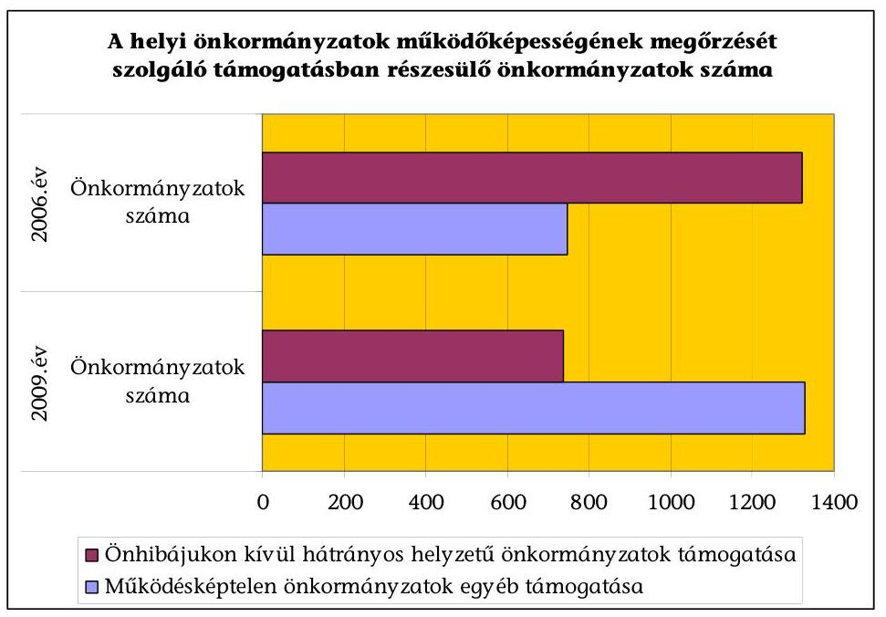

A javaslat szerint megszűnik a működésképtelen helyi önkormányzatok egyéb támogatási kerete, amelynek felhasználásáról - az Országgyűlés Önkormányzati és Területfejlesztési Bizottságának utólagos tájékoztatási kötelezettsége mellett - a helyi önkormányzatokért felelős miniszter döntött. ${ }^{72} \mathrm{~A}$ támogatási keret miniszteri hatáskörbe való utalásának rendjét, az így felosztott támogatások nagyságrendjét az eredeti előirányzatok rendszeres, jelentős arányú túllépése miatt az ÁSZ a zárszámadásról szóló jelentéseiben ${ }^{73}$ sorozatosan kifogásolta.

A fejezeti tartalék tervezett előirányzata ugyan 2,4 Mrd Ft-tal (több mint 20\%$\mathrm{kal})$ meghaladja az elmúlt évben a működőképesség megőrzésére összességében tervezett előirányzatot, azonban előre nem számszerűsíthető, hogy a fejezeten belül felülről nyitott előirányzatok kiegészítési igénye, és a visszaáramlások egyenlege hogyan befolyásolja a tartalék tényleges alakulását.

A 2010-ben a helyi önkormányzatok működőképességének megőrzésére szolgáló előirányzat a 3 különböző jogcímen együttvéve 11,7 Mrd Ft, amelyből az önhibájukon kívül hátrányos helyzetben lévő települési önkormányzatok támogatása 10,2 Mrd Ft, a tartósan fizetésképtelen helyzetbe került helyi önkormányzatok adósságrendezésére irányuló hitelfelvétel visszterhes kamattámogatása és a pénzügyi gondnok díja 0,1 Mrd Ft, a működésképtelen helyi önkormányzatok egyéb támogatási kerete 1,4 Mrd Ft. Az önhibájukon kívül hátrányos helyzetben lévő önkormányzatok támogatásának 2010. évi I. ütemében 467 önkormányzat 4,1 Mrd Ft támogatásban részesült. Azok az önkormányzatok, - összesen 951 amelyek működőképessége a támogatás mellett sem volt biztosítható, vagy a költségvetési törvényben meghatározott feltételeknek nem feleltek meg, a működésképtelen helyi önkormányzatok egyéb támogatási kerete terhére szeptember végéig 10 ütemben 3,1 Mrd Ft támogatásban részesültek.

A központilag meghatározott báziskorrekció, tervezési feltételek figyelembevételével készültek makroszintú számítások a különböző hozzájárulásokra, támogatásokra és a központi költségvetésből származó források főbb csoportjaira, a központi költségvetésből származó bevételek ágazati összetételére és a helyi önkormányzatok költségvetési mérlegére vonatkozóan.

A két évtizede folyamatosan növekvő önkormányzati feladatok és a finanszírozás összhangjának hiányában az önkormányzatok egy része a 2006-2009 közötti időszakban fokozatosan adósodott el. Az önkormányzatok összesített adatai alapján számított eladósodási mutató ${ }^{74}$ 2006-2009 közötti folyamatos emelkedése jelzi, hogy az összes forráson belül emelkedett a hosszú és rövid lejáratú kötelezettségek együttes aránya. Az önkormányzatok 2009. évi költségvetési beszámolójának összesített adatai szerint a 2009. december 31-én fennálló adósságállományból a törlesztő részlet a 2011-ben 67 Mrd Ft, a 2012-ben 68 Mrd Ft, a 2013-ban 71 Mrd Ft, a 2014-ben 69 Mrd Ft, a 2015. és az azt követő években együttesen $657 \mathrm{Mrd} \mathrm{Ft}^{75}$.

[^0]
[^0]:    ${ }^{72}$ Az előirányzat döntés előkészítési rendjét az önkormányzati miniszter 3/2010. (II. 12) ÖM utasításban szabályozta.
    ${ }^{73}$ Legutóbb a Magyar Köztársaság 2009. évi költségvetésének végrehajtásának véleményezéséről szóló jelentés (1016)
    ${ }^{74}$ eladósodási mutató = összes kötelezettség-egyéb passzív pénzügyi elszámolások/összes forrás
    ${ }^{75}$ Jelentés a helyi önkormányzatok gazdálkodási rendszerének 2009. évi ellenőrzéséről (1019)

---

A GFS rendszerű hiány - elsősorban a felhalmozási kiadásoknál négyévente jellemző növekedés miatt - ciklikusságot mutat.
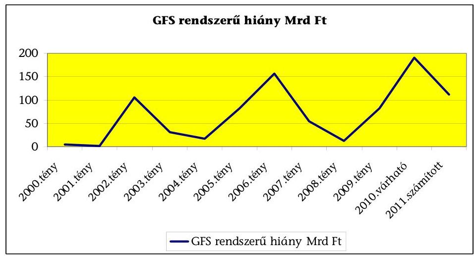

A helyi önkormányzatok pénzügyi helyzete eltérő. Hosszú lejáratú, beruházási és fejlesztési célú hitelfelvételből, kötvénykibocsátásból származó adósságállományuk 2009. december 31-én 1022,4 Mrd Ft volt, amely 6,6\%-os növekedést mutat az előző évhez képest. A hitel, kötvénytartozás 2010. évi törlesztő részletének aránya az Ötv. 88. § (3) bekezdés a.) pontja szerinti korrigált saját bevétel, a bankszámla egyenleg és betét %-ában a 2009. évi beszámolók adatai alapján ${ }^{76}$.
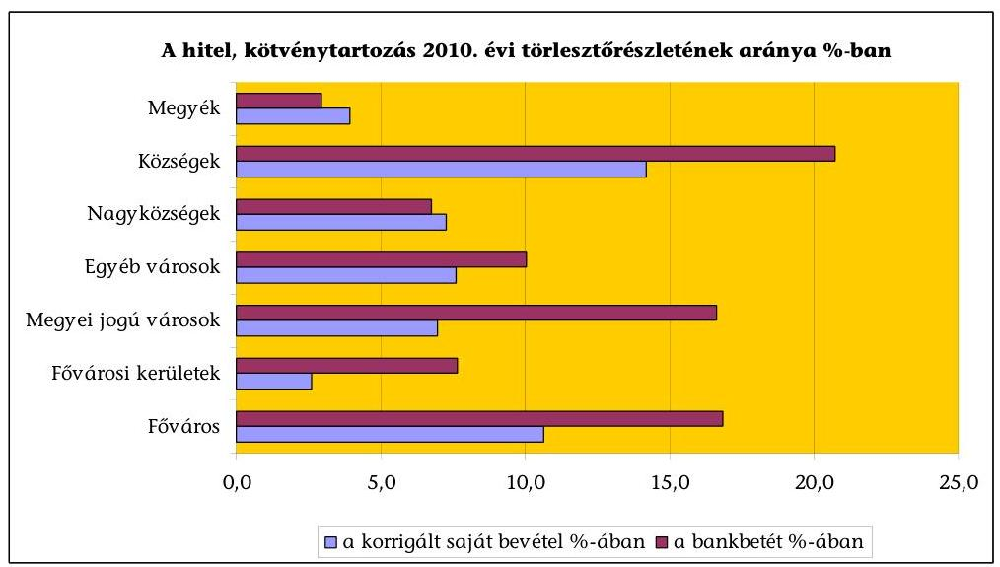

Az egyes önkormányzati típusok között az adósságszolgálat a korrigált saját bevétel és a bankszámla egyenleg %-ában jelentősen eltér: a községeknél a legmagasabb ( $14,2 \%$, illetve $20,7 \%$ ), azonban az összes adósságállománynak csupán 5,2\%-a, a 2010-ben esedékes törlesztő részlet 8,9\%-a terheli költségvetésüket. A Fővárosi Önkormányzat és a megyei jogú városok helyzete az átlagostól rosszabb. A megyéknél a 2010. év még nem jelzi a feszültségeket a törlesztési kötelezettségek későbbi időpontban történő jelentkezése miatt. A kistelepülések (az önkormányzatok kétharmadának lakosságszáma ezer fő alatti) pénzügyi egyensúlya a legsérülékenyebb, a körükben tapasztalható fizetésképtelenség rövidtávon is veszélyezteti működésüket ${ }^{77}$. A forráshiány hosszabb idő óta jellemző, ezt a kiegészítő támogatások iránti igények növekedése is jelzi. Az önkormányzatok pénzügyi helyzetének romlásában rejlő kockázatokra figyelmeztet, hogy a 2010. augusztus 31-ei adósságállományuk az előző év végéhez képest $11,1 \%$-kal emelkedett, miközben a betétállományuk $25,9 \%$-kal csökkent.

A helyi önkormányzatok GFS rendszerű bevételei - 2000. évi összehasonlító árakon - az elmúlt évtizedben 2006. évig emelkedtek, azt követően csökkentek. Ezen belül a saját folyó bevételek reálértéke emelkedett, a központi költségvetési kapcsolatokból származó (szabályozott) bevételeké csökkent. Ez részben indokolható a kiadáscsökkentő (takarékossági) intézkedésekkel (pl. pedagógusok óraszám emelése, 13. havi illetmény megvonása, járulékcsökkentés), feladatváltozásokkal (pl. közfoglalkoztatás finanszírozása). A hitel- és értékpapírműveletek nélküli bevételeket mutatja be 2000. évi árakon a következő diagram:
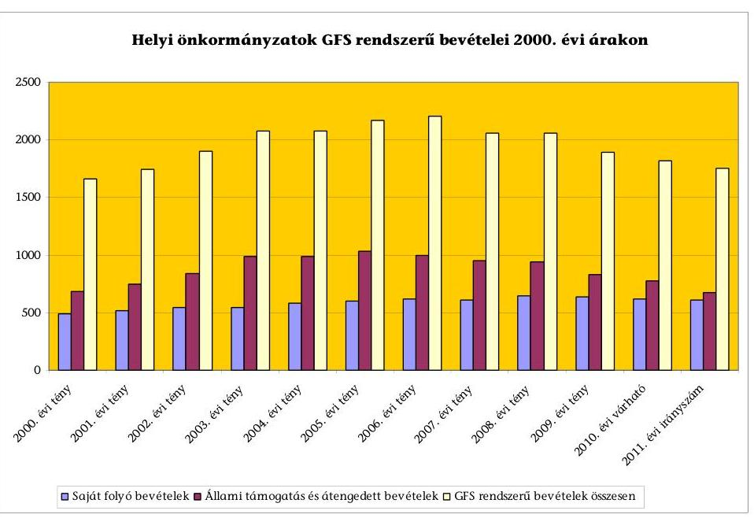

Az önkormányzatok számára a szakmai (ágazati) törvényekben előírt kötelezettségek és a rendelkezésre álló bevételek közötti összhang javítására a költségvetési konszolidáció miatt 2011-ben sem áll rendelkezésre többletforrás. A kötelező feladatok finanszírozásába a helyi források további - a korábbiaknál mérsékeltebb ütemű - bevonásával számolnak az önkormányzatoknál, azonban a helyi adók, elsősorban az iparűzési adóbevételek korábbi növekedésének (éves átlagban 12\%-os mértékű) dinamizmusa a 2009-2011 években már nem érvényesül.

[^0]
[^0]:    ${ }^{77}$ A községi önkormányzatok likviditás- és bonitáshiányára vonatkozó felmérést az ÁSZKUT önkormányzati rendszer pénzügyi helyzetét bemutató tanulmánya összegzi.

---

# 2. A KÖZPONTI KÖLTSÉGVETÉSI KAPCSOLATBÓL SZÁRMAZÓ FORRÁSOK ÉS SAJÁT BEVÉTELEK TERVEZÉSÉNEK MEGALAPOZOTTSÁGA 

### 2.1. Normatív és egyéb állami hozzájárulások, támogatások

A központi költségvetésből származó normatív hozzájárulások, támogatások és a normatívan elosztott személyi jövedelemadó - a közfoglalkoztatás átalakítása miatt báziskorrekciót figyelembe véve - a korrigált bázishoz képest 21,7 Mrd Ft-tal (2,6\%-kal) emelkednek a javaslat szerint. A növekmény 53\%-a az ún. globális támogatásoknál (önkormányzatok településüzemeltetési, igazgatási, sport- és kulturális feladatai, üdülőhelyi feladatok és a megyei önkormányzatok szja részesedése jogcímeken), 23\%-a az oktatási, $8 \%$-a a szociális, $16 \%$-a a kistérségi normatíváknál jelentkezik.

A 2011. évi költségvetési törvényjavaslat 3-8. sz. mellékleteiben a normatív hozzájárulások és támogatások előirányzatait a 2010. évi várható teljesítések figyelembevételével tervezték.

A körzeti igazgatási feladatokhoz biztosított normatív hozzájárulások tervezési, elszámolási szabályai a 2011. évi költségvetésben a javaslat szerint egy jogcím kivételével - érdemben nem változnak. A gyámügyi igazgatási feladatoknál a hozzájárulás alapja módosul, a támogatás a korábbinál jobban igazodik a ténylegesen ellátott feladatokhoz.

A gyámügyi igazgatási feladatok normatív állami hozzájárulása 2010-ben lakosságszám arányosan került meghatározásra. Ez a módszer nem követte a feladatok tényleges eloszlását, ezért a támogatás alapja a 2011. évi javaslatban az ellátási körzetben gyámság alatt álló gyermekek és gondnokság alatt álló felnőttek együttes száma.

A szociális ellátásokat érintő központi költségvetésből származó hozzájárulások, támogatások 2010. évi előirányzata 274,4 Mrd Ft volt, amely a javaslat szerint végrehajtott báziskorrekció következtében 241,0 Mrd Ft-ra csökken, és ez az előirányzat képezi a 2011. évi tervezés alapját.

A közfoglalkoztatás szabályait rögzítő jogszabálytervezet, a helyszíni vizsgálat során nem állt rendelkezésre. A költségvetési javaslat indoklása szerint a közfoglalkoztatási programokról a munkaügyi központok döntenek, a későbbiekben a célkitűzések megvalósítását a képzések terén EU-s források is segítik. Új elemként a kis és közepes vállalkozások is bevonásra kerülnek a leghátrányosabb helyzetű munkanélküliek közfoglalkoztatásába.

A 2011. évi költségvetési javaslatban szereplő ${ }^{78}$ szociális normatívák előirányzata a korrigált 2011. évi bázis adatokhoz viszonyítva ${ }^{79}$ összességében alig változik ( $0,7 \%$-kal, 1,7 Mrd Ft-tal nő), ezen belül az egyes jogcímcsoportokon belül van elmozdulás, növekedés, illetve csökkenés. Az előirányzatok kimunkálása során a takarékossági szempontok érvényesítése, a költségvetési hiánycél tarthatósága következtében a normatívák fajlagos összegeinek emelésére nem került sor, ugyanakkor a feladatmutatók tervezése a rendelkezésre álló szakmai dokumentumok, felmérések adatai alapján reálisan történt.

A pénzbeli szociális juttatások (3. számú melléklet), valamint egyes jövedelempótló ellátások és az önkormányzat által szervezett közcélú foglalkoztatás támogatása (8. számú melléklet) 2011. évi előirányzatainak változása alapvetően a közfoglalkoztatás rendszerének módosulása idézte elő.

A pénzbeli szociális juttatások 2011. évi költségvetési előirányzata 12,7\%-kal (8,8 Mrd Ft-tal) csökkent.

Az előirányzat csökkenése abból adódik, hogy a közcélú munka keretében kifizetett munkabér és közterheinek 5\%-ához ebből a támogatási keretből csak a 2010. december hónapra járó összeghez járulnak hozzá (a kifizetés áthúzódik januárra), a 2011-ben nem kell forrást biztosítani. Emellett a változásban tükröződik a Szoctv. 43/B. §-ának (1) bekezdésében szabályozott ápolási díj és nyugdíjáruléka kifizetéséhez kapcsoltan az ápolási díj összegének tervezett minimális (1000
 Ft-os) emelése. A költségvetési törvényjavaslat normaszövege alapján a települések szociális jellemzőiből képzett mutatószám kimunkálásánál tervezett változás az, hogy hangsúlyosabb szerepet kapnak (20%-os súllyal szerepelnek) a lakásfenntartási támogatásban részesülők, emellett 5%-kal csökken a közcélú foglalkoztatottak súlyaránya.

# A szociális és gyermekjóléti alapszolgáltatás feladatainak normatív 

támogatása a költségvetési javaslat szerint 27,3 Mrd Ft, ez a bázis előirányzatot 0,6 Mrd Ft-tal haladja meg. A jogcímcsoporton belül az igénylési, elszámolási feltételek, a fajlagos összegek érdemben nem változtak, azonban a rendszer egyszerűsödött, valamint a költségvetési javaslatban biztosított a bővülő ellátotti létszám támogatásának növekménye. A 2010-ben bevezetett „Otthon közeli ellátások” visszarendeződtek, azok egyes elemei („Szociális étkeztetés”, „Házi segítségnyújtás”, „Időskorúak nappali intézményi ellátása”) ismét önálló igénylési jogcímet képeznek.

Az előirányzatok reális tervezése érdekében valamennyi jogcímre irányulóan 2010 júliusában felmérést végeztek az önkormányzatoknál a feladatmutatók alakulásáról. Ezek, valamint az ellátások sajátos jellemzőire irányuló szakmai elemzések alapján a NEFMI kimunkálta a 2011. évi becsült mutatószámokat. A részletes számítási anyagok szerint az előirányzat-növekmény mintegy 80%-a (0,4 Mrd Ft) a szociális étkezők (5145 fős), valamint a házi segítségnyújtásban részesülők (1286 fős) számának bővüléséből adódik.

## A „Szociális és gyermekvédelmi bentlakásos és átmeneti elhelyezés” normatív hozzájárulása a költségvetési javaslat szerint 0,3 Mrd Ft-

tal nő az előző évi bázis előirányzathoz viszonyítva. A jogcímcsoporton belül az igénylési feltételekben, a normatívák fajlagos összegében érdemi módosítást nem terveztek, a növekmény a feladatmutatók változásának hatása.

Szakmai számítások alapján nő a gyermekvédelmi különleges és speciális ellátottak, a fogyatékos, pszichiátriai és szenvedélybetegek lakóotthonaiban élők, va-

---

lamint a demenciában szenvedők, kissé mérséklődik az időskorúak ápológondozó otthonaiban, az emelt színvonalú bentlakásos ellátásban részesülők száma. A költségvetési javaslat szerint a demens betegek bentlakásos intézményi ellátásához kapcsolódó támogatás igénylési feltételei egyszerűsödnek. A 2011-től nem kizárólag a demencia központok által kiadott szakvélemény fogadható el a demencia kórkép súlyos fokozatának igazolására, elegendő a szakorvosi (pszichiáter, neurológus, geriáter) igazolás.

A hajléktalanok átmeneti intézményeinek támogatási feltételei, előirányzata kisebb mértékben változik, a bázis szállások biztosításához nyújtott támogatási jogcím kikerül a javaslat szerint, mivel az önkormányzatok az utóbbi években ezen a címen támogatást nem igényeltek.

A „Gyermekek napközbeni ellátása” jogcímcsoport javaslatban szereplő 2011. évi költségvetési előirányzata 1,1 Mrd Ft-tal nő a bázis előirányzathoz viszonyítva. A támogatás igénylési feltételei, elszámolási módja, fajlagos összegei alapvetően nem változnak, ugyanakkor a bölcsődei ellátásban részesülőknél, valamint az ingyenes és kedvezményes intézményi étkeztetésre jogosultak számánál a javaslat szerint számottevő növekmény várható.

A bölcsődében ellátottak feladatmutatója mintegy 2300 fővel nő. Ez egyrészt az utóbbi két-három évben, a Regionális Operatív Programokban, továbbá a központosított támogatások között nevesített infrastrukturális fejlesztéseket lehetővé tevő pályázati források felhasználásával létrejövő mintegy 1700 új, másrészt a csoportlétszámokat érintő jogszabályi változások hatásaként jelentkező férőhelyek bővülésével indokolható. (A bölcsődei csoportokban ellátható kisgyermekek számának 10-ről 12-re, illetve 14-re történő emelése).

A családi napközikben, a házi gyermekfelügyeletben részesülők száma országosan növekvő tendenciát mutat, ugyanakkor ezek az ellátások jellegükből adódóan 80%-ban (a 2008. évi statisztikai adatok) nem állami fenntartásban működnek. A 2011. évi javaslatban emiatt az ellátotti létszám (mintegy 100 fő) csökkenésével számoltak. A 2010. január 1-jétől új típusú ellátásként szabályozott családi gyermekfelügyelet működtetésére egyetlen szolgáltató sem kért működési engedélyt.

Az „Ingyenes és kedvezményes intézményi étkeztetés” normatívája 4,6%-kal emelkedik, a javaslat szerint (68 ezer Ft/fő/év), ezen túlmenően mintegy 600 fővel nő a támogatásban részesülők száma. (A szakmai számítások szerint az újonnan bekerülő ellátottak közel 30%-a jogosult a kedvezményes étkeztetés igénybevételére.)

A helyi önkormányzatok normatív, kötött felhasználású támogatásai között nevesített II. egyes szociális feladatok támogatása előirányzat a korrigált bázishoz viszonyítva 10,6%-kal (8,5 Mrd Ft-tal) nő. Az előirányzat kimunkálásának számítási adatai alapján a tervezett előirányzat (88,5 Mrd Ft) reálisnak ítélhető.

Az egyes jövedelempótló ellátások és a közcélú foglalkoztatás előirányzatának 2010. évi várható teljesítése 185,8 Mrd Ft, amely a tervezett eredeti előirányzathoz viszonyítva 73,4 Mrd Ft-os túllépést jelent. (Ezt az előirányzatot a 2010. évi költségvetésben irreálisan alacsony összegben tervezték.) A várható teljesítési

---

adatok alapján a közfoglalkoztatáshoz kapcsolódó kifizetések mintegy 96 Mrd Ftot tesznek ki. A 2011. évi előirányzat kimunkálásánál a várható teljesítések összegéből indultak ki, melyet a közcélú munkavégzés szabályainak változásával, valamint a 2010 decemberében kifizetett összegek 2011. év januárjában jelentkező áthúzódó hatásaival összhangban korrigáltak.

A jogcímen belül kisebb változás, hogy a rendelkezésre állási támogatás elnevezése bérpótló járandóságra módosul, erre a célra az előirányzati keretből az önkormányzatoknál 48 Mrd Ft forrás jut.

A többcélú kistérségi társulások által igényelhető feladatmutatóhoz kötött szociális támogatások szabályrendszerében nem terveztek változást. A támogatási előirányzat a javaslat szerint összességében mintegy 0,9 Mrd Ft-tal nő (7,8 Mrd Ft) az előző évihez viszonyítva, ez az ellátotti létszám növekedéséből, valamint a feladat-ellátás kereteinek változásából adódik. Az egyes jogcímek részletezett tervezési adatai igazolják, hogy egyre szélesebb körben vállalják fel a kistérségi társulások az intézmények fenntartását, melynek oka elsősorban a kedvezőbb finanszírozás. Ennek hatásaként csökken az intézményi társulásban fenntartott intézményekben ellátottak száma, míg egyre többen veszik igénybe az ellátásokat a kistérségi társulás által működtetett intézményekben.

A 2011. évi költségvetési törvényjavaslatban szereplő közoktatási célú hozzájárulások és támogatások összevont 410,5 Mrd Ft előirányzata nem változik jelentősen, a 2011. évi bázist csupán 0,2 Mrd Ft-tal haladja meg. Ezen belül a közoktatási célú normatív hozzájárulások, támogatások előirányzata és a kistérségi társulások közoktatási feladatainak támogatása 7,4 Mrd Ft-tal (1,9%-kal) emelkedik. Ennek belső átcsoportosítás a fedezete (pályázati úton igényelhető központosított előirányzat helyett normatív módon történik a támogatás felhasználókhoz történő eljuttatása).

A közoktatás normatív támogatásának 74%-a a „teljesítménymutatóval” finanszírozott közoktatási alap-hozzájárulás. A 2011-re tervezett mutatóhoz rendelt fajlagos hozzájárulási összeg megegyezik a 2010. évi támogatás összegével. A törekvés az volt, hogy a meglévő intézményszerkezetben az ellátás biztosítását az állami támogatás változása ne veszélyeztesse.

A teljesítménymutató alapján finanszírozott feladatok közül kettőnél megváltoztatták az intézmény-típus együtthatót. A változás támogatás összegére gyakorolt hatásának vizsgálatáról nem álltak rendelkezésre számítások.

Az alapfokú művészetoktatás területén további változás, hogy csak a minősített intézmények kaphatják meg a támogatást. Az ellenőrzés időpontjában nem volt ismert javaslat az új ellátásként induló, ezért még minősítéssel nem rendelkező intézmények esetében követendő eljárásra.

Pontosításra került az óvodai nevelésben részesülő gyermekek után járó támogatás elszámolása, így a közoktatási törvénnyel az összhang biztosított, a módosítás csak kis összeggel, változtatja a támogatást úgy, hogy az egyik módosítás növeli, a másik csökkenti annak korábbi összegét.

---

Új elem, hogy nemcsak az egyesített óvoda, bölcsőde, hanem az óvoda is kap támogatást a 2,5 éves életkort betöltött és ellátott óvodás után.

A közoktatási normatív támogatások második nagy csoportja a kiegészítő hozzájárulásokat tartalmazza, amely előirányzatok hat jogcímnél változtak kisebb mértékben, a módosítások a jogszabályokkal összhangban vannak.

A sajátos nevelési igényű tanulók kiegészítő támogatásának fajlagos összege nem változik, de a sokat vitatott besorolású csoport (a megismerő funkció, vagy a viselkedés fejlődésének tartós és súlyos rendellenességét mutató sajátos nevelési igényűek) megbontása megszűnik, a támogatás egységes mértékű lesz.

Az egyes pedagógiai programok támogatása előirányzatból lehetett támogatást igényelni és elszámolni az Arany János programok keretében ellátásban részesülő tanulók után, a feladatellátáshoz a tervezet szerint normatív hozzájárulás helyett a központosított előirányzatokból igényelhető támogatás.

A középszintű érettségi vizsga és a szakmai vizsga lebonyolítása a normatív hozzájárulások közé kerül. A szakmai, informatikai fejlesztési feladatok támogatása is normatív alapon igényelhető.

Mindkét feladathoz 2010-ben központosított támogatás állt rendelkezésre, azt megelőzően 2009-ben a feladat-ellátást normatív módon támogatta a költségvetés.

Az intézményi társulás óvodájába, általános iskolájába járó gyermekek, tanulók normatív támogatása megszűnik, ezzel egyidejűleg - ösztönző jelleggel - a többcélú kistérségi társulások közoktatási feladatainak támogatása emelkedik.

A kedvezményes óvodai, iskolai étkeztetés rendszere úgy változik, hogy az ingyenesen étkezők kiegészítő támogatása megszűnik, a kedvezményesen étkezőkével összevonásra kerül.

A tankönyvtámogatás is átalakításra kerül, megszűnik az általános támogatás és emelkedik az ingyenes tankönyvtámogatás fajlagos összege.

A részben ⁸⁰, vagy egészben közoktatáshoz kapcsolódó központosított támogatások az előző évhez képest csökkennek, miután több jogcím átkerült a normatív támogatások közé. A normatív módon történő elosztás jobban szolgálja a feladatellátók érdekeit. A normatív hozzájárulásba az érettségi és szakmai vizsgák lebonyolítását, az osztályfőnöki feladatok ellátását, az alapfokú művészetoktatást és a közoktatási informatikai fejlesztést szolgáló előirányzat. Az egyes jövedelempótló támogatások között került megtervezésre az óvodáztatási támogatás.

[^0]
[^0]: ⁸⁰ Egyes előirányzatok szociális célokat is szolgálnak, de a felhasználás aránya nincs rögzítve.

---

A normatív, kötött felhasználású támogatásokon belül 8,9 Mrd Ft-ra (157%-kal) emelkedett egyes közoktatási feladatok kiegészítő támogatása. A törvényjavaslat szerint 20%-kal emelkedik a pedagógiai szakszolgálatok támogatása, a szolgálatok bővítését lehetővé téve.

A kistérségek intézményeiben ellátottak kiegészítő támogatásainak fajlagos összege - a társulásokban meghatározó jelleggel ellátott feladatok esetében emelkedik a törvénytervezet alapján, ami ösztönzi a feladatellátás e formában történő megszervezését.

A kistérség által fenntartott intézménybe bejárók esetében a támogatás 98 ezer Ft/fő/évről 100 ezer Ft/fő/évre nő. A társulás intézményébe bejáró óvodások és 1-4 osztályosok esetében szinten marad a 70 ezer Ft/fő/év támogatás, az 5-8. osztályosok esetében 78 ezer Ft/fő/évről 90 ezer Ft/fő/évre emelkedik. További pozitív változás, hogy a társulás székhelyén lakó, illetve tartózkodási hellyel rendelkezőknek járó 50%-os támogatást nem csak a nem székhely településről bejárók létszámáig lehet igénybe venni, hanem valamennyi ellátottra. Az autóbusszal utaztatott tanulók támogatásának fajlagos összege 70 ezerről 80 ezer Ft-ra emelkedik.

A pedagógiai szakszolgálatok közül a továbbtanulás és pályaválasztási tanácsadás változatlanul hagyása mellett a nevelési tanácsadás 11 ezer Ft/fő/év támogatása 14 ezer Ft/fő/évre emelkedik.

# 2.2. Átengedett bevételek 

A helyi önkormányzatok 2011. évi költségvetésében az előző évhez képest az átengedett bevételek köre, valamint a központi költségvetés és az önkormányzatok közötti megosztásának aránya nem változik. A lakóhelyen beszedett személyi jövedelemadó 40%-a, a gépjárműadó, és a termőföld bérbeadásából származó adó 100%-a illeti meg az önkormányzatokat 2010. évben is. A minden települési önkormányzatot egységesen megillető (helyben maradó) személyi jövedelemadó hányad változatlanul 8%.

## Az önkormányzatokat a személyi jövedelemadóból megillető összeg és a tervezett felosztási arányok

| Megnevezés | 2010 |  | 2011 |  | 2011/2010% |
| :--: | :--: | :--: | :--: | :--: | :--: |
|  | millió Ft | megoszlás % | millió Ft | megoszlás % |  |
| Helyben maradó | 135888,4 | 20,0 | 126426,2 | 20,0 | 93,0 |
| Normatív alapon felosztott megyei önkormányzatok |  |  |  |  |  |
| részesedése | 5633,4 | 0,8 | 6833,4 | 1,1 | 121,3 |
| normatív állami hj-ok |  |  |  |  |  |
| fedezete (3.sz.melléklet) | 441416,1 |  |  |  |  |

 | 65,0 | 403569,1 | 63,8 | 91,4 |
| Jövedelemkülönbség |  |  |  |  |  |
| mérséklése | 96504,2 | 14,2 | 95302,2 | 15,1 | 98,8 |
| Mindösszesen | 679442,1 | 100,0 | 632130,9 | 100,0 | 93,0 |

A helyi önkormányzatokat megillető gépjárműadóból 73 Mrd Ft, az előző évi irányszámmal azonos bevétellel számoltak. Termőföld bérbeadásával kapcsolatos adóból évek óta csökken a bevétel, a számítások szerint csupán 100 M Ft bevétellel számolhatnak az önkormányzatok 2011-ben.

---

# 2.3. Saját bevételek 

A központi költségvetési kapcsolatokból származó bevételekből a dologi kiadások emelésére nincs fedezet, a 3,5%-os várható 2011. évi infláció mellett különös jelentőséggel bír az önkormányzatok saját bevételeinek tervezhetősége. A költségvetési törvényjavaslathoz tájékoztatási célból készített önkormányzati mérleg adatokban számított saját folyó bevételek az előző évi várhatóhoz képest csupán 2,6%-kal növekednek. Ezen belül az intézményi tevékenység bevételei (térítési díjak) a térítési díjak és az ellátottak számának emelkedése eredményeként az inflációt 1,7%-ponttal meghaladó mértékben növekedhetnek.

Az önkormányzatok betétállományának csökkenése miatt a kamatbevételek már 2010-ben is 43%-kal alacsonyabbak voltak, mint az előző évben. Ez a tendencia várhatóan folytatódik 2011-ben is, így csökken az ilyen címen tervezhető előirányzat.

A helyi adókra vonatkozóan 2011-től csökken az adófajták száma, megszűnik a vállalkozók kommunális adója és az építményekre kivetett idegenforgalmi adó. Az önkormányzatok szabályozott bevételeiben a vállalkozók kommunális adójának megszűnése miatt 1,3 Mrd Ft elismerésre került, míg az építményekre kivethető idegenforgalmi adó megszűnése nem. Az elképzelések szerint 2011-ben egyszerűsödik az ideiglenes jellegű iparűzési adókötelezettséggel összefüggő adózói és adóhatósági adminisztráció (például megszűnik a piacivásározó kiskereskedelmi tevékenység utáni adókötelezettség, továbbá az építőipari tevékenységet végző vállalkozások adókötelezettsége a tevékenység-végzés 30. napja helyett 2011-től annak 60. napján kezdődik). A helyi adó bevételek ezen belül a helyi iparűzési adó - a korábbi években jellemző dinamikusan növekedésének megtorpanása már 2009-ben tapasztalható volt a gazdasági válság miatt, így az ebből tervezhető bevételek számítások szerinti 5,1%-os növekedése újabb adónemek önkormányzatok általi bevezetése, az adómértékek emelése és a hátralékok csökkentése esetén tekinthető megalapozottnak.

Az illetékbevételekre a jogszabályváltozás és az ingatlanforgalom alakulása csökkentőleg hat. A központi költségvetés 1,2 Mrd Ft-tal kompenzálja az önkormányzatok számára az egyenes ági öröklés és ajándékozás illetékmentessé tétele miatt kieső önkormányzati bevételeket, azonban a 2010. évi várható teljesítés alapján az illetékbevételek csökkenése ezt meghaladó mértékű (a 2010. évi várható teljesítés az előző évi ténylegestől 18,5 Mrd Ft-tal alacsonyabb). Az állami adóhatóság által beszedett illetékből a központi költségvetést és az önkormányzatokat 2011. évben megillető bevétel megosztása változatlan elvek szerint történik.

A felhalmozási és tőke jellegű bevételek 329,6 Mrd Ft-os számított előirányzata az európai uniós támogatások, és az ehhez kapcsolódó hazai társfinanszírozás, valamint egyéb támogatásértékű (államháztartáson belülről átvett) felhalmozási bevételek előző évi várhatóhoz képest 42,8 Mrd Ft-os növekedést tartalmaz. A tárgyi eszközök (ingatlanok) és részvények, részesedések értékesítéséből (privatizációból) származó be-

---

vételek csökkennek, és 52,8 Mrd Ft-tal növekszik az EU-s támogatás és hazai társfinanszírozás összege.

A felhalmozási bevételek és kiadások teljesítését jelentős mértékben befolyásolja az ÜMFT keretében igénybe vehető uniós támogatások pénzügyi teljesítése (a tervezett felhalmozási bevételek 86%-a az EU-tól átvett pénzeszköz illetve hazai társfinanszírozás és egyéb támogatásértékű felhalmozási bevétel). Az uniós források 2010. első félévi 84 Mrd Ft-os teljesítése jelzi a tervezésben, az igénybevételben rejlő kockázatokat.

A támogatásértékű működési célú bevételek, benne az egészségügyi ellátásokat finanszírozó Egészségbiztosítási Alapból és a Munkaerőpiaci Alapból átvett pénzeszközök súlyaránya a 2010. évi számítotthoz képest 1,6%-ponttal emelkedik.

# 3. A HELYI ÖNKORMÁNYZATOK FEJLESZTÉSI TÁMOGATÁSA 

A 2011. évi költségvetési törvényjavaslatban az önkormányzatok fejlesztési célú támogatásának összevont előirányzata 65,8 Mrd Ft, amely az előző évit 37,0 Mrd Ft-tal (128,1%-kal) haladja meg. Az előirányzat növekedés jelentős, azonban ez az önkormányzatok egésze számára nem jelent általános fejlesztési kondíciójavulást. A növekmény 47,8%-át a budapesti 4-es - Budapest Kelenföldi pályaudvar - Bosnyák tér közötti - metróvonal megépítésének többlettámogatása, 18,7%-át a vis maior helyzetek kezelésére szánt előirányzat szükségszerűen megemelt összege okozza. A 2009. évi jövedelemdifferenciálódás mérséklésénél beszámítással érintett önkormányzatok támogatásának fejlesztési források között való figyelembevétele a tervezett növekmény 24,7%-os részarányát jelenti. A három alföldi megye 9 települését érintő belterületi vízrendezésre szánt előirányzat tárgyévi növekménye a többlettámogatás 7,3%-a.

### 3.1. Címzett- és céltámogatások, vis maior tartalék, a fővárosi metróépítés állami támogatása

A 2011. évi költségvetésben a címzett- és céltámogatások javasolt előirányzata 0,4 Mrd Ft, amely a folyamatban lévő céltámogatások áthúzódó kiadásain túl, az új induló céltámogatásokra csak 0,2 Mrd Ft fedezetet biztosít, az előző évivel azonos összegben.

Az Országgyűlés korábbi döntései értelmében $^{81}$ címzett támogatás már 2007-től kezdődően nem indítható. A helyi önkormányzatok címzett- és céltámogatási rendszeréről szóló 1992. évi LXXXIX. törvény 21. § (2) bekezdése alapján pedig

[^0]
[^0]:    $^{81}$ A Magyar Köztársaság 2007. évi költségvetését megalapozó egyes törvények módosításáról szóló 2006. évi CXXI. törvény 34. § (1) bekezdése, valamint a Magyar Köztársaság 2008. évi költségvetéséről szóló 2007. évi CLXIX. törvény 92. §-a.

---

az Országgyűlés új induló beruházásokhoz 2011-2012. években sem nyújt címzett támogatást $^{82}$.

A vis maior tartalékra 8,0 Mrd Ft-ot, az előző évinek több mint hétszeresére emelt összeget tartalmaz a 2011. évi költségvetési javaslat. A jelentősen megemelt előirányzat tervezését az elmúlt időszak gyakoribbá váló és súlyosabb károkkal járó vis maior eseményei, valamint a vis maior tartalék részletes felhasználásáról szóló 8/2010. (I. 28.) Korm. rendelet módosításai indokolják. A jogszabály módosítása értelmében a helyreállítások támogatása utólagosan számlák alapján történik, így minden jogszerű támogatás kifizetését az önkormányzati tartalék működési mechanizmusa biztosítja.

A keret a korábbi évekhez hasonlóan az egyes természeti károkból adódó indokolt és szükséges védekezési kiadások részbeni vagy teljes megtérítése, valamint az önkormányzati tulajdonban lévő építményekben a vis maior események okozta károk helyreállításának részbeni vagy teljes támogatása címén áll rendelkezésre.

A 2011. évi támogatás felhasználási szabályaiban - a költségvetési javaslat 81. § (1) bekezdés d.) pontjában kapott felhatalmazás alapján - a Kormány az előző időszak tapasztalataira figyelemmel változtatásokat tervez, azonban ennek részletei még nem ismeretesek.

A budapesti 4-es - Budapest Kelenföldi pályaudvar - Bosnyák tér közötti metróvonal megépítésének 2011. évi állami támogatására - az előző évi 10,0 Mrd Ft-tal szemben - 27,7 Mrd Ft-ot tartalmaz a költségvetési javaslat.

Az állami támogatás teljes szakaszra vonatkozó - 2002. évi áron, ÁFA nélkül számított - összegét maximum 208,9 Mrd Ft-ban határozták meg, amelyet 2006-2010 között a 2005. évi LXVII. törvény 4 §-ában foglaltak alapján a IX. Helyi önkormányzatok támogatásai fejezetben kellett előirányozni. A központi költségvetési támogatás feltételéül előírták, hogy a Fővárosi Önkormányzat a beruházás lebonyolítására elkülönített nyilvántartással rendelkező projektlebonyolító szervezetet működtet, és a Magyar Állam javára kontroll pozíciót biztosít. A beruházás előrehaladásához igazodóan az ÖM a 2009-re eredetileg 9,5 Mrd Ft összegű előirányzattal szemben - az előirányzatot 4,4 Mrd Ft-tal túllépve - 13,9 Mrd Ft utalványozásáról intézkedett. Erre azért volt szükség, mert az Európai Bizottság döntése következtében a magyar fél 11 szerződést - közbeszerzési szabályok megsértése miatt - nem finanszírozhatott uniós forrásból $^{83}$.

[^0]
[^0]:    $^{82}$ A szabályozást a Magyar Köztársaság 2010. évi költségvetését megalapozó egyes törvények módosításáról szóló 2009. évi CIX törvény 3. § (13) bekezdése határozta meg.
    $^{83}$ A Magyar Köztársaság 2009. évi költségvetésének végrehajtásáról szóló T/1297. sz. törvényjavaslat indoklásához fűzött fejezeti kötetek (IX. fejezet) indoklása alapján. A törvényjavaslatot az Országgyűlés a 2010. október 18-ai ülésnapján fogadta el, kihirdetésére a vélemény készítésének lezárásáig nem került sor.

---

A 2010-re tervezett 10,0 Mrd Ft támogatási előirányzat felhasználása 2010. szeptember végéig 5,8 Mrd Ft volt. A beruházás támogatásának pénzügyi teljesítése a szerződéses kötelezettség mértékéig minden évben külön szabályozott módosítás nélkül is eltérhetett a törvényben jóváhagyott támogatás összegétől. Ez a lehetőség a benyújtott törvényjavaslat $^{84}$ szerint 2011-ben is változatlanul fennmarad.

A 4-es metró beruházási folyamatait az ÁSZ 2010 szeptemberében közzétett jelentésében $^{85}$ tekintette át. Az ÁSZ az ellenőrzés megállapításai alapján javasolta a Kormánynak, hogy kezdeményezze a finanszírozási szerződés módosítását annak érdekében, hogy az állam műszaki-gazdasági és pénzügyi kontroll pozíciója erősödjön.

A metróberuházás finanszírozásáról rendelkező 2005. évi LXVII. törvényt a költségvetési javaslat benyújtásáig nem módosították, így - bár az állam által vállalt támogatási kötelezettség a 2011. évi támogatási javaslat figyelembevételével is a törvényi kötelezettség keretein belül marad - nincs meg a kívánt összhang a 2011. évi költségvetési törvényjavaslatban sem metróépítés támogatásának tárgyévi összege, sem pedig az előirányzat fejezeti helye tekintetében. A 2011. évi tervezés során a BM - az ÁSZ észrevételeire is alapozva - jelezte, hogy a beruházással kapcsolatos állami felügyeletet az önkormányzati fejezetben nem lehet biztosítani.

# 3.2. Egyéb önkormányzati fejlesztéseket szolgáló előirányzatok 

A helyi önkormányzatok fejlesztési feladatainak támogatására, ezen belül a területi kiegyenlítést szolgáló fejlesztések folytatására a 2011. évi költségvetési törvényjavaslat nem tartalmaz nevesített támogatási előirányzatot. Hazai fejlesztési forrásokból nem folytatódik a leghátrányosabb helyzetű kistérségek felzárkóztatásának támogatása sem. Ez azt jelenti, hogy a 2010. évi költségvetésben az államháztartás egyensúlyi helyzetének javítására figyelemmel elrendelt fejlesztési kiadásokat érintő kiadáscsökkentő intézkedések 2011-ben is érvényesülnek.

Az önkormányzatok és jogi személyiségű társulásaik európai uniós fejlesztési pályázatai saját forrás kiegészítésének támogatására - az előző évi összeggel azonosan - 10,6 Mrd Ft-ot tartalmaz a 2011. évi költségvetési javaslat. Az előirányzat 11,7%-a (1,2 Mrd Ft) a korábbi években megítélt és támogatási szerződésben rögzített fizetési kötelezettségek 2011. évi ütemének fedezetéül szolgál. A tervezett forrás nagyságrendje arra utal, hogy sikeres uniós pályázatok esetén az önerő hiánya a támogatott önkormányzati körben nem lesz akadálya a fejlesztések megvalósításának.

[^0]
[^0]:    $^{84}$ A 2011. évi költségvetési javaslat 9. melléklet 6. pontjában foglaltak alapján.
    $^{85}$ Jelentés a 4-es metró beruházási folyamatának ellenőrzéséről (1023)

---

Az EU Önerő Alap terhére támogatási szerződés 2011-ben kizárólag azon beruházásokat érintően köthető, amelyek esetében - támogatási szerződés tényleges megkötésétől függetlenül - az uniós forrásról szóló támogatói döntés legalább a 2010-ben megszületett. A támogatási jogcímek köre szűkült $^{86}$, miközben kiegészült a bölcsődei infrastrukturális fejlesztések támogatásával, kikerült a rendszerből a szociális és a gyermekjóléti ellátást biztosító intézmények, a kulturális intézmények, a helyi közutak, kerékpárutak és közterületek támogatása. Új elem ugyanakkor, hogy Magyarország európai uniós derogációs kötelezettségének határidőben történő megvalósítása érdekében az egészséges ivóvízberuházásokra ígérvény adható. A 2011-ben csak azon beruházásokhoz adható támogatás - kivéve az LHH-s önkormányzatokat - amelyeknél a saját forrás mértéke eléri a 10%-ot. A többcélú

 kistérségi társulások egyéb, nem intézményi fejlesztéseiknél csak a hátrányos helyzetű településeken megvalósuló beruházások vehetők figyelembe. Az EU Önerő Alap támogatás továbbra is vissza nem térítendő támogatás formájában áll rendelkezésre, amely a fejlesztés teljes időtartamára vonatkozóan kerül megállapításra.

Az EU Önerő Alapra 2010-ben is 10,6 milliárd Ft támogatás állt rendelkezésre ${ }^{87}$. A tárgyévi pályázatok benyújtására 2010. október 1-ig kerülhetett sor, amelyről a miniszter a beérkezést követő 60 napon belül - folyamatos elbírálás keretében - dönt. Az előirányzat terhére 2010. október 20-ig 8 döntési körben 162 önkormányzat számára 2,2 Mrd Ft támogatást ítéltek oda. A BM adatszolgáltatása szerint a 2010-re ütemezett teljes évi kifizetésekből (7 Mrd Ft) várhatóan 2-3 Mrd Ft a következő években kerül kifizetésre. Az eredeti előirányzattól való jelentős elmaradás oka változatlanul az, hogy az önkormányzati uniós beruházások megvalósításának üteme elmaradt a tervezettől, az e jogcímen folyósított támogatások pedig az uniós támogatási szerződésben foglalt kifizetésekhez igazodnak.

Önkormányzati feladatellátást szolgáló fejlesztések címén 5,5 Mrd Ft támogatást tartalmaz a költségvetési javaslat. A jogcím - amely a bölcsődék és a közoktatási intézmények infrastrukturális fejlesztéseihez, valamint a közösségi buszok beszerzéséhez kapcsolódó, előző években rendelkezésre álló központosított előirányzatot felváltva - két területre irányul.

# A társult formában működtetett, kötelező önkormányzati feladatot ellátó intézmények fejlesztése, felújítása címén támogatást igényelhet az intézményi társulás székhely önkormányzata, továbbá a többcélú kistérségi társulás kötelező feladatot ellátó intézménye fejlesztésére, felújítására, maximum 0,03 Mrd Ft erejéig. Előnyben azok a pályázók részesülnek, amelyek a vis maior támogatásból el nem ismert kötelező önkormányzati feladat ellátáshoz kapcsolódó fejlesztésre kívánják a támogatást felhasználni. 

[^0]
[^0]:    ${ }^{86}$ A költségvetési javaslat szerint új támogatási szerződés azon vízgazdálkodási, egyes környezetvédelmi, egészségügyi és járóbeteg-szakellátási célú, valamint a bölcsődei, óvodai és általános iskolai ellátást nyújtó intézményekhez kapcsolódó infrastrukturális fejlesztésekhez szükséges saját forrás kiegészítésére köthető, amely fejlesztések az önkormányzatok illetve társulásaik vagyongyarapodását eredményezik.
    ${ }^{87}$ Felhasználásának szabályait a Magyar Köztársaság 2010. évi költségvetésről szóló 2009. évi CXXX. törvény 5. számú melléklet 9. pontjában kapott felhatalmazás alapján a 8/2010. (II. 26.) ÖM rendelet szabályozta.

---

Az iskolai és utánpótlás sport infrastruktúra-fejlesztés, felújítás céljait szolgálóan a helyi önkormányzatok és többcélú kistérségi társulások a tulajdonukban lévő sportlétesítmények fejlesztésére legfeljebb 0,02 Mrd Ft támogatást igényelhetnek.

Egyik pályázati jogcím esetében sem támogathatóak azok a pályázók, akik a pályázatukban megjelölt műszaki tartalomra uniós vagy egyéb hazai támogatásban részesülnek.

A lakossági közműfejlesztés, a kompok révek felújításának, az ózdi martinsalak felhasználása miatt kárt szenvedett lakóépületek tulajdonosainak kártalanítása címén tervezett előirányzatok a 2011. évi javaslat szerinti együttvéve az előző évivel azonosan, 1,8 Mrd Ft összegben állnak rendelkezésre. A 2010-re tervezett támogatási keretek felhasználása 2010. szeptember végéig 55,6%-ban történt meg. Az elmúlt évek teljesítési adatai alapján biztosított az e jogcímen 2011-ben felmerülő támogatási igények kielégítése.

A belterületi belvízrendezési célok támogatásának 2011. évi költségvetési javaslat szerinti tervszáma 2,8 Mrd Ft, amely biztosítja a 2010-ben megkötött támogatási szerződések 2011. évi ütemének fedezetét.

# 3.3. A helyi közösségi közlekedés támogatása 

A helyi közösségi közlekedés normatív támogatására - az elmúlt négy évben tervezett és felhasznált összegekkel azonosan - 35,2 Mrd Ft támogatást irányoz elő a 2011. évi költségvetési javaslat. A támogatás - az elmúlt évekhez hasonlóan - a tárgyévet megelőző évben ténylegesen teljesített - környezetvédelmi szempontból súlyozott - személyszállítási teljesítmények (férőhely-kilométer) és a közlekedési ágazatok fajlagos ráfordításaira figyelemmel kerül elosztásra azok között az önkormányzatok között, amelyek a településen a tárgyév egészében helyi közforgalmú közlekedést tartanak fenn.

A támogatásra az önkormányzatok az Európai Közösségek Tanácsának 1370/2007/EK rendelete alapján megállapított, helyi közlekedési közszolgáltatás ellátása során felmerülő - tárgyévet megelőző évi - veszteség erejéig pályázhatnak. A támogatás igénylésénél az önkormányzatnak nyilatkoznia kell, hogy a helyi közlekedés ellátásához és fejlesztéséhez a tárgyévet megelőző évben szolgáltatónként milyen összegű saját forrás átadásával járult hozzá. A támogatás összege az önkormányzati saját forrást legfeljebb 25%-kal haladhatja meg.

## 4. A HELYI ÖNKORMÁNYZATOK GAZDASÁGI TÁRSASÁGAINAK ROMLÓ PÉNZÜGYI HELYZETE, AZ EBBŐL FAKADÓ KOCKÁZATOK

A helyi önkormányzatok pénzügyi helyzetének megítélésénél figyelembe kell venni a gazdasági társaságaik eladósodottságát is. Az önkormányzatok helyett sokszor e szervezetek veszik fel a hitelt vagy vállalnak egyéb kötelezettségeket.

---

Az önkormányzatok garanciát és kezességet vállalnak e hitelek után, amelynek állománya a 2009. évi beszámoló adatai szerint 22,2 Mrd Ft.

# Kiemelkedő a kockázat a Fővárosi Önkormányzat és a BKV kapcsolatában. 

A Fővárosi Önkormányzat helyi közlekedési támogatása a korábbi évek szabályozásával azonosan 2011-ben sem lehet kevesebb a 2010. évinél (de nem haladhatja meg a veszteség mértékét). A keretfelosztás 2007 évtől érvényes rendje szerint a támogatási előirányzat 91,4%-a (32,2 Mrd Ft-ot) a Fővárosi Önkormányzatot illette meg.

A 2010. évben a fővárosi közösségi közlekedés kiegészítő támogatására az 1053/2010. (III. 2.) Korm. határozat, valamint az 1097/2010. (IV. 21.) Korm. határozat a XIX. Uniós fejlesztések fejezetből történő átcsoportosítással (IX. fejezet, 16. jogcímén) 5,0-5,0 Mrd Ft támogatást biztosított. A támogatás - amelynek rendelkezésre bocsátása 2010. április végéig megtörtént - a közösségi közlekedési közszolgáltatás ellátásával kapcsolatban 2010-ben felmerülő, bevételekkel nem fedezett indokolt költségek részbeni ellentételezését szolgálja. Az említett 10 Mrd Ft-on túl a Kormány és a Fővárosi Önkormányzat között 2010. 04. 21-én kötött megállapodásban további 7,4 Mrd Ft támogatást rögzítettek, melynek átutalására a Vélemény lezárásáig nem került sor.

A megállapodás 2011-re azt tartalmazta, hogy a Kormány olyan központi működési támogatást tartalmazó javaslatot nyújt be az Országgyúlésnek, amely „kiváltja a BKV-ra jutó normatív támogatást." Ez lehetővé tette volna a korábbitól nagyobb összegű támogatást. Ez nem teljesült.

Az NGM tájékoztatása szerint a szerződés a 7.3 pontban foglaltak szerint megszűnt.
„7.3 Amennyiben bármilyen ok miatt (ideértve az Országgyúlés jóváhagyásának hiányát is) a Magyar Állam nem folyósítja a jelen Megállapodásban megjelölt határidőben a jelen Megállapodásban meghatározott bármely összeget, és e mulasztását Budapest Főváros Önkormányzatának a pénzügyminiszterhez címzett írásbeli felszólításának kézhezvételét követő 15 napon belül nem pótolja, akkor a jelen Megállapodás az elmulasztott határidőtől számított 15. napon megszünik."

A Fővárosi Önkormányzat - az NGM-től kapott dokumentum szerinti - írásbeli kérésére sem történt meg a kézhezvételt követő 15 napon belül az elmaradt összeg átutalása.

Bizonytalanságot jelent a 4-es metró beruházás finanszírozásának EU által történő felfüggesztése.

A BKV adósságállománya - az Igazgatóság 2010. I. féléves beszámolója szerint - 71,5 Mrd Ft.

Mindezek alapján az önkormányzatok feladatai és forrásai áttekintése során indokolt figyelembe venni az önkormányzatok gazdasági társaságainak eladósodottságát is.

Budapest, 2010. november

---

Az elkülönített állami pénzalapok és a társadalombiztosítás pénzügyi alapjainak költségvetési adatai a 2011. évi költségvetés véleményezéséhez

|   |  |  |  |  |  |  | Mrd Ft-ban |   |
| --- | --- | --- | --- | --- | --- | --- | --- | --- |
|   |  | 2009. év |  | 2010. év |  |  | 2011. év |   |
|  Alapok megnevezése |  | teljesítés | előirányzat | módosított előirányzat* | I-IX. havi teljesítés | várható teljesítés** | jegyzőkönyvben rögzített, október 21-i állapot szerinti előirányzat | október 30-i benyújtott költségvetési törvényjavaslat szerinti előirányzat  |
|  elkülönített állami pénzalapok |  |  |  |  |  |  |  |   |
|  1 | Munkaerőpiaci Alap |  |  |  |  |  |  |   |
|   | bevétel | 368 563,0 | 332 163,0 | 332 663,0 | 251 073,0 | 331 663,0 | 359 238,1 | 337 238,1  |
|   | kiadás | 427 146,7 | 313 763,0 | 314 263,0 | 214 615,2 | 313 263,0 | 359 238,1 | 337 238,1  |
|   | egyenleg | -58 583,7 | 18 400,0 | 18 400,0 | 36 457,8 | 18 400,0 | 0 | 0  |
|  2 | Szülőtőke Alap |  |  |  |  |  |  |   |
|   | bevétel | 1 881,8 | 1 594,1 | 2 780,4 | 2 904,8 | 2 938,6 | 1594,1 | 1 375,4  |
|   | kiadás | 2 763,5 | 1 594,1 | 2 803,6 | 2 099,7 | 2 430,4 | 1594,1 | 1 375,4  |
|   | egyenleg | -881,7 | 0,0 | -23,2 | 805,1 | 508,2 | 0 | 0  |
|  3 | Központi Nukleáris Pénzügyi Alap |  |  |  |  |  |  |   |
|   | bevétel | 33 751,4 | 35 440,1 |  | 29 862,2 | 35 646,6 | 31 329,9 | 31 329,9  |
|   | kiadás | 13 913,6 | 18 715,0 |  | 11 282,7 | 18 715,0 | 16 728,5 | 16 728,5  |
|   | egyenleg | 19 837,8 | 16 725,1 |  | 18 579,5 | 16 931,6 | 14 601,4 | 14 601,4  |
|  4 | Nemzeti Kulturális Alap |  |  |  |  |  |  |   |
|   | bevétel | 8 041,2 | 10 115,0 |  | 9 913,0 | 11 800,0 | 8807,8 | 9607,8  |
|   | kiadás | 9 668,4 | 10 115,0 |  | 6 559,0 | 9 800,0 | 8807,8 | 9607,8  |
|   | egyenleg | -1 627,2 | 0,0 | 0,0 | 3 354,0 | 2 000,0 | 0 | 0  |
|  5 | Wesselényi Miklós Ár- és Belvízvédelmi Kártalanítási Alap |  |  |  |  |  |  |   |
|   | bevétel | 23,4 | 21,4 |  | 14,7 |  | 19,4 | 19,4  |
|   | kiadás | 7,6 | 21,4 |  | 10,8 |  | 19,4 | 19,4  |
|   | egyenleg | 15,8 | 0,0 | 0,0 | 3,9 |  | 0 | 0  |
|  6 | Kutatási és Technológiai Innovációs Alap |  |  |  |  |  |  | 

  |
|   | bevétel | 52 912,3 | 43 695,9 | 56 180,6 | 22 079,5 |  | 45 977,9 | 45 977,9  |
|   | kiadás | 43 035,8 | 43 695,9 | 56 180,6 | 19 823,9 |  | 45 977,9 | 45 977,9  |
|   | egyenleg | 9 876,4 | 0,0 | 0,0 | 2 255,6 |  | 0,0 | 0,0  |
|  elkülönített állami pénzalapok összesen: |  |  |  |  |  |  |  |   |
|  bevétel |  | 465 173,0 | 423 029,5 |  | 315 847,2 | 382 048,2 | 446 967,2 | 425 548,5  |
|  kiadás |  | 496 535,6 | 387 904,4 |  | 254 391,3 | 344 208,4 | 432 365,8 | 410 947,1  |
|  egyenleg |  | -31 362,6 | 35 125,1 |  | 61 455,9 | 37 839,8 | 14 601,4 | 14 601,4  |

---

|  Alapok megnevezése |  | 2009. év |  | 2010. év |  |  | 2011. év |  |   |
| --- | --- | --- | --- | --- | --- | --- | --- | --- | --- |
|   |  | teljesítés | előirányzat | módosított előirányzat* | I-IX. havi teljesítés | várható teljesítés** | jegyzőkönyvben rögzített, október 21-i állapot szerinti előirányzat | október 30-i benyújtott költségvetési törvényjavaslat szerinti előirányzat | eltérés  |
|  társadalombiztosítás pénzügyi alapjai |  |  |  |  |  |  |  |  |   |
|  1 | Nyugdíjbiztosítási Alap |  |  |  |  |  |  |  |   |
|   | bevétel | 2 859 545,5 | 2 934 401,0 | 2 935 258,1 | 2 185 694,7 | 2 915 156,4 | 3 040 750,9 | 3 085 363,5 | 44 612,6  |
|   | kiadás | 2 866 766,8 | 2 934 401,0 | 2 935 258,1 | 2 177 114,1 | 2 907 171,4 | 3 040 750,9 | 3 085 363,5 | 44 612,6  |
|   | egyenleg | -7 221,3 | 0,0 | 0,0 | 8 580,6 | 7 985,0 | 0,0 | 0,0 | 0,0  |
|  2 | Egészségbiztosítási Alap |  |  |  |  |  |  |  |   |
|   | bevétel | 1 269 366,2 | 1 376 095,0 | 1 376 666,0 | 1 025 955,9 | 1 376 703,0 | 1 379 280,8 | 1 370 068,7 | -9 212,1  |
|   | kiadás | 1 418 842,1 | 1 445 503,3 | 1 449 576,0 | 1 095 790,2 | 1 468 830,0 | 1 488 072,8 | 1 468 225,0 | -19 847,8  |
|   | egyenleg | -149 475,9 | -69 408,3 | -72 910,0 | -69 834,3 | -92 127,0 | -108 792,0 | -98 156,3 | 10 635,7  |
|  társadalombiztosítás pénzügyi alapjai összesen: |  |  |  |  |  |  |  |  |   |
|  bevétel |  | 4 128 911,7 | 4 310 496,0 | 4 311 924,1 | 3 211 650,6 | 4 291 859,4 | 4 420 031,7 | 4 455 432,2 | 35 400,5  |
|  kiadás |  | 4 285 608,9 | 4 379 904,3 | 4 384 834,1 | 3 272 904,3 | 4 376 001,4 | 4 528 823,7 | 4 553 588,5 | 24 764,8  |
|  egyenleg |  | -156 697,2 | -69 408,3 | -72 910,0 | -61 253,7 | -84 142,0 | -108 792,0 | -98 156,3 | 10 635,7  |

*amennyiben volt előirányzat módosítás *amennyiben a prognózis rendelkezésre áll

---

# RÖVIDÍTÉSEK JEGYZÉKE 

| Atv. | 1996. évi CXVI. törvény az atomenergiáról |
| :--: | :--: |
| AH | Alkotmányvédelmi Hivatal |
| alapok | Elkülönített állami pénzalapok |
| APEH | Adó- és Pénzügyi Ellenőrzési Hivatal |
| AVHA | Agrár-vállalkozási Hitelgarancia Alapítvány |
| ÁAK Zrt. | Állami Autópálya Kezelő Zrt. |
| ÁEK | Állami Egészségügyi Központ |
| áfa | Általános forgalmi adó |
| áfa tv. | az általános forgalmi adóról szóló 2007. évi CXXVII. törvény |
| Áhsz. | Az államháztartás szervezeti beszámolási és könyvvezetési kötelezettségének sajátosságairól szóló 249/2000. (XII. 24.) Korm. rendelet |
| Áht. | az államháztartásról szóló törvény |
| ÁKK Zrt. | Államadósság Kezelő Központ Zrt. |
| ALB | Alkotmánybíróság |
| Ámr. | az államháztartás működési rendjéről szóló 217/1998. (XII. 30.) Korm. rendelet |
| ÁROP | Államreform Operatív Program |
| ÁSZ | Állami Számvevőszék |
| BÁH | Bevándorlási és Állampolgársági Hivatal |
| BIR | Bíróságok |
| BM | Belügyminisztérium |
| BMSK Zrt. | Beruházási, Műszaki Fejlesztési, Sportüzemeltetési és Közbeszerzési Zrt. |
| BSzKI | Bűnügyi Szakértői Intézet |
| BV | Büntetés-végrehajtás |
| E Ft | Ezer forint |
| E. Alap | Egészségbiztosítási Alap |
| EBF | Egészségbiztosítási Felügyelet |
| ECOSTAT | ECOSTAT Kormányzati gazdaság- és társadalomstratégiai Kutató Intézet |
| EGAA | Európai Globalizációs Alkalmazkodási Alap |
| EGT | Európai Gazdasági Térség |
| EHO | Egészségügyi hozzájárulás |
| EIB | Európai Beruházási Bank |
| EK | Európai Közösség |
| EKOP | Elektronikus Közigazgatás Operatív Program |
| ELKA | Elkülönített állami pénzalapok |
| EMGA | Európai Mezőgazdasági Garancia Alap |
| EMK | ÚMFT Egységes Működési Kézikönyve |

---

| EQUAL | A 2000-2006-os költségvetési időszak egyik EU-s Közösségi Kezdeményezés támogatási formája |
| :--: | :--: |
| Erasmus | EU felsőoktatási program |
| ESA | a nemzeti és regionális számlák európai rendszere |
| ETE | Európai Területi Együttműködés |
| EU | Európai Unió |
| EU Bizottság | Európai Bizottság |
| EUR | euró |
| EUTAF | Európai Támogatásokat Auditáló Főigazgatóság |
| EXIMBANK Zrt. | Magyar Export-Import Bank Zrt. |
| Flt. | 1991. évi IV. törvény a foglalkoztatás elősegítéséről és a munkanélküliek ellátásáról |
| FP7 | Kutatási Technológiafejlesztési Hetedik Keretprogram |
| FVM | Földművelésügyi és Vidékfejlesztési Minisztérium |
| GDP | bruttó hazai termék |
| GFP IH | Gazdaságfejlesztési Programok Irányító Hatósága |
| GH Zrt. | Garantiqa Hitelgarancia Zrt. |
| GNI | Gross National Income - Bruttó Nemzeti Jövedelem |
| GVH | Gazdasági Versenyhivatal |
| GYED | Gyermekgondozási díj |
| GYES | Gyermekgondozási segély |
| GYET | Gyermeknevelési támogatás |
| HM | Honvédelmi Minisztérium |
| HOP | Honvédelmi Minisztérium |
| HUF | forint |
| IDA | Nemzetközi Fejlesztési Társulás |
| IH | Irányító Hatóság |
| INTERREG | Az EU belső határrégióinak fejlesztését célzó program (Interregionális Együttműködés) |
| IRM | Igazságügyi és Rendészeti Minisztérium |
| Jean Monnet | Egész életen át tartó tanulás programja |
| JEREMIE | Közös európai források a kis- és középvállalkozásoknak Európai Uniós program |
| KA | Kohéziós Alap |
| KE | Köztársasági Elnökség |
| KESZ | Kincstári Egységes Számla |
| Kft. | Korlátolt felelősségű társaság |
| Kftv. | a takarékos állami gazdálkodásról és a költségvetési felelősségről szóló 2008. évi LXXV. törvény |
| KHEM | Közlekedési, Hírközlési és Energiaügyi Minisztérium |
| KHR | Közösségi Hozzájárulás Rendezés |
| KIM | Közigazgatási és Igazságügyi Minisztérium |
| Kincstár | Magyar Államkincstár |
| KKK | Közlekedésfejlesztési Koordinációs Központ |
| kkv-k | kis- és középvállalkozások |

---

| KNPA | Központi Nukleáris Pénzügyi Alap |
| :--: | :--: |
| KOR IH | Koordinációs Irányító Hatóság |
| Korm. | Kormány |
| KÖZIG IH | Közigazgatási Reform Programok Irányító Hatóság |
| KÖZOP | Közlekedés Operatív Program |
| KSH | Központi Statisztikai Hivatal |
| KSz | Közreműködő Szervezet (EU részekben) |
| KSZF | Központi Szolgáltatási Főigazgatóság |
| KT | Költségvetési Tanács |
| Kt. | A költségvetési szervek jogállásáról és gazdálkodásáról szóló 2008. évi CV. törvény |
| KTIA | Kutatási és Technológiai Innovációs Alap |
| Ktiatv. | 2003. évi XC. törvény a Kutatási és Technológiai Innovációs Alapról |
| KTIR | a K-600 Védelmi Igazgatás Távközlési Informatikai Rendszere |
| KüM | Külügyminisztérium |
| Kvtv. | a Magyar Köztársaság 2010. évi költségvetéséről szóló 2009. évi CXXX. törvény |
| KvVM | Környezetvédelmi és Vízügyi Minisztérium |
| KvVM FI | KvVM Fejlesztési Igazgatósága |
| LIFE3+ | EU környezetvédelmi politikáját támogató pénzügyi eszköz |
| M | millió |
| M Ft | millió forint |
| MÁFI | Magyar Állami Földtani Intézet |
| MALÉV Zrt. | Magyar Légiközlekedési Zrt. |
| MÁV Zrt. | Magyar Államvasutak Zrt. |
| ME | Miniszterelnökség |
| MeH | Miniszterelnöki Hivatal |
| MEH | Magyar Energiahivatal |
| MEHIB Zrt. | Magyar Exporthitel Biztosító Zrt. |
| MFB Zrt. | Magyar Fejlesztési Bank Zrt. |
| MgSzH | Mezőgazdasági Szakigazgatási Hivatal |
| MKÜ | Magyar Köztársaság Ügyészsége |
| MNB | Magyar Nemzeti Bank |
| MNV Zrt. | Magyar Nemzeti Vagyonkezelő Zrt. |
| MPA | Munkaerőpiaci Alap |
| MR Zrt. | Magyar Rádió Zrt. |
| Mrd | milliárd |
| MTA | Magyar Tudományos Akadémia |
| MTI Zrt. | Magyar Távirati Iroda Zrt. |
| MTV Zrt. | Magyar Televízió Zrt. |
| MV Zrt. | Magyar Vállalkozásfinanszírozási Zrt. |
| MVH | Mezőgazdasági és Vidékfejlesztési Hivatal |

---

| NAO Iroda | Nemzeti Programengedélyező Iroda |
| :--: | :--: |
| NATO | Észak-atlanti Szerződés Szervezete (North Atlantic Treaty Organisation) |
| NAV | Nemzeti Adó- és Vámhivatal |
| NBSZ | Nemzetbiztonsági Szakszolgálat |
| NEFMI | Nemzeti Erőforrás Minisztérium |
| NEP IH | Nemzetközi Együttműködési Programok Irányító Hatósága |
| NFA | Nemzeti Földalap |
| NFA | Nemzeti Földalapkezelő szervezet |
| NFI Kft. | Nemzeti Filharmónia Ingatlanfejlesztési Kft |
| NFM | Nemzeti Fejlesztési Minisztérium |
| NFT | Nemzeti Fejlesztési Terv |
| NFT I. | a 2004-2006-os Európai Unió költségvetési periódusra készített I. Nemzeti Fejlesztési Terv |
| NFÜ | Nemzeti Fejlesztési Ügynökség |

 NFÜ FF, FF | NFÜ Fejezeti Főosztály |
| NFÜ IGF | NFÜ Intézményi és Gazdálkodási Főosztály |
| NGM | Nemzetgazdasági Minisztérium |
| NGM EU KKF | NGM EU Költségvetési Kapcsolatok Főosztálya |
| NIF Zrt | Nemzeti Infrastruktúra Fejlesztő Zrt. |
| NIIFI | Nemzeti Információs Infrastruktúra Fejlesztési Intézet |
| NKA | Nemzeti Kulturális Alap |
| Nkatv. | 1993. évi XXIII. törvény a Nemzeti Kulturális Alapról |
| NKI | KSH Népességtudományi Kutató Intézet |
| NKTH | Nemzeti Kutatási és Technológiai Hivatal |
| NSZFI | Nemzeti Szakképzési és Felnőttképzési Intézet |
| NVT | Nemzeti Vidékfejlesztési Terv |
| Ny. Alap | Nyugdíjbiztosítási Alap |
| OAH | Országos Atomenergia Hivatal |
| OBH | Országgyűlési Biztosok Hivatala |
| OECF | japán Tengerentúli Alap |
| OEP | Országos Egészségbiztosítási Pénztár |
| OGY | Országgyűlés |
| OGY Hivatala | Országgyűlés Hivatala |
| OIT | Országos Igazságszolgáltatási Tanács |
| OKF | Országos Katasztrófavédelmi Főigazgatóság |
| OKM | Oktatási és Kulturális Minisztérium |
| OMMF | Országos Munkabiztonsági és Munkaügyi Főfelügyelőség |
| ONYF | Országos Nyugdíjbiztosítási Főigazgatóság |
| OP | Operatív Program |
| Országleltár | állami ingatlanvagyon |
| PM | Pénzügyminisztérium |
| PM ISZK | Pénzügyminisztérium Informatikai Szolgáltató Központ |

---

| Poseidon | 2007-2009-es időszak EU egészségügyi projektje   („Promoting Optimisation, Safety, Experience sharing and   quality Implementation for Donation Organisation and   Networking in Unrelated Haematopoietic Stem Cell   Transplantation in Europe") |
| :--: | :--: |
| PPP | Közfeladatok megoldása a köz-szféra és a magántőke   együttműködésével (Public Private Partnership) |
| RHK Kft. | RHK Közhasznú Nonprofit Kft |
| RTF | Rendőrtiszti Főiskola |
| SAPS | Egységes területalapú támogatás |
| STRAPI | Strukturális Alapok Programiroda |
| SZA | Szülőföld Alap |
| SZBEKK | Szervezett Bűnözés Elleni Koordinációs Központ |
| szja | személyi jövedelemadó |
| SZMM | Szociális és Munkaügyi Minisztérium |
| SzMsz | Szervezeti és Működési Szabályzat |
| Szoctv. | 1993. évi III. törvény a szociális igazgatásról és szociális   ellátásokról |
| Szt. | A számvitelről szóló 2000. évi C. törvény |
| TÁMOP | Társadalmi Megújulás Operatív Program |
| TB alapok | Társadalombiztosítás pénzügyi alapjai |
| Tbj. | 1997. évi LXXX. törvény a társadalombiztosítás ellátásaira   és a magánnyugdíjra jogosultakról, valamint e szolgáltatá-   sok fedezetéről |
| TEK | Terror-elhárítási Központ |
| TEN-T | Transzeurópai Közlekedési Hálózat |
| Thgys. | terhességi gyermekágyi segély |
| TIOP | Társadalmi Infrastruktúra Operatív Program |
| „top-up" | Nemzeti területalapú kiegészítő támogatás |
| TS | Technikai Segítségnyújtás |
| UF | Uniós Fejlesztések költségvetési fejezet |
| ÚMFT | Új Magyarország Fejlesztési Terv |
| ÚMVP | Új Magyarország Vidékfejlesztési Program |
| VM | Vidékfejlesztési Minisztérium |
| VOP | Végrehajtási Operatív Program |
| VP | Vám- és Pénzügyőrség |
| VPOP | Vám- és Pénzügyőrség Országos Parancsnoksága |
| WMA | Wesselényi Miklós Ár- és Belvízvédelmi Kártalanítási Alap |
| ZBR | Zöld Beruházási Rendszer |

