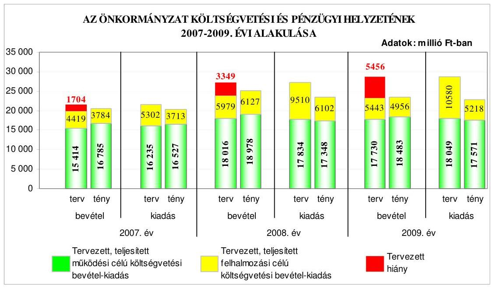
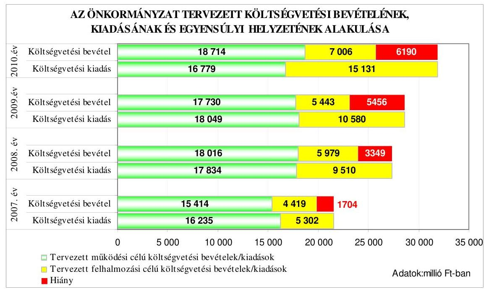
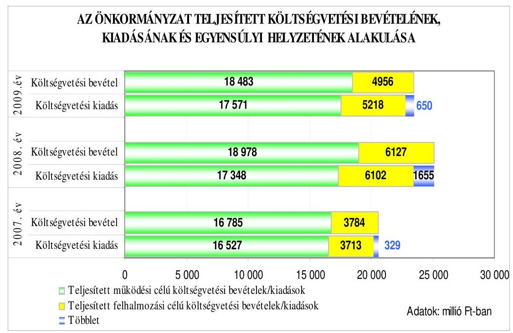
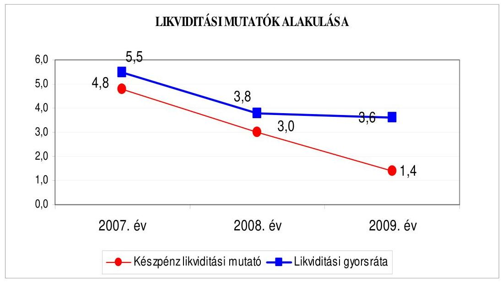
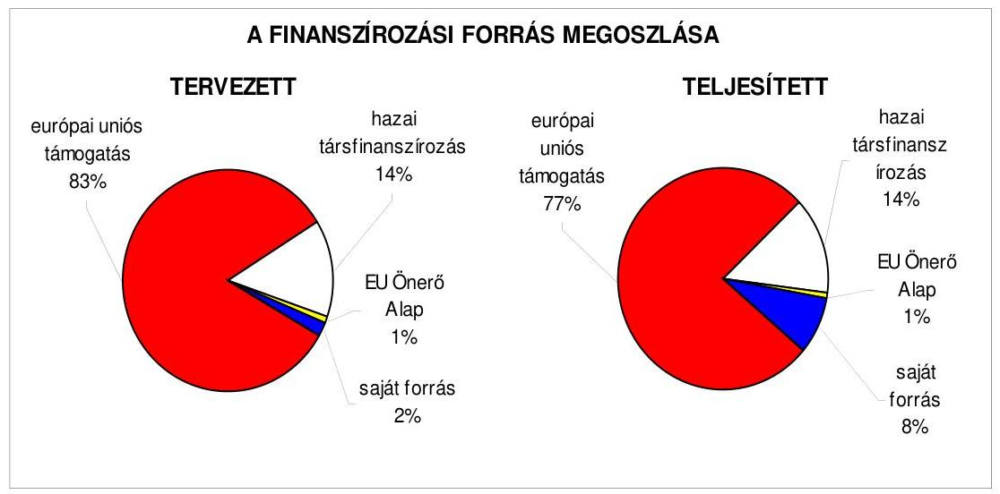
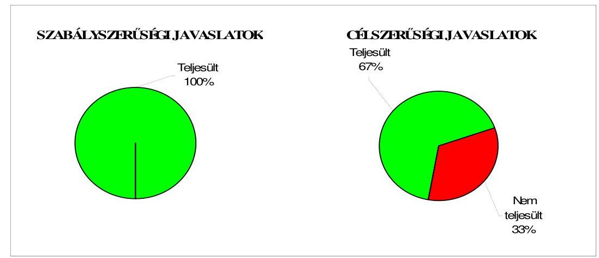
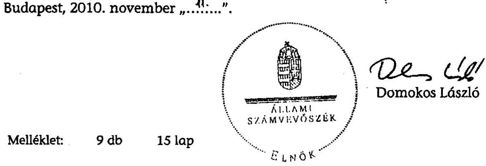
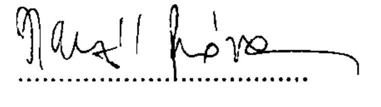
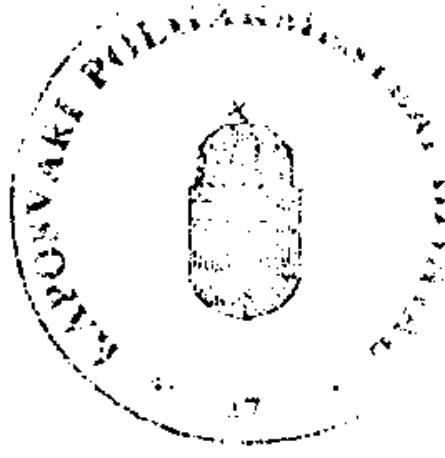
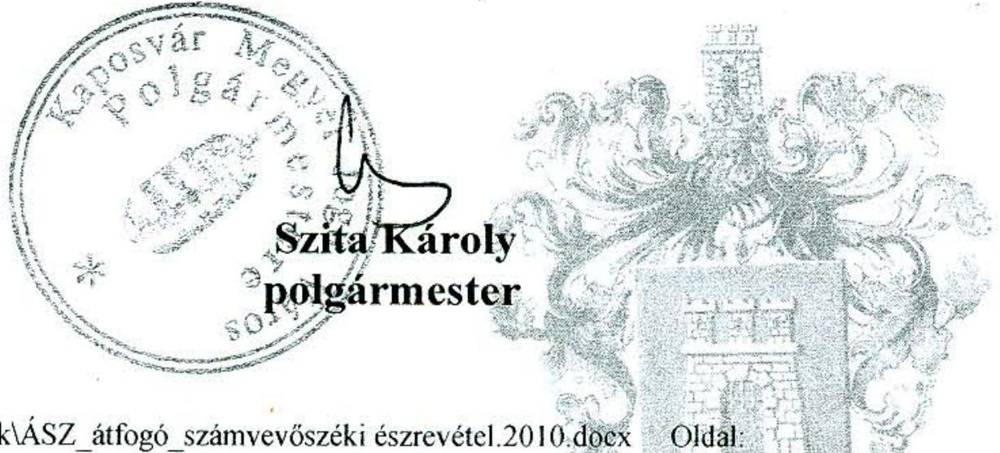

# JELENTÉS 

Kaposvár Megyei Jogú Város Önkormányzata gazdálkodási rendszerének 2010. évi ellenőrzéséről

---

# 3. Önkormányzati és Területi Ellenőrzési Igazgatóság 

3.3. Átfogó Ellenőrzések Főcsoport

Iktatószám: V-3023-7/26/19/2010.
Témaszám: 966
Vizsgálat-azonosító szám: V0494

## Az ellenőrzést felügyelte:

Dr. Lóránt Zoltán
főigazgató
Az ellenőrzés végrehajtásáért felelős:
Dr. Sepsey Tamás
főigazgató-helyettes
Az ellenőrzést vezette:
Gyüre Lajosné
vizsgálatvezető, tanácsadó
Az ellenőrzést végezték:
Csepreginé Tancsik Erzsébet
számvevő tanácsos

## Groholy Andrásné Hangyál Márta

számvevő tanácsos
Reichert Margit
számvevő

## A témához kapcsolódó eddig készített számvevőszéki jelentések:

## címe

Jelentés Kaposvár Megyei Jogú Város Önkormányzata gazdálkodási redszerének átfogó ellenőrzéséről
Jelentés a Magyar Köztársaság 2005. évi költségvetése végrehajtásának ellenőrzéséről
Függelék:

- a helyi önkormányzatokat a 2005. évben megillető normatív hozzájárulás elszámolásának ellenőrzése
- a helyi önkormányzatok beruházásaihoz és rekonstrukcióihoz nyújtott 2005. évi felhalmozási célú támogatások ellenőrzése
Jelentés a helyi és a helyi kisebbségi önkormányzatok gazdálkodási rendszerének átfogó és egyéb szabályszerűségi ellenőrzéséről
Jelentés a szakiskolai fejlesztési programra fordított pénzeszközök felhasználása eredményességének ellenőrzéséről
Jelentés a sürgősségi betegellátó rendszer kialakítására, fejlesztésére fordított pénzeszközök felhasználásának ellenőrzéséről

---

# TARTALOMJEGYZÉK 

BEVEZETÉS ..... 11
I. ÖSSZEGZŐ MEGÁLLAPÍTÁSOK, KÖVETKEZTETÉSEK, JAVASLATOK ..... 16
II. RÉSZLETES MEGÁLLAPÍTÁSOK ..... 24

1. Az Önkormányzat költségvetési és pénzügyi helyzete ..... 24
1.1. A tervezett költségvetési bevételek és kiadások alapján a
költségvetési egyensúly, a költségvetési hiány alakulása, a hiány
tervezett finanszírozási módja, valamint a költségvetési hiány
megállapításának szabályszerűsége ..... 24
1.2. A teljesített költségvetési bevételek és kiadások alapján a pénzügyi
egyensúly, a pénzügyi hiány alakulása, a pénzügyi hiány
finanszírozása, az igénybe vett finanszírozási célú pénzügyi
eszközök hatása a pénzügyi helyzet alakulására, az eladósodásra,
valamint a fizetőképességre ..... 25
2. Az Önkormányzat felkészültsége az európai uniós források igénylésére,
felhasználására, a támogatott célkitúzés megvalósítására, múködtetésére,
valamint az elektronikus közszolgáltatási feladatok ellátására ..... 34
2.1. Az európai uniós források igénybevételére, felhasználására, a
támogatott célkitúzés megvalósítására, múködtetésére történt
felkészülés szabályozottságának, szervezettségének, valamint egy
támogatási szerződésben foglalt célkitúzés megvalósításának,
múködtetésének eredményessége ..... 34
2.1.1. Az európai uniós forrásokra történő pályázatok benyújtására
vonatkozó döntések összhangja a fejlesztési célkitúzésekkel ..... 34
2.1.2. Az európai uniós forrásokhoz kapcsolódóan a
pályázatfigyelés, a pályázatkészítés, valamint az európai
uniós támogatással megvalósuló fejlesztés lebonyolításának
belső rendje, a végrehajtás és az ellenőrzés szervezettsége ..... 37
2.1.3. Egy támogatási szerződésben foglalt célkitúzés megvalósítása,
múködtetése ..... 38
2.2. Az elektronikus közszolgáltatás feltételeinek kialakítása ..... 40
3. A költségvetési gazdálkodás belső kontrolljai ..... 42
3.1. A költségvetés tervezés, a gazdálkodás és a zárszámadás készítés
folyamatában végrehajtandó belső kontrollok kialakítása ..... 42
3.2. A belső kontrollok múködtetése a költségvetés-tervezés, a
gazdálkodás, és a zárszámadás-készítés folyamataiban ..... 44
3.3. A belső ellenőrzési kötelezettség teljesítése ..... 49

---

4. Az ÁSZ korábbi ellenőrzési javaslatai alapján készített intézkedési terv végrehajtása, hasznosítása
4.1. Az Önkormányzat gazdálkodási rendszerének átfogó ellenőrzése során tett javaslatok végrehajtására tervezett intézkedések megvalósítása
4.2. A zárszámadáshoz kapcsolódó (állami hozzájárulások, támogatások igénylésének és felhasználásának ellenőrzése), valamint a további vizsgálatok esetében a megállapítások, javaslatok alapján tett intézkedések

# MELLÉKLETEK 

1. számú Az Önkormányzat gazdálkodását meghatározó adatok, mutatószámok (1 oldal)
2. számú Az önkormányzati vagyon alakulása (1 oldal)

2/a. számú Az önkormányzati kötelezettségek alakulása (1 oldal)
3. számú Az Önkormányzat 2007-2010. évi költségvetési előirányzatainak és 20072009. évi pénzügyi teljesítéseinek alakulása (1 oldal)
4. számú Tanúsítvány az európai uniós forrásokkal támogatott célok és programok 2007-2010. évi tervezett és teljesített adatairól (3 oldal)
4/a. számú Tanúsítvány az európai uniós forrásokra 2007-2010 között benyújtott pályázatokról, amelyek elbírálásáról az Önkormányzat még nem kapott tájékoztatást ( 2 oldal)
4/b. számú Tanúsítvány a 2007-2010. években benyújtott és elutasított európai uniós pályázatokról (2 oldal)
5. számú Adatlap az európai uniós forrással támogatott „Toldi lakótelepi Általános Iskola és Gimnázium teljes körü akadálymentesitése feladatról" (3 oldal)
6. számú Szita Károly úr, Kaposvár Megyei Jogú Város Önkormányzatának polgármestere által adott tájékoztatás (1 oldal)

---

# RÖVIDÍTÉSEK, MOZAIKSZAVAK JEGYZÉKE 

## Törvények

Áht.
Az államháztartásról szóló 1992. évi XXXVIII. törvény
ÁSZ tv.
az Állami Számvevőszékről szóló 1989. évi XXXVIII. tör-
vény
Eisz. tv.
az elektronikus információszabadságról szóló 2005. évi
XC. törvény
Ket.
a közigazgatási hatósági eljárás és szolgáltatás általános szabályairól szóló 2004. évi CXL. törvény
Ötv.
a helyi önkormányzatokról szóló 1990. évi LXV. törvény
Rendeletek
Ámr. 1
áz államháztartás múködési rendjéről szóló 217/1998. (XII. 30.) Korm. rendelet
Ámr. 2
az államháztartás múködési rendjéről szóló 292/2009. (XII. 19.) Korm. rendelet
Áhsz.
az államháztartás szervezetei beszámolási és könyvvezetési kötelezettségének sajátosságairól szóló 249/2000. (XII. 24.) Korm. rendelet
Ber.
a költségvetési szervek belső ellenőrzéséről szóló 193/2003. (XI. 26.) Korm. rendelet
18/2005. (XII. 27.) IHM a közzétételi listákon szereplő adatok közzétételéhez szükséges közzétételi mintákról szóló 18/2005. (XII. 27.) IHM rendelet
2005. évi költségvetési 2005. évi költségvetési 2007. évi költségvetési 2008. badosvár Megyei Jogú Város Önkormányzatának rendelet
2006. évi költségvetési 2/2006. (III. 3.) számú rendelete az Önkormányzat 2006. évi költségvetéséről
2007. évi költségvetési 2007. évi költségvetéséről rendelet
2008. évi költségvetési 2008. évi költségvetési 2009. évi költségvetési rendelet
2009. évi költségvetési 2010. évi költségvetési 2010. évi költségvetési rendelet

Kaposvár Megyei Jogú Város Önkormányzatának 2/2007. (III. 2.) számú rendelete az Önkormányzat 2007. évi költségvetéséről
Kaposvár Megyei Jogú Város Önkormányzatának 2/2008. (III. 5.) számú rendelete az Önkormányzat 2008. évi költségvetéséről

Kaposvár Megyei Jogú Város Önkormányzatának 3/2009. (III. 3.) számú rendelete az Önkormányzat 2009. évi költségvetéséről
Kaposvár Megyei Jogú Város Önkormányzatának 4/2010. (III. 2.) számú rendelete az Önkormányzat 2010. évi költségvetéséről

---

2005. évi zárszámadási rendelet

2007. évi zárszámadási rendelet

2008. évi zárszámadási rendelet

2009. évi zárszámadási rendelet

SzMSz

## Szórövidítések

ÁROP
ÁSZ
Általános Iskolai Gondnokság

Bárczi Gusztáv Közoktatási Intézmény

Belső ellenőrzési iroda
belső ellenőrzési kézikönyv

Családsegítő központ
e-közszolgáltatás
EU Önerő Alap
FEUVE
FEUVE szabályzat

Kaposvár Megyei Jogú Város Önkormányzatának 15/2006. (V. 4.) számú rendelete az Önkormányzat 2005. évi zárszámadásáról és a pénzmaradvány elszámolásáról
Kaposvár Megyei Jogú Város Önkormányzatának 15/2008. (IV. 28.) számú rendelete az Önkormányzat 2007. évi zárszámadásáról és a pénzmaradvány elszámolásáról
Kaposvár Megyei Jogú Város Önkormányzatának 20/2009. (IV. 24.) számú rendelete az Önkormányzat 2008. évi zárszámadásáról és a pénzmaradvány elszámolásáról
Kaposvár Megyei Jogú Város Önkormányzatának 15/2010. (IV. 30.) számú rendelete az Önkormányzat 2009. évi zárszámadásáról és a pénzmaradvány elszámolásáról
Kaposvár Megyei Jogú Város Önkormányzatának 4/1997. (I. 21.) számú rendelete a Közgyűlés és Szervei Szervezeti és Müködési Szabályzatáról

ÚMFT Államreform Operatív Program
Állami Számvevőszék
Kaposvár Megyei Jogú Város Önkormányzatának fenntartásában múködő Általános Iskolai, Óvodai és Egészségügyi Gondnokság
Kaposvár Megyei Jogú Város Önkormányzatának fenntartásában múködő Bárczi Gusztáv Óvoda, Általános Iskola, Speciális Szakiskola, Diákotthon, Módszertani Központ és Nevelési Tanácsadó
Kaposvár Megyei Jogú Város Önkormányzat Polgármesteri Hivatalának Belső Ellenőrzési Irodája
Kaposvár Megyei Jogú Város Önkormányzat Főjegyzője által 2008. április 1-én jóváhagyott Belső Ellenőrzési Kézikönyv
Kaposvár Megyei Jogú Város Önkormányzatának fenntartásában múködő Szocionet Dél-Dunántúli Regionális Módszertani Humán Szolgáltató Központ
elektronikus közszolgáltatás
Önkormányzatok európai uniós, valamint hazai fejlesztési pályázati forrás kiegészítésének támogatása
folyamatba épített, előzetes, utólagos és vezetői ellenőrzés A főjegyző által jóváhagyott a Polgármesteri hivatalra vonatkozó Folyamatba épített előzetes és utólagos vezetői ellenőrzési rendszer, hatályos: 2008. december 1jétől

---

főjegyző
Gazdasági igazgatóság
gazdasági program
gazdasági szervezet
információbiztonsági szabályzat
informatikai stratégia
integrált eljárási rend
kiemelten kezelt projektek eljárási rendje

Közgyűlés
Központi Általános Iskola

Múszaki és pályázati igazgatóság
NFT
Önkormányzat
Pályázati igazgatóság
pályázati szabályzat

Pénzügyi bizottság
polgármester
Polgármesteri hivatal

Kaposvár Megyei Jogú Város Önkormányzatának Címzetes Főjegyzője
Kaposvár Megyei Jogú Város Önkormányzat Polgármesteri Hivatalának Gazdasági Igazgatósága
Kaposvár Megyei Jogú Város Önkormányzatának „Új munkahelyek, új utak, új otthonok" várospolitikai és városfejlesztési célokat megfogalmazó négyéves gazdasági programja, amelyet a Közgyűlés 328/2006. (XI. 16.) számú határozatával hagyott jóvá
Kaposvár Megyei Jogú Város Polgármesteri Hivatalának Gazdasági Igazgatósága
Kaposvár Megyei Jogú Város Polgármesteri Hivatalának Információbiztonsági szabályzata, amelyet a főjegyző 2009. szeptember 1-jétől hagyott jóvá
Kaposvár Megyei Jogú Város Önkormányzat Közgyűlése 30/2007. (XII. 6.) számú határozatával jóváhagyott Informatikai stratégia
Kaposvár Megyei Jogú Város Polgármesteri Hivatalának Integrált irányítási kézikönyve, amelyet a polgármester és a főjegyző 2009. szeptember 1-jétől hagyott jóvá
Kaposvár Megyei Jogú Város Önkormányzat polgármestere és főjegyzője által - 2007. január 19-től - jóváhagyott, a Polgármesteri Hivatal kiemelten kezelt projektjeinek eljárási rendjéről szóló szabályzat
Kaposvár Megyei Jogú Város Önkormányzat Közgyűlése
Kaposvár Megyei Jogú Város Önkormányzatának fenntartásában múködő Kaposvári Kodály Zoltán Központi Általános Iskola
Kaposvár Megyei Jogú Város Önkormányzat Polgármesteri Hivatala Müszaki és Pályázati Igazgatósága
Nemzeti Fejlesztési Terv
Kaposvár Megyei Jogú Város Önkormányzata
Kaposvár Megyei Jogú Város Önkormányzat Polgármesteri Hivatala Pályázati Igazgatósága
Kaposvár Megyei Jogú Város Polgármesteri Hivatalának pályázatokkal kapcsolatos eljárás rendjéről szóló szabályzata, amelyet a polgármester és a főjegyző 2005. október 1-jétől hagyott jóvá

Kaposvár Megyei Jogú Város Önkormányzat Pénzügyi Bizottsága
Kaposvár Megyei Jogú Város Önkormányzat Polgármestere
Kaposvár Megyei Jogú Város Önkormányzat Polgármesteri Hivatala

---

polgármesteri hivatal $\mathrm{SzMSz}_{1}$

## polgármesteri hivatal

SzMSz $_{2}$
polgármesteri hivatal $\mathrm{SzMSz}_{3}$

RSG csarnok
szakmai teljesítésigazolás szabályzat ${ }_{1}$
szakmai teljesítésigazolás szabályzat ${ }_{2}$
szakmai teljesítésigazolás szabályzat ${ }_{3}$
ÚMFT
ügyrend $_{1}$
ügyrend $_{2}$
ügyrend $_{2}$

## ügyrend $_{3}$

Titkársági igazgatóság
Toldi iskola
„Toldi iskola akadálymentesítése"
VÁTI Kht.

Kaposvár Megyei Jogú Város Polgármesteri Hivatalának Szervezeti és Múködési Szabályzata, amelyet a polgármester és a főjegyző együttesen fogadott el és a polgármester hagyott jóvá, hatályos: 2008. december 1-jétől 2009. augusztus 31-ig
Kaposvár Megyei Jogú Város Polgármesteri Hivatalának Szervezeti és Múködési Szabályzata, amelyet a polgármester és a főjegyző együttesen fogadott el és a polgármester hagyott jóvá, hatályos: 2009. szeptember 1-jétől 2009. december 31-ig
Kaposvár Megyei Jogú Város Önkormányzata Közgyűlésének 25/2010. (II. 25.) számú határozata Kaposvár Megyei Jogú Város Polgármesteri Hivatalának Szervezeti és Múködési Szabályzatáról, hatályos 2010. január 1-jétől
Kaposvár Megyei Jogú Város Önkormányzatának fenntartásában múködő ritmikus sportgimnasztikai csarnok
A főjegyző által jóváhagyott szakmai teljesítés igazolásáról szóló szabályzat, hatályos: 2008. március 3-ától 2009. december 1-ig

A főjegyző által jóváhagyott szakmai teljesítés igazolásáról szóló szabályzat, hatályos: 2009. december 1jétől
A főjegyző által jóváhagyott szakmai teljesítés igazolásáról szóló szabályzat, hatályos: 2010. szeptember 3ától
Új Magyarország Fejlesztési Terv
A főjegyző által jóváhagyott Ügyrend, a Polgármesteri hivatal gazdasági szervezetének gazdálkodással összefüggő feladatairól, hatályos: 2006. november 15-től
A főjegyző által jóváhagyott Ügyrend, a Polgármesteri hivatal gazdasági szervezetének gazdálkodással összefüggő feladatairól, hatályos: 2009. szeptember 1-jétől
A főjegyző által jóváhagyott Ügyrend, a Polgármesteri hivatal gazdasági szervezetének gazdálkodással összefüggő feladatairól, hatályos: 2010. január 15-től
Kaposvár Megyei Jogú Város Önkormányzat Polgármesteri Hivatalának Titkársági Igazgatósága
Kaposvár Megyei Jogú Város Önkormányzat fenntartásában múködő Toldi lakótelepi Általános Iskola és Gimnázium
„Toldi lakótelepi Általános Iskola és Gimnázium teljes körü akadálymentesítése" fejlesztési feladat
VÁTI Magyar Regionális Fejlesztési és Urbanisztikai Közhasznú Társaság

---

# ÉRTELMEZŐ SZÓTÁR 

1. elektronikus szolgáltatási szint
2. elektronikus szolgáltatási szint
3. elektronikus szolgáltatási szint
4. elektronikus szolgáltatási szint
európai uniós források
eredményesség
fejlesztési feladat (projekt)

Az 1044/2005. (V. 11.) Korm. határozat alapján olyan információs, tájékoztató szolgáltatás, amely csak általános információkat közöl az adott üggyel kapcsolatos teendőkről és a szükséges dokumentumokról.
Az 1044/2005. (V. 11.) Korm. határozat alapján olyan egyirányú kapcsolatot biztosító szolgáltatás, amely az 1. szinten túl biztosítja az adott ügy intézéséhez szükséges dokumentumok, nyomtatványok letöltését, és azok ellenőrzéssel, vagy ellenőrzés nélküli elektronikus kitöltését, amely esetben a dokumentumok benyújtása hagyományos úton történik.
Az 1044/2005. (V. 11.) Korm. határozat alapján olyan kétirányú kapcsolatot biztosító szolgáltatás, amely közvetlen, vagy ellenőrzött kitöltésű dokumentum segítségével biztosítja az elektronikus adatbevitelt és a bevitt adatok ellenőrzését. Az ügy indításához, intézéséhez személyes megjelenés nem szükséges, de az ügyhöz kapcsolódó közigazgatási döntés (határozat, egyéb aktus) közlése, valamint a kapcsolódó illeték-, vagy díffizetés hagyományos úton történik.
Az 1044/2005. (V. 11.) Korm. határozat alapján olyan teljes közvetlen kétirányú ügyintézési folyamatot biztosító szolgáltatás, amikor az ügyhöz kapcsolódó közigazgatási döntés is elektronikus úton kerül közlésre, illetve a kapcsolódó illeték-, vagy díffizetés elektronikus úton is intézhető.
Az Európai Unió költségvetéséből, illetve az Európai Gazdasági Térség Európai Unión kívüli tagállamainak költségvetéséből származó támogatások, valamint a „Svájci Hozzájárulás" programból származó támogatás.
Egy adott tevékenység céljai megvalósításának mértéke, a tevékenység szándékolt és tényleges hatása közötti kapcsolat. (Forrás: Ámr., 2. § 66. pont.)
Az a fejlesztési feladat, amely illeszkedik az Európai Unió, illetve a Nemzeti Fejlesztési Terv által támogatott programokhoz. Az Európai Unió, illetve a Nemzeti Fejlesztési Terv és az Új Magyarország Fejlesztési Terv által meghirdetett programokhoz kapcsolódó, támogatott projektek fejlesztési feladatok megvalósításához használhatók fel az európai uniós források. A fejlesztési feladat (projekt) tartalmilag és formailag részletesen kidolgozott, megfelelő pénzügyi háttérrel és végrehajtási ütemezéssel rendelkező fejlesztési terv.

---

fejlesztési célkitúzés

hazai társfinanszírozás
irányító hatóság
kedvezményezett
közreműködő szervezet

Az önkormányzat által ellátott kötelező, vagy önként vállalt feladatok mennyiségi (minőségi) fejlesztésére vonatkozó terv. A mennyiségi fejlesztés megvalósulhat beszerzéssel, létesítéssel, bővítéssel, átalakítással.
A központi költségvetési és az elkülönített állami pénzalapokból származó finanszírozás.
A strukturális alapok és a Kohéziós alap forrásainak szabályszerű, hatékony és eredményes felhasználásához szükséges intézményrendszer felső eleme. Az irányító hatóság általános és átfogó felelősséget visel a programok, projektek hatékony és szabályszerű végrehajtásáért. Felelősségi köréből eredően ellenőrzi a közösségi, valamint a hazai jogszabályok betartását, koordinálja az európai uniós források szétosztásának folyamatát, irányítja az intézményrendszer, a statisztikai és a pénzügyi nyilvántartási rendszer múködését. Az Új Magyarország Fejlesztési Terv Irányító Hatósága közreműködik az Operatív Program véglegesítésében, irányítja az Operatív Program Program-kiegészítő Dokumentum kidolgozását, és közreműködő szerepet vállal e dokumentumoknak az Európai Bizottsággal történő tárgyalásaiban. Az Irányító Hatóság részt vesz továbbá a költségvetési tervezésében, valamint közreműködő szervezetek bevonásával irányítja a meghirdetett pályázatok és a központi programok végrehajtását.
Az a helyi önkormányzat, amely a támogatási szerződést kedvezményezettként aláíra, a projektet, illetve a központi programhoz kapcsolódó támogatott önkormányzati programot végrehajtja.
A közreműködő szervezet az európai uniós támogatást elnyert kedvezményezettekkel a kapcsolattartó szerv. Feladatai: a támogatási szerződés mintától eltérő egyedi támogatási szerződés-tervezetek előzetes megküldése jóváhagyásra a Nemzeti Fejlesztési Ügynökségnek; a projektek megvalósítása előrehaladásának nyomon követése, a támogatás kifizetésének engedélyezése, a folyamatba épített ellenőrzések (dokumentumalapú ellenőrzések és kockázatelemezésre alapozott helyszíni ellenőrzések) végzése, a projektek zárásával kapcsolatos feladatok ellátása, szabálytalanságkezelési rendszer kialakítása és múködtetése; ellenőrzési nyomvonal készítése és folyamatos aktualizálása; az Egységes Monitoring Informatikai Rendszerben az adatok folyamatos rögzítése, az adatbázis naprakészségének és megbízhatóságának biztosítása; a beszámolók készítése és megküldése a miniszter és a Nemzeti Fejlesztési Ügynökség részére az akcióterv és az éves munkaterv megvalósításában történt előrehaladásról és a szükséges intézkedésekre vonatkozó javaslatokról.

---

lebonyolítás

Operatív program

Nemzeti Fejlesztési Terv
prioritás
program
regionális program
saját forrás
szabálytalanság

Az európai uniós források felhasználásával megvalósuló fejlesztésre irányuló műszaki, gazdasági (pénzügyi) tevékenységet magában foglaló szervezési, irányítási szolgáltatás. A szervezési szolgáltatás kiterjedhet a pályázatkészítésre, a közbeszerzési eljárás lebonyolításán keresztül a folyamatos műszaki ellenőrzésre, a pénzügyi elszámolásra, a műszaki átadás-átvételre, az üzembe helyezésre, illetve a fejlesztési folyamat egyes elemeire.
Az Európai Bizottság által jóváhagyott, a Közösségi Támogatási Keret végrehajtására vonatkozó, több évre szóló intézkedésekhez kapcsolódó prioritások egységes rendszerét tartalmazó dokumentum.
Helyzetelemzést, stratégiát a tervezett fejlesztési területek prioritásait, azok céljait és pénzügyi forrásaik megjelölését tartalmazó dokumentum, amelyet a Magyar Köztársaság készített az Európai Unió programozási irányelveinek, célkitűzéseinek megfelelően a fejlődésben lemaradó régiók fejlődésének és strukturális átalakulásának elősegítésére a kiemelt szükségletekre figyelemmel. A Nemzeti Fejlesztési Terv stratégiai fejezetének célja, hogy a 2004-2006 közötti időszakra kijelölje a strukturális alapokból támogatható fejlesztéspolitikai célkitűzéseit és prioritásait. A strukturális alapok operatív programjai: Agrár- és Vidékfejlesztés Operatív Program (AVOP); Gazdasági Versenyképesség Operatív Program (GVOP); Humán erőforrások fejlesztései Operatív Program (HEFOP); Környezetvédelem és infrastruktúra Operatív Program (KIOP); Regionális Fejlesztés Operatív Program (ROP).
A közösségi támogatási kerettervben vagy támogatásban elfogadott stratégia valamely prioritása; ehhez rendelik hozzá az alapokból és egyéb pénzügyi eszközökből, valamint a tagállam megfelelő pénzügyi forrásaiból származó hozzájárulást, továbbá a meghatározott célok összességét.
Ágazati vagy térségi fejlesztési célt megvalósító fejlesztési terv, mely több egymással összefüggő projekt útján, az érintettek együttmúködése alapján valósul meg.
Az ágazati és regionális prioritásokat egyaránt tartalmazó operatív program regionális prioritása, illetve támogatási konstrukciója.
A kedvezményezett által támogatott projekthez biztosított forrás, amelybe az államháztartás alrendszereiből nyújtott támogatás nem számítható be. Költségvetési szervek esetén a jóváhagyott előirányzat saját forrásnak minősül.
A jogszabályokban szereplő előírások, illetve a támogatási szerződésben a felek által vállalt kötelezettségeknek a megsértése, amelyek eredményeképpen az Európai Közösség vagy a Magyar Köztársaság pénzügyi érdekei sérülnek, illetve sérülhetnek.

---

Új Magyarország Fejlesztési Terv
támogatási szerződés

Az Új Magyarország Fejlesztési Terv célja a foglalkoztatás bővítése és a tartós növekedés feltételeinek megteremtése. Ennek érdekében 2007-2013 között hat kiemelt területen indított el összehangolt állami és európai uniós fejlesztéseket: a gazdaságban, a közlekedésben, a társadalom megújulása érdekében, a környezet és az energetika területén, a területfejlesztésben és az államreform feladataival összefüggésben. Az Új Magyarország Fejlesztési Terv operatív programjai: Államreform Operatív Program (ÁROP); Elektronikus Közigazgatás Operatív Program (EKOP); Gazdaságfejlesztés Operatív Program (GOP); Környezet és Energia Operatív Program (KEOP); Közlekedés Operatív Program (KÖZOP); Dél-Alföldi Operatív Program (DAOP); Dél-Dunántúli Operatív Program (DDOP); Észak-Alföldi Operatív Program (ÉAOP); Észak-Magyarországi Operatív Program (ÉMOP); Közép-Dunántúli Operatív Program (KDOP); Közép-Magyarországi Operatív Program (KMOP); Nyugat-Dunántúli Operatív Program (NYDOP); Társadalmi Infrastruktúra Operatív Program (TIOP); Társadalmi Megújulás Operatív Program (TÁMOP).
A strukturális alapok esetében az irányító hatóságnak, illetve a Kohéziós Alap esetében a közremúködő szervezeteknek a kedvezményezett önkormányzattal kötött szerződése, amely a támogatás felhasználásának részletes feltételeit tartalmazza. Az Új Magyarország Fejlesztési Terv keretében támogatott projektek esetében a támogatási szerződést a kedvezményezett és a Nemzeti Fejlesztési Úgynökség nevében eljáró közremúködő szervezet között jön létre. Nagyprojekt esetén a támogatási szerződést a Nemzeti Fejlesztési Úgynökség ellenjegyzi. A támogatási szerződés képezi a megvalósítás nyomon követésének, finanszírozásának és ellenőrzésének alapját.

---

# JELENTÉS 

## Kaposvár Megyei Jogú Város Önkormányzata gazdálkodási rendszerének 2010. évi ellenőrzéséről

## BEVEZETÉS

Az Ötv. 92. § (1) bekezdése, az Állami Számvevőszékről szóló 1989. évi XXXVIII. törvény 2. § (3) bekezdése, valamint az Áht. 120/A. § (1) bekezdése alapján az önkormányzatok gazdálkodását az Állami Számvevőszék ellenőrzi. Az ellenőrzésre az Országgyűlés illetékes bizottságai részére is átadott, országosan egységes ellenőrzési program szerint került sor.

Az Állami Számvevőszék a stratégiájában foglalt célkitűzéseknek megfelelően a helyi önkormányzatok költségvetési gazdálkodási rendszerének ellenőrzését a 2007. évben megújított, teljesítmény-ellenőrzési elemekkel kiegészített ellenőrzési program alapján folytatja a 2010. évben.

Az ellenőrzés célja annak értékelése volt, hogy az Önkormányzat:

- milyen módon biztosította a költségvetési és a pénzügyi egyensúlyt a költségvetésében és annak teljesítése során, valamint változott-e a hiányzó bevételi források pótlásában a finanszírozási célú pénzügyi műveletek jelentősége, hatása;
- eredményesen készült-e fel a szabályozottság és a szervezettség terén az európai uniós források igénylésére és felhasználására, megvalósította, működtette-e a támogatott célkitűzést, továbbá biztosította-e az elektronikus közszolgáltatás feltételeit, a gazdálkodási adatok közzétételével a gazdálkodás nyilvánosságát;
- megfelelően kialakította-e és múködtette-e a belső kontrollokat a költségvetés tervezés, a gazdálkodás és a zárszámadás készítés, valamint a belső ellenőrzés folyamatában, továbbá;
- megfelelően hasznosították-e a korábbi számvevőszéki ellenőrzések megállapításait, szabályszerűségi ${ }^{1}$ és célszerűségi javaslatait.

[^0]
[^0]:    ${ }^{1}$ A törvényi előírások betartásának elmulasztásakor a részletes megállapítások fejezetben egységesen a törvénysértés megjelölést alkalmazzuk, mert az ÁSZ nem tehet különbséget a törvényi előírások között.

---

Az ellenőrzés típusa: átfogó ellenőrzés, amely - egy ellenőrzés keretében meghatározott területekre összpontosítva alkalmazza a szabályszerűségi, valamint a teljesítmény-ellenőrzés jellemzőit.

Az ellenőrzött időszak: a költségvetési egyensúly és az európai uniós támogatás igénybevételére történt felkészülés ellenőrzése esetében a 20072009. évek, a belső kontrollok kialakítása és múködtetése tekintetében a 2009. év és 2010. I. negyedév, az Önkormányzat gazdálkodási rendszerének 2005. évi átfogó ellenőrzéséről készített jelentésben rögzített javaslatok megvalósítása, hasznosítása, valamint a 2006. óta végzett további ellenőrzések során megfogalmazott javaslatok végrehajtása érdekében tett intézkedések vonatkozásában a 2006-2010. I. negyedév közötti időszak.

Kaposvár város lakosainak száma 2010. január 1-jén 66969 fő volt. A 2006. évi önkormányzati képviselő és polgármester választást követően az Önkormányzat 28 tagú Közgyűlésének munkáját nyolc állandó bizottság segítette. A helyi önkormányzat mellett a 2006. évi önkormányzati képviselő és polgármester választásokat követően négy ${ }^{2}$ kisebbségi önkormányzat múködött. A polgármester az 1994. évi önkormányzati képviselő és polgármester választás óta tölti be tisztségét, a főjegyző személye az 1990. év óta változatlan.

Az Önkormányzat feladatainak végrehajtása érdekében a 2007. évben 50, a 2009. évben 33 költségvetési intézményt múködtetett, amelyekből a 2007. évben 33 önállóan gazdálkodó, a 2009. évben 17 önállóan múködő és gazdálkodó volt. A feladatok ellátásában a 2007. évben 11, a 2009. évben 12 gazdasági társasága vett részt. Az Önkormányzat az éves költségvetési beszámolója szerint a 2009. évben 23439 millió Ft költségvetési bevételt ért el, és 22789 millió Ft költségvetési kiadást teljesített. A 2009. évben teljesített költségvetési bevételek 13,9\%-kal, a költségvetési kiadások 12,6\%-kal haladták meg a 2007. évi költségvetési bevételeket és kiadásokat, a teljesített felhalmozási célú költségvetési bevételek $31 \%$-os, illetve a felhalmozási célú költségvetési kiadások 40,5\%-os növekedése következtében. Az Önkormányzat a 2009. december 31-ei könyvviteli mérlege szerint 67943 millió Ft értékű vagyonnal rendelkezett. Az Önkormányzat vagyona a 2007. év végi állományhoz viszonyítva 5,3\%-kal, ezen belül a beruházások állománya $8,6 \%$-kal emelkedett, a pénzeszközök és értékpapírok együttes értéke 40,4\%-kal csökkent. A saját tőke állománya 0,3\%kal emelkedett, a tartalékok értéke $42,9 \%$-kal csökkent, ugyanakkor a kötelezettségek állománya $45,7 \%$-kal emelkedve, 16452 millió Ft-ra nőtt, a 2007. évi 5212 millió Ft összegű, svájci frank alapú kötvény kibocsátásából adódó kötelezettségállomány - árfolyamváltozás miatti - 1075 millió Ft összegű emelkedése, valamint a beruházási és fejlesztési hitelek állományának két és félszeres (2802 millió Ft-ról 6906 millió Ft-ra) növekedése következtében. A 2009. évben az öszszes költségvetési bevétel $37,2 \%$-át a saját bevételek, ezen belül $13,3 \%$-ot a helyi adó bevételek biztosították. A helyi adóbevétel összes költségvetési bevételen belüli aránya a 2007. évihez viszonyítva 0,3 százalékponttal nőtt. Az összes költségvetési kiadásból a felhalmozási célú kiadások részaránya a 2007. évhez viszonyítva a 2009. évre 4,6 százalékponttal nőtt, a 2009. évben 22,9\% volt. A

[^0]
[^0]:    ${ }^{2}$ cigány, horvát, lengyel, német kisebbségi önkormányzat

---

teljesített felhalmozási célú költségvetési kiadások részarányának 20072009 közötti növekedését az európai uniós forrással, valamint hitel igénybevételével és a saját forrásból megvalósuló fejlesztésekre teljesített kifizetések 1504,3 millió Ft-os növekedése okozta. A 2010. évi költségvetési rendeletben 25720 millió Ft költségvetési bevételt és 31910 millió Ft költségvetési kiadást irányoztak elő. A Polgármesteri hivatalban dolgozó köztisztviselők száma 2007. január 1-jén 250 fő, 2009. december 31-én 261 fő volt, a költségvetési intézményekben foglalkoztatott közalkalmazottak száma 2007. január 1-jén 2672 fő, 2009. december 31-én 2356 fő volt, 11,8\%-kal csökkent. Az Önkormányzat gazdálkodását meghatározó adatokat, mutatószámokat az 1-3. számú mellékletek tartalmazzák.

Az Önkormányzat költségvetési és pénzügyi helyzetét az elemző eljárás módszerével vizsgáltuk. E körben elemeztük a költségvetés egyensúlyi helyzetének alakulását, a tervezett és teljesített költségvetési, pénzügyi hiány okait, a hiány finanszírozásának tervezett és teljesített módját, az önkormányzat pénzügyi helyzetének alakulását az eladósodás és a likviditás szempontjából.

Teljesítmény-ellenőrzés módszerével vizsgáltuk és eredményesség szempontjából értékeltük az Önkormányzat benyújtott pályázatai kapcsolódását a Közgyűlés által meghatározott fejlesztési célkitűzésekhez, valamint felkészültségét a belső szabályozottság, szervezettség terén az európai uniós forrásokra vonatkozó pályázati felhívások figyelésére, a pályázatok készítésére és a lebonyolítására. Értékeltük továbbá egy fejlesztési feladat támogatási szerződésében rögzített célkitűzés (számszerűsíthető eredmények, indikátorok) megvalósításának eredményességét. Az ellenőrzés során felmértük, hogy az elektronikus közigazgatási szolgáltatások múködtetése érdekében milyen intézkedéseket tettek, továbbá biztosították-e a közérdekú gazdálkodási adatok meghatározott körének honlapon történő közzétételét.

A költségvetési gazdálkodás belső kontrolljainak ellenőrzése során vizsgáltuk, hogy a Polgármesteri hivatalban a költségvetés tervezés, a gazdálkodás, és a zárszámadás készítés folyamatában a belső kontrollok kialakítása és múködése megfelelő biztosítékot ad-e a gazdálkodási feladatok szabályszerű ellátására. Felmértük és minősítettük a költségvetés tervezés, a gazdálkodás, és a zárszámadás készítés feladataival, továbbá a pénzügyi-számviteli területen az informatikával kapcsolatosan kialakított kontrollok, valamint azok múködésének megfelelőségét. A vizsgálat során értékeltük a belső ellenőrzés szabályozottságát, múködési feltételeinek kialakítását, meghatározását, továbbá múködésének megfelelőségét.

A Polgármesteri hivatalban értékeltük a gazdálkodás folyamatában kulcsszerepet betöltő belső kontrollok múködésének megfelelőségét, ennek keretében ellenőriztük a szakmai teljesítés igazolására és az utalvány ellenjegyzésére kialakított kontrollok múködését. Az ellenőrzést a következő, magas kockázatú kifizetésekre folytattuk le ${ }^{3}$ :

[^0]
[^0]:    ${ }^{3}$ Az önkormányzatok kiemelt előirányzataira vonatkozóan, a vertikális folyamatokra elvégeztük a kockázatok becslését, amelynek eredményeként határoztuk meg a magas kockázatú területeket.

---

- az államháztartáson kívülre teljesített működési és felhalmozási célú pénzeszköz átadásokra,
- az állományba nem tartozók megbízási díjaira, továbbá
- a külső szolgáltató által végzett karbantartási, kisjavítási szolgáltatásokra.

Az ellenőrzés hatékony elvégzése céljából a vizsgálandó területek kiválasztása során a kockázatokon alapuló megközelítés érvényesült, ezáltal az ellenőrzési erőforrásokat azokra a területekre fókuszáltuk, amelyeken a korábbi ellenőrzési tapasztalatok figyelembevételével legnagyobb a hibák előfordulási valószínűsége. Az ellenőrzési erőforrások ilyen típusú összpontosításával minimálisra csökkentettük a kívánt ellenőrzési bizonyosság eléréséhez szükséges időráfordítást.

A pénzügyi-számviteli folyamatokban alkalmazott belső kontrollok kialakításának és működésének ellenőrzésére a vizsgált három terület 2009. évi könyvviteli tételeiből területenként egyszerű véletlen mintát vettünk. A kijelölt gazdasági eseményre elvégzett megfelelőségi tesztek alapján értékeltük a kontrollok működésének megfelelőségét a vizsgált három területre külön-külön, majd öszszefoglalóan ${ }^{4}$. A helyszíni ellenőrzés megállapításainak részletes dokumentálását megfelelőségi tesztlapokon, ellenőrzési munkalapokon biztosítottuk. Ezeken a teszt- és munkalapokon a minősítés alapjául szolgáló kérdések és a vonatkozó konkrét jogszabályhelyek megjelölése mellett értékeltük a kialakított belső kontrollokban rejlő kockázatokat ${ }^{5}$ és a kialakított kontrollok múködésének megfelelőségét ${ }^{6}$.

Az ÁSZ korábbi ellenőrzési javaslatai alapján tett intézkedéseket, illetve azok megvalósítását utóellenőrzés keretében vizsgáltuk. A gazdálkodási rendszer korábbi átfogó ellenőrzése során megfogalmazott javaslatok végrehajtására tett

[^0]
[^0]:    ${ }^{4}$ A vizsgált három terület egyedi értékelési pontszámait a területek költségvetési súlyával arányosan összegeztük.
    ${ }^{5}$ A kialakított belső kontrollokban rejlő kockázatot alacsonynak minősítettük, ha a kontrollok - múködésük esetén - megfelelő védelmet nyújtottak a hibák bekövetkezése ellen. Közepesnek minősítettük a belső kontrollokban rejlő kockázatot, amennyiben a kontrollok - múködésük esetén - a lehetséges hibák többsége ellen védelmet nyújtottak. Magasnak értékeltük a kockázatot, ha a kontrollok - kialakításuk hiányában, vagy hiányos kialakításuk miatt - nem nyújtottak elegendő védelmet a lehetséges hibákkal szemben.
    ${ }^{6}$ A kontrollok múködésének megfelelőségét kiválónak értékeltük abban az esetben, ha azok múködése - esetleges kisebb, az egységesen meghatározott követelményrendszerben foglalt mértéket el nem érő hiányosságoktól eltekintve - megfelelt a hibák megelőzésére és kijavítására meghatározott szabályozásnak és a legmagasabb szintű elvárásoknak. Jónak minősítettük a kontrollok múködését, ha a megállapított kisebb (tolerálható mértékű) hiányosságok nem veszélyeztették az ellenőrzött terület hibáinak megelőzését és kijavítását. Amennyiben a kontrollok múködésében túl sok hiányosság fordult elő ahhoz, hogy a kontrollok biztosítsák a hibák megelőzését, feltárását, kijavítását és ezáltal veszélyeztették az eredményes, megfelelő múködést, a kontroll múködésének megfelelősége gyenge minősítést kapott.

---

intézkedések megvalósítását ellenőriztük, az egyéb számvevőszéki ellenőrzések során tett javaslatok esetében pedig a kiadott intézkedéseket tekintettük át.
A helyszíni ellenőrzés során kitöltött - az ellenőrzést végző számvevő és a Polgármesteri hivatal, felelős köztisztviselője által aláírt - ellenőrzési munkalapokat, azok kitöltési útmutatóit, továbbá a megfelelőségi tesztek dokumentumait a polgármester részére a számvevői jelentéssel egyidejűleg átadtuk.
A számvevői jelentés megállapításainak, javaslatainak egyeztetése során a polgármester és a jegyző arról adott részletes tájékoztatást - egyidejűleg csatolták azokat a dokumentumokat, amelyek igazolták -, hogy az időközben megtett intézkedésekkel a számvevői jelentésben tett néhány javaslatot ${ }^{7}$ megvalósították. A megtett intézkedéseket a jelentés II. Részletes megállapítások fejezetében az adott témához kapcsolt lábjegyzetben feltüntettük és a vonatkozó javaslatokat elhagytuk.

A jelentést az Állami Számvevőszékről-ról szóló 1989. évi XXXVIII. tv. 25. § (1) bekezdése alapján észrevétel közlése céljából megküldtük Kaposvár Megyei Jogú Város polgármesterének. A kapott tájékoztatást a jelentés 6. számú melléklete tartalmazza.

[^0]
[^0]:    ${ }^{7}$ A számvevői jelentésben a helyszíni ellenőrzés során a polgármesternek kettő célszerűségi javaslatot tettünk, melyből egyet elhagytunk. A jegyzőnek három szabályszerűségi és hat célszerűségi javaslatot tettünk, melyből három szabályszerűségi és öt célszerűségi javaslatot elhagytunk.

---

# I. ÖSSZEGZŐ MEGÁLLAPÍTÁSOK, KÖVETKEZTETÉSEK, JAVASLATOK 

Az Önkormányzat 2007-2010. évi költségvetési rendeleteiben a költségvetési bevételek és kiadások nem voltak egyensúlyban, a tervezett költségvetési bevételek egyik évben sem nyújtottak fedezetet a tervezett költségvetési kiadásokra. Az Önkormányzat a 2007-2010. évi költségvetési rendeleteiben a költségvetési egyensúly biztosításához rövid és hosszú lejáratú hitelek felvételét tervezte. A főjegyző a költségvetés végrehajtása érdekében a folyamatos likviditás feltételeinek kialakításáról folyószámlahitel keret tervezésével, valamint előirányzatfelhasználási terv készítésével gondoskodott. A 2007-2010. évi költségvetési rendeletekben - az Áht. előírása ellenére - finanszírozási célú pénzügyi műveleteket, hiteltörlesztéssel kapcsolatos kiadásokat is figyelembe vettek költségvetési hiányt módosító költségvetési kiadásként. A 2010. évi költségvetési rendelet módosításában a költségvetés kiadási főösszegének megállapításakor - az Áht. előírásának megfelelően - finanszírozási célú pénzügyi műveleteket nem vettek figyelembe költségvetési hiányt módosító kiadásként.

Az Önkormányzatnál a teljesített költségvetési bevételek és kiadások a 2007. évről a 2008. évre növekedtek, majd a 2009. évre csökkentek. A 20072009. évi költségvetések teljesítése során a realizált költségvetési bevételek - a következő évre áthúzódó költségvetési kiadások, valamint az összes költségvetési bevétel eredeti előirányzatainak túlteljesítése hatására - a tervezett költségvetési hiány ellenére fedezetet nyújtottak a megvalósított feladatok teljesített költségvetési kiadásaira. A realizált múködési célú költségvetési bevételek a 20072009. években fedezetet biztosítottak a múködési célú költségvetési kiadásokra, a múködési célú költségvetési bevételek többlete az évek sorrendjében 258 millió Ft, 1630 millió Ft és 912 millió Ft, míg a felhalmozási célú költségvetési bevételek többlete 71 millió Ft és 25 millió Ft volt, azonban a 2009. évben a fel-

---

halmozási célú költségvetési bevételek 262 millió Ft-tal elmaradtak az azonos célú költségvetési kiadásoktól, a különbözetre a működési célú költségvetési bevételek többlete fedezetet nyújtott. A 2007-2009. évi költségvetések végrehajtása során közoktatási intézményeket vontak össze, szerveztek át, intézményeket szűntettek meg, létszámcsökkentési intézkedéseket tettek, melyek hozzájárultak a pénzügyi egyensúly tervezetthez viszonyított kedvező alakulásához.

Az Önkormányzat a 2007-2009. években a „Sikeres Magyarországért önkormányzati infrastruktúra fejlesztési program" keretében megvalósuló fejlesztésekhez öszszesen 5430 millió Ft változó kamatozású, hosszú lejáratú hitelt vett igénybe. Az Önkormányzat a 2007. évben összesen 5212 millió Ft összegben bocsátott ki svájci frank alapú kötvényt múködési és felhalmozási kiadások finanszírozására, valamint a korábban felvett ( 2146 millió Ft összegű) fejlesztési és múködési célú hitelek törlesztésére. A hitelfelvétel és a kötvénykibocsátás indokait, azok gazdasági megalapozottságát a Pénzügyi bizottság vizsgálta. A hitelfelvétel és a kötvénykibocsátás évében a hitelfelvételből és a kötvénykibocsátásból eredő tárgyévi kötelezettségvállalások összege az éves adósságot keletkeztető kötelezettségvállalás felső határának a $26,82 \%$-a volt, ez az arány a 2009. évben 29,01\%-ra nőtt. A Közgyűlés a kötvénykibocsátásokról szóló határozat meghozatalakor a döntéskor ismert pénzpiaci feltételekkel számolt. A forint svájci frankhoz viszonyított árfolyamváltozása, valamint a változó kamatmérték miatt az Önkormányzat számára a kötvénykibocsátás kockázatot jelent. Ugyancsak kockázatot jelent a fejlesztési hitelek változó kamatmértéke. Az Önkormányzat a kötvénykibocsátásból származó bevételből 2009. december végéig a tervezett célokra összesen 3712 millió Ft-ot fordított, a még fel nem használt 1500 millió Ft-ból forgatási célú értékpapírt vásárolt. Az Önkormányzat a folyamatos pénzügyi egyensúlyi helyzet biztosításához a 2007-2009. években folyószámlahitelt vett igénybe, a folyószámlahitellel zárt napok száma folyamatosan csökkent, a 2009. évben 20 napon, 2010 I. negyedévében két napon vettek igénybe folyószámlahitelt. Az Önkormányzat 2007-2009 közötti pénzügyi helyzete eladósodásának növekedése és fizetőképességének gyengülése miatt összességében kedvezőtlenül alakult.

Az Önkormányzat a 2007-2010. évekre vonatkozó fejlesztési célkitúzéseit gazdasági programjában határozta meg, amelyben a megvalósítás lehetséges forrásaként figyelembe vette az európai uniós forrásokat. Az Önkormányzat a 2007-2010. I. negyedév között összesen 70 pályázatot nyújtott be, amelyekből 35 támogatásban részesült, 19 pályázatot elutasítottak, 15 pályázat elbírálása 2010. május 31-én folyamatban volt, egy pályázatot a támogató döntése után az Önkormányzat visszavont. A feladatok megvalósításához az összes költségvetési kiadás finanszírozás $48,6 \%$-a európai uniós forrásból, $1,3 \%$-a hazai társfinanszírozásból, $0,1 \%$-a EU Önerő Alapból, $10,4 \%$-a saját forrásból, $38,8 \%$-a hitelből, valamint $0,8 \%$-a magánszemélyek hozzájárulásából állt rendelkezésre. Az Önkormányzat 2007-2010. évi költségvetési rendeletei tartalmazták az európai uniós forrást igénylő fejlesztési feladatok bevételi és kiadási előirányzatait, a felújítási előirányzatokat célonként, a felhalmozási kiadásokat feladatonként, valamint a több éves kihatással járó fejlesztési feladatok előirányzatait éves bontásban, továbbá elkülönítetten bemutatták az európai uniós forrásból megvalósítandó fejlesztések, programok bevételi és kiadási előirányzatait.

---

Az Önkormányzat 2007-2009 között eredményesen készült fel a belső szabályozottság és szervezettség terén az európai uniós források igénybevételére és felhasználására, továbbá megvalósította az egy ellenőrzött projekt támogatási szerződésében foglalt fejlesztési célkitűzést. A gazdasági programban megfogalmazott fejlesztési célkitűzésekhez kapcsolódtak az európai uniós támogatások, szabályozták a pályázatfigyelést végzők és a döntési, illetve a döntés előterjesztési jogkörrel rendelkezők közötti információszolgáltatási kötelezettséget, továbbá a belső ellenőrzési stratégiát megalapozó kockázatelemzés kiterjedt az európai uniós forrásokkal támogatott fejlesztési feladatokra. A Polgármesteri hivatal szervezetén belül a pályázatfigyelés, valamint egy esetben külső szervezet igénybevételével a pályázatkészítés és a fejlesztési feladat lebonyolításának szervezeti és személyi feltételeit biztosították. Meghatározták a külső személyekkel, szervezetekkel pályázatkészítésre kötött szerződésben a pályázat szakmai és formai követelményeire vonatkozóan a pályázatkészítő felelősségét, valamint előírták a fejlesztési feladat lebonyolítását végző ellenőrzési kötelezettségeit, továbbá a támogatási szerződésben foglalt határidőre - a „Toldi iskola akadálymentesítése" ellenőrzött projekt fejlesztési célkitűzését megvalósították.

Az Önkormányzat rendelkezett a 2007-2010. évekre vonatkozó, helyzetelemzéssel alátámasztott informatikai stratégiával, amely az e-közszolgáltatási feladatok 3. elektronikus szolgáltatási szintjének elérését tartalmazta. Az Önkormányzat a 2008. évben az e-közszolgáltatás bevezetése, működtetése érdekében az ÁROP program keretében, a „Kaposvári Polgármesteri hivatal szervezetfejlesztése"címen pályázatot nyújtott be, amely támogatásban részesült. Az eközszolgáltatási feladatokat a Polgármesteri hivatal köztisztviselőivel, saját számítógépes információs rendszeren keresztül, saját fejlesztésű programokkal biztosították. Az Önkormányzatnál az e-közszolgáltatási feladatokat ellátó rendszer a 2. elektronikus szolgáltatási szinten az állampolgárok és vállalkozások vonatkozásában az engedélyek ügyintézése, valamint a városlakók szociális juttatásai és az egészségüggyel kapcsolatos szolgáltatásai terén múködött, a 3. elektronikus szolgáltatási szintet az állampolgárok vonatkozásában a gépjárműadó, a helyi adózás, a vállalkozások tekintetében az iparűzési adó és a gépjárműadó ügyintézésében valósították meg. Az e-közszolgáltatási feladatokat ellátó informatikai rendszer ügyfelek általi igénybevételét és annak tapasztalatait a Polgármesteri hivatalban nem értékelték. A főjegyző 2010 szeptemberében elrendelte az e-közszolgáltatási feladatokat ellátó informatikai rendszer ügyfelek általi igénybevételének és tapasztalatainak értékelését.

A főjegyző a közérdekú adatok elektronikus közzétételének eljárásrendjét meghatározta, a közzététel során a vonatkozó rendelet előírásait betartotta. Az Önkormányzat előírta a nettó egymillió Ft-ot elérő, vagy azt meghaladó értékű szerződésekre vonatkozóan az adatok közzétételi kötelezettségét. Az Önkormányzat honlapján a főjegyző a 2009. évben nyújtott céljellegú működési és fejlesztési támogatásokat közzétette, azonban - az Áht. előírásai ellenére - nem tartalmazta a támogatások célját és a támogatási program megvalósításának helyét, amely adatokkal - 2010 májusában - a közzétételt kiegészítette. Az Önkormányzat pénzeszközei felhasználásával, a vagyonnal történő gazdálkodással összefüggő, nettó egymillió Ft-ot elérő, vagy az azt meghaladó értékű árubeszerzésre, építési beruházásra, szolgáltatás megrendelésére, vagyonértékesítésre vonatkozó szerződéseinek tárgyát, értékét, a szerződést kötő felek nevét,

---

valamint határozott időre kötött szerződés esetén annak időtartamát az Önkormányzat honlapján a főjegyző közzétette. Az Önkormányzat 2007-2009. évi költségvetési beszámolója szöveges indoklása közzétételének tartalma nem felelt meg az Áhsz-ben foglaltaknak. Az Önkormányzat honlapján a 2009. évi beszámoló szöveges indoklását a főjegyző - 2010 júniusában - az Áhsz. előírásainak megfelelően módosította és közzétette.

A Polgármesteri hivatalban a 2009. évben a költségvetés-tervezési és a zár-számadás-készítési folyamatok szabályozottsága alacsony kockázatot jelentett a feladatok megfelelő, szabályszerű végrehajtásában, mert a főjegyző a FEUVE rendszer keretében szabályozta a költségvetési tervezés és a zárszámadás készítés rendjét, meghatározta az intézmények részére a költségvetési javaslat összeállításával kapcsolatos követelményeket. A Polgármesteri hivatalban a 2009. évben a költségvetés-tervezési és a zárszámadás-készítési folyamatban a múködésbeli hibák megelőzésére, feltárására, kijavítására kialakított belső kontrollok múködésének megfelelősége kiváló volt, mert a főjegyző az előírásoknak megfelelően ellenőriztette, hogy a költségvetési intézmények teljesítet-ték-e a költségvetési javaslat összeállításával kapcsolatban részükre meghatározott követelményeket, az intézmények és a Polgármesteri hivatal szervezeti egységeinek költségvetési igényei megalapozottak, indokoltak és teljesíthetők-e, valamint a költségvetés tervezéséhez készített intézményi mutatószám felmérés adatai megalapozottak-e. A 2009. évi zárszámadás-készítés folyamatában ellenőrizték az intézmények által, az állami hozzájárulásokkal történő elszámoláshoz közölt mutatószámok adatainak megbízhatóságát, az intézmények pénzmaradvány megállapításának szabályszerűségét.

A Polgármesteri hivatalban a gazdálkodási, a pénzügyi-számviteli és a folyamatba épített ellenőrzési feladatok szabályozottsága összességében alacsony kockázatot jelentett a feladatok megfelelő, szabályszerű végrehajtásában, mert a főjegyző a FEUVE rendszer keretében szabályozta a gazdasági szervezet felépítését, feladatait, jóváhagyta az ügyrend ${ }_{1,2,3}$-jét, a számviteli politikát és a kapcsolódó szabályzatokat, valamint a számlarendet. Meghatározta a kötelezettségvállalás, az ellenjegyzés, az utalványozás és az érvényesítés rendjét, megbízta az érvényesítést végzőket, kijelölte a szakmai teljesítésigazolás végzésére jogosult személyeket. Annak ellenére összességében alacsony volt a kockázat, hogy a főjegyző a szakmai teljesítésigazolás szabályzat ${ }_{1}$-ban a szakmai teljesítés igazolás módjának szabályozása keretében - 2009. december 1-jéig - csak a szerződés, megrendelés, megállapodás teljesítésének igazolásával kapcsolatos feladatokat rögzítette, a szabályozás nem terjedt ki a bevételek és a kiadások jogosultságának és összegszerűségének ellenőrzésére.

A Polgármesteri hivatalban a 2009. évben az államháztartáson kívülre történő működési és felhalmozási célú pénzeszközátadásokkal, az állományba nem tartozók megbízási díjaival, valamint a külső szolgáltatók által végzett karbantartással, kisjavítással kapcsolatos kifizetések során - ezen területek költségvetési súlyának figyelembevételével összefoglalóan értékelve - a belső kontrollok múködésének megfelelősége gyenge volt, mert az államháztartáson kívülre nyújtott múködési és felhalmozási célú pénzeszköz átadásokkal kapcsolatos kiadások jogosultságának és összegszerűségének ellenőrzése - az Ámr. ${ }_{1}$ előírása ellenre - nem történt meg és ezt a hiányosságot az utalványok ellen-

---

jegyzője sem kifogásolta. Az állományba nem tartozók megbízási díjaival, valamint a külső szolgáltatók által végzett karbantartási, kisjavítási szolgáltatásokkal kapcsolatos kifizetések teljesítését megelőzően ezen kiadások jogosultságának, összegszerűségének ellenőrzését - a szakmai teljesítés igazolás módjának hiányos meghatározása miatt - nem végezték el a szerződésekben, megrendelésekben foglalt feladatok elvégzését aláírásukkal igazoló személyek. Az utalványok ellenjegyzője a tolmácsolási díj kifizetését megelőzően - aláírása ellenére - nem észrevételezte, hogy a kötelezettségvállalást az Ámr. ${ }_{1}$ előírása ellenre nem foglalták írásba. A főjegyző 2010 szeptemberében utasította a jogkörrel rendelkező köztisztviselőket, hogy szakmai teljesítésigazolás szabályzat ${ }_{3}$ ban foglaltaknak megfelelően járjanak el a szakmai teljesítés igazolása, illetve az utalványozás ellenjegyzése során.

A Polgármesteri hivatalban a pénzügyi-számviteli tevékenységhez kapcsolódó feladatok szabályozottsága a 2009. évben összességében alacsony kockázatot jelentett az informatikai feladatok megfelelő, szabályszerű végrehajtásában, mert a Polgármesteri hivatal rendelkezett katasztrófa elhárítási tervvel, a főjegyző kialakította a hozzáférési jogosultságokra vonatkozó eljárásrendet, szabályozta a pénzügyi-számviteli szoftverek mentési eljárás rendjét, felelőseit. Annak ellenére összességében alacsony volt a kockázat, hogy a főjegyző nem nevezte ki az ellenőrzési lista (napló) vizsgálatáért felelős személyeket, mely hiányosságot 2010 júniusában pótolták. A 2010. évtől integrált pénzügyiszámviteli informatikai rendszert múködtetnek, a Polgármesteri hivatal nem rendelkezett az integrált pénzügyi-számviteli program 2010. évi adatállományának mentésével. A Polgármesteri hivatalban a 2009. évben a pénzügyiszámviteli tevékenységhez kapcsolódó informatikai feladatoknál a kialakított belső kontrollok múködésének megfelelősége összességében kiváló volt, mert a főjegyző biztosította a hozzáférési jogosultságokra vonatkozó nyilvántartás teljeskörúségét, naprakészségét, valamint a pénzügyi és számviteli rendszerekben tárolt hozzáférési jogosultságok ellenőrizhetőségét, tesztelték a katasztrófa elhárítási tervet. Annak ellenére összességében kiváló volt a kontrollok múködésének megfelelősége, hogy a pénzügyi-számviteli programokban nem követelték meg a jelszavak kezelésére az információbiztonsági szabályzatban előírtak betartását, nem ellenőrizték az adathozzáféréséről, adatmódosításról, adattörlésről készített ellenőrzési listákat. A jelszavak kezelésére irányuló szabályok betartásával az adatállományok mentésével, valamint az ellenőrzési listák ellenőrzésével kapcsolatos hiányosságok megszüntetése érdekében a főjegyző 2010 júniusában, illetve szeptemberében intézkedett.

A belső ellenőrzés szervezeti kereteinek kialakítása és szabályozása a belső ellenőrzési feladatok megfelelő, szabályszerű végrehajtásában összességében alacsony kockázatot jelentett, mert az Önkormányzat az Ötv. előírásának megfelelően belső ellenőrzési egységet - hat fős Belső ellenőrzési irodát - hozott létre, a Polgármesteri hivatal $\mathrm{SzMSz}_{1,2,3}$-ében meghatározta a belső ellenőrzést végző személyek jogállását, feladatait, a főjegyző jóváhagyta a belső ellenőrzési kézikönyvet, a kockázatelemzésen alapuló stratégiai ellenőrzési tervet. A belső ellenőrzési vezető jóváhagyta az ellenőrzések lefolytatásához készített ellenőrzési programokat, valamint meghatározta a belső ellenőrzések nyilvántartásának rendszerét. Annak ellenére összességében alacsony volt a kockázat, hogy a feladatok meghatározása során a belső ellenőrzés funkcionális (fe-

---

ladatköri) függetlenségét a főjegyző nem biztosította, mert a belső ellenőrzési vezető munkaköri leírása - 2010 júliusáig - belső ellenőrzési tevékenységen kívül más tevékenység végrehajtásával összefüggő feladatokat is tartalmazott, továbbá a Polgármesteri hivatalra vonatkozó 2009. és 2010. évi belső ellenőrzési terveket az Ötv. előírásaival ellentétesen nem a - Közgyűléstől kapott - hatáskörrel rendelkező Pénzügyi bizottság, hanem a főjegyző hagyta jóvá. A Polgármesteri hivatal 2010. évi belső ellenőrzési tervét a Pénzügyi bizottság - a Közgyűléstől kapott átruházott hatáskörében eljárva - 2010 augusztus hónapban megtárgyalta és jóváhagyta.

A Polgármesteri hivatalban a belső ellenőrzés működésénél a kialakított kontrollok megfelelősége összességében kiváló volt, mert a főjegyző a Polgármesteri hivatalnál és az intézményeknél a 2009. évi belső ellenőrzési tervben, valamint a 2010. évi belső ellenőrzési tervben az I. negyedévre ütemezett ellenőrzési feladatok, köztük a kockázatelemzésben magas kockázatúnak értékelt területek ellenőrzésének végrehajtásáról gondoskodott, ezen túl a tartalék kapacitás terhére - a munkaterven felül - a 2009. évében négy ellenőrzést végeztek. A belső ellenőrzési vezető által jóváhagyott ellenőrzési program alapján végrehajtott ellenőrzésekről készült jelentések megfeleltek a belső ellenőrzési kézikönyvben és a Ber-ben előírt tartalmi követelményeknek. Az ellenőrzöttek a feltárt hiányosságok megszűntetése érdekében intézkedési tervet készítettek, azok végrehajtásáról a belső ellenőrök utóellenőrzéssel meggyőződtek. Annak ellenére összességében kiváló volt a belső ellenőrzés működésének megfelelősége, hogy a belső ellenőrzési feladatok végrehajtása során - 2010 júliusáig nem biztosították a funkcionális (feladatköri), függetlenséget, mert a belső ellenőrzési vezetőt a belső ellenőrzésen kívül más tevékenység végrehajtásába is bevonták, továbbá a 2009. évi és a 2010. évi ellenőrzési célkitűzéseket megalapozó kockázatelemzésben nem értékelték és a 2009. évben nem ellenőrizték az Önkormányzat többségi irányítást biztosító befolyása alatt működő gazdasági társaságai működését, a céljelleggel nyújtott támogatások felhasználását, valamint a költségvetési intézményeknél az európai uniós forrásból megvalósított feladatok végrehajtását és a közbeszerzési eljárásokat. A főjegyző 2010 szeptemberében kiadott utasítása alapján a 2011. évi a belső ellenőrzési terv megalapozására készített kockázatelemzésben értékelték az Önkormányzat többségi irányítást biztosító befolyása alatt működő gazdasági társaságok működését, a céljelleggel nyújtott támogatások felhasználását, továbbá az intézményeknél az európai uniós forrásból megvalósított feladatok végrehajtását, továbbá a közbeszerzési eljárások lebonyolítását. A főjegyző az Ámr.,-ben rögzített nyilatkozat szerint értékelte a belső kontrollok működését, a polgármester az Ötv-ben előírtakat teljesítve a 2009. évi zárszámadási rendelettervezettel egyidejűleg a Pénzügyi bizottság elé terjesztette a költségvetési szervek ellenőrzési tapasztalatai alapján készített 2009. évi összefoglaló jelentést, melyet a Pénzügyi bizottság - a Közgyűléstől kapott felhatalmazás alapján - elfogadott.

Az Önkormányzat gazdálkodásának 2005. évi átfogó ellenőrzése során az ÁSZ 11 szabályszerűségi és három célszerűségi javaslatot tett. A javaslatok realizálása érdekében a főjegyző - a felelősöket és a határidőket tartalmazó - intézkedési tervet készített, melyet az Önkormányzat gazdálkodási rendszerének átfogó ellenőrzéséről készült tájékoztatóval együtt a Közgyűlés megtárgyalt és elfogadott. Az ÁSZ által tett javaslatok 100\%-át hasznosították. A végrehajtott

---

javaslatok a költségvetési rendelet tartalmára, a pénzügyi-számviteli feladatellátás szabályozottságára vonatkoztak, valamint a bizonylatok alaki, tartalmi követelményeknek való megfeleléséhez, a követelések év végi értékeléséhez, a céljellegú támogatások szabályszerűségéhez, a kisebbségi önkormányzatokkal kötött megállapodások felülvizsgálatához, az akadálymentesítés megvalósításához kapcsolódtak. A célszerűségi javaslatok a céljelleggel nyújtott támogatások nyilvántartási rendszerének kialakítására, a költségvetés készítése során a céljellegú támogatási előirányzatoknál a félreérthető „Álap" elnevezés megváltoztatására, a számvevőszéki jelentés megállapításairól a Közgyűlés tájékoztatására, intézkedési terv jóváhagyására vonatkoztak. A javaslatok hasznosítása eredményeként javult a költségvetés és a zárszámadás-készítés rendje, a gazdálkodási és a pénzügyi-számviteli feladatellátás szabályozottsága, valamint a céljelleggel nyújtott támogatások szabályszerűsége.

Az Önkormányzatnál az ÁSZ a zárszámadáshoz kapcsolódóan, illetve a további vizsgálatok keretében három számvevőszéki ellenőrzést végzett a 2006-2009. években. A Magyar Köztársaság 2005. évi költségvetése végrehajtásának elleőrzése keretében a helyi önkormányzatokat a 2005. évben megillető normatív állami hozzájárulás és átengedett személyi jövedelemadó elszámolásának ellenőrzéséről készült számvevői jelentés a főjegyzőnek egy szabályszerűségi és egy célszerűségi javaslatot tartalmazott. A feltárt hibák megszüntetése céljából intézkedési tervet készítettek, melyben a normatív állami hozzájárulások igénylésének és elszámolásának szabályszerű végrehajtásához meghatározták az önkormányzati és intézményi adatszolgáltatásokkal, az önkormányzati ellenőrzéssel kapcsolatos feladatokat, az intézményi adatszolgáltatás pontosítása végett az intézményvezetők figyelmét felhívták az abban foglaltak betartására, valamint a statisztikai adatok ellenőrzését beillesztették a belső ellenőrzés 2007-2010. évi ellenőrzési terveibe. A helyi önkormányzatok beruházásaihoz és rekonstrukcióihoz nyújtott 2005. évi felhalmozási célú támogatások ellenőrzéséről készült számvevői jelentés javaslatot nem tartalmazott. A 2007. évben a szakiskola fejlesztési programra fordított pénzeszközök felhasználásának ellenőrzése során az ÁSZ - a munka színvonalának javítása érdekében - a polgármesternek kettő, a jegyzőnek négy célszerűségi javaslatot fogalmazott meg. Az ellenőrzési javaslatok hasznosítására intézkedési tervet nem készítettek, a javaslatok megvalósításáról nem intézkedtek. A polgármester és a főjegyző 2010 szeptemberében intézkedett az ÁSZ által tett javaslatok megvalósítása érdekében. A sürgősségi betegellátó rendszer kialakítására, fejlesztésére fordított pénzeszközök felhasználásának ellenőrzését a 2007. évben végezte az ÁSZ. A számvevői jelentés a polgármester részére öt célszerűségi javaslatot tartalmazott, melyek hasznosítása érdekében intézkedési tervben írták elő a központi ügyelet működésével megbízott intézmény részére az eszközök működőképes rendelkezésre állásának vizsgálatára szolgáló kontroll kialakítását, éves szakmai beszámoló készítését, betegelégedettségi felmérés készítését, valamint a Polgármesteri hivatal részére a Kaposi Mór Oktató Kórházzal és a Mentőszolgálattal közös diszpécser szolgálat működtetése lehetőségének vizsgálatát.

---

A helyszíni ellenőrzés megállapításainak hasznosítása mellett javasoljuk:

# a polgármesternek 

a munka színvonalának javítása érdekében
kezdeményezze, hogy a számvevőszéki jelentésben foglaltakat a Közgyűlés tárgyalja meg, valamint kövesse figyelemmel a főjegyző által készített intézkedési terv végrehajtását;

## a főjegyzönek

a munka színvonalának javítása érdekében
tájékoztassa - évente végzett számítások alapján - a Közgyűlést az Önkormányzat eladósodásának növekedésére figyelemmel arról, hogy a hosszú lejáratú, adósságot keletkeztető kötelezettségvállalásokból adódó tőke- és kamatfizetési kötelezettségét az Önkormányzat milyen feltételek biztosítása mellett tudja teljesíteni.

---

# II. RÉSZLETES MEGÁLLAPÍTÁSOK 

## 1. Az ÖNKORMÁNYZAT KÖLTSÉGVETÉSI ÉS PÉNZÜGYI HELYZETE

### 1.1. A tervezett költségvetési bevételek és kiadások alapján a költségvetési egyensúly, a költségvetési hiány alakulása, a hiány tervezett finanszírozási módja, valamint a költségvetési hiány megállapításának szabályszerűsége

Az Önkormányzatnál a 2007-2010. évek között a tervezett költségvetési bevételek és kiadások emelkedtek, a növekedés a 2007. évről a 2010. évre a bevételek esetében $29,7 \%$, míg a kiadások esetében $48,2 \%$ volt, azonban ez a növekedés a bevételeknél nem volt folyamatos, mert a 2009. évben a tervezett költségvetési bevételek 3,4\%-kal csökkentek az előző évihez képest, a költségvetési támogatások, az előző évi pénzmaradvány igénybevétel és a támogatásértékű bevételek előirányzatainak előző évihez viszonyított csökkenése miatt.

Az Önkormányzat 2007-2010. évi költségvetési rendeleteiben a költségvetési bevételek és kiadások nem voltak egyensúlyban, mert a tervezett költségvetési bevételek egyik évben sem nyújtottak fedezetet a költségvetési kiadásokra. A költségvetési hiány költségvetési kiadásokhoz viszonyított részaránya a 2007-2010. években folyamatosan növekedett ( $7,9 \%$, és $19,4 \%$ között volt).

A költségvetés hiányát a 2007. és 2009. években a tervezett múködési célú költségvetési bevételek hiánya és a felhalmozási célú költségvetési bevételeket meghaladó összegben tervezett felhalmozási célú költségvetési kiadások együt-

---

tesen okozták, a 2008. és 2010. évi költségvetések hiánya a felhalmozási célú költségvetési bevételeket meghaladó összegben tervezett felhalmozási célú költségvetési kiadások miatt alakult ki.

Az Önkormányzat a 2007-2010. évi költségvetési rendeleteiben a költségvetési egyensúly biztosításához rövid és hosszú lejáratú hitelek felvételét tervezte ${ }^{8}$. A 2007-2010. évi költségvetési rendeletek eredeti előirányzatai között hitelviszonyt megtestesítő értékpapír értékesítést, továbbá működési és felhalmozási célú kötvénykibocsátást, valamint kiadási megtakarítást eredményező intézkedések költségvetési hatásait nem terveztek. A 2007-2010. évi költségvetések tervezése során a főjegyző a költségvetés végrehajtása érdekében a folyamatos likviditás feltételeinek kialakításáról folyószámlahitel-keret tervezésével, valamint az Ámr. ${ }_{1}$ 29. § (1) bekezdés j) pontja ${ }^{9}$ alapján előirányzat-felhasználási terv készítésével gondoskodott.

A 2007-2010. évi költségvetési rendeletekben az Áht. 8/A. § (7) bekezdésében előírtakat megsértve finanszírozási célú pénzügyi műveleteket ${ }^{10}$ (hiteltörlesztéssel kapcsolatos kiadásokat) is figyelembe vettek költségvetési hiányt módosító költségvetési kiadásként ${ }^{11}$.

# 1.2. A teljesített költségvetési bevételek és kiadások alapján a pénzügyi egyensúly, a pénzügyi hiány alakulása, a pénzügyi hiány finanszírozása, az igénybe vett finanszírozási célú pénzügyi eszközök hatása a pénzügyi helyzet alakulására, az eladósodásra, valamint a fizetőképességre 

Az Önkormányzatnál a 2007-2009. évek között a teljesített költségvetési bevételek 20569 millió Ft-ról 23439 millió Ft-ra nőttek, azonban a növekedés nem volt folyamatos, mert a 2009. évi teljesített költségvetési bevételek 1666 millió Ft-tal csökkentek az előző évi realizált költségvetési bevételekhez képest, a költségvetési támogatások, az előző évi pénzmaradvány igénybevétele és az intézményi múködési bevételek csökkenése miatt. A teljesített költségvetési kiadások a 2007-2009. évek között 20240 millió Ft-ról 22789 millió Ft-ra

[^0]
[^0]:    ${ }^{8}$ A 2007-2010. években 1466 millió Ft, 3439 millió Ft, 5377 millió Ft és 5815 millió Ft hosszú lejáratú hitel felvételét, ezen túl a 2010. évben 608 millió Ft rövid lejáratú hitel felvételét tervezték.
    ${ }^{9}$ 2010. január 1-től Ámr. ${ }_{2}$ 36. § (1) bekezdés k) pontja
    ${ }^{10}$ A 2007-2010. években 363-90-157-234 millió Ft hiteltörlesztéssel kapcsolatos kiadást vettek figyelembe költségvetési hiányt módosító költségvetési kiadásként.
    ${ }^{11}$ A közbenső egyeztetés során a polgármester által adott tájékoztatás szerint a Közgyűlés elfogadta az Önkormányzat költségvetését megállapító és a költségvetés végrehajtásáról szóló önkormányzati rendeletek tartalmáról szóló 3/2005. (II. 28.) számú önkormányzati rendelet módosítását arra vonatkozóan, hogy a költségvetési rendelet tervezeteiben a költségvetési kiadás összegének megállapítása során finanszírozási célú kiadásokat ne vegyenek figyelembe. A 2010. évi költségvetési rendelet módosítása során a költségvetés kiadási főösszegének megállapításakor - az Áht. előírásának megfelelően - költségvetési hiányt módosító kiadásként finanszírozási célú pénzügyi műveleteket nem vettek figyelembe.

---

nőtttek, míg a 2009. évben 661 millió Ft-tal csökkentek az előző évihez viszonyítva, amihez a személyi juttatások, a munkaadókat terhelő járulékok és a felújítási kiadások csökkenése járult hozzá.

Az Önkormányzatnál a 2007-2009. évi költségvetések teljesítése során a realizált költségvetési bevételek fedezetet nyújtottak a megvalósított feladatok teljesített költségvetési kiadásaira. A következő évre áthúzódó költségvetési kiadások, valamint az összes költségvetési bevétel eredeti előirányzatainak túlteljesítése hatására a tervezett költségvetési hiánnyal szemben a 2007. évben 329 millió Ft, a 2008. évben 1655 millió Ft és a 2009. évben 650 millió Ft összegű pénzügyi többlet keletkezett. A teljesített múködési célú költségvetési bevételek a 2007-2009. években fedezetet biztosítottak az azonos célú költségvetési kiadásokra, a múködési célú költségvetési bevételek többlete az évek sorrendjében 258 millió Ft, 1630 millió Ft és 912 millió Ft volt, azonban a felhalmozási célú költségvetési bevételek a 2009. évben 262 millió Ft-tal elmaradtak az azonos célú költségvetési kiadásoktól.

A 2007-2009. években a pénzügyi egyensúly tervezettől kedvezőbb alakulása nem tervezési hiányosságra, hanem a múködési célú költségvetési bevételek, köztük az intézményi múködési bevételek, a helyi adó bevételek ${ }^{12}$, az illeték bevételek, a költségvetési támogatások ${ }^{13}$, az előző évi pénzmaradvány igénybevétele és a pénzeszközátvételek túlteljesítésére, valamint a felhalmozási célú költ-

[^0]
[^0]:    ${ }^{12}$ A 2008-2009. években az iparúzési adó eredeti előirányzatainak 188, illetve 274 millió Ft-os túlteljesítése az egyik nagy adózó tevékenységének bővülése miatt alakult ki.
    ${ }^{13}$ A 2007-2009. években 477-1164-477 millió Ft volt a túlteljesítés a létszámcsökkentési pályázatok, központi bérfejlesztés, eseti kereset kiegészítés támogatása, 13. havi illetmény támogatása, hivatásos tűzoltóság támogatása, útfelújítási pályázat következtében, mely bevételek eredeti előirányzatként még nem voltak tervezhetők.

---

ségvetési kiadások alulteljesítésére, a felújítások és a beruházások műszaki és pénzügyi teljesítéseinek elhúzódására ${ }^{14}$ vezethető vissza.

A 2007. évben a felújítási kiadások eredeti előirányzatokhoz viszonyított, mindössze 57,4\%-os teljesülését az okozta, hogy a 2007. évben indított panelfelújítások támogatási szerződéseit az év második felében írták alá, emiatt késtek a kivitelezései munkák, a 71 épületből 12-nél történt meg a projekt pénzügyi lezárása. A beruházási kiadások $85,8 \%$-os teljesülését az állati hulladékkezelő telep kialakításának következő évre történő áthúzódása okozta.

A 2008. évben pályázati támogatásból tervezett Kaposvári Uszoda és Gyógyfürdő komplex fejlesztésének, városközpont rehabilitációjának, Nostra Ifjúsági Alkotó és Szórakoztató Központ kialakításának előkészítési munkái elhúzódása miatt a pénzügyi teljesítés a 2009. évben történt meg, ezért a beruházási kiadások teljesítése $80,9 \%$-os volt.

A 2009. évben tervezett felújítások 69,6\%-os teljesülését a Sávház felújítás 2009. évi ütemének a 2010. évre áthúzódó pénzügyi teljesítése idézte elő. A beruházási kiadások 2009. évi, 41,2\%-os teljesülését az önerőből megvalósuló Vásárcsarnok kivitelezési munkáinak és a Keleti Ipari Park bővítésének 2010. évre átütemezése, valamint az okozta, hogy az Nostra Ifjúsági Alkotó és Szórakoztató Központ kialakításához benyújtott pályázat második ütemének elbírálása 2010. évre húzódott át.

Az Önkormányzatnál a 2007-2010. években tervezett és a 2007-2009. években teljesített múködési és felhalmozási célú költségvetési kiadásokra a következő arányban biztosítottak fedezetet a költségvetési bevételek:

Adatok: \%-ban

| Megnevezés | 2007.   év |  | 2008.   év |  | 2009.   év |  | 2010.   év |
| :--: | :--: | :--: | :--: | :--: | :--: | :--: | :--: |
|  | Terv | Tény | Terv | Tény | Terv | Tény | Terv |
| Múködési célú költségvetési kiadások fedezettsége múködési célú költségvetési bevételekből | 94,9 | 101,6 | 101,0 | 109,4 | 98,2 | 105,2 | 111,5 |
| Felhalmozási célú költségvetési kiadások fedezettsége felhalmozási célú költségvetési bevételekből | 83,4 | 101,9 | 62,9 | 100,4 | 51,4 | 95,0 | 46,3 |
| Költségvetési kiadások fedezettsége költségvetési bevételekbo̊l | 92,1 | 101,6 | 87,8 | 107,1 | 80,9 | 102,9 | 80,6 |

[^0]
[^0]:    ${ }^{14}$ A 2007-2009. évi beruházási kiadások a tervezetthez képest 251-644-4073 millió Fttal, a felújítási kiadások a 2007. évben 1097 millió Ft-tal, a 2009. évben 461 millió Fttal alacsonyabb összegben teljesültek.

---

A 2007-2009. évi költségvetések végrehajtása során közoktatási intézmények összevonására, átszervezésére, intézmények megszüntetésére, létszámcsökkentési intézkedések megtételére került sor:

- a 2007. évben két óvoda, egy iskola megszüntetése, két szakközépiskola öszszevonása és az intézmények gazdasági integrációja történt meg ${ }^{15}$, amely összesen 88 fő közalkalmazotti létszám leépítését eredményezte. A STILTEX Szociális foglalkoztató megszüntetése ${ }^{16} 60$ fő megváltozott munkaképességű dolgozó munkaviszonyának megszüntetését jelentette. Az oktatási intézmények összevonása miatt további 30 fő közalkalmazott jogviszonyát szüntették meg. A létszámcsökkentés kapcsán jelentkező többletköltségek fedezetére 70 millió Ft, a következő évre áthúzódó kiadásokra 33 millió Ft központi támogatásban részesült az Önkormányzat;
- a 2008. évben egy óvoda megszüntetése, az alapfokú oktatásban csoportcsökkentés, a középfokú oktatásban osztályok megszűnése ${ }^{17}$ következtében összesen 42 fő közalkalmazotti létszám leépítése történt meg, a többletköltségek fedezetére a 2008. évben 59 millió Ft, a 2009. évre áthúzódó kiadásokra 15 millió Ft központi támogatásban részesült az Önkormányzat;
- A 2009. évben a Csiky Gergely Színház ${ }^{18}$ gazdasági társasággá alakítása következtében 201 fővel csökkent a közalkalmazottak létszáma, továbbá hat óvodát tagóvodának, egy általános iskolát tagiskolának sorolt be ${ }^{19}$, egy középiskolai kollégiumot a korszerűsítés idejére bezárt az Önkormányzat, ezek hatására 42 fővel csökkent a közalkalmazotti létszám.

A 2007-2009. években végrehajtott intézmény összevonások és intézmény megszüntetések hatására a foglalkoztatott létszám összesen 463 fővel, a személyi juttatások és a munkaadókat terhelő járulékok a 2007. évről a 2009. évre öszszesen 645 millió Ft-tal csökkentek. A megtakarítási intézkedések hozzájárultak a pénzügyi egyensúly tervezetthez viszonyított kedvező alakulásához, mert azok költségvetési hatásaival az éves költségvetési rendeletek eredeti előirányzataiban még nem számoltak.

A Pénzügyi bizottság a 2007-2009. években figyelemmel kísérte és értékelte a költségvetési bevételek alakulását.

[^0]
[^0]:    ${ }^{15}$ A Közgyűlés 4/2007. (II. 22.) számú határozatával döntött az intézményi létszámleépítésekről.
    ${ }^{16}$ A Közgyűlés 5/2007. (II. 22.) számú határozatával döntött az intézmény megszüntetéséről.
    ${ }^{17}$ A Közgyűlés 126/2008. (VI. 5.) számú határozatával döntött.
    ${ }^{18}$ A Közgyűlés 282/2008. (XII. 11.) számú határozatával döntött az intézmény átalakításáról.
    ${ }^{19}$ A Közgyűlés 48/ 2009. (II. 24.) és 50./2009. (III. 24.) számú határozataival döntött.

---

A 2007-2009. években felvett hosszú lejáratú hitelekkel kapcsolatos jellemzőket mutatja be a következő táblázat:

| Hitel célja | Szerző-   déskötés   ideje | A hitel szerződés szerinti összege (millió Ftban) | Fu-   tam-   idő   (év,   hó) | Türelmi idő (év, hó) | Kamat $\%-\mathrm{a}$   Fix, vagy változó | Befolyt bevétel összege (millió Ft-ban) |
| :--: | :--: | :--: | :--: | :--: | :--: | :--: |
| 2007. évben a „Sikeres Magyarországért" Önkormányzati Infrastruktúra Fejlesztési Hitelprogram |  |  |  |  |  |  |
| iparosított technológiával épült lakóépületek energiatakarékos felújítása (panel plusz program) | jan. 24. | 495 | 15 év | 3 év | 3 havi EURIBOR $+0,937 \%$ |  |
| 1.3.1. Környezetvédelmi beruházások | aug. 7. | 196 | 20 év | 3 év | 3 havi EURIBOR $+0,4389 \%$ |  |
| 1.3.2. Általános beruházási célok megvalósításához | aug. 7. | 722 | 20 év | 3 év | 3 havi EURIBOR $+2,237 \%$ |  |
| 1.3.3. Informatikai közmúfejlesztés | aug. 7. | 15 | 20 év | 3 év | 3 havi EURIBOR $+1,5 \%$ |  |
| A felsorolt szerződésekből eredően a 2007. évben befolyt összes hitelbevétel |  |  |  |  |  | 935 |
| 2008. évben a „Sikeres Magyarországért" Önkormányzati Infrastruktúra Fejlesztési Hitelprogram |  |  |  |  |  |  |
| 2. Általános beruházási célok | dec. 5. | 3640 | 20 év | 3 év | 3 havi EURIBOR $+0,4389 \%$ |  |
| 3. Közoktatási célú beruházások | dec. 5. | 760 | 20 év | 3 év | 3 havi EURIBOR $+1,45 \%$ |  |
| 8 Eu-s pályázatokhoz önrész biztosítása | dec. 5. | 3250 | 20 év | 3 év | 3 havi EURIBOR $+1,45 \%$ |  |
| Bérlakás Hitelprogram | dec. 5. | 1350 | 20 év | 3 év | 3 havi EURIBOR $+2,237 \%$ |  |
| A felsorolt szerződésekből eredően a 2008. évben befolyt összes hitelbevétel |  |  |  |  |  | 2113 |
| 2009. évben a „Sikeres Magyarországért" Önkormányzati Infrastruktúra Fejlesztési Hitelprogram |  |  |  |  |  |  |
| Iparosított technológiával épült lakóépületek energiatakarékos felújítása (panel plusz program) | szept. 29. | 880 |  | 3 év | 3 havi EURIBOR $+2,237 \%$ |  |
| A felsorolt szerződésekből eredően a 2009. évben befolyt összes hitelbevétel |  |  |  |  |  | 2382 |

A hosszú lejáratú felhalmozási célú hitelek lehívására a szerződéskötés évében, illetve az azt követő években került sor a hitelfelvétel céljának megfelelően, a fejlesztési, felújítási feladatok megvalósításának ütemében. A 2007-2009. évek-

---

ben kötött hitelszerződések alapján a költségvetési rendeletekben tervezett 10282 millió Ft-ból az Önkormányzat 5430 millió Ft hosszú lejáratú hitelt vett igénybe.

Az Önkormányzat a 2007. december 21-én összesen 5212 millió Ft összegben bocsátott ki svájci frank alapú kötvényt:

- a „Kaposvár I. " elnevezésű, 2150 millió Ft összegű, svájci frank alapú névre szóló kötvényt a korábban felvett fejlesztési célhitel és a folyószámlahitel kiváltására tervezték felhasználni;
- a „Kaposvár II. " elnevezésű, 2000 millió Ft összegű, svájci frank alapú névre szóló kötvényt az ÚMFT-hez kapcsolódóan elfogadott Cselekvési Tervben szereplő célok önerejének biztosításához, valamint a gazdasági programban meghatározott felhalmozási feladatok finanszírozására tervezték felhasználni;
- a „Kaposvár III. " elnevezésű, 1062 millió Ft összegű, svájci frank alapú névre szóló kötvényt az ÚMFT-hez kapcsolódóan elfogadott Cselekvési Tervben szereplő célok önerejének biztosításához, valamint a gazdasági programban meghatározott felhalmozási feladatok finanszírozására, továbbá a kötvénykibocsátáshoz kapcsolódó egyszeri konverziós díjra tervezték felhasználni.

A kötvények változó kamatozásúak, futamidejük 20 év, a kamatfizetés a 2008. április 15 -étől félévente esedékes, kamatlába 6 havi CHF LIBOR $^{20}+0,945 \%$, a tőketörlesztés 3 év 295 nap türelmi idő után, 2011. október 15 -től kezdődően évente esedékes.

A Közgyűlés a kötvénykibocsátásokról szóló határozat ${ }^{21}$ meghozatalakor a döntéskor ismert pénzpiaci feltételekkel számolt. A forint svájci frankhoz viszonyított árfolyamváltozása, valamint a változó kamatmérték miatt az Önkormányzat számára a kötvénykibocsátás kockázatot jelent. A kötvények kibocsátásából fennálló kötelezettségek összege a 2009. év végén a könyvviteli mérleg szerint 6287 millió Ft volt. A kötvények kibocsátásától a tőketörlesztés megkezdéséig várhatóan összesen 506 millió Ft kamatfizetési kötelezettség terheli az Önkormányzatot, amelyből 2009. december 31-éig 367 millió Ft-ot fizettek ki.

Az Önkormányzat a kötvénykibocsátásból származó 5212 millió Ft bevételből 2009. december 31-éig hitelek törlesztésére összesen 2146 millió Ft-ot, a 20082009. évi költségvetésekben tervezett felhalmozási célú költségvetési kiadások teljesítésére 1504 millió Ft-ot, egyszeri konverziós díjra 62 millió Ft-ot fordított, a még fel nem használt 1500 millió Ft-ból forgatási célú értékpapírt vásárolt ${ }^{22}$.

[^0]
[^0]:    ${ }^{20}$ LIBOR: a London Interbank Offered Rate (londoni bankközi kamatláb) egy kamatláb, amelyet a bankok számolnak fel egymásnak a londoni bankközi piacon az általuk nyújtott hitelek után. CHF LIBOR: kamatláb svájci frankban nyújtott hitelek után a londoni bankközi piacon.
    ${ }^{21}$ A Közgyűlés 268/2007. (XI. 8.) számú határozatában döntött a kötvénykibocsátásról.
    ${ }^{22}$ 2009. december 1-jén MAK 10/D értékpapírt vásároltak.

---

Az Önkormányzat a hitelfelvétel és a kötvénykibocsátás során betartotta az Ötv-ben, az Áht-ban és a helyi rendeletekben előírt hatásköri és eljárási szabályokat. A 2007-2009. években felvett hitelek és a kötvénykibocsátás indokait, azok gazdasági megalapozottságát a Pénzügyi bizottság vizsgálta. A hitelfelvétel és a kötvénykibocsátás évében a hitelfelvételből és a kötvénykibocsátásból eredő tárgyévi kötelezettségvállalások összege az éves adósságot keletkeztető kötelezettségvállalás felső határának az 26,82\%-a volt, ez az arány a 2009. évben $29,01 \%$-ra nőtt.

A 2007-2009. években az Önkormányzat a költségvetések végrehajtása során az évközi likviditást folyószámlahitel igénybevételével, valamint munkabérhitel ${ }^{23}$ felvételével biztosította.

A 2007-2010. I. negyedévben a folyószámlahitellel kapcsolatos jellemzőket mutatja be a következő táblázat:

| Megnevezés | 2007.   év | 2008.   év | 2009.   év | 2010.   I.   negyedév |
| :-- | :--: | :--: | :--: | :--: |
| A folyószámlahitel keretösszege (mil-   lió Ft-ban) | 450 | 696 | 696 | 696 |
| Év végén fennálló folyószámlahitel   (millió Ft-ban) | 0 | 0 | 0 | - |
| Folyószámlahitellel zárt napok száma | 125 | 138 | 20 | 2 |
| A ténylegesen felvett folyószámlahitel   átlagos állománya (millió Ft-ban) | 213,9 | 193,1 | 53,1 | 111,7 |
| A felvett folyószámlahitel minimum   összege (millió Ft-ban) | 1,5 | 2,6 | 0,9 | 110,9 |
| A felvett folyószámlahitel maximum   összege (millió Ft-ban) | $\mathbf{4 4 8 , 5}$ | $\mathbf{6 5 1 , 4}$ | $\mathbf{9 6 , 8}$ | $\mathbf{1 1 2 , 4}$ |

A folyószámla-hitelkeretszerződést a költségvetési rendeletekben megállapított összegben kötötték meg a pénzintézettel. A ténylegesen felvett folyószámlahitel átlagos állománya 2007-2009 között folyamatosan csökkent. A főjegyző az Ámr. 139. § (1) bekezdésében ${ }^{24}$ foglalt előírásnak megfelelően az Önkormányzat pénzállományának alakulásáról likviditási tervet készített, melyet havonta aktualizált.

A 2007-2009. években az adósságszolgálattal kapcsolatos kiadások összege 2274,8 millió Ft, 821 millió Ft és 895,3 millió Ft volt.

Az Önkormányzat eladósodásának mértékét 2007-2009 között az éves könyvviteli mérleg adataiból számított eladósodási mutató ${ }^{25}$ és az esedékességi arány-

[^0]
[^0]:    ${ }^{23}$ Az Önkormányzat a 2007. évben 100 millió Ft, a 2008. évben 300 millió Ft összegű munkabér-megelőlegezési hitelt vett igénybe.
    ${ }^{24}$ 2010. január 1-től Ámr. ${ }_{2}$ 201. § (1) bekezdés
    ${ }^{25}$ Az eladósodási mutató a hosszú és rövid lejáratú fizetési kötelezettségek önkormányzati összes forráson belüli arányát mutatja.

---

mutató ${ }^{26}$ mutatja. Az Önkormányzat eladósodása 2007-2009 között folyamatosan növekedett, mert a hosszú és rövid lejáratú kötelezettségek együttes állományának növekedése meghaladta az összes forrás állományának növekedését. Az eladósodási mutató a 2007-2009. években $16,3 \%, 18,9 \%$ és $22,8 \%$ volt, ami a 2007-2008. évek között 2,6 százalékponttal, a 2008-2009. évek között 3,9 százalékponttal emelkedett a kötvénykibocsátásból származó kötelezettségek, valamint a hosszú lejáratú hitelek felvétele miatt.

A 2007. évhez viszonyítva a 2009. év végére a hosszú és rövid lejáratú kötelezettségek együttes állománya 10506 millió Ft-ról 15498 millió Ft-ra, 44,7\%-kal emelkedett a hosszú lejáratú hitelek 4105 millió Ft-os, továbbá a 2007. évi kötvénykibocsátásból adódó kötelezettség állományának - árfolyamváltozás miatti - 1075 millió Ft-os emelkedése következtében, míg az összes forrás 64531 millió Ft-ról 67943 millió Ft-ra, 5,3\%-kal nőtt.

Az esedékességi aránymutató a 2007-2009. években folyamatosan csökkent, $10,0 \%$-os, $9,7 \%$-os és $7,1 \%$-os arányt mutatott, mert a hosszú lejáratú kötelezettségek év végi állománya a kötvénykibocsátás és a hosszú lejáratú hitelfelvétel hatására gyorsabban nőtt, mint a rövid lejáratú és az összes kötelezettség állománya. A hosszú lejáratú kötelezettségek aránya az összes fizetési kötelezettségen belül évről-évre emelkedett, míg a rövid lejáratú kötelezettségeké évente csökkent, ezáltal a rövidtávon teljesítendő kötelezettségek fizetőképességre gyakorolt hatása mérséklődött.

Az összes kötelezettség év végi állománya 45,7\%-kal, a hosszú lejáratú kötelezettségeké $52,3 \%$-kal, a rövid lejáratú kötelezettségeké $4,9 \%$-kal nőtt 2007-2009 között. A hosszú lejáratú kötelezettségek év végi állománya az előző évihez képest a 2008. évben 19,7\%-kal, a 2009. évben 27,2\%-kal nőtt, az összes kötelezettségen belüli aránya $83,8 \%$-ról $85,3 \%$-ra, illetve $87,5 \%$-ra emelkedett. A rövid lejáratú kötelezettség összes kötelezettségen belüli aránya a 2007. évi 9,3\%-ról a 2008. évben $9,2 \%$-ra, a 2009. évben $6,7 \%$-ra csökkent, év végi állománya az előző évihez képest a 2007. évben $15,9,1 \%$-kal nőtt, a 2008. évben $9,4 \%$-kal csökkent, a 2009. évben $4,9 \%$-kal nőtt.

Az adósságszolgálati ráta ${ }^{27}$ az évek sorrendjében $50,9 \%, 16,7 \%$ és $17,4 \%$ volt. A mutató 2007. évi kiugróan magas mértékét az okozta, hogy az adósságszolgálatra fizetett összeg ebben az évben 1451 millió Ft (fejlesztési célú) hitel előtörlesztést is tartalmazott, ezen túl a mutató csökkenéséhez hozzájárult, hogy a saját bevételek a 2007. évről a 2009. évre folyamatosan - összesen 675,1 millió Ft-tal - növekedtek.

Az eladósodási mutató 2007-2009 közötti emelkedése jelzi, hogy az Önkormányzat pénzügyi helyzete eladósodás szempontjából kedvezőtlenül alakult a 2007-2009. évek között.

Az Önkormányzat fizetőképességének és likviditásának a 2007-2009. évek kö-

[^0]
[^0]:    ${ }^{26}$ Az esedékességi aránymutató a rövid lejáratú fizetési kötelezettségek arányát fejezi ki az összes - rövid és hosszú lejáratú - fizetési kötelezettségen belül.
    ${ }^{27}$ Az adósságszolgálati ráta megmutatja, hogy a tárgyévben adósságszolgálatra (tőketörlesztés+kamat) fizetett összeg hány \%-a a saját bevételnek.

---

zötti alakulását mutatja a készpénz likviditási mutató ${ }^{28}$ és a likviditási gyorsrá$\mathrm{ta}^{29}:$

A likviditási mutatók csökkenő értéke ellenére a rövid lejáratú fizetési kötelezettségek pénzügyi teljesítéséhez az Önkormányzat a 2007-2009. években megfelelő összegű pénzeszközzel rendelkezett. Az Önkormányzat fizetőképességi helyzete 2007-2009 között gyengült, likviditási mutatói csökkentek, mert a pénzeszközök év végi állománya egyre kisebb arányban nyújtott fedezetet a rövid lejáratú fizetési kötelezettségek rendezésére. A 2007. évben a pénzeszközök még 4,8-szeres fedezetet, a 2009. évben már csak 1,4-szeres fedezetet nyújtottak a rövid lejáratú fizetési kötelezettségekre. A fizetőképességre kedvezően hatott a pénzeszközök mellett a követelések és a hitelviszonyt megtestesítő forgatási célú értékpapírok rövid lejáratú fizetési kötelezettségek kiegyenlítésébe történő bevonása, együttes értékük csökkenő mértékben, de mindhárom évben fedezetet biztosított a rövid lejáratú fizetési kötelezettségek pénzügyi teljesítésére.

Az Önkormányzat 2007-2009 közötti pénzügyi helyzete eladósodásának fokozódása és fizetőképességének gyengülése miatt összességében kedvezőtlenül alakult.

[^0]
[^0]:    ${ }^{28}$ A készpénz likviditási mutató kifejezi, hogy a pénzeszközök év végi állománya milyen arányban nyújt fedezetet a rövid lejáratú fizetési kötelezettségekre.
    ${ }^{29}$ A likviditási gyorsráta mutatja, hogy a rövid lejáratú fizetési kötelezettségek kiegyenlítéséhez a pénzeszközökön túl bevonható követelések, forgatási célú értékpapírok milyen arányban nyújtanak fedezetet.

---

# 2. Az ÖNKORMÁNYZAT FELKÉSZÜLTSÉGE AZ EURÓPAI UNIÓs FORRÁSOK IGÉNYLÉSÉRE, FELHASZNÁLÁSÁRA, A TÁMOGATOTT CÉLKITŰZÉS MEGVALÓSÍTÁSÁRA, MŰKÖDTETÉSÉRE, VALAMINT AZ ELEKTRONIKUS KÖZSZOLGÁLTATÁSI FELADATOK ELLÁTÁSÁRA 

2.1. Az európai uniós források igénybevételére, felhasználására, a támogatott célkitúzés megvalósítására, müködtetésére történt felkészülés szabályozottságának, szervezettségének, valamint egy támogatási szerződésben foglalt célkitúzés megvalósításának, müködtetésének eredményessége

### 2.1.1. Az európai uniós forrásokra történő pályázatok benyújtására vonatkozó döntések összhangja a fejlesztési célkitűzésekkel

Az Önkormányzat a 2007-2010. évekre vonatkozó - helyzetelemzéssel ${ }^{30}$ alátámasztott - fejlesztési célkitűzéseit a gazdasági programban határozta meg.

#### Abstract

A gazdasági program tartalmazta „Az új utakat és járdákat" fejezetben a közösségi közlekedés hosszú távú fejlesztési tervének elkészítését, a „Tanulás" fejezetben az iskolák korszerű és modern eszközökkel való felszerelését, a „Nostra Ifjúsági Alkotó és Szórakoztató Központ" kialakítását, a „Segitség a megváltozott munkaképességüeknek és a fogyatékkal élőknek" fejezetben a közoktatási és szociális intézmények akadálymentesítését, a „Vendégváró Város" fejezetben a Kaposvári Uszoda és Gyógyfürdő komplex egészségturisztikai fejlesztését.

A gazdasági programban a fejlesztési célkitűzések meghatározásánál a megvalósítás lehetséges pénzügyi forrásaként figyelembe vették a hazai és az európai uniós pályázati lehetőségeket, a saját forrás biztosítását hitelfelvételből tervezték. Az európai uniós forrásokra benyújtandó pályázatokhoz szükséges feladatok, tervek előkészítéséről, valamint azok saját forrásának fedezetéről a Közgyűlés - az éves költségvetési rendeletei végrehajtásához és azok módosításához, továbbá az önálló előterjesztésekhez kapcsolódóan - határozatokban döntött.

Az Önkormányzat 2007-2010. I. negyedév között a fejlesztési célkitűzések megvalósításához 70 európai uniós támogatásra nyújtott be pályázatot. A Közgyűlés európai uniós forrásokra történő pályázatok benyújtására vonatkozó döntései, a gazdasági programban megfogalmazott fejlesztési célkitüzésekkel összhangban voltak.

A 2007-2010. I. negyedév között az európai uniós forrásokra benyújtott pályázatok közül 35 támogatásban részesült, 19 pályázatot elutasítottak, 15 pályázat elbírálása 2010. május 31-én folyamatban volt, egy pályázatát az Önkor-

[^0]
[^0]:    ${ }^{30}$ A helyzetelemzés rögzítette a folyamatban lévő és a tervezett fejlesztéseket, azok indokoltságát, valamint bemutatta az Önkormányzat vagyoni és pénzügyi helyzetét.

---

mányzat visszavonta. Az európai uniós forrásokra benyújtott 70 pályázat megvalósításának - a 2007-2010. évekre - tervezett összes költsége 14331 millió Ft volt, amely finanszírozását 48,6\%-ban európai uniós támogatásból, 1,3\%-ban hazai társfinanszírozásból, 0,1\%-ban EU Önerő Alapból, 10,4\%-ban saját pénzeszközökből, 38,8\%-ban hitelből és 0,8\%-ban magánszemélyek hozzájárulásából tervezték. Az európai uniós forrással támogatott fejlesztési feladatokból 13 befejeződött, 22 kivitelezése 2010. március 31-én folyamatban volt. Az elutasított 19 pályázatból négyet formai hiányosság, hatot pályázati források hiánya, négyet egyéb okok ${ }^{31}$ miatt utasítottak el, négy pályázat a szakmai kidolgozatlanság miatt nem érte el a minimális ponthatárt, továbbá egy pályázat nem felelt meg a pályázati kiírásnak.

A támogató döntését követően a 2008. évben egy projekt európai uniós támogatásáról az Önkormányzat lemondott.

A DDOP-2007-3.1.1 Közszolgálati intézmények akadálymentesítése pályázatra benyújtott „Arany János utcai óvoda teljes körú akadálymentesítése" feladat megvalósítására kiírt közbeszerzési eljárás során a kivitelezői árajánlatok összegei meghaladták a tervezett összes bekerülési költséget, a megnövekedett saját forrás szükségletet az Önkormányzat nem vállalta.

A 2007-2010. I. negyedév európai uniós forrásokkal támogatott célok és programok tervezett és teljesített adatait programonként a 4. számú melléklet, az elbírálás alatt lévő pályázatokat a 4/a. számú melléklet, a benyújtott és elutasított pályázatokat és azok okait pedig a 4/b. számú melléklet tartalmazza. A támogatott pályázatokból $24(68,6 \%)$ az ÚMFT, $11(31,4 \%)$ az egyéb közösségi kezdeményezések programjaihoz kapcsolódott. Az oktatási intézmények európai uniós forrást igénylő támogatott pályázataiban a legnagyobb (50\%-os) részarányt az „Egész életen át tartó tanulás" közösségi program Comenius ${ }^{32}$ és Leonardo ${ }^{33}$ elnevezésű alapprogramjai képviselték.

Az Önkormányzat 2007-2010. évi költségvetési rendeletei - az Áht. 69. § (1) bekezdésében ${ }^{34}$ foglaltaknak megfelelően - tartalmazták az európai uniós támogatással megvalósuló fejlesztési feladatok és a közoktatási alapprogramok kiadási és bevételi előirányzatait, valamint a felújítási előirányzatokat célonként és a felhalmozási kiadásokat feladatonként. Bemutatták - az Ámr. ${ }_{1}$ 29. § (1) bekezdés g) és k) pontjában ${ }^{35}$ foglaltaknak megfelel-

[^0]
[^0]:    ${ }^{31}$ A VIS NOVA pályázatban az Önkormányzat partnerként vett részt, a főkedvezményezett német társaság nem részesült támogatásban. Az új Európa Alapítvány két pályázatának elutasítását a döntéshozó nem indokolta, a szakmai nyelvi képzés pályázatra német nyelvből kevés volt a jelentkező, ezért az alprojektet nem indították el.
    ${ }^{32}$ A Comenius közoktatási alapprogram célja, hogy hozzájáruljon a közoktatás minőségének fejlődéséhez, erősítse annak együttműködésen alapuló európai dimenzióját, illetve segítse a nyelvtanulást.
    ${ }^{33}$ A Leonardo alapprogram célkitűzései a szakoktatás, szakképzés és mobilitás vonzóbbá tétele, a szakoktatási és szakképzési rendszerek és gyakorlatok minőségi javításának támogatása, a szakképzéseken és továbbképzéseken részt vevők támogatása volt.
    ${ }^{34}$ 2010. január 1-jétől az Áht. 69. § (1) bekezdés a) pontjában
    ${ }^{35}$ 2010. január 1-jétől az Ámr. ${ }_{2}$ 36. § (1) bekezdés h), l) pontjai

---

lően - a többéves kihatással járó fejlesztési feladatok előirányzatait éves bontásban, valamint elkülönítetten az európai uniós forrásból megvalósuló programok, projektek bevételi és kiadási előirányzatát.

Az Önkormányzat 2007-2009 között európai uniós forrással támogatott, befejezett fejlesztési feladatainál a finanszírozási források tervezett és teljesített megoszlását a következő ábra mutatja:

Az európai uniós forrásokkal támogatott befejezett fejlesztési feladatok összességében a tervezett költségvetési kiadásokkal azonos - 130 millió Ft - összegben valósultak meg. A kiadások finanszírozási forrásösszetételében az európai uniós támogatás részaránya 6,0 százalékponttal csökkent és a saját forrás részaránya 6,0 százalékponttal emelkedett. A „Toldi iskola akadálymentesítése" projekt a tervezett bekerülési költséghez képest 7,7millió Ft-tal ( $36 \%$-kal) magasabb összegben - a közbeszerzési eljárás eredményeként megkötött vállalkozási szerződés összege meghaladta a tervezett kiadást, továbbá tervezési, szaktanácsadói és konzultációs díjak fedezetére kiadást nem terveztek - teljesült, amely fedezetét az Önkormányzat saját forrásból biztosította. Öt ( $100 \%$-ban európai uniós támogatású), program a tervezett költségvetési kiadáshoz képest 17-50\%-kal alacsonyabb összegből ${ }^{36}$ valósult meg.

[^0]
[^0]:    ${ }^{36}$ A tervezett költségvetési kiadásokhoz képest a Zichy Mihály Iparművészeti, Ruhaipari Szakképző Iskola és Kollégium LEONARDO „Egész életen át tartó tanulás" programja 33\%-kal, Eötvös Lóránd Műszaki Szakközépiskola, Szakiskola és Kollégium három LEONARDO „Egész életen át tartó tanulás" programja összességében 25\%-kal, a Zrínyi Ilona Magyar-Angol Két Tanítási Nyelvű Tagiskola TEMPUS programja 33,3\%-kal alacsonyabb összegű költségvetési kiadásból valósult meg.

---

# 2.1.2. Az európai uniós forrásokhoz kapcsolódóan a pályázatfigyelés, a pályázatkészítés, valamint az európai uniós támogatással megvalósuló fejlesztés lebonyolításának belső rendje, a végrehajtás és az ellenőrzés szervezettsége 

Az európai uniós források igénybevételének és felhasználásának önkormányzati szintű feladatait a pályázati szabályzatban, a kiemelten kezelt projektek eljárási rendjében és a köztisztviselők munkaköri leírásaiban előírták. A pályázati szabályzat V. fejezete tartalmazta az önkormányzati szintű pályázatkoordinálásban a Pályázati igazgatóság feladatait, a szakmai igazgatók ${ }^{37}$ felelősségét, a pályázatfigyelést végző és a döntési jogkörrel rendelkezők közötti információ-szolgáltatási kötelezettséget. A Műszaki és pályázati igazgatóság tevékenységének integrált eljárása 4. fejezetében rögzítette a pályázat nyilvántartás vezetésének módját, felelősét.

A pályázati szabályzat a Pályázati igazgatóság feladatául előírta a pályázati lehetőségek rendszeres figyelemmel kisérését és a szakmai igazgatóságok, valamint az intézmények részére elektronikus úton a tájékoztatás nyújtását. A Pályázati igazgatóság kötelezettsége volt a szakmai igazgatóságok és az intézmények pályázatok benyújtására vonatkozó javaslatainak összegzését és értékelését követően a tisztségviselők (polgármester, főjegyző) részére a pályázat benyújtására szóló javaslat elkészítése. A szakmai igazgatók feladata és felelőssége volt a pályázatok előkészítéséhez szükséges adatszolgáltatás nyújtása a Pályázati igazgatóság felé. A támogatott pályázatokról a Pályázati igazgatóság köztisztviselője számítógépen, illetve adatlapon lefúzve nyilvántartást ${ }^{38}$ vezetett.

A pályázatfigyelés, a pályázatkészítés és az európai uniós forrással támogatott fejlesztési feladatok lebonyolításával kapcsolatos eljárás rendjét a pályázati szabályzat, a kiemelten kezelt projektek eljárási rendje, a Müszaki és pályázati igazgatóság tevékenységének integrált eljárása, továbbá az ezzel összefüggő feladatokat a köztisztviselők munkaköri leírásai tartalmazták.

A pályázati szabályzat alapján a Pályázati igazgatóság köztisztviselőiknek feladata volt a pályázatfigyelés, amelyhez kapcsolódóan a munkaköri leírásban rögzítették a kapcsolattartás módját és a felelősséget. A pályázatok szakmai előkészítésében résztvevő köztisztviselőket a szakmai igazgatók jelölték ki. A pályázat előkészítése, kidolgozása, benyújtása, a hiánypótlási kötelezettség teljesítése a Pályázati igazgatóság köztisztviselőinek feladata volt. A pályázati szabályzat a Pályázati igazgatóság köztisztviselői feladatául rögzítette támogatott fejlesztési feladat lebonyolítása során az elszámolások és szakmai beszámolók elkészítését. A kiemelten kezelt projektek eljárási rendjében rögzítették a projektvezető, a pro-jekt-team és a projektmunkatárs részletes feladatait, a kapcsolattartás és a felelősség területeit. A Müszaki és pályázati igazgatóság tevékenységének integrált eljárása rögzítette a projekt lebonyolítást végző, kijelölt köztisztviselő előkészítő feladatait, a koordinációt és kapcsolattartást, információátadást, valamint a megvalósítás nyomon követését.

[^0]
[^0]:    ${ }^{37}$ a Gazdasági, Müszaki és pályázati, továbbá a Népjóléti igazgatóság igazgatói
    ${ }^{38}$ A nyilvántartás a pályázatok megnevezését, tárgyát, megvalósítás helyét, az összes bekerülési költséget és annak forrásösszetételét, valamint a projekt kezdési és befejezési határidejét tartalmazta.

---

A pályázatfigyelés személyi és szervezeti feltételeit a Polgármesteri hivatal szervezetén belül, a Pályázati igazgatóságon alakították ki, ahol ezen feladat ellátása öt fő köztisztviselő feladatköréhez tartozott. A feladat ellátásával külső személyt, szervezetet nem bíztak meg.

A Polgármesteri hivatalban a pályázatkészítés személyi és szervezeti feltételeit a Pályázati igazgatóság keretében biztosították, a feladatellátással érintett öt fő köztisztviselő - a munkaköri leírásukban foglaltaknak megfelelően - vett részt a pályázatok elkészítésében. Külső szervezetet a 2008. évben „Kaposvár Városközpont funkcióbővitő város rehabilitációja" projekt esetében bízott meg a polgármester. A pályázatkészítési feladat ellátására kötött szerződésben előírta a pályázat tartalmi és formai követelményeinek biztosítására, valamint a pályázat céljának egyértelmú meghatározására vonatkozóan a pályázatkészítő felelősségét.

Az európai uniós támogatással megvalósított fejlesztések lebonyolítási feladatait a Müszaki és pályázati igazgatóság öt köztisztviselője látta el, valamint eseti megbízással projektmenedzsmenti és múszaki ellenőri feladatokat külső szakértők, szervezetek is végeztek. A külső személyekkel, szervezetekkel a projektmenedzsmenti, illetve a műszaki ellenőri feladatok ellátására kötött megbízási szerződésekben ${ }^{39}$ a polgármester előírta a támogatott célkitúzés megvalósításának kötelezettségét, a kapcsolattartás és az ellenőrzés rendjét, valamint a személyre szóló felelősségi szabályokat.

A Polgármesteri hivatalban az európai uniós forrásokkal támogatott fejlesztési feladatok lebonyolításával kapcsolatos folyamatba épített, előzetes, utólagos és vezetői ellenőrzést a FEUVE szabályzat tartalmazta. A 2007-2010. évek belső ellenőrzési terveit alátámasztó kockázatelemzés kiterjedt az európai uniós forrásokkal támogatott fejlesztések lebonyolításával kapcsolatos ellenőrzési feladatokra, azonban a feladatellátás alacsony kockázati minősítése miatt, a belső ellenőrzési tervekben ellenőrzésüket nem tervezték.

# 2.1.3. Egy támogatási szerződésben foglalt célkitúzés megvalósítása, múködtetése 

A DDOP-2007-3.1.1 „Közszolgálati Intézmények akadálymentesítése" felhívásra benyújtott és támogatott pályázat alapján, a „Toldi iskola akadálymentesítése" fejlesztési feladat megvalósítására - az Önkormányzat nevében eljáró - polgármester a VÁTI Kht-val 2008. július 23-án támogatási szerződést kötött. A pályázat és a támogatási szerződés jellemző adatait a jelentés 5 . számú melléklete tartalmazza.

[^0]
[^0]:    ${ }^{39}$ A „Funkcióbővitő Integrált Városfejlesztési Akció" és a „Kaposvári Uszoda és Gyógyfürdő Komplex egészségturisztikai fejlesztésére" projektek lebonyolítására 2009. július 31-én -417/09/14, illetve 79-414/2009. ügyiratszámok alatt - a polgármester vállalkozási szerződéseket kötött.

---

A projekt fejlesztési célja az oktatási intézmény teljes körű akadálymentesítésével elérhető közszolgáltatás megvalósítása volt. Ennek keretében az iskola északi bejáratának akadálymentesítését és parkolók kialakítását, valamint a belső szintkülönbség leküzdése érdekében függőleges személyi emelőgép üzembe helyezését tervezték. A tantermi és a tornatermi szárnyban a vizes blokkok akadálymentes kialakítása volt a feladat.

A projekt hosszú távú célkitűzése volt a mozgásukban, látásukban, hallás és egyéb készségekben akadályozott fiatalok számára elérhetővé tenni az intézményi közszolgáltatást.

Az Önkormányzat a „Toldi iskola akadálymentesítése" fejlesztési feladatra meghatározott fejlesztési célt a támogatási szerződésben elöírt tartalommal és a módosított támogatási szerződés ${ }^{40}$ szerinti határidőben - 2009. április 30 -án - teljesítette, a közszolgáltatás akadálymentesen elérhető.

Az Önkormányzat a „Toldi iskola akadálymentesítése" fejlesztési feladat megvalósítására a támogatási szerződésben 21,9 millió Ft kiadást tervezett, amely 29,6 millió Ft-ra teljesült. A 7,7 millió Ft többletköltség fedezetének biztosítását az Önkormányzat 2008. évi költségvetési rendelete alapján a felhalmozási céltartalékok, „Pályázati saját erő önkormányzati pályázatokhoz és fogyatékos személyek jogairól és esélyegyenlőségük biztosításáról szóló törvény végrehajtásának kiadásaihoz" keret terhére vállalta.

Az Önkormányzat a pályázat benyújtásakor - a 2007. évben - a tervezői költségbecslésnek megfelelően kalkulálta a projekt teljes bekerülési költségét. A 2008. szeptember 9-én kiadott ajánlattételi felhívásra három pályázat érkezett. A közbeszerzési eljárás eredményeként a legalacsonyabb összegű ajánlat 29 millió Ft volt. A beruházás összes bekerülési költségét a kivitelezési költségek mellett 0,5 millió Ft tervezési díj, valamint 0,1 millió Ft szaktanácsadói és konzultációs díj terhelte. A vállalkozási szerződést 2008. október 1-én megkötötték, 2009. február 15-ei befejezési határidővel, amelynek a kivitelező a műszaki átadás-átvételi jegyzőkönyv szerint eleget tett.

A belső ellenőrzés 2007-2010 I. negyedévben nem vizsgálta az európai uniós forrásból támogatott fejlesztési cél megvalósítását. A VÁTI Kht., mint közreműködő szervezet egy alkalommal - az európai uniós forrással támogatott fejlesztési feladat megvalósítását követően - végzett helyszíni ellenőrzést ${ }^{41}$, amely során szabálytalanságra, visszafizetési kötelezettségre vonatkozó megállapítást nem tett. A helyszíni szemle jegyzőkönyvében rögzített észrevételek a műszaki feladatok elvégzésére vonatkoztak.

A helyszíni szemle jegyzőkönyvében előírták: „A mozgáskorlátozott parkoló jelzését az útról való lehajtásnál kell jelezni, a parkolók felfestését (sraffozás) el kell végezni. Az optikai vezetősávot a terveknek megfelelően az igazgatói és a gazdasági igazgatói irodában fel kell helyezni. A mozgáskorlátozott mosdók ajtajára belülről behúzó kart kell felhelyezni".

[^0]
[^0]:    ${ }^{40}$ A támogatási szerződést 2008. december 11-én módosították, amelyben a projekt megvalósításának határideje 2008. november 30-ról, 2009. április 30-ra változott.
    ${ }^{41}$ A VÁTI Kht. 2009.június 11-én helyszíni ellenőrzést végzett.

---

A főjegyző intézkedésének megfelelően a hiányzó múszaki feladatokat elvégezték, amelyről a VÁTI Kht. részére - 2009. július 13-án - tájékoztatást nyújtottak. Az Önkormányzat a projekt befejezését követően gondoskodott az akadálymentesített iskola épületének fenntartásáról, a közszolgáltatás elérhetőségéről.

Az Általános Iskolai Gondnokság 2010. évi költségvetésében a karbantartási kiadások - az elkészült új berendezések (személyfelvonó lift, akadálymentesítési eszközök) múködésével összefüggő kiadások miatt - fedezetére az Önkormányzat 20 millió Ft múködési célú költségvetési kiadás előirányzatot biztosított.

Az Önkormányzat 2007-2009 között eredményesen készült fel belső szabályozottság és szervezettség terén az európai uniós források igénybevételére és felhasználására, továbbá a Toldi iskola akadálymentesítésével megvalósította a támogatási szerződésben foglalt fejlesztési célkitűzést. A gazdasági programban megfogalmazott fejlesztési célkitűzésekhez kapcsolódtak az európai uniós támogatások, szabályozták a pályázatfigyelést végzők és a döntési, illetve a döntés előterjesztési jogkörrel rendelkezők közötti információszolgáltatási kötelezettséget, továbbá a belső ellenőrzési stratégiát megalapozó kockázatelemzés kiterjedt az európai uniós forrásokkal támogatott fejlesztési feladatokra. A Polgármesteri hivatal szervezetén belül a pályázatfigyelés, valamint esetenként külső szervezet igénybevételével a pályázatkészítés és a fejlesztési feladat lebonyolításának szervezeti és személyi feltételeit biztosították. Meghatározták, a külső személyekkel, szervezetekkel pályázatkészítésre kötött szerződésben a pályázat szakmai és formai követelményeire vonatkozóan a pályázatkészítő felelősségét, valamint előírták a fejlesztési feladat lebonyolítását végző ellenőrzési kötelezettségeit, továbbá a támogatási szerződésben foglalt határidőre - a „Toldi iskola akadálymentesítése" - ellenőrzött projekt fejlesztési célkitűzését megvalósították.

# 2.2. Az elektronikus közszolgáltatás feltételeinek kialakítása 

Az Önkormányzat a 2007-2010. évekre vonatkozóan rendelkezett informatikai stratégiával, amely tartalmazta a helyzetértékelést és az ebből levonható következtetéseket. A rövid és középtávú feladatok között az e-közszolgáltatási feladatok 3. elektronikus szolgáltatási szintjének elérését tervezték.

A stratégia által felvázolt 2007. évi helyzetkép szerint az Önkormányzat által használt informatikai rendszerek nem nyitottak, nincs integráció közöttük és szűkösek a fejlesztés anyagi forrásai. A megfogalmazott célok között szerepelt az önkormányzati döntés előkészítés színvonalának javítása, az informatika korszerű lehetőségeinek kihasználása a képviselői munka hatékonyságának növelése érdekében a tárolt információk belső és közcélú hasznosításának minél szélesebb körű elérhetősége, valamint az informatikai rendszer biztonságának megerősítése.

Az Önkormányzat a 2008. évben az elektronikus közszolgáltatás bevezetése, működtetése érdekében az ÚMFT operatív programjának ÁROP-1.A.2/B intézkedése keretében „A kaposvári Polgármesteri Hivatal szervezetfejlesztése" elnevezéssel pályázott, amely támogatásban részesült. Az Önkormányzat

---

50 millió Ft tervezett összes bekerülési költségű, integrált irányítási rendszer bevezetése feladathoz 42 millió Ft európai uniós támogatásban és 3 millió Ft hazai társfinanszírozásban részesült, amelyhez 5 millió Ft saját forrást biztosított. A fejlesztési feladat megvalósítása 2009. május 25 -én indult, a befejezés tervezett határideje 2010. október 30.

Az e-közszolgáltatási feladatokat a Polgármesteri hivatal szervezeti keretén belül, a Titkársági igazgatóság köztisztviselői látták el. Az eközszolgáltatási feladatok megvalósítását saját számítógépes információs rendszeren keresztül múködtették, a feladatok megvalósítását saját fejlesztésű programmal biztosították.

Az Önkormányzatnál az e-közszolgáltatási feladatokat ellátó rendszer ${ }^{42}$ a 2009. évben a 2. elektronikus szolgáltatási szinten az állampolgárok és a vállalkozások vonatkozásában az engedélyek ügyintézése, valamint a városlakók szociális juttatásai és az egészségüggyel kapcsolatos szolgáltatásai terén múködött, a 3. elektronikus szolgáltatási szintet az állampolgárok vonatkozásában a gépjármúadó, a helyi adózás, a vállalkozások tekintetében az iparúzési adó és a gépjármúadó ügyintézésében valósították meg. A teljes közvetlen, kétoldalú e-ügyintézés múködtetését az ezt biztosító programok továbbfejlesztése akadályozta. Az elektronikus ügyintézést kizáró rendeletet az Önkormányzat nem alkotott. Az e-közszolgáltatási feladatokat ellátó informatikai rendszer ügyfelek általi igénybevételét és annak tapasztalatait a Polgármesteri hivatalban nem értékelték ${ }^{43}$.

A főjegyző a közérdekú adatok elektronikus közzétételére vonatkozó eljárásrendet az adatok honlapon történő megjelenítésének és frissítésének felelőseit szabályzatban ${ }^{44}$, az informatikai stratégiában és az érintett köztisztviselő munkaköri leírásában határozta meg. Az Önkormányzatnál kialakították a közérdekú adatok honlapon történő elektronikus közzétételének feltételeit, az önkormányzati honlap megnyitásakor a „Közérdekú adatok" elnevezésű hivatkozással, a 18/2005. (XII. 27.) IHM rendelet 1. számú mellékletében előírt tagolásban elérhetőek voltak a közzétételi egységek, illetve az azokra mutató hivatkozások. Az Önkormányzat 200 ezer Ft alatti támogatások közzétételének mellőzését lehetővé tevő rendeletet nem alkotott, azonban élt az Áht. 15/B. § (1) bekezdésében foglalt lehetőséggel és rendeletben ${ }^{45}$ írta elő a nettó egymillió Ft-ot elérő, vagy azt meghaladó értékú szerződésekre vonatkozóan az adatok közzétételi kötelezettségét.

[^0]
[^0]:    ${ }^{42}$ Az Önkormányzat az e-közszolgáltatást a www.kaposvar.hu honlapon keresztül biztosította.
    ${ }^{43}$ A közbenső egyeztetés során a polgármester által adott tájékoztatás szerint a főjegyzö utasította a Titkársági igazgatóság köztisztviselőjét az e-közszolgáltatási feladatok ügyfelek általi igénybevételének figyelésére és a tapasztalatok értékelésére.
    ${ }^{44}$ A főjegyzö „Szabályzat a www.kaposvar.hu honlap folyamatos frissitéséről" szóló utasítása 2005.december 15 -től lépett hatályba.
    ${ }^{45}$ Az Önkormányzat intézményei közpénzek felhasználására vonatkozó jelentéstételi kötelezettségéről szóló 55/2003. (XI. 28.) számú rendelete, amelyet a 23/2006. (VI. 23.) számú rendeletével módosított.

---

A főjegyző 2009. évben a céljellegú múködési és fejlesztési támogatások kedvezményezettjeinek nevét, valamint a támogatások összegét az Önkormányzat honlapján közzétette, amely nem tartalmazta - az Áht. 15/A. § (1) bekezdésében foglaltakat megsértve - a támogatások célját és a támogatási program megvalósításának helyét. Az Önkormányzat intézményei a 2009. évben céljellegú támogatásokat nem nyújtottak. A főjegyző - 2010. május 26-án - intézkedett, és a közzétett adatokat kiegészítették a 2009. évi céljellegú múködési és fejlesztési támogatások céljával és a támogatási program megvalósításának helyével.

Az Áht. 15/B. § (1) bekezdésében foglaltaknak megfelelően a főjegyzö gondoskodott az Önkormányzat pénzeszközeinek felhasználásával, a vagyonnal történő gazdálkodással összefüggő, nettó egymillió Ft-ot elérő, vagy azt meghaladó értékű - árubeszerzésre, építési beruházásra, szolgáltatás megrendelésére, vagyonértékesítésre vonatkozó - szerződések esetében a szerződések megnevezésének, tárgyának, a szerződést kötő felek nevének, a szerződés értékének, határozott időre kötött szerződés esetében annak időtartamának, valamint az említett adatok változásának az Önkormányzat honlapján történő közzétételéről.

Az Önkormányzat 2007-2009. évi költségvetési beszámolója szöveges indoklását - az Ámr. ${ }_{1}$ 157/D. § (1) bekezdése és 22. számú mellékletének 1.2. pont, 5. alpontjában ${ }^{46}$ - előírtaknak megfelelően a főjegyzö közzétette, amelyben azonban - az Áhsz. 40. § (7) bekezdésében foglaltak ellenére - nem értékelték az európai uniós támogatási programok teljesítését befolyásoló tényezőket, továbbá a (9)-(10) bekezdéseinek előírásai ellenére nem mutatták be a könyvviteli mérlegben kimutatott részesedéseket a részesedési arány (100\%os, $75 \%$-on felüli, $50 \%$-on felüli, illetve $25 \%$-on felüli részesedések) szerinti bontásban, a gazdasági társaság nevének, székhelyének, valamint a részesedés mennyiségének és értékének feltüntetésével, valamint a számviteli politika módosításának okait nem indokolták és nem utaltak arra, hogy az Önkormányzat könyvvizsgálatra kötelezett. A főjegyző - 2010. június 21-én - módosította az Önkormányzat honlapján közzétett 2009. évi beszámoló szöveges indoklását, amely tartalmában megfelelt az Áhsz. 40. § (4)-(11) bekezdésében előírtaknak.

# 3. A KÖLTSÉGVETÉSI GAZDÁLKODÁS BELSŐ KONTROLLJAI 

### 3.1. A költségvetés tervezés, a gazdálkodás és a zárszámadás készítés folyamatában végrehajtandó belső kontrollok kialakítása

A Polgármesteri hivatalban a költségvetés-tervezési és a zárszámadáskészítési folyamatok szabályozottsága alacsony kockázatot jelentett a feladatok megfelelő, szabályszerű végrehajtásában, mert a főjegyző a FEUVE rendszer keretében - az ellenőrzési nyomvonalban, a köztisztviselők munkaköri

[^0]
[^0]:    ${ }^{46}$ 2010. január 1-től Ámr. ${ }_{2}$ 223. §

---

leírásaiban, tervezési és zárszámadás készítési köriratban - szabályozta a költségvetési tervezés és a zárszámadás készítés rendjét. Meghatározta az intézmények részére a költségvetési javaslat összeállításával kapcsolatos követelményeket, előírta a költségvetés tervezéséhez készített intézményi mutatószámok adatai megalapozottságának, az intézmények által az állami támogatásokkal, hozzájárulásokkal történő elszámoláshoz közölt mutatószámok adatai megbízhatóságának, az intézményi pénzmaradványok szabályszerű kimunkálásának, továbbá az intézményi számszaki beszámolók belső, valamint annak a Közgyűlés által meghatározott adatszolgáltatással való összhangjának ellenőrzését.

A gazdálkodási, a pénzügyi-számviteli és a folyamatba épített ellenőrzési feladatok szabályozottsága összességében alacsony kockázatot ${ }^{47}$ jelentett a feladatok megfelelő, szabályszerű végrehajtásában, mert a főjegyző a FEUVE rendszer keretében szabályozta a gazdasági szervezet felépítését, feladatait, jóváhagyta az ügyrend ${ }_{1,2,3}$-et, amely részletesen tartalmazta a gazdasági szervezet által ellátandó feladatokat, a feladat- hatás- és felelősségi köröket, a helyettesítés rendjét, a kapcsolattartás módját. Meghatározta a kötelezettségvállalás, az ellenjegyzés, az utalványozás és az érvényesítés rendjét, megbízta az érvényesítést végzőket, kijelölte a szakmai teljesítésigazolás végzésére jogosult személyeket. Elkészítette és aktualizálta a pénzügyi-gazdasági, számviteli területen foglalkoztatott köztisztviselők munkaköri leírásait, gondoskodott a számviteli tevékenység szabályozásáról. Jóváhagyta a számviteli politikát, aktualizálta a kapcsolódó szabályzatokat, elkészítette az ellenőrzési nyomvonalat, a kockázatkezelés, valamint a szabálytalanságok kezelésnek eljárásrendjét. Annak ellenére összességében alacsony volt a kockázat, hogy a főjegyzó a szakmai teljesítésigazolás szabályzat ${ }_{1}$-ban a szakmai teljesítés igazolás módjának szabályozása keretében - 2009. december 1-jéig - csak a szerződés, megrendelés, megállapodás teljesítésének igazolásával kapcsolatos feladatokat rögzítette, a szabályozás nem terjedt ki a bevételek és a kiadások jogosultságának és összegszerűségének az ellenőrzésére.

Az Önkormányzatnál az ÁSZ előző, a gazdálkodás 2005. évi átfogó ellenőrzése során tett javaslatok hasznosulásának eredményeként javult a gazdálkodási, pénzügyi-számviteli folyamatok szabályozottsága, mert a főjegyzó a számviteli politikában meghatározta az értékelés és elszámolás szempontjából lényeges és nem lényeges információkat, a jelentős, illetve nem jelentős összeget, valamint a terven felüli értékcsökkenés elszámolásánál figyelembe veendő szempontokat. A főjegyzó elkészítette az önköltség-számítási szabályzatot, a leltározási szabályzatot kiegészítette az üzemetetésre, kezelésre átadott eszközök leltározási feladataival.

A Polgármesteri hivatal rendelkezett - a Közgyűlés által jóváhagyott - informatikai stratégiával, a főjegyzó jóváhagyta az informatikai biztonsági szabályzatot, továbbá gondoskodott az informatikával kapcsolatos szabályzatok dolgo-

[^0]
[^0]:    ${ }^{47}$ A kialakított belső kontrollokban rejlő kockázatot összességében alacsonynak minősítettük, ha a kontrollok - esetleges kisebb, az egységesen meghatározott követelményrendszerben foglalt $20 \%$-os mértéket el nem érő hiányosságoktól eltekintve - megfelelő védelmet nyújtottak a hibák bekövetkezése ellen.

---

zókkal való megismertetéséről, a pénzügy-számvitel által használt programok adatai informatikai hálózaton keresztül elérhetőek voltak, továbbá 2010. január 1-től integrált pénzügyi-számviteli informatikai rendszert vezettek be.

A Polgármesteri hivatalban a 2009. évben a pénzügyi-számviteli tevékenységhez kapcsolódó informatikai feladatok szabályozottsága összességében alacsony kockázatot jelentett az informatikai feladatok megfelelő, szabályszerú végrehajtásában, mert a Polgármesteri hivatal rendelkezett - a főjegyző által jóváhagyott - katasztrófa elhárítási tervvel, a főjegyző kialakította a hozzáférési jogosultságokra vonatkozó eljárásrendet, szabályozta a pénz-ügyi-számviteli szoftverek mentési eljárás rendjét, felelőseit. Annak ellenére öszszességében alacsony volt a kockázat, hogy főjegyző - 2010 júniusáig - nem nevezte ki a pénzügyi-számviteli informatikai rendszerekből lekérhető ellenőrzési lista (napló) vizsgálatáért felelős személyeket.

# 3.2. A belső kontrollok múködtetése a költségvetés-tervezés, a gazdálkodás, és a zárszámadás-készítés folyamataiban 

A Polgármesteri hivatalban 2009. évben a költségvetés-tervezési és a zár-számadás-készítési folyamatban a múködésbeli hibák megelőzésére, feltárására, kijavítására kialakított belső kontrollok múködésének megfelelősége kiváló volt, mert a Polgármesteri hivatalban az előírásoknak megfelelően ellenőrizték a költségvetési javaslat összeállításával kapcsolatban a költségvetési intézmények részére meghatározott követelmények teljesítését. Vizsgálták a költségvetési igények megalapozottságát, valamint az ismert kötelezettségek megtervezését a Polgármesteri hivatalnál és az intézményeknél. A szabályozásban foglaltaknak megfelelően a főjegyző ellenőriztette a költségve-tés-tervezéshez készített intézményi mutatószám felmérés adatainak megalapozottságát, a saját bevételek (helyi adók, intézményi térítési díjak, egyéb szolgáltatási díjak) előirányzatai és a költségvetés megalapozását szolgáló helyi rendeletek összhangját, a zárszámadáshoz közölt intézményi mutatószámok megbízhatóságát, az intézményi pénzmaradványok megállapításának szabályszerűségét, az intézményi számszaki beszámolók belső, valamint a Közgyűlés által meghatározott adatszolgáltatással való összhangját.

A Polgármesteri hivatal a 2009. évi elemi költségvetésében a múködési célú pénzeszközátadások államháztartáson kívülre teljesített kifizetéseire 901,1 millió Ft eredeti előirányzatot tervezett, amely az év közbeni módosítások hatására 1204,5 millió Ft-ra változott. Az államháztartáson kívüli pénzeszközátadásokból a múködési célú pénzeszközátadások eredeti előirányzata 92,9\%-os, a módosított előirányzata 82,7\%-os részarányt képviselt, a 2009. évi teljesítés 1179 millió Ft volt, ami a teljesített államháztartáson kívüli pénzeszközátadások 87,2\%-át tette ki. A felhalmozási célú pénzeszközátadások államháztartáson kívülre teljesített kifizetéseire a 2009. évben 68,8 millió Ft eredeti és 251,7 millió Ft módosított előirányzatot terveztek, a 2009. évben a teljesítés 173,5 millió Ft volt. Az eredeti előirányzat 7,1\%-át, a módosított 17,3\%-át, a teljesítés $12,8 \%$-át képezte az államháztartáson kívüli pénzeszközátadások előirányzatának, illetve teljesítésének. A 2010. évi elemi költségvetésben államháztartáson kívülre múködési célú pénzeszközátadások fedezetére 1186,8 millió Ft eredeti előirányzatot, a felhalmozási célú pénzeszközátadások

---

fedezetére 97,7 millió Ft-ot terveztek. A támogatási szerződésben, illetve megállapodásban meghatározott célok ${ }^{48}$ összhangban voltak az Ötv. 8. § (1) bekezdésében foglalt önkormányzati feladatokkal.

A Polgármesteri hivatalban a 2009. évben a múködési és a felhalmozási célú pénzeszközátadások államháztartáson kívülre teljesített kifizetéseivel kapcsolatos kiadások teljesítése során a szakmai teljesítés igazolás és az utalvány ellenjegyzés múködésének megfelelőssége gyenge volt, mert a kulturális és sportrendezvények támogatására, valamint a társadalmi és sportegyesületek működéséhez nyújtott pénzeszköz átadásokkal kapcsolatos kiadások jogosultságának és összegszerűségének ellenőrzése az Ámr. ${ }_{1}$ 135. § (1) és (2) bekezdésében előírtak ${ }^{49}$ ellenére nem történt meg, és ezt a hiányosságot az utalványokat ellenjegyző - az Ámr. ${ }_{1}$ 137. § (3) bekezdésében ${ }^{50}$ előírtak ellenére - nem kifogásolta.

A Polgármesteri hivatal a 2009. évi elemi költségvetésében az állományba nem tartozók megbízási díjaival kapcsolatosan teljesített kifizetéseire 8,5 millió Ft eredeti és módosított előirányzatot tervezett, amely a személyi juttatások előirányzatából $0,8 \%$-os és $0,6 \%$-os részarányt képviselt, a 2009. évi teljesítés 8,3 millió Ft volt, ami a teljesített személyi juttatások $0,7 \%$-át tette ki. A 2010. évi elemi költségvetésben a megbízási díjak fedezetére 4 millió Ft eredeti előirányzatot terveztek, amely összeg a személyi juttatásokon belül 0,4\%-os részarányt képviselt. A megbízási szerződésekben meghatározott célok ${ }^{51}$ összhangban voltak a Polgármesteri hivatal által ellátott feladatokkal.

A Polgármesteri hivatalban a 2009. évben az állományba nem tartozók megbízási díjaival kapcsolatos kiadások teljesítése során a szakmai teljesítésigazolás és az utalvány ellenjegyzés múködésének megfelelősége jó volt, mert a szakmai teljesítés igazolására főjegyző által kijelölt személyek ellenőrizték, szakmailag igazolták a házasságkötésen, sportrendezvényen való közremúködésre, a tolmácsolásra adott megbízási szerződések teljesítését, az utalványok ellenjegyzője a megbízási díjak kifizetése során ellenőrizte a szakmai teljesítésigazolás, valamint az érvényesítés megtörténtét. Azonban a kiadások jogosultságának, valamint összegszerűségének ellenőrzését - a szakmai teljesítés igazolás módjának hiányos meghatározása miatt - nem végezték el a szerződésekben foglalt feladatok elvégzését igazoló személyek, továbbá az utalványok ellenjegyzője az Ámr. ${ }_{1}$ 134. § (9) bekezdés c) pontjának ${ }^{52}$ előírása ellenére eseti hiányosság mellett győződött meg arról, hogy az utalványozás nem

[^0]
[^0]:    ${ }^{48}$ A megfelelőségi teszt elvégzése során tételesen ellenőrzött államháztartáson kívülre teljesített múködési és felhalmozási célú pénzeszközátadások a Közgyűlés döntései alapján társadalmi szervezetek kulturális és sport céljainak, múködési kiadásainak támogatására valamint társasház felújítás támogatására irányultak.
    ${ }^{49}$ 2010. január 1-jétől az Ámr. ${ }_{2}$ 76. § (1), (3) bekezdés
    ${ }^{50}$ 2010. január 1-jétől az Ámr. ${ }_{2}$ 79. § (2) bekezdés
    ${ }^{51}$ A megfelelőségi teszt elvégzése során tételesen ellenőrzött állományba nem tartozók megbízási díjaival kapcsolatos kiadások házasságkötésen, sportrendezvényen való közremúködésre továbbá tolmácsolásra irányultak.
    ${ }^{52}$ 2010. január 1-jétől az Ámr. ${ }_{2}$ 74. § (3) bekezdés c) pont

---

sérti-e a gazdálkodásra, köztük a kötelezettségvállalás írásba foglalására vonatkozó (Ámr. ${ }_{1} 134 . \S$ (8) bekezdésében ${ }^{53}$ foglalt) szabályokat, mert a tolmácsolási díjra megállapított 80 ezer Ft kifizetése előtt az utalványt ellenjegyző nem észrevételezte, hogy a megbízási szerződés nem tartalmazta a kötelezettségvállaló aláírását.

A Polgármesteri hivatal a 2009. évi elemi költségvetésében a külső szolgáltatók által végzett karbantartási, kisjavítási szolgáltatásokkal kapcsolatos kiadások fedezetére 18 millió Ft eredeti, 17,8 millió Ft módosított előirányzatot tervezett, a 2009. évben a teljesítés 16,8 millió Ft volt. Az eredeti előirányzat $1,7 \%$-át, a módosított $0,9 \%$-át, a teljesítés $1,1 \%$-át képezte a dologi kiadások előirányzatának, illetve teljesítésének. A 2010. évi elemi költségvetésben a külső szolgáltatók által végzett karbantartási, kisjavítási szolgáltatásokkal kapcsolatos kiadások fedezetére 17 millió Ft eredeti előirányzatot terveztek, amely a dologi kiadások $0,6 \%$-át jelentette. A megrendelésben, szerződésben meghatározott célok ${ }^{54}$ összhangban voltak a Polgármesteri hivatal által ellátott feladatokkal.

A Polgármesteri hivatalban a 2009. évben a külső szolgáltatók által végzett karbantartási, kisjavítási feladatok gazdasági eseményei között elszámolt kiadások teljesítése során a szakmai teljesítésigazolás és az utalvány ellenjegyzés múködésének megfelelősége jó volt, mert a szakmai teljesítés igazolására főjegyző által kijelölt személyek ellenőrizték, szakmailag igazolták a gépjárművek, irodagépek karbantartására, kisjavítására, vízvezeték-szerelésre vonatkozó szerződésekben, megállapodásokban meghatározott feladatok teljesítését, az utalványok ellenjegyzője ezen szolgáltatásokkal kapcsolatos kifizetések során ellenőrizte a szakmai teljesítésigazolás, valamint az érvényesítés megtörténtét. Azonban a kiadások jogosultságának, valamint összegszerűségének ellenőrzését - a szakmai teljesítés igazolás módjának hiányos meghatározása miatt - nem végezték el a szerződésekben, megrendelésekben foglalt feladatok elvégzését igazoló személyek.

A Polgármesteri hivatalban a 2009. évben az államháztartáson kívülre történő működési és felhalmozási célú pénzeszközátadásokkal, az állományba nem tartozók megbízási díjaival, valamint a külső szolgáltatók által végzett karbantartással, kisjavítással kapcsolatos kifizetések során - ezen területek költségvetési súlyának figyelembevételével összefoglalóan értékelve ${ }^{55}$ - a belső kontrollok múködésének megfelelősége gyenge volt, mert az államháztartáson kívülre nyújtott működési és felhalmozási célú pénzeszköz átadásokkal kapcsolatos kiadások jogosultságának és összegszerűségének ellenőrzése nem

[^0]
[^0]:    ${ }^{53}$ 2010. január 1-jétől az Ámr. ${ }_{2} 74 . \S$ (1) bekezdés
    ${ }^{54}$ A megfelelőségi teszt elvégzése során tételesen ellenőrzött külső szolgáltatók által végzett karbantartások, kisjavítások vízvezeték szerelésre, fénymásoló, számítógép, telefon, tűzjelző karbantartásra, autómosásra vonatkoztak.
    ${ }^{55}$ A kontrollok megfelelőségének értékelése során az ellenőrzött három terület egyedi értékelési pontszámait a Polgármesteri hivatal 2009. évi költségvetési beszámolójának - a területekre vonatkozó - teljesítési adataiból képzett súlyokkal arányosan összegeztük.

---

történt meg és ezt a hiányosságot az utalványok ellenjegyzője sem kifogásolta, továbbá az állományba nem tartozók megbízási díjaival, valamint a külső szolgáltatók által végzett karbantartási, kisjavítási szolgáltatásokkal kapcsolatos kiadások teljesítését megelőzően azok jogosultságának, összegszerűségének ellenőrzését - a szakmai teljesítés igazolás módjának hiányos meghatározása miatt - nem végezték el a szerződésekben, megrendelésekben foglalt feladatok elvégzését igazoló személyek. Az utalványok ellenjegyzője a tolmácsolási díj kifizetését megelőzően - aláírása ellenére - nem észrevételezte, hogy a kötelezettségvállalást nem foglalták írásba ${ }^{56}$.

A közbenső egyeztetés során a polgármester által tett észrevétel szerint: „A 2.a) javaslat általánosságban valamennyi kiadásra vonatkoztatva állapította meg a szakmai teljesités igazolás ellenőrzése során feltárt hiányosságot, ugyanakkor a vizsgálat az államháztartáson kivülre történő müködési és felhalmozási célú pénzeszközátadások tételeire terjedt ki, melyek között többnyire ellenszolgáltatás nélküli, utólagos elszámolási kötelezettséggel civil szervezetek részére nyújtott támogatások jelennek meg. Kaposvár Megyei Jogú Város Önkormányzata, valamint az általa felhatalmazott bizottságok széles körben nyújtanak államháztartáson kivülre, bejegyzett civilszervezetek részére utólagos elszámolási kötelezettséggel támogatást. Ezekben az esetekben a támogatások pénzügyi átutalását követően kerül sor a civilszervezetnél az átvett pénzeszközök felhasználására, emiatt a támogatási összeg átutalását megelőzően elvárt szakmai teljesítés igazolás során a támogatásnak a közgyűlési, bizottsági döntésben meghatározott célra történő felhasználásának igazolása nem teljesíthető, erre a támogatottal kötött támogatási szerződésben meghatározott elszámolási határidőig benyújtott beszámoló alapján kerülhet sor. Ezzel kapcsolatban szeretnénk jelezni azt, hogy a Polgármesteri Hivatalnál fokozott figyelmet fordítunk a beruházási, felújítási és müködési kiadások szakmai teljesités igazolása során az erre vonatkozó szabályzatban és a jogszabályokban foglaltak betartására. Véleményünk szerint az ellenszolgáltatás nélkül, utólagos elszámolási kötelezettség kikötésével nyújtott államháztartáson kivüli pénzeszköz átadások esetében a döntés dokumentumai (önkormányzati rendelet, határozat), a támogatott szervezet bejegyzéséről szóló igazolás, aláirási cimpéldány alapján kötött támogatási szerződés elkészítése során már megtörténik a kifizetés jogosságának, összegszerűségének ellenőrzése. E miatt számunkra felesleges bürokráciának tünik e kiadások esetében a kifizetést megelőzően a szakmai teljesités igazolás elvárása. Megítélésünk szerint e tekintetben a régi Ámr (217/1998.(XII.30.)Korm.rendelet) szabályozása túl merevnek bizonyult, nem vette figyelembe az ésszerü gyakorlati alkalmazás igényeit. A 2010. január 1-jei hatállyal bevezetett új Ámr. (292/2009.(XII.19.) Korm.rendelet) módosította a szakmai teljesités igazolására vonatkozó előirásokat, azonban továbbra sem egyértelmü, a gyakorlati alkalmazást támogató szabályozás került bevezetésre. Reméljük, hogy a széleskörü szakmai egyeztetések eredményeként hamarosan sor kerül a jogszabály módosítására."
${ }^{56}$ A közbenső egyeztetés során a polgármester által adott tájékoztatás szerint a főjegyző 2010. szeptember hónban utasította a jogkörrel rendelkező köztisztviselőket, hogy az ÁSZ ellenőrzés megállapításai alapján - az Ámr ${ }_{2}$-ben előírtak figyelembevételével 2009. szeptember 3-án kiadott szakmai teljesítésigazolás szabályzat ${ }_{2}$-ban foglaltaknak megfelelően járjanak el szakmai teljesítés igazolása, illetve az utalványozás ellenjegyzése során.

---

Az észrevétel nem megalapozott, mivel a számvevői jelentésben a kiadások jogosultságának és összegszerűségének ellenőrzése elmulasztására irányuló megállapítás az államháztartáson kívülre történő múködési és felhalmozási célú pénzeszközátadásokon túl (a belső szabályozás hiányossága következtében) az állományba nem tartozók megbízási díjaival, valamint a külső szolgáltatók által végzett karbantartással, kisjavítással kapcsolatos kifizetésekre is vonatkozott, ezért a 2.a) javaslatot nem csak a múködési és felhalmozási célú pénzeszközátadásokkal kapcsolatos kifizetésekre vonatkozóan fogalmaztuk meg. Az utólagos elszámolási kötelezettséggel nyújtott pénzeszközátadások tekintetében a döntésekben, illetve támogatási szerződésekben meghatározott célra történő felhasználás szakmai teljesítésének igazolását nem vizsgáltuk, ezzel kapcsolatos hiányosságot nem állapítottunk meg. Észrevételében megfogalmazott véleményével, amely szerint az ellenszolgáltatás nélkül, utólagos elszámolási kötelezettséggel nyújtott államháztartáson kívüli pénzeszköz átadások esetében a döntés dokumentumai (önkormányzati rendelet, határozat, támogatási szerződés) elkészítése során már megtörténik a kifizetés jogosságának, összegszerűségének ellenőrzése, nem értünk egyet, mert a támogatásokról szóló döntések dokumentumainak előkészítése során elvégzett ellenőrzések, valamint az általunk vizsgált belső kontroll - a jogosultság és összegszerűség ellenőrzésének - tartalma nem azonos, ugyanis a döntés előkészítés folyamatában elvégzett ellenőrzések nem helyettesítik a kifizetést közvetlenül megelőzően a kiadás összegszerűségének és jogosságának ellenőrzésére irányuló kontrollokat, amelyeket az Ámr. ${ }_{1,2}$ szerint a szakmai teljesítés igazolására jegyző által kijelölt személyeknek okmányok (a döntések dokumentumai, rendelet, határozat, szerződés, valamint az utalványrendelet) alapján kell elvégezniük annak érdekében, hogy a támogatás folyósítása a döntésben meghatározott személy, illetve szervezet részére a támogató által jóváhagyott összegben történjen. Az észrevételében foglaltakkal kapcsolatosan tájékoztatjuk, hogy a 2010. január 1-jei hatállyal bevezetett Ámr. ${ }_{2}$-vel kapcsolatos véleményével (a szakmai teljesítésigazolásra vonatkozó előírások továbbra sem egyértelműek) egyetértünk. Ezzel kapcsolatos észrevételeinket és javaslatainkat a szakmai egyeztetések során, valamint a helyi önkormányzatok gazdálkodási rendszerének 2009. évi ellenőrzéséről szóló számvevőszéki jelentésben a szabályozás megfelelő pontosítása érdekében megfogalmaztuk a jogalkotó felé; jeleztük, hogy a kormányrendelet belső kontrollokra vonatkozó előírásai nem egyértelműek, ellentmondásosak és pontatlanok, így a költségvetési szervek vezetői részére a belső kontrollok kialakításához, hatékony múködtetéséhez nem biztosítanak megfelelő, egységesen értelmezhető iránymutatást.

A Polgármesteri hivatalban a 2009. évben a pénzügyi-számviteli tevékenységhez kapcsolódó informatikai feladatoknál a kialakított belső kontrollok múködésének megfelelősége összességében kiváló volt, mert a főjegyző biztosította a hozzáférési jogosultságokra vonatkozó nyilvántartás teljes körűségét, naprakészségét, valamint a pénzügyi és számviteli rendszerekben tárolt hozzáférési jogosultságok ellenőrizhetőségét. A pénzügyi-számviteli programokból elkészíthető ellenőrzési listát (naplót) valamennyi adathozzáférésről, adatmódosításról, adattörlésről elkészítették, továbbá biztosították a mentésekről készített adathordozók környezeti ártalmaktól illetve az illetéktelen hozzáféréstől való védelmét. Tesztelték a katasztrófa elhárítási tervet, dokumentálták a pénzügyi-számviteli szoftverek elemeire vonatkozóan a változások kezelését, vizsgálták, hogy az elmentett állományokból a pénzügyi-számviteli adatok teljes körűen helyreállíthatók-e, biztosították a pénzügyi-számviteli adatok merevlemezre illetve mágneses adathordozóra való mentését. Annak ellenére összességében kiváló volt a kontrollok múködésének megfelelősége, hogy a pénzügyi-

---

számviteli programokban nem követelték meg a jelszavak kezelésére az információbiztonsági szabályzatban előírtak betartását, az adathozzáféréséről, adatmódosításról, adattörlésről készített ellenőrzési listák ellenőrzése - erre kijelölt személy hiányában - nem történt meg ${ }^{57}$. A 2010. évtől bevezetett integrált pénzügyi-számviteli program adatállományának mentésével a Polgármesteri hivatal nem rendelkezett. A jelszavak kezelésére irányuló szabályok betartásával és az adatállományok mentésével kapcsolatos hiányosságok megszűntetése érdekében a főjegyző 2010. június 29-én írásban ${ }^{58}$ intézkedett az integrált pénzügyi-számviteli program üzemeltetője felé.

# 3.3. A belső ellenőrzési kötelezettség teljesítése 

Az Önkormányzat a belső ellenőrzési feladatok ellátására az Ötv. 92. § (7) bekezdésében foglaltaknak megfelelően belső ellenőrzési egységet - Belső ellenőrzési irodát - hozott létre, melyet hat fő létszámmal múködtetett.

A belső ellenőrzés szervezeti kereteinek kialakítása és szabályozása a belső ellenőrzési feladatok megfelelő, szabályszerű végrehajtásában összességében alacsony kockázatot jelentett, mert a Polgármesteri hivatal $\mathrm{SzMSz}_{1,2,3}$-ében meghatározták a belső ellenőrzést végző személyek jogállását, a főjegyző jóváhagyta a belső ellenőrzési kézikönyvet, a kockázatelemzésen alapuló stratégiai ellenőrzési terveket. A belső ellenőrzési vezető jóváhagyta az ellenőrzések lefolytatásához készített ellenőrzési programokat, valamint meghatározta a belső ellenőrzések nyilvántartásának rendszerét. Annak ellenére öszszességében alacsony volt a kockázat, hogy a feladatok meghatározása során a belső ellenőrzés funkcionális (feladatköri) függetlenségét a főjegyző nem biztosította, mert a belső ellenőrzési vezető munkaköri leírása - 2010 júliusáig - belső ellenőrzési tevékenységen kívül más tevékenység végrehajtásával összefüggő feladatokat is tartalmazott; továbbá a Polgármesteri hivatalra vonatkozó 2009. és 2010. évi belső ellenőrzési terveket nem a - Közgyűléstől kapott - hatáskörrel rendelkező Pénzügyi bizottság, hanem a főjegyző hagyta jóvá. A a Polgármesteri hivatal 2010. évi belső ellenőrzési tervét a Pénzügyi bizottság - a Közgyűléstől kapott átruházott hatáskörében eljárva - 2010. augusztus hónapban megtárgyalta és jóváhagyta ${ }^{59}$, továbbá a főjegyző 2010. július 5-én a belső ellenőrzési vezető munkaköri leírását módosította, ezzel a feladatköri függetlenséget biztosította.

[^0]
[^0]:    ${ }^{57}$ A közbenső egyeztetés során a polgármester által adott tájékoztatás szerint a főjegyző utasította az érintett köztisztviselőket, hogy az ellenőrzési listák, naplók ellenőrzését végezzék el.
    ${ }^{58}$ a főjegyző 60187-3/2010. számú levelében
    ${ }^{59}$ a Pénzügyi bizottság 100/2010. (VIII. 18.) számú határozata

---

A 2009. és a 2010. évi belső ellenőrzési terveket a 2005-2009., valamint a 2010-2015. évekre vonatkozó stratégiai tervben szereplő célkitúzésekkel összhangban készítették el. A 2009. évi belső ellenőrzési tervet megalapozó kockázatelemzésben magas kockázatúnak értékelték:

- a Polgármesteri hivatalban az adóztatási tevékenységen belül az adókivetések törlését, a részletfizetési, halasztási kérelmek ügyintézését, az ideiglenes jelleggel végzett iparűzési tevékenység adóztatását; a méhnyakrák elleni vé-dőoltás-támogatás megállapítását; a leltározási tevékenységet; a főjegyzői gondozási szükséglet megállapítását vizsgáló bizottság tevékenységét; az építésügyi bírságok nyilvántartását, behajtását; a bérbeadással hasznosított la-kás- és nem lakás célú ingatlanok bérlőváltás, illetve kezelőnek való visszaadás átadás-átvételi eljárását, az átadás-átvétel során a fogyasztásmérők kezelését;
- az intézményeknél a normatív állami hozzájárulásokkal való elszámoláshoz közölt mutatószámok megbízhatóságát; a gazdálkodáson belül a szabályozottságot, a kötelezettségvállalás gyakorlatát; a tanórán kívüli foglalkozások elszámolását; az eszközök valamint a tagdíjbevételek nyilvántartását, felhasználását; az RSG csarnok kihasználtságát; a Bölcsődei Központ dologi kiadásain belül keletkező szabad keret felhasználását.

A 2010. évi belső ellenőrzési tervet megalapozó kockázatelemzésben magas kockázatúnak értékelték:

- a Polgármesteri hivatalban a parkolási díjak beszedésének gyakorlatát, a gyermektartásdíj megelőlegezésének folyamatát; az informatika leltár megbízhatóságát; az idegen helyről kimutatott köztartozások nyilvántartásának, behajtásának, valamint továbbutalásának gyakorlatát; a szemétszállítási díj-támogatás megállapítását; a behajtási engedélyek kiadásának eljárását; az intézmények részére meghatározott célra biztosított előirányzatok felhasználásának jogszerűségét; a szigorú számadású nyomtatványok kezelését; a pénztári befizetőhelyek múködését;
- az intézményeknél a normatív állami hozzájárulásokkal való elszámoláshoz közölt mutatószámok megbízhatóságát; a gazdálkodáson belül a szabadság, távollét elszámolását; a kollégiumi étkeztetés biztosítását; a gépkocsi költségelszámolás gyakorlatát; valamint a Hivatásos Tủzoltóság működési kiadási előirányzatainak felhasználását.

A 2009. évi belső ellenőrzési tervben a kockázatelemzésben magas kockázatúnak értékelt területek ellenőrzésén túl a Polgármesteri hivatalnál a kiemelt rendezvények finanszírozására fordított támogatások felhasználásának ellenőrzését ütemezték, a 2010. évi ellenőrzési tervben a kockázatelemzésben magas kockázatúnak értékelt területek ellenőrzését tervezték.

---

A 2009. évi belső ellenőrzési terv a Polgármesteri hivatalban négy szabályszerűségi és öt pénzügyi ellenőrzést - melyből egy utóellenőrzés -, az intézményeknél 40 szabályszerűségi és 19 pénzügyi ellenőrzést tartalmazott. A 2009. évben 15 intézménynél és 27 tagintézménynél - melyekből 24 ellenőrzés egy program alapján történt - a normatív állami hozzájárulásokkal való elszámolásához közölt mutatószámok ${ }^{60}$ megbízhatóságának, 19 intézménynél a kötelezettségvállalás ${ }^{61}$ gyakorlatának, 11 általános iskolánál a tanórán kívüli foglalkozások elszámolásának, 12 óvodánál a szabályzatok elkészítésének, egy-egy intézménynél az eszközök ${ }^{62}$ és a tagdíjbevételek ${ }^{63}$ nyilvántartásának, felhasználásának, az RSG csarnok kihasználtságának ${ }^{64}$, a Bölcsődei Központ dologi kiadásai felhasználásának ellenőrzését tervezték.

A 2010. évi belső ellenőrzési tervben a Polgármesteri hivatalban hat szabályszerűségi és három pénzügyi ellenőrzést - melyből egy utóellenőrzés - az intézményeknél 32 szabályszerűségi és 26 pénzügyi ellenőrzést terveztek. A 2010. évben 26 intézménynél ${ }^{65}$ a normatívák elszámolásához közölt mutatószámok megbízhatóságának; 29 intézménynél ${ }^{66}$ a szabadság, távollét elszámolásának; egy-egy intézménynél a kollégiumi étkeztetés ${ }^{67}$, a gépkocsi költségelszámolás ${ }^{68}$ gyakorlatának; valamint a Hivatásos Túzoltóság múködési kiadásai előirányzatai felhasználásának ellenőrzését ütemezték.

A Polgármesteri hivatalban a belső ellenőrzés múködésénél a kialakított kontrollok megfelelősége összességében kiváló volt, mert az Önkormányzatnál a belső ellenőrzés ellátásának módja megfelelt az előírásoknak, a

[^0]
[^0]:    ${ }^{60}$ Általános Iskolai Gondnokság, Bárczi Gusztáv Közoktatási Intézmény, Liszt Ferenc Zeneiskola, Együd Árpád ÁMK és Alapfokú Művészeti Iskola, Hivatásos Tűzoltóság, a Bölcsődei Központ, Klebelsberg Középiskola és Kollégium, 12 óvoda, 10 általános iskola, hét szakképző és szakközépiskola, két gimnázium, egy általános iskola és gimnázium, három szociális intézmény
    ${ }^{61}$ Általános Iskolai Gondnokság, Bárczi Gusztáv Közoktatási Intézmény, Együd Árpád ÁMK és Alapfokú Művészeti Iskola, Klebelsberg Középiskola és Kollégium, három szociális intézmény, a Városgondnokság, Kaposvári Uszoda és Gyógyfürdő, Hivatásos Tűzoltóság, hét szakképző és szakközépiskola, két gimnázium
    ${ }^{62}$ Liszt Ferenc Zeneiskola
    ${ }^{63}$ Kaposvári Sportiskola
    ${ }^{64}$ Városi Sportcsarnok és Intézményei
    ${ }^{65}$ Bárczi Gusztáv Közoktatási Intézmény, Központi Általános Iskola, Liszt Ferenc Zeneiskola, Együd Árpád ÁMK és Alapfokú Művészeti Iskola, Bölcsődei Központ, Hivatásos Tüzoltóság, Klebelsberg Középiskola és Kollégium hat óvoda, egy általános iskola és gimnázium, hét szakképző és szakközépiskola, két gimnázium és három szociális intézmény
    ${ }^{66}$ Bárczi Gusztáv Közoktatási Intézmény, Központi Általános Iskola, Liszt Ferenc Zeneiskola, Együd Árpád ÁMK és Alapfokú Művészeti Iskola, Bölcsődei Központ, hat óvoda, egy általános iskola és gimnázium, hét szakképző és szakközépiskola, két gimnázium és három szociális intézmény, Általános Iskolai Gondnokság, Művészetek Kincsesház, Kaposvári Sportiskola, Városgondnokság, Kaposvári Uszoda és Gyógyfürdő
    ${ }^{67}$ Klebelsberg Középiskola és Kollégium
    ${ }^{68}$ Városi Sportcsarnok és Intézményei

---

főjegyző a 2009. évi belső ellenőrzési tervben, valamint a 2010. évi belső ellenőrzési tervben az I. negyedévre ütemezett ellenőrzési feladatok, köztük a kockázatelemzésben magas kockázatúnak értékelt területek tervezett ellenőrzése végrehajtásáról - a Polgármesteri hivatalnál, valamint az intézményeknél maradéktalanul gondoskodott. A tervezett 5\%-os tartalék kapacitás terhére a munkaterven felül 2009. évében négy ellenőrzést végeztek.

A tartalékkapacitás terhére a munkaterven felül hajtották végre a Polgármesteri hivatalnál a számlázási tevékenység utóellenőrzését, a parkolási díj kintlévőségeket, az ingatlan vagyonkataszter nyilvántartást és a bérbe adott helyiségek bérleti díj hátralékainak kimutatását.

A belső ellenőrzési vezető által jóváhagyott program alapján végrehajtott ellenőrzésekről készült jelentések megfeleltek a belső ellenőrzési kézikönyvben és a Ber-ben előírt tartalmi követelményeknek, a jelentések tartalmaztak megállapításokat, következtetéseket és javaslatokat. Az ellenőrzöttek a feltárt hiányosságok megszűntetése érdekében intézkedési tervet készítettek. Az intézkedési tervben foglaltak, illetve a feltárt hiányosságok megszűntetéséről a belső ellenőrök utóellenőrzéssel meggyőződtek. Annak ellenére összességében kiváló volt a belső ellenőrzés múködésének megfelelősége, hogy a belső ellenőrzési feladatok végrehajtása során - 2010 júliusáig - nem biztosították a funkcionális (feladatköri) függetlenséget, mert a belső ellenőrzési vezetőt a belső ellenőrzésen kívül más tevékenység (Titkársági igazgató helyettesítése) végrehajtásába is bevonták, továbbá a 2009. évi és a 2010. évi ellenőrzési célkitűzéseket megalapozó kockázatelemzésben nem értékelték és a 2009. évben nem ellenőrizték az önkormányzat többségi irányítást biztosító befolyása alatt működő gazdasági társaságok múködését, a céljelleggel nyújtott támogatások felhasználását, valamint a költségvetési intézményeknél az európai uniós forrásból megvalósított feladatok végrehajtását valamint a közbeszerzési eljárásokat ${ }^{69}$.

A főjegyző az Ámr. ${ }_{1}$ 149. § (2) bekezdés c) pontjában ${ }^{70}$ foglaltak alapján - az Ámr. ${ }_{1} 23$. számú mellékletében ${ }^{71}$ rögzített nyilatkozat szerint - értékelte a belső kontrollok múködését. A polgármester az Ötv. 92. § (10) bekezdés előírásainak megfelelően, a 2009. évi zárszámadási rendelettervezettel egyidejűleg a Pénzügyi bizottság elé terjesztette az Önkormányzat felügyelete alá tartozó költségvetési szervek ellenőrzési jelentései alapján készített 2009. évi összefoglaló jelentést, melyet a Pénzügyi bizottság - a Közgyűléstől kapott átruházott hatáskörében eljárva - 69/2010. (IV. 22.) számú határozatával elfogadott.

[^0]
[^0]:    ${ }^{69}$ A közbenső egyeztetés során a polgármester által adott tájékoztatás szerint a főjegyző utasítása alapján a 2011. évi a belső ellenőrzési terv megalapozására készített kockázatelemzésben értékelték az Önkormányzat többségi irányítást biztosító befolyása alatt működő gazdasági társaságok múködését, a céljelleggel nyújtott támogatások felhasználását, továbbá az intézményeknél az európai uniós forrásból megvalósított feladatok végrehajtását, valamint a közbeszerzési eljárások lebonyolítását.
    ${ }^{70}$ 2010. január 1-től az Ámr. ${ }_{2}$ 217. § c) pontja tartalmazza a módosított előírást.
    ${ }^{71}$ 2010. január 1-től az Ámr. ${ }_{2}$ 21. számú mellékletében

---

# 4. Az ÁSZ korÁbbi ELLENŐRZÉSI JAVASLATAI ALAPJÁN KÉSZíTETT INTÉZKEDÉSI TERV VÉGREHAJTÁSA, HASZNOSÍTÁSA 

### 4.1. Az Önkormányzat gazdálkodási rendszerének átfogó ellenőrzése során tett javaslatok végrehajtására tervezett intézkedések megvalósítása

Az ÁSZ az Önkormányzat gazdálkodását a 2005. évben ellenőrizte átfogó jelleggel, melynek során 11 szabályszerűségi és három célszerűségi javaslatot tett. A javaslatok realizálása érdekében a főjegyző - a felelősöket és a határidőket tartalmazó - intézkedési tervet készített, melyet az Önkormányzat gazdálkodási rendszerének átfogó ellenőrzéséről készült tájékoztatóval együtt a Közgyűlés megtárgyalt és a 268/2005. (IX. 15.) számú határozatával elfogadott. Az ÁSZ által tett javaslatok 100\%-át hasznosították.

## A következő szabályszerűségi javaslatokat megvalósították:

- a 2006. évi költségvetési rendelet végrehajtási részében meghatározták a vállalkozási tartalék felhasználásának szabályait ${ }^{72}$;
- a kisebbségi önkormányzatok módosított költségvetési előirányzatait a 2005. évtől a kisebbségi önkormányzatok határozatai alapján mutatták be az Önkormányzat költségvetései, illetve zárszámadási rendeleteiben;
- a 2006. január 1-jétől hatályos számviteli politikában meghatározták a számviteli elszámolás és értékelés szempontjából lényeges, nem lényeges információkat, továbbá a jelentős, illetve nem jelentős összeget, valamint a terven felüli értékcsökkenés elszámolásánál figyelembe veendő szempontokat, a számviteli politika részeként elkészítették az önköltségszámítás rendjére vonatkozó szabályzatot, a 2006. január 1-jétől hatályos leltározási és leltárkészítési szabályzatot kiegészítették a koncesszióba, üzemeltetésre, kezelésre átadott eszközök mennyiségi leltározási kötelezettségével;
- a bankszámlák közötti átvezetések, a készpénzfelvételek, a bankköltségek és a postaköltségek esetében a számviteli bizonylatokat kiállították, megtörtént azok érvényesítése, utalványozása, ellenjegyzése;
- az utalványokon a kötelezettségvállalás-nyilvántartásba vételi sorszámát a személyi juttatások, a munkaadókat terhelő járulékok és a dologi előirányzatokat érintő gazdasági eseményeknél feltüntették;
- a 2005. évi költségvetési beszámoló készítése során a nem lakás célú bérleményekből, a közterület használati díjakból és a lakbérekből származó követelések értékelését elvégezték;

[^0]
[^0]:    ${ }^{72}$ A Polgármesteri hivatal vállalkozási tevékenysége, a Rákóczi Stadion üzemeltetése eredményeként képződő vállalkozási tartalék vállalkozási célú tárgyi eszközök beszerzésére, felhalmozási célú egyéb kiadásokra, tárgyi eszköz felújításra, valamint sport célú támogatásokra használható fel.

---

- ellenőrizték a céljellegű támogatásban részesítettek számadási kötelezettségének teljesítését, valamint a támogatások rendeltetés szerinti felhasználását, melynek során számadási kötelezettség elmulasztását, illetve jogosulatlan felhasználást nem állapítottak meg;
- a kisebbségi önkormányzatokkal kötött együttműködési megállapodások felülvizsgálata megtörtént, a megállapodásokat évente módosították;
- a kisebbségi önkormányzatokkal megkötött megállapodásokat kiegészítették a kisebbségi önkormányzatok költségvetési és előirányzat módosítási határozatainak a polgármester részére történő átadásának határidejével, pontosították a költségvetési határozat megtárgyalásának időpontját;
- a kisebbségi önkormányzatokkal kötött együttműködési megállapodásokban rögzítették az ellenjegyzési feladatok végzésére jogosult személyeket;
- a középületeket akadálymentessé tétele érdekében a 2006-2009. években négy középület komplex akadálymentesítését végezték el pályázati forrás igénybevételével, valamint két intézmény bejáratát tették akadálymentessé.

# A következő célszerúségi javaslatokat megvalósították: 

- az Önkormányzat által céljelleggel nyújtott támogatások nyilvántartási rendszerét kialakították, amelyből a számadási kötelezettség előírása, teljesítése és ellenőrzése megállapítható;
- a polgármester a számvevőszéki jelentésről a Közgyűlést tájékoztatta és intézkedési tervet készíttetett a határidők és a felelősök megjelölésével. Az intézkedési tervben megfogalmazottakat a Közgyűlés tudomásul vette és utasította a főjegyzőt az intézkedési tervben foglaltak végrehajtására;
- a 2006. évi költségvetés készítése során a céljellegű támogatási előirányzatoknál a félreérthető „Alap" elnevezés helyett „támogatási keret" kifejezést használták.

A javaslatok hasznosítása eredményeként javult a költségvetés és a zárszámadás készítés rendje, a gazdálkodási és a pénzügyi-számviteli feladatellátás szabályozottsága, valamint a céljellegú támogatások nyújtása és felhasználása ellenőrzésének szabályszerűsége.

### 4.2. A zárszámadáshoz kapcsolódó (állami hozzájárulások, támogatások igénylésének és felhasználásának ellenőrzése), valamint a további vizsgálatok esetében a megállapítások, javaslatok alapján tett intézkedések

Az Önkormányzatnál az ÁSZ a zárszámadáshoz kapcsolódóan, illetve a további vizsgálatok keretében három számvevőszéki ellenőrzést végzett a 2006-2009. években.

A Magyar Köztársaság 2005. évi költségvetése végrehajtásának ellenőrzése keretében:

---

- a helyi önkormányzatokat a 2005. évben megillető normatív állami hozzájárulás és átengedett személyi jövedelemadó elszámolásának ellenőrzéséről készült számvevői jelentés a főjegyzőnek egy szabályszerűségi és egy célszerűségi javaslatot tartalmazott. A számvevőszéki jelentésben feltárt hibák megszüntetése érdekében intézkedési tervet készítettek ${ }^{73}$. A normatív állami hozzájárulások igénylésének és elszámolásának szabályszerű végrehajtása érdekében meghatározták az önkormányzati és intézményi adatszolgáltatásokkal, az önkormányzati ellenőrzéssel kapcsolatos feladatokat az Önkormányzati hivatalon belül. A normatív állami hozzájárulással kapcsolatos intézményi adatszolgáltatás pontosítása érdekében a 2006. november 15 -én tartott értekezleten az intézményvezetők figyelmét felhívták az intézkedési tervben foglaltak betartására, valamint az igénybevett normatív állami hozzájárulások elszámolásának megalapozottsága érdekében az intézményi statisztikai adatok ellenőrzését beillesztették a belső ellenőrzés 2007-2010. évi ellenőrzési terveibe;
- a helyi önkormányzatok beruházásaihoz és rekonstrukcióihoz nyújtott 2005. évi felhalmozási célú támogatások ellenőrzéséről készült számvevői jelentés javaslatot nem tartalmazott.

A 2007. évben a szakiskola fejlesztési programra fordított pénzeszközök felhasználásának ellenőrzése során az ÁSZ - a munka színvonalának javítása érdekében - a polgármesternek kettő, a főjegyzőnek négy célszerűségi javaslatot fogalmazott meg, melyek az intézmények pályakövetési rendszerének kialakítására, a számvevői jelentésről a Közgyűlés tájékoztatására, beszámolási kötelezettség előírására, mérésértékelési indikátorok használatának ösztönzésére, az új rendszerú szakképzés bevezetése tapasztalatainak hasznosítására, a fejlesztési programban megfogalmazott szakképzés átalakítás forrásigényének felmérésére vonatkoztak. A polgármester a számvevői jelentést nem terjesztette a Közgyűlés elé, intézkedési tervet nem készítettek, a javaslatok megvalósítására intézkedéseket nem tettek ${ }^{74}$.

A sürgősségi betegellátó rendszer kialakítására, fejlesztésére fordított pénzeszközök felhasználásának ellenőrzését a 2007. évben végezte az ÁSZ. A számvevői jelentés a polgármester részére öt célszerűségi javaslatot fogalmazott meg, melyek hasznosítása céljából a központi ügyelet múködésével megbízott intézmény részére előírták az ellátás zavartalan biztosításához az eszközök múködőképes rendelkezésre állásának vizsgálatára szolgáló kontroll kialakítását, az intézmény vezetője részére éves szakmai beszámoló készítését, a lakossági vélemények megismerése végett az ügyeleti ellátásról betegelégedettségi felmérés készítését, valamint a Polgármesteri hivatal felvette a kapcsolatot és megvizsgálta a Kaposi Mór Oktató Kórházzal és a Mentőszolgálattal közös diszpécser szolgálat múködtetésének lehetőségét.

[^0]
[^0]:    ${ }^{73}$ A Közgyűlés a 418/2006. (XII. 14.) számú határozatával fogadta el a számvevői jelentésről készült tájékoztatót, és a javasolt intézkedések végrehajtására készített intézkedési tervet.
    ${ }^{74}$ A közbenső egyeztetés során a polgármester által adott tájékoztatás szerint a főjegyzővel közösen, határidők és felelősök megjelölésével intézkedett a nem teljesült javaslatok hasznosítása érdekében.

---

Az ÁSZ által az Önkormányzat gazdálkodásának 2006. évi átfogó ellenőrzése, valamint a 2006-2009. években végzett további ellenőrzések során tett szabályszerűségi és célszerűségi javaslatok - az intézkedési tervekben foglalt határidőre - összességében 81\%-ban hasznosultak, 19\%-ban nem valósultak meg.

A Önkormányzatnál a 2006. év óta végzett ÁSZ ellenőrzések során tett javaslatok hasznosulásának megoszlását a következő ábra szemlélteti:

Budapest, 2010. november „.......".

---

Kaposvár Megyei Jogú Város Önkormányzata

# Az Önkormányzat gazdálkodását meghatározó adatok, mutatószámok 

| Megnevezés |  |
| :--: | :--: |
| Kaposvár Megyei Jogú Város állandó lakosainak száma (fő) 2010. január 1-jén | 66969 |
| A Közgyűlés tagjainak a száma (fő) (2009. december 31-én) | 28 |
| A Közgyűlés munkáját segítő állandó bizottságok száma (2009. december 31-én) | 8 |
| A Polgármesteri hivatalban foglalkoztatott köztisztviselők száma (fő) (2009. december 31-én) | 261 |
| Az összes vagyon értéke a 2009. december 31-i könyvviteli mérleg szerint (millió Ft) | 67943 |
| Az adósságállomány (hosszú és rövid lejáratú kötelezettség) 2009. december 31-én (millió Ft) | 15498 |
| Az egy lakosra jutó adósságállomány 2009. december 31-én (Ft) | 231421 |
| Az összes 2009. évben teljesített költségvetési bevétel (millió Ft) | 23439 |
| Ebből: saját bevétel (millió Ft), melyből | 8709 |
| helyi adóbevétel (millió Ft) | 3125 |
| Az egy lakosra jutó 2009. évi költségvetési bevétel (Ft) | 349998 |
| Az egy lakosra jutó 2009. évi saját bevétel (Ft) | 130045 |
| Az egy lakosra jutó 2009. évi helyi adóbevétel (Ft) | 46663 |
| Saját bevétel/Összes költségvetési bevétel aránya a 2009. évben (\%) | 37,2 |
| Helyi adó bevétel/Összes költségvetési bevétel aránya a 2009. évben (\%) | 13,3 |
| Az összes teljesített költségvetési kiadás a 2009. évben (millió Ft) | 22789 |
| Ebből: felhalmozási célú költségvetési kiadás (millió Ft) | 5218 |
| A 2009. évi költségvetési kiadásból a felhalmozási célú költségvetési kiadás aránya (\%) | 22,9 |
| Az egy lakosra jutó 2009. évi költségvetési kiadás (Ft) | 340292 |
| Az egy lakosra jutó 2009. évben teljesített felhalmozási célú költségvetési kiadás (Ft) | 77917 |
| A költségvetési intézmények száma 2009. december 31-én (db) | 33 |
| Ebből: önállóan működő (db) | 16 |
| A költségvetési intézményekben foglalkoztatott közalkalmazottak száma (fő) (2009. december 31-én) | 2356 |

---

2. számú melléklet a V-3023-07/026/2010. számú jelentéshez

Kaposvár Megyei Jogú Város Önkormányzata

# Az önkormányzati vagyon alakulása

|  Mérlegsor megnevezése | 2007.év (millió Ft) | 2008. év (millió Ft) | 2009. év (millió Ft) | Változás \%-a (Előző év=100\%) |  |   |
| --- | --- | --- | --- | --- | --- | --- |
|   |  |  |  | 2008/2007. | 2009/2008. | 2009/2007.  |
|  Immateriális javak | 72 | 102 | 118 | 141,7 | 115,7 | 163,9  |
|  Tárgyi eszközök | 49260 | 50620 | 52284 | 102,8 | 103,3 | 106,1  |
|  ebből: ingatlanok | 46973 | 49285 | 49977 | 104,9 | 101,4 | 106,4  |
|  beruházások, felújítások | 1194 | 284 | 1297 | 23,8 | 456,7 | 108,6  |
|  Befektetett pénzügyi eszközök | 1910 | 1973 | 1996 | 103,3 | 101,2 | 104,5  |
|  Üzemeltetésre átadott eszközök | 7359 | 8479 | 9097 | 115,2 | 107,3 | 123,6  |
|  Befektetett eszközök összesen | 58601 | 61174 | 63495 | 104,4 | 103,8 | 108,4  |
|  Forgóeszközök összesen | 5930 | 5024 | 4448 | 84,7 | 88,5 | 75,0  |
|  ebből: követelések | 732 | 961 | 947 | 131,3 | 98,5 | 129,4  |
|  pénzeszközök | 5068 | 3626 | 1523 | 71,5 | 42,0 | 30,1  |
|  Eszközök összesen | 64531 | 66198 | 67943 | 102,6 | 102,6 | 105,3  |
|  Saját tőke összesen | 48865 | 49643 | 48990 | 101,6 | 98,7 | 100,3  |
|  Tartalék összesen | 4378 | 3290 | 2501 | 75,1 | 76,0 | 57,1  |
|  Kötelezettségek összesen | 11288 | 13265 | 16452 | 117,5 | 124,0 | 145,7  |
|  ebből: hosszú lejáratú kötelezettségek | 9453 | 11311 | 14393 | 119,7 | 127,2 | 152,3  |
|  rövid lejáratú kötelezettségek | 1053 | 1220 | 1105 | 115,9 | 90,6 | 104,9  |
|  Források összesen: | 64531 | 66198 | 67943 | 102,6 | 102,6 | 105,3  |

Forrás: Magyar Államkincstár éves költségvetési beszámoló "01" számú űrlap ÁSZ ellenőrzés során korrigált adatai.

---

2/a. számú melléklet a V-3023-07/026/2010. számú jelentéshez

Kaposvár Megyei Jogú Város Önkormányzata

Az önkormányzati kötelezettségek alakulása

|  Mérlegsor megnevezése | 2007.év (millió Ft) | 2008. év (millió Ft) | 2009. év (millió Ft) | Változás %-a (Előző év=100%) |  |   |
| --- | --- | --- | --- | --- | --- | --- |
|   |  |  |  | 2008/2007. | 2009/2008. | 2009/2007.  |
|  Hosszú lejáratú kötelezettségek összesen | 9453 | 11311 | 14393 | 119,7 | 127,2 | 152,3  |
|  ebből: hosszú lejáratra kapott kölcsönök |  |  |  | 0,0 | 0,0 | 0,0  |
|  tartozások fejlesztési célú kötvénykibocsátásból | 4454 | 4454 | 5373 | 100,0 | 120,6 | 120,6  |
|  tartozások működési célú kötvénykibocsátásból | 758 | 758 | 914 | 100,0 | 120,6 | 120,6  |
|  beruházási és fejlesztési hitelek | 2801 | 4758 | 6906 | 169,9 | 145,1 | 246,6  |
|  működési célú hosszú lejáratú hitelek |  |  |  | 0,0 | 0,0 | 0,0  |
|  egyéb hosszú lejáratú kötelezettségek | 1440 | 1341 | 1200 | 93,1 | 89,5 | 83,3  |
|  Rövid lejáratú kötelezettségek összesen | 1053 | 1220 | 1105 | 115,9 | 90,6 | 104,9  |
|  ebből: rövid lejáratú kölcsönök |  |  |  | 0,0 | 0,0 | 0,0  |
|  rövid lejáratú hitelek |  |  |  | 0,0 | 0,0 | 0,0  |
|  kötelezettségek áruszállításból, szolgáltatásból | 318 | 371 | 359 | 116,7 | 96,8 | 112,9  |
|  garancia- és kezességvállalásból szárm. köt. |  |  |  | 0,0 | 0,0 | 0,0  |
|  h. lejár. kapott kölcsön köv. évet terh.törl.részl. |  |  |  | 0,0 | 0,0 | 0,0  |
|  felh.c.kötv.kib-ból szárm.tart.köv.évet terh.r. |  |  |  | 0,0 | 0,0 | 0,0  |
|  műk.c.kötv.kib-ból szárm.tart.köv.évet terh.r. |  |  |  | 0,0 | 0,0 | 0,0  |
|  beruh.fejl.hitel köv.évet terhelő törl. részlete | 90 | 157 | 234 | 174,4 | 149,0 | 260,0  |
|  működési c.hosszú lej.hitel köv.évet terh.törl.r. |  |  |  | 0,0 | 0,0 | 0,0  |
|  egyéb hosszú lej.köt.köv.évet terh.törl. részlete | 120 | 142 | 142 | 118,3 | 100,0 | 118,3  |

*Forrás:* Magyar Államkincstár éves költségvetési beszámoló "01" számú űrlap adatai.

---

3. számú melléklet

Kaposvár Megyei Jogú Város Önkormányzata a V-3023-07/026/2010. számú jelentéshez

Az Önkormányzat 2007-2010. évi költségvetési előirányzatainak és 2007-2009. évi pénzügyi teljesítéseinek alakulása

|  Megnevezés | 2007. év |  |  |  | 2008. év |  |  |  | 2009. év |  |  |  | 2010.  |
| --- | --- | --- | --- | --- | --- | --- | --- | --- | --- | --- | --- | --- | --- |
|   | Eredeti | Módosított | Teljesítés
(millió Ft) | Teljesítés/
eredeti
előirány-
zat % | Eredeti | Módosított | Teljesítés
(millió Ft) | Teljesítés/
eredeti
előirány-
zat % | Eredeti | Módosított | Teljesítés
(millió Ft) | Teljesítés/
eredeti
előirány-
zat % | Eredeti
előirány-
zat (millió
Ft)  |
|  Működési célú költségvetési bevételek összesen | 15 414 | 16 595 | 16 785 | 108,9 | 18 016 | 18 373 | 18 978 | 105,3 | 17 730 | 18 271 | 18 483 | 104,2 | 18 714  |
|  Működési célú költségvetési kiadások összesen | 16 235 | 17 369 | 16 527 | 101,8 | 17 834 | 18 184 | 17 348 | 97,3 | 18 049 | 18 632 | 17 571 | 97,4 | 16 779  |
|  Működési célú költségvetési bevételek és kiadások
egyenlege: hiány-, többlet + | -821 | -774 | 258 |  | 182 | 189 | 1 630 | 895,6 | -319 | -361 | 912 |  | 1 935  |
|  Felhalmozási célú költségvetési bevételek összesen | 4 419 | 4 568 | 3 784 | 85,6 | 5 979 | 6 574 | 6 127 | 102,5 | 5 443 | 6 396 | 4 956 | 91,1 | 7 006  |
|  Felhalmozási célú költségvetési kiadások összesen | 5 302 | 9 039 | 3 713 | 70,0 | 9 510 | 10 966 | 6 102 | 64,2 | 10 580 | 9 626 | 5 218 | 49,3 | 15 131  |
|  Felhalmozási célú költségvetési bevételek és
kiadások egyenlege: hiány-, többlet+ | -883 | -4 471 | 71 |  | -3 531 | -4 392 | 25 |  | -5 137 | -3 230 | -262 | 5,1 | -8 125  |
|  Költségvetési bevételek összesen | 19 833 | 21 163 | 20 569 | 103,7 | 23 995 | 24 947 | 25 105 | 104,6 | 23 173 | 24 667 | 23 439 | 101,1 | 25 720  |
|  Költségvetési kiadások összesen | 21 537 | 26 408 | 20 240 | 94,0 | 27 344 | 29 150 | 23 450 | 85,8 | 28 629 | 28 258 | 22 789 | 79,6 | 31 910  |
|  Költségvetési bevételek és kiadások egyenlege:
hiány-, többlet+ | -1 704 | -5 245 | 329 |  | -3 349 | -4 203 | 1 655 |  | -5 456 | -3 591 | 650 |  | -6 190  |
|  Finanszírozási célú pénzügyi bevételek | 2 067 | 7 009 | 6 147 |  | 3 439 | 4 293 | 2 113 |  | 5 613 | 3 748 | 2 382 |  | 6 423  |
|  Finanszírozási célú pénzügyi kiadások | 363 | 1 764 | 1 756 |  | 90 | 90 | 90 |  | 157 | 157 | 1 657 |  | 233  |
|  Finanszírozási célú pénzügyi műveletek egyenlege | 1 704 | 5 245 | 4 391 |  | 3 349 | 4 203 | 2 023 |  | 5 456 | 3 591 | 725 |  | 6 190  |

*Forrás: -* Magyar Államkincstár éves költségvetési beszámoló "80" számú űrlap ÁSZ ellenőrzés során korrigált (könyvvizsgáló auditálási eltését is figyelembe véve) adatai; - a 2010. évi adatok esetében az Önkormányzat 2010. évi költségvetése

---

4. száma málłéklet

a 9-2023-07/026/2010. száma (támevevő) jelentéshez

TANISÍTVÁNY

az európai esüle forrásáikat támogatott stíluk és programok 2007-2010. évi tervezett és teljesített adatairól

|  |   |   |   |   |   |   |   |   |   |   |   |   |   |   |   |   |   |   |   |   |   |
| --- | --- | --- | --- | --- | --- | --- | --- | --- | --- | --- | --- | --- | --- | --- | --- | --- | --- | --- | --- | --- | --- |
|  Sor-
szám | Az európai esüle forrásáikat támogatott
program megnevezése és a pályázat célja |  |  |  |  |  |  |  |  |  |  |  |  |  |  |  |  |  |  |  |   |
|   |  |  |  |  |  |  |  |  |  |  |  |  |  |  |  |  |  |  |  |  |   |
|   |  |  |  |  |  |  |  |  |  |  |  |  |  |  |  |  |  |  |  |  |   |
|   |  |  |  |  |  |  |  |  |  |  |  |  |  |  |  |  |  |  |  |  |   |
|   |  |  |  |  |  |  |  |  |  |  |  |  |  |  |  |  |  |  |  |  |   |
|  1. |  |  |  |  |  |  |  |  |  |  |  |  |  |  |  |  |  |  |  |  |   |
|   |  |  |  |  |  |  |  |  |  |  |  |  |  |  |  |  |  |  |  |  |   |
|  2. |  |  |  |  |  |  |  |  |  |  |  |  |  |  |  |  |  |  |  |  |   |
|   |  |  |  |  |  |  |  |  |  |  |  |  |  |  |  |  |  |  |  |  |   |
|  3. |  |  |  |  |  |  |  |  |  |  |  |  |  |  |  |  |  |  |  |  |   |
|   |  |  |  |  |  |  |  |  |  |  |  |  |  |  |  |  |  |  |  |  |   |
|  4. |  |  |  |  |  |  |  |  |  |  |  |  |  |  |  |  |  |  |  |  |   |
|   |  |  |  |  |  |  |  |  |  |  |  |  |  |  |  |  |  |  |  |  |   |
|   |  |  |  |  |  |  |  |  |  |  |  |  |  |  |  |  |  |  |  |  |   |
|  5. |  |  |  |  |  |  |  |  |  |  |  |  |  |  |  |  |  |  |  |  |   |
|   |  |  |  |  |  |  |  |  |  |  |  |  |  |  |  |  |  |  |  |  |   |
|   |  |  |  |  |  |  |  |  |  |  |  |  |  |  |  |  |  |  |  |  |   |
|  6. |  |  |  |  |  |  |  |  |  |  |  |  |  |  |  |  |  |  |  |  |   |
|   |  |  |  |  |  |  |  |  |  |  |  |  |  |  |  |  |  |  |  |  |   |
|  7. |  |  |  |  |  |  |  |  |  |  |  |  |  |  |  |  |  |  |  |  |   |
|   |  |  |  |  |  |  |  |  |  |  |  |  |  |  |  |  |  |  |  |  |   |
|  8. |  |  |  |  |  |  |  |  |  |  |  |  |  |  |  |  |  |  |  |  |   |
|   |  |  |  |  |  |  |  |  |  |  |  |  |  |  |  |  |  |  |  |  |   |
|  9. |  |  |  |  |  |  |  |  |  |  |  |  |  |  |  |  |  |  |  |  |   |
|   |  |  |  |  |  |  |  |  |  |  |  |  |  |  |  |  |  |  |  |  |   |
|  10. |  |  |  |  |  |  |  |  |  |  |  |  |  |  |  |  |  |  |  |  |   |
|   |  |  |  |  |  |  |  |  |  |  |  |  |  |  |  |  |  |  |  |  |   |
|  11. |  |  |  |  |  |  |  |  |  |  |  |  |  |  |  |  |  |  |  |  |   |
|   |  |  |  |  |  |  |  |  |  |  |  |  |  |  |  |  |  |  |  |  |   |
|  12. |  |  |  |  |  |  |  |  |  |  |  |  |  |  |  |  |  |  |  |  |   |
|   |  |  |  |  |  |  |  |  |  |  |  |  |  |  |  |  |  |  |  |  |   |
|  13. |  |  |  |  |  |  |  |  |  |  |  |  |  |  |  |  |  |  |  |  |   |
|   |  |  |  |  |  |  |  |  |  |  |  |  |  |  |  |  |  |  |  |  |   |
|  14. |  |  |  |  |  |  |  |  |  |  |  |  |  |  |  |  |  |  |  |  |   |
|   |  |  |  |  |  |  |  |  |  |  |  |  |  |  |  |  |  |  |  |  |   |
|  15. |  |  |  |  |  |  |  |  |  |  |  |  |  |  |  |  |  |  |  |  |   |
|   |  |  |  |  |  |  |  |  |  |  |  |  |  |  |  |  |  |  |  |  |   |
|  16. |  |  |  |  |  |  |  |  |  |  |  |  |  |  |  |  |  |  |  |  |   |
|   |  |  |  |  |  |  |  |  |  |  |  |  |  |  |  |  |  |  |  |  |   |
|  17. |  |  |  |  |  |  |  |  |  |  |  |  |  |  |  |  |  |  |  |  |   |
|   |  |  |  |  |  |  |  |  |  |  |  |  |  |  |  |  |  |  |  |  |   |
|  18. |  |  |  |  |  |  |  |  |  |  |  |  |  |  |  |  |  |  |  |  |   |
|   |  |  |  |  |  |  |  |  |  |  |  |  |  |  |  |  |  |  |  |  |   |
|  19. |  |  |  |  |  |  |  |  |  |  |  |  |  |  |  |  |  |  |  |  |   |
|   |  |  |  |  |  |  |  |  |  |  |  |  |  |  |  |  |  |  |  |  |   |
|  20. |  |  |  |  |  |  |  |  |  |  |  |  |  |  |  |  |  |  |  |  |   |
|   |  |  |  |  |  |  |  |  |  |  |  |  |  |  |  |  |  |  |  |  |   |
|  21. |  |  |  |  |  |  |  |  |  |  |  |  |  |  |  |  |  |  |  |  |   |
|   |  |  |  |  |  |  |  |  |  |  |  |  |  |  |  |  |  |  |  |  |   |
|  22. |  |  |  |  |  |  |  |  |  |  |  |  |  |  |  |  |  |  |  |  |   |
|   |  |  |  |  |  |  |  |  |  |  |  |  |  |  |  |  |  |  |  |  |   |
|  23. |  |  |  |  |  |  |  |  |  |  |  |  |  |  |  |  |  |  |  |  |   |
|  24. |  |  |  |  |  |  |  |  |  |  |  |  |  |  |  |  |  |  |  |  |   |
|   |  |  |  |  |  |  |  |  |  |  |  |  |  |  |  |  |  |  |  |  |   |
|  25. |  |  |  |  |  |  |  |  |  |  |  |  |  |  |  |  |  |  |  |  |   |
|   |  |  |  |  |  |  |  |  |  |  |  |  |  |  |  |  |  |  |  |  |   |
|  26. |  |  |  |  |  |  |  |  |  |  |  |  |  |  |  |  |  |  |  |  |   |
|   |  |  |  |  |  |  |  |  |  |  |  |  |  |  |  |  |  |  |  |  |   |
|  27. |  |  |  |  |  |  |  |  |  |  |  |  |  |  |  |  |  |  |  |  |   |
|   |  |  |  |  |  |  |  |  |  |  |  |  |  |  |  |  |  |  |  |  |   |
|  28. |  |  |  |  |  |  |  |  |  |  |  |  |  |  |  |  |  |  |  |  |   |
|   |  |  |  |  |  |  |  |  |  |  |  |  |  |  |  |  |  |  |  |  |   |
|  29. |  |  |  |  |  |  |  |  |  |  |  |  |  |  |  |  |  |  |  |  |   |
|   |  |  |  |  |  |  |  |  |  |  |  |  |  |  |  |  |  |  |  |  |   |
|  30. |  |  |  |  |  |  |  |  |  |  |  |  |  |  |  |  |  |  |  |  |   |
|   |  |  |  |  |  |  |  |  |  |  |  |  |  |  |  |  |  |  |  |  |   |
|  31. |  |  |  |  |  |  |  |  |  |  |  |  |  |  |  |  |  |  |  |  |   |
|   |  |  |  |  |  |  |  |  |  |  |  |  |  |  |  |  |  |  |  |  |   |
|  32. |  |  |  |  |  |  |  |  |  |  |  |  |  |  |  |  |  |  |  |  |   |
|   |  |  |  |  |  |  |  |  |  |  |  |  |  |  |  |  |  |  |  |  |   |
|  33. |  |  |  |  |  |  |  |  |  |  |  |  |  |  |  |  |  |  |  |  |   |
|   |  |  |  |  |  |  |  |  |  |  |  |  |  |  |  |  |  |  |  |  |   |
|  34. |  |  |  |  |  |  |  |  |  |  |  |  |  |  |  |  |  |  |  |  |   |
|   |  |  |  |  |  |  |  |  |  |  |  |  |  |  |  |  |  |  |  |  |   |
|  35. |  |  |  |  |  |  |  |  |  |  |  |  |  |  |  |  |  |  |  |  |   |
|   |  |  |  |  |  |  |  |  |  |  |  |  |  |  |  |  |  |  |  |  |   |
|  36. |  |  |  |  |  |  |  |  |  |  |  |  |  |  |  |  |  |  |  |  |   |
|   |  |  |  |  |  |  |  |  |  |  |  |  |  |  |  |  |  |  |  |  |   |
|  37. |  |  |  |  |  |  |  |  |  |  |  |  |  |  |  |  |  |  |  |  |   |
|  38. |  |  |  |  |  |  |  |  |  |  |  |  |  |  |  |  |  |  |  |  |   |
|   |  |  |  |  |  |  |  |  |  |  |  |  |  |  |  |  |  |  |  |  |   |
|  39. |  |  |  |  |  |  |  |  |  |  |  |  |  |  |  |  |  |  |  |  |   |
|  40. |  |  |  |  |  |  |  |  |  |  |  |  |  |  |  |  |  |  |  |  |   |
|  41. |  |  |  |  |  |  |  |  |  |  |  |  |  |  |  |  |  |  |  |  |   |
|  42. |  |  |  |  |  |  |  |  |  |  |  |  |  |  |  |  |  |  |  |  |   |
|  43. |  |  |  |  |  |  |  |  |  |  |  |  |  |  |  |  |  |  |  |  |   |
|  44. |  |  |  |  |  |  |  |  |  |  |  |  |  |  |  |  |  |  |  |  |   |
|  45. |  |  |  |  |  |  |  |  |  |  |  |  |  |  |  |  |  |  |  |  |   |
|  46. |  |  |  |  |  |  |  |  |  |  |  |  |  |  |  |  |  |  |  |  |   |
|  47. |  |  |  |  |  |  |  |  |  |  |  |  |  |  |  |  |  |  |  |  |   |
|  48. |  |  |  |  |  |  |  |  |  |  |  |  |  |  |  |  |  |  |  |  |   |
|  49. |  |  |  |  |  |  |  |  |  |  |  |  |  |  |  |  |  |  |  |  |   |
|  50. |  |  |  |  |  |  |  |  |  |  |  |  |  |  |  |  |  |  |  |  |   |
|  51. |  |  |  |  |  |  |  |  |  |  |  |  |  |  |  |  |  |  |  |  |   |
|  52. |  |  |  |  |  |  |  |  |  |  |  |  |  |  |  |  |  |  |  |  |   |
|  53. |  |  |  |  |  |  |  |  |  |  |  |  |  |  |  |  |  |  |  |  |   |
|  54. |  |  |  |  |  |  |  |  |  |  |  |  |  |  |  |  |  |  |  |  |   |
|  55. |  |  |  |  |  |  |  |  |  |  |  |  |  |  |  |  |  |  |  |  |   |
|  56. |  |  |  |  |  |  |  |  |  |  |  |  |  |  |  |  |  |  |  |  |   |
|  57. |  |  |  |  |  |  |  |  |  |  |  |  |  |  |  |  |  |  |  |  |   |
|  58. |  |  |  |  |  |  |  |  |  |  |  |  |  |  |  |  |  |  |  |  |   |
|  59. |  |  |  |  |  |  |  |  |  |  |  |  |  |  |  |  |  |  |  |  |   |
|  60. |  |  |  |  |  |  |  |  |  |  |  |  |  |  |  |  |  |  |  |  |   |
|  61. |  |  |  |  |  |  |  |  |  |  |  |  |  |  |  |  |  |  |  |  |   |
|  62. |  |  |  |  |  |  |  |  |  |  |  |  |  |  |  |  |  |  |  |  |   |
|  63. |  |  |  |  |  |  |  |  |  |  |  |  |  |  |  |  |  |  |  |  |   |
|  64. |  |  |  |  |  |  |  |  |  |  |  |  |  |  |  |  |  |  |  |  |   |
|  65. |  |  |  |  |  |  |  |  |  |  |  |  |  |  |  |  |  |  |  |  |   |
|  66. |  |  |  |  |  |  |  |  |  |  |  |  |  |  |  |  |  |  |  |  |   |
|  67. |  |  |  |  |  |  |  |  |  |  |  |  |  |  |  |  |  |  |  |  |   |
|  68. |  |  |  |  |  |  |  |  |  |  |  |  |  |  |  |  |  |  |  |  |   |
|  69. |  |  |  |  |  |  |  |  |  |  |  |  |  |  |  |  |  |  |  |  |   |
|  70. |  |  |  |  |  |  |  |  |  |  |  |  |  |  |  |  |  |  |  |  |   |
|  71. |  |  |  |  |  |  |  |  |  |  |  |  |  |  |  |  |  |  |  |  |   |
|  72. |  |  |  |  |  |  |  |  |  |  |  |  |  |  |  |  |  |  |  |  |   |
|  73. |  |  |  |  |  |  |  |  |  |  |  |  |  |  |  |  |  |  |  |  |   |
|  74. |  |  |  |  |  |  |  |  |  |  |  |  |  |  |  |  |  |  |  |  |   |
|  75. |  |  |  |  |  |  |  |  |  |  |  |  |  |  |  |  |  |  |  |  |   |
|  76. |  |  |  |  |  |  |  |  |  |  |  |  |  |  |  |  |  |  |  |  |   |
|  77. |  |  |  |  |  |  |  |  |  |  |  |  |  |  |  |  |  |  |  |  |   |
|  78. |  |  |  |  |  |  |  |  |  |  |  |  |  |  |  |  |  |  |  |  |   |
|  79. |  |  |  |  |  |  |  |  |  |  |  |  |  |  |  |  |  |  |  |  |   |
|  80. |  |  |  |  |  |  |  |  |  |  |  |  |  |  |  |  |  |  |  |  |   |
|  81. |  |  |  |  |  |  |  |  |  |  |  |  |  |  |  |  |  |  |  |  |   |
|  82. |  |  |  |  |  |  |  |  |  |  |  |  |  |  |  |  |  |  |  |  |   |
|  83. |  |  |  |  |  |  |  |  |  |  |  |  |  |  |  |  |  |  |  |  |   |
|  84. |  |  |  |  |  |  |  |  |  |  |  |  |  |  |  |  |  |  |  |  |   |
|  85. |  |  |  |  |  |  |  |  |  |  |  |  |  |  |  |  |  |  |  |  |   |
|  86. |  |  |  |  |  |  |  |  |  |  |  |  |  |  |  |  |  |  |  |  |   |
|  87. |  |  |  |  |  |  |  |  |  |  |  |  |  |  |  |  |  |  |  |  |   |
|  88. |  |  |  |  |  |  |  |  |  |  |  |  |  |  |  |  |  |  |  |  |   |
|  89. |  |  |  |  |  |  |  |  |  |  |  |  |  |  |  |  |  |  |  |  |   |
|  90. |  |  |  |  |  |  |  |  |  |  |  |  |  |  |  |  |  |  |  |  |   |
|  91. |  |  |  |  |  |  |  |  |  |  |  |  |  |  |  |  |  |  |  |  |   |
|  92. |  |  |  |  |  |  |  |  |  |  |  |  |  |  |  |  |  |  |  |  |   |
|  93. |  |  |  |  |  |  |  |  |  |  |  |  |  |  |  |  |  |  |  |  |   |
|  94. |  |  |  |  |  |  |  |  |  |  |  |  |  |  |  |  |  |  |  |  |   |
|  95. |  |  |  |  |  |  |  |  |  |  |  |  |  |  |  |  |  |  |  |  |   |
|  96. |  |  |  |  |  |  |  |  |  |  |  |  |  |  |  |  |  |  |  |  |   |
|  97. |  |  |  |  |  |  |  |  |  |  |  |  |  |  |  |  |  |  |  |  |  |   |
|  98. |  |  |  |  |  |  |  |  |  |  |  |  |  |  |  |  |  |  |  |  |  |   |
|  99. |  |  |  |  |  |  |  |  |  |  |  |  |  |  |  |  |  |  |  |  |  |   |
|  100. |  |  |  |  |  |  |  |  |  |  |  |  |  |  |  |  |  |  |  |  |  |   |
|  101. |  |  |  |  |  |  |  |  |  |  |  |  |  |  |  |  |  |  |  |  |  |   |
|  102. |  |  |  |  |  |  |  |  |  |  |  |  |  |  |  |  |  |  |  |  |  |   |
|  103. |  |  |  |  |  |  |  |  |  |  |  |  |  |  |  |  |  |  |  |  |  |   |
|  104. |  |  |  |  |  |  |  |  |  |  |  |  |  |  |  |  |  |  |  |  |  |   |
|  105. |  |  |  |  |  |  |  |  |  |  |  |  |  |  |  |  |  |  |  |  |  |   |
|  106. |  |  |  |  |  |  |  |  |  |  |  |  |  |  |  |  |  |  |  |  |  |   |
|  107. |  |  |  |  |  |  |  |  |  |  |  |  |  |  |  |  |  |  |  |  |  |  |   |
|  108. |  |  |  |  |  |  |  |  |  |  |  |  |  |  |  |  |  |  |  |  |  |  |   |
|  109. |  |  |  |  |  |  |  |  |  |  |  |  |  |  |  |  |  |  |  |  |  |  |   |
|  110. |  |  |  |  |  |  |  |  |  |  |  |  |  |  |  |  |  |  |  |  |  |  |  |   |
|  111. |  |  |  |  |  |  |  |  |  |  |  |  |  |  |  |  |  |  |  |  |  |  |  |   |
|  112. |  |  |  |  |  |  |  |  |  |  |  |  |  |  |  |  |  |  |  |  |  |  |  |  |   |
|  113. |  |  |  |  |  |  |  |  |  |  |  |  |  |  |  |  |  |  |  |  |  |  |  |  |   |
|  114. |  |  |  |  |  |  |  |  |  |  |  |  |  |  |  |  |  |  |  |  |  |  |  |  |   |
|  115. |  |  |  |  |  |  |  |  |  |  |  |  |  |  |  |  |  |  |  |  |  |  |  |  |   |
|  116. |  |  |  |  |  |  |  |  |  |  |  |  |  |  |  |  |  |  |  |  |  |  |  |  |  |   |
|  117. |  |  |  |  |  |  |  |  |  |  |  |  |  |  |  |  |  |  |  |  |  |  |  |  |  |   |
|  118. |  |  |  |  |  |  |  |  |  |  |  |  |  |  |  |  |  |  |  |  |  |  |  |  |  |  |   |
|  119. |  |  |  |  |  |  |  |  |  |  |  |  |  |  |  |  |  |  |  |  |  |  |  |  |  |  |   |
|  120. |  |  |  |  |  |  |  |  |  |  |  |  |  |  |  |  |  |  |  |  |  |  |  |  |  |  |   |
|  121. |  |  |  |  |  |  |  |  |  |  |  |  |  |  |  |  |  |  |  |  |  |  |  |  |  |  |   |
|  122. |  |  |  |  |  |  |  |  |  |  |  |  |  |  |  |  |  |  |  |  |  |  |  |  |  |  |   |
|  123. |  |  |  |  |  |  |  |  |  |  |  |  |  |  |  |  |  |  |  |  |  |  |  |  |  |  |  |   |
|  124. |  |  |  |  |  |  |  |  |  |  |  |  |  |  |  |  |  |  |  |  |  |  |  |  |  |  |  |   |
|  125. |  |  |  |  |  |  |  |  |  |  |  |  |  |  |  |  |  |  |  |  |  |  |  |  |  |  |  |   |
|  126. |  |  |  |  |  |  |  |  |  |  |  |  |  |  |  |  |  |  |  |  |  |  |  |  |  |  |  |  |   |
|  127. |  |  |  |  |  |  |  |  |  |  |  |  |  |  |  |  |  |  |  |  |  |  |  |  |  |  |  |  |  |   |
|  128. |  |  |  |  |  |  |  |  |  |  |  |  |  |  |  |  |  |  |  |  |  |  |  |  |  |  |  |  |  |   |
|  129. |  |  |  |  |  |  |  |  |  |  |  |  |  |  |  |  |  |  |  |  |  |  |  |  |  |  |  |  |  |  |   |
|  130. |  |  |  |  |  |  |  |  |  |  |  |  |  |  |  |  |  |  |  |  |  |  |  |  |  |  |  |  |  |  |  |   |
|  131. |  |  |  |  |  |  |  |  |  |  |  |  |  |  |  |  |  |  |  |  |  |  |  |  |  |  |  |  |  |  |  |   |
|  132. |  |  |  |  |  |  |  |  |  |  |  |  |  |  |  |  |  |  |  |  |  |  |  |  |  |  |  |  |  |  |  |   |
|  133. |  |  |  |  |  |  |  |  |  |  |  |  |  |  |  |  |  |  |  |  |  |  |  |  |  |  |  |  |  |  |  |   |
|  134. |  |  |  |  |  |  |  |  |  |  |  |  |  |  |  |  |  |  |  |  |  |  |  |  |  |  |  |  |  |  |  |   |
|  135. |  |  |  |  |  |  |  |  |  |  |  |  |  |  |  |  |  |  |  |  |  |  |  |  |  |  |  |  |  |  |  |  |   |
|  136. |  |  |  |  |  |  |  |  |  |  |  |  |  |  |  |  |  |  |  |  |  |  |  |  |  |  |  |  |  |  |  |  |  |   |
|  137. |  |  |  |  |  |  |  |  |  |  |  |  |  |  |  |  |  |  |  |  |  |  |  |  |  |  |  |  |  |  |  |  |  |   |
|  138. |  |  |  |  |  |  |  |  |  |  |  |  |  |  |  |  |  |  |  |  |  |  |  |  |  |  |  |  |  |  |  |  |  |  |   |
|  139. |  |  |  |  |  |  |  |  |  |  |  |  |  |  |  |  |  |  |  |  |  |  |  |  |  |  |  |  |  |  |  |  |  |  |  |   |
|  140. |  |  |  |  |  |  |  |  |  |  |  |  |  |  |  |  |  |  |  |  |  |  |  |  |  |  |  |  |  |  |  |  |  |  |  |   |
|  141. |  |  |  |  |  |  |  |  |  |  |  |  |  |  |  |  |  |  |  |  |  |  |  |  |  |  |  |  |  |  |  |  |  |  |   |
|  142. |  |  |  |  |  |  |  |  |  |  |  |  |  |  |  |  |  |  |  |  |  |  |  |  |  |  |  |  |  |  |  |  |  |  |   |
|  143. |  |  |  |  |  |  |  |  |  |  |  |  |  |  |  |  |  |  |  |  |  |  |  |  |  |  |  |  |  |  |  |  |  |  |   |
|  144. |  |  |  |  |  |  |  |  |  |  |  |  |  |  |  |  |  |  |  |  |  |  |  |  |  |  |  |  |  |  |  |  |  |  |  |  |   |
|  145. |  |  |  |  |  |  |  |  |  |  |  |  |  |  |  |  |  |  |  |  |  |  |  |  |  |  |  |  |  |  |  |  |  |   |
|  146. |  |  |  |  |  |  |  |  |  |  |  |  |  |  |  |  |  |  |  |  |  |  |  |  |  |  |  |  |  |  |  |  |  |  |   |
|  147. |  |  |  |  |  |  |  |  |  |  |  |  |  |  |  |  |  |  |  |  |  |  |  |  |  |  |  |  |  |  |   |
|  148. |  |  |  |  |  |  |  |  |  |  |  |  |  |  |  |  |  |  |  |  |  |  |  |  |  |  |  |  |  |  |   |
|  149. |  |  |  |  |  |  |  |  |  |  |  |  |  |  |  |  |  |  |  |  |  |  |  |  |  |  |  |  |   |
|  150. |  |  |  |  |  |  |  |  |  |  |  |  |  |  |  |  |  |  |  |  |  |  |  |  |  |  |  |  |   |
|  151. |  |  |  |  |  |  |  |  |  |  |  |  |  |  |  |  |  |  |  |  |  |  |  |  |  |  |  |  |  |   |
|  152. |  |  |  |  |  |  |  |  |  |  |  |  |  |  |  |  |  |  |  |  |  |  |  |  |  |  |  |  |  |   |
|  153. |  |  |  |  |  |  |  |  |  |  |  |  |  |  |  |  |  |  |  |  |  |  |  |  |  |  |  |   |
|  154. |  |  |  |  |  |  |  |  |  |  |  |  |  |  |  |  |  |  |  |  |  |  |  |  |  |  |   |
|  155. |  |  |  |  |  |  |  |  |  |  |  |  |  |  |  |  |  |  |  |  |  |  |  |  |  |  |  |  |  |   |
|  156. |  |  |  |  |  |  |  |  |  |  |  |  |  |  |  |  |  |  |  |  |  |  |  |   |
|  157. |  |  |  |  |  |  |  |  |  |  |  |  |  |  |  |  |  |  |  |  |  |  |  |  |  |   |
|  158. |  |  |  |  |  |  |  |  |  |  |  |  |  |  |  |  |  |  |  |  |  |  |  |  |  |  |  |   |
|  159. |  |  |  |  |  |  |  |  |  |  |  |  |  |  |  |  |  |  |  |  |  |  |   |
|  160. |  |  |  |  |  |  |  |  |  |  |  |  |  |  |  |  |  |  |  |  |  |  |  |  |   |
|  161. |  |  |  |  |  |  |  |  |  |  |  |  |  |  |  |  |  |  |  |  |  |  |  |  |  |   |
|  162. |  |  |  |  |  |  |  |  |  |  |  |  |  |  |  |  |  |  |  |  |  |  |  |   |
|  162. |  |  |  |  |  |  |  |  |  |  |  |  |  |  |  |  |  |  |  |  |  |  |  |  |   |
|  163. |  |  |  |  |  |  |  |  |  |  |  |  |  |  |  |  |  |  |  |  |  |  |  |  |  |   |
|  164. |  |  |  |  |  |  |  |  |  |  |  |  |  |  |  |  |  |  |  |  |  |  |  |  |   |
|  165. |  |  |  |  |  |  |  |  |  |  |  |  |  |  |  |  |  |  |  |  |  |  |  |  |  |  |  |  |  |   |
|  166. |  |  |  |  |  |  |  |  |  |  |  |  |  |  |  |  |  |  |  |  |  |  |  |  |  |  |  |   |
|  167. |  |  |  |  |  |  |  |  |  |  |  |  |  |  |  |  |  |  |  |  |  |  |  |  |  |  |  |   |
|  168. |  |  |  |  |  |  |  |  |  |  |  |  |  |  |  |  |  |  |  |  |  |  |  |  |  |  |   |
|  170. |  |  |  |  |  |  |  |  |  |  |  |  |  |  |  |  |  |  |  |  |  |  |  |  |  |  |  |  |  |  |  |  |  |  |  |  |  |  |  |  |  |  |  |  |  |  |  |  |  |  |  |  |  |  |  |  |  |  |  |  |  |  |  |  |  |  |  |  |  |  |  |  |  |  |  |  |  |  |  |  |  |  |  |  |  |  |  |  |  |  |  |  |  |  |  |  |  |  |  | 

---

|  |   |   |   |   |   |   |   |   |   |   |   |   |   |   |   |   |   |   |   |   |   |
| --- | --- | --- | --- | --- | --- | --- | --- | --- | --- | --- | --- | --- | --- | --- | --- | --- | --- | --- | --- | --- | --- |
|  8a- |  |  |  |  |  |  |  |  |  |  |  |  |  |  |  |  |  |  |  |  |   |
|  8a |  |  |  |  |  |  |  |  |  |  |  |  |  |  |  |  |  |  |  |  |   |
|  8a |  |  |  |  |  |  |  |  |  |  |  |  |  |  |  |  |  |  |  |  |   |
|  8a |  |  |  |  |  |  |  |  |  |  |  |  |  |  |  |  |  |  |  |  |   |
|  8a |  |  |  |  |  |  |  |  |  |  |  |  |  |  |  |  |  |  |  |  |   |
|  8a |  |  |  |  |  |  |  |  |  |  |  |  |  |  |  |  |  |  |  |  |   |
|  8a |  |  |  |  |  |  |  |  |  |  |  |  |  |  |  |  |  |  |  |  |   |
|  8a |  |  |  |  |  |  |  |  |  |  |  |  |  |  |  |  |  |  |  |  |   |
|  8a |  |  |  |  |  |  |  |  |  |  |  |  |  |  |  |  |  |  |  |  |   |
|  8a |  |  |  |  |  |  |  |  |  |  |  |  |  |  |  |  |  |  |  |  |   |
|  8a |  |  |  |  |  |  |  |  |  |  |  |  |  |  |  |  |  |  |  |  |   |
|  8a |  |  |  |  |  |  |  |  |  |  |  |  |  |  |  |  |  |  |  |  |   |
|  8a |  |  |  |  |  |  |  |  |  |  |  |  |  |  |  |  |  |  |  |  |   |
|  8a |  |  |  |  |  |  |  |  |  |  |  |  |  |  |  |  |  |  |  |  |   |
|  8a |  |  |  |  |  |  |  |  |  |  |  |  |  |  |  |  |  |  |  |  |   |
|  8a |  |  |  |  |  |  |  |  |  |  |  |  |  |  |  |  |  |  |  |  |   |
|  8a |  |  |  |  |  |  |  |  |  |  |  |  |  |  |  |  |  |  |  |  |   |
|  8a |  |  |  |  |  |  |  |  |  |  |  |  |  |  |  |  |  |  |  |  |   |
|  8a |  |  |  |  |  |  |  |  |  |  |  |  |  |  |  |  |  |  |  |  |   |
|  8a |  |  |  |  |  |  |  |  |  |  |  |  |  |  |  |  |  |  |  |  |   |
|  8a |  |  |  |  |  |  |  |  |  |  |  |  |  |  |  |  |  |  |  |  |   |
|  8a |  |  |  |  |  |  |  |  |  |  |  |  |  |  |  |  |  |  |  |  |   |
|  8a |  |  |  |  |  |  |  |  |  |  |  |  |  |  |  |  |  |  |  |  |   |
|  8a |  |  |  |  |  |  |  |  |  |  |  |  |  |  |  |  |  |  |  |  |   |
|  8a |  |  |  |  |  |  |  |  |  |  |  |  |  |  |  |  |  |  |  |  |   |
|  8a |  |  |  |  |  |  |  |  |  |  |  |  |  |  |  |  |  |  |  |  |   |
|  8a |  |  |  |  |  |  |  |  |  |  |  |  |  |  |  |  |  |  |  |  |   |
|  8a |  |  |  |  |  |  |  |  |  |  |  |  |  |  |  |  |  |  |  |  |   |
|  8a |  |  |  |  |  |  |  |  |  |  |  |  |  |  |  |  |  |  |  |  |   |
|  8a |  |  |  |  |  |  |  |  |  |  |  |  |  |  |  |  |  |  |  |  |   |
|  8a |  |  |  |  |  |  |  |  |  |  |  |  |  |  |  |  |  |  |  |  |   |
|  8a |  |  |  |  |  |  |  |  |  |  |  |  |  |  |  |  |  |  |  |  |   |
|  8a |  |  |  | 

---

|  |   |   |   |   |   |   |   |   |   |   |   |   |   |   |   |   |   |   |   |   |   |
| --- | --- | --- | --- | --- | --- | --- | --- | --- | --- | --- | --- | --- | --- | --- | --- | --- | --- | --- | --- | --- | --- |
|  8. |  |  |  |  |  |  |  |  |  |  |  |  |  |  |  |  |  |  |  |  |   |
|  9. |  |  |  |  |  |  |  |  |  |  |  |  |  |  |  |  |  |  |  |  |   |
|  10. |  |  |  |  |  |  |  |  |  |  |  |  |  |  |  |  |  |  |  |  |   |
|  11. |  |  |  |  |  |  |  |  |  |  |  |  |  |  |  |  |  |  |  |  |   |
|  12. |  |  |  |  |  |  |  |  |  |  |  |  |  |  |  |  |  |  |  |  |   |
|  13. |  |  |  |  |  |  |  |  |  |  |  |  |  |  |  |  |  |  |  |  |   |
|  14. |  |  |  |  |  |  |  |  |  |  |  |  |  |  |  |  |  |  |  |  |   |
|  15. |  |  |  |  |  |  |  |  |  |  |  |  |  |  |  |  |  |  |  |  |   |
|  16. |  |  |  |  |  |  |  |  |  |  |  |  |  |  |  |  |  |  |  |  |   |
|  17. |  |  |  |  |  |  |  |  |  |  |  |  |  |  |  |  |  |  |  |  |   |
|  18. |  |  |  |  |  |  |  |  |  |  |  |  |  |  |  |  |  |  |  |  |   |
|  19. |  |  |  |  |  |  |  |  |  |  |  |  |  |  |  |  |  |  |  |  |   |
|  20. |  |  |  |  |  |  |  |  |  |  |  |  |  |  |  |  |  |  |  |  |   |
|  21. |  |  |  |  |  |  |  |  |  |  |  |  |  |  |  |  |  |  |  |  |   |
|  22. |  |  |  |  |  |  |  |  |  |  |  |  |  |  |  |  |  |  |  |  |   |
|  23. |  |  |  |  |  |  |  |  |  |  |  |  |  |  |  |  |  |  |  |  |   |
|  24. |  |  |  |  |  |  |  |  |  |  |  |  |  |  |  |  |  |  |  |  |   |
|  25. |  |  |  |  |  |  |  |  |  |  |  |  |  |  |  |  |  |  |  |  |   |
|  26. |  |  |  |  |  |  |  |  |  |  |  |  |  |  |  |  |  |  |  |  |   |
|  27. |  |  |  |  |  |  |  |  |  |  |  |  |  |  |  |  |  |  |  |  |   |
|  28. |  |  |  |  |  |  |  |  |  |  |  |  |  |  |  |  |  |  |  |  |   |
|  29. |  |  |  |  |  |  |  |  |  |  |  |  |  |  |  |  |  |  |  |  |   |
|  30. |  |  |  |  |  |  |  |  |  |  |  |  |  |  |  |  |  |  |  |  |   |
|  31. |  |  |  |  |  |  |  |  |  |  |  |  |  |  |  |  |  |  |  |  |   |
|  32. |  |  |  |  |  |  |  |  |  |  |  |  |  |  |  |  |  |  |  |  |   |
|  33. |  |  |  |  |  |  |  |  |  |  |  |  |  |  |  |  |  |  |  |  |   |
|  34. |  |  |  |  |  |  |  |  |  |  |  |  |  |  |  |  |  |  |  |  |   |
|  35. |  |  |  |  |  |  |  |  |  |  |  |  |  |  |  |  |  |  |  |  |   |
|  36. |  |  |  |  |  |  |  |  |  |  |  |  |  |  |  |  |  |  |  |  |   |
|  37. |  |  |  |  |  |  |  |  |  |  |  |  |  |  |  |  |  |  |  |  |   |
|  38. |  |  |  |  |  |  |  |  |  |  |  |  |  |  |  |  |  |  |  |  |   |
|  39. |  |  |  |  |  |  |  |  |  |  |  |  |  |  |  |  |  |  |  |  |   |
|  40. |  |  |  |  |  |  |  |  |  |  |  |  |  |  |  |  |  |  |  |  |   |
|  41. |  |  |  |  |  |  |  |  |  |  |  |  |  |  |  |  |  |  |  |  |   |
|  42. |  |  |  |  |  |  |  |  |  |  |  |  |  |  |  |  |  |  |  |  |   |
|  43. |  |  |  |  |  |  |  |  |  |  |  |  |  |  |  |  |  |  |  |  |   |
|  44. |  |  |  |  |  |  |  |  |  |  |  |  |  |  |  |  |  |  |  |  |   |
|  45. |  |  |  |  |  |  |  |  |  |  |  |  |  |  |  |  |  |  |  |  |   |
|  46. |  |  |  |  |  |  |  |  |  |  |  |  |  |  |  |  |  |  |  |  |   |
|  47. |  |  |  |  |  |  |  |  |  |  |  |  |  |  |  |  |  |  |  |  |   |
|  48. |  |  |  |  |  |  |  |  |  |  |  |  |  |  |  |  |  |  |  |  |   |
|  49. |  |  |  |  |  |  |  |  |  |  |  |  |  |  |  |  |  |  |  |  |   |
|  50. |  |  |  |  |  |  |  |  |  |  |  |  |  |  |  |  |  |  |  |  |   |
|  51. |  |  |  |  |  |  |  |  |  |  |  |  |  |  |  |  |  |  |  |  |   |
|  52. |  |  |  |  |  |  |  |  |  |  |  |  |  |  |  |  |  |  |  |  |   |
|  53. |  |  |  |  |  |  |  |  |  |  |  |  |  |  |  |  |  |  |  |  |   |
|  54. |  |  |  |  |  |  |  |  |  |  |  |  |  |  |  |  |  |  |  |  |   |
|  55. |  |  |  |  |  |  |  |  |  |  |  |  |  |  |  |  |  |  |  |  |   |
|  56. |  |  |  |  |  |  |  |  |  |  |  |  |  |  |  |  |  |  |  |  |   |
|  57. |  |  |  |  |  |  |  |  |  |  |  |  |  |  |  |  |  |  |  |  |   |
|  58. |  |  |  |  |  |  |  |  |  |  |  |  |  |  |  |  |  |  |  |  |   |
|  59. |  |  |  |  |  |  |  |  |  |  |  |  |  |  |  |  |  |  |  |  |   |
|  60. |  |  |  |  |  |  |  |  |  |  |  |  |  |  |  |  |  |  |  |  |   |
|  61. |  |  |  |  |  |  |  |  |  |  |  |  |  |  |  |  |  |  |  |  |   |
|  62. |  |  |  |  |  |  |  |  |  |  |  |  |  |  |  |  |  |  |  |  |   |
|  63. |  |  |  |  |  |  |  |  |  |  |  |  |  |  |  |  |  |  |  |  |   |
|  64. |  |  |  |  |  |  |  |  |  |  |  |  |  |  |  |  |  |  |  |  |   |
|  65. |  |  |  |  |  |  |  |  |  |  |  |  |  |  |  |  |  |  |  |  |   |
|  66. |  |  |  |  |  |  |  |  |  |  |  |  |  |  |  |  |  |  |  |  |   |
|  67. |  |  |  |  |  |  |  |  |  |  |  |  |  |  |  |  |  |  |  |  |   |
|  68. |  |  |  |  |  |  |  |  |  |  |  |  |  |  |  |  |  |  |  |  |   |
|  69. |  |  |  |  |  |  |  |  |  |  |  |  |  |  |  |  |  |  |  |  |   |
|  70. |  |  |  |  |  |  |  |  |  |  |  |  |  |  |  |  |  |  |  |  |   |
|  71. |  |  |  |  |  |  |  |  |  |  |  |  |  |  |  |  |  |  |  |  |   |
|  72. |  |  |  |  |  |  |  |  |  |  |  |  |  |  |  |  |  |  |  |  |   |
|  73. |  |  |  |  |  |  |  |  |  |  |  |  |  |  |  |  |  |  |  |  |   |
|  74. |  |  |  |  |  |  |  |  |  |  |  |  |  |  |  |  |  |  |  |  |   |
|  75. |  |  |  |  |  |  |  |  |  |  |  |  |  |  |  |  |  |  |  |  |   |
|  76. |  |  |  |  |  |  |  |  |  |  |  |  |  |  |  |  |  |  |  |  |   |
|  77. |  |  |  |  |  |  |  |  |  |  |  |  |  |  |  |  |  |  |  |  |   |
|  78. |  |  |  |  |  |  |  |  |  |  |  |  |  |  |  |  |  |  |  |  |   |
|  79. |  |  |  |  |  |  |  |  |  |  |  |  |  |  |  |  |  |  |  |  |   |
|  80. |  |  |  |  |  |  |  |  |  |  |  |  |  |  |  |  |  |  |  |  |   |
|  81. |  |  |  |  |  |  |  |  |  |  |  |  |  |  |  |  |  |  |  |  |   |
|  82. |  |  |  |  |  |  |  |  |  |  |  |  |  |  |  |  |  |  |  |  |   |
|  83. |  |  |  |  |  |  |  |  |  |  |  |  |  |  |  |  |  |  |  |  |   |
|  84. |  |  |  |  |  |  |  |  |  |  |  |  |  |  |  |  |  |  |  |  |   |
|  85. |  |  |  |  |  |  |  |  |  |  |  |  |  |  |  |  |  |  |  |  |   |
|  86. |  |  |  |  |  |  |  |  |  |  |  |  |  |  |  |  |  |  |  |  |   |
|  87. |  |  |  |  |  |  |  |  |  |  |  |  |  |  |  |  |  |  |  |  |   |
|  88. |  |  |  |  |  |  |  |  |  |  |  |  |  |  |  |  |  |  |  |  |   |
|  89. |  |  |  |  |  |  |  |  |  |  |  |  |  |  |  |  |  |  |  |  |   |
|  90. |  |  |  |  |  |  |  |  |  |  |  |  |  |  |  |  |  |  |  |  |   |
|  91. |  |  |  |  |  |  |  |  |  |  |  |  |  |  |  |  |  |  |  |  |   |
|  92. |  |  |  |  |  |  |  |  |  |  |  |  |  |  |  |  |  |  |  |  |   |
|  93. |  |  |  |  |  |  |  |  |  |  |  |  |  |  |  |  |  |  |  |  |   |
|  94. |  |  |  |  |  |  |  |  |  |  |  |  |  |  |  |  |  |  |  |  |   |
|  95. |  |  |  |  |  |  |  |  |  |  |  |  |  |  |  |  |  |  |  |  |   |
|  96. |  |  |  |  |  |  |  |  |  |  |  |  |  |  |  |  |  |  |  |  |   |
|  97. |  |  |  |  |  |  |  |  |  |  |  |  |  |  |  |  |  |  |  |  |   |
|  98. |  |  |  |  |  |  |  |  |  |  |  |  |  |  |  |  |  |  |  |  |   |
|  99. |  |  |  |  |  |  |  |  |  |  |  |  |  |  |  |  |  |  |  |  |   |
|  100. |  |  |  |  |  |  |  |  |  |  |  |  |  |  |  |  |  |  |  |  |   |
|  101. |  |  |  |  |  |  |  |  |  |  |  |  |  |  |  |  |  |  |  |  |   |
|  102. |  |  |  |  |  |  |  |  |  |  |  |  |  |  |  |  |  |  |  |  |   |
|  103. |  |  |  |  |  |  |  |  |  |  |  |  |  |  |  |  |  |  |  |  |   |
|  104. |  |  |  |  |  |  |  |  |  |  |  |  |  |  |  |  |  |  |  |  |   |
|  105. |  |  |  |  |  |  |  |  |  |  |  |  |  |  |  |  |  |  |  |  |   |
|  106. |  |  |  |  |  |  |  |  |  |  |  |  |  |  |  |  |  |  |  |  |   |
|  107. |  |  |  |  |  |  |  |  |  |  |  |  |  |  |  |  |  |  |  |  |   |
|  108. |  |  |  |  |  |  |  |  |  |  |  |  |  |  |  |  |  |  |  |  |   |
|  109. |  |  |  |  |  |  |  |  |  |  |  |  |  |  |  |  |  |  |  |  |   |
|  110. |  |  |  |  |  |  |  |  |  |  |  |  |  |  |  |  |  |  |  |  |   |
|  111. |  |  |  |  |  |  |  |  |  |  |  |  |  |  |  |  |  |  |  |  |   |
|  112. |  |  |  |  |  |  |  |  |  |  |  |  |  |  |  |  |  |  |  |  |   |
|  113. |  |  |  |  |  |  |  |  |  |  |  |  |  |  |  |  |  |  |  |  |   |
|  114. |  |  |  |  |  |  |  |  |  |  |  |  |  |  |  |  |  |  |  |  |   |
|  115. |  |  |  |  |  |  |  |  |  |  |  |  |  |  |  |  |  |  |  |  |   |
|  116. |  |  |  |  |  |  |  |  |  |  |  |  |  |  |  |  |  |  |  |  |   |
|  117. |  |  |  |  |  |  |  |  |  |  |  |  |  |  |  |  |  |  |  |  |   |
|  118. |  |  |  |  |  |  |  |  |  |  |  |  |  |  |  |  |  |  |  |  |   |
|  119. |  |  |  |  |  |  |  |  |  |  |  |  |  |  |  |  |  |  |  |  |   |
|  110. |  |  |  |  |  |  |  |  |  |  |  |  |  |  |  |  |  |  |  |  |   |
|  111. |  |  |  |  |  |  |  |  |  |  |  |  |  |  |  |  |  |  |  |  |   |
|  112. |  |  |  |  |  |  |  |  |  |  |  |  |  |  |  |  |  |  |  |  |   |
|  113. |  |  |  |  |  |  |  |  |  |  |  |  |  |  |  |  |  |  |  |  |   |
|  114. |  |  |  |  |  |  |  |  |  |  |  |  |  |  |  |  |  |  |  |  |   |
|  115. |  |  |  |  |  |  |  |  |  |  |  |  |  |  |  |  |  |  |  |  |   |
|  116. |  |  |  |  |  |  |  |  |  |  |  |  |  |  |  |  |  |  |  |  |   |
|  117. |  |  |  |  |  |  |  |  |  |  |  |  |  |  |  |  |  |  |  |  |   |
|  118. |  |  |  |  |  |  |  |  |  |  |  |  |  |  |  |  |  |  |  |  |   |
|  119. |  |  |  |  |  |  |  |  |  |  |  |  |  |  |  |  |  |  |  |  |   |
|  110. |  |  |  |  |  |  |  |  |  |  |  |  |  |  |  |  |  |  |  |  |   |
|  111. |  |  |  |  |  |  |  |  |  |  |  |  |  |  |  |  |  |  |  |  |   |
|  112. |  |  |  |  |  |  |  |  |  |  |  |  |  |  |  |  |  |  |  |  |   |
|  113. |  |  |  |  |  |  |  |  |  |  |  |  |  |  |  |  |  |  |  |  |   |
|  114. |  |  |  |  |  |  |  |  |  |  |  |  |  |  |  |  |  |  |  |  |   |
|  115. |  |  |  |  |  |  |  |  |  |  |  |  |  |  |  |  |  |  |  |  |   |
|  116. |  |  |  |  |  |  |  |  |  |  |  |  |  |  |  |  |  |  |  |  |   |
|  117. |  |  |  |  |  |  |  |  |  |  |  |  |  |  |  |  |  |  |  |  |   |
|  118. |  |  |  |  |  |  |  |  |  |  |  |  |  |  |  |  |  |  |  |  |   |
|  119. |  |  |  |  |  |  |  |  |  |  |  |  |  |  |  |  |  |  |  |  |   |
|  110. |  |  |  |  |  |  |  |  |  |  |  |  |  |  |  |  |  |  |  |  |   |
|  111. |  |  |  |  |  |  |  |  |  |  |  |  |  |  |  |  |  |  |  |  |   |
|  112. |  |  |  |  |  |  |  |  |  |  |  |  |  |  |  |  |  |  |  |  |  |   |
|  113. |  |  |  |  |  |  |  |  |  |  |  |  |  |  |  |  |  |  |  |  |  |   |
|  114. |  |  |  |  |  |  |  |  |  |  |  |  |  |  |  |  |  |  |  |  |  |   |
|  115. |  |  |  |  |  |  |  |  |  |  |  |  |  |  |  |  |  |  |  |  |  |  |   |
|  116. |  |  |  |  |  |  |  |  |  |  |  |  |  |  |  |  |  |  |  |  |  |  |   |
|  117. |  |  |  |  |  |  |  |  |  |  |  |  |  |  |  |  |  |  |  |  |  |  |   |
|  118. |  |  |  |  |  |  |  |  |  |  |  |  |  |  |  |  |  |  |  |  |  |  |   |
|  119. |  |  |  |  |  |  |  |  |  |  |  |  |  |  |  |  |  |  |  |  |  |  |   |
|  110. |  |  |  |  |  |  |  |  |  |  |  |  |  |  |  |  |  |  |  |  |  |  |   |
|  111. |  |  |  |  |  |  |  |  |  |  |  |  |  |  |  |  |  |  |  |  |  |  |   |
|  112. |  |  |  |  |  |  |  |  |  |  |  |  |  |  |  |  |  |  |  |  |  |  |   |
|  113. |  |  |  |  |  |  |  |  |  |  |  |  |  |  |  |  |  |  |  |  |  |  |   |
|  114. |  |  |  |  |  |  |  |  |  |  |  |  |  |  |  |  |  |  |  |  |  |  |   |
|  115. |  |  |  |  |  |  |  |  |  |  |  |  |  |  |  |  |  |  |  |  |  |  |  |   |
|  116. |  |  |  |  |  |  |  |  |  |  |  |  |  |  |  |  |  |  |  |  |  |  |  |   |
|  117. |  |  |  |  |  |  |  |  |  |  |  |  |  |  |  |  |  |  |  |  |  |  |  |  |   |
|  118. |  |  |  |  |  |  |  |  |  |  |  |  |  |  |  |  |  |  |  |  |  |  |  |  |   |
|  119. |  |  |  |  |  |  |  |  |  |  |  |  |  |  |  |  |  |  |  |  |  |  |  |  |  |   |
|  111. |  |  |  |  |  |  |  |  |  |  |  |  |  |  |  |  |  |  |  |  |  |  |  |  |  |   |
|  112. |  |  |  |  |  |  |  |  |  |  |  |  |  |  |  |  |  |  |  |  |  |  |  |  |  |   |
|  113. |  |  |  |  |  |  |  |  |  |  |  |  |  |  |  |  |  |  |  |  |  |  |  |  |  |   |
|  114. |  |  |  |  |  |  |  |  |  |  |  |  |  |  |  |  |  |  |  |  |  |  |  |  |  |   |
|  115. |  |  |  |  |  |  |  |  |  |  |  |  |  |  |  |  |  |  |  |  |  |  |  |  |  |  |   |
|  116. |  |  |  |  |  |  |  |  |  |  |  |  |  |  |  |  |  |  |  |  |  |  |  |  |  |  |   |
|  117. |  |  |  |  |  |  |  |  |  |  |  |  |  |  |  |  |  |  |  |  |  |  |  |  |  |  |   |
|  118. |  |  |  |  |  |  |  |  |  |  |  |  |  |  |  |  |  |  |  |  |  |  |  |  |  |  |   |
|  119. |  |  |  |  |  |  |  |  |  |  |  |  |  |  |  |  |  |  |  |  |  |  |  |  |  |  |  |   |
|  120. |  |  |  |  |  |  |  |  |  |  |  |  |  |  |  |  |  |  |  |  |  |  |  |  |  |  |  |   |
|  111. |  |  |  |  |  |  |  |  |  |  |  |  |  |  |  |  |  |  |  |  |  |  |  |  |  |  |  |   |
|  112. |  |  |  |  |  |  |  |  |  |  |  |  |  |  |  |  |  |  |  |  |  |  |  |  |  |  |  |  |   |
|  113. |  |  |  |  |  |  |  |  |  |  |  |  |  |  |  |  |  |  |  |  |  |  |  |  |  |  |  |  |  |   |
|  114. |  |  |  |  |  |  |  |  |  |  |  |  |  |  |  |  |  |  |  |  |  |  |  |  |  |  |  |  |  |   |
|  115. |  |  |  |  |  |  |  |  |  |  |  |  |  |  |  |  |  |  |  |  |  |  |  |  |  |  |  |  |  |   |
|  116. |  |  |  |  |  |  |  |  |  |  |  |  |  |  |  |  |  |  |  |  |  |  |  |  |  |  |  |  |  |  |   |
|  116. |  |  |  |  |  |  |  |  |  |  |  |  |  |  |  |  |  |  |  |  |  |  |  |  |  |  |  |  |  |  |  |   |
|  117. |  |  |  |  |  |  |  |  |  |  |  |  |  |  |  |  |  |  |  |  |  |  |  |  |  |  |  |  |  |  |  |   |
|  118. |  |  |  |  |  |  |  |  |  |  |  |  |  |  |  |  |  |  |  |  |  |  |  |  |  |  |  |  |  |  |  |   |
|  119. |  |  |  |  |  |  |  |  |  |  |  |  |  |  |  |  |  |  |  |  |  |  |  |  |  |  |  |  |  |  |  |  |   |
|  120. |  |  |  |  |  |  |  |  |  |  |  |  |  |  |  |  |  |  |  |  |  |  |  |  |  |  |  |  |  |  |  |  |   |
|  121. |  |  |  |  |  |  |  |  |  |  |  |  |  |  |  |  |  |  |  |  |  |  |  |  |  |  |  |  |  |  |  |  |  |   |
|  122. |  |  |  |  |  |  |  |  |  |  |  |  |  |  |  |  |  |  |  |  |  |  |  |  |  |  |  |  |  |  |  |  |  |   |
|  123. |  |  |  |  |  |  |  |  |  |  |  |  |  |  |  |  |  |  |  |  |  |  |  |  |  |  |  |  |  |  |  |  |  |  |  |   |
|  124. |  |  |  |  |  |  |  |  |  |  |  |  |  |  |  |  |  |  |  |  |  |  |  |  |  |  |  |  |  |  |  |  |  |  |   |
|  125. |  |  |  |  |  |  |  |  |  |  |  |  |  |  |  |  |  |  |  |  |  |  |  |  |  |  |  |  |  |  |  |  |  |  |  |   |
|  126. |  |  |  |  |  |  |  |  |  |  |  |  |  |  |  |  |  |  |  |  |  |  |  |  |  |  |  |  |  |  |  |  |  |  |  |   |
|  127. |  |  |  |  |  |  |  |  |  |  |  |  |  |  |  |  |  |  |  |  |  |  |  |  |  |  |  |  |  |  |  |  |  |  |  |   |
|  128. |  |  |  |  |  |  |  |  |  |  |  |  |  |  |  |  |  |  |  |  |  |  |  |  |  |  |  |  |  |  |  |  |  |  |   |
|  129. |  |  |  |  |  |  |  |  |  |  |  |  |  |  |  |  |  |  |  |  |  |  |  |  |  |  |  |  |  |  |  |  |  |  |   |
|  130. |  |  |  |  |  |  |  |  |  |  |  |  |  |  |  |  |  |  |  |  |  |  |  |  |  |  |  |  |  |  |  |  |   |
|  131. |  |  |  |  |  |  |  |  |  |  |  |  |  |  |  |  |  |  |  |  |  |  |  |  |  |  |  |  |  |  |  |  |   |
|  132. |  |  |  |  |  |  |  |  |  |  |  |  |  |  |  |  |  |  |  |  |  |  |  |  |  |  |  |  |  |   |
|  133. |  |  |  |  |  |  |  |  |  |  |  |  |  |  |  |  |  |  |  |  |  |  |  |  |  |  |  | | | | |   |
|  134. |  |  |  |  |  |  |  |  |  |  |  |  |  |  |  |  |  |  |  |  |  |  |  |  |  |  |  |  | | | | | | |   |
|  135. |  |  |  |  |  |  |  |  |  |  |  |  |  |  |  |  |  |  |  |  |  |  |  |  |  |  |  | | | | | | | | | |   |
|  136. |  |  |  |  |  |  |  |  |  |  |  |  |  |  |  |  |  |  |  |  |  |  |  |  |  |  |  |  | | | | | | | | | | | | |   |
|  137. |  |  |  |  |  |  |  |  |  |  |  |  |  |  |  |  |  |  |  |  |  |  |  |  |  |  |  |  | | | | | | | | | | | | | | |   |
|  138. |  |  |  |  |  |  |  |  |  |  |  |  |  |  |  |  |  |  |  |  |  |  |  |  |  |  |  | | | | | | | | | | | | | | | | |   |
|  139. |  |  |  |  |  |  |  |  |  |  |  |  |  |  |  |  |  |  |  |  |  |  |  |  |  |  | | | | | | | | | | | | | | | | | | | |   |
|  140. |  |  |  |  |  |  |  |  |  |  |  |  |  |  |  |  |  |  |  |  |  |  |  |  |  | | | | | | | | | | | | | | | | | | | | |   |
|  141. |  |  |  |  |  |  |  |  |  |  |  |  |  |  |  |  |  |  |  |  |  |  |  |  | | | | | | | | | | | | | | | | | | | |   |
|  142. |  |  |  |  |  |  |  |  |  |  |  |  |  |  |  |  |  |  |  |  |  |  |  |  |  | | | | | | | | | | | | | | | | | | | | | | | | |   |
|  143. |  |  |  |  |  |  |  |  |  |  |  |  |  |  |  |  |  |  |  |  |  |  |  |  | | | | | | | | | | | | | | | | | | | | | | | | |   |
|  144. |  |  |  |  |  |  |  |  |  |  |  |  |  |  |  |  |  |  |  |  |  |  |  |  |  |  |  |  | | | | | | | | | | | | | | | | | | |   |
|  145. |  |  |  |  |  |  |  |  |  |  |  |  |  |  |  |  |  |  |  |  |  |  |  |  | | | | | | | | | | | | | | | | | | | | | | | | | |   |
|  146. |  |  |  |  |  |  |  |  |  |  |  |  |  |  |  |  |  |  |  |  |  |  | | | | | | | | | | | | | | | | | | | | | | | | | | |   |
|  147. |  |  |  |  |  |  |  |  |  |  |  |  |  |  |  |  |  |  |  |  |  |  |  |  |  | | | | | | | | | | | | | | | | | | | | | | | |   |
|  148. |  |  |  |  |  |  |  |  |  |  |  |  |  |  |  |  |  |  |  |  | | | | | | | | | | | | | | | | | | | | | | | | | | | | | | | | | | |   |
|  149. |  |  |  |  |  |  |  |  |  |  |  |  |  |  |  |  |  |  |  | | | | | | | | | | | | | | | | | | | | | | | | | | | | | | | | | | |   |
|  150. |  |  |  |  |  |  |  |  |  |  |  |  |  |  |  |  |  |  | | | | | | | | | | | | | | | | | | | | | | | | | | | | | | | | | | | |   |
|  151. |  |  |  |  |  |  |  |  |  |  |  |  |  |  |  |  |  | | | | | | | | | | | | | | | | | | | | | | | | | | | | | | | | | | | | | | | | | | | | | | | | | | | | | | | | | | | | | | | | | | | | | | | | | | | | | | | | | | | | | | | | | | | | | | | | | | | | | | | | | | | | | | | | | | | | | | | | | | | | | | | | | | | | | | | | | | | | | | | | | | | | | | | | | | | | | | | | | | | | | | | | | | | | | | | | | | | | | | | | | | | | | | | | | | | | | | | |

---

## 4/a számú melléklet a V-2023-07/026/2010. számú számvevői jelentéshez

## TANÚSÍTVÁNY

az európai uniós forrásokra 2007-2010 között benyújtott pályázatokról, amelyek elbírálásáról az Önkormányzat még nem kapott tájékoztatást

|  Sor-
szám | Az európai uniós forrásokra benyújtott pályázat megnevezése és célja | Önkormányzat | Az benyújtott pályázat adatai (mélió fő)
az öncím kiadást finanszírozó források | Tervezett  |
| --- | --- | --- | --- | --- |
|   |  |  | Nemzeti állambázistnálő finanszírozás |   |
|   |  |  | kézponti (hazai) | EU Önerő Alap  |
|  1. | L.NFT operatív programjai |  |  |   |
|  2. | IL ÜMFT operatív programjai |  |  |   |
|  3. | KMJV Önkormányzata |  |  |   |
|  4. | DDOP-4.1.1/D. 1697 | 1 697 | 572 | 1 125  |
|  5. | KEOP-4.2.0/B. 118 | 68 |  |   |
|  6. | TÁMOP-2009-3.1.5 - - Sajátos nevelési igényű szociokultúráliom hátrányos helyzetű gyermekek felzárkortató óvodai nevelésének megvalósítását segítő fejlesztő pedagógiai szakirányú képzésben való részvétel támogatása | 4 | 4 |   |
|  7. | FV 1.3. - Úvodai és kiadások gyermekek lejárás- és beszédfejlesztése, beilleszkedési és magatartási nehézséggel kiadási gyermekek fejlesztését megvalósító szakirányú képzésben való részvétel támogatása | 9 | 9 |   |
|  8. | Építőjezi, FV 1.2. - Úvodai és kiadások gyermekek lejárás- és beszédfejlesztése, beilleszkedési és magatartási nehézséggel kiadási gyermekek fejlesztését megvalósító szakirányú képzésben való részvétel támogatása | 8 | 8 |   |
|  9. | TÁMOP-2009-3.1.5 - - Távadási és kiadások gyermekek lejárás- és beszédfejlesztése, beilleszkedési és magatartási nehézséggel kiadási gyermekek fejlesztését megvalósító szakirányú képzésben való részvétel támogatása | 11,6 | 11,6 |   |
|  10. | TÁMOP-2009-3-2-4-09/1 - Tudásosgy-espessz Kényvétel határcát fejlesztése | 31,2 | 31,2 |   |
|  11. | TÁMOP-1.3.3/09/01 - Kényvétel szolgáltatások összefeszített infrastruktúrafejlesztése | 7,9 | 7,9 |   |
|  12. | TÁMOP 5.3.1-C-09/2 "Induljunk együtt" - alacsony foglalkoztatási esélyeit rendelkezők képzése tévő önálló életviteli elősegítő program | 80 | 80 |   |

---

|  |   |   |   |   |   |   |   |   |   |
| --- | --- | --- | --- | --- | --- | --- | --- | --- | --- |
|  Sorszám | Az európai uniós forrásokra benyújtott pályázat megnevezése és célja | érezet kiadás | európai uniós támogatás | 3 benyújtott pályázat adatai (milliá fr.) az összes kiadást finanszírozó források |  |  |  |  | Tervzosti  |
|   |  |  |  | Nemzeti állambázatúsi finanszírozás |  |  |  |  |   |
|   |  |  |  | képzenti (bázisi) | EU Önerő Alap | helyi (páját) | hitel | egyéb forrás (pl. magán) | kezdési  |
|  13. | Bérzsi Gozztáv Készkezési Szézmény |  |  |  |  |  |  |  |   |
|   | TAMOP-3.1.5.-09/A-2-2010-0450 pályázat - Tovább-taxulunk pedagógusképeztek (a pedagógiai kultúra korszerűsítése, pedagógus új szerződési) - távú | 20 |  | 17 | 3 |  |  |  | 2010.09.01  |
|  14. | TIOP-1.2.3/09/01 - "E-Kényvéti" Kényvéti szolgáltatások összefungált informatikai fejlesztése | 8 | 8 |  |  |  |  |  | 2010.01.01  |
|  15. | TAMOP 6.1.2./A/09/1 - "Egészségedve" Egészségre nevelő és szentéforfizetadó életmód program a Bérzsi Gozztáv Módszerzeti Központban | 10 | 10 |  |  |  |  |  | 2010.09.01  |
|  16. | Körberzberg Köszönkülal Kefégben |  |  |  |  |  |  |  |   |
|   | TAMOP-2009-6-1-2/A-09/1 Egészségre nevelő és szentéforfizetadó életmód programok | 9 |  | 9 |  |  |  |  | 2010.05.01  |
|  17. | TAMOP 3.4.4/B-08/01 Országos Telenségsegítő Pályázat kialakítása | 10 |  | 10 |  |  |  |  | 2010.05.14  |
|  18. | H. Bákóczi Ferenc Altaiáson Iskola |  |  |  |  |  |  |  |   |
|  19. | Egészségre nevelő és szentéforfizetadó életmód programok (iskolások fizetésként kisztráng pályázat) | 6 |  | 6 |  |  |  |  | 2010.09.01  |
|  20. | Pályázott fejlesztési feladatok kiadásának forrása összesen: | 2 029 | 809 | 42 | 3 | 1 125 | 50 | 0 |   |
|  21. | Finanszírozási források megoszlása* | 100% | 39,9% | 2,1% | 0,1% | 55,4% | 2,5% | 0,0% |   |

**Jelmagyarázat:** *A finanszírozási források megoszlására vonatkozó sorokat nem kell kitölteni, azok adatait a program számítja ki. Nyilatkozat: A tanúsítványban szereplő adatok valódiságát igazolom.

**Különös időpontja:** 2010. augusztus 30.

P. H.

a kiállító aláírása

---

## TANÚSÍTVÁNY

a 2007-2010. években benyújtott és elutasított európai uniós pályázatokról

|  |   |   |   |   |   |   |   |   |   |   |   |
| --- | --- | --- | --- | --- | --- | --- | --- | --- | --- | --- | --- |
|  Sor-
szám | Az európai uniós forrásokra benyújtott és
elutasított pályázat megnevezése és célja | ósszes
kiadás | európai
uniós
támogatás | Nemzeti állambáztartási finanszírozás
képzenti
(házai) | EU Önerő
Alap | helyi
(saját) | hitel | ügyfe forrás
(pl. magán) | kezdési
batiandó | befejezési | Az európai uniós forrásokra vonatkozó pályázat elutasításának
indoka  |
|  1. | KMJV Önkormányzata
ODOP-3.1.1 Nemzetőr sort Bölcsőde teljes
körű akadálymentesítése | 15 | 14 |  |  | 1 |  |  | 2010.04.15 | 2010.08.31 | Formai hiba  |
|  2. | ODOP-3.1.1 Arany János Tagóvoda teljes
körű akadálymentesítése | 16 | 15 |  |  | 1 |  |  | 2010.04.15 | 2010.08.31 | Formai hiba  |
|  3. | KEOP-5.3.0 Gándonyi Géza Általános
Iskola Fűtés korszerűsítése
EL BÁSÓCIS FÁVONC Általános Iskola
eszközbeszerzés | 27 | 19 |  |  | 8 |  |  | 2009.08.17 | 2009.09.30 | Formai hiba  |
|  4. |  | 10 | 10 |  |  |  |  |  | 2010.02.15 | 2010.06.30 | Formai hiba  |
|  5. | KEOP-4.2.0/B Kaposváti Uszoda és
Gyógyőledő Blögdz vezetékének kiépítése | 96 | 58 |  |  | 38 |  |  | 2010.02.15 | 2010.07.30 | Formai befogadási követően, nem érte el a minimum
poniszámot  |
|  6. | ODOP-3.1.5/B Kaposvát élitetés
veszőlyezetető területet csapadékvíz
elvezető hálózata 1. téren | 94 | 80 |  |  | 14 |  |  | 2010.02.26 | 2010.06.30 | Formai befogadási követően, nem érte el a minimum
poniszámot  |
|  7. | ODOP-2007-3.1.1. Köznéégületi
Intézmények akadálymentesítése - Táncsica
Mihály Gimnázium teljes körű
akadálymentesítése | 58 | 20 |  |  | 38 |  |  | 2008.05.10 | 2008.12.31 | Pályázati forrásbány  |
|  8. | ODOP-2007-3.1.1. Köznéégületi
Intézmények akadálymentesítése - Pedfő
Sándor utcai Bölcsőde teljes körű
akadálymentesítése | 3 | 3 |  |  | 0 |  |  | 2008.05.10 | 2008.12.31 | Pályázati forrásbány  |
|  9. | VIS NOVA | 62 | 56 |  |  | 6 |  |  | 2008.07.01 | 2011.06.30 | A német projektpartner nem nyert támogatást  |
|  10. | ODOP-3.1.3/C Jefellberendésének
telepítése Kaposvános a 67.sz.
őlételekedési útbox csatlakozása | 35 | 30 |  |  | 5 |  |  | 2009.10.15 | 2008.12.31 | Nem felelt meg a pályázati kiírásnak  |
|  11. | ODOP-3.1.1 Táncsica Mihály Gimnázium
teljes körű akadálymentesítése | 58 | 20 |  |  | 38 |  |  | 2008.05.10 | 2008.09.30 | Pályázati forrásbány  |
|  12. | TÁMOP-3.3.2 Esényegyenősségi
programok végrehajtásának támogatása | 100 |  | 100 |  |  |  |  | 2009.01.01 | 2010.12.31 | Pályázati forrásbány  |

---

|  13. |  | A benyújtott pályázat adatai (móba is) az öncím kiadási finanszírszá források |  |  |  |  |  |  |  |  |  |  |  |  |  |  |  |  |  |  |  |  |  |  |  |   |
| --- | --- | --- | --- | --- | --- | --- | --- | --- | --- | --- | --- | --- | --- | --- | --- | --- | --- | --- | --- | --- | --- | --- | --- | --- | --- | --- |
|   |  |  |  |  |  |  |  |  |  |  |  |  |  |  |  |  |  |  |  |  |  |  |  |  |  |   |
|   |  |  |  |  |  |  |  |  |  |  |  |  |  |  |  |  |  |  |  |  |  |  |  |  |  |   |
|   |  |  |  |  |  |  |  |  |  |  |  |  |  |  |  |  |  |  |  |  |  |  |  |  |  |   |
|   |  |  |  |  |  |  |  |  |  |  |  |  |  |  |  |  |  |  |  |  |  |  |  |  |  |   |
|   |  |  |  |  |  |  |  |  |  |  |  |  |  |  |  |  |  |  |  |  |  |  |  |  |  |   |
|   |  |  |  |  |  |  |  |  |  |  |  |  |  |  |  |  |  |  |  |  |  |  |  |  |  |   |
|   |  |  |  |  |  |  |  |  |  |  |  |  |  |  |  |  |  |  |  |  |  |  |  |  |  |   |
|   |  |  |  |  |  |  |  |  |  |  |  |  |  |  |  |  |  |  |  |  |  |  |  |  |  |   |
|   |  |  |  |  |  |  |  |  |  |  |  |  |  |  |  |  |  |  |  |  |  |  |  |  |  |   |
|   |  |  |  |  |  |  |  |  |  |  |  |  |  |  |  |  |  |  |  |  |  |  |  |  |  |   |
|   |  |  |  |  |  |  |  |  |  |  |  |  |  |  |  |  |  |  |  |  |  |  |  |  |  |   |
|   |  |  |  |  |  |  |  |  |  |  |  |  |  |  |  |  |  |  |  |  |  |  |  |  |  |   |
|   |  |  |  |  |  |  |  |  |  |  |  |  |  |  |  |  |  |  |  |  |  |  |  |  |  |   |
|   |  |  |  |  |  |  |  |  |  |  |  |  |  |  |  |  |  |  |  |  |  |  |  |  |  |   |
|   |  |  |  |  |  |  |  |  |  |  |  |  |  |  |  |  |  |  |  |  |  |  |  |  |  |   |
|   |  |  |  |  |  |  |  |  |  |  |  |  |  |  |  |  |  |  |  |  |  |  |  |  |  |   |
|   |  |  |  |  |  |  |  |  |  |  |  |  |  |  |  |  |  |  |  |  |  |  |  |  |  |   |
|   |  |  |  |  |  |  |  |  |  |  |  |  |  |  |  |  |  |  |  |  |  |  |  |  |  |   |
|   |  |  |  |  |  |  |  |  |  |  |  |  |  |  |  |  |  |  |  |  |  |  |  |  |  |   |
|   |  |  |  |  |  |  |  |  |  |  |  |  |  |  |  |  |  |  |  |  |  |  |  |  |  |   |
|   |  |  |  |  |  |  |  |  |  |  |  |  |  |  |  |  |  |  |  |  |  |  |  |  |  |   |
|   |  |  |  |  |  |  |  |  |  |  |  |  |  |  |  |  |  |  |  |  |  |  |  |  |  |   |
|   |  |  |  |  |  |  |  |  |  |  |  |  |  |  |  |  |  |  |  |  |  |  |  |  |  |   |
|   |  |  |  |  |  |  |  |  |  |  |  |  |  |  |  |  |  |  |  |  |  |  |  |  |  |   |
|   |  |  |  |  |  |  |  |  |  |  |  |  |  |  |  |  |  |  |  |  |  |  |  |  |  |   |
|   |  |  |  |  |  |  |  |  |  |  |  |  |  |  |  |  |  |  |  |  |  |  |  |  |  |   |
|   |  |  |  |  |  |  |  |  |  |  |  |  |  |  |  |  |  |  |  |  |  |  |  |  |  |   |
|   |  |  |  |  |  |  |  |  |  |  |  |  |  |  |  |  |  |  |  |  |  |  |  |  |  |   |
|   |  |  |  |  |  |  |  |  |  |  |  |  |  |  |  |  |  |  |  |  |  |  |  |  |  |   |
|   |  |  |  |  |  |  |  |  |  |  |  |  |  |  |  |  |  |  |  |  |  |  |  |  |  |   |
|   |  |  |  |  |  |  |  |  |  |  |  |  |  |  |  |  |  |  |  |  |  |  |  |  |  |   |
|   |

---

# ADATLAP 

## az európai uniós forrással támogatott

"Toldi lakótelepi Általános Iskola és Gimnázium teljes körü akadálymentesitése" feladatról

## 1. A PÁLYÁZÓ ADATAI

1.1. A pályázó Önkormányzat neve: Kaposvár Megyei Jogú Város Önkormányzata
1.2. A pályázó Önkormányzat címe: 7400 Kaposvár, Kossuth tér 1.

## 2. A PROJEKT ÖSSZEGZŐ ADATAI

2.1. A pályázott program megnevezése: DDOP-3.1.1.-2007 Közszolgálati Intézmények akadálymentesítése
2.2. A pályázott programon belül a projekt címe: Toldi lakótelepi Általános Iskola és Gimnázium teljes körű akadálymentesítése
2.3. A pályázatot készítõ megnevezése: Kaposvár Megyei Jogú Város Önkormányzat Polgármesteri hivatal Pályázati igazgatóság
2.4. A pályázat benyújtásának idópontja: 2007. november 19.

### 2.5. A pályázott projekt tervezett

- teljes kiadásának összege: 21941061 Ft
2.6. A pályázott projekt megvalósításának tervezett forrása:
- támogatásának összege: 19966365 Ft
- európai uniós: 18649901 Ft
- hazai társfinanszírozás:
- EU Önerő̉ Alap: 1316464 Ft
- saját forrás: 1974696 Ft

---

# - hitel: 

- egyéb forrás:
2.7. A megvalósitás tervezett kezdési és befejezési idöpontja (év, hó, nap): 2008. április 1. - 2008. szeptember 30.

## 3. A PÁLYÁZAT ELBÍRÁLÁSA

3.1. A pályázat elbírálásáról szóló döntés kelte: 2008. június 5.
3.2. A pályázat elbírálásának eredménye: 18649901 Ft összegű támogatásra érdemesnek ítélte a Közremüködő Szervezet.

## 4. A TÁMOGATÁSI SZERZŐDÉS ADATAI

4.1. A támogatási szerződés megkötésének időpontja: 2008. július 23. A támogatási szerződés módosítása: 2009. szeptember 29.
4.2. A projekt kezdési és befejezési időpontja: 2008. július 21. - 2009. április 30.
4.3. A projekt elszámolható összköltsége (kiadása): 21941061 Ft
4.4. A projekt megvalósítás forrásai: 21941061 Ft

- európai uniós támogatás: 18649901 Ft
- hazai társfinanszírozás:
- EU Önerő Alap saját forrás: 1316464 Ft
- saját forrás: 1974696 Ft
- hitel:
- egyéb forrás:
4.5. A projekt számszerüsíthető eredményei

| Eredmény   /Mutató   /Indikátor   neve | Kulcs   Indi-   kátor   (I/N) | Mér-   tékegy-   ség   (db) | Bázis-   érték | Megvalósítási   időszak   (2008. 07. 21. -   2009. 04. 30.) |  |  |  | Fenntartási idöszak   (2009. 04. 30. - 2014. 04. 30.) |  |  |  |  |
| :--: | :--: | :--: | :--: | :--: | :--: | :--: | :--: | :--: | :--: | :--: | :--: | :--: |
| Akadálymente-   sített intézmé-   nyek sza-   ma/output | N | db | 0 | 1 | 1 | 1 | 1 | 1 | 1 | 1 | 1 | 1 |
| A támogatásból   akadálymente-   sen elérhető   közszolgáltatás-   ok szá-   ma/output | N | db | 0 | 1 | 1 | 1 | 1 | 1 | 1 | 1 | 1 | 1 |

---

# 5. Ellenőrzések 

### 5.1. A külső ellenőrzések:

- az ellenőrzések száma: egy alkalommal
- az ellenőrzést végző szervek megnevezése: VÁTI Kht. Dél-Dunántúli Területi Iroda

### 5.2. A külső ellenőrzések által feltárt szabálytalanságokra vonatkozó adatok:

- mely előírást nem tartották be: -
- az előírás nem teljesítésének okai: -.
- a rendezésre előírt kötelezettségek: -.
- a rendezésre előírt kötelezettséget mennyi időn belül teljesítették: -.
- mekkora időbeli csúszást eredményezett ez a projekt megvalósításában (év, hó, nap): -.

Kaposvár, 2010. augusztus 30.

számvevő/tanácsos
polgármesteri hivatal képviselője

---

# Kaposvár Megyei Jogú Város Polgármestere 

- 7400 Kaposvár, Kossuth tér 1. Telefon: (36) 82/501-501, 501-503 Fax: (36) 82/501-500 E-mail: polgarmester@kaposvar.hu
6. számú melléklet a V-3023-07/026/2010. számú jelentéshez

Ügyiratszám: 60216-7 / 2010

Állami Számvevőszék
Domokos László elnök úr részére

## Budapest

Apáczai Csere János u. 10. 1052

ÁLLAMI SZÁMVEVŐSZÉK
8281/
Erkeze: 2010 NOV 5.
Iktatószám:
Melléklet:

## Tisztelt Elnök Úr!

Kaposvár Megyei Jogú Város Önkormányzata gazdálkodási rendszerének 2010. évi ellenőrzéséről szóló V-3023-7/026-17/2010 számú jelentés átfogó képet nyújt az önkormányzat gazdasági helyzetéről, pénzügyi, számviteli, ellenőrzési és informatikai folyamatok szabályozottságáról. A vizsgálat során tett észrevételeiket köszönjük, azok nagy részét az ellenőrzés ideje alatt orvosoltuk, amit a végleges jelentés készítésekor figyelembe vettek.

A jelentés megállapításaival kapcsolatosan további észrevételeket nem kívánunk tenni.
Tisztelt Elnök Úr, köszönöm az ellenőrzést végző számvevők korrekt hozzáállását, a vizsgálat során szakmai hozzáértésükkel, javaslataikkal hozzájárultak ahhoz, hogy önkormányzatunk gazdálkodási tevékenységének hiányosságait megismerjük, kijavíthassuk, munkák színvonalát emeljük.

Kaposvár, 2010. október 29.

Tisztelettel:
