# TÁJÉKOZTATÓ 

az európai uniós támogatások 2009. évi felhasználásának ellenőrzéséről
$1027 \quad \mathrm{~J} / 1547$
2010. november
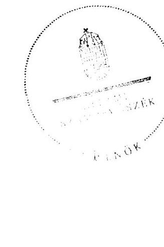

---

# 2. Államháztartás Központi Szintjét Ellenőrző Igazgatóság 2.4 Koordinációs Főcsoport 

Iktatószám: VE-008-025/2010.

## A tájékoztató elkészítését felügyelte:

Dr. Becker Pál
főigazgató

A tájékoztató összeállításában részt vettek:

## Bartolák Márta

osztályvezető

## Laczkovich Rita

számvevő tanácsos

---

# TARTALOMJEGYZÉK 

BEVEZETÉS ..... 7
A. UNIÓS KITEKINTÉS A 2008-AS ADATOK TÜKRÉBEN ..... 9

1. 2000-2006 programozási időszak ..... 9
2. Magyarország nettó pozíciója ..... 14
3. Kohéziós Politika 2007-2013 ..... 16
4. Éves összegző jelentések az EU módosított Költségvetési Rendeletének 53b. cikke szerint ..... 17
B. ÖSSZEGZŐ ÉRTÉKELÉS, KÖVETKEZTETÉSEK ..... 21
5. Magyarország és az EU pénzügyi kapcsolatai ..... 21
1.1. Az uniós források felhasználásának hazai makrogazdasági környezete ..... 21
1.2. Magyarország és az EU pénzügyi kapcsolatai 2004-2009 között ..... 22
1.3. Magyarország és az EU pénzügyi kapcsolatai 2009-ben ..... 24
1.4. Az Európai Bizottság által közvetlenül kezelt források ..... 26
6. Az uniós támogatások hazai feltételrendszerének bemutatása ..... 27
2.1. Az uniós támogatások hazai intézményrendszere ..... 27
2.2. Az uniós támogatások hazai ellenőrzési és monitoring rendszere ..... 29
2.3. Az uniós támogatások hazai nyilvántartási rendszerei ..... 33
2.3.1. Egységes Monitoring Információs Rendszer ..... 33
2.3.2. A Kincstár által múködtetett monitoring rendszer ..... 34
2.3.3. Integrált Igazgatási és Ellenőrzési Rendszer ..... 35
2.3.4. Számviteli és nyilvántartási rendszerek ..... 35
2.4. Szabálytalanság- és követeléskezelés ..... 37
7. Az Európai Uniós források felhasználásával kapcsolatos, a 2009-es évre vonatkozó ellenőrzések legfontosabb megállapításai, következtetései ..... 41
3.1. A 2000-2006-os programozási periódus támogatásai ..... 41
3.1.1. Nemzeti Fejlesztési Terv ..... 41
3.1.2. Kohéziós Alap ..... 45
3.1.3. INTERREG programok ..... 48
3.1.4. Schengen Alap ..... 50
3.1.5. Átmeneti Támogatás ..... 51
3.1.6. Az EGT és Norvég Finanszírozási Mechanizmusok program ..... 52
3.2. A 2007-2013-as programozási periódus támogatásai ..... 54
3.2.1. Új Magyarország Fejlesztési Terv ..... 54

---

3.2.2. Nemzetközi együttműködési programok ..... 62
3.2.3. Svájci-Magyar Együttmúködési Program ..... 65
3.3. Agrártámogatások ..... 66
3.3.1. A mezőgazdaság makrogazdasági feltételrendszere ..... 66
3.3.2. Az agrártámogatások finanszírozási és intézményrendszere, jogszabályi háttere ..... 67
3.3.3. Az agrártámogatások hazai ellenőrzési rendszere ..... 68
3.3.4. Agrár- és vidékfejlesztési támogatások alakulása 2009. évben ..... 71
3.3.5. Agrár- és vidékfejlesztési támogatásokra vonatkozó ellenőrzések megállapításai 2009. évben ..... 72
3.3.6. SAPARD ..... 76
MELLÉKLETEK

1. sz. Magyarország és az Európai Unió közötti költségvetési kapcsolatok 2004-2009
2/A. sz. A Magyar Köztársaság 2009. évi költségvetésének végrehajtásáról szóló törvényjavaslatban megjelenő EU-támogatások és a hozzájuk kapcsolódó hazai finanszírozás összege
2/B. sz. A költségvetésen kívüli finanszírozással lebonyolított EU-támogatások
2. sz. A mezőgazdasági támogatások szerkezeti változásai a 2000-2006-os és a 2007-2013-as költségvetési periódus között
3. sz. A Tájékoztató alapjául szolgáló, 2009. évre vonatkozó ellenőrzések, jelentések és beszámolók

# FÜGGELÉK 

1. sz. Az uniós támogatások 2009. évi felhasználásának ellenőrzéséről szóló Tájékoztató összegző értékelés, következtetések fejezetében foglaltak részletes bemutatása

---

# RÖVIDÍTÉSEK JEGYZÉKE 

| Ámr. | 217/1998. (XII. 30.) Korm. rendelet az államháztartás működési rendjéről (hatályos 2009. XII. 31-ig) |
| :--: | :--: |
| ÁROP | Államreform Operatív Program |
| ÁSZ | Állami Számvevőszék |
| AVOP | Agrár- és Vidékfejlesztési Operatív Program |
| BEF | Belső Ellenőrzési Főosztály |
| DAOP | Dél-alföldi Operatív Program |
| DAS | Déclaration d'Assurance |
|  | Megbízhatósági Nyilatkozat |
| DDOP | Dél-dunántúli Operatív Program |
| ÉAOP | Észak-alföldi Operatív Program |
| EGT | Európai Gazdasági Térség |
| EH | Ellenőrzési Hatóság |
| EHA | Európai Halászati Alap |
| EKKE | Európai Uniós Közbeszerzési Koordinációs és Szabályossági Egység |
| EKOP | Elektronikus Közigazgatás Operatív Program |
| EMGA | Európai Mezőgazdasági Garancia Alap |
| EMIR | Egységes Monitoring Információs Rendszer |
| EMK | Egységes Múködési Kézikönyv |
| EMOGA (GR) | Európai Mezőgazdasági Orientációs és Garancia Alap (Garancia Részleg) |
| ÉMOP | Észak-magyarországi Operatív Program |
| EMVA | Európai Mezőgazdasági Vidékfejlesztési Alap |
| ENPI | European Neighbourhood and Partnership Instrument Európai Szomszédsági és Partnerségi Eszköz |
| ERFA | Európai Regionális Fejlesztési Alap |
| ESZA | Európai Szociális Alap |
| ETE | Európai Területi Együttmúködés |
| EU | Európai Unió |
| EU 10 | Az EU-hoz 2004. május 1-jén csatlakozott tagállamok (Ciprus, Cseh Köztársaság, Észtország, Magyarország, Lettország, Litvánia, Málta, Lengyelország, Szlovákia, Szlovénia) |
| EU 13 | A Kohéziós Alap forrásaiban részesülő tagállamok (EU10 + Görögország, Portugália, Spanyolország) |
| EU 15 | Az EU tagállamai 2004. május 1-jét megelőzően |
| EU 25 | Az EU 25 tagállama 2007. január 1-jét megelőzően |
| EU 27 | Az EU 27 tagállama 2007. január 1-jétől |
| EUTAF | Európai Uniós Támogatásokat Auditáló Főigazgatóság |

---

| FEUVE | folyamatba épített előzetes és utólagos vezetői ellenőrzés |
| :--: | :--: |
| FVM | Földművelésügyi és Vidékfejlesztési Minisztérium |
| GDP | Gross Domestic Product (Bruttó Hazai Termék) |
| GFP IH | Gazdaságfejlesztési Programok Irányító Hatósága |
| GNI | Gross National Income (Bruttó Nemzeti Jövedelem) |
| GOP | Gazdaságfejlesztési Operatív Program |
| GVOP | Gazdasági Versenyképesség Operatív Program |
| HEFOP | Humánerőforrás-fejlesztési Operatív Program |
| HEP IH | Humán Erőforrás Programok Irányító Hatóság |
| HOP | Halászati Operatív Program |
| HOPE | Halászati Orientációs Pénzügyi Eszköz |
| IgH | Igazoló Hatóság |
| IH | Irányító Hatóság |
| IIER | Integrált Igazgatási és Ellenőrzési Rendszer |
| IMIR | INTERREG Monitoring és Információs Rendszer |
| IMS | Irregularity Management System   Internetalapú szabálytalanságjelentési rendszer |
| INTERACT | INTERREG Animation Cooperation and Transfer INTERREG ösztönzés, együttmúködés és átadás |
| IPA | Instrument for Pre-Accession Assistance Előcsatlakozási Támogatási Eszköz |
| ISPA | Instrument for Structural Policies for Pre-Accession (Strukturális Politikák Csatlakozás Előtti Eszköze) |
| ISZ | Igazoló Szerv |
| JEREMIE | Joint European Resources for Micro to Medium Enterprises (Közös európai források a kis- és középvállalkozásoknak) |
| KA | Kohéziós Alap |
| KDOP | Közép-dunántúli Operatív Program |
| KEHI | Kormányzati Ellenőrzési Hivatal |
| KEOP | Környezet és Energia Operatív Program |
| KESZ | Kincstári Egységes Számla |
| KIKSZ | Közlekedésfejlesztési Integrált Közreműködő Szervezet |
| Kincstár | Magyar Államkincstár |
| KIOP | Környezetvédelmi és Infrastruktúra Operatív Program |
| KKV | Kis- és középvállalkozás |
| KMOP | Közép-magyarországi Operatív Program |
| KMR | Kincstári Monitoring Rendszer |
| KÖZOP | Közlekedés Operatív Program |
| KSZ | Közreműködő Szervezet |
| KvVM FI | Környezetvédelmi és Vízügyi Minisztérium Fejlesztési Igazgatósága |
| LEADER | Liaison Entre Actions pour le Developpement de l'Economie Rurale (Akciók a vidék gazdaságfejlesztéséért) |
| MB | monitoring bizottság |

---

| MVH | Mezőgazdasági- és Vidékfejlesztési Hivatal |
| :--: | :--: |
| NEP IH | Nemzetközi Együttmúködési Programok Irányító Hatósága |
| NFT | Nemzeti Fejlesztési Terv |
| NFÜ | Nemzeti Fejlesztési Ügynökség |
| NVT | Nemzeti Vidékfejlesztési Terv |
| NYDOP | Nyugat-dunántúli Operatív Program |
| OLAF KI | Office Européen de Lutte Anti-Fraude (Európai Csalásellenes Hivatal) Koordinációs Iroda |
| OP | Operatív Program |
| PM | Pénzügyminisztérium |
| PM NAO Iroda | National Authorising Office Pénzügyminisztérium Nemzeti Programengedélyező Iroda |
| ROP | Regionális Fejlesztés Operatív Program |
| SA | Strukturális Alapok |
| SAPARD | Special Accession Programme for Agriculture and Rural Development (Különleges Előcsatlakozási Program a Mezőgazdaság és Vidékfejlesztés támogatására) |
| SAPS | Single Area Payment Scheme (Egyszerűsített Területalapú Támogatás) |
| SLA | Service Level Agreement Szolgáltatási szint megállapodás |
| SPS | Single Payment Scheme (Egységes támogatási rendszer) |
| SzMSz | Szervezeti és Múködési Szabályzat |
| TÁMOP | Társadalmi Megújulás Operatív Program |
| TEN-T | Trans-European Transport Network (Transzeurópai Közlekedési Hálózat) |
| TIOP | Társadalmi Infrastruktúra Operatív Program |
| TKA | Tempus Közalapítvány |
| TS | Technikai Segítségnyújtás |
| ÚMFT | Új Magyarország Fejlesztési Terv |
| ÚMVP | Új Magyarország Vidékfejlesztési Program |
| VOP | Végrehajtás Operatív Program |
| VP | Vám- és Pénzügyőrség |
| VPOP | Vám- és Pénzügyőrség Országos Parancsnoksága |
| Zárszámadás | 1016. sz. jelentés a Magyar Köztársaság 2009. évi költségvetése végrehajtásának ellenőrzéséről |

---

.

---

# BEVEZETÉS 

A Tájékoztató - összhangban az európai uniós országok számvevőszékeinek elnökeiből álló Kapcsolattartó Bizottság ${ }^{1}$ törekvéseivel, valamint az Állami Számvevőszék (ÁSZ) 2004. évi tevékenységéről szóló jelentés elfogadásáról szóló 43/2005. (V. 26.) OGY határozat 4. pontjában előírtakkal - bemutatja Magyarország európai uniós pénzügyi kapcsolatait és a támogatásokkal kapcsolatos ellenőrzések 2009-es tapasztalatait. Az OGY határozat előírja, hogy az Állami Számvevőszék a teljes uniós pénzfelhasználás gyakorlatáról adjon átfogó képet, ennek keretében az uniós forrásokkal összefüggő pénzmozgások ellenőrzését végző hazai szervezetek munkáját szakmai szempontból tekintse át és mutassa be az ellenőrzések tapasztalatait.

A Tájékoztató időhorizontját tekintve továbbra is követtük azt az alapelvet, hogy az egyes témakörök bemutatása során a 2009. évhez kapcsolódó információkat és adatokat, illetve ellenőrzési megállapításokat helyezzük a középpontba. A Tájékoztató legfőbb céljának teljesítése - az átfogó és objektív kép kialakításának biztosítása - érdekében kitekintünk a 2010. évi aktuális eseményekre, fejleményekre, illetve a 2004-2006-os időszak Operatív Programjainak 2010. szeptember 30-i zárását figyelembe véve a Nemzeti Fejlesztési Terv pénzügyi zárási adatait szerepeltettük.

A tagállami beszámolók és adatszolgáltatások feldolgozásán alapuló éves jelentéseket az Európai Bizottság a tárgyévet követő második év elején teszi közzé, ennek következtében a nemzetközi összehasonlító adatok jelen Tájékoztatónk elkészítésének időpontjában 2008. évre vonatkozóan álltak rendelkezésre. A Tájékoztató elemzi Magyarország támogatás-felhasználását - abszorpciós képességét - és elsősorban a 2004-ben csatlakozott új tagországok között elfoglalt helyét.

A tavalyihoz hasonlóan a Tájékoztató átfogó képet ad a különböző szervezetek feladat- és hatásköréről, az ellenőrzések során betöltött szerepéről. Az intézményrendszer szereplői jelen Tájékoztatóban egységesen a tárgyidőszakban, azaz a 2009-ben érvényes struktúrában és megnevezésekkel jelennek meg. Az átláthatóság érdekében bemutatjuk Magyarországnak az EU költségvetésébe történő befizetéseit, továbbá a Magyar Köztársaság központi költségvetésében megjelenő és a költségvetésen kívüli tételként szereplő támogatások és az Uniótól közvetlenül igényelhető támogatások felhasználását, az uniós források önkormányzatoknak, mint kedvezményezetteknek nyújtott támogatások felhasználásának értékelését. A szabálytalanság kérdéskörét a Tájékoztató kiemelten kezeli.

[^0]
[^0]:    ${ }^{1}$ A Kapcsolattartó Bizottság több határozatában megerősítette, hogy az EU tagállamok parlamentjeinek saját, illetve a tagállamok közös érdekében áll az EU Alapok ellenőrzésének fejlesztése. Ennek egyik lényeges eleme, hogy a független nemzeti számvevőszékek készítsenek jelentést az EU pénzeszközök tárgyévi tagállami felhasználásáról és a gazdálkodás fejlesztéséről. Ez közvetve és közvetlenül is hozzájárulhat az EU költségvetés hatékonyabb, átláthatóbb felhasználásához.

---

A Tájékoztató összeállításához mind a belső, mind a külső, valamint a hazai és az uniós ellenőrzési intézményrendszer tapasztalatait felhasználtuk. Bár ezek közül néhány ellenőrzés (pl. ÁSZ) eredményei nyilvánosak, de az átfogó kép kialakítása érdekében szükségesnek tartottuk ezek ismertetését is. Az Európai Bizottság, az Ellenőrzési Hatóság/Zárónyilatkozat Kiadásáért Felelős Szerv² és a belső ellenőrzési egységek ellenőrzési eredményei szintetizáltan jelennek meg a Tájékoztatóban, mivel jelentéseik nem nyilvánosak ${ }^{3}$.

A 2009. év nagy kihívása volt Magyarország számára, hogy a romló gazdasági helyzetben a 2007-2013-as EU költségvetési periódus forrásainak lehívását nagyságrendileg megnövelje, illetve a 2000-2006-os EU költségvetési periódus forrásainak felhasználását maximálja. 2010-ben sikeresen megtörtént a Nemzeti Fejlesztési Terv pénzügyi zárása, amely összességében a források teljes lekötését eredményezte. A zárás folyamata azonban felhívta a figyelmet, hogy az intézményrendszer szereplőinek összehangoltabb működésére van szükség, illetve a jövőben nagyobb hangsúlyt kell helyezni a források hatékony és eredményes felhasználására, valamint a szabálytalanság- és követeléskezelés folyamataira.

Együttmúködésükért, segítőkészségükért ezúton mondunk köszönetet a Pénzügyminisztérium, a Kormányzati Ellenőrzési Hivatal, a Nemzeti Fejlesztési Ügynökség, a Földművelésügyi és Vidékfejlesztési Minisztérium, a Mezőgazdasági és Vidékfejlesztési Hivatal, valamint a Vám- és Pénzügyőrség Országos Parancsnoksága vezetőinek és munkatársainak.

[^0]
[^0]:    ${ }^{2}$ 2010. június 30-ig a Kormányzati Ellenőrzési Hivatal, 2010. július 1-től jogutódja, az Európai Támogatásokat Auditáló Főigazgatóság.
    ${ }^{3}$ A Tájékoztató alapjául szolgáló ellenőrzések listáját a 4. sz. melléklet tartalmazza.

---

# A. UNIÓS KITEKINTÉS A 2008-AS ADATOK TÜKRÉBEN 

## 1. 2000-2006 PROGRAMOZÁSI IDŐSZAK

A hazai forrásfelhasználási adatok értékelése érdekében megvizsgáltuk, hogy hazánk milyen pozíciót foglal el az uniós tagállamok között a pénzügyi eredményesség tekintetében.

Az abszorpciós képesség megállapítása érdekében azt vizsgáltuk, hogy Magyarország a többi tagállamhoz viszonyítva a támogatási előirányzatokból mennyit kötött le, illetve mennyi volt a tényleges kifizetés 2008. év vonatkozásában. A nemzetközi összehasonlítást az Európai Bizottság 2008. évben közzétett éves jelentéseire alapozva állítottuk össze ${ }^{4}$.

## Strukturális Alapok

Az Unió egyik legfontosabb céljának - a versenyképesség érdemi javításának elérése érdekében a Strukturális Alapokból és a Kohéziós Alapból származó támogatások EU-s költségvetésen belüli arányának növelésére törekszik. A Strukturális Alapokból minden tagállam részesedik. A négy alap (ESZA, ERFA, EMOGA, HOPE) a teljes uniós költségvetés több mint 30\%-át teszi ki.

A romló gazdasági környezet ellenére az Európai Bizottság a 2008. évet a költségvetés végrehajtása tekintetében jónak ítélte. A bizottsági kifizetéseknél a végrehajtás összesített szintje a regionális programokra és projektekre vonatkozóan elérte a 99,9\%-ot (ami megegyezik a 2007-es és a 2006-os eredménnyel), az ESZA programokra 98\%-ot, EMOGA alapra közel 100\%-ot, HOPE esetében 97,8\%-ot. Az ún. „n+2" szabályt 2008-ban a négy alap egyikének vonatkozásában sem kellett alkalmazni a 2006-os kötelezettségvállalásra.

Az „n+2" szabály miatt a 2000-2006-os programozási időszakhoz kapcsolódóan visszavonandó teljes összeg az operatív programok zárásakor kerül majd meghatározásra.

A 2000-2006-os költségvetési időszakra vonatkozóan 2008 végéig az ERFA keret $91 \%$-át, az ESZA keret $90,7 \%$-át, EMOGA keret $97,2 \%$-át, a HOPE teljes keret $89,3 \%$-át fizették ki.

A 2000-2006-os időszakot érintően az ERFA és ESZA programjainak 74\%-a esetében éltek a tagállamok az elszámolhatósági időszak meghosszabbításának lehetőségével. Hazánk a ROP kivételével valamennyi OP vonatkozásában 6 hónapra kérte (és meg is kapta) az elszámolhatósági időszak meghosszabbítását.

[^0]
[^0]:    ${ }^{4}$ Az Európai Bizottság által készített uniós szintű összefoglalók, beszámolók adatai - a tagállami beszámolók és adatszolgáltatások benyújtási határidejére tekintettel - 2008. évre vonatkoznak.

---

A teljes programozási időszakra vonatkozó adatokból megállapítható, hogy valamennyi tagállam a rendelkezésére álló keretet teljes mértékben lekötötte, a kifizetések kerethez viszonyított aránya 82-95\% között mozgott (1. táblázat). Az új és a régi tagállamok közötti 2005-2006. években tapasztalható különbségek az időszak végére teljesen eltűntek, olyannyira, hogy az élen három új tagállam áll; nyolc új tagállam az uniós átlag ( $91,21 \%$ ) felett teljesített, illetve a sereghajtók között az új tagállamok közül csak Ciprus található.

# 1. táblázat 

## A Strukturális Alapok végrehajtása a 2000-2008 közötti időszakban

| Tagállam | Keret   2000-2006   (millió euró) | Kifizetés a keret   \%-ában   2008.12.31. |
| :-- | :--: | :--: |
| Málta | 63,19 | $95,00 \%$ |
| Litvánia | 895,17 | $95,00 \%$ |
| Lettország | 625,56 | $95,00 \%$ |
| Finnország | 1955,56 | $94,98 \%$ |
| Észtország | 371,36 | $94,95 \%$ |
| Ausztria | 1586,05 | $94,90 \%$ |
| Németország | 30223,44 | $94,51 \%$ |
| Írország | 3184,23 | $94,44 \%$ |
| Magyarország | 1995,72 | $94,11 \%$ |
| Svédország | 1997,92 | $93,91 \%$ |
| Szlovákia | 1115,19 | $93,31 \%$ |
| Lengyelország | 8275,81 | $93,05 \%$ |
| Portugália | 20436,82 | $92,73 \%$ |
| Szlovénia | 237,51 | $91,82 \%$ |
| Görögország | 22688,32 | $91,01 \%$ |
| Cseh Köztársaság | 1584,36 | $90,64 \%$ |
| Belgium | 1932,38 | $90,63 \%$ |
| Egyesült Királyság | 16288,58 | $90,40 \%$ |
| Spanyolország | 46414,61 | $90,39 \%$ |
| Franciaország | 15540,32 | $90,24 \%$ |
| Olaszország | 30661,7 | $85,17 \%$ |
| Hollandia | 2523,07 | $84,89 \%$ |
| Ciprus | 49,97 | $83,73 \%$ |
| Luxemburg | 75,68 | $82,98 \%$ |
| Dánia | 591,64 | $82,34 \%$ |
| Összesen | 211314,16 | $91,21 \%$ |

Forrás: Európai Bizottság 2008. Éves Jelentése a Strukturális Alapok végrehajtásáról
Magyarország a Strukturális Alapok végrehajtását tekintve a 2000-2006-os időszakban az EU 25 átlaga felett, a 9. helyen teljesített, alig elmaradva a maximális $95 \%$-tól.

A Bizottság a Strukturális Alapok vonatkozásában 2008-ban folytatta a programok ellenőrzését, továbbá megkezdte a 2000-2006-os zárások előkészítését szolgáló ellenőrzési látogatásait, hogy értékeljék a tagállamok felkészülését a

---

projektek lezárására, illetve hogy megállapítsák és mérsékeljék a zárással kapcsolatos kockázatokat.

Az 51 INTERREG III programmal kapcsolatban a 2007-es tevékenységi jelentésben tett fenntartások nyomán alapos ellenőrzési tervet hajtottak végre, amivel 54,1\%-os lefedettséget értek el a programok költségvetését tekintve.

Érdemes megemlíteni, hogy a korábbi 1994-1999-es programozási időszak (EU15) záró ellenőrzései az ESZA vonatkozásában csak 2008-ban zárultak le, az ERFA-t érintően még 2009-ben is folytatódtak. Az EMOGA utólagos ellenőrzését célzó program már 2006-ban befejeződött, a pénzügyi korrekciós eljárások vannak folyamatban. A HOPE 52 programjából ötven pénzügyi zárása történt meg 2008. év végéig, kettőé 2009. év elejére húzódott át.

A Strukturális Alapok - Európai Bizottság által közzétett - utólagos értékelésének legfőbb megállapítása, hogy a kohéziós politika nagyban hozzájárult a régiók gazdasági fejlődéséhez, felhívták azonban a figyelmet arra a tényre, hogy nem lehet egyértelmú és közvetlen kapcsolatot kimutatni a kohéziós politika támogatásai és a régió gazdasági mutatóinak változása között.

Az értékelés rámutatott, hogy a támogatás (bár változó mértékben) jelentős arányt képviselt az érintett országok beruházásainál. A támogatás nagy része két jól behatárolható beavatkozási területre fókuszált, a közlekedésre és a gazdaságfejlesztésre. Másrészről azonban jelentős összegeket allokáltak (különösen a regionális OP-k esetében) túl szerteágazó célok megvalósítására, így az elért eredmények nem integrálódtak egy átfogó stratégia szolgálatában.

Az elemzés rámutatott, hogy a támogatás jellemzően elérte fő célját, néhány kivételtől eltekintve a területi különbségek mérséklődtek. A nemek közötti egyenlőtlenségek csökkentésére irányuló horizontális cél megvalósulásában gyengeségeket állapítottak meg az értékelők: formális célok maradtak, komoly tevékenység nem kapcsolódott hozzájuk.

# Kohéziós Alap 

A legelmaradottabb területek fejlesztése, felzárkóztatása érdekében 1993-tól létrehozták az ún. Kohéziós Alapot. Az akkori feltételek szerint négy tagállam volt jogosult e támogatásra: Spanyolország, Írország, Portugália és Görögország. 2008-ban 15 tagállam részesült a Kohéziós Alapból (a 12 új tagállam, valamint Görögország, Portugália és Spanyolország).

A Kohéziós Alap végrehajtásáról készített 2008. évi Bizottsági Éves Jelentés rámutatott, hogy az alap felhasználása felgyorsult, 2008 végén - a jelenleg támogatásban részesülő összes országot figyelembe véve - a rendelkezésre álló források átlagos felhasználási aránya (a kötelezettségvállalásokhoz mért kifizetések) a Kohéziós Alap és a korábbi ISPA-projektek tekintetében 66,3\% volt.

A legjobban teljesítő régi tagállamok mellé felzárkózott Málta (79,8\%) és Szlovákia ( $70,37 \%$ ), a legalacsonyabb teljesítés Bulgáriában volt ( $39,8 \%$ ). A többi tagállamban a felhasználási arány 50,9 és $76,9 \%$ között mozgott. Hazánk 52,62\%-os felhasználási aránnyal a tíz csatlakozó ország mezőnyében is erősen elmaradva csak Lengyelországot előzte meg (2. táblázat). Még szemléleteseb-

---

ben mutatja a programok előrehaladásának ütemét, hogy Magyarország 2007hez képest csak 5\%-kal magasabb kifizetési arányt mutatott, míg a többi csatlakozó országnál ez az arány 13-23\% között változott.

# 2. táblázat 

## A Kohéziós Alap végrehajtása a 2000-2008 közötti időszakban (millió euró)

| Tagállam | Kötelezettségvállalás (nettó) | Kifizetés (2008 decemberéig) | Kifizetés a keret $\%$-ában 2008.12.31. |
| :--: | :--: | :--: | :--: |
| Görögország | 2503,74 | 2450,74 | 97,88\% |
| Spanyolország | 11788,53 | 9838,03 | 83,45\% |
| Málta | 21,97 | 17,53 | 79,80\% |
| Portugália | 3156,54 | 2427,13 | 76,95\% |
| Szlovákia | 766,25 | 539,21 | 70,37\% |
| Lettország | 713,99 | 499,52 | 69,97\% |
| Észtország | 427,03 | 289,15 | 67,71\% |
| Litvánia | 846,45 | 559,97 | 66,16\% |
| Cseh Köztársaság | 1228,10 | 796,79 | 64,88\% |
| Szlovénia | 254,19 | 162,60 | 63,96\% |
| Ciprus | 54,01 | 31,79 | 58,86\% |
| Magyarország | 1482,60 | 780,10 | 52,62\% |
| Lengyelország | 5634,53 | 2871,74 | 50,97\% |
| Románia | 2042,73 | 1040,13 | 50,91\% |
| Bulgária | 879,91 | 350,02 | 39,78\% |
| Összesen | 32374,36 | 22654,44 | 66,30\% |

Forrás: Európai Bizottság 2008. Éves Jelentése a Kohéziós Alap végrehajtásáról
A lezárt KA projektek száma 2008 végére 216-ra emelkedett. 976 projektet pedig még nem zártak le (hazánkban ez az arány 10 projekt a 47-ből).

A jelentés megállapította, hogy Magyarországgal szemben már közvetlenül csatlakozása után túlzotthiány-eljárás indult ${ }^{5}$ 2003. évi 5,9\%-os államháztartási hiánya alapján ${ }^{6}$. Azóta kétszer is megállapították - 2005 januárjában és 2005 novemberében -, hogy Magyarország nem tett hatékony intézkedéseket a Tanács ajánlásaira. Mivel azonban Magyarország nem tagja az euró övezetnek, esetében különleges eltérés van érvényben a túlzott hiány esetén követendő eljárás további lépéseinek alkalmazása tekintetében. 2007 júliusában ezért a Tanács csak további ajánlásokat fogalmazott meg a Szerződés 104. cikkének (7) bekezdése alapján. A Bizottság egyik alkalommal sem javasolta a Tanácsnak a Kohéziós Alap kötelezettségvállalásainak felfüggesztését. A gazdasági

[^0]
[^0]:    ${ }^{5}$ 2008-ban - hazánk kivételével - valamennyi országgal szemben megszüntetették a korábban - túlzott hiány miatt - indított eljárást.
    ${ }^{6}$ Amennyiben egy tagállam a hiány megengedett küszöbértékét meghaladja, uniós szinten ún. túlzott hiány eljárás indul („Excessive Deficit Procedure"). Az eljárás több lépést foglal magában, az EU szankciókat is alkalmazhat annak érdekében, hogy az érintett tagállamot rábírja a túlzott hiány kiigazítására.

---

válságra tekintettel a Tanács 2009 júliusában úgy határozott, hogy a túlzott hiány megszüntetése céljából új határidőt állapít meg (2011) a Szerződés 104. cikkének (7) bekezdése alapján.

A 2000-2006-os időszakot érintő 2008. évi bizottsági ellenőrzések elsősorban a nyomon követésre, illetve a tagállamok zárásra való felkészülésének ellenőrzésére összpontosultak. A Bizottság különös hangsúlyt helyezett a nemzeti ellenőrző szervek munkájának felülvizsgálatára, az éves ellenőrzési jelentések vizsgálatára.

A Kohéziós Alap tekintetében egy, felfüggesztésről szóló határozatot ${ }^{7}$ fogadott el a Bizottság Bulgáriára vonatkozóan két közúti ágazati projekttel kapcsolatban. 2008-ban összesen 92,7 M euró értékben került sor pénzügyi korrekciókra a Bizottság vagy az Európai Számvevőszék ellenőrzéseit, illetve az OLAF vizsgálatait követően. Magyarországot 2008-ban pénzügyi korrekció nem érintette. Figyelemreméltó adat, hogy a jól teljesítő régi Kohéziós Alap kedvezményezett Görögország és Spanyolország ellen 2008-ban 29, illetve 54 M euró értékben foganatosított pénzügyi korrekciót a Bizottság. Ez az adat ismét ráirányítja a figyelmet arra, hogy nem elégséges a pénzek gyors elköltése, legalább ekkora hangsúlyt kell fektetni a szabályos (és eredményes) felhasználásra is.

Az Európai Bizottság Regionális Politikák Főigazgatósága az irányítási és ellenőrzési rendszerek múködéséről tíz tagállam ${ }^{8}$ esetében (amelyek a Kohéziós Alapból 2008-ban kifizetett támogatások összességéhez mérten 84,55\%-ot képviselnek) minősített véleményt fogalmazott meg (Bulgária felfüggesztéssel érintett közúti ágazata kivételével valamennyi esetben úgy ítélték meg, hogy a hiányosságok mérsékeltek voltak).

A csatlakozás óta eltelt időszak tekintetében a Strukturális Alapok esetében az EU 25 körében hazánk határozott javuló tendenciája figyelhető meg, összességében jól zártuk az időszakot. A Kohéziós Alap esetében azonban az ellenőrzések megállapításai szerint folyamatosan rosszul teljesítettünk, a kezdeti közepes teljesítményünket követően 2008-ra az utolsó előtti helyre csúsztunk vissza.

# Szabálytalanságok nemzetközi összehasonlításban 

Az Európai Csaláselleni Hivatal (OLAF) a Strukturális Alapok által finanszírozott intézkedésekkel kapcsolatban 2008 folyamán 41 alkalommal tett ellenőrző látogatást a tagállamokban. Ebből 23 esetben helyszíni ellenőrzést végzett (ezek során 31 alkalommal végeztek helyszíni ellenőrzést különböző gazdasági

[^0]
[^0]:    ${ }^{7}$ Amennyiben a Bizottság gondos ellenőrzést követően megállapítja, hogy egy időközi kifizetés iránti kérelemben megadott tényleges kiadással kapcsolatban súlyos szabálytalanság történt, és az adott tagállam nem tett azonnali kiigazító intézkedéseket, hivatalosan megindítja a kifizetések felfüggesztésének eljárását.
    ${ }^{8}$ Bulgária, Cseh Köztársaság, Görögország, Magyarország környezetvédelmi ágazata (a 2007. évi Csepeli Szennyvíztisztító projekt közbeszerzési eljárása kapcsán megállapított szabálytalanság következtében), Írország, Lengyelország, Litvánia, Románia, Spanyolország és Szlovákia.

---

szereplőknél), míg 18 esetben más célja volt, például információgyűjtés vagy a nemzeti hatóságok, illetve az igazságügyi szervek támogatása.

2008-ban a Strukturális Alapokra vonatkozóan a tagállamok 3869 esetben tájékoztatták a Bizottságot összesen több mint 528 M eurót érintő szabálytalanságról. A tagállamok tájékoztatása szerint közel 110 M euró értékben történt visszafizettetés. A KA-ra vonatkozóan 140 esetben értesítették a Bizottságot a társfinanszírozott projektekkel kapcsolatos szabálytalanságokról, amelyek öszszességében 56 M euró összegű hozzájárulást érintettek.

A bejelentett főbb szabálytalanságok között a nem támogatható kiadások finanszírozása és a közbeszerzési eljárásokra vonatkozó szabályok megsértése szerepelt; e két kategória az esetek csaknem 75\%-ában fordult elő. A litván hatóságok ugyanakkor két „valószínűsíthető csalásról" is jelentést tettek.

Az OLAF által készített statisztikai jelentésben szereplő adatok körültekintő értelmezést igényelnek, mivel az uniós szabályozás ugyan definiálja a szabálytalanság fogalmát ${ }^{9}$, ez azonban tág keretet adott a nemzeti szabályozásnak. Ez befolyásolta a tagállamoknál a szabálytalansági esetek számbavételét, a Bizottság felé teljesített adatszolgáltatás tartalmát, minőségét.

# 2. MAGYARORSZÁG NETTÓ POZÍCIOJA 

Az Európai Unióba történő belépést követően Magyarországnak - mint minden tagállamnak - évente előre meghatározott mértékű befizetési kötelezettsége keletkezik. A befizetésekkel szemben a különböző alapokból és támogatási formákból lehívható források állnak (1. sz. melléklet).

Az ún. nettó pozíció kiszámításakor - a Bizottság által meghatározott korrekciókkal - figyelembe kell venni az uniós költségvetésből Magyarországnak ténylegesen kifizetendő támogatások és a költségvetésbe befizetendő magyar hozzájárulás adott évi egyenlegét.

A 1. ábra alapján megállapítható, hogy hazánk az uniós források tekintetében pozitív pénzügyi egyenleggel rendelkezett. Nettó pozíciónk mind nominális értelemben, mind a GNI-hoz viszonyított arányát tekintve 2000-2008 között nagymértékű emelkedést mutatott. Uniós csatlakozásunk óta tehát a pénzügyi egyenleget tekintve Magyarország évente nagyobb támogatásban részesült, mint amekkora összeggel hozzájárult a közös költségvetéshez.

[^0]
[^0]:    ${ }^{9}$ Szabálytalanság a közösségi jog valamely rendelkezésének egy gazdasági szereplő általi, annak cselekménye vagy mulasztása útján történő megsértése, amelynek eredményeként a Közösségek általános költségvetése vagy a Közösségek által kezelt költségvetések kárt szenvednek vagy szenvednének, akár közvetlenül a Közösségek nevében beszedett saját forrásokból származó bevétel csökkenése vagy kiesése révén, akár indokolatlan kiadási tételek miatt. (A Tanács 1995. december 18.-i 2988/95/EK, EURATOM rendelete)

---

# 1. ábra 

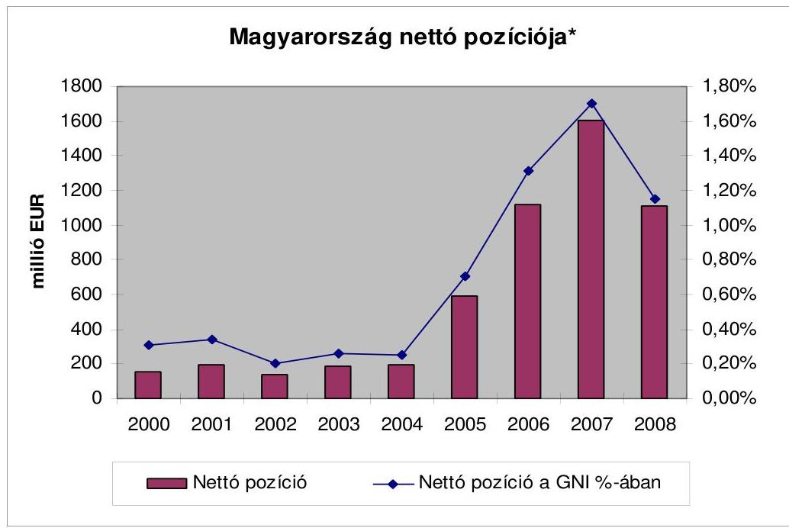

* befizetési kötelezettség, valamint a támogatások és a múködési költség korrigált különbözete
Forrás: Európai Bizottság
Nemzetközi összehasonlításban jól látható, hogy hazánk - a GNI-ra vetített 2008. évi nettó pozíciója szerint a 10 csatlakozott országot tekintve a középmezőnyben helyezkedik el, Szlovákiával egy szinten, a balti államok és Lengyelország előzi meg (2. ábra).
2. ábra
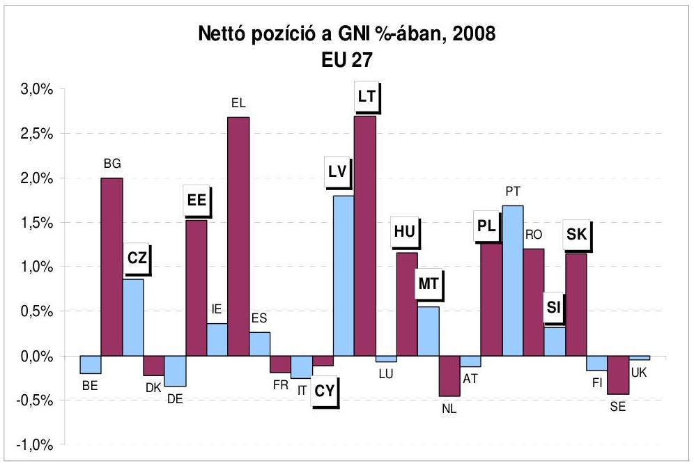

Forrás: Európai Bizottság

---

# 3. KohÉZIÓs PolitiKA 2007-2013 

A kohéziós (regionális) politika célja a gazdasági és társadalmi kohézió erősítése a különböző régiók fejlettségi szintje közötti egyenlőtlenségek és a kedvezőtlen helyzetű régiók vagy szigetek elmaradottságának csökkentése útján.

A 2007 és 2013 közötti időszakban a három alapból ${ }^{10} 308,041$ Mrd euró forrás áll rendelkezésre (2004-es árakon), amellyel három új célkitűzést támogatnak: konvergencia, regionális versenyképesség és foglalkoztatás, valamint európai területi együttmúködés. A célkitűzések a nemzeti stratégiai referenciakereteken (hazánkban az UMFT) és az azok megvalósítására kialakított operatív programokon keresztül valósulnak meg.

Az átláthatóság javítása és az elszámoltathatóság ösztönzése érdekében az uniós általános rendelet előírása szerint a tagállamok nemzeti stratégiai jelentései ${ }^{11}$ alapján az Európai Bizottság értékelte a kohéziós politika 2007-2013 közötti végrehajtását ${ }^{12}$. A végrehajtás értékelésekor ${ }^{13}$ megállapították, hogy a 2007-2013 közötti időszakra szóló programok sikeresen elindultak, de a helyi szintű kiadások még korai szakaszban járnak.

Az értékelés rámutatott, hogy az elfogadott stratégiák és célkitűzések megvalósítására irányuló intézkedések végrehajtása megfelelő ütemben zajlott, alkalmazkodva a gazdasági környezetben végbement drasztikus fordulathoz is. A programozási periódus kezdete óta eltelt időszak alatt a projektek 27,1\%-ára született meg a támogatási döntés. A végrehajtásban elért előrehaladás azonban tagállamonként eltérő volt. Hazánk 46,3\%-os projekt-kiválasztási teljesítményével az uniós átlag felett teljesített. 2007-2009 között 44 Mrd euró kifizetése történt meg részben előlegekre ( 16,7 Mrd euró), valamint a programok tényleges kiadásaira ( 23,3 Mrd euró).

A 2008 végén született kohéziós politikai gazdaságélénkítési csomagot (amelybe megnövekedett előfinanszírozás, a kifizetések felgyorsítását segítő új szabályok és egyszerűsítések tartoztak) nagy arányban kezdték alkalmazni, emellett pedig a tagállamok maguk is egyszerűsítették saját szabályaikat.

[^0]
[^0]:    ${ }^{10}$ 2007-től két strukturális alap (az Európai Regionális Fejlesztési Alap és az Európai Szociális Alap) és a Kohéziós Alap maradt fenn. Leválasztották a közös agrárpolitikához, illetve a közös halászati politikához kapcsolódó finanszírozási eszközöket, és létrejött az Európai Mezőgazdasági és Vidékfejlesztési Alap (EMVA), valamint az Európai Halászati Alap (EHA).
    ${ }^{11}$ Az 1083/2006/EK tanácsi rendelet 29. és 30. cikke előírja a program értékelését. A nyilvánosság számára hozzáférhető jelentések a következő weboldalon olvashatók: http://ec.europa.eu/regional_policy/policy/reporting/index_en.htm.
    ${ }^{12}$ A Bizottság Közleménye az Európai Parlamentnek, a Tanácsnak, az Európai Gazdasági és Szociális Bizottságnak és a Régiók Bizottságának: Kohéziós politika: 2010. évi stratégiai jelentés a 2007-2013 közötti időszak programjainak végrehajtásáról $\operatorname{COM}(2010) 110$.
    ${ }^{13}$ A nemzeti jelentések 2009. szeptember 30-i határnappal készültek.

---

A kohéziós politika céljainak értékelését illetően a Bizottság arra a következtetésre jutott, hogy a pénzeszközök jelentős mértékben járulhatnak hozzá az uniós szintű célokhoz és rámutatott arra, hogy a kohéziós politika programozásában az uniós prioritások központi szerepet töltenek be.

A kedvező értékelés mellett azonban a Bizottság felhívta a tagállamok figyelmét a (különösen a gazdasági válságból való kilábalást elősegítő) projektek kiválasztásának, illetve a programok végrehajtásának felgyorsítására, valamint az elfogadott beruházások finanszírozásához szükséges társfinanszírozás biztosításának szükségességére.

A nemzeti jelentések elemzése alapján a Bizottság a vasúti ágazat, egyes energetikai és környezeti beruházások, a digitális gazdaság, a társadalmi befogadás, az irányítás és kapacitásépítés területén tárt fel késedelmet vagy a tagállamok összességét tekintve egyenlőtlen előrehaladást.

# 4. ÉVES ÖSSZEGZŐ JELENTÉSEK AZ EU MÓDOSÍTOTT KöltsÉGVEtési RENDELETÉNEK 53b. CIKKE SZERINT 

Az Európai Számvevőszéktől pozitív megbízhatósági nyilatkozat („Declaration d'assurance", DAS) megszerzése érdekében hozott intézkedések eredményeképpen a 2007-2013-as költségvetési periódusra vonatkozó EU jogszabályi háttérbe már beépítésre kerültek új, a tagállamok számára kötelező (belső) kontroll elemek. Ezek egyike - az EU módosított Költségvetési Rendeletének ${ }^{14}$ 53b. cikke szerint - a tagállamok által kijelölt Ellenőrzési Hatóság (Magyarországon a KEHI, 2010. július 1-jétől az Európai Uniós Támogatásokat Auditáló Főigazgatóság) által a rendelkezésre álló ellenőrzésekről és nyilatkozatokról készített és a Bizottság részére benyújtott éves összegző jelentés („Annual Summary").

Az éves összegző jelentés - a 2000-2006-os és a 2007-2013-as programozási időszakra vonatkozó - pénzügyi adatokat, a tagállami irányítási és ellenőrzési rendszerekről, valamint a tagállami hatáskörben elvégzett ellenőrzésekről szóló információkat tartalmaz a tárgyévre vonatkozóan.

Az éves összegző jelentések segítséget nyújtanak az Európai Bizottságnak az irányítási és ellenőrzési rendszerek értékeléséhez, illetve a kiadások jogszerűségére és szabályszerűségére vonatkozó bizonyosság megszerzéséhez és a megbízhatósági nyilatkozat kiadásához.

A tagállamoknak az első éves összegző jelentést a 2007. évben teljesített kifizetésekről, illetve elvégzett ellenőrzésekről 2008. február 15-ig kellett benyújtaniuk a Bizottság részére.

Az Európai Parlament üdvözölte a kezdeményezést, illetve felkérte a Bizottságot, hogy tegyen erőfeszítéseket annak érdekében, hogy ezeket az éves összefoglalókat a Bizottság válaszával együtt közzé lehessen tenni. Az Európai Számvevőszék megvizsgálta a 2008-as éves összefoglalókat, és megállapította, hogy a követelményeket nem minden tagállam teljesítette a költségvetési rendeletnek

[^0]
[^0]:    ${ }^{14}$ A Tanács többször módosított 1605/2002/EK Rendelete.

---

megfelelően, ahogyan a Bizottság iránymutatásait sem tartották be. Az előző évhez képest azonban javult az éves összegző jelentésekben megtalálható elemzés minősége. Megállapította továbbá, hogy az EU Bizottság megfelelően felügyelte a 2008. évi éves összegző jelentések készítését, illetve a 2009. évről szóló éves összegző jelentések készítéséhez felülvizsgálta és a tagállamokkal egyeztette a korábban kiadott Iránymutatást. A Bizottság egyetértett azzal, hogy a hároméves gyakorlat után fontos lenne az éves összegző jelentések hozzáadott értékének elemzése, illetve annak vizsgálata, hogy a jelentések ebben az időszakban mennyire voltak hasznosíthatóak.

Az éves összegző jelentések értéknövelő hatását vizsgálva az Európai Számvevőszék arra bátorította a Bizottságot, hogy a belső kontrollrendszer részeként tegye hasznosabbá az éves összegző jelentést a közös problémák, a lehetséges megoldások és a legjobban bevált gyakorlat azonosításán keresztül, illetve használja fel ezeket az információkat felügyeleti szerepe gyakorlásakor. Az ECA elemzése szerint 2008-ban több tagállam is benyújtott olyan adatokat és elemzéseket, amelyek rendszerhiányosságok és horizontális kérdések azonosítását, illetve az azokról való beszámolást célozták, és ezáltal növelték az éves összefoglaló hasznosságát. A kohézió területén a főigazgatók az éves összefoglalókban szereplő adatokat felhasználták a nemzeti rendszerekre vonatkozó saját értékeléseikhez.

A Bizottság Főigazgatóságai is értékelték a 2007-2009 évekről benyújtott éves összegző jelentéseket és megállapították, hogy a jelentésekben szereplő információk, adatok teljessége vonatkozásában a tagállamok többsége általában megfelelt a Költségvetési Rendeletben, illetve a Bizottság által kiadott Útmutatóban foglalt minimum követelményeknek. Hiány esetén a tagállamokat felkérték kiegészítő információk vagy javított éves összegző jelentés benyújtására.

2007-ről két tagállam (Ausztria és Németország) nem nyújtott be éves összegző jelentést, 2008-ról mind a 27 tagállam benyújtotta éves összegző jelentését, amelyek közül hat nem teljesítette a minimum követelményeket. 2009. évre vonatkozóan valamennyi tagállam részéről beérkezett a jelentés, azonban 4 tagállam nem teljesítette a minimum követelményeket (a tagállamok által benyújtott jelentések nem tartalmaztak egyes, pl. a programok, alapok, ellenőrzési tevékenységek tekintetében előírt fő elemeket).

Növekszik azon tagállamok száma, amelyek átfogó elemzést vagy a kiadások megbízhatóságáról szóló átfogó nyilatkozatot csatoltak.

2007-ről kilenc, 2009-ről már 15 tagállam csatolt átfogó elemzést. 2007-ről hét, 2009-ről 9 tagállam jelentése tartalmazott átfogó nyilatkozatot a kiadások megbízhatóságáról, amelyeket a Regionális Politikák Főigazgatósága felhasznált saját, a nemzeti irányítási és ellenőrzési rendszerekről készített értékelése alátámasztásához. ${ }^{15}$

Magyarország határidőben, az előírt tartalommal, a Bizottság által előírt kritériumok szerint elkészítette és megküldte az éves összegző jelentést a Bizottság

[^0]
[^0]:    ${ }^{15}$ Európai Bizottság Regionális Politikák Főigazgatóságának 2009. évről készített Éves Tevékenységi Jelentése alapján).

---

részére, átfogó értékelést és a kiadások megbízhatóságáról szóló átfogó nyilatkozatot csatolva.

A jelentésekben foglalt információk Európai Bizottság részére történő hivatalos benyújtása megerősíti a felhasznált EU források elszámoltathatóságát, átláthatóságát a tagállamban, illetve hozzájárul ahhoz, hogy az Európai Bizottság megfelelő bizonyosságot szerezzen a kiadások jogszerűségéről és szabályszerűségéről.

---

.

---

# B. ÖSSZEGZŐ ÉRTÉKELÉS, KÖVETKEZTETÉSEK 

## 1. MAGYARORSZÁG ÉS AZ EU PÉNZÜGYI KAPCSOLATAI

### 1.1. Az uniós források felhasználásának hazai makrogazdasági környezete

Az Európai Unió gazdasági növekedése jelentősen mérséklődött 2008-ban elsődlegesen az Egyesült Államokból kiinduló pénzügyi válság hatására. E kedvezőtlen folyamat 2009-ben a gazdasági növekedés jelentős csökkenéséhez vezetett (3. táblázat).

## 3. táblázat

GDP és foglalkoztatás az EU 27 és Magyarország esetében, 2000-2009

|  | 2000 | 2004 | 2005 | 2006 | 2007 | 2008 | 2009 |
| :--: | :--: | :--: | :--: | :--: | :--: | :--: | :--: |
| GDP éves növekedési üteme változatlan áron (\%) |  |  |  |  |  |  |  |
| EU 27 | 3,9 | 2,5 | 2,0 | 3,2 | 2,9 | 0,7 | $-4,2$ |
| Magyarország | 4,9 | 4,9 | 3,5 | 4,0 | 1,0 | 0,6 | $-6,3$ |
| Foglalkoztatási ráta (\%) |  |  |  |  |  |  |  |
| EU 27 | 62,2 | 63,0 | 63,5 | 64,5 | 65,4 | 65,9 | 64,6 |
| Magyarország | 56,3 | 56,8 | 56,9 | 57,3 | 57,3 | 56,7 | 55,4 |

Forrás: ECOSTAT
A magyar gazdaság növekedése a 2006. évi költségvetési konszolidáció, a konvergencia program, a belső kereslet jelentős visszafogása hatására a korábbi évek 4-5\%-os növekedési üteméről 2007-re 1,0\%-ra mérséklődött. 2008-ban ehhez hozzájárult a külső feltételek romlása, a világméretekben kialakult pénzügyi és gazdasági válság. Tovább nehezítette hazánk helyzetét, hogy a magas államháztartási hiány, valamint a nagy államadóssághoz kapcsolódó kamatkiadások komoly finanszírozási kockázatot jelentettek egy olyan időszakban, amikor a globális méretűvé nőtt pénzügyi megrázkódtatás miatt a befektetők kockázatvállalási hajlandósága, illetve a külföldi forrásbevonás lehetősége drasztikusan csökkent. A kettős (reálgazdasági és pénzügyi) szorításban a kormányzat 2008 novemberében 20 Mrd eurós hitelcsomagról állapodott meg a Nemzetközi Valutaalappal, az Európai Unióval és a Világbankkal. 2009-re a gazdasági növekedés negatív rekordot ért el ( $-6,3 \%$ ).

A 2004-2009-es időszakban az Európai Unióban a foglalkoztatás kismértékű emelkedése volt tapasztalható. Magyarország foglalkoztatási szintjében azonban nem sikerült tartós emelkedést elérni, európai összehasonlításban továbbra is alacsony maradt. Ezen kedvezőtlen adat a munkanélküliségi

---

ráta folyamatos növekedésével, illetve markáns területi egyenlőtlenségekkel párosult.

# 1.2. Magyarország és az EU pénzügyi kapcsolatai 2004-2009 között 

Az Európai Uniótól érkező források az egyes időszakokban folyamatosan növekvő mértékűek. A PHARE előcsatlakozási támogatást 1990 óta biztosította hazánk részére az Európai Unió, a további előcsatlakozási alapokból (ISPA, SAPARD) a 2000. évtől részesültünk. Ezek a csatlakozás évétől a Strukturális Alapokból és a Kohéziós Alapból, valamint egyéb forrásokból érkező támogatásokkal (Schengen Alap, Norvég Alap + EGT, Svájci-Magyar Együttmúködési Program) egészültek ki. A 2007-2013 közötti programozási időszakban a korábbi támogatási szint jelentősen növekedett. A pénzügyi források trendjének 1990-2013 közötti alakulását - az agrártámogatások nélkül - a 3. ábra mutatja. Ezen támogatások 2004-től részben vagy egészben megjelennek a Magyar Köztársaság költségvetésében (1. sz. melléklet).
3. ábra
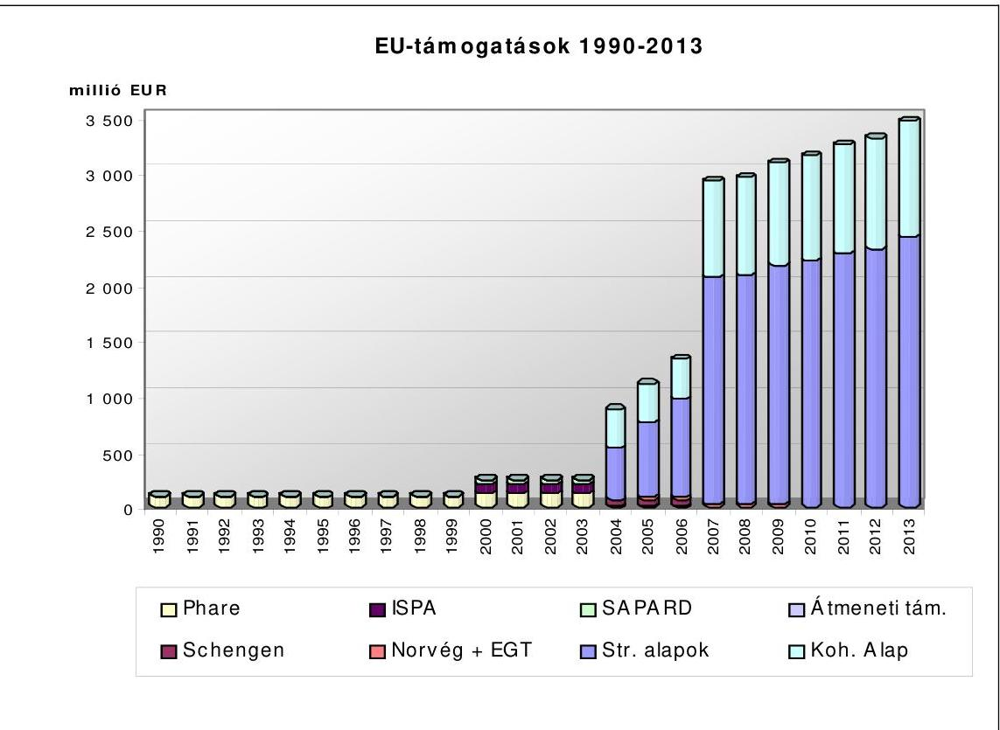

Forrás: NFÜ
A Magyar Köztársaság költségvetése végrehajtása során elszámolt és a költségvetésen kívüli EU transzferek 2004-2009 közötti idôszakát vizsgálva megállapítható, hogy a 2004. évi 133 Mrd Ft összeget követően 2005-2008 között közel azonos szinten ( 215 és 220 Mrd Ft között) alakult, majd 2009-ben jelentősen megemelkedett (közel 250 Mrd Ft ) az EU költségvetéséhez való hozzájárulásunk. A nemzeti hozzájárulás és a tradicionális saját források belső

---

szerkezete és a befizetési jogcímek arányai kisebb mértékben változtak a 20052007 közötti időszakban. 2008-tól a nemzeti hozzájárulás növekvő, míg a tradicionális saját forrás jelentős csökkenő tendenciát mutatott. 2009-ben a nemzeti hozzájárulás növekvő tendenciája továbbra is fennállt, a tradicionális saját forrás összege ismét a korábbi évek szintjére emelkedett.

A 2004. évi összeg nagyságát befolyásolta, hogy a csatlakozás évében csak arányos befizetési kötelezettség állt fenn, illetve a tradicionális saját források között megjelenő cukorilletéket a következő évben kellett teljesíteni, ennek megfelelően ilyen jogcímen 2004. évben nem keletkezett befizetési kötelezettségünk.

Magyarország hozzájárulása - a nemzeti hozzájárulásokon keresztül - az EU költségvetéséhez évről-évre növekedést mutatott, amelynek fő oka, hogy a bruttó nemzeti jövedelem növekedésével párhuzamosan nőtt a GNI alapú hozzájárulás mértéke is. 2009. évben a befizetési kötelezettségünk növekedésének másik oka a Svédország és Hollandia számára teljesítendő GNI hozzájárulási kötelezettség életbe lépése, valamint az ehhez kapcsolódó egyszeri pótbefizetés volt. Az áfa-alapú hozzájárulás, valamint a brit korrekció mértékének változása az azok meghatározására vonatkozó szabályokra vezethető vissza.

A Magyar Köztársaság költségvetésében megjelenő uniós kapcsolatokhoz tartozó támogatások (EU + hazai forrás), illetve visszatérítés fokozatos növekedést mutattak a 2004-2009 közötti időszakban, 2007-ben kismértékű visszaeséssel, 2009-ben nagymértékű kiugrással. A költségvetésben megjelenő EU kiadások 2004. évi közel 127 Mrd Ft-ja 2008-ra meghaladta az 520 Mrd Ft-ot, majd 2009ben megközelítette a 870 Mrd Ft-ot. (Ezen összegek tartalmazták az uniós támogatások utólagos elszámolását is.)

A támogatások összegének alakulása a programok életciklusához igazodott. A 2004-2006-os programozási időszak programjai (NFT és NVT, valamint az Átmeneti Támogatás) a 2006-2007-es felhasználási csúcsot követően 2008-2009ben fokozatosan kifutottak. Az új programozási időszakhoz kapcsolódó ÚMFT és ÚMVP a 2007-2008. évi lassú beindulást követően 2009-ben kimagasló felhasználási adatokat mutatott.

A Kohéziós Alap forrásainak felhasználása összhangban volt a nemzetközi öszszehasonlításban bemutatott kedvezőtlen képpel, miszerint a KA projektek nagyon mérsékelt ütemben haladtak előre: 2009-ben 5\%-kal nőtt a kifizetések aránya az előző évhez képest (ez az arány a többi KA kedvezményezett tagállam esetében 13-23\% között mozgott).

A költségvetésen kívüli agrárpiaci támogatások évenként változó képet mutattak, tendenciájában azonban növekvő mértékű támogatásról van szó. A támogatások összegét az intervenció finanszírozási szükséglete nagymértékben befolyásolta. A közvetlen támogatások esetében az elszámolási szabályok a kifizetések tárgyévi és az azt követő évi elszámolását is lehetővé teszi. Nagyrészt erre vezethető vissza az évek közötti eltérő felhasználás.

---

# 1.3. Magyarország és az EU pénzügyi kapcsolatai 2009-ben 

A közösségi és hazai jogszabályokkal összhangban ${ }^{16}$ az Uniót 2009-ben öszszesen 223,7 Mrd Ft illette meg Magyarországról, amely 32 Mrd Ft áfa alapú hozzájárulást, 159,2 Mrd Ft GNI-alapú hozzájárulást, 16,1 Mrd Ft brit korrekciót, 1,7 Mrd Ft Holland-Svéd GNI-hozzájárulást ${ }^{17}$ és ehhez kapcsolódóan 14,5 Mrd Ft egyszeri pótlólagos befizetést tartalmazott (4. ábra, illetve a 1. sz. melléklet). 2009-ben az EU-t megillető vámok összege 24,8 Mrd Ft, a termelési dij $471,1 \mathrm{M} \mathrm{Ft}$ volt.
4. ábra
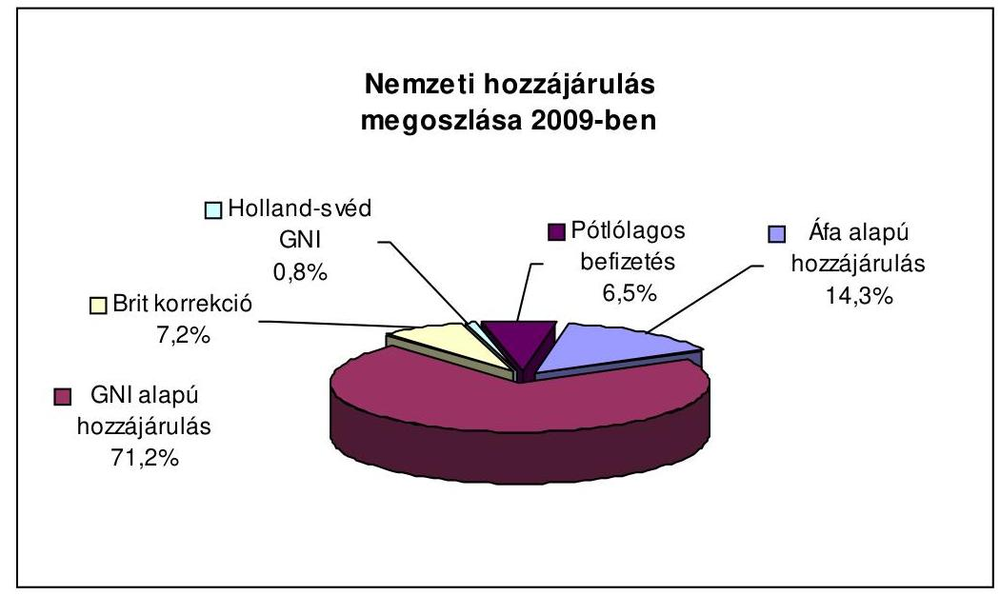

Forrás: ÁSZ zárszámadási jelentés
A Magyar Köztársaság 2009. évi költségvetésében az EU támogatások (NFT, Kohéziós Alap, ÚMFT, Egyéb strukturális támogatások, Nemzeti Vidékfejlesztési Terv, Új Magyarország Vidékfejlesztési Program, Halászati Operatív Program, SAPARD, Átmeneti Támogatás programjai, egyéb európai uniós támogatások) és a hozzájuk kapcsolódó hazai társfinanszírozás 829,2 Mrd Ft öszszegben jelent meg. A költségvetésben megjelenő uniós források 602,7 Mrd Ft-ot, a hazai társfinanszírozás 226,5 Mrd Ft-ot tett ki (5. ábra; 2/A. sz. melléklet).

[^0]
[^0]:    ${ }^{16}$ A saját források rendszerét szabályozó uniós - és ezzel összhangban hazai - jogszabályi háttér 2009. március 1-jétől módosult.
    ${ }^{17}$ Az új uniós szabályozás szerint az EU nagy nettó befizetői részére (Hollandia és Svédország) biztosított GNI kedvezmény összege a többi tagállam befizetési kötelezettségét növeli. Ezen GNI alapú hozzájárulás fizetési kötelezettség 2007-re visszamenőleg keletkezett. Az ebből adódó különbözetet Magyarországnak 2009-ben (az uniós szabályozás hazai jogrendbe állításának időpontjától) pótlólagos befizetés formájában kellett rendeznie.

---

Forrás: ÁSZ zárszámadási jelentés
Az uniós forrásokat is tartalmazó előirányzatok teljesülése összességében 16,1\%-kal maradt el a tervezett összegnél, amely javulást jelent a 2007-2008. évi kiemelkedően magas ( $40 \%$ feletti) arányhoz viszonyítva. Az elmaradás mértéke - összhangban az ellenőrzések megállapításaival - azt mutatja, hogy bár a programok végrehajtása jelentősen felgyorsult, még mindig elmarad a kívánatostól.

2009 végére minden OP esetén sor került az első kifizetési igénylések Európai Bizottságnak való elküldésére, ami feltétele volt annak, hogy a tagállam a már átutalt előleget ne veszítse el.

A költségvetésen kívüli támogatási formák (a közvetlen területalapú támogatások, az agrárpiaci támogatások és az intervenciós felvásárlások) öszszege 2009. évre vonatkozóan mintegy 320 Mrd Ft-ot tett ki (agrárpiaci támogatás: 89 Mrd Ft, területalapú támogatások: 228,7 Mrd Ft, intervencióhoz kapcsolódó költségtérítések: 2,3 Mrd Ft), amelyet a Kifizető Ügynökség a KESZ-ről megelőlegezett, és az Unió utólag téríti meg az államháztartás számára (2/B. sz. melléklet). Az EU által közvetlenül térített SAPS támogatást a hazai forrásból finanszírozott kiegészítő nemzeti támogatás (top-up) 87,5 Mrd Ft-tal egészítette ki.

Az EU költségvetéséből származó bevételként 36,8 Mrd Ft jelent meg. Ez az öszszeg a Magyarországot megillető termelési díjak visszatérítése címen keletkezett 157,0 M Ft-ból, a vám visszatérítés címen befolyó közel 8 Mrd Ft-ból és az uniós támogatások utólagos megtérülése címen - tervezettől jelentősen, közel 50\%kal elmaradva - befolyó 28,6 Mrd Ft-ból tevődött össze.

A tervezettől való elmaradás oka döntő részben a 4-es Metró beruházáshoz kapcsolódó pénzügyi korrekció. Ezen kívül az NVT zárása kapcsán a végső egyenleg-

---

kifizetés (7,4 Mrd Ft) elszámolására - az Európai Bizottság kései, csak év végén beérkező utalása miatt - nem került sor.

# 1.4. Az Európai Bizottság által közvetlenül kezelt források 

A Magyar Köztársaság érdekében történő beazonosított kifizetésként az Európai Bizottság a 2009. évben 3794,4 M eurót tartott nyilván. Ez az összeg uniós költségvetési kiadási fejezetenkénti ${ }^{18}$ bontásban tartalmazta a kifizetett támogatásokat, tehát mindazokat, amelyek felhasználása magyar közintézmények közremúködésével, az Európai Bizottsághoz közvetlenül benyújtott pályázatok útján, vagy Magyarország támogatás felhasználásával kapcsolatosak. Ennek döntő többségét a Magyar Köztársaság költségvetési beszámolójában szereplő (költségvetésében megtervezett és a költségvetésen kívüli Kincstári Egységes Számláról finanszírozott) tételek alkották. A közvetlenül a Bizottság által finanszírozott tételek közül a két legjelentősebb az oktatási-képzési és az ifjúsági célokra fordított támogatások voltak. A 2009-ben történt közvetlen kifizetések 74,1\%-kal haladták meg az előző évi szintet.

Az oktatás területén kiemelt jelentőséggel bírnak az Egész életen át tartó tanulás program és a Fiatalok Lendületben Program, amelyek megvalósítása nemzeti szinten történik.

Magyarországon a nemzeti hatóság szerepét az „Egész életen át tartó tanulás" Program esetében az oktatásért felelős miniszter, a „Fiatalok Lendületben" Program esetében a Szociális és Munkaügyi Minisztérium töltötte be. Az „Egész életen át tartó tanulás" Program lebonyolítója, a Nemzeti Iroda pedig a Minisztérium felügyelete alatt álló Tempus Közalapítvány volt, csakúgy, mint az elmúlt években. A „Fiatalok Lendületben" Program végrehajtásával kapcsolatos feladatokat Nemzeti Ügynökségként a hazai ifjúsági szolgáltatások, illetve ifjúságpolitika szerves részét képző Foglalkoztatási és Szociális Hivatalon belül múködő Mobilitás Országos Ifjúsági Szolgálat látta el.

Az OKM 2009-ben és 2010-ben a megbízhatósági nyilatkozat kiadásának megalapozása érdekében vizsgálatokat folytatott le. Ennek alapján az OKM által 2010-ben kibocsátott megbízhatósági nyilatkozat többek között kimondta, hogy az Egész életen át tartó tanulás programot kezelő TKA pénzügyi rendszereinek és eljárásainak megbízhatóságáról ésszerű bizonyosságot szerzett, a forrásokat a céloknak megfelelően használták fel a megfelelő pénzügyi gazdálkodás elvének alkalmazásával. A nyilatkozat megerősíti, hogy a TKA éves jelentése híven tükrözi az elvégzett tevékenységeket, a pénzügyi beszámoló valós képet nyújt a Közalapítványról, a tranzakciók jogszerűek, valamint a Bizottság által korábban javasolt intézkedéseket megfelelően végrehajtották.

Az Egész életen át tartó tanulás program indikatív pénzügyi kerete a hét éves időszakra (2007-2013) európai szinten 6970 M euró. A Fiatalok Lendületben Program teljes költségvetése a 2007-2013 közötti időszakra 885 M euró.

[^0]
[^0]:    ${ }^{18}$ Fenntartható fejlődés, Természeti erőforrások, Szabadság, biztonság és a jog érvényesülése, az EU, mint globális partner, valamint az Igazgatásra fordított kiadások.

---

# 2. Az UNIÓs TÁMOGATÁSOK HAZAI FELTÉTELRENDSZERÉNEK BEMUTATÁSA 

### 2.1. Az uniós támogatások hazai intézményrendszere

Az EU-ból érkező források fogadásához, illetve lebonyolításához szükséges intézményrendszert Magyarország az EU előírásainak megfelelően, a hazai jogszabályokat figyelembe véve alakította ki.

Az intézményrendszer szereplői jelen Tájékoztatóban egységesen a tárgyidőszakban, azaz a 2009-ben érvényes struktúrában és megnevezésekkel jelennek meg.

Az EU-ból érkező növekvő mértékű források fogadásához, illetve felhasználásának lebonyolításához szükséges hatékony intézményrendszer kialakítása érdekében a Kormány 2006. július 1-jével a Nemzeti Fejlesztési Hivatal általános jogutódjaként létrehozta a Nemzeti Fejlesztési Ügynökséget (NFÜ), amelynek keretében látták el feladataikat az új és korábbi programozási időszak (NFT, ÜMFT) Operatív Programjainak irányító hatóságai ${ }^{19}$.

Az NFÜ felelőssége továbbá kiterjedt a PHARE programokkal és a Schengen Alappal, az Átmeneti Támogatással, az EGT/Norvég Finanszírozási Mechanizmussal és a Svájci-Magyar Együttmúködési Programmal kapcsolatos előkészítési, szervezési és koordinációs feladatokra is. Felügyeletét 2008. május 15 -től a nemzeti fejlesztési és gazdasági miniszter látta el.

Az ÁSZ a 2008. évre vonatkozó zárszámadás vizsgálat során megállapította, hogy a gyakorlatban valamennyi IH egymástól szervezetileg elkülönülten, önálló főosztályként működött. Az OP IH-k tevékenységének összehangolása a gyakorlatban 2009-ben sem valósult meg annak ellenére, hogy az ÜMFT végrehajtásával kapcsolatos koordinációt a végrehajtási elnökhelyettes hatáskörébe utalta az SzMSz.

A strukturális támogatásokat kezelő irányító hatóságok feladataik egy részét közreműködő szervezetekre delegálták. A KA-ból nyújtott támogatások lebonyolítása háromszintű szervezetrendszeren keresztül történt. A támogatások szakmai és pénzügyi lebonyolítását a KA esetében teljes egészében a KSZ-ek végezték. A projektek végrehajtása lebonyolító testületekben történt.

A 2009. évre vonatkozó zárszámadás vizsgálat megállapította, hogy a korábbi évhez hasonlóan a programok végrehajtása során egyes IH-k aránytalanul nagymértékben támaszkodtak a KSZ-ekre és saját feladatkörükbe tartozó tevékenységek közül irányítási és ellenőrzési funkciókat is a KSZ-ekre delegáltak, továbbá, hogy eltérő mértékben végeztek megfelelőségi ellenőrzéseket a KSZekre delegált feladatok ellátása tekintetében. A KA tekintetében a támogatások szakmai és pénzügyi lebonyolítását teljes egészében a KSZ végezte. A gyakorlatban a KA IH a KSZ-ek tevékenységére vonatkozóan irányítási és ellenőrzési funkciót nem, csak monitoring funkciót látott el.

[^0]
[^0]:    ${ }^{19}$ Az AVOP és az új programozási időszak agrár- és vidékfejlesztési, illetve halászati támogatásai irányító hatósága 2009-ben az FVM szervezetében helyezkedett el.

---

A közreműködő szervezetek finanszírozásának egységesítése érdekében 2007-től fokozatosan bevezették az ún. SLA-k ${ }^{20}$ rendszerét, amelynek egységesítése azonban elmaradt, illetve nem valósult meg egységes gyakorlat az SLA szerződések időhorizontját tekintve.

Az SLA finanszírozás célja a teljesítményalapú, költséghatékony feladatfinanszírozás. Az SLA alapján történő év végi elszámolás során - az IH értékelése alapján - a feladatellátásban jelentkező hiányosság a sikerdíj csökkentését vonta maga után.

Az SLA rendszer felülvizsgálatát előkészítő értékelés a rendszer továbbfejlesztését javasolta többek között a finanszírozási konstrukció módosításával, az elvárt szolgáltatások pontos meghatározásával, az IH-nak a KSZ-ekkel foglalkozó kapacitásainak bővítésével, illetve a KSZ-ek gazdasági társasággá alakításával.

Az intézményrendszerben 2009-ben jelentősebb változás nem történt. Kisebb szervezeti átalakítások és vezetőcserék azonban ez évben is lezajlottak, illetve az NFÜ SzMSz-e 2009-ben kétszer is módosult. Ezek a változások alapvetően nem befolyásolták a végzett munka színvonalát, de egyes esetekben az állandóság hiánya bizonytalanságokat okozott.

Annak ellenére, hogy az ellenőrzések több helyen kedvező változást tapasztaltak, továbbra is problémát jelent a kapacitáshiány, illetve a magas fluktuáció, amely kedvezőtlenül befolyásolta a feladatellátást. A vizsgálatok a feladatellátás kapacitáshiányra és fluktuációra visszavezethető hiányosságait elsősorban az ellenőrzések, a pénzügyi folyamatok és a dokumentáltság területén tárták fel. Az elégtelen létszám játszott közre abban is, hogy a KÖZOP kifizetéseinél olyan késedelmek keletkeztek, amelyből a KIKSZ-nek késedelmi kamatfizetési kötelezettsége származott.

Az ellenőrzések rámutattak, hogy az uniós források technikai segítségnyújtási keretei terhére foglalkoztatott humánerőforrásra vonatkozó finanszírozás átláthatósága érdekében szükséges az egyes támogatások kezeléséhez felhasznált munkaidő keret (ráfordítás) pontos nyilvántartása.

Az intézményrendszer múködésének ellenőrzése kapcsán az ÁSZ a kontrollok - legtöbbször a FEUVE, illetve az EMIR számítástechnikai rendszer hiányosságaira visszavezethető - nem megfelelő múködését állapította meg, amely közvetve a beszámolók kedvezőtlen minősítéséhez vezethetett. Mivel a hibák (belső kontrollok általi) feltárása elmaradt, felvetődik a FEUVE nem megfelelő működésének problémája is. A belső kontrollokat érintően az egyik legrégebben fennálló hiányosság a belső ellenőrzés kapacitáshiánya.

A Zárónyilatkozat Kiadásért Felelős Szerv, illetve az Ellenőrzési Hatóság által lefolytatott rendszerellenőrzések alapvető megállapításai szerint a szervezetrendszer ellátja feladatait, ugyanakkor több területen kockázatok is észlelhetők, pl. a 2004-2006-os programozási periódus NFT OP-k zárási feladatainak részletes szabályozásával, a határidők és felelősök rögzítésével kapcsolatos

[^0]
[^0]:    ${ }^{20}$ Service Level Agreement: Szolgáltatási szint megállapodás, az Irányító Hatóságnak a KSZ irányában érvényesített irányítási jogköreinek legfontosabb formalizált eszköze.

---

hiányosságok. A 2009. évre vonatkozó zárszámadás ellenőrzés megállapította, hogy a zárójelentések 2010. szeptemberi határidőre történő elkészítése valamennyi OP-nál feszített tempót követelt az intézményrendszertől.

A PM Nemzeti Programengedélyező Iroda (a továbbiakban Kifizető/Igazoló Hatóság) ellátta az Európai Unió Strukturális és Kohéziós Alapjaiból, az Előcsatlakozási Támogatási Eszköz (IPA) programokból és Svájci Hozzájárulásból származó támogatásokkal kapcsolatosan a kifizető és az igazoló hatósági feladatköröket. Az EGT/Norvég Finanszírozási Mechanizmussal, valamint más támogatási eszközökkel összefüggésben ellátta a vonatkozó nemzetközi szerződésekből adódó, a Pénzügyminisztérium feladatkörébe rendelt pénzügyi lebonyolítással, számviteli nyilvántartással, költségigazolási és ellenőrzési tevékenységgel összefüggő feladatokat.

A fentieken kívül ellátta az Európai Unió által támasztott követelményeknek megfelelő és a Pénzügyminisztérium feladatkörébe rendelt pénzügyi lebonyolítási, számviteli és intézményfejlesztési feladatokat az előcsatlakozási eszközök és az Átmeneti Támogatás tekintetében.

Az uniós agrár-, vidékfejlesztési és halászati támogatások lebonyolítását a Földművelésügyi és Vidékfejlesztési Minisztérium, mint Illetékes és Irányító Hatóság, valamint a Mezőgazdasági és Vidékfejlesztési Hivatal, mint Kifizető Ügynökség, illetve Közremúködő Szervezet látta el. Az intézményrendszer részletes bemutatása és a múködésére vonatkozó ellenőrzési megállapítások a 3.3 Agrártámogatások fejezetben találhatóak.

# 2.2. Az uniós támogatások hazai ellenőrzési és monitoring rendszere 

## Ellenőrzési rendszer

A támogatások pénzügyi ellenőrzéséért az Európai Bizottság az Európai Közösségek főköltségvetése végrehajtásáért való felelőssége sérelme nélkül, elsődlegesen a tagállamok vállalnak felelősséget. Minden tagállamnak kötelessége gondoskodni a rá vonatkozó ellenőrzési feladatok olyan ellátásáról, amellyel megvalósítja az alapelvek és ellenőrzési célok érvényesülését.

A feladatok ellátásához kapcsolódóan a tagállamoknak az ellenőrzések három szintjét kell ellátniuk (ún. folyamatba épített ellenőrzés, rendszer- és mintavételes ellenőrzések, záró költségnyilatkozatok ellenőrzése).

Az Állami Számvevőszék - mint az Országgyúlés pénzügyi-gazdasági ellenőrző szerve, illetve az állam legfőbb pénzügyi ellenőrző szerve - egyrészt jogosult az államháztartás teljes körét érintő vizsgálatokra, másfelől az EU-ból érkező támogatások felhasználását, illetve a Közösséget megillető befizetéseket ellenőrizve hatékonyan részt vesz a Közösség pénzügyi érdekeinek védelmében.

---

Az államháztartási belső kontrollrendszerek keretében az államháztartásért felelős miniszter felel a FEUVE és a belső ellenőrzési rendszer szabályozásáért, fejlesztéséért, koordinációjáért és harmonizációjáért ${ }^{21}$.

A hazai jogszabályok 2009-re vonatkozóan a Kormányzati Ellenőrzési Hivatalt jelölték ki az Európai Regionális Fejlesztési Alapból, az Európai Szociális Alapból és a Kohéziós Alapból, továbbá a Szolidaritás és migrációs áramlások igazgatása általános program által finanszírozott támogatások, illetve a Ma-gyarország-Horvátország és a Magyarország-Szerbia IPA Határon Átnyúló Együttmúködési Programok és az ETE programok tekintetében az ellenőrzési hatósági (EH) feladatok ellátására a 2007-2013 közötti programozási időszakra. A KEHI ellátta továbbá a 2004-2006 közötti programozási időszak tekintetében a Strukturális Alapokkal, a Kohéziós Alappal, az EQUAL és az INTERREG IIIA Közösségi Kezdeményezés programokkal kapcsolatos - az uniós pénzügyi rendeletekben előírt - ellenőrzéseket, az európai uniós előcsatlakozási eszközök, az Átmeneti Támogatás és a Schengen Alap támogatásai felhasználásának ellenőrzését. Az EGT és a Norvég Alap Finanszírozási Mechanizmusokból támogatott projektek ellenőrzését végzi. A KEHI feladata a Svájci-Magyar Együttmúködési Program általános pénzügyi ellenőrzése is.

A 2007-2013-ra vonatkozó uniós rendelet alapján a KEHI 2009. június 30-ig elvégezte a 2008. január 1 - 2008. december 31. közötti referencia-időszakra vonatkozó rendszer- és mintavételes ellenőrzéseket. A projektellenőrzések tervezési módszertana módosult, ennek megfelelően abban az esetben, ha a kifizetési kérelmek száma nem éri el a pénzegység alapú mintavételi módszer alkalmazásához szükséges volument, nem-statisztikai kiválasztásra kerül sor. A hazai szabályozás szerint 2009-ben a KEHI látta el a zárónyilatkozat kiadásáért felelős szervezet feladatait.

Az uniós források ellenőrzési rendszerének múködésében tapasztalt hiányosságok csökkentése érdekében a Bizottság 2008-tól (első alkalommal 2007. évre vonatkozóan) előírta, hogy a tagállamok összegezzék a rendelkezésre álló ellenőrzési jelentéseket, véleményeket, igazolásokat és nyilatkozatokat, és a tárgyévet követő év február 15-éig állítsanak össze egy ún. éves összegző jelentést (Annual Summary). Hazánkban az éves összegző jelentés összeállítását 2010-ig a KEHI végezte (2010. július 1-jét követően az EUTAF feladata).

Az éves összegző jelentésben a KEHI összefoglalta az egyes programozási időszakra vonatkozó ellenőrzési tevékenységet. (Ezek megállapításait jelen Tájékoztató részletesen tartalmazza.) A 2007-2013-as időszakra vonatkozóan az Ellenőrzési Hatóság csak az ÁROP-ESZA, illetve EKOP-ERFA vonatkozásában adott ki fenntartások nélküli véleményt.

Az éves összegző jelentés szerint az ellenőrzési összefoglalók eredményei alapján a KEHI véleménye, hogy „a 2009. december 31-én véget érő évre a 2000-2006 és a 2007-2013 közötti időszakra megállapított strukturális intézkedések irányítási és ellenőrzési rendszerei megfeleltek a rájuk vonatkozó szabályozási követelményeknek és hatékonyan múködtek. Így elfogadható biztosítékot jelentenek arra vonatkozóan, hogy a Bizottság számára igazolt kiadási nyilatkozatok helyesek,

[^0]
[^0]:    ${ }^{21}$ Az államháztartásról szóló 1992. évi XXXVIII. törvény 121/B. §-a.

---

és ennek következtében elfogadható biztosítékot jelentenek, hogy az ezek alapjául szolgáló ügyletek jogszerúek és szabályosak".

A Kormány 2010. július 1-jei hatállyal létrehozta az Európai Támogatásokat Auditáló Főigazgatóságot (EUTAF) ${ }^{22}$. A Főigazgatóság a KEHI jogutódjaként ellátta az Európai Regionális Fejlesztési Alapból, az Európai Szociális Alapból és a Kohéziós Alapból származó támogatások tekintetében az ellenőrzési hatósági feladatokat, továbbá az egyéb - korábban a KEHI feladatkörébe tartozó - európai uniós és nemzetközi támogatások ellenőrzési feladatait.

A végrehajtást szabályozó hazai jogszabályokban előírt belső ellenőrzési funkciót az érintett szervezetek funkcionálisan független belső ellenőrzési részlege látta el.

Az NFÜ Belső Ellenőrzési Főosztálya felelős az Ügynökség szervezeti egységeinek (így az IH-k) belső ellenőrzéséért, továbbá a nemzetközi támogatások felhasználásával kapcsolatosan a kedvezményezetteknél és a támogatások lebonyolításában részt vevő szervezeteknél való ellenőrzésért, valamint az Ügynökségnél végzett külső ellenőrző szervezetek ellenőrzéseinek nyilvántartásáért, koordinálásáért és meghatározott esetekben a szabálytalansági bizottságok munkájában való részvételért.

Az ÁSZ zárszámadásról szóló vizsgálata ismét rámutatott a magas kockázatra, miszerint az uniós előirányzatok tömege, sokfélesége és szervezeti tagoltsága miatt rendkívül nagy aránytalanság állt fenn a feladat és annak végrehajtására biztosított humánerőforrás között, így az NFÜ BEF a saját kapacitásával - külső szakértők bevonásával együtt - a számára kijelölt ellenőrzési területnek csak kis részét tudta lefedni.

A PM Nemzeti Programengedélyező Iroda - mint Kifizető/Igazoló Hatóság - kiemelt feladatot látott el az uniós támogatások ellenőrzési rendszerében, a kiadások megfelelő igazolása érdekében a pénzügyi lebonyolítás tekintetében a teljes rendszer ellenőrzésére volt jogosult. A Kifizető/Igazoló Hatóság egyéb pénzügyi és igazolási tevékenysége mellett tényfeltáró látogatásokat és tényfeltáró vizsgálatokat végzett annak érdekében, hogy az Európai Bizottság felé megalapozottan tanúsítsa a költségnyilatkozatban szereplő kiadásokat hitelesítő szervezetek (IH, KSZ) irányítási és ellenőrzési rendszerének hatékony működését, továbbá a jogszabályi előírásokkal való összhangját.

Az ÁSZ zárszámadásról szóló ellenőrzése megállapította, hogy a PM NAO Iroda belső ellenőrzése a függetlenség, a szabályozottság és a tervszerűség szempontjából megfelelően múködött, rámutatott azonban, hogy a belső ellenőrzés által ellátott tanácsadói tevékenység az Éves Ellenőrzési Terv végrehajtása, illetve az öszszeférhetetlenség vonatkozásában kockázatot hordozott magában, dokumentáltsága nem volt megfelelő.

[^0]
[^0]:    ${ }^{22}$ 210/2010. (VI. 30.) Korm. rendelet az Európai Támogatásokat Auditáló Főigazgatóságról.

---

2007-től a Magyar Államkincstár az NFÜ-vel kötött Együttmúködési Megállapodás alapján utólagosan ellenőrizte a kedvezményezettek által benyújtott pályázatok és elszámolások KSZ-ek által történő feldolgozását és a tranzakciók EMIR-ben történő rögzítésének szabályosságát. A Kincstár ellenőrizte továbbá a KSZ-ek által készített kifizetési előrejelzéseket.

A Kincstár 2008-ban több mint 250 db pályázat és projekt EMIR rögzítésének ellenőrzését végezte el, amelynek eredményeképpen javult a monitoring rendszer alkalmazásának szabályozási háttere, valamint feltöltöttsége. A közremúködő szervezetek kapacitásának kiegészítéseképpen közel 300 db projekt helyszíni ellenőrzésébe kapcsolódott be.

2009-ben a tevékenység bővült az elszámolások utólagos felülvizsgálatával és a pályázatok dokumentációjának ellenőrzésével. Ennek keretében közel 2100 db pályázat és projekt szabályszerűségi, valamint több mint 200 db projekt helyszíni ellenőrzését látta el a Kincstár az irányító hatóságok megbízásából.

Az ellenőrzési funkciók hiányos múködésére vonatkozó megállapítások a korábbi években tapasztaltakhoz hasonlóan - a 2009. évben lefolytatott ellenőrzések során is megfogalmazódtak, amely arra utal, hogy az ellenőrzési rendszer további erősítése szükséges, különösen az IH-k és KSZ-ek vonatkozásában. A KSZ-ek első szintű és az IH által elvégzendő felülvizsgálati ellenőrzésének nem kielégítő volta magas kockázatot hordoz a programok szabályszerú és a támogatási célnak megfelelő végrehajtá-sa/megvalósulása tekintetében. Az ellenőrzések hangsúlyozták az első szintű ellenőrzések IH általi felülvizsgálatának fontosságát, mert a KSz előírásszerűen végrehajtott első szintű ellenőrzései kell, hogy kiszűrjék a kedvezményezettek által elkövetett szabálytalanságokat pl. az el nem ismerhető költségeket.

A KSZ-IH ellenőrzések a Kincstár bevonásával időközben erősödtek.
Folyamatosan problémát jelent az intézményrendszer részére, hogy nem valósult meg az ellenőrzések harmonizációja, illetve nagy leterhelést jelentett számukra a külső ellenőrzések (ÁSZ, KEHI, Európai Számvevőszék, Európai Bizottság) koordinálása.

Az ellenőrzöttek leterheltségének csökkentése érdekében az ellenőrzést végző egyes szervezetek (pl. az ÁSZ) központosított dokumentumtárolási eljárásokat vezettek be, ezzel biztosítva, hogy az adott dokumentumot csak egy alkalommal kelljen az ellenőrzöttől bekérni és azt valamennyi vizsgáló egység felhasználhassa.

Az ÁSZ 2009-ben megkezdte egy számítógéppel támogatott dokumentációs rendszer és dokumentumtár (VIDOR) kialakítását, amely támogatja az ellenőrzések egységes elvek szerinti dokumentálását. Az egy ellenőrzött szervezethez tartozó ellenőrzési dokumentumok központi tárolása és a vizsgálatot végzők általi hozzáférése révén az ellenőrzöttekre háruló adatszolgáltatási teher is jelentősen csökkent, és hatékony lehetőséget nyújtott az ellenőrzések során felhalmozott ismeretek (újra)felhasználására és megosztására.

---

Az agrártámogatások több szinten megvalósuló ellenőrzési rendszerét és működésének tapasztalatait a 3.3 Agrártámogatások fejezetben mutatjuk be.

# Monitoring rendszer 

Az ellenőrzések megállapították, hogy a monitoring rendszer kialakításáról és működéséről szóló jogszabályban előírtaknak megfelelően az EU által nyújtott támogatások kezelésében, illetve felhasználásában részt vevő szervezeteknél a monitoring tevékenységért felelős egységek létrejöttek, az NFT és ÜMFT operatív programok Monitoring Bizottságait múködtették, a projekt szintű monitoring feladatokat a KSZ-ek az előírt jogszabályi kereteken belül megfelelően végezték el. A KA monitoring tevékenység keretében a projektek előrehaladását részletesen értékelő havi áttekintő értekezleteket tartottak 2009 végéig, illetve évente két alkalommal MB ülést.

Az ÁSZ zárszámadási ellenőrzése megállapította, hogy az intézményrendszer megkezdte a fenntartási monitoring rendszer kiépítését, szükségesnek látta azonban a rendszer erősítését a múködtetési időszak problémáinak kezelhető szinten tartásához, a jövőbeni - szabálytalanságból fakadó visszafizetések elkerülése érdekében.

### 2.3. Az uniós támogatások hazai nyilvántartási rendszerei

Tekintettel arra, hogy az Európai Unióval történő elszámolások megbízhatósága és a források hatékony felhasználása érdekében a gazdálkodásról naprakész, pontos adatokat szolgáltató nyilvántartási és monitoring rendszerek fenntartása elengedhetetlen, a 2009-ben lefolytatott ellenőrzések kiemelt területként kezelték a monitoring rendszer múködésének és különös tekintettel az EU-s alapok elszámolásait támogató informatikai rendszerek (Egységes Monitoring és Információs Rendszer - EMIR és az Integrált Igazgatási és Ellenőrzési Rendszer IIER) múködésének vizsgálatát.

### 2.3.1. Egységes Monitoring Információs Rendszer

Az uniós rendelet előírásai szerint a tagállamnak megfelelően kiépített informatikai rendszerrel kell rendelkezni, amely a közösségi források felhasználásáról megbízható adatokat és információkat szolgáltat a Kormány, az intézményrendszer és az Európai Unió számára. A jogszabályi előírások szerint a nyilvántartások vezetésére az EMIR-t, illetve az INTERREG programoknál az IMIR-t, az ETE esetében az IMIR 2007-2013 rendszert kell alkalmazni.

Az EMIR egy olyan adminisztratív és napi menedzsment munkát is támogató, átfogó rendszer, amely nyomon követi a finanszírozott projektek előrehaladását a befogadástól a kifizetésig, azzal, hogy a projekteket a fenntartási időszakban is nyomon követi.

A rendszer kidolgozásának kezdete (2003) óta a Welt 2000 Kft. üzemeltette és fejlesztette az EMIR-t. Az EMIR-t integrált rendszerelemek alkotják. Az alrendszerek felhasználói funkcionalitását modulok (főbb logikai funkció csoportok) támogatták.

---

Az ellenőrzések megállapították, hogy az EMIR alapvetően jól töltötte be a nyilvántartással kapcsolatos szerepét, ugyanakkor több hiányossága is volt. Többek között az EMIR statisztikák nem a még fennálló kötelezettségek állományát mutatták, hanem a projektekre még el nem számolt, „nyitott" összegeket, ez a mérlegvalódiság elvét is sértette. Nem volt megállapítható a rendszerekből az adott évre fennálló kötelezettségvállalás összege sem. Az értéknapos lekérdezések csak az adattár modulban voltak elérhetőek. Az EMIR adattartalmának megbízhatóságát csökkentette, hogy az egyes KSZek eltérő módon és mértékben töltötték fel az EMIR nyilvántartásokat.

A PM NAO Iroda az EU forráslehívások, közösségi hozzájárulás rendezések és költségnyilatkozatok összeállítását, az átutalási megbízások kiállítását, illetve bankszámla kivonatok, árfolyamok rögzítését támogató finanszírozási modul múködését kielégítőnek találta.

Az NFÜ BEF az EMIR ÚMFT alrendszerére vonatkozóan több hiányosságot tárt fel a jogosultsági igénylés dokumentáltságát és a jogosultság felülvizsgálati rendszert, valamint a jelszókövetelményeket érintően. Javaslatot tettek a ka-tasztrófa-helyreállítás rendszeres tesztelésére, illetve a mentési kazetták megfelelő tárolására, valamint szállítására.

Az ÁSZ zárszámadási ellenőrzése a kontrollrendszerek - az EMIR hiányosságaira visszavezethető - nem megfelelő múködését tárta fel, amely a beszámolók kedvezőtlen minősítését vonta maga után.

Az IMIR-re vonatkozó megállapítások a vonatkozó programokról szóló fejezetben találhatóak.

# 2.3.2. A Kincstár által múködtetett monitoring rendszer 

A Kincstári Monitoring Rendszer (KMR; korábbiakban Országos Támogatási Monitoring Rendszer) 1998 óta végzi a költségvetési támogatással megvalósuló programok adatainak nyilvántartását. Az EU-csatlakozást követően a rendszerben megjelentek az uniós támogatást is magukban foglaló programok, ezzel együtt megfogalmazódott a pályázati nyilvántartási rendszerek (elsősorban a KMR és az EMIR) közötti adatkapcsolat igénye. A KMR feladata többek között, hogy a köztartozással rendelkező gazdálkodókat azonosíthatóvá tegye a pályázatok elbírálása során.

Az uniós csatlakozást követően az adatbevitel már nemcsak a Kincstár saját apparátusa útján, hanem más nyilvántartási rendszerekből történő elektronikus adatátvitellel is történik. Ennek megfelelően a KMR adattartalmának naprakészsége, pontossága, megbízhatósága nagymértékben függ az adatokat szolgáltató többi nyilvántartási rendszer múködésének színvonalától is. Az EMIR és a KMR adatkapcsolat-rendszere 2009-ben is problémás terület volt. 2009. októbere óta az EMIR nem küldött adatokat a KMR részére. 2010 elejétől az NFÜ elnökének intézkedései nyomán az adathiány mérséklődött, a sikeresen elküldött adatok száma jelentősen növekedett.

---

A KMR üzemeltetéséért felelős Magyar Államkincstár tájékoztatása szerint egyezően az NFÜ közlésével - az adatcsere technikai feltételei adottak voltak, azonban a rendszeres adatküldés - az EMIR adatminősége és töltöttsége miatt nem történt meg az EMIR oldaláról, illetve az adatküldés nem volt teljes körű.

# 2.3.3. Integrált Igazgatási és Ellenőrzési Rendszer 

A közös agrárpolitikát szabályozó uniós rendelet alapján a tagállamnak Integrált Igazgatási és Ellenőrzési Rendszert kell kialakítania ${ }^{23}$, amely elsősorban a termőföld- és állatállomány alapú közvetlen támogatások kezelésére, nyilvántartására, kifizetésére, illetve a kifizetés jogosságának ellenőrzésére szolgált. Az IIER integráltságát az adta, hogy egyrészt magában foglalta mindazokat a nyilvántartási rendszereket, amelyek az eljárások végrehajtásához szükségesek, másrészt tartalmazta mindazokat az eljárásokat, amelyek a közösségi intézkedések keretében benyújtott támogatási kérelmek elbírálását és ellenőrzését szolgálták.

Az IIER a Mezőgazdasági és Vidékfejlesztési Hivatal alaptevékenységét, vagyis az agrár- és vidékfejlesztési támogatások kezelését támogató rendszer, amelynek működtetése az MVH budapesti székhelyén történik. Az MVH mint Kifizető Ügynökség több akkreditációs feltételnek is az IIER biztosította informatikai támogatásra alapozva felelt meg.

Az IIER a kérelembefogadástól egészen a támogatási összegek banki átutalásának generálásáig, valamint az Európai Bizottsággal való elszámolásig kezelte a támogatásokat. Bizonyos esetekben még a kérelmek befogadása is elektronikusan, interneten keresztül történhet a benyújtók ügyfélkapus azonosításával és a kérelmek interaktív kitöltésével.

Az IIER fejlesztését, illetve működtetésének informatikai támogatását a HewlettPackard Magyarország Kft. végezte. A rendszer informatikai támogatását és fejlesztését a kijelölt hazai és uniós hatóságokon túl független minőségbiztosító, egy dán cég is ellenőrizte. Ennek keretében a fejlesztés teljes spektruma mintavételes ellenőrzésre került, a fejlesztőknél történő, folyamatba épített ellenőrzésektől kezdve a végfelhasználói átvételi teszteken való részvételig.

Az IIER-re vonatkozó ellenőrzési megállapításokat a 3.3 Agrártámogatások fejezetben mutatjuk be.

### 2.3.4. Számviteli és nyilvántartási rendszerek

A pénzügyminiszter felé az elszámolási és adatszolgáltatási kötelezettséget elkülönítetten vezetett, eredményszemléletű kettős könyvviteli nyilvántartások alapján kell teljesíteni.

[^0]
[^0]:    ${ }^{23}$ Az IIER működtetésének kereteit a 3508/92 és az azt felváltó 1782/2003, valamint 73/2009 Tanácsi Rendeletek határozzák meg, amelyek az integrált rendszer működtetését minden tagállam számára kötelezővé teszik.

---

A számviteli zárással és beszámoló készítéssel kapcsolatos feladatok maradéktalan ellátása a korábbi évekhez hasonlóan továbbra sem megoldott, annak ellenére, hogy az új programozási időszakban az eljárást központosították és egyszerűsítették.

# A 2004-2006-os programozási időszak zárási feladatai 2009-ben folyamatban voltak. 

A 2004-2006 programozási időszakra vonatkozóan a számviteli nyilvántartást a Kifizető Hatóságnak a Strukturális Alapokra és a Kohéziós Alapra vonatkozóan, az IH-knak (közreműködő szervezeteknek) a Strukturális Alapokra vonatkozóan, míg a Kohéziós Alap közreműködő szervezeteknek a Kohéziós Alapra vonatkozóan kellett vezetni a külön megjelentetett PM tájékoztató alapján.

A 2004-2006 évekre a számviteli beszámolók elkészültek és jóváhagyásra kerültek. A 2007- 2009 évek zárása és a beszámolók elkészítése a Tájékoztató lezárásakor folyamatban volt.

A 2007-2013-as programozási időszakban 2008. január 1-jétől az ÚMFT-re vonatkozóan az irányító hatóságok és közreműködő szervezetek európai uniós támogatások lebonyolításával kapcsolatos feladataihoz kötődő számviteli nyilvántartási kötelezettséget a Nemzeti Fejlesztési Ügynökség által átruházott feladatként a Magyar Államkincstár teljesítette.

A könyvvezetést két szervezet (az IH-k és a KSZ-ek gazdasági eseményeit a Kincstár, a saját tevékenységére vonatkozó gazdasági eseményeket a PM NAO Iroda) végzi. A tárgyidőszak elteltével a két érintett szervezet rész-beszámolót készít, amelyekből a PM NAO Iroda készíti el az összevont teljes körű ÚMFT-re vonatkozó éves beszámolót.

A Kincstár - az általa vezetett számviteli nyilvántartás alapján - az IH/KSZszintű részbeszámolókat az ÁSZ-vizsgálat lezárásáig valamennyi lezárt évre vonatkozóan elkészítette.

A 2007. évről készített összevont beszámoló 2010-ben került jóváhagyásra. A 2008 és 2009-re vonatkozó összevont beszámolók a Tájékoztató lezárásáig nem készültek el.

A számviteli nyilvántartás naprakészsége valamennyi támogatási eszköz vonatkozásában biztosított volt, a szükségessé váló kisebb javításokat elvégezték.

Fontos hangsúlyozni, hogy az uniós támogatásokra vonatkozó, elkülönített, eredményszemléletű könyvvezetés leírt hiányosságai az uniós támogatásokhoz és azok hazai társfinanszírozásához kapcsolódó államháztartási, pénzforgalmi szemléletű számviteli nyilvántartás vezetését és az erről szóló zárszámadás végrehajtását nem befolyásolták, az államháztartási beszámoló teljességét és megbízhatóságát nem érintették.

A Magyar Köztársaság 2009. évi költségvetése végrehajtásának ellenőrzése során az ÁSZ pénzügyi (szabályszerűségi) ellenőrzés keretében minősítette az Uniós Fejlesztések fejezetnél a fejezeti kezelésű előirányzatok megbízhatóságát és a számviteli törvényben, valamint az államháztartás szervezetei beszámolá-

---

si és könyvvezetési kötelezettségeinek sajátosságairól szóló 249/2000. (XII. 24.) Korm. rendeletben foglaltaknak való megfelelését.

Az NFÜ a „XIX. Uniós Fejlesztések fejezet" fejezeti kezelésű előirányzatok 2009. évi felhasználásáról (operatív) programonként/fejezeti kezelésű előirányzatonként összesen 31 önálló beszámolót készített, amelyek összegzésének eredménye a fejezeti kezelésű előirányzatok összesített beszámolója. A zárszámadási vizsgálat az operatív programokhoz igazodó főkönyvi kivonattal alátámasztott, és ezért jól elkülöníthető önálló beszámolók mindegyikéről külön alkotott véleményt. Ezen vélemények összesítése alapozta meg a XIX. Uniós Fejlesztések fejezeti kezelésű előirányzatok összesített beszámolójáról kiadott ÁSZ Véleményt.

Az NFÜ által készített 31 beszámoló között nem volt olyan beszámoló, amely maradéktalanul megfelelt volna az előirásoknak, 14 (EGT Norvég Alap, Svájci Alap, KTK TS, VOP, EU Nagyberuházások és komplex programok, KIOP, KA közlekedés, HEFOP, EQUAL, TÁMOP, TIOP, ETE, INTERREG, INTERACT 2007-2013. előirányzatokról készített) beszámolót az ÁSZ figyelemfelhívással látott el, 13 (EFK, GVOP, GOP, KA környezetvédelem, KEOP, EKOP, DDOP, ÉAOP, DAOP, ÉMOP, KMOP, ROP, AVOP) beszámoló korlátozó záradékot kapott. 4 (KÖZOP, ÁROP, KDOP és NYDOP) beszámolót elutasított az ÁSZ, mivel azok a vagyoni, pénzügyi helyzetről nem adtak megbízható valós képet.

A Magyarország számára átutalt és felhasznált - illetve a fel nem használt agrár vonatkozású támogatási összegekről az Európai Bizottsággal való elszámolását az MVH-nak a Számvitelről szóló 2000. évi C. törvényben foglalt alapelvek figyelembevételével vezetett, elkülönített eredményszemléletű kettős könyvviteli nyilvántartásokkal kellett biztosítani. Az Európai Mezőgazdasági Vidékfejlesztési Alapból, az Európai Halászati Alapból, valamint az Európai Mezőgazdasági Garancia Alapból támogatott programok és intézkedések pénzügyi, számviteli és ellenőrzési rendszerek kialakításáról, lebonyolításának rendjéről szóló 82/2007. (IV. 25.) Korm. rendelet megjelenését követően az FVM, az MVH és a Magyar Államkincstár együttműködési megállapodást írt alá az EMVA, EHA és az EMGA által finanszírozott intézkedésekkel kapcsolatos pénzügyi, számlavezetési, átutalási és könyvvezetési feladatok lebonyolítására.

# 2.4. Szabálytalanság- és követeléskezelés 

A megosztott igazgatással kezelt programok esetében a tagállam felelős többek között az uniós forrásokkal kapcsolatos szabálytalanságok és egyéb visszaélések kivizsgálásáért és kezeléséért, valamint az ezek alapján szükséges korrekciós intézkedések elvégzéséért.

A hazánkban kialakított szabálytalanság- és követeléskezelés terén eltérő szabályok érvényesültek a Strukturális és Kohéziós Alapokat kezelő NFÜ-nél a polgári jogi és az agrártámogatásokat kezelő MVH-nál a közigazgatási jogviszonyban.

A Strukturális és Kohéziós Alap tekintetében a vonatkozó hazai szabályozás a szabálytalanságok kezelését az IH-k felelősségi körében határozta meg. A nyilvántartás vezetése az EMIR-ben történt. Az IH a megállapított szabálytalansá-

---

gokról, a megtett intézkedésekről és azok eredményeiről meghatározott formában jelentést küldött a Kifizető/Igazoló Hatóság részére, amelyet továbbított az OLAF KI felé az OLAF-hoz történő benyújtás érdekében.

Az MVH eljárása az EU támogatások biztosításakor a közigazgatási hatósági eljárás szabályain alapult, a szabálytalanságkezelés beépült az ügykezelés folyamatába. A szabálytalanságokról nem vezettek elkülönített nyilvántartást. Az MVH szabálytalanságnak csak azokat az eseteket tekintette, amelyekben szabálytalanság miatt jogerős, végrehajtható, támogatást visszakövetelő határozat született. Az MVH az egységes ügyviteli és pénzügyi nyilvántartásából (IIER) jelentett a szabálytalanságokról az OLAF KI részére.

Az előcsatlakozási eszközök, a strukturális politikák keretében nyújtott támogatások, valamint az agrártámogatások intézményrendszerében kezelt szabálytalanságok alapján készített szabálytalansági jelentéseket az OLAF KI továbbította az OLAF felé.

A szabálytalanságok észlelése legtöbb esetben az első szintű ellenőrzések során általában a dokumentumok/számlák ellenőrzése, a helyszíni ellenőrzés vagy a közbeszerzési eljárás ellenőrzése során történt.

A kedvezményezettek által elkövetett legtipikusabb szabálytalanságok a közbeszerzésekről szóló törvény és az EU-s irányelvek megsértése, a projektek a pályázat benyújtása előtti megkezdése, a projekt teljesítése során a versenyegyenlőség megszegése, csalás, valótlan vagy nem szabályszerű dokumentumok benyújtása, jogosultatlan tételek, a projekt szintű elkülönített pénzügyi nyilvántartás hiánya, nem megfelelően megvalósított projekt, a Támogatási Szerződéstől való eltérés a KSZ értesítése nélkül, nem elszámolható költségek elszámolása a projektben, valamint az indikátorok alulteljesülése.

A hazai uniós intézmények az OLAF-nak 2005-2008 között viszonylag azonos számú és értékű szabálytalanságot jelentettek, majd 2009-re ugrásszerú növekedés következett be fóként a szabálytalansággal érintett összegben, mivel az ÚMFT-ben is nagy értékű szabálytalanságokat tártak fel. Az ÚMFT programjai vonatkozásában jelentett 6 Mrd Ft-ot meghaladó szabálytalansággal érintett összeg szinte teljes egészét az 1 db KÖZOP szabálytalanság tette ki. A szabálytalanságok számának alakulását az alábbi 6. ábra mutatja.

A szabálytalanság-, adósság- és követeléskezelésről készített ÁSZ jelentés ${ }^{24}$ megállapította, hogy a szabálytalanság- és követeléskezelés folyamata a 2007-2013-as időszakra alapvetően szabályozott volt, több hiányosságot tárt fel azonban a szabálytalanság nyilvántartására, szabályozására vonatkozóan.

[^0]
[^0]:    ${ }^{24} 1010$ sz. Jelentés az EU támogatások felhasználása során alkalmazott szabálytalan-ság-, adósság- és követeléskezelési folyamatok ellenőrzéséről.

---

# 6. ábra   Szabálytalanságok darabszámának és összegének alakulása 

Szabálytalanságok száma db
Szabálytalansággal érintett összeg millió Ft
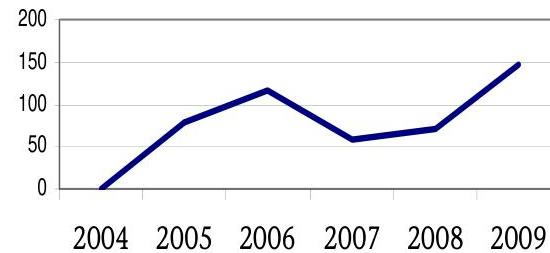
$2004 \quad 2005 \quad 2006 \quad 2007 \quad 2008 \quad 2009$
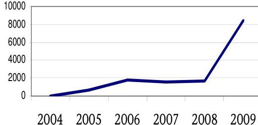
$2004 \quad 2005 \quad 2006 \quad 2007 \quad 2008 \quad 2009$

Forrás: VPOP OLAF Koordinációs Iroda
Az uniós források felhasználásának átláthatóságát rontotta, hogy nem kezeltek és nem is tartottak nyilván szabálytalanságként olyan, az uniós ellenőrzések következtében szabálytalanság miatt végrehajtott pénzügyi korrekciókat, átcsoportosításokat, amelyek hatásaként a hazai költségvetést több tízmilliárd forintos finanszírozási többlet terhelte (pl. Budapesti Szennyvíztisztító Telep, a 4-es Metró, az M0 és a 21. sz. fơutak tehermentesítése projektek).

A polgári jogi eljárás alkalmazása esetén a szabálytalansági döntéssel kapcsolatos fellebbezés során nem volt tisztázott, hogy mely bíróságnak - közigazgatási vagy polgári - kell eljárnia. A közigazgatási eljárás esetén a fellebbezés lehetősége mind első-, mind másodfokon megoldott volt.

A szabálytalanság-kezelés eredményességét hátrányosan befolyásolta a szabálytalansági eljárás időigényessége ( 4 és 509 nap között változott). A hazai jogszabályokban meghatározott szűk körű pénzügyi és jogi lehetőségek csökkentették a szabálytalanságtól visszatartó erőt. Az uniós szabályozás adta lehetőséggel ${ }^{25}$ ellentétben a hazai szabályozás (281/2006. (XII. 23.) Korm. rendelet) nem nevesítette a kiszabható szankciókat. Szankcióként a gyakorlatban főként a szerződéstől való elállást alkalmazták.

A szabálytalanságkezelés kritikus területe a jelentéstételi rendszer volt. Az ellenőrzések rámutattak, hogy a jelentések több esetben pontatlanok, hiányosak voltak, számszaki hibát tartalmaztak, illetve késedelmesen kerültek megküldésre.

[^0]
[^0]:    ${ }^{25}$ Az Európai Regionális Fejlesztési Alapra, az Európai Szociális Alapra és a Kohéziós Alapra vonatkozó általános rendelkezések megállapításáról szóló 1083/2006/EK tanácsi rendelet, valamint az Európai Regionális Fejlesztési Alapról szóló 1080/2006/EK európai parlamenti és a tanácsi rendelet végrehajtására vonatkozó szabályok meghatározásáról szóló, a Bizottság 2006. december 8-ai 1828/2006/EK Rendelete 5. cikk nevesíti a kiszabható szankciókat.

---

A szabálytalanság pontos definíciójának hiánya következtében eltérő gyakorlat alakult ki, hogy mely ügyeket kell szabálytalansági eljárás keretében kezelni, s ez alapján mely ügyekről kell jelentést készíteni.

A Bizottság által előírt elektronikus adatszolgáltatási rendszer (IMS ${ }^{26}$ ) teljes körű bevezetését hátráltatta, hogy az adatok két rendszerben (EMIR és IMS) való rögzítésének elkerülése érdekében az informatikai kapcsolat kialakítása csak a jövőben várható.

Az ÁSZ szabálytalanság-, adósság- és követeléskezeléssel kapcsolatos jelentése alapján az NFÜ-nek 4,79 Mrd Ft (EU forrás) tagállami kötelezettsége (adóssága) keletkezett, az általa alkalmazott (kedvezményezettnek fel nem róható), és a Bizottság által uniós szabályozástól eltérőnek minősített eljárások, jogszabályok miatt 2004-2009 között. Ez az összeg a strukturális támogatásokhoz kapcsolódó, el nem számolható kiadások (áfa, eszközbeszerzés) miatti pénzügyi korrekció volt, amit költségvetési forrásból kellett fedezni.

Az NFÜ kedvezményezettekkel szembeni szabálytalanság miatti követeléseinek összege 25,6 Mrd Ft (EU forrás) volt a 2004-2009 közötti időszakban, amelyből 6,5 Mrd Ft a strukturális támogatásokhoz és 19,1 Mrd Ft a Kohéziós Alap támogatásokhoz kapcsolódott.

Az uniós szintnek megfelelő 43,1\%-os behajtási arány (amely 40-44\% között mozgott) programonként változott, az NFT esetében valamivel az átlag alatt maradt (35,9\%), a PHARE esetében 62,5\%-os volt. Az NFÜ követelést nem írt le, a minősítéséhez, leírásához szükséges teljes körű szabályozás, eljárásrend nem állt rendelkezésre.

Az MVH-nak 2004-2009 között 3,64 Mrd Ft (EU forrás) Bizottsági visszavonása, tagállami kötelezettsége keletkezett, az általa alkalmazott, és a Bizottság által uniós szabályozástól eltérőnek minősített eljárások miatt. Az MVH kedvezményezettekkel szembeni követeléseinek összege 7,5 Mrd Ft (EU forrás) volt 20042009 között.

A 7,5 Mrd Ft-os követelésből 2,7 Mrd Ft megtérült 2009 végéig, azaz a behajtási arány $36 \%$-os volt az agrár- és vidékfejlesztési támogatások esetében. Ez megközelítette a 2008. évi uniós szintnek megfelelő arányt (37,5\%), azonban elmaradt az elmúlt tíz év uniós értékektől (40-55\% közötti értékek).

A 2009-re vonatkozó zárszámadás ellenőrzés megállapította, hogy a mérlegek több OP vonatkozásában tartalmaztak olyan követeléseket, amelyek elszámolására 2009. év folyamán már sor került. Ennek oka a számvitelt támogató informatikai rendszerek és a belső kontroll rendszer hiányosságaira vezethető vissza.

[^0]
[^0]:    ${ }^{26}$ „Irregularity Management System", szabálytalanság-kezelési rendszer.

---

# 3. Az Európai UniÓs FORRÁsOK FELHASZNÁLÁsÁVAL KAPCSOLATOS, A 2009-ES ÉVRE VONATKOZÓ ELLENŐRZÉSEK LEGFONTOSABB MEGÁLLAPÍTÁSAI, KÖVETKEZTETÉSEI 

### 3.1. A 2000-2006-os programozási periódus támogatásai

### 3.1.1. Nemzeti Fejlesztési Terv

Hazánk az Európai Unió Strukturális Alapjainak az ún. 1. célkitűzéséből részesült támogatásból, amelynek feladata a gazdaságilag elmaradt régiók fejlődésének és strukturális átalakulásának elősegítése.

A támogatások felhasználásának stratégiai terve, a Nemzeti Fejlesztési Terv (NFT) és annak pénzügyi kerete, a Közösségi Támogatási Keret általános és specifikus célkitűzéseit, illetve a célkitűzés megvalósítását szolgáló négy ágazati és egy regionális operatív programot a 7. sz. ábra mutatja be.

## 7. ábra

## A KTK célkitűzései

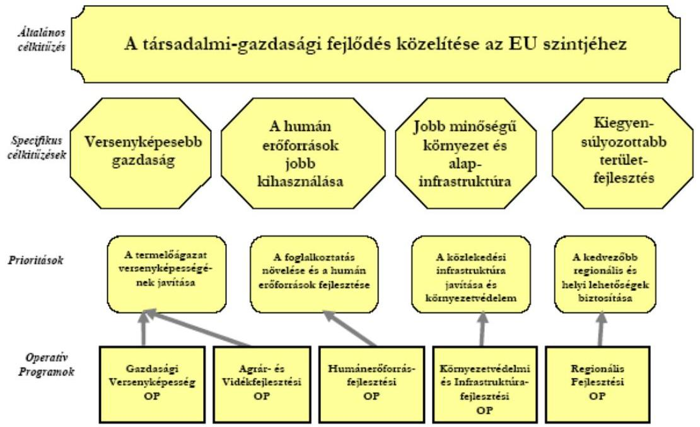

Az öt operatív programra a 2004-2006 közötti időszakra összesen 2696,2 M euró ( 687,5 Mrd Ft) keret állt rendelkezésre ${ }^{27}$, amelyből az uniós hozzájárulás 1995,7 M eurót (508,9 Mrd Ft-ot) tett ki.

[^0]
[^0]:    ${ }^{27}$ A támogatási összegeket 255-ös Ft/euró árfolyamon számították át, kivéve az Európai Bizottságtól igényelt és az Európai Bizottság által átutalt összegeket. A támogatási öszszegek - ahol nem szerepel külön megbontás - tartalmazzák a közösségi, a nemzeti központi és a nemzeti helyi forrásokat is.

---

A Nemzeti Fejlesztési Terv pályázati kiírásaira, azok 2004. januári megjelenésétől 42,8 ezer db pályázat érkezett be. A kötelezettségvállalások (IH által támogatási szerződéssel lekötött összegek) értéke a program pénzügyi zárásakor 727 Mrd Ft-ot tett ki, közel 20 ezer pályázat támogatásával.

A Magyar Állam 2004. április 30-án egy 445 M euró összegű hitelkeretmegállapodást írt alá az Európai Beruházási Bankkal, amely a 2004-2006-os pénzügyi időszak Strukturális Alap támogatásokhoz kapcsolódó központi költségvetési rész finanszírozását szolgálta a Közösségi Támogatási Keret Operatív Programjait (kivéve AVOP) illetően. 2008 márciusáig a teljes hitelkeret lehívásra került.

Az Európai Bizottság a benyújtott időközi kifizetési kérelmek alapján a keret 95\%-áig finanszírozta az operatív programokat, az utolsó 5\% átutalására a pénzügyi zárást követően kerül majd sor.

Az abszorpció növelése érdekében Magyarország kérelmet nyújtott be a Bizottsághoz, amelyben a GVOP, a KIOP, a HEFOP, az AVOP és az EQUAL Közösségi Kezdeményezéssel kapcsolatos kiadások támogathatóságára megállapított határidő 2009. június 30-ig történő meghosszabbítását kérte. A Bizottság határozatában az elszámolhatósági időszak meghosszabbítását engedélyezte.

A fentieknek megfelelően az NFT OP-k zárása két szakaszban valósult meg. A ROP zárási dokumentumait (záró végrehajtási jelentés, záró költségnyilatkozat, záró beszámoló és zárónyilatkozat) 2010. március 31-ig, a GVOP, a KIOP, a HEFOP, az AVOP és az EQUAL Közösségi Kezdeményezés záró dokumentumait 2010. szeptember 30-ig küldték meg az Európai Bizottság részére.

# A Nemzeti Fejlesztési Terv végrehajtása pénzügyi (abszorpciós) szempontból (az operatív programok zárási adatait figyelembe véve) eredményesnek értékelhető. Az NFT abszorpció összességében meghaladta a 100\%-ot, jelentősebb elmaradás csak az EQUAL Közösségi Kezdeményezés esetében volt tapasztalható (8. ábra). Több program esetében (GVOP, HEFOP-ERFA, ROP-ERFA) az abszorpció 100\% feletti, de az Európai Bizottság csak a keret erejéig állta a támogatásokat, az ezt meghaladó túlvállalásokat a hazai költségvetés finanszírozta. A kedvező pénzügyi teljesítést segítette az ún. 10\%-os rugalmassági szabály, amely az OP-n belül átcsoportosítási lehetőséget jelentett az intézkedések között (az ún. jól teljesítő intézkedések kompenzálták a rosszabbul teljesítők elmaradását). 

A záró végrehajtási jelentésekben az irányító hatóságok bemutatták az operatív programok megvalósításának nyomon követését biztosító indikátorok teljesülését. A végrehajtási időszak alatt (több esetben jelentősen) módosított prog-ram- és projektszintű indikátorok ${ }^{28}$ jellemzően teljesültek. A számszerűsíthető mutatók teljesülésének elemzésekor figyelembe kell azonban venni, hogy valamennyi OP esetében szükségessé vált a számszerúsíthető mutatók felülvizsgálata. Az OP-kat érintő külső értékelések megállapították többek között, hogy a

[^0]
[^0]:    ${ }^{28}$ Az indikátorokat valamennyi OP esetében felülvizsgálták és szükség szerint azok definícióját, tartalmát, célértékét módosították.

---

program szintű indikátorok nem tükrözték vissza az OP által lefedett intézkedéseket, elmaradt a kiinduló és célértékek meghatározása, illetve egyes indikátorok nem voltak alkalmasak az eredmények számszerűsítésére.

# 8. ábra 

Az NFT OP-k és az EQUAL Közösségi Kezdeményezés abszorpciója

Forrás: NFÜ - az Operatív Programok záró végrehajtási jelentései
Az indikátorokra vonatkozó értékelések tapasztalatai nagyban hozzájárulhatnak a következő, 2014-2020-as programozási időszak közeljövőben induló hatékony tervezéséhez.

A KEHI elvégezte az operatív programok 2009. évi rendszerellenőrzését, amely során az operatív programok zárására történő felkészülést, valamint a korábbi ellenőrzések során tett javaslatok teljesülésének nyomon követését és a szabálytalanságkezelés megfelelőségét vizsgálta.

A rendszerellenőrzések a HEFOP és KIOP vonatkozásában zárással kapcsolatban szabályozási hiányosságokat állapítottak meg. A GVOP és az EQUAL esetében a felelős intézmények alapvetően megteremtették a zárási feladatok szabályszerű és hatékony elvégzésének alapjait. A KIOP-ot és a HEFOP-ot érintően a korábbi ellenőrzések során vállalt intézkedések végrehajtása, illetve nyilvántartása nem volt teljes körűen biztosított. A szabálytalansági eljárásokkal kapcsolatban rámutatattak a jelentési rendszer hiányosságaira a HEFOP és a KIOP vonatkozásában. Az AVOP tekintetében a zárás lebonyolítását, az intézkedések nyomon követését, valamint a szabálytalanság-kezelést érintően kisebb hiányosságokat tártak fel. A szabálytalanság-kezelést a KEHI a programzárás szempontjából magas kockázatúnak ítélte meg.

---

A 2005-2009 között lefolytatott mintavételes ellenőrzések során szabálytalansággal érintett összegek az OP-k és az EQUAL Közösségi Kezdeményezést érintően nem érték el az ellenőrzési módszertan alapján alkalmazott (az összes ellenőrzött költségre vetített) 2\%-os lényegességi küszöböt.

A zárónyilatkozat kiadását megelőző ellenőrzés megállapította, hogy a korábbi ellenőrzések során feltárt hiányosságok felszámolására tett intézkedések összességében megvalósultak, ésszerű bizonyosság állt rendelkezésre program keretében lezárt múveletek jogszerúsége és szabályszerűsége tekintetében.

A GVOP esetében a korábbi ellenőrzésekhez kapcsolódó intézkedéseket csak részben hajtották végre, ezek hiánya azonban a zárás folyamatát nem befolyásolta.

Az ellenőrzés megállapította, hogy a Kifizető Hatóság által benyújtott végső egyenleg átutalási dokumentáció, valamint az IH által összeállított végső végrehajtási jelentésben, valamint annak részét képező végleges projektlistában és a szabálytalansággal érintett összegek visszaköveteléséről készített kimutatásban szereplő adatok valósak és helytállóak.

A KIOP vonatkozásában a zárás szempontjából az ellenőrzés a 4. cikk szerinti ellenőrzések végrehajtásában feltárt hiányosságokat közepes kockázatúnak, a szabálytalansági eljárásokat, döntésekkel kapcsolatos gyakorlatot magas kockázatúnak ítélte. A GVOP esetében a végső egyenleg átutalás dokumentáció fordulónapján 60 (esetlegesen pénzügyi következményekkel járó) szabálytalansági eljárás még folyamatban volt.

A Zárónyilatkozat Kiadásért Felelős Szerv - tekintettel a szabálytalanságkezelés területén feltárt hiányosságokra, valamint a zárást megelőző ellenőrzése keretében két (le nem zárt) projekttel kapcsolatban tett megállapításokra - a KIOP vonatkozásában minősített zárónyilatkozatot adott ki. A GVOP lebonyolítását az ellenőrzés megfelelőnek találta, de - figyelemmel a 60 db folyamatban lévő, nem lezárt szabálytalansági eljárásra, azok esetleges eredményére, továbbá a lehetséges pénzügyi következményekre - korlátozott zárónyilatkozat került kiadásra. Az AVOP-EMOGA vonatkozásában korlátozott zárónyilatkozat került kiadásra az 57 db függő ügy (ebből 52 szabálytalansági eljárás) és azok pénzügyi kockázata következtében.

A Zárónyilatkozat Kiadásért Felelős Szerv a lefolytatott ellenőrzések, illetve a megvizsgált dokumentumokban (végső végrehajtási jelentés, annak részét képező projektlista és szabálytalanságlista, valamint a végső költségnyilatkozat) foglaltak alapján a végrehajtást az AVOP-HOPE, ROP, HEFOP és EQUAL esetében összességében rendben találta, nem-minősített véleményt bocsátott ki.

A Vám- és Pénzügyőrség a magas kockázatúnak ítélte, hogy elsősorban a záráshoz kapcsolódó, a Zárónyilatkozat Kiadásért Felelős Szerv által végzett ellenőrzés hatására történik meg a szabálytalansági ügyek és jelentések „rendbetétele", amely feltehetően fokozottabb uniós ellenőrzési tevékenységet fog kiváltani.

A 2009-ben lefolytatott, illetve lezáródó uniós ellenőrzések (Európai Bizottság, Európai Számvevőszék) a KIOP-ra vonatkozóan a közbeszerzések lebonyolítá-

---

sával és a költségek elszámolhatóságával kapcsolatban tett megállapítást, valamint a HEFOP-ot érintően a visszakövetelésből befolyt összegek nyilvántartásával kapcsolatos kisebb hiányosságot tárt fel.

Az NFT abszorpciós, azaz pénzügyi teljesülésének értékelése mellett - a záráshoz kapcsolódóan is - egyre nagyobb hangsúlyt kell az eredményességi célok teljesülésének értékelésére és a következtetések levonására helyezni. A programok eredményességének értékelésére a teljes zárási folyamatok EU Bizottság általi lezárását követően lesz lehetőség.

A jelenleg rendelkezésre álló adatok alapján előrevetíthető, hogy a stratégiai dokumentumokban megfogalmazott kiemelt célok (területi kohézió erősítése, gazdasági növekedés és foglalkoztatás bővítése), illetve az átfogó célok (gazdasági növekedés és foglalkoztatás növekedésének ösztönzése) többek között a külső környezet kedvezőtlen változásai, a globális gazdasági válság, a költségvetési kiigazítás, illetve a konvergenciaprogram hatásai miatt várhatóan nem teljesülnek.

Az értékelések kiemelték, hogy a fejlesztési célkitúzések megvalósulása sok részterületen pozitív hatást fejtett ki, kedvezőtlen megállapításokat fogalmaztak meg azonban a programok lebonyolítása (pályázati rendszer, indikátorok, horizontális célok érvényesülése) kapcsán.

# 3.1.2. Kohéziós Alap 

A 2007-2013-as programozási periódus kezdetével változott az irányító hatóság, illetve a közlekedési szektor közreműködő szervezetek belső felépítése és elnevezése. Az irányító hatóság teendőit 2009-ben a Nemzeti Fejlesztési Ügynökségen belül működő Környezetvédelmi Operatív Programok Irányító Hatóság (KEOP IH) látta el, amely felelős volt a KEOP megvalósításáért is.

A környezetvédelmi programok esetében a Közreműködő Szervezet szerepét a KvVM Fejlesztési Igazgatósága, a közlekedési szektorban pedig a KIKSZ Közlekedésfejlesztési Zrt. (KIKSZ Zrt.) látta el.

A KEHI, mint Zárónyilatkozat Kiadásáért Felelős Szerv végezte a rendszer- és a 15\%-os (mintavételes) ellenőrzéseket, továbbá a projektek végső elszámolásához kapcsolódó zárónyilatkozat kiadásához szükséges ellenőrzéseket. Az IH, KH , valamint a KSZ-ek belső ellenőrzését a szervezeteken belül kialakított belső ellenőrzési részlegek látták el. A Kifizető Hatóság ezen túlmenően a kiadások megfelelő igazolása érdekében a pénzügyi lebonyolítás tekintetében a teljes rendszer ellenőrzésére volt jogosult.

A 2000-2006-os időszakban a KA-ból rendelkezésre álló 1500 M euró közösségi támogatás felhasználására 2010. december 31-ig van lehetőség. Az IH 2010 során egyes 2004-ben indult környezetvédelmi projektek esetében 2011. december 31-ig, illetve 2012. december 31-ig való hosszabbítást kérelmezett az Európai Bizottságtól, a döntésről a Tájékoztató lezárásakor nem állt rendelkezésre információ.

---

A projektekre az Uniós források kifizetéseinek teljesítését 2010. december 31-ig kell lezárni, a határidőn túl bármilyen késés esetén a fennmaradó összeg a hazai költségvetést terheli majd. A projektek zárásakor a Kohéziós Alapra vonatkozó finanszírozási szabályok szerint az EU támogatás utolsó 20\%-át az EU Bizottság visszatartja. Az Uniós finanszírozás utolsó 20\%-ának a költségvetés XLII. A központi költségvetés fő bevételei fejezetbe a 2010-2012. évek során történő utalásának feltétele a záró jelentések jóváhagyása az EU Bizottság részéről.

2009-ben a kifizetések összességében jóval meghaladták a költségvetésben megtervezett eredeti kiadási előirányzatokat. Az eredeti 59,5 Mrd Ft előirányzathoz képest jelentős, 123,4 Mrd Ft összegű teljesítés történt, amelyből az uniós hozzájárulás 67,4 Mrd Ft-ot tett ki.

A korábbi évek növekedését folytatva a Kohéziós Alapból támogatott projektek 2009. év végéig az alábbi eredményeket érték el:

- a kiviteli szerződéssel való lekötés környezetvédelmi projekteknél a várható összköltség 93\%-át (EU támogatási részének 88\%-át), a közlekedési projekteknél $83 \%$-át (EU támogatási részének $82 \%$-át) érte el;
- a környezetvédelmi szektorban a KA támogatási keret 72\%-át (EU támogatási részének $67 \%$-át), a közlekedési szektorban $85 \%$-át (EU támogatási részének $84 \%$-át) fizették ki az elvégzett teljesítményekkel arányosan a kivitelezők részére.
- A kifizetett támogatásoknak az Európai Bizottság felé való elszámolása eredményeképpen 2009-ben összesen 161,4 M euró támogatás átutalására került sor, ez 45,3 Mrd Ft lehívásnak felelt meg (280,6 Ft/euró árfolyamon számolva). A kumulált adatok alapján 2009. december 31-ig a környezetvédelmi szektorban az EU Bizottság felé benyújtott átutalási igény 377,92 M euró, amelyből 2009. év végéig 345,42 M euró folyt be a hazai költségvetésbe (a teljes elszámolható költség 49\%-a, az EU támogatási rész 45\%-a). A közlekedési szektorban a benyújtott kumulált átutalási igény 420,79 M euró volt, amelyből 390,10 M euró folyt be a hazai költségvetésbe (a teljes elszámolható költség 57\%-a, az EU támogatási rész 53\%-a).

A 2009. évi rendszerellenőrzés a Kohéziós Alap lebonyolítási folyamatban a projektek zárására történő felkészülésre, valamint a szabálytalanságkezelés megfelelőségére koncentrált. A rendszerellenőrzés megállapította, hogy a Kohéziós Alap irányítási rendszere a támogatások céljának megfelelően működött, azonban több magas kockázatú, rendszerjellegú hibát tárt fel. A projektzárásra való felkészülés, a szabálytalanság-kezelés és az IH ellenőrzési nyomvonalának hiányosságai veszélyeztették a projektek zárásának folyamatát, valamint kockázatot jelentettek a zárónyilatkozatok határidőben történő kiadására. Az intézményrendszer nem teljes mértékben tartotta be a zárási határidőket, több szervezet belső szabályozása nem volt összhangban a vonatkozó jogszabályokkal. Rendszerjellegű hiányosságok merültek fel a működési kézikönyvvel és az ellenőrzési nyomvonallal kapcsolatosan a KSZ-eknél és egy kedvezményezettnél. Az EMIR-feltöltöttség szintje nem volt megfelelő. A szabálytalansági eljárások az esetek többségében jelentősen elhúzódtak.

A mintavételes ellenőrzések során az ellenőrzött összegekre vonatkozó hibaarány a szabálytalansági gyanú tekintetében elérte a 18,2\%-ot (a módszer-

---

tanban meghatározott 2\%-kal szemben). Négy projekt esetében állapított meg szabálytalansági gyanút az ellenőrzés; lényeges hiba elsősorban a közbeszerzési eljárásokkal kapcsolatban merült fel.

A PM NAO Iroda Belső Ellenőrzési Egysége 2009 során vizsgálta, hogy a Kohéziós Alap projektek - különös tekintettel a zárásokra - végrehajtásához kapcsolódó feladatokat az Iroda megfelelően végezte-e. A vizsgálat során megállapították, hogy a Kifizető Hatóságnak a Kohéziós Alappal kapcsolatos folyamatai a Múködési Kézikönyvnek és a vonatkozó jogszabályoknak megfelelően múködtek. A pénzügyi kimutatások naprakészek és pontosak voltak, azonban a számviteli beszámoló nem készült el a vizsgálat lezárásáig ${ }^{29}$.

Az NFÜ KIKSZ Zrt.-t érintő ellenőrzése megállapította, hogy a KSZ hiányosan és nem következetesen vezette az EMIR-t és nem tartotta be a Múködési Kézikönyvben foglaltakat. Több projekt esetén a Támogatási Szerződések, Vállalkozói Szerződések módosítása hiányos volt, nem volt lehetséges az adatok visszaellenőrzése az EMIR-ben.

Az Állami Számvevőszék a zárszámadás keretében szabályszerűségi ellenőrzést végzett a Kohéziós Alap kifizetéseire vonatkozóan, valamint 2009-ben két alkalommal vizsgálta a Kohéziós Alapból és hazai forrásból finanszírozott környezetvédelmi projekteket a teljesítmény-ellenőrzés módszerével, az eredményességi és hatékonysági szempontokra összpontosítva.

A szilárdhulladék-gazdálkodás ellenőrzéséről szóló jelentés ${ }^{30}$ rámutatott a források hasznosulásának többéves késedelmére, a célok teljesítésében mutatkozó elmaradásra, valamint a költségvetést terhelő többletkiadásokra. A főbb megállapítások között szerepelt, hogy a hulladékképződés-megelőzési célt szolgáló szabályozások nem voltak kellően eredményesek. Nem dolgozták ki a hulladékhasznosítást támogató rendszert; a szelektíven összegyűjtött hulladék értékesíthetőségének problémái, illetve az emiatt mutatkozó bevételkiesés veszélyeztetette a szelektív hulladékgyűjtő rendszerek fenntarthatóságát. A hulladék energetikai hasznosításának feltételei és a hulladék előkezelésének technikái nem voltak biztosítottak. A hulladék égetőműben történő égetését kapacitáskorlátok akadályozták.

A szennyvíztisztítási projektek értékelését célzó vizsgálat ${ }^{31}$ megállapította, hogy a szennyvíztisztítási projekteket a hazai fejlesztésekkel párhuzamosan, a hazai és az uniós források harmonizációja és összehangolása nélkül, pályázatarányos forrásbőség mellett, közbeszerzési szabálytalanságokkal és lekötetlen kapacitás-többletek kialakításával valósították meg, amely kihatott a projektek tervezésére és megvalósítására. Háttérbe szorult a költséghatékonysági szempontok érvényesítése, a támogatás-közvetítő intézmények és a kedvezményezettek nem értékelték a források felhasználásának hatékonyságát. A vízi közmú létesítmények pénzügyi fenntarthatóságához nem szabályozták az országosan

[^0]
[^0]:    ${ }^{29}$ Forrás: Pénzügyminisztérium Nemzeti Programengedélyező Iroda Belső Ellenőrzési Egység - Éves ellenőrzési jelentés 2009. (2010. március 15.)
    ${ }^{30} 0920$ sz. ÁSZ Jelentés.
    ${ }^{31} 0948$ sz. ÁSZ Jelentés.

---

egységes díjképzést, a rekonstrukciós, illetve amortizációs terv készítést. Ezek hiányában a pénzügyi fenntarthatóság garanciái hiányosak voltak, nem volt árhatósági kontroll.

Az Európai Bizottság 2007 végén és 2008 elején végzett auditjai során kifogásokat emelt a Budapesti Központi Szennyvíztisztító Telep 2005-ös közbeszerzési eljárásának lefolytatásával kapcsolatban. Az ellenőrzés eredményeként a Bizottság az eredetileg tervezett támogatásból megvont $40,5 \mathrm{M}$ eurót (mintegy 10,5 Mrd Ft-ot), amit a magyar félnek kellett pótolni, viszont egyidejúleg engedélyezte a 40,5 M euró felhasználását új létesítményekre.

Az Európai Bizottság 2009 decemberében helyszíni ellenőrzése keretében vizsgálta a NFT/ERFA, KA programoknál azon közbeszerzések szabályosságát, amelyek esetében tárgyalásos eljárás lefolytatására került sor, vagy az eredeti szerződés összegének 10\%-át meghaladó összegben pótmunka került elszámolásra. Az előzetes ellenőrzési megállapításokat tartalmazó jelentés az irányítási és ellenőrzési rendszer megfelelő múködését állapította meg, azonban három projekt esetében közbeszerzési szabálytalanság történt. Ezek kapcsán a Bizottság pénzügyi korrekciót állapított meg.

Az Európai Számvevőszék 2009 júliusában és szeptemberében nyolc magyarországi Kohéziós Alap projektet vizsgált a 2009-es megbízhatósági nyilatkozathoz kapcsolódóan, összesen 38,6 M euró összegű Bizottsági kifizetést érintve. A 2010 júliusában megküldött lezáró levélben az ECA egy projektnél állapított meg kisebb rendú hiányosságot.

A Zárónyilatkozat Kiadásáért Felelős Szerv 2009. év során két zárónyilatkozat kiadását megelőző ellenőrzést folytatott le, szektoronként egy projektet ellenőrzött. Mindkét esetben korlátozásmentes zárónyilatkozat kiadására került sor.

A mintavételes ellenőrzések eredménye következtében a Zárónyilatkozat Kiadásáért Felelős Szerv kiemelten kezeli a szerződéskötések és módosítások szabályszerűségének vizsgálatát és a szabálytalansági eljárásokat lezáró döntések megalapozottságát a zárónyilatkozatok kiadását megelőző ellenőrzések során.

# 3.1.3. INTERREG programok 

A 2005-ben indult INTERREG III programok fő célja a határ menti régiók gazdasági és társadalmi kohéziójának erősítése a határ menti együttmúködések támogatásával.

Magyarország összesen 9 INTERREG programban vett részt 2004-2006 között, amelyek keretében 68,7 M euró ERFA összegű támogatást kapott 18,1 M euró társfinanszírozással kiegészítve.

Négy INTERREG IIIA típusú, határ menti együttmúködés (Ausztria-Magyarország INTERREG IIIA Közösségi Kezdeményezés Program (AT-HU), Szlovénia-Magyarország-Horvátország Szomszédsági Program (SLO-HU-CRO), Magyaror-szág-Szlovákia-Ukrajna Szomszédsági Program (HU-SK-UA), MagyarországRománia és Magyarország-Szerbia és Montenegró Határ Menti Együttmúködési

---

Program (HU-RO-SCG)) mellett részt vettünk egy INTERREG IIIB típusú transznacionális programban és négy INTERREG IIIC típusú interregionális programban.

A Nemzeti Fejlesztési Ügynökség a HU-SK-UA és HU-RO-SCG programok esetében Irányító Hatóságként, az AT-HU és a SLO-HU-CRO programok esetében Nemzeti Hatóságként felelt a végrehajtásért, a közös technikai titkársági és közremúködő szervezeti feladatokat a VÁTI Nonprofit Kft. látta el. A Kifizető Hatóság, illetve Al-kifizető Hatóság feladatait a Pénzügyminisztériumon belül múködő NAO Iroda, illetve a VÁTI Nonprofit Kft. látta el. A KEHI (2010. július 1-jét követően az EUTAF) volt felelős a rendszer- és az 5\%-os mintavételes ellenőrzések elvégzéséért, valamint a támogatás megszűnésekor kiállítandó záró beszámoló és (al-)zárónyilatkozat elkészítéséért.

Az INTERREG IIIA programjai keretében a magyar oldalon összesen 388 határ menti és 65 transznacionális/interregionális projekt megvalósítására került sor. A kerettúlvállalásnak köszönhetően az eredeti keret 106\%-ára történt szerződéskötés.

2010 során megtörtént az AT-HU, HU-SK-UA, HU-RO-SCG és a SLO-HU-CRO INTERREG IIIA programok zárása: a KEHI (2010. július 1-jétől az EUTAF) a jogszabályoknak megfelelően kiállította a záró beszámolókat és (al)zárónyilatkozatokat. A záró beszámolókban összefoglalta a 2005-2009. években lefolytatott ellenőrzések főbb megállapításait, valamint megvizsgálta a korábbi közösségi és nemzeti ellenőrzések dokumentumait is.

A 2009. évi rendszerellenőrzés a programzárásra történő felkészülésre, valamint a korábbi ellenőrzések során tett javaslatok teljesülésének nyomon követésére és a szabálytalanságok kezelésére irányult. Mindhárom program esetében hiányosság volt a határidők szempontjából, hogy a zárásban résztvevő szervezetek nem készítettek belső eljárásrendet, ellenőrzési nyomvonalakat az egyes folyamatokra. A korábbi ellenőrzések során javasolt intézkedések megfelelően megvalósultak, a szabálytalanságkezelést is kielégítőnek ítélte az ellenőrzés.

Az IMIR rendszer múködésének tapasztalatai pozitív változást mutattak. A korábbi vizsgálatok során feltárt hibákat, hiányosságokat a felelős szervek megszüntették, az INTERREG IIIA programok zárási folyamatának megbízható informatikai támogatását hátrányosan befolyásoló kockázati tényezőket elhárították. Ugyanakkor SLO-HU-CRO és AT-HU programok pénzügyi kereteivel kapcsolatban az IMIR nem naprakész adatokat tartalmazott, ezért a Zárónyilatkozat Kiadásáért Felelős Szerv indokoltnak tartotta a zárás megkezdése előtt fennmaradó eltérések egyeztetését, mivel ez magas kockázatot jelentett az egyes tag- és partnerállamoknál nyilvántartott adatok koherenciájával kapcsolatban. 2010. január 31-ig teljesültek az IMIR zárást követő időszakra vonatkozó üzemeltetésével, éles üzemben tartásával kapcsolatos ajánlások, az NFÜ megállapodást kötött a VÁTI Nonprofit Kft.-vel az IMIR további üzemeltetésére.

A Zárónyilatkozat Kiadásáért Felelős Szerv a hibák mérsékelt előfordulását állapította meg; ezeket a lebonyolításban résztvevő szervezetek megfelelően kezelték. A Zárónyilatkozat Kiadásáért Felelős Szerv ésszerű bizonyosságot szerzett a porgram keretében lezárt műveletek jogszerűsége és szabályszerűsége tekintetében. A hiányosságok a rendszer szabályszerű, átlátható működése,

---

továbbá az ellenőrizhetőség szempontjából alacsony kockázatúnak minősültek. A rendszerellenőrzések során visszafizetést eredményező szabálytalanság feltárására nem került sor.

Mintavételes ellenőrzésre 2009. évben csak a HU-RO-SCG program esetében került sor. A három kiválasztott projekt vonatkozásában feltárt hiányosságok eseti jellegűek voltak, amelyeket az intézményrendszer megfelelően kezelt. A KEHI a szabálytalanságok alacsony gyakoriságát állapította meg; a pénzügyi korrekcióval érintett hibák eseti jellegűnek minősültek, a pénzügyi rendezés megtörtént.

A zárást megelőző rendszerellenőrzések vizsgálata és értékelése alapján a Zárónyilatkozat Kiadásáért Felelős Szerv összességében mindhárom program vonatkozásában korlátozás nélküli (al-)zárónyilatkozat kiadását javasolta.

A PM NAO Iroda Belső Ellenőrzési Egységének 2009 folyamán végzett ellenőrzése megállapította, hogy az Iroda megfelelően végezte az INTERREG programok végrehajtásához kapcsolódó feladatokat, azonban az EMIR végleges zárása, az adott évre vonatkozó végleges főkönyvi kivonat, illetve az éves számviteli beszámolók elkészítése az ellenőrzés lezárásának időpontjáig nem történt meg ${ }^{32}$. Az INTERREG folyamatok ellenőrzése tárgyú, 2010. május 12-én lezárt pénzügyi ellenőrzési jelentés már a 2005., 2006., 2007. és 2008. évi számviteli beszámolók elkészültéről számolt be.

# 3.1.4. Schengen Alap 

A Schengen Alap 2004-2006 között pénzügyi segítséget nyújtott az érintett tagállamoknak annak érdekében, hogy az EU új külső határain a schengeni vívmányok érvényesülését és a külső határellenőrzés előírt feltételeit biztosíthassák.

A Csatlakozási Szerződés Magyarország számára mintegy 165,8 M eurót biztosított a három éves időtartamra. A Schengen Alap terhére a 2006. december 31-ig tartó szerződéskötési határidőre közel 300 szerződéskötés valósult meg, a források lekötési aránya pedig elérte a $99,8 \%$-ot. A fejlesztések megvalósítása határidőre, 2007. szeptember 30-ig lezárult, a kifizetések a 2007. december 31-i határidőre teljesültek.

A program szakmai és pénzügyi teljesítéséről szóló Zárójelentést a Felelős Hatóság véglegesítette, a Schengen Alap Tárcaközi Bizottság jóváhagyta, a KEHI az ellenőrzések alapján a vonatkozó költségigazolást kiállította. A Zárójelentést a Felelős Hatóság megküldte az Európai Bizottságnak.
2008. szeptember 8-19. között az Európai Bizottság lefolytatta a Schengen Alap záróaudithoz kapcsolódó pénzügyi, majd 2009 februárjában helyszíni ellenőrzéseit, amelynek keretében az érintett hazai intézményeknél vizsgálatokat foly-

[^0]
[^0]:    ${ }^{32}$ Forrás: Pénzügyminisztérium Nemzeti Programengedélyező Iroda Belső Ellenőrzési Egység - Éves ellenőrzési jelentés 2009. (2010. március 15.)

---

tatott. Az ellenőrzés keretében a Bizottság megállapította az általa a Schengen Alap terhére előzetesen elszámolhatónak tekintett összeget, amelynek egyeztetése a Tájékoztató lezárásakor folyamatban volt.

Az ellenőrzésekről 2009-ben megküldött Jelentéstervezet értelmében az Európai Bizottság előzetes álláspontja el nem számolható költségeket állapított meg, amelyet a magyar fél vitatott. Az Európai Bizottság 2010 áprilisában megküldte a („jogosulatlanul felhasznált" pénzeszközöket és a visszakövetelt forrást megállapító) végleges Zárójelentését, amelynek megvitatására Magyarország konzultációs lehetőséget kért az Európai Bizottságtól.

# 3.1.5. Átmeneti Támogatás 

A csatlakozás időpontja és 2006 vége közötti időszakban az Európai Unió ideiglenes pénzügyi támogatást nyújtott az új tagállamoknak a közösségi jogszabályok végrehajtása és érvényesítése terén igazgatási kapacitásaik fejlesztésére és megerősítésére, valamint a bevált gyakorlatok kölcsönös cseréjének előmozdítására.

Magyarország számára a három éves Átmeneti Támogatás program keretében az Európai Unió által megítélt teljes támogatás értéke 37,07 M euró volt, amelyhez a nemzeti társfinanszírozás összege közel 11,19 M euróval járult hozzá (ez nem tartalmazta az áfa összegét).

Az Átmeneti Támogatás célkitűzései, eljárásrendje és intézményrendszere tekintetében a PHARE program intézményfejlesztési fejezete továbbélésének tekinthető. A programozásért, a program tervezéséért, felügyeletéért és értékeléséért a Nemzeti Segélykoordinátor (az NFÜ-t felügyelő miniszter), a közbeszerzés, a szerződéskötés és a kifizetések lebonyolításáért a Központi Pénzügyi és Szerződéskötő Egység, mint végrehajtó ügynökség, a projektek műszaki kivitelezéséért, a projektek igazgatási és pénzügyi végrehajtásáért a szakmai programfelelős tisztviselők voltak felelősek. Az Átmeneti Támogatás pénzeszközök végrehajtását illetően a Nemzeti Programengedélyező bírt átfogó hatáskörrel és felelősséggel.

A 2004. évi allokációból finanszírozott projektek esetében a kifizetési határidőig a leszerződött uniós forrás $96,5 \%$-a, a lekötött hazai társfinanszírozás $98,7 \%$-a került kifizetésre, amely program szinten $97 \%$-ot jelentett. A 2005. évi keretből a leszerződött összeg 96,9\%-ának kifizetése történt meg a kifizetési határidőig; a társfinanszírozás összegének $91,1 \%$-át szerződték le és ezen leszerződött öszszeg $98,91 \%$-át fizették ki.

A 2006-os program tekintetében a leszerződött EU-s támogatás 96,9\%-át és a nemzeti társfinanszírozás $95,5 \%$-át sikerült kifizetni 2010. június 15 -ig. A projektek szakmai és pénzügyi végrehajtása 2010-ben lezárult.

A 2004/016-954-es, ún. horizontális programra lekötött uniós összeg 97,3\%-a ( 0,6 M euró), a lekötött hazai társfinanszírozás $97,3 \%$-a ( $0,2 \mathrm{M}$ euró) került kifizetésre.

A KEHI 2009-ben nem végzett rendszerellenőrzést; egy projekt mintavételes ellenőrzése kezdődött meg, amelyet az éves ellenőrzési jelentés kiadásának idő-

---

pontjában (2010. június) még nem véglegesítettek. A 2008. évről szóló jelentésben szereplő két projekt ellenőrzése során korábban javasolt intézkedések megvalósultak, valamint a külső tanácsadó cég bevonásával lefolytatott, NFÜ által végzett rendszerellenőrzés kapcsán tervezett intézkedések alapvetően teljesültek.

A PHARE vonatkozásában az ellenőrzési feladatok 2009-ben a program lezárása következtében a projektek szabályszerűségének vizsgálatára koncentráltak. A KEHI a tárgyévben egy mintavételes ellenőrzést kezdett meg, amelyet az éves ellenőrzési jelentés kiadásának időpontjában (2010. június) még nem véglegesített. A 2008-ban vizsgált programot érintő intézkedési terv megvalósulása megfelelően haladt.

A PM NAO Iroda álláspontja szerint a PHARE programok zárása rendkívül hosszadalmasan történt, főként a Bizottság hozzáállása, illetve a hazai intézményrendszer szereplőinek fluktuációja miatt. 2009-ben 49 Phare programot sikerült lezáratni a Bizottsággal, legtöbbet az 1990-es években futó programok közül ( 40 db ). 2009. évben két alkalommal került sor szabálytalansági gyanú kivizsgálására: mindkét esetben szabálytalanság történt és a kedvezményezett visszafizette a teljes projektösszeget.

# 3.1.6. Az EGT és Norvég Finanszírozási Mechanizmusok program 

Az EGT és Norvég Finanszírozási Mechanizmusok támogatási konstrukciókat Norvégia, Izland és Liechtenstein annak érdekében hozták létre 2004-ben, hogy elősegítsék a társadalmi és gazdasági kohézió megteremtését a kibővült Európai Gazdasági Térségben. A két támogatási alap eljárásrendjükben egységesnek tekinthetőek, egységes szabályrendszer vonatkozott rájuk. Magyarország számára 2004-2009 közötti időszakban - a menedzsment költségeket is beleértve - összesen 135 M euró állt rendelkezésre.

A finanszírozási mechanizmusok magyarországi végrehajtásáért a Nemzeti Fejlesztési Ügynökség Nemzetközi Együttmüködési Programok Irányító Hatósága mint Nemzeti Kapcsolattartó volt felelős. A program nemzetközi koordinációját a brüsszeli székhelyű Finanszírozási Mechanizmus Iroda végezte. A közreműködő szervezet feladatait a KPSZE, majd megszüntetésével a NEP IH, a később megkezdődő átadással a VÁTI Nonprofit Kft. látta el, a Kifizető Hatóság pedig a Pénzügyminisztérium NAO Irodán belül múködött. A szakmai teljesítésigazolásért a szakmailag illetékes minisztériumok voltak felelősek. A KEHI végezte a finanszírozási mechanizmusok keretében támogatott projektek ellenőrzését; az ellenőrzés során tapasztaltakról jelentést készített.

Magyarországon az EGT és Norvég Finanszírozási Mechanizmusok 2004-2009 programban a Nemzeti Kapcsolattartó három pályázati fordulót hirdetett meg: elsősorban közcélt szolgáló, alapvetően nem profit szerzésére irányuló tevékenységeken, projektcélokon volt a hangsúly. A Finanszírozási Mechanizmus hozzájárulása a projekthez alapesetben a projekt teljes elszámolható költségének $60 \%$-a lehetett, azonban bizonyos feltételek teljesülése esetén a támogatási arány elérhette a 85 , vagy akár a $90 \%$-ot.

A programra összesen 2342 pályázatot nyújtottak be. A támogatási döntésre javasolt 135 pályázat közül 99 pályázat részesült kedvező elbírálásban; a fel-

---

használható keretösszeg 99,21\%-át sikerült pályázatokkal lekötni. A projektek végrehajtása az összes kedvezményezettnél megkezdődött, néhány projekt esetében már megtörtént a szakmai, illetve szakmai és pénzügyi zárás. A projektek befejezésének végső, a donorok által megszabott határideje 2011. április 30.

A monitoring tevékenység a projektvégrehajtás szakaszának beindulásával egyre hangsúlyosabbá válik. Az eddigi helyszíni monitoring látogatások tapasztalatai szerint a kritikus szakaszt a közbeszerzések előkészítése és lebonyolítása jelentette; továbbá a nem tőkeerős projektgazdák számára nehezen volt megoldható a projekt előfinanszírozása. Nehézkesen vagy egyáltalán nem múködött a közvetlen szállítói kifizetés alkalmazhatósága, amely ezekben az esetekben megkönnyítette volna az előfinanszírozás problémájának megoldását.

Pozitív tapasztalat, hogy nagyon sikeresen múködtek a pályázati alapok, különösen regionális szinten, amelyek lehetővé tették az alacsony összegű, ugyanakkor kisebb közösségek számára hasznos és látványos kisprojektek megvalósítását.

A KEHI a 2009. évi összefoglaló ellenőrzési jelentés elkészítésének időpontjáig (2010. április) egy projekt mintavételes ellenőrzését végezte el. Az ellenőrzés hiányosságokat állapított meg az összeférhetetlenségi és titoktartási nyilatkozatok, az ellenőrzési nyomvonal, a folyamatba épített ellenőrzések, valamint a könyvelési és számviteli feladatok végrehajtását illetően ${ }^{33}$. Az ellenőrzés alapján két alkalommal került sor szabálytalanság tényének megállapítására.

A PM NAO Iroda Belső Ellenőrzési Egysége az EGT és Norvég Alap folyamatokat érintő 2008-2009-ben lefolytatott rendszerellenőrzése a vonatkozó szabályozásokat és folyamatokat megfelelőnek találta, egyedül a számviteli nyilvántartási feladatok elvégzésénél kifogásolta az utólagos jelleget. 2009-ben a Belső Ellenőrzési Egység a Finanszírozási Mechanizmusok végrehajtásához kapcsolódó feladatok elvégzését is ellenőrizte. A vizsgálat megállapította, hogy a feladatokat a NAO Iroda az előírásoknak megfelelően végezte. A számviteli éves zárással kapcsolatos kötelezettségének a PM NAO Iroda nem tudott eleget tenni, mert a KSZ jelentős lemaradásban volt a számviteli nyilvántartás vezetésének tekintetében. A számviteli nyilvántartási feladatok területén a határidők betartása nem teljes körűen valósult meg. A jelentés felhívta a figyelmet a számviteli nyilvántartásra vonatkozó, KH-KSZ közötti megállapodás mielőbbi megkötésének fontosságára ${ }^{34}$.

Az NFÜ Belső Ellenőrzési Főosztálya 2009-ben elvégezte az EGT/Norvég Finanszírozási Mechanizmusok ellenőrzését. A vizsgálat az NFÜ-VÁTI közötti jogi kapcsolat rendezetlenségére, a támogatás-folyósítás tervezettől való elmaradására tett megállapításokat, valamint a Technikai Segítségnyújtás felhasználását kifogásolta több szempontból. A vizsgálat további hiányosságként állapi-

[^0]
[^0]:    ${ }^{33}$ A 2009-es KEHI vizsgálat alatt a pénzügyi irányítási és ellenőrzési rendszer kialakítása folyamatban volt. A vizsgálatot követően a folyamatba épített ellenőrzés biztosított volt. Az EMIR EGT alrendszer könyvelési és számviteli modulja átadásra került.
    ${ }^{34}$ Forrás: Pénzügyminisztérium Nemzeti Programengedélyező Iroda Belső Ellenőrzési Egység - Éves ellenőrzési jelentés 2009. (2010. március 15.)

---

totta meg, hogy számos Végrehajtási Szerződés megkötése még nem történt meg, valamint hogy az EMIR EGT/Norvég Alap finanszírozási modulja nem múködött.

A Program következő időszakáról (2009-2014) a donorállamokkal 2008. szeptembere óta zajló tárgyalásokat az Európai Bizottság 2009. december 18-án lezártnak tekintette, azonban Bulgária és Málta által benyújtott módosító javaslatok miatt a megállapodások aláírása 2009-ben nem történt meg. Az aláírandó megállapodás szerint Magyarország a Norvég Alapból 83,2 M euró, az EGT Alapból pedig 70,1 M euró támogatásban részesülhet.

# 3.2. A 2007-2013-as programozási periódus támogatásai 

### 3.2.1. Új Magyarország Fejlesztési Terv

2007. január 1-jével megkezdődött Magyarország számára a második programozási időszak, amely 2013-ig közel 7000 Mrd Ft-nyi ${ }^{35}$ fejlesztési forrás (hazai társfinanszírozást is beleértve) szétosztását jelentheti az Új Magyarország Fejlesztési Terv (ÚMFT), illetve annak 15 operatív programja keretében.

Az általános uniós rendeletben foglaltaknak megfelelően a közösségi támogatásokra való jogosultság feltételei szerint a hét magyar régió közül hat - KözépDunántúl, Nyugat-Dunántúl, Dél-Dunántúl, Észak-Magyarország, ÉszakAlföld, Dél-Alföld - a „konvergencia" célkitúzés, a Közép-Magyarországi régió pedig a „regionális versenyképesség és foglalkoztatás" célkitúzés alá tartozik. Emellett hazánk részesült a Kohéziós Alap eszközeiből is ${ }^{36}$.

A „konvergencia" célkitúzés alá az a NUTS-II szintű régió tartozik, amelynek a 2000-2002-es időszakra vonatkozó, közösségi adatok alapján számított egy főre jutó GDP-je - vásárlóerő-paritáson mérve - kevesebb a közösségi átlag 75\%-ánál. A Közép-magyarországi régió nem tartozik a „konvergencia" célkitúzés alá, mert 2000-2002-ben az egy főre jutó GDP-je meghaladta az EU-25 átlagának 75\%-át. A régió azonban 2006-ban még az 1260/1999/EK tanácsi rendeletben meghatározott 1. célkitúzés alá tartozott, és az egy főre jutó GDP-je 2000 és 2002 között meghaladta az EU-15 átlagának 75\%-át. Így a „Regionális versenyképesség és foglalkoztatás" célkitúzés alapján jogosult átmeneti és egyedi alapon nyújtott (ún. phasing-in) támogatásra.

A megnövekedett források hatékony és eredményes felhasználása érdekében az új programozási időszak első két évében - a korábbi időszak programjait kezelő intézményrendszer bázisán - kialakult az intézményrendszer és szabályozási környezet, az akkreditációs eljárások jellemzően 2008-ban lezárultak, a KÖZOP, illetve KMOP 2. prioritás elfogadása 2009-ben történt meg.

[^0]
[^0]:    ${ }^{35}$ Az Uniótól lehívható pénzügyi keret a hét év vonatkozásban 22,4 Mrd euró.
    ${ }^{36}$ Magyarország egy főre jutó bruttó nemzeti jövedelme (GNI) vásárlóerő-paritáson 2001 és 2003 között 11666 euró volt, ami az EU-25 átlag (21 254 euró) 54,9\%-a. Magyarország elkészítette az EK-szerződés 104. cikkelyében meghatározott konvergenciaprogramot: a két feltétel alapján Magyarország jogosult a Kohéziós Alap forrásainak igénybevételére.

---

Az ÚMFT végrehajtásának módja az NFT-hez képest alapvetően megváltozott, a pályázati megvalósítás mellett előtérbe került a pályáztatás nélküli, ún. kiemelt projektként történő felhasználás. A stratégiai fontosságú fejlesztési, beruházási elképzelésekről a tagállam egyedileg dönt (a Kormány nem pályázatok útján, hanem az adott fejlesztés fontosságát, az ÚMFT céljaihoz való illeszkedését mérlegeli). A nagyprojektek ( 50 M euró feletti, környezetvédelmi beruházások esetén 25 M eurós támogatási összeget meghaladó fejlesztések) esetében a Kormány első körös javaslatára az Európai Bizottság hozza meg a végleges döntést a tagállam által összeállított Támogatási Kérelem alapján. A nagyprojektek értékhatárát 2009-től egységesen 50 M euróban határozták meg.

Az ÚMFT keretében lehetőség volt pénzügyi eszközök ún. JEREMIE (mikrohitel, KKV-hitel, kockázati tőke-alapok, portfólió-garancia) programok igénybevételére (9. ábra). A JEREMIE program keretében döntően visszafizetendő támogatás igénylésére volt lehetőség.
9. ábra

A pénzügyi eszközök rendszere
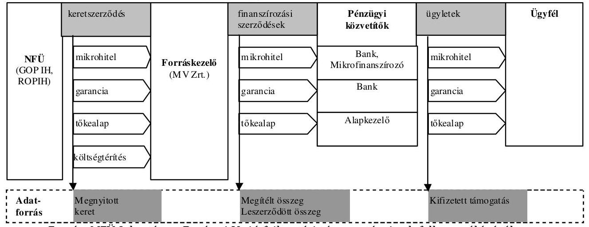

Forrás: NFÜ Jelentés az Európai Unió fejlesztési támogatásainak felhasználásáról
Az NFÜ által készített értékelés alapján az ÚMFT pénzügyi előrehaladását tekintve megállapítható, hogy a programozási időszak első három éve alatt a teljes keret $44 \%$-ára született döntés és $38 \%$-ára kötötték meg a szerződést. Kifizetés azonban csak a keret $9 \%$-ára történt (4. táblázat)

Az megítélt támogatások összegének közel felét (48\%) a kiemelt projektek adták. A pályázatos konstrukciók esetében a teljes ÚMFT keret 18\%-ára született döntés, illetve 14\%-ára szerződés. A kifizetések mindkét támogatási formánál nagyon alacsony mértékűek, mindössze a megítélt támogatás 22, illetve 18\%át tették ki.

A kis- és középvállalkozások számára kialakított pénzügyi eszközök 2009. évi lassú beindulása, a várakozástól való elmaradása volt tapasztalható.

---

# 4. táblázat 

ÚMFT előrehaladása, eljárásrendek szerint bontva 2007-2009

|  | ÚMFT   keret |  | Megítélt   támogatás |  | Leszerződött   támogatás |  | Kifizetett   támogatás |  |
| :-- | :--: | :--: | :--: | :--: | :--: | :--: | :--: | :--: |
|  | M euró | Mrd Ft | Mrd Ft | $\%$ | Mrd Ft | $\%$ | Mrd Ft | $\%$ |
| Kiemelt   projektek |  |  | 1649,5 | $21 \%$ | 1524,0 | $19 \%$ | 370,7 | $5 \%$ |
| Pályázatos   konstrukci-   ók |  |  | 1397,0 | $18 \%$ | 1073,2 | $14 \%$ | 254,6 | $3 \%$ |
| Pénzügyi   eszközök |  |  | 199,3 | $3 \%$ | 173,9 | $3 \%$ | $52,8^{*}$ | $1 \%$ |
| TS |  |  | 181,9 | $2 \%$ | 178,3 | $2 \%$ | 57,9 | $1 \%$ |
| ÚMFT | $\mathbf{2 9 3 1 9}$ | $\mathbf{7 8 7 5 , 1}$ | $\mathbf{3 4 2 7 , 7}$ | $\mathbf{4 4 \%}$ | $\mathbf{2 9 4 9 , 4}$ | $\mathbf{3 7 \%}$ | $\mathbf{7 3 6 , 0}$ | $\mathbf{9 \%}$ |

Forrás: NFÜ jelentés az Európai Unió fejlesztési támogatásainak felhasználásáról.

* a forráskezelő szervezet részére kifizetett összegeket tartalmazza

Árfolyam:268,6 Ft/euró.
A nagyprojektek terén 2009. évben jelentős előrelépés történt. A Kormány 2009 végéig 27 KÖZOP és KEOP nagyprojektet hagyott jóvá, amelyből 16 -ot támogatott az Európai Bizottság. Ezzel a számmal hazánk élenjáró uniós viszonylatban. A 27 elfogadott nagyprojektre összesen 237,3 Mrd Ft értékben történt kifizetés.

A megítélt támogatásokat vizsgálva megállapíthatjuk, hogy a KKV-k fejlesztéséhez mindössze a források 10\%-a járult hozzá, főleg a GOP-on és kisebb részben a KMOP-n keresztül (10. ábra).
10. ábra
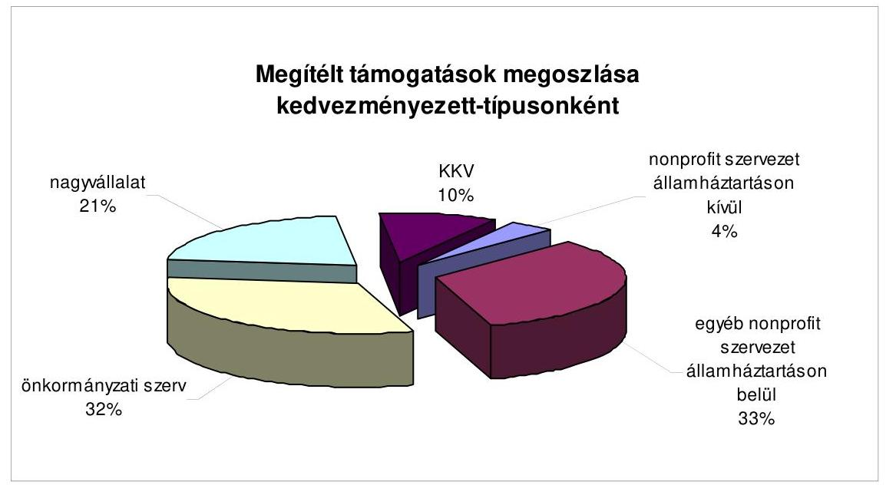

Forrás: NFÜ

---

Az ÚMFT programjainak előrehaladását értékelve megállapíthatjuk, hogy 2009-ben ugyan jelentősen felgyorsultak a folyamatok, az előrehaladás még mindig lassúnak tekinthető.

Az ÚMFT programjainak felgyorsítása, illetve a gazdasági válság hatásainak tompítása érdekében 2009 során számos lépés történt: az uniós források felhasználásával kapcsolatos feltételek könnyítése, a pályázók adminisztratív terheinek csökkentése.

Kedvezőbbé váltak az előlegnyújtás szabályai, enyhítették a pénzügyi biztosítékokhoz kötődő kötelezettségeket, bevezették a késedelmi kamatot a végrehajtó intézményrendszer terhére, a gazdaságfejlesztési támogatásoknál lehetségessé vált az árbevétel-növekedési elvárás átváltása létszámmegtartásra. A normatív pályáztatási eljárást szélesebb körben alkalmazták.

Az ÁSZ zárszámadási, illetve a szabálytalanság-, adósság- és követeléskezeléssel foglalkozó jelentései, összhangban az OP-k közti forrás-átcsoportosításra készített előtanulmánnyal felhívták a figyelmet arra, hogy a belépési feltételek, a jövőre vonatkozó kötelező vállalási feltételek és a biztosítékadási feltételek enyhítése, a támogatás intenzitás növelése, valamint az automatikus előleg mértékének megemelése együttesen növelheti a pályázati források nem rendeltetésszerú felhasználásának, illetve a követelések teljesülésének kockázatát. A kedvezőtlen folyamatokra utaló jeleket (támogatással való el nem számolás, kiutalt források támogatástól eltérő felhasználása, motiváció hiánya a projekt mielőbbi befejezésére) az intézményrendszer már észlelte.

A jelentős mértékű előleg egyes támogatottakat nem ösztönzött a vállalt kötelezettségeik maradéktalan és mielőbbi végrehajtására, emiatt is gyorsan növekedett az el nem számolt előlegek miatti követelések száma és összege. Az ÚMFTben alkalmazott biztosítéknyújtási feltételek - a korábbinál enyhébb feltételek következtében - nem garantálták az eredeti cél megvalósulását.

A felszámolások növekedésével párhuzamosan megnőtt a biztosítékok, az azonnali beszedés és a végrehajtás jelentősége.

A válság, valamint a 2006. évi kormányzati lépések (konvergenciaprogram és a költségvetési egyensúly helyreállítására hozott intézkedések) hatásai, a hitelezési források beszűkülése különösen súlyosan érintette a magyar gazdaság legsérülékenyebb szereplőit, a kis- és középvállalkozásokat és rajtuk keresztül a foglalkoztatottságot.

A válság egyes negatív hatásainak enyhítése, a vállalkozások számára elérhető források bővítése, a források felhasználásának felgyorsítása érdekében a Kormány - az Európai Bizottság jóváhagyásával - átcsoportosításokat hajtott végre az ÚMFT operatív programjai között és egyszerűsítette a pályáztatás rendszerét. Az átcsoportosítás legnagyobb kedvezményezettje a GOP (TIOP-ból 51, KÖZOP-ból 60 Mrd Ft). Ezen belül 105 Mrd Ft-tal a (vállalkozások - és kiemelten a KKV-k - komplex fejlesztését támogató) 2. prioritás, illetve 6 Mrd Ft-tal a 4. pénzügyi eszközök prioritás részesült (11. ábra).

---

# 11. ábra 

OP-k közötti forrásátcsoportosítás - 2009. június 30.
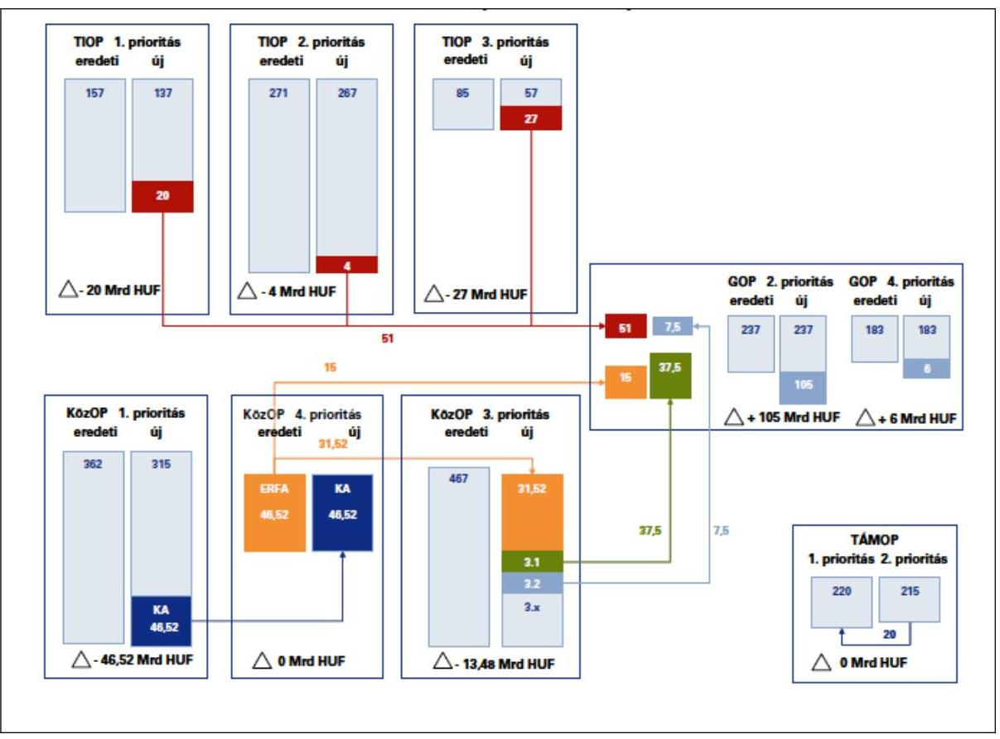

Forrás: NFÜ
A pénzügyi eszközök javára átcsoportosított forrásokkal kapcsolatos legnagyobb kockázat az abszorpciós képességével kapcsolatban jelentkezett. Az ÁSZ zárszámadási jelentése megállapította, hogy nem a tervezett ütemben sikerült a JEREMIE-program keretein belül a KKV-k finanszírozásának javítása.

Az Európai Bizottságtól 2009 végéig összesen 3,78 Mrd euró érkezett hazánkba, amelynek nagyobb részét továbbra is az automatikusan folyósított előleg képezte (2,37 Mrd euró). A Bizottság részére benyújtott kérelem alapján folyósított időközi átutalás 1,4 Mrd euró összeget ért el.

Az Igazoló Hatóság 2009-ben az előző évi 141,31 M eurót jelentősen meghaladó összegben, 856,67 M euró értékben küldött ki költségnyilatkozatot az Európai Bizottság részére.

Az ellenőrzések által megállapított hiányosságok többsége, a pénzügyi korrekciók, valamint az irányítási és ellenőrzési rendszerek kedvezőtlen minősítése a közbeszerzési eljárások során tapasztalt hiányosságokból fakadtak, annak ellenére, hogy az intézményrendszer egyes OP-knál kiemelt figyelmet fordított a közbeszerzések ellenőrzésére (ellenőrzési listák, közbeszerzési szakértők alkalmazása).

A közbeszerzési eljárás lefolytatása a kedvezményezett feladata és felelőssége. A KSZ, EKKE és az NFÜ együttes feladata és felelőssége a közbeszerzési eljárás sza-

---

bályszerű lefolytatásának elősegítése, illetve ellenőrzése, jogsértés esetén pedig jogszabályban, illetve a kedvezményezettekkel kötött támogatási szerződésekben meghatározott következmények alkalmazása.

Az ÁSZ zárszámadási ellenőrzés megállapításai szerint kiemelt kontrollkockázatot jelentett a teljes intézményrendszert átfogó közbeszerzés-ellenőrzési eljárásrend kialakításának hiánya.

Az ÁSZ ajánlásként fogalmazta meg az NFÜ elnöke részére a teljes intézményrendszert átfogó közbeszerzés-ellenőrzési eljárásrend felülvizsgálatát és betartatását, illetve szükség esetén a vonatkozó hazai jogszabályok módosításának kezdeményezését annak érdekében, hogy a 2004-2006-os időszak közbeszerzési szabálytalanságainak feltárásával kapcsolatos problémái a 2007-2013-as időszak programjai esetében ne ismétlődhessenek meg. Továbbá az ÁSZ véleménye szerint a KA esetében a projektek zárása, illetve a nyomon követés során megállapított szabálytalanságokra vonatkozó eljárásrend hiánya miatt nem biztosított az ilyen szabálytalanságokból eredő követeléseknek a projekt fenntartási időszakot lezáró határidőn belül történő rendezése, a pénzügyi korrekciókból eredő követelések behajthatósága és az Európai Bizottság által a projekt zárásakor a hazai költségvetés felé esedékes végső kifizetések teljesítése, ezért erre vonatkozóan is ajánlást fogalmazott meg az NFÜ elnöke részére.

Az Ellenőrzési Hatóság vizsgálatai további kisebb, a dokumentálást, az EMIR feltöltöttséget, az ellenőrzési nyomvonal érvényesülését, valamint a szabálytalanságok nyilvántartását érintő hiányosságokat tártak fel.

A kifizetések növekedésével párhuzamosan nőtt az Európai Bizottság illetékes főigazgatóságai, illetve az Európai Számvevőszék ellenőrzéseinek a száma. Az ellenőrzések jelentősebb hibát a közbeszerzési előírások be nem tartása, illetve az irányítási és ellenőrzési rendszerek gyenge működése terén tártak fel.

Az Európai Bizottság Regionális Főigazgatósága húsz GOP projekt ellenőrzését végezte el 2009-ben. A vizsgálati jelentés két kisebb jelentőségű észrevételt tett, de ezek nem érintették a kifizetések szabályszerűségét, így szabálytalanságot vagy visszafizetési kötelezettséget sem állapított meg.

Az Európai Számvevőszék a 2009. évi EU zárszámadáshoz kiadandó megbízhatósági nyilatkozat (DAS) összeállítása érdekében 8 db GOP projekt kifizetésinek jogszerűségét ellenőrizte.

Két esetben a PM NAO Iroda pontatlan adatszolgáltatását állapították meg, ami azonban nem érintette a projektek lebonyolítását. Egy projekt esetében a támogatásból vásárolt eszközökhöz az ellenőrzés nem fért hozzá. A KSZ tudomására nem jutott tulajdonosváltás történt és okirat hamisításra is fény derült. Az IH szabálytalansági eljárást kezdeményezett és az Európai Számvevőszékkel egybevágóan megállapította a szabálytalanságokat, visszakövetelve a kifizetett támogatást. A többi projekt esetében a vizsgálat nem tárt fel szabálytalanságot.

Az Európai Számvevőszék a 2009. évi EU zárszámadáshoz kiadandó megbízhatósági nyilatkozat összeállítása érdekében ellenőrzést végzett a KEOP-ot érintően.

A kiválasztott KEOP projektek ellenőrzése során megállapították, hogy a kifizetési kérelemben - az EMIR hibás múködéséből fakadóan - helytelen összeget tüntet-

---

tek fel (a kedvezményezett részére a helyes összeget fizették ki). Egy esetben pedig a közbeszerzési szabályok megsértését tapasztalták, amely visszafizetési kötelezettséget vont maga után.

A fenti két ECA DAS ellenőrzés során értékelték az OP-k irányítási és ellenőrzési rendszereinek múködését, amelyet a kiválasztott GOP és KEOP projektek vizsgálatával is megerősítettek. A két OP ellenőrzése alapján az irányítási és ellenőrzési rendszerek múködését kedvezőtlenül értékelték. Az IH, a KSZ és az IgH által múködtetett irányítási és ellenőrzési rendszert 2. szintű minősítéssel (a rendszer múködik, de fejlesztésre szorul) látták el. Az Ellenőrzési Hatóság munkáját megfelelőnek ítélték.

Az ÁROP-ra vonatkozóan az Európai Bizottság ESZA ellenőrzési egységének auditja minősített véleményt bocsátott ki. Az ellenőrzés alapján az irányítási és ellenőrzési rendszer működött, de jelentős javításokat igényelt (3-as szintű minősítés). Mivel az ellenőrzés mind az Irányító Hatóság, mind az Ellenőrző Hatóság szintjén megkérdőjelezte az operatív program irányítási és ellenőrzési rendszerének megbízhatóságát, az ÁROP igénylés fizetési határidejének megszakítását vonta maga után mindaddig, amíg a magyar hatóságok nem bizonyítják az első- és másodszintű ellenőrzési rendszer megbízhatóságát.

Az Európai Bizottság Regionális Politikák Főigazgatósága 2009. december 7-11 között végzett helyszíni ellenőrzése keretében vizsgálta a NFT/ERFA, KA programoknál azon közösségi értékhatárt meghaladó közbeszerzéseket, amelyek esetében tárgyalásos eljárás lefolytatására került sor, vagy az eredeti szerződés összegének 10\%-át meghaladó összegben pótmunka került elszámolásra. Az ellenőrzés célja volt megfelelő bizonyosság megszerzése a nemzeti és EU közbeszerzési jogszabályoknak történő megfelelésről az SA, KA szerződések tekintetében. Az ellenőrzésre kiválasztásra kerültek - többek között - a KA környezetvédelem előirányzatból finanszírozott 2004/HU/16/C/PE/002, valamint 2003/HU/16/P/PE/020 sz. projektjeinek egyes szerződései. Az ellenőrzési megállapítások a Tájékoztató lezárásakor nem álltak rendelkezésünkre.

Az Európai Bizottság Regionális Politikák Főigazgatósága vizsgálatot folytatott az EU 27 tagállamában a 2007-2013-as időszakra tekintetében a hibaarány meghatározására vonatkozóan (10-10 projekt került ellenőrzésre). Magyarországon a Bizottság a GOP-ot és a VOP-ot ellenőrizte. Egy VOP és egy GOP projekt esetében nem lényeges, formai hibát, egy másik VOP projektnél azonban a közbeszerzési eljárásra vonatkozó uniós irányelv megsértését állapította meg. Az összesített tagállami hibaarányt a GOP-nál nulla, a VOP-nál 1,45\%-ban határozták meg.

# Önkormányzatok, mint az uniós támogatások kedvezményezettjei 

Az Állami Számvevőszék az önkormányzatok költségvetési gazdálkodási rendszere átfogó ellenőrzésének keretében a teljesítmény-ellenőrzés módszerével vizsgálta a belső szabályozottság, szervezettség terén az Önkormányzat felkészültségét az európai uniós források figyelése, igénylése és felhasználása szem-

---

pontjából, továbbá értékelte, hogy az igényelt európai uniós támogatások az Önkormányzat által meghatározott fejlesztési célkitűzésekhez kapcsolódtak-e ${ }^{37}$.

Az ellenőrzött önkormányzatok 22\%-a készült fel eredményesen 2007-2009 között az európai uniós források igénybevételére és a várható támogatás felhasználására. Az uniós források igénybevételére irányuló pályázatok a gazdasági programokban, ágazati, és településfejlesztési koncepciókban, programokban megfogalmazott fejlesztési célkitűzésekhez többségükben kapcsolódtak. Nem készült fel azonban eredményesen az európai uniós források igénybevételére és felhasználására a szabályozottság terén az ellenőrzött önkormányzatok $74 \%$-a, a szervezettség vonatkozásában $4 \%$-a.

A szabályozások az ellenőrzött önkormányzatok felénél nem tartalmazták a pályázatfigyeléssel kapcsolatos információ-szolgáltatási kötelezettséget, közel egytizedénél nem írták elő a folyamatba épített, előzetes, utólagos és vezetői ellenőrzési feladatokat. A pályázatfigyelés, a pályázatkészítés és a fejlesztési feladat lebonyolítás személyi feltételeit az ellenőrzött önkormányzatok nagy része biztosította. A külső szervezetekkel kötött szerződések közel egyharmadában azonban nem rögzítették a pályázat szakmai és formai követelményeire vonatkozó felelősség szabályait, mintegy felében nem írták elő a fejlesztési feladat lebonyolítását végző ellenőrzési kötelezettségét, továbbá a belső ellenőrzési stratégiát megalapozó kockázatelemzés az ellenőrzött önkormányzatok 77\%ánál nem terjedt ki az európai uniós forrásokkal támogatott fejlesztési feladatokra.

A 2007-2009 között ellenőrzött önkormányzatok közel egytizede törvényi előírás ellenére nem fogadta el a 2006-2009 közötti időszakra szóló gazdasági programját. Az ellenőrzött önkormányzatok által benyújtott pályázatok mintegy fele részesült támogatásban; egy részük a saját forrás, a jogerős építési és hatósági engedélyek hiánya, a közbeszerzési eljárás eredménytelensége, a kivitelezés költségének emelkedése miatt pályázatát visszavonta.

A benyújtott pályázatok elutasítását a pályázati források hiánya, a szakmai kidolgozatlanság, a költséghatékonyság hiánya, a pályázatok tartalmi és formai hibái, a pályázati feltételek hiányos teljesítése, valamint egyéb hiányosságok okozták.

A 2006-2009. évek költségvetési rendeleteiben az ellenőrzött önkormányzatok mintegy fele tervezte az európai uniós forrásokkal támogatott fejlesztési feladatok bevételi és kiadási előirányzatait. Az önkormányzatok közel felénél a költségvetési rendelet nem tartalmazta elkülönítetten az európai uniós támogatással megvalósuló programok összes bevételét és kiadását, továbbá mintegy kétharmadánál a képviselő-testület tájékoztatása céljából nem mutatták be a többéves kihatással járó, európai uniós forrásból megvalósuló fejlesztési feladatokat számszerűsítve évenkénti bontásban, szöveges indoklással.

Az önkormányzatok a már befejezett fejlesztési feladatok megvalósítására tervezett összeget 99,9\%-ban felhasználták. A kifizetési kérelmek benyújtása után a támogatások folyósításának esetenkénti időbeli elhúzódását elsősorban az

[^0]
[^0]:    ${ }^{37} 1019$ sz. ÁSZ Jelentés.

---

igénylést alátámasztó dokumentumok, számlák alaki és tartalmi hiányosságai okozták. A közremúködő szervezetek az előlegigényléseket, valamint a hiánytalanul benyújtott kifizetési kérelmeket az ellenőrzött projektek mintegy egyharmadánál határidőn belül teljesítették.

A projektek megvalósításához az önkormányzatok a saját forrást biztosították, eleget tettek a támogatás megelőlegezési követelményének. A fejlesztési feladatokat az önkormányzatok mintegy negyede a tervezetthez viszonyítva a kiadások hiányos tervezése és a támogatási szerződés szerint el nem számolható költségek kifizetése miatt többletkiadással valósította meg. Az önkormányzati hivatalok mintegy 60\%-ánál az európai uniós források felhasználásával megvalósított feladatok kiadásainak és bevételeinek teljesítése során a folyamatba épített, előzetes, utólagos és vezetői ellenőrzéseket végrehajtották. A támogatásban részesült önkormányzatok döntő többségénél ( $90 \%$-nál) azonban a belső ellenőrzés nem vizsgálta az európai uniós forrás felhasználását. Az európai uniós forrással támogatott fejlesztési feladatok megvalósulását külső ellenőrző szervezetek az ellenőrzött önkormányzatok mintegy kétharmadánál vizsgálták, megállapításaikra a polgármesterek intézkedést tettek.

# 3.2.2. Nemzetközi együttmúködési programok 

A 2004-2006-os INTERREG közösségi kezdeményezés programok megvalósítási szakasza befejeződött. Ezen programokat a 2007-2013-as programperiódusban a regionális politika 3. célkitűzése, az Európai Területi Együttmúködés (ETE) váltotta fel. Magyar részvétellel 7 határ menti (6 kétoldalú és 1 négyoldalú), 2 transznacionális (közép- és délkelet-európai) és 4 interregionális (INTERREG IVC, URBACT, ESPON, INTERACT) program került kidolgozásra. A programok uniós forrását az Európai Regionális Fejlesztési Alap, illetve az Unió külső határain az IPA (Előcsatlakozási Támogatási Eszköz, Horvátország és Szerbia tekintetében) és ENPI (Európai Szomszédsági és Partnerségi Eszköz, Ukrajna tekintetében) alapok biztosították.

## Határon átnyúló együttmúködési programok

A határon átnyúló együttműködési programokban - a 2004-2006-os időszak jellemzően háromoldalú szomszédsági programjaitól eltérően - a két ország határ menti megyéi múködtek együtt a határon átnyúló gazdasági és szociális kapcsolatok fejlesztése érdekében.

Az európai területi együttműködés célkitűzése arra irányult, hogy erősítse a határokon átnyúló együttműködést közös helyi és regionális kezdeményezések útján, a transznacionális együttműködést az integrált területi fejlődéshez vezető, a közösségi prioritásokhoz kapcsolódó intézkedések révén, valamint az interregionális együttműködést és tapasztalatcserét a megfelelő területi szinten. A pénzügyi források túlnyomó többsége a határ menti programokra jutott, amelyekben a beavatkozás fő területei az alábbiak voltak: helyi gazdaságfejlesztési kapcsolatok, város- és vidékfejlesztés, turizmus, emberi erőforrás fejlesztés, $\mathrm{K}+\mathrm{F}$, kultúra, egészségügy, oktatás, környezetvédelem, megújuló energia, közlekedési, információs és vízügyi együttműködés, jogi és közigazgatási

---

együttműködés stb. (beruházások vagy ún. „szoft" tevékenységek, pl. tanulmányok formájában).

Az ETE Operatív Programjainak hazai intézményrendszere az INTERREG programok intézményrendszerére épült, az eljárások azonban az európai uniós szabályozás miatt eltértek a korábbi INTERREG szabályozástól. 2009-ben megtörtént az Egyetértési Nyilatkozatok aláírása. A programok eltérő ütemezése folytán egyes programokban újabb pályázati felhívások jelentek meg, a benyújtott projektek értékelése után támogatási döntéseket hoztak a Közös Monitoring/Közös Irányító Bizottságok és megkötötték a támogatási szerződéseket, más programokban a korábban támogatást kapott projektek megvalósítása kezdődött meg.

A projektszintű pénzügyi és szakmai monitoring eszköze az NFÜ által üzemeltetett IMIR 2007-2013 rendszer, amelynek éles üzemi adatokkal való feltöltésére 2010 folyamán kerül sor.

A négy határon átnyúló program ${ }^{38}$ esetében 2009-ben a pályáztatási és szerződéskötési folyamatok zajlottak, kifizetés nem történt.

A PM NAO Iroda belső ellenőrzése 2009-ben vizsgálta, hogy az Európai Területi Együttmúködés programjai végrehajtásához kapcsolódó feladatokat az Iroda megfelelően végezte-e. A vizsgálat alapján készült jelentés megállapította, hogy az Igazoló Hatóság ETE Programmal kapcsolatos folyamatai a Múködési Kézikönyvnek és a vonatkozó uniós és hazai jogszabályok előírásainak megfelelően múködtek ${ }^{39}$.

Az Előcsatlakozási Támogatási Eszköz (IPA) keretében hazánk két együttműködési programban vett részt Magyarország-Horvátország, illetve Magyarország-Szerbia relációban.

A 2007 óta létező Előcsatlakozási Támogatási Eszköz (Instrument for PreAccession Assistance, IPA) a tagjelölt és „potenciálisan tagjelölt" országokra (Horvátország, Törökország, Macedónia, Volt Jugoszláv Köztársaság, illetve Albánia, Bosznia-Hercegovina, Szerbia, Montenegró) fókuszált.

Az IPA programok esetében az Irányító Hatóság az NFÜ nemzetközi együttmúködési programokért felelős szervezeti egysége, a Közös Technikai Titkárságot a VÁTI Nonprofit Kft. keretein belül alakították ki. A Közös Igazoló Hatóság a PM NAO Iroda, a hazai partnerek vonatkozásában első szintű ellenőrzési feladatokat (hitelesítési tevékenységet) a VÁTI Nonprofit Kft. végezte. A Közös Ellenőrzési Hatóság szerepét a KEHI (2010. július 1-jétől az EUTAF) töltötte be.

A Magyarország-Horvátország IPA Határon Átnyúló Együttmúködési Program esetében 2009-ben lezajlott pályáztatást követően a szerződéskötések 2010 márciusától augusztusig 41 projekt esetén megtörténtek.

[^0]
[^0]:    ${ }^{38}$ Ausztria-Magyarország (AT-HU), Szlovénia-Magyarország (SI-HU), MagyarországSzlovákia (HU-SK), Magyarország-Románia (HU-RO).
    ${ }^{39}$ Forrás: Pénzügyminisztérium Nemzeti Programengedélyező Iroda Belső Ellenőrzési Egység - Éves ellenőrzési jelentés 2009. (2010. március 15.)

---

A Magyarország-Szerbia Határon Átnyúló Együttmúködési Program esetében 2010-ben került sor az Egyetértési Megállapodás aláírására, az első pályázati felhívásról 2010. április 28-án döntött a Közös Monitoring és Irányító Bizottság.

Az Európai Szomszédsági és Partnerségi Eszköz (European Neighbourhood and Partnership Instrument) határon átnyúló komponense az EU belső határain megvalósuló európai területi együttmúködés célkitűzéstől eltérően a Közösség külső határai mentén elhelyezkedő, egyelőre tartósan az EU-n kívül maradó partnerországok érintett területi egységeivel való együttmúködést támogatta.

# A Magyarország-Szlovákia-Románia-Ukrajna Európai Szomszédsági és Partnerségi Eszköz Határon Átnyúló Együttmúködési Program 

2007-2013 esetében a pályázati döntések 2010 áprilisában megtörténtek. A harmadik prioritás esetében a források elosztására - tekintettel a pályázók zárt körére (vám- és határőrizeti szervek) - ún. közvetlen eljárás keretében került sor.

A program lebonyolítása egységes szerkezetben történt függetlenül az államhatárok által meghatározott területi megosztástól, közös projektek, közös döntéshozás és közös pénzügyi keretek alkalmazásával. A program átfogó koordinációjáért a közös szervezetek feleltek. Az Irányító Hatóság és a Közös Technikai Titkárság Magyarországon múködött (NFÜ NEP IH, illetve VÁTI Nonprofit Kft.).

Az NFÜ BEF 2009-ben vizsgálta az ENPI hazai intézményrendszer létrehozásának és múködésének témakörét. Az ellenőrzés során tett megállapítások a TA kézikönyv és a programszintú kézikönyv hiányát emelték ki.

## Transznacionális együttmúködési programok

A transznacionális együttműködési programok keretében egy adott szempontból egy területi egységként értelmezhető, de több országból álló területek közösen keresnek megoldásokat a térséget érintő problémákra. Hazánk mind a közép-európai, mind a dél-kelet európai programtérben teljes területével részt vett.

## A Délkelet-Európai Transznacionális Együttmúködési Program 2007-

$2013^{40}$ esetében 2009-ben a pályáztatási és szerződéskötési folyamatok zajlottak. Az Egyetértési Nyilatkozat aláírása 2010-ben történt meg.

Az OP Irányító Hatósági, Közös Technikai Titkársági és Ellenőrzési Hatósági és Igazoló Hatósági feladatait Magyarország látta el. (Az Irányító Hatóság az NFÜ nemzetközi együttmúködési programokért felelős szervezeti egysége, a Közös Technikai Titkárság a VÁTI Nonprofit Kft., a Közös Igazoló Hatóság a Pénzügyminisztérium NАО Iroda keretein belül múködött, a Közös Ellenőrzési Hatóság a KEHI volt.)

[^0]
[^0]:    ${ }^{40}$ A programban résztvevő államok: Ausztria, Bulgária, Görögország, Magyarország, Szlovákia, Szlovénia, Románia, Olaszország; Albánia, Bosznia-Hercegovina, Horvátország, Macedónia, Szerbia, Montenegró, valamint Moldávia és Ukrajna.

---

A Közép-Európa Transznacionális Együttmúködési Program 2007$2013^{41}$ program esetében 2009-2010-ben a pályáztatási folyamat zajlott, három pályázati körben.

Az OP irányító hatósági feladatait Ausztria látta el, a Közös Technikai Titkárság, valamint az Ellenőrzési Hatóság Ausztriában találhatók. A Nemzeti Hatóság szerepét az NFÜ NEP IH töltötte be.

# Interregionális együttmúködési program 

Az INTERREG IVC Interregionális Együttmúködési Program célja, hogy növelje a regionális fejlesztési politikák hatékonyságát, illetve a régióközi együttmúködésen keresztül hozzájáruljon az innováció, a tudásalapú gazdaság, a környezetvédelem és kockázat-megelőzés területén Európa gazdasági modernizációjához és növekvő versenyképességéhez. A jogosult programterület az EU 27 tagállama, valamint Norvégia és Svájc. 2009-ben a pályáztatási és szerződéskötési folyamatok zajlottak.

Magyarország a programban tagállami feladatokat látott el, kizárólag a nemzeti társfinanszírozás biztosításáért felelt. A közösségi forrást a Franciaországban múködő Irányító Hatóság nyújtotta.

### 3.2.3. Svájci-Magyar Együttmúködési Program

Az Európai Unió és Svájc 2006. február 27-én kétoldalú megállapodást írt alá, amelynek értelmében Svájc a 2004-ben csatlakozott tíz tagállam részére öt éven keresztül összesen 1 Mrd svájci frank hozzájárulást biztosított. Ebből Magyarország részesedése bruttó 130,7 M svájci frank. Az Európai Bizottság és Svájc által kötött megállapodás meghatározta a támogatás biztosításának keretfeltételeit, valamint a lehetséges támogatási területek listáját. Az ötéves kötelezettségvállalási periódus 2007 júniusában kezdődött meg, miután a svájci parlament jóváhagyta a Svájci Hozzájárulás pénzügyi keretét.

A Svájci-Magyar Együttmúködési Program koordinációjáért felelős Nemzeti Koordinációs Egység feladatait az NFÜ Nemzetközi Együttmúködési Programok Irányító Hatósága látta el. A Közreműködő Szervezet feladatainak ellátására az VÁTI Nonprofit Kft-t, míg a Kifizető Hatóság feladatainak ellátására a PM NAO Irodát jelölték ki. A rendszerellenőrzésekért és a teljes támogatható kiadások 15\%-os mintavételes ellenőrzéséért felelős szervezet a KEHI (2010. július 1-jétől az EUTAF) volt.

A Program keretében elsősorban közcélt szolgáló, alapvetően nem profitszerzésre irányuló tevékenységek, projektcélok finanszírozhatóak. A támogatás legalább 40\%-át a leghátrányosabb helyzetben lévő északmagyarországi és észak-alföldi régiókban kell felhasználni, külön figyelemmel Borsod-Abaúj-Zemplén, Hajdú-Bihar és Szabolcs-Szatmár-Bereg megyékre. A

[^0]
[^0]:    ${ }^{41}$ A programban résztvevő államok: Ausztria, Csehország, Magyarország, Lengyelország, Szlovákia, Szlovénia, Németország, Olaszország, valamint Ukrajna.

---

Program négy fő területre koncentrált: Biztonság, Stabilitás, Reformok; Környezet és infrastruktúra; A magánszektor támogatása, valamint Humánerőforrásés társadalomfejlesztés.

A társadalmi egyeztetést követően az első két pályázati felhívás 2008. július 31én jelent meg, majd 2008 novemberében két újabb pályázati felhívást hirdetett meg a Nemzeti Koordinációs Egység. 2009 folyamán további prioritási területekre vonatkozóan jelentek meg pályázati felhívások. Öt prioritási terület esetén még nem került sor pályázat meghirdetésére.

A Svájci Hozzájárulás terhére pénzügyi kötelezettségvállalást a Svájci Parlamentnek a támogatást biztosító 2007. június 14-i döntését követő 5 éven belül lehet tenni, úgy, hogy az utolsó projekt javaslatokat a 2012. június 14-i kötelezettségvállalási végdátum előtt két hónappal, tehát 2012. április 14-ig lehet benyújtani.

# 3.3. Agrártámogatások 

### 3.3.1. A mezőgazdaság makrogazdasági feltételrendszere

A mezőgazdaság részaránya a rendszerváltás után a foglalkoztatásban, illetve a nemzetgazdaság bruttó hozzáadott értékének és ezzel összefüggésben a bruttó hazai terméknek (GDP) az előállításában szinte folyamatosan csökkent, a beruházásokban pedig ingadozott.

A mezőgazdaság bruttó termelésének aránya az ország termelésében 2009-re az eddigi legalacsonyabb szintre, 3\%-ra csökkent. A mezőgazdasági termelést csökkentette, hogy az állatállomány az EU-tagság elnyerését követően szinte folyamatosan fogyott. A nemzetközi irányzathoz hasonlóan Magyarországon is folyamatosan csökkent a mezőgazdaságban foglalkoztatottak aránya. Míg 2009ben a nemzetgazdasági beruházások volumene 8,6\%-kal csökkent, a mezőgazdaság nemzetgazdasági ág 7\%-os növekedését főként a gépberuházásokat elősegítő központi támogatások ösztönözték.

2009-ben az agrárium gazdasági teljesítménye más ágazatokhoz képest kevésbé csökkent a globális pénzügyi válság hatására kialakult gazdasági krízisben, ám az ágazat finanszírozása nehezebbé vált. Az Új Magyarország Vidékfejlesztési Program (ÚMVP) projektjeinek mintegy 50 százaléka fejlesztési célú, ezért is fontos a finanszírozhatóság fenntartása.

A gazdasági válság következményeinek enyhítése végett az Európai Bizottság lehetőséget teremtett arra, hogy azon tagállamok, amelyek ezt igénylik, a 2009. évben a támogatások kötelező társfinanszírozási arányát a maguk számára kedvező arányban eltérítsék, és 2009 végéig legfeljebb 10\%-kal kevesebb nemzeti társfinanszírozást fizessenek a közkiadáson belül (ún. Frontloading: az EU-s társfinanszírozási arány átmeneti növelése). Ez a tagállam számára halasztott fizetést jelent, amelyet 2010-2015 között vissza kell pótolni az EU költségvetésébe. Magyarország 2009 negyedik negyedévében élt ezzel a lehetőséggel és 2010 januárjától már a visszapótlásnak megfelelő magasabb nemzeti társfinanszírozási összeget fizette.

---

# 3.3.2. Az agrártámogatások finanszírozási és intézményrendszere, jogszabályi háttere 

Az agrárpolitikai intézkedéseket korábbi időszakban finanszírozó EMOGA helyébe a Tanács reformokat lefektető, a közös agrárpolitika finanszírozásáról szóló rendelete értelmében 2007-től két új alap lépett ${ }^{42}$ (3. sz. melléklet).

Az Európai Mezőgazdasági Garancia Alap (EMGA) célja az agrárpiaci támogatások/egyéb beavatkozások és a jövedelemtámogatások finanszírozása, az Európai Mezőgazdasági Vidékfejlesztési Alap (EMVA) minden vidékfejlesztési kiadás finanszírozására szolgált, függetlenül annak típusától és földrajzi elhelyezkedésétől.

Az EMVA forrásból hazánk az Európai Unió új költségvetési időszakában 5,45 Mrd euró - 1400 Mrd Ft - (uniós és hazai) forrás felhasználására jogosult (3,86 Mrd euró uniós forrással).

Az Új Magyarország Vidékfejlesztési Program az Új Magyarország Vidékfejlesztési Stratégiai Terv továbbrészletezett változata, amely intézkedésszinten tartalmazta a 2007-2013 közötti fejlesztési időszak agráriumra és vidékfejlesztésre vonatkozó prioritásait.

Az EMVA négy tengelye (forrásaránnyal): a mezőgazdasági és erdészeti ágazat versenyképességének javítása (46\%); a környezet és a vidék állapotának javítása (32\%); a vidéki térségek életminőségének javítása és a diverzifikáció ösztönzése (13\%); a helyi kapacitás kiépítése a foglalkoztatottság és a diverzifikáció érdekében $(5 \%)$.

A finanszírozás rendszere szerinti megkülönböztetés alapján a közös agrárpolitika egyes támogatásainak finanszírozása a hazai költségvetésen keresztül, az FVM fejezetében történt, az FVM fejezetben nem megjelenő jogcímekhez tartozó támogatásokat a Magyar Állam megelőlegezte és azt követően az EU megtérítette. A harmadik csoportba a nemzeti kiegészítő támogatások tartoztak, amelyekkel az Egységes Területalapú Támogatást ki lehetett egészíteni.

Az illetékes és irányító hatóság 2009-ben a földművelésügyi és vidékfejlesztési miniszter volt, az EMVA-val, EMGA-val és EHA-val kapcsolatos, kifizető ügynökségi feladatokat az MVH látta el. Az MVH a földművelésügyi és vidékfejlesztési miniszter irányítása alatt álló, önálló jogi személyiséggel rendelkező, országos hatáskörű központi hivatal és önállóan gazdálkodó költségvetési szerv, amely az FVM költségvetési fejezetén belül önálló címként szerepelt ${ }^{43}$.

Az átruházott feladatokat ellátó szervek múködésének tekintetében a Törvény részletes követelményeket tartalmazott. Az engedélyezés funkció egyes elemeit az MVH más szervek bevonásával, együttmúködésével látta el vagy a feladat kihelyezése útján gondoskodott ellátásukról.

[^0]
[^0]:    ${ }^{42}$ 1290/2005/EK rendelete.
    ${ }^{43}$ A 2010. évi kormányátalakításhoz kapcsolódó változásokat a 2010. évről szóló Tájékoztató tartalmazza.

---

A vámhatóság végezte az 1276/2008/EK (korábban: 386/90/EGK) rendelet által szabályozott, visszatérítésre jogosult mezőgazdasági termékek kiviteli eljárásához kapcsolódó folyamatba épített fizikai és kicserélési ellenőrzéseket. Ezen felül a Központi Ellenőrzési Parancsnokságon felállított Különleges Szolgálat felügyelte a 485/2008/EK (korábban: 4045/89/EGK) tanácsi rendeletben szabályozott utólagos vállalatellenőrzések végrehajtását.

Az uniós rendeletek ${ }^{44}$ mellett a hazai átfogó szabályozást a mezőgazdasági, ag-rár-vidékfejlesztési, valamint halászati támogatásokhoz és egyéb intézkedésekhez kapcsolódó eljárás egyes kérdéseiről szóló 2007. évi XVII. törvény jelentette, a végrehajtásra vonatkozó szabályokat további kormány, illetve FVM rendeletek tartalmazták. A 2009. évi legfontosabb jogszabályi módosításokat a végrehajtás során felmerült kérdések, illetve az új rendszerek (kölcsönös megfeleltetés, SPS rendszer, Nemzeti Diverzifikációs Program, illetve a nemzeti agrárkárenyhítési rendszer módosításának) bevezetése indukálta. Emellett 2009. évben is folyamatosan jelentek meg az egyes támogatási jogcímek igénybevételének részletes szabályairól szóló FVM-rendeletek, illetve módosításaik.

# 3.3.3. Az agrártámogatások hazai ellenőrzési rendszere 

Az agrártámogatások ellenőrzési rendszere Magyarországon az EU-hoz történő csatlakozás óta négy szinten működött.

Az első ellenőrzési szintet a tagállami Kifizető Ügynökség (MVH) intézményrendszerének megfelelőségi vizsgálata jelentette. Az Illetékes Hatóság (FVM) féléves és időközi igazoló szervi vizsgálatok keretében folyamatosan nyomon követte az akkreditációs feltételek, illetve a korábbi évek jelentéseiben megfogalmazott megállapítások teljesülését. Emellett az újonnan bevezetésre kerülő EMVA jogcímek tekintetében, amelyek végrehajtás szempontjából eltértek a már korábban bevezetett intézkedések ügyintézési mechanizmusától, ún. akkreditációs vizsgálat lefolytatásáról döntött.

A Kifizető Ügynökség akkreditációs követelményeknek való megfelelés tárgyában az Igazoló Szerv által lefolytatott vizsgálat megállapításait az ellenőrzések fejezet alatt mutatjuk be.

Az ellenőrzések második szintjét a Kifizető Ügynökség, valamint az FVM ellenőrzési funkciói jelentették.

Az MVH szakmai és funkcionális tevékenységének folyamatos ellenőrzését a Belső Ellenőrzési Főosztály munkája, valamint a támogatási rendszerekbe épített, az IIER által támogatott, munkafolyamatokba épített (dokumentumalapú és helyszíni) kontrollok múködése biztosította.

A területi egységek 2009-ben összesen 34096 ellenőrzést (12 627 helyszíni vizsgálatot) végeztek.

[^0]
[^0]:    ${ }^{44}$ Az Európai Mezőgazdasági Vidékfejlesztési Alapból (EMVA) nyújtandó vidékfejlesztési támogatásról szóló, 2005. szeptember 20-i 1698/2005/EK tanácsi rendelet.

---

Az ellenőrzések kiterjedtek a Szőlő-bor termékpálya, a zöldség-gyümölcs intézkedések mellett az intervenció, a közvetlen támogatások, a kísérő intézkedések, valamint - valamennyi tengelyt érintően - az EMVA jogcímeire is.

Az Igazoló Szerv (ISZ) a megfelelőségi ellenőrzés keretében végzett újraellenőrzések során megállapította, hogy a helyszíni ellenőrzések rendszere és múködtetése a Kifizető Ügynökségnél hatékony és szabályszerű volt. A helyszíni ellenőrök felkészültségét és a megyei kirendeltségek felszereltségét megfelelőnek minősítették, bár az autók és egyéb technikai eszközök viszonylag szűkösen álltak rendelkezésre.

Az ISZ - az ÁSZ zárszámadási jelentésével összhangban - az MVH Belső Ellenőrzési Főosztály feladatellátását érintően megállapította, hogy feladatait a rá vonatkozó jogszabályok és elnöki utasítások követésével látta el. A belső ellenőrzés által alkalmazott nyomon követési rendszerben az adatok, belső észrevételek egységes nyomon követhetősége biztosított volt.

Az MVH BEF ellenőrizte az EMGA, EMVA, EHA EU pénzügyi forrásainak felhasználásait, az AVOP és SAPARD programok kijelölt monitoring feladatait, valamint a nemzeti támogatások, továbbá a Hivatal múködését befolyásoló gazdasági és pénzügyi folyamatokat. Az 54 tervezett ellenőrzésből 25 mezőgazdasági támogatási és informatikai ( 21 EMGA és 4 informatikai), 17 vidékfejlesztési (EMVA, EHA, SAPARD, AVOP, NVT) és 12 gazdasági-pénzügyi belső ellenőrzés, módszertana szerint 37 rendszer-, 4 informatikai, 8 szabályszerűségi, 4 pénzügyi, és 1 teljesítmény-ellenőrzés.

A Belső Ellenőrzési Főosztály vizsgálatai azt bizonyították, hogy a Hivatal előírások szerint, magas kockázatú rendszerhibák nélkül képes megoldani a kifizető ügynökségi funkciókat. Az MVH szervezete és alkalmazottai megfelelő szakmai tudással és gyakorlati tapasztalatokkal rendelkeztek ahhoz, hogy a támogatások elosztásával és kifizetésével kapcsolatos feladatokat határidőre, pontosan elvégezzék.

Az ÁSZ zárszámadási jelentése rámutatott azonban, hogy - az NFÜ-höz hasonlóan - nem volt biztosított az összhang a feladatellátás és humánerőforrás között. A zárszámadás során feltárt problémák sokszínűsége, mennyisége, azoknak a beszámoló megbízhatóságára gyakorolt hatása alapján az ellenőrzés kedvezőtlenül értékelte a minisztérium vezetésének az ellenőrzési kérdésekhez való hozzáállását. Ezért a munkafolyamatok újraszervezését, a függetlenített belső ellenőrzés megerősítését, a feladat és erőforrás összhangjának megteremtését, szakmailag jól felkészült munkatársak alkalmazását, valamint a hiányosságokat feltáró megállapítások hasznosítását javasolta.

Harmadik szinten a Vám- és Pénzügyőrség a közösségi és nemzeti jogszabályokon alapulva nem delegált feladatként hajtott végre az EMOGA GR kifizetéseihez kapcsolódó export-visszatérítéses kiviteli eljárásokhoz kapcsolódóan a folyamatba épített ellenőrzéseket és az EMOGA GR-ből, illetve az EMGA-ból finanszírozott kifizetésekhez kapcsolódó utólagos vállalatellenőrzéseket.

A 485/2008/EK Rendelet minden tagállam számára kötelezővé tette egy olyan hivatal (ún. Különleges Szolgálat) felállítását, amely felelős az EMGA-ból kifizetett támogatások utólagos ellenőrzésének koordinációjáért. A fentiek alapján

---

2004. május 1-jével megalakult a Különleges Szolgálat a VP Központi Ellenőrzési Parancsnokság (VP KEP) önálló osztályaként. Az EMGA-ból finanszírozott kifizetésekhez kapcsolódó utólagos ellenőrzéseket a hivatkozott Kormányrendelet alapján a regionális ellenőrzési központok végezték.

A VP KEP Különleges Szolgálat a 2008/2009 évi ellenőrzési időszakra vonatkozóan az ellenőrzési tervben szereplő 138 db utólagos ellenőrzés közül hetet felfüggesztés miatt nem zárt le. A 485/2008/EK rendeletben meghatározott minimális vizsgálati szám, valamint a kedvezményezettek kockázati tényezők szerinti kockázatelemzése alapján a 2009/2010-es ellenőrzési időszakra 73 gazdálkodót választottak ki. Külföldi megkeresés alapján a Különleges Szolgálat 2009ben 12 vizsgálatot kezdett meg, amelyek közül 4 db -ot lezárt, és a vizsgálat eredményéről a megkereső tagállamot tájékoztatta. A Különleges Szolgálat 2009-ben 10 esetben élt megkereséssel külföldi különleges szolgálatok felé. Az ellenőrzések terv szerinti végrehajtását hátráltatta - a bizottsági audit által jó gyakorlatnak minősített - keresztellenőrzések jelentős száma.

A Strukturális Alapokból finanszírozott AVOP program irányítási és ellenőrzési rendszere a Strukturális Alapok rendszeréhez igazodott.

A negyedik ellenőrzési szintet az éves pénzügyi elszámolások, azok bizottsági ellenőrzései jelentették. Az Európai Bizottság többéves megfelelőségi vizsgálata a Kifizető Ügynökség éves beszámolóját az Igazoló Szerv igazolásával együttesen értékelte.

A Földművelésügyi és Vidékfejlesztési Minisztériummal 2006. november 30-án kötött szerződés alapján az EMGA és EMVA pénzügyi alapok igazoló szervi tevékenységét a 2009. EMGA, EMVA pénzügyi évre (2008. október 16 és 2009. október 15 közötti időszakban) a KPMG Hungária Kft. látta el. Az uniós források lehívása szempontjából kockázatot jelentett, hogy a közbeszerzési eljárás elhúzódása miatt a Tájékoztató lezárásakor (2010. október) az ISZ kiválasztására irányuló eljárás folyamatban volt.

Az Igazoló Szerv (ISZ) elvégezte a Kifizető Ügynökség 2009. EMGA/EMVA pénzügyi évre vonatkozó éves beszámolójának vizsgálatát, valamint ellenőrizte a Kifizető Ügynökség által működtetett belső ellenőrzési rendszereket.

Az Európai Bizottság öt, az Európai Számvevőszék három ellenőrző látogatást tett Magyarországon 2009-ben.

A 2009. május 4-8 között lezajlott ellenőrzés a 2004-2006-os, illetve a 2007-2008as időszakra vonatkozott. A vizsgálat során a Mezôgazdasági üzemek korszerüsitése, valamint a Termelői csoportok intézkedéseket ellenőrizték.

A 2009. július 6-10 között lefolytatott ellenőrzés a 2007-2008-as időszakra vonatkozott. Az ellenőrzés tárgya alapvetően az Egységes területalapú támogatások vizsgálata volt, amely részben kiterjedt a területalapú vidékfejlesztési támogatásokra is.

A 2009. november 30 és december 4 között a Közösség legrászorulóbb személyeinek az intervenciós készletekből származó élelmiszerekkel történő ellátására vonatkozó uniós rendelet végrehajtására vonatkozó vizsgálat keretében az ellenőrzés áttekintette a magyar igazgatási és ellenőrzési rendszer múködését a végre-

---

hajtás valamennyi szakaszára vonatkozóan (ajánlati felhívás, odaítélések - szerződések - biztosíték, kivonások, illetve vásárlások, a karitatív szervezetek jóváhagyása, a vizsgálatok és ellenőrzések valamennyi típusa, kifizetési eljárások). Az ellenőrzés kiterjedt a kiválasztott karitatív szervezet raktárában, valamint a karitatív szervezet élelmiszerosztási helyszínein, illetve egy feldolgozónál tett helyszíni látogatásra is. Az ellenőrzés nem állapított meg hiányosságot.

Az 2009. november 9-13 között az export visszatérítések és azok ellenőrzésének tárgyában folytatott vizsgálatot az Európai Bizottság.

Az AVOP-ra vonatkozóan a Bizottság 2009. október 14-15 között végzett ellenőrzést a visszavont összegek és függőben lévő behajtások tárgyában.

Az Európai Számvevőszék két témában vizsgálta az adott intézkedés eredményes, illetve hatékony megvalósítását. 2009. november 16-24 között teljesítményellenőrzést végzett az Agrár-környezetgazdálkodási (ÜMVP 214. sz.) intézkedéssel, 2009. március 30 és április 3 között a LEADER programmal kapcsolatban.

Az Európai Számvevőszék 2009. november 25-27 között helyszíni ellenőrzést tartott az uniós rendelkezések alapján behajtandó EMVA és EMGA követelések tekintetében.
2009. október 2-án Magyarország számára pozitív eredménnyel zárult a Bizottság RDO/2007/010/HU számú, 2007-ben végzett ellenőrzése. Az AVOP 2.1.1és 3.1.3 intézkedésekre vonatkozóan a Bizottság 10-20\%-os levonást helyezett kilátásba az általa feltételezett szabálytalanságok miatt, de az MVH-nak a bilaterális egyeztetés és az azt követő válaszadás során sikerült kellően alátámasztott bizonyítékokkal megcáfolni a Bizottság felvetéseit, amely által a tervezett levonás nem történt meg.

# 3.3.4. Agrár- és vidékfejlesztési támogatások alakulása 2009. évben 

Az agrár- és vidékfejlesztési támogatásokra 2009. évben az előzetes adatok figyelembevételével 613,3 Mrd Ft került felhasználásra. Ez az összeg 187 Mrd Fttal haladta meg a 2008. évi kifizetést. A kiemelkedő mértékű támogatáslehívásra az EU források adtak lehetőséget (ÜMVP kifizetések, EU által közvetlenül térített támogatások, SAPS). Az ágazat az összes 2009. évi támogatásán belül az EU alapjaiból finanszírozott összeg 73\%-ot, a nemzeti költségvetésből képviselt összeg $27 \%$-ot tett ki.

2009-re az Európai Bizottság által a közvetlen támogatásokra jóváhagyott uniós forrású keret meghaladta a 768 M eurót ( 207 Mrd Ft), amelyet a hazai forrásból nyújtott nemzeti kiegészítő támogatás ( 78 Mrd Ft ) egészített ki. A tejtermelők - élve az unió által biztosított előrehozott fizetési lehetőséggel - 2009 októberében 16 Mrd Ft-ot is meghaladó tejtámogatásban részesültek. A gabonaintervencióra a termelők mintegy 2 M tonna búzát ajánlottak fel, emellett a magyar állam is vásárolt fel mintegy 200 ezer tonna gabonát. 2009-ben 32 EUkonform támogatásnak minősülő nemzeti támogatásra 111,7 Mrd Ft-ot használtak fel.

2009-ben az új alapokra helyezett, kötelezővé tett Nemzeti kárenyhítési rendszer keretében a 2009. évre hivatalosan elismert mintegy 25,4 Mrd Ft értékű elemi károk után a termelők egységesen 20,5\%-os mértékű kárenyhítésben részesültek. A 2009. november 16-tól megnyílt (újonnan indított) Nemzeti Diver-

---

zifikációs Program intézkedéseire 3078 kérelmet (1695-öt a Mezőgazdasági beruházások intézkedés jogcímre) nyújtottak be. Kifizetés 2009-ben nem történt.

# Az ÚMVP előrehaladása 

Az ÚMVP intézkedésein keresztül közel 5,5 Mrd eurón ${ }^{45}$, azaz közel 1400 Mrd Ftnak megfelelő támogatás hívható le, jórészt az agrárium versenyképességét javító, illetve a természeti és a vidéki épített környezet értékeinek megőrzését célzó beruházásokra. Ezen források felhasználását az ÚMVP intézkedései szolgálták, amelyek a program 4 stratégiai tengelye köré csoportosultak.

2009-ben az ÚMVP keretében meghirdetett támogatási jogcímekre vonatkozóan közel 656 M eurón ${ }^{46}$ (EU + hazai) támogatási összeg került kifizetésre (konvergencia és nem konvergencia célkitúzés alá eső régiók együttesen), amely a 2007-2013-as keret 24\%-át jelentette.

Az ÚMVP sajátossága, hogy az előző programozási időszakról áthúzódó támogatási jogcímek is finanszírozásra kerültek, azaz a Nemzeti Vidékfejlesztési Terv keretei között indult, több éves kötelezettségvállalást tartalmazó egyes jogcímek (pl. a kifizetések 90\%-át kitevő Agrár-környezetgazdálkodás) 2009. évi áthúzódó kifizetései az ÚMVP forráskeretéből valósultak meg. Ez a 2009. évi kifizetések $19,86 \%$-át tette ki.

A 2009. évi támogatási igény, a megítélt támogatások, illetve a kifizetések öszszegének területi megoszlását tekintve az alföldi régiók kiemelkedő képet mutattak. Ez a megoszlás jól követte Magyarország területi adottságait. Meghatározó volt még a Dél-Dunántúli régió, amely a Dunántúlon a mezőgazdasági termelés jelentős részét képezte.

Bizottsági kifizetésre a Strukturális Alapokhoz hasonlóan előlegek formájában, illetve kiadásigazoló nyilatkozat alapján kerülhetett sor. A 2007-2009. években az EU által átutalt előleg és támogatás összege meghaladta a 914 M eurót.

Az „n+2" szabályból fakadó kötelezettség teljesítése várhatóan nem jelent problémát, mivel 2010. év végéig a pénzügyi teljesítés $82,5 \%$ volt.

### 3.3.5. Agrár- és vidékfejlesztési támogatásokra vonatkozó ellenőrzések megállapításai 2009. évben

Az akkreditációs kritériumoknak való megfelelés vizsgálata összegzésében az ISZ megállapította, hogy a Kifizető Ügynökség által működtetett ellenőrzési rendszer elemei jellemzően jól működnek, nagy jelentőségű hibát nem tártak fel. Néhány esetben (pl. EMGA kontrolltevékenység) a rendszert jónak minősí-

[^0]
[^0]:    ${ }^{45}$ a 2007-2013 évekre vonatkozó EMVA keret 3,8 Mrd euró; amely a hazai társfinanszírozási résszel együtt 5,45 Mrd euró.
    ${ }^{46}$ 270,84 FT/euró alkalmazott árfolyamon számítva 177,6 Mrd Ft.

---

tette, azonban kisebb jelentőségű hiányosságokat állapított meg. Megfelelőnek, de fejlesztendőnek ítélte mindkét alap tekintetében az IT rendszereket.

Az ISZ mindkét alap tekintetében fenntartás nélküli véleményt adott ki és megállapította, hogy a Bizottsághoz benyújtandó, a 2009. október 15 -ével végződő 2009. EMGA és EMVA pénzügyi évre vonatkozó beszámoló minden lényeges vonatkozásban megbízható, teljes és pontos az EMGA és az EMVA terhére felszámított nettó összkiadás tekintetében. A könyvvizsgálat során ellenőrizték a Kifizető Ügynökség akkreditációs kritériumoknak való megfelelését, amely alapján a Kifizető Ügynökség belső ellenőrzési eljárásai kielégítően (azaz minden lényeges vonatkozásban hatékonyan) múködtek az EMGA és az EMVA tekintetében egyaránt.

Az ISZ fenntartás nélküli véleményt bocsátott ki és megállapította, hogy az igazoló nyilatkozat minden lényeges vonatkozásban megfelelt a 2008. október 16-tól 2009. október 15-ig terjedő pénzügyi év tekintetében a 885/2006/EK rendelet 3. cikkének.

Az akkreditációs követelményeknek való megfelelést érintő, illetve a működési ügyletekre vonatkozó igazoló szervi ellenőrzések több - az informatikai rendszerből fakadó - közepes és kisebb jelentőségű hibát tártak fel.

- Az ISZ a monitoringot érintő akkreditációs követelmény teljesülése kapcsán - közepes jelentőségű hibaként minősítve - megállapította, hogy az IIER fejlesztések nem minden esetben tudtak lépést tartani a kérelemengedélyezés által támasztott igényekkel, ami a támogatások megítélésének és a kifizetések teljesítésének jelentős időbeli eltolódásához, illetve több esetben az eljárásrend szerint IIER-ben történő ügyintézéssel kezelendő kérelmeknek a pénzügyi hibák kockázatát növelő kézi ügyintézéséhez vagy a szoftver pontatlan számítási algoritmusai által kalkulált téves kifizetésekhez vezetett.
- A területalapú vidékfejlesztési jogcímek esetében 2009-ben az igazoló szervi vizsgálat során ebből adódóan több hibát azonosítottak. Szisztematikus szoftverhibából adódó téves kifizetésekre vonatkozó megállapításokat a korábbi években is tettek egyes jogcímek esetében.

A téves kifizetéseket eredményező hibák mellett szintén problémát okozott a legtöbb IIER-ben kezelt támogatási jogcím esetében az engedélyezés folyamatának időbeli eltolódása, a határidők tarthatatlansága, az ügyintézési idő aránytalan mértékű növekedése. A probléma súlya nem csökkent, sőt a számos új, IIER-ben kezelt jogcím bevezetése által generált megnövekedett fejlesztési igény növelte azt.

Két jogcím esetében a korábbi igazoló szervi vizsgálatok során talált hibák egy részének a korrekciója nem történt meg, a hiba javítása szintén IIER-fejlesztést igényelt.

- Az IIER hibás működéséből fakadó téves határozatgenerálást állapítottak meg, amelyet a mintavételes ellenőrzés is alátámasztott. A hibát a Kifizető Ügynökség az ellenőrzést megelőzően észlelte.

---

Az információs rendszerek biztonságát érintő akkreditációs követelmény vonatkozásában az előző évhez viszonyítva (ekkor nagy és közepes jelentőségű hibákat fogalmaztak meg) előrelépés volt tapasztalható. A 2009. évről szóló ISZ jelentés szerint a hibák már csak kisebb jelentőségűnek tekinthetőek, az előző évi megállapítások nyomon követése alapján azonban megállapítható, hogy a területet érintően további intézkedések váltak szükségessé. Előrelépés történt a jogosultságkezelés terén (új szoftver bevezetésével), több szabályozó dokumentum elkészült, bevezetésük azonban elhúzódott.

További közepes, valamint kisebb jelentőségű hibát állapítottak meg az ellenőrzéseket érintően:

- EMVA kifizetések engedélyezéséhez kapcsolódó helyszíni ellenőrzések (akkreditációs követelmény teljesülésének) vizsgálata során, mivel a helyszíni ellenőrzések során két jogcím (Készségek és HACS finanszírozás) esetében az ISZ nem tudott minden esetben meggyőződni a költségek racionalitásáról és arról, hogy valóban az adott jogcím keretein belül szükséges azokat elszámolni. A két EMVA jogcím végrehajtása nem minden esetben különíthető el egymástól a jogosultsági és támogatási feltételek mentén, és ez visszaéléseket eredményezhet.

Az ISZ az EMGA kifizetések engedélyezéséhez kapcsolódó adminisztratív és helyszíni ellenőrzésének vizsgálata során kisebb hiányosságokat tárt fel. Ezen vizsgálatokat kiegészítő helyszíni újraellenőrzés során azonban megállapította, hogy a helyszíni ellenőrzések rendszere és múködtetése a Kifizető Ügynökségnél hatékony és szabályszerű volt. A helyszíni ellenőrök felkészültsége és a megyei kirendeltségek felszereltsége is megfelelő, bár az autók és egyéb technikai eszközök viszonylag szűkösen álltak rendelkezésre.

A korábbi években tett megállapítások nyomon követése kapcsán megállapították, hogy nem minden esetben történt meg az intézkedés:

- A 2007. év végi ISZ jelentésben részletezett problémák a folyamatban lévő peres ügyek lekérdezésének nyilvántartásával kapcsolatban továbbra is fennálltak. A fellebbezés kezelésére rendelkezésre álló határidő túllépése a vizsgált időszakban is jellemző volt, de előrelépésnek tekinthető, hogy a feladatokat ellátó munkatársak számát növelte a Kifizető Ügynökség.

Az Európai Számvevőszék és az ISZ is hiányosságokat tárt fel a behajtandó összegek nyilvántartása és kezelése terén.

A behajtandó összegek Bizottság részére benyújtott adatszolgáltatás és az adósok főkönyvi nyilvántartásainak összevetése alapján az ISZ (közepes mértékű hiányosságként értékelve) eltérést tárt fel, amely az intervenciós veszteség miatt felmerült követelések jelentésének nem egyértelmű meghatározásából adódott.

Az Európai Számvevőszék megállapításai többek között a nyilvántartás hiányosságaira vonatkoztak, amelynek következtében az unió pénzügyi érdekei sérülhetnek, illetve veszélyeztetik az ellenőrizhetőséget és nyomon követhetősé-

---

get. Megállapításokat fogalmaztak meg a Bizottság részére benyújtott adatszolgáltatás pontosságára, hiányzó tartalmi elemeire, illetve a felszámított kamatok nem szisztematikus számítási módjára. Felhívták a magyar hatóságok figyelmét, hogy az adatszolgáltatásban azonban nem kell feltüntetni a cukorágazatban beszedett ideiglenes szerkezetátalakítási összegeket.

További hiányosságot állapítottak meg a nyilvántartási, illetve a jelentési rendszert érintően.

A Bizottság részére a közvetlen támogatásokra nyújtott IIER statisztikák ellenőrzése során az ISZ - közepes hibaként - megállapította, hogy (a visszakövetelésekből, korrekciókból fakadóan) az adatok az informatikai rendszerben módosultak, így az adott időpontban kinyert statisztikai összesítések utólagosan nem voltak rekonstruálhatóak, lehetetlenné téve a statisztika megbízhatóságának utólagos ellenőrzését, igazolását.

Az EMVA-ból finanszírozott vidékfejlesztési támogatásokra vonatkozó statisztikákról az ISZ megállapította, hogy azok összeállításának módja nem volt megfelelő, a szolgáltatott adatok nem voltak pontosak és nem megbízhatóak. A statisztikák vizsgálata során további hiányosságként megállapították, hogy a vonatkozó időszakban az NVT AKG jogcím EMVA alapból történt kifizetései a jelentésben nem szerepeltek.

Az ISZ - közepes jelentőségű hibaként - rámutatott, hogy a peres ügyek nyilvántartásának gyengeségeiből fakadóan a Kifizető Ügynökség gyakorlata nem biztosított kellő garanciát arra, hogy a Kifizető Ügynökség előzetesen becsülhesse a várható kifizetési adatokat. Ennek következtében a közvetlen támogatások éves pénzügyi korlátait érintően a megelőző években eddig két jogcím esetében fordult elő kerettúllépés.

Az FVM ÚMVP „Önálló, építéssel nem járó gépek, technológiai berendezések beszerzése" jogcím lebonyolításához kapcsolódó támogatási és kifizetési kérelmek megvalósulására vonatkozó vizsgálat megállapította, hogy a beruházás illetve a támogatás végrehajtása a célkitűzéseknek megfelelően történt. A beruházás az uniós adófizető állampolgárok érdekeinek megfelelően valósult meg.

Az Európai Bizottság a Mezőgazdasági üzemek korszerűsítésére, valamint a Termelői csoportok intézkedésekre vonatkozó ellenőrzések kapcsán kifogásolta, hogy a kedvezményezett által benyújtott kifizetés iránti kérelem számlamásolatokat nem, hanem csak bizonyos számlaadatokat tartalmazott egy űrlapon, ami véleménye szerint nehezítette az ellenőrzést. A Bizottság álláspontja szerint egy minden számlára kiterjedő ellenőrzés lenne a megfelelő, mivel jelentős mértékű támogatást érint. A kedvezményezett által kifizetett ár gyakran jelentősen alacsonyabb volt az áradatbázisban szereplő referenciaárnál. A termelői csoportok tekintetében a Bizottság felhívta a figyelmet, hogy a termelőknek a termelői csoporton keresztül kell értékesíteni valamennyi terményüket. Hibaként értékelte, hogy a támogatást túlnyomó részben az elismerés előtti értékesített termelés alapján állapították meg.

---

Az Egységes területalapú támogatások vizsgálatára irányuló Bizottsági ellenőrzés ellentmondást állapított meg az átadott statisztikai adatok tekintetében. Probléma merült fel a jogosulatlanul kifizetett támogatások visszafizettetésével, továbbá a kifizetések, szankciók hibás kiszámításával kapcsolatban.

Az export-visszatérítésekre vonatkozó Bizottsági ellenőrzés hiányosságokat tárt fel az export visszatérítés alapját képező élőállat-szállításra vonatkozó követelmények betartásának, a menetíró készülék adatainak, a szállítójármúvekkel szemben támasztott követelményeknek, illetve az élőállatok állapotának - a Mezőgazdasági Szakigazgatási Hivatal illetékességi körébe tartozó - ellenőrzése kapcsán.

Az Európai Számvevőszék megvizsgálta, hogy hozzájárult-e a LEADER a vidékfejlesztés javulásához. Az ellenőrzés véleménye szerint az akciócsoport projektkiválasztási eljárása nyílt és dokumentált volt. Az akciócsoport döntéshozó testülete a köz- és magánszférát képviselő, több ágazatot átfogó partnerség volt. A program eredményes és hatékony megvalósulása szempontjából az ellenőrzés kedvezőtlenül értékelte, hogy az alkalmazott eljárások nem biztosították valamennyi stratégiai cél megvalósulását (a tervezett projektek 60\%-a valósult meg), a források leghatékonyabb, leggazdaságosabb felhasználását (nem vizsgálták a holtteher hatást, a költségek indokoltságát). Az eredményes és hatékony megvalósulást értékelve az ellenőrzés rámutatott, hogy a lebonyolítás rendszere (a hosszú átfutási idők, jelentős adminisztrációs terhek) nem igazodott a program sajátosságaihoz (kisebb léptékű projektek), kedvezőtlenül befolyásolva a pályázó kedvet, a projektek előrehaladását és a múködési költségek szintjét. Az ellenőrzés nem látta bizonyítottnak, hogy a program (amely az ÜMVP 4. tengelye) hozzájárult az ÜMVP célrendszeréhez.

# 3.3.6. SAPARD 

A SAPARD Program keretében Magyarország részére 2000-2006 között összesen közel 160 M euró támogatás állt rendelkezésre. Az Európai Bizottság 2007. december 10-i C/2007/6047 számú határozatával elfogadta Magyarország 20002006. SAPARD Terve teljesítésére vonatkozó végső végrehajtási Jelentését és pénzügyi elszámolását, amelynek alapján került sor 2008-ban a Program végső pénzforgalmi elszámolására, a végső átutalásra. 2008-tól közösségi és hazai forrásból történő kifizetésre már nem került sor.

Ennek megfelelően 2009-ben - a magyarországi SAPARD Program zárása utáni harmadik naptári évben - az Igazoló Szerv ellenőrzése a projektek múködtetési időszakát érintő, valamint a fennálló követelések kezelésére vonatkozó SAPARD ügynökségi feladatok vizsgálatára irányult.

Külön szempontként a 2009. évi Sapard ISZ vizsgálat kiterjedt a projektek 2009es pénzügyi zárására, a szabálytalanságkezeléssel kapcsolatos eljárásrendek és érintett projektek vizsgálatára.

A program zárását követően az MVH (SAPARD Hivatal jogutódja) feladata a működtetés alatti monitoring (amely magában foglalja egyrészt a projektek megvalósításának és működtetésének nyomon követését, másrészt a program

---

monitoring feladatok ellátását) és az ehhez kapcsolódó ex-post ellenőrzések lebonyolítása.

Az ISZ - a korábbi években tett megállapításokhoz hasonlóan - rámutatott, hogy a humán erőforrás kapacitás továbbra sem elégséges minden kirendeltség esetében a SAPARD monitoring feladatok ellátásához.

Az ellenőrzés során a dokumentumalapú monitoring tevékenységek ellátásában jelentős elmaradásokat tapasztaltak több kirendeltség esetében az éves jelentések értékelésében, a jelentések elkészítésében és a monitoring mappában található dokumentumok folyamatos vezetését érintően. Felhívták továbbá a figyelmet az adatbázis helyességének felülvizsgálatára.

A Kifizető Ügynökség által lefolytatott ex-post helyszíni ellenőrzések újraellenőrzése kapcsán az ISZ megállapította, hogy a kirendeltségi és központi ellenőrök szaktudása és képzése szintén megfelelő volt, a személyi állomány egyéb feladatokkal való leterheltsége ugyanakkor ezen a területen is éreztette hatását. Az ex-post helyszíni ellenőrzések tervezése és végrehajtása az előírásoknak megfelelő volt, a mintavételi módszerben azonban közepes jelentőségű hibát azonosítottak, mivel a központi ellenőrzési egység nem a Kirendeltségek által lefolytatott helyszíni látogatásokat ismételte meg, hanem a Kirendeltségektől függetlenül végzett ex-post helyszíni monitoring tevékenységet. Ezáltal a központi szervezeti egység nem töltötte be felügyeleti funkcióját.

Az ex-post ellenőrzések felülvizsgálata kapcsán javasolták továbbá, hogy a Működési Kézikönyv módosításával tegyék ellenőrizhetővé, hogy az ex-post helyszíni látogatás során az ellenőrök megtekintették a támogatás alapjául szolgáló bizonylatokat. Ezek másolatát ugyanis nem minden esetben csatolták, illetve azokon nem volt megtalálható az ellenőrzést bizonyító hivatali pecsét.

A projektek pénzügyi zárásának vizsgálata kapcsán megállapították, hogy az MKK megfelelően tartalmazza a SAPARD projektek pénzügyi zárásával kapcsolatos feladatokat, így a zálogjog, a felhatalmazó levelek, illetve egyéb biztosítékok törlésére vonatkozó eljárásrendet. A kiválasztott projekt mappákban a pénzügyi zárással kapcsolatos, kedvezményezett felé történő kommunikációt, valamint a dokumentációt megfelelőnek találták.

A szabálytalanságkezelésre vonatkozó eljárásrendi vizsgálat során megállapították, hogy az eljárásrendek a Hivatal visszalépésére, szabálytalanság miatt történő elállásra elegendő mozgásteret biztosítanak, a Hivatal számára nem adnak lehetőséget elállás jogtalan kezdeményezésére. A Kirendeltségeken végzett, projekt akta alapú vizsgálat során megállapították, hogy az ügyek nyomon követhetőek voltak, a szabálytalanságkezelési eljárás dokumentumai megtalálhatóak voltak a projekt mappákban.

A követelések nyilvántartásának teljességét, pontosságát, illetve a kezelését az ISZ vizsgálata alapján megfelelőnek ítélte.

---

# MELLÉKLETEK 

1. sz. Magyarország és az Európai Unió közötti költségvetési kapcsolatok 2004-2009
2/A. sz. A Magyar Köztársaság 2009. évi költségvetésének végrehajtásáról szóló törvényjavaslatban megjelenő EU-támogatások és a hozzájuk kapcsolódó hazai finanszírozás összege
2/B. sz. A költségvetésen kívüli finanszírozással lebonyolított EU-támogatások
3. sz. A mezőgazdasági támogatások szerkezeti változásai a 2000-2006-os és a 2007-2013-as költségvetési periódus között
4. sz A Tájékoztató alapjául szolgáló, 2009. évre vonatkozó ellenőrzések, jelentések és beszámolók

---

# Magyarország és az Európai Unió közötti költségvetési kapcsolatok 2004-2009

|  Az uniós költségvetésbe történt befizetések | 2004 | 2005 | 2006 | 2007 | 2008 | 2009  |
| --- | --- | --- | --- | --- | --- | --- |
|  Vámok | 13461,0 | 26571,9 | 26913,8 | 27980,9 | 26689,4 | 24883,2  |
|  Cukorilletékek/termelési díjak | - | 1546,6 | 600,0 | $-59,4$ | 1637,4 | 471,1  |
|  Tradicionális saját források összesen | 13461,0 | 28118,5 | 27513,8 | 27921,5 | 28326,8 | 25354,3  |
|  Áfa alapú hozzájárulás | 19111,5 | 26820,8 | 30456,5 | 34905,2 | 38534,0 | 32082,8  |
|  GNI alapú hozzájárulás | 88320,3 | 141970,7 | 139025,9 | 135668,5 | 149643,8 | 159188,9  |
|  Brit korrekció | 12289,6 | 17478,6 | 16129,5 | 18946,3 | 22403,2 | 16135,8  |
|  Holland-svéd GNI (2009tól) |  |  |  |  |  | 1707,0  |
|  (Egyszeri) Pótlólagos befizetés |  |  |  |  |  | 14543,4  |
|  Nemzeti hozzájárulás összesen | 119721,4 | 186270,1 | 185611,9 | 189520,0 | 210581,0 | 223657,8  |
|  Egyéb |  | 374,4 | - | - | - | -  |

---

|  A Költségvetésben megjelenő támogatási jogcímek | 2004 | 2005 | 2006 | 2007 | 2008 | 2009  |
| --- | --- | --- | --- | --- | --- | --- |
|  I. Nemzeti Fejlesztési Terv | 5608,3 | 121834,2 | 233115,2 | 209521,4 | 116753,8 | 32037,1  |
|  ÜMFT |  |  |  | 10003,1 | 124957,5 | 468 807,9  |
|  Egyéb strukturális tám. | 1,8 | 968,7 | 7953,8 | 11642,3 | 8251,2 | 2625,0  |
|  Kohéziós Alap/ISPA | 19625,1 | 44410,6 | 100 188,0 | 94682,6 | 107444,4 | 123 478,8  |
|  Schengen Alap | 0,0 | 3248,9 | 9678,6 | 35580,3 | 591,1 |   |
|  Nemzeti Vidékfejlesztési Terv | 0,0 | 49681,8 | 65 938,4 | 66 835,7 | 9911,8 | 810,7  |
|  ÜMVP |  |  |  | 18704,2 | 84 803,0 | 184 496,6  |
|  SAPARD | 14949,5 | 29712,0 | 9 196,3 | 1398,3 | - | 183,8  |
|  Halászati Operatív Program |  |  |  |  |  | 52,7  |
|  PHARE/Átmeneti támogatás | 43841,6 | 32801,5 | 39 937,6 | 5203,5 | 4386,8 | 1464,3  |
|  Egyéb európai uniós tám. | - | 2027,3 | 4484,1 | 5440,1 | 11896,8 | 15 290,2  |
|  Támogatások összesen (EU+központi költségvetési forrás) | 84026,3 | 284685,0 | 470492,0 | 459011,5 | 468 996,4 | 829 247,1  |
|  Visszatérítés (beleértve az uniós támogatások utólagos megtérülését) | 42813,4 | 8457,7 | 7773,9 | - | 51 102,6 | 36 822,1  |
|  Költségvetésben megjelenő EU és központi költségvetési források összesen | 126 839,7 | 293 142,7 | 478 265,9 | 459011,5 | 520 099,0 | 866 069,2  |

---

|  Közvetlenül KESZ-en át
finanszírozott költségve-
tésen kívüli tételek | 2004 | 2005 | 2006 | 2007 | 2008 | 2009  |
| --- | --- | --- | --- | --- | --- | --- |
|  Agrárpiaci támogatások* | 855,0 | 159133,3 | 19826,5 | 47653,2 | 47623,7 | 91421,0  |
|  Közvetlen területalapú ta-
mogatások | 77647,0 | 148022,9 | 93405,7 | 119992,1 | 156173,0 | 228712,1  |
|  Összesen | 78502,0, | 307156,2 | 113232,2 | 167645,3 | 203796,7 | 320133,1  |

- agrárpiaci és intervenciós támogatások

Forrás: ÁSZ adott évi Költségvetés végrehajtásáról szóló jelentései

---

.

---

# A Magyar Köztársaság 2009. évi költségvetésének végrehajtásáról szóló törvényjavaslatban megjelenő EUtámogatások és a hozzá kapcsolódó hazai társfinanszírozás összege 

|  |  |  | millió Ft |
| :--: | :--: | :--: | :--: |
| A központi költségvetésben megjelenő, az EU-tól érkezett és az EU-nak átutalt összegek, illetve az ezekhez kapcsolódó hazai források | Kiadás   EU forrásból | Kiadás központi költségvetési forrásból | Kiadás összesen |
| NFT | 0,0 | 32037,1 | 32037,1 |
| KA | 67473,9 | 56004,9 | 123478,8 |
| ÚMFT | 390619,1 | 78 188,8 | 468 807,9 |
| Egyéb strukturális támogatások | 315,9 | 2309,1 | 2625,0 |
| I. NVT | 0,0 | 810,7 | 810,7 |
| ÚMVP | 137 158,4 | 47338,2 | 184 496,6 |
| HOP | 39,5 | 13,2 | 52,7 |
| SAPARD | 0,0 | 183,8 | 183,8 |
| Átmeneti támogatás programjai | 882,8 | 581,5 | 1464,3 |
| Egyéb európai uniós támogatások | 6251,9 | 9038,3 | 15290,2 |
| Visszatérítés (beleértve az uniós támogatások utólagos megtérülését) |  | 36 822,1 | 36 822,1 |
| Támogatások összesen* | 602741,5 | 263327,7 | 866 069,2 |

---

# A költségvetésen kívüli finanszírozással lebonyolított EUtámogatások 

| Közvetlenül KESZ-en át finanszírozott költségvetésen   kívüli tételek | Összes KESZ   finanszírozás   (M Ft) |
| :-- | --: |
| Közvetlen termelöi támogatások (SAPS) | $\mathbf{2 2 8} \mathbf{7 1 2 , 1}$ |
| Agrárpiaci támogatások | $\mathbf{8 9} \mathbf{0 7 2 , 0}$ |
| Exporttámogatások | 1552,4 |
| Belpiaci támogatások | 73995,9 |
| Egyéb agrárpiaci támogatások | 13535,9 |
| Ebből elkülönített cukortámogatás | 9180,8 |
| Intervenció | $\mathbf{2 3 4 9 , 0}$ |
| Intervencióhoz kapcsolódó raktározási szállítási költségtérítés | 1853,6 |
| Intervencióhoz kapcsolódó finanszírozási költségtérítés | 495,4 |
| Költségvetésen kívüli tételek összesen | $\mathbf{3 2 0} \mathbf{1 3 3 , 1}$ |

---

# A mezőgazdasági támogatások szerkezeti változásai a 2000-2006-os és a 2007-2013-as költségvetési periódus között 

A Közös Agrárpolitika szerkezete 2006-ig
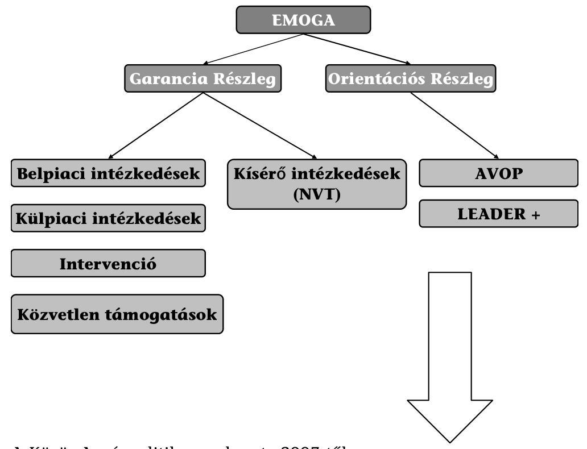

A Közös Agrárpolitika szerkezete 2007-től

## Európai Mezőgazdasági Garancia Alap (EMGA)

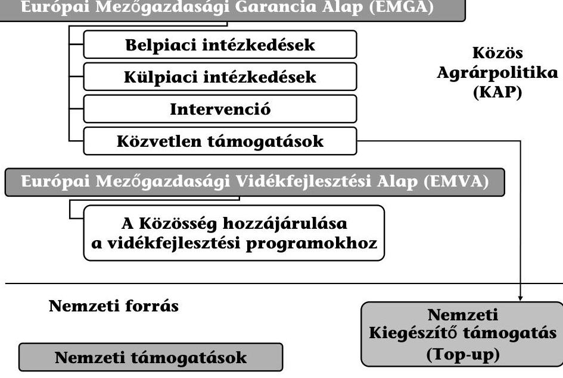

---

EMVA tengelyek
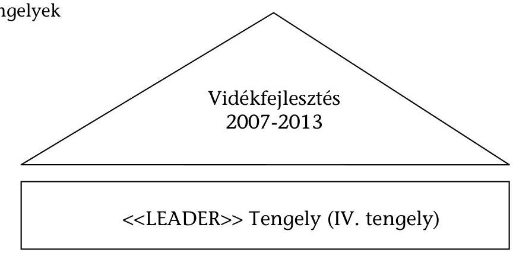
<<LEADER>> Tengely (IV. tengely)
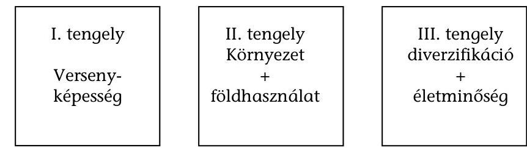

Egységes programozás, finanszírozás, monitoring, auditálás

Egységes Vidékfejlesztési Alap

---

# A Tájékoztató alapjául szolgáló, 2009. évre vonatkozó ellenőrzések, jelentések és beszámolók 

Az ÁSZ által lefolytatott ellenőrzések

## Ellenőrzés címe

Jelentés a szilárdhulladék-gazdálkodásra a Kohéziós Alapból és hazai forrásból nyújtott támogatások hasznosulásának ellenőrzéséről

Jelentés a Kohéziós Alapból és hazai forrásokból finanszírozott kiemelt szennyvíztisztítási projektek megvalósításának ellenőrzéséről

Jelentés az EU támogatások felhasználása során alkalmazott szabálytalanság-, adósság- és követeléskezelési folyamatok ellenőrzéséről

Jelentés a Magyar Köztársaság 2009. évi költségvetése végrehajtásának ellenőrzéséről

Jelentés a helyi önkormányzatok gazdálkodási rendszerének 2009. évi ellenőrzéséről

## A KEHI által összeállított jelentések

2009. évi összefoglaló jelentés az 1386/2002/EK Rendelet 12. cikke alapján a Kohéziós Alapról

Zárónyilatkozat és beszámoló - Kohéziós Alap -
2000/HU/16/P/PE/005 - Szegedi Regionális Hulladékgazdálkodási Program

Magyarország-Szlovákia-Ukrajna Szomszédsági Program (CCI szám: 2004CB160PC002): Záró beszámoló magyar része az 1260/1999/EK rendelet 38. cikk 1 bekezdés f) pontja és a 438/2001/EK Rendelet 15. cikk f) pontja szerint
Magyarország-Szlovákia-Ukrajna Szomszédsági Program (CCI szám: 2004CB160PC002): Zárónyilatkozat

Magyarország-Románia-Szerbia és Montenegró Határon Átnyúló Együttműködési Program (CCI szám: 2003/CB/16/0/PC/002): Záró beszámoló az 1260/1999/EK rendelet 38. cikk 1 bekezdés f) pontja és a 438/2001/EK Rendelet 15. cikk f) pontja szerint

Magyarország-Románia-Szerbia és Montenegró Határon Átnyúló Együttműködési Program (CCI szám: 2003/CB/16/0/PC/002): Zárónyilatkozat

---

Ausztria-Magyarország INTERREG IIIA Közösségi Kezdeményezés
(CCI szám: 2000CB160PC003): Záró beszámoló magyar része az 1260/1999/EK rendelet 38. cikk 1 bekezdés f) pontja és a 438/2001/EK Rendelet 15. cikk f) pontja szerint
Ausztria-Magyarország INTERREG IIIA Közösségi Kezdeményezés (CCI szám: 2000CB160PC003): Al-zárónyilatkozat

PHARE és Átmeneti Támogatás 2009. évi összefoglaló jelentés
13-179/7/2010.
2009. évi összefoglaló ellenőrzési jelentés - EGT és Norvég Finanszírozási Mechanizmusok

Éves összegző jelentés a strukturális intézkedésekről és az Európai Halászati Alapról - 2009. év

Éves ellenőrzési jelentés az 1083/2006/EK Tanácsi rendelet 62. cikk (1) bekezdés d) pontja alapján az Államreform Operatív Program és Elektronikus Közigazgatás Operatív Program 2008. július 1. - 2009. június 30. közötti időszakáról

Éves vélemény az Államreform Operatív Program és Elektronikus Közigazgatás Operatív Program tekintetében

Éves ellenőrzési jelentés az 1083/2006/EK tanácsi rendelet 62. cikk (1) bekezdés d) pontja alapján a Gazdaságfejlesztés Operatív Program 2008. július 1. - 2009. június 30. közötti időszakáról

Éves vélemény az 1083/2006/EK tanácsi rendelet 62. cikk (1) bekezdés d) ii. alpontja, valamint az 1828/2006/EK bizottsági rendelet 18. cikk (2) bekezdése alapján - Gazdaságfejlesztés Operatív Program

Éves ellenőrzési jelentés az 1083/2006/EK tanácsi rendelet 62. cikk (1) bekezdés d) pontja alapján a Környezet és Energia Operatív Program 2008. július 1. - 2009. június 30. közötti időszakáról

Éves vélemény a Környezet és Energia Operatív Program tekintetében

Éves ellenőrzési jelentés az 1083/2006/EK tanácsi rendelet 62. cikk (1) bekezdés d) pontja alapján a Közép-Magyarország Operatív Program 2008. július 1. - 2009. június 30. közötti időszakáról

Éves vélemény a Közép-Magyarország Operatív Program tekintetében

Éves ellenőrzési jelentés az 1083/2006/EK tanácsi rendelet 62. cikk (1) bekezdés d) pontja alapján a Konvergencia célkitúzés alá tartozó regionális operatív programok 2008. július 1. - 2009. június 30. közötti időszakáról

Éves vélemény a Konvergencia célkitúzés alá tartozó regionális operatív programok tekintetében

Éves ellenőrzési jelentés az 1083/2006/EK tanácsi rendelet 62. cikk (1) bekezdés d) pontja alapján a Társadalmi Megújulás Operatív Program és a Társadalmi Infrastruktúra Operatív Program 2008. július 1. - 2009. június 30. közötti időszakáról

Éves vélemény a Társadalmi Megújulás Operatív Program és a Társadalmi Infrastruktúra Operatív Program tekintetében

13-26/17/2010.

13-179/7/2010.
13-12/13/2010.

13-11/4/2010.

13-433/29/2009.

---

Éves ellenőrzési jelentés az 1083/2006/EK tanácsi rendelet 62. cikk
(1) bekezdés d) pontja alapján a Közlekedés Operatív Program 2008. július 1. - 2009. június 30. közötti időszakáról

Éves vélemény a Közlekedés Operatív Program tekintetében
13-433/27/2009.
Éves ellenőrzési jelentés az 1083/2006/EK tanácsi rendelet 62. cikk 13-56/22/2010. (1) bekezdés d) pontja alapján a Végrehajtás Operatív Program 2008. július 1. - 2009. június 30. közötti időszakáról

Éves vélemény a Végrehajtás Operatív Program tekintetében
Regionális Fejlesztés Operatív Program (CCI szám:
13-148/2010.
2003/HU/16/1/PO/001): Záró beszámoló az 1260/1999/EK rendelet 38. cikk 1 bekezdés f) pontja és a 438/2001/EK Rendelet 15. cikk f) pontja szerint
Regionális Fejlesztés Operatív Program (CCI szám:
2003/HU/16/1/PO/001): Zárónyilatkozat
Gazdasági Versenyképesség Operatív Program (CCI szám:2003 HU 161 PO 002): Záró beszámoló az 1260/1999/EK rendelet 38. cikk 1 bekezdés f) pontja és a 438/2001/EK rendelet 15. cikke szerint
Gazdasági Versenyképesség Operatív Program (CCI szám:2003 HU 161 PO 002): Zárónyilatkozat

Környezetvédelem és Infrastruktúra Operatív Program (CCI szám:2003 HU 161 PO 003): Záró beszámoló az 1260/1999/EK rendelet 38. cikk 1 bekezdés f) pontja és a 438/2001/EK rendelet 15. cikke szerint
Környezetvédelem és Infrastruktúra Operatív Program (CCI szám:2003 HU 161 PO 003): Zárónyilatkozat

EQUAL Közösségi Kezdeményezés (CCI szám: 2004 HU050PC 001): Záró beszámoló az 1260/1999/EK rendelet 38. cikk 1 bekezdés f) pontja és a 438/2001/EK rendelet 15. cikke szerint
EQUAL Közösségi Kezdeményezés (CCI szám: 2004 HU050PC 001): Zárónyilatkozat

Agrár- és Vidékfejlesztési Operatív Program (CCI szám: 2003 HU 061 PO 001): Záró beszámoló az 1260/1999/EK rendelet 38. cikk 1 bekezdés f) pontja és a 438/2001/EK Rendelet 15. cikk f) pontja szerint
Agrár- és Vidékfejlesztési Operatív Program (CCI szám: 2003 HU 061 PO 001): Zárónyilatkozat - EMOGA
Agrár- és Vidékfejlesztési Operatív Program (CCI szám: 2003 HU 061 PO 001): Zárónyilatkozat - HOPE

Humánerőforrás-fejlesztési Operatív Program (CCI szám:2003 HU 051 PO 001): Záró beszámoló az 1260/1999/EK rendelet 38. cikk 1 bekezdés f) pontja és a 438/2001/EK rendelet 15. cikke szerint
Humánerőforrás-fejlesztési Operatív Program (CCI szám:2003 HU 051 PO 001): Zárónyilatkozat

---

# A Kifizető/Igazoló Hatóság jelentései és beszámolói 

## Ellenőrzés címe

Pénzügyminisztérium Nemzeti Programengedélyező Iroda Beszámoló az Iroda 2009. évi szakmai tevékenységéről

Pénzügyminisztérium Nemzeti Programengedélyező Iroda Belső Ellenőrzési Egység - Éves ellenőrzési jelentés 2009. (2010. március 15.)

Tényfeltáró látogatásokhoz kapcsolódó jelentések

## A Nemzeti Fejlesztési Ügynökség jelentései

## Jelentés címe

Jelentés az Európai Unió fejlesztési támogatásainak felhasználásáról - Új Magyarország Fejlesztési Terv (2007-2013), a Nemzeti Fejlesztési Terv (2004-2006) és a Nemzetközi programok (2010. április)

NFÜ Belső Ellenőrzési Főosztály - Éves ellenőrzési jelentés a 2009. évben végzett tevékenységekről (2010. május)

Nemzeti Stratégiai Jelentés az 1083/2006/EK alapján - Magyarország (Határnap: 2009. szeptember 30.)

Záró Végrehajtási Jelentés a Regionális Fejlesztés Operatív Program megvalósításáról (Határnap: 2010.02.26.)

Áttekintés az Európai Unió Strukturális Alapjainak eddigi magyarországi eredményeiről a 2007-2013-as programozási időszakban

Az EMIR helyzete működés és továbbfejlesztés szempontjából
Záró végrehajtási jelentés a Regionális Fejlesztés Operatív Program végrehajtásáról (Határnap: 2010.02.26)

Záró végrehajtási jelentés a Gazdasági Versenyképesség Operatív Program végrehajtásáról (Határnap: 2010.08.16)

Záró végrehajtási jelentés a Környezetvédelem és Infrastruktúra Operatív Program végrehajtásáról (Határnap: 2010.09.15)

Záró végrehajtási jelentés az Agrár- és Vidékfejlesztési Operatív Program végrehajtásáról (Határnap: 2010.02.26)

Záró végrehajtási jelentés a Humánerőforrás-fejlesztési Operatív Program végrehajtásáról

Záró végrehajtási jelentés az EQUAL Közösségi Kezdeményezés végrehajtásáról

## Hivatkozási szám

$5420 / 2010$.

Hivatkozási szám

---

# Az Európai Bizottság vizsgálatai 

## Ellenőrzés címe

Megfelelőségi vizsgálat az 1258/99/EK rendelet 7. cikkének (4) bekezdése és az 1290/2005/EK rendelet 31. cikke alapján (exportvisszatérítések, cukorpiac, élő állatok)

ERFA, KA és ESZA: a hibaarány meghatározása az EU-27 tagállamaira a 2007-2013 programozási időszakra vonatkozóan (Gazdaságfejlesztési Operatív Program (CCI: 2007HU161PO001)

ERFA, KA és ESZA: a hibaarány meghatározása az EU-27 tagállamaira a 2007-2013 programozási időszakra vonatkozóan (Végrehajtás Operatív Program (CCI: 2007HU161PO010)

ERFA - Kohéziós Alap közbeszerzési eljárások ellenőrzése (2000-2006-os periódus)

Államreform Operatív Program rendszerellenőrzése

## Az Európai Számvevőszék vizsgálatai

## Ellenőrzés címe

Az agrár-környezetgazdálkodási intézkedésekkel (ÜMVP 214. intézkedés) kapcsolatos ellenőrzés

A 2009-es pénzügyi évre vonatkozó megbízhatósági nyilatkozattal kapcsolatos ellenőrzés (Kohéziós Alap 2000-2006)

Ellenőrzés a LEADER-re vonatkozóan
A 2009-es pénzügyi évre vonatkozó megbízhatósági nyilatkozattal kapcsolatos ellenőrzés (2007HU161PO001 sz. Gazdaságfejlesztés Operatív Program)

A 2009-es pénzügyi évre vonatkozó megbízhatósági nyilatkozattal kapcsolatos ellenőrzés (Környezet és Energia Operatív Program, Kohéziós Alap 2007-2013) - A kohéziós politika keretében folyósított kifizetések jogszerűségének és szabályszerűségének ellenőrzése és az irányítási és kontrollrendszerének értékelése

A Tanács 1290/2005/EK rendelete, illetve a 885/2006/EK és 1848/2006/EK bizottsági rendelet értelmében behajtandó EMGA- és EMVA-összegekkel kapcsolatos ellenőrzés

Az áruk szabad forgalomba bocsásására vonatkozó egyszerűsített vámeljárások ellenőrzése

## Hivatkozási szám

EX/2009/008/HU.

2009/HU/REGIO/J2 /791/1

2009/HU/REGIO/J2 /797/1

2009/HU/REGIO/J2 /770/1

## Hivatkozási szám

PF-3786

PF-3336

PF-3361
PF-3461

PF-3445

PF-3591

PF-3404(6165)

---

# Agrártámogatásokkal kapcsolatos tagállami jelentések 

Jelentés az EMGA és EMVA 2008/2009. évi végrehajtásának év végi igazoló szervi ellenőrzésről (2010. január 27.)

Jelentés a SAPARD 2009. évi végrehajtása tekintetében végzett igazoló szervi ellenőrzésről (2010. április 29.)

VPOP Különleges Szolgálat éves jelentése
Mezőgazdasági és Vidékfejlesztési Hivatal Belső Ellenőrzési Főosztály éves jelentése a 2009. évről

Jelentés Az Új Magyarország Vidékfejlesztési Program végrehajtásának 2009. évi előrehaladásáról

Záró Végrehajtási Jelentés az Agrár- és Vidékfejlesztési Operatív Program megvalósításáról

## Egyéb beszámolók

Beszámoló az ÁBPE Tárcaközi bizottság EU Támogatások Albizottság 2009. évi tevékenységéről

Egész életen át tartó tanulás programja - A Nemzeti Iroda jelentése - 2009. január 1 - december 31.

A Magyar Államkincstár éves beszámolója a 281/2006. (XII.23.) Korm. rendelet 7/A.§-ban és a 360/2004. (XII. 26.) Korm. rendelet 52. §-ában rögzített feladatok ellátásáról

OLAF Koordinációs Iroda - Összefoglaló az Adópolitikáért felelős miniszter részére (2010. május 27.)

## Értékelések

Értékelési zárójelentés - Az „Üzleti infrastruktúra fejlesztése (GVOP 1.2.)" c. értékelés

Az ÚMFT operatív programjainak módosításához kapcsolódó értékelő előtanulmány 2009. június 30.

Záró Értékelő Jelentés a Nemzeti Fejlesztési Ügynökség részére az ÚMFT közremüködő szervezetei finanszírozási rendszerének értékelés, a finanszírozási rendszer felülvizsgálatának előkészítése projekten (2009.11.05)

Magyar Értékelő
Konzorcium
KPMG Tanácsadó Kft. EU és kormányzati csoport

EXISTIMO Konzorcium

---

1. sz. függelék a 1027. sz. Tájékoztatóhoz

Az uniós támogatások 2009. évi felhasználásának ellenőrzéséről szóló

Tájékoztató összegző értékelése, következtetéseinek részletes bemutatása

---

# TARTALOMJEGYZÉK 

1. Magyarország és az EU pénzügyi kapcsolatai ..... 3
1.1. Az uniós források hazai makrogazdasági környezete ..... 3
1.2. Magyarország és az EU pénzügyi kapcsolatai 2004-2009 között ..... 4
1.3. Magyarország és az EU pénzügyi kapcsolatai 2009-ben ..... 6
Az Uniós tagsággal összefüggő hazai befizetések ..... 6
Hazánk uniós támogatásai ..... 9
1.4. Az Európai Bizottság által közvetlenül kezelt források ..... 12
2. Az uniós támogatások hazai feltételrendszerének bemutatása ..... 14
2.1. Az uniós támogatások hazai intézményrendszere ..... 14
2.2. Az uniós támogatások hazai ellenőrzési és monitoring rendszere ..... 19
2.2.1. Ellenőrzési rendszer ..... 19
2.2.2. Monitoring rendszer ..... 27
2.3. Az uniós támogatások hazai nyilvántartási rendszerei ..... 29
2.3.1. Egységes Monitoring Információs Rendszer ..... 29
2.3.2. A Kincstár által működtetett monitoring rendszer ..... 31
2.3.3. Integrált Igazgatási és Ellenőrzési Rendszer ..... 32
2.3.4. Számviteli és nyilvántartási rendszerek ..... 33
2.4. Szabálytalanság- és követeléskezelés ..... 37
3. Az Európai Uniós források felhasználásával kapcsolatos, a 2009-es évre vonatkozó ellenőrzések legfontosabb megállapításai, következtetései ..... 45
3.1. A 2000-2006-os programozási periódus támogatásai ..... 45
3.1.1. Nemzeti Fejlesztési Terv ..... 45
3.1.2. Kohéziós Alap ..... 51
3.1.3. INTERREG programok ..... 57
3.1.4. Schengen Alap ..... 60
3.1.5. Átmeneti Támogatás ..... 61
3.1.6. Az EGT és Norvég Finanszírozási Mechanizmusok program ..... 62
3.2. A 2007-2013-as programozási periódus támogatásai ..... 65
3.2.1. Új Magyarország Fejlesztési Terv ..... 65
3.2.2. Nemzetközi együttműködési programok ..... 77
3.2.3. Svájci-Magyar Együttműködési Program ..... 80
3.3. Agrártámogatások ..... 81
3.3.1. A mezőgazdaság makrogazdasági feltételrendszere ..... 81
3.3.2. Az agrártámogatások finanszírozási és intézményrendszere, jogszabályi háttere ..... 83
3.3.3. Az agrártámogatások hazai ellenőrzési rendszere ..... 86
3.3.4. Agrár- és vidékfejlesztési támogatások alakulása 2009. évben ..... 91

---

3.3.5. Agrár- és vidékfejlesztési támogatásokra vonatkozó ellenőrzések megállapításai 2009. évben ..... 92
3.3.6. SAPARD ..... 96

---

# 1. MAGYARORSZÁG ÉS AZ EU PÉNZÜGYI KAPCSOLATAI 

### 1.1. Az uniós források hazai makrogazdasági környezete

Az Európai Unió gazdasági növekedése a 2004-2009-as időszakot tekintve 2006-ra érte el a 3,1\%-os tetőpontját, amely jelentősen elmaradt a 2000. évi kiemelkedő 3,9\%-os értéktől. 2007-ben a növekedés üteme fennmaradt. A gazdasági növekedés 2008-ban jelentős mérséklődött - elsődlegesen az Egyesült Államokból kiinduló pénzügyi válság hatására. E kedvezőtlen folyamat 2009-ben a gazdasági növekedés jelentős csökkenéséhez vezetett. A válság hatása valamennyi területen (a külkereskedelemben, a bruttó állóeszköz felhalmozásában illetve a végső fogyasztásban is) jelentkezett (1. táblázat).

## 1. táblázat

GDP és foglalkoztatás az EU 27 és Magyarország esetében, 2000-2009

|  | 2000 | 2004 | 2005 | 2006 | 2007 | 2008 | 2009 |
| :--: | :--: | :--: | :--: | :--: | :--: | :--: | :--: |
| GDP éves növekedési üteme változatlan áron (\%) |  |  |  |  |  |  |  |
| EU 27 | 3,9 | 2,5 | 2,0 | 3,2 | 2,9 | 0,7 | $-4,2$ |
| Magyarország | 4,9 | 4,9 | 3,5 | 4,0 | 1,0 | 0,6 | $-6,3$ |
| Foglalkoztatási ráta (\%) |  |  |  |  |  |  |  |
| EU 27 | 62,2 | 63,0 | 63,5 | 64,5 | 65,4 | 65,9 | 64,6 |
| Magyarország | 56,3 | 56,8 | 56,9 | 57,3 | 57,3 | 56,7 | 55,4 |

Forrás: ECOSTAT
A magyar gazdaság növekedését a 2004-2009 közötti időszakot tekintve alapvetően három folyamat befolyásolta: az uniós csatlakozás, majd a költségvetési konszolidációs folyamat, végül a pénzügyi-gazdasági válság.

A 2000-2006-ban tapasztalható kedvező növekedési pálya a költségvetési egyensúly megbomlása miatt fenntarthatatlanná vált. A 2006. évi költségvetési konszolidáció, a konvergencia program, a belső kereslet jelentős visszafogása hatására a korábbi évek 4-5\%-os növekedési üteméről 2007-re 1,0\%-ra mérséklődött. 2008-ban ehhez hozzájárult a külső feltételek romlása, a világméretekben kialakult pénzügyi és gazdasági válság, amely Európában is a gazdaság drasztikus lassulásához és a pénzügyi szektor megrendüléséhez vezetett. Magyarország mind a pénzügyi, mind a kereskedelmi kapcsolatok terén erőteljesen integrálódott a világgazdaságba, ezért rendkívül érzékenyen reagált a külső körülmények jelentős változására. A fiskális kiigazítás következtében amúgy is visszafogott gazdasági teljesítményt számottevően visszavetette a válság begyűrűződése. Tovább nehezítette hazánk helyzetét, hogy a magas államháztartási hiány, valamint a nagy államadóssághoz kapcsolódó kamatkiadások komoly finanszírozási kockázatot jelentettek egy olyan időszakban, amikor a globális méretűvé nőtt pénzügyi megrázkódtatás miatt a befektetők kockázatvállalási hajlandósága, illetve a külföldi forrásbevonás lehetősége drasztikusan csökkent. A kettős (reálgazdasági és pénzügyi) szorításban a kormányzat 2008

---

novemberében 20 Mrd eurós hitelcsomagról állapodott meg a Nemzetközi Valutaalappal, az Európai Unióval és a Világbankkal. 2009-re a gazdasági növekedés negatív rekordot ért el ( $-6,3 \%)$.

Mivel a 2009-re kialakult helyzetben az államháztartási hiány növekedésével járó gazdaságélénkítő intézkedésekre nem volt lehetőség, a Kormány 2009-ben intézkedéseket tett a válság kedvezőtlen hatásainak enyhítésére a költségvetésen belüli átcsoportosításokkal, az EU-források gyorsabb és hatékonyabb felhasználásával, illetve költségvetésen kívüli eszközökkel. Ezen intézkedéseket, illetve a bennük rejlő kockázatokat részletesen az ÜMFT-ről szóló fejezetben mutatjuk be.

A 2004-2009-es időszakban az Európai Unióban a foglalkoztatás kismértékű emelkedése volt tapasztalható. Magyarország foglalkoztatási szintjében azonban nem sikerült tartós emelkedést elérni, európai összehasonlításban továbbra is alacsony maradt. Ezen kedvezőtlen adat a munkanélküliségi ráta folyamatos növekedésével párosult.

A foglalkoztatás területi egyenlőtlenségei is megfigyelhetőek. A foglalkoztatási ráta a Közép-magyarországi régióban a legnagyobb, második és harmadik helyen a Nyugat-dunántúli, illetve a Közép-dunántúli régió találhatók. A legroszszabb foglalkoztatási helyzettel Észak-Alföld és Észak-Magyarország rendelkezik.

# 1.2. Magyarország és az EU pénzügyi kapcsolatai 2004-2009 között 

Az Európai Uniótól érkező források az egyes időszakokban folyamatosan növekvő mértékűek. A PHARE előcsatlakozási támogatást 1990 óta biztosította hazánk részére az Európai Unió, a további előcsatlakozási alapokból (ISPA, SAPARD) a 2000. évtől részesültünk. Ezek a csatlakozás évétől a Strukturális Alapokból és a Kohéziós Alapból, valamint egyéb forrásokból érkező támogatásokkal (Schengen Alap, Norvég Alap + EGT, Svájci-Magyar Együttmúködési Program) egészültek ki. A 2007-2013 közötti programozási időszakban a korábbi támogatási szint jelentősen növekedett. A pénzügyi források trendjének 1990-2013 közötti alakulását - az agrártámogatások nélkül - az 1. ábra mutatja. Ezen támogatások 2004-től részben vagy egészben megjelennek a Magyar Köztársaság költségvetésében (1. sz. melléklet).

A Magyar Köztársaság költségvetése végrehajtása során elszámolt és a költségvetésen kívüli EU transzferek 2004-2009 közötti időszakát vizsgálva megállapítható, hogy a 2004. évi 133 Mrd Ft összeget követően 2005-2008 között közel azonos szinten ( 215 és 220 Mrd Ft között) alakult, majd 2009-ben jelentősen megemelkedett (közel 250 Mrd Ft ) az EU költségvetéséhez való hozzájárulásunk. A nemzeti hozzájárulás és a tradicionális saját források belső szerkezete és a befizetési jogcímek arányai kisebb mértékben változtak a 20052007 közötti időszakban. 2008-tól a nemzeti hozzájárulás növekvő, míg a tradicionális saját forrás jelentős csökkenő tendenciát mutatott. 2009-ben a nemzeti hozzájárulás növekvő tendenciája továbbra is fennállt, a tradicionális saját forrás összege ismét a korábbi évek szintjére emelkedett.

---

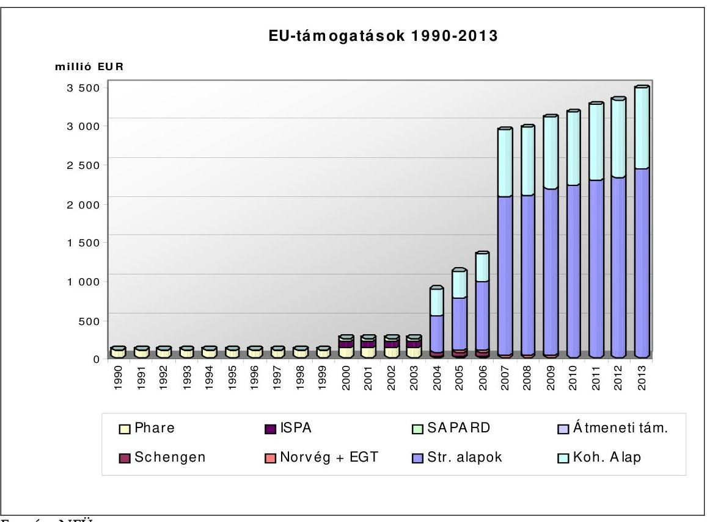

Forrás: NFÜ
A 2004. évi összeg nagyságát befolyásolta, hogy a csatlakozás évében csak arányos befizetési kötelezettség állt fenn, illetve a tradicionális saját források között megjelenő cukorilletéket a következő évben kellett teljesíteni, ennek megfelelően ilyen jogcímen 2004. évben nem keletkezett befizetési kötelezettségünk.

Magyarország hozzájárulása - a nemzeti hozzájárulásokon keresztül - az EU költségvetéséhez évről-évre növekedést mutatott, amelynek fő oka, hogy a bruttó nemzeti jövedelem növekedésével párhuzamosan nőtt a GNI alapú hozzájárulás mértéke is. 2009. évben a befizetési kötelezettségünk növekedésének másik oka a Svédország és Hollandia számára teljesítendő GNI hozzájárulási kötelezettség életbe lépése, valamint az ehhez kapcsolódó egyszeri pótbefizetés volt. Az áfa-alapú hozzájárulás, valamint a brit korrekció mértékének változása az azok meghatározására vonatkozó szabályokra vezethető vissza.

A Magyar Köztársaság költségvetésében megjelenő uniós kapcsolatokhoz tartozó támogatások (EU + hazai forrás), illetve visszatérítés fokozatos növekedést mutattak a 2004-2009 közötti időszakban, 2007-ben kismértékű visszaeséssel, 2009-ben nagymértékű kiugrással. A költségvetésben megjelenő EU kiadások 2004. évi közel 127 Mrd Ft-ja 2008-ra meghaladta az 520 Mrd Ft-ot, majd 2009ben megközelítette a 870 Mrd Ft-ot. (Ezen összegek tartalmazták az uniós támogatások utólagos elszámolását is.)

---

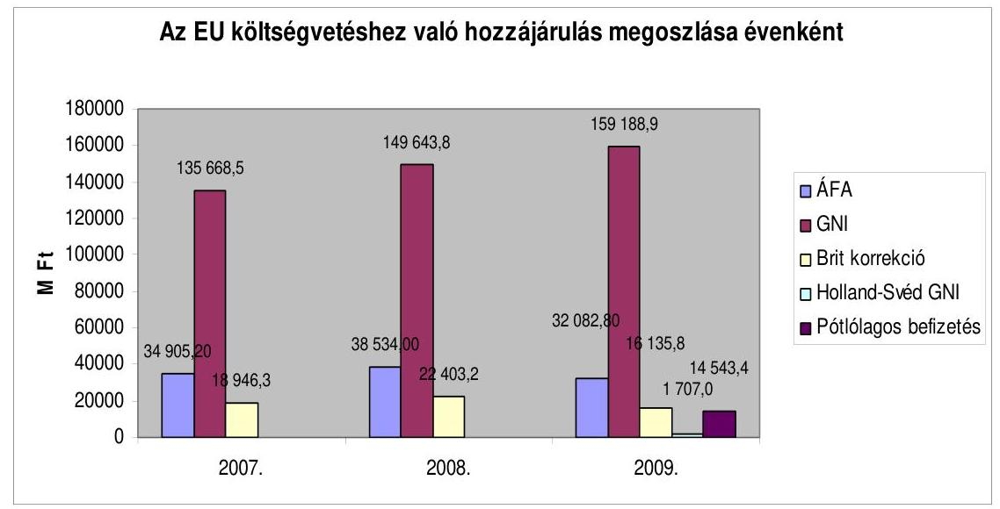

Forrás: ÁSZ zárszámadási jelentése
A támogatások összegének alakulása a programok életciklusához igazodott. A 2004-2006-os programozási időszak programjai (NFT és NVT, valamint az Átmeneti Támogatás) a 2006-2007-es felhasználási csúcsot követően 2008-2009ben fokozatosan kifutottak. Az új programozási időszakhoz kapcsolódó ÚMFT és ÚMVP a 2007-2008. évi lassú beindulást követően 2009-ben kimagasló felhasználási adatokat mutatott.

A Kohéziós Alap forrásainak felhasználása összhangban volt a nemzetközi öszszehasonlításban bemutatott kedvezőtlen képpel, miszerint a KA projektek nagyon mérsékelt ütemben haladtak előre: 2009-ben 5\%-kal nőtt a kifizetések aránya az előző évhez képest (ez az arány a többi KA kedvezményezett tagállam esetében 13-23\% között mozgott).

A költségvetésen kívüli agrárpiaci támogatások évenként változó képet mutattak, tendenciájában azonban növekvő mértékű támogatásról van szó. A támogatások összegét az intervenció finanszírozási szükséglete nagymértékben befolyásolta. A közvetlen támogatások esetében az elszámolási szabályok a kifizetések tárgyévi és az azt követő évi elszámolását is lehetővé teszi. Nagyrészt erre vezethető vissza az évek közötti eltérő felhasználás.

# 1.3. Magyarország és az EU pénzügyi kapcsolatai 2009-ben 

## Az Uniós tagsággal összefüggő hazai befizetések

Az EU költségvetését az egyéb bevételek sérelme nélkül teljes mértékben a Közösségek saját forrásaiból finanszírozzák. A saját források rendszerét szabályozó

---

uniós és - ezzel összhangban hazai - jogszabályi háttér 2009. március 1-jétől módosult ${ }^{1}$.

Az EU saját forrásait továbbra is ún. nemzeti hozzájárulás, valamint a tradicionális saját források jelentik.

A nemzeti hozzájárulás az áfa-alapú hozzájárulás, a GNI-alapú hozzájárulás, az ún. brit korrekció, valamint (2009-től) a svéd, és holland GNI hozzájárulás összegéből tevődik össze.

Az áfa-alapú hozzájárulás meghatározása minden tagállamra azonosan vonatkozó egységes kulcs alkalmazásával történt, amelyet az uniós szabályozásnak megfelelően kiszámított, harmonizált tagállami áfa alapra kellett vetíteni.

A GNI-alapú hozzájárulás összegét az összes tagállam nemzeti jövedelmének öszszegére vonatkoztatott egységes kulcs alkalmazásával kell kiszámolni.

A brit korrekció finanszírozásában való részvételi kötelezettség összege a költségvetési egyensúlytalanságok elkerülését célzó korrekciós mechanizmus részét képezi a saját források rendszerében. Az új uniós szabályozás szerint az EU nagy nettó befizetői részére (Hollandia és Svédország) biztosított GNI kedvezmény összege a többi tagállam befizetési kötelezettségét növeli.

Ausztria, Hollandia, Németország és Svédország csökkentett hozzáadottértékadóból származó forrás lehívási kulcsot alkalmazhat, azaz az áfa-alapú hozzájárulásuk csökken. Hollandia az éves GNI-hozzájárulásából bruttó 605 M euró, Svédország 150 M euró csökkentést vehet igénybe. Az „új uniós saját források határozat" továbbá az áfa-alapú forrás lehívásának egységes kulcsát 0,3\%-ban határozza meg.

Ezen GNI-alapú hozzájárulás fizetési kötelezettség 2007-re visszamenőleg keletkezett. Az ebből adódó különbözetet Magyarországnak 2009-ben (az uniós szabályozás hazai jogrendbe állításának időpontjától) pótlólagos befizetés formájában kellett rendeznie.

A nemzeti hozzájárulás pontos összegét minden esetben az Európai Unió határozza meg. A tagállamok feladata ebben az esetben az így meghatározott öszszegek minden hónap első munkanapján történő átutalására korlátozódik.

A nemzeti hozzájárulás összege 2009-ben 223,7 Mrd Ft volt, amelynek megoszlását a 3. ábra, illetve a 1. sz. melléklet mutatja be.

2009-ben Magyarország áfa-alapú hozzájárulása 32 Mrd Ft-ot, GNI-alapú befizetése 159,2 Mrd Ft-ot, a brit korrekció 16,1 Mrd Ft-ot, a Holland-Svéd GNI hozzájárulás 1,7 Mrd Ft-ot tett ki. Pótlólagos befizetés címén egyszeri 14,5 Mrd Ft összegű befizetést kellett teljesítenünk.

[^0]
[^0]:    ${ }^{1}$ Az új uniós szabályozást az Európai Közösségek saját forrásainak rendszeréről szóló 2007. június 7 -ei 2007/436/EK, Euratom tanácsi határozat, míg a magyar eljárásrendi szabályozást az Európai Unió saját forrásaival kapcsolatos kötelezettségek teljesítésében részt vevő intézmények feladat- és hatásköréről, valamint a kapcsolódó eljárásrendről szóló 101/2008 (IV. 29.) Korm. rendelet tartalmazza.

---

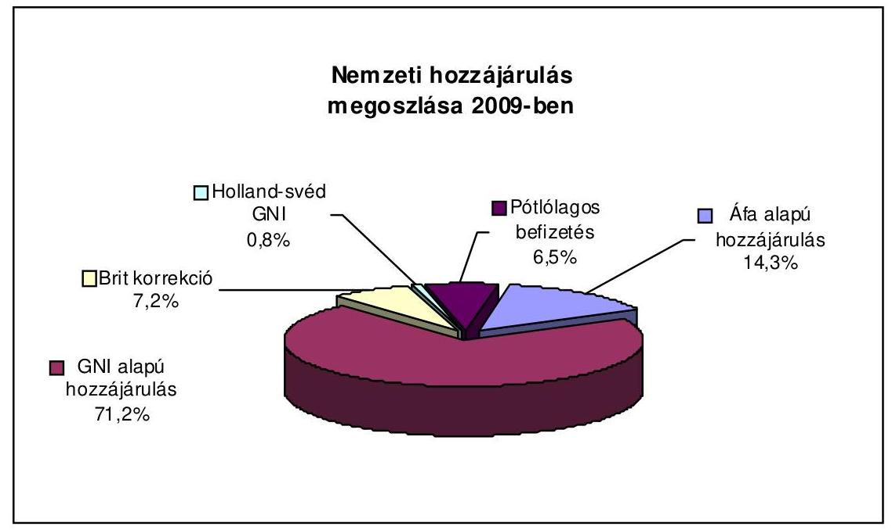

Forrás: ÁSZ zárszámadási jelentés
Az ÁSZ a zárszámadáshoz kapcsolódó helyszíni ellenőrzés során tételesen vizsgálta a Kincstárnál és a PM-nél a 12 havi hozzájárulás átutalásához tartozó teljes dokumentációt. A vizsgálat megállapította, hogy a dokumentáció megfelel a közösségi és hazai jogszabályi előírásoknak, valamint az érintett szervezetek eljárásrendjében foglalt követelményeknek.

A tradicionális saját forrásokat az Európai Közösség által a tagsággal nem rendelkező országokkal folytatott kereskedelemre megállapított vámok, mezőgazdasági vámok, illetve a cukorágazat piacának közös szervezése keretein belül nyújtott hozzájárulások (amelyeket a cukor-, az izoglükóz- és az inulingyártók teljesítenek), ún. termelési díjak jelentik.

A tradicionális saját forrásoknak nevezett tételeket a tagállamoknak kell beszedniük az unió részére, azonban a beszedés költségeinek fedezésére a bevételek $25 \%$-a a nemzeti költségvetést illeti meg. Az így befolyó összeg a költségvetés bevételei között kerül elszámolásra.

2009-es évben az EU-t megillető vámok összege 24,8 Mrd Ft, a termelési díj $471,1 \mathrm{M}$ Ft volt.

A 2009. évi befizetési kötelezettségek hazai kiszámításában, illetve lebonyolításában a kiemelt szerepet játszó Pénzügyminisztérium mellett a Vám- és Pénzügyőrség Országos Parancsnoksága (vám), a Mezőgazdasági és Vidékfejlesztési Hivatal (termelési díjak), az Adó- és Pénzügyi Ellenőrzési Hivatal (áfa alapú hozzájárulás), a Magyar Államkincstár (áfa alapú hozzájárulás), valamint a Központi Statisztikai Hivatal (áfa, illetve GNI alapú hozzájárulás) vettek részt.

Az ÁSZ zárszámadáshoz kapcsolódó helyszíni ellenőrzés alkalmával a VPtől, valamint az MVH-tól származó dokumentumok alátámasztották a tradici-

---

onális saját források címén befolyó bevételek valódiságát, az általuk alkalmazott eljárások megfelelnek a közösségi és hazai jogszabályi előírásoknak.

# Hazánk uniós támogatásai 

A Magyar Köztársaság 2009. évi költségvetésében az EU támogatások (NFT, Kohéziós Alap, ÚMFT, Egyéb strukturális támogatások, Nemzeti Vidékfejlesztési Terv, Új Magyarország Vidékfejlesztési Program, Halászati Operatív Program, SAPARD, Átmeneti Támogatás programjai, egyéb európai uniós támogatások) és a hozzájuk kapcsolódó hazai társfinanszírozás 829,2 Mrd Ft összegben jelent meg. A költségvetésben megjelenő uniós források 602,7 Mrd Ft-ot, a hazai társfinanszírozás 226,5 Mrd Ft-ot tett ki (4. ábra; 2/A. sz. melléklet).
4. ábra
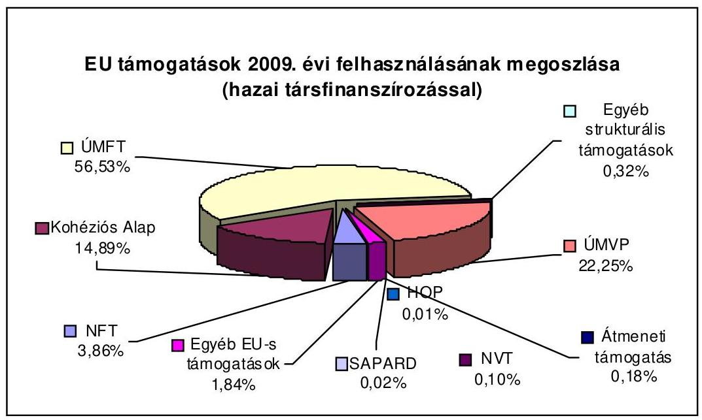

Forrás: ÁSZ zárszámadási jelentés
A költségvetésben megjelenő uniós előirányzatok kiadása 8\%-kal elmaradtak a tervezettől, ugyanakkor a központi költségvetési eszközök felhasználása 24\%kal túllépte a tervezett előirányzatot. Az uniós forrásokat is tartalmazó előirányzatok teljesülése összességében 16,1\%-kal maradt el a tervezett összegnél, amely javulást jelent a 2007-2008. évi kiemelkedően magas ( $40 \%$ feletti) arányhoz viszonyítva. Az elmaradás mértéke - összhangban az ellenőrzések megállapításaival - azt mutatja, hogy bár a programok végrehajtása jelentősen felgyorsult, még mindig elmarad a kívánatostól. Az uniós források és a hazai társfinanszírozás tényleges felhasználásának a tervezettel szembeni, egymástól eltérő tendenciáját az egyes támogatási csoportoknál eltérő indokok magyarázzák.

Az NFT esetében a pénzügyi válságra tekintettel az Európai Bizottság az eredeti 2008. december 31-ei zárási határidőt - hazánk kérésére - meghosszabbította 2009. június 30-ig, így még 2009. évben is teljesíthetőek voltak az NFT-hez kapcsolódó kifizetések.

---

A Kohéziós Alapból 2009-ig sor került a jelentősebb összegű szerződések megkötésére. Az NFÜ egyes KA projektek esetében pénzügyi megállapodásmódosításokat nyújtott be az Európai Bizottsághoz. A kérelmekben - többek között egyéb tartalmi változtatások mellett - az elszámolhatósági határidő hosszabbítását kérte annak érdekében, hogy a projektek sikeres lezárására megfelelő időkeret álljon az intézményrendszer rendelkezésére. A pénzügyi és gazdasági recesszió befolyásolta a KA-ból támogatott projektek által 2009. december 31-ig elért eredményeket.

Az ÚMFT 2009. évi 655 Mrd Ft eredeti kiadási előirányzatával szemben a tényleges kifizetés teljesítés $468,8 \mathrm{Mrd} \mathrm{Ft}(71,6 \%)$ volt. Ezen belül 390,6 Mrd Ft öszszegű uniós forrásfelhasználáshoz 78,2 Mrd Ft hazai támogatás társult, amely tartalmazza a Munkaerőpiaci Alaptól átvett támogatást is. A 2009. évi teljesítés alulmaradt a tervezettől a támogatások lebonyolításának időigénye miatt, annak ellenére, hogy a szerződéskötések és a kifizetések tendenciája növekedett.

# 2009 végére minden OP esetén sor került az első kifizetési igénylések Európai Bizottságnak való elküldésére, ami feltétele volt annak, hogy a tagállam a már átutalt előleget ne veszítse el. 

Az Egyéb strukturális támogatások esetében a kifizetések a két körös pályázati kiírások, valamint a nemzetközi egyeztetések időbeli elhúzódása miatt elmaradtak a tervezettől.

Az NVT esetében a 2004-2006-os időszakra vonatkozó 751,1 M euró forrást 2008. december 31-éig használhatta fel Magyarország, így ezen költségvetési sor 2009. évben eredeti kiadási előirányzattal már nem rendelkezett. Az Európai Bizottság 2009-ben elfogadta a program lezárásáról szóló, illetve a 2008. évi végrehajtási jelentést. Az Európai Bizottság a 2009. év végén, illetve 2010ben átutalta a program keretösszegéből a szabályoknak megfelelően visszatartott $5 \%$ forrást.

Az ÚMVP programok a nemzetközi és hazai gazdasági és pénzügyi válság ellenére az eredeti előirányzatot meghaladó mértékben teljesültek, amelyhez kétféle intézkedés járult hozzá. Egyrészt kétféle előlegfizetési konstrukciót vezettek be; másrészt Magyarország élt az Unió által biztosított lehetőséggel, amely szerint az EMVA-ból finanszírozott programok a 2009. év folyamán maximum $10 \%$-kal magasabb uniós finanszírozási aránnyal kerülhettek kifizetésre. A megemelt uniós finanszírozás 21,7 Mrd Ft többletforrás kifizetését tette lehetővé.

A HOP-ot az Európai Bizottság 2008-ban hagyta jóvá, így abban az évben a programra kifizetés nem történt. A 2009. évben az FVM előleg konstrukció bevezetésével, valamint a II. tengelyen belüli új intézkedéssel (közvetlen kifizetés) kívánta felgyorsítani a program megvalósulását. Azonban az előlegfizetés lehetőségének biztosítása nem valósult meg, továbbá adminisztratív okok (a lebonyolító szervezetrendszer kialakítása) miatt a kötelezettségvállalások év végére tolódtak ki. Mindezek következtében a kifizetések is elhúzódtak, 2009-ben csak a HOP végrehajtó szervezetének kialakításával, és munkabérek kifizetésével összefüggő kiadások valósultak meg a TS intézkedés keretében.

---

A SAPARD program 2008-ban lezárult, így 2009. évben eredeti kiadási előirányzattal már nem rendelkezett. Az előirányzat módosítására, illetve kifizetések és bevételek teljesítésére a korábbi vitás jogügyletek rendezéséből fakadó követelések, illetve kötelezettségek teljesítése miatt került sor.

Az Átmeneti Támogatás tekintetében a 2009. évi teljesítés összege jelentősen meghaladta a tervezett kifizetéseket, amely a maradvány-felhasználásból adódott.

Az Egyéb európai uniós támogatások közül összegükben a legjelentősebbek az ún. TEN-T programok (közlekedési, energetikai és távközlési hálózatok fejlesztése), az EGT/Norvég Alap támogatásai, valamint az ún. egyéb agrártámogatások (igyál tejet program, méhészeti program, egyes speciális szövetkezések támogatása, egyes állatbetegségek ellenőrzése és felszámolása, uniós programok áfa fedezete). Ezen programok eredeti tervezett kiadása az összes egyéb EU-s kiadás összegének mintegy háromnegyedét tette ki.

Az említett támogatások tekintetében a 2009. évi eredeti kiadási előirányzattól való eltérés okai általában a különböző programok keretén belül nyújtott támogatások kifizetéseinek következő évre való áthúzódása, illetve a támogatott projektek tervezettnél lassabb ütemben történt megvalósulása.

2009-ben zárult le az EGT és Norvég Finanszírozási Mechanizmusok program kötelezettségvállalási időszaka, ahol a rendelkezésre álló keret és a valós lekötések közötti különbséget egyrészt az árfolyam-különbözetekből fakadó eltérés, másrészt a kötelezettségvállalási határidő lejártát követően visszalépett projektekből megmaradt források adták.

A költségvetésen kívüli támogatások finanszírozása a Kincstári Egységes Számláról (KESZ) történik (a Kifizető Ügynökség a KESZ-ről megelőlegezi, és azt az EU utólag megtéríti az államháztartás számára). A támogatások ezen körébe tartoznak a közvetlen termelői támogatások (egységes terület alapú támogatás) és az agrárpiaci támogatások. Az utóbbi kategóriába tartoznak az exporttámogatások, belpiaci támogatások, az egyéb agrárpiaci támogatások és az intervenciós felvásárlásokhoz kapcsolódó raktározási szállítási költségtérítés és a finanszírozási költségtérítés.

A közvetlen termelői támogatások (SAPS) címén 228,7 Mrd Ft kifizetése történt meg 2009-ben (2/B. sz. melléklet). Az EU által közvetlenül térített SAPS támogatást a hazai forrásból finanszírozott kiegészítő nemzeti támogatás (top-up) 87,5 Mrd Ft-tal egészítette ki.

A 89 Mrd Ft összeget kitevő agrárpiaci támogatások tartalmazzák az exporttámogatásokra kifizetett 1,5 Mrd Ft-ot, a belpiaci támogatások címén folyósított 74 Mrd Ft-ot, és az egyéb agrárpiaci támogatásokra kifizetett 13,5 Mrd Ft-ot.

Az intervenciós beavatkozás során a 2009. évben az MVH 21,4 Mrd Ft-ot fordított a felvásárlás megelőlegezésére. Ezzel szemben a gabona, cukor és alkohol értékesítéséből, befolyt összeg 596,3 M Ft. Az egyenleg ennek megfelelően -20,8 Mrd Ft, amely az értékesítésig a költségvetés terheit növeli.

---

Az EU által finanszírozott programok, projektek közösségi forrás-részének utolsó részletét az Európai Bizottság csak a program zárását követően téríti meg. Azaz az unió egy-egy program esetében csupán a megállapított uniós keret 95\%-át (Strukturális Alapok), illetve 80\%-át (KA a 2004-2006-os programozási időszakban) biztosítja, a fennmaradó $5 \%$-ot, illetve $20 \%$-ot a tagállamnak kell megelőlegeznie és azt csak a program lezárását követően téríti vissza az EU.

Az EU költségvetéséből származó bevételként 36,8 Mrd Ft jelent meg. Ez az öszszeg a Magyarországot megillető termelési díjak visszatérítése címen keletkezett 157,0 M Ft-ból, a vám visszatérítés címen befolyó közel 8 Mrd Ft-ból és az uniós támogatások utólagos megtérülése címen - tervezettől jelentősen, közel 50\%kal elmaradva - befolyó 28,6 Mrd Ft-ból tevődött össze.

A tervezettől való elmaradás oka döntő részben a 4-es Metró beruházás részét képező 11 szerződéssel kapcsolatban az Európai Bizottság részéről megállapított közbeszerzési szabálytalanság miatti pénzügyi korrekció, amelynek következtében a korábbi évek kiadásaira jutó, bevételként már elszámolt uniós forrás (14,5 Mrd Ft) pénzügyi visszarendezése vált szükségessé. Ezen kívül az NVT zárása kapcsán a végső egyenleg-kifizetés ( $7,4 \mathrm{Mrd}$ Ft) elszámolására - az Európai Bizottság kései, csak év végén beérkező utalása miatt - nem került sor. A bevételezett összeg döntő részét a korábban tisztán hazai forrásból - a „Gyorsforgalmi úthálózat fejlesztése" előirányzat túllépésének Kormány határozattal történő engedélyezése következtében - megkezdett, de EU finanszírozásba bevonandó projektek kiadásaira jutó uniós forrás elszámolásai jelentették. Ezt egészítik ki a KA projektek utolsó 20\%-ának megtérüléseként jelentkező 972,8 M Ft-os, illetve az NFT-ben 2009-re vonatkozóan elszámolásra kerülő EU-s bevételek.

# 1.4. Az Európai Bizottság által közvetlenül kezelt források 

A Magyar Köztársaság érdekében történő beazonosított kifizetésként az Európai Bizottság a 2009. évben 3794,4 M eurót tartott nyilván. Ez az összeg uniós költségvetési kiadási fejezetenkénti ${ }^{2}$ bontásban tartalmazta a kifizetett támogatásokat, tehát mindazokat, amelyek felhasználása magyar közintézmények közreműködésével, az Európai Bizottsághoz közvetlenül benyújtott pályázatok útján, vagy Magyarország támogatás felhasználásával kapcsolatosak. Ennek döntő többségét a Magyar Köztársaság költségvetési beszámolójában szereplő (költségvetésében megtervezett és a költségvetésen kívüli Kincstári Egységes Számláról finanszírozott) tételek alkották. A közvetlenül a Bizottság által finanszírozott tételek közül a két legjelentősebb az oktatási-képzési és az ifjúsági célokra fordított támogatások voltak. A 2009-ben történt közvetlen kifizetések 74,1\%-kal haladták meg az előző évi szintet.

Az Európai Parlament és a Tanács az 1720/2006/EK határozattal hozta létre az „Egész életen át tartó tanulás programot", amely a 2007-2013 közötti időszakra szól, a Socrates és a Leonardo da Vinci programok összevonásával, tartalmi és szerkezeti megújításával segíti az egész életen át tartó tanulás valósággá válását, számtalan lehetőséget biztosítva mind az intézmények közötti nemzetközi tapasztalatcserére, innovatív elképzelések kidolgozására és gyakor-

[^0]
[^0]:    ${ }^{2}$ Fenntartható fejlődés, Természeti erőforrások, Szabadság, biztonság és a jog érvényesülése, az EU, mint globális partner, valamint az Igazgatásra fordított kiadások.

---

lati megvalósítására, mind az egyéni mobilitásra/tapasztalatszerzésre, valamint a rendszerszintű fejlesztések megvalósításának elősegítésére. A program által kínált együttműködési/támogatási lehetőségek lefedik az oktatás és képzés valamennyi szintjét, szakterületét és szereplőjét, a korai gyermekkori neveléstől a közoktatáson, szakképzésen, felsőoktatáson keresztül a felnőttképzést is beleértve. A határozat alapján az indikatív pénzügyi keret a hét éves időszakra (2007-2013) európai szinten 6970 M euró.

A program megvalósítása nemzeti szinten történik, a tagállamok oktatási minisztériumainak teljes körű felügyelete mellett. Mivel a program szabályai szerint a támogatási keret decentralizált felhasználású részére az Európai Bizottság nemzeti irodákkal köt szerződést, ezért a tagállamoknak az EU által meghatározott feltételeknek megfelelő nemzeti irodákat kell működtetniük a program nemzeti szintű megvalósítása érdekében. 2006-ban az oktatásért felelős miniszter a Tempus Közalapítványt (TKA) jelölte ki a program működtetésére hét éves időszakra. A Közalapítvány esetében az alapító nevében eljárni jogosult az oktatásért felelős miniszter.

A program indításakor az Európai Bizottság által megadott feltételeknek megfelelően az Oktatási és Kulturális Minisztérium biztosította a TKA-nál a szükséges feltételeket, erről kiadta a szükséges igazolást („ex-ante declaration").

A tagállamoknak minden évben utólagos igazolást („ex-post declaration") is kell kiadniuk arra vonatkozóan, hogy a program működtetésére kijelölt Nemzeti Iroda (Tempus Közalapítvány) a programot az előző évben az EU előírásoknak megfelelően hajtotta végre mind szakmai, mind pénzügyi szempontból, különös tekintettel az uniós pályázati pénzek kezelésére.

Az OKM 2009-ben és 2010-ben a megbízhatósági nyilatkozat kiadásának megalapozása érdekében vizsgálta a TKA éves tevékenységéről szóló jelentést, auditáltatta az éves pénzügyi beszámolót, részt vett a kedvezményezetteknél tett monitoring látogatásokon, folyamatában ellenőrizte, illetve részt vett a TKA által koordinált szakmai tevékenységekben, ellenőrizte a belső kontrollrendszereket.

Az OKM által 2010-ben kibocsátott megbízhatósági nyilatkozat többek között kimondja, hogy az Egész életen át tartó tanulás programot kezelő TKA pénzügyi rendszereinek és eljárásainak megbízhatóságáról ésszerű bizonyosságot szerzett, a forrásokat a céloknak megfelelően használták fel a megfelelő pénzügyi gazdálkodás elvének alkalmazásával. A nyilatkozat megerősíti, hogy a TKA éves jelentése híven tükrözi az elvégzett tevékenységeket, és a pénzügyi beszámoló valós képet nyújt a Közalapítványról, a tranzakciók jogszerűek, valamint a Bizottság által korábban javasolt intézkedéseket megfelelően végrehajtották.

Az Európai Parlament és a Tanács az 1719/2006/EK határozattal hozta létre a „Fiatalok Lendületben Programot" a 2007-2013 közötti időszakra, amelynek célja a nemformális nevelési programok támogatása a fiatalok számára. A program jelentősen hozzájárul a készségek és képességek fejlesztéséhez, és kulcsfontosságú eszközt jelent a fiatalok nemformális és informális tanulási le-

---

hetőségeinek biztosítására. A Program teljes költségvetése a 2007-2013 közötti időszakra 885 M euró.

A „Fiatalok Lendületben Program" fő célkitűzései: a fiatalok aktív polgári szerepének előmozdítása, különös tekintettel az Európa-polgári szerepükre; a fiatalok szolidaritásának fejlesztése, különösen annak érdekében, hogy erősödjön a társadalmi összetartás az Európai Unióban; a különböző országokban élő fiatalok közötti kölcsönös megértés és tisztelet elősegítése; hozzájárulni az ifjúsági tevékenységeket és az ifjúsági területen tevékenykedő civil szervezeteket támogató rendszerek fejlesztéséhez; az ifjúsági területen megvalósuló európai együttműködések előmozdítása.

Magyarországon a nemzeti hatóság szerepét a Szociális és Munkaügyi Minisztérium töltötte be, a Program végrehajtására kijelölt nemzeti ügynökség pedig a hazai ifjúsági szolgáltatások, illetve ifjúságpolitika szerves részét képző Foglalkoztatási és Szociális Hivatalon belül múködő Mobilitás Országos Ifjúsági Szolgálat.

# 2. AZ UNIÓs TÁMOGATÁSOK HAZAI FELTÉTELRENDSZERÉNEK BEMUTATÁSA 

### 2.1. Az uniós támogatások hazai intézményrendszere

Az EU-ból érkező források fogadásához, illetve lebonyolításához szükséges intézményrendszert Magyarország az EU előírásainak megfelelően, a hazai jogszabályokat figyelembe véve alakította ki.

A hazánkba érkező, sokrétű és a 2007-2013-as programozási időszakban a korábbit meghaladó nagyságrendű uniós fejlesztési támogatások minél teljesebb körű igénybevételéhez és a meghatározott támogatási célok hatékony felhasználásához a feladatokat gazdaságosan, hatékonyan, eredményesen ellátó intézményrendszer (stabil szervezeti háttér, megfelelő kapacitás, valamint egységes eljárásrend) megléte és múködése szükséges.

Az intézményrendszer szereplői jelen Tájékoztatóban egységesen a tárgyidőszakban, azaz a 2009-ben érvényes struktúrában és megnevezésekkel jelennek meg.

Az EU-ból érkező növekvő mértékű források fogadásához, illetve felhasználásának lebonyolításához szükséges hatékony intézményrendszer kialakítása érdekében a Kormány 2006. július 1-jével a Nemzeti Fejlesztési Hivatal általános jogutódjaként létrehozta a fejlesztéspolitikáért felelős miniszter irányítása alatt álló Nemzeti Fejlesztési Ügynökséget (NFÜ), amelynek keretében látták el feladataikat az új és korábbi programozási időszak (NFT, ÚMFT) Operatív Programjainak irányító hatóságai ${ }^{3}$.

[^0]
[^0]:    ${ }^{3}$ Az AVOP és az új programozási időszak agrár- és vidékfejlesztési, illetve halászati támogatásai irányító hatósága 2009-ben az FVM szervezetében helyezkedett el.

---

Az NFÜ ezek mellett ellátta a 2004-2006-os programozási időszakra vonatkozóan az EQUAL, INTERREG közösségi kezdeményezés programokkal, a Kohéziós Alappal, a 2007-2013-as programozási időszak tekintetében az Előcsatlakozási Támogatási Eszköz, az Európai Szomszédsági és Partnerségi Eszköz pénzügyi alapokkal és egyes, a területi együttmúködés (a határon átnyúló ún. ETE-) programokkal kapcsolatos irányító hatósági feladatokat. Az NFÜ felelőssége továbbá kiterjedt a PHARE programokkal és a Schengen Alappal, az Átmeneti Támogatással, a Norvég/EGT Finanszírozási Mechanizmussal, illetve a SvájciMagyar Együttmúködési Programmal kapcsolatos előkészítési, szervezési és koordinációs feladatokra is. Az NFÜ felügyeletét 2008. május 15 -től a nemzeti fejlesztési és gazdasági miniszter látta el.

Az ÁSZ a 2008. évre vonatkozó zárszámadás vizsgálat során megállapította, hogy az IH-k 2006-ban egy szervezetbe történt összevonása mellett elmaradt az IH-k NFÜ szervezetébe történt integrálása. A gyakorlatban valamennyi IH egymástól szervezetileg elkülönülten, önálló főosztályként működött. Az OP IHk tevékenységének összehangolása a gyakorlatban 2009-ben sem valósult meg annak ellenére, hogy az ÚMFT végrehajtásával kapcsolatos koordinációt a végrehajtási elnökhelyettes hatáskörébe utalta az SzMSz.

# A strukturális támogatásokat kezelő irányító hatóságok feladataik 

egy részét közremúködő szervezetekre delegálták. Az ÚMFT OP-k végrehajtására 15 közreműködő szervezet került kijelölésre miniszteri rendeletekben.

Az Európai Bizottság az OP-k megfelelőségi vizsgálatát elfogadó levelében felhívta a figyelmet arra a tényre, hogy mivel a KSZ-ek kiválasztása nem közbeszerzéssel történt, az NFÜ vállalta a TS terhére elszámolt költségek szabályosságának éves felülvizsgálatát.

A KA-ból nyújtott támogatások lebonyolítása háromszintú szervezetrendszeren keresztül történt. A támogatások szakmai és pénzügyi lebonyolítását a KA esetében teljes egészében a KSZ-ek végezték. A projektek végrehajtása lebonyolító testületekben történt.

A 2009. évre vonatkozó zárszámadás vizsgálat megállapította, hogy a korábbi évhez hasonlóan a programok végrehajtása során egyes IH-k aránytalanul nagymértékben támaszkodtak a KSZ-ekre, és saját feladatkörükbe tartozó tevékenységek közül irányítási és ellenőrzési funkciókat is a KSZ-ekre delegáltak, továbbá, hogy eltérő mértékben végeztek megfelelőségi ellenőrzéseket a KSZekre delegált feladatok ellátása tekintetében. A KA tekintetében a támogatások szakmai és pénzügyi lebonyolítását teljes egészében a KSZ végezte. A gyakorlatban a KA IH a KSZ-ek tevékenységére vonatkozóan irányítási és ellenőrzési funkciót nem, csak monitoring funkciót látott el.

A közreműködő szervezetek finanszírozásának egységesítése érdekében 2007-től fokozatosan bevezették az ún. SLA-k ${ }^{4}$ rendszerét, amelynek célja a teljesítményalapú, költséghatékony feladatfinanszírozás. 2009-re már csaknem min-

[^0]
[^0]:    ${ }^{4}$ Service Level Agreement: Szolgáltatási szint megállapodás, az Irányító Hatóságnak a KSZ irányában érvényesített irányítási jogköreinek legfontosabb formalizált eszköze.

---

denütt SLA szerződések léptek életbe, amelyek a támogatási feladatok lebonyolításának egységesítése irányába hatottak. A teljes egységesítés azonban még nem történt meg, illetve nem valósult meg egységes gyakorlat az SLA szerződések időhorizontját tekintve. Az IH-k még nem egységesen alkalmazzák a díjazás fajtáit (általában alap-, átalány-, rendelkezésre állási és sikerdíj) és azok tartalma is eltérő.

A KSZ-ek az SLA alapján az alapdíj és az átalánydíj díjtételekre előleget vehetnek fel. Az alapdíj előleggel a KSZ-ek az évközi alapdíj-elszámolások során számolnak el. Az éves tevékenység értékelése alapján a KSZ sikerdíjban is részesülhet az SLA-szerződésben rögzített szempontok szerint.

Az SLA alapján történő év végi elszámolást az IH a KSZ-nél végzett tényfeltáró látogatások alapján, illetve a szerződésben rögzített éves értékelés alapján végezte el, a feladatellátásban jelentkező hiányosság a sikerdíj csökkentését vonta maga után.

A GFP IH a MAG Zrt. éves értékelése alapján (a tevékenységével kapcsolatos panaszok számának növekedése, és az IH-nak történő adatszolgáltatás hiányosságai miatt) alap- és átalánydíjon felül 10\%-kal csökkentett mértékű sikerdíjat állapított meg. A KÖZOP IH a KIOP KSZ-tevékenységet a szerződés szerint értékelte és az átalánydíj mellett a sikerdíjat (az EMIR-feltöltöttség hiányosságai, és az Ellenőrzési Hatóság rendszerellenőrzés során tett megállapításai miatt) 10\%-kal csökkentve hagyta jóvá. A KÖZOP KSZ vonatkozásban az IH az éves értékelésében megállapította, hogy bár a KSZ tevékenysége jelentősen javult; a sikerdijnál $32 \%$-os levonást alkalmazott, az átfutási idők hosszúsága, és a szabályszerűségben tapasztalt egyes hiányosságok miatt.

2009-ben a KA KSZ az alaptámogatás mellett - a KSZ munkájában talált hiányosságok miatt - csökkentett kiegészítő támogatásban részesült (amely a kifizethető összeg egynegyede).

Tekintettel arra, hogy az SLA-rendszer bevezetése óta 2008 végéig eltelt két év során még nem került sor a díjazás mértékének és a díjazási rendszer múködésének teljes felülvizsgálatára, s ezért annak hatékonyságáról, eredményességéről az NFÜ sem rendelkezett átfogó képpel, megbízást adott az SLA rendszer felülvizsgálatára.

Az SLA rendszer felülvizsgálatát előkészítő értékelés kiemelte, hogy bár a rendszer múködése (különösen a versenyhelyzet hiányából fakadóan) nem optimális, nincs reális alternatívája. A jelenlegi megoldás inkább egy vegyes, jellemzően normatív elemekkel operáló feladatfinanszírozási szerződésnek tekinthető. A továbbfejlesztésre kidolgozott javaslatok rövidtávon a finanszírozási konstrukcióra (előlegfizetés és utólagos elszámolás bevezetése), az elvárt szolgáltatások pontos meghatározására (normakönyv), illetve a mérhető mutatókon alapuló szervezeti és vezetői sikerdíj kialakítására vonatkoztak. Középtávon célszerű a különböző szolgáltatásokra eltérő finanszírozási konstrukciót alkalmazni. Az értékelés következtetései szerint a legkedvezőbb költséggazdálkodás, rugalmasság és átláthatóság eléréséhez hosszú távon a kapacitáskereskedelem lehetőségének megteremtése, az IH-nak a KSZ-ekkel foglalkozó kapacitásainak bővítése, illetve a KSZ-ek gazdasági társasággá alakítása szükséges.

---

Az intézményrendszer részére 2009-ben a legnagyobb kihívást a két programozási időszakhoz kapcsolódó feladatok párhuzamos ellátása jelentette: a 2004-2006-os programozási időszak zárási feladatainak ellátása mellett biztosítani kellett a felfutó UMFT végrehajtását is. Ez a feladat az érintett intézmények szoros együttműködését és a határidők nagyon pontos betartását követelte meg valamennyi résztvevő oldaláról.

Az intézményrendszerben 2009-ben jelentősebb változás nem történt. Kisebb szervezeti átalakítások és vezetöcserék azonban ez évben is lezajlottak, illetve az NFÜ SzMSz-e 2009-ben kétszer is módosult. Ezek a változások alapvetően nem befolyásolták a végzett munka színvonalát, de egyes esetekben az állandóság hiánya bizonytalanságokat okozott.

Az EGT, NA finanszírozási mechanizmusok hazai intézményrendszerében 2009ben változás történt; a Központi Pénzügyi és Szerződéskötő Egység megszűnt, feladatait hivatalosan a Nemzetközi Együttmüködési Programok Irányító Hatósága vette át (NFÜ SzMSz 40.§ (1)), illetve megkezdődött a feladatok átadása a VÁTI keretein belül erre a célra 2009. június 1-jével felállított új Igazgatóság részére.

A zárással kapcsolatos feladatokat a KIOP IH - annak érdekében, hogy erőforrásaival jobban támogassa a KÖZOP lebonyolítását - delegálta az Energia Központ Kht.-re. A zárás folyamata ugyan összefogottabbá vált, azonban le is lassult, és a dokumentumok átadása sem folyt zökkenőmentesen.

A KÖZOP megfelelőségi vizsgálatban megfogalmazott kritika miatt szükségessé váló KIKSZ-et érintő átszervezés alapvetően nem járt a lebonyolítás jelentős változásával.

Annak ellenére, hogy az ellenőrzések több helyen kedvező változást tapasztaltak, továbbra is problémát jelent a kapacitáshiány, illetve a magas fluktuáció, amely kedvezőtlenül befolyásolta a feladatellátást. A vizsgálatok a feladatellátás kapacitáshiányra és fluktuációra visszavezethető hiányosságait elsősorban az ellenőrzések, a pénzügyi folyamatok és a dokumentáltság területén tárták fel.

Az elégtelen létszám játszott közre abban is, hogy a KÖZOP kifizetéseinél olyan késedelmek keletkeztek, amelyből a KIKSZ-nek késedelmi kamatfizetési kötelezettsége származott.

Az alacsony létszám miatt a KIKSZ-nél nem jutott elég munkaidőalap a KIOP-ra, és ez a dokumentáltságban hiányossághoz vezetett. Emiatt a zárásnál jelentős időt kellett fordítani az adminisztrációra. Az ÁSZ zárszámadási jelentése rámutatott, hogy a KIKSZ múködésében - a jogállásában, vezetésében, szervezetében bekövetkezett változások eredményeképpen - 2009-ben pozitív változások voltak tapasztalhatók, de még nem szűnt meg teljesen a létszám- és szakemberhiány.

A KIOP IH-nál 4\%-os, a KÖZOP IH-nál 30\%-os volt a fluktuáció.
Az Igazoló Hatóság a „Beszámoló az Iroda 2009. évi szakmai tevékenységéről" dokumentuma rámutatott, hogy a kapacitáshiány hatásai a pénzügyi és a záráshoz kapcsolódó egyeztetési feladatok ellátása terén is érezhetőek voltak (hitelesítési jelentések hiányos és/vagy késedelmes benyújtása, kifizetések elhúzódása, egyeztetések elhúzódása).

---

Az európai uniós forrásokkal kapcsolatos feladatok ellátását - a teljes intézményrendszerben jellemzően - határozott idejű szerződéssel foglalkoztatott - az intézmény engedélyezett létszámkeretén felüli - humánerőforrással biztosítják. Ezen létszámkeret pénzügyi forrását az ÚMVP, valamint HOP TS és ÚMFT VOP, illetve más uniós támogatás (pl. Norvég Alap) jelentik. Az ellenőrzések rámutattak, hogy a finanszírozás átláthatósága érdekében szükségessé vált az egyes támogatások kezeléséhez felhasznált munkaidő keret (ráfordítás) pontos nyilvántartása.

Az Ellenőrzési Hatóság VOP átfogó rendszerellenőrzése ellenőrzési jelentésében, illetve az NFÜ BEF által lefolytatott rendszerellenőrzés során megfogalmazott hiányosságokra is tekintettel az NFÜ-nél 2009. november 1-jén bevezetett E munkaidő (Elektronikus Feladat és Munkaidő Nyilvántartó Rendszer) biztosítja a ráfordítások egyes finanszírozási források (VOP Intézményi) közötti megosztását.

Az MVH vonatkozásában az engedélyezett létszámkeret több mint felét teszi ki az elsősorban az engedélyezési funkció teljesítését ellátó, az ÚMVP és HOP TS-ből finanszírozottak létszáma.

Az ÁSZ zárszámadási ellenőrzése keretében felmérte az EU támogatásokkal kapcsolatos eredendő kockázatokat, és a támogatások kezelésében résztvevő intézmények (NFÜ és KSZ-ek) belső kontroll kockázatait. Az előzetes értékelés alapján az NFÜ - mint az EU-s előirányzatok kezelője - belső kontrollrendszere alacsony kockázatúnak bizonyult azzal, hogy az egyes múködési területek közül az informatikai környezet és az EU-s előirányzatok felhasználásával kapcsolatos ellenőrzési tevékenység kapott közepes kockázati értékelést. Előbbi esetében a számvitelt támogató informatikai rendszerek (Forrás SQL, EMIR) egyes hiányosságai, utóbbinál egyes vizsgálatok elmaradása, és az utóellenőrzések hiánya eredményezett közepes kockázatot.

Az intézményrendszer múködésének ellenőrzése kapcsán az ÁSZ a kontrollok - legtöbbször a FEUVE, illetve az EMIR számítástechnikai rendszer hiányosságaira visszavezethető - nem megfelelő múködését állapította meg, amely közvetve a beszámolók kedvezőtlen minősítéséhez vezethetett. Mivel a hibák (belső kontrollok általi) feltárása elmaradt, felvetődik a FEUVE nem megfelelő működésének problémája is.

A számviteli kontrollok hiányosságát mutatja, hogy az évenkénti kötelezettségvállalás mértéke nem állapítható meg a nyilvántartásokból (így megsértve az Ámr. előírásait), és a követelések egyeztetése az adósokkal nem a Számviteli Politikában foglaltak szerint történt. Az NFÜ felelőssége, hogy az EMIR nem tudja nyomon követni a rendszerbe felvitt korábbi szállítói követelések és kötelezettségek változását.

Az EMIR funkcionalitásából eredő hiányosság miatt két esetben korlátozó véleményt kellett adni, valamint az intézményrendszer megsérti az Ámr. utalványozásra vonatkozó előírásait. Elmaradt az „Állami kedvezményezettek sajáterő támogatása" előirányzat felhasználásának szabályozása, illetve az EMIR megfelelő módosítása, így az összeg szabálytalanul a KÖZOP előirányzataiból került felhasználásra. A számviteli kontroll hiányosságaival hozható összefüggésbe a KÖZOP beszámolójának elutasítása, mert a beszámoló nem tartalmazott 6,1 Mrd Ft-os kiadást.

---

A belső kontrollokat érintően az egyik legrégebben fennálló hiányosság a belső ellenőrzés kapacitáshiánya.

A BEF a rendelkezésre álló létszámmal nem tudott megfelelő tevékenységet folytatni a feladatkörébe tartozó szertágazó területeken. A belső ellenőrök számát nem kapacitás-felmérés alapján állapították meg, és a korábbi létszám felülvizsgálatára az ÁSZ javaslata ellenére 2009-ben ismételten nem került sor. A rendelkezésre álló létszámmal a Főosztály 2006-ban nyolc, 2007-ben, 2008-ban és 2009-ben is csak hat-hat belső ellenőrzési vizsgálatot tudott jelentéssel lezárni (külső ellenőrök bevonásával).

A Zárónyilatkozat Kiadásért Felelős Szerv, illetve az Ellenőrzési Hatóság által lefolytatott rendszerellenőrzések alapvető megállapításai szerint a szervezetrendszer ellátja feladatait, ugyanakkor több területen kockázatok is észlelhetők, pl. a 2004-2006-os programozási periódus NFT OP-k zárási feladatainak részletes szabályozásával, a határidők és felelősök rögzítésével kapcsolatos hiányosságok. A problémákat az NFT OP-k zárásának folyamatában megoldották, azonban a késedelem sok problémát és fölösleges munkát is okozott. A 2009. évre vonatkozó zárszámadás ellenőrzés megállapította, hogy a zárójelentések 2010. szeptemberi határidőre történő elkészítése valamennyi OP-nál feszített tempót követel az intézményrendszertől. A ROP esetében a zárójelentés benyújtása az Európai Bizottsághoz 2010. március 30-án megtörtént.

A PM Nemzeti Programengedélyező Iroda (a továbbiakban Kifizető/Igazoló Hatóság) ellátja az Európai Unió strukturális és kohéziós alapjaiból, az Előcsatlakozási Támogatási Eszköz (IPA) programokból és Svájci Hozzájárulásból származó támogatásokkal kapcsolatosan a kifizető és az igazoló hatósági feladatköröket. Az EGT/Norvég Finanszírozási Mechanizmussal, valamint más támogatási eszközökkel összefüggésben ellátja a vonatkozó nemzetközi szerződésekből adódó, a Pénzügyminisztérium feladatkörébe rendelt pénzügyi lebonyolítással, számviteli nyilvántartással, költségigazolási és ellenőrzési tevékenységgel összefüggő feladatokat. Továbbá ellátja az Európai Unió által támasztott követelményeknek megfelelő és a Pénzügyminisztérium feladatkörébe rendelt pénzügyi lebonyolítási, számviteli és intézményfejlesztési feladatokat az előcsatlakozási eszközök és az Átmeneti Támogatás tekintetében.

Az uniós agrár-, vidékfejlesztési és halászati támogatások lebonyolítását a Földművelésügyi és Vidékfejlesztési Minisztérium, mint Illetékes és Irányító Hatóság, valamint a Mezőgazdasági és Vidékfejlesztési Hivatal, mint Kifizető Ügynökség, illetve Közremúködő Szervezet látta el. Az intézményrendszer részletes bemutatása és a múködésére vonatkozó ellenőrzési megállapítások a 3.3 Agrártámogatások fejezetben találhatóak.

# 2.2. Az uniós támogatások hazai ellenőrzési és monitoring rendszere 

### 2.2.1. Ellenőrzési rendszer

A támogatások pénzügyi ellenőrzéséért az Európai Bizottság az Európai Közösségek főköltségvetése végrehajtásáért való felelőssége sérelme nélkül, elsődlegesen a tagállamok vállalnak felelősséget. Minden tagállamnak kötelessége gon-

---

doskodni a rá vonatkozó ellenőrzési feladatok olyan ellátásáról, amellyel megvalósítja az alapelvek és ellenőrzési célok érvényesülését.

A feladatok ellátásához kapcsolódóan a tagállamoknak az ellenőrzések három szintjét kell ellátniuk.

Az első szintű ellenőrzés az úgynevezett folyamatba épített ellenőrzés, amely révén ellenőrizni lehet a társfinanszírozott termékek tényleges leszállítását, az ilyen szolgáltatások nyújtását, objektumok kivitelezését, továbbá a bejelentett kiadások valós voltát, valamint ezek megfelelését a közösségi és nemzeti jogszabályoknak.

A második szintet a rendszer- és mintavételes ellenőrzések adják, amelyek során a tagállamok vizsgálják az irányítási és ellenőrzési rendszerek működésének hatékonyságát, az ellenőrzési nyomvonal megfelelőségét, a számviteli nyilvántartások és az azokat alátámasztó bizonylatok valódiságát, összhangját a jogszabályi előírásokkal, valamint a társfinanszírozás rendelkezésre állását.

A harmadik szint a programok zárásához kapcsolódóan a támogatások végelszámolását megalapozó záró költségnyilatkozatok ellenőrzését foglalja magában.

Az Állami Számvevőszék - mint az Országgyűlés pénzügyi-gazdasági ellenőrző szerve, illetve az állam legfőbb pénzügyi ellenőrző szerve - egyrészt jogosult az államháztartás teljes körét érintő vizsgálatokra, másfelől az EU-ból érkező támogatások felhasználását, illetve a Közösséget megillető befizetéseket ellenőrizve hatékonyan részt vesz a Közösség pénzügyi érdekeinek védelmében.

Az államháztartási belső kontrollrendszerek keretében az államháztartásért felelős miniszter felel a FEUVE és a belső ellenőrzési rendszer szabályozásáért, fejlesztéséért, koordinációjáért és harmonizációjáért ${ }^{5}$.

A hazai jogszabályok 2009-re vonatkozóan a Kormányzati Ellenőrzési Hivatalt jelölték ki az Európai Regionális Fejlesztési Alapból, az Európai Szociális Alapból és a Kohéziós Alapból, továbbá a Szolidaritás és migrációs áramlások igazgatása általános program által finanszírozott támogatások, illetve a Ma-gyarország-Horvátország és a Magyarország-Szerbia IPA Határon Átnyúló Együttmüködési Programok és az ETE programok tekintetében az ellenőrzési hatósági (EH) feladatok ellátására a 2007-2013 közötti programozási időszakra.

A KEHI ellátta továbbá a 2004-2006 közötti programozási időszak tekintetében a Strukturális Alapokkal, a Kohéziós Alappal, az EQUAL és az INTERREG IIIA Közösségi Kezdeményezés programokkal kapcsolatos - az uniós pénzügyi rendeletekben ${ }^{6}$ előírt - ellenőrzéseket, az európai uniós előcsatlakozási eszközök,

[^0]
[^0]:    ${ }^{5}$ Az államháztartásról szóló 1992. évi XXXVIII. törvény 121/B. §-a.
    ${ }^{6}$ A Bizottság 438/2001/EK rendelete (2001. március 2.) a Strukturális Alapok keretében nyújtott támogatások irányítási és ellenőrzési rendszerei tekintetében az 1260/1999/EK tanácsi rendelet végrehajtása részletes szabályainak megállapításáról, valamint a Bi-

---

az Átmeneti Támogatás és a Schengen Alap támogatásai felhasználásának ellenőrzését. Az EGT és a Norvég Alap Finanszírozási Mechanizmusokból támogatott projektek ellenőrzését végzi. A KEHI feladata a Svájci-Magyar Együttmúködési Program általános pénzügyi ellenőrzése is.

A KEHI ellenőrzési tevékenységét szabályozó, az európai uniós és egyéb nemzetközi támogatások ellenőrzésére vonatkozó elnöki utasítással kiadott Ellenőrzési Kézikönyvet több alkalommal módosították. Ezek eredményeképpen megtörtént a rendszervizsgálat- és értékelés, az éves ellenőrzési jelentés és vélemény elkészítése eljárásrendjének kiegészítése és pontosítása, valamint bővült a mintavételezés módszertani segédlete a bizonyossági modell összefüggései alapján.

A KEHI elkészítette a 2007-2009. évi ellenőrzési stratégiáját, amely a 2004-2006 közötti időszakra kidolgozott stratégiára épült, megtartotta annak továbbra is érvényes elemeit, kiemelve a programok zárásával összefüggő ellenőrzési feladatokat. A KEHI összeállította a 2007-2017. évi ellenőrzési stratégiákat az ÚMFT OPjaira, amelyeket 2009-ben felülvizsgált.

A 2007-2013-ra vonatkozó uniós rendelet alapján a KEHI 2009. június 30-ig elvégezte a 2008. január 1 - 2008. december 31. közötti referencia-időszakra vonatkozó rendszer- és mintavételes ellenőrzéseket.

A projektellenőrzések tervezési módszertana módosult, ennek megfelelően abban az esetben, ha a kifizetési kérelmek száma nem éri el a pénzegység alapú mintavételi módszer alkalmazásához szükséges volument, nem-statisztikai kiválasztásra kerül sor.

A hazai szabályozás szerint 2009-ben a KEHI látta el a zárónyilatkozat kiadásáért felelős szervezet feladatait.

Az uniós források ellenőrzési rendszerének múködésében tapasztalt hiányosságok csökkentése érdekében a Bizottság 2008-tól (első alkalommal 2007. évre vonatkozóan) előírta, hogy a tagállamok összegezzék a rendelkezésre álló ellenőrzési jelentéseket, véleményeket, igazolásokat és nyilatkozatokat, és a tárgyévet követő év február 15-éig állítsanak össze egy ún. éves összegző jelentést (Annual Summary) ${ }^{7}$. Hazánkban az éves összegző jelentés összeállítását 2010-ig a KEHI végezte (2010. július 1-jét követően az EUTAF feladata).

Az éves összegző jelentésben a Kormányzati Ellenőrzési Hivatal bemutatta a 2007-2013-as programozási időszak kiadásait, amelyekről az Igazoló Ható-
zottság 1386/2002/EK rendelete (2002. július 29.) a Kohéziós Alapból nyújtott támogatások irányítási és ellenőrzési rendszere, valamint a pénzügyi korrekciós eljárás tekintetében az 1164/94/EK tanácsi rendelet végrehajtására vonatkozó részletes szabályok megállapításáról.
${ }^{7}$ A Tanács 2002. június 25-i 1605/2002/EK, Euratom rendelete az Európai Közösségek általános költségvetésére alkalmazandó költségvetési rendeletről; illetve A Bizottság 2002. december 23-i 2342/2002/EK, Euratom rendelete az Európai Közösségek általános költségvetésére alkalmazandó költségvetési rendeletről szóló 1605/2002/EK, Euratom tanácsi rendelet végrehajtására vonatkozó részletes szabályok megállapításáról.

---

ság úgy nyilatkozott, hogy azok megfelelnek a kiadások elszámolhatósági feltételeinek, illetve a kiadásokat a kedvezményezettek részére az operatív program keretében kiválasztott műveletek végrehajtása során a közpénzből való hozzájárulásnak az általános uniós rendelet vonatkozó feltételeivel összhangban fizették ki. A 2004-2006-os programozási időszak vonatkozásában bemutatta az igazolt kiadásokat, amelyekről a Kifizető Hatóság a - költségigazolási tevékenysége keretében 2008-ban - úgy nyilatkozott, hogy azok megfelelnek az érintett programot vagy projektet jóváhagyó bizottsági határozatokban megállapított célkitűzéseknek és a Strukturális Alapokra vonatkozó általános rendelet, illetve a Kohéziós Alapra vonatkozó általános uniós rendelet rendelkezéseinek.

A Halászati Operatív Program Igazoló Hatósága még nem nyújtott be költségnyilatkozatot az Európai Bizottság részére 2009. december 31-ig, tekintettel arra, hogy az irányítási és ellenőrzési rendszer csak 2009. júliusában került kialakításra. Így a HOP esetén nem volt kiadható nyilatkozat az igazolt kiadások helytállóságára vonatkozóan.

Az éves összegző jelentésben a KEHI összefoglalta az egyes programozási időszakra vonatkozó ellenőrzési tevékenységet. (Ezek megállapításait jelen Tájékoztató részletesen tartalmazza.) A 2007-2013-as időszakra vonatkozóan az Ellenőrzési Hatóság csak az ÁROP-ESZA, illetve EKOP-ERFA vonatkozásában adott ki fenntartások nélküli véleményt.

Az éves összegző jelentés szerint az ellenőrzési összefoglalók eredményei alapján a KEHI véleménye, hogy „a 2009. december 31-én véget érő évre a 20002006 és a 2007-2013 közötti időszakra megállapított strukturális intézkedések irányítási és ellenőrzési rendszerei megfeleltek a rájuk vonatkozó szabályozási követelményeknek, és hatékonyan múködtek. Így elfogadható biztosítékot jelentenek arra vonatkozóan, hogy a Bizottság számára igazolt kiadási nyilatkozatok helyesek, és ennek következtében elfogadható biztosítékot jelentenek, hogy az ezek alapjául szolgáló ügyletek jogszerűek és szabályosak".

A Kormány 2010. július 1-jei hatállyal létrehozta az Európai Támogatásokat Auditáló Főigazgatóságot (EUTAF) ${ }^{8}$. A Főigazgatóság a KEHI jogutódjaként ellátta az Európai Regionális Fejlesztési Alapból, az Európai Szociális Alapból és a Kohéziós Alapból származó támogatások tekintetében az ellenőrzési hatósági feladatokat, továbbá az egyéb - korábban a KEHI feladatkörébe tartozó - európai uniós és nemzetközi támogatások ellenőrzési feladatait.

A végrehajtást szabályozó hazai jogszabályokban ${ }^{9}$ előírt belső ellenőrzési funkciót az érintett szervezetek funkcionálisan független belső ellenőrzési részlege látta el.

[^0]
[^0]:    ${ }^{8}$ 210/2010. (VI. 30.) Korm. rendelet az Európai Támogatásokat Auditáló Főigazgatóságról.
    ${ }^{9}$ A Nemzeti Fejlesztési Terv operatív programjai, az EQUAL Közösségi Kezdeményezés program és a Kohéziós Alap projektek támogatásainak fogadásához kapcsolódó pénzügyi lebonyolítási, számviteli és ellenőrzési rendszerek kialakításáról szóló 360/2004. (XII. 26.) Korm. Rendelet, valamint a 281/2006. (XII. 23.) Kormányrendelet a 2007-

---

A közreműködő és lebonyolító szervezetek esetében azok belső ellenőrzési egységei végezték el a belső ellenőrzési feladatokat.

Kiemelkedő szerepe van az NFÜ Belső Ellenőrzési Főosztályának, amely ellátja a belső ellenőrzési feladatokat valamennyi olyan támogatás tekintetében, amelynek végrehajtásában az NFÜ részt vesz, azaz felelős az Ügynökség szervezeti egységeinek (így az IH-k) belső ellenőrzéséért, továbbá a nemzetközi támogatások felhasználásával kapcsolatosan a kedvezményezetteknél és a támogatások lebonyolításában részt vevő szervezeteknél való ellenőrzésért, valamint az Ügynökségnél végzett külső ellenőrző szervezetek ellenőrzéseinek nyilvántartásáért, koordinálásáért és meghatározott esetekben a szabálytalansági bizottságok munkájában való részvételért. Ezen szerteágazó és jelentős uniós forrásokat lefedő feladatok ellátására az egység 10 fővel rendelkezik.

Az ÁSZ zárszámadásról szóló vizsgálata ismét rámutatott a magas kockázatra, miszerint az uniós előirányzatok tömege, sokfélesége, és szervezeti tagoltsága miatt rendkívül nagy aránytalanság állt fenn a feladat és annak végrehajtására biztosított humánerőforrás között, így az NFÜ BEF a saját kapacitásával a számára kijelölt ellenőrzési területnek csak kis részét tudta lefedni. A helyzetet tovább rontotta, hogy a szervezet az ellenőrzés mellett egyéb nyilvántartási, adatszolgáltatási, kockázatkezelési, szabálytalansági eljárásban való részvételi feladatokat is ellát.

Bár pozitívan értékelhető, hogy az NFÜ BEF létszámában a korábbi években tapasztalható fluktuáció és létszámhiány 2009-re mérséklődött (a rendelkezésre álló 10 fős kapacitás feltöltésére volt lehetőség), továbbra is fennáll a probléma, hogy a BEF ténylegesen 5,5 emberév kapacitást tud ellenőrzésre fordítani.

A kapacitás gondok enyhítésére, valamint a kiválasztott projektek és pályázatok vizsgálatához szükséges - műszaki-technikai, közbeszerzési és pénzügyi tartalmú - speciális szakértelem, szaktudás igényére tekintettel a feladatai ellátáshoz a BEF szakértőket, alvállalkozókat és a VOP források terhére külső erőforrásokat vesz igénybe. A külső ellenőrzések koordinálása viszont szintén leköti a BEF kapacitásának egy részét.

A BEF jelentéseinek hasznosulása szempontjából az ÁSZ jelentés kifogásolta, hogy azokat semmilyen vezetői fórum nem tárgyalta, így a szervezet tevékenysége formailag tölti be azt a funkciót, amit az SzMSz meghatároz.

Az ellenőrzések nyilvántartása 2008. évtől az EMIR felületén működő Ellenőrzési Nyilvántartó Rendszerben („ELLI") történik.

A rendszer tartalmazza a belső ellenőrzési jelentéseket, a külső ellenőrző szervek által végzett ellenőrzéseket, az ellenőrzések alapján készített intézkedési terveket és azok nyomon követésére vonatkozó információkat.

2013 programozási időszakban az ERFA, ESZA és a Kohéziós Alapból származó támogatások fogadásához kapcsolódó pénzügyi lebonyolítási és ellenőrzési rendszerek kialakításáról.

---

A folyamatba épített ellenőrzések legfontosabb része a KSZ-eknél zajlik, és a támogatási rendszer egyes elemeinek ellenőrzési listák alapján történő ellenőrzéséből és a helyszíni ellenőrzésekből áll. A zárszámadásról szóló helyszíni vizsgálatok megállapították, hogy a munkafolyamatokat az ellenőrzött szervezetek mindenütt elvégezték.

A helyszíni ellenőrzések lebonyolítását általában önálló szervezeti egységek gyakorta külső szakemberek bevonásával - végzik. Az ÁSZ zárszámadási ellenőrzéséhez kapcsolódóan elvégzett helyszíni ellenőrzések megállapították, hogy a KSZ eleget tett a helyszíni szemle eljárásrendjében foglalt kötelezettségeinek, felhívták azonban a figyelmet, hogy a KSZ az ellenőrzött számlákat nem látja el jelzéssel (pecsét, aláírás), így utólag nem volt ellenőrizhető, hogy a számlák vizsgálata valóban megtörtént-e (az agrártámogatások ellenőrzése kapcsán az Igazoló Szerv hasonló megállapításra jutott).

A PM Nemzeti Programengedélyező Iroda - mint Kifizető/Igazoló Hatóság - kiemelt feladatot látott el az uniós támogatások ellenőrzési rendszerében, a kiadások megfelelő igazolása érdekében a pénzügyi lebonyolítás tekintetében a teljes rendszer ellenőrzésére volt jogosult. A Kifizető/Igazoló Hatóság egyéb pénzügyi és igazolási tevékenysége mellett tényfeltáró látogatásokat és tényfeltáró vizsgálatokat végzett annak érdekében, hogy az Európai Bizottság felé megalapozottan tanúsítsa a költségnyilatkozatban szereplő kiadásokat hitelesítő szervezetek (IH, KSZ) irányítási és ellenőrzési rendszerének hatékony működését, továbbá a jogszabályi előírásokkal való összhangját.

A 2009-ben lefolytatott tényfeltáró vizsgálatok és tényfeltáró látogatások rendszeresen tártak fel kisebb - elsősorban adminisztratív - hiányosságokat, amelyek azonban a költségek elszámolhatóságát nem befolyásolták.

Az ÁSZ a zárszámadás ellenőrzésének keretében megvizsgálta a Közösségi Hozzájárulás Rendezése teljes folyamatát és megállapította, hogy a PM NAO Iroda által végzett eljárás megfelelt a Múködési Kézikönyvben meghatározott eljárásrendnek. Megállapította továbbá, hogy a PM NAO Iroda belső ellenőrzése a függetlenség, a szabályozottság és a tervszerűség szempontjából megfelelően múködött, rámutatott azonban, hogy a belső ellenőrzés által ellátott tanácsadói tevékenység az Éves Ellenőrzési Terv végrehajtása, illetve az összeférhetetlenség vonatkozásában kockázatot hordozott magában, dokumentáltsága nem volt megfelelő.

2007-től a jogszabályban kijelölt KSZ-ek kapacitása, humánerőforrás-háttere nem tudta biztosítani a két programozási időszakhoz kötődő előírt ellenőrzési kötelezettség teljesítését, így többek között helyszíni ellenőrzések lebonyolítására 2008-ban a korábban a KSZ funkciókat ellátó és a hazai támogatási rendszerben is komoly gyakorlatot felmutató Magyar Államkincstárral az NFÚ Együttmúködési Megállapodást kötött.

A Magyar Államkincstár alaptevékenységi körében ellátta a strukturális és kohéziós alapokkal, illetve általában az Európai Uniós pénzeszközökkel kapcsolatosan jogszabályban és nemzetközi megállapodásban meghatározott végrehajtási, pénzforgalmi (forint és deviza), valamint a 2007-2013-as programozási időszakban az Európai Regionális Fejlesztési Alapból, az Európai Szociális

---

Alapból és a Kohéziós Alapból származó támogatások fogadásához kapcsolódó pénzügyi lebonyolítási és ellenőrzési rendszerek kialakításáról szóló 281/2006. (XII. 23.) Korm. rendelet 7/A. §-a szerinti ellenőrzési feladatokat.

A 2004-2006-os programozási időszakban a Kincstár az EU-s támogatások lebonyolításához kapcsolódóan a költségvetés végrehajtását szabályozó jogszabályokban meghatározott feladatokon túl a HEFOP és az EQUAL Közösségi Kezdeményezési keret Program keretében támogatott projektek esetében végzett a 11/2004. (IV. 7.) FMM-PM együttes rendelt alapján közremúködői feladatokat. Ennek keretében pénzügyi monitoring feladatokat látott el valamennyi intézkedés keretében az EQUAL programban, a HEFOP-ban ezt a feladatot 2007től az 5. prioritás és az 1.2. intézkedés esetében látta el. A tevékenység az elszámolások teljes körű pénzügyi szemléletű feldolgozását és a kifizethető támogatási összegre vonatkozó hitelesítési tevékenységet, valamint helyszíni ellenőrzések lebonyolítását jelenti. 2010-ben a Kincstár mindkét programban a zárással kapcsolatos feladatokat látta el.

Az NFÜ az ÚMFT-ben végzett ellenőrzési feladatok ellátásának részleteit a Kincstárral külön együttműködési megállapodásban rögzítette.

A Kincstár az ellenőrzés keretében utólagosan ellenőrizte a kedvezményezettek által benyújtott pályázatok és elszámolások KSZ-ek által történő feldolgozását és a tranzakciók EMIR-ben történő rögzítésének szabályosságát. A Kincstár ellenőrizte továbbá a KSZ-ek által készített kifizetési előrejelzéseket az EMIR-ben szereplő adatok és az NFÜ által rendelkezésre bocsátott útmutató alapján.

A Kincstár 2008-ban több mint 250 db pályázat és projekt EMIR rögzítésének ellenőrzését végezte el, amelynek eredményeképpen javult a monitoring rendszer alkalmazásának szabályozási háttere, valamint feltöltöttsége. A közreműködő szervezetek kapacitásának kiegészítéseképpen közel 300 db projekt helyszíni ellenőrzésébe kapcsolódott be.

A Kincstár ellenőrzési tevékenysége a 2008-as feladatok (az EMIR-ben történő rögzítések ellenőrzése, valamint a helyszíni ellenőrzések lebonyolítása) mellett 2009-ben tovább bővült az elszámolások utólagos felülvizsgálatával és a pályázatok dokumentációjának ellenőrzésével. Ennek keretében közel 2100 db pályázat és projekt szabályszerűségi, valamint több mint 200 db projekt helyszíni ellenőrzését látta el a Kincstár az Irányító Hatóságok megbízásából. A szabályszerűségi vizsgálatok esetében 2009-ben olyan ellenőrzési szempontrendszer került kialakításra, amely valamennyi közreműködő szervezetnél egységesen alkalmazható és amellyel biztosítható, hogy mind az eljárási szabályok betartása, mind bizonyos tevékenységek esetében a megfelelő feladatellátás egységesen, azonos szempontok szerint felülvizsgálható.

Az Irányító Hatóságok egyre növekvő igényei hatására 2010-ben a Kincstár létszámbővítést hajtott végre és az ellenőrzési feladatokat folytatja, amelynek keretében a szabályszerűségi ellenőrzéseit valamennyi OP tekintetében egységesítette.

Az ellenőrzési funkciók hiányos múködésére vonatkozó megállapítások a korábbi években tapasztaltakhoz hasonlóan - a 2009. évben lefolytatott el-

---

lenőrzések során is megfogalmazódtak, amely arra utal, hogy az ellenőrzési rendszer további erősítése szükséges, különösen az IH-k és KSZ-ek vonatkozásában.

Az ÁROP bizottsági auditja megkérdőjelezte az operatív program irányítási és ellenőrzési rendszerének megbízhatóságát, amely a kifizetési határidő megszakítását vonta maga után mindaddig, amíg a magyar hatóságok nem bizonyítják az első és másod szintű ellenőrzési rendszer megbízhatóságát.

A TÁMOP-TIOP vonatkozásában az EH megállapította, hogy a HEP IH 2007-ben és 2008-ban nem végezte el a delegált feladatok végrehajtásának minőségellenőrzését a KSZ-eknél.

Az SLA rendszer értékelése kiemelt hosszú távú feladatként jelölte meg az IH-k KSZ-ekkel foglalkozó kapacitásainak bővítését a delegált feladatok ellenőrzésének megvalósulása érdekében.

Az ÁSZ zárszámadási jelentése rámutatott, hogy a belső ellenőri létszám hiánya a feladat részbeni ellátatlanságához vezetett. A helyszíni ellenőrzésnél a nem kielégítő létszám - a tevékenység színvonalának kétségtelen növekedése ellenére nem teszi lehetővé valamennyi esetben a mélyreható ellenőrzést. A KIKSZ-nél az egy fő belső ellenőr kettős funkciót látott el, a külső ellenőrzések koordinálását és a belső ellenőrzést, ennek következtében egy belső ellenőrzési vizsgálatot tudott végezni 2009-ben, ami jelentősen elmaradt az éves tervben kitűzött feladatoktól és a szükségestől is.

Pozitív példaként említhető, hogy a MAG Zrt.-nél 2009-ben a GFP IH 3-3 GVOPés GOP-projektre kiterjedő ún. tényfeltáró látogatást végzett külső szervezet bevonásával. Ennek keretében a projektek teljes életútján vizsgálták a jogszabályi és belső szabályozási előírások érvényre juttatását, és az észrevételek alapján a projektekre vonatkozó konkrét illetve az eljárásrendre vonatkozó általános megállapításokat tettek. A többi IH a Kincstár bevonásával végezte el a KSZ-ekre átruházott feladatok végrehajtásának ellenőrzését.

2009-ben a ROP IH három KSZ-nél végzett helyszíni ellenőrzést - a Kincstár egy könyvvizsgáló cég segítségével - a 2009. szeptember 29-ével hatályba léptetett ellenőrzési útmutató alapján. A helyszíni ellenőrzés a KSZ-ekre delegált tevékenységek ellenőrzését, könyvvizsgálatot és a KSZ által készített jelentések alátámasztottságának vizsgálatát foglalta magában. 2010-ben a módszertan alapján a helyszíni ellenőrzések tovább folytatódtak, a Tájékoztató összeállítása idején 10 KSZ vizsgálata volt folyamatban.

A VOP mintavételes ellenőrzése a folyamatba épített ellenőrzések és a megfelelő ellenőrzési nyomvonal nem megfelelő működését állapította meg (a feltárt szabálytalansági gyanúk a vizsgált 11 projekt közül négyet érintettek, egyik projekt esetében a szabálytalansági gyanúval érintett összeg a projekt keretében igazolt költség több, mint $81 \%$-a volt). Az ellenőrzés rámutatott, hogy a feltárt hibákat, hiányosságokat a megfelelő első szintű ellenőrzések kiszűrhették volna.

Folyamatosan problémát jelent az intézményrendszer részére, hogy nem valósul meg az ellenőrzések harmonizációja, illetve nagy leterhelést jelentett számukra a külső ellenőrzések (ÁSZ, KEHI, Európai Számvevőszék, Európai Bizottság) koordinálása.

---

Az NFÜ BEF beszámolója szerint helyszíni ellenőrzése időszakában a VOP vonatkozásában mind a KEHI, mind pedig az Európai Bizottság Regionális Főigazgatósága ellenőrzést tartott, így az ellenőrzések megháromszorozódásának elkerülése érdekében a BEF megszakította ezen ellenőrzését.

Az ellenőrzöttek leterheltségének csökkentése érdekében az ellenőrzést végző szervezetek (pl. az ÁSZ) központosított dokumentumtárolási eljárásokat vezettek be, ezzel biztosítva, hogy az adott dokumentumot csak egy alkalommal kelljen az ellenőrzöttől bekérni és azt valamennyi vizsgáló egység felhasználhassa.

Az ÁSZ 2009-ben megkezdte egy számítógéppel támogatott dokumentációs rendszer és dokumentumtár (VIDOR) kialakítását, amely támogatja az ellenőrzések egységes elvek szerinti dokumentálását. Az egy ellenőrzött szervezethez tartozó ellenőrzési dokumentumok központi tárolása és a vizsgálatot végzők általi hozzáférése révén az ellenőrzöttekre háruló adatszolgáltatási teher is jelentősen csökkent, és hatékony lehetőséget nyújtott az ellenőrzések során felhalmozott ismeretek (újra)felhasználására és megosztására.

Az NFÜ-nél kialakításra került a belső ellenőrzés hálózati rendszerén belül egy KEHI mappa abból a célból, hogy a KEHI szervezeti egységei központilag hozzáférjenek az NFÜ központi dokumentumaihoz. A BEF feladata a megküldött dokumentációk belső hálózatra történő feltöltése.

Az agrártámogatások több szinten megvalósuló ellenőrzési rendszerét és múködésének tapasztalatait a 3.3 Agrártámogatások fejezetben mutatjuk be.

# 2.2.2. Monitoring rendszer 

A programok végrehajtásához, illetve az előcsatlakozási alapok, valamint az NFT lezárását követő - a fenntartási időszakhoz kapcsolódó - monitoring tevékenység kiemelkedő szerepet játszott. Ebből fakadóan az ÁSZ zárszámadási ellenőrzése kiemelt témaként foglalkozott azzal a kérdéssel, hogy az intézményrendszer hogyan építette ki és múködtette a monitoring rendszert.

Az NFÜ feladata az OP-k végrehajtásának és azok monitoring rendszerének szervezése, illetve a monitoring bizottságok (MB-k) múködésének biztosítása.

Az IH-k feladata a programban foglalt célok megvalósulásának nyomon követése, az általuk kezelt programok vonatkozásában múködtetik a programok pályázati, monitoring és jelentéstételi rendszerét, biztosítják az MB-k múködtetését, gondoskodnak a KMR részére történő adatszolgáltatásról, elkészítik a projektek és programok zárójelentésit, és múködtetik a monitoring információs rendszereket.

Az ellenőrzés megállapította, hogy a monitoring rendszer kialakításáról és múködéséről szóló jogszabályban előírtaknak megfelelően ${ }^{10}$ az EU által nyújtott támogatások kezelésében, illetve felhasználásában részt vevő szervezeteknél a monitoring tevékenységért felelős egységek létrejöttek.

[^0]
[^0]:    ${ }^{10}$ Az EU által nyújtott egyes pénzügyi támogatások felhasználásával megvalósuló, és egyes nemzetközi megállapodás alapján finanszírozott programok monitoring rendszerének kialakításáról és múködéséről szóló 102/2006. (IV. 28.) Korm. rendelet.

---

Feladatuk a központi költségvetésből illetve az EU által nyújtott támogatások felhasználásával bonyolított eljárások figyelemmel kísérése, a rendelkezésre álló források felhasználása vizsgálatának elvégzése (pénzügyi monitoring), valamint a projekt/program célkitűzéseknek megfelelő hatékony végrehajtásának nyomon követése (szakmai monitoring) a projektek hatékonyabb végrehajtását biztosító rendelkezések előkészítése, a végrehajtás előzetes terveitől való eltérés esetén a szükséges intézkedésről való gondoskodás.

Az NFT és ÚMFT operatív programok folyamatos nyomon követését a Monitoring Bizottságok múködtetése útján látták el. Az ÚMFT vonatkozásában a MB-k jellemzően évente két alkalommal üléseztek. A MB-k feladatai közé tartozott a programok előrehaladásának és az ezeket mutató indikátorok folyamatos nyomon követése, az éves jelentések elfogadása, a külső ellenőrzések tapasztalatainak elemzése, az éves illetve kétéves akcióprogramok értékelése és jóváhagyása, a KSZ-ek monitoring tevékenységének figyelemmel kísérése és felügyelete, az EMIR rendszer tapasztalatainak elemzése, a KA-projektek egyenkénti figyelemmel kísérése. Ezeket gyakran kiegészítette egyes pályázati felhívások megbeszélése, illetve egyes projektek bemutatása.

Az ÁSZ ellenőrzés a TIOP-TÁMOP vonatkozásában hiányosságként állapította meg, hogy az MB ülésekről nem minden esetben készült írásos jegyzőkönyv.

Az NFT vonatkozásában 2009-ben a HEFOP és az EQUAL, illetve a KIOP esetében. nem tartottak MB ülést. GVOP MB ülés a GOP üléssel együtt történt.

A projekt szintü monitoringgal kapcsolatos feladatokat a KSZ-ek végzezték. A projekt monitoring keretében a KSZ a kifizetést megelőzően (dokumentum alapon, illetve helyszíni ellenőrzés útján) ellenőrizte az előrehaladási jelentésekben foglaltakat. A monitoring tevékenység részeként ellenőrizték a kifizetések jogosságát és a köztartozás-mentességet. Az ÁSZ zárszámadási ellenőrzése megállapította, hogy a KSZ-ek 2009-ben a monitoring tevékenységet az előírt jogszabályi kereteken belül megfelelően végezték.

A projektszintű pénzügyi monitoring eszköze az egyes programokhoz kapcsolódó EMIR alrendszerek (EMIR SA alrendszer, EMIR KA alrendszer, EMIR ÚMFT alrendszer). Az EMIR feladata többek között az SA, KA programok/projektek adatainak gyűjtése, rendszerezése és szolgáltatása. Valamennyi, a támogatási rendszer múködtetésében résztvevő intézmény e rendszert használja végrehajtási, kifizetési, ellenőrzési és monitoring feladatai ellátása során, illetve felhasználja ezen feladataihoz kapcsolódó tájékoztatási kötelezettségei ellátásához.

Az ÁSZ zárszámadási ellenőrzése megállapította, hogy az intézményrendszer megkezdte a fenntartási monitoring rendszer kiépítését, szükségesnek látta azonban a rendszer erősítését a múködtetési időszak problémáinak kezelhető szinten tartásához, a jövőbeni - szabálytalanságból fakadó visszafizetések elkerülése érdekében.

Az AVOP esetében megállapította, hogy a kirendeltségi Monitoring Csoportok múködése ugyan előrelépést jelentett, azonban a méretük, a rendelkezésükre álló információ tartalom terjedelme, a nagy mennyiségű munkavégzésük manualitása, az érdemi elemzési, probléma előrejelzési funkció korlátozott érvényesülése kockázatot jelent a működtetési időszak problémáinak kezelésére.

---

A ROP esetében a beszámolók szakmai és pénzügyi elemzését a projektmenedzser látja el, a szükséges (akár rendkívüli) ellenőrzést az adott projektet a teljes életciklusában kezelő projektmenedzser és a helyszíni ellenőr együtt végzi el.

A KIOP Múködési Kézikönyvnek a fenntartási időszak feladataival való kiegészítése, a fenntartási jelentés egységes formanyomtatványának kialakítása elhúzódott, így a támogatottak által esetlegesen elkészített fenntartási jelentéseket sem lehetett emiatt elfogadni.

A KA monitoring tevékenység keretében a projektek előrehaladását részletesen értékelő havi áttekintő értekezleteket tartottak 2009 végéig, illetve évente két alkalommal MB ülést.

# 2.3. Az uniós támogatások hazai nyilvántartási rendszerei 

Tekintettel arra, hogy az Európai Unióval történő elszámolások megbízhatósága és a források hatékony felhasználása érdekében a gazdálkodásról naprakész, pontos adatokat szolgáltató nyilvántartási és monitoring rendszerek fenntartása elengedhetetlen, a 2009-ben lefolytatott ellenőrzések kiemelt területként kezelték a monitoring rendszer múködésének és különös tekintettel az EU-s alapok elszámolásait támogató informatikai rendszerek (Egységes Monitoring és Információs Rendszer - EMIR és az Integrált Igazgatási és Ellenőrzési Rendszer IIER) múködésének vizsgálatát.

### 2.3.1. Egységes Monitoring Információs Rendszer

Az uniós rendelet előírásai szerint a tagállamnak megfelelően kiépített informatikai rendszerrel kell rendelkezni, amely a közösségi források felhasználásáról megbízható adatokat és információkat szolgáltat a Kormány, az intézményrendszer és az Európai Unió számára.

A jogszabályi előírások szerint a nyilvántartások vezetésére az EMIR-t, az INTERREG programoknál az IMIR-t, az ETE esetében az IMIR 2007-2013 rendszert kell alkalmazni.

Az EMIR egy olyan adminisztratív és napi menedzsment munkát is támogató, átfogó rendszer, amely nyomon követi a finanszírozott projektek előrehaladását a befogadástól a kifizetésig, azzal, hogy a projekteket a fenntartási időszakban is nyomon követi.

A rendszer kidolgozásának kezdete (2003) óta a Welt 2000 Kft. üzemeltette és fejlesztette az EMIR-t. Az EMIR-t integrált rendszerelemek alkotják. Az alrendszerek felhasználói funkcionalitását modulok (főbb logikai funkció csoportok) támogatják.

A rendszer múködésének stabilitása és hatékonysága érdekében, tekintettel a felhasználói terhelés növekedésére, az NFÜ több lépésben bővítette és átalakította az EMIR informatikai infrastruktúráját. Megvalósult a Kincstár és az EMIR közötti on-line adatkapcsolat a törzskönyvi nyilvántartó rendszer adataira vonatkozóan. A vonatkozó fejlesztések eredményeként a pályázati kitöltő programban, a pályázati modulban csökkenthetők az adminisztratív teendők, és pályázó hitelesítési funkció szolgál a hibás rögzítések elkerülésére.

---

Az ellenőrzések megállapították, hogy az EMIR alapvetően jól töltötte be a nyilvántartással kapcsolatos szerepét, ugyanakkor több hiányossága is volt. Többek között az EMIR statisztikák nem a még fennálló kötelezettségek állományát mutatták, hanem a projektekre még el nem számolt, „nyitott" összegeket, ez a mérlegvalódiság elvét is sértette. Nem volt megállapítható a rendszerekből az adott évre fennálló kötelezettségvállalás összege sem. Az értéknapos lekérdezések csak az adattár modulban voltak elérhetőek. Az EMIR adattartalmának megbízhatóságát csökkentette, hogy az egyes KSZek eltérő módon és mértékben töltötték fel az EMIR nyilvántartásokat.

Az EMIR ÚMFT alrendszerénél 2009-ben még nem zárult le a követeléskezelés, valamint az elszámolást igénylő zárási funkciók szakmai követelményeinek meghatározása.

A korábbi évekhez hasonlóan az EMIR múködése során fellépő hibák többletmunkát okoztak az intézményrendszernek.

A számviteli modul múködése során tapasztalt hibák többször tették szükségessé azok javítását. Az automatikus zárás funkció több támogatási eszköznél, mint KA, SA, EQUAL hibásan múködött. Ennek javítása megtörtént az év folyamán.

A PM NAO Iroda az EU forráslehívások, közösségi hozzájárulás rendezések és költségnyilatkozatok összeállítását, az átutalási megbízások kiállítását, illetve bankszámla kivonatok, árfolyamok rögzítését támogató finanszírozási modul múködését kielégítőnek találta.

Az NFÜ BEF az EMIR ÚMFT alrendszerére vonatkozóan több hiányosságot tárt fel a jogosultsági igénylés dokumentáltságát és a jogosultság felülvizsgálati rendszert, valamint a jelszókövetelményeket érintően. Javaslatot tettek a ka-tasztrófa-helyreállítás rendszeres tesztelésére, illetve a mentési kazetták megfelelő tárolására, valamint szállítására.

Az EMIR ÚMFT alrendszer informatikai rendszerellenőrzéséhez a BEF külső szakértőt vett igénybe. Az ellenőrzés megállapította, hogy az SLA, helyszíni szemle és szerződések modulok 2007-es implementálása vonatkozásában az IH-k egy részétől nem került sor formális élesítés jóváhagyására. Az élesítési folyamat során a formális felhasználói elfogadás nem volt feltétele az éles üzembe helyezésnek. Az összeférhetetlen szerepkörök nem definiáltak. Nem vizsgálnak összeférhetetlenségeket a szerepkörök és a jogosultságok kialakítása során. Az ellenőrzés rámutatott, hogy az SLA modul hiányosságainak következtében az elszámolások nem egységes rendszer alapján kerültek összeállításra és elszámolásra.

Az ÁSZ zárszámadási ellenőrzése a kontrollrendszerek - az EMIR hiányosságaira visszavezethető - nem megfelelő múködését tárta fel, amely a beszámolók kedvezőtlen minősítését vonta maga után.

Az EMIR nem tudja nyomon követni a rendszerbe felvitt korábbi szállítói követelések és kötelezettségek változását. Szintén az EMIR-ben szereplő dokumentum hiányosságai miatt nem az Ámr előírásai szerint történt az utalványozás a lebonyolítási számlán az összes ÚMFT előirányzatnál. Az EMIR hiányosságából fakadóan a kötelezettségvállalás analitikus nyilvántartásából az évenkénti kötelezettségvállalás mértéke nem állapítható meg, amellyel megsértik az Ámr előírásait.

---

Az IMIR-re vonatkozó megállapítások a vonatkozó programokról szóló fejezetben találhatóak.

# 2.3.2. A Kincstár által múködtetett monitoring rendszer 

A Kincstári Monitoring Rendszer (KMR; korábbiakban Országos Támogatási Monitoring Rendszer) 1998 óta végzi a költségvetési támogatással megvalósuló programok adatainak nyilvántartását. Az EU-csatlakozást követően a rendszerben megjelentek az uniós támogatást is magukban foglaló programok, ezzel együtt megfogalmazódott a pályázati nyilvántartási rendszerek (elsősorban a KMR és az EMIR) közötti adatkapcsolat igénye. A KMR feladata többek között, hogy a köztartozással rendelkező gazdálkodókat azonosíthatóvá tegye a pályázatok elbírálása során.

A KMR-re vonatkozó szabályokat tartalmazó kormányrendelet (Ámr.) több helyen is módosult a kincstári monitoring adatszolgáltatást érintően, de ezek a változások nem befolyásolták a kialakított elektronikus adatküldés feltételrendszerét. A szabályok magukban foglalták a pályázatokat elbíráló döntéshozók, valamint az APEH és a VPOP KMR részére történő adatszolgáltatási kötelezettségeit.

Az uniós csatlakozást követően az adatbevitel már nemcsak a Kincstár saját apparátusa útján, hanem más nyilvántartási rendszerekből történő elektronikus adatátvitellel is történt. Ennek megfelelően a KMR adattartalmának naprakészsége, pontossága, megbízhatósága nagymértékben függött az adatokat szolgáltató többi nyilvántartási rendszer múködésének színvonalától is. Ennek a KMR információit felhasználók (adóhatóságok, pályázati döntéshozók) szempontjából volt jelentősége.

A KMR üzemeltetéséért felelős Magyar Államkincstár tájékoztatása szerint egyezően az NFÜ közlésével - az adatcsere technikai feltételei adottak voltak, azonban a rendszeres adatküldés nem történt meg az EMIR oldaláról, illetve az adatküldés nem volt teljes körű. Jellemzően a pályázati adatok érkeztek meg, a döntési és finanszírozási adatok nem.

Az interfésznek megfelelő informatikai megoldást a rendszer tartalmazta. A KMR-ből érkező adatokat egy, az erre szolgáló funkció segítségével lehetett beolvasni az EMIR-be, az EMIR adatminősége és töltöttsége miatt azonban a teljes körű adatküldések nem valósultak meg.

Az EMIR és a KMR adatkapcsolat-rendszere 2009-ben is problémás terület volt. 2009. október óta az EMIR nem küldött adatokat a KMR részére. Az NFÜ elnöke által elrendelt vizsgálat megállapította, hogy az adatszolgáltatás technikai feltételei adottak, azonban a tényleges adatküldést az EMIR adathiánya folyamatosan akadályozta.

2010 elejétől az NFÜ elnökének intézkedései nyomán az adathiány mérséklődött, a sikeresen elküldött adatok száma jelentősen növekedett.

---

# 2.3.3. Integrált Igazgatási és Ellenőrzési Rendszer 

A közös agrárpolitikát szabályozó uniós rendelet alapján a tagállamnak Integrált Igazgatási és Ellenőrzési Rendszert kell kialakítania ${ }^{11}$, amely elsősorban a termőföld- és állatállomány alapú közvetlen támogatások kezelésére, nyilvántartására, kifizetésére, illetve a kifizetés jogosságának ellenőrzésére szolgál. Az IIER integráltságát az adta, hogy egyrészt magában foglalta mindazokat a nyilvántartási rendszereket, amelyek az eljárások végrehajtásához szükségesek, másrészt tartalmazta mindazokat az eljárásokat, amelyek a közösségi intézkedések keretében benyújtott támogatási kérelmek elbírálását és ellenőrzését szolgálták.

Az IIER a Mezőgazdasági és Vidékfejlesztési Hivatal alaptevékenységét, vagyis az agrár- és vidékfejlesztési támogatások kezelését támogató rendszer. A rendszer adatbázisa és szerverei központosítottan az MVH budapesti székhelyén vannak, a hivatal 19 megyei kirendeltsége, valamint a külső felhasználók innen érik el a rendszer szolgáltatásait. A rendszer megalkotásának egyik kiindulópontja az volt, hogy az MVH az alaptevékenységéhez kapcsolódó folyamatok szervezésének, irányításának és végrehajtásának rendjét nagymértékben a korszerű információ-technológiai eszközök igénybevételére akarta alapozni. Az MVH mint Kifizető Ügynökség szigorú akkreditációs eljárásokon ment keresztül, amelyben a hivatal több feltételnek is az IIER biztosította informatikai támogatásra alapozva felelt meg. Ilyen például az ellenőrzési nyomvonal, a hatáskörök szétválasztása, a folyamatvezéreltség vagy az adatok több évre viszszamenőleges azonnali elérhetősége.

Az IIER a kérelembefogadástól egészen a támogatási összegek banki átutalásának generálásáig, valamint az Európai Bizottsággal való elszámolásig kezelte a támogatásokat. Az IIER-ben mód van a teljesen automatizált támogatási folyamatoktól kezdve olyan informatikai támogatottságú jogcímek kezelésére is, amelyeknél egyes folyamati lépések ügyintézők, illetve szakértők által hozott szakmai döntések alapján történtek. Az ügyintézői munka minőségének javítását számos folyamatba épített, kockázatelemzéses mintavételen alapuló vezetői felülvizsgálati lehetőség támogatta. Bizonyos esetekben még a kérelmek befogadása is elektronikusan, interneten keresztül történt a benyújtók ügyfélkapus azonosításával és a kérelmek interaktív kitöltésével.

A rendszer tartalmazza a mezőgazdasági parcellák nyilvántartását, a mezőgazdasági termelői nyilvántartást, a támogatási kérelmek nyilvántartását, az állatállomány nyilvántartását. A támogatás alapját képező földterület és a gazdálkodók kapcsolata az IIER-ben a támogatási kérelmek kitöltésével alakul ki, ez tartalmazza a konkrét földterületet és a gazdálkodó adatait, amelyekkel az integrált rendszer további múveleteket végez. A rendszer kötelező eleme az integrált ellenőrző rendszer, amely gyakorlatilag a fenti nyilvántartások összekapcsolása.

Az IIER alkalmazás a több mint 150 párhuzamosan futó támogatási konstrukció kezelésékor az MVH központja és 19 megyei kirendeltsége mellett öt további

[^0]
[^0]:    ${ }^{11}$ Az IIER múködtetésének kereteit a 3508/92 és az azt felváltó 1782/2003, valamint 73/2009 Tanácsi Rendeletek határozzák meg, amelyek az integrált rendszer múködtetését minden tagállam számára kötelezővé teszik.

---

szervezetnél mintegy 1500-2500 párhuzamos felhasználót szolgált ki, míg az Interneten elérhető szolgáltatásokat csúcsidőszakokban párhuzamosan tízezres nagyságrendű további felhasználó vette igénybe. A 2004. májusi éles indulás óta a közel 450 ezer ügyfél mintegy 2 millió eljárást indított, miközben közel 10 millió iktatandó iratot nyújtott be. Az ügyek eredményeként hozzávetőlegesen 3,3 millió határozat, illetve több mint 2500 Mrd Ft kifizetés született. A feladat nagyságrendje miatt elkerülhetetlen, hogy az MVH nagy hangsúlyt fektessen hatékony megoldások alkalmazására. A folyamatok gyorsabbá és pontosabbá tétele érdekében az MVH számos ellenőrzést automatizáltan végeztetett az IIERrel, valamint igénybe vette a rendszer azon képességét, hogy külső adatbázisokkal képes adatösszevetést végezni.

Az IIER fejlesztését, illetve múködtetésének informatikai támogatását a HewlettPackard Magyarország Kft. végezte. A támogatási tevékenység során havonta közel kétezer, egy külön informatikai rendszerben nyomkövetett kérés kielégítése történt, köztük jelentős mennyiségű, akár az egész évet átölelő rendszertovábbfejlesztés volt folyamatban. (Az elmúlt időszakokban például évente mintegy 50 új támogatási jogcím bevezetése történt meg.)

A rendszer informatikai támogatását és fejlesztését a kijelölt hazai és uniós hatóságokon túl független minőségbiztosító, egy dán cég is ellenőrizte. Ennek keretében a fejlesztés teljes spektruma mintavételes ellenőrzésre került, a fejlesztőknél történő, folyamatba épített ellenőrzésektől kezdve a végfelhasználói átvételi teszteken való részvételig.

Az IIER-re vonatkozó ellenőrzési megállapításokat a 3.3 Agrártámogatások fejezetben mutatjuk be.

# 2.3.4. Számviteli és nyilvántartási rendszerek 

A pénzügyminiszter felé az elszámolási és adatszolgáltatási kötelezettséget elkülönítetten vezetett, eredményszemléletű kettős könyvviteli nyilvántartások alapján kell teljesíteni.

A támogatási programok vonatkozásában biztosítani kell, hogy a számviteli nyilvántartások vezetése naprakész adatokat mutasson, az egyes támogatási eszközök tekintetében vezetett nyilvántartások az előző gazdasági évek tekintetében zártak legyenek, és éves beszámolókkal legyenek alátámasztva.

A 2004-2006 programozási időszakra vonatkozóan a számviteli nyilvántartást a Kifizető Hatóságnak a Strukturális Alapokra és a Kohéziós Alapra vonatkozóan, az IH-knak (közreműködő szervezeteknek) a Strukturális Alapokra vonatkozóan, míg a Kohéziós Alap közreműködő szervezeteknek a Kohéziós Alapra vonatkozóan kell vezetni a külön megjelentetett PM tájékoztató alapján.

## A 2004-2006-os programozási időszak zárási feladatai 2009-ben folyamatban voltak.

A számviteli beszámolók elkészítéséhez szükséges egyeztetések lefolytatását, a feltárt hibák, hiányosságok javítását, az egyes évek zárását, a kapcsolódó informatikai beavatkozásokat az NFT feladatokra rendelkezésre álló humán erőforráskapacitások szűkössége hátráltatja. Az NFT vonatkozásában a 2004. és 2005.

---

évekre a kifizető hatóság beszámolói, és az ÚMFT vonatkozásában a 2009. évi igazoló hatósági beszámoló jóváhagyásra kerültek.

A 2004-2006 évekre a számviteli beszámolók elkészültek és jóváhagyásra kerültek. A 2007- 2009 évek zárása és a beszámolók elkészítése a Tájékoztató lezárásakor folyamatban volt.

A 2007-2013-as programozási időszakban 2008. január 1-jétől az ÚMFT-re vonatkozóan az irányító hatóságok és közremúködő szervezetek európai uniós támogatások lebonyolításával kapcsolatos feladataihoz kötődő számviteli nyilvántartási kötelezettséget a Nemzeti Fejlesztési Ügynökség által átruházott feladatként a Magyar Államkincstár teljesítette.

A könyvvezetést két szervezet (az IH-k és a KSZ-ek gazdasági eseményeit a Kincstár, a saját tevékenységére vonatkozó gazdasági eseményeket a PM NAO Iroda) végezte. A tárgyidőszak elteltével a két érintett szervezet rész-beszámolót készít, amelyekből a PM NAO Iroda készíti el az összevont teljes körú ÚMFT-re vonatkozó éves beszámolót.

A PM NAO Iroda fenti jogszabályi kötelezettségének az ÁSZ zárszámadási vizsgálat lezárásáig nem tett eleget.

A 2007. évről készített ÚMFT részbeszámoló 2009. május 26-án, míg az összevont beszámoló 2010. január 31-én került jóváhagyásra. A 2008. évről készített ÚMFT részbeszámoló 2010. január 31-én került jóváhagyásra. A 2008. évre vonatkozó összevont beszámoló jóváhagyása a helyszíni ellenőrzés lezárásáig nem történt meg, illetve 2009. évre vonatkozóan nem készült még el az összevont beszámoló.

A Kincstár - az általa vezetett számviteli nyilvántartás alapján - az IH/KSZszintű részbeszámolókat az ÁSZ-vizsgálat lezárásáig valamennyi lezárt évre vonatkozóan elkészítette.

A 2007. és 2008. évről készített ÚMFT részbeszámolókat a Kincstár elnöke 2009. április 30-án hagyta jóvá, a 2009. évre vonatkozó részbeszámoló pedig 2010. április 30-án.

A számviteli nyilvántartás naprakészsége valamennyi támogatási eszköz vonatkozásában biztosított volt, a szükségessé váló kisebb javításokat elvégezték.

Fontos hangsúlyozni, hogy az uniós támogatásokra vonatkozó, elkülönített, eredményszemléletű könyvvezetés leírt hiányosságai az uniós támogatásokhoz és azok hazai társfinanszírozásához kapcsolódó államháztartási, pénzforgalmi szemléletű számviteli nyilvántartás vezetését és az erről szóló zárszámadás végrehajtását nem befolyásolták, az államháztartási beszámoló teljességét és megbízhatóságát nem érintették.

# A pénzforgalmi szemléletú államháztartási könyvelés 

Az ÁSZ zárszámadásról szóló ellenőrzése megállapította, hogy az Uniós Fejlesztések előirányzatainak pénzforgalmi szemléletű könyvelését az NFÜ Fejezeti Főosztály végzi, a főkönyvi könyvelés folyamatait a Forrás SQL integrált pénzügyi és számviteli programjával rögzíti, a folyamat zárt, a könyvvezetés a

---

bankszámlakivonatokból történik. Az analitikus nyilvántartások EMIR-ben történő vezetése az IH-k, a KSZ-ek, illetve a Kincstár feladatait képezik. Az analitikus nyilvántartások és a főkönyvi számlák között nincs automatikus kapcsolat, a beszámoló-készítéshez az analitikus nyilvántartásokat vezető szervezetek (IHk , KSZ-ek, Kincstár) szolgáltatnak adatokat az NFÜ-nek. A szolgáltatott adatok megbízhatóságáért, szabályszerűségéért a költségvetési beszámolót készítő NFÜ felel.

Az NFÜ Fejezeti Főosztály azonos szabályok alapján készíti az Uniós Fejlesztések előirányzatainak költségvetési beszámolóit, végzi a számviteli, nyilvántartási és előirányzat-kezelési tevékenységet. Az NFÜ Számviteli Politikát, Számlarendet, Pénzkezelési, Leltározási és Értékelési szabályzatokat készített. A Számlarend és a Pénzkezelési Szabályzat és a Számlatükör kialakítása megfelelő.

Az ÁSZ zárszámadásról szóló ellenőrzése rámutatott, hogy a Leltározási és Leltárkészítési Szabályzat nem tartalmazta a sajátosságokat is figyelembe vevő tartalmi elemeket. Önálló Bizonylati renddel a fejezet továbbra sem rendelkezett. Az elmúlt évhez hasonlóan az ÁSZ idén is javasolta a Bizonylati Album és Bizonylati rend elkészítését.

A Magyar Köztársaság 2009. évi költségvetése végrehajtásának ellenőrzése során az ÁSZ pénzügyi (szabályszerúségi) ellenőrzés keretében minősítette az Uniós Fejlesztések fejezetnél a fejezeti kezelésű előirányzatok megbízhatóságát és a számviteli törvényben, valamint az államháztartás szervezetei beszámolási és könyvvezetési kötelezettségeinek sajátosságairól szóló 249/2000. (XII. 24.) Korm. rendeletben foglaltaknak való megfelelését.

Az NFÜ a „XIX. Uniós Fejlesztések fejezet" fejezeti kezelésű előirányzatok 2009. évi felhasználásáról (operatív) programonként/fejezeti kezelésű előirányzatonként összesen 31 önálló beszámolót készített, amelyek összegzésének eredménye a fejezeti kezelésű előirányzatok összesített beszámolója. A zárszámadási vizsgálat az operatív programokhoz igazodó főkönyvi kivonattal alátámasztott, és ezért jól elkülöníthető önálló beszámolók mindegyikéről külön alkotott véleményt. Ezen vélemények összesítése alapozta meg a XIX. Uniós Fejlesztések fejezeti kezelésű előirányzatok összesített beszámolójáról kiadott ÁSZ Véleményt.

Az NFÜ által készített 31 beszámoló között nem volt olyan beszámoló, amely maradéktalanul megfelelt volna az előirásoknak, 14 (EGT Norvég Alap, Svájci Alap, KTK TS, VOP, EU Nagyberuházások és komplex programok, KIOP, KA közlekedés, HEFOP, EQUAL, TÁMOP, TIOP, ETE, INTERREG, INTERACT 2007-2013. előirányzatokról készített) beszámolót az ÁSZ figyelemfelhívással látott el, 13 (EFK, GVOP, GOP, KA környezetvédelem, KEOP, EKOP, DDOP, ÉAOP, DAOP, ÉMOP, KMOP, ROP, AVOP) beszámoló korlátozó záradékot kapott. 4 (KÖZOP, ÁROP, KDOP és NYDOP) beszámolót elutasított az ÁSZ, mivel azok a vagyoni, pénzügyi helyzetről nem adtak megbízható valós képet.

# Az uniós agrártámogatásokkal kapcsolatos számlavezetési rendszer 

A 82/2007. (IV. 25.) Korm. rendelet szabályozza az Európai Mezőgazdasági Vidékfejlesztési Alapból (EMVA), Az Európai Halászati Alapból (EHA), valamint

---

az Európai Mezőgazdasági Garancia Alapból (EMGA) támogatott programok és intézkedések pénzügyi, számviteli és ellenőrzési rendszerek kialakításának és lebonyolításának a rendjét.

A Magyarország számára átutalt és felhasznált - illetve a fel nem használt támogatási összegekről az Európai Bizottsággal való elszámolását az MVH-nak a Számvitelről szóló 2000. évi C. törvényben foglalt alapelvek figyelembevételével vezetett, elkülönített eredményszemléletű kettős könyvviteli nyilvántartásokkal kellett biztosítani. A számviteli nyilvántartás részletes szabályait a 883/2006/EK rendelet és a 885/2006/EK rendelet tartalmazták.

A kormányrendelet megjelenését követően az FVM, az MVH és a Kincstár együttműködési megállapodást írt alá az EMVA, EHA és az EMGA által finanszírozott intézkedésekkel kapcsolatos pénzügyi, számlavezetési, átutalási és könyvvezetési feladatok lebonyolítására.

A rendelet és az Együttmúködési megállapodás szellemében az MVH havonta tájékoztatta az FVM-et az általa átutalt nemzeti és a közösségi forrás felhasználásáról, valamint negyedévente feladást készített a követelések és a kötelezettségek állományáról és erről ugyancsak tájékoztatta a forrásgazda FVM-et.

# Likviditáskezelés 

Az NFÜ operatív programok, az EQUAL Közösségi Kezdeményezés program valamint a Kohéziós Alap kezelésével összefüggésben az Igazoló Hatóság, az Irányító Hatóságok és a Közreműködő Szervezetek részére Likviditáskezelési útmutatót bocsátott ki. A likviditáskezelés célja, hogy a támogatások folyósításához mindig a szükséges és csak a szükséges mennyiségű előirányzat illetve forrás álljon rendelkezésre a megfelelő törvényi soron (kiemelt előirányzatokon), illetve előirányzat-felhasználási keretszámlákon. A rendszer megfelelő működtetése esetén likviditási problémák nem késleltetik a kifizetéseket, ugyanakkor a rendszer adatszolgáltatásával hozzájárul a KESZ hatékonyabb likviditásmenedzseléséhez.

A cél érdekében az NFÜ Fejezeti Főosztálya forgalmi előrejelzéseket kap a fent említett szervezetektől. A forgalmi előrejelzések alapján az NFÜ Fejezeti Főosztály 5 munkanapon belül intézkedik a támogatás lehívásról, illetve az elői-rányzat-átcsoportosításról.

A közösségi hozzájárulásnak a központi költségvetés által előfinanszírozott öszszegét az Igazoló Hatóság az EMIR finanszírozási modulja segítségével utólagosan számolja el a támogatás kifizetését követő három munkanapon belül. Ennek keretében az Igazoló Hatóság az előfinanszírozott összeget átutalja a vonatkozó operatív program forint bankszámlájáról a vonatkozó fejezeti kezelésű előirányzat-felhasználási keretszámlára.

Az NFÜ a Likviditáskezelési útmutatójának megfelelően működtette a kapcsolódó folyamatokat.

---

# 2.4. Szabálytalanság- és követeléskezelés 

A megosztott igazgatással kezelt programok esetében a tagállam felelős többek között az uniós forrásokkal kapcsolatos szabálytalanságok és egyéb visszaélések kivizsgálásáért és kezeléséért, valamint az ezek alapján szükséges korrekciós intézkedések elvégzéséért.

A hazánkban kialakított szabálytalanság- és követeléskezelés függött a támogató és a kedvezményezett között keletkeztetett jogviszony típusától. Eltérő szabályok érvényesültek a strukturális és kohéziós alapokat kezelő NFÜ-nél a polgári jogi és az agrártámogatásokat kezelő MVH-nál a közigazgatási jogviszonyban.

Az NFÜ által kezelt támogatásoknál a szabálytalansági döntés elleni jogorvoslati lehetőség a polgári bíróság előtt indított peres eljárás volt.

A Strukturális és Kohéziós Alap tekintetében a vonatkozó hazai szabályozás a szabálytalanságok kezelését az IH-k felelősségi körében határozta meg. A nyilvántartás vezetése az EMIR-ben történt. Az IH a szabálytalansági eljárások indításáról, a megtett intézkedésekről és azok eredményeiről meghatározott formában jelentést küldött a Kifizető/Igazoló Hatóság részére, részére, amelyet továbbított az OLAF KI felé az OLAF-hoz történő benyújtás érdekében.

Az IH gondoskodik a szabálytalanságok kivizsgálásáról, a szükséges intézkedések megtételéről, a szabálytalanul kifizetett források visszafizettetéséről, a megfelelő számviteli és egyéb nyilvántartások vezetéséről, a követelések tételes nyilvántartásáról, továbbá a szükséges pénzügyi korrekciók végrehajtásáról. Az IH köteles a szabálytalansággal kapcsolatos eljárások során keletkezett valamennyi adatot rögzíteni, illetve frissíteni az EMIR rendszerben. Amennyiben az 5-15\%-os ellenőrzések (a 2007-2013-as periódus esetén „mintavételes ellenőrzések") során az Ellenőrzési Hatóság szabálytalansági gyanút tár fel, ennek tényéről köteles haladéktalanul tájékoztatni az Irányító Hatóságot.

Az MVH eljárása az EU támogatások biztosításakor a közigazgatási hatósági eljárás szabályain alapult, a szabálytalanságkezelés beépült az ügykezelés folyamatába. A szabálytalanságokról nem vezettek elkülönített nyilvántartást. Az MVH szabálytalanságnak csak azokat az eseteket tekintette, amelyekben szabálytalanság miatt jogerős, végrehajtható, támogatást visszakövetelő határozat született. Az MVH az egységes ügyviteli és pénzügyi nyilvántartásából (IIER) jelentett a szabálytalanságokról az OLAF KI részére.

Az előcsatlakozási eszközök, a strukturális politikák keretében nyújtott támogatások, valamint az agrártámogatások intézményrendszerében kezelt szabálytalanságok alapján készített szabálytalansági jelentéseket az OLAF KI továbbította az OLAF felé.

Az OLAF KI az OLAF és a magyarországi közösségi forrásokat kezelő intézményrendszer közötti összekötő pontként múködött, amelynek keretében egyik fő alapfeladataként koordinálta és elősegítette az OLAF, valamint a magyarországi szervezetek közötti információcserét az Európai Közösség pénzügyi érdekeit sértő tevékenységekkel kapcsolatban.

---

A szabálytalanságok észlelése legtöbb esetben az első szintű ellenőrzések során általában a dokumentumok/számlák ellenőrzése, a helyszíni ellenőrzés vagy a közbeszerzési eljárás ellenőrzése során történt. A szabálytalansági eljárások túlnyomó részét a Közremúködő Szervezetek folytatták le, kisebb részét pedig a Nemzeti Fejlesztési Ügynökség. A szabálytalansági eljárások többségében szabálytalansági vizsgálat is lefolytatásra került.

A kedvezményezettek által elkövetett legtipikusabb szabálytalanságok a közbeszerzésekről szóló törvény és az EU-s irányelvek megsértése, a projektek a pályázat benyújtása előtti megkezdése, a projekt teljesítése során a versenyegyenlőség megszegése, csalás, valótlan vagy nem szabályszerű dokumentumok benyújtása, jogosultatlan tételek, a projekt szintű elkülönített pénzügyi nyilvántartás hiánya, nem megfelelően megvalósított projekt, a Támogatási Szerződéstől való eltérés a KSZ értesítése nélkül, nem elszámolható költségek elszámolása a projektben, valamint az indikátorok alulteljesülése.

Az agrártámogatásoknál a szabálytalanságok jellemző esetei voltak a jogosulatlan gépbeszerzések, az agrár-környezetgazdálkodási feltételeknek való nem megfelelés miatt a kedvezményezettek visszalépése a vállalt határidő előtt, nem elszámolható költségek elszámolása, jogosulatlan tételek kifizetése, az intervenciós raktározáshoz kapcsolódó, valamint a terület alapú támogatásnál az igényelt és a valódi terület eltéréséből adódó szabálytalanságok.

A hazai uniós intézmények az OLAF-nak 2005-2008 között viszonylag azonos számú és értékű szabálytalanságot jelentettek, majd 2009-re ugrásszerü növekedés következett be fôként a szabálytalansággal érintett összegben, mivel az ÚMFT-ben is nagy értékű szabálytalanságokat tártak fel. Az ÚMFT programjai vonatkozásában lejelentett 6 Mrd Ft-ot meghaladó szabálytalansággal érintett összeg szinte teljes egészét az 1 db KÖZOP szabálytalanság tette ki. A szabálytalanságok számának alakulását az alábbi 5. ábra mutatja.

# 5. ábra 

Szabálytalanságok darabszámának és összegének alakulása
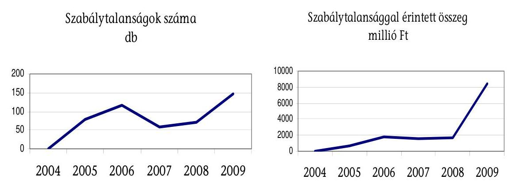

Forrás: VPOP, OLAF Koordinációs Iroda
Az NFT vonatkozásában a szabálytalansági jelentések számának - a program zárásából kifolyólag - jelentős növekedése volt tapasztalható. A 2008. évi

---

58 új esettel szemben 2009-ben 134 esetben jelentett az intézményrendszer új szabálytalanságot az OLAF Irodának ${ }^{12}$ (6. ábra) Az OP-ban megvalósuló projektek számosságából fakadóan a szabálytalansági esetek túlnyomó többsége a HEFOP-hoz ( 95 db ) és AVOP-hoz ( 30 db ) köthetőek. A szabálytalansággal érintett összeg vonatkozásában azonban a KIOP ( 2 db ) és ROP ( 1 db ) projektek kiemelkedőek.
6. ábra
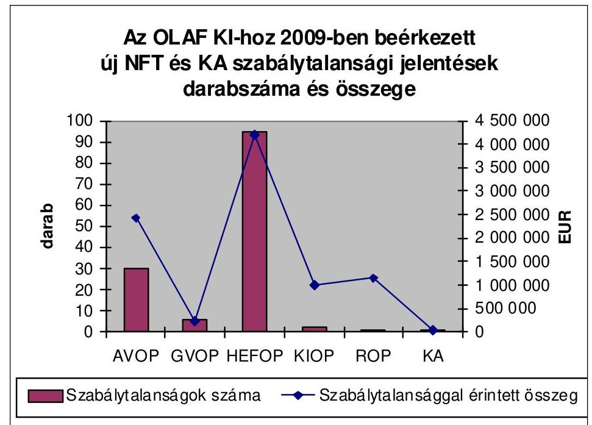

Forrás: OLAF KI adópolitikáért felelős miniszter részére készített éves összefoglaló jelentése

Az ÚMFT esetében még viszonylag kis számban tárnak fel szabálytalanságot ( 25 db ). A 2009-ben az OLAF KI részére jelentett esetek az NFT-hez hasonló jellegzetességet mutatnak. A legtöbb esetet ( 18 db -ot) a TÁMOP-ban (azon belül a képzésekhez kapcsolódóan) jelentették. A szabálytalansággal érintett összeg tekintetében azonban kiemelkedik az egy KÖZOP projekt közel 26 M eurós értékével (7. ábra).

Az agrártámogatások tekintetében 2009-ben az EMGA-t (jellemzően exporttámogatást) 23, a SAPARD-ot 8 eset (ebből egy csalás gyanúja) érintette.

A szabálytalanság-, adósság és követeléskezelésről készített ÁSZ jelentés ${ }^{13}$ rámutatott, hogy az uniós források felhasználásának átláthatóságát rontot-

[^0]
[^0]:    ${ }^{12}$ A tagállamok a vonatkozó uniós jogforrások alapján az érintett időszakban - fószabály szerint - azon szabálytalanságokról voltak kötelesek tájékoztatni az Európai Csalásellenes Hivatalt, amelyeknél a szabálytalansággal érintett összeg közösségi költségvetést terhelő része elérte a 10000 eurót.
    ${ }^{13} 1010$ sz. Jelentés az EU támogatások felhasználása során alkalmazott szabálytalanság-, adósság- és követeléskezelési folyamatok ellenőrzéséről.

---

ta, hogy nem kezelték és nem is tartottak nyilván szabálytalanságként olyan az uniós ellenőrzések következtében szabálytalanság miatt végrehajtott pénzügyi korrekciókat, átcsoportosításokat, amelyek hatásaként a hazai költségvetést több tíz milliárd forintos finanszírozási többlet terhelte. (pl. Budapesti Szennyvíztisztító Telep, a 4-es Metró, az M0 és a 21. sz. fơutak tehermentesítése projektek).
7. ábra
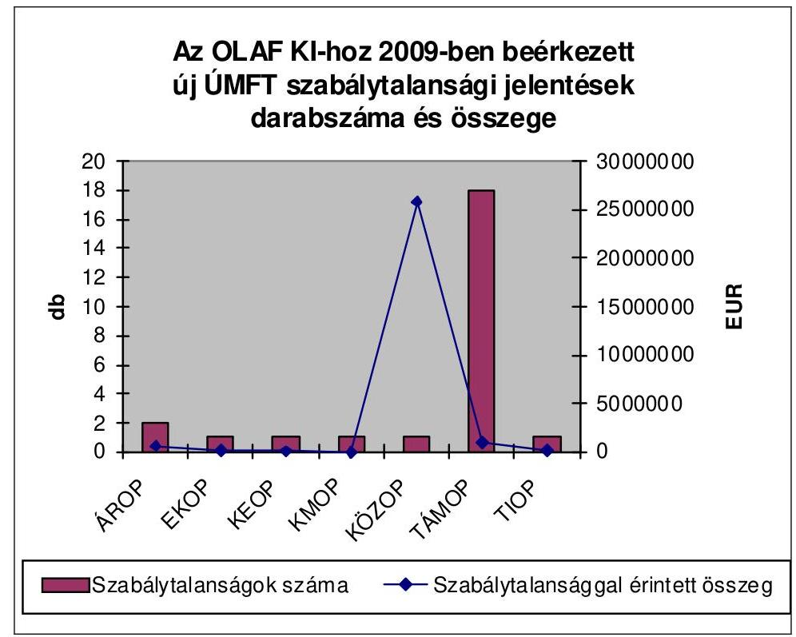

Forrás: OLAF KI adópolitikáért felelős miniszter részére készített éves összefoglaló jelentése

Az NFÜ szabálytalanság- és követeléskezelési folyamata alapvetően és időben szabályozott volt a 2007-2013-as időszak ellenőrzött programjaira vonatkozóan, de a szabályozás még nem adott elégséges támpontot a folyamatok kezeléséhez. Ez bizonytalanságot eredményezett többek között a jogorvoslati lehetőségben. Szabálytalansági döntéssel kapcsolatos fellebbezés során nem volt tisztázott, hogy mely bíróságnak - közigazgatási vagy polgári - kell eljárnia. A szabálytalansági döntések ellen (bár számos kedvezményezett adott be beadványt) az intézményrendszeren belüli jogorvoslati lehetőség hiányzott az alkalmazott polgári jogi eljárásból adódóan.

Az MVH szabálytalanság- és követeléskezelési folyamata a 2007-2013as időszakra szabályozott volt, az eljárások alapja a közigazgatási eljárás szabályai voltak. A fellebbezés lehetősége mind első-, mind másodfokon megoldott volt. A közigazgatási eljárásból adódóan - jellemzően - a szabálytalanság fennállása a megállapító határozat jogerőre emelkedésével valósult meg.

A szabálytalanság-kezelés eredményességét hátrányosan befolyásolta a szabálytalansági eljárás időigényessége ( 4 és 509 nap között változott).

---

A hazai jogszabályokban meghatározott szük körú pénzügyi és jogi lehetőségek csökkentették a szabálytalanságtól visszatartó erőt. Az uniós szabályozás adta lehetőséggel ${ }^{14}$ ellentétben a hazai szabályozás (281/2006. (XII. 23.) Korm. rendelet) nem nevesítette a kiszabható szankciókat. Szankcióként a gyakorlatban főként a szerződéstől való elállást alkalmazták.

A szabálytalanságkezelés kritikus területe a jelentéstételi rendszer volt. Az OLAF KI adópolitikáért felelős miniszter részére készített éves összefoglaló jelentésében - a Zárónyilatkozat Kiadásért Felelős Szerv ellenőrzési megállapításaival összhangban - rámutatott, hogy a jelentések több esetben pontatlanok, hiányosak voltak, számszaki hibát tartalmaztak, illetve késedelmesen kerültek megküldésre.

Az Ellenőrzési Hatóság a programzárásra történő felkészülést, valamint a korábbi ellenőrzések során tett javaslatok teljesülésének nyomon követését és a szabálytalanságok kezelésének megfelelőségét értékelő rendszerellenőrzés keretében megállapította, hogy - a támogató intézményrendszer egészét tekintve az egyes szervezeteknél vezetett, negyedéves szabálytalansági jelentések nyilvántartásának pontatlansága bizonyos szintü kockázatot jelentett a 1681/94/EK rendeletben ${ }^{15}$ foglaltak maradéktalan betartására. Továbbra is akadályozta a gyors és hatékony adategyeztetést a tagállami adatszolgáltatásért felelős OLAF KI számára szükséges jogi eszközök hiánya.

Az OLAF KI jelentésében kiemelte, hogy évek óta húzódó probléma - nemzeti és közösségi szinten - a szabálytalanság pontos definíciójának hiánya, aminek következtében eltérő́ gyakorlat alakult ki, hogy mely ügyeket kell szabálytalansági eljárás keretében kezelni, s ez alapján mely ügyekről kell jelentést készíteni. Ebből következően a szabálytalansági jelentések darabszáma, illetve a szabálytalanságban érintett összegek önmagukban nem jellemzik a szabálytalanságkezelési rendszer megfelelőségét.

Az OLAF KI a beszámolójában rámutatott, hogy a szabálytalansági jelentések nem csak a tagállam „szabálytalanság fertőzöttségi" állapotáról nyújtottak átfogó képet, de a jelentések hiányosságai és hibái, a jelentési kötelezettség határidőn túli teljesítése maga után vonhatják az adott ország negatív megítélését. A Bizottság egyes intézményei ugyanis többek között a jelentések minősége és adattartalma alapján ítélték meg a tagállamokat, s ennek tükrében határozták meg az adott országra jellemző kockázati szintet, az ellenőrzések irányultságát, illetve a javasolt intézkedéseket.

[^0]
[^0]:    ${ }^{14}$ Az Európai Regionális Fejlesztési Alapra, az Európai Szociális Alapra és a Kohéziós Alapra vonatkozó általános rendelkezések megállapításáról szóló 1083/2006/EK tanácsi rendelet, valamint az Európai Regionális Fejlesztési Alapról szóló 1080/2006/EK európai parlamenti és a tanácsi rendelet végrehajtására vonatkozó szabályok meghatározásáról szóló, a Bizottság 2006. december 8-ai 1828/2006/EK Rendelete 5. cikk nevesíti a kiszabható szankciókat.
    ${ }^{15}$ A Bizottság 1681/94/EK Rendelete a strukturális politikák finanszírozása keretében történt szabálytalanságokról és tévesen kifizetett összegek behajtásáról, valamint egy információs rendszer e téren történő létrehozásáról.

---

A Bizottság által előírt elektronikus adatszolgáltatás teljesítésére az OLAF 2008ban megkezdte egy új, a szabálytalanságok jelentése érdekében kialakított internetalapú és modulrendszerú -rendszer, az IMS ${ }^{16}$ kifejlesztését, amelyhez valamennyi jelentéstételre kötelezett szervezet - a rendszerben betöltött szerepének megfelelő jogosultság alapján - hozzáférhet, ezáltal megkönnyítve az uniós támogatásokat érintő szabálytalansági ügyekkel kapcsolatos tagállami jelentési kötelezettség teljesítését. A teljes körű bevezetést azonban hátráltatta, hogy az adatok két rendszerben (EMIR és IMS) való rögzítésének elkerülése érdekében az informatikai kapcsolat kialakítása csak a jövőben várható.

Az OLAF tagállami vizsgálati tevékenységének támogatása szempontjából komoly előrelépést jelentett a Büntetőeljárásról szóló 1998. évi XIX. törvény módosításának 2009 nyarán történt elfogadása, amely lehetővé tette az OLAF számára, hogy a szükséges mértékben hozzáférjenek a folyamatban lévő büntetőeljárással kapcsolatos adatokhoz. A megkeresések formájának és tartalmának, valamint az információ átadás gyakorlati végrehajtásának kidolgozása érdekében a Legfőbb Úgyész és VP Országos Parancsnoka között megállapodás született, amely szerint a nyomozó hatóságok közvetlenül megadják az OLAF-nak a kért információkat, amelyről egyidejűleg tájékoztatják a Legfelsőbb Úgyészséget is.

2009 év folyamán 10 megkeresés érkezett az OLAF-tól (5 adminisztratív, 5 büntetőeljárásra vonatkozó). Az OLAF vizsgálói a 2009-es év folyamán összesen 6 esetben - 2 új ügy, illetve 4 korábban is folyamatban lévő ügy vizsgálata keretében - jártak Magyarországon helyszíni ellenőrzés lefolytatása céljából, valamint egy esetben a hazai szakértőkkel történő egyeztetés céljából.

Jelentős fejlesztés volt az NFÜ oldaláról az ANTI-LOP nevezetű internetes korrupcióellenes közérdekú honlap megjelenése. 2007 novemberétől elektronikus úton is lehet közérdekú bejelentéseket tenni. A weboldalon bárki bejelentést tehet, ha szabálytalanság, visszaélés jut a tudomására az uniós támogatásokkal kapcsolatban. Ezen bejelentéseket minden esetben kivizsgálják. A honlap indulásától, azaz 2007. november 13-tól 2010. március 31-ig összesen 525 regisztrált bejelentés érkezett. Ebből 190 bejelentés megalapozatlanság miatt elutasitva, 42 kivizsgálás után elutasitva, 111 NFÜ hatáskörben intézkedés, 6 továbbitva közigazgatási vagy államigazgatási szerv számára, 110 áttételről bejelentő értesítve, 66 kivizsgálás folyamatban státusszal került rögzítésre. A fentiek alapján megállapítható, hogy havonta átlagosan 18 bejelentés érkezett a weboldalra.

Az ÁSZ szabálytalanság-, adósság- és követeléskezeléssel kapcsolatos jelentése alapján az NFÜ-nek 4,79 Mrd Ft (EU forrás) tagállami kötelezettsége (adóssága) keletkezett, az általa alkalmazott (kedvezményezettnek fel nem róható), és a Bizottság által uniós szabályozástól eltérőnek minősített eljárások, jogszabályok miatt 2004-2009 között. Ez az összeg a strukturális támogatásokhoz kapcsolódó, el nem számolható kiadások (áfa, eszközbeszerzés) miatti pénzügyi korrekció volt, amit költségvetési forrásból kellett fedezni.

[^0]
[^0]:    ${ }^{16}$ „Irregularity Management System", szabálytalanság-kezelési rendszer.

---

Az NFÜ kedvezményezettekkel szembeni szabálytalanság miatti követeléseinek összege 25,6 Mrd Ft (EU forrás) volt a 2004-2009 közötti időszakban, amelyből 6,5 Mrd Ft a strukturális támogatásokhoz és 19,1 Mrd Ft a Kohéziós Alap támogatásokhoz kapcsolódott.

Az uniós szintnek megfelelő 43,1\%-os behajtási arány (amely 40-44\% között mozgott) programonként változott, az NFT esetében valamivel az átlag alatt maradt (35,9\%), a PHARE esetében 62,5\%-os volt. A Kohéziós Alap vonatkozásában az NFÜ nem rendelkezett adatokkal a megtérült követelések összegéről, illetve az NFÜ nemlegesen nyilatkozott az ÚMFT-hez kapcsolódó megtérülésekről (8. ábra).
8. ábra
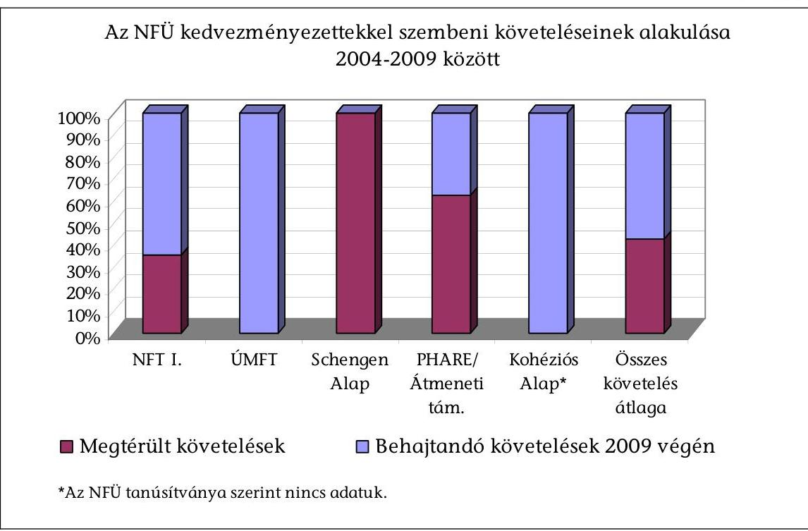

Forrás: 1010 sz. ÁSZ Jelentés az EU támogatások felhasználása során alkalmazott sza-bálytalanság-, adósság- és követeléskezelési folyamatok ellenőrzéséről.
Megjegyzés: az ábrán bemutatott, NFÜ-től származó adatok előzetesek, mert az ÁSZ ellenőrzése idején a 2009. évi költségvetési beszámoló és egyéb éves értékelések összeállítása még folyamatban volt.

Az NFÜ követelést nem írt le, a minősítéséhez, leírásához szükséges teljes körű szabályozás, eljárásrend nem állt rendelkezésre.

Az MVH-nak 2004-2009 között 3,64 Mrd Ft (EU forrás) Bizottsági visszavonása, tagállami kötelezettsége keletkezett, az általa alkalmazott, és a Bizottság által uniós szabályozástól eltérőnek minősített eljárások miatt. Az MVH kedvezményezettekkel szembeni követeléseinek összege 7,5 Mrd Ft (EU forrás) volt 20042009 között. A 7,5 Mrd Ft-os követelésből 2,7 Mrd Ft megtérült 2009 végéig, azaz a behajtási arány $\mathbf{3 6 \%}$-os volt az agrár- és vidékfejlesztési támogatások esetében. Ez megközelítette a 2008. évi uniós szintet (37,5\%), azonban elmaradt az elmúlt tíz év uniós értékeitől (40-55\%). A SAPARD és az In-

---

tervenciós támogatásokhoz kapcsolódó behajtási arány az MVH átlagánál is alacsonyabb volt. Behajthatatlan követelések leírására 1,1 Mrd Ft (EU forrás) összegben került sor, ami a követelések 14,6\%-a volt. A megtérült és leírt követelések összegét a Bizottsággal elszámolták. Az MVH által kezelt uniós programok, támogatások követeléseinek alakulását a 9. ábra szemlélteti.
9. ábra
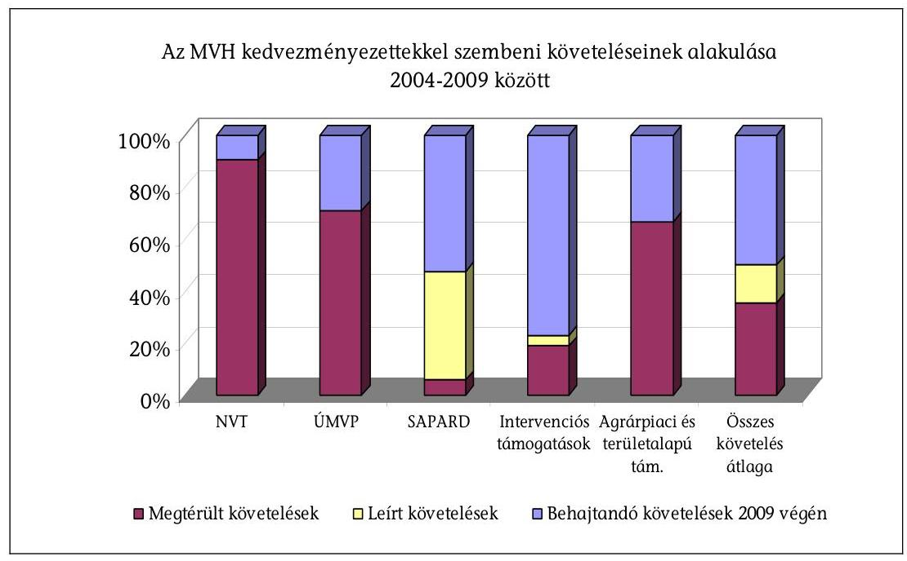

Forrás: 1010 sz. ÁSZ Jelentés az EU támogatások felhasználása során alkalmazott sza-bálytalanság-, adósság- és követeléskezelési folyamatok ellenőrzéséről.

A 2009-re vonatkozó zárszámadás ellenőrzés megállapította, hogy a mérlegek a GOP-nál, az ÁROP-nál, az EKOP-nál, és a KEOP-nál a követelések között tartalmaztak olyan, a KSZ-ek felé 2008. évben kihelyezett előlegeket, illetve a KA környezetvédelem esetében a kedvezményezettel szemben fennálló, szabálytalanságból eredő követelést, amelyek elszámolására 2009. év folyamán már sor került, azonban a számvitelt támogató különálló informatikai rendszerek (Forrás SQL, EMIR) közötti kapcsolat, valamint a belső kontroll rendszer hiányosságai következtében az érintett összegek követelések közül történő kivezetésére a beszámolók készítéséig nem került sor. A probléma oka, hogy az EMIR nem tudta kezelni a szállítói előlegekből eredő követeléseket, illetve ezek rendezését, mivel a korrigáló számlát és az előlegszámlát nem tudta összekötni.

---

# 3. Az Európai UniÓs FORRÁsOK FELHASZNÁLÁsÁVAL KAPCSOLATOS, A 2009-ES ÉVRE VONATKOZÓ ELLENŐRZÉSEK LEGFONTOSABB MEGÁLLAPÍTÁSAI, KÖVETKEZTETÉSEI 

### 3.1. A 2000-2006-os programozási periódus támogatásai

### 3.1.1. Nemzeti Fejlesztési Terv

Hazánk az Európai Unió Strukturális Alapjainak az ún. 1. célkitűzéséből részesült támogatásból, amelynek feladata a gazdaságilag elmaradt régiók fejlődésének és strukturális átalakulásának elősegítése.

A támogatások felhasználásának stratégiai terve, a Nemzeti Fejlesztési Terv (NFT) és annak pénzügyi kerete, a Közösségi Támogatási Keret általános és specifikus célkitűzéseit, illetve a célkitűzés megvalósítását szolgáló négy ágazati és egy regionális operatív programot a 10. sz. ábra mutatja be.

Az öt operatív programra a 2004-2006 közötti időszakra összesen 2696,2 M euró ( 687,5 Mrd Ft) keret állt rendelkezésre ${ }^{17}$, amelyből az uniós hozzájárulás 1995,7 M eurót (508,9 Mrd Ft-ot) tett ki.
10. ábra

A KTK célkitűzései
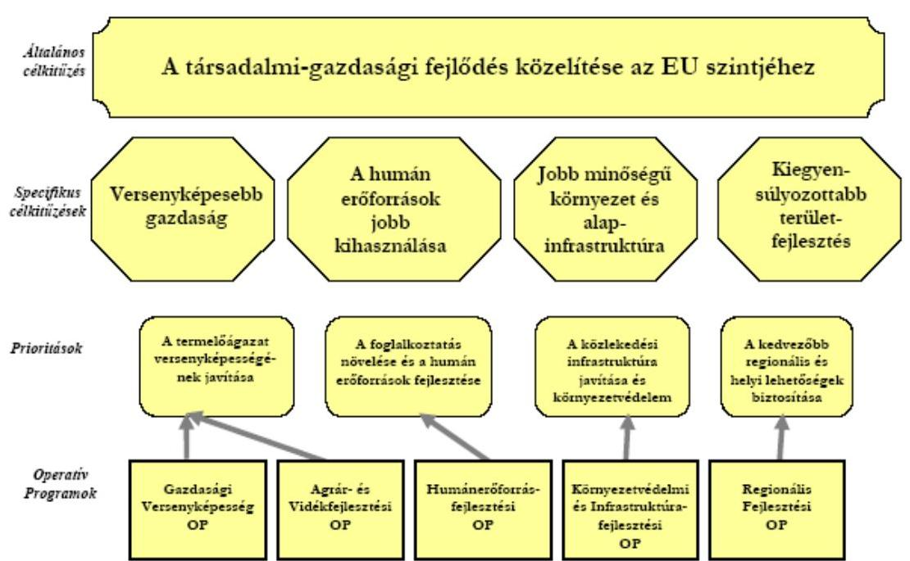

[^0]
[^0]:    ${ }^{17}$ A támogatási összegeket 255-ös Ft/euró árfolyamon számították át, kivéve az Európai Bizottságtól igényelt és az Európai Bizottság által átutalt összegeket. A támogatási öszszegek - ahol nem szerepel külön megbontás - tartalmazzák a közösségi, a nemzeti központi és a nemzeti helyi forrásokat is.

---

A Nemzeti Fejlesztési Terv pályázati kiírásaira, azok 2004. januári megjelenésétől 42,8 ezer db pályázat érkezett be. A kötelezettségvállalások (IH által támogatási szerződéssel lekötött összegek) értéke a program pénzügyi zárásakor 727 Mrd Ft-ot tett ki, közel 20 ezer pályázat támogatásával.

A Magyar Állam 2004. április 30-án egy 445 M euró összegű hitelkeretmegállapodást írt alá az Európai Beruházási Bankkal, amely a 2004-2006-os pénzügyi időszak Strukturális Alap támogatásokhoz kapcsolódó központi költségvetési rész finanszírozását szolgálta a Közösségi Támogatási Keret Operatív Programjait (kivéve AVOP) illetően. 2008 márciusáig a teljes hitelkeret lehívásra került.

Az Európai Bizottság a benyújtott időközi kifizetési kérelmek alapján a keret 95\%-áig finanszírozta az operatív programokat, az utolsó 5\% átutalására a pénzügyi zárást követően kerül majd sor.

Az abszorpció növelése érdekében Magyarország kérelmet nyújtott be a Bizottsághoz, amelyben a GVOP, a KIOP, a HEFOP, az AVOP és az EQUAL Közösségi Kezdeményezéssel kapcsolatos kiadások támogathatóságára megállapított határidő 2009. június 30 -ig történő meghosszabbítását kérte. A Bizottság határozatában az elszámolhatósági időszak meghosszabbítását engedélyezte.

A fentieknek megfelelően az NFT OP-k zárása két szakaszban valósult meg. A ROP zárási dokumentumait (záró végrehajtási jelentés, záró költségnyilatkozat, záró beszámoló és zárónyilatkozat) 2010. március 31-ig, a GVOP, a KIOP, a HEFOP, az AVOP és az EQUAL Közösségi Kezdeményezés záró dokumentumait 2010. szeptember 30-ig küldték meg az Európai Bizottság részére.

# A Nemzeti Fejlesztési Terv végrehajtása pénzügyi (abszorpciós) szempontból (az operatív programok zárási adatait figyelembe véve) eredményesnek értékelhető. Az NFT abszorpció összességében meghaladta a 100\%-ot, jelentősebb elmaradás csak az EQUAL Közösségi Kezdeményezés esetében volt tapasztalható (10. ábra). Több program esetében (GVOP, HEFOP-ERFA, ROP-ERFA) az abszorpció 100\% feletti, de az Európai Bizottság csak a keret erejéig állta a támogatásokat, az ezt meghaladó túlvállalásokat a hazai költségvetés finanszírozta. A kedvező pénzügyi teljesítést segítette az ún. 10\%-os rugalmassági szabály, amely az OP-n belül átcsoportosítási lehetőséget jelentett az intézkedések között (az ún. jól teljesítő intézkedések kompenzálták a rosszabbul teljesítők elmaradását).

A záró végrehajtási jelentésekben az irányító hatóságok bemutatták az operatív programok megvalósításának nyomon követését biztosító indikátorok teljesülését. A végrehajtási időszak alatt (több esetben jelentősen) módosított prog-ram- és projektszintű indikátorok ${ }^{18}$ jellemzően teljesültek. A számszerűsíthető mutatók teljesülésének elemzésekor figyelembe kell azonban venni, hogy valamennyi OP esetében a szükségessé vált a számszerúsíthető mutatók felülvizsgálata. Az OP-kat érintő külső értékelések megállapították többek között, hogy

[^0]
[^0]:    ${ }^{18}$ Az indikátorokat valamennyi OP esetében felülvizsgálták és szükség szerint azok definícióját, tartalmát, célértékét módosították.

---

a program szintű indikátorok nem tükrözik vissza az OP által lefedett intézkedéseket, elmaradt a kiinduló és célértékek meghatározása, illetve egyes indikátorok nem alkalmasak eredmények számszerűsítésére.

# 11. ábra 

## Az NFT OP-k és az EQUAL Közösségi Kezdeményezés abszorpciója

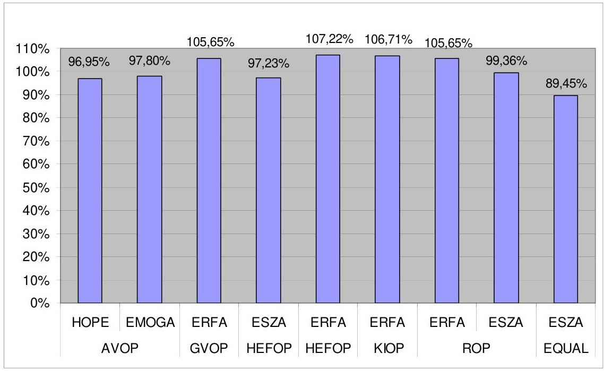

Forrás: NFÜ - az Operatív Programok záró végrehajtási jelentései
Az indikátorokra vonatkozó értékelések tapasztalatai nagyban hozzájárulhatnak a következő, 2014-2020-as programozási időszak közeljövőben induló hatékony tervezéséhez.

A KEHI elvégezte az operatív programok 2009. évi rendszerellenőrzését, amely során az operatív programok zárására történő felkészülést, valamint a korábbi ellenőrzések során tett javaslatok teljesülésének nyomon követését és a szabálytalanságkezelés megfelelőségét vizsgálta.

A rendszerellenőrzések a HEFOP és KIOP vonatkozásában zárással kapcsolatban szabályozási hiányosságokat állapítottak meg. A GVOP és az EQUAL esetében a felelős intézmények alapvetően megteremtették a zárási feladatok szabályszerű és hatékony elvégzésének alapjait. A KIOP-ot és a HEFOP-ot érintően a korábbi ellenőrzések során vállalt intézkedések végrehajtása, illetve nyilvántartása nem volt teljes körűen biztosított. A szabálytalansági eljárásokkal kapcsolatban rámutatattak a jelentési rendszer hiányosságaira a HEFOP és a KIOP vonatkozásában. Az AVOP tekintetében a zárás lebonyolítását, az intézkedések nyomon követését, valamint a szabálytalanság-kezelést érintően kisebb hiányosságokat tártak fel. A szabálytalanság-kezelést a KEHI a programzárás szempontjából magas kockázatúnak ítélte meg.

---

A 2005-2009 között lefolytatott mintavételes ellenőrzések során szabálytalansággal érintett összegek az OP-k és az EQUAL Közösségi Kezdeményezést érintően nem érték el az ellenőrzési módszertan alapján alkalmazott (az összes ellenőrzött költségre vetített) 2\%-os lényegességi küszöböt.

A zárónyilatkozat kiadását megelőző ellenőrzés megállapította, hogy a korábbi ellenőrzések során feltárt hiányosságok felszámolására tett intézkedések összességében megvalósultak, ésszerű bizonyosság állt rendelkezésre program keretében lezárt múveletek jogszerúsége és szabályszerűsége tekintetében.

A GVOP esetében a korábbi ellenőrzésekhez kapcsolódó intézkedéseket csak részben hajtották végre, ezek hiánya azonban a zárás folyamatát nem befolyásolta.

Az ellenőrzés megállapította, hogy a Kifizető Hatóság által benyújtott végső egyenleg átutalási dokumentáció, valamint az IH által összeállított végső végrehajtási jelentésben, valamint annak részét képező végleges projektlistában és a szabálytalansággal érintett összegek visszaköveteléséről készített kimutatásban szereplő adatok valósak és helytállóak.

A KIOP vonatkozásában a zárás szempontjából az ellenőrzés a 4. cikk szerinti ellenőrzések végrehajtásában feltárt hiányosságokat közepes kockázatúnak, a szabálytalansági eljárásokat, döntésekkel kapcsolatos gyakorlatot magas kockázatúnak ítélte. A GVOP esetében a végső egyenleg átutalás dokumentáció fordulónapján 60 (esetlegesen pénzügyi következményekkel járó) szabálytalansági eljárás még folyamatban volt.

A Zárónyilatkozat Kiadásért Felelős Szerv - tekintettel a szabálytalanságkezelés területén feltárt hiányosságokra, valamint a zárást megelőző ellenőrzése keretében két (le nem zárt) projekttel kapcsolatban tett megállapításokra - a KIOP vonatkozásában minősített zárónyilatkozatot adott ki. A GVOP lebonyolítását az ellenőrzés megfelelőnek találta, de - figyelemmel a 60 db folyamatban lévő, nem lezárt szabálytalansági eljárásra, azok esetleges eredményére, továbbá a lehetséges pénzügyi következményekre - korlátozott zárónyilatkozat került kiadásra. Az AVOP-EMOGA vonatkozásában korlátozott zárónyilatkozat került kiadásra az 57 db függő ügy (ebből 52 szabálytalansági eljárás) és azok pénzügyi kockázata következtében.

A Zárónyilatkozat Kiadásért Felelős Szerv a lefolytatott ellenőrzések, illetve a megvizsgált dokumentumokban (végső végrehajtási jelentés, annak részét képező projektlista és szabálytalanságlista, valamint a végső költségnyilatkozat) foglaltak alapján a végrehajtást az AVOP-HOPE, ROP, HEFOP és EQUAL esetében összességében rendben találta, nem-minősített véleményt bocsátott ki.

A Vám- és Pénzügyőrség a magas kockázatúnak ítélte, hogy elsősorban a záráshoz kapcsolódó, a Zárónyilatkozat Kiadásért Felelős Szerv által végzett ellenőrzés hatására történik meg a szabálytalansági ügyek és jelentések „rendbetétele", amely feltehetően fokozottabb uniós ellenőrzési tevékenységet fog kiváltani.

2009-ben a korábbi évekhez képest jelentősen növekedett az EU Bizottság, illetve az EU Számvevőszék által végzett vizsgálatok száma. A 2009-ben lefolytatott

---

ellenőrzések jellemzően a 2007-2013-as időszak OP-jait érintették, illetve az NFT tekintetében a Bizottság megkezdte a programok zárását megelőző helyszíni ellenőrzéseit.

Az EU Bizottságnak a KIOP-ra vonatkozó, még 2006-ban kezdett rendszervizsgálata 2010-ben lezárult. Jelentésében az EU megállapítást tett a közbeszerzések lebonyolításával és a költségek elszámolhatóságával kapcsolatban. Az egyeztetések után 4 környezetvédelmi projektnél talált az EU kifogásolnivalót. Ebből háromnál az IH is elismerte együttesen 1402,0 M Ft jogtalan elszámolását, ezen összegeket a zárás során visszafizették. Az EU Bizottság Regionális Főigazgatósága 2009 decemberében közbeszerzési vizsgálatot végzett, amely három KIOP-os projektet érintett. A vizsgálati jelentés a Tájékoztató lezárásáig még nem készült el.

Az Európai Bizottság regionális Politikák Főigazgatósága elvégezte a visszavonásokra, visszafizettetésre és a folyamatban lévő visszafizettetésekre vonatkozó tagállami nyilvántartási és jelentéstételi rendszerek ellenőrzését, amelybe valamennyi NFT OP-ból 2 szabálytalanságot vont be. A jelentés - az IH és PM NAO iroda közötti elégtelen kommunikációra visszavezethető - kisebb hiányosságokat állapított meg a HEFOP vonatkozásában, ennek ellenére a létrehozott hazai rendszer működését eredményesnek minősítette, amely megbízható és teljes körű adatokat szolgáltat.

Az NFT abszorpciós, azaz pénzügyi teljesülésének értékelése mellett - a záráshoz kapcsolódóan is - egyre nagyobb hangsúlyt kell az eredményességi célok teljesülésének értékelésére és a következtetések levonására helyezni.

A 2007-2013-as uniós általános rendeletben meghatározottak szerint a tagállamok az Európai Bizottság részére 2009. december 31-ig benyújtott Nemzeti Stratégiai Jelentésben értékelték a program előrehaladását.

A programok eredményességének értékelésére a teljes zárási folyamatok EU Bizottság általi lezárását követően lesz lehetőség. Az Állami Számvevőszék a Tájékoztató elkészítésével egy időben - teljesítményellenőrzés keretében - végzi az NFT végrehajtásának ellenőrzését. Az ellenőrzés célja annak értékelése, hogy az NFT végrehajtása eredményesen és hatékonyan szol-gálta-e a célrendszer időarányos teljesítését és a rendelkezésre álló források hasznosulását. A jelenleg rendelkezésre álló adatok alapján előrevetíthető, hogy a stratégiai dokumentumokban megfogalmazott kiemelt célok (területi kohézió erősítése, gazdasági növekedés és a foglalkoztatás bővítése), illetve az átfogó célok (gazdasági növekedés és foglalkoztatás növekedésének ösztönzése) többek között a külső környezet kedvezőtlen változásai, a globális gazdasági válság, a költségvetési kiigazítás, illetve a konvergenciaprogram hatásai miatt várhatóan nem teljesülnek, a célt meghatározó mutatók elvárt növekedése helyett azok csökkenése volt tapasztalható. (A foglalkoztatási ráta a 2006. évi 60,2\%-ról 2009-ben 57,9\%-ra, a GDP éves volumenindexe 2006: +4\%-ról, 2009: -6,9\%-kal csökkent) (12-13. ábra).

---

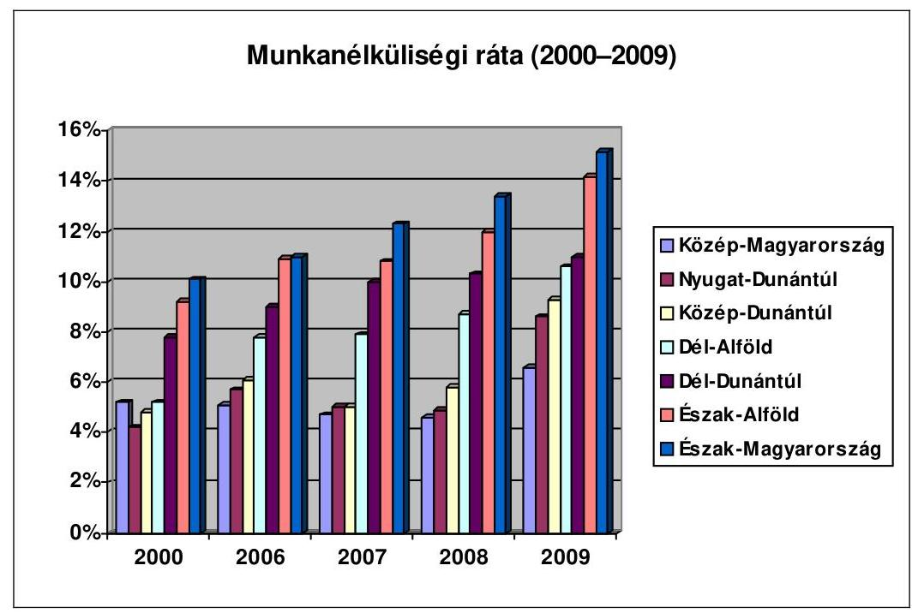

Forrás: KSH
13. ábra
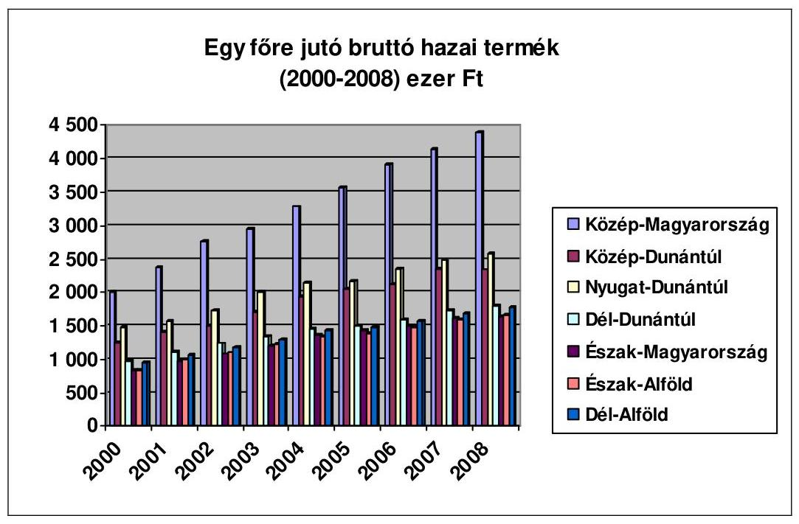

Forrás: KSH
Az NFÜ ROP-ról készített értékelése rámutatott, hogy a fejlettebb régiók általában hatékonyabban használták fel a támogatásokat. A GVOP értékelés is megerősítette, hogy a megítélt támogatás döntő többségét a fejlettebb régiók pályázói nyerték el. Ugyan a fejlettebb régiók általában hatékonyabban használták fel a támogatásokat, a négy kevésbé fejlett régió kapta a támogatások 75\%-át.

---

A területi kohézió fent említett kedvezőtlen alakulása mellett az értékelések kiemelték, hogy a fejlesztési célkitúzések megvalósulása sok részterületen pozitív hatást fejtett ki, kedvezőtlen megállapításokat fogalmaztak meg azonban a programok lebonyolítása (pályázati rendszer, indikátorok, horizontális célok érvényesülése) kapcsán.

- Az egyes fejlesztési konstrukciók indokoltak voltak, találkoztak a potenciális kedvezményezettek igényeivel. A projektek megvalósulása pozitív hatással volt a kívánt eredmény felé való elmozdulásra (közterület fejlesztések, épületrekonstrukciók, humánfejlesztési programok stb.).
- Az értékelések kifogásolták, hogy bár az esélyegyenlőségi szempontokat a programozás minden fázisában igyekeztek előtérbe helyezni, ezek a szempontok nem váltak a beruházások fő mozgatórugóivá, illetve legtöbbször az adminisztratív kötelezettségek szintjén megrekedtek, a mélyrehatóbb hatásvizsgálatok elmaradtak.
- Az értékelések javaslatokat fogalmaztak meg a világosabb pályázati felhívások, a pénzügyi folyamatok felgyorsításának szükségessége, illetve a kiszámíthatóbb és átláthatóbb támogatási rendszer kidolgozása érdekében.
- Valamennyi értékelt OP vonatkozásában kritikai megállapításokat tettek az átláthatóbb pályázati rendszer érdekében (bonyolult pályázati felhívások, többszöri módosítás), az indikátorok kialakítása, a döntés és kifizetési folyamtok időbeni alakulása miatt.

# 3.1.2. Kohéziós Alap 

## A Kohéziós Alap célkitűzései, felhasználásának uniós és hazai szabályozása, intézményrendszere

A Kohéziós Alap infrastrukturális fejlesztésekre felhasználható támogatásokat nyújtott, amely a környezetvédelmi beruházásokra és gazdasági kohéziót elősegítő közlekedési rendszerek kiépítésére volt fordítható.

A Kohéziós Alap projektek kiválasztása nyílt pályázat nélkül, a kormány döntése alapján történt. A támogatott célokat és a projektek támogatási mértékét az Európai Unió a Magyar Köztársaság Kormányával projektenként megkötött ún. Finanszírozási Memorandumban hagyta jóvá. A projektek megvalósításához nyújtott EU támogatás lehívási határideje a Kohéziós Alap esetében az egyes projekteknél meghatározott időpont.

A 2007-2013-as programozási periódus kezdetével változott az irányító hatóság, illetve a közlekedési szektor közreműködő szervezetek belső felépítése és az elnevezése. A Kohéziós Alap Irányító Hatóság teendőit 2009-ben a Nemzeti Fejlesztési Ügynökségen belül múködő Környezetvédelmi Operatív Programok Irányító Hatóság (KEOP IH) látta el, amely felelős volt a Környezet és Energia Operatív Program megvalósításáért is.

---

Az Irányító Hatóság szektoronként egy-egy közremúködő szervezetet vont be a végrehajtási folyamatokba. A környezetvédelmi programok esetében a KSZ szerepét a KvVM Fejlesztési Igazgatósága, a közlekedési szektorban pedig a KIKSZ Közlekedésfejlesztési Zrt. (KIKSZ Zrt.) látta el.

A KSZ tevékenységének nagyobb, jogszabályon alapuló önállósága miatt a KA IH és a KSZ között lazább a kapcsolat, mint a SA IH-k és a KSZ-ek között (a KA IH és a KSZ között korábban együttműködési szerződés sem jött létre, először SLAszerződés is csak 2009-re született), ami információáramlási hiányosságokban is megmutatkozik. Az IH a gyakorlatban a KSZ tevékenységét nem irányítja, múködési kézikönyvét nem hagyja jóvá. Az IH a KSZ tevékenységét 2010-ben csak egy esetben ellenőrizte, ami elsősorban az éves alapdíj elszámolás alátámasztására szolgált. Mindezek miatt az IH a szükségesnél kevesebb konkrét információval rendelkezik a KSZ tevékenységéről.

A KSZ-ek feladatai egy részét a közlekedési prioritásnál lebonyolító testületre és/vagy a projekt kedvezményezettjére átruházhatják támogatási szerződés keretében. E feladatok tekintetében a közlekedési szektor esetében a lebonyolító testület a Nemzeti Infrastruktúra Fejlesztő Zrt., a környezetvédelmi szektor esetében pedig a települési önkormányzatok, illetve azok társulásai, akik mint kedvezményezettek a Kohéziós Alap közreműködő szervezetek nevében járnak el. Az ő feladatuk a projekt fizikai megvalósításának irányítása, a teljesítések igazolása, a számlák kezelése, valamint a folyamatos jelentések a Közreműködő Szervezet felé.

A 360/2004. (XII. 26.) Korm. rendelet értelmében a KEHI (2010. július 1-jét követően az EUTAF), mint Zárónyilatkozat Kiadásáért Felelős Szerv végezte a rendszer- és a 15\%-os (mintavételes) ellenőrzéseket, továbbá a projektek végső elszámolásához kapcsolódó zárónyilatkozat kiadásához szükséges ellenőrzéseket. Az irányító hatóság, kifizető hatóság, valamint a közreműködő szervezetek belső ellenőrzését a szervezeteken belül kialakított belső ellenőrzési részlegek látják el. A Kifizető Hatóság ezen túlmenően a kiadások megfelelő igazolása érdekében a pénzügyi lebonyolítás tekintetében a teljes rendszer ellenőrzésére volt jogosult.

# A Kohéziós Alap előrehaladása és a vonatkozó ellenőrzések 

A KA-ból származó 1500 M euró közösségi támogatás állt rendelkezésünkre a 2000-2006-os időszakban, amelynek felhasználására 2010. december 31-ig van lehetőség. Az Irányító Hatóság 2010 során egyes 2004-ben indult környezetvédelmi projektek esetében 2011. december 31-ig, illetve 2012. december 31-ig való hosszabbítást kérelmezett az Európai Bizottságtól, a Bizottság döntéséről a Tájékoztató lezárásakor nem állt rendelkezésre információ.

A projektekre az Uniós források kifizetéseinek teljesítését 2010. december 31-ig kell lezárni, a határidőn túl bármilyen késés esetén a fennmaradó összeg a hazai költségvetést terheli majd. A projektek zárásakor a Kohéziós Alapra vonatkozó finanszírozási szabályok szerint az EU támogatás utolsó 20\%-át az EU Bizottság visszatartja. Az Uniós finanszírozás utolsó 20\%-ának a költségvetés XLII. A központi költségvetés fő bevételei fejezetbe a 2010-2012. évek során történő utalásának feltétele a záró jelentések jóváhagyása az EU Bizottság részéről.

---

2009-ben a kifizetések összességében jóval meghaladták a költségvetésben megtervezett eredeti kiadási előirányzatokat. A közlekedési szektor a költségvetésbe betervezett 29,4 Mrd Ft helyett 74,4 Mrd Ft-ot (238,2 M euró) teljesített 2009. év folyamán. A környezetvédelmi szektorban az eredeti kiadási előirányzat ( 30 Mrd Ft ) 49,1 Mrd Ft-ra, (219,4 M euró) teljesült.

A KA tekintetében 2009. évben az eredeti 59,5 Mrd Ft előirányzathoz képest jelentős, 123,4 Mrd Ft összegű teljesítés történt, amelyből az uniós hozzájárulás 67,4 Mrd Ft-ot tett ki.

A korábbi évek növekedését folytatva a Kohéziós Alapból támogatott projektek 2009. év végéig az alábbi eredményeket érték el:

- a kiviteli szerződéssel való lekötés környezetvédelmi projekteknél a várható összköltség 93\%-át (EU támogatási részének 88\%-át), a közlekedési projekteknél $83 \%$-át (EU támogatási részének $82 \%$-át) érte el;
- a környezetvédelmi szektorban a KA támogatási keret 72\%-át (EU támogatási részének $67 \%$-át), a közlekedési szektorban $85 \%$-át (EU támogatási részének $84 \%$-át) fizették ki az elvégzett teljesítményekkel arányosan a kivitelezők részére;
- A kifizetett támogatásoknak az Európai Bizottság felé való elszámolása eredményeképpen 2009-ben összesen 161,4 M euró támogatás átutalására került sor, ez 45,3 Mrd Ft lehívásnak felelt meg. (280,6 Ft/euró árfolyamon számolva). A kumulált adatok alapján 2009. december 31-ig a környezetvédelmi szektorban az EU Bizottság felé benyújtott átutalási igény 377,92 M euró, amelyből 2009. év végéig 345,42 M euró folyt be a hazai költségvetésbe (a teljes elszámolható költség 49\%-a, az EU támogatási rész $45 \%$-a). A közlekedési szektorban a benyújtott kumulált átutalási igény $420,79 \mathrm{M}$ euró volt, amelyből $390,10 \mathrm{M}$ euró folyt be a hazai költségvetésbe (a teljes elszámolható költség 57\%-a, az EU támogatási rész 53\%-a).

A Zárónyilatkozat Kiadásáért Felelős Szerv a 2008. évi mintavételes ellenőrzések során tett megállapítások alapján kockázatelemzés segítségével a 2009. évi rendszerellenőrzés tárgyaként a Kohéziós Alap lebonyolítási folyamatban a projektek zárására történő felkészülés, valamint a szabálytalanság-kezelés megfelelőségének vizsgálatát irányozta elő.

A rendszerellenőrzés összességében megállapította, hogy a Kohéziós Alap irányítási rendszere a támogatások céljának megfelelően múködött, azonban a vizsgálat több magas kockázatú, rendszerjellegú hibát tárt fel. A projektzárásra való felkészülés és a szabálytalanságok kezelésének hiányosságai veszélyeztették a projektek zárásának folyamatát, valamint kockázatot jelentettek a zárónyilatkozatok határidőben történő kiadására.

A rendszerellenőrzés kifogásolta, hogy az intézményrendszer nem teljes mértékben tartotta be a zárási határidőket, mivel több szervezet belső szabályozása nem volt összhangban a vonatkozó jogszabályi előírásokkal. A szabályozásbeli hiányosságoknak köszönhetően a KSZ nem szankcionálhatja hatékonyan a kedvezményezett késedelmét a zárónyilatkozat benyújtása miatt, amely veszélyezteti a zárási folyamat határidőben történő befejezését, a záró dokumentáció

---

Európai Bizottság részére történő megküldését. Kockázatot hordoznak az IH ellenőrzési nyomvonalának hiányosságai is a projektzárással kapcsolatos határidőket illetően. Rendszerjellegű hiányosságok merültek fel a múködési kézikönyvvel és az ellenőrzési nyomvonallal kapcsolatosan a KSZ-eknél és egy kedvezményezettnél. A rendszerellenőrzés kifogásolta az EMIR-feltöltöttség szintjét. A szabálytalanság fogalmát az intézményrendszer nem egységesen értelmezte, a szabálytalansági eljárások eredményét alapvetően a pénzügyi érdeksérelem ténye határozta meg. A szabálytalansági eljárások az esetek többségében jelentősen elhúzódtak.

A mintavételes ellenőrzések során összesen négy projekt ellenőrzésére került sor 2009-ben, valamint további két projekt esetében zárónyilatkozat kiadása céljából végzett ellenőrzést a Zárónyilatkozat Kiadásáért Felelős Szerv.

A Kohéziós Alapra vonatkozó 2009. évi ellenőrzési tervet a felelős szerv az európai uniós szabályoknak megfelelően kockázatelemzésen és reprezentativitási kritériumok teljesítésén alapuló, az ellenőrzési tapasztalatokat figyelembe véve specifikált mintavételi eljárással dolgozta ki, külön-külön a két szektorra.

Az ellenőrzött összegekre vonatkozó hibaarány a szabálytalansági gyanú tekintetében elérte a $18,2 \%$-ot, az ellenőrzési módszertanban meghatározott 2\%kal szemben: négy projekt esetében állapított meg szabálytalansági gyanúval érintett támogatást az ellenőrzés. Lényeges hiba elsősorban a közbeszerzési eljárásokkal kapcsolatban merült fel. A szabálytalansági gyanúk megfelelő kezelése érdekében a projektellenőrzések javaslatára az IH egyeztetést kezdeményezett az Európai Bizottsággal. Ezzel összefüggésben a Zárónyilatkozat Kiadásáért Felelős Szerv kiemelten kezeli a szerződéskötések és módosítások szabályszerűségének vizsgálatát és a szabálytalansági eljárásokat lezáró döntések megalapozottságát a zárónyilatkozatok kiadását megelőző ellenőrzések során.

A projekteket érintő mintavételes ellenőrzések több esetben dokumentációs hiányosságokat tártak fel. Az előző évekhez hasonlóan a költségek elszámolhatóságával, egyes számlák jogosságával, a szerződéskötésekkel és szerződésmódosításokkal kapcsolatban is merültek fel kifogások. Az adatrögzítést érintő hiányosság, hogy a Zárónyilatkozat Kiadásáért Felelős Szerv korábbi években végzett vizsgálatai alapján indított szabálytalansági eljárások nem kerültek rögzítésre az EMIR szabálytalansági moduljában.

A Kifizető Hatóság, illetve a Zárónyilatkozat Kiadásáért Felelős Szerv által feltárt szabálytalansági gyanúk a közbeszerzési szabályokat és az el nem számolható tételeket érintették.

A 2007-2008-ban folytatott rendszer- illetve projektellenőrzések során feltárt hibák, hiányosságok kiküszöbölése érdekében az érintett szervezetek döntő részben megtették a szükséges intézkedéseket, a feltárt szabálytalansági gyanúkat megfelelően kezelték.

A PM NAO Iroda beszámolója szerint a Kohéziós Alapra vonatkozó elszámolások, illetve azok mellékleteinek hibái rendszeresen akadályozták az átutalásigénylések időben történő kiküldését. Gyakran a költségnyilatkozat összeállításának fordulónapját követően több hónappal később lehetett csak elszámolni a

---

Bizottsággal. A forráslehívások tekintetében mindkét szektornál jelentősen növekedtek az utalt összegek a 2008. évhez képest.

A PM NAO Iroda Belső Ellenőrzési Egysége 2009 során pénzügyi ellenőrzés módszerével vizsgálta a Kohéziós Alap folyamatokat, ezen belül azt, hogy a Kohéziós Alap projektek - különös tekintettel a zárásokra - végrehajtásához kapcsolódó feladatokat az Iroda megfelelően végezte-e. A Belső Ellenőrzési Egység a vizsgálat során megállapította, hogy a vizsgált időszakban a Kifizető Hatóságnak a Kohéziós Alappal kapcsolatos folyamatai a Múködési Kézikönyvnek és a vonatkozó EU-s és hazai jogszabályok előírásainak megfelelően múködtek. A pénzügyi kimutatások naprakészek és pontosak voltak, azonban a számviteli beszámoló nem készült el a vizsgálat lezárásáig ${ }^{19}$.

Az NFÜ mint Kohéziós Alap Irányító Hatóság és az egyes közremúködő szervezetek között létrejött megállapodás szerint az IH meghatározott teljesítményindikátorok alapján méri, illetve ítéli meg a KSZ-ek teljesítményét, ez alapján állapítja meg a sikerdíj mértékét. A KIKSZ Zrt.-re vonatkozó ellenőrzés megállapította, hogy a KSZ hiányosan és nem következetesen vezette az EMIR-t és nem tartotta be a Múködési Kézikönyvben foglaltakat. Több projekt esetén a Támogatási Szerződések, Vállalkozói Szerződések módosítása hiányos volt, nem volt lehetséges az adatok visszaellenőrzése az EMIR-ben.

Az Állami Számvevőszék a zárszámadás keretében szabályszerűségi ellenőrzést végzett a Kohéziós Alap kifizetéseire vonatkozóan, valamint 2009-ben két alkalommal vizsgálta a Kohéziós Alapból és hazai forrásból finanszírozott környezetvédelmi projekteket a teljesítmény-ellenőrzés módszerével.

A szilárdhulladék-gazdálkodás ellenőrzése során az ÁSZ értékelte, hogy az ISPA/Kohéziós Alapból és hazai forrásból megvalósuló települési szilárdhulla-dék-kezelési komplex regionális fejlesztések végrehajtása eredményesen és hatékonyan szolgálta-e a magyar környezetvédelmi és hulladékgazdálkodási célok megvalósítását és a támogatások hasznosulását ${ }^{20}$.

Az ellenőrzés rámutatott a források hasznosulásának többéves késedelmére, a célok teljesítésében mutatkozó elmaradásra, valamint a költségvetést terhelő többletkiadásokra.

A főbb megállapítások között szerepelt, hogy a hulladékképződés-megelőzési célt szolgáló szabályozások nem voltak kellően eredményesek, például a kereskedelmi csomagolás termékdíja nem érte el az eredeti célokat, nem csökkent az egyszer használatos csomagolás mennyisége. A hulladékhasznosítást főként a piaci kereslet befolyásolta, nem dolgozták ki a hasznosítást támogató rendszert. A szelektíven összegyűjtött hulladék értékesíthetőségének problémái, illetve az emiatt mutatkozó bevételkiesés veszélyeztette a szelektív hulladékgyűjtő rendszerek fenntarthatóságát. A hulladék energetikai hasznosításának feltételei és a

[^0]
[^0]:    ${ }^{19}$ Forrás: Pénzügyminisztérium Nemzeti Programengedélyező Iroda Belső Ellenőrzési Egység - Éves ellenőrzési jelentés 2009. (2010. március 15.)
    ${ }^{20} 0920$ sz. ÁSZ Jelentés.

---

hulladék előkezelésének technikái nem voltak biztosítottak. A hulladék égetőműben történő égetését kapacitáskorlátok akadályozták.

A szennyvíztisztítási projektek ellenőrzése során az ÁSZ értékelte, hogy a Kohéziós Alap társfinanszírozásával megvalósuló szennyvízkezelési projektek eredményesen és hatékonyan szolgálták-e a magyar szennyvízkezelési célok megvalósítását, valamint a források hasznosulását ${ }^{21}$.

A vizsgálat megállapította, hogy a szennyvíztisztítási projekteket intenzív hazai fejlesztést követően és hazai fejlesztésekkel párhuzamosan, a hazai és az uniós források harmonizációja és összehangolása nélkül, pályázatarányos forrásbőség mellett, közbeszerzési szabálytalanságokkal és lekötetlen kapacitástöbbletek kialakításával valósították meg, amely kihatott a projektek tervezésére és megvalósítására.

A költséghatékonysági szempontok érvényesítése háttérbe szorult, mivel a források felhasználásának hatékonyságát a támogatás-közvetítő intézmények és a kedvezményezettek nem értékelték.

A vízi közmű létesítmények pénzügyi fenntarthatóságához nem szabályozták az országosan egységes díjképzést, a rekonstrukciós, illetve amortizációs terv készítést. Ezek hiányában a pénzügyi fenntarthatóság garanciái hiányosak voltak, nem volt árhatósági kontroll.

Az Európai Bizottság 2007 végén és 2008 elején végzett auditjai során kifogásokat emelt a Budapesti Központi Szennyvíztisztító Telep 2005-ös közbeszerzési eljárásának lefolytatásával kapcsolatban. Az ellenőrzés eredményeként a Bizottság az eredetileg tervezett támogatásból megvont $40,5 \mathrm{M}$ eurót (mintegy 10,5 Mrd Ft-ot), amit a magyar félnek kellett pótolni, viszont egyidejűleg engedélyezte a 40,5 M euró felhasználását új létesítményekre.

Az Európai Bizottság Regionális Politikák Főigazgatósága 2009. december 7-11. között végzett helyszíni ellenőrzése keretében vizsgálta a NFT/ERFA, KA programoknál azon közösségi értékhatárt meghaladó közbeszerzéseket, amelyek esetében tárgyalásos eljárás lefolytatására került sor, vagy az eredeti szerződés összegének 10\%-át meghaladó összegben pótmunka került elszámolásra. Az ellenőrzés célja megfelelő bizonyosság megszerzése volt a nemzeti és EU közbeszerzési jogszabályoknak történő megfelelésről az SA, KA szerződések tekintetében. Az ellenőrzésre kiválasztásra kerültek - többek között - egy KA környezetvédelmi projekt egyes szerződései. Az előzetes ellenőrzési megállapításokat tartalmazó jelentés az irányítási és ellenőrzési rendszer megfelelő működését állapította meg, azonban három projekt esetében közbeszerzési szabálytalanság történt. Ezek kapcsán a Bizottság pénzügyi korrekciót állapított meg.

Az Európai Számvevőszék 2009 júliusában és szeptemberében nyolc magyarországi Kohéziós Alap projektet vizsgált a 2009-es megbízhatósági nyilatkozathoz (DAS) kapcsolódóan. Az ellenőrzés összesen 38,6 M euró összegű Bizottsági kifizetést érintett. A helyszíni ellenőrzést több egyeztetési kör is követte, amelyek

[^0]
[^0]:    ${ }^{21} 0948$ sz. ÁSZ Jelentés.

---

eredményeként a 2010 júliusában megküldött lezáró levélben az ECA egy projektnél állapított meg kisebb rendú hiányosságot. Az ECA az elmúlt két év során (2008-2009-ben) így összesen kilenc projektet vizsgált. Az Európai Bizottság 2007-ben két közlekedési és három környezetvédelmi projektet ellenőrzött, majd 2009-ben a közbeszerzési folyamatokra koncentrált.

Az 1386/2002/EK bizottsági rendelet 13. cikke szerinti zárónyilatkozat kiadása a KEHI hatáskörébe tartozik. A Zárónyilatkozat Kiadásáért Felelős Szerv az Ellenőrzési Kézikönyve alapján dönt arról, hogy lefolytat-e az 1386/2002/EK rendelet 9. cikke szerinti (rendszer)ellenőrzést - attól függően, hogy a projekt végrehajtását milyen korábbi ellenőrzések érintették -, vagy a rendelkezésre álló ellenőrzések dokumentumai elegendő információt nyújtanak a zárónyilatkozatban megalapozott vélemény kialakításához.

A zárónyilatkozat kiadását megelőző ellenőrzés során a KEHI a következő főbb dokumentumokat tekinti át: Pénzügyi Megállapodás és módosításai; korábbi ellenőrzések anyaga; rendszer- és mintavételes ellenőrzések jelentései; ellenőrzések javaslatai alapján készített intézkedési tervek; az intézkedéseket igazoló dokumentumok; a projekt zárójelentése; a Bizottságnak megküldendő végső átutalás igénylés dokumentáció; szabálytalansági jelentések; pénzügyi-számviteli bizonylatok.

A Zárónyilatkozat Kiadásáért Felelős Szerv 2009. év során két zárónyilatkozat kiadását megelőző ellenőrzést folytatott le, szektoronként egy projektet ellenőrzött. Mindkét esetben korlátozásmentes zárónyilatkozatot adott ki az ellenőrző szervezet.

# 3.1.3. INTERREG programok 

Az Európai Unió által finanszírozott ERFA terhére megvalósuló, 2005. évben indult INTERREG IIIA programok átfogó célkitűzése, hogy közelebb hozza egymáshoz a határtérség lakosait, közösségeit és gazdasági szereplőit, és ezzel támogassa a határterületek gazdasági, társadalmi, környezeti és kulturális fejlesztését, valamint csökkentse a regionális egyenlőtlenségeket a határon átnyúló együttmúködés eszközei által.

Az INTERREG III programok fő célja a határ menti régiók gazdasági és társadalmi kohéziójának erősítése a határ menti együttműködések támogatásával. A programokat a Közösség és a tagállamok közösen finanszírozzák. Magyarország az ERFA forrásaiból 68,7 M euró összegű támogatást kapott, ez kiegészült 18,1 M euró társfinanszírozással. Az INTERREG III program három részből állt: határ menti együttműködés (INTERREG IIIA 86\%), transznacionális együttmúködés (INTERREG IIIB 8\%) és interregionális együttmúködés (INTERREG IIIC 6\%).

Magyarország összesen 9 INTERREG programban vett részt 2004-2006 között. Ebből négy INTERREG IIIA típusú, határ menti együttműködést célzó kezdeményezés: Ausztria-Magyarország INTERREG IIIA Közösségi Kezdeményezés Program (AT-HU), Szlovénia-Magyarország-Horvátország Szomszédsági Program (SLO-HU-CRO), Magyarország-Szlovákia-Ukrajna Szomszédsági Program (HU-SK-UA), Magyarország-Románia és Magyarország-Szerbia és Montenegró Határ Menti Együttműködési Program (HU-RO-SCG). Részt vettünk továbbá egy

---

INTERREG IIIB típusú transznacionális programban és négy INTERREG IIIC típusú interregionális programban.

Az INTERREG IIIA Közösségi Kezdeményezés programok szabályszerű és hatékony végrehajtásáért a Nemzeti Fejlesztési Ügynökség a HU-SK-UA és HU-ROSCG programok esetében Irányító Hatóságként, illetve az AT-HU és a SLO-HUCRO programok esetében Nemzeti Hatóságként felelt a végrehjatásért, a közös technikai titkársági és közremúködő szervezeti feladatokat a VÁTI Nonprofit Kft. látta el. A Kifizető Hatóság, illetve Al-kifizető Hatóság feladatait a Pénzügyminisztériumon belül múködő Nemzeti Programengedélyező Iroda, illetve a VÁTI Nonprofit Kft. látta el. A KEHI volt felelős a rendszer- és az 5\%-os mintavételes ellenőrzések elvégzéséért, valamint a támogatás megszűnésekor kiállítandó záró beszámoló és (al-)zárónyilatkozat elkészítéséért.

Az NFÜ Nemzeti Hatóságként az olyan programokért volt felelős, amelyekben nem Magyarország látta el az Irányító Hatósági feladatokat. A Közremüködő Szervezet az Irányító Hatóság, illetve a Nemzeti Hatóság nevében járt el, feladatait másra nem ruházhatta át. A KEHI az AT-HU és SLO-HU-CRO programok esetében a magyarországi részre vonatkozó ellenőrzések elvégzéséért volt felelős.

Az INTERREG IIIA programjai hozzájárultak a határon átnyúló gazdasági és szociális együttmúködés, továbbá a környezetvédelmi ügyek és a közlekedés fejlesztéséhez. A pályázati felhívások során magyar oldalon összesen beérkezett 1675 határ menti és 179 transznacionális/interregionális pályázatban a 20042006 között rendelkezésre álló források négyszeresének megfelelő támogatásra pályáztak; támogatási szerződés kötésére összesen 388 határ menti és 65 transznacionális/interregionális projekt esetén került sor. Az összes program rendelkezésre álló magyar forrási keretéből (19,1 Mrd Ft) a kerettúlvállalásnak köszönhetően 20,3 Mrd Ft került leszerződésre, amely az eredeti keret 106\%-a.

2010 során megtörtént az AT-HU, HU-SK-UA, HU-RO-SCG és a SLO-HU-CRO INTERREG IIIA programok zárása: a KEHI (2010. július 1-jétől az EUTAF) a jogszabályoknak megfelelően kiállította a záró beszámolókat és (al)zárónyilatkozatokat. Az egyes programokról szóló záró beszámolóban összefoglalta a 2005-2009. években lefolytatott rendszer- és projektellenőrzések főbb megállapításait, valamint megvizsgálta a korábbi közösségi és nemzeti ellenőrzések dokumentumait is.

A 2009. évi rendszerellenőrzés a programzárásra történő felkészülésre, valamint a korábbi ellenőrzések során tett javaslatok teljesülésének nyomon követésére és a szabálytalanságok kezelésére irányult. Az ellenőrzés mindhárom program esetében megállapította, hogy a programok lebonyolításában résztvevő magyar intézmények megteremtették a zárási feladatok szabályszú és hatékony elvégzésének alapjait, a határidők szempontjából viszont hiányosság volt, hogy a zárásban résztvevő szervezetek nem készítettek belső eljárásrendet, ellenőrzési nyomvonalakat az egyes folyamatokra. A korábbi ellenőrzések során javasolt intézkedések megfelelően megvalósultak, a szabálytalanságkezelést is kielégítőnek ítélte az ellenőrzés.

Az IMIR rendszer múködésének tapasztalatai a korábbi évekhez képest pozitív változást mutattak. Az INTERREG programok zárásával kapcsolatosan a Zárónyilatkozat Kiadásért Felelős Szerv megállapította, hogy a korábbi vizsgálatai

---

során feltárt hibákat, hiányosságokat megszüntették, az INTERREG IIIA programok zárási folyamatának megbízható informatikai támogatását hátrányosan befolyásoló kockázati tényezőket elhárították. Az ellenőrzés ugyanakkor megállapította azt is, hogy a IIIA SLO-HU-CRO, és AT-HU programok pénzügyi kereteivel kapcsolatban az IMIR nem naprakész adatokat tartalmazott, ezért a zárónyilatkozat kiadásáért felelős szerv indokoltnak tartotta a zárás megkezdése előtt fennmaradó eltérések egyeztetését, mivel ez magas kockázatot jelentett az egyes tag- és partnerállamoknál nyilvántartott adatok koherenciájával kapcsolatban.

Az IMIR-rel kapcsolatosan a Zárónyilatkozat Kiadásáért Felelős Szerv ajánlásai alapján mielőbb döntést kellett hozni arról, hogy a rendszer mikor álljon le, egyúttal biztosítva azt is, hogy adatbevitel vagy lekérdezés céljából újraindítható legyen. 2010. január 31-ig teljesültek az IMIR zárást követő időszakra vonatkozó üzemeltetésével, éles üzemben tartásával kapcsolatos ajánlások, az NFÜ megállapodást kötött a VÁTI Nonprofit Kft.-vel az IMIR további üzemeltetésére.

A Zárónyilatkozat Kiadásáért Felelős Szerv a rendelkezésre álló dokumentumokból a hibák mérsékelt előfordulását állapította meg; a feltárt hibákat a lebonyolításban résztvevő szervezetek megfelelően kezelték. A Zárónyilatkozat Kiadásáért Felelős Szerv ésszerű bizonyosságot szerzett a porgram keretében lezárt múveletek jogszerűsége és szabályszerűsége tekintetében. A hiányosságok a rendszer szabályszerű, átlátható múködése, továbbá az ellenőrizhetőség szempontjából alacsony kockázatúnak minősültek. A rendszerellenőrzések során visszafizetést eredményező szabálytalanság feltárására nem került sor.

Mintavételes ellenőrzésre 2009. évben csak a HU-RO-SCG program esetében került sor. A három kiválasztott projekt vonatkozásában feltárt hiányosságok eseti jellegűek voltak, amelyeket az intézményrendszer megfelelően kezelt.

Az AT-HU és a HU-SK-UA programok esetében a KEHI az ütemezett mintavételes ellenőrzéseket 2007-2008. évben elvégezte, a kumulált ellenőrzött összeg az előírt 5\%-os ellenőrzési követelményt kielégítette és valamennyi reprezentativitási kritérium teljesülése biztosított volt program szinten a korábbi ellenőrzések révén.

A feltárt három rendszerjellegű hibát az IH/Nemzeti Hatóság megfelelően kezelte. A KEHI a szabálytalanságok alacsony gyakoriságát állapította meg ( $0,01 \%-0,26 \%$ között változott az egyes programok vonatkozásában); a pénzügyi korrekcióval érintett hibák eseti jellegűnek minősültek, a pénzügyi rendezés megtörtént.

A zárást megelőző rendszerellenőrzések vizsgálata és értékelése alapján a Zárónyilatkozat Kiadásáért Felelős Szerv összességében mindhárom program vonatkozásában korlátozás nélküli (al-)zárónyilatkozat kiadását javasolta.

A PM NAO Iroda Belső Ellenőrzési Egysége 2009 folyamán ellenőrzést végzett annak megállapítása érdekében, hogy az INTERREG programok végrehajtásához kapcsolódó feladatokat az Iroda megfelelően végezte-e. Az ellenőrzés a folyamatokat és azok végrehajtását rendben találta, azonban az EMIR végleges zárása, az adott évre vonatkozó végleges főkönyvi kivonat, illetve az éves

---

számviteli beszámolók elkészítése az ellenőrzés lezárásának időpontjáig nem történt meg ${ }^{22}$. Az INTERREG folyamatok ellenőrzése tárgyú, 2010. május 12-én lezárt pénzügyi ellenőrzési jelentés már a 2005, 2006, 2007. és 2008. évi számviteli beszámolók elkészültéről számolt be.

# INTERACT 

Az INTERACT program az INTERREG Közösségi Kezdeményezés része, amely fő célja az INTERREG programok megvalósítása során a területfejlesztés és a határ menti, transznacionális és interregionális együttmúködések terén felhalmozódott sokrétű tapasztalat átadása, hasznosítása. Célja ezzel az INTERREG programok minőségének javítása, a tapasztalatcsere elmélyítése, a példaértékű menedzsment módszerek bemutatásának ösztönzése és egységesen szabályozott végrehajtási eljárások, dokumentumok kidolgozását lehetővé tevő platform létrehozása.

Az INTERACT hatóköre földrajzilag lefedi a 15 régi és a 12 új tagállamot és a szomszédos országokat. A program az alábbi prioritásokra koncentrál: INTERREG menedzsment támogatása, INTERREG programfejlesztés - helyi és regionális kezdeményezések, együttmúködés az átmeneti időszak menedzselésében a csatlakozó országok határrégióival, valamint szakmai segítségnyújtás.

A program alapvetően a teljes időszakra szóló ETE programok Technikai Segítségnyújtás tevékenységeinek támogatását jelenti. A program célcsoportját az ETE programok menedzsmentjét és irányítását végző intézmények alkotják, elsősorban az irányító hatóságok, a közös szakmai titkárságok, a monitoring bizottságok tagjai és nemzeti kapcsolattartók, valamint a pénzügyi ellenőrzésben résztvevő szervezetek, audit hatóságok képviselői. Az INTERACT speciális jellegéből adódóan projektek finanszírozására nincs lehetőség.

### 3.1.4. Schengen Alap

A Schengen Alap 2004-2006 között pénzügyi segítséget nyújtott az érintett tagállamoknak annak érdekében, hogy az EU új külső határain a schengeni vívmányok érvényesülését és a külső határellenőrzés előírt feltételeit biztosíthassák.

A Csatlakozási Szerződés Magyarország számára mintegy 165,8 M eurót biztosított a három éves időtartamra. A Schengen Alap terhére a 2006. december 31-ig tartó szerződéskötési határidőre közel 300 szerződéskötés valósult meg, a források lekötési aránya pedig elérte a $99,8 \%$-ot. A fejlesztések megvalósítása határidőre, 2007. szeptember 30-ig lezárult, a kifizetések a 2007. december 31-i határidőre teljesültek.

A program szakmai és pénzügyi teljesítéséről szóló Zárójelentést a Felelős Hatóság véglegesítette, a Schengen Alap Tárcaközi Bizottság jóváhagyta, a KEHI az

[^0]
[^0]:    ${ }^{22}$ Forrás: Pénzügyminisztérium Nemzeti Programengedélyező Iroda Belső Ellenőrzési Egység - Éves ellenőrzési jelentés 2009. (2010. március 15.)

---

ellenőrzések alapján a vonatkozó költségigazolást kiállította. A Zárójelentést a Felelős Hatóság megküldte az Európai Bizottságnak.
2008. szeptember 8-19. között az Európai Bizottság lefolytatta a Schengen Alap záróaudithoz kapcsolódó pénzügyi, majd 2009 februárjában helyszíni ellenőrzéseit, amelynek keretében az érintett hazai intézményeknél vizsgálatokat folytatott. Az ellenőrzés keretében a Bizottság megállapította az általa a Schengen Alap terhére előzetesen elszámolhatónak tekintett összeget, amelynek egyeztetése a Tájékoztató lezárásakor folyamatban volt.

Az ellenőrzésekről 2009-ben megküldött Jelentéstervezet értelmében az Európai Bizottság előzetes álláspontja el nem számolható költségeket állapított meg, amelyet a magyar fél vitatott. Az Európai Bizottság 2010 áprilisában megküldte a („jogosulatlanul felhasznált" pénzeszközöket és a visszakövetelt forrást megállapító) végleges Zárójelentését, amelynek megvitatására Magyarország konzultációs lehetőséget kért az Európai Bizottságtól.

# 3.1.5. Átmeneti Támogatás 

A Csatlakozási Okmány értelmében Magyarország a PHARE programból csak a csatlakozást megelőző utolsó teljes évben részesedhetett. A csatlakozás időpontja és 2006 vége közötti időszakban az Európai Unió ideiglenes pénzügyi támogatást nyújtott az új tagállamoknak a közösségi jogszabályok végrehajtása és érvényesítése terén igazgatási kapacitásaik fejlesztésére és megerősítésére, valamint a bevált gyakorlatok kölcsönös cseréjének előmozdításár. Az Átmeneti Támogatás mind célkitűzései, mind eljárásrendje tekintetében a PHARE program intézményfejlesztési fejezete továbbélésének tekinthető.

Magyarország számára a három éves Átmeneti Támogatás program (20042006) keretében az Európai Unió által megítélt teljes támogatás értéke 37,07 M euró volt, amelyhez a nemzeti társfinanszírozás összege közel 11,19 M euróval járult hozzá (ez nem tartalmazta az áfa összegét).

Az Átmeneti Támogatás programozásának, döntéshozatalának és végrehajtásának intézményrendszere a PHARE program intézményi keretein és eljárásrendjén alapul. A program lebonyolításában a programozásért, a program tervezéséért, felügyeletéért és értékeléséért a Nemzeti Segélykoordinátor (az NFÜ-t felügyelő miniszter), a közbeszerzés, a szerződéskötés és a kifizetések lebonyolításáért a Központi Pénzügyi és Szerződéskötő Egység, mint végrehajtó ügynökség, a projektek műszaki kivitelezéséért, a projektek igazgatási és pénzügyi végrehajtásáért a szakmai programfelelős tisztviselők voltak felelősek. Ezen kívül átfogó hatáskörrel és felelősséggel bírt az Átmeneti Támogatás pénzeszközök végrehajtását illetően a Nemzeti Programengedélyező, akinek tisztjét a Pénzügyminisztérium szakállamtitkára töltötte be.

A 2004. évi allokációból finanszírozott projektek esetében a kifizetési határidőig a leszerződött uniós forrás $96,5 \%$-a ( $13,52 \mathrm{M}$ euró), a lekötött hazai társfinanszírozás $98,7 \%$-a ( $3,16 \mathrm{M}$ euró) került kifizetésre, amely program szinten $97 \%$ ot jelentett. A 2005. évi keretből a leszerződött összeg 96,9\%-ának kifizetése történt meg a kifizetési határidőig; a társfinanszírozás összegének 91,1\%-át szerződték le, és ezen leszerződött összeg 98,91\%-át fizették ki.

---

A 2006-os program tekintetében a leszerződött EU-s támogatás 96,9\%-át és a nemzeti társfinanszírozás $95,5 \%$-át sikerült kifizetni 2010. június 15 -ig. A projektek szakmai és pénzügyi végrehajtása 2010-ben lezárult.

A 2004/016-954-es, ún. horizontális programra lekötött uniós összeg 97,3\%-a ( $0,6 \mathrm{M}$ euró), a lekötött hazai társfinanszírozás $97,3 \%$-a ( $0,2 \mathrm{M}$ euró) került kifizetésre.

A KEHI 2009-ben nem végzett rendszerellenőrzést; egy projekt mintavételes ellenőrzése kezdődött meg, amelyet az éves ellenőrzési jelentés kiadásának időpontjában (2010. június) még nem véglegesítettek. A 2008. évről szóló jelentésben szereplő két projekt ellenőrzése során korábban javasolt intézkedések megvalósultak, valamint a külső tanácsadó cég bevonásával lefolytatott, NFÜ által végzett rendszerellenőrzés kapcsán tervezett intézkedések alapvetően teljesültek.

A PHARE vonatkozásában az ellenőrzési feladatok 2009-ben a program lezárása következtében a projektek szabályszerűségének vizsgálatára koncentráltak. A KEHI a tárgyévben egy mintavételes ellenőrzést kezdett meg, amelyet az éves ellenőrzési jelentés kiadásának időpontjában (2010. június) még nem véglegesítettek. A 2008-ban vizsgált programot érintő intézkedési terv megvalósulása megfelelően haladt.

A PM NAO Iroda éves beszámolójában kifejtette, hogy a PHARE programok zárása rendkívül hosszadalmasan történt, aminek legfőbb oka a Bizottság hozzáállása, illetve a hazai intézményrendszer szereplőinek fluktuációja volt. 2009ben mindazonáltal nagy mennyiségben sikerült Phare programokat lezáratni a Bizottsággal, 49 darabot, legtöbbet az 1990-es években futó programok közül (40 db). 2009. évben két alkalommal került sor szabálytalansági gyanú kivizsgálására: mindkét esetben szabálytalanság történt és a kedvezményezett viszszafizette a teljes projektösszeget.

# 3.1.6. Az EGT és Norvég Finanszírozási Mechanizmusok program 

Az EGT és Norvég Finanszírozási Mechanizmusok támogatási konstrukciókat Norvégia, Izland és Liechtenstein annak érdekében hozták létre 2004-ben, hogy elősegítsék a társadalmi és gazdasági kohézió megteremtését a kibővült Európai Gazdasági Térségben. Bár két támogatási alapról van szó, eljárásrendjükben egységesnek tekinthetőek, egységes szabályrendszer vonatkozott rájuk. A 2005 nyarán megkötött Együttmúködési Megállapodások értelmében Magyarország számára 2004-2009 közötti időszakban - a menedzsment költségeket is beleértve - összesen 135 M euró állt rendelkezésre.

A finanszírozási mechanizmusok magyarországi végrehajtásáért a Nemzeti Fejlesztési Ügynökség Nemzetközi Együttmúködési Programok Irányító Hatósága mint Nemzeti Kapcsolattartó volt felelős. A program nemzetközi koordinációját a brüsszeli székhelyű Finanszírozási Mechanizmus Iroda végezte. A közreműködő szervezet feladatait a KPSZE, majd megszüntetésével a NEP IH, a később megkezdődő átadással a VÁTI Nonprofit Kft. látta el, a Kifizető Hatóság pedig a Pénzügyminisztérium NAO Irodán belül múködött. A szakmai teljesítésigazo-

---

lásért a szakmailag illetékes minisztériumok voltak felelősek. A KEHI végezte a finanszírozási mechanizmusok keretében támogatott projektek ellenőrzését.

Az EGT/Norvég Finanszírozási Mechanizmusokat szabályozó kormányközi együttműködési megállapodások és a 242/2006. (XII. 5.) Korm. rendelet 2010. elején módosultak.

Magyarországon az EGT és Norvég Finanszírozási Mechanizmusok 2004-2009 programban a Nemzeti Kapcsolattartó három pályázati fordulót hirdetett meg: kettőt 2006-ban, egyet 2007-ben. A közérdek, illetve közhasznúság kiemelkedően fontos a támogatott tevékenységek szempontjából, mivel a Finanszírozási Mechanizmusok keretében elsősorban közcélt szolgáló, alapvetően nem profit szerzésére irányuló tevékenységek, projektcélok voltak finanszírozhatóak. A Finanszírozási Mechanizmus hozzájárulása a projekthez alapesetben a projekt teljes elszámolható költségének 60\%-a lehetett, azonban bizonyos feltételek teljesülése esetén a támogatási arány elérhette a 85 vagy akár a $90 \%$-ot.

A Finanszírozási Mechanizmusok kilenc kiemelt területre koncentráltak: Környezetvédelem; fenntartható fejlődés; az európai örökség megőrzése; humánerőfor-rás-fejlesztés, oktatás; egészségügy; gyermek és ifjúság; regionális fejlesztés és határon átnyúló együttmúködés; bel- és igazságügyi együttmúködés, valamint tudományos kutatás. A projektek kétféle támogatási formában valósulnak meg: önálló projektek ( 250000 - 3000000 euró értékben), illetve pályázati alapok keretében (10 000 - 250000 euró értékben).

A programra összesen 2342 pályázatot nyújtottak be. A támogatási döntésre javasolt 135 pályázat közül 99 pályázat részesült kedvező elbírálásban (86 önálló projekt, 13 pályázati alap). A felhasználható keretösszeg 99,21\%-át sikerült pályázatokkal lekötni.

A projektek végrehajtása az összes kedvezményezettnél megkezdődött, néhány projekt esetében már megtörtént a szakmai, illetve szakmai és pénzügyi zárás. A projektek befejezésének végső, a donorok által megszabott határideje 2011. április 30.

A Nemzeti Kapcsolattartó feladatai közé tartozik a monitoring tevékenység, amely a projektvégrehajtás szakaszának beindulásával egyre hangsúlyosabbá vált. Az eddigi helyszíni monitoring látogatások tapasztalatai azt mutatták, hogy a kritikus szakaszt a közbeszerzések előkészítése és lebonyolítása jelentette; továbbá a nem tőkeerős projektgazdák számára nehezen volt megoldható a projekt előfinanszírozása. Nehézkesen vagy egyáltalán nem múködött a közvetlen szállítói kifizetés alkalmazhatósága, amely ezekben az esetekben megkönnyítette volna az előfinanszírozás problémájának megoldását.

Pozitív tapasztalat, hogy nagyon sikeresen múködtek a pályázati alapok, különösen regionális szinten, amelyek lehetővé tették az alacsony összegű, ugyanakkor kisebb közösségek számára hasznos és látványos kisprojektek megvalósítását.

A Kifizető Hatóság szempontjából támogatási konstrukciók pénzügyi lebonyolítása a vártnál lassabban indult be, de 2009-ben nagy előrelépések történtek. 57

---

projekt lépett a pénzügyi megvalósítás szakaszába. A Kifizető Hatóság összesen 138 db támogatási igénylést dolgozott fel (a tavalyi mennyiség ötszöröse) és 68 db átutalási igénylést küldött Brüsszelbe.

A KEHI a 2009. évi összefoglaló ellenőrzési jelentés elkészítésének időpontjáig (2010. április) egy projekt mintavételes ellenőrzését végezte el (egy további projekt ellenőrzési jelentésének véglegesítése még nem zárult le). Az ellenőrzés hiányosságokat állapított meg az összeférhetetlenségi és titoktartási nyilatkozatok, az ellenőrzési nyomvonal, a folyamatba épített ellenőrzések, valamint a könyvelési és számviteli feladatok végrehajtását illetően ${ }^{23}$. A KEHI egy projekt kapcsán javasolta az árfolyam-különbözetből származó nyereség visszautalását a költségvetés részére. Az ellenőrzés alapján két alkalommal került sor szabálytalanság tényének megállapítására. A 2008. évben külső szervezetek által lefolytatott ellenőrzések kapcsán intézkedés történt valamennyi hiányosság felszámolása érdekében, nyitott kérdés nem maradt fent.

A PM NAO Iroda Belső Ellenőrzési Egysége 2008 folyamán rendszerellenőrzés keretén belül vizsgálta az EGT és Norvég Alap folyamatokat, a végleges belső ellenőrzési jelentés 2009 II. negyedévben készült el. A vizsgálat a tárgybeli szabályozásokat és folyamatokat megfelelőnek találta, egyedül a számviteli nyilvántartási feladatok elvégzésénél kifogásolta az utólagos jelleget ${ }^{24}$.

2009-ben a Belső Ellenőrzési Egység a Finanszírozási Mechanizmusok végrehajtásához kapcsolódó feladatok elvégzését is ellenőrizte. A vizsgálat megállapította, hogy a feladatokat a NAO Iroda az előírásoknak megfelelően végezte. A számviteli éves zárással kapcsolatos kötelezettségének a PM NAO Iroda nem tudott eleget tenni, mert a KSZ jelentős lemaradásban volt a számviteli nyilvántartás vezetésének tekintetében. A számviteli nyilvántartási feladatok területén a határidők betartása nem teljes körűen valósult meg. A jelentés felhívta a figyelmet a számviteli nyilvántartásra vonatkozó, Kifizető Hatóság - KSZ közötti megállapodás mielőbbi megkötésének fontosságára.

Az NFÜ Belső Ellenőrzési Főosztálya 2009-ben elvégezte az EGT/Norvég Finanszírozási Mechanizmusok ellenőrzését. A vizsgálat az NFÜ-VÁTI közötti jogi kapcsolat rendezetlenségére, a támogatás-folyósítás tervezettől való elmaradására tett megállapításokat, valamint a Technikai Segítségnyújtás felhasználását kifogásolta több szempontból. A vizsgálat további hiányosságként állapította meg, hogy számos Végrehajtási Szerződés megkötése még nem történt meg, valamint hogy az EMIR EGT/Norvég Alap finanszírozási modulja nem múködik.

A Program következő időszakáról (2009-2014) a donorállamokkal 2008. szeptembere óta zajló tárgyalásokat az Európai Bizottság 2009. december 18-án lezártnak tekintette, azonban Bulgária és Málta által benyújtott módosító javas-

[^0]
[^0]:    ${ }^{23}$ A 2009-es KEHI vizsgálat alatt a pénzügyi irányítási és ellenőrzési rendszer kialakítása folyamatban volt. A vizsgálatot követően a folyamatba épített ellenőrzés biztosított. Az EMIR EGT alrendszer könyvelési és számviteli modulja átadásra került.
    ${ }^{24}$ Forrás: Pénzügyminisztérium Nemzeti Programengedélyező Iroda Belső Ellenőrzési Egység - Éves ellenőrzési jelentés 2009. (2010. március 15.)

---

latok miatt a megállapodások aláírása 2009-ben nem történt meg. Az aláírandó megállapodás szerint Magyarország a Norvég Alapból 83,2 M euró, az EGT Alapból pedig 70,1 M euró támogatásban részesülhet.

# 3.2. A 2007-2013-as programozási periódus támogatásai 

### 3.2.1. Új Magyarország Fejlesztési Terv

2007. január 1-jével megkezdődött Magyarország számára a második programozási időszak, amely 2013-ig közel 7000 Mrd Ft-nyi ${ }^{25}$ fejlesztési forrás (hazai társfinanszírozást is beleértve) szétosztását jelentheti az Új Magyarország Fejlesztési Terv (ÚMFT), illetve annak 15 operatív programja keretében.

Az általános uniós rendeletben foglaltaknak megfelelően a közösségi támogatásokra való jogosultság feltételei szerint a hét magyar régió közül hat - KözépDunántúl, Nyugat-Dunántúl, Dél-Dunántúl, Észak-Magyarország, ÉszakAlföld, Dél-Alföld - a „konvergencia" célkitúzés, a Közép-Magyarországi régió pedig a „regionális versenyképesség és foglalkoztatás" célkitúzés alá tartozik. Emellett hazánk részesült a Kohéziós Alap eszközeiből is ${ }^{26}$.

A „konvergencia" célkitúzés alá az a NUTS-II szintű régió tartozik, amelynek a 2000-2002-es időszakra vonatkozó, közösségi adatok alapján számított egy főre jutó GDP-je - vásárlóerő-paritáson mérve - kevesebb a közösségi átlag 75\%-ánál. A Közép-magyarországi régió nem tartozik a „konvergencia" célkitúzés alá, mert 2000-2002-ben az egy főre jutó GDP-je meghaladta az EU-25 átlagának 75\%-át. A régió azonban 2006-ban még az 1260/1999/EK tanácsi rendeletben meghatározott 1. célkitúzés alá tartozott, és az egy főre jutó GDP-je 2000 és 2002 között meghaladta az EU-15 átlagának 75\%-át. Így a „Regionális versenyképesség és foglalkoztatás" célkitúzés alapján jogosult átmeneti és egyedi alapon nyújtott (ún. phasing-in) támogatásra.

A megnövekedett források hatékony és eredményes felhasználása érdekében az új programozási időszak első két évében - a korábbi időszak programjait kezelő intézményrendszer bázisán - kialakult az intézményrendszer és szabályozási környezet, az akkreditációs eljárások jellemzően 2008-ban lezárultak.

Az intézményi felkészülést és ezen belül a monitoring és ellenőrzési rendszerek kialakításának megfelelőségét tanúsító akkreditációs jelentéseket az Európai Bizottság 2008. év folyamán a KÖZOP és a KMOP 2. prioritás kivételével jóváhagyta és a KEHI által benyújtott nem minősített véleményt elfogadta. A megfelelőségi vizsgálat eredményeként kiadott minősítés Bizottság általi jóváhagyása a 2007-2013-as programozási időszakban az első időközi kifizetési kérelem benyújtásának feltétele volt. A KÖZOP, illetve KMOP 2. prioritás elfogadása 2009-ben történt meg.

[^0]
[^0]:    ${ }^{25}$ Az Uniótól lehívható pénzügyi keret a hét év vonatkozásban 22,4 Mrd euró.
    ${ }^{26}$ Magyarország egy főre jutó bruttó nemzeti jövedelme (GNI) vásárlóerő-paritáson 2001 és 2003 között 11666 euró volt, ami az EU-25 átlag (21 254 euró) 54,9\%-a. Magyarország elkészítette az EK-szerződés 104. cikkelyében meghatározott konvergenciaprogramot: a két feltétel alapján Magyarország jogosult a Kohéziós Alap forrásainak igénybevételére.

---

A rendelkezésre álló támogatási források szabályos, hatékony és eredményes felhasználását Egységes Múködési Kézikönyv (EMK) támogatta. A zárszámadás 2009. évi tapasztalatai szerint az NFÜ elnöke által jóváhagyott EMK 2009 során 45 alkalommal módosult. Emellett többször módosultak az intézményrendszer munkáját meghatározó jogszabályok (281/2006. (XII. 23.) Korm. rendeletet, 255/2006. (XII. 8.) Korm. rendeletet, 16/2006. (XII. 28.) MeHVM-PM együttes rendeletet, illetve az Ámr.), amely megnehezítette a végrehajtásban résztvevő intézmények feladatellátását.

Az ÁSZ a 2007. évi költségvetés végrehajtására vonatkozó vizsgálat során felhívta a figyelmet arra, hogy a 255/2006. (XII. 8.) Korm. rendelet 7. § (5) c) pontjának megfelelően szükséges az IH-k részéről az ÚMFT KSz-ek támogatás felhasználásával kapcsolatos belső eljárásrendjeinek jóváhagyása, azonban az EMK alábontások, illetve azok módosításainak jóváhagyása 2009-ben sem történt meg teljes körűen.

Az EMK elsősorban útmutatóként szolgál, bár előírásaitól előzetes jóváhagyás nélkül egyetlen érintett szervezet sem térhet el. Az EMK „alábontásaként" továbbrészletezéseként részletes ellenőrzési nyomvonalakat alakítottak ki a lebonyolítás egyes területeire (pályázatkezelés, kifizetés, helyszíni ellenőrzés, stb.) vonatkozóan, amiket az IH-k jóváhagytak. Ezek az „alábontások" a tevékenység javítását, egységesebbé válását eredményezték. Az EMK aktualizálása 2009-ben megtörtént, könnyebben kezelhetővé vált, több területen pontosították, és kiegészítéseket is készített az NFÜ a jobb végrehajtás érdekében (pl. közbeszerzés).

A nemzeti hatáskörbe utalt (és ezáltal nagyobb rugalmasságot biztosító) elszámolhatósági szabályozás 2008. évben megszületett.

Az ÚMFT végrehajtásának módja az NFT-hez képest alapvetően megváltozott, a pályázati megvalósítás mellett előtérbe került a pályáztatás nélküli, ún. kiemelt projektként történő felhasználás. A stratégiai fontosságú fejlesztési, beruházási elképzelésekről a tagállam egyedileg dönt (a Kormány nem pályázatok útján, hanem az adott fejlesztés fontosságát, az ÚMFT céljaihoz való illeszkedését mérlegeli). A nagyprojektek ( 50 M euró feletti, környezetvédelmi beruházások esetén 25 M eurós támogatási összeget meghaladó fejlesztések) esetében a Kormány első körös javaslatára az Európai Bizottság hozza meg a végleges döntést a tagállam által összeállított Támogatási Kérelem alapján. A nagyprojektek értékhatárát 2009-től egységesen 50 M euróban határozták meg.

Az ÚMFT keretében lehetőség volt pénzügyi eszközök ún. JEREMIE (mikrohitel, KKV-hitel, kockázati tőke-alapok, portfólió-garancia) programok igénybevételére (14. ábra). A JEREMIE program keretében döntően visszafizetendő támogatás igénylésére volt lehetőség.

Az NFÜ által készített értékelés alapján az ÚMFT pénzügyi előrehaladását tekintve megállapítható, hogy a programozási időszak első három éve alatt a teljes keret $44 \%$-ára született döntés és $38 \%$-ára kötötték meg a szerződést. Kifizetés azonban csak a keret $9 \%$-ára történt (2. táblázat).

---

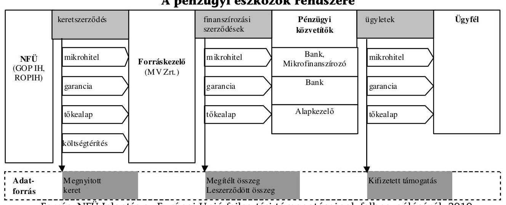

Forrás: NFÜ Jelentés az Európai Unió fejlesztési támogatásainak felhasználásáról, 2010. április

Az összegeket tekintve megítélt támogatások közel felét (48\%) a kiemelt projektek adják. A pályázatos konstrukciók esetében a teljes ÚMFT keret 18\%-ára született döntés, illetve 14\%-ára szerződés. A kifizetések mindkét támogatási formánál nagyon alacsony mértékűek, mindössze a megítélt támogatás 22, illetve $18 \%$-át teszik ki.

A kiemelt projektekre kifizetett 370 Mrd Ft-ból jelentős részt tesz ki a KÖZOP programjaira kifizetett 223 Mrd Ft. A pályázatos konstrukciókra 2009 végéig kifizetett 254,6 Mrd Ft támogatásból a legnagyobb arányt a GOP, a TÁMOP és a ROP KMOP tette ki.

# 2. táblázat 

ÚMFT előrehaladása, eljárásrendek szerint bontva 2007-2009

|  | ÚMFT   keret |  | Megítélt   támogatás |  | Leszerződött   támogatás |  | Kifizetett   támogatás |  |
| :--: | :--: | :--: | :--: | :--: | :--: | :--: | :--: | :--: |
|  | M euró | Mrd Ft | Mrd Ft | $\%$ | Mrd Ft | $\%$ | Mrd Ft | $\%$ |
| Kiemelt   projektek |  |  | 1649,5 | $21 \%$ | 1524,0 | $19 \%$ | 370,7 | $5 \%$ |
| Pályázatos   konstrukci-   ók |  |  | 1397,0 | $18 \%$ | 1073,2 | $14 \%$ | 254,6 | $3 \%$ |
| Pénzügyi   eszközök |  |  | 199,3 | $3 \%$ | 173,9 | $3 \%$ | $52,8^{*}$ | $1 \%$ |
| TS |  |  | 181,9 | $2 \%$ | 178,3 | $2 \%$ | 57,9 | $1 \%$ |
| ÚMFT | 29319 | 7875,1 | 3427,7 | 44\% | 2949,4 | 37\% | 736,0 | 9\% |

Forrás: NFÜ jelentés az Európai Unió fejlesztési támogatásainak felhasználásáról.

* a forráskezelő szervezet részére kifizetett összegeket tartalmazza

Árfolyam:268,6 Ft/euró.

---

A kis- és középvállalkozások számára kialakított pénzügyi eszközök 2009. évi lassú beindulása, a várakozástól való elmaradása volt tapasztalható. A pénzügyi közvetítők és az ügyfelek között 2009 végéig 2200 ügylet született 19,6 Mrd Ft értékben, amelynek több mint felét ( $10,9 \mathrm{MrdFt}$ ) továbbra is a mikrohitel program adta. A fennmaradó rész a KKV hitel ( 4 Mrd Ft ), a forgóeszközhitel ( $3,5 \mathrm{MrdFt}$ ) és a portfólió-garancia program ( $1,4 \mathrm{MrdFt}$ ) között oszlott meg. A kockázati tőke programra nem történt kifizetés.

A nagyprojektek terén 2009. évben jelentős előrelépés történt. A Kormány 2009 végéig 27 KÖZOP és KEOP nagyprojektet hagyott jóvá, amelyből 16 -ot támogatott az Európai Bizottság. Ezzel a számmal hazánk élenjáró uniós viszonylatban. A 27 elfogadott nagyprojektre összesen 237,3 Mrd Ft értékben történt kifizetés.

A megítélt támogatásokat vizsgálva megállapítható, hogy a KKV-k fejlesztéséhez mindössze a források 10\%-a járult hozzá, főleg a GOP-on és kisebb részben a KMOP-n keresztül. A támogatások jelentős hányada az államháztartáson belüli nonprofit szervezetekhez, valamint önkormányzati szervekhez került (15. ábra). A megítélt támogatásokból lakosságszámhoz viszonyítva a vidékies és fejletlenebb térségek kevesebb forráshoz jutnak, mint a fejlettebb térségek.
15. ábra
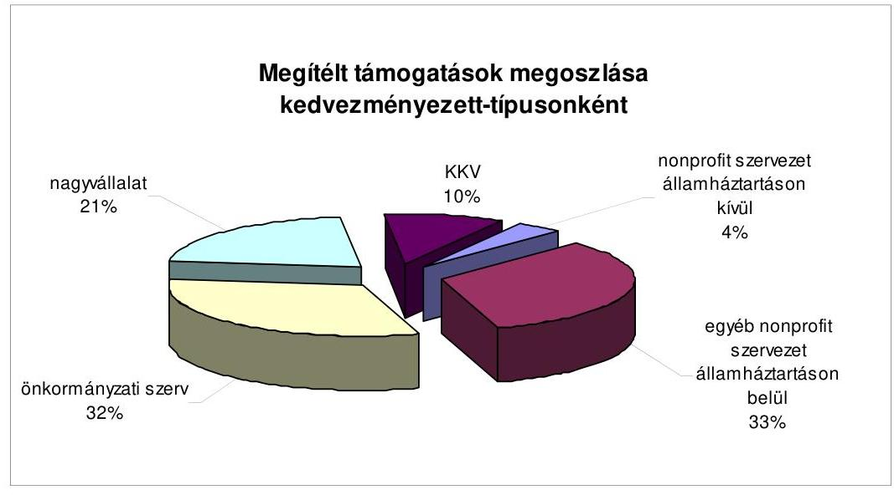

Forrás: NFÜ
Az ÚMFT programjainak előrehaladását értékelve megállapíthatjuk, hogy 2009-ben ugyan jelentősen felgyorsultak a folyamatok, az előrehaladás még mindig lassúnak tekinthető.

Az ÚMFT programjainak felgyorsítása, illetve a gazdasági válság hatásainak tompítása érdekében 2009 során számos lépés történt: az uniós források felhasználásával kapcsolatos feltételek könnyítése, a pályázók adminisztratív terheinek csökkentése.

---

A kedvezményezettek (kiemelten a KKV szektor) likviditásának segítése érdekében kedvezőbbé váltak az előlegnyújtás szabályai, illetve átmenetileg megemelt összegű előlegek igénybevételére ${ }^{27}$. Bevezették a késedelmi kamatot a végrehajtó intézményrendszer terhére, jellemzően a gazdaságfejlesztési projekteknél növekedett a támogatásintenzitás. A kifizetések felgyorsítására a hitelesített számlamásolatok benyújtása alóli felmentés összeghatárát megemelték, speciális szabályokat hoztak az időközi kifizetésekre. Enyhítették a pénzügyi biztosítékokhoz kötődő kötelezettségeket.

A pénzügyi jellegű intézkedések mellett további eljárásrendi változásokat vezettek be. Olyan eljárási garanciákat fogadtak el, amelyek védik a projektgazdák alapvető érdekeit. A gazdaságfejlesztési támogatásoknál lehetségessé vált az árbevétel-növekedési elvárás átváltása létszámmegtartásra. A projektkiválasztási folyamatot lényegesen felgyorsító normatív pályáztatási eljárást szélesebb körben alkalmazták. Intézkedéseket hoztak a szerződéskötési folyamat felgyorsítására.

Az ÁSZ zárszámadási, illetve a szabálytalanság-, adósság- és követeléskezeléssel foglalkozó jelentései, összhangban az OP-k közti forrásátcsoportosításra készített előtanulmánnyal felhívták a figyelmet arra, hogy a belépési feltételek, a jövőre vonatkozó kötelező vállalási feltételek és a biztosítékadási feltételek enyhítése, a támogatás intenzitás növelése, valamint az automatikus előleg mértékének megemelése együttesen növelheti a pályázati források nem rendeltetésszerú felhasználásának, illetve a követelések teljesülésének kockázatát.

Az ÁSZ zárszámadási ellenőrzése során megállapította, hogy az ÚMFT (pl. a GOP) támogatásainál az előlegnyújtás szabályainak támogatottak számára kedvező megváltoztatása növekvő számú esetben okozott problémákat. A jelentős mértékű előleg egyes támogatottakat nem ösztönözte a vállalt kötelezettségeik maradéktalan és mielőbbi végrehajtására, emiatt is gyorsan növekedett az el nem számolt előlegek miatti követelések száma és összege, ezért az ÁSZ javaslatot tett az előlegnyújtás szabályainak felülvizsgálatára.

Az ÁSZ zárszámadási jelentése rámutatott továbbá, hogy az ÚMFT-ben alkalmazott biztosítéknyújtási feltételek - a korábbinál enyhébb feltételek következtében - nem garantálták az eredeti cél megvalósulását, azaz a támogatott projektnek a támogatási szerződésben rögzített formában és időben történő végrehajtását, illetve a kapcsolódó vállalások teljesítését.

Az NFT támogatásainál gyakorlatilag minden támogatottnak a támogatás öszszegével megegyező, illetve azt meghaladó biztosítékot kellett nyújtania mindaddig, amíg az elszámolás meg nem történt, de csökkentett mértékben fenn kellett tartania azt a fenntartási időszak végéig. Az ÚMFT esetében viszont ezt a kötelezettséget jelentősen enyhítették, így pl. 25,0 M Ft támogatási összeg alatt egyálta-

[^0]
[^0]:    ${ }^{27}$ Az Ámr. - a 288/2008. (XII. 9.) Korm. rendelet 2. § (3) bekezdésében foglaltak alapján - 2008. december 10-től 2009. június 30-ig, illetve ezt meghosszabbítva a 2009. december 31 -ig lehetőséget biztosított megemelt, a támogatási összeg $35 \%$-ának megfelelő összegű előleg kifizetésére azzal a kitétellel, hogy a $25 \%$-ot meghaladó előleget a PM miniszter egyetértésével lehet nyújtani.

---

lán nem kell a támogatottnak biztosítékot nyújtania, ami a vállalt kötelességek teljesítését egyáltalán nem ösztönözte.

A szabálytalanság-, adósság- és követeléskezeléssel foglalkozó ÁSZ jelentés kiemelte, hogy az aktuális gazdasági helyzetben - mikor a követelések behajthatatlansága elsődlegesen a felszámolásokra vezethető vissza - megnőtt a biztosítékok, az azonnali beszedés, a végrehajtás jelentősége. Ebből következően a behajthatatlan esetek elkerülésének legfontosabb faktora a biztosítékrendszer kidolgozása és az időtényező lett.

A kedvezőtlen folyamatokra utaló jeleket (támogatással való el nem számolás, kiutalt források támogatástól eltérő felhasználása, motiváció hiánya a projekt mielőbbi befejezésére) az intézményrendszer már észlelte.

A GOP kezelését végző KSZ az előleggel való el nem számolás, az előleg visszafizetésére irányuló felszólítások, illetve az ebből eredő szabálytalansági eljárások számának növekedését tapasztalta. Ez a jelenség gyorsan nőtt 2009. harmadik negyedévétől kezdve, amikor tömegesen kellett volna megkezdeni az előlegekkel történő elszámolást. 2010 áprilisában a MAG Zrt.-nél 93 esetben folyt szabálytalansági eljárás azok ellen, akik határidőre (8 hónap) nem számoltak el az előleggel.

Az előtanulmány kiemelte továbbá, hogy a kedvezőbb pályázati feltételrendszer növelte a támogatott projektek esetén a forrásfelhasználás nem megfelelő hatékonyságának, illetve a holtteher-hatás kialakulásának kockázatát.

A válság hatásainak enyhítésére további, költségvetésen kívüli eszközök bevezetése történt. A magyar hatóságok indokoltnak tartották az ideiglenes keretszabály alapján nyújtható támogatások (összeegyeztethető, korlátozott összegű támogatás, kezességvállalás, valamint támogatott kölcsön formájában nyújtott támogatás) fenntartását ${ }^{28}$. Ezen különleges támogatási eszközöket az Európai Bizottság 2009-ben hozott határozataiban engedélyezte.

A válság, valamint a 2006. évi kormányzati lépések (konvergenciaprogram és a költségvetési egyensúly helyreállítására hozott intézkedések) hatásai, a hitelezési források beszűkülése különösen súlyosan érintette a magyar gazdaság legsérülékenyebb szereplőit a kis- és középvállalkozásokat és rajtuk keresztül a foglalkoztatottságot.

A válság egyes negatív hatásainak enyhítése, a vállalkozások számára elérhető források bővítése, a források felhasználásának felgyorsítása érdekében a Kormány - az Európai Bizottság jóváhagyásával - átcsoportosításokat hajtott végre az ÜMFT operatív programjai között és egyszerűsítette a pályáztatás rendszerét.

A Kormány az infrastrukturális jellegű fejlesztések területéről olyan területekre kívánta átcsoportosítani a támogatási forrásokat, ahol javítani lehet a likvidítást

[^0]
[^0]:    ${ }^{28}$ Ideiglenes közösségi keretszabály a finanszírozási lehetőségek elérésének támogatására irányuló állami támogatási intézkedésekhez a jelenlegi pénzügyi és gazdasági válság során, amelynek célja, hogy felszabadítsa a vállalatok részére történő hitelezést és így ösztönözze a vállalkozásokat arra, hogy továbbra is fektessenek be a jövőbe.

---

és segíteni lehet a kis- és középvállalkozásokat. A vállalkozások segítésével mérsékelni lehet a nagy foglalkoztatás-csökkenést is.

Az átcsoportosítás legnagyobb kedvezményezettje a GOP (TIOP-ból 51, KÖZOPból 60 Mrd Ft ). Ezen belül 105 Mrd Ft-tal a (vállalkozások - és kiemelten a KKV-k - komplex fejlesztését támogató) 2. prioritás, illetve 6 Mrd Ft-tal a 4. pénzügyi eszközök prioritás részesült (16. ábra).

Olyan konstrukciók támogatása volt a cél, amelyek abszorpciós képessége kimagasló, nagy pályázói igény jelentkezik rá, gyorsan felhasználható fejlesztési forrást jelent, valamint hozzájárul a munkaerő megtartásának javításához.
16. ábra

OP-k közötti forrásátcsoportosítás - 2009. június 30.
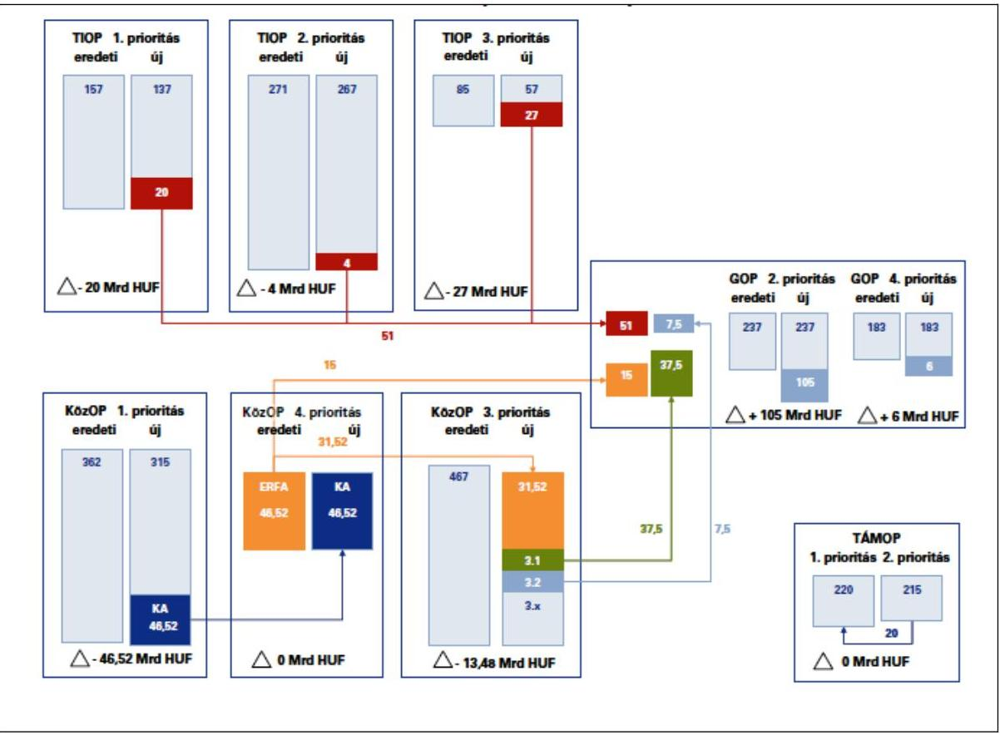

Forrás: NFÜ
A forrásátcsoportosítás várható hatásait elemző előtanulmány a megnövekedett pályázói igényből fakadóan kockázatos területnek ítélte az intézményrendszer kapacitásait a folyamat időbeli tarthatósága szempontjából.

Az ÁSZ zárszámadási jelentése rámutatott, hogy a gazdasági válság miatt megnövekedett támogatásigény lebonyolítása jelentős többletterhet rótt az apparátusra, amit azonban kevés problémával megoldottak. A pályázatok tervezett kiírásán lényegesen nem változtattak, de a korábbi évek késedelmeitől eltérően nem is csúsztak el a kiírásokkal, illetve az értékelésekkel.

---

A forrásátcsoportosítás várható hatásait elemző előtanulmány szerint a 4. prioritással kapcsolatos legnagyobb kockázat az abszorpciós képességével kapcsolatban jelentkezik.

Az ÁSZ zárszámadási jelentése megállapította, hogy nem a tervezett ütemben sikerült a JEREMIE-program keretein belül a KKV-k finanszírozásának javítása. Ez elsősorban a közvetítő pénzintézetek e területen is megmutatkozó óvatosságának volt köszönhető, akik nem tettek különbséget a hitelezésben attól függően, hogy a kölcsöneszközök mekkora hányada származott külső, illetve saját forrásból. Emiatt igyekeztek változtatni az eredetileg kialakított konstrukciókon, illetve a finanszírozás forrásösszetételén.

Az Európai Bizottságtól 2009 végéig összesen 3,78 Mrd euró érkezett hazánkba, amelynek nagyobb része továbbra is az automatikusan folyósított előleg volt (2,37 Mrd euró). A Bizottság részére benyújtott kérelem alapján folyósított időközi átutalás 1,4 Mrd euró összeget ért el.

Az Igazoló Hatóság 2009-ben az előző évi 141,31 M eurót jelentősen meghaladó összegben, 856,67 M euró értékben küldött ki költségnyilatkozatot az Európai Bizottság részére. Néhány program esetében azonban - tekintve a program magas keretösszegét - alacsony az igazolt költségek szintje (KEOP, KÖZOP, ÉMOP, DDOP).

# A megállapított szabálytalanságok többsége, a pénzügyi korrekciók, valamint az irányítási és ellenőrzési rendszerek kedvezőtlen minősítése a közbeszerzési eljárások során tapasztalt hiányosságokból fa- 

kadtak. Ennek megfelelően a közbeszerzéseket az ÁSZ a zárszámadási jelentésében, a Zárónyilatkozat Kiadásért Felelős Szerv, illetve a 2007-2013-as időszak OP-i tekintetében az EH rendszerellenőrzései, valamint az Európai Bizottság, és az Európai Számvevőszék a rendszer és a projektellenőrzései keretében kiemelten vizsgálta.

A közbeszerzési eljárás lefolytatása a kedvezményezett feladata és felelőssége. Az Európai Uniós Közbeszerzési Koordinációs és Szabályossági Egység (EKKE) az EU-s forrásokból támogatott közbeszerzések szabályossági vizsgálatával kapcsolatos feladatokat látta el a Múködési Kézikönyvben meghatározottak szerint. Az EKKE által megfogalmazott megállapítások a rendeletek értelmében nem kötelező érvényűek a kedvezményezettre nézve, az észrevételnek, illetve jelentésnek a közbeszerzési eljárás lefolytatására nincs halasztó hatálya.

Az intézményrendszer (a 2004-2006. közötti időszakra vonatkozó belső eljárásrendek alapján a KSZ-ek, a 2007-2013. közötti időszakban a KSZ, EKKE és az NFÜ együttes) feladata és felelőssége volt a közbeszerzési eljárás szabályszerű lefolytatásának elősegítése, illetve ellenőrzése, jogsértés esetén pedig jogszabályban, illetve a kedvezményezettekkel kötött támogatási szerződésekben meghatározott következmények alkalmazása.

Annak ellenére, hogy az intézményrendszer egyes OP-knál kiemelt figyelmet fordított a közbeszerzés ellenőrzésére (ellenőrzési listák, közbeszerzési szakértők alkalmazása), a Zárónyilatkozat Kiadásért Felelős Szerv/EH az NFT zárása, illetve az OP-k rendszerellenőrzései kapcsán állapított meg a közbeszerzéssel, illetve annak ellenőrzésével kapcsolatos hiányosságot. Az uniós intézmények által lefolytatott ellenőrzések több esetben tártak fel súlyos hiányosságot a pro-

---

jektek keretében lefolytatott közbeszerzési eljárásokkal (illetve azok hiányával) kapcsolatban, amely az ellenőrzési és irányítási rendszerekről (amelyek feladata a szabálytalan működés megelőzése, feltárása és korrigálása) kedvezőtlen minősítését, valamint pénzügyi korrekciókat vontak maguk után.

A KEOP 2009. évi átfogó rendszerellenőrzése során az EH megállapította, hogy a közbeszerzések ellenőrzésének szabályozása nem egyértelmű, a KSZ-ek saját kockázatelemzés alapján a vonatkozó rendeletnél szigorúbb ellenőrzési rendszert alkalmaznak a gyakorlatban, munkájukat ugyanakkor a részletes ellenőrzési módszertani útmutató hiánya (is) akadályozza.

Az EH a KIKSZ-nél a közbeszerzésre vonatkozóan több elvi és gyakorlati javaslatot tett, az EKKE és a Gazdasági Versenyhivatal időbeni értesítésével és a közbeszerzések KIKSZ-en belüli kezelésével összefüggésben. Kifogásolta néhány kivitelezői szerződés kései ellenjegyzését, az EMIR adatbevitel hiányosságait.

Az Ellenőrzési Hatóság TÁMOP-TIOP rendszerellenőrzése kapcsán megállapította, hogy a HEP IH-nál a vizsgált TS projektek projektdosszéi hiányosak voltak, nem tartalmaztak megfelelő bizonyítékokat a projekt előrehaladási jelentések szakmai és a közbeszerzési eljárások ellenőrzésének elvégzésére.

A ROP SLA szerződésekben a közbeszerzés ellenőrzésének többletdíához teljesítmény érdekeltséget kapcsoltak. A TÁMOP-TIOP KSZ-ek által a kifizetési kérelmek, az előrehaladási jelentések, a közbeszerzések ellenőrzésére kidolgozott ellenőrzési listák kiterjednek a 281/2009. (XII. 23.) Korm. rendelet 31. §-ában foglalt szempontokra. A közbeszerzések ellenőrzésének elvégzésére egyes KSZ-ek közbeszerzési szakértővel kötöttek megbízási szerződést, illetve saját kérdéslistát dolgoztak ki: az EH ezt jó gyakorlatnak minősítette.

Ugyanakkor az ÁSZ zárszámadási ellenőrzés megállapításai szerint kiemelt kontrollkockázatot jelentett a teljes intézményrendszert átfogó közbeszerzésellenőrzési eljárásrend kialakításának hiánya. A kontrollelem hiánya következtében a közbeszerzésekkel kapcsolatos szabálytalanságok nagy része a 2004-2006-os programozási periódusban jellemzően az OP-k, projektek zárásakor kerül(t) feltárásra, amely egyes esetekben az Európai Bizottság általi pénzügyi korrekció alkalmazását vonta maga után (pl. KIOP).

A jelenleg hatályos jogszabályok értelmében az ÁSZ, az EH és a Kincstár, illetve a közbeszerzéshez támogatást nyújtó és a KSZ számára - a projektek megvalósításának időtartamához képest - korlátozott idő (2009. április 1-jétől a Kbt. módosítása értelmében egy év) áll rendelkezésre jogorvoslati eljárás kezdeményezésére.

Az ÁSZ ajánlásként fogalmazta meg az NFÜ elnöke részére a teljes intézményrendszert átfogó közbeszerzés-ellenőrzési eljárásrend felülvizsgálatát és betartatását, illetve szükség esetén a vonatkozó hazai jogszabályok módosításának kezdeményezését, annak érdekében, hogy a 2004-2006-os időszak közbeszerzési szabálytalanságainak feltárásával kapcsolatos problémái a 2007-2013-as időszak programjai esetében ne ismétlődhessenek meg. Továbbá az ÁSZ véleménye szerint a KA esetében a projektek zárása, illetve a nyomon követés során megállapított szabálytalanságokra vonatkozó eljárásrend hiánya miatt nem biztosított az ilyen szabálytalanságokból eredő követeléseknek a projekt fenntartási időszakot lezáró határidőn belül történő rendezése, a pénzügyi korrekci-

---

ókból eredő követelések behajthatósága, és az Európai Bizottság által a projekt zárásakor a hazai költségvetés felé esedékes végső kifizetések teljesítése, ezért erre vonatkozóan is ajánlást fogalmazott meg az NFÜ elnöke részére.

Az ÚMFT OP-k esetében a PM NAO Iroda kritikát fogalmazott meg az akciótervek ad-hoc jellegű módosítása (forrásátcsoportosítás, kiemelt projektek nevesítése), illetve az egyes akciótervi változatok nem megfelelő nyomonkövethetősége kapcsán.

Az Ellenőrzési Hatóság vizsgálatai további kisebb, a dokumentálást, az EMIR feltöltöttséget, az ellenőrzési nyomvonal érvényesülését, valamint a szabálytalanságok nyilvántartását érintő hiányosságot tártak fel.

Az Ellenőrzési Hatóság TÁMOP-TIOP rendszerellenőrzése kapcsán megállapította, hogy az ellenőrzési nyomvonal nem érvényesült. A HEP IH esetenként jelentős határidő túllépéssel küldte meg az Igazoló Hatóságnak a havi hitelesítési jelentést.

Az EH a KÖZOP IH-nak javasolta a TS hitelesítési feladatai munkamegosztásának áttekintését, a projektdossziék rendezését, és az EMIR-feltöltés naprakészségének és a szabálytalansági jelentések nyilvántartásának javítását. Az Ellenőrzési Hatóság szükségesnek tartotta a 4-es metró egyes közbeszerzéseinek ismételt felülvizsgálatát. Kifogásolta, hogy az SLA-szerződés nem tartalmazza az IH utasítási jogát.

A rendszerellenőrzés a KIKSZ-nél több kisebb szabályozási hiányosságot talált a szabálytalanságok kezelésével és az ellenőrzési nyomvonal aktualizálásával kapcsolatban. Mind az IH, mind a KIKSZ intézkedési tervben fogalmazta meg a fentiekből fakadó kötelezettségeit.

A kifizetések növekedésével párhuzamosan nőtt az Európai Bizottság illetékes főigazgatóságai, illetve az Európai Számvevőszék ellenőrzéseinek a száma.

Az Európai Bizottság Regionális Főigazgatósága húsz GOP projekt ellenőrzését végezte el 2009-ben. A vizsgálati jelentés két kisebb jelentőségű észrevételt tett, de ezek nem érintették a kifizetések szabályszerűségét, így szabálytalanságot vagy visszafizetési kötelezettséget sem állapított meg.

Az Európai Számvevőszék a 2009. évi EU zárszámadáshoz kiadandó megbízhatósági nyilatkozat (DAS) összeállítása érdekében 8 db GOP projekt kifizetésének jogszerűségét ellenőrizte. Két esetben a PM NAO Iroda pontatlan adatszolgáltatását állapították meg, ami azonban nem érintette a projektek lebonyolítását. Egy projekt esetében a támogatásból vásárolt eszközökhöz az ellenőrzés nem fért hozzá. A KSZ tudomására nem jutott tulajdonosváltás történt, és okirat hamisításra is fény derült. Az IH szabálytalansági eljárást kezdeményezett és az Európai Számvevőszékkel egybevágóan megállapította a szabálytalanságokat, visszakövetelve a kifizetett támogatást. A többi projekt esetében a vizsgálat nem tárt fel szabálytalanságot.

Az Európai Számvevőszék a 2009. évi EU zárszámadáshoz kiadandó megbízhatósági nyilatkozat (DAS) összeállítása érdekében ellenőrzést végzett a KEOP-ot érintően. A kiválasztott KEOP projektek ellenőrzése során megállapították, hogy a kifizetési kérelemben - az EMIR hibás múködéséből fakadóan - helyte-

---

len összeget tüntettek fel (a kedvezményezett részére a helyes összeget fizették ki). Egy esetben pedig a közbeszerzési szabályok megsértését tapasztalták, amely visszafizetési kötelezettséget vont maga után.

A fenti két ECA DAS ellenőrzés során értékelték az OP-k irányítási és ellenőrzési rendszereinek múködését, amelyet a kiválasztott GOP és KEOP projektek vizsgálatával is megerősítettek. A két OP ellenőrzése alapján az irányítási és ellenőrzési rendszerek múködését kedvezőtlenül értékelték. Az IH, a KSZ és az IgH által múködtetett irányítási és ellenőrzési rendszert 2. szintű minősítéssel (a rendszer múködik, de fejlesztésre szorul) látták el. Az Ellenőrzési Hatóság munkáját megfelelőnek ítélték.

Az ÁROP-ra vonatkozóan az Európai Bizottság ESZA ellenőrzési egységégének auditja minősített véleményt bocsátott ki. Az ellenőrzés alapján az irányítási és ellenőrzési rendszer múködött, de jelentős javításokat igényelt (3-as szintű minősítés). Mivel az ellenőrzés mind az Irányító Hatóság, mind az Ellenőrző Hatóság szintjén megkérdőjelezte az operatív program irányítási és ellenőrzési rendszerének megbízhatóságát, az ÁROP igénylés fizetési határidejének megszakítását vonta maga után mindaddig, amíg a magyar hatóságok nem bizonyítják az első- és másodszintú ellenőrzési rendszer megbízhatóságát.

Az Európai Bizottság Regionális Politikák Főigazgatósága 2009. december 7-11 között végzett helyszíni ellenőrzése keretében vizsgálta a NFT/ERFA, KA programoknál azon közösségi értékhatárt meghaladó közbeszerzéseket, amelyek esetében tárgyalásos eljárás lefolytatására került sor, vagy az eredeti szerződés összegének 10\%-át meghaladó összegben pótmunka került elszámolásra. Az ellenőrzés célja volt megfelelő bizonyosság megszerzése a nemzeti és EU közbeszerzési jogszabályoknak történő megfelelésről az SA, KA szerződések tekintetében. Az ellenőrzésre kiválasztásra kerültek - többek között - a KA környezetvédelem előirányzatból finanszírozott 2004/HU/16/C/PE/002, valamint 2003/HU/16/P/PE/020 sz. projektjeinek egyes szerződései. Az ellenőrzési megállapítások a Tájékoztató lezárásakor nem álltak rendelkezésünkre.

Az Európai Bizottság Regionális Politikák Főigazgatósága vizsgálatot folytatott az EU 27 tagállamában a 2007-2013-as időszakra tekintetében a hibaarány meghatározására vonatkozóan (10-10 projekt került ellenőrzésre). Magyarországon a Bizottság a GOP-ot és a VOP-ot ellenőrizte. Egy VOP és egy GOP projekt esetében nem lényeges, formai hibát, egy másik VOP projektnél azonban a közbeszerzési eljárásra vonatkozó uniós irányelv megsértését állapította meg. Az összesített tagállami hibaarányt a GOP-nál nulla, a VOP-nál 1,45\%-ban határozták meg.

# Önkormányzatok, mint az uniós támogatások kedvezményezettjei 

Az Állami Számvevőszék az önkormányzatok költségvetési gazdálkodási rendszere átfogó ellenőrzésének keretében a teljesítmény-ellenőrzés módszerével vizsgálta a belső szabályozottság, szervezettség terén az Önkormányzat felkészültségét az európai uniós források figyelése, igénylése és felhasználása szem-

---

pontjából, továbbá értékelte, hogy az igényelt európai uniós támogatások az Önkormányzat által meghatározott fejlesztési célkitűzésekhez kapcsolódtak-e ${ }^{29}$. A felkészülést az ÁSZ akkor minősítette eredményesnek, ha a felkészülés szabályozottsága, szervezettsége megfelelt a meghatározott szempontok szerinti feltételeknek.

A 2009-ben ellenőrzött 119 önkormányzat 22\%-a készült fel eredményesen 2007-2009 között az európai uniós források igénybevételére és a várható támogatás felhasználására. Az európai uniós források igénybevételére irányuló pályázatok a gazdasági programokban, ágazati, és településfejlesztési koncepciókban, programokban megfogalmazott fejlesztési célkitűzésekhez többségükben ( $94 \%$-ban) kapcsolódtak. Nem készült fel azonban eredményesen az európai uniós források igénybevételére és felhasználására a szabályozottság terén az ellenőrzött önkormányzatok 74\%-a, a szervezettség vonatkozásában $4 \%-a$.

A korábbi évben végzett ellenőrzése alapján a szabályozottság terén az ellenőrzött önkormányzatok 92\%-a, a szervezettség vonatkozásában 17\%-a 2004-2006 között nem készült fel eredményesen az európai uniós források igénybevételére és felhasználására.

A szabályozások az ellenőrzött önkormányzatok felénél nem tartalmazták a pályázatfigyelést végzők és a döntési, illetve a döntés-előkészítési jogkörrel rendelkezők közötti információk szolgáltatásának kötelezettségét, közel egytizedénél nem írták elő a folyamatba épített, előzetes, utólagos és vezetői ellenőrzési feladatokat. Az önkormányzati hivatalban, valamint külső szervezetek, személyek igénybevételével a pályázatfigyelés, a pályázatkészítés és a fejlesztési feladat lebonyolítás személyi feltételeit az ellenőrzött önkormányzatok nagy része biztosította. A külső szervezetekkel kötött szerződések közel egyharmadában azonban nem rögzítették a pályázat szakmai és formai követelményeire vonatkozó felelősség szabályait, mintegy felében nem írták elő a fejlesztési feladat lebonyolítását végző ellenőrzési kötelezettségét, továbbá a belső ellenőrzési stratégiát megalapozó kockázatelemzés az ellenőrzött önkormányzatok 77\%ánál nem terjedt ki az európai uniós forrásokkal támogatott fejlesztési feladatokra.

A 2007-2009 között ellenőrzött önkormányzatok közel egytizede - a helyi önkormányzatokról szóló 1990. évi LXV. törvény előirása ellenére - nem fogadta el a 2006-2009 közötti időszakra szóló gazdasági programját. Az ellenőrzött önkormányzatok a vizsgált időszakban 3021 fejlesztési feladat esetében döntöttek európai uniós támogatásra vonatkozó pályázat benyújtásáról, amelyek mintegy fele részesült támogatásban. A támogatást nyújtó szervezet döntése után a 2008-2009. években az ellenőrzött önkormányzatok 5-12\%-a a saját forrás, a jogerős építési és hatósági engedélyek hiánya, a közbeszerzési eljárás eredménytelensége, a kivitelezés költségének emelkedése miatt pályázatát viszszavonta.

A benyújtott pályázatok elutasítását a pályázati források hiánya, a szakmai kidolgozatlanság, a költséghatékonyság hiánya, a pályázatok tartalmi és formai

[^0]
[^0]:    ${ }^{29} 1019$ sz. ÁSZ Jelentés.

---

hibái, a pályázati feltételek hiányos teljesítése, valamint egyéb hiányosságok okozták.

A 2006-2009. évek költségvetési rendeleteiben az ellenőrzött önkormányzatok mintegy fele tervezte az európai uniós forrásokkal támogatott fejlesztési feladatok bevételi és kiadási előirányzatait. Jogszabályi előirás ellenére az önkormányzatok közel felénél a költségvetési rendelet nem tartalmazta elkülönítetten az európai uniós támogatással megvalósuló programok összes bevételét és kiadását, továbbá mintegy kétharmadánál a képviselő-testület tájékoztatása céljából nem mutatták be a többéves kihatással járó, európai uniós forrásból megvalósuló fejlesztési feladatokat számszerúsítve évenkénti bontásban, szöveges indoklással.

Az önkormányzatok a már befejezett fejlesztési feladatok megvalósítására 261 Mrd Ft kiadást terveztek, amelyet 99,9\%-ban felhasználtak. A kifizetési kérelmek benyújtása után a támogatások folyósítása fél hónap és másfél év közötti időtartamot vett igénybe. Az időbeli elhúzódást elsősorban az igénylést alátámasztó dokumentumok, számlák alaki és tartalmi hiányosságai okozták. A közremúködő szervezetek az előlegigényléseket, valamint a hiánytalanul benyújtott kifizetési kérelmeket az ellenőrzött projektek mintegy egyharmadánál határidőn belül teljesítették.

A támogatott fejlesztési feladatok megvalósításához az önkormányzatok a saját forrást biztosították, eleget tettek a támogatás megelőlegezési követelményének, amelynek fedezetét közel tizedük rövid lejáratú hitelből biztosította. A fejlesztési feladatokat az önkormányzatok mintegy negyede a tervezetthez viszonyítva a kiadások hiányos tervezése és a támogatási szerződés szerint el nem számolható költségek kifizetése miatt többletkiadással valósította meg. Az önkormányzati hivatalok mintegy 60\%-ánál az európai uniós források felhasználásával megvalósított feladatok kiadásainak és bevételeinek teljesítése során a folyamatba épített, előzetes, utólagos és vezetői ellenőrzéseket végrehajtották. A támogatásban részesült önkormányzatok döntő többségénél ( $90 \%$ nál) azonban a belső ellenőrzés nem vizsgálta az európai uniós forrás felhasználását. Az európai uniós forrással támogatott fejlesztési feladatok megvalósulását külső ellenőrző szervezetek az ellenőrzött önkormányzatok mintegy kétharmadánál vizsgálták, megállapításaikra a polgármesterek intézkedést tettek.

# 3.2.2. Nemzetközi együttmúködési programok 

A 2004-2006-os INTERREG közösségi kezdeményezés programok megvalósítási szakasza befejeződött. Ezen programokat a 2007-2013-as programperiódusban a regionális politika 3. célkitűzése, az Európai Területi Együttmüködés (ETE) váltotta fel. Magyar részvétellel 7 határ menti (6 kétoldalú és 1 négyoldalú), 2 transznacionális (közép- és délkelet-európai) és 4 interregionális (INTERREG IVC, URBACT, ESPON, INTERACT) program került kidolgozásra. A programok uniós forrását az Európai Regionális Fejlesztési Alap, illetve az Unió külső határain az IPA (Előcsatlakozási Támogatási Eszköz, Horvátország és Szerbia tekintetében) és ENPI (Európai Szomszédsági és Partnerségi Eszköz, Ukrajna tekintetében) alapok biztosították.

---

# Határon átnyúló együttmúködési programok 

A határon átnyúló együttműködési programokban - a 2004-2006-os időszak jellemzően háromoldalú szomszédsági programjaitól eltérően - a két ország határ menti megyéi múködtek együtt a határon átnyúló gazdasági és szociális kapcsolatok fejlesztése érdekében.

Az európai területi együttmúködés célkitűzése arra irányult, hogy erősítse a határokon átnyúló együttműködést közös helyi és regionális kezdeményezések útján, a transznacionális együttműködést az integrált területi fejlődéshez vezető, a közösségi prioritásokhoz kapcsolódó intézkedések révén, valamint az interregionális együttműködést és tapasztalatcserét a megfelelő területi szinten. A pénzügyi források túlnyomó többsége a határ menti programokra jutott, amelyekben a beavatkozás fő területei az alábbiak voltak: helyi gazdaságfejlesztési kapcsolatok, város- és vidékfejlesztés, turizmus, emberi erőforrás fejlesztés, $\mathrm{K}+\mathrm{F}$, kultúra, egészségügy, oktatás, környezetvédelem, megújuló energia, közlekedési, információs és vízügyi együttmúködés, jogi és közigazgatási együttmúködés stb. (beruházások vagy ún. „szoft" tevékenységek, pl. tanulmányok formájában).

Az ETE Operatív Programjainak hazai intézményrendszere az INTERREG programok intézményrendszerére épült, az eljárások azonban az európai uniós szabályozás miatt eltértek a korábbi INTERREG szabályozástól. 2009-ben megtörtént az Egyetértési Nyilatkozatok aláírása. A programok eltérő ütemezése folytán egyes programokban újabb pályázati felhívások jelentek meg, a benyújtott projektek értékelése után támogatási döntéseket hoztak a Közös Monitoring/Közös Irányító Bizottságok és megkötötték a támogatási szerződéseket, más programokban a korábban támogatást kapott projektek megvalósítása kezdődött meg.

A projektszintű pénzügyi és szakmai monitoring eszköze az NFÜ által üzemeltetett IMIR 2007-2013 rendszer, amelynek éles üzemi adatokkal való feltöltésére 2010 folyamán kerül sor.

A négy határon átnyúló program ${ }^{30}$ esetében 2009-ben a pályáztatási és szerződéskötési folyamatok zajlottak, kifizetés nem történt.

A PM NAO Iroda belső ellenőrzése 2009-ben vizsgálta, hogy az Európai Területi Együttmúködés programjai végrehajtásához kapcsolódó feladatokat az Iroda megfelelően végezte-e. A vizsgálat alapján készült jelentés megállapította, hogy az Igazoló Hatóság ETE Programmal kapcsolatos folyamatai a Múködési Kézikönyvnek és a vonatkozó uniós és hazai jogszabályok előírásainak megfelelően múködtek ${ }^{31}$.

Az Elöcsatlakozási Támogatási Eszköz (IPA) keretében hazánk két együttmúködési programban vett részt Magyarország-Horvátország, illetve Magyarország-Szerbia relációban.

[^0]
[^0]:    ${ }^{30}$ Ausztria-Magyarország (AT-HU), Szlovénia-Magyarország (SI-HU), MagyarországSzlovákia (HU-SK), Magyarország-Románia (HU-RO).
    ${ }^{31}$ Forrás: Pénzügyminisztérium Nemzeti Programengedélyező Iroda Belső Ellenőrzési Egység - Éves ellenőrzési jelentés 2009. (2010. március 15.)

---

A 2007 óta létező Előcsatlakozási Támogatási Eszköz (Instrument for PreAccession Assistance, IPA) a tagjelölt és „potenciálisan tagjelölt" országokra (Horvátország, Törökország, Macedónia, Volt Jugoszláv Köztársaság, illetve Albánia, Bosznia-Hercegovina, Szerbia, Montenegró) fókuszált.

Az IPA programok esetében az Irányító Hatóság az NFÜ nemzetközi együttmúködési programokért felelős szervezeti egysége, a Közös Technikai Titkárságot a VÁTI Nonprofit Kft. keretein belül alakították ki. A Közös Igazoló Hatóság a PM NAO Iroda, a hazai partnerek vonatkozásában első szintű ellenőrzési feladatokat (hitelesítési tevékenységet) a VÁTI Nonprofit Kft. végezte. A Közös Ellenőrzési Hatóság szerepét a KEHI (2010. július 1-jétől az EUTAF) töltötte be.

A Magyarország-Horvátország IPA Határon Átnyúló Együttmúködési Program esetében 2009-ben lezajlott pályáztatást követően a szerződéskötések 2010 márciusától augusztusig 41 projekt esetén megtörténtek.

A Magyarország-Szerbia Határon Átnyúló Együttmúködési Program esetében 2010-ben került sor az Egyetértési Megállapodás aláírására, az első pályázati felhívásról 2010. április 28-án döntött a Közös Monitoring és Irányító Bizottság.

Az Európai Szomszédsági és Partnerségi Eszköz (European Neighbourhood and Partnership Instrument) határon átnyúló komponense az EU belső határain megvalósuló európai területi együttműködés célkitűzéstől eltérően a Közösség külső határai mentén elhelyezkedő, egyelőre tartósan az EU-n kívül maradó partnerországok érintett területi egységeivel való együttműködést támogatta.

# A Magyarország-Szlovákia-Románia-Ukrajna Európai Szomszédsági és Partnerségi Eszköz Határon Átnyúló Együttmüködési Program 

2007-2013 esetében a pályázati döntések 2010 áprilisában megtörténtek. A harmadik prioritás esetében a források elosztására - tekintettel a pályázók zárt körére (vám- és határőrizeti szervek) - ún. közvetlen eljárás keretében került sor.

A program lebonyolítása egységes szerkezetben történt függetlenül az államhatárok által meghatározott területi megosztástól, közös projektek, közös döntéshozás és közös pénzügyi keretek alkalmazásával. A program átfogó koordinációjáért a közös szervezetek feleltek. Az Irányító Hatóság és a Közös Technikai Titkárság Magyarországon múködött (NFÜ NEP IH, illetve VÁTI Nonprofit Kft.).

Az NFÜ BEF 2009-ben vizsgálta az ENPI hazai intézményrendszer létrehozásának és működésének témakörét. Az ellenőrzés során tett megállapítások a TA kézikönyv és a programszintű kézikönyv hiányát emelték ki.

## Transznacionális együttmúködési programok

A transznacionális együttműködési programok keretében egy adott szempontból egy területi egységként értelmezhető, de több országból álló területek közösen keresnek megoldásokat a térséget érintő problémákra. Hazánk mind a közép-európai, mind a dél-kelet európai programtérben teljes területével részt vett.

---

# A Délkelet-Európai Transznacionális Együttmúködési Program 2007$2013^{32}$ esetében 2009-ben a pályáztatási és szerződéskötési folyamatok zajlottak. Az Egyetértési Nyilatkozat aláírása 2010-ben történt meg. 

Az OP Irányító Hatósági, Közös Technikai Titkársági és Ellenőrzési Hatósági és Igazoló Hatósági feladatait Magyarország látja el. (Az Irányító Hatóság az NFÜ nemzetközi együttmúködési programokért felelős szervezeti egysége, a Közös Technikai Titkárság a VÁTI Nonprofit Kft., a Közös Igazoló Hatóság a Pénzügyminisztérium, NAO Iroda keretein belül múködik, a Közös Ellenőrzési Hatóság a KEHI.)

A Közép-Európa Transznacionális Együttmúködési Program 2007$2013^{33}$ program esetében 2009-2010-ben a pályáztatási folyamat zajlott, három pályázati körben.

Az OP irányító hatósági feladatait Ausztria látta el, a Közös Technikai Titkárság, valamint az Ellenőrzési Hatóság Ausztriában találhatók. A Nemzeti Hatóság szerepét az NFÜ NEP IH töltötte be.

## Interregionális együttmúködési program

Az INTERREG IVC Interregionális Együttmúködési Program célja, hogy növelje a regionális fejlesztési politikák hatékonyságát, illetve a régióközi együttmúködésen keresztül hozzájáruljon az innováció, a tudásalapú gazdaság, a környezetvédelem és kockázat-megelőzés területén Európa gazdasági modernizációjához és növekvő versenyképességéhez. A jogosult programterület az EU 27 tagállama, valamint Norvégia és Svájc. 2009-ben a pályáztatási és szerződéskötési folyamatok zajlottak.

Magyarország a programban tagállami feladatokat látott el, kizárólag a nemzeti társfinanszírozás biztosításáért felelt. A közösségi forrást a Franciaországban múködő Irányító Hatóság nyújtotta.

### 3.2.3. Svájci-Magyar Együttmúködési Program

Az Európai Unió és Svájc 2006. február 27-én kétoldalú megállapodást írt alá, amelynek értelmében Svájc a 2004-ben csatlakozott tíz tagállam részére öt éven keresztül összesen 1 Mrd svájci frank hozzájárulást biztosított. Ebből Magyarország részesedése bruttó 130,7 M svájci frank. Az Európai Bizottság és Svájc által kötött megállapodás meghatározta a támogatás biztosításának keretfeltételeit, valamint a lehetséges támogatási területek listáját. Az ötéves kötelezettségvállalási periódus 2007 júniusában kezdődött meg, miután a svájci parlament jóváhagyta a Svájci Hozzájárulás pénzügyi keretét.

[^0]
[^0]:    ${ }^{32}$ A programban résztvevő államok: Ausztria, Bulgária, Görögország, Magyarország, Szlovákia, Szlovénia, Románia, Olaszország; Albánia, Bosznia-Hercegovina, Horvátország, Macedónia, Szerbia, Montenegró, valamint Moldávia és Ukrajna.
    ${ }^{33}$ A programban résztvevő államok: Ausztria, Csehország, Magyarország, Lengyelország, Szlovákia, Szlovénia, Németország, Olaszország, valamint Ukrajna.

---

A Svájci-Magyar Együttmúködési Program koordinációjáért felelős Nemzeti Koordinációs Egység feladatait az NFÜ Nemzetközi Együttmúködési Programok Irányító Hatósága látta el. A Közreműködő Szervezet feladatainak ellátására az VÁTI Nonprofit Kft.-t, míg a Kifizető Hatóság feladatainak ellátására a PM NAO Irodát jelölték ki. A rendszerellenőrzésekért és a teljes támogatható kiadások 15\%-os mintavételes ellenőrzéséért felelős szervezet a KEHI (2010. július 1jétől az EUTAF) volt.

A Program keretében elsősorban közcélt szolgáló, alapvetően nem profitszerzésre irányuló tevékenységek, projektcélok finanszírozhatóak. A támogatás legalább $40 \%$-át a leghátrányosabb helyzetben lévő északmagyarországi és észak-alföldi régiókban kell felhasználni, külön figyelemmel Borsod-Abaúj-Zemplén, Hajdú-Bihar és Szabolcs-Szatmár-Bereg megyékre. A Program négy fő területre koncentrált: Biztonság, Stabilitás, Reformok; Környezet és infrastruktúra; A magánszektor támogatása, valamint Humánerőforrásés társadalomfejlesztés.

A társadalmi egyeztetést követően az első két pályázati felhívás 2008. július 31én jelent meg, majd 2008 novemberében két újabb pályázati felhívást hirdetett meg a Nemzeti Koordinációs Egység. 2009 folyamán további prioritási területekre vonatkozóan jelentek meg pályázati felhívások. Öt prioritási terület esetén még nem került sor pályázat meghirdetésére.

A Svájci Hozzájárulás terhére pénzügyi kötelezettségvállalást a Svájci Parlamentnek a támogatást biztosító 2007. június 14-i döntését követő 5 éven belül lehet tenni, úgy, hogy az utolsó projekt javaslatokat a 2012. június 14-i kötelezettségvállalási végdátum előtt két hónappal, tehát 2012. április 14-ig lehet benyújtani.

# 3.3. Agrártámogatások 

### 3.3.1. A mezőgazdaság makrogazdasági feltételrendszere

A mezőgazdaság részaránya a rendszerváltás után a foglalkoztatásban, illetve a nemzetgazdaság bruttó hozzáadott értékének és ezzel összefüggésben a bruttó hazai terméknek (GDP) az előállításában szinte folyamatosan csökkent, a beruházásokban pedig ingadozott.

A mezőgazdaság bruttó termelésének volumene az utóbbi években erősen változó képet mutatott. A kiugró 2008. évi bővülést követően 2009-ben ismét csökkent, és ezáltal aránya az ország termelésében az eddigi legalacsonyabb szintre, 3\%-ra csökkent. A mezőgazdasági termelés ingadozását elsősorban a szántóföldi növények hozamai befolyásolják.

A mezőgazdasági termelést csökkentette, hogy az állatállomány az EU-tagság elnyerését követően szinte folyamatosan fogyott. A vágóállatok és az állati termékek termelése 2004-ben visszaesett, és azóta is csökkenő tendenciájú, miközben az import jelentősen meghaladja a korábbit.

A nemzetközi irányzathoz hasonlóan Magyarországon is folyamatosan csökken a mezőgazdaságban (erdőgazdálkodással és halászattal együtt) foglalkoz-

---

tatottak aránya. A mezőgazdaságban, az erdőgazdálkodásban és a halászatban összesen 410 ezer vállalkozást regisztráltak 2009 végén, 5\%-kal többet, mint egy évvel korábban, tovább csökkent azonban a mezőgazdaságban a foglalkoztatottak száma.

Az EU 27 tagállamában 2009 novemberében a fogyasztói árak a harmonizált adatok szerint átlagosan 1,0\%-kal voltak magasabbak, mint 2008 novemberében. Ezzel szemben árcsökkenés volt megfigyelhető többek között Írországban (2,8\%) és Észtországban (2,1\%). A legnagyobb áremelkedést Magyarországon $(5,2 \%)$ és Romániában ( $4,6 \%$ ) mérték.

A 2007-ig tartó fokozatos növekedés után 2008-hoz hasonlóan 2009-ben az agrártermékek termelőiár-szintje 9,5\%-kal esett vissza. Ugyanebben az időszakban a mezőgazdasági termelés ráfordítási árszintje 5,8\%-kal mérséklődött.

Míg 2009-ben a nemzetgazdasági beruházások volumene 8,6\%-kal csökkent, a mezőgazdaság nemzetgazdasági ág 7\%-os növekedését főként a gépberuházásokat elősegítő központi támogatások ösztönözték.

2009-ben az agrárium gazdasági teljesítménye más ágazatokhoz képest kevésbé csökkent a globális pénzügyi válság hatására kialakult gazdasági krízisben, ám az ágazat finanszírozása nehezebbé vált. Az Új Magyarország Vidékfejlesztési Program (ÜMVP) projektjeinek mintegy 50 százaléka fejlesztési célú, ezért is fontos a finanszírozhatóság fenntartása.

Az FVM a finanszírozási nehézségek oldása végett 2008 végén a Magyar Fejlesztési Bankkal több célzott hitelprogramot indított, amelyeket a kereskedelmi bankokon keresztül refinanszírozott. A kedvezményes hitelprogramok a beruházások megkezdését és folytatását, a folyó termelés finanszírozását, a termények felvásárlását segítették. Emellett az élelmiszeripari vállalatok finanszírozási gondjain, a bankok hitelnyújtási készségének erősítése végett bankgarancia program indításával is segített a tárca. Az egyre fokozódó finanszírozási nehézségek láttán az EU által lehetővé tett mozgástérben a Minisztérium az ÚMVP egyes beruházási programjainak beindításához, nemzeti kockázatra 20\%-os mértékű előleg felvételét is lehetővé tette.

A gazdasági válság következményeinek enyhítése végett az Európai Bizottság lehetőséget teremtett arra, hogy azon tagállamok, amelyek ezt igénylik, a 2009. évben a támogatások kötelező társfinanszírozási arányát a maguk számára kedvező arányban eltérítsék, és 2009 végéig legfeljebb 10\%-kal kevesebb nemzeti társfinanszírozást fizessenek a közkiadáson belül (ún. Frontloading: az EU-s társfinanszírozási arány átmeneti növelése). Ez a tagállam számára halasztott fizetést jelent, amelyet 2010-2015 között vissza kell pótolni az EU költségvetésébe. Magyarország 2009 negyedik negyedévében élt ezzel a lehetőséggel, és 2010 januárjától már a visszapótlásnak megfelelő magasabb nemzeti társfinanszírozási összeget fizette.

---

# 3.3.2. Az agrártámogatások finanszírozási és intézményrendszere, jogszabályi háttere 

Az EU Közös Agrárpolitikája megvalósításának egyik alapelve a pénzügyi szolidaritás, azaz az agrárpolitika körébe tartozó intézkedések közösség által történő finanszírozása.

Az agrárpolitikai intézkedéseket korábbi időszakban finanszírozó EMOGA helyébe a Tanács reformokat lefektető, a közös agrárpolitika finanszírozásáról szóló rendelete értelmében 2007-től két új alap lépett ${ }^{34}$ (3. sz. melléklet).

Az Európai Mezőgazdasági Garancia Alap (EMGA) célja az agrárpiaci támogatások/egyéb beavatkozások és a jövedelemtámogatások finanszírozása, az Európai Mezőgazdasági Vidékfejlesztési Alap (EMVA) minden vidékfejlesztési kiadás finanszírozására szolgált, függetlenül annak típusától és földrajzi elhelyezkedésétől. Ezzel megvalósul a Közös Agrárpolitika két pillérének (piacszabályozás és közvetlen támogatások, illetve a vidékfejlesztési intézkedések) világos elkülönítése.

Az EMVA forrásból hazánk az Európai Unió új költségvetési időszakában 5,45 Mrd euró - 1400 Mrd Ft - (uniós és hazai) forrás felhasználására jogosult ( 3,86 Mrd euró uniós forrással).

A 2007-2013-as programozási időszak stratégiai elképzeléseit az Új Magyarország Vidékfejlesztési Stratégiai Terv tartalmazza, amelynek célja, hogy - összhangban az Új Magyarország Fejlesztési Tervvel és a vonatkozó közösségi és hazai fejlesztési dokumentumokkal - kijelölje az agrár-vidékfejlesztés irányait, célkitűzéseit, és meghatározza a célok elérésének módját, eszközeit. Az Új Magyarország Vidékfejlesztési Program a Stratégiai Terv továbbrészletezett változata, amely intézkedés-szinten tartalmazta a 2007-2013 közötti fejlesztési időszak agráriumra és vidékfejlesztésre vonatkozó prioritásait.

Az EMVA négy tengely mentén kívánja a vidékfejlesztés céljait megvalósítani: a mezőgazdasági és erdészeti ágazat versenyképességének javítása; a környezet és a vidék állapotának javítása; a vidéki térségek életminőségének javítása és a diverzifikáció ösztönzése; a helyi kapacitás kiépítése a foglalkoztatottság és a diverzifikáció érdekében. Az egyes intézkedések forrásmegosztása: I. Intézkedéscsoport 46\%, II. Intézkedéscsoport 32\%, III. Intézkedéscsoport 13\%, IV. Intézkedéscsoport 5\%, Technikai Segítségnyújtás 4\%-ban került meghatározásra.

A finanszírozás rendszere szerinti megkülönböztetés alapján a közös agrárpolitika egyes támogatásainak finanszírozása a hazai költségvetésen keresztül történt. Magyarország éves költségvetésében 2009-re vonatkozóan az FVM fejezetében szerepeltek a vidékfejlesztési és halászati támogatások (NVT, ÚMVP és HOP) uniós és nemzeti forrásai együttesen.

Az NVT magában foglalja az agrár-környezetgazdálkodás, az EU környezetvédelmi, állatjóléti és higiéniai követelményeinek való megfelelés elősegítését, a mezőgazdasági területek erdősítését, a félig önellátó gazdaságok támogatását, a

[^0]
[^0]:    ${ }^{34} 1290 / 2005 /$ EK rendelete.

---

termelői csoportok létrehozását, a kedvezőtlen adottságú területek támogatását, valamint a kapcsolódó Technikai Segítségnyújtást.

Az FVM fejezetben nem megjelenő jogcímekhez tartozó támogatásokat a Magyar Állam megelőlegezte és azt követően az EU megtérítette. A költségvetésen kívüli transzferek csoportjába tartozott az egységes területalapú támogatás, az intervenciós intézkedések, exporttámogatások, bizonyos belpiaci támogatások, amelyeket részben vagy egészben az EMOGA Garancia Részleg, illetve az EMGA finanszírozott.

A harmadik csoportba a nemzeti kiegészítő támogatások tartoznak, amelyekkel az Egységes Területalapú Támogatást ki lehet egészíteni.

A Koppenhágai Megállapodásban felkínált lehetőséget elfogadva Magyarország 2004. május 1-jétől, legfeljebb 3 éves, indokolt esetben kétszer 1 évvel meghoszszabbítható átmeneti időszakra a közvetlen agrártámogatások egyszerúsített kifizetése (SAPS), valamint ezek nemzeti költségvetésből történő kiegészítése (top-up) mellett döntött. A magyar mezőgazdaság közösségi költségvetésből finanszírozott közvetlen támogatásai fokozatosan emelkednek, a 100\%-os szintet 2013-ban érik el.

Az EMGA, EMVA és EHA végrehajtásában résztvevő szervek feladatait, eljárásuk rendjét a mezőgazdasági, agrár-vidékfejlesztési, valamint halászati támogatásokhoz és egyéb intézkedésekhez kapcsolódó eljárás egyes kérdéseiről szóló 2007. évi XVII. törvény tartalmazta, amelyet az EU vonatkozó jogi aktusaival együtt kell alkalmazni és értelmezni. Hatályát tekintve a Törvény kiterjedt az EMVA, EMGA és EHA, valamint nemzeti hatáskörben hozott intézkedésekben való részvétellel kapcsolatos, az irányítási, valamint végrehajtási feladatokat ellátó szervezetek hatáskörébe tartozó eljárásokra.

A Törvény rendelkezései megkülönböztetik az irányítás és a végrehajtás intézményeit. Az irányítás intézményei között meghatározza az illetékes hatósági, valamint irányító hatósági feladatokat. A végrehajtás intézményei az alábbiak: a kifizető ügynökség („a mezőgazdasági és vidékfejlesztési támogatási szerv"), az átruházott feladatokat ellátó szerv, az együttmúködő szervezet, valamint a hatáskörrel rendelkező hatóság, a nemzeti vidéki hálózat és helyi akciócsoport.

Az illetékes és irányító hatóság 2009-ben a földművelésügyi és vidékfejlesztési miniszter volt, az EMVA-val EMGA-val és EHA-val kapcsolatos, kifizető ügynökségi feladatokat az MVH látta el. Az MVH a földművelésügyi és vidékfejlesztési miniszter irányítása alatt álló, önálló jogi személyiséggel rendelkező, országos hatáskörű központi hivatal és önállóan gazdálkodó költségvetési szerv, amely az FVM költségvetési fejezetén belül önálló címként szerepelt ${ }^{35}$.

Az MVH jogszabályokban meghatározott feladatait Központja, illetve önálló jogi személyiséggel nem rendelkező területi szervei (Kirendeltségek) által látta el, amelyekből hét regionális hatáskörrel rendelkezett.

[^0]
[^0]:    ${ }^{35}$ A 2010. évi kormányátalakításhoz kapcsolódó változásokat a 2010. évről szóló Tájékoztató tartalmazza.

---

Az átruházott feladatokat ellátó szervek múködésének tekintetében a Törvény részletes követelményeket tartalmazott. Az engedélyezés funkció egyes elemeit az MVH más szervek bevonásával, együttműködésével látta el vagy a feladat kihelyezése útján gondoskodott ellátásukról.

Átruházott feladatokat a Mezőgazdasági Szakigazgatási Hivatal, illetve a Földmérési és Távérzékelési intézet, valamint a LEADER Helyi Akciócsoportok láttak el. Együttmúködési megállapodás keretében rögzített feladatokat 8 szervezet végzett. További szervezeteket az MVH feladatai ellátásába szakértőként vont be. Ezen a téren legszélesebb körű szakértői közreműködési feladatai a Mezőgazdasági Szakigazgatási Hivatalnak voltak.

A vámhatóságnak az EMGA kifizetésekhez és a mezőgazdasági és élelmiszeripari termékek exportszabályozásához kapcsolódó feladatait, az együttmúködés szabályait a Vám- és Pénzügyőrség Országos Parancsnoksága és a Hivatal együttműködési megállapodásban rögzítette. A vámhatóság végezte az 1276/2008/EK (korábban: 386/90/EGK) rendelet által szabályozott, visszatérítésre jogosult mezőgazdasági termékek kiviteli eljárásához kapcsolódó folyamatba épített fizikai és kicserélési ellenőrzéseket. Ezen felül a Központi Ellenőrzési Parancsnokságon felállított Különleges Szolgálat felügyelte a 485/2008/EK (korábban: 4045/89/EGK) tanácsi rendeletben szabályozott utólagos vállalatellenőrzések végrehajtását.

Az uniós rendeletek ${ }^{36}$ mellett a hazai átfogó szabályozást a mezőgazdasági, ag-rár-vidékfejlesztési, valamint halászati támogatásokhoz és egyéb intézkedésekhez kapcsolódó eljárás egyes kérdéseiről szóló 2007. évi XVII. törvény jelentette. A törvény megállapítja a támogatások nemzeti végrehajtásával összefüggő alapelveket, az egységes intézményi, információs és eljárási kereteket, biztosítja az adatbázisok egymással, illetve más adatbázisokkal való összekapcsolásának, illetve a támogatási adatok kezelésének jogi garanciáit, valamint szabályozza azon jogkövetkezményeket, amelyek garanciális jellegük miatt törvényi szintű szabályozást igényelnek. A végrehajtásra vonatkozó szabályokat további kormány, illetve FVM rendeletek tartalmazták ${ }^{37}$.

A 2009. évi legfontosabb jogszabályi módosításokat a végrehajtás során felmerült kérdések, illetve az új rendszerek bevezetése indukálta. Emellett 2009. évben is folyamatosan jelentek meg az egyes támogatási jogcímek igénybevételének részletes szabályairól szóló FVM-rendeletek, illetve módosításaik.

[^0]
[^0]:    ${ }^{36}$ Az Európai Mezőgazdasági Vidékfejlesztési Alapból (EMVA) nyújtandó vidékfejlesztési támogatásról szóló, 2005. szeptember 20-i 1698/2005/EK tanácsi rendelet.
    ${ }^{37}$ Az Európai Mezőgazdasági Vidékfejlesztési Alapból, az Európai Halászati Alapból, valamint az Európai Mezőgazdasági Garancia Alapból támogatott programok és intézkedések pénzügyi, számviteli és ellenőrzési rendszerek kialakításáról, lebonyolításának rendjéről szóló 82/2007. (IV. 25.) Korm. rendelet.
    Európai Mezőgazdasági Vidékfejlesztési Alap társfinanszírozásában megvalósuló támogatások igénybevételének általános szabályairól szóló 23/2007. (IV. 17.) FVM rendelet.

---

A hazai általános végrehajtási törvény módosítását a 2007. április 7-i hatálybalépése óta a végrehajtás során felmerülő számos kérdés, a kölcsönös megfeleltetés ${ }^{38}$ bevezetéséhez szükséges intézményi háttér biztosítása, illetve a közigazgatási hatósági eljárás és szolgáltatás általános szabályairól szóló 2004. évi CXL. törvény módosítása indokolta. A támogatási előleg bevezetése további kormányrendeletek módosítását indukálta. Hatályba lépett az agrár- és vidékfejlesztési állami támogatások Európai Bizottság részére történő bejelentési rendjéről szóló jogszabály.

A SAPS rendszert felváltó egységes mezőgazdasági támogatási rendszer (SPS) bevezetése 2011-ben sem várható.

A nemzeti agrárkár-enyhítési rendszer módosítását az tette szükségessé, hogy az érdektelenségből fakadó elégtelen nagyságú kockázati alap következtében a gazdálkodó szervezetek számára kötelezővé vált a részvétel.

A Nemzeti Diverzifikációs Program Európai Bizottsághoz történő benyújtására 2009 szeptemberében került sor. Két fő támogatási konstrukció került kialakításra. Az egyik azon termelők kompenzációja, akik nem kaptak teljes kártalanítást a cukorgyárak bezárásának következtében. Ezen termelők esetében 75\%ra kiegészítették a kompenzációt, amelyet 2010 márciusában meg is kaptak a jogosult termelők. A másik konstrukció az EMVA jogcímekhez hasonló támogatási jogcímek meghirdetése volt. A fejlesztésre a támogatási rendeletek mellékletében található településeken lakók, gazdálkodók adhatnak be kérelmet, függetlenül attól, hogy foglalkoztak-e cukorrépa termeléssel.

# 3.3.3. Az agrártámogatások hazai ellenőrzési rendszere 

Az agrártámogatások ellenőrzési rendszere Magyarországon az EU-hoz történő csatlakozás óta négy szinten múködött.

Az első ellenőrzési szintet a tagállami Kifizető Ügynökség (MVH) intézményrendszerének megfelelőségi vizsgálata jelentette.

A Mezőgazdasági és Vidékfejlesztési Hivatalt az EMOGA Garancia Részleg támogatási jogcímekre vonatkozóan a földművelésügyi és vidékfejlesztési miniszter akkreditálta a 2005. december 8-i okiratban foglaltak szerint. Az akkreditáció tovább él az EMOGA Garancia Részleg utódját képező EMGA tekintetében is. Az MVH 2007. április 26-án nyert akkreditációt EMVA jogcímek végrehajtására.

Az Illetékes Hatóság (FVM) féléves és időközi igazoló szervi vizsgálatok keretében folyamatosan nyomon követte az akkreditációs feltételek teljesülését, a korábbi évek jelentéseiben megfogalmazott megállapítások teljesülését. Emellett az újonnan bevezetésre kerülő EMVA jogcímek tekintetében, amelyek végrehajtás szempontjából eltértek a már korábban bevezetett intézkedések ügyintézési mechanizmusától, ún. akkreditációs vizsgálat lefolytatásáról döntött.

[^0]
[^0]:    ${ }^{38}$ A közösségi joganyag környezetvédelemi, élelmiszer-biztonsági, állategészségügyi és állatvédelmi szabályainak, illetve a mezőgazdasági és vidékfejlesztési támogatások odaítélése szabályainak egymással történő összekapcsolása.

---

Amennyiben az Illetékes Hatóság valamilyen jelentősebb akkreditációs hiányosság fennállásának gyanújáról szerez tudomást, akkor a közösség és a tagállam pénzügyi érdekeinek védelme céljából egy adott tárgykörben, az akkreditációs hiányossággal érintett időtartamra vonatkozóan ún. célvizsgálat lefolytatásáról határoz.

A Kifizető Ügynökség akkreditációs követelményeknek való megfelelés tárgyában az Igazoló Szerv által lefolytatott vizsgálat megállapításait az ellenőrzések fejezet alatt mutatjuk be.

Az ellenőrzések második szintjét a kifizető ügynökség, valamint az FVM ellenőrzési funkciói jelentették.

Az MVH 2009. évben rendelkezett elfogadott ellenőrzési szabályzatokkal, kockázatelemzésekkel, mintavételi rendszerrel. Az MVH szakmai és funkcionális tevékenységének folyamatos ellenőrzését a Belső Ellenőrzési Főosztály munkája, valamint a támogatási rendszerekbe épített, az IIER által támogatott, munkafolyamatokba épített (dokumentumalapú és helyszíni) kontrollok múködése biztosította.

A területi egységek 2009-ben összesen 34096 ellenőrzést (12 627 helyszíni vizsgálatot) végeztek.

Az ellenőrzéseket szakmai és szakértői munkájukkal segítették az MVH megyei kirendeltségein kívül a delegált feladatokat ellátó, valamint az együttmúködő szervezetek is.

Az ellenőrzések kiterjedtek a Szőlő-bor termékpálya, a zöldség-gyümölcs intézkedések mellett az intervenció, a közvetlen támogatások, a kísérő intézkedések, valamint - valamennyi tengelyt érintően - az EMVA jogcímeire is.

Az Igazoló Szerv (ISZ) a megfelelőségi ellenőrzés keretében végzett újraellenőrzések során megállapította, hogy a helyszíni ellenőrzések rendszere és múködtetése a Kifizető Ügynökségnél hatékony és szabályszerű volt. A helyszíni ellenőrök felkészültségét és a megyei kirendeltségek felszereltségét megfelelőnek minősítették, bár az autók és egyéb technikai eszközök viszonylag szűkösen álltak rendelkezésre.

Az ISZ az MVH Belső Ellenőrzési Főosztály feladatellátását érintően megállapította, hogy a feladatait a rá vonatkozó jogszabályok és elnöki utasítások követésével látta el. A Főosztály munkatársai által végzett munka megfelelő alapot biztosított az EMVA és EMGA keretében nyújtott támogatások lebonyolításában előforduló hiányosságok felderítésére. A BEF 2009-ben elkészítette az aktualizált Múködési Kézikönyvet, amelybe a vonatkozó szabályozási háttérből fakadó módosításokat elvégezték. Ehhez kapcsolódóan a Kézikönyvben olyan változásokat vezettek be, amely az átláthatóságot a könnyebben kezelhetőséget, jobb értelmezhetőséget szolgálta. A BEF eljárásrendjének felülvizsgálata során valamennyi, az igazoló szerv által korábbi vizsgálatok során javasolt módosítás beépült a Múködési Kézikönyvbe. A kockázatelemzési módszertan leírása, az éves és ötéves ellenőrzési tervek tartalma megfelelő volt, azok összhangban voltak egymással és a módszertani leírásnak megfelelő kockázatelemzésen alapultak.

---

A BEF 2009-2013 időszakra vonatkozó ötéves ellenőrzési terve tartalmát és részletezettségét az ISZ megfelelőnek minősítette.

A belső ellenőrzés által alkalmazott nyomon követési rendszerben az adatok, belső észrevételek egységes nyomon követhetősége biztosított volt. Az MVH - az ISZ korábbi évi megállapítása nyomán - 2009-ben gondoskodott róla, hogy a nyilvántartás a külső auditokra vonatkozó információkkal kiegészülve pontos és naprakész képet adjon az ellenőrzések nyomon követéséről.

Az MVH Belső Ellenőrzési Főosztálya 2009. évi tevékenysége során a 2009-2013 közötti időszakra kidolgozott stratégiai terv időarányos részét, a 2009. évi ellenőrzési tervben meghatározott feladatokat, valamint az MVH elnöke által elrendelt soron kívüli ellenőrzési feladatokat teljesítette. Az MVH Belső Ellenőrzési Főosztálya 2009. évben összesen 54 ellenőrzést tervezett, az elvégzett vizsgálatok száma 56 volt ( 2 soron kívüli ellenőrzés történt).

A belső ellenőrzés munkáját a közbeszerzési eljárásban kiválasztott külső tanácsadó szervezet is támogatta 2009. évben.

Az MVH BEF ellenőrizte az EMGA, EMVA, EHA EU pénzügyi forrásainak felhasználásait, az AVOP és SAPARD programok kijelölt monitoring feladatait, valamint a nemzeti támogatások, továbbá a hivatal múködését befolyásoló gazdasági és pénzügyi folyamatokat. Az 54 tervezett ellenőrzésből 25 mezőgazdasági támogatási és informatikai ( 21 EMGA és 4 informatikai), 17 vidékfejlesztési (EMVA, EHA, SAPARD, AVOP, NVT) és 12 gazdasági-pénzügyi belső ellenőrzés, módszertana szerint 37 rendszer-, 4 informatikai, 8 szabályszerűségi, 4 pénzügyi, és 1 teljesítmény-ellenőrzés.

A Belső Ellenőrzési Főosztály vizsgálatai azt bizonyították, hogy a Hivatal előírások szerint, magas kockázatú rendszerhibák nélkül volt képes megoldani a kifizető ügynökségi funkciókat. Az MVH szervezete és alkalmazottai megfelelő szakmai tudással és gyakorlati tapasztalatokkal rendelkeztek ahhoz, hogy a támogatások elosztásával és kifizetésével kapcsolatos feladatokat határidőre, pontosan elvégezzék.

Az ÁSZ zárszámadási jelentése megállapította, hogy az FVM Ellenőrzési Osztály funkcionális függetlensége biztosított, az előírt szabályzatokkal rendelkezett. A hatályos jogszabályok, valamint az ellenőrzési standardok szakmai és etikai előírásainak, követelményeinek betartásával, a vezetés részére a szervezet belső irányítási rendszerének múködéséről való szakszerű véleményalkotást segítő tevékenységet végzett, amelynek során szabályszerűségi, megbízhatósági, teljesítmény- és rendszerellenőrzéseket hajtott végre.

A feladatellátás és humánerőforrás között azonban - az NFÜ-höz hasonlóan az összhang nem volt biztosított. A zárszámadás során feltárt problémák sokszínűsége, mennyisége, azoknak a beszámoló megbízhatóságára gyakorolt hatása alapján az ellenőrzés kedvezőtlenül értékelte a minisztérium vezetésének az ellenőrzési kérdésekhez való hozzáállását. Ezért a munkafolyamatok újraszervezését, a függetlenített belső ellenőrzés megerősítését, a feladat és erőforrás összhangjának megteremtését, szakmailag jól felkészült munkatársak alkalmazását, valamint a hiányosságokat feltáró megállapítások hasznosítását javasolta.

---

Harmadik szinten a Vám- és Pénzügyőrség - a VPOP és MVH közötti Együttműködési Megállapodásban foglaltaknak megfelelően - a közösségi és nemzeti jogszabályokon alapulva nem delegált feladatként hajtotta végre az EMOGA GR kifizetéseihez kapcsolódó export-visszatérítéses kiviteli eljárásokhoz kapcsolódóan a folyamatba épített ellenőrzéseket és az EMOGA GR-ből, illetve az EMGA-ból finanszírozott kifizetésekhez kapcsolódó utólagos vállalatellenőrzéseket.

A 485/2008/EK Rendelet minden tagállam számára kötelezővé tette egy olyan hivatal (ún. Különleges Szolgálat) felállítását, amely felelős az EMGA-ból kifizetett támogatások utólagos ellenőrzésének koordinációjáért. Ezen kötelezettségnek Magyarország is eleget tett, a kérdéses hivatalt a csatlakozással egyidőben a Pénzügyőrség egyik szervezeti egységeként állították fel. A Vám- és Pénzügyőrségről szóló 2004. évi XIX. törvény 2. § (1) bekezdésének e) pontjában foglalt szabályozás szerint a Vám- és Pénzügyőrség vámigazgatási jogkörben végezték az EMGA-ból finanszírozott kifizetésekhez kapcsolódó utólagos ellenőrzéseket. A testületen belül a Vám- és Pénzügyőrség szervezetéről, valamint egyes szervek kijelöléséről szóló 314/2006. (XII. 23.) Korm. rendelet 6. § d) pontja értelmében a Központi Ellenőrzési Parancsnokság hatáskörébe tartozott az EMGA finanszírozási rendszerébe tartozó ügyletek tagállamok által végzett vizsgálatáról szóló 485/2008/EK rendelet 11. cikkében meghatározott feladatok (Különleges Szolgálat általi) ellátása.

A fentiek alapján 2004. május 1-jével megalakult a Különleges Szolgálat a VP Központi Ellenőrzési Parancsnokság (VP KEP) önálló osztályaként. Az EMGAból finanszírozott kifizetésekhez kapcsolódó utólagos ellenőrzéseket a hivatkozott Kormányrendelet 15. § (2) bekezdés e) pontja alapján a regionális ellenőrzési központok végezték.

A VP KEP Különleges Szolgálat a 2008/2009 évi ellenőrzési időszakra vonatkozóan az ellenőrzési tervben szereplő 138 db utólagos ellenőrzés közül hetet felfüggesztés miatt nem zárt le. A 485/2008/EK rendeletben meghatározott minimális vizsgálati szám, valamint a kedvezményezettek kockázati tényezők szerinti kockázatelemzése alapján a 2009/2010-es ellenőrzési időszakra 73 gazdálkodót választottak ki. Külföldi megkeresés alapján a Különleges Szolgálat 2009ben 12 vizsgálatot kezdett meg, amelyek közül 4 db -ot lezárt, és a vizsgálat eredményéről a megkereső tagállamot tájékoztatta. A Különleges Szolgálat 2009-ben 10 esetben élt megkereséssel külföldi különleges szolgálatok felé. Az ellenőrzések terv szerinti végrehajtását hátráltatta - a bizottsági audit által jó gyakorlatnak minősített - keresztellenőrzések jelentős száma.

A Strukturális Alapokból finanszírozott AVOP program irányítási és ellenőrzési rendszere a Strukturális Alapok rendszeréhez igazodott.

Az irányításért az NFÜ Koordinációs IH és a Földművelésügyi és Vidékfejlesztési Minisztérium Agrár-vidékfejlesztési Főosztálya (AVOP IH) felel, a Kifizető Hatóság feladatait a PM NAO Iroda, a 438/2001/EK rendelet 10. cikke szerinti rendszer- és mintavételes ellenőrzéseket végző szerv a KEHI, közreműködő szervezet az MVH volt.

A negyedik ellenőrzési szintet az éves pénzügyi elszámolások, azok bizottsági ellenőrzései jelentették. Az Európai Bizottság többéves megfelelőségi vizs-

---

gálata a Kifizető Ügynökség éves beszámolóját az Igazoló Szerv igazolásával együttesen értékelte.

A Földművelésügyi és Vidékfejlesztési Minisztériummal 2006. november 30-án kötött szerződés alapján az EMGA és EMVA pénzügyi alapok igazoló szervi tevékenységét a 2009. EMGA, EMVA pénzügyi évre (2008. október 16 és 2009. október 15 közötti időszakban) a KPMG Hungária Kft. látta el. Az uniós források lehívása szempontjából kockázatot jelentett, hogy a közbeszerzési eljárás elhúzódása miatt a Tájékoztató lezárásakor (2010. október) az ISZ kiválasztására irányuló eljárás folyamatban volt.

A közösségi jogszabályok alapján az igazoló szerv a tagállam által megbízott jogi személyiséggel rendelkező köz- vagy magánjogi jogalany, amely az akkreditált kifizető ügynökségek számláit igazolja, a valódiság, teljesség és pontosság szempontjából, az általuk bevezetett irányítási és ellenőrzési rendszer figyelembevételével.

Az Igazoló Szerv (ISZ) elvégezte a Kifizető Ügynökség 2009. EMGA/EMVA pénzügyi évre vonatkozó éves beszámolójának vizsgálatát, valamint ellenőrizte a Kifizető Ügynökség által működtetett belső ellenőrzési rendszereket.

Az Európai Bizottság a csatlakozás óta az MVH tevékenységét rendszeresen vizsgálta, ajánlásaira az MVH intézkedési terveket dolgozott ki, azok utóellenőrzése folyamatos. Az Európai Bizottság öt, az Európai Számvevőszék három ellenőrző látogatást tett Magyarországon 2009-ben.

A 2009. május 4-8 között lezajlott ellenőrzés a 2004-2006-os, illetve a 2007-2008as időszakra vonatkozott. A vizsgálat során a Mezógazdasági üzemek korszerüsitése, valamint a Termelői csoportok intézkedéseket ellenőrizték.

A 2009. július 6-10 között lefolytatott ellenőrzés a 2007-2008-as időszakra vonatkozott. Az ellenőrzés tárgya alapvetően az Egységes területalapú támogatások vizsgálata volt, amely részben kiterjedt a területalapú vidékfejlesztési támogatásokra is.

A 2009. november 30 és december 4 között a Közösség legrászorulóbb személyeinek az intervenciós készletekből származó élelmiszerekkel történő ellátására vonatkozó uniós rendelet végrehajtására vonatkozó vizsgálat keretében az ellenőrzés áttekintette a magyar igazgatási és ellenőrzési rendszer múködését a végrehajtás valamennyi szakaszára vonatkozóan (ajánlati felhívás, odaítélések - szerződések - biztosíték, kivonások, illetve vásárlások, a karitatív szervezetek jóváhagyása, a vizsgálatok és ellenőrzések valamennyi típusa, kifizetési eljárások). Az ellenőrzés kiterjedt a kiválasztott karitatív szervezet raktárában, valamint a karitatív szervezet élelmiszerosztási helyszínein, illetve egy feldolgozónál tett helyszíni látogatásra is. Az ellenőrzés nem állapított meg hiányosságot.

Az 2009. november 9-13 között az export visszatérítések és azok ellenőrzésének tárgyában folytatott vizsgálatot az Európai Bizottság.

Az AVOP-ra vonatkozóan a Bizottság 2009. október 14-15 között végzett ellenőrzést a visszavont összegek és függőben lévő behajtások tárgyában.

Az Európai Számvevőszék két témában vizsgálta az adott intézkedés eredményes, illetve hatékony megvalósítását. 2009. november 16-24 között teljesítményellen-

---

őrzést végzett az Agrár-környezetgazdálkodási (ÚMVP 214. sz.) intézkedéssel, 2009. március 30 és április 3 között a LEADER programmal kapcsolatban.

Az Európai Számvevőszék 2009. november 25-27 között helyszíni ellenőrzést tartott az uniós rendelkezések alapján behajtandó EMVA és EMGA követelések tekintetében.
2009. október 2-án Magyarország számára pozitív eredménnyel zárult a Bizottság RDO/2007/010/HU számú, 2007-ben végzett ellenőrzése. Az AVOP 2.1.1és 3.1.3 intézkedésekre vonatkozóan a Bizottság 10-20\%-os levonást helyezett kilátásba az általa feltételezett szabálytalanságok miatt, de az MVH-nak a bilaterális egyeztetés és az azt követő válaszadás során sikerült kellően alátámasztott bizonyítékokkal megcáfolni a Bizottság felvetéseit, amely által a tervezett levonás nem történt meg.

# 3.3.4. Agrár- és vidékfejlesztési támogatások alakulása 2009. évben 

Az agrár- és vidékfejlesztési támogatásokra 2009. évben az előzetes adatok figyelembevételével 613,3 Mrd Ft került felhasználásra. Ez az összeg 187 Mrd Fttal haladta meg a 2008. évi kifizetést. A kiemelkedő mértékű támogatáslehívásra az EU források adtak lehetőséget (ÚMVP kifizetések, EU által közvetlenül térített támogatások, SAPS). Az ágazat az összes 2009. évi támogatásán belül az EU alapjaiból finanszírozott összeg 73\%-ot, a nemzeti költségvetésből képviselt összeg $27 \%$-ot tett ki.

2009-re az Európai Bizottság által a közvetlen támogatásokra jóváhagyott uniós forrású keret meghaladta a 768 M eurót ( 207 Mrd Ft), amelyet a hazai forrásból nyújtott nemzeti kiegészítő támogatás ( 78 Mrd Ft) egészített ki. A tejtermelők - élve az unió által biztosított előrehozott fizetési lehetőséggel - 2009 októberében 16 Mrd Ft-ot is meghaladó tejtámogatásban részesültek. A gabonaintervencióra a termelők mintegy 2 M tonna búzát ajánlottak fel, emellett a magyar állam is vásárolt fel mintegy 200 ezer tonna gabonát. 2009-ben 32 EUkonform támogatásnak minősülő nemzeti támogatásra 111,7 Mrd Ft-ot használtak fel.

2009-ben az új alapokra helyezett, kötelezővé tett Nemzeti kárenyhítési rendszer keretében a 2009. évre hivatalosan elismert mintegy 25,4 Mrd Ft értékű elemi károk után a termelők egységesen 20,5\%-os mértékű kárenyhítésben részesültek. A 2009. november 16-tól megnyílt (újonnan indított) Nemzeti Diverzifikációs Program intézkedéseire 3078 kérelmet (1695-öt a Mezőgazdasági beruházások intézkedés jogcímre) nyújtottak be. Kifizetés 2009-ben nem történt.

## Az ÚMVP elörehaladása

Az ÚMVP intézkedésein keresztül közel 5,5 Mrd euró ${ }^{39}$, azaz közel 1400 Mrd Ftnak megfelelő támogatás hívható le, jórészt az agrárium versenyképességét javító, illetve a természeti és a vidéki épített környezet értékeinek megőrzését cél-

[^0]
[^0]:    ${ }^{39}$ a 2007-2013 évekre vonatkozó EMVA keret 3,8 Mrd euró; amely a hazai társfinanszírozási résszel együtt 5,45 Mrd euró.

---

zó beruházásokra. Ezen források felhasználását az ÚMVP intézkedései szolgálták, amelyek a program 4 stratégiai tengelye köré csoportosultak.

2009-ben az ÚMVP keretében meghirdetett támogatási jogcímekre vonatkozóan közel 656 M euró ${ }^{40}$ (EU + hazai) támogatási összeg került kifizetésre (konvergencia és nem konvergencia célkitúzés alá eső régiók együttesen), amely a 2007-2013-as keret 24\%-át jelentette.

Az ÚMVP sajátossága, hogy az előző programozási időszakról áthúzódó támogatási jogcímek is finanszírozásra kerültek, azaz a Nemzeti Vidékfejlesztési Terv keretei között indult, több éves kötelezettségvállalást tartalmazó egyes jogcímek (pl. a kifizetések 90\%-át kitevő Agrár-környezetgazdálkodás) 2009. évi áthúzódó kifizetései az ÚMVP forráskeretéből valósultak meg. Ez a 2009. évi kifizetések 19,86\%-át tette ki.

A 2009. évi támogatási igény, a megítélt támogatások, illetve a kifizetések öszszegének területi megoszlását tekintve az alföldi régiók kiemelkedő képet mutattak. Ez a megoszlás jól követte Magyarország területi adottságait. Meghatározó volt még a Dél-Dunántúli régió, amely a Dunántúlon a mezőgazdasági termelés jelentős részét képezte.

Bizottsági kifizetésre - a Strukturális Alapokhoz hasonlóan - előlegek formájában, illetve kiadásigazoló nyilatkozat alapján - kerülhetett sor. A 2007-2009. években az EU által átutalt előleg és támogatás összege meghaladta a 914 M eurót.

Az „n+2" szabályból fakadó kötelezettség teljesítése várhatóan nem jelent problémát, mivel 2010. év végéig a pénzügyi teljesítés $82,5 \%$ volt.

# 3.3.5. Agrár- és vidékfejlesztési támogatásokra vonatkozó ellenőrzések megállapításai 2009. évben 

Az akkreditációs kritériumoknak való megfelelés vizsgálata összegzésében az ISZ megállapította, hogy a Kifizető Ügynökség által működtetett ellenőrzési rendszer elemei jellemzően jól működnek, nagy jelentőségű hibát nem tártak fel. Néhány esetben (pl. EMGA kontrolltevékenység) a rendszert jónak minősítette, azonban kisebb jelentőségű hiányosságokat állapított meg. Megfelelőnek, de fejlesztendőnek ítélte mindkét alap tekintetében az IT rendszereket.

Az ISZ mindkét alap tekintetében fenntartás nélküli véleményt adott ki és megállapította, hogy a Bizottsághoz benyújtandó, a 2009. október 15-ével végződő 2009. EMGA és EMVA pénzügyi évre vonatkozó beszámoló minden lényeges vonatkozásban megbízható, teljes és pontos az EMGA és az EMVA terhére felszámított nettó összkiadás tekintetében. A könyvvizsgálat során ellenőrizték a Kifizető Ügynökség akkreditációs kritériumoknak való megfelelését, amely alapján a Kifizető Ügynökség belső ellenőrzési eljárásai kielégítően (azaz minden lényeges vonatkozásban hatékonyan) működtek az EMGA és az EMVA tekintetében egyaránt.

[^0]
[^0]:    ${ }^{40}$ 270,84 FT/euró alkalmazott árfolyamon számítva 177,6 Mrd Ft.

---

Az ISZ fenntartás nélküli véleményt bocsátott ki és megállapította, hogy az igazoló nyilatkozat minden lényeges vonatkozásban megfelel a 2008. október 16-tól 2009. október 15-ig terjedő pénzügyi év tekintetében a 885/2006/EK rendelet 3. cikkének.

Az akkreditációs követelményeknek való megfelelést érintő, illetve a működési ügyletekre vonatkozó igazoló szervi ellenőrzések több - az informatikai rendszerből fakadó - közepes és kisebb jelentőségű hibát tártak fel.

- Az ISZ a monitoringot érintő akkreditációs követelmény teljesülése kapcsán - közepes jelentőségű hibaként minősítve - megállapította, hogy az IIER fejlesztések nem minden esetben tudtak lépést tartani a kérelemengedélyezés által támasztott igényekkel, ami a támogatások megítélésének és a kifizetések teljesítésének jelentős időbeli eltolódásához, illetve több esetben az eljárásrend szerint IIER-ben történő ügyintézéssel kezelendő kérelmeknek a pénzügyi hibák kockázatát növelő kézi ügyintézéséhez vagy a szoftver pontatlan számítási algoritmusai által kalkulált téves kifizetésekhez vezetett.
- A területalapú vidékfejlesztési jogcímek esetében 2009-ben az igazoló szervi vizsgálat során ebből adódóan több hibát azonosítottak. Szisztematikus szoftverhibából adódó téves kifizetésekre vonatkozó megállapításokat a korábbi években is tettek egyes jogcímek esetében.

A téves kifizetéseket eredményező hibák mellett szintén problémát okozott a legtöbb IIER-ben kezelt támogatási jogcím esetében az engedélyezés folyamatának időbeli eltolódása, a határidők tarthatatlansága, az ügyintézési idő aránytalan mértékű növekedése. A probléma súlya nem csökkent, sőt a számos új, IIER-ben kezelt jogcím bevezetése által generált megnövekedett fejlesztési igény növelte azt.

Két jogcím esetében a korábbi igazoló szervi vizsgálatok során talált hibák egy részének a korrekciója nem történt meg, a hiba javítása szintén IIER-fejlesztést igényelt.

- Az IIER hibás működéséből fakadó téves határozatgenerálást állapítottak meg, amelyet a mintavételes ellenőrzés is alátámasztott. A hibát a Kifizető Ügynökség az ellenőrzést megelőzően észlelte.

Az információs rendszerek biztonságát érintő akkreditációs követelmény vonatkozásában az előző évhez viszonyítva (ekkor nagy és közepes jelentőségű hibákat fogalmaztak meg) előrelépés volt tapasztalható. A 2009. évről szóló ISZ jelentés szerint a hibák már csak kisebb jelentőségűnek tekinthetőek, az előző évi megállapítások nyomon követése alapján azonban megállapítható, hogy a területet érintően további intézkedések váltak szükségessé. Előrelépés történt a jogosultságkezelés terén (új szoftver bevezetésével), több szabályozó dokumentum elkészült, bevezetésük azonban elhúzódott.

További közepes, valamint kisebb jelentőségű hibát állapítottak meg az ellenőrzéseket érintően:

---

- EMVA kifizetések engedélyezéséhez kapcsolódó helyszíni ellenőrzések (akkreditációs követelmény teljesülésének) vizsgálata során, mivel a helyszíni ellenőrzések során két jogcím (Készségek és HACS finanszírozás) esetében az ISZ nem tudott minden esetben meggyőződni a költségek racionalitásáról és arról, hogy valóban az adott jogcím keretein belül szükséges azokat elszámolni. A két EMVA jogcím végrehajtása nem minden esetben különíthető el egymástól a jogosultsági és támogatási feltételek mentén, és ez visszaéléseket eredményezhet.

Az ISZ az EMGA kifizetések engedélyezéséhez kapcsolódó adminisztratív és helyszíni ellenőrzésének vizsgálata során kisebb hiányosságokat tárt fel. Ezen vizsgálatokat kiegészítő helyszíni újraellenőrzés során azonban megállapította, hogy a helyszíni ellenőrzések rendszere és múködtetése a Kifizető Úgynökségnél hatékony és szabályszerű. A helyszíni ellenőrök felkészültsége és a megyei kirendeltségek felszereltsége is megfelelő, bár az autók és egyéb technikai eszközök viszonylag szűkösen álltak rendelkezésre.

A korábbi években tett megállapítások nyomon követése kapcsán megállapították, hogy nem minden esetben történt meg az intézkedés:

- A 2007. év végi ISZ jelentésben részletezett problémák a folyamatban lévő peres ügyek lekérdezésének nyilvántartásával kapcsolatban továbbra is fennálltak. A fellebbezés kezelésére rendelkezésre álló határidő túllépése a vizsgált időszakban is jellemző volt, de előrelépésnek tekinthető, hogy a feladatokat ellátó munkatársak számát a növelte a Kifizető Ügynökség.

Az Európai Számvevőszék és az ISZ is hiányosságokat tárt fel a behajtandó összegek nyilvántartása és kezelése terén.

A behajtandó összegek Bizottság részére benyújtott adatszolgáltatás és az adósok főkönyvi nyilvántartásainak összevetése alapján az ISZ (közepes mértékű hiányosságként értékelve) eltérést tárt fel, amely az intervenciós veszteség miatt felmerült követelések jelentésének nem egyértelmű meghatározásából adódott.

Az Európai Számvevőszék megállapításai többek között a nyilvántartás hiányosságaira vonatkoztak, amelynek következtében az unió pénzügyi érdekei sérülhetnek, illetve veszélyeztetik az ellenőrizhetőséget és nyomon követhetőséget. Megállapításokat fogalmaztak meg a Bizottság részére benyújtott adatszolgáltatás pontosságára, hiányzó tartalmi elemeire, illetve a felszámított kamatok nem szisztematikus számítási módjára. Felhívták a magyar hatóságok figyelmét, hogy az adatszolgáltatásban azonban nem kell feltüntetni a cukorágazatban beszedett ideiglenes szerkezetátalakítási összegeket.

További hiányosságot állapítottak meg a nyilvántartási, illetve a jelentési rendszert érintően.

A Bizottság részére a közvetlen támogatásokra nyújtott IIER statisztikák ellenőrzése során az ISZ - közepes hibaként - megállapította, hogy (a visszakövetelésekből, korrekciókból fakadóan) az adatok az informatikai rendszerben mó-

---

dosultak, így az adott időpontban kinyert statisztikai összesítések utólagosan nem voltak rekonstruálhatóak, lehetetlenné téve a statisztika megbízhatóságának utólagos ellenőrzését, igazolását.

Az EMVA-ból finanszírozott vidékfejlesztési támogatásokra vonatkozó statisztikákról az ISZ megállapította, hogy azok összeállításának módja nem volt megfelelő, a szolgáltatott adatok nem voltak pontosak és nem megbízhatóak. A statisztikák vizsgálata során további hiányosságként megállapították, hogy a vonatkozó időszakban az NVT AKG jogcím EMVA alapból történt kifizetései a jelentésben nem szerepeltek.

Az ISZ - közepes jelentőségű hibaként - rámutatott, hogy a peres ügyek nyilvántartásának gyengeségeiből fakadóan a Kifizető Ügynökség gyakorlata nem biztosított kellő garanciát arra, hogy a Kifizető Ügynökség előzetesen becsülhesse a várható kifizetési adatokat. Ennek következtében a közvetlen támogatások éves pénzügyi korlátait érintően a megelőző években eddig két jogcím esetében fordult elő kerettúllépés.

Az FVM ÚMVP „Önálló, építéssel nem járó gépek, technológiai berendezések beszerzése" jogcím lebonyolításához kapcsolódó támogatási és kifizetési kérelmek megvalósulására vonatkozó vizsgálat megállapította, hogy a beruházás illetve a támogatás végrehajtása a célkitúzéseknek megfelelően történt. A beruházás az uniós adófizető állampolgárok érdekeinek megfelelően valósult meg.

Az Európai Bizottság a Mezőgazdasági üzemek korszerűsítésére, valamint a Termelői csoportok intézkedésekre vonatkozó ellenőrzések kapcsán kifogásolta, hogy a kedvezményezett által benyújtott kifizetés iránti kérelem számlamásolatokat nem, hanem csak bizonyos számlaadatokat tartalmaz egy úrlapon, ami véleménye szerint nehezítette az ellenőrzést. A Bizottság álláspontja szerint egy minden számlára kiterjedő ellenőrzés lenne a megfelelő, mivel jelentős mértékű támogatást érint. A kedvezményezett által kifizetett ár gyakran jelentősen alacsonyabb volt az áradatbázisban szereplő referenciaárnál. A termelői csoportok tekintetében a Bizottság felhívta a figyelmet, hogy a termelőknek a termelői csoporton keresztül kell értékesíteni valamennyi terményüket. Hibaként értékelte, hogy a támogatást túlnyomó részben az elismerés előtti értékesített termelés alapján állapították meg.

Az Egységes területalapú támogatások vizsgálatára irányuló Bizottsági ellenőrzés ellentmondást állapított meg az átadott statisztikai adatok tekintetében. Probléma merült fel a jogosulatlanul kifizetett támogatások visszafizettetésével, továbbá a kifizetések, szankciók hibás kiszámításával kapcsolatban.

Az export-visszatérítésekre vonatkozó Bizottsági ellenőrzés kisebb hiányosságokat tárt fel az export visszatérítés alapját képező élőállat-szállításra vonatkozó követelmények betartásának, a menetíró készülék adatainak, a szállítójármúvekkel szemben támasztott követelményeknek, illetve az élőállatok állapotának - a Mezőgazdasági Szakigazgatási Hivatal illetékességi körébe tartozó - ellenőrzése kapcsán.

---

Az Európai Számvevőszék megvizsgálta, hogy hozzájárult-e a LEADER a vidékfejlesztés javulásához. Az ellenőrzés véleménye szerint az akciócsoport projektkiválasztási eljárása nyílt és dokumentált volt. Az akciócsoport döntéshozó testülete a köz- és magánszférát képviselő, több ágazatot átfogó partnerség volt. A program eredményes és hatékony megvalósulása szempontjából az ellenőrzés kedvezőtlenül értékelte, hogy az alkalmazott eljárások nem biztosították valamennyi stratégiai cél megvalósulását (a tervezett projektek 60\%-a valósult meg), a források leghatékonyabb, leggazdaságosabb felhasználását (nem vizsgálták a holtteher hatást, a költségek indokoltságát). Az eredményes és hatékony megvalósulást értékelve az ellenőrzés rámutatott, hogy a lebonyolítás rendszere (a hosszú átfutási idők, jelentős adminisztrációs terhek) nem igazodott a program sajátosságaihoz (kisebb léptékű projektek), kedvezőtlenül befolyásolva a pályázó kedvet, a projektek előrehaladását és a múködési költségek szintjét. Az ellenőrzés nem látta bizonyítottnak, hogy a program (amely az ÜMVP 4. tengelye) hozzájárult az ÜMVP célrendszeréhez.

# 3.3.6. SAPARD 

A SAPARD Program keretében Magyarország részére 2000-2006 között összesen közel 160 M euró támogatáshoz állt rendelkezésre. Az Európai Bizottság 2007. december 10-i C/2007/6047 számú határozatával elfogadta Magyarország 2000-2006. SAPARD Terve teljesítésére vonatkozó végső végrehajtási Jelentését és pénzügyi elszámolását, amelynek alapján került sor 2008-ban a Program végső pénzforgalmi elszámolására, a végső átutalásra. 2008-tól közösségi és hazai forrásból történő kifizetésre már nem került sor.

Ennek megfelelően 2009-ben - a magyarországi SAPARD Program zárása utáni harmadik naptári évben - az Igazoló Szerv ellenőrzése a projektek működtetési időszakát érintő, valamint a fennálló követelések kezelésére vonatkozó SAPARD ügynökségi feladatok vizsgálatára irányult.

Külön szempontként a 2009. évi Sapard ISZ vizsgálat kiterjedt a projektek 2009es pénzügyi zárására, a szabálytalanságkezeléssel kapcsolatos eljárásrendek és érintett projektek vizsgálatára.

A program zárását követően az MVH feladata a működtetés alatti monitoring és az ehhez kapcsolódó ex-post ellenőrzések lebonyolítása (amely magában foglalja egyrészt a projektek megvalósításának és múködtetésének nyomon követését, másrészt a program monitoring feladatok ellátását).

A korábbi évekhez hasonlóan az ISZ rámutatott, hogy a humán erőforrás kapacitás továbbra sem elégséges minden kirendeltség esetében a SAPARD monitoring feladatok ellátásához.

Az ellenőrzés során a dokumentumalapú monitoring tevékenységek ellátásában jelentős elmaradásokat tapasztaltak több kirendeltség esetében az éves jelentések értékelésében, a jelentések elkészítésében és a monitoring mappában található dokumentumok folyamatos vezetését érintően. Felhívták továbbá a figyelmet az adatbázis helyességének felülvizsgálatára.

---

Az MVH által lefolytatott ex-post helyszíni ellenőrzések újraellenőrzése kapcsán az ISZ megállapította, hogy a kirendeltségi és központi ellenőrök szaktudása és képzése szintén megfelelő volt, a személyi állomány egyéb feladatokkal való leterheltsége ugyanakkor ezen a területen is éreztette hatását. Az ex-post helyszíni ellenőrzések tervezése és végrehajtása az előírásoknak megfelelő. A mintavételi módszerben azonban közepes jelentőségű hibát azonosítottak, mivel a központi ellenőrzési egység nem a Kirendeltségek által lefolytatott helyszíni látogatásokat ismételte meg, hanem a Kirendeltségektől függetlenül végzett ex-post helyszíni monitoring tevékenységet. Ezáltal a központi szervezeti egység nem töltötte be felügyeleti funkcióját.

Az ex-post ellenőrzések felülvizsgálata kapcsán javasolták továbbá, hogy a Múködési Kézikönyv módosításával tegyék ellenőrizhetővé, hogy az ex-post helyszíni látogatás során az ellenőrök megtekintették a támogatás alapjául szolgáló bizonylatokat. Ezek másolatát ugyanis nem minden esetben csatolták, illetve azokon nem volt megtalálható az ellenőrzést bizonyító hivatali pecsét.

A projektek pénzügyi zárásának vizsgálata kapcsán megállapították, hogy az MKK megfelelően tartalmazza a SAPARD projektek pénzügyi zárásával kapcsolatos feladatokat, így a zálogjog, a felhatalmazó levelek, illetve egyéb biztosítékok törlésére vonatkozó eljárásrendet. A kiválasztott projekt mappákban a pénzügyi zárással kapcsolatos, kedvezményezett felé történő kommunikációt, valamint a dokumentációt megfelelőnek találták.

A szabálytalanságkezelésre vonatkozó eljárásrendi vizsgálat során megállapították, hogy az eljárásrendek az MVH visszalépésére, szabálytalanság miatt történő elállásra elegendő mozgásteret biztosítottak, az MVH számára nem adtak lehetőséget elállás jogtalan kezdeményezésére. A Kirendeltségeken végzett, projekt akta alapú vizsgálat során megállapították, hogy az ügyek nyomon követhetőek voltak, a szabálytalanságkezelési eljárás dokumentumai megtalálhatóak voltak a projekt mappákban. A követelések nyilvántartásának teljességét, pontosságát, illetve a kezelését az Igazoló Szerv vizsgálata alapján megfelelőnek ítélte.