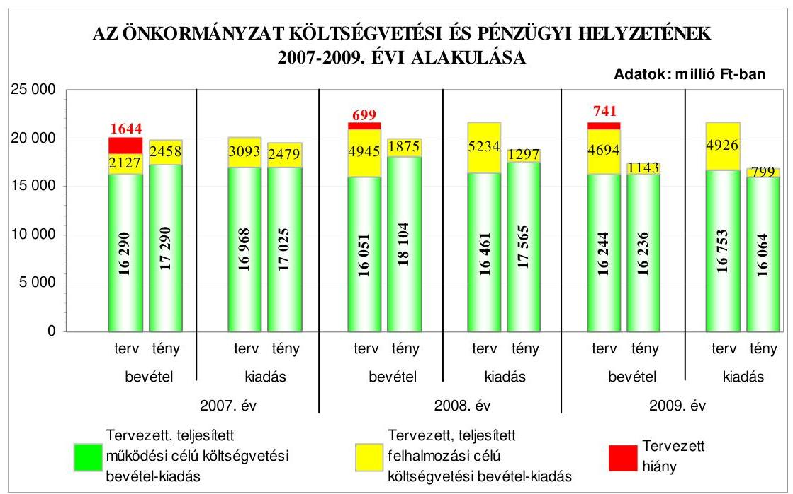
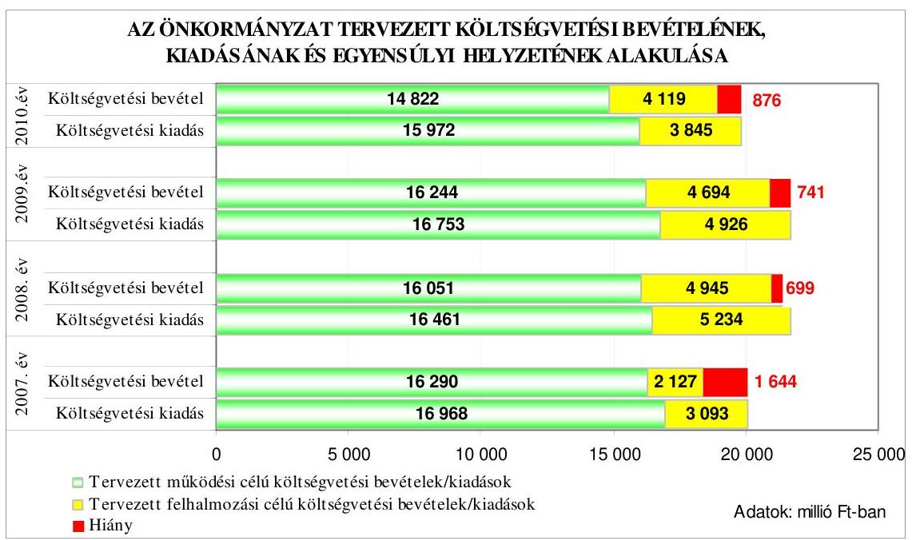
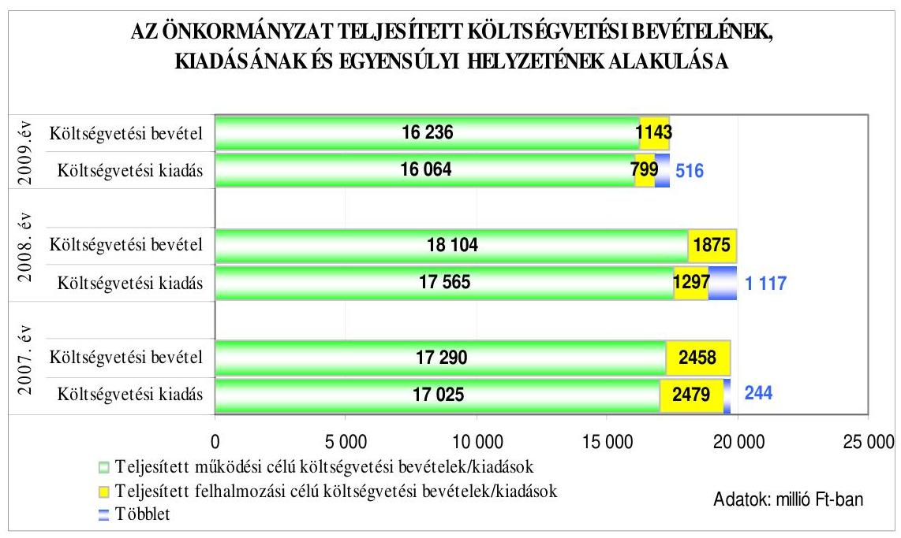
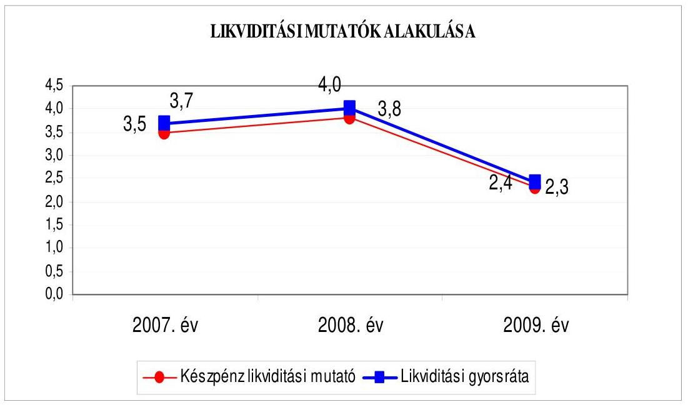
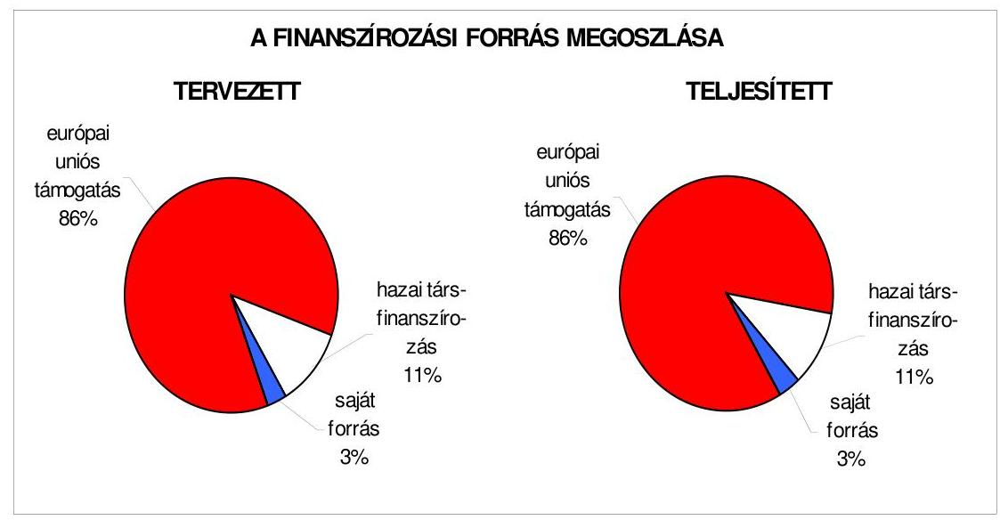
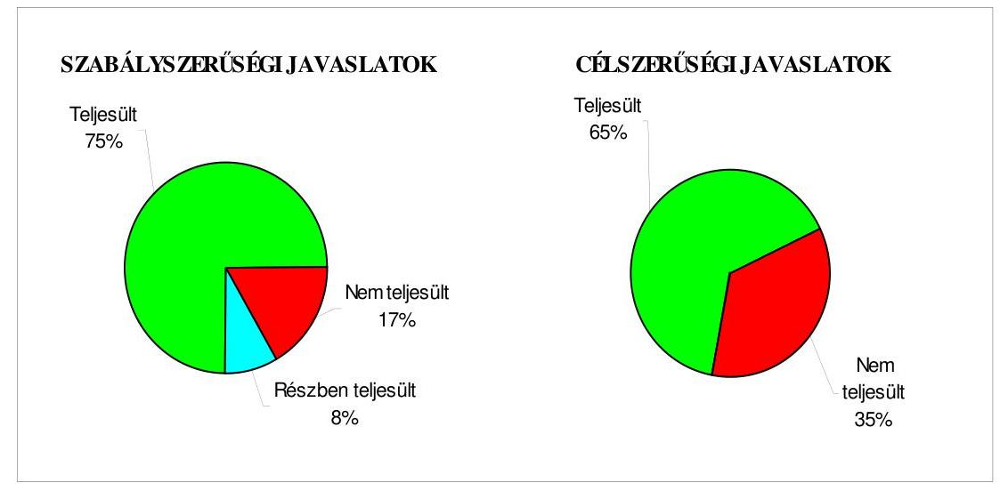
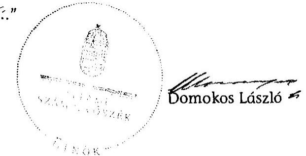
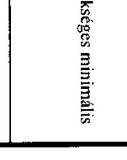
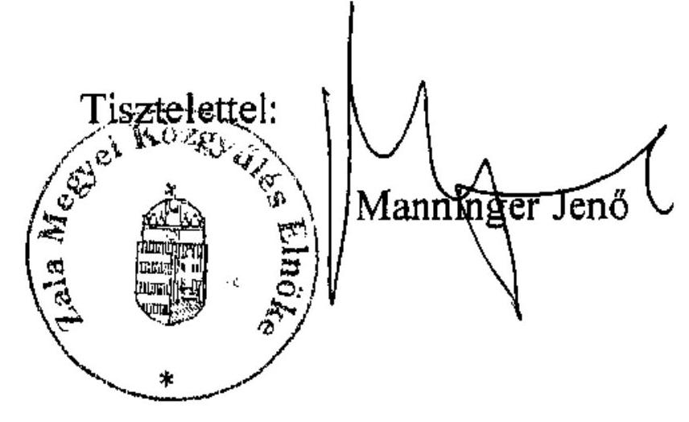
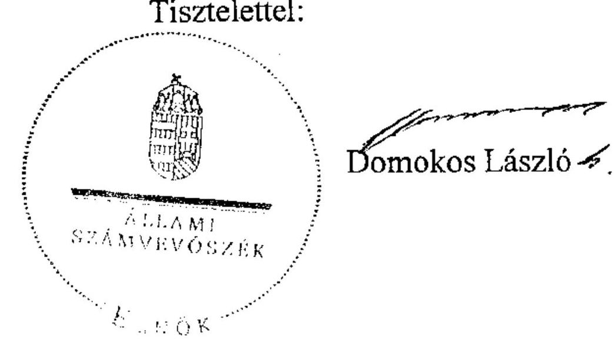

# ÁLLAMI   SZÁMVEVŐSZÉK 

## JELENTÉS

Zala Megyei Önkormányzat gazdálkodási rendszerének
2010. évi ellenőrzéséről

---

# 3. Önkormányzati és Területi Ellenőrzési Igazgatóság 

3.3. Átfogó Ellenőrzések Főcsoport

Iktatószám: V-3023-7/35/20/2010.
Témaszám: 966
Vizsgálat-azonosító szám: V0494

## Az ellenőrzést felügyelte:

Dr. Lóránt Zoltán
főigazgató
Az ellenőrzés végrehajtásáért felelős:
Dr. Sepsey Tamás
főigazgató-helyettes
Az ellenőrzést vezette:
Gyüre Lajosné
vizsgálatvezető, tanácsadó
Az ellenőrzést végezték:
Renkó Zsuzsanna Dér Lívia Ritecz Tibor
főtanácsadó, irodavezető számvevő tanácsos számvevő
A témához kapcsolódó eddig készített számvevőszéki jelentések:
címe
sorszáma
Jelentés a Zala Megyei Önkormányzat gazdálkodási rendszeré- 0527
nek átfogó ellenőrzéséről
Jelentés a Magyar Köztársaság 2005. évi költségvetése végrehaj- 0628
tásának ellenőrzéséről
Függelék:

- a helyi önkormányzatokat a 2005. évben megillető normatív hozzájárulás igénylésének és elszámolásának ellenőrzése
- a helyi önkormányzatok beruházásaihoz és rekonstrukcióihoz nyújtott 2005. évi felhalmozási célú támogatások ellenőrzése
Jelentés a helyi és a helyi kisebbségi önkormányzatok gazdál- 0634 kodási rendszerének átfogó és egyéb szabályszerűségi ellenőrzéséről
Jelentés a szakiskolai fejlesztési programra fordított pénzeszkö- 0819
zök felhasználása eredményességének ellenőrzéséről

---

Jelentés a Magyar Köztársaság 2007. évi költségvetése végrehajtásának ellenőrzéséről
Függelék:

- a helyi önkormányzatok beruházásaihoz és rekonstrukcióihoz nyújtott 2007. évi felhalmozási célú támogatások ellenőrzéséről
Jelentés a 2008. március 9-én megtartott országos ügydöntő 0925 népszavazás lebonyolításához felhasznált pénzeszközök ellenőrzéséről

---

# TARTALOMJEGYZÉK 

BEVEZETÉS ..... 7
I. ÖSSZEGZŐ MEGÁLLAPÍTÁSOK, KÖVETKEZTETÉSEK, JAVASLATOK ..... 12
II. RÉSZLETES MEGÁLLAPÍTÁSOK ..... 21

1. Az Önkormányzat költségvetési és pénzügyi helyzete ..... 21
1.1. A tervezett költségvetési bevételek és kiadások alapján a
költségvetési egyensúly, a költségvetési hiány alakulása, a hiány
tervezett finanszírozási módja, valamint a költségvetési hiány
megállapításának szabályszerűsége ..... 21
1.2. A teljesített költségvetési bevételek és kiadások alapján a pénzügyi
egyensúly, a pénzügyi hiány alakulása, a pénzügyi hiány
finanszírozása, az igénybe vett finanszírozási célú pénzügyi
eszközök hatása a pénzügyi helyzet alakulására, az eladósodásra,
valamint a fizetőképességre ..... 22
2. Az Önkormányzat felkészültsége az európai uniós források igénylésére,
felhasználására, a támogatott célkitúzés megvalósítására, múködtetésére,
valamint az elektronikus közszolgáltatási feladatok ellátására ..... 30
2.1. Az európai uniós források igénybevételére, felhasználására, a
támogatott célkitúzés megvalósítására, múködtetésére történt
felkészülés szabályozottságának, szervezettségének, valamint egy
támogatási szerződésben foglalt célkitúzés megvalósításának,
múködtetésének eredményessége ..... 30
2.1.1. Az európai uniós forrásokra történő pályázatok benyújtására
vonatkozó döntések összhangja fejlesztési célkitúzésekkel ..... 30
2.1.2. Az európai uniós forrásokhoz kapcsolódóan a
pályázatfigyelés, a pályázatkészítés, valamint az európai
uniós támogatással megvalósuló fejlesztés lebonyolításának
belső rendje, a végrehajtás és az ellenőrzés szervezettsége ..... 32
2.2. Az elektronikus közszolgáltatás feltételeinek kialakítása ..... 34
3. A költségvetési gazdálkodás belső kontrolljai ..... 35
3.1. A költségvetés tervezés, a gazdálkodás és a zárszámadás készítés
folyamatában végrehajtandó belső kontrollok kialakítása ..... 35
3.2. A belső kontrollok múködtetése a költségvetés tervezés, a
gazdálkodás, és a zárszámadás készítés folyamataiban ..... 37
3.3. A belső ellenőrzési kötelezettség teljesítése ..... 39
4. Az ÁSZ korábbi ellenőrzési javaslatai alapján készített intézkedési terv
végrehajtása, hasznosítása ..... 42

---

4.1. Az Önkormányzat gazdálkodási rendszerének átfogó ellenőrzése során tett javaslatok végrehajtására tervezett intézkedések megvalósítása
4.2. A zárszámadáshoz kapcsolódó (állami hozzájárulások, támogatások igénylésének és felhasználásának ellenőrzése), valamint a további vizsgálatok esetében a megállapítások, javaslatok alapján tett intézkedések

# MELLÉKLETEK 

1. számú Az Önkormányzat gazdálkodását meghatározó adatok, mutatószámok (1 oldal)
2. számú Az önkormányzati vagyon alakulása (1 oldal)

2/a. számú Az önkormányzati kötelezettségek alakulása (1 oldal)
3. számú Az Önkormányzat 2007-2010. évi költségvetési előirányzatainak és 20072009. évi pénzügyi teljesítéseinek alakulása (1 oldal)
4. számú Tanúsítvány az európai uniós forrásokkal támogatott célok és programok 2007-2010. évi tervezett és teljesített adatairól (6 oldal)
4/a. számú Tanúsítvány az európai uniós forrásokra 2007-2010 között benyújtott pályázatokról, amelyek elbírálásáról az Önkormányzat meg nem kapott tájékoztatást (2 oldal)
4/b. számú Tanúsítvány a 2007-2010. években benyújtott és elutasított európai uniós pályázatokról (2 oldal)
5. számú Manninger Jenő úr, a Zala Megyei Önkormányzat Közgyűlésének Elnöke által adott tájékoztatás (1 oldal)
6. számú Manninger Jenő úr, a Zala Megyei Önkormányzat Közgyűlése Elnökének tájékoztatására adott válasz (1 oldal)

---

# RÖVIDÍTÉSEK, MOZAIKSZAVAK JEGYZÉKE 

## Törvények

Áht.
ÁSZ tv.

Cct.

Eisz. tv.

Kbt.
Ket.

Ötv.

Számv. tv.
Szoc. tv.

## Rendeletek

Áhsz.

Ámr. 1
Ámr. 2
Ber.
18/2005. (XII. 27.) IHM rendelet

2007. évi költségvetési rendelet
2008. évi költségvetési rendelet
2009. évi költségvetési rendelet
2010. évi költségvetési rendelet
2007. évi zárszámadási rendelet
2008. évi zárszámadási rendelet
2009. évi zárszámadási rendelet
az államháztartásról szóló 1992. évi XXXVIII. törvény az Állami Számvevőszékről szóló 1989. évi XXXVIII. törvény
a helyi önkormányzatok címzett és céltámogatási rendszeréről szóló 1992. évi LXXXIX. törvény
az elektronikus információszabadságról szóló 2005. évi XC. törvény
a közbeszerzésekről szóló 2003. évi CXXIX. törvény
a közigazgatási hatósági eljárás és szolgáltatás általános szabályairól szóló 2004. évi CXL. törvény
a helyi önkormányzatokról szóló 1990. évi LXV. törvény
a számvitelről szóló 2000. évi C. törvény
a szociális igazgatásról és a szociális ellátásokról szóló 1993. évi III. törvény
az államháztartás szervezetei beszámolási és könyvvezetési kötelezettségének sajátosságairól szóló 249/2000. (XII. 24.) Korm. rendelet
az államháztartás múködési rendjéről szóló 217/1998. (XII. 30.) Korm. rendelet
az államháztartás múködési rendjéről szóló 292/2009. (XII. 19.) Korm. rendelet
a költségvetési szervek belső ellenőrzéséről szóló 193/2003. (XI. 26.) Korm. rendelet
a közzétételi listákon szereplő adatok közzétételéhez szükséges közzétételi mintákról szóló 18/2005. (XII. 27.) IHM rendelet
Zala Megyei Önkormányzat 2/2007. (II. 20.) számú rendelete az Önkormányzat 2007. évi költségvetéséről Zala Megyei Önkormányzat 2/2008. (II. 20.) számú rendelete az Önkormányzat 2008. évi költségvetéséről Zala Megyei Önkormányzat 2/2009. (II. 18.) számú rendelete az Önkormányzat 2009. évi költségvetéséről Zala Megyei Önkormányzat 1/2010. (I. 26.) számú rendelete az Önkormányzat 2010. évi költségvetéséről Zala Megyei Önkormányzat 6/2008. (IV. 30.) számú rendelete az Önkormányzat 2007. évi zárszámadásáról Zala Megyei Önkormányzat 8/2009. (IV. 28.) számú rendelete az Önkormányzat 2008. évi zárszámadásáról Zala Megyei Önkormányzat 8/2010. (V. 4.) számú rendelete az Önkormányzat 2009. évi zárszámadásáról

---

SzMSz

## Szórövidítések

aljegyző
áfa
ÁSZ
e-közszolgáltatás
FEUVE
főjegyző
gazdasági program
gazdálkodási szabályzat
gazdasági szervezet ügyrendje
hivatali SzMSz
informatikai stratégia

Közgyűlés
Közgyűlés elnöke
Önkormányzati hivatal
pályázati szabályzat
pályázati és térségfejlesztési munkatárs
Pénzügyi bizottság
Pénzügyi Osztály
Térségfejlesztési és Informatikai Osztály
Zala Megyei Kórház
a Zala Megyei Önkormányzat 3/2004. (II. 20.) számú rendelete a Zala Megyei Közgyűlés Szervezeti és Müködési Szabályzatáról

Zala Megyei Önkormányzat Aljegyzője
általános forgalmi adó
Állami Számvevőszék
elektronikus közszolgáltatás
folyamatba épített, előzetes, utólagos és vezetői ellenőrzés
Zala Megyei Önkormányzat Főjegyzője
Zala Megyei Önkormányzat Közgyűlésének 18/2007. (II. 16.) számú határozatával elfogadott Gazdasági Programja (2007-2010)
a Zala Megyei Önkormányzat Közgyűlése elnökének és a Zala Megyei Önkormányzat főjegyzőjének 1/2006. (X. 18.) számú együttes utasítása a Zala Megyei Önkormányzati Hivatal gazdálkodásának szabályairól
a Zala Megyei Önkormányzat Közgyűlése elnökének és a Zala Megyei Önkormányzat főjegyzőjének 4/2006. (III. 16.) számú együttes utasítása a Zala Megyei Önkormányzati Hivatal Pénzügyi Osztályának Úgyrendje
Zala Megyei Önkormányzat főjegyzője által 2005. március 31 -én kiadott, és a Zala Megyei Önkormányzat Közgyűlésének elnöke által jóváhagyott Önkormányzat Hivatalának Úgyrendje
a Zala Megyei Önkormányzat Közgyűlésének 94/2006. (IX.15.) számú határozatával jóváhagyott informatikai stratégiája, amely 2006. augusztus 28 -ától hatályos
Zala Megyei Önkormányzat Közgyűlése
Zala Megyei Önkormányzat Közgyűlésének Elnöke
Zala Megyei Önkormányzat Hivatala
a Zala Megyei Önkormányzat Közgyűlése elnökének és a Zala Megyei Önkormányzat főjegyzőjének 6/2009. számú együttes utasítása a Zala Megyei Közgyűlés Hivatala által bonyolított pályázatokról
Zala Megyei Önkormányzat Hivatala Elnöki Iroda Pályázati és térségfejlesztési munkatárs
Zala Megyei Önkormányzat Pénzügyi Bizottsága
Zala Megyei Önkormányzat Hivatalának Pénzügyi Osztálya
Zala Megyei Önkormányzat Hivatalának Térségfejlesztési és Informatikai Osztálya
Zala Megyei Önkormányzat fenntartásában müködő Zala Megyei Kórház

---

# ÉRTELMEZŐ SZÓTÁR 

1. elektronikus szolgáltatási szint
2. elektronikus szolgáltatási szint
3. elektronikus szolgáltatási szint
4. elektronikus szolgáltatási szint
európai uniós források
eredményesség
fejlesztési feladat (projekt)
fejlesztési célkitúzés

Az 1044/2005. (V. 11.) Korm. határozat alapján olyan információs, tájékoztató szolgáltatás, amely csak általános információkat közöl az adott üggyel kapcsolatos teendőkről és a szükséges dokumentumokról.
Az 1044/2005. (V. 11.) Korm. határozat alapján olyan egyirányú kapcsolatot biztosító szolgáltatás, amely az 1. szinten túl biztosítja az adott ügy intézéséhez szükséges dokumentumok, nyomtatványok letöltését, és azok ellenőrzéssel, vagy ellenőrzés nélküli elektronikus kitöltését, amely esetben a dokumentumok benyújtása hagyományos úton történik.
Az 1044/2005. (V. 11.) Korm. határozat alapján olyan kétirányú kapcsolatot biztosító szolgáltatás, amely közvetlen, vagy ellenőrzött kitöltésű dokumentum segítségével biztosítja az elektronikus adatbevitelt és a bevitt adatok ellenőrzését. Az ügy indításához, intézéséhez személyes megjelenés nem szükséges, de az ügyhöz kapcsolódó közigazgatási döntés (határozat, egyéb aktus) közlése, valamint a kapcsolódó illeték-, vagy díffizetés hagyományos úton történik.
Az 1044/2005. (V. 11.) Korm. határozat alapján olyan teljes közvetlen kétirányú ügyintézési folyamatot biztosító szolgáltatás, amikor az ügyhöz kapcsolódó közigazgatási döntés is elektronikus úton kerül közlésre, illetve a kapcsolódó illeték-, vagy díffizetés elektronikus úton is intézhető.
Az Európai Unió költségvetéséből, illetve az Európai Gazdasági Térség Európai Unión kívüli tagállamainak költségvetéséből származó támogatások, valamint a „Svájci Hozzájárulás" programból származó támogatás.
Egy adott tevékenység céljai megvalósításának mértéke, a tevékenység szándékolt és tényleges hatása közötti kapcsolat. (Forrás: Ámr., 2. § 66. pont.)
Az a fejlesztési feladat, amely illeszkedik az Európai Unió, illetve a Nemzeti Fejlesztési Terv által támogatott programokhoz. Az Európai Unió, illetve a Nemzeti Fejlesztési Terv és az Új Magyarország Fejlesztési Terv által meghirdetett programokhoz kapcsolódó, támogatott projektek fejlesztési feladatok megvalósításához használhatók fel az európai uniós források. A fejlesztési feladat (projekt) tartalmilag és formailag részletesen kidolgozott, megfelelő pénzügyi háttérrel és végrehajtási ütemezéssel rendelkező fejlesztési terv.
Az önkormányzat által ellátott kötelező, vagy önként vállalt feladatok mennyiségi (minőségi) fejlesztésére vonat-

---

lebonyolítás

Nemzeti Fejlesztési Terv
saját forrás

Új Magyarország Fejlesztési Terv
kozó terv. A mennyiségi fejlesztés megvalósulhat beszerzéssel, létesítéssel, bővítéssel, átalakítással.
Az európai uniós források felhasználásával megvalósuló fejlesztésre irányuló múszaki, gazdasági (pénzügyi) tevékenységet magában foglaló szervezési, irányítási szolgáltatás. A szervezési szolgáltatás kiterjedhet a pályázatkészítésre, a közbeszerzési eljárás lebonyolításán keresztül a folyamatos műszaki ellenőrzésre, a pénzügyi elszámolásra, a műszaki átadás-átvételre, az üzembe helyezésre, illetve a fejlesztési folyamat egyes elemeire.
Helyzetelemzést, stratégiát a tervezett fejlesztési területek prioritásait, azok céljait és pénzügyi forrásaik megjelölését tartalmazó dokumentum, amelyet a Magyar Köztársaság készített az Európai Unió programozási irányelveinek, célkitúzéseinek megfelelően a fejlődésben lemaradó régiók fejlődésének és strukturális átalakulásának elősegítésére a kiemelt szükségletekre figyelemmel. A Nemzeti Fejlesztési Terv stratégiai fejezetének célja, hogy a 2004-2006 közötti időszakra kijelölje a strukturális alapokból támogatható fejlesztéspolitikai célkitúzéseit és prioritásait. A strukturális alapok operatív programjai: Agrár- és Vidékfejlesztés Operatív Program (AVOP); Gazdasági Versenyképesség Operatív Program (GVOP); Humán erőforrások fejlesztései Operatív Program (HEFOP); Környezetvédelem és infrastruktúra Operatív Program (KIOP); Regionális Fejlesztés Operatív Program (ROP).
A kedvezményezett által támogatott projekthez biztosított forrás, amelybe az államháztartás alrendszereiből nyújtott támogatás nem számítható be. Költségvetési szervek esetén a jóváhagyott előirányzat saját forrásnak minősül.
Az Új Magyarország Fejlesztési Terv célja a foglalkoztatás bővítése és a tartós növekedés feltételeinek megteremtése. Ennek érdekében 2007-2013 között hat kiemelt területen indított el összehangolt állami és európai uniós fejlesztéseket: a gazdaságban, a közlekedésben, a társadalom megújulása érdekében, a környezet és az energetika területén, a területfejlesztésben és az államreform feladataival összefüggésben. Az Új Magyarország Fejlesztési Terv operatív programjai: Államreform Operatív Program (ÁROP); Elektronikus Közigazgatás Operatív Program (EKOP); Gazdaságfejlesztés Operatív Program (GOP); Környezet és Energia Operatív Program (KEOP); Közlekedés Operatív Program (KÖZOP); Dél-Alföldi Operatív Program (DAOP); Dél-Dunántúli Operatív Program (DDOP); Észak-Alföldi Operatív Program (ÉAOP); Észak-Magyarországi Operatív Program (ÉMOP); Közép-Dunántúli Operatív Program (KDOP); Közép-Magyarországi Operatív Program (KMOP); Nyugat-Dunántúli Operatív Program (NYDOP); Társadalmi Infrastruktúra Operatív Program (TIOP); Társadalmi Megújulás Operatív Program (TÁMOP).

---

# JELENTÉS   a Zala Megyei Önkormányzat gazdálkodási rendszerének 2010. évi ellenőrzéséről 

## BEVEZETÉS

Az Ötv. 92. § (1) bekezdése, az Állami Számvevőszékről szóló 1989. évi XXXVIII. törvény 2. § (3) bekezdése, valamint az Áht. 120/A. § (1) bekezdése alapján az önkormányzatok gazdálkodását az Állami Számvevőszék ellenőrzi. Az ellenőrzésre az Országgyúlés illetékes bizottságai részére is átadott, országosan egységes ellenőrzési program szerint került sor.

Az Állami Számvevőszék a stratégiájában foglalt célkitűzéseknek megfelelően a helyi önkormányzatok költségvetési gazdálkodási rendszerének ellenőrzését a 2007. évben megújított, teljesítmény-ellenőrzési elemekkel kiegészített ellenőrzési program alapján folytatja a 2010. évben.

Az ellenőrzés célja annak értékelése volt, hogy az Önkormányzat:

- milyen módon biztosította a költségvetési és a pénzügyi egyensúlyt a költségvetésében és annak teljesítése során, valamint változott-e a hiányzó bevételi források pótlásában a finanszírozási célú pénzügyi műveletek jelentősége, hatása;
- eredményesen készült-e fel a szabályozottság és a szervezettség terén az európai uniós források igénylésére és felhasználására, megvalósította, működtette-e a támogatott célkitűzést, továbbá biztosította-e az elektronikus közszolgáltatás feltételeit, a gazdálkodási adatok közzétételével a gazdálkodás nyilvánosságát;
- megfelelően kialakította-e és múködtette-e a belső kontrollokat a költségve-tés-tervezés, a gazdálkodás és a zárszámadás-készítés, valamint a belső ellenőrzés folyamatában, továbbá;
- megfelelően hasznosították-e a korábbi számvevőszéki ellenőrzések megállapításait, szabályszerűségi ${ }^{1}$ és célszerűségi javaslatait.

Az ellenőrzés típusa: átfogó ellenőrzés, amely - egy ellenőrzés keretében meghatározott területekre összpontosítva alkalmazza a szabályszerűségi, valamint a teljesítmény-ellenőrzés jellemzőit.

[^0]
[^0]:    ${ }^{1}$ A törvényi előírások betartásának elmulasztásakor a részletes megállapítások fejezetben egységesen a törvénysértés megjelölést alkalmazzuk, mivel az ÁSZ nem tehet különbséget a törvényi előírások között.

---

Az ellenőrzött időszak: a költségvetési egyensúly és az európai uniós támogatás igénybevételére történt felkészülés ellenőrzése esetében a 2007-2009. évek és 2010. I. negyedév, a belső kontrollok kialakítása és múködtetése tekintetében a 2009. év és 2010. I. negyedév, az önkormányzatok gazdálkodási rendszerének 2005. évi átfogó ellenőrzéséről készített jelentésben rögzített javaslatok megvalósítása, hasznosítása, valamint a 2006 óta végzett további ellenőrzések során megfogalmazott javaslatok végrehajtása érdekében tett intézkedések vonatkozásában a 2006-2010. I. negyedév közötti időszak.

Zala megye lakosainak száma - a megyei jogú városok lakosságszáma nélkül 2010. január 1-jén 181908 fő volt. A 2006. évi önkormányzati képviselő és polgármester választást követően az Önkormányzat 40 tagú Közgyűlésének munkáját hét állandó bizottság segítette. Az Önkormányzat mellett a 2006. évi önkormányzati képviselő és polgármester választásokat követően kettő ${ }^{2}$ kisebbségi önkormányzat múködött. A Közgyűlés elnöke a 2006. évi önkormányzati képviselő és polgármester választás óta tölti be tisztségét, a főjegyző 2002. december 16-tól látta el a jegyzői feladatokat, az Önkormányzatnál fennálló közszolgálati jogviszonya 2010. augusztus 31-án szűnt meg.

Az Önkormányzat feladatainak végrehajtása érdekében 2007-2009 között 25 költségvetési intézményt múködtetett, amelyekből a 2007. évben öt önállóan gazdálkodó, a 2009. évben hat önállóan múködő és gazdálkodó volt. A feladatok ellátásában a 2007. és a 2009. évben négy gazdasági társasága vett részt. Az Önkormányzat az éves költségvetési beszámolója szerint a 2009. évben 17379 millió Ft költségvetési bevételt ért el, és 16863 millió Ft költségvetési kiadást teljesített. A teljesített költségvetési bevételek 12\%-kal, a költségvetési kiadások 13,5\%-kal maradtak el a 2007. évi költségvetési bevételektől és kiadásoktól a múködési és felhalmozási célú költségvetési bevételek és kiadások csökkenése következtében. Az Önkormányzat 2009. december 31-én - a könyvviteli mérleg szerint - 18095 millió Ft értékű vagyonnal rendelkezett. Az Önkormányzat vagyona a 2007. év végi állományhoz viszonyítva 3,4\%-kal emelkedett, ezen belül 69,9\%-kal emelkedve 1625 millió Ft-ra nőtt az üzemeltetésre átadott eszközök állománya, valamint 19,3\%-kal emelkedve 3647 millió Ft-ra nőtt a fejlesztési célú kötvénykibocsátásból származó hosszú lejáratú kötelezettségek állománya a 2007. évi 3056,8 millió Ft összegű, svájci frank alapú kötvény kibocsátásából adódó kötelezettségállomány - árfolyamváltozás miatti 590 millió Ft-os emelkedése hatására. Az összes költségvetési bevétel 22\%-át a saját bevétel biztosította a 2009. évben. Az összes költségvetési kiadásból a felhalmozási célú költségvetési kiadások részaránya a 2007. évhez viszonyítva a 2009. évre nyolc százalékponttal csökkent, a 2009. évben 4,7\% volt. A teljesített felhalmozási célú költségvetési kiadások részarányának csökkenését a beruházások csökkenése okozta. A 2010. évi költségvetési rendeletben 18941 millió Ft költségvetési bevételt és 19817 millió Ft költségvetési kiadást irányoztak elő. Az Önkormányzati hivatalban dolgozó köztisztviselők száma 2007. január 1-jén 63 fő, 2009. december 31-én 62 fő volt, a költségvetési intézményekben foglalkoztatott közalkalmazottak száma 2007. január 1-jén 3157 fő, 2009. december

[^0]
[^0]:    ${ }^{2}$ cigány és horvát kisebbségi önkormányzat

---

31-én 2986 fő volt. Az Önkormányzat gazdálkodását meghatározó adatokat, mutatószámokat az 1-3. számú mellékletek tartalmazzák.

Az Önkormányzat költségvetési és pénzügyi helyzetét az elemző eljárás módszerével vizsgáltuk. E körben elemeztük a költségvetés egyensúlyi helyzetének alakulását, a tervezett és teljesített költségvetési, pénzügyi hiány okait, a hiány finanszírozásának tervezett és teljesített módját, az Önkormányzat pénzügyi helyzetének alakulását az eladósodás és a likviditás szempontjából.

Teljesítmény-ellenőrzés módszerével vizsgáltuk és eredményesség szempontjából értékeltük az Önkormányzat benyújtott pályázatai kapcsolódását a Közgyűlés által meghatározott fejlesztési célkitűzésekhez, valamint felkészültségét a belső szabályozottság, szervezettség terén az európai uniós forrásokra vonatkozó pályázati felhívások figyelésére, a pályázatok készítésére, és a lebonyolítására. Az ellenőrzés során felmértük, hogy az elektronikus közigazgatási szolgáltatások múködtetése érdekében milyen intézkedéseket tettek, továbbá biztosí-tották-e a közérdekű gazdálkodási adatok meghatározott körének honlapon történő közzétételét.

A költségvetési gazdálkodás belső kontrolljainak ellenőrzése során vizsgáltuk, hogy az Önkormányzati hivatalban a költségvetés-tervezés, a gazdálkodás, és a zárszámadás-készítés folyamatában a belső kontrollok kialakítása és múködése megfelelő biztosítékot ad-e a gazdálkodási feladatok szabályszerű ellátására. Felmértük és minősítettük a költségvetés-tervezés, a gazdálkodás, és a zár-számadás-készítés feladataival, továbbá a pénzügyi-számviteli területen az informatikával kapcsolatosan kialakított kontrollok megfelelőségét, valamint azok múködésének megfelelőségét. A vizsgálat során értékeltük a belső ellenőrzés szabályozottságát, múködési feltételeinek kialakítását, meghatározását, továbbá múködésének megfelelőségét.

Az Önkormányzati hivatalban értékeltük a gazdálkodás folyamatában kulcsszerepet betöltő belső kontrollok múködésének megfelelőségét, ennek keretében ellenőriztük a szakmai teljesítés igazolására és az utalvány ellenjegyzésére kialakított kontrollok múködését. Az ellenőrzést a következő, magas ${ }^{3}$ kockázatú kifizetésekre folytattuk le:

- az államháztartáson kívülre teljesített múködési és felhalmozási célú pénzeszköz átadásokra,
- az állományba nem tartozók megbízási díjaira, továbbá
- a külső szolgáltató által végzett karbantartási, kisjavítási szolgáltatásokra.

Az ellenőrzés hatékony elvégzése céljából a vizsgálandó területek kiválasztása során a kockázatokon alapuló megközelítés érvényesült, ezáltal az ellenőrzési erőforrásokat azokra a területekre fókuszáltuk, amelyeken a korábbi ellenőrzési tapasztalatok figyelembevételével legnagyobb a hibák előfordulási valószínű-

[^0]
[^0]:    ${ }^{3}$ Az önkormányzatok kiemelt előirányzataira vonatkozóan, a vertikális folyamatokra elvégeztük a kockázatok becslését, amelynek eredményeként határoztuk meg a magas kockázatú területeket.

---

sége. Az ellenőrzési erőforrások ilyen típusú összpontosításával minimálisra csökkentettük a kívánt ellenőrzési bizonyosság eléréséhez szükséges időráfordítást.

A pénzügyi-számviteli folyamatokban alkalmazott belső kontrollok kialakításának és múködésének ellenőrzésére a vizsgált három terület 2009. évi könyvviteli tételeiből területenként egyszerű véletlen mintát vettünk. A kijelölt gazdasági eseményre elvégzett megfelelőségi tesztek alapján értékeltük a kontrollok működésének megfelelőségét a vizsgált három területre külön-külön, majd öszszefoglalóan ${ }^{4}$. A helyszíni ellenőrzés megállapításainak részletes dokumentálását megfelelőségi tesztlapokon, ellenőrzési munkalapokon biztosítottuk. Ezeken a teszt- és munkalapokon a minősítés alapjául szolgáló kérdések és a vonatkozó konkrét jogszabályhelyek megjelölése mellett értékeltük a kialakított belső kontrollokban rejlő kockázatokat ${ }^{5}$ és a kialakított kontrollok múködésének megfelelőségét ${ }^{6}$.

Az ÁSZ korábbi ellenőrzési javaslatai alapján tett intézkedéseket, illetve azok megvalósítását utóellenőrzés keretében vizsgáltuk. A gazdálkodási rendszer korábbi átfogó ellenőrzése során megfogalmazott javaslatok végrehajtására tett intézkedések megvalósítását ellenőriztük, az egyéb számvevőszéki ellenőrzések során tett javaslatok esetében pedig a kiadott intézkedéseket tekintettük át.

A helyszíni ellenőrzés során kitöltött - az ellenőrzést végző számvevő és az Önkormányzati hivatal felelős köztisztviselője által aláírt - ellenőrzési munkalapokat, azok kitöltési útmutatóit, továbbá a megfelelőségi tesztek dokumentumait a Közgyűlés elnöke részére a számvevői jelentéssel egyidejűleg átadtuk.

A számvevői jelentés megállapításainak, javaslatainak egyeztetése során a Közgyűlés elnöke arról adott részletes tájékoztatást - egyidejűleg csatolta azokat a dokumentumokat, amelyek igazolták -, hogy az időközben megtett intézkedésekkel a korábbi ÁSZ javaslatok hasznosítására irányuló, a Közgyűlés

[^0]
[^0]:    ${ }^{4}$ A vizsgált három terület egyedi értékelési pontszámait a területek költségvetési súlyával arányosan összegeztük.
    ${ }^{5}$ A kialakított belső kontrollokban rejlő kockázatot alacsonynak minősítettük, ha a kontrollok - múködésük esetén - megfelelő védelmet nyújtottak a hibák bekövetkezése ellen. Közepesnek minősítettük a belső kontrollokban rejlő kockázatot, amennyiben a kontrollok - múködésük esetén - a lehetséges hibák többsége ellen védelmet nyújtottak. Magasnak értékeltük a kockázatot, ha a kontrollok - kialakításuk hiányában, vagy hiányos kialakításuk miatt - nem nyújtottak elegendő védelmet a lehetséges hibákkal szemben.
    ${ }^{6}$ A kontrollok múködésének megfelelőségét kiválónak értékeltük abban az esetben, ha azok múködése - esetleges kisebb, az egységesen meghatározott követelményrendszerben foglalt mértéket el nem érő hiányosságoktól eltekintve - megfelelt a hibák megelőzésére és kijavítására meghatározott szabályozásnak és a legmagasabb szintű elvárásoknak. Jónak minősítettük a kontrollok múködését, ha a megállapított kisebb (tolerálható mértékű) hiányosságok nem veszélyeztették az ellenőrzött terület hibáinak megelőzését és kijavítását. Amennyiben a kontrollok múködésében túl sok hiányosság fordult elő ahhoz, hogy a kontrollok biztosítsák a hibák megelőzését, feltárását, kijavítását és ezáltal veszélyeztették az eredményes, megfelelő múködést, a kontroll múködésének megfelelősége gyenge minősítést kapott.

---

elnökének címzett javaslatot ${ }^{7}$ megvalósították. A megtett intézkedéseket a jelentés II. Részletes megállapítások fejezetében az adott témához kapcsolt lábjegyzetben feltüntettük és a vonatkozó javaslatot elhagytuk.

A jelentést az Állami Számvevőszékről-ról szóló 1989. évi XXXVIII. tv. 25. § (1) bekezdése alapján észrevétel közlése céljából megküldtük a Közgyűlés elnökének. A kapott tájékoztatást, valamint az arra adott választ a jelentés 5. és 6. számú mellékletei tartalmazzák.

[^0]
[^0]:    ${ }^{7}$ A számvevői jelentésben a helyszíni ellenőrzés során a Közgyűlés elnökének egy szabályszerűségi javaslatot tettünk, melyet hasznosított, ezért a javaslatot elhagytuk.

---

# I. ÖSSZEGZŐ MEGÁLLAPÍTÁSOK, KÖVETKEZTETÉSEK, JAVASLATOK 

Az Önkormányzat 2007-2010. évi költségvetési rendeleteiben a költségvetési bevételek és kiadások nem voltak egyensúlyban, a tervezett költségvetési bevételek nem nyújtottak fedezetet a költségvetési kiadásokra. A 2007-2009. években a költségvetési hiány a tervezett múködési célú költségvetési bevételek hiányára és a felhalmozási célú költségvetési bevételeket meghaladó összegben tervezett felhalmozási célú költségvetési kiadásokra vezethető vissza, a 2010. évben a költségvetés hiányát a tervezett múködési célú költségvetési bevételek hiánya okozta. A 2007-2010. évi költségvetési rendeletekben a költségvetési egyensúly biztosításához a 2007. és a 2008. években hosszú lejáratú hitel igénybevételét tervezték. Az Önkormányzat hitelviszonyt megtestesítő forgatási célú értékpapír értékesítést a 2008. évi költségvetési rendeletében tervezett.

Az Önkormányzatnál a 2007-2009. évi költségvetések teljesítése során a realizált költségvetési bevételek - a tervezett költségvetési hiány ellenére - fedezetet biztosítottak a költségvetési kiadásokra, amihez hozzájárult a költségvetési támogatások, az illetékbevételek, a támogatás értékú múködési bevételek, valamint a hozam- és kamatbevételek tervezettet meghaladó teljesítése. A múködési célú költségvetési bevételek többlete az évek sorrendjében 265 millió Ft, 539 millió Ft és 172 millió Ft, a felhalmozási célú költségvetési bevételek többlete a 2008. évben 578 millió Ft, a 2009. évben 344 millió Ft volt. A 2007. évben azonban a felhalmozási célú költségvetési bevételek 21 millió Ft-tal elmaradtak az azonos célú költségvetési kiadásoktól, a különbözetre a múködési célú költségvetési bevételek többlete fedezetet nyújtott. A 2007-2009. években a költségvetések végrehajtása során a pénzügyi egyensúly biztosítása érdekében az intézmények szervezeti struktúrájának átalakításával, létszámcsökkentésekkel

---

kapcsolatos - kiadási megtakarítást eredményező - intézkedéseket hajtottak végre, melyek a tervezett hiány alakulására kedvező hatással voltak.

Az Önkormányzat 2007-2009 között a pénzügyi egyensúly biztosításához, a Zala Megyei Kórházban megvalósítandó kórház rekonstrukció és egészségügyi gép- műszerbeszerzés finanszírozására összesen 820 millió Ft változó kamatozású, hosszú lejáratú, fejlesztési célú hitelt vett fel. Az Önkormányzat 2007-ben 123 napon, 2008-ban 101 napon, 2009-ben 254 napon vett igénybe folyószámlahitelt, amelynek átlagos állománya a 2007. évi 152,9 millió Ft-ról 698,7 millió Ft-ra emelkedett. A folyószámla hitelkeret a 2007. évi 500 millió Ft-ról a 2009. évben 700 millió Ft-ra növekedett, az év végén vissza nem fizetett hitelállomány a 2007. év végi 335 millió Ft-ról a 2009. év végére 421 millió Ft-ra nőtt. A Közgyűlés az emelkedő összegű likvid hitel éven belüli visszafizetésére vonatkozóan - előterjesztés hiányában - nem döntött. Az Önkormányzat a 2007. évben 3056,8 millió Ft összegben svájci frank alapú, 20 éves lejáratú kötvényt bocsátott ki a pályázatokkal megvalósuló fejlesztési feladatokkal kapcsolatos kiadások önrészének biztosításához, az Önkormányzat hitelállományának konszolidálásához, a múködési célú költségvetési kiadások finanszírozásához. A hitelfelvétel és a kötvénykibocsátás indokait, gazdasági megalapozottságát a Pénzügyi bizottság vizsgálta. A hitelfelvételből és a kötvénykibocsátásból eredő tárgyévi kötelezettségvállalások összege a 2007. évben az éves adósságot keletkeztető kötelezettségvállalás felső határának a 3,50\%-a, a 2008. évben 9,89\%a, a 2009. évben $11,45 \%$-a volt. A kötvénykibocsátás a forint svájci frankhoz viszonyított árfolyamváltozása, valamint a változó kamatmérték miatt az Önkormányzat számára kockázatot jelent. Ugyancsak kockázatot jelent az igénybe vett fejlesztési célú hitel változó kamatmértéke. A kötvénykibocsátásból származó bevételt a 2007. év végén és a 2008. évben betétként helyezték el, így annak összegét a 2008. és a 2009. évben a költségvetési hiány megállapításánál már nem finanszírozási célú pénzügyi művelet bevételeként, hanem - a számviteli szabályoknak megfelelően - költségvetési bevétel részeként, az előző évi pénzmaradvány igénybevételeként vették figyelembe. Az Önkormányzat a kötvénykibocsátásból származó bevételből - a kibocsátás céljával összhangban - 2010. augusztus végéig 908 millió Ft-ot használt fel európai uniós pályázatok támogatási forrásának megelőlegezésére, felhalmozási és múködési célú költségvetési kiadások teljesítésére, valamint korábban felvett hitel törlesztésére. A kötvénykibocsátás fel nem használt bevételét több részletben, rövid lejáratú lekötött betétben helyezték el, illetve 2009-ben hat hónapra államkötvényt vásároltak. Az Önkormányzat pénzügyi helyzete - 2007-2009 között - eladósodásának fokozódása és fizetőképességének gyengülése hatására összességében kedvezőtlenül alakult.

Az Önkormányzat a 2007-2010. évekre vonatkozó fejlesztési célkitúzéseit a gazdasági programban, valamint az ágazati, szakmai koncepciókban, tervekben, programokban határozta meg. A gazdasági programban megfogalmazott feladatok megvalósításához európai uniós és hazai pályázati források igénybevételét tervezték. A Közgyűlés és az intézményvezetők a 2007-2010. I. negyedévben 49 pályázat benyújtásáról döntöttek, amelyből 26 pályázat támogatásban részesült, kilenc pályázat elbírálásáról az Önkormányzat 2010 júliusáig értesítést nem kapott, 14-et - a pályázati források hiánya, tartalmi, formai hibák, szakmai kidolgozatlanság miatt, valamint mivel nem feleltek meg a kiírási fel-

---

tételeknek - elutasítottak. Az Önkormányzat 2007-2010. évi költségvetési rendeletei tartalmazták az európai uniós támogatással megvalósuló fejlesztések működési és felhalmozási célú kiadási és bevételi előirányzatait, a felújítási feladatokat célonként, a felhalmozási kiadásokat feladatonként, a többéves kihatással járó fejlesztési feladatok előirányzatait éves bontásban, és elkülönítetten az európai uniós forrásokkal megvalósuló programok bevételi és kiadási előirányzatait. Az Önkormányzat 2007-2009 között európai uniós forrásokkal támogatott, megvalósított fejlesztési feladatainál a megvalósításhoz tervezett európai uniós és hazai források aránya a teljesítések során nem változott.

Az Önkormányzati hivatalban a 2007-2009. évek között befejezett európai uniós támogatással megvalósított fejlesztés nem volt. Az Önkormányzat 20072009 között eredményesen készült fel belső szabályozottság és szervezettség terén az európai uniós források igénybevételére. Az európai uniós támogatások a gazdasági programban, az ágazati, szakmai koncepciókban, tervekben, programokban megfogalmazott fejlesztési célkitűzésekhez kapcsolódtak, szabályozták a pályázatfigyelést végző és a döntési, illetve a döntés előterjesztési jogkörrel rendelkezők közötti információszolgáltatás kötelezettségét, az Önkormányzati hivatal szervezetén belül a pályázatfigyelés, a pályázatkészítés és a fejlesztési feladat lebonyolításának szervezeti és személyi feltételeit biztosították. Az intézményvezetők által külső szervezetekkel pályázatkészítésre kötött szerződésekben meghatározták a pályázat szakmai és formai követelményeinek biztosítására vonatkozóan a pályázatkészítést végző felelősségét. A 2007. és a 2008. években a belső ellenőrzési terveket megalapozó kockázatelemzés nem terjedt ki az európai uniós forrásokkal támogatott fejlesztési feladatokra, amelyet a 2009. évi kockázatelemzés az Önkormányzati hivatal vonatkozásában, a 2010. évi már az intézmények tekintetében is tartalmazott.

Az Önkormányzat 2007-2010 között helyzetelemzéssel alátámasztott informatikai stratégiával rendelkezett, amelyben meghatározták a közép- és hosszú távon elérni kívánt elektronikus szolgáltatási szintet és az annak érdekében megvalósítandó feladatokat. Az e-közszolgáltatási feladatok ellátásának személyi feltételeit az Önkormányzati hivatalon belül biztosították. Az Önkormányzat honlapján keresztül múködtetett informatikai rendszer a 2009. évben az e-közszolgáltatásokat az 1. elektronikus szolgáltatási szinten biztosította. Az e-közszolgáltatást ellátó informatikai rendszer ügyfelek általi igénybevételét nem kísérték figyelemmel és annak tapasztalatait nem értékelték. Az Önkormányzatnál a közérdekú adatok elektronikus közzétételét az Önkormányzat honlapján - a vonatkozó rendeletben előírt szerkezeti rendben - biztosították. A Közgyűlés a bizottságok által nyújtott, 200 ezer Ft-ot meg nem haladó támogatások közzétételének mellőzéséről rendeletet alkotott. A főjegyző gondoskodott az Önkormányzat által a 2009. évben nyújtott nem normatív, céljellegú múködési és fejlesztési támogatásoknál a kedvezményezettek nevének, a támogatás céljának, összegének, a támogatási program megvalósítási helyének közzétételéről. Biztosította továbbá a 2009. évben az Önkormányzat pénzeszközei felhasználásával, a vagyonnal történő gazdálkodással összefüggő - nettó öt millió Ft-ot elérő vagy azt meghaladó értékű - építési beruházásra, szolgáltatás megrendelésre, vagyonértékesítésre vonatkozó szerződések típusának, tárgyának, a szerződést kötő felek nevének, a szerződés értékének, határozott időre kötött szerződés időtartamának, és ezen adatok változásának közzétételét. A fő-

---

jegyző a 2009. évi költségvetési beszámoló szöveges indoklását az Áhsz. előírásának megfelelő tartalommal közzétette.

A költségvetés-tervezési és a zárszámadás-készítési folyamatok szabályozásának hiányosságai közepes kockázatot jelentettek a feladatok megfelelő, szabályszerű végrehajtásában, mert a főjegyző nem írta elő annak ellenőrzését, hogy az intézmények, és az Önkormányzati hivatal szervezeti egységei által benyújtott költségvetési igények indokoltak-e, teljesíthetőek-e, illetve a saját bevételek előirányzatai és a költségvetés megalapozását szolgáló helyi rendeletek összhangja biztosított-e. A kialakított belső kontrollok azonban a lehetséges hibák ellen védelmet nyújtottak. Az Önkormányzati hivatalban a 2009. évben a költségvetés-tervezési és zárszámadás-készítési folyamatban a belső kontrollok múködésének megfelelősége jó volt, mert a szabályozásban foglaltaknak megfelelően ellenőrizték, hogy az intézmények teljesítették-e a költségvetési javaslat összeállításával kapcsolatban részükre meghatározott követelményeket; a költségvetés tervezéshez készített intézményi mutatószám felmérés adatai megalapozottságát; az intézmények által az állami támogatásokkal, hozzájárulásokkal történő elszámoláshoz közölt mutatószámok adatainak megfelelőségét, az intézmények pénzmaradvány megállapításának szabályszerűségét. A hiányos szabályozás miatt azonban nem végezték el a benyújtott költségvetési igények indokoltságának, teljesíthetőségének, továbbá a saját bevételek előirányzatai és a költségvetés megalapozását szolgáló helyi rendeletek összhangjának ellenőrzését. A megállapított hiányosságok nem veszélyeztették a költségvetés tervezés és zárszámadás készítés hibáinak megelőzését, feltárását és kijavítását. A költségvetés-tervezési folyamatokban megállapított szabályozási hiányosságokat 2010. április hónapban a főjegyző megszüntette, az ellenőrzési feladatokat az arra kijelölt pénzügyi dolgozók munkaköri leírásában rögzítette.

A gazdálkodási, a pénzügyi-számviteli és a folyamatba épített ellenőrzési feladatok szabályozásának hiányosságai közepes kockázatot jelentettek a feladatok megfelelő, szabályszerű végrehajtásában, mert a gazdasági szervezet ügyrendjében nem rögzítették a pénzügyi-gazdasági feladatok ellátásáért felelős alkalmazottak feladat- és hatáskörét, felelősségi körét, a helyettesítés rendjét, a belső és külső kapcsolattartás módját, az ellenőrzési nyomvonal nem tartalmazta a folyamatok és a folyamatgazdák azonosítását, az egyes tevékenységek, feladatok elvégzését igazoló dokumentum megnevezését, továbbá a főjegyző nem szabályozta a kockázatkezelési eljárásrendet. A kialakított belső kontrollok azonban a lehetséges hibák többsége ellen védelmet nyújtottak. A gazdasági szervezet ügyrendjének hiányosságait, valamint az ellenőrzési nyomvonal és a kockázatkezelési eljárásrend szabályozásának hiányosságait 2010. I. félévében megszüntették. Az Önkormányzati hivatalban a 2009. évben az államháztartáson kívülre történő működési és felhalmozási célú pénzeszközátadásokkal, az állományba nem tartozók megbízási díjaival, valamint a külső szolgáltatók által végzett karbantartási, kisjavítási szolgáltatásokkal kapcsolatos kifizetések során a belső kontrollok múködésének megfelelősége kiváló volt, mert a szakmai teljesítés igazolására a főjegyző által kijelölt személyek az államháztartáson kívülre történő működési és felhalmozási célú pénzeszközátadásokkal, az állományba nem tartozók megbízási díjaival, valamint a külső szolgáltatók által végzett karbantartással, kisjavítással kapcsolatos kifizetések során ellenőrizték, szakmailag igazolták a megállapodások, megbízási

---

szerződések, megrendelések teljesítését, valamint az utalványok ellenjegyzője meggyőződött a gazdálkodásra vonatkozó szabályok betartásáról, továbbá ellenőrizte a szakmai teljesítésigazolás és az érvényesítés megtörténtét.

Az Önkormányzati hivatal rendelkezett a Közgyűlés által elfogadott informatikai stratégiával, valamint a főjegyző által kiadott informatikai szabályzattal. A pénzügyi-számviteli feladatok ellátására integrált informatikai rendszert nem vezettek be. A pénzügyi-számviteli tevékenységhez kapcsolódó informatikai feladatok szabályozásának hiányosságai közepes kockázatot jelentettek az informatikai feladatok megfelelő, szabályszerű végrehajtásában, mert nem biztosították az ellenőrzési lista lekérdezhetőségét a pénzügyi-számviteli rendszerből, nem szabályozták a pénzügyi-számviteli program változások ellenőrzésére, tesztelésére vonatkozó eljárásokat, illetve a pénzügyi-számviteli program mentési eljárásai felelősségi viszonyait. Az Önkormányzati hivatalban a 2009. évben a pénzügyi-számviteli tevékenységhez kapcsolódó informatikai feladatoknál a kialakított belső kontrollok működésének megfelelősége gyenge volt, mert nem biztosították a főkönyvi rendszerben tárolt hozzáférési jogosultságok ellenőrizhetőségét, az adathozzáférésről, adatmódosításról és adattörlésről az ellenőrzési lista elkészítését és rendszeres ellenőrzését, továbbá a pénzügyiszámviteli programok jelszavainak kezeléséről szóló szabályzás hiányában nem követelték meg azok betartását. Az aljegyző 2010. szeptember hónapban utasítást adott ki, hogy vizsgálják meg az integrált informatikai rendszer bevezetésének lehetőségét, szabályozzák a program változások ellenőrzésére, tesztelésére vonatkozó eljárásokat, a mentési eljárások felelősségi viszonyait, biztosítsák a hozzáférési jogosultságok ellenőrizhetőségét, ellenőrzési lista készítését és rendszeres ellenőrzését.

A belső ellenőrzés szervezeti kereteinek kialakítása és szabályozása a belső ellenőrzési feladatok megfelelő, szabályszerű végrehajtásában alacsony kockázatot jelentett, mert az Önkormányzat a belső ellenőrzési feladatok ellátására a főjegyzőnek közvetlenül alárendelt három fős belső ellenőrzési egységet hozott létre. A hivatali SzMSz-ben rögzítették a belső ellenőrzést végző egység jogállását, feladatait, kinevezték a belső ellenőrzési vezetőt. A belső ellenőrök rendelkeztek a Ber-ben előírt iskolai végzettséggel és szakmai képesítéssel, a belső ellenőrzési egység funkcionális függetlenségét biztosították, a létszámot kapaci-tás-felmérés alapján állapították meg. A belső ellenőrzés rendelkezett kockázatelemzésen alapuló stratégiai tervvel, valamint a Közgyűlés által elfogadott éves ellenőrzési tervvel. A belső ellenőrzési vezető jóváhagyásával elkészítették az ellenőrzések lefolytatásához az ellenőrzési programokat, meghatározták a belső ellenőrzések nyilvántartásával kapcsolatos előírásokat. Az Önkormányzati hivatalban a 2009. évben és a 2010. év I. negyedévében a belső ellenőrzés múködésénél a kialakított kontrollok megfelelősége kiváló volt, mert a belső ellenőrzés ellátásának módja megfelelt az előírásoknak, a főjegyző a 2009. évi ellenőrzési tervben, valamint a 2010. évi belső ellenőrzési tervben foglaltaknak megfelelően gondoskodott a költségvetési szervek ellenőrzésének végrehajtásáról, a magas kockázatúnak értékelt területek ellenőrzését elvégezték. Az elvégzett vizsgálatokról a Ber-ben foglaltaknak megfelelő tartalmú ellenőrzési jelentést készítettek. A feltárt hiányosságok megszüntetése érdekében az ellenőrzöttek intézkedési tervet készítettek, amelyek végrehajtásáról a belső ellenőrzés a tett intézkedésekről szóló beszámolókon keresztül, továbbá utóellenőrzés kere-

---

tében győződött meg. A főjegyző az Ámr. ${ }_{1}$-ben rögzített nyilatkozat szerint értékelte a belső kontrollok működését, a Közgyűlés elnöke az Ötv-ben előírtakat teljesítve a zárszámadási rendelettervezettel egyidejűleg a Közgyűlés elé terjesztette a költségvetési szervek ellenőrzési tapasztalatai alapján készített 2008. és 2009. évi összefoglaló jelentést, melyet a Közgyűlés elfogadott.

Az ÁSZ az Önkormányzat gazdálkodását a 2005. évben ellenőrizte átfogó jelleggel, ennek során 32 szabályszerűségi és 12 célszerűségi javaslatot tett. A javaslatok megvalósítása érdekében a Közgyűlés elnöke és a főjegyző utasításokat adott ki, illetve - a felelősöket és határidőket tartalmazó - intézkedési tervet készítettek. Az ÁSZ ellenőrzés által tett javaslatok 84\%-át hasznosították, 9\%át részben, $7 \%$-át nem hasznosították. A szabályszerűségi javaslatok $81 \%$-át realizálták. A megtett intézkedésekkel megvalósították a költségvetési rendelettervezet tartalmára, az előirányzat gazdálkodás szabályszerűségére, a gazdálkodás és a pénzügyi-számviteli feladatellátás szabályozottságára, a költségvetési gazdálkodási, ellenőrzési jogkörök gyakorlásának szabályszerűségére, a vagyon nyilvántartásának és számbavételének szabályszerűségére, a leltározási kötelezettség teljesítésére, a részesedések, értékpapírok és követelések év végi értékelésére, a céljelleggel nyújtott támogatások közzétételére, a közbeszerzési eljárások lefolytatására, a zárszámadási rendelet szerkezetére, tartalmára, a belső ellenőrzési rendszer kialakítására és szabályszerű működésére, valamint a középületek akadálymentesítésére vonatkozó javaslatokat.

A szabályszerűségi javaslatok 13\%-át részben hasznosították. A Közgyűlés elnöke a 2006. évben két költségvetési intézménynél - az Áht. előírásai ellenére nem biztosította, hogy a jóváhagyott előirányzatokon belül gazdálkodjanak, azonban az előirányzat túllépés okait megvizsgálták. A főjegyző a gazdasági szervezet ügyrendjét elkészítette, azonban az ügyrend az Ámr. ${ }_{1,2}$-ben foglaltak ellenére 2010 februárjáig nem tartalmazta az üzemeltetéssel, a fenntartással, a beruházással, a vagyon használatával, hasznosításával kapcsolatos feladatokat, a pénzügyi-gazdasági feladatok ellátásáért felelős alkalmazottak feladatés hatáskörét, felelősségi körét, a helyettesítés rendjét, a belső és külső kapcsolattartás módját. A követelésről lemondás eseteit és módját az éves költségvetési rendeletekben szabályozták, azonban az Áht-ban foglaltak ellenére a Közgyűlés elnöke nem biztosította, hogy az Önkormányzat tulajdonában lévő vagyon ingyenes használatba adása kizárólag a vagyongazdálkodási rendeletben meghatározott módon és esetekben történjen, mivel a Zala Megyei Kórház használatában lévő Rendelőintézet épületében az intézmény vezetője ingyenesen használatba adott üzlethelyiségeket annak ellenére, hogy a vagyongazdálkodási rendeletben foglaltak szerint az önkormányzati vagyon ingyenes használatba adása a Közgyűlés kizárólagos hatáskörébe tartozott, továbbá nem tartották be a vagyongazdálkodási rendelet azon előírását, amely szerint abban az esetben lehetséges az önkormányzati vagyon ingyenesen használatba adása, ha a kedvezményezett kötelező vagy önként vállalt feladat ellátását vállalja. A céljellegú támogatások folyósítása előtt a támogatott részére a számadási kötelezettséget előírták, a számadásokat ellenőrizték, azonban az - Áht-ban előírtak ellenére - a főjegyző a támogatások cél szerinti felhasználását nem ellenőriztette. A szabályszerűségi javaslatok 6\%-át nem hasznosították, mert a Közgyűlés elnöke az Áht-ban előírtak ellenére nem biztosította, hogy a versenyeztetési kötelezettség alól felmentést lehetővé tevő szabályokat a vagyongaz-

---

dálkodási rendeletből töröljék; továbbá a Szoc. tv-ben előírtak ellenére nem kezdeményezte a hajléktalanok otthona és a hajléktalanok rehabilitációs intézménye ellátásának megszervezését.

A munka színvonalának javítása érdekében tett javaslatok 92\%-át hasznosították. A katasztrófa elhárítási tervet elkészítették, az engedélyezési jogköröket, hozzáférési jogosultságokat, felelősségi szabályokat meghatározták; a kötelezettségvállalási, utalványozási és ellenjegyzési jogkörök gyakorlásáról a felhatalmazottakat beszámoltatták; a költségvetési rendeletekben a félreérthető „pénzalap" elnevezést nem használták; a pénztárellenőr ellenőrzési feladatainak ellátását a pénztárbizonylaton aláírásával igazolta; az illetékkövetelések egyszerűsített értékelését lehetővé tevő adatbázis kialakításáról intézkedtek; a céljellegű támogatásokról készített számadások ellenőrzésének rendjét szabályozták; a Türjei Idősek Otthona működtetésére kötött szerződést módosították; az adósságot keletkeztető kötelezettségvállalás felső korlátjának Önkormányzat egészére történő vizsgálata érdekében az intézmények részére megtiltották a hitelfelvételt, a kezességvállalást, az értékpapír vásárlást, a váltó műveleteket, a kötvénykibocsátást; a 2009. évi belső ellenőrzési tervben szereplő feladatokat ütemezetten végrehajtották. A főjegyző nem intézkedett az egységes informatikai rendszer kiépítésére vonatkozó célszerűségi javaslat hasznosításáról. A Közgyűlés elnökének - mellékletben csatolt - tájékoztatása szerint a részére tett valamennyi korábbi javaslat végrehajtásáról intézkedtek, a főjegyzőnek címzett javaslatok hasznosításáról a céljellegű támogatások számadásainak ellenőrzésére irányuló szabályszerűségi javaslat kivételével megtörtént az intézkedés.

Az Önkormányzatnál az ÁSZ a 2005. évi átfogó ellenőrzésen túl a 2006-2010. I. negyedév között négy vizsgálatot végzett. Az ÁSZ a 2006. évben a Magyar Köztársaság 2005. évi költségvetése végrehajtásának ellenőrzése keretében vizsgálta az Önkormányzat 2005. évi normatív állami hozzájárulás igénylését és elszámolását, valamint a helyi önkormányzatok beruházásaihoz és rekonstrukcióihoz nyújtott 2005. évi felhalmozási célú támogatásokat. Az Önkormányzat 2005. évi normatív állami hozzájárulás igényléséről és elszámolásáról szóló számvevői jelentés három szabályszerűségi javaslatának végrehajtásáról a főjegyző intézkedett. Felhívta a figyelmet a feladat-mutatószámok képzésekor a jogszabályok, a szociális intézményeknél a működési engedélyben meghatározott létszámok, az iskolai osztályok megszervezésekor a létszámra vonatkozó előírások betartására. A helyi önkormányzatok beruházásaihoz és rekonstrukcióihoz nyújtott 2005. évi felhalmozási célú támogatások egy célszerűségi javaslatának végrehajtásáról intézkedtek, négy szabályszerűségi és három célszerűségi javaslatának végrehajtásáról nem intézkedtek. A számvevői jelentést a Közgyűlés elé terjesztették. A Közgyűlés elnöke nem intézkedett a közbeszerzési eljárásban a hatáskörébe tartozó döntéshozatal - önkormányzati szabályozásnak megfelelő - dokumentálásáról. A főjegyző nem intézkedett a közbeszerzési eljárás szabályairól szóló belső szabályzatok felülvizsgálatára és annak a közbeszerzési eljárás dokumentálásának helyi rendjével történő kiegészítésére; a támogatások lehívásához szükséges számlák kiegyenlítettségének vizsgálatára; a költségvetési beszámolók tartalmára vonatkozó szabályszerűségi javaslatok hasznosításáról. Nem intézkedett a főjegyző a könyvviteli mérleg és a beszámoló kiegészítő mellékletének tartalmi egyezőségére; az igényléssel kapcsolatos méltányossági kérelmek tartalmára; az önkormányzati saját forrás megtervezésére vonatkozó célszerűségi javaslatok hasznosításáról. A Közgyűlés elnöké-

---

nek - mellékletben csatolt - tájékoztatása szerint a részére tett valamennyi korábbi javaslat végrehajtásáról intézkedtek, a főjegyzőnek címzett javaslatok hasznosításáról az állami támogatások igénylésével kapcsolatos méltányossági kérelmek tartalmára vonatkozó célszerűségi javaslat kivételével megtörtént az intézkedés.

A 2007. évben a szakiskolai fejlesztési programra fordított pénzeszközök felhasználásának ellenőrzése során tett szabályszerűségi javaslatok közül egyről igen, egyről nem intézkedtek, a célszerűségi javaslatok közül kettőről igen, háromról nem intézkedtek. Intézkedtek a pedagógiai program módosításáról; kiépítették a kapcsolatokat a gazdasági kamarákkal; az éves beiskolázási terv meghatározásakor a szakmai szervezetek véleményét figyelembe vették. Nem intézkedett a Közgyűlés elnöke a fenntartói nyilatkozatok aláírásakor az SzMSz-ben szabályozott hatásköri eljárásrend betartásáról. Nem intézkedett a főjegyző a pályázatok benyújtásakor a pályázati célkitűzések számszerűsítéséről; a pályázati források igénybevétele és felhasználása rendjének szabályozásáról, valamint az iskolák szakmai munkájának mérését, értékelését, összehasonlítását lehetővé tevő adatbázis intézmények általi feltöltéséről. A Közgyűlés elnökének - mellékletben csatolt - tájékoztatása szerint a részére tett korábbi javaslat végrehajtásáról intézkedtek, a főjegyzőnek címzett javaslatok hasznosításáról a pályázati célkitűzések számszerűsítésével kapcsolatos célszerűségi javaslat kivételével megtörtént az intézkedés.

Az ÁSZ a 2008. évben a Magyar Köztársaság 2007. évi költségvetése végrehajtásának ellenőrzése keretében vizsgálta a helyi önkormányzatok beruházásaihoz és rekonstrukcióihoz nyújtott 2007. évi felhalmozási célú támogatásokat. A számvevői jelentésben megfogalmazott két szabályszerűségi és két célszerűségi javaslatról intézkedtek, egy szabályszerűségi és két célszerűségi javaslatról nem intézkedtek. A Közgyűlés elnöke a számvevői jelentést, valamint a kórház rekonstrukció III. ütemének megvalósításáról és a létesítmény üzemeltetésének tapasztalatairól szóló jelentést a Közgyűlés elé terjesztette. A főjegyző intézkedett a helikopter leszálló építés számviteli elszámolásáról, a kapott támogatások előirányzat felhasználásának határidőn belüli elszámolásáról. Nem intézkedett a főjegyző - a Kbt-ben foglaltak ellenére - a közbeszerzések ajánlati felhívásainak tartalmára vonatkozó szabályszerűségi javaslat hasznosításáról. A főjegyző nem intézkedett a belső ellenőrzésre és az önkormányzati saját források megalapozott számítására tett célszerűségi javaslatokról. A Közgyűlés elnökének - mellékletben csatolt - tájékoztatása szerint a részére tett valamennyi korábbi javaslat végrehajtásáról intézkedtek, a főjegyzőnek címzett javaslatok hasznosításáról a közbeszerzések ajánlati felhívásainak tartalmára vonatkozó szabályszerűségi javaslat kivételével megtörtént az intézkedés.

Az ÁSZ a 2009. évben a 2008. március 9-én megtartott országos ügydöntő népszavazás lebonyolításához felhasznált pénzeszközöket ellenőrizte, a négy szabályszerűségi és egy célszerűségi javaslat alapján a számvevői jelentést a Közgyűlés tárgyalta, a főjegyző intézkedett az eredeti előirányzatok megtervezéséről, az utalvány ellenjegyzési és érvényesítési feladatok ellátásáról, a bizonylatok alaki és tartalmi követelményeiről, és a megbízási szerződések megkötéséről.

---

Az ÁSZ által az Önkormányzat gazdálkodásának 2005. évi átfogó ellenőrzése, valamint a 2006-2009. években végzett további ellenőrzések során tett javaslatokat összességében 72\%-ban hasznosították, 5\%-ban részben teljesítették, 23\%-ban nem valósították meg. A javaslatok hasznosítása eredményeként javult az Önkormányzat gazdálkodásának szabályszerűsége.

A helyszíni ellenőrzés megállapításainak hasznosítása mellett javasoljuk:

# a Közgyülés elnökének 

a munka színvonalának javítása érdekében

1. kezdeményezze, hogy a számvevőszéki jelentésben foglaltakat a Közgyűlés tárgyalja meg és a feltárt hiányosságok megszüntetése érdekében készíttessen intézkedési tervet a határidők és felelősök megjelölésével.

## a főjegyzőnek

a jogszabályi előírások maradéktalan betartása érdekében

1. intézkedjen az Önkormányzat gazdálkodásának 2005. évi átfogó ellenőrzése, a Magyar Köztársaság 2005. és 2007. évi költségvetése végrehajtásának ellenőrzése, a szakiskolai fejlesztési programra fordított pénzeszközök felhasználásának ellenőrzése során az ÁSZ által részére tett és nem teljesített szabályszerűségi és célszerűségi javaslatok végrehajtásáról;
a munka színvonalának javítása érdekében
2. tájékoztassa - évente végzett számítások alapján - a Közgyűlést az Önkormányzat eladósodásának növekedésére figyelemmel arról, hogy a hosszú lejáratú, adósságot keletkeztető kötelezettségvállalásokból adódó tőke- és kamatfizetési kötelezettségét az Önkormányzat milyen feltételek biztosítása mellett tudja teljesíteni;
3. intézkedjen, hogy készítsenek likviditási koncepciót, és végezze el a likvid hitel éven belüli visszafizetési lehetőségének részletes vizsgálatát, továbbá annak eredményéről tájékoztassa a Közgyűlést.

---

# II. RÉSZLETES MEGÁLLAPÍTÁSOK 

## 1. AZ ÖNKORMÁNYZAT KÖLTSÉGVETÉSI ÉS PÉNZÜGYI HELYZETE

### 1.1. A tervezett költségvetési bevételek és kiadások alapján a költségvetési egyensúly, a költségvetési hiány alakulása, a hiány tervezett finanszírozási módja, valamint a költségvetési hiány megállapításának szabályszerűsége

Az Önkormányzatnál a 2007. évről a 2010. évre a tervezett költségvetési bevételek 524 millió Ft-tal növekedtek, a tervezett költségvetési kiadások 244 millió Ft-tal csökkentek a költségvetési támogatások előirányzatainak növekedése, illetve a személyi juttatások, a munkaadókat terhelő járulékok, és a beruházások tervezett kiadásainak csökkenése következtében. A 2007-2010. évi költségvetési rendeletekben a költségvetési bevételek és kiadások nem voltak egyensúlyban, a tervezett költségvetési bevételek nem nyújtottak fedezetet a költségvetési kiadásokra. A költségvetési hiány tervezett költségvetési kiadásokhoz viszonyított részaránya a 2007. évről a 2010. évre 8,2\%-ról $4,4 \%$-ra csökkent.

A 2007-2009. években a költségvetési hiány a tervezett múködési célú költségvetési bevételek hiányára, valamint a felhalmozási célú költségvetési bevételeket meghaladó összegben tervezett felhalmozási célú költségvetési kiadásokra vezethető vissza, míg a 2010. évben a költségvetés tervezett hiányát a tervezett múködési célú költségvetési bevételek hiánya okozta.

---

A 2007-2010. évi költségvetési rendeletekben a költségvetési egyensúly biztosításához a 2007. évben 820 millió Ft, a 2008. években 0,9 millió Ft hoszszú lejáratú hitel igénybevételéről döntöttek ${ }^{8}$. Az Önkormányzat hitelviszonyt megtestesítő forgatási célú értékpapír - diszkont kincstárjegy - értékesítésből a 2008. évi költségvetési rendeletében 75,1 millió Ft bevételt tervezett.

Az Önkormányzat a 2007-2010. évek költségvetési rendeleteiben a költségvetési hiány csökkentése érdekében takarékossági intézkedéseket fogalmazott meg.

A 2007-2008. évi költségvetési rendeletek 13. § (3) bekezdésében rögzítették, hogy „többletbevétel terhére a Közgyülés újabb kötelezettséget nem vállal, azt a hiány csökkentésére kell forditani az előirányzat maradványokkal együtt". Az Önkormányzat 2007, 2009-2010. évi költségvetési rendeleteinek 10. §-ában előírtak alapján „a Közgyülés az intézményeknél létszámzárlatot rendel el. A nyugdíjazás és létszámmozgás miatt megüresedő álláshely betöltésére a Közgyülés elnöke adhat engedélyt".

A főjegyző a költségvetés végrehajtása érdekében a likviditás feltételeinek kialakításáról a 2007-2010. évi költségvetés tervezése során folyószámlahitelkeret számbavételével, továbbá a költségvetési rendeletek mellékleteként elői-rányzat-felhasználási ütemterv készítésével gondoskodott ${ }^{9}$.

A 2007-2010. évi költségvetési bevételek és kiadások főösszegeinek költségvetési rendelettervezetben történt megállapításakor betartották az Áht. 8/A. § (7) bekezdésének rendelkezését, mivel finanszírozási célú pénzügyi múveleteket költségvetési bevételként, illetve költségvetési kiadásként nem vettek figyelembe.

# 1.2. A teljesített költségvetési bevételek és kiadások alapján a pénzügyi egyensúly, a pénzügyi hiány alakulása, a pénzügyi hiány finanszírozása, az igénybe vett finanszírozási célú pénzügyi eszközök hatása a pénzügyi helyzet alakulására, az eladósodásra, valamint a fizetőképességre 

Az Önkormányzatnál a teljesített költségvetési bevételek az előző évihez képest a 2008. évre növekedtek, majd a 2009. évben csökkentek az illetékbevételek, a támogatásértékű bevételek, a működési célú költségvetési támogatások, valamint a hozam és kamatbevételek növekedése, majd csökkenése miatt. A teljesített költségvetési kiadások 2007-2009 között évente folyamatosan csökkentek, a 2008. évben 3,3\%-kal, a 2009. évben 10,6\%-kal maradtak el az előző évi teljesítéstől a személyi juttatások, a munkaadókat terhelő járulékok és a beruházási kiadások csökkenése következtében.

[^0]
[^0]:    ${ }^{8}$ A Zala Megyei Kórházban egészségügyi gép-műszer beszerzéssel együtt megvalósuló kórház-rekonstrukció kiadásaihoz a 2006. évben kötöttek hosszú lejáratú hitelszerződést, amelynek igénybevétele áthúzódott a 2007. és a 2008. évekre.
    ${ }^{9}$ Az előirányzat felhasználási ütemtervet a 2007. évi költségvetési rendelet 13. számú, a 2008. és a 2009. évi költségvetési rendeletek 12. számú, a 2010. évi költségvetési rendelet 14. számú melléklete tartalmazta.

---

Az Önkormányzatnál a 2007-2009. évi költségvetések teljesítése során a pénzügyi egyensúly - a tervezett költségvetési hiánnyal szemben - biztosított volt, a realizált költségvetési bevételek mindhárom évben fedezetet nyújtottak a költségvetési kiadások teljesítéséhez.

A teljesített múködési célú költségvetési bevételek a 2007-2009. években, a felhalmozási célú költségvetési bevételek a 2008-2009. években fedezetet biztosítottak az azonos célú költségvetési kiadásokra. A múködési célú költségvetési bevételek többlete az évek sorrendjében 265 millió Ft, 539 millió Ft és 172 millió Ft volt, míg a felhalmozási célú költségvetési bevételek a felhalmozási célú költségvetési kiadásokat az egyes években 578 millió Ft-tal, és 344 millió Ft-tal haladták meg. A 2007. évben a felhalmozási célú költségvetési kiadások a felhalmozási célú költségvetési bevételeket 21 millió Ft-tal haladták meg.

A 2007-2009. években a pénzügyi egyensúly tervezettől kedvezőbb alakulása nem tervezési hiányosságra, hanem a költségvetési támogatások 836-808-456 millió Ft-os ${ }^{10}$, az illeték bevételek 133-425-154 millió Ft-os, a hozam és kamatbevételek 25-570-226 millió Ft-os túlteljesítésére vezethető viszsza. A hiányt mérsékelte továbbá, hogy az általános és a múködési céltartalékból a 2007. évben 115 millió Ft-ot, a 2008. évben 95 millió Ft-ot, a 2009. évben 135 millió Ft-ot nem használtak fel.

[^0]
[^0]:    ${ }^{10}$ A költségvetési rendeletekben eredeti előirányzatként nem volt tervezhető 564-338416 millió Ft központosított előirányzat, 25-25-15 millió Ft múködésképtelen önkormányzatok egyéb támogatása, 243-27-11 millió Ft fejlesztési célú támogatás. Nem terveztek eredeti előirányzatként a 2008. évben 417 millió Ft-ot a költségvetési szerveknél foglalkoztatottak eseti kereset kiegészítéséhez, a 2007. évi 13. havi illetmény 2008. évi elszámolásához, és az előrehozott öregségi nyugdíjjogosultság feltételével rendelkező, helyi önkormányzatoknál alkalmazott köztisztviselők felmentéséhez kapcsolódó egyes kifizetésekhez kapott támogatásra.

---

A 2007-2010. években az éves költségvetések eredeti előirányzatainak kialakításánál az előírásoknak megfelelően megtervezték az előző évi pénzmaradvány és az előző évek tartalékainak igénybevételét, valamint a hozzá kapcsolódó, előző évről áthúzódó kötelezettségek előirányzatait.

Az Önkormányzatnál a 2007-2010. években tervezett és a 2007-2009. években teljesített múködési és felhalmozási célú költségvetési kiadásokra a következő arányban biztosítottak fedezetet a költségvetési bevételek:

Adatok: \%-ban

| Megnevezés | 2007.   év |  | 2008.   év |  | 2009.   év |  | 2010.   év |
| :--: | :--: | :--: | :--: | :--: | :--: | :--: | :--: |
|  | Terv | Tény | Terv | Tény | Terv | Tény | Terv |
| Múködési célú költségvetési kiadások fedezettsége múködési célú költségvetési bevételekből | 96,0 | 101,6 | 97,5 | 103,1 | 97,0 | 101,1 | 92,8 |
| Felhalmozási célú költségvetési kiadások fedezettsége felhalmozási célú költségvetési bevételekből | 68,8 | 99,1 | 94,5 | 144,5 | 95,3 | 143,0 | 107,1 |
| Költségvetési kiadások fedezettsége költségvetési bevételek-   ből | 91,8 | 101,2 | 96,8 | 105,9 | 96,6 | 103,1 | 95,6 |

A takarékossági intézkedésekre vonatkozó közgyűlési döntéseket végrehajtották, az elért többletbevételekből (illetékbevétel, támogatás értékű múködési bevétel, Önkormányzati hivatal múködési bevétele) a 2007. évben 188 millió Ftot, a 2008. évben 443 millió Ft-ot fordítottak a hiány csökkentésére.

A 2007-2009. években a pénzügyi egyensúly biztosítása érdekében az intézmények szervezeti struktúrájának átalakításával kapcsolatos létszámcsökkentéseket, kiadási megtakarítást eredményező intézkedéseket hajtottak végre:

- a 2007. évben két oktatási intézmény megszűnt, két intézmény feladatait átszervezéssel ${ }^{11}$ más intézmény látja el. Az intézkedések 186 fő teljes munkaidős és 20 fő részmunkaidős létszám csökkenést eredményeztek, amely a 2007. évben 105 millió Ft, a 2008. évben 238 millió Ft kiadás csökkenést jelentett. A Zala Megyei Kórházban további 122 fő teljes munkaidős, és 2 fő részmunkaidős létszámleépítést hajtottak végre. A közalkalmazottak részére adott természetbeni juttatás megszüntetésével 20 millió Ft, a képviselők tisz-

[^0]
[^0]:    ${ }^{11}$ Megszüntették a Letenyei Általános Iskola, Diákotthon és Gyermekotthont, valamint a Zala Megyei Művelődési és Pedagógiai Intézet, Szakképző Iskola szakiskoláját. A közművelődési feladatellátás Zalaegerszeg Megyei Jogú Várossal közös intézmény fenntartásával valósult meg, illetve az Idősek Otthona Módszertani Otthon feladatait a Kiskorú és Felnőtt Fogyatékosok Otthona Zalaegerszeg vette át.

---

teletdíjának és a közgyűlési bizottságok számának csökkentésével 20 millió Ft, a Griff Bábszínház támogatásának csökkentésével 20 millió Ft megtakarítást értek el;

- a 2008. évben négy intézmény működési struktúrája átalakításának ${ }^{12}$ hatására 61 fővel csökkent a közalkalmazotti létszám, amely összesen 92 millió Ft személyi juttatás és munkaadói járulék, továbbá 25 millió Ft dologi kiadás megtakarítást jelentett;
- a 2009. évben két iskolában 4 fős létszámleépítést hajtottak végre ${ }^{13}$, amelynek hatására a 2010. évben 8,6 millió Ft megtakarítást várnak.

A megvalósított létszámcsökkentési intézkedések a 2007-2009. évi költségvetésekben tervezett hiány alakulására kedvező hatással voltak, mert azok költségvetési hatásaival az éves költségvetési rendeletek eredeti előirányzataiban még nem számoltak.

A költségvetési törvényben előírt módon, évente benyújtották kérelmüket a múködésképtelen helyi önkormányzatok egyéb támogatására, mely jogcímen a 2007-2008. években 25-25 millió Ft, a 2009. évben 15 millió Ft támogatást kaptak a központi költségvetésből.

A Pénzügyi bizottság a 2007-2009. években az Önkormányzat pénzügyi helyzetéről szóló beszámolókat megtárgyalta, folyamatosan figyelemmel kísérte a költségvetési bevételek alakulását, és értékelte az azt előidéző okokat.

Az Önkormányzat a Zala Megyei Kórházban megvalósítandó kórház rekonstrukció és egészségügyi gép- műszerbeszerzés finanszírozása céljából a 2006. évben 1500 millió Ft összegű, hosszú lejáratú hitel felvételére kötött szerződést ${ }^{14}$, amelyből 2006-ban 358,7 millió Ft-ot, 2007-ben 819,2 millió Ft-ot, 2008-ban 0,9 millió Ft-ot vett igénybe. A hitelszerződés összegét ennek megfelelően 2009. augusztus 13-án 1178,8 millió Ft-ra módosították. A hitel futamideje 15 év, a türelmi idő három év volt, az első törlesztő részlet 2009. szeptember 30-án volt, az utolsó 2021. szeptember 30-án esedékes. A változó kamat éves mértéke háromhavi EURIBOR ${ }^{15}+1,1 \%$. A hosszú lejáratú hitelt a felvétel céljának megfelelően, a Zala Megyei Kórház egészségügyi gépműszer beszerzéssel együtt megvalósuló kórház-rekonstrukció kiadásaihoz használta fel az Önkormányzat.

[^0]
[^0]:    ${ }^{12}$ Az Integrált Szociális és Módszertani Intézményből a pszichiátriai betegek bentlakásos ellátása átkerült a zalaegerszegi intézménybe, a Pszichiátriai Betegek Otthona és Rehabilitációs Intézeténél és az Integrált Szociális és Módszertani Intézménynél megszűnt a módszertani feladatellátás, átszervezték az Asbóth Sándor Térségi Középiskolát.
    ${ }^{13}$ A Gönczi Ferenc Gimnázium és Szakközépiskolában, valamint a Lámfalussy Sándor Szakközépiskolában és Szakiskolában átszervezték a feladatellátást.
    ${ }^{14}$ A Közgyűlés 27/2006. (III. 30.) számú határozatában döntött, hogy a Sikeres Magyarországért Önkormányzati Infrastruktúra Fejlesztési Hitelprogram keretében hitelt vesz fel.
    ${ }^{15}$ EURIBOR: kamatláb euróban nyújtott hitelek után a londoni bankközi piacon.

---

Az Önkormányzat a 2007-2009. években egy alkalommal, 2007. december 21-én 3056,8 millió Ft összegben bocsátott ki svájci frank alapú, zárt körben forgalmazott kötvényt. A „Zala Megye I." elnevezésű kötvényt a fejlesztési, felújítási pályázatok önrészéhez, az Önkormányzat hitelállományának konszolidálására, a korábbi években felvett hitelek esetleges kedvezőbb kondíciókkal történő kiváltására, és múködési célú költségvetési kiadások finanszírozásához tervezték felhasználni. A kötvény változó kamatozású, futamideje 19 év 314 nap, a kamatfizetés - a kibocsátás napjától kezdődően - félévente utólag esedékes, kamatlába 6 havi CHF LIBOR ${ }^{16}+0,49 \%$, a tőketörlesztés 3 év türelmi idő után, 2011. április 30-tól félévente esedékes.

A Közgyűlés a kötvénykibocsátásról szóló határozat ${ }^{17}$ meghozatalakor a döntéskor ismert pénzpiaci feltételekkel számolt. A forint svájci frankhoz viszonyított árfolyamváltozása, valamint a változó kamatmérték miatt az Önkormányzat számára a kötvénykibocsátás kockázatot jelent. A kötvények kibocsátásából fennálló kötelezettségek összege a 2009. év végén 3646,8 millió Ft volt.

Az Önkormányzat a kötvénykibocsátásból származó 3056,8 millió Ft bevételét 2008-2009. év között nem használta fel, a 2010. évben augusztus 31-ig 126 millió Ft-ot az európai uniós pályázatok támogatási forrásának megelőlegezésére, 446 millió Ft-ot felhalmozási célú költségvetési kiadások teljesítésére, 288 millió Ft-ot múködési célú költségvetési kiadásokra, valamint 48 millió Ftot hiteltörlesztésre fordított. A kötvénykibocsátásból származó pénzeszközt több részletben - forint, illetve svájci frank kamatozású számlán - rövid lejáratú lekötött betétben helyezték el, illetve 2009. február 23. és augusztus 12. között 740,3 millió Ft összegben államkötvényt vásároltak. A befektetésekből 2009. év végéig összesen 390,9 millió Ft kamatbevételt értek el.

Az Önkormányzat - a kötvénykibocsátást megelőzően - 2007. május 9-én 70 millió Ft összegben vásárolt diszkont kincstárjegyet. A forgatási célú értékpapírt 2008. május 7-én értékesítette 75,1 millió Ft-ért.

Az Önkormányzatnál a hitelfelvétel, a kötvénykibocsátás, és az értékpapír adás-vétel során a hatásköri és eljárási szabályokat betartották, azok a Közgyűlés döntésén alapultak. A hitelfelvétellel, kötvénykibocsátással kapcsolatos előterjesztést, azok indokait és gazdasági megalapozottságát a Pénzügyi bizottság megtárgyalta, a határozati javaslatokat a Közgyűlésnek elfogadásra javasolta. A hitelfelvételből és a kötvénykibocsátásból eredő tárgyévi kötelezettségvállalások összege a 2007. évben az éves adósságot keletkeztető kötelezettségvállalás felső határának a 3,50\%-a, a 2008. évben 9,89\%-a, a 2009. évben 11,45\%-a volt.

[^0]
[^0]:    ${ }^{16}$ LIBOR: a London Interbank Offered Rate (londoni bankközi kamatláb) egy kamatláb, amelyet a bankok számolnak fel egymásnak a londoni bankközi piacon az általuk nyújtott hitelek után. CHF LIBOR: kamatláb svájci frankban nyújtott hitelek után a londoni bankközi piacon.
    ${ }^{17}$ A Közgyűlés a kötvény kibocsátásáról a 123/2007. (XI. 16.) számú határozatban döntött, majd a 140/2007. (XII. 7.) számú határozatban a kamatfizetés időpontját módosította, meghatározta a kötvény elnevezését és kibocsátásának időpontját.

---

Az Önkormányzat a 2007-2010. évi költségvetési rendeletekben meghatározta a folyószámla hitelkeret összegét, ami a 2007. évi 500 millió Ft összegről 2008ra 200 millió Ft-tal növekedett. A 2007. évről a 2009. évre nőtt a folyószámlahitellel zárt napok száma, a ténylegesen felvett folyószámlahitel átlagos állománya. A felvett folyószámlahitel maximum összege a 2007. évről a 2009. évre több mint a kétszeresére emelkedett. Az Önkormányzat év végén fennálló folyószámlahitel állománya az előző évhez képest a 2008. év végére csökkent, a 2009. évre több mint a kétszeresére emelkedett.

A 2007-2010. években a folyószámlahitellel kapcsolatos jellemzőket mutatja be a következő táblázat:

| Megnevezés | $\begin{gathered} 2007 . \\ \text { év } \end{gathered}$ | $\begin{gathered} 2008 . \\ \text { év } \end{gathered}$ | $\begin{gathered} 2009 . \\ \text { év } \end{gathered}$ | $\begin{gathered} 2010 . \\ \text { I. } \\ \text { negyedév } \end{gathered}$ |
| :--: | :--: | :--: | :--: | :--: |
| A folyószámlahitel keretösszege (mil-   lió Ft-ban) | 500 | 700 | 700 | 700 |
| Év végén fennálló folyószámlahitel (millió Ft-ban) | 335 | 166 | 421 | - |
| Folyószámlahitellel zárt napok száma | 123 | 101 | 254 | 62 |
| A ténylegesen felvett folyószámlahitel átlagos állománya (millió Ft-ban) | 152,9 | 306,3 | 698,7 | 699,8 |
| A felvett folyószámlahitel minimum összege (millió Ft-ban) | 0,9 | 0,2 | 421,0 | 694,8 |
| A felvett folyószámlahitel maximum összege (millió Ft-ban) | 335,2 | 700,0 | 700,0 | 700,0 |

A főjegyző az Önkormányzat pénzállományának alakulásáról a 2007-2009. években likviditási tervet készített, amit havi gyakorisággal aktualizált.

Az Önkormányzat pénzügyi helyzetének alakulását eladósodási szempontból a 2007-2009. években a következő mutatók változása szemlélteti:

- az eladósodási mutató ${ }^{18}$ a 2007. évi 32,7\%-ról a 2008. évre 33,6\%-ra, a 2009. évre $38,8 \%$-ra növekedett, ami az Önkormányzat eladósodásának kedvezőtlen változását mutatja, ennek oka, hogy a 2007. évről a 2009. évre a rövid és a hosszú lejáratú kötelezettségek állományának növekedése meghaladta az Önkormányzat összes forrás állományának növekedését. Az eladósodási mutató változását elsősorban a hosszúlejáratú kötelezettségek, köztük a 2007. évi kötvénykibocsátásból adódó kötelezettségállomány - árfolyamváltozás miatti - összesen 590 millió Ft-os emelkedése, illetve a rövidle-

[^0]
[^0]:    ${ }^{18}$ Az eladósodási mutató a hosszú és rövid lejáratú fizetési kötelezettségek önkormányzati összes forráson belüli arányát mutatja.

---

járatú kötelezettségek állományának az áruszállításból, szolgáltatásból származó kötelezettség állomány növekedése okozta ${ }^{19}$;

- az esedékességi aránymutató ${ }^{20}$ a 2007-2009. években $24,7 \%$-ról, $22 \%$-ra csökkent, majd $33 \%$-ra növekedett. A kötvénykibocsátáshoz kapcsolódó hosszúlejáratú kötelezettség állományának (árfolyamváltozás miatti) növekedése mellett a rövid lejáratú kötelezettségek állománya csökkent a 2007. évről a 2008. évre, ennek következtében a rövid lejáratú kötelezettségek aránya csökkent, ezáltal a rövidtávon teljesítendő kötelezettségek fizetőképességre gyakorolt hatása mérséklődött. A 2008. évről a 2009. évre a felvett folyószámlahitel, illetve az áruszállításból, szolgáltatásból származó kötelezettségek év végi állománya növekedésének hatására a rövid lejáratú fizetési kötelezettségek állománya növekedett az összes fizetési kötelezettség állományának növekedését meghaladó mértékben, ezáltal a rövidtávon teljesítendő kötelezettségek fizetőképességre gyakorolt hatása növekedett. A növekedés az Önkormányzat rövid távú eladósodásának fokozódását jelentette;
- az adósságszolgálati ráta ${ }^{21}$ folyamatosan növekedett, a 2007. évi 2,4\%-ról a 2009. évi $7,4 \%$-ra történő emelkedése azt jelezte, hogy az Önkormányzat a saját bevétel egyre növekvő hányadát fordította a felvett hitel törlesztésére, a hitel és a kötvény kamatainak fizetésére. A bekövetkezett változást az Önkormányzat adósságszolgálatának közel négyszeresére ( 40,3 millió Ft-ról 158,3 millió Ft-ra) történő emelkedése okozta, a saját bevételek 447,1 millió Ft-os növekedése ellenére.

Az eladósodási mutató, az esedékességi aránymutató, és az adósságszolgálati ráta 2007-2009 közötti emelkedése jelzi, hogy az Önkormányzat pénzügyi helyzete eladósodás szempontjából kedvezőtlenül alakult a 2007-2009. évek között.

Az Önkormányzat pénzügyi helyzetének alakulását a fizetőképesség szempontjából a 2007-2009. években a következő mutatók változása szemlélteti:

- a készpénz likviditási mutató ${ }^{22}$ az előző év végéhez viszonyítva a 2008. év végére növekedett, a 2009. év végére csökkent, a 2007. évről a 2009. évre a pénzeszközök állományának növekedése mellett, a rövid lejáratú kötelezettségek nagyobb arányú növekedése miatt csökkent, ami az Önkormányzat fi-

[^0]
[^0]:    ${ }^{19}$ A fejlesztési célú kötvénykibocsátásból származó hosszú lejáratú kötelezettségek állománya 2007-ről 2008-ra 499 millió Ft-tal, 2008-ról 2009-re 91 millió Ft-tal növekedett. Az Önkormányzat kötelezettségállománya a 2007. évről a 2009. évre 1546 millió Ft-tal nőtt, amelyből a Zala Megyei Kórház kötelezettségállományának növekedése 928 millió Ft. A 2009. évi könyvviteli mérlegben kimutatott rövid lejáratú kötelezettségek 70,5\%-a a Zala Megyei Kórháznál keletkezett.
    ${ }^{20}$ Az esedékességi aránymutató a rövid lejáratú fizetési kötelezettségek arányát fejezi ki az összes - rövid és hosszú lejáratú - fizetési kötelezettségen belül.
    ${ }^{21}$ Adósságszolgálati ráta: megmutatja, hogy a tárgyévben adósságszolgálatra (tőketörlesztésre+kamatra) fizetett összeg hány százaléka a saját bevételnek.
    ${ }^{22}$ A készpénz likviditási mutató kifejezi, hogy a pénzeszközök év végi állománya milyen arányban nyújt fedezetet a rövid lejáratú fizetési kötelezettségekre.

---

zetőképességének gyengülését jelezte. A fizetőképesség gyengülése mellett azonban az Önkormányzatnál a pénzeszközök év végi állománya mindhárom évben fedezetet nyújtott az év végén fennálló rövid lejáratú fizetési kötelezettségek rendezésére;

- a likviditási gyorsráta ${ }^{23}$ a 2007. évről a 2009. évre a készpénz likviditási mutatóval azonos irányban és hasonló mértékben változott. A rövid lejáratú fizetési kötelezettségek kiegyenlítésébe a pénzeszközökön túl bevonható követelések együttesen mindhárom évben fedezetet biztosítottak a rövid lejáratú kötelezettségek pénzügyi rendezésére.

A készpénz likviditási mutató, és a likviditási gyorsráta csökkenése jelzi, hogy az Önkormányzat pénzügyi helyzete fizetőképesség szempontjából a 2007. évről a 2009. évre összességében kedvezőtlenül változott.

Az Önkormányzat fizetőképességének alakulását a következő ábra szemlélteti:

Az Önkormányzat pénzügyi helyzete - a 2007. évről a 2009. évre - eladósodásának fokozódása és fizetőképességének gyengülése hatására összességében kedvezőtlenül alakult.

[^0]
[^0]:    ${ }^{23}$ A likviditási gyorsráta mutatja, hogy a rövid lejáratú fizetési kötelezettségek kiegyenlítéséhez a pénzeszközökön túl bevonható követelések, forgatási célú értékpapírok milyen arányban nyújtanak fedezetet. Az Önkormányzat az értékpapírokon belül csak részesedéssel rendelkezett.

---

# 2. Az ÖNKORMÁNYZAT FELKÉSZÜLTSÉGE AZ EURÓPAI UNIÓs FORRÁSOK IGÉNYLÉSÉRE, FELHASZNÁLÁSÁRA, A TÁMOGATOTT CÉLKITŰZÉS MEGVALÓSÍTÁSÁRA, MŰKÖDTETÉSÉRE, VALAMINT AZ ELEKTRONIKUS KÖZSZOLGÁLTATÁSI FELADATOK ELLÁTÁSÁRA 

2.1. Az európai uniós források igénybevételére, felhasználására, a támogatott célkitúzés megvalósítására, múködtetésére történt felkészülés szabályozottságának, szervezettségének, valamint egy támogatási szerződésben foglalt célkitúzés megvalósításának, múködtetésének eredményessége

### 2.1.1. Az európai uniós forrásokra történő pályázatok benyújtására vonatkozó döntések összhangja fejlesztési célkitűzésekkel

Az Önkormányzat fejlesztési célkitűzéseit a Közgyűlés a 2007-2010. évekre a gazdasági programban, valamint az ágazati, szakmai koncepciókban, tervekben, programokban ${ }^{24}$ határozta meg. A gazdasági programban megfogalmazták az általános célokat, illetve az üzemeltetés és fejlesztés területén a konkrét feladatokat. Prioritásként határozták meg a környezeti értékek, a természeti, történeti és kulturális örökség megőrzését és a gazdaság megújítását. Célkitűzéseket rögzítettek a nemzetközi ügyek, a turizmus, a vagyongazdálkodás, az oktatás, a kultúra, az ifjúság, a sport, a szociális és gyermekvédelmi ellátások, az egészségügyi ellátás, az informatika, a pénzügy, valamint az igazgatás területén. A gazdasági programban a fejlesztési célok megvalósításának lehetséges pénzügyi forrásait rögzítették, amelyekhez elsősorban európai uniós és hazai pályázati források igénybevételét tervezték.

Az Önkormányzatnál a 2007-2010. I. negyedévben 49, a gazdasági programban és az ágazati, szakmai koncepciókban, tervekben, programokban meghatározott célokkal összhangban lévő fejlesztési feladat megvalósításához európai uniós pályázat benyújtásáról döntöttek. Az Önkormányzati hivatal által benyújtott pályázatokról a Közgyűlés, az intézmények saját forrást nem igénylő pályázatai benyújtásáról az érintett intézmények vezetői döntöttek. A pályázatok $41 \%$-át az Önkormányzati hivatal, $59 \%$-át az Önkormányzat intézményei nyújtották be. A támogatásban részesült 26 pályázatból öt projek-

[^0]
[^0]:    ${ }^{24}$ A Közgyűlés a Kulturális Koncepciót a 62/2000. (V. 5.), a Megyei Szociális Szolgáltatás Tervezési Koncepciót a 134/2003. (XI. 7.), a 153/2006. (XII. 15.) és a 148/2008. (XI. 28.), a Gyermekvédelmi Szakellátás-szervezési Koncepciót a 152/2003. (XII. 15.) és a 153/2006. (XII. 15.), a Kórház Szakmai Fejlesztési Programját a 71/2005. (VI. 17.), az Informatikai Stratégiát a 94/2006. (IX. 15.), a Roma Középtávú Stratégiai Programot a 161/2006. (XII. 15.), a Megye Területrendezési Tervét a 20/2006. (XII. 20.), a Közoktatási Feladat-ellátási, Zala Megye Sportkoncepcióját a 148/2007. (XII. 7.), Intézményhálózat Múködtetési és Fejlesztési Tervet a 63/2009. (VI. 12.), az Esélyegyenlőségi Programot a 44/2010. (IV. 30.) számú határozataival fogadta el.

---

tet megvalósítottak, 21 megvalósítása 2010. július 31-én folyamatban volt. A benyújtott pályázatok közül 14-et elutasítottak, öt esetben a pályázati források hiánya, egy esetben a benyújtott pályázat formai, egy esetben a tartalmi hiányossága miatt, három projekt nem felelt meg a pályázati feltételeknek, négy pályázat nem érte el a támogatáshoz szükséges minimális pontszámot. Kilenc pályázat elbírálásáról az Önkormányzat 2010. július 31-ig értesítést nem kapott. A támogató döntése után az Önkormányzat nem vont vissza pályázatot.

A jelentés 4., 4/a. és 4/b. számú mellékletei tartalmazzák az európai uniós forrásokkal támogatott célok és programok 2007-2010. I. negyedévi tervezett és teljesített kiadásait, a benyújtott és elbírálás alatt lévő pályázatok, valamint az elutasított pályázatok tervezett kiadásait és azok finanszírozásának forrásait.

Az Önkormányzat 2007-2010. évi költségvetési rendeletei tartalmazták az európai uniós támogatással megvalósuló fejlesztések működési és felhalmozási célú kiadási és bevételi előirányzatait, a felújítási feladatokat célonként, a felhalmozási kiadásokat feladatonként, a többéves kihatással járó fejlesztési feladatok előirányzatait éves bontásban, és elkülönítetten az európai uniós forrásokkal megvalósuló programok bevételi és kiadási előirányzatait.

Az Önkormányzat 2007-2009 között európai uniós forrással támogatott, befejezett fejlesztési feladatainál a finanszírozási források tervezett és teljesített megoszlását a következő ábra mutatja:

Az európai uniós forrással támogatott öt befejezett projekt tervezett kiadása 188 millió Ft volt, amit 187 millió Ft-ra teljesítettek, a tervezett kiadásokat finanszírozó források megoszlása a teljesítések során nem változott. Egy fejlesztési feladat - a TIOP 3.4.2. „Nagykanizsai gyermekotthon korszerüsítése" projekt kiadásait a tervezetthez képest 1 millió Ft-tal alacsonyabb összegben teljesítették. Az Önkormányzat a fejlesztések megvalósításához hitelt nem vett igénybe, egyéb forrást nem vont be.

---

# 2.1.2. Az európai uniós forrásokhoz kapcsolódóan a pályázatfigyelés, a pályázatkészítés, valamint az európai uniós támogatással megvalósuló fejlesztés lebonyolításának belső rendje, a végrehajtás és az ellenőrzés szervezettsége 

Az Önkormányzatnál az európai uniós forrásokra vonatkozó pályázatokkal összefüggésben az önkormányzati szintű pályázatkoordinálás felelőse a pályázati és térségfejlesztési munkatárs volt. A pályázatkoordinálás feladatát, valamint a pályázatfigyelést végzők és a döntési, illetve a döntés-előterjesztési jogkörrel rendelkezők közötti információ-szolgáltatási kötelezettség teljesítésének rendjét a pályázati és térségfejlesztési munkatárs munkaköri leírásában ${ }^{25}$ a főjegyző meghatározta. Nem szabályozták a 2007-2009. években a pályázat-koordinálás feladatának tartalmát, a pályázatok nyilvántartásának kötelezettségét és módját, a pályázatfigyelés, a pályázatkészítés és az európai uniós forrással támogatott fejlesztés lebonyolításával kapcsolatos eljárási rendet.

A pályázati szabályzat 2009. november 1-jén lépett hatályba, amely kiterjedt a pályázat koordinálás feladatainak meghatározására, a pályázatfigyelés és a pályázatkészítés eljárási rendjének - feladat, kapcsolattartás, információáramlás, ellenőrzés, felelősség -, a pályázatfigyelést végzők és a döntési jogkörrel rendelkezők közötti információ-szolgáltatási kötelezettség teljesítés rendjének meghatározására. A pályázati szabályzatban rendelkeztek a pályázatok nyilvántartásának kötelezettségéről és módjáról, annak felelősét kijelölték ${ }^{26}$. Az aljegyző utasította az Elnöki Iroda ${ }^{27}$ vezetőjét, hogy a pályázati szabályzatot 2010. december 31-ig egészítsék ki a fejlesztési feladat lebonyolítását végzők feladataival, a kapcsolattartás, az információáramlás, az ellenőrzés és a felelősség rendjével. ${ }^{28}$

A pályázati szabályzatban meghatározták, hogy a pályázatfigyelést a pályázati és térségfejlesztési munkatárs, az Önkormányzati hivatal szakosztályai, illetve az intézmények kijelölt munkatársai végzik. A pályázati kiírásokról a pályázatfigyelők a Közgyűlés elnökét haladéktalanul tájékoztatják, a pályázat előkészítéséhez a Közgyűlés elnökének előzetes jóváhagyása szükséges. A pályázatok összeállítása, határidőre történő benyújtása a pályázati munkacsoport feladata. Tagjait a főjegyző jelöli ki, állandó tagjai a pályázati és térségfejlesztési munkatárs, az Önkormányzati hivatal szakosztályának kijelölt munkatársa, és a Pénzügyi Osztály kijelölt munkatársa, a pályázat tárgya szerint eseti tagokkal egészülhet ki. A Közgyűlés elnökének döntése alapján pályázatírásra külső szervezet is igénybe vehető, ekkor a pályázati munkacsoport feladata a kapcsolattartás, adatok szol-

[^0]
[^0]:    ${ }^{25}$ A 2008. március 17-én elkészített munkaköri leírás szerint a pályázati és térségfejlesztési munkatárs feladata volt az Önkormányzati hivatal pályázatfigyeléssel, készítéssel foglalkozó munkatársai tevékenységének koordinálása, és a vezetők részére havi pályázati összefoglaló készítése.
    ${ }^{26}$ Az Önkormányzati hivatal idegenforgalmi ügyintézőjének - 2009 novemberétől hatályos munkaköri leírása szerint - feladata volt a pályázati szabályzat 3. számú mellékletében előírt adattartalommal a benyújtott pályázatokról nyilvántartás vezetése.
    ${ }^{27}$ Zala Megyei Önkormányzat Hivatalának Elnöki Irodája
    ${ }^{28}$ 2010. szeptember 17-én kiadott 16-13/2010./B. számú utasítás

---

gáltatása, a pályázat tervezetének véleményezése. A pályázati és térségfejlesztési munkatárs pályázatkoordinálási feladata keretében irányítja a pályázati munkacsoport munkáját, az egyes pályázatokról folyamatellenőrző listát készít és vezet, amelyben megjelölésre kerülnek a pályázatkészítéshez kapcsolódó munkafolyamatok, feladatok, azok határideje, felelőse, valamint a pályázatot érintő döntések. Figyelemmel kíséri a feladatellátást és a határidőket, feladatelmaradás esetén a felelőst felszólítja a feladat mielőbbi elvégzésére. A Közgyűlés elnökét a pályázatok állásáról folyamatosan tájékoztatja. A fejlesztési feladat lebonyolítását végzők feladata volt a támogatási szerződés megkötéséhez szükséges dokumentumok előkészítése, továbbá "ellátnak minden olyan feladatot, amelyek a projekt támogatási szerződésben rögzítettek szerinti megvalósításához szükséges".

A pályázatfigyelés személyi és szervezeti feltételeit az Önkormányzati hivatalon belül kialakították. A pályázatfigyelést az Önkormányzati hivatal köztisztviselői végezték ${ }^{29}$, külső személyt, szervezetet nem bíztak meg.

Az európai uniós források igénylésével kapcsolatos pályázatkészítés személyi feltételeit biztosították, a pályázatokat az Önkormányzati hivatal köztisztviselői ${ }^{30}$, az intézmények közalkalmazottjai, és három intézményi pályázatot külső szakértő cég készített ${ }^{31}$. A pályázatkészítésre az intézményvezetők által megkötött vállalkozói szerződésekben előírták a pályázat tartalmi és formai követelményeinek biztosítására vonatkozóan a pályázatkészítő felelősségét.

Az európai uniós támogatással megvalósított fejlesztési feladatok lebonyolításának feladatait az Önkormányzati hivatal köztisztviselői, illetve az intézmények közalkalmazottjai látták el. Az Önkormányzatnál a fejlesztések lebonyolításáért felelős projektmenedzser kijelölése projektenként egyedileg, a munkaköri leírások módosításával történt meg. A feladat ellátásával külső személyt, szervezetet nem bíztak meg.

A 2007-2008. években az európai uniós forrásokkal támogatott fejlesztésekre az éves ellenőrzési terveket megalapozó kockázatelemzések nem terjedtek ki. A 2009. évi belső ellenőrzési tervet megalapozó kockázatelemzés az Önkormányzati hivatal által bonyolított projekteket tartalmazta, azonban az intézmények projektjeit nem. A 2010. évi belső ellenőrzési tervet megalapozó kockázatelemzés mind az Önkormányzati hivatal, mind az intézmények európai uniós projektjeire kiterjedt.

Az Önkormányzati hivatalban 2007-2009 között befejezett európai uniós támogatással megvalósított fejlesztés nem volt. Az Önkormányzat 2007-2009 között eredményesen készült fel belső szabályozottság és szervezettség terén

[^0]
[^0]:    ${ }^{29}$ A pályázatfigyelési feladat a pályázati és térségi munkatárs mellett az Önkormányzati hivatal szakosztályai 12 köztisztviselőjének munkaköri leírásában szerepelt.
    ${ }^{30}$ 2007-2009. október 31. között négy pályázatot a Zala Megyei Önkormányzati hivatal Oktatási és Kulturális, kettőt az Egészségügyi és Szociális osztályok köztisztviselői készítettek, 2009. november 1-jétől a pályázatokat a pályázati munkacsoport készítette.
    ${ }^{31}$ A pályázat készítését külső szervezet végezte a NYDOP-2007-2.1.1/B „Göcseji Múzeum és Falumúzeum vonzerő növelése, múzeumpedagógiai szolgáltatások fejlesztése", a NYDOP-2009-2-1-1/D-09 „Élőmúzeum a város közepén", és a NYDOP-2009-2-1-1/F-09 „Balatoni Múzeum turisztikai célú infrastrukturális fejlesztése" projektek esetében.

---

az európai uniós források igénybevételére. Az európai uniós támogatások a gazdasági programban, az ágazati, szakmai koncepciókban, tervekben, programokban megfogalmazott fejlesztési célkitűzésekhez kapcsolódtak, szabályozták a pályázatfigyelést végző és a döntési, illetve a döntés előterjesztési jogkörrel rendelkezők közötti információszolgáltatás kötelezettségét, az Önkormányzati hivatal szervezetén belül a pályázatfigyelés, a pályázatkészítés és a fejlesztési feladat lebonyolításának szervezeti és személyi feltételeit biztosították. Az intézményvezetők által külső szervezetekkel pályázatkészítésre kötött szerződésekben meghatározták a pályázat szakmai és formai követelményeinek biztosítására vonatkozóan a pályázatkészítést végző felelősségét. Nem terjedt ki a 2007. és a 2008. évi belső ellenőrzési terveket megalapozó kockázatelemzés az európai uniós forrásokkal támogatott fejlesztési feladatokra, ezen területek kockázatértékelését a 2009. évi kockázatelemzés az Önkormányzati hivatal vonatkozásában, 2010. évi pedig már mind az Önkormányzati hivatal, mind az intézmények tekintetében tartalmazta.

# 2.2. Az elektronikus közszolgáltatás feltételeinek kialakítása 

Az Önkormányzat 2007-2010 között informatikai stratégiával rendelkezett, amely a helyzetelemzésen kívül tartalmazta az Önkormányzat stratégiai célkitűzéseit, fejlesztési elképzeléseit, és a stratégia megvalósításához szükséges eszközöket, módszereket. Az informatikai stratégiában meghatározták a középés hosszú távon elérni kívánt elektronikus szolgáltatási szintet és az annak érdekében megvalósítandó feladatokat, a teljes, kétirányú ügyintézés elérést tűzték ki célként.

Az e-közszolgáltatási feladatok ellátásának személyi feltételeit az Önkormányzati hivatalon belül biztosították, az önkormányzati honlap üzemeltetésével, fenntartásával és karbantartásával kapcsolatos technikai feladatok ellátási feltételeit kialakították. Az Önkormányzat az e-közszolgáltatási feladatokat saját informatikai eszközeivel, saját fejlesztésű alkalmazások segítségével látta el.

Az Önkormányzat - a Ket. 160. § (1) bekezdésének, 2009. október 1-jéig hatályos felhatalmazása alapján - a közigazgatási hatósági ügyek tekintetében az elektronikus ügyintézés kizárásáról a 17/2005. (X. 24.) számú rendeletében döntött, amelyet a 21/2009. (XII. 1.) számú rendeletével hatályon kívül helyezett. Az Önkormányzat honlapján ${ }^{32}$ működtetett informatikai rendszer a 2009. évben az e-közszolgáltatásokat az 1. elektronikus szolgáltatási szinten biztosította, mivel tájékoztatást nyújtott az egyes intézmények múködésével kapcsolatban, információkkal szolgált az Önkormányzat által meghirdetett pályázatokról, állásajánlatokról, és biztosította a közpénzekből adható támogatási kérelmekhez, pályázatokhoz szükséges nyomtatványok elérhetőségét. Az e-közszolgáltatást ellátó informatikai rendszer ügyfelek általi igénybevételét nem kísérték figyelemmel, annak tapasztalatait nem értékelték.

Az Önkormányzatnál a közérdekú adatok honlapon történő elektronikus közzétételének lehetőségét biztosították. A honlap megnyitásakor

[^0]
[^0]:    ${ }^{32}$ www.zalamegye.hu

---

megjelenő oldalon a „Közérdekü adatok" hivatkozás megtalálható, a 18/2005. (XII. 27.) IHM rendelet 1. számú mellékletében meghatározott tagolásnak megfelelően elérhetőek voltak a közzétételi egységek, illetve az azokra mutató hivatkozások.

Az Önkormányzat - az Áht. 15/A. § (2) bekezdése alapján - a bizottságok által nyújtott, 200 ezer Ft-ot meg nem haladó támogatások közzétételének mellőzését „a bizottságok által adható támogatások rendjéről" szóló 6/2004. (II. 20.) számú rendeletének 4. § (4) bekezdésében tette lehetővé.

A főjegyző gondoskodott az Önkormányzat által a 2009. évben nyújtott nem normatív, céljellegú múködési és fejlesztési támogatásoknál a kedvezményezettek nevének, a támogatás céljának, összegének, a támogatási program megvalósítási helyének közzétételéről az Önkormányzat honlapján. Biztosította továbbá a 2009. évre vonatkozóan az Önkormányzat pénzeszközei felhasználásával, a vagyonnal történő gazdálkodással összefüggő - nettó öt millió Ft-ot elérő vagy azt meghaladó értékű - építési beruházásra, szolgáltatás megrendelésre, vagyonértékesítésre vonatkozó szerződések típusának, tárgyának, a szerződést kötő felek nevének, a szerződés értékének, határozott időre kötött szerződés időtartamának, és ezen adatok változásának közzétételét az Önkormányzat honlapján.

A főjegyző a 2009. évi költségvetési beszámoló szöveges indoklását az Ámr. ${ }_{1}$ 157/D. § (1) bekezdésében ${ }^{33}$ hivatkozott 22. számú melléklet 1.2. pont 5. alpontjában foglaltak alapján közzétette, amely tartalma az Áhsz. 40. § (4)-(11) bekezdéseiben előírtaknak megfelelt.

# 3. A KÖLTSÉGVEtÉsi GAZDÁlKODÁs BELSŐ KONTROLLJAI 

### 3.1. A költségvetés tervezés, a gazdálkodás és a zárszámadás készítés folyamatában végrehajtandó belső kontrollok kialakítása

A költségvetés-tervezési és a zárszámadás-készítési folyamatok szabályozásának hiányosságai közepes kockázatot jelentettek a feladatok megfelelő, szabályszerű végrehajtásában, mert a főjegyző nem írta elő annak ellenőrzését, hogy az Önkormányzati hivatal és az intézmények a költségvetési javaslatukat szabályszerűen dolgozták-e ki, a javasolt előirányzataik megalapozottak-e, az ismert kötelezettségeket megtervezték-e az Önkormányzati hivatalban és az intézményeknél, továbbá, hogy az intézmények, és az Önkormányzati hivatal szervezeti egységei által benyújtott költségvetési igények indokoltak-e, teljesíthetőek-e, illetve a saját bevételek előirányzatai és a költségvetés megalapozását szolgáló helyi rendeletek összhangja biztosított-e. A kialakított belső kontrollok azonban a lehetséges hibák ellen védelmet nyújtottak. A hiányosságokat a főjegyző 2010. április 15-től megszüntette, az ellenőr-

[^0]
[^0]:    ${ }^{33}$ 2010. január 1-től Ámr. ${ }_{2}$ 233. § (1) bekezdésében hivatkozott 22. számú melléklet

---

zési feladatokat a pénzügyi osztályvezető helyettes, és két pénzügyi dolgozó munkaköri leírásában rögzítette.

A gazdálkodási, a pénzügyi-számviteli és a folyamatba épített ellenőrzési feladatok szabályozásának hiányosságai az Önkormányzati hivatalban közepes kockázatot jelentettek a feladatok szabályszerű végrehajtásában, mert a főjegyző nem rögzítette a hivatali SzMSz-ben a szervezeti egységek engedélyezett létszámát, a gazdasági szervezet ügyrendjében a pénzügyigazdasági feladatok ellátásáért felelős alkalmazottak feladat- és hatáskörét, felelősségi körét, a helyettesítés rendjét, a belső és külső kapcsolattartás módját; a számviteli szabályzatokban nem határozta meg a közérdekú adatszolgáltatáshoz kapcsolódó költségtérítés összege megállapításának szabályait; nem szabályozta a kockázatkezelési eljárásrendet, továbbá az ellenőrzési nyomvonal nem tartalmazta a folyamatok és a folyamatgazdák azonosítását, az egyes tevékenységek, feladatok elvégzését igazoló dokumentum megnevezését. A kialakított belső kontrollok azonban a lehetséges hibák többsége ellen védelmet nyújtottak. A főjegyző a 2010. évben a szabályozási hiányosságokat pótolta, elkészítették a kockázatkezelési eljárásrendet ${ }^{34}$, valamint kiegészítették a hivatali $\mathrm{SzMSz-t}^{35}$, a gazdasági szervezet ügyrendjét ${ }^{36}$, a számviteli szabályzatokat ${ }^{37}$, és az ellenőrzési nyomvonalat ${ }^{38}$.

Az Önkormányzati hivatal rendelkezett a Közgyűlés által elfogadott informatikai stratégiával, valamint a főjegyző által kiadott informatikai szabályzattal ${ }^{39}$. Az informatikai szabályzatot az Önkormányzati hivatal dolgozóival megismertették, a pénzügy-számvitel által használt programok adatai informatikai hálózaton keresztül elérhetők voltak. A pénzügyi-számviteli feladatok ellátására integrált informatikai rendszert nem vezettek be.

A pénzügyi-számviteli tevékenységhez kapcsolódó informatikai feladatok szabályozásának hiányosságai közepes kockázatot jelentettek az informatikai feladatok megfelelő, szabályszerű végrehajtásában, mivel nem biztosították az ellenőrzési lista lekérdezhetőségét a pénzügyi-számviteli rendszerből, nem szabályozták a pénzügyi-számviteli szoftver változások ellenőrzésére, tesztelésére vonatkozó eljárásokat, illetve a pénzügyi-számviteli szoftver mentési eljárásai felelősségi viszonyait. Az aljegyző utasította a Pénzügyi Osztály, va-

[^0]
[^0]:    ${ }^{34}$ A kockázatkezelési eljárásrendet a főjegyző 9/2010. (III. 30.) és a 12/2010. (VII. 8.) számú utasításaiban határozta meg.
    ${ }^{35}$ A hivatali SzMSz-t a Közgyűlés elnöke és a főjegyző a 2010. január 1-jétől hatályos szabályzatban határozta meg.
    ${ }^{36}$ A gazdasági szervezet ügyrendjét a Közgyűlés elnöke és a főjegyző a 4/2010. (II. 23.), továbbá az 5/2010. (II. 25.) számú együttes utasításaiban határozták meg.
    ${ }^{37}$ Az értékelési szabályzatot a főjegyző a 8/2010. (III. 30.) számú utasítással módosította. Az önköltség számítási szabályzatot a főjegyző a 11/2010. (VI. 16.) számú utasítással módosította.
    ${ }^{38}$ Az ellenőrzési nyomvonalat a Közgyűlés elnöke és a főjegyző a 6/2010. (V. 1.), továbbá a 8/2010. (VI. 11.) számú együttes szabályzatban határozta meg.
    ${ }^{39}$ A Zala Megyei Közgyűlés Hivatalának informatikai szabályzatát a főjegyző 2006. január 2-án adta ki, amelyet 2010. február 15-én aktualizált.

---

lamint a Térségfejlesztési és Informatikai Osztály vezetőit, hogy 2010. december 31-ig vizsgálják meg az integrált informatikai rendszer bevezetésének lehetőségét, biztosítsák az ellenőrzési lista lekérdezhetőségét, és szabályozzák a program változások ellenőrzésére, tesztelésére vonatkozó eljárásokat, a mentési eljárások felelősségi viszonyait. ${ }^{40}$

# 3.2. A belső kontrollok múködtetése a költségvetés tervezés, a gazdálkodás, és a zárszámadás készítés folyamataiban 

Az Önkormányzati hivatalban a 2009. évben a költségvetés-tervezési és zárszámadás-készítési folyamatban a belső kontrollok múködésének megfelelősége jó volt, mert a szabályozásban foglaltaknak megfelelően ellenőrizték, hogy az intézmények teljesítették-e a költségvetési javaslat összeállításával kapcsolatban részükre meghatározott követelményeket; a költségvetéstervezéshez készített intézményi mutatószám felmérés adatai megalapozottságát; az intézmények által az állami támogatásokkal, hozzájárulásokkal történő elszámoláshoz közölt mutatószámok adatainak megfelelőségét, az intézmények pénzmaradvány megállapításának szabályszerűségét. A hiányos szabályozás miatt azonban nem végezték el az Önkormányzati hivatal és az intézmények költségvetési javaslata megfelelő kidolgozásának, a javasolt előirányzatai megalapozottságának, a benyújtott költségvetési igények indokoltságának, teljesíthetőségének, az ismert kötelezettségek megtervezésének, továbbá a saját bevételek előirányzatai és a költségvetés megalapozását szolgáló helyi rendeletek összhangjának ellenőrzését. A megállapított hiányosságok nem veszélyeztették a költségvetés tervezés és zárszámadás készítés hibáinak megelőzését, feltárását és kijavítását.

Az Önkormányzati hivatal a költségvetésében a működési és felhalmozási célú pénzeszközátadások államháztartáson kívülre teljesített kifizetéseire a 2009. évben 143,6 millió Ft eredeti előirányzatot tervezett, mely az évközi módosításokkal 134,3 millió Ft-ra csökkent, a teljesítés 126,5 millió Ft volt. Az államháztartáson kívülre átadott pénzeszközök kiadásaiból a működési célú pénzeszközátadások tervezett és módosított előirányzata 94,1\%-os, illetve 95,2\%-os, a teljesítés $94,9 \%$-os, a felhalmozási célú pénzeszközátadások $5,9 \%$-os, illetve $4,8 \%$-os, a teljesítés $5,1 \%$-os részarányt képviselt. A 2010. évi költségvetésben 104,3 millió Ft eredeti előirányzat szerepelt, melynek 97,1\%-át működési célra, $2,9 \%$-át felhalmozási célra tervezték átadni. A támogatási szerződésekben meghatározott célok összhangban voltak az Ötv. 8. § (1) bekezdésében foglalt önkormányzati feladatokkal.

Az Önkormányzati hivatalban a 2009. évben az államháztartáson kívülre teljesített múködési és felhalmozási célú pénzeszközátadásokkal kapcsolatos kiadások teljesítése során a szakmai teljesítés igazolás és az utalvány ellenjegyzés múködésének megfelelősége kiváló volt, mert a sport, közművelődési, rendezvény lebonyolítási valamint felújítási feladatokra nyújtott támogatásokkal kapcsolatos kiadások jogosultságának, összegszerűségének ellenőrzését a szakmai teljesítés igazolására főjegyző által kijelölt személyek a

[^0]
[^0]:    ${ }^{40}$ 2010. szeptember 17-én kiadott 16-14/2010./B. és 16-15/2010./B. számú utasítások

---

gazdálkodási szabályzatban előírt módon elvégezték. Az utalványok ellenjegyzője a gazdálkodásra vonatkozó szabályok érvényesüléséről, továbbá a szakmai teljesítés igazolás és az érvényesítés elvégzéséről meggyőződött.

Az Önkormányzati hivatal költségvetésében a 2009. évben az állományba nem tartozók megbízási díjaira 126,1 millió Ft eredeti, 137,2 millió Ft módosított költségvetési előirányzatot terveztek, a teljesítés 111,4 millió Ft volt. Az eredeti előirányzat $25,9 \%$-ot, a módosított előirányzat $27,8 \%$-ot, a teljesítés $25,3 \%$-ot képviselt a személyi juttatások előirányzatából. A 2010. évi költségvetésben 156,1 millió Ft előirányzatot terveztek, mely a személyi juttatások előirányzatának a $29,9 \%$-a. A megbízási szerződésekben megfogalmazott célok összhangban voltak az Önkormányzati hivatal által ellátott feladatokkal.

Az Önkormányzati hivatalban a 2009. évben az állományba nem tartozók megbízási díjaival kapcsolatos kifizetések során a szakmai teljesítés igazolás és az utalvány ellenjegyzés múködésének megfelelősége kiváló volt, mert a fejlesztési terv elkészítésében való közremúködésre, a tolmácsolási és fordítási tevékenységre, az Európai Parlament tagjainak választásával kapcsolatos feladatokra, a közbeszerzési eljárásban szakértőként való részvételre, a gazdaságbiztonsági konferencián előadás tartására vonatkozó megbízási szerződésekben meghatározott feladatok teljesítésének szakmai igazolását, a kiadások jogosultságának, összegszerűségének ellenőrzését a szakmai teljesítés igazolására a főjegyző által kijelölt személyek a gazdálkodási szabályzatban előírt módon elvégezték. Az utalványok ellenjegyzője a gazdálkodásra vonatkozó szabályok érvényesüléséről, továbbá a szakmai teljesítés igazolás és az érvényesítés elvégzéséről meggyőződött.

Az Önkormányzati hivatal költségvetésében a külső szolgáltatók által végzett karbantartási kisjavítási munkák teljesített kifizetéseire a 2009. évben 9,6 millió Ft eredeti, 2,7 millió Ft módosított költségvetési előirányzatot tervezett, a teljesítés 2,4 millió Ft volt. Az eredeti előirányzat 3,9\%-ot, a módosított $0,8 \%$-ot, a teljesített $1,2 \%$-ot képviselt a dologi kiadások előirányzatából. A 2010. évben 6,7 millió Ft eredeti előirányzatot terveztek, mely a dologi kiadások $2,4 \%$-a volt. A megrendelésekben, szerződésekben megfogalmazott célok összhangban voltak az Önkormányzati hivatal által ellátott feladatokkal.

Az Önkormányzati hivatalban a 2009. évben a külső szolgáltatók által végzett karbantartási, kisjavítási munkákkal kapcsolatos kiadások teljesítése során a szakmai teljesítés igazolás és az utalvány ellenjegyzés múködésének megfelelősége kiváló volt, mert a lift, a számítógépek, az irodai eszközök, a tűzjelzők, a riasztó karbantartási, továbbá a személygépkocsik szervizelési munkáira vonatkozó megrendelésekben meghatározott feladatok teljesítésének szakmai igazolását, a kiadások jogosultságának, összegszerűségének ellenőrzését a szakmai teljesítés igazolására a főjegyző által kijelölt személyek a gazdálkodási szabályzatban előírt módon elvégezték. Az utalványok ellenjegyzője a gazdálkodásra vonatkozó szabályok érvényesüléséről, továbbá a szakmai teljesítés igazolás és az érvényesítés elvégzéséről meggyőződött.

Az Önkormányzati hivatalban a 2009. évben az államháztartáson kívülre történő működési és felhalmozási célú pénzeszközátadásokkal, az állományba nem tartozók megbízási díjaival, valamint a külső szolgáltatók által végzett

---

karbantartással, kisjavítással kapcsolatos kifizetések során a belső kontrollok múködésének megfelelősége kiváló volt, mert a szakmai teljesítés igazolására a főjegyző által kijelölt személyek a szerződések, a megrendelések, a megállapodások teljesítésének, a kiadások jogosultságának, összegszerűségének ellenőrzését a gazdálkodási szabályzatban előírt módon elvégezték. Az utalványok ellenjegyző́je meggyőződött a gazdálkodásra vonatkozó szabályok betartásáról, továbbá ellenőrizte a szakmai teljesítés igazolás és az érvényesítés megtörténtét.

Az Önkormányzati hivatalban a 2009. évben a pénzügyi-számviteli tevékenységhez kapcsolódó informatikai feladatoknál a kialakított belső kontrollok múködésének megfelelősége gyenge volt, mert nem biztosították a főkönyvi rendszerben tárolt hozzáférési jogosultságok ellenőrizhetőségét, az adathozzáférésről, adatmódosításról és adattörlésről az ellenőrzési lista elkészítését és rendszeres ellenőrzését, továbbá a pénzügyi-számviteli programok jelszavainak kezeléséről szóló szabályzás hiányában nem követelték meg azok betartását. Az aljegyző utasította a Pénzügyi Osztály, valamint a Térségfejlesztési és Informatikai Osztály vezetőit, hogy 2010. december 31-ig biztosítsák a hozzáférési jogosultságok ellenőrizhetőségét, az ellenőrzési lista készítését és rendszeres ellenőrzését. ${ }^{41}$

# 3.3. A belső ellenőrzési kötelezettség teljesítése 

A belső ellenőrzés szervezeti kereteinek kialakítása és szabályozása a belső ellenőrzési feladatok megfelelő, szabályszerű végrehajtásában alacsony kockázatot jelentett, mert az Önkormányzat - az Ötv. 92. § (7) bekezdésében előírtaknak megfelelően - a belső ellenőrzési feladatok ellátására a főjegyzőnek közvetlenül alárendelt három fős belső ellenőrzési egységet hozott létre. A hivatali SzMSz-ben rögzítették a belső ellenőrzést végző egység jogállását, feladatait, a munkaköri leírásban meghatározták a belső ellenőrzési vezető személyét. A belső ellenőrök rendelkeztek a Ber-ben előírt iskolai végzettséggel és szakmai képesítéssel, a belső ellenőrzési egység funkcionális függetlenségét biztosították, a létszámot kapacitás-felmérés alapján állapították meg. A főjegyző által jóváhagyott belső ellenőrzési kézikönyvben előírták, hogy a jelentések tartalmazzanak az ellenőrzési programnak megfelelően ellenőrzési megállapításokat, következtetéseket, javaslatokat, az ellenőrzés során büntető, szabálysértési, kártérítési és fegyelmi eljárás megindítására okot adó cselekmény, mulasztás vagy hiányosság feltárása esetén az alkalmazandó eljárást. A belső ellenőrzés rendelkezett kockázatelemzésen alapuló stratégiai tervvel, valamint a Közgyűlés által elfogadott éves ellenőrzési tervvel ${ }^{42}$. A belső ellenőrzési vezető jóváhagyásával elkészítették az ellenőrzések lefolytatásához az ellenőrzési programokat. Meghatározták a belső ellenőrzések nyilvántartásával kapcsolatos előírásokat, a belső ellenőrzési vezető kialakította az ellenőrzési javaslatok alapján megtett intézkedések nyomon követéséről a nyilvántartást.

[^0]
[^0]:    ${ }^{41}$ 2010. szeptember 17-én kiadott 16-14/2010./B. és 16-15/2010./B. számú utasítások
    ${ }^{42}$ A Közgyűlés a 2009. évi belső ellenőrzési tervet a 110/2008. (IX. 12.) számú, a 2010. évi belső ellenőrzési tervet a 104/2009. (IX. 11.) számú határozataival fogadta el.

---

Az éves ellenőrzési tervet alátámasztó kockázatelemzésben az Önkormányzati hivatalnál magas kockázatúnak értékelték a 2009. évben a költségvetés tervezését, a 2010. évben a beruházási, továbbá a felújítási területeket. Közepes kockázatúnak minősítették az Önkormányzati hivatalban lefolytatott közbeszerzések, illetve közbeszerzési eljárások ellenőrzését, az európai uniós forrásokból megvalósított feladatok végrehajtását. Alacsony kockázatúnak minősítették a kedvezményezett szervezeteknél az Önkormányzat költségvetéséből céljelleggel nyújtott támogatások rendeltetés szerinti felhasználását. Az intézmények kockázatelemzése során múködésük kockázatát értékelték, amely kiterjedt a személyi feltételeknek, a szabályozottságnak, az előző ellenőrzéstől eltelt időnek, a belső ellenőrzés megszervezésének, a közbeszerzési eljárásoknak, továbbá 2010. évtől a pályázati támogatásoknak az értékelésére. A 2009. évben három ${ }^{43}$ a 2010. évben négy intézmény ${ }^{44}$ gazdálkodását értékelték magas kockázatúnak.

A 2009. évi ellenőrzési terv az Önkormányzati hivatalban négy, az önkormányzati intézményeknél 11 ellenőrzést tartalmazott. A 2009. évi belső ellenőrzési tervet megalapozó kockázatelemzésében magas kockázatúnak értékelt terület, a költségvetés tervezés ellenőrzését az Önkormányzat gazdálkodási rendszerének 2005. évi átfogó ÁSZ ellenőrzése javaslatainak teljesülése tárgyú vizsgálat keretében tervezték. A kockázatelemzésben magas kockázatúnak értékelt terület ellenőrzésén túl az Önkormányzati hivatalnál a pénztárellenőrzés, valamint a közzétételi kötelezettséggel járó feladatok ellátásának és a céljelleggel nyújtott támogatások elszámolásának ellenőrzését ütemezték. A három magas kockázatúnak értékelt intézményen túl hét intézményben ${ }^{45}$ terveztek a pénzügyi-gazdasági tevékenység szabályozottságára, szabályszerű működésére irányuló ellenőrzést, amely egyben utóellenőrzést is jelentett, továbbá 19 intézménynél tervezték a 2008. évben igénybe vett központosított és kötött felhasználású támogatások elszámolásának ellenőrzését. Az ellenőrzések tervezése során a 2009. évben 44 nap ellenőri kapacitást tartalékoltak soron kívüli ellenőrzésekre.

A 2010. évi ellenőrzési terv az Önkormányzati hivatalban öt, az önkormányzati intézményeknél hét ellenőrzést tartalmazott. Az Önkormányzati hivatalnál a beruházások lebonyolítása szabályszerűségének, a vagyongazdálkodás szabályozottságának, a közgyűlési előterjesztések készítésének, a határidők betartásának, a közbeszerzési eljárások szabályszerűségének, a mérleg és a beszámoló adatainak ellenőrzését tervezték. Az intézményeknél a jogszabályi előírásoknak megfelelő, szabályszerű gazdálkodás, a pénzügyi elszámolási, beszámolási rendszer múködésének az ellenőrzését, valamint utóvizsgálatokat terveztek. Az ellenőrzések tervezése során a 2010. évben (a II. félévre) 128 nap ellenőri kapacitást tartalékoltak soron kívüli ellenőrzésekre.

[^0]
[^0]:    ${ }^{43}$ Integrált Szociális Intézmény, Gyermekotthon Zalaegerszeg, Pszichiátriai Betegek Otthona és Rehabilitációs Intézete
    ${ }^{44}$ Integrált Szociális Intézmény, Gyermekotthon Zalaegerszeg, Zala Megyei Kórház, Asbóth Sándor Térségi Középiskola, Szakiskola és Kollégium
    ${ }^{45}$ Gönczi Ferenc Gimnázium és Szakközépiskola, Zala Megyei Múzeumok Igazgatósága, Nyitott Ház Egységes Gyógypedagógiai Módszertani Intézet, Fogyatékosok Rehabilitációs Intézete és Otthona, Integrált Szociális Intézmény, Zala Megyei Területi Gyermekvédelmi Szakszolgálat, Deák Ferenc Megyei Könyvtár

---

Az Önkormányzati hivatalban a 2009. évben a belső ellenőrzés múködésénél a kialakított kontrollok megfelelősége kiváló volt, mert az Önkormányzatnál a belső ellenőrzés ellátásának módja megfelelt az előírásoknak, a belső ellenőrzési feladatokat belső ellenőrzési egység látta el. A főjegyzö a 2009. évi ellenőrzési tervben foglaltaknak megfelelően gondoskodott a költségvetési szervek ellenőrzésének végrehajtásáról, a magas kockázatúnak értékelt területek ellenőrzését elvégezték. Egy intézmény (a Zala Megyei Területi Gyermekvédelmi Szakszolgálat) pénzügyi-gazdasági tevékenységének szabályozottságára, szabályszerű működésére irányuló ellenőrzést a 2010. évre ütemezték át soron kívüli vizsgálat elrendelése miatt, amelynek során öt gyermekvédelmi intézmény otthont nyújtó ellátásával kapcsolatos önköltségek vizsgálatára került sor. ${ }^{46}$ Az Önkormányzat hivatalában a 2010. I. félévre tervezett, a beruházások lebonyolítása szabályszerűségére és a vagyongazdálkodás szabályozottságára vonatkozó ellenőrzést egy szociális intézménynél végzett soron kívüli vizsgálat miatt a II. félévre ütemezték. Az intézményeknél az I. félévben lefolytatták a 2009. évről áthúzódó ellenőrzést, továbbá három intézményben utóellenőrzést végeztek. A főjegyző 2010. I. félévben egy szociális intézménynél bejelentés kivizsgálására soron kívüli célvizsgálatot rendelt el. Az elvégzett vizsgálatokról a Ber-ben foglaltaknak megfelelő, az eredményeket és a hiányosságokat összefoglaló tömör értékelést, következtetéseket, a hiányosságok felszámolására, illetve a folyamatok hatékonyabb, eredményesebb múködése érdekében ajánlásokat és javaslatokat tartalmazó ellenőrzési jelentést készítettek, amelyekre az ellenőrzöttek három esetben tettek észrevételt. A feltárt hiányosságok megszüntetése érdekében az ellenőrzöttek intézkedési tervet készítettek, amelyek végrehajtásáról a belső ellenőrzés a tett intézkedésekről szóló beszámolókon keresztül, továbbá utóellenőrzés keretében győződött meg. A belső ellenőrzési vezető a Ber-ben előírt tartalommal nyilvántartást vezetett az elvégzett ellenőrzésekről, valamint az ellenőrzési jelentésekben tett megállapítások, javaslatok hasznosulásáról, a végrehajtott intézkedésekről.

A főjegyző az Ámr. 1 149. § (2) bekezdés c) pontjában ${ }^{47}$ foglaltak alapján - az Ámr. ${ }_{1}$ 23. számú mellékletében ${ }^{48}$ rögzített értékelés szerint - nyilatkozott arról, hogy az Önkormányzati hivatalnál gondoskodott a belső kontroll rendszerek szabályszerű, hatékony, eredményes és gazdaságos múködéséről. A Közgyűlés elnöke az Ötv. 92. § (10) bekezdés előírásainak megfelelően a zárszámadási rendelettervezettel egyidejűleg a Közgyűlés elé terjesztette a költségvetési szervek éves ellenőrzési tapasztalatai alapján készített 2008. és 2009. évi összefoglaló jelentést ${ }^{49}$.

[^0]
[^0]:    ${ }^{46}$ Az átütemezett ellenőrzésre tervezett 36 nap kapacitás, valamint a soron kívüli ellenőrzésre tervezett 44 nap kapacitás terhére a gyermekvédelmi intézmények otthont nyújtó ellátásával kapcsolatos önköltségek ellenőrzésére 79 napot fordítottak.
    ${ }^{47}$ 2010. január 1-jétől az Ámr. ${ }_{2}$ 217. § c) pontja tartalmazza a módosított előírást.
    ${ }^{48}$ 2010. január 1-jétől az Ámr. ${ }_{2}$ 21. számú mellékletében
    ${ }^{49}$ A Közgyűlés a 2008. évi összefoglaló jelentést a 42/2009. (IV. 24.) számú, a 2009. évi összefoglaló jelentést a 47/2010. (IV. 30.) számú határozattal fogadta el.

---

# 4. Az ÁSZ KORÁBBI ELLENŐRZÉSI JAVASLATAI ALAPJÁN KÉSZÍTETT INTÉZKEDÉSI TERV VÉGREHAJTÁSA, HASZNOSÍTÁSA 

### 4.1. Az Önkormányzat gazdálkodási rendszerének átfogó ellenőrzése során tett javaslatok végrehajtására tervezett intézkedések megvalósítása

Az ÁSZ az Önkormányzat gazdálkodását a 2005. évben ellenőrizte átfogó jelleggel, melynek során 32 szabályszerűségi és 12 célszerűségi javaslatot tett. A javaslatok megvalósítása érdekében a Közgyűlés elnöke és a főjegyző a 3/2005. és a $4 / 2005$. számú, a főjegyző a 13/2005., a 14/2005. és a 15/2005. számú utasításokat adták ki, 2005. október 25-i dátummal felelősöket és határidőket tartalmazó intézkedési tervet készítettek. A számvevőszéki jelentést a Közgyűlés elnöke a Közgyűlés elé terjesztette ${ }^{50}$.

Az ÁSZ ellenőrzés által tett javaslatok 84\%-át hasznosították, 9\%-át részben, $7 \%$-át nem hasznosították. A szabályszerűségi javaslatok $81 \%$-át realizálták, $13 \%$-át részben, $6 \%$-át nem teljesítették, a célszerűségi javaslatok $92 \%$-át végrehajtották, $8 \%$-át nem hasznosították.

## A következő szabályszerűségi javaslatokat valósították meg:

- a költségvetési és zárszámadási rendelet tartalmát a 20/2005. (XII. 6.) számú rendeletben meghatározták; a 2006. évi költségvetési rendeletben foglalt - az államilag garantált értékpapírok vásárlására vonatkozó - korlátozást betartották; a költségvetési kiadások között az Áht. előírásainak megfelelően nem vettek figyelembe finanszírozási célú pénzügyi műveleteket; a tartalék jellegű keretösszegeket általános és céltartalékként mutatták ki; a költségvetési rendeletekben elkülönítetten bemutatták az európai uniós támogatással megvalósuló projektek bevételeit és kiadásait;
- a pénzállomány alakulásáról likviditási tervet készítettek; az előirányzat módosítások a jogszabályban előírt határidőben történtek; a saját hatáskörben végrehajtott előirányzat módosításokról a Közgyűlést határidőn belül tájékoztatták;
- az Önkormányzat költségvetési szerveire vonatkozó számviteli rendet a 9/2006. (VII. 4.) számú főjegyzői utasítással hatályba léptették;
- a kötelezettségvállalásokhoz kapcsolódóan olyan analitikus nyilvántartást vezettek, amelyből megállapítható volt a kötelezettségvállalás évenkénti öszszege; a kötelezettségvállalások ellenjegyzését elvégezték, a bizonylatok érvényesítésére a szakmai teljesítés igazolás alapján került sor;
- az önkormányzati vagyon nyilvántartása és számbavétele során a forgalomképesség szerinti besorolás megfelelt a vagyongazdálkodási rendelet előírásainak, 2006. április 1-jétől az üzemeltetésre átadott vízi közműveket a korlátozottan forgalomképes vagyontárgyak között mutatták ki; a vevők

[^0]
[^0]:    ${ }^{50}$ Az elnöki beszámolót a Közgyűlés a 95/2005. (IX. 23.) számú határozattal elfogadta.

---

analitikus nyilvántartásában 2006. január 1-jétől a korábbi években értékvesztéssel nullára leírt vevőköveteléseket szerepeltették; a tévesen saját üzemeltetésű eszközök között kimutatott, más szervezeteknek üzemeltetésre átadott eszközök számviteli nyilvántartását 2006. április 1-jétől helyesbítették;

- az eszközöket és forrásokat a leltározási szabályzat előírásainak megfelelő módon, 2005. december 31-i fordulónappal, majd évente leltározták;
- a részesedések, értékpapírok, követelések 2005. december 31-i állományának értékelését, az értékvesztés elszámolásának szükségességét vizsgálták, ennek megfelelően a 2005. évben az Önkormányzati hivatal 153 ezer Ft, a Zala Megyei Illetékhivatal 644557 ezer Ft értékvesztést számolt el, a cégnyilvántartásból törölt gazdasági társaságok részvényeit a könyvekből kivezették;
- a céljellegú támogatások közzétételekor a támogatási program megvalósulásának helyét is nyilvánosságra hozták; a költségvetési intézmények alapítványokat nem támogattak;
- az árubeszerzések, szolgáltatások, építési beruházások esetében a 2009. évben a közbeszerzési eljárásokat lefolytatták, a becsült érték megállapításánál az egybeszámítási szabályokat figyelembe vették; a közbeszerzési eljárások során az összeférhetetlenségi szabályok vizsgálatát írásban rögzítették;
- a 2006. évi zárszámadási rendeletben a múködési és felhalmozási célú előirányzatok teljesítését mérlegszerűen, az európai uniós támogatással megvalósuló projektek bevételeit és kiadásait elkülönítetten bemutatták; az intézményeket 2006. éves beszámolójuk felülvizsgálatáról írásban értesítették;
- a belső ellenőrzést végző személy jogállásának rendezésére az SzMSz módosítását a Közgyűlés 2005. december 2-ai ülésére a Közgyűlés elnöke beterjesztette ${ }^{51}$; a belső ellenőrzési stratégiai tervet a főjegyző jóváhagyta; a belső ellenőrzési vezetőt az ellenőrzésen kívül más tevékenységbe nem vonták be, az ellenőrzött szervezeti egységek vezetői a feltárt hiányosságok kijavítására intézkedési tervet készítettek;
- a fogyatékos személyek jogainak és esélyegyenlőségének biztosítása érdekében 2006. március 2-án a középületek akadálymentesítéséről költségkalkulációt is tartalmazó felmérést készítettek, a beruházások, felújítások kivitelezése során a középületek akadálymentesítéséről gondoskodtak.

# A következő szabályszerűségi javaslatokat részben hasznosították: 

- a Közgyűlés elnöke a költségvetési intézményeknél az Áht. 93. § (1) bekezdésében ${ }^{52}$ előírtakat megsértve a 2006. évben nem biztosította, hogy a jóváhagyott előirányzatokon belül gazdálkodjanak, mivel a 2006. évben két intézmény lépte túl a részére jóváhagyott fejlesztési célú költségvetési előirányza-

[^0]
[^0]:    ${ }^{51}$ Az SzMSz módosítását a Közgyűlés a 15/2006. (XII. 15.) számú rendelettel fogadta el.
    ${ }^{52}$ Hatályos 2008. december 31-ig.

---

tot ${ }^{53}$, azonban az előirányzat túllépés okait megvizsgálták, felelősségre vonást nem kezdeményeztek ${ }^{54}$;

- a főjegyző a gazdasági szervezet ügyrendjét az 1/2006. (III. 16.) számú főjegyzői utasítással hatályba léptette, azonban az Ámr. ${ }_{1} 17 . \S$ (5) bekezdésében ${ }^{55}$ foglaltak ellenére annak tartalma nem felelt meg a jogszabályi előírásoknak, amely hiányosságokat a 4/2010. (II. 23.) és az 5/2010. (II. 25.) számú elnöki és főjegyzői utasítással megszüntették;
- a követelésről való lemondás eseteit és módját az éves költségvetési rendeletekben szabályozták, azonban a Közgyűlés elnöke részére tett javaslat ellenére az Áht. 108. § (2) bekezdésében foglaltakat megsértve nem biztosították, hogy az Önkormányzat tulajdonában lévő vagyon ingyenes használatba adása kizárólag a vagyongazdálkodási rendeletben meghatározott módon és esetekben történjen, mivel a Zala Megyei Kórház használatában lévő Rendelőintézet épületében (2003. augusztus 18-tól 2009. augusztus 17-ig terjedő határozott időtartamra) az intézmény vezetője ingyenesen használatba adott három üzlethelyiséget ${ }^{56}$ a vagyongazdálkodási rendeletben foglalt előírások ellenére, amely szerint az önkormányzati vagyon ingyenes használatba adása a Közgyűlés kizárólagos hatáskörébe tartozott, továbbá nem tartották be a vagyongazdálkodási rendelet azon előírását, miszerint abban az esetben lehetséges az önkormányzati vagyon ingyenesen használatba adása, ha a kedvezményezett kötelező vagy önként vállalt feladat ellátását vállalja. Az üzlethelyiségek térítésmentes használatba adásához kapcsolódóan a 2003-2009. években a számviteli nyilvántartásokban 10,2 millió Ft összegű követelést - a Számv. tv. 29. § (1) bekezdésében foglaltakat megsértve - helytelenül számoltak el, mivel a vagyon használatba adására irányuló szerződésből pénzértékben kifejezett követelés, azaz fizetési igény (az áfa összegén túl) jogszerűen nem eredt ${ }^{57}$;
${ }^{53}$ A Zala Megyei Múzeumok Igazgatósága 415 ezer Ft-tal, a Lámfalussy Sándor Szakközépiskola és Szakiskola 315 ezer Ft-tal lépte túl a 2006. évben a beruházási célokra részére meghatározott előirányzatot.
${ }^{54}$ A közbenső egyeztetés során a Közgyűlés elnöke és a főjegyző által adott tájékoztatás szerint a 2010. október 18-án kiadott 16-19/2010./B. számú intézkedési terv 11. pontjában az intézmények előirányzaton belüli gazdálkodásáról intézkedett.
${ }^{55}$ Az Ámr. ${ }_{1} 17$. § (5) bekezdése 2009. január 1-ig előírta, hogy az ügyrendnek tartalmaznia kell a szervezet és szervezeti egységei és a pénzügyi-gazdasági feladatok ellátásáért felelős személyek ellátandó feladatait, a vezetők és más dolgozók feladat-, hatásés jogkörét. Az Ámr. ${ }_{1} 17 . \S$ (5) bekezdése 2009. január 1-től azt írja elő, hogy az ügyrendnek tartalmaznia kell a pénzügyi-gazdasági feladatok ellátásáért felelős alkalmazottak felelősségi körét, a helyettesítés rendjét, a belső és külső kapcsolattartás módját. A vonatkozó szabályokat 2010. január 1-től az Ámr. ${ }_{2}$ 20. § (7) bekezdése tartalmazza.
${ }^{56}$ A Rendelőintézet északi részében kialakításra kerülő büfé, gyógyászati segédeszköz szaküzlet és optikai szaküzlet összes alapterülete $160,2 \mathrm{~m}^{2}$ volt.
${ }^{57}$ A közbenső egyeztetés során a Közgyűlés elnöke és a főjegyző által adott tájékoztatás szerint a 2010. október 18-án kiadott 16-19/2010./B. számú intézkedési terv 12. és 13. pontjaiban az ingyenes vagyonátadás szabályainak betartásáról, és a Zala Megyei Kórház számviteli nyilvántartásainak megfelelő elszámolásáról intézkedett.

---

A 2003. július 24-én kötött szerződésben rögzítették, hogy a bérlő a szerződésben említett bérleti díjat ( 142 ezer Ft/hó + áfa) az áfa kivételével nem fizeti meg (pénzügyileg nem rendezi) a bérbeadónak a szerződés határozott 6 éves ideje alatt. Az intézmény a meg nem fizetendő bérleti dijról havonta számlát állított ki, amely összegeket követelésként könyveiben szerepeltetett, majd a tévesen elszámolt követelést (összesen 10,2 millió Ft-ot) a számviteli nyilvántartásaiból kivezette.

- a főjegyző gondoskodott arról, hogy a céljellegű támogatások folyósítása előtt a támogatott részére a számadási kötelezettséget előírják, a számadásokat ellenőrizzék, azonban az Áht. 13/A. § (2) bekezdésében előírtakat megsértve a támogatások cél szerinti felhasználását nem ellenőriztette.

# A következő szabályszerűségi javaslatokat nem teljesítették: 

- a Közgyűlés elnöke kezdeményezésére a versenyeztetési kötelezettség alól felmentést lehetővé tevő szabályokat a vagyongazdálkodási rendeletből a Közgyűlés a 14/2004. (VI. 30.) számú rendeletével törölte, majd az Áht. 108. § (1) bekezdésének előírását megsértve a 24/2007. (VI. 26.) számú rendeletével azt újból lehetővé tette, ezen rendeletben biztosított lehetőséggel a gazdálkodás során nem éltek ${ }^{58}$;
- a Közgyűlés elnöke a Szoc. tv. 71/B. § és a 74/A. §-aiban foglaltakat megsértve nem kezdeményezte a hajléktalanok otthona és a hajléktalanok rehabilitációs intézménye ellátásának megszervezését ${ }^{59}$.

## A következő célszerúségi javaslatokat valósították meg:

- az informatikai szabályozottság javítása érdekében a katasztrófa elhárítási tervet elkészítették, az engedélyezési jogköröket, hozzáférési jogosultságokat, felelősségi szabályokat meghatározták;
- a kötelezettségvállalási, utalványozási és ellenjegyzési jogkörrel felhatalmazottakat a jogkörök gyakorlásáról a 2006. évben írásban beszámoltatták. A költségvetési rendeletekben a félreérthető „pénzalap" elnevezést nem használták. A pénztárellenőr ellenőrzési feladatainak ellátását a pénztárbizonylaton aláírásával igazolta. Az illetékkövetelések egyszerűsített értékelési eljárását lehetővé tevő adatbázis kialakítása érdekében a Hajdú-Bihar Megyei Önkormányzat Informatikai Központjával a kapcsolatot felvették ${ }^{60}$. A céljellegű támogatásokról készített számadások ellenőrzésének rendjét a 2005. augusztus 1-jén hatályba lépő 13/2005. számú főjegyzői utasításban szabá-

[^0]
[^0]:    ${ }^{58}$ A Közgyűlés elnöke által adott tájékoztatás (5. számú melléklet) szerint „a Zala Megyei Közgyűlés 2010. november 9-i rendkívüli ülésén elfogadta az önkormányzat vagyonáról és a vagyongazdálkodás szabályairól szóló 14/2004. (VI.30.) számú rendelet 11. § (4) bekezdésének módosítását, mely szerint a harmadik francia bekezdés törlésre került".
    ${ }^{59}$ A közbenső egyeztetés során a Közgyűlés elnöke és a főjegyző által adott tájékoztatás szerint a 2010. október 18-án kiadott 16-19/2010./B. számú intézkedési terv 1. pontjában a megszervezés alternatíváinak kidolgozásáról intézkedett.
    ${ }^{60}$ A megyei illetékhivatalok feladatainak ellátását 2007. január 1-jétől az APEH regionális igazgatóságai vették át.

---

lyozták. A Türjei Idősek Otthona működtetésére kötött szerződést 2005. augusztus 10-én módosították az Önkormányzat fejlesztési támogatásával megvalósított eszközbeszerzések elszámolásának szabályaival. Az adósságot keletkeztető kötelezettségvállalás felső korlátjának Önkormányzat egészére történő vizsgálata érdekében a 2005. augusztus 2-án hatályba lépő 4/2005. számú elnöki főjegyzői együttes utasításban az intézmények részére megtiltották a hitelfelvételt, a kezességvállalást, az értékpapír vásárlást, a váltó műveleteket, a kötvénykibocsátást. A 2009. éves belső ellenőrzési tervben szereplő feladatokat ütemezetten végrehajtották.

A főjegyző nem intézkedett a pénzügyi-számviteli feladatellátás egységes informatikai rendszerének kiépítésére vonatkozó célszerúségi javaslat hasznosításáról. Az aljegyző utasította a Pénzügyi Osztály, valamint a Térségfejlesztési és Informatikai Osztály vezetőit, hogy 2010. december 31-ig vizsgálják meg az integrált informatikai rendszer bevezetésének lehetőségét ${ }^{61}$.

# 4.2. A zárszámadáshoz kapcsolódó (állami hozzájárulások, támogatások igénylésének és felhasználásának ellenőrzése), valamint a további vizsgálatok esetében a megállapítások, javaslatok alapján tett intézkedések 

Az Önkormányzatnál az ÁSZ a 2005. évi átfogó ellenőrzésen túl a 2006-2010. I. negyedévek között négy vizsgálatot végzett.

Az ÁSZ a 2006. évben a Magyar Köztársaság 2005. évi költségvetése végrehajtásának ellenőrzése keretében vizsgálta az Önkormányzat 2005. évi normatív állami hozzájárulás igénylését és elszámolását, valamint a helyi önkormányzatok beruházásaihoz és rekonstrukcióihoz nyújtott 2005. évi felhalmozási célú támogatásokat.

A normatív állami hozzájárulásokról szóló számvevői jelentést a Közgyűlés 2006. szeptember 15-i ülésén bemutatták, a javaslatok végrehajtására intézkedési tervet nem készítettek. A számvevői jelentés három szabályszerűségi javaslatának végrehajtásáról intézkedtek. A főjegyző az intézményvezetőknek címzett, 2007. január 24-én kiadott levelében ismertette a normatív állami hozzájárulások vizsgálatának tapasztalatait, felhívta a figyelmet a normatív hozzájárulások elszámolásánál a feladat-mutatószámok képzésekor a jogszabályok, a szociális intézményeknél a működési engedélyben meghatározott létszámok, az iskolai osztályok megszervezésekor a létszámra vonatkozó előírások betartására.

A felhalmozási célú támogatásokról szóló számvevői jelentés négy szabályszerűségi és négy célszerűségi javaslatot tartalmazott, a javaslatok végrehajtására intézkedési tervet nem készítettek. A számvevői jelentés egy célszerűségi javaslatáról intézkedtek, négy szabályszerűségi és három célszerűségi javaslatáról nem intézkedtek. A számvevői jelentést a Közgyűlés 2006. június 16-i ülésén az elnöki beszámoló mellékleteként bemutatták. A Közgyűlés elnöke nem intézke-

[^0]
[^0]:    ${ }^{61}$ 2010. szeptember 17-én kiadott 16-14/2010./B. és 16-15/2010./B. számú utasítások

---

dett az önkormányzati szabályozás ellenére a közbeszerzési eljárásban a hatáskörébe tartozó döntéshozatal dokumentálásáról. A főjegyző nem intézkedett a Kbt. 6. § (1) bekezdésében foglaltakat megsértve a közbeszerzési eljárás szabályairól szóló belső szabályzatok felülvizsgálatára és annak a közbeszerzési eljárás dokumentálásának helyi rendjével történő kiegészítésére ${ }^{62}$.

A főjegyző nem intézkedett továbbá a Cct. 17. § (4) bekezdésében ${ }^{63}$ előírtak ellenére a támogatások lehívásához szükséges számlák kiegyenlítésének vizsgálatára ${ }^{64}$; az Ámr. ${ }_{1}$ 155. § (1)-(2) bekezdéseiben ${ }^{65}$ előírtak ellenére a költségvetési beszámolók tartalmára vonatkozó ${ }^{66}$ szabályszerűségi javaslatok végrehajtásáról. Nem intézkedett a főjegyző a könyvviteli mérleg és a beszámoló kiegészítő mellékletének tartalmi egyezőségére ${ }^{67}$; az állami támogatások igénylésével kapcsolatosan benyújtásra kerülő méltányossági kérelmek tartalmára; az önkormányzati saját forrás tervezésére vonatkozó célszerűségi javaslatok végrehajtásáról ${ }^{68}$.

A 2007. évben a szakiskolai fejlesztési programra fordított pénzeszközök felhasználásának ellenőrzése során az ÁSZ két szabályszerűségi és öt célszerűségi javaslatot tett. Egy szabályszerűségi és két célszerűségi javaslat végrehajtásáról intézkedtek, egy szabályszerűségi és három célszerűségi javaslat végrehajtásáról nem intézkedtek.

Intézkedtek a Lámfalussy Sándor Szakközép és Szakiskola pedagógiai programjának módosításáról. Kiépítették a kapcsolatokat a gazdasági kamarákkal, az egyeztetéseket és konzultációkat folyamatosan végzik; a szakképző középiskolák éves beiskolázási tervének meghatározásakor a Regionális Fejlesztési és Képzési Bizottság véleményét figyelembe veszik.

[^0]
[^0]:    ${ }^{62}$ A Közgyűlés elnöke által adott tájékoztatás (5. számú melléklet) szerint „a 15/2010. számú elnöki-főjegyzői együttes utasítással módosult a Zala Megyei Önkormányzat és a Zala Megyei Közgyűlés Hivatala közbeszerzési szabályairól szóló 6/2004. számú főjegyzői utasítás és $2 / 2004$. számú elnöki utasítás. A mellékelt módosítás érintette az ajánlatok értékelését, a döntéshozatalt és az eredményhirdetés dokumentálásának rendjére vonatkozó szabályozást".
    ${ }^{63}$ 2010. január 1-jétől Cct. 17. § (3) bekezdés
    ${ }^{64}$ A közbenső egyeztetés során a Közgyűlés elnöke és a főjegyző által adott tájékoztatás szerint a 2010. október 18-án kiadott 16-19/2010./B. számú intézkedési terv 8. pontjában a számlák vizsgálatáról intézkedett.
    ${ }^{65}$ 2010. január 1-jétől Ámr. ${ }_{2}$ 227. §
    ${ }^{66}$ A közbenső egyeztetés során a Közgyűlés elnöke és a főjegyző által adott tájékoztatás szerint a 2010. október 18-án kiadott 16-19/2010./B. számú intézkedési terv 9. pontjában a költségvetési beszámolók tartalmának szabályszerűségéről intézkedett.
    ${ }^{67}$ A közbenső egyeztetés során a Közgyűlés elnöke és a főjegyző által adott tájékoztatás szerint a 2010. október 18-án kiadott 16-19/2010./B. számú intézkedési terv 10. pontjában a könyvviteli mérleg és a beszámoló kiegészítő mellékletének adategyezőségéről intézkedett.
    ${ }^{68}$ A közbenső egyeztetés során a Közgyűlés elnöke és a főjegyző által adott tájékoztatás szerint a 2010. október 18-án kiadott 16-19/2010./B. számú intézkedési terv 7. pontjában a saját források rendelkezésre állásának számításokkal történő alátámasztásáról intézkedett.

---

Nem intézkedett a Közgyűlés elnöke a fenntartói nyilatkozatok aláírásával kapcsolatos - SzMSz-ben szabályozott - hatásköri eljárásrend betartásáról. Nem intézkedett a főjegyző a pályázatok benyújtásakor a pályázati célkitűzések számszerűsítéséről; a pályázati források igénybevétele és felhasználása rendjének szabályozásáról ${ }^{69}$, és az iskolák szakmai munkájának mérését, értékelését, összehasonlítását lehetővé tevő adatbázis feltöltéséről ${ }^{70}$.

Az ÁSZ a 2008. évben a Magyar Köztársaság 2007. évi költségvetése végrehajtásának ellenőrzése keretében vizsgálta a helyi önkormányzatok beruházásaihoz és rekonstrukcióihoz nyújtott 2007. évi felhalmozási célú támogatásokat. A számvevői jelentést a Közgyűlés 2008. június 13-i ülésén az elnöki beszámoló mellékleteként bemutatták, intézkedési tervet nem készítettek. A számvevői jelentés két szabályszerűségi és két célszerűségi javaslatának végrehajtásáról intézkedtek, egy szabályszerűségi és két célszerűségi javaslatának végrehajtásáról nem intézkedtek.

A helikopter leszálló beruházás számviteli elszámolására vonatkozó javaslatra a főjegyző a 2008. május 13-án kiadott levelében intézkedett. A kórház rekonstrukcióra és az Idősek otthona fejlesztésére kapott támogatások előirányzat felhasználásáról hat hónapon belül elszámoltak. A Közgyűlés elnöke a kórház rekonstrukció III. ütemének megvalósításáról és a létesítmény üzemeltetésének tapasztalatairól szóló jelentést a Közgyűlés elé terjesztette ${ }^{71}$.

Nem intézkedett a főjegyző - a Kbt. 99. § (2) bekezdésében foglaltakat megsértve - a közbeszerzések ajánlati felhívásainak tartalmára vonatkozó szabályszerűségi javaslat hasznosításáról. A főjegyző nem intézkedett a központi támogatás igénybevételével megvalósuló beruházások és felújítások megvalósításának belső ellenőrzésére ${ }^{72}$ és a központi támogatásokhoz szükséges önkormányzati saját források rendelkezésre állását előzetes megalapozott kiszámítására tett célszerűségi javaslatok hasznosításáról ${ }^{73}$.

Az ÁSZ a 2009. évben a 2008. március 9-én megtartott országos ügydöntő népszavazás lebonyolításához felhasznált pénzeszközöket ellenőrizte. A számvevői jelentés négy szabályszerűségi és egy célszerűségi ja-

[^0]
[^0]:    ${ }^{69}$ A közbenső egyeztetés során a Közgyűlés elnöke és a főjegyző által adott tájékoztatás szerint a 2010. október 18-án kiadott 16-19/2010./B. számú intézkedési terv 4. pontjában a szabályozás kidolgozásáról intézkedett.
    ${ }^{70}$ A Közgyűlés elnöke által adott tájékoztatás (5. számú melléklet) szerint „a 1619/2010/B. intézkedési terv mellékelt 16-22/2010/B. módosításával a fenntartói nyilatkozatokkal kapcsolatos hatáskör betartására és az iskolák szakmai munkájának összehasonlítását lehetővé tevő adatbázis feltöltésére is történt intézkedés".
    ${ }^{71}$ A beruházásról szóló tájékoztatót a Közgyűlés a 74/2008. (VI.13.) számú határozatával elfogadta.
    ${ }^{72}$ A közbenső egyeztetés során a Közgyűlés elnöke és a főjegyző által adott tájékoztatás szerint a 2010. október 18-án kiadott 16-19/2010./B. számú intézkedési terv 6. pontjában az ellenőrzési feladat éves ellenőrzési munkatervbe vételéről intézkedett.
    ${ }^{73}$ A közbenső egyeztetés során a Közgyűlés elnöke és a főjegyző által adott tájékoztatás szerint a 2010. október 18-án kiadott 16-19/2010./B. számú intézkedési terv 14. pontjában a saját források tervezésének megalapozottságáról intézkedett.

---

vaslatot tartalmazott. A számvevői jelentést és az abban szereplő javaslatok végrehajtására készített intézkedési tervet a Közgyűlés az 57/2009. (VI. 12.) számú határozattal elfogadta. A jelentésben megfogalmazott javaslatok hasznosítása érdekében a főjegyző intézkedett az eredeti előirányzatok megtervezéséről, a költségek elszámolásánál az utalvány ellenjegyzési és érvényesitési feladatok ellátásáról, a bizonylatok alaki és tartalmi követelményeiről, és a megbízási szerződésekről szóló javaslatok hasznosításáról.

Az ÁSZ által az Önkormányzat gazdálkodásának 2005. évi átfogó ellenőrzése, valamint a 2006-2009. években végzett további ellenőrzések során tett szabályszerűségi és célszerűségi javaslatokat - az intézkedési tervekben foglalt határidőre - összességében 72\%-ban hasznosították, 5\%-ban részben teljesítették, $23 \%$-ban nem valósították meg. A javaslatok hasznosítása eredményeként javult az Önkormányzat gazdálkodásának szabályszerűsége.

Az Önkormányzatnál a 2005. év óta végzett ÁSZ ellenőrzések során tett javaslatok hasznosulásának megoszlását a következő ábra szemlélteti:

Budapest, 2010. november „É́. ."

Melléklet: $\quad 9 \mathrm{db} \quad 16$ lap

---

# Az Önkormányzat gazdálkodását meghatározó adatok, mutatószámok 

| Megnevezés |  |
| :--: | :--: |
| A megye állandó lakosainak száma (fő) 2010. január 1-jén* | 181908 |
| A Közgyűlés tagjainak a száma (fő) (2009. december 31-én) | 40 |
| A Közgyűlés munkáját segítő állandó bizottságok száma (2009. december 31-én) | 7 |
| Az Önkormányzati hivatalban foglalkoztatott köztisztviselők száma (fő) (2009. december 31-én)62 | 62 |
| Az összes vagyon értéke a 2009. december 31-i könyvviteli mérleg szerint (millió Ft) | 18095 |
| Az adósságállomány (hosszú és rövid lejáratú kötelezettség) 2009. december 31-én (millió Ft) | 7024 |
| Az egy lakosra jutó adósságállomány 2009. december 31-én (Ft) | 38613 |
| Az összes 2009. évben teljesített költségvetési bevétel (millió Ft) | 17379 |
| Ebből: saját bevétel (millió Ft), melyből | 3832 |
| helyi illetékbevétel (millió Ft) | 1654 |
| Az egy lakosra jutó 2009. évi költségvetési bevétel (Ft) | 95537 |
| Az egy lakosra jutó 2009. évi saját bevétel (Ft) | 21066 |
| Az egy lakosra jutó 2009. évi helyi illetékbevétel (Ft) | 9093 |
| Saját bevétel/Összes költségvetési bevétel aránya a 2009. évben (\%) | 22,0 |
| Helyi adó bevétel/Összes költségvetési bevétel aránya a 2009. évben (\%) | 9,5 |
| Az összes teljesített költségvetési kiadás a 2009. évben (millió Ft) | 16863 |
| Ebből: felhalmozási célú költségvetési kiadás (millió Ft) | 800 |
| A 2009. évi költségvetési kiadásból a felhalmozási célú költségvetési kiadás aránya (\%) | 4,7 |
| Az egy lakosra jutó 2009. évi költségvetési kiadás (Ft) | 92701 |
| Az egy lakosra jutó 2009. évben teljesített felhalmozási célú költségvetési kiadás (Ft) | 4398 |
| A költségvetési intézmények száma 2009. december 31-én (db) | 25 |
| Ebből: önállóan müködő (db) | 19 |
| A költségvetési intézményekben foglalkoztatott közalkalmazottak száma (fő) (2009. december 31-én) | 2986 |

[^0]
[^0]:    * Megjegyzés: A megyék esetében a lakosságszám a megyei jogú város lakosságszáma nélkül értendő!

---

# Az önkormányzati vagyon alakulása

|  Mérlegsor
megnevezése | 2007.év
(millió Ft) | 2008. év
(millió Ft) | 2009. év
(millió Ft) | Változás \%-a (Előző év=100\%) |  |   |
| --- | --- | --- | --- | --- | --- | --- |
|   |  |  |  | 2008/2007. | 2009/2008. | 2009/2007.  |
|  Immateriális javak | 47 | 30 | 115 | 64,7 | 380,6 | 246,2  |
|  Tárgyi eszközök | 11067 | 10597 | 10375 | 95,8 | 97,9 | 93,7  |
|  ebből: ingatlanok | 8648 | 9167 | 8952 | 106,0 | 97,7 | 103,5  |
|  beruházások, felújítások | 739 | 52 | 205 | 7,0 | 395,6 | 27,7  |
|  Befektetett pénzügyi eszközök | 39 | 33 | 52 | 84,6 | 158,8 | 134,3  |
|  Üzemeltetésre átadott eszközök | 956 | 1647 | 1625 | 172,3 | 98,6 | 169,9  |
|  Befektetett eszközök összesen | 12109 | 12307 | 12167 | 101,6 | 98,9 | 100,5  |
|  Forgóeszközök összesen | 5396 | 5573 | 5928 | 103,3 | 106,4 | 109,9  |
|  ebből: követelések | 191 | 206 | 197 | 107,8 | 95,5 | 102,9  |
|  pénzeszközök | 4947 | 5049 | 5402 | 102,1 | 107,0 | 109,2  |
|  Eszközök összesen | 17504 | 17880 | 18095 | 102,1 | 101,2 | 103,4  |
|  Saját tőke összesen | 6771 | 6626 | 5882 | 97,9 | 88,8 | 86,9  |
|  Tartalék összesen | 4632 | 4892 | 4564 | 105,6 | 93,3 | 98,5  |
|  Kötelezettségek összesen | 6102 | 6362 | 7648 | 104,3 | 120,2 | 125,3  |
|  ebből: hosszú lejáratú kötelezettségek | 4313 | 4689 | 4703 | 108,7 | 100,3 | 109,0  |
|  rövid lejáratú kötelezettségek | 1412 | 1321 | 2321 | 93,6 | 175,6 | 164,4  |
|  Források összesen: | 17504 | 17880 | 18095 | 102,1 | 101,2 | 103,4  |

Forrás: Magyar Államkincstár éves költségvetési beszámoló "01" számú űrlap ÁSZ ellenőrzés során korrigált adatai.

---

Zala Megyei Önkormányzat

# Az önkormányzati kötelezettségek alakulása

|  Mérlegsor
megnevezése | 2007.év
(millió Ft) | 2008. év
(millió Ft) | 2009. év
(millió Ft) | Változás \%-a (Előző év=100\%) |  |   |
| --- | --- | --- | --- | --- | --- | --- |
|   |  |  |  | 2008/2007. | 2009/2008. | 2009/2007.  |
|  Hosszú lejáratú kötelezettségek összesen | 4313 | 4689 | 4703 | 108,7 | 100,3 | 109,0  |
|  ebből: hosszú lejáratra kapott kölcsönök | 0 | 0 | 0 |  |  |   |
|  tartozások fejlesztési célú kötvénykibocsátásból | 3057 | 3556 | 3647 | 116,3 | 102,6 | 119,3  |
|  tartozások müködési célú kötvénykibocsátásból | 0 | 0 | 0 |  |  |   |
|  beruházási és fejlesztési hitelek | 1178 | 1118 | 1034 | 94,9 | 92,6 | 87,8  |
|  müködési célú hosszú lejáratú hitelek | 0 | 0 | 0 |  |  |   |
|  egyéb hosszú lejáratú kötelezettségek | 78 | 16 | 0 | 20,8 | 0,0 | 0,0  |
|  Rövid lejáratú kötelezettségek összesen | 1412 | 1321 | 2321 | 93,6 | 175,6 | 164,4  |
|  ebből: rövid lejáratú kölcsönök | 0 | 0 | 0 |  |  |   |
|  rövid lejáratú hitelek | 335 | 166 | 421 | 49,5 | 253,5 | 125,6  |
|  kötelezettségek áruszállításból, szolgáltatásból | 907 | 920 | 1662 | 101,5 | 180,6 | 183,4  |
|  garancia- és kezességvállalásból szárm. köt. | 0 | 0 | 0 |  |  |   |
|  h. lejár. kapott kölcsön köv. évet terh.törl.részl. | 0 | 0 | 0 |  |  |   |
|  felh.c.kötv.kib-ból szárm.tart.köv.évet terh.r. | 0 | 0 | 0 |  |  |   |
|  mük.c.kötv.kib-ból szárm.tart.köv.évet terh.r. | 0 | 0 | 0 |  |  |   |
|  beruh.fejl.hitel köv.évet terhelő törl. részlete | 0 | 61 | 96 |  | 157,1 |   |
|  müködési c.hosszú lej.hitel köv.évet terh.törl.r. | 0 | 0 | 0 |  |  |   |
|  egyéb hosszú lej.köt.köv.évet terh.törl. részlete | 63 | 65 | 17 | 104,0 | 25,6 | 26,6  |

Forrás: Magyar Államkincstár éves költségvetési beszámoló "01" számú űrlap adatai.

---

Zala Megyei Önkormányzat

Az Önkormányzat 2007-2010. évi költségvetési előirányzatainak és 2007-2009. évi pénzügyi teljesítéseinek alakulása

|  Megnevezés | 2007. év |  |  |  | 2008. év |  |  |  | 2009. év |  |  |  | 2010.  |
| --- | --- | --- | --- | --- | --- | --- | --- | --- | --- | --- | --- | --- | --- |
|   | Eredeti | Módosított | Teljesítés (millió Ft) | Teljesítés/ eredeti előirán yzat % | Eredeti | Módosított | Teljesítés (millió Ft) | Teljesítés (millió Ft) | Teljesítés/ eredeti előirány zat % | Eredeti | Módosított | Teljesítés (millió Ft) | Teljesítés/ eredeti előirány zat %  |
|   | előirányzat (millió Ft) |  |  |  | előirányzat (millió Ft) |  |  |  |  | előirányzat (millió Ft) |  |  |   |
|  Működési célú költségvetési bevételek összesen | 16 290 | 17 509 | 17 290 | 106,1 | 16 051 | 18 174 | 18 104 | 112,8 | 16 244 | 17 544 | 16 236 | 100,0 | 14 822  |
|  Működési célú költségvetési kiadások összesen | 16 968 | 17 642 | 17 025 | 100,3 | 16 461 | 17 895 | 17 565 | 106,7 | 16 753 | 17 550 | 16 064 | 95,9 | 15 972  |
|  Működési célú költségvetési bevételek és kiadások egyenlege: hiány-, többlet + | -678 | -133 | 265 |  | -410 | 279 | 539 |  | -509 | -6 | 172 |  | -1 150  |
|  Felhalmozási célú költségvetési bevételek összesen | 2 127 | 2 963 | 2 458 | 115,6 | 4 945 | 5 242 | 1 875 | 37,9 | 4 694 | 5 426 | 1 143 | 24,4 | 4 119  |
|  Felhalmozási célú költségvetési kiadások összesen | 3 093 | 3 863 | 2 479 | 80,1 | 5 234 | 5 519 | 1 297 | 24,8 | 4 926 | 5 661 | 799 | 16,2 | 3 845  |
|  Felhalmozási célú költségvetési bevételek és kiadások egyenlege: hiány-, többlet+ | -966 | -900 | -21 |  | -289 | -277 | 578 |  | -232 | -235 | 344 |  | 274  |
|  Költségvetési bevételek összesen | 18 417 | 20 472 | 19 748 | 107,2 | 20 996 | 23 416 | 19 979 | 95,2 | 20 938 | 22 970 | 17 379 | 83,0 | 18 941  |
|  Költségvetési kiadások összesen | 20 061 | 21 505 | 19 504 | 97,2 | 21 695 | 23 414 | 18 862 | 86,9 | 21 679 | 23 211 | 16 863 | 77,8 | 19 817  |
|  Költségvetési bevételek és kiadások egyenlege: hiány-, többlet+ | -1 644 | -1 033 | 244 |  | -699 | 2 | 1 117 |  | -741 | -241 | 516 |  | -876  |
|  Finanszírozási célú pénzügyi bevételek | 1 753 | 1 212 | 4 112 |  | 1 034 | 333 | 71 |  | 968 | 468 | 255 |  | 972  |
|  Finanszírozási célú pénzügyi kiadások | 109 | 179 | 80 |  | 335 | 335 | 169 |  | 227 | 227 | 48 |  | 96  |
|  Finanszírozási célú pénzügyi műveletek egyenlege | 1 644 | 1 033 | 4 032 |  | 699 | -2 | -98 |  | 741 | 241 | 207 |  | 876  |

*Forrás: -* Magyar Államkincstár éves költségvetési beszámoló "80" számú űrlap ÁSZ ellenőrzés során korrigált (könyvvizsgáló auditálási elrését is figyelembe véve) adatai; - a 2010. évi adatok esetében az Önkormányzat 2010. évi költségvetése; - a költségvetési bevétel-kiadás működési-felhalmozási célra történt megosztásánál az analitikus nyilvántartás.

---

|  4. számú melléklet |  |  |  |  |  |  |  |  |  |  |  |  |  |  |  |  |  |  |  |  |  |   |
| --- | --- | --- | --- | --- | --- | --- | --- | --- | --- | --- | --- | --- | --- | --- | --- | --- | --- | --- | --- | --- | --- | --- |
|  x |  |  |  |  |  |  |  |  |  |  |  |  |  |  |  |  |  |  |  |  |  |   |
|  X |  |  |  |  |  |  |  |  |  |  |  |  |  |  |  |  |  |  |  |  |  |   |
|  X |  |  |  |  |  |  |  |  |  |  |  |  |  |  |  |  |  |  |  |  |  |   |
|  X |  |  |  |  |  |  |  |  |  |  |  |  |  |  |  |  |  |  |  |  |  |   |
|  X |  |  |  |  |  |  |  |  |  |  |  |  |  |  |  |  |  |  |  |  |  |   |
|  X |  |  |  |  |  |  |  |  |  |  |  |  |  |  |  |  |  |  |  |  |  |   |
|  X |  |  |  |  |  |  |  |  |  |  |  |  |  |  |  |  |  |  |  |  |  |   |
|  X |  |  |  |  |  |  |  |  |  |  |  |  |  |  |  |  |  |  |  |  |  |   |
|  X |  |  |  |  |  |  |  |  |  |  |  |  |  |  |  |  |  |  |  |  |  |   |
|  X |  |  |  |  |  |  |  |  |  |  |  |  |  |  |  |  |  |  |  |  |  |   |
|  X |  |  |  |  |  |  |  |  |  |  |  |  |  |  |  |  |  |  |  |  |  |   |
|  X |  |  |  |  |  |  |  |  |  |  |  |  |  |  |  |  |  |  |  |  |  |   |
|  X |  |  |  |  |  |  |  |  |  |  |  |  |  |  |  |  |  |  |  |  |  |   |
|  X |  |  |  |  |  |  |  |  |  |  |  |  |  |  |  |  |  |  |  |  |  |   |
|  X |  |  |  |  |  |  |  |  |  |  |  |  |  |  |  |  |  |  |  |  |  |   |
|  X |  |  |  |  |  |  |  |  |  |  |  |  |  |  |  |  |  |  |  |  |  |   |
|  X |  |  |  |  |  |  |  |  |  |  |  |  |  |  |  |  |  |  |  |  |  |   |
|  X |  |  |  |  |  |  |  |  |  |  |  |  |  |  |  |  |  |  |  |  |  |   |
|  X |  |  |  |  |  |  |  |  |  |  |  |  |  |  |  |  |  |  |  |  |  |   |
|  X |  |  |  |  |  |  |  |  |  |  |  |  |  |  |  |  |  |  |  |  |  |   |
|  X |  |  |  |  |  |  |  |  |  |  |  |  |  |  |  |  |  |  |  |  |  |   |
|  X |  |  |  |  |  |  |  |  |  |  |  |  |  |  |  |  |  |  |  |  |  |   |
|  X |  |  |  |  |  |  |  |  |  |  |  |  |  |  |  |  |  |  |  |  |  |   |
|  X |  |  |  |  |  |  |  |  |  |  |  |  |  |  |  |  |  |  |  |  |  |   |
|  X |  |  |  |  |  |  |  |  |  |  |  |  |  |  |  |  |  |  |  |  |  |   |
|  X |  |  |  |  |  |  |  |  |  |  |  |  |  |  |  |  |  |  |  |  |  |   |
|  X |  |  |  |  |  |  |  |  |  |  |  |  |  |  |  |  |  |  |  |  |  |   |
|  X |  |  |  |  |  |  |  |  |  |  |  |  |  |  |  |  |  |  |  |  |  |   |
|  X |  |  |  |  |  |  |  |  |  |  |  |  |  |  |  |  |  |  |  |  |  |   |
|  X |  |  |  |  |  |  |  |  |  |  |  |  |  |  |  |  |  |  |  |  |  |   |
|  X |  |  |  |  |  |  |  |  |  |  |  |  |  |  |  |  |  |  |  |  |  |   |
|  X |  |  |  |  |  |  |  |  |  |  |  |  |  |  |  |  |  |  |  |  |  |   |
|  X

---

|  |   |   |   |   |   |   |   |   |   |   |   |   |   |   |   |   |   |   |   |   |   |   |   |   |   |   |   |   |   |   |   |   |   |   |   |   |   |   |   |   |   |   |   |   |   |   |   |   |   |   |   |   |   |   |   |   |   |   |   |   |   |   |   |   |   |   |   |   |   |   |   |   |   |   |   |   |   |   |   |   |   |   |   |   |   |   |   |   |   |   |   |   |   |   |   |   |   |   |   |   |   |   |

---

|  |   |   |   |   |   |   |   |   |   |   |   |   |   |   |   |   |   |   |   |   |   |   |   |   |   |   |   |   |   |   |   |   |   |   |   |   |   |   |   |   |   |   |   |   |   |   |   |   |   |   |   |   |   |   |   |   |   |   |   |   |   |   |   |   |   |   |   |   |   |   |   |   |   |   |   |   |   |   |   |   |   |   |   |   |   |   |   |   |   |   |   |   |   |   |   |   |   |   |   |   |   |

---

|  23. 24. 25. |  |  |  |  |  |  |  |  |  |  |  |  |  |  |  |  |  |  |  |  |  |  |  |  |  |  |  |  |  |  |  |  |  |  |  |  |  |  |  |  |  |  |  |  |  |  |  |  |  |  |  |  |  |  |  |  |  |  |  |  |  |  |  |  |  |  |  |  |  |  |  |  |  |  |  |  |  |  |  |  |  |  |  |  |  |  |  |  |  |  |  |  |  |  |  |  |  |  |  |  | 

---

|  |   |   |   |   |   |   |   |   |   |   |   |   |   |   |   |   |   |   |   |   |   |   |   |   |   |   |   |   |   |   |   |   |   |   |   |   |   |   |   |   |   |   |   |   |   |   |   |   |   |   |   |   |   |   |   |   |   |   |   |   |   |   |   |   |   |   |   |   |   |   |   |   |   |   |   |   |   |   |   |   |   |   |   |   |   |   |   |   |   |   |   |   |   |   |   |   |   |   |   |   |   |

---

|  |   |   |   |   |   |   |   |   |   |   |   |   |   |   |   |   |   |   |   |   |   |
| --- | --- | --- | --- | --- | --- | --- | --- | --- | --- | --- | --- | --- | --- | --- | --- | --- | --- | --- | --- | --- | --- |
|  31. |  |  |  |  |  |  |  |  |  |  |  |  |  |  |  |  |  |  |  |  |   |
|  32. |  |  |  |  |  |  |  |  |  |  |  |  |  |  |  |  |  |  |  |  |   |
|  33. |  |  |  |  |  |  |  |  |  |  |  |  |  |  |  |  |  |  |  |  |   |
|  34. |  |  |  |  |  |  |  |  |  |  |  |  |  |  |  |  |  |  |  |  |   |
|  35. |  |  |  |  |  |  |  |  |  |  |  |  |  |  |  |  |  |  |  |  |   |
|  36. |  |  |  |  |  |  |  |  |  |  |  |  |  |  |  |  |  |  |  |  |   |
|  37. |  |  |  |  |  |  |  |  |  |  |  |  |  |  |  |  |  |  |  |  |   |
|  38. |  |  |  |  |  |  |  |  |  |  |  |  |  |  |  |  |  |  |  |  |   |
|  39. |  |  |  |  |  |  |  |  |  |  |  |  |  |  |  |  |  |  |  |  |   |
|  40. |  |  |  |  |  |  |  |  |  |  |  |  |  |  |  |  |  |  |  |  |   |
|  41. |  |  |  |  |  |  |  |  |  |  |  |  |  |  |  |  |  |  |  |  |   |
|  42. |  |  |  |  |  |  |  |  |  |  |  |  |  |  |  |  |  |  |  |  |   |
|  43. |  |  |  |  |  |  |  |  |  |  |  |  |  |  |  |  |  |  |  |  |   |
|  44. |  |  |  |  |  |  |  |  |  |  |  |  |  |  |  |  |  |  |  |  |   |
|  45. |  |  |  |  |  |  |  |  |  |  |  |  |  |  |  |  |  |  |  |  |   |
|  46. |  |  |  |  |  |  |  |  |  |  |  |  |  |  |  |  |  |  |  |  |   |
|  47. |  |  |  |  |  |  |  |  |  |  |  |  |  |  |  |  |  |  |  |  |   |
|  48. |  |  |  |  |  |  |  |  |  |  |  |  |  |  |  |  |  |  |  |  |   |
|  49. |  |  |  |  |  |  |  |  |  |  |  |  |  |  |  |  |  |  |  |  |   |
|  50. |  |  |  |  |  |  |  |  |  |  |  |  |  |  |  |  |  |  |  |  |   |
|  51. |  |  |  |  |  |  |  |  |  |  |  |  |  |  |  |  |  |  |  |  |   |
|  52. |  |  |  |  |  |  |  |  |  |  |  |  |  |  |  |  |  |  |  |  |   |
|  53. |  |  |  |  |  |  |  |  |  |  |  |  |  |  |  |  |  |  |  |  |   |
|  54. |  |  |  |  |  |  |  |  |  |  |  |  |  |  |  |  |  |  |  |  |   |
|  55. |  |  |  |  |  |  |  |  |  |  |  |  |  |  |  |  |  |  |  |  |   |
|  56. |  |  |  |  |  |  |  |  |  |  |  |  |  |  |  |  |  |  |  |  |   |
|  57. |  |  |  |  |  |  |  |  |  |  |  |  |  |  |  |  |  |  |  |  |   |
|  58. |  |  |  |  |  |  |  |  |  |  |  |  |  |  |  |  |  |  |  |  |   |
|  59. |  |  |  |  |  |  |  |  |  |  |  |  |  |  |  |  |  |  |  |  |   |
|  60. |  |  |  |  |  |  |  |  |  |  |  |  |  |  |  |  |  |  |  |  |   |
|  61. |  |  |  |  |  |  |  |  |  |  |  |  |  |  |  |  |  |  |  |  |   |
|  62. |  |  |  |  |  |  |  |  |  |  |  |  |  |  |  |  |  |  |  |  |   |
|  63. |  |  |  |  |  |  |  |  |  |  |  |  |  |  |  |  |  |  |  |  |   |
|  64. |  |  |  |  |  |  |  |  |  |  |  |  |  |  |  |  |  |  |  |  |   |
|  65. |  |  |  |  |  |  |  |  |  |  |  |  |  |  |  |  |  |  |  |  |   |
|  66. |  |  |  |  |  |  |  |  |  |  |  |  |  |  |  |  |  |  |  |  |   |
|  67. |  |  |  |  |  |  |  |  |  |  |  |  |  |  |  |  |  |  |  |  |   |
|  68. |  |  |  |  |  |  |  |  |  |  |  |  |  |  |  |  |  |  |  |  |   |
|  69. |  |  |  |  |  |  |  |  |  |  |  |  |  |  |  |  |  |  |  |  |   |
|  70. |  |  |  |  |  |  |  |  |  |  |  |  |  |  |  |  |  |  |  |  |   |
|  71. |  |  |  |  |  |  |  |  |  |  |  |  |  |  |  |  |  |  |  |  |   |
|  72. |  |  |  |  |  |  |  |  |  |  |  |  |  |  |  |  |  |  |  |  |   |
|  73. |  |  |  |  |  |  |  |  |  |  |  |  |  |  |  |  |  |  |  |  |   |
|  74. |  |  |  |  |  |  |  |  |  |  |  |  |  |  |  |  |  |  |  |  |   |
|  75. |  |  |  |  |  |  |  |  |  |  |  |  |  |  |  |  |  |  |  |  |   |
|  76. |  |  |  |  |  |  |  |  |  |  |  |  |  |  |  |  |  |  |  |  |   |
|  77. |  |  |  |  |  |  |  |  |  |  |  |  |  |  |  |  |  |  |  |  |   |
|  78. |  |  |  |  |  |  |  |  |  |  |  |  |  |  |  |  |  |  |  |  |   |
|  79. |  |  |  |  |  |  |  |  |  |  |  |  |  |  |  |  |  |  |  |  |   |
|  80. |  |  |  |  |  |  |  |  |  |  |  |  |  |  |  |  |  |  |  |  |   |
|  81. |  |  |  |  |  |  |  |  |  |  |  |  |  |  |  |  |  |  |  |  |   |
|  82. |  |  |  |  |  |  |  |  |  |  |  |  |  |  |  |  |  |  |  |  |   |
|  83. |  |  |  |  |  |  |  |  |  |  |  |  |  |  |  |  |  |  |  |  |   |
|  84. |  |  |  |  |  |  |  |  |  |  |  |  |  |  |  |  |  |  |  |  |   |
|  85. |  |  |  |  |  |  |  |  |  |  |  |  |  |  |  |  |  |  |  |  |   |
|  86. |  |  |  |  |  |  |  |  |  |  |  |  |  |  |  |  |  |  |  |  |   |
|  87. |  |  |  |  |  |  |  |  |  |  |  |  |  |  |  |  |  |  |  |  |   |
|  88. |  |  |  |  |  |  |  |  |  |  |  |  |  |  |  |  |  |  |  |  |   |
|  89. |  |  |  |  |  |  |  |  |  |  |  |  |  |  |  |  |  |  |  |  |   |
|  90. |  |  |  |  |  |  |  |  |  |  |  |  |  |  |  |  |  |  |  |  |   |
|  91. |  |  |  |  |  |  |  |  |  |  |  |  |  |  |  |  |  |  |  |  |   |
|  92. |  |  |  |  |  |  |  |  |  |  |  |  |  |  |  |  |  |  |  |  |   |
|  93. |  |  |  |  |  |  |  |  |  |  |  |  |  |  |  |  |  |  |  |  |   |
|  94. |  |  |  |  |  |  |  |  |  |  |  |  |  |  |  |  |  |  |  |  |   |
|  95. |  |  |  |  |  |  |  |  |  |  |  |  |  |  |  |  |  |  |  |  |   |
|  96. |  |  |  |  |  |  |  |  |  |  |  |  |  |  |  |  |  |  |  |  |   |
|  97. |  |  |  |  |  |  |  |  |  |  |  |  |  |  |  |  |  |  |  |  |   |
|  98. |  |  |  |  |  |  |  |  |  |  |  |  |  |  |  |  |  |  |  |  |   |
|  99. |  |  |  |  |  |  |  |  |  |  |  |  |  |  |  |  |  |  |  |  |   |
|  100. |  |  |  |  |  |  |  |  |  |  |  |  |  |  |  |  |  |  |  |  |   |
|  101. |  |  |  |  |  |  |  |  |  |  |  |  |  |  |  |  |  |  |  |  |   |
|  102. |  |  |  |  |  |  |  |  |  |  |  |  |  |  |  |  |  |  |  |  |   |
|  103. |  |  |  |  |  |  |  |  |  |  |  |  |  |  |  |  |  |  |  |  |   |
|  104. |  |  |  |  |  |  |  |  |  |  |  |  |  |  |  |  |  |  |  |  |   |
|  105. |  |  |  |  |  |  |  |  |  |  |  |  |  |  |  |  |  |  |  |  |   |
|  106. |  |  |  |  |  |  |  |  |  |  |  |  |  |  |  |  |  |  |  |  |   |
|  107. |  |  |  |  |  |  |  |  |  |  |  |  |  |  |  |  |  |  |  |  |   |
|  108. |  |  |  |  |  |  |  |  |  |  |  |  |  |  |  |  |  |  |  |  |   |
|  109. |  |  |  |  |  |  |  |  |  |  |  |  |  |  |  |  |  |  |  |  |   |
|  110. |  |  |  |  |  |  |  |  |  |  |  |  |  |  |  |  |  |  |  |  |   |
|  111. |  |  |  |  |  |  |  |  |  |  |  |  |  |  |  |  |  |  |  |  |   |
|  112. |  |  |  |  |  |  |  |  |  |  |  |  |  |  |  |  |  |  |  |  |   |
|  113. |  |  |  |  |  |  |  |  |  |  |  |  |  |  |  |  |  |  |  |  |   |
|  114. |  |  |  |  |  |  |  |  |  |  |  |  |  |  |  |  |  |  |  |  |   |
|  115. |  |  |  |  |  |  |  |  |  |  |  |  |  |  |  |  |  |  |  |  |   |
|  116. |  |  |  |  |  |  |  |  |  |  |  |  |  |  |  |  |  |  |  |  |   |
|  117. |  |  |  |  |  |  |  |  |  |  |  |  |  |  |  |  |  |  |  |  |   |
|  118. |  |  |  |  |  |  |  |  |  |  |  |  |  |  |  |  |  |  |  |  |   |
|  119. |  |  |  |  |  |  |  |  |  |  |  |  |  |  |  |  |  |  |  |  |   |
|  120. |  |  |  |  |  |  |  |  |  |  |  |  |  |  |  |  |  |  |  |  |   |
|  111. |  |  |  |  |  |  |  |  |  |  |  |  |  |  |  |  |  |  |  |  |   |
|  112. |  |  |  |  |  |  |  |  |  |  |  |  |  |  |  |  |  |  |  |  |   |
|  113. |  |  |  |  |  |  |  |  |  |  |  |  |  |  |  |  |  |  |  |  |   |
|  114. |  |  |  |  |  |  |  |  |  |  |  |  |  |  |  |  |  |  |  |  |   |
|  115. |  |  |  |  |  |  |  |  |  |  |  |  |  |  |  |  |  |  |  |  |   |
|  116. |  |  |  |  |  |  |  |  |  |  |  |  |  |  |  |  |  |  |  |  |   |
|  117. |  |  |  |  |  |  |  |  |  |  |  |  |  |  |  |  |  |  |  |  |   |
|  118. |  |  |  |  |  |  |  |  |  |  |  |  |  |  |  |  |  |  |  |  |   |
|  119. |  |  |  |  |  |  |  |  |  |  |  |  |  |  |  |  |  |  |  |  |   |
|  120. |  |  |  |  |  |  |  |  |  |  |  |  |  |  |  |  |  |  |  |  |   |
|  111. |  |  |  |  |  |  |  |  |  |  |  |  |  |  |  |  |  |  |  |  |   |
|  112. |  |  |  |  |  |  |  |  |  |  |  |  |  |  |  |  |  |  |  |  |   |
|  113. |  |  |  |  |  |  |  |  |  |  |  |  |  |  |  |  |  |  |  |  |   |
|  114. |  |  |  |  |  |  |  |  |  |  |  |  |  |  |  |  |  |  |  |  |   |
|  115. |  |  |  |  |  |  |  |  |  |  |  |  |  |  |  |  |  |  |  |  |   |
|  116. |  |  |  |  |  |  |  |  |  |  |  |  |  |  |  |  |  |  |  |  |   |
|  117. |  |  |  |  |  |  |  |  |  |  |  |  |  |  |  |  |  |  |  |  |   |
|  118. |  |  |  |  |  |  |  |  |  |  |  |  |  |  |  |  |  |  |  |  |   |
|  119. |  |  |  |  |  |  |  |  |  |  |  |  |  |  |  |  |  |  |  |  |   |
|  120. |  |  |  |  |  |  |  |  |  |  |  |  |  |  |  |  |  |  |  |  |   |
|  111. |  |  |  |  |  |  |  |  |  |  |  |  |  |  |  |  |  |  |  |  |   |
|  112. |  |  |  |  |  |  |  |  |  |  |  |  |  |  |  |  |  |  |  |  |   |
|  113. |  |  |  |  |  |  |  |  |  |  |  |  |  |  |  |  |  |  |  |  |   |
|  114. |  |  |  |  |  |  |  |  |  |  |  |  |  |  |  |  |  |  |  |  |   |
|  115. |  |  |  |  |  |  |  |  |  |  |  |  |  |  |  |  |  |  |  |  |   |
|  116. |  |  |  |  |  |  |  |  |  |  |  |  |  |  |  |  |  |  |  |  |   |
|  117. |  |  |  |  |  |  |  |  |  |  |  |  |  |  |  |  |  |  |  |  |   |
|  118. |  |  |  |  |  |  |  |  |  |  |  |  |  |  |  |  |  |  |  |  |   |
|  119. |  |  |  |  |  |  |  |  |  |  |  |  |  |  |  |  |  |  |  |  |   |
|  120. |  |  |  |  |  |  |  |  |  |  |  |  |  |  |  |  |  |  |  |  |   |
|  111. |  |  |  |  |  |  |  |  |  |  |  |  |  |  |  |  |  |  |  |  |   |
|  112. |  |  |  |  |  |  |  |  |  |  |  |  |  |  |  |  |  |  |  |  |   |
|  113. |  |  |  |  |  |  |  |  |  |  |  |  |  |  |  |  |  |  |  |  |   |
|  114. |  |  |  |  |  |  |  |  |  |  |  |  |  |  |  |  |  |  |  |  |   |
|  115. |  |  |  |  |  |  |  |  |  |  |  |  |  |  |  |  |  |  |  |  |   |
|  116. |  |  |  |  |  |  |  |  |  |  |  |  |  |  |  |  |  |  |  |  |   |
|  117. |  |  |  |  |  |  |  |  |  |  |  |  |  |  |  |  |  |  |  |  |   |
|  118. |  |  |  |  |  |  |  |  |  |  |  |  |  |  |  |  |  |  |  |  |   |
|  119. |  |  |  |  |  |  |  |  |  |  |  |  |  |  |  |  |  |  |  |  |   |
|  120. |  |  |  |  |  |  |  |  |  |  |  |  |  |  |  |  |  |  |  |  |   |
|  111. |  |  |  |  |  |  |  |  |  |  |  |  |  |  |  |  |  |  |  |  |   |
|  112. |  |  |  |  |  |  |  |  |  |  |  |  |  |  |  |  |  |  |  |  |   |
|  113. |  |  |  |  |  |  |  |  |  |  |  |  |  |  |  |  |  |  |  |  |   |
|  114. |  |  |  |  |  |  |  |  |  |  |  |  |  |  |  |  |  |  |  |  |   |
|  115. |  |  |  |  |  |  |  |  |  |  |  |  |  |  |  |  |  |  |  |  |   |
|  116. |  |  |  |  |  |  |  |  |  |  |  |  |  |  |  |  |  |  |  |  |  |   |
|  116. |  |  |  |  |  |  |  |  |  |  |  |  |  |  |  |  |  |  |  |  |  |   |
|  117. |  |  |  |  |  |  |  |  |  |  |  |  |  |  |  |  |  |  |  |  |  |   |
|  117. |  |  |  |  |  |  |  |  |  |  |  |  |  |  |  |  |  |  |  |  |  |   |
|  118. |  |  |  |  |  |  |  |  |  |  |  |  |  |  |  |  |  |  |  |  |  |   |
|  119. |  |  |  |  |  |  |  |  |  |  |  |  |  |  |  |  |  |  |  |  |  |   |
|  120. |  |  |  |  |  |  |  |  |  |  |  |  |  |  |  |  |  |  |  |  |  |   |
|  119. |  |  |  |  |  |  |  |  |  |  |  |  |  |  |  |  |  |  |  |  |  |  |   |
|  119. |  |  |  |  |  |  |  |  |  |  |  |  |  |  |  |  |  |  |  |  |  |  |   |
|  120. |  |  |  |  |  |  |  |  |  |  |  |  |  |  |  |  |  |  |  |  |  |  |   |
|  119. |  |  |  |  |  |  |  |  |  |  |  |  |  |  |  |  |  |  |  |  |  |  |   |
|  119. |  |  |  |  |  |  |  |  |  |  |  |  |  |  |  |  |  |  |  |  |  |  |   |
|  119. |  |  |  |  |  |  |  |  |  |  |  |  |  |  |  |  |  |  |  |  |  |  |   |
|  120. |  |  |  |  |  |  |  |  |  |  |  |  |  |  |  |  |  |  |  |  |  |  |  |   |
|  119. |  |  |  |  |  |  |  |  |  |  |  |  |  |  |  |  |  |  |  |  |  |  |  |  |   |
|  119. |  |  |  |  |  |  |  |  |  |  |  |  |  |  |  |  |  |  |  |  |  |  |  |  |   |
|  120. |  |  |  |  |  |  |  |  |  |  |  |  |  |  |  |  |  |  |  |  |  |  |  |  |   |
|  119. |  |  |  |  |  |  |  |  |  |  |  |  |  |  |  |  |  |  |  |  |  |  |  |  |   |
|  119. |  |  |  |  |  |  |  |  |  |  |  |  |  |  |  |  |  |  |  |  |  |  |  |  |  |   |
|  120. |  |  |  |  |  |  |  |  |  |  |  |  |  |  |  |  |  |  |  |  |  |  |  |  |  |   |
|  119. |  |  |  |  |  |  |  |  |  |  |  |  |  |  |  |  |  |  |  |  |  |  |  |  |  |  |   |
|  119. |  |  |  |  |  |  |  |  |  |  |  |  |  |  |  |  |  |  |  |  |  |  |  |  |  |  |   |
|  119. |  |  |  |  |  |  |  |  |  |  |  |  |  |  |  |  |  |  |  |  |  |  |  |  |  |  |   |
|  120. |  |  |  |  |  |  |  |  |  |  |  |  |  |  |  |  |  |  |  |  |  |  |  |  |  |  |   |
|  119. |  |  |  |  |  |  |  |  |  |  |  |  |  |  |  |  |  |  |  |  |  |  |  |  |  |  |  |   |
|  119. |  |  |  |  |  |  |  |  |  |  |  |  |  |  |  |  |  |  |  |  |  |  |  |  |  |  |  |   |
|  119. |  |  |  |  |  |  |  |  |  |  |  |  |  |  |  |  |  |  |  |  |  |  |  |  |  |  |  |   |
|  120. |  |  |  |  |  |  |  |  |  |  |  |  |  |  |  |  |  |  |  |  |  |  |  |  |  |  |  |   |
|  119. |  |  |  |  |  |  |  |  |  |  |  |  |  |  |  |  |  |  |  |  |  |  |  |  |  |  |  |  |   |
|  119. |  |  |  |  |  |  |  |  |  |  |  |  |  |  |  |  |  |  |  |  |  |  |  |  |  |  |  |  |   |
|  119. |  |  |  |  |  |  |  |  |  |  |  |  |  |  |  |  |  |  |  |  |  |  |  |  |  |  |  |  |   |
|  119. |  |  |  |  |  |  |  |  |  |  |  |  |  |  |  |  |  |  |  |  |  |  |  |  |  |  |  |  |  |   |
|  119. |  |  |  |  |  |  |  |  |  |  |  |  |  |  |  |  |  |  |  |  |  |  |  |  |  |  |  |  |  |  |   |
|  119. |  |  |  |  |  |  |  |  |  |  |  |  |  |  |  |  |  |  |  |  |  |  |  |  |  |  |  |  |  |  |  |   |
|  119. |  |  |  |  |  |  |  |  |  |  |  |  |  |  |  |  |  |  |  |  |  |  |  |  |  |  |  |  |  |  |  |   |
|  119. |  |  |  |  |  |  |  |  |  |  |  |  |  |  |  |  |  |  |  |  |  |  |  |  |  |  |  |  |  |  |  |   |
|  119. |  |  |  |  |  |  |  |  |  |  |  |  |  |  |  |  |  |  |  |  |  |  |  |  |  |  |  |  |  |  |  |   |
|  119. |  |  |  |  |  |  |  |  |  |  |  |  |  |  |  |  |  |  |  |  |  |  |  |  |  |  |  |  |  |  |  |  |   |
|  119. |  |  |  |  |  |  |  |  |  |  |  |  |  |  |  |  |  |  |  |  |  |  |  |  |  |  |  |  |  |  |  |  |  |   |
|  119. |  |  |  |  |  |  |  |  |  |  |  |  |  |  |  |  |  |  |  |  |  |  |  |  |  |  |  |  |  |  |  |  |  |  |   |
|  119. |  |  |  |  |  |  |  |  |  |  |  |  |  |  |  |  |  |  |  |  |  |  |  |  |  |  |  |  |  |  |  |  |  |  |   |
|  119. |  |  |  |  |  |  |  |  |  |  |  |  |  |  |  |  |  |  |  |  |  |  |  |  |  |  |  |  |  |  |  |  |  |  |  |   |
|  119. |  |  |  |  |  |  |  |  |  |  |  |  |  |  |  |  |  |  |  |  |  |  |  |  |  |  |  |  |  |  |  |  |  |  |  |   |
|  119. |  |  |  |  |  |  |  |  |  |  |  |  |  |  |  |  |  |  |  |  |  |  |  |  |  |  |  |  |  |  |  |  |  |  |  |   |
|  119. |  |  |  |  |  |  |  |  |  |  |  |  |  |  |  |  |  |  |  |  |  |  |  |  |  |  |  |  |  |  |  |  |  |  |  |   |
|  119. |  |  |  |  |  |  |  |  |  |  |  |  |  |  |  |  |  |  |  |  |  |  |  |  |  |  |  |  |  |  |  |  |  |  |  |   |
|  119. |  |  |  |  |  |  |  |  |  |  |  |  |  |  |  |  |  |  |  |  |  |  |  |  |  |  |  |  |  |  |  |  |  |  |  |   |
|  119. |  |  |  |  |  |  |  |  |  |  |  |  |  |  |  |  |  |  |  |  |  |  |  |  |  |  |  |  |  |  |  |  |   |
|  119. |  |  |  |  |  |  |  |  |  |  |  |  |  |  |  |  |  |  |  |  |  |  |  |  |  |  |  |  |  |  |  |  |   |
|  119. |  |  |  |  |  |  |  |  |  |  |  |  |  |  |  |  |  |  |  |  |  |  |  |  |  |  |  |  |  |   |
|  119. |  |  |  |  |  |  |  |  |  |  |  |  |  |  |  |  |  |  |  |  |  |  |  |  |  |  |  |  |  |  |   |
|  119. |  |  |  |  |  |  |  |  |  |  |  |  |  |  |  |  |  |  |  |  |  |  |  |  |  |  |  |  |  |  |   |
|  119. |  |  |  |  |  |  |  |  |  |  |  |  |  |  |  |  |  |  |  |  |  |  |  |  |  |  |  |  |  |   |
|  119. |  |  |  |  |  |  |  |  |  |  |  |  |  |  |  |  |  |  |  |  |  |  |  |  |  |  |  |  |  |  |  |   |
|  119. |  |  |  |  |  |  |  |  |  |  |  |  |  |  |  |  |  |  |  |  |  |  |  |  |  |  |  |  |  |  |  |   |
|  119. |  |  |  |  |  |  |  |  |  |  |  |  |  |  |  |  |  |  |  |  |  |  |  |  |  |  |  |  |  |  |   |
|  119. |  |  |  |  |  |  |  |  |  |  |  |  |  |  |  |  |  |  |  |  |  |  |  |  |  |  |  |  |  |   |
|  119. |  |  |  |  |  |  |  |  |  |  |  |  |  |  |  |  |  |  |  |  |  |  |  |  |  |  |  |  |  |  |  |   |
|  119. |  |  |  |  |  |  |  |  |  |  |  |  |  |  |  |  |  |  |  |  |  |  |  |  |  |  |  |  |   |
|  119. |  |  |  |  |  |  |  |  |  |  |  |  |  |  |  |  |  |  |  |  |  |  |  |  |  |  |  |  |   |
|  119. |  |  |  |  |  |  |  |  |  |  |  |  |  |  |  |  |  |  |  |  |  |  |  |  |  |  |  |  |  |  |   |
|  119. |  |  |  |  |  |  |  |  |  |  |  |  |  |  |  |  |  |  |  |  |  |  |  |  |  |  |  |  |  |  |   |
|  119. |  |  |  |  |  |  |  |  |  |  |  |  |  |  |  |  |  |  |  |  |  |  |  |  |  |  |  |  |  |  |  |   |
|  119. |  |  |  |  |  |  |  |  |  |  |  |  |  |  |  |  |  |  |  |  |  |  |  |  |  |  |  |  |  |  |   |
|  119. |  |  |  |  |  |  |  |  |  |  |  |  |  |  |  |  |  |  |  |  |  |  |  |  |  |  |  |  |   |
|  119. |  |  |  |  |  |  |  |  |  |  |  |  |  |  |  |  |  |  |  |  |  |  |  |  |  |  |  |  |  |  |   |
|  119. |  |  |  |  |  |  |  |  |  |  |  |  |  |  |  |  |  |  |  |  |  |  |  |  |  |  |  |  |   |
|  119. |  |  |  |  |  |  |  |  |  |  |  |  |  |  |  |  |  |  |  |  |  |  |  |  |  |  |  |  |  |  |   |
|  119. |  |  |  |  |  |  |  |  |  |  |  |  |  |  |  |  |  |  |  |  |  |  |  |  |  |  |  |  |  |   |
|  119. |  |  |  |  |  |  |  |  |  |  |  |  |  |  |  |  |  |  |  |  |  |  |  |  |  |  |  |  |  |   |
|  119. |  |  |  |  |  |  |  |  |  |  |  |  |  |  |  |  |  |  |  |  |  |  |  |  |  |  |  |  |  |  |   |
|  119. |  |  |  |  |  |  |  |  |  |  |  |  |  |  |  |  |  |  |  |  |  |  |  |  |  |  |  |  |  |  |   |
|  119. |  |  |  |  |  |  |  |  |  |  |  |  |  |  |  |  |  |  |  |  |  |  |  |  |  |  |  |  |  |  |  |  |  |  |   |
|  119. |  |  |  |  |  |  |  |  |  |  |  |  |  |  |  |  |  |  |  |  |  |  |  |  |  |  |  |  |  |  |  |  |  |  |  |  |  |  |  |   |
|  119. |  |  |  |  |  |  |  |  |  |  |  |  |  |  |  |  |  |  |  |  |  |  |  |  |  |  |  |  |  |  |  |  |  |  |  |  |  |  |  |  |  |  |  |  |  |  |  |  |  |  |  |  |  |  |  |  |  |  |  |  |  |  |  |  |  |  |  |  |  |  |  |  |  |  |  |  |  |  |  |  |  |  |  |  |  |  |  |  |  |  |  |  |  |  |  |  |  |  |  |  | 

---

## 4/a. számú melléklet a V-3023-7/19/2010. számú jelentőshez

## TANÚSÍTVÁNY

az európai uniós forrásokra 2007-2010 között benyújtott pályázatokról, amelyek elbírálásáról az Önkormányzat még nem kapott tájékoztatást

|  Sor-
szám | Az európai uniós forrásokra benyújtott pályázat megnevezése és célja | önszes kiadás | európai uniós
támogatás | befejezett (hazni) | Ki/Önerő Alap | befeje
(egén) | huzni | egyéb forrás
(pl. magán) | TVÖZ
kezdési
szabály | Tervezett  |
| --- | --- | --- | --- | --- | --- | --- | --- | --- | --- | --- |
|  1 |  |  |  |  |  |  |  |  |  |   |
|  2 |  |  |  |  |  |  |  |  |  |   |
|  3 |  |  |  |  |  |  |  |  |  |   |
|  4 |  |  |  |  |  |  |  |  |  |   |
|  5 |  |  |  |  |  |  |  |  |  |   |
|  6 |  |  |  |  |  |  |  |  |  |   |
|  7 |  |  |  |  |  |  |  |  |  |   |
|  8 |  |  |  |  |  |  |  |  |  |   |
|  9 |  |  |  |  |  |  |  |  |  |   |
|  10 |  |  |  |  |  |  |  |  |  |   |
|  11 |  |  |  |  |  |  |  |  |  |   |
|  12 |  |  |  |  |  |  |  |  |  |   |
|  13 |  |  |  |  |  |  |  |  |  |   |
|  14 |  |  |  |  |  |  |  |  |  |   |
|  15 |  |  |  |  |  |  |  |  |  |   |
|  16 |  |  |  |  |  |  |  |  |  |   |
|  17 |  |  |  |  |  |  |  |  |  |   |
|  18 |  |  |  |  |  |  |  |  |  |   |
|  19 |  |  |  |  |  |  |  |  |  |   |
|  20 |  |  |  |  |  |  |  |  |  |   |
|  21 |  |  |  |  |  |  |  |  |  |   |
|  22 |  |  |  |  |  |  |  |  |  |   |
|  23 |  |  |  |  |  |  |  |  |  |   |
|  24 |  |  |  |  |  |  |  |  |  |   |
|  25 |  |  |  |  |  |  |  |  |  |   |
|  26 |  |  |  |  |  |  |  |  |  |   |
|  27 |  |  |  |  |  |  |  |  |  |   |
|  28 |  |  |  |  |  |  |  |  |  |   |
|  29 |  |  |  |  |  |  |  |  |  |   |
|  30 |  |  |  |  |  |  |  |  |  |   |
|  31 |  |  |  |  |  |  |  |  |  |   |
|  32 |  |  |  |  |  |  |  |  |  |   |
|  33 |  |  |  |  |  |  |  |  |  |   |
|  34 |  |  |  |  |  |  |  |  |  |   |
|  35 |  |  |  |  |  |  |  |  |  |   |
|  36 |  |  |  |  |  |  |  |  |  |   |
|  37 |  |  |  |  |  |  |  |  |  |   |
|  38 |  |  |  |  |  |  |  |  |  |   |
|  39 |  |  |  |  |  |  |  |  |  |   |
|  40 |  |  |  |  |  |  |  |  |  |   |
|  41 |  |  |  |  |  |  |  |  |  |   |
|  42 |  |  |  |  |  |  |  |  |  |   |
|  43 |  |  |  |  |  |  |  |  |  |   |
|  44 |  |  |  |  |  |  |  |  |  |   |
|  45 |  |  |  |  |  |  |  |  |  |   |
|  46 |  |  |  |  |  |  |  |  |  |   |
|  47 |  |  |  |  |  |  |  |  |  |   |
|  48 |  |  |  |  |  |  |  |  |  |   |
|  49 |  |  |  |  |  |  |  |  |  |   |
|  50 |  |  |  |  |  |  |  |  |  |   |
|  51 |  |  |  |  |  |  |  |  |  |   |
|  52 |  |  |  |  |  |  |  |  |  |   |
|  53 |  |  |  |  |  |  |  |  |  |   |
|  54 |  |  |  |  |  |  |  |  |  |   |
|  55 |  |  |  |  |  |  |  |  |  |   |
|  56 |  |  |  |  |  |  |  |  |  |   |
|  57 |  |  |  |  |  |  |  |  |  |   |
|  58 |  |  |  |  |  |  |  |  |  |   |
|  59 |  |  |  |  |  |  |  |  |  |   |
|  60 |  |  |  |  |  |  |  |  |  |   |
|  61 |  |  |  |  |  |  |  |  |  |   |
|  62 |  |  |  |  |  |  |  |  |  |   |
|  63 |  |  |  |  |  |  |  |  |  |   |
|  64 |  |  |  |  |  |  |  |  |  |   |
|  65 |  |  |  |  |  |  |  |  |  |   |
|  66 |  |  |  |  |  |  |  |  |  |   |
|  67 |  |  |  |  |  |  |  |  |  |   |
|  68 |  |  |  |  |  |  |  |  |  |   |
|  69 |  |  |  |  |  |  |  |  |  |   |
|  70 |  |  |  |  |  |  |  |  |  |   |
|  71 |  |  |  |  |  |  |  |  |  |   |
|  72 |  |  |  |  |  |  |  |  |  |   |
|  73 |  |  |  |  |  |  |  |  |  |   |
|  74 |  |  |  |  |  |  |  |  |  |   |
|  75 |  |  |  |  |  |  |  |  |  |   |
|  76 |  |  |  |  |  |  |  |  |  |   |
|  77 |  |  |  |  |  |  |  |  |  |   |
|  78 |  |  |  |  |  |  |  |  |  |   |
|  79 |  |  |  |  |  |  |  |  |  |   |
|  80 |  |  |  |  |  |  |  |  |  |   |
|  81 |  |  |  |  |  |  |  |  |  |   |
|  82 |  |  |  |  |  |  |  |  |  |   |
|  83 |  |  |  |  |  |  |  |  |  |   |
|  84 |  |  |  |  |  |  |  |  |  |   |
|  85 |  |  |  |  |  |  |  |  |  |   |
|  86 |  |  |  |  |  |  |  |  |  |   |
|  87 |  |  |  |  |  |  |  |  |  |   |
|  88 |  |  |  |  |  |  |  |  |  |   |
|  89 |  |  |  |  |  |  |  |  |  |   |
|  90 |  |  |  |  |  |  |  |  |  |   |
|  91 |  |  |  |  |  |  |  |  |  |   |
|  92 |  |  |  |  |  |  |  |  |  |   |
|  93 |  |  |  |  |  |  |  |  |  |   |
|  94 |  |  |  |  |  |  |  |  |  |   |
|  95 |  |  |  |  |  |  |  |  |  |   |
|  96 |  |  |  |  |  |  |  |  |  |   |
|  97 |  |  |  |  |  |  |  |  |  |   |
|  98 |  |  |  |  |  |  |  |  |  |   |
|  99 |  |  |  |  |  |  |  |  |  |   |
|  100 |  |  |  |  |  |  |  |  |  |   |
|  101 |  |  |  |  |  |  |  |  |  |   |
|  102 |  |  |  |  |  |  |  |  |  |   |
|  103 |  |  |  |  |  |  |  |  |  |   |
|  104 |  |  |  |  |  |  |  |  |  |   |
|  105 |  |  |  |  |  |  |  |  |  |   |
|  106 |  |  |  |  |  |  |  |  |  |   |
|  107 |  |  |  |  |  |  |  |  |  |   |
|  108 |  |  |  |  |  |  |  |  |  |   |
|  109 |  |  |  |  |  |  |  |  |  |   |
|  110 |  |  |  |  |  |  |  |  |  |   |
|  111 |  |  |  |  |  |  |  |  |  |   |
|  112 |  |  |  |  |  |  |  |  |  |   |
|  113 |  |  |  |  |  |  |  |  |  |   |
|  114 |  |  |  |  |  |  |  |  |  |   |
|  115 |  |  |  |  |  |  |  |  |  |   |
|  116 |  |  |  |  |  |  |  |  |  |   |
|  117 |  |  |  |  |  |  |  |  |  |   |
|  118 |  |  |  |  |  |  |  |  |  |   |
|  119 |  |  |  |  |  |  |  |  |  |   |
|  120 |  |  |  |  |  |  |  |  |  |   |
|  121 |  |  |  |  |  |  |  |  |  |   |
|  122 |  |  |  |  |  |  |  |  |  |   |
|  123 |  |  |  |  |  |  |  |  |  |   |
|  124 |  |  |  |  |  |  |  |  |  |   |
|  125 |  |  |  |  |  |  |  |  |  |   |
|  126 |  |  |  |  |  |  |  |  |  |   |
|  127 |  |  |  |  |  |  |  |  |  |   |
|  128 |  |  |  |  |  |  |  |  |  |   |
|  129 |  |  |  |  |  |  |  |  |  |   |
|  130 |  |  |  |  |  |  |  |  |  |   |
|  131 |  |  |  |  |  |  |  |  |  |   |
|  132 |  |  |  |  |  |  |  |  |  |   |
|  133 |  |  |  |  |  |  |  |  |  |   |
|  134 |  |  |  |  |  |  |  |  |  |   |
|  135 |  |  |  |  |  |  |  |  |  |   |
|  136 |  |  |  |  |  |  |  |  |  |   |
|  137 |  |  |  |  |  |  |  |  |  |   |
|  138 |  |  |  |  |  |  |  |  |  |   |
|  139 |  |  |  |  |  |  |  |  |  |   |
|  140 |  |  |  |  |  |  |  |  |  |   |
|  141 |  |  |  |  |  |  |  |  |  |   |
|  142 |  |  |  |  |  |  |  |  |  |   |
|  143 |  |  |  |  |  |  |  |  |  |   |
|  144 |  |  |  |  |  |  |  |  |  |   |
|  145 |  |  |  |  |  |  |  |  |  |   |
|  146 |  |  |  |  |  |  |  |  |  |   |
|  147 |  |  |  |  |  |  |  |  |  |   |
|  148 |  |  |  |  |  |  |  |  |  |   |
|  149 |  |  |  |  |  |  |  |  |  |   |
|  148a |  |  |  |  |  |  |  |  |  |   |
|  149a |  |  |  |  |  |  |  |  |  |   |
|  149b |  |  |  |  |  |  |  |  |  |   |
|  149c |  |  |  |  |  |  |  |  |  |   |
|  149c |  |  |  |  |  |  |  |  |  |   |
|  149d |  |  |  |  |  |  |  |  |  |   |
|  149e |  |  |  |  |  |  |  |  |  |   |
|  149f |  |  |  |  |  |  |  |  |  |   |
|  149g |  |  |  |  |  |  |  |  |  |   |
|  149h |  |  |  |  |  |  |  |  |  |   |
|  149i |  |  |  |  |  |  |  |  |  |   |
|  149j |  |  |  |  |  |  |  |  |  |   |
|  149k |  |  |  |  |  |  |  |  |  |   |
|  149l |  |  |  |  |  |  |  |  |  |   |
|  149n |  |  |  |  |  |  |  |  |  |   |
|  149o |  |  |  |  |  |  |  |  |  |   |
|  149p |  |  |  |  |  |  |  |  |  |   |
|  149q |  |  |  |  |  |  |  |  |  |   |
|  149r |  |  |  |  |  |  |  |  |  |   |
|  149s |  |  |  |  |  |  |  |  |  |   |
|  149t |  |  |  |  |  |  |  |  |  |   |
|  149u |  |  |  |  |  |  |  |  |  |   |
|  149v |  |  |  |  |  |  |  |  |  |   |
|  149w |  |  |  |  |  |  |  |  |  |   |
|  149x |  |  |  |  |  |  |  |  |  |   |
|  149y |  |  |  |  |  |  |  |  |  |   |
|  149z |  |  |  |  |  |  |  |  |  |   |
|  149z |  |  |  |  |  |  |  |  |  |   |
|  149x |  |  |  |  |  |  |  |  |  |   |
|  149u |  |  |  |  |  |  |  |  |  |   |
|  149v |  |  |  |  |  |  |  |  |  |   |
|  149w |  |  |  |  |  |  |  |  |  |   |
|  149x |  |  |  |  |  |  |  |  |  |   |
|  149y |  |  |  |  |  |  |  |  |  |   |
|  149z |  |  |  |  |  |  |  |  |  |   |
|  149x |  |  |  |  |  |  |  |  |  |   |
|  149y |  |  |  |  |  |  |  |  |  |   |
|  149z |  |  |  |  |  |  |  |  |  |   |
|  149z |  |  |  |  |  |  |  |  |  |   |
|  149z |  |  |  |  |  |  |  |  |  |   |
|  149x |  |  |  |  |  |  |  |  |  |   |
|  149y |  |  |  |  |  |  |  |  |  |   |
|  149z |  |  |  |  |  |  |  |  |  |   |
|  149z |  |  |  |  |  |  |  |  |  |   |
|  149z |  |  |  |  |  |  |  |  |  |   |
|  149x |  |  |  |  |  |  |  |  |  |   |
|  149y |  |  |  |  |  |  |  |  |  |   |
|  149z |  |  |  |  |  |  |  |  |  |   |
|  149x |  |  |  |  |  |  |  |  |  |   |
|  149y |  |  |  |  |  |  |  |  |  |   |
|  149z |  |  |  |  |  |  |  |  |  |   |
|  149x |  |  |  |  |  |  |  |  |  |   |
|  149y |  |  |  |  |  |  |  |  |  |   |
|  149x |  |  |  |  |  |  |  |  |  |   |
|  149y |  |  |  |  |  |  |  |  |  |   |
|  149x |  |  |  |  |  |  |  |  |  |   |
|  149y |  |  |  |  |  |  |  |  |  |   |
|  149x |  |  |  |  |  |  |  |  |  |   |
|  149y |  |  |  |  |  |  |  |  |  |   |
|  149x |  |  |  |  |  |  |  |  |  |   |
|  149y |  |  |  |  |  |  |  |  |  |   |
|  149x |  |  |  |  |  |  |  |  |  |   |
|  149y |  |  |  |  |  |  |  |  |  |   |
|  149x |  |  |  |  |  |  |  |  |  |   |
|  149y |  |  |  |  |  |  |  |  |  |   |
|  149x |  |  |  |  |  |  |  |  |  |   |
|  149x |  |  |  |  |  |  |  |  |  |   |
|  149x |  |  |  |  |  |  |  |  |  |   |
|  149x |  |  |  |  |  |  |  |  |  |   |
|  149x |  |  |  |  |  |  |  |  |  |   |
|  149x |  |  |  |  |  |  |  |  |  |   |
|  149x |  |  |  |  |  |  |  |  |  |   |
|  149x |  |  |  |  |  |  |  |  |  |   |
|  149x |  |  |  |  |  |  |  |  |  |   |
|  149x |  |  |  |  |  |  |  |  |  |   |
|  149x |  |  |  |  |  |  |  |  |  |   |
|  149x |  |  |  |  |  |  |  |  |  |   |
|  149x |  |  |  |  |  |  |  |  |  |   |
|  149x |  |  |  |  |  |  |  |  |  |   |
|  149x |  |  |  |  |  |  |  |  |  |   |
|  149x |  |  |  |  |  |  |  |  |  |   |
|  149x |  |  |  |  |  |  |  |  |  |   |
|  149x |  |  |  |  |  |  |  |  |  |   |
|  149x |  |  |  |  |  |  |  |  |  |   |
|  149x |  |  |  |  |  |  |  |  |  |   |
|  149x |  |  |  |  |  |  |  |  |  |   |
|  149x |  |  |  |  |  |  |  |  |  |   |
|  149x |  |  |  |  |  |  |  |  |  |   |
|  149x |  |  |  |  |  |  |  |  |  |   |
|  149x |  |  |  |  |  |  |  |  |  |   |
|  149x |  |  |  |  |  |  |  |  |  |   |
|  149x |  |  |  |  |  |  |  |  |  |   |
|  149x |  |  |  |  |  |  |  |  |  |   |
|  149x |  |  |  |  |  |  |  |  |  |   |
|  149x |  |  |  |  |  |  |  |  |  |   |
|  149x |  |  |  |  |  |  |  |  |  |   |
|  

---

|  |   |   |   |   |   |   |   |   |   |   |
| --- | --- | --- | --- | --- | --- | --- | --- | --- | --- | --- |
|  Sor-
cát | Az európai uniós forrásokra benyújtott pályázat megnevezése és célja | öncres kiadás | az öncres kiadás finanszírozó fizetések |  |  |  |  |  |  |   |
|   |  |  | európai uniós támogatás | Nemzeti állambázistási finanszírozás |  |  | Istel | egyéb forrás (pl. magán) | kezdési belépzési határidő |   |
|   |  |  |  | központi (fizete) | EU (Aren) Alap | helyi (régió) |  |  |  |   |
|  12. | III. Egyéb közösségi kezdeményezés |  |  |  |  |  |  |  |  |   |
|  13. | Pályázott fejlesztési feladatok kiadásának forrása összesen: | 436 | 251 | 0 | 0 | 85 | 0 | 0 |  |   |
|  14. | Finanszírozási források megoszlása* | 100% | 80.5% | 0.0% | 0.0% | 19.5% | 0.0% | 0.0% |  |   |

**Szekerős**

**Szekerős**

**Szekerős**

**Szekerős**

**Szekerős**

**Szekerős**

**Szekerős**

**Szekerős**

**Szekerős**

**Szekerős**

**Szekerős**

**Szekerős**

**Szekerős**

**Szekerős**

**Szekerős**

**Szekerős**

**Szekerős**

**Szekerős**

**Szekerős**

**Szekerős**

**Szekerős**

**Szekerős**

**Szekerős**

**Szekerős**

**Szekerős**

**Szekerős**

**Szekerős**

**Szekerős**

**Szekerős**

**Szekerős**

**Szekerős**

---

## TANÚSÍTVÁNY

### a 2007-2010. években benyújtott és elutasított európai uniós pályázatokról

|  Sor-
szám | Az európai uniós forrásokra benyújtott és elutasított
pályázat megtervezése és célja | Összes
kiadás | A benyújtott pályázat adatai (mióta Ft)
az összes kiadást finanszírozó források |  |  |  |  |  |  |  |  |  |  |  |  |  |  |  |  |  |  |  |  |  |  |  |  |  |  |  |  |  |   |
| --- | --- | --- | --- | --- | --- | --- | --- | --- | --- | --- | --- | --- | --- | --- | --- | --- | --- | --- | --- | --- | --- | --- | --- | --- | --- | --- | --- | --- | --- | --- | --- | --- | --- | --- |
|   |  |  |  |  |  |  |  |  |  |  |  |  |  |  |  |  |  |  |  |  |  |  |  |  |  |  |  |  |  |  |  |  |  |   |
|   |  |  |  |  |  |  |  |  |  |  |  |  |  |  |  |  |  |  |  |  |  |  |  |  |  |  |  |  |  |  |  |  |  |   |
|   |  |  |  |  |  |  |  |  |  |  |  |  |  |  |  |  |  |  |  |  |  |  |  |  |  |  |  |  |  |  |  |  |  |   |
|   | 1 | NYDOP -2007-2.1.1/B Göztegi Múzeum és
Falumúzeum vonzerő növelése, múzeumpedagógiai
szolgáltatások fejlesztése. A projekt célja a Göztegi
Múzeum és a Falumúzeum felújítása, hővítése,
akadálymentesítése volt. (Zala Megyei Múzeumok
Igazgatóság) | 169 | 144 |  |  |  |  |  |  |  |  |  |  |  |  |  |  |  |  |  |  |  |  |  |  |  |  |  |  |  |  |  |  |   |
|   | 2 | NYDOP-2007-5-1-1/E A Zala Megyei
Önkormányzat Fegyetékonok Rehabilitációs
intézeté és Otthona akadálymentesítése. A projekt
célja a parkolók, bejáratok, belső közlekedő terek, a
vizeshbák akadálymentesítése, és a kommunikációs
akadálymentesítés volt. | 14 | 8 |  |  |  |  |  |  |  |  |  |  |  |  |  |  |  |  |  |  |  |  |  |  |  |  |  |  |  |  |  |  |   |
|   | 3 | NYDOP-2007-5-3-1/2 F Mozgáskultúra fejlesztése
az esélyegyezőiség jegyében. A projekt célja
testneveles módszertani központ kialakítása és a
kciórségi gyűrgytestnevelés feladatellátás
szástrónok megteremtése volt. | 555 | 500 |  |  |  |  |  |  |  |  |  |  |  |  |  |  |  |  |  |  |  |  |  |  |  |  |  |  |  |  |  |  |   |
|   | 4 | NYDOP-2007-5-3-1/2 F Koncerti szakoktatás
megtéremítése koszthely és térsége régióban. A
projekt célja tantermek és kollégiumi háló
kialakítása, a jelenlegi épületek korszertésítése és
akadálymentesítése volt. | 552 | 497 |  |  |  |  |  |  |  |  |  |  |  |  |  |  |  |  |  |  |  |  |  |  |  |  |  |  |  |  |  |  |   |
|   | 5 | NYDOP-2007-5-3-1/2 F Egyenlő esélyekkel a
cégeket/-1.enté és környéke minőségi oktatásáért.
A projekted egy régebbi épület átalakításával
korszertő egységes iskolaközpontot terveztek
intetészeti. | 555 | 500 |  |  |  |  |  |  |  |  |  |  |  |  |  |  |  |  |  |  |  |  |  |  |  |  |  |  |  |  |  |  |   |
|   | 6 | NYDOP-2009-2-1-1/D-09 Élőmúzeum a város
körzpén. A projekt által a múzeum homlokzatának
felújítását, és egy belső többfuskusós tér kialakítását
tervezték. (Zala Megyei Múzeumok Igazgatóság) | 360 | 306 |  |  |  |  |  |  |  |  |  |  |  |  |  |  |  |  |  |  |  |  |  |  |  |  |  |  |  |  |  |  |   |
|   | 7 | NYDOP-2009-2-1-1/F-09 Balaton Múzeum
tarszékai célú utthatrtvoktatási fejlesztése. A
projekted a Balaton Múzeum új állandó kiállítás
megvalósításának második ütemét terveztek
finanszírozni. (Zala Megyei Múzeumok
Igazgatóság) | 70 | 59 |  |  |  |  |  |  |  |  |  |  |  |  |  |  |  |  |  |  |  |  |  |  |  |  |  |  |  |  |  |  |   |
|   | 8 | TAMOP-3.1.5-09/A/1 Pedagógusközpetnek A
projekt a pedagógiai kultúra korszertésítését, célozta
meg. (Nevélési Tanácsadó) | 4 | 4 |  |  |  |  |  |  |  |  |  |  |  |  |  |  |  |  |  |  |  |  |  |  |  |  |  |  |  |  |  |  |   |

---

|  Sor-
tájam | Az európai uniós forrásokra benyújtott és elutasított pályázat megnevezése és célja | A benyújtott pályázat adatai (mijió: F) az összes kiadást finanszírozó források |  |  |  |  |  |  | Tervezett |  | Az európai uniós forrásokra vonatkozó pályázat elutasításának indoka  |
| --- | --- | --- | --- | --- | --- | --- | --- | --- | --- | --- | --- |
|   |  | összes kiadás | európai uniós
támogatás | Nemzeti állambáztartási finanszírozás |  |  | egyéb forrás
(pl. magas) | kezdési | befejezési |  |   |
|   |  |  |  | központi
(tazavi) | EU Önodi
Algo | helyi
(tagló) |  |  | betörül |  |   |
|  9 | TÁMOP-2009-3-1-5-09/A-2 Pedagógiai innováció támogatása a Zöldmező e. Iskolában. A projekted három pedagógus továbbképzését tervezték finanszírozni. (Zöldmező utcai Általános Iskola, Dákotthon és Speciális Szakiskola, Kollégium, Pedagógiai Szakszolgálat, Egységes Gyógypedagógiai Meduzertani intézmény) | 10 | 10 |  |  | 0 |  |  | 2010.08.02 | 2012.09.29 | Befogadási kritériumnak nem felelt meg  |
|  10 | TÁMOP-3.3.2/08/02 Esélyegyenlőségi program Keszthely és Zalaszenégrét térségében a (halmozottan) bátványos helytető tanulók oktatási jókereszége érdekében. A projektet a közoktatási esélyegyenlőségi intézkedési tervben szereplő intézmény-felújításokat és korszerűsítéseket tervezték megvalósítani. | 84 | 84 |  |  | 0 |  |  | 2009.02.01 | 2011.04.30 | A pályázat nem érte el a támogatáshoz szükséges minimális pontszámot  |
|  11 | TÁMOP-3.3.2/08/02 Befogadó intézmények a társadalmi integráció szolgáltatában Louis Kistérségben. A projektet a közoktatási esélyegyenlőségi intézkedési tervben szereplő intézmény-felújításokat és korszerűsítéseket tervezték megvalósítani. | 96 | 96 |  |  | 0 |  |  | 2009.02.01 | 2011.04.30 | A pályázat nem érte el a támogatáshoz szükséges minimális pontszámot  |
|  12 | TÁMOP-5.2.5-08/1 "Magd én megmutatom…?" - láthat a teljesség felé, a gyermekvédelmi szakellátásban élők célzott programja. A projektet a gondozott gyermekek részére innovatív fejlesztő programokat tervezték megvalósítani. (Zala Megyei Önkormányzat Gyermekottkona) | 20 | 20 |  |  | 0 |  |  | 2009.01.01 | 2009.12.31 | Költségvetés hiányos, nem volt részletesen kidolgozva  |
|  13 | TIOP-1.2.2/08/1 A Gécegi Mámezni muzeompedagógiai foglalkoztató és oktató termének kialakítása, berendezése. A projektet a múzeum belüli terések átalakítását tervezték. (Zala Megyei Múzeumok Igazgatósága) | 30 | 30 |  |  | 0 |  |  | 2009.09.22 | 2010.12.15 | Terrázbány miatt elutasítva  |
|  14 | TIOP-1.2.2/08/1 Múzeumpedagógiai foglalkoztató és virtuális pont kialakítása a Balatoní Múzeumban. A projektet foglalkoztató termet és virtuális tudáspontot tervezték létrehozni. (Zala Megyei Múzeumok Igazgatósága) | 35 | 35 |  |  | 0 |  |  | 2009.09.22 | 2010.12.15 | Formai hiba (nyilatkozatokat nem írta alá)  |
|  15 | Elutasított fejlesztési feladatok kiadásának forrása összesen: | 2 554 | 2 293 | 0 | 0 | 261 | 0 | 0 |  |  |   |
|  16 | Finanszírozási források megoszlása* | 100% | 89,8% | 0,0% | 0,0% | 10,2% | 0,0% | 0,0% |  |  |   |

**Jelmegyarktat:** *1. finanszírozási források megoszlására vonatkozó sorokat nem kell kitölteni, azok adatait a program szerinti.

**Nyilatkozat:** A tanúsítványban szereplő adatok valódisáma igazolása.

Kiállítás időpontja: Zalangerszeg, 2010. július 20.

---

Ikt.sz: 16-25/2010./B.
Ügyintéző: Gyenesei Krisztina
Tárgy: Tájékoztatás megtett intézkedésekről

# Domokos László elnök részére Állami Számvevőszék 

Budapest

Tisztelt Elnök Úr!

Az Állami Számvevőszék által a Zala Megyei Önkormányzat gazdálkodási rendszerének 2010. évi ellenőrzéséről készített, V-3023-7/35/17/2010. számú levél mellékletét képező jelentését áttekintettem.
A korábban a számvevői jelentésre tett észrevételeink elfogadásáról szóló döntését köszönöm, egyúttal tájékoztatom, hogy jelentésben tett megállapításaik, javaslataik hasznosítása céljából további intézkedéseket tettem, melyekről az alábbiakban tájékoztatom.

A Zala Megyei Közgyűlés 2010. november 9-i rendkívüli ülésén elfogadta az önkormányzat vagyonáról és a vagyongazdálkodás szabályairól szóló 14/2004. (VI.30.) ÖR számú rendelet 11. § (4) bekezdésének módosítását, mely szerint a harmadik francia bekezdés törlésre került.

A 15/2010.számú elnöki- föjegyzői együttes utasítással módosult a Zala Megyei Önkormányzat és a Zala Megyei Közgyűlés Hivatala közbeszerzési szabályairól szóló 6/2004. számú főjegyzői utasítás és $2 / 2004$. számú elnöki utasítás. A mellékelt módosítás érintette az ajánlatok értékelését, a döntéshozatait és az eredményhirdetés dokumentálásának rendjére vonatkozó szabályozást.

A 16-19/2010/B. intézkedési terv mellékelt 16-22/2010/B. módosításával a fenntartói nyilatkozatokkal kapcsolatos hatáskör betartására és az iskolák szakmai munkájának összehasonlítását lehetővé tevő adatbázis feltöltésére is történt intézkedés, melyet mellékelten megküldök.

Kérem, hogy a tájékoztatást, illetve megtett intézkedéseket elfogadni és a végleges jelentést ennek megfelelően módosítani szíveskedjen.

Zalaegerszeg, 2010. november 17.

---

# ELNÖK 

ÁLLAMI
SZÁMVEVÓSZÉK

Ikt.szám: V-3023-7/35/19/2010.

Manninger Jenő, elnök Zala Megyei Önkormányzat Zalaegerszeg

## Tisztelt Elnök Úr!

Köszönettel vettem a Zala Megyei Önkormányzat gazdálkodási rendszerének 2010. évi átfogó ellenőrzéséről készült számvevőszéki jelentéshez kapcsolódóan megtett intézkedésekről szóló tájékoztatását, amelyet a számvevőszéki jelentéshez csatolok.
Örömmel értesültem arról, hogy javaslataink jelentős részét a helyszíni ellenőrzést követően megvalósitották.
A tájékoztatása szerint megvalósított intézkedéseket a számvevőszéki jelentésben az érintett megállapításhoz kapcsolt lábjegyzetben szerepeltetjük és a vonatkozó javaslatot elhagyjuk. Ilyennek tekintjük a korábbi ÁSZ jelentésekben tett javaslatok végrehajtására irányuló javaslatokat, amelyek a közbeszerzési eljárás szabályairól szóló belső szabályzatok felülvizsgálatára és annak a közbeszerzési eljárás dokumentálásának helyi rendjével történő kiegészítésére; a versenyeztetési kötelezettség alól felmentést lehetővé tevő szabályok vagyongazdálkodási rendeletből való törlésére; a szakiskolák szakmai munkájának mérését, értékelését, összehasonlítását lehetővé tevő adatbázis feltöltésére; valamint a fenntartói nyilatkozatok aláirásával kapcsolatos hatásköri eljárásrend betartására vonatkoztak.

Az ellenőrzés lefolytatásához nyújtott segitő közreműködését köszönöm.
Budapest, 2010. november " $f$ ".
