# JELENTÉS 

Pécs Megyei Jogú Város Önkormányzata gazdálkodási rendszerének 2010. évi ellenőrzéséről

---

# 3. Önkormányzati és Területi Ellenőrzési Igazgatóság 

3.3. Átfogó Ellenőrzések Főcsoport

Iktatószám: V-3023-7/27/29/2010.
Témaszám: 966
Vizsgálat-azonosító szám: V0494

## Az ellenőrzést felügyelte:

Dr. Lóránt Zoltán
főigazgató
Az ellenőrzés végrehajtásáért felelős:
Dr. Sepsey Tamás
főigazgató-helyettes
Az ellenőrzést vezette:
Péntek László
irodavezető, főtanácsadó
Az ellenőrzést végezték:
Dr. Ernst László
irodavezető, főtanácsadó
Alexovics Ágota
számvevő tanácsos

Dr. Horváth Klára
számvevő tanácsos
Bíró Zsolt
számvevő tanácsos

## A témához kapcsolódó eddig készített számvevőszéki jelentések:

## címe

Jelentés Pécs Megyei Jogú Város Önkormányzata gazdálkodási rendszerének átfogó ellenőrzéséről

Jelentés a Magyar Köztársaság 2005. évi költségvetése végrehajtásának ellenőrzéséről

Függelék:

- a kötött felhasználású támogatások 2005. évi felhasználásának ellenőrzése
- a helyi önkormányzatokat a 2005. évben megillető normatív hozzájárulás igénylésének és elszámolásának ellenőrzése
- a helyi önkormányzatok beruházásaihoz és rekonstrukcióihoz nyújtott 2005. évi felhalmozási célú támogatások ellenőrzése

Jelentés a helyi és a helyi kisebbségi önkormányzatok gazdál- 0634 kodásának átfogó ellenőrzéséről

---

Jelentés a szakiskolai fejlesztési programra fordított pénzeszkö- ..... 0819
zök felhasználása eredményességének ellenőrzéséről
Jelentés a kiemelt - turisztikai célú - beruházások ellenőrzéséről ..... 0823
a helyi önkormányzatoknál
Jelentés a sürgősségi betegellátó rendszer kialakítására, fejlesz- ..... 0924
tésére fordított pénzeszközök felhasználásának ellenőrzéséről

---

# TARTALOMJEGYZÉK 

BEVEZETÉS ..... 15
I. ÖSSZEGZŐ MEGÁLLAPÍTÁSOK, KÖVETKEZTETÉSEK, JAVASLATOK ..... 20
II. RÉSZLETES MEGÁLLAPÍTÁSOK ..... 35

1. Az Önkormányzat költségvetési és pénzügyi helyzete ..... 35
1.1. A tervezett költségvetési bevételek és kiadások alapján a
költségvetési egyensúly, a költségvetési hiány alakulása, a hiány
tervezett finanszírozási módja, valamint a költségvetési hiány
megállapításának szabályszerűsége ..... 35
1.2. A teljesített költségvetési bevételek és kiadások alapján a pénzügyi
egyensúly, a pénzügyi hiány alakulása, a pénzügyi hiány
finanszírozása, az igénybe vett finanszírozási célú pénzügyi
eszközök hatása a pénzügyi helyzet alakulására, az eladósodásra,
valamint a fizetőképességre ..... 37
2. Az Önkormányzat felkészültsége az európai uniós források igénylésére,
felhasználására, a támogatott célkitúzés megvalósítására, múködtetésére,
valamint az elektronikus közszolgáltatási feladatok ellátására ..... 48
2.1. Az európai uniós források igénybevételére, felhasználására, a
támogatott célkitúzés megvalósítására, múködtetésére történt
felkészülés szabályozottságának, szervezettségének, valamint egy
támogatási szerződésben foglalt célkitúzés megvalósításának,
múködtetésének eredményessége ..... 48
2.1.1. Az európai uniós forrásokra történő pályázatok benyújtására
vonatkozó döntések összhangja fejlesztési célkitúzésekkel ..... 48
2.1.2. Az európai uniós forrásokhoz kapcsolódóan a
pályázatfigyelés, a pályázatkészítés, valamint az európai
uniós támogatással megvalósuló fejlesztés lebonyolításának
belső rendje, a végrehajtás és az ellenőrzés szervezettsége ..... 50
2.1.3. Egy támogatási szerződésben foglalt célkitúzés megvalósítása,
múködtetése ..... 52
2.2. Az elektronikus közszolgáltatás feltételeinek kialakítása ..... 54
3. A költségvetési gazdálkodás belső kontrolljai ..... 58
3.1. A költségvetés tervezés, a gazdálkodás és a zárszámadás készítés
folyamatában végrehajtandó belső kontrollok kialakítása ..... 58
3.2. A belső kontrollok múködtetése a költségvetés tervezés, a
gazdálkodás, és a zárszámadás készítés folyamataiban ..... 60
3.3. A belső ellenőrzési kötelezettség teljesítése ..... 69

---

4. Az ÁSZ korábbi ellenőrzési javaslatai alapján készített intézkedési terv végrehajtása, hasznosítása
4.1. Az Önkormányzat gazdálkodási rendszerének átfogó ellenőrzése során tett javaslatok végrehajtására tervezett intézkedések megvalósítása
4.2. A zárszámadáshoz kapcsolódó (állami hozzájárulások, támogatások igénylésének és felhasználásának ellenőrzése), valamint a további vizsgálatok esetében a megállapítások, javaslatok alapján tett intézkedések
5. A vagyongazdálkodással összefüggő egyes döntések szabályszerűsége

# MELLÉKLETEK 

1. számú Az Önkormányzat gazdálkodását meghatározó adatok, mutatószámok (1 oldal)
2. számú Az önkormányzati vagyon alakulása (1 oldal)

2/a. számú Az önkormányzati kötelezettségek alakulása (1 oldal)
3. számú Az Önkormányzat 2007-2010. évi költségvetési előirányzatainak és 20072009. évi pénzügyi teljesítéseinek alakulása (1 oldal)
4. számú Tanúsítvány az európai uniós forrásokkal támogatott célok és programok 2007-2010. évi tervezett és teljesített adatairól (5 oldal)
4/a. számú Tanúsítvány az európai uniós forrásokra 2007-2010 között benyújtott pályázatokról, amelyek elbírálásáról az Önkormányzat meg nem kapott tájékoztatást (2 oldal)
4/b. számú Tanúsítvány a 2007-2010. években benyújtott és elutasított európai uniós pályázatokról (2 oldal)
5. számú Adatlap az európai uniós forrással támogatott GVOP-2004-4.3.1. „Déldunántúli régió elektronikus közigazgatási szolgáltatásainak fejlesztése" feladatról (3 oldal)
6. számú Dr. Páva Zsolt úr, Pécs Megyei Jogú Város Önkormányzata polgármestere által tett észrevétel (12 oldal)
7. számú Dr. Páva Zsolt úr, Pécs Megyei Jogú Város Önkormányzata polgármestere észrevételére adott válasz (4 oldal)

---

# RÖVIDÍTÉSEK, MOZAIKSZAVAK JEGYZÉKE 

## Törvények

Áfa tv.
Az általános forgalmi adóról szóló 2007. évi CXXVII. törvény
Áht.
áz államháztartásról szóló 1992. évi XXXVIII. törvény
ÁSZ tv.
az Állami Számvevőszékről szóló 1989. évi XXXVIII. törvény
Eisz. tv.
az elektronikus információszabadságról szóló 2005. évi XC. törvény
Gt.
a gazdasági társaságokról szóló 2006. évi IV. törvény
Jat.
a jogalkotásról szóló 1987. évi XI. törvény
Kbt.
a közbeszerzésekről szóló 2003. évi CXXIX. törvény
Ötv.
a helyi önkormányzatokról szóló 1990. évi LXV. törvény
Ptk.
a Polgári Törvénykönyvről szóló 1959. évi IV. törvény
Számv. tv.
a számvitelről szóló 2000. évi C. törvény
Rendeletek
Áhsz.
az államháztartás szervezetei beszámolási és könyvvezetési kötelezettségének sajátosságairól szóló 249/2000.
(XII. 24.) Korm. rendelet
Ámr. $_{1}$
az államháztartás múködési rendjéről szóló 217/1998.
(XII. 30.) Korm. rendelet
Ámr. 2
az államháztartás múködési rendjéről szóló 292/2009.
(XII. 19.) Korm. rendelet
Ber.
a költségvetési szervek belső ellenőrzéséről szóló 193/2003. (XI. 26.) Korm. rendelet
helyiség bérbeadási ren- Pécs Megyei Jogú Város Önkormányzatának 44/2005. delet
vagyongazdálkodási rendelet (XI. 29.) számú rendelete az Önkormányzat tulajdonában lévő lakások, a - forgalomképes - nem lakás céljára szolgáló helyiségek bérbeadásáról és a bérlőnek történő elidegenítésükről
vagyongazdálkodási rendelet ${ }_{1}$
Pécs Megyei Jogú Város Önkormányzatának 29/2002. (V. 10.) számú rendelete az Önkormányzat vagyonával kapcsolatos tulajdonosi jogok gyakorlásának szabályairól
vagyongazdálkodási rendelet ${ }_{2}$
Pécs Megyei Jogú Város Önkormányzatának 40/2008. (XI. 26.) számú rendelete az Önkormányzat vagyonával kapcsolatos tulajdonosi jogok gyakorlásának szabályairól
18/2005. (XII. 27.) IHM a közzétételi listákon szereplő adatok közzétételéhez szükséges közzétételi mintákról szóló 18/2005. (XII. 27.) IHM rendelet
2005. évi költségvetési rendelet
Pécs Megyei Jogú Város Önkormányzatának 3/2005. (II. 15.) számú rendelete az Önkormányzat 2005. évi költségvetéséről

---

2006. évi költségvetési rendelet

2007. évi költségvetési rendelet

2008. évi költségvetési rendelet

2009. évi költségvetési rendelet

2010. évi költségvetési rendelet

2005. évi zárszámadási rendelet

2006. évi zárszámadási rendelet

## Szórövidítések

Adóügyi osztály
áfa
APEH
ÁROP
ASP

ÁSZ
Egészség és Szociálpolitikai osztály

Egyesített Egészségügyi Intézmények
EIB
EIB hitel
EKF
EKF projekt
EKOP
e-közszolgáltatás

Pécs Megyei Jogú Város Önkormányzatának 4/2006. (II. 22.) számú rendelete az Önkormányzat 2006. évi költségvetéséről
Pécs Megyei Jogú Város Önkormányzatának 6/2007. (II. 20.) számú rendelete az Önkormányzat 2007. évi költségvetéséről
Pécs Megyei Jogú Város Önkormányzatának 2/2008. (II. 20.) számú rendelete az Önkormányzat 2008. évi költségvetéséről
Pécs Megyei Jogú Város Önkormányzatának 3/2009. (II. 16.) számú rendelete az Önkormányzat 2009. évi költségvetéséről
Pécs Megyei Jogú Város Önkormányzatának 3/2010. (II. 15.) számú rendelete az Önkormányzat 2010. évi költségvetéséről
Pécs Megyei Jogú Város Önkormányzatának 12/2006. (V. 5.) számú rendelete az Önkormányzat 2005. évi költségvetésének végrehajtásáról
Pécs Megyei Jogú Város Önkormányzatának 16/2007. (IV. 30.) számú rendelete az Önkormányzat 2006. évi költségvetésének végrehajtásáról

Pécs Megyei Jogú Város Önkormányzata Polgármesteri hivatal Pénzügyi Főosztályának Adóügyi Osztálya
általános forgalmi adó
Adó és Pénzügyi Ellenőrzési Hivatal
UMFT Államreform Operatív Program
alkalmazás szolgáltató: olyan szolgáltató, amely interneten keresztül információs és feldolgozási szolgáltatásokat nyújt az önkormányzatok részére (angolul: Application Service Providing)
Állami Számvevőszék
Pécs Megyei Jogú Város Önkormányzata Polgármesteri hivatal Humán Főosztályának Egészség és Szociálpolitikai Osztálya
Pécs Megyei Jogú Város Önkormányzatának Egyesített Egészségügyi Intézményei
Európai Beruházási Bank
Európai Beruházási Banki hitel
Európa Kulturális Fővárosa
Európa Kulturális Fővárosa 2010 projekt
UMFT Elektronikus Közigazgatás Operatív Program
elektronikus közszolgáltatás

---

ellenőrzési nyomvonal

Ellenőrzési osztály
EU Önerő Alap

FEUVE
főjegyző
Gazdaság bizottság
gazdasági program

Gazdasági, Tulajdonosi és Vállalkozási bizottság
GESZ
GKÖ
Humán főosztály
Informatikai osztály
informatikai stratégia
Integrált Szociális Intézmény
ISPA

ISPA projekt
Jogí és Önkormányzati főosztály
KEHI
KKV
Költségvetési bizottság
Közgazdasági főosztály
Közgyűlés

Pécs Megyei Jogú Város Önkormányzatának Gázdásági
Pécs Megyei Jogú Város Önkormányzata Polgármesteri hivatalának 2009. január 1-től hatályos ellenőrzési nyomvonala (kiadta a főjegyző)
Pécs Megyei Jogú Város Önkormányzata Polgármesteri hivatalának Ellenőrzési Osztálya
a Magyar Köztársaság 2007. évi költségvetéséről szóló 2006. évi. CXXVII. törvény - 5. számú mellékletének 12. pontja alapján - központi költségvetési hozzájárulást biztosít a helyi önkormányzatok és jogi személyiségű társulásaik számára, azok európai uniós fejlesztési célú pályázatihoz szükséges saját forrás kiegészítésére
folyamatba épített, előzetes, utólagos és vezetői ellenőrzés Pécs Megyei Jogú Város Önkormányzatának címzetes főjegyzője
Pécs Megyei Jogú Város Önkormányzatának Gazdasági Bizottsága
Pécs Megyei Jogú Város Önkormányzata Közgyűlésének 32/2007. (IV. 5.) számú határozata a 2007-2010 évekre vonatkozó gazdasági programjáról
Pécs Megyei Jogú Város Önkormányzatának Gazdasági, Tulajdonosi és Vállalkozási Bizottsága
Gazdasági Ellátó és Szolgáltató Szervezet
Pécsi Görög Kisebbségi Önkormányzat
Pécs Megyei Jogú Város Önkormányzata Polgármesteri hivatalának Humán Főosztálya
Pécs Megyei Jogú Város Önkormányzata Polgármesteri hivatalának Informatikai Osztálya
Pécs Megyei Jogú Város Önkormányzata Közgyűlésének 579/2006. (XII. 13.) számú határozatával elfogadott informatikai stratégiája
Pécs Megyei Jogú Város Önkormányzatának Integrált Szociális Intézménye
Instrument for Structural Policies for Pre-Accession (Strukturális Politikák Csatlakozás Előtti Eszköze)
a város szennyvízcsatorna és ivóvízhálózat fejlesztését szolgáló projekt
Pécs Megyei Jogú Város Önkormányzata Polgármesteri hivatalának Jogi és Önkormányzati Főosztálya
Kormányzati Ellenőrzési Hivatal
Közép- és kisvállalkozások
Pécs Megyei Jogú Város Önkormányzatának Költségvetési Bizottsága
Pécs Megyei Jogú Város Önkormányzata Polgármesteri hivatalának Közgazdasági Főosztálya
Pécs Megyei Jogú Város Önkormányzatának Közgyűlése

---

Közlekedési és Kommunális bizottság

Központi menza
KSH
KvVM
leltározási és leltárkészítési szabályzat

Múvelődési, Közoktatási és Sport fóosztály

Népjóléti bizottság

OM
Önkormányzat
önköltségszámítás rendjére vonatkozó szabályzat
pályázati szabályzat
pályázási rend

Pécs Holding Zrt.
pénzgazdálkodási szabályzat
pénzkezelési szabályzat
Pénzügyi bizottság
Pénzügyi főosztály
PIK
polgármester
Polgármesteri hivatal
Polgármesteri hivatal ügyrendje

Pécs Megyei Jogú Város Önkormányzatának Kommunális Bizottsága
Középiskolai Központi Menza
Központi Statisztikai Hivatal
Környezetvédelmi és Vízügyi Minisztérium
Pécs Megyei Jogú Város Önkormányzata Polgármesteri hivatalának 2005. szeptember 1-től hatályos leltározási és leltárkészítési szabályzata (kiadta a főjegyző)
Pécs Megyei Jogú Város Önkormányzata Polgármesteri hivatalának Múvelődési, Közoktatási és Sport Főosztálya
Pécs Megyei Jogú Város Önkormányzatának Népjóléti Bizottsága
Oktatási Minisztérium
Pécs Megyei Jogú Város Önkormányzata
Pécs Megyei Jogú Város Önkormányzata Polgármesteri hivatalának 2010. február 1-től hatályos önköltségszámítás rendjére vonatkozó szabályzata (kiadta a főjegyzö)
Pécs Megyei Jogú Város Önkormányzata Polgármesteri hivatalának 2003. március 17 -től hatályos pályázati szabályzata (kiadta a polgármester és a főjegyzö̉)
Pécs Megyei Jogú Város Önkormányzata Polgármesteri hivatalának 2010. január 25 -től hatályos pályázási rendje (kiadta a polgármester és a főjegyzö̉)
Pécs Holding Városi Vagyonkezelő Zártkörűen Müködő Részvénytársaság
Pécs Megyei Jogú Város Önkormányzata Polgármesteri hivatalának 2008. április 1-től hatályos pénzgazdálkodási szabályzata (kiadta az alpolgármester és a föjegyzö̉)
Pécs Megyei Jogú Város Önkormányzata Polgármesteri hivatalának 2007. július 1-től hatályos pénzkezelési szabályzata (kiadta a főjegyzö̉)
Pécs Megyei Jogú Város Önkormányzatának Pénzügyi Bizottsága
Pécs Megyei Jogú Város Önkormányzata Polgármesteri hivatalának Pénzügyi Főosztálya
Pécsi Ingatlankezelő Vállalat
Pécs Megyei Jogú Város Önkormányzatának polgármestere
Pécs Megyei Jogú Város Önkormányzatának Polgármesteri Hivatala
Pécs Megyei Jogú Város Önkormányzat Polgármesteri hivatalának 2007. március 15 -től hatályos ügyrendje (kiadta a polgármester és a főjegyzö̉)

---

| PPP | Public Private Partnership közfeladatok megoldása a |
| :-- | :-- |
|  | közszféra és a magántőke együttműködésével |
| PTE | Pécsi Tudományegyetem |
| PVV Zrt. | Pécsi Városüzemeltetési és Vagyonkezelő Zártkörűen Mű- |
|  | ködő Részvénytársaság |
| RKÖ | Pécsi Városi Ruszin Kisebbségi Önkormányzat |
| selejtezési szabályzat | Pécs Megyei Jogú Város Önkormányzata Polgármesteri |
|  | hivatalának - 2005. szeptember 1-től hatályos - feles- |
|  | leges vagyontárgyak hasznosításának, selejtezésének |
|  | szabályzata (kiadta a főjegyző) |
| Sopianae projekt | önkormányzati új utak építése, közutak és műtárgyak |
|  | felújítása, valamint közlekedés biztonságát növelő for- |
|  | galomtechnikai beavatkozások végrehajtása |
| Stratégiai Tervezési | Pécs Megyei Jogú Város Önkormányzata Polgármesteri |
| osztály | hivatalának Stratégiai Tervezési Osztálya |
| számlarend | Pécs Megyei Jogú Város Önkormányzata Polgármesteri |
|  | hivatalának 2008. január 1-től hatályos számlarendje |
|  | (kiadta a főjegyző) |
| számviteli politika | Pécs Megyei Jogú Város Önkormányzata Polgármesteri |
|  | hivatalának 2007. január 1-től hatályos számviteli po- |
| SZKÖ | litikája (kiadta a polgármester és a főjegyző) |
| Társadalmi Kapcsolat- | Pécsi Szerb Kisebbségi Önkormányzat |
| tok bizottság | Pécs Megyei Jogú Város Önkormányzatának Társa- |
| Társulás | dalmi Kapcsolatok Bizottsága |
| Tisztségviselői kabinet | Pécsi Többcélú Kistérségi Társulás |
| Tűzoltóság | Pécs Megyei Jogú Város Önkormányzata Polgármesteri |
|  | hivatalának Tisztségviselői Kabinetje |
| UKÖ | Pécs Megyei Jogú Város Hivatásos Önkormányzati |
|  | Tűzoltósága |
| ÚMFT | Pécsi Ukrán Kisebbségi Önkormányzat |
| Városfejlesztési bizottság | Új Magyarország Fejlesztési Terv |
| Városfejlesztési főosztály | Pécs Megyei Jogú Város Önkormányzatának Városfej- |
|  | lesztési Bizottsága |
| Városfejlesztési főosztály | Pécs Megyei Jogú Város Önkormányzata Polgármesteri |
|  | hivatalának Városfejlesztési Főosztálya |
| 2006. évi költségvetési | Pécs Megyei Jogú Város Önkormányzata Közgyűlé- |
| koncepció | sének 573/2005. (XI. 24.) számú határozata az Ön- |
|  | kormányzat 2006. évi költségvetési koncepciójáról |

---

.

---

# ÉRTELMEZŐ SZÓTÁR 

1. elektronikus szolgáltatási szint
2. elektronikus szolgáltatási szint
3. elektronikus szolgáltatási szint
4. elektronikus szolgáltatási szint
európai uniós források
eredményesség
fejlesztési feladat (projekt)

Az 1044/2005. (V. 11.) Korm. határozat alapján olyan információs, tájékoztató szolgáltatás, amely csak általános információkat közöl az adott üggyel kapcsolatos teendőkről és a szükséges dokumentumokról.
Az 1044/2005. (V. 11.) Korm. határozat alapján olyan egyirányú kapcsolatot biztosító szolgáltatás, amely az 1. szinten túl biztosítja az adott ügy intézéséhez szükséges dokumentumok, nyomtatványok letöltését, és azok ellenőrzéssel, vagy ellenőrzés nélküli elektronikus kitöltését, amely esetben a dokumentumok benyújtása hagyományos úton történik.
Az 1044/2005. (V. 11.) Korm. határozat alapján olyan kétirányú kapcsolatot biztosító szolgáltatás, amely közvetlen, vagy ellenőrzött kitöltésű dokumentum segítségével biztosítja az elektronikus adatbevitelt és a bevitt adatok ellenőrzését. Az ügy indításához, intézéséhez személyes megjelenés nem szükséges, de az ügyhöz kapcsolódó közigazgatási döntés (határozat, egyéb aktus) közlése, valamint a kapcsolódó illeték-, vagy díffizetés hagyományos úton történik.
Az 1044/2005. (V. 11.) Korm. határozat alapján olyan teljes közvetlen kétirányú ügyintézési folyamatot biztosító szolgáltatás, amikor az ügyhöz kapcsolódó közigazgatási döntés is elektronikus úton kerül közlésre, illetve a kapcsolódó illeték-, vagy díffizetés elektronikus úton is intézhető.
Az Európai Unió költségvetéséből, illetve az Európai Gazdasági Térség Európai Unión kívüli tagállamainak költségvetéséből származó támogatások, valamint a „Svájci Hozzájárulás" programból származó támogatás.
Egy adott tevékenység céljai megvalósításának mértéke, a tevékenység szándékolt és tényleges hatása közötti kapcsolat. (Forrás: Ámr.; 2. § 66. pont)
Az a fejlesztési feladat, amely illeszkedik az Európai Unió, illetve a Nemzeti Fejlesztési Terv által támogatott programokhoz. Az Európai Unió, illetve a Nemzeti Fejlesztési Terv és az Új Magyarország Fejlesztési Terv által meghirdetett programokhoz kapcsolódó, támogatott projektek fejlesztési feladatok megvalósításához használhatók fel az európai uniós források. A fejlesztési feladat (projekt) tartalmilag és formailag részletesen kidolgozott, megfelelő pénzügyi háttérrel és végrehajtási ütemezéssel rendelkező fejlesztési terv.

---

fejlesztési célkitúzés
hazai társfinanszírozás
indikátor
irányító hatóság
kedvezményezett
központi program

Az önkormányzat által ellátott kötelező, vagy önként vállalt feladatok mennyiségi (minőségi) fejlesztésére vonatkozó terv. A mennyiségi fejlesztés megvalósulhat beszerzéssel, létesítéssel, bővítéssel, átalakítással.
A központi költségvetési és az elkülönített állami pénzalapokból származó finanszírozás.
A projekt megvalósulásának számszerúsíthető eredményei, mutató, jelzőszám, amelynek segítségével egy célkitúzés megvalósulásának adott szintjét lehet szemléltetni. Jelenthet egy felhasznált erőforrást, egy elért hatást, egy minőségi szintet, illetve valamilyen egyéb változást.
A strukturális alapok és a Kohéziós alap forrásainak szabályszerű, hatékony és eredményes felhasználásához szükséges intézményrendszer felső eleme. Az irányító hatóság általános és átfogó felelősséget visel a programok, projektek hatékony és szabályszerű végrehajtásáért. Felelősségi köréből eredően ellenőrzi a közösségi, valamint a hazai jogszabályok betartását, koordinálja az európai uniós források szétosztásának folyamatát, irányítja az intézményrendszer, a statisztikai és a pénzügyi nyilvántartási rendszer múködését. Az Új Magyarország Fejlesztési Terv Irányító Hatósága közremúködik az Operatív Program véglegesítésében, irányítja az Operatív Program Program-kiegészítő Dokumentum kidolgozását, és közremúködő szerepet vállal e dokumentumoknak az Európai Bizottsággal történő tárgyalásaiban. Az Irányító Hatóság részt vesz továbbá a költségvetési tervezésében, valamint közremúködő szervezetek bevonásával irányítja a meghirdetett pályázatok és a központi programok végrehajtását.
Az a helyi önkormányzat, amely a támogatási szerződést kedvezményezettként aláírja, a projektet, illetve a központi programhoz kapcsolódó támogatott önkormányzati programot végrehajtja.
Az ország egészére, több régióra, egy régióra vonatkozó, de mindenképpen az önkormányzat közigazgatási területén túlmutató program, amelynél a támogatott programok kiválasztása pályáztatás nélkül, előre meghatározott feltételrendszer szerint történik, a kedvezményezettek közvetlen megkeresésével. Az Európai Unió pénzügyi alapja a Kohéziós alap, a környezetvédelem és a közlekedés terén nyújt lehetőséget az egyes tagországoknak központi programok megvalósítására.

---

közreműködő szervezet
lebonyolítás
operatív program

Nemzeti Fejlesztési Terv

A közreműködő szervezetek az európai uniós támogatást elnyert kedvezményezettekkel a kapcsolattartó szervek. Feladatai: a támogatási szerződés mintától eltérő egyedi támogatási szerződés-tervezetek előzetes megküldése jóváhagyásra a Nemzeti Fejlesztési Ügynökségnek; a projektek megvalósítása előrehaladásának nyomon követése, a támogatás kifizetésének engedélyezése, a folyamatba épített ellenőrzések (dokumentumalapú ellenőrzések és kockázatelemezésre alapozott helyszíni ellenőrzések) végzése, a projektek zárásával kapcsolatos feladatok ellátása, szabálytalanságkezelési rendszer kialakítása és múködtetése; ellenőrzési nyomvonal készítése és folyamatos aktualizálása; az Egységes Monitoring Informatikai Rendszerben az adatok folyamatos rögzítése, az adatbázis naprakészségének és megbízhatóságának biztosítása; a beszámolók készítése és megküldése a miniszter és az Nemzeti Fejlesztési Ügynökség részére az akcióterv és az éves munkaterv megvalósításában történt előrehaladásról és a szükséges intézkedésekre vonatkozó javaslatokról.
Az európai uniós források felhasználásával megvalósuló fejlesztésre irányuló műszaki, gazdasági (pénzügyi) tevékenységet magában foglaló szervezési, irányítási szolgáltatás. A szervezési szolgáltatás kiterjedhet a pályázatkészítésre, a közbeszerzési eljárás lebonyolításán keresztül a folyamatos műszaki ellenőrzésre, a pénzügyi elszámolásra, a műszaki átadás-átvételre, az üzembe helyezésre, illetve a fejlesztési folyamat egyes elemeire.
Az Európai Bizottság által jóváhagyott, a Közösségi Támogatási Keret végrehajtására vonatkozó, több évre szóló intézkedésekhez kapcsolódó prioritások egységes rendszerét tartalmazó dokumentum.
Helyzetelemzést, stratégiát a tervezett fejlesztési területek prioritásait, azok céljait és pénzügyi forrásaik megjelölését tartalmazó dokumentum, amelyet a Magyar Köztársaság készített az Európai Unió programozási irányelveinek, célkitűzéseinek megfelelően a fejlődésben lemaradó régiók fejlődésének és strukturális átalakulásának elősegítésére a kiemelt szükségletekre figyelemmel. A Nemzeti Fejlesztési Terv stratégiai fejezetének célja, hogy a 2004-2006 közötti időszakra kijelölje a strukturális alapokból támogatható fejlesztéspolitikai célkitűzéseit és prioritásait. A strukturális alapok operatív programjai: Agrár- és Vidékfejlesztés Operatív Program (AVOP); Gazdasági Versenyképesség Operatív Program (GVOP); Humán erőforrások fejlesztései Operatív Program (HEFOP); Környezetvédelem és infrastruktúra Operatív Program (KIOP); Regionális Fejlesztés Operatív Program (ROP).

---

prioritás

program
regionális program
saját forrás
stratégiai ingatlancsomag
szabálytalanság

Új Magyarország Fejlesztési Terv

A közösségi támogatási kerettervben vagy támogatásban elfogadott stratégia valamely prioritása; ehhez rendelik hozzá az alapokból és egyéb pénzügyi eszközökből, valamint a tagállam megfelelő pénzügyi forrásaiból származó hozzájárulást, továbbá a meghatározott célok összességét.
Ágazati vagy térségi fejlesztési célt megvalósító fejlesztési terv, mely több egymással összefüggő projekt útján, az érintettek együttmúködése alapján valósul meg.
Az ágazati és regionális prioritásokat egyaránt tartalmazó operatív program regionális prioritása, illetve támogatási konstrukciója.
A kedvezményezett által a támogatott projekthez biztosított forrás, amelybe az államháztartás alrendszereiből nyújtott támogatás nem számítható be. Költségvetési szervek esetén a jóváhagyott előirányzat saját forrásnak minősül.
Hét ingatlani kört magában foglaló ingatlan együttes, amely az Önkormányzat számára várospolitikai, vagy hosszabbtávú üzletpolitikai célból nélkülözhetetlen, kiemelkedő jelentőségű és hasznosítása erre tekintettel történhet.
A jogszabályokban szereplő előírásoknak, illetve a támogatási szerződésben a felek által vállalt kötelezettségeknek a megsértése, amelyek eredményeképpen az Európai Közösség vagy a Magyar Köztársaság pénzügyi érdekei sérülnek, illetve sérülhetnek.
Az Új Magyarország Fejlesztési Terv célja a foglalkoztatás bővítése és a tartós növekedés feltételeinek megteremtése. Ennek érdekében 2007-2013 között hat kiemelt területen indított el összehangolt állami és európai uniós fejlesztéseket: a gazdaságban, a közlekedésben, a társadalom megújulása érdekében, a környezet és az energetika területén, a területfejlesztésben és az államreform feladataival összefüggésben. Az Új Magyarország Fejlesztési Terv operatív programjai: Államreform Operatív Program (ÁROP); Elektronikus Közigazgatás Operatív Program (EKOP); Gazdaságfejlesztés Operatív Program (GOP); Környezet és Energia Operatív Program (KEOP); Közlekedés Operatív Program (KÖZOP); Dél-Alföldi Operatív Program (DAOP); Dél-Dunántúli Operatív Program (DDOP); Észak-Alföldi Operatív Program (ÉAOP); Észak-Magyarországi Operatív Program (ÉMOP); Közép-Dunántúli Operatív Program (KDOP); Közép-Magyarországi Operatív Program (KMOP); Nyugat-Dunántúli Operatív Program (NYDOP); Társadalmi Infrastruktúra Operatív Program (TIOP); Társadalmi Megújulás Operatív Program (TÁMOP).

---

támogatási szerződés
vagyonhasznosítók

A strukturális alapok esetében az irányító hatóságnak, illetve a Kohéziós Alap esetében a közremúködő szervezeteknek a kedvezményezett önkormányzattal kötött szerződése, amely a támogatás felhasználásának részletes feltételeit tartalmazza. Az Új Magyarország Fejlesztési Terv keretében támogatott projektek esetében a támogatási szerződés a kedvezményezett és a Nemzeti Fejlesztési Úgynökség nevében eljáró közremúködő szervezet között jön létre. Nagyprojekt esetén a támogatási szerződést az
Nemzeti Fejlesztési Úgynökség ellenjegyzi. A támogatási szerződés képezi a megvalósítás nyomon követésének, finanszírozásának és ellenőrzésének alapját.
A Polgármesteri hivatal, az Önkormányzat költségvetési szervei, az Önkormányzat gazdasági társaságai, az önkormányzati társulások.

---

.

---

# JELENTÉS   Pécs Megyei Jogú Város Önkormányzata gazdálkodási rendszerének 2010. évi ellenőrzéséről 

## BEVEZETÉS

Az Ötv. 92. § (1) bekezdése, az Állami Számvevőszékről szóló 1989. évi XXXVIII. törvény 2. § (3) bekezdése, valamint az Áht. 120/A. § (1) bekezdése alapján az önkormányzatok gazdálkodását az Állami Számvevőszék ellenőrzi. Az ellenőrzésre az Országgyűlés illetékes bizottságai részére is átadott, országosan egységes ellenőrzési program szerint került sor.

Az Állami Számvevőszék a stratégiájában foglalt célkitűzéseknek megfelelően a helyi önkormányzatok költségvetési gazdálkodási rendszerének ellenőrzését a 2007. évben megújított, teljesítmény-ellenőrzési elemekkel kiegészített ellenőrzési program alapján folytatja a 2010. évben.

Az ellenőrzés célja annak értékelése volt, hogy az Önkormányzat:

- milyen módon biztosította a költségvetési és a pénzügyi egyensúlyt a költségvetésében és annak teljesítése során, valamint változott-e a hiányzó bevételi források pótlásában a finanszírozási célú pénzügyi műveletek jelentősége, hatása;
- eredményesen készült-e fel a szabályozottság és a szervezettség terén az európai uniós források igénylésére és felhasználására, megvalósította, működtette-e a támogatott célkitűzést, továbbá biztosította-e az elektronikus közszolgáltatás feltételeit, a gazdálkodási adatok közzétételével a gazdálkodás nyilvánosságát;
- megfelelően kialakította-e és múködtette-e a belső kontrollokat a költségvetés tervezés, a gazdálkodás és a zárszámadás készítés, valamint a belső ellenőrzés folyamatában, továbbá;
- megfelelően hasznosították-e a korábbi számvevőszéki ellenőrzések megállapításait, szabályszerűségi ${ }^{1}$ és célszerűségi javaslatait.

[^0]
[^0]:    ${ }^{1}$ A törvényi előírások betartásának elmulasztásakor a részletes megállapítások fejezetben egységesen a törvénysértés megjelölést alkalmazzuk, mivel az ÁSZ nem tehet különbséget a törvényi előírások között.

---

Az ellenőrzés típusa: átfogó ellenőrzés, amely - egy ellenőrzés keretében meghatározott területekre összpontosítva alkalmazza a szabályszerűségi, valamint a teljesítmény-ellenőrzés jellemzőit.

Az ellenőrzött időszak: a költségvetési egyensúly és az európai uniós támogatás igénybevételére történt felkészülés ellenőrzése esetében a 2007-2009. évek, a belső kontrollok kialakítása és múködtetése tekintetében a 2009. év, az önkormányzatok gazdálkodási rendszerének 2005. évi átfogó ellenőrzéséről készített jelentésben rögzített javaslatok megvalósítását, hasznosítását, valamint a 2006. óta végzett további ellenőrzések során megfogalmazott javaslatok végrehajtása érdekében a 2006-2010. I. negyedév közötti időszakban tett intézkedéseket ellenőriztük.

Pécs Megyei Jogú Város lakosainak száma 2010. január 1-jén 153969 fő volt. A 2006. évi önkormányzati képviselő választást követően az Önkormányzat 41 tagú, a 2009. évi időközi polgármester választás után 40 tagú Közgyűlésének munkáját kilenc állandó bizottság segítette. Az Önkormányzat mellett a 2006. évi önkormányzati képviselő és polgármester választásokat követően kilenc ${ }^{2}$ kisebbségi önkormányzat múködött. A polgármester a 2009. május 10-én megtartott időközi polgármester választás óta tölti be tisztségét, a főjegyző személye az 1998. év óta változatlan.

Az Önkormányzat feladatainak végrehajtása érdekében a 2007. évben 48, a 2009. évben 46 költségvetési intézményt múködtetett, amelyekből a 2007. évben 17 önállóan gazdálkodó, a 2009. évben 16 önállóan múködő és gazdálkodó volt. A feladatok ellátásában a 2007. évben 37, a 2009. évben 31 gazdasági társasága vett részt. Az Önkormányzat az éves költségvetési beszámolója szerint a 2009. évben 61632 millió Ft költségvetési bevételt ért el, és 54223 millió Ft költségvetési kiadást teljesített. A teljesített költségvetési bevételek 58,5 \%-kal, a költségvetési kiadások 31,4 \%-kal haladták meg a 2007. évben teljesített költségvetési bevételeket és kiadásokat a teljesített felhalmozási célú költségvetési bevételek és kiadások növekedése következtében. Az Önkormányzat 2009. december 31-én a könyvviteli mérleg szerint 162795 millió Ft értékű vagyonnal rendelkezett, amely $22,4 \%$-kal magasabb a 2007. év végi állománynál. Az eszközök közül a tárgyi eszközök állománya a 2009. év végén 127664 millió Ft, a forgóeszközök állománya 10875 millió Ft volt. A tárgyi eszközök 20,3\%-kal, a forgóeszközök pedig 118,3\%-kal növekedtek a 2007. év végi állományhoz viszonyítva. A tárgyi eszközök növekedésén belül a beruházások, felújítások állománya több mint négyszeresére emelkedett, amelyből jelentős mértéket az ISPA-, az EKF- és a Sopianae projekthez kapcsolódó folyamatban lévő beruházások képviseltek. A forgóeszközökön belül a pénzeszközök állománya 106,7\%-kal nőtt. A források közül a 2009. év végén a saját tőke 119026 millió Ft, a tartalék 8013 millió Ft, a kötelezettségek 35756 millió Ft összeget képviseltek. A saját tőke a jelentős mértékű beruházások következtében 10,5\%-kal, a tartalékok a helyesbített pénzmaradvány emelkedése miatt 182,1\%-kal növekedtek. A kötelezettségek állománya a 2008. évben kibocsátott 6000 millió Ft-os kötvény és a 9964 millió Ft EIB hitel felvétel hatására

[^0]
[^0]:    ${ }^{2}$ Települési kisebbségi önkormányzatok: bolgár, cigány, görög, horvát, lengyel, német, ruszin, szerb, ukrán kisebbségi önkormányzat.

---

13353 millió Ft-tal, 59,6\%-kal volt magasabb a 2009. évben, mint a 2007. évben. Az összes költségvetési bevétel 35,1\%-át a saját bevétel, illetve 13,4\%-át a helyi adó bevétel biztosította a 2009. évben. A helyi adóbevétel összes költségvetési bevételen belüli aránya a 2007. évihez viszonyítva 4,9 százalékponttal csökkent. Az összes költségvetési kiadásból a felhalmozási célú kiadás részaránya a 2007. évhez viszonyítva a 2009. évre 17,1 százalékponttal nőtt, a 2009. évben $35,8 \%$ volt. A teljesített felhalmozási célú költségvetési kiadások részarányának növekedését az EKF-s és a Sopianae fejlesztésekre teljesített kifizetések növekedése okozta. A 2010. évi költségvetési rendeletben 52994 millió Ft költségvetési bevételt és 57471 millió Ft költségvetési kiadást irányoztak elő. A Polgármesteri hivatalban dolgozó köztisztviselők száma 2007. január 1-én 435 fő, 2009. december 31-én 404 fő volt, a költségvetési intézményekben foglalkoztatott közalkalmazottak száma 2007. január 1-én 6321 fő, 2009. december 31-én 5712 fő volt. Az Önkormányzat gazdálkodását meghatározó adatokat, mutatószámokat az 1-3. számú mellékletek tartalmazzák.

Az Önkormányzat költségvetési és pénzügyi helyzetét az elemző eljárás módszerével vizsgáltuk. E körben elemeztük a költségvetés egyensúlyi helyzetének alakulását, a tervezett és teljesített költségvetési, pénzügyi hiány okait, a hiány finanszírozásának tervezett és teljesített módját, az önkormányzat pénzügyi helyzetének alakulását az eladósodás és a likviditás szempontjából.

Teljesítmény-ellenőrzés módszerével vizsgáltuk, és eredményesség szempontjából értékeltük az Önkormányzat benyújtott pályázatai kapcsolódását a Közgyűlés által meghatározott fejlesztési célkitűzésekhez, valamint felkészültségét a belső szabályozottság, szervezettség terén az európai uniós forrásokra vonatkozó pályázati felhívások figyelésére, a pályázatok készítésére, és a lebonyolítására. Értékeltük továbbá egy fejlesztési feladat támogatási szerződésében rögzített célkitűzés (számszerűsíthető eredmények, indikátorok) megvalósításának eredményességét. Az ellenőrzés során felmértük, hogy az elektronikus közigazgatási szolgáltatások működtetése érdekében milyen intézkedéseket tettek, továbbá biztosították-e a közérdekű gazdálkodási adatok meghatározott körének honlapon történő közzétételét.

A költségvetési gazdálkodás belső kontrolljainak ellenőrzése során vizsgáltuk, hogy a Polgármesteri hivatalban a költségvetés tervezés, a gazdálkodás, és a zárszámadás készítés folyamatában a belső kontrollok kialakítása és múködése megfelelő biztosítékot ad-e a gazdálkodási feladatok szabályszerű ellátására. Felmértük és minősítettük a költségvetés tervezés, a gazdálkodás, és a zárszámadás készítés feladataival, továbbá a pénzügyi-számviteli területen az informatikával kapcsolatosan kialakított kontrollok, valamint azok múködésének megfelelőségét. A vizsgálat során értékeltük a belső ellenőrzés szabályozottságát, működési feltételeinek kialakítását, meghatározását, továbbá működésének megfelelőségét.

A Polgármesteri hivatalban értékeltük a gazdálkodás folyamatában kulcsszerepet betöltő belső kontrollok múködésének megfelelőségét, ennek keretében ellenőriztük a szakmai teljesítés igazolására és az utalvány ellenjegyzésére kiala-

---

kított kontrollok működését. Az ellenőrzést a következő, magas kockázatú kifizetésekre folytattuk le ${ }^{3}$ :

- az államháztartáson kívülre teljesített működési és felhalmozási célú pénzeszköz átadásokra,
- az állományba nem tartozók megbízási díjaira, továbbá
- a külső szolgáltató által végzett karbantartási, kisjavítási szolgáltatásokra.

Az ellenőrzés hatékony elvégzése céljából a vizsgálandó területek kiválasztása során a kockázatokon alapuló megközelítés érvényesült, ezáltal az ellenőrzési erőforrásokat azokra a területekre fókuszáltuk, amelyeken a korábbi ellenőrzési tapasztalatok figyelembevételével legnagyobb a hibák előfordulási valószínűsége. Az ellenőrzési erőforrások ilyen típusú összpontosításával minimálisra csökkentettük a kívánt ellenőrzési bizonyosság eléréséhez szükséges időráfordítást.

A pénzügyi-számviteli folyamatokban alkalmazott belső kontrollok kialakításának és múködésének ellenőrzésére a vizsgált három terület 2009. évi könyvviteli tételeiből területenként egyszerű véletlen mintát vettünk. A kijelölt gazdasági eseményre elvégzett megfelelőségi tesztek alapján értékeltük a kontrollok múködésének megfelelőségét a vizsgált három területre külön-külön, majd öszszefoglalóan ${ }^{4}$. A helyszíni ellenőrzés megállapításainak részletes dokumentálását megfelelőségi tesztlapokon, ellenőrzési munkalapokon biztosítottuk. Ezeken a teszt- és munkalapokon a minősítés alapjául szolgáló kérdések és a vonatkozó konkrét jogszabályhelyek megjelölése mellett értékeltük a kialakított belső kontrollokban rejlő kockázatokat ${ }^{5}$ és a kialakított kontrollok múködésének megfelelőségét ${ }^{6}$.

[^0]
[^0]:    ${ }^{3}$ Az önkormányzatok kiemelt előirányzataira vonatkozóan, a vertikális folyamatokra elvégeztük a kockázatok becslését, amelynek eredményeként határoztuk meg a magas kockázatú területeket.
    ${ }^{4}$ A vizsgált három terület egyedi értékelési pontszámait a területek költségvetési súlyával arányosan összegeztük.
    ${ }^{5}$ A kialakított belső kontrollokban rejlő kockázatot alacsonynak minősítettük, ha a kontrollok megfelelő védelmet nyújtottak a hibák bekövetkezése ellen. Közepesnek minősítettük a belső kontrollokban rejlő kockázatot, amennyiben a kontrollok a lehetséges hibák többsége ellen védelmet nyújtottak. Magasnak értékeltük a kockázatot, ha a kontrollok - kialakításuk hiányában, vagy hiányos kialakításuk miatt - nem nyújtottak elegendő védelmet a lehetséges hibákkal szemben.
    ${ }^{6}$ A kontrollok múködésének megfelelőségét kiválónak értékeltük abban az esetben, ha azok múködése - esetleges kisebb, az egységesen meghatározott követelményrendszerben foglalt mértéket el nem érő hiányosságoktól eltekintve - megfelelt a hibák megelőzésére és kijavítására meghatározott szabályozásnak és a legmagasabb szintű elvárásoknak. Jónak minősítettük a kontrollok múködését, ha a megállapított kisebb (tolerálható mértékű) hiányosságok nem veszélyeztették az ellenőrzött terület hibáinak megelőzését és kijavítását. Amennyiben a kontrollok múködésében túl sok hiányosság fordult elő ahhoz, hogy a kontrollok biztosítsák a hibák megelőzését, feltárását, kijavítását és ezáltal veszélyeztették az eredményes, megbízható múködést, a kontroll múködésének megfelelősége gyenge minősítést kapott.

---

Az ÁSZ korábbi ellenőrzési javaslatai alapján tett intézkedéseket, illetve azok megvalósítását utóellenőrzés keretében vizsgáltuk. A gazdálkodási rendszer korábbi átfogó ellenőrzése során megfogalmazott javaslatok végrehajtására tett intézkedések megvalósítását ellenőriztük, az egyéb számvevőszéki ellenőrzések során tett javaslatok esetében pedig a kiadott intézkedéseket tekintettük át.

Bejelentés alapján az Önkormányzat gazdálkodási rendszerének 2010. évi ellenőrzése során - az ellenőrzési kapacitásra figyelemmel - a vagyongazdálkodást érintő egyes döntések szabályszerűségének vizsgálatára került sor.

Az önkormányzati vagyon értékének és összetételének változását a 2006-2009. évek közötti időszakban befolyásoló döntések tartalmát, szabályszerűségét a vagyongazdálkodásra vonatkozó mintavételi eljárás előírása szerint - a vagyonváltozást jellemzően eredményező döntési típusokból (ingatlan értékesítés, apportálás, ingatlan bérbeadás, értékpapír vásárlás, selejtezés, adókövetelésről való lemondás) - két-két minta részletes ellenőrzése alapján értékeltük. A térítésmentes ingatlanátadást négy minta, a követelés elengedést, a vagyonhasználati jog ingyenes átadását és a vagyonkezelői szerződés kötését egy-egy minta alapján minősítettük.

A helyszíni ellenőrzés során kitöltött - az ellenőrzést végző számvevő és a Polgármesteri hivatal felelős köztisztviselője által aláírt - ellenőrzési munkalapokat, azok kitöltési útmutatóit, továbbá a megfelelőségi tesztek dokumentumait a polgármester részére a számvevői jelentéssel egyidejűleg átadtuk.

A jelentés megállapításainak, javaslatainak egyeztetése során a polgármester arról adott tájékoztatást - egyidejűleg csatolta azt a dokumentumot, amely igazolta -, hogy az időközben megtett intézkedéssel a számvevői jelentésben a főjegyző részére tett javaslatok közül egyet megvalósítottak. A megtett intézkedést a jelentés II. Részletes megállapítások fejezetében az adott témához kapcsolva feltüntettük és a vonatkozó javaslatot elhagytuk.

A jelentést az ÁSZ-ról szóló 1989. évi XXXVIII. tv. 25. § (1) bekezdése alapján észrevétel közlése céljából megküldtük Pécs Megyei Jogú Város Önkormányzata polgármesterének. A kapott észrevételt a jelentés 6 . számú melléklete, az arra adott választ a 7. számú melléklet tartalmazza.

---

# I. ÖSSZEGZŐ MEGÁLLAPÍTÁSOK, KÖVETKEZTETÉSEK, JAVASLATOK 

Az Önkormányzat 2007-2010. évi költségvetési rendeleteiben a tervezett költségvetési bevételek nem nyújtottak fedezetet a tervezett költségvetési kiadásokra. A tervezett múködési célú költségvetési kiadásokra a 2007-2008. években, valamint a 2010. évben nem nyújtottak fedezetet a tervezett múködési célú költségvetési bevételek. A 2007-2010. évi tervezett felhalmozási célú költségvetési kiadások meghaladták a felhalmozási célú bevételek előirányzatát. Az Önkormányzat a 2007-2010. évi költségvetési rendeleteiben a költségvetési egyensúly biztosításához, a hiány finanszírozásához hosszú lejáratú felhalmozási célú, illetve a 2007. és a 2010. években rövid lejáratú múködési célú hitelek felvételét tervezte, továbbá a 2007. és a 2009. években hiányt csökkentő intézkedéseket és a 2010. évben hitelviszonyt megtestesítő értékpapír értékesítést tervezett. Az ÁSZ korábbi javaslatát figyelmen kívül hagyva az Önkormányzat 2010. évi költségvetési rendelete a költségvetési bevételek és kiadások különbözetét jelentő költségvetési hiány összegét nem tartalmazta, továbbá költségvetési bevételi főösszegének megállapításakor finanszírozási célú pénzügyi múveletet is figyelembe vettek költségvetési hiányt módosító költségvetési bevételként az Áht. előírásainak ellenére.
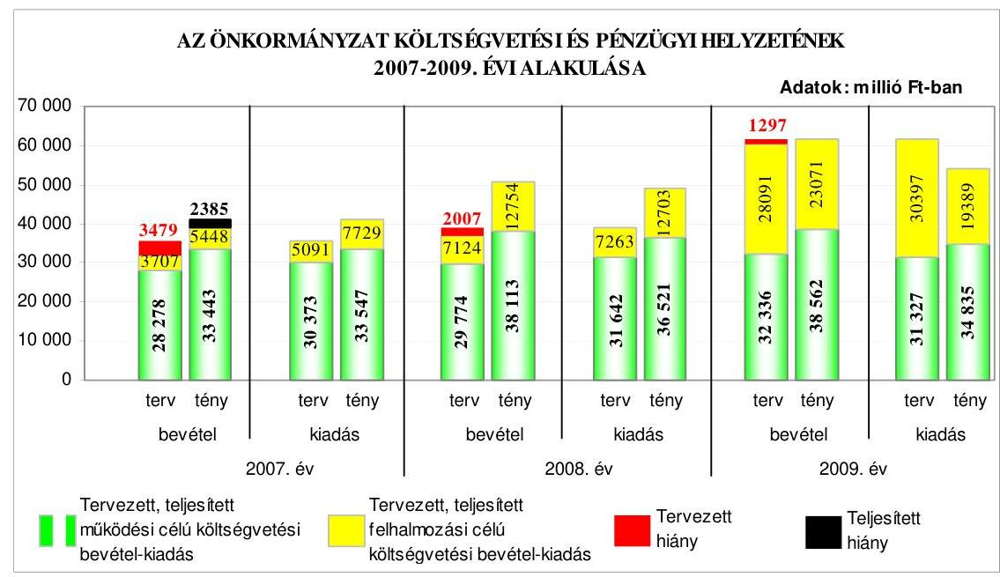

Az Önkormányzatnál a 2007. évben a költségvetés tejesítése során a teljesített múködési és felhalmozási célú költségvetési bevételek nem biztosítottak fedezetet a teljesített múködési és a felhalmozási célú költségvetési kiadásokra. A teljesített múködési célú költségvetési bevételek 104 millió Ft-tal elmaradtak a múködési célú költségvetési kiadásoktól, a teljesített felhalmozási célú költségvetési kiadások 2281 millió Ft-tal meghaladták a felhalmozási célú költségvetési bevételeket. A 2008. és a 2009. évben a tervezett költségvetési hiánnyal szemben bevételi többlet keletkezett, a teljesített múködési célú költségvetési

---

bevételek többlete 1592 millió Ft, illetve 3727 millió Ft volt, a teljesített felhalmozási célú költségvetési bevételek 51 millió Ft-tal, illetve 3682 millió Ft-tal haladták meg a teljesített felhalmozási célú költségvetési kiadásokat. A költségvetések végrehajtása során a költségvetési hiány csökkenéséhez és a pénzügyi többlet kialakulásához a tervezettet meghaladó múködési célú költségvetési bevételek, a kiadási megtakarítást eredményező intézkedések, és az előzőeken túlmenően a 2007-2008. években a tervezettet meghaladóan igénybe vett előző évi pénzmaradvány, a 2008. évben a felhalmozási célú költségvetési bevételek túlteljesítése és a 2009. évben a felhalmozási célú költségvetési kiadások alulteljesítése járultak hozzá. Az Önkormányzat a 2007-2009. években összesen 16327 millió Ft hosszú lejáratú hitelt vett igénybe, melyből 4000 millió Ft fix-, 12327 millió Ft változó kamatozású volt. Az Önkormányzat a 2008. évben 6000 millió Ft összegű svájci frank alapú, változó kamatozású kötvényt is kibocsátott, amelyből származó bevételből a 2008. évben 2000 millió Ft-ot a korábban felvett múködési célú hitel (folyószámlahitel) törlesztésére, 4000 millió Ftot pedig felhalmozási célokra fordított. A 39 millió euró ( 9964 millió Ft) összegű EIB hitel és a kötvénykibocsátás - a forint euróhoz, illetve svájci frankoz viszonyított árfolyamváltozása és a változó kamatmérték miatt -, valamint a forintban felvett változó kamatozású hitelek az Önkormányzat számára kockázatot jelentenek. A 2008. évi költségvetési rendeletben a kötvénykibocsátásból származó bevételt nem tervezték meg az Ámr. ${ }_{1}$-ben foglaltak ellenére. Az EIB hitelből a 2008. évben lehívott 9129 millió Ft-ból a 2008. évben fel nem használt rész ( 6838 millió Ft) az év végi pénzmaradvány részét képezte, a következő évben az ebből igénybevett összeg már nem finanszírozási célú pénzügyi múvelet bevételeként, hanem - a számviteli szabályoknak megfelelően - költségvetési bevételként került elszámolásra. Az Önkormányzat hitelfelvételeiből és a kötvénykibocsátásból eredő adósságállománya a 2009. év végén 31674 millió Ft volt, amely a legmagasabb összegű volt a megyei jogú városok közül. Az Önkormányzatnál a 2008. évi EIB hitel felvételekor az Ötv. előírásait nem tartották be, mivel a Kormány kezesség vállalása biztosítékaként - közvetve a hitel fedezeteként - törzsvagyont ajánlottak fel. A Pénzügyi bizottság a 2007-2010. években - az Ötv. előírásainak ellenére - a hitelfelvétel indokait és gazdasági megalapozottságát nem vizsgálta, a kötvénykibocsátás esetében e kötelezettségének eleget tett. Az Önkormányzatnak a 2007. és a 2008. évi adósságot keletkeztető kötelezettségvállalásaiból - a tőketörlesztés megkezdésének a következő évekre történt ütemezése miatt - a tárgyévben fizetési kötelezettsége nem volt. A 2009. évben keletkezett, tárgyévet terhelő fizetési kötelezettség az éves adósságot keletkeztető kötelezettségvállalás - Ötv. előírásai szerint számított - felső határnak az 1,5\%-a volt.

Az Önkormányzatnál a 2007-2009. években a folyószámlahitellel zárt napok száma és a folyószámlahitel évenkénti átlagos állománya folyamatosan csökkent, 2007-ben volt év végi vissza nem fizetett állománya. A főjegyző a 20072009. években nem készített az Ámr. ${ }_{1}$ előirása ellenére az Önkormányzat pénzállományának alakulásáról likviditási tervet. Az ellenőrzést követően a 2010. évre vonatkozó likviditási tervet elkészítették. Az Önkormányzat pénzügyi helyzete a 2007-2009. évek között fizetőképességének javulása ellenére - a hitelfelvételek és a kötvénykibocsátás miatti eladósodás következményeként összességében kedvezőtlenül alakult.

---

Az Önkormányzat a 2007-2010. évekre vonatkozó fejlesztési célkitűzéseit gazdasági programjában, ágazati, szakmai fejlesztési koncepcióiban határozta meg. A programok, koncepciók a fejlesztési célkitűzések megvalósításának pénzügyi forrásait megnevezték, kiemelten az európai uniós pályázati lehetőségeket. Az Önkormányzat a 2007-2010. I. negyedév között európai uniós forrásokkal összefüggő fejlesztési feladatokról - pályázatot eredményező - döntést 56 alkalommal hozott, amelyből 41 támogatásban részesült, kilencet elutasítottak, hat elbírálása 2010. április végéig folyamatban volt. Az Önkormányzat a támogató döntést követően eredményesnek ítélt pályázatok közül egy esetben lépett vissza a projekt megvalósításától, mert a projekt megvalósításához szükséges önerőt nem tudták biztosítani. Az Önkormányzatnál a 20072009. években az európai uniós forrásokkal megvalósított fejlesztések teljesített költségvetési kiadása 850 millió Ft volt, amelynek pénzügyi forrása 69\%-ban európai uniós-, 18\%-ban hazai támogatás, 8\%-ban EU Önerő Alap támogatás és $5 \%$-ban saját forrás volt.

Az Önkormányzat 2007-2009 között eredményesen készült fel belső szabályozottság és szervezettség terén az európai uniós források igénybevételére és felhasználására, továbbá a vizsgált fejlesztés (GVOP-2004-4.3.1. „Déldunántúli Régió Elektronikus Közigazgatási szolgáltatásainak fejlesztése") esetén - a helyszíni ellenőrzés tapasztalatai szerint - megvalósította a támogatási szerződésben foglalt fejlesztési célkitűzést. A gazdasági programban, az ágazati, szakmai koncepciókban, tervekben megfogalmazott fejlesztési célkitűzésekhez kapcsolódtak az európai uniós támogatások, szabályozták a pályázatfigyelést végzők és a döntést, illetve a döntés előterjesztési jogkörrel rendelkezők közötti információszolgáltatási kötelezettséget, továbbá kiterjedt az európai uniós forrásokkal támogatott fejlesztési feladatokra a belső ellenőrzési stratégiát megalapozó kockázatelemzés. A Polgármesteri hivatalon belül biztosították a pályázatfigyelés, a pályázatkészítés és a fejlesztési feladatok lebonyolításának szervezeti és személyi feltételeit. Egy pályázat esetében külső szervezet igénybevételével biztosították a pályázatkészítés és a fejlesztési feladatok lebonyolítását. A pályázatkészítésre kötött szerződésben meghatározták a külső szervezetnek a pályázat szakmai és formai követelményeire vonatkozóan a pályázatkészítő felelősségét, valamint előírták a fejlesztési feladat lebonyolítását végző ellenőrzési kötelezettségeit, továbbá a támogatási szerződésben foglalt határidőre az ellenőrzött projekt esetében a célkitűzést megvalósították.

Az Önkormányzat 2007-2013. évekre szóló informatikai stratégiával rendelkezett. Az informatikai stratégia helyzetelemzése a meglévő infrastruktúrából és a kialakított e-közigazgatási rendszer értékeléséből indult ki és megfogalmazta a hat éves időszakra vonatkozó fejlesztési célokat és prioritásokat. Az elektronikus közszolgáltatás fejlesztésénél nem határozták meg a fejlesztések eredményeként megvalósuló elektronikus szolgáltatási szinteket. Az eközszolgáltatási ellátás személyi feltételeit az Informatikai osztály dolgozóival és vállalkozási szerződéssel biztosították. Az Önkormányzat az eközszolgáltatási feladatokat a saját számítógépes informatikai rendszerével és vásárolt programmal valósította meg. Az Önkormányzat az állampolgárok vonatkozásában az e-közszolgáltatást a szociális juttatások, támogatások fizetése, helyi adózás és egyéb ügykörben 2., a gépjárműadó, helyi adózás, valamint a működési- és telephelyengedélyek esetében 3. elektronikus szolgáltatási

---

szinten múködtette. A vállalkozások vonatkozásában iparúzési adó, gépjármúadó és engedélyek esetében 3., egyéb ügykörben 2. elektronikus szolgáltatási szinten múködtette az e-közszolgáltatást. A Polgármesteri hivatalnál az eközzzolgáltatási feladatokat ellátó informatikai rendszer ügyfelek általi igénybevételét figyelemmel kísérték, a tapasztalatokat a 2008. évben értékelték. A közvetlen kétoldalú ügyintézés feltételeit nem biztosították, mivel az eközzzolgáltatáshoz kapcsolódó meglévő program állomány fejlesztését a pénzügyi források hiánya akadályozta.

Az Önkormányzat 2007. januártól az Eisztv. alapján kötelezett a közérdekú adatok közzétételére. A közzétételi listára előírt adatokat tartalmazó jegyzékre utaló hivatkozást az Önkormányzat honlapján nem a jogzabályban előírtaknak megfelelően helyezték el, mert a „Közérdekü adatok" elnevezés helyett, az „üvegzseb" megnevezést használták, a gazdálkodási adatok közzétételekor nem az előírt szerkezeti rendnek megfelelően jártak el. A főjegyző - az Áht-ban előírtak ellenére - az Önkormányzat által nyújtott céljellegú múködési és felhalmozási célú támogatások közel egyharmadát nem tette közzé. Az Önkormányzat pénzeszközei felhasználásával, a vagyonnal történő gazdálkodással összefüggő, a nettó öt millió Ft-ot elérő vagy azt meghaladó összegű árubeszerzésre, építési beruházásra, szolgáltatás megrendelésére, vagyonértékesítésre vonatkozó szerződések megnevezését, típusát, tárgyát a szerződést kötő felek nevét, a szerződés értékét, a határozott időre kötött szerződések esetében annak időtartamát - az Áht-ban foglaltaknak megfelelően - a főjegyző a honlapon közzétette. A főjegyző a 2006-2009. évi költségvetési beszámolók szöveges indokolását - az Ámr. ${ }_{1}$-ben előírtak ellenére - nem tette közzé az Önkormányzat honlapján.

A költségvetés-tervezési és a zárszámadás-készítési folyamatok szabályozásának hiányosságai magas kockázatot jelentettek a feladatok szabályszerű végrehajtásában, mert a főjegyző - az Ámr. ${ }_{1}$ előírása ellenére - nem szabályozta annak ellenőrzését, hogy a Polgármesteri hivatalban a költségvetési javaslatot az előírásoknak megfelelően dolgozták-e ki, a javasolt előirányzatok megalapozottak-e, az ismert kötelezettségeket megtervezték-e, a költségvetési tervezéshez készített intézményi mutatószám felmérés adatai a szociális feladatokat ellátó intézmények, valamint a Túzoltóság esetében megalapozottak-e, a Polgármesteri hivatal szervezeti egységei által benyújtott költségvetési igények indokoltak-e, teljesíthetőek-e, a saját bevételek közül a helyi adó bevételek és egyéb szolgáltatási díjak előirányzatai és a költségvetés megalapozását szolgáló helyi rendeletek összhangja biztosított-e; nem írta elő az intézményi számszaki beszámolók belső, valamint annak a Közgyűlés által meghatározott adatszolgáltatással való összhangjának, továbbá az intézmények által az állami támogatásokkal, hozzájárulásokkal történő elszámoláshoz közölt mutatószámok adatai megbízhatóságának ellenőrzését. A főjegyző a feltárt hiányosságokat - a feladatok munkaköri leírásban való rögzítésével - megszüntette 2010 márciusában. A költségvetés-tervezési és zárszámadás-készítési folyamatban a belső kontrollok múködésének megfelelősége gyenge volt, mert - az ellenőrzési feladatok szabályozásának hiánya miatt - az Ámr. ${ }_{1}$ előírása ellenére nem végezték el annak ellenőrzését, hogy a Polgármesteri hivatalban a költségvetési javaslatot az előírásoknak megfelelően dolgozták-e ki, a javasolt előirányzatok megalapozottak-e, az ismert kötelezettségeket megtervezték-e, a költségvetési tervezéshez készített intézményi mutatószám felmérés adatai a szociá-

---

lis feladatokat ellátó intézmények, valamint a Túzoltóság esetében megalapo-zottak-e, a Polgármesteri hivatal szervezeti egységei által benyújtott költségvetési igények indokoltak-e, teljesíthetőek-e, a saját bevételek közül a helyi adó bevételek és egyéb szolgáltatási díjak előirányzatai és a költségvetés megalapozását szolgáló helyi rendeletek összhangja biztosított-e; nem vizsgálták az intézmények által az állami támogatásokkal, hozzájárulásokkal történő elszámoláshoz közölt mutatószámok adatainak megbízhatóságát, az intézményi számszaki beszámolók belső, valamint annak a Közgyűlés által meghatározott adatszolgáltatással való összhangját.

A főjegyző - az Ámr., előírásai ellenére - a Polgármesteri hivatalban a költség-vetés-tervezés és a zárszámadás-készítés folyamatában a belső kontroll tevékenységeket nem határozta meg, a kontrollokat nem alakította ki, nem múködtette. Az előzőekben bemutatott hiányosságokért felelősség terheli a főjegyzöt. A folyamatba épített előzetes, utólagos és vezetői ellenőrzés kialakítása és múködtetése az Áht. és az Ötv. előírásai alapján - a költségvetési szervként működő Polgármesteri hivatal vezetője - a jegyző kötelessége, valamint az Ötvben előírtak alapján a jegyző köteles olyan pénzügyi irányítási és ellenőrzési rendszert kialakítani és működtetni, mely biztosítja az Önkormányzat rendelkezésére álló források szabályszerű, szabályozott felhasználását.

A gazdálkodási, a pénzügyi-számviteli és a folyamatba épített ellenőrzési feladatok szabályozásának hiányosságai közepes kockázatot jelentettek a feladatok megfelelő, szabályszerű végrehajtásában, mivel a főjegyző a Polgármesteri hivatal ügyrendjében a költségvetési szerv nyilvántartási számát, az alapítás időpontját, a gazdasági szervezet engedélyezett létszámát nem rögzítette; a szakmai teljesítés igazolás módjának szabályozása során nem írta elő, hogy a dátum és az arra jogosult személy aláírását fel kell tüntetni; a polgármesterrel közösen kiadott pénzgazdálkodási szabályzatban szabályozta, azonban munkaköri leírásban nem határozta meg a pénzügyi-gazdasági területen foglalkoztatott köztisztviselők kötelezettségvállalás, utalványozás és ellenjegyzés, szakmai teljesítés igazolás feladatát; az értékelés szabályait a számviteli politikában rögzítette, azonban ennek keretében nem írta elő a kis összegű követelések év végi értékelésének, az egyszerűsített értékelési eljárás alá vont követelések negyedévenkénti besorolásának elveit, dokumentálásának szabályait, az értékelések ellenőrzéséért felelős munkaköröket; a munkaköri leírásokban nem rögzítette az értékelések és azok ellenőrzésének, a felesleges vagyontárgyak minősítésének, a negyedévi egyeztetések és ellenőrzések feladatát; nem készítette el az önköltségszámítás rendjére vonatkozó belső szabályzatot és az ellenőrzési nyomvonalat. A főjegyző a szabályzatok kiadásával és módosításával, valamint a munkaköri leírások kiegészítésével a hiányosságokat 2010-ben pótolta.

A Polgármesteri hivatalban a 2009. évben az államháztartáson kívülre történő működési és felhalmozási célú pénzeszközátadásokkal, az állományba nem tartozók megbízási díjaival, a külső szolgáltatók által végzett karbantartásokkal, kisjavításokkal kapcsolatos kifizetések során a belső kontrollok müködésének megfelelősége gyenge volt, mert a szakmai teljesítés igazolására a főjegyző által kijelölt személyek a kiadások jogosultságának, összegszerűségének és a szerződés, megrendelés teljesítésének ellenőrzését a kifizetések teljesítését

---

megelőzően - az Ámr. ${ }_{1}$-ben és a pénzgazdálkodási szabályzatban előírtak ellenére - nem végezték el. Az utalvány ellenjegyzésére jogosult személyek - az Ámr. ${ }_{1}$-ben foglaltak ellenére - nem győződtek meg arról, hogy az utalványozás sérti-e a gazdálkodásra - a kötelezettségvállalások ellenjegyzésére és nyilvántartásba vételére, az írásbeli kötelezettségvállalás meglétére - vonatkozó szabályokat, egy esetben az utalvány ellenjegyzése elmaradt, továbbá - aláírásuk ellenére - nem kifogásolták a szakmai teljesítés igazolásának elmaradását.

A főjegyző - az Ámr. ${ }_{1}$ előírásai ellenére - nem gondoskodott a Polgármesteri hivatalban az államháztartáson kívülre történő működési és felhalmozási célú pénzeszközátadásokkal, az állományba nem tartozók megbízási díjaival, a külső szolgáltatók által végzett karbantartásokkal, kisjavításokkal kapcsolatos kifizetések során a szakmai teljesítés igazolásának és az utalvány ellenjegyzésének az elvégzéséről, e belső kontrollok működtetésének elmulasztásáért felelősség terheli a főjegyzőt. A folyamatba épített előzetes, utólagos és vezetői ellenőrzés működtetése az Áht. és az Ötv. előírásai alapján - a költségvetési szervként működő Polgármesteri hivatal vezetője - a jegyző kötelessége, valamint az Ötv-ben előírtak alapján a jegyző köteles olyan pénzügyi irányítási és ellenőrzési rendszert működtetni, mely biztosítja az Önkormányzat rendelkezésére álló források szabályszerű, szabályozott felhasználását.

A bérlakások és nem lakás célú helyiségek üzemeltetési feladatainak ellátására 1996-ban megkötött üzemeltetési szerződés nem tartalmazta az üzemeltetésre átadott eszközöknek az Önkormányzat számviteli nyilvántartási adataival megegyező tételes jegyzékét és értékét, a teljesítés biztosítására szolgáló mellékkötelezettségeket, a szerződés időtartamát, a szerződés megváltoztatásának, megszűnésének, az esetleges szerződésszegésnek az eseteit, következményeit, a szerződés felmondásának szabályait, határidejét. A jogügylet tárgyát képező ingatlanok az Önkormányzat tulajdonában vannak, amelyeket a Polgármesteri hivatal 2009. évi költségvetési beszámolója könyvviteli mérlegében az Áhszben foglaltak ellenére az üzemeltetésre, kezelésre átadott eszközök helyett az ingatlanok között mutattak ki, amellyel nem tartották be a Számv. tv. előírásait. A bérleti díjakról a számlákat a 2009. évben a Pécs Holding Zrt. az Önkormányzat nevében bocsátotta ki. A számlakibocsátási kötelezettség meghatalmazott útján történő teljesítésére vonatkozóan a számlakibocsátás elfogadásának feltételeiről és módjáról az Áfa tv-ben előírtak ellenére előzetesen és írásban a felek nem állapodtak meg.

A Polgármesteri hivatalban a pénzügyi-számviteli tevékenységhez kapcsolódó informatikai feladatok szabályozottsága összességében alacsony kockázatot jelentett az informatikai feladatok megfelelő, szabályszerű végrehajtásában, mert a főjegyző a katasztrófa elhárítási tervet kiadta, a hozzáférési jogosultságokra vonatkozó eljárásrendet kialakította, a pénzügyi-számviteli program mentési eljárásait szabályozta. Annak ellenére összességében alacsony volt a kockázat, hogy a pénzügyi-számviteli rendszerből lekérhető ellenőrzési lista (napló) vizsgálatáért felelős személyt nem jelöltek ki. A Polgármesteri hivatalnál a pénzügyi-számviteli tevékenységhez kapcsolódó informatikai feladatoknál a kialakított belső kontrollok múködésének megfelelősége jó volt, mert a hozzáférési jogosultságokra vonatkozó nyilvántartás teljes körűségét és naprakészségét, ellenőrizhetőségét biztosították, a pénzügyi-számviteli programoknál

---

a jelszavakra előírt szabályokat betartották, azonban az előírások ellenére nem tesztelték az elmúlt két évben a katasztrófa elhárítási tervet, nem állították elő az adathozzáférésekről, adatmódosításokról, adattörlésekről az ellenőrzési listákat, nem történt meg az elmúlt egy évben annak ellenőrzése, hogy az elmentett állományokból a pénzügyi számviteli adatok teljes körűen helyreállíthatóak. A feltárt hiányosságok nem veszélyeztették az informatikai rendszerek megfelelő működtetését. A főjegyző 2010 áprilisában kijelölte az ellenőrzési lista (napló) vizsgálatáért felelős személyt és intézkedésére a katasztrófa elhárítási tervet, az elmentett állományokból a pénzügyi számviteli adatok teljes körű helyreállíthatóságát tesztelték, az ellenőrzési listák vizsgálatát elvégezték.

Az Önkormányzat a belső ellenőrzési feladatok ellátására a főjegyzőnek közvetlenül alárendelt belső ellenőrzési egységet hozott létre, amely megfelelt az Ötv. előírásának. Az Önkormányzat a Társuláshoz tartozó települések önkormányzataival a „belső ellenőrzési feladatok közös megszervezésére" is társult. A Társulás munkaszervezetének belső ellenőrzési csoportja az Önkormányzat részére belső ellenőrzést azonban nem végzett. A belső ellenőrzés szervezeti kereteinek kialakítása és szabályozása a belső ellenőrzési feladatok megfelelő, szabályszerű végrehajtásában összességében alacsony kockázatot jelentett, mert a főjegyző által jóváhagyott belső ellenőrzési kézikönyvvel, kockázatelemzéssel alátámasztott stratégiai tervvel és éves ellenőrzési tervvel rendelkeztek, az ellenőrzések lefolytatásához ellenőrzési programot készítettek. Annak ellenére összességében alacsony volt a kockázat, hogy a belső ellenőrök feladatköri függetlenségét nem biztosították. A belső ellenőrzés működésénél a kialakított kontrollok megfelelősége összességében kiváló volt, mivel az ellenőrzéseket a belső ellenőrzési vezető által jóváhagyott ellenőrzési programok alapján hajtották végre, a belső ellenőrzésekről készített jelentések tartalma megfelelt az előírásoknak. Annak ellenére összességében kiváló volt a belső ellenőrzés működésének megfelelősége, hogy a belső ellenőrök feladatköri függetlenségét nem biztosították, az éves ellenőrzési tervben foglalt feladatok egyötödét nem hajtották végre. Az éves ellenőrzési tervet a belső ellenőrzési vezető módosította, ennek Közgyűlés általi jóváhagyása azonban az Ötv-ben foglaltak ellenére nem történt meg. A főjegyző az Ámr. ${ }_{1}$ előírásának megfelelően eleget tett a belső kontrollok múködésének értékelésére vonatkozó nyilatkozattételi kötelezettségének, azonban az nem felelt meg a tényleges állapotnak, mert a belső kontrollokat több területen nem múködtette. A polgármester az Ötv. előírásai szerint a zárszámadási rendelettervezettel egyidejűleg a Közgyűlés elé terjesztette a költségvetési szervek éves ellenőrzési jelentései alapján készített 2008. évi összefoglaló jelentést.

Az Önkormányzat gazdálkodási rendszerének 2005. évi átfogó ellenőrzése során az ÁSZ 36 szabályszerűségi és hét célszerűségi javaslatot tett. A javaslatok realizálása érdekében a főjegyző - felelősöket és határidőket tartalmazó - intézkedési tervet készített, amit a Közgyűlés elfogadott. Az ÁSZ ellenőrzés által tett javaslatok 58\%-a hasznosult, 19\%-a részben, $23 \%$-a pedig nem valósult meg. A megtett intézkedések hatására megvalósultak a költségvetési koncepcióhoz csatolandó dokumentumokra, a költségvetési rendelet szerkezetére, a csatolandó dokumentumokra, a költségvetési rendelet módosítás határidejére, a gazdálkodási és a pénzügyi-számviteli feladatellátás szabályozottságának biztosítására, a leltározási kötelezettség teljesítésére, a vagyongazdálkodási felada-

---

tok meghatározására, a céljelleggel nyújtott támogatások felhasználásának, elszámolásának, ellenőrzésének szabályszerűségére, a zárszámadási rendelet tartalmára, a pénzmaradvány elszámolás szabályszerűségére, a kisebbségi önkormányzatok gazdálkodási jogköreinek szabályozottságára és végrehajtásának szabályszerűségére, az éves ellenőrzési terv tartalmi követelményeire és jóváhagyására vonatkozó javaslatok, intézkedtek a vételi joggal (opcióval) összefüggő és az akadálymentesítésre vonatkozó javaslat végrehajtásáról.

Részben hasznosult a főjegyző részére a költségvetési rendelettervezet tartalmára tett javaslat, mert a 2005. évi költségvetési rendelet intézkedési tervet követő módosításakor és a 2006. évi költségvetési rendelettervezetben az általános és céltartalékok között mutatták be a kerettartalékokat, azonban az Ámr.,-ben előírtak ellenére a 2006. évi költségvetési rendelettervezet a pénzforgalom nélküli bevételt nem tartalmazta; a polgármester részére a költségvetési rendelettervezet megalapozására és tartalmi meghatározására tett javaslat, mert a 2006. évi költségvetési rendelettervezet benyújtását megelőzően elfogadták a térítési díjbevétel előirányzatot megalapozó rendelettervezetet, azonban a polgármester nem terjesztette a Közgyűlés elé az Áht-ban előírt, a költségvetés, illetve a zárszámadás előterjesztésekor tájékoztatásul bemutatandó mérlegek, kimutatások tartalmának meghatározásáról szóló rendelettervezetet; a főjegyző számára a költségvetési rendelettervezet tartalmával összefüggő javaslat, mert a 2006. évi költségvetési rendelettervezet költségvetési bevétele és kiadása nem tartalmazott finanszírozási célú bevételeket és kiadásokat, azonban a költségvetési kiadások, bevételek különbségét jelentő hiány összegét az Áht-ban foglalt előírás ellenére nem mutatták be; az analitikus nyilvántartások vezetésével összefüggő javaslat, mert az értékpapírok analitikus nyilvántartását az előírások szerint vezették, az üzemeltetésre, kezelésre átadott eszközök nyilvántartása azonban nem felelt meg az Áhsz-ben foglaltaknak, mert nem intézkedett arról, hogy itt tartsák nyilván a Pécs Holding Zrt. üzemeltetésében lévő bérlakásokat és nem lakás célú helyiségeket; a részesedések egyedi értékelésével és a szükség szerinti értékvesztés elszámolásával kapcsolatos javaslat, mert a 2005. évi költségvetési beszámoló készítése során elvégezték a részesedések egyedi értékelését, azonban a Számv. tv-ben foglaltak ellenére a szükség szerinti értékvesztést nem számolták el; a kisebbségi önkormányzatok vagyonkimutatásának elkészítésére vonatkozó javaslat, mert a kisebbségi önkormányzatok vagyonáról a 2005. évi vagyonkimutatás a helyi önkormányzat nyilvántartásain belül rendelkezésre állt, azonban az Áht-ban előírt vagyonkimutatást a 2005. évi zárszámadáshoz nem csatolták; a céljelleggel nyújtott támogatások közzétételére vonatkozó javaslat, mert biztosították a nettó öt millió Ft-ot elérő szerződések meghatározott adatainak a helyben szokásos módon történő közzétételét, azonban a nem normatív, céljellegú támogatásokat az Áht-ban előírtak ellenére nem tették közzé.

Nem hasznosult a főjegyző részére a költségvetési rendelettervezet tartalmára vonatkozó javaslat, mert a 2006. évi költségvetési rendelettervezet az Áht. előírása ellenére nem tartalmazta a többéves kihatással járó döntések számszerúsítését évenként és összesítve, valamint annak szöveges indoklását; az előirányzat gazdálkodással kapcsolatban tett javaslat, mert nem intézkedett és nem biztosította, hogy a 2006. évben a Polgármesteri hivatal és az intézmények az Áht. előírásait betartva a jóváhagyott előirányzatokon belül gazdálkodjanak,

---

tárgyévi fizetési kötelezettséget a jóváhagyott előirányzat mértékéig vállaljanak; a polgármester részére az operatív gazdálkodással összefüggésben tett javaslat, mert Ámr. ${ }_{1}$-ben előírtak ellenére nem intézkedett arról, hogy az utalványozás megtörténjen és a kötelezettségvállaló az Ámr. ${ }_{1}$-nek megfelelve a kötelezettségvállalás ellenjegyzőjének aláírása után vállaljon kötelezettséget; a főjegyző részére az operatív gazdálkodással kapcsolatban tett javaslat, mert az Ámr. ${ }_{1}$-ben foglaltak ellenére nem gondoskodott arról, hogy a kötelezettségvállalás és az utalványozás ellenjegyzői, az érvényesítő, valamint a kijelölt szakmai teljesítés igazoló az ellenőrzési feladatokat teljesítse, nem múködtette a belső kontrollokat és a folyamatba épített előzetes, utólagos és vezetői ellenőrzést; a számvitel bizonylati elvével és rendjével összefüggő javaslat, mert nem intézkedett, hogy a Számv. tv-ben előírt alaki és tartalmi követelményeknek megfelelő bizonylatokat rögzítsenek a számviteli nyilvántartásba, amelyek tartalmazzák a szakmai teljesítés igazolását és az utalvány ellenjegyzését, emiatt továbbra is szabálytalan bizonylatok alapján könyveltek; négy kisebbségi önkormányzattal kötött megállapodás kiegészítésére vonatkozó javaslat, mert nem megfelelően készítette elő a GKÖ, SZKÖ, az UKÖ és az RKÖ-vel kötött megállapodások kiegészítését és az új megállapodásokban az Ámr. ${ }_{1}$ előírása ellenére sem rögzítették a költségvetési határozattervezetek kisebbségi önkormányzatok részére történő átadásának, illetve a zárszámadási határozatok kisebbségi önkormányzatok által a Polgármesteri hivatal részére történő átadásának határidejét; a polgármester részére az Önkormányzat feladatainak meghatározásával kapcsolatos javaslat, mert nem kezdeményezte, hogy a Közgyúlés az Ötv-ben foglaltak alapján határozza meg, hogy a lakosság igényei és az Önkormányzat anyagi lehetőségei alapján mely feladatokat, milyen mértékben és módon lát el.

A munka színvonalának javítása érdekében tett javaslatokból hasznosult az „Alap"elnevezés használatának megszűntetésére, a pénzkezelési szabályzat kiegészítésére és pénztár ellenőrzési feladatok teljesítésére, a céljellegú támogatások szabályozására vonatkozó javaslat. Részben hasznosult a főjegyző részére a hatályos szabályzatokkal és munkaköri leírásokkal kapcsolatos javaslat, mert a folyamatba épített ellenőrzésre, egyeztetésre vonatkozó előírások összhangját a pénztárellenőri és az érvényesítői feladatok esetében biztosította, az ellenőrzési pontokat, az ellenőrzési műveleteket szabályozta, azonban az eltérések megállapításának és dokumentálásának módját, eltérés esetén szükséges teendőket a számlarendben és a munkaköri leírásokban nem rögzítette. Nem hasznosult a polgármester részére a kötelezettségvállalási és utalványozási jogkörök gyakorlásával felhatalmazottak beszámoltatására, illetve a főjegyző részére a kötelezettségvállalás ellenjegyzése és az utalványozás ellenjegyzése jogkörök gyakorlásával felhatalmazottak beszámoltatására vonatkozó javaslat.

Az Önkormányzatnál az ÁSZ a 2005. évi átfogó ellenőrzésen túl a 2006-2009. évek között négy vizsgálatot végzett. A Magyar Köztársaság 2005. évi költségvetése végrehajtásának ellenőrzése keretében vizsgálta a helyi önkormányzatok beruházásaihoz és rekonstrukcióihoz nyújtott felhalmozási célú támogatásokat, a kötött felhasználású támogatások felhasználását és a helyi önkormányzatok normatív hozzájárulásainak igénylését és elszámolását. A helyi önkormányzatok beruházásaihoz és rekonstrukcióihoz nyújtott felhalmozási célú támogatások vizsgálatáról készített számvevői jelentés öt szabályszerűségi

---

és kettő célszerűségi javaslatot fogalmazott meg, amelyekre intézkedési tervet készítettek és hasznosították is mind a hét javaslatot. A kötött felhasználású támogatások 2005. évi felhasználásának vizsgálatáról készített számvevői jelentés 16 szabályszerűségi és nyolc célszerűségi javaslatot tartalmazott. Mind a 16 szabályszerűségi javaslat realizálása érdekében intézkedtek és megvalósították azokat. A nyolc célszerűségi javaslatból hat javaslatot hasznosítottak. A helyi önkormányzatok 2005. évi normatív hozzájárulásainak igénylése és elszámolása vizsgálatáról készített számvevői jelentés négy célszerűségi javaslatot tartalmazott, amelyből kettő javaslat végrehajtása érdekében tettek intézkedést. A szakiskolai fejlesztési programra fordított pénzeszközök felhasználásának 2007. évi ellenőrzéséről készített számvevői jelentés három szabályszerűségi és hat célszerűségi javaslatot fogalmazott meg, amelyek mindegyikére intézkedtek. A 2008. évben a kiemelt beruházások ellenőrzéséről készített számvevői jelentés 14 célszerűségi javaslatot tartalmazott, amelyeket teljes mértékben hasznosítottak. A sürgősségi betegellátó rendszer kialakítására, fejlesztésére fordított pénzeszközök felhasználásának 2009. évi ellenőrzéséről készített számvevői jelentés négy célszerűségi javaslatot tartalmazott, amelyekre intézkedéseket tettek.

A vagyongazdálkodással összefüggő egyes döntések szabályszerűségét a 2006-2009. évek közötti időszakra vizsgáltuk. Az ingatlanok értékesítése során a versenyeztetési kötelezettségnek pályáztatással és árveréssel eleget tettek. Az értékesítésre kijelölt ingatlanokra értékbecsléseket készíttettek. Három ingatlan esetében a vagyongazdálkodási rendelet ${ }_{1}$-ben meghatározottaktól eltérően hat hónapnál régebbi értékbecslés alapján határozták meg a forgalmi értéket. A stratégiai ingatlancsomag esetében forgalomképtelen törzsvagyoni körbe tartozó négy ingatlan forgalomképessé történő átminősítéséről a Közgyűlés nem rendelettel, hanem határozattal döntött, és nem tartották be az Ötv. szabályait, mivel törzsvagyon körébe tartozó forgalomképtelen ingatlanokat értékesítettek. Felelősség terheli a főjegyzőt, mert az Ötv-ben előírtak ellenére nem jelezte a Közgyűlésnek, hogy döntésével nem tartja be az Ötv-ben és a vagyongazdálkodási rendelet ${ }_{1}$-ben foglalt előírásokat.

A stratégiai ingatlancsomag értékesítésével összefüggő keretmegállapodás, adásvételi szerződések és megállapodás megkötésénél nem tartották be az Ámr. ${ }_{1}$ előírásait, mert az Önkormányzat nevében a polgármester a főjegyző, vagy az általa felhatalmazott személy ellenjegyzése nélkül vállalt kötelezettséget. A keretmegállapodásban a stratégiai ingatlancsomag vételárának részleteit helytelenül állapították meg, mert a harmadik részletként a teljes vételár $15 \%$-a helyett, a fennmaradó vételár $25 \%$-a szerepelt. A stratégiai ingatlancsomag adásvételi szerződéseiben késedelmes fizetés esetére a késedelmi kamaton felül kötbért is kikötöttek, amely a Ptk. alapján érvényesen nem köthető ki. Az Önkormányzat a tulajdonából kikerülő ingatlanokra a régészeti feltárások többletköltségeit vállalta, annak ellenére, hogy azt jogszabály nem írta elő. A Magasházat megvásárló projekttársaság részére 75 évre térítésmentesen használati jogot biztosítottak egy ingatlanon, amely ellentétben állt a vagyongazdálkodási rendelet ${ }_{1}$-ben foglaltakkal, mert az ingyenes használattal támogatható szervezetek között ilyen típusú gazdasági társaság nem szerepelt, ezáltal ellentétes volt az Áht. előírásával is. Felelősség terheli a főjegyzőt, mert az Ötv-

---

ben előírtak ellenére nem jelezte a Közgyűlésnek, hogy döntésével nem tartja be az Áht-ban és a vagyongazdálkodási rendelet ${ }_{1}$-ben foglalt előírásokat.

Az apportálásokat könyvvizsgálók által hitelesített apportlisták alapján hajtották végre. Az apportálások és az ingatlan bérbeadások a vagyongazdálkodási rendelet ${ }_{1,2}$-ben foglalt hatásköri előírások betartásával történtek. Egy ingatlan esetében a bérleti díj értékállóságának biztosítása érdekében az ipari termelői árindex növekedésének megfelelő indexálásban állapodtak meg, az inflációt kifejező fogyasztói árindex helyett. A fizetési késedelem miatt késedelmi kamatot nem számítottak fel és a bérleti díj nem fizetése esetén kiküldött fizetési felszólításokban meghatározott póthatáridők lejártát követően nem mondták fel a bérleti jogviszonyt. Az Önkormányzat ingatlan (irodahelyiség) kedvezményes, vagy ingyenes bérbeadásával nem nyújtott közvetett támogatást pártoknak.

Az Önkormányzat az átmenetileg szabad pénzeszközeinek befektetése érdekében két alkalommal vásárolt értékpapírt. A polgármester az értékpapír vásárlásra felhatalmazást az Ámr. ${ }_{1}$-ben és a pénzgazdálkodási szabályzatban foglaltak ellenére nem természetes személynek, hanem a Pénzügyi főosztálynak adott. A Polgármesteri hivatalban a 2007. és a 2009. években hajtottak végre selejtezést, az előírásokat betartották.

Követelésről való lemondás a stratégiai ingatlancsomag értékesítésével kapcsolatban volt, amely során összesen 169 millió Ft kötbér és késedelmi kamat követelésről mondtak le. A követelésről való lemondásnál nem tartották be az Áht. előírásait, mert a döntés időpontjában a vagyongazdálkodási rendelet ${ }_{2}$ nem tartalmazta a követelésekről való lemondás eseteit. Felelősség terheli a főjegyzőt, mert az Ötv-ben előírtak ellenére nem jelezte a Közgyűlésnek, hogy döntésével nem tartja be az Áht-ban és a vagyongazdálkodási rendelet ${ }_{2}$-ben foglalt előírásokat. Az adókövetelésekről való lemondás esetében az adózás rendjéről szóló törvényben foglaltak szerint jártak el.

A forgalomképtelen törzsvagyoni körbe tartozó ingatlanok közül kilencet térítésmentesen átadtak, egyet pedig kisajátítást helyettesítő adásvételi szerződéssel értékesítettek - útszélesítés céljából - a Magyar Államnak a Ptk-ban, az Ötvben és a vagyongazdálkodási rendelet ${ }_{1}$-ben foglaltak ellenére. Felelősség terheli a főjegyzőt, mert az Ötv-ben előírtak ellenére nem jelezte a Közgyűlésnek, hogy döntésével nem tartja be a Ptk-ban, az Ötv-ben és a vagyongazdálkodási ren-delet ${ }_{1}$-ben foglalt előírásokat. Négy forgalomképes ingatlant adtak át térítésmentesen a Magyar Államnak, amely ellentétben állt az Áht-ban és a vagyongazdálkodási rendelet ${ }_{1}$-ben foglaltakkal, mivel a vagyongazdálkodási rendelet ${ }_{1}$ nem tette lehetővé a forgalomképes önkormányzati vagyontárgyak ingyenes átadását a Magyar Állam tulajdonába. A főjegyző felelős, mert az Ötv-ben előírtak ellenére nem jelezte a Közgyűlésnek, hogy döntésével nem tartja be az Áht-ban és a vagyongazdálkodási rendelet ${ }_{1}$-ben foglalt előírásokat.

Két szociális szervezetnek ingatlan térítésmentes átadása önkormányzati feladatellátás biztosításának érdekében történt. A vagyonhasználati jog ingyenes átadását és a vagyonkezelői szerződés megkötését ingatlanforgalmi értékbecs-

---

lés előzte meg, és mindkét esetben betartották a vagyongazdálkodási rendelet ${ }_{1}$ előírásait.

A helyszíni ellenőrzés megállapításainak hasznosítása mellett javasoljuk:

# a polgármesternek 

a jogszabályi előírások maradéktalan betartása érdekében

1. kezdeményezze, hogy az Ötv. 92. § (13) bekezdés c) pontjának megfelelően a Pénzügyi bizottság vizsgálja a hitelfelvétel indokait és gazdasági megalapozottságát;
2. tegyen javaslatot a Közgyűlésnek, hogy az Áht. 94. § (2) bekezdésében foglaltak szerint a jelentés 24. oldal második bekezdésében, a 25. oldal második bekezdésében, a 29. oldal harmadik bekezdésében, a 30. oldal első, negyedik és ötödik bekezdésében, az 58. oldal hatodik bekezdésében, az 59. oldal első bekezdésében, a 61. oldal második bekezdésében, a 67. oldal második bekezdésében, a 87. oldal harmadik bekezdésében, a 92. oldal harmadik bekezdésében, a 95. oldal harmadik bekezdésében, a 97. oldal második, valamint a 99. oldal első bekezdésében rögzített jogszabálysértések tekintetében a köztisztviselők jogállásáról szóló 1992. évi XXIII. törvény 51. § (1) bekezdése alapján indítsa meg a főjegyző elleni fegyelmi eljárást;
3. gondoskodjon az Önkormányzat gazdálkodásának 2005. évi átfogó ellenőrzése során az ÁSZ által részére tett és nem teljesült szabályszerűségi és célszerűségi javaslatok végrehajtásáról;
4. gondoskodjon, hogy a kötelezettségvállalás az Ámr. ${ }_{2}$ 74. § (1) bekezdése értelmében kizárólag ellenjegyzés után történjen;
5. tartsa be az Ámr. ${ }_{2}$ 72. § (8) bekezdésének előírását a kötelezettségvállalásra való felhatalmazás során;
6. gondoskodjon, hogy a forgalomképes önkormányzati vagyon tulajdonjogának és vagyoni értékű jogának ingyenes átruházásánál tartsák be az Áht. 108. § (2) bekezdés előírásait, és azokra a vagyongazdálkodási rendelet ${ }_{2}$ 19. § (1) bekezdésében foglalt esetekben kerüljön sor;
a munka színvonalának javítása érdekében
7. kezdeményezze, hogy a számvevőszéki jelentésben foglaltakat a Közgyűlés tárgyalja meg és a feltárt hiányosságok megszüntetése érdekében készíttessen intézkedési tervet a határidők és felelősök megjelölésével;
8. intézkedjen annak érdekében, hogy a bérlakások és nem lakás célú helyiségek üzemeltetési feladatainak ellátására kötött szerződést módosítsák, hogy az tartalmazza az üzemeltetésre átadott eszközöknek az Önkormányzat számviteli nyilvántartási adataival megegyező tételes jegyzékét és értékét, a teljesítés biztosítására szolgáló mellékkötelezettségeket, a szerződés időtartamát, a szerződés meg-

---

változtatásának, megszűnésének, az esetleges szerződésszegésnek az eseteit, következményeit, a szerződés felmondásának szabályait, határidejét;
9. kezdeményezze, hogy az Önkormányzat által elidegenített ingatlanokra indokolatlan mértékben ne vállalják át a régészeti feltárások - jogszabály által elő nem írt - többletköltségeit.

# a föjegyzönek 

a jogszabályi előírások maradéktalan betartása érdekében

1. gondoskodjon arról, hogy az Áht. 8/A. § (7) bekezdés előírása alapján a költségvetési rendelettervezet költségvetési bevétele ne tartalmazzon finanszírozási célú bevételeket, valamint a költségvetési bevételek, kiadások különbségét jelentő hiány összegét tartalmazza az Áht. 69. § (1) bekezdés b) pontjában foglaltaknak megfelelően;
2. jelezze a Közgyűlésnek az Ötv. 36. § (3) bekezdésének megfelelően, ha hitel felvételnél a fedezetként felajánlott vagyontárgy a törzsvagyon körébe tartozik és így annak felajánlása az Ötv. 88. § (1) bekezdés b) pontjába ütközik;
3. intézkedjen, hogy a 18/2005. (XII. 27.) IHM rendelet 2. § (1)-(2) bekezdésében előírtaknak megfelelően helyezzék el a közzétételi listára előírt adatokat tartalmazó jegyzékre utaló hivatkozást, és a közérdekú adatok közzétételére az előírt jegyzék szerinti tagolásban kerüljön sor;
4. tegye közzé a céljellegú múködési és fejlesztési támogatásokat az Áht. 15/A. (1) bekezdésében előírtaknak megfelelően az Önkormányzat honlapján, valamint a Polgármesteri hivatal éves költségvetési beszámolója szöveges indoklását az Ámr. ${ }_{2}$ 233. § (1) bekezdésében foglaltak alapján a 22. számú melléklet 2. pontjában előírtak szerint;
5. gondoskodjon az operatív gazdálkodás során a múködésbeli hibák megelőzése, feltárása, kijavítása érdekében arról, hogy
a) az államháztartáson kívülre nyújtott pénzeszközátadások, az állományba nem tartozók megbízási dijai és a karbantartási, kisjavítási szolgáltatással kapcsolatos kifizetések esetében a kiadások teljesítése előtt azok jogosságának, összegszerűségének ellenőrzését, a szakmai teljesítés igazolását - az Ámr. ${ }_{2}$. 76. § (1), (3) bekezdéseiben foglaltaknak megfelelően - a kijelölt személyek végezzék el;
b) az utalványok ellenjegyzői az államháztartáson kívülre nyújtott pénzeszközátadásokkal, az állományba nem tartozók megbízási díjaival és a karbantartási, kisjavítási szolgáltatásokkal kapcsolatos kiadások teljesítése előtt az Ámr. ${ }_{2}$ 79. § (2) bekezdésének előírása alapján ellenőrizzék, hogy a szakmai teljesítés igazolást a kijelölt személyek az Ámr. ${ }_{2}$ 76. § (1), (3) bekezdésében foglaltaknak megfelelően elvégezték-e, valamint azt, hogy az Ámr. ${ }_{2}$ 74. § (3) bekezdés c) pontjában foglaltak alapján az utalványozás nem sérti-e a gazdálkodásra vonatkozó jogszabályokat, az Ámr. ${ }_{2}$ 74. § (1) bekezdés és (2) bekezdés f) pontja szerint az írásbeli köte-

---

lezettségvállalás és annak ellenjegyzése, az Ámr. ${ }_{2}$ 75. § (1) bekezdése alapján a kötelezettségvállalás nyilvántartásba vétele megtörtént-e;
6. az Önkormányzat tulajdonát képező, üzemeltetésre, kezelésre átadott bérlakások és nem lakás célú helyiségek számviteli nyilvántartásban való szabályszerű kimutatása és az üzemeltetési feladatok előírás szerinti ellátása érdekében
a) gondoskodjon, hogy az üzemeltetésre, kezelésre átadott eszközöket a tárgyi eszközök helyett az üzemeltetésre, kezelésre átadott eszközök között szerepeltessék az Áhsz. 20. § (1) bekezdése és az Áhsz. 9. számú melléklete 1/f. pontja, valamint a Számv. tv. 15. § (3) bekezdésében foglaltaknak megfelelően;
b) készíttesse el - a számlakibocsátási kötelezettség meghatalmazott útján való teljesítése esetén - az Áfa tv. 160. § (1) bekezdése alapján a számlakibocsátás elfogadásának feltételeiről és módjáról szóló írásbeli megállapodást;
7. intézkedjen annak érdekében, hogy az éves ellenőrzési terv módosítását a Közgyűlés hagyja jóvá, figyelemmel az Ötv. 92. § (6) bekezdésében foglaltakra;
8. intézkedjen, hogy a vagyon elidegenítése során az eladási ár megállapítását - az Önkormányzatnál a vagyongazdálkodási rendelet ${ }_{2}$ 9. § (2) bekezdésének a) pontjában előírt - hat hónapnál nem régebbi forgalmi értékbecsléssel támasszák alá;
9. jelezze a Közgyűlésnek az Ötv. 36. § (3) bekezdésének megfelelően, ha az Ötv. 79. § (2) bekezdés a) pontjában meghatározott forgalomképtelen törzsvagyon körébe tartozó és a Ptk. 173. § (1) bekezdés b) pontja és (2) bekezdésébe ütköző ingatlan elidegenítéséről, illetve forgalomképes vagyon tulajdonjogának és vagyoni értékű jogának ingyenes átruházásáról az Áht. 108. § (2) bekezdésében meghatározottakkal és a vagyongazdálkodási rendelet ${ }_{2}$-ben foglaltakkal ellentétesen dönt;
10. gondoskodjon, hogy az adásvételi szerződésekben a késedelmes fizetésre vonatkozó, az Önkormányzat érdekeit védő garanciális elemek összhangban legyenek a Ptk. 247. § (2) bekezdésében foglaltakkal;
11. gondoskodjon az Önkormányzat gazdálkodásának 2005. évi átfogó, valamint a 2006-2009. évek további ellenőrzései során az ÁSZ által részére tett és nem teljesült szabályszerűségi és célszerűségi javaslatok hasznosításáról;
a munka színvonalának javítása érdekében
12. készítsen likviditási koncepciót, továbbá tájékoztassa - évente végzett számítások alapján - a Közgyűlést az Önkormányzat eladósodásának növekedésére figyelemmel arról, hogy a hosszú lejáratú, adósságot keletkeztető kötelezettségvállalásokból adódó tőke- és kamatfizetési kötelezettségét az Önkormányzat milyen feltételek biztosítása mellett tudja teljesíteni;
13. gondoskodjon, hogy az ingatlan adásvételi szerződésekben a vételár részletek meghatározás helyesen történjen;

---

14. kezdeményezze a Pécs, Széchenyi tér 1. szám alatti ingatlan bérleti szerződésének módosítását, hogy a bérleti díjak értékállóságát ne az ipari termelői árindex növekedéséhez, hanem az inflációt kifejező fogyasztói árindex növekedéséhez kapcsolják, a bérleti szerződésben foglaltak szerint a bérleti díj késedelmes fizetése esetén számoljanak fel késedelmi kamatot és a bérleti díj nem fizetése esetén éljenek a felmondási jogukkal.

---

# II. RÉSZLETES MEGÁLLAPÍTÁSOK 

## 1. AZ ÖNKORMÁNYZAT KÖLTSÉGVETÉSI ÉS PÉNZÜGYI HELYZETE

### 1.1. A tervezett költségvetési bevételek és kiadások alapján a költségvetési egyensúly, a költségvetési hiány alakulása, a hiány tervezett finanszírozási módja, valamint a költségvetési hiány megállapításának szabályszerűsége

Az Önkormányzatnál a 2008-2009. években a tervezett költségvetési bevételek és kiadások főösszege növekedett, a 2010. évben csökkent az előző évhez képest.

Az Önkormányzat 2007-2010. évi költségvetési rendeleteiben a költségvetési bevételek és kiadások nem voltak egyensúlyban, mivel a tervezett költségvetési bevételek nem nyújtottak fedezetet a tervezett költségvetési kiadásokra. A tervezett múködési célú költségvetési kiadásokra a 20072008. években, valamint a 2010. évben nem nyújtottak fedezetet a tervezett múködési célú költségvetési bevételek. A 2007-2010. évi tervezett felhalmozási célú költségvetési kiadások meghaladták a felhalmozási célú bevételek előirányzatát. A 2007-2008. években, valamint a 2010. évben a költségvetés hiányát a tervezett múködési célú költségvetési bevételek hiánya és a felhalmozási célú költségvetési bevételeket meghaladó összegben tervezett felhalmozási célú költségvetési kiadások együttesen okozták. A 2009. évi költségvetés hiánya a felhalmozási célú költségvetési bevételeket meghaladó öszszegben tervezett felhalmozási célú költségvetési kiadások miatt alakult ki.
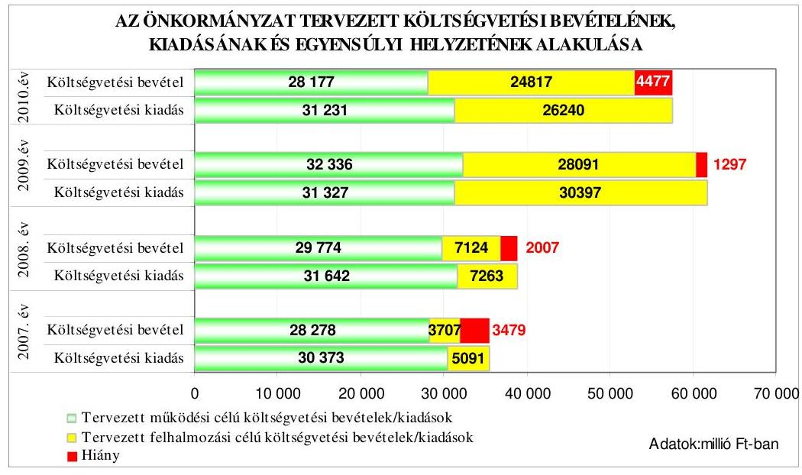

---

Az Önkormányzat a 2007-2010. évi költségvetési rendeleteiben a költségvetési egyensúly biztosítására, a költségvetési hiány finanszírozására hosszú lejáratú felhalmozási célú, illetve a 2007. és a 2010. években rövid lejáratú múködési célú hitelek felvételét tervezte. Az Önkormányzat a korábban felvett hitelek kiváltására a 2008. évben 6000 millió Ft összegű működési célú kötvény kibocsátását határozta el a költségvetési rendelet normaszövegében, azonban a rendelet mellékleteiben a kötvénykibocsátásból származó bevételt nem tervezte meg eredeti előirányzatként, amellyel nem tartotta be az Ámr. 1 29. § (1) bekezdés a) pontjának az önkormányzat költségvetési rendelettervezet szerkezetére vonatkozó előírásait, amely szerint az önkormányzat bevételeit forrásonként - a pénzügyminiszter elemi költségvetés összeállítására vonatkozó tájékoztatójában rögzített főbb jogcím-csoportonkénti részletezettségben ${ }^{7}$ - kell bemutatni. Az Önkormányzat a 2010. évi költségvetési rendeletében 400 millió Ft összegű hitelviszonyt megtestesítő értékpapír értékesítést tervezett.

Az Önkormányzat a 2007. évi és a 2009. évi költségvetési rendeletben álláshely megszüntetést határozott meg a 2007. évre 426 főben, a 2009. évre 15 főben. A Közgyűlés a 2007-2010. évi költségvetési rendeletek elfogadását követően azok végrehajtását szolgáló intézkedésekről határozatokat ${ }^{8}$ hozott, amelyben előírta - felelősökkel és határidőkkel - az elvégzendő feladatokat.

A 2007-2010. években az Önkormányzat folyószámlahitel-keret biztosításával ${ }^{9}$, továbbá a főjegyző az Ámr. 1 29. § (1) bekezdés j) pontja ${ }^{10}$ előírásainak megfelelően előirányzat-felhasználási ütemterv készítésével gondoskodott a költségvetés végrehajtása érdekében a likviditás feltételeinek kialakításáról.

Az ÁSZ korábbi javaslata ellenére az Önkormányzat 2010. évi költségvetési rendelete a költségvetési bevételek és kiadások különbözetét jelentő 4077 millió Ft költségvetési hiány összegét az Áht. 69. § (1) bekezdés b) pontjában foglaltakat megsértve nem tartalmazta, továbbá a költségvetés bevételi főösszegének megállapításakor az Áht. 8/A. § (7) bekezdésében előírtakat megsértve finanszírozási célú pénzügyi műveletet - 400 millió Ft értékű értékpapír értékesítéséből származó finanszírozási célú bevételt - is figyelembe vettek költségvetési hiányt módosító költségvetési bevételként.

Az Önkormányzat a 2010. évi költségvetési rendeletében 3704 millió Ft „tárgyévi folyó hiányt" állapított meg, a tárgyévi rövid lejáratú múködési hitelek felvételével azonos összegben. A 2010. évi költségvetési rendelet nem tartalmazta a költségvetési bevételek ( 53394 millió Ft ) és a költségvetési kiadások ( 57471 millió Ft) különbözeteként számítható hiányt ( 4077 millió Ft). A költségvetési bevételek kö-

[^0]
[^0]:    ${ }^{7}$ A 2008. évi pénzügyminiszteri tájékoztató szerint a VI. bevételi jogcím-csoport tartalmazta az értékpapírok kibocsátásából származó bevételeket.
    ${ }^{8}$ A Közgyűlés az 57/2007. (II. 15.), a 46/2008. (II. 14.), a 39/2009. (II. 12.), a 37/2010. (II. 11.) számú határozataival fogadta el a költségvetési rendeletek végrehajtását szolgáló intézkedéseket.
    ${ }^{9}$ Az évente rendelkezésre álló folyószámla hitelkeretről a 2007-2010. évi költségvetési rendeletekben döntött a Közgyűlés.
    ${ }^{10}$ Az előirányzat-felhasználási ütemterv készítését 2010. január 1-től az Ámr. ${ }_{2}$ 36. § (1) bekezdés k) pontja írja elő.

---

zött az előírásoktól eltérően figyelembe vett 400 millió Ft értékű értékpapírok értékesítése miatt a tényleges költségvetési hiány 4477 millió Ft volt.

A közbenső egyeztetés során a polgármester által tett észrevétel szerint: „A rendeletben költségvetési bevételektől elkülönítetten kerültek bemutatásra a finanszírozási bevételek (5 029702 ezer Ft). Ezek egy része finanszírozza a folyó évi hiányt (3 703833 ezer Ft), másik részét pedig a még le nem hívott hitelek összegei alkotják (1 325869 ezer Ft), az előző időszakban vállalt kötelezettségek teljesitésére. A rendeletben tehát a folyó évi tényleges hiány bemutatásra kerül. Továbbá a kapcsolódó előterjesztés indokolja meg a fenti hiány ilyen jellegü bemutatását."

Az észrevétel nem megalapozott, mert az Áht. 69. § (1) bekezdésének b) pontja szerint az Önkormányzat költségvetési rendeletének tartalmaznia kell a költségvetési bevételek és kiadások különbözeteként a költségvetési többlet, vagy hiány összegét, amelyet a 2010. évi költségvetési rendelet nem tartalmazott. Az Önkormányzat a 2010. évi költségvetési rendeletében 3704 millió Ft „tárgyévi folyó hiányt" mutatott be, a tárgyévi rövid lejáratú múködési hitelek felvételével azonos összegben. Ez az összeg azonban nem azonos a költségvetési bevételek (53 394 millió Ft) és kiadások ( 57471 millió Ft) különbözeteként számított hiánnyal (4077 millió Ft). Ezen túlmenően a költségvetési bevételek főösszegét is hibásan állapították meg, mert az Áht. 8/A. § (7) bekezdésében előírtakat megsértve finanszírozási célú pénzügyi műveletet - 400 millió Ft értékű értékpapír értékesítéséből származó finanszírozási célú bevételt - is figyelembe vettek költségvetési hiányt módosító költségvetési bevételként. Helyesen a tényleges költségvetési hiány 4477 millió Ft volt.

# 1.2. A teljesített költségvetési bevételek és kiadások alapján a pénzügyi egyensúly, a pénzügyi hiány alakulása, a pénzügyi hiány finanszírozása, az igénybe vett finanszírozási célú pénzügyi eszközök hatása a pénzügyi helyzet alakulására, az eladósodásra, valamint a fizetőképességre 

Az Önkormányzatnál a 2007-2009. évek között a teljesített költségvetési bevételek és kiadások főösszegei folyamatosan növekedtek. A teljesített költségvetési bevételek főösszege 38 891-50 868-61 632 millió Ft, a teljesített költségvetési kiadások főösszege 41 276-49 225-54 223 millió Ft volt.
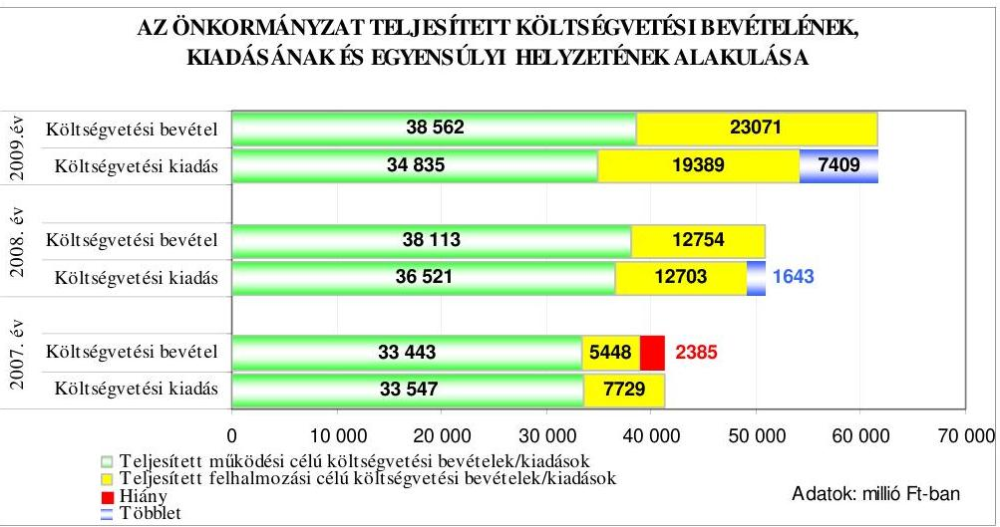

---

Az Önkormányzatnál a 2007. évben a költségvetés teljesítése során a teljesített költségvetési bevételek nem nyújtottak fedezetet a teljesített költségvetési kiadásokra, mivel a teljesített múködési célú költségvetési bevételek 104 millió Ft-tal elmaradtak a múködési célú költségvetési kiadásoktól. A teljesített felhalmozási célú költségvetési kiadások 2281 millió Ft-tal haladták meg a felhalmozási célú költségvetési bevételeket. A 2008. és 2009. években a tervezett költségvetési hiánnyal szemben bevételi többlet keletkezett, a teljesített múködési célú költségvetési bevételek többlete 1592 millió Ft, illetve 3727 millió Ft volt, a teljesített felhalmozási célú bevételek 51 millió Ft-tal, illetve 3682 millió Ft-tal haladták meg a teljesített felhalmozási célú kiadásokat.

Az Önkormányzatnál a 2007-2010. években tervezett és a 2007-2009. években teljesített múködési és felhalmozási célú költségvetési kiadásokra a következő arányban biztosítottak fedezetet a költségvetési bevételek:

Adatok: \%-ban

| Megnevezés | 2007.   év |  | 2008.   év |  | 2009.   év |  | 2010.   év |
| :--: | :--: | :--: | :--: | :--: | :--: | :--: | :--: |
|  | Terv | Tény | Terv | Tény | Terv | Tény | Terv |
| Múködési célú költségvetési kiadások fedezettsége múködési célú költségvetési bevételekből | 93,1 | 99,7 | 94,1 | 104,4 | 103,2 | 110,7 | 90,2 |
| Felhalmozási célú költségvetési kiadások fedezettsége felhalmozási célú költségvetési bevételekből | 72,8 | 70,5 | 98,1 | 100,4 | 92,4 | 119,0 | 94,6 |
| Költségvetési kiadások fedezettsége költségvetési bevételek-   böl | 90,2 | 94,2 | 94,8 | 103,3 | 97,9 | 113,7 | 92,2 |

Az Önkormányzatnál a teljesített költségvetési kiadások költségvetési bevételekből történő fedezettsége folyamatosan javult, a 2008. évben 9,1 százalékponttal, a 2009. évben 10,4 százalékponttal növekedett az előző évhez viszonyítva, a mutató az egyes években a tervezetthez viszonyítva is kedvező irányba változott.

A helyi adók esetében az eredeti előirányzatokat a 2007. évben 13,2\%-kal, a 2008. évben 23,4\%-kal, a 2009. évben 5,8\%-kal haladták meg a teljesített bevételek. Az eredeti előirányzathoz viszonyítva valamennyi adónemnél túlteljesítés jelentkezett, mely a végrehajtási tevékenység eredményességére, továbbá az iparűzési adónál a december havi adóelőleg feltöltésre vezethető vissza.

A 2008. évi 23,4\%-os túlteljesítést egyrészt az Adóügyi osztály végrehajtási tevékenységének (az építményadó esetében 95 millió Ft, az iparűzési adó esetében 135 millió Ft hátralék beszedése), másrészt az iparűzési adó feltöltési kötelezettség teljesítésének ( 1163 millió Ft) együttes hatása eredményezte.

---

Az Önkormányzat a 2007-2009. években felújítási feladatokra az eredeti előirányzat 595,2-160,3-75,1\%-át, beruházásokra 147,7-178,4-56,2\%-át fordította. A 2007. évben eredeti előirányzatként nem tervezték meg - az Áht. 7. § (2) bekezdésében előírtakat megsértve - azokat a fejlesztéseket ${ }^{11}$, amelyek forrását az előző évi kötelezettségvállalással terhelt pénzmaradvány biztosította, és a 2006. évi pénzmaradvány igénybevételét sem tervezték. A 2008. évben a felújítási és a beruházási előirányzatok teljesítését az év közben hozott közgyűlési és bizottsági döntések, valamint az év közben jóváhagyott támogatások és azok felhasználása befolyásolta. A 2009. évben a felújítások és a beruházások céljára teljesített kiadások - egyes feladatok előkészítésének, illetve megvalósításának időbeli elhúzódása miatt - elmaradtak a tervezettől.

A 2008. évi felújítások túlteljesítését az évközben meghozott közgyűlési és bizottsági döntések okozták, a beruházások túlteljesítését egyrészt az évközi döntések (Zsolnai Kulturális negyed megvalósításához ingatlanvásárlás 1032 millió Ft), másrészt az ISPA beruházáshoz kapcsolódó támogatásból finanszírozott kiadások, amelyek előirányzata a kincstári értesítő után került be a költségvetésbe. A 2009. évi felújítások alulteljesítését az eredetileg tervezett kiadások részbeni teljesítése (Jókai Mór Általános Iskola felújítás, „IMS" szerkezetű épületek felújítása) okozta, a beruházások kiadásainak elmaradását az EKF-s projektek kiadásainak elmaradása eredményezte.

A 2008-2010. években az előző évi pénzmaradványok igénybevételének tervezése megalapozottan történt. Az EIB hitelből a 2008. évben lehívott 9129 millió Ft-ból a 2008. évben fel nem használt rész ( 6838 millió Ft) az év végi pénzmaradvány részét képezte, a következő évben az ebből igénybevett összeg már nem finanszírozási célú pénzügyi művelet bevételeként, hanem - a számviteli szabályoknak megfelelően - költségvetési bevételként került elszámolásra.

Az Önkormányzatnál a 2007-2009. években a tervezett hiány mérséklése érdekében az intézmények szervezeti struktúrájának átalakításával kiadási megtakarítást, illetve bevételnövelést eredményező intézkedéseket hajtottak végre:

- az Önkormányzat 2007. évi költségvetési rendeletében a központi intézkedések ${ }^{12}$ figyelembevételével tervezett és évközi döntései 504 álláshely megszűnésével jártak, amelyek a 2007. évben 208,9 millió Ft megtakarítást eredményeztek, az átszervezések hatása a 2008. évre 692,5 millió Ft kiadás megtakarítás volt. A 2008. évben az évközi döntések alapján az oktatási intézmények átszervezése, a közművelődési intézmények szervezeti átalakítása, valamint az egészségügyi intézményeket érintő létszámleépítések végrehajtása 19 álláshely megszüntetésével jártak, amelyek következtében 29,8 millió Ft volt a megtakarítás. Az Önkormányzat a 2008. évben terven felül egy intézmény, a Pécs Szociális és Egészségügyi Szakképző Iskola fenntartói jogát átadta ${ }^{13}$ a PTE-nek, amely a 2008. évben még nem eredménye-

[^0]
[^0]:    ${ }^{11}$ A 2006. évi pénzmaradvány 925,6 millió Ft összegű beruházásra és 14,5 millió Ft öszszegű felújításra biztosított fedezetet.
    ${ }^{12}$ A közoktatásról szóló 1993. évi LXXIX. törvény 1. számú mellékletében meghatározott pedagógus kötelező óraszámok 20-ról 22-re emelkedtek 2007. szeptember 1-től.
    ${ }^{13}$ A Közgyűlés 368/2008. (VI. 26.) számú határozatával döntött a fenntartói jog átadásáról.

---

zett megtakarítást, azonban a 2009. évben már 161,6 millió Ft kiadás megtakarítás keletkezett. A 2009. évben a tervezett és terven felül végrehajtott intézményi és hivatali átszervezések 43 álláshely és egy intézmény jogutód nélküli megszűnésével ${ }^{14}$ jártak, amelyekkel együttesen 44,9 millió Ft kiadás megtakarítást értek el;

- az Önkormányzat az óvodák és az általános iskolák múködésének 2007. évben megvalósított átszervezéséhez kapcsolódóan intézményfenntartó mik-ro-társulásokat ${ }^{15}$ hozott létre, amelyek eredményeként 53,7 millió Ft terven felüli bevételre tett szert;
- az Önkormányzatnak a költségvetési elszámolási számláján és az alszámláin rendelkezésre álló szabad pénzeszközeinek lekötéséből a 2007. évben 169,4 millió Ft, a 2008. évben 781,6 millió Ft, a 2009. évben 1140,2 millió Ft többletbevétele keletkezett. A 2008. évben végrehajtott ingatlanértékesítések miatt a tárgyi eszközök értékesítése eredeti előirányzatát 975,9 millió Ft-tal haladták meg e jogcímen a teljesített bevételek.

A Pénzügyi bizottság a 2007-2009. években a költségvetési bevételek alakulását - kiemelt figyelemmel a tárgyi eszközök értékesítését - a negyedéves előirányzat módosítások tárgyalása során figyelemmel kísérte és az előidéző okokat értékelte.

Az Önkormányzat a 2007-2009. évi költségvetések végrehajtása során rövid lejáratú hitelt nem vett fel, hazai pénzintézetektől hosszú lejáratú múködési és fejlesztési célú hiteleket, a 2008. évben külföldi pénzintézettől fejlesztési célú hitelt vett fel, ezen túlmenően a 2008. évben a korábban felvett hitelek törlesztésére és a tervezettől eltérően felhalmozási célra kötvényt bocsátott ki. Az Önkormányzat hazai pénzintézetektől felvett hosszú lejáratú hiteleinek állománya a 2007. év elején 10350 millió Ft volt, amely a 2009. év végére - a hitelfelvételek és a törlesztések együttes hatására - 13961 millió Ft-ra nőtt. A külföldi pénzintézettől felvett EIB hitel állománya a 2008. év végén 9532 millió Ft, a 2009. év végén 10563 millió Ft volt. Az Önkormányzat hitelfelvételeiből és a kötvénykibocsátásából eredő adósságállománya 2009. december 31-én 31674 millió Ft volt ${ }^{16}$. A megyei jogú városok közül az Önkormányzat rendelkezett a legmagasabb összegű adósságállománnyal.

[^0]
[^0]:    ${ }^{14}$ A Közgyűlés a 164/2009. (IV. 16.) számú határozatával a Központi menza jogutód nélküli megszüntetéséről döntött.
    ${ }^{15}$ A Közgyűlés a 266/2007. (VI. 7.) számú határozatával döntött arról, hogy 2007. július 1-től öt intézményfenntartó mikró-társulást hoz létre nyolc községi önkormányzattal közösen.
    ${ }^{16}$ Ez az összeg tartalmazza a tartozásokat a fejlesztési célú kötvénykibocsátásból (4767 millió Ft), a tartozásokat a múködési célú kötvénykibocsátásból (2383 millió Ft), a beruházási és fejlesztési hiteleket ( 23571 millió Ft), valamint a beruházási, fejlesztési hitelek következő évet terhelő törlesztő részleteit ( 953 millió Ft).

---

A 2007-2009. években felvett hosszú lejáratú hitelekkel kapcsolatos jellemzőket mutatja be a következő táblázat:

| Hitel célja | Szerző-   déskötés   ideje | A hitel szerződés szerinti összege millió Ft-ban | Futamidő   Év, hó | Türelmi idő Év, hó | Kamat $\%-\mathrm{a}$   Fix, vagy változó | Befolyt bevétel összege millió Ft-ban |
| :--: | :--: | :--: | :--: | :--: | :--: | :--: |
| 2007. évben: |  |  |  |  |  |  |
| A 2007. évben tervezett beruházások finanszírozása | $\begin{aligned} & 2007 . \\ & \text { július } 17 \end{aligned}$ | 3000 | 19 év 11 hó | 3 év 2 hó | $\begin{gathered} \text { fix } \\ 6,748 \% \end{gathered}$ | 3000 |
| Szabad felhasználású működési hitel | $\begin{aligned} & 2007 . \\ & \text { július } 17 \end{aligned}$ | 1000 | 2 év 2 hó | 1 év 5 hó | $\begin{gathered} \text { fix } \\ 6,948 \% \end{gathered}$ | 1000 |
| Összes hitelbevétel |  |  |  |  |  | 4000 |
| 2008. évben: |  |  |  |  |  |  |
| EIB hitel | $\begin{aligned} & 2008 . \\ & \text { május } 19 \end{aligned}$ | 9964 | a részösz-   szeg ki-   utalását   követő 25 .   év | a részösz-   szeg ki-   utalást   követő 8 .   év | változó | 9129 |
| A 2008. évi tervezett felhalmozási kiadások és pénzügyi befektetés céljára | $\begin{aligned} & 2008 . \\ & \text { július } 30 \end{aligned}$ | 2829 | 20 év | 3 év 2 hó | változó | 1499 |
| Összes hitelbevétel |  |  |  |  |  | 10628 |
| 2009. évben: |  |  |  |  |  |  |
| EIB hitel | $\begin{aligned} & 2008 . \\ & \text { május } 19 \end{aligned}$ | 9964 | a részösz-   szeg ki-   utalását   követő 25 .   év | a részösz-   szeg ki-   utalást   követő 8 .   év | változó | 835 |
| A 2008. évben tervezett felhalmozási kiadások és pénzügyi befektetés céljára | $\begin{aligned} & 2008 . \\ & \text { július } 30 \end{aligned}$ | 2829 | 20 év | 3 év 2 hó | változó | 630 |
| A 2009. évben tervezett beruházások finanszírozása | $\begin{aligned} & 2009 . \\ & \text { október } 7 \end{aligned}$ | 101 | 19 év 11 hó | 2 év 2 hó | változó | 44,6 |

---

| Hitel célja | Szerző-   déskötés   ideje | A hitel szerzödés szerinti összege millió Ft-ban | Futamidő   Év, hó | Türelmi idő Év, hó | Kamat $\%-\mathrm{a}$   Fix, vagy változó | Befolyt bevétel összege millió Ft-ban |
| :--: | :--: | :--: | :--: | :--: | :--: | :--: |
| A „Sikeres Magyarországért" Önkormányzati Infrastruktúrafejlesztés Hitelprogram keretében az általános beruházási célokhoz besorolható beruházások | $\begin{aligned} & 2009 . \\ & \text { október } 7 \end{aligned}$ | 748 | 19 év 11   hó | 2 év 2 hó | változó | 187,5 |
| A „Sikeres Magyarországért" Önkormányzati Infrastruktúrafejlesztés Hitelprogram keretében informatikai közmúfejlesztési célok | $\begin{aligned} & 2009 . \\ & \text { október } 7 \end{aligned}$ | 10 | 19 év 11   hó | 2 év 2 hó | változó | 2,0 |
| Összes hitelbevétel |  |  |  |  |  | 1699,1 |

Az Önkormányzat a 2007. évben kötött hitelszerződésekben szereplő összegeket egy összegben hívta le, a 2008-2009. években megkötött hitelszerződésekben szereplő hitelösszegek folyósítását az Önkormányzat több részletben - a fejlesztések üteméhez igazodva - kérte, egyes részleteket a szerződéskötés évében, illetve az azt követő évben, és vannak olyan részletek, amelyek lehívásra sem kerültek 2009. december 31-ig. A 2007-2009. években kötött hitelszerződések alapján az Önkormányzat a költségvetési rendeletekben tervezett 17652 millió Ft-ból 16327,1 millió Ft hitelt vett igénybe, amelyekből 2009. december 31-én fennálló hosszú lejáratú hiteltartozása 15 926,1 millió $\mathrm{Ft}^{17}$ volt.

Az Önkormányzat az EKF program kulcsprojektjei önerejének biztosítására, a Sopianae terv és a Világörökség II. program felhalmozási kiadásainak fedezetére 2008. május 19-én az Európai Beruházási Bankkal 39 millió euró - 9964 millió Ft - összegű hitelszerződést kötött a Kormány kezesség vállalása mellett. Az állami garanciavállalásról 2008. május 21-én a pénzügyminiszter és az Önkormányzat megállapodást kötött, amelyben rögzítették, hogy az EKF kulcsprojektek önerején kívüli fejlesztésekhez kapcsolódó 27 millió euró hitelösszeggel megegyező összegben az Önkormányzat biztosítékot bocsát a Kormány rendelkezésére. A forint euróhoz viszonyított árfolyamváltozása, valamint a változó kamatmérték miatt az Önkormányzat számára az EIB hitel felvétele kockázatot jelent. Az Önkormányzat 59 db ingatlant ajánlott fel biztosítékként - közvetve a hitel fedezeteként -, amelyeknek a megállapodás megkötésének időpontjában ingatlanforgalmi értékbecslés útján megállapított forgalmi értéke 7299 millió Ft volt. Az Önkormányzat által felajánlott ingatlanok közül

[^0]
[^0]:    ${ }^{17}$ Ebben az EIB-hitel a 2009. december 31-ei mérlegszerinti összeggel szerepel.

---

két ingatlan (a Pécs 15657 és a 38303/1 hrsz-ú) a vagyongazdálkodási rendelet ${ }_{1}$ 1. számú melléklete szerint a törzsvagyonba tartozó forgalomképtelen vagyontárgy volt, amivel megsértették az Ötv. 88. § (1) bekezdés b) pontjában foglaltakat, mert hitel fedezeteként a törzsvagyon nem használható fel.

#### Abstract

A közbenső egyeztetés során a polgármester által tett észrevétel szerint: „A vagyongazdálkodási rendelet alapján átminősített és ezzel a vagyonrendelet mellékletében rögzítésre kerülő két ingatlan végleges ingatlan-nyilvántartási átvezetése nem történt meg, létrehozva ezzel azt az átmeneti állapotot, mely alapján kivett gazdasági épület és kivett beépítetlen terület megnevezésű forgalomképes ingatlan, törzsvagyoni jelleggel bír a nyilvántartásban. Az önkormányzati vagyonkataszter vezetéséről rendelkező jogszabály értelmezéséből adódóan egy ingatlan vagyoni jellegének meghatározásánál a közhiteles ingatlan-nyilvántartási megnevezésből kell kiindulni, melyet az Önkormányzat a vagyongazdálkodási rendeletében felállított eljárási rend lefolytatásával, döntésével megváltoztat. Ezt a gondolatmenetet folytatva az EIB hitel fedezeteként ajánlott két ingatlan a döntés pillanatában forgalomképes volt, tekintettel arra, hogy az önkormányzat vagyonkataszterében szereplő törzsvagyoni jelleg az önkormányzat belső döntésének eredményeként került rögzítésre, azonban azok végleges ingatlan nyilvántartási átvezetésére nem került sor. Mindezek ismeretében álláspontom szerint a Jelentés által említett két ingatlan biztositékként történő felajánlásával az Önkormányzat nem sértette meg az Ötv. 88. § (1) bekezdés b) pontjában foglaltakat, hiszen a nevezet két ingatlan a közhiteles ingatlan-nyilvántartási adatok ismeretében forgalomképes ingatlannak minősült."

Az észrevétel nem megalapozott, mivel az Ötv. 79. § (1) bekezdése szerint törzsvagyonnak az az önkormányzati tulajdon nyilvánítható, amely közvetlenül kötelező önkormányzati feladat- és hatáskör ellátását vagy a közhatalom gyakorlását szolgálja. A törzsvagyon körébe tartozó tulajdont meghatározzák az Ötv. 79. § (2) bekezdés a)-b) pontjai, valamint az Önkormányzat döntése, ezért az Önkormányzat tulajdonát képező ingatlanok minősítését nem a közhiteles ingatlan nyilvántartás, hanem az Önkormányzat döntését tartalmazó vagyongazdálkodási rendelet határozza meg. Az Önkormányzat által felajánlott ingatlanok közül két ingatlan (a Pécs 15657 és a 38303/1 hrsz-ú) a vagyongazdálkodási rendelet ${ }_{1}$ 1. számú melléklete szerint a törzsvagyonba tartozó forgalomképtelen vagyontárgy volt, ezért az Önkormányzat megsértette az Ötv. 88. § (1) bekezdés b) pontjában foglaltakat, mert hitel fedezeteként törzsvagyon nem használható fel.

Az Önkormányzat 2008. május 22-én „Pécs 2028" elnevezésű, 39,2 millió svájci frank, 6000 millió Ft névértékű kötvényt bocsátott ki, a fennálló működési hiteleinek előfinanszírozása, csökkentése, valamint a tervezettel szemben a felhalmozási célú kiadások fedezetének megteremtése céljából. A kötvény változó kamatozású, a kamat fizetése 2008. szeptember 22-én és azt követően félévente esedékes, mértéke a hat havi „CHF LIBOR" ${ }^{18}+2,2 \%$, futamideje 20 év, a tőketörlesztés 3 év után 2011. május 22-től kezdődően a következő években minden év március és szeptember 22-én esedékes.

A forint svájci frankhoz viszonyított árfolyamváltozása, valamint a változó kamatmérték miatt az Önkormányzat számára a kötvénykibocsátás

[^0]
[^0]:    ${ }^{18}$ LIBOR: London Interbank Offered Rate (londoni bankközi kamatláb) egy kamatláb, amelyet a bankok számolnak fel egymásnak a londoni bankközi piacon az általuk nyújtott hitelek után CHF LIBOR: kamatláb svájci frankban nyújtott hitelek után a londoni bankközi piacon.

---

kockázatot jelent. A 2009. év végén az Önkormányzat kötvény kibocsátásából fennálló kötelezettségének mérleg szerinti összege 7150 millió Ft volt. A kötvények kibocsátásától a tőketörlesztés megkezdéséig várhatóan összesen 687 millió Ft kamatfizetési kötelezettség terheli ${ }^{19}$ az Önkormányzatot, amelyből 2009. december 31-éig 300 millió Ft-ot fizettek ki.

A kötvénykibocsátásból származó 6000 millió Ft bevételből az Önkormányzat 2000 millió Ft-ot a korábban felvett múködési célú hitel (folyószámlahitel) törlesztésére fordított. A fennmaradó 4000 millió Ft bankszámlapénzként ${ }^{20}$ állt rendelkezésre az Önkormányzat számára, amelyet részletekben ${ }^{21}$ hívott le felhalmozási célú kiadásainak finanszírozásához.

Az Önkormányzatnál a 2007-2009. évi hitelfelvételek, valamint a 2008. évi kötvénykibocsátás során az Áht-ban és a költségvetési rendeletekben előírt hatásköri és eljárási szabályokat betartották. Az Önkormányzatnak a 2007. és a 2008. évi adósságot keletkeztető kötelezettségvállalásaiból - a tőketörlesztés megkezdésének a következő évekre történt ütemezése miatt - a tárgyévben fizetési kötelezettsége nem volt. A 2009. évben keletkezett, tárgyévet terhelő fizetési kötelezettség az éves adósságot keletkeztető kötelezettségvállalás - Ötv. 88. § (2)-(4) bekezdéseinek előírásai szerint számított - felső határának az 1,5\%-a volt.

A Pénzügyi bizottság a 2007-2010. években a hitelfelvétellel a költségvetési javaslatok tárgyalásakor foglalkozott, azonban a hitelfelvétel indokait és gazdasági megalapozottságát nem vizsgálta, amellyel megsértette az Ötv. 92. § (13) bekezdés c) pontjában foglaltakat. A kötvénykibocsátás indokait és gazdasági megalapozottságát a Pénzügyi bizottság megvizsgálta.

A 2007-2009. években és a 2010. I. negyedévben a folyószámlahitellel kapcsolatos jellemzőket mutatja be a következő táblázat:

| Megnevezés | 2007.   Év | 2008.   év | 2009.   év | 2010.   I.   negyedév |
| :-- | :--: | :--: | :--: | :--: |
| A folyószámlahitel keretösszege (mil-   lió Ft-ban) | 7000 | 7000 | 7000 | 7000 |
| Év végén fennálló folyószámlahitel   (millió Ft-ban) | 5137 | 0 | 0 | - |
| Folyószámlahitellel zárt napok száma | 365 | 251 | 1 | 36 |
| A ténylegesen felvett folyószámlahitel   átlagos állománya (millió Ft-ban) | 4384,9 | 3352,7 | 11,6 | 494,7 |

[^0]
[^0]:    ${ }^{19}$ A 2010. és a 2011. évi kamatteher az Önkormányzat 2010. évi költségvetési rendeletének 15/a számú melléklete alapján került meghatározásra.
    ${ }^{20}$ Az alszámlán elhelyezett kötvényből származó bevételből a 2008. évben 27,1 millió Ft kamatbevétele keletkezett az Önkormányzatnak.
    ${ }^{21}$ Az Önkormányzat 2008. június 9-én 2633,5 millió Ft-ot, 2008. július 10-én 1084,8 millió Ft-ot, 2008. augusztus 6-án 116,1 millió Ft-ot, 2008. augusztus 27-én 106,3 millió Ft-ot, 2008. október 9-én 59,3 millió Ft-ot hívott le fejlesztési célra.

---

| Megnevezés | $\mathbf{2 0 0 7 .}$   Év | $\mathbf{2 0 0 8 .}$   év | $\mathbf{2 0 0 9 .}$   év | $\mathbf{2 0 1 0 .}$   I.   negyedév |
| :-- | :--: | :--: | :--: | :--: |
| A felvett folyószámlahitel minimum   összege (millió Ft-ban) | 2557,3 | 7,8 | 11,6 | 28,5 |
| A felvett folyószámlahitel maximum   összege (millió Ft-ban) | 5972,2 | 6558,4 | 11,6 | 923,2 |

A 2007-2009. években a folyószámla-hitelkeret szerződést a költségvetési rendeletben megállapított összegben kötötték meg a pénzintézettel. A 2008. évi folyószámla-hitelkeret összegét az Önkormányzat 2008. május 28 -tól - az önkormányzati kötvény kibocsátását szervező pénzintézet elvárásának megfelelően ${ }^{22}$ - 5000 millió Ft összegűre csökkentette. Az Önkormányzat 2009. december 16-tól a folyószámla-hitelkeret összegét 7000 millió Ft-ra emelte ${ }^{23}$, amelyből 2000 millió Ft az EKF projektekhez kapcsolódó kiadásokra elnyert támogatások megelőlegezésére zárolt keret.

Az Önkormányzatnál a 2007-2009. években a folyószámlahitellel zárt napok száma és a folyószámlahitel évenkénti átlagos állománya folyamatosan csökkent, a 2007. évben volt év végi vissza nem fizetett állománya.

A főjegyző a 2007-2009. években nem készített az Ámr. ${ }_{1}$ 139. § (1) bekezdésében ${ }^{24}$ foglalt előírás ellenére az Önkormányzat pénzállományának alakulásáról likviditási tervet ${ }^{25}$.

A közbenső egyeztetés során a polgármester által tett észrevétel szerint: „A vizsgált években a város költségvetési rendeleteinek 19. számú mellékleteként bemutatásra került az előirányzat-felhasználási terv havonkénti bontásban. Ehhez kapcsolódva a Pénzügyi főosztály folyamatosan vezette a tényleges kifizetések és a befolyt bevételek, valamint az ismert és a várható kötelezettségvállalások alapján a folyószámla egyenlegének alakulásáról felfektetett nyilvántartást. Mivel az Ámr. nem írja elő, hogy a likviditási terv milyen formátumban készüljön, ezt a kimutatás megfelelőnek tartottuk a likviditási helyzet bemutatására. A kifogásra tekintettel azonban még az ellenőrzés időszakában a költségvetési rendelet bevételi és kiadási sorainak megfelelő formátumban új likviditási tervet készítettünk, mely részletes alábontásban tartalmazza a tényleges és a várható bevétlek és a kötelezettségvállalások feldolgozásával a likviditási helyzet alakulásáról a szükséges információkat."

Az észrevétel nem megalapozott, mivel a 2007-2009. években likviditási terv nem készült. Az előirányzat-felhasználási terv nem azonos a likviditási tervvel. Az Ámr. ${ }_{1}$ 29. § (1) bekezdés j) pontja szerint a költségvetési rendelettervezet keretében az év várható bevételi és kiadási előirányzatainak teljesüléséről előirányzatfelhasználási ütemtervet, az Ámr. ${ }_{1}$ 139. § (1) bekezdése szerint a helyi önkormányzat pénzállományának alakulásáról - szükség szerint aktualizálva - likvi-

[^0]
[^0]:    ${ }^{22}$ Az Önkormányzat és a kötvény kibocsátását szervező bank között 2008. május 8-án létrejött megbízási szerződés 2.3.3 pontjában rögzítettek alapján.
    ${ }^{23}$ A Közgyűlés 595/2009. (XII. 17.) számú határozatával döntött a folyószámlahitelkeret módosításáról.
    ${ }^{24}$ A likviditási terv készítését 2010. január 1-től az Ámr 2 201. § (1) bekezdése írja elő.
    ${ }^{25}$ A 2010. évre vonatkozó likviditási tervet az ellenőrzést követően elkészítették.

---

ditási tervet kell készíteni. A 2010. évre vonatkozóan készített likviditási tervet a helyszíni ellenőrzés során nem tudták bemutatni Az észrevételhez csatoltan megküldött likviditási tervet köszönettel vettük, és erre figyelemmel a jelentésben a vonatkozó javaslatot elhagytuk.

Az Önkormányzat eladósodásának mértékét 2007-2009. évek között az éves könyvviteli mérleg adataiból számított eladósodási mutató ${ }^{26}$ és az esedékességi aránymutató ${ }^{27}$, valamint az adósságszolgálati ráta ${ }^{28}$ mutatja. Az Önkormányzat eladósodása a 2007-2008. években növekedett, mivel a hosszú és rövid lejáratú kötelezettségek állományának növekedése meghaladta az összes forrás állományának növekedését. Az eladósodási mutató a 2007. évben 16\%, a 2008-2009. években $21 \%$ volt. A mutató 5 százalékpontos emelkedését a kötvénykibocsátásból, a hazai fejlesztési hitelek és az EIB hitel felvételéből származó kötelezettségek növekedése okozta.

Az esedékességi aránymutató a 2007-2009. években 38,7\%-ról 9,8\%-ra, majd 9,2\%-ra csökkent. A 2008. évi kötvénykibocsátás, valamint a 2008-2009. évi hazai és külföldi hitelintézettől felvett fejlesztési hitelek hatására a hosszú lejáratú kötelezettségek aránya az összes kötelezettségen belül évről évre emelkedett, míg a rövid lejáratú kötelezettségek aránya (a 2007. évi rövid lejáratú hitel 2008. évi visszafizetése miatt) évente csökkent, ezáltal a rövidtávon teljesítendő kötelezettségek fizetőképességre gyakorolt hatása mérséklődött.

Az adósságszolgálat a 2007-2009. években 2368 millió Ft-ról 3849 millió Ft-ra nőtt, majd 3791 millió Ft-ra csökkent. Az adósságszolgálati ráta 24,2\%-ról 32,3\%-ra nőtt, majd 31,9\%-ra csökkent. A 2007-2008. évek közötti növekedés azt mutatja, hogy az Önkormányzat saját bevételeinek nagyobb hányadát korábban felvett hitelei kamatának fizetésére, illetve törlesztésre használta fel.

Az eladósodási mutató, valamint az adósságszolgálati ráta 2007-2009. évek közötti emelkedése, - az esedékességi aránymutató javulása ellenére - jelzi, hogy az Önkormányzat pénzügyi helyzete a 2007-2009. évek között eladósodási szempontból kedvezőtlenül alakult.

A készpénz likviditási mutató a 2007-2009. évek között változóan alakult az előző év végéhez viszonyítva. A 2008. év végén javult, mivel a pénzeszközök év végi állománya növekedett ${ }^{29}$ a rövid lejáratú kötelezettségek csökkenése ${ }^{30}$ mellett. A 2009. év végén az előző év végéhez viszonyítva a fizetőképesség romlott - azonban a 2007. évi mértéket így is meghaladta -, mivel az év végi kész-

[^0]
[^0]:    ${ }^{26}$ Az eladósodási mutató a hosszú és rövid lejáratú fizetési kötelezettségek önkormányzati összes forráson belüli arányát mutatja.
    ${ }^{27}$ Az esedékességi aránymutató a rövid lejáratú fizetési kötelezettségek arányát fejezi ki az összes - rövid és hosszú lejáratú - fizetési kötelezettségen belül.
    ${ }^{28}$ Adósságszolgálati ráta a tárgyévben adósságszolgálatra (tőketörlesztés+kamat) fizetett összeg saját bevételekhez viszonyított arányát fejezi ki.
    ${ }^{29}$ A pénzeszközök év végi záró állománya 2007-2008. évek között 7838 millió Ft-tal (212,3\%-kal) növekedett.
    ${ }^{30}$ A rövid lejáratú kötelezettségek év végi állománya a 2007. évről a 2008. évre 5031 millió Ft-tal (61\%-kal) csökkent.

---

pénz állomány nagyobb mértékben csökkent (33,8\%), mint a rövid lejáratú kötelezettségek $(1,9 \%)$.

Az Önkormányzat fizetőképességének és likviditásának a 2007-2009. évek közötti alakulását mutatja a készpénz likviditási mutató ${ }^{31}$ és a likviditási gyorsrá$\mathrm{ta}^{32}$ :
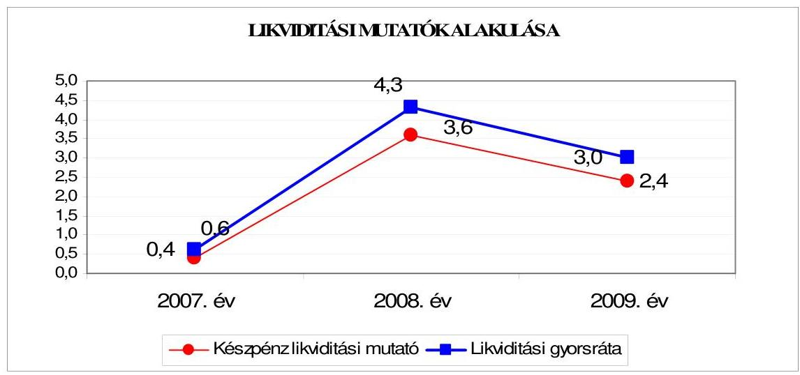

A likviditási gyorsráta is változóan alakult a 2007-2009. években. A 2008. év végére az előző évhez viszonyítva javult, mivel a pénzeszközök és a követelések ${ }^{33}$ állománya is növekedett a rövid lejáratú kötelezettségek csökkenése mellett. A 2009. év végére - az előző év végéhez viszonyítva - a likviditási gyorsráta romlott, mivel az év végén a követelések, a forgatási célú értékpapírok és pénzeszközök harmadával csökkentek, míg a rövid lejáratú kötelezettségek csökkenése csak 1,9\%-os volt.

Az Önkormányzat pénzügyi helyzete a 2007-2009. évek között fizetőképességi szempontból kedvezően alakult, mivel a pénzeszközök, a forgatási célú értékpapírok és a követelések összege fedezetet biztosított a rövid lejáratú fizetési kötelezettségek pénzügyi teljesítésére.

Az Önkormányzat pénzügyi helyzete a 2007-2009. évek között fizetőképességének javulása ellenére - a hitelfelvételek és a kötvénykibocsátás miatti eladósodás fokozódása következményeként - összességében kedvezőtlenül alakult.

[^0]
[^0]:    ${ }^{31}$ A készpénz likviditási mutató kifejezi, hogy a pénzeszközök év végi állománya milyen arányban nyújt fedezetet a rövid lejáratú fizetési kötelezettségekre.
    ${ }^{32}$ A likviditási gyorsráta mutatja, hogy a rövid lejáratú fizetési kötelezettségek kiegyenlítéséhez a pénzeszközökön túl bevonható követelések, forgatási célú értékpapírok milyen arányban nyújtanak fedezetet.
    ${ }^{33}$ A követelések év végi záró állománya 2007-2008. évek között 1356 millió Ft-tal (143,9-kal) növekedett.

---

# 2. Az ÖNKORMÁNYZAT FELKÉSZÜLTSÉGE AZ EURÓPAI UNIÓs FORRÁSOK IGÉNYLÉSÉRE, FELHASZNÁLÁSÁRA, A TÁMOGATOTT CÉLKITŰZÉS MEGVALÓSÍTÁSÁRA, MÜKÖDTETÉSÉRE, VALAMINT AZ ELEKTRONIKUS KÖZSZOLGÁLTATÁSI FELADATOK ELLÁTÁSÁRA 

2.1. Az európai uniós források igénybevételére, felhasználására, a támogatott célkitúzés megvalósítására, müködtetésére történt felkészülés szabályozottságának, szervezettségének, valamint egy támogatási szerződésben foglalt célkitúzés megvalósításának, müködtetésének eredményessége

### 2.1.1. Az európai uniós forrásokra történő pályázatok benyújtására vonatkozó döntések összhangja fejlesztési célkitűzésekkel

Az Önkormányzat a 2007-2010. évekre vonatkozó fejlesztési célkitűzéseit gazdasági programjában, ágazati, szakmai fejlesztési koncepcióiban határozta meg.

A gazdasági program kiemelte, hogy „Az Önkormányzat számára szabadon felhasználható többletforrások az ÚMFT-ben meghatározott feltételek és prioritások figyelembe vételével vehetők igénybe. A város jövőképének megvalósítása érdekében olyan célokat és alapelveket kell megfogalmazni, amelyek egyrészről összhangban vannak a város lakóinak szükségleteivel, valamint az Európai Unió által megfogalmazott és az ÚMFT-ben szereplő irányelvekkel, másrészről tiszteletben tartják a város értékeit."

A gazdasági program három prioritást határozott meg a város középtávú fejlesztési céljaként: a gazdaságfejlesztést, közszolgáltatások és infrastruktúra fejlesztéseket, valamint az életminőség fejlesztését.

Az Önkormányzat településfejlesztési koncepciója, ${ }^{34}$ integrált városfejlesztési szabályozása, integrációs terve, a szociálpolitikai stratégiai fejlesztési programja, közoktatási fejlesztési és intézkedési terve ${ }^{35}$ részletesen tartalmazta a 20072010. időszakokra vonatkozóan a fejlesztési célkitűzéseket összhangban a gazdasági programban megfogalmazottakkal. A programok, koncepciók a fejlesztési célkitűzések megvalósításának pénzügyi forrásait megnevezték, kiemelten az európai uniós pályázati lehetőségeket.

Az Önkormányzat a 2007-2010. I. negyedév között európai uniós forrásokkal összefüggő fejlesztési feladatokról - pályázatot eredményező - döntést 56 alkalommal hozott. A Közgyűlés az önrészt igénylő pályázatok esetében 38 támogatás benyújtásáról döntött, 18 kizárólag önrész nélküli európai uniós pályázat esetében az intézményvezetők hoztak döntést. Az európai uniós forrásokra be-

[^0]
[^0]:    ${ }^{34}$ A Közgyűlés a településfejlesztési koncepciót az 546/2009. (XI. 26.) számú határozatával fogadta el.
    ${ }^{35}$ A Közgyűlés az 561/2009. (XI. 26.) számú határozatával fogadta el a közoktatás fejlesztési és intézkedési tervet.

---

nyújtott pályázatok célkitúzései kapcsolódtak a gazdasági programban és az ágazati szakmai, fejlesztési koncepciókban, tervekben foglalt célkitúzésekhez. Az Önkormányzat európai uniós forrásokra 56 pályázatot nyújtott be, a megvalósítás tervezett összes költsége 31660,5 millió Ft volt, finanszírozását 82\%ban európai uniós támogatásból, 17\%-ban saját forrásból, 1\%-ban egyéb forrásból tervezték. Támogatásban részesült 41 pályázat, amelyek 28015,4 millió Ft tervezett kiadását $82 \%$-ban európai uniós támogatásból, 17\%-ban saját forrásból, 1\%-ban egyéb forrásból tervezték. Hat pályázat elbírálása még nem történt meg, megvalósításuk tervezett összes költsége 2761,2 millió Ft, kilenc pályázat elutasításra került (formai okok miatt öt, a keretösszeg kimerülése miatt kettő, kettő pályázat esetében a támogatás elutasításának indokait az Önkormányzat nem adta meg).

A benyújtott pályázatok közül egy az NFT célkitűzéseihez, 41 projekt az ÚMFT, 14 pályázat egyéb közösségi kezdeményezés programjaihoz kapcsolódott.

A 2001-2006. években benyújtott pályázatok közül hét fejlesztés megvalósítása áthúzódott a 2007-2008. évekre, az ISPA Kohéziós Alap projekt, a „Pécs sérülékeny vízbázisa védelme és szennyvízcsatorna-hálózat bővítése" még nem fejeződött be.

Az Önkormányzat a támogató döntést követően eredményesnek ítélt pályázatok közül egy esetben lépett vissza a projekt megvalósításától.

A DDOP- 5.1.1. - 2007-2008 pályázat keretében benyújtott „Pécs Kénes út - Budai Vám közötti kerékpárút építése" című 141,6 millió Ft európai uniós támogatás és 47,3 millió Ft saját forrású, nyertes pályázat esetében az Önkormányzat az önrész biztosításának hiánya miatt lépett vissza.

Az Önkormányzat 2007-2010. évi költségvetési rendeletei - eredeti előirányzatként - a támogatási szerződésekben ütemezett bevételi előirányzatokat és kiadásokat tartalmazták. Az Önkormányzat nem vette figyelembe a 2007. és a 2008. évi költségvetési rendeletekben az Ámr. 29. § g) és k) pontjában foglaltakat, nem mutatta be a többéves kihatással járó európai uniós támogatással megvalósuló fejlesztési feladat előirányzatait éves bontásban, valamint elkülönítetten az európai uniós támogatással megvalósuló programok, projektek bevételeit és kiadásait. Az Önkormányzat 2009-2010. évi költségvetési rendeletei bemutatták az Ámr. 129. § g) és k) pontjában foglaltakat.

Az Önkormányzat 2009. december 31-ig európai uniós támogatással megvalósult, valamint folyamatban lévő fejlesztési feladatainak tervezett és teljesített kiadásait és annak forrásait a jelentés 4. számú melléklete tartalmazza. Az Önkormányzat a 2007-2009. években európai uniós forrásokkal megvalósított fejlesztések teljesített költségvetési kiadása 849,9 millió Ft volt, amelynek pénzügyi forrása 589,2 millió Ft európai uniós és 153,0 millió Ft hazai támogatás, 68,0 millió Ft EU Önerő Alap támogatás, 39,2 millió Ft saját forrás és 0,5 millió Ft egyéb forrás volt.

---

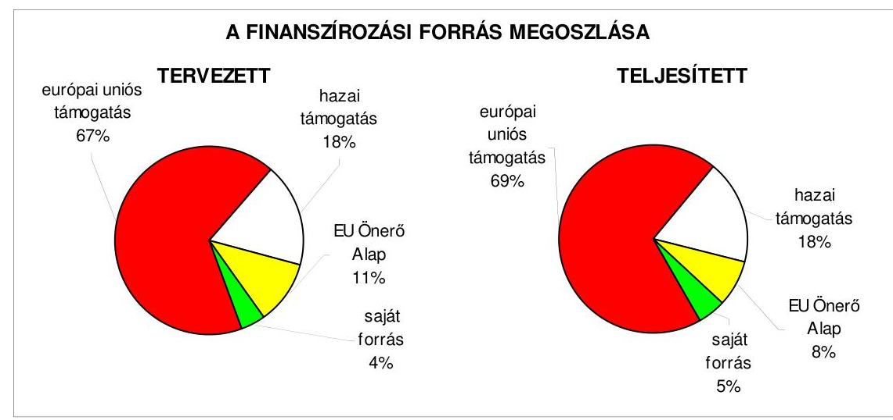

A Déli autóbusz pályaudvar építése esetében az EU Önerő Alap támogatás 78 millió Ft-ról 47,5 millió Ft-ra csökkent, összességében ez okozta a tervezett forrásösszetétel változását.

# 2.1.2. Az európai uniós forrásokhoz kapcsolódóan a pályázatfigyelés, a pályázatkészítés, valamint az európai uniós támogatással megvalósuló fejlesztés lebonyolításának belső rendje, a végrehajtás és az ellenőrzés szervezettsége 

Az európai uniós források igénybevételének és felhasználásának önkormányzati szintű feladatait a Polgármesteri hivatal ügyrendjében, a 2003. évben kiadott pályázati szabályzatban és az azt felváltó, a 2010. évtől hatályos pályázási rendben, valamint a köztisztviselők munkaköri leírásaiban határozták meg.

A Polgármesteri hivatal ügyrendje az EKF program végrehajtásával összefüggő hivatali adminisztráció központjaként a Tisztségviselői kabinetet határozta meg, megbízta a koordinációs, szervező, adminisztrációs tevékenység ellátásával, az EKF program hivatali kommunikációjával. A Városfejlesztési főosztály szervezi meg az EKF fejlesztési ügyek közgyűlési előterjesztésének elkészítését, támogatja az előkészítő, lebonyolító és koordináló feladatokat ellátó Pécs 2010. Menedzsment Központ Kht. ügyeit.

A Stratégiai Tervezési osztály feladataként határozták meg a Polgármesteri hivatal felkészítését a Kohéziós és Strukturális Alapokból elnyerhető pályázatok fogadására, a projekt végrehajtó egységeinek megszervezésére és a szakmai támogatást biztosító háttér kialakítására. Az osztály gondoskodik projektek szakmai megvalósításának nyomon követéséről és a projekt menedzsment szakmai támogatásáról.

Az Önkormányzatnál a 2003. évtől szabályozták az európai uniós források igénybevételére vonatkozó eljárásrendet. A pályázati szabályzat tartalmazta a pályázatfigyelést, a pályázat elkészítésének és benyújtásának folyamatát, a támogatási szerződés megkötése, a megvalósítás, beszámolás és pénzügyi lebonyolítás feladatait. Az önkormányzati fenntartású intézmények pályázatairól külön fejezetben rendelkezett a pályázati szabályzat.

---

A pályázati szabályzatban a pályázati lehetőségek felkutatását, figyelését a főosztályok feladataként határozták meg. A főosztályokon a pályázatfigyeléssel megbízott felelősöket a főjegyző hozzájárulásával a főosztályvezető jelölte ki. A pályázatfigyeléssel kapcsolatos feladatokat az érintett munkavállalók munkaköri leírásaiba beépítették. A pályázati szabályzat meghatározta, hogy a támogatási szerződésben foglaltak alapján a támogatási szerződésben vállalt feladatok végrehajtásáért a projektmenedzser a felelős. A projektmenedzser feladataként határozták meg a program megvalósítása menetének kidolgozását, a megvalósításba bevont külső szakértők és partnerek megnevezését, valamint azt, hogy gondoskodjon a vállalkozási szerződések elkészítéséről. A pályázati szabályzatban az európai uniós pályázatok nyilvántartását szabályozták, azonban a Polgármesteri hivatalnál nem, csak az intézményi pályázatok esetében rendelkezett a főjegyző a pályázatok nyilvántartásáról, a feladattal az intézmények szakmai irányítását ellátó főosztályokat bízta meg. A pályázati szabályzat meghatározta a pályázatfigyelést végzők és a döntés-előterjesztési jogkörrel (pályázat tárgyköre szerint illetékes főosztály és főjegyző) rendelkezők közötti információ-szolgáltatás kötelezettségét.

A 2010. január 25-től hatályos pályázási rend a pályázati szabályzatban foglaltakon túlmenően tartalmazta az Önkormányzat gazdasági társaságaira vonatkozó szabályokat, és rendelkezett a pályázati adatok nyilvántartásáról. A pályázási rend minden pályázatra vonatkozóan (Polgármesteri hivatal, intézmények, gazdasági társaságok) szabályozta a pályázatok elektronikus nyilvántartásának kötelezettségét. A pályázási rend 4. számú mellékletében rögzítették az elektronikus nyilvántartási rendszerben gyűjtött adatok körét. Az elektronikus nyilvántartásban a projektmenedzser, valamint a főosztályvezető és az általa kijelölt munkatárs rögzíthet, illetve módosíthat. A pályázási rend szabályozta a nyilvántartásba felvitt adatok megőrzési idejét és a nyilvántartás adatbázisához hozzáférők körét.

A pályázási rend szerint amennyiben a projekt nagysága, összetettsége indokolja, az előkészítésre vonatkozó projektmenedzseri feladatok ellátásával külső szervezet is megbízható közgyűlési jóváhagyással, de kapcsolattartásra és ügyintézésre ekkor is kell jelölni projektmenedzsert a főosztályon.

A Polgármesteri hivatalban kialakították a pályázatfigyelés szervezeti kereteit, biztosították személyi feltételeit. A pályázatfigyelést a Stratégiai és Tervezési osztály stratégiai tervezői és a pályázat-előkészítő csoport projektmenedzserei, a Humán főosztály és a Városfejlesztési főosztály munkatársai látták el. A pályázatfigyelési feladattal megbízott ügyintézők munkaköri leírásaiban szerepeltették a pályázatfigyelési feladatokat. Az Önkormányzat pályázatfigyeléssel kapcsolatos feladatok ellátására külső személyt, szervezetet nem bízott meg.

A pályázatkészítés személyi, szervezeti feltételeit a Polgármesteri hivatalban kialakították, külső szervezetet pályázatkészítési feladattal a 2007-2010. években egy esetben bíztak meg. A pályázatkészítés feladatait a főosztályok végezték el. A pályázatkészítéssel kapcsolatos feladatok az erre megbízottak munkaköri leírásaiban szerepeltek.

Az Önkormányzat „környezetvédelmi célú informatikai fejlesztések a közigazgatásban (e-környezetvédelem)" című KEOP - 6.3.0. /1/F című pályázat elkészí-

---

tésével bízott meg külső szervezetet. A megbízási szerződésben előírták a pályázat tartalmi és formai követelményeinek biztosítására, valamint a pályázat céljának (számszerűsíthető eredmények, indikátorok) meghatározására vonatkozóan a pályázatkészítő felelősségét.

A Polgármesteri hivatalban a fejlesztési feladatok lebonyolításának személyi, szervezeti feltételeit kialakították. A fejlesztési feladatok lebonyolítását a programért felelős főosztályok látták el. A projektmenedzsert főjegyzői hozzájárulással a főosztályvezető nevezi ki. A projektmenedzsmentben részt vevő felelős személyeket (pénzügyi, monitoring tevékenységet végző, kapcsolattartásért felelős szakembereket) az érintett főosztályok vezetői javaslata alapján a főjegyző jelölte ki. A felelős személyek munkaköri leírásaiban az elvégzendő feladatok beépítésre kerültek.

A fejlesztési feladatok lebonyolítására vonatkozóan a KEOP - 6. 3. 0. /1/F pályázat esetében kötöttek megbízási szerződést 2009. október 1-jén külső szervezettel. A lebonyolításra kötött szerződésben előírták a támogatott célkitúzés megvalósításának követelményét, a kapcsolattartás rendjét, a megbízott munkájának folyamatos - a Stratégiai Tervezési osztály általi - ellenőrzését, és meghatározták a személyre szóló felelősségi szabályokat.

A belső ellenőrzési stratégiát és az ellenőrzési terveket megalapozó kockázatelemzések kiterjedtek az európai uniós forrásokkal támogatott fejlesztési feladatokra. A 2007-2010. évi ellenőrzési tervek az európai uniós forrással támogatott projektek ellenőrzési feladatait előírták, kiemelten az EKF projektek, valamint a Pécs 2010. Menedzsment Központ Kht. ellenőrzési feladatait.

# 2.1.3. Egy támogatási szerződésben foglalt célkitúzés megvalósítása, múködtetése 

Az Önkormányzat 2004. augusztus 1-én pályázatot nyújtott be a GVOP-20044.3.1. „Dél-dunántúli Régió Elektronikus Közigazgatási szolgáltatásainak fejlesztése" címmel. A támogatási szerződést 2005. február 14-én kötötték meg. A projekt támogatási szerződés szerinti teljes bekerülési költsége 617,5 millió Ft, amelyből ez európai uniós támogatás 403,1 millió Ft, hazai társfinanszírozás 134,4 millió Ft, a saját forrás 80,0 millió Ft volt.

A támogatási szerződést hat alkalommal módosították. Az 5. számú módosítás a közreműködő szervezet, az IT Információs Társadalom Kht. kezdeményezésére történt ${ }^{36}$. A támogatási szerződésben a projekt befejezési határidejét módosították 2006. július 31-ről 2006. december 8-ára. A támogatási szerződés 1. számú mellékletét képező pályázat tartalmazta a megvalósításra kerülő projekt tartalmát. A projekt megvalósíthatóságának számszerűsíthető eredményét nyolc indikátor alapján határozták meg.

[^0]
[^0]:    ${ }^{36}$ A KEHI az Önkormányzatnál végzett - a projekt megvalósítására irányuló - helyszíni ellenőrzése során megállapította, hogy a támogató szervezet a támogatási szerződésben a projekt befejezési határidejét nem a jogszabályi előírásoknak megfelelően állapította meg és javasolta a támogatási szerződés haladéktalan módosítását.

---

Az Önkormányzat a támogatási szerződésben előírt célkitűzéseket megvalósította. Kialakították az e-közgyűlést, bevezették az integrált informatikai rendszert, az ügyfélkapus csatlakozás beindult, elérhetők lettek interneten a szolgáltatások. A támogatási szerződésben meghatározott indikátorokat a szerződés szerinti tartalommal valósították meg. A 3. szintű ügyintézési szolgáltatások száma 0 -ról 7 -re nőtt, a KKV részére nyújtott elektronikus szolgáltatások száma 10 lett a fejlesztés eredményeként.

A projekt a támogatási szerződésben rögzített „projekt költségvetés" szerinti kiadási keretösszeget meghaladó ráfordítással teljesült. A projekt tényleges bruttó költsége 619018134 Ft volt. A támogatási szerződésben elszámolható költséget 617513000 Ft-ban határozták meg, az Önkormányzat a kiadási keretösszeget meghaladó ráfordítást, saját forrásból fedezte. Az Önkormányzat a projektet a támogatási szerződésben meghatározott befejezési határidőig megvalósította. A zárójelentés mellékletét képező nyilatkozatban a polgármester nyilatkozott, hogy „a fejlesztési projekt lezárult az ügyfélkapu kialakítása sikerült, a rendszer 2006. december 4-étől éles üzemben múködik."

A belső ellenőrzés 2009. április 21. és május 8., illetve november 10. és 16. között vizsgálta a projekt eredményeként megvalósult e-közigazgatás működését. A belső ellenőrzés az e-közgyűlés esetében megállapította, hogy a modul adottságai nincsenek kihasználva, mivel a képviselőknek csak egy része fogadja el az elektronikusan megküldött anyagokat. Az adóügyi modell esetében megállapították, hogy a 17717 iparúzési adó fizetésére kötelezett vállalkozásból 5107 adott be elektronikus adóbevallást. Az elektronikus iktatás ügyiratkezelésének működését a jogszabályi előírásoknak megfelelőnek ítélték. Az ellenőrzésekről készült jelentésben a projekt megvalósításával, illetve múködésével kapcsolatosan intézkedést igénylő megállapítást nem tettek.

A közremúködő szervezet, az IT Információs Társadalom Kht. négy alkalommal végzett helyszíni ellenőrzést az Önkormányzatnál az európai uniós forrásból támogatott projekt megvalósításával kapcsolatosan.

A projekt megvalósítását a KEHI 2006. szeptemberében ellenőrizte. Az ellenőrzési jelentés megállapította, hogy a támogatási szerződésben tévesen került rögzítésre a projekt legkésőbbi befejezésére előírt határidő, valamint ehhez kapcsolódóan az utolsó kifizetési kérelem benyújtására előírt határidő, amelyek haladéktalan módosítását javasolták. A jelentés az összegző megállapításaiban a projekt megkezdésétől számított két éven belüli végső határidőt, a 2006. december 8-ai befejezést kockázatosnak ítélte meg, a központi kormányzati portálra történő csatlakozás nehézségei és a jogszabályban előírtnál rövidebb határidő miatt. Az Önkormányzat az ellenőrzés megállapítását figyelembe véve a közremúködő szervezetnél kezdeményezte 2006. október 25 -én a határidő módosítását. A közremúködő szervezet a KEHI ellenőrzés határidőre vonatkozó megállapításait figyelembe véve saját hatáskörben a jogszabályban előírtak szerint módosította a támogatási szerződést.

Az ÁSZ a V. - 26.041/2005. számú programban foglaltak alapján a Nemzeti Fejlesztési Terv megvalósításának ellenőrzése keretében vizsgálta a támogatott célkitúzés megvalósítását.

---

A külső ellenőrzések a projekt megvalósításával kapcsolatosan szabálytalanságra vonatkozó, intézkedést igénylő megállapításokat nem tettek, visszafizetési kötelezettséget nem állapítottak meg.

Az Önkormányzat a támogatási szerződés szerinti célkitúzés megvalósítását követően a kialakított rendszer működtetéséről folyamatosan gondoskodott, a működtetés feltételeit biztosította. Az Önkormányzat informatikai feladatainak hatékonyabb ellátására, az európai unió által meghatározott információs társadalommal kapcsolatos közreműködésre 2007. novemberében együttműködési megállapodást kötött az EU Net 2000 Regionális Informatikai Közhasznú társasággal. A társaság működteti az Önkormányzat www.pecs.hu hivatalos honlapját.

A támogatási szerződés a projekt működtetésével kapcsolatosan kiadási összeget nem határozott meg, az Önkormányzat a támogatási szerződés szerint a működtetés biztosítására a fedezetet a költségvetési rendeletében biztosította.

Az Önkormányzat 2007-2009 között eredményesen készült fel belső szabályozottság és szervezettség terén az európai uniós források igénybevételére és felhasználására, továbbá megvalósította a támogatási szerződésben foglalt fejlesztési célkitűzést. A gazdasági programban, az ágazati, szakmai koncepciókban, tervekben megfogalmazott fejlesztési célkitűzésekhez kapcsolódtak az európai uniós támogatások, szabályozták a pályázatfigyelést végzők és a döntési, illetve a döntés előterjesztési jogkörrel rendelkezők közötti információszolgáltatási kötelezettséget, továbbá kiterjedt az európai uniós forrásokkal támogatott fejlesztési feladatokra a belső ellenőrzési stratégiát megalapozó kockázatelemzés. A Polgármesteri hivatalon belül biztosították a pályázatfigyelés, a pályázatkészítés és a fejlesztési feladatok lebonyolításának szervezet és személyi feltételeit. Egy pályázat esetében külső szervezet igénybevételével biztosították a pályázatkészítés és a fejlesztési feladatok lebonyolítását. A pályázatkészítésre kötött szerződésben meghatározták a külső szervezetnek a pályázat szakmai és formai követelményeire vonatkozóan a pályázatkészítő felelősségét, valamint előírták a fejlesztési feladat lebonyolítását végző ellenőrzési kötelezettségeit, továbbá a támogatási szerződésben foglalt határidőre az ellenőrzött projekt esetében a célkitűzést megvalósították.

# 2.2. Az elektronikus közszolgáltatás feltételeinek kialakítása 

Az Önkormányzat a 2007-2013 közötti időszakra informatikai stratégiával rendelkezett ${ }^{37}$. Az informatikai stratégia helyzetelemzése a meglévő infrastruktúrából és a kialakított e-közigazgatási rendszer értékeléséből indult ki és megfogalmazta a hat éves időszakra vonatkozó fejlesztési célokat és prioritásokat.

[^0]
[^0]:    ${ }^{37}$ Az informatikai stratégiát a Közgyűlés az 579/2007. (XII. 13.) számú határozatával fogadta el.

---

Az I. prioritásnak a modern európai szintű informatikai rendszer, a II. prioritásnak a szolgáltató önkormányzat megteremtését, a III. prioritásnak a minőségi kultúrát és innovációt, a IV. prioritásnak a komplementaritást fogalmazták meg.

A megvalósítandó célok között az ASP rendszer kialakítását, informatikai akadálymentesítést és digitális portfólió kialakítását irányozták elő. Az elektronikus közszolgáltatás fejlesztésénél nem határozták meg a fejlesztések eredményeként megvalósuló elektronikus szolgáltatási szinteket.

Az Önkormányzat a 2007-2010. évek között ÁROP, EKOP keretében kiírt eközszolgáltatás fejlesztésére kiírt támogatásra nem pályázott.

Az e-közszolgáltatási ellátás személyi feltételeit a Polgármesteri hivatalnál az Informatikai osztályon és vállalkozási szerződés keretében biztosították. Az Önkormányzat az e-közszolgáltatási feladatokat a saját számítógépes informatikai rendszerével és vásárolt programmal valósította meg. Az Önkormányzat elektronikus ügyintézést kizáró rendeletet nem alkotott.

Az Önkormányzat az állampolgárok vonatkozásában az e-közszolgáltatást a szociális juttatások, támogatások fizetése, helyi adózás és egyéb ügykörben 2., a gépjárműadó, helyi adózás, valamint a múködési és telephelyengedélyek esetében 3. elektronikus szolgáltatási szinten múködteti. A vállalkozások vonatkozásában iparűzési adó, gépjárműadó és engedélyek esetében 3., egyéb ügykörben 2. elektronikus szolgáltatási szinten múködtetik az e-közszolgáltatást.

A Polgármesteri hivatalnál az e-közszolgáltatási feladatokat ellátó informatikai rendszer ügyfelek általi igénybevételét figyelemmel kísérték. Az Önkormányzat Kommunális bizottsága a 2008. évben értékelte az e-közszolgáltatási feladatokat ellátó informatikai rendszer ügyfelek általi igénybevételét és annak tapasztalatait.

A közvetlen kétoldalú ügyintézés feltételeit az Önkormányzatnál nem biztosították, mivel az e-közszolgáltatáshoz kapcsolódó meglévő program állomány fejlesztését a pénzügyi források hiánya akadályozta.

Az Önkormányzat 2007. január 1-jétől az Eisztv 21. § (3) bekezdése alapján kötelezett a közérdekú adatok közzétételére. Az Önkormányzat honlapján nem a 18/2005. (XII. 27.) IHM rendelet 2. § (1) bekezdésében előírtaknak megfelelően helyezték el a közzétételi listára előírt adatokat tartalmazó jegyzékre utaló hivatkozást. A jogzabályban előírt „Közérdekú adatok" elnevezés helyett az Önkormányzat az „Üvegzseb" megnevezést használta. A közérdekú adatok közzétételére vonatkozó kötelezettség teljesítésekor az Önkormányzat a gazdálkodási adatok esetében a honlapján nem a 18/2005. (XII. 27.) IHM 2. § (1)-(3) bekezdésben meghatározott szerkezeti rendnek megfelelően járt el.

A közbenső egyeztetés során a polgármester által tett észrevétel szerint: „A http://gov.pecs.hu/ oldalon az Eisztv. alapján a közzétételi listára elöirt adatok a „Polgármesteri Hivatal/Közérdekú adatok" menüpontja alatt érhetők el. Az oldal a 18/2005. (XII. 27.) IHM 2. § (1)-(3) bekezdésekben foglalt szerkezeti rendnél bővebb információkat tartalmaz. A honlap struktúrájából adódóan ezek az információk a „Közérdekú adatok" elnevezés mellett „Közérdekú információk" megnevezéssel, valamint az „Önkormányzat", illetve a „Képviselői munka dokumentumai" menüpontok alatt találhatók

---

meg. A hivatkozott rendelet 3. § (1) és (3) bekezdései lehetővé teszik az ilyen jellegü eltérést, melyet az Önkormányzat által használt honlap szerkezeti felépitése és az alkalmazott technológia tesz szükségessé. Az „Üvegzseb" megnevezésű nyilvántartás a közbeszerzésekkel, a támogatási szerződésekkel, céljellegü müködési és fejlesztési támogatásokkal, átadott pénzeszközökkel kapcsolatos adatokat tartalmazza. Az Áht. 15/A. § (1) bekezdésében előirt közzétételi kötelezettségnek a honlapon egyrészt az „Üvegzseb/Tájékoztató Pécs Megyei Jogú Város Önkormányzata által nyújtott céljellegü müködési és fejlesztési támogatásokról" menüpontja alatt, másrészt az „Üvegzseb/Támogatási szerződések nyilvántartása" menüpontja alatt tesz eleget. A nyilvántartás itt is bővebb adattartalmú, mint amit a jogszabály kötelezővé tesz.(céljellegü müködési és fejlesztési támogatások: 2008. év: 507 db, 2009. év: 126 db, 2010. év: 125 db, míg támogatási szerződések: 2008. év. 484 db, 2009. év: 536 db, 2010. év: 218 db) Az Ámr. 22. számú mellékletében írt kötelezően közzéteendő adatokat a Pénzügyi főosztály bocsátja az Informatikai osztály rendelkezésére. A kapott anyagok kerülnek publikálásra az „Önkormányzat/Képviselöi munka dokumentumai"menüpont alatt. Az Üvegzseb elnevezésű link hasonló tartalommal kerül meghatározásra, mint a Pénzügyminisztérium honlapjának kezdő oldalán található „PM Üvegzseb" elnevezésű link"

Az észrevétel nem megalapozott, mivel a hivatkozott 18/2005. (XII. 27.) IHM 2. § (1) bekezdése szerint a közzétételre szolgáló honlap megnyitásakor megjelenő oldalon az adatközlő köteles elhelyezni a közzétételi listák által előírt adatokat tartalmazó jegyzékre vagy felületre (a továbbiakban: jegyzékre) mutató hivatkozást. A hivatkozást jól látható módon kell elhelyezni, „Közérdekü adatok" elnevezéssel. A jogszabály a közérdekú adatok elnevezést határozta meg, nem az Önkormányzat által használt Üvegzseb elnevezést. A hivatkozott jogszabályhely (3) bekezdése értelmében a különös és egyedi közzétételi listák szerinti adatokat tartalmazó közzétételi egységeket - azok tartalmától függően - az 1. melléklet szerinti tagolásban kell közzétenni. Az ellenőrzés nem kifogásolta azt, hogy az Önkormányzat az előírt szerkezeti rendnél bővebb információkat is közzétett, kizárólag azt, hogy azokat a jogszabályban előírt „Közérdekü adatok" elnevezés helyett „Üvegzseb" elnevezéssel és nem az előírt tagolásban tette közzé. A nem megfelelő elnevezésű és tagolású közzététel megnehezíti az állampolgárok közérdekú információkhoz való jutását.

Az Önkormányzat a 200000 Ft alatti támogatások közzétételének mellőzését a 2008-2009. évi költségvetési rendeleteiben lehetővé tette.

A főjegyzö az Áht. 15/A. § (1) bekezdésének előírását megsértette, mivel nem tette közzé teljes körüen az Önkormányzat által nyújtott céljellegü müködési és felhalmozási célú támogatásokat, azok 30\%-ának adatai nem szerepeltek az Önkormányzat honlapján.

A közbenső egyeztetés során a polgármester által tett észrevétel szerint: „A 2009. évben a hivatali kapura vonatkozóan jelent meg a 224/2009. (X. 14.) Korm. rendelet. A hivatali kapu teszi lehetővé, hogy hitelesen és a küldés tényét bizonyitani képes módon tudjanak elektronikus dokumentumok útján kommunikálni a csatlakozott közigazgatási szervezetek az állampolgárokkal és a többi csatlakozott szervezettel. 2010. évben terveztük a hivatali kapu és az e-önkormányzati rendszer illesztésének szinkronizálását. Időközben, 2009. november 30-án jelent meg a DDOP-2009.3.1.4. kódszámú Eközigazgatási rendszer fejlesztését célzó pályázati kiírás is. Jelenleg a „Dél-dunántúli regionális e-önkormányzati szolgáltató központ kialakítása Pécsen és önkormányzatok csatlakoztatása" címü nyertes pályázat megvalósitása van folyamatban, melynek során megvalósul az integrált rendszer. A jelentés azon megfogalmazása, hogy „az önkormányzat az elektronikus ügyintézést kizáró rendeletet nem alkotott" félreérthető. Az önkormányzat ugyanis megalkotta a közigazgatási hatósági eljárásban elektronikus úton

---

is gyakorolható eljárási cselekményekről szóló 29/2005. (10. 20.) számú rendeletét. Teljesen téves és megalapozatlan a jelentés azon állítása is, hogy "a főjegyzö nem tette közzé az önkormányzat által nyújtott céljellegú müködési és felhalmozási célú támogatások 30\%-át az önkormányzat honlapján. A közzétételre a 4. pontban írt észrevételeknek megfelelően teljes egészében sor került."

Az észrevétel nem megalapozott, mivel a vizsgálati kérdés arra irányult, hogy az Önkormányzat alkotott-e olyan rendeletet, amelyben kizárja az elektronikus ügyintézés lehetőségét. Ilyen rendeletet azonban az Önkormányzat nem alkotott. Az ellenőrzés során mintavételi eljárással kiválasztott 10, az Önkormányzat által nyújtott céljellegú működési és felhalmozási célú támogatás közzétételét ellenőriztük. A kiválasztott 10 tétel közül három támogatás adatainak közzététele nem szerepelt az Önkormányzat honlapján a helyszíni vizsgálat befejezéséig. Nem tették közzé a Pécsi Vízmú Zrt. számára nyújtott 1148 ezer Ft-os müködési támogatás, a Pécs-pogányi Repülőteret múködtető Kft. számára nyújtott 54432 ezer Ft fejlesztési támogatás, a József utca 17/1. számú társasház számára homlokzat felújításhoz nyújtott 488 ezer Ft fejlesztési támogatás Áht. 15/A. § (1) bekezdésében meghatározott adatait. A mintavételes eljárás eredménye alapozta meg azt a megállapításunkat, hogy az Önkormányzat által nyújtott céljellegú múködési és felhalmozási célú támogatások 30\%-át nem tették közzé.

A főjegyző az Önkormányzat pénzeszközei felhasználásával, a vagyonnal történő gazdálkodással összefüggő, a nettó öt millió Ft-ot elérő, vagy azt meghaladó összegű árubeszerzésre, építési beruházásra, szolgáltatás megrendelésére, vagyonértékesítésre vonatkozó szerződések megnevezését, típusát, tárgyát a szerződést kötő felek nevét, a szerződés értékét, a határozott időre kötött szerződések esetében annak időtartamát a honlapon közzétette az Áht. 15/B. § (1) bekezdésében foglaltaknak megfelelően.

A főjegyzö a 2006-2009. évi költségvetési beszámolók szöveges indokolását az Ámr.; 157/D. § (1) bekezdésében hivatkozott 22. számú melléklet 1.2.5. pontjában előírtak ellenére ${ }^{38}$ nem tette közzé az Önkormányzat honlapján.

A közbenső egyeztetés során a polgármester által tett észrevétel szerint: „A beszámolók szöveges indoklása az Önkormányzat hivatalos honlapján (az e-ügyintézés Pécs portálon), az Önkormányzat, Képviselöi munka dokumentumai, előterjesztések menőpontokon belül megtalálhatók, azok nyilvánosak."

Az észrevétel nem megalapozott, mivel a költségvetési beszámoló közgyűlési előterjesztésének szöveges indoklását tették közzé a honlapon a hivatkozott menüpontban, azonban nem ezt, hanem az Ámr.; 157/D. (1) bekezdésében hivatkozott 22. számú melléklet 1.2.5. pontja szerinti, a költségvetési beszámoló Áhsz. 40. § (1) bekezdésében előírt szöveges indoklását kellett volna közzétenni az Önkormányzat honlapján. Ezt a hiányosságot a 2009-ben végzett belső ellenőrzési jelentés is tartalmazta.

[^0]
[^0]:    ${ }^{38}$ 2010. január 1-jétől az Ámr. ${ }_{2}$ 233. § (1) bekezdés és e kormányrendelet 22. mellékletének 2. pontja tartalmazza a közzétételre vonatkozó előírást.

---

# 3. A KÖLTSÉGVETÉSI GAZDÁLKODÁS BELSŐ KONTROLLJAI 

### 3.1. A költségvetés tervezés, a gazdálkodás és a zárszámadás készítés folyamatában végrehajtandó belső kontrollok kialakítása

A költségvetés-tervezési és a zárszámadás-készítési folyamatok szabályozásának hiányosságai magas kockázatot jelentettek a feladatok szabályszerű végrehajtásában, mert a főjegyző - az Ámr. ${ }_{1}$ 145/A. § (1)-(2) bekezdései és az Ámr. ${ }_{1}$ 145/B. § (1) bekezdése ${ }^{39}$ előírása ellenére - nem alakította ki a költségvetés tervezés és a zárszámadás készítés ellenőrzési feladatait:

- nem szabályozta annak ellenőrzését, hogy a Polgármesteri hivatalban a költségvetési javaslatot az Ámr. ${ }_{1}$ előírásainak megfelelően dolgozták-e ki, a javasolt előirányzatok megalapozottak-e, az ismert kötelezettségeket meg-tervezték-e, a költségvetési tervezéshez készített intézményi mutatószám felmérés adatai a szociális feladatokat ellátó intézmények, valamint a Tűzoltóság esetében megalapozottak-e, a Polgármesteri hivatal szervezeti egységei által benyújtott költségvetési igények indokoltak-e, teljesíthetőek-e, a saját bevételek közül a helyi adó bevételek és egyéb szolgáltatási díjak előirányzatai és a költségvetés megalapozását szolgáló helyi rendeletek összhangja biz-tosított-e;
- nem írta elő az intézményi számszaki beszámolók belső, valamint annak a Közgyűlés által meghatározott adatszolgáltatással való összhangjának, továbbá az intézmények által az állami támogatásokkal, hozzájárulásokkal történő elszámoláshoz közölt mutatószámok adatai megbízhatóságának ellenőrzését.

A főjegyző - az Ámr. ${ }_{1}$ 145/A. § (1)-(2) bekezdései és Ámr. ${ }_{1}$ 145/B. § (1) bekezdése ${ }^{40}$ előírásai ellenére - nem alakította ki a Polgármesteri hivatalban a költség-vetés-tervezés és a zárszámadás-készítés folyamatában a belső kontrollokat. Az előzőekben bemutatott szabályozási hiányosságokért a főjegyzö a felelős. A belső kontrollrendszer megszervezéséért az Áht. 88. § (1) bekezdése e) pontjában foglaltak alapján, valamint a FEUVE rendszer létrehozásáért az Áht. 121. § (1) bekezdésében foglaltak alapján - az Áht. 66. §-a szerint a költségvetési szervként működő Polgármesteri hivatal Ötv. 36. § (2) bekezdése szerinti vezetője - a jegyző a felelős.

A közbenső egyeztetés során a polgármester által tett észrevétel szerint: „A költségvetés tervezési és beszámolási alapdokumentumok a Polgármesteri hivatalnál és az intézményeknél is teljes körüen elhelyezésre kerültek a költségvetést megalapozó dokumentumok között. Ebből egyértelmúen kiderül, hogy ellenőrzésre kerültek, majd az ellenőrzést követően javításra és feldolgozásra az egységes követelményeknek megfelelően. Mindez kétszer történik meg a tervezés időszakában, tekintve, hogy az első körös alapdokumentumok, ide értve a normatíva igénylésre szolgáló űrlapokat is nem reális igényeket tartalmaznak, így a javítást követően új adatok kerülnek végső soron feldolgozás-

[^0]
[^0]:    ${ }^{39}$ 2010. január 1-től az Ámr. ${ }_{2}$ 155-156. §-ai tartalmazzák a vonatkozó előírásokat.
    ${ }^{40}$ 2010. január 1-től az Ámr. ${ }_{2}$ 155-156. §-ai tartalmazzák a vonatkozó előírásokat.

---

ra. Mindkét úgynevezett fordulóban külön bevételi táblák alapján biztosított a bevételek és kiadások összehasonlíthatósága és ilyen formában történő hiány, illetőleg finanszírozás alakítás is. Az intézményi költségvetési beszámolók számszaki szabályozásának hiányával kapcsolatosan rögzítjük, hogy az Önkormányzatnál kialakult gyakorlat a K11nek megfelelő adatszolgáltatás és ennek a feldolgozása, de a számszerü adatok mellett még külön kiegészítésre kerül a szükségesnek tartott egyéb információkkal."

Az észrevétel nem megalapozott, mert az a költségvetési tervezés és zárszá-madás-készítés gyakorlatára hivatkozik, és nem ad magyarázatot az általunk kifogásolt szabályozásbeli hiányosságokra. Fenntartjuk azt a megállapításunkat, hogy a költségvetés-tervezési és a zárszámadás-készítési folyamatok szabályozásának hiányosságai magas kockázatot jelentettek a feladatok szabályszerű végrehajtásában, mivel a jogszabályi előírások - az Ámr. ${ }_{1}$ 145/A. § (1)-(2) bekezdései és az Ámr. ${ }_{1}$ 145/B. § (1) bekezdése - ellenére a költségvetési tervezés és a zár-számadás-készítés ellenőrzési feladatait a Polgármesteri hivatal vonatkozásában a belső szabályozásokban, munkaköri leírásokban nem írták elő.

A főjegyző a feltárt hiányosságokat megszüntette, a feladatokat 2010 március-ában az érintett dolgozók munkaköri leírásában rögzítette.

# A gazdálkodási, a pénzügyi-számviteli és a folyamatba épített ellen- 

őrzési feladatok szabályozásának hiányosságai közepes kockázatot jelentettek a feladatok megfelelő, szabályszerű végrehajtásában, mivel a főjegyző a Polgármesteri hivatal ügyrendjében a költségvetési szerv nyilvántartási számát ${ }^{41}$, az alapítás időpontját, a gazdasági szervezet engedélyezett létszámát nem rögzítette; a szakmai teljesítés igazolás módjának szabályozása során nem írta elő, hogy a dátum és az arra jogosult személy aláírását fel kell feltüntetni; a polgármesterrel közösen kiadott pénzgazdálkodási szabályzatban szabályozta, azonban munkaköri leírásban nem határozta meg a pénzügyigazdasági területen foglalkoztatott köztisztviselők kötelezettségvállalás, utalványozás és ellenjegyzés, szakmai teljesítés igazolás ${ }^{42}$ feladatát; az értékelés szabályait a számviteli politikában rögzítette ${ }^{43}$, azonban ennek keretében nem írta elő a kis összegű követelések év végi értékelésének, az egyszerűsített értékelési eljárás alá vont követelések negyedévenkénti besorolásának elveit, dokumentálásának szabályait, az értékelések ellenőrzéséért felelős munkaköröket; a munkaköri leírásokban nem rögzítette az értékelések és azok ellenőrzésének, a felesleges vagyontárgyak minősítésének, a negyedévi egyeztetések és ellenőrzések feladatát; nem készítette el az önköltségszámítás rendjére vonatkozó belső szabályzatot és az ellenőrzési nyomvonalat.

A főjegyző a szabályzatok kiadásával és módosításával, valamint a munkaköri leírások kiegészítésével a hiányosságokat 2010. január és április hónapokban pótolta.

[^0]
[^0]:    ${ }^{41}$ A 2010. január 1-től hatályos Ámr. ${ }_{2}$ 20. § (2) bekezdés b) pontja alapján a szöveg a költségvetési szerv törzskönyvi azonosító számára változott.
    ${ }^{42}$ Kettő fő esetében a kötelezettségvállalás, utalványozás, egy fő esetében az ellenjegyzés, kettő fő esetében a szakmai teljesítés igazolás feladata hiányzott a munkaköri leírásokból.
    ${ }^{43}$ A főjegyző külön értékelési szabályzatot nem készített.

---

A közbenső egyeztetés során a polgármester által tett észrevétel szerint: „A megállapítások különböző dokumentumok összhangját és kereszthivatkozásait kérik számon, amely területen tényleg vannak apróbb hiányosságok, de ezek már 2010-ben pótlásra kerültek, és így biztosított, illetve a vizsgált időszakban is következetesen betartásra kerültek a tényleges cselekedetek, függetlenül a szabályozásban meglévő apróbb hiányosságtól."

Az észrevétel nem vitatja a számvevői jelentés megállapítását a gazdálkodással, a pénzügyi-számviteli és a folyamatba épített ellenőrzési feladatok szabályozottságának hiányosságaival kapcsolatban. A 2010. évi „pótlások" nem jelentik azt, hogy 2009. évben is „betartásra kerültek a tényleges cselekedetek".

A Polgármesteri hivatalban a Közgyűlés által elfogadott informatikai stratégiával és a főjegyző által kiadott informatikai biztonsági és üzemeltetési szabályzattal ${ }^{44}$ rendelkeztek, gondoskodtak az informatikával kapcsolatos szabályzatok megismertetéséről, a pénzügyi-számviteli feladatoknál használt programok adatai informatikai hálózaton keresztül elérhetők voltak és integrált pénzügyiszámviteli informatikai rendszert vezettek be. A pénzügyi-számviteli tevékenységhez kapcsolódó informatikai feladatok szabályozottsága összességében alacsony kockázatot jelentett az informatikai feladatok megfelelő, szabályszerű végrehajtásában, mivel a főjegyző a katasztrófa elhárítási tervet kiadta, a hozzáférési jogosultságokra vonatkozó eljárásrendet kialakította, a pénzügyi-számviteli program mentési eljárásait szabályozta. Annak ellenére összességében alacsony volt a kockázat, hogy a pénzügyi-számviteli rendszerből lekérhető ellenőrzési lista (napló) vizsgálatáért felelős személyt nem jelöltek ki.

A főjegyző 2010. április 1-i hatállyal kijelölte az ellenőrzési lista (napló) vizsgálatáért felelős személyt.

# 3.2. A belső kontrollok múködtetése a költségvetés tervezés, a gazdálkodás, és a zárszámadás készítés folyamataiban 

A Polgármesteri hivatalban a 2009. évben a költségvetés-tervezési és zár-számadás-készítési folyamatban a belső kontrollok múködésének megfelelősége gyenge volt, mert - a belső szabályozás hiánya miatt - az Ámr. ${ }_{1}$ 145/A. § (1)-(2) bekezdései és az Ámr. ${ }_{1}$ 145/B. § (1) bekezdése ${ }^{45}$ előírása ellenére nem végezték el annak ellenőrzését, hogy a Polgármesteri hivatalban a költségvetési javaslatot az Ámr. ${ }_{1}$ előírásainak megfelelően dolgozták-e ki, a javasolt előirányzatok megalapozottak-e, az ismert kötelezettségeket megter-vezték-e, a költségvetési tervezéshez készített intézményi mutatószám felmérés adatai a szociális feladatokat ellátó intézmények, valamint a Tűzoltóság esetében megalapozottak-e, a Polgármesteri hivatal szervezeti egységei által benyújtott költségvetési igények indokoltak-e, teljesíthetőek-e, a saját bevételek közül a helyi adó bevételek és egyéb szolgáltatási díjak előirányzatai és a költségvetés megalapozását szolgáló helyi rendeletek összhangja biztosított-e; nem vizsgál-

[^0]
[^0]:    ${ }^{44}$ A főjegyző az informatikai biztonsági és üzemeltetési szabályzatot 2006. július 1-i hatállyal adta ki.
    ${ }^{45}$ 2010. január 1-től az Ámr. ${ }_{2}$ 155-156. §-ai tartalmazzák a vonatkozó előírásokat.

---

ták az intézmények által az állami támogatásokkal, hozzájárulásokkal történő elszámoláshoz közölt mutatószámok adatainak megbízhatóságát, az intézményi számszaki beszámolók belső, valamint annak a Közgyűlés által meghatározott adatszolgáltatással való összhangját.

A főjegyző - az Ámr. ${ }_{1}$ 145/A. § (1)-(2) bekezdései és az Ámr. ${ }_{1}$ 145/B. § (1) bekezdése ${ }^{46}$ előírásai ellenére - nem határozta meg és a szabályozás hiányosságai miatt nem múködtette a Polgármesteri hivatalban a költségvetés-tervezés és a zárszámadás-készítés folyamatában a belső kontrollokat. Az előzőekben bemutatott hiányosságokért a főjegyzö a felelős. A belső kontrollrendszer megszervezéséért és hatékony működtetéséért az Áht. 88. § (1) bekezdése e) pontjában ${ }^{47}$ foglaltak alapján, valamint a FEUVE rendszer létrehozásáért, működtetéséért az Áht. 121. § (1) bekezdésében foglaltak alapján - az Áht. 66. §-a szerint a költségvetési szervként múködő Polgármesteri hivatal Ötv. 36. § (2) bekezdése szerinti vezetője - a jegyző a felelős. A főjegyző a Polgármesteri hivatalban a költségvetés-tervezés és a zárszámadás-készítés folyamatában a belső kontrollok kialakítását, működtetését elmulasztotta, ennek ellenére az Ámr. ${ }_{1}$ 23. számú mellékletben ${ }^{48}$ előírt formában - jogi felelőssége tudatában - úgy nyilatkozott, hogy az előírásoknak megfelelően gondoskodott a Polgármesteri hivatalban a belső kontroll rendszerek szabályszerű, hatékony, eredményes és gazdaságos múködéséről.

A közbenső egyeztetés során a polgármester által tett észrevétel szerint: „A hivatalban a FEUVE rendszer kialakítása a vonatkozó jogszabályi előirásoknak megfelelően a vizsgált időszakot - 2009. évet - megelőzően megtörtént. A Polgármesteri hivatal 2006. február 1-től hatályos ellenőrzési nyomvonala, - mely a FEUVE rendszer részét képezte - tartalmazta a költségvetés tervezésével, illetve annak végrehajtásával kapcsolatos ellenőrzési pontokat. A nemzetközi elöírásokhoz igazodva 2009. január1-től a FEUVE korábbi elemei közül a szabálytalanságkezelés továbbra is a FEUVE része maradt, viszont az ellenőrzési nyomvonal a kontroll környezet része lett, a kockázatkezelés pedig kiemelt önálló elemmé vált. Az Ámr. módosításaként megjelent 327/2008. (XII. 30.) Korm. rendelet 55-56. §-ai rendelkeztek a „Belső kontrollok rendszerén belül a FEUVE, illetve ellenőrzési nyomvonal kialakításáról. Ugyanezen Korm. rendelet 68. § (6) bekezdése a fenti szakaszok hatályba lépésének időpontjaként 2009. július 1. napját jelölte meg. Az Ámr. 145/A. § (1) bekezdése szerint a belső kontrollok kialakítása során a pénzügyminiszter által közzétett, az államháztartási belső kontroll standardokra vonatkozó irányelvet kell figyelembe venni. A 327/2008. (XII. 30.) számú Korm. rendelet 68. § (8) bekezdésének értelmében a pénzügyminiszter 2009. május 31-ig teszi közzé az államháztartási belső kontroll standardokra vonatkozó irányelvet. A pénzügyminiszter az államháztartási belső kontroll standardokról az 1/2009. (IX. 11.) számú PM irányelvet tette közzé, amely 2009. szeptember 16-án jelent meg a minisztérium honlapján. Az irányelv - a preambuluma szerint - útmutatóként szolgál a költségvetési szervek vezetői számára szervezetük belső kontroll rendszerének kialakítására vonatkozóan. Az Áht. 121. § (1) bekezdése szerint a költségvetési szerv vezetője az államháztartásért felelős miniszter által közzétett módszertani útmutató figyelembe vételével köteles kialakítani és múködtetni a FEUVE rendszert. A PM honlapján 2010. április 7-én jelent meg a belső

[^0]
[^0]:    ${ }^{46}$ 2010. január 1-től az Ámr. ${ }_{2}$ 155-156. §-ai tartalmazzák a vonatkozó előírásokat.
    ${ }^{47}$ A 2010. augusztus 15 -től hatályos Áht. 94. § (1) bekezdés e) pontja tartalmazza az előírást.
    ${ }^{48}$ A 2010. január 1-től az Ámr. ${ }_{2}$ 21. számú melléklete tartalmazza az előírt formát.

---

kontrollok kialakítását segitő módszertani útmutató. A fentiek alapján megállapítható, hogy a 2009. január 1.-június 30. közötti időszakban az ÁSZ jelentés-tervezetének 24. oldal 2. bekezdésében, az 55. oldal 4. bekezdésében, az 57. oldal 2. bekezdésében és 61. oldal 3. bekezdésében hivatkozott jogszabályi helyek nem jelentettek a jegyzőre vonatkozóan kötelezettséget a belső kontrollrendszerek kialakítását és múködtetését illetően. Tekintettel arra, hogy az Ámr. 145/A és 145/B 8 -ainak hatályba lépését követően, jelent meg a PM irányelv (2009. szeptember 16-án) és módszertani útmutató, így nem volt elvárható, hogy a hivatal vezetője a helyi szabályozást azok hiányában alakítsa ki és múködtesse. Ebből következően a vizsgált időszak végrehajtási rendeletének 23. számú mellékletére vonatkozó ÁSZ megállapítás nem megalapozott. Egyrészt a FEUVE rendszer a korábbi szabályoknak megfelelően 2006. február 1-től kialakításra került. (Dokumentumok ÁSZ ellenőrzésre átadva, anyaghoz csatolva). Másrészt az új rendszer kialakítására csak a PM módszertani útmutató megjelenését követően - 2010. április 7. után - volt lehetőség. Ennek alapján jelenleg az új rendszer kidolgozása van folyamatban. Megjegyzendő, hogy a „Szabálytalanságok kezelése", a „Kockázatkezelés" és az „Ellenőrzési nyomvonal" tárgykörében a jegyző 2009. január 1-i hatállyal új szabályzatot adott ki. Ezekkel a „Módszertani útmutató" hiányában (annak megjelenéséig) a jogszabályi változtatáshoz igazodóan alakította át a helyi szabályozást. (Szabályzatok csatolva)"

Az észrevétel nem megalapozott, mivel megállapításainkat a vizsgált időszakban hatályos jogszabályok alapján tettük. A belső pénzügyi ellenőrzés részeként a FEUVE kialakítását az Áht. 121. § (1) bekezdése már 2003. november 27-től, az ellenőrzési nyomvonal elkészítését az Ámr.; 145/B. § (1) bekezdése már 2004. január 1-től előírta. A FEUVE rendszer kialakítása és múködtetése során a PM módszertani útmutató alkalmazására vonatkozó előírás az Ámr.; 145/A. § (3) bekezdése alapján szintén 2004. január 1-től volt hatályos. A 2006. február 1-től hatályos ellenőrzési nyomvonal nem fedi le a Polgármesteri hivatal költségvetési tervezésre és a zárszámadás készítésére vonatkozó teljes munkafolyamatát. Átfogó, szervezeti egységekre vonatkozó feladatokat foglalt magában, nem tartalmazta a Pénzügyi főosztály dolgozóinak költségvetési tervezés és a zárszámadás-készítés során elvégzendő feladatait (mit és hogyan kell elvégezni), az előző múvelet ellenőrzési feladatait (a végzett munkafolyamat megfelel-e a jogszabályi előírásoknak, belső utasításoknak, valamint a folyamatos, hatékony és célszerű munkavégzés követelményeinek). A munkaköri leírások sem tartalmazták és más belső szabályzatban sem jelentek meg e feladatok, amelyek következménye, hogy a belső kontrollok a költségvetési tervezés és a zárszámadás-készítés során nem kerültek kialakításra, így nem működtek megfelelően. Az „Ellenőrzési nyomvonal" tárgykörében a főjegyző által 2009. január 1-i hatállyal kiadott új szabályzat a költségvetési tervezés és zárszámadás-készítés vonatkozásában a 2006. évi szabályozást változatlan formában tartalmazta. A Pénzügyi főosztály ellenőrzési nyomvonala csak 2010. január 27-én készült el, a költségvetési tervezés és a zár-számadás-készítés ellenőrzési feladataival a munkaköri leírásokat csak azok 2010. évi módosítása során egészítették ki.

A Polgármesteri hivatal az elemi költségvetésében a múködési és felhalmozási célú pénzeszközátadások államháztartáson kívülre teljesített kifizetéseire a 2009. évben 2877,2 millió Ft eredeti és 4345,3 millió Ft módosított előirányzatot tervezett, a 2009. évi teljesítés 3912,2 millió Ft volt. Az államháztartáson kívülre átadott pénzeszközök kiadásaiból a múködési célú pénzeszközátadások eredeti előirányzata $88,4 \%$-os, a módosított előirányzata $83,5 \%$ os, a teljesítés $87,2 \%$-os, a felhalmozási célú pénzeszközátadások eredeti előirányzata $11,6 \%$-os, módosított előirányzata $16,5 \%$-os, a teljesítés $12,8 \%$-os részarányt képviselt. A 2010. évi elemi költségvetésben az államháztartáson kívüli

---

pénzeszköz átadás kifizetéseire 3718,5 millió Ft eredeti előirányzat szerepelt, amelyből 75,9\%-ot működési célra, 24,1\%-ot felhalmozási célra tervezték átadni. A támogatási szerződésekben meghatározott célok összhangban voltak az Ötv. 8. § (1) bekezdésében foglalt önkormányzati feladatokkal ${ }^{49}$.

A Polgármesteri hivatalban a 2009. évben a működési és felhalmozási célú pénzeszközátadások államháztartáson kívülre teljesített kifizetései során a szakmai teljesítés igazolás és az utalvány ellenjegyzés múködésének megfelelősége gyenge volt, mert

- a szakmai teljesítés igazolására a főjegyző által kijelölt személyek ellenőrzési feladataikat a sport- és lakbértámogatásra, könyvkiadásra, érdekvédelmi szerv működési költségeire, kiállítások szervezésére nyújtott működési célú pénzeszközátadások kifizetését megelőzően - az Ámr. ${ }_{1}$ 135. § (1)-(2) bekezdéseiben ${ }^{50}$ és a pénzgazdálkodási szabályzat negyedik oldalán („A szakmai teljesités igazolása" című részben) előírtak ellenére - nem végezték el, nem ellenőrizték a kifizetések jogosultságát, összegszerűségét;
- az utalványok ellenjegyzője - az Ámr. ${ }_{1}$ 137. § (3) bekezdésének ${ }^{51}$ és a pénzgazdálkodási szabályzat első oldalán („Ellenjegyzés" címen), második oldalán („ellenjegyzők" címen) rögzített előírásai ellenére - a sport- és lakbértámogatásra, könyvkiadásra, érdekvédelmi szerv működési költségeire, kiállítások szervezésére nyújtott működési célú pénzeszközátadások kifizetését megelőzően aláírása ellenére nem győződött meg arról, hogy a kiadások jogosultságának, összegszerűségének ellenőrzése megtörtént-e, továbbá nem észrevételezte, hogy az érvényesítő az „érvényesitve" megjelölést nem alkalmazta, az Ámr. ${ }_{1}$ 134. § (9) bekezdés c) pontja ${ }^{52}$ és a pénzgazdálkodási szabályzat első oldalán („Ellenjegyzés" címen) rögzített előírás ellenére nem ellenőrizte a gazdálkodásra vonatkozó szabályok betartását, mivel nem kifogásolta, hogy a kötelezettségvállalásokat az Ámr. ${ }_{1}$ 134. § (8) bekezdésében ${ }^{53}$ előírtak ellenére nem előzte meg a kötelezettségvállalás ellenjegyzésére jogosult személyek belső szabályzatban előírt módon történő ellenjegyzése.

A Polgármesteri hivatal az elemi költségvetésében az állományba nem tartozók megbízási díjaival kapcsolatos kiadások fedezetére a 2009. évben 210,7 millió Ft eredeti és 280,2 millió Ft módosított előirányzatot tervezett. A 2009. évi teljesítés 224,5 millió Ft volt. A tervezett személyi juttatásokból az eredeti, a módosított előirányzat és a teljesítés a 2009. évben 10\%-os részarányt képviselt. A 2010. évi elemi költségvetésben 336,9 millió Ft eredeti előirányzatot

[^0]
[^0]:    ${ }^{49}$ A megfelelőségi teszt elvégzése során tételesen ellenőrzött támogatások sport, lakbértámogatás és kulturális feladatok ellátását szolgálták, a kifizetések dátumát, a gazdasági esemény megnevezését a megfelelőségi teszt tartalmazza.
    ${ }^{50}$ A 2010. január 1-től hatályos Ámr. ${ }_{2}$ 76. § (1) és (3) bekezdései tartalmazzák a szakmai teljesítés igazolás feladatát.
    ${ }^{51}$ A 2010. január 1-től hatályos Ámr. ${ }_{2}$ 79. § (2) bekezdése tartalmazza a feladatot.
    ${ }^{52}$ A 2010. január 1-től hatályos Ámr. ${ }_{2}$ 74. § (3) bekezdés c) pontja tartalmazza a feladatot.
    ${ }^{53}$ A 2010. január 1-től hatályos Ámr. ${ }_{2}$ 74. § (1) bekezdése tartalmazza a vonatkozó előírást.

---

terveztek, amely a tervezett személyi juttatások 2,4\%-a. Az előirányzat felhasználására vonatkozó megbízási szerződések tárgya ${ }^{54}$ összhangban volt az Önkormányzat által ellátott feladatokkal.

A Polgármesteri hivatalban a 2009. évben az állományba nem tartozók megbízási díjai kifizetései során a szakmai teljesítés igazolás és az utalvány ellenjegyzés múködésének megfelelősége gyenge volt, mert

- a szakmai teljesítés igazolására a főjegyző által kijelölt személyek ellenőrzési feladataikat a határozott idejű szerződéses jogviszony megszüntetése miatti juttatások, a faluház gondnok és a tervtanács tagja megbízási díjának kifizetését megelőzően - az Ámr. ${ }_{1}$ 135. § (1)-(2) bekezdéseiben ${ }^{55}$ és a pénzgazdálkodási szabályzat negyedik oldalán („A szakmai teljesités igazolása" címú részben) előírtak ellenére - nem végezték el, nem ellenőrizték a kifizetés jogosultságát, összegszerűségét, a szerződés teljesítését;
- az utalványok ellenjegyzője - az Ámr. ${ }_{1}$ 137. § (3) bekezdésének ${ }^{56}$ és a pénzgazdálkodási szabályzat első oldalán („Ellenjegyzés" címen), második oldalán („ellenjegyzők" címen) rögzített előírásai ellenére - a határozott idejű szerződéses jogviszony megszüntetése miatti juttatások, a faluház gondnok és a tervtanács tagja megbízási díjának kifizetését megelőzően aláírása ellenére nem győződött meg arról, hogy a szakmai teljesítés igazolása megtör-tént-e, a választási eljárások és a határozott idejű szerződéses jogviszony megszüntetése kifizetései során nem észrevételezte, hogy az érvényesítő az „érvényesitve" megjelölést nem alkalmazta, továbbá az Ámr. ${ }_{1}$ 134. § (9) bekezdés c) pontja ${ }^{57}$ és a pénzgazdálkodási szabályzat első oldalán („Ellenjegyzés" címen) rögzített előírás ellenére nem ellenőrizte a gazdálkodásra vonatkozó szabályok betartását, mivel nem kifogásolta, hogy a kötelezettségvállaláskor annak nyilvántartásba vétele az Ámr. ${ }_{1}$ 134. § (13) bekezdése ${ }^{58}$ előírása ellenére nem történt meg - így a kiadási előirányzat meglétét sem vizsgálta -, valamint azt, hogy a határozott idejű szerződéses jogviszony megszüntetése miatti kifizetés esetében a kötelezettségvállalást az Ámr. ${ }_{1}$ 134. § (8) bekezdésében ${ }^{59}$ előírtak ellenére nem előzte meg a kötelezettségvállalás ellenjegyzésére jogosult személy belső szabályzatban előírt módon történő ellenjegyzése.

[^0]
[^0]:    ${ }^{54}$ A megfelelőségi teszt elvégzése során tételesen ellenőrzött állományba nem tartozók megbízási díjai határozott idejű jogviszony megszüntetéséhez, gondnoki teendőkhöz, tervtanácsi tagsághoz és választási eljárásokhoz kapcsolódtak, a kifizetések dátumát, a gazdasági esemény megnevezését a megfelelőségi teszt tartalmazza.
    ${ }^{55}$ A 2010. január 1-től hatályos Ámr. ${ }_{2}$ 76. § (1) és (3) bekezdései tartalmazzák a szakmai teljesítés igazolás feladatát.
    ${ }^{56}$ A 2010. január 1-től hatályos Ámr. ${ }_{2}$ 79. § (2) bekezdése tartalmazza a feladatot.
    ${ }^{57}$ A 2010. január 1-től hatályos Ámr. ${ }_{2}$ 74. § (3) bekezdés c) pontja tartalmazza a feladatot.
    ${ }^{58}$ A 2010. január 1-től az Ámr. ${ }_{2}$ 75. § (1) bekezdése tartalmazza a feladatot.
    ${ }^{59}$ A 2010. január 1-től hatályos Ámr. ${ }_{2}$ 74. § (1) bekezdése tartalmazza a vonatkozó előírást.

---

A Polgármesteri hivatal az elemi költségvetésében a külső szolgáltatók által végzett karbantartási, kisjavítási szolgáltatásokkal kapcsolatos kiadások fedezetére a 2009. évben 55,0 millió Ft eredeti és 119,2 millió Ft módosított előirányzatot tervezett. A 2009. évi teljesítés 112,6 millió Ft volt. A tervezett dologi kiadásokból az eredeti előirányzat 2,9\%-os, a módosított előirányzat 3,3\%-os, a teljesítés 3,1\%-os részarányt képviselt. A 2010. évi elemi költségvetésben 201,2 millió Ft eredet előirányzatot terveztek, amely a tervezett dologi kiadások 2,6\%-a. A megrendelésben, szerződésben meghatározott karbantartási, kisjavítási munka ${ }^{60}$ kapcsolódott a Polgármesteri hivatal által ellátott feladatokhoz.

A Polgármesteri hivatalban a 2009. évben a külső szolgáltatók által végzett karbantartási, kisjavítási szolgáltatásokkal kapcsolatos kifizetések során a szakmai teljesítés igazolás és az utalvány ellenjegyzés múködésének megfelelősége gyenge volt, mert

- a szakmai teljesítés igazolására a főjegyző által kijelölt személyek ellenőrzési feladataikat a bérlakások és nem lakás célú helyiségek műszaki karbantartása, játszótéri lakatos munka és a fagymentesítés kifizetését megelőzően az Ámr. ${ }_{1}$ 135. § (1)-(2) bekezdéseiben ${ }^{61}$ és a pénzgazdálkodási szabályzat negyedik oldalán („A szakmai teljesités igazolása" című részben) előírtak ellenére - nem végezték el, nem ellenőrizték a kifizetés jogosultságát, összegszerűségét és a szerződés, megrendelés teljesítését;
- az utalványok ellenjegyzője - az Ámr. ${ }_{1}$ 137. § (3) bekezdésének ${ }^{62}$ és a pénzgazdálkodási szabályzat első oldalán („Ellenjegyzés" címen), második oldalán („ellenjegyzők" címen) rögzített előírásai ellenére - a fagymentesítés kifizetését megelőzően nem látta el aláírásával az utalványt, valamint a bérlakások és nem lakás célú helyiségek műszaki karbantartása, játszótéri lakatos munka kifizetését megelőzően aláírása ellenére nem győződött meg arról, hogy a szakmai teljesítés igazolása megtörtént-e, továbbá nem észrevételezte, hogy az érvényesítő az „érvényesítve" megjelölést nem alkalmazta, az Ámr. ${ }_{1}$ 134. § (9) bekezdés c) pontja ${ }^{63}$ és a pénzgazdálkodási szabályzat első oldalán („Ellenjegyzés" címen) rögzített előírás ellenére nem ellenőrizte a gazdálkodásra vonatkozó szabályok betartását, mivel nem kifogásolta, hogy az Ámr. ${ }_{1}$ 134. § (2) és (8) bekezdéseiben ${ }^{64}$ előírtak ellenére a játszótéri lakatos munka során nem történt írásbeli kötelezettségvállalás, a bérlakások és nem

[^0]
[^0]:    ${ }^{60}$ A megfelelőségi teszt elvégzése során tételesen ellenőrzött külső szolgáltatók által elvégzett karbantartások, kisjavítások önkormányzati lakások és egyéb bérlemények műszaki karbantartására, játszótér lakatos munkáira, épület téli fagymentesítésére irányultak, a kifizetések dátumát, a gazdasági esemény megnevezését a megfelelőségi teszt tartalmazza.
    ${ }^{61}$ A 2010. január 1-től hatályos Ámr. ${ }_{2}$ 76. § (1) és (3) bekezdései tartalmazzák a szakmai teljesítés igazolás feladatát.
    ${ }^{62}$ A 2010. január 1-től hatályos Ámr. ${ }_{2}$ 79. § (2) bekezdése tartalmazza a feladatot.
    ${ }^{63}$ A 2010. január 1-től hatályos Ámr. ${ }_{2}$ 74. § (3) bekezdés c) pontja tartalmazza a feladatot.
    ${ }^{64}$ A 2010. január 1-től hatályos Ámr. ${ }_{2}$ 74. § (1) és (2) bekezdés f) pontja tartalmazza a vonatkozó előírást.

---

lakás célú helyiségek műszaki karbantartása esetében a kötelezettségvállalást nem előzte meg annak ellenjegyzése.

A bérlakások és nem lakás célú helyiségek műszaki karbantartása kifizetési bizonylataihoz kapcsolódó, 1996. október 2-án kötött üzemeltetési szerződés szerint a bérlakások és nem lakás célú helyiségek üzemeltetési feladatait a Pécsi Közüzemi Részvénytársaság látta el, amely 100\%-os önkormányzati tulajdonban volt. A társaság 2000. és 2008. évi átalakulását és névváltoztatását követően az ingatlanok üzemeltetője a 2009. évben a Pécs Holding Zrt. volt. Az 1996-ban megkötött üzemeltetési szerződést 2010. április 30-ig nem vizsgálták felül és nem módosították. A szerződés nem tartalmazta az üzemeltetésre átadott eszközöknek az Önkormányzat számviteli nyilvántartási adataival megegyező tételes jegyzékét és értékét, a teljesítés biztosítására szolgáló mellékkötelezettségeket, a szerződés időtartamát, a szerződés megváltoztatásának, megszűnésének, az esetleges szerződésszegésnek az eseteit, következményeit, a szerződés felmondásának szabályait, határidejét. A jogügylet tárgyát képező ingatlanok az Önkormányzat tulajdonában vannak, amelyeket a Polgármesteri hivatal 2009. évi költségvetési beszámolója könyvviteli mérlegében az Áhsz. 20. § (1) bekezdésében és az Áhsz. 9. számú melléklet 1/f) pontjában foglaltak ellenére az üzemeltetésre, kezelésre átadott eszközök helyett az ingatlanok között mutattak ki ${ }^{65}$, amellyel megsértették a Számv. tv. 15. § (3) bekezdésében foglaltakat, a valódiság elvét. Az üzemeltetési szerződés 4. pontja értelmében a helyiségek „bérleti és üzemeltetési dijait" az üzemeltető szedi be, amelynek szabályait a szerződésben nem rögzítették. A bérleti díjakról a számlákat a 2009. évben a Pécs Holding Zrt. az Önkormányzat nevében bocsátotta ki. A számlakibocsátás elfogadásának feltételeiről és módjáról az üzemeltetési szerződés - számlakibocsátási kötelezettség meghatalmazott útján való teljesítésére vonatkozóan - rendelkezést nem tartalmazott, arról az Áfa tv. 160. § (1) bekezdésében foglaltakat megsértve előzetesen és írásban a felek nem állapodtak meg.

A Polgármesteri hivatalban a 2009. évben az államháztartáson kívülre történő működési és felhalmozási célú pénzeszközátadásokkal, az állományba nem tartozók megbízási díjaival, a külső szolgáltatók által végzett karbantartásokkal, kisjavításokkal kapcsolatos kifizetések során a belső kontrollok müködésének megfelelősége gyenge volt, mert a szakmai teljesítés igazolására a főjegyző által kijelölt személyek a kiadás jogosultságának, összegszerűségének és a szerződés, megrendelés teljesítésének ellenőrzését a kifizetés teljesítését megelőzően nem végezték el. Az utalvány ellenjegyzésére jogosult személyek aláírásuk ellenére - nem győződtek meg arról, hogy az utalványozás sérti-e a gazdálkodásra - a kötelezettségvállalások ellenjegyzésére és nyilvántartásba vételére, az írásbeli kötelezettségvállalás meglétére - vonatkozó szabályokat, egy esetben hiányzott az utalvány ellenjegyzése, továbbá nem kifogásolták a szakmai teljesítés igazolásának elmaradását, nem észrevételezték, hogy az érvényesítő az „érvényesitve" megjelölést nem alkalmazta. A vizsgált bizonylato-

[^0]
[^0]:    ${ }^{65}$ A pénzügyi főosztályvezető 2010. március 30-án kelt nyilatkozata szerint a gazdasági társaság kezelésében levő 4725 db ingatlan bruttó értéke 7016 millió Ft, az értékcsökkenése 1349 millió Ft volt 2009. december 31-én.

---

kon az „érvényesitő" megjelölés szerepelt, amely a 2010. január 1-től hatályos előírásoknak megfelel.

A főjegyző - az Ámr. ${ }_{1}$ 145/A. § (1)-(2) bekezdései ${ }^{66}$ előírásai ellenére - a Polgármesteri hivatalban a szakmai teljesítés igazolást és utalvány ellenjegyzést az államháztartáson kívülre történő működési és felhalmozási célú pénzeszközátadásokkal, az állományba nem tartozók megbízási díjaival, a külső szolgáltatók által végzett karbantartásokkal, kisjavításokkal kapcsolatos kifizetések során nem múködtette, e belső kontrollok múködtetésének elmulasztásáért felelősség terheli a főjegyzöt. A belső kontrollrendszer megszervezéséért és hatékony múködtetéséért az Áht. 88. § (1) bekezdése e) pontjában ${ }^{67}$ foglaltak alapján, valamint a FEUVE rendszer létrehozásáért, múködtetéséért az Áht. 121. § (1) bekezdésében foglaltak alapján - az Áht. 66. §-a szerint a költségvetési szervként múködő Polgármesteri hivatal Ötv. 36. § (2) bekezdése szerinti vezetője - a jegyző a felelős. A főjegyző a Polgármesteri hivatalban a szakmai teljesítés igazolás és az utalvány ellenjegyzés múködtetését az ellenőrzött területeken elmulasztotta, ennek ellenére az Ámr. ${ }_{1}$ 23. számú mellékletben ${ }^{68}$ előírt formában - jogi felelőssége tudatában - úgy nyilatkozott, hogy az előírásoknak megfelelően gondoskodott a Polgármesteri hivatalban a belső kontroll rendszerek szabályszerű, hatékony, eredményes és gazdaságos múködéséről.

A közbenső egyeztetés során a polgármester által tett észrevétel szerint: „A múködési és felhalmozási célú pénzeszközátadásoknál az összeg kiutalása elöfinanszirozás esetén a szerződésben megjelölt időpontban kerül sor, ebben az esetben a szakmai teljesités igazolása nem értelmezhető, utófinanszirozás esetén pedig a pénzügyi teljesités csak az Ellenőrzési osztály vizsgálati jelentése alapján történik, ez tekinthető szakmai igazolásnak. Az állományba nem tartozók megbizási díjai közül a kifogásolt tételek többsége a választási feladatokban történő részvételért került kifizetésre. Ezeknél „A munka elvégzését igazolom" szöveggel, dátummal, aláírással ellátva történt a szakmai igazolás a cimzetes főjegyzö részéről. A külső szolgáltatók által végzett karbantartásokkal, kisjavításokkal kapcsolatos kifizetések nagy része az önkormányzati lakások üzemeltetésével kapcsolatos. Az önkormányzati lakások üzemeltetését - benne a lakásokkal kapcsolatos konkrét karbantartásokat, kisjavításokat - a Pécs Holding Zrt végzi, múszaki ellenőrzi. Az önkormányzati lakásokkal foglalkozó Lakásügyi csoport vezetője a számlákon „Az önkormányzati lakások üzemeltetése folyamatosan történt" szöveget tünteti fel. A fenti megjegyzések mellett szerintünk nem jelenthető ki általánosítva, hogy az ellenjegyzésre jogosult személyek nem győződtek meg arról, hogy az utalványozás sérti-e a gazdálkodásra vonatkozó szabályokat. Nyilvántartásaink szerint pl. 2009. évben 61859 bizonylati tétel került feldolgozásra, melynek során a szükséges felülvizsgálatok a szabályoknak megfelelően megtörténtek. Az ellenőrzés javaslatait szem elött tartva a „Kötelezettséget vállaló okiratok előkészitése" címü nyomtatvány átdolgozásával a szakmai főosztályok által továbbított kötelezettségvállalások esetén fel kell tüntetni a szakmai teljesités igazolására kijelölt személyt. Ennek megfelelően az érintett munkatársak munkaköri leírásában a szükséges módosítások átvezetésre kerültek."
${ }^{66}$ 2010. január 1-től az Ámr. ${ }_{2}$ 155-156. §-ai tartalmazzák a vonatkozó előírásokat.
${ }^{67}$ A 2010. augusztus 15 -től hatályos Áht. 94. § (1) bekezdés e) pontja tartalmazza az előírást.
${ }^{68}$ A 2010. január 1-től az Ámr. ${ }_{2}$ 21. számú melléklete tartalmazza az előírt formát.

---

Az észrevétel nem megalapozott. A pénzügyi-számviteli folyamatokban alkalmazott belső kontrollok kialakításának és múködésének ellenőrzésére a vizsgált három terület 2009. évi könyvviteli tételeiből területenként egyszerű véletlen mintát vettünk. A kijelölt gazdasági eseményre elvégzett megfelelőségi tesztek alapján értékeltük a kontrollok - a szakmai teljesítés igazolása és az utalvány ellenjegyzése - múködésének megfelelőségét a vizsgált három területre külön-külön, majd összefoglalóan. A vizsgált három terület egyedi értékelési pontszámait a területek költségvetési súlyával arányosan összegeztük. A belső kontrollok megfelelőségére vonatkozó megállapításunkat mindhárom területre továbbra is fenntartjuk. A múködési és felhalmozási célú pénzeszköz átadásoknál a szakmai teljesítés igazolás és az utalvány ellenjegyzési feladataira vonatkozóan lefolytatott megfelelőségi teszt eredménye azt mutatja, hogy a vizsgált belső kontrollok az előfinanszírozott, utólagos számadási kötelezettséggel nyújtott, valamint az utófinanszírozott támogatások kifizetéseit megelőzően elmaradtak, így azok nem teljesítették a múködésbeli hibák megelőzésére, feltárására és kijavítására irányuló céljaikat, ezáltal fennáll a lényeges hiba, szabálytalanság, illetve gyenge teljesítmény bekövetkezésének lehetősége. Az előfinanszírozott támogatásokkal kapcsolatos gazdasági eseményeknél a kifizetéseket megelőzően a főjegyző által kijelölt személyek a szakmai teljesítés igazolását - az Ámr. ${ }_{1} 135 . \S$ (1)-(2) bekezdéseiben és a pénzgazdálkodási szabályzatban előírtak ellenére - nem végezték el, nem ellenőrizték a kifizetés jogosultságát, összegszerűségét, és ezt a hiányosságot az Ámr., 137. § (3) bekezdésében foglaltak ellenére az utalványokat ellenjegyző személyek sem észrevételezték. A számvevői jelentés 58. oldalán tett megállapítás is azt tartalmazta: „nem végezték el, nem ellenőrizték a kifizetés jogosultságát, összegszerüségét". Utófinanszírozás esetén az Ellenőrzési osztály vizsgálati jelentése nem tekinthető szabályos szakmai teljesítésigazolásnak, mivel az Ellenőrzési osztály dolgozói nem voltak jogosultak a szakmai teljesítés igazolás elvégzésére, őket a főjegyző szakmai teljesítés igazolására jogosult személyeknek nem jelölte ki, és az Ellenőrzési osztály vizsgálati jelentése nem az Ámr. ${ }_{1} 135 . \S$ (1)-(2) bekezdéseiben és a pénzgazdálkodási szabályzatban előírt módon tartalmazta a szakmai teljesítés igazolását. Az állományba nem tartozók megbízási díjai kifizetéseinél a választási eljárásokkal kapcsolatos kifizetések a kifogásolt tételek között nem szerepeltek, azonban a határozott idejű szerződéses jogviszony megszüntetése miatti juttatások, a faluház gondnok és a tervtanács tagja megbízási díjának kifizetését megelőzően elmaradt a szakmai teljesítés igazolása, nem végezték el, nem ellenőrizték a kifizetés jogosultságát, összegszerűségét, a szerződés teljesítését. A külső szolgáltatók által végzett karbantartásokkal, kisjavításokkal kapcsolatos kifizetések esetében a kifogásolt tételek között az önkormányzati lakások üzemeltetésével kapcsolatos két tétel szerepelt. Az egyik tétel esetében a Lakásügyi Csoport vezetője kijelölés hiányában nem volt jogosult a szakmai teljesítés igazolására, a másik tétel esetében pedig a szakmai teljesítés igazolás nem a belső szabályzatban előírt módon történt. A játszótéri lakatos munka és a fagymentesítés kifizetését megelőzően nem végezték el a szakmai teljesítés igazolást, a főjegyző által kijelölt személy nem ellenőrizte a kifizetés jogosultságát, összegszerűségét és a szerződés, megrendelés teljesítését.

A Polgármesteri hivatalban a 2009. évben a pénzügyi-számviteli tevékenységhez kapcsolódó informatikai feladatoknál a kialakított belső kontrollok müködésének megfelelősége jó volt, mivel a hozzáférési jogosultságokra vonatkozó nyilvántartás teljeskörűségét és naprakészségét, valamint ellenőrizhetőségét biztosították, a pénzügyi-számviteli programoknál a jelszavakra előírt szabályokat betartották, a program elemeire vonatkozó változáskezelési eljárásokat, azok ellenőrzését, tesztelését dokumentálták, a pénzügyiszámviteli rendszer előírt adatainak merevlemezre való mentését elvégezték,

---

azonban az előírások ellenére nem tesztelték az elmúlt kettő évben a katasztrófa elhárítási tervet, nem állították elő az adathozzáférésekről, adatmódosításokról, adattörlésekről az ellenőrzési listákat, nem történt meg az elmúlt egy évben annak ellenőrzése, hogy az elmentett állományokból a pénzügyi számviteli adatok teljes körűen helyreállíthatóak. A feltárt hiányosságok nem veszélyeztették az informatikai rendszerek megfelelő működtetését.

A főjegyző intézkedése nyomán 2010. április hónapban a katasztrófa elhárítási tervet és az elmentett állományokból a pénzügyi számviteli adatok teljes körű helyreállíthatóságát tesztelték, az ellenőrzési listák vizsgálatát elvégezték.

# 3.3. A belső ellenőrzési kötelezettség teljesítése 

Az Önkormányzat a belső ellenőrzési feladatok ellátására a főjegyzőnek közvetlenül alárendelt 18 fős belső ellenőrzési egységet - Ellenőrzési osztályt ${ }^{69}$ - hozott létre, amely megfelelt az Ötv. 92. § (7) bekezdésében előírtaknak.

Az Önkormányzat a Társuláshoz tartozó települések önkormányzataival a „belső ellenőrzési feladatok közös megszervezésére" is társult ${ }^{70}$. Az együttműködési megállapodás 2.3 pontja értelmében a belső ellenőrzési feladatokat az Önkormányzat intézményei és a Polgármesteri hivatal esetében az Ellenőrzési osztály, a Társulás további tagjainak intézményei és hivatalai tekintetében a Társulás munkaszervezetének belső ellenőrzési csoportja látta el. A Társulás munkaszervezetének belső ellenőrzési csoportja az Önkormányzat intézményei és a Polgármesteri hivatal részére belső ellenőrzést nem végzett.

Az Önkormányzat a belső ellenőrzési feladat ellátását a saját belső ellenőrzési egységével és nem a Társulás keretében oldotta meg, e célra a Társulásnak pénzeszközt nem adott át, így a belső ellenőrzési feladat ellátására kötött együttműködési megállapodás nem ment teljesedésbe, az Önkormányzat számára formális volt.

A belső ellenőrzés szervezeti kereteinek kialakítása és szabályozása a belső ellenőrzési feladatok megfelelő, szabályszerű végrehajtásában összességében alacsony kockázatot jelentett, mivel meghatározták a belső ellenőrzési vezető személyét, a belső ellenőrzési kézikönyvet a főjegyző jóváhagyta, a belső ellenőrzés rendelkezett kockázatelemzéssel alátámasztott stratégiai tervvel és a Közgyűlés által jóváhagyott éves ellenőrzési tervvel, az ellenőrzések lefolytatásához ellenőrzési programot készítettek. Annak ellenére összességében alacsony volt a kockázat, hogy az Áht. 121/A. § (4) bekezdésében foglaltakat megsértve nem biztosították a belső ellenőrök feladatköri függetlenségét, mert a belső ellenőrök az Önkormányzat belső ellenőrzési feladatainak ellátásán túlmenően - megállapodások alapján - a kisebbségi önkormányza-

[^0]
[^0]:    ${ }^{69}$ Az Ellenőrzési osztály létszáma: egy fő belső ellenőrzési vezető, 16 fő belső ellenőr, egy fő adminisztrátor.
    ${ }^{70}$ A belső ellenőrzési feladatok ellátására vonatkozó, 2007. március 5-én aláírt együttműködési megállapodást a Közgyűlés a 133/2007. (IV. 5.) számú határozatával hagyta jóvá.

---

tok és az Önkormányzat felügyelete alatt működő Tűzoltóság részére is végeztek belső ellenőrzéseket. A Tűzoltóság belső ellenőrzési feladatainak az Ellenőrzési osztály által történő ellátása összeférhetetlen az intézmény irányító szervi ellenőrzésével, mivel az Áht. 121/A. § (1) bekezdésében rögzített, a belső ellenőrzés független, tárgyilagos bizonyosságot adó tevékenysége nem érvényesülhet.

A Közgyűlés 44/2005. (II. 10.) számú határozata alapján az Ellenőrzési osztály a kisebbségi önkormányzatokkal és a Tűzoltósággal kötött megállapodások alapján ${ }^{71}$ - a kisebbségi önkormányzatok és a Tűzoltóság belső ellenőrzési feladatait is ellátta. A Ber. 1. § (2) bekezdés b) pontja értelmében a rendelet hatálya az önkormányzati költségvetési szervekre terjed ki. A kisebbségi önkormányzatok költségvetési szervvel nem rendelkeztek, így az Ellenőrzési osztály által végzett ellenőrzések nem minősülnek belső ellenőrzésnek. A Tűzoltóság esetében az Ellenőrzési osztály a felügyelt intézmény Áht. 121/A. § (3) bekezdése a) pontja szerinti ${ }^{72}$ ellenőrzése során a megállapodás alapján végzett belső ellenőrzést, vagyis saját munkáját ellenőrzi, minősíti.

A közbenső egyeztetés során a polgármester által tett észrevétel szerint: „Megítélésem szerint az ÁSZ álláspontja csak részben megalapozott. A Ber. 36. § (5) bekezdés b.) pontja szerint az önkormányzati költségvetési szerveknél a belső ellenőrzést elláthatja az önkormányzat hivatala által alkalmazott belső ellenőr. E módosítás (180/2009. /IX. 4./ sz. Korm. rend. 15. § (2) bek.) 2009. szeptember 5-től hatályos."

Az észrevétel nem megalapozott, mivel a hivatkozott Ber. 36. § (5) bekezdés b) pontja, amely szerint az önkormányzati költségvetési szerveknél a belső ellenőrzést elláthatja az önkormányzati hivatal által alkalmazott, vagy polgárjogi megállapodás keretében foglalkoztatott belső ellenőr, nem jelenti, hogy az Áht. 121/A. (4) bekezdésében előírt feladatköri függetlenségre vonatkozó szabályokat figyelmen kívül lehet hagyni. Az Ellenőrzési osztályon alkalmazott, a Tűzoltóság belső ellenőrzésével is megbízott belső ellenőr a költségvetési intézmény (Tűzoltóság) felügyeleti ellenőrzése során saját munkáját ellenőrizné. A hivatkozott jogszabályhely annak a lehetőségét megadja, hogy ne az intézmény, hanem a Polgármesteri hivatal (az Ellenőrzési osztály szervezetén kívül) alkalmazza a belső ellenőrt, azonban ennek során figyelembe kell venni az összeférhetetlenségi és a feladatköri függetlenségi követelményeket.

A főjegyző az intézmény és a kisebbségi önkormányzatok belső ellenőrzésére vonatkozó megállapodásokat 2010. április 30-i hatállyal felbontotta, mellyel a belső ellenőrök feladatköri függetlenségét biztosította.

[^0]
[^0]:    ${ }^{71}$ A belső ellenőrzési feladatok ellátására vonatkozó megállapodásokat a főjegyző 2005. augusztus hóban írta alá.
    ${ }^{72}$ Az Áht. 121/A. § (3) bekezdése a) pontjában megfogalmazott ellenőrzés az Önkormányzat felügyeleti tevékenysége alapján végzett intézményi ellenőrzés, amelyre az Önkormányzatot az Ötv. 92. § (5) bekezdésében írtak kötelezik. Ennek értelmében a helyi önkormányzat belső ellenőrzése keretében gondoskodni kell a felügyelt költségvetési szervek ellenőrzéséről is, amely azonban nem azonos azzal a belső ellenőrzéssel, amelyet az intézmény vezetőjének a Ber. 4. § (1) bekezdése alapján kialakítani és múködtetni kell.

---

A stratégiai tervet alátámasztó kockázatelemzés nem tárt fel magas kockázatú területeket. A 2009. és 2010. évekre vonatkozó belső ellenőrzési terveket ${ }^{73}$ a stratégiai tervben szereplő célkitűzésekkel összhangban készítették el, így az éves ellenőrzési tervek sem tartalmaztak magas kockázatúnak értékelt területekre vonatkozó ellenőrzéseket.

A 2009. évi belső ellenőrzési tervben 25 szabályszerűségi ellenőrzés szerepelt, melyből 15 a Polgármesteri hivatal, kilenc az intézmények, egy az Önkormányzat többségi tulajdonában levő gazdasági társaság ellenőrzésére irányult. Az ellenőrzések tervezése során 18\% ellenőrzési kapacitást tartalékoltak a soron kívüli ellenőrzésekre. A Polgármesteri hivatalnál egy utóvizsgálatot, három közbeszerzési eljárás és 11 téma - a 2009. évi költségvetés tervezése, a 2008. évi beszámoló „megbiz̃hatósága", a 2008. évi beruházási hitelfelvétel és kötvénykibocsátás, európai uniós projekt megvalósulása, FEUVE rendszer múködése, a 2008. évi előirányzatok túllépésének okai, a 2007-2008. években megfogalmazott belső ellenőrzési javaslatokra tett intézkedések, bizonylati rend és okmányfegyelem, e-közigazgatás működése, főjegyző adóügyi feladatai, a kedvezményezett szervezeteknél a költségvetésből céljelleggel juttatott támogatások felhasználása - ellenőrzését tartalmazta az éves ellenőrzési terv. Az Önkormányzat intézményeinél a szabályszerűségi ellenőrzés egy sport, kettő oktatási egységnél ${ }^{74}$ és az Intézmények Gazdasági Szolgálatánál a gazdálkodás átfogó ellenőrzésére irányult. Szabályszerúségi ellenőrzésként tervezték az Intézmények Gazdasági Szolgálatához tartozó egységek takarítási feladataira kiírt közbeszerzési eljárás, a szociális intézményeknél a letét-betét és ellátotti zsebpénzkezelés, gondozási díjak beszedése, valamint a gyógyszerek és gyógyászati segédeszközök nyilvántartása, a kulturális ágazatban a 2008. évi engedélyezett betöltött álláshelyek, a középfokú oktatási intézmények által folyósított pótlékok vizsgálatát.

# A 2010. évi belső ellenőrzési tervben 44 szabályszerűségi ellenőrzés 

szerepelt, ebből 27 a Polgármesteri hivatalnál, 12 az intézményeknél és öt ellenőrzés az Önkormányzat többségi tulajdonában levő gazdasági társaságoknál. A Polgármesteri hivatalnál tervezett szabályszerűségi ellenőrzések közbeszerzési eljárások, a céljelleggel nyújtott támogatások felhasználása, közérdekű adatok közzététele, hatósági eljárás során alkalmazott kapcsolattartás, rövidített ügyintézési határidők betartása, hatósági eljárásban szakértő igénybevétele, rendszeres szociális segélyek folyósítása, gépjármúadó beszedése, önkormányzati feladatok átadására kötött ellátási szerződések teljesítése, lakbér hátralékok és lakásfenntartás támogatása, ingatlanvagyon nyilvántartás, a 20072008. évre előírt álláshely csökkentés végrehajtása, a 2009. évi beszámoló „megbiz̃hatósága", valamint európai uniós forrásokkal összefüggő feladatok ellátásának, felhasználásának vizsgálatára vonatkoztak. Az intézmények gazdálkodásának átfogó szabályszerűségi ellenőrzését az Egyesített Egészségügyi

[^0]
[^0]:    ${ }^{73}$ A Közgyűlés a 2009. évi belső ellenőrzési tervet az 506/2008. (X. 20.) számú, a 2010. évi belső ellenőrzési tervet az 518/2009. (XI. 5.) számú határozatával hagyta jóvá.
    ${ }^{74}$ A gazdálkodás átfogó ellenőrzését a Sportlétesítmények Igazgatóságánál, a Budai Városkapu Általános Iskolánál és az Apáczai Nevelési és Általános Művelődési Központnál tervezték.

---

Intézmények Igazgatóságánál, kettő oktatási egységben ${ }^{75}$ és a Kisgyermek Szociális Intézmények Igazgatóságánál tervezték. A szabályszerűségi ellenőrzések a tanítási időkeretek megállapítása, elszámolása a középfokú oktatási intézményeknél, a munkaidő nyilvántartása és műszakpótlék folyósítása az óvodáknál, vezető beosztású dolgozók kinevezésének szabályszerűsége, közérdekű adatok közzététele, középiskolákba és szakiskolákba bejáró tanulók költségei és támogatása, a kulturális ágazatban a kiküldetések, túlórák és vagyongazdálkodás vizsgálatát tartalmazták.

A belső ellenőrzés szabályozottsága a 2005. évi átfogó ÁSZ ellenőrzés során tett javaslatok hasznosítása következtében javult, mivel az éves ellenőrzési tervek kockázatelemzésen alapultak és tartalmazták az ellenőrzések módszereit, ütemezését.

A Polgármesteri hivatalban a 2009. évben a belső ellenőrzés működésénél a kialakított kontrollok megfelelősége összességében kiváló volt, mivel az Önkormányzatnál a belső ellenőrzés ellátásának módja megfelelt az előírtaknak, az ellenőrzéseket a belső ellenőrzési vezető által jóváhagyott ellenőrzési programok alapján hajtották végre, a belső ellenőrzésekről készült jelentések tartalmazták a jogszabályban és az ellenőrzési kézikönyvben előírtakat. Annak ellenére összességében kiváló volt a belső ellenőrzés működésének megfelelősége, hogy a belső ellenőrök feladatköri függetlenségét nem biztosították, és az éves ellenőrzési tervben foglalt feladatok $20 \%$-át nem hajtották végre.

Elmaradt a Polgármesteri hivatalnál a 2008. évi beszámoló „megbízhatóságának", a FEUVE rendszer múködésének, a bizonylati rend és okmányfegyelem betartásának, az intézményeknél a gyógyszerek és gyógyászati segédeszközök nyilvántartásának, az Önkormányzat többségi tulajdonában levő gazdasági társaságnak a vizsgálata. Az elmaradás oka a 10 soron kívül elrendelt ellenőrzés volt, így a tervezett 25 ellenőrzés helyett 30 ellenőrzést folytattak le.

A közbenső egyeztetés során a polgármester által tett észrevétel szerint: „A 2009. évi belső ellenőrzési terv éves szinten 18\% szabad kapacitással számolt. Tisztségviselöi, képviselői, lakossági bejelentésekre - mint az ÁSZ anyag is megállapítja - 10 soron kivüli vizsgálat elrendelésére került sor. Érintettek gazdasági társaságokat, intézményeket, illetve hivatali belső szervezeti egységet. A vizsgálatok eredményei visszaigazolták az ellenőrzés azonnali elvégzésének indokoltságát. Valamennyi esetben hiányosságokat tárt fel az ellenőrzés, néhány szervezetnél bonyolult, összetett pénzügyszakmai munkát kellett elvégezni. Eredményként kettő gazdasági társaságnál a vezetői jogviszony azonnali megszüntetésére került sor, két intézménynél komoly belső szakmai, illetve pénzügyi szabálytalanságot tárt fel a vizsgálat, míg a többi esetekben is fenntartói beavatkozás vált szükségessé. Az ellenőrzés mutatott rá az intézményi többletfinanszírozás okainak feltárása tárgyú vizsgálatában az intézményi, illetve a fenntartói körben felmerült hiányosságokra. Feltárta a vizsgálat, hogy az egyik intézményben 2005-2007 között 1,6 MD Ft összegért végrehajtott felújítási és átalakítási munkák mennyiben feleltek meg mennyiségi és minőségi vonatkozásban a szerződésben, valamint a kiviteli tervben foglaltaknak, illetve milyen nagyságrendú és értékú eltérések voltak ezekhez viszonyítottan.

[^0]
[^0]:    ${ }^{75}$ Az intézmények gazdálkodásának átfogó szabályszerűségi ellenőrzést a Mecsekaljai Általános Iskolánál és az Apáczai Nevelési és Általános Művelődési Központ kollégiumánál tervezték.

---

Valamennyi soron kívüli ellenőrzés a napi munkában hasznosítható ismeretet adott a fenntartónak, valamint az ellenőrzött szervezet vezetőinek. Hasznossága, jelentősége nagyobb volt, mint a tervből kapacitás hiány miatt törölt 4, illetve jogszabályváltozás miatt törölt 1 vizsgálat elvégzése révén szerezhető információs előny."

Az észrevétel nem vitatja azt a megállapítást, hogy az éves ellenőrzési feladatok $20 \%$-át nem hajtották végre, és elismeri, hogy ennek okát, a 10 soron kívül elrendelt ellenőrzés tényét az ÁSZ ellenőrzés is megállapította, azonban szükséges lett volna az indokok figyelembevételével az éves ellenőrzési terv Közgyűlés általi módosításának kezdeményezése.

Az éves ellenőrzési tervet a belső ellenőrzési vezető módosította, a Közgyűlés általi jóváhagyása azonban nem történt meg, ezzel megsértették az Ötv. 92. § (6) bekezdésének előírását, amely szerint a helyi önkormányzatra vonatkozó éves belső ellenőrzési tervet a Közgyűlés hagyja jóvá, amelyből következik az, hogy annak módosítását is.

A közbenső egyeztetés során a polgármester által tett észrevétel szerint: „A fent hivatkozott jogszabályi hely egyértelmüen azt határozza meg, hogy „A helyi önkormányzatra vonatkozó éves belső ellenőrzési tervet a képviselő-testület az előző év november 15-ig hagyja jóvá.", ugyanezen jogszabály 92. § (10) bekezdése szerint: „A polgármester a tárgyévre vonatkozó - külön jogszabályban meghatározott - éves ellenőrzési jelentést, valamint az önkormányzat felügyelete alá tartozó költségvetési szervek éves ellenőrzési jelentései alapján készített éves összefoglaló ellenőrzési jelentést - a tárgyévet követően, a zárszámadási rendelettervezettel egyidejüleg - a képviselő-testület elé terjeszti. A költségvetési szervek belső ellenőrzésének részletes szabályait a 193/2003. (11. 26.) Korm. rendelet tartalmazza. Ezen jogszabály - többek között - rendelkezik az éves ellenőrzési terv jóváhagyásáról, módosításról, illetve az éves ellenőrzési jelentés elkészítéséről. A Ber. 18. §-a szerint az éves ellenőrzési tervet a belső ellenőrzési vezető készíti el, a költségvetési szerv vezetőjének (jegyzö) jóváhagyásával, önkormányzatok esetében az Ötv. 92. § (6) bekezdése szerint. A 21. § (5) bekezdése értelmében az éves ellenőrzési tervet a belső ellenőrzési vezető a költségvetési szerv vezetőjének egyetértésével módosíthatja, a (6) bekezdés alapján pedig a soron kívüli ellenőrzést a költségvetési szerv vezetőjének javaslatára, illetve a belső ellenőrzési vezető kezdeményezésére lehet végezni. Az éves ellenőrzési terv jóváhagyásáról és a végrehajtott ellenőrzések elfogadásáról mindkét jogszabály rendelkezik, azonban míg az Ötv. a képviselő-testület jogosítványait, addig a Ber. a belső ellenőrzési vezető és a jegyző (költségvetési szerv vezetője) feladatait rögzíti. Az ÁSZ által kifogásolt ellenőrzési terv módosítást csak a Ber. Szabályozza. Az Ötv. az éves ellenőrzési terv módosításáról külön nem rendelkezik, az ÁSZ megállapítása nem konkrét jogszabályi rendelkezésen, hanem logikai következtetésen alapul."

Az észrevétel nem megalapozott. A Ber. szabályai, ezek között az éves ellenőrzési terv készítését és jóváhagyását szabályozó 18. §-a a költségvetési szervekre vonatkoznak, köztük az önkormányzati költségvetési szervekre is. A hivatkozott jogszabályhely félreérthető módon szerepel az észrevételben, mivel a Ber. 18. §-a azt írja elő, hogy „az ellenőrzési munka megtervezéséhez a belső ellenőrzési vezető kockázatelemzés alapján stratégiai ellenőrzési tervet és éves ellenőrzési tervet készít, amelyeket a költségvetési szerv vezetője hagy jóvá", és nem tartalmazza az észrevételben rögzített „(jegyzö), önkormányzatok esetében az Ötv. 92. § (6) bekezdése szerint" szövegrészeket. Az Ötv. az éves ellenőrzési terv jóváhagyására a Ber. szabályától eltérő szabályt állapít meg az önkormányzatokra. Az Ötv. 92. § (6) bekezdése szerint a helyi önkormányzatra vonatkozó éves ellenőrzési tervet a képviselő-testület az előző év november 15 -éig hagyja jóvá. Mivel az Ötv. az önkormányzat éves ellenőrzési tervének jóváhagyását a képviselő-testület hatáskörébe utalta, így ennek módosítása is csak e szerv hatásköre lehet.

---

A soron kívüli ellenőrzések keretében a Polgármesteri hivatalnál európai uniós beruházás, a víziközmű társulati hitel visszafizetése, a közterület felügyelet utóvizsgálata, az intézményeknél szakképzési tevékenység végrehajtása, felújítási munkák teljesítése, az intézmények túlfinanszírozásának okai, többségi tulajdonú gazdasági társaságnál utóvizsgálat, valamint a feladatellátás és külföldi utazások jogszerűségének ellenőrzését végezték el.

Az ellenőrzött szervezetek hét alkalommal tettek észrevételt és 18 esetben készítettek intézkedési tervet. A feltárt hiányosságok megszüntetéséről utóvizsgálat és az intézkedési tervek végrehajtásáról készített beszámoló alapján győződött meg a belső ellenőrzés. A belső ellenőrzési vezető az előírt tartalommal vezette a nyilvántartást az elvégzett ellenőrzésekről.

A főjegyző nyilatkozatában a belső kontrollok működésének értékelésére vonatkozó kötelezettségének az Ámr. 149. § (2) bekezdés c) pontjában ${ }^{76}$ előírt formában eleget tett, azonban ez nem felelt meg a tényleges állapotnak, mert a belső kontrollokat a költségvetés-tervezési és a zárszámadás-készítési folyamatoknál, az államháztartáson kívülre történő működési és felhalmozási célú pénzeszkózátadásokkal, az állományba nem tartozók megbízási díjaival, a külső szolgáltatók által végzett karbantartásokkal, kisjavításokkal kapcsolatos kifizetéseknél nem múködtette.

A közbenső egyeztetés során a polgármester által tett észrevétel szerint: „A Belső ellenőrzési tervben nagyon sok vizsgálat volt betervezve a Polgármesteri hivatal vonatkozásában és ezek jó része meg is valósult. Az Ellenőrzési osztály pl.: a Pénzügyi főosztályt a 2006-2009. években összesen 21 alkalommal ellenőrizte különböző témákban. Ezek között kiemelkedik a 2009. évben végzett „Polgármesteri hivatal 2008. évi költségvetési előirányzataiban bekövetkezett túllépés okai" tárgyú vizsgálat, amelynek konklúziójaként került felállításra a Pénzügyi főosztályon a Kontrolling Csoport. Néhány esetben a hivatalt érintő vizsgálat azért maradt el, mert az Önkormányzat cégeinél, intézményeinél olyan események történtek, amelyre nézve a tisztségviselők soron kivüli vizsgálat elrendelését tartották indokoltnak."

Az észrevétel nincs összefüggésben a jelentés megállapításával, mivel a Polgármesteri hivatalban a 2009. évben a belső ellenőrzés működésénél a kialakított kontrollok múködését összességében kiválónak értékeltük. A belső kontrollok - az Áht. 120/A. § (2) bekezdése értelmében - azonban a belső ellenőrzés mellett magukban foglalják a FEUVE rendszer kialakítását és múködtetését is, és erre vonatkozóan állapítottunk meg hiányosságokat a költségvetés-tervezési és a zárszá-madás-készítési folyamatoknál, az államháztartáson kívülre történő múködési és felhalmozási célú pénzeszkózátadásokkal, az állományba nem tartozók megbízási díjaival, a külső szolgáltatók által végzett karbantartásokkal, kisjavításokkal kapcsolatos kifizetéseknél, amelyeknél a belső kontrollok múködésének megfelelősége gyenge volt.

A polgármester az Ötv. 92. § (10) bekezdés előírásainak megfelelően a zárszámadási rendelettervezettel egyidejűleg a Közgyűlés elé terjesztette ${ }^{77}$ a költ-

[^0]
[^0]:    ${ }^{76}$ A 2010. január 1-től az Ámr. ${ }_{2}$ 217. § c) tartalmazza az előírást.
    ${ }^{77}$ A Közgyűlés a 2009. április 16-i ülésén a zárszámadási rendelettervezettel együtt tárgyalta az éves összefoglaló jelentést.

---

ségvetési szervek éves ellenőrzési jelentései alapján készített 2008. évi összefoglaló jelentést, amelyet a Közgyűlés jóváhagyott.

A 2005. évi átfogó ÁSZ ellenőrzés javaslatára tett intézkedés eredményeként javult a belső ellenőrzési feladatok végrehajtásának színvonala, mivel az ellenőrzési feladatokat kockázatelemzés alapján határozták meg.

# 4. Az ÁSZ KORÁBBI ELLENŐRZÉSI JAVASLATAI ALAPJÁN KÉSZíTETT INTÉZKEDÉSI TERV VÉGREHAJTÁSA, HASZNOSÍTÁSA 

### 4.1. Az Önkormányzat gazdálkodási rendszerének átfogó ellenőrzése során tett javaslatok végrehajtására tervezett intézkedések megvalósítása

Az ÁSZ az Önkormányzat gazdálkodási rendszerét a 2005. évben ellenőrizte átfogó jelleggel, amelynek során 36 szabályszerűségi és hét célszerűségi javaslatot tett. A Közgyűlés az Önkormányzat gazdálkodási rendszerének 2005. évi átfogó ellenőrzéséről készült ÁSZ jelentést megismerte, az intézkedési tervet megtárgyalta és azt a 488/2005. (X. 13.) számú határozatával elfogadta.

Az ÁSZ által tett javaslatokból az intézkedési tervben foglalt határidőre $\mathbf{5 8 \%}$ hasznosult, $\mathbf{1 9 \%}$ részben valósult meg és $\mathbf{2 3 \%}$ nem teljesült. A szabályszerűségi javaslatok 58\%-a teljesült, 20\%-a részben teljesült, 22\%-a nem hasznosult. A célszerűségi javaslatok 57\%-át realizálták, 14\%-a részben hasznosult, $29 \%$-a nem teljesült.

## A következő szabályszerűségi javaslatokat valósították meg:

- a 2006. évi költségvetési koncepció tervezethez csatolták a Pénzügyi bizottság koncepció tervezetről szóló véleményét, továbbá a 2006. évi költségvetési rendelettervezethez a Pénzügyi bizottság véleményét és a könyvvizsgáló jelentését;
- az Önkormányzat 2006. évi költségvetési és zárszámadási rendelettervezete tartalmazta a speciális célú támogatásokat összesítve - ezen belül a céljellegú támogatásokat -, valamint az intézmények felújítási és felhalmozási kiadásait célonként és feladatonként;
- a 2006. évi költségvetési rendelettervezet már nem tartalmazott a főjegyző és az alpolgármesterek döntési hatáskörében felhasználható keretösszegeket, a tartalékok között kizárólag polgármesteri keret szerepelt;
- a 2005. évi költségvetési rendelet intézkedési tervet követő és a 2006. évi költségvetési rendelet módosításainál a kapott pótelőirányzatok miatti elői-rányzat-módosítás negyedéven belül megtörtént, valamint a rendeletmódosítások tartalmazták a költségvetési szerveknek a saját hatáskörben végrehajtott előirányzat módosításairól szóló tájékoztatót, biztosítva a Közgyűlés 30 napon belüli tájékoztatását;
- a Polgármesteri hivatal ügyrendjét kiegészítették a szervezeti és múködési szabályzatra vonatkozó előírásoknak megfelelő tartalommal a feladatmuta-

---

tók megnevezésével és körével (ügyrend 5. számú melléklete), valamint kiegészítették az ügyrendet és a feladatjegyzéket annak érdekében, hogy az tartalmazza felhatalmazottak szerinti bontásban a kötelezettségvállalás, a kötelezettségvállalás ellenjegyzése, az utalványozás és az utalványozás ellenjegyzése feladatait (ügyrend 6. számú melléklete);

- a számviteli politikában rögzítették, hogy annak rendelkezéseit a Polgármesteri hivatalhoz tartozó részben önállóan gazdálkodó GESZ-re kiterjesztik;
- a leltározási és leltárkészítési szabályzatot 2005. szeptember 1-től kiegészítették azzal, hogy az Önkormányzat 2005. évi költségvetési rendeletének 16. § (25) bekezdése szerint a leltározást kétévenként hajtják végre;
- a számlarendben az összesítő kimutatások elkészítésének és a könyvviteli nyilvántartásban való rögzítésének idejét negyedévenként határozták meg, valamint rögzítették az analitikus nyilvántartásának formáját, tartalmát, azok vezetésének és az egyeztetések dokumentálásának módját;
- a számlarend előírásai alapján a negyedévenkénti egyeztetési feladatokat az analitikus nyilvántartások és a főkönyvi nyilvántartások között elvégezték, az összesítő bizonylatok adatait a főkönyvi nyilvántartásban negyedévenként rögzítették;
- az ingatlanok 2006. évi leltározását a leltározási utasítás és leltározási ütemterv szerint végrehajtották, a leltárkülönbözet számviteli rendezése megtörtént;
- a vagyongazdálkodási rendelet ${ }_{1}$-et módosították, annak érdekében, hogy az ne tartalmazzon az előírt versenyeztetési kötelezettség alól felmentést lehetővé tevő szabályozást. A módosítás ${ }^{78}$ hatályba lépésétől nem kell versenyeztetési eljárást lefolytatni, ha az önkormányzati vagyontárgy forgalmi értéke ingó vagyon értékesítése esetén az egy millió Ft-ot, ingatlan vagyon értékesítése esetén a 10 millió Ft-ot nem éri el. E kivételektől eltekintve az önkormányzati vagyontárgy elidegenítése, használatba- vagy bérbeadása versenyeztetési eljárás keretében történik;
- a támogatott szervezetek eleget tettek a részükre meghatározott számadási kötelezettségnek;
- a céljellegú támogatások felhasználásának és a benyújtott számadásoknak az ellenőrzése megtörtént;
- az Önkormányzat 2005. évi zárszámadási rendelettervezete a legutolsó költségvetési rendeletmódosítással elfogadott előirányzatot tartalmazta;
- az Önkormányzat 2005. évi költségvetési pénzmaradvány megállapítására vonatkozó előterjesztése az előírásnak megfelelően a módosított pénzmaradványt tartalmazta, a Polgármesteri hivatal és az önállóan gazdálkodó in-

[^0]
[^0]:    ${ }^{78}$ Az Önkormányzat a 46/2005. (XI. 29.) számú rendeletével módosította a vagyongazdálkodási rendelet ${ }_{1}$-et.

---

tézmények pénzmaradványát a Közgyűlés a 2005. évi zárszámadás elfogadásával egyidejűleg hagyta jóvá;

- a kisebbségi önkormányzatok elszámolására vonatkozó előírásokat meghatározták. A számviteli politika, a leltározási és leltárkészítési szabályzatok hatályát 2005. január 1-től kiterjesztették a kisebbségi önkormányzatokra is;
- elkészíttették a helyi kisebbségi önkormányzatokkal kötött megállapodások alapján a 2006. évi költségvetési előirányzataik módosítására vonatkozó határozattervezeteket, ezt követően biztosították, hogy a helyi kisebbségi önkormányzatok előirányzat módosítási kötelezettségeiknek eleget tegyenek és erről az Önkormányzatot tájékoztassák;
- a 2009. és 2010. évi ellenőrzési terveket a Közgyűlés jóváhagyta, a tervek tartalmazták az azokat megalapozó elemzéseket (kockázatelemzéseket), az ellenőrzések módszereit, ütemezését;
- a 2009. évben a belső ellenőrzési tevékenység során a vizsgálati eljárásokat és módszereket az ellenőrzési célnak és feladatoknak megfelelően kockázatelemzés alapján választották meg, az ellenőrzési jelentések tartalmazták az alkalmazott eljárásokat és módszereket;
- intézkedtek, hogy a vételi jogra (opció) vonatkozó megállapodásban a vételi jogra vonatkozó dolog esetében a vételár megjelölésre kerüljön. A 20062009. években az Önkormányzat nem kötött vételi jogra vonatkozó megállapodást;
- az Önkormányzat a középületek akadálymentessé tételét a felújítások, rekonstrukciók és az új beruházások során az előírásoknak megfelelően biztosította.

# A következő szabályszerűségi javaslatokat részben hasznosították: 

- a 2005. évi költségvetési rendelet a 2005. december 15-i módosításakor a pénzforgalom nélküli bevételt is tartalmazta, valamint az általános és céltartalékok között mutatták be a kerettartalékokat. A 2006. évi költségvetési rendelettervezetben is az általános és céltartalékok között mutatták be a kerettartalékokat, azonban a főjegyző nem gondoskodott arról, hogy az Ámr., 29. § (1) bekezdés a) pontja ${ }^{79}$ alapján a rendelet-tervezet a pénzforgalom nélküli bevételt is tartalmazza;
- a polgármester - a főjegyző által készített előterjesztés hiányában - nem terjesztette a Közgyűlés elé az intézkedési tervben meghatározott 2005. november 30-i határidőig az Áht. 118. §-ában ${ }^{80}$ előírt, a költségvetés, illetve a zárszámadás előterjesztésekor tájékoztatásul bemutatandó mérlegek, kimutatások tartalmának meghatározásáról szóló rendelettervezetet. A Közgyűlés a költségvetési rendelettervezet benyújtását megelőzően jóváhagyta a térítési

[^0]
[^0]:    ${ }^{79}$ Az Ámr. 29 § (1) bekezdésének a) pontjában foglaltakat 2010. január 1-től az Ámr. 2 36. § (1) bekezdése tartalmazza.
    ${ }^{80}$ A 2010. január 1-től hatályos Áht. 118. § (1) bekezdése 2. pontja tartalmazza az előírást.

---

díjbevételi előirányzatot megalapozó 1/2006. (I. 31.) számú rendeletét a személyes gondoskodást nyújtó szociális, gyermekvédelmi ellátások, oktatási intézményekben biztosított szolgáltatások térítési díjairól;

A közbenső egyeztetés során a polgármester által tett észrevétel szerint: „A megállapítással maguk az ÁSZ ellenőrök is elfogadják, hogy készült a rendelettervezetek tartalmát megfogalmazó jogszabály és ezt, ami gyakorlatilag a benyújtott költségvetés (zárszámadás) szerkezete csak néhány tétel vonatkozásában változott meg, döntően azon elemek tekintetében, amelyek elöre nem voltak tervezhetők, illetve úgy jelentkeztek év közbeni kötelezettségként, hogy azokat külön szerkezeti elemként nem kellet megjeleniteni, mert nem volt biztos az, hogy a továbbiakban is ilyen jellegü tételek megjelennek. A Kialakult finanszírozási helyzetben nyilván szükség lesz arra, hogy az állandósuló elemek elhelyezését rendeletmódosításban tisztázzuk. Még ide tartozóan rögzítjük, hogy a kötelezettségvállalás területén nagyon következetes megoldások mellet dogozik a Pénzügyi főosztály és a követelmények folyamatos megjelenésével a használt nyomtatványokat is pontositottuk."

Az észrevétel nem megalapozott, mert az észrevételben leírtakkal ellentétben nem készült az Áht. 118. §-ában előírt, a költségvetés, illetve a zárszámadás előterjesztésekor tájékoztatásul bemutatandó mérlegek tartalmának meghatározásáról szóló rendelet, a 2006. évi költségvetési rendelettervezet az Ámr. 29. § (1) bekezdés a) pontjában előírtak ellenére nem tartalmazta a pénzforgalom nélküli bevételeket, és a költségvetési kiadások, bevételek különbségét jelentő költségvetési hiány összegét az Áht. 8. § (1) bekezdésében foglaltakat figyelmen kívül hagyva nem mutatták be.

- a főjegyző a 2005. évi költségvetés - intézkedési tervet követő - módosításakor az Áht. 8. § (1) ${ }^{81}$ és 8/A. § (7) bekezdésében foglalt előírást megsértve a költségvetési bevételek, kiadások különbségét jelentő hiány összegét nem rögzítette, nem biztosította, hogy a költségvetési rendelet költségvetési bevétele és kiadása ne tartalmazzon finanszírozási célú bevételeket és kiadásokat. A 2006. évi költségvetési rendelettervezet költségvetési bevétele és kiadása már nem tartalmazott finanszírozási célú bevételeket és kiadásokat, azonban a költségvetési bevételek, kiadások különbségét jelentő hiány összegét az Áht. 8. § (1) ${ }^{82}$ bekezdését megsértve nem mutatták be;
- biztosították, hogy az előírásoknak megfelelő legyen az értékpapírok analitikus nyilvántartása. Az államkötvények (MÁK 15/A) nyilvántartása tartalmazta az értékpapír árfolyamát és hozamát. Az egyéb „PIK" követelések a 2006. évben leírásra kerültek ${ }^{83}$. Az üzemeltetésre, kezelésre átadott eszközök nyilvántartása azonban nem felelt meg az Áhsz. 20. § (1) bekezdés, valamint az Áhsz. 9. számú melléklet 1. f) pontjában rögzített követelményeknek, mivel a főjegyző nem intézkedett arról, hogy itt tartsák nyilván a Pécs

[^0]
[^0]:    ${ }^{81}$ Hatályon kívül helyezte a takarékos állami gazdálkodásról és a költségvetési felelősségről szóló 2008. évi LXXV. törvény 21. § (1). bekezdésének előírása 2010. január 1-től.
    ${ }^{82}$ Hatályon kívül helyezte a takarékos állami gazdálkodásról és a költségvetési felelősségről szóló 2008. évi LXXV. törvény 21. § (1). bekezdésének előírása 2010. január 1-től.
    ${ }^{83}$ Átruházott hatáskörben a Költségvetési bizottság 288/2005. (XI. 16.) számú határozatával döntött a „PIK" követelések jogcímen nyilvántartott 84 millió Ft összegű követelés állomány kivezetéséről.

---

Holding Zrt. üzemeltetésében lévő bérlakásokat és nem lakás célú helyiségeket;

- a 2005. évi költségvetési beszámoló elkészítése során elvégezték a részesedések egyedi értékelését, azonban a főjegyző nem gondoskodott arról, hogy a Számv. tv. 54. § (1) bekezdésének megfelelően a szükség szerinti értékvesztést számolják el;
- biztosították a költségvetési előirányzatokból - a nettó öt millió Ft-ot elérő, vagy azt meghaladó értékű - építési beruházások, szolgáltatás megrendelések, árubeszerzések esetében a szerződések meghatározott adatainak az Önkormányzat honlapján történő közzétételét, azonban a nem normatív, céljellegű, fejlesztési támogatásokat az Áht. 15/A. § (1) bekezdésében előírtakat megsértve az előírt határidőben nem tették közzé;
- a kisebbségi önkormányzatok vagyonáról a 2005. évi vagyonkimutatás a kisebbségi önkormányzatok költségvetésének, gazdálkodásának, vagyonjuttatásának egyes kérdéseiről szóló 20/1995. (III. 3.) Korm. rendelet ${ }^{84}$ 15. § (1) bekezdés előírásának megfelelően az Önkormányzat nyilvántartásain belül elkülönítetten rendelkezésre állt, azonban a főjegyző nem biztosította, hogy az Áht. 118. §-ában ${ }^{85}$ előírtaknak megfelelően a 116. § 8. pontjában említett vagyonkimutatást a 2005. évi zárszámadáshoz csatolják.

# A következő szabályszerűségi javaslatokat nem teljesítették: 

- a főjegyző nem gondoskodott arról, hogy az Önkormányzat 2006. évi költségvetési rendelettervezete az Áht. 118. §-ában ${ }^{86}$ előírtaknak megfelelően tartalmazza a 116. § 9. pontjának megfelelve a többéves kihatással járó döntések számszerúsítését évenként és összesítve, valamint annak szöveges indoklását;
- a polgármester nem biztosította, hogy a 2006. évben a Polgármesteri hivatal és az intézmények az Áht. 93. § (1) bekezdése ${ }^{87}$ szerinti jóváhagyott előirányzaton belül gazdálkodjanak, az intézmények nem tartották be az Áht. 12/A. § (1) bekezdésében foglaltakat, amely szerint tárgyévi fizetési kötelezettség a jóváhagyott előirányzat mértékéig vállalható;
- a polgármester nem gondoskodott arról, hogy a múködési célú pénzeszközátadások államháztartáson kívülre teljesített és az állományba nem tartozók megbízási díjai kifizetései során az utalványozás az Ámr. ${ }_{1}$ 136. § (2) bekez-

[^0]
[^0]:    ${ }^{84}$ A jogszabályt a 376/2007. (XII. 23.) Korm. rendelet 21. § (2) bekezdése 2008. január 1. napjával hatályon kívül helyezte.
    ${ }^{85}$ A 2010. január 1-től hatályos Áht. 118. § (2) bekezdés 2. pontjának c) bekezdése előírja, hogy a helyi önkormányzatoknak a zárszámadás előterjesztésekor szöveges indoklással együtt be kell mutatni a vagyonkimutatást.
    ${ }^{86}$ A 2010. január 1-től az Áht. 118. § (1) bekezdés 2. pontjának b) bekezdése írja elő, hogy a helyi önkormányzat költségvetésének előterjesztésekor szöveges indoklással együtt kell bemutatni a többéves kihatással járó döntések számszerúsítését évenkénti bontásban és összesítve.
    ${ }^{87}$ 2010. január 1-től az Áht. 87. § (1) bekezdését kell alkalmazni

---

désében előírtak alapján ${ }^{88}$ teljesüljön és a kötelezettségvállalás az előzőekben említett két terület mellett a külső szolgáltatók által végzett karbantartási, kisjavítási szolgáltatásoknál is kizárólag ellenjegyzés után, az Ámr. 1 134. § (8) bekezdése alapján ${ }^{89}$ történjen;

- a főjegyző nem gondoskodott arról, hogy a működési célú pénzeszközátadások államháztartáson kívülre teljesített kifizetései, az állományba nem tartozók megbízási díjai és a külső szolgáltatók által végzett karbantartási, kisjavítási szolgáltatásokkal kapcsolatos kiadások esetében a kötelezettségvállalás és az utalványozás ellenjegyzői az Ámr. 1 134. § (9) bekezdés c) pontja, az érvényesítők a 135. § (3) bekezdése, valamint a kijelölt szakmai teljesítést igazolók az Ámr. ${ }_{1} 135 . \S$ (1) bekezdése alapján az ellenőrzési feladataikat teljesítsék ${ }^{90}$, nem múködtette a belső kontrollokat és nem végezte el a vezetői ellenőrzést;
- a főjegyző nem intézkedett annak érdekében, hogy a működési célú pénzeszközátadások államháztartáson kívülre teljesített kifizetéseivel, az állományba nem tartozók megbízási díjaival és a külső szolgáltatók által végzett karbantartási, kisjavítási szolgáltatások kiadásaival kapcsolatban a Számv. tv. 167. § (1) bekezdésében előírt alaki és tartalmi követelményeknek megfelelő bizonylatokat rögzítsenek a számviteli nyilvántartásba, amelyek tartalmazzák a szakmai teljesítés igazolását és az utalvány ellenjegyzését, és ezzel teljesítsék a Számv. tv. 165. § (2) bekezdésében foglalt, a számvitel bizonylati elvére és rendjére vonatkozó előírásokat, emiatt továbbra is szabálytalan bizonylatok alapján könyveltek;
- a főjegyző nem gondoskodott arról, hogy az Önkormányzat 2004. évi zárszámadási rendelettervezete az Áht. 118. §-ában ${ }^{91}$ előírtaknak megfelelően tartalmazza a 116. § 9. pontjának megfelelve a többéves kihatással járó döntések számszerűsítését évenként és összesítve, valamint annak szöveges indoklását;

[^0]
[^0]:    ${ }^{88}$ Az utalványozás szabályait 2010. január 1-től az Ámr. ${ }_{2}$ 78. § tartalmazza.
    ${ }^{89}$ A kötelezettségvállalás ellenjegyzésére vonatkozó előírást 2010. január 1-től az Ámr. ${ }_{2}$ 74. § (1) bekezdése szabályozza.
    ${ }^{90}$ A 2010. január 1-től az utalvány ellenjegyzőjének feladatát az Ámr. ${ }_{2}$ 79. § (2) bekezdése, az érvényesítő feladatát az Ámr. ${ }_{2}$ 77. § (1)-(3) bekezdései, a szakmai teljesítés igazolásának feladatát az Ámr. ${ }_{2}$ 76. § (1) és (3) bekezdései rögzítik.
    ${ }^{91}$ A 2010. január 1-től hatályos Áht. 118. § (2) bekezdés 2. pontja d) bekezdése írja elő, hogy a helyi önkormányzat zárszámadásának előterjesztésekor szöveges indoklással együtt kell bemutatni a többéves kihatással járó döntések számszerúsítését évenkénti bontásban és összesítve.

---

- a főjegyző nem megfelelően készítette elő a GKÖ, az SZKÖ, az UKÖ és az RKÖ-vel megkötött megállapodások kiegészítését a költségvetési határozattervezetek, illetve a zárszámadási határozatok átadásának határidejével az Ámr. ${ }_{1}$ 29. § (10) bekezdés ${ }^{92}$ előírása alapján. A 2005. november 24-i közgyűlési előterjesztés szerint a módosítást annak érdekében tették, hogy a megállapodásokban az ÁSZ javaslatának megfelelően rögzítsék a költségvetési határozattervezetek kisebbségi önkormányzatok részére történő átadásának, illetve a zárszámadási határozatok kisebbségi önkormányzatok által a Polgármesteri hivatal részére történő átadásának határidejét, azonban ezeket a határidőket az új megállapodások sem tartalmazták;

A közbenső egyeztetés során a polgármester által tett észrevétel szerint: „A kisebbségi önkormányzatok a Pénzügyi főosztálytól levélben kapnak értesítést az előterjesztésről, az előterjesztésben szereplő, őket érintő és általuk határozatban elfogadandó számszaki és szöveges részekről. A levélben minden alkalommal pontos dátum megjelölés szerepel a határozat meghozatalára és a Pénzügyi főosztályra történő visszajuttatására."

Az észrevétel nem megalapozott, mivel nem elegendő a kisebbségi önkormányzatokat a költségvetés és a zárszámadás készítésével kapcsolatos határidőkről levélben értesíteni, mert az Ámr. ${ }_{1}$ 29. § (10) bekezdése előírja, hogy e határidőket a kisebbségi önkormányzatokkal kötött megállapodásban kell rögzíteni.

- a polgármester nem kezdeményezte, hogy a Közgyűlés az Ötv. 8. § (2) bekezdésében foglaltak alapján határozza meg, hogy a lakosság igényei és az Önkormányzat anyagi lehetőségei figyelembevételével mely feladatokat, milyen mértékben és módon lát el.

# A következő célszerúségi javaslatokat valósították meg: 

- a 2006. évi költségvetési rendelettervezet előkészítése során a tartalmuk alapján bizottsági felhasználású előirányzatok esetében a félreérthető és az Áht-ban foglaltakkal nem összhangban lévő „Alap" elnevezés használatát megszűntették, helyette a „keretek" megfogalmazást vezették be;
- a 2007. július 1-től hatályos pénzkezelési szabályzatot kiegészítették a pénztárellenőrzésért felelős munkakörökkel és a pénztár ellenőrzési feladatok teljesítését a munkafolyamatba épített előzetes és utólagos ellenőrzési követelmények szerint határozták meg;
- a polgármester és a főjegyző által jóváhagyott Támogatási Szabályzat megalkotásával és 2006. február 20-i hatályba léptetésével a céljelleggel nyújtott támogatások odaítélésének, nyilvántartásának és a rendeltetésszerú felhasználás ellenőrzésének eljárási rendjéről szóló - átfogó jellegű, valamennyi támogatottra és előirányzat típusra vonatkozó - szabályozást elkészítették,

[^0]
[^0]:    ${ }^{92}$ 2010. január 1-jétől az Ámr. ${ }_{2}$ 37. § (4) bekezdésének c) pontja határozza meg a jegyző részére a helyi kisebbségi önkormányzat költségvetési határozatának elkészítéséhez szükséges adatok megadásának határidejét, az Ámr. ${ }_{2}$ 37. § (3) bekezdése pedig a helyi kisebbségi önkormányzat költségvetési és zárszámadási határozat elfogadásának és az erről szól információ elkészítésének határidejét.

---

az ellenőrzést végzők feladatait meghatározták, a nyilvántartások azonos adattartalommal történő vezetését és annak egyeztetését biztosították.

# A következő célszerúségi javaslatot részben hasznosították: 

a főjegyző a pénztárellenőri és az érvényesítői feladatok esetében a szabályzatokban és a munkaköri leírásokban a folyamatba épített ellenőrzésre, egyeztetésre vonatkozó előírások összhangját biztosította, azonban a kötelezettségvállalás, utalványozás ellenjegyzésével felhatalmazott, valamint a szakmai teljesítés igazolására kijelölt pénzügyi főosztályvezető munkaköri leírását e feladatokkal nem egészítette ki, a pénzügyi-számviteli feladatok teljesítésekor az előző munkafázis ellenőrzésének feladatát, az ellenőrzési pontokat, az ellenőrzéskor elvégzendő műveleteket, az ellenőrzés viszonyítási alapját a 2009. évben módosított munkaköri leírásokban szabályozta, azonban az eltérés megállapításának és dokumentálásának módját, eltérés esetén a szükséges teendőket, jelzési kötelezettségeket a számlarendben és a munkaköri leírásokban nem rögzítette.

## A következő célszerúségi javaslatokat nem teljesítették:

- a polgármester az általa felhatalmazottakat a kötelezettségvállalási és utalványozási jogkörök gyakorlásáról nem számoltatta be;
- a főjegyző az általa felhatalmazottakat a kötelezettségvállalás és utalványozás ellenjegyzése jogkörök gyakorlásáról nem számoltatta be.

A szabályszerűségi javaslatok hasznosítása eredményeként összességében javult az önkormányzati gazdálkodás, a költségvetési rendeletkészítés szabályszerűsége, a gazdálkodási és pénzügyi-számviteli feladatok szabályozottsága és működése, a céljellegű támogatások elszámolásának szabályszerűsége. A célszerűségi javaslatok hasznosítása eredményeként pontosították a bizottsági felhasználású előirányzatok elnevezését, kiegészítették a pénzkezelési szabályzatot és megalkották a Támogatási Szabályzatot.

### 4.2. A zárszámadáshoz kapcsolódó (állami hozzájárulások, támogatások igénylésének és felhasználásának ellenőrzése), valamint a további vizsgálatok esetében a megállapítások, javaslatok alapján tett intézkedések

Az Önkormányzatnál az ÁSZ a 2005. évi átfogó ellenőrzésen túl a 2006-2009. évek között négy vizsgálatot végzett.

A Magyar Köztársaság 2005. évi költségvetése végrehajtásának ellenőrzése keretében:

- az ÁSZ 2006. március és április hónapban vizsgálta a helyi önkormányzatok beruházásaihoz és rekonstrukcióihoz nyújtott 2005. évi felhalmozási célú támogatásokat. Az ellenőrzésről készült számvevői jelentés a polgármesternek kettő célszerűségi, a főjegyzőnek öt szabályszerűségi javaslatot fogalmazott meg, amelyekre az intézkedéseket megtették. Az ellenőrzési tapasztalatokról szóló tájékoztatáskor a Közgyűlés a 350/2006. (VI. 22.) számú határozatával elfogadta a főjegyző által készített

---

intézkedési tervet határidők és felelősök megjelölésével. A szabályszerűségi javaslatok megvalósítása érdekében intézkedtek a címzett és céltámogatások előirányzata felhasználásának a beruházás befejezését követő hat hónapon belüli elszámolására, az elszámolással egyidejűleg a fel nem használt előirányzat lemondására; a címzett és céltámogatással megvalósuló beruházások önkormányzati saját forrásból történő befejezése esetén a jogszabályi előírásnak megfelelően a költségvetési beszámolóval egyidejűleg a beruházás műszaki tartalmáról történő beszámolásra; a céltámogatás igénybe vételénél, felhasználásánál az Európai Unió Bizottsága és a Kormány között az ISPA támogatásra vonatkozó pénzügyi megállapodás, valamint a KvVM és az Önkormányzat által kötött támogatási szerződés figyelembe vételére; annak betartására, hogy a céltámogatás igénybe vételénél és felhasználásánál a jogszabályok szerint a céltámogatás kizárólag az igénybejelentésben szereplő feladatra használható fel; az önkormányzati költségvetési beszámoló kiegészítő melléklete űrlapjainak (32. és 39. számú) kitöltésére a Pénzügyminisztérium tájékoztatójában előírtak szerint. A célszerűségi javaslat realizálására előírták a központi támogatásokkal megvalósuló beruházások megalapozottabb pénzügyi előkészítését. A Stratégiai Tervezési osztály által készített feljegyzés szerint az intézkedési terv alapján a javaslatokat megvalósították;

- az ÁSZ 2006. február és március hónapban vizsgálta a kötött felhasználású támogatások 2005. évi felhasználását. Az ellenőrzésről készült számvevői jelentés a polgármesternek öt szabályszerűségi és kettő célszerűségi, a főjegyzőnek 11 szabályszerűségi javaslatot és hat célszerűségi javaslatot tartalmazott. A polgármester nem tájékoztatta a Közgyűlést a számvevői jelentés megállapításairól és a javaslatok hasznosítására intézkedési tervet sem készíttetett. A Közgazdasági főosztály és a Humán főosztály feljegyzést készített a főjegyzőnek a javaslatok megvalósításáról, amely szerint nem intézkedtek a kötött felhasználású támogatások igénylésének és felhasználásának belső ellenőrzéséről. Intézkedtek 16 szabályszerűségi és hat célszerűségi javaslat hasznosítása érdekében. A következő szabályszerűségi javaslatok realizálására intézkedtek: a települési folyékony kommunális hulladék elhelyezéséről szóló 46/1997. (IX. 25.) számú rendelet módosításának a Közgyűlés elé terjesztésére; a könyvtári és a közművelődési érdekeltségnövelő támogatások esetében a jogszabályok betartására; az állatkerti támogatás nyolc napon belüli utalására; a helyi közforgalmú közlekedés normatív támogatása jogcímen kapott támogatás jogszabályi előírásoknak megfelelő utalására; az egyszeri gyermekvédelmi támogatásnál a megállapító határozatból kimaradt gyermek számára a támogatás folyósítására; a lakossági közműfejlesztési támogatás igénylése a magánszemélyek külön igénylése alapján történjen; a közműfejlesztési támogatás igényléséhez a jogszabálynak megfelelően nyilatkoztassák a magánszemélyeket; a közműfejlesztési támogatásokról a nyilvántartások vezetésére; a közműfejlesztési támogatási igények befogadásakor a jogosultsági feltételek ellenőrzésére; az Ötv-ben foglalt közzétételi kötelezettség teljesítésére; a központosított támogatások felhasználása során a Kbt. előírásainak betartására; a Tủzoltóság fenntartásával és működésével kapcsolatos támogatás dokumentált mutatószámok alapján történő igénylésére; az ápolási díjak felülvizsgálatára, a tartósan beteg, 18 év alatti és a súlyosan fogyatékos személyekre vonatkozó támogatás igénylés biztosítására; az államilag elismert nyelvvizsgára igényelt támogatások feleljenek

---

meg a vonatkozó rendeletben előírtaknak és a támogatás utalása 30 napon belül megtörténjen; a pedagógiai szakszolgálatot ellátó intézmények alapító okiratait a vonatkozó jogszabályban foglaltak szerint pontosítsák; a szociális intézmények továbbképzési tervei kiegészítésre és pontosításra kerüljenek. A következő célszerűségi javaslatok realizálására intézkedtek: az Országgyúlés döntése előtt az ellenőrzés során feltárt jogosulatlanul igénybe vett kötött felhasználású támogatások visszafizetésére; a hivatásos zenekari és énekkari támogatások esetében a pályázati kiírásnak megfelelő eljárásra; műszaki szakértő kirendelése esetén a szakértői jelentés egy példányának ÁSZ részére történő megküldésére; a gyermekvédelmi és szociális támogatások területén alkalmazott program integrált alkalmazására; a bentlakásos otthonba kerülő ellátásában részesülő időskorúak esetén a szakiroda jelzési kötelezettségére; a havi rendszerességgel igényelt normatív kötött felhasználású támogatások igényléseinek év közbeni rendszeres egyeztetésére a főkönyvi könyveléssel;

- az ÁSZ 2006. május hónapban vizsgálta a helyi önkormányzatok 2005. évi normatív hozzájárulások igénylését és elszámolását, amelyről a számvevői jelentés a polgármesternek és a főjegyzőnek is kettő célszerűségi javaslatot fogalmazott meg. A Közgyűlés a számvevői jelentésben foglaltakat nem tárgyalta meg, intézkedési tervet nem hagyott jóvá. Nem intézkedtek, hogy az ÁSZ vizsgálat alapján megtett intézkedések nyomon követése kerüljön beépítésre a 2007. évi belső ellenőrzési tervbe. A főjegyzőnek címzett kettő javaslat hasznosítására a Művelődési, Közoktatási és Sport főosztály készített intézkedési tervet, amelyben foglaltak alapján javaslatokat megvalósították. A 2007. évi normatív hozzájárulások igénylése során tételesen, jogcímenként ellenőrizték a közoktatási statisztikával való egyezőséget; az oktatási intézmények normatív hozzájárulásainak igénylésére és elszámolására a Magyar Államkincstár által használt, de a fenntartónál intézményre lebontott adattáblázatot használják, amely biztosítja a javasolt egységes adatszolgáltatási rendszert.

Az ÁSZ 2007-ben vizsgálta a szakiskolai fejlesztési programra fordított pénzeszközök felhasználását. A számvevői jelentés a polgármesternek két célszerűségi, a főjegyzőnek három szabályszerűségi és négy célszerűségi javaslatot tartalmazott, amelyekre a szükséges intézkedéseket megtették. Az ellenőrzési tapasztalatokról szóló tájékoztatáskor a Közgyűlés a 63/2008. (II. 14.) számú határozatával elfogadta a főjegyző által készített intézkedési tervet határidők és felelősök megjelölésével. Intézkedtek az intézményhálózat működtetési és fejlesztési tervének kétévenkénti értékeléséről és szükség szerinti felülvizsgálatáról; a szakiskolák pedagógiai programjai aktualizálásának kezdeményezéséről, hogy azok tartalmazzák az új Országos Képzési Jegyzék szerinti képzéseket, az előkészítő-felzárkóztató oktatást és az egyéb változásokat; a Szakiskolai Fejlesztési Program II-ben részt vevő Pécsi Kereskedelmi Idegenforgalmi és Vendéglátóipari Szakközépiskola és Szakiskola kijelölésre került a Szakiskolai Fejlesztési Programban kötelezően előírt mérés-értékelés feltöltésére; az Alapító Okiratok felülvizsgálatára, oly módon, hogy azok tartalmazzák az oktatott szakmákat Országos Képzési Jegyzék szám megjelöléssel; a szakiskolák igazgatói a beiskolázás tervezett szakmai összetételének változását minden évben terjesszék be a Humán főosztály vezetőjéhez, és erre figyelemmel a Közgyűlés a munkaerő-piaci információk alapján döntsön a változások engedélyezéséről; a

---

2007/2008. tanévet követően elemzés készítéséről a szakiskolai tanulók lemorzsolódási arányváltozásáról, értékelve a Szakiskolai Fejlesztési Program II. hatását; az 500. számú Angster József Szakképző Iskola és a Pécsi Kereskedelmi, Idegenforgalmi és Vendéglátóipari Szakközépiskola és Szakiskola igazgatójának évenkénti beszámoltatására a Szakiskolai Fejlesztési Program II. teljesüléséről; a Térségi Integrált Szakképző Központ rendszer továbbfejlesztésének előkészítésére, tekintettel a Pannon Térségi Integrált Szakképző Központ működése eredményességének, korszerű eszközei kihasználtságának felülvizsgálatáról. A Humán főosztály által készített tájékoztató szerint az intézkedési tervben foglaltakat végrehajtották.

Az ÁSZ 2007. decembere és 2008. márciusa között vizsgálta a kiemelt beruházásokat (Pécs EKF 2010). A számvevői jelentés a polgármesternek 14 célszerűségi javaslatot fogalmazott meg. A Közgyűlés a számvevői jelentésben foglaltakat nem tárgyalta, a javaslatok hasznosítására intézkedési tervet nem készítettek, de a főjegyző által készített tájékoztató szerint megvalósították azokat. A módosított együttműködési megállapodás (a „Kormány-város" szerződés módosítása) a Kormány részéről aláírásra került; a Konferencia és Koncert Központ az országos szintű feladatellátással összefüggésben 2010. november és december hónapban az állami költségvetésből 25-25 millió Ft működési támogatásban részesül; az Önkormányzat teljesítette a kulcsprojektek támogatási kérelmeinek benyújtására vonatkozó követelményeket, a támogatási szerződéseket megkötötték; az Önkormányzat és a Menedzsment Központ Kht. a tervezők számára minden információt azonnal és folyamatosan szolgáltatott; a projektek tervpályázatának beadási határidejéig a szükséges kiegészítő tevékenységek elkészültek; a Menedzsment Központ Kht. az Önkormányzat által nyújtott támogatások elszámolásait úgy készíti, hogy azokból megállapítható az EKF projektekre fordított kiadások összetétele; az Ellenőrzési osztály vizsgálta az EKF programokkal összefüggő kifizetések belső szabályozását, amely ez alapján módosításra került; az Ellenőrzési osztály a Menedzsment Központ Kht-nál a 2008. évre tervezett ellenőrzést elvégezte; gondoskodtak a személyi és szervezeti feltételek stabilizálásáról; intézkedtek, hogy a Művészeti Tanács 2008. április 30-ig kidolgozta az EKF program kulturális koncepcióját; figyelemmel kísérték a kulturális koncepcióra alapozott részletes EKF program kialakítását, különös tekintettel a kulturális programok lebonyolításának infrastrukturális feltételeire, alternatív helyszínek kijelölésére; a Közgyűlés az EKF programmal, az EKF projekttel kapcsolatos döntéseket késedelem nélkül, rendkívüli ülések tartásával hozta meg; biztosították az EKF projektek megvalósítását szolgáló közbeszerzési eljárások gondos, alapos előkészítését, amelynek eredményeként a lefolytatott 58 közbeszerzési eljárásból mindössze két esetben kezdeményeztek jogorvoslati eljárást; az Önkormányzat folytatta a civilek bevonását az EKF Pécs 2010 programba, amely során 100 millió Ft civil keret felosztásáról döntött a Közgyűlés.

Az ÁSZ 2009. februárban vizsgálta a sürgősségi betegellátó rendszer kialakítására, fejlesztésére fordított pénzeszközök felhasználását. A számvevői jelentés a polgármesternek négy célszerűségi javaslatot tartalmazott. A Közgyűlés a számvevői jelentésben foglaltakat nem tárgyalta meg. A javaslatok hasznosítására intézkedtek. Kezdeményezték, hogy az Egyesített Egészségügyi Intézmények az Önkormányzatnak is rendszeresen számoljon be a háziorvosi ügyeleti feladatok ellátásáról; a központi háziorvosi ügyeleti ellá-

---

tással kapcsolatosan az Egyesített Egészségügyi Intézmények alakítson ki a szükséges eszközök folyamatos rendelkezésre állásának, működőképességének vizsgálatára olyan napi rutinszerű kontrollt, amely dokumentáltan igazolja, hogy az ügyelet átvételekor az ellátáshoz szükséges eszközök rendelkezésre állnak; az Egyesített Egészségügyi Intézmények készíttessen betegelégedettségi felméréseket, amelyeken a háziorvosi ügyelet ellátása is szerepeljen.

Az ÁSZ által az Önkormányzat gazdálkodásának 2005. évi átfogó ellenőrzése, valamint a 2006-2009. években végzett további ellenőrzések során tett szabályszerűségi és célszerúségi javaslatok - az intézkedési tervben foglalt határidőre - összességében 79\%-ban hasznosultak, 8\%-ban részben teljesültek, 13\%-ban nem valósultak meg. Az Önkormányzatnál a 2005. év óta végzett ÁSZ ellenőrzések során tett javaslatok hasznosulásának megoszlását a következő ábra szemlélteti:
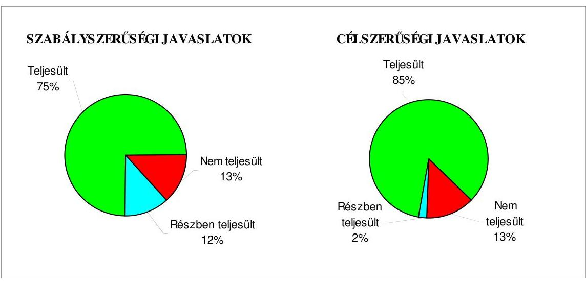

# 5. A VAGYONGAZDÁLKODÁSSAL ÖSSZEFÜGGŐ EGYES DÖNTÉSEK SZABÁLYSZERŰSÉGE 

Az ingatlanértékesítések közül a Lidl Bt. számára történő ingatlanértékesítést és a hét elemből álló stratégiai ingatlancsomag értékesítését vizsgáltuk.

Az értékesítésre kijelölt ingatlanokra külső szakértőkkel értékbecsléseket készíttettek, amelyek a döntésre jogosult testület számára az eladási ár meghatározásának alapját képezték. A hét elemből álló stratégiai ingatlancsomag értékesítésénél három ingatlan esetében a vagyongazdálkodási rendelet;-ben meghatározottaktól eltérően hat hónapnál régebbi értékbecslés alapján határozták meg a forgalmi (piaci) értéket.

A Lidl Bt. számára a 2006. évben értékesített ingatlan esetében az árverési felhívás az ingatlan értékesítésére a vagyongazdálkodási rendelet; 3. számú melléklete II. fejezetének 1. pontjában foglalt előírás ellenére országos napilapban nem jelent meg.

---

A stratégiai ingatlancsomag elemeiből a forgalomképtelen törzsvagyoni körbe tartozó ingatlanok forgalomképessé átminősítéséről a Közgyűlés nem rendelettel, hanem jogszabálynak nem minősülő 313/2008. (VI. 19.) számú határozatának 6. pontjában döntött. A forgalomképtelen vagyontárgyak jegyzékét a vagyongazdálkodási rendelet ${ }_{1} 1$. számú melléklete tartalmazta. A Jat. 1. § (1) bekezdésének f) pontja értelmében a vagyongazdálkodási rendelet ${ }_{1}$ jogszabálynak minősül, a 13. §-a szerint a jogszabály akkor veszti hatályát, ha más jogszabály hatályon kívül helyezi. Az átminősítés időpontjában az érintett ingatlanok a forgalomképtelen törzsvagyoni körbe tartoztak, mert a vagyongazdálkodási rendelet ${ }_{1} 1$. számú melléklete hatályban volt, azt nem módosították. A Közgyűlés a négy ingatlan elidegenítésére vonatkozó döntésével megsértette az Ötv. 79. § (2) bekezdésében foglaltakat, mivel forgalomképtelen törzsvagyon körébe tartozó ingatlanokat értékesítettek. Az önkormányzati törzsvagyoni körbe tartozó vagyontárgyak átminősítésének szabályait a döntés időpontjában (2008. június 19.) hatályos vagyongazdálkodási rendelet ${ }_{1}$ nem tartalmaz$\mathrm{ta}^{93}$. A Jogi és Önkormányzati főosztály a jogszabálysértő közgyűlési előterjesztést vizsgálta és nem tett törvényességi észrevételt. Felelősség terheli a főjegyzöt, mert az Ötv. 36. § (3) bekezdésében foglalt előírást megsértve nem tett eleget a Közgyűlés részére történő jelzési kötelezettségének arra vonatkozóan, hogy döntésével megsérti az Ötv. 79. § (2) bekezdés a) pontjában és a vagyongazdálkodási rendelet ${ }_{1}$ 18. § (2) bekezdésében foglalt előírásokat. A 313/2008. (VI. 19.) számú közgyűlési határozat 11. pontja szerint a Közgyűlés a 6. pont tekintetében utasította a Tisztségviselői kabinet vezetőjét, hogy a törzsvagyont érintő változások átvezetéséről - a vagyongazdálkodási rendelet ${ }_{1}$ módosítása során - gondoskodjon, amelyet a Tisztségviselői kabinet vezetője nem hajtott végre. Az érintett köztisztviselő jogviszonya a Polgármesteri hivatalnál megszűnt, ezért felelősségre vonását nem kezdeményezzük.

A közbenső egyeztetés során a polgármester által tett észrevétel szerint: „A megállapítás jogszabályi alapjául az Ötv. 79. § (2) bekezdést hivatkozza meg. Az idézett törvényhely az önkormányzati törzsvagyonról tartalmaz rendelkezéseket. Az Ötv. 79. (2) bek. alapján az önkormányzati törzsvagyonról a helyi rendeletben meghatározott feltételek szerint, és nem helyi rendelettel lehet rendelkezni. A feltételek pedig már a korábbi hatályos önkormányzati rendeleti szövegnek is a részét képezték (vagyonrendelet IV. fejezet „Rendelkezés egyes önkormányzati tulajdonú vagyontárgyakkal"). Szabálytalan eljárásról, felelősség felmerüléséről tehát szó sincs, a törzsvagyoni elemek tekintetében a döntési jogkör gyakorlója mind a törvény erejénél fogva, mind a helyi rendelet szerint a Közgyülés, mely szerv a Jelentés által hivatkozott 313/2008. (06. 19.) sz. határozatában a kivonás tényéről, és a végrehajtás során irányadó eljárásról egyaránt rendelkezett, az pedig, hogy ezen rendelkezést a Tisztségviselői Kabinet vezetője nem hajtotta volna végre egyszerüen nem félel meg a valóságnak, a kataszteri nyilvántartás ennek ellenkezőjét tételesen bizonyítja, az érintett ingatlanok ugyanis előbb a törzsvagyoni körből kivonásra, majd az önkormányzati vagyonelemek köréből kivezetésre kerültek. A vizsgálati jelentés ugyanis meg sem említi, hogy a Közgyülés megalkotta a 40/2008.(11. 26.) számú rendeletét, amelyben egyúttal „módosította" az 1. számú mellékletet, amely szerint a kérdéses ingatlanok már nem szerepelnek a törzsvagyonban, azaz forgalomképessé minősültek. Tehát a Közgyűlési határozaton túlmenően a „rendeletmódosítás" is megtör-

[^0]
[^0]:    ${ }^{93}$ Az önkormányzati törzsvagyoni körbe tartozó vagyontárgyak átminősítésének szabályait a vagyongazdálkodási rendelet ${ }_{2}$ 2009. december 21-től már tartalmazta (7. § (4) bekezdése).

---

tént (lásd. melléklet). A vagyonrendelt későbbi, 2009. december 21-től hatályos módosítása kizárólag az elidegenités eljárásrendjére vonatkoznak, a kivonási-rendelkezésidöntési - tehát az anyagi jellegü - kompetenciák a rendeletben már értelemszerüen a korábbiakban is tételesen szabályozottak voltak. Természetesen ezen kivonó aktus meghozatalára csak az egyéb törvényes feltételek fennállása esetén kerülhet sor (pl. a HÉSZszel való összhang, egyébként az adott vagyontárgy forgalomléptelenségének oka igazolható és végérvényes megszünése, stb.,). A megyei Földhivatallal való folyamatos egyeztetés mellett született meg az a módosító rendelet, amely a korábbi szabályok további, az irányadó - egyébként számszerüségében elenyésző - felsőbírói határozatokban foglaltakat is szem előtt tartva tovább pontosította a törzsvagyoni kivonás és vagyonelemekkel történő rendelkezés szabályait. A módosítás részleteit (mely egyébként a szabályozás elveit tekintve a forgalomképtelenség okának, jogszabályi eredetének megfelelő differenciált szabályozási módszert követi és ennek megfelelő eljárási rendet, illetve kivonási aktustípust ír elő) e helyütt részletesen nem elemezve a jelentés megállapításai szempontjából kiemelendő tehát, hogy a korábbi szabályok szerinti rendelkezés sem volt jogszabálysértő, a kivonás és elidegenités regulái ugyanis a helyi vagyonrendeletben, a felsőbb szintü jogszabályokkal összhangban álló módon rendezettek voltak, melyek alapján a tulajdonosi jogokat gyakorló közgyülés eljárt. Az ingatlancsomag kapcsán hozott közgyülési döntés tehát a meghozatalkor hatályos szabályokkal összhangban született meg, a későbbi rendelet módosítás ezen szempontból egyébként is irreleváns."

Az észrevétel nem megalapozott, mivel a hivatkozás, miszerint az önkormányzati törzsvagyonról a helyi rendeletben meghatározott feltételek szerint és nem helyi rendelettel lehet rendelkezni, az Ötv. 79. § (2) bekezdés b) pontja értelmében csak a korlátozottan forgalomképes törzsvagyoni körbe tartozó vagyontárgyakra vonatkozik. A kifogásolt négy ingatlan (közút, két közterület, intézményi terület) a forgalomképtelen törzsvagyoni körbe tartozott - a vagyongazdálkodási rendelet ${ }_{1}$ 1. számú melléklete szerint - a stratégiai ingatlancsomag pályáztatás útján történő értékesítéséről szóló közgyűlési döntés időpontjában, 2008. június. 19-én és az adásvételi szerződések megkötésének időpontjában, 2008. június 26-án. A Ptk. 173. § (2) bekezdése pedig a forgalomképtelen dolgok elidegenítését semmisnek tekinti. Ezzel összhangban áll a vagyongazdálkodási rendelet ${ }_{1}$ a „rendelkezés egyes önkormányzati tulajdonú vagyontárgyakkal" című IV. fejezet 18. §-ának (2) bekezdése, amely szerint a forgalomképtelen vagyontárgyak elidegenítésére kötött szerződés semmis. Az ilyen vagyontárgy nem terhelhető meg, nem lehet követelés biztosítéka, tartozás fedezete. A stratégiai ingatlancsomag esetében négy törzsvagyoni körbe tartozó ingatlan forgalomképessé történő átminősítéséről a Közgyűlés nem rendelettel, hanem határozattal - 313/2008. (VI. 19.) számú közgyűlési határozat - döntött. Az önkormányzati törzsvagyoni körbe tartozó vagyontárgyak átminősítésének szabályait a döntés időpontjában (2008. június 19.) hatályos vagyongazdálkodási rendelet ${ }_{1}$ nem tartalmazta, e szabályokat a vagyongazdálkodási rendelet ${ }_{2}$ 2009. december 21-től határozta meg (7. § (4) bekezdése). A vagyongazdálkodási rendelet mellékletében felsorolt ingatlanok esetében - egyéb szabályozás hiányában - a rendelet melléklete módosításával lehet csak az átminősítést végrehajtani. Az Önkormányzat vagyonával kapcsolatos tulajdonosi jogok szabályairól szóló 40/2008. (XI. 26.) számú rendelet hatályba lépésével a törzsvagyoni körből való kihagyás az ingatlanok törvénysértő értékesítését nem befolyásolta, mivel az ingatlanok elidegenítését követően azok már kikerültek az Önkormányzat tulajdonából anélkül, hogy azok forgalomképessé való átminősítése megtörtént volna. A Tisztségviselői Kabinet vezetőjének a 313/2008. (VI. 19.) számú közgyűlési határozat 11. pontja értelmében a stratégiai ingatlancsomag elemeire vonatkozó adásvételi szerződések megkötése előtt kellett volna kezdeményeznie a vagyongazdálkodási rendelet ${ }_{1}$ módosítását, amelyet erre a határidőre nem tett meg.

---

A Közgyűlés megállapította, hogy a város stratégiai ingatlancsomagjának értékesítése tárgyában kiírt pályázatra egy - formailag és tartalmilag - érvényes pályázati dokumentáció került benyújtásra a MILTON 2006 SL társaság részéről, és a 313/2008. (VI. 19.) számú határozatának 1. és 2. pontjában hozta meg a döntést a stratégiai ingatlancsomag MILTON 2006 SL társaság számára történő értékesítésére. A keretmegállapodásban a nyertes ajánlattevő vállalta, hogy a stratégiai ingatlancsomag elemeinek vásárlására hét projekttársaságot alapít. A közgyűlési előterjesztés mellékletét képezték a szerződés (keretmegállapodás és projekttársaságokkal kötött adásvételi szerződések) tervezetek, amelyekről ily módon a főjegyzőnek tudomása volt. A szerződések (keretmegállapodás és projekttársaságokkal kötött adásvételi szerződések) megkötésére 2008. június 26 -án került sor, amelyeket az Önkormányzat nevében a polgármester írt alá, mint kötelezettségvállaló, sem a főjegyző, sem az általa felhatalmazott személy részéről az ellenjegyzés nem történt meg az Ámr. ${ }_{1}$ 134. § (2) bekezdésében foglaltak ellenére. A polgármester ${ }^{94}$ nem tartotta be az Ámr. ${ }_{1}$ 134. § (8) bekezdésében foglaltakat, mert a kötelezettségvállalás ellenjegyzőjének aláírása nélkül vállalt kötelezettséget, a főjegyző az Ámr. ${ }_{1}$ 134. § (9) bekezdése c) pontjában foglaltak ellenére nem győződött meg arról, hogy a kötelezettségvállalás nem sérti-e a gazdálkodási szabályokat.

A közbenső egyeztetés során a polgármester által tett észrevétel szerint: „A nyilvántartásban fellelhetőek a pénzügyi vezető által ellenjegyzett eredeti példányok, másrészt a levont következtetés, miszerint „a főjegyző nem győződött meg arról, hogy a kötelezettségvállalás nem sérti-e a gazdálkodási szabályokat" egyszerüen nem felel meg a valóságnak. A kötelezettségvállaló okirat tanúsága szerint is a Főjegyzö törvényességi kontroll keretében ellenőrizte a szerződéseseket, ennek során pedig az általa szükségesnek ítélt mértékben nyilvánvalóan meggyőződhetett a kötelezettségvállalás érdemi tartalmáról, így annak szabályosságáról. Azt pedig, hogy ezen „meggyőződés" ne történhetne a kötelezettségvállalást tartalmazó okiratok aláírásra történő előkészítése keretében zajló „belső úgvírat köröztetés" során, semmilyen jogszabály nem tiltja. De mindezen túlmenően is hangsúlyozandó, hogy a szerződések egy eredeti példányát az erre felhatalmazott Pénzügyi Főosztályvezető ellenjegyezte, a Jelentés kifogása tehát minden szempontból alaptalan, a főjegyzői meggyőződés ugyanis kétszeresen is megtörtént, mindennek pedig írásos, nyilvántartási nyoma van."

Az észrevétel nem megalapozott, mivel a főjegyző az általa 2010. április 20-án a vizsgálatot végző számvevő részére adott tanúsítványban tanúsította, hogy a stratégiai ingatlancsomag értékesítésével összefüggő, az ÁSZ számára átadott keretmegállapodás, hét adásvételi szerződés és egy Megállapodás (adásvételi szerződések módosítása) másolatai az eredetiekkel mindenben megegyezők. Ezeket a dokumentumokat az Önkormányzat részéről csak a polgármester írta alá, a főjegyző, vagy az általa felhatalmazott személy belső szabályzatban előírt módon történő ellenjegyzése, aláírása azokon nem szerepelt. A kötelezettségvállalás dokumentuma az Ámr. ${ }_{1}$ 2. § 67. pontja értelmében a szerződés, a megállapodás, ezért a belső ügyíraton történő főjegyzői aláírás nem tilos, de nem felel meg a kötelezettségvállalás ellenjegyzése jogszabályi követelményének.

[^0]
[^0]:    ${ }^{94}$ A szerződések (keretmegállapodás és projekttársaságokkal kötött adásvételi szerződések) aláírásának időpontjában, 2008. június 26 -án hivatalban lévő polgármester jogviszonya időközben megszűnt.

---

A keretmegállapodásban helytelenül kerültek rögzítésre a vételár részletek, mert harmadik részletként a teljes vételár 15\%-a helyett a fennmaradó vételár $25 \%$-a szerepelt.

A közbenső egyeztetés során a polgármester által tett észrevétel szerint: „A Jelentés észrevételezi, hogy a keret-megállapodásban a részletfizetési ütemek \%-os arányai helytelenül kerültek meghatározásra. Az okirat szövege a fizetési ütemezés, az egyes részletek egészhez viszonyított \%-os mértéke tekintetében teljesen egyértelmüen fogalmaz, nem hagy - és az eredményes végrehajtás tanúsága szerint - nem is hagyott kétséget a felekben. A 10\%-os előleg a vételárba beszámításra került, ezen összeget egészitette ki a Befektető 75\%-ra a 2008. szeptember 15-ig esedékes részteljesités során, a fennmaradó $25 \%$ pedig az utolsó részletet képzete. A 100\%-ot, tehát az egészet eredményező három szám összeadása $(10 \%+65 \%=75 \%+25 \%=100 \%)$ adja."

Az észrevétel nem megalapozott, mivel a keretmegállapodás 4. pontja szerint „Ajánlattevő az ingatlan teljes vételárának 10\%-át ajánlattételi biztositékként ajánlatkérőnek már megfizette. Ajánlattevő nyilatkozik, hogy ezen általa fizetett összeg az egyes ingatlanok vételárába a teljes vételár 10\%-a mértékének megfelelően beszámításra kerül. A továbbiakban az egyes Vevők megfizetik Ajánlatkérőnek: 2008. szeptember hó 15. napjáig az ingatlanok teljes vételárának 75\%-át, az ingatlancsomagot érintő és az Ajánlattevő által kért módosításokat tartalmazó helyi épitésügyi szabályzat kihirdetését követő nyolcadik munkanapon a fennmaradó vételár további 25\%-át." Ebből következik, hogy a $10 \%+75 \%=85 \%$, tehát a fennmaradó vételár $15 \%$. A keretmegállapodásban foglaltak szerint az utolsó részlet a fennmaradó vételár, vagyis a teljes vételár $15 \%$-ának a $25 \%$-a. Ezzel a számítási móddal a vevő a fennmaradó $15 \%$-os vételár $75 \%$-ával adós maradt volna.

Az egyes projekttársaságokkal kötött adásvételi szerződésekben szerepelt, hogy a projekttársaság késedelmes fizetése esetén köteles napi kötbért és a vételárrészlet törvényes késedelmi kamatát az Önkormányzatnak megfizetni. A késedelmes fizetésre vonatkozó, az Önkormányzat érdekeit védő garanciális elem nincs összhangban a Ptk. 247. § (2) bekezdésében foglaltakkal, mivel pénztartozás késedelmes megfizetésének esetére a késedelmi kamaton felül kötbér érvényesen nem köthető ki, mert a kikötött kötbérre a késedelmi kamat szabályait kell alkalmazni.

A közbenső egyeztetés során a polgármester által tett észrevétel szerint: „A polgári jog általános szabályai nem a két jogintézmény egymás melletti alkalmazását zárják ki, mindössze az alkalmazás során azok egymáshoz való viszonyát tisztázzák, illetve a szerződésben paralel használatuk esetén mértéküket a kölcsönös alkalmazásra tekintettel korlátozzák. Ezt támasztja alá a bírósági gyakorlat is. „Pénztartozás késedelmes teljesitése esetére kötbér csak a törvényes kamatfizetési kötelezettség mértékéig köthető ki érvényesen." (BH1988. 142.) És bár a Jelentésben foglalt felvetés érdemi lényegét tekintve - bizonyos jogszabályi, illetve szerződéses környezet mellett - nem feltétlenül és nem teljes egészében megalapozatlan az a megfogalmazás, miszerint „azért nem köthető ki a késedelmi kamaton felül érvényesen kötbér, mert a kikötött kötbérre a késedelmi kamat szabályi alkalmazandóak" nyilvánvalóan nem helytálló, a két szankció ugyanis egymás mellett is érvényesithető, ilyen esetben azonban az együttes mérték maximalizált, a kamatkorlátozó rendelkezések kikerülésének védelme érdekében. Az egyik jogintézmény szabályainak a másikra történő vonatkoztatása tehát közel sem az együttes alkalmazást tiltja, ahogy az a Jelentésben áll. A felvetés tehát az ellenőrzés tárgyát képező szerzödéses viszonyrendszer tekintetében általánosságban vizsgálható, konkrét megfogalmazásában azonban értelme(zhete)tlen, hozzátéve, hogy a kikötés kizárólag és teljes egészében az Önkormányzat anyagi természetü érdekeit védte és annak tényleges al-

---

kalmazására nem is került sor. Mindezen túlmenően is legfeljebb a részleges érvénytelenség szabályai jöhettek volna szóba, mely a szerződés egyéb rendelkezéseit nem érinti, ugyanis ezen esetben is legfeljebb arról - és nem többről - lehet szó, hogy a szankciós jellegű biztosítékok együttes mértéke a törvényi maximum mértékében kerül korlátozásra, amennyiben az alkalmazott volumen ezt meghaladja, a követelése jogcíme pedig ilyen esetben kötbérként érvényesül. (BH1988. 142.) A Jelentés észrevétele tehát az eset összes körülményeire tekintettel felesleges és súlytalan, sőt a konkrét megfogalmazási módjában értelmetlen is."

Az észrevétel nem megalapozott, mivel a Ptk. 247. §-ának (2) bekezdése szerint, a pénztartozás késedelmes fizetése esetére kikötött kötbérre a késedelmi kamat szabályait kell alkalmazni, amely azt jelenti, ha a felek pénztartozás késedelmes fizetése esetére kötbért kötnek ki, ezt késedelmi kamatnak kell tekinteni és a Ptk. 301. §-ában foglalt szabályokat kell alkalmazni. A jelentésben megfogalmazottak arra hívták fel a figyelmet, hogy a projekttársaságokkal kötött adásvételi szerződésekben szereplő kötbér és késedelmi kamat fizetésének kikötése nincs összhangban a hivatkozott jogszabállyal. Megállapításunkat az Önök által hivatkozottnál később, az 1992. évben meghozott Legfelsőbb Bírósági döntés is alátámasztja. A BH 1992. 253. kimondta, hogy pénztartozás késedelmes megfizetése esetére a késedelmi kamaton felül kötbér érvényesen nem köthető ki.

Az egyes projekttársaságokkal kötött adásvételi szerződések 1. számú mellékletei (településrendezési kötelezettségek) tartalmazták, hogy a régészeti feltárások költségeit a felek közösen viselik oly módon, hogy a beruházni szándékozó vevőket (projekttársaságokat) a megelőző feltárás teljes költsége helyett a beruházás teljes bekerülési költségének törvényileg előítt ${ }^{95}$ minimuma ( 9 ezreléke), az ezt meghaladó költségek, de maximum az ingatlanok bruttó értékének (eladási árának) 20\%-áig az eladót (Önkormányzatot) terhelik. Az Önkormányzat jogszabályi kötelezettség nélkül vállalt kockázatának becslésére, valamint a lehetséges többletköltségek számítására dokumentumot bemutatni nem tudtak. Amennyiben sor kerülne a kötelezettség teljesítésére, annak maximuma 1097 millió Ft terhet jelentene az Önkormányzatnak. Az 5486,8 millió Ft vételár közel egyötödének veszélyeztetése, ilyen mértékű teher önkéntes vállalása ellentétes a közpénzekkel való felelős gazdálkodás követelményeivel.

A közbenső egyeztetés során a polgármester által tett észrevétel szerint: „A Jelentés azt észrevételezi, hogy feltárások költségei sávosan egy bizonyos - egyébként a vonatkozó ágazati jogszabályokban rögzített - mértékéig a Befektetőt (9\%o) azon felül egy következő limitösszegig ( $9 \%$ - 20\%-ig) pedig az eladót is terhelik (ezen második összeghatáron felül ismét a beruházót) majd megjegyzi, hogy az Önkormányzatnak ezen vállalás nem volt törvényi kötelezettsége. Amennyiben költségviselés jogszabályi kötelezettség lett volna, úgy ezt a szerződésben külön kikötni értelmetlen és szükségtelen, attól eltérni pedig a Ptk. 200. § (2) bek. alapján törvénysértő is lett volna. Értelemszerü tehát, hogy azért került ezen kikötés külön is deklarálásra, mert feleknek a szerződéskötést megelőző tárgyalásaik során - ahol is egymás felé kölcsönös vállalásokat fogalmaztak meg és engedményeket tettek - e tekintetben alkupozíció alakult ki, melyet az Önkormányzat eladóként tudatosan, kifejezetten, mint az egyik szerződéses vállalását - és nem mint jogszabályi kötelezettséget - fogadott el. Az pedig, hogy a vállalt mértékből a tényleges régészeti kutatások során mekkora összeg fog realizálódni a természetes és elfogadott üzleti kockázat körébe tartozik."

[^0]
[^0]:    ${ }^{95}$ A kulturális örökség védelméről szóló 2001. évi LXIV. törvény 23. § (1) bekezdése tartalmazza ezt a mértéket.

---

Az észrevétel nem megalapozott, mivel az Önkormányzatnak a régészeti feltárások költségeinek vállalására a tulajdonából kikerülő ingatlanokra nem volt jogszabályi kötelezettsége, az Önkormányzat által a szerződésekben vállalt pénzügyi kockázat mértéke továbbra is ismeretlen, így az nem sorolható „a természetes és elfogadott üzleti kockázat körébe".

A La Torre 2008 Ingatlanfejlesztő Kft-vel a stratégiai ingatlancsomag egyik elemére, a Magasházra 2008. június 26-án kötött adásvételi szerződés 1. számú mellékletének (településrendezési kötelezettségek) 9. pontjában a projekttársaság vállalta, hogy az Önkormányzat tulajdonában lévő 3467 és 3469 helyrajzi számú, Pécs, Dr. Nagy Jenő utca, valamint a Szigeti út által határolt, a Pécsi Építési Szabályzatban közparkként és másodrendú közlekedési célú közterületként jelölt ingatlanokon egy 350 férőhelyes földalatti parkolót, valamint a felette elhelyezkedő területen parkot létesít az Önkormányzattal egyeztetett kertészeti tervek alapján. Az Önkormányzat kötelezte magát arra, hogy a parkoló használata és hasznosítása tekintetében „mindennemü külön dijazás nélkül" 75 évre használati jogot ad a társaság részére és azt az ingatlan nyilvántartásba bejegyezteti. A használati jog ingyenes átadása ellentétben állt a vagyongazdálkodási rendelet ${ }_{1} 14 . \S$ (1) bekezdésében foglaltakkal, mivel a felsorolt támogatható szervezetek köre csak azokra a gazdasági társaságokra terjedt ki, amelyekben az Önkormányzat tulajdoni aránya a $25 \%$-ot meghaladta. A használati jog ingyenes átadásával megsértették az Áht. 108. § (2) bekezdésében foglaltakat, mivel forgalomképes vagyoni értékű jog, „használati jog" ingyenes átruházásának ezt az esetét a vagyongazdálkodási rendelet ${ }_{1}$ nem tartalmazta. A Jogi és Önkormányzati főosztály a jogszabálysértő közgyűlési előterjesztést vizsgálta és nem tett törvényességi észrevételt. Felelősség terheli a főjegyzöt, mert az Ötv. 36. § (3) bekezdésében foglalt előírást megsértve nem tett eleget a Közgyűlés részére történő jelzési kötelezettségének arra vonatkozóan, hogy döntésével megsérti az Áht. 108. § (2) bekezdésében és a vagyongazdálkodási rendelet ${ }_{1} 14 . \S$ (1) bekezdésében foglalt előírásokat. Az Önkormányzat az adásvételi szerződés 1. számú mellékletében az adott terület hasznosítására vonatkozóan a La Torre 2008 Ingatlanfejlesztő Kft. által kért „egyéb jogokat" is biztosítja, amelyek konkrét tartalmát nem határozták meg.

A közbenső egyeztetés során a polgármester által tett észrevétel szerint: „A stratégiai ingatlancsomag egyik elemére, a Magasházra kötött szerzödésben a projekttársaság vállalta, hogy az Önkormányzat tulajdonában lévő két ingatlanon parkolót és parkot létesit. Az Önkormányzat 75 évre használati jogot ad a társaság részére és azt az ingatlan-nyilvántartásba bejegyezteti. A számvevőszéki jelentés a használati jog ingyenes átadásáról szól, mely nem releváns, hiszen a Projekt-társaság önkormányzati vagyon értékét növelő beruházást végez, azaz a használati jog nem ingyenes. Mindezen túl a jogi értelmezés szempontjából szükségszerü kiindulópont a felek közötti szerződéses kapcsolat, illetve ennek vizsgálata, melynek keretében a vállalás, más egyéb kölcsönösen gyakorolt engedményekre, és kötelezettségekre tekintettel a szolgáltatás, illetve ellenszolgáltatás fogalomkörében került kikötésre. A jogalapítás az eladó által szolgáltatott szerződés tárgyát képező ingatlanhoz, mint fődologhoz kapcsolódó, annak használhatóságát elősegitő kvázi tartozékaként (kvázi mert nem dologkapcsolatról, hanem dolog és jog kapcsolatáról van szó) értelmezhető, kiegészitő szolgáltatásként funkcionál, melyhez önállóan alapitási dij valóban nem kapcsolódott - és nem is kellett hogy kapcsolódjon -, azonban melynek ellenértékét vevő a szerződés egészben tett vállalások keretében mint vételárat egyenlitette ki. Esetünkben tehát a jogalapitás nem egy kivülálló harmadik személy részére bármiféle ellentételezést nélkülöző kvázi ajándékként értelmezhető egyoldalú szolgáltatásként jelentkezik, hanem a szerződéses viszonyrendszer

---

keretében felek által kölcsönösen vállalt kötelezettségek, illetve nyújtott szolgáltatások egyik elemeként, mely jogosultság biztositásának lehetőségét vevő a vételár keretében egyenlítette ki, annak elemeként fizette meg, gyakorlatilag arról van szó, hogy a vétel tárgyát képező ingatlanhoz kapcsoló járulékos jogalapításként a megállapított vételár keretében „vette meg"."

Az észrevétel nem megalapozott, mivel a 75 évre adott használati jogot a vevő a vételár keretében nem egyenlítette ki, annak elemeként nem fizette meg, a vételár tárgyát képező ingatlanhoz kapcsolódó járulékos jogalapításként a megállapított vételár keretében nem vette meg a következők miatt: az értékesítésre kijelölt ingatlanra a vagyongazdálkodási rendelet ${ }_{1} 9 . \S$ a) pontjában foglalt előírás szerint külső szakértővel értékbecslést készíttettek, amely a döntésre jogosult testület számára az eladási ár meghatározásának alapját képezte. A Magasház (Pécs, Hungária út 53. hrsz: 1/14) ingatlanforgalmi értékbecslésének 2008. január 14én készült jegyzőkönyvében foglaltak szerint az ingatlan forgalmi értéke 410 millió Ft + áfa, amely megegyezik a La Torre 2008 Ingatlanfejlesztő Kft-vel 2008. június 26 -án kötött szerződésben szereplő vételárral. Az ingatlan ingatlanforgalmi értékbecslése, forgalmi értékének meghatározása során értéket befolyásoló tényezőként nem kerültek figyelembe vételre az Önkormányzat tulajdonában lévő 3467 és 3469 helyrajzi számú, Pécs, Dr. Nagy Jenő utca, valamint a Szigeti út által határolt, a Pécsi Építési Szabályzatban közparkként és másodrendú közlekedési célú közterületként jelölt - használatra átadandó - ingatlanok. Így a vételár keretében vevő nem „vehette meg" az ingatlanok használati jogát. A használati jog ingyenes átadása ellentétben állt a vagyongazdálkodási rendelet ${ }_{1} 14 . \S$ (1) bekezdésében foglaltakkal, mivel az ott felsorolt támogatható szervezetek csak azokra a gazdasági társaságokra terjedtek ki, amelyekben az Önkormányzat tulajdoni aránya a $25 \%$-ot meghaladja. A használati jog ingyenes átadásával megsértették az Áht. 108. § (2) bekezdésében foglaltakat, mivel forgalomképes vagyoni értékú jog, „használati jog" ingyenes átruházásának ezt az esetét a vagyongazdálkodási rendelet ${ }_{1}$ nem tartalmazta.

A keretmegállapodást és az adásvételi szerződéseket a Közgyűlés 89/2009. (III. 5.) számú határozata alapján a 2009. március 26-án kötött megállapodással módosították. A közgyűlési előterjesztés mellékletét képezte a megállapodás tervezet, amelyről ily módon a főjegyzőnek tudomása volt. A megállapodást az Önkormányzat részéről csak a polgármesteri feladatokat ellátó alpolgármester írta alá, mint kötelezettségvállaló, az Ámr. ${ }_{1}$ 134. § (2) bekezdésében foglaltak ellenére sem a főjegyzö, sem az általa felhatalmazott személy nem végezte el az ellenjegyzést. Az alpolgármester ${ }^{96}$ nem tartotta be az Ámr. ${ }_{1}$ 134. § (8) bekezdésében foglaltakat, mert a kötelezettségvállalás ellenjegyzőjének aláírása nélkül vállalt kötelezettséget, a főjegyző az Ámr. ${ }_{1}$ 134. § (9) bekezdése c) pontjában foglaltak ellenére nem győződött meg arról, hogy a kötelezettségvállalás nem sérti-e a gazdálkodási szabályokat.

Az apportálások közül a PVV Pécsi Városüzemeltetési és Vagyonkezelő Zrt. 89/2008. (III. 6.) számú és a Pécs Holding Zrt. 590/2008. (XII. 11.) számú közgyűlési határozat alapján végrehajtott alaptőke emelését vizsgáltuk. Az apportálások a vagyongazdálkodási rendelet ${ }_{1,2}$-ben foglalt hatásköri előírások betartásával és könyvvizsgálók által hitelesített apportlisták alapján történtek.

[^0]
[^0]:    ${ }^{96}$ A megállapodás aláírásának időpontjában, 2009. március 26-án hivatalban lévő alpolgármester jogviszonya megszűnt.

---

Az ingatlan bérbeadások közül a Pécs, Verseny utca 19. szám alatti telephely Lemeztechnika Kft. és a Pécs, Széchenyi tér 1. szám alatti ingatlan Murphy's Pub Kft. részére történt bérbeadásának vizsgálatára került sor. Az ingatlanok bérbeadásánál betartották a vagyongazdálkodási rendelet;-ben előírt hatásköri szabályokat, a döntéseket az arra jogosult szerv, a Közgyűlés hozta meg. A bérleti szerződésekbe az Önkormányzat érdekeit védő garanciális elemeket beépítették, így előírtak kaució fizetést, szankcióként késedelmes fizetésre kamat felszámítását, a bérleti díj nem fizetése esetére a bérleti jogviszony felmondását jelölték meg. A bérleti díj értékállóságának biztosítása érdekében a Murphy's Pub Kft. esetében az ipari termelői árindex növekedésének megfelelő indexálásban állapodtak meg, az inflációt kifejező fogyasztói árindex helyett. A fizetési késedelem miatt késedelmi kamatot nem számítottak fel és a bérleti díj nem fizetése esetén kiküldött fizetési felszólításokban meghatározott póthatáridők lejártát követően nem mondták fel a bérleti jogviszonyt.

Az Önkormányzat ingatlan (irodahelyiség) kedvezményes, vagy ingyenes bérbeadásával nem nyújtott közvetett támogatást pártoknak.

Értékpapír vásárlásra 2009. december 29-én és december 30-án került sor, amelynek keretében 400 és 200 millió Ft összegben állampapírt vásároltak. A polgármester a pénzeszközök eseti befektetése érdekében a vételre a felhatalmazást nem személynek, hanem a Pénzügyi főosztálynak adta, ezért az nem felelt meg az Ámr. ${ }_{1} 134 . \S$ (2) bekezdésében foglalt előírásnak, amely szerint a helyi önkormányzat nevében kötelezettséget a polgármester vagy az általa felhatalmazott személy vállalhat. A pénzgazdálkodási szabályzat is természetes személyeket tartalmazott felhatalmazottként.

A közbenső egyeztetés során a polgármester által tett észrevétel szerint: „A polgármester a Pénzügyi főosztály részére adta ki a felhatalmazást az értékpapír vásárlásra. A pénzügyi szabályzat, valamint a pénzintézeti „aláirás-bejelentő" csak a Pénzügyi Főosztály adott dolgozóinak ad lehetőséget az ügylet megkötésére. Még ide tartozóan rögzítjük, hogy a kötelezettségvállalás területén nagyon következetes megoldások mellett dolgozik a Pénzügyi főosztály és a követelmények folyamatos megjelenésével a használt nyomtatványokat is pontositottuk."

Az észrevétel nem vitatja, hogy a polgármester a Pénzügyi főosztály részére adott felhatalmazást arra, hogy a 2009. év végén átmenetileg szabad pénzeszközöket a számlavezető pénzintézetnél értékpapír vásárlása keretében kösse le. A 2009. évi költségvetési rendelet 19. §-a szerint „a Közgyűlés az átmenetileg szabad pénzeszközök lekötésének jogát a polgármesterre ruházza át, ennek végrehajtására a kötelezettségvállalás rendjéről szóló szabályozásban foglaltak szerint adhat felhatalmazást." A polgármester a pénzeszközök eseti befektetése érdekében az értékpapír vásárlásra a felhatalmazást nem személynek, hanem a Pénzügyi főosztálynak adta, ezért az nem felelt meg az Ámr. ${ }_{1} 134 . \S$ (2) bekezdésében foglalt előírásnak, amely szerint a helyi önkormányzat nevében kötelezettséget a polgármester vagy az általa felhatalmazott személy vállalhat. A pénzgazdálkodási szabályzat is természetes személyeket tartalmazott felhatalmazottként.

A selejtezéseket a Polgármesteri hivatalban két alkalommal, a 2007. és a 2009. években szabályosan folytatták le.

Követelésről való lemondás a stratégiai ingatlancsomag értékesítésével kapcsolatban volt. Az Önkormányzat a 89/2009. (III. 5.) számú közgyűlési ha-

---

tározat alapján a projekttársaságokkal kötött adásvételi szerződésekben foglalt kötbérek és késedelmi kamatok elengedésével követelésekről annak ellenére mondott le, hogy a vagyongazdálkodási rendelet ${ }_{2}$ a követelések elengedésének eseteit és módját nem szabályozta. A közgyűlési előterjesztés nem tartalmazta a követelés elengedés összegét, amely ténylegesen érvényesíthető és megállapítható lett volna. A szerződésekben foglalt napi kötbér és késedelmi kamat alapján az esedékesség időpontjától 2009. március 30. napjáig számított kötbér öszszege 164,9 millió Ft, a késedelmi kamat összege 4,2 millió Ft volt, így az Önkormányzat összességében 169,1 millió Ft követelésről mondott le. A követelésről való lemondással megsértették az Áht. 108. §-ának (2) bekezdésében előírtakat, mivel a közgyűlési döntés időpontjában hatályos vagyongazdálkodási rendelet ${ }_{2}$ nem tartalmazta a követelésekről való lemondás eseteit ${ }^{97}$ és módját. A Jogi és Önkormányzati főosztály a jogszabálysértő közgyűlési előterjesztést vizsgálta és nem tett törvényességi észrevételt. Felelősség terheli a föjegyzöt, mert nem gondoskodott - csak a vagyongazdálkodási rendelet ${ }_{2}$ 2009. április 21-i módosítása során - a követelésről való lemondás esetei és módja szabályozásáról, és az Ötv. 36. § (3) bekezdésében foglalt előírást megsértve nem tett eleget a Közgyűlés részére történő jelzési kötelezettségének arra vonatkozóan, hogy döntésével megsérti az Áht. 108. § (2) bekezdésében foglaltakat.

A közbenső egyeztetés során a polgármester által tett észrevétel szerint: „A szerződő felek együttmüködési kötelezettségét szem előtt tartva a Közgyülés 89/2009.(03. 05.) sz. határozatának megfelelően a vevő által kezdeményezett határidő módosítások szerződésmódosítás formájában történő elfogadása és a szerződést biztosító kikötött mellékkötelezettségekről (kötbér, késedelmi kamat) való lemondást csak feltételhez kötötten fogadja el, azaz Önkormányzatunk ezen követeléséről csak abban az esetben mond le, amennyiben Vevők a fennmaradó összesen 847259000 Ft vételárrészletet a megállapodásban foglalt határidőre - tehát az A/1 lakanyára vonatkozó szabályozási tervi módosítások hatályba lépésének napjáig - teljesítik. Ezen okfejtést a szerződés vonatkozó pontja is egyértelmüen alátámasztja. „A stratégiai ingatlancsomagra vonatkozó II. vételárrészletből fennmaradó 847259000 Ft tartozást vevők a Cuartel 2008. Ingatlanfejlesztő Kft. által megvásárolt A/1 laktanya vételár fizetési határidejéig, tehát 2009. március 30. napjáig egyenlitik ki, amennyiben ezen időpontig a kért és Eladó által vállalt Pécs M.J.Város Önkormányzata és a Cuartel 2008. Ingatlanfejlesztő Kft. között 2008. június 26. napján létrejött adásvételi szerződés. I. számú mellékletben szereplő módosításokat tartalmazó helyi építésügyi szabályzat hatályba lép, de legkésőbb az ajánlatevő által kért módosításokat tartalmazó helyi építésügyi szabályzat kihirdetését követő 15. (tizenötödik) napig megfizetik Eladó számára." Miután pedig a polgári jog általános szabályi szerint feltételtől függővé tett szerződéses rendelkezés akkor hatályosul, amikor a feltétel bekövetkezett, így a lemondás szempontjából a releváns időpontjaként nem a március hónapi módosító okirat aláírása, hanem a tényleges vevői teljesítés, mint a feltétel hatálybalépésének teljesülési kritériuma az irányadó. Ezen időpontban (2009. július 01.) pedig a vagyonrendelet követelésről lemondást rendező szabályai már hatályba léptek (2009. április 21.) mégpedig oly módon, hogy azok a folyamatban lévő ügyekben - tehát a tárgyi ügyben - is alkalmazandóak, ugyanis a szerződésmódosítás kérdése az okirat aláírásától a feltétel bekövetkezésétől függő vevői teljesités megtörténtéig (mely esetünkben egy több hónapos időintervallumot jelentett) folyamatban volt, a teljesedésbe menés ugyanis többlépcsős, időben elhúzódó aktusként került a felek által meghatározásra. Mindezen előfeltételek bekövetkeztének esetén hatályosulhatott csak a módosító

[^0]
[^0]:    ${ }^{97}$ A vagyongazdálkodási rendelet ${ }_{2}$ módosításáról szóló 10/2009. (IV. 21.) számú rendelet szabályozta a követelésről való lemondás eseteit és módját.

---

szerződés vonatkozó pontja, mely szerint felek erre az esetre tekintettel kikötötték, hogy „... Vevők közötti adásvételi szerződések 1.3.-e) pontjaiban a fizetési késedelemre vonatkozó kötbér, továbbá a vételárrészletet terhelő a Magyar Köztársaság Polgári Törvénykönyvéről szóló 1959. évi IV. törvény („Ptk.") szerinti törvényes késedelmi kamatát megfizetésétől Eladó eltekint, amennyiben Vevők a fennmaradó összesen 847259000 Ft vételárrészletet ezen megállapodás előző pontjában foglalt határidőre teljesítik."

Az észrevétel nem megalapozott, mivel a kötbér és késedelmi kamat követelésről való lemondás időpontjában hatályos jogszabályi rendelkezéseket kell figyelembe venni, nem pedig a lemondást követő végrehajtás időpontját. A projekttársaságokkal 2008. június 26 -án megkötött (eredeti) adásvételi szerződésekben a vételár utolsó részletének fizetési határidejét a 2009. január 15. napját követő nyolc napon belül határozták meg. A 89/2009. (III. 5.) számú közgyűlési határozatot megalapozó előterjesztés szerint az Önkormányzat a szerződésekben a helyi építési szabályzat módosításaira vonatkozó vállalásait határidőre teljesítette, így az utolsó vételárrészlet - az El Cuartel 2008 Ingatlanfejlesztő Kft. A/1 laktanya miatti tartozása kivételével - is esedékessé vált a megjelölt határidőben. (Az A/1 laktanyára vonatkozó adásvételi szerződésben a felek a külön eljárás keretében zajló helyi építési szabályzat módosítása miatt eltérő határidőben, 2009. március 30ban állapodtak meg.) A vevők ennek ellenére a fizetési kötelezettségeiket határidőre nem teljesítették, kezdeményezték az eredeti megállapodás szerinti esedékességtől (2009. január 15. napját követő nyolc nap) számított kötbér, illetve késedelmi kamat követelésről való lemondást, hivatkozva a megváltozott piacigazdasági körülményekre, a kibontakozott világméretű pénzügyi válságra. A Közgyűlés a 89/2009. (III. 5.) számú határozatban a vevők kérésére hozzájárult a fizetési határidő meghosszabbításához, a szerződések módosításához, ezáltal a szerződések 1.3. e) pontjában kikötött kötbér és kamat követeléséről lemondott, amelynek összegét a közgyűlési előterjesztésben nem mutatták be. A követelésről való lemondás - a közgyűlési döntés és a szerződésmódosítás - időpontjában hatályos vagyongazdálkodási rendelet ${ }_{2}$ nem tartalmazta a követelésekről való lemondás eseteit és módját, így a követelésről való lemondással megsértették az Áht. 108. §-ának (2) bekezdésében előírtakat. A 89/2009. (III. 5.) számú közgyűlési határozat alapján megkötött szerződésmódosításban (a 2009. március 26-án kötött megállapodás) a vevők számára az eredeti szerződésekben foglalt fizetési határidőhöz viszonyítva meghosszabbított, ezáltal a vevők számára kedvezőbb fizetési határidőket állapítottak meg.

Az adókövetelésekről való lemondások közül egy 2008. évi és egy 2009. évi, magánszemély méltányossági kérelmének helyt adó határozatot vizsgáltunk. Az adókövetelésekről való lemondások szabályosan, az adózás rendjéről szóló 2003. évi XCII. törvény 134. § (1)-(3) bekezdésének előírásai szerint történtek, a döntések jogszerűek voltak.

A térítésmentes ingatlan átadások során kilenc forgalomképtelen törzsvagyoni körbe tartozó ingatlan és négy forgalomképes ingatlan átadására került sor - az 58-as főközlekedési út négy nyomra történő kiszélesítése céljából - a Magyar Állam részére a 393/2004. (IX. 16.) és a 616/2007. (XII. 13.) számú közgyűlési határozat alapján.

Hat forgalomképes önkormányzati ingatlan ingyenes átadásáról szóló döntés ellentétben állt a vagyongazdálkodási rendelet ${ }_{1} 14 . \S$ (1) bekezdésében foglaltakkal, amelyek szerint önkormányzati vagyon ingyenes és kedvezményes átengedésével a törzsvagyonon kívüli vagyontárgyaival támogatható szervezetek között nem szerepelt a Magyar Állam. A hat ingatlanból négy ingatlant 2007.

---

december 29-én kelt megállapodásokkal adott át az Önkormányzat ingyenesen a Magyar Államnak. A négy forgalomképes ingatlan ingyenes átadásával megsértették az Áht. 108. § (2) bekezdésében foglaltakat, mivel a tulajdonjog ingyenes átruházásának ezt az esetét a vagyongazdálkodási rendelet ${ }_{1}$ nem tartalmazta. A megállapodásokat az Önkormányzat részéről a polgármester írta alá. A Jogi és Önkormányzati főosztály a jogszabálysértő közgyűlési előterjesztést vizsgálta és nem tett törvényességi észrevételt. A korábban hivatalban volt polgármester ${ }^{98}$ felelősségét állapítottuk meg, mert az Áht. 108. § (2) bekezdésében és a vagyongazdálkodási rendelet ${ }_{1}$-ben foglaltak ellenére - a forgalomképes vagyontárgyak térítésmentes átadására vonatkozó megállapodásokat írt alá. Felelősség terheli a főjegyzöt ${ }^{99}$, mert az Ötv. 36. § (3) bekezdésében foglalt előírást megsértve nem tett eleget a Közgyűlés részére történő jelzési kötelezettségének arra vonatkozóan, hogy döntésével megsérti az Áht. 108. § (2) bekezdésében és a vagyongazdálkodási rendelet ${ }_{1}$-ben foglalt előírásokat.

Ingatlan kisajátítást helyettesítő adásvételi szerződéssel történő értékesítése és az ingatlanok térítésmentes átadása útszélesítés céljából a Magyar Államnak 10 olyan ingatlant is magában foglalt, amelyek az Önkormányzat forgalomképtelen törzsvagyonába tartoztak. Egy forgalomképtelen törzsvagyoni körbe tartozó ingatlan ${ }^{100}$ tulajdonjoga a 2006. január 12-én kelt, az Önkormányzat és a Magyar Állam nevében eljáró Állami Autópálya Zrt. által kötött kisajátítást helyettesítő adásvételi szerződéssel 513 ezer Ft vételárért került a Magyar Államhoz. A forgalomképtelen törzsvagyoni körbe tartozó kilenc ingatlan térítésmentes átadása az Önkormányzat és a Magyar Állam képviseletében eljáró Nemzeti Infrastruktúrafejlesztő Zrt. között 2007. december 29-én aláírt megállapodásokkal megtörtént. A megkötött megállapodások 6. pontja tartalmazta, hogy „Pécs Megyei Jogú Város Önkormányzata, mint átadó jelen megállapodás aláírásával visszavonhatatlanul lemond a jelen megállapodás szerinti területrész tulajdonjogáról a Magyar Állam javára, az 58. számú főút Pécs-Pogány közötti szakaszának sávszélesítése céljából." A Közgyűlés nem hozott olyan döntést, amellyel a Magyar Állam tulajdonába és az Állami Autópálya Kezelő Zrt., illetve a Közlekedésfejlesztési Koordinációs Központ vagyonkezelésébe kisajátítást helyettesítő adásvételi szerződéssel és megállapodásokkal átadott 10 forgalomképtelen törzsvagyonba tartozó ingatlanrészt az Önkormányzat forgalomképtelen törzsvagyonából kivonja és forgalomképessé nyilvánítja. Az ingyenes vagyonátadások ellentétben voltak a vagyongazdálkodási rendelet ${ }_{1}$ 14. § (1) bekezdésében

[^0]
[^0]:    ${ }^{98}$ A 2007. december 29-én hivatalban lévő, a megállapodásokat aláíró polgármester jogviszonya az Önkormányzatnál megszűnt, ezért felelősségre vonatkozó záradékot és javaslatot nem tettünk.
    ${ }^{99}$ A főjegyző esetében a 2007. december 13-i közgyűlési döntéssel térítésmentesen átadott egy forgalomképes ingatlannal összefüggésben kezdeményezünk felelősségre vonást, a 2004. évi közgyűlési döntéssel térítésmentesen elidegenített három forgalomképes ingatlannal összefüggésben ilyen javaslatot nem tettünk, mert a fegyelmi vétséget 2004. szeptember 16-án követte el és a felelősség érvényesítésére a Ktv. 51. § (1) bekezdése előírásai alapján - a három év eltelte miatt - nincs lehetőség.
    ${ }^{100}$ A szerződésben foglaltak szerint a 01460 helyrajzi számú ingatlan megosztása után keletkező 01460/1 helyrajzi számú $74 \mathrm{~m}^{2}$, a 01460/2 helyrajzi számú $3346 \mathrm{~m}^{2}$ ingatlan, összesen $3420 \mathrm{~m}^{2}$.

---

foglaltakkal, mert az a törzsvagyonon kívüli vagyontárgyak esetében biztosított lehetőséget az ingyenes vagyonátadásra. A Ptk. 173. § (1) bekezdés b) pontja és a (2) bekezdése, valamint a 200. § (2) bekezdése alapján az Ötv. 79. § (2) bekezdés a) pontjában meghatározott forgalomképtelen ingatlanok elidegenítése semmis. A forgalomképtelen törzsvagyonba tartozó ingatlanok esetében fennállt az elidegenítési tilalom, a 10 ingatlan elidegenítésével a polgármester és a főjegyző megsértette a Ptk. 173. § (1) bekezdés b) pontjában és a (2) bekezdésében foglaltakat, mivel a forgalomképtelen törzsvagyon körébe tartozó három közutat és hat közterületet adtak át ingyenesen a Magyar Államnak, egy közutat pedig kisajátítást helyettesítő adásvételi szerződéssel értékesítettek. A Közgyűlés a forgalomképtelen vagyontárgyak átsorolásáról nem döntött, azok a vagyonnyilvántartásban törzsvagyonként szerepeltek. A Jogi és Önkormányzati főosztály a jogszabálysértő közgyűlési előterjesztést vizsgálta és nem tett törvényességi észrevételt. A korábban hivatalban volt polgármester ${ }^{101}$ felelősségét állapítottuk meg, mert - az Ötv. 90. § (1) bekezdésében foglalt - az Önkormányzat gazdálkodásának szabályszerűségéért való felelőssége körében a 10 forgalomképtelennek minősülő ingatlan elidegenítéséről szóló döntést megelőzően nem kezdeményezte a forgalomképtelen törzsvagyonba tartozó ingatlanok besorolásának megváltoztatását, azok forgalomképessé való átsorolását. A korábban hivatalban volt polgármester ${ }^{102}$ felelősségét állapítottuk meg a Ptk. 173. § (1) bekezdés b) pontjában és a (2) bekezdésében foglalt előírást sértő - az önkormányzati törzsvagyonba tartozó vagyontárgyak térítésmentes átadására vonatkozó - megállapodások, a kisajátítást helyettesítő adásvételi szerződés aláírásáért.

A főjegyzö felelős ${ }^{103}$, mert az Ötv. 36. § (3) bekezdésében foglalt előírást megsértve nem tett eleget a Közgyűlés részére történő jelzési kötelezettségének arra vonatkozóan, hogy döntésével megsérti a Ptk. 173. § (1) bekezdés b) pontjában és a (2) bekezdésében, valamint az Ötv. 79. § (2) bekezdés a) pontjában foglalt előírásokat.

A közbenső egyeztetés során a polgármester által tett észrevétel szerint: „Az ügy előzményeként megjegyzendő, hogy a Baranya Megyei Állami Közütkezelő Kht. az 58-as számú főközlekedési út Pécs-Pogány közötti szakaszának négy nyomvonalra történő kiszélesitése tárgyában első ízben 2004. évben kereste meg Pécs Megyei Jogú Város Ön-

[^0]
[^0]:    ${ }^{101}$ A közgyűlési döntések időpontjában, 2004. szeptember 16-án, illetve 2007. december 13-án hivatalban lévő polgármesterek jogviszonya az Önkormányzatnál megszűnt, ezért felelősségre vonatkozó záradékot és javaslatot nem tettünk.
    ${ }^{102}$ A kisajátítást helyettesítő adásvételi szerződés aláírásának időpontjában, 2006. január 12-én, illetve a megállapodások aláírásának időpontjában, 2007. december 29-én hivatalban lévő polgármesterek jogviszonya megszűnt, ezért felelősségre vonatkozó záradékot és javaslatot nem tettünk.
    ${ }^{103}$ A főjegyző esetében a 2007. december 13-i közgyűlési határozattal térítésmentesen átadott négy forgalomképtelen törzsvagyoni körbe ingatlannal összefüggésben kezdeményezünk felelősségre vonást, a 2004. évi közgyűlési döntéssel elidegenített hat forgalomképtelen törzsvagyoni körbe tartozó ingatlannal összefüggésben ilyen javaslatot nem tettünk, mert a fegyelmi vétséget 2004. szeptember 16-án követte el és a felelősség érvényesítésére a Ktv. 51. § (1) bekezdése előírásai alapján - a három év eltelte miatt nincs lehetőség.

---

kormányzatát, a szélesítéssel érintett önkormányzati tulajdonú földterületek adásvétele tárgyában. Ezt a vételi ajánlatot a Kht. - az ingatlan részekre vonatkozó forgalmi értékbecslés megküldése mellett, ingyenes tulajdonjog átadás jogcímére módosította, melyet a Közgyűlés (393/2004. (09. 16.) számú határozatával elfogadott. Az engedélyezési és kiviteli tervek alapján a Nemzeti Infrastruktúra Fejlesztő Zrt. jelzése alapján a 393/2004. (09. 16.) számú határozat kiegészitését kérte, melyről a Közgyülés 616/2007. (12. 13.) számú határozatával döntött. A 2007-es közgyűlési döntést a KÖZOP 1004/2007. (01. 30.) Korm. határozattal elfogadott indikatív projektlista végrehajtása indukálta, melynek keretében kiemelt közérdekü célként a régió közlekedési inf-rastruktúra-fejlesztési beruházásai valósultak meg állami beruházás keretében. A döntés alapján Pécs Megyei Jogú Város Önkormányzata, mint átadó, másrészről a Magyar Állam, mint átvevő képviseletében eljáró Nemzeti Infrastruktúra Fejlesztő Zrt. kötött szerződést 2007. december 29-i keltezéssel. Fontos hangsúlyozni, hogy a két határozatban szereplő ingatlanok tekintetében a Közgyűlés nem egész ingatlanokról, hanem az egyes ingatlanokon belül eltérő térmértékű tulajdoni hányadok térítésmentes átadásáról döntött. A Jelentés azonban kritikai megjegyzései során az ügylet speciális jellegéről és annak speciális szereplőiről, és az ebből fakadóan az általánostól eltérő jellegéről elfelejtkezik. Itt ugyanis a Magyar Államnak útépítéshez, mint kötelező alapfeladatának ellátásához történt az átruházás. Az Állam pedig a Ptk. 173. §-a alapján szintén olyan jogalany - az önkormányzat mellett - mely tulajdonolhat forgalomképtelen vagyonelemet. Ezen jogi jelleg, tehát a forgalom alanyainak viszonylatában és nem két olyan személy relációjában érvényesül, akik a forgalomképtelen vagyonelemek kizárólagos tulajdonosai lehetnek. Márpedig a Magyar Állam a Ptk. 172. § d) pontja alapján az országos utak kizárólagos tulajdonosa, ekképpen pedig ilyen kategóriájú út teljesítésének céljára - egy egyébként olyan vagyonelem, mely az Államtól került a törvény erejénél fogva térítésmentesen önkormányzati tulajdonba - átadható. Az ügylet tehát ezen különös jellegére tekintettel nem a vagyoni forgalom részének tekinthető, melyre vonatkozóan a tilalom fennáll, mindez a szerződések szövegéből egyébként aggálytalanul megállapítható. Ha pedig ez a gondolatmenet a Ptk-ból levezethető, akkor mindez akár a vagyonrendelettől függetlenül is szabályosan lebonyolítható. Ezt az okfejtést erősíti, hogy az ingatlanok egy része kisajátítást megelőző adásvétel útján került a Magyar Államhoz, a kisajátításnak pedig egyként sem akadálya a forgalomképtelen jelleg, éppen azért mert a jogszabály ezen tulajdonszerzési módot nem a forgalmi viszonyok körébe tartozónak, hanem egy különös eredeti jogszerzésnek tekinti. A Ptk. magyarázata szerint pedig „Ha a kizárólag állami tulajdonban álló dologra eredeti tulajdonszerzés következik be, a dolgon csak állami tulajdon keletkezhet. Ez a szabály megfelelően alkalmazandó az önkormányzati tulajdonra is." Látható tehát, hogy a speciális státuszú vagyonelemek speciális védelme csak az azokat tulajdonolni nem képes, a forgalmi-vagyoni viszonyok alanyaira terjed ki és arra a különös helyzetre, mikor ezen alanyok a forgalomképtelen vagyontárgy rendeltetésének megfelelő célból egymás viszonylatában kívánják a tulajdonváltozást elöidézni, mert pl. az önkormányzati tulajdonban álló, és közigazgatási területén lévő, egyébként az építési szabályzatban út céljára rendelt ingatlan útkénti megvalósitása (tehát a forgalomképtelensége okának megfelelő rendeltetése betöltése) egy országos - tehát állami tulajdonban álló - út részeként realizálódik. Itt tehát nem a forgalmi viszonyok körében köttetett, szorosan vett vagyonjogi ügyletről, hanem a forgalomképtelen jellegre okot adó körülmény tényleges megvalósitójának alanyában történt egyfajta speciális, közjogi jellegú változás, mely - részben - magánjogi keretekbe ágyazódott. (Egyszerüen más jogcím, jogi forma nem léte okán.) A vagyonrendelet Jelentés által hivatkozott rendelkezési a vagyoni viszonyok alanyaival történő ügyletkötések rendjét, feltételeit szabályozzák, az önkormányzati tulajdonnal történő rendelkezés körében. Ahogy az azonban az előző okfejtésből is látható itt ettől lényegében eltérő megítélésű ügylet került megkötésre, mely értelemszerüen nem vonható az általános rendelkezések körébe, de melynek szabályos megkötésére az idézett felsőbb szintü jogszabályok kellő felhatalmazást biztosítanak. Ami pedig a közös tulajdon létesítésének törzsvagyoni körből való kivonását kifogásoló jelentésbeli megjegyzésekre vonatkozik: Az anyag e körben

---

lényegében az kifogásolja, hogy anélkül engedte be Önkormányzatunk az ingatlanokba időlegesen, az útépités megtörténtéig tulajdonostársként a Magyar Államot, hogy azt megelőzően a Közgyűlés erre vonatkozó aktusával kimondta volna a törzsvagyoni körből való kikerülést, kivonást. A Ptk. vonatkozó rendelkezései értelmében közös tulajdon esetében - és itt a hangsúly a közös tulajdonon van - a tulajdonjog ugyanazon a dolgon meghatározott hányadok szerint több személyt is megillet, továbbá a tulajdonostársak mindegyike jogosult a dolog birtoklására és használatára. A Ptk. kommentárja szerint „... a tulajdonjogát az őt megillető eszmei hányad erejéig valamennyi tulajdonostárs az egész dologra nézve gyakorolja." Ha ugyanis ezt a gondolatmenetet követjük egyértelmúen levonható a következtetés, hogy az eszmei tulajdoni hányad a dolog teljes egészére, annak minden cm2-ére nézve fennáll azzal, hogy a tulajdonostárs a jogait nem egyedül, hanem más tulajdonostárssal együtt jogközösségben gyakorolja. Ez a kiindulás egyúttal szükségszerüen kizárja, hogy tulajdonközösség alapítása esetén a tulajdonostárs tulajdonba engedésének mértékéig az eszmei hányadot megtestesitő terület a törzsvagyonból kivonásra kerüljön ugyanis mind az azzal egyenlő mértékű m2-nyi terület mind az azt megtestesitő tulajdoni hányad tekintetében a továbbiakban (értsd a tulajdonközösség léte alatt) is fennáll az Önkormányzat, mint tulajdonostárs tulajdonosi minősége a teljes dologra. A jogokat ugyanis, ahogy az idézet fogalmaz „az egész dologra nézve gyakorolja." Ez elméleti oldalról még abban is esetben is helytálló, ha a tulajdonostársak a használat megosztását határozzák el, mivel ez természetbeni, fizikális kérdés, mely az eszmei hányadok sorsát és létét önmagában nem érinti. (Igaz esetünkben használat megosztásról nem is volt szó.) Ebből adódóan tehát a törzsvagyonból történő kivonás hiányára hivatkozás alaptalanok, addig ugyanis amíg az Önkormányzat mint tulajdonos ebbéli jogait - akár egyedül, akár megosztva - de az egész ingatlanra, annak teljességére nézve gyakorolja, addig egy térmérték szerint meghatározott rész kivonása ezen joggyakorlás alól a törzsvagyoni körből történő átsorolással fogalmilag értelmezhetetlen. Ezzel ugyanis lehetetlenné válna az ami a tulajdonostársnak joga és kötelezettsége egyaránt, azaz a jogok gyakorlása és a kötelezettségek teljesitése ezen dologrész vonatkozásában (is). Ami pedig a tulajdonjogi kapcsolat a dolog és annak tulajdonosa között egy olyan jószág tekintetében áll fenn, amely a törvény erejénél fogva törzsvagyon, addig az ebből a vagyoni körből nem kivonható (a kivételekre e helyütt nem térek ki, azok ugyanis e szempontból nem relevánsak). Ennek kizárólag akkor és attól függő hatállyal lehet helye, hogy a tulajdonostársak elhatározzák a jogközösség megszüntetését, és ezzel az ingatlan természetbeni megosztását, egyúttal pedig az adott rész tulajdonjogának átszállását. Ekkor természetesen aktualissá válik a törzsvagyonból történő kivonás, de itt még időben nem tartunk, ez a lépés majd csak az év második felében válik esedékessé, mikor a Közútkezelő Kht. a fennálló helyzetet valamennyi érintett vonatkozásában rendezi. Mind addig, amíg egy út kategóriájú ingatlanon az önkormányzat tulajdonosi minősége fennáll - függetlenül attól, hogy azt kizárólagosan, vagy jogközösségben gyakorolja - az az Ötv. Alapján szükségszerüen a törzsvagyoni körbe tartozik. Az irottak alátámasztására még egy mondatrészt idézve mely ezen álláspontot tovább erősitheti: „A megosztottság tehát mindig a jogra vonatkozik, ezért eszmei." A megosztott jog pedig egynemú, és minőségét tekintve egyenlő. Tehát a (dologi) jog és nem az ingatlan megosztott, az továbbra is önálló egész, felöleli mindazt, amire a hrsz. kiterjed, ezért annak megosztása nélkül, a jogközösség fennállása alatt értelemszerüen nem elképzelhető bizonyos részeknek a törzsvagyoni körből történő kivonása sem. A jogszabályt ugyanis éppen ezzel, tehát a kivonással sértenénk meg azáltal, hogy egy a törvény erejénél fogva törzsvagyoni minősitésü - és akként is funkcionáló - ingatlanrész anélkül áll az Önkormányzat tulajdonában, hogy az a megfelelő vagyoni körbe tagozódna. Az Önkormányzat az érintett ingatlanokra vonatkozóan továbbra is jogosult a teljes ingatlan használatára és birtoklására, azonban e jogát nem egyedül hanem a tulajdonostárssal együtt gyakorolja. Az Állami Számvevőszéki jelentés által hivatkozott Ptk. 173. § (1) bekezdésében foglaltak az átadást követően is fennállnak tekintettel arra, hogy kizárólagos állami tulajdonba kerülhetnek az országos közutak. Az 58-as számú főközlekedési út Pécs-Pogány közötti szakasza országos közút és a Ptk. Hivatkozott be-

---

kezdése szerint forgalomképtelen. Az Önkormányzat döntésével továbbra is jogosult az egész ingatlan használatára és birtoklására, ezért az egész ingatlan törzsvagyoni elemként történő kezelésére, nyilvántartására. Fontos megjegyezni, hogy egy folyamatban lévő ügyről van szó, hiszen a szerződés értelmében a felek között a megvalósult állapothoz igazodó megosztási vázrajzok elkészitése folyamatban van, melynek eredményeképpen a felek a megosztási vázrajzok szerint kialakuló földrészletek tekintetében a közös tulajdont megszüntető megállapodást kötnek, melynek keretében teljes földrészletek törzsvagyoni körből történő kivonásáról tud érdemben dönteni Pécs Megyei Jogú Város Közgyúlése. A leírtak alapján tehát a fenti ügyben hozott két közgyúlési határozat nem sérti a helyi önkormányzatokról szóló törvényben a törzsvagyon körébe tartozó vagyonelemek által biztosított kötelező önkormányzati feladat és hatáskör ellátását és azon keresztül a közhatalom gyakorlását, hiszen a földterületek átadására közút létesítése okán volt szükség, melyet Pécs Város Helyi Építési Szabályzata és Szabályozási Terve is rögzít, továbbá földterületek az átadást követően is a helyi közösség - közérdek - szolgálatában állnak. Fontos kiemelni azt is, hogy a vizsgálati jelentés által egyébként figyelembe nem vett- a közúti közlekedésről szóló- 1988. évi I. tv. 32. § (3) bekezdése szerint, amennyiben utak jellegében olyan változás következik be, amely során az út jelentősége, forgalmi terhelése és forgalmi összetétele változik, az utak tulajdonosai az utak tulajdonjogának egymás részére - helyi és országos közutak esetében térítés nélkül - történő átadásáról a változás ingatlan-nyilvántartáson való átvezetésére alkalmas megállapodást kötnek. Álláspontom szerint ezen jogszabályhely is azt támasztja alá, hogy az önkormányzat döntése jogszerü volt."

Az észrevétel nem megalapozott, mivel önmagában az a tény, hogy a Magyar Állam és az Önkormányzat is forgalomképtelen vagyonelemek (ingatlanok) tulajdonosa lehet nem alapozza meg, hogy a forgalomképtelen ingatlanokat egymás között átruházzák. A Ptk. hivatkozott 172. § d) pontja és 173. §-a nem az ingatlanok átruházásáról szólnak. Az Önkormányzatnak figyelembe kell venni az Ötv. és a vagyongazdálkodási rendeletének szabályait. A Ptk. 173. § (2) bekezdése értelmében a forgalomképtelen dolgok elidegenítése semmis. A kifogásolt 10 jogügylet tárgya az Önkormányzat forgalomképtelen törzsvagyoni körébe tartozott. Az egy ingatlan kisajátítást helyettesítő adásvételi szerződéssel történő értékesítése és a kilenc ingatlan különböző mértékű tulajdoni hányadának térítésmentes átadása a Magyar Államnak az Önkormányzat részéről elidegenítésnek minősült. A térítésmentes átadással kilenc ingatlan közös tulajdonba került. Nem vitatjuk, hogy az Önkormányzat a közös tulajdonú ingatlanok esetében tulajdonjogát az őt megillető eszmei hányad erejéig az egész dologra nézve gyakorolhatja, azonban továbbra is állítjuk, hogy az Önkormányzat egy-egy ingatlan esetében különböző mértékű tulajdoni hányadokról mondott le, tulajdoni hányadokat idegenített el, figyelmen kívül hagyva a Ptk., az Ötv. és saját vagyongazdálkodási rendeletének szabályait. Forgalomképtelen ingatlanokat nem lehet elidegeníteni. A közúti közlekedésről szóló 1988. évi I. törvény 32. § (3) bekezdésében foglaltakat valóban nem vettük figyelembe, mivel azok a kifogásolt esetekre nem vonatkoznak, mert a hivatkozott jogszabályhely értelmében utak tulajdonjogának egymás javára történő átruházására csak azt követően van mód, ha a közlekedési hatóság kérelemre a helyi közút országos közöttá, az országos közút helyi közöttá történő átminősítéséről határozatot hozott. Ilyen határozatokkal az ingatlan elidegenítések időpontjában az Önkormányzat nem rendelkezett. Megjegyezzük még, hogy a 10 elidegenített ingatlanból csak négy volt közút, hat pedig közterület és a három közútként nyilvántartott önkormányzati ingatlan mindegyikénél csak az ingatlan egy részét idegenítették el.

A térítésmentes ingatlan átadások a Magyar Máltai Szeretetszolgálatnak és a Támasz Alapítványnak önkormányzati feladatellátás biztosításának érdekében történtek, az ingatlanok átadására könyv szerinti értéken került sor az

---

545/2007. (XI. 29.) számú, illetve a 185/2008. (IV. 17.) számú közgyűlési határozattal. Az átadások során betartottál a hatásköri és eljárási szabályokat.

Egy-egy esetben került sor vagyonhasználati jog ingyenes átadására és vagyonkezelői szerződés megkötésére. Mindkettőt ingatlanforgalmi értékbecslés előzte meg, és azok az Önkormányzat érdekeit szolgálták. Az 535/2007. (XI. 29.) számú közgyűlési határozat alapján a MATÁV sportpálya vagyonhasználati jogának PTE részére történő ingyenes átadásával az egyik EKF projekt helyszínét váltották ki. A Közgyűlés 171/2008. (IV. 17.) számú határozata alapján a PÉCSI FUTBALL Sportvagyon-hasznosító Kft-vel megkötött vagyonkezelői szerződés pedig hosszú távú és magas színvonalú sportfunkció (labdarúgás) működtetésének és fenntartásának költségeitől mentesíti az Önkormányzatot.

Budapest, 2010. december „
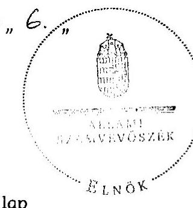

Dl, 44
Domokos László

Melléklet: $\quad 10 \mathrm{db} \quad 32 \mathrm{lap}$

---

Pécs Megyei Jogú Város Önkormányzata

# Az Önkormányzat gazdálkodását meghatározó adatok, mutatószámok 

| Megnevezés |  |
| :--: | :--: |
| A település állandó lakosainak száma (fő) 2010. január 1-jén | 153969 |
| A Közgyűlés tagjainak a száma (fő) (2009. december 31-én) | 40 |
| A Közgyűlés munkáját segítő állandó bizottságok száma (2009. december 31-én) | 9 |
| A Polgármesteri hivatalban foglalkoztatott köztisztviselők száma (fő) (2009. december 31-én) | 404 |
| Az összes vagyon értéke a 2009. december 31-i könyvviteli mérleg szerint (millió Ft) | 162795 |
| Az adósságállomány (hosszú és rövid lejáratú kötelezettség) 2009. december 31-én (millió Ft) | 34170 |
| Az egy lakosra jutó adósságállomány 2009. december 31-én (Ft) | 221928 |
| Az összes 2009. évben teljesített költségvetési bevétel (millió Ft) | 61632 |
| Ebből: saját bevétel (millió Ft), melyből | 21649 |
| helyi adóbevétel (millió Ft) | 8232 |
| Az egy lakosra jutó 2009. évi költségvetési bevétel (Ft) | 400288 |
| Az egy lakosra jutó 2009. évi saját bevétel (Ft) | 140606 |
| Az egy lakosra jutó 2009. évi helyi adóbevétel (Ft) | 53465 |
| Saját bevétel/Összes költségvetési bevétel aránya a 2009. évben (\%) | 35,1 |
| Helyi adó bevétel/Összes költségvetési bevétel aránya a 2009. évben (\%) | 13,4 |
| Az összes teljesített költségvetési kiadás a 2009. évben (millió Ft) | 54223 |
| Ebből: felhalmozási célú költségvetési kiadás (millió Ft) | 19389 |
| A 2009. évi költségvetési kiadásból a felhalmozási célú költségvetési kiadás aránya (\%) | 35,8 |
| Az egy lakosra jutó 2009. évi költségvetési kiadás (Ft) | 352168 |
| Az egy lakosra jutó 2009. évben teljesített felhalmozási célú költségvetési kiadás (Ft) | 125928 |
| A költségvetési intézmények száma 2009. december 31-én (db) | 46 |
| Ebből: önállóan működő (db) | 30 |
| A költségvetési intézményekben foglalkoztatott közalkalmazottak száma (fő) (2009. december 31-én) | 5712 |

---

# Az önkormányzati vagyon alakulása

|  Mérlegsor
megnevezése | 2007.év
(millió Ft) | 2008. év
(millió Ft) | 2009. év
(millió Ft) | Változás \%-a (Előző év=100\%) |  |   |
| --- | --- | --- | --- | --- | --- | --- |
|   |  |  |  | 2008/2007. | 2009/2008. | 2009/2007.  |
|  Immateriális javak | 799 | 821 | 741 | 102,8 | 90,3 | 92,7  |
|  Tárgyi eszközök | 106135 | 115730 | 127664 | 109,0 | 110,3 | 120,3  |
|  ebből: ingatlanok | 99404 | 106334 | 106197 | 107,0 | 99,9 | 106,8  |
|  beruházások, felújítások | 4275 | 6807 | 17601 | 159,2 | 258,6 | 411,7  |
|  Befektetett pénzügyi eszközök | 16789 | 18465 | 18524 | 110,0 | 100,3 | 110,3  |
|  Üzemeltetésre átadott eszközök | 4273 | 4748 | 4991 | 111,1 | 105,1 | 116,8  |
|  Befektetett eszközök összesen | 127996 | 139764 | 151920 | 109,2 | 108,7 | 118,7  |
|  Forgóeszközök összesen | 4982 | 15220 | 10875 | 305,5 | 71,5 | 218,3  |
|  ebből: követelések | 942 | 2298 | 1185 | 243,9 | 51,6 | 125,8  |
|  pénzeszközök | 3692 | 11530 | 7630 | 312,3 | 66,2 | 206,7  |
|  Eszközök összesen | 132978 | 154984 | 162795 | 116,5 | 105,0 | 122,4  |
|  Saját tőke összesen | 107735 | 109564 | 119026 | 101,7 | 108,6 | 110,5  |
|  Tartalék összesen | 2840 | 11354 | 8013 | 399,8 | 70,6 | 282,1  |
|  Kötelezettségek összesen | 22403 | 34066 | 35756 | 152,1 | 105,0 | 159,6  |
|  ebből: hosszú lejáratú kötelezettségek | 13048 | 29404 | 31021 | 225,4 | 105,5 | 237,7  |
|  rövid lejáratú kötelezettségek | 8242 | 3211 | 3150 | 39,0 | 98,1 | 38,2  |
|  Források összesen: | 132978 | 154984 | 162795 | 116,5 | 105,0 | 122,4  |

Forrás: Magyar Államkincstár éves költségvetési beszámoló "01" számú űrlap ÁSZ ellenőrzés során korrigált adatai.

---

Pécs Megyei Jogú Város Önkormányzata

# Az önkormányzati kötelezettségek alakulása

|  Mérlegsor
megnevezése | 2007.év
(millió Ft) | 2008. év
(millió Ft) | 2009. év
(millió Ft) | Változás \%-a (Előző év=100\%) |  |   |
| --- | --- | --- | --- | --- | --- | --- |
|   |  |  |  | 2008/2007. | 2009/2008. | 2009/2007.  |
|  Hosszú lejáratú kötelezettségek összesen | 13048 | 29404 | 31021 | 225,4 | 105,5 | 237,7  |
|  ebből: hosszú lejáratra kapott kölcsönök | 0 | 0 | 0 |  |  |   |
|  tartozások fejlesztési célú kötvénykibocsátásból | 0 | 4648 | 4767 |  | 102,6 |   |
|  tartozások müködési célú kötvénykibocsátásból | 0 | 2324 | 2383 |  | 102,5 |   |
|  beruházási és fejlesztési hitelek | 12289 | 22429 | 23571 | 182,5 | 105,1 | 191,8  |
|  müködési célú hosszú lejáratú hitelek | 750 | 0 | 0 | 0,0 |  | 0,0  |
|  egyéb hosszú lejáratú kötelezettségek | 9 | 3 | 299 | 33,3 | 9966,7 | 3322,2  |
|  Rövid lejáratú kötelezettségek összesen | 8242 | 3211 | 3150 | 39,0 | 98,1 | 38,2  |
|  ebből: rövid lejáratú kölcsönök | 0 | 0 | 0 |  |  |   |
|  rövid lejáratú hitelek | 5181 | 83 | 40 | 1,6 | 48,2 | 0,8  |
|  kötelezettségek áruszállításból, szolgáltatásból | 965 | 806 | 965 | 83,5 | 119,7 | 100,0  |
|  garancia- és kezességvállalásból szárm. köt. | 0 | 0 | 0 |  |  |   |
|  h. lejár. kapott kölcsön köv. évet terh.törl.részl. | 0 | 0 | 0 |  |  |   |
|  felh.c.kötv.kib-ból szárm.tart.köv.évet terh.r. | 0 | 0 | 0 |  |  |   |
|  mük.c.kötv.kib-ból szárm.tart.köv.évet terh.r. | 0 | 0 | 0 |  |  |   |
|  beruh.fejl.hitel köv.évet terhelő törl. részlete | 572 | 893 | 953 | 156,1 | 106,7 | 166,6  |
|  müködési c.hosszú lej.hitel köv.évet terh.törl.r. | 250 | 0 | 0 | 0,0 |  | 0,0  |
|  egyéb hosszú lej.köt.köv.évet terh.törl. részlete | 14 | 6 | 5 | 42,9 | 83,3 | 35,7  |

Forrás: Magyar Államkincstár éves költségvetési beszámoló "01" számú űrlap adatai.

---

Pécs Megyei Jogú Város Önkormányzata

Az Önkormányzat 2007-2010. évi költségvetési előirányzatainak és 2007-2009. évi pénzügyi teljesítéseinek alakulása

|  Megnevezés | 2007. év |  |  |  | 2008. év |  |  |  | 2009. év |  |  |  | 2010.  |
| --- | --- | --- | --- | --- | --- | --- | --- | --- | --- | --- | --- | --- | --- |
|   | Eredeti | Módosított | Teljesítés (millió Ft) | Teljesítés/ eredeti előirányzat $\%$ | Eredeti | Módosított | Teljesítés (millió Ft) | Teljesítés (millió Ft) | Teljesítés/ eredeti előirányzat $\%$ | Eredeti | Módosított | Teljesítés (millió Ft) | Teljesítés/ eredeti előirányzat $\%$  |
|  Müködési célú költségvetési bevételek összesen | 28278 | 33025 | 33443 | 118,3 | 29774 | 37641 | 38113 | 128,0 | 32336 | 38397 | 38562 | 119,3 | 28177  |
|  Müködési célú költségvetési kiadások összesen | 30373 | 34473 | 33547 | 110,5 | 31642 | 38554 | 36521 | 115,4 | 31327 | 37164 | 34835 | 111,2 | 31231  |
|  Müködési célú költségvetési bevételek és kiadások egyenlege: hiány-, többlet + | $-2095$ | $-1448$ | $-104$ | 5,0 | $-1868$ | $-913$ | 1592 |  | 1009 | 1233 | 3727 | 369,4 | $-3054$  |
|  Felhalmozási célú költségvetési bevételek összesen | 3707 | 7755 | 5448 | 147,0 | 7124 | 11077 | 12754 | 179,0 | 28091 | 36803 | 23071 | 82,1 | 24817  |
|  Felhalmozási célú költségvetési kiadások összesen | 5091 | 9827 | 7729 | 151,8 | 7263 | 21339 | 12703 | 174,9 | 30397 | 39373 | 19389 | 63,8 | 26240  |
|  Felhalmozási célú költségvetési bevételek és kiadások egyenlege: hiány-, többlet+ | $-1384$ | $-2072$ | $-2281$ | 164,8 | $-139$ | $-10262$ | 51 |  | $-2306$ | $-2570$ | 3682 |  | $-1423$  |
|  Költségvetési bevételek összesen | 31985 | 40780 | 38891 | 121,6 | 36898 | 48718 | 50868 | 137,9 | 60427 | 75201 | 61632 | 102,0 | 52994  |
|  Költségvetési kiadások összesen | 35464 | 44300 | 41276 | 116,4 | 38905 | 59893 | 49225 | 126,5 | 61724 | 76538 | 54223 | 87,8 | 57471  |
|  Költségvetési bevételek és kiadások egyenlege: hiány-, többlet+ | $-3479$ | $-3520$ | $-2385$ | 68,6 | $-2007$ | $-11175$ | 1643 |  | $-1297$ | $-1337$ | 7409 |  | $-4477$  |
|  Finanszírozási célú pénzügyi bevételek | 4030 | 4071 | 5942 |  | 2829 | 17997 | 16668 |  | 2190 | 2230 | 1739 |  | 5430  |
|  Finanszírozási célú pénzügyi kiadások | 551 | 551 | 552 |  | 822 | 6822 | 6707 |  | 893 | 893 | 1430 |  | 953  |
|  Finanszírozási célú pénzügyi műveletek egyenlege | 3479 | 3520 | 5390 |  | 2007 | 11175 | 9961 |  | 1297 | 1337 | 309 |  | 4477  |

Forrás: - Magyar Államkincstár éves költségvetési beszámoló "80" számú űrlap ÁSZ ellenőrzés során korrigált (könyvvizsgáló auditálási eltését is figyelembe véve) adatai;

- a 2010. évi adatok esetében az Önkormányzat 2010. évi költségvetése;
- a költségvetési bevétel-kiadás müködési-felhalmozási célra történt megosztásánál az analitikus nyilvántartás.

---

4. számú melléklet a V-2023-10/10/010. számú jelenlétéhez

tankóvalóan

|  |   |   |   |   |   |   |   |   |   |   |   |   |   |   |   |   |   |   |   |   |   |   |   |   |   |   |   |   |   |   |   |   |   |   |   |   |   |   |   |   |   |   |   |   |   |   |   |   |   |   |   |   |   |   |   |   |   |   |   |   |   |   |   |   |   |   |   |   |   |   |   |   |   |   |   |   |   |   |   |   |   |   |   |   |   |   |   |   |   |   |   |   |   |   |   |   |   |   |   |   |   |

---

|  |   |   |   |   |   |   |   |   |   |   |   |   |   |   |   |   |   |   |   |   |   |   |   |   |   |   |   |   |   |   |   |   |   |   |   |   |   |   |   |   |   |   |   |   |   |   |   |   |   |   |   |   |   |   |   |   |   |   |   |   |   |   |   |   |   |   |   |   |   |   |   |   |   |   |   |   |   |   |   |   |   |   |   |   |   |   |   |   |   |   |   |   |   |   |   |   |   |   |   |   |   |   |

---

|   |  |  |  |  |  |  |  |  |  |  |  |  |  |  |  |  |  |  |  |  |  |  |  |  |  |  |  |  |  |  |  |  |  |   |
| --- | --- | --- | --- | --- | --- | --- | --- | --- | --- | --- | --- | --- | --- | --- | --- | --- | --- | --- | --- | --- | --- | --- | --- | --- | --- | --- | --- | --- | --- | --- | --- | --- | --- | --- |
|   |  |  |  |  |  |  |  |  |  |  |  |  |  |  |  |  |  |  |  |  |  |  |  |  |  |  |  |  |  |  |  |  |  |  |   |
|   |  |  |  |  |  |  |  |  |  |  |  |  |  |  |  |  |  |  |  |  |  |  |  |  |  |  |  |  |  |  |  |  |  |  |   |
|   |  |  |  |  |  |  |  |  |  |  |  |  |  |  |  |  |  |  |  |  |  |  |  |  |  |  |  |  |  |  |  |  |  |  |   |
|   |  |  |  |  |  |  |  |  |  |  |  |  |  |  |  |  |  |  |  |  |  |  |  |  |  |  |  |  |  |  |  |  |  |  |   |
|   |  |  |  |  |  |  |  |  |  |  |  |  |  |  |  |  |  |  |  |  |  |  |  |  |  |  |  |  |  |  |  |  |  |  |   |
|   |  |  |  |  |  |  |  |  |  |  |  |  |  |  |  |  |  |  |  |  |  |  |  |  |  |  |  |  |  |  |  |  |  |  |   |
|   |  |  |  |  |  |  |  |  |  |  |  |  |  |  |  |  |  |  |  |  |  |  |  |  |  |  |  |  |  |  |  |  |  |  |   |
|   |  |  |  |  |  |  |  |  |  |  |  |  |  |  |  |  |  |  |  |  |  |  |  |  |  |  |  |  |  |  |  |  |  |  |   |
|   |  |  |  |  |  |  |  |  |  |  |  |  |  |  |  |  |  |  |  |  |  |  |  |  |  |  |  |  |  |  |  |  |  |  |   |
|   |  |  |  |  |  |  |  |  |  |  |  |  |  |  |  |  |  |  |  |  |  |  |  |  |  |  |  |  |  |  |  |  |  |  |   |
|   |  |  |  |  |  |  |  |  |  |  |  |  |  |  |  |  |  |  |  |  |  |  |  |  |  |  |  |  |  |  |  |  |  |  |   |
|   |  |  |  |  |  |  |  |  |  |  |  |  |  |  |  |  |  |  |  |  |  |  |  |  |  |  |  |  |  |  |  |  |  |  |   |
|   |  |  |  |  |  |  |  |  |  |  |  |  |  |  |  |  |  |  |  |  |  |  |  |  |  |  |  |  |  |  |  |  |  |  |   |
|   |  |  |  |  |  |  |  |  |  |  |  |  |  |  |  |  |  |  |  |  |  |  |  |  |  |  |  |  |  |  |  |  |  |  |   |
|   |  |  |  |  |  |  |  |  |  |  |  |  |  |  |  |  |  |  |  |  |  |  |  |  |  |  |  |  |  |  |  |  |  |  |   |
|   |  |  |  |  |  |  |  |  |  |  |  |  |  |  |  |  |  |  |  |  |  |  |  |  |  |  |  |  |  |  |  |  |  |  |   |
|   |  |  |  |  |  |  |  |  |  |  |  |  |  |  |  |  |  |  |  |  |  |  |  |  |  |  |  |  |  |  |  |  |  |  |   |
|   |  |  |  |  |  |  |  |  |  |  |  |  |  |  |  |  |  |  |  |  |  |  |  |  |  |  |  |  |  |  |  |  |  |  |   |
|   |  |  |  |  |  |  |  |  |  |  |  |  |  |  |  |  |  |  |  |  |  |  |  |  |  |  |  |  |  |  |  |  |  |  |   |
|   |  |  |  |  |  |  |  |  |  |  |  |  |  |  |  |  |  |  |  |  |  |  |  |  |  |  |  |  |  |  |  |  |  |  |   |
|   |  |  |  |  |  |  |  |  |  |  |  |  |  |  |  |  |  |  |  |  |  |  |  |  |  |  |  |  |  |  |  |  |  |  |   |
|   |  |  |  |  |  |  |  |  |  |  |  |  |  |  |  |  |  |  |  |  |  |  |  |  |  |  |  |  |  |  |  |  |  |  |   |
|   |  |  |  |  |  |  |  |  |  |  |  |  |  |  |  |  |  |  |  |  |  |  |  |  |  |  |  |  |  |  |  |  |  |  |   |
|   |  |  |  |  |  |  |  |  |  |  |  |  |  |  |  |  |  |  |  |  |  |  |  |  |  |  |  |  |  |  |  |  |  |  |   |
|   |  |  |  |  |  |  |  |  |  |  |  |  |  |  |  |  |  |  |  |  |  |  |  |  |  |  |  |  |  |  |  |  |  |  |   |
|   |  |  |  |  |  |  |  |  |  |  |  |  |  |  |  |  |  |  |  |  |  |  |  |  |  |  |  |  |  |  |  |  |  |  |   |
|   |  |  |  |  |  |  |  |  |  |  |  |  |  |  |  |  |  |  |  |  |  |  |  |  |  |  |  |  |  |  |  |  |  |  |   |
|   |  |  |  |  |  |  |  |  |  |  |  |  |  |  |  |  |  |  |  |  |  |  |  |  |  |  |  |  |  |  |  |  |  |  |   |
|   |  |  |  |  |  |  |  |  |  |  |  |  |  |  |  |  |  |  |  |  |  |  |  |  |  |  |  |  |  |  |  |  |  |  |   |
|   |  |  |  |  |  |  |  |  |  |  |  |  |  |  |  |  |  |  |  |  |  |  |  |  |  |  |  |  |  |  |  |  |  |  |   |
|   |  |  |  |  |  |  |  |  |  |  |  |  |  |  |  |  |  |  |  |  |  |  |  |  |  |  |  |  |  |  |  |  |  |  |   |

---

|  |   |   |   |   |   |   |   |   |   |   |   |   |   |   |   |   |   |   |   |   |   |   |   |   |   |   |   |   |   |   |   |   |   |   |   |   |   |   |   |   |   |   |   |   |   |   |   |   |   |   |   |   |   |   |   |   |   |   |   |   |   |   |   |   |   |   |   |   |   |   |   |   |   |   |   |   |   |   |   |   |   |   |   |   |   |   |   |   |   |   |   |   |   |   |   |   |   |   |   |   |   |

---

|  |   |   |   |   |   |   |   |   |   |   |   |   |   |   |   |   |   |   |   |   |   |   |   |   |   |   |   |   |   |   |   |   |   |   |   |   |   |   |   |   |   |   |   |   |   |   |   |   |   |   |   |   |   |   |   |   |   |   |   |   |   |   |   |   |   |   |   |   |   |   |   |   |   |   |   |   |   |   |   |   |   |   |   |   |   |   |   |   |   |   |   |   |   |   |   |   |   |   |   |   |   |

---

## TANÚSÍTVÁNY

az európai uniós forrásokra 2007-2010 között benyújtott pályázatokról, amelyek elbírálásáról az Önkormányzat még nem kapott tájékoztatást

|  Eur-
szám | Az európai uniós forrásokra benyújtott pályázat megnevezése és célja | Összes kiadás | A benyújtott pályázat adatai (millió Ft) az összes kiadást finanszírozó források |  |  |  |  |  |  |  |  |  |  |  |  |  |  |  |  |  |  |  |  |  |  |  |  |  |  |  |  |  |  |  |  |  |  |  |  |  |  |  |  |  |  |  |  |  |  |  |  |  |  |  |  |  |  |  |  |  |  |  |  |  |  |  |  |  |  |  |  |  |  |  |  |  |  |  |  |  |  |  |  |  |  |  |  |  |  |  |  |  |  |  |  |  |  |  |  |  |  |  | 

---

|  Sorszám | Az európai uniós forrásokra benyújtott pályázat megnevezése és célja |  |  |  |  | A benyújtott pályázat adatai (milyor h) az összes kiadást finanszírozó források |  |  |  |  |  |  |  |  |  |  |  |  |  |  |  |  |  |  |  |  |  |  |  |  |  |  |  |  |  |  |  |  |  |  |  |  |  |  |  |  |  |  |  |  |  |  |  |  |  |  |  |  |  |  |  |  |  |  |  |  |  |  |  |  |  |  |  |  |  |  |  |  |  |  |  |  |  |  |  |  |  |  |  |  |  |  |  |  |  |  |  |  |  |  |  |  |  |  |  | 

---

## TANÚSÍTVÁNY

a 2007-2010. években benyújtott és elutasított európai uniós pályázatokról

|  Sor-
szám | Az európai uniós forrásokra benyújtott és
elutasított pályázat megnevezése és célja | A benyújtott pályázat adatai (millió Ft.)
az összes kiadási finanszírozó források |  |  |  |  |  |  |  |  |  |  |  |  |  |  |  |  |  |  |  |  |  |  |  |  |  |  |  |  |  |   |
| --- | --- | --- | --- | --- | --- | --- | --- | --- | --- | --- | --- | --- | --- | --- | --- | --- | --- | --- | --- | --- | --- | --- | --- | --- | --- | --- | --- | --- | --- | --- | --- | --- |
|   |  | összes
kiadás | európai
uniós
támogatás | Nemező államháztartási finanszírozás |  |  |  |  |  |  |  |  |  |  |  |  |  |  |  |  |  |  |  |  |  |  |  |  |  |  |  |   |
|   |  |  |  |  |  |  |  |  |  |  |  |  |  |  |  |  |  |  |  |  |  |  |  |  |  |  |  |  |  |  |  |   |
|   |  |  |  |  |  |  |  |  |  |  |  |  |  |  |  |  |  |  |  |  |  |  |  |  |  |  |  |  |  |  |  |   |
|  1. | GVOP-4.4.2.-05/1.-2005-08-
0007/4.0 Szélessávú hálózatok
önkormányzatok általi kiépítése | 200,0 | 150,0 |  |  |  |  |  |  |  |  |  |  |  |  |  |  |  |  |  |  |  |  |  |  |  |  |  |  |  |  |   |
|  2. | * ROP-1.1.2.-2005-05-0001/33 "Pécs
világörökségi pufferzóna:
bemutathatóság és forintalógadás" |  |  |  |  |  |  |  |  |  |  |  |  |  |  |  |  |  |  |  |  |  |  |  |  |  |  |  |  |  |  |   |
|  3. | ROP-2.1.3-2006-06-0001/2 6-os út
Pécs Város belterületi szakaszán fel-
illetve lehajtósárok építése | 125,8 | 124,0 |  |  |  |  |  |  |  |  |  |  |  |  |  |  |  |  |  |  |  |  |  |  |  |  |  |  |  |  |   |
|  4. | DDOP-3.1.1-09-2009-0041 Pécs
MJV: Esztergár Lajos Családsegítő és
Gyermekjöldi Szolgálat komplex
akadálymentesítése | 12,6 | 11,3 |  |  |  |  |  |  |  |  |  |  |  |  |  |  |  |  |  |  |  |  |  |  |  |  |  |  |  |  |   |
|  5. | * DDOP-3.1.2/2F-2008-0041 ANK- az
innovatív hálózatépítő |  |  |  |  |  |  |  |  |  |  |  |  |  |  |  |  |  |  |  |  |  |  |  |  |  |  |  |  |  |  |   |
|  6. | * DDOP-3.1.2/2F-2008-0015 Rácvárosi
Óvoda építése | 278,0 | 250,2 |  |  |  |  |  |  |  |  |  |  |  |  |  |  |  |  |  |  |  |  |  |  |  |  |  |  |  |  |   |
|  7. | * TIOP-1.2.3-08/1-2008-0045 A Pécsi
Városi Könyvtár, a pécsi Apácrai
Nevelési Központ, a pécsi Minerva
Könyvtár Egyesület, a bőlyi Erzsébet
Vigadó és Városi Könyvtár és a Komlói
Városi Könyvtár szolgáltatásainak
összehangolt infrastruktúra-feljesztése |  |  |  |  |  |  |  |  |  |  |  |  |  |  |  |  |  |  |  |  |  |  |  |  |  |  |  |  |  |  |  |   |
|  8. | TIOP-3.4.2-08/1-2008-0083 "4 lépés" -
Bentfekésos intézmények
korszerősítése Pécsett | 212,0 | 200,0 |  |  |  |  |  |  |  |  |  |  |  |  |  |  |  |  |  |  |  |  |  |  |  |  |  |  |  |  |   |

---

|  Sor-
szám | Az európai uniós forrásokra benyújtott és
elutasított pályázat megnevezése és célja | A benyújtott pályázat adatai (millió Ft) az összes kiadást finanszírozó források |  |  |  |  |  |  |  |  |  |  |  |  |  |  |  |  |  |  |  |  |  |  |  |  |  |  |  |  |  |  |  |  |  |  |   |
| --- | --- | --- | --- | --- | --- | --- | --- | --- | --- | --- | --- | --- | --- | --- | --- | --- | --- | --- | --- | --- | --- | --- | --- | --- | --- | --- | --- | --- | --- | --- | --- | --- | --- | --- | --- | --- | --- | --- | --- |
|   |  | összes
kiadás | európai
uniós
tárnogatás |  |  |  |  |  |  |  |  |  |  |  |  |  |  |  |  |  |  |  |  |  |  |  |  |  |  |  |  |  |  |  |  |  |  |   |
|   |  |  |  |  |  |  |  |  |  |  |  |  |  |  |  |  |  |  |  |  |  |  |  |  |  |  |  |  |  |  |  |  |  |  |  |  |  |   |
|  9. | A fenntartaható életmódot és az ehhez
kapcsolódó viselkedésmintákat
ösztönző kampányok
(szemléletformálás, informálás,
képzés) | 55,2 | 59,9 |  |  |  |  |  |  |  |  |  |  |  |  |  |  |  |  |  |  |  |  |  |  |  |  |  |  |  |  |  |  |  |  |  |  |   |
|  10. | Elutasított fejlesztési feladatok
kiadásának forrása összesen: | 883,6 | 785,5 |  |  |  |  |  |  |  |  |  |  |  |  |  |  |  |  |  |  |  |  |  |  |  |  |  |  |  |  |  |  |  |  |  |  |   |
|  11. | Finanszírozási források megoszlása* | 100% | 88,9% |  |  |  |  |  |  |  |  |  |  |  |  |  |  |  |  |  |  |  |  |  |  |  |  |  |  |  |  |  |  |  |  |  |  |   |

Jelmegyarázat: *A finanszírozási források megoszlására vonatkozó sorokat nem kell kitölteni, azok adatait a program számítja ki.

Nyilatkozat: A tanúsítványban szereplő adatok valódiságát igazolom.

Kiállítás időpontja:

2010 ÁUG 16

- a pályázatról nem állt rendelkezésre több adat

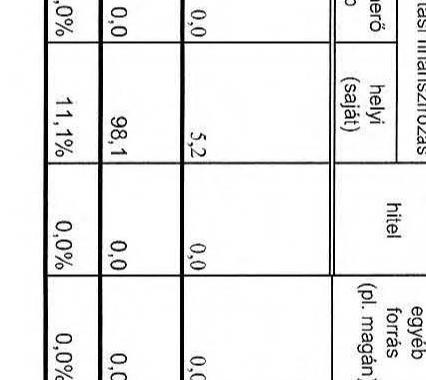

---

# ADATLAP 

## az európai uniós forrással támogatott GVOP-2004-4.3.1. „Dél-dunántúli régió elektronikus közigazgatási szolgáltatásainak fejlesztése" feladatról

## 1. A PÁLYÁZÓ ADATAI

1.1. A pályázó Önkormányzat neve: Pécs Megyei Jogú Város
1.2. A pályázó Önkormányzat címe: 7622. Pécs, Széchenyi tér 1.

## 2. A PROJEKT ÖSSZEGZŐ ADATAI

2.1. A pályázott program megnevezése: szolgáltató önkormányzat GVOP4.3.1.
2.2. A pályázott programon belül a projekt címe: Dél-dunántúli régió elektronikus közigazgatási szolgáltatásainak fejlesztése
2.3. A pályázatot készítõ megnevezése: Pál Attila
2.4. A pályázat benyújtásának időpontja: 2004. 05. 28.

### 2.5. A pályázott projekt tervezett

- teljes kiadásának összege: 617513000 Ft
2.6. A pályázott projekt megvalósításának tervezett forrása:
- támogatásának összege:
- európai uniós: 403134750 Ft
- hazai társfinanszírozás: 134378250 Ft
- EU Önerő Alap: -
- saját forrás: 80000000 Ft
- hitel: -

---

- egyéb forrás: -
2.7. A megvalósítás tervezett kezdési és befejezési időpontja (év, hó, nap): kezdési: 2004. augusztus 1. befejezési: 2006. július 31.

# 3. A PÁLYÁZAT ELBÍRÁLÁSA 

3.1. A pályázat elbírálásáról szóló döntés kelte: 2004. 09. 01.
3.2. A pályázat elbírálásának eredménye: pozitív

## 4. A TÁMOGATÁSI SZERZŐDÉS ADATAI

4.1. A támogatási szerződés megkötésének időpontja: 2005. 02. 14.
4.2. A projekt kezdési és befejezési időpontja: 2004. december 08. 2006. december 08 .
4.3. A projekt elszámolható összköltsége (kiadása): 617513000 Ft
4.4. A projekt megvalósítás forrásai:

- európai uniós támogatás: 403134750 Ft
- hazai társfinanszírozás: 134378250 Ft
- EU Önerő Alap saját forrás: -
- saját forrás: 80000000 Ft
- hitel: -
- egyéb forrás: -

### 4.5. A projekt számszerüsíthető eredményei

| $\begin{aligned} & \text { Eredmény } \\ & \text { /Mutató } \\ & \text { /Indikátor } \\ & \text { neve } \end{aligned}$ | Kulcs indi-   kátor   (I/N) | Mér-   tékegy-   ség (db,   fö, \%) | Bázisért   ék | Megvalósítási idöszak (célérték) |  |  |  | Fenntartási időszak (célérték) |  |  |  |
| :--: | :--: | :--: | :--: | :--: | :--: | :--: | :--: | :--: | :--: | :--: | :--: |
| Létrehozott és megőrzött munkahelyek száma | 1 | fő | 415 | 415 | 415 | - | 415 | 415 | 415 | 415 | 415 |
| Nők által betöltött munkahelyek száma | 1 | fő | 328 | 328 | 328 |  | 328 | 328 | 328 | 328 | 328 |
| Létrejött online szolgáltatások száma | 1 | db | 0 | 10 | 10 |  | 10 | 10 | 10 | 1C | 10 | 10 |
| E-közigazgatási szolgáltatásokat elérő vállalkozók száma | 1 | db | 6000 | 9000 | 9000 |  | 12000 | 12000 | 12000 | 1200C | 12000 | 12000 |

---

| Új informatikai felhasználók száma a támogatott csoportban | 1 | fő | 415 | 615 | 615 | 615 | 615 | 615 | 615 | 615 | 615 |
| :--: | :--: | :--: | :--: | :--: | :--: | :--: | :--: | :--: | :--: | :--: | :--: |
| Legalább 2. szintü szolgáltatást elérő lakosság száma | 1 | fő | 160000 | 160000 | 160000 | 160000 | 160000 | 160000 | 160000 | 160000 | 160000 |
| Azon ügyintézési szolgáltatók száma, amelyek ténylegesen elérhető 3. vagy 4. szintü online szolgáltatásként | 1 | db | - | 4 | 7 | 7 | 7 | 7 | 7 | 7 | 7 |
| Azon helyi KKV száma, amely ténylegesen és rendszeresen használja a 3. vagy 4. szintü ügyintézési szolgáltatásokat, valamint a közérdekü, vagy közhasznú információkat. | 1 | $\%$ | 7 | 28 | 42 | 56 | 56 | 56 | 56 | 56 | 56 |

# 5. ElLENŐRZÉSEK 

### 5.1. A külső ellenőrzések:

- az ellenőrzések száma: 6
- az ellenőrzést végző szervek megnevezése: KEHI, ÁSZ, IT Információs Társadalom Kht

### 5.2. A külső ellenőrzések által feltárt szabálytalanságokra vonatkozó adatok:

- mely előírást nem tartották be: -
- az előírás nem teljesítésének okai: -
- a rendezésre előírt kötelezettségek: -
- a rendezésre előírt kötelezettséget mennyi időn belül teljesítették: -
- mekkora időbeli csúszást eredményezett ez a projekt megvalósításában (év, hó, nap): -

Kelt: 2010. május 6.
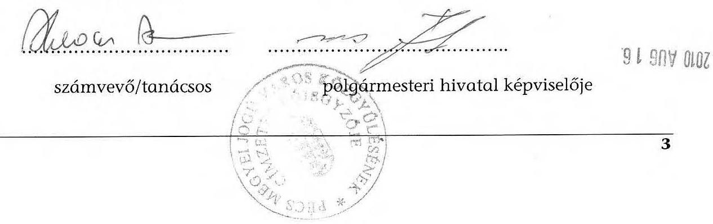

---

Szám: 03-3/595-6/2010.

Tárgy: A Pécs Megyei Jogú Város önkormányzata gazdálkodási rendszerének ellenőrzésével kapcsolatos számvevői jelentés megállapításaira észrevétel
Hivatkozási szám: V-3023-7/27/14/2010.
V-3023-7/27/24/2010.

Állami Számvevőszék
Domokos László elnök

# Budapest 

Apáczai Csere János u. 10.
1052

## Tisztelt Elnök Úr!

Pécs Megyei Jogú Város Önkormányzata gazdálkodási rendszerének ellenőrzésére vonatkozó 2010. október 15 -én aláírt és a Polgármesteri Hivatalban 2010. október 19-én érkezett V-3023-7/27/24/2010. szám alatt kiadott számvevői jelentés, valamint a V-3023-7/27/14/2010. számú vizsgálatvezetői tájékoztatással kapcsolatban az 1989. évi XXXVIII. tv. 25 § (1) bekezdése alapján az alábbi észrevételeket teszem:

Kérem, hogy a 2010. augusztus 5-én a V-3023-7/27/6/2010. szám alatt kiadott jelentésre, a 2010. augusztus 25-én a 03-3/595-2/2010. valamint a 03-3/5953/2010. szám alatt megküldött magyarázatainkat, észrevételeinket és ellenvéleményünket, valamit - jelen iratunkban megfogalmazott - a V-30237/27/14/2010. sz. iratban foglaltakra tett észrevételeinket a végleges jelentésben továbbra is feltüntetni szíveskedjék.

A 03-3/595-2/2010. és a 03-3/595-3/2010. szám alatti iratainkban foglaltakat fenntartjuk.
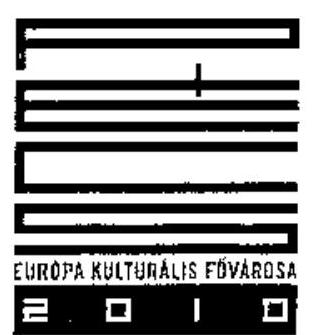

H-7621 PÉCS $\cdot$ Széchenyi tér 1. $\cdot$ Postacím: H-7602 Pécs $\cdot$ Pf. 58.
Telefon: +36 (72) $533-800^{\circ}, 533-807 \cdot$ Fax: +36 (72) 212-049

---

A V-3023-7/27/14/2010. számú iratban foglaltakra az alábbi kiegészítő észrevételeket tesszük.

# 1., 3., 6., 9., 11., 12., 19. pontok tekintetében: 

A fent megjelölt iratokban kiadott észrevételeinket azzal egészítjük ki, hogy az Állami Számvevőszék által készített jelentésben foglalt észrevételekre vonatkozóan a Pénzügyi Főosztály részletesen kidolgozza intézkedési tervét annak érdekében, hogy további tevékenysége maximálisan megfeleljen a hatályos jogszabályi előírásoknak.

## 4. pont tekintetében:

A 18/2005. (XII. 27.) IHM rendelet 3. § (3) b) pontja megengedi az eltérést, ha azt „a honlap szerkezeti felépítése, vagy az alkalmazott technológia szükségessé teszi, tekintettel az egyszerű, közérthető és teljes tájékoztatás követelményére".

Ez a rendelkezés lehetővé teszi egyrészt a „Közérdekü adatok" elnevezés helyett más elnevezés használatát, másrészt az eltérést a rendeletben meghatározott 2. melléklet szerinti felépítéstől.

Mindezek mellett a honlap „Polgármesteri Hivatal/Közérdekü adatok" menüpontja a hivatkozott rendelet 1. melléklete szerinti adatokat tartalmazza. A honlap struktúrájából adódóan kerültek elhelyezésre ebben a menüpontban a közérdekü adatok. Az esetlegesen fellelhető eltéréseket az adatok duplikációjának elkerülése okozza. A kifogásolt tájékozódási nehézségekre egy navigációs oldalt fejlesztünk. Az „Üvegzseb" menüpont az Áht.-nek megfelelően közérdekü adatokat tartalmaz, de az nem azonos a rendelet előírásaival, azokat kiegészítve, annál bővebb adatokat tartalmaz.

## 5. pont tekintetében:

A honlap alkalmas arra, hogy a költségvetéssel kapcsolatban valamennyi dokumentumot az „Önkormányzat/Képviselői munka dokumentumai/Elöterjesztések" menüpont alatt megjelenítsen.

## 7.pont tekintetében:

Eddigi álláspontunkat fenntartva úgy ítéljük meg, hogy a FEUVE rendszert a hatályos jogszabályi rendelkezések alapján dolgoztuk ki és müködtetjük. Elismerjük ugyanakkor azt is, hogy a Pénzügyi Főosztály ellenőrzési nyomvonala késve készült el. A munkaköri leírások pontosítása folyamatban van, a munkaköri leírások nagy része átdolgozásra került.

## 8. pont tekintetében:

Az e pontban hivatkozott dokumentumok összhangját 2010-ben megteremtettük.

## 10. pont tekintetében:

Az Ellenőrzési Osztály munkáját ellenőrzési terv alapján végzi. A terv egy évre szól, s annyi ellenőrzést tartalmaz amennyit az osztály - létszámára figyelemmel - el tud végezni. A jelentés által kifogásolt időszakban a tervhez képest 4 ellenőrzés elmaradt. Ennek oka az volt, hogy a közgyülés 12 új vizsgálatot rendelt el, melyeket el kellett végezni. Így nem jutott idő az elmaradt vizsgálatok elvégzésére.

---

Az Ellenörzési Osztály munkatervét ezek után úgy állítja össze, hogy maradjon idő az esetlegesen elrendelt rendkívüli vizsgálatok lefolytatására is.

# 13. pont tekintetében: 

A Jelentésben foglaltakat sajnos nem fogadhatjuk el. Az értékesítésről hozott döntés ugyanis rendelkezett a törzsvagyoni körből történő kivonásról, az akkori szabályok szerint határozattal.

Kiemeljük, hogy sem a Jelentés, sem az észrevételeinkre adott válasz nem adta magyarázatát, hogy mit tekint konkrét jogszabálysértésnek. Úgy ítéljük meg, hogy az Állami Számvevőszék által kialakított álláspont ellentmondásos.

A Jelentés megjegyzi ugyanis, hogy az Ötv 79. § (2) bek-ben foglalt „rendeletben szabályozott feltételek szerint" kitétel kizárólag a koriátozottan forgalomképes törzsvagyoni körre vonatkozik, majd annak alátámasztására, hogy az Önkormányzat ezen szabályt megsértve járt el felsorolja többek között az egyik értékesítetéssel érintett ingatlant, mint „intézményi területet", melyet a hivatkozott törvényhely azonos §-ában kifejezetten az intézményi - tehát korlátozottan forgalomképes - vagyoni körbe sorolja.

A Közgyülés az értékesítésről szóló döntésébe foglaltan rendelkezett a kivonásról is, melyet a Tisztségviselői Kabinet vezetője átvezetett a kataszteri nyilvántartáson.

A felvetés tehát számunkra továbbra sem érthető. Az akkori szabályoknak minden megfelelő módon járt el ugyanis a Testület. Azt pedig sem az Ötv., sem az Áht. nem írja elő, hogy a kivonás módja kizárólag önkormányzati rendelet alkotása, illetve annak módosítása lehet. A szerződés megkötésének időpontjában (2008. június 26.) nem voltak tehát az ügyleti ingatlanok forgalomképtelenek, azokat ugyanis a Közgyülés 2008. június 19-én kelt határozatával, és annak kataszteri átvezetésével a törzsvagyonból kivonta.

Az, hogy ezen eljárást a Jelentés, illetve a válasz szerint a vagyonrendelet nem szabályozta megfelelő részletességgel álláspontunk szerint nem jelent jogszabálysértést. Feltéve, de nem elfogadva, hogy a Tisztségviselői Kabinet vezetője a közgyűlési határozat alapján nem vezethette volna át a törzsvagyoni változásokat a rendelet mellékletében, sem változtat azon a tényen, hogy a rendelkezési jogkör gyakoriója szabályos keretek között határozott az értékesítésről, így tehát, az nem vitatható ténykérdés, hogy a szerződés megkötésének időpontjában a vagyonelemek nem tartoztak törzsvagyoni körbe. Az Ötv. szerint az Önkormányzat tulajdonosi jogainak gyakoriója a Közgyülés, mely szerv jogosult az egyes vagyonelemek elidegenítésére, ennek keretében pedig az átminősítésére.

Azon vagyonelemeknél pedig, melyeket törvény státuszánál-funkciójánál fogva nyilvánít forgalomképtelennek - az ügyleti ingatlanok pedig ilyenek voltak semmilyen általam ismert jogszabály nem zárja ki, hogy azokat az Önkormányzat határozatával vonja ki a törzsvagyonából, majd mindez a kataszteri nyilvántartásban átvezetésre kerüljön. (Megjegyzendő, hogy ez a szabály a vagyonrendelet - válasz által is hivatkozott és nem kifogásolt - 2009. évi módosítását követően is ekképpen érvényesül.)

---

A 2009. december 21-én elfogadott vagyonrendelet módosítás tovább egyértelműsítette az irányadó eljárásrendet, ez azonban önmagában nem jelenti a korábbi procedúra jogellenességét. Kevéssé érthető tehát a Jelentés éles kritikája, miközben a legfőbb döntéshozó szerv a tények és a számok ismeretében mindenről döntést hozott, melyet az erre utasított hivatali egység a kataszteri nyilvántartáson a szükséges felhatalmazás birtokában átvezetett, mindez pedig a tényleges tulajdon átruházást megelőzte.

# 14. pont tekintetében: 

Ezen pontban foglalt érvelést részben elfogadjuk. A kötelezettségvállaló okirat tanúsága szerint ugyanis a Főjegyző törvényességi kontroll keretében ellenőrizte a szerződéseseket, ennek során pedig az általa szükségesnek ítélt mértékben nyilvánvalóan meggyőződhetett a kötelezettségvállalás érdemi tartalmáról, így annak szabályosságáról.

Ténykérdés tehát, hogy az Ámr. alapján erre jogosult személy a kötelezettségvállalásról tudomást szerzett. Úgy ítéljük meg, hogy ezen meggyőződés történhet a kötelezettségvállalást tartalmazó okiratok aláírásra történő előkészítése keretében zajló „belső ügyirat köröztetés" során is. A válasz által hivatkozottak miszerint az Ámr. valóban elöirja a kötelezettségvállaló okirat ellenjegyzését - a tudomásszerzéstől részben független kérdés.

A szerződések egy eredeti példányát az erre felhatalmazott Pénzügyi Főosztályvezető ellenjegyezte ezen okirat pedig a pénzügyi nyilvántartásban szerepel. Az hogy nem valamennyi eredeti okirati példányon található az ellenjegyzö szignója önmagában nem ütközik semmilyen jogszabályba, az ellenjegyzés ugyanis nem az okirat polgáriogi értelemben vett érvényességi kelléke, hanem kifejezetten az államháztartás müködési rendjébe tartozó államigazgatási szervezetre vonatkozó speciális eljárási rend - a kötelezettségvállalás rendjének - egyik eleme.

Tehát az ügyletben érdekelt, illetve érintett harmadik személyek számára (vevő, kezes, eljáró földhivatal, stb.) rendelkezésre bocsátott okiratok szempontjából ezen ellenjegyzés hiánya nem bír az érvényességre kiterjedő joghatással. Adminisztrációs szempontból talán nem szerencsés, de szintén nem jogszabálysértő, hogy a Jelentés készítője részére átadott másolat nem az ellenjegyzett eredeti példányról készült.

## 15. pont tekintetében:

E pont alatti okfejtés számunkra továbbra sem érthető. E helyütt ugyanis a szerződés vevői teljesítések részletekben történő ütemezése körében oly mértékig evidens okirati rendelkezéseket támad, melyek az érvelést gyakorlatilag súlytalanná teszik.

Anélkül, hogy a korábbiakban már részletesen kifejtett pénzügyi ütemezésre vonatkozó szerződéses rendelkezéseket, illetve azok értelmezését megismételnénk a Számvevőszék álláspontjával kapcsolatban csak egyetlen rövid jogszabályi rendelkezést hivatkozunk meg: Ptk. 207. § (1) „A szerződési nyilatkozatot vita esetén úgy kell értelmezni, ahogyan azt a másik félnek a nyilatkozó feltehető akaratára és az eset körülményeire tekintettel a szavak általánosan elfogadott jelentése szerint értenie kellett." A Jelentés, illetve a válasz által hivatkozott eltérő tartalomra vonatkozó esetleges szerződéses szándék tehát csak - és kizárólag - abban az esetben lehetett volna vizsgálható, ha a végrehajtás során bármelyik szerződéskötő

---

számára értelmezési eltérés merült volna fel a pénzügyi teljesítés ütemezése körében.

Erről azonban szó sem volt, mind az eladó, mind pedig a vevő számára teljesen egyértelmű volt, hogy mikor, és milyen összegű vételárrészletet esedékes és szükséges teljesítenie. Értelmezési eltérés híján pedig legalábbis vélelem szól amellett, hogy a felek által követett eljárással összhangban álló tartalommal bír a hivatkozott szerződéses rendelkezés.

Miután pedig a szerződés - ebből a szempontból is - megfelelő módon végrehajtásra került nehezen érthető, hogy a Jelentés, illetve a válasz miért boncolgat egy az eljáró felek számára az evidencia szintjén egyértelmű módon megfogalmazott, és végrehajtott rendelkezést, ilyen módon a számvevőszéki állítást a tények cáfolják.

# 16. pont tekintetében: 

A Jelentés okfejtése álláspontunk szerint félreértelmezi ugyanis a késedelmi kötbér és a kamat jogi természetét. A Ptk. azon megfogalmazása miszerint a pénztartozás késedelmes fizetése esetére kikötött kötbérre a késedelmi kamat szabályait kell alkalmazni nem azt jelenti, hogy a két jogintézmény egymást kizárná. Az erre vonatkozó korábbi részletes okfejtés megismétlése nélkül, csak rövid megállapításként rögzítendő, hogy kötbér mellett alkaimazott késedelmi kamat esetén csak annak mértéke korlátozott, méghozzá a mindenkori törvényes kamat mértékében.

A két állítás - tehát az együttalkalmazás kizártsága, illetve a mérték korlátozottsága azonban tartalmilag távolról sem azonos. Nem megfelelő jogismertet tükröz tehát a válasz azon érvelése, hogy jogszabályba ütközne a kötbér mellett alkalmazott kamat. Mindez már csak a két fogalomnak az általános értelmezési elvek szerint feltárt tartalmából is adódik.

Az ugyanis, hogy egy jogintézmény bizonyos feltételek melletti alkalmazása esetén egy másik jogintézmény szabályai az alkalmazandóak nem azonos annak tilalmazottságával, ha ugyanis erről lenne szó akkor a Ptk. nem utaló, hanem tilalmazó szabályt írna elő.

Álláspontunk alátámasztásul idézett bírói döntés (BH1988. 142.) cáfolataként a válasz által citált bírói döntés kapcsán hivatkozott érvelés, mely szerint annak későbbi volta miatt a Számvevőszék által megjelölt ítélet a mérvadó szintén csak helytelen állítás. Az elvi mondanivalójuk végett közzétett felsőbírósági ítéletek között ugyanis az időbeliségük szerint nincs hierarchia.

Természetesen előttünk is ismert, hogy egyes döntés típusok esetén (így különösen a kollégiumi vélemények, illetve a jogegységi határozatok esetén) a későbbi döntés erre vonatkozó kitétel esetén - ieronthatja az azonos tárgyban hozott korábbi aktusokat, ezt azonban kifejezetten kimondani szükséges.

Az elvi jelentőségük miatt közzétett bírói határozatok között - a releváns jogszabályi környezetben történt módosulás híján - azonban a meghozataluk időbelisége alapján önmagában rangsor nem állítható fel. Továbbra is állítjuk tehát, hogy a

---

szerződésnek a késedelmi kötbér melletti kamatkikötése nem volt jogszabálysértő, az más kérdés, hogy együttes alkalmazásuk esetén a mértékük a hivatkozott törvényhelyek szerint maximalizált, mely egyúttal a követelhetőség felső határát is jelenti. Pontosan ezt hivatott alátámasztani az általunk idézett döntés, mely szerint „Pénztartozás késedelmes teljesitése esetére kötbér csak a törvényes kamatfizetési kötelezettség mértékéig köthető ki érvényesen."

Álláspontunk szerint bizonyított tehát, hogy az együttalkalmazás távolról sem tiltott, ellenkező esetben a határozat nem a mérték korlátozottságát, hanem a kölcsönös alkalmazás tényének kizártságát mondta volna ki.

# 17. pont tekintetében 

Ebben a pontban foglalt okfejtést elfogadni nem tudjuk. A Jelentés ugyanis azt állította, hogy a régészeti költségek megosztása jogilag vitatható volt, ugyanis az nem volt az Önkormányzat kötelezettsége. Az erre adott jegyzői reakció tételesen megmagyarázva rámutatott arra, hogy szerződő felekben fel sem merült annak tudata (illetve tudatának a hiánya), hogy a hivatkozott vállalás kötelezettségként érvényesülhetne, épp ellenkezőleg teljesen tiszta és világos volt, hogy a vitatott költségvállalás nem eladó törvényböl adódó feladata, hanem kifejezetten az ügyletkötés keretében lefolytatott alku eredménye.

Az pedig, hogy a hivatkozott vállalás az üzleti kockázat körébe sorolható, a szerződéses viszonyrendszer egészéből, a felek által kölcsönösen vállalt jogokból és kötelezettségekből, illetve magából a konkrét kötelem természetéből, és nem a vállalás közvetlen összegszerűségéből adódik. Ha a vállalás volumene már a szerződés megkötésekor forintra lebontva ismert lenne, egzakt pénzügyi kötelezettségvállalásról és nem üzleti kockázatról beszélnénk, a kockázatnak mint fogalomnak szükségszerű eleme ugyanis egyfajta bizonytalansági tényező. A válasz ugyanakkor épp arra hivatkozva vitatja a vállalás kockázati jellegét, hogy egyúttal annak bizonytalanságára hivatkozik, az érvelés számunkra értelmezhetetlen.

## 18. pont tekintetében:

E pontban foglaltak szerinti - a Magasház értékesítésével egyidejűleg alapított, a vevő számára a szerződés keretében biztosított használati jog térítésmentességére vonatkozó - számvevőszéki okfejtést szintén nem tudjuk elfogadni. Az ugyanis, hogy a forgalmi értékbecslésben szereplő érték azonos a szerződéses vételárral még nem jelenti, hogy az nem képezheti annak részét. Épp ellenkezőleg, amennyiben a válasz okfejtése helytálló lenne, úgy a térítésmentes jogalapítást, mint ajándékozást külön ki kellett volna mondani, ezen jogcímhez tartozó Ptk-beli kogens feltételek egyidejű beépítése mellett.

Erről azonban szó sincs, a szerződés mind jogcímében, mind tartalmát tekintve egyértelműen adásvétel. A megkötött ügylet az ajándékozás egyetlen - az adásvételtől egyébként lényegében eltérő - polgári jogi feltételének nem felel meg.

Rövid példa ennek alátámasztására: Az ajándékozás esetén egész más járulékos felelősségi és szavatossági szabályok érvényesülnek, a szerződés ellenben kifejezetten a vételi jogcímhez kötött helytállási kötelezettségről rendelkezik, túl azon, hogy az ingyenességet, valamint az ahhoz kapcsolódó körülményeket külön meg kellett volna állapítani.

---

A szerződés helyes értelmezése esetén tehát fel sem merülhet annak ajándékozási jellege. A válasz arra vonatkozó megállapítása, hogy a forgalmi értékbecslés tárgyát a 3467, és 3469 hrsz-ú ingatlanok mennyiben képezték, vagy sem nincs közvetlen összefüggésben a szerződés tárgyi terjedelmével. A szakértő vizsgálati feladatától függetlenül jogosult a tulajdonos a pályázati eljárás, illetve tárgyalások keretében az adásvétel konkrét feltételeit meghatározni.

A Jelentés, illetve a válasz állítása, és az annak alátámasztására felhozott érvek egymással nem koherensek. Semmilyen jogszabály nem zárja ugyanis ki, hogy felek úgy kössenek meg egy adásvételi szerződést, hogy azonos okiratba foglaltan egyidejűleg a főszolgáltatáshoz rendelten, annak használhatóságát elősegítve járulékos jogalapításra is sor kerüljön a vételárba foglaltan.

A jegyzői reakció ezen okfejtését a válasz nem cáfolja, arra semmilyen módon nem reagál. Úgy ítéljük meg, hogy a Jelentés nem veszi figyelembe a főszolgáltatásjárulékos szolgáltatás fogalmi lényegét, úgy állít, hogy azt nem bizonyítja, ami sajnálatos módon azt eredményezi, hogy a vagyonrendelet olyan pontjait hivatkozza meg (térítésmentes jogalapítás harmadik személy részére) melyek e helyütt nem relevánsak.

A helyzet egyértelmű: az Önkormányzat a vételi ügylet keretében a főszolgáltatásként létező épülethez - mint dologszolgáltatáshoz - kapcsolódóan, annak rendeltetésszerű használhatóságát biztosítandó használati jogot alapított a parkoló létesítési kötelezettség teljesíthetősége céljából. Ezen jogalapítás nélkül az épületnek, mint a szerződés tárgyának rendeltetésszerű használhatósága nem biztosított, melyért ellenben az eladó a Ptk. általános szabályai szerint szavatossági jellegű feltétlen helytállási kötelezettséggel tartozik.

Tehát nem egyoldalú és ingyenes jogalapításról van szó, hanem az átruházás tárgya rendeletetésszerű használhatóságának - tényleges építkezés hiányában egyelőre természetesen elvi - biztosításáról, mely ódiumot a polgári jog kogens módon rója az Önkormányzatra, mint eladóra. Mindebből következik, hogy nem a jogalapítással, hanem épp ellenkezőleg, annak nélkülözése esetén járt volna el Önkormányzatunk jogszabály ellenesen, megsértve ugyanis ez esetben a szolgáltatás tárgyának hiánymentességére vonatkozó átruházói kötelezettségét, a lakóházként átruházott épület ugyanis parkolóhelyek híján nem lenne használható, nem megfelelve ezzel vevő - eladó előtt ismert - ügyleti érdekeltségének.

Az adásvétel célirányos ügylet volt, eladó ismerte a vevő jövőbeli terveire vonatkozó elképzeléseit - ez mind a pályázati kiírásnak, mind a majdani vevő benyújtott pályázati anyagának részét képezte -, melyekben egyértelműen szerepelt a jövőbeli elképzelések megvalósításához szükséges parkoló igény, így tehát kifejezett ügyleti szándék és érdek fűződött az épület használhatóságához szükséges parkolóhelyek biztosításához.

Az észrevétel tekintetében tehát nem a vagyonrendeletet, hanem a Polgári Törvénykönyvet kellett volna a válasz szerkesztőjének alkalmaznia, illetve a két jogszabályhelyet pedig egymásra tekintettel - azoknak a jogszabályi hierarchiában elfoglalt helyükre is figyelemmel - értelmezni.

---

# 20. pont tekintetében: 

Valamennyi az önkormányzat által nyújtott támogatás megtalálható az önkormányzat honlapján az „Üvegzseb/Támogatási szerződések nyilvántartása" menüpont alatt. A Jelentésben kifogásolt támogatások is

- a Pécsi Vízmú Zrt. Számára nyújtott 1.148 ezer Ft-os müködési támogatás 07-7/731-25/2009. iktatószámmal,
- a Pécs-Pogányi Repülöteret müködtető Kft. Számára nyújtott támogatás 8-3324/2006 iktatószámmal, ami egy 10 éves szerződés, ennek része a hiányolt 1 évre eső támogatását, míg
- a József utca 17/1. számú társasház számára nyújtott támogatás a 08-8/157423/2008 számmal.
megtalálhatók a honlapon.

## 21. pont tekintetében:

A címzetes főjegyző a Jelentés által kifogásolt szerződéseket megszüntette, így az ellenőri függetlenséget biztosította.

## 23. pont tekintetében:

A Jelentés hivatkozási alapja, hogy mivel az Ötv. az önkormányzat éves ellenőrzési tervének jóváhagyását a képviselő-testület hatáskörébe utalta, így ezek módosítása is csak e szerv hatásköre lehet.

A megállapítás pusztán következtetésen alapul, konkrét jogszabályi hely hivatkozása nélkül.
Nem veszi figyelembe, hogy míg az Ötv. 92.§ (6) bekezdése az éves ellenőrzési terv elfogadását kifejezett rendelkezéssel utalja a Közgyülés hatáskörébe és arról a Ber. nem rendelkezik, addig a terv évközi módosításáról az Ötv. nem tartalmaz szabályokat.

Feltételezhető, amennyiben az ÁSZ véleményével összhangban kívánta volna szabályozni a kérdést a törvényalkotó, arra az Ötv-ben utalást tett volna. Az Ötv. 92.§ (12) bekezdése rendelkezik arról, hogy a helyi önkormányzat és költségvetési szervek belső ellenőrzésére vonatkozó részletes szabályokat külön jogszabály tartalmazza.

Jelen kérdést illetően is a Ber. tartalmaz rendelkezéseket. A Ber. 21.§ (5) bekezdése szerint „az éves ellenőrzési tervet a belső ellenőrzési vezető a költségvetési szerv vezetőjének egyetértésével módosíthatja". A (6) bekezdés szerint a „soron kívüli ellenőrzést a költségvetési szerv vezetőjének javaslatára, illetve a belső ellenőrzési vezető kezdeményezésére lehet végezni."

Nyilvánvaló, hogy a vizsgálatok elindításához fűződő érdek miatt a testületi döntések meghozatalához, előkészítéséhez szükséges időigényesség miatt e kérdést az Ötv. nem rendelte a Közgyülés hatáskörébe.

Figyelembe veendő, hogy az Ötv. 92.§ (10) bekezdése szerint „a polgármester a tárgyévre vonatkozó .... éves ellenőrzési jelentést ... a zárszámadási rendelettervezettel egyidejűleg - a képviselőtestület elé terjeszti."

---

A Ber. 31.§ (3) bekezdése - hivatkozva a PM által közzétett módszertani útmutatóra - meghatározza az éves összefoglaló ellenőrzési jelentés tartalmi követelményeit.

A 31.§ (3) bekezdése szerint az éves ellenőrzési jelentés többek között az alábbiakat tartalmazza: „aa) az ellenőrzési tervben foglaltak teljesítésének értékelését, a tervtől való eltérések indokát, a terven felüli ellenőrzések indokoltságát".

A közgyűlés tehát az utólagos beszámolóval szerez tudomást az ellenőrzési terv módosításáról, annak okairól. A beszámoló elfogadásával egyúttal a tervben végrehajtott változtatásokat is elfogadja.

Amennyiben a Jelentésben megfogalmazott álláspont helyes lenne és a Közgyűlés a módosításokról külön-külön döntene, már megismerné az okokat és tényeket, miért kellene még egyszer előterjesztésben mindezekről számot adni.

Jelezzük, hogy a Jelentés sem fejti ki, hogy mikor kellett volna a módosítást a Közgyűlés elé terjeszteni, csak azt kifogásolta, hogy a Közgyűlési jóváhagyás nem történt meg.

Ezen megállapítás álláspontunk szerint helytelen, mivel a Közgyűlés minden évben a zárszámadás keretében tárgyalta a belső ellenőrzés munkáját. Az anyag tételesen szervezetek nevesítésével - tartalmazta az elvégzett munkát, nevesítette a tervből törölt feladatokat és kitért a módosításokkal felvett - soron kívül végzett ellenőrzésekre is. A beszámoló tartalmazta a tervtől való eltérés okait is. Az anyag a korábban csatolt zárszámadási előterjesztésekben megtalálható.

Így Pécs Megyei Jogú Város Közgyűlés utólagosan, de információt szerzett az általa jóváhagyott ellenőrzési tervben foglaltaktól való eltérésről, annak okairól, az ellen kifogást, észrevételt nem tett, tehát a beszámolóban foglaltakat elfogadta.

# 24. pont tekintetében: 

A stratégiai ingatlancsomag értékesítésének ügyében a vevői teljesítés kapcsán felmerült kötbér érvényesítése, illetve ezen követelésről lemondás tárgyában meghozott közgyűlési határozatot vitató megállapításokra korábban kifejtett véleményünket ismételten összefoglaljuk. A helyzet álláspontunk szerint egyértelmű: a Közgyűlés a 89/2009.(03.05.) sz. határozatában a fizetési határidő meghosszabbításához, és egyúttal az addig felszámítható kötbérösszegről kizárólag bizonyos feltételek teljesedésbe menéséhez kötötten, attól függő hatállyal mondott le. A Ptk. vonatkozó rendelkezése a következőképpen rendelkezik: 228. § (1) „Ha a felek a szerződés hatályának beálltát bizonytalan jövőbeni eseménytől tették függővé (felfüggesztő feltétel), a szerződés hatálya e feltétel bekövetkeztével áll be."
A rendelkezés tartalmának helyes értelmezése arra a következtetésre vezet, hogy a feltételhez kötött szerződés hatályosulása a feltétel bekövetkezésének függvénye. A hatály pedig a szerződés alkalmazhatóságát, vagyis joghatás kiváltásra, illetve a felek ott foglalt ügyleti akaratának megvalósítására való alkalmasságát jelenti.

A feltétel hiányában ez nem történik, nem történhet meg. („A szerződésmódosítás hatálya nem áll be, ha ezt a felek feltételhez kötötték, és a feltétel nem következett be." BH 1993/690.) Miután pedig a Közgyűlés határozata, mint jogi aktus érvényessége természetesen nem, de - hatályosulása jelen esetben az általa

---

jóváhagyott szerződéses ügylethez kötődik, l̇gy a joglemondás kizárólag a szerződés hatálybalépésével esedékes, mely csakis az abban kikötött felfüggesztő feltétel bekövetkezésével történhet meg. Erre utal a határozat szövegezése is: „A Közgyülés úgy dönt, hogy a város ún. stratégiai ingatlancsomagjának tárgyában 2008. június 26. napján kötött keretmegállapodást és adásvételi szerződéseket - az elöterjesztés melléklete szerint - módosítja." Tehát a feltétel megvalósulásával együtt - de csak azzal együtt - a szerződés hatályba lép, mely esedékessé teszi az abban foglalt rendelkezéseket, felek által/számára biztosított, illetve vállalt jogokat és kötelezettségeket, így többek között - illetve elsősorban - a nyilvántartott és felszámított követelés elengedését.

Ezen joglemondás azonban kizárólag a vevői teljesítéshez, mint hatályba léptető feltételhez kötötten érvényesülhet, és hatályosulhat. Nem tudjuk elfogadni ezért azon megállapítást miszerint a joglemondás irányadó dátuma 2009. március 05. napja, amikor is még nem volt hatályos a vagyonrendelet követelésekröl lemondást szabályozó §-a.

A lemondás egyértelműen a felfüggesztő feltételhez kötötten érvényesülhet, ahhoz igazodóan lép, vagy nem lép hatályba. Mindebböl pedig az - és csak az - a következtetés vonható le, hogy a lemondás tekintetében a releváns időpont a rendelkezés hatályosulásához köthető, ekkor válik ugyanis alkalmassá az ügylet a célzott joghatás kiváltására, vagyis kötelezettel szemben egyébként követelhető tartozása alóli mentesítésre.

Ebben az időpontban pedig a vagyonrendelet követelés lemondást szabályozó rendelkezései pedig már hatályosak voltak, mégpedig az átmeneti rendelkezésekben foglaltak szerinti módon a folyamatban lévő ügyekre is irányadóan. Márpedig egy már aláírt, de még hatályba nem lépett szerződés a felfüggesztő feltétellel érintett időszak alatt másképpen, mint folyamatban lévő ügy nem tekinthető.

# 25. pont tekintetében: 

A Jelentés a Magyar Államnak útépítéshez, mint kötelező alapfeladatának ellátásához történt ingatlan átruházás tárgyában megfogalmazott észrevételeit taglalja. Véleményünk szerint a kérdéses átruházás az Állam és az Önkormányzat viszonylatában - annak tárgyát, azaz a kötelező állami alapfeladat ellátását tekintve nem minősül az Ötv. vonatkozó rendelkezései szerinti, a forgalmi viszonyok körébe tartozó olyan ügyletnek, mely a forgalomképtelenség korlátjába ütközhetne. Ahogy az 1990. évben az Ötv. 107. §-a alapján az önkormányzatok egyes volt állami tulajdonú ingatlanokat kötelező alapfeladataik ellátása végett a törvény erejénél fogva történt tulajdonszerzése értelemszerűen a forgalmi viszonyok körén kívül eső aktus volt, úgy hasonló célból és jogalapon történő kvázi visszaszármaztatás is ilyen megítélés alá kell, hogy essen, azzal a korrekcióval, hogy miután a helyi önkormányzatoknak értelemszerűen nincs olyan - az Államhoz hasonló jogositványa, mely a konkrét esetben jogalkotás útján történő tulajdonrendezést eredményezhetne, így más eszköz hiján mindez ügyleti formában jelenik meg.

Ez azonban nem változtat annak elvi-jogi megitélésén tehát, hogy jelen kontraktus lényegében tér el a vagyoni forgalom általános szerződéses feltételeitöl, éppen annak speciális alanyaira, és az abban foglalt speciális célokra figyelemmel. Ha pedig mindezt elfogadjuk, abban az esetben már nem beszélhetünk egyoldalú

---

térítésmentes, joglemondásként értelmezhető szerződésnek, mellyel kapcsolatban annak vagyonrendeleti megalapozottsága képezte lényegében a kifogás tárgyát.

Az osztatlan közös tulajdon létesítését megelőzően a törzsvagyonból történő kivonásról rendelkező határozati pont tekintetében véleményünket már részletesen kifejtettük, azt azonban ismételten kiemeljük, hogy a válasz által képviselt nézet, mind a közös tulajdon tekintetében ma hatályos szabályoknak mind az egyéb általános polgári jogi elveknek ellentmond.

Az osztatlan közös tulajdonnak ugyanis lényegi eleme, hogy fennállása alatt a tulajdonostársak mindvégig olyaténképpen gyakorolják tulajdonosi jogaikat, hogy a tulajdonlás tárgyát képező dolog teljességére nézve kiterjed tulajdonosi hatalmuk, mellyel azonban - a közös tulajdonból fakadó specialitásnak megfelelően mindegyik fél csak bizonyos eszmei hányad erejéig élhet.

Álláspontunk szerint nem járt el helytelenül az Önkormányzat, mikor a törzsvagyoni körből történő kivonással időrendben a tulajdonközösség megosztását meg kívánta várni. Ezt megelőzően mindez az osztatlan közösség elvét sértené, meghiúsítaná ugyanis, hogy a tulajdonostársak ebbéli jogaikat - megosztva, illetve tulajdoni hányaduk erejéig korlátozva bár, de - a dolog egészére nézve gyakorolhassák.

Megjegyezzük, hogy a jogelméletben nem ismeretlen a jogilag - és nem a használati viszonyok tekintetében - osztott közös tulajdonlás, amely a válaszban foglalt okfejtésnek létjogosultságot adna, a mai hatályos polgári jogi szabályok azonban más filozófián nyugszanak, azok ugyanis a hányadok tekintetében meghatározottságot (kivéve egyes speciális öröklési jogi tényállásokat), a használati viszonyok vonatkozásában megoszthatóságot, a jogközösség viszonylatában ellenben oszt(hat)atlanságot írnak elő.

Ami pedig a közúti közlekedésről szóló 1988. évi I. tv. 32. § (3) bek-ben foglalt speciális átruházási jogcímet illeti, a válasz helyesen hivatkozza az idézett törvényhely azon kitételét, hogy jelen különös jogcím alapvetően az érintett ingatlanok úttá történő minősitését követően irányadó. Az átruházással érintett ingatlanok közül tízből négy tekintetében ez az állapot fennállt, és megvalósult, a többi terület pedig közterület besorolás alá esik, melyek ilyen minőségében is alkalmasak az útépítési engedély kiadására, tehát a hivatkozott §-ban foglalt célok elérésére. Ezt támasztja alá a konkrét esetben történő hatósági engedélyezési eljárás, ahol is az 58-as út szélesítése kapcsán a Közlekedési Hatóság az ominózus közterületek közúttá minősitését nem találta az építési engedély kiadásához szükségesnek, tehát út közterületen is megvalósulhat.

A Közlekedési Hatóság eljárása szerint az úttá minősités a beruházás - azaz az út kivitelezésnek - megvalósulását követően esedékes, ha ellenben a tulajdoni változás is csak ebben az időpillanatban valósulhatna meg a hivatkozott törvényhely alapján az a gyakorlatban és a konkrét esetben azt jelentené, hogy az állam még az önkormányzati ingatlanon idegen tulajdonon végzett beruházásként hajtaná végre az kivitelezést, majd csak a használatba vétellel egy időben történő átminősítést követően válna a hivatkozott módon átruházhatóvá a már megvalósított út.

---

Ezen értelmezés túl azon, hogy számtalan pénzügyi, és könyvviteli problémát vet fel (idegen tulajdonon végzett beruházás státusza, a elkészült mű aktiválása, az átruházás során a úthoz, mint felépítményhez kapcsolódó adózási kérdések, az ÁFA visszaigényelhetőségének esetleges problematikái, stb.) a szabályt gyakorlatilag teljesen kiüresítené, azt ugyanis annak értelmétől fosztaná meg.

Az átruházott közterületek a építési szabályzatban (PÉSZ) út - és kifejezetten állami közút - céljára lettek kijelölve, annak megvalósítására alkalmasak. Nincs tehát semmi akadálya a hivatkozott jogszabályhely alkalmazásának, föleg arra figyelemmel, hogy jelen esetben az eljáró hatóság igazolható módon konkrétan is nyilatkozott arról, hogy a tényleges átminősités csak a beruházás megvalósítását követően, a használatba vételi eljárás keretében látja időszerűnek.

Az építési engedélyt éppen az ingatlannak a PÉSZ-beli státuszára hivatkozva adta ki, tehát az útkénti létezést - a kivitelezés szempontjából - már annak jelölése is megalapozza. Ennek alapján feleknek nem is lett volna az átruházás lebonyolítására más lehetőségük, mint amelyek jelen esetben ténylegesen is követtek. Véleményem szerint tehát jogszabálysértésről nincs szó az Önkormányzat mindenben a törvényeknek, illetve a hatósági kritériumoknak megfelelve járt el, elősegítve ezzel az állami feladatok hatékony ellátását.

# Tisztelt Elnök Úr! 

Kérem, hogy a fentiekben foglalt észrevételeinket elfogadni szíveskedjék. Tájékoztatom, hogy a hivatkozott számú jelentésben foglaltak alapján - a hibák kijavítására - intézkedési tervet készítünk, melyet a közgyülés jóváhagyását követően 30 napon belül tájékoztatásul megküldök.

Pécs, 2010. október 27.
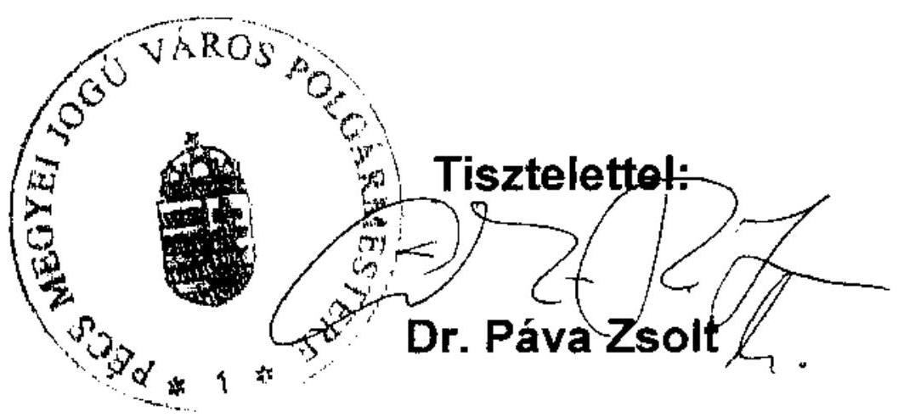

---

# Dr. Páva Zsolt úr 

polgármester
Pécs Megyei Jogú Város Önkormányzata

## Pécs

## Tisztelt Polgármester Úr!

Köszönettel vettem Pécs Megyei Jogú Város Önkormányzata gazdálkodási rendszerének 2010. évi ellenőrzéséről készített számvevőszéki jelentésre az Állami Számvevőszékről szóló 1989. évi XXXVIII. törvény 25. § (1) bekezdése alapján tett észrevételeit.

Örömmel vettem, hogy intézkedési tervet dolgoznak ki azon számvevőszéki javaslatok hasznosítására, melyek a költségvetési rendelet tartalmára; a költségvetési, zárszámadási rendeletek megalapozására, határidőire; a belső kontrollok kialakítására és müködtetésére; a kötelezettségvállalásra való felhatalmazásra vonatkoztak.

Észrevételében az augusztus 25 -én kelt levelében használt sorszámozást megtartva, a 4., 5., 7., 10., 13., 14., 15., 16., 17., 18., 23., 24., 25. pontokra vonatkozóan (közérdekủ adatok közzététele, a FEUVE rendszer kialakítása és müködtetése, a belső ellenőrzés, a stratégiai ingatlancsomag értékesítése, a forgalomképtelen törzsvagyoni körbe tartozó vagyonelemek Magyar Állam részére történő elidegenitése) kiegészítő észrevételeket tett. A kiegészítő észrevételeket az Önkormányzat nem támasztotta alá új dokumentumokkal, a kiegészítő észrevételek nem tartalmaztak a korábban előadottakhoz képest olyan új tényeket, adatokat, amelyek az Állami Számvevőszék megállapításainak, javaslatainak módosítását indokolnáa, ezért az Állami Számvevőszék megállapításait és javaslatait továbbra is fenntartom.

Az Állami Számvevőszék az Országgyűlés ellenőrző szerve, ellenőrzéseit célszerűségi, eredményességi és törvényességi szempontok szerint végzi. Ellenőrzései, javaslatai segitő szándékúak, ellenőrzési eredményeivel a hibák, hiányosságok, szabálytalanságok megelőzésére törekszik, elősegíti, hogy a szabályok betartása mellett gazdaságos, hatékony és eredményes legyen a közpénzek, a közvagyon felhasználása. Ellenőrzéseink során elsősorban nem a hiba, a felelős keresésére, a szankcionálás szorgalmazására koncentrálunk, hanem a jobbító szándékú ajánlások kimunkálására helyezzük a hangsúlyt, amelyekkel a vezetést, a döntés-előkészítést támogató tevékenységet kívánjuk segíteni. Természetesen rámutatunk azokra a

---

szabálytalanságokra is, amelyck következményc lehet a közpénzekkel és a közvagyonnal kapcsolatos pazarló gazdálkodás. A 2005-ben elvégzett ellenőrzésünk során tett 43 javaslatból sajnos csak azok $58 \%$-a hasznosult teljes mértékben, bizom benne, hogy Ön megteszi a szükséges intézkedéseket a korábban és a jelen ellenőrzés során tett számvevőszéki javaslatok teljes körű hasznosítására.

A jelentés részletesen tartalmazza az Önkormányzat el nem fogadott észrevételeivel kapcsolatban az Állami Számvevőszék álláspontját, azonban szeretném külön is felhívni Polgármester úr figyelmét az alábbiakra.

A közérdekủ adatok közzétételével kapcsolatban rámutatok arra, hogy a jogszabálytól eltérő elnevezésű és tagolású közzététel megnehezíti az állampolgárok közérdekủ információkhoz való jutását, meggyőződésem, hogy az Önkormányzat feladata ezzel éppen ellentétes, biztosítania kell az átláthatóságot, a közérdekủ adatokhoz való hozzáférést.

A FEUVE rendszerrel összefüggésben az Önkormányzat sem vitatja, hogy a Pénzügyi föosztály ellenőrzési nyomvonala csak a 2010. évben készült el, amely így eleve nem tette lehetővé a FEUVE rendszer 2009. évi teljes körű működtetését. Az Állami Számvevőszék is ezt állapította meg.

A stratégiai ingatlancsomag esetében a vagyongazdálkodási rendeletben foglalt forgalomképtelen törzsvagyoni körbe tartozó vagyonelemek forgalomképessé tételéről a közgyűlés határozattal döntött, amely azért nem fogadható el, mert alapvető jogelv: jogszabályt (az önkormányzat rendelete vitathatatlanul jogszabály) jogszabálynak nem minősülő önkormányzati határozattal megváltoztatni nem lehet.

A stratégiai ingatlancsomag értékesítésével összefüggő keretmegállapodást, hét adásvételi szerződést és egy Megállapodást (adásvételi szerződések módosítása) az Önkormányzat részéről csak a polgármester írta alá, mint kötelezettségvállaló. A kötelezettségvállalás ellenjegyzése jogszabályi követelményének betartásához nem elég, hogy a kötelezettségvállalás tényéről az ellenjegyző „belső ügyirat köröztetése" során „tudomást szerezzen". A kötelezettségvállalást meg kell, hogy előzze annak jogosult általi ellenjegyzése a kötelezettségvállaló okiratokon, jelen esetben az eredeti szerződéseken, amely nem történt meg. A főjegyző által 2010. április 20-án kiadott tanúsítvány szerint a stratégiai ingatlancsomag értékesítésével összefüggő, az Állami Számvevőszék számára átadott szerződések másolatai az eredetiekkel mindenben megegyezők, ezeken pedig nincs ellenjegyzés.

A stratégiai ingatlancsomag értékesítésével összefüggő keretmegállapodásban a vételárrészletek százalékos ütemezését tévesen határozták meg. Annak ellenére, hogy ez a szerződés teljesítésénél, a vételárrészletek fizetésénél a szerződő feleknek értelmezési problémát nem okozott, ilyen nagyságrendủ ingatlanértékesítésnél a közvagyon védelme, az azzal való felelős gazdálkodás miatt elvárható lett volna, hogy egyértelmú legyen a keretmegállapodás hivatkozott pontja. Az Állami Számvevőszék éppen a segitő szándék jeleként tette meg célszerűségi javaslatát, hogy a jövőre nézve az Önkormányzat fokozott

---

gondosságot tanúsítson e téren, a fizetésre vonatkozó megfogalmazás pontos és szakszerü legyen, ne adjon okot semmiféle vitára.

A stratégiai ingatlancsomag értékesítésénél a késedelmes fizetésre meghatározott késedelmi kötbér és kamat egyidejű kikötése esetén az Állami Számvevőszék megállapítása nem a jogszabálysértés tényét hangsúlyozta, hanem azt, hogy kötbér és a késedelmi kamat kikötése nincs összhangban a hivatkozott jogszabállyal, amely kimondja, hogy a pénztartozás késedelmes fizetése esetére kikötött kötbérre a késedelmi kamat szabályait kell alkalmazni.

Megismétlem, hogy a stratégiai ingatlancsomag értékesítésénél a régészeti feltárások költségeinek ,,üzleti kockázat körébe tartozó" 20\%-os mértékủ önkéntes vállalása ellentétes a közvagyon védelmével, amennyiben teljesedésbe menne a tudatosnak minősített vállalás, az Önkormányzatnak közel 1 milliárd forintot kellene visszafizetnie.

A Magasház értékesítésével egyidejüleg másik két ingatlanra parkoló és park létesítésére alapított használati jog nem képezte a vételár részét, az ingatlanforgalmi értékbecslés egy ingatlant, a Magasházat vette figyelembe a forgalmi érték megállapításánál. Így a vételár nem tartalmazta az érintett két ingatlan 75 éves használati jogának ellenértékét, vagyis a vevő ingyenesen jutott vagyoni értékủ joghoz. A „főszolgáltatás- járulékos szolgáltatás" ebben a körben szóba sem jöhet.

Az éves ellenőrzési terv módosításával kapcsolatban hangsúlyozom, hogy költségvetési szervekre vonatkozó, a Ber-ben rögzített általános szabályoktól eltérően az Ötv. az önkormányzat éves ellenőrzési tervének jóváhagyását a képviselő-testület hatáskörébe utalta, így ennek módosítása is csak e szerv hatásköre lehet. Mivel az Önkormányzat nem költségvetési szerv, ezért nem alkalmazható a Ber.-nek az a szabálya, mely szerint a Polgármesteri Hivatal, mint költségvetési szerv vezetője, a jegyző módosíthatja az Önkormányzat éves ellenőrzési tervét.

A kötbér és késedelmi kamat-követelésről való lemondás az eredeti szerződés alapján még az előtt megtörtént, hogy az erre vonatkozó belső szabályozásuk hatályba lépett volna, így a követelésről való lemondással az Önkormányzat nem tartotta be az Áht-ban elóírtakat

Az Önkormányzat forgalomképtelen törzsvagyoni körbe tartozó ingatlanokat idegenített el útszélesítés céljából a Magyar Államnak. A Polgári Törvénykönyv szerint a forgalomképtelen dolog elidegenítése semmis, ezért az Önkormányzat észrevétele nem megalapozott.

Kérésének megfelelően a végleges jelentésben az Ön által korábban tett és az Állami Számvevőszék által el nem fogadott észrevételeket - az Állami Számvevőszék álláspontjának egyidejű közlése mellett - továbbra is feltüntetjük.

Válaszában - a hivatkozott törvény értelmében - tájékoztatott az ellenőrzés alapján elrendelt intézkedésekről korábban tett észrevételének 8., 20., és 21 . pontja tekintetében. A 8. és 21 . pont vonatkozásában (a számviteli szabályzatok és a munkaköri leírások hiányosságaival, valamint a belső ellenőrök feladatköri függetlenségével kapcsolatban) megtett intézkedéseiket a jelentés már tartalmazza, azokra javaslatot sem tettünk. A 20. pont vonatkozásában (a céljellegủ

---

támogatások közzététele) megtett intézkedés azonban nem fogadható el, mert a közzétételre feltárt hiányosságot csak a mintavételi eljárásba bekerült tételekre szüntették meg, a hiányosság teljes körű megszüntetésére és a jövőbeni hiba elkerülésére további intézkedés szükséges.

Kérem, hogy a gazdálkodás szabályszerűségének, valamint a munka színvonalának javítására tervezett intézkedésekről szíveskedjen tájékoztatni!

Budapest, 2010. november " 22 ".
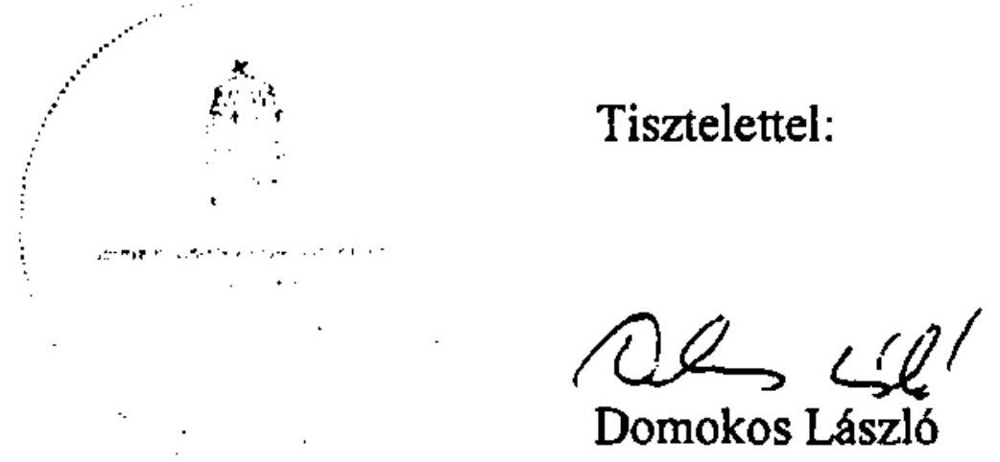