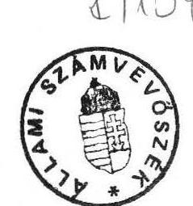
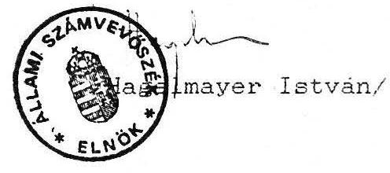
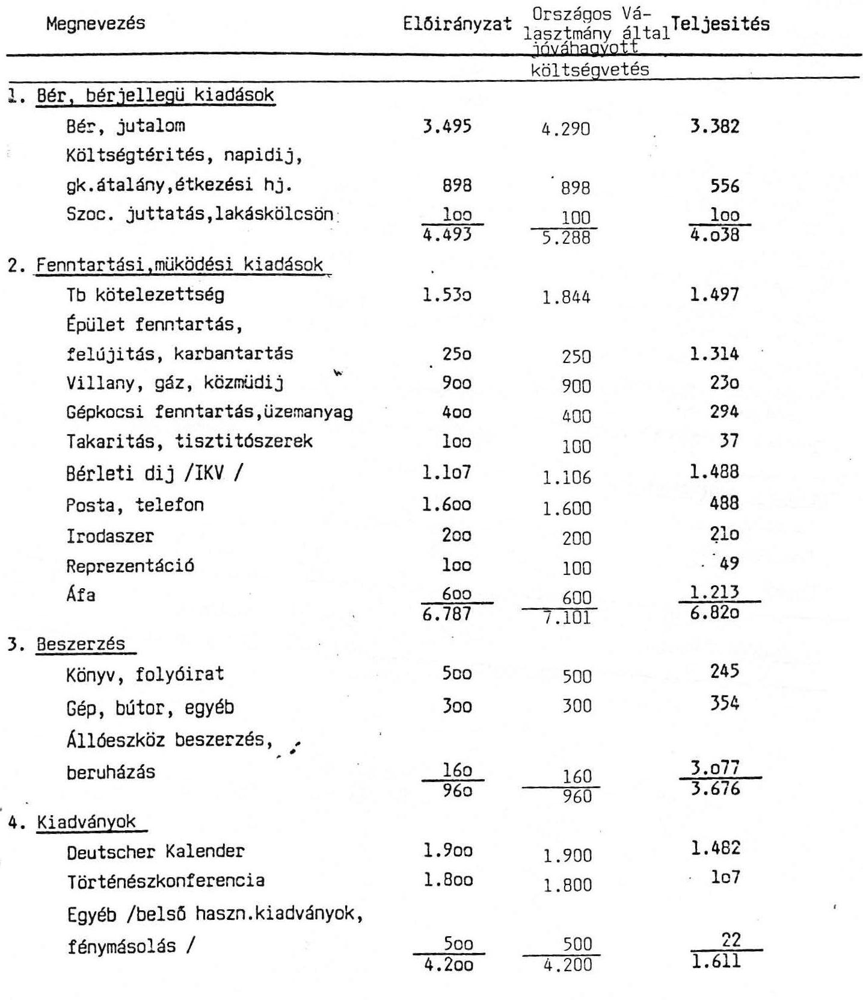

# Állami Számvevőszék

## JELENTÉS

a Magyarországi Németek Szövetségének
1991. évben juttatott állami költségvetési támogatás
felhasználásának ellenőrzéséről

---

# ÁLLAMI SZÁMVEVŐSZÉK

V-1011/12/1992.

## JELENTÉS

a Magyarországi Németek Szövetségének
1991. évben juttatott állami költségvetési támogatás
felhasználásának ellenőrzéséről

## I.

A vizsgálat célja, módszere

Az Állami Számvevőszékről szóló törvény értelmében az Állami Számvevőszék (továbbiakban: ASZ) ellenőrzi az állami költségvetésből juttatott támogatás felhasználását a társadalmi szervezeteknél. Az Országgyűlés a 6/1991.(II.11.) sz. határozatában döntött a nemzetiségi és etnikai kisebbségi szervezetek 1991. évi állami költségvetési támogatásáról, amely egyben megismételte az ASZ ellenőrzési jogosultságát. E határozat alapján az Országgyűlés Emberi jogi, kisebbségi és vallásügyi bizottsága külön megkeresésében is igényelte az ASZ-tól az említett szervezetek ellenőrzését.

A német szervezetek részére - szervezeti és működési költségeik fedezésére - 1991. évre az Országgyűlés 1991. februári ülésén 32 M Ft-ot hagyott jóvá, amelyet 1991. novemberi ülésén a korábban elkülönített tartalékalapból - a Magyar Köztársaság területén kialakult rendkívüli menekültügyi helyzetre tekintettel - további 500 E Ft-tal megemelte.

Az országgyűlési határozat értelmében a német szervezetek részére jóváhagyott állami költségvetési támogatás a Magyarországi Németek Szövetsége (továbbiakban: Szövetség) részére utalták ki. Ennek megfelelően az ASZ a német szervezetek részére jóváhagyott állami költségvetési támogatás felhasználását a Szövetségnél ellenőrizte.

Az ellenőrzés célja annak értékelése volt, hogy a Szövetség a pénzfelhasználásában a törvényességi, a célszerűségi és az eredményességi szempontokat hogyan érvényesítette.

Az ellenőrzés során figyelemmel kellett lenni arra, hogy a nemzetiségi és etnikai szervezetek alapvetően nonprofit érdekeltségű társadalmi szervezetek, valamint ezen szervezetek tevékenysége jelentős mértékben politikai döntési folyamatok által formált. Ebből adódóan pénzügyi kihatású intézkedések tervezése, végrehajtása is túlnyomórészt meghatározott. Mindezért az ASZ elsődlegesen - a törvényesség mellett - azt vizsgálta, hogy az állami költségvetési támogatást - az Országgyűlés határozatában foglaltakra is figyelemmel - a Szövetség az alapszabályában megfogalmazott tevékenységi célnak megfelelően használta-e fel és ezt a célt a lehető legkisebb eszköz- illetve pénzfelhasználással valósította-e meg. Az ellenőrzés folyamán ugyancsak tekintettel kellett lenni arra is, hogy e szervezetek állami költségvetési támogatásának rendszere 1991. évtől megváltozott.

A vizsgálat a lezárt 1991. gazdálkodási évre terjedt ki. Az ASZ a pénzfelhasználást a Szövetség Titkárságán, illetve a 14 regionális érdekképviseleti szervezet (a továbbiakban: regionális szervezet) közül 6 esetben a helyszínen, a többi szervezet esetében a Szövetség Titkárságán található iratanyagok alapján vizsgálta.

# II.

## A Magyarországi Németek Szövetsége szervezete és pénzügyi gazdálkodásának rendszere

A Szövetség és szervezetei a Magyar Köztársaság Alkotmányában, valamint az egyesülési jogról szóló 1989. évi II. törvényben biztosított lehetőség alapján 1990. december hónap folyamán rendkívüli kongresszuson létrehozták a Szövetség országos önkormányzati szervét.

---

A Szövetség célját és feladatát az 1990. december hó 16-án megtartott rendkívüli Kongresszuson elfogadott alapszabály a következők szerint határozta meg.

Célja a magyarországi németek Alkotmányban, továbbá más jogszabályban és hatályos nemzetközi megállapodásban biztosított kollektív, valamint egyéni jogainak és jogos igényeinek országos szintű védelme. Ennek keretében a németség politikai, társadalmi, gazdasági, oktatási, művelődési, szociális és egészségügyi jogos érdekeinek országos képviselete. A Szövetség feladatát képezi az előbb felsorolt céloknak a területileg illetékes hatóságoknál, a lehetőség határain belüli érvényesítése.

A Szövetség szervezeti felépítésében a Kongresszus a legfelsőbb szerv, amelyet négy évi időtartamra a németek küldöttei választanak meg. A Kongresszus kizárólagos hatáskörébe a Szövetség legfontosabb teendői - a munkaprogram megállapítása, az erről szóló beszámoló elfogadása, az alapszabály elfogadása és módosítása, az elnökség, az ellenőrző bizottság és a tisztségviselők megválasztása és visszahívása - tartoznak.

Az Országos Választmány a Kongresszus ülései közötti időszakban a Szövetség vezető szerve. Legfontosabb feladatát képezi többek között a Kongresszus határozatai végrehajtásának biztosítása, a Szövetség feladatainak és költségvetésének meghatározása, továbbá az Elnökség beszámolójának elfogadása. Az Országos Választmány ülései közötti időben a Szövetség operatív irányító és végrehajtó szerve az Elnökség, amelynek tagjait és Titkárságának részletes feladatait, valamint hatáskörét az Országos Választmány határozza meg.

A Kongresszus által négy évre megválasztott Ellenőrző Bizottság feladata a Szövetség jog- és alapszabályszerű működésének és gazdálkodásának ellenőrzése, amelyről évente legalább egyszer az Elnökségnek és az Országos Választmánynak beszámolni tartozik. Ciklusonként egyszer a Kongresszust is tájékoztatni köteles a végzett munka megállapításairól. A vizsgált időszakban azonban a gazdálkodás ellenőrzésére vonatkozó bizottsági előterjesztés, vizsgálat nem volt.

Az ügyvezető elnök - mint a Szövetség alkalmazottja - felelős a testületi döntések végrehajtásáért, valamint irányítja a titkárság és a titkár munkáját, továbbá gyakorolja a Titkárság dolgozóival szemben a munkáltatói jogokat. A Szövetség és a hozzátartozó szervezetek közötti információáramlás a tagszervezetek képviselői útján írásban, vagy esetenként szóbeli megbeszélés formájában valósul meg. A Szövetség gazdálkodását és pénzügyeit - 1991. április 1-től önállóan - a Titkárság bonyolítja 2 főállású dolgozóval, akiknek szakmai képesítése megfelelő.

A Szövetséghez tartozó regionális szervezetek száma 14. A Szövetség ezek pénzügyi szükségleteinek ellátását az állami költségvetés által juttatott támogatásból biztosítja. A részükre adott ellátmány összegszerűségét az Elnökség az alapszabályban meghatározott célfeladatokra tekintettel, de lényegében létszám-arányosan állapította meg. A regionális szervezetek a Szövetség alapszabálya szerint önálló jogi személyek lehetnek. 1991-ben a Szövetségnek önálló jogi személyiséggel rendelkező regionális szervezete nem volt, nem is lehetett, mivel az önálló pénzügyi gazdálkodás személyi és tárgyi feltételei nem voltak biztosítva, nem rendelkeztek önálló vagyonnal, ügyintézői szervezettel, sem önálló költségvetéssel. A regionális szervezetek gazdálkodási ügyvitele terén a legváltozatosabb megoldások alakultak ki, de túlnyomó részben a regionális szervezetek számviteli munkáját is a Titkárság végezte. Ez több problémát is felvetett. Egyrészt nem alakult ki egységes gyakorlat abban, hogy a regionális szerveknek működésre kiutalt támogatásokról milyen időközönként és milyen formában számoljanak el, másrészt a támogatáson felül elért saját bevételeikről (bankkamat, adományok stb.) nem adtak számot a Titkárságnak, ezért ezek a Szövetség adataiban nem szerepelnek.

Az előbbi szerveken kívül a Szövetség 1991. évben ugyancsak az alapszabályban meghatározott célkitűzések megvalósításának elősegítése érdekében - a Szövetséghez nem tartozóknak is - különböző egyesületeknek, kultúrcsoportoknak, művelődési házaknak, valamint iskoláknak adott a hazai németség kulturális, művelődési, továbbá oktatási igényeinek érvényesítéséhez különböző nagyságú összegeket. Az említett szervezeteknek - önállóságukból adódóan - saját pénzügyi rendszerük van és a Szövetség pénzügyi rendszeréhez csak a kapott támogatások elszámolásával kapcsolódnak. Kifogásolható, hogy következetes elszámoltatásukra nem került sor, ugyanis a jelzett szervezetek közül számosan nem számoltak el határidőre.

---

Az országos viszonylatban tevékenykedő német szervezetek közül négy szervezet részére biztosított az Elnökség célfeladataik megvalósításához támogatást (Magyarországi Ifjú Németek Közössége, Magyarország Katolikus Németek Egyesülete, Magyarország Németek Ifjúsági Egyesülete, Magyarország Német Írók Szövetsége), amely ugyancsak az alapszabályban meghatározott célkitűzések valamelyikét volt hivatott elősegíteni. A négy szervezet gazdálkodása elkülönül a Szövetségétől, közülük kettő a kapott támogatás összegével - az 1992. évi állami költségvetési támogatás igénylésekor - az Országgyűlés Emberi jogi, kisebbségi és vallásügyi bizottsága felé számolt el.

Az előzőekben ismertetett helytelen gazdálkodási gyakorlat következtében mind a Szövetség éves költségvetésének teljesítésére vonatkozó, illetve mind az APEH felé készített és leadott gazdasági beszámolójának egyes adatai tartalmilag pontatlanok, továbbá a Szövetség kimutatott összbevételei nem teljeskörűek.

# III.

A Szövetség 1991. évi költségvetésének tervezése és teljesítése

A Szövetség 1990. év végéig rendszeres állami költségvetési támogatásban részesült, amely lefedte a teljes működésének kiadásait. Ebből adódóan a Szövetség költségvetési szervezetként gazdálkodott, pénzügyi tervezését a költségvetési szervekre vonatkozó szabályok figyelembevételével készítette. Ennek megfelelően készítette el és nyújtotta be 1990. augusztus 15-én a Pénzügyminisztériumnak 1991. évi költségvetési igényét, amely a Szövetség működésére 40 M Ft kiadást irányzott elő.

A Szövetségre azonban 1991. évben már a társadalmi szervezetekre irányadó szabályok vonatkoztak, valamint megváltozott ettől az évtől kezdődően a társadalmi szervezetek állami költségvetési támogatásának rendszere is. Nehezítette az egyik gazdálkodási rendszerről a másik gazdálkodási rendszerre történő átállást, az 1991. évi költségvetés tervezését az is, hogy az Országgyűlés csak 1991. februárjában döntött a nemzetiségi és etnikai szervezetek állami költségvetési támogatásáról.

---

Így a Szövetség 1991. évi költségvetését - az Országgyűlés döntésének ismeretében - az 1991. III. 8-ai választmányi ülés hagyta jóvá, amely kizárólag csak a 32 M Ft állami költségvetési támogatásra épült és annak célfeladatok szerinti felosztását tartalmazta (1. sz. melléklet). A Szövetség észrevételezése szerint - mivel a szervezeti felépítésben nem történt változás - az 1991. éves költségvetés egyes összegeit, a változásokra is tekintettel, tapasztalat alapján kalkulálták.

A bevételek tervezésekor kifogásolható azonban, hogy nem vették figyelembe azt, hogy a Szövetségnek 1991-ben saját bevételei is (könyvértékesítés, kamat, rendezvény stb., amely feladatokat csak a kiadási oldalon terveztek) lesznek, illetve az előző évről pénzmaradványa maradt. A Szövetség alapszabályban megfogalmazott céljai elérésére a tervezett 32 M Ft-tal szemben - az elért 6.078 E Ft saját bevétellel és az 1990. évről maradt 1.099 E Ft pénzmaradvánnyal együtt - ténylegesen 39.707 E Ft állt rendelkezésre. A teljességhez azonban hozzátartozik az is, hogy a saját bevételként elért 6 M Ft fele különböző támogatásokból, illetve adományokból származott, amelynek pontos összegét nem tervezhették előre, viszont ezek terven felüli többletbevételt jelentettek. (A bevételek tételes bemutatását az 1. sz. melléklet tartalmazza.)

Az országgyűlési határozat értelmében a Szövetségnek adott állami költségvetési támogatás a nemzetiségi és etnikai kisebbségek szervezetei szervezeti és működési költségeinek a fedezésére volt fordítható.

A Szövetség választmánya által elfogadott költségvetés kiadási oldala főbb feladatonként egy-egy összegben tartalmazta az előirányzott költségeket. Ezek megalapozására szolgáló részletes számítások nem álltak rendelkezésre. Ennek megfelelően nem volt megállapítható, hogy az egyes feladatok, a tervezett költségek milyen kalkulációkra épültek, mi volt az alapja az egy-egy összegben megjelenített tervezett kiadásoknak. Ebből következően a támogatások felhasználásának tételes, gazdaságossági megközelítésű ellenőrzésére nem volt mód. Az ellenőrzés ezért a tényszámok ismeretében az előirányzottakkal való összehasonlításából vonhatott le következtetéseket. Az összevetés során nagymértékű túltervezés volt tapasztalható egyes esetekben (pl. posta, telefonköltség, belső használatú kiadványok fénymásolása, országos rendezvények stb. tervezett költségeinél).

---

Szükséges megjegyezni, hogy a költségvetés teljesítésének kiértékelésénél - amelyet a Szövetség az 1992. évi állami költségvetési támogatás igénylésekor készített el - már 33.099 E Ft kiadási tervelőirányzattal veti össze a kiadás teljesítését, amely a választmány által eredetileg elfogadott tervszámoktól több helyen eltér. Ennek egyik oka, hogy az utólag készített kiadási tervelőirányzat már számol a bevételnél figyelembe nem vett 1990. évi 1.099 E Ft pénzmaradvánnyal (1. sz. melléklet).

A pénzügyi adatokból megállapítható, hogy a tervezett 32. illetve 33 M Ft-tal szemben a kiadás 28.6 M Ft-tal teljesült, amely az összbevételnek csak 72%-a. Így a Szövetség 1991. évi pénzmaradványa 11 M Ft-ot tett ki. A pénzmaradványból mindössze 3.4 M Ft tekinthető feladatelmaradásnak (pl. történész konferencia kiadványa 1.693 E Ft, a kárpótlási és nemzetiségi törvény előkészítésével járó 840 E Ft, valamint az 1992. januárjában esedékes bér 876 E Ft). Ugyanakkor többletfeladatok is
 teljesültek, így pl. gépkocsibeszerzés, házvásárlás, mintegy 3.5 M Ft értékben.

Tekintettel a nemzetiségi szervezetek támogatási rendszerének megváltozására, valamint arra, hogy a Szövetség működését alapvetően az állami költségvetési támogatás biztosítja, a pénzmaradvány lehetővé teszi a Szövetség működése folyamatosságának biztosítását az 1992. évi állami költségvetési támogatás kiutalásáig.

# IV. 

Pályázat útján elosztott pénzügyi támogatás felhasználása

A bevezető részben említettek szerint a 6/1991.(II.11.) sz. országgyűlési határozatnak megfelelően a Szövetségnek a német szervezetek felé az állami költségvetési támogatás tekintetében tovább elosztási funkciója is volt.

A Szövetség érdekeltsége - az alapszabályban meghatározott célkitűzéseinek megfelelően - 1991. évben a német anyanyelvű lakosság identitását, anyanyelvi kultúráját őrző és fejlesztő 14 regionális, 6 országos szervezet; a regionális hálózaton belül

---

mintegy 90 önálló egyesület és 210 kulturális együttes tevékenységére terjedt ki, kiegészülve a német nyelvet is tanító alap- és középfokú tanintézményekkel.

A Szövetség 1991. évi költségvetésének elfogadásakor a választmány a 32 M Ft-ból továbbadott támogatásként mindössze 7 M Ft-ot különített el a pályázat útján meghirdetett feladatokra, amelyre az ország területén élő bármely német nyelvű, nemzetiségi közösség, egyesület, oktatási intézmény stb. pályázhatott. A Szövetség Választmánya egyes országos jelentőségű rendezvények és célfeladatok költségeire (karmesterképző tanfolyam, fúvós találkozó, seregszemlék, tánctáborok, oktatótáborok, oktatási intézmények, óvodák stb.) mintegy 3 MFt-ot különített el, amely összeg felosztásáról saját hatáskörében döntött. Az előző feladatkör megvalósítását szolgáló további támogatás jellegű költségvetési keretösszeg megállapítására - a sajátos tervezési és költséggyűjtési gyakorlat következtében - nem volt mód. Így nem mutatható ki egyértelműen, hogy a központi rendelkezésre tartott összegből milyen részt képvisel a központ működésének tervezett, illetve tényleges költsége és mekkora az az összeg, amely továbbadott támogatásnak minősül.

A központi rendelkezésre fenntartott keretösszeg aránya nem kifogásolható, mert segítségével az egyes rendezvények felmerülő költségigényének elbírálását és pénzellátását operatívabban lehetett megoldani.

A Szövetség a 7 M Ft-ra kiírt pályázatot a német nyelvű sajtó útján hirdette meg. A német nyelvű sajtóban megjelentett pályázati felhívás lényegében nem tartalmazott konkrétan megfogalmazott pályázati célokat, illetőleg feltételeket, ezért a pályázati skála igen széles és sokrétű volt. Támogatást általában zenekarok, énekkarok, táncegyüttesek felszerelésének kiegészítésére, rendezvényeinek költségeire, továbbá iskolák, óvodák német nyelvű oktatási programjainak finanszírozására kértek.

A beérkezett nagyszámú pályázat áttekintése során az Elnökség 1991. április 17.-i ülésén úgy határozott, hogy a beérkezett pályázatokat nem bírálja el, hanem azokat a regionális érdekképviseleti szervek hatáskörébe utalja. Egyidejűleg normatív alapon a küldöttek száma alapján régiónként keretösszegeket állapítottak meg. Az Elnökség a pályázati célokra előirányzott 7 M Ft-ból az országos hatáskörű szervezetek számára 1 M Ft-ot

---

különített el, így a regionális szervek körzetéből benyújtott pályázatokra 6 M Ft kerülhetett felosztásra.

A regionális érdekképviseleti szervek a pályázati célú támogatási kereteik pályázók közti felosztására különböző módszereket alkalmaztak. A döntéseket általában testületi úton hozták, elnökségi ülésen vagy erre a célra összehívott kuratórium határozata alapján.

- A testületek döntésük alátámasztására néhány esetben határozottan megfogalmazott alapelveket vettek figyelembe (pl. Baranya és Veszprém megye), mások (pl. Pest megye) az egyesületek számára egységesen 40-50 ezer Ft. énekkarok, zenekarok számára 30 ezer Ft. nyelvoktatásra 10-20 ezer Ft támogatási keretet állapítottak meg.
- Komárom-Esztergom és Vas megye elnöksége a részére biztosított működési célú keretet is pályázatok támogatására használta fel, illetőleg a két keretet összevontan kezelte.
- A Budapesti Érdekképviselet koncentráltan használta fel a rendelkezésére álló összesen 1.375 ezer Ft összeget: ebből csak a Polgári Szövetség Soroksárért Egyesület pályázatára adott 200 ezer Ft-ot; a többit a Budapest Kultúregyesület kiadásainak fedezetére fordították.
- A Veszprém megyei szervezet Elnöksége 10 pályázónak összesen 248 ezer Ft-ot ítélt oda, további 280 ezer Ft felosztására nem került sor, mely a szervezet elszámolási számláján maradt, és maradványként áthúzódott 1992. évre.
- A Baranya megyei szervezet a pályázati célú összegek jelentős hányadát csak 1991. december 27-én utalta át a pályázóknak.
- Arra is volt példa, hogy az Elnökség által megállapított pályázati célú támogatást nem vették igénybe (pl. Csongrád és Borsod-Abaúj-Zemplén megyei régió).

Az elfogadott pályázatok pénzügyi finanszírozása a legkülönbözőbb formákban történt. A pénzek átutalásában nem alakult ki egységes gyakorlat.

---

- Baranya, Somogy, Vas és Veszprém megyei szervezetek a pályázatra megítélt normatív támogatást egy összegben saját bankszámlájukra - illetőleg Vas megye takarékbetétkönyvbe utaltatták, és onnan utalták tovább a pályázók részére.
- A többi megyei szervezet támogatási keretét a Szövetség Titkárságának pénzügyi részlege kezelte és a megyei elnök írásbeli igénye szerint alkalmanként a megadott számlákra (pályázatok esetében többnyire a helyi önkormányzatok elszámolási számlájára) utalta vagy rendelkezésre a megküldött számlát kiegyenlítette.
- A központi rendelkezésben tartott pályázati támogatások átutalását közvetlenül a Titkárság végezte.

A Szövetség nem követelte meg következetesen és nem ellenőrizte sem a megyei szervezetek által kiutalt pénzügyi támogatások elszámoltatását, sem azon pályázók elszámoltatását, amelyek a Szövetség központjától azokat közvetlenül vették igénybe.

Elszámolást határidőre - a megyei regionális szervezetek közül - csak a Baranya, Somogy, Tolna és Vas megyei szervezet küldött be. A Szövetség Titkárságától közvetlenül a szervezetekhez utalt támogatások esetében a 115 szervezet közül mindössze 41 számolt el.

A kialakult rendszerben rejlő hiányosságok - főként az elszámoltatás hiánya - miatt nem állapítható meg a pályázat útján
felosztásra tervezett 6 M Ft. illetve a központi rendelkezésre fenntartott mintegy 3 M Ft ténylegesen felhasznált mértéke, a Szövetség költségvetési beszámolójában közölt tényszámok valódisága. Ez kihat a Szövetség által kimutatott pénzmaradvány összegére is.

---

# V. 

## A gazdálkodás törvényességének ellenőrzése

1./ Az 1991. évi gazdálkodásról készített beszámoló ellenőrzése A Szövetség határidőben eleget tett a jogszabályban előírt beszámolási kötelezettségének.

A beszámolót a PM rendeletek előírásait betartva analitikus nyilvántartások, könyvviteli nyilvántartások és az időszakra vonatkozó főkönyvi kivonat alapján készítették el.

A bevételek elemzésénél megállapítható volt, hogy a vállalkozási tevékenység 2.127 E Ft adata pontos, míg a vállalkozáson kívüli tevékenység bevételadata pontatlan, mivel a más szervektől kapott támogatás soron feltüntetett 789 E Ft összegéből 300 E Ft előző évi bevétel volt. A bevételi soron elkövetett hiba kihat a beszámoló több sorára is.

Az állami költségvetésből juttatott támogatás 32.530 E Ft összegével kapcsolatban jelezni szükséges, hogy a vonatkozó országgyűlési határozatokhoz képest a ténylegesen beállított összeg 30 E Ft-tal magasabb. Ezt a vizsgálat nem kifogásolja, mert valóban 32.530 E Ft került a Szövetséghez. A 30 E Ft többletet - amely tévedésből került átutalásra - ez év elején visszautalták.

A beszámoló egyes adatait tartalmilag pontatlanná teszi. - amint már azt a szervezeti résznél jelezve lett - hogy a leutalt támogatások összegével több regionális szervezet és a Szövetséghez nem tartozó, de támogatást kapott szervezet, intézmény nem számolt el.

Torzítja a beszámoló teljességét, hogy a megyei szervezetek saját bevételeikről nem adtak tájékoztatást (bankkamat, pénzbeni adományok, stb.) és ezek - amit szintén már említettünk a szervezeti résznél - nem szerepelnek a Szövetség bevételeinél.

Az előzőekből következően a beszámoló mindhárom táblázata

---

(Egyszerűsített mérleg, Az eredmény levezetése, Tájékoztató adatok) sorainak többsége pontatlan összegeket tartalmaz.

A beszámolóval összefüggésben jelzi a vizsgálat, hogy ennek adatai nem vethetők egybe az "1991. évi költségvetés teljesítése" c. kimutatás adataival, tekintettel arra, hogy szerkezetük és szemléletmódjuk eltér. A beszámoló "üzemgazdasági" szemléletű, a bevételeket és a költségeket állítja egymással szembe, míg a költségvetés teljesítéséről készített kimutatás pénzforgalmi szemléletű, a kiadásokat és a bevételeket tartalmazza.

# 2./ Főkönyvi könyvelés vezetésének ellenőrzése 

A Szövetség könyvvezetési kötelezettségének egyszerűsített kettős könyvvitel alkalmazásával tett eleget a vizsgált időszakban. Annak érdekében, hogy könyvvezetési kötelezettségüket a PM rendelet előírásainak megfelelően végezzék, elkészítették az egységes végrehajtást biztosító számlakeretet (Számlatükör), amely alapját képezi a gazdasági műveletek könyvviteli elszámolását meghatározó kontirozásnak.

Az egyes szintetikus számlákhoz kapcsolódó analitikus nyilvántartások egyezőséget mutattak, eltérést nem állapított meg a vizsgálat. Ugyancsak egyezőséget állapított meg a vizsgálat valamennyi bank december hó utolsó napi egyenlege és a vonatkozó főkönyvi számlán kimutatott egyenleg összegszerűségével. Egyezőség mutatkozott a pénztár főkönyvi számlájának december 31.-i egyenlegénél is, a vonatkozó Pénztárkönyv záróegyenlegével.

A főkönyvi számlák és a főkönyvi kivonat megfelelő számláinak egyenlegei is egyeztek. Kifogásolható azonban, hogy a vizsgálat időpontjáig a Szövetség nem dolgozott ki számlarendet.

Tekintettel arra, hogy a regionális szervezetek részére megállapított és átutalt támogatásokból eszközölt beszerzéseket, illetve felhasznált működési költségeket nem minden esetben jelezték a Titkárságnak, ezért azok 1991. évi költségnemenként nem kerültek elszámolásra.

---

A legalább negyedévenkénti elszámolások hiánya miatt a negyedévenként előírás szerint elkészített főkönyvi kivonatok tartalmilag pontatlan adatokat tartalmaznak.

# 3./ Az analitikus nyilvántartások vezetésének ellenőrzése 

A Szövetség analitikus nyilvántartási rendszerének kialakításánál figyelembe vette a jogszabályban felsorolt szempontokat.

A tételes vizsgálat keretében ellenőrzésre került az értékcsökkenések elszámolása, beleértve az alkalmazott leírási kulcsok helyességét, továbbá az állóeszközök alapjával, illetve a Szövetség vagyonával kapcsolatos elszámolás. Továbbá kiterjedt az ellenőrzés az 1991. évben eszközölt állóeszköz beszerzésekre (ingatlan, személygépkocsi), az aktiválások végrehajtására, a tárgyévben értékesített Volga személygépkocsi eladására is. A gazdasági műveletek könyvviteli elszámolását a vonatkozó számviteli előírások szerint hajtották végre.

Általánosságban megállapítható, hogy a főkönyvi számlához kapcsolódó analitikus nyilvántartások a főkönyvi számlákkal az értékadatok számszerű egyeztetését biztosítják.

## 4./ A könyvvezetés szabályszerűsége, a számvitel bizonylatrendjének betartása

A jogszabálynak megfelelően alakította ki a Szövetség mind a szintetikus, mind az ennek alapját képező analitikus könyvvitelét. Az 1991. évi gazdasági műveletek rögzítését a hatályos rendeletekben előírtaknak megfelelően szabályszerűen végezték. Annak érdekében, hogy a központilag végzett könyvelés maradéktalanul eleget tehessen a vonatkozó rendelet kivánalmainak, szükséges az összeállított Számlakerethez kidolgozni a Számlarendet is, amely az egyes számlásztályokhoz az egységes végrehajtást biztosító magyarázatot foglalná magában. Ezen kívül pedig előírást tartalmazna arra vonatkozólag is, hogy a Szövetség regionális szervezetei milyen feladatot, milyen határidőre tartoznának

---

elvégezni a részükre kiutalt támogatások elszámolása vonatkozásában.

A könyvviteli bizonylatok a jogszabályban meghatározott előírásoknak általában megfelelnek, ami a gazdasági műveletek rögzítésének szabályszerűségét biztosítja. A vizsgálat azonban kifogásolja, hogy a gazdasági műveletet elrendelő (azaz engedélyező), valamint az utalványozó személy aláírása a különböző könyvviteli bizonylatokon nem minden esetben található meg. Ez annak tudható be, hogy a Szövetség nem rendelkezik olyan engedélyezési és utalványozási értékhatár táblázattal, amelyben az engedélyezők és utalványozók neve és aláírása fel lenne sorolva.

# VI. 

## JAVASLATOK

Összességében megállapítható, hogy a Szövetség az 1991. évi állami költségvetési támogatást az alapszabályában megfogalmazott célokra használta fel. Ugyanakkor - a rendszerben rejlő hiányosságok, főként az elszámoltatás hiánya miatt - nem követhető egyértelműen a költségvetés tervezése, a továbbadott támogatások felhasználása, a mérlegbeszámolóban közölt adatok teljessége, megalapozottsága. Nem megfelelő a regionális szerveknek a Szövetség számviteli információs rendszeréhez való kapcsolódása.

A jelentésben rögzített megállapítások alapján javasoljuk, hogy:

1. Javítani kell a költségvetés megalapozottságát, ennek érdekében:

- a bevételek tervezésénél figyelembe kell venni a várható saját bevételeket is,
- a kiadások tervezésénél azokat megalapozó
 részletes számításokat indokolt készíteni, figyelemmel az ésszerű költségfelhasználás igényére,
- a költségvetés és a beszámolás rendszerének egységes szerkezetét ki kell alakítani oly módon, hogy az szervesen kapcsolódjon a számviteli nyilvántartási rendszerhez.

---

2. Célszerű áttekinteni a pályázati támogatások rendszerét és következetesen érvényt kell szerezni a kiutalt támogatások elszámolásának.
3. Át kell tekinteni a regionális szervezeteknek a Szövetség pénzügyi számviteli rendszeréhez való kapcsolódását. Szabályozni indokolt a részükre kiutalt támogatások elszámolása esetében, hogy mely feladatokat, milyen határidőre kötelesek elvégezni.
4. Szükséges a számviteli törvény előírásainak megfelelően új számlarend és számlatükör összeállítása, a Szövetség számviteli politikájának kialakítása. Célszerű lenne a készpénzes kifizetések utalványozási rendjének, az esetleges értékhatár táblázatoknak központi előírásban történő rögzítése.
5. A Szövetség Ellenőrző Bizottsága rendszeres ellenőrzéseivel segítse a belső gazdálkodást.

Budapest, 1992. június 16.

Melléklet: 1 db

---

# 1991. évi költségvetés és teljesítése 

ezer Ft

---

5. Kárpótlás, nemzetiségi tv. előkészítése

|  900 | 900 | 60 |
| :-- | :-- | :-- |
|  |  |  |
| 400 | 400 | 178 |
| 348 | 348 | 355 |
| 800 | 800 | 378 |
| 1.548 | 1.548 | 911 |

7. Nemzetközi kapcsolatok

Utazás, külföldi vendégek fogadása

| 800 | 800 | 741 |
| :-- | :-- | :-- |

8. Támogatások

Pályázat útján felosztandó
Megyei érdekképviseletek fenntartási költségei
Rendezvények támogatása
/ Tánctábor, olvasótábor és seregszemlék /
Iskolák, óvodák támogatása
$\frac{650}{11.416}$
$\frac{650}{11.416}$
$\frac{741}{5.174}$
2.143
1.063
170
8.550
9. Tartalék, pénzmaradvány

Tartalék
Pénzmaradvány
Egyéb
Összesen:
33.099
$\frac{1.099}{1.995}$
$\frac{100}{687}$
32.902
2.161
28.568

---

Bevételek
ezer Ft
Állami támogatás ..... 32.530
Más szervektől kapott céljellegű támogatás

- Műv. Min. nemzetközi kapcsolatokra ..... 360
- Műv. Min. Karmesterképző tanfolyamra ..... 63
- Zenebarátok Szövetsége fúvós találkozókra ..... 66
Könyvértékesítés bevétele ..... 662
Lakásbérleti díjak bevétele ..... 613
Fizetendő áfa /vevők felé számlázott/ ..... 129
Egyéb bevétel / eszköz hasznosítás, bér stb./ ..... 412
Kamat bevételek ..... 1.069
Külföldről kapott támogatás nemzetiségi ház
vásárlására /Tolna megyében/ ..... 2.140
Bevételek összesen: ..... 38.044
Bankszámla nyitóegyenlege 1991. jan. 1. ..... 1.099
Bevételek ..... 38.044
Kiadások ..... 39.143
Bankszámla egyenleg 1991. dec. 31. ..... 28.568
Devizaszámlánk egyenlege ..... 10.575 ezer Ft
Elszámolást készítette: Máté Ildikó

