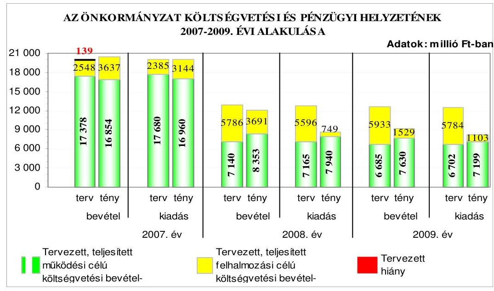
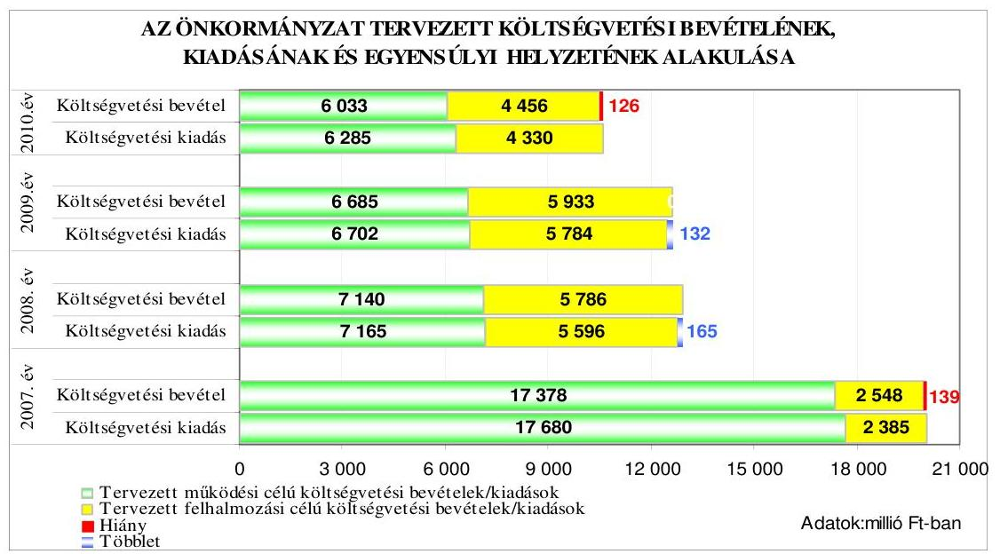
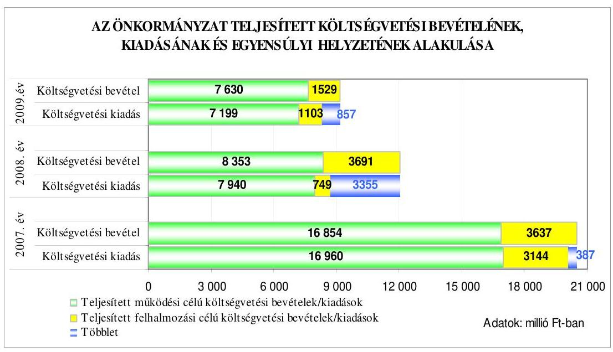
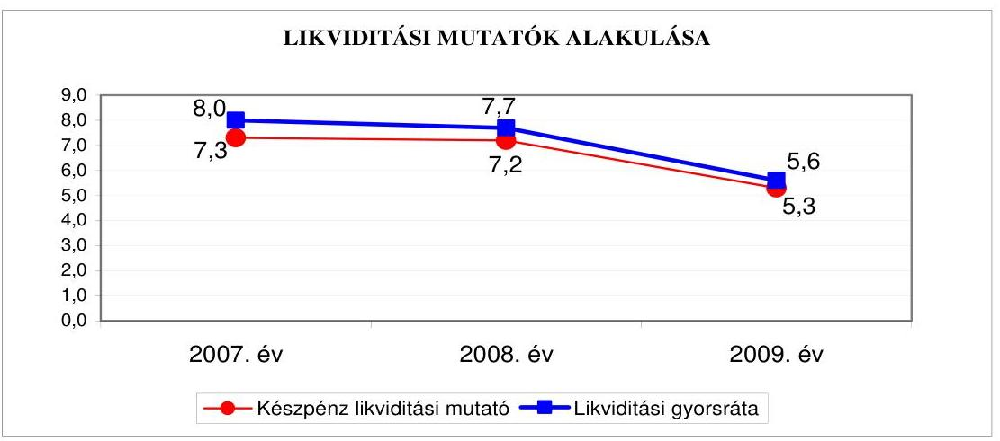
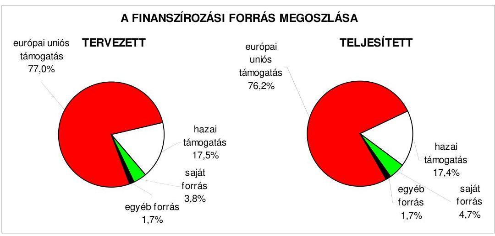
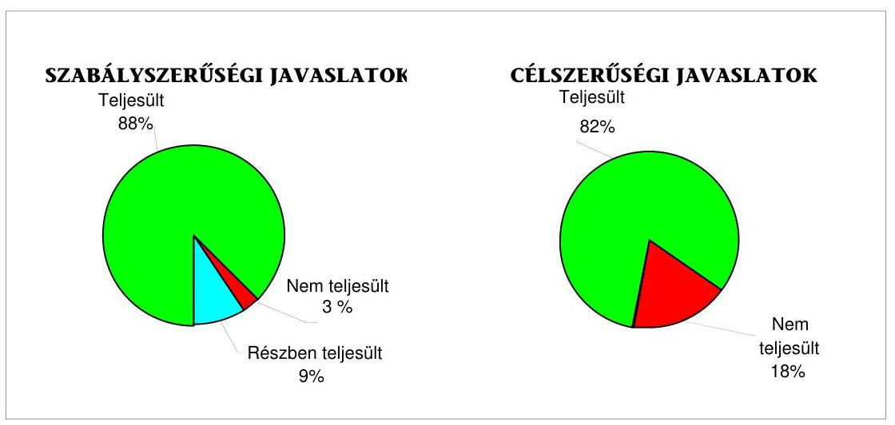
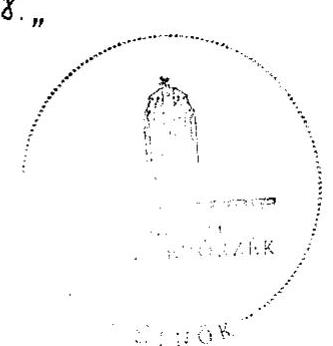
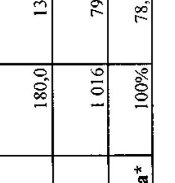
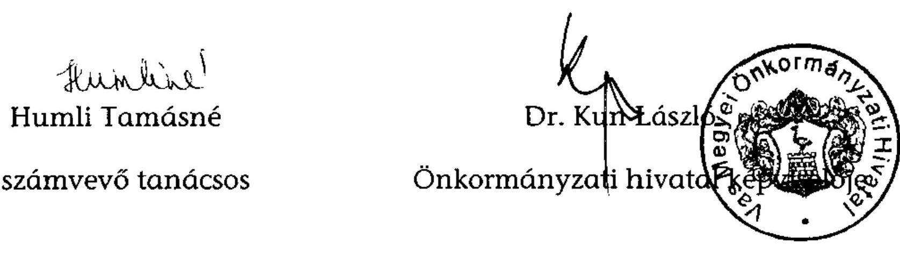
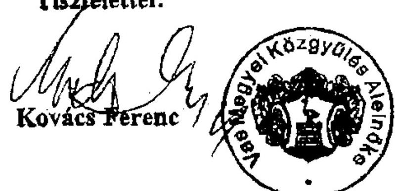

# ÁLLAMI   SZÁMVEVŐSZÉK 

## JELENTÉS

a Vas Megyei Önkormányzat gazdálkodási rendszerének 2010. évi ellenőrzéséről

---

# 3. Önkormányzati és Területi Ellenőrzési Igazgatóság 

3.3. Átfogó Ellenőrzések Főcsoport

Iktatószám: V-3023-7/34/19/2010.
Témaszám: 966
Vizsgálat-azonosító szám: V0498

## Az ellenőrzést felügyelte:

Dr. Lóránt Zoltán
főigazgató
Az ellenőrzés végrehajtásáért felelős:
Dr. Sepsey Tamás
főigazgató-helyettes
Az ellenőrzést vezette:
Kántor Ilona
főtanácsadó, irodavezető
Az ellenőrzést végezték:
Molnár Istvánné Buús Zoltánné Humli Tamásné
számvevő tanácsos
számvevő tanácsos
A témához kapcsolódó eddig készített számvevőszéki jelentések:
címe
sorszáma
Jelentés a Vas Megyei Önkormányzat gazdálkodási rendszerének 0545 átfogó ellenőrzéséről
Jelentés a Magyar Köztársaság 2005. évi költségvetése végrehajtásának ellenőrzéséről

Függelék:

- a helyi önkormányzatok beruházásaihoz és rekonstrukcióihoz nyújtott 2005. évi felhalmozási célú támogatások ellenőrzése
Jelentés a helyi és a helyi kisebbségi önkormányzatok gazdálkodási 0634 rendszerének átfogó és egyéb szabályszerűségi ellenőrzéséről

---

Jelentés a Magyar Köztársaság 2006. évi költségvetése végrehajtásának ellenőrzéséről
Függelék:

- a helyi önkormányzatok 2006. évi normatív állami hozzájárulás igénylésének és elszámolásának ellenőrzése
Jelentés az önkormányzati kórházak és bentlakásos szociális intézmények ápolásra, gondozásra fordított pénzeszközei felhasználásának ellenőrzéséről
Jelentés az egyes kórházi tevékenységek kiszervezésének ellenőrzéséről
Jelentés a sürgősségi betegellátó rendszer kialakítására, fejlesztésére fordított pénzeszközök felhasználásának ellenőrzéséről

---

# TARTALOMJEGYZÉK 

BEVEZETÉS ..... 11
I. ÖSSZEGZŐ MEGÁLLAPÍTÁSOK, KÖVETKEZTETÉSEK, JAVASLATOK ..... 16
II. RÉSZLETES MEGÁLLAPÍTÁSOK ..... 26

1. Az Önkormányzat költségvetési és pénzügyi helyzete ..... 26
1.1. A tervezett költségvetési bevételek és kiadások alapján a
költségvetési egyensúly, a költségvetési hiány alakulása, a hiány
tervezett finanszírozási módja, valamint a költségvetési hiány
megállapításának szabályszerűsége ..... 26
1.2. A teljesített költségvetési bevételek és kiadások alapján a pénzügyi
egyensúly, a pénzügyi hiány alakulása, a pénzügyi hiány
finanszírozása, az igénybe vett finanszírozási célú pénzügyi
eszközök hatása a pénzügyi helyzet alakulására, az eladósodásra,
valamint a fizetőképességre ..... 28
2. Az Önkormányzat felkészültsége az európai uniós források igénylésére,
felhasználására, a támogatott célkitűzés megvalósítására, működtetésére,
valamint az elektronikus közszolgáltatási feladatok ellátására ..... 35
2.1. Az európai uniós források igénybevételére, felhasználására, a
támogatott célkitűzés megvalósítására, működtetésére történt
felkészülés szabályozottságának, szervezettségének, valamint egy
támogatási szerződésben foglalt célkitűzés megvalósításának,
működtetésének eredményessége ..... 35
2.1.1. Az európai uniós forrásokra történő pályázatok benyújtására
vonatkozó döntések összhangja fejlesztési célkitűzésekkel ..... 36
2.1.2. Az európai uniós forrásokhoz kapcsolódóan a
pályázatfigyelés, a pályázatkészítés, valamint az európai
uniós támogatással megvalósuló fejlesztés lebonyolításának
belső rendje, a végrehajtás és az ellenőrzés szervezettsége ..... 38
2.1.3. Egy támogatási szerződésben foglalt célkitűzés megvalósítása,
működtetése ..... 41
2.2. Az elektronikus közszolgáltatás feltételeinek kialakítása ..... 43
3. A költségvetési gazdálkodás belső kontrolljai ..... 45
3.1. A költségvetés tervezés, a gazdálkodás és a zárszámadás készítés
folyamatában végrehajtandó belső kontrollok kialakítása ..... 45
3.2. A belső kontrollok működtetése a költségvetés tervezés, a
gazdálkodás, és a zárszámadás készítés folyamataiban ..... 47
3.3. A belső ellenőrzési kötelezettség teljesítése ..... 51

---

4. Az ÁSZ korábbi ellenőrzési javaslatai alapján készített intézkedési terv végrehajtása, hasznosítása
4.1. Az Önkormányzat gazdálkodási rendszerének átfogó ellenőrzése során tett javaslatok végrehajtására tervezett intézkedések megvalósítása
4.2. A zárszámadáshoz kapcsolódó (állami hozzájárulások, támogatások igénylésének és felhasználásának ellenőrzése), valamint a további vizsgálatok esetében a megállapítások, javaslatok alapján tett intézkedések

# MELLÉKLETEK 

1. számú Az Önkormányzat gazdálkodását meghatározó adatok, mutatószámok (1 oldal)
2. számú Az önkormányzati vagyon alakulása (1 oldal)

2/a. számú Az önkormányzati kötelezettségek alakulása (1 oldal)
3. számú Az Önkormányzat 2007-2010. évi költségvetési előirányzatainak és 2007-2009. évi pénzügyi teljesítéseinek alakulása (1 oldal)
4. számú Tanúsítvány az európai uniós forrásokkal támogatott célok és programok 2007-2010. évi tervezett és teljesített adatairól (4 oldal)
4/a. számú Tanúsítvány az európai uniós forrásokra 2007-2010 között benyújtott pályázatokról, amelyek elbírálásáról az Önkormányzat meg nem kapott tájékoztatást (2 oldal)
4/b. számú Tanúsítvány a 2007-2010. években benyújtott és elutasított európai uniós pályázatokról (2 oldal)
5. számú Adatlap az európai uniós forrással támogatott INTERREG IIIA Szlovénia-Magyarország-Horvátország Szomszédsági Program 2004-2006 keretében megvalósított „Történelem határok nélkül; Vas vármegye történeti térinformatikája" feladatról (4 oldal)
6. számú Kovács Ferenc úr a Vas Megyei Önkormányzat Közgyűlésének elnöke által tett észrevétel (1 oldal)

---

# RÖVIDÍTÉSEK, MOZAIKSZAVAK JEGYZÉKE 

## Törvények

Áht.
ÁSZ tv.
Eisz. tv.
Ekszt.

Kbt.
Ket.

Közoktatási tv.
Ötv.

## Rendeletek

Áhsz.

Ámr. 1
Ámr. 2
Ber.
18/2005. (XII. 27.) IHM rendelet

2007. évi költségvetési rendelet
2008. évi költségvetési rendelet
2009. évi költségvetési rendelet
2010. évi költségvetési rendelet
2007. évi zárszámadási rendelet
2008. évi zárszámadási rendelet
2009. évi zárszámadási rendelet
225/2009. (X. 14.) Korm. rendelet
az államháztartásról szóló 1992. évi XXXVIII. törvény az Állami Számvevőszékről szóló 1989. évi XXXVIII. törvény
az elektronikus információszabadságról szóló 2005. évi XC. törvény
az elektronikus közszolgáltatásról szóló 2009. évi LX. törvény
a közbeszerzésekről szóló 2003. évi CXXIX. törvény
a közigazgatási hatósági eljárás és szolgáltatás általános szabályairól szóló 2004. évi CXL. törvény
a közoktatásról szóló 1993. évi LXXIX. törvény
a helyi önkormányzatokról szóló 1990. évi LXV. törvény
az államháztartás szervezetei beszámolási és könyvvezetési kötelezettségének sajátosságairól szóló 249/2000.
(XII. 24.) Korm. rendelet
az államháztartás működési rendjéről szóló 217/1998.
(XII. 30.) Korm. rendelet
az államháztartás működési rendjéről szóló 292/2009.
(XII. 19.) Korm. rendelet
a költségvetési szervek belső ellenőrzéséről szóló 193/2003. (XI. 26.) Korm. rendelet
a közzétételi listákon szereplő adatok közzétételéhez szükséges közzétételi mintákról szóló 18/2005. (XII. 27.) IHM rendelet
Vas Megye Önkormányzatának 1/2007. (II. 16.) számú rendelete a 2007. évi költségvetésről
Vas Megye Önkormányzatának 1/2008. (II. 15.) számú rendelete a 2008. évi költségvetésről
Vas Megye Önkormányzatának 1/2009. (II. 18.) számú rendelete a 2009. évi költségvetésről
Vas Megye Önkormányzatának 1/2010. (II. 16.) számú rendelete a 2010. évi költségvetésről
Vas Megye Önkormányzatának 7/2008. (V. 9.) számú rendelete a 2007. évi zárszámadásáról
Vas Megye Önkormányzatának 4/2009. (IV. 27.) számú rendelete a 2008. évi zárszámadásáról
Vas Megye Önkormányzatának 7/2010. (V. 6.) számú rendelete a 2009. évi zárszámadásáról
225/2009. (X. 14.) Korm. rendelet az elektronikus közszolgáltatásról és annak igénybevételéről

---

SzMSz
vagyongazdálkodási rendelet

## Szórövidítések

AVOP
AVOP LEADER+
ÁROP
ÁSZ
EKK
EKOP
e-közszolgáltatás
Ellátó Szervezet
Ellenőrzési csoport
FEUVE
főjegyző
gazdasági program
gazdasági szervezet ügy. rendje

HEFOP
hivatali ügyrend
informatikai stratégia

INTERREG
INTERREG IIIA
KELER Zrt.
Kórház

Közgyűlés
Közgyűlés elnöke
Központi Rendszer

Vas Megye Önkormányzatának 10/1995. (VI. 19.) számú rendelete az Önkormányzat Szervezeti és Működési Szabályzatáról
Vas Megye Önkormányzatának 10/2000. (V. 19.) számú rendelete az Önkormányzat vagyongazdálkodási szabályairól

Agrár és Vidékfejlesztés Operatív Program
AVOP Vidéki térségek fejlesztése prioritás intézkedése
ÚMFT Államreform Operatív Program
Állami Számvevőszék
Elektronikuskormányzat Központ
ÚMFT Elektronikus Közigazgatási Operatív Program
elektronikus közszolgáltatás
Vas Megyei Közgyűlés Ellátó Szervezete
Vas Megyei Önkormányzat Önkormányzati hivatalának Ellenőrzési csoportja
folyamatba épített, előzetes, utólagos és vezetői ellenőrzés
Vas Megye Önkormányzatának főjegyzője
Vas Megye Önkormányzatának 75/2007. (IV. 27.) számú határozata a 2007-2010. évekre vonatkozó gazdasági programjáról
Vas Megyei Önkormányzat Önkormányzati hivatal Pénzügyi és Gazdasági Titkárságának 2008. június 1-jétől hatályos ügyrendje (jóváhagyta a Közgyűlés elnöke és a főjegyző)
Humán erőforrások fejlesztései Operatív Program
Vas Megyei Önkormányzat Önkormányzati hivatalának 1995. június 19-étől hatályos ügyrendje (jóváhagyta a Közgyűlés elnöke és a főjegyző)
Vas Megyei Önkormányzat Önkormányzati hivatalának 2008-2013. évekre vonatkozó informatikai stratégiája, melyet a Közgyűlés elnöke a 4/2008. számú utasításával helyezett hatályba
Európai Unió Közösségi Kezdeményezés
Határmenti együttműködés
Központi Elszámolóház és Értéktár (Budapest) Zártkörűen Működő Részvénytársaság
Kórház

Közgyűlés
Közgyűlés elnöke
Központi Elektronikus Szolgáltató Rendszer

---

NYDOP
Önkormányzati hivatal
pályázati kézikönyv
pályázati szabályzat

Pénzügyi bizottság
Pénzügyi Titkárság
SLO-HU-CRO program
stratégiai ellenőrzési
terv
TÁMOP
Területfejlesztési Titkárság
Történelem határok
nélkül INTERREG projekt
ÚMFT
VÁTI Kht.

Nyugat-dunántúli Operatív Program
Vas Megyei Önkormányzat Hivatala
Vas Megyei Önkormányzat pályázatainak és projektjeinek működési kézikönyve, amelyet az SzMSz 12. melléklete tartalmaz, hatályos 2008. július 4-től
Szabályzat a hazai és az Európai Uniós forrásokkal kapcsolatos pályázatfigyelés, pályázatkészítés és lebonyolítás rendjéről, melyet a Közgyűlés elnöke a 6/2008. (XII. 11.) számú elnöki utasítással adott ki
Vas Megye Önkormányzatának Pénzügyi, Gazdasági és Vagyongazdálkodási Bizottsága
Vas Megyei Önkormányzat Önkormányzati hivatalának Pénzügyi és Gazdasági Titkársága
Szlovénia-Magyarország-Horvátország Szomszédsági Program 2004-2006
Vas Megyei Önkormányzat 2006-2010 évekre vonatkozó stratégiai ellenőrzési terve (a főjegyző 2005. november 30-án hagyta jóvá)
ÚMFT Társadalmi Megújulás Operatív Program
Vas Megyei Önkormányzati Hivatal Területfejlesztési Titkársága
INTERREG IIIA SLO-HU-CRO program keretében megvalósított Történelem határok nélkül; Vas vármegye történeti térinformatikája projekt
Új Magyarország Fejlesztési Terv
VÁTI Magyar Regionális Fejlesztési és Urbanisztikai Közhasznú társaság, közreműködő szervezet a Történelem határok nélkül INTERREG projektnél

---

.

---

# ÉRTELMEZŐ SZÓTÁR 

1. elektronikus szolgáltatási szint
2. elektronikus szolgáltatási szint
3. elektronikus szolgáltatási szint
4. elektronikus szolgáltatási szint
európai uniós források
eredményesség
fejlesztési feladat (projekt)

Az 1044/2005. (V. 11.) Korm. határozat alapján olyan információs, tájékoztató szolgáltatás, amely csak általános információkat közöl az adott üggyel kapcsolatos teendőkről és a szükséges dokumentumokról.
Az 1044/2005. (V. 11.) Korm. határozat alapján olyan egyirányú kapcsolatot biztosító szolgáltatás, amely az 1. szinten túl biztosítja az adott ügy intézéséhez szükséges dokumentumok, nyomtatványok letöltését, és azok ellenőrzéssel, vagy ellenőrzés nélküli elektronikus kitöltését, amely esetben a dokumentumok benyújtása hagyományos úton történik.
Az 1044/2005. (V. 11.) Korm. határozat alapján olyan kétirányú kapcsolatot biztosító szolgáltatás, amely közvetlen, vagy ellenőrzött kitöltésű dokumentum segítségével biztosítja az elektronikus adatbevitelt és a bevitt adatok ellenőrzését. Az ügy indításához, intézéséhez személyes megjelenés nem szükséges, de az ügyhöz kapcsolódó közigazgatási döntés (határozat, egyéb aktus) közlése, valamint a kapcsolódó illeték-, vagy díjfizetés hagyományos úton történik.
Az 1044/2005. (V. 11.) Korm. határozat alapján olyan teljes közvetlen kétirányú ügyintézési folyamatot biztosító szolgáltatás, amikor az ügyhöz kapcsolódó közigazgatási döntés is elektronikus úton kerül közlésre, illetve a kapcsolódó illeték-, vagy díjfizetés elektronikus úton is intézhető.
Az Európai Unió költségvetéséből, illetve az Európai Gazdasági Térség Európai Unión kívüli tagállamainak költségvetéséből származó támogatások, valamint a „Svájci Hozzájárulás" programból származó támogatás.
Egy adott tevékenység céljai megvalósításának mértéke, a tevékenység szándékolt és tényleges hatása közötti kapcsolat. (forrás: Ámr.; 2. § 66. pont)
Az a fejlesztési feladat, amely illeszkedik az Európai Unió, illetve a Nemzeti Fejlesztési Terv által támogatott programokhoz. Az Európai Unió, illetve a Nemzeti Fejlesztési Terv és az Új Magyarország Fejlesztési Terv által meghirdetett programokhoz kapcsolódó, támogatott projektek fejlesztési feladatok megvalósításához használhatók fel az európai uniós források. A fejlesztési feladat (projekt) tartalmilag és formailag részletesen kidolgozott, megfelelő pénzügyi háttérrel és végrehajtási ütemezéssel rendelkező fejlesztési terv.

---

fejlesztési célkitűzés
hazai társfinanszírozás
indikátor
irányító hatóság
kedvezményezett

Az önkormányzat által ellátott kötelező, vagy önként vállalt feladatok mennyiségi (minőségi) fejlesztésére vonatkozó terv. A mennyiségi fejlesztés megvalósulhat beszerzéssel, létesítéssel, bővítéssel, átalakítással.
A központi költségvetési és az elkülönített állami pénzalapokból származó finanszírozás.
A projekt megvalósulásának számszerűsíthető eredményei, mutató, jelzőszám, amelynek segítségével egy célkitűzés megvalósulásának adott szintjét lehet szemléltetni. Jelenthet egy felhasznált erőforrást, egy elért hatást, egy minőségi szintet, illetve valamilyen egyéb változást.
A strukturális alapok és a Kohéziós alap forrásainak szabályszerű, hatékony és eredményes felhasználásához szükséges intézményrendszer felső eleme. Az irányító hatóság általános és átfogó felelősséget visel a programok, projektek hatékony és szabályszerű végrehajtásáért. Felelősségi köréből eredően ellenőrzi a közösségi, valamint a hazai jogszabályok betartását, koordinálja az európai uniós források szétosztásának folyamatát, irányítja az intézményrendszer, a statisztikai és a pénzügyi nyilvántartási rendszer működését. Az Új Magyarország Fejlesztési Terv Irányító Hatósága közreműködik az Operatív Program véglegesítésében, irányítja az Operatív Program Program-kiegészítő Dokumentum kidolgozását, és közreműködő szerepet vállal e dokumentumoknak az Európai Bizottsággal történő tárgyalásaiban. Az Irányító Hatóság részt vesz továbbá a költségvetési tervezésében, valamint közreműködő szervezetek bevonásával irányítja a meghirdetett pályázatok és a központi programok végrehajtását. Az Irányító Hatóság részt vesz továbbá a költségvetési tervezésben, valamint közreműködő szervezetek bevonásával irányítja a meghirdetett pályázatok és a központi programok végrehajtását.
Az a helyi önkormányzat, amely a támogatási szerződést kedvezményezettként aláírja, a projektet, illetve a központi programhoz kapcsolódó támogatott önkormányzati programot végrehajtja.

---

közreműködő szervezet
lebonyolítás
operatív program

Nemzeti Fejlesztési Terv
program

A közreműködő szervezetek az európai uniós támogatást elnyert kedvezményezettekkel a kapcsolattartó szervek. Feladatai: a támogatási szerződés mintától eltérő egyedi támogatási szerződés-tervezetek előzetes megküldése jóváhagyásra a Nemzeti

 Fejlesztési Ügynökségnek; a projektek megvalósítása előrehaladásának nyomon követése, a támogatás kifizetésének engedélyezése, a folyamatba épített ellenőrzések (dokumentumalapú ellenőrzések és kockázatelemezésre alapozott helyszíni ellenőrzések) végzése, a projektek zárásával kapcsolatos feladatok ellátása, szabálytalanságkezelési rendszer kialakítása és működtetése; ellenőrzési nyomvonal készítése és folyamatos aktualizálása; az Egységes Monitoring Informatikai Rendszerben az adatok folyamatos rögzítése, az adatbázis naprakészségének és megbízhatóságának biztosítása; a beszámolók készítése és megküldése a miniszter és az Nemzeti Fejlesztési Ügynökség részére az akcióterv és az éves munkaterv megvalósításában történt előrehaladásról és a szükséges intézkedésekre vonatkozó javaslatokról.
Az európai uniós források felhasználásával megvalósuló fejlesztésre irányuló műszaki, gazdasági (pénzügyi) tevékenységet magában foglaló szervezési, irányítási szolgáltatás. A szervezési szolgáltatás kiterjedhet a pályázatkészítésre, a közbeszerzési eljárás lebonyolításán keresztül a folyamatos műszaki ellenőrzésre, a pénzügyi elszámolásra, a műszaki átadás-átvételre, az üzembe helyezésre, illetve a fejlesztési folyamat egyes elemeire.
Az Európai Bizottság által jóváhagyott, a Közösségi Támogatási Keret végrehajtására vonatkozó, több évre szóló intézkedésekhez kapcsolódó prioritások egységes rendszerét tartalmazó dokumentum.
Helyzetelemzést, stratégiát a tervezett fejlesztési területek prioritásait, azok céljait és pénzügyi forrásaik megjelölését tartalmazó dokumentum, amelyet a Magyar Köztársaság készített az Európai Unió programozási irányelveinek, célkitűzéseinek megfelelően a fejlődésben lemaradó régiók fejlődésének és strukturális átalakulásának elősegítésére a kiemelt szükségletekre figyelemmel. A Nemzeti Fejlesztési Terv stratégiai fejezetének célja, hogy a 2004-2006 közötti időszakra kijelölje a strukturális alapokból támogatható fejlesztéspolitikai célkitűzéseit és prioritásait. A strukturális alapok operatív programjai: Agrár- és Vidékfejlesztés Operatív Program (AVOP); Gazdasági Versenyképesség Operatív Program (GVOP); Humán erőforrások fejlesztései Operatív Program (HEFOP); Környezetvédelem és infrastruktúra Operatív Program (KIOP); Regionális Fejlesztés Operatív Program (ROP).
Ágazati vagy térségi fejlesztési célt megvalósító fejlesztési terv, mely több egymással összefüggő projekt útján, az érintettek együttműködése alapján valósul meg.

---

saját forrás
szabálytalanság

Új Magyarország Fejlesztési Terv
támogatási szerződés

A kedvezményezett által a támogatott projekthez biztosított forrás, amelybe az államháztartás alrendszereiből nyújtott támogatás nem számítható be. Költségvetési szervek esetén a jóváhagyott előirányzat saját forrásnak minősül.
A jogszabályokban szereplő előírásoknak, illetve a támogatási szerződésben a felek által vállalt kötelezettségeknek a megsértése, amelyek eredményeképpen az Európai Közösség vagy a Magyar Köztársaság pénzügyi érdekei sérülnek, illetve sérülhetnek.
Az Új Magyarország Fejlesztési Terv célja a foglalkoztatás bővítése és a tartós növekedés feltételeinek megteremtése. Ennek érdekében 2007-2013 között hat kiemelt területen indított el összehangolt állami és európai uniós fejlesztéseket: a gazdaságban, a közlekedésben, a társadalom megújulása érdekében, a környezet és az energetika területén, a területfejlesztésben és az államreform feladataival összefüggésben. Az Új Magyarország Fejlesztési Terv operatív programjai: Államreform Operatív Program (ÁROP); Elektronikus Közigazgatás Operatív Program (EKOP); Gazdaságfejlesztés Operatív Program (GOP); Környezet és Energia Operatív Program (KEOP); Közlekedés Operatív Program (KÖZOP); Dél-Alföldi Operatív Program (DAOP); Dél-Dunántúli Operatív Program (DDOP); Észak-Alföldi Operatív Program (ÉAOP); Észak-Magyarországi Operatív Program (ÉMOP); Közép-Dunántúli Operatív Program (KDOP); Közép-Magyarországi Operatív Program (KMOP); Nyugat-Dunántúli Operatív Program (NYDOP); Társadalmi Infrastruktúra Operatív Program (TIOP); Társadalmi Megújulás Operatív Program (TÁMOP).
A strukturális alapok esetében az irányító hatóságnak, illetve a Kohéziós Alap esetében a közreműködő szervezeteknek a kedvezményezett önkormányzattal kötött szerződése, amely a támogatás felhasználásának részletes feltételeit tartalmazza. Az Új Magyarország Fejlesztési Terv keretében támogatott projektek esetében a támogatási szerződés a kedvezményezett és a Nemzeti Fejlesztési Ügynökség nevében eljáró közreműködő szervezet között jön létre. Nagyprojekt esetén a támogatási szerződést a Nemzeti Fejlesztési Ügynökség ellenjegyzi. A támogatási szerződés képezi a megvalósítás nyomon követésének, finanszírozásának és ellenőrzésének alapját.

---

# JELENTÉS 

## Vas Megyei Önkormányzat gazdálkodási rendszerének 2010. évi ellenőrzéséről

## BEVEZETÉS

Az Ötv. 92. § (1) bekezdése, az Állami Számvevőszékről szóló 1989. évi XXXVIII. törvény 2. § (3) bekezdése, valamint az Áht. 120/A. § (1) bekezdése alapján az önkormányzatok gazdálkodását az Állami Számvevőszék ellenőrzi. Az ellenőrzésre az Országgyűlés illetékes bizottságai részére is átadott, országosan egységes ellenőrzési program szerint került sor.

Az Állami Számvevőszék a stratégiájában foglalt célkitűzéseknek megfelelően a helyi önkormányzatok költségvetési gazdálkodási rendszerének ellenőrzését a 2007. évben megújított, teljesítmény-ellenőrzési elemekkel kiegészített ellenőrzési program alapján folytatja a 2010. évben.

Az ellenőrzés célja annak értékelése volt, hogy az Önkormányzat:

- milyen módon biztosította a költségvetési és a pénzügyi egyensúlyt a költségvetésében és annak teljesítése során, valamint változott-e a hiányzó bevételi források pótlásában a finanszírozási célú pénzügyi műveletek jelentősége, hatása;
- eredményesen készült-e fel a szabályozottság és a szervezettség terén az európai uniós források igénylésére és felhasználására, megvalósította, működtette-e a támogatott célkitűzést, továbbá biztosította-e az elektronikus közszolgáltatás feltételeit, a gazdálkodási adatok közzétételével a gazdálkodás nyilvánosságát;
- megfelelően kialakította-e és működtette-e a belső kontrollokat a költségvetés tervezés, a gazdálkodás és a zárszámadás készítés, valamint a belső ellenőrzés folyamatában, továbbá;
- megfelelően hasznosították-e a korábbi számvevőszéki ellenőrzések megállapításait, szabályszerűségi $^{1}$ és célszerűségi javaslatait.

[^0]
[^0]:    $^{1}$ A törvényi előírások betartásának elmulasztásakor a részletes megállapítások fejezetben egységesen a törvénysértés megjelölést alkalmazzuk, mivel az ÁSZ nem tehet különbséget a törvényi előírások között.

---

Az ellenőrzés típusa: átfogó ellenőrzés, amely - egy ellenőrzés keretében meghatározott területekre összpontosítva - alkalmazza a szabályszerűségi, valamint a teljesítmény-ellenőrzés jellemzőit.

Az ellenőrzött időszak: a költségvetési egyensúly és az európai uniós támogatások igénybevételére történt felkészülés ellenőrzése esetében a 2007-2009. évek és a 2010. I. negyedév, a belső kontrollok kialakítása és működtetése tekintetében a 2009. év és a 2010. I. negyedév, az Önkormányzat gazdálkodási rendszerének 2005. évi átfogó ellenőrzéséről készített jelentésben rögzített javaslatok megvalósítását, hasznosítását, valamint a 2006 óta végzett további ellenőrzések során megfogalmazott javaslatok végrehajtása érdekében a 2006-2010. I. negyedév közötti időszakban tett intézkedéseket ellenőriztük.

A megye lakosainak száma 2010. január 1-jén 184117 fő volt. A 2006. évi önkormányzati képviselő és polgármester választást követően az Önkormányzat 40 tagú Közgyűlésének munkáját nyolc állandó bizottság segítette. A helyi önkormányzat mellett a 2006. évi önkormányzati képviselő és polgármester választásokat követően három $^{2}$ kisebbségi önkormányzat működött. A Közgyűlés elnöke a 2006. évi önkormányzati képviselő és polgármester választás óta tölti be tisztségét, a főjegyző személye 1991. év óta változatlan.

Az Önkormányzat feladatainak végrehajtása érdekében a 2007. évben 32, a 2009. évben 31 intézményt működtetett, amelyekből a 2007. évben 28 önállóan gazdálkodó, a 2009. évben 26 önállóan működő és gazdálkodó volt. A feladatok ellátásában a 2007. évben egy, a 2009. évben három gazdasági társasága vett részt. Az Önkormányzat az éves költségvetési beszámolója szerint a 2009. évben 9159 millió Ft költségvetési bevételt ért el, és 8302 millió Ft költségvetési kiadást teljesített. A teljesített költségvetési bevételek 55,3%-kal, a költségvetési kiadások 58,7%-kal maradtak el a 2007. évben teljesített költségvetési bevételektől és kiadásoktól alapvetően a Kórház költségvetési szervként történő megszüntetése, majd ezt követően gazdasági társaságként való működtetése következtében. Az Önkormányzat 2009. december 31-én a könyvviteli mérleg szerint 25397 millió Ft értékű vagyonnal rendelkezett, mely a 2007. évihez viszonyítva változatlan nagyságrendű. Az eszközökön belül a forgóeszközök aránya 2,5%-kal csökkent a követelések állományának 38,8%-os csökkenése következtében. A forrásokon belül a kötelezettségek 13,0%-os emelkedésében az Önkormányzat által 2007. október 11-én kibocsátott 5000 millió Ft értékű kötvény árfolyamvesztesége miatti hosszúlejáratú, illetve a rövid lejáratú kötelezettség állományának növekedése játszott szerepet. Az összes költségvetési bevétel 43,5%-át a saját bevétel, 17,1%-át az illetékbevétel biztosította a 2009. évben. Az összes költségvetési kiadásból a felhalmozási célú kiadás részaránya a 2007. évhez viszonyítva a 2009. évre 2,3 százalékponttal csökkent, aránya így 13,3% volt. A 2010. évi költségvetési rendeletben 10489 millió Ft költségvetési bevételt és 10615 millió Ft költségvetési kiadást irányoztak elő. Az Önkormányzati hivatalban dolgozó köztisztviselők száma 2007. január 1-jén 45 fő, 2009. december 31-én 42 fő volt, az intézményekben foglalkoztatott közalkalmazottak száma 2007. január 1-jén 3536 fő, 2009. december 31-én 1478 fő

[^0]
[^0]:    $^{2}$ cigány, horvát, német kisebbségi önkormányzat

---

volt. Az Önkormányzat gazdálkodását meghatározó adatokat, mutatószámokat az 1-3. számú mellékletek tartalmazzák.

Az Önkormányzat költségvetési és pénzügyi helyzetét az elemző eljárás módszerével vizsgáltuk. E körben elemeztük a költségvetés egyensúlyi helyzetének alakulását, a tervezett és teljesített költségvetési, pénzügyi hiány okait, a hiány finanszírozásának tervezett és teljesített módját, az önkormányzat pénzügyi helyzetének alakulását az eladósodás és a likviditás szempontjából.

Teljesítmény-ellenőrzés módszerével vizsgáltuk és eredményesség szempontjából értékeltük az Önkormányzat benyújtott pályázatai kapcsolódását a Közgyűlés által meghatározott fejlesztési célkitűzésekhez, valamint felkészültségét a belső szabályozottság, szervezettség terén az európai uniós forrásokra vonatkozó pályázati felhívások figyelésére, a pályázatok készítésére, és a lebonyolítására. Értékeltük továbbá egy önkormányzati feladat megvalósítása érdekében kötött támogatási szerződésben rögzített célkitűzés (számszerűsíthető eredmények, indikátorok) megvalósításának eredményességét. Az ellenőrzés során felmértük, hogy az elektronikus közigazgatási szolgáltatások működtetése érdekében milyen intézkedéseket tettek, továbbá biztosították-e a közérdekű gazdálkodási adatok meghatározott körének honlapon történő közzétételét.

A költségvetési gazdálkodás belső kontrolljainak ellenőrzése során vizsgáltuk, hogy az Önkormányzati hivatalban a költségvetés-tervezés, a gazdálkodás, és a zárszámadás-készítés folyamatában a belső kontrollok kialakítása és működése megfelelő biztosítékot ad-e a gazdálkodási feladatok szabályszerű ellátására. Felmértük és minősítettük a költségvetés-tervezés, a gazdálkodás, és a zárszámadás-készítés feladataival, továbbá a pénzügyi-számviteli területen az informatikával kapcsolatosan kialakított kontrollokat, valamint azok működésének megfelelőségét. A vizsgálat során értékeltük a belső ellenőrzés szabályozottságát, működési feltételeinek kialakítását, meghatározását, továbbá működésének megfelelőségét.

Az Önkormányzati hivatalban értékeltük a gazdálkodás folyamatában kulcsszerepet betöltő belső kontrollok működésének megfelelőségét, ennek keretében ellenőriztük a szakmai teljesítés igazolására és az utalvány ellenjegyzésére kialakított kontrollok működését. Az ellenőrzést a következő, magas kockázatú kifizetésekre folytattuk le $^{3}$:

- az államháztartáson kívülre teljesített működési és felhalmozási célú pénzeszköz átadásokra,
- az állományba nem tartozók megbízási díjaira, továbbá
- a külső szolgáltató által végzett karbantartási, kisjavítási szolgáltatásokra.

Az ellenőrzés hatékony elvégzése céljából a vizsgálandó területek kiválasztása során a kockázatokon alapuló megközelítés érvényesült, ezáltal az ellenőrzési

[^0]
[^0]:    $^{3}$ Az önkormányzatok kiemelt előirányzataira vonatkozóan, a vertikális folyamatokra elvégeztük a kockázatok becslését, amelynek eredményeként határoztuk meg a magas kockázatú területeket.

---

erőforrásokat azokra a területekre fókuszáltuk, amelyeken a korábbi ellenőrzési tapasztalatok figyelembevételével legnagyobb a hibák előfordulási valószínűsége. Az ellenőrzési erőforrások ilyen típusú összpontosításával minimálisra kívántuk csökkenteni az ellenőrzési bizonyosság eléréséhez szükséges időráfordítást.

A pénzügyi-számviteli folyamatokban alkalmazott belső kontrollok kialakításának és működésének ellenőrzésére a vizsgált három terület 2009. évi könyvviteli tételeiből területenként egyszerű véletlen mintát vettünk. A kijelölt gazdasági eseményre elvégzett megfelelőségi tesztek alapján értékeltük a kontrollok működésének megfelelőségét a vizsgált három területre külön-külön, majd összefoglalóan $^{4}$. A helyszíni ellenőrzés megállapításainak részletes dokumentálását megfelelőségi tesztlapokon, ellenőrzési munkalapokon biztosítottuk. Ezeken a teszt- és munkalapokon a minősítés alapjául szolgáló kérdések és a vonatkozó konkrét jogszabályhelyek megjelölése mellett értékeltük a kialakított belső kontrollokban rejlő kockázatokat $^{5}$ és a kialakított kontrollok működésének megfelelőségét $^{6}$.

Az ÁSZ korábbi ellenőrzési javaslatai
 alapján tett intézkedéseket, illetve azok megvalósítását utóellenőrzés keretében vizsgáltuk. A gazdálkodási rendszer korábbi átfogó ellenőrzése során megfogalmazott javaslatok végrehajtására tett intézkedések megvalósítását ellenőriztük, az egyéb számvevőszéki ellenőrzések során tett javaslatok esetében pedig a kiadott intézkedéseket tekintettük át.

A helyszíni ellenőrzés során kitöltött - az ellenőrzést végző számvevő és az Önkormányzati hivatal felelős köztisztviselője által aláírt - ellenőrzési munkalapokat, azok kitöltési útmutatóit, továbbá a megfelelőségi tesztek dokumentumait a Közgyűlés elnökére a számvevői jelentéssel egyidejűleg átadtuk.

[^0]
[^0]:    ${ }^{4}$ A vizsgált három terület egyedi értékelési pontszámait a területek költségvetési súlyával arányosan összegeztük.
    ${ }^{5}$ A kialakított belső kontrollokban rejlő kockázatot alacsonynak minősítettük, ha a kontrollok - működésük esetén - megfelelő védelmet nyújtottak a hibák bekövetkezése ellen. Közepesnek minősítettük a belső kontrollokban rejlő kockázatot, amennyiben a kontrollok - működésük esetén - a lehetséges hibák többsége ellen védelmet nyújtottak. Magasnak értékeltük a kockázatot, ha a kontrollok - kialakításuk hiányában, vagy hiányos kialakításuk miatt - nem nyújtottak elegendő védelmet a lehetséges hibákkal szemben.
    ${ }^{6}$ A kontrollok működésének megfelelőségét kiválónak értékeltük abban az esetben, ha azok működése - esetleges kisebb, az egységesen meghatározott követelményrendszerben foglalt mértéket el nem érő hiányosságoktól eltekintve - megfelelt a hibák megelőzésére és kijavítására meghatározott szabályozásnak és a legmagasabb szintű elvárásoknak. Jónak minősítettük a kontrollok működését, ha a megállapított kisebb (tolerálható mértékű) hiányosságok nem veszélyeztették az ellenőrzött terület hibáinak megelőzését és kijavítását. Amennyiben a kontrollok működésében túl sok hiányosság fordult elő ahhoz, hogy a kontrollok biztosítsák a hibák megelőzését, feltárását, kijavítását és ezáltal veszélyeztették az eredményes, megfelelő működést, a kontroll működésének megfelelősége gyenge minősítést kapott.

---

A jelentést az ÁSZ-ról szóló 1989. évi XXXVIII. tv. 25. § (1) bekezdése alapján észrevétel közlése céljából megküldtük a Vas Megyei Önkormányzat Közgyűlés elnökének. A kapott észrevételt a jelentés 6. számú melléklete tartalmazza.

---

# I. ÖSSZEGZŐ MEGÁLLAPÍTÁSOK, KÖVETKEZTETÉSEK, JAVASLATOK 

A 2007. és a 2010. évi költségvetési rendeletekben a költségvetési bevételek és kiadások nem voltak egyensúlyban, a tervezett költségvetési bevételek nem nyújtottak fedezetet a tervezett költségvetési kiadásokra. A költségvetés hiányát a működési célú költségvetési bevételek hiánya okozta. A 2008-2009. években a költségvetési rendeletekben a költségvetési egyensúly biztosított volt, mivel a működési célú költségvetési bevételek hiányánál nagyobb mértékben haladták meg a felhalmozási célú költségvetési bevételek a felhalmozási célú költségvetési kiadásokat. Az Önkormányzat a költségvetési rendeleteiben a költségvetési egyensúly biztosításához rövid lejáratú működési célú hitel felvételét, valamint bevételnövelő és kiadási megtakarítást eredményező intézkedések végrehajtását tervezte. A főjegyző a költségvetés végrehajtása érdekében a likviditás feltételeinek kialakításáról az éves költségvetések tervezése során folyószámla hitelkeret tervezésével, valamint előirányzat-felhasználási terv készítésével gondoskodott. A 2007-2010. évi költségvetési rendelettervezetekben a költségvetési kiadási főösszeg megállapításakor az Áht-ban előírtak ellenére költségvetési kiadásként finanszírozási célú pénzügyi kiadásokat is figyelembe vettek. Az Önkormányzat a 2010. évi költségvetési rendeletét az Áht. előírásainak megfelelően 2010. júniusban módosította.

A 2007-2009. évek között a teljesített költségvetési bevételek és kiadások főösszege folyamatosan csökkent, melyben a tervezetthez hasonlóan a Kórház gazdálkodási formájának változása miatti előirányzat-csökkenés volt a meghatározó. A költségvetések végrehajtása során a teljesített költségvetési bevételek fedezetet nyújtottak a teljesített költségvetési kiadásokra, mivel a költségvetési bevételek a 2007. évben 387 millió Ft-tal, a 2008. évben 3355 millió Ft-tal, a 2009. évben 857 millió Ft-tal meghaladták a költségvetési kiadásokat. A teljesített működési célú költségvetési bevételek a 2007. évben nem nyújtottak fedezetet a teljesített működési célú költségvetési kiadásokra, mivel a teljesített működési kiadásoknál 106 millió Ft-tal alacsonyabbak voltak a teljesített működési célú bevételek. A 2008-2009. években a teljesített működési célú költségvetési bevételek 413-431 millió Ft-tal haladták meg a teljesített működési célú költségvetési kiadásokat. A teljesített felhalmozási célú költségvetési bevételek a 2007-2009. években - 493-2942-426 millió Ft-tal - meghaladták a teljesített felhalmozási célú költségvetési kiadásokat. A költségvetési többlet keletkezésében szerepe volt az évközi többletbevételeknek és a tervezett, valamint a költségvetési rendeletekben számításba nem vett év közben hozott kiadáscsökkentő intézkedések hatásának is. A beruházási és felújítási kiadások túlteljesítését az év közbeni döntések nyomán végrehajtott fejlesztések eredményezték.

Az Önkormányzat rövid- és hosszúlejáratú hitelt nem vett fel, meglévő hitelviszonyt megtestesítő értékpapírt nem értékesített. A felhalmozási célú kiadások finanszírozására a 2007. évben öt milliárd forint svájci frank alapú, változó kamatozású, 20 éves futamidejű kötvényt bocsátott ki, ami az Önkormányzat számára a forint svájci frankhoz viszonyított árfolyamváltozása és a változó kamat mértéke miatt kockázatot jelent. Az Önkormányzat a kötvénykibocsátásból származó bevételt a 2007. év végén befektette, így annak összegét a 2008. évben a költségvetési hiány megállapításánál már nem finanszírozási célú pénzügyi művelet bevételeként, hanem - a számviteli szabályoknak megfelelően - a költségvetési bevétel részeként, az előző évi pénzmaradvány igénybevételeként vették figyelembe. A kötvényből származó bevételekből a 2009. év végéig összesen a kötvénykibocsátás céljával összhangban 998 millió forint összegben önkormányzati fejlesztéseket, a települési önkormányzatok pályázatainak önerő részét, illetve kórházi fejlesztéseket finanszíroztak. Az Önkormányzatnak a kötvénykibocsátás évében a kibocsátásból eredő tárgyévi kötelezettségvállalás összege az éves adósságot keletkeztető kötelezettségvállalás felső határának 3,2%-a volt, ez az arány a 2010. évre 11,3%-ra nőtt. A Pénzügyi bizottság figyelemmel kísérte és értékelte a költségvetési bevételek alakulását, valamint a kötvénykibocsátás indokait, gazdasági megalapozottságát. A gazdálkodási feltételek változása következtében az Önkormányzat folyamatosan növekvő folyószámla hitelkerettel rendelkezett. A kötvénykibocsátáskor, illetve abból származó pénzeszközök befektetésekor a hatásköri és eljárási szabályokat betartották.

Az Önkormányzat a 2007. évben 342 napon, a 2008-2009. években folyamatosan, minden nap vett igénybe folyószámlahitelt, melynek átlagos állománya a 2007. évi 167,6 millió Ft-ról 2010. I. negyedévre 292,0 millió Ft-ra emelkedett. A folyószámlahitel-keret a 2007. évi 570 millió Ft-ról, a 2010. I. negyedévre 700 millió Ft-ra, az év végén fennálló folyószámlahitel állomány a 2007. év végi 103 millió Ft-ról, a 2009. év végére 249 millió Ft-ra növekedett. A Közgyűlés a folyamatosan emelkedő összegű folyószámlahitel visszafizetésének lehetőségeiről - előterjesztés hiányában - nem döntött.

Az Önkormányzat pénzügyi helyzete eladósodási szempontból a kötvénykibocsátással összefüggésben keletkezett kötelezettség állományának növekedése miatt kedvezőtlenül változott. A likviditási mutatók mérsékelt csökkenése fizetőképességi szempontból az Önkormányzat pénzügyi helyzetének kedvezőtlen változását mutatják. Összességében az Önkormányzat pénzügyi helyzete a 2007-2009. évek között eladósodásának kismértékű növekedése, valamint fizetőképességének gyengülése együttes hatásának eredményeként mérsékelten romlott.

Az Önkormányzat fejlesztési célkitűzéseit a 2007-2010. évekre szóló gazdasági programjában, valamint ágazati fejlesztési programokban, koncepcióban határozta meg, ehhez kapcsolódóan a 2007-2010. évek között európai uniós és közösségi kezdeményezésű támogatásra 53 pályázatot nyújtott be. A pályázatokhoz 34 esetben kapcsolódott közgyűlési döntés. A helyi szabályozás ellenére 8 esetben hiányzott az ágazati bizottsági egyetértés, és 11 esetben a közgyűlési döntés. A főjegyző csak 2010. júliusban intézkedett annak érdekében, hogy a pályázatok benyújtását megelőzően a helyi szabályozásnak megfelelően járjanak el az intézmények. Az európai uniós forrásokra benyújtott pályázatok 2010-ig tervezett 2147,8 millió Ft-os kiadását 94,5%-ban támogatásból, 5,4%-ban saját forrásból és 0,1%-ban egyéb forrásból tervezték finanszírozni. Az Önkormányzatnál a benyújtott pályázatok közül 37 pályázat támogatásban részesült, négy pályázat elbírálásáról nem kapott tájékoztatást, 12 pályázatot elutasítottak. A 2007-2010. évi költségvetési rendeletek tartalmazták az európai uniós forrásokkal támogatott fejlesztési feladatok bevételi és kiadási előirányzatait, azonban az Ámr$_{1,2}$-ben foglaltak ellenére nem mutatták be a költségvetési előterjesztésekben a többéves kihatással járó európai uniós forrásból megvalósuló fejlesztési feladatok előirányzatait éves bontásban. A főjegyző 2010. júliusban intézkedett, hogy a 2010. évi költségvetési rendelet többéves kihatással járó feladatait tartalmazó melléklet kerüljön kiegészítésre az Ámr. $_{2}$ előírásának megfelelően. Az európai uniós forrással támogatott befejezett fejlesztések tervezett kiadása 58,4 millió Ft volt, ami 99,6%-ra teljesült.

Az Önkormányzat a 2007-2008. I. féléve között annak ellenére nem készült fel eredményesen belső szabályozottság és szervezettség terén az európai uniós források igénybevételére és felhasználására, hogy a gazdasági programban, az ágazati, szakmai koncepciókban, tervekben megfogalmazott fejlesztési célkitűzésekhez kapcsolódtak az európai uniós támogatások, továbbá a támogatási szerződés szerinti tartalommal, határidőre megvalósította a Történelem határok nélkül INTERREG projektben megfogalmazott célkitűzést. Az Önkormányzat a 2008. II. félévtől azonban eredményesen felkészült a belső szabályozottság és szervezettség terén az európai uniós források igénybevételére, a támogatások felhasználására, mivel szabályozták a pályázatfigyelést végző és a döntési, illetve a döntés előterjesztési jogkörrel rendelkezők közötti információszolgáltatás kötelezettségét, kialakították az Önkormányzati hivatalon belül és külső szervezet igénybevételével a pályázatfigyelés, a pályázatkészítés és a fejlesztési feladat lebonyolításának, szervezeti, személyi feltételeit, meghatározták a külső személlyel, szervezettel kötött szerződésekben a pályázat szakmai és formai követelményeire vonatkozóan a pályázatkészítést végző felelősségét, továbbá előírták a fejlesztési feladat lebonyolítását végző ellenőrzési kötelezettségeit. A belső ellenőrzési stratégiát megalapozó kockázatelemzés azonban továbbra sem terjedt ki az európai uniós forrásokkal támogatott fejlesztési feladatokra.

Az Önkormányzat rendelkezett informatikai stratégiával, amelyben a fejlesztés irányelveit meghatározták. Az Önkormányzat középtávú célként az elektronikus közszolgáltatás 3. szintjét tervezte elérni. Az Önkormányzat az e-közsolgáltatások kiépítése, fejlesztése érdekében meghirdetett pályázatokon nem vett részt. Az e-közszolgáltatási feladat ellátásának személyi feltételeit az Önkormányzati hivatalon belül, számítógépes információs rendszeren keresztül, vásárolt programok üzemeltetésével biztosították. Az Önkormányzat honlapján az e-közszolgáltatás keretében történő ügyintézés 2. elektronikus szolgáltatási szinten biztosított. Az e-közigazgatási feladatot ellátó informatikai rendszer ügyfelek általi igénybevételét nem vizsgálták. Az Önkormányzatnál az Eisztv. alapján a közérdekű adatok honlapon történő elektronikus közzétételének lehetőségét, feltételeit biztosították, a közzététel megfelelt az IHM rendeletben meghatározottaknak. Az Önkormányzat rendeletének megfelelően a 200000 Ft alatti támogatások adatait nem tették közzé. A főjegyző az Áht-ban előírtaknak megfelelően gondoskodott az Önkormányzat és intézményei által nyújtott nem normatív, céljellegű működési és fejlesztési támogatások kedvezményezettjei nevének, a támogatás céljának, összegének, a megvalósítás helyének honlapon történő közzétételéről, valamint az Önkormányzat a honlapján elektronikusan közzétette az Önkormányzati hivatal és intézményei pénzeszközei felhasználásával, a vagyonnal történő gazdálkodással összefüggő - a nettó ötmillió forintot elérő vagy azt meghaladó értékű - árubeszerzésre, építési beruházásra, szolgáltatás megrendelésre, vagyonértékesítésre, vagyonhasznosításra vonatkozó szerződések megnevezését, tárgyát, a szerződést kötő felek nevét, a szerződés értékét, határozott időre kötött szerződés esetében annak időtartamát. A főjegyző gondoskodott a 2008-2009. évi költségvetési beszámolók szöveges indoklásának közzétételéről.

A költségvetés-tervezési és a zárszámadás-készítési folyamatok szabályozottsága összességében alacsony kockázatot jelentett a feladatok megfelelő, szabályszerű végrehajtásában, mert a főjegyző a FEUVE rendszer keretében szabályozta a költségvetési-tervezés és a zárszámadás-készítés rendjét. Az intézmények részére évenként kiadott útmutatókban meghatározta a költségvetési javaslat összeállításával kapcsolatos követelményeket, előírta a költségvetési tervezéshez készített intézményi mutatószám felmérés adatai megalapozottságának, az intézmények által az állami támogatásokkal, hozzájárulásokkal történő elszámoláshoz közölt mutatószámok
 adatai megbízhatóságának ellenőrzését. A főjegyző előírta az intézményi pénzmaradványok kimunkálása szabályszerűségének, továbbá az intézményi számszaki beszámolók belső, valamint annak a Közgyűlés által meghatározott adatszolgáltatással való összhangjának ellenőrzését. Annak ellenére összességében alacsony volt a kockázat, hogy az intézmények által benyújtott költségvetési javaslatokra vonatkozó ellenőrzési feladat nem terjedt ki az ismert kötelezettségek megtervezésére az Önkormányzati hivatalban és az intézményeknél, illetve a saját bevételek előirányzatai és a költségvetés megalapozását szolgáló helyi rendeletek összhangjának vizsgálatára. Az Önkormányzati hivatalban a 2009. évben a költségvetés-tervezési és zárszámadás-készítési folyamatban a belső kontrollok működésének megfelelősége jó volt, mert a szabályozásban foglaltaknak megfelelően ellenőrizték az intézmények részére a költségvetési javaslat összeállításával kapcsolatban meghatározott követelmények teljesítését, a költségvetési tervezéshez készített intézményi mutatószám-felmérés adatai megalapozottságát. A zárszámadás-készítés folyamatában meggyőződtek az intézmények által az állami támogatásokkal, hozzájárulásokkal történő elszámoláshoz közölt mutatószámok adatainak megfelelőségéről, valamint az intézmények pénzmaradvány megállapításának szabályszerűségéről. Azonban a hiányos szabályozás miatt

---

az Önkormányzati hivatal és az intézmények által benyújtott költségvetési javaslatok ellenőrzése során nem vizsgálták az ismert kötelezettségek tervezését, a saját bevételek előirányzatainak a költségvetés megalapozását szolgáló helyi rendeletekkel való összhangját. A 2009. évi zárszámadás-készítési folyamatában az előírások ellenére nem ellenőrizték az intézményi eredeti, módosított előirányzatai és a teljesítések eltérésének indokoltságát, az intézményi számszaki beszámoló belső, valamint annak a Közgyűlés által meghatározott adatszolgáltatással való összhangját. A főjegyző 2010. júliusban intézkedett a hiányosságok megszüntetéséről.

A gazdálkodási, a pénzügyi-számviteli és a folyamatba épített ellenőrzési feladatok szabályozottsága összességében alacsony kockázatot jelentett a feladatok megfelelő, szabályszerű végrehajtásában, mert a Közgyűlés elnöke és a főjegyző a FEUVE rendszer keretében elkészítette a gazdasági szervezet ügyrendjét, szabályozta a kötelezettségvállalás, ellenjegyzés, utalványozás, érvényesítés rendjét, rendelkezett a szakmai teljesítés igazolás módjáról, kijelölte a szakmai teljesítésigazolást végző személyeket, a főjegyző az érvényesítőket írásban bízta meg a feladat elvégzésével. A főjegyző a jogszabályi előírások és a helyi sajátosságok figyelembevételével elkészítette a számviteli politikát és a hozzá kapcsolódó szabályzatok közül az eszközök és források leltározási és leltárkészítési, az eszközök és források értékelési, a pénz és értékkezelési, valamint az eszközök hasznosítási, selejtezési szabályzatát, a számlarendet, az ellenőrzési nyomvonalat, a kockázatkezelési eljárásrendet, valamint a szabálytalanságok kezelésének eljárásrendjét, továbbá a Közgyűlés elnöke rendelkezett az államháztartással összefüggő közérdekű adatok kérelemre történő szolgáltatási díjairól. A hivatali ügyrend tartalmazta a gazdasági szervezet felépítését és feladatait. Annak ellenére összességében alacsony volt a kockázat, hogy a gazdasági szervezet ügyrendje nem tartalmazta a helyettesítés rendjét és a belső és külső kapcsolattartás módját, a szabályzatokban nem határozták meg az értékelések ellenőrzéséért felelős munkaköröket, az elfogadható kockázati szintet, a kockázatokra adható válaszintézkedések folyamatba való beépítését, valamint az egyes tevékenységek, feladatok elvégzését igazoló dokumentum ellenőrzési nyomvonalban való helyét a rendszerben. A főjegyző 2010. júliusban gondoskodott a gazdasági szervezet ügyrendjének a helyettesítés rendjével, a belső és külső kapcsolattartás módjával való kiegészítéséről, valamint az eszközök és források értékelési szabályzatának az értékelések ellenőrzéséért felelős munkakörök meghatározásáról. A főjegyző 2010. júliusban intézkedett az ellenőrzési nyomvonal az egyes tevékenység, feladat elvégzését igazoló dokumentum rendszerben való helyének megnevezésével történő kiegészítéséről, a kockázatkezelési szabályzatban az elfogadható kockázati szint, és a válaszintézkedések folyamatba való beépítésének meghatározásáról.

Az Önkormányzati hivatalban a 2009. évben az államháztartáson kívülre történő működési és felhalmozási célú pénzeszközátadásokkal, az állományba nem tartozók megbízási díjaival, valamint a külső szolgáltatók által végzett karbantartással, kisjavítással kapcsolatos kifizetések során - ezen területek költségvetési súlyának figyelembevételével összefoglalóan értékelve - a belső kontrollok működésének megfelelősége összességében kiváló volt, mert a szakmai teljesítés igazolására a főjegyző által kijelölt személyek az államháztartáson kívülre történő működési és felhalmozási célú pénzeszközátadásokkal,

---

az állományba nem tartozók megbízási díjaival, valamint a külső szolgáltató által végzett karbantartással, kisjavítással kapcsolatos kifizetések során ellenőrizték, szakmailag igazolták a kifizetések jogosultságát, összegszerűségét és a szerződések, megrendelések, megállapodások teljesítését, valamint az utalványok ellenjegyzője az államháztartáson kívülre történő működési és felhalmozási célú pénzeszközátadásokkal és a külső szolgáltatók által végzett karbantartással, kisjavítással kapcsolatos kifizetések előtt meggyőződött a gazdálkodásra vonatkozó szabályok betartásáról, továbbá ellenőrizte a szakmai teljesítésigazolás és az érvényesítés megtörténtét. Az állományba nem tartozók megbízási díjai kifizetését megelőzően az utalvány ellenjegyzője nem győződött meg a gazdálkodásra vonatkozó szabályok betartásáról, nem észrevételezte, hogy a kötelezettségvállalások ellenjegyzését - az Ámr. ${ }_{1}$ előírása ellenére - nem az arra jogosult végezte. A főjegyző 2010. augusztusában intézkedett a hiányosságok megszüntetéséről.

A pénzügyi-számviteli tevékenységhez kapcsolódó informatikai feladatok szabályozásának hiányosságai közepes kockázatot jelentettek az informatikai feladatok megfelelő, szabályszerű végrehajtásában, mert az Önkormányzati hivatalban a hozzáférési jogosultságokra vonatkozó eljárásrend nem tartalmazott a jogosultságok ellenőrzésére rendelkezést. A pénzügyi-számviteli rendszerből ellenőrzési lista nem volt lekérhető, valamint nem szabályozták a pénzügyi-számviteli program változások ellenőrzésére, tesztelésére vonatkozó eljárásokat. Az Önkormányzati hivatalban a 2009. évben a pénzügyi-számviteli tevékenységhez kapcsolódó informatikai feladatoknál a kialakított belső kontrollok működésének megbízhatósága jó volt, mert a 2009. évben tesztelték a katasztrófa-elhárítási tervet, biztosították a hozzáférési jogosultságra vonatkozó nyilvántartás teljeskörűségét és naprakészségét, a pénzügyi-számviteli programokban a jelszavak kezelésére előírt szabályok betartását, a főkönyvi könyvelési rendszerben tárolt hozzáférési jogosultságok ellenőrizhetőségét. A 2009. évben ellenőrizték az elmentett állományokból a pénzügyi-számviteli adatok teljes körű helyreállíthatóságát, a pénzügyi-számviteli adatokat merevlemezre mentették, valamint biztosították a mentéseket tartalmazó adathordozók környezeti ártalmaktól és illetéktelen hozzáféréstől való védelmét. Azonban a hiányos szabályozás miatt nem dokumentálták a pénzügyi-számviteli program elemeire vonatkozó változáskezelési eljárásokat, illetve a változáskezelési eljárások ellenőrzését, tesztelését, a főkönyvi könyvelési rendszerből nem volt lekérhető ellenőrzési lista minden adathozzáférésről, adatmódosításról, illetve adattörlésről, valamint a szabályozás hiánya miatt nem végezték el az ellenőrzési listák ellenőrzését. A főjegyző a hiányosságok megszüntetéséről 2010. júliusban főjegyzői utasításban intézkedett.

A belső ellenőrzés szervezeti kereteinek kialakítása és szabályozása a belső ellenőrzési feladatok megfelelő, szabályszerű végrehajtásában összességében alacsony kockázatot jelentett, mert a belső ellenőrzés Közgyűlés által meghatározott ellátási módja megfelelt az Ötv-ben előírtaknak. Az SzMSz-ben és a hivatali ügyrendben rögzítették a belső ellenőrzési kötelezettséget és az Ellenőrzési csoport feladatait, biztosították a belső ellenőrzés függetlenségét, meghatározták a belső ellenőrzési vezető személyét, rendelkeztek a belső ellenőrzési vezető által készített, és a főjegyző által jóváhagyott belső ellenőrzési kézikönyvvel, valamint kockázatelemzésen alapuló stratégiai ellenőrzési tervvel, az éves el-

---

lenőrzési terveket a Közgyűlés jóváhagyta. Az ellenőrzések lefolytatásához a belső ellenőrzési vezető a jogszabályban előírt tartalommal ellenőrzési programot készített, meghatározta az ellenőrzések nyilvántartásával kapcsolatos előírásokat, valamint kialakította az elvégzett belső ellenőrzéseket és az azokban megfogalmazott javaslatok alapján megtett intézkedések nyomon követését tartalmazó nyilvántartást. Annak ellenére összességében alacsony volt a kockázat, hogy az SzMSz az Önkormányzati hivatal belső ellenőrzését végző egység megnevezését nem tartalmazta, a foglalkoztatott belső ellenőrök számát nem kapacitás-felmérés alapján állapították meg, az ellenőrzési célkitűzéseket megalapozó kockázatelemzés nem terjedt ki az Önkormányzati hivatali és intézményi európai uniós forrásból megvalósított feladatok végrehajtására, közbeszerzési eljárások lebonyolítására, valamint az Önkormányzat többségi irányítást biztosító befolyása alatt működő gazdasági társaságok működésére és az Önkormányzat költségvetéséből céljelleggel nyújtott támogatások rendeltetés szerinti felhasználására. Az Önkormányzat 2010. júniusban kiegészítette az SzMSz-t az Önkormányzati hivatal belső ellenőrzési feladat Ellenőrzési csoport által történő ellátásával. A főjegyző 2010. júliusban intézkedett a 2011. évi ellenőrzési tervet megalapozó kockázatelemzésnek az európai uniós támogatásból megvalósított projektek, a közbeszerzések, a többségi tulajdonú gazdasági társaságok és a céljellegű támogatások rendeltetésszerinti felhasználásának ellenőrzésével való kiegészítéséről. A főjegyző 2010. augusztusában intézkedett a belső ellenőrök létszámának megállapításához szükséges kapacitás-felmérés elkészítéséről. A 2009. évben az Önkormányzati hivatalban három, az intézményeknél 29, közalapítványnál egy, valamint az Önkormányzat többségi tulajdonában álló kettő gazdasági társaságánál terveztek ellenőrzést. A 2010. évi belső ellenőrzési terv három Önkormányzati hivatali, 28 intézményi, egy közalapítványi, valamint egy gazdasági társaságra irányuló ellenőrzést tartalmazott.

Az Önkormányzati hivatalban a 2009. évben a belső ellenőrzés működésénél a kialakított kontrollok megfelelősége kiváló volt, mert a belső ellenőrzés teljesítésének módja megfelelt a jogszabályi előírásoknak, a főjegyző a 2009. évi ellenőrzési tervben foglaltaknak megfelelően gondoskodott a tervezett ellenőrzések végrehajtásáról. A kockázatelemzésben magas kockázatúnak értékelt területek tervezett ellenőrzését végrehajtották. Az ellenőrzéseket a belső ellenőrzési vezető által jóváhagyott, a jogszabálynak megfelelő tartalmú ellenőrzési program alapján végezték el. Az ellenőrzésekről készített jelentések az előírásoknak megfelelő tartalommal készültek, a belső ellenőrzési vezető az előírt tartalomnak megfelelő nyilvántartást vezetett az elvégzett ellenőrzésekről. A főjegyző eleget tett a belső kontrollok működésére vonatkozó Ámr.-ben előírt nyilatkozattételi kötelezettségének. A Közgyűlés elnöke az Ötv. előírásai szerint a zárszámadási rendelettervezettel egyidejűleg a Közgyűlés elé terjesztette a költségvetési szervek éves ellenőrzési tapasztalatai alapján elkészített 2008. és 2009. évi összefoglaló jelentést.

Az ÁSZ az Önkormányzat gazdálkodási rendszerét a 2005. évben vizsgálta átfogó jelleggel, melynek során 24 szabályszerűségi és nyolc célszerűségi javaslatot fogalmazott meg. A javaslatok megvalósulása érdekében intézkedési tervet készítettek, melyet a Közgyűlés elfogadott. Az ÁSZ által tett javaslatok 82%-a hasznosult, 9%-a részben és 9%-a nem teljesült az intézkedési tervben, illetve a Közgyűlés elnökének tájékoztatóiban megjelölt időpontra. A végrehajtott sza-

---

bályszerűségi javaslatok a költségvetési koncepció, a költségvetési rendelettervezet előterjesztésének, továbbá a költségvetési rendelet módosításának határidejére, valamint a jóváhagyott előirányzatokon belüli gazdálkodás érvényesülésére, a gazdálkodás és a pénzügyi-számviteli feladatellátás szabályszerűségére, a költségvetési gazdálkodási és ellenőrzési jogkörök gyakorlásának szabályozottságára, a gazdasági eseményeket magukba foglaló bizonylatok alaki és tartalmi megfelelőségére, az önkormányzati vagyongazdálkodásra, a céljelleggel nyújtott támogatások szabályszerűsége érdekében szükséges intézkedésekre, a közbeszerzési eljárások lefolytatására, a belső ellenőrzésre és az akadálymentesítéssel kapcsolatos feladatokra vonatkoztak. Részben tettek eleget három szabályszerűségi javaslatban megfogalmazottaknak, mert a főjegyző az írásbeli kötelezettségvállalásra, érvényesítésre irányuló előírások betartásáról gondoskodott, azonban a kötelezettségvállalás és utalvány ellenjegyzés nem az Ámr ${ }_{1}$-ben előírtak, és a belső szabályozás szerint történt. A belső ellenőrzés feladatellátásával kapcsolatos javaslatra tett intézkedés biztosította a belső ellenőrök funkcionális függetlenségét, azonban az SzMSz-ben az Önkormányzati hivatal belső ellenőrzésének ellátását végző egység megnevezése csak 2010. júniusában került rögzítésre. Egy szabályszerűségi javaslat nem teljesült, mert az Áht. előírásai ellenére az Önkormányzat költségvetési rendeleteiben a költségvetési kiadások tervezett összege finanszírozási célú pénzügyi műveleteket tartalmazott. A főjegyző 2010. júniusban intézkedett e hiányosság megszüntetéséről. A munka színvonalának javítása érdekében tett javaslatok körében hasznosították a költségvetési rendelettervezetek előkészítésénél a félreérthető önkormányzati pénzalapok elnevezésének megváltoztatására, a gazdasági szervezet ügyrendjének és az operatív rendeltetésű éves munkaterv szétválasztására, a gazdasági szervezet ügyrendjének az Illetékhivatal gazdasági ügyintézőjének szakmai irányításával kapcsolatos feladatokkal való kiegészítésére, a kötelezettségvállalásra, utalványozásra, ellenjegyzésre felhatalmazottak beszámolási kötelezettségének meghatározására és számonkérésére, az üzemeltetőkkel az üzemeltetésre történő megállapodások vagyongazdálkodási, leltározási feladatokkal, hatáskörökkel való kiegészítésére tett javaslatokat. Kettő célszerűségi javaslatot nem hajtottak végre, mert a Közgyűlés elnöke
 nem kezdeményezte a befektetési szolgáltatókon keresztül a befektetési kockázat csökkentése érdekében a KELER Zrt.-nél az Önkormányzat nevére szóló alszámla nyitását és az együttes rendelkezési jog kikötését, továbbá a főjegyző nem gondoskodott az intézkedési tervben előírt határidőre az informatikai stratégia, az informatikai rendszer katasztrófaelhárítási terv, az üzemeltetési leírások, a hozzáférési jogosultság rendszerének, valamint az adatbiztonsági eljárások elkészítéséről.

Az ÁSZ az Önkormányzat gazdálkodásának 2005. évi átfogó ellenőrzésén kívül a 2006-2009. évek között öt vizsgálatot végzett:

A Magyar Köztársaság 2005. évi költségvetése végrehajtásának ellenőrzése keretében a helyi önkormányzatok beruházásaihoz és rekonstrukcióihoz nyújtott 2005. évi felhalmozási célú támogatások ellenőrzéséről készített jelentés a Közgyűlés elnökének egy célszerűségi, a főjegyzőnek kettő szabályszerűségi és kettő célszerűségi javaslatot tartalmazott. A jelentés tartalmát a Közgyűlés megismerte, azt elfogadta és felhívta az Önkormányzati hivatalt a szükséges intézkedések megtételére. A főjegyző intézkedett, hogy a támogatási programok elő-

---

irányzatairól az elszámolási kötelezettséget határidőben teljesítsék, a támogatás felhasználása az ütemezésnek megfelelően történjen, továbbá a szerződésben foglalt kötelezettségeket határidőben teljesítsék, szerződésmódosításra csak indokolt esetben kerülhessen sor.

A Magyar Köztársaság 2006. évi költségvetése végrehajtásának ellenőrzése keretében a helyi önkormányzatokat a 2006. évben megillető normatív hozzájárulás elszámolásának ellenőrzése során a főjegyző számára hat szabályszerűségi javaslatot tett az ÁSZ. A főjegyző intézkedett a szabályszerűségi javaslatok hasznosulása érdekében: a Pénzügyi Titkárság vezetőjének előírta, hogy a mindenkori költségvetési törvényben előírtaknak megfelelően vegyék figyelembe az ellátottak, oktatottak számát, valamint a hozzájárulást megalapozó okmányok és analitikus nyilvántartások vezetése a mindenkori jogszabályi előírások szerint történjen; a közoktatási törvényben előírt maximális osztály- és csoportlétszámra vonatkozó rendelkezések betartására fordítsanak figyelmet, valamint az osztály- és csoportlétszám túllépések engedélyezése a közoktatási törvény szerint történjen.

Az önkormányzati kórházak és a bentlakásos szociális intézmények ápolásra, rehabilitációra fordított pénzeszközei felhasználásának ellenőrzéséről, az egyes kórházi tevékenységek kiszervezésének ellenőrzéséről készült jelentésben, valamint a sürgősségi betegellátó rendszer kialakítására, fejlesztésére fordított pénzeszközök felhasználásának 2008. évi ellenőrzése során az ÁSZ nem tett javaslatot.

Az ÁSZ által az Önkormányzat gazdálkodásának 2005. évi átfogó ellenőrzése, valamint a 2006-2009. években végzett további ellenőrzések során tett szabályszerűségi és célszerűségi javaslatok - az intézkedési tervben foglalt határidőre - összességében 86%-ban hasznosultak, 7%-ban részben teljesültek, 7%-ban nem valósultak meg.

A helyszíni ellenőrzés megállapításainak hasznosítása mellett javasoljuk:

# a Közgyűlés elnökének 

a munka színvonalának javítása érdekében

1. gondoskodjon az Önkormányzat gazdálkodásának 2005. évi átfogó ellenőrzése során az ÁSZ által részére tett és nem teljesült célszerűségi javaslat végrehajtásáról;
2. kezdeményezze, hogy a számvevőszéki jelentésben foglaltakat a Közgyűlés tárgyalja meg és a feltárt hiányosságok megszüntetése érdekében készíttessen intézkedési tervet a határidők és felelősök megjelölésével.

## a főjegyzőnek

a munka színvonalának javítása érdekében

1. tájékoztassa - évente végzett számítások alapján - a Közgyűlést az Önkormányzat eladósodásának növekedésére figyelemmel arról, hogy a hosszú lejáratú, adósságot

---

keletkeztető kötelezettségvállalásokból adódó tőke- és kamatfizetési kötelezettségét az Önkormányzat milyen feltételek biztosítása mellett tudja teljesíteni;
2. készítsen likviditási koncepciót, és végezze el a folyószámlahitel éven belüli visszafizetési lehetőségének részletes vizsgálatát, továbbá annak eredményéről tájékoztassa a Közgyűlést.

---

# II. RÉSZLETES MEGÁLLAPÍTÁSOK 

## 1. AZ ÖNKORMÁNYZAT KÖLTSÉGVETÉSI ÉS PÉNZÜGYI HELYZETE

### 1.1. A tervezett költségvetési bevételek és kiadások alapján a költségvetési egyensúly, a költségvetési hiány alakulása, a hiány tervezett finanszírozási módja, valamint a költségvetési hiány megállapításának szabályszerűsége

Az Önkormányzatnál a 2007-2010. években a tervezett költségvetési kiadások és költségvetési bevételek összege folyamatosan csökkent. A tervezett költségvetési kiadások 47,1%-kal 10615 millió Ft-ra, a tervezett költségvetési bevételek 47,3%-kal 10489 millió Ft-ra mérséklődtek.

#### Abstract

A költségvetési előirányzatok csökkenésében meghatározó volt, hogy a Közgyűlés a 132/2007. (VI. 29.) számú határozatával a Kórházat, mint költségvetési szervet megszüntette, és 2007. október 1-től gazdasági társasági formában történő működéséről döntött. A Kórház előirányzatai a 2007. évben az Önkormányzat költségvetési bevételeinek és kiadásainak 55-55%-át tették ki. A Kórház előirányzatai figyelmen kívül hagyásával az Önkormányzat a 2007. évi költségvetésében 8879 millió Ft költségvetési bevételt és 9020 millió Ft költségvetési kiadást tervezett, melyhez viszonyítva a 2008. évre tervezett költségvetési bevételek 45,6%-kal, a költségvetési kiadások 41,5%-kal emelkedtek alapvetően a kötvénykibocsátásból származó bevételek, illetve ezek tervezett felhasználása miatt. A tervezett költségvetési bevételek 2009. évi 2,4%-os, és a 2010. évi 16,9%-os, a költségvetési kiadások 2009. évi 2,2%-os, és a 2010. évi 15,0%-os előző évi előirányzatokhoz viszonyított mérséklődése - az önkormányzati támogatások, illetékbevételek, illetve a személyi juttatásokkal és járulékokkal kapcsolatos kiadások csökkenése, továbbá a 2010. évben a tárgyi eszközök, a pénzmaradvány igénybevétel, a tárgyi eszközökhöz, valamint a felhalmozási célú pénzeszközátadásokhoz kapcsolódóan tervezett kiadások csökkenése miatt következett be.

Az Önkormányzat a 2007. és a 2010. évi költségvetési rendeleteiben a költségvetési bevételek és kiadások egyensúlyát nem biztosította, mivel a tervezett költségvetési kiadások meghaladták a tervezett költségvetési bevételeket, a költségvetés hiányát a tervezett működési célú költségvetési bevételek hiánya okozta. A 2008-2009. években a költségvetési rendeletekben a költségvetési egyensúly biztosított volt, mivel a működési célú költségvetési bevételek hiányánál nagyobb mértékben haladták meg a felhalmozási célú költségvetési bevételek a felhalmozási célú költségvetési kiadásokat. A felhalmozási célú bevételek minden évben fedezetet nyújtottak a felhalmozási célú költségvetési kiadásokra. A költségvetési hiány költségvetési kiadásokhoz viszonyított részaránya a 2007. évben 0,7%, a 2010. évben 1,2% volt.

---

Az Önkormányzat a 2007. és a 2010. évek költségvetési rendeleteiben a költségvetési egyensúly biztosításához, a 2007-2010. évi költségvetési rendeleteiben a működési hiány finanszírozásához rövid lejáratú működési hitel felvételét, továbbá bevételnövelő, kiadási megtakarítást eredményező intézkedések megtételét tervezte. Az Önkormányzat a 2007-2010. évi költségvetéseiben kötvénykibocsátást, meglévő, hitelviszonyt megtestesítő értékpapír értékesítést nem tervezett.

A költségvetési rendeletek végrehajtására hozott határozatokban a Közgyűlés a kiadások csökkentése érdekében a 2007. évben 87,6 fő, a 2008. évben 139,75 fő, a 2009. évben 63,1 fő, a 2010. évben pedig 133,5 fő intézményi létszámleépítésről döntött. A Közgyűlés a 2009. évben a működési hiány csökkentése érdekében az intézményi dologi kiadások 3%-ának megfelelő 50 millió Ft összegű fenntartói támogatás kockázati tartalékba helyezéséről döntött. A 2010. évi költségvetési rendeletben előírta, hogy az év közben keletkező vagyonhasznosítási többletbevételt a működési hiány csökkentésére kell fordítani.

A főjegyző a költségvetési tervezés során a költségvetés végrehajtása érdekében a likviditás feltételeinek kialakításáról a 2007-2010. évi költségvetési rendelettervezetekben a folyószámla hitelkeret tervezésével, valamint előirányzatfelhasználási terv készítésével gondoskodott.

Az Önkormányzat a 2007-2010. évi költségvetési rendeleteiben bemutatta a költségvetési bevételek és kiadások különbözetét, ugyanakkor az ÁSZ korábbi ellenőrzési javaslata ellenére az Áht. 8/A. § (7) bekezdésében előírtakat megsértve a finanszírozási célú pénzügyi műveletek kiadásait - a tervezett működési és felhalmozási célú hitelek törlesztését $^{7}$ - költségvetési kiadásként vette figyelembe. Az Önkormányzat 2010. évi költségvetési rendeletét az Áht. 8/A. § (7) bekezdésében foglalt előírásoknak megfelelve, a 12/2010. (VI. 28.) számú rendelettel módosította.

[^0]
[^0]:    $^{7}$ A 2007-2010. években tervezett hiteltörlesztés 239,7-649,3-400,1-558,5 millió Ft volt.

---

# 1.2. A teljesített költségvetési bevételek és kiadások alapján a pénzügyi egyensúly, a pénzügyi hiány alakulása, a pénzügyi hiány finanszírozása, az igénybe vett finanszírozási célú pénzügyi eszközök hatása a pénzügyi helyzet alakulására, az eladósodásra, valamint a fizetőképességre 

Az Önkormányzatnál a 2007-2009. évek között a teljesített költségvetési bevételek és kiadások főösszege folyamatosan csökkent.

A teljesített költségvetési bevétel 20 491-12 044-9159 millió Ft, a teljesített költségvetési kiadás 20 104-8689-8302 millió Ft volt. A 2008. évben a teljesített költségvetési bevételeknél 41,2%-os és a kiadásoknál bekövetkezett 56,8%-os csökkenés a tervezetthez hasonlóan alapvetően a Kórház $^{8}$ költségvetési szervként történt megszüntetéséből származott. A 2008. évben - a Kórház 2007. évi teljesített előirányzatait figyelmen kívül hagyva - a teljesített költségvetési bevételek az előző évi pénzmaradvány igénybevétele növekedése miatt emelkedtek az előző évhez viszonyítva, majd a 2009. évre a költségvetési támogatások és az előző évi pénzmaradvány kisebb összegű igénybevétele következtében csökkentek. A teljesített költségvetési kiadások folyamatos csökkenését a személyi juttatások és járulékai, a működési célú pénzeszközátadások, illetve a beruházások együttesen okozták.

A költségvetés teljesítése során a 2007-2009. években a költségvetési bevételek fedezetet nyújtottak a költségvetési kiadásokra, mivel a költségvetési bevételek a 2007. évben 387 millió Ft-tal, a 2008. évben 3355 millió Ft-tal, a 2009. évben 857 millió Ft-tal meghaladták a költségvetési kiadásokat, a pénzügyi egyensúly biztosított volt. A 2007. évben tervezett 302 millió Ft működési hiány 106 millió Ft-ra mérséklődött, a 2008-2009. években megszűnt, mivel a teljesített működési célú költségvetési bevételek a 2008. évben 413 millió Ft-tal, a

[^0]
[^0]:    $^{8}$ A Kórház előirányzatai teljesítése nélkül számítva a 2007. évi költségvetési bevételek 10584 millió Ft-ot, a költségvetési kiadások 10120 millió Ft-ot értek el.

---

2009. évben 431 millió Ft-tal meghaladták a teljesített működési célú költségvetési kiadásokat. A teljesített felhalmozási célú költségvetési bevételek fedezetet nyújtottak a teljesített felhalmozási célú költségvetési kiadásokra. A teljesített felhalmozási célú költségvetési bevételek a 2007-2009. években - 493-294-2426 millió Ft-tal - meghaladták a teljesített felhalmozási célú költségvetési kiadásokat. A pénzügyi többlet kialakulását a 2007. évben a felhalmozási célú költségvetési kiadásokat meghaladó felhalmozási célú költségvetési bevétel, a 2008-2009. években a működési célú költségvetési többletbevételek és a felhalmozási célú költségvetési kiadásokat meghaladó felhalmozási célú költségvetési bevételek együttesen eredményezték.

Az Önkormányzatnál a 2007-2010. években tervezett és a 2007-2009. években teljesített működési és felhalmozási célú költségvetési kiadásokra a következő arányban biztosítottak fedezetet a költségvetési bevételek:

Adatok: %-ban

| Megnevezés | 2007.   év |  | 2008.   év |  | 2009.   év |  | 2010.   év |
| :--: | :--: | :--: | :--: | :--: | :--: | :--: | :--: |
|  | Terv | Tény | Terv | Tény | Terv | Tény | Terv |
| Működési célú költségvetési kiadások fedezettsége működési célú költségvetési bevételekből | 98,3 | 99,4 | 99,7 | 105,2 | 99,7 | 106,0 | 96,0 |
| Felhalmozási célú költségvetési kiadások fedezettsége felhalmozási célú költségvetési bevételekből | 106,8 | 115,7 | 103,4 | 492,3 | 102,6 | 138,6 | 102,9 |
| Költségvetési kiadások fedezettsége költségvetési bevételekből | 99,3 | 101,9 | 101,3 | 138,6 | 101,1 | 110,3 | 98,8 |

A 2007-2009. években a teljesített költségvetési kiadások fedezettségi mutatója a tervezetthez képest kedvezőbben alakult, amelyhez hozzájárult mind a működési, mind a felhalmozási célú költségvetési kiadások fedezettségi mutatójának emelkedése.

Az Önkormányzatnál a 2007-2009. évi költségvetések végrehajtása során pénzügyi többlet keletkezett, melyet a kiadási megtakarítást eredményező intézkedéseken kívül a 2007. évben a költségvetési kiadások emelkedését meghaladó költségvetési bevétel növekedés, a 2008-2009. években a teljesített költségvetési kiadások költségvetési bevételeket meghaladó mértékű csökkenés eredményezett.

A 2007. évben a
 költségvetési bevételek 565 millió Ft-tal növekedtek, alapvetően a felhalmozási célú költségvetési bevételek - év közbeni döntést követő üzletrész értékesítés, pénzmaradvány tervezettet meghaladó igénybevétele - emelkedése következtében. A költségvetési kiadások, a működési célú költségvetési kiadások, a személyi ráfordítások és dologi kiadások csökkenése, valamint a felhalmozási célú költségvetési kiadások - meghatározóan a beruházások, felújítások - növe-

---

kedése együttes hatására 39 millió Ft-tal nőttek. A 2008-2009. években a pénzügyi többlet kialakulásában meghatározó volt a működési célú költségvetési bevételek 1213-945 millió Ft-os - előre nem tervezhető központosított támogatások, intézményi működési bevételek, pénzmaradvány igénybevétel - többlet teljesítésén túl, a felhalmozási célú költségvetési kiadások felhalmozási célú költségvetési bevételeket meghaladó mértékű csökkenése.

Az Önkormányzat a 2007-2009. években a költségvetésekben tervezettnek megfelelően összesen 290 fő létszámleépítést hajtott végre, mely 674 millió Ft bér- és járulék megtakarítást eredményezett. A létszámleépítés legnagyobb mértékben 109 fővel a nevelési-oktatási, illetve 99 fővel a bentlakásos szociális intézményeket érintette. A 2009. évi költségvetési rendelet alapján tartalékba helyezett 50 millió Ft-ot a Közgyűlés elvonta az intézményektől és a működési hiány csökkentésére fordította.

A Közgyűlésnek a 2007. év során a Kórház működési formájának változtatására vonatkozó döntésének célja a hatékonyabb működtetés volt, melynek költségcsökkentő hatását nem számszerűsítették. Az Önkormányzat további költségvetésben nem tervezett döntésként 2008. július 1-jei hatállyal megszüntette a vasvári Béri Balogh Ádám Gimnázium, Posta és Bankforgalmi Szakközépiskola, Kollégium kollégiumát. Az intézkedés révén a 2008. évben 12 millió Ft megtakarítás keletkezett.

A költségvetés végrehajtása során a tervezett és a további év közben hozott intézkedések megvalósítása következtében a 2007. évben tervezett költségvetési hiány megszűnt, a 2008-2009. években a költségvetési egyensúly tovább javult.

Az Önkormányzat a 2007-2010. évi költségvetési rendeleteiben az előirányzatok kialakítása során az előző évi pénzmaradvány igénybevételét az előző évről áthúzódó kötelezettségek figyelembe vételével tervezte. A beruházási és felújítási kiadásokat - a 2008. évi felújítások kivételével - a költségvetés végrehajtása során felmerült igények miatt a tervezettet meghaladó összegben valósították meg ${ }^{9}$.

A 2007. évben a teljesített felújítási kiadás a Kórház 453 millió Ft összegű felújítási munkái következtében emelkedett, melynek forrása központi támogatás volt. A 2009. évben a teljesített felújítási kiadások eredeti előirányzatot meghaladó növekedését egy intézményi tűzkárból adódó 32 millió Ft összegben teljesített kiadási többlet okozta.

A 2007. évben a beruházási célú teljesített költségvetési kiadások eredeti előirányzatot meghaladó növekményét alapvetően a Kórház 287 millió Ft-tal növelt egészségügyi gép beszerzése okozta, melyet kiegészítő támogatás finanszírozott. Az oktatási intézményeknél 2007. évben a tervezetten felül mintegy 60 millió Ft beruházási kiadást teljesítettek, melynek forrása a szakképzési hozzájárulás volt. A 2008. évben a kötvénybevétel terhére döntött a Közgyűlés az intézményi raktározási gondok megoldása érdekében raktárvásárlásról, annak rekonstrukcióról

[^0]
[^0]:    ${ }^{9}$ Az évközben felmerült igények miatt a beruházási kiadások 21,3-475,2-47,1\%-kal a felújítási kiadások a 2007. évben 692\%-kal, a 2009. évben 281\%-kal haladták meg az eredeti előirányzatot, a 2008. évben az elmaradt felújítások miatt 18,1\%-kal elmaradtak attól. A teljesített beruházási kiadások 2102-412-312 millió Ft-ot, a felújítások 546-28-71 millió Ft-ot tettek ki.

---

összesen 208 millió Ft, nevelőszülői lakóotthon kialakításához telek vásárlásról 35 millió Ft összegben, illetve az iskolák összesen 59 millió Ft értékű beruházásairól a szakképzési hozzájárulás terhére. A 2009. évben a Közgyűlés határozott a Vas Megyei Múzeumok fejlesztéséről 35 millió Ft összegben pályázati forrásból, valamint az intézmények szakképzési hozzájárulás felhasználásával megvalósuló 47 millió Ft összegű fejlesztéséről.

A Pénzügyi bizottság a 2007-2010. I. negyedévben a költségvetési bevételek alakulását figyelemmel kísérte, ennek keretében a bevételeket befolyásoló okokat értékelte, a megállapításokról a Közgyűlést ${ }^{10}$ tájékoztatta.

A Pénzügyi bizottság megtárgyalta az éves költségvetési koncepciókat, az Önkormányzat gazdálkodásának féléves, három-negyedéves helyzetéről szóló tájékoztatót, a költségvetési- és a zárszámadási rendelet-tervezetet, melyek tárgyalása során foglalkoztak az önkormányzati bevételek és kiadások alakulásával is.

Az Önkormányzat a 2007-2010. I. negyedévben hitelviszonyt megtestesítő értékpapírt nem értékesített, rövid- és hosszúlejáratú hitelt nem vett igénybe. A beruházási hitelek év végi állománya 1096-847-656 millió $\mathrm{Ft}^{11}$ volt, amely a 2006. év végéig folyósított fejlesztési hitelekkel kapcsolatos kötelezettségből tevődött össze.

A Közgyűlés a 2007. évben döntött ${ }^{12}$ a következő évek felhalmozási célú kiadásainak finanszírozására 5000 millió Ft névértékű ( 33490 ezer CHF) devizaalapú kötvény kibocsátásáról. A kötvény futamideje 20 év 82 nap, a tőketörlesztés öt év két hónap türelmi idővel 2012. december 31-étől kezdődik, negyedéves esedékességgel, az utolsó törlesztő részlet 2027. december 31. A kötvénykibocsátásnál a tőke visszafizetése elvált a kamatfizetési kötelezettség teljesítésétől. A kötvény változó kamatozású, a kamat mértéke három havi CHF LIBOR ${ }^{13}+$ évi $0,31 \%$ kamatfelár, a kamatfizetés negyedévente esedékes ${ }^{14}$, az első kamatfizetés 2007. október 30-án volt, az utolsó 2027. december 31-én esedékes. A Közgyűlés a kötvény kibocsátásáról szóló döntés meghozatalakor a döntéskor ismert pénzpiaci feltételekkel számolt. A „Fejlesztések Vas Megyéért" elnevezésű kötvény kibocsátása az Önkormányzat számára kockázatot

[^0]
[^0]:    ${ }^{10}$ A Pénzügyi bizottság a 71/2007. (IX. 21.), a 19/2008. (IV. 23.), az 55/2008. (XI. 17.), a 65/2009. (IX. 16.) számú határozatokban foglalkozott az Önkormányzat pénzügyi helyzetével, a bevételek alakulásával.
    ${ }^{11}$ A hitelállomány három hitelszerződéshez kapcsolódott. A 2002. évben 70 millió Ft hitelt vettek fel egy balatonlellei ingatlan üdülő céljára történő megvételéhez, illetve két alakalommal (2001. és 2006. években) 890 millió Ft-ban és 1100 millió Ft-ban felvett hitelt kórházi eszközök beszerzésére fordították.
    ${ }^{12}$ A Közgyűlés a döntést a 45/2007. (VI. 20.) számú határozatában hozta meg. A kötvényből eredő bevétel felhasználási céljaként általánosan a felhalmozási célú kiadások finanszírozását fogalmazták meg.
    ${ }^{13}$ LIBOR: a London Interbank Offered Rate londoni bankközi, referencia jellegű kínálati kamatláb, melyet a bankok számolnak fel egymásnak az általuk nyújtott hitelek után, CHF LIBOR: svájci frankban nyújtott hitelek után felszámított kamatláb a londoni bankközi piacon.
    ${ }^{14}$ Kamatfizetés a negyedév utolsó napján, az első kamatfizetés ettől eltérően, 2007. október 30-án történt.

---

jelent a forint svájci frankhoz viszonyított árfolyamváltozása, valamint a változó kamatmérték miatt. 

Az Önkormányzat a kötvénykibocsátásból befolyt öt milliárd forint bevételt a tervezett felhalmozási célú kiadásokra történő felhasználás előtt, a 2007. évben befektette ${ }^{15}$, egy milliárd Ft-ot tőkegarantált zártkörű befektetési jegybe, egy milliárd Ft-ot fix kamatozású banki kötvénybe, a továbbiakat kisebb részekre bontva, kamatokkal növelve, felhasználásokkal csökkentve, eltérő lejáratú lekötött betétben helyezte el ${ }^{16}$. A 2009. év végéig a befektetésekből származó hozam 806 millió Ft volt ${ }^{17}$, a kötvénnyel kapcsolatos kiadások ${ }^{18} 242$ millió Ft-ot tettek ki. A kötvény tőke részéből 2009. december 31-ig 971 millió Ft-ot, a kamatbevételből 27 millió Ft-ot használtak fel önkormányzati fejlesztésekhez, illetve pénzeszköz átadás formájában a települési önkormányzatok fejlesztési pályázatainak önerő kiegészítésére, valamint kórházi, és intézményi fejlesztésre ${ }^{19}$. A kamatbevételekből a 2008. évben további 100 millió Ft-ot működési kiadásokra vettek igénybe. A kötvény kibocsátás miatti hosszú lejáratú kötelezettség a 2007. év végi 5000 millió Ft-ról, az árfolyamveszteség következtében a 2008. év december 31-ére 6051 millió Ft-ra, 2009. év végére 6164 millió Ft-ra növekedett. Az Önkormányzatnak a kötvénykibocsátás évében a kibocsátásból eredő tárgyévi kötelezettségvállalás összege az éves adósságot keletkeztető kötelezettségvállalás felső határának 3,2\%-a volt, ez az arány a 2010. évre 11,3\%ra nőtt.

A Pénzügyi bizottság a kötvénykibocsátás indokait, megalapozottságát vizsgálta, kibocsátását támogatta, s véleményéről határozat ${ }^{20}$ formájában a Közgyűlést tájékoztatta. A kötvény kibocsátásakor, illetve az abból történő befektetésekkor az Önkormányzatnál betartották az Ötv., az Áht., valamint az éves költségvetési rendeletekben előírt hatásköri és eljárási szabályokat.

Az Önkormányzat a 2007-2010. I. negyedévben folyószámlahitel-kerettel rendelkezett, mely a gazdálkodási feltételek változása következtében folyamatosan - a 2007. évi 570 millió Ft-ról, a 2010. I. negyedévre 700 millió Ft-ra - emelkedett. Az Önkormányzat a 2007. évben 342 napon, a 2008-2009. években fo-

[^0]
[^0]:    ${ }^{15}$ A befektetést a 2008. évben a költségvetési hiány megállapításánál már nem finanszírozási célú pénzügyi művelet bevételeként, hanem - a számviteli szabályok megfelelően - a költségvetési bevétel részeként, az előző évi pénzmaradvány igénybevételeként vették figyelembe.
    ${ }^{16}$ A betétként lekötött számlák egyenlege 2007. december 31-én 3000 millió Ft, 2008. december 31-én 2780 millió Ft, 2009. december 31-én 2228 millió Ft volt.
    ${ }^{17}$ A 2010. év I. negyedévében további 44 millió Ft hozamot realizáltak, a kamat- és bankköltség 8,9 millió Ft volt.
    ${ }^{18}$ A kötvénykibocsátás egyszeri költsége, a bankszámla vezetési díja, illetve a fizetett kamatok.
    ${ }^{19}$ A legnagyobb összegű felhasználások 523 millió Ft-ban a Kórház részére diagnosztikai gépvásárlás, 200 millió Ft-ban múzeumi raktárépület vásárlás, 169 millió Ft-ban Jánosházán nevelőszülői lakásotthon kialakítása voltak.
    ${ }^{20}$ A Pénzügyi bizottság véleményét az 56/2007. (VI. 20.), a 65/2007. (VIII. 17.) számú határozatok tartalmazták.

---

lyamatosan, minden nap vett igénybe folyószámlahitelt, melynek átlagos állománya a 2007. évi 167,6 millió Ft-ról 2010. I. negyedévre 292,0 millió Ft-ra, $74 \%$-kal emelkedett. A folyószámlahitel-keret, az év végén fennálló folyószámlahitel állomány a 2007. év végi 103 millió Ft-ról, a 2009. év végére 249 millió Ft-ra, $141 \%$-kal növekedett ${ }^{21}$. A Közgyűlés a folyamatosan emelkedő összegű folyószámlahitel visszafizetésére vonatkozóan - előterjesztés hiányában - nem döntött. A folyószámla hitelen túl egyéb likviditási hitelt, munka-bér-megelőlegezési hitelt nem vettek igénybe.

A 2007-2010. években a folyószámlahitellel kapcsolatos jellemzőket mutatja be a következő táblázat:

| Megnevezés | 2007.   év | 2008.   év | 2009.   év | 2010.   I.   negyedév |
| :-- | :--: | :--: | :--: | :--: |
| A folyószámlahitel keretösszege (mil-   lió Ft-ban) | 570 | 570 | 600 | 700 |
| Év végén fennálló folyószámlahitel   (millió Ft-ban) | 103 | 181 | 249 | - |
| Folyószámlahitellel zárt napok száma | 342 | 366 | 365 | 90 |
| A ténylegesen felvett folyószámlahitel   átlagos állománya (millió Ft-ban) | 167,6 | 216,0 | 226,5 | 292,0 |
| A felvett folyószámlahitel minimum   összege (millió Ft-ban) | 1,2 | 12,5 | 197,6 | 369,5 |
| A felvett folyószámlahitel maximum   összege (millió Ft-ban) | 538,2 | 566,0 | 554,4 | 614,6 |

A főjegyző a költségvetés végrehajtása során a 2007-2010. években az Ámr. ${ }_{1}$ ben foglaltaknak megfelelően a pénzállomány alakulásáról likviditási tervet készített.

Az Önkormányzat 2007-2009. évek közötti eladósodásának arányát fejezi
 ki az eladósodási mutató ${ }^{22}$, az esedékességi aránymutató ${ }^{23}$, valamint az adósságszolgálati ráta ${ }^{24}$. Az eladósodási mutató folyamatos növekedése évenkénti értéke: 25,2-28,0-28,7\% - az eladósodás mérsékelt fokozódását jelzi, mivel a hosszú- és rövidlejáratú kötelezettségek év végi állományának együttes növekedése meghaladta az Önkormányzat összes forrásainak növekedését. A

[^0]
[^0]:    ${ }^{21}$ Az Önkormányzat lekötött betétállománya 2007-2009. év végén meghaladta a folyó-számla-hitel év végi állományát.
    ${ }^{22}$ Az eladósodási mutató a hosszú és rövid lejáratú fizetési kötelezettségek önkormányzati összes forráson belüli arányát mutatja.
    ${ }^{23}$ Az esedékességi aránymutató a rövid lejáratú fizetési kötelezettségek arányát fejezi ki az összes - rövid és hosszú lejáratú - fizetési kötelezettségen belül.
    ${ }^{24}$ Az adósságszolgálati ráta a tárgyévben adósságszolgálatra fizetett összeg (tőketörlesztés+kamat) saját bevételekhez viszonyított arányát fejezi ki.

---

kötelezettségek növekedésben meghatározó volt a kibocsátott kötvény után elszámolt árfolyamveszteség ${ }^{25}$ miatti emelkedés.

Az esedékességi aránymutató a 2007-2009. években változóan alakult 7,7-6,9-8,2\% volt, ami jelzi, hogy a 2007. évhez képest a 2008. évre a rövidtávon teljesítendő kötelezettségek fizetőképességre gyakorolt hatása mérséklődött, míg a 2009. évben az előző évhez, illetve 2007. évhez viszonyítva is erősödött. Ennek oka, hogy a rövid lejáratú kötelezettségek összege ${ }^{26}$ alapvetően az áruszállításból, szolgáltatásból származó kötelezettségek állományának növekedése miatt nagyobb arányban nőtt az összes fizetési kötelezettségen ${ }^{27}$ belül.

Adósságszolgálati kötelezettséget az Önkormányzat a 2007-2009. években a 2007. évet megelőzően felvett hosszú lejáratú hitelekkel kapcsolatban, illetve 2007. év októberétől a kötvény kamatai után teljesített. Az adósságszolgálat összege 345-527-296 millió Ft, mely alapján az adósságszolgálati ráta 18,6-21,7-14,6\% volt. A 2008. évre, az adósságszolgálati ráta 3,1 százalékpontos emelkedését a kötvénykamatok miatt bekövetkezett adósságszolgálat növekedés, majd a 7,1 százalékpontos csökkenését a kötvények utáni kamat csökkenés eredményezte.

Az adósságszolgálati ráta javulása ellenére az Önkormányzat pénzügyi helyzete - a 2007-2009. évek között - eladósodási szempontból összességében kedvezőtlenül változott a kötvénykibocsátással összefüggésben keletkezett kötelezettség állományának - a svájci frank forintárfolyam változása miatti - növekedése, valamint az esedékességi aránymutató kismértékű növekedése következtében.

[^0]
[^0]:    ${ }^{25}$ Az árfolyamveszteség miatt a kötvény összege a 2008. évre 21\%-kal, majd a 2009. évre 1,9\%-kal emelkedett.
    ${ }^{26}$ A növekedés 2007. évhez viszonyítva 21,3\% volt.
    ${ }^{27}$ Az egyéb passzív pénzügyi elszámolások nélküli fizetési kötelezettség növekedési üteme 14,2\% volt.

---

A fizetőképesség és likviditás változását a készpénz likviditási mutató ${ }^{28}$ és a likviditási gyorsráta ${ }^{29}$ mutatja. Az Önkormányzatnál a pénzeszközök év végi állománya összességében fedezetet nyújtott a rövidlejáratú kötelezettségek teljesítésére, de a készpénz likviditási mutató értéke a 2008. évre 0,1 százalékponttal, a 2009. évre a kötvény bevételből származó pénzeszközökből lekötött betét állományának 24\%-os csökkenése, illetve a rövidlejáratú kötelezettségek 21\%-os emelkedése eredményeként az előző évhez képest további 1,9 százalékponttal romlott. A likviditási gyorsráta - a követelések év végi állományának folyamatos csökkenése miatt - 2,4 százalékponttal csökkent. A likviditási mutatók 2007-2009. évek közötti mérsékelt csökkenése fizetőképességi szempontból az Önkormányzat pénzügyi helyzetének mérsékelt romlását mutatják, mivel a pénzeszközök, illetve a követelések és a pénzeszközök együttes összege csökkenő, de még így is több mint ötszörös arányban biztosított fedezetet a rövidlejáratú fizetési kötelezettségek pénzügyi teljesítésére.

Az Önkormányzat pénzügyi helyzete a 2007-2009. évek között eladósodásának kismértékű növekedése, valamint fizetőképességének mérsékelt gyengülése együttes hatásának eredményeként összességében mérsékelten romlott.

# 2. Az ÖNKORMÁNYZAT FELKÉSZÜLTSÉGE AZ EURÓPAI UNIÓs FORRÁSOK IGÉNYLÉSÉRE, FELHASZNÁLÁSÁRA, A TÁMOGATOTT CÉLKITŰZÉS MEGVALÓSÍTÁSÁRA, MÜKÖDTETÉSÉRE, VALAMINT AZ ELEKTRONIKUS KÖZSZOLGÁLTATÁSI FELADATOK ELLÁTÁSÁRA 

2.1. Az európai uniós források igénybevételére, felhasználására, a támogatott célkitűzés megvalósítására, működtetésére történt felkészülés szabályozottságának, szervezettségének, valamint egy támogatási szerződésben foglalt célkitűzés megvalósításának, működtetésének eredményessége

[^0]
[^0]:    ${ }^{28}$ A készpénz likviditási mutató kifejezi, hogy a pénzeszközök év végi állománya milyen arányban nyújt fedezetet a rövid lejáratú fizetési kötelezettségekre.
    ${ }^{29}$ A likviditási gyorsráta mutatja, hogy a rövid lejáratú fizetési kötelezettségek kiegyenlítéséhez a pénzeszközökön túl bevonható követelések, forgatási célú értékpapírok milyen arányban nyújtanak fedezetet.

---

# 2.1.1. Az európai uniós forrásokra történő pályázatok benyújtására vonatkozó döntések összhangja fejlesztési célkitűzésekkel 

Az Önkormányzat fejlesztési célkitűzéseit a 2007-2010. évekre szóló gazdasági programjában, valamint ágazati fejlesztési programokban, koncepcióban ${ }^{30}$ határozta meg.

#### Abstract

Az Önkormányzat kötelező működésének középpontjába feladatainak színvonalas ellátását, a szakmai feladatokat ellátó intézményrendszer feladatarányos, költség-hatékony működtetését, a szolgáltatás ellátásának innovációra ösztönző fejlesztését és ez által a megye társadalmi-gazdasági fejlődésének elősegítését állította. Kiemelt ágazati célként határozta meg a turizmus, közlekedés, környezet és természetvédelem, a humán közszolgáltatás erősítését, ifjúsági koordinációt, Vas megye tudásalapú társadalmának megteremtését, a megyei egészségügyi ellátórendszer szerkezetének átalakítását, a szolgáltatások elért színvonalának megtartását, rögzítette a jelentősebb, megvalósításra kijelölt középtávú feladatokat.

A pályázatok a gazdasági programban felállított középtávú prioritási listában szereplő fejlesztési feladatokhoz kapcsolódtak. A fejlesztési célkitűzések meghatározásánál a megvalósítás pénzügyi forrásait nevesítették.

Az Önkormányzat a gazdasági programban, valamint ágazati fejlesztési programokban, koncepcióban foglalt célkitűzésekkel összhangban a 2007-2010. évek között európai uniós és közösségi kezdeményezésű támogatásra 53 - az Önkormányzati hivatal 17, az intézmények 36 - pályázatot nyújtott be.

A benyújtott európai uniós pályázatok közül 19 esetben hiányzott a közgyűlési döntés, vagy az ágazati bizottsági egyetértés. Nyolc pályázat esetében nem tartották be a 2007-2008. évi költségvetési rendeletben előírtakat, mely szerint a költségvetési szervek kötelesek pályázataikhoz az ágazatilag érintett bizottságok egyetértését megszerezni abban az esetben is, ha önerő nem szükséges. A pályázati kézikönyv II.4.4 pontjában előírtak ellenére - mely szerint a pályázatok benyújtásáról a Közgyűlés hozhat döntést - 11 pályázat benyújtását közgyűlési döntés nem alapozta meg. A főjegyző a 3/2010. (VII. 12.) számú utasításában intézkedett annak érdekében, hogy a költségvetési rendelet előírásainak megfelelően kerüljön előterjesztésre minden pályázat a Közgyűlés, illetve ágazati bizottság elé.

A pályázatok 3,8\%-át az NFT, 58,5\%-át az ÚMFT, 37,7\%-át egyéb közösségi kezdeményezés támogatására nyújtották be, amelyek megvalósításának tervezett összes bekerülési költsége 2476,7 millió Ft volt. A pályázati célok 2010-ig tervezett 2147,8 millió Ft-os kiadását 94,5\%-ban támogatásból (81,2\%-ban eu-

[^0]
[^0]:    ${ }^{30}$ A Közgyűlés a 46/2006. (III. 24.) határozatával döntött Vas megye 2006-2010 évekre szóló Egészségügyi Szakmai Fejlesztési Programjáról; a 2006-2008-ra szóló szociális szolgáltatás-tervezési koncepciót a 13/2006. (II. 16.) számú határozatával, a 2009-2010-ra vonatkozót a 43/2009. (III. 27.) számú határozatával; a közművelődés fejlesztésének 2007-2013. évekre szóló programját a 139/2007. (VI. 27.) számú határozatával hagyta jóvá.

---

rópai uniós és 13,3\%-ban hazai forrás), 5,4\%-ban saját forrásból és 0,1\%-ban egyéb forrásból tervezték finanszírozni.

Az Önkormányzatnál a 2007-2010. években benyújtott pályázatok közül 37 pályázat - 69,8\% - támogatást nyert, amelyek 1032,5 millió Ft tervezett kiadását 84,3\%-ban európai uniós, 14,0\%-ban hazai forrás, 1,5\%-ban saját forrás és 0,2\%-ban egyéb forrás finanszírozta. Az Önkormányzat négy pályázat - 7,6\% - elbírálásáról 2010. június végéig nem kapott tájékoztatást, ezek tervezett költsége 99,8 millió Ft, melyet 73,6\%-ban európai uniós, 13,0\%-ban hazai, 13,4\%-ban saját forrásból terveznek megvalósítani. A benyújtott pályázatok közül 12 pályázatot - 22,6\% - elutasítottak, melyek tervezett költsége 1015,5 millió Ft volt. Az elutasítás indokaként három pályázatnál szakmai hiányosság, kettőnél a pályázati források hiánya, kettőnél tartalmi hiba, kettőnél formai hiba, háromnál egyéb ok - nem érte el a támogathatósági határt - szerepelt. Az Önkormányzat a támogató döntése után saját forrás hiánya, vagy más indok miatt nem vonta vissza pályázatát.

Az európai uniós forrásokkal támogatott célok és programok 2007-2010. évi tervezett és teljesített kiadásait, a benyújtott és elbírálás alatt levő pályázatok, valamint az elutasított pályázatok tervezett kiadásait és azok finanszírozását biztosító forrásokat a jelentés 4-4/b. számú mellékletei tartalmazzák.

A 2007-2010. évi költségvetési rendeletek tartalmazták az európai uniós forrásokkal támogatott fejlesztési feladatokat (megnevezését), azok bevételi és kiadási előirányzatait, valamint a felújítási előirányzatokat célonként és a felhalmozási kiadásokat feladatonként a tervezett ütemezés szerint, elkülönítetten az európai uniós forrásból finanszírozott támogatással megvalósuló programok, projektek bevételeit és kiadásait. A 2007-2010. évi költségvetési rendeletekben az Ámr. ${ }_{1}$ 29. § (1) bekezdés g) pontjában foglaltak ellenére nem mutatták be a többéves kihatással járó európai uniós forrásból megvalósuló fejlesztési feladatok előirányzatait éves bontásban. A főjegyző a 3/2010. (VII. 12.) számú utasításában intézkedett, hogy a 2010. évi költségvetési rendelet többéves kihatással járó feladatait tartalmazó melléklet kerüljön kiegészítésre az Ámr. ${ }_{2}$ 36. § (1) bekezdés l) pontjában előírtaknak megfelelően.

Az Önkormányzat 2007-2009 között európai uniós forrásokkal támogatott, befejezett fejlesztési feladatainál a finanszírozási források tervezett és teljesített megoszlását a következő diagram mutatja.

---

Az európai uniós forrással támogatott összesen 11 befejezett projekt 2007-2010. évi költségvetésekben tervezett kiadása 58,4 millió Ft volt, ami 2009. december 31-ig 99,6\%-ra (58,2 millió Ft) teljesült. A kiadások finanszírozását szolgáló források aránya az alábbiak szerint változott: az európai uniós támogatás részaránya 0,8 százalékponttal, a hazai támogatás részaránya 0,1\% százalékponttal csökkent, a saját forrás részaránya 0,9\% százalékponttal nőtt. A 11 fejlesztési feladat közül az AVOP-LEADER+ „„Örökségünk kapujában - A táj öröksége" Gesztenye ünnep az Irottkö ereje Leader térségben" projekt kiadása 0,5 millió Ft-tal magasabb összegben teljesült a tervezetthez képest, mivel előre nem látható költségek jelentkeztek (áramkiépítés többletköltsége, mentőszolgálat és fuvar költsége), hét projekt a tervezettel azonos összegben, három projekt alacsonyabb összegben teljesült. A HEFOP-3.1.3. "A Beszédjavító Általános Iskolában bevezetett kompetencia alapú oktatás hatékony működéséhez szükséges eszközpark biztosítása" projektnél 0,3 millió Ft-tal lett alacsonyabb a teljesített kiadás, mivel az oktatáshoz beszerzett Notebook-ok és kiadványok beszerzési költsége kevesebb volt a tervezettnél, az INTERREG IIIA Szlovénia-Magyarország-Horvátország Szomszédsági Program 2004-2006 „Történelem határok nélkül; Vas vármegye történeti térinformatikája" projektnél a tervezettnél alacsonyabb összegű vállalkozási szerződéseket tudtak kötni, az ebből elért megtakarítás 0,3 millió Ft, az EU Fiatalok Lendületben Program "Color your life" projektnél a kedvezőbb repülőjegy ára miatt volt 0,1 millió Ft-tal alacsonyabb a kiadás a tervezetthez viszonyítva.

# 2.1.2. Az európai uniós forrásokhoz kapcsolódóan a pályázatfigyelés, a pályázatkészítés, valamint az európai uniós támogatással megvalósuló fejlesztés lebonyolításának belső rendje, a végrehajtás és az ellenőrzés szervezettsége 

Az Önkormányzatnál 2007-2008. I. félévig nem szabályozták az európai uniós források igénybevételének és felhasználásának feladatait, nem határozták meg az önkormányzati szintű pályázatkoordinálás feladatait és nem jelölték ki a felelősét, nem rögzítették a pályázatok nyilvántartásának kötelezettségét és annak módját, valamint a pályázatfigyelést végzők és a döntési illetve döntés előterjesztési jogkörrel rendelkezők közötti információszolgáltatási kötelezettséget,

---

hiányzott a pályázatfigyeléssel, a pályázatkészítéssel, a fejlesztés lebonyolításával és a kapcsolódó
 ellenőrzéssel összefüggő eljárásrend meghatározása.

Az európai uniós források igénybevételének és felhasználásának feladatait a 2008. II. félévtől pályázati kézikönyvben, a köztisztviselők munkaköri leírásaiban ${ }^{31}$, 2008. december 11-től pályázati szabályzatban is előírták. 2008. március 1-jétől négy fő köztisztviselő munkaköri leírása tartalmazta a pályázatfigyelési feladatot. A 2008. július 4-től hatályos pályázati kézikönyv tartalmazza a pályázatok kidolgozásának és a projektek megvalósításának előírásait. A 2008. december 11-én hatályba helyezett pályázati szabályzatban átfogó jelleggel határozták meg a pályázatfigyelés, a pályázatkészítés és a támogatott feladat lebonyolításának eljárásrendjét, azonban a pályázati szabályzat az önkormányzati szintű pályázatkoordinálás feladatait és felelősét nem tartalmazta. A 2010. április 1-jei hatállyal a pályázati szabályzatot módosították, abban a pályázatkoordinálás feladatát és a felelősét is megjelölték. Az önkormányzati szintű pályázatnyilvántartás vezetésének kötelezettségét szabályzatban rögzítették. A pályázatfigyelést végzők és a döntési, illetve a döntés-előterjesztési jogkörrel rendelkezők közötti információszolgáltatási kötelezettség teljesítésének rendjét szabályozták.

A szabályozás szerint a pályázatfigyelők feladata a szakmailag illetékes titkárságvezetők, az érintett ágazati szakreferensek tájékoztatása a pályázati lehetőségekről, majd a Pénzügyi Titkárság vezetőjével, és a főjegyzővel az önerő és a szükséges működési többlet biztosíthatóságával kapcsolatos konzultációt követően közösen kialakított álláspont ismertetése az ágazatért felelős illetékes alelnökkel. A Közgyűlés elnökének döntését követően az ágazatilag illetékes tisztségviselő feladata az előterjesztés benyújtása a Közgyűlésnek.

Szabályozták a pályázatfigyelés eljárásrendjét, melynek megfelelően a feladatellátásra kötelezett személyek feladata napi rendszerességgel figyelni a pályázati lehetőségeket, azokat a pályázatfigyelési szempontok ${ }^{32}$ szerint szűrni. Előírták a pályázatkészítő feladatait, felelősségét a pályázati feltételeknek való megfelelésért, a szakszerű összeállításért, a benyújtási és hiánypótlási határidő betartásáért. A külső pályázatkészítő megbízása esetén a szerződés tartalmi követelményeit rögzítették. A projekt lebonyolítását végző feladatait - a támogatási szerződésben foglaltak szerint a projekt szakmai és tartalmi, valamint a cselekvési és pénzügyi ütemterv szerinti megvalósításának biztosítását, a jelentések, beszámolók elkészítését - a megvalósítás irányítását a pályázati kézikönyvben határozták meg. A projektek ellenőrzését, a lebonyolítás tapasztalatairól a Közgyűlés elnöke részére adott rendszeres tájékoztatási kötelezettséget a pályázati szabályzat tartalmazta.

[^0]
[^0]:    ${ }^{31}$ Összesen 13 fő munkaköri leírásában rögzítették a fejlesztési feladat előkészítésében vagy megvalósításában történő közreműködés feladatát.
    ${ }^{32}$ A pályázati szabályzatban meghatározott kiemelt rendező elv: valós szükséglet kielégítését célzó, vagy megtakarítást eredményező lehetőségek feltárása, az Önkormányzat gazdasági programjában, ágazati szakmai koncepcióikban és az éves költségvetésben meghatározott célterületekre vonatkozóan.

---

Az Önkormányzati hivatalban a pályázatfigyelés személyi és szervezeti feltételeit kialakították, pályázatfigyeléssel külső személyt, szervezetet nem bíztak meg.

A pályázatfigyelést a pályázati szabályzatban előírt szabályoknak megfelelően a Területfejlesztési Titkárság, az Önkormányzati Hivatal Elnöki Kabinet Nemzetközi csoportja és az ágazati szaktitkárságok pályázatfigyeléssel megbízott munkatársai (8 fő) munkaköri leírásukban rögzítettek szerint látják el.

Az Önkormányzati hivatalban a pályázatkészítés személyi és szervezeti feltételeit kialakították, az Önkormányzati hivatalon belüli feladatellátás mellett kettő pályázat ${ }^{33}$ kidolgozásához külső szervezetet is igénybe vettek.

A 2007-2010. években a Területfejlesztési Titkárság köztisztviselői, valamint az illetékes szakterület ágazati referensei 13 pályázatot dolgoztak ki, két pályázatot a partnerségi megállapodás szerint a vezető partner készítette el. A 36 intézményi pályázat közül 31 pályázatot maguk az intézmények, öt pályázatot külső szervezettel kötött szerződés alapján készítettek el.

A külső szervezettel kötött szerződésekben előírták a feladatellátás kötelezettségét, a pályázatkészítő felelősségét a szakmai és formai követelmények biztosítására a pályázat céljának meghatározására vonatkozóan.

Az európai uniós támogatással megvalósított fejlesztési feladatok lebonyolításának szervezeti, személyi feltételeit az Önkormányzati hivatal szervezetén belüli feladatellátás mellett - a lebonyolítói feladatokat a köztisztviselők munkaköri leírása tartalmazta -, külső személy és szervezet igénybevételével biztosították. A Közgyűlés elnöke külső szervezetet, személyt bízott meg öt projekt ${ }^{34}$ lebonyolítására. A fejlesztési feladat lebonyolításának ellátására külső szervezettel kötött szerződésekben előírták a támogatott célkitűzés megvalósításának kötelezettségét, a kapcsolattartást, az ellenőrzés rendjét, a felelősségi szabályokat.

Az éves ellenőrzési tervet megalapozó kockázatelemzés az európai uniós forrásokkal támogatott fejlesztési feladatokra nem terjedt ki a 2007-2010. években. A főjegyző 2010. október 31-i határidővel intézkedett a 2011. évi ellenőrzési tervet megalapozó kockázatelemzésnek az európai uniós támogatásból megvalósított projektek ellenőrzésével való kiegészítéséről.

[^0]
[^0]:    ${ }^{33}$ 2008. január 8-án a TÁMOP-2.2.3 „A Vas megyei szakképzés fejlesztése a vasi TISZK keretein belül", 2009. október 15-én a NyDOP-2009-2.1.1/D. „Smidt Múzeum múemlék épületének felújítása és szakmai szolgáltatásának értékalapú, turisztikai célú látogatóbarát fejlesztése" című pályázat elkészítésére kötött szerződést az Önkormányzat.
    ${ }^{34}$ Történelem határok nélkül INTERREG projekt, Ausztria-Magyarország INTERREG IIIA 3.2. 2004-2006. „Határ-menti partnerség a Lead partner elv jegyében" projekt, Szlovénia-Magyarország Határon Átnyúló Együttműködési Program 2007-2013 „Múltunk közös értékei - élő örökségünk" projekt, Ausztria-Magyarország Határon Átnyúló Együttműködési Program 2007-2013 „Zarándoklás és búcsújárás Közép-Európában - Zarándokutak középeurópai hálózatának kiépítése - az osztrák-magyar határtérségben" és „Partnerség a határ mentén - közös térinformatikai szolgáltatások" projektek.

---

# 2.1.3. Egy támogatási szerződésben foglalt célkitűzés megvalósítása, működtetése 

Az Önkormányzat 2005. november 18-án nyújtotta be a Történelem határok nélkül INTERREG projekt pályázatát ${ }^{35}$. A támogatási szerződést 2007. augusztus 9-én írta alá a Közgyűlés elnöke a VÁTI Kht-val.

A projekt célja volt Vas vármegye történeti térinformatikájának megteremtésével a történelem, a technika és a kommunikáció lehetőségeinek együttes, szinergikus kihasználása a térségfejlesztésben. Specifikus célul tűzték ki olyan egyedi kutatási tevékenység és térinformatikai alkalmazás végrehajtását, melynek eredményeként a történeti alapkutatás fontos és hasznosítható adatokat ígér, a digitalizálás és térinformatikai feldolgozás a konkrét és szerteágazó gyakorlati alkalmazásokhoz biztosít alapot, a honlap fejlesztés az eredmények széleskörű elérhetőségét teszi lehetővé, a kiadványok és a promóciós aktivitás közvetlen módon kíván hozzájárulni a megye turisztikai céljainak megvalósulásához.

## A pályázati célt a támogatási szerződés szerinti tartalommal és határidőben (2008. április 30.) valósították meg.

A támogatási szerződésben szereplő indikátorok azáltal teljesültek, hogy megvalósult a tudományos kutatás, az adattár kialakítása, 300 db fotó és rajz készítése, 250 oldal fordítása, elkészült a térinformatikai program, a honlap, a hat turisztikai programcsomag, valamint megjelent a tervezett 1500 db kiadvány.

A támogatási szerződésben szereplő rögzített „Projekt költségvetése" szerinti kiadási keretösszegen belül teljesítették a szerződésben szereplő célokat.

A projekt tervezett költsége 20,0 millió Ft volt, a záró jelentés szerint a projekt 19,7 millió Ft-ból valósult meg, a teljesítés 98,5 % volt. A projekt költségvetése külső munkatársak, tájékoztatás és nyilvánosság, egyéb elszámolható költségek (ezek megoszlása 11,8 %, 10,3 %, 77,9 % volt) jogcímen tartalmazott kiadást, mindhárom jogcímnél a tervezett kiadáson belüli volt a teljesítés, mivel a projekt feladatainak ellátására kötött hat vállalkozói szerződésből ötnél a vállalkozási díj a tervezett kiadás alatt volt.

Az Önkormányzatnál a belső ellenőrzés a 2007. és a 2008. évre meghatározott éves munkatervében nem szerepelt a projekt megvalósításának ellenőrzése.

A projekttel kapcsolatban a VÁTI Kht., mint közreműködő szervezet ellenőrzés elvégzésével bízta meg a Hydea Tanácsadó Kft-t és a NOX 2000 Zrt-t, akik a megvalósítás folyamatában közbenső ellenőrzést nem végeztek, hanem a projekt befejezését követően záró ellenőrzéseket folytattak le. A közbeszerzés ellenőrzéséről - 2008. június 3-án - készült jegyzőkönyv hiányosságot nem tartalmazott, a pénzügyi és számviteli, valamint a szakmai ellenőrzésről - 2008. június 17-én - készült jegyzőkönyvben hiányosságokat,

[^0]
[^0]:    ${ }^{35}$ A pályázat ezt követően forráshiány miatt tartaléklistára került, majd a 2007. március 21-i nyilatkozatkérő levél a támogatás lehetőségéről tájékoztatott, amelyre a Közgyűlés elnöke a megvalósítási szándék fenntartásáról és a támogatási igényről nyilatkozott.

---

javasolt intézkedéseket rögzítettek, de a megállapításokhoz visszafizetési kötelezettség nem kapcsolódott.

A 2008. június 3-án készült jegyzőkönyvben számviteli hiányosságként szerepelt, hogy a partnerek által benyújtott számlák több esetben az egységárat, a mennyiséget, a mennyiségi egységet, a vállalkozói igazolvány számát nem tartalmazták, ezáltal a számlák nem feleltek meg az általános forgalmi adóról szóló 2007. évi CXXVII. törvény és a személyi jövedelemadóról szóló 1995. évi CXVII. törvény előírásainak. Szakmai hiányosságként jelölték meg, hogy a honlapon és a turisztikai programcsomagon nem szerepeltek a támogatást nyújtó arculati elemei, a kiadványok elkészítésére kötött vállalkozói szerződésben előírt teljesítési határidőtől eltért a számlán feltüntetett, azt meghaladó volt. A kutatómunkára adott egyösszegű ajánlat ellenére két szakértővel külön-külön vállalkozói szerződést kötöttek, valamint a teljesítésigazolás téves dátummal került kiállításra. Az ellenőrzést végzők javaslatot tettek az eredeti számlák hiányos adatainak javítására, a további dokumentumok javítására, módosítására, majd benyújtására a VÁTI Kht-hez.

A projekt menedzser a jegyzőkönyvi hiányosságokra tett intézkedésről, a hiányosságok kijavításáról, pótlásáról a VÁTI Kht-t az előírt határidőben tájékoztatta.

A projekt keretében elkészült 16,7 millió Ft összegű kutatási program számviteli nyilvántartásba vétele megtörtént, az Önkormányzat tulajdonát képező „Vas vármegye" komplex informatikai adatbázisát a Berzsenyi Dániel Megyei és Városi Könyvtár által üzemeltetett honlapra telepítették, a használatba vételi dokumentum 2008. június 2-án elkészült.

Az Önkormányzat 2007-2008. I. félév között annak ellenére nem készült fel eredményesen belső szabályozottság és szervezettség terén az európai uniós források igénybevételére és felhasználására, hogy a gazdasági programban, az ágazati, szakmai koncepciókban, tervekben megfogalmazott fejlesztési célkitűzésekhez kapcsolódtak az európai uniós támogatások, továbbá a támogatási szerződés szerinti tartalommal, határidőre megvalósította a „Vas vármegye" történeti térinformatikájának megteremtésével a történelem, a technika és a kommunikáció lehetőségeinek együttes, szinergikus kihasználása a térségfejlesztésben című célkitűzést. Az Önkormányzat a 2008. II. félévtől azonban eredményesen felkészült a belső szabályozottság és szervezettség terén az európai uniós források igénybevételére, a támogatások felhasználására, mivel szabályozták a pályázatfigyelést végző és a döntési, illetve a döntés-előterjesztési jogkörrel rendelkezők közötti információszolgáltatás kötelezettségét, kialakították az Önkormányzati hivatalon belül és külső szervezet igénybevételével a pályázatfigyelés, a pályázatkészítés és a fejlesztési feladat lebonyolításának, szervezeti, személyi feltételeit, meghatározták a külső személlyel, szervezettel kötött szerződésekben a pályázat szakmai és formai követelményeire vonatkozóan a pályázatkészítést végző felelősségét, továbbá előírták a fejlesztési feladat lebonyolítását végző ellenőrzési kötelezettségeit. A belső ellenőrzési stratégiát megalapozó kockázatelemzés azonban továbbra sem terjedt ki az európai uniós forrásokkal támogatott fejlesztési feladatokra.

---

# 2.2. Az elektronikus közszolgáltatás feltételeinek kialakítása 

Az Önkormányzat a 2008-2013. évekre rendelkezett informatikai stratégiával. Az informatikai stratégia az Önkormányzati hivatal informatikai jövőképét, fejlesztésének irányát, irányelveit határozta meg. Tartalmazta a helyzetelemzést, a rövid- és középtávú ${ }^{36}$ fejlesztési feladatokat. Az Önkormányzat középtávú célként az elektronikus közszolgáltatás 3. szintjét tervezte elérni.

Az Önkormányzat a 2007-2010. évek között az ÁROP és az EKOP intézkedés ${ }^{37}$ keretében az e-közszolgáltatások kiépítése, fejlesztése érdekében meghirdetett pályázatokon ${ }^{38}$ nem vett részt.

Az e-közszolgáltatási feladat ellátásának személyi feltételeit az Önkormányzati hivatalon belül az Önkormányzati hivatal titkárságvezetőivel és az Önkormányzati Hivatal Informatikai csoport köztisztviselőivel, számítógépes információs rendszeren keresztül, vásárolt programok üzemeltetésével biztosították.

Az Önkormányzat ${ }^{39}$ honlapján az e-közszolgáltatás keretében történő ügyintézést 2. elektronikus szolgáltatási szinten - közoktatási intézmények nyilvántartásba vétele, működésének
 engedélyezése, térítési díj és szakellátás elhelyezés feladatoknál - biztosítja. A teljes közvetlen kétoldalú ügyintézés biztosításának, további fejlesztésének akadálya számítógép, program, pénzügyi és személyi feltétel hiánya. Az Önkormányzati hivatal az EKK Központi Rendszeréhez történő csatlakozás érdekében benyújtotta a regisztrációs kérelmét, a visszaigazolás 2010. január 20-án megtörtént.

Az Önkormányzat az elektronikus ügyintézésről szóló 17/2005. (X. 8.) számú rendeletében - a Ket. 160. § (1) bekezdésében foglalt felhatalmazás alapján az elektronikus ügyintézést kizárta, azon ügyek és eljárások kivételével, melyek esetében magasabb szintű jogszabály rendelkezései alapján biztosítani kell az elektronikus út ügyfél által történő igénybevételének lehetőségét. Az Önkormányzat a 12/2009. (XII. 15.) számú rendeletében a korábbi rendeletét hatályon kívül helyezte, egyúttal rögzítette, hogy a hatáskörébe tartozó hatósági eljárásokat elektronikusan nem lehet intézni. Az e-közigazgatási feladatot ellátó informatikai rendszer ügyfelek általi igénybevételét nem vizsgálták.

[^0]
[^0]:    ${ }^{36}$ Integrált gazdálkodási rendszer bevezetése, e-dokumentum alapú közgyűlési rendszer, elektronikus dokumentumkezelő rendszer kialakítása, ingatlanvagyon nyilvántartásának megújítása, a térinformatika lehetőségeinek a kihasználása szerepelt a fejlesztési elképzelések között.
    ${ }^{37}$ Az Európai Unió olyan támogatási eszköze, amely segítségével egy prioritást élvező feladat megvalósítása több év alatt történik.
    ${ }^{38}$ A pályázati feltételek a megyei önkormányzatok számára nem adtak lehetőséget a pályázat benyújtására, a támogatás megszerzésére.
    ${ }^{39}$ Az Önkormányzat 2002. óta rendelkezik internetes portállal, az Önkormányzat honlapjának címe: www.vasmegye.hu.

---

Az Önkormányzatnál az Eüstv. 21. § (3) bekezdése alapján a közérdekű adatok honlapon történő elektronikus közzétételének lehetőségét biztosították, kialakították az elektronikus közzététel feltételeit. Az önkormányzati honlap megnyitásakor látható „Közérdekű adatok" elnevezésű hivatkozással, a 18/2005. (XII. 27.) IHM rendelet 1. számú mellékletében előírt tagolásban, elérhetőek voltak a közzétételi egységek, illetve az azokra mutató hivatkozások.

Az Önkormányzat az Áht. 15/A. § (2) bekezdése alapján, a 2009. és a 2010. évi költségvetési rendeleteiben rendelkezett arról, hogy a 200000 Ft alatti összegben nyújtott nem normatív, céljellegű, működési és fejlesztési támogatások adatait nem teszi közzé.

A 2008. január 31-én kelt 2/2008. számú főjegyzői utasítás szabályozta a 200 ezer Ft értékű és az azt meghaladó összegű, nem normatív, céljellegű, működési és fejlesztési támogatások, továbbá a nettó ötmillió Ft-ot elérő vagy azt meghaladó értékű szerződések közzétételét.

A főjegyző - az Áht. 15/A. § (1) bekezdésben foglaltaknak megfelelően - gondoskodott az Önkormányzat és az intézmények által a 2009. évben nyújtott 200 ezer Ft és az azt meghaladó összegű, nem normatív, céljellegű működési és fejlesztési támogatások kedvezményezettjei nevének, a támogatás céljának, összegének, a megvalósítás helyének honlapon történő közzétételéről. A főjegyző az Áht. 15/B. § (1) bekezdésben előírtaknak eleget tett, mivel az Önkormányzat honlapján a 2009. évben közzétette az Önkormányzati hivatal, valamint az intézmények pénzeszközei felhasználásával, a vagyonnal történő gazdálkodással összefüggő - a nettó ötmillió forintot elérő vagy azt meghaladó értékű - árubeszerzésre, építési beruházásra, szolgáltatás megrendelésre, vagyonértékesítésre, vagyonhasznosításra vonatkozó szerződések megnevezését (típusát), tárgyát, a szerződést kötő felek nevét, a szerződés értékét, határozott időre kötött szerződés esetében annak időtartamát.

A főjegyző gondoskodott a 2008-2009. évi költségvetési beszámolók szöveges indoklásának az Ámr. ${ }_{1}$ 157/D. § (1) bekezdésében ${ }^{40}$ hivatkozott 22. számú melléklet 1.2.5. pontjában foglalt előírások szerinti közzétételéről. A 2008. évi költségvetési beszámoló szöveges indoklásának tartalma nem felelt meg az Áhsz. 40. § (7)-(8) bekezdésében előírtaknak, mivel hiányzott az európai uniós támogatással megvalósított projektek értékelése, valamint a közalapítványok, alapítványok, társadalmi szervezetek által ellátott feladatokra teljesített kifizetések felsorolása, a 2009. évi költségvetési beszámoló tartalma megfelelt az Áhsz-ben előírtaknak.

[^0]
[^0]:    ${ }^{40}$ 2010. január 1-től az Ámr. ${ }_{2}$ 233. § (1) bekezdése

---

# 3. A KÖLTSÉGVETÉSI GAZDÁLKODÁS BELSŐ KONTROLLJAI 

### 3.1. A költségvetés tervezés, a gazdálkodás és a zárszámadás készítés folyamatában végrehajtandó belső kontrollok kialakítása

A költségvetés-tervezési és a zárszámadás-készítési folyamatok szabályozottsága összességében alacsony kockázatot jelentett a feladatok megfelelő, szabályszerű végrehajtásában, mert a főjegyző a FEUVE rendszer keretében szabályozta a költségvetési tervezés és a zárszámadás-készítés rendjét. Az intézmények részére évenként kiadott útmutatókban meghatározta a költségvetési javaslat összeállításával kapcsolatos követelményeket, előírta a költségvetési tervezéshez készített intézményi mutatószám-felmérés adatai megalapozottságának, az intézmények által az állami támogatásokkal, hozzájárulásokkal történő elszámoláshoz közölt mutatószámok adatai megbízhatóságának ellenőrzését. A főjegyző előírta az intézményi pénzmaradványok kimunkálása szabályszerűségének, továbbá az intézményi számszaki beszámolók belső, valamint annak a Közgyűlés által meghatározott adatszolgáltatással való összhangjának ellenőrzését. Annak ellenére összességében alacsony volt a kockázat, hogy az intézmények által benyújtott költségvetési javaslatokra vonatkozó ellenőrzési feladat nem terjedt ki az ismert kötelezettségek megtervezésére az Önkormányzati hivatalban és az intézményeknél, illetve a saját bevételek előirányzatai és a költségvetés megalapozását szolgáló helyi rendeletek összhangjának vizsgálatára. A főjegyző a 3/2010. (VII. 12.) számú utasításában előírta az Önkormányzati hivatal és az intézményi költségvetési javaslatok átvétele során az ismert kötelezettségek megtervezésének és a saját bevételek előirányzatai és a költségvetés megalapozását szolgáló helyi rendeletek közötti összhang biztosításának dokumentált ellenőrzési kötelezettségét.

A gazdálkodási, a pénzügyi-számviteli és a folyamatba épített ellenőrzési feladatok szabályozottsága összességében alacsony kockázatot jelentett a feladatok megfelelő, szabályszerű végrehajtásában, mert a Közgyűlés elnöke és a főjegyző a FEUVE rendszer keretében elkészítette a gazdasági szervezet ügyrendjét, szabályozta a kötelezettségvállalás, ellenjegyzés, utalványozás, érvényesítés rendjét, rendelkezett a szakmai teljesítés igazolás módjáról, kijelölte a szakmai teljesítésigazolást végző személyeket, az érvényesítőket a főjegyző írásban bízta meg a feladat elvégzésével. A főjegyző a jogszabályi előírások és a helyi sajátosságok figyelembevételével elkészítette a számviteli politikát és a hozzá kapcsolódó szabályzatok közül az eszközök és források leltározási és leltárkészítési, az eszközök és források értékelési, a pénz és értékkezelési, valamint az eszközök hasznosítási, selejtezési szabályzatát, a számlarendet, az ellenőrzési nyomvonalat, a kockázatkezelési eljárásrendjét, valamint a szabálytalanságok kezelésének eljárásrendjét, a Közgyűlés elnöke rendelkezett az államháztartással összefüggő közérdekű adatok kérelemre történő szolgáltatási díjairól. A hivatali ügyrend tartalmazta a gazdasági szervezet felépítését és feladatait. Annak ellenére összességében alacsony volt a kockázat, hogy az SzMSz, illetve a hivatali ügyrend nem tartalmazta az Önkormányzati hivatal nyilvántartási

---

számát ${ }^{41}$ és az alapítás időpontját. Nem határozták meg a gazdasági szervezet ügyrendjében a helyettesítés rendjét, a belső és külső kapcsolattartás módját, az eszközök és források értékelési szabályzatában az értékelések ellenőrzéséért felelős munkaköröket, az ellenőrzési nyomvonalban az egyes tevékenységek, feladatok elvégzését igazoló dokumentum helyét a rendszerben, a kockázatkezelési eljárásrendben az elfogadható kockázati szintet, valamint a kockázatokra adható válaszintézkedések folyamatba való beépítését. Az Önkormányzat a 13/2010. (VI. 28.) számú rendeletével kiegészítette az SzMSz-t az Önkormányzati hivatal törzskönyvi azonosító számával és az alapítás időpontjával. A főjegyző 2010. július 14-i hatállyal kiegészítette a gazdasági szervezet ügyrendjét, és az eszközök és források értékelési szabályzatát a helyettesítés rendjével, a belső és külső kapcsolattartás módjával, valamint az értékelések ellenőrzéséért felelős munkakörök megnevezésével. A 3/2010. (VII. 12.) számú főjegyzői utasításban a főjegyző 2010. szeptember 30-i határidővel gondoskodott az ellenőrzési nyomvonal - az egyes tevékenység/feladat elvégzését igazoló dokumentum rendszerben való helyének megnevezésével történő - kiegészítéséről, a kockázatkezelési szabályzatban az elfogadható kockázati szint, valamint a válaszintézkedések folyamatba való beépítésének meghatározásáról.

Az Önkormányzat gazdálkodási rendszerének 2005. évi átfogó ellenőrzése során tett javaslatok végrehajtása eredményeként javult az Önkormányzat pénzügyi-számviteli és a folyamatba épített ellenőrzési feladatainak szabályozottsága, mert a főjegyző gondoskodott a gazdálkodási jogköröknek a gazdasági szervezet ügyrendjében történő előírásáról, a szakmai teljesítés igazolás módjának meghatározásáról, valamint az értékelési szabályzatban az illetékkövetelésekhez kapcsolódó százalékos mutató meghatározása módjának és a felülvizsgálat rendjének szabályozásáról.

Az Önkormányzati hivatal rendelkezett a Közgyűlés elnöke által hatályba helyezett informatikai stratégiával. A főjegyző a 8/2008. (VIII. 5.) számú utasításával helyezte hatályba az Önkormányzati hivatal informatikai rendszer biztonsági szabályzatát. Az informatikával kapcsolatos szabályzatok megismertetéséről az Önkormányzati hivatal belső hálózaton való közzétételéről gondoskodtak. Az Önkormányzati hivatalban a pénzügyi-számviteli feladatoknál használt programok adatai az informatikai hálózaton keresztül a jogosultak részére elérhetők voltak. Az Önkormányzati hivatalban integrált pénzügyi-számviteli rendszert nem vezettek be ${ }^{42}$.

A pénzügyi-számviteli tevékenységhez kapcsolódó informatikai feladatok szabályozásának hiányosságai közepes kockázatot jelentettek az informatikai feladatok megfelelő, szabályszerű végrehajtásában, mert az Önkormányzati hivatalban a hozzáférési jogosultságokra vonatkozó eljárásrend nem tartalmazott a jogosultságok ellenőrzésére rendelkezést. A pénzügyi-számviteli rendszerből ellenőrzési lista nem kérhető le, valamint nem szabályozottak a pénz-

[^0]
[^0]:    ${ }^{41}$ 2010. január 1-jétől Ámr. ${ }_{2}$ 20. § (2) bekezdés b) pontja szerint törzskönyvi azonosító számát
    ${ }^{42}$ A főjegyző a 3/2010. (VII. 12.) számú utasításában intézkedett az integrált pénzügyi számviteli rendszer bevezetésének és hatásának felméréséről.

---

ügyi-számviteli program változások ellenőrzésére, tesztelésére vonatkozó eljárások, azonban a kialakított belső kontrollok a lehetséges hibák többsége ellen védelmet nyújtottak.

Az Önkormányzat gazdálkodásának 2005. évi átfogó ellenőrzése során tett javaslatok végrehajtása eredményeként javult a pénzügyi-számviteli tevékenységekhez kapcsolódó informatikai feladatok szabályozottsága, mert elkészítették az Önkormányzati hivatal informatikai stratégiáját, a katasztrófa-elhárítási tervet, az alkalmazott rendszerek üzemeltetési leírásait, gondoskodtak a hozzáférési jogosultságok rendszerének rögzítéséről, valamint az adatbiztonsági eljárások elkészítéséről.

# 3.2. A belső kontrollok működtetése a költségvetés tervezés, a gazdálkodás, és a zárszámadás készítés folyamataiban 

Az Önkormányzati hivatalban a 2009. évben a költségvetés tervezési és zárszámadás-készítési folyamatban a belső kontrollok működésének megfelelősége jó volt, mert a szabályozásban foglaltaknak megfelelően ellenőrizték az intézmények részére a költségvetési javaslat összeállításával kapcsolatban meghatározott követelmények teljesítését, a költségvetési tervezéshez készített intézményi mutatószám-felmérés adatai megalapozottságát, a zárszámadás készítés folyamatában meggyőződtek az intézmények által az állami támogatásokkal, hozzájárulásokkal történő elszámoláshoz közölt mutatószámok adatainak megfelelőségéről, valamint az intézmények pénzmaradvány megállapításának szabályszerűségéről. Az Önkormányzati hivatal és az intézmények által benyújtott költségvetési javaslatok ellenőrzése során azonban - a hiányos szabályozás miatt - nem vizsgálták az ismert kötelezettségek tervezését, a saját bevételek előirányzatainak a költségvetés megalapozását szolgáló helyi rendeletekkel való összhangját. A 2009. évi zárszámadás készítés folyamatában az előírások ellenére nem ellenőrizték az intézményi eredeti, módosított előirányzatai és a teljesítések eltérésének indokoltságát, az intézményi számszaki beszámoló belső, valamint annak a Közgyűlés által meghatározott adatszolgáltatással való összhangját. A megállapított hiányosságok nem veszélyeztették a költségvetés tervezés és zárszámadás készítés hibáinak megelőzését, feltárását és kijavítását. A főjegyző a 3/2010. (VII. 12.) számú utasításában előírta az Önkormányzati hivatali és az intézményi költségvetési javaslatok és beszámolók intézményfelelősei részére az előírt ellenőrzési feladatok dokumentált ellenőrzési kötelezettségének végrehajtását.

Az Önkormányzati hivatalban a 2009. évi költségvetésben a működési célú pénzeszközátadások államháztartáson kívülre teljesített kiadásainak fedezetére 138,5 millió Ft előirányzatot terveztek, mely az év közbeni módosításokkal 116,5 millió Ft-ra csökkent, a 2009. évi tényleges teljesítés 111,7 millió Ft volt. Felhalmozási célú
 pénzeszköz államháztartáson kívülre történő átadásának fedezetére a 2009. évi költségvetésben 600,0 millió Ft előirányzatot terveztek, mely az évközi módosítások következtében 528,3 millió Ft-ra csökkent, a tényleges teljesítés megegyezett a módosított előirányzat összegével. Az államháztartáson kívülre átadott pénzeszközök kiadásaiból a működési célú pénzeszközátadások tervezett előirányzata 18,8%, a módosított előirányzata 18,1%, a teljesítése 17,4%, a felhalmozási célú pénz-

---

eszközátadások tervezett előirányzata 81,2%, a módosított előirányzata 81,9%, a teljesítése 82,6% volt. A 2010. évi költségvetésben államháztartáson kívüli pénzeszközátadásként 80,8 millió Ft előirányzatot terveztek, melynek 100%-a államháztartáson kívüli működési célú pénzeszközátadás volt, felhalmozási célú pénzeszközátadást a 2010. évre nem terveztek. A 2009. évi előirányzatok felhasználása során a támogatási szerződésekben meghatározott célok ${ }^{43}$ összhangban voltak az önkormányzati feladatokkal.

Az Önkormányzati hivatalban a 2009. évben az államháztartáson kívülre teljesített működési és felhalmozási célú pénzeszközátadásokkal kapcsolatos kiadások teljesítése során a szakmai teljesítésigazolás és az utalvány ellenjegyzés működésének megfelelősége kiváló volt, mert a sport és kulturális feladatokra nyújtott támogatási szerződésekben meghatározott feladatok kiadásai jogosultságának, összegszerűségének ellenőrzését a szakmai teljesítés igazolására a főjegyző által kijelölt személyek az előírt módon elvégezték. Az utalványok ellenjegyzője a gazdálkodásra vonatkozó szabályok érvényesüléséről, továbbá a szakmai teljesítésigazolás és az érvényesítés elvégzéséről meggyőződött.

Az Önkormányzati hivatalban a 2009. évi költségvetésben az állományba nem tartozók megbízási díjaival kapcsolatos kiadások fedezetére 6,0 millió Ft előirányzatot terveztek, mely évközben 8,8 millió Ft-ra módosult, a teljesítés 5,4 millió Ft volt. Az eredeti előirányzat 1,8%-os, a módosított előirányzat 3,3%-os, a teljesítés 2,4%-os arányt képviselt a 2009. évi személyi kiadások összegéből. A 2010. évi költségvetésben 6,1 millió Ft előirányzatot terveztek, mely a személyi kiadások előirányzatának 1,8%-át tette ki. A megbízási szerződésekben meghatározott feladatok kapcsolódtak az Önkormányzati hivatal által ellátott feladatokhoz ${ }^{44}$.

Az Önkormányzati hivatalban a 2009. évben az állományba nem tartozók megbízási díjaival kapcsolatos kiadások teljesítése során a szakmai teljesítésigazolás és az utalvány ellenjegyzés működésének megfelelősége gyenge volt, mert az utalványok ellenjegyzője a TÁMOP-3.1.4-08/2. "A kompetencia alapú oktatás feltételeinek megteremtése Vas megye közoktatási intézményeiben" projekt projektasszisztensi és pénzügyi vezetői feladatok ellátására kötött megbízási szerződések alapján számfejtett megbízási díjak kifizetését megelőzően nem végezte el az Ámr. 137. § (3) bekezdésében ${ }^{45}$ előírt feladatát, mert aláírása ellené-

[^0]
[^0]:    ${ }^{43}$ A megfelelőségi teszt elvégzése során az államháztartáson kívülre teljesített működési és felhalmozási célú pénzeszközátadások az Önkormányzat sport, kulturális és egyéb egyesületeinek működésére és különböző rendezvényeinek támogatására, valamint a Kórház felhalmozási célú támogatására irányultak.
    ${ }^{44}$ A megfelelőségi teszt elvégzése során ellenőrzött, állományba nem tartozókkal kötött megbízási szerződések különböző EU-s projektek szakmai vezetői, projekt lebonyolítás tanácsadási, projektasszisztensi, projekt pénzügyi vezetői feladatainak ellátására, a 2009. évi európai parlamenti választás területi választási iroda tagi feladatai, a választás pénzügyi elszámolására, a választás informatikai helyettesi feladatai, a választás belső ellenőrzési feladatai ellátására irányultak.
    ${ }^{45}$ 2010. január 1-jétől Ámr. 2 79. § (2) bekezdésében

---

re nem győződött meg az Ámr. 134. § (9) bekezdés c) pontjában ${ }^{46}$ előírtak ellenére a gazdálkodásra vonatkozó szabályok betartásáról, nem kifogásolta, hogy e megbízási szerződések esetében a kötelezettségvállalás ellenjegyzését az Ámr. 134. § (8) bekezdése ${ }^{47}$ ellenére nem az arra jogosult végezte.

A gazdasági szervezet ügyrendje szerint a kötelezettségvállalások ellenjegyzése a főjegyző feladata, távollétében az általa írásban felhatalmazott aljegyző látja el a feladatot, azonban a kinevezéseknél, munka és bérügyi rendelkezéseknél a főjegyző kötelezettségvállalása mellett az ellenjegyzési feladatok ellátása az aljegyző feladata. A vizsgált megbízási szerződéseknél a kötelezettségvállaló a Közgyűlés elnöke volt, az ellenjegyzést az aljegyző végezte, annak ellenére, hogy a szabályozás szerint az aljegyző csak a főjegyző távollétében, illetve a főjegyző kötelezettségvállalása esetén láthatta volna el az ellenjegyzési feladatot. A főjegyző a megbízási szerződések megkötésekor nem volt távol, mert a köztisztviselők további jogviszonyának létesítését a megbízási szerződésen - a szerződéskötéssel azonos időpontban - engedélyezte.

Az Önkormányzati hivatalban a 2009. évi költségvetésben a külső szolgáltató által végzett karbantartási, kisjavítási szolgáltatásokkal kapcsolatos kiadások fedezetére eredeti előirányzatot nem terveztek, év közben az előirányzat 2,4 millió Ft-ra módosult, mely megegyezett a teljesítéssel. A módosított előirányzat 2,2%-ot, a teljesítés 3,7%-ot képviselt a dologi kiadásokból. A 2010. évi költségvetésben karbantartási előirányzat szintén nem szerepelt. A megrendelésekben, szerződésekben meghatározott karbantartási, kisjavítási feladatok ${ }^{48}$ összhangban voltak az Önkormányzati hivatal által ellátott feladatokkal.

Az Önkormányzati hivatalban a 2009. évben a külső szolgáltató által végzett karbantartási, kisjavítási szolgáltatásokkal kapcsolatos kiadások teljesítése során a szakmai teljesítésigazolás és az utalvány ellenjegyzés működésének megfelelősége kiváló volt, mert az önkormányzati intézmények festési, palafedési, bádogozási, üvegezési munkáira, illetve a gépjárműjavításra vonatkozó szerződésekben, megrendelésekben meghatározott feladatok teljesítésének szakmai igazolását, a kiadások jogosultságának, összegszerűségének ellenőrzését a szakmai teljesítés igazolására a főjegyző által kijelölt személyek az előírt módon elvégezték. Az utalványok ellenjegyzője a gazdálkodásra vonatkozó szabályok érvényesüléséről, továbbá a szakmai teljesítésigazolás és az érvényesítés elvégzéséről meggyőződött.

Az Önkormányzati hivatalban a 2009. évben az államháztartáson kívülre történő működési és felhalmozási célú pénzeszközátadásokkal, az állományba nem tartozók megbízási díjaival, valamint a külső szolgáltatók által végzett karbantartással, kisjavítással kapcsolatos kifizetések során - ezen területek

[^0]
[^0]:    ${ }^{46}$ 2010. január 1-jétől az Ámr. 74. § (3) bekezdés c) pontjában
    ${ }^{47}$ 2010. január 1-jétől Ámr. 74. § (2) bekezdés f) pontjában
    ${ }^{48}$ A megfelelőségi teszt elvégzése során ellenőrzött külső szolgáltató által végzett karbantartások, kisjavítások az önkormányzati intézmények festésére, beázás miatti palacserére, bádogos munkák elvégzésére, nyílászárók üvegezésére, valamint gépjárműjavításra irányultak.

---

költségvetési súlyának figyelembevételével összefoglalóan értékelve ${ }^{49}$ - a belső kontrollok működésének megfelelősége összességében kiváló volt, mert a szakmai teljesítés igazolására a főjegyző által kijelölt személyek az államháztartáson kívülre történő működési és felhalmozási célú pénzeszközátadásokkal, az állományba nem tartozók megbízási díjaival, valamint a külső szolgáltató által végzett karbantartással, kisjavítással kapcsolatos kifizetések során ellenőrizték, szakmailag igazolták a kifizetések jogosultságát, összegszerűségét és a szerződések, megrendelések, megállapodások teljesítését, valamint az utalványok ellenjegyzője az államháztartáson kívülre történő működési és felhalmozási célú pénzeszközátadásokkal és a külső szolgáltatók által végzett karbantartással, kisjavítással kapcsolatos kifizetések előtt meggyőződött a gazdálkodásra vonatkozó szabályok betartásáról, továbbá ellenőrizte a szakmai teljesítésigazolás és az érvényesítés megtörténtét. Annak ellenére összességében kiváló volt a belső kontrollok működésének megfelelősége, hogy az állományba nem tartozók megbízási díjai kifizetését megelőzően az utalvány ellenjegyzője nem győződött meg a gazdálkodásra vonatkozó szabályok betartásáról, nem észrevételezte, hogy a kötelezettségvállalások ellenjegyzését egy projekt projektasszisztensi és pénzügyi vezetői feladatok ellátására irányuló megbízási szerződéseiben nem az arra jogosult végezte. A főjegyző 2010. augusztus 27-én utasította a titkárságvezetőket és ügyintézőket, valamint az utalvány ellenjegyzésével megbízott költségvetési csoportvezetőt, hogy a szerződések előkészítése során fokozott figyelmet fordítsanak a jogszabályi előírások és a belső szabályzatban foglaltak érvényesítésére, ezen belül is a kötelezettségvállalás ellenjegyzésére.

Az Önkormányzati hivatalban a 2009. évben a pénzügyi-számviteli tevékenységhez kapcsolódó informatikai feladatoknál a kialakított belső kontrollok működésének megbízhatósága jó volt, mert a 2009. évben tesztelték a katasztrófa-elhárítási tervet, biztosították a hozzáférési jogosultságra vonatkozó nyilvántartás teljes körűségét és naprakészségét, a pénzügyi-számviteli programokban a jelszavak kezelésére előírt szabályok betartását, a főkönyvi könyvelési rendszerben tárolt hozzáférési jogosultságok ellenőrizhetőségét. A 2009. évben ellenőrizték az elmentett állományokból a pénzügyi-számviteli adatok teljes körű helyreállíthatóságát, a pénzügyi-számviteli adatokat merevlemezre mentették, valamint biztosították a mentéseket tartalmazó adathordozók környezeti ártalmaktól és illetéktelen hozzáféréstől való védelmét. Azonban a hiányos szabályozás miatt nem dokumentálták a pénzügyi-számviteli program elemeire vonatkozó változáskezelési eljárásokat, a változáskezelési eljárások ellenőrzését, tesztelését, továbbá a főkönyvi könyvelési rendszerből nem kérhető le ellenőrzési lista minden adathozzáférésről, adatmódosításról, adattörlésről ${ }^{50}$, valamint a szabályozás hiánya miatt nem végezték el az ellenőrzési listák ellenőrzését. A feltárt hiányosságok nem veszélyeztették az informatikai rendszerek megbízható működését.

# 3.3. A belső ellenőrzési kötelezettség teljesítése 

A belső ellenőrzés szervezeti kereteinek kialakítása és szabályozása a belső ellenőrzési feladatok megfelelő, szabályszerű végrehajtásában összességében alacsony kockázatot jelentett, mert a belső ellenőrzés Közgyűlés által meghatározott - az Ellenőrzési csoport ${ }^{51}$ által történő - ellátási módja megfelelt az Ötv. 92. § (7) bekezdésében előírtaknak, az SzMSz-ben és a hivatali ügyrendben rögzítették a belső ellenőrzési kötelezettséget és az Ellenőrzési csoport feladatait, biztosították a belső ellenőrzés függetlenségét, meghatározták a belső ellenőrzési vezető személyét, rendelkeztek a belső ellenőrzési vezető által készített, és a főjegyző által jóváhagyott belső ellenőrzési kézikönyvvel, valamint kockázatelemzésen alapuló stratégiai ellenőrzési tervvel, az éves ellenőrzési terveket a Közgyűlés jóváhagyta ${ }^{52}$. Az ellenőrzések lefolytatásához a belső ellenőrzési vezető - a jogszabályban előírt tartalommal - ellenőrzési programot készített, meghatározta az ellenőrzések nyilvántartásával kapcsolatos előírásokat, valamint kialakította az elvégzett belső ellenőrzéseket és az azokban megfogalmazott javaslatok alapján megtett intézkedések nyomon követését tartalmazó nyilvántartást. Annak ellenére összességében alacsony volt a kockázat, hogy az SzMSz az Önkormányzati hivatal belső ellenőrzését végző egység megnevezését nem tartalmazta, a foglalkoztatott belső ellenőrök számát nem kapacitás felmérés alapján állapították meg, az ellenőrzési célkitűzéseket megalapozó kockázatelemzés nem terjedt ki az Önkormányzati hivatali és intézményi európai uniós forrásból megvalósított feladatok végrehajtására, közbeszerzési eljárások lebonyolítására, az Önkormányzat többségi irányítást biztosító befolyása alatt működő gazdasági társaságok működésére, valamint az Önkormányzat költségvetéséből céljelleggel nyújtott támogatások rendeltetés szerinti felhasználására.

A 2006-2010. évekre vonatkozó, főjegyző által jóváhagyott stratégiai ellenőrzési tervet alátámasztó kockázatelemzésben hét kockázati tényező ${ }^{53}$ alapján minősítették az Önkormányzati hivatalt és az intézményeket.

[^0]
[^0]:    ${ }^{49}$ A kontrollok megfelelőségének értékelése során az ellenőrzött három terület egyedi értékelési pontszámait az Önkormányzati hivatal 2008/2009. évi költségvetési beszámolójának - a területekre vonatkozó - teljesítési adataiból képzett súlyokkal arányosan összegeztük.
    ${ }^{50}$ A főjegyző a 3/2010. (VII. 12.) számú utasításában elrendelte az integrált pénzügyiszámviteli rendszer bevezetése lehetőségének felmérése érdekében teendő intézkedéseket.
    ${ }^{51}$ Az Önkormányzati hivatal belső ellenőrzése, valamint az Önkormányzat felügyelete alá tartozó intézmények ellenőrzése a szabályozás szerint a három főből álló Ellenőrzési csoport feladata volt.
    ${ }^{52}$ A Közgyűlés az Önkormányzat 2009. évi ellenőrzési tervét a 249/2008. (XI. 28.) számú határozatával, a 2010. évi ellenőrzési tervet a 241/2009. (XI. 13.) számú határozatával hagyta jóvá.
    ${ }^{53}$ A kockázati tényezők az alábbiak voltak: az Önkormányzatot megillető bevételek jogszerűsége, a kintlévőségek kezelése és minősítése (normatív állami hozzájárulások igénybevételének jogszerűsége); az utolsó ellenőrzés óta eltelt idő; a feladatellátás összetettsége; régi, vagy

 újonnan alapított, illetve települési önkormányzattól átvett intézmény; feladatváltozás, személyi, tárgyi feltételekben bekövetkezett változás; szervezeti tagoltság (belső egységek, telephelyek száma); gazdasági szervezet vezetésében bekövetkezett változás, tartós távollét.

---

A kockázati tényezőket értékelték, minősítették, majd az ellenőrzés szempontjából magas, közepes, illetve alacsony kockázatúnak sorolták be az intézményeket, feladatokat. Magas kockázati tényezőnek ítélték a normatív állami hozzájárulások igénybevételénél a jogszabályi feltételeknek való megfelelést, vagy annak hiányát és az utolsó ellenőrzés óta eltelt időt, a többi kockázati tényező esetében csak a kockázat súlyának mérőszámát rögzítették.

A 2009. és 2010. évi ellenőrzési terveket kockázatelemzés alapján készítették, a stratégiai ellenőrzési terv alapjául szolgáló kockázati tényezők intézményenkénti értékelésére alapozottan, az indokolt módosítások végrehajtása mellett. A 2009. évi ellenőrzési tervet alátámasztó kockázatelemzést hat kockázati tényező alapján végezték el, a kockázati szintek meghatározása mellett.

A 2009. évi ellenőrzési tervben szerepeltették a kockázatelemzésben magas kockázatúnak minősített kilenc önkormányzati intézmény és kettő gazdasági társaság, valamint a normatív állami hozzájárulások igénybevétele szabályszerűségének 17 intézménynél, az Önkormányzati hivatalnál és a Vas Megyei Közoktatási közalapítványnál való ellenőrzését. A 2010. évi ellenőrzési terv tartalmazta a kockázatelemzésben magas kockázatúnak minősített öt intézmény, valamint a normatív állami hozzájárulások igénybevétele szabályszerűségének 17 intézménynél, az Önkormányzati hivatalnál és a Vas Megyei Közoktatási közalapítványnál való ellenőrzését.

A 2009. és a 2010. években soron kívüli feladatokra egyaránt az ellenőrzési kapacitás 10%-át, a 2009. évben 66, a 2010. évben pedig 67 ellenőrzési napot terveztek. A 2009. évben az Önkormányzati hivatalnál három - a 2008. évi normatív állami hozzájárulások mutatószámainak, valamint a normatív kötött felhasználású támogatások cél szerinti felhasználása megyei szintű elszámolás helyességére, az Önkormányzati hivatalban a kisebbségi önkormányzatok gazdálkodás lebonyolítása rendjére, valamint a 2008. évben lefolytatott közbeszerzési eljárások szabályszerűségére irányuló - ellenőrzést terveztek. A 2009. évi ellenőrzési terv tartalmazott 29 intézményi ellenőrzést, egy közalapítvány, valamint kettő - az Önkormányzat többségi tulajdonában lévő - gazdasági társaság ellenőrzését. A tervezett ellenőrzések 17 intézmény és a közalapítvány vonatkozásában a 2008. évi normatív állami hozzájárulások mutatószámainak, valamint a normatív kötött felhasználású támogatások cél szerinti felhasználására, 12 intézmény esetében pénzügyi rendszerellenőrzés keretében az éves költségvetési bevételek tervezésére, a 2009. évi költségvetés tervezésére és időarányos végrehajtására, a vagyongazdálkodás rendjének vizsgálatára, valamint a költségvetési gazdálkodás egyes belső kontrolljai rendszerszemléletű vizsgálatára irányultak. A kettő gazdasági társaság ellenőrzése a vagyongazdálkodás szabályszerűségének, illetve az ármegállapítás és pénzkezelés szabályszerűségének ellenőrzésére vonatkozott.

A 2010. évi ellenőrzési terv az Önkormányzati hivatalra három ellenőrzést tartalmazott, melyek a 2009. évi normatív állami hozzájárulások mutatószámainak, valamint a normatív kötött felhasználású támogatások cél szerinti felhasználása megyei szintű elszámolás helyességére, a turisztikai célú előirányzat szabályszerű felhasználására, valamint a 2009. évi beruházások közbeszerzési eljárások szabályszerűségének vizsgálatára irányultak. A 2010. évi ellenőrzési tervben 28 intézményi ellenőrzést, valamint egy közalapítványi

---

és egy - az Önkormányzat többségi tulajdonában lévő - gazdasági társaságra irányuló ellenőrzést szerepeltettek. Az ellenőrzések célja 17 intézmény és a közalapítvány vonatkozásában a 2009. évi normatív állami hozzájárulások mutatószámainak, valamint a normatív kötött felhasználású támogatások cél szerinti felhasználásának szabályszerűségi, valamint 11 intézménynél a bevételek, a költségvetések végrehajtása, a FEUVE rendszer működtetésének, és a vagyonvédelemnek a rendszerszemléletű vizsgálata. A gazdasági társaságnál tervezett ellenőrzés a vagyonkezelési szerződésben foglalt egyes kötelezettségek teljesítésére, a pénzügyi-gazdálkodási tevékenység szabályszerűségének vizsgálatára irányult.

Az Önkormányzat a 13/2010. (VI. 28.) számú rendeletével kiegészítette az SzMSz-t az Önkormányzati hivatal belső ellenőrzésének Ellenőrzési csoport általi ellátásával. A főjegyző 2010. augusztus 27-én intézkedett a belső ellenőrök létszámának megállapításához szükséges kapacitás-felmérés elkészítéséről. A főjegyző 2010. október 31-i határidővel intézkedett a 2011. évi ellenőrzési tervet megalapozó kockázatelemzésnek az európai uniós támogatásból megvalósított projektek, a közbeszerzések, a többségi tulajdonú gazdasági társaságok és a céljellegű támogatások rendeltetésszerinti felhasználásának ellenőrzésével való kiegészítéséről.

Az Önkormányzat gazdálkodásának 2005. évi átfogó ellenőrzése során tett javaslatok végrehajtása eredményeként javult az Önkormányzati hivatal által ellátott belső ellenőrzési feladatok szabályozottsága, mert az éves ellenőrzési terveket megalapozó kockázatelemzés során az Önkormányzati hivatal, mint költségvetési szerv tevékenységében, gazdálkodásában rejlő kockázatokat is meghatározták, a stratégiai ellenőrzési tervet kiegészítették az ellenőrzés fejlesztésének tervével és az ellenőrzés által vizsgálandó területekkel, a belső ellenőrök a főjegyzőnek közvetlenül alárendelten végezték tevékenységüket.

Az Önkormányzati hivatalban a 2009. évben a belső ellenőrzés működésénél a kialakított kontrollok megfelelősége kiváló volt, mert a belső ellenőrzés teljesítésének módja megfelelt a jogszabályi előírásoknak, a főjegyző a 2009. évi ellenőrzési tervben foglaltaknak megfelelően gondoskodott az ellenőrzések végrehajtásáról. A kockázatelemzésben magas kockázatúnak értékelt területek tervezett ellenőrzését végrehajtották, az ellenőrzéseket a belső ellenőrzési vezető által jóváhagyott, a jogszabálynak megfelelő tartalmú ellenőrzési program alapján végezték el. Az ellenőrzésekről készített jelentések az előírásoknak megfelelő tartalommal készültek, a belső ellenőrzési vezető az előírt tartalomnak megfelelő nyilvántartást vezetett az elvégzett ellenőrzésekről.

A főjegyző a belső ellenőrzési egység működtetését az Ellenőrzési csoportban foglalkoztatott köztisztviselő jogállású egy fő csoportvezetővel és kettő fő belső ellenőrrel látta el. A belső ellenőrzés végrehajtása során az előírt funkcionális függetlenség biztosított volt, mert az Ellenőrzési csoport közvetlenül a főjegyző irányítása alá tartozott.

A 2009. évi ellenőrzési terv szerinti ellenőrzéseket az ütemezésnek megfelelően végrehajtották. Soron kívüli ellenőrzésre - a tervezett soron kívüli kapacitás igénybevételével - az Önkormányzati hivatalban két témában - a 2009. évi európai parlamenti választás elszámolásának szabályszerűsége, valamint a gazdál-

---

kodás lebonyolítási rendjének, a bizonylati rend és fegyelem betartásának szabályszerűsége - került sor. Az intézményeknél egy esetben - a Dr. Nagy László Egységes Gyógypedagógiai Módszertani Intézmény Kőszeg - végeztek soron kívüli ellenőrzést, az ellenőrzés az intézmény pénzügyi helyzetének értékelésére, a 2009. évi költségvetés időarányos teljesítése alapján a tervezőmunka megítélésére, az intézményi szakmai feladatellátás esetleges módosításának és annak pénzügyi hatásvizsgálatára terjedt ki. A 2010. évi I. negyedévre tervezett ellenőrzéseket - amelyek a 2009. évi normatív állami hozzájárulások mutatószámainak, valamint a normatív kötött felhasználású támogatások cél szerinti felhasználása megyei szintű elszámolás helyességére irányultak - végrehajtották, soron kívüli ellenőrzést a 2010. I. negyedévében nem végeztek.

Az ellenőrzött szervezetek észrevételeket nem tettek. Az Önkormányzati hivatali, valamint az intézményeknél lefolytatott ellenőrzésekről készített jelentésekben megfogalmazott intézkedési javaslatokra az Önkormányzati hivatal érintett szervezeti egységének vezetője, illetve az intézményvezetők intézkedési tervet készítettek, melyek megvalósításáról utóellenőrzéssel, illetve az intézkedési terv végrehajtásáról készített beszámolóval győződött meg a belső ellenőrzés.

A főjegyző a belső kontrollok működése értékelésével kapcsolatos kötelezettségének az Ámr. ${ }_{1}$ 149. § (2) bekezdés c) pontjában ${ }^{54}$ foglaltak alapján az Ámr. ${ }_{1}$ 23. számú mellékletében ${ }^{55}$ rögzített nyilatkozattétel formájában eleget tett. A Közgyűlés elnöke az Ötv. 92. § (10) bekezdésének megfelelően a Közgyűlés elé terjesztette ${ }^{56}$ a költségvetési szervek éves ellenőrzési jelentései alapján készített 2008. és a 2009. évi összefoglaló jelentést a zárszámadási rendelettervezettel egyidejűleg.

# 4. Az ÁSZ korábbi ellenőrzési javaslatai alapján készített intézkedési terv végrehajtása, hasznosítása 

### 4.1. Az Önkormányzat gazdálkodási rendszerének átfogó ellenőrzése során tett javaslatok végrehajtására tervezett intézkedések megvalósítása

Az ÁSZ az Önkormányzat gazdálkodási rendszerét a 2005. évben vizsgálta átfogó jelleggel, melynek során 24 szabályszerűségi és nyolc célszerűségi javaslatot fogalmazott meg. A javaslatok megvalósulása érdekében - a felelősöket és határidőket tartalmazó - intézkedési tervet készítettek, melyet a Közgyűlés a 154/2005. (IX. 23.) számú határozatával fogadott el.

Az ÁSZ által tett javaslatok 82%-a hasznosult, 9%-a részben és 9%-a nem teljesült az intézkedési tervben foglalt határidőre, illetve a Közgyűlés el-

[^0]
[^0]:    ${ }^{54}$ 2010. január 1-jétől az Ámr. ${ }_{2}$ 217. § c) pontjában
    ${ }^{55}$ 2010. január 1-jétől Ámr. ${ }_{2}$ 21. számú mellékletében
    ${ }^{56}$ A Közgyűlés a 87/2010. (IV. 30.) számú határozatával fogadta el a 2009. évi összefoglaló ellenőrzési jelentést.

---

nökének tájékoztatóiban megjelölt időpontra ${ }^{57}$. A szabályszerűségi javaslatok 83%-át megvalósították, 13%-át részben, 4%-át nem teljesítették, a célszerűségi javaslatok 75%-át hasznosították, 25%-át nem valósították meg.

# A következő szabályszerűségi javaslatokat valósították meg: 

- a 2006. évi költségvetési koncepciót 2006. november 25-én a Közgyűlés elfogadta. A koncepció-, illetve a költségvetési rendelet-tervezet előterjesztéséhez csatolták a Pénzügyi bizottság írásos véleményét;
- a 2005. évben az intézmények a jóváhagyott előirányzatokon belül gazdálkodtak, a 2004. évi előirányzat túllépéseket a főjegyző kivizsgáltatta, felelősségre vonást nem tartott indokoltnak. A 2006. évben a központi költségvetésből vagy az elkülönített állami pénzalapokból az Önkormányzat számára biztosított pótelőirányzatok miatt a költségvetési rendeletet negyedévente módosították, a 2006. évi költségvetési rendeletet módosító rendelettervezeteket a Közgyűlés elnöke terjesztette elő;
- a gazdálkodási jogköröket a gazdasági szervezet ügyrendjében határozták meg, a főjegyző gondoskodott a szakmai teljesítésigazolás módjának a meghatározásáról. Az eszközök és források értékelési szabályzatát a 2005. október 1-jei hatállyal kiegészítették az illeték követelések értékelési elveinek kialakításakor a követelések lejárat szerinti megbontásának előírásával, kialakították a százalékos mutató meghatározásának módszerét és szabályozták a felülvizsgálat rendjét;
- az utalványokon, a feladat ellátására kötelezettek 2006. január 1-jétől szerepeltették a kötelezettségvállalás nyilvántartási sorszámát;
- a Közgyűlés a vagyongazdálkodási rendeletből ${ }^{58}$ a versenyeztetési szabályok mellőzésére vonatkozó kivételeket törölte, a versenyeztetéssel történő vagyonértékesítéskor az induló árat forgalmi értékben állapította meg. A vagyongazdálkodási rendelet módosításakor meghatározta a vagyon ingyenes tulajdonjoga átruházásának eseteit ${ }^{59}$. Ingyenes vagyonátruházásra nem került sor ${ }^{60}$. Ingatlan értékesítést megelőzően az elővásárlási joggal rendelkező önkormányzatot értesítették. A versenyeztetési értékhatárt elérő vagyon értékesítésekor, bérleti szerződés megkötésekor a vagyongazdálkodási rendelet előírásait betartották azzal, hogy a pályázati felhívásban meghatározták az ajánlati kötöttség minimális időtartamát, illetve az értékbecslés alapján a legalacsonyabb értékesítési árat;

[^0]
[^0]:    ${ }^{57}$ A Közgyűlés elnöke a számvevői jelentésben foglaltakra megtett intézkedésekről 2006. január 27-én kelt 153/2006. számú, és 2006. március 3-án kelt 153-2/2006. számú leveleiben adott tájékoztatást.
    ${ }^{58}$ A vagyongazdálkodási rendelet - javaslatnak megfelelő - módosítást a Közgyűlés a 21/2005. (XI. 25.) számú rendeletével fogadta el.
    ${ }^{59}$ A vagyongazdálkodási rendelet értelmében ingyenes átruházás csak az önkormányzat kötelező közfeladatát átvállaló más önkormányzat, közalapítvány, egyházi vagy egyéb jogi személy, szervezet részére lehetséges.
    ${ }^{60}$ Ezt a főjegyző 2010. június 10-én tett írásos nyilatkozata is megerősíti.

---

- a céljellegű támogatásokban részesített szervezetek számadási kötelezettségüket teljesítették, amelyek szabályszerűségét a támogatást nyújtó ellenőrizte, az ellenőrzés elvégzését a támogatás elszámolásáért felelős munkatárs aláírásával igazolta;
- az Önkormányzati hivatal a 2009. évben egy intézmény tanépülete tűzeset utáni helyreállításának tervezése és kivitelezése tárgyában - folytatott le hirdetmény közzététele nélküli tárgyalásos közbeszerzési eljárást. Az eljárást a Kbt. előírásai szerint hajtották végre;
- a belső ellenőrzési vezető által az éves ellenőrzési terveket alátámasztó kockázatelemzés
 kiterjedt az Önkormányzati hivatal tevékenységében rejlő kockázatok felmérésére is. A 2006-2010. évekre vonatkozó stratégiai ellenőrzési terv a Ber. előírásainak megfelelően készült, tartalmazta a belső ellenőrzésre vonatkozó fejlesztési tervet, valamint az ellenőrzés által vizsgált területeket is. A főjegyző az éves költségvetési beszámolóval együtt értékelte a belső kontrollok működését;
- a középületek akadálymentessé tételéről a pénzügyi lehetőségeik szerint gondoskodtak, a 2006-2010. években egy intézmény bejáratának akadálymentesítése megtörtént, kettő intézmény rendelkezett az akadálymentesítés megvalósításához szükséges engedélyezési tervvel.

# A következő szabályszerűségi javaslatokat részben hasznosították: 

- az Önkormányzati hivatalban a 2009. évben az államháztartáson kívülre történő működési és felhalmozási célú pénzeszközátadásokkal, az állományba nem tartozók megbízási díjaival, valamint a külső szolgáltatók által végzett karbantartással, kisjavítással kapcsolatos kifizetések során az előzetes írásbeli kötelezettségvállalás megtörtént, azonban az Ámr. ${ }_{1}$ 134. § (2) bekezdésében ${ }^{61}$ előírtak ellenére az állományba nem tartozók megbízási szerződéseit kettő személy vonatkozásában nem az arra felhatalmazott személy ellenjegyzésével kötötték meg;
- az Önkormányzati hivatalban a 2009. évben az államháztartáson kívülre történő működési és felhalmozási célú pénzeszközátadásokkal, az állományba nem tartozók megbízási díjaival, valamint a külső szolgáltatók által végzett karbantartással, kisjavítással kapcsolatos kifizetések során az érvényesítő ellátta a jogszabályban előírt feladatát, azonban az utalvány ellenjegyzője az állományba nem tartozók megbízási díjai vonatkozásában kettő személy megbízási díjai kifizetése előtt nem végezte el az Ámr. ${ }_{1}$ 137. § (3) bekezdésében ${ }^{62}$ előírt feladatát, mert aláírása ellenére nem győződött meg az Ámr. ${ }_{1}$ 134. § (9) bekezdés c) pontjában ${ }^{63}$ előírtak szerint a gazdálkodásra vonatkozó szabályok betartásának ellenőrzése során arról, hogy e

[^0]
[^0]:    ${ }^{61}$ 2010. január 1-jétől az Ámr. ${ }_{2}$ 74. § (2) bekezdés f) pontjában
    ${ }^{62}$ 2010. január 1-jétől az Ámr. ${ }_{2}$ 79. § (2) bekezdésében írták elő az utalvány ellenjegyzése során elvégzendő feladatokat.
    ${ }^{63}$ 2010. január 1-jétől az Ámr. ${ }_{2}$ 74. § (3) bekezdés c) pontjában írták elő.

---

megbízási szerződések esetében a kötelezettségvállalás ellenjegyzését nem az arra jogosult végezte;

- a főjegyző részben biztosította a belső ellenőrzési feladatellátásra irányuló javaslat megvalósítását, mivel az SzMSz 2005. november 25-i módosításában rögzítették, hogy az Önkormányzat az Önkormányzati hivatal útján gondoskodik az önkormányzat intézmények belső ellenőrzéséről, azonban az Önkormányzati hivatal belső ellenőrzéséről nem rendelkeztek, és nem nevezték meg a belső ellenőrzést végző egységet a Ber. 4. § (2) bekezdésében előírtak ellenére, az Ellenőrzési csoport feladatait a hivatali ügyrendben meghatározták, valamint az Ellenőrzési csoport létrehozásával és a főjegyzőnek történő alárendelésével biztosították a belső ellenőrök funkcionális függetlenségét. A Közgyűlés a 13/2010. (VI. 28.) számú önkormányzati rendeletével kiegészítette az SzMSZ-t az Önkormányzati hivatal belső ellenőrzésének Ellenőrzési csoport általi ellátásával;

Egy szabályszerűségi javaslat nem teljesült, mert az Önkormányzat 2006-2010. évi költségvetési rendeleteiben az Áht. 8/A. § (7) bekezdésében foglaltakat megsértve a költségvetési kiadások tervezett összege - a költségvetési hiányt módosító kiadásként - finanszírozási célú pénzügyi műveleteket (hiteltörlesztést) tartalmazott ${ }^{64}$.

# A következő célszerűségi javaslatokat valósították meg: 

- a 2006. évi költségvetési rendelet-tervezet nem tartalmazta a félreérthető „önkormányzati pénzalapok" elnevezést;
- a 2005. október 1-jétől hatályos gazdasági szervezet ügyrendjében meghatározták a kötelezettségvállalásra, utalványozásra és ellenjegyzésre felhatalmazottak beszámolási kötelezettségét. A gazdasági szervezet ügyrendje nem tartalmazta az operatív rendeltetésű éves munkatervet, a pénzügyi titkár-ságvezető-helyettes munkaköri feladatainak kiegészítése megtörtént az Illetékhivatal gazdasági ügyintézőjének szakmai irányításával kapcsolatos feladatokkal;
- az üzemeltetőkkel, az üzemeltetésre történő átadásra kötött megállapodások vagyongazdálkodási, leltározási feladatokkal, hatáskörökkel való kiegészítéséről 2005. decemberében intézkedtek.

## A következő célszerűségi javaslatokat nem teljesítették:

- az informatikai feladatellátásra irányuló javaslatot a főjegyző nem az intézkedési tervben vállalt, illetve kérelme alapján módosított határidőre - 2006. március 15-ére - valósította meg, mert az Önkormányzati hivatal informatikai stratégiáját, a Közgyűlés elnöke a 4/2008. számú utasításával 2008. december 11-től, az informatikai rendszer biztonsági szabályzatot a főjegyző a 8/2008. számú utasításával 2008. augusztus 5-től helyezte hatályba. Az informatikai rendszer biztonsági szabályzatban gondoskodtak az alkalmazott

[^0]
[^0]:    ${ }^{64}$ A 12/2010. (VI. 28.) számú költségvetési rendelet-módosításkor az Áht. 8/A. § (7) bekezdésében foglaltak szerint jártak el.

---

informatikai rendszerek üzemeltetési leírásainak elkészítéséről, a hozzáférési jogosultság rendszerének és az adatbiztonsági eljárásoknak a kidolgozásáról. A szabályzat tartalmazta a katasztrófa elhárítási tervet;

- a Közgyűlés elnöke a KELER Zrt-nél a befektetési kockázat csökkentése érdekében névre szóló alszámlát nem nyitott és nem kezdeményezte az együttes rendelkezési jog kikötését.

# 4.2. A zárszámadáshoz kapcsolódó (állami hozzájárulások, támogatások igénylésének és felhasználásának ellenőrzése), valamint a további vizsgálatok esetében a megállapítások, javaslatok alapján tett intézkedések 

Az Önkormányzatnál az Önkormányzat gazdálkodásának 2005. évi átfogó ellenőrzésén kívül az ÁSZ a 2006-2009. évek között öt vizsgálatot végzett:

A Magyar Köztársaság 2005. évi költségvetése végrehajtásának ellenőrzése keretében a helyi önkormányzatok beruházásaihoz és rekonstrukcióihoz nyújtott 2005. évi felhalmozási célú támogatások ellenőrzéséről a 2006. évben készített jelentés a Közgyűlés elnökének egy célszerűségi, a főjegyzőnek kettő szabályszerűségi és kettő célszerűségi javaslatot tartalmazott. A célszerűségi javaslat alapján a jelentés tartalmát a Közgyűlés megismerte, azt a 133/2006. (VII. 7.) számú határozatával elfogadta és felhívta az Önkormányzati hivatalt a jelentésben előírt javaslatok végrehajtása érdekében a szükséges intézkedések megtételére. A főjegyző 2006. július 10-én intézkedett a Pénzügyi Titkárság felé, a szabályszerűségi javaslatok megvalósítása érdekében gondoskodjon arról, hogy az Önkormányzat a decentralizált helyi önkormányzati fejlesztési támogatási programok előirányzatai, valamint a vis maior tartalék felhasználásának szabályairól szóló 295/2005. (XII. 23.) Korm. rendelet 8. § (1) bekezdésében meghatározott elszámolási kötelezettségének mindenkor határidőben tegyen eleget és az 5. § (9) bekezdésében előírtak alapján a támogatás felhasználása az ütemezésnek megfelelően történjen. A célszerűségi javaslatok megvalósítása érdekében kérte a Pénzügyi Titkárság vezetőjét, hogy a szerződésben foglalt kötelezettségek határidőben történő teljesítését követelje meg, gondoskodjon arról, hogy szerződésmódosításra csak indokolt esetben kerülhessen sor.

A Magyar Köztársaság 2006. évi költségvetése végrehajtásának ellenőrzése keretében a helyi önkormányzatokat a 2006. évben megillető normatív hozzájárulás elszámolásának ellenőrzése során a főjegyző számára hat szabályszerűségi javaslatot tett az ÁSZ. A főjegyző intézkedett a szabályszerűségi javaslatok hasznosulása érdekében, a Pénzügyi Titkárság vezetőjének 2007. július 20-án előírta: gondoskodjon arról, hogy a mindenkori költségvetési törvényben előírtaknak megfelelően vegyék figyelembe a gyermekvédelmi, szociális és közoktatás területén az ellátottak, oktatottak számát a szakmai jogszabályok alapján, valamint a hozzájárulást megalapozó okmányok és analitikus nyilvántartások vezetése a mindenkori jogszabályi előírások szerint történjen. Az ágazati titkárság bevonásával fordítsanak fokozott figyelmet a Közoktatási tv-ben előírt maximális osztály- és csoportlétszámra vonatkozó rendelkezések betartására, valamint arra, hogy az osztály- és csoportlétszám túllépések engedélyezése a Közoktatási tv. szerint történjen.

---

Az ÁSZ nem tett javaslatot az önkormányzati kórházak és a bentlakásos szociális intézmények ápolásra, rehabilitációra fordított pénzeszközei felhasználásának ellenőrzése, az egyes kórházi tevékenységek kiszervezésének ellenőrzése, a sürgősségi betegellátó rendszer kialakítására, fejlesztésére fordított pénzeszközök felhasználásának ellenőrzése során.

Az ÁSZ által az Önkormányzat gazdálkodásának 2005. évi átfogó ellenőrzése, valamint a 2006-2009. években végzett további ellenőrzések során tett szabályszerűségi és célszerűségi javaslatok - az intézkedési tervekben foglalt határidőre - összességében 86%-ban hasznosultak, 7%-ban részben teljesültek, 7%-ban nem valósultak meg. Az Önkormányzatnál a 2005. év óta végzett ÁSZ ellenőrzések során tett javaslatok hasznosulásának megoszlását a következő ábra szemlélteti:

A gazdálkodás 2005. évi átfogó ellenőrzése és a zárszámadáshoz kapcsolódó ellenőrzések javaslatainak végrehajtása eredményeként javult a költségvetés készítés rendje, a gazdálkodás és a pénzügyi-számviteli feladatellátás szabályozottsága, a költségvetési gazdálkodási és ellenőrzési jogkörök gyakorlásának szabályszerűsége, az önkormányzati vagyongazdálkodás, a céljelleggel nyújtott támogatások szabályszerűsége, a belső ellenőrzésének szabályozottsága, a fejlesztési támogatások elszámolási és felhasználási rendje, valamint a Közoktatási tv-ben a maximális osztály- és csoportlétszámra, azok túllépésének engedélyezésére vonatkozó előírások betartása.

Budapest, 2010. december „ 8. „

Domokos László

Melléklet: 9 db 17 lap

---

# Az Önkormányzat gazdálkodását meghatározó adatok, mutatószámok 

| Megnevezés |  |
| :--: | :--: |
| A megye állandó lakosainak száma (fő) 2010. január 1-jén* | 184117 |
| A Közgyűlés tagjainak a száma (fő) (2009. december 31-én) | 40 |
| A Közgyűlés munkáját segítő állandó bizottságok száma (2009. december 31-én) | 8 |
| Az Önkormányzati hivatalban foglalkoztatott köztisztviselők száma (fő) (2009. december 31-én) | 42 |
| Az összes vagyon értéke a 2009. december 31-i könyvviteli mérleg szerint (millió Ft) | 25397 |
| Az adósságállomány (hosszú és rövid lejáratú kötelezettség) 2009. december 31-én (millió Ft) | 7280 |
| Az egy lakosra jutó adósságállomány 2009. december 31-én (Ft) | 39540 |
| Az összes 2009. évben teljesített költségvetési bevétel (millió Ft) | 9159 |
| Ebből: saját bevétel (millió Ft), melyből | 3985 |
| illetékbevétel (millió Ft) | 1563 |
| Az egy lakosra jutó 2009. évi költségvetési bevétel (Ft) | 49746 |
| Az egy lakosra jutó 2009. évi saját bevétel (Ft) | 21644 |
| Az egy lakosra jutó 2009. évi illetékbevétel (Ft) | 8489 |
| Saját bevétel/Összes költségvetési bevétel aránya a 2009. évben (%) | 43,5 |
| Illetékbevétel/Összes költségvetési bevétel aránya a 2009. évben (%) | 17,1 |
| Az összes teljesített költségvetési kiadás a 2009. évben (millió Ft) | 8302 |
| Ebből: felhalmozási célú költségvetési kiadás (millió Ft) | 1103 |
| A 2009. évi költségvetési kiadásból a felhalmozási célú költségvetési kiadás aránya (%) | 13,3 |
| Az egy lakosra jutó 2009. évi költségvetési kiadás (Ft) | 45091 |
| Az egy lakosra jutó 2009. évben teljesített felhalmozási célú költségvetési kiadás (Ft) | 5991 |
| A költségvetési intézmények száma 2009. december 31-én (db) | 31 |
| Ebből: önállóan működő (db) | 5 |
| A költségvetési intézményekben foglalkoztatott közalkalmazottak száma (fő) (2009. december 31-én) | 1478 |

[^0]
[^0]:    * Megjegyzés: A megyék esetében a lakosságszám a megyei jogú város lakosságszáma nélkül értendő!

---

# Az önkormányzati vagyon alakulása

|  Mérlegsor
megnevezése | 2007.év
(millió Ft) | 2008. év
(millió Ft) | 2009. év
(millió Ft) | Változás %-a (Előző év=100\%) |  |   |
| --- | --- | --- | --- | --- | --- | --- |
|   |  |  |  | 2008/2007. | 2009/2008. | 2009/2007.  |
|  Immateriális javak | 28 | 35 | 26 | 125,0 | 74,3 | 92,9  |
|  Tárgyi eszközök | 7969 | 7795 | 7964 | 97,8 | 102,2 | 99,9  |
|  ebből: ingatlanok | 7535 | 7396 | 7577 | 98,2 | 102,4 | 100,6  |
|  beruházások, felújítások | 3 | 11 | 40 |

 366,7 | 363,6 | 1333,3  |
|  Befektetett pénzügyi eszközök | 3177 | 3017 | 2920 | 95,0 | 96,8 | 91,9  |
|  Üzemeltetésre átadott eszközök | 10076 | 11034 | 11030 | 109,5 | 100,0 | 109,5  |
|  Befektetett eszközök összesen | 21250 | 21881 | 21940 | 103,0 | 100,3 | 103,2  |
|  Forgóeszközök összesen | 4085 | 3937 | 3457 | 96,4 | 87,8 | 84,6  |
|  ebből: követelések | 304 | 229 | 186 | 75,3 | 81,2 | 61,2  |
|  pénzeszközök | 3623 | 3588 | 3161 | 99,0 | 88,1 | 87,2  |
|  Eszközök összesen | 25335 | 25818 | 25397 | 101,9 | 98,4 | 100,2  |
|  Saját tőke összesen | 15239 | 14947 | 15152 | 98,1 | 101,4 | 99,4  |
|  Tartalék összesen | 3205 | 3120 | 2459 | 97,3 | 78,8 | 76,7  |
|  Kötelezettségek összesen | 6891 | 7751 | 7786 | 112,5 | 100,5 | 113,0  |
|  ebből: hosszú lejáratú kötelezettségek | 5880 | 6729 | 6681 | 114,4 | 99,3 | 113,6  |
|  rövid lejáratú kötelezettségek | 494 | 497 | 599 | 100,6 | 120,5 | 121,3  |
|  Források összesen: | 25335 | 25818 | 25397 | 101,9 | 98,4 | 100,2  |

Forrás: Magyar Államkincstár éves költségvetési beszámoló "01" számú űrlap ÁSZ ellenőrzés során korrigált adatai.

---

2/a. számú melléklet a V-3023-7/34/2010. számú jelentéshez

# Az önkormányzati kötelezettségek alakulása

|  Mérlegsor megnevezése | 2007. év
(millió Ft) | 2008. év
(millió Ft) | 2009. év
(millió Ft) | Változás %-a (Előző év=100\%) |  |   |
| --- | --- | --- | --- | --- | --- | --- |
|   |  |  |  | 2008/2007. | 2009/2008. | 2009/2007.  |
|  Hosszú lejáratú kötelezettségek összesen | 5880 | 6729 | 6681 | 114,4 | 99,3 | 113,6  |
|  ebből: hosszú lejáratra kapott kölcsönök | 0 | 0 | 0 | 0,0 | 0,0 | 0,0  |
|  tartozások fejlesztési célú kötvénykibocsátásból | 5000 | 6051 | 6164 | 121,0 | 101,9 | 123,3  |
|  tartozások működési célú kötvénykibocsátásból | 0 | 0 | 0 | 0,0 | 0,0 | 0,0  |
|  beruházási és fejlesztési hitelek | 846 | 657 | 498 | 77,7 | 75,8 | 58,9  |
|  működési célú hosszú lejáratú hitelek | 0 | 0 | 0 | 0,0 | 0,0 | 0,0  |
|  egyéb hosszú lejáratú kötelezettségek | 34 | 21 | 19 | 61,8 | 90,5 | 55,9  |
|  Rövid lejáratú kötelezettségek összesen | 494 | 497 | 599 | 100,6 | 120,5 | 121,3  |
|  ebből: rövid lejáratú kölcsönök | 0 | 0 | 1 | 0,0 | 0,0 | 0,0  |
|  rövid lejáratú hitelek | 103 | 181 | 249 | 175,7 | 137,6 | 241,7  |
|  kötelezettségek áruszállításból, szolgáltatásból | 125 | 112 | 143 | 89,6 | 127,7 | 114,4  |
|  garancia- és kezességvállalásból származó köt. | 0 | 0 | 0 | 0,0 | 0,0 | 0,0  |
|  h. lejár. kapott kölcsön köv. évet terh. törl. részlete | 0 | 0 | 0 | 0,0 | 0,0 | 0,0  |
|  felh. célú kötvénykibocsátásból származó tart. köv. évet terh. rész | 0 | 0 | 0 | 0,0 | 0,0 | 0,0  |
|  műk. célú kötvénykibocsátásból származó tart. köv. évet terh. rész | 0 | 0 | 0 | 0,0 | 0,0 | 0,0  |
|  beruházási fejlesztési hitel köv. évet terhelő törl. részlete | 249 | 190 | 158 | 76,3 | 83,2 | 63,5  |
|  működési célú hosszú lejáratú hitel köv. évet terh. törl. rész | 0 | 0 | 0 | 0,0 | 0,0 | 0,0  |
|  egyéb hosszú lejáratú köt. köv. évet terh. törl. részlete | 13 | 11 | 6 | 84,6 | 54,5 | 46,2  |

Forrás: Magyar Államkincstár éves költségvetési beszámoló "01" számú űrlap adatai.

---

3. számú melléklet

Vas Megyei Önkormányzat

Az Önkormányzat 2007-2010. évi költségvetési előirányzatainak és 2007-2009. évi pénzügyi teljesítéseinek alakulása

|  Megnevezés | 2007. év |  |  |  | 2008. év |  |  |  | 2009. év |  |  |  | 2010.  |
| --- | --- | --- | --- | --- | --- | --- | --- | --- | --- | --- | --- | --- | --- |
|   | Eredeti | Módosított | Teljesítés/
előirányzat | Teljesítés/
előirányzat % | Eredeti | Módosított | Teljesítés/
előirányzat
% | Eredeti | Módosított | Teljesítés/
előirányzat
% | Teljesítés/
előirányzat
% | Teljesítés/
előirányzat
% | Eredeti
előirányzat (millió
Ft)  |
|  Működési célú költségvetési bevételek összesen | 17 378 | 16 959 | 16 854 | 97,0 | 7 140 | 8 281 | 8 353 | 117,0 | 6 685 | 7 556 | 7 630 | 114,1 | 6 033  |
|  Működési célú költségvetési kiadások összesen | 17 680 | 17 289 | 16 960 | 95,9 | 7 165 | 8 301 | 7 940 | 110,8 | 6 702 | 7 724 | 7 199 | 107,4 | 6 285  |
|  Működési célú költségvetési bevételek és kiadások
egyenlege: hiány-, többlet + | -302 | -330 | -106 | 35,1 | -25 | -20 | 413 | -1652,0 | -17 | -168 | 431 | -2535,3 | -252  |
|  Felhalmozási célú költségvetési bevételek összesen | 2 548 | 3 692 | 3 637 | 142,7 | 5 786 | 5 973 | 3 691 | 63,8 | 5 933 | 5 985 | 1 529 | 25,8 | 4 456  |
|  Felhalmozási célú költségvetési kiadások összesen | 2 385 | 8 501 | 3 144 | 131,8 | 5 596 | 5 790 | 749 | 13,4 | 5 784 | 6 004 | 1 103 | 19,1 | 4 330  |
|  Felhalmozási célú költségvetési bevételek és
kiadások egyenlege: hiány-, többlet+ | 163 | -4 809 | 493 | 302,5 | 190 | 183 | 2 942 | 1548,4 | 149 | -19 | 426 | 285,9 | 126  |
|  Költségvetési bevételek összesen | 19 926 | 20 651 | 20 491 | 102,8 | 12 926 | 14 254 | 12 044 | 93,2 | 12 618 | 13 541 | 9 159 | 72,6 | 10 489  |
|  Költségvetési kiadások összesen | 20 065 | 25 790 | 20 104 | 100,2 | 12 761 | 14 091 | 8 689 | 68,1 | 12 486 | 13 728 | 8 302 | 66,5 | 10 615  |
|  Költségvetési bevételek és kiadások egyenlege:
hiány-, többlet+ | -139 | -5 139 | 387 | -278,4 | 165 | 163 | 3 355 | 2033,3 | 132 | -187 | 857 | 649,2 | -126  |
|  Finanszírozási célú pénzügyi bevételek | 379 | 5 482 | 5 103 |  | 484 | 667 | 77 |  | 268 | 626 | 68 |  | 684  |
|  Finanszírozási célú pénzügyi kiadások | 240 | 343 | 2 240 |  | 649 | 830 | 249 |  | 400 | 439 | 190 |  | 558  |
|  Finanszírozási célú pénzügyi műveletek egyenlege | 139 | 5 139 | 2 863 |  | -165 | -163 | -172 |  | -132 | 187 | -122 |  | 126  |

*Forrás: -* Magyar Államkincstár éves költségvetési beszámoló "80" számú űrlap ÁSZ ellenőrzés során korrigált (könyvvizsgáló auditálási eltérését is figyelembe véve) adatai; - a 2010. évi adatok esetében az Önkormányzat 2010. évi költségvetése; - a költségvetési bevétel-kiadás működési-felhalmozási célra történt megosztásánál az analitikus nyilvántartás.

---

4. számú melléklet a V-2023-334/2010. számú jelentéshez

|  Ke- | Az európai uniós forrásokkal támogatott szibár és programok 2007-2010. évi tervezett és teljesített adatairól |  |  |  |  |  |  |  |  |  |  |  |  |  |  |  |  |  |  |  |  |  |  |  |   |
| --- | --- | --- | --- | --- | --- | --- | --- | --- | --- | --- | --- | --- | --- | --- | --- | --- | --- | --- | --- | --- | --- | --- | --- | --- | --- |
|  |   |   |   |   |   |   |   |   |   |   |   |   |   |   |   |   |   |   |   |   |   |   |   |   |   |
|  |   |   |   |   |   |   |   |   |   |   |   |   |   |   |   |   |   |   |   |   |   |   |   |   |   |
|  |   |   |   |   |   |   |   |   |   |   |   |   |   |   |   |   |   |   |   |   |   |   |   |   |   |

  |   |   |   |   |   |   |   |   |   |   |   |   |   |   |   |   |   |   |
|  |   |   |   |   |   |   |   |   |   |   |   |   |   |   |   |   |   |   |   |   |   |   |   |   |   |
|  |   |   |   |   |   |   |   |   |   |   |   |   |   |   |   |   |   |   |   |   |   |   |   |   |   |
|  |   |   |   |   |   |   |   |   |   |   |   |   |   |   |   |   |   |   |   |   |   |   |   |   |   |
|  |   |   |   |   |   |   |   |   |   |   |   |   |   |   |   |   |   |   |   |   |   |   |   |   |   |
|  |   |   |   |   |   |   |   |   |   |   |   |   |   |   |   |   |   |   |   |   |   |   |   |   |   |
|  |   |   |   |   |   |   |   |   |   |   |   |   |   |   |   |   |   |   |   |   |   |   |   |   |   |
|  |   |   |   |   |   |   |   |   |   |   |   |   |   |   |   |   |   |   |   |   |   |   |   |   |   |
|  |   |   |   |   |   |   |   |   |   |   |   |   |   |   |   |   |   |   |   |   |   |   |   |   |   |
|  |   |   |   |   |   |   |   |   |   |   |   |   |   |   |   |   |   |   |   |   |   |   |   |   |   |
|  |   |   |   |   |   |   |   |   |   |   |   |   |   |   |   |   |   |   |   |   |   |   |   |   |   |
|  |   |   |   |   |   |   |   |   |   |   |   |   |   |   |   |   |   |   |   |   |   |   |   |   |   |
|  |   |   |   |   |   |   |   |   |   |   |   |   |   |   |   |   |   |   |   |   |   |   |   |   |   |
|  |   |   |   |   |   |   |   |   |   |   |   |   |   |   |   |   |   |   |   |   |   |   |   |   |   |
|  |   |   |   |   |   |   |   |   |   |   |   |   |   |   |   |   |   |   |   |   |   |   |   |   |   |
|  |   |   |   |   |   |   |   |   |   |   |   |   |   |   |   |   |   |   |   |   |   |   |   |   |   |
|  |   |   |   |   |   |   |   |   |   |   |   |   |   |   |   |   |   |   |   |   |   |   |   |   |   |
|  |   |   |   |   |   |   |   |   |   |   |   |   |   |   |   |   |   |   |   |   |   |   |   |   |   |
|  |   |   |   |   |   |   |   |   |   |   |   |   |   |   |   |   |   |   |   |   |   |   |   |   |   |
|  |   |   |   |   |   |   |   |   |   |   |   |   |   |   |   |   |   |   |   |   |   |   |   |   |   |
|  |   |   |   |   |   |   |   |   |   |   |   |   |   |   |   |   |   |   |   |   |   |   |   |   |   |
|  |  

 |   |   |   |   |   |   |   |   |   |   |   |   |   |   |   |   |   |   |   |   |   |   |   |   |
|  |   |   |   |   |   |   |   |   |   |   |   |   |   |   |   |   |   |   |   |   |   |   |   |   |   |
|  |   |   |   |   |   |   |   |   |   |   |   |   |   |   |   |   |   |   |   |   |   |   |   |   |   |
|  |   |   |   |   |   |   |   |   |   |   |   |   |   |   |   |   |   |   |   |   |   |   |   |   |   |
|  |   |   |   |   |   |   |   |   |   |   |   |   |   |   |   |   |   |   |   |   |   |   |   |   |   |
|  |   |   |   |   |   |   |   |   |   |   |   |   |   |   |   |   |   |   |   |   |   |   |   |   |   |
|  |   |   |   |   |   |   |   |   |   |   |   |   |   |   |   |   |   |   |   |   |   |   |   |   |   |
|  |   |   |   |   |   |   |   |   |   |   |   |   |   |   |   |   |   |   |   |   |   |   |   |   |   |
|  |

---

|  |   |   |   |   |   |   |   |   |   |   |   |   |   |   |   |   |   |   |   |   |   |   |   |   |   |   |   |   |   |   |   |   |   |   |   |   |   |   |   |   |   |   |   |   |   |   |   |   |   |   |   |   |   |   |   |   |   |   |   |   |   |   |   |   |   |   |   |   |   |   |   |   |   |   |   |   |   |   |   |   |   |   |   |   |   |   |   |   |   |   |   |   |   |   |   |   |   |   |   |   |   |   |

---

|  |   |   |   |   |   |   |   |   |   |   |   |   |   |   |   |   |   |   |   |   |   |   |   |   |   |   |   |   |   |   |   |   |   |   |   |   |   |   |   |   |   |   |   |   |   |   |   |   |   |   |   |   |   |   |   |   |   |   |   |   |   |   |   |   |   |   |   |   |   |   |   |   |   |   |   |   |   |   |   |   |   |   |   |   |   |   |   |   |   |   |   |   |   |   |   |   |   |   |   |   |   |   |

---

|  |   |   |   |   |   |   |   |   |   |   |   |   |   |   |   |   |   |   |   |   |   |   |   |   |   |   |   |   |   |   |   |   |   |   |   |   |   |   |   |   |   |   |   |   |   |   |   |   |   |   |   |   |   |   |   |   |   |   |   |   |   |   |   |   |   |   |   |   |   |   |   |   |   |   |   |   |   |   |   |   |   |   |   |   |   |   |   |   |   |   |   |   |   |   |   |   |   |   |   |   |   |   |

---

## 4/a. számú melléklet a V-3023-7/34/2010. számú jelentéshez

## TANÚSÍTVÁNY

az európai uniós forrásokra 2007-2010 között benyújtott pályázatokról, amelyek elbírálásáról az Önkormányzat még nem kapott tájékoztatást

|  Sorszám | Az európai uniós forrásokra benyújtott pályázat megnevezése és célja |  sorszáma kiadás | európai uniós támogatás | Nemzeti állandóáttartási finanszírozás | El/Össelt Alap | bélyeg (ujját) | Istó | egyéb forrás (pl. magán) | kizárólag |

 befejezési  |
| --- | --- | --- | --- | --- | --- | --- | --- | --- | --- | --- |
|   |  |  |  | központi (hazai) |  |  |  |  |  |   |
|  1. | I. NFT operatív programjai |  |  |  |  |  |  |  |  |   |
|  2. | II. ÜMFT operatív programjai |  |  |  |  |  |  |  |  |   |
|  3. | TIOP 1.1.1-07/1 "Vas Megyei Önkormányzat által fenntartott oktatási intézmények informatikai infrastruktúra fejlesztése" |  |  |  |  |  |  |  |  |   |
|  4. | TIOP 1.2.3. "Korszerű IKT infrastruktúrával a minőségi oktatásért és önálló ismeretszerzésért egy életen át az iskolai könyvtárakban" |  |  |  |  |  |  |  |  |   |
|  5. | TANOP 3.2.11. "Berzsenyi Dániel Könyvtár olvasást, önálló ismeretszerzést és az élethosszú tartó tanulást támogató szolgáltatásainak fejlesztése" |  |  |  |  |  |  |  |  |   |
|  6. | KEOP-2009-5.3.0. "A csepregi Nádasily Tamás Közgazdasági, Informatikai Szakközépiskola és Kollégium működtetési hatékonyságának fokozása, bionapenergia felhasználásával kombinálva" |  |  |  |  |  |  |  |  |   |
|  7. | III. Egyéb közösségi kezdeményezés |  |  |  |  |  |  |  |  |   |
|  8. | Pályázott fejlesztési feladatok kiadásának forrása összesen: |  |  |  |  |  |  |  |  |   |
|  9. | Finanszírozási források megoszlása* |  |  |  |  |  |  |  |  |   |

Jelmagyarázat: *A finanszírozási források megoszlására vonatkozó sorokat nem kell kitölteni, azok adatait a program számítja ki.

* A pályázatot háromszor regisztrálták, 2 elutasítás ellen eljárási rendi panasszal éltek.

---

|  |   |   |   |   |   |   |   |   |   |   |   |   |   |   |   |   |   |   |   |   |   |   |   |   |   |   |   |   |   |   |   |   |   |   |   |   |   |   |   |   |   |   |   |   |   |   |   |   |   |   |   |   |   |   |   |   |   |   |   |   |   |   |   |   |   |   |   |   |   |   |   |   |   |   |   |   |   |   |   |   |   |   |   |   |   |   |   |   |   |   |   |   |   |   |   |   |   |   |   |   |   |   |  

---

4/b. számú melléklet a V-3023-7/34/2010. számú jelentéshez

## TANÚSÍTVÁNY

a 2007-2010. években benyújtott és elutasított európai uniós pályázatokról

|  |   |   |   |   |   |   |   |   |   |   |   |
| --- | --- | --- | --- | --- | --- | --- | --- | --- | --- | --- | --- |
|  Sor-
szám | Az európai uniós forrásokra benyújtott és
elutasított pályázat megnevezése és célja |  |  |  | A benyújtott pályázat adatai (millió Ft)
az igényelt kiadást finanszírozó források |  |  |  |  | Tervezett | Az európai uniós forrásokra vonatkozó pályázat elutasításának
indoka  |
|   |  |  |  |  |  |  |  |  |  | kézhezvételi |   |
|   |  |  |  |  |  |  |  |  |  |  |   |
|   |  |  |  |  |  |  |  |  |  |  |   |
|  1. | NyDOP-2007-2.1.1./B. "Smidt
Múzeum műemlék épületének felújítása
és szakmai szolgáltatásának értékalapú,
turisztikai célú látogatóbarát
fejlesztése" |  |  |  |  |  |  |  |  |  |   |
|   |  |  |  |  |  |  |  |  |  |  |   |
|   |  | 107,0 |  |  |  |  |  |  |  |  |   |
|  2. | NyDOP-2007-5.3.1./2F.
"Egyenlőtlenség valamennyi
tanulónak és pedagógusnak a körmendi
Kölcsey Ferenc Gimnáziumban" |  |  |  |  |  |  |  |  |  |   |
|   |  | 217,0 |  |  |  |  |  |  |  |  |   |
|   |  |  |  |  |  |  |  |  |  |  |   |
|  3. | Ausztria-Magyarország Határon
Átnyúló Együttműködési Program 2007-
2013 "Helyi termékekkel a
határrégióért" |  |  |  |  |  |  |  |  |  |   |
|   |  | 67,9 |  |  |  |  |  |  |  |  |   |
|   |  |  |  |  |  |  |  |  |  |  |   |
|  4. | TIOP-1.2.3. "A Vas Megyei Könyvtári
Portál létrehozásához szükséges
infokommunikációs infrastruktúra
összehangolt fejlesztése a közkönyvtári
tudásátadás támogatására" |  |  |  |  |  |  |  |  |  |   |
|   |  | 100,0 |  |  |  |  |  |  |  |  |   |
|   |  |  |  |  |  |  |  |  |  |  |   |
|  5. | TIOP-1.2.2. "Kreativitás és környezet"-
A Szombathelyi Képtár oktatási-
képzési szerepének infrastrukturális
fejlesztése |  |  |  |  |  |  |  |  |  |   |
|   |  | 48,3 |  |  |  |  |  |  |  |  |   |
|   |  |  |  |  |  |  |  |  |  |  |   |
|  6. | Central Europe 2007-2013 "European
Amber Trail" |  |  |  |  |  |  |  |  |  |   |
|   |  | 194,3 |  |  |  |  |  |  |  |  |   |
|   |  |  |  |  |  |  |  |  |  |  |   |
|  7. | TÁMOP-3.2.8. "Az élmény
esztétikuma" - A Szombathelyi Képtár
múzeumpedagógiai terve |  |  |  |  |  |  |  |  |  |   |
|   |  | 6,9 |  |  |  |  |  |  |  |  |   |
|   |  |  |  |  |  |  |  |  |  |  |   |
|  8. | EGT&Norvég Finanszírozási
Mechanizmus "Szakképzett Szociális
Intézet komplex akadálymentesítésének
I. üteme" |  |  |  |  |  |  |  |  |  |   |
|   |  | 24,9 |  |  |  |  |  |  |  |  |   |
|   |  |  |  |  |  |  |  |  |  |  |   |
|   |  |  |  |  |  |  |  |  |  |  |   |
|   |  |  |  |  |  |  |  |  |  |  |   |

  |  |  |  |   |
|   |  |  |  |  |  |  |  |  |  |  |   |
|   |  |  |  |  |  |  |  |  |  |  |   |
|   |  |  |  |  |  |  |  |  |  |  |   |
|   |  |  |  |  |  |  |  |  |  |  |   |
|   |  |  |  |  |  |  |  |  |  |  |   |
|   |  |  |  |  |  |  |  |  |  |  |   |
|   |  |  |  |  |  |  |  |  |  |  |   |
|   |  |  |  |  |  |  |  |  |  |  |   |
|   |  |  |  |  |  |  |  |  |  |  |   |
|   |  |  |  |  |  |  |  |  |  |  |   |
|   |  |  |  |  |  |  |  |  |  |  |   |
|   |  |  |  |  |  |  |  |  |  |  |   |
|   |  |  |  |  |  |  |  |  |  |  |   |
|   |  |  |  |  |  |  |  |  |  |  |   |
|   |  |  |  |  |  |  |  |  |  |  |   |
|   |  |  |  |  |  |  |  |  |  |  |   |
|   |  |  |  |  |  |  |  |  |  |  |   |
|   |  |  |  |  |  |  |  |  |  |  |   |
|   |  |  |  |  |  |  |  |  |  |  |   |
|   |  |  |  |  |  |  |  |  |  |  |   |
|   |  |  |  |  |  |  |  |  |  |  |   |
|   |  |  |  |  |  |  |  |  |  |  |   |
|   |  |  |  |  |  |  |  |  |  |  |   |
|   |  |  |  |  |  |  |  |  |  |  |   |
|   |  |  |  |  |  |  |  |  |  |  |   |
|   |  |  |  |  |  |  |  |  |  |  |   |
|   |  |  |  |  |  |  |  |  |  |  |   |
|   |

---

|  |   |   |   |   |   |   |   |   |   |   |
| --- | --- | --- | --- | --- | --- | --- | --- | --- | --- | --- |
|  Sor- | Az európai uniós forrásokra benyújtott és elutasított pályázat megnevezése és célja | ózsans kiadás | európai uniós támogatás | Nemzeti állambázisutási finanszírozás kilépzett (háza) | EU-Össző Alap | bélyi (raját) | Istol | egyéb forrás (pl. magán) | kezdési határidő | Az európai uniós forrásokra vonatkozó pályázat elutasításának indoka  |
|  9. | EGT&Norvég Finanszírozási Mechanizmus "Táplánszentkereszti Idősek Otthonában az akadálymentes megközelítés megvalósítása és lift betöltése" | 25,0 | 16,3 | 2,9 |  | 5,8 |  |  | 2009. nov. 1. | 2010. aug. 31  |
|  10. | TÁMOP-3.2.3. "Széleskörű szakmai és intézményi együttműködésen alapuló, felsőoktatási centrum létrehozása - HUMÁN-TÁR-HÁZ intézményesülése" | 29,5 | 25,1 | 4,4 |  |  |  |  | 2009. júl. 1. | 2010. dec. 31.  |
|  11. | Barangolás a Vas Megyei Levéltárban. A diákok tanáron kívüli szabadidős tevékenységének támogatása, gazdagítása" | 14,7 | 12,5 | 2,2 |  |  |  |  | 2010. júl. 1. | 2011. aug. 31  |
|  12. | NYDOP-2009-2.1.1./D "Smidt Múzeum műemlék épületének felújítása és szakmai szolgáltatásának értékelése, turisztikai célú látogatóbarát fejlesztése" | 180,0 | 130,0 | 23,0 |  | 27,0 |  |  | 2010. jún. 1. | 2011. nov. 30.  |
|  13. | Elutasított fejlesztési feladatok kiadásának forrása összesen: | 1 016 | 798,9 | 128,0 | 0 | 88,6 |  |  |  |   |
|  14. | Finanszírozási források megoszlása* | 100% | 78,7% | 12,6% | 0,0% | 8,7% | 0,0% | 0,0% |  |   |

**Jelmagyarázat:** *A finanszírozási források megoszlására vonatkozó sorokat nem kell kitölteni, azok adatait a program számítja ki.

**Nyilatkozat:** A tanúsítványban szereplő adatok valódiságát igazolom.

Kiállítás időpontja: 2010. május 17.

Holdoni Dániel a kiállítás aláírása

---

# ADATLAP 

## az európai uniós forrással támogatott   INTERREG IIIA Szlovénia-Magyarország-Horvátország Szomszédsági Program 2004-2006 keretében megvalósított

## „Történelem határok nélkül; Vas vármegye történeti térinformatikája"

## feladatról

## 1. A PÁLYÁZÓ ADATAI

1.1. A pályázó Önkormányzat neve: Vas Megyei Önkormányzat
1.2. A pályázó Önkormányzat címe: Szombathely, Berzsenyi tér 1.

## 2. A PROJEKT ÖSSZEGZŐ ADATAI

2.1. A pályázott program megnevezése:

INTERREG IIIA Szlovénia-Magyarország-Horvátország Szomszédsági Program 2004-2006
2.2. A pályázott programon belül a projekt címe:

Történelem határok nélkül; Vas vármegye térinformatikája
2.3. A pályázatot készítő megnevezése:

Vas Megyei Önkormányzati Hivatal Művelődési és Sport Titkárság
2.4. A pályázat benyújtásának időpontja: 2005. november 18.
2.5. A pályázott projekt tervezett

- teljes kiadásának összege: 20000000 Ft
2.6. A pályázott projekt megvalósításának tervezett forrása:
- támogatásának összege: 19000000 Ft

---

- európai uniós: 15000000 Ft
- hazai társfinanszírozás: 4000000 Ft
- EU Önerő Alap:
- saját forrás: 1000000 Ft
- hitel:
- egyéb forrás:
2.7. A megvalósítás tervezett kezdési és befejezési időpontja (év, hó, nap):
2007. július 1. - 2008. március 31.

# 3. A PÁLYÁZAT ELBÍRÁLÁSA 

3.1. A pályázat elbírálásáról szóló döntés kelte:
2006. július 14. (tartaléklista), 2007. március 21. (allokált keret még szabad forrásának terhére)
3.2. A pályázat elbírálásának eredménye: nyertes

## 4. A TÁMOGATÁSI SZERZŐDÉS ADATAI

4.1. A támogatási szerződés megkötésének időpontja: 2007. augusztus 9.
4.2. A projekt kezdési és befejezési időpontja: 2007. június 1. - 2008. április 30.
4.3. A projekt elszámolható összköltsége (kiadása): 20000000 Ft
4.4. A projekt megvalósítás forrásai:

- európai uniós támogatás: 15000000 Ft
- hazai társfinanszírozás: 4000000 Ft
- EU Önerő Alap saját forrás:
- saját forrás: 1000000 Ft
- hitel:
- egyéb forrás:

---

# 4.5. A projekt számszerűsíthető eredményei 

| Eredmény /Mutató /Indikátor neve | Kulcs indikátor (I/N) | Mértékegy-   ség   (db, fö,   \%) | Bázis-   érték | Megvalósítási időszak (célérték) | Fenntartási időszak (célérték) |
| :--: | :--: | :--: | :--: | :--: | :--: |
| Tudományos kutatás |  | db | 1 | 1 |  |
| Adattár kialakítás |  | db | 1 | 1 |  |
| Fotók, rajzok készítése |  | db | 300 | 300 |  |
| Fordítás |  | oldal | 250 | 250 |  |
| Térinformatikai program |  | db | 1 | 1 |  |
| Honlap |  | db | 1 | 1 |  |
| Turisztikai prog-   ramcsomagok   kidolgozása |  | db | 6 | 6 |  |
| Kiadvány megjelentetése | I | db | 1500 | 1500 |  |

## 5. ELLENŐRZÉSEK

### 5.1. A külső ellenőrzések:

- az ellenőrzések száma: kettő
- az ellenőrzést végző szervek megnevezése: Hydea Tanácsadó Kft.

NOX 2000 Zrt.

### 5.2. A külső ellenőrzések által feltárt szabálytalanságokra vonatkozó adatok:

- mely előírást nem tartották be:
- számviteli hiányosság: a partnerek által benyújtott számlák több esetben hiányosak, a számlák az ÁFA törvény és a SZJA törvény előírásai alapján kifogásolhatók;
- szakmai hiányosság:
- a honlapon és a turisztikai programcsomagon nem szerepeltek a támogató alap arculati elemei;
- a számlán a teljesítési határidő meghaladta a kiadványok elkészítésére kötött vállalkozói szerződésben előírt teljesítési határidőt;

---

- a kutatómunkára adott egyösszegű ajánlatot követően két szakértővel külön-külön vállalkozói szerződés került aláírásra;
- teljesítésigazolás téves dátummal került kiállításra;
- az előírás nem teljesítésének okai:
- vállalkozói szerződésekben előírt teljesítési határidőt befolyásolta, hogy a szlovén fordítások (a szöveg bonyolultsága miatt) nem álltak rendelkezésre időben, amely a kiadványok, a programcsomag elkészítését is hátráltatta;
- a rendezésre előírt kötelezettségek:
- az adathiányok kibocsátók általi pótlása, a logócsoport és a támogató alap arculati elemeinek pótlása, a vállalkozói szerződések tényleges teljesítésnek megfelelő kiegészítése;
- a rendezésre előírt

 kötelezettséget mennyi időn belül teljesítették:
- az intézkedések megtételére előírt határidőben került sor;
- mekkora időbeli csúszást eredményezett ez a projekt megvalósításában (év, hó, nap):
- nem eredményezett csúszást.

Szombathely, 2010. június 16.

---

# VAS MEGYEI KÖZGYÜLÉS ELNÖKE 

$365-6 / 2010$

Domokos László Úrnak
Állami Számvevőszék Elnöke

## Budapest

## Tisztelt Elnök Úr!

A Vas Megyei Önkormányzat gazdálkodási rendszerének 2010. évi ellenőrzéséről készített jelentést köszönettel megkaptam.
Az abban foglaltakkal kapcsolatban észrevételt nem kívánok tenni.
Csatoltan megküldöm a vizsgálati jelentésben megfogalmazott javaslatok végrehajtására készített intézkedési tervünk tervezetét, melyet a megyei közgyűlésünk december 17-én tartandó ülésén tárgyal meg.

Ezúton köszönöm meg az Állami Számvevőszék rendkívül alapos munkáját, s azokat az iránymutatásokat, melyek munkánk javítását célozzák.

Szombathely, 2010. december 6.

Tisztelettel:

