# ÁLLAMI   SZÁMVEVŐSZÉK 

## JELENTÉS

a helyi adók rendszerében a hatékonyság és az eredményesség érvényesülésének ellenőrzéséről

---

3. Önkormányzati és Területi Ellenőrzési Igazgatóság
4. 2. Szabályszerűségi és Teljesítményellenőrzési Főcsoport Iktatószám: V-3018-46/2010.
Témaszám: 958
Vizsgálat-azonosító szám: V0469
Az ellenőrzést felügyelte:
Dr. Lóránt Zoltán
főigazgató
Az ellenőrzés végrehajtásáért felelős:
Dr. Varga Sándor
főigazgató-helyettes, főcsoportfőnök
Az ellenőrzést vezette:
Berényi Magdolna
osztályvezető főtanácsos
Az összefoglaló jelentést készítették:

| Dankó Géza | Böröcz Imre | Kisgergely István |
| :-- | :-- | :-- |
| főtanácsadó | főtanácsadó | számvevő tanácsos |

A számvevői jelentések feldolgozásában és a jelentés összeállításában közreműködtek:

| Dankó Géza | Böröcz Imre | Kisgergely István |
| :-- | :-- | :-- |
| főtanácsadó | főtanácsadó | számvevő tanácsos |

# Az ellenőrzést végezték: 

| Dankó Géza | Böröcz Imre | Dr. Csermák Judit |
| :-- | :-- | :-- |
| főtanácsadó | főtanácsadó | számvevő tanácsos |
| Szabó Tamás | Kéri Péter | Koczor László |
| számvevő tanácsos | számvevő tanácsos | számvevő tanácsos |
| Tóth Tamás | Csiszárné dr. Kosik | Kisapáti Angéla |
| számvevő tanácsos | Mária főtanácsadó | számvevő tanácsos |
| Hegyes Mária | Batkiné Vas Anna | Kisgergely István |
| számvevő tanácsos | számvevő tanácsos | számvevő tanácsos |
| Kozma Gábor | Tóth Péter | Lingné Rajz Borbála |
| számvevő tanácsos | számvevő | főtanácsadó |
| Dr. Láng Ágnes | Gaál László | Kámán Edina |
| számvevő | számvevő tanácsos | számvevő |
| Csényi István | Dér Lívia |  |
| számvevő tanácsos | számvevő tanácsos |  |

---

# A témához kapcsolódó eddig készített számvevőszéki jelentések: 

## címe

Jelentés a települési önkormányzatok adóztatási tevékenységének 0121 vizsgálatáról
Vélemény a Magyar Köztársaság 2006. évi költségvetési javaslatáról ..... 0550
Vélemény a Magyar Köztársaság 2007. évi költségvetési javaslatáról ..... 0641
Vélemény a Magyar Köztársaság 2008. évi költségvetési javaslatáról ..... 0736
Jelentés a gazdaságfejlesztés állami eszközrendszere működésének el- ..... 0802
lenőrzéséről
Vélemény a Magyar Köztársaság 2009. évi költségvetési javaslatáról ..... 0836
Vélemény a Magyar Köztársaság 2010. évi költségvetési javaslatáról ..... 0935

---

# TARTALOMJEGYZÉK 

BEVEZETÉS ..... 5
I. ÖSSZEGZŐ MEGÁLLAPÍTÁSOK, KÖVETKEZTETÉSEK, JAVASLATOK ..... 9
II. RÉSZLETES MEGÁLLAPÍTÁSOK ..... 17

1. A helyi adórendszer átalakítása, jogszabály előkészítés ..... 17
1.1. A helyi adórendszer, az iparűzési adó átalakítására vonatkozó javaslatok ..... 17
1.2. A helyi adózást, az önkormányzati adóigazgatást érintő jogszabály előkészítés ..... 18
2. Az államigazgatási (közigazgatási) hivatalok ellenőrzése, szakmai segítségnyújtása ..... 20
2.1. A helyi adó rendeletek törvényességi ellenőrzése ..... 20
2.2. Az adóhatósági döntésekkel szembeni jogorvoslati eljárások ..... 23
2.3. Az önkormányzati adóhatóságok ellenőrzése ..... 24
3. A helyi adópolitika célkitűzései, a helyi adóztatás eredményességének javítására tett intézkedések ..... 25
3.1. A helyi adók, az önkormányzati adóhatóság által beszedett központi adók szerepe a finanszírozásban ..... 25
3.2. Helyi adók a vizsgált önkormányzatoknál ..... 27
3.3. Helyi adópolitika a gazdasági programban ..... 29
3.4. A helyi adók bevezetettsége ..... 31
3.5. Adómérték, mentességek, kedvezmények megállapítása ..... 33
3.6. Adóerő-képesség központilag számított mértéke és a tényleges adóbevétel ..... 37
3.7. Helyi adók felhasználási céljai, tájékoztatás az adóbevételekről ..... 39
3.8. Az adóztatás (önkormányzati adóhatóság) testületi beszámoltatása ..... 41
4. Az önkormányzati adóigazgatás, végrehajtás hatékonysága, eredményessége ..... 42
4.1. Az adóigazgatás, adóbeszedés hatékonyságának, eredményességének jellemzői ..... 42
4.2. Az adóigazgatás személyi és tárgyi feltételeinek javítására tett intézkedések ..... 44
4.3. Az adóigazgatásban dolgozók teljesítményértékelési és ösztönzési rendszere, az adóellenőrzések hatékonysága ..... 47
4.4. A végrehajtási cselekmények hatékonysága, eredményessége, a hátralékállomány változása ..... 49

---

4.5. Fizetési könnyítések, méltányossági jogkör gyakorlása ..... 52
4.6. Belső kontrollok kiépítése és működése ..... 53

# MELLÉKLETEK 

1. számú Helyszínen ellenőrzött önkormányzatok és regionális államigazgatási hivatalok
2. számú Hatékonysági, eredményességi és egyéb mutatók számítása
3/a. számú Helyi adót bevezető önkormányzatok számának alakulása adónemenként 2001-2009. év között
3/b. számú Helyi adóbevételek alakulása adónemenként 2001-2009 között
3/c. számú Önkormányzatok által 2009. évben bevezetett helyi adók (megyénként)
3/d. számú A vizsgált helyi önkormányzatok teljesített költségvetési bevételei
3/e. számú A vizsgált helyi önkormányzatok kiadásai, követelés- és kötelezettségállománya, adósságot keletkeztető kötelezettségvállalása, jövedelemkülönbség mérséklés elszámolása
3/f. számú Az adóigazgatási feladatok ellátásának személyi feltételei a vizsgált önkormányzatoknál

## FÜGGELÉKEK

1. számú Az államigazgatási (közigazgatási) hivatalok ellenőrzésének egyes tapasztalatai
2. számú Az önkormányzati adóigazgatás hatékonysága, eredményessége

---

# RÖVIDÍTÉSEK JEGYZÉKE 

## Törvények

Art.
Áht.
Ásztv.

Gjt.
Hatásköri tv.

Hatv.
Itv.
Ket.

Ktv.

Ltv.
Ötv.
Tao tv.

Társulási tv.

## Rendeletek

Adó nyilvántartási PM rendelet

Áhsz.

Ámr.
Új Ámr.

## Szórövidítések

AB
APEH
ÁSZ
EU
GFS rendszerű bevétel
kirendeltség
KSH
MÁK
NGM
az adózás rendjéről szóló 2003. évi XCII. törvény
az államháztartásról szóló 1992. évi XXXVIII. törvény
az Állami Számvevőszékről szóló 1989. évi XXXVIII. törvény
a gépjárműadóról szóló 1991. évi LXXXII. törvény
a helyi önkormányzatok és szerveik, a köztársasági megbízottak, valamint egyes centrális alárendeltségű szervek feladat- és hatásköreiről szóló 1991. évi XX. törvény
a helyi adókról szóló 1990. évi C. törvény
illetékekről szóló 1990. évi XCIII. törvény
a közigazgatási hatósági eljárás és szolgáltatás általános szabályairól szóló 2004. évi CXL. törvény
a köztisztviselők jogállásáról szóló 1992. évi XXIII. törvény
a luxusadóról szóló 2005. évi CXXI. törvény
a helyi önkormányzatokról szóló 1990. évi LXV. törvény
a társasági adóról és az osztalékadóról szóló 1996. évi LXXXI. Törvény
A helyi önkormányzatok társulásairól és együttműködéséről

A települési önkormányzatok hatáskörébe tartozó adók és adók módjára behajtandó köztartozások nyilvántartásáról, kezeléséről és elszámolásáról szóló 13/1991. (V. 21.) PM rendelet
az államháztartás szervezetei beszámolási és könyvvezetési kötelezettségének sajátosságairól szóló 249/2000. (XII. 24.) Korm. rendelet
az államháztartás működési rendjéről szóló 217/1998. (XII. 30.) Korm. rendelet
az államháztartás működési rendjéről szóló 292/2009. (XII. 19.) Korm. rendelet

Alkotmánybíróság
Adó- és Pénzügyi Ellenőrzési Hivatal
Állami Számvevőszék
Európai Unió
hitel- és értékpapír műveletek nélküli bevétel
regionális államigazgatási hivatal megyei kirendeltsége
Központi Statisztikai Hivatal
Magyar Államkincstár
Nemzetgazdasági Minisztérium

---

| OGY | Országgyűlés |
| :-- | :-- |
| ÖM | Önkormányzati Minisztérium |
| ÖTM | Önkormányzati és Területfejlesztési Minisztérium |
| pénzügyminiszter | adópolitikáért felelős miniszter |
| PM | Pénzügyminisztérium |
| RÁH | regionális államigazgatási hivatal |
| szja | személyi jövedelemadó |
| tao | társasági adó |
| TÖOSZ | Települési Önkormányzatok Országos Szövetsége |

---

# JELENTÉS 

## a helyi adók rendszerében a hatékonyság és az eredményesség érvényesülésének ellenőrzéséről

## BEVEZETÉS

Az 1990-ben megalakult helyi önkormányzatok feladatellátását a forrásszabályozás rendszerében részben az állami hozzájárulások, támogatások, részben az átengedett központi adók, valamint a saját bevételek biztosítják változó összetételben. A Helyi Önkormányzatok Európai Okmánya az önkormányzati pénzügyek alapelvei között rögzíti, hogy a helyi önkormányzatok pénzügyi forrásai legalább egy részének a helyi adókból és díjbevételekből kell származnia, amelyek mértékét a törvényi kereteken belül jogukban áll meghatározni. A közteherviselés nemzetközi mutatószámai a központi adók túlsúlyát mutatják. A helyi adók közül az angolszász országokban a vagyoni jellegű adók, az építmény- és a telekadó jellemző. A skandináv országokban a jövedelemre épülő pótadók vannak túlsúlyban, míg az országok harmadik csoportjában a helyi gazdasági tevékenységre vetülő (iparűzési) adó teszi ki a helyi (regionális) adók jelentős részét.

A helyi adókról szóló 1990. évi C. törvény (továbbiakban Hatv.) felhatalmazása alapján a törvény keretei között 1991. január 1-jétől a települési önkormányzatok döntenek a helyi adók (építményadó, telekadó, kommunális adó, helyi iparűzési adó, idegenforgalmi adó) bevezetéséről, az alkalmazott adómértékről, kedvezményekről, mentességekről. Az önkormányzati adóhatóság által beszedendő központi adók (gépjárműadó, talajterhelési díj, a termőföld bérbeadásából származó jövedelemadó, 2006-2008 között a luxusadó) a helyi önkormányzatot illetik meg és az adó beszedése az önkormányzati adóhatóság (jegyző) feladata. A helyi önkormányzatok költségvetésében az elmúlt évtizedben a helyi adók szerepe növekedett. A hitel- és értékpapír műveletek nélküli (GFS rendszerű) bevételek 18,1\%-a helyi adókból, 2,0\%-a az önkormányzati adóhatóságok által beszedett gépjárműadóból, 1,4\%-a egyéb sajátos bevételekből, bírságokból tevődött össze 2009-ben. A helyi adók aránya 4,4 százalékponttal emelkedett 2006 és 2009 között. A saját folyó bevételeknek több mint a fele helyi adókból származott (2009-ben 53,5\%).

A helyi iparűzési adó - amelyet a helyi adót bevezető önkormányzatok 87\%-a alkalmaz - csak a települések egy szűk körében volt forrása a növekvő feladatoknak. A főváros és a megyei jogú városok területén szedik be az összes helyi adó kétharmadát, ebből adódik az adóbevételek egyenetlen eloszlása. A területi (megyei) önkormányzatok nem rendelkeznek helyi adóztatási jogkörrel. A legalább egy adónemet bevezető települési önkormányzatok aránya a 2005. évi 97,8\%-ról 2009-ben 98,5\%-ra emelkedett, az adót bevezető önkormányzatok számának növelésében nincs további tartalék. A helyi adók rendszere a közszolgáltatások finanszírozásához szükséges források megteremtésének, bővítésének eszközeként az önkormányzatok működésével, az adóreformmal kapcsolatos elképzelések vitát kiváltó területévé vált.

---

Az Állami Számvevőszék (ÁSZ) önálló témaként 2001-ben vizsgálta ${ }^{1}$ a települési önkormányzatok adóztatási tevékenységét. A legutóbbi ellenőrzést követően az európai uniós csatlakozással összefüggő jogharmonizáció, a központi adópolitika változásai, valamint a bevételek iránti fokozódó igény gyakorolt hatást a helyi adóztatásra.

# A vizsgálat célja annak értékelése volt, hogy: 

- a helyi adókról szóló törvény, az önkormányzati adóhatóság által beszedett egyéb adókkal összefüggő jogszabályok módosításai, az önkormányzati adóigazgatás szakmai felügyelete, irányítása, ellenőrzése elősegítette-e az önkormányzati adóbevételek növekedését;
- a képviselő-testületek a törvényben megállapított felső adómérték, a helyi sajátosságok, az önkormányzati gazdálkodás követelményei és az adóalanyok teherviselő-képességének figyelembevételével határozták-e meg a helyi adókat, bevezetésük időpontját és időtartamát, az adózás részletes szabályait;
- az önkormányzati adóigazgatásban - adók kezelése, beszedése, hátralékok behajtása - a hatékonyság, eredményesség szempontjai érvényesültek-e.

Az adóztatás a helyi iparűzési adó, a vállalkozások kommunális adója esetében önadózás, a tartózkodás után fizetendő idegenforgalmi adónál a szálláshely értékesítő által történő adóbeszedés, míg a többi adónemnél kivetés útján történt. A helyi adóigazgatásban az adók nyilvántartása, kezelése, elszámolása, az adókötelezettségek teljesítésének ellenőrzése a bevezetett helyi adóktól, az adóalanyok, adótárgyak körétől függően eltérő szakmai felkészültséget és személyi feltételeket igényelt. Az adókötelezettségek teljesítésében az önkéntes jogkövetés hiánya, az adóalany által önként teljesített befizetések csökkenése az adóigazgatás eredményességét, hatékonyságát rontó tényező.

Az ellenőrzés során az előre meghatározott, kiemelt hatékonysági és eredményességi mutatókat - az azokhoz kapcsolt mérlegelési szempontokkal együtt az önkormányzati adóbeszedés, végrehajtás, adóellenőrzés területeire alkalmaztuk. Eredményesnek tekintettük az önkormányzati adóztatást, ha a helyi adók és a helyi adóhatóság által beszedett más adóbevételek az önkormányzat saját folyó és átengedett bevételein belül növekvő arányt képviseltek, a helyesbített folyó évi terhelésre teljesített befizetések aránya emelkedett, az adóvégrehajtásból befolyt összeg hátralékállományhoz viszonyított aránya növekedett, csökkent a behajthatatlanná minősített követelések aránya. Hatékony az önkormányzati adóbeszedés, adóvégrehajtás, ha ennek kiadásai a beszedett adóknál alacsonyabb ütemben emelkedtek (költséghatékonyság), az egy adóellenőrzésre jutó, feltárt és befizetett adóhiány (bírság, pótlék) növekedett, az adóellenőrzések feltárták az adókötelezettséget elmulasztó adóalanyokat, adózatlan adótárgyakat [szervezeti- (tevékenység) hatékonyság].

A helyi önkormányzatokról szóló 1990. évi LXV. törvény (Ötv.) alapján a fővárosban és megyékben közigazgatási hivatalok működtek 2006. december 31-ig. Az államháztartás hatékony működését elősegítő szervezeti átalakításokról és

[^0]
[^0]:    ${ }^{1} 0121$ Jelentés a települési önkormányzatok adóztatási tevékenységének vizsgálatáról

---

az azokat megalapozó intézkedésekről szóló kormányhatározat 2007. január 1-jei határidővel előírta a regionális közigazgatási hivatalok, és azok megyei kirendeltségeinek létrehozását. A közigazgatási hivatalok regionális átalakítását célzó
 törvényi szabályozást, valamint a közigazgatási hivatalról szóló végrehajtási rendeletet az Alkotmánybíróság (AB) 2008. június 30-i hatállyal megsemmisítette. Az államigazgatási hivatalokról szóló 318/2008. (XII. 23.) Korm. rendelet ${ }^{2}$ rögzítette a regionális államigazgatási hivatalok (továbbiakban: RÁH) jogállását, feladatait, amelyek 2009. január 1. után, mint a korábbi közigazgatási hivatalok részbeni jogutódai látták el feladataikat. Törvényességi ellenőrzést megfelelő jogszabályi felhatalmazás hiányában azonban nem végeztek. A RÁH-ok másodfokon elbírálták az önkormányzati adóhatóság döntéseivel szembeni jogorvoslati kérelmeket és ellenőrizték az elsőfokú hatóságok tevékenységét. A helyi önkormányzatok saját elhatározásból fordulhattak szakmai tanácsért a RÁH-hoz, illetve megyei kirendeltségeihez.

Az ellenőrzés a 2006-2009 közötti időszakra terjedt ki, a folyamatokat a vizsgálat lezárásáig kísérte figyelemmel. Helyszíni ellenőrzést a Nemzetgazdasági Minisztériumban (NGM), illetve az adópolitikai feladatok körében jogelőd Pénzügyminisztériumban (PM), 5 regionális államigazgatási hivatalnál (továbbiakban: RÁH), illetve 6 megyei kirendeltségnél, valamint a helyi adók negyedét ${ }^{3}$ beszedő 31 települési önkormányzatnál (1. sz. melléklet) célszerűségi, törvényességi szempontok, valamint a hatékonysági, eredményességi kritériumok alapján, a teljesítmény-ellenőrzés módszerével végeztük. Az ellenőrzés szempontrendszerét előtanulmánnyal alapoztuk meg. A hatékonysági, eredményességi és egyéb mutatókat a 2. sz. melléklet szerint számítottuk valamenynyi ellenőrzött önkormányzatnál. A bevezetett helyi adókra, az adóbevételekre, a vizsgált önkormányzatok költségvetési bevételeire, kiadásaira, az adóigazgatási feladatok ellátásának személyi feltételeire vonatkozó adatokat a 3/a-f. sz. mellékletek mutatják be.

Az ellenőrzés végrehajtására az Állami Számvevőszékről szóló 1989. évi XXXVIII. törvény (Ásztv.) 2. § (3)-(4), valamint 21. § (3) bekezdésében foglaltak adtak jogszabályi alapot.

Az Ásztv. 2. § (4) bekezdése alapján az ÁSZ ellenőrzi a helyi önkormányzatok adóztatási tevékenységét. A törvény azonban nem határoz meg az ellenőrzés gyakoriságára, tartalmára vonatkozó előírásokat. Jelen vizsgálat - az ellenőrzési program alapján - több, önmagában is vizsgálatra kijelölhető területre irányult. Magában foglalta:

- a helyi adórendszerrel kapcsolatos központi intézkedések, törvénymódosítások előkészítésének, a helyi adóztatás Pénzügyminisztérium (PM) által történő irányításának, felügyeletének;

[^0]
[^0]:    ${ }^{2}$ a fővárosi, megyei közigazgatási hivatalokról szóló 214/2010. (VII. 9.) Korm. rendelet 2010. szeptember 1-jei hatállyal hatályon kívül helyezte. Az ismét létrejött közigazgatási hivatalok ellátják a helyi önkormányzatok - Ötv. 98. § (2) bekezdésének megfelelő - törvényességi ellenőrzését
    ${ }^{3}$ a Fővárosi Önkormányzatot forrásmegosztás után megillető adóbevétel alapján számított arány (adóigazgatás szempontjából a fővárosi szintű iparűzési adó figyelembevételével a beszedett helyi adó 41,4 %-át érintette az ellenőrzés)

---

- a közigazgatási (2007. évtől regionális államigazgatási) hivatalok helyi adórendeletek törvényességi ellenőrzése, a másodfokú hatósági tevékenysége tapasztalatainak;
- a települési önkormányzatoknál a gazdasági programban és a helyi adórendeletekben megjelenő helyi adópolitikai döntések eredményességének;
- az önkormányzati adóigazgatás hatékonyságának, eredményességének értékelésével kapcsolatos kérdéseket.

A téma összetettsége, az ellenőrzött területek sajátosságai miatt - a terjedelmi korlátokra is tekintettel - a helyi adóigazgatás hatékonyságával, eredményességével kapcsolatos helyszíni tapasztalatok egy részét a jelentés Függelékében mutatjuk be.

---

# I. ÖSSZEGZŐ MEGÁLLAPÍTÁSOK, KÖVETKEZTETÉSEK, JAVASLATOK 

Az önkormányzatok finanszírozására, a helyi adórendszer átalakítására vonatkozó középtávú koncepció az Országgyűlés (OGY) napirendjén nem szerepelt a 2006-2009 közötti időszakban. Ennek hiányában évente változó elképzelések alapján dolgozták ki, fogadták el az erre vonatkozó törvénymódosításokat. A helyi önkormányzatok bevételei tervezése során bizonytalanságot okozott az adópolitika, az adózási szabályok gyakori változtatása, de a helyi adórendszerben alapvető változások nem következtek be. Az önkormányzati adókat, adóztatást érintő törvények egy része visszavonásra, módosításra került (pl. az iparűzési adó tervezett megszüntetése, az iparűzési adóztatással kapcsolatos feladatok APEH-hoz telepítése), más részét (luxusadó, az ingatlanadókban a számított érték alapján történő adóztatásra vonatkozó rendelkezések) az Alkotmánybíróság (AB) megsemmisítette. Az iparűzési adó javasolt megszűntetése, az adóbevételek szerkezetének megváltoztatása az önkormányzatok finanszírozása, így az önkormányzati rendszer reformját is feltételezte, amely nem valósult meg.

A helyi adó törvény (Hatv.) egy-egy éven belül több alkalommal történő, vagy ismételt módosításainak célja - a törvényjavaslatok indokolása szerint - a jogalkalmazás könnyítése, egyértelművé tétele volt. Az egyedi jogértelmezési kérdések száma azonban nem csökkent. A vizsgált időszakban - miközben a helyi adókra, az egyes adónemekre vonatkozó főbb szabályok nem változtak - a Hatv. kisebb terjedelmű, évente két-három esetben történt módosítása azonos tárgykörben is tartalmazott kiegészítő, pontosító rendelkezéseket. A törvényjavaslatok indokolásában a jogi szabályozás várható hatásának bemutatása nem szerepelt.

A helyi önkormányzatok forrásait az éves költségvetési törvényekben az állami támogatások, hozzájárulások feladatváltozással, az államháztartás egyensúlyának javításával összefüggő intézkedések csökkentették. Az önkormányzatok feladatai és forrásai közötti összhang hiánya - a feladat-, hatáskör és a finanszírozás átfogó felülvizsgálata nélkül - minden évben újratermelődött. Mind nagyobb arányban került bevonásra a kötelező feladatok finanszírozásába a saját bevétel, amely a helyi adókapacitások egyenetlensége miatt a helyi önkormányzatoknál a központi támogatási igény és az eladósodás növekedéséhez vezetett ${ }^{4}$. Az önkormányzatok adóbevételeit a gazdasági válság, a jogszabályi környezet, az adópolitika változása, az adóhatóságok tevékenysége, a hátralékok alakulása egyaránt befolyásolta. A helyi adó bevételek 2005 és 2009 között 42,3%-kal növekedtek, amelynek 92,3%-a a 2009. évet megelőzően realizálódott. A válság hatására a helyi adó bevételek növekedése lelassult, 2009-ben csupán 12,9 milliárd Ft (2,3%) volt a korábbi

[^0]
[^0]:    ${ }^{4}$ A feladatok és a források közötti összhang hiányát, a növekvő eladósodásból eredő kockázatokat az ÁSZ a költségvetési törvényjavaslathoz készített véleményben, valamint az önkormányzatok gazdálkodási rendszerének ellenőrzése során a vizsgált időszakban több alkalommal jelezte.

---

évek 51,8 milliárd Ft/év (átlagosan évi 12%-os) forrásbővüléséhez viszonyítva. Az önkormányzati adóhatóságok által nyilvántartott hátralék a nem megfelelő adóvégrehajtás és az adózók pénzügyi nehézségei miatt a 2006. évi nyitó hátralékhoz viszonyítva 2009-ben 133 milliárd Ft-ra (87%-kal) emelkedett. A hátralék 51,3%-a helyi adóból (71%-ban iparűzési adóból), 18,5%-a gépjárműadóból, 27%-a felhalmozott pótlékból, megállapított bírságból keletkezett. A gépjárműadó hátralék több mint kétszeresére növekedett és a fizetendő adó 36%-ának felelt meg.

A vizsgált önkormányzatoknál az adóbevételek növekvő aránya alapján az adóztatás eredményessége javult. Az önkormányzati adóhatóságok által kezelt adóbevételek aránya a saját folyó és átengedett bevételeken belül 2009-re 2006-hoz viszonyítva 6,8 százalékponttal (56%-ra) emelkedett. Az iparűzési adóban azonban a konjunkturális és egyedi tényezők (pl. autópálya építése, egy nagy adózó telephely nyitása, vagy megszűnése) hatása a költségvetés pénzügyi egyensúlyát tervezhetetlen módon határozta meg, amelyet adópolitikai eszközökkel nem tudtak befolyásolni az önkormányzatok. Elsősorban a vállalkozásokat terhelték adófizetési kötelezettséggel, a helyi adó bevétel 92%-a vállalkozások befizetéseiből származott 2009-ben. Az idegenforgalommal rendelkező településeken a nem helyi lakosok adóztatását helyezték előtérbe. Az ingatlanokat terhelő helyi adó az összes helyi adóbevétel 15,4%-át képviselte. A lakás utáni építményadó a helyi adó bevételeknek csupán 0,5%-a, az adónemet bevezető önkormányzatok az állandó lakosokat mentesítették a lakások utáni adófizetési kötelezettség alól. A lakások adóztatása elsősorban a magánszemélyek kommunális adójával történt, ebből a helyi adó 1,8%-a származott, az egy adóalanyra jutó adófizetés 6,4 ezer Ft volt 2009-ben.

A helyi önkormányzatokról szóló törvény (Ötv.) keretjelleggel szabályozza a gazdasági program elkészítését. A törvény 2005. évi módosítása felsorolja a gazdasági program követelményei között a helyi adópolitikai célkitűzéseket, azonban ennek módszertana, részletes tartalma jogszabályban nincs meghatározva. Az ellenőrzött önkormányzatok 42%-a a gazdasági programban nem fogalmazott meg adópolitikai célkitűzéseket, középtávon nem határozták meg a helyi adó rendeletek, az adómérték, a kedvezmények, mentességek felülvizsgálatának követelményeit. Az éves költségvetési koncepció és költségvetés előkészítése során volt jellemző a következő évre vonatkozó, az önkormányzat bevételei szempontjából jelentős adópolitikai döntések meghozatala. A 2006-2010 közötti időszakra vonatkozó gazdasági program az EU csatlakozást követően a 2007 végéig tartó átmeneti időszakban a vállalkozásoknak nyújtható kedvezmények szűkítéséből adódó adópolitikai, gazdaságfejlesztési célok áttekintésére is alkalmat biztosított. Ennek hatását nem a gazdasági programban, hanem az éves költségvetés előkészítésekor vették számba. Az önkormányzatok bevételek növelésére irányuló igénye ellentmondásba került a korábban alkalmazott gazdaságfejlesztési eszközök közül az adókedvezményre, adómentességre, a vállalkozások ilyen módon történő segítésére irányuló adópolitikai szándékokkal.

A gazdasági programban a helyi adópolitikát szerepeltető önkormányzatok célkitűzéseit a mozgástér behatároltsága, a központi adópolitikai döntések gyakori módosulása miatt nagyfokú bizonytalanság jellemezte. A költségvetés előkészítésekor hozott döntések - a gazdasági program felülvizsgálata hiányában - a már elfogadott adópolitikai célkitűzésekkel nem mindig

---

voltak összhangban. Az önkormányzatok tervezőmunkájára - a forrásszabályozás évente változó rendszerében - jellemző rövid távú szemlélet a helyi adópolitikában is éreztette hatását. A helyi adókat érintő döntéseket a település, a térség általános gazdasági helyzete mellett a helyi érdekek, a költségvetés bevételi szempontjai befolyásolták. A gazdasági válság hatására a bevezetett, vállalkozókat terhelő adónemekben az adómérték csökkentésére is sor került.

A helyi adók bevezetettsége javult, a települési önkormányzatok közül 2006-ban 67, 2009-ben már csak 45 (1,4%) olyan önkormányzat (kistelepülés) volt, ahol nem alkalmaztak valamilyen helyi adónemet. A helyi adóigazgatás - elsősorban a kistelepülések miatt - rendkívül heterogén, az adónemek és az adóhatóságok számát tekintve is elaprózódott ${ }^{5}$. A helyi adók 93%-át beszedő Főváros, megyei jogú városok, nagyobb városok adóhatóságainak szakmai hozzáértése, technikai feltételei magas színvonalúak, a községekben a szakmai felkészültség, a személyi feltételek hiányosak. Az egy önkormányzatra jutó helyi adó 181 millió Ft, ezen belül a bevezető önkormányzatokra jutó iparűzési adó és vállalkozók kommunális adója között százszoros a különbség, amely az adóztatás hatékonyságát - más tényezők mellett - számottevően befolyásolta. A helyi önkormányzatok 87%-a (2722 településen) vezette be a helyi iparűzési adót, 164 településen az adó fajlagos értéke 1000 Ft/fő alatt volt. A nagyközségi, községi önkormányzatoknál egy-egy adózó iparűzési adó befizetésének változása volt hatással az adóbevételre, az önkormányzat költségvetése jelentős mértékben az iparűzési adótól függött.

A helyi adók szabályozása az uniós előírásoknak megfelelt, ezért az EU-s csatlakozást követően alapvető átalakításra nem volt szükség, néhány jogharmonizációs kötelezettségnek kellett eleget tenni. A Hatv. 2002. évi módosítása ${ }^{6}$ az önkormányzati rendeleteknek a közösségi támogatási szabályokkal való összhangja érdekében már korlátozta az önkormányzatok kedvezmény-, mentesség-nyújtási lehetőségét (csak a kisebb, 2,5 millió Ft iparűzési adóalap alatti vállalkozások kedvezményezhetők, a bevezetett adónemekben valamennyi vállalkozó számára azonos adómérték állapítható meg). Az önkormányzatok az EU-s jogharmonizációnak megfelelően a határozatlan idejű, majd 2007. december 31-ig a határozott idejű helyi adókedvezményeket, adómentességet biztosító rendelkezéseket hatályon kívül helyezték. A mentességek, kedvezmények összege a bevallás feldolgozási összesítők adatai alapján 2006 és 2009 között az iparűzési adóban 22 milliárd Ft-ról 5 milliárd Ft-ra, aránya hétről egy százalékra csökkent. A foglalkoztatás bővítése érdekében a törvény által biztosított iparűzési adóalap-mentesség évente 22-14 milliárd Ft-tal csökkentette a beszedhető iparűzési adót. A vállalkozónak nem minősülő magánszemélyek számára a csatlakozást követően az őket terhelő építményadóban, telekadóban, kommunális adóban a szociális szempontok érvényre juttatása érdekében továbbra is - évi
 10-11 milliárd Ft - mentességet, kedvezményt nyújtottak.

[^0]
[^0]:    ${ }^{5}$ Az egyes gazdasági és pénzügyi tárgyú törvények megalkotásáról, illetve módosításáról szóló 2010. évi XC. törvény alapján - az adórendszer egyszerűsítése keretében 2011. január 1-jétől megszűnik a vállalkozások kommunális adója és az üdülőépület utáni idegenforgalmi adó.
    ${ }^{6}$ az adókról, járulékokról és egyéb költségvetési befizetésekről szóló törvények módosításáról szóló 2002. évi XLII. törvény

---

A vizsgált önkormányzatok a helyi adó rendeletekben a helyi adó törvényben meghatározott felső adómértéken (adómaximumon) belül állapították meg a bevezetett adók mértékét. A tételes összegben meghatározott adónemeknél a törvényben rögzített felső mértéktől az infláció követésével eltérhettek, amellyel éltek az önkormányzatok. A gazdasági tevékenységet terhelő adónemek közül az iparűzési adó átlagos mértéke 1,81\%-ról 1,97\%-ra emelkedett, az adókapacitás kihasználtsága közel 100\%-os. A vizsgált önkormányzatoknál a bevezetett adónemeknél az elméleti lehetőségtől elmaradó bevétel a négy év alatt 32 milliárd Ft-ot jelentett, aránya a helyesbített folyó évi előíráshoz viszonyítva a 2006 és 2009 közötti időszak átlagában mindössze 3,7\% volt. Az önkormányzatoknál az előírt (beszedett) adóhoz viszonyítva építmény- és telekadóban, magánszemélyek kommunális adójában és idegenforgalmi adóban volt kimutatható tartalék.

Az iparűzési adóerő-képesség tervezését az adóalapot befolyásoló tényezők miatt bizonytalanság jellemezte. Az iparűzési adóerő-képesség tervezése a költségvetési törvények alapján nem a tényszámokon alapult, a települési önkormányzatok a mutatószám-felmérés során a meglévő, tárgyévet megelőző időszakról szóló iparűzési adóalap adatokra alapozva - az adóbevallások és egyéb információk alapján - maguk becsülték meg várható mértékét. A jövedelemkülönbség mérséklése érdekében az ellenőrzött önkormányzatok kétharmada részesült az iparűzési adó bevételük felét jelentő kiegészítésben az szja normatívan felosztott részéből. Hét önkormányzatnál (23\%) az állami hozzájárulásban érvényesített beszámítás 2006-2009 között az iparűzési adó bevételüknek negyede volt, ennek 94\%-a a Fővárosi Önkormányzatot érintette.

A vizsgált önkormányzatok negyede - törvényi kötelezettség hiányában is, az adózók jobb tájékoztatása érdekében - meghatározta rendeletében az adó (általában a magánszemélyek kommunális adója, az idegenforgalmi adó), vagy egy részének felhasználási célját. A költségvetési koncepcióban, vagy a költségvetési rendelet megalkotása során döntöttek a helyi adók működtetési, fejlesztési célú felhasználásának arányairól, területeiről.

A költségvetési, illetve zárszámadási rendelethez kapcsolódva az államháztartásról szóló törvény előírása ellenére a kedvezmények, mentességek, a méltányosságból történt adóelengedések miatti közvetett támogatást az önkormányzatok fele nem, vagy nem szöveges indoklással együtt mutatta be. Az ellenőrzött önkormányzatok 13\%-a határozott meg helyi adó rendeletében közérdekű célokat, amelyekre az adózó az előírt feltételek esetén az adója egy részének felhasználásáról rendelkezhetett.

A Hatásköri tv. alapján a képviselő-testület a jegyző beszámoltatása útján ellenőrzi az adóhatóság tevékenységét, amellyel az ellenőrzött önkormányzatok háromnegyede nem élt. A jegyző az önkormányzatok 16\%-ánál a hatósági munkáról, vagy a polgármesteri hivatal tevékenységéről szóló beszámolóban érintette az adóztatással kapcsolatos kérdéseket, de a testületek nem határoztak meg az adóhatósági munka javítására konkrét feladatokat. A vizsgált időszakban egy (3\%) képviselő-testület élt az adókötelezettség ellenőrzésének elrendelésére az adózás rendjéről szóló törvényben (Art.) kapott felhatalmazással.

---

A 2006-2008 között folytatott törvényességi ellenőrzések hozzájárultak a helyi jogalkotás minőségének javításához. A helyi adó rendeletek törvényességi ellenőrzései visszatérő hiányosságokat állapítottak meg a Hatv. és az Art. előírásait sértő, azok változásait nem követő helyi rendeletalkotás miatt. A képviselő-testületek a közigazgatási hivatalok és a jogutód regionális államigazgatási hivatalok (RÁH-ok) jelzése alapján a törvényes állapot helyreállítása érdekében intézkedtek, ezek végrehajtását nyomon követték.

A vizsgált önkormányzati adóhatóságok tevékenységének színvonala, szakmai felkészültsége eltérő, összességében nem javult. A másodfokú adóhatóság által folytatott ellenőrzések alapvető hiányosságként állapították meg az adóellenőrzések alacsony számát és a végrehajtások alacsony hatásfokát. A helyi adók tekintetében - városok kivételével - jellemző volt, hogy a bevallási késedelem esetén nem alkalmaztak mulasztási bírságot és az adóügyintézők száma nem volt összhangban az ellátandó feladatokkal. A szakmai felkészültség hiányára utal, hogy az utóbbi két évben minden második jogorvoslatnál (174) meg kellett változtatni a döntést (akár saját hatáskörben, akár másodfokon), vagy az eljárást újra le kellett folytatni. Fellebbezést leggyakrabban az adóellenőrzés eredményeként adóhiányt és egyéb jogkövetkezményt megállapító elsőfokú határozatok ellen nyújtottak be.

Az ellenőrzött önkormányzatoknál az adóbeszedés hatékonysága és eredményessége 2006-2009 között csak a települések 29\%-ánál javult a mérésre alkalmazott mindhárom teljesítménymutató (indikátor) alapján.
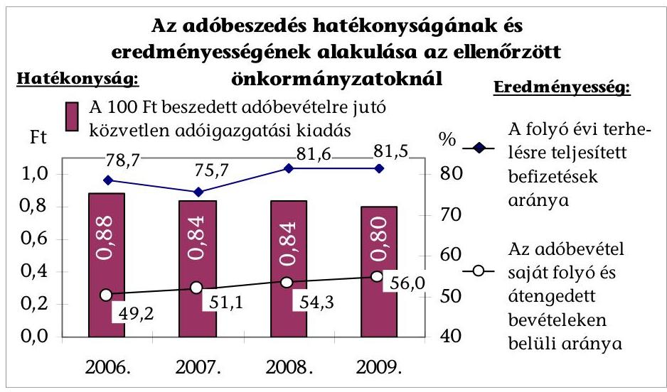

A fajlagos hatékonysági mutató a vizsgált önkormányzatok adatai alapján kedvezőbb lett, mert a 100 Ft adóbevételre jutó közvetlen adóigazgatási kiadás 2009-re 2006-hoz képest közel egytizedével csökkent. Ezt a takarékossági intézkedések (elsősorban a 13. havi illetmény megszűnése, létszámcsökkentés) miatt a kiadások adóbevételeknél alacsonyabb növekedési üteme eredményezte. A helyi iparűzési adó koncentrációja miatt a legkedvezőbb fajlagos mutatói a nagyobb adóerő-képességű önkormányzatoknak (Főváros, Paks, Budaörs) voltak. Az adóbevételekben lévő különbségek miatt a községekben, nagyközségekben a hatékonyság rendkívül alacsony, a mutató romlott. Körükben az egységnyi adóbevétel elérésének közvetlen kiadása 2006-ban ötször, 2009-ben hat és félszer magasabb volt, mint a vizsgált önkormányzatok

---

átlaga. A folyó évi adóelőírásokra történt befizetések és az adóbevétel saját folyó és átengedett bevételeken belüli aránya alapján az adóbeszedés eredményessége javult, az ellenőrzött önkormányzatok egészére számított mutatók értékei emelkedtek. Mindkét szempont szerinti javulás azonban csak a települések 36\%-ánál volt megállapítható, az alacsonyabb adóerő-képességű városok, nagyközségek és községek éves mutatói minden évben alatta maradtak a vizsgált önkormányzatok átlagának.

Az önkéntes társulási forma, az adóigazgatási feladatok közös ellátása nem terjedt el, ezt pénzügyi ösztönzők sem segítették. A jegyzők az alkalmazott szervezeti, szervezési megoldásokon nem, az ügyintézői feladatkörökön, az adónemek szerinti munkamegosztáson alig változtattak. Az adóigazgatás személyi és tárgyi feltételei az ellenőrzött önkormányzatok egytizedénél az ellátandó feladatok növekedését nem követő létszám- és a kedvezőtlenebb elhelyezési feltételek miatt romlottak, egyharmadánál alapvetően nem változtak, $\mathbf{58 \%}$-ánál a magasabb képzettségű munkaerő alkalmazása és a beruházások, felújítások, informatikai fejlesztések eredményeként javultak. A képzettségi szint és az önkormányzat típusa között szoros összefüggés állt fenn, a felsőfokú végzettségűek aránya a városokban magasabb, mint a községekben. Minden második önkormányzat pályázat alapján (elsősorban NFT és ÜMFT keretében) nyert olyan központi támogatást, amely - bár eltérő mértékben - az adóigazgatás tárgyi feltételeinek korszerűsítésére is irányult. Az Art. 2009 októberéig kizárta az adóbevallások elektronikus úton történő benyújtását a helyi adóhatósághoz, de az ellenőrzött önkormányzatok 61\%-a (a nagyobb települések többsége) indított el valamilyen fejlesztést az elektronikus ügyintézés feltételeinek kialakítására.

Az adók és adók módjára behajtandó köztartozások számítógépes nyilvántartása az önkormányzati adóhatóságoknál - a szoftver sajátosságaiból, a korszerűsítés elmaradásából eredő problémák, és emellett a program kínálta lehetőségek kihasználatlansága, a rögzítési, kódolási hiányosságok miatt nem nyújtott teljes körű információt sem a belső, sem a számvevőszéki ellenőrzéshez. Az ellenőrzött önkormányzatok 23\%-a nem szabályszerűen rögzítette a főkönyvi könyvelésben az adóbevételeket, ebben közrejátszott az erre vonatkozó jogszabályi előírások közötti összhang hiánya. Az adóbeszedési számlák forgalmának főkönyvi feladását az Adó nyilvántartási PM rendelet legkésőbb a tárgynegyedévet követő hó 15.-éig, a könyvvezetésre vonatkozó kormányrendelet (Áhsz.) a hitelintézeti értesítés megérkezését követően azonnal írja elő.

Az ellenőrzött önkormányzatok 42\%-ánál helyi rendeletben szabályozták a Hatv.-ben biztosított lehetőséggel élve az anyagi érdekeltségi rendszer feltételeit. Az anyagi ösztönzés e formáját az 1,8 milliárd Ft-nál nagyobb adóbevétellel rendelkező önkormányzatok mindegyike, a többieknek csak negyede alkalmazta. Az anyagi érdekeltség rendszerében alapvető különbségek voltak a forrás összegének meghatározásában, a kifizetések feltételeiben és a mértékében is. Az ellenőrzött önkormányzatok 6\%-ánál az érdekeltségi célú juttatásból - a Hatv.-ben előírttal szemben - nem köztisztviselő anyagi ösztönzésére is sor került. Az anyagi érdekeltséget alkalmazó önkormányzatoknál az ösztönzés lényegében a jutalmazás kibővített formáját jelentette. Az ellenőrzött önkormányzatok 87\%-ánál a jegyzők a köztisztviselők jogállásáról szóló törvény (Ktv.) alapján kialakították és működtették a teljesítményértékelést az

---

adóigazgatásban dolgozók körében is, az értékelés kötelezettségét - konkrét követelmények és mérések hiányában - formailag teljesítették. Az anyagi érdekeltségi, az egyéni teljesítményértékelési rendszer nem javította az adóellenőrzések általunk mért hatékonyságát. Az adózók terhére feltárt és általuk be is fizetett adó (adóhiány, bírság és pótlék) egy adóellenőrzésre jutó összege 2006 és 2009 összehasonlításában (a Főváros nélkül ${ }^{7}$ ) 92,8 ezer Ft-ról 81,5 ezer Ft-ra csökkent. Az önkormányzati adóhatóságok fele nem, vagy csak néhány adóellenőrzést végzett.

Az ellenőrzött önkormányzatok csupán 6\%-ánál javult az adóvégrehajtás hatékonysága és eredményessége is. Az adóvégrehajtás hatékonysága - a 100 Ft végrehajtással beszedett bevételhez kapcsolódó kiadás alapján - 2006 és 2009 összehasonlításában lényegében nem változott (mindössze 4 fillérrel lett alacsonyabb, 2009-ben az önkormányzatok kimutatásai alapján 1,47 Ft volt). Az Art. szerint lefolytatandó adóvégrehajtás eredményessége az általunk alkalmazott két mutató (indikátor) szerint is romlott. Az adóvégrehajtásból származó bevétel hátralékokhoz viszonyított aránya 15,1 százalékponttal ( $40,9 \%$-ra) csökkent, a behajthatatlanná minősített követelések aránya pedig 0,1 százalékponttal ( $0,39 \%$-ra) emelkedett. A hátralékból tárgyév végéig be nem fizetett összeg 2006 és 2009 között 62,7\%-kal emelkedett, az összes végrehajtási cselekmény hatására befolyt bevétel csak 19,0\%-kal nőtt. Az ellenőrzött önkormányzatoknál az adóvégrehajtás Art.-ben szabályozott cselekményeinek száma - az adók és adók módjára behajtandó köztartozások hátralékának folyamatos növekedése ellenére - 2006-ról 2009-re 4,7\%-kal csökkent. Az ingó- és ingatlan végrehajtást csak kevés helyen alkalmazták. A végrehajtási cselekményeken belül folyamatosan és többszörösére emelkedett a megkeresésre indított eljárások száma és aránya, ugyanakkor a végrehajtásból származó bevételeknek csak hat-hét %-a kapcsolódott ezekhez az ügyekhez.

Az adózók által az Art. alapján indított fizetési könnyítések, méltányossági kérelmek száma 2009-ben a gazdasági válság, a lakosság és a vállalkozások jövedelmi helyzetének romlása miatt megnőtt. A tartozás későbbi, részletekben történő megfizetésére, elengedésére vonatkozó esetek száma az ellenőrzött önkormányzati adóhatóságoknál 2006 és 2008 között 13,0\%-kal csökkent, de 2009-re 30,8\%-kal emelkedett az előző évhez képest. Az adóhatóságok minden tíz kérelemből átlagosan kilencben a kérelmező számára kedvező döntést hoztak, elsősorban részletfizetést engedélyeztek.

A kiadmányozási jogkörök szabályozása a közigazgatási eljárás és szolgáltatás általános szabályairól szóló törvénynek (Ket.) megfelelő volt, az ellenőrzött önkormányzati adóhatóságok egytizedénél volt csak hiányos. Az adóigazgatás belső kontrolljait az államháztartásról szóló törvény (Áht.) alapján a jegyzők közel 40\%-a nem megfelelően szabályozta, mert nem készült a kontrolltevékenységeket tartalmazó ellenőrzési nyomvonal (egyéb szabályozás), vagy a szabályzatokból az adóigazgatás, illetve a tevékenységek egy-egy eleme kimaradt. A jegyzők - egy kivétellel - nem határoztak meg az adóigazgatásban

[^0]
[^0]:    ${ }^{7}$ A Fővárosnál az adók hatékony beszedésének elősegítése érdekében adható érdekeltségi célú juttatásról szóló helyi rendelet szerint kifizetés az adóellenőrzésekkel megállapított és befizetett adóhiány, bírság és pótlék terhére teljesíthető, azonban az adónyilvántartás az ilyen címen történt befizetéseket a bevételeken belül nem különítette el.

---

dolgozók számára az ügyfelekkel való kapcsolattartásban a korrupció megelőzését szolgáló etikai követelményeket.

A helyszíni ellenőrzések hasznosítása érdekében javasoltuk az
 önkormányzatoknak: a gazdasági program adópolitikai célkitűzésekkel történő kibővítését, végrehajtásának nyomon követését; a közvetett támogatások bemutatását a költségvetési és zárszámadási rendelet előterjesztésekor; az adóhatósági tevékenységről a jegyző beszámoltatását; az adókötelezettségek ellenőrzésének, az adóvégrehajtás eredményességének növelését, a hátralékok csökkentését szolgáló intézkedések megtételét, az adónyilvántartások előírt módon történő vezetését; a korrupció megelőzését szolgáló etikai követelmények, a belső kontrollok működési rendjének szabályozását; a Fővárosnál az adóellenőrzések során feltárt adóhiány, bírság, pótlék befizetése adatainak gyűjtését.

A helyszíni ellenőrzés megállapításainak hasznosítása mellett javasoljuk:

# a Kormánynak 

1. Tegyen javaslatot az Országgyűlésnek a helyi önkormányzatok gazdálkodása stabilitását, a helyi adóbevételek biztonságos tervezését, a helyi önkormányzatok gazdasági programja adópolitikai célkitűzéseinek kidolgozását is elősegítő középtávú adópolitikai koncepció elfogadására.
2. Terjessze elő a költségvetési törvényjavaslatban a jövedelemkülönbség mérséklésével kapcsolatos adóerő-képesség iparűzési adóbevételek előző évi tényadatain alapuló számítási módszerét.
3. Ösztönözze a szakszerűbb, hatékonyabb feladatszervezést a helyi adóigazgatásban.

## az adópolitikáért felelős miniszternek

1. Dolgoztassa ki a MÁK informatikai fejlesztése feladatkörében az önkormányzati adófeldolgozást és nyilvántartást végző, elavult ÖNKADÓ program kiváltását biztosító állami szoftvert.
2. Intézkedjen a települési önkormányzatok hatáskörébe tartozó adók és adók módjára behajtandó köztartozások nyilvántartásáról, kezeléséről és elszámolásáról szóló 13/1991. (V. 21.) PM rendelet 9. § (5) és 14. § (2) bekezdése módosításával az adóbeszedési számlák forgalmának hitelintézeti értesítés megérkezését követő azonnali rögzítésére.

---

# II. RÉSZLETES MEGÁLLAPÍTÁSOK 

## 1. A HELYI ADÓRENDSZER ÁTALAKÍTÁSA, JOGSZABÁLY ELŐKÉSZÍTÉS

### 1.1. A helyi adórendszer, az iparűzési adó átalakítására vonatkozó javaslatok

A helyi adóztatást és az önkormányzatok által beszedett központi adókat érintően a vizsgált időszakra vonatkozóan több kormányzati és parlamenti döntés született, amelyek a technikai jellegű kisebb módosítások mellett több, a helyi iparűzési adót és az ingatlanadózást érintő intézkedést tartalmaztak. A helyi adórendszer jelentősebb átalakítását célzó adópolitikai döntések egy része visszavonásra, módosításra került (pl. az iparűzési adó tervezett megszüntetése), más részét (luxusadó, az ingatlanadókban a számított érték alapján történő adóztatásra vonatkozó rendelkezések) az Alkotmánybíróság (AB) alkotmányellenesnek minősítette és megsemmisítette.

Az elmúlt években a kiszámíthatóságot csökkentették az adópolitika, a helyi adórendszer módosítására vonatkozó, majd visszavont (AB által megsemmisített) döntések, több alkalommal változtak az elképzelések és az adózási szabályok. A 2005. februárjában megalakult Adóreform Bizottság külön albizottságban (Iparűzési adó munkabizottság) vizsgálta az iparűzési adó átalakításának lehetőségét, hatásait. Megállapításuk szerint a helyi iparűzési adó rendszere számos problémát vet fel.

Az iparűzési adó javasolt megszüntetése, az adóbevételek szerkezetének megváltoztatása az önkormányzatok finanszírozásának, így az önkormányzati rendszernek a reformját is feltételezte. A javaslatokban nem volt egyértelmű, hogy az iparűzési adót kiváltó adót központi adóként szedjék-e be, vagy maradjon helyi adó, valamint a beszedendő adó kit terheljen - a vállalkozókat, vagy a magánszemélyeket - közvetlenül.

A 2005. év eleji szakmai viták során kiderült, hogy több egymásnak ellentmondó szempont és érdek jelent meg a helyi adórendszer átalakításával, az iparűzési adó megszüntetésével kapcsolatos javaslatokban. Számos elképzelés fogalmazódott meg a kiváltására, mindegyikben közös volt a versenyképesség növelésre való hivatkozás. Azt, hogy a helyi iparűzési adó megszüntetése és új adó bevezetése hogyan hat a versenyképesség növelésére egyik megoldásnál sem mutatták be. A vállalkozásoknak településszerkezetre lebontott, és a belépő új adóalapok (adók), járulékok, adómérték növekedések változásával is kellett volna számolni, azonban a szükséges mélységű adatok nem álltak rendelkezésre. (Mivel az iparűzési adó a vállalkozások összes költségén, ráfordításán belül átlagosan kb. 0,6%-os arányt képvisel, az elemzések szerint a költségek csökkenése, a versenyképesség javulása is összességében átlagosan ilyen mértékű.)

A javaslatok szerint a vállalkozások számára általánossá váló értékalapú ingatlanadózás és a vizsgálatoktól függően esetleg további más

---

helyi adó váltotta volna fel az iparűzési adót. Az elképzelések szerint az önkormányzatok számára ez az új bevételi forrás kiszámíthatóbb, mint a nemzetközi gazdasági folyamatok (pl. a multinacionális cégek termelésáthelyezése) által is nagyban befolyásolt mértékű iparűzési adó, azaz sokkal inkább megvalósul az önkormányzatok önállósága, bevételeik tervezhetősége, mint korábban.

Az Országgyűlés (OGY) 2005. november 7-én döntött ${ }^{8}$ a helyi iparűzési adó 2007. december 31-ével történő megszüntetéséről. A Kormánynak az önkormányzati finanszírozási reform részeként - 2006-ban kellett volna megalkotnia az iparűzési adót kiváltó új helyi adóbevételi formát. Az egyes pénzügyi tárgyú törvények módosításáról szóló 2006. évi LXI. törvény 236. §-a hatályon kívül helyezte a helyi iparűzési adó megszüntetésére vonatkozó előírásokat, így az új helyi adóra vonatkozó törvényjavaslat nem került kidolgozásra, benyújtásra. Az iparűzési adó megszüntetését hatályon kívül helyező törvénymódosítás indokolása szerint az önkormányzatok alkotmányos védelmet élvező gazdálkodási biztonsága megköveteli, hogy az iparűzési adó a korábban meghatározott időpontban (2008. évtől) ne szűnjön meg.

# 1.2. A helyi adózást, az önkormányzati adóigazgatást érintő jogszabály előkészítés 

A vizsgált 2006-2009 közötti időszakban - miközben a helyi adók rendszere, az egyes adónemekre vonatkozó főbb szabályok nem változtak - a Hatv. 53 ponton módosult. Ezek egy része azonos tárgykörben tartalmazott kiegészítő, pontosító rendelkezést. A 2006-2009 között hatályba lépett, a Hatv. módosítását is tartalmazó pénzügyi tárgyú törvények száma 9 volt. A törvényjavaslatok indokolása szerint a Hatv. módosítása a jogalkalmazási problémák megoldását, az adózás, az adminisztráció egyszerűsítését szolgálta. A szövegpontosítás igénye miatt egy éven belül többször szerepelt a jogalkotás napirendjén. Az adókötelezettséget érintő (a PM által kisebb jelentőségűnek minősített) módosítások várható hatásának vizsgálatáról ${ }^{9}$ nem készültek elemzések, felmérések (hatástanulmányok).

A jogalkalmazási problémák megoldását célzó törvénymódosítások ellenére az egyedi jogértelmezési kérdések, az egyedi adóügyekben kiadott PM állásfoglalások száma növekedett.

A leggyakrabban a műemléképület felújításához kapcsolódó - 2008. január 1-jétől beiktatott - adómentességgel (Hatv. 13/A. §), a külföldi telephelyen végzett tevékenységgel, az ún. feltételes adómentességben részesülő közszolgáltató szervezetekkel kapcsolatos szabályozás és az értelmező rendelkezések változtak.

[^0]
[^0]:    ${ }^{8}$ az adókról, járulékokról és egyéb költségvetési befizetési kötelezettségekről szóló törvények módosításáról szóló 2005. évi CXIX. törvény
    ${ }^{9}$ A jogalkotásról szóló 1987. évi XI. törvény 18. § (1) bekezdése szerint a jogszabály megalkotása előtt elemezni kell a szabályozni kívánt társadalmi-gazdasági viszonyokat, meg kell vizsgálni a szabályozás várható hatását és a végrehajtás feltételeit, erről a jogalkotót tájékoztatni kell.

---

A PM által 2006. szeptemberében készített „Koncepció a helyi adórendszer és az önkormányzati adóigazgatás megújítására" dokumentumban a téma helyzetelemzése, az ebből adódó probléma-felvetés alapján az ingatlanadóztatás és a gazdasági tevékenységet terhelő adók, valamint a helyi adóigazgatás megújítására vonatkozó elgondolások fogalmazódtak meg. A koncepciót azonban szakmai vitára nem bocsátották, hivatalos dokumentumként nem került elfogadásra. Az abban szereplő elképzelések a törvényjavaslatok kidolgozása során részben hasznosultak.

A munkaanyag szerint az önkormányzati rendszerrel egyidős helyi adórendszer az elmúlt 16 évben alapvetően beváltotta a hozzá fűzött reményeket, stabil, tervezhető saját bevételt biztosított a településeknek. Az elmúlt időszak azonban felszínre hozott több olyan kérdést, amelyek válaszra várnak. Ilyen célkitűzésként fogalmazódott meg az ingatlanokat terhelő adók, ezen belül a lakáscélú épületek, ingatlanok adóztatásában a jelenleg működtetett négyféle helyi adónem és a bevezetett luxusadó megszüntetésével a vagyonarányos közteherviselés alkotmányos elvét jobban tükröző értékalapú ingatlanadóztatás bevezetése.

A Hatv. módosításával ${ }^{10}$ az OGY 2008. évben az önkormányzatok adóztatási mozgásterének bővítése indokolással 2009. évtől lehetővé tette, hogy az építmény- és telekadót továbbra is az alapterület, valamint a korrigált forgalmi érték alapján is működtethessék, valamint a számított érték alapú adóztatás lehetőségét is fenntartotta.

# Az $\mathbf{AB}^{11}$ a Hatv. számított értékre vonatkozó előírásait alkotmányellenesnek ítélte, ezért azokat az Ltv.-vel együtt megsemmisítette. 

Az AB döntés indokolása szerint a Ltv. és a Hatv. számított értékre vonatkozó szabályai sértik a jogállamiság elvét, mert az adókötelezettséget, annak mértékét a törvények felhatalmazása alapján olyan jogszabály (helyi önkormányzati rendelet) határozhatja meg, amelynek megalkotása során nem zárható ki, hogy az önkormányzati testület önkényesen, csak saját bevételi szempontjait figyelembe véve rögzítse az értékhatárokat. Az adóhatósági határozat elleni valódi jogorvoslatot és érdemi bírósági felülvizsgálatot zárja ki, ennek keretében nem vizsgálható az ingatlan értékét meghatározó önkormányzati rendelet.

A gazdasági tevékenységet terhelő helyi adók (iparűzési adó, a vállalkozók kommunális adója) közül az iparűzési adóval kapcsolatosan a vállalkozások sérelmezik, hogy azért elviselhetetlen az adóteher, mert a veszteséges vállalkozásoknak is fizetniük kell. Az adó alapjának a változó üzleti környezethez való igazítása érdekében a nyereség (a Tao. adóalapjával egyező adózás előtti eredmény) adóalapként történő bevezetését javasolták a koncepció készítői.

A koncepció szerint a helyi adóigazgatás rendkívül heterogén képet mutat. A főváros, megyei jogú városok, nagyobb városok adóhatóságainak szakmai hozzáértése, technikai feltételei magas színvonalúak (ezek szedik be a helyi adók több mint 90%-át), míg a községekben a személyi feltételek hiányosak. A hatékonyabb feladatellátást szolgálhatja az önkormányzati adó-

[^0]
[^0]:    ${ }^{10}$ egyes adótörvények módosításáról szóló 2008. évi VII. törvény
    ${ }^{11}$ 155/2008. (XII. 17.) AB határozat

---

ügyek egy részének APEH-hoz történő telepítése, illetve az önkormányzati adóhatósági feladatok egy részének (pl. végrehajtás, adóellenőrzés) körzetközponti adóhatóságokhoz történő rendelése. Az Ötv. 41. § (1) bekezdése szerint a települési önkormányzatok feladataik hatékonyabb, célszerűbb megoldására szabadon társulhatnak. Az Ötv. 42. § (1) bekezdése alapján a képviselő-testületek megállapodással egyes államigazgatási hatósági ügyfajták szakszerű intézésére hatósági igazgatási társulást hozhatnak létre. Az önkéntes társulás jogát a helyi önkormányzatok társulásairól és együttműködéséről szóló 1997. évi CXXXV. törvény (társulási tv) is biztosítja, azonban ezekkel a lehetőségekkel kevés esetben éltek az önkormányzatok.

A közteherviselés rendszerének átalakítását célzó törvénymódosításokról szóló 2009. évi LXXVII. törvény a helyi iparűzési adóval kapcsolatos adóztatási feladatokat a 2010-től kezdődő adóévek vonatkozásában az APEH hatáskörébe utalta. Ezzel összefüggésben szakértői vélemények szakmai és alkotmányossági aggályokat fogalmaztak meg ${ }^{12}$, az önkormányzati érdekszövetségek a törvény hatályon kívül helyezésére indítványt ${ }^{13}$ nyújtottak be az AB-hez. Az iparűzési adó önkormányzati adóhatóságok által történő beszedésére vonatkozó képviselői önálló indítvány alapján elfogadott törvénymódosítás ${ }^{14}$ szerint a helyi adóügyben az a helyi önkormányzati adóhatóság jár el, amelynek önkormányzata a helyi adót bevezette.

# 2. AZ ÁLLAMIGAZGATÁSI (KÖZIGAZGATÁSI) HIVATALOK ELLENŐRZÉSE, SZAKMAI SEGÍTSÉGNYÚJTÁSA 

### 2.1. A helyi adó rendeletek törvényességi ellenőrzése

A helyi önkormányzatok, ezen belül a helyi adó rendeletek törvényességi ellenőrzését a 2006-2008. években a közigazgatási hivatalok, a jogutód regionális államigazgatási hivatalok és megyei kirendeltségeik a jegyzőkönyvek, önkormányzati döntések tételes felülvizsgálatával végezték. A vizsgált RÁH-ok összesen 719 esetben tettek észrevételt a helyi adó rendeletekben előforduló törvénysértések miatt. A képviselő-testületek a törvényességi jelzésben foglaltakkal egyetértettek, a törvényes állapot helyreállítása megtörtént, a helyi adó rendeletek törvényességi felülvizsgálata során feltárt hiányosságok megszüntetésével javult a helyi jogalkotás minősége.

[^0]
[^0]:    ${ }^{12}$ a TÖOSZ megbízásából készített „Független alkotmányjogi szakmai vélemény az iparűzési adó APEH általi beszedésére vonatkozó új szabályozásról"
    ${ }^{13}$ a Megyei Jogú

 Városok Szövetsége az iparűzési adó APEH általi beszedésére vonatkozó törvénymódosításokkal kapcsolatos Alkotmánybíróságnak megküldött beadványa
    ${ }^{14}$ a helyi iparűzési adóval kapcsolatos egyes törvények módosításáról szóló 2010. évi LVII. törvény 7. §-a

---

Egy esetben került sor alkotmánybírósági eljárás kezdeményezésére, mert a képviselő-testület csak részben fogadta el a rendelet módosítására vonatkozó javaslatot $^{15}$.

Az önkormányzatok helyi adó rendeleteinek vizsgálata során alkalmazták a szóbeli, az írásbeli észrevételt (törvényességi észrevételt) és az előkészítő iratot. A törvénysértések észrevételezése, az intézkedések elsődlegesen a megelőzést szolgáló jogi segítségnyújtásra, a hatékony és időszerű törvényességi ellenőrzésre irányultak. E célt legjobban a szóbeli észrevétel szolgálta.

A megelőzést szolgáló szakmai segítségnyújtás egyre inkább elterjedt módja az e-mailes információcsere. Ez az észrevételezési forma a gyors javítást, kiigazítást is lehetővé tette. A szóbeli észrevételt elsősorban telefonon, illetve 2007-től e-mailben tették a jegyzők felé.

Az előkészítő irat címzettje a jegyző, szövegezése egyszerűbb, a jogi indokolás rövidebb. Ezzel lehetőséget kaptak a jegyzők, hogy saját hatáskörben tegyenek indítványt a képviselő-testületnek a jogszabálysértés megszüntetésére. Amennyiben a javítás elmaradt, írásbeli észrevétel benyújtására került sor a képviselő-testület felé.

Az írásbeli észrevételekkel szemben elvárás, hogy azok tartalmukban, formájukban alkalmasak legyenek bírósági kereset, illetve alkotmánybírósági kezdeményezés benyújtására is. Az ésszerű határidő meghatározása a bonyolultabb törvénysértések esetén is biztosította a kijavítás lehetőségét.

A 2006-2008. években végzett törvényességi ellenőrzésről készült beszámolók alapján megállapítható, hogy a helyi adó rendeletekben visszatérő hiányosságok fedezhetők fel. Tipikus hibaként jelentkezett, hogy a rendeletek ellentmondásban voltak a Hatv. és az Art. előírásaival. A törvénysértő rendelkezések leggyakoribb oka az volt, hogy a Hatv. és az Art. módosításával olyan tartalmi változások léptek hatályba, amelyek miatt az önkormányzatoknak módosítaniuk kellett volna a helyi rendeleteiket. Gyakori hiba, hogy az adókötelezettség, az adó tárgya, az adó alanya tekintetében is eltérnek a törvények előírásaitól. Az egyes adónemekre megalkotott rendeletekben törvénysértő módon jelent meg az adómérséklésre vonatkozó hatáskör, az adómérséklés, a fizetési halasztás, részletfizetés, valamint a jogorvoslati eljárás rendeletben történő szabályozása. A Hatv. 6. § a) pontjának előírásaival ellentétes volt az a gyakorlat, hogy az adó rendeletek év közbeni módosítása következtében az adóalanyok terhe növekedett.

# A törvényességi észrevételeken túl az önkormányzati intézkedések megtörténtét is ellenőrizték a 2006-2008. években, a kialakított módszer, eljárási rend biztosította az intézkedések nyomon követését. 

Ha a kitűzött határidőn belül nem kaptak visszajelzést az önkormányzattól a megtett intézkedésről, akkor az ügyintéző rövid úton tájékoztatást kért a jegyzőtől az észrevétel intézésének helyzetéről, alakulásáról, és ennek megfelelően bekérte az iratot, illetve szükség szerint intézkedett.

[^0]
[^0]:    ${ }^{15}$ Az AB 2009 decemberében hozott határozatában a közigazgatási hivatal indítványában foglaltaknak helyt adott és Nagykőrös építményadó rendeletének kifogásolt rendelkezéseit megsemmisítette.

---

A törvényességi ellenőrzés mellett a RÁH-ok panaszok, közérdekű bejelentések vizsgálatával, jogi állásfoglalások kiadásával is segítették az önkormányzatok munkáját. A közérdekű bejelentések és panaszok a helyi adó rendeletek - azon belül is elsősorban az adómérték, illetve az adókötelezettség - vizsgálatát kezdeményezték.

A törvényesség érdekében hangsúlyt fektettek a megelőzésre, a személyes konzultációra. A jegyzők részére szervezett értekezleteken tájékoztatást adtak a jogszabályváltozásokról, felhívták a figyelmet az időszerű feladatokra, választ adtak jogalkalmazási kérdésekre. Részt vettek a jegyzői klubok rendezvényein tájékoztatást adva az aktuális törvényességi kérdésekről és egyéb feladatokról. A megelőzést szolgálta, hogy a jegyzők kérésére elvégezték a rendelettervezetek, köztük a helyi adó rendelet tervezetek előzetes véleményezését. Emellett körlevelekben küldtek ki szakmai tájékoztató anyagokat az adótörvények módosításából eredő változásokról. A Hivatali Tájékoztatókban a Törvényességi Ellenőrzési, illetve a Hatósági Főosztályok rendszeresen tettek közzé helyi adókkal kapcsolatos tájékoztatókat a 2006-2008. években.

Az önkormányzatok törvényes működését szolgálták az éves munkaterv alapján, minisztériumi megkeresésre, vagy jogszabályváltozás miatt végzett cél-, és témavizsgálatok. Emellett több esetben előfordult, hogy az önkormányzati működés során tapasztalható tipikus törvénysértések alapján a RÁH célvizsgálat keretében megvizsgálta a törvénysértésekhez vezető hibás gyakorlatot és intézkedést kezdeményezett annak megszüntetésére.

A helyi önkormányzatok törvényességi ellenőrzése - megfelelő jogszabályi felhatalmazás hiányában - 2009. január 1-jétől nem volt biztosított. A RÁH-ok korábbi törvényességi és felügyeleti főosztályai átalakultak felügyeleti és igazgatási monitoring főosztályokká. 2009. január 1-jétől az önkormányzatok nem voltak kötelesek megküldeni a testületi, illetve a bizottsági ülésekről készült jegyzőkönyveket. Amennyiben mégis megküldték a rendeleteket, azokat nyilvántartásba vették, illetve kérés esetén szakmai véleményt adtak az önkormányzat részére. A szóban kiadott jogi véleményekről írásos feljegyzést készítettek.

A Közép-dunántúli RÁH havonta készített szakmai tájékoztató levelekben hívta fel a figyelmet az aktuális jogszabályi változásokra, időszerű feladatokra, jogalkalmazási problémákra. Szakmai segítséget elsősorban a jegyzők igényeltek főként az iparűzési adóval kapcsolatos változások, a telekadó, egyéb helyi adó számítás és személyes adatok kezelése körében.
2009. évben a Közép-magyarországi RÁH az önkormányzati rendeletalkotási tárgyköröket alapul véve munkacsoportokat hozott létre. Ezek feladata volt az adott tárgykörbe tartozó rendeletek elemzéséhez szükséges útmutató elkészítése, amely alapján elemezték az adóztatáshoz kapcsolódó önkormányzati rendeleteket. A régió 331 helyi adó rendeletét érintette a vizsgálat, amelynek tapasztalatait összegezték, majd átadták a jegyzők részére.

---

# 2.2. Az adóhatósági döntésekkel szembeni jogorvoslati eljárások 

Az ellenőrzött önkormányzatoknál 2006-2009 között 1,1 millió elsőfokú adóhatósági döntés született, azoknál a Ket., illetve az Art. speciális eljárási szabályait is alkalmazták. A 2006. és a 2009. évek között összességében 12,6%-os emelkedés volt, ezen belül az önkormányzatok 61%-ánál nőtt, 39%-ánál csökkent az adóügyi határozatok és végzések száma. A döntések száma 2007-ben - elsősorban a Gjt. módosításával összefüggésben ${ }^{16}$ - közel háromnegyedével emelkedett az előző évhez képest.

A hatósági statisztikán alapuló adatszolgáltatás ${ }^{17}$ szerint a jogorvoslatok aránya az utóbbi négy év átlagában 0,8 ezrelék volt. A jogorvoslat miatti ügyek száma ugyan nem jelentős, de a nem megfelelő szakmai felkészültség, jogalkalmazás miatt az utóbbi két évben már minden második jogorvoslatnál meg kellett változtatni a döntést (akár saját hatáskörben, akár másodfokon), vagy az eljárást újra le kellett folytatni az elsőfokú adóhatóságoknál. A jogorvoslatok számát az önkormányzati adóhatóságoknál jelentősen befolyásolták a törvénymódosítások, az önkormányzatoknál lefolytatott ellenőrzések, valamint a végrehajtási cselekmények számának változása. Fellebbezéseket alapvetően az adóellenőrzés eredményeként adóhiányt és egyéb jogkövetkezményt megállapító elsőfokú határozatok ellen nyújtottak be az adózók.

Az ellenőrzéssel érintett években az egyes adónemekben benyújtott jogorvoslati kérelmek alapján megállapítható, hogy a 2007-2009. években az elsőfokú döntések elleni jogorvoslati kérelmek száma nőtt. Ebben szerepet játszott az anyagi jogi (Hatv., Gjt.) és az eljárásjogi (Art., Ket., Vht.) szabályok, valamint az önkormányzati rendeletek módosulása. A jogorvoslati kérelmekben az adózók több esetben tévesen értelmezték a törvényi szabályokat (Hatv., Art.) és az önkormányzati rendeleteket, az adóbevallás benyújtására vonatkozó adókötelezettséget, az adókedvezményre és mentességre megállapított jogszabályi előírásokat. Ezekben az ügyekben az első fokú döntéseket a másodfokú hatóság helybenhagyta, a határozat indokolásában a jogszabályok részletes ismertetésével és magyarázatával tájékoztatta a fellebbezőket a döntés jogalapjáról.

A 2006. évi másodfokú döntések magas számát az iparűzési adó megfizetése miatt indult jogorvoslati eljárások, valamint az illeték ügyek indokolták.

2006-ban az illeték ügyek is a közigazgatási hivatalokhoz tartoztak, 2007. január 1-jétől e hatáskör átkerült az APEH-hoz. 2006-ban több adóalany vitatta az iparűzési adó fizetésének jogosságát, utalva arra, hogy az adónem ellentétes az EU Tanácsának hatodik, a Tagállamok forgalmi adókra vonatkozó jogszabályainak összehangolásáról szóló 77/388/EKG irányelv 33. cikke első bekezdésével. Ez a

[^0]
[^0]:    ${ }^{16}$ A 2007. évtől megváltoztak a gépjárművek utáni adófizetési kötelezettség szabályai, erről az adózókat határozatban kellett értesíteni.
    ${ }^{17}$ A különböző iktatási rendszerek, az iktatás eltérő színvonala és a statisztikai adatok helyességét szolgáló kontrollok hiányosságai miatt az egyedi adatok pontatlanságának kockázata az aláírással hitelesített tanúsítványok alkalmazása mellett is megmaradt.

---

jogorvoslatok megugrásával járt, előbb a közigazgatási eljárások, majd a peres eljárások viszonylatában is.

Az ellenőrzött önkormányzatok egyharmadánál fordult elő, hogy az adózó az ügye másodfokú elbírálásával sem értett egyet és bírósághoz fordult. A peres eljárásba kerülő döntések számáról - a Főváros adóhivatalát kivéve - naprakész információk álltak rendelkezésre. A tizenhat közigazgatási perből tizenkettőnél a bíróságok jogerős határozatai elutasították az adózók kereseteit, egy-egy esetben az adózónak adtak igazat, illetve az új eljárásra kötelezés miatt még nem zárult le az ügy és két esetben elállás miatt végzéssel megszüntették az eljárásokat.

Az eljárások (négy 2006. évet megelőzően indított és tizenkettő 2006-2009 között kezdeményezett) köréből nyolc a helyi iparűzési adó EU konformitásával állt összefüggésben. A helyi iparűzési adóelőleg megfizetésére vonatkozóan kibocsátott fizetési meghagyásokkal kapcsolatos eljárásban az Európai Bíróság által 2007. október 11-én hozott ítélet alapján az iparűzési adó nem ellentétes az uniós jogszabályokkal.

A nem jelentős nagyságrendre hivatkozva az önkormányzatok külön nyilvántartásokat nem vezettek a jogorvoslatok pénzügyi hatásairól (a saját hatáskörű módosítások, visszavonások, a másodfokon hozott döntések, valamint a bírósági eljárások hatására az adóbevételeik változása, a felmerült kapcsolódó kiadások).

A másodfokon hozott határozatok önkormányzati bevételre gyakorolt hatását nem mérték fel. Az elsőfokú döntések ellen benyújtott fellebbezéseket, a végrehajtási eljárások ellen benyújtott végrehajtási kifogásokat a vizsgált RÁH-ok közül kettő nem határidőben bírálta el.

Az ÖM Közigazgatási Hivatali, Jegyzői és Hatósági Főosztálya 2007-2008. években három RÁH-nál ${ }^{18}$ átfogó ellenőrzést tartott. Az adóigazgatást vizsgáló PM a hatékony adóztatás és a törvényes adóhatósági működés érdekében javasolta, hogy az adóügyi feladatokat ellátó munkatársak számát emeljék, valamint hozzanak létre egy régió szintű, a Hatósági Főosztály szervezeti egységeként működő osztályt, amelynek kizárólagos feladata az önkormányzatok kezelésében lévő adók vonatkozásában felmerülő adóhatósági feladatok koordinálása, illetve a régió szintű egységes jogértelmezés biztosítása lenne. A javaslat megvalósítására nem került sor.

# 2.3. Az önkormányzati adóhatóságok ellenőrzése 

A vizsgált időszakban a RÁH-ok rendszeresen ellenőrizték az önkormányzati adóhatóságok tevékenységét. Ellenőrzési terv, előre kidolgozott vizsgálati szempontok szerint komplex felügyeleti ellenőrzést - amelynek része volt az adóigazgatás ellenőrzése is -, valamint cél- és témavizsgálatokat végeztek. A helyszínek kiválasztásánál fontos szempont a szakmai segítségnyújtás, ezért figyelemmel voltak a településekről érkező fellebbezések számára, a MÁK

[^0]
[^0]:    ${ }^{18}$ A DDRÁH-t 2007-ben, az ÉARÁH-t és a NYDRÁH-t 2008-ban ellenőrizték.

---

Területi Igazgatósága ÖNKADÓ programból származó információira is ${ }^{19}$. Hatósági és felügyeleti ellenőrzések során a 2007-2009. években, országos szinten összesen 254, 277, 243 polgármesteri hivatalnál és körjegyzőségnél az adóigazgatási munkát is ellenőrizték. Az önkormányzati adóhatóságok megtették az ellenőrzés által javasolt intézkedéseket, amelyekről és ezek eredményéről határidőn belül tájékoztatást adtak.

A RÁH-ok ellenőrzési tapasztalatai szerint az önkormányzati adóhatósági tevékenységet számos hiányosság jellemzi, összességében nem megfelelő színvonalú. A legtöbb elsőfokú adóhatóságnál közepes színvonalú, de sok helyen az átlagosnál is gyengébb a jegyzők adóhatósági tevékenysége. Alapvető hiányosság az adóellenőrzések alacsony száma és a végrehajtások alacsony hatásfoka ${ }^{20}$. A helyi adók
 tekintetében - városok kivételével - jellemző, hogy a bevallási késedelem esetén nem alkalmaztak mulasztási bírságot ${ }^{21}$. Az adóügyintézők száma általában kevés az ellátandó feladatokhoz képest.

Az adóigazgatásban résztvevő önkormányzati dolgozók részére a RÁH-ok rendszeresen szakmai továbbképzéseket szerveztek. Az ellenőrzések tapasztalatairól az önkormányzati vezetők, illetve adóhatósági dolgozók számára szakmai napot tartottak, ahol javaslatokat fogalmaztak meg. A helyi adóhatóságoknál végzett ellenőrzések, az adóigazgatási feladatok ellátása témájában készült összegzések a RÁH-ok honlapján, illetve a Közigazgatási Tájékoztatóban is megjelentek. Az önkormányzati adóhatósági tevékenység szakmai segítésére, ismeretek átadására, konzultációra szolgáltak a jegyzői értekezletek, valamint a jegyzői klubok munkájában való részvétel.

# 3. A HELYI ADÓPOLITIKA CÉLKITŰZÉSEI, A HELYI ADÓZTATÁS EREDMÉNYESSÉGÉNEK JAVÍTÁSÁRA TETT INTÉZKEDÉSEK 

### 3.1. A helyi adók, az önkormányzati adóhatóság által beszedett központi adók szerepe a finanszírozásban

A helyi önkormányzatok saját bevételei szempontjából növekvő jelentőségű volt a helyi adók, ettől kisebb az önkormányzati adóhatóságok által beszedett központi adók, egyéb sajátos bevételek, bírságok szerepe.

[^0]
[^0]:    ${ }^{19}$ A DDRÁH Kaposvári és az ÉARÁH Nyíregyházi kirendeltségei által lefolytatott ellenőrzések esetében figyelembe vették a másodfokú ügyintézések tapasztalatait.
    ${ }^{20}$ A NYDRÁH 2008. évi beszámolója szerint a községekben gyakran elmaradt a végrehajtás azokban az ügyekben, ahol az adózó önként nem tett eleget adófizetési kötelezettségének. A közigazgatási hivatalok 2007. évi beszámolója szerint az első fokú adóhatóságok 90%-a ingó, ingatlan végrehajtást nem folytatott le. A DARÁH 2007. évi beszámolója szerint egy kivételtől eltekintve a végrehajtási tevékenység kimerült a felszólításban, egyéb intézkedés nem történt.
    ${ }^{21}$ Az ÉMRÁH 2007. évi beszámolója szerint „Az adózó a mulasztását nem menti ki, emellett a bevallásadásra történő felszólítást bírság mellőzésével végzik. A törvénysértő gyakorlatnak meggyőződésünk szerint nem szakmai, hanem a helyi viszonyokra visszavezethető politikai okai vannak. Az ügyintézőkkel „jegyzőkönyvön kívül" történő beszélgetések alátámasztják a mulasztások valós okaival kapcsolatos véleményünket".

---

# A helyi önkormányzatok GFS rendszerű bevételeinek megoszlása főbb jogcímek szerint (az adatok milliárd Ft-ban) 

| Megnevezés | 2005.   tény | 2006.   tény | 2007.   tény | 2008.   tény | 2009.   tény | Megoszlás \%   2005.   évi |  |
| :-- | --: | --: | --: | --: | --: | --: | --: |
| Saját folyó bevételek | 794,9 | 854,2 | 913,7 | 1018,3 | 1058,1 | 27,5 | 33,9 |
| Ebből: helyi adó | 397,9 | 448,0 | 505,3 | 553,3 | 566,2 | 13,8 | 18,1 |
| egyéb sajátos bev. bírságok | 37,2 | 38,8 | 39,8 | 42,1 | 43,2 | 1,3 | 1,4 |
| Átengedett bevételek | 489,3 | 512,3 | 557,0 | 624,6 | 703,4 | 16,9 | 22,5 |
| Ebből: gépjárműadó | 49,2 | 51,3 | 62,4 | 65,7 | 63,8 | 1,7 | 2,0 |
| Állami hozzájárulások, támogatások | 881,4 | 867,1 | 860,3 | 863,1 | 669,0 | 30,5 | 21,4 |
| Államháztartáson belüli átutalások | 425,6 | 448,8 | 426,6 | 430,6 | 389,7 | 14,7 | 12,5 |
| Felhalmozási és tőke jellegű bevételek | 272,0 | 340,3 | 291,3 | 305,3 | 276,8 | 9,4 | 8,9 |
| Egyéb bevételek | 27,9 | 30,7 | 31,8 | 26,3 | 28,4 | 1,0 | 0,9 |
| GFS rendszerű bevételek összesen | 2891,1 | 3053,4 | 3080,7 | 3268,2 | 3125,4 | 100,0 | 100,0 |

A 2009. évi GFS rendszerű bevételek 18,1%-a helyi adóból, 2,0%-a az önkormányzati adóhatóságok által beszedett gépjárműadóból, 1,4%-a egyéb sajátos bevételekből, bírságokból tevődött össze. A saját folyó bevételeknek több mint a fele - növekvő részarányban - helyi adókból származott (2005-ben 50,1%, 2009-ben 53,5%).

A helyi önkormányzatok által realizált helyi adó bevétel 2005-ben 397,9 milliárd Ft, 2009-ben 566,2 milliárd Ft volt (négy év alatt 42,3%-kal növekedett). A vizsgált időszak 168,3 milliárd Ft összegű növekményének 92,3%-a a 2009. évet megelőző 2006-2008. években realizálódott. A válság hatására - az előző két év 55,8 milliárd Ft/év (átlagosan évi 12,5%-os) forrásbővüléséhez viszonyítva a helyi adó bevételek növekedése lelassult, csupán 12,9 milliárd Ft (2,3%) volt 2009-ben.

A helyi önkormányzatok bevételeinek, ezen belül az adóbevételek alakulásában több tényező együttes hatása érvényesült. Az önkormányzatok forrásait a vizsgált időszakban a pénzügyi szabályozás alapvető elemeinek változatlansága mellett az állami támogatások, hozzájárulások feladatváltozást és az államháztartás egyensúlyának javításával összefüggő intézkedések hatását is tükröző csökkentése, valamint a gazdasági válságjelenségek, a jogszabályi környezet, az adópolitika változása, az adóhatóságok tevékenysége, a hátralékok alakulása egyaránt befolyásolta.

Helyi adók növekedése az előző évhez viszonyítva %-ban

| Megnevezés | 2006/2005 | 2007/2006 | 2008/2007 | 2009/2008 |
| :-- | --: | --: | --: | --: |
| Építményadó | 107,8 | 113,9 | 113,5 | 107,7 |
| Telekadó | 110,0 | 120,9 | 120,7 | 109,4 |
| Magánszemélyek kommunális adója | 104,0 | 109,6 | 107,4 | 103,5 |
| Vállakozók kommunális adója | 110,0 | 99,4 | 105,1 | 97,4 |
| Idegenforgalmi adó tartózkodás után | 112,9 | 113,3 | 110,8 | 100,2 |
| Idegenforgalmi adó építmény után | 101,6 | 110,5 | 105,6 | 97,3 |
| Iparűzési adó | 113,8 | 112,4 | 108,9 | 101,5 |
| HELYI ADOK ÖSSZESEN | 112,8 | 112,5 | 109,5 | 102,3 |

---

A hátralékállomány összege és összetétele kedvezőtlenül változott a vizsgált időszakban. Az önkormányzati adóhatóságok által nyilvántartott összes adóhátralék 2009. év végén 133 milliárd Ft-ra (87%-kal) emelkedett a 2006. évi nyitó (71 milliárd Ft) hátralékhoz viszonyítva. A hátralékok 51,3%-a helyi adóból (71%-ban iparűzési adóból), 18,5%-a gépjárműadóból, 27%-a felhalmozott pótlékból, megállapított bírságból keletkezett 2009. év végén.

Az önkormányzati adóhatóságok által beszedett központi adók, egyéb sajátos bevételek, bírságok (pótlékok) összege 2006-2008. években 25%-kal (21,7 milliárd Ft-tal) növekedett, 2009-ben 2%-kal (a 2008. évi 108,1 milliárd Ft-ról 105,8 milliárd Ft-ra) csökkent. A növekmény 77,4%-a gépjárműadóban keletkezett. A gépjárműadó hátralék több mint kétszeresére (119,6%-kal), 13,3 milliárd Ft-tal növekedett a 2006-2009. években, és 2009-ben 24,6 milliárd Ft, a folyó évi terhelés 36%-ának felelt meg. Ez közrejátszott abban, hogy a 2009. évi gépjárműadó bevétel 2,1 milliárd Ft-tal (3,3%-kal) csökkent az előző évhez képest.

A helyi adó bevételek makroszintű tervezése (ún. országgyűlési előirányzat) a költségvetési törvényjavaslat mellékletében szereplő államháztartási mérlegek összeállítását szolgálta, de az indokolás a tervezett jogszabály-módosítások hatásának bemutatására is alkalmat biztosított. A vizsgált időszakban a javasolt országgyűlési előirányzat és a tényleges helyi adó bevételek alakulását az alábbi diagram szemlélteti:
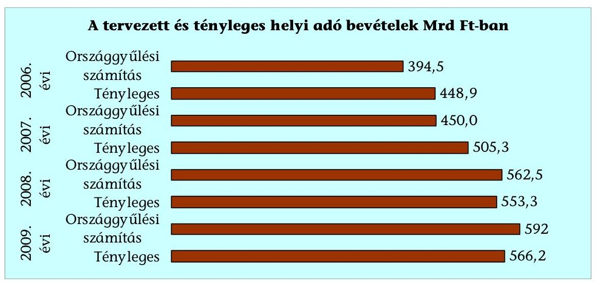

A helyi adó bevételekre vonatkozó prognózis a vizsgált időszak első két évében alultervezett volt, 2009-ben azonban a növekedésre vonatkozó előrejelzés megalapozatlannak bizonyult. Az adóbevételek korábbi növekedési üteme lelassult, a gazdasági válság miatt az adóbevételek a tervezett 5,2%-kal szemben csak 2,3%-kal emelkedtek. A várható bevételek központi tervezésekor az önkormányzatok adópolitikával kapcsolatos döntéseinek hatása (új adónem bevezetése, adómérték változtatása, kedvezmények, mentességek módosítása) információk hiányában nem volt pontosan felmérhető.

# 3.2. Helyi adók a vizsgált önkormányzatoknál 

A vizsgált települési önkormányzatok saját folyó és átengedett bevételeihez viszonyítva az önkormányzati adóhatóság által kezelt adóbevételek (helyi és átengedett adók) aránya a vizsgált időszakban 6,8 százalékponttal emelkedett. A költségvetés tervezett hiánya - a várható bevételek óvatos tervezésének, az adóbevételek túlteljesítésének eredményeként - csökkent. A tervezésében tapasztalható óvatosságot jelzi, hogy az önkormányzatok által jóváhagyott eredeti előirányzatokat az elmúlt években 10-7%-kal haladta meg a teljesített helyi adó.

Hajdúszoboszló Város Önkormányzata költségvetésének tervezett hiánya a vizsgált 2006-2009 években összesen 713,4 millió Ft, az adóbevételek teljesítésének eredményeként elért többletbevétel 1086,8 millió Ft volt.

Kisvárda Város Önkormányzata költségvetésének tervezett hiánya az adóbevételek teljesítésének eredményeként csökkent. A helyi adóban 2007. évben a túlteljesítés 18,2%-os (106,3 millió Ft), 2009-ben 32,0%-os (213,8 millió Ft) volt, amelyben az iparűzési adó 22,6%-os és 42,8%-os túlteljesítése volt a meghatározó.

A helyi adók önkormányzati tervezését az adóelőleg feltöltés ${ }^{22}$ sajátos rendszere és bizonytalansága is befolyásolja. Az önkormányzatok mérlegében az iparűzési adó feltöltés miatti kötelezettség 2008-ban 63 milliárd Ft, 2009-ben 50 milliárd Ft volt. Ennek rendezésére csak a következő év május 31-ig benyújtandó adóbevallások alapján kerül sor. A helyi adóbevételek növekedése hozzájárult a költségvetési egyensúly megőrzéséhez, javításához. A költségvetési rendeletekben tervezett hiánnyal szemben a beszámoló szerinti többletbevétel a pénzmaradványok képződésében játszott szerepet.

Az adóbevételek saját folyó bevételeken belüli arányának 49,2%-ról 56,0%-ra történt növekedése az egyes településtípusok között eltérő volt 2006-2009 között. A vizsgált önkormányzatoknál az adóbevételek arányának változása:
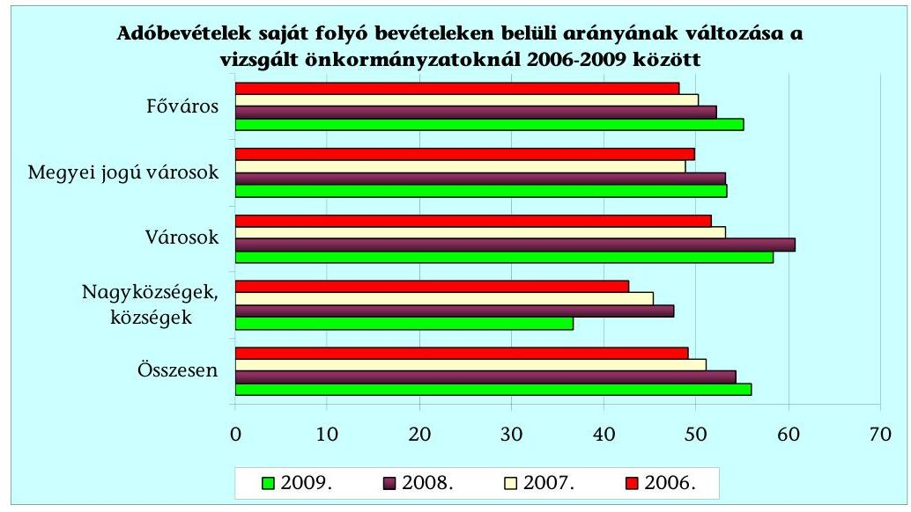

[^0]
[^0]:    ${ }^{22}$ A helyi adók közül a törvény az iparűzési és a vállalkozók kommunális adójában ír elő adóelőleg-fizetési kötelezettséget. Az adóelőleget az adóhatóság az éves adóbevallásban közölt adó alapján úgynevezett fizetési meghagyással vetette ki 2010. évet megelőzően. A helyi adót évi két alkalommal, március 15-éig, illetve szeptember 15-éig kell megfizetni, az adóelőleg összegét azonban az előző év adójával egyező összegben állapítják meg, ezzel a helyi adók területén bonyolult rendszer alakult ki.

---

A vizsgált megyei jogú városi, városi önkormányzatok, a Főváros esetében az adóbevételek növekvő aránya alapján a helyi adópolitika, a helyi adóztatás eredményessége javult. A helyi adók meghatározó részét képviselő iparűzési adóban a konjunkturális és egyedi tényezők (pl. autópálya építése, egy nagy adózó telephely nyitása, vagy megszűnése) hatása a költségvetés pénzügyi egyensúlyát jelentős mértékben érintették, amelyet adópolitikai eszközökkel nem tudtak befolyásolni az önkormányzatok. A nagyközségi, községi önkormányzatoknál egy-egy nagy adózó iparűzési adó befizetésének változása számottevő mértékben befolyásolta a realizált adóbevételt, az önkormányzat költségvetése jelentős mértékben az iparűzési adótól függött.

Eperjeske községben egy iparűzési adóalany 2006. decemberben 182 millió Ft adóelőleg feltöltési kötelezettséget teljesített, amely az Önkormányzat költségvetésének 86,2%-a volt, 2007-ben 183,4 millió Ft adóelőleg befizetésére került sor. Az adóalap önkormányzatok közötti megosztásának kérdésében a PM-től kért állásfoglalás alapján a 2007. évi adóbevallásban az adófizetési kötelezettségét 11,7 millió Ft-ra csökkentette. A vállalkozók kommunális adójával együtt 2009. év végére összesen 244 millió Ft túlfizetése keletkezett. Az Önkormányzat és a társaság 2009. december 23-án megállapodást kötöttek. Az Önkormányzat a fennálló tartozás 50%-át (122 millió Ft-ot) 2010. március 31-ig egy összegben megfizette, valamint a 2010. I. félévi adóelőleg megfizetését teljesítettnek tekintette.

Mogyoród esetében a helyi adó bevétel 2006-2008 között 46%-kal (80 millió Ft-tal) növekedett, 2009-ben azonban egy iparűzési adóalany alacsonyabb összegű befizetése miatt 47,7 millió Ft-tal, az adóbevétel aránya a 2008. évi
 60,3\%-ról 40,3\%-ra, 20 százalékponttal csökkent.

# 3.3. Helyi adópolitika a gazdasági programban 

Az ellenőrzött települési önkormányzatok az Ötv. alapján a választási ciklushoz igazodó gazdasági programot fogadtak el, amelyben az adópolitikai célkitűzéseket - alacsony kidolgozottság, megalapozottság mellett - a mozgástér behatároltsága, a központi adópolitikai döntések gyakori módosulása miatt nagyfokú bizonytalanság jellemezte. A költségvetés előkészítése során hozott döntések - a gazdasági program felülvizsgálata hiányában - a már elfogadott adópolitikai célkitűzésekkel nem minden esetben voltak összhangban. (A gazdasági programban szereplő új adónem bevezetéséről az azt tervező két önkormányzat nem alkotott rendeletet, az új adónemet bevezető négy önkormányzat a gazdasági programban nem szerepeltette ezt.) Az önkormányzatok tervezőmunkájára - a forrásszabályozás évente változó, kiszámíthatatlan rendszerében - jellemző rövidtávú szemlélet az adópolitikai célkitűzésekben is éreztette hatását. A helyi adópolitikát a település, a térség általános gazdasági helyzete mellett a helyi érdekek, a költségvetés bevételi szempontjai jelentős mértékben befolyásolták.

Az ellenőrzött önkormányzatok 42\%-a a gazdasági programban adópolitikai célkitűzéseket nem fogalmazott meg, a helyi adórendeletek, az adómérték, a kedvezmények, mentességek felülvizsgálatának követelményeit középtávon nem határozták meg. Az éves költségvetési koncepció és költségvetés előkészítése során volt jellemző a következő évre vonatkozó - az önkormányzat bevételei szempontjából jelentős - adópolitika körébe tartozó döntések meghozatala.

---

Az Ötv. 91. § (1) és (6) bekezdésének gazdasági programra vonatkozó előírásai keretjelleggel határozzák meg e fontos fejlesztési dokumentum elkészítését. Bár az Ötv. 2005. évi módosítása felsorolja a gazdasági program követelményei között a helyi adópolitikai célkitűzéseket, azonban ennek módszertana, részletes tartalma nincs meghatározva. A helyi adópolitikai célkitűzések megfogalmazásának hiánya, elnagyoltsága mellett végrehajtásának, nyomon követésének, értékelésének információs háttere sem megfelelő. A helyzetértékeléshez szükséges alapvető mutatók (foglalkoztatottságra, a lakosság jövedelmi viszonyaira, a vállalkozások összetételére, gazdasági aktivitásukra, a lehetséges adóalanyokra, adótárgyakra vonatkozó aktuális adatok) sem álltak rendelkezésre - négy önkormányzat (Pápa, Hajdúszoboszló, Kállósemjén, Eperjeske) kivételével - a vizsgált önkormányzatok adatszolgáltatása alapján.

Az önkormányzatok 58\%-a foglalkozott a gazdasági programban adópolitikát érintő kérdésekkel, de konkrét követelményeket, részletes célkitűzéseket többnyire nem határozták meg. A programban szerepelt többek között a helyi adómentességek, illetve kedvezmények rendszeres, a bevezetett helyi adók mértékének évenkénti felülvizsgálata, új helyi adók bevezetési lehetőségének a lakosság és a vállalkozások teherbíró képességét figyelembe vevő felmérése, a helyi adóból fennálló követelések (kintlévőségek) hatékonyabb behajtása.

A 2006-2010 közötti időszakra vonatkozó gazdasági program alkalmat teremtett az EU csatlakozást követő (2007 végéig tartó) átmeneti időszakban a vállalkozásoknak nyújtható kedvezmények szükítéséből adódó adópolitikai, gazdaságfejlesztési célok áttekintésére is. Ennek hatását többnyire az éves költségvetés előkészítésekor és nem a gazdasági programokban vették számba. Az EU-s jogharmonizációs kötelezettség a helyi adópolitika gazdaságfejlesztési célú eszköztárát, a helyi elhatározásból alkalmazható kedvezményeket, menteségeket szűkítette. Helyette jellemzővé vált iparterületek biztosítása (ipari park alapítása, meglévők fejlesztése), telephely létesítés támogatása, a helyi közszolgáltatások vállalkozói igények szerinti alakítása.

A vizsgált időszakban a központi források csökkenése miatt tovább erősödött az önkormányzatok helyi bevételek növelésére irányuló igénye, amely ellentmondásba került a korábban használt gazdaságfejlesztési eszközök közül az adókedvezmény, adómentesség biztosítására, vállalkozóbarát adópolitika alkalmazására irányuló szándékokkal. A gazdasági válság következményeként tapasztalható a már bevezetett (vállalkozókat terhelő) adónemekben az adómérték csökkentése.

Hatvan Város Önkormányzata helyi iparűzési adóban az állandó jelleggel végzett iparűzési tevékenység adómértékét 1,9\%-ban állapította meg a vizsgált időszakban, amelyet a 2010. évtől 1,0\%-ra csökkentett. Ennek következtében várhatóan mintegy 880 millió Ft-tal növekszik a különbség a Hatv. szerinti adómaximum alapján számított lehetséges és tényleges adóbevétel között.

---

# 3.4. A helyi adók bevezetettsége 

A helyi adók bevezetettsége országos mértékben nem változott számottevően, csupán 25 - korábban helyi adót nem alkalmazó - önkormányzat vezetett be helyi adót 2006-2009 között. A Hatv. felhatalmazása alapján a települési önkormányzatok vagyoni típusú, kommunális jellegű adók és helyi iparűzési adó bevezetésére jogosultak ${ }^{23}$. 2006. évben 67, 2009-ben már csak 45 olyan település volt, ahol nem működött valamilyen helyi adónem. Legalább egy adónemet vezettek be kilenc megyében valamennyi településen, tíz megyében néhány kisebb település nem élt ezzel a lehetőséggel 2009-ben. Az egy önkormányzatra jutó bevezetett adónemek száma 2006-2009 között kismértékben - 2,5-ről 2,6-ra - emelkedett.

## A működtetett adónemek és a helyi adót bevezető önkormányzatok száma a 2006-2009. években

| Megnevezés | $\mathbf{2 0 0 6 .}$ | $\mathbf{2 0 0 7 .}$ | $\mathbf{2 0 0 8 .}$ | $\mathbf{2 0 0 9 .}$ |
| :-- | --: | --: | --: | --: |
| Építményadó:lakás | 378 | 408 | 420 | 496 |
| nem lakás | 732 | 743 | 758 | 749 |
| Telekadó | 404 | 422 | 432 | 445 |
| Magánszemélyek kommunális adója | 2203 | 2233 | 2261 | 2286 |
| Vállalkozók kommunális adója | 701 | 700 | 693 | 676 |
| Idegenforgalmi adó tartózkodási idő után | 528 | 548 | 584 | 648 |
| szállásdíj után | 6 | 8 | 9 | 8 |
| építmény után | 164 | 161 | 167 | 172 |
| Iparűzési adó | 2651 | 2676 | 2698 | 2722 |
| Helyi adót bevezető önkormányzatok száma | 3105 | 3119 | 3126 | 3130 |

Az alkalmazott adónemek száma a vizsgált időszakban 5,6\%-kal emelkedett, ezen belül a bevezető önkormányzatok száma a vállalkozók kommunális adójában 3,6\%-kal csökkent, a lakás után fizetendő építményadóban 31,2\%-kal, a tartózkodás utáni idegenforgalmi adóban 22,7\%-kal növekedett.

Az ellenőrzött önkormányzatoknál az alkalmazott adónemek száma 102-ről 103-ra nőtt 2006-2009 között, új adónemként három önkormányzat a vendégéjszakák után fizetendő idegenforgalmi adót, egy a telekadót vezette be, valamint két önkormányzat a magánszemélyek kommunális adóját, egy a telekadót megszüntette.

Szekszárd Megyei Jogú Város Önkormányzata a magánszemélyek kommunális adóját 2007. július 1-től felfüggesztette, majd 2008. január 1-jétől megszüntette a szemétszállítás közszolgáltatási díjának lakosság által történő megfizetése miatt. Várpalota Város Önkormányzata a már alkalmazott telekadó mértékét 2008. január 1-jétől háromszorosára (50-ről 150 Ft/m²-re) emelte, június 30-tól megszüntette, majd a költségvetési pénzügyi stabilizálása érdekében 2010. január 1-jétől ismét bevezette.

[^0]
[^0]:    ${ }^{23}$ A főváros esetében az építményadót, a telekadót, a magánszemély kommunális adóját, valamint a vállalkozók kommunális adóját a kerületi önkormányzat, a helyi iparűzési adót, az idegenforgalmi adót a fővárosi önkormányzat jogosult bevezetni.

---

A helyi adónemek közül a leggyakrabban a helyi iparűzési adót vezették be (a helyi adót bevezető önkormányzatok 87\%-a alkalmazta). A gazdasági tevékenységet terheli még a kis jelentőségű vállalkozók kommunális adója 1,3 milliárd Ft bevétellel. A helyi adóztatás rendszere - elsősorban a kistelepüléseken a működtetett adónemek és az önkormányzati adóhatóságok számát tekintve is - elaprózódott ${ }^{24}$.
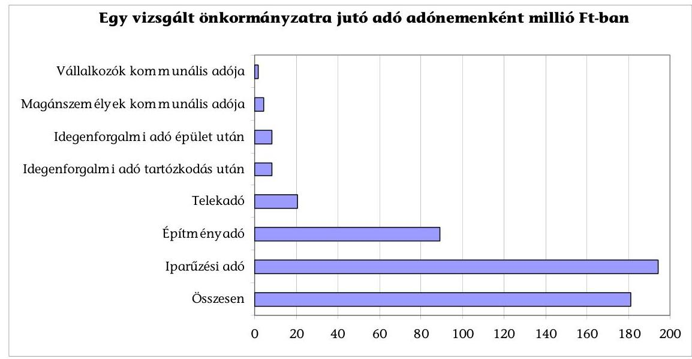

Az egy önkormányzatra jutó helyi adó 181 millió Ft, ezen belül a bevezető önkormányzatokra jutó iparűzési adó és vállalkozók kommunális adója között százszoros a különbség, amely az adóztatás hatékonyságát más tényezők mellett számottevően befolyásolta. Az iparűzési adót bevezető településeken él a lakosság 98,1\%-a, az adónemet nem alkalmazók átlagos lakosságszáma 432 fő. A helyi adópolitikában az önkormányzatok a vállalkozások, az idegenforgalommal rendelkező településeken a nem helyi lakosok adóztatását helyezték előtérbe. A 2\%-os iparűzési adómértéket alkalmazó önkormányzatoknál - bár csak 50\%-uk vezette be a maximális adómértéket - realizálódott a bevételek 89\%-a 2009-ben. A maximális adómértéket vezette be a megyeszékhely városok 95\%-a, az egyéb városok 79,5\%-a, a nagyközségek 70\%-a, a községek 56\%-a. Az iparűzési adónak 41,6\%-a a fővárosban, 49\%-a a városokban, 2,3\%-a nagyközségekben, községekben csupán 7,1\%-a realizálódott.

Az adótárgyanként (épületenként/telkenként) fizetendő magánszemélyek kommunális adója 2286 településen működik. A lakások adóztatása elsősorban a magánszemélyek kommunális adójával történik (a helyi adót bevezetők 73\%-a alkalmazta), ugyanakkor az ebből származó bevétel a helyi adóknak csupán 1,8\%-a, az egy adóalanyra jutó adófizetés 6,4 ezer Ft volt 2009-ben.

[^0]
[^0]:    ${ }^{24}$ Az egyes gazdasági és pénzügyi tárgyú törvények megalkotásáról, illetve módosításáról szóló 2010. évi XC. törvény 22-24. §-a alapján - az adórendszer egyszerűsítése keretében - 2011. január 1-jétől megszűnik a vállalkozások kommunális adója és az üdülőépület utáni idegenforgalmi adó.

---

A magánszemélyeket (ideértve az egyéni vállalkozókat is) a helyi adók 8\%-a terhelte 2009-ben. A vállalkozók által fizetett helyi adó aránya építményadóban 82\%, telekadóban 81\% volt. A magánszemély adóalanyok száma 3003 ezer, az egy adózóra jutó adóbefizetés 15,5 ezer Ft volt. A jogi személy (vállalkozó) adóalanyok száma 719 ezer, egy adózó által befizetett adó összege 745 ezer Ft volt.

Az ingatlanokat terhelő helyi adókból (építményadó, telekadó, magánszemélyek kommunális adója, üdülőépület utáni idegenforgalmi adó) 87,2 milliárd Ft bevétel származott, ami az összes helyi adóbevétel 15,4\%-a. Építményadót, ezen belül nem lakáscélú építmények után 749, telekadót 445, üdülőépület utáni adót 172 településen vezették be. Az építményadó 82\%-át jogi személy adóalanyok (vállalkozások) fizették 2009-ben.

# 3.5. Adómérték, mentességek, kedvezmények megállapítása 

A helyi adópolitika keretében döntöttek a bevezetett adónemekben alkalmazott adómértékekről, adómentességekről, kedvezményekről, valamint a törvényben meghatározott adómaximumon belül állapították meg az adómértéket az önkormányzatok. A tételes összegben meghatározott adónemeknél - a hasznos alapterület szerinti építményadó, az alapterület szerinti telekadó, a magánszemélyek, valamint a vállalkozók kommunális adója, továbbá a vendégéjszakák alapján megállapítható idegenforgalmi adó esetében - a törvényben rögzített felső mértéktől 2005. évtől az infláció követésével eltérhettek, ez növelte az önkormányzatok mozgásterét a helyi adóbevételek növelésében. Ezzel a vállalkozások kommunális adója kivételével éltek az önkormányzatok, az alkalmazott adómérték az előző évek inflációját követte.

A vállalkozások kommunális adója adómértékét egy vizsgált önkormányzat (Sárvár) emelte a vizsgált időszakban 2500 Ft-ra, nyolc önkormányzat változatlanul a korábban bevezetett törvényi maximumot (2000 Ft) alkalmazta.

A tételes összegben meghatározott adónemekben alkalmazott átlagos adómérték a vállalkozók kommunális adója kivételével az előző évek inflációjával (2005-2007 között 16,25\%) azonos, vagy azt meghaladó mértékben növekedett, de egyik adónemben sem érte el a Hatv. 6. §-a alapján számított - inflációval növelt - törvényi maximumot.

## A 2006. és 2009. évi tényleges átlagos és inflációval növelt adómérték

| Adónem | 2006. évi adómérték Ft |  | 2009. évi adómérték Ft |  | adómérték   növekedés   2009/2006 |
| :-- | :--: | :--: | :--: | :--: | :--: |
|  | tényleges   átlagos | inflációval   növelt | tényleges   átlagos | inflációval   növelt |  |
| Építményadó (terület után) | 550,1 | 1006,4 | 639,6 | 1169,9 | $116,3 \%$ |
| Telekadó (terület után) | 47,0 | 223,6 | 73,1 | 259,9 | $155,5 \%$ |
| Magánszemélyek  

 kommunális adója | 5470,1 | 13418,4 | 6553,3 | 15599,0 | $119,8 \%$ |
| Idegenforgalmi adó   vendégéjszakák után | 258,5 | 335,5 | 300,6 | 389,9 | $116,3 \%$ |
| Vállalkozások kommunális   adója | 1915,7 | 2236,4 | 1946,9 | 2599,8 | $101,6 \%$ |

Az adómérték átlagos kihasználtsága a kivetési és bevallási összesítők alapján eltérő volt az egyes adónemekben (2006-ban csupán 21-85,7\% között, 2009-ben

---

28,1-77,1\% között szóródott). 2006-2009 között telekadóban 7,1, a magánszemélyek kommunális adójában 1,2, iparűzési adóban 7,7 százalékponttal nőtt, a hasznos alapterület szerint működtetett építményadóban, a vendégéjszakák száma alapján fizetendő idegenforgalmi adóban nem változott, a vállalkozók kommunális adójában 10,8 százalékponttal csökkent. A gazdasági tevékenységet terhelő adónemek közül az iparűzési adó átlagos mértéke $1,81 \%$-ról $1,97 \%$-ra emelkedett, vagyis az adókapacitás kihasználtsága közel $\mathbf{100 \%}$-os.
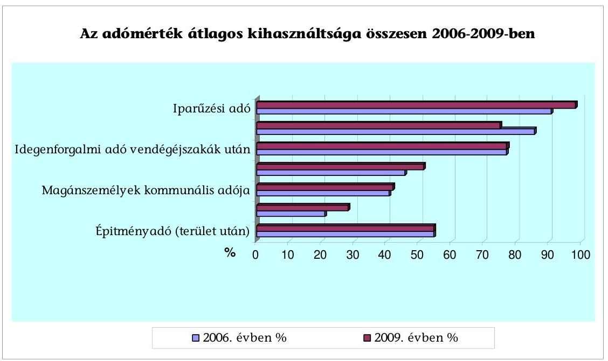

A vizsgált és iparűzési adót bevezető önkormányzatok 70\%-a az adómértéket a 2\%-os törvényi maximumban, 23\%-a 1,6-1,9\%-ban határozta meg 2009-ben, csupán két községi önkormányzat alkalmazott 1,4-1,5\%-os mértéket (ez utóbbiak az adómértéket 0,5, illetve 0,3 százalékponttal emelték a vizsgált időszakban).

A lakás utáni építményadóból származó adóbevétel a helyi adó bevételeknek csupán $0,5 \%$-a, az adónemet bevezető önkormányzatok az állandó lakosokat mentesítették a lakások utáni adófizetési kötelezettség alól.

A Főváros XIV. kerületében az építményadóban a magánszemélyek tulajdonában álló, bérbe nem adott lakások és garázsok mentesültek az adófizetési kötelezettség alól. Az építményadóból befolyó bevételnek csak töredéke (8\%-a) származott magánszemélyektől, a fennmaradó $92 \%$ a gazdálkodó szervezeteket terhelte.

A vendégéjszakák után fizetendő idegenforgalmi adó bevezetése az idegenforgalmi célú pályázatokon előírt feltétel teljesítésével függött össze, ennek és az adómérték emelésének eredményeként a beszedett idegenforgalmi adó $\mathbf{25,8\%}$-kal növekedett. Az önkormányzatok a nem helyi lakosokat terhelő idegenforgalmi adó emelésének eszközével széles körben éltek, továbbá ösztönzőleg hatott, hogy a beszedett adó minden egy forintját a költségvetés két forint állami hozzájárulással egészítette ki. A kiegészítés 2010. évben 1 Ft-ra csökkent a költségvetési törvény alapján, amely a jelentős idegenforgalmi adóbevétellel rendelkező önkormányzatokat érinti hátrányosan

---

(pl. Hévízen 240 millió Ft-tal, Hajdúszoboszlón 270 millió Ft-tal csökken az állami hozzájárulás kiegészítés, amely miatt az idegenforgalmi célú fejlesztések halasztásáról, elmaradásáról döntöttek az önkormányzatok).

Az önkormányzatok 80\%-a a vizsgált időszakban egy, vagy több alkalommal módosította (emelte), elsősorban a vállalkozásokat terhelő adók és a nem helyi lakosokat terhelő, vendégéjszakák után fizetendő idegenforgalmi adó mértékét. A magánszemélyek kommunális adó mértékét a bevezető önkormányzatok 76\%-a emelte, azonban összességében az adókapacitás kihasználtsága nem változott, 2006-ban és 2009-ben is $34 \%$-os volt az inflációval növelt adómaximum alapján számított elméleti lehetőséghez képest. (A lakosságot érintő adómértéket nem emelte két önkormányzat, helyette az iparűzési adó emeléséről döntöttek, illetve csökkentette két önkormányzat, miután a lakosság szemétszállítási díjának átvállalását megszüntették.)

A 90-es években a szilárd hulladék szállításának díját a kommunális adóba építették be, mert a lakosság nem fizette meg a szemétszállítási díjat és a lakosság helyett a szolgáltató részére az önkormányzat fizette meg a szemétszállítás költségét. A hulladékgazdálkodásról szóló 2000. évi XLIII. törvény 26. § (1) bekezdése alapján hulladékkezelési közszolgáltatás igénybevételéért az ingatlantulajdonost terhelő díjhátralék adók módjára behajtható köztartozásnak minősül, kommunális adóként történő beszedése azonban még jelenleg is széles körben gyakorlat.

A helyszínen vizsgált önkormányzatoknál az elméleti lehetőségtől elmaradó ${ }^{25}$ (elsősorban az inflációval növelt, törvényi felső mértéktől eltérő adómérték, kisebb részben a mentességek, kedvezmények miatt kieső) bevétel aránya a helyesbített folyó évi előíráshoz viszonyítva a 2006-2009 közötti időszak átlagában mindössze $\mathbf{3,7 \%}$ volt. Ennek önkormányzati típusonkénti szóródása azonban jelentős: a Fővárosi Önkormányzatnál az iparűzési adó mértéke és súlya miatt csak $0,5 \%$, a megyei jogú városoknál $13,7 \%$, egyéb városoknál $27,4 \%$, a nagyközségeknél, községeknél azonban $47,1 \%$.

# Elmaradó bevétel adónemenként és a helyesbített folyó évi előírás %ában a vizsgált önkormányzatoknál 2006-2009 között összesen 

| Adónem | Különbség   összege   millió Ft | Helyesbített   folyó évi   előírás %-a |
| :-- | :--: | :--: |
| Építményadó (terület után) | 14077 | 87,5 |
| Építményadó (korrigált forgalmi érték után) | 736 | 32,1 |
| Telekadó | 4240 | 481,9 |
| Magánszemélyek kommunális adója | 3333 | 183,9 |
| Vállalkozások kommunális adója | 111 | 25,1 |
| Idegenforgalmi adó üdülőépület után | 97 | 15,5 |
| Idegenforgalmi adó szállásdíj után | 3597 | 85,2 |
| Idegenforgalmi adó tartózkodás után | 407 | 70,9 |
| Helyi iparűzési adó | 5546 | 0,7 |
| Helyi adó összesen | $\mathbf{32144}$ | $\mathbf{3,7}$ |

[^0]
[^0]:    ${ }^{25}$ Az elméleti lehetőségtől elmaradó bevétel aránya utal az adókapacitásban meglévő tartalékokra (nem tartalmazza azonban a be nem vezetett helyi adókkal kapcsolatos adatokat, ezek lehetséges adótárgyait, adóalanyait általában nem mérték fel az önkormányzatok).

---

Adónemenként az elméleti adókapacitás kihasználtságában a legkisebb arányú tartalék az iparűzési adóban van ( $0,7 \%$ ), azonban súlyánál fogva összegszerűen ez jelenti az összes eltérés 17,3\%-át. Jelentős volt a helyesbített folyó évi előíráshoz viszonyítva az elméletileg lehetséges és az előírt adó különbsége telekadóban (481,9\%), magánszemélyek kommunális adójában (183,9\%), építményadóban ( $87,5 \%$ ), és a szállásdíj után fizetendő idegenforgalmi adóban ( $70,9 \%$ ). Ezek az adónemek jelentik az adókapacitásban a tartalékok meghatározó részét ( $82 \%$-át).

A helyi önkormányzatok által biztosított adókedvezmények az EU irányelvek alapján összeegyeztethetetlenek a közösségi támogatáspolitikával. Az EU-s jogharmonizációnak megfelelően a határozatlan idejű, majd 2007. december 31-ig a határozott idejű helyi adókedvezményeket, adómentességet biztosító rendelkezéseket is hatályon kívül helyezték, a vállalkozókat terhelő adónemek vonatkozásában a korábbi mentességeket, kedvezményeket megszüntették, átalakították.

Ezt követően 2,5 millió Ft iparűzési adóalapig a vizsgált önkormányzatok egyharmada biztosított - részben a korábbi döntést felülvizsgálva - adómentességet (5 önkormányzat 2,5 millió Ft-ig, 5 önkormányzat 0,7-2 millió Ft közötti adóalap esetében).

Szombathely Megyei Jogú Város Önkormányzata az iparűzési adó mentességet 2008. január 1-jétől megszüntette, a gazdasági válság hatására a Közgyűlés felülvizsgálta döntését és 2009. január 1-jétől mentességet biztosított a 2,5 millió Ft adóalapot el nem érő vállalkozóknak.

A vállalkozókat terhelő építményadó, telekadó, vállalkozók kommunális adója, helyi iparűzési adó esetében 2003. január 1-jétől adónemenként csak egyféle adómértéket állapítottak meg, valamint a vállalkozókat illetően csak olyan kedvezményt, mentességet nyújtottak, melyre a törvény kifejezetten felhatalmazást tartalmazott. Az adómérték megállapítása során ettől eltérően a Hatv. 7. § (f) pontjával ellentétes megoldást jelentett, amikor a korrigált fogalmi érték alapú építményadóban a lakás, illetve az egyéb építmény esetében nem egy-egy adómértéket határoztak meg:

Paks Város Önkormányzata az építményadó mértékét a korrigált forgalmi érték $3 \%$-ról $1,8 \%$-ra csökkentette, hogy a vállalkozókat érintő adókedvezmények 2007. december 31-ei megszűnése a kisvállalkozásoknál ne okozzon jelentős adóteher növekedést. Az építményadó mértékének változtatása azonban a költségvetés adóbevételeinek nem tervezett (közel 250 millió Ft-os) csökkenését okozta. A képviselő-testület az építményadó rendeletet 2010. január 1-jétől úgy módosította, hogy a lakások esetében 1,2\%-ban határozta meg, az egyéb építmények $1,8 \%$-os adómértékét a nukleáris létesítmények esetében 3\%-ra emelte.

Az önkormányzatok által biztosított mentességek, kedvezmények összege a bevallási feldolgozási összesítők adatai alapján 2006-2009 között az iparűzési adóban 22 milliárd Ft-ról 5 milliárd Ft-ra, az iparűzési adó bevételhez viszonyított nem jelentős összeg aránya - nagyobb részben a mentességek, kedvezmények megszűnése, kisebb részben az adóbevételek növekedése miatt - $7 \%$-ról $1 \%$-ra csökkent.

---

A vállalkozónak nem minősülő magánszemélyek számára az EU-s csatlakozást követően az őket terhelő építményadóban, telekadóban, kommunális adóban továbbra is korlátozás nélkül nyújtottak mentességet, kedvezményt a szociális szempontok érvényre juttatása érdekében. Az ebben a körben nyújtott mentességek, kedvezmények nagyságrendje változatlanul évi 10-11 milliárd Ft-ot tett ki.

A foglalkoztatás bővítése érdekében a statisztikai állományi létszámban bekövetkezett - a Hatv. 39/D. § (1) bekezdése alapján számított - növekmény után 1 millió Ft/fő összegű iparűzési adóalap-mentességet biztosít a törvény. A vállalkozó az általa foglalkoztatottak éves átlagos létszáma emelkedése esetén - minden fő többlet foglalkoztatott után - a vállalkozási szintű adóalapból adóalap-mentességre jogosult. Az iparűzési adóbevallások feldolgozásából nyert adatok alapján a foglalkoztatás bővítésével kapcsolatosan biztosított mentesség 2007-ben 22 milliárd Ft, 2008-ban - a válság és a foglalkoztatottság csökkenése miatt - már csak 14 milliárd Ft adóelőnyt biztosított a vállalkozások számára.

# 3.6. Adóerő-képesség központilag számított mértéke és a tényleges adóbevétel 

A jövedelemkülönbség mérséklése keretében az év végi elszámolás szerint az ellenőrzött önkormányzatok kétharmada (21 önkormányzat) részesült az szja normatívan felosztott részéből összesen 13,7 milliárd Ft kiegészítésben, miután a helyben maradó szja és az iparűzési adóerő-képesség együttes egy lakosra jutó összege nem érte el a településtípus költségvetési törvényben meghatározott szintjét. (A kiegészítés összege az összes 2006-2009 közötti iparűzési adóbevételüknek 50,5\%-a volt.)

A költségvetési törvény szerinti szja és iparűzési adóerő-képességet meghaladó jövedelemmel rendelkező hét ellenőrzött önkormányzatnál az állami hozzájárulás összegében érvényesített beszámítás 2006-2009 között összesen 108,5 milliárd Ft, az érintett önkormányzatok iparűzési adóbevételének 24,1\%-a volt. A beszámítás 94\%-a a Fővárosi Önkormányzatot érintette.

A szabályozás bevételi érdekeltséget csökkentő hatását mérsékelte, hogy az adóerő-képesség az iparűzési adóból 2\%-os maximális adókulccsal elérhető bevételnek $70 \%$-át $(1,4 \%)$ vette figyelembe, valamint $25 \%$ után léptek be a sávonként progresszíven emelkedő kulcsok. Az ellenőrzött önkormányzatoknál az iparűzési adó mértéke meghaladta az adóerő-képesség számításánál figyelembe vett elvárt ( $1,4 \%$-os) mértéket.

Kozármisleny Városi Önkormányzat 2006-ban az szja kiegészítésben érvényesülő kedvezőtlen (csökkentő) hatás megszüntetése érdekében döntött az iparűzési adó mértékének $1 \%$-ról $1,6 \%$-ra történő emeléséről.

A jövedelemkülönbség mérséklés alapját képező iparűzési adóerő-képesség tervezése nem a tényszámokon alapult, a települési önkormányzatok a mutatószám-felmérés során a meglévő, tárgyévet megelőző időszakról szóló iparűzési adóalap adatokra alapozva - az adóbevallások és egyéb információk alapján - maguk becsülték meg várható mértékét. Az adóerő-képesség ter-

---

vezését az iparűzési adóalapot befolyásoló tényezők, a Hatv. módosításai, az adónemet jellemző ciklikusság miatt bizonytalanság jellemezte.

A Fővárosi Önkormányzatnál e tényezők prognosztizálása nehézséget okozott, valamint a forrásmegosztáson keresztül hatással volt a Főváros egészének gazdálkodására, a kerületek bevételeire is. A vizsgált időszakban az adóerő-képesség alapján történt beszámítás 101,6 milliárd Ft volt, amely a Fővárosi Önkormányzat összes tárgyévi bevételeinek 4,8\%-át jelentette.

Kisvárda Városi Önkormányzatnál a 2008. évi költségvetésben tervezett 680 millió Ft iparűzési adó eredeti előirányzatot 100 millió Ft-tal csökkentette a Képviselő-testület, a teljesítés összege 601 millió Ft volt. A bevallások feldolgozása után nyert információk alapján a jövedelemkülönbség mérséklés összegének növelése lett volna indokolt, azonban az október 15-i időpontig végrehajtható korrekció erre nem adott lehetőséget. A tényleges adatokkal számítva
 az önkormányzat részére 108,1 millió Ft különbözet csak a következő évben került kiutalásra.

Az ellenőrzött önkormányzatok által a mutatószám-felméréskor megbecsült és a beszámoló szerinti tényleges iparűzési adóerő-képesség közötti különbség 3%-ról 1,3%-ra csökkent 2006-2009 között. Az éves beszámolók alapján az önkormányzatokat pótlólag megillető (kiutalt) kiegészítés 5,1 milliárd Ft (ennek 94%-a a Fővárost 2006. és 2009. évben megillető összeg), az általuk visszafizetett összeg 5,5 milliárd Ft (ebből a Főváros által 2007. és 2008. évben visszafizetett hányad 87,4%) volt az ellenőrzött időszakban.

Az adóerő-képesség önkormányzati költségvetést érintő hatását elemezték, figyelemmel kísérték, éltek az évközi módosítás lehetőségével, azonban a jövedelemkülönbség-mérséklés miatti év végi elszámolás során a jogosulatlan igénybevétel hét önkormányzatnál a ténylegesen járó támogatás 10%-át meghaladta, az elszámolást terhelő igénybevételi kamat összesen 57,2 millió Ft volt. (Ezen belül csak három városi és egy községi önkormányzatnál volt jelentősebb - 9,5 és 21,4 millió Ft közötti - az igénybevételi kamat, a többi városi önkormányzat összesen 2 millió Ft kamatot fizetett.)

Eperjeske Községi Önkormányzat iparűzési adó bevételét meghatározó adózó megjelenése és 183 millió Ft összegű adóbevallása 2007-ben megváltoztatta az adóerő-képességet. A 2007. évben a tervezett szja kiegészítésről az április 30-i időpontban lemondtak, mivel ilyen nagyságrendű iparűzési adóalap mellett erre nem volt jogosult az Önkormányzat. A beszámítás - 71 millió Ft - határidőben a MÁK részére visszautalásra került, ezzel egyidejűleg teljesítették a 9,5 millió Ft igénybevételi kamat-fizetési kötelezettséget is.

Szentes Város Önkormányzatánál 2008-ban az előző évhez képest 12,3%-kal (121,3 millió Ft-tal) több helyi adó folyt be, döntően az adómérték emelése és a legnagyobb adózók adókötelezettségének növekedése miatt. Az Önkormányzat adóerő-képességének javulása miatt az szja kiegészítés az előző évhez képest 3,6%-kal (11 millió Ft-tal) csökkent. A tervezett és a tényleges adóerő-képesség eltérése miatt 2006-ban 5,5 millió Ft, 2008-ban 4,8 millió Ft igénybevételi kamatot kellett fizetnie az Önkormányzatnak.

A tervezettől eltérő iparűzési adó (a bevallás szerinti adóalap) növekedés esetén, ha a vizsgált önkormányzatok nem éltek az év közbeni módosítás, lemondás lehetőségével, akkor az év végén jelentős összegű igénybevételi kamat fizetésére voltak kötelezettek.

---

Hatvan Városi Önkormányzat a 2008. évi iparűzési adóerő-képességet (2007 novemberében) a 2006. évi adóalap ismeretében tervezte (amely alig több mint felét tette ki a 2008. évi bevallás szerinti adóalapnak). A 2008. évi iparűzési adó-erő-képessége 37%-kal haladta meg a tervezettet, az Önkormányzat nem élt az év közbeni módosítás, lemondás lehetőségével. A beszámítást csökkentette a saját forrásaiból beruházásra felhasznált összegből 38,6 millió Ft, így az Önkormányzat 127,4 millió Ft szja kiegészítést és ehhez kapcsolódó 21,4 millió Ft igénybevételi kamatot fizetett vissza.

Az iparűzési adóerő-képesség mellett a normatív hozzájárulások alapját képező feladatmutatók tervezése is hatást gyakorolt a jövedelemkülönbség mérséklésével kapcsolatos elszámolásokra.

Sándorfalva Város Önkormányzatánál 2006-2008 között nem a tervezettet (minimális mértékben) meghaladó tényleges adóerő-képesség, hanem az alapfokú művészetoktatás túlbecsült tanulói létszáma miatt kellett 2008-ban 4,8 millió Ft, 2009-ben 5,4 millió Ft szja kiegészítést visszafizetnie az Ön-kormányzatnak. Ehhez kapcsolódóan 2008-ban 284 ezer Ft igénybevételi kamat fizetésére került sor. A 2007. évben az Önkormányzat 5,1 millió Ft szja kiegészítést kapott pótlólag, amely alapvetően az alapfokú művészeti oktatás alulbecsült tanulólétszáma miatt illette meg.

Az önkormányzatok összefogásának ösztönzése érdekében 2008. évtől az adó-erő-képesség számításánál az iparűzési adó alapjánál figyelembe vehető (csökkenthető) az önkormányzatok szerződésben rögzített adóbevétel megosztásának arányában az olyan vállalkozás adóalapja, amely az önkormányzatok együttműködése révén telepedett le az egyik, megállapodásban szereplő önkormányzat területén. A vállalkozások letelepedését elősegítő és ez alapján az érintett céggel összefüggő iparűzési adóerő-képességet befolyásoló megállapodás csupán egy ellenőrzött önkormányzatnál fordult elő.

A Hévíz Városi Önkormányzat Keszthely és Alsópáhok önkormányzataival kötött határozatlan időtartamra vonatkozó megállapodást helyi adó átadására. A megállapodás szerint az önkormányzatok közigazgatási területéből Hévíz város közigazgatási területébe átcsatolt területeken végzett beruházás eredményeként felépült szálloda által befizetett iparűzési adó, továbbá idegenforgalmi adó és az utána járó állami támogatás 15%-át Keszthely Város Önkormányzata, 20%-át Alsópáhok Község Önkormányzata részére kell átutalni. A szálloda iparűzési adó alapjának megosztását a 2009. évi adóerő-képesség elszámolásban figyelembe vették.

# 3.7. Helyi adók felhasználási céljai, tájékoztatás az adóbevételekről 

A vizsgált önkormányzatok negyede - törvényi kötelezettség hiányában is, az adózók tájékoztatása érdekében - határozta meg a helyi adó rendeletekben (általában a magánszemélyek kommunális adója, az idegenforgalmi adó esetében) az adó, vagy egy részének felhasználási célját. Az önkormányzatok többnyire a költségvetési koncepcióban, vagy a költségvetési rendelet megalkotása során döntöttek a helyi adók működtetési, fejlesztési célú felhasználásának arányairól, területeiről.

Csongrád Városi Önkormányzat a bevezetett négy adónem közül a magánszemélyek kommunális adójáról szóló rendeletben szabályozta az adó felhasználási

---

célját, amely szerint azt kizárólag kommunális beruházásokra, felújításokra fordítja. A költségvetési koncepciókban határozta meg konkrétabban a kommunális adóbevételek, illetve az egyéb helyi adó bevételek felhasználási céljait.

A Hatv. 8. § (2) bekezdésében foglaltaknak eleget téve az önkormányzatok a költségvetési beszámoló részeként, a zárszámadási rendelet számszaki adatainak bemutatásával tájékoztatták a lakosságot, az adóalanyokat a beszedett adó összegéről.

A helyi adó rendeletekben biztosított kedvezmények, mentességek, a méltányosságból történt adóelengedések miatti közvetett támogatást tartalmazó kimutatást szöveges indoklással együtt nem mutatta be a költségvetési, illetve zárszámadási rendelethez kapcsolódva 11 ellenőrzött önkormányzat, négy nem csatolt szöveges indokolást a számszerű bemutatás mellé.

Négy ellenőrzött önkormányzat határozott meg helyi adó rendeletében közérdekű célokat, amelyekre az adózó az előírt feltételek esetén az adója egy részének felhasználásáról rendelkezhetett. A rendelkezési jogosultság tekintetében eltérő megoldások alakultak ki.

Makó Városi Önkormányzat a helyi iparűzési adóról szóló rendelete szerint az adóalany az általa fizetendő tárgyévi helyi iparűzési adó 6%-áról szeptember 15-ig az önkormányzati adóhatósághoz benyújtott, a kedvezményezett elnevezését, székhelyét, nyilvántartási számát, adószámát tartalmazó nyilatkozattal, az adórendelet függelékében felsorolt helyi sport, kulturális, oktatási szervezetek és a helyi egészségügyi civil szervezetek, illetve rendezvényeik, valamint önkormányzati intézmény felújítás és önkormányzati útépítés támogatásáról rendelkezhet. Az adóalanyok rendelkezése alapján a fizetendő adójukból a támogatásra fordított összeg 2006-2009 között 67 millió Ft volt.

Paks Város Önkormányzata rendelete szerint az ún. nagyadózók a befizetett helyi adójuk egy részének felhasználásáról rendelkezhetnek. A 3 millió Ft-ot meghaladó helyi adót fizető adóalany az általa befizetett adó 2,5%-áig, de maximum 1 millió Ft-ig, az 1 milliárd Ft-ot meghaladó helyi adót fizető adóalany az adó 5%-áig, de maximum 40 millió Ft-ig rendelkezhet az adó felhasználásáról. Az 5%-nyi rész 40 millió Ft feletti része felhasználására a polgármester a Gazdasági Bizottság egyetértésével tehetett javaslatot. A felajánlás helyi városfejlesztési célok és feladatok megvalósítására, a civil szféra működési költségeinek biztosítására, illetve az önkormányzati intézmények és alapítványaik által szervezett, a kötelező feladatai közé nem tartozó rendezvények megszervezésére irányulhatott. A felajánlás nem vonatkozhatott olyan beruházás jellegű célokra, amelynek megvalósulása fenntartási, üzemeltetési jellegű kiadásokkal jár. A rendelkezési jogosultságot a 2007. évi költségvetési rendelettel - a nehéz gazdasági körülményekre tekintettel - átmenetileg megszüntették, majd 2008-tól ismét bevezették.

Szekszárd Megyei Jogú Városi Önkormányzat 2007. évig lehetővé tette, hogy a vállalkozók az esedékesség időpontjáig megfizetett éves iparűzési adójuk 5%-a mértékéig nyilatkozattal rendelkezzenek a városban működő, bejegyzett, közhasznú tevékenységet folytató, köztartozástól mentes, statisztikai adatszolgáltatási kötelezettségét teljesítő, az adóévet megelőző évben már működő sport, kulturális, karitatív célú társadalmi és civil szervezetek, alapítványok, közalapítványok, közhasznú társaságok támogatásáról. A 2006. évi bevallásaikkal egyidejűleg a civil szervezeteknek 39,7 millió Ft-ot, ennek 51%-át 34 sportegyesületnek, 28%-át 31 művészeti célú szervezetnek, 21%-át 59 alapítványnak ajánlottak fel az adózók. A 2007. évben, a 2006. évről szóló bevallással felajánlott összeg 42,2

---

millió Ft volt, melynek 60%-át 30 sportszervezet, 27%-át 25 művészeti egyesület, 13%-át 35 alapítvány kapta.

Az önkormányzatok a támogatás felhasználásáról megállapodást kötöttek a támogatott szervezetekkel, amelyben elszámolási kötelezettséget írtak elő számukra. A támogatás felhasználásáról elszámoltak, támogatás visszafizetésére az ellenőrzött önkormányzatoknál nem került sor.

# 3.8. Az adóztatás (önkormányzati adóhatóság) testületi beszámoltatása 

Az ellenőrzött önkormányzatok háromnegyedénél a képviselő-testület nem élt a Hatásköri tv. 138. §-ának (3) bekezdése g) pontjában biztosított jogkörével, a jegyző beszámoltatása útján nem ellenőrizte az adóhatóság tevékenységét. A jegyző öt önkormányzatnál (16%) a hatósági munkáról, vagy a polgármesteri hivatal tevékenységéről szóló - általában négyévente készített - beszámolóban érintette az adóztatással kapcsolatos kérdéseket, de a testületek nem határoztak meg az adóhatósági munka javítására - indokolt esetben sem - konkrét feladatokat, csak általános célokat.

Kállósemjén Nagyközségi Önkormányzat képviselő-testülete a polgármesteri hivatalban folyó önkormányzati és államigazgatási tevékenységről szóló beszámolót elfogadta, további feladatként határozta meg többek között, hogy „törekedni kell az önkormányzati bevételek, adók beszedésére és a kintlévőségek behajtására." A határozatban a helyi adóztatás eredményességének javítására, az adóalanyok, adótárgyak feltárására, az adóhátralékok csökkentésére további követelményeket nem határoztak meg, annak ellenére, hogy a hátralékok nagysága indokolná a végrehajtási eljárások haladéktalan megindítását. A hátralék a vizsgált időszakban 49,3%-kal emelkedett, a 2009. év végi hátralék közel kétszerese a teljesített helyi adó bevételnek és meghaladja az önkormányzati adóhatóság által kezelt összes adóbevétel nagyságát.

Csongrád Városi Önkormányzat képviselő-testülete a jegyző Polgármesteri hivatal hatósági munkájáról szóló 2006. és 2010. januári tájékoztatóját megtárgyalta és elfogadta. Az adóhatóság felé a helyi adóztatás eredményességének javítására (adóalanyok, adótárgyak feltárása, adóhátralékok csökkentése) nem határozott meg feladatokat. A jegyző az előterjesztésben szükségesnek ítélte az adófelderítések, az adóellenőrzések és az adóbehajtási intézkedések folyamatossá tételét.

Az önkormányzatok ötödénél az éves költségvetési beszámolók szöveges indokolása tartalmazott az önkormányzati adóhatóság által kezelt bevételek vonatkozásában az előirányzatokról és azok teljesítéséről, az adóhátralékok alakulásáról, az adómentességekről és adókedvezményekről, az elvégzett adóellenőrzések eredményéről, a végrehajtási cselekményekről és a méltányossági jogkör gyakorlásáról szóló különböző színvonalú és tartalmú tájékoztatást.

Két önkormányzat a tárgyévi teljesítménykövetelmények alapját képező, kiemelt helyi célok között határozott meg az adóztatás hatékonyságának, eredményességének javítására irányuló követelményeket.

A vizsgált időszakban egy alkalommal élt a képviselő-testület (Csongrád) az Art. 89. §-ában szabályozott adóellenőrzés elrendelésének jogával az idegenforgalmi adóval kapcsolatos adókötelezettségek ellenőrzése érdekében.

---

# 4. Az önkormányzati adóigazgatás, végrehajtás hatékonysága, eredményessége ${ }^{26}$ 

### 4.1. Az adóigazgatás, adóbeszedés hatékonyságának, eredményességének jellemzői

Az ellenőrzött önkormányzatok adóhatóságai adóigazgatási, adóbeszedési feladatai ellátását az önkormányzat típusától függő helyi adottságok, a képviselő-testületi és vezetői döntések, a kialakított feltételek befolyásolták.

Az alkalmazott szervezeti, szervezési megoldások központi követelmények és eredményes ösztönző rendszer hiányában nem változtak, az adóigazgatási-, végrehajtási társulások önkéntes létrehozása, a feladatok közös megoldása nem terjedt el. Az év végi adóigazgatási ügyintézői létszám 2006-2009 között az önkormányzatok 16%-ánál emelkedett, 26%-ánál csökkent, 58%-ánál változatlan volt. Összességében 2%-os - ezen belül a megyei jogú és egyéb városok körében 8%-os - létszámcsökkenés történt. Egy-két főnél nagyobb mértékű és egyben 10%-nál nagyobb arányú létszámcsökkenés annál a két önkormányzatnál (Szekszárd
 és Várpalota városok) történt, ahol a képviselő-testületek általános hatékonyságnövelő - a polgármesteri hivatal egészét is érintő - döntéseket hoztak. Ugyanakkor minden tizedik településen az ellátandó feladatok növekedését nem követte adóigazgatási létszámbővítés, pedig azt az ellátandó feladatok változása igazolhatóvá, a végrehajtási és adóellenőrzési feladatok ellátásának hiányossága indokolttá, az adóbevételek emelkedése lehetővé tették volna.

## A jegyzők az ügyintézői feladatköröket, az adónemek szerinti munkamegosztást 2006-2009 között alig változtatták.

A vezetői intézkedések hatására a tevékenység típusa szerinti specializálódás felé történt némi elmozdulás. A több, illetve a valamennyi ügyintézői feladatkört ellátók együttes aránya 2006 és 2009 között 43%-ról 39%-ra csökkent, míg egy-egy jól körülhatárolt tevékenységgel foglalkozott évek óta a munkatársak nagyobbik hányada. A magasabb specializációra jellemzően csak a három főnél több ügyintézőt foglalkoztatóknál volt lehetőség. Ellenkező irányú lassú ütemű változás történt az adónemek szerinti munkamegosztásnál, 81%-ról 83%-ra nőtt azoknak a munkatársaknak a száma, akik több vagy valamennyi az önkormányzat adóhatóságánál előforduló adónemben elláttak feladatokat.

Mindössze egy településen döntöttek a helyi adóztatásban a Ket. 76. § (1) bekezdése alapján az ügy rendezése érdekében határozathozatal helyett hatósági szerződés alkalmazhatóságáról, de a helyi adó rendeletben biztosított lehetőséggel mégsem éltek, és a PM-től kért vélemény alapján ennek lehetőségét is törölték a helyi szabályozásból.

Villány városban a helyi adó rendelet 2006. évi módosítása szerint a jegyző jogosult az idegenforgalmi adó beszedésére kötelezettel egy évre hatósági szerződést

[^0]
[^0]:    ${ }^{26}$ Az adatok, információk az ellenőrzött 31 önkormányzatra, azok hivatalainak adóigazgatási tevékenységére vonatkoznak.

---

kötni az adó legkisebb mértékére vonatkozóan. A PM véleménye szerint „egyfelől az önkormányzat rendeletében "átalánydijas" idegenforgalmi adót nem vezethet be, másfelől a polgármester/jegyző jogszerűen nem köthet átalánydijas szerződést a fizető vendéglátás üzemeltető vállalkozásokkal az idegenforgalmi adó "kedvezményes befizetésére". Emiatt a Képviselő-testület törölte a vonatkozó helyi szabályokat.

Gazdasági és hatékonysági megfontolások alapján egyes feladatok ellátásához az ellenőrzött önkormányzatok 55%-a (ezen belül a nagyközségeken és községeken kívüli önkormányzatok 64%-a) külső erőforrásokat is bevont. Az együttműködési megállapodásokat, megbízási-, vállalkozási- és egyéb szerződéseket kötöttek:

- az adóvégrehajtásban bírósági végrehajtó igénybevételére (a külső erőforrást bevonó önkormányzatok 41%-ánál), illetve egy esetben (Balatonföldvár város) végrehajtási társulás megalakítására,
- az adóellenőrzési tevékenységhez szakértő vállalkozások, könyvvizsgálók igénybevételére (a külső erőforrást bevonó önkormányzatok 35%-ánál),
- a kisegítő feladatok ellátásához informatikai (adatrögzítés, feldolgozás, speciális szoftver készítése), borítékolási-postázási, nyomdai, cég-, illetve csődfigyelési és egyéb tevékenységet nyújtó szolgáltatók, illetve magánszemélyek alkalmazására (a külső erőforrást bevonó önkormányzatok 41%-ánál).

Az ellenőrzött önkormányzatoknál az adóbeszedés hatékonysága és eredményessége 2006 és 2009 között csak a települések 29%-ánál javult a mérésre alkalmazott mindhárom teljesítménymutató (indikátor) alapján. Az iparűzési adó koncentrációja miatt a Főváros helyi adó beszedési teljesítményeinek javulása önmagában meghatározta (kedvező irányba változtatta) az ellenőrzött önkormányzatok együttesen mért adóbeszedési hatékonyságát és eredményességét.

Az egységnyi adóbevétel elérése 2009-ben 2006-hoz képest közel egytizedével kisebb közvetlen kiadással járt (a 100 Ft beszedett adóbevételre jutó közvetlen adóigazgatási kiadás 0,88 Ft-ról 0,80 Ft-ra csökkent). A fajlagos hatékonyság javulását a takarékossági intézkedések (elsősorban a 13. havi illetmény megszűnése, létszámcsökkentés) miatt a kiadások adóbevételeknél alacsonyabb növekedési üteme eredményezte. Az ellenőrzött önkormányzatok 71%-ánál volt kedvező irányú a változás.

A legmagasabb hatékonyságot a sajátos adóztatási helyzetben lévő önkormányzatoknál (Főváros, Paks, Budaörs) jeleztek a mutatók. Azoknál az ellenőrzött önkormányzatoknál, ahol 2009-ben a beszedett adóbevétel a 1,5 milliárd Ft-ot meghaladta ${ }^{27}$, a 100 Ft adóbevételre jutó közvetlen adóigazgatási kiadás 0,5-2,0 Ft közé esett, ahol pedig az adóbevétel a 150 millió Ft-ot sem érte el, ott a mutató 4,0-22,2${ }^{28}$ Ft közötti volt.

[^0]
[^0]:    ${ }^{27}$ Az adóbeszedési hatáskör sajátosságai (az iparűzési adót és az idegenforgalmi adót a Főváros szedte be) miatt a kerülettel itt nem számolva.
    ${ }^{28}$ Eperjeske községnél egy meghatározó adózó rendkívüli helyi iparűzési adó befizetése, majd elszámolás rendezése miatt közel huszonötszörös a mutató változása.

---

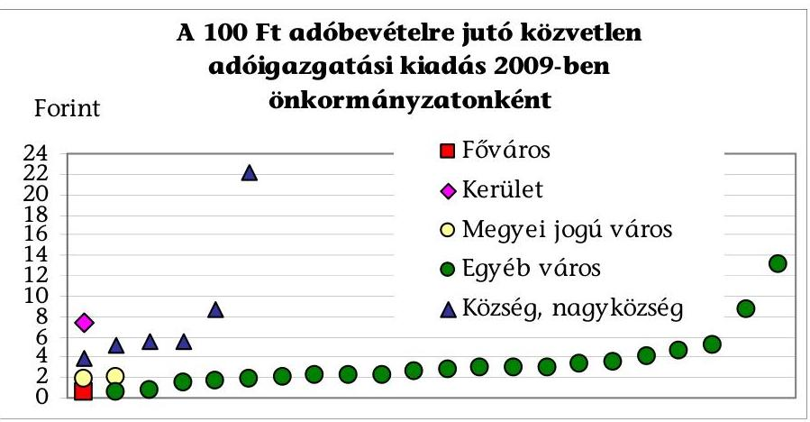

Az adóbeszedés eredményessége 2006 és 2009 között összességében javult, mert a folyó évi terhelésre teljesített befizetések aránya 78,7%-ról 81,5%-ra, az adóbevétel saját folyó és átengedett bevételeken belüli aránya pedig 49,2%-ról 56,0%-ra emelkedett. Az ellenőrzött önkormányzatok közül az első szempont szerint 58%-nál, a második szempont szerint 87%-nál javultak a mutatók értékei, 36%-nál mindkét szempont szerint kedvező irányú volt a változás. Az önkormányzatonkénti mutatók átlagostól való eltérésének mértéke (szórása) a folyó évi terhelésre teljesített befizetések arányánál kisebb volt, mint az adóbevétel saját folyó és átengedett bevételeken belüli arányánál ${ }^{29}$. Az alacsonyabb adóerő-képességű városok, nagyközségek és községek éves mutatói minden évben alatta maradtak a vidéki önkormányzatok átlagának.
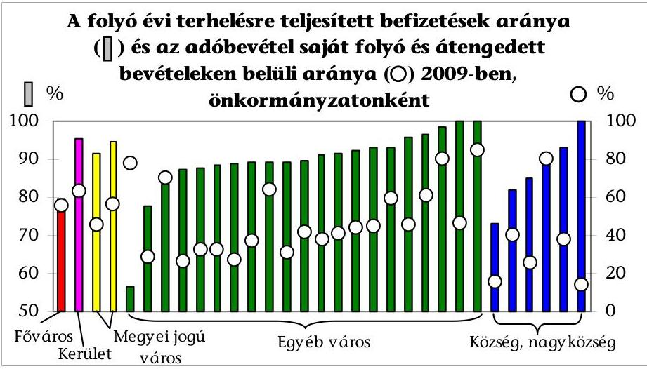

# 4.2. Az adóigazgatás személyi és tárgyi feltételeinek javítására tett intézkedések 

Az önkormányzatoknál 2006-2009 között az adóigazgatást végző köztisztviselőknek végzettség, szakmai képzettség szerinti összetétele kedvező irányban változott, nőtt a felsőfokú végzettségűek aránya. A személycserék

[^0]
[^0]:    ${ }^{29}$ Eperjeske községben a mutató 2009-ben helyesbítési hiányosságok miatt 836,7% volt (a diagramban 100%-kal jelölt és a szórás számításában nem szerepelt).

---

során elsősorban a magasabb végzettségű, az adóigazgatásban nem vagy kevésbé járatos dolgozókat vettek fel, de az öt évnél nagyobb tapasztalattal rendelkezők 70%-os aránya így is tartósan megmaradt. (Az arány a Fővárosnál az átlagot meghaladó mértékűre nőtt, míg vidéken az alá csökkent.)
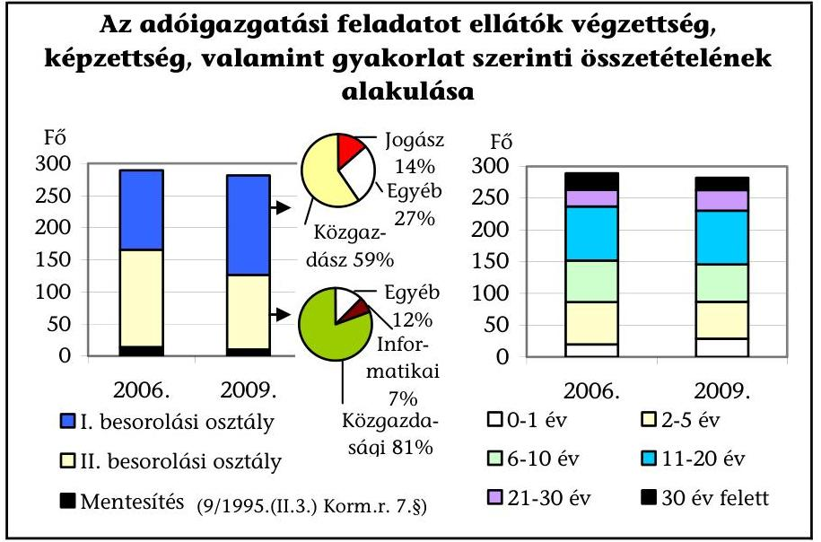

A képzettségi szint és az önkormányzat típusa között szoros összefüggés állt fenn, a felsőfokú végzettségűek aránya a városokban többszörösen magasabb volt, mint a községekben.

Az önkormányzatoknál 2009-ben az adóigazgatásban dolgozók 55%-a rendelkezett a köztisztviselők képesítési előírásairól szóló 9/1995. (II. 3.) Korm. rendeletben az I. besorolási osztályra előírt szakirányú felsőfokú végzettséggel, vagy egyéb felsőfokú végzettség mellett szakirányú képzettséggel. Ezen belül pl. a megyei jogú városoknál 66%, az egyéb városoknál 43%, míg a községi és nagyközségi önkormányzatoknál 16% volt az arány. A 2006-2009. évek között a besorolásának átmenetileg vagy tartósan meg nem felelő munkatársak aránya 1% volt.

Az önkormányzatoknál a jegyzők 84%-a gondoskodott az adóigazgatási feladatokat ellátók többé-kevésbé rendszeres szakmai továbbképzéséről.

Míg a Fővárosnál az adóigazgatás egyes vezetői szakmai cikkeket, könyveket publikáltak és minden munkatársra évente átlagosan 2,4 képzés jutott, addig a községek, nagyközségek kétharmadánál az ügyintézők nem, vagy a feladatokhoz mérten csak rendkívül szűk területet érintően vettek részt szakmai oktatásokon, rendezvényeken. Az önkormányzatok egyharmadánál kizárólag olyan szakmai képzéseken vettek részt a dolgozók, amelyekért nem kellett díjat fizetni.

Az adóigazgatás személyi és tárgyi feltételei 2006-2009 között az önkormányzatok egytizedénél romlottak, egyharmadánál alapvetően nem változtak, 58%-ánál a helyi intézkedések és az elnyert központi támogatások eredményeként javultak. Minden második önkormányzat pályázat alapján (elsősorban NFT és UMFT keretében) nyert olyan központi támogatást, amely - ugyan eltérő mértékben (1-44%), de - az adóigazgatás tárgyi feltételeit is érintette.

---

A pályázattal nyert támogatások az adóigazgatás fejlesztését a polgármesteri hivatalok felújításakor, vagy akadálymentesítésekor csupán néhány százalékkal szolgálták, a szervezetfejlesztési célok esetén az arány magasabb volt. A legnagyobb hányad az informatikai támogatottság növelését, az ügyfélbarát, illetve elektronikus ügyintézés elősegítését célzó pályázatoknál mutatkozott.

Az Art. 175. § (2) bekezdése 2009 októberéig ${ }^{30}$ kizárta az adóbevallások elektronikus úton történő benyújtását a helyi adóhatóság felé, de az ellenőrzött önkormányzatok 61%-a (a nagyobb települések többsége) végzett, vagy indított el valamilyen fejlesztést az elektronikus ügyintézés feltételeinek kialakítására. Elsősorban a bevallási nyomtatványok és más dokumentumok letöltésére, szűkebb körben azok kitöltésére és ellenőrzésére, folyószámla-lekérdezésre alakítottak ki internetes felületet, és egy-egy esetben speciális fejlesztésekre, alkalmazásokra is sor került.

Várpalota város a Budapesti Corvinus Egyetem Közigazgatási és Urbanisztikai Tanszéke által indított kutatásban vesz részt, amely a WAP-alapú mobil közigazgatásra - benne az adóigazgatásra is - vonatkozik. Lehetővé kívánja tenni a mobiltelefonos tájékoztatásokat, letöltéseket az ügyfelek felé.

Sárvár városban 2009. január 1-jétől valamennyi adóbevallás, bejelentés kitöltése kizárólag platform-független programmal (különböző operációs rendszerekre letölthető) történhet. Az interaktív súgók segítségével az adatok formai vizsgálatával és a számolt mezők kitöltésével, a 2D vonalkóddal ellátott PDF fájlformátumú nyomtatványok elkészítése egyszerűbbé és szinte hibamentessé vált.

Az adók és adók módjára behajtandó köztartozások számítógépes nyilvántartásai - azok sajátosságai, a korszerűsítés elmaradásából eredő problémái, emellett a program kínálta lehetőségek kihasználatlansága és a rögzítési, kódolási gondok miatt - önmagukban nem nyújtottak teljes körű információkat. A hiányosságok miatt az ellenőrzött önkormányzatok 35%-ánál egyéb, folyamatosan vezetett számítógépes és kézi nyilvántartásokat is alkalmaztak.

Az adó-nyilvántartási kötelezettség teljesítésére, a központi és a helyi vezetői információs igények kielégítésére az ellenőrzött vidéki önkormányzatoknál elsődlegesen az ONKADO, a Fővárosnál a HAIR, a kerületnél a KALAP nevű számítógépes programot alkalmazták. Az alaprendszereket további informatikai alkalmazások (pl. iktatórendszer, táblázatos nyilvántartások) is kiegészítették.

Az önkormányzatok kétharmadánál a központi információs igény kielégítésére és a számviteli feladatok készítésére is alkalmas adónyilvántartás mellett eseti legyűjtésekkel és manuális kigyűjtésekkel igyekeztek megoldani azt, hogy rendelkezésre álljanak az információk az OSAP keretében gyűjtött hatósági statisztika teljesítéséhez, a helyi vezetők tájékoztatásához, valamint a számvevőszéki ellenőrzés által kért tanúsítványok kitöltéséhez. Emellett is az adóellenőrzés és adóvégrehajtás teljesítménymutatóinak az ellenőrzött önkormány-

[^0]
[^0]:    ${ }^{30}$ a közigazgatási hatósági eljárás és szolgáltatás általános szabályairól szóló 2004. évi CXL. törvény módosításáról szóló 2008. évi CXI. törvény hatálybalépésével és a belső piaci szolgáltatásokról szóló 2006/123/EK irányelv átültetésével összefüggő törvénymódosításokról szóló 2009. évi LVI. törvény 287. §-a 2009. október 1-jei hatályba lépéséig

---

zatok egészére történő kiszámítását korlátozta az egy-egy helyen fennmaradó adathiány.

Az ellenőrzött önkormányzatok 77%-ánál az adószámlák bevételeit és kiadásait - az adónyilvántartásban való rögzítés mellett - a főkönyvben a hitelintézeti értesítés (számlakivonat) megérkezésekor költségvetési pénzforgalomként elszámolták. A fennmaradó 23%-nál a 2003. január 1. előtti gyakorlathoz hasonlóan továbbra is összevontan, adószámlánként a havonta összesített bevételi és kiadási forgalom alapján könyveltek a főkönyvben. Az eltérő gyakorlat a könyvelési feladatok szűkítésére irányuló törekvés mellett összefüggött a jogszabályi előírások nem kellő összehangolásából adódó eltérő értelmezésekkel is.

Az Adó nyilvántartási PM rendelet 9. § (5) bekezdése és 14. § (2) bekezdése alapján elegendő a főkönyvi nyilvántartás számára pénzügyi zárásokkor, legkésőbb a tárgynegyedévet követő hónap 15. napjáig összesítve feladni az adóbeszedési számlák forgalmát rögzítés céljából. Az Áhsz. 51. § (1) bekezdés a) pontja szerint a pénzforgalmat a megérkezést követően, azonnal - a hitelintézeti értesítés megérkezésekor - kell rögzíteni a könyvekben, és az Áhsz. 9. számú melléklet 3/b. pontja alapján a jóváírásokat költségvetési bevételként kell elszámolni közvetlenül a megfelelő adóbeszedési számlával szemben.

# 4.3. Az adóigazgatásban dolgozók teljesítményértékelési és ösztönzési rendszere, az adóellenőrzések hatékonysága 

Az ellenőrzött önkormányzatok 42%-ánál szabályozták helyi rendeletben - 2006-2009 között, vagy már azt megelőzően - az anyagi érdekeltségi rendszer feltételeit a Hatv. 45. §-ában biztosított lehetőség alapján. Az anyagi
 ösztönzés e formájának alkalmazása és az éves adóbevétel nagysága között szoros összefüggés volt.

A 31 önkormányzat éves adóbevétel nagysága szerinti rangsorának első hét helyén állók mind működtettek anyagi érdekeltségi rendszert, míg a többiek körében csak minden negyedik (a kisebb települések köréből mindössze egy nagyközség és az egyéb városok 38%-a).

A 2006-2009. évek között az anyagi érdekeltség feltételeire vonatkozó helyi szabályozást két önkormányzatnál megszüntették, négy önkormányzatnál - jellemzően a polgármesteri hivatal dolgozói közötti feszültségek elkerülése érdekében - elmaradtak érdekeltségi kifizetések. A helyi önkormányzati rendeletekben kialakított anyagi érdekeltség feltételeiben alapvető különbségek voltak a forrás mértékének meghatározásában, a kifizetések feltételében és a mértékében is. Az ellenőrzött önkormányzatok 6%-ánál az érdekeltségi célú juttatásból - a Hatv.-ben előírttal szemben - nem köztisztviselő anyagi ösztönzésére is sor került.

Az önkormányzatoknál az ösztönzés forrásaként a feltárt és beszedett adóhiány, befolyt adótartozás 6-50%-át határozták meg (helyenként a teljes, másutt a tervezettet meghaladó összegre vetítve), még az adóhiány szerint elkülönített befizetések megbízható nyilvántartásának hiányában is. Az érdekeltségi rendszer alapján történő kifizetések feltételei között bizonyosan teljesülő és több feltétel együttes meglétét szigorúan követelő kritériumok is megtalálhatóak voltak. Az éves kifizetések összegének maximumaként kéthavi, míg másutt egy éves teljes illet-

---

ményt is meghatároztak. Előfordult, hogy minden feltétel megléte ellenére nem történt kifizetés, de az egy főre vetített éves 30 ezer Ft-os és közel 3 millió Ft-os kifizetésre is akadt példa (utóbbi a Fővárosnál). Az átlagos kifizetések mértéke 2006-2009 között összességében csökkent.

A Fővárosnál a helyi szabályozás alapján rendszeresen és Szombathely megyei jogú városnál 2008-ban az anyagi érdekeltség rendszerében ügykezelőknek is történtek kifizetések, ugyanakkor a Hatv. 45. §-a szerint az érdekeltségi célú juttatásból adóügyi feladatokat ellátó köztisztviselők részesülhetnek.

Az anyagi érdekeltségi rendszer működtetésével lényegében a jutalmazás kibővített keretű formája valósult meg. Az adóbevételek növelésére, a hátralékok csökkentésére, az adókötelezettségek elmulasztásának feltárására vonatkozó konkrét eredménykövetelmények helyi meghatározásának és mérésének célszerűségét a számvevőszéki ellenőrzés során egységesen alkalmazott teljesítménymutatókkal mért változás nem igazolta.

Az anyagi érdekeltségi rendszert működtetőknél 77%-ban teljesült a Hatv. 45. §-ában megfogalmazott célkitűzés (az önkormányzat ügykörébe tartozó adók hatékonyabb beszedése). Ez csak tíz százalékponttal magasabb, mint az ösztönzés e formáját nem alkalmazók körében. Az adóigazgatás egészének teljesítményének változását mérő mutatók mindegyike az érdekeltségi rendszert alkalmazók 28%-ánál javult, ami csak három százalékponttal magasabb, mint a nem alkalmazók körében. Az adóellenőrzések hatékonyságára és az adóvégrehajtás teljesítménymérésére alkalmazott mutatókkal is számolva nem volt olyan önkormányzat, ahol minden szempontból kedvező irányú a változás.

A jegyzők 87%-a a Ktv. 34. §-a alapján kialakította és működtette a teljesítményértékelést az adóigazgatásban dolgozók körében, abban a képviselőtestület által elfogadott követelményekkel és alkalmazása esetén az anyagi érdekeltségi rendszerrel is alapvetően összhangban álló célok, elvárások, de általános kritériumok szerepeltek. Ezek eltérő prioritások mellett az adókötelezettségek ellenőrzöttségének javítására, a feltárt és előírt adókülönbözet, a befolyt adó, bírság és pótlék növelésére, az adóbeszedés és a hátralékkezelés eredményességének emelésére irányultak. Nem mutatható ki szoros összefüggés a dolgozók teljesítményértékelése és az adóigazgatás mért teljesítményeinek növekedése között, az értékelés kötelezettségét a jegyzők konkrét követelmények és mérések hiányában - formailag teljesítették.

Sem az anyagi érdekeltségi-, sem az egyéni teljesítményértékelési rendszer nem fejtett ki olyan hatást, amellyel javult volna a Főváros nélküli ellenőrzött önkormányzatok szintjén ${ }^{31}$ a helyi adó ellenőrzések hatékonysága. Az adózók terhére feltárt és általuk be is fizetett adó (adóhiány, bírság és pótlék) egy adóellenőrzésre jutó összege 2006-2009 között 92,8 ezer Ft-ról 81,5 ezer Ft-ra csökkent. Az adóellenőrzés hatékonysága az önkormányzatok 39%-ánál javult, 26%-ánál csökkent, a többi esetben változás nem történt. Az adóhatóságok a települések felénél nem, vagy csak néhány adóellenőrzést végeztek, az önkormányzatok adatainak szórása magas volt. Ott mutatkozott a látszólag legnagyobb hatékonyság, ahol csak egy-két adóellenőrzés volt, de

[^0]
[^0]:    ${ }^{31}$ A Fővárosnál a feltárt adóhiány, bírság és pótlék összegén túl nem volt a befizetésükre is vonatkozó összesített adat.

---

több millió Ft-os különbözetet (adóhiányt, bírságot és pótlékot) állapítottak meg az adóhatóságok és fizettek be az adózók. Az adóellenőrzések számát befolyásolta a települések helyi adó struktúrája, így pl. azoknál a városoknál volt kiemelkedően magas, ahol széles körben ellenőrizték az idegenforgalmi adó beszedésére kötelezetteket. Az egyedi hatékonysági mutatók célszerűen csak az adóellenőrzések számának kiemelésével együtt voltak értékelhetőek.
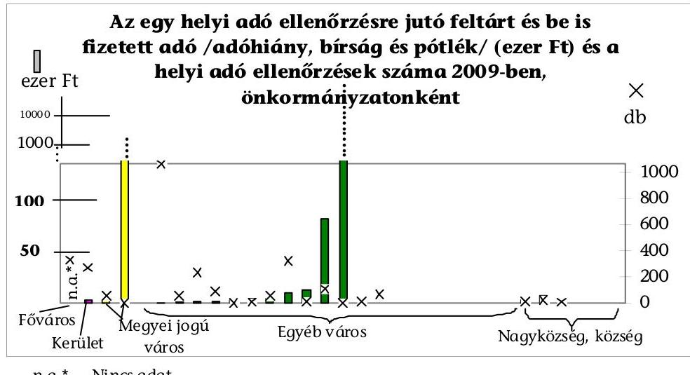
n.a.* - Nincs adat

# 4.4. A végrehajtási cselekmények hatékonysága, eredményessége, a hátralékállomány változása 

Az esedékes hátralék miatt kiküldött fizetésre felszólító levelek száma 2006-2009 között 18,9%-kal emelkedett. A felszólítások eredménytelensége esetén további intézkedésekre volt szükség, de az adóhatóságok az indokoltnál alacsonyabb mértékben teljesítették a kötelezettségüket, a végrehajtási cselekmények száma 2006-ról 2009-re 4,7%-kal csökkent.

Minden ötödik ellenőrzött önkormányzatnál a végrehajtási cselekmények számának éves átlaga száz alatti volt, ezen belül minden másodiknál a tizet sem érte el (a legkisebb településeken előfordult egy, vagy több olyan év, amikor egyetlen végrehajtási cselekmény sem volt). A végrehajtási intézkedések száma az adóhatóságok 16%-ánál olyan mértékben visszaesett, hogy a többinél előforduló emelkedés sem tudta kiegyenlíteni. A csökkenés mértékét nem igazolta a felszólításokat követő befizetési hajlandóság ezzel arányos kedvező változása, vagy az átutalási megbízások újraindítási idejének hosszabbodása sem.

A végrehajtási cselekmények típus szerinti belső arányai lassan változtak, az ingó- és ingatlan végrehajtást továbbra is kevés helyen alkalmazzák.

Csökkenő arány mellett, de még mindig az inkasszó a leggyakoribb - az esetek háromnegyedénél alkalmazott - végrehajtási cselekmény, a hatásossága viszont a válság, az „üres" vállalkozói számlák nagyobb előfordulása miatt romlott. Második leggyakoribb megoldás minden tizedik esetben a letiltás volt, de a munkanélküliség emelkedése miatt a bevétel beérkezési esélye itt is csökkent. A 2007. évi visszaesés után ismét emelkedett a gépjárművek forgalomból való kivonása (2009-ben minden huszadik végrehajtási cselekmény ez volt). Elsősorban a bírósági végrehajtók igénybevételének köszönhető, hogy az ingó- és ingatlan végrehajtások száma négy év alatt többszörösére, arányuk pedig 5,6%-ra illetve 1,7%-

---

ra nőtt. Az ingóvégrehajtás mindössze az adóhatóságok 26%-ánál, míg az ingatlan jelzálog és egyéb bejegyzéseknél tovább vitt ingatlan végrehajtás mindössze a települések 13%-ánál fordult elő. A tulajdonjogot érintő cselekmények szűkebb körű alkalmazása a szükséges személyi kapacitás és az ingó-, ingatlanvégrehajtási szakértelem hiányosságaira, a tárolási, őrzési problémákra, a hosszabb átfutási időkre, az elektronikus árverések hiányára vezethető vissza.

A végrehajtási cselekményeken belül 2006-2009 között folyamatosan és többszörösére emelkedett a megkeresésre indított eljárások száma és aránya, ugyanakkor a végrehajtásból származó bevételeknek csak 6-7%-a kapcsolódott ezekhez az ügyekhez.

Az ellenőrzött települési önkormányzatok körében 2006-2009 között a megkeresésre indított végrehajtási cselekmények száma 259,3%-kal, az ennek hatására befolyt bevétel 167,5%-kal, az önkormányzatot megillető bevétel 96,7%-kal emelkedett. Míg 2006-ban az adóvégrehajtás minden öt intézkedéséből egy indult megkeresés alapján, addig 2009-re már kétszer olyan gyakorivá vált (ötből két eset). A megkeresések miatti feladat adóhatóságonként 2009-ben nulla és közel háromezer intézkedés közé esett. A végrehajtási cselekményeken belüli arány pedig az adóhatóságok egyharmadánál volt 25% alatti, de minden hatodik esetben a 75%-ot is meghaladta, miközben mindebből intézkedésenként átlagosan csak 3800 Ft önkormányzatot megillető bevétel származott.

A végrehajtási cselekmények hatására befolyt bevétel 2006-ról 2009-re 19,0%-kal nőtt, miközben az esedékes hátralékok év végi állománya 62,7%-kal emelkedett. Az adóbevétel arányában mért változás jelzi, hogy a végrehajtás gyakorlata nem volt képes visszafogni a hátralékok intenzív növekedését.
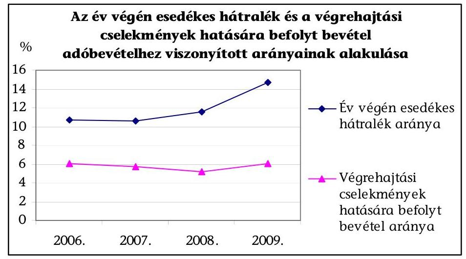

Az adóvégrehajtás hatékonysága - a 100 Ft végrehajtással beszedett bevételhez kapcsolódó végrehajtási kiadás alapján - 2006 és 2009 összehasonlításában lényegében nem változott, mert a végrehajtással beszedett egységnyi bevétel elérése mindössze 4 fillérrel lett alacsonyabb, az önkormányzatok kimutatásai alapján 2009-ben 1,47 Ft volt. A hatékonyságot befolyásoló adatok szórása magas volt, a különbségeket az önkormányzatok hatékonysági mutató alapján történő összehasonlításakor figyelembe kell venni. Ugyanis néhány végrehajtási cselekmény is lehet hatékony és önkormányzati bevételt biztosító, de a végrehajtás rendszerét az minősíti, hogy miként képes befolyásolni a hátralékok állományát.

---

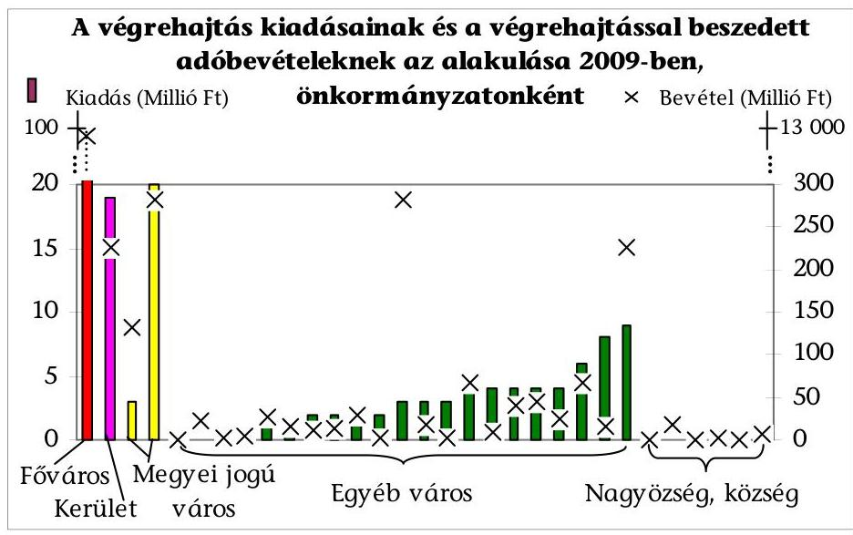

Az önkormányzati adóvégrehajtás eredményessége 2006-2009 között kedvezőtlen irányban változott, mert az adóvégrehajtás bevételének hátralékokhoz viszonyított aránya 56,0%-ról 40,9%-ra csökkent és a behajthatatlanná minősített követelések adóbevételhez viszonyított aránya pedig 0,29%-ról 0,39%-ra emelkedett (mindkét mutató szerint rosszabbodott).
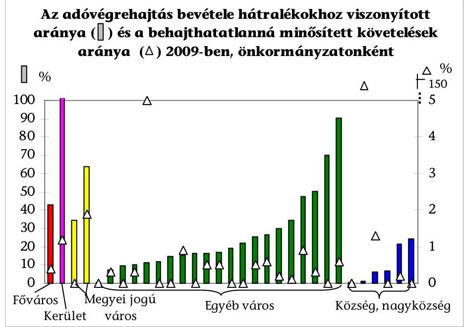

Az ellenőrzött önkormányzatok közül az első szempont szerint 48%-nál, a második szempont szerint 23%-nál javultak a mutatók értékei, és csak 6%-nál volt kedvező irányú a változás mindkét szempont szerint. Az önkormányzatonkénti mutatók átlagostól való eltérésének mértéke (szórása) az adóvégrehajtás bevételének hátralékokhoz viszonyított arányánál és a behajthatatlanná minősített követelések arányánál közel azonos mértékű volt.

# Az ellenőrzött önkormányzatok 6%-ánál változott kedvező irányban 

2006 és 2009 között a hatékonyság és eredményesség is, egy adóhivatalnál

---

(3%) minden értékelési szempont szerint rosszabb lett az adóvégrehajtás teljesítménye.

A vizsgált önkormányzatok köréből egy helyen működött végrehajtási társulás ${ }^{32}$, amely szakmailag célszerű, bevételi többletet eredményező volt, a megkeresésre indított végrehajtási cselekmények tekintetében eredményesen dolgozott, ugyanakkor az ellenőrzött városi önkormányzatnál (Balatonföldvár) mért teljesítménymutatók és azok változásai nem voltak kedvezőbbek az átlagosnál.

# 4.5. Fizetési könnyítések, méltányossági jogkör gyakorlása 

A helyi adó rendeletek az adózók méltányossági kérelem benyújtási lehetőségére való utalás mellett egy esetben (Szekszárd városnál) határoztak meg eljárási szabályokat is, amelyeket a RÁH törvényességi kifogása miatt visszavont az önkormányzat. A méltányossági ügyeket a jegyzők - a jogkörükben maguk, vagy nagyobb településeken a felhatalmazásuk alapján eljáró adóigazgatási szervezeti egységek egyes munkatársai - az Art. szabályozása alapján intézték. A kérelmek elbírálásakor minden érdemi körülményre alapvetően figyelemmel voltak, egy önkormányzatnál (Vasszécseny község) - a Ket. 72. § (1) bekezdés e) pontjában előírtak ellenére - a mérlegelésen alapuló döntés alátámasztása a határozatok indoklásaiból hiányzott.

A benyújtott méltányossági kérelmek száma - a Főváros adatai nélkül ${ }^{33}$ - 2006-2009 között 23,8%-kal emelkedett, ezen belül 2008-ról 2009-re 47,9%-os volt a növekedés. A kérelmek számában a 2007. és a 2008. évek csökkenését követte a mennyiségi ugrás 2009-ben, ugyanakkor a kérelmekben szereplő összegek 2006-2009 között folyamatos növekedéssel megduplázódtak, és így az egy kérelemre jutó összeg kétharmadával lett magasabb. Mindezek okát a lakosság és a vállalkozások helyzetének kedvezőtlen alakulásában, a gazdasági válság hatásaiban látták az adóhatóságok. Minden tíz kérelemből átlagosan kilencben a kérelmező számára - ha nem is mindig a kérelmének teljesen megfelelő, de - kedvező döntés született.

Az ügyfelek számára kedvezményt biztosító, engedélyező méltányossági ügyek száma 2006-2009 között 13,8%-kal emelkedett (ezen belül 2006 és 2008 között 13,0%-kal csökkent, de 2009-re 30,8%-kal emelkedett az előző évhez képest). A kedvezően elbírált kérelmekben szereplő összeg 81,0%-kal (az egy ügyre eső átlaga 59,1%-kal) lett magasabb a négy év alatt. A méltányossági engedmények háromnegyede fizetési halasztásra, részletfizetésre, míg egynegyede a tartozás csökkentésére, elengedésére
 vonatkozott. (A Főváros önkormányzati adóhatóságánál történt az adózók számára kedvező elbírálású méltányossági ügyeknek a 81%-a, a kérelemmel érintett összeg szerint 87%-a.) Az adóhatóságok ugyan egy-egy adóhatóságnál minden kérelmet az ügyfél indokolt szempontjai

[^0]
[^0]:    ${ }^{32}$ A Balatonföldvár és Környéke Pénzügyi Végrehajtási Társulás, amelyben 19 település megbízásából a város jegyzője egy köztisztviselőt alkalmazott a valamennyi önkormányzat területére kiterjedő végrehajtási feladatok ellátására.
    ${ }^{33}$ A benyújtott méltányossági kérelmek számáról nem volt információ (az iktatási rendszerből sem volt megbízható legyűjtés), csak az engedélyezett méltányossági ügyekről volt adat.

---

szerint méltányoltak - összességében az önkormányzatok bevételi és az adózók megélhetési, illetve vállalkozás folytatási érdekeit is figyelembe vevő elveket alkalmaztak.

A méltányosság gyakorlása során figyelembe vették az Art. 134. § (2) és (3) bekezdéseinek előírását, hogy a vállalkozásokat érintően elengedés csak a bírságnál, pótléknál történhet (a tőketartozásoknál nem), valamint az önkormányzat a részletfizetéssel lehetőleg még a folyó évben, vagy egy éven belül bevételhez jusson. Ennek a hatása, hogy az adóhatóságok a méltányossági üggyel érintett összegeknek átlagosan csak minden harmincadik Ft-ját engedték el.

Az adózók méltányossági igényének összege az önkormányzati adóhatóságok által évente az adózók teljes körére előírt folyó évi terheléshez (követeléshez) képest is emelkedett. A méltányosság gyakorlása miatt elengedett adóhatósági követelés folyó évi adóterheléshez viszonyított arányának folyamatosan alacsony szintje pedig igazolja, hogy az e címen nyújtott közvetett önkormányzati támogatásoknál továbbra is visszafogottság érvényesült.
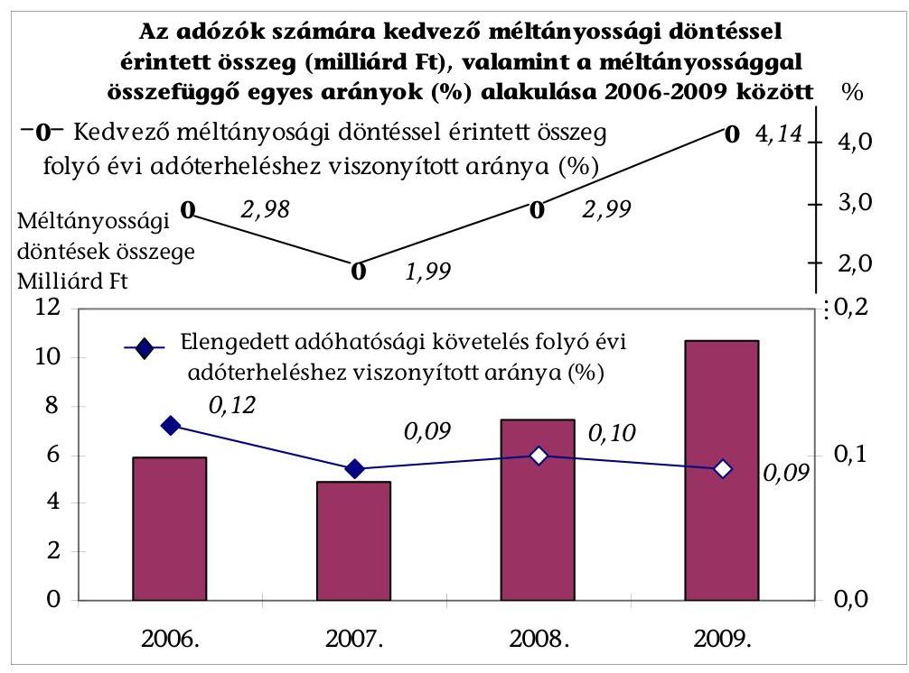

# 4.6. Belső kontrollok kiépítése és működése 

A jegyzők különböző szabályozásokban (ügyrendekben, munkaköri leírásokban és egyéb vezetői utasításokban) határozták meg az adóügyintézők feladatait, jogköreit, a több személyes adóigazgatási szervezeti egységek esetén egyes adóhatósági döntések meghozatalával is megbíztak munkatársakat. A kiadmányozási jogkörök szabályozásainak többsége megfelelő, az adóhatóságok egytizedénél azonban hiányos (az adóigazgatási tevékenység nem minden területére kiterjedő) volt. Az adóigazgatás belső kontrolljait a jegyzők közel 40%-a nem építette ki és működtette megfelelően (elsősorban a községeknél, nagyközségeknél és kisebb városoknál).

---

A helyszíni ellenőrzések során a belső kontrollok kiépítését (és annak hiányára visszavezethetően működését is kifogásoló) esetek közül

- minden hatodiknál ellenőrzési nyomvonal a polgármesteri hivatal tevékenységeire nem készült és egyéb szabályozás sem rögzítette a munkafolyamatokba épített kontrolltevékenységeket,
- minden második esetben készült ugyan ellenőrzési nyomvonal, de a pénzügyi tevékenységek köréből az adóigazgatás kimaradt,
- minden harmadik esetben az adóigazgatási tevékenység egy-egy elemére nem terjedt ki az szabályozás.

Az önkormányzati adóhatóságok tanúsítványokon közölt adatai szerint az elmúlt négy évben a határidőben elintézett ügyek száma 2006-ról 2009-re 24,8%-kal emelkedett, a négy év alatt megközelítette az 1,8 milliót. A határidőn túl elintézett ügyek aránya az összes adóügyön belül 2006-2009 között 2-3 ezrelék között alakult (a 2006. és a 2009. évek összehasonlításában kisebb lett). Az információk megbízhatóságát csökkentette, hogy minden ötödik helyszíni ellenőrzés az egyedi adatokat érintő megállapításokat tett.

Az adóhatóságok háromnegyedének adatai szerint 2006-2009 között minden ügyet határidőben elintéztek. Közülük minden negyedik esetben az ügyiratkezelés, a gyűjtős iktatás, az adatlekérdezés sajátosságai, a számítógépes és kézi nyilvántartás szerinti információk ellentmondásai, a döntések és ügyek száma logikai összefüggéseinek problémái miatt olyan körülmények voltak, amelyek miatt megnőtt az egyedi és összesített adatok pontatlanságának kockázata.

Az adóhatóságok 80%-ánál 2006-2009 között az ügyészség, vagy államigazgatási (közigazgatási) hivatal ellenőrzést végzett, és az adóigazgatás egyes részterületei, vagy egésze színvonalát minősítette. Az ellenőrzések közül csak minden hatodik zárult úgy, hogy nem kellett a jegyzőnek intézkedéseket hozni a törvénysértések, hiányosságok miatt. Különösen az adóvégrehajtás (ezen belül elsősorban az adók módjára behajtandó köztartozások kezelésénél) és az adóellenőrzés terén alapvető problémák mutatkoztak.

Az ügyészség 19 adóhivatalnál (61%) - ebből háromnál két esetben is - ellenőrizte az adóbehajtást, témaellenőrzés keretében az adók módjára történő behajtásra átvett ügyek adóvégrehajtása törvényességét. Az ügyészek felszólalásokkal éltek, indítványokat tettek, mert három helyet kivéve hibákat találtak az eljárási szabályok betartásában (a dokumentáció tartalmában, formájában, a határidő betartásában, a végrehajtási intézkedés megindításában), illetve az indokolt végrehajtási intézkedés elmaradását kifogásolták.

Az államigazgatási (közigazgatási) hivatal 12 önkormányzatnál (39%) - ebből kettőnél két esetben is - ellenőrizte az adóztatást, adóigazgatást, és jellemzően az adóellenőrzés és adóvégrehajtás területén hiányosságok megszüntetésére hívta fel a figyelmet. Mindössze egy esetben nem volt szükség semmilyen jegyzői intézkedésre, egy községnél pedig utóellenőrzéssel sem sikerült eredményes intézkedéseket elérni.

A jegyzők - egy kivétellel - nem határoztak meg az adóigazgatásban dolgozók számára az ügyfelekkel való kapcsolattartásban a korrupció kizárását szolgáló etikai követelményeket.

---

A Fővárosnál a főjegyző az ügyfelekkel való kapcsolattartásra, a korrupció kizárása érdekében már 2006 előtt intézkedést adott ki „a köztisztviselők pártatlan, befolyástól mentes tevékenységének előmozdítása érdekében", a visszautasítandó, illetve az elfogadható ajándék meghatározásáról, azokra vonatkozóan az írásbeli jelentési kötelezettségről, valamint a nyilvántartás módjáról.

Budapest, 2010. december „ $x_{\text {int }}$
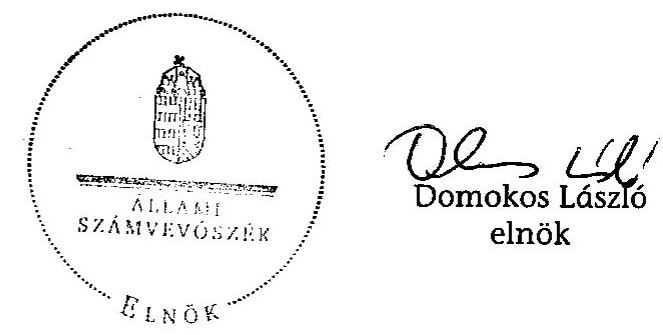

| Melléklet: | 9 db | 19 lap |
| :-- | :-- | :-- |
| Függelék: | 2 db | 13 lap |

---

# Helyszínen ellenőrzött önkormányzatok és regionális államigazgatási hivatalok, kirendeltségek 

| Megye/Főváros | Önkormányzat | Regionális államigazgatási   hivatal (RÁH)/kirendeltség |
| :--: | :--: | :--: |
| Főváros | Fővárosi Önkormányzat   XIV. kerület | Közép-magyarországi RÁH,   Budapest |
| Baranya megye | Bóly   Pécsvárad   Szentlőrinc   Villány   Kozármisleny | Dél-dunántúli RÁH Pécsi Ki-   rendeltsége |
| Csongrád megye | Csongrád   Makó   Szentes   Sándorfalva | Dél-alföldi RÁH, Szeged |
| Hajdú-Bihar megye | Hajdúszoboszló | Észak-alföldi RÁH, Debrecen |
| Heves megye | Hatvan   Egerszalók | Észak-magyarországi RÁH,   Eger |
| Pest megye | Budaörs   Mogyoród   Telki |  |
| Somogy megye | Balatonföldvár   Lengyeltóti | Dél-dunántúli RÁH, Kaposvár |
| Szabolcs-Szatmár-   Bereg megye | Kállósemjén   Kisvárda   Eperjeske | Észak-alföldi RÁH Nyíregyhá-   zi Kirendeltsége |
| Tolna megye | Szekszárd   Paks | Dél-dunántúli RÁH Szekszár-   di Kirendeltsége |
| Vas megye | Szombathely   Sárvár   Vasszécseny | Nyugat-dunántúli RÁH   Szombathelyi Kirendeltsége |
| Veszprém megye | Várpalota   Pápa | Közép-dunántúli RÁH Veszp-   rémi Kirendeltsége |
| Zala megye | Hévíz   Zalaszentgrót | Nyugat-dunántúli RÁH Zala-   egerszegi Kirendeltsége |

---

# Hatékonysági, eredményességi és egyéb mutatók számítása

## 1. Hatékonysági mutatók

### 1.1. Az önkormányzati adóbeszedés hatékonyságának változása

100 Ft önkormányzati adóbevételre jutó közvetlen adóigazgatási kiadás: Az adóhatóságnál jegyző nélkül számított személyi juttatások, munkaadót terhelő járulékok, az ügyfelekkel kapcsolatos papír alapú kommunikációs kiadások, továbbá az egyéb közvetlen kiadások 100 Ft önkormányzati adóbevételre vetítve.

|   | 2006. | 2007. | 2008. | 2009.  |
| --- | --- | --- | --- | --- |
|  Adóbeszedés közvetlen kiadása (E Ft) | 1738626 | 1864450 | 1989093 | 1886806  |
|  Bevétel (E Ft) | 198283154 | 222093566 | 236191339 | 236879458  |
|  100 Ft önkormányzati adóbevételre jutó közvetlen adóigazgatási kiadás | 0,88 | 0,84 | 0,84 | 0,80  |

Változás 2009/2006. %: -8,9 Átlag: 0,84

### 1.2. Az adóellenőrzés hatékonyságának változása*

Egy adóellenőrzésre jutó feltárt és befizetett adó: A feltárt és befizetett adó (adóhiány+bírság+pótlék) átlagos, egy adóellenőrzésre jutó összege (E Ft). (*= Adathiány miatt a Főváros adatai nélkül)

|   | 2006. | 2007. | 2008. | 2009.  |
| --- | --- | --- | --- | --- |
|  Az időszak helyi adó ellenőrzéseivel feltárt és befizetett adóhiány, bírság és pótlék együttes összege (E Ft) | 254797 | 499836 | 151463 | 194882  |
|  Az időszak helyi adó ellenőrzéseinek száma | 2745 | 3520 | 2533 | 2392  |
|  Egy helyi adó adóellenőrzésre jutó feltárt és befizetett adó (E Ft) | 92,8 | 142,0 | 59,8 | 81,5  |

Változás 2009/2006. %: -12,2 Átlag: 94,0

### 1.3. A végrehajtás hatékonyságának változása

---

100 forint végrehajtással beszedett bevételhez kapcsolódó végrehajtási kiadás (költség): Az adóhatóságnál jegyző nélkül számítva 100 forint végrehajtással beszedett bevételhez mekkora végrehajtási kiadás (költség) kapcsolódik.

|   | 2006. | 2007. | 2008. | 2009.  |
| --- | --- | --- | --- | --- |
|  Az adóvégrehajtás időszaki kiadása (költsége) (E Ft) | 180336 | 185528 | 206936 | 209354  |
|  Az időszakban a végrehajtási cselekmények hatására befolyt bevétel összege (E Ft) | 11949598 | 12800768 | 12369090 | 14218746  |
|  100 Ft végrehajtással beszedett bevételhez kapcsolódó végrehajtási kiadás (költség) (Ft): | 1,51 | 1,45 | 1,67 | 1,47  |
|  Változás 2009/2006. %: | -2,6 |  | Átlag: | 1,52  |

# 2. Eredményességi mutatók

### 2.1. Az önkormányzati adóbeszedés eredményességének változása

2.1.1. A folyó évi terhelésre teljesített befizetések aránya: A folyó évre elszámolt bevételek milyen arányt képviselnek a helyesbített folyó évi terheléshez képest.

|  2006. | Adónem | Elszámolt múlt
évi befizetés
folyó évre | Elszámolt folyó
évi befizetés
folyó évre | Folyó évi
befizetés
adóhiányra | Helyesbített
folyó évi
terhelés | Teljesítés
%-a  |
| --- | --- | --- | --- | --- | --- | --- |
|   |  | E Ft | E Ft | E Ft | E Ft | $(2+3-4) / 5 * 100$  |
|   | 1 | 2 | 3 | 4 | 5 | 6  |
|   | Építményadó | 23253 | 3928052 | 42615 | 4047799 | 96,6  |
|   | Telekadó | 11462 | 166793 | 13591 | 174419 | 94,4  |
|   | Magánszem. komm. adója | 6378 | 448553 | 2096 | 483102 | 93,7  |
|   | Vállalkozások komm. adója | 8635 | 94461 | 9 | 105743 | 97,5  |
|   | Idegenf.a.: tartózkodás után | 9121 | 1826982 | 1037 | 1820157 | 100,8  |
|   | Idegenf.adó: építmény után | 251 | 26761 | 596 | 27951 | 94,5  |
|   | Helyi iparűzési adó | 5877484 | 139048367 | 43456 | 187184551 | 77,4  |
|   | Földbérbeadásból származó
jövedelem szia-ja | 395 | 844 | 0 | 899 | 137,8  |
|   | Gépjárműadó | 46050 | 2867662 | 4184 | 3213250 | 90,5  |
|   | Pótlék | 533673 | 867027 | 517 | 940653 | 148,9  |
|   | Bírság és végrehajtási ktg. | 49676 | 271677 | 388 | 373413 | 86,0

 |   | Egyéb bevételek | 778 | 32965 | 0 | 66163 | 51,0  |
|   | Idegen bevételek | 162 | 18507 | 0 | 52137 | 35,8  |
|   | Talajterhelési díj | 371 | 632 | 0 | -159 | 0,0  |
|   | Államig. illeték | 2857 | 57022 | 0 | 23032 | 260,0  |
|   | Luxusadó | 0 | 99894 | 0 | 104993 | 95,1  |
|   | Önkormányzat összesen | 6570546 | 149756199 | 108489 | 198618103 | 78,7  |

---

|   | Adónem | Elszámolt múlt évi befizetés folyó évre | Elszámolt folyó évi befizetés folyó évre | Folyó évi befizetés adóhiányra | Helyesbített folyó évi terhelés | Teljesítés %-a  |
| --- | --- | --- | --- | --- | --- | --- |
|   |  | E Ft | E Ft | E Ft | E Ft | (2+3-4) /5*100  |
|   | 1 | 2 | 3 | 4 | 5 | 6  |
|  2007. | Önkormányzat összesen | 6 298 725 | 181 183 784 | 190 036 | 247 522 816 | 75,7  |
|  2008. | Önkormányzat összesen | 6 842 976 | 195 268 845 | 40 541 | 247 669 631 | 81,6  |
|  2009. | Adónem | Elszámolt múlt évi befizetés folyó évre | Elszámolt folyó évi befizetés folyó évre | Folyó évi befizetés adóhiányra | Helyesbített folyó évi terhelés | Teljesítés %-a  |
|   |  | E Ft | E Ft | E Ft | E Ft | (2+3-4) /5*100  |
|   | 1 | 2 | 3 | 4 | 5 | 6  |
|   | Építményadó | 37 693 | 4 742 349 | 25 099 | 4 990 441 | 95,3  |
|   | Telekadó | 2 129 | 254 887 | 14 105 | 259 795 | 93,5  |
|   | Magánszem. komm. adója | 6 589 | 391 489 | 351 | 433 445 | 91,8  |
|   | Vállalkozások komm. adója | 11 667 | 102 321 | 17 | 116 431 | 97,9  |
|   | Idegenf.a.: tartózkodás után | 29 189 | 2 048 756 | 6 079 | 2 113 330 | 98,0  |
|   | Idegenf.adó: építmény után | 195 | 27 331 | 766 | 29 231 | 91,5  |
|   | Helyi iparűzési adó | 6 048 632 | 191 601 841 | 291 511 | 242 878 933 | 81,3  |
|   | Földbérbeadásból származó jövedelem szia-ja | 182 | 303 | 0 | 894 | 54,3  |
|   | Gépjárműadó | 56 459 | 3 665 439 | 653 | 4 049 760 | 91,9  |
|   | Pótlék | 506 296 | 1 263 439 | 14 153 | 3 153 490 | 55,7  |
|   | Birság és végrehajtási ktg. | 39 785 | 378 766 | 1 600 | 686 189 | 60,8  |
|   | Egyéb bevételek | 2 698 | 48 384 | 0 | 89 809 | 56,9  |
|   | Idegen bevételek | 336 | 64 933 | 0 | 160 588 | 40,6  |
|   | Talajterhelési díj | 279 | 636 | 219 | 548 | 127,0  |
|   | Államig. illeték | 1 920 | 99 935 | 0 | 16 922 | 601,9  |
|   | Luxusadó | 5 254 | 1 611 | 0 | 1 526 | 449,9  |
|   | Önkormányzat összesen | 6 749 303 | 204 692 420 | 354 553 | 258 981 332 | 81,5  |

*Teljesítési mutató változása 2009-2006. százalékpont: 2,8 Átlag: 79,4*

**2.1.2.** Az adóbevétel saját folyó és átengedett bevételeken belüli aránya:

A tárgyévi adóbevételek milyen arányt képviselnek az adott időszakban az önkormányzat saját folyó és átengedett bevételein belül.

---

|   | 2006. | 2007. | 2008. | 2009.  |
| --- | --- | --- | --- | --- |
|  Adóbevétel (E Ft) | 116898021 | 132504337 | 142377477 | 141088004  |
|  Saját folyó és átengedett bevétel (E Ft) | 237574699 | 259417813 | 262282206 | 251824688  |
|  Az adóbevétel saját folyó és átengedett bevételeken belüli aránya | 49,2 | 51,1 | 54,3 | 56,0  |
|  Aránymutató változása 2009-2006. százalékpont: |  | 6,8 | Átlag: | 52,7  |

# 2.2. Az adóvégrehajtás eredményességének változása

2.2.1. Az adóvégrehajtás hatása a hátralékok összegére:

Az adóvégrehajtásból befolyt összegnek az év végén esedékes hátralékhoz viszonyított aránya.

|  2006. | Adónem | Adóbevétel végrehajtás alapján (E Ft) | Időszak végi esedékes hátralék (E Ft) | Arány % 2 / 3 * 100  |
| --- | --- | --- | --- | --- |
|   | 1 | 2 | 3 | 4  |
|   | Helyi adók | 11681617 | 19799842 | 59,0  |
|   | Gépjármű adó | 154089 | 664308 | 23,2  |
|   | Önk. adóhatóság által kezelt egyéb köztartozások (minden más) | 113892 | 866115 | 13,1  |
|   | Önkormányzat összesen | 11949598 | 21330265 | 56,0  |
|  2007. | Adónem | Adóbevétel végrehajtás alapján (E Ft) | Időszak végi esedékes hátralék (E Ft) | Arány % 2 / 3 * 100  |
|   | 1 | 2 | 3 | 4  |
|   | Helyi adók | 12449001 | 21655652 | 57,5  |
|   | Gépjármű adó | 237313 | 749271 | 31,7  |
|   | Önk. adóhatóság által kezelt egyéb köztartozások (minden más) | 114454 | 1034545 | 11,1  |
|   | Önkormányzat összesen | 12800768 | 23439468 | 54,6  |

|  2008. | Adónem | Adóbevétel végrehajtás alapján (E Ft) | Időszak végi esedékes hátralék (E Ft) | Arány % 2 / 3 * 100  |
| --- | --- | --- | --- | --- |
|   | 1 | 2 | 3 | 4  |
|   | Helyi adók | 11985998 | 25356404 | 47,3  |

---

|  2009. | Gépjármű adó | 258770 | 805704 | 32,1  |
| --- | --- | --- | --- | --- |
|   | Önk. adóhatóság által kezelt egyéb köztartozások (minden más) | 124322 | 1279740 | 9,7  |
|   | Önkormányzat összesen | 12369090 | 27441848 | 45,1  |
|   | Adónem | Adóbevétel végrehajtás alapján (E Ft) | Időszak végi esedékes hátralék (E Ft) | Arány % 2 / 3 * 100  |
|   | 1 | 4 | 3 | 4  |
|   | Helyi adók | 13798356 | 31783252 | 43,4  |
|   | Gépjármű adó | 257249 | 884762 | 29,1  |
|   | Önk. adóhatóság által kezelt egyéb köztartozások (minden más) | 163176 | 2062898 | 7,9  |
|   | Önkormányzat összesen | 14218781 | 34730912 | 40,9  |
|  Aránymutató változása 2009-2006. százalékpont: |  | -15,1 | Átlag: | 48,0  |

2.2.2. A behajthatatlanná minősített követelések aránya:

A folyó évben behajthatatlanná minősített követelések milyen arányt képviselnek az időszak adóbevételéhez képest.

|  2006. | 2007. | 2008. | 2009.  |
| --- | --- | --- | --- |
|  574451 | 610243 | 945084 | 920855  |
|  198283154 | 222093566 | 236191339 | 236879458  |
|  0,29 | 0,27 | 0,40 | 0,39  |
|  Aránymutató változása 2009-2006. százalékpont: | 0,10 | Átlag: | 0,34  |

# 3. Egyéb mutatók

### 3.1. Az elvi lehetőségtől elmaradó bevétel aránya:

Az elméleti lehetőségtől elmaradó (pl. a törvényi felső mértéktől eltérő mérték alkalmazása, kedvezmények) miatt kieső bevétel milyen arányt képvisel a helyesbített folyó évi terheléshez képest.

|  2006. | Adónem/adóalap | Adóalap | Számított adó E Ft | Hely.folyó évi terh.E Ft | Különbség  |
| --- | --- | --- | --- | --- | --- |
|   | Építményadó/összes adóköteles terület m² | 6217612 | 6257258 | 3396083 | 2861175  |
|   | Építményadó/korrigált forg.érték Ft | 25074033000 | 752221 | 697171 | 55050  |
|   | Telekadó/adóköteles terület m² | 5684509 | 1271279 | 171896 | 1099383  |

---

|  Telekadó/adóköteles forg.érték Ft | 0 | 0 | 0 | 0  |
| --- | --- | --- | --- | --- |
|  Magánszemélyek kommunális adója/adótárgyak száma db | 105091 | 1410148 | 483028 | 927120  |
|  Vállalkozások kommunális adója/korr.átl.stat.létszám fő | 56294 | 125895 | 105742 | 20153  |
|  Idegenf. adó/vendégéjszakák száma | 1987683 | 666786 | 585244 | 81542  |
|  Idegenf. adó üdülőépület m2-e után | 58295 | 52466 | 27951 | 24515  |
|  Idegenforgalmi adó/vendégéjszakára eső szállásdíj, ellenérték | 32882067160 | 1315283 | 993327 | 321956  |
|  Helyi iparűzési adó (állandó jell.végzett tev)/Hatv. szerinti ment. korr. adóalap Ft | 9213980430673 | 184279609 | 183056059 | 1223550  |
|  Összesen: |  | 196130944 | 189516501 | 6614443  |
|  Adónem/adóalap | Adóalap | Számított adó E Ft | Hely.folyó évi terh.E Ft | Különbség  |
|  Építményadó/összes adóköteles terület m² | 6304156 | 6572751 | 3775422 | 2797329  |
|  Építményadó/korrigált forg.érték Ft | 25046076000 | 751382 | 696344 | 55038  |
|  Telekadó/adóköteles terület

 $\mathrm{m}^{2}$ | 5928567 | 1373591 | 203460 | 1170131  |
|  Telekadó/adóköteles forg.érték Ft | 0 | 0 | 0 | 0  |
|  Magánszemélyek kommunális adója/adótárgyak száma db | 93743 | 1303160 | 483235 | 819925  |
|  Vállalkozások kommunális adója/korr.átl.stat.létszám fő | 56894 | 131818 | 107069 | 24749  |
|  Idegenf. adó/vendégéjszakák száma | 2150991 | 747545 | 649667 | 97878  |
|  Idegenf. adó üdülőépület m2-e után | 58837 | 52953 | 28160 | 24793  |
|  Idegenforgalmi adó/vendégéjszakára eső szállásdíj, ellenérték | 62608340569 | 2504334 | 1238606 | 1265728  |
|  Helyi iparűzési adó (állandó jell.végzett tev)/Hatv. szerinti ment. korr. adóalap Ft | 9615073417078 | 192301468 | 190624068 | 1677400  |
|  Összesen: |  | 205739003 | 197806031 | 7932972  |
|  Adónem/adóalap | Adóalap | Számított adó
E Ft | Hely.folyó évi terh.E Ft | Különbség  |
|  Építményadó/összes adóköteles terület $\mathrm{m}^{2}$ | 6753799 | 7316172 | 4348057 | 2968115  |
|  Építményadó/korrigált forg.érték Ft | 25163607000 | 754908 | 448539 | 306369  |
|  Telekadó/adóköteles terület $\mathrm{m}^{2}$ | 5958754 | 1434428 | 273239 | 1161189  |

---

|  Telekadó/adóköteles forg.érték Ft | 0 | 0 | 0 | 0  |
| --- | --- | --- | --- | --- |
|  Magánszemélyek kommunális adója/adótárgyak száma db | 80611 | 1164310 | 412837 | 751473  |
|  Vállalkozások kommunális adója/korr.átl.stat.létszám fő | 61227 | 147389 | 114546 | 32843  |
|  Idegenf. adó/vendégéjszakák száma | 2198065 | 793698 | 692899 | 100799  |
|  Idegenf. adó üdülőépület m2-e után | 58194 | 52375 | 28155 | 24220  |
|  Idegenforgalmi adó/vendégéjszakára eső szállásdíj, ellenérték | 61880653919 | 2475226 | 1361858 | 1113368  |
|  Helyi iparűzési adó (állandó jell.végzett tev)/Hatv. szerinti ment. korr. adóalap Ft | 11881174844605 | 237623497 | 236521461 | 1102036  |
|  Összesen: |  | 251762002 | 244201591 | 7560411  |
|  Adónem/adóalap | Adóalap | Számított adó
E Ft | Hely.folyó évi terh.E Ft | Különbség  |
|  Építményadó/összes adóköteles terület $\mathrm{m}^{2}$ | 8558295 | 10012597 | 4561927 | 5450670  |
|  Építményadó/korrigált forg.érték Ft | 25720981000 | 771629 | 451726 | 319903  |
|  Telekadó/adóköteles terület $\mathrm{m}^{2}$ | 4001634 | 1040362 | 231163 | 809199  |
|  Telekadó/adóköteles forg.érték Ft | 0 | 0 | 0 | 0  |
|  Magánszemélyek kommunális adója/adótárgyak száma db | 81275 | 1267813 | 433442 | 834371  |
|  Vállalkozások kommunális adója/korr.átl.stat.létszám fő | 57670 | 149934 | 116441 | 33493  |
|  Idegenf. adó/vendégéjszakák száma | 2109993 | 822847 | 695953 | 126894  |
|  Idegenf. adó üdülőépület m2-e után | 58233 | 52410 | 29231 | 23179  |
|  Idegenforgalmi adó/vendégéjszakára eső szállásdíj, ellenérték | 59331028732 | 2373241 | 1477574 | 895667  |
|  Helyi iparűzési adó (állandó jell.végzett tev)/Hatv. szerinti ment. korr. adóalap Ft | 11734365567419 | 234687311 | 233144186 | 1543125  |
|  Összesen: |  | 251178145 | 241141643 | 10036502  |
|  Az elvi lehetőségtől elmaradó bevétel aránya \%: | 2006. | 3,5 | Komplex vizsgált időszaki mutató (négy évre): | 3,7  |
|   | 2007. | 4,0 |  |   |
|   | 2008. | 3,1 |  |   |
|   | 2009. | 4,2 |  |   |
|  Aránymutató változása 2009-2006. százalékpont: |  | 0,7 |  |   |

---

# 3.2. Méltányosság címén elengedett követelés aránya:

A méltányosság címén elengedett követelés milyen arányt képvisel a helyesbített folyó évi terheléshez viszonyítva.

|  Méltányosság címén elengedett követelés (E Ft) | 2006. | 2007. | 2008. | 2009.  |
| --- | --- | --- | --- | --- |
|   | 234397 | 228423 | 248802 | 239402  |
|  Helyesbített folyó évi terhelés (E Ft) | 198621974 | 247525601 | 247672111 | 258982567  |
|  Méltányosság címén elengedett követelések aránya (\%): | 0,12 | 0,09 | 0,10 | 0,09  |
|  Aránymutató változása 2009-2006. százalékpont: | $-0,03$ |  | Átlag: | 0,10  |

---

# Helyi adót bevezető önkormányzatok számának alakulása adónemenként 2001-2009. év között* 

| Megnevezés | 2001.   év | 2002.   év | 2003.   év | 2004.   év | 2005.   év | 2006.   év | 2007.   év | 2008.   év | 2009.   év |
| :--: | :--: | :--: | :--: | :--: | :--: | :--: | :--: | :--: | :--: |
| Építményadó   lakás | 337 | 353 | 359 | 373 | 373 | 378 | 408 | 420 | 406 |
| nem lakás | 697 | 695 | 713 | 731 | 734 | 732 | 743 | 758 | 749 |
| Telekadó | 390 | 395 | 396 | 416 | 402 | 404 | 422 | 432 | 445 |
| Magánszemélyek   kommunális adója | 1981 | 2030 | 2094 | 2154 | 2190 | 2203 | 2233 | 2261 | 2286 |
| Vállalkozók   kommunális adója | 746 | 737 | 721 | 713 | 703 | 701 | 700 | 693 | 676 |
| Idegenforgalmi adó   tartózkodási idő után | 410 | 443 | 472 | 505 | 514 | 528 | 548 | 584 | 648 |
| szállás dij után | 6 | 4 | 2 | 4 | 5 | 6 | 8 | 9 | 8 |
| építmény után | 171 | 168 | 165 | 162 | 162 | 164 | 161 | 167 | 172 |
| Iparűzési adó | 2354 | 2426 | 2499 | 2548 | 2639 | 2651 | 2676 | 2698 | 2722 |
| Helyi adót bevezető   önkormányzatok | 3027 | 3052 | 3082 | 3091 | 3106 | 3105 | 3119 | 3126 | 3130 |

* Forrás: PM

---

# Helyi adóbevételek alakulása adónemenként 2001-2009. év között* 

| Millió Ft |  |  |  |  |  |  |  |  |  |
| :--: | :--: | :--: | :--: | :--: | :--: | :--: | :--: | :--: | :--: |
| Megnevezés | 2001. év | 2002. év | 2003. év | 2004. év | 2005. év | 2006. év | 2007. év | 2008. év | 2009. év |
| Építményadó | 26259 | 29178 | 34098 | 38240 | 44440 | 47896 | 54556 | 61916 | 66683 |
| Telekadó | 3242 | 3943 | 4476 | 5346 | 5184 | 5705 | 6900 | 8328 | 9114 |
| Maganszemely kommunális adója | 5087 | 5578 | 6308 | 7162 | 7954 | 8275 | 9069 | 9739 | 10077 |
| Vállalkozók kommunális | 1192 | 1155 | 1148 | 1164 | 1153 | 1268 | 1261 | 1325 | 1291 |
| Idegenforgalmi adó tartózkodás után | 3275 | 3224 | 3316 | 3548 | 3858 | 4357 | 4935 | 5468 | 5481 |
| Idegenforgalmi adó építmény után | 1170 | 1091 | 1247 | 1188 | 1257 | 1278 | 1412 | 1491 | 1450 |
| Iparúzési adó | 226460 | 252603 | 271995 | 310536 | 334077 | 380158 | 427134 | 465075 | 472155 |
| HELYI ADÓK ÖSSZESEN | 266685 | 296772 | 322588 | 367184 | 397923 | 448936 | 505267 | 553342 | 566251 |

* Forrás: PM

---

# 3/c. sz. melléklet

a V-3018/2010. számú jelentéshez

Önkormányzatok által 2009. évben bevezetett helyi adók (megyénként)*

|  Megye | Vagyoni típusú adók |  |  | Kommunális jellegú adók |  |  |  | Helyi iparűzési adó |  |  | Összes
település
száma | Helyi adót
bev.telep.
száma/össz
település
száma \%  |
| --- | --- | --- | --- | --- | --- | --- | --- | --- | --- | --- | --- | --- |
|   | Építményadó lakás | Építményadó nem lakás céljára szolgáló | Telekadó | Magánszemélyek kommunális adója $\mathrm{Ft} / \mathrm{év}$ | Vállalkozók kommunális adója $\mathrm{Ft} / \mathrm{fl}$ | Tartózkodási idő utáni idegenforgalmi adó $\mathrm{Ft} / \mathrm{nap}$ | Szállásdíj utáni idegenforgalmi adó $\%$-a | Építmény utáni idegenforgalmi adó $\mathrm{Ft} / \mathrm{m} 2$ | Nettó árbevétel $\%$-a | Napi átalány $\mathrm{Ft} / \mathrm{nap}$ |  |   |
|  Budapest | 8 | 23 | 18 | 4 | 0 | 0 | 1 | 0 | 1 | 1 | 24 | 24  |
|  Baranya | 22 | 62 | 45 | 253 | 55 | 41 | 0 | 4 | 204 | 176 | 301 | 294  |
|  Bács-Kiskun | 4 | 21 | 10 | 79 | 32 | 25 | 0 | 13 | 117 | 112 | 119 | 119  |
|  Békés | 2 | 13 | 5 | 63 | 29 | 16 | 0 | 1 | 71 | 62 | 75 | 74  |
|  Borsod-Abaúj-Zemplén | 15 | 51 | 19 | 229 | 65 | 60 | 0 | 33 | 316 | 277 | 357 | 352  |
|  Csongrád | 4 | 12 | 13 | 48 | 10 | 18 | 1 | 2 | 60 | 59 | 60 | 60  |
|  Fejér | 11 | 28 | 24 | 75 | 28 | 21 | 0 | 5 | 101 | 94 | 108 | 106  |
|  Győr-Moson-Sopron | 57 | 61 | 42 | 122 | 31 | 32 | 0 | 5 | 160 | 152 | 176 | 173  |

 | 155 | 182 | 181  |
|  Hajdú-Bihar | 0 | 12 | 4 | 58 | 29 | 13 | 0 | 6 | 82 | 76 | 82 | 82  |
|  Heves | 6 | 17 | 13 | 91 | 31 | 41 | 1 | 10 | 114 | 101 | 121 | 121  |
|  Komárom-Esztergom | 9 | 34 | 20 | 56 | 29 | 21 | 1 | 5 | 76 | 63 | 76 | 76  |
|  Nógrád | 3 | 12 | 5 | 100 | 21 | 26 | 1 | 3 | 115 | 100 | 130 | 130  |
|  Pest | 41 | 96 | 57 | 112 | 22 | 55 | 0 | 15 | 182 | 169 | 187 | 187  |
|  Somogy | 71 | 88 | 49 | 221 | 88 | 60 | 0 | 10 | 211 | 200 | 245 | 242  |
|  Szabolcs-Szatmár-Bereg | 1 | 20 | 10 | 186 | 51 | 13 | 0 | 8 | 181 | 133 | 229 | 229  |
|  Jász-Nagykun-Szolnok | 14 | 27 | 10 | 52 | 14 | 24 | 1 | 9 | 77 | 71 | 78 | 78  |
|  Tolna | 4 | 13 | 7 | 94 | 49 | 18 | 0 | 3 | 78 | 74 | 108 | 103  |
|  Vas | 22 | 36 | 27 | 133 | 35 | 42 | 1 | 8 | 184 | 168 | 216 | 209  |
|  Veszprém | 51 | 68 | 45 | 118 | 34 | 74 | 1 | 29 | 189 | 164 | 217 | 211  |
|  Zala | 61 | 55 | 22 | 192 | 23 | 48 | 0 | 3 | 203 | 174 | 257 | 252  |
|  Összesen | 406 | 749 | 445 | 2286 | 676 | 648 | 8 | 172 | 2722 | 2429 | 3172 | 3130  |

- Forrás: PM

---

# A vizsgált helyi önkormányzatok teljesített költségvetési bevételei 

| Megnevezés |  | 2006. | 2007. | 2008. | 2009. |
| :--: | :--: | :--: | :--: | :--: | :--: |
| 1. | Saját bevételek és átvett pénzeszközök | 367201207 | 399810301 | 446392028 | 389036795 |
| 2. | Le: - felhalmozási bevételek | 39231023 | 50136709 | 84928209 | 39171913 |
| 3. | - támogatásértékű működési bevételek | 85000659 | 87045792 | 97406814 | 95132116 |
| 4. | - működési pénzeszközátvétel államháztartáson kívülről | 3403425 | 4099724 | 3012039 | 2908179 |
| 5. | Saját folyó és átengedett bevételek összesen (1-2-3-4) | 239566100 | 258528076 | 261044966 | 251824688 |
| 6. | Helyi adók összesen | 111000744 | 125622576 | 135472004 | 134320468 |
| 7. | Ebből: Építményadó | 4096276 | 4483107 | 4749862 | 4867705 |
| 8. | Telekadó | 189465 | 209026 | 245008 | 266699 |
| 9. | Vállalkozók kommunális adója | 111116 | 109019 | 121672 | 117664 |
| 10. | Magánszemélyek kommunális adója | 484359 | 433418 | 413140 | 418168 |
| 11. | Idegenforgalmi adó tartózkodás után | 1844916 | 2057449 | 2253740 | 2099372 |
| 12. | Idegenforgalmi adó épület után | 27972 | 28359 | 27764 | 28551 |
| 13. | Iparűzési adó állandó tev. után | 104237431 | 118283844 | 127642446 | 126496577 |
| 14. | Iparűzési adó ideiglenes tev. után | 9309 | 18354 | 18372 | 25732 |
| 15. | Gépjárműadó | 3081638 | 3829761 | 4060095 | 3918107 |
| 16. | Luxusadó | 48883 | 58073 | 76315 | 43 |
| 17. | Termőföld bérbeadásából származó jövedelemadó | 4312 | 2570 | 6354 | 3167 |
| 18. | Talajterhelési díj | 15063 | 33554 | 48317 | 46836 |
| 19. | Helyi adókhoz kapcsolódó pótlékok, bírságok, önkormányzatokat megillető bírságok | 3387778 | 3692957 | 3522238 | 3512860 |
| 20. | Önkormányzati adóhatóság által kezelt adóbevételek összesen (6+15+16+17+18+19) | 117540894 | 133242509 | 143181105 | 141801319 |
| 21. | Önkormányzatok költségvetési támogatása | 129640992 | 147714481 | 200649130 | 161989853 |
| 22. | Ebből:ÖNHIKI-s támogatás | 390603 | 216405 | 9936 | 34053 |
| 23. | Működésképtelen önkorm. egyéb támogatása | 60736 | 78000 | 307000 | 50500 |
| 24. | Tárgyévi pénzforgalmi költségvetési bevételek összesen (1+21) | 496842199 | 547524782 | 647041158 | 551027648 |
| 25. | Finanszírozási bevételek | 73713479 | 39918835 | 29238638 | 26053274 |
| 26. | Ebből: kötvénykibocsátásból | 0 | 7362419 | 14959332 | 1056080 |
| 27. | Pénzkészlet január 1-jén | 52975946 | 54029965 | 78414175 | 131550738 |

---

A vizsgált helyi önkormányzatok kiadásai, követelés- és kötelezettségállománya, jövedelemkülönbség mérséklés elszámolása (adatok ezer Ft-ban)

|  Megnevezés |  | 2006. teljesített | 2007. teljesített | 2008. teljesített | 2009. teljesített  |
| --- | --- | --- | --- | --- | --- |
|  1. | Működési kiadások összesen | 382031118 | 378188778 | 421522638 | 404741959  |
|  2. | Ebből: személyi juttatások, munkaadói járulékok, EHO | 190929592 | 192526554 | 202380423 | 189775992  |
|  3. | dologi kiadások+ÁFA | 121353415 | 116002403 | 131105655 | 137083159  |
|  4. | kamatkiadások | 4089365 | 8810773 | 10005228 | 6677161  |
|  5. | A működési kiadásból: egyéb működési célú támogatások, kiadások | 56159455 | 58299824 | 70619616 | 63403579  |
|  6. | Ebből: működési célú pénzeszköz átadás államháztartáson kívülre | 46704765 | 47013415 | 57111079 | 50453414  |
|  7. | Társadalom és szociálpolitikai juttatások | 4157369 | 4703761 | 5191084 | 5912038  |
|  8. | Felhalmozási kiadások | 161901905 | 163178246 | 169095130 | 147022927  |
|  9. | Kiadások (intézményfinanszírozás, támogatás nélkül) | 548037625 | 545133173 | 591469723 | 559036548  |
|  10. | Finanszírozási kiadások | 19951870 | 20333497 | 29564117 | 24257986  |
|  11. | Ebből: hiteltörlesztés | 17688778 | 18441260 | 18757379 | 22465804  |
|  12. | hosszú lejáratú értékpapír vásárlása | 81079 | 1508816 | 3415 | 10040  |

---

Követelések és kötelezettségek állományának alakulása (Költségvetési beszámoló Áhsz. 18. sz. melléklete szerinti állományi adatok)

|  Megnevezés | 2006. |  | 2007. |  | 2008. |  | 2009. |   |
| --- | --- | --- | --- | --- | --- | --- | --- | --- |
|   | előző évek | tárgyévi | előző évek | tárgyévi | előző évek | tárgyévi | előző évek | tárgyévi  |
|  Önkormányzatok sajátos működési bevételeivel kapcsolatos követelések | 27773019 | -2010046 | 1971068 | 5385822 | 1816710 | 5863163 | 2406878 | 6507562  |
|  Ebből: helyi adókkal kapcsolatos követelések | 1492152 | 3612241 | 1673551 | 4529619 | 1310808 | 5046305 | 1540506 | 5592960  |
|  gépjárműadóval kapcsolatos követelések | 174438 | 201099 | 263046 | 290823 | 238534 | 339285 | 281188 | 300247  |
|  Hosszú lejáratú kötelezettségek összesen: | 90047834 | 63580136 | 135716949 | 33350171 | 153466682 | 31547291 | 167131594 | 24642409  |
|  ebből: tartozás kötvénykibocsátásból | 0 | 0 | 0 | 7707279 | 7441064 | 17186209 | 24899191 | 1745633  |
|  Rövid lejáratú kötelezettségek összesen: | 25118885 | 77517009 | 25384708 | 61097262 | 27522427 | 94289400 | 45447675 | 57296375  |
|  Ebből: iparűzési adó feltöltés miatt | 176025 | 29021952 | 71660 | 27228728 | 219229 | 26092595 | 231585 | 19199180  |
|  helyi adó túlfizetés miatt | 7446374 | 28723517 | 7149280 | 14114495 | 6602027 | 14797376 | 8537797 | 15539266  |
|  hosszú lejáratú kölcsönök következő évi törlesztő részlete | 16741 | 79524 | 89064 | 7310 | 89623 | 8246 | 140237 | 80523  |

---

A települési önkormányzatok jövedelemkülönbség mérsékléssel való teljes körű elszámolása (Költségvetési beszámoló Áhsz. 8/G. mell. szerint)

|  Megnevezés | 2006. |  | 2007. |  | 2008. |  | 2009. |   |
| --- | --- | --- | --- | --- | --- | --- | --- | --- |
|   | Évközi mód.megfelelően (Áht.64.§) | tény | Évközi mód.megfelelően (Áht.64.§) | tény | Évközi mód.megfelelően (Áht.64.§) | tény | Évközi mód.megfelelően (Áht.64.§) | tény  |
|  Lakóhelyen maradó SZJA | 44290786 | 44290786 | 38022585 | 38022585 | 41179257 | 41179257 | 45372296 | 45373875  |
|  Iparűzési adóerő-képesség | 109436075 | 106201336 | 126606814 | 130730227 | 140730422 | 143046424 | 152692548 | 151926266  |
|  Kiegészítés | 3501731 | 3393624 | 3305201 | 3186202 | 3497899 | 3614718 | 3479962 | 3487522  |
|  Beszámítás | 21737628 | 18979353 | 29255154 | 32343154 | 28829507 | 30759746 | 28414522 | 26394363  |
|  Önkormányzat által fizetendő összeg | 0 | 173173 | 0 | 3218084 | 0 | 2017956 | 0 | 62091  |
|  Önkormányzat részére fizetendő összeg | 0 | 2823880 | 0 | 10916 | 0 | 205157 | 0 | 2059066  |
|  Igénybevételi kamat ezer Ft | XXXX | 6504 | XXXX | 16469 | XXXX | 32630 | XXXX | 1551  |

---

# Az adóigazgatási feladatok ellátásának személyi feltételei a vizsgált önkormányzatoknál   (jegyző nélküli adatok) 

## 1. A rendelkezésre álló év végi záró köztisztviselői létszám (fő):

| Ssz. | Feladatkör | $\mathbf{2006.}$ |
 | $\mathbf{2 009 .}$ |
| :-- | :-- | --: | --: |
| 1. | Vezető | 24,2 | 27,2 |
| 2. | Adó-megállapítás | 26,2 | 25,5 |
| 3. | Könyvelés | 14,2 | 12,8 |
| 4. | Ellenőrzés | 23,9 | 25,5 |
| 5. | Behajtás | 29,4 | 33,0 |
| 6. | Ügyfélszolgálat | 11,3 | 14,1 |
| 7. | Egyéb hatósági feladat | 34,5 | 34,5 |
| 8. | Több (de nem valamennyi) feladatkört ellátó | 90,9 | 77,0 |
| 9. | Valamennyi adóigazgatási feladatkört ellátó | 34,5 | 32,6 |
| 10. | Összesen: | $\mathbf{289 , 1}$ | $\mathbf{282 , 2}$ |

1/a. Az adónemek szerinti munkamegosztás (év végi adatok):

| Ssz. | Munkamegosztás | $\mathbf{2 006 .}$ | $\mathbf{2 009 .}$ |
| :-- | :-- | --: | --: |
| 1. | Iparűzési adó | 4,6 | 3,6 |
| 2. | Kommunális adó | 3,0 | 2,0 |
| 3. | Építményadó | 5,2 | 2,9 |
| 4. | Gépjárműadó | 12,1 | 8,0 |
| 5. | Idegenforgalmi adó | 2,8 | 1,8 |
| 6. | Egyéb sajátos | 28,4 | 28,9 |
| 7. | Több (de nem valamennyi) adónem | 66,1 | 57,8 |
| 8. | Valamennyi adónem | 166,9 | 177,2 |
| 9. | Összesen | $\mathbf{289 , 1}$ | $\mathbf{282 , 2}$ |

1/b. Az adóigazgatásban eltöltött munkaévek szerinti összetétel (év végi adatok):

| Ssz. | Munkamegosztás | $\mathbf{2 006 .}$ | $\mathbf{2 009 .}$ |
| :-- | :-- | --: | --: |
| 1. | $0-1$ év | 19,7 | 28,8 |
| 2. | $2-5$ év | 66,6 | 58,1 |
| 3. | $6-10$ év | 65,4 | 58,8 |
| 4. | $11-20$ év | 85,1 | 84,5 |
| 5. | $21-30$ év | 26,3 | 32,5 |
| 6. | 30 év felett | 26,0 | 19,5 |
| 7. | Összesen: | $\mathbf{289 , 1}$ | $\mathbf{282 , 2}$ |

1/c. A végzettség, képzettség szerinti összetétel év végén (a köztisztviselők képesítési előírásairól szóló 9/1995. (II. 3.) Korm. rendelet előírásai alapján):

---

|  Ssz. | Végzettség, képzettség | 2006. | 2009.  |
| --- | --- | --- | --- |
|  1. | I. besorolási osztály: | 123,5 | 154,7  |
|  2. | Ebből: - jogász | 13,9 | 20,9  |
|  3. | - közgazdasági diplomás | 67,0 | 92,0  |
|  4. | - egyéb szakképzett diplomás | 42,6 | 41,8  |
|  5. | II. besorolási osztály: | 151,5 | 117,1  |
|  6. | Ebből: - közgazdasági, pénzügyi-számviteli szakképesítés | 133,5 | 94,6  |
|  7. | - OKJ-s informatikai szakképesítés | 4,0 | 8,0  |
|  8. | - OKJ-s egyéb szakképesítés | 14,0 | 14,5  |
|  9. | A Korm.rendelet 7. §-a alkalmazása miatt elfogadott | 14,1 | 10,4  |
|  10. | Összesen: | 289,1 | 282,2  |

# 2. Az adóigazgatás köztisztviselőinek éves statisztikai létszáma (fő):

|  2006.: | 293,0  |
| --- | --- |
|  2007.: | 273,6  |
|  2008.: | 264,8  |
|  2009.: | 275,8  |

---

# Az államigazgatási (közigazgatási) hivatalok ellenőrzésének egyes tapasztalatai 

## 1. A helyi adó rendeletek ellenőrzése során megállapított típushibák

Az Ötv. 1994. évi módosítását követően a fővárosban és megyékben államigazgatási feladatot ellátó költségvetési szervként 1995. január 1-jétől közigazgatási hivatalok működtek 2006. december 31-éig. Az államháztartás hatékony működését elősegítő szervezeti átalakításokról és az azokat megalapozó intézkedésekről szóló 2118/2006. (VI. 30.) Korm. határozat 2007. január 1-ei határidővel előírta a regionális közigazgatási hivatalok, továbbá a megszüntetendő megyei közigazgatási hivatalok bázisán - azok megyei kirendeltségeinek létrehozását. A Kormány általános hatáskörű területi államigazgatási szervéről szóló 318/2008. (XII. 23.) Korm. rendelet rögzíti a regionális államigazgatási hivatalok jogállását, feladatait, amelyek a helyi önkormányzatok törvényességi ellenőrzését nem foglalták magukban.

A 2006-2008. években a helyi önkormányzatok által megküldött jegyzőkönyvek, az önkormányzati döntések (rendeletek, határozatok) tételes felülvizsgálata keretében a helyi adó rendeletek törvényességi ellenőrzésére is sor került. A helyi adó rendeletek 2006-2008. évi törvényességi felülvizsgálata kapcsán a helyszíni vizsgálatra kijelölt RÁH-ok, illetve jogelődeik a következő hiányosságokat észlelték az egyes adónemeket illetően:

Építményadóban:

- az adórendeletben a mentességi körben szerepelt minden lakást és nem lakás célját szolgáló helyiség, különbség nélkül az üzleti célú használatra, amely vállalkozónak biztosított mentességet jelentett ${ }^{1}$;
- a Hatv. alapján építményadó köteles az önkormányzat illetékességi területén lévő építmények közül a lakás és nem lakás céljára szolgáló épület, épületrész. Ezzel szemben számos rendeletben csak a nem lakás céljára szolgáló épületet, épületrészt tekintették adótárgynak, így szűkítve az adótárgyak körét ${ }^{2}$.

Telekadóban:

- törvényi felhatalmazás nélkül jelzálogjogot írtak elő a beépítési kötelezettség miatt határozott időre adott telekadó kedvezmény biztosítására;
- az adómentesség megállapítását - a Hatv.-ben foglaltak ellenére - a képviselő-testület eseti döntési hatáskörébe helyezték.

Magánszemélyek kommunális adójában:

- a „méltányosságból történő adómérséklés" szabályaira hoztak rendelkezést, azonban az Art. szabályozza e területet;

[^0]
[^0]:    ${ }^{1}$ ÉMRÁH jegyzőkönyv
    ${ }^{2}$ DDRÁH Kaposvár jegyzőkönyv

---

- nem hívták fel a figyelmet arra, hogy több tulajdonos esetén el lehet térni attól a főszabálytól, miszerint a tulajdonostársak tulajdoni hányaduk arányában adóznak, csak a főszabályt emelték be a rendeletbe;
- az adómentességre való jogosultság bejelentésénél, továbbá az adó mérséklésére, elengedésére vonatkozó kérelem beadásánál a jegyző helyett a polgármesteri hivatalt, valamint az adó megállapítására is a polgármesteri hivatalt jelölték meg az önkormányzati adóhatóság helyett;
- a méltányosság körülményeire a „kivételes jelleggel és különösen méltánylást érdemlő esetben" kitételt alkalmazták, az Art.-ban foglaltakkal szemben;
- az adótárgyak körét a Hatv.-ban foglaltakhoz képest hiányosan határozták meg;
- nem tartalmazta a több tulajdonos esetén fennálló adóalanyiság szabályát, illetve a választható lehetőségeket hiányosan emelték be a rendeletbe a Hatv. vagyoni értékű jogra vonatkozó értelmező rendelkezését ${ }^{3}$;
- Hatv. 11. § és 17. § előírásával ellentétben a helyben szokásos teleknagyságról rendelkeztek, nem határozták meg helyesen az adóalanyokat, e rendeletekben mentesítették a gazdálkodó szervezeteket az adó fizetése alól ${ }^{4}$.

Vállalkozók kommunális adójában:

- az őstermelői tevékenységből származó bevételre egymillió forintos felső határt állapítottak meg, mely bevételt elért őstermelő a Hatv. szerint vállalkozónak minősül;
- adókedvezményt állapítottak meg a rendeletben;
- az adóelőleg és az éves tényleges adókötelezettség különbözetének az adóbevallás benyújtásával egyidejű megfizetését írták elő, az Art.-ban foglalt május 31 -ei határidő helyett;
- nem tartalmazott hivatkozást a rendeletben nem szabályozott kérdésekben irányadó törvényekre;
- az értelmező rendelkezések között a „nehéz pénzügyi helyzetbe került vállalkozó" fogalmát határozták meg;
- az Art. 32. § (1) bekezdésében, illetve a 6. számú mellékletben foglalt bevallási, előlegfizetési határidők törvénytől eltérően kerültek szabályozásra. A határozatlan idejű adómentességet nem helyezték a Hatv.-ben meghatározott határidőig hatályon kívül, továbbá előfordult az adóalap törvényt sértő megállapítása.

Idegenforgalmi adóban:

- az adó alanyaként szerepeltették az adó beszedésére kötelezett szállásadót, túlterjeszkedve a Hatv.-ban meghatározottakon;

Helyi iparűzési adóban:

- pontatlanul, a Hatv.-ban foglaltaktól eltérően határozták meg az adó alapját, más esetben az adómentesség, adókedvezmény biztosításánál adóalap helyett nettó árbevételi határt állapítottak meg,

[^0]
[^0]:    ${ }^{3}$ ÉMRÁH jegyzőkönyv
    ${ }^{4}$ ÉARÁH Nyíregyházi kirendeltség jegyzőkönyve

---

- az ideiglenes iparűzési adó tekintetében adómentességet biztosítottak a piaci és vásározó kiskereskedelmi tevékenységet végző vállalkozásoknak, az adó mértékét a Hatv.-vel ellentétesen nem differenciáltan szabályozták;
- az adómentességre (adókedvezményre) jogosító feltételként az Art.-ban foglaltaktól eltérő szempontot (pl.: kezdő vállalkozó, a vállalkozó által foglalkoztatottak többsége helybeli lakos, vagy az adóévben a helybeli foglalkoztatást elősegítő munkahelyteremtő beruházást hajtott végre) is meghatároztak.

Az önkormányzatok törvényes működésének elősegítését szolgálták az általános törvényességi ellenőrzés mellett - az alapvetően az éves munkaterv alapján lefolytatott - cél-, és témavizsgálatok. Megkeresésre, vagy jogszabályváltozás hatályosulásának ellenőrzése miatt, valamint az önkormányzati működés során tapasztalható tipikus törvénysértések alapján a RÁH célvizsgálat keretében megvizsgálta a törvénysértésekhez vezető hibás gyakorlatot és intézkedést kezdeményezett annak megszüntetésére.

# A cél és témaellenőrzések során feltárt típushibák között szerepeltek: 

- általánosságban megállapították, hogy a törvénysértő rendelkezések oka elsősorban, hogy a helyi adó rendeletek aktualizálása a Hatv. módosítását követően elmaradt;
- a helyi adó rendeletek nem kerültek egységes szerkezetbe foglalásra, illetve a szabályozás nem felelt meg az egységes szerkezetbe foglalás követelményeinek;
- a rendeletek preambuluma sok esetben nem tartalmazta a felhatalmazó rendelkezéseket, illetve felhatalmazó rendelkezésként tévesen az Ötv. 16. §-át jelölték meg;
- a rendeletekben nem rögzítették, hogy az adót határozott, vagy határozatlan időre vezeti be a képviselő-testület és az adó bevezetésének időpontját;
- a képviselő-testületnek nem volt felhatalmazása arra, hogy az adóalanyok és az adótárgyak körét a Hatv. rendelkezéseitől eltérően szabályozza. Ehhez képest számos helyi rendeletben előfordult, hogy a képviselő-testület az adótárgyak, adóalanyok körét a törvényi szabályozáshoz képest szűkebben határozta meg, azaz azokat az adótárgyakat, amelyeket nem kíván megadóztatni, fel sem tüntette a rendeletben. A másik hibás szabályozási technika volt, hogy a törvény által meghatározott adóalanyokat, illetve adótárgyakat feltüntették ugyan a rendeletben, de egyesekre - például magánszemélyek kommunális adója esetén több alkalommal a telekre - nem állapítottak meg adómértéket, tehát gyakorlatilag bizonyos adótárgyakat, adóalanyokat ily módon adómentesnek tekintettek. Abban az esetben, ha a képviselő-testület egyes adótárgyakat - esetenként az adótöbbszörözés tilalma miatt - nem kívánna megadóztatni, azt a mentességek között kell (az Alkotmánybíróság 61/1994. (XII.) AB határozata alapján) felsorolni;
- a jogalanyisággal kapcsolatos jogok gyakorlása mikéntjének, illetve az adókötelezettség keletkezésének, megszűnésének szabályozása esetén a törvényi változások nem kerültek átvezetésre;
- az értelmező rendelkezéseken belül a fogalom-meghatározások terén a helyi rendeletek egyrészt pontatlanul vették át a törvényi szabályozást, vagy a törvényi szabályozástól eltérő definíciót adtak, vagy pedig adott rendelkezés törvényi változásnak megfelelő aktualizálása maradt el. Mindezek különösen megfigyelhetőek voltak a vállalkozó, a vagyoni értékű jog, a

---

nettó árbevétel, a telephely, a hasznos alapterület fogalommeghatározások átvételekor. Több rendelet szabályozta még az építmény rendeltetésszerű használatához szükséges földterület nagyságát;

- az adómérték megállapításánál az iparűzési adónemben tipikus hibaként jelentkezett, hogy a helyi rendelet az ideiglenes iparűzési tevékenységre egységes, azonban 1000 Ft -ot meghaladó adómértéket alkalmazott olyan tevékenységre is, amelyre a Hatv. alacsonyabb adómértéket határoz meg;
- több rendelet tartalmazott még - a Hatv.-ben az azóta már hatályon kívül helyezett - tételes átalányadózásra vonatkozó szabályokat;
- törvényben
 meghatározott maximális összegnél nagyobb pénzösszeg készpénzben történő befizetését tették lehetővé a helyi rendeletek;
- több alkalommal az Art. 133-134. §-ától eltérően (illetve hiányosan) az adóhatóság részére korlátlan, vagy a törvényi szabályozás szerintiénél nagyobb mérlegelési szabadságot biztosító módon szabályozták a méltányossági kérelmek elbírálásának rendjét. Előfordult, hogy a helyi rendelet a méltányossági kérelmek elbírálását - a jegyző, mint elsőfokú adóhatóság hatáskörét elvonva - a képviselő-testület, vagy a polgármester hatáskörébe utalta. A méltányossági kérelmek elbírálása tárgyában hozott elsőfokú határozat ellen benyújtható fellebbezés elbírálását - a közigazgatási hivatalok hatáskörét elvonva - a képviselő-testület hatáskörébe utalta.

# 2. Az önkormányzati adóhatóságok ellenőrzésének tapasztalatai 

A másodfokú adóhatóságok a 2006-2009. években az önkormányzati adóhatóságok tevékenységét az éves ellenőrzési tervnek megfelelően részletesen kidolgozott szempontrendszer alapján folyamatosan ellenőrizték. Az ellenőrzések az alábbi fontosabb hiányosságokat tárták fel az adóigazgatási tevékenységet illetően:

- az önkormányzati adóhatóságok a helyi adó bevallások ellenőrzéséhez, a saját nyilvántartásaik egyeztetéséhez nem használták az APEH által elkészített adatállományokat. A vállalkozói kommunális adó és a helyi iparűzési adó esetében nem végeztek ellenőrzéseket, nem vizsgálták a bevallásban szereplő adatok (nettó árbevétel, ELÁBÉ, anyagköltség, alvállalkozói teljesítés értéke, stb.) egyezőségét az APEH-hoz benyújtott bevallások adataival ${ }^{5}$;
- a gépjárművek adóztatását az országos gépjármű nyilvántartás ${ }^{6}$ alapján kell elvégezni. A listák alapján elvégzendő adategyeztetéseket, valamint eltérés esetében az egyszerűsített ellenőrzéseket az adóhatóságok maradéktalanul nem folytatták le, ezért ezen adónem esetében az ellenőrzések jelentős összegű adóhiányt állapítottak meg;
- a vizsgált adóhatóságok többségénél elmaradt azon gépjárműadó alanyok adóztatása, akik a gépjármű eladását az okmányirodában nem jelentették be, ugyanakkor a vevők az átírási kötelezettségüknek nem tettek eleget. Ez esetben 2004-től kezdődően megtörtént az adóztatás a BM lista adatai alapján, de az adó visszamenőleges megállapítása (egyszerűsített ellenőrzés formájában) elmaradt, így sok volt az adózatlan gépjármű ${ }^{7}$;

- az adózók több esetben nem tettek eleget bejelentési kötelezettségüknek, várható adójukat nem közölték, így az adóhatóság a fizetendő adó összegéről nem adott ki fizetési meghagyást;
- az adóhatóságok mulasztásban megnyilvánuló jogszabálysértés miatt, a törvény, vagy az önkormányzati rendelet szerint adóköteles személyeket (adótárgyak tulajdonosait) nem adóztatják, a tartozások csökkentése érdekében végrehajtási intézkedést nem tettek;
- az adók módjára behajtandó köztartozásokra vonatkozó megkeresések nem feleltek meg a jogszabályban előírt követelményeknek. Nem volt egyértelműen megállapítható, hogy a rendőrkapitányság helyszíni bírságot, vagy szabálysértési bírságot mutatott ki végrehajtásra, a megkeresésben a megtett végrehajtási intézkedést nem igazolták, a jogerőre emelkedést nem közölték. Az Art. 161. § (1) bekezdése szerint az adók módjára behajtandó köztartozásnak minősülő fizetési kötelezettséget megállapító, nyilvántartó szerv, illetőleg a köztartozás jogosultja abban az esetben kereshette meg a vizsgált időszakban az adóhatóságot a tartozás behajtása miatt, ha a köztartozás összege meghaladta az 5000 Ft-ot, szabálysértési pénzbírság, illetve helyszíni bírság végrehajtásával kapcsolatban akkor, ha a köztartozás összege elérte vagy meghaladta a 3000 Ft-ot. Az előírásokat be nem tartva az értékhatár alatti tartozások adók módjára történő behajtásáról is történt intézkedés;
- a fennálló hátralékokhoz viszonyítva a végrehajtási tevékenység nem megfelelő, az adóhatóságok elmulasztották az Art. 150. § (3) bekezdésében foglaltak betartását, a még el nem évült tartozások beszedése iránt a végrehajtási eljárás megindításáról haladéktalanul nem intézkedtek. Fizetési felszólítások kerültek kiküldésre, azonban ez nem végrehajtási intézkedés;
- az elsőfokú adóhatóságoknál többcélú kistérségi társulás által alkalmazott belső ellenőr ellenőrzési tevékenységét kiterjesztette a lakossági adóztatás során keletkezett egyedi hatósági ügyek ellenőrzésére is, melyet a PM Ellenőrzési Rendszer Fejlesztési Főosztályától beszerzett szakmai állásponttal indokoltak. Az ÉMRÁH nem értett egyet a gyakorlattal, ezért a PM álláspontját kérte. A PM szerint a belső ellenőrök az adózók adótitoknak minősülő irataiba nem tekinthetnek bele, és arra sem jogosultak, hogy egyedi adóügyekben a helyi adók kivetését, bevallását és végrehajtását ellenőrizzék, vagy akár önmaguk végezzenek egyedi adóügyben bármiféle ellenőrzést. A többcélú kistérségi társulások által alkalmazott belső ellenőrök ellenőrzési tevékenységének egyedi adóügyek ellenőrzésére történő kiterjesztése jogszabályellenes, ilyen feladatokat kizárólag az adóhatóságok végezhetnek. A minisztériumi állásfoglalásról a közigazgatási hivatal értesítette a kistérségi társulások elnökeit;
- az építmény-, a telekadó, a magánszemélyek kommunális adója kivetés útján adózik. A közigazgatási hivatalok ellenőrzési tapasztalatai azt mutatták ezeknél az adónemeknél, hogy az adózók gyakran nem nyújtanak be bevallást, ennek hiányában a kedvezmények, a mentességek nem állapíthatók meg.

[^0]
[^0]:    ${ }^{7}$ ÉARÁH Nyíregyháza jegyzőkönyvének megállapításai.

---

# 3. Az államigazgatási (közigazgatási) hivatalok adóhatósági tevékenységének ellenőrzése 

A PM-nek - mint az adóigazgatás vonatkozásában az államigazgatási (korábban közigazgatási) hivatalok felettes szervének - lehetősége volt a jogalkalmazói jelzések, illetve saját tapasztalatai alapján célellenőrzések lefolytatására. Ilyen típusú vizsgálatot az Illetékek és Önkormányzati Adók Főosztálya 2006-2009 között nem végzett.

A PM részt vett a RÁH-oknál az azok felügyeletét ellátó ÖM (korábban ÖTM) által szervezett átfogó ellenőrzésekben, azokhoz az adóigazgatással összefüggő részanyagokat készített. A 2006-2009 közötti évekre három átfogó ellenőrzésben való részvételt igazolnak a rendelkezésre bocsátott dokumentumok ${ }^{8}$.

A Dél-Dunántúli RÁH jogelőd szerveinek 2006. évi működésének ellenőrzéséről készült részanyag 2007. október 26-ai, az Észak-Alföldi RÁH 2007. évi ellenőrzésének részanyaga 2008. április 25-ei, a Nyugat-Dunántúli RÁH 2007. évi ellenőrzésének részanyaga 2008. október 27-ei keltezésű.

A részjelentések a régiókon belüli megyénkénti információkat is bemutatva a következő főbb megállapításokat tették:

- az adóügyintézés személyi és tárgyi feltételei témakörében mindegyik esetben a munkatársak végzettségét, felkészültségét megfelelőnek tartották, a szükséges tárgyi feltételek rendelkezésre állását állapították meg;
- az adóügyek számának bemutatása mellett a részletesebben vizsgálatra kiválasztott 15, 22 és 29 adóügy ellenőrzésének összegző megállapításaiként két konkrét ügy kivételével a tényállás tisztázását követő, a határidőt betartó, alapos indoklással ellátott döntésekre utaltak;
- két régiónál ${ }^{9}$ az általuk a települési önkormányzatoknál végzett törvényességi célellenőrzések alapvető megállapításait és eredményességét hasonlóan összegezték. Eszerint az adóhatóságok az esetek többségében tartózkodnak a be nem fizetett adótartozások végrehajtási eljárás keretében történő behajtásától, valamint az ellenőrzések során rámutattak az önkormányzati adórendeletek illetve az adóhatósági gyakorlat jogszerűtlenségeire és megfelelő határidő tűzésével felszólították az elsőfokú hatóságot a jogsértő rendeleti jogszabályhely módosítására, illetve a jogsértő adóztatási gyakorlat megszüntetésére.

Az átfogó ellenőrzések megállapításai alapján tett javaslatok egy terület kivételével lényegében azonosak voltak, az ismételt eljárást lefolytató adóhatóságoktól tájékoztatás kérésére, a regionális hivatalon belül külön

[^0]
[^0]:    ${ }^{8}$ PM Illetékek és Önkormányzati Adók Főosztálya által átadott dokumentáció
    ${ }^{9}$ A PM részanyaga szerint az Észak-Alföldi RÁH 2007-ben 66 törvényességi célellenőrzést folytatott le, amely „eredményeként valamennyi ellenőrzött önkormányzati adóhatóság megtette az ellenőrzési jegyzőkönyv szerint elvárt korrekciós lépéseket". A Nyugat-Dunántúli RÁH 2007-ben 24 törvényességi célellenőrzést végzett, emellett 32 rendeletre tett törvényességi észrevételt.

---

osztály felállítására, két esetben a célellenőrzésekre vonatkoztak. A javaslatok főbb csoportjai:

- a közigazgatási (államigazgatási) hivataloknak célszerű és praktikus az általuk, illetve a PM által elrendelt megismételt eljárások eredményéről azok jogszerűsége, esetleg jogszerűtlensége megállapítása, illetve az utóbbi esetben a szükséges felügyeleti intézkedés megtétele céljából - tájékoztatást kérni az ismételt eljárást lefolytató adóhatóságtól. Ezáltal gyakorolható ugyanis teljes körű kontroll az önkormányzatok adóigazgatási tevékenysége felett;
- a hatékony adóztatás és a törvényes adóhatósági működés érdekében javasolták (egy esetben az adóügyi feladatokat ellátó munkatársak számának belső erőforrások átcsoportosítása révén történő emelése mellett) egy olyan régió szintű, állandó jelleggel működő, a Hatósági főosztály szervezeti egységeként működő osztály felállítását, amelynek kizárólagos feladata az önkormányzatok kezelésében lévő adók (helyi adók, gépjárműadó, luxusadó) vonatkozásában felmerülő adóhatósági feladatok koordinálása, illetve a régió szintű egységes jogértelmezés biztosítása lenne. Az elmúlt időszak tapasztalatai (pl. a helyi iparűzési adó közösségi jogszerűségét vitató több száz per megindítása) ugyanis - különös tekintettel az ügymenet során felmerülő perérték kiemelkedő nagyságára - azt mutatják, hogy az önkormányzati adóztatás egységességének biztosítását célzó regionális szintű szervezeti egység felállítása a hatékony adóigazgatás megszervezése érdekében mindenképp szükséges. Különösen fontos az önálló szervezeti egység létrehozása az önkormányzati adóhatóságnál lefolytatandó ellenőrzések, célvizsgálatok számának növelése, összehangolása, illetve e vizsgálatoknak a végrehajtás eredményességére gyakorolt hatása szempontjából;
- két esetben a PM által lefolytatott ellenőrzés kiemelten hasznosnak és eredményesnek tartotta a célellenőrzéseket, folytatásukat szorgalmazta.

A PM az átfogó ellenőrzések során nem jutott a vizsgált szervek köre (négy év alatt három) és a vizsgált időszak (egy-egy év) alapján a tevékenységet lefedő, az ország egészére kivetíthető, részletes információkhoz, amit beszámolók, adatszolgáltatások, az egyedi ügyek miatti kapcsolattartás információiból igyekezett pótolni.

---

# A helyi adóigazgatás hatékonyságával, eredményességével kapcsolatos tapasztalatok 

## 1. Az önkormányzati adóbeszedés hatékonysága és eredményessége

Az önkormányzati adóbeszedés hatékonyságának változását a 100 Ft beszedett adóbevételre jutó közvetlen adóigazgatási kiadás alakulásával mértük. Az ellenőrzött önkormányzatok egészére a mutató értéke csökkent (javult).

A 100 Ft beszedett adóbevételre jutó közvetlen adóigazgatási kiadás 2006-2009 között az önkormányzatok egyes típusainál

| Megnevezés | 2006. | 2007. | 2008. | 2009. | Változás %-a   2009/2006 |
| :-- | :--: | :--: | :--: | :--: | :--: |
|  | adatok Ft-ban |  |  |  |  |
| Ellenőrzött önkormányzatok | $\mathbf{0 , 8 8}$ | $\mathbf{0 , 8 4}$ | $\mathbf{0 , 8 4}$ | $\mathbf{0 , 8 0}$ | $\mathbf{9 0 , 9}$ |
| Ebből: |  |  |  |  |  |
| Főváros | 0,63 | 0,58 | 0,58 | 0,56 | 88,9 |
| Kerület | 7,41 | 8,30 | 8,92 | 7,27 | 98,1 |
| Megyei jogú városok | 1,90 | 2,00 | 2,06 | 1,93 | 101,6 |
| Egyéb városok | 1,80 | 1,79 | 1,71 | 1,59 | 88,3 |
| Községek, nagyközségek | 4,38 | 3,39 | 3,23 | 5,22 | 119,2 |
| Vidéki önkormányzatok | 1,88 | 1,88 | 1,82 | 1,73 | 92,0 |

A hatékonyság elemzésének további főbb megállapításai:

- az önkormányzatok 71%-ánál javult a hatékonyság; míg a többinél 2009-ben az egységnyi adóbevétel elérése többet fordítottak, mint 2006-ban;
- az adóigazgatás éves közvetlen kiadásai 2008-ig folyamatosan emelkedtek, de 2009-ben már csökkentek a takarékossági intézkedések hatására. A kiadásokon belül továbbra is a személyi juttatások és a munkaadókat terhelő járulékok együttes aránya a meghatározó (a létszámcsökkenés és a 13. havi illetmény megszűnésének hatása, hogy 76%-ról 73%-ra mérsékelten csökkenő);
- a beszedett adóbevételek több mint kétszer olyan ütemben növekedtek, mint amilyen emelkedési arány az adóigazgatás közvetlen kiadásainál volt, így a hatékonysági mutató alakulásában az adóbevételek változásának hatása volt a meghatározó. Az egy ügyintézőre vetített közvetlen kiadás a Fővárosnál

 és a nagyobb városokban többszöröse volt a kisebb településekének (elsősorban a magasabb végzettségű dolgozók alkalmazása, az érdekeltségi rendszerek működtetése, a magasabb színvonalú dologi ellátottság miatt), mégis a nagyobb településeken alakult kedvezőbben az adóbevétel szempontját is figyelembe vevő hatékonyság;
- a Főváros és kerület között mutatkozó többszörös hatékonysági különbség visszavezethető az adónemek szerinti sajátos munkamegosztásra (helyi

---

iparűzési adót és az idegenforgalmi adót a Főváros adóhatóságánál szedték be és a forrásmegosztással adtak át a kerületeknek bevételt);

- egy település sajátos körülményei, adatai rontották le a községi szintű mutató alakulását 2009-ben.

Eperjeske községnél egy meghatározó adózó rendkívüli helyi iparűzési adó befizetése, majd elszámolás rendezése miatt közel huszonötszörös a mutató változása. A település adatai nélkül számított községi szintű hatékonysági mutató 2006-ban 5,87 Ft, 2009-ben 4,96 Ft lett volna.

Az önkormányzati adóigazgatás eredményességének változását a folyó évi terhelésre teljesített befizetések aránya (I. mutató ${ }^{1}$ ) és az adóbevétel saját folyó és átengedett bevételeken belüli aránya (II. mutató) alakulásával mértük. Az ellenőrzött önkormányzatok egészére 2006-2009 között mindkét mutató értéke növekedett (javult), ugyanakkor egyes önkormányzatoknál illetve egyes önkormányzat típusoknál a megítélés szempontjától függő eltérő irányú változások is mutatkoztak.

# Az adóbeszedés eredményességének változását mérő mutatók 2006-2009 között az önkormányzatok egyes típusainál 

| Megnevezés | $\begin{gathered} \text { ㅈ } \\ \text { ㅇ } \\ \hline \end{gathered}$ | 2006. | 2007. | 2008. | 2009. | Eltérés (százalékpon) 2009-2006 |
| :--: | :--: | :--: | :--: | :--: | :--: | :--: |
| Ellenőrzött önkormányzatok | I. | 78,7 | 75,7 | 81,6 | 81,5 | $+2,8$ |
|  | II. | 49,2 | 51,1 | 54,3 | 56,0 | $+6,8$ |
| Ebből: |  |  |  |  |  |  |
| Főváros | I. | 76,0 | 72,6 | 79,2 | 79,6 | $+3,6$ |
|  | II. ${ }^{*}$ | 48,1 | 50,3 | 52,2 | 55,2 | $+7,1$ |
| Kerület | I. | 97,8 | 95,5 | 98,3 | 95,5 | $-2,3$ |
|  | II.* | 55,4 | 56,6 | 62,3 | 62,9 | $+7,5$ |
| Megyei jogú városok | I. | 96,2 | 96,2 | 96,0 | 94,0 | $-2,2$ |
|  | II. | 49,9 | 48,9 | 53,2 | 53,4 | $+3,5$ |
| Egyéb városok | I. | 93,9 | 95,7 | 94,9 | 92,1 | $-1,8$ |
|  | II. | 51,6 | 53,2 | 60,8 | 58,4 | $+6,8$ |
| Községek, nagyközségek | I. | 85,1 | 89,4 | 85,9 | 86,1 | $+1,0$ |
|  | II. | 42,7 | 45,3 | 47,6 | 36,7 | $-6,0$ |
| Vidéki önkormányzatok | I. | 94,3 | 95,7 | 95,0 | 92,4 | $-1,9$ |
|  | II. | 50,9 | 51,9 | 58,5 | 56,6 | $+5,7$ |

* Forrásmegosztás utáni adatokkal számított.

Az eredményesség elemzésének további főbb megállapításai:

- a folyó évi terhelésre teljesített befizetések aránya az önkormányzatok $58 \%$-ánál javult, míg az adóbevétel saját folyó és átengedett bevételeken belüli aránya $87 \%$-nál változott kedvező irányban. Az önkormányzatok $36 \%$-ánál az adóigazgatás eredményessége mindkét értékelési szempont szerint javult, míg 6\%-ánál kedvezőtlen irányba mozdult. (A két mutató ellentétes hatású változása miatt a többi önkormányzatnál az eltérő szempontok szerinti változásokat lehetett bemutatni);

[^0]
[^0]:    ${ }^{1}$ A folyó évre elszámolt bevételek aránya a helyesbített folyó évi terheléshez képest.

---

- a folyó évre történő befizetések nagyobb mértékben nőttek, mint a folyó évi előírások. A helyi iparűzési adóval összefüggő adatok változása önmagában eldöntötte az eredményességi mutató évek közötti alakulását, a folyó évekre előírt és beszedett bevétel között összegében és arányában is nagyobb volt a különbség, mint a többi adónemnél. A helyi iparűzési adó előírt fizetési határidőn belüli befizetése a vidéki önkormányzatok területén volt magasabb arányú. A Fővároson kívül a folyó évi előíráshoz képest a helyi adók magasabb arányban befolytak, mint a gépjárműadó, legkevésbé az előírt idegen és egyéb bevételek beszedése volt sikeres;
- az egy adóügyintézőre jutó éves befolyt adó mértékében az ellenőrzött önkormányzatok körében közel 200-szoros különbség is előfordult, a Főváros és a városok átlagos mutatója között több mint hétszeres, de a városok és a nagyközségek, községek összehasonlításában is közel négyszeres különbségek voltak 2009-ben a nagyobb települések javára.

# 2. Az önkormányzati adóellenőrzés hatékonysága 

Az önkormányzati adóellenőrzés hatékonyságának a helyi adóknál feltárt és be is fizetett adó (adóhiány, bírság és pótlék) egy adóellenőrzésre jutó összege alakulásával mértük. A Főváros nélküli ellenőrzött önkormányzatok egészére a mutató értéke csökkent (kedvezőtlenül változott).

## A helyi adóknál feltárt és be is fizetett adó (adóhiány, bírság és pótlék) egy adóellenőrzésre jutó összegének alakulása 2006-2009 között az egyes önkormányzat típusoknál

| Megnevezés | 2006. | 2007. | 2008. | 2009. | Változás %-a   2009/2006 |
| :--: | :--: | :--: | :--: | :--: | :--: |
|  | adatok ezer Ft-ban |  |  |  |  |
| Megfelelő adatokat szolgáltató ellenőrzött önkormányzatok | 92,8 | 142,0 | 59,8 | 81,5 | -12,2 |
| Ebből: |  |  |  |  |  |
| Főváros* | . | . | . | . | . |
| Kerület | 17,1 | 11,2 | 1,0 | 27,9 | 163,2 |
| Megyei jogú városok | 151,3 | 47,1 | 16,3 | 54,0 | -64,3 |
| Egyéb városok | 95,9 | 161,4 | 71,4 | 90,3 | -5,8 |
| Községek, nagyközségek | 16,0 | 82,8 | 42,1 | 36,6 | 128,8 |
| Vidéki önkormányzatok | 97,4 | 150,7 | 69,1 | 88,3 | -9,4 |

* A Fővárosnál csak a feltárt átlagos adó (adóhiány, bírság és pótlék) volt információ (2006ban: 5866,3 ezer Ft, 2009-ben 6420,2 ezer Ft, 9,4\%-os növekedés), az ezek címén történő befizetésekre nem volt összesített adat.

A hatékonyság elemzésének további főbb megállapításai:

- az adóellenőrzés hatékonysága az önkormányzatok 39\%-ánál javult, $26 \%$-ánál csökkent, a többi esetben változás nem történt (a „nullás" adatsorok oka egytized részben az adatok hiánya, míg többségében az ellenőrzések, adókülönbözetek megállapításának elmaradása volt);
- csökkent az adókülönbözetet megállapító adóellenőrzések aránya (2006ban minden második, addig 2009-ben minden harmadik). Döntően a he-

---

lyi iparűzési adó, a nagy adózók körének koncentrációja és a magasabb adóellenőrzési szakismeret okozta azt, hogy az elmúlt négy évben az önkormányzatok körében az adóhiány $88 \%$-át a Főváros adóhivatala állapította meg. A 2009. évben a városok $43 \%$-ánál és a legkisebb települések (községek) egyikénél sem állapítottak meg adókülönbözetet (mindezek $85 \%$-ánál - a Hatásköri tv. 140. § (2) bekezdés k) pontjának előírása ellenére - eleve adóellenőrzés sem volt, a többi esetben az adóellenőrzések nem tártak fel hiányosságot);

- a megfelelő adatokat szolgáltató önkormányzatok körében négy év átlagában az adókülönbözettel záruló adóellenőrzések négyötödében történtek adózói befizetések, az eredeti adóhatósági döntésekben szereplő összegek kétharmada folyt be. A helyi adó ellenőrzések által feltárt és be is fizetett adókülönbözet 2006-2009 között 23,5\%-kal (60 millió Ft-tal) csökkent, miközben a helyi adó ellenőrzések száma 12,9\%-kal (353-mal) esett vissza ${ }^{2}$. Az ellenőrzések számának csökkenése a teljesítménymutató értékét javította, de ez nem értékelhető egyben kedvezőnek is. A kevesebb ellenőrzésre ugyanis nem megalapozottabb, korszerű kockázatelemzésen alapuló kiválasztási módszerek terjedése, az ellenőrzési technikák korszerűsítése, vagy az adómorál emelkedésnek helyi elemzésén alapuló visszafogás miatt került sor. A változást a jegyzők az ellenőrzési kapacitások, szaktudás hiányosságaival, a takarékossági követelményekkel indokolták.

# 3. Az önkormányzati adóvégrehajtás hatékonysága, eredményessége 

Az önkormányzati adóvégrehajtás hatékonyságának változását a 100 Ft végrehajtással beszedett adóbevételre jutó végrehajtási kiadás alakulásával mértük. Az ellenőrzött önkormányzatok egészére a mutató értéke lényegében nem változott.

## A 100 Ft végrehajtással beszedett bevételhez kapcsolódó végrehajtási kiadás 2006-2009 közötti alakulása az önkormányzatok egyes típusainál

| Megnevezés | 2006. | 2007. | 2008. | 2009. | Változás %-a   2009/2006 |
| :-- | --: | --: | --: | --: | --: |
| Ellenőrzött önkormányzatok | $\mathbf{1 , 5 1}$ | $\mathbf{1 , 4 5}$ | $\mathbf{1 , 6 7}$ | $\mathbf{1 , 4 7}$ | $\mathbf{-2,0}$ |
| Ebből: |  |  |  |  |  |
| Főváros | 0,82 | 0,73 | 0,81 | 0,82 | 0,0 |
| Kerület | 10,46 | 8,79 | 13,04 | 8,51 | -18,6 |
| Megyei jogú városok | 8,11 | 4,52 | 5,81 | 5,61 | -30,8 |
| Egyéb városok | 9,78 | 11,26 | 8,16 | 6,71 | -31,4 |
| Községek, nagyközségek | 2,44 | 3,15 | 7,25 | 2,41 | -1,2 |
| Vidéki önkormányzatok | 9,17 | 8,36 | 7,41 | 6,29 | -31,4 |

[^0]
[^0]:    ${ }^{2}$ A Fővárosi Önkormányzat adóigazgatása csak a feltárt adókülönbözetre tartott nyilván adatot, amely alapján a 2006. és a 2009. évek összehasonlításában 13,2\%os a csökkenés. Ebben az időszakban az ellenőrzések száma 20,7\%-kal lett kevesebb.

---

A hatékonyság elemzésének további főbb megállapításai:

- az önkormányzatok adóhatóságai 61\%-ánál javult, 19\%-ánál romlott, 3\%-ánál változatlan szinten maradt a hatékonyság, a többinél a teljesítménymutatóval (a végrehajtással elért bevétel, vagy a végrehajtás kiadása egy-egy évi nulla összege miatt) nem lehetett változást mérni;
- adóvégrehajtás éves kiadásai 2006-2009 között folyamatosan, az időszak első és utolsó éve között 16,1\%-kal emelkedtek, miközben az adóvégrehajtás eredményeként befolyt adóbevétel pedig 19,0\%-kal nőtt;
- a végrehajtás éves kiadásait rendre az ÁSZ által kért információk miatt utólag gyűjtötték, számították, még a megkeresésre indított végrehajtások kiadásait sem kalkulálták az önkormányzatok 39\%-ánál. Az adóhatóságok háromnegyedénél 2006-2009 között nem volt az Art. 161. és 163. §-ai szerinti költségmegtérülés (vagy nem mutatták ki azt);
- a Főváros és a kerület adóhatóságainak adataival együtt számolva (és ezzel a sajátos munkamegosztásuk hatásait kiszűrve) megállapítható, hogy az adóvégrehajtással beszedett bevételek $91 \%$-a és az adóvégrehajtás felmerült kiadásainak 58\%-a náluk jelentkezett, így a vidéki adóhatóságok hatékonysága kevésbé befolyásolta a sokaság egészét jellemző mutatókat.

Az önkormányzati adóvégrehajtás eredményességének változását az adóvégrehajtás bevételének az év végén esedékes hátralékhoz viszonyított aránya (I. mutató) és a behajthatatlanná minősített követelések éves adóbevételhez viszonyított aránya (II. mutató) alakulásával mértük. Az ellenőrzött önkormányzatok egészére 2006-2009 között mindkét mutató értéke kedvezőtlen irányban változott.

Az önkormányzati adóvégrehajtás eredményességének változását mérő mutatók 2006-2009 közötti alakulása az önkormányzatok egyes típusainál

 } \\ & \text { 今 } \\ & \text { 今 } \end{aligned}$ | 2006. | 2007. | 2008. | 2009. | Eltérés (százalékpont) 2009-2006 |
| :--: | :--: | :--: | :--: | :--: | :--: | :--: |
| Ellenőrzött önkormányzatok | I. | 56,0 | 54,6 | 45,1 | 40,9 | $-15,1$ |
|  | II. | 0,29 | 0,28 | 0,40 | 0,39 | 0,10 |
| Ebből: |  |  |  |  |  |  |
| Főváros | I. | 59,8 | 57,6 | 56,0 | 43,1 | $-16,7$ |
|  | II. | 0,28 | 0,27 | 0,38 | 0,39 | 0,11 |
| Kerület | I. | 87,5 | 112,6 | 90,8 | 109,3 | 21,8 |
|  | II. | 1,03 | 2,08 | 1,17 | 1,24 | 0,21 |
| Megyei jogú városok | I. | 29,2 | 54,0 | 47,1 | 40,3 | 11,1 |
|  | II. | 0,01 | 0,01 | 0,58 | 0,46 | 0,45 |
| Egyéb városok | I. | 29,7 | 26,1 | 33,6 | 23,4 | $-6,3$ |
|  | II. | 0,44 | 0,27 | 0,38 | 0,27 | $-0,17$ |
| Községek, nagyközségek | I. | 12,5 | 8,1 | 37,8 | 12,8 | 0,3 |
|  | II. | 0,04 | 0,00 | 2,21 | 2,73 | 2,69 |
| Vidéki önkormányzatok | I. | 28,8 | 32,0 | 37,0 | 26,3 | $-2,5$ |
|  | II. | 0,33 | 0,20 | 0,47 | 0,35 | 0,02 |

---

Az eredményesség elemzésének további főbb megállapításai:

- 2006-ról 2009-re az adóvégrehajtás bevételének a hátralékokhoz viszonyított aránya az ellenőrzött önkormányzatok 48\%-ánál javult (emelkedett), míg a behajthatatlanná minősített követelések aránya 23\%-nál változott kedvező (csökkenő) irányban, és csak 6\%-ánál javult mindkét értékelési szempont szerint is;
- a két mutató ellentétes hatású változása miatt az önkormányzatok háromnegyedénél az egyértelmű minősítés helyett az eltérő szempontok szerinti változásokat lehetett bemutatni;
- 2006-2009 között az év végén esedékes hátralékok (követelések) állománya háromszor akkora mértékben nőtt, mint az adóvégrehajtás alapján évente beszedett bevétel. A négy év alatt a helyi adóknál, a gépjárműadónál és az önkormányzati adóhatóságok által kezelt minden további köztartozás vonatkozásában is kedvezőtlen irányba változtak az adóvégrehajtás bevételének hátralékokhoz viszonyított arányai. A 2009. év részletező mutatói ( $43,4 \%, 29,1 \%$, illetve $7,9 \%$ ) azt jelzik, hogy a végrehajtási tevékenység elsősorban a helyi adók körére volt a legkifizetődőbb az adóhatóságoknak, de a hátralékállomány növekedésének megállítása ott sem sikerült;
- 2006-2009 között a behajthatatlanná minősített követelések állománya 60,3\%-kal nőtt (háromszor akkora mértékben, mint az adó bevétel), az adóhatóságok 39\%-ánál egyetlen évben sem, vagy több éven át nem volt ilyen minősítés. Az alkalmazott nyilvántartási rendszerek biztosították 2008 végéig a törölt követelések végrehajthatóvá válása esetére az újra előírhatóságot, illetve 2009-től a törlés lehetőségének hiányában a minősítés rögzítését.

---

BELÜGYMINISZTÉRIUM
Dr. Pintér Sándor
miniszter

Íktatószám: BM-1641/5
/2010.

Domokos László úr részére
elnök

Állami Számvevőszék

Budapest

Tisztelt Elnök Úr!

A helyi adók rendszerében a hatékonyság és az eredményesség érvényesülésének ellenőrzéséről szóló Jelentés megküldését köszönettel vettem, az abban foglaltakra észrevételt nem teszek.

Budapest, 2010. november „22."

Ödvözlettel:

Dr. Pintér Sándor
