# JELENTÉS 

Szeged Megyei Jogú Város Önkormányzata gazdálkodási rendszerének 2010. évi ellenőrzéséről

---

# 3. Önkormányzati és Területi Ellenőrzési Igazgatóság 

## Átfogó Ellenőrzési Főcsoport

Iktatószám: V-3001-4/28/23/2010.
Témaszám: 966
Vizsgálat-azonosító szám: V0492

## Az ellenőrzést felügyelte:

Dr. Lóránt Zoltán
főigazgató
Az ellenőrzés végrehajtásáért felelős:
Dr. Sepsey Tamás
főigazgató-helyettes
Az ellenőrzést vezette:
Csecserits Imréné
főcsoportfőnök-helyettes

## Az ellenőrzést végezték:

| Csiszárné dr. Kosik Mária | Kisapáti Angéla | Palágyiné dr. Gömöri |
| :-- | :-- | :-- |
| irodavezető, főtanácsadó | számvevő tanácsos | Katalin   számvevő |

## A témához kapcsolódó eddig készített számvevőszéki jelentések:

## címe

Jelentés Szeged Megyei Jogú Város Önkormányzata gazdálkodási rendszerének átfogó ellenőrzéséről
Jelentés a Magyar Köztársaság 2005. évi költségvetése végrehajtásának ellenőrzéséről
Függelék:

- a helyi önkormányzatok a 2005. évben megillető normatív hozzájárulás elszámolásának ellenőrzése
- kötött felhasználású támogatások 2005. évi felhasználásának ellenőrzése
Jelentés a helyi és a helyi kisebbségi önkormányzatok gazdálkodási rendszerének átfogó és egyéb szabályszerűségi ellenőrzéséről
Jelentés az önkormányzati út- és szennyvízcsatorna beruházásokhoz 2002-2005. években igénybe vett közműfejlesztési támogatások igénylésének és felhasználásának ellenőrzéséről

---

Jelentés a Magyar Köztársaság 2006. évi költségvetése végrehajtásának ellenőrzéséről
Függelék:

- a helyi önkormányzatok beruházásaihoz és rekonstrukcióihoz nyújtott 2006. évi felhalmozási célú támogatások ellenőrzése
Jelentés az energiagazdálkodást érintő állami és önkormányzati 1009 intézkedések, kiemelten az energiaracionalizálást célzó támogatások hatásának ellenőrzéséről

---

## Eierlikör (1)

Menge: 1 Drink

2 Zentiliter Zitronensaft
2 Zentiliter Zuckersirup
1 Zentiliter Zuckersirup
1 Zentiliter Zuckersirup
etwas Zuckersirup
etwas Zuckersirup
etwas Zuckersirup
etwas Zuckersirup
etwas Zuckersirup
etwas Zuckersirup
etwas Zuckersirup
etwas Zuckersirup
etwas Zuckersirup
etwas Zuckersirup
etwas Zuckersirup
etwas Zuckersirup
etwas Zuckersirup
etwas Zuckersirup
etwas Zuckersirup
etwas Zuckersirup
etwas Zuckersirup
etwas Zuckersirup
etwas Zuckersirup
etwas Zuckersirup
etwas Zuckersirup
etwas Zuckersirup
etwas Zuckersirup
etwas Zuckersirup
etwas Zuckersirup
etwas Zuckersirup
etwas Zuckersirup
etwas Zuckersirup
etwas Zuckersirup
etwas Zuckersirup
etwas Zuckersirup
et

---

# TARTALOMJEGYZÉK 

BEVEZETÉS ..... 13
I. ÖSSZEGZŐ MEGÁLLAPÍTÁSOK, KÖVETKEZTETÉSEK, JAVASLATOK ..... 18
II. RÉSZLETES MEGÁLLAPÍTÁSOK ..... 30

1. Az Önkormányzat költségvetési és pénzügyi helyzete ..... 30
1.1. A tervezett költségvetési bevételek és kiadások alapján a
költségvetési egyensúly, a költségvetési hiány alakulása, a hiány
tervezett finanszírozási módja, valamint a költségvetési hiány
megállapításának szabályszerűsége ..... 30
1.2. A teljesített költségvetési bevételek és kiadások alapján a pénzügyi
egyensúly, a pénzügyi hiány alakulása, a pénzügyi hiány
finanszírozása, az igénybe vett finanszírozási célú pénzügyi
eszközök hatása a pénzügyi helyzet alakulására, az eladósodásra,
valamint a fizetőképességre ..... 33
2. Az Önkormányzat felkészültsége az európai uniós források igénylésére,
felhasználására, a támogatott célkitúzés megvalósítására, múködtetésére,
valamint az elektronikus közszolgáltatási feladatok ellátására ..... 44
2.1. Az európai uniós források igénybevételére, felhasználására, a
támogatott célkitúzés megvalósítására, múködtetésére történt
felkészülés szabályozottságának, szervezettségének, valamint egy
támogatási szerződésben foglalt célkitúzés megvalósításának,
múködtetésének eredményessége ..... 44
2.1.1. Az európai uniós forrásokra történő pályázatok benyújtására
vonatkozó döntések összhangja a fejlesztési célkitúzésekkel ..... 44
2.1.2. Az európai uniós forrásokhoz kapcsolódóan a
pályázatfigyelés, a pályázatkészítés, valamint az európai
uniós támogatással megvalósuló fejlesztés lebonyolításának
belső rendje, a végrehajtás és az ellenőrzés szervezettsége ..... 47
2.1.3. Egy támogatási szerződésben foglalt célkitúzés megvalósítása,
múködtetése ..... 48
2.2. Az elektronikus közszolgáltatás feltételeinek kialakítása ..... 49
3. A költségvetési gazdálkodás belső kontrolljai ..... 53
3.1. A költségvetés-tervezés, a gazdálkodás és a zárszámadás-készítés
folyamatában végrehajtandó belső kontrollok kialakítása ..... 53
3.2. A belső kontrollok múködtetése a költségvetés-tervezés, a
gazdálkodás, és a zárszámadás-készítés folyamataiban ..... 55
3.3. A belső ellenőrzési kötelezettség teljesítése ..... 58

---

4. Az ÁSZ korábbi ellenőrzési javaslatai alapján készített intézkedési terv végrehajtása, hasznosítása
4.1. Az Önkormányzat gazdálkodási rendszerének átfogó ellenőrzése során tett javaslatok végrehajtására tervezett intézkedések megvalósítása
4.2. A zárszámadáshoz kapcsolódó (állami hozzájárulások, támogatások igénylésének és felhasználásának ellenőrzése), valamint a további vizsgálatok esetében a megállapítások, javaslatok alapján tett intézkedések

# MELLÉKLETEK 

1. számú Az Önkormányzat gazdálkodását meghatározó adatok, mutatószámok (1 oldal)
2. számú Az önkormányzati vagyon alakulása (1 oldal)

2/a. számú Az önkormányzati kötelezettségek alakulása (1 oldal)
3. számú Az Önkormányzat 2007-2010. évi költségvetési előirányzatainak és 20072009. évi pénzügyi teljesítéseinek alakulása (1 oldal)
4. számú Tanúsítvány az európai uniós forrásokkal támogatott célok és programok 2007-2010. évi tervezett és teljesített adatairól (5 oldal)
4/a. számú Tanúsítvány az európai uniós forrásokra 2007-2010 között benyújtott pályázatokról, amelyek elbírálásáról az Önkormányzat meg nem kapott tájékoztatást (2 oldal)
4/b. számú Tanúsítvány a 2007-2010. években benyújtott és elutasított európai uniós pályázatokról (2 oldal)
5. számú Adatlap az európai uniós forrással támogatott Szeged Rókusvárosi II. sz. Általános Iskola és Alapfokú Művészetoktatási Intézmény infrastruktúrájának fejlesztése és az épületek akadálymentesítése feladatról (4 oldal)
6. számú Dr. Botka László úr, Szeged Megyei Jogú Város Önkormányzatának polgármestere által adott észrevétel (6 oldal)
7. számú Dr. Botka László úr, Szeged Megyei Jogú Város polgármesterének észrevételére adott válaszlevél (4 oldal)

---

# RÖVIDÍTÉSEK, MOZAIKSZAVAK JEGYZÉKE 

## Törvények

Áht.
ÁSZ tv.

Eisz. tv.

Helyi adótörvény Htv.

Kbt.
Ket.

Ötv.
Számv. tv.

## Rendeletek

Áhsz.
$\dot{A} m r .{ }_{1}$
Ámr. 2
Ber.
érdekeltségnövelő támogatásról szóló NKÖM rendelet
közmúfejlesztési támogatásról szóló Korm. rendelet ${ }_{1}$
közműfejlesztési támogatásról szóló Korm. rendelet ${ }_{2}$
Önkormányzati SzMSz
pedagógustovábbképzésről szóló Korm. rendelet vagyongazdálkodási rendelet
az államháztartásról szóló 1992. évi XXXVIII. törvény
az Állami Számvevőszékről szóló 1989. évi XXXVIII. törvény
az elektronikus információszabadságról szóló 2005. évi XC. törvény
a helyi adókról szóló 1990. évi C. törvény
A helyi önkormányzatok és szerveik, a köztársasági megbízottak, valamint egyes centrális alárendeltségű szervek feladat- és hatásköreiről szóló 1991. évi XX. törvény
a közbeszerzésekről szóló 2003. évi CXXIX. törvény
a közigazgatási hatósági eljárás és szolgáltatás általános szabályairól szóló 2004. évi CXL. törvény
a helyi önkormányzatokról szóló 1990. évi LXV. törvény
a számvitelről szóló 2000. évi C. törvény
az államháztartás szervezetei beszámolási és könyvvezetési kötelezettségének sajátosságairól szóló 249/2000. (XII. 24.) Korm. rendelet
az államháztartás múködési rendjéről szóló 217/1998. (XII. 30.) Korm. rendelet
az államháztartás múködési rendjéről szóló 292/2009. (XII. 19.) Korm. rendelet
a költségvetési szervek belső ellenőrzéséről szóló 193/2003. (XI. 26.) Korm. rendelet
a helyi önkormányzatok könyvtári és közmúvelődési érdekeltségnövelő támogatásáról szóló 4/2004. (II. 20.) NKÖM rendelet
a magánszemélyek közmúfejlesztési támogatásáról szóló 73/1999. (V. 21.) Korm. rendelet (hatályos 2004. október 7 -ig)
a magánszemélyek közmúfejlesztési támogatásáról szóló 262/2004. (IX. 23.) Korm. rendelet

Szeged Megyei Jogú Város Önkormányzatának 23/1995. (VI. 16.) számú rendelete az Önkormányzat és Szervei Szervezeti és Múködési Szabályzatáról
a pedagógus-továbbképzésről, a pedagógus-szakvizsgáról, valamint a továbbképzésben részt vevők juttatásairól és kedvezményeiről szóló 277/1997. (XII. 22.) Korm. rendelet Szeged Megyei Jogú Város Önkormányzatának 25/2003. (VI. 27.) számú rendelete az Önkormányzat vagyona feletti rendelkezési jog gyakorlásának szabályairól

---

18/2005. (XII. 27.) IHM rendelet

2006. évi költségvetési rendelet

2006. évi költségvetés végrehajtási szabályairól szóló rendelet
2006. évi zárszámadási rendelet

2007. évi költségvetési rendelet

2007. évi költségvetés végrehajtási szabályairól szóló rendelet
2007. évi zárszámadási rendelet

2008. évi költségvetési rendelet

2008. évi költségvetés végrehajtási szabályairól szóló rendelet
2008. évi zárszámadási rendelet

2009. évi költségvetési rendelet

2009. évi költségvetés végrehajtási szabályairól szóló rendelet
2009. évi zárszámadási rendelet

2010. évi költségvetési rendelet

2010. évi költségvetés végrehajtási szabályairól szóló rendelet
2009. évi költségvetési ingénelet

2009. évi költségvetés
végrehajtási szabályairól szóló rendelet
2009. évi zárszámadási rendelet

2010. évi költségvetési rendelet

2010. évi költségvetés végrehajtási szabályairól szóló rendelet
a közzétételi listákon szereplő adatok közzétételéhez szükséges közzétételi mintákról szóló 18/2005. (XII. 27.) IHM rendelet
Szeged Megyei Jogú Város Önkormányzatának 8/2006. (II. 15.) számú rendelete az Önkormányzat 2006. évi költségvetéséről
Szeged Megyei Jogú Város Önkormányzatának 9/2006. (II. 15.) számú rendelete az Önkormányzat 2006. évi költségvetésének végrehajtási szabályairól
Szeged Megyei Jogú Város Önkormányzatának 14/2007. (IV. 5.) számú rendelete az Önkormányzat 2006. évi zárszámadásáról
Szeged Megyei Jogú Város Önkormányzatának 8/2007. (II. 23.) számú rendelete az Önkormányzat 2007. évi költségvetéséről
Szeged Megyei Jogú Város Önkormányzatának 9/2007. (II. 23.) számú rendelete az Önkormányzat 2007. évi költségvetésének végrehajtási szabályairól
Szeged Megyei Jogú Város Önkormányzatának 18/2008. (IV. 18.) számú rendelete az Önkormányzat 2007. évi zárszámadásáról
Szeged Megyei Jogú Város Önkormányzatának 7/2008. (II. 21.) számú rendelete az Önkormányzat 2008. évi költségvetéséről
Szeged Megyei Jogú Város Önkormányzatának 9/2008. (II. 21.) számú rendelete az Önkormányzat 2008. évi költségvetésének végrehajtási szabályairól
Szeged Megyei Jogú Város Önkormányzatának 11/2009. (IV. 8.) számú rendelete az Önkormányzat 2008. évi zárszámadásáról
Szeged Megyei Jogú Város Önkormányzatának 4/2009. (III. 3.) számú rendelete az Önkormányzat 2009. évi költségvetéséről
Szeged Megyei Jogú Város Önkormányzatának 5/2009. (III. 3.) számú rendelete az Önkormányzat 2009. évi költségvetésének végrehajtási szabályairól
Szeged Megyei Jogú Város Önkormányzatának 17/2010. (V. 12.) számú rendelete az Önkormányzat 2009. évi zárszámadásáról
Szeged Megyei Jogú Város Önkormányzatának 8/2010. (II. 24.) számú rendelete az Önkormányzat 2010. évi költségvetéséről
Szeged Megyei Jogú Város Önkormányzatának 9/2010. (II. 24.) számú rendelete az Önkormányzat 2009. évi költségvetésének végrehajtási szabályairól

---

# Szórövidítések 

áfa
ÁROP
ÁSZ
Belső ellenőrzési osztály
DAOP
Dózsa György Általános Iskola
Drogcentrum
Egyesített Szociális Intézmény
e-közszolgáltatás
EKOP
ellenőrzési nyomvonal és kockázatkezelési szabályzat

EU Önerő Alap

Fejlesztési iroda
Fejlesztési program csoport

FEUVE
föjegyző
gazdasági program

GVOP
HEFOP
hivatali SzMSz

IHM
informatikai biztonsági szabályzat

Informatikai osztály
informatikai stratégia
általános forgalmi adó
ÚMFT Államreform Operatív Program
Állami Számvevőszék
Szeged Megyei Jogú Város Önkormányzat Polgármesteri Hivatal Belső Ellenőrzési Osztálya
ÚMFT Dél-alföldi Operatív Program
Szeged Megyei Jogú Város Önkormányzat Dózsa György Általános Iskola Intézmény
dr. Farkasinszky Terézia Ifjúsági Drogcentrum
Szeged Megyei Jogú Város Önkormányzat Egyesített Szociális Intézmény (fenntartója 2009. január 30-ától a Szegedi Kistérség Többcélú Társulása)
elektronikus közszolgáltatás
ÚMFT Elektronikus Közigazgatási Operatív Program
Szeged Megyei Jogú Város Önkormányzat Polgármesteri Hivatalának a főjegyző által kiadott, 2005. október 30ától hatályos ellenőrzési nyomvonala és kockázatkezelési rendszere.
Önkormányzatok európai uniós, valamint hazai fejlesztési pályázataihoz nyújtott központi költségvetési forrás kiegészítés
Szeged Megyei Jogú Város Önkormányzat Polgármesteri Hivatalának Fejlesztési Irodája
Szeged Megyei Jogú Város Önkormányzat Polgármesteri Hivatala Fejlesztési Irodájának Fejlesztési Program Csoportja
folyamatba épített, előzetes, utólagos és vezetői ellenőrzés
Szeged Megyei jogú Város Önkormányzatának címzetes főjegyzője
Szeged Megyei Jogú Város Önkormányzata Közgyűlésének 665/2007. (XII. 14.) számú határozata Szeged Megyei Jogú Város 2007-2010. évi gazdasági programjáról
NFT Gazdasági és Vidékfejlesztési Operatív Program
NFT Humánerőforrás Operatív Program
Polgármesteri Hivatal Szervezeti és Múködési Szabályzata, amelyet a Jogi, Úgyrendi és Közbiztonsági Bizottság a 4267-35/2006. (II. 7.) számú határozatával hagyott jóvá
Informatikai és Hírközlési Minisztérium
A 6337/2007. számú főjegyzői utasítással kiadott, 2007. október 1-jétől hatályos informatikai biztonsági szabályzat
Szeged Megyei Jogú Város Önkormányzat Polgármesteri Hivatala Jegyzői Irodájának Informatikai Osztálya
Szeged Megyei Jogú Város Önkormányzat Közgyűlésének 359/2004. (V. 14.) számú határozata az Önkormányzat Informatikai stratégiájáról

---

integrált városfejlesztési Szeged Megyei Jogú város Önkormányzat Közgyűlésének stratégia 429/2008. (VI. 27.) számú határozata Szeged Megyei Jogú Város Integrált Városfejlesztési Stratégiájáról
ISPA Infrastrukturális Fejlesztéseket Támogató Előcsatlakozási Alap
KEOP ÚMFT Környezet és Energia Operatív Program
Kórház Szeged Megyei Jogú Város Önkormányzatának Kórháza
kötelezettségvállalási Szeged Megyei Jogú Város Önkormányzat Polgármesteri szabályzat

Hivatalának a polgármester és a főjegyző által kiadott, 65728/2008. számú, 2008. július 1-étől hatályos szabályzata a kötelezettségvállalás, utalványozás, ellenjegyzés, érvényesítés rendjéről
Közalapítvány Szeged és Térsége Közmúfejlesztéseinek Támogatásáért Közalapítvány
Közgazdasági iroda Szeged Megyei Jogú Város Önkormányzat Polgármesteri Hivatalának Közgazdasági Irodája
Közgyűlés Szeged Megyei Jogú Város Önkormányzat Közgyűlése
NFT Nemzeti Fejlesztési Terv
NFÜ
Oktatási iroda
Nemzeti Fejlesztési Ügynökség
Önkormányzat Szeged Megyei Jogú Város Önkormányzat Polgármesteri Hivatalának Oktatási és Kulturális Irodája
panelprogram
pályázati szabályzat
Pénzügyi bizottság
PM
polgármester
Polgármesteri hivatal
Polgármesteri hivatal ügyrendje
rulírozó hitel
selejtezési szabályzat
számlarend

Iparosított technológiával épült lakóépületek széndioxidkibocsátás csökkentést és energia-megtakarítást eredményező korszerűsítésének, felújításának támogatása
Szeged Megyei Jogú Város Önkormányzat Polgármesteri Hivatalának Pályázati Szabályzata
Szeged Megyei Jogú Város Önkormányzat Pénzügyi bizottsága
Pénzügyminisztérium
Szeged Megyei Jogú Város Önkormányzat polgármestere
Szeged Megyei Jogú Város Önkormányzat Polgármesteri Hivatala
A polgármester és a főjegyző által jóváhagyott, 2008. július 1-jétől hatályos Szeged Megyei Jogú Város Önkormányzata Polgármesteri Hivatalának Ügyrendje
a szerződéses határidőn belül a keretösszeg erejéig többször is igénybe vehető hitel, amely általában a bevételek jóváírásával nem töltődik fel automatikusan, kamatot pedig a ténylegesen igénybe vett mértéke után kell fizetni
Szeged Megyei Jogú Város Önkormányzat Polgármesteri Hivatalának főjegyző által kiadott, 2007. november 20-tól hatályos 91255/2007. számú szabályzata a felesleges vagyontárgyak hasznosításáról és selejtezéséről
Szeged Megyei Jogú Város Önkormányzat Polgármesteri Hivatalának 79547/2005. számú, a főjegyző által kiadott 2005. szeptember 20-ától hatályos számlarendje.

---

Szegedi Vadaspark Szegedi Városi Kollégium Szociális iroda

TÁMOP
településszerkezeti terv

Többcélú Társulás
ÚMFT
városfejlesztési koncepció

Városi Sportigazgatóság
Városüzemeltetési iroda
Weöres Sándor Általános Iskola

Szeged Megyei Jogú Város Önkormányzat Szegedi Vadaspark Intézménye
Szeged Megyei Jogú Város Önkormányzat Szegedi Városi Kollégium Intézménye
Szeged Megyei Jogú Város Önkormányzat Polgármesteri Hivatalának Szociális, Családvédelmi és Egészségügyi Irodája
ÚMFT Társadalmi Megújulás Operatív Program
Szeged Megyei Jogú Város Önkormányzata Közgyűlésének 424/2009. (IX. 25.) számú határozata Szeged Város településszerkezeti tervéről
Szegedi Kistérség Többcélú Társulása
Új Magyarország Fejlesztési Terv
Szeged Megyei Jogú Város Önkormányzata Közgyűlésének 552/2008. (IX. 26.) számú határozata a Szeged Megyei Jogú Város Városfejlesztési Koncepciójáról
Szeged Megyei Jogú Város Önkormányzat Sportigazgatóság Intézménye
Szeged Megyei Jogú Város Önkormányzat Polgármesteri Hivatalának Városüzemeltetési Irodája
Szeged Megyei Jogú Város Önkormányzat Weöres Sándor Általános Iskola és Alapfokú Művészetoktatási Intézmény (fenntartója 2009. július 1-jétől a Szegedi Kistérség Többcélú Társulása)

---

.

---

# ÉRTELMEZŐ SZÓTÁR 

1. elektronikus szolgáltatási szint
2. elektronikus szolgáltatási szint
3. elektronikus szolgáltatási szint
4. elektronikus szolgáltatási szint
eredményesség
fejlesztési feladat (projekt)
fejlesztési célkitúzés
hazai társfinanszírozás

Az 1044/2005. (V. 11.) Korm. határozat alapján olyan információs, tájékoztató szolgáltatás, amely csak általános információkat közöl az adott üggyel kapcsolatos teendőkről és a szükséges dokumentumokról.
Az 1044/2005. (V. 11.) Korm. határozat alapján olyan egyirányú kapcsolatot biztosító szolgáltatás, amely az 1. szinten túl biztosítja az adott ügy intézéséhez szükséges dokumentumok, nyomtatványok letöltését, és azok ellenőrzéssel, vagy ellenőrzés nélküli elektronikus kitöltését, amely esetben a dokumentumok benyújtása hagyományos úton történik.
Az 1044/2005. (V. 11.) Korm. határozat alapján olyan kétirányú kapcsolatot biztosító szolgáltatás, amely közvetlen, vagy ellenőrzött kitöltésű dokumentum segítségével biztosítja az elektronikus adatbevitelt és a bevitt adatok ellenőrzését. Az ügy indításához, intézéséhez személyes megjelenés nem szükséges, de az ügyhöz kapcsolódó közigazgatási döntés (határozat, egyéb aktus) közlése, valamint a kapcsolódó illeték-, vagy díffizetés hagyományos úton történik.
Az 1044/2005. (V. 11.) Korm. határozat alapján olyan teljes közvetlen kétirányú ügyintézési folyamatot biztosító szolgáltatás, amikor az ügyhöz kapcsolódó közigazgatási döntés is elektronikus úton kerül közlésre, illetve a kapcsolódó illeték-, vagy díffizetés elektronikus úton is intézhető.
Egy adott tevékenység céljai megvalósításának mértéke, a tevékenység szándékolt és tényleges hatása közötti kapcsolat. (Forrás: Ámr., 2. § 66. pont)
Az a fejlesztési feladat, amely illeszkedik az Európai Unió, illetve a Nemzeti Fejlesztési Terv által támogatott programokhoz. Az Európai Unió, illetve a Nemzeti Fejlesztési Terv és az Új Magyarország Fejlesztési Terv által meghirdetett programokhoz kapcsolódó, támogatott projektek fejlesztési feladatok megvalósításához használhatók fel az európai uniós források. A fejlesztési feladat (projekt) tartalmilag és formailag részletesen kidolgozott, megfelelő pénzügyi háttérrel és végrehajtási ütemezéssel rendelkező fejlesztési terv.
Az önkormányzat által ellátott kötelező, vagy önként vállalt feladatok mennyiségi (minőségi) fejlesztésére vonatkozó terv. A mennyiségi fejlesztés megvalósulhat beszerzéssel, létesítéssel, bővítéssel, átalakítással.
A központi költségvetési és az elkülönített állami pénzalapokból származó finanszírozás.

---

irányító hatóság
kedvezményezett
közreműködő szervezet
lebonyolítás

A strukturális alapok és a Kohéziós alap forrásainak szabályszerű, hatékony és eredményes felhasználásához szükséges intézményrendszer felső eleme. Az irányító hatóság általános és átfogó felelősséget visel a programok, projektek hatékony és szabályszerű végrehajtásáért. Felelősségi köréből eredően ellenőrzi a közösségi, valamint a hazai jogszabályok betartását, koordinálja az európai uniós források szétosztásának folyamatát, irányítja az intézményrendszer, a statisztikai és a pénzügyi nyilvántartási rendszer múködését. Az Új Magyarország Fejlesztési Terv Irányító Hatósága közreműködik az Operatív Program véglegesítésében, irányítja az Operatív Program Program-kiegészítő Dokumentum kidolgozását, és közreműködő szerepet vállal e dokumentumoknak az Európai Bizottsággal történő tárgyalásaiban. Az Irányító Hatóság részt vesz továbbá a költségvetési tervezésében, valamint közreműködő szervezetek bevonásával irányítja a meghirdetett pályázatok és a központi programok végrehajtását.
Az a helyi önkormányzat, amely a támogatási szerződést kedvezményezettként aláírja, a projektet, illetve a központi programhoz kapcsolódó támogatott önkormányzati programot végrehajtja.
A közreműködő szervezetek az európai uniós támogatást elnyert kedvezményezettekkel kapcsolattartó szervek. Feladatai: a támogatási szerződés mintától eltérő egyedi támogatási szerződés-tervezetek előzetes megküldése jóváhagyásra a Nemzeti Fejlesztési Ügynökségnek; a projektek megvalósítása előrehaladásának nyomon követése, a támogatás kifizetésének engedélyezése, a folyamatba épített ellenőrzések (dokumentumalapú ellenőrzések és kockázatelemezésre alapozott helyszíni ellenőrzések) végzése, a projektek zárásával kapcsolatos feladatok ellátása, szabálytalanságkezelési rendszer kialakítása és múködtetése; ellenőrzési nyomvonal készítése és folyamatos aktualizálása; az Egységes Monitoring Informatikai Rendszerben az adatok folyamatos rögzítése, az adatbázis naprakészségének és megbízhatóságának biztosítása; a beszámolók készítése és megküldése a miniszter és az Nemzeti Fejlesztési Ügynökség részére az akcióterv és az éves munkaterv megvalósításában történt előrehaladásról és a szükséges intézkedésekre vonatkozó javaslatokról.
Az európai uniós források felhasználásával megvalósuló fejlesztésre irányuló műszaki, gazdasági (pénzügyi) tevékenységet magában foglaló szervezési, irányítási szolgáltatás. A szervezési szolgáltatás kiterjedhet a pályázatkészítésre, a közbeszerzési eljárás lebonyolításán keresztül a folyamatos műszaki ellenőrzésre, a pénzügyi elszámolásra, a múszaki átadás-átvételre, az üzembe helyezésre, illetve a fejlesztési folyamat egyes elemeire.

---

operatív program

Nemzeti Fejlesztési Terv
program
saját forrás
szabálytalanság

Új Magyarország Fejlesztési Terv

Az Európai Bizottság által jóváhagyott, a Közösségi Támogatási Keret végrehajtására vonatkozó, több évre szóló intézkedésekhez kapcsolódó prioritások egységes rendszerét tartalmazó dokumentum.
Helyzetelemzést, stratégiát a tervezett fejlesztési területek prioritásait, azok céljait és pénzügyi forrásaik megjelölését tartalmazó dokumentum, amelyet a Magyar Köztársaság készített az Európai Unió programozási irányelveinek, célkitűzéseinek megfelelően a fejlődésben lemaradó régiók fejlődésének és strukturális átalakulásának elősegítésére a kiemelt szükségletekre figyelemmel. A Nemzeti Fejlesztési Terv stratégiai fejezetének célja, hogy a 2004-2006 közötti időszakra kijelölje a strukturális alapokból támogatható fejlesztéspolitikai célkitűzéseit és prioritásait. A strukturális alapok operatív programjai: Agrár- és Vidékfejlesztés Operatív Program (AVOP); Gazdasági Versenyképesség Operatív Program (GVOP); Humán erőforrások fejlesztései Operatív Program (HEFOP); Környezetvédelem és infrastruktúra Operatív Program (KIOP); Regionális Fejlesztés Operatív Program (ROP).
Ágazati vagy térségi fejlesztési célt megvalósító fejlesztési terv, mely több egymással összefüggő projekt útján, az érintettek együttmúködése alapján valósul meg.
A kedvezményezett által a támogatott projekthez biztosított forrás, amelybe az államháztartás alrendszereiből nyújtott támogatás nem számítható be. Költségvetési szervek esetén a jóváhagyott előirányzat saját forrásnak minősül.
A nemzeti jogszabályokban szereplő előírásoknak, illetve a támogatási szerződésben a felek által vállalt kötelezettségeknek a megsértése, amelyek eredményeképpen az Európai Közösség vagy a Magyar Köztársaság pénzügyi érdekei sérülnek, illetve sérülhetnek.
Az Új Magyarország Fejlesztési Terv célja a foglalkoztatás bővítése és a tartós növekedés feltételeinek megteremtése. Ennek érdekében 2007-2013 között hat kiemelt területen indított el összehangolt állami és európai uniós fejlesztéseket: a gazdaságban, a közlekedésben, a társadalom megújulása érdekében, a környezet és az energetika területén, a területfejlesztésben és az államreform feladataival összefüggésben. Az Új Magyarország Fejlesztési Terv operatív programjai: Államreform Operatív Program (ÁROP); Elektronikus Közigazgatás Operatív Program (EKOP); Gazdaságfejlesztés Operatív Program (GOP); Környezet és Energia Operatív Program (KEOP); Közlekedés Operatív Program (KÖZOP); Dél-Alföldi Operatív Program (DAOP); Dél-Dunántúli Operatív Program (DDOP); Észak-Alföldi Operatív Program (ÉAOP); Észak-Magyarországi Operatív Program (ÉMOP); Közép-Dunántúli Operatív Program (KDOP); Közép-Magyarországi Operatív Program (KMOP);

---

támogatási szerződés

Nyugat-Dunántúli Operatív Program (NYDOP); Társadalmi Infrastruktúra Operatív Program (TIOP); Társadalmi Megújulás Operatív Program (TÁMOP).
A strukturális alapok esetében az irányító hatóságnak, illetve a Kohéziós Alap esetében a közremúködő szervezeteknek a kedvezményezett önkormányzattal kötött szerződése, amely a támogatás felhasználásának részletes feltételeit tartalmazza. Az Új Magyarország Fejlesztési Terv keretében támogatott projektek esetében a támogatási szerződés a kedvezményezett és a Nemzeti Fejlesztési Ügynökség nevében eljáró közreműködő szervezet között jön létre. Nagyprojekt esetén a támogatási szerződést a Nemzeti Fejlesztési Ügynökség ellenjegyzi. A támogatási szerződés képezi a megvalósítás nyomon követésének, finanszírozásának és ellenőrzésének alapját.

---

# JELENTÉS 

## Szeged Megyei Jogú Város Önkormányzata gazdálkodási rendszerének 2010. évi ellenőrzéséről

## BEVEZETÉS

Az Ötv. 92. § (1) bekezdése, az Állami Számvevőszékről szóló 1989. évi XXXVIII. törvény 2. § (3) bekezdése, valamint az Áht. 120/A. § (1) bekezdése alapján az önkormányzatok gazdálkodását az Állami Számvevőszék ellenőrzi. Az ellenőrzésre az Országgyúlés illetékes bizottságai részére is átadott, országosan egységes ellenőrzési program szerint került sor.

Az Állami Számvevőszék a stratégiájában foglalt célkitűzéseknek megfelelően a helyi önkormányzatok költségvetési gazdálkodási rendszerének ellenőrzését a 2007. évben megújított, teljesítmény-ellenőrzési elemekkel kiegészített ellenőrzési program alapján folytatja a 2010. évben.

Az ellenőrzés célja annak értékelése volt, hogy az Önkormányzat:

- milyen módon biztosította a költségvetési és a pénzügyi egyensúlyt a költségvetésében és annak teljesítése során, valamint változott-e a hiányzó bevételi források pótlásában a finanszírozási célú pénzügyi műveletek jelentősége, hatása;
- eredményesen készült-e fel a szabályozottság és a szervezettség terén az európai uniós források igénylésére és felhasználására, megvalósította, működtette-e a támogatott célkitűzést, továbbá biztosította-e az elektronikus közszolgáltatás feltételeit, a gazdálkodási adatok közzétételével a gazdálkodás nyilvánosságát;
- megfelelően kialakította-e és múködtette-e a belső kontrollokat a költségve-tés-tervezés, a gazdálkodás és a zárszámadás-készítés, valamint a belső ellenőrzés folyamatában, továbbá;
- megfelelően hasznosították-e a korábbi számvevőszéki ellenőrzések megállapításait, szabályszerűségi ${ }^{1}$ és célszerűségi javaslatait.

[^0]
[^0]:    ${ }^{1}$ A törvényi előírások betartásának elmulasztásakor a részletes megállapítások fejezetben egységesen a törvénysértés megjelölést alkalmazzuk, mivel az ÁSZ nem tehet különbséget a törvényi előírások között.

---

Az ellenőrzés típusa: átfogó ellenőrzés, amely - egy ellenőrzés keretében meghatározott területekre összpontosítva alkalmazza a szabályszerűségi, valamint a teljesítmény-ellenőrzés jellemzőit.

Az ellenőrzött időszak: a költségvetési egyensúly és az európai uniós támogatás igénybevételére történő felkészülés ellenőrzése esetében a 2007-2009. évek, a belső kontrollok kialakítása és múködtetése esetében a 2009. év, az önkormányzatok gazdálkodási rendszerének 2005. évi átfogó ellenőrzéséről készített jelentésben rögzített javaslatok megvalósítását, hasznosítását, valamint a 2006 óta végzett további ellenőrzések során megfogalmazott javaslatok végrehajtása érdekében a 2006-2010. I. negyedév közötti időszakban tett intézkedéseket ellenőriztük.

Szeged megyei jogú város lakosainak száma 2010. január 1-jén 169645 fő volt. A 2006. évi önkormányzati képviselő és polgármester választást követően az Önkormányzat 43 tagú Közgyűlésének munkáját 10 állandó bizottság segítette, a helyi önkormányzat mellett 11 kisebbségi önkormányzat ${ }^{2}$ múködött. A polgármester a 2002. évi önkormányzati képviselő és polgármester választás óta tölti be tisztségét, a főjegyző személye 2003. január 25. óta változatlan.

Az Önkormányzat feladatainak végrehajtása érdekében a 2007. évben 59, a 2009. évben 47 költségvetési intézményt múködtetett, amelyekből a 2007. évben 17 önállóan gazdálkodó, a 2009. évben 11 önállóan múködő és gazdálkodó volt. A feladatok ellátásában a 2007. és 2009. években 19 gazdasági társasága vett részt. Az Önkormányzat az éves költségvetési beszámolója szerint a 2009. évben 48141 millió Ft költségvetési bevételt ért el, és 44736 millió Ft költségvetési kiadást teljesített. A teljesített költségvetési bevételek 13\%-kal, a költségvetési kiadások 15\%-kal maradtak el a 2007. évben teljesített költségvetési bevételektől és kiadásoktól a Többcélú Társulásnak, Szegedi Tudományegyetemnek átadott szociális, közoktatási és egészségügyi intézmények, illetve az ISPA hulladékgazdálkodási és szennyvíz beruházás befejezése következtében. Az Önkormányzat 2009. december 31-én a könyvviteli mérleg szerint 274453 millió Ft értékű vagyonnal rendelkezett. Az Önkormányzat vagyona a 2007. év végi állományhoz viszonyítva $0,3 \%$-kal emelkedett. Az összes költségvetési bevétel $48,6 \%$-át a saját bevétel, illetve $19,4 \%$-át a helyi adó bevétel biztosította a 2009. évben. A helyi adóbevétel összes költségvetési bevételen belüli aránya a 2007. évihez viszonyítva 4,0 százalékponttal nőtt. Az összes költségvetési kiadásból a felhalmozási célú kiadás részaránya a 2007. évhez viszonyítva a 2009. évre 6,6 százalékponttal csökkent, a 2009. évben 23,2\% volt. A teljesített felhalmozási célú költségvetési kiadások részarányának csökkenését elsősorban az európai uniós forrással, hazai támogatás igénybe vételével megvalósult fejlesztésekre és a panelfelújításokra teljesített kifizetések csökkenése okozta. A 2010. évi költségvetési rendeletben 59354 millió Ft költségvetési bevételt és 67345 millió Ft költségvetési kiadást irányoztak elő. A Polgármesteri hivatalban dolgozó köztisztviselők száma 2007. január 1-jén 505 fő, 2009. december 31-én 480 fő volt. A költségvetési intézményekben foglalkoztatott közalkalmazottak száma a 2007. január 1-jei 6301 fơről 2009. december 31-re 4211

[^0]
[^0]:    ${ }^{2}$ bolgár, cigány, görög, horvát, lengyel, német, örmény, román, szerb, szlovák, ukrán kisebbségi önkormányzat

---

főre csökkent az egészségügyi alap- és szakellátás Szegedi Tudományegyetemnek és a közoktatási és szociális feladatok döntő részének a Többcélú Társulás részére történt átadásának hatására. Az Önkormányzat gazdálkodását meghatározó adatokat, mutatószámokat az 1-3. számú mellékletek tartalmazzák.

Az Önkormányzat költségvetési és pénzügyi helyzetét az elemző eljárás módszerével vizsgáltuk. E körben elemeztük a költségvetés egyensúlyi helyzetének alakulását, a tervezett és teljesített költségvetési, pénzügyi hiány okait, a hiány finanszírozásának tervezett és teljesített módját, az önkormányzat pénzügyi helyzetének alakulását az eladósodás és a fizetőképesség szempontjából.

Teljesítmény-ellenőrzés módszerével vizsgáltuk, és eredményesség szempontjából értékeltük az Önkormányzat benyújtott pályázatai kapcsolódását a Közgyűlés által meghatározott fejlesztési célkitűzésekhez, valamint felkészültségét a belső szabályozottság, szervezettség terén az európai uniós forrásokra vonatkozó pályázati felhívások figyelésére, a pályázatok készítésére, és a lebonyolítására. Értékeltük továbbá egy fejlesztési feladat támogatási szerződésében rögzített célkitűzés (számszerűsíthető eredmények, indikátorok) megvalósításának eredményességét. Az ellenőrzés során felmértük, hogy az elektronikus közigazgatási szolgáltatások múködtetése érdekében milyen intézkedéseket tettek, továbbá biztosították-e a közérdekű gazdálkodási adatok meghatározott körének honlapon történő közzétételét.

A költségvetési gazdálkodás belső kontrolljainak ellenőrzése során vizsgáltuk, hogy a Polgármesteri hivatalban a költségvetés-tervezés, a gazdálkodás, és a zárszámadás-készítés folyamatában a belső kontrollok kialakítása és múködése megfelelő biztosítékot ad-e a gazdálkodási feladatok szabályszerű ellátására. Felmértük és minősítettük a költségvetés-tervezés, a gazdálkodás, és a zárszá-madás-készítés feladataival, továbbá a pénzügyi-számviteli területen az informatikával kapcsolatosan kialakított kontrollokat, valamint azok múködésének megfelelőségét. A vizsgálat során értékeltük a belső ellenőrzés szabályozottságát, működési feltételeinek kialakítását, meghatározását, továbbá működésének megfelelőségét.

A Polgármesteri hivatalban értékeltük a gazdálkodás folyamatában kulcsszerepet betöltő belső kontrollok múködésének megfelelőségét, ennek keretében ellenőriztük a szakmai teljesítés igazolására és az utalvány ellenjegyzésére kialakított kontrollok múködését. Az ellenőrzést a következő, magas kockázatú kifizetésekre folytattuk le ${ }^{3}$ :

- az államháztartáson kívülre teljesített múködési és felhalmozási célú pénzeszköz átadásokra,
- az állományba nem tartozók megbízási díjaira, továbbá
- a külső szolgáltató által végzett karbantartási, kisjavítási szolgáltatásokra.

[^0]
[^0]:    ${ }^{3}$ Az önkormányzatok kiemelt előirányzataira vonatkozóan, a vertikális folyamatokra elvégeztük a kockázatok becslését, amelynek eredményeként határoztuk meg a magas kockázatú területeket.

---

Az ellenőrzés hatékony elvégzése céljából a vizsgálandó területek kiválasztása során a kockázatokon alapuló megközelítés érvényesült, ezáltal az ellenőrzési erőforrásokat azokra a területekre fókuszáltuk, amelyeken a korábbi ellenőrzési tapasztalatok figyelembevételével legnagyobb a hibák előfordulási valószínűsége. Az ellenőrzési erőforrások ilyen típusú összpontosításával minimálisra csökkenthető a kívánt ellenőrzési bizonyosság eléréséhez szükséges időráfordítás.

A pénzügyi-számviteli folyamatokban alkalmazott belső kontrollok kialakításának és működésének ellenőrzésére a vizsgált három terület 2009. évi könyvviteli tételeiből területenként egyszerű véletlen mintát vettünk. A kijelölt gazdasági eseményre elvégzett megfelelőségi tesztek alapján értékeltük a kontrollok múködésének megfelelőségét a vizsgált három területre külön-külön, majd öszszefoglalóan ${ }^{4}$. A helyszíni ellenőrzés megállapításainak részletes dokumentálását megfelelőségi tesztlapokon, ellenőrzési munkalapokon biztosítottuk. Ezeken a teszt- és munkalapokon a minősítés alapjául szolgáló kérdések és a vonatkozó konkrét jogszabályhelyek megjelölése mellett értékeltük a kialakított belső kontrollokban rejlő kockázatokat ${ }^{5}$ és a kialakított kontrollok működésének megfelelőségét ${ }^{6}$.

Az ÁSZ korábbi ellenőrzési javaslatai alapján tett intézkedéseket, illetve azok megvalósítását utóellenőrzés keretében vizsgáltuk. A gazdálkodási rendszer korábbi átfogó ellenőrzése során megfogalmazott javaslatok végrehajtására tett intézkedések megvalósítását ellenőriztük, az egyéb számvevőszéki ellenőrzések során tett javaslatok esetében pedig a kiadott intézkedéseket tekintettük át.

A helyszíni ellenőrzés során kitöltött - az ellenőrzést végző számvevő és a Polgármesteri hivatal felelős köztisztviselője által aláírt - ellenőrzési munkalapokat, azok kitöltési útmutatóit, továbbá a megfelelőségi tesztek dokumentumait a polgármester részére a számvevői jelentéssel egyidejűleg átadtuk.

[^0]
[^0]:    ${ }^{4}$ A vizsgált három terület egyedi értékelési pontszámait a területek költségvetési súlyával arányosan összegeztük.
    ${ }^{5}$ A kialakított belső kontrollokban rejlő kockázatot alacsonynak minősítettük, ha a kontrollok megfelelő védelmet nyújtottak a hibák bekövetkezése ellen. Közepesnek minősítettük a belső kontrollokban rejlő kockázatot, amennyiben a kontrollok a lehetséges hibák többsége ellen védelmet nyújtottak. Magasnak értékeltük a kockázatot, ha a kontrollok - kialakításuk hiányában, vagy hiányos kialakításuk miatt - nem nyújtottak elegendő védelmet a lehetséges hibákkal szemben.
    ${ }^{6}$ A kontrollok múködésének megfelelőségét kiválónak értékeltük abban az esetben, ha azok múködése - esetleges kisebb, az egységesen meghatározott követelményrendszerben foglalt mértéket el nem érő hiányosságoktól eltekintve - megfelelt a hibák megelőzésére és kijavítására meghatározott szabályozásnak és a legmagasabb szintű elvárásoknak. Jónak minősítettük a kontrollok múködését, ha a megállapított kisebb (tolerálható mértékű) hiányosságok nem veszélyeztették az ellenőrzött terület hibáinak megelőzését és kijavítását. Amennyiben a kontrollok múködésében túl sok hiányosság fordult elő ahhoz, hogy a kontrollok biztosítsák a hibák megelőzését, feltárását, kijavítását és ezáltal veszélyeztették az eredményes, megfelelő múködést, a kontroll múködésének megfelelősége gyenge minősítést kapott.

---

A számvevői jelentés megállapításainak, javaslatainak egyeztetése során a polgármester arról adott tájékoztatást - egyidejúleg csatolta azt a dokumentumot, amely igazolta -, hogy az időközben megtett intézkedésekkel a számvevői jelentésben a főjegyző részére tett javaslatok közül kilenc szabályszerűségi és öt célszerűségi javaslatot megvalósítottak. A megtett intézkedéseket a jelentés II. Részletes megállapítások fejezetében az adott témához kapcsolva feltüntettük és a vonatkozó javaslatokat elhagytuk.

A jelentést az Állami Számvevőszékről szóló 1989. évi XXXVIII. tv. 25. § (1) bekezdése alapján észrevétel közlése céljából megküldtük Szeged Megyei Jogú Város Önkormányzata polgármesterének. A kapott tájékoztatást, valamint az arra adott választ a jelentés 6 . és 7 . számú mellékletei tartalmazzák.

---

# I. ÖSSZEGZŐ MEGÁLLAPÍTÁSOK, KÖVETKEZTETÉSEK, JAVASLATOK 

Az Önkormányzatnál a 2007-2010. években a tervezett költségvetési bevételek nem nyújtottak fedezetet a tervezett költségvetési kiadásokra, a költségvetési egyensúly nem volt biztosított. Az Önkormányzat a költségvetési rendeletekben a költségvetési egyensúly biztosításához, a finanszírozási célú pénzügyi műveletek kiadásainak forrásául a 2007. évben rövid- és hosszú lejáratú hitel felvételét, értékpapír-értékesítést, a 2008-2009. években hosszú lejáratú hitel felvételét és értékpapír-értékesítést, a 2010. évben hosszú lejáratú hitel felvételét, értékpapír-értékesítést és felhalmozású célú kötvénykibocsátást tervezett. A főjegyző a 2007-2009. évi költségvetési rendelettervezetekben az Áht-ban foglaltak ellenére finanszírozási célú pénzügyi műveletek bevételeit-kiadásait is figyelembe vette költségvetési hiányt módosító költségvetési bevételként és kiadásként. A 2010. évi költségvetési rendelettervezetben a finanszírozási célú pénzügyi műveletek bevételeit-kiadásait az Áht. előírásának megfelelően nem vették figyelembe költségvetési bevételként és kiadásként a költségvetési hiány megállapítása során.
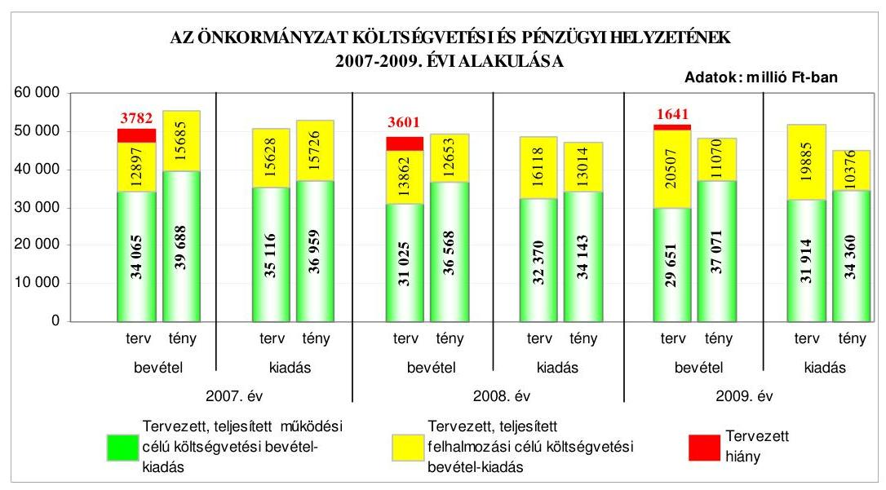

Az Önkormányzatnál a teljesített költségvetési bevételek és kiadások főösszege a 2007. évről a 2009. évre folyamatosan csökkent, elsősorban a Szegedi Tudományegyetemnek és a Többcélú Társulásnak átadott egészségügyi, közoktatási és szociális feladatok hatására. A 2007-2009. években a költségvetés teljesítése során - a tervezettől eltérően - a pénzügyi egyensúly fennállt, a teljesített költségvetési bevételek fedezetet nyújtottak a költségvetési kiadásokra. A 2007. évben 2688 millió Ft, a 2008. évben 2064 millió Ft, a 2009. évben 3405 millió Ft pénzügyi többlet keletkezett. A költségvetési hiány megszüntetését az év közben elért múködési célú költségvetési bevételi többlet, illetve 2008. és 2009. évben a felhalmozási célú költségvetési kiadások tervezettnél alacsonyabb teljesítése együttesen eredményezték. A múködési célú költségvetési bevételek a 2007. évben 2729 millió Ft-tal, a 2008. évben 2425 millió Ft-tal, a 2009. évben 2711

---

millió Ft-tal haladták meg a kiadásokat. A teljesített felhalmozási célú költségvetési kiadások a 2007. és a 2008. évben 41 millió Ft-tal, illetve 361 millió Ft-tal magasabbak, a 2009. évben 695 millió Ft-tal alacsonyabbak voltak a felhalmozási célú költségvetési bevételeknél. A tervtől eltérő teljesítést elsősorban a költségvetési támogatás bevételi többlete, és az előző évi pénzmaradvány - az Áht-ban foglaltak ellenére - nem tervezett 2007-2008. évi igénybevétele, valamint a 2007. és a 2009. évben teljesített helyi adóbevételi többlet eredményezte. A 2009-2010. években az eredeti költségvetési előirányzat megállapításánál figyelembe vették az előző évi pénzmaradvány igénybevételt. A költségvetés végrehajtása során a 2007. évben rövid- és hosszú lejáratú hitelt vettek fel, értékpapírt értékesítettek, a 2008-2009. években hosszú lejáratú hitelt vettek fel és értékpapírt értékesítettek. A Pénzügyi bizottság figyelemmel kísérte és értékelte a költségvetési bevételek alakulását, valamint vizsgálta a hitelfelvételek indokait és gazdasági megalapozottságát. Az Önkormányzatnak a 2007-2009. években a hosszú lejáratú hitelek felvételéből származó tárgyévi kötelezettségvállalása a halasztott tőkefizetési kötelezettség miatt csak az éves adósságot keletkeztető kötelezettségvállalás felső határának 0,9-1,0-0,1\%-át jelentette. A hosszú lejáratú hitelek változó kamatozása az Önkormányzat számára kockázatot jelent.

Az Önkormányzat 2010-ben 2500 millió Ft, euró alapú, 15 éves lejáratú, változó kamatozású, felhalmozási célú kötvényt bocsátott ki. A tőketörlesztés három év türelmi idő után, negyedévente esedékes. A kötvénykibocsátás a forint euróhoz viszonyított árfolyamváltozása, valamint a változó kamatmérték miatt az Önkormányzat számára kockázatot jelent. Az Önkormányzat a kötvénykibocsátásból származó bevétel összegét folyamatosan a költségvetési elszámolási számláján helyezte el, ezáltal csökkentette a kedvezőtlenebb kamatozású folyó-számlahitel-igénybevételt. Az Önkormányzatnál a kötvénykibocsátás évében a kibocsátásból eredő tárgyévi kötelezettségvállalás (kamatfizetés) összege az adósságot keletkeztető kötelezettségvállalás felső határának 0,89\%-a volt.

Az Önkormányzat a 2007-2009. években folyamatosan, minden nap vett igénybe rulírozó hitelt, valamint emellett a naptári napok mintegy felében folyószámlahitelt is felvett. A hitelek átlagos állománya a 2007. évi 4467 millió Ft-ról a 2009. évben 6104 millió Ft-ra emelkedett. A folyószámla és rulírozó hitelkeret együttes állománya a 2007-2009. években nem változott, 8430 millió Ft volt, az év végén vissza nem fizetett állomány pedig a 2007. évi 4500 millió Ft-ról a 2009. év végére 6631 millió Ft-ra emelkedett. Az átmeneti likviditási problémák kialakulásához hozzájárult a folyamatban lévő európai uniós támogatással megvalósuló fejlesztések esetében szükséges előfinanszírozási igény is. A 2007-2009. években igénybevett rulírozó hitelt likvid hitelként számolták el annak ellenére, hogy az nem tekinthető - az Ötv-ben foglaltak szerinti - likvid hitelnek, mivel éven belül nem fizették vissza. Az évente elkészített, és folyamatosan aktualizált likviditási tervek a hitelkeretek teljes visszafizetését nem tartalmazták. Az Önkormányzat pénzügyi helyzete - 2007-2010. I. félév között - eladósodási szempontból kedvezőtlenül alakult, mivel az összes forráson belül nőtt a hosszú és rövid lejáratú kötelezettségek aránya. A hosszú lejáratú kötelezettségek növekedését a hitelfelvételek, valamint a devizában felvett hitelek árfolyamváltozása és a kibocsátott kötvény miatti adósság növekedés eredményezte. Az Önkormányzat 2007-2010. I. félév közötti pénzügyi helyzete

---

fizetőképességének nem számottevő javulása mellett, az eladósodásának növekedése miatt összességében kedvezőtlenül változott.

Az Önkormányzat 2007-2010 között fejlesztési célkitűzéseit a gazdasági programban, városfejlesztési koncepcióban, integrált városfejlesztési stratégiában, valamint településszerkezeti tervben határozta meg. Az Önkormányzatnál 2007-2010. I. negyedév között európai uniós támogatásokra összesen 85 pályázat benyújtásáról döntöttek, amelyből 56 támogatásban részesült, 13 elbírálása folyamatban van, 16 pályázatot a támogatói források és költséghatékonyság hiánya, tartalmi, formai hibák, szakmai kidolgozatlanság miatt, valamint mivel nem feleltek meg a kiírási feltételeknek - elutasítottak. Az európai uniós forrásokra benyújtott pályázatok megvalósításának 2007-2010-re tervezett öszszes költségvetési kiadása 46314 millió Ft volt. A teljesített összes költségvetési kiadás 2007-2010. I. negyedév között 9554 millió Ft volt, amelyet 70,4\%-ban európai uniós forrásból, 12,5\%-ban hazai támogatásból, 17,0\%-ban saját pénzeszközökből, 0,1\%-ban hitelből finanszíroztak.

Az Önkormányzat 2007-2010. évi költségvetési rendeletei tartalmazták az európai uniós forrással megvalósuló fejlesztési feladatok múködési és felhalmozási célú költségvetési kiadási és bevételi előirányzatait, a felhalmozási kiadásokat feladatonként, a felújítási előirányzatokat célonként, továbbá a több éves kihatással járó fejlesztési feladatok előirányzatait. A 2008-2010. évi költségvetési rendeletekben az Ámr. ${ }_{1,2}$-ben foglaltak ellenére elkülönítetten nem mutatták be az intézmények bonyolításában megvalósuló, európai uniós támogatásban részesült projektek bevételi és kiadási előirányzatait. A polgármester és a főjegyző közbenső egyeztetés során adott tájékoztatása szerint a főjegyző intézkedett, hogy a 2011. évi költségvetés előkészítése során az intézmények bonyolításában megvalósuló, európai uniós támogatásban részesült projektek bevételi és kiadási előirányzatait már elkülönítetten bemutassák.

Az Önkormányzat 2007-2010. I. negyedév között eredményesen készült fel a belső szabályozottság és szervezettség terén az európai uniós források igénybevételére és felhasználására. A városfejlesztési koncepcióban, a gazdasági programban, az integrált városfejlesztési stratégiában, valamint a településszerkezeti tervben megfogalmazott fejlesztési célkitűzésekhez kapcsolódtak az európai uniós pályázatok, kialakították a Polgármesteri hivatalon belül és külső szervezet igénybevételével a pályázatfigyelés, a pályázatkészítés és a fejlesztési feladat lebonyolításának szervezeti, személyi feltételeit, meghatározták a külső személyekkel, szervezetekkel pályázatkészítésre kötött szerződésekben a pályázat szakmai és formai követelményeinek biztosítására vonatkozóan a pályázatkészítő felelősségét, valamint előírták a fejlesztési feladat lebonyolítását végzők ellenőrzési kötelezettségeit, 2008-tól szabályozták a pályázatfigyelést végzők és a döntési, illetve a döntés-előterjesztési jogkörrel rendelkezők közötti in-formáció-szolgáltatási kötelezettséget, továbbá határidőre megvalósították az ellenőrzött informatikai fejlesztés támogatási szerződésében foglalt célkitűzéseket, azonban az éves ellenőrzési terveket megalapozó kockázatelemzés nem terjedt ki az európai uniós forrásokkal támogatott fejlesztési feladatokra.

Az Önkormányzat rendelkezett informatikai stratégiával, amelyben a 4. elektronikus szolgáltatási szint elérését tűzték ki célul. Az e-közszolgáltatási feladatok ellátását a Polgármesteri hivatal köztisztviselőivel, a saját számítógé-

---

pes információs rendszeren keresztül, saját fejlesztésű szoftverek üzemeltetésével biztosították. Az e-közszolgáltatási feladatokat ellátó informatikai rendszerben az ügyintézést két ügykörben a 2., öt ügykörben a 3. elektronikus szolgáltatási szinten valósították meg. Az Önkormányzatnál kialakították az eközzzolgáltatási feladatokat ellátó informatikai rendszer ügyfelek általi igénybevételének figyelési rendszerét, azonban annak tapasztalatait nem értékelték. A polgármester és a főjegyző közbenső egyeztetés során adott tájékoztatása szerint a főjegyző intézkedett, hogy folyamatosan megtörténjen az informatikai rendszer ügyfelek általi igénybevételének az értékelése.

Az Önkormányzat az Eisz. tv. alapján 2007. január 1-jétől kötelezett a közérdekű adatok közzétételére. A közérdekű adatok közzétételi kötelezettségének a vonatkozó rendeletben meghatározott szerkezetben tettek eleget. A 2007-2010. évi költségvetés végrehajtásának szabályairól szóló rendeletekben az Önkormányzat az Áht. által adott felhatalmazás alapján lehetővé tette a 200 ezer Ftot meg nem haladó támogatások tekintetében a közzététel mellőzését. A főjegyző a Polgármesteri hivatal költségvetési előirányzatai terhére nyújtott nem normatív, céljellegú működési és fejlesztési célú támogatások esetében gondoskodott a támogatások kedvezményezettjei nevének, céljának, összegének, továbbá a támogatott program megvalósítási helyének az Önkormányzat honlapján történő közzétételéről. Gondoskodott továbbá a Polgármesteri hivatal költségvetési előirányzatai terhére kötött, nettó ötmillió Ft-ot elérő, vagy azt meghaladó értékű - árubeszerzésre, építési beruházásra, szolgáltatás megrendelésére, vagyonértékesítésre, vagyongyarapításra, vonatkozó - szerződések megnevezésének, tárgyának, a szerződést kötő felek nevének, a szerződés értékének, határozott időre kötött szerződés esetében annak időtartamának, valamint ezen adatok változásának az Önkormányzat honlapján történő közzétételéről. A főjegyző azonban - az Áht-ban előírtak ellenére - nem gondoskodott az intézmények költségvetési előirányzatai terhére nyújtott, nem normatív, céljellegű működési és felhalmozási támogatások esetében a támogatások kedvezményezettjei nevének, céljának, összegének, továbbá a támogatott program megvalósítási helyének az Önkormányzat honlapján történő közzétételéről, valamint az intézmények által kötött, nettó ötmillió Ft-ot elérő, vagy azt meghaladó értékű árubeszerzésre, építési beruházásra, szolgáltatás megrendelésére, vagyonértékesítésre, vagyongyarapításra vonatkozó szerződések megnevezésének, tárgyának, a szerződést kötő felek nevének, a szerződés értékének, határozott időre kötött szerződés esetében annak időtartamának, valamint ezen adatok változásának az Önkormányzat honlapján történő közzétételéről. A polgármester és a főjegyző közbenső egyeztetés során adott tájékoztatása szerint az Önkormányzat 2010. június hóban rendeletben meghatározta az Önkormányzat költségvetési előirányzatai terhére nyújtott támogatások közérdekű adatainak közzétételi helyét, módját, idejét, valamint a főjegyző intézkedett az intézmények által nyújtott támogatások, és szerződések közérdekű adatainak közzététele érdekében. A főjegyző gondoskodott a 2008-2009. évi költségvetési beszámolók szöveges indokolásának a közzétételéről.

A Polgármesteri hivatalban a 2009. évben a költségvetés-tervezési és a zár-számadás-készítési folyamatok szabályozottsága alacsony kockázatot jelentett a feladatok megfelelő, szabályszerű végrehajtásában, mivel a főjegyző a FEUVE rendszer keretében szabályozta a költségvetés-tervezés és a zárszámadáskészítés rendjét, meghatározta az intézmények részére a költségvetési javaslat

---

összeállításával kapcsolatos követelményeket. Előírta a költségvetési tervezéshez készített intézményi mutatószám-felmérés adatai megalapozottságának, az intézmények által az állami támogatásokkal, hozzájárulásokkal történő elszámoláshoz közölt mutatószámok adatai megbízhatóságának, valamint az intézményi pénzmaradványok kimunkálása szabályszerűségének ellenőrzését.

A Polgármesteri hivatalban a 2009. évben a költségvetés-tervezési és zárszá-madás-készítési folyamatban a múködésbeli hibák megelőzésére, feltárására, kijavítására kialakított belső kontrollok múködésének megfelelősége kiváló volt, mivel a Polgármesteri hivatalban az előírásoknak megfelelően ellenőrizték az intézmények részére a költségvetési javaslat összeállításával kapcsolatban meghatározott követelmények teljesítését, a költségvetési tervezéshez készített intézményi mutatószám-felmérés adatai megalapozottságát, a zárszá-madás-készítés folyamatában meggyőződtek az intézmények által az állami támogatásokkal, hozzájárulásokkal történő elszámoláshoz közölt mutatószámok adatainak megfelelőségéről, az intézmények pénzmaradvány megállapításának szabályszerűségéről.

A gazdálkodási, a pénzügyi-számviteli és a folyamatba épített ellenőrzési feladatok szabályozottsága összességében alacsony kockázatot jelentett a feladatok megfelelő, szabályszerű végrehajtásában, mivel a Polgármesteri hivatal rendelkezett hivatali SzMSz-szel, a FEUVE rendszer keretében a Polgármesteri hivatal ügyrendjében szabályozták a gazdasági szervezet ügyrendjét, elkészítették a kötelezettségvállalási szabályzatot, a számviteli politikát és a hozzá kapcsolódó szabályzatokat, a számlarendet, az ellenőrzési nyomvonalat, a kockázatkezelési, valamint a szabálytalanságok kezeléséről szóló szabályzatot. Annak ellenére összességében alacsony volt a kockázat, hogy a Polgármesteri hivatal ügyrendjének a gazdasági szervezet ügyrendjére vonatkozó része az Ámr. ${ }_{1}$-ben foglaltak ellenére nem tartalmazta a belső (szerven belüli) és külső kapcsolattartásának módját, a selejtezési szabályzatban szereplő feladatok az érintett dolgozók munkaköri leírásában nem szerepeltek. Az ellenőrzési nyomvonal nem tartalmazta, hogy az elvégzendő tevékenységeket, feladatokat részletesen mely belső szabályzat tartalmazza, az egyes tevékenység, feladat elvégzését igazoló dokumentum hol lelhető fel a rendszerben. A kockázatkezelési szabályzat nem tartalmazta az elfogadható kockázati szint meghatározását. A polgármester és a főjegyző közbenső egyeztetés során adott tájékoztatása szerint ezen hiányosságokat 2010. október hóban megszüntették.

A Polgármesteri hivatalban a 2009. évben az államháztartáson kívülre történő működési és felhalmozási célú pénzeszközátadásokkal, az állományba nem tartozók megbízási díjaival, valamint a külső szolgáltatók által végzett karbantartási, kisjavítási szolgáltatásokkal kapcsolatos kifizetések során a belső kontrollok múködésének megfelelősége összességében kiváló volt, mivel a szakmai teljesítés igazolására a főjegyző által kijelölt személyek az államháztartáson kívülre történő működési és felhalmozási célú pénzeszközátadásokkal, az állományba nem tartozók megbízási díjaival, valamint a külső szolgáltatók által végzett karbantartással, kisjavítással kapcsolatos kifizetések során ellenőrizték, szakmailag igazolták a megállapodások, megbízási szerződések, megrendelések teljesítését, valamint az utalványok ellenjegyzője meggyőződött a gazdálkodásra vonatkozó szabályok betartásáról, továbbá ellenőrizte a szakmai teljesítésigazolás és érvényesítés megtörténtét. Annak ellenére összességé-

---

ben kiváló volt a kontrollok múködésének megbízhatósága, hogy az Önkormányzat tulajdonában lévő vendégház karbantartására fordított kiadásnál a főjegyző írásos kijelölésével nem rendelkező személy jogosulatlanul végezte az utalvány ellenjegyzését. A polgármester és a főjegyző közbenső egyeztetés során adott tájékoztatása szerint 2010. október hóban a főjegyző intézkedett annak érdekében, hogy ne történjen jogosulatlan utalvány ellenjegyzés.

A Polgármesteri hivatalban integrált pénzügyi-számviteli informatikai rendszert múködtettek, a pénzügyi-számviteli feladatokhoz használt program adatai az informatikai hálózaton keresztül a jogosultak részére elérhetők voltak. A pénzügyi-számviteli tevékenységhez kapcsolódó informatikai feladatok szabályozottsága összességében alacsony kockázatot jelentett az informatikai feladatok megfelelő, szabályszerű végrehajtásában, mivel a Polgármesteri hivatal rendelkezett üzletmenet-folytonossági és katasztrófa elhárítási tervvel, informatikai biztonsági szabályzattal, amely tartalmazta a hozzáférési jogosultságok megállapítására vonatkozó rendelkezéseket, a pénzügyi-számviteli program tesztelésére, és a mentésekre vonatkozó eljárásrendet. Az integrált rendszerből lekérdezhető ellenőrző listákból megállapítható, hogy a műveleteket melyik azonosítóval, mikor végezték. Annak ellenére összességében alacsony volt a kockázat, hogy a szabályzatok nem tiltották a külső fejlesztő hozzáférését az éles rendszerhez, nem volt kinevezett dolgozó, aki az integrált pénzügyiszámviteli informatikai rendszerből lekérhető ellenőrzési lista vizsgálatáért felelős. Az informatikával kapcsolatos szabályzatok megismertetéséről a főjegyző nem gondoskodott. A polgármester és a főjegyző közbenső egyeztetés során adott tájékoztatása szerint 2010. október hóban ezen hiányosságok megszüntetése érdekében a főjegyző intézkedett.

A Polgármesteri hivatalban a 2009. évben a pénzügyi-számviteli tevékenységekhez kapcsolódó informatikai feladatoknál a kialakított belső kontrollok működésének megfelelősége összességében kiváló volt, mivel intézkedtek az üz-letmenet-folytonossági terv és a katasztrófa elhárítási terv teszteléséről, biztosították a hozzáférési jogosultságokra vonatkozó nyilvántartás teljességét, naprakészségét. A pénzügyi-számviteli programokban a jelszavak kezelésére előírt szabályok betartását megkövetelték a dolgozóktól, dokumentálták a pénzügyiszámviteli programok elemeire vonatkozó változáskezelési eljárásokat, az elmentett állományokból a pénzügyi számviteli adatok teljes körű helyreállíthatóságát ellenőrizték. Annak ellenére összességében kiváló volt a kontrollok múködésének megfelelősége, hogy a pénzügyi-számviteli integrált rendszer külső fejlesztői hozzáférési jogosultsággal rendelkeztek az éles rendszerhez, továbbá a pénzügyi-számviteli programok segítségével elkészített ellenőrzési listát nem ellenőrizték.

A belső ellenőrzés szervezeti kereteinek kialakítása és szabályozása a belső ellenőrzési feladatok megfelelő, szabályszerű végrehajtásában összességében alacsony kockázatot jelentett, mivel a Közgyűlés az Ötv. előírásának megfelelően a főjegyzőnek közvetlenül alárendelt - a 2009. évben öt fős - Belső ellenőrzési osztályt hozott létre, biztosították a belső ellenőrök funkcionális függetlenségét, meghatározták a belső ellenőrzési vezető személyét, feladatait. A belső ellenőrzési kézikönyvet a főjegyző jóváhagyta, a belső ellenőrzés rendelkezett stratégiai ellenőrzési tervvel és a Közgyűlés által jóváhagyott, kockázatelemzéssel alátámasztott éves ellenőrzési tervvel. Az ellenőrzések lefolytatásához a bel-

---

ső ellenőrzési vezető jóváhagyta a jogszabálynak megfelelő tartalommal elkészített ellenőrzési programot. Annak ellenére összességében alacsony volt a kockázat, hogy a Ber. előírásai ellenére a foglalkoztatott belső ellenőrök számát nem kapacitás felmérés alapján állapították meg, a belső ellenőrzési vezető által elkészített 2009. év végéig hatályos stratégiai ellenőrzési terv nem kockázatelemzésen alapult. Az éves ellenőrzési célkitűzéseket megalapozó kockázatelemzés nem terjedt ki a Polgármesteri hivatal és az intézmények európai uniós forrásokból megvalósított feladatainak végrehajtására, a közbeszerzési eljárások lebonyolítására, az Önkormányzat többségi irányítást biztosító befolyása alatt álló gazdasági társaságok múködésére, valamint a kedvezményezett szervezeteknél az Önkormányzat költségvetéséből céljelleggel nyújtott támogatások rendeltetés szerinti felhasználására. A 2010. évtől kezdődően a Ber. előírása ellenére nem készült stratégiai ellenőrzési terv, azt a főjegyző csak 2010. augusztus hóban hagyta jóvá a 2010-2015. évekre vonatkozóan. A polgármester és a főjegyző közbenső egyeztetés során adott tájékoztatása szerint 2010. október hóban a főjegyző intézkedett, hogy a belső ellenőrök száma kapacitás felmérés alapján kerüljön megtervezésre, valamint az éves ellenőrzési tervet megalapozó kockázatelemzés terjedjen ki az ÁSZ által javasolt területekre is.

A Polgármesteri hivatalban a 2009. évben és 2010. I. félévében a belső ellenőrzés nem múködött, mivel a főjegyző ebben az időszakban a Polgármesteri hivatalban nem biztosította az éves ellenőrzési terv végrehajtását . A 2009. évben tervezett három ellenőrzés közül csak a készpénzes elszámolások rendjének tervezett ellenőrzését végezték el négy nap alatt, és nem hajtották végre a 2010. I. félévre tervezett egy ellenőrzést. A főjegyző a mulasztásra vonatkozóan adott magyarázatában elsősorban a létszámhiányra hivatkozott, valamint arra, hogy az elvégeztetett egy ellenőrzéssel teljesítette kötelezettségét. A magyarázat nem megalapozott, mivel nem kezdeményezte a különböző okok miatt több hónapon keresztül üres álláshelyek (pl. gyermekgondozásra igénybe vett fizetés nélküli szabadság, nyugdíjazás okán történő felmentés, sikertelen pályázat) idejére a tervezett ellenőrzési feladatok megoldásához szükséges létszám biztosítását pl. helyettesítés, külső szakértő megbízása útján, amelynek következtében az éves ellenőrzési terv végrehajtásához szükséges személyi feltételek nem álltak rendelkezésre. A négy napot igénybe vevő egy ellenőrzés nem elégíti ki a költségvetési szervek belső ellenőrzési feladatainak Áht-ban meghatározott, a belső kontrollrendszer keretébe tartozó belső ellenőrzésre is vonatkozó hatékonysági és eredményességi követelményeket. Az éves ellenőrzési tervek szerinti ellenőrzéseket a Polgármesteri hivatalban az Önkormányzat gazdálkodási rendszerének 2005. évi ellenőrzése során elkészült számvevői jelentésben tett javaslat ellenére a 2005-2008. évek egyikében sem végezték el. A Polgármesteri hivatalban a belső ellenőrzés múködtetéséért az Ötv. alapján a főjegyző felelős. A Htv. alapján a főjegyző feladata és hatásköre az Önkormányzat által alapított és fenntartott költségvetési szervek pénzügyi-gazdasági ellenőrzésének ellátása. Továbbá a főjegyző felelőssége az Áht. előírása értelmében a Polgármesteri hivatalban a belső kontrollrendszer részeként a belső ellenőrzés megszervezése és hatékony múködtetése, mivel az Áht. alapján a Polgármesteri hivatal költségvetési szerv, azt az Ötv. szerint a jegyző vezeti. A polgármester és a főjegyző közbenső egyeztetés során adott tájékoztatása szerint a főjegyző 2010. október hóban intézkedett a 2010. évi ellenőrzési terv maradéktalan végrehajtása, indokolt esetben módosításának kezdeményezése érdekében.

---

Az Önkormányzat által felügyelt intézmények és az Önkormányzat többségi irányítást biztosító befolyása alatt álló gazdasági társaságok ellenőrzésénél a 2009. évben a kialakított kontrollok múködésének megfelelősége kiváló volt, mivel a belső ellenőrzés ellátásának módja megfelelt a jogszabályi előírásoknak, az ellenőrzéseket a belső ellenőrzési vezető által jóváhagyott, jogszabályokban előírt tartalmú ellenőrzési program alapján hajtották végre, az ellenőrzésekről az előírások szerinti tartalommal készültek az ellenőrzési jelentések. Az intézmények ellenőrzéséről a 2009. és 2010. évi ellenőrzési tervekben foglaltaknak megfelelően gondoskodott a főjegyző. A belső ellenőrzési vezető a jogszabályoknak megfelelő tartalommal nyilvántartást vezetett az elvégzett ellenőrzésekről, a jelentésekben foglalt ellenőrzési javaslatokról és az azok alapján megtett intézkedésekről. A főjegyző a 2009. és 2010. években nyilatkozat formájában megfelelőnek értékelte a Polgármesteri hivatalra vonatkozóan a belső kontrollok működését, azonban ez nem felelt meg a valóságnak a Polgármesteri hivatal belső ellenőrzése tekintetében. A polgármester az Ötv. előírása alapján a zárszámadási rendelettervezettel egyidejűleg a Közgyűlés elé terjesztette a költségvetési szervek éves ellenőrzési tapasztalatai alapján elkészített 2008. és 2009. évi összefoglaló jelentéseket, amelyet az tudomásul vett.

Az ÁSZ az Önkormányzat gazdálkodási rendszerét a 2005. évben ellenőrizte átfogó jelleggel, amelynek során 28 szabályszerűségi és 9 célszerűségi javaslatot tett. A javaslatok realizálása érdekében a polgármester és a főjegyző intézkedési tervet készítettek, amit a Közgyűlés elfogadott. Az ÁSZ ellenőrzés által tett javaslatok 70\%-át megvalósították, 14\%-a részben teljesült, 16\%-át nem, illetve csak 2010-ben, a helyszíni ellenőrzés ideje alatt hasznosították. A végrehajtott szabályszerűségi javaslatok a költségvetési rendelettervezet előkészítésére, tartalmára, a költségvetés végrehajtási szabályairól szóló rendelet tartalmára, a hivatali SzMSz elkészítésére és tartalmára, a gazdálkodás és a pénzügyiszámviteli feladatellátás szabályozottságára, a költségvetési gazdálkodási és ellenőrzési jogkörök gyakorlásának szabályszerűségére, a bizonylatok alaki, tartalmi megfelelőségére, a kapcsolódó nyilvántartások vezetésére, a vagyonkezelésbe adott értékpapírok értékelésére, a pártok helyiséghasználatára, a céljelleggel nyújtott támogatásokkal kapcsolatos döntési hatáskörökre, azok elszámolásának szabályszerűségére és felhasználásának ellenőrzésére, a helyi kisebbségi önkormányzatokkal való együttműködésre, a belső ellenőrzés stratégiai tervére és nyilvántartására, az Önkormányzat kötelező és önként vállalt feladatainak meghatározására és az akadálymentesítéssel kapcsolatos feladatokra vonatkoztak.

Részben tettek eleget négy szabályszerűségi javaslatnak, mivel a főjegyző a költségvetési rendelettervezetekben bemutatta a tervezett hiányt, azonban annak megállapítása során finanszírozási célú pénzügyi műveletet is figyelembe vett költségvetési bevételként és kiadásként, a polgármester kivizsgáltatta a költségvetési szerveknél a kiemelt előirányzatok túllépését, azonban az Áht-ban foglaltak ellenére több intézménynél 2005-2009-ben is történt kiemelt előirány-zat-túllépés, a főjegyző meghatározta az ingatlanok mennyiségi felvétellel történő leltározásának szabályait, azonban a 2005. évi beszámoló elkészítéséig nem történt meg valamennyi érintett ingatlan mennyiségi felvétellel történő leltározása, és azt követően sem biztosították az ingatlanok két évenkénti leltározását, a polgármester előterjesztette a vagyongazdálkodási rendelet módosítását a versenyeztetés alóli kivételek felülvizsgálatára, azonban a Közgyűlés az

---

előterjesztésben foglaltakkal összhangban továbbra is lehetővé tette a versenyeztetés mellőzését. Nem teljesült három szabályszerűségi javaslat, mivel a polgármester csak a 2010. évben intézkedett az értékpapírokkal való rendelkezési jog Ötv. előírásaival ellentétes átruházásának megszüntetésére, a főjegyző csak a 2010. évben gondoskodott az ingatlanértékesítést követően a vagyon értékében bekövetkezett változások az Áhsz-ben előírt határidőn belül történő átvezetéséről. A főjegyző nem gondoskodott továbbá a Polgármesteri hivatal belső ellenőrzéséről a 2005-2006. és a 2008. években, valamint a tervezett belső ellenőrzésekről a 2007. és a 2009. évben. Ezekben az években csak egy-egy, éves ellenőrzési tervben nem szereplő ellenőrzés elvégzéséről gondoskodott. A polgármester és a főjegyző közbenső egyeztetés során adott tájékoztatása szerint a polgármester 2010. október hóban írásban felhívta az intézményvezetők figyelmét a kiemelt előirányzatok betartására, valamint a polgármester és a főjegyző intézkedtek a versenyeztetési eljárás mellőzési lehetőségének megszüntetése érdekében a vagyongazdálkodási rendelet átdolgozására.

A munka színvonalának javítása érdekében tett javaslatok körében hasznosították a félreérthető „önkormányzati pénzalapok" elnevezés megváltoztatására, a gazdálkodási és ellenőrzési jogkörök gyakorlására felhatalmazottak beszámoltatására, annak szabályozására, valamint a vagyon forgalomképessége megváltoztatásának eljárási rendjére tett javaslatokat. Részben tettek eleget a céljelleggel nyújtott támogatások nyilvántartási rendszerének kidolgozására vonatkozó javaslatnak, mivel a főjegyző meghatározta a nyilvántartás tartalmát, azonban azt 2005 óta nem vezetik. A polgármester és a főjegyző közbenső egyeztetés során adott tájékoztatása szerint 2010. október hóban a főjegyző utasításban ismételten intézkedett ezen nyilvántartás vezetéséről. Három célszerűségi javaslat nem, illetve csak az intézkedési tervben meghatározott határidő után hasznosult, mivel a főjegyző a 2005-ben vállalt határidőre nem készítette el az informatikai rendszer múködtetésének és használatának szabályozását, a Polgármesteri hivatalnál vezetett bankszámlák körének szabályzatban történő meghatározását, valamint a polgármester 2005. évi kezdeményezése ellenére az üzemeltetési szerződések felülvizsgálatát csak a 2007-2008. években végezték el a Polgármesteri hivatalban. A főjegyző az intézkedési tervben meghatározott határidő után, csak 2007-ben készítette el az informatikai rendszer szabályozását, illetve egészítette ki a pénzkezelési szabályzatot.

Az Önkormányzatnál az ÁSZ a zárszámadáshoz kapcsolódóan, illetve a további vizsgálatok keretében négy ellenőrzést végzett a 2006-2010. években. A Magyar Köztársaság 2005. évi költségvetése végrehajtásának ellenőrzése keretében a 2005. évi normatív állami hozzájárulás igénylésének és elszámolásának ellenőrzésekor az ÁSZ kettő célszerűségi javaslatot tett. A jelentést a Közgyűlés megtárgyalta, és azt elfogadta. A polgármester és a főjegyző intézkedett, hogy az Oktatási, Szociális és Közgazdasági irodák vezetői a normatív állami hozzájárulások igénylése és elszámolása során vegyék figyelembe az éves költségvetési törvényben meghatározott előírásokat, és az intézményektől bekért adatok helyességéről győződjenek meg. A kötött felhasználású támogatások 2005. évi felhasználásának ellenőrzése során hat szabályszerűségi és kettő célszerűségi javaslatot tett az ÁSZ. A polgármester előterjesztése alapján a jelentést a Közgyűlés megtárgyalta és intézkedési tervet fogadott el. A polgármester és a főjegyző utasították az intézményvezetőket, az érintett irodák vezetőit a jogosulatlanul igénybe vett kötött felhasználású támogatás visszafizetésére, a

---

közműfejlesztési támogatás előírásoknak megfelelő igénylésére és jogosultak részére történő továbbutalására, a közművelődési érdekeltségnövelő támogatáshoz annak beérkezését követő nyolc banki napon belül az érintett intézmények részére hozzáférés biztosítására, a költségvetési beszámolóban a számla szerinti kiadásból csak a támogatásból fedezett rész elszámolására, a pedagógus szakvizsga és továbbképzéshez nyújtott támogatás intézményi elszámolásainak felülvizsgálata során az előírások betartására, illetve a támogatás intézményi felhasználásának egységes elvek szerinti dokumentálására vonatkozó javaslatok végrehajtására.

Az önkormányzati út- és szennyvízberuházásokhoz 2002-2005. években igénybe vett közműfejlesztési támogatások igénylésének és felhasználásának vizsgálatáról a 2006. évben készített jelentés öt szabályszerűségi és két célszerűségi javaslatot tartalmazott. A Közgyűlés a jelentést megtárgyalta és felkérte a Közgazdasági iroda vezetőjét a jogtalanul igénybe vett közműfejlesztési támogatás kamatmentes visszafizetésének ütemezése érdekében tegye meg az igénybejelentést. A polgármester és a főjegyző utasította az érintett irodák vezetőit az Önkormányzat és a Közalapítvány közötti támogatási szerződés-tervezet előkészítésére, az ISPA támogatással megvalósuló szennyvízcsatornázáshoz kapcsolódóan realizált saját bevétel összegével arányos támogatás igénylésével, a közműfejlesztési támogatás igénylések felülvizsgálata, összesítése során a közműfejlesztési támogatásról szóló Korm. rendelet ${ }_{1,2}$ előírásainak betartásával kapcsolatos javaslatok végrehajtására. A főjegyző felhívta a Szegedi Csatornamú Társulat figyelmét, hogy a közműfejlesztési támogatásról szóló Korm. rendelet ${ }_{1}$ előírásai csak akkor alkalmazhatók, ha 2004. október 8-a előtt megállapították és írásban közölték is az érdekelttel a közműfejlesztési hozzájárulás összegét.

A Magyar Köztársaság 2006. évi költségvetése végrehajtásának ellenőrzése keretében a helyi önkormányzatok beruházásaihoz és rekonstrukcióihoz nyújtott 2006. évi felhalmozási célú támogatások ellenőrzéséről készült jelentés kettő célszerűségi javaslatot tartalmazott. A Közgyűlés megtárgyalta a jelentést és jóváhagyta az intézkedési tervet, amelyben utasította a Belső ellenőrzési osztály vezetőjét, hogy a 2008. évi belső ellenőrzési tervbe a címzett és céltámogatások felhasználásával megvalósuló önkormányzati beruházások célvizsgálatát tervezze be.

Az energiagazdálkodást érintő állami és önkormányzati intézkedések, kiemelten az energiaracionalizálást célzó támogatások hatásának ellenőrzéséről a 2010. évben készített jelentés négy célszerűségi javaslatot tartalmazott. A Közgyűlés megtárgyalta a jelentést és elfogadta az intézkedési tervet, amelyben előírták az érintett irodák vezetői részére, hogy a fejlesztésekhez készíttessenek megvalósíthatósági tanulmányt, gazdaságossági számításokkal alapozzák meg, hogy a beruházásra fordított összeg arányban áll-e az azzal elérhető megtakarítással; a fejlesztési és felújítási munkák kivitelezőinek kiválasztásakor több árajánlatot kérjenek be a Kbt. szerinti versenyeztetésből származó előnyök biztosítására; a Közgyűlés részére készítsenek értékelést a megvalósított energiaracionalizálást célzó fejlesztésekről és végezzenek számításokat a fejlesztések tervezett és a tényleges adatainak alakulásáról.

---

Az ÁSZ által az Önkormányzat gazdálkodási rendszerének 2005. évi átfogó ellenőrzése, valamint a 2006-2009. években végzett további ellenőrzések során tett szabályszerűségi és célszerűségi javaslatok - az intézkedési tervekben foglalt határidőre - összességében $82 \%$-ban hasznosultak, $8 \%$-ban részben teljesültek, $10 \%$-ban nem, illetve csak az intézkedési tervben rögzített határidő után valósultak meg.

A helyszíni ellenőrzés megállapításainak hasznosítása mellett javasoljuk:

# a polgármesternek 

a jogszabályi előírások maradéktalan betartása érdekében

1. intézkedjen az Önkormányzat gazdálkodási rendszerének 2005. évi átfogó ellenőrzése során az ÁSZ által részére tett és nem teljesült szabályszerűségi javaslat végrehajtása érdekében;
2. tegyen javaslatot a Közgyűlésnek, hogy a 2009. évi ellenőrzési terv és a 2010. I. félévre vonatkozó ellenőrzési terv Polgármesteri hivatalban lefolytatandó vizsgálatainak, valamint a belső ellenőrzések tervszerű végrehajtásához szükséges személyi feltételek biztosításának elmulasztása miatt a jelentés 24 . oldal 1 . bekezdésében, az 60. oldal 1-2. bekezdésében és a 2. bekezdést követő részbekezdésben, továbbá az 61. oldal 1. bekezdésében foglalt jogszabálysértések tekintetében a köztisztviselők jogállásáról szóló 1992. évi XXIII. törvény 51. § (1) bekezdése alapján indítsa meg a főjegyző ellen a fegyelmi eljárást;
a munka színvonalának javítása érdekében
3. kezdeményezze, hogy a számvevőszéki jelentésben foglaltakat a Közgyűlés tárgyalja meg és a feltárt hiányosságok megszüntetése érdekében készíttessen intézkedési tervet a határidők és felelősök megjelölésével;

## a főjegyzőnek

a jogszabályi előírások maradéktalan betartása érdekében

1. intézkedjen annak érdekében, hogy az Önkormányzat költségvetési rendeletének végrehajtása során likvid hitelként az Ötv. 88. §. (3) bekezdés d) pontjában foglaltakat figyelembe véve - csak az éven belül felvett és visszafizetett - hiteleket számolják el a könyvviteli nyilvántartásokban, valamint készítsen likviditási koncepciót, és végezze el a likvid hitel éven belüli visszafizetési lehetőségének részletes vizsgálatát, továbbá annak eredményéről tájékoztassa a Közgyűlést;
2. biztosítsa az Áht. 121/A. § (3) bekezdése, az Ötv. 92. § (5) bekezdése alapján a Polgármesteri hivatalban is a belső ellenőrzés működését;
3. intézkedjen az Önkormányzat gazdálkodási rendszerének 2005. évi átfogó ellenőrzése során az ÁSZ által részére tett és nem teljesült szabályszerűségi javaslatok és a nem teljesült célszerűségi javaslat végrehajtása érdekében;

---

a munka színvonalának javítása érdekében
4. tájékoztassa - évente végzett számítások alapján - a Közgyűlést az Önkormányzat eladósodásának növekedésére figyelemmel arról, hogy a hosszú lejáratú, adósságot keletkeztető kötelezettségvállalásokból adódó tőke- és kamatfizetési kötelezettségét az Önkormányzat milyen feltételek biztosítása mellett tudja teljesíteni.

---

# II. RÉSZLETES MEGÁLLAPÍTÁSOK 

## 1. AZ ÖNKORMÁNYZAT KÖLTSÉGVETÉSI ÉS PÉNZÜGYI HELYZETE

### 1.1. A tervezett költségvetési bevételek és kiadások alapján a költségvetési egyensúly, a költségvetési hiány alakulása, a hiány tervezett finanszírozási módja, valamint a költségvetési hiány megállapításának szabályszerűsége

Az Önkormányzatnál a tervezett költségvetési bevételek és kiadások főösszege az előző évhez viszonyítva a 2008. évben csökkent, 2009-2010 között növekedett. A 2007-2010. években a költségvetési egyensúly nem volt biztosított, mivel a tervezett költségvetési bevételek nem nyújtottak fedezetet a tervezett költségvetési kiadásokra.

A közbenső egyeztetés során a polgármester által tett észrevétel szerint: „A számvevői jelentés 17. 1. bekezdés alábbi mondatának elhagyását javasolom: ,, : „A 20072010. években a költségvetési egyensúly nem volt biztosított, mivel a tervezett költségvetési bevételek és kiadások nem nyújtottak fedezetet a költségvetési kiadásokra" Az Áht. 8/C (5) bekezdése szerint „A költségvetési elszámolási szabályok összessége az a módszertan, amely alapján a számviteli adatokból kiindulva meghatározhatók a költségvetési egyenleg és az adósság tételei, valamint a költségvetési egyenleg és az adósság öszszefüggései." Az Áht. nem önmagában, a teljes költségvetési gazdálkodási rendből kiszakítva határozza meg a "költségvetési egyensúly" megvalósulását, hanem a költségvetési bevételek és kiadások egyenlegét tágabb értelemben, az adósság összefüggéseiben vizsgálja, amelynek megfelel önkormányzatunk költségvetési tervezési és beszámoltatási gyakorlata. A számvevői jelentés azon megállapítása, amely kizárólag a szükebb értelemben vett „,költségvetési egyensúly" megvalósitására koncentrál, ellentmond az Áht.nek. (Megjegyezzük, hogy a "költségvetési egyensúly" szóhasználatot Áht. nem is tartalmazza.) Az Áht. 8/C (5) bekezdésének fenti megközelítése nem csak a számvevői jelentésben tapasztalható, hanem a Pénzügyminisztériumnak az elemi költségvetés elkészitésére vonatkozó 2007-2009. évi tájékoztatóiban is, mert a költségvetési rendelet föbb jogcímcsoportjainak meghatározása során nem választották szét a költségvetési bevételek és kiadások, a pénzmaradvány és a finanszírozási múveletek elöirt jogcímcsoportjait. Ezzel szemben a 2010. évi elemi kitöltés i útmutató. az Áht. 81C (5) bekezdésének elöirt jogszabályi követelménynek megfelelő módon, részletesen és átlátható módon tartalmazza a hivatkozott jogcímcsoportok szétválasztását és azok pénzügyi összefüggéseit a költségvetési gazdálkodás teljességében. Az államháztartás müködési rendjéről szóló többször módositott 292/2009. (XII. 19) Korm. rendelet 36.§ (1) bekezdése határozza meg a helyi önkormányzat költségvetési rendelettervezetének."

Az észrevétel nem megalapozott, mivel ugyan nem vitatjuk, hogy a Pénzügyminisztérium a költségvetési egyensúly megállapításának részletszabályait csak a 2010. évi elemi költségvetés kitöltési útmutatójában határozta meg konkrétan. Nem megalapozott azonban a 2007-2009. évekre vonatkozóan álláspontja, mivel az Áht. 8. § és 8/A. §-aiban rögzítette a költségvetési többlet, hiány fogalmát, meghatározta a költségvetési bevételek és kiadások közé nem tartozó finanszírozási célú pénzügyi műveletek bevételeinek és kiadásainak körét. Az Áht. tehát biztosította a költségvetési egyensúly megállapításának jogszabályi hátterét, melyre tekintettel a hivatkozott mondat elhagyása nem indokolt.

---

A múködési célú költségvetési bevételeknél-kiadásoknál 2007-2010 között hiányt terveztek. A tervezett felhalmozási célú költségvetési kiadások a 2009. évben nem, de a 2007-2008. és 2010. években meghaladták a felhalmozási célú költségvetési bevételeket.

A 2007-2008. és a 2010. évi költségvetés hiányát a tervezett múködési célú költségvetési bevételek hiánya, a felhalmozási célú költségvetési bevételeket meghaladó összegben tervezett felhalmozási célú költségvetési kiadások és a 2007-2008. években a pénzmaradvány tervezési hiányossága együttesen okozták. A 2009. évi költségvetés hiányát a tervezett müködési célú költségvetési bevételek hiánya okozta.
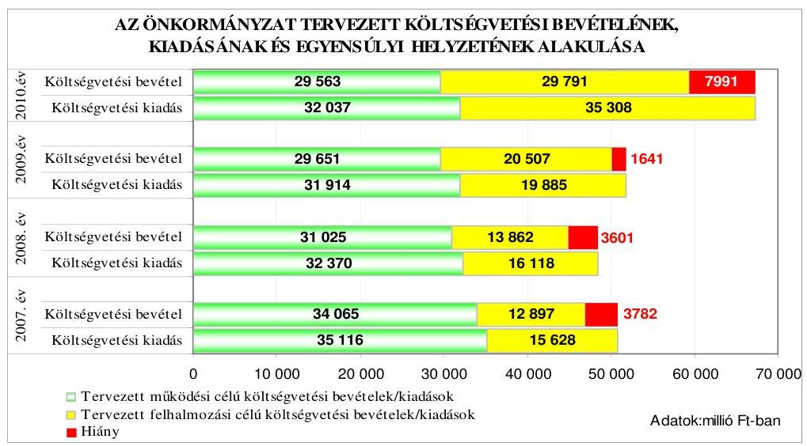

Az Önkormányzat költségvetési rendeleteiben a költségvetési egyensúly biztosításához, a finanszírozási célú pénzügyi műveletek kiadásainak forrásául a 2007. évben rövid- és hosszú lejáratú hitel felvételét, a meglévő, hitelviszonyt megtestesítő befektetési célú értékpapírok értékesítését, a 2008-2009. években hosszú lejáratú hitel felvételét, a meglévő, hitelviszonyt megtestesítő befektetési célú értékpapírok értékesítését, a 2010. évben hosszú lejáratú hitel felvételét, a meglévő, hitelviszonyt megtestesítő befektetési célú értékpapírok értékesítését és felhalmozású célú kötvény kibocsátását tervezte.

Az Önkormányzatnál eredeti előirányzatként a 2007. évben 516 millió Ft rövidés 1961 millió Ft hosszú lejáratú hitel felvételét, 1980 millió Ft értékpapírértékesítést terveztek. A 2008. évben 2083 millió Ft hosszú lejáratú hitel felvételét, 2184 millió Ft értékpapír-értékesítést, a 2009. évben 293 millió Ft hosszú lejáratú hitel felvételét és 2411 millió Ft értékpapír-értékesítést, a 2010. évben 4928 millió Ft hosszú lejáratú hitelfelvételt, 1855 millió Ft összegben értékpapír-eladást és 2500 millió Ft felhalmozási célú kötvénykibocsátást irányoztak elő.

A 2007-2008. évi költségvetési rendeletekkel egyidejűleg az Önkormányzat kiadási megtakarítást eredményező intézkedésekről határozatban döntött, azonban ezek pénzügyi kihatását a döntés évében eredeti előirányzatként nem tervezték meg.

---

Az Önkormányzat a 2007-2008. évi költségvetési rendeletek elfogadásával egyidejúleg három intézménynél 100 üres és 14 betöltött álláshely 2007. évi, kilenc álláshely 2008. évi megszüntetéséről, a 2007. évben a mosodai szolgáltatás vállalkozásba adásáról és a közvilágításra kötött szerződés felülvizsgálatáról döntött. Elrendelte továbbá a Bartók Béla Múvelődési Központ és a Városi Sportigazgatóság 2008. évi megszüntetését.

A 2009. és a 2010. évi költségvetési rendeletekben, az azzal együtt jóváhagyott költségvetés végrehajtási szabályairól szóló rendeletekben és a költségvetési előterjesztések alapján hozott közgyűlési határozatokban nem rendelkeztek költségvetési egyensúlyt javító intézkedésről.

A 2007-2010. évi költségvetések tervezése során a főjegyzó gondoskodott a likviditás feltételeinek kialakításáról a 2007. évben rövid lejáratú hitelbevétel tervezésével, a 2007-2010. években likvid hitelkeret (folyószámla-hitel és rulírozó hitel) biztosításával, a költségvetés végrehajtása érdekében előirány-zat-felhasználási terv készíttetésével.

Az Önkormányzat gazdálkodási rendszerének 2005. évi ÁSZ ellenőrzése során tett javaslat ellenére a főjegyző a 2007-2009. évi költségvetési rendelettervezetekben a költségvetési bevételi és kiadási főösszeg megállapításakor az Áht. 8/A. § (7) bekezdésében foglaltakat megsértve finanszírozási célú pénzügyi művelet bevételét és kiadását (értékpapír-értékesítést, hitelfelvételt és -törlesztést) is figyelembe vette költségvetési hiányt módosító költségvetési bevételként és kiadásként.

A főjegyző költségvetési bevételként és kiadásként vette számba a költségvetés tervezése során:

- a 2007. évben 516 millió Ft rövid- és 1961 millió Ft hosszú lejáratú hitelfelvételből származó bevételt és 674 millió Ft hiteltörlesztés miatti kiadást, valamint 1980 millió Ft értékpapír-értékesítésből származó bevételt;
- a 2008. évben 2083 millió Ft hosszú lejáratú hitel-felvételből származó bevételt, 666 millió Ft hosszú lejáratú hitel törlesztése miatti kiadást, 2184 millió Ft értékpapír-értékesítésből származó bevételt;
- a 2009. évben 293 millió Ft hosszú lejáratú hitel-felvételből származó bevételt, 1063 millió Ft hosszú lejáratú hitel törlesztése miatti kiadást, 2411 millió Ft ér-tékpapír-értékesítésből származó bevételt.

A főjegyző a 2010. évi költségvetési rendelettervezetben a finanszírozási célú pénzügyi műveletek bevételeit, illetve kiadásait az Áht. előírásainak megfelelően nem vette figyelembe költségvetési bevételként és kiadásként a tervezett költségvetési hiány megállapításánál.

---

# 1.2. A teljesített költségvetési bevételek és kiadások alapján a pénzügyi egyensúly, a pénzügyi hiány alakulása, a pénzügyi hiány finanszírozása, az igénybe vett finanszírozási célú pénzügyi eszközök hatása a pénzügyi helyzet alakulására, az eladósodásra, valamint a fizetőképességre 

Az Önkormányzatnál a teljesített költségvetési bevételek és kiadások főösszege a 2007. évről a 2009. évre folyamatosan csökkent, elsősorban a Szegedi Tudományegyetemnek és a Többcélú Társulásnak átadott egészségügyi, közoktatási és szociális feladatok hatására.
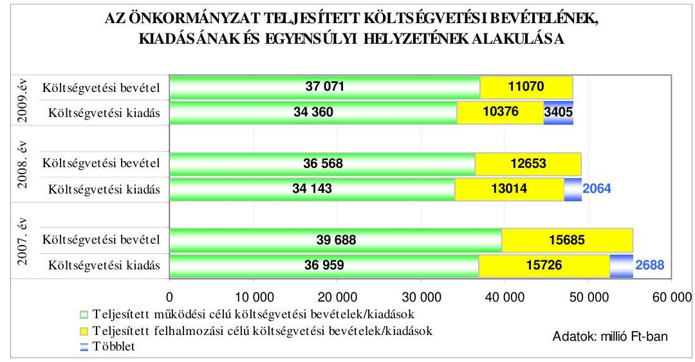

A 2007-2009. években a költségvetés teljesítése során a tervezettől eltérően a pénzügyi egyensúly fennállt, a teljesített költségvetési bevételek fedezetet nyújtottak a költségvetési kiadásokra. A 2007. évben 2688 millió Ft, a 2008. évben 2064 millió Ft, a 2009. évben 3405 millió Ft pénzügyi többlet keletkezett.

A teljesített működési célú költségvetési bevételek a 2007-2009. években fedezetet nyújtottak a működési célú költségvetési kiadásokra. A felhalmozási célú költségvetési kiadások a 2007. évben 41 millió Ft-tal, a 2008. évben 361 millió Ft-tal haladták meg a felhalmozási célú költségvetési bevételeket, amelyet a működési célú bevételi többletből és a finanszírozási célú pénzügyi műveletek bevételeiből finanszíroztak. A felhalmozási célú költségvetési bevételek a 2009. évben meghaladták a felhalmozási célú költségvetési kiadásokat.

Az Önkormányzatnál a 2007-2010. években tervezett és a 2007-2009. években teljesített működési és felhalmozási célú költségvetési kiadásokra a következő arányban biztosítottak fedezetet a költségvetési bevételek.

---

| Megnevezés | 2007.   év |  | 2008.   év |  | 2009.   év |  | 2010.   év |
| :--: | :--: | :--: | :--: | :--: | :--: | :--: | :--: |
|  | Terv | Tény | Terv | Tény | Terv | Tény | Terv |
| Múködési célú költségvetési kiadások fedezettsége múködési célú költségvetési bevételekből | 97,0 | 107,4 | 95,8 | 107,1 | 92,9 | 107,9 | 92,3 |
| Felhalmozási célú költségvetési kiadások fedezettsége felhalmozási célú költségvetési bevételekből | 82,5 | 99,7 | 86,0 | 97,2 | 103,1 | 106,7 | 84,4 |
| Költségvetési kiadások fedezettsége költségvetési bevételek-   böl | 92,5 | 105,1 | 92,6 | 104,4 | 96,8 | 107,6 | 88,1 |

A 2007. évben a költségvetési hiány megszüntetését alapvetően az Önkormányzat által év közben - helyi adókból, múködési célú költségvetési támogatásokból és az eredeti előirányzatként az Áht. 7. § (2) bekezdésében ${ }^{7}$ foglaltakat megsértve nem tervezett múködési célú pénzmaradvány igénybevételből - elért múködési célú költségvetési bevételi többlet eredményezte. A 2007. évi pénzügyi többlet keletkezéséhez hozzájárult az előző évi pénzmaradvány nem tervezett igénybevételéből elért felhalmozási célú költségvetési bevételi többlet, valamint a beruházások elhúzódása.

A 2008. évi költségvetési hiány megszüntetését elsősorban a tervezettnél magasabb összegben teljesült múködési célú költségvetési támogatásból és az eredeti előirányzatként - az Áht. 7. § (2) bekezdésében foglaltakat megsértve - nem tervezett előző évi pénzmaradvány igénybevételéből származó múködési célú költségvetési bevételi többlet és a felhalmozási célú költségvetési kiadások tervezettnél 19,3\%-kal alacsonyabb összegű teljesítése okozta.

A 2008. évi felhalmozási célú költségvetési kiadások tervezetthez viszonyított csökkenését befolyásolta a beruházások tervezettnél alacsonyabb teljesítése, amelyet elsősorban az elektromos tömegközlekedés projekt, a Szegedi Logisztikai és Szolgáltatói Központ beruházás és az ISPA szennyvíz beruházás következő évre áthúzódó kifizetései okoztak.

A 2009. évi költségvetési hiány megszüntetését elsősorban a tervezettnél 25,0\%kal magasabb összegben teljesült múködési célú költségvetési bevétel, valamint a tervezett beruházási kiadások 52,2\%-ra történő teljesítése eredményezte, amelyet az intézményi múködési bevételek, a helyi adók, a múködési célú költségvetési támogatás bevételi többlete és az előző évi pénzmaradvány tervezettet meghaladó igénybevétele tett lehetővé. A 2009-2010. években az eredeti előirányzat megállapításánál figyelembe vették az előző évi pénzmaradvány igénybevételt.

[^0]
[^0]:    ${ }^{7}$ 2010. január 1-től Áht. 8/C. § (3)-(4) bekezdése.

---

A 2009. évben az eredeti előirányzathoz képest a felhalmozási célú költségvetési kiadások 52,2\%-ra, a felhalmozási célú költségvetési bevételek 54,0\%-ra teljesültek. A 2009. évi felhalmozási célú kiadások előirányzat-maradványának és a bevételkiesésnek több mint felét az elektromos tömegközlekedés projektnél a kifizetések - a villamos és trolibusz nyomvonalak tervezettnél későbbi műszaki átadási eljárása miatt bekövetkezett - 2010-re történő áthúzódása okozta.

A 2007-2009. évi költségvetések végrehajtása során, a költségvetési rendelettel egyidejűleg elfogadott, év közbeni átszervezést (feladatok átadása más szerv részére, intézmény megszüntetés), létszámcsökkentést elrendelő közgyűlési határozatokban foglaltak végrehajtásával összességében 59 millió Ft megtakarítás keletkezett. Ezek kiadás csökkentő hatását az év közben jóváhagyott előirány-zat-módosítások alkalmával vezették át az adott évi költségvetési rendeleten.

Az Önkormányzatnál a költségvetés végrehajtása során a 2007-2009. években a költségvetési hiány csökkentése érdekében további, év közben elrendelt kiadási megtakarítást eredményező intézkedéseket hoztak. A Közgyűlés - a gyermek- és ellátotti létszám csökkenése, az intézmények átszervezése (összevonása), az intézmény fenntartói jog átadása miatt - önkormányzati szinten központi forrás igénybevételével a 2007. évben 1412, a 2009. évben 340 álláshely megszüntetéséről döntött a költségvetés jóváhagyását követően. Ennek hatására - figyelembe véve a más szervnek átadott feladatoknál az átadást követően a feladatellátáshoz nyújtott önkormányzati támogatás összegét, és az igényelt létszámcsökkentési támogatást - a 2007-2009. években összességében 410 millió Ft megtakarítást értek el.

A 2007. évben átszervezték az általános iskolai oktatást, ennek keretében iskolákat szüntettek meg, vontak össze más intézménnyel, illetve adtak át a Többcélú Társulásnak. Két-két középiskolát összevontak és központi kollégiumot hoztak létre, ezzel egyidejűleg az eddig saját kollégiumot fenntartó középiskoláktól elvonták a kollégiumi feladat ellátását. Egy óvodát egyházi kezelésbe adtak. A közoktatási átszervezések 289 fő létszámcsökkenéssel jártak. A fogyatékos személyek ápolását-gondozását végző dr. Waltner Károly Otthonnál az ellátotti létszám csökkenése miatt 2007-ben 69 fős létszámcsökkentésről döntöttek, melyből 2007-ben 62, 2008-ban hét álláshelyet szüntettek meg. Egy kulturális intézménynél és a Drogcentrumnál együttesen 13 álláshely szűnt meg. Az Önkormányzat a Kórházat, illetve a Szakorvosi Ellátás és Háziorvosi Szolgálat Intézményt 2007. október 1-től átadta a Szegedi Tudományegyetemnek, amelyek hatására az önkormányzati szintű létszám előirányzat 1041 fővel csökkent.

Az Önkormányzat 2009-ben átadta a Többcélú Társulás részére a Drogcentrumot, az Egyesített Szociális Intézményt, a Weöres Sándor Általános Iskolát, illetve az utazó gyógypedagógiai feladatellátást. A Többcélú Társulásnak átadott feladatok hatására 320 fővel csökkent az Önkormányzat létszám előirányzata. 13 középiskola összevonásával négy középiskolát hoztak létre, azonban ez az átszervezés 2009-ben kimutatható kiadási megtakarítással, létszámcsökkenéssel nem járt. 2009-ben egy általános iskolánál és a Szegedi Városi Kollégiumnál történt összesen 20 fős létszámcsökkentés.

Az Önkormányzat által 2007-2009. években a Többcélú Társulásnak átadott közoktatási, szociális, egészségügyi, az egyházi kezelésbe adott óvodai, a Szegedi Tudományegyetemnek átadott egészségügyi, továbbá az Önkormányzat saját gazdasági társaságának átadott sportfeladatok

---

hatására az Önkormányzat eredeti kiadási előirányzata éves szintre átszámítva a 2006. évhez viszonyítva 7890 millió Ft-tal csökkent a 2009. év végére.

Az Önkormányzat által a Többcélú Társulásnak, egyháznak és saját gazdasági társaságnak átadott önkormányzati feladatok következtében a közoktatási, szociális és sport feladatokat ellátó intézményeknek nyújtott önkormányzati támogatás előirányzat 2272 millió Ft-tal csökkent ${ }^{8}$ a 2006. évről a 2009. év végére. A Szegedi Tudományegyetemnek 2007-ben átadott egészségügyi feladatok nem jártak önkormányzati támogatás csökkenéssel, mivel a Kórház és a Szakorvosi Ellátás és Háziorvosi Szolgálat Intézmény múködtetése összességében múködési célú önkormányzati támogatás nélkül, a saját bevételéből biztosított volt.

A kötelező feladatok évközi átadás-átvétele hatására az önkormányzati forrásból biztosított kiadási előirányzat éven belüli csökkenése a 2007. évben 52 millió Ft, a 2008. évben 259 millió Ft, a 2009. évben 656 millió Ft volt. A 20072009. évi költségvetések végrehajtása során az átszervezések, létszámcsökkentések hatására csökkent a költségvetési hiány. A hiány csökkentésére a 20072008. években befolyást gyakorolt továbbá a pénzmaradvány nem tervezett igénybevétele, valamint a költségvetési támogatásokból, az átvett pénzeszközökből és a vagyonhasznosításból származó többletbevételek.

A Pénzügyi bizottság - a 2007-2009. években a féléves beszámolók, a háromnegyed éves tájékoztatók, az éves beszámolók, illetve az évközi költségvetési rendelet-módosítások megtárgyalása során - figyelemmel kísérte a költségvetési bevételek alakulását, értékelte az azt előidéző okokat.

Az Önkormányzat a 2007. évi költségvetés végrehajtása során:

- az ISPA beruházások áfájának előfinanszírozása céljából 293 millió Ft rövid lejáratú hitelt vett igénybe;
- a 2005-2006. években kötött hitelszerződések alapján panelfelújításokra, úthálózat és intézmények rekonstrukciójára összesen 1413 millió Ft hosszú lejáratú hitelt vett fel. A 2007. évben a paneltechnológiával épült épületek felújításához további 2370 millió Ft hosszú lejáratú hitel szerződés megkötéséről döntött, amely alapján 444 millió Ft-ot vett igénybe.

A 2006-2007-ben kötött hosszú lejáratú hitelszerződések alapján a 2008. évben összesen 1917 millió Ft-ot használtak fel panelfelújításokra, közutak és intézmények rekonstrukciójára, infrastrukturális beruházások megvalósítására. A 2008. évben új, hosszú lejáratú hitelszerződést nem kötöttek.

A 2009. évben a panelfelújításokra 1500 millió Ft, a Sikeres Magyarországért Önkormányzati Infrastruktúrafejlesztési Hitelprogram 2. hitelcélja keretében

[^0]
[^0]:    ${ }^{8}$ Az önkormányzati támogatás csökkenését nem korrigáltuk azzal a támogatással, amit a feladatátadást követően a feladatot átvevő szerveknek nyújtott az Önkormányzat. Az adatok forrása az Önkormányzat 2006-2009. évi zárszámadási rendeleteinek „Költségvetési szervek adott évi kiadási előirányzatainak teljesítése" című mellékletei.

---

általános beruházási célra 1000 millió Ft, az ÚMFT pályázataihoz önrész biztosítására 5000 millió Ft hitelkeretre kötött hosszú lejáratú hitelszerződést. A 2007. és a 2009. évben kötött szerződések alapján a 2009. év folyamán összesen 962 millió Ft hosszú lejáratú hitelt vettek fel.

A 2007-2009. években felvett hosszú lejáratú hitelekkel kapcsolatos jellemzőket mutatja be a következő táblázat:

| Hitel célja | Szerződés-   kötés ideje | A hitel szerződés szerinti összege (millió Ft-ban) | Futamidő   (év, hó) | Tü-   relmi   idő   (év,   hó) | Kamat   Fix, vagy   változó | Befolyt bevétel összege (millió Ft-ban) |
| :--: | :--: | :--: | :--: | :--: | :--: | :--: |
| Intézményi és infrastrukturális fejlesztések | 2005. má-   jus 30. | 3850 | 20 év | 2 év   10 hó | változó | 211 |
| Paneltechnológiával épült épületek felújítása | 2006. feb-   ruár 13. | 896 | 15 év | 2 év   11 hó | változó | 328 |
| Paneltechnológiával épült épületek felújítására | 2006. március 30. | 504 | 15 év | 3 év | változó | 300 |
| Felújítás, infrastrukturális beruházások | 2006. május 12. | 1346 | 20 év | 2 év   10 hó | változó | 574 |
| Paneltechnológiával épült épületek felújítása | 2007. május 8 . | 2370 | 15 év | 3 év | változó | 444 |
| A 2007. évben befolyt öszszes hitelbevétel | X | X | X | X | X | 1857 |
| Paneltechnológiával épült épületek felújítása | 2006. március 30. | 504 | 15 év | 3 év | változó | 39 |
| Felújítás, infrastrukturális beruházások | 2006. május 12. | 1346 | 20 év | 2 év   10 hó | változó | 301 |
| Paneltechnológiával épült épületek felújítása | 2007. május 8 . | 2370 | 15 év | 3 év | változó | 1577 |
| A 2008. évben befolyt öszszes hitelbevétel | X | X | X | X | X | 1917 |
| Paneltechnológiával épült épületek felújítása | 2007. május 8 . | 2370 | 15 év | 3 év | változó | 184 |
| Paneltechnológiával épült épületek felújítása | 2009. május 6 . | 1500 | 15 év | 3 év | változó | 137 |
| Általános beruházási célok finanszírozása | 2009. május 6 . | 1000 | 20 év | 3 év | változó | 425 |
| Az ÚMFT pályázatokhoz szükséges önrész | 2009. május 6 . | 5000 | 24 év | 5 év | változó | 216 |
| A 2009. évben befolyt öszszes hitelbevétel | X | X | X | X | X | 962 |

A 2007-2009. évek között igénybe vett hosszú lejáratú fejlesztési célú hitelek mindegyike változó kamatozású, forint alapú, 15-24 év közötti futamidejű volt. A szerződések a tőketörlesztésre vonatkozóan két év tíz hónap, illetve öt év közötti türelmi időt tartalmaztak. A tőketörlesztés és a kamatfizetési kötelezettség időben elvált egymástól, mivel kamatfizetés a felvételt követően azonnal megkezdődött. A 2007-2009. években felvett hosszú lejáratú hiteleket a hitelszerző-

---

désekben megjelölt célokra, felhalmozási célú kiadások finanszírozására használták fel.

Az Önkormányzat hosszú lejáratú felhalmozási célú hitelállománya a 2007. év végén 9395 millió Ft volt, amely a 2009. év végére 10000 mi lió Ft-ra növekedett a 2008-2009. évi hitelfelvételek és -törlesztések, továbbá a 2007. évet megelőzően devizában felvett hitelek év végi értékelése során - a deviza árfolyamának növekedése miatt - elszámolt kötelezettségnövekedés együttes hatására. Az Önkormányzatnak a 2007-2009. években a hosszú lejáratú hitelek felvételéből származó tárgyévi kötelezettségvállalása a halasztott tőkefizetési kötelezettség miatt csak az éves adósságot keletkeztető kötelezettségvállalás felső határának 0,9-1,0-0,1\%-át jelentette.

Az Önkormányzat 2010. február 24-én 2500 millió Ft ( 9,3 millió euro) öszszegben kötvényt bocsátott ki. A kötvény változó kamatozású ${ }^{9}$, futamideje 15 év, a tőketörlesztés türelmi ideje három év, a kamatfizetés első alkalommal 2010. május 15-én, a tőketörlesztés 2013. május 15-én, ezt követően háromhavonta esedékes. A kötvény visszafizetésének fedezetéül a sajátos működési és felhalmozási bevételeket jelölték meg, vállalva, hogy az éves költségvetési rendeletekben a kötvénykibocsátásból származó bevétel visszafizetésének, kamatkiadásának esedékes előirányzatát biztosítják. Biztosítékként a helyi adó bankszámlákra azonnali beszedési megbízás benyújtását engedélyezték a kibocsátó bank részére abban az esetben, amennyiben ezt a biztosítékot más pénzintézet részére engedélyezték éven túli finanszírozáshoz.

A „Szeged Város Kötvény 2025 EUR1" elnevezésű, euro alapú kötvénykibocsátás bevételéből az európai uniós forrással megvalósuló fejlesztések saját forrásának fedezetét ${ }^{10}$ kívánták biztosítani.

A kötvénykibocsátás bevételéből a 100\%-ban önkormányzati tulajdonú cégek részére az európai uniós támogatással megvalósuló beruházásokhoz az önerő biztosítására tőkeemelést terveztek. A KÖZOP elektromos tömegközlekedés projekt önerejének biztosítására 1400 millió Ft átadását, a DAOP Mars téri piac és környékének rendezése projekt önerejének biztosítására 925 millió Ft átadását, a DAOP Szegedi Szabadtéri Játékok eszközbeszerzése pályázat önerejének biztosítására 50 millió Ft átadását, a fennmaradó 125 millió Ft tartalékba helyezését tervezték.

A 2010. évben az éves adósságot keletkeztető kötelezettségvállalás felső határának ( 7383 millió Ft) 0,89\%-át jelentette a kötvénybocsátásból eredő tárgyévi kötelezettségvállalás (kamat) összege. A Közgyűlés a kötvénykibocsátásról szóló határozat meghozatalakor a döntéskor ismert pénzpiaci feltételekkel számolt. A forint euróhoz viszonyított árfolyamváltozása, valamint a változó kamatmérték miatt az Önkormányzat számára a kötvénykibocsátás kockázatot jelent.

[^0]
[^0]:    ${ }^{9}$ A kamatláb mértéke három havi EURIBOR $+3,08 \%$ kamatfelár volt.
    ${ }^{10}$ A Közgyűlés a 341/2009. (VI. 26.) számú határozat 4. pontjában és az 565/2009. (XII. 11.) számú határozatban döntött a kötvénykibocsátásból származó bevétel felhasználási céljáról.

---

A kötvény bevételét 2010. február 24-én jóváírták az Önkormányzat elkülönített számláján. A 2500 millió Ft-ot 2010. február 26-től öt napra betétként lekötötték a kibocsátó banknál évi 5\% betéti kamatra, melyből 1,7 millió Ft kamatbevétel származott. A lejáró betét kamattal növelt összegét (2501,7 millió Ft) 2010. március 4-től az Önkormányzat költségvetési elszámolási számláján helyezték el, ezáltal csökkentették a kedvezőtlenebb kamatozású folyószámlahitel igénybevételt.
2010. március 3-án az igénybe vett folyószámlahitel összege 2192 millió Ft volt, amely 2010. március 4-én a kötvénybevétel hatására 374 millió Ft-ra csökkent. E napon a folyószámlahitel kamata 6,95\%, a kötvény kamata 3,682\% volt.

Az Önkormányzat a 2007-2009 évi költségvetés végrehajtása során a fizetőképesség biztosításához 915-439-533 millió Ft értékben értékesített, és 598-575219 millió Ft értékben vásárolt befektetési célú, hitelviszonyt megtestesítő értékpapírokat. A 2007-2008. években 481-21 millió Ft értékben vásárolt, 2009ben 315 millió Ft értékben értékesített forgatási célú, hitelviszonyt megtestesítő értékpapírokat. A vizsgált időszakban az Önkormányzat tulajdonában lévő értékpapírok adás-vételét két portfoliókezelő cég végezte vagyonkezelési szerződések alapján. A szerződésekben az Önkormányzat a vagyonkezelésbe átadott értékpapírok értékesítésével és új értékpapírok vásárlásával kapcsolatos Ötv. 80. § (1) bekezdésében biztosított döntési hatásköréről az Ötv. 9. § (3) bekezdésében foglaltakat megsértve lemondott a portfólió kezelő cégek javára, amelyeket az Ötv. vonatkozó rendelkezése nem nevesített az önkormányzati jogok gyakorlására felhatalmazható szervek között. Az Önkormányzat a vagyongazdálkodási rendeletet módosító 21/2010. (VI. 30.) számú rendeletben átruházta a polgármesterre az értékpapír ügyletekkel kapcsolatos döntési hatáskört, továbbá 2010. július 31-i hatállyal a Közgyűlés a 352/2010. (VI. 25.) számú határozatban felmondta az értékpapír portfolió kezelőkkel kötött vagyonkezelési szerződéseket.

A 2007-2009. években az Önkormányzatnál a hitelfelvételek és a kötvénykibocsátás esetében betartották az Ötv-ben és az Áht-ban, továbbá a költségvetési rendeletekben és a vagyongazdálkodási rendeletben foglalt, a döntési hatáskörökre, valamint a fedezet megjelölésére vonatkozó előirásokat. A Pénzügyi bizottság megvizsgálta a hitelfelvételek indokait és gazdasági megalapozottságát, az erre vonatkozó előterjesztéseket a Közgyűlés számára elfogadásra javasolta.

A 2007-2009. években a költségvetés végrehajtása során az Önkormányzat évközi fizetőképességét folyószámlahitel és rulírozó hitel felvételével biztosították. A 2007-2009. évi költségvetés végrehajtási szabályairól szóló rendeletekben a Közgyűlés engedélyezte a polgármester részére legfeljebb 8430 millió Ft folyószámla és rulírozó hitel felvételét, illetve az átmeneti likviditási problémák kezelésére létrejött szerződések meghosszabbítását lejáratkor. Az átmeneti likviditási problémák kialakulásához hozzájárult a folyamatban lévő európai uniós támogatással megvalósuló fejlesztések esetében szükséges előfinanszírozási igény is.

---

A 2007-2010. években a folyószámla- és rulírozó hitelfelvétellel kapcsolatos jellemzőket mutatja be a következő táblázat:

| Megnevezés | 2007. év | 2008. év | 2009. év | 2010. I.   negyedév |
| :-- | :--: | :--: | :--: | :--: |
| A hitelkeret összege: |  |  |  |  |
| folyószámlahitel(millió Ft-ban) | 2980 | 2980 | 2980 | 2980 |
| rulírozó hitel (millió Ft-ban) | 5450 | 5450 | 5450 | 5450 |
| Év végén fennálló hitelállomány |  |  |  |  |
| folyószámlahitel (millió Ft-   ban) | 0 | 821 | 1411 | 0 |
| rulírozó hitel (millió Ft-ban) | 4500 | 4500 | 5220 | 5220 |
| Hitellel zárt napok száma |  |  |  |  |
| folyószámla hitel (napok szá-   ma) | 150 | 139 | 277 | 70 |
| rulírozó hitel (napok száma) | 365 | 366 | 365 | 90 |
| Ténylegesen felvett hitel átlagos állo-   mánya |  |  |  |  |
| folyószámlahitel (millió Ft-   ban) | 294 | 861 | 1094 | 1160 |
| rulírozó hitel (millió Ft-ban) | 4173 | 4628 | 5010 | 5220 |
| Felvett hitel minimumösszege |  |  |  |  |
| folyószámlahitel (millió Ft-   ban) | 27 | 1 | 9 | 69 |
| rulírozó hitel (millió Ft-ban) | 3350 | 955 | 4500 | 5220 |
| Felvett hitel maximális összege |  |  |  |  |
| folyószámlahitel (millió Ft-   ban) | 740 | 2806 | 2446 | 2551 |
| rulírozó hitel (millió Ft-ban) | 4562 | 4627 | 5450 | 5220 |

Az Önkormányzat a 2007-2009. években a folyószámlahítelen kívül többdevizás ${ }^{11}$ rulírozó hitelt vett igénybe az egy éves futamidőre, folyamatosan ${ }^{12} 4500$ millió és 950 millió Ft rulírozó hitelkeretre évente újra megkötött kettő szerződés alapján. A rulírozó hitel állomány a 2007-2009. években és 2010. I. negyedévben minden naptári napon, folyamatosan fennállt. Az igény-

[^0]
[^0]:    ${ }^{11}$ A rulírozó hitelek a szerződések szerint forint, euro és svájci frank voltak, amelyeket az Önkormányzat 2008. december 30 -ától forintra és euróra változtatott.
    ${ }^{12}$ A 2007-2010. években a rulírozó hitelszerződések folyamatosan fennálltak, mivel az ugyanahhoz a hitelkerethez tartozó, adott évi rulírozó hitelszerződésnél a hitel lejárat időpontja megegyezett a következő hitelszerződés hitel igénybevételi időszakának kezdő időpontjával.

---

be vett rulírozó hitelek közül a 4500 millió Ft keretösszegű rulírozó hitel az igénybevétel folyamatossága miatt már nem rövid lejáratú, hanem hosszú lejáratú hitel volt, mivel egy évnél hosszabb időn át folyamatosan fennállt. Az Önkormányzat rulírozó hitele az Ötv. 88. § (3) bekezdés d) pontjában foglaltak alapján nem tekinthető likvid hitelnek, mivel éven belül nem fizették vissza.

A 2007-2009. években a főjegyző az Önkormányzat pénzállományának alakulásáról - év közben folyamatosan aktualizált - likviditási tervet készíttetett.

Az Önkormányzat saját költségvetési szerve, a Szegedi Vadaspark részére 2007-ben 33,6 millió Ft kölcsönt nyújtott a beruházási és múködési kiadások megelőlegezésére. A Közgyűlés a kölcsönnyújtásról szóló 654/2007. (XII. 14.) számú határozatban a visszafizetés határidejét 2008. május 31-ben ${ }^{13}$, a visszafizetés fedezetét az áfa-visszatérülés és intézményi egyéb múködési bevétel jogcímekben jelölte meg. A Polgármesteri hivatal a közgyűlési határozat és a költségvetési rendeletben biztosított előirányzat alapján, kölcsönszerződés kötése nélkül folyósította a kölcsönt. A 2007. évi költségvetés módosításakor a közgyűlési határozat alapján a Polgármesteri hivatal költségvetésében „kölcsönök nyújtása, törlesztése", a Szegedi Vadaspark költségvetésében „kölcsön igénybevétel" jogcímen 33,6 millió Ft összegben képeztek előirányzatot, azonban a kölcsön nyújtásával és ennek fedezete megteremtésének céljára a kölcsönök kiadási és bevételi előirányzatának módosításával nem megfelelő jogi megoldást alkalmaztak, mert az Áht. 100. § (1) bekezdés a) pontjában ${ }^{14}$ foglaltak szerint az önkormányzati intézmény pénzkölcsönt nem vehetett fel. Az Önkormányzatnál a 2007. és 2008. évi költségvetési beszámolójában a Szegedi Vadaspark részére átutalt és év végéig vissza nem térített összeg ${ }^{15}$ államháztartáson belülre nyújtott múködési célú támogatási kölcsönként, azaz követelésként, illetve egyidejúleg kötelezettségként történt kimutatásával megsértették a Számv. tv. 15. § (3) bekezdésében a valódiság elvére vonatkozó előírást. A Szegedi Vadaspark teljes egészében visszafizette a kölcsönt a Polgármesteri hivatal bankszámlájára két részletben, a 2008. évben 27 millió Ft összegben, illetve a 2009. évi részletet a 2009. május 31-i határidőt követően, 2009. augusztus 25én 6,6 millió Ft összegben.

Az Önkormányzat eladósodása a 2007-2010. I. félév között fokozódott, az eladósodási mutató ${ }^{16}$ a 2007. évi 6,8\%-ról a 2008. évre 7,6\%-ra emelkedése jelzi, hogy a hosszú és a rövid lejáratú fizetési kötelezettségek állományának növekedési üteme meghaladta az Önkormányzat összes forrás növekedésének arányát. Az eladósodás az előző évhez képest a 2009. évre 0,2 százalékponttal nö-

[^0]
[^0]:    ${ }^{13}$ Az Önkormányzat a 2008. évben két alkalommal, a 419/2008. (VI. 27.) és 507/2008. (IX. 26.) számú határozataiban módosította a visszafizetés határidejét, amely alapján az utolsó részlet határidejét 2009. május 31-ben határozták meg.
    ${ }^{14}$ 2010. január 1-től 100/E. § (1) bekezdés a) pontja, 2010. augusztus 15-től 100/G. § (1) bekezdés a) pontja
    ${ }^{15}$ A költségvetési beszámolóban a Szegedi Vadaspark részére nyújtott kölcsön miatt kimutatott követelés és kötelezettség állomány 2007. év végén 33,6 millió Ft, a 2008. év végén 6,6 millió Ft volt.
    ${ }^{16}$ Az eladósodási mutató a hosszú és rövid lejáratú fizetési kötelezettségek önkormányzati összes forráson belüli arányát mutatja.

---

vekedett elsősorban a rövid lejáratú kötelezettségek 4,1\%-os növekedése és az összes forrás $0,2 \%$-os csökkenése következtében. Az esedékességi aránymutató ${ }^{17}$ - 49,4-51,8-53,0\% közötti - emelkedése jelzi, hogy az összes fizetési kötelezettségek növekedési arányát meghaladóan nőtt a rövid lejáratú kötelezettségek aránya, azok fizetőképességre gyakorolt hatása erősödött.

A rövid lejáratú kötelezettségek előző év végéhez viszonyított 2008. évi 17,9\%-os emelkedését elsősorban a folyószámlahitel előző év végéhez viszonyított emelkedése, valamint a következő évben esedékes beruházási hiteltörlesztés állományának 398 millió Ft-os növekedése okozta. A 2009. évi rövid lejáratú kötelezettség előző évhez viszonyított $4,1 \%$-os emelkedése az év végi folyószámla- és rulírozó hitelállomány, a szállítói tartozások záró állománya növekedésének, és az egyéb rövid lejáratú kötelezettségek csökkenésének együttes hatására történt.

Az adósságszolgálati ráta ${ }^{18}$ a 2007-2009. években $24,0 \%-23,2 \%-10,6 \%$ volt, amely a saját bevételeken belül az adósságszolgálatra fizetett összeg arányának csökkenését jelezte. Az adósságszolgálatra teljesített kiadás 2007-2009 közötti csökkenéséhez hozzájárult a felvett hosszú lejáratú hitelek törlesztéséhez biztosított 3-5 éves türelmi idő is. A 2010. évi tervadatok alapján számított $27,1 \%$-os adósságszolgálati ráta előző évhez viszonyított 16,5 százalékpontos növekedése jelzi, hogy az Önkormányzatnak a saját bevételek növekvő hányadát kell adósságszolgálatra fordítania. Az adósságszolgálatra tervezett összeg - az üzemeltetésre átadott eszközökkel kapcsolatos üzemeltetési díjbevétel terhére vállalt 1963 millió Ft felhalmozási célú kötelezettség miatt - a 2009. évinek több mint kétszeresére emelkedett, a várható saját bevételek azonban az előző évihez képest 4,0\%-kal csökkentek.

Az eladósodási mutató 2007-2009 közötti emelkedése - az adósságszolgálati ráta 2007-2009 közötti csökkenése ellenére - jelezte, hogy az Önkormányzat pénzügyi helyzete - a 2007-2009 évek között - eladósodási szempontból kedvezőtlenül alakult.
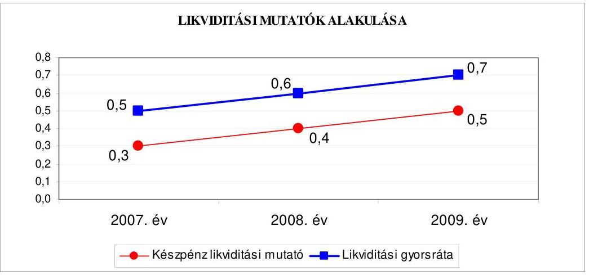

[^0]
[^0]:    ${ }^{17}$ Az esedékességi aránymutató a rövid lejáratú fizetési kötelezettségek arányát fejezi ki az összes - rövid- és hosszú lejáratú - fizetési kötelezettségen belül.
    ${ }^{18}$ Az adósságszolgálati ráta a tárgyévben adósságszolgálatra fizetett összeg (tőketörlesztés+kamat) saját bevételekhez viszonyított arányát fejezi ki.

---

# Az Önkormányzat fizetőképessége 2007-2009 között lényegesen nem 

javult. A készpénz likviditási mutató ${ }^{19}$ 2007-2009 közötti folyamatos emelkedése jelezte, hogy a pénzeszközök növekvő arányban járultak hozzá a rövid lejáratú kötelezettségek teljesítéséhez. A likviditási gyorsráta ${ }^{20}$ 2007-2009. évek közötti emelkedése azt mutatta, hogy a rövid lejáratú fizetési kötelezettségek pénzügyi teljesítéséhez a követelések, a forgatási célú hitelviszonyt megtestesítő értékpapírok, valamint a pénzeszközök növekvő arányban járultak hozzá, azonban az emelkedés nem volt számottevő, mert a rövid lejáratú fizetési kötelezettségek pénzügyi teljesítéséhez fedezetet egyik évben sem nyújtottak.

A likviditási mutatók 2007-2009 közötti növekedése jelezte, hogy a pénzeszközök, valamint a követelések, és a forgatási célú hitelviszonyt megtestesítő értékpapírok növekvő arányban fedezték a rövid lejáratú fizetési kötelezettségek pénzügyi teljesítését, azonban együttes összegük továbbra sem nyújtott fedezetet a rövid lejáratú fizetési kötelezettségek pénzügyi teljesítésére.

Az Önkormányzat 2007-2009 közötti pénzügyi helyzete fizetőképességének nem számottevő javulása mellett eladósodásának növekedése miatt öszszességében kedvezőtlenül változott.

#### Abstract

A közbenső egyeztetés során a polgármester által adott észrevétel szerint: „Az önkormányzat költségvetési tájékoztatási kötelezettségének eleget téve költségvetési rende-let-tervezeteiben az Ámr. 36. § (1) h) rendelkezésére figyelemmel bemutatta a több éves kihatással járó előirányzatait éves bontásban. Az önkormányzat hitelfelvételei során, éves költségvetési koncepciójának és költségvetési rendelet-tervezetének elkészitésekor az Ötv. 88. § (2) szerint vizsgálja, hogy eleget tesz-e az adósságot keletkeztető éves kötelezettségvállalásának (hitel felvételének és járulékainak, valamint kötvénykibocsátásának, garancia- és kezességvállalásának, lízingjének) felső határára vonatkozó jogszabályi feltételeknek.

A Számvevői jelentés a főjegyzö szamara megfogalmazott javaslatát jogszabályi előirásokkal nem támasztotta alá. A számítások módszertanára vonatkozóan sem a Pénzügyminisztérium (Nemzetgazdasági Minisztérium) sem az Önkormányzati Minisztérium módszertani ajánlásokat nem tett közzé az önkormányzatok számára. A számvevői javaslat ugyanakkor kizárólag az önkormányzat fejlesztési célú hitelállományának adósságszolgálati vizsgálatát tartalmazza, nem veszi figyelembe azt a tényt, hogy az önkormányzat az adósságszolgálaton kívül más hosszú távú kötelezettségvállalással is rendelkezhet. Megjegyezzük, hogy a hitelszerződések megkötése során az önkormányzatnak a pénzintézeteknek a hitelszerződések visszafizetésének garanciájaként fedezetet kell felajánlaniuk, továbbá a pénzintézetek a kölcsönszerződések teljes futamideje alatt az önkormányzattal együttmüködve időszakos monitoring vizsgálatot végeznek az önkormányzat pénzügyi megfelelőségi kockázatának megítélését illetően. A számvevői jelentés sem a hitelállomány fedezetét. sem a pénzintézeti értékelési munkát nem veszi figyelembe javaslatának megfogalmazásakor."

Az észrevétel nem megalapozott, mivel nem tartjuk elégséges tájékoztatásnak a több éves kihatással járó előirányzatok éves bontásban történő bemutatását a

[^0]
[^0]:    ${ }^{19}$ A készpénz likviditási mutató kifejezi, hogy a pénzeszközök év végi állománya milyen arányban nyújt fedezetet a rövid lejáratú fizetési kötelezettségekre.
    ${ }^{20}$ A likviditási gyorsráta mutatja, hogy a rövid lejáratú fizetési kötelezettségek kiegyenlítéséhez a pénzeszközökön túl bevonható követelések, forgatási célú értékpapírok milyen arányban nyújtanak fedezetet.

---

költségvetési rendelettervezetekben. A hosszú lejáratú, adósságot keletkeztető kötelezettségvállalások, ezek kamatfizetési terheinek bemutatása, hosszú távú figyelemmel kísérésére olyan közgyűlési döntést tartunk elfogadhatónak, amely e kötelezettségvállalások teljes időtartamára nézve bemutatási kötelezettséget jelentene az előterjesztők számára. Megítélésünk szerint az átláthatóságot és a felelős döntéshozatalt könnyíti meg, ha évente végzett számítások alapján a Közgyűlés a források és feladatok összevetésével részletes tájékoztatást kap a tett hosszú távú adósságot keletkeztető kötelezettségvállalásokról és azok várható terheiről, valamint arról, hogy az Önkormányzat ezen adósságot keletkeztető kötelezettségvállalásokat milyen feltételekkel, milyen módon tudja teljesíteni. Célszerúségi javaslatunkat az Önkormányzat pénzügyi helyzetének hosszú távú stabilitása érdekében tettük meg, és továbbra is fenntartjuk
2. AZ ÖNKORMÁNYZAT FELKÉSZÜLTSÉGE AZ EURÓPAI UNIÓS FORRÁSOK IGÉNYLÉSÉRE, FELHASZNÁLÁSÁRA, A TÁMOGATOTT CÉLKITŰZÉS MEGVALÓSÍTÁSÁRA, MÜKÖDTETÉSÉRE, VALAMINT AZ ELEKTRONIKUS KÖZSZOLGÁLTATÁSI FELADATOK ELLÁTÁSÁRA
2.1. Az európai uniós források igénybevételére, felhasználására, a támogatott célkitúzés megvalósítására, múködtetésére történt felkészülés szabályozottságának, szervezettségének, valamint egy támogatási szerződésben foglalt célkitúzés megvalósításának, múködtetésének eredményessége

# 2.1.1. Az európai uniós forrásokra történő pályázatok benyújtására vonatkozó döntések összhangja a fejlesztési célkitúzésekkel 

Az Önkormányzat a 2007-2010-ig terjedő időszakra összeállított, helyzetelemzéssel alátámasztott fejlesztési célkitúzéseit a gazdasági programban, a 2008. évben készített hosszú távú városfejlesztési koncepcióban, az integrált városfejlesztési stratégiában, valamint a településszerkezeti tervben határozta meg. A gazdasági programot az Ötv. 91. § (7) bekezdésében előírtakat megsértve a főjegyző az előírt határidőn túl ${ }^{21}$ - 2007. december 14én - terjesztette a Közgyűlés elé.

A gazdasági program prioritásként határozta meg:

- a városban, a közlekedés-, a városközpont-, a gazdaság-, a környezet minőségi és kulturális fejlesztését;
- a fejlesztési célok között az oktatási intézményhálózat felújítását, fejlesztését, az oktatási eszközök fejlesztését, az intézmények akadálymentesítését;
- az utcai közvilágítás, a köz- és oktatási intézmények világítás korszerűsítését, valamint az energiahordozók (áram, gáz, gőz) olcsóbb, nagy volumenű beszerzését;

[^0]
[^0]:    ${ }^{21}$ Az Önkormányzat 2006. október 11-i alakuló ülését követő hat hónapon belül nem történt meg a gazdasági program elfogadása.

---

- az iparosított technológiával készült lakóépületek felújítására panelprogram készítését, az utólagos hőszigetelési feladatok elvégzését, épületgépészeti rendszerek energiatakarékos felújítását, a meglévő központi fűtési berendezések és rendszerek korszerűsítését, támogatások iránti pályázatok benyújtását.

Az integrált városfejlesztési stratégia összhangban a gazdasági programban foglaltakkal célként jelölte meg:

- a távfűtő rendszer fejlesztését;
- a közintézmények energiatakarékosságot eredményező felújítását;
- a nagyüzemi technológiával épült lakóépületek energiatakarékos felújításának folytatását.

A fejlesztési célkitűzések meghatározásánál figyelembe vették a megvalósításhoz szükséges és a lehetséges pénzügyi forrásokat, az európai uniós pályázati lehetőségek mellett a saját forrás biztosításához hitel felvételét is tervezték.

Az Önkormányzatnál 2007-2010. I. negyedév között európai uniós támogatásokra összesen 85 pályázat benyújtásáról döntöttek. A pályázatok közül 56 támogatásban részesült, 16 pályázatot elutasítottak, illetve 13 pályázati döntésről az Önkormányzat még nem kapott tájékoztatást. Az európai uniós forrás igénybevételére benyújtott pályázatok kapcsolódtak a gazdasági programban, a városfejlesztési koncepcióban, valamint az integrált városfejlesztési stratégiában foglalt célkitűzésekhez.

Az európai uniós forrásokra benyújtott pályázatok megvalósításának 2007-2010-re tervezett összes költségvetési kiadása 46314 millió Ft volt, amelynek finanszírozását 70,7\%-ban európai uniós forrásból, 12,7\%-ban hazai támogatásból, 12,7\%-ban saját pénzeszközökből, 2,2\%-ban hitelből, valamint 1,7\%-ban egyéb forrásból tervezték. Európai uniós támogatással megvalósított feladatokra 2007-2010. I. negyedév között teljesített összes költségvetési kiadás 9554 millió Ft volt, amelyet 70,4\%-ban európai uniós forrásból, 12,5\%-ban hazai támogatásból, 17,0\%-ban saját pénzeszközökből, 0,1\%-ban hitelből finanszírozták. Az Önkormányzatnál az európai uniós forrással megvalósult, valamint a folyamatban lévő fejlesztési feladatok tervezett és teljesített kiadásait a 4. számú melléklet, az elbírálás alatt lévő pályázatokat a 4/a. számú melléklet, míg az elutasított pályázatokat a 4/b. számú melléklet tartalmazza.

A 16 nem támogatott pályázat esetében az Önkormányzat a döntés ellen nem fellebbezett, az elutasítás indoka két esetben formai, három esetben tartalmi hiányosság, egy-egy esetben szakmai kidolgozottság és költséghatékonyság hiánya, öt esetben támogatói forráshiány volt, négy pályázat nem felelt meg a pályázati kiírásokban szereplő feltételeknek. Az Önkormányzat a támogató döntés meghozatala után egy esetben vonta vissza pályázatát.

Az Önkormányzat a Norvég Finanszírozási Mechanizmus keretén belül „Szociális alap- és szakosított ellátást, valamint gyermekjóléti alap- és gyermekvédelmi szakellátást nyújtó közintézmények akadálymentesítése" című pályázati kiírásra a dr. Waltner Károly Otthon Szeged, Agyagos u. 45. szám alatti székhelyének akadálymentesítésére 2009. április 6-án nyújtott be pályázatot. A közreműködő szer-

---

vezet 2009. szeptember 28-án kelt döntése alapján a feladat 19,9 millió Ft támogatásban részesült. A végleges kiviteli tervek alapján a fejlesztési feladat teljes kiadásának összege 28 millió Ft-tal meghaladta a pályázatban tervezett összeget. A szükséges saját forrás hiánya miatt az Önkormányzat a támogatási szerződés megkötése előtt a Közgyűlés 533/2009. (XI. 6.) számú határozatával lemondott a támogatásról.

Az Önkormányzat 2007-2010. évi költségvetési rendeletei - az Áht. 69. § (1) bekezdésében, valamint az Ámr. ${ }_{1}$ 29. § (1) bekezdés c); d); g) pontjaiban foglaltaknak megfelelően - tartalmazták az európai uniós forrással megvalósuló fejlesztési feladatok múködési és felhalmozási célú költségvetési kiadási és bevételi előirányzatait, éves bontásban a felhalmozási kiadásokat feladatonként, a felújítási előirányzatokat célonként, továbbá a több éves kihatással járó fejlesztési feladatok előirányzatait. A 2008-2010. évi költségvetési rendeletekben az Ámr. ${ }_{1}$ 29. § (1) bekezdés k) pontjában, illetve az Ámr. ${ }_{2}$ 36. § (1) bekezdés l) pontjában foglalt előírás ellenére elkülönítetten nem mutatták be az intézmények bonyolításában tervezett európai uniós forrásból megvalósuló projektek bevételi és kiadási előirányzatait ${ }^{22}$.

Az Önkormányzat 2007-2010. I. negyedéve között európai uniós forrásokkal támogatott, befejezett fejlesztési feladatainál a finanszírozási források tervezett és tényleges megoszlását a következő ábra mutatja:
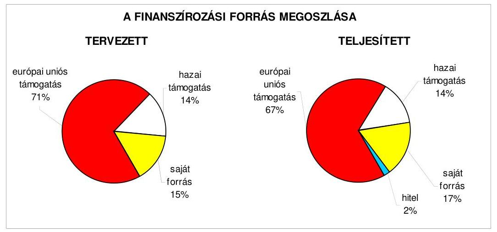

A befejezett fejlesztési feladatok tervezett kiadásainál az európai uniós és a hazai támogatások teljes összegét felhasználták, azok 100\%-ban teljesültek.

A DAOP-4.2.1. intézkedés a „Szeged Rákusvárosi II. sz. Általános Iskola és Alapfokú Müvészetoktatási Intézmény infrastruktúrájának fejlesztésére és az épületek akadálymentesitésére" vonatkozó fejlesztés teljesített összes költségvetési kiadása 18,9 millió Ft-tal meghaladta a tervezett összes költségvetési kiadást, amelyet az okozott,

[^0]
[^0]:    ${ }^{22}$ A közbenső egyeztetés során a polgármester és a főjegyző által adott észrevétel szerint: „A főjegyző 81152-1/2010. iktatószám alatt, 2010. 10. 06-án utasította a Közgazdasági Iroda Vezetőjét, hogy a 2011. évi költségvetés tervezésénél a költségvetési intézmények európai uniós támogatással megvalósuló feladatainak bevételi és kiadási előirányzatait elkülönítetten jelentesse meg a rendelet-tervezetben".

---

hogy a közbeszerzési eljárás során valamennyi ajánlat meghaladta a kivitelezés tervezett költségét.

Az Önkormányzat a folyamatban lévő fejlesztési feladatoknál a 42870 millió Ft tervezett költségvetési kiadás 21,4\%-át ( 9168 millió Ft-ot) használta fel.

# 2.1.2. Az európai uniós forrásokhoz kapcsolódóan a pályázatfigyelés, a pályázatkészítés, valamint az európai uniós támogatással megvalósuló fejlesztés lebonyolításának belső rendje, a végrehajtás és az ellenőrzés szervezettsége 

Az Önkormányzatnál a 2007. évben a pályázatfigyelés, a pályázatkészítés, valamint az európai uniós támogatással megvalósuló fejlesztések lebonyolításának rendjére vonatkozó előírásokat a Polgármesteri hivatal ügyrendje, valamint a köztisztviselők munkaköri leírásai, továbbá a 2008. évtől a pályázati szabályzat tartalmazta.

A Polgármesteri hivatal ügyrendjében foglaltak, valamint a Fejlesztési program csoport dolgozóinak munkaköri leírása szerint a Fejlesztési program csoport feladata az elektronikus és nyomtatott sajtóban megjelenő fejlesztési célú pályázati kiírások folyamatos figyelemmel kísérése és az Önkormányzat fejlesztési programjaira vonatkozó pályázati lehetőségekről az illetékes szakirodák részére tájékoztatás nyújtása. Feladata továbbá a pályázatok elkészítése, illetve közreműködés azon pályázatok elkészítésében, amelyekhez indokolt esetben külső szervezetet is igénybe vehet, valamint a pályázatok nyilvántartásáról történő gondoskodás.

A Fejlesztési program csoport dolgozóinak munkaköri leírásában előírták a kapcsolattartást a projekt résztvevőivel, az információk átadását, a felelősségvállalást a hiánypótlásokért, a támogatási szerződés megkötéséért, a program végrehajtásának, a szerződések megvalósulásának nyomon követését, a teljesítések szakmai igazolását.

A pályázati szabályzat - a Polgármesteri hivatal ügyrendjében foglaltakkal összhangban - előírta, hogy a Polgármesteri hivatal valamennyi irodájának feladata a saját területére vonatkozó fejlesztési igények összeállítása, nyilvántartása, a nyilvántartás felülvizsgálata.

A munkaköri leírásokban a 2007. évtől, a pályázati szabályzatban a 2008. évtől előírták a pályázatfigyelést végzők és a döntési, illetve a döntés-előterjesztési jogkörrel rendelkezők közötti információ-szolgáltatási kötelezettség teljesítési rendjének szabályait. A pályázati szabályzat tartalmazta az európai uniós forrásokra irányuló pályázatfigyelés, pályázatkészítés, valamint az európai uniós forrással támogatott fejlesztés lebonyolításával, a feladatokkal, a kapcsolattartással, az információáramlással, az ellenőrzéssel, a felelősséggel kapcsolatos eljárásrendet és az önkormányzati szintű pályá-zat-koordinálás feladatait.

A 2007-2010. I. negyedév között biztosították az európai uniós források pályázatfigyelésével, pályázatkészítésével az európai uniós támogatással megvalósuló programok lebonyolításával összefüggő feladatok végrehajtásának, ellenőrzésének szervezettségét. A pályázatfigyelési feladatellátás kötelezettségét a

---

Polgármesteri hivatal részére határozták meg, a pályázatkészítési feladatokat a Polgármesteri hivatal, az intézmények és külső szervezetek is végezhették. A külső szervezettel kötött megbízási szerződésekben ${ }^{23}$ előírták a pályázatok tartalmi és formai követelményeinek biztosítását, a pályázat céljának egyértelmú meghatározására vonatkozóan a pályázatkészítő felelősségét.

A Polgármesteri hivatal ügyrendjében és a pályázati szabályzatban foglaltak szerint a fejlesztési feladatok lebonyolítását a Polgármesteri hivatalon belül a Városfejlesztési és Oktatási irodák köztisztviselőivel, az intézmények dolgozóival és a külső szervezeteknek adott megbízás segítségével is végezhették. Az Önkormányzat 2007-2010. I. negyedév között a fejlesztési feladat lebonyolítására külső szervezettel három esetben kötött szerződést, amelyekben előírták a támogatott célkitúzés megvalósításának kötelezettségét, a kapcsolattartás és az ellenőrzés rendjét, a személyre szóló felelősségi szabályokat.

A 2007-2010. évekre vonatkozó, az éves ellenőrzési terveket megalapozó kockázatelemzések nem terjedtek ki az európai uniós forrásokkal támogatott fejlesztési feladatokra.

# 2.1.3. Egy támogatási szerződésben foglalt célkitúzés megvalósítása, múködtetése 

Az Önkormányzat a DAOP-4.2.1/2F-2f-2009-0026 „Szeged Rókusvárosi II. sz. Általános Iskola és Alapfokú Müvészetoktatási Intézmény infrastruktúrájának fejlesztése és az épületek akadálymentesítése" címmel nyújtott be pályázatot 2009. február 27-én. A projekt költségvetési kiadása 235 millió Ft, a támogatás mértéke az elszámolható költség $90 \%-a, 211,5$ millió Ft, a saját forrás tervezett összege 23,5 millió Ft volt. A projekt tervezett célja az iskola pedagógiai, környezetvédelmi, integrációs, minőségirányítási célkitűzéseinek eléréséhez szükséges infrastrukturális háttér megteremtése volt. A pályázat és a támogatási szerződés jellemző adatait a jelentés 5 . számú melléklete tartalmazza.

A projekt tartalmazta Szeged Rókusvárosi II. sz. Általános Iskola és Alapfokú Múvészetoktatási Intézményben az akadálymentesítés elvégzését, új készségfejlesztő eszközök beszerzését, az integrált oktatás objektív feltételeinek megteremtését, 16 fős nyelvi labor, 20 tanteremben és a közösségi helységekben az informatikai végpontok kialakítását az informatikával támogatott integrált oktatás érdekében, $800 \mathrm{~m}^{2}$ új burkolatú sportpálya és új sporteszközök beszerzését, az udvar felújítását, közösségi tér kialakítását, a sajátos nevelési igényű és a halmozottan hátrányos helyzetű tanulók személyiségközpontú nevelési feltételeinek megteremtését, valamint a teljes energetikai korszerűsítést.

A program a 2009. augusztus 31-én megkötött támogatási szerződésben foglaltaknak megfelelően határidőben megvalósult, a pénzügyi elszámolás 2010. június 30 -án lezárult. A megvalósítás során a támogatási szerződésben vállalt célkitúzések (indikátorok) teljesültek.

[^0]
[^0]:    ${ }^{23}$ A 2007-2010. I. negyedév között a benyújtott 85 pályázatból 38 esetben külső szervezet készítette a pályázatot, a további 47 pályázatot az intézményeknél és a Polgármesteri hivatalnál készítettek.

---

A támogatás igénybevétele a támogatási szerződésben meghatározott előírások szerint történt. Az európai uniós támogatással megvalósított fejlesztés összes költségvetési kiadása 253,9 millió Ft volt a tervezett 235 millió Ft-tal szemben, mert a közbeszerzési eljárás eredményeként az Önkormányzat a tervezettnél magasabb összegben kötött szerződést a kivitelezési munkálatokra. Az Önkormányzat a fejlesztési feladat megvalósításához tervezett saját forrás összegét növelte meg, ennek következtében a szükséges saját forrás 42,4 millió Ft-ban realizálódott, amelynek 17,7\%-át ( 7,5 millió Ft-ot) hitelből finanszírozta.

A belső ellenőrzés a fejlesztési feladat megvalósításának folyamatát nem ellenőrizte. A projekt megvalósítását külső ellenőrzés két alkalommal vizsgálta. A közremúködő szervezet a záró kifizetés előtt helyszíni szemle keretében tekintette át a projekt megvalósulását, ellenőrizte annak dokumentálását, rögzítette, hogy összességében a beruházás megfelelő minőségben és határidőre elkészült. Az ellenőrzésről készült jegyzőkönyvben szabálytalanságot nem állapítottak meg, kisebb hiányosságokat rögzítettek ${ }^{24}$, a megállapításokhoz nem kapcsolódott visszafizetési kötelezettség.

Az Önkormányzat a 2010. évi költségvetésében a „Szeged Rókusvárosi II. sz. Általános Iskola és Alapfokú Müvészetoktatási Intézmény infrastruktúrájának fejlesztése és az épületek akadálymentesitése" projekt keretében megvalósított építmények, eszközök fenntartásával kapcsolatos kiadásokat, valamint az intézménymúködtetés feltételeit biztosították.

Az Önkormányzatnál 2007-2010. I. negyedév között eredményesen felkészültek a belső szabályozottság és szervezettség terén az európai uniós források igénybevételére és felhasználására. A városfejlesztési koncepcióban, a gazdasági programban, az integrált városfejlesztési stratégiában, valamint a településszerkezeti tervben megfogalmazott fejlesztési célkitűzésekhez kapcsolódtak az európai uniós pályázatok, kialakították a Polgármesteri hivatalon belül és külső szervezet igénybevételével a pályázatfigyelés, a pályázatkészítés és a fejlesztési feladat lebonyolításának szervezeti, személyi feltételeit, meghatározták a külső személyekkel, szervezetekkel pályázatkészítésre kötött szerződésekben a pályázat szakmai és formai követelményeinek biztosítására vonatkozóan a pályázatkészítő felelősségét, valamint előírták a fejlesztési feladat lebonyolítását végzők ellenőrzési kötelezettségeit, 2008-tól szabályozták a pályázatfigyelést végzők és a döntési, illetve a döntés-előterjesztési jogkörrel rendelkezők közötti információ-szolgáltatási kötelezettséget, továbbá határidőre megvalósították az ellenőrzött támogatási szerződésben foglalt célkitűzéseket, azonban a belső ellenőrzési terveket megalapozó kockázatelemzés nem terjedt ki az európai uniós forrásokkal támogatott fejlesztési feladatokra.

# 2.2. Az elektronikus közszolgáltatás feltételeinek kialakítása 

Az Önkormányzat rendelkezett informatikai stratégiával, amelyet a Közgyűlés a 359/2004. (V. 14.) számú határozattal fogadott el a 2004-2008.

[^0]
[^0]:    ${ }^{24}$ Az aktiválást követően kérték a tárgyi eszköz nyilvántartó kartonok megküldését, az eszközök iskola részére történt átadás-átvételéről készített jegyzőkönyvet, valamint a leltár csatolását, amelyeknek az Önkormányzat eleget tett.

---

évek közötti időszakra. Az informatikai stratégia tartalmazta az Önkormányzat rövid, közép, valamint hosszú távú informatikai célkitűzéseit, a főbb irányvonalakat. Célként határozták meg az elektronikus ügyintézési szolgáltatás 3. szintjének elérését a meghatározott feladatok (az adó-, az építési engedéllyel kapcsolatos ügyek, a kereskedelmi és egyéb tevékenységek múködési engedélye, a gyermekjóléti és gyermekvédelmi szolgáltatásokat ellátók múködési engedélye, a szociális juttatások, támogatások fizetései) esetében.

Az informatikai stratégiát a Közgyűlés felülvizsgálta, az elért eredményeket értékelte és a 612/2009. (IX. 11.) számú határozatával elfogadta annak módosítását, amelyben újabb informatikai stratégiai elképzeléseket, irányokat, határoztak meg a 2009-2013. évekre. A 2008-2009. évekre vonatkozó helyzetértékelésben kitértek az Önkormányzat belső erősségeire és gyengeségeire, valamint a külső forrásokból adódó lehetőségekre és veszélyekre. Célként határozták meg az elektronikus szolgáltatások modernizálását, az elektronikus szolgáltatás 3. szintjének folyamatos biztosítását, az elektronikus szolgáltatás 4. szintjének (ügyfajták meghatározása nélkül) elérését.

Az Önkormányzatnál (a Polgármesteri hivatal és az intézmények között) integrált gazdálkodási rendszer, belső ügyintézési és portál keretrendszer múködött a 2007-2009. években, amelyet az Informatikai osztály üzemeltetett.

Az Önkormányzat 2005-ben GVOP-4.3.1-2004-06 számon az információs társadalom és gazdaságfejlesztés prioritás e-közigazgatás fejlesztése intézkedés keretében „A helyi önkormányzatok átfogó integrált információs rendszereinek fejlesztése, az elektronikus ügyintézés bevezetése, az ügyintézés elektronizáltsági szintjének emelése" címen pályázatot nyújtott be. Olyan nyílt forráskódú technológiára épülő integrált rendszer megvalósítását tűzte ki célul, amely megteremti a hivatali múködést támogató elektronikus közigazgatás alapjait, lehetővé téve az önkormányzatok ügyfelei számára, hogy a kétirányú interaktivitást biztosító elektronikus ügyintézési szolgáltatások (3. elektronikus szolgáltatási szint) révén elektronikus úton férjenek hozzá információkhoz és adatokhoz, illetve elektronikus támogatást és kiszolgálást kapjanak ügyeik intézéséhez. A fejlesztés összköltsége 670 millió Ft, melyből saját forrás 52 millió Ft, EU önerő kiegészítés 78 millió Ft, GVOP támogatás 540 millió Ft volt, a fejlesztést 2007. szeptember 30-án fejezték be.

Az Önkormányzatnál e-közszolgáltatást biztosító informatikai rendszert múködtettek, amelyről az ügyfeleket a honlapon ${ }^{25}$ elektronikusan indítható ügyek alatt tájékoztatták. Az e-közszolgáltatási feladat ellátásának személyi, szervezeti feltételeit a Polgármesteri hivatalon belül biztosították. Az Önkormányzat internetes honlapjának üzemeltetéséről és karbantartásáról - megbízási szerződéssel foglalkoztatott üzemeltető bevonásával - gondoskodtak. Az eközszolgáltatási feladatok végrehajtását a Polgármesteri hivatalban saját számítógépes információs rendszeren keresztül, saját fejlesztésű szoftverrel múködtetve oldották meg.

[^0]
[^0]:    ${ }^{25}$ Az Önkormányzat honlapja www.szegedvaros.hu címen érhető el.

---

Az Önkormányzat az elektronikus kapcsolattartásról szóló 37/2009. (XI. 11.) számú rendeletében - a Ket. 28/B. § (2) bekezdésében foglalt felhatalmazás alapján - a Polgármesteri hivatalban bizonyos ügycsoportokban az elektronikus kapcsolattartás lehetőségét kizárta.

A rendelet az elektronikus kapcsolattartást az első lakást szerző fiatal házasok támogatási ügyében, a helyi lakásvásárlási, lakásépítési támogatási ügyében, a szociális és gyermekvédelmi ellátási ügyekben, a lakbér-támogatási ügyekben, valamint a helyi szabályozás körébe tartozó zajvédelmi ügyekben zárta ki.

A Polgármesteri hivatalban az e-közszolgáltatási feladatokat ellátó informatikai rendszert, az állampolgárok részére a gépjármúadó, az engedélyek, a szociális juttatások, támogatások kifizetése, az egészségüggyel kapcsolatos szolgáltatások esetében a 3., a helyi adózás területén a 2., a vállalkozások vonatkozásában az engedélyek esetében a 3., az iparúzési adó vonatkozásában a 2. elektronikus szolgáltatási szinten múködtették. A teljes közvetlen, kétoldalú ügyintézés biztosításához további programfejlesztések szükségesek humánerőforrás biztosításával, amelyek akadálya a pénzügyi forrás és a szabályozás hiánya.

Az Önkormányzatnál kialakították az e-közszolgáltatási feladatokat ellátó informatikai rendszer ügyfelek általi igénybevételének figyelési rendszerét, információval rendelkeztek a felhasználókról és az elektronikus ügyfélforgalomról. Az elektronikus rendszer ügyfelek általi igénybevételének tapasztalatairól annak értékelése nélkül ${ }^{26}$ - az informatikai osztály vezetője évente, az osztály munkájáról szóló beszámolójában tájékoztatta a Közgyűlést.

Az Önkormányzat az Eisztv. 21. § (3) bekezdése alapján 2007. január 1-jétől kötelezett a közérdekú adatok közzétételére. A 2008-2009. években a közérdekú adatok közzétételi kötelezettségének a 18/2005. (XII. 27.) IHM rendelet 2. § (1) bekezdésében meghatározott szerkezetben tettek eleget, a közzétételre szolgáló önkormányzati honlap megnyitásakor megjelenő oldalon a közzétételi listák által előírt adatokat tartalmazó felületre mutató „Közérdekú adatok" elnevezésű hivatkozást az Önkormányzat honlapján közvetlenül szerepeltették.

A 2007-2010. évi költségvetés végrehajtásának szabályairól szóló rendeletekben a Közgyülés az Áht. által adott felhatalmazás alapján lehetővé tette a 200 ezer Ft-ot meg nem haladó támogatások tekintetében a közzététel mellózését.

[^0]
[^0]:    ${ }^{26}$ A közbenső egyeztetés során a polgármester és a főjegyző által adott észrevétel szerint: „Az Informatikai Osztály vezetője a 82979/2010. iktatószámú, 2010. 10. 05-én kelt feljegyzésében beszámolt az e-közszolgáltatási feladatokat ellátó informatikai rendszer ügyfelek általi igénybevételére vonatkozó tapasztalatokról a főjegyző számára, az Informatikai Osztály vezetője összegezést készített az ügyfélszolgálaton az ügyfelek számára kiadott kérdőívek alapján. A főjegyző az Informatikai Osztályvezető Feljegyzésének tapasztalatai alapján a 2010. 10. 07-én kelt levélben felkérte az irodavezetőket az ügyfél-elégedettségi kérdőívek folyamatos összegyűjtésére, az Informatikai Osztályvezetőt a kiértékelésre és az internetes értékelés kidolgozására. Határidő: folyamatos, beszámoló évente egy alkalommal".

---

A főjegyző gondoskodott az Önkormányzat honlapján a Polgármesteri hivatal költségvetési előirányzatai terhére nyújtott, nem normatív, céljellegú múködési és fejlesztési támogatások kedvezményezettjeinek nevére, a támogatás céljára, összegére, továbbá a támogatási program megvalósítási helyére vonatkozó adatok közzétételéről. Az Önkormányzat intézményei közül két intézmény nyújtott egy múködési és egy felhalmozási célú támogatást. A főjegyző azonban az Áht. 15/A. § (1) bekezdésében előírtakat megsértve elmulasztotta az intézmények által nyújtott támogatások kedvezményezettjeinek nevére, a támogatás céljára, összegére, továbbá a támogatási program megvalósítási helyére vonatkozó adatok közzétételét ${ }^{27}$..

A „Közérdekú adatok, 2009. évi támogatások" között nem tette közzé az Önkormányzat honlapján a Szegedi Nemzeti Színház által a Magyar Vöröskeresztnek nyújtott 1042 ezer Ft összegű működési és a Nevelési, Oktatási Intézmények Gazdasági Szolgálata által a SZINT Szegedi Intézmény Takarító Kft. részére nyújtott 5251 ezer Ft összegű fejlesztési támogatás adatait.

A főjegyzö gondoskodott a Polgármesteri hivatal költségvetési előirányzatainak felhasználásával, a vagyonnal történő gazdálkodással összefüggő - a nettó ötmillió Ft-ot elérő, vagy azt meghaladó értékű - árubeszerzésre, építési beruházásra, szolgáltatás megrendelésére, vagyonértékesítésre, vagyongyarapításra vonatkozó - szerződések megnevezésének (típusának), tárgyának, a szerződést kötő felek nevének, a szerződés értékének, határozott időre kötött szerződés esetében annak időtartamának, valamint az említett adatok változásainak az Önkormányzat honlapján történő közzétételéről. Az Áht. 15/B. § (1) bekezdésében előírtakat megsértve azonban elmulasztotta az intézmények által kötött nettó ötmillió Ft feletti szerződések megnevezésének (típusának), tárgyának, a szerződést kötő felek nevének, a szerződés értékének, határozott időre kötött szerződés esetében annak időtartamának, valamint az említett adatok változásainak közzétételét ${ }^{28}$.

A „Közérdekú adatok, 2009. évi szerződések" között nem tették közzé a Nevelési, Oktatási Intézmények Gazdasági Szolgálatánál a balatonkenesei táborban a hálók felújítására kötött 12 millió Ft értékű; a kilenc óvodában végzett építési szerelési munkára kötött 27 millió Ft értékű építési; a játszóterek, játszótéri eszközök bontására, javítására kötött 24 millió Ft értékű; a munka- és tűzvédelmi feladatok ellátására a 14 millió Ft értékű szolgáltatási; a Szegedi Városi Kollégium vizesblokkjának felújítására vonatkozó 24 millió Ft értékű építési szerződést.

[^0]
[^0]:    ${ }^{27}$ A közbenső egyeztetés során a polgármester és a főjegyző által adott észrevétel szerint az Önkormányzat a 23/2010. (VI. 30.) számú rendeletével szabályozta az önkormányzati költségvetési szervek az Áht. 15/A. § (1) bekezdés szerinti közérdekú adatainak közzétételi helyét, módját, idejét, és az intézmények által nyújtott támogatások közzétételéről gondoskodott a főjegyző.
    ${ }^{28}$ A közbenső egyeztetés során a polgármester és a főjegyző által adott észrevétel szerint az Áht. 15/B. § (1) bekezdés szerinti közérdekű adatok közzétételével kapcsolatos - észrevételét elfogadjuk, mert az Önkormányzat a 23/2010. (VI. 30.) számú rendeletével szabályozta az önkormányzati költségvetési szervek közérdekú adatainak közzétételi helyét, módját, idejét, és a nettó ötmillió Ft feletti szerződések közzétételéről gondoskodott a főjegyzö.

---

A főjegyző a 2008-2009. években gondoskodott az éves költségvetési beszámolók szöveges indokolásának az Ámr. ${ }_{1}$ 157/D. § (1) bekezdésében ${ }^{29}$ hivatkozott 22. számú melléklet 1.2.5. pontjában foglalt előírások szerinti közzétételéről.

# 3. A KÖLTSÉGVEtÉSI GAZDÁlKODÁs BELSŐ KONTROLLJAI 

### 3.1. A költségvetés-tervezés, a gazdálkodás és a zárszámadáskészítés folyamatában végrehajtandó belső kontrollok kialakítása

A Polgármesteri hivatalban a 2009. évben a költségvetés tervezési és a zár-számadás-készítési folyamatok szabályozottsága alacsony kockázatot jelentett a feladatok megfelelő, szabályszerű végrehajtásában, mivel a főjegyző a FEUVE rendszer keretében szabályozta a költségvetés-tervezés és a zár-számadás-készítés rendjét, meghatározta az intézmények részére a költségvetési javaslat összeállításával kapcsolatos követelményeket. Előírta a költségvetési tervezéshez készített intézményi mutatószám felmérés adatai megalapozottságának, az intézmények által az állami támogatásokkal, hozzájárulásokkal történő elszámoláshoz közölt mutatószámok adatai megbízhatóságának, valamint az intézményi pénzmaradványok kimunkálása szabályszerűségének ellenőrzését.

A gazdálkodási, a pénzügyi-számviteli és a folyamatba épített ellenőrzési feladatok szabályozottsága összességében alacsony kockázatot ${ }^{30}$ jelentett a feladatok megfelelő, szabályszerű végrehajtásában, mivel a Polgármesteri hivatal rendelkezett jóváhagyott hivatali SzMSz-szel, a főjegyző a FEUVE rendszer keretében a Polgármesteri hivatal ügyrendjében szabályozta a gazdasági szervezet ügyrendjét, kiadta a Polgármesteri hivatal kötelezettségvállalási szabályzatát, meghatározta a munkaköri leírásokban a pénzügyi, gazdasági, számviteli területen foglalkoztatott köztisztviselők feladatait, hatásköreit, felelősségi jogköreit, a helyettesítés rendjét. A főjegyző a jogszabályi előírások és a helyi sajátosságok figyelembe vételével elkészítette a számviteli politikát és a hozzákapcsolódó szabályzatokat, a számlarendet, az ellenőrzési nyomvonalat, a kockázatkezelési, valamint a szabálytalanságok kezeléséről szóló szabályzatot. Annak ellenére összességében alacsony volt a kockázat, hogy a hivatali SzMSz nem tartalmazta a Polgármesteri hivatal alapító okiratának keltét, a Polgármesteri hivatal engedélyezett létszámát ${ }^{31}$, a Polgármesteri hivatal ügyrendjének a gazdasági szervezet ügyrendjére vonatkozó része az Ámr. ${ }_{1}$ 17. §

[^0]
[^0]:    ${ }^{29}$ 2010. január 1-től Ámr. ${ }_{2}$ 233. § (1) bekezdése
    ${ }^{30}$ A kialakított belső kontrollokban rejlő kockázatot összességében alacsonynak minősítettük, ha a kontrollok - esetleges kisebb, az egységesen meghatározott követelményrendszerben foglalt $20 \%$-os mértéket el nem érő hiányosságoktól eltekintve - megfelelő védelmet nyújtottak a hibák bekövetkezése ellen.
    ${ }^{31}$ A 2010. július 1-jétől hatályos hivatali SzMSz tartalmazta a Polgármesteri hivatal alapító okiratának keltét, a Polgármesteri hivatal engedélyezett létszámát. A hivatali SzMSz módosítását a Jogi, Úgyrendi és Közbiztonsági Bizottság átruházott hatáskörben a 18564-111/2010. (VI. 25.) számú határozattal hagyta jóvá.

---

(5) bekezdésében ${ }^{32}$ foglaltak ellenére nem tartalmazta a gazdasági szervezet belső (szerven belüli) és külső kapcsolattartásának módját ${ }^{33}$, a selejtezési szabályzatban szereplő feladatok az érintett dolgozók munkaköri leírásában nem szerepeltek ${ }^{34}$. Az ellenőrzési nyomvonal nem tartalmazta, hogy az elvégzendő tevékenységeket, feladatokat részletesen mely belső szabályzat tartalmazza, az egyes tevékenység, feladat elvégzését igazoló dokumentum hol lelhető fel a rendszerben. A kockázatkezelési szabályzat nem tartalmazta az elfogadható kockázati szint meghatározását. ${ }^{35}$

Az Önkormányzat gazdálkodásának 2005. évi átfogó ellenőrzése során tett javaslatok végrehajtása eredményeként javult az Önkormányzat gazdálkodási, a pénzügyi-számviteli és a folyamatba épített ellenőrzési feladatainak szabályozottsága, mivel megalkották a hivatali SzMSz-t, a kötelezettségvállalási szabályzatban meghatározták a saját, vagy közeli hozzátartozó részére történő gazdálkodási jogkör gyakorlás kizárásának eljárási rendjét, az 50 ezer Ft-ot el nem érő kifizetésekre is írásbeli kötelezettségvállalást írtak elő, a leltározási szabályzatban rögzítették az ingatlanok mennyiségi felvétellel történő leltározásának szabályait, a számlarendben az Áhsz-ben foglaltak szerint szabályozták a saját készítésű analitikus nyilvántartások tartalmát, formáját, vezetésének módját.

A Polgármesteri hivatal rendelkezett a Közgyűlés által jóváhagyott informatikai stratégiával. A főjegyző a 6337/2007. számú utasítással, 2007. október 1-jei hatállyal adta ki a Polgármesteri hivatal informatikai biztonsági szabályzatát, üzletmenet-folytonossági tervét és katasztrófa elhárítási tervét. Az informatikával kapcsolatos szabályzatok dokumentált megismertetéséről a főjegyző nem gondoskodott ${ }^{36}$, a szabályzatokat a belső hálózaton tették közzé. A Polgármesteri hivatalban a pénzügyi, számviteli feladatokhoz használt programok adatai az informatikai hálózaton keresztül a jogosultak részére elérhe-

[^0]
[^0]:    ${ }^{32}$ 2010. augusztus 15 -től Ámr. 2 20. § (7) bekezdése
    ${ }^{33}$ A közbenső egyeztetés során a polgármester és a főjegyző által adott észrevétel szerint: „A Polgármesteri hivatal ügyrendjét 2010. október 01-i hatállyal (iktatószám: 50726-2/2010.) módosítottuk, amely a gazdasági szervezetre vonatkozóan tartalmazza a Polgármesteri Hivatalon belüli és kívüli kapcsolattartás módját, szabályait".
    ${ }^{34}$ A közbenső egyeztetés során a polgármester és a főjegyző által adott észrevétel szerint: „A Városüzemeltetési Iroda, a Fejlesztési Iroda, a Jegyzői Iroda, a Közgazdasági Iroda selejtezési eljárásban résztvevői dolgozói munkaköri leírásában a selejtezéssel kapcsolatos feladatokat pótoltuk 2010. 10. 08-án és 11-én".
    ${ }^{35}$ A közbenső egyeztetés során a polgármester és a főjegyző által adott észrevétel szerint a Polgármesteri Hivatal ellenőrzési nyomvonala és kockázatkezelési rendszere 8115210/2010. számon 2010. október 12-én módosításra került azzal, hogy az egyes tevékenységek elvégzését igazoló dokumentumok fellelhetőségi helye az iratkezelési szabályzat szerint hol található, az elvégzendő tevékenységeket, feladatokat részletesen melyik szabályzat tartalmazza, és a kockázatkezelési rendszerben meghatározták az elfogadható kockázati szintet.
    ${ }^{36}$ A közbenső egyeztetés során a polgármester és a főjegyző által adott észrevétel szerint az informatikával kapcsolatos szabályzatokat a Közgazdasági iroda dolgozói megismerték, melyet Nyilatkozatban aláírásukkal 2010. október 11-én igazoltak.

---

tők voltak, 2004. január 1-jétől kezdődően a Polgármesteri hivatalban integrált pénzügyi-számviteli informatikai rendszert vezettek be.

Az Önkormányzat gazdálkodásának 2005. évi átfogó ellenőrzése során tett javaslatok végrehajtása eredményeként javult a pénzügyi-számviteli tevékenységekhez kapcsolódó informatikai feladatok szabályozottsága, mivel elkészítették a Polgármesteri hivatal informatikai biztonsági szabályzatát, üzletmenet-folytonossági tervét és katasztrófa elhárítási tervét.

# 3.2. A belső kontrollok múködtetése a költségvetés-tervezés, a gazdálkodás, és a zárszámadás-készítés folyamataiban 

A Polgármesteri hivatalban a 2009. évben a költségvetés tervezési és zárszámadás készítési folyamatban a működésbeli hibák megelőzésére, feltárására, kijavítására kialakított belső kontrollok múködésének megfelelősége kiváló volt, mivel a Polgármesteri hivatalban az előírásoknak megfelelően ellenőrizték az intézmények részére a költségvetési javaslat összeállításával kapcsolatban meghatározott követelmények teljesítését, a költségvetési tervezéshez készített intézményi mutatószám-felmérés adatai megalapozottságát, a zárszámadás-készítés folyamatában meggyőződtek az intézmények által az állami támogatásokkal, hozzájárulásokkal történő elszámoláshoz közölt mutatószámok adatainak megfelelőségéről, az intézmények pénzmaradvány megállapításának szabályszerűségéről, az intézményi számszaki beszámolók belső, valamint annak a Közgyűlés által meghatározott adatszolgáltatással való összhangjáról.

A Polgármesteri hivatal 2009. évi költségvetésében a pénzeszközátadások államháztartáson kívülre teljesített kiadásainak fedezetére 4731,2 millió Ft előirányzatot terveztek, amely összeg az év közbeni módosítások következtében 4865 millió Ft-ra emelkedett, a 2009. évi teljesítés 4751,8 millió Ft volt. Felhalmozási célú pénzeszköz államháztartáson kívülre történő átadásának fedezetére a 2009. évi költségvetésben 609,5 millió Ft előirányzatot terveztek, amely összeg az év közbeni módosítások következtében 2405,6 millió Ft-ra emelkedett, a teljesítés 857,6 millió Ft volt. Az államháztartáson kívülre átadott pénzeszközök kiadásaiból a működési célú pénzeszközátadások tervezett előirányzata $88,6 \%$, módosított előirányzata $66,9 \%$, teljesítése $84,7 \%$, a felhalmozási célú pénzeszközátadások tervezett előirányzata $11,4 \%$, módosított előirányzata $33,1 \%$, teljesítése $15,3 \%$ volt. A 2010. évi költségvetésben 6846,1 millió Ft előirányzatot terveztek, amelynek $74,3 \%$-a államháztartáson kívüli múködési célú, $25,7 \%$-a felhalmozási célú pénzeszközátadás volt. A 2009. évi előirányzatok felhasználása során a közgyűlési, bizottsági határozatokban, támo-

---

gatási szerződésekben, megállapodásokban meghatározott célok ${ }^{37}$ összhangban voltak a jogszabályokban foglalt önkormányzati feladatokkal.

A Polgármesteri hivatalban a 2009. évben az államháztartáson kívülre teljesített múködési és felhalmozási célú pénzeszközátadások gazdasági eseményei között elszámolt kiadások teljesítése során a szakmai teljesítés igazolás és az utalvány ellenjegyzés múködésének megfelelősége kiváló volt, mivel a sport, kulturális, szociális, foglalkoztatást bővítő, valamint beruházási feladatokra nyújtott támogatási szerződésekben, megállapodásokban a kiadások jogosultságának, összegszerűségének ellenőrzését a szakmai teljesítés igazolására a főjegyző által kijelölt személyek a kötelezettségvállalási szabályzatban előírt módon elvégezték. Az utalványok ellenjegyzője a gazdálkodásra vonatkozó szabályok érvényesüléséről, továbbá a szakmai teljesítésigazolás és az érvényesítés elvégzéséről meggyőződött.

Az érvényesítő a Csongrád Megyei Bíróság ítélete, továbbá a Szegedi Ítélőtábla ítélete alapján gazdasági társaságnak fizetendő perköltség számviteli elszámolásakor nem a gazdasági események tartalmának megfelelően jelölte ki a könyvviteli elszámolásra szolgáló főkönyvi számlaszámot, mert az Áhsz. 9. számú mellékletének 9. c) pontjában foglalt előírásokkal ellentétben a működési célú pénzeszközátadás államháztartáson kívülre főkönyvi számlát jelölte ki az egyéb dologi kiadások főkönyvi számla helyett ${ }^{38}$.

A Polgármesteri hivatal 2009. évi költségvetésében az állományba nem tartozók megbízási díjaival kapcsolatos kiadások fedezetére 150,1 millió Ft előirányzatot terveztek, amely összeg az év közbeni módosítások eredményeképpen 153,6 millió Ft-ra módosult, a teljesítés 26 millió Ft volt. Az eredeti előirányzat $8,4 \%$-os, a módosított előirányzat $8,3 \%$-os, a teljesítés $1,5 \%$-os részarányt képviselt a személyi juttatás kiadások előirányzatából. A 2010. évi költségvetésben 171,8 millió Ft előirányzatot terveztek, amely a személyi juttatás

[^0]
[^0]:    ${ }^{37}$ A kifizetések sport, kulturális egyesületek működésének támogatása, iparosított technológiával épült lakóépületek energetikai korszerűsítése, felújítása programok keretében társasházaknak nyújtott támogatás, vállalkozásnak foglalkozás bővítési program keretében nyújtott támogatás, társasházak kéményfelújításához állami támogatás kifizetése, magánszemélyek lakásvásárlásához nyújtott vissza nem térítendő támogatás, önkormányzati tulajdonú kft. múködésének támogatása, magánszemélyeknek közmúfejlesztési támogatás kifizetése céljára történtek.
    ${ }^{38}$ A közbenső egyeztetés során a polgármester és a főjegyző által adott észrevétel szerint: „A főjegyző 81152-2/2010. iktatószám alatt, 2010. 10. 06-án utasította a Közgazdasági iroda vezetőjét, hogy a bírósági ítélet alapján fizetendő perköltséget az egyéb dologi kiadások között számolják el, első alkalommal a 2010. évi I-III. negyedévi költségvetési beszámoló elkészítésekor, majd a pénzügyi-számviteli munkában folyamatosan".

---

kiadások előirányzatának 9,2\%-a. A megbízási szerződésekben meghatározott feladatok kapcsolódtak az Önkormányzat által ellátott feladatokhoz ${ }^{39}$.

A Polgármesteri hivatalban a 2009. évben az állományba nem tartozók megbízási díjaival kapcsolatos kiadások teljesítése során a szakmai teljesítésigazolás és az utalvány ellenjegyzés múködésének megfelelősége kiváló volt, mivel a városi kulturális rendezvények szervezésével, az Európai parlamenti választásokkal, gondozási szükségletről szóló szakvélemény készítéssel, hivatásos gondnoki tevékenységgel, tervpályázat bíráló bizottságában, térfigyelő rendszer múködtetésében való közremúködéssel kapcsolatos feladatok végrehajtására a vonatkozó megbízási szerződésekben meghatározott feladatok teljesítésének szakmai igazolását, a kiadások jogosultságának, összegszerűségének ellenőrzését a szakmai teljesítés igazolására a főjegyző által kijelölt személyek a kötelezettségvállalási szabályzatban előírt módon elvégezték. Az utalványok ellenjegyzője a gazdálkodásra vonatkozó szabályok érvényesüléséről, továbbá a szakmai teljesítés igazolás és az érvényesítés elvégzéséről meggyőződött.

A Polgármesteri hivatal 2009. évi költségvetésében a külső szolgáltatók által végzett karbantartási, kisjavítási szolgáltatásokkal kapcsolatos kiadások fedezetére 62,8 millió Ft előirányzatot terveztek, amely az év közbeni módosításokkal 61,4 millió Ft-ra csökkent, a 2009. évi teljesítés 38,9 millió Ft volt. Az eredeti előirányzat 1,5\%-ot, a módosított előirányzat 1,2\%-ot, a teljesítés $1 \%$-ot képviselt a 2009. évi tervezett, módosított, illetve teljesített dologi kiadásokból. A 2010. évi költségvetésben 65 millió Ft előirányzat szerepelt, amely a dologi kiadások 1,4\%-a. Az előirányzat felhasználására vonatkozó kötelezettségvállalások - szerződések, megrendelések - tárgya ${ }^{40}$ összhangban volt az Önkormányzat által ellátott feladatokkal.

A Polgármesteri hivatalban a 2009. évi költségvetésben a külső szolgáltató által végzett karbantartási, kisjavítási szolgáltatásokkal kapcsolatos kiadások teljesítése során a szakmai teljesítésigazolás és az utalvány ellenjegyzés múködésének megfelelősége összességében kiváló volt, mivel az önkormányzati épületek, járművek, gépek karbantartási munkáira vonatkozó szerződésekben, megrendelésekben meghatározott feladatok teljesítésének, a ki-

[^0]
[^0]:    ${ }^{39}$ Megbízási díjat városi kulturális rendezvények szervezéséért, Európai Parlamenti választásokban való közremúködésért, gondozási szükséglet vizsgálatához szakvélemény készítéséért, hivatásos gondnokok páncélszekrényének kezeléséért, tervpályázat bíráló bizottságában, térfigyelő rendszer múködtetésében való közreműködésért, hivatásos gondnoki tevékenység ellátásáért, okmányirodán felhalmozódott adminisztrációs feladatok elvégzéséért fizettek ki.
    ${ }^{40}$ A megfelelőségi teszt elvégzése során ellenőrzött külső szolgáltató által végzett karbantartások, kisjavítások a Polgármesteri hivatal épületének, informatikai hálózatának, riasztó rendszerének, lift és klímaberendezéseinek, személygépjárműveinek karbantartására, javítására, a Polgármesteri hivatal Huszár utcai telephelyének, Szőregi Kirendeltségének, a Százszorszép Gyermekház, a Fekete István Általános Iskola, az Önkormányzat tulajdonában lévő vendégház, a Bölcsődék Igazgatósága Vedres utcai bölcsődéje, a Tabán Általános és Művészeti Iskola, a Dózsa György Általános Iskola épületének karbantartására, javítására, fénymásoló javítására, borítékoló gép, szavazatszámláló rendszer karbantartására irányultak.

---

adások jogosultságának, összegszerűségének ellenőrzését a szakmai teljesítésigazolásra a főjegyző által kijelölt személyek a kötelezettségvállalási szabályzatban előírt módon elvégezték. Az utalványok ellenjegyzője a gazdálkodásra vonatkozó szabályok érvényesüléséről, továbbá a szakmai teljesítésigazolás és az érvényesítés elvégzéséről meggyőződött. Annak ellenére összességében kiváló volt a kontrollok múködésének megfelelősége, hogy az Önkormányzat tulajdonában lévő vendégház festésére, mázolására fordított ( 310 ezer Ft összegű) kifizetésnél a főjegyző írásos kijelölésével nem rendelkező személy jogosulatlanul végezte az utalvány ellenjegyzését ${ }^{41}$.

A Polgármesteri hivatalban a 2009. évben az államháztartáson kívülre történő működési és felhalmozási célú pénzeszközátadásokkal, az állományba nem tartozók megbízási díjaival, valamint a külső szolgáltatók által végzett karbantartási, kisjavítási szolgáltatásokkal kapcsolatos kifizetések során a belsö kontrollok múködésének megfelelősége összességében kiváló volt, mert a szakmai teljesítés igazolására a főjegyző által kijelölt személyek az államháztartáson kívülre történő működési és felhalmozási célú pénzeszközátadásokkal, az állományba nem tartozók megbízási díjaival, valamint a külső szolgáltatók által végzett karbantartással, kisjavítással kapcsolatos kifizetések során ellenőrizték, szakmailag igazolták a megállapodások, megbízási szerződések, megrendelések teljesítését, valamint az utalványok ellenjegyzője meggyőződött a gazdálkodásra vonatkozó szabályok betartásáról, továbbá ellenőrizte a szakmai teljesítésigazolás és érvényesítés megtörténtét. Annak ellenére összességében kiváló volt a kontrollok múködésének megbízhatósága, hogy az Önkormányzat tulajdonában lévő vendégház festésére, mázolására fordított kiadásnál a főjegyző írásos kijelölésével nem rendelkező személy jogosulatlanul végezte az utalvány ellenjegyzését.

A Polgármesteri hivatalban a 2009. évben a pénzügyi-számviteli tevékenységekhez kapcsolódó informatikai feladatoknál a kialakított belső kontrollok múködésének megfelelősége összességében kiváló volt, mivel intézkedtek az üzletmenet-folytonossági terv és a katasztrófa elhárítási terv teszteléséről, biztosították a hozzáférési jogosultságokra vonatkozó nyilvántartás teljeskörűségét, naprakészségét. A pénzügyi-számviteli programokban a jelszavak kezelésére előírt szabályok betartását megkövetelték a dolgozóktól, dokumentálták a pénzügyi-számviteli programok elemeire vonatkozó változáskezelési eljárásokat, az elmentett állományokból a pénzügyi-számviteli adatok teljes körű helyreállíthatóságát ellenőrizték, a mentéseket az előírt rendszerességgel végrehajtották, a mentéseket tartalmazó merevlemezek védelmét biztosították. Annak ellenére összességében kiváló volt a kontrollok múködésének megfelelősége, hogy a pénzügyi-számviteli integrált rendszer külső fejlesztői hozzáférési jo-

[^0]
[^0]:    ${ }^{41}$ A közbenső egyeztetés során a polgármester és a főjegyző által adott észrevétel szerint: „A főjegyző 81152-3/2010. iktatószám alatt, 2010. 10.06-án utasította a Közgazdasági Iroda Vezetőjét, hogy az utalványok ellenjegyzését csak a főjegyző által írásban kijelölt személyek végezhetik, határidő: a pénzügyi-számviteli munka során folyamatosan."

---

gosultsággal rendelkeztek az éles rendszerhez ${ }^{42}$, továbbá a pénzügyi-számviteli programok segítségével elkészített ellenőrzési listát nem ellenőrizték ${ }^{43}$.

# 3.3. A belső ellenőrzési kötelezettség teljesítése 

Az Önkormányzat a belső ellenőrzés ellátásának módját a hivatali SzMSz-ben szabályozta, a belső ellenőrzési feladatok ellátására a főjegyzőnek közvetlenül alárendelt egy fő belső ellenőrzési vezetőből, valamint 2009-ben négy fő, 2010ben öt fő belső ellenőrből álló Belső ellenőrzési osztályt hozott létre.

A belső ellenőrzés szervezeti kereteinek kialakítása és szabályozása a belső ellenőrzési feladatok megfelelő, szabályszerű végrehajtásában összességében alacsony kockázatot jelentett, mivel biztosította a belső ellenőrök funkcionális függetlenségét, meghatározta a belső ellenőrzési vezető személyét, feladatait. A belső ellenőrzés rendelkezett jóváhagyott belső ellenőrzési kézikönyvvel, stratégiai ellenőrzési tervvel és a Közgyűlés által jóváhagyott, kockázatelemzéssel alátámasztott éves ellenőrzési tervvel. Az ellenőrzések lefolytatásához a belső ellenőrzési vezető jóváhagyta a jogszabálynak megfelelő tartalommal elkészített ellenőrzési programot, meghatározta az ellenőrzések nyilvántartásával kapcsolatos előírásokat, továbbá kialakította az elvégzett belső ellenőrzésekről, valamint az ellenőrzési javaslatok alapján készült intézkedési tervben foglalt feladatok nyomon követéséről a nyilvántartást. Annak ellenére összességében alacsony volt a kockázat, hogy a foglalkoztatott belső ellenőrök számát a Ber. 4. § (6) bekezdésében foglaltak ellenére nem kapacitás felmérés alapján állapították meg ${ }^{44}$, a 2009. év végéig hatályos stratégiai ellenőrzési terv a Ber. 18. §-ának előírása ellenére nem kockázatelemzésen alapult. Az éves ellenőrzési célkitűzéseket megalapozó kockázatelemzés nem terjedt ki a Polgármesteri hivatal és az intézmények európai uniós forrásokból megvalósított feladatainak végrehajtására, a közbeszerzési eljárások lebonyolítására, az Önkormányzat többségi irányítást biztosító befolyása alatt álló gazdasági társaságok múködésére, valamint a kedvezményezett szervezeteknél az Önkor-

[^0]
[^0]:    ${ }^{42}$ A közbenső egyeztetés során a polgármester és a főjegyző által adott észrevétel szerint: „Az Informatikai Biztonsági szabályzat 21603-1/2010. iktatószámú, 2010. 10 07én kelt főjegyzői módosításában rögzítésre került, hogy a harmadik féltől igénybe vett informatikai szolgáltatás esetén a szerződésben az adathozzáférés tiltásra kerül. A meglévő szolgáltatás esetében a szolgáltató (Ritek Zrt.) nyilatkozott arról, hogy a fejlesztés során az éles rendszer adataihoz már eddig sem tudott hozzáférni."
    ${ }^{43}$ A közbenső egyeztetés során a polgármester és a főjegyző által adott észrevétel szerint: „Az Informatikai biztonsági szabályzat 21603-2/2010. iktatószámú, 2010. 10.07én kelt főjegyzői módosításában az ellenőrzési listák ellenőrzésének menete rögzítésre került a 2.9.1.5. pontban. A jövőben a pénzügyi rendszerek hozzáférését a szabályzatban foglalt eljárásrendnek megfelelően minden felhasználó vonatkozásában az irodavezetők, valamint az irodához tartozó informatikai szakemberek együtt ellenőrzik. Az ellenőrzésekről jegyzőkönyvet vesznek fel, amelyet az Informatikai Osztály őriz".
    ${ }^{44}$ A közbenső egyeztetés során a polgármester és a főjegyző által adott észrevétel szerint: „A főjegyző 81152-4/2010. iktatószámon, 2010. 10. 06-án utasította a Belső ellenőrzési osztály vezetőjét, hogy a belső ellenőrök létszáma kapacitás felmérés alapján kerüljön megtervezésre figyelemmel a 2010-2015. évekre szóló stratégiai tervben foglalt feladatokra.

---

mányzat költségvetéséből céljelleggel nyújtott támogatások rendeltetés szerinti felhasználására ${ }^{45}$.

A Közgyűlés az Önkormányzat 2009. évi ellenőrzési tervét az Ötv. 92. § (6) bekezdésében előírtakat megsértve a 651/2008. (XII. 12.) számú határozatában a november 15-i határidő után hagyta jóvá. A 2010. évi ellenőrzési tervet a Közgyűlés - az 503/2009. (XI. 6.) számú határozatában - az előírt határidőn belül hagyta jóvá.

A 2009. évi ellenőrzési tervet megalapozó kockázatelemzés magas kockázatúnak értékelte a Polgármesteri hivatalban az ingatlanvagyon nyilvántartását és a készpénzes elszámolások rendjét, valamint négy intézménynél az átszervezések hatását, a létrejött intézmények komplexitását. A 2010. évi belső ellenőrzési tervet megalapozó kockázatelemzés magas kockázatúnak értékelte a Polgármesteri hivatalnál a FEUVE szabályozottságát, öt intézménynél és három gazdasági társaságnál azok működésének az Önkormányzat költségvetésére gyakorolt pénzügyi hatását. A Ber. 19. §-ában foglaltak ellenére az Önkormányzat 2010. január 1-től kezdődően nem rendelkezett kockázatelemzésen alapuló stratégiai ellenőrzési tervvel, azt a főjegyző csak az ÁSZ ellenőrzés ideje alatt, 2010. augusztus 17-én hagyta jóvá a 2010-2015. évekre szólóan.

A 2009. évi ellenőrzési tervben a soron kívüli ellenőrzési feladatokra az ellenőrzési kapacitás $30 \%$-át ${ }^{46}$, a 2010. évi tervben annak 19\%-át tervezték tartalékolni.

A 2009. évi ellenőrzési terv szerint a Polgármesteri hivatalban három ellenőrzést - az ingatlan-vagyon nyilvántartást, a FEUVE múködést és a készpénzes elszámolás rendjét - , az Önkormányzat intézményei közül 13-nál a gazdálkodási rendszer szabályozottságát és a gazdálkodási feladatok szabályszerű, hatékony múködését tervezték ellenőrizni.

A 2010. évi ellenőrzési terv szerint a Polgármesteri hivatalban egy ellenőrzés a FEUVE rendszer szabályozottságát -, az Önkormányzat többségi tulajdonában lévő négy gazdasági társaságnál az önkormányzati támogatások és a saját bevételek alakulását, a számviteli nyilvántartások szabályszerűségét, 13 intézménynél a gazdálkodási rendszer szabályozottságát és a gazdálkodási feladatok szabályszerű, hatékony működését tervezték ellenőrizni.

[^0]
[^0]:    ${ }^{45}$ A közbenső egyeztetés során a polgármester és a főjegyző által adott észrevétel szerint: „A főjegyző a 81152-6/2010. iktatószámon, 2010. 10. 06-án utasította a Belső Ellenőrzési Osztály Vezetőjét, hogy az éves ellenőrzési tervet megalapozó kockázatelemzés terjedjen ki a Polgármesteri Hivatal és az intézmények európai uniós forrásokból megvalósított feladatainak végrehajtására, közbeszerzéseinek eljárásainak lebonyolítására, az Önkormányzat többségi irányítást biztosító befolyása alatt álló gazdasági társaságok múködésére, valamint a kedvezményezett szervezeteknél az Önkormányzat költségvetéséből céljelleggel nyújtott támogatások rendeltetés szerinti felhasználására. Határidő az éves ellenőrzési terv elkészítésének jogszabály szerinti határideje".
    ${ }^{46}$ A belső ellenőrzési vezető a Belső ellenőrzési osztályon az egyik betöltetlen álláshely teljes időalapját tartalék időalapba tervezte.

---

A Polgármesteri hivatalban a 2009. évben és 2010. I. félévében a belső ellenőrzés nem múködött, mivel a főjegyző ebben az időszakban a Polgármesteri hivatalban nem biztosította a Közgyűlés által jóváhagyott éves ellenőrzési terv szerinti ellenőrzések végrehajtását ${ }^{47}$. A 2009. évben a Polgármesteri hivatalban tervezett három ellenőrzés közül négy ellenőri munkanappal csak a készpénzes elszámolások rendjének tervezett ellenőrzését végezték el, valamint nem hajtották végre a 2010. I. félévre tervezett egy ellenőrzést, továbbá a főjegyző közel másfél évig nem gondoskodott a megüresedett belső ellenőri álláshelyek betöltéséről.

A főjegyző a mulasztásra vonatkozóan adott magyarázatában a létszámhiányra hivatkozott, valamint arra, hogy az elvégeztetett egy ellenőrzéssel teljesítette kötelezettségét. A magyarázat azonban nem megalapozott, mivel nem kezdeményezte a különböző okok miatt több hónapon keresztül üres álláshelyek (pl. gyermekgondozásra igénybe vett fizetés nélküli szabadság, nyugdíjazás okán történő felmentés, sikertelen pályázat) idejére a tervezett ellenőrzési feladatok megoldásához szükséges létszám biztosítását, ami megoldható lett volna helyettesítés, külső szakértő megbízásával. A 2009. évben elvégzett négy napot igénybe vevő egy ellenőrzés nem elégíti ki a költségvetési szervek belső ellenőrzési feladatait meghatározó Áht. 121/A. § (1)-(2) bekezdéseiben a belső ellenőrzésre, valamint a 2010. augusztus 15 -ig hatályos 88 . § (1) bekezdés e) pontjában, illetve a 2010. augusztus 15 -től hatályos 94 . § (1) bekezdés e) pontjában foglalt, a belső kontrollrendszer múködtetésére vonatkozó követelményeket, amelyek szerint „A belső ellenőrzés független, tárgyilagos bizonyosságot adó és tanácsadó tevékenység, amelynek célja, hogy az ellenőrzött szervezet müködését fejlessze és eredményességét növelje. A belső ellenőrzés az ellenőrzött szervezet céljai elérése érdekében rendszerszemléletü megközelítéssel és módszeresen értékeli, illetve fejleszti az ellenőrzött szervezet kockázatkezelési, ellenőrzési és irányitási eljárásainak hatékonyságát. A jogszabályoknak és belső szabályzatoknak való megfelelést, valamint a gazdaságosságot, hatékonyságot és eredményességet vizsgálva a belső ellenőrzés megállapitásokat és ajánlásokat fogalmaz meg a költségvetési szerv vezetője részére.",valamint „a költségvetési szerv vezetője felelős... az államháztartási belső kontrollrendszer megszervezéséért és hatékony müködtetéséért."

A 2009. évben egy álláshely egész évben üres volt, valamint egy álláshely nyugdíjazás miatti felmentési idő alatt négy hónapig helyettesítés nélkül betöltetlen volt, a 2010. évben a Közgyűlés jóváhagyásával egy fővel emelkedett a belső ellenőri álláshelyek száma, ennek ellenére a hatból három álláshely az első félévben betöltetlen volt ${ }^{48}$. 2010. I. félévében a Polgármesteri hivatalban egy nem tervezett ellenőrzést végeztek 15 ellenőri munkanappal.

[^0]
[^0]:    ${ }^{47}$ A közbenső egyeztetés során a polgármester és a főjegyző által adott észrevétel szerint a főjegyző a 81152-5/2010. iktatószámon, 2010. október 6-án utasította a Belső ellenőrzési osztály vezetőjét, hogy a Közgyűlés által jóváhagyott éves ellenőrzési tervet maradéktalanul hajtsa végre, amennyiben a végrehajtás valamilyen akadályba ütközik, úgy kezdeményezze a jóváhagyott ellenőrzés tervéven belüli módosítását.
    ${ }^{48}$ A főjegyző a három betöltetlen belső ellenőri álláshelyre csak 2010. június 16 -ától és 2010. augusztus 6 -ától kezdődően nevezett ki határozatlan időre két fő köztisztviselőt, továbbá a nyugdíjazás miatti felmentési időre a helyettesítésről nem gondoskodott.

---

# A Polgármesteri hivatal éves ellenőrzési terv szerinti ellenőrzését az ÁSZ korábban ${ }^{49}$ tett javaslata ellenére a 2005-2008. évek egyikében 

sem végezték el, és a főjegyző az éves ellenőrzési terv módosítását sem kezdeményezte a Közgyűlésnél.

Az éves ellenőrzési terv a Polgármesteri hivatalban 2005-ben négy, 2006-ban egy, 2007-ben négy, 2008-ban három ellenőrzést tartalmazott, azonban a tervezett ellenőrzéseket nem végezték el.

A Polgármesteri hivatalban 2010. II. negyedévben egy - az éves ellenőrzési tervben nem szereplő - soron kívüli ellenőrzést hajtottak végre, amelyek témája az Önkormányzat gazdálkodási rendszerének 2005. évi ÁSZ ellenőrzése során tett javaslatok végrehajtásának az ellenőrzése volt.

A belső ellenőrzések végrehajtatásáért és az ahhoz szükséges személyi feltételek biztosításáért a főjegyzö a felelős, mivel a Polgármesteri hivatalban a belső ellenőrzés múködtetése az Ötv. 92. § (5) bekezdésében foglaltak alapján a főjegyző feladata. A Htv. 140. § (1) bekezdés e) pontjában foglaltak alapján a főjegyző feladata és hatásköre az Önkormányzat által alapított és fenntartott költségvetési szervek pénzügyi-gazdasági ellenőrzésének ellátása. Továbbá a főjegyző felelőssége a belső kontrollrendszer részeként a belső ellenőrzés megszervezése és hatékony múködtetése az Áht. 94. § (1) bekezdés e) pontjában foglaltak ${ }^{50}$, valamint az Áht. 121/A. § (3) bekezdésében foglaltak alapján, mivel az Áht. 66. §-a szerint a Polgármesteri hivatal költségvetési szerv, amelyet az Ötv. 36. § (2) bekezdése alapján a jegyző vezet.

A közbenső egyeztetés során a polgármester által adott észrevétel szerint:
„Jogszabályok:
Ötv. 92. § (5) bekezdés: "A jegyző köteles gondoskodni a belső ellenőrzés múködtetéséről, .. "

Htv. 140. § (1) bekezdés e) pont: A jegyző gazdálkodási feladata és hatásköre: "ellátja az önkormányzat által alapított és fenntartott költségvetési szervek pénzügy-gazdasági ellenőrzését. .. "

Áht. 94. § (1) bekezdés e) pont: A költségvetési szerv vezetője felelős "az államháztartási belső kontrollrendszer megszervezéséért és hatékony müködtetéséért ... "

Áht. 120. § (1) bekezdés: "Az államháztartási kontrollok alapvető célja az államháztartási pénzeszközökkel. vagyonnal történő szabályszerü, szabályozott, gazdaságos, hatékony és eredményes gazdálkodás."

Áht. 1201A. § (2) bekezdés: "Az államháztartási belső pénzügyi ellenőrzést
a) a folyamatba épített, előzetes, utólagos és vezetői ellenőrzési tevékenység,
b) a belső ellenőrzési tevékenység, és

[^0]
[^0]:    ${ }^{49}$ Az Önkormányzat gazdálkodási rendszerének 2005. évi ellenőrzése során az ÁSZ javasolta, hogy a főjegyző gondoskodjon a Polgármesteri hivatalban a belső ellenőrzés terv szerinti elvégzéséről.
    ${ }^{50}$ 2010. augusztus 15-ig az Áht. 88 § (1) bekezdés e) pontjában foglaltak alapján

---

c) az a) és b) pontokban meghatározott ellenőrzési tevékenységeket is magában foglaló belső kontrollrendszer központi harmonizációja, szabályozása és koordinációja, valamint a jogszabályok, a közzétett irányelvek, módszertani útmutatók és a vonatkozó standardok alkalmazásának vizsgálata útján kell ellátni."

# Észrevételek: 

A jelentés a 22. oldal 3. bekezdésében megállapítja, hogy a "belső ellenőrzés szervezeti kereteinek kialakítása és szabályozása a belső ellenőrzési feladatok megfelelő, szabályszerű végrehajtásában összességében alacsony kockázatot jelentett ... " A jelentés rögzíti, hogy az Ötv-nek megfelelően a hivatalban belső ellenőrzési osztály múködik, biztosítva van a belső ellenőrök funkcionális függetlensége, kinevezésre került az osztály vezetője, meghatározásra kerültek a feladatai. "A belső ellenőrzési kézikönyvet a főjegyző jóváhagyta, a belső ellenőrzés rendelkezett stratégiai ellenőrzési tervvel és a Közgyűlés által jóváhagyott, kockázatelemzéssel alátámasztott éves ellenőrzési tervvel. Az ellenőrzések lefolytatásához a belső ellenőrzési vezető jóváhagyta a jogszabályoknak megfelelő tartalommal elkészített ellenőrzési programot."

A fenti jogszabályok összevetéséből és értelmezéséből megállapítható, hogy a főjegyző az Ötv. és az Áht. szerinti kötelezettségét teljesítette, amikor kialakította a belső ellenőrzési osztályt és annak múködtetéséről gondoskodott. 2009. évben és 2010. évben is történt ellenőrzés a Polgármesteri Hivatalban (2009. évben a készpénzes elszámolások rendjének tervezett ellenőrzéséről ellenőrzési jelentés készült, 2010. évben a Polgármesteri Hivatalban két ellenőrzés történt Szeged Megyei Jogú Város Önkormányzata gazdálkodási rendszerének átfogó, 2005. évi ÁSZ ellenőrzés alapján készült ellenőrzési jelentés intézkedést igénylő megállapításai végrehajtásának vizsgálata, továbbá sor került a helyi önkormányzatok beruházásaihoz és rekonstrukcióihoz nyújtott 2006. évi felhalmozási célú támogatások terven kívüli szúrópróbaszerű célvizsgálatára). Az intézményi ellenőrzések során több alkalommal került sor olyan javaslatok, megállapítások megfogalmazására, amelyek a Polgármesteri Hivatal müködésére vonatkoztak, amelyekkel kapcsolatos szükséges intézkedések megtörténtek. 2009. évi végrehajtott ellenőrzésekről részletes tájékoztatást kapott a Közgyülés a költségvetési beszámoló keretében, amelyet a 180/2010. (V. 7.) Kgy. sz. határozatával jóváhagyott. A beszámolót előzetesen tárgyalta a Pénzügyi Bizottság is, amely önkormányzati szerv sem emelt kifogást az ellenőrzések száma, a terv végrehajtása tekintetében. A 2010. évre vonatkozóan a költségvetési évben folyamán még lehetőség van a terv módosítására, így az ez évi ellenőrzések végrehajtását csak a költségvetési év után lehet értékelni teljes körüen,

Az üres belső ellenőri álláshelyek betöltésére a szükséges intézkedéseket munkáltatóként megtette a főjegyzö, amelyet részletesen kifejtett a 81152/2010. iktatószámú észrevételében és a főjegyző által csatolt személyzeti dokumentumok igazolnak. Jogszabálysértésként megállapítani és a főjegyzö terhére róni ezt a körülményt nem tartom helytállónak, ugyanis jogszabály nem határozza meg a belső ellenőrök létszámát, csak azt, hogy arányban kell álljon a szervezet által ellátott feladatokkal és a kezelt eszközök nagyságával és a stratégiai ellenőrzési tervben foglaltakkal. A belső ellenőrök létszáma ennek a feltételeknek megfelel, az a sajnálatos körülmény, hogy az osztályon belül nagyfokú fluktuáció alakult ki (a kollegák részben GYES-re mentek, részben nyugdijba) nem róható jogszabálysértésként a főjegyzö terhére.

A jelentés javasolja részemre a fegyelmi eljárás megindítását a Ktv. 51. § (1) bekezdése alapján.

Ez a jogszabályhely a fegyelmi vétség alapos gyanúja esetén kötelezi a munkáltatót fegyelmi eljárás megindítására. A Ktv. 50. § (1) bekezdése szerint fegyelmi vétséget követ el a köztisztviselő, ha közszolgálati jogviszonyból eredő kötelezettségét vétkesen megszegi. Ebből következően a fegyelmi vétség megállapításához szükséges a kötelezettségszegés és vétkesség. A kötelezettségszegés a fentiekben is kifejtettek szerint nem áll fenn,

---

mivel a jogszabályokban a jegyző a számára előírt kötelezettségeket teljesítette. Ezt az ÁSZ jelentésben foglalt összegző megállapítások is alátámasztják, mely szerint a Polgármesteri Hivatalban legtöbb terület vonatkozásában a belső kontrollok müködésének megfelelősége összességében kiváló volt, ezáltal teljesült az Áht. 120. § (1) bekezdésében meghatározott alapvető cél.

A fegyelmi felelősség megállapításának mindenképpen elengedhetetlen feltétele, hogy kötelességszegésének vétkes jellege bizonyítható legyen. A fentiekben részletezett észrevétel szerint nem helytálló még a gondatlanság megállapítása sem. Így az 51. § (1) bekezdésében meghatározott fegyelmi vétség alapos gyanúja nem áll fenn, ezért a fegyelmi eljárás megindítását nem tartom alátámasztottnak.

Miután a főjegyző által tett észrevételeket és részletesen kifejtett magyarázatot kielégítőnek tartom és magam is elfogadom, álláspontom szerint terhére nem róható vétkes kötelességszegés alapos gyanúja sem, így a fegyelmi eljárás megindításának feltétele is hiányzik.

A fentiek értelmében a jelentés ezen javaslatát nem tartom megalapozottnak és emiatt a Közgyűlés felé irányuló fegyelmi eljárás kezdeményezésére vonatkozó javaslattételt nem tartom indokoltnak."

Az észrevétel nem meglapozott, mivel a Közgyűlés által jóváhagyott 2009. és 2010. évi éves ellenőrzési tervben szereplő, a Polgármesteri hivatalban elvégzendő belső ellenőrzések lefolytatásáról a főjegyző nem gondoskodott, és az éves ellenőrzési terv módosítására nem került sor. A mulasztás tényét nem befolyásolja, hogy az intézmények ellenőrzéséről gondoskodott a főjegyző, az ellenőrzések elvégzésének feltételeit szabályozta. Az ellenőrzési tapasztalataink szerint az Önkormányzat 2009. évi 5, illetve a 2010. évi 6 ellenőri álláshelye a hasonló nagyságú költségvetéssel rendelkező megyei jogú városokhoz viszonyítva nagyon alacsony. (pl.: Debrecen 11 fő, Miskolc 8 fő, Pécs 17 fő, Nyíregyháza 9 fő, Székesfehérvár 9 fő ellenőri létszámmal látja el az ellenőrzési feladatait). A Polgármesteri hivatalban történő ellenőrzések elvégzését indokolja a beruházások, közbeszerzések, európai uniós támogatással megvalósuló feladatok széles köre, valamint az államháztartáson kívülre teljesített pénzeszkózátadások nagysága. Az ezekre vonatkozó ellenőrzési feladatokat tartalmazza a Kbt. 308. § (2) bekezdése, az Ötv. 92. § (11) bekezdése b) pontja, valamint az Áht. 13/A. § (2) bekezdése és 120/A. § (3) bekezdése.

Az Önkormányzat által felügyelt intézmények és az Önkormányzat többségi irányítást biztosító befolyása alatt álló gazdasági társaságok ellenőrzésénél a 2009. évben a kialakított kontrollok müködésének megfelelősége kiváló volt, mivel az ellenőrzés kialakított ellátási módja megfelelt a jogszabályi előírásoknak, az ellenőrzéseket a belső ellenőrzési vezető által jóváhagyott, jogszabályokban előírt tartalmú ellenőrzési program alapján hajtották végre, az ellenőrzésekről az előírások szerinti tartalommal készültek az ellenőrzési jelentések. A belső ellenőrzési vezető a jogszabályoknak megfelelő tartalommal nyilvántartást vezetett az elvégzett ellenőrzésekről, a jelentésekben foglalt ellenőrzési javaslatokról és az azok alapján megtett intézkedésekről. A főjegyző az intézmények ellenőrzéséről a 2009. és 2010. évi ellenőrzési tervekben foglaltaknak megfelelően ${ }^{51}$ gondoskodott.

[^0]
[^0]:    ${ }^{51}$ A 2009. évben két intézménynél (a Weöres Sándor Általános Iskolánál és az Egyesített Szociális Intézménynél) azért maradt el a tervezett ellenőrzés, mert azok a Többcélú Társulás fenntartásába átkerültek.

---

A belső ellenőrzési vezető 2009-ben a Dózsa György Általános Iskola gazdálkodásának megkezdett ellenőrzését megszakította ${ }^{52}$ a Szegedi Közlekedési Kft. 2009. évi soron kívüli ellenőrzése miatt. A 2009. évben az Önkormányzat egy intézményénél és két gazdasági társaságánál történt soron kívüli ellenőrzés.

A 2009. évben soron kívül hajtották végre a Petőfi Sándor Általános Iskolában a gazdálkodási rendszer szabályozottságának és a gazdálkodási feladatok szabályszerű, hatékony múködésének ellenőrzését, a Szegedi Hőszolgáltató Kft-nél az éves üzleti terv 2009. I-III. negyedévi teljesítésének és a fizetőképesség alakulásának ellenőrzését, valamint a Szegedi Közlekedési Kft. kötelezettségvállalási tevékenységének, számviteli rendjének, pénzügyi feladatellátásának ellenőrzését.
2010. I. negyedévében a Szegedi Közlekedési Kft-nél elvégzett soron kívüli ellenőrzés keretében vizsgálták a felújított trolibuszok értékesítésének indokoltságát, a saját hatáskörben bonyolított közbeszerzési eljárások szabályszerűségét, az „SzKT-Arc" trolibusz prototípusának előállítására fordított kiadások gazdaságosságát.

Az ellenőrzést végzők az ellenőrzések során büntető, szabálysértési, kártérítési, vagy fegyelmi eljárás megindítására okot adó cselekményt nem tártak fel. Az ellenőrök az intézmények gazdálkodásában feltárt hiányosságok megszüntetéséről az ellenőrzött szervezetek által készített beszámolókból meggyőződtek.

A főjegyző a 2009. és a 2010. évben nyilatkozati formában megfelelőnek értékelte a belső kontrollok múködését a Polgármesteri hivatalban, azonban ez nem felelt meg a valóságnak a Polgármesteri hivatal belső ellenőrzése tekintetében. A polgármester az Ötv. 92. § (10) bekezdésének megfelelően a zárszámadási rendelettervezettel egyidejúleg a Közgyűlés elé terjesztette ${ }^{53}$ a költségvetési szervek éves ellenőrzési tapasztalatai alapján a 2008. évi és a 2009. évi ellenőrzésekről készített összefoglaló jelentéseket, amelyet az tudomásul vett.

# 4. Az ÁSZ KORÁBBI ELLENŐRZÉSI JAVASLATAI ALAPJÁN KÉSZÍTETT INTÉZKEDÉSI TERV VÉGREHAJTÁSA, HASZNOSÍTÁSA 

### 4.1. Az Önkormányzat gazdálkodási rendszerének átfogó ellenőrzése során tett javaslatok végrehajtására tervezett intézkedések megvalósítása

Az ÁSZ az Önkormányzat gazdálkodási rendszerét a 2005. évben ellenőrizte átfogó jelleggel, amelynek során 28 szabályszerűségi és kilenc célszerűségi javaslatot tett. A polgármester a Közgyűlés elé terjesztette a számvevőszéki jelentést, a vizsgálatról készített tájékoztatót és a hiányosságok megszüntetése érdekében készített intézkedési tervet, amelyet a Közgyülés a 487/2005. (IX. 23.) számú határozatával elfogadott.

[^0]
[^0]:    ${ }^{52}$ Az ellenőrzés megszakításának időtartama 2009. november 10-étől 2010. január 5-éig tartott.
    ${ }^{53}$ A 2008. évi összefoglaló jelentést a Közgyűlés a 114/2009. (IV. 3.) számú, a 2009. évi összefoglaló jelentést a 180/2010. (V. 7.) számú határozattal fogadta el.

---

Az ÁSZ ellenőrzés által tett javaslatok 70\%-át realizálták, 14\%-a részben hasznosult, 16\%-át nem, illetve csak 2010-ben, a helyszíni ellenőrzés ideje alatt teljesítették. A szabályszerűségi javaslatok 75\%-a realizálódott, $14 \%$-a részben, $11 \%$-a nem, illetve csak 2010-ben hasznosult. A célszerűségi javaslatok $56 \%$-át realizálták, $11 \%$-át részben, $33 \%$-át nem, illetve csak az intézkedési tervben rögzített határidő után teljesítették.

# A következő szabályszerűségi javaslatokat valósították meg: 

- az Önkormányzat a 2005. évi költségvetés végrehajtási szabályairól szóló rendeletet módosító 33/2005. (VI. 29.) számú rendelet 1. §-ában meghatározta a költségvetés és zárszámadás előterjesztésekor bemutatandó mérlegek, a több éves kihatással járó döntések számszerúsítése, valamint a közvetett támogatásokat tartalmazó kimutatások tartalmi követelményeit;
- az Önkormányzati SzMSz-t módosító 29/2005. (VI. 28.) számú rendelet 1. §-ában az Önkormányzat előírta, hogy a költségvetési rendelettervezet előterjesztéséhez csatolják a Pénzügyi bizottság véleményét, melynek végrehajtásáról a 2006-2010. években gondoskodott a főjegyző;
- az Önkormányzat a 2005. évi költségvetés végrehajtási szabályairól szóló rendeletet módosító 33/2005. (VI. 29.) számú rendelet 2. §-ában 2005. június 29-étől előírta, hogy az egyéni képviselői keretek felhasználásáról a képviselők javaslata alapján a Pénzügyi bizottság dönt;
- a polgármester gondoskodott a hivatali SzMSz elkészítéséről ${ }^{54}$ és abban az Önkormányzat meghatározta, hogy a Polgármesteri hivatal milyen módon segíti a helyi kisebbségi önkormányzatok munkáját;
- a gazdálkodási és pénzügyi-számviteli feladatellátás szabályozottságának biztosítása érdekében a főjegyző a kötelezettségvállalási szabályzatban rendelkezett a szakmai teljesítés igazolásának módjáról és kijelölte a szakmai teljesítésigazolást végző személyeket; meghatározta a saját vagy közeli hozzátartozó részére történő gazdálkodási jogkör gyakorlás kizárásának eljárási rendjét; rögzítette, hogy az 50 ezer Ft-ot el nem érő kifizetések esetében is szükséges az előzetes írásbeli kötelezettségvállalás, a 2009. évben a kötelezettségvállalások - az 50 ezer Ft alattiak is - írásban történtek. A számlarendben szabályozta a saját készítésű analitikus nyilvántartások tartalmát, formáját, vezetésének módját;
- a költségvetési gazdálkodási és ellenőrzési jogkörök gyakorlásának szabályszerűsége érdekében a 2009. évben az államháztartáson kívülre teljesített múködési és felhalmozási célú pénzeszközátadások, az állományba nem tartozók megbízási díjaival kapcsolatos kiadások, valamint a külső szolgáltató által végzett karbantartási, kisjavítási szolgáltatásokkal kapcsolatos kiadások teljesítése során az érvényesítő és az utalvány ellenjegyzője a folyamatba épített ellenőrzési feladatának eleget tett;
- a gazdasági eseményeket magukba foglaló bizonylatok alaki és tartalmi követelményeknek való megfelelése érdekében 2009-ben az államháztartáson

[^0]
[^0]:    ${ }^{54}$ A hivatali SzMSz 2006. február 7. napján lépett hatályba.

---

kívülre teljesített múködési és felhalmozási célú pénzeszközátadások, az állományba nem tartozók megbízási díjaival kapcsolatos kiadások, valamint a külső szolgáltató által végzett karbantartási, kisjavítási szolgáltatásokkal kapcsolatos kiadások teljesítése során az utalványrendeleten feltüntették a kötelezettségvállalás nyilvántartásba vételi sorszámát. Az ágazati irodák ezeken a területeken a kötelezettségvállalási szabályzatban előírt tartalmú nyomtatványokat töltötték ki;

- a Közgazdasági iroda 2005. június 9-től a pénzkezelési szabályzatban foglaltak szerinti tartalommal nyilvántartja a Polgármesteri hivatalban és a helyi kisebbségi önkormányzatok részére kifizetett készpénz előlegeket, valamint vezeti a kisebbségi önkormányzatok kötelezettségvállalásairól a nyilvántartást;
- az Önkormányzat és a portfoliókezelők által kötött vagyonkezelési szerződések alapján a portfoliókezelők csak államilag garantált értékpapírokat vásárolhattak, ezért a főjegyző a 79545/2005. iktatószámú 2005. december 31-én hatályos értékelési szabályzat 4.3.2. pontjában úgy rendelkezett, hogy a Polgármesteri hivatal - élve a Számv. tv. 54. § (8)-(9) bekezdésében foglalt lehetőséggel - a Magyar Kormány vagy a Magyar Nemzeti Bank által kibocsátott, kockázatmentesnek minősülő értékpapírok után nem számol el értékvesztést. A 2006-2009. években a portfoliókezelők vagyonkezelésébe adott értékpapírok után - eleget téve Számv. tv. 54. § (8)-(9) bekezdésében és az értékelési szabályzat 4.3.2. pontjában foglalt előírásoknak - nem számoltak el értékvesztést;
- a polgármester előterjesztése alapján a Közgyűlés az 58/2006. (II. 10.) számú határozatában megszüntette a pártok helyiséghasználatát;
- az Önkormányzat 2005-től a javaslatban foglaltaknak megfelelően alapítványnak, közalapítványnak csak a Közgyűlés előzetes döntése alapján folyósított támogatást;
- az Önkormányzat a 2005. évi költségvetés végrehajtási szabályairól szóló rendeletet módosító 26/2005. (VI. 1.) számú rendeletének 1. §-ában döntött arról, hogy amennyiben a támogatott az átadott pénzeszközök célszerinti felhasználásáról a megállapodásban megjelölt határidőre nem számolt el, úgy a támogatás teljes összegét az ágazatilag illetékes szakiroda felszólítását követő 15 napon belül köteles visszafizetni és részére újabb támogatás három évig nem folyósítható. A támogatott szervezetek a támogatás felhasználásáról az előírt határidőig benyújtották elszámolásukat, így visszafizetési kötelezettségük nem keletkezett;
- a főjegyző intézkedése alapján az ágazatilag illetékes irodák a támogatások cél szerinti felhasználását a 2005. évtől ellenőrizték;
- a Közgyűlés a 403/2005. (VI. 24.) számú határozatban a helyi kisebbségi önkormányzatokkal kötött megállapodásokat módosítva meghatározta a költségvetési határozatok, továbbá a költségvetési beszámoló elkészítéséhez szükséges dokumentumok benyújtásának határidejét;

---

- a főjegyző gondoskodott arról, hogy a belső ellenőrzési vezető elkészítse a stratégiai ellenőrzési tervet, és nyilvántartást vezessen az elvégzett ellenőrzésekről;
- a Közgyűlés a 2006. évtől az éves költségvetési rendeletek jóváhagyásával egyidejűleg határozatban állapította meg, hogy mely kötelező és önként vállalt feladatot milyen mértékben és módon lát el;
- az Önkormányzat a középületek folyamatos akadálymentesítéséről a felújítások során gondoskodott a 2007-2009. években. Az Önkormányzat tulajdonában lévő 255 db közcélú ingatlanból 117 akadálymentesítését végezték el 2009. december 31-ig.

# A következő szabályszerűségi javaslatokat részben hasznosították: 

- a 2006-2009. évi költségvetési rendeletekben a főjegyző a költségvetési bevételek és kiadások különbségeként megállapította a tervezett hiányt, azonban az Áht. 8/A. § (7) bekezdésében foglaltakat megsértve finanszírozási célú pénzügyi műveleteket is figyelembe vett költségvetési bevételként és kiadásként a tervezett hiány megállapítása során. A 2010. évi költségvetési rendelettervezetben a finanszírozási célú pénzügyi műveletek bevételeit, illetvekiadásait az Áht. előírásainak megfelelően nem vették figyelembe költségvetési bevételként és kiadásként a tervezett költségvetési hiány megállapításánál;
- a polgármester kezdeményezése alapján a 2005. évben a Belső ellenőrzési osztály elvégezte a kiemelt előirányzatot túllépő intézményeknél az ellenőrzést, ennek keretében a kiemelt előirányzat-túllépés tényét, okait feltárták, az intézményvezetők figyelmét felhívták a kiemelt előirányzatok betartására, azonban az Áht. 12/A. § (1) bekezdésében foglaltakat megsértve 2005-ben 22, 2006-ban 31, 2007-ben 28, 2008-ban 23, és 2009-ben 19 intézmény lépte túl egyes kiemelt előirányzatait ${ }^{55}$;
- a főjegyző a leltározási szabályzatban ${ }^{56}$ rögzítette az ingatlanok mennyiségi felvétellel történő leltározásának szabályait, azonban az Áhsz. 37. § (3) és (7) bekezdéseiben foglaltak ellenére a 2005. évi költségvetési beszámoló elkészítéséig nem történt meg valamennyi - 2004. december 31-i fordulónappal nem leltározott - ingatlan mennyiségi felvételen alapuló leltározása, és azt követően sem biztosították az ingatlanok két évenkénti leltározását;

[^0]
[^0]:    ${ }^{55}$ A közbenső egyeztetés során a polgármester és a főjegyző által adott észrevétel szerint: „A polgármester a 2010. 10. 11-én kelt, 81152-7/2010. számú levelében felhívta az intézményvezetők figyelmét a kiemelt előirányzatok betartására. Határidő: folyamatos."
    ${ }^{56}$ A Polgármesteri hivatal leltárkészítési és leltározási szabályzatáról szóló, 795451/2005. számú, a főjegyző által 2005. november 30-án jóváhagyott szabályzat A/II. pontja szerint az ingatlanokat mennyiségi felvétellel kétévente kell szabályozni. A kétévenkénti leltárkészítési kötelezettséget a költségvetés végrehajtásáról szóló 5/2009. (III. 3.) számú rendelet 4. § (7), illetve a 9/2010. (II. 24.) számú rendelet 4. § (6) bekezdése írta elő.

---

A Polgármesteri hivatalnál 2004-től az ingatlanok mennyiségi felvétellel történő leltározását az egyes években a következő ingatlankezelőknél végezték el: 2004ben a Szegedi Közlekedési Társaság és a Vízmú Rt. által kezelt ingatlanok leltározása, 2005-ben az Ingatlankezelő és Vagyongazdálkodási Zrt. által kezelt 100\%os tulajdonú ingatlanok leltározása történt meg. 2006-ban végezték el mennyiségi felvétellel a Polgármesteri hivatal által kezelt ingatlanok, az Ingatlankezelő és Vagyongazdálkodási Zrt. által kezelt nem 100\%-os önkormányzati tulajdonú ingatlanok és a Szegedi Fürdők Kft. által kezelt ingatlanok leltározását. A Szegedi Környezetgazdálkodási Nonprofit Kft. által kezelt ingatlanok leltározására csak 2008-ban került sor.

- a polgármester (a Jogi, Ügyrendi és Közbiztonsági, a Pénzügyi, a Városrendezési, Tulajdonosi és Lakásügyi bizottság egyetértésével) a vagyongazdálkodási rendelet módosításáról szóló 31/2005. (VI. 28.) számú rendelet beterjesztésével intézkedett a versenyeztetési kötelezettség alóli kivételek felülvizsgálatára, azonban az előterjesztéssel megegyezően elfogadott vagyongazdálkodási rendelet módosított 39. § (1) bekezdés a) pontjában - az Áht. 108. § (1) bekezdésében foglaltakat megsértve - továbbra is lehetővé tették a versenyeztetési eljárás mellőzését arra az esetre, ha a vagyontárgy értékesítésére lefolytatott versenyeztetési eljárás legalább két alkalommal sikertelen volt $^{57}$.

# A következő szabályszerúségi javaslatokat nem, illetve csak 2010-ben, az ellenőrzés ideje alatt hasznosították: 

- a 2005-2009. években a polgármester nem intézkedett az értékpapírokkal való rendelkezési jog - Ötv. 9. § (3) bekezdésével ellentétes - átruházásának megszüntetésére vonatkozó javaslat végrehajtására. A Közgyűlés 2010. július 31-i hatállyal a 352/2010. (VI. 25.) számú határozatában megszüntette az értékpapírok kezelésére kötött portfolió-kezelési szerződéseket, illetve az Önkormányzat a vagyongazdálkodási rendeletet módosító 21/2010. (VI. 30.) számú rendeletben átruházta a polgármesterre az értékpapír-vásárlás és -értékesítés jogkörét;
- az ingatlanértékesítést követően a vagyon értékében bekövetkezett változások előírt határidőben történő átvezetésére vonatkozó javaslatot a főjegyző figyelmen kívül hagyta, mivel az Áhsz. 51. § (1) bekezdés b.) pontjában előírt határidő - a tárgynegyedévet követő hónap 15-e - helyett a 2005. február 1-jén történt ingatlan-értékesítés ${ }^{58}$ számviteli elszámolása (könyvekben rögzítése), illetve az ingatlanvagyon kataszteri nyilvántartásban a változás átvezetése csak 2010. április 1-jén történt meg;

[^0]
[^0]:    ${ }^{57}$ A közbenső egyeztetés során a polgármester és a főjegyző által adott észrevétel szerint „Polgármesteri és jegyzői 81152-8/2010.iktatószámú, 2010. 10. 12-én kelt együttes utasításban intézkedtünk a még fennálló hiányosság megszüntetésére. A vagyonrendelet 39. § (1) bekezdés a) pontjában foglalt, a versenyeztetési eljárás mellőzésének megszüntetésének a vagyonrendelet átdolgozására adtunk ki utasítást. Felelős: főjegyző, határidő:2011. március 31."
    ${ }^{58}$ A 2005. évi ingatlanértékesítésekről vezetett analitikában 1. sorszám alatt szereplő Szeged, I. kerület 1718 hrsz. Főfasor 45. szám alatti lakóház udvar ingatlant 1600 ezer Ft-ért értékesítette az Önkormányzat 2005. február 1-jén, a változás átvezetése az ingatlanvagyon kataszteri nyilvántartásban 2010. április 1-jén megtörtént.

---

- a főjegyző az Áht. 121/A. § (3) bekezdésében és az Ötv. 92. § (5) bekezdésében foglaltakat megsértve nem gondoskodott arról, hogy a Polgármesteri hivatalban a 2009. évben - a készpénzes elszámolások rendjének ellenőrzésén kívül - belső ellenőrzést végezzenek. A Polgármesteri hivatalban 2005-2006ban és 2008-ban sem volt belső ellenőrzés, és 2007-ben is csak egy soron kívüli ellenőrzést végeztek el.

# A következő célszerúségi javaslatok hasznosultak: 

- a Közgyűlés 397/2005. (VI. 24.) számú határozata alapján a főjegyző a 2006. évtől a költségvetési rendeletekben a félreérthető „önkormányzati pénzalapok" helyett a „támogatási keret" elnevezést alkalmazta;
- a főjegyző a polgármesterrel közösen 2005. június 16 -ai hatállyal, az 55.931/2005. számon adta ki a kötelezettségvállalási szabályzatot, amelyben szabályozták a gazdálkodási és ellenőrzési jogkörök gyakorlására felhatalmazottak beszámoltatásának módját, formáját;
- a főjegyző a 2005. szeptember 7-ei irodavezetői értekezleten beszámoltatta a szervezeti egységeknél a kötelezettségvállalásra, utalványozásra, valamint azok ellenjegyzésére felhatalmazottakat. A polgármester vezetői értekezleteken, havi gyakorisággal számoltatta be a kötelezettségvállalásra, utalványozásra felhatalmazottakat;
- az Önkormányzat a vagyongazdálkodási rendelet módosításáról szóló 31/2005. (VI. 28.) számú rendelet 3. §-ában meghatározta a vagyon forgalomképességének megváltoztatására vonatkozó eljárási rendet.

A céljelleggel nyújtott támogatások nyilvántartási rendszerének kidolgozására vonatkozó célszerúségi javaslat részben hasznosult, mivel a főjegyző az 56070-3/2005. számú utasításában elrendelte, és meghatározta a nyilvántartás tartalmát, azonban azt 2005 óta nem vezetik ${ }^{59}$.

A következő célszerúségi javaslatokat nem hasznosították, illetve azok a polgármester és főjegyző által 2005-ben vállalt határidőn túl teljesültek:

- a polgármester és a főjegyző által az 56.070/2005. számú, 2005. június 9-én kelt észrevételben vállalt 2005. november 30-i határidő helyett a főjegyző csak 2007. október 1-jei hatállyal adta ki a 6337/2007. számú utasítását, amely a Polgármesteri hivatal informatikai rendszerének zavartalan múködése érdekében tartalmazta a katasztrófa elhárítási tervet, az informatikai biztonsági szabályzatot, az üzletmenet-folytonossági, valamint a mentési szabályzatot;
- a polgármester és a főjegyző az 56.070/2005. számú észrevételben tett nyilatkozata ellenére - a vállalt 2005. június 9 -ei határidő helyett - a főjegyző csak 2007. április 2-án adta ki a pénzkezelési szabályzat módosítását,

[^0]
[^0]:    ${ }^{59}$ A közbenső egyeztetés során a polgármester és a főjegyző által adott észrevétel szerint a főjegyző a 81152-9/2010. iktatószámon, 2010. október 12-én ismételten utasította az irodák vezetöit a céljelleggel nyújtott támogatások nyilvántartásának folyamatos vezetésére az 56070-3/2005. számú utasításban előírt tartalommal.

---

amelynek 15-16. számú mellékleteiben meghatározta a Polgármesteri hivatalnál vezetett bankszámlák körét, rendeltetését és az ezek feletti rendelkezésre jogosultakat;

- a polgármester az intézkedési tervben foglalt, 2005. december 31-i határidőre kezdeményezte az üzemeltetési szerződések felülvizsgálatát, azonban azok módosítását a kezdeményezés ellenére csak a 2007-2008. években végezték el a Polgármesteri hivatalban.

# 4.2. A zárszámadáshoz kapcsolódó (állami hozzájárulások, támogatások igénylésének és felhasználásának ellenőrzése), valamint a további vizsgálatok esetében a megállapítások, javaslatok alapján tett intézkedések 

A Polgármesteri hivatalnál az ÁSZ az Önkormányzat gazdálkodási rendszerének 2005. évi átfogó ellenőrzésén kívül 2006-2010 között négy vizsgálatot végzett:

## A Magyar Köztársaság 2005. évi költségvetése végrehajtásának ellenőrzése keretében:

- a 2005. évi normatív állami hozzájárulás igénylésének és elszámolásának ellenőrzésekor az ÁSZ két célszerűségi javaslatot tett. A jelentést a Közgyűlés megtárgyalta, és azt az 537/2006. (XII. 8.) számú határozat II. pontjában elfogadta. A polgármester és a főjegyző közös utasításban intézkedett, hogy az Oktatási, Szociális és Közgazdasági irodák vezetői a normatív hozzájárulások igénylése és elszámolása során vegyék figyelembe az éves költségvetési törvényben meghatározott, mutatószámokhoz kapcsolódó előírásokat; az intézményektől bekért adatok tartalmáról és helyességéről dokumentált ellenőrzés keretében győződjenek meg;
- a kötött felhasználású támogatások 2005. évi felhasználásának ellenőrzése során a polgármesternek egy szabályszerűségi és egy célszerűségi, a főjegyzőnek öt szabályszerűségi és egy célszerűségi javaslatot tett az ÁSZ. A polgármester előterjesztése alapján a jelentést a Közgyűlés megtárgyalta, és az intézkedési tervet az 537/2006. (XII. 8.) számú határozat II. pontjában elfogadta. A polgármester utasítása alapján a Közgazdasági irodavezető intézkedett az ellenőrzés során feltárt, jogosulatlanul igénybe vett 749 ezer Ft kötött felhasználású támogatás visszafizetésére. A Közgyűlés a polgármesteren keresztül utasította a Közgazdasági iroda vezetőjét, hogy a Közgazdasági Iroda munkaköri leírásban kijelölt dolgozói a közmúfejlesztési támogatásról szóló Korm. rendelet ${ }_{1,2}$ alapján végezzék a közmúfejlesztési támogatás igénylését, és a beérkezett támogatás összegét annak beérkezésétől számított 15 napon belül utalják tovább a jogosultak részére. A főjegyző előírta a Közgazdasági iroda munkaköri leírásban kijelölt dolgozói részére, hogy biztosítsák az érintett intézmények hozzáférését az érdekeltségnövelő támogatásról szóló NKÖM rendeletben foglaltak alapján a közművelődési érdekeltségnövelő támogatáshoz a támogatási összegnek az Önkormányzat számlájára történő beérkezésétől számított nyolc banki napon belül. Ennek érdekében a 2007. évi költségvetés végrehajtásáról szóló rendelet 27. § (4) bekezdésében rögzítették, hogy a pályázat útján elnyert támogatás ösz-

---

szegével a pályázati kiírásnak megfelelő határidőn belül módosítani kell az érintett intézmény kapcsolódó bevételi és kiadási előirányzatát. A Közgyűlés által jóváhagyott intézkedési terv 4. pontjában a Közgyűlés utasította az intézményvezetőket és a polgármesteren keresztül az irodák vezetőit, hogy a támogatások jövőbeni elszámolásánál támogatás igénybevételként a költségvetési beszámolóban a tényleges, számla szerinti kiadásból csak a támogatásból fedezett rész kerüljön elszámolásra az előírt támogatási aránnyal. A polgármester és a főjegyző utasította az Oktatási, Szociális és Közgazdasági irodák vezetőit, hogy a pedagógus szakvizsgához és továbbképzéshez nyújtott támogatás intézményi elszámolásainak felülvizsgálata során a pe-dagógus-továbbképzésről szóló Korm. rendelet előírásai szerint járjanak el, továbbá intézkedjenek arról, hogy a támogatás felhasználását az intézmények egységes nyilvántartási és elszámolási elvek alapján dokumentálják.

Az önkormányzati út- és szennyvízberuházásokhoz 2002-2005. években igénybe vett közmúfejlesztési támogatások igénylésének és felhasználásának vizsgálatáról a 2006. évben készített jelentés a polgármesternek két szabályszerűségi, a főjegyzőnek három szabályszerűségi és két célszerűségi javaslatot tartalmazott. Az Önkormányzat a jelentést megtárgyalta és az 537/2006. (XII. 8.) számú határozat I. pontjában felkérte a Közgazdasági irodavezetőt, hogy a jogtalanul igénybe vett közmúfejlesztési támogatás kamatmentes visszafizetésének ütemezése érdekében tegye meg az igénybejelentést az önkormányzati és területfejlesztési miniszter részére. A polgármester és a főjegyző közös intézkedésben utasította a Városüzemeltetési iroda vezetőjét az Önkormányzat és a Közalapítvány közötti támogatási szerződés-tervezet előkészítésére, annak érdekében, hogy a szerződésben rögzítsék a támogatás célját, valamint írják elő a számadási kötelezettséget, továbbá a Városüzemeltetési és Közgazdasági irodák vezetőit, hogy az ISPA támogatással megvalósuló szennyvízcsatornázásnál a támogatás igénylés során legyenek figyelemmel arra, hogy az Áht. szerint nem hívható le a beruházáshoz kapcsolódóan realizált saját bevétel összegével arányos támogatás. A főjegyző intézkedett arról, hogy a Közgazdasági iroda munkaköri leírásban kijelölt dolgozói a közmúfejlesztési támogatás igénylések felülvizsgálata, összesítése során a közmúfejlesztési támogatásról szóló Korm. rendelet ${ }_{1,2}$ előírásait betartva járjanak el. Ennek keretében ellenőrizzék a közműfejlesztési támogatás alapját képező lakossági igénylésekben és igazolásokban foglaltak jogosságát, vegyék figyelembe, hogy közmúfejlesztési támogatás nem igényelhető lakás-takarékpénztárral kötött lakáselőtakarékossági szerződéssel rendelkező magánszemélyek betétgyűjtést szolgáló befizetései után. Legyenek figyelemmel arra, hogy a közmúfejlesztési támogatás alapja legfeljebb a közmúfejlesztési hozzájárulás befizetési kötelezettségként megállapított összeg lehet, amelyet lakás-takarékpénztárral kötött lakáselőtakarékossági szerződések lejáratakor igénybe vehető támogatások esetében is érvényesíteni kell. Utalják tovább a beérkezett támogatás összegét annak beérkezésétől számított 15 napon belül a jogosultak részére. A főjegyző írásban felhívta a Szegedi Csatornamú Társulat figyelmét, hogy 2004. október 8-a után a közműfejlesztési támogatásról szóló Korm. rendelet, előírásai csak akkor alkalmazhatók, ha 2004. október 8-a előtt megállapították és írásban közölték az érdekelttel a közműfejlesztési hozzájárulás összegét.

---

A Magyar Köztársaság 2006. évi költségvetése ${ }^{60}$ végrehajtásának ellenőrzése keretében a helyi önkormányzatok beruházásaihoz és rekonstrukcióihoz nyújtott 2006. évi felhalmozási célú támogatások ellenőrzése során az ÁSZ vizsgálta a Kórház és a Vasvári Pál Szakközépiskola címzett támogatásból történő rekonstrukcióját. A jelentés a polgármesternek és a főjegyzőnek egy-egy célszerúségi javaslatot tartalmazott. A Közgyűlés a jelentést megtárgyalta és az intézkedési tervet elfogadó 496/2007. (IX. 14.) számú határozatában utasította a Belső ellenőrzési osztály vezetőjét, hogy a 2008. évi belső ellenőrzési tervbe a címzett és céltámogatások felhasználásával megvalósuló önkormányzati beruházások célvizsgálatát tervezze be.

Az energiagazdálkodást érintő állami és önkormányzati intézkedések, kiemelten az energiaracionalizálást célzó támogatások hatásának ellenőrzéséről a 2010. évben készített jelentés a polgármesternek egy, a főjegyzőnek három célszerűségi javaslatot tartalmazott. A Közgyűlés - a javaslat alapján - a jelentést megtárgyalta és az intézkedési tervet elfogadó 371/2010. (VI. 25.) számú határozatában utasította a Fejlesztési és Városüzemeltetési irodák vezetőit, hogy a fejlesztésekhez követeljék meg megvalósíthatósági tanulmány készítését, gazdaságossági számításokkal vizsgálják meg, hogy a beruházásra fordított összeg arányban áll-e az azzal elérhető megtakarítással; a fejlesztési és felújítási munkák kivitelezőinek kiválasztásakor több árajánlatot kérjenek be, a Kbt. alapján biztosítsák a versenyeztetésből származó előnyöket; a Közgyűlés részére készítsenek értékelést a megvalósított energiaracionalizálást célzó fejlesztésekről és végezzenek számításokat a fejlesztések tervezett és a tényleges adatainak alakulásáról.

Az ÁSZ által az Önkormányzat gazdálkodásának 2005. évi átfogó ellenőrzése, valamint a 2006-2009. években végrehajtott további ellenőrzések során tett szabályszerűségi és célszerűségi javaslatok - az intézkedési tervekben foglalt határidőre - összességében 82\%-ban hasznosultak, 8\%-ban részben teljesültek, $10 \%$-ban nem, illetve nem az intézkedési tervben foglalt határidőn belül valósultak meg.

Az Önkormányzatnál a 2005. év óta végzett ÁSZ ellenőrzések során tett javaslatok hasznosulásának megoszlását a következő ábra szemlélteti:
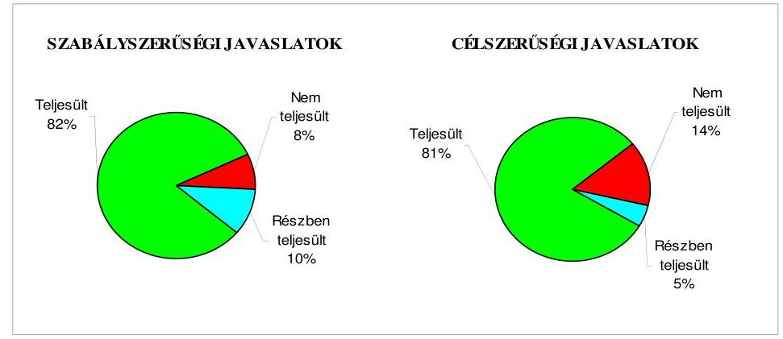

[^0]
[^0]:    ${ }^{60}$ A Magyar Köztársaság 2006. évi költségvetéséről szóló 2005. évi CLIII. törvény.

---

A gazdálkodás 2005. évi átfogó ellenőrzése, a zárszámadáshoz kapcsolódó, valamint a további ellenőrzések javaslatainak végrehajtása eredményeként javult a költségvetés és a zárszámadás-készítés rendje, az Önkormányzat gazdálkodásának, vagyongazdálkodási tevékenységének szabályozottsága.

Budapest, 2010. december " 15
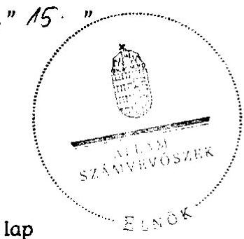

Dombos Lazzló

Melléklet: $\quad 10 \mathrm{db} \quad 27$ lap

---

Szeged Megyei Jogú Város Önkormányzata

# Az Önkormányzat gazdálkodását meghatározó adatok, mutatószámok 

| Megnevezés |  |
| :--: | :--: |
| A település állandó lakosainak száma (fő) 2010. január 1-jén | 169645 |
| A Közgyűlés tagjainak a száma (fő) (2009. december 31-én) | 43 |
| A Közgyűlés munkáját segítő állandó bizottságok száma (2009. december 31-én) | 10 |
| A Polgármesteri hivatalban foglalkoztatott köztisztviselők száma (fő) (2009. december 31-én) | 480 |
| Az összes vagyon értéke a 2009. december 31-i könyvviteli mérleg szerint (millió Ft) | 274453 |
| Az adósságállomány (hosszú és rövid lejáratú kötelezettség) 2009. december 31-én (millió Ft) | 21285 |
| Az egy lakosra jutó adósságállomány 2009. december 31-én (Ft) | 125468 |
| Az összes 2009. évben teljesített költségvetési bevétel (millió Ft) | 48141 |
| Ebből: saját bevétel (millió Ft), melyből | 23412 |
| helyi adóbevétel (millió Ft) | 9337 |
| Az egy lakosra jutó 2009. évi költségvetési bevétel (Ft) | 283775 |
| Az egy lakosra jutó 2009. évi saját bevétel (Ft) | 138006 |
| Az egy lakosra jutó 2009. évi helyi adóbevétel (Ft) | 55038 |
| Saját bevétel/Összes költségvetési bevétel aránya a 2009. évben (\%) | 48,6 |
| Helyi adó bevétel/Összes költségvetési bevétel aránya a 2009. évben (\%) | 19,4 |
| Az összes teljesített költségvetési kiadás a 2009. évben (millió Ft) | 44736 |
| Ebből: felhalmozási célú költségvetési kiadás (millió Ft) | 10376 |
| A 2009. évi költségvetési kiadásból a felhalmozási célú költségvetési kiadás aránya (\%) | 23,2 |
| Az egy lakosra jutó 2009. évi költségvetési kiadás (Ft) | 263704 |
| Az egy lakosra jutó 2009. évben teljesített felhalmozási célú költségvetési kiadás (Ft) | 61163 |
| A költségvetési intézmények száma 2009. december 31-én (db) | 47 |
| Ebből: önállóan müködő (db) | 36 |
| A költségvetési intézményekben foglalkoztatott közalkalmazottak száma (fő) (2009. december 31-én) | 4211 |

---

# Az önkormányzati vagyon alakulása

|  Mérlegsor
megnevezése | 2007.év
(millió Ft) | 2008. év
(millió Ft) | 2009. év
(millió Ft) | Változás \%-a (Előző év=100\%) |  |   |
| --- | --- | --- | --- | --- | --- | --- |
|   |  |  |  | 2008/2007. | 2009/2008. | 2009/2007.  |
|  Immateriális javak | 440 | 299 | 158 | 68,0 | 52,8 | 35,9  |
|  Tárgyi eszközök | 41735 | 37401 | 34096 | 89,6 | 91,2 | 81,7  |
|  ebből: ingatlanok | 23556 | 23617 | 24438 | 100,3 | 103,5 | 103,7  |
|  beruházások, felújítások | 16480 | 12248 | 7270 | 74,3 | 59,4 | 44,1  |
|  Befektetett pénzügyi eszközök | 6690 | 8377 | 8463 | 125,2 | 101,0 | 126,5  |
|  Üzemeltetésre átadott eszközök | 218402 | 222338 | 224100 | 101,8 | 100,8 | 102,6  |
|  Befektetett eszközök összesen | 267267 | 268415 | 266817 | 100,4 | 99,4 | 99,8  |
|  Forgóeszközök összesen | 6263 | 6619 | 7636 | 105,7 | 115,4 | 121,9  |
|  ebből: követelések | 927 | 1092 | 1477 | 117,8 | 135,3 | 159,3  |
|  pénzeszközök | 2731 | 4354 | 5276 | 159,4 | 121,2 | 193,2  |
|  Eszközök összesen | 273530 | 275034 | 274453 | 100,5 | 99,8 | 100,3  |
|  Saját tőke összesen | 250957 | 249621 | 253741 | 99,5 | 101,7 | 101,1  |
|  Tartalék összesen | 2277 | 3370 | $-1561$ | 148,0 | - | -  |
|  Kötelezettségek összesen | 20296 | 22043 | 22273 | 108,6 | 101,0 | 109,7  |
|  ebből: hosszú lejáratú kötelezettségek | 9406 | 10058 | 10012 | 106,9 | 99,5 | 106,4  |
|  rövid lejáratú kötelezettségek | 9183 | 10827 | 11273 | 117,9 | 104,1 | 122,8  |
|  Források összesen: | 273530 | 275034 | 274453 | 100,5 | 99,8 | 100,3  |

Forrás: Magyar Államkincstár éves költségvetési beszámoló "01" számú űrlap ÁSZ ellenőrzés során korrigált adatai.

---

# Az önkormányzati kötelezettségek alakulása

|  Mérlegsor
megnevezése | 2007.év
(millió Ft) | 2008. év
(millió Ft) | 2009. év
(millió Ft) | Változás \%-a (Előző év=100\%) |  |   |
| --- | --- | --- | --- | --- | --- | --- |
|   |  |  |  | 2008/2007. | 2009/2008. | 2009/2007.  |
|  Hosszú lejáratú kötelezettségek összesen | 9406 | 10058 | 10012 | 106,9 | 99,5 | 106,4  |
|  ebből: hosszú lejáratra kapott kölcsönök | 2 | 6 |  | 300,0 | 0,0 | 0,0  |
|  tartozások fejlesztési célú kötvénykibocsátásból |  |  |  |  |  |   |
|  tartozások müködési célú kötvénykibocsátásból |  |  |  |  |  |   |
|  beruházási és fejlesztési hitelek | 9395 | 10034 | 10000 | 106,8 | 99,7 | 106,4  |
|  müködési célú hosszú lejáratú hitelek |  |  |  |  |  |   |
|  egyéb hosszú lejáratú kötelezettségek | 9 | 18 | 12 | 200,0 | 66,7 | 133,3  |
|  Rövid lejáratú kötelezettségek összesen | 9183 | 10827 | 11273 | 117,9 | 104,1 | 122,8  |
|  ebből: rövid lejáratú kölcsönök |  |  |  |  |  |   |
|  rövid lejáratú hitelek | 4500 | 5321 | 6631 | 118,2 | 124,6 | 147,4  |
|  kötelezettségek áruszállításból, szolgáltatásból | 921 | 483 | 1650 | 52,4 | 341,6 | 179,2  |
|  garancia- és kezességvállalásból szárm. köt. |  |  |  |  |  |   |
|  h. lejár. kapott kölcsön köv. évet terh.törl.részl. | 2 | 2 | 0 | 100,0 | 0,0 | 0,0  |
|  felh.c.kötv.kib-ból szárm.tart.köv.évet terh.r. |  |  |  |  |  |   |
|  mük.c.kötv.kib-ból szárm.tart.köv.évet terh.r. |  |  |  |  |  |   |
|  beruh.fejl.hitel köv.évet terhelő törl. részlete | 671 | 1069 | 1292 | 159,3 | 120,9 | 192,5  |
|  müködési c.hosszú lej.hitel köv.évet terh.törl.r. |  |  |  |  |  |   |
|  egyéb hosszú lej.köt.köv.évet terh.törl. részlete | 2369 | 2551 | 23 | 107,7 | 0,9 | 1,0  |

Forrás: Magyar Államkincstár éves költségvetési beszámoló "01" számú űrlap adatai.

---

Szeged Megyei Jogú Város Önkormányzata

Az Önkormányzat 2007-2010. évi költségvetési előirányzatainak és 2007-2009. évi pénzügyi teljesítéseinek alakulása

|  Megnevezés | 2007. év |  |  |  | 2008. év |  |  |  | 2009. év |  |  |  | 2010.  |
| --- | --- | --- | --- | --- | --- | --- | --- | --- | --- | --- | --- | --- | --- |
|   | Eredeti | Módosított | Teljesítés (millió Ft) | Teljesítés/ eredeti előirány- zat % | Eredeti | Módosított | Teljesítés (millió Ft) | Teljesítés/ eredeti előirány- zat % | Eredeti | Módosított | Teljesítés (millió Ft) | Teljesítés/ eredeti előirány- zat % | Eredeti  |
|   | előirányzat (millió Ft) |  |  |  | előirány- zat % |  |  |  | előirányzat (millió Ft) |  |  |  | előirány- zat (millió Ft)  |
|  Működési célú költségvetési bevételek összesen | 34 065 | 38 388 | 39 688 | 116,5 | 31 025 | 35 352 | 36 568 | 117,9 | 29 651 | 35 456 | 37 071 | 125,0 | 29 563  |
|  Működési célú költségvetési kiadások összesen | 35 116 | 39 078 | 36 959 | 105,2 | 32 370 | 36 646 | 34 143 | 105,5 | 31 914 | 39 158 | 34 360 | 107,7 | 32 037  |
|  Működési célú költségvetési bevételek és kiadások egyenlege: hiány-, többlet + | -1 051 | -690 | 2 729 |  | -1 345 | -1 294 | 2 425 |  | -2 263 | -3 702 | 2 711 |  | -2 474  |
|  Felhalmozási célú költségvetési bevételek összesen | 12 897 | 20 710 | 15 685 | 121,6 | 13 862 | 20 230 | 12 653 | 91,3 | 20 507 | 21 902 | 11 070 | 54,0 | 29 791  |
|  Felhalmozási célú költségvetési kiadások összesen | 15 628 | 25 300 | 15 726 | 100,6 | 16 118 | 23 781 | 13 014 | 80,7 | 19 885 | 24 950 | 10 376 | 52,2 | 35 308  |
|  Felhalmozási célú költségvetési bevételek és kiadások egyenlege: hiány-, többlet+ | -2 731 | -4 590 | -41 | 1,5 | -2 256 | -3 551 | -361 | 16,0 | 622 | -3 048 | 694 | 111,6 | -5 517  |
|  Költségvetési bevételek összesen | 46 962 | 59 098 | 55 374 | 117,9 | 44 887 | 55 582 | 49 221 | 109,7 | 50 158 | 57 358 | 48 141 | 96,0 | 59 354  |
|  Költségvetési kiadások összesen | 50 744 | 64 378 | 52 686 | 103,8 | 48 488 | 60 427 | 47 157 | 97,3 | 51 799 | 64 108 | 44 736 | 86,4 | 67 345  |
|  Költségvetési bevételek és kiadások egyenlege: hiány-, többlet+ | -3 782 | -5 280 | 2 688 |  | -3 601 | -4 845 | 2 064 |  | -1 641 | -6 750 | 3 405 |  | -7 991  |
|  Finanszírozási célú pénzügyi bevételek | 4 456 | 8 095 | 3 065 |  | 4 267 | 6 407 | 3 177 |  | 2 704 | 8 103 | 2 400 |  | 9 283  |
|  Finanszírozási célú pénzügyi kiadások | 674 | 2 815 | 2 815 |  | 666 | 1 562 | 1 484 |  | 1 063 | 1 353 | 1 370 |  | 1 292  |
|  Finanszírozási célú pénzügyi műveletek egyenlege | 3 782 | 5 280 | 250 |  | 3 601 | 4 845 | 1 693 |  | 1 641 | 6 750 | 1 030 |  | 7 991  |

*Fonrás:* - Magyar Államkincstár éves költségvetési beszámoló "80" számú űrlap ÁSZ ellenőrzés során korrigált (könyvvizsgáló auditálási eltéšet is figyelembe véve) adatai; - a 2010. évi adatok esetében az Önkormányzat 2010. évi költségvetése; - a költségvetési bevétel-kiadás működési-felhalmozási célra történt megosztásánál az analitikus nyilvántartás.

---

Szeged Megyei Jogi Város Önkormányzata 4. számú melléklet a V-3023-7/28/2010. számú jelentéshez

TANÚSÍTVÁNY az európai uniós forrásokkal támogatott célok és programok 2007-2010. évi tervezett és teljesített adatairól

|  |   |   |   |   |   |   |   |   |   |   |   |   |   |   |   |   |   |   |   |   |   |   |   |   |   |   |   |   |   |   |   |   |   |   |   |   |   |   |   |   |   |   |   |   |   |   |   |   |   |   |   |   |   |   |   |   |   |   |   |   |   |   |   |   |   |   |   |   |   |   |   |   |   |   |   |   |   |   |   |   |   |   |   |   |   |   |   |   |   |   |   |   |   |   |   |   |   |   |   |   |   |

---

|  |   |   |   |   |   |   |   |   |   |   |   |   |   |   |   |   |   |   |   |
| --- | --- | --- | --- | --- | --- | --- | --- | --- | --- | --- | --- | --- | --- | --- | --- | --- | --- | --- | --- |
|  9 | Az európai uniós forrásokkal támogatott program megnevezése és a pályázat célja |  |  |  |  |  |  |  |  |  |  |  |  |  |  |  |  |  |   |
|   |  |  |  |  |  |  |  |  |  |  |  |  |  |  |  |  |  |  |   |
|   |  |  |  |  |  |  |  |  |  |  |  |  |  |  |  |  |  |  |   |
|   |  |  |  |  |  |  |  |  |  |  |  |  |  |  |  |  |  |  |   |
|   |  |  |  |  |  |  |  |  |  |  |  |  |  |  |  |  |  |  |   |
|   |  |  |  |  |  |  |  |  |  |  |  |  |  |  |  |  |  |  |   |
|   |  |  |  |  |  |  |  |  |  |  |  |  |  |  |  |  |  |  |   |
|   |  |  |  |  |  |  |  |  |  |  |  |  |  |  |  |  |  |  |   |
|   |  |  |  |  |  |  |  |  |  |  |  |  |  |  |  |  |  |  |   |
|   |  |  |  |  |  |  |  |  |  |  |  |  |  |  |  |  |  |  |   |
|   |  |  |  |  |  |  |  |  |  |  |  |  |  |  |  |  |  |  |   |
|   |  |  |  |  |  |  |  |  |  |  |  |  |  |  |  |  |  |  |   |
|   |  |  |  |  |  |  |  |  |  |  |  |  |  |  |  |  |  |  |   |
|   |  |  |  |  |  |  |  |  |  |  |  |  |  |  |  |  |  |  |   |
|   |  |  |  |  |  |  |  |  |  |  |  |  |  |  |  |  |  |  |   |
|   |  |  |  |  |  |  |  |  |  |  |  |  |  |  |  |  |  |  |   |
|   |  |  |  |  |  |  |  |  |  |  |  |  |  |  |  |  |  |  |   |
|   |  |  |  |  |  |  |  |  |  |  |  |  |  |  |  |  |  |  |   |
|   |  |  |  |  |  |  |  |  |  |  |  |  |  |  |  |  |  |  |   |
|   |  |  |  |  |  |  |  |  |  |  |  |  |  |  |  |  |  |  |   |
|   |  |  |  |  |  |  |  |  |  |  |  |  |  |  |  |  |  |  |   |
|   |  |  |  |  |  |  |  |  |  |  |  |  |  |  |  |  |  |  |   |
|   |  |  |  |  |  |  |  |  |  |  |  |  |  |  |  |  |  |  |   |
|   |  |  |  |  |  |  |  |  |  |  |  |  |  |  |  |  |  |  |   |
|   |  |  |  |  |  |  |  |  |  |  |  |  |  |  |  |  |  |  |   |
|   |  |  |  |  |  |  |  |  |  |  |  |  |  |  |  |  |  |  |   |
|   |  |  |  |  |  |  |  |  |  |  |  |  |  |  |  |  |  |  |   |
|   |  |  |  |  |  |  |  |  |  |  |  |  |  |  |  |  |  |  |   |
|   |  |  |  |  |  |  |  |  |  |  |  |  |  |  |  |  |  |  |   |
|   |  |  |  |  |  |  |  |  |  |  |  |  |  |  |  |  |  |  |   |
|   |  |  |  |  |  |  |  |  |  |  |  |  |  |  |  |  |  |  |   |
|   |  |  |  |  |  |  |  |  |  |  |  |  |  |  |  |  |  |  |   |
|  

---

|  |   |   |   |   |   |   |   |   |   |   |   |   |   |   |   |   |   |   |   |   |   |
| --- | --- | --- | --- | --- | --- | --- | --- | --- | --- | --- | --- | --- | --- | --- | --- | --- | --- | --- | --- | --- | --- |
|  Bor-
trián | Az európai uniós forrásokkal támogatott program megnevezése és a pályázat célja |  |  |  |  |  |  |  |  |  |  |  |  |  |  |  |  |  |  |  |   |
|   |  |  |  |  |  |  | Az összes kiadásból 2007-2010 között tervezett költségvetési adatok (milliit Ft) |  |  |  |  |  |  |  |  |  |  |  |  |  |   |
|   |  |  |  |  |  | az összes kiadási finanszírozó tontásak |  |  |  |  |  |  |  |  |  |  |  |  | az összes kiadási finanszírozó tontásak |  |   |
|   |  |  |  |  |  |  |  |  |  |  |  |  |  |  |  |  |  |  |  |  |   |
|   |  |  |  |  |  |  |  |  |  |  |  |  |  |  |  |  |  |  |  |  |   |
|  20 | DAOP-3.2.1/2008 "Közösségi
közlekedés szívvonalának javításai
a Szeged, Tatján Vizionery téri
állomás internodális csomóponttá
alakításával, valamint 11 db
megitívő megállóhely felújításával,
továbbá 6 db új megállóhely és 1 db
új buszforduló létesítésével" |  |  |  |  |  |  |  |  |  |  |  |  |  |  |  |  |  |  |  |  |   |
|   |  |  |  |  |  |  |  |  |  |  |  |  |  |  |  |  |  |  |  |  |  |   |
|  21 |  |  |  |  |  |  |  |  |  |  |  |  |  |  |  |  |  |  |  |  |  |   |
|   |  |  |  |  |  |  |  |  |  |  |  |  |  |  |  |  |  |  |  |  |  |   |
|   |  |  |  |  |  |  |  |  |  |  |  |  |  |  |  |  |  |  |  |  |  |   |
|  22 |  |  |  |  |  |  |  |  |  |  |  |  |  |  |  |  |  |  |  |  |  |   |
|   |  |  |  |  |  |  |  |  |  |  |  |  |  |  |  |  |  |  |  |  |  |   |
|   |  |  |  |  |  |  |  |  |  |  |  |  |  |  |  |  |  |  |  |  |  |   |
|  23 |  |  |  |  |  |  |  |  |  |  |  |  |  |  |  |  |  |  |  |  |  |   |
|   |  |  |  |  |  |  |  |  |  |  |  |  |  |  |  |  |  |  |  |  |  |   |
|   |  |  |  |  |  |  |  |  |  |  |  |  |  |  |  |  |  |  |  |  |  |   |
|  24 |  |  |  |  |  |  |  |  |  |  |  |  |  |  |  |  |  |  |  |  |  |   |
|   |  |  |  |  |  |  |  |  |  |  |  |  |  |  |  |  |  |  |  |  |  |   |
|   |  |  |  |  |  |  |  |  |  |  |  |  |  |  |  |  |  |  |  |  |  |   |
|  25 |  |  |  |  |  |  |  |  |  |  |  |  |  |  |  |  |  |  |  |  |  |   |
|   |  |  |  |  |  |  |  |  |  |  |  |  |  |  |  |  |  |  |  |  |  |   |
|   |  |  |  |  |  |  |  |  |  |  |  |  |  |  |  |  |  |  |  |  |  |   |
|  26 |  |  |  |  |  |  |  |  |  |  |  |  |  |  |  |  |  |  |  |  |  |   |
|   |  |  |  |  |  |  |  |  |  |  |  |  |  |  |  |  |  |  |  |  |  |   |
|   |  |  |  |  |  |  |  |  |  |  |  |  |  |  |  |  |  |  |  |  |  |   |
|  27 |  |  |  |  |  |  |  |  |  |  |  |  |  |  |  |  |  |  |  |  |  |   |
|   |  |  |  |  |  |  |  |  |  |  |  |  |  |  |  |  |  |  |  |  |  |   |
|   |  |  |  |  |  |  |  |  |  |  |  |  |  |  |  |  |  |  |  |  |  |   |
|  28 |  |  |  |  |  |  |  |  |  |  |  |  |  |  |  |  |  |  |  |  |  |   |
|   |  |  |  |  |  |  |  |  |  |  |  |  |  |  |  |  |  |  |  |  |  |   |
|   |  |  |  |  |  |  |  |  |  |  |  |  |  |  |  |  |  |  |  |  |  |   |
|  29 |  |  |  |  |  |  |  |  |  |  |  |  |  |  |  |  |  |  |  |  |  |   |
|   |  |  |  |  |  |  |  |  |  |  |  |  |  |  |  |  |  |  |  |  |  |   |
|   |  |  |  |  |  |  |  |  |  |  |  |  |  |  |  |  |  |  |  |  |  |   |
|  30 |  |  |  |  |  |  |  |  |  |  |  |  |  |  |  |  |  |  |  |  |  |   |
|   |  |  |  |  |  |  |  |  |  |  |  |  |  |  |  |  |  |  |  |  |  |   |
|   |  |  |  |  |  |  |  |  |  |  |  |  |  |  |  |  |  |  |  |  |  |   |
|  31 |  |  |  |  |  |  |  |  |  |  |  |  |  |  |  |  |  |  |  |  |  |   |
|   |  |  |  |  |  |  |  |  |  |  |  |  |  |  |  |  |  |  |  |  |  |   |
|  32 |  |  |  |  |  |  |  |  |  |  |  |  |  |  |  |  |  |  |  |  |  |   |
|   |  |  |  |  |  |  |  |  |  |  |  |  |  |  |  |  |  |  |  |  |  |   |
|   |  |  |  |  |  |  |  |  |  |  |  |  |  |  |  |  |  |  |  |  |  |   |
|  33 |  |  |  |  |  |  |  |  |  |  |  |  |  |  |  |  |  |  |  |  |  |   |
|   |  |  |  |  |  |  |  |  |  |  |  |  |  |  |  |  |  |  |  |  |  |   |
|  34 |  |  |  |  |  |  |  |  |  |  |  |  |  |  |  |  |  |  |  |  |  |   |
|   |  |  |  |  |  |  |  |  |  |  |  |  |  |  |  |  |  |  |  |  |  |   |
|   |  |  |  |  |  |  |  |  |  |  |  |  |  |  |  |  |  |  |  |  |  |   |
|  35 |  |  |  |  |  |  |  |  |  |  |  |  |  |  |  |  |  |  |  |  |  |   |
|   |  |  |  |  |  |  |  |  |  |  |  |  |  |  |  |  |  |  |  |  |  |   |
|  36 |  |  |  |  |  |  |  |  |  |  |  |  |  |  |  |  |  |  |  |  |  |   |
|   |  |  |  |  |  |  |  |  |  |  |  |  |  |  |  |  |  |  |  |  |  |   |
|  37 |  |  |  |  |  |  |  |  |  |  |  |  |  |  |  |  |  |  |  |  |  |   |
|   |  |  |  |  |  |  |  |  |  |  |  |  |  |  |  |  |  |  |  |  |  |   |
|  38 |  |  |  |  |  |  |  |  |  |  |  |  |  |  |  |  |  |  |  |  |  |   |
|   |  |  |  |  |  |  |  |  |  |  |  |  |  |  |  |  |  |  |  |  |  |   |
|  39 |  |  |  |  |  |  |  |  |  |  |  |  |  |  |  |  |  |  |  |  |  |   |
|   |  |  |  |  |  |  |  |  |  |  |  |  |  |  |  |  |  |  |  |  |  |   |
|  40 |  |  |  |  |  |  |  |  |  |  |  |  |  |  |  |  |  |  |  |  |  |   |
|   |  |  |  |  |  |  |  |  |  |  |  |  |  |  |  |  |  |  |  |  |  |   |
|  41 |  |  |  |  |  |  |  |  |  |  |  |  |  |  |  |  |  |  |  |  |  |   |
|   |  |  |  |  |  |  |  |  |  |  |  |  |  |  |  |  |  |  |  |  |  |   |
|  42 |  |  |  |  |  |  |  |  |  |  |  |  |  |  |  |  |  |  |  |  |  |   |
|   |  |  |  |  |  |  |  |  |  |  |  |  |  |  |  |  |  |  |  |  |  |   |
|  43 |  |  |  |  |  |  |  |  |  |  |  |  |  |  |  |  |  |  |  |  |  |   |
|   |  |  |  |  |  |  |  |  |  |  |  |  |  |  |  |  |  |  |  |  |  |   |
|  44 |  |  |  |  |  |  |  |  |  |  |  |  |  |  |  |  |  |  |  |  |  |   |
|   |  |  |  |  |  |  |  |  |  |  |  |  |  |  |  |  |  |  |  |  |  |   |
|  45 |  |  |  |  |  |  |  |  |  |  |  |  |  |  |  |  |  |  |  |  |  |   |
|   |  |  |  |  |  |  |  |  |  |  |  |  |  |  |  |  |  |  |  |  |  |   |
|  46 |  |  |  |  |  |  |  |  |  |  |  |  |  |  |  |  |  |  |  |  |  |   |
|   |  |  |  |  |  |  |  |  |  |  |  |  |  |  |  |  |  |  |  |  |  |   |
|  47 |  |  |  |  |  |  |  |  |  |  |  |  |  |  |  |  |  |  |  |  |  |   |
|   |  |  |  |  |  |  |  |  |  |  |  |  |  |  |  |  |  |  |  |  |  |   |
|  48 |  |  |  |  |  |  |  |  |  |  |  |  |  |  |  |  |  |  |  |  |  |   |
|   |  |  |  |  |  |  |  |  |  |  |  |  |  |  |  |  |  |  |  |  |  |   |
|  49 |  |  |  |  |  |  |  |  |  |  |  |  |  |  |  |  |  |  |  |  |  |   |
|   |  |  |  |  |  |  |  |  |  |  |  |  |  |  |  |  |  |  |  |  |  |   |
|  50 |  |  |  |  |  |  |  |  |  |  |  |  |  |  |  |  |  |  |  |  |  |   |
|  51 |  |  |  |  |  |  |  |  |  |  |  |  |  |  |  |  |  |  |  |  |  |   |
|  52 |  |  |  |  |  |  |  |  |  |  |  |  |  |  |  |  |  |  |  |  |  |   |
|  53 |  |  |  |  |  |  |  |  |  |  |  |  |  |  |  |  |  |  |  |  |  |   |
|  54 |  |  |  |  |  |  |  |  |  |  |  |  |  |  |  |  |  |  |  |  |  |   |
|  55 |  |  |  |  |  |  |  |  |  |  |  |  |  |  |  |  |  |  |  |  |  |   |
|  56 |  |  |  |  |  |  |  |  |  |  |  |  |  |  |  |  |  |  |  |  |  |   |
|  57 |  |  |  |  |  |  |  |  |  |  |  |  |  |  |  |  |  |  |  |  |  |   |
|  58 |  |  |  |  |  |  |  |  |  |  |  |  |  |  |  |  |  |  |  |  |  |   |
|  59 |  |  |  |  |  |  |  |  |  |  |  |  |  |  |  |  |  |  |  |  |  |   |
|  60 |  |  |  |  |  |  |  |  |  |  |  |  |  |  |  |  |  |  |  |  |  |   |
|  61 |  |  |  |  |  |  |  |  |  |  |  |  |  |  |  |  |  |  |  |  |  |   |
|  62 |  |  |  |  |  |  |  |  |  |  |  |  |  |  |  |  |  |  |  |  |  |   |
|  63 |  |  |  |  |  |  |  |  |  |  |  |  |  |  |  |  |  |  |  |  |  |   |
|  64 |  |  |  |  |  |  |  |  |  |  |  |  |  |  |  |  |  |  |  |  |  |   |
|  65 |  |  |  |  |  |  |  |  |  |  |  |  |  |  |  |  |  |  |  |  |  |   |
|  66 |  |  |  |  |  |  |  |  |  |  |  |  |  |  |  |  |  |  |  |  |  |   |
|  67 |  |  |  |  |  |  |  |  |  |  |  |  |  |  |  |  |  |  |  |  |  |   |
|  68 |  |  |  |  |  |  |  |  |  |  |  |  |  |  |  |  |  |  |  |  |  |   |
|  69 |  |  |  |  |  |  |  |  |  |  |  |  |  |  |  |  |  |  |  |  |  |   |
|  70 |  |  |  |  |  |  |  |  |  |  |  |  |  |  |  |  |  |  |  |  |  |   |
|  71 |  |  |  |  |  |  |  |  |  |  |  |  |  |  |  |  |  |  |  |  |  |   |
|  72 |  |  |  |  |  |  |  |  |  |  |  |  |  |  |  |  |  |  |  |  |  |   |
|  73 |  |  |  |  |  |  |  |  |  |  |  |  |  |  |  |  |  |  |  |  |  |   |
|  74 |  |  |  |  |  |  |  |  |  |  |  |  |  |  |  |  |  |  |  |  |  |   |
|  75 |  |  |  |  |  |  |  |  |  |  |  |  |  |  |  |  |  |  |  |  |  |   |
|  76 |  |  |  |  |  |  |  |  |  |  |  |  |  |  |  |  |  |  |  |  |  |   |
|  77 |  |  |  |  |  |  |  |  |  |  |  |  |  |  |  |  |  |  |  |  |  |   |
|  78 |  |  |  |  |  |  |  |  |  |  |  |  |  |  |  |  |  |  |  |  |  |   |
|  79 |  |  |  |  |  |  |  |  |  |  |  |  |  |  |  |  |  |  |  |  |  |   |
|  80 |  |  |  |  |  |  |  |  |  |  |  |  |  |  |  |  |  |  |  |  |  |   |
|  81 |  |  |  |  |  |  |  |  |  |  |  |  |  |  |  |  |  |  |  |  |  |   |
|  82 |  |  |  |  |  |  |  |  |  |  |  |  |  |  |  |  |  |  |  |  |  |   |
|  83 |  |  |  |  |  |  |  |  |  |  |  |  |  |  |  |  |  |  |  |  |  |   |
|  84 |  |  |  |  |  |  |  |  |  |  |  |  |  |  |  |  |  |  |  |  |  |   |
|  85 |  |  |  |  |  |  |  |  |  |  |  |  |  |  |  |  |  |  |  |  |  |   |
|  86 |  |  |  |  |  |  |  |  |  |  |  |  |  |  |  |  |  |  |  |  |  |   |
|  87 |  |  |  |  |  |  |  |  |  |  |  |  |  |  |  |  |  |  |  |  |  |   |
|  88 |  |  |  |  |  |  |  |  |  |  |  |  |  |  |  |  |  |  |  |  |  |   |
|  89 |  |  |  |  |  |  |  |  |  |  |  |  |  |  |  |  |  |  |  |  |  |   |
|  90 |  |  |  |  |  |  |  |  |  |  |  |  |  |  |  |  |  |  |  |  |  |   |
|  91 |  |  |  |  |  |  |  |  |  |  |  |  |  |  |  |  |  |  |  |  |  |   |
|  92 |  |  |  |  |  |  |  |  |  |  |  |  |  |  |  |  |  |  |  |  |  |   |
|  93 |  |  |  |  |  |  |  |  |  |  |  |  |  |  |  |  |  |  |  |  |  |   |
|  94 |  |  |  |  |  |  |  |  |  |  |  |  |  |  |  |  |  |  |  |  |  |   |
|  95 |  |  |  |  |  |  |  |  |  |  |  |  |  |  |  |  |  |  |  |  |  |  |   |
|  96 |  |  |  |  |  |  |  |  |  |  |  |  |  |  |  |  |  |  |  |  |  |  |   |
|  97 |  |  |  |  |  |  |  |  |  |  |  |  |  |  |  |  |  |  |  |  |  |  |   |
|  98 |  |  |  |  |  |  |  |  |  |  |  |  |  |  |  |  |  |  |  |  |  |  |   |
|  99 |  |  |  |  |  |  |  |  |  |  |  |  |  |  |  |  |  |  |  |  |  |  |   |
|  100 |  |  |  |  |  |  |  |  |  |  |  |  |  |  |  |  |  |  |  |  |  |  |   |
|  101 |  |  |  |  |  |  |  |  |  |  |  |  |  |  |  |  |  |  |  |  |  |  |   |
|  102 |  |  |  |  |  |  |  |  |  |  |  |  |  |  |  |  |  |  |  |  |  |  |   |
|  103 |  |  |  |  |  |  |  |  |  |  |  |  |  |  |  |  |  |  |  |  |  |  |   |
|  104 |  |  |  |  |  |  |  |  |  |  |  |  |  |  |  |  |  |  |  |  |  |  |   |
|  105 |  |  |  |  |  |  |  |  |  |  |  |  |  |  |  |  |  |  |  |  |  |  |   |
|  106 |  |  |  |  |  |  |  |  |  |  |  |  |  |  |  |  |  |  |  |  |  |  |   |
|  107 |  |  |  |  |  |  |  |  |  |  |  |  |  |  |  |  |  |  |  |  |  |  |  |   |
|  108 |  |  |  |  |  |  |  |  |  |  |  |  |  |  |  |  |  |  |  |  |  |  |  |   |
|  109 |  |  |  |  |  |  |  |  |  |  |  |  |  |  |  |  |  |  |  |  |  |  |  |   |
|  110 |  |  |  |  |  |  |  |  |  |  |  |  |  |  |  |  |  |  |  |  |  |  |  |   |
|  111 |  |  |  |  |  |  |  |  |  |  |  |  |  |  |  |  |  |  |  |  |  |  |  |   |
|  112 |  |  |  |  |  |  |  |  |  |  |  |  |  |  |  |  |  |  |  |  |  |  |  |   |
|  113 |  |  |  |  |  |  |  |  |  |  |  |  |  |  |  |  |  |  |  |  |  |  |  |   |
|  114 |  |  |  |  |  |  |  |  |  |  |  |  |  |  |  |  |  |  |  |  |  |  |  |   |
|  115 |  |  |  |  |  |  |  |  |  |  |  |  |  |  |  |  |  |  |  |  |  |  |  |   |
|  116 |  |  |  |  |  |  |  |  |  |  |  |  |  |  |  |  |  |  |  |  |  |  |  |   |
|  117 |  |  |  |  |  |  |  |  |  |  |  |  |  |  |  |  |  |  |  |  |  |  |  |  |   |
|  118 |  |  |  |  |  |  |  |  |  |  |  |  |  |  |  |  |  |  |  |  |  |  |  |  |   |
|  119 |  |  |  |  |  |  |  |  |  |  |  |  |  |  |  |  |  |  |  |  |  |  |  |  |  |   |
|  120 |  |  |  |  |  |  |  |  |  |  |  |  |  |  |  |  |  |  |  |  |  |  |  |  |  |   |
|  121 |  |  |  |  |  |  |  |  |  |  |  |  |  |  |  |  |  |  |  |  |  |  |  |  |  |   |
|  122 |  |  |  |  |  |  |  |  |  |  |  |  |  |  |  |  |  |  |  |  |  |  |  |  |  |   |
|  123 |  |  |  |  |  |  |  |  |  |  |  |  |  |  |  |  |  |  |  |  |  |  |  |  |  |   |
|  124 |  |  |  |  |  |  |  |  |  |  |  |  |  |  |  |  |  |  |  |  |  |  |  |  |  |   |
|  125 |  |  |  |  |  |  |  |  |  |  |  |  |  |  |  |  |  |  |  |  |  |  |  |  |  |  |   |
|  126 |  |  |  |  |  |  |  |  |  |  |  |  |  |  |  |  |  |  |  |  |  |  |  |  |  |  |  |   |
|  127 |  |  |  |  |  |  |  |  |  |  |  |  |  |  |  |  |  |  |  |  |  |  |  |  |  |  |  |   |
|  128 |  |  |  |  |  |  |  |  |  |  |  |  |  |  |  |  |  |  |  |  |  |  |  |  |  |  |  |  |   |
|  129 |  |  |  |  |  |  |  |  |  |  |  |  |  |  |  |  |  |  |  |  |  |  |  |  |  |  |  |  |   |
|  130 |  |  |  |  |  |  |  |  |  |  |  |  |  |  |  |  |  |  |  |  |  |  |  |  |  |  |  |  |   |
|  131 |  |  |  |  |  |  |  |  |  |  |  |  |  |  |  |  |  |  |  |  |  |  |  |  |  |  |  |  |   |
|  132 |  |  |  |  |  |  |  |  |  |  |  |  |  |  |  |  |  |  |  |  |  |  |  |  |  |  |  |  |  |   |
|  133 |  |  |  |  |  |  |  |  |  |  |  |  |  |  |  |  |  |  |  |  |  |  |  |  |  |  |  |  |  |   |
|  134 |  |  |  |  |  |  |  |  |  |  |  |  |  |  |  |  |  |  |  |  |  |  |  |  |  |  |  |  |  |  |   |
|  135 |  |  |  |  |  |  |  |  |  |  |  |  |  |  |  |  |  |  |  |  |  |  |  |  |  |  |  |  |  |  |   |
|  136 |  |  |  |  |  |  |  |  |  |  |  |  |  |  |  |  |  |  |  |  |  |  |  |  |  |  |  |  |  |  |   |
|  137 |  |  |  |  |  |  |  |  |  |  |  |  |  |  |  |  |  |  |  |  |  |  |  |  |  |  |  |  |  |  |  |   |
|  138 |  |  |  |  |  |  |  |  |  |  |  |  |  |  |  |  |  |  |  |  |  |  |  |  |  |  |  |  |  |  |  |  |   |
|  139 |  |  |  |  |  |  |  |  |  |  |  |  |  |  |  |  |  |  |  |  |  |  |  |  |  |  |  |  |  |  |  |  |   |
|  140 |  |  |  |  |  |  |  |  |  |  |  |  |  |  |  |  |  |  |  |  |  |  |  |  |  |  |  |  |  |  |  |  |   |
|  141 |  |  |  |  |  |  |  |  |  |  |  |  |  |  |  |  |  |  |  |  |  |  |  |  |  |  |  |  |  |  |  |  |  |   |
|  142 |  |  |  |  |  |  |  |  |  |  |  |  |  |  |  |  |  |  |  |  |  |  |  |  |  |  |  |  |  |  |  |  |  |  |   |
|  143 |  |  |  |  |  |  |  |  |  |  |  |  |  |  |  |  |  |  |  |  |  |  |  |  |  |  |  |  |  |  |  |  |  |  |  |   |
|  144 |  |  |  |  |  |  |  |  |  |  |  |  |  |  |  |  |  |  |  |  |  |  |  |  |  |  |  |  |  |  |  |  |  |  |  |   |
|  145 |  |  |  |  |  |  |  |  |  |  |  |  |  |  |  |  |  |  |  |  |  |  |  |  |  |  |  |  |  |  |  |  |  |  |  |  |   |
|  146 |  |  |  |  |  |  |  |  |  |  |  |  |  |  |  |  |  |  |  |  |  |  |  |  |  |  |  |  |  |  |  |  |  |  |  |  |   |
|  147 |  |  |  |  |  |  |  |  |  |  |  |  |  |  |  |  |  |  |  |  |  |  |  |  |  |  |  |  |  |  |  |  |  |  |  |  |  |   |
|  148 |  |  |  |  |  |  |  |  |  |  |  |  |  |  |  |  |  |  |  |  |  |  |  |  |  |  |  |  |  |  |  |  |  |  |  |  |   |
|  149 |  |  |  |  |  |  |  |  |  |  |  |  |  |  |  |  |  |  |  |  |  |  |  |  |  |  |  |  |  |  |  |  |  |  |  |  |   |
|  150 |  |  |  |  |  |  |  |  |  |  |  |  |  |  |  |  |  |  |  |  |  |  |  |  |  |  |  |  |  |  |  |  |  |  |  |  |   |
|  151 |  |  |  |  |  |  |  |  |  |  |  |  |  |  |  |  |  |  |  |  |  |  |  |  |  |  |  |  |  |  |  |  |  |  |  |  |   |
|  152 |  |  |  |  |  |  |  |  |  |  |  |  |  |  |  |  |  |  |  |  |  |  |  |  |  |  |  |  |  |  |  |  |  |  |  |   |
|  153 |  |  |  |  |  |  |  |  |  |  |  |  |  |  |  |  |  |  |  |  |  |  |  |  |  |  |  |  |  |  |  |  |  |  |   |
|  154 |  |  |  |  |  |  |  |  |  |  |  |  |  |  |  |  |  |  |  |  |  |  |  |  |  |  |  |  |  |  |  |  |  |   |
|  155 |  |  |  |  |  |  |  |  |  |  |  |  |  |  |  |  |  |  |  |  |  |  |  |  |  |  |  |  |  |  |  |  |  |   |
|  156 |  |  |  |  |  |  |  |  |  |  |  |  |  |  |  |  |  |  |  |  |  |  |  |  |  |  |  |  |  |  |  |  |   |
|  157 |  |  |  |  |  |  |  |  |  |  |  |  |  |  |  |  |  |  |  |  |  |  |  |  |  |  |  |  |  |  |  |  |  |  |  |  |  |   |
|  158 |  |  |  |  |  |  |  |  |  |  |  |  |  |  |  |  |  |  |  |  |  |  |  |  |  |  |  |  |  |  |  |  |  |  |   |
|  159 |  |  |  |  |  |  |  |  |  |  |  |  |  |  |  |  |  |  |  |  |  |  |  |  |  |  |  |  |  |  |  |  |  |  |  |  |   |
|  160 |  |  |  |  |  |  |  |  |  |  |  |  |  |  |  |  |  |  |  |  |  |  |  |  |  |  |  |  |  |  |  |   |
|  161 |  |  |  |  |  |  |  |  |  |  |  |  |  |  |  |  |  |  |  |  |  |  |  |  |  |  |  |  |  |  |  |   |
|  162 |  |  |  |  |  |  |  |  |  |  |  |  |  |  |  |  |  |  |  |  |  |  |  |  |  |  |  |  |  |   |
|  163 |  |  |  |  |  |  |  |  |  |  |  |  |  |  |  |  |  |  |  |  |  |  |  |  |  |  |  |  |  |  |  |   |
|  164 |  |  |  |  |  |  |  |  |  |  |  |  |  |  |  |  |  |  |  |  |  |  |  |  |  |  |  |  |  |   |
|  165 |  |  |  |  |  |  |  |  |  |  |  |  |  |  |  |  |  |  |  |  |  |  |  |  |  |  |  |  |  |  |  |  |  |  |   |
|  166 |  |  |  |  |  |  |  |  |  |  |  |  |  |  |  |  |  |  |  |  |  |  |  |  |  |  |  |  |  |  |   |
|  167 |  |  |  |  |  |  |  |  |  |  |  |  |  |  |  |  |  |  |  |  |  |  |  |  |  |  |  |  |  |  |  |   |
|  168 |  |  |  |  |  |  |  |  |  |  |  |  |  |  |  |  |  |  |  |  |  |  |  |  |  |  |  |  |  |  |  |  |   |
|  169 |  |  |  |  |  |  |  |  |  |  |  |  |  |  |  |  |  |  |  |  |  |  |  |  |  |  |  |  |   |
|  170 |  |  |  |  |  |  |  |  |  |  |  |  |  |  |  |  |  |  |  |  |  |  |  |  |  |  |  |  |  |  |  |   |
|  171 |  |  |  |  |  |  |  |  |  |  |  |  |  |  |  |  |  |  |  |  |  |  |  |  |  |  |  |  |  |   |
|  172 |  |  |  |  |  |  |  |  |  |  |  |  |  |  |  |  |  |  |  |  |  |  |  |  |  |  |  |  |  |  |  |  |  |   |
|  173 |  |  |  |  |  |  |  |  |  |  |  |  |  |  |  |  |  |  |  |  |  |  |  |  |  |  |  |  |  |  |  |  |   |
|  174 |  |  |  |  |  |  |  |  |  |  |  |  |  |  |  |  |  |  |  |  |  |  |  |  |  |  |  |  |  |  |  |  |  |  |   |
|  175 |  |  |  |  |  |  |  |  |  |  |  |  |  |  |  |  |  |  |  |  |  |  |  |  |  |  |  |  |  |  |  |  |  |  |  |  |  |  |  |  |  |  |  |  |  |  |  |  |  |  |  |  |  |  |  |  |  |  |  |  |  |  |  |  |  |  |  |  |  |  |  |  |  |  |  |  |  |  |  |  |  |  |  |  |  |  |  |  |  |  |  |  |  |  |  |  |  |  |  |  | 

---

|  |   |   |   |   |   |   |   |   |   |   |   |   |   |   |   |   |   |   |   |
| --- | --- | --- | --- | --- | --- | --- | --- | --- | --- | --- | --- | --- | --- | --- | --- | --- | --- | --- | --- |
|  50- | Az európai uniós forrásokkal
támogatott program megnevezése és
a pályázat célja |  |  |  |  |  |  |  |  |  |  |  |  |  |  |  |  |  |   |
|  támogatott program megnevezése és
a pályázat célja |  |  |  |  |  |  |  |  |  |  |  |  |  |  |  |  |  |  |   |
|  az összes kiadásból 2007-2010 között tervezett költségvetési adatok (mibb Ft) |  |  |  |  |  |  |  |  |  |  |  |  |  |  |  |  |  |  |   |
|   |  |  |  |  |  |  |  |  |  |  |  |  |  |  |  |  |  |  | Az összes kiadásból 2007-2010 között teljesített költségvetési adatok (mibb Ft)  |
|   |  |  |  |  |  |  |  |  |  |  |  |  |  |  |  |  |  |  | az összes kiadás finanszírozó források  |
|   |  |  |  |  |  |  |  |  |  |  |  |  |  |  |  |  |  |  |   |
|  54 | DAOP-4.2.1/2/27-27-2009 XXI. |  |  |  |  |  |  |  |  |  |  |  |  |  |  |  |  |  |   |
|   | Századí oktatási környezet |  |  |  |  |  |  |  |  |  |  |  |  |  |  |  |  |  |   |
|   | kialakítása és akadálymentesítés a |  |  |  |  |  |  |  |  |  |  |  |  |  |  |  |  |  |   |
|   | Szíve Utóai Általános Iskolában |  |  |  |  |  |  |  |  |  |  |  |  |  |  |  |  |  |   |
|  55 | DAOP-4.3.1-09-2009 "Szeged, |  |  |  |  |  |  |  |  |  |  |  |  |  |  |  |  |  |   |
|   | József Attila Általános Iskola |  |  |  |  |  |  |  |  |  |  |  |  |  |  |  |  |  |   |
|   | komplex akadálymentesítése" | 33.3 | 33.3 | 25.5 | 4.5 | 0.0 | 3.3 | 0.0 | 0.0 | 2009-09-21 | 2010-09-20 | 33.3 | 0.0 | 0.0 | 0.0 | 33.3 | 0.0 | 0.0 |   |
|  56 | TIOP-1.3.3/08/1-2008 Agóre |  |  |  |  |  |  |  |  |  |  |  |  |  |  |  |  |  |   |
|   | Szeged Pólus a közművelődés |  |  |  |  |  |  |  |  |  |  |  |  |  |  |  |  |  |   |
|   | szolgáltatában | 1870.0 | 1870.0 | 1328.0 | 234.4 | 0.0 | 307.6 | 0.0 | 0.0 | 2009-11-01 | 2011-09-15 | 0.0 | 0.0 | 0.0 | 0.0 | 0.0 | 0.0 | 0.0 |   |
|  57 | TÁMOP-3.4.3-2008/2 Iskolai |  |  |  |  |  |  |  |  |  |  |  |  |  |  |  |  |  |   |
|   | Tehetséggondozás (ÖVf)** | 20.0 | 7.0 | 6.0 | 1.0 | 0.0 | 0.0 | 0.0 | 0.0 | 2010.05.01 | 2011.10.31 | 0.0 | 0.0 | 0.0 | 0.0 | 0.0 | 0.0 | 0.0 |   |
|  58 | TÁMOP-3.4.3-2008 Iskolai |  |  |  |  |  |  |  |  |  |  |  |  |  |  |  |  |  |   |
|   | Tehetséggondozás (Radnok M. |  |  |  |  |  |  |  |  |  |  |  |  |  |  |  |  |  |   |
|   | Gimm )** | 20.0 | 13.2 | 11.2 | 2.0 | 0.0 | 0.0 | 0.0 | 0.0 | 2009.12.01 | 2011.12.31 | 0.0 | 0.0 | 0.0 | 0.0 | 0.0 | 0.0 | 0.0 |   |
|  59 | TÁMOP-3.4.3-2009/2 Iskolai |  |  |  |  |  |  |  |  |  |  |  |  |  |  |  |  |  |   |
|   | Tehetséggondozás (SZKKV5Z)** | 19.9 | 12.2 | 10.4 | 1.8 | 0.0 | 0.0 | 0.0 | 0.0 | 2010.04.01 | 2011.03.31 | 0.0 | 0.0 | 0.0 | 0.0 | 0.0 | 0.0 | 0.0 |   |
|  60 | KEOP-5.3.0/A/09-2009 Szegedi |  |  |  |  |  |  |  |  |  |  |  |  |  |  |  |  |  |   |
|   | Nemzeti Színház energetikai |  |  |  |  |  |  |  |  |  |  |  |  |  |  |  |  |  |   |
|   | korszerűsítése** | 401.3 | 401.3 | 204.1 | 36.0 | 0.0 | 161.2 | 0.0 | 0.0 | 2010.01.04 | 2011.10.31 | 0.0 | 0.0 | 0.0 | 0.0 | 0.0 | 0.0 | 0.0 |   |
|  61 | DAOP-3.2.1/A-09-2009** "Szeged, |  |  |  |  |  |  |  |  |  |  |  |  |  |  |  |  |  |   |
|   | Nagykórol közőszegí közlekedési |  |  |  |  |  |  |  |  |  |  |  |  |  |  |  |  |  |   |
|   | sáv kialakítása" | 588.2 | 588.2 | 425.9 | 75.9 | 0.0 | 88.2 | 0.0 | 0.0 | 2010.10.01 | 2011.08.31 | 0.0 | 0.0 | 0.0 | 0.0 | 0.0 | 0.0 | 0.0 |   |
|  62 | DAOP-5.1.2/C-09-1F-2009 |  |  |  |  |  |  |  |  |  |  |  |  |  |  |  |  |  |   |
|   | Biopolisz Park - Egyetemi |  |  |  |  |  |  |  |  |  |  |  |  |  |  |  |  |  |   |
|   | vérmerész közterületeinek |  |  |  |  |  |  |  |  |  |  |  |  |  |  |  |  |  |   |
|   | rehatabjázóig** | 2557.2 | 2557.2 | 1519.6 | 268.2 | 0.0 | 17.3 | 752.2 | 0.0 | 2010-03-01 | 2013-02-28 | 0.0 | 0.0 | 0.0 | 0.0 | 0.0 | 0.0 | 0.0 |   |
|  63 | DAOP-4.1.3/C-2F-2009 RÖRE - a |  |  |  |  |  |  |  |  |  |  |  |  |  |  |  |  |  |   |
|   | Bekérosó Bölcsőde" - a szegedi |  |  |  |  |  |  |  |  |  |  |  |  |  |  |  |  |  |   |
|   | Vitéz utóai bölcsőde |  |  |  |  |  |  |  |  |  |  |  |  |  |  |  |  |  |   |
|   | Kapacitásbővítésre és komplex |  |  |  |  |  |  |  |  |  |  |  |  |  |  |  |  |  |   |
|   | hiánczébre irányuló módoli |  |  |  |  |  |  |  |  |  |  |  |  |  |  |  |  |  |   |
|   | szolgáltatási programja** | 109.9 | 109.9 | 64.1 | 14.8 | 0.0 | 11.0 | 0.0 | 0.0 | 2009-09-07 | 2009-12-31 | 0.0 | 0.0 | 0.0 | 0.0 | 0.0 | 0.0 | 0.0 |   |
|  64 | DAOP-2009-3.1../0-09-2009 "A |  |  |  |  |  |  |  |  |  |  |  |  |  |  |  |  |  |   |
|   | Szegedi Vásárhelyi Pál utca |  |  |  |  |  |  |  |  |  |  |  |  |  |  |  |  |  |   |
|   | komplex fekülése II. ütem*** | 242.5 | 242.5 | 175.2 | 30.5 | 0.0 | 36.4 | 0.0 | 0.0 | 2010.05.01 | 2010.12.31 | 0.0 | 0.0 | 0.0 | 0.0 | 0.0 | 0.0 | 0.0 |   |
|  65 | TÁMOP-3.1.5-2009 "Pedagógus |  |  |  |  |  |  |  |  |  |  |  |  |  |  |  |  |  |   |
|   | továbbképzések" ( a pedagógiai |  |  |  |  |  |  |  |  |  |  |  |  |  |  |  |  |  |   |
|   | kultúra, pedagógusok új szerepben) |  |  |  |  |  |  |  |  |  |  |  |  |  |  |  |  |  |   |
|   | (ÖVf)** | 20.0 | 7.0 | 0.0 | 1.0 | 0.0 | 0.0 | 0.0 | 0.0 | 2010.05.01 | 2012.07.01 | 0.0 | 0.0 | 0.0 | 0.0 | 0.0 | 0.0 | 0.0 |   |
|  66 | TÁMOP-3.1.5-2009 "Pedagógus |  |  |  |  |  |  |  |  |  |  |  |  |  |  |  |  |  |   |
|   | továbbképzések" ( a pedagógiai |  |  |  |  |  |  |  |  |  |  |  |  |  |  |  |  |  |   |
|   | kultúra, pedagógusok új szerepben) |  |  |  |  |  |  |  |  |  |  |  |  |  |  |  |  |  |   |
|   | (SZMKK5Z)** | 19.4 | 6.8 | 5.8 | 1.0 | 0.0 | 0.0 | 0.0 | 0.0 | 2010.09.01 | 2012.09.01 | 0.0 | 0.0 | 0.0 | 0.0 | 0.0 | 0.0 | 0.0 |   |
|  67 | TÁMOP-3.1.5-2009 "Pedagógus |  |  |  |  |  |  |  |  |  |  |  |  |  |  |  |  |  |   |
|   | továbbképzések" ( a pedagógiai |  |  |  |  |  |  |  |  |  |  |  |  |  |  |  |  |  |   |
|   | kultúra, pedagógusok új szerepben) |  |  |  |  |  |  |  |  |  |  |  |  |  |  |  |  |  |   |
|   | (SZSZK5Z)** | 12.0 | 3.7 | 3.2 | 0.5 | 0.0 | 0.0 | 0.0 | 0.0 | 2010.09.01 | 2012.06.30 | 0.0 | 0.0 | 0.0 | 0.0 | 0.0 | 0.0 | 0.0 |   |
|  68 | TÁMOP-3.1.5-2009 "Pedagógus |  |  |  |  |  |  |  |  |  |  |  |  |  |  |  |  |  |   |
|   | továbbképzések" ( a pedagógiai |  |  |  |  |  |  |  |  |  |  |  |  |  |  |  |  |  |   |
|   | kultúra, pedagógusok új szerepben) |  |  |  |  |  |  |  |  |  |  |  |  |  |  |  |  |  |   |
|   | (Fehefe I. ÁB. Isk.)** | 7.1 | 5.0 | 4.3 | 0.7 | 0.0 | 0.0 | 0.0 | 0.0 | 2010.06.01 | 2012.08.31 | 0.0 | 0.0 | 0.0 | 0.0 | 0.0 | 0.0 | 0.0 |   |
|  69 | TÁMOP-3.1.5-2009 "Pedagógus |  |  |  |  |  |  |  |  |  |  |  |  |  |  |  |  |  |   |
|   | továbbképzések" ( a pedagógiai |  |  |  |  |  |  |  |  |  |  |  |  |  |  |  |  |  |   |
|   | kultúra, pedagógusok új szerepben) |  |  |  |  |  |  |  |  |  |  |  |  |  |  |  |  |  |   |
|   | (Makkont/pó ÁB. Isk.)** | 6.2 | 6.1 | 5.2 | 0.9 | 0.0 | 0.0 | 0.0 | 0.0 | 2010.07.01 | 2011.08.31 | 0.0 | 0.0 | 0.0 | 0.0 | 0.0 | 0.0 | 0.0 |   |

---

|  |   |   |   |   |   |   |   |   |   |   |   |   |   |   |   |   |   |   |   |   |
| --- | --- | --- | --- | --- | --- | --- | --- | --- | --- | --- | --- | --- | --- | --- | --- | --- | --- | --- | --- | --- |
|  Sur-
tram | Az európai uniós forrásokkal támogatott program megnevezése és a pályázat cégja |  |  |  |  |  |  |  |  |  |  |  |  |  |  |  |  |  |  |   |
|   |  |  |  |  |  |  |  |  |  |  |  |  |  |  |  |  |  |  |  | Az összes kiadásból 2007-2010 között teljesített költségvetési adatok (milliá Ft)  |
|   |  |  |  |  |  |  |  |  |  |  |  |  |  |  |  |  |  |  |  | az összes kiadási finanszírozó forrásai  |
|   |  |  |  |  |  |  |  |  |  |  |  |  |  |  |  |  |  |  |  | az összes kiadási finanszírozó forrásai  |
|  50 | TÁMOP-3.1.5-2009 "Pedagógus (továldoképzések" ( a pedagógiai kultúra, pedagógusok új szerepkben) (Ottósa Gy. Áll. Isk.)** |  |  |  |  |  |  |  |  |  |  |  |  |  |  |  |  |  |  |   |
|  51 | DAOP-43.2-2009 "Infomációtechnológiai szolgáltató központ a Dél affóbi Rögidően"** |  |  |  |  |  |  |  |  |  |  |  |  |  |  |  |  |  |  |   |
|   |  |  |  |  |  |  |  |  |  |  |  |  |  |  |  |  |  |  |  |   |
|  52 | TÍOP-1.2.3-2009 "Tudásdépő Expressz" (Jermey J. Áll. Isk.)** |  |  |  |  |  |  |  |  |  |  |  |  |  |  |  |  |  |  |   |
|  53 | TÍOP-1.2.3-2009 "Tudásdépő Expressz" (ISZKKVSZ)** |  |  |  |  |  |  |  |  |  |  |  |  |  |  |  |  |  |  |   |
|  54 | TÁMOP-3.2.SfB-2008 Audiovizuális emlékgőjítés (Radniót M. Cenn.) |  |  |  |  |  |  |  |  |  |  |  |  |  |  |  |  |  |  |   |
|  55 | TÁMOP-3.2.SfB-2008 Audiovizuális emlékgőjítés SZKKVSZ)** |  |  |  |  |  |  |  |  |  |  |  |  |  |  |  |  |  |  |   |
|  56 | TÁMOP-3.1.5-2009 "Pedagógus (továldoképzések" ( a pedagógiai kultúra, pedagógusok új szerepkben) (SZISZSZ)** |  |  |  |  |  |  |  |  |  |  |  |  |  |  |  |  |  |  |   |
|   |  |  |  |  |  |  |  |  |  |  |  |  |  |  |  |  |  |  |  |  |   |
|   |  |  |  |  |  |  |  |  |  |  |  |  |  |  |  |  |  |  |  |  |   |
|   |  |  |  |  |  |  |  |  |  |  |  |  |  |  |  |  |  |  |  |  |   |
|   |  |  |  |  |  |  |  |  |  |  |  |  |  |  |  |  |  |  |  |  |   |
|   |  |  |  |  |  |  |  |  |  |  |  |  |  |  |  |  |  |  |  |  |   |
|   |  |  |  |  |  |  |  |  |  |  |  |  |  |  |  |  |  |  |  |  |   |
|   |  |  |  |  |  |  |  |  |  |  |  |  |  |  |  |  |  |  |  |  |   |
|   |  |  |  |  |  |  |  |  |  |  |  |  |  |  |  |  |  |  |  |  |   |
|   |  |  |  |  |  |  |  |  |  |  |  |  |  |  |  |  |  |  |  |  |   |
|   |  |  |  |  |  |  |  |  |  |  |  |  |  |  |  |  |  |  |  |  |   |
|   |  |  |  |  |  |  |  |  |  |  |  |  |  |  |  |  |  |  |  |  |   |
|   |  |  |  |  |  |  |  |  |  |  |  |  |  |  |  |  |  |  |  |  |   |
|   |  |  |  |  |  |  |  |  |  |  |  |  |  |  |  |  |  |  |  |  |   |
|   |  |  |  |  |  |  |  |  |  |  |  |  |  |  |  |  |  |  |  |  |   |
|   |  |  |  |  |  |  |  |  |  |  |  |  |  |  |  |  |  |  |  |  |   |
|   |  |  |  |  |  |  |  |  |  |  |  |  |  |  |  |  |  |  |  |  |   |
|   |  |  |  |  |  |  |  |  |  |  |  |  |  |  |  |  |  |  |  |  |   |
|   |  |  |  |  |  |  |  |  |  |  |  |  |  |  |  |  |  |  |  |  |   |
|   |  |  |  |  |  |  |  |  |  |  |  |  |  |  |  |  |  |  |  |  |   |
|   |  |  |  |  |  |  |  |  |  |  |  |  |  |  |  |  |  |  |  |  |   |
|   |  |  |  |  |  |  |  |  |  |  |  |  |  |  |  |  |  |  |  |  |   |
|   |  |  |  |  |  |  |  |  |  |  |  |  |  |  |  |  |  |  |  |  |   |
|   |  |  |  |  |  |  |  |  |  |  |  |  |  |  |  |  |  |  |  |  |   |
|   |  |  |  |  |  |  |  |  |  |  |  |  |  |  |  |  |  |  |  |  |   |
|   |  |  |  |  |  |  |  |  |  |  |  |  |  |  |  |  |  |  |  |  |   |
|   |  |  |  |  |  |  |  |  |  |  |  |  |  |  |  |  |  |  |  |  |   |
|   |  |  |  |  |  |  |  |  |  |  |  |  |  |  |  |  |  |  |  |  |   |
|   |  |  |  |  |  |  |  |  |  |  |  |  |  |  |  |  |  |  |  |  |   |
|   |  |  |  |  |  |  |  |  |  |  |  |  |  |  |  |  |  |  |  |  |   |
|   |  |  |  |  |  |  |  |  |  |  |  |  |  |  |  |  |  |  |  |  |   |
|   |  |  |  |  |  |  |  |  |  |  |  |  |  |  |  |  |  |  |  |  |   |
|  

---

## TANÚSÍTVÁNY

az európai uniós forrásokra 2007-2010 között benyújtott pályázatokról, amelyek elbírálásáról az Önkormányzat még nem kapott tájékoztatást

|  Sorszám | Az európai uniós forrásokra benyújtott pályázat megnevezése és célja | Összes kiadás | európai uniós támogatás | A benyújtott pályázat adatai (millió Ft) az összes kiadást finanszírozó források |  |  |  |  |  | Tervezett |   |
| --- | --- | --- | --- | --- | --- | --- | --- | --- | --- | --- | --- |
|   |  |  |  | Nemzeti átamháztartási finanszírozás |  |  |  |  |  |  |   |
|   |  |  |  |  |  |  |  |  | egyéb forrás
(pl. magán) | kezdési | befejezési  |
|   |  |  |  |  |  |  |  |  |  | határidő |   |
|   | I. NFT operatív programjai |  |  |  |  |  |  |  |  |  |   |
|   | II. ÜMFT operatív programjai |  |  |  |  |  |  |  |  |  |   |
|  1 | TIOP 1.1.1./07/1-2008-0954 "IKT fejlesztés Szeged MJV fenntartásában működő nevelési-oktatási intézmények bevi" |  |  |  |  |  |  |  |  |  |   |
|   |  | 508.4 | 381.3 | 127.1 | 0.0 | 0.0 | 0.0 | 0.0 | 2010.06.01 | 2010.12.31 |   |
|  2 | KEOP-4.2.0/B/09-2009-0032, Szeged AGÓRA PÓLUS hő és hűtési igényének kielégítése megújuló energiaforrásokkal |  |  |  |  |  |  |  |  |  |   |
|   |  | 129.8 | 66.2 | 11.7 | 0.0 | 51.9 | 0.0 | 0.0 | 2010.03.01 | 2011.09.15 |   |
|  3 | KEOP-4.2.0/B/09-2009-0017, Szeged AGÓRA PÓLUS hő és hűtési igényének kielégítése megújuló energiaforrásokkal |  |  |  |  |  |  |  |  |  |   |
|   |  | 14.0 | 7.1 | 1.3 | 0.0 | 5.6 | 0.0 | 0.0 | 2010.03.01 | 2011.09.15 |   |
|  4 | DAOP-2.1.1/B-09-2009-0009 "Bálint Sándor Emlékház és Kutatóközpont komplexum létesítésének I. ütemeként napsugaras tájház kialakítása" |  |  |  |  |  |  |  |  |  |   |
|   |  | 80.0 | 57.8 | 10.2 | 0.0 | 12.0 | 0.0 | 0.0 | 2010.03.01 | 2010.09.30 |   |
|  5 | DAOP-2.1.1/E-09-2009-0030 "A Szegedi Vadaspark Látogatóbarát Fejlesztése" |  |  |  |  |  |  |  |  |  |   |
|   |  | 124.8 | 53.0 | 9.4 | 0.0 | 62.4 | 0.0 | 0.0 | 2010.02.01 | 2010.12.31 |   |
|  6 | DAOP-4.1.1/A-09-2010-0027, Szeged, Acél utcaí orvosi rendelőépület felújítása, korszerűsítése |  |  |  |  |  |  |  |  |  |   |
|   |  | 55.0 | 42.1 | 7.4 | 0.0 | 5.5 | 0.0 | 0.0 | 2010.07.01 | 2011.05.31 |   |
|  7 | KEOP-5.3.0/A/09/2010-0018 A Tisza parti Általános Iskola energetikai korszerűsítése |  |  |  |  |  |  |  |  |  |   |
|   |  | 125.0 | 63.8 | 11.3 | 0.0 | 50.0 | 0.0 | 0.0 | 2010.05.01 | 2010.10.30 |   |
|  8 | TÁMOP-3.1.5-2009/A/2 "Pedagógus továbbképzések" (a pedagógiai kultúra, pedagógusok új szerepben) (Vörösmarty M. Ált. Isk.) |  |  |  |  |  |  |  |  |  |   |
|   |  | 7.2 | 6.1 | 1.1 | 0.0 | 0.0 | 0.0 | 0.0 | 2010.04.01 | 2012.07.31 |   |

---

|  Sorszám | Az európai uniós forrásokra benyújtott pályázat megnevezése és célja | A benyújtott pályázat adatai (mikó Ft) az összes kiadást finanszírozó források |  |  |  |  |  |  |  | Tervezett |   |
| --- | --- | --- | --- | --- | --- | --- | --- | --- | --- | --- | --- |
|   |  |  |  |  |  |  |  |  |  |  |   |
|   |  |  |  |  |  |  |  |  |  |  |   |
|   |  |  |  |  |  |  |  |  |  |  |   |
|   |  |  |  |  |  |  |  |  |  |  |   |
|   |  |  |  |  |  |  |  |  |  |  |   |
|   |  |  |  |  |  |  |  |  |  |  |   |
|   |  |  |  |  |  |  |  |  |  |  |   |
|   |  |  |  |  |  |  |  |  |  |  |   |
|  9 | TÁMOP-3.1.5-2009/A/2 "Pedagógus továbbképzések" (a pedagógiai kultúra, pedagógusok új szerepben) (Zrínyi I. Ált. Isk.) |  |  |  |  |  |  |  |  |  |  |   |
|   |  |  |  |  |  |  |  |  |  |  |   |
|   |  |  |  |  |  |  |  |  |  |  |   |
|   |  |  |  |  |  |  |  |  |  |  |   |
|  10 | TÁMOP-3.1.5-2009/A/2 "Pedagógus továbbképzések" (a pedagógiai kultúra, pedagógusok új szerepben) Tömörkény) |  |  |  |  |  |  |  |  |  |  |   |
|   |  |  |  |  |  |  |  |  |  |  |   |
|   |  |  |  |  |  |  |  |  |  |  |   |
|   |  |  |  |  |  |  |  |  |  |  |   |
|  11 | TÁMOP-3.1.5-09/A/2 "Pedagógus továbbképzések" (a pedagógiai kultúra, pedagógusok új szerepben) (SZKKVSZI) |  |  |  |  |  |  |  |  |  |  |   |
|   |  |  |  |  |  |  |  |  |  |  |   |
|   |  |  |  |  |  |  |  |  |  |  |   |
|  12 | TÁMOP-3.2.11/2010 Nevelési-oktatási intézmények tanórai, tanórán kívüli és szabadidős tevékenységeinek támogatása (Vörösmarty M. Ált. Isk.) |  |  |  |  |  |  |  |  |  |  |   |
|   |  |  |  |  |  |  |  |  |  |  |   |
|   |  |  |  |  |  |  |  |  |  |  |   |
|  13 | TÁMOP-6.1.2/A-2009/2 Egészségre nevelő és szemléletformáló életmód (Tariáni Ált. Isk.) |  |  |  |  |  |  |  |  |  |  |   |
|   |  |  |  |  |  |  |  |  |  |  |   |
|   |  |  |  |  |  |  |  |  |  |  |   |
|   |  |  |  |  |  |  |  |  |  |  |   |
|   |  |  |  |  |  |  |  |  |  |  |   |
|   |  |  |  |  |  |  |  |  |  |  |   |
|   |  |  |  |  |  |  |  |  |  |  |   |
|   |  |  |  |  |  |  |  |  |  |  |   |
|   |  |  |  |  |  |  |  |  |  |  |   |
|   |  |  |  |  |  |  |  |  |  |  |   |
|   |  |  |  |  |  |  |  |  |  |  |   |
|   |  |  |  |  |  |  |  |  |  |  |   |
|   |  |  |  |  |  |  |  |  |  |  |   |
|   |  |  |  |  |  |  |  |  |  |  |   |
|   |  |  |  |  |  |  |  |  |  |  |   |
|   |  |  |  |  |  |  |  |  |  |  |   |
|   |  |  |  |  |  |  |  |  |  |  |   |
|   |  |  |  |  |  |  |  |  |  |  |   |
|   |  |  |  |  |  |  |  |  |  |  |   |
|   |  |  |  |  |  |  |  |  |  |  |   |
|   |  |  |  |  |  |  |  |  |  |  |   |
|   |  |  |  |  |  |  |  |  |  |  |   |
|   |  |  |  |  |  |  |  |  |  |  |   |
|   |  |  |  |  |  |  |  |  |  |  |   |
|   |  |  |  |  |  |  |  |  |  |  |   |
|   |  |  |  |  |  |  |  |  |  |  |   |
|   |  |  |  |  |  |  |  |  |  |  |   |
|   |  |  |  |  |  |  |  |  |  |  |   |
|   |  |  |  |  |  |  |  |  |  |  |   |
|   |  |  |  |  |  |  |  |  |  |  |   |
|   |  |  |  |  |  |  |  |  |  |  |   |
|   |  |  |  |  |  |  |  |  |  |  |   |
|  

---

## TANÚSÍTVÁNY

a 2007-2010. években benyújtott és elutasított európai uniós pályázatokról

|  Sorszám | Az európai uniós forrásokra benyújtott és elutasított pályázat megnevezése és célja | A benyújtott pályázat adatai (mibö Ft) az összes kiadást finanszírozó források |  |  |  |  |  |  |  |  |  |   |
| --- | --- | --- | --- | --- | --- | --- | --- | --- | --- | --- | --- | --- |
|   |  |  |  |  |  |  |  |  |  |  |  | Az európai uniós forrásokra vonatkozó pályázat  |
|   |  |  |  |  |  |  |  |  |  |  |  | elutasításának indoka  |
|   |  |  |  |  |  |  |  |  |  |  |  |   |
|  1. | DAOP-4.2.1/2/2F-2008-0034 XXI. Századi oktatási környezet kialakítása és akadálymentesítés a Béke Utcai Általános Iskolában |  |  |  |  |  |  |  |  |  |  |   |
|   |  |  |  |  |  |  |  |  |  |  |  | A pályázat az értékelés során elérte a szakmai megfelelőséghez szükséges pontszámot, azonban a pályázati keretösszeg kimerülése miatt nem részesülhet támogatásban  |
|  2. | DAOP-4.2.1/2F-2008-0143 XXI. Századi oktatási környezet kialakítása és akadálymentesítés a Radnóti Miklós Kísérleti Gimnáziumban |  |  |  |  |  |  |  |  |  |  |   |
|   |  |  |  |  |  |  |  |  |  |  |  | A pályázat az értékelés során elérte a szakmai megfelelőséghez szükséges pontszámot, azonban a pályázati keretösszeg kimerülése miatt nem részesülhet támogatásban  |
|  3. | DAOP-4.2.1/2F-2008-0199 Szeged, Széchenyi István Gimnázium és Szakközépiskola teljeskörű akadálymente-sítése, bővítése részleges emelet ráépítéssel més korszerűsítéssel |  |  |  |  |  |  |  |  |  |  |   |
|   |  |  |  |  |  |  |  |  |  |  |  | A pályázat az értékelés során elérte a szakmai megfelelőséghez szükséges pontszámot, azonban a pályázati keretösszeg kimerülése miatt nem részesülhet támogatásban  |
|  4. | DAOP-4.2.1/2F-2008-0130 Rókusi Általános Iskola Infrastruktúrájának fejlesztése, bővítése és az épületek aka-dálymentesítése |  |  |  |  |  |  |  |  |  |  |   |
|   |  |  |  |  |  |  |  |  |  |  |  | A pályázat az értékelés során elérte a szakmai megfelelőséghez szükséges pontszámot, azonban a pályázati keretösszeg kimerülése miatt nem részesülhet támogatásban  |
|  5. | DAOP-2.1.1/B-2008-0016 A szegedi Vadaspark látogatóbarát fejlesztése |  |  |  |  |  |  |  |  |  |  |   |
|   |  |  |  |  |  |  |  |  |  |  |  | A Vadaspark tevékenysége nem kapcsolódik a kulturális örökségvédelemhez, a kulturális örökség megőrzéshez  |
|  6. | DAOP-5.2.1/A-2008-0036 "Szeged, Tápéi szivattyútelep fejlesztése" |  |  |  |  |  |  |  |  |  |  |   |
|   |  |  |  |  |  |  |  |  |  |  |  | A pályázat forráshány miatt nem részesült támogatásban.  |
|  7. | KEOP-5.1.0-2008-0054 "A Tisza-parti Általános Iskola energetikai korszerűsítése" |  |  |  |  |  |  |  |  |  |  |   |
|   |  |  |  |  |  |  |  |  |  |  |  | Megvalósíthatósági tanulmányt nem az elvárásoknak megfelelően dolgozták ki. A tanulmányból nem ismerhető meg a tervezett korszerűsítés, a bemutatott  |
|  8. | KEOP-7.2.1.2-2008-0024 "Szeged belvárosi árvízvédelmi rendszer fejlesztése I. ütem" |  |  |  |  |  |  |  |  |  |  |   |
|   |  |  |  |  |  |  |  |  |  |  |  | pályázat az értékelés során két szempont esetén kizáró kritériummal rendelkezett, valamint nem érte el a szükséges 60 pontot az elérhető 100 pontból.  |
|  9. | DAOP-5.2.1/A-09-2009-0031 "Szeged város Belterületi vízrendezés III-IV. ütem - Kiskundorozsma városrész belvízelvezetése, Bánomkerti öblözet fejlesztése" |  |  |  |  |  |  |  |  |  |  |   |
|   |  |  |  |  |  |  |  |  |  |  |  | A pályázat nem volt tartalmilag értékelhető, mert a pályázati kírásban megfogalmazott kritériumoknak nem tett eleget. A magántulajdonosok nyilatkozatai ellentmondásosak voltak, a tulajdonviszony nem rendezett.  |
|   |  |  |  |  |  |  |  |  |  |  |  | 2011.03.31  |

- 8 -

---

|  Sorszám | Az európai uniós forrásokra benyújtott és elutasított pályázat megnevezése és célja | A benyújtott pályázat adatai (millió Ft) az összes kiadást finanszírozó források |  |  |  |  |  |  |  | Tervezett |  | Az európai uniós forrásokra vonatkozó pályázat elutasításának indoka  |
| --- | --- | --- | --- | --- | --- | --- | --- | --- | --- | --- | --- | --- |
|   |  | összes kiadás | európai uniós támogatás | Nemzeti államháztartási finanszírozás |  |  | hitel | egyéb forrás (pl. magán) | kezdési | befejezési |  |   |
|   |  |  |  | központi (hazai) | EU Önerő Alap | helyi (saját) |  |  | határidő |  |  |   |
|  10. | KEOP-5.3.0/A/09-2009-0065 Szegedi Nemzeti Színház energetikai korszerűsítése | 401,3 | 204,1 | 36,0 | 0,0 | 161,2 | 0 | 0 | 2010.01.04 | 2011.10.31 |  | benyújtási kritériumoknak megfelelően nyújtotta be. Nem megfelelően lett kitöltve a pályázati adatlap. A nyomtatott és az elektronikus formájú pályázati adatlap.  |
|  11. | TIOP-1.2.3-09/1 "Tudásdepo Expressz" (Arany J. Ált. Isk.) 2010. 01. | 7,9 | 6,7 | 1,2 | 0,0 | 0,0 | 0,0 | 0,0 | 2010.01.12 | 2010.06.30 |  | Benyújtási alapkritériumokat nem teljesítette (egy aláírás hiányzott)  |
|  12. | TÁMOP-3.1.5-09/A/2 "Pedagógus továbbképzések" (a pedagógiai kultúra, pedagógusok új szerepben) (Jerney J. Ált. Isk.) 2010.01.30. | 5,9 | 5,0 | 0,9 | 0,0 | 0,0 | 0,0 | 0,0 | 2010.03.01 | 2012.03.31 |  | Formal okok miatt: a papír alapon beküldött adatlapon egy monitoringmutató hiányzik, ill. az igényelt támogatásra vonatkozó táblázatok adatai nem egyeznek.  |
|  13. | TÁMOP-3.1.5-09/A/2 "Pedagógus továbbképzések" (a pedagógiai kultúra, pedagógusok új szerepben) (Tisza-paró Ált. Isk.) 2010.01.30. | 5,3 | 4,5 | 0,8 | 0,0 | 0,0 | 0,0 | 0,0 | 2010.09.01 | 2012.09.01 |  | Hiánypótlást követően sem felelt meg a jogosultsági kritériumoknak  |
|  14. | TÁMOP-3.1.5-09/A/2 "Pedagógus továbbképzések" (a pedagógiai kultúra, pedagógusok új szerepben) (Tarjáni Ált. Isk.) 2010.02.01. | 12,0 | 10,2 | 1,8 | 0,0 | 0,0 | 0,0 | 0,0 | 2010.04.01 | 2012.10.01 |  | Formal hiba: Befogadási alapkritérium nem teljesítése miatt. A pályázat elektronikus úton nem x-dat formátumban lett benyújtva  |
|  15. | TIOP-1.2.3-09/1 "Tudásdepo Expressz" (SZSZKSZ) 2010.02.15. | 8,0 | 6,8 | 1,2 | 0,0 | 0,0 | 0,0 | 0,0 | 2010.05.01 | 2011.04.29 |  | nem megfelelő költségvetés  |
|  16. | TIOP-1.2.3-09/1 "Tudásdepo Expressz" (SZ/SZSZI) 2010.03.24. | 8,0 | 6,8 | 1,2 | 0,0 | 0,0 | 0,0 | 0,0 | 2010.07.01 | 2011.03.30 |  | Tartalmi okok miatt: részletes indoklást 2010.08.31-ig küldik meg. (Panasz benyújtása a döntés ellen)  |
|   | Elutasított fejlesztési feladatok kiadásának forrása összesen: | 1 980 | 1 280 | 226 | 0 | 473 | 0 | 0 |  |  |  |   |
|   | Finanszírozási források megoszlása* | 100% | 64,7% | 11,4% | 0,0% | 23,9% | 0,0% | 0,0% |  |  |  |   |

**Jelmagyarázat:** *A finanszírozási források megoszlására vonatkozó sorokat nem kell kitölteni, azok adatait a program számítja ki.

**Nyilatkozat:** A tanúsítványban szereplő adatok valódiságát igazolom.

Kiállítás időpontja: 2010. október 1.

P. H.

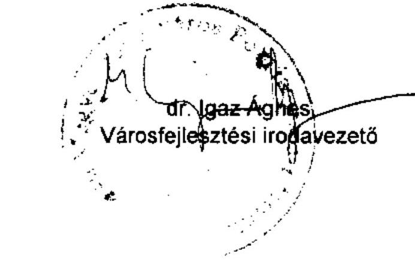

---

# ADATLAP 

## az európai uniós forrással támogatott

„Szeged Rókusvárosi II számú Általános Iskola és Alapfokú Müvészetoktatási Intézmény infrastruktúrájának fejlesztése és az épületek akadálymentesítése"
feladatról

## 1. A PÁLYÁZÓ ADATAI

1.1. A pályázó Önkormányzat neve: Szeged Megyei Jogú Város Önkormányzata
1.2. A pályázó Önkormányzat címe: 6720 Szeged, Széchenyi tér 10-11.

## 2. A PROJEKT ÖSSZEGZŐ ADATAI

2.1. A pályázott program megnevezése: DAOP-4.2.1/2 Alapfokú nevelésioktatási intézmények és gimnáziumok infrastruktúrájának fejlesztése
2.2. A pályázott programon belül a projekt címe: Szeged Rókusvárosi II. sz. Általános Iskola és Alapfokú Múvészetoktatási Intézmény infrastruktúrájának fejlesztése és az épületek akadálymentesítése
2.3. A pályázatot készítő megnevezése: McMillan \& Baneth Vezetési Tanácsadó Kft.
2.4. A pályázat benyújtásának időpontja: 2009. 02. 27.

### 2.5. A pályázott projekt tervezett

- teljes kiadásának összege: 235000000 Ft
2.6. A pályázott projekt megvalósításának tervezett forrása:
- támogatásának összege: 211500000 Ft
- európai uniós: 179775000 Ft

---

- hazai társfinanszírozás: 31725000 Ft
- EU Önerő Alap:
- saját forrás: 23500000 Ft
- hitel:
- egyéb forrás:
2.7. A megvalósítás tervezett kezdési és befejezési időpontja (év, hó, nap): 2009. 01. 29. és 2010. 01. 26.

# 3. A PÁLYÁZAT ELBÍRÁLÁSA 

3.1. A pályázat elbírálásáról szóló döntés kelte: 2009. 06. 30.
3.2. A pályázat elbírálásának eredménye: A Bizottság jóváhagyta a támogatást. A támogatás intenzitása $90 \%$

## 4. A TÁMOGATÁSI SZERZŐDÉS ADATAI

4.1. A támogatási szerződés megkötésének időpontja: 2009. 08. 31.
4.2. A projekt kezdési és befejezési időpontja: 2009. 01. 29. - 2009. 12. 31.
4.3. A projekt elszámolható összköltsége (kiadása): 235000000 Ft
4.4. A projekt megvalósítás forrásai:

- európai uniós támogatás: 179775000 Ft
- hazai társfinanszírozás: 31725000 Ft
- EU Önerő Alap saját forrás:
- saját forrás: 23500000 Ft
- hitel: -
- egyéb forrás: -

---

# 4.5. A projekt számszerúsíthető eredményei 

| $\begin{aligned} & \text { Eredmény } \\ & \text { /Mutató } \\ & \text { /Indikátor } \\ & \text { neve } \end{aligned}$ | Kulcsin-dikátor (I/N) | Mértékegység (db, fö, \%) | Bázis érték | Megvalósitási időszak (célérték) |  |  | Fenntartási időszak (célérték) |  |  |  |  |  |
| :--: | :--: | :--: | :--: | :--: | :--: | :--: | :--: | :--: | :--: | :--: | :--: | :--: |
|  |  |  |  |  |  | 2010. | 2011. | 2012. | 2013. | 2014. | 2015. |  |
| Intézményben tanuló diákok száma | I | fő | 717 | 717 | - | - | 696 | 686 | 656 | 656 | 636 | 636 |
| Akadálymentesen épített helyiségek száma | I | db | 0 | 11 | - | - | 11 | 11 | 11 | 11 | 11 | 11 |
| Fejlesztett udvarok száma | I | db | 0 | 1 | - | - | 1 | 1 | 1 | 1 | 1 | 1 |
| Integrált nevelésbe bevont tanulók száma | I | fő | 62 | 62 | - | - | 59 | 56 | 55 | 55 | 55 | 55 |
| Hátrányos helyzetú gyermekek száma | I | fő | 140 | 143 | - | - | 137 | 135 | 135 | 133 | 131 | 131 |

## 5. Ellenőrzések

### 5.1. A külső ellenőrzések:

- az ellenőrzések száma: 2
- az ellenőrzést végző szervek megnevezése: VÁTI Kht.

### 5.2. A külső ellenőrzések által feltárt szabálytalanságokra vonatkozó adatok:

- mely előírást nem tartották be: nem tártak fel szabálytalanságot
- az előírás nem teljesítésének okai:
- a rendezésre előírt kötelezettségek:

---

- a rendezésre előírt kötelezettséget mennyi időn belül teljesítették:
- mekkora időbeli csúszást eredményezett ez a projekt megvalósításában (év, hó, nap):

Szeged, 2010. október 1.
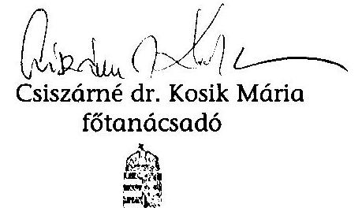

ÁLLAMI SZÁMVEVÓSZBK
Csongrád Megyei
Ellenőrzési Irodája
Szeged
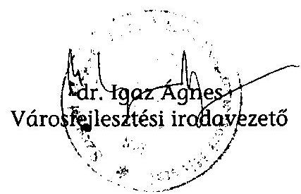

---

Szeged Megyei Jogú Város Polgármestere 6745 Szeged, Pf. 473.

# ÁLLAMI SZÁNIVEVŐSZÉK 

$8601+$ Érkeci 2010 NOV 17.

Domokos László
Elnök úr részére

Állami Számvevőszék
1364 Budapest
Pf. 54
iktsz.: 81152-12/2010
Tárgy: Visszajelzés a V-3023-7/28/20/2010. számú számvevőszéki jelentéshez Vizsgálatazonosítószám: V0492
Melléklet: 2 db

Tisztelt Elnök úr!
Szeged Megyei Jogú Város Önkormányzata gazdálkodási rendszerének 2010. évi ellenőrzésével kapcsolatban megküldött V-3023-7/28/20/2010. számú számvevőszéki jelentést köszönettel megkaptuk.

Köszönöm, hogy a vizsgálat időtartama alatt elvégzett közbenső egyeztetések során megtett intézkedéseink a „Részletes megállapításokban" és a lábjegyzetekben feltüntetésre kerültek.

Szeged Megyei Jogú Város Önkormányzata gazdálkodási rendszerének 2010. évi ellenőrzésével kapcsolatban megküldött V-3023-7/28/20/2010. számú számvevői jelentésben foglaltakra az 1989. évi XXXVIII. sz. tv. 25.§ (1) bekezdése alapján az alábbi észrevételeket teszem.

## I./ Kiegészítő javaslat, észrevétel

1./ Kérem, hogy az „Összegző megállapítások, következtetések, javaslatok" részben is kerüljenek feltüntetésre -„Részletes megállapításokban" szereplőkhöz hasonlóan- a vizsgálat közbenső egyeztetései során megtett és elfogadott intézkedéseink.
2./ Kérem, hogy a jelentés 69. oldalának első francia bekezdésében az ingatlanértékesítésre vonatkozóan az ingatlanvagyonkataszteri nyilvántartás változás átvezetésének 2010. április 1-jei megtörténtét a lábjegyzetben is tüntessék fel.
3./ A jelentés 64. oldalán lévő utolsó bekezdéséhez füzött észrevételem

A Polgármesteri Hivatalra, mint szervezeti egységre vonatkozó főjegyzői nyilatkozat a kontrollok megfelelő működésére vonatkozóan helytálló, ezért a jelentés azon megállapítása, amely szerint a nyilatkozatban foglaltak nem felelnek meg a valóságnak, téves megállapítás. Az Ámr. szerinti kontroll több elemét is pozitívan értékelte a jelentés, ezért nem helytálló a jelentés ezen megállapítása, mivel a belső ellenőrzést a kontrolltevékenység összes elemének együttes vizsgálatával kell értékelni.

---

4./ A 61. oldalon szereplő „A közbenső egyeztetés során a polgármester által adott észrevétel szerint: 'A 2009. évi ellenőrzési terv és a 2010.1. félévére vonatkozó ellenőrzési terv Polgármesteri Hivatalban lefolytatandó vizsgálatainak elmulasztását és a belső ellenőrzések tervszerü végrehajtásához szükséges személyi feltételek biztositásának elmulasztását a fójegyzö részére rója jogszabálysértésként:' szöveg helytelenül jelenik meg az én észrevételemként, mert ez a Számvevői Jelentés 26. oldalán a részemre 2. pontban megfogalmazott javaslat, melyet az észrevételem elé beírtam a számvevői jelentésből - mint ahogy a többi észrevételemnél is idéztem a jelentés megállapításaiból, annak érdekében, hogy az észrevételem beazonosítható legyen - és így ez nem az én véleményem.

# II./ Polgármesternek tett javaslatokra tett észrevételek 

1./ ,,Intézkedjen az Önkormányzat gazdálkodási rendszerének 2005. évi átfogó ellenörzése során az ÁSZ által részére tett és nem teljesült szabályszerűségi javaslat végrehajtásának érdekében"

A még hiányzó a vagyonrendelet átdolgozására vonatkozó utasítást a 81152-8/2010 iktatószám alatt 2011. március 31-ei határidővel kiadtam.
2./ A jelentés javasolja a részemre, hogy tegyek javaslatot a Közgyűlésnek fegyelmi eljárás megindítására a főjegyző ellen a 2009. évi ellenőrzési terv és a 2010. I. félévre vonatkozó ellenőrzési terv Polgármesteri Hivatalban lefolytatandó vizsgálatainak, valamint a belső ellenőrzések tervszerű végrehajtásához szükséges személyi feltételek biztosításának elmulasztása miatt. Részletesen a jelentés 24. oldal 1. bekezdésében, a 60 . oldal 1-2. bekezdésében és a 2 . bekezdést követő részbekezdésben, továbbá a 61. oldal 1. bekezdésében meghatározottakat jelöli meg.
> 24. oldal 1. bekezdéshez: Nem helytálló a jelentés azon megállapítása, hogy a Polgármesteri Hivatalban a 2009. évben és 2010. I. félévében a belső ellenőrzés nem működött. A belső ellenőrzés önálló szervezeti egységként a Közgyűlés 246/2004. (IV.8.) Kgy. sz. határozatával került kialakításra és azóta folyamatosan müködik. Ez igazolja a jelentésnek a gazdasági társaságok és az intézmények ellenőrzésére vonatkozó elismerő megállapítása is 63-64. oldal).
Nem helytálló a jelentés azon megállapítása, hogy a főjegyző nem kezdeményezte az üres álláshelyek betöltését, az ellenőrzési feladatok megoldásához szükséges létszám biztosítását. A főjegyző a korábban adott észrevételében is jelezte, hogy a jogszabályok adta keretek között a személyi feltételek biztosítására a szükséges intézkedéseket megtette. Az objektív körülmény, hogy a nagymértékủ fluktuáció alakult ki (a kollegák részben GYES-re, részben nyugdíjba mentek). A Ktv. hatályos rendelkezései szerint 2007. január 1-től 2010. május 29ig a köztisztviselői álláshelyeket kötelező volt megpályáztatni, ezen túlmenően 2009. január 1-től 2010. május 29 -ig versenyvizsga is kötelezettség volt. A belső ellenőri munka összetett, sokrétű jogszabályi ismeretet és gyakorlati tapasztalatot kíván, ezért az álláshely betöltése körültekintést, megfelelő kiválasztást kíván meg. Az álláshely betöltése után is hosszabb idő szükséges az önálló munkavégzéshez a speciális ismeretek és a gyakorlat szükségessége miatt. Ebben az évben három alkalommal került sor belső ellenőri álláshelyek pályáztatására. A helyettesítés megoldására a főjegyző intézkedett, mivel 5 fő helyettesítő alkalmazására is sor került.
Ezen túlmenően az önálló intézményeknél is alkalmaznak belső ellenőröket, illetőleg megbízási szerződés keretében végzik el a feladatot. Két intézménynél három fő alkalmazott látja el a feladatot, hat intézménynél megbízási szerződés keretében cég végzi a belső

---

ellenőrzést, és további két intézménynél pedig egy természetes személlyel kötött megállapodás alapján kerül sor a feladat ellátására.
> 60. oldal 1-2. bekezdéséhez és a 2. bekezdést követő részbekezdéshez: Nem helytálló a jelentés azon megállapítása, hogy a főjegyző 2009. évben és 2010. I. félévében nem biztosította a Közgyűlés által jóváhagyott éves ellenőrzési terv szerinti ellenőrzések végrehajtását. A Ber. rendelkezései szerint a terv szerinti ellenőrzések végrehajtása a belső ellenőr feladata. A Ber. 12. § m) pontja szerint a belső ellenőrzési vezető feladata, hogy a költségvetési szerv vezetőjét az éves ellenőrzési terv megvalósításáról, és az attól való eltérésekről tájékoztassa. A belső ellenőrzési vezető évközi tájékoztatást az ellenőrzések alakulásáról nem adott, arról a főjegyző csak az éves ellenőrzési jelentésben kapott tájékoztatást, a tárgyévet követő évben, amikor már nem volt lehetőség az ellenőrzési terv módosítására.
A 2009. évi ellenőrzésekről részletesen tájékoztatást kapott a Közgyűlés a 2009. évi költségvetési beszámoló keretében, amelyet elfogadott, a tervtől való eltérést nem kifogásolta. A 2010. évi ellenőrzési terv módosítására került sor, amelyet a Közgyűlés a 482/2010. (X.27.) Kgy. sz. határozatával fogadott el.
Nem helytálló a jelentés azon megállapítása, hogy a 2009. évben végzett ellenőrzés nem elégíti ki az Ált-ban foglalt alapelveket, amely szerint „A belső ellenőrzés független, tárgyilagos bizonyosságot adó és tanácsadó tevékenység, amelynek célja, hogy az ellenőrzött szervezet müködését fejlessze és eredményességét növelje. A belső ellenőrzés az ellenőrzött szervezet céljai elérése érdekében rendszerszemléletü megközelitéssel és módszeresen értékeli, illetve fejleszti az ellenőrzött szervezet kockázatkezelési, ellenőrzési és irányitási eljárásainak hatékonyságát. A jogszabályoknak és belső szabályzatoknak való megfelelést, valamint a gazdaságosságot, hatékonyságot és eredményességet vizsgálva a belső ellenőrzés megállapításokat és ajánlásokat fogalmaz meg a költségvetési szerv vezetője részére." A jelentés az elvégzett ellenőrzések tekintetében semmilyen szabálytalanságot nem állapított meg, sőt kiválónak minősíti több helyen a belső kontroll, a belső ellenőrzés tevékenységét, annak szabályozottságát (22. oldal 2-3. bekezdés, 23. oldal 3. bekezdés, 24. oldal 2. bekezdés, 52-53. oldal, 54-57. oldal, 63-64. oldal). A tervben szereplő ellenőrzés elmaradása a terv módosításának hiányát jelenti, de nem állapítható meg az, hogy az elvégzett belső ellenőrzési tevékenység nem felel meg a fenti szakmai szabályoknak. A 2009. évben a Polgármesteri Hivatalban végzett, a készpénzes elszámolások rendjére vonatkozó ellenőrzés szintén megfelelt az Áht. fent idézett céljainak.

A jelentés által is idézett rendszerszemléletű megközelítés alapján eljárva és az ellenőrzött szervezeteket módszeresen értékelve került sor javaslatok, megállapítások megfogalmazására az intézményi ellenőrzések során, amelyek a Polgármesteri Hivatal működési problémáira is felhívták a figyelmet. Ezek alapján intézkedések történtek a belső szervezeti egységek felé (pl. alapító okirat módosítása, rendelet módosítása).

Nem helytálló a jelentés 63. oldalán lévő megállapítás, mivel az éves ellenőrzési tervben foglaltak végrehajtása nem a főjegyző felelősségi körébe tartozik a Ber. rendelkezései szerint, hanem a belső ellenőrzési vezető feladatát képezi. Mint azt már a korábbiakban jeleztem, hogy 2010. évi ellenőrzési terv módosítása megtörtént a költségvetési éven belül, tehát a 2010. évi ellenőrzések tekintetében mulasztás nem állapítható meg. Összehasonlító adatokat közöl a jelentés más megyei jogú városokban lévő ellenőri létszámról. A példának megjelölt legnagyobb létszámú pécsi belső ellenőri hálózat az önkormányzat honlapján elérhető 2009. évi tevékenységről szóló beszámoló szerint 10-11 fővel végez „klasszikus belső ellenőrzési feladatokat". Itt a belső ellenőri hálózat részét képezi a „külső szervek támogatásának elszámoltatását" végző 3 fő is, amely elszámoltatás szakmai szabályait Önkormányzatunknál a 2010. évi költségvetés végrehajtási szabályairól szóló rendelet

---

tartalmazza és az elszámoltatást a Közgazdasági Iroda végzi. A példaként hivatkozott pécsi belső ellenőrzési hálózat megállapodás alapján külső szervek ellenőrzését is végzi, amely kapacitást köt le.

A jelentés javasolja részemre a fegyelmi eljárás meginditását a Ktv. 51. § (1) bekezdése alapján.
Ez a jogszabályhely a fegyelmi vétség alapos gyanúja esetén kötelezi a munkáltatót fegyelmi eljárás megindítására. A Ktv. 50. § (1) bekezdése szerint fegyelmi vétséget követ el a köztisztviselő, ha közszolgálati jogviszonyból eredő kötelezettségét vétkesen megszegi. Ebből következően a fegyelmi vétség megállapításához szükséges a kötelezettségszegés és vétkesség. A kötelezettségszegés a fentiekben is kifejtettek szerint nem áll fenn, mivel a jogszabályokban a jegyző a számára előírt kötelezettségeket teljesítette. Ezt az ÁSZ jelentésben foglalt összegző megállapítások is alátámasztják, mely szerint a Polgármesteri Hivatalban minden terület vonatkozásában a belső kontrollok működésének megfelelősége összességében kiváló volt, ezáltal teljesült az Áht. 120. § (1) bekezdésében meghatározott alapvető cél.
A fegyelmi felelősség megállapításának mindenképpen elengedhetetlen feltétele, hogy kötelességszegésének vétkes jellege bizonyítható legyen. A fentiekben részletezett észrevétel szerint nem helytálló még a gondatlanság megállapítása sem. Így az 51. § (1) bekezdésében meghatározott fegyelmi vétség alapos gyanúja nem áll fenn, ezért a fegyelmi eljárás megindítását nem tartom alátámasztottnak.

Miután a főjegyző által tett észrevételeket és részletesen kifejtett magyarázatot kielégítőnek tartom és magam is elfogadom, álláspontom szerint terhére nem róható vétkes kötelességszegés alapos gyanúja sem, így a fegyelmi eljárás megindításának feltétele is hiányzik.

A fentiek értelmében a jelentés ezen javaslatát nem tartom megalapozottnak és emiatt a Közgyűlés felé irányuló fegyelmi eljárás kezdeményezésére vonatkozó javaslattételt nem tartom indokoltnak, így ilyen javaslattal - a törvényi feltételek hiánya, illetve egyet nem értésem miatt is - nem kívánok élni. A belső ellenőrzési osztály létszámának bővítésére vonatkozó javaslatát célszerűségi javaslatként értékelem és a 2011. évi költségvetés tervezése során a közgyűlésnek megfontolásra javasolom.

# III./ Főjegyzőnek tett javaslatok 

1./ ,,Intézkedjen annak érdekében, hogy az Önkormányzat költségvetési rendeletének végrehajtása során likvid hitelként az Ötv. 88. § (3) bekezdés d) pontjában foglaltakat figyelembe véve - csak az éven belül felvett és visszafizetett - hiteleket számolják el a könyvviteli nyilvántartásokban, valamint készitsen likviditási koncepciót, és végezze el a likvid hitel éven belüli visszafizetésének részletes vizsgálatát, továbbá annak eredményéről tájékoztassa a Közgyülést."
a./ Önkormányzatunk az ellenőrzési időszakban a közszolgáltatási és igazgatási feladatok bevételi és kiadási oldalának időbeli eltérése miatt a likviditási célú tőkeszükségletét folyószámla- és rulírozó hitelből biztosította. A likviditási célú hitelkeret igénybevételi korlátját a költségvetés végrehajtási rendeletében szabályozta. Önkormányzatunk és a hitelező pénzintézet közötti likviditási célú kölcsönszerződések egy évre szóltak. Az adott évben lejáró hitelszerződések tőketartozásának visszafizetésére azok lejáratakor sor került. Önkormányzatunk rövidlejáratú hitelfelvételi gyakorlata megfelelt az Ötv. 88. § (3) bekezdése d ) pontja szerinti likviditási célú hitelfelvételnek.

---

A föjegyzönek tett számvevőszéki megállapítás az önkormányzat likviditási hitelei között nyilvántartott rulírozó célú hitelállományát az Ötv. 88. § (3) d) bekezdése szerinti hosszúlejáratú kötelezettségnek minősítette, arra való hivatkozással, hogy az önkormányzat rulírozó hitelét „adott éven belül nem fizette vissza" (Számvevőszéki jelentés 40. oldal), tekintettel arra, hogy annak költségvetési évek közötti állománya nem változott.
A lejáró rulírozó hitelszerződések tőkefizetési kötelezettségének az önkormányzat minden esetben eleget tett éven belüli visszafizetéssel. Sem az államháztartás müködési rendjéről szóló 292/2009. (XII.19.) kormányrendelet, sem az államháztartás szervezetei beszámolási és könyvvezetési kötelezettségének sajátosságairól szóló 249/2000. (XII. 24.) kormányrendelet, sem az államháztartásról szóló törvény nem írja elő a likviditási céllal felvett hitelek állományának költségvetési évek közötti vizsgálatát és azok átminősítési kötelezettségét.
b./ Önkormányzatunk a számvevőszéki jelentésben elfogadott módon folyamatosan eleget tett likviditási tervkészítési kötelezettségének, hitelállományát költségvetési- és zárszámadási rendelettervezetében a közgyülésnek a jogszabályoknak megfelelően bemutatta. A Közgyűlés az éves költségvetés tárgyalásakor az előirányzatfelhasználási és likviditási tervet megismerte és elfogadta.
Az önkormányzat éven belüli hiteleire vonatkozó likviditási észrevételeiket jogszabályi szabályozás és költségvetési kontrolling módszertan hiányában, így mint a „munka színvonalát javító" javaslatot csak a Tisztelt Számvevőszék számunkra eljuttatandó módszertani leírásának a segítségével tudjuk végrehajtani.
2./ „Biztositsa az Áht. 121/A. § (3) bekezdése, az Ötv. 92. § (5) bekezdése alapján a Polgármesteri hivatalban is a belső ellenőrzés müködését"

A 2010. évi belső ellenőrzési terv elfogadott módosítása tartalmaz további két ellenőrzést a Polgármesteri Hivatalban, ezáltal a Polgármesteri Hivatalban négy ellenőrzés történik meg ebben az évben 482/2010. (X.27.) kgy. sz. határozattal elfogadott terv szerint. A Közgyűlés által 483/2010. (X.27.) kgy. sz. határozattal elfogadott (jelen levelünkkel mellékelt) 2011. évi terv is tartalmaz polgármesteri hivatali ellenőrzéseket.
A főjegyző utasította a belső ellenőrzési osztály vezetőjét, hogy az éves ellenőrzési tervet megalapozó kockázatelemzés terjedjen ki a Polgármesteri Hivatal és az intézmények európai uniós forrásokból megvalósított feladatainak végrehajtására, közbeszerzési eljárásainak lebonyolítására, az önkormányzat többségi irányítást biztosító befolyása alatt álló gazdasági társaságok működésére, valamint a kedvezményezett szervezeteknél az önkormányzat költségvetéséből céljelleggel nyújtott támogatások rendeltetés szerinti felhasználására, továbbá utasítást adott arra, hogy a belső ellenőrök létszáma kapacitás felmérés alapján kerüljön megtervezésre, ezáltal a szükséges intézkedéseket megtette, amit az Állami Számvevőszéki Jelentés 44. és 45. sorszámú lábjegyzete is tartalmaz.

---

3./ „Intézkedjen az Önkormányzat gazdálkodási rendszerének 2005. évi átfogó ellenörzése során az ÁSZ által részére tett és nem teljesült szabályszerűségi javaslatok és a nem teljesült célszerüségi végrehajtásának érdekében"
$>$ A még hiányzó célszerűségi előírás a vagyonrendelet átdolgozására 2011. március 31-ei határidővel fog megvalósulni.
$>$ A céljelleggel nyújtott támogatások nyilvántartási rendszerére vonatkozó célszerűségi javaslat megvalósulásának érdekében a 81152-9/2010. iktsz. alatt 2010.10.12-én kiadott jegyzői utasítás alapján elkészült a nyilvántartás a megfelelő formában.
4./ „Tájékoztassa -évente végzett számítások alapján- a Közgyülést az Önkormányzat eladósodásának növekedésére figyelemmel arról, hogy a hosszúlejáratú, adósságot keletkeztető kötelezettségvállalásokból adódó tőke- és kamatfizetési kötelezettségét az Önkormányzat milyen feltételek mellett tudja teljesíteni. "

A költségvetés elfogadásakor a Közgyűlés számára előrejelzés készül az adott év illetve az azt követő két év működési/felhalmozási bevételeiről és kiadásairól fösoronként. Ebben szerepelnek többek közt az intézményi működési bevételek, sajátos bevételek, támogatások, átengedett személyi jövedelemadó. Látható benne a személyi juttatások, a munkaadói járulékok, dologi kiadások, felhalmozási kiadások, rövid és hosszúlejáratú hitelek tőke és kamatfizetései. Kimutatás készül a többéves kihatással járó kötelezettségvállalások évenkénti összegéről. Bemutatásra kerül a felhalmozási célú hitelek tőke és kamatfizetési kötelezettsége a költségvetési évre és a rákövetkező két évre.
A zárszámadás bemutatásakor ugyanilyen szerkezetben láthatóak a számok, az adósságállomány 9 évre előre van bemutatva.
Véleményünk szerint a tájékoztatást a Közgyűlés a vizsgált időszakban folyamatosan megkapta.

Kérjük az Elnök Urat, hogy a korábban megtett észrevételeinket a végleges jelentés szövegében a megállapítások között továbbra is tüntessék fel, az Állami Számvevőszék álláspontjának egyidejű közlése mellett.

Az Állami Számvevőszék végleges jelentését a közgyűlés elé terjesztjük és a feltárt hiányosságok megszüntetése érdekében intézkedési tervet készítünk.
Az ellenőrzés alapján elrendelt intézkedésekről a tájékoztatást megküldjük Önök részére.
Egyúttal szeretném megköszönni a munkatársainak az ellenőrzés során tanúsított segítő és együttműködő hozzáállását, melynek segítségével az önkormányzat szakmai-pénzügyi munkáját továbbra is magas színvonalon tudjuk elvégezni.

Szeged, 2010. november 12.
Tisztelettel
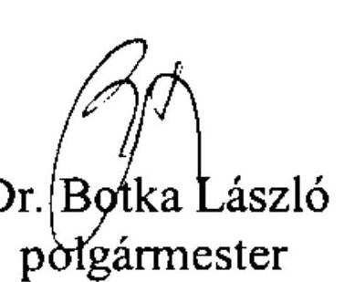

---

# Dr. Botka László úr, 

polgármester
Szeged Megyei Jogú Város Önkormányzata

## Szeged

Széchenyi tér 10-11.
6720

## Tisztelt Polgármester Úr!

Köszönettel vettem a 2010. november 17 -én érkezett levelét, melyben Szeged Megyei Jogú Város Önkormányzata gazdálkodási rendszerének 2010. évi ellenőrzéséről készült számvevőszéki jelentés megállapításaira tett észrevételt. Levelét a nyilvánosságra hozott jelentéshez csatolom, természetesen a válaszlevelemmel együtt, így a valós helyzetet tükröző képet kaphatnak az olvasók.
„Kiegészitő észrevételeivel, javaslataival" kapcsolatban az alábbiakról tájékoztatom.
Ad. 1. és ad. 2. Kérését figyelembe véve a megtett intézkedéseket az összegző fejezetben, valamint a kért dátumot a kapcsolódó lábjegyzetben is feltüntetjük.
Ad. 3. A kontrollok megfelelő müködésére vonatkozó főjegyzői nyilatkozattal kapcsolatos észrevétel nem megalapozott, mivel a jelentés csak a Polgármesteri hivatal belső ellenőrzése tekintetében, nem pedig az összes belső kontrolltevékenységre vonatkozóan rögzíti, hogy a 2009. és a 2010. évben tett nyilatkozatok nem felelnek meg a valóságnak.

Ad. 4. Az észrevételben foglaltaktól eltérően az idézett bekezdés nem a számvevői jelentésben szereplő, polgármesternek címzett 2 . számú javaslat, de a kérést elfogadva a jelentés hivatkozott észrevételéből a jelzett bekezdést elhagyjuk.
Polgármesternek tett javaslatokkal kapcsolatos észrevételekre vonatkozóan az alábbiakról tájékoztatom.
Ad. 1. Köszönettel vettem tájékoztatását a vagyongazdálkodási rendeletben lehetővé tett versenyeztetés mellőzési lehetőség megszüntetésére vonatkozó javaslat végrehajtása érdekében tett intézkedéséről.

---

Ad. 2. A Polgármesteri hivatal müködésének belső ellenőrzésével kapcsolatos észrevétel nem megalapozott, mivel a föjegyző nem intézkedett annak érdekében, hogy a Polgármesteri hivatal terv szerinti ellenőrzéseit a 2009. és a 2010. I. félévben elvégezzék. Észrevételében foglaltakkal összhangban a jelentésben is szerepel, hogy a Polgármesteri hivatalban müködött Belső Ellenőrzési Osztály. Ez a szervezet azonban nem végezte el a Polgármesteri hivatalban a tervezett ellenőrzéseket. A jelentésben szerepel továbbá, hogy a tartósan fennálló ellenőri kapacitáshiány átmenetileg megoldható lett volna helyettesítés, külső szakértő megbízásával is.
A belső ellenőrzési feladatok végrehajtása természetesen a belső ellenőrzéssel megbízottak feladata, azonban a végrehajtás feltételeinek kialakításáról, az ahhoz szükséges személyi feltételek biztosításáról, a belső ellenőrzési terv teljesítéséről az Ötv. 92. § (4)-(5) bekezdései alapján a föjegyzö köteles gondoskodni. A föjegyzö kötelezettsége az Ötv. 92. § (4) bekezdés alapján továbbá pénzügyi irányítási és ellenőrzési rendszert müködtetni, amelynek megfelelő kialakítása esetén már év közben észleli és ez alapján megteheti a belső ellenőrzési feladat teljesítéséhez szükséges intézkedéseket.
A készpénzes elszámolások rendjének négy napot igénybe vevő ellenőrzéssel kapcsolatban továbbra is indokoltnak tartjuk azon megállapításunkat, hogy az nem elégíti ki a költségvetési szervek belső ellenőrzési feladatait meghatározó Áht. 121/A. § (1)-(2) bekezdéseiben a belső ellenőrzésre, valamint a 2010. augusztus 15 -ig hatályos $88 . \S$ (1) bekezdés e) pontjában, illetve a 2010. augusztus 15 -tól hatályos $94 . \S$ (1) bekezdés e) pontjában foglalt, a belső kontrollrendszer müködtetésére vonatkozó követelményeket, ezért a Polgármesteri hivatal belső ellenőrzéséről való gondoskodás elmulasztásával kapcsolatos megállapításunkat fenntartjuk.
Föjegyzönek tett javaslatokkal kapcsolatos észrevételekre vonatkozóan az alábbiakról tájékoztatom.

Ad. 1/a. Az Önkormányzat likviditási problémáit évente növekvő összegű külső segítséggel, különböző hitelekkel tudta megoldani, amelyek igénybevétele a 2009. évben általánossá vált, mivel mind a folyószámla, mind a rulírozó hitel igénybevételének átlagos állománya az előző évhez viszonyítva növekedett. A folyószámlahitel ténylegesen felvett átlagos állománya a 2007. évben 294 millió Ft, a 2009. évben 1094 millió Ft volt, valamint a rulírozó hitelkeretből az igénybevétel átlagos állománya a 2007. évi 4173 millió Ft-ról 5010 millió Ft-ra emelkedett. A rulírozó hitel több évi igénybevételének tartós jellegét nem befolyásolja az a tény, hogy a bankkal kötött szerződés alapján formálisan a lejárat napján visszafizetésre, és ugyanazon a napon ismét igénybevételre kerül. Az Áht. 7. § (1) és (3) bekezdései alapján az államháztartás egyes alrendszereiben a gazdálkodást éves költségvetés alapján kell folytatni, és a költségvetési év megegyezik a naptári évvel, ezért a naptári év minden napján, valamint az azt követő évben is igénybe vett hitel az elnevezésétől függetlenül már nem éven belüli, hanem tartós adósságot keletkeztető kötelezettségvállalás. Az Önkormányzat által igénybe vett rulírozó hitel napi minimum összege 2007-2009 között jelentős volt, a 2007. évben 3350 millió Ft, a 2006. évben 4500 millió Ft volt, amely az évente újrakötött hitelszerződés mellett a növekvő összegű tartós igénybevételt igazolja. Az Áhsz. 26. § előirja a költségvetési szervek számára a kötelezettségek hosszú és rövid lejáratúra történő besorolási feladatát, amelynél indokolt figyelembe venni az Áhsz. 9. § (11) bekezdésében szereplő „a tartalom elsödlegessége a formával szemben" számviteli alapelvet.

---

Ad. 1/b. A likviditási koncepció elkészitésére és a likvid hitelek éven belüli visszafizetési lehetőségének részletes vizsgálatára, és annak eredményéről a Közgyűlés tájékoztatására vonatkozó javaslatunk célja annak elősegítése, hogy a lehetőségek és kötelezettségek rendszerszerü, komplex áttekintésével tárják fel több évre kitekintően és a likvid hiteligény eddigi növekedésének megállítása, illetve mérséklése érdekében lehetséges és szükséges intézkedéseket. Megítélésünk szerint ezen intézkedési lehetőségekről, korlátokról a Közgyűlés részletes tájékoztatása megkönnyíti a felelős döntéshozatalt, valamint elősegíti a likviditási helyzet rövid és hosszú távú javítása érdekében szükséges intézkedések megtételét.
Ad. 2. A Polgármesteri hivatal belső ellenőrzésének biztosítására vonatkozó javaslatunkat továbbra is indokoltnak tartjuk, mivel az ellenőrzések tervezése az elmúlt években nem jelentette azok elvégzését is. Köszönettel vettük a közbenső egyeztetés során adott és megismételt tájékoztatást az éves ellenőrzési tervet megalapozó kockázatelemzés tartalmi kiterjesztéséről, amely alapján a korábbi vonatkozó javaslatunkat már az észrevételezésre megküldött jelentésből elhagytuk.
Ad. 3. A vagyongazdálkodási rendeletben a versenyeztetés mellőzését lehetővé tevő szabályozás megszüntetésére vonatkozó javaslatunk az Áht. 108. § (1) bekezdésében foglalt szabály betartása érdekében tett javaslat, amelynek megvalósítási szándékáról adott tájékoztatást köszönettel vettük. Az észrevétel azonban megtett intézkedést nem tartalmaz, ezért a vonatkozó javaslatot fenntartjuk. A céljelleggel nyújtott támogatások nyilvántartásának kialakításáról adott a közbenső egyeztetés során már közölt tájékoztatást köszönettel vettük, azt már az észrevételezésre megküldött jelentésben szerepelt javaslat megfogalmazásánál figyelembe vettük.
Ad. 4. A főjegyző részére a munka színvonalának javítása érdekében a számvevőszéki jelentésben tett 4. számú - a hosszú lejáratú, adósságot keletkeztető kötelezettségvállalásokból adódó tőke és kamatfizetési kötelezettség teljesítési feltételei bemutatására vonatkozó - javaslatunkkal kapcsolatban tett észrevételére vonatkozóan szíves tájékoztatásul közlöm, hogy az ÁSZ a javaslat megtételekor figyelemmel volt az észrevételében hivatkozott dokumentumokra, azonban nem tartotta elégségesnek ahhoz, hogy a Közgyűlés, mint az Önkormányzat gazdálkodása biztonságáért felelős testület, összefogott, és konkrét tájékoztatást kapjon ezen tárgykörben. Az észrevételében hivatkozott dokumentumok a költségvetésben és a zárszámadásban külön-külön mutatják be az Önkormányzat adott évi, illetve az azt követő két év működési és felhalmozási bevételeit és kiadásait kiemelt előirányzatonként, továbbá a többéves kihatással járó kötelezettségvállalások évenkénti összegét, a felhalmozási célú hitelek tőke és kamatfizetési kötelezettségét a költségvetési évre és a rákövetkező két évre, valamint a zárszámadáskor az adósságállomány összegét kilenc évre előre. Azonban a hosszú lejáratú, adósságot keletkeztető kötelezettségvállalások, ezek kamatfizetési terheinek bemutatására, hosszú távú figyelemmel kísérésére olyan közgyűlési tájékoztatást tartanánk elfogadhatónak, amely e kötelezettségvállalások és lehetséges finanszírozási forrásuknak a kötelezettségvállalások teljes időtartamára nézve évenkénti, összefoglaló bemutatását jelentené. Megítélésünk szerint az átláthatóságot és a felelős döntéshozatalt könnyíti meg, az Önkormányzat pénzügyi helyzetének hosszú távú stabilitását szolgálja, ha évente végzett számítások alapján a Közgyűlés a források és feladatok összevetésével részletes tájékoztatást kap a hosszú távú kötelezettségvállalásokról, azok várható terheiről, valamint arról, hogy az Önkormányzat e kötelezettségvállalásokat milyen feltételekkel és milyen módon tudja teljesíteni.

---

Tisztelt Polgármester Úr!
Bízva abban, hogy a leírtak alapján sikerült a fennálló félreértéseket tisztázni és egymás álláspontját megérteni, elfogadni annak érdekében, hogy az Állami Számvevőszék a törvényekben foglalt ellenőrzési feladatait az előírtaknak megfelelően végezze, megállapításait, javaslatait megalapozottan, alátámasztottan tegye meg az objektív, valós helyzetet tükröző jelentésekben, melyekkel a vizsgált szervezetek munkájához is segítséget nyújt.

Köszönöm Polgármester úrnak és munkatársainak az ellenőrzés során tanúsított hozzáállását, az ellenőrzés lefolytatásához nyújtott segitő közremüködését.

Kérem fentiek szíves elfogadását!
Budapest, 2010. december „ 6. "

Tisztelettel:

Domokos László