# ÁLLAMI   SZÁMVEVŐSZÉK 

## JELENTÉS

a Pénztárak Garancia Alapja működésének ellenőrzéséről

---

# 2. Államháztartás Központi Szintjét Ellenőrző Igazgatóság 

2.1. Teljesítmény Ellenőrzési Főcsoport

Iktatószám: V-2005-036/2010.
Témaszám: 0978
Vizsgálat-azonosító szám: V0508

## Az ellenőrzést felügyelte:

Dr. Becker Pál
főigazgató
Az ellenőrzés végrehajtásáért felelős:
Dr. Zöldréti Attila
főcsoportfőnök
Az ellenőrzést vezette:
Tóthné Nagy Éva
osztályvezető főtanácsos
Az ellenőrzést végezték:
Jordanics Tamás Vörös Katalin
számvevő
számvevő tanácsos

A témához kapcsolódó eddig készített számvevőszéki jelentések:
címe
sorszáma
Jelentés az Országos Betétbiztosítási Alap, a Befektető-védelmi Alap és a Pénztárak Garancia Alapja működésének ellenőrzéséről

---

# TARTALOMJEGYZÉK 

BEVEZETÉS ..... 9
I. ÖSSZEGZŐ MEGÁLLAPÍTÁSOK, KÖVETKEZTETÉSEK, JAVASLATOK ..... 19
II. RÉSZLETES MEGÁLLAPÍTÁSOK ..... 26

1. A Pénztárak Garancia Alapja garanciális tevékenysége ..... 26
1.1. A garanciális feladatok szabályozottsága, megalapozottsága ..... 26
1.1.1. A normafedezeti garancia bevezetésének és megszüntetésének megalapozottsága ..... 27
1.1.2. A hozamgarancia bevezetésének megalapozottsága, hatása az Alap várható garanciális fizetési kötelezettségeire ..... 31
1.1.3. A pénztárak likviditási zavara kezelésének szabályozottsága ..... 32
1.2. Az Alap folyamatos fizetőképessége biztosításának jogszabályi feltételei ..... 34
1.2.1. Az Alap igazgatósága által elrendelhető rendkívüli fizetési kötelezettség szabályozottsága ..... 36
1.2.2. Az Alap hitelfelvételi lehetőségének szabályozottsága ..... 36
1.3. A PGA számára jogszabályban előírt elemzési, jelentéskészítési kötelezettség szabályozottsága, a teljesítés szabályszerűsége ..... 37
2. A Pénztárak Garancia Alapja szervezete, irányítási, döntéshozatali és ellenőrzési rendszere ..... 39
2.1. Az Alap szervezete, irányítási és döntéshozatali rendszere, az igazgatóság működése ..... 39
2.2. Az ellenőrző bizottság működése ..... 41
2.3. A belső ellenőrzési tevékenység ..... 42
3. Az Alap gazdálkodása, vagyonkezelési és letétkezelési tevékenysége ..... 43
3.1. A gazdálkodás szabályozottsága és szabályszerűsége ..... 43
3.2. A bevételek és ráfordítások alakulása, az elszámolások szabályozottsága és szabályszerűsége ..... 45
3.2.1. A garanciális bevételek és a garanciális ráfordítások ..... 46
3.2.2. A működéssel kapcsolatos ráfordítások ..... 47
3.2.3. A pénzügyi műveletek bevételei és ráfordításai ..... 51
3.3. A befektetett eszközök és a PGA befektetési tevékenysége ..... 52
3.4. A mérleg szerinti eredmény és a saját tőke ..... 54

---

# MELLÉKLETEK 

1. számú Észrevétel, válasz
2. számú A magyar nyugdíjrendszer 1998-2010 között
3. számú A nyugdíjbiztosítási járulékok és a magánnyugdíjpénztári tagdíjak alakulása 1998-2010.
4. számú A Pénztárak Garancia Alapjának intézményi kapcsolatai
5. számú A PGA tárgyévben felhalmozott garanciális vagyonából fedezhető követelések 2000-2009.
6. számú Az Alap garanciális kifizetéseinek várható alakulása 2010-2019.
7. számú Az egy főre jutó személyi jellegű ráfordítások és az alkalmazásban állók munkajövedelmének nemzetgazdasági változása a 2000-2009. években
8. számú A dolgozóknak béren kívül kifizetett juttatások alakulása 2000-2009.
9. számú A reprezentációra fordított összegek alakulása 2000-2009.
10. számú Tanúsítványok

---

# RÖVIDÍTÉSEK JEGYZÉKE 

| APEH | Adó- és Pénzügyi Ellenőrzési Hivatal |
| :--: | :--: |
| ÁSZ | Állami Számvevőszék |
| E. Alap | Egészségbiztosítási Alap |
| EKB | Európai Központi Bank |
| Európai Bizottság | Európai Közösségek Bizottsága |
| GDP | Bruttó hazai termék |
| Igazgatóság | a Pénztárak Garancia Alapja legfelsőbb irányító szerve, amelynek tagjai az alap ügyvezető igazgatója, a Pénztárak Szövetsége által delegált két fő, a Pénzügyi Szervezetek Állami Felügyelete javaslata alapján a miniszter által kinevezett négy személy |
| Kormányrendelet | 217/2000. (XII. 11.) Korm. rendelet a Pénztárak Garancia Alapja éves beszámoló készítési és könyvvezetési kötelezettségének sajátosságairól |
| KSH | Központi Statisztikai Hivatal |
| Kincstár | Magyar Államkincstár |
| Magánnyugdíjpénztári rendszer, második pillér | Magánnyugdíjpénztári alrendszer |
| Miniszter | Pénzügyminiszter (1997. 09. 01 - 2006. 12. 31.), nyugdíjbiztosítási járulékfizetés szabályozásáért felelős miniszter (2007. 01. 01 - 2008. 12. 31.), nyugdíjjárulék- és nyugdíjbiztosítási járulékfizetés szabályozásáért felelős miniszter (2009. 01. 01-). |
| Minisztérium | Pénzügyminisztérium, amelynek 2010. május 31-től a jogszabályban meghatározott feladatok és hatáskörök tekintetében jogutódja a Nemzetgazdasági Minisztérium |
| MNB | Magyar Nemzeti Bank |
| MNB tv. (régi) | a Magyar Nemzeti Bankról szóló 1991. évi LX. törvény |
| MNB tv. (új) | a Magyar Nemzeti Bankról szóló 2001. évi LVIII. törvény |
| Mpt. | a magánnyugdíjról és a magánnyugdíjpénztárakról szóló 1997. évi LXXXII. törvény |
| Munka tv. | a Munka Törvénykönyvéről szóló 1992. évi XXII. törvény |
| Ny. Alap | Nyugdíjbiztosítási Alap |
| OGY | Országgyűlés |
| ONYF | Országos Nyugdíjbiztosítási Főigazgatóság |
| Tb. nyugdíjrendszer, első pillér | kötelező részvételű társadalombiztosítási nyugdíj alrendszer |
| PGA, Alap | Pénztárak Garancia Alapja |
| PSZÁF, Felügyelet | Pénzügyi Szervezetek Állami Felügyelete |
| Rendelet | 169/1997. (X. 6.) Korm. rendelet a Pénztárak Garanciaalapjának szervezeti és működési szabályairól |
| Számviteli tv. (régi) | a számvitelről szóló 1991. évi XVIII. törvény |
| Számviteli tv. (új) | a számvitelről szóló a 2000. évi C. törvény |
| Szja tv. | a személyi jövedelemadóról szóló1995. évi CXVII. törvény |

---

SZMSZ Szervezeti és működési szabályzat

---

# ÉRTELMEZŐ SZÓTÁR 

Biztosításmatematikai mérleg (aktuáriusi értékelés)

Egyéni számla

Fedezeti tartalék

Felhalmozási időszak

Felosztó-kirovó elvű rendszer

Foglalkoztató

Hozamelvárás
Hozamgarancia

Hozamgarantált tőke

Járadék

Járadékos időszak
Kockázatközösség
Követelés befagyása

A pénztár tartalékainak értékelése, amelynek során a tervezett bevételeket és kiadásokat összevetik a tényleges eredményekkel, valamint megvizsgálják, hogy a szolgáltatási tartalékok elégséges fedezetet biztosítanak-e a nyugdíjszolgáltatások kifizetéséhez.
Az a nyilvántartás, amelyen a felhalmozási időszakban a pénztártag követelése, illetve nyugdíjba vonulásakor a részére járó nyugdíjszolgáltatás megállapítása alapul.
A pénztártag befizetésének az a része, amely a tag saját, névre szóló egyéni számlájára kerül. A szolgáltatás (járadék vagy egyösszegű kifizetés) fedezetére használható fel, illetve erre terhelhető pénztárváltásnál az átlépési költség.
A pénztártagsági viszony kezdetétől a nyugdíjszolgáltatás megállapításáig terjedő időszak.
Az adott időszakban együtt élő emberek közötti jövedelem-újraelosztás, a nyugdíjakat az adott időszak alatt befizetett járulékból fizetik ki.
Bármely jogi és természetes személy, egyéni vállalkozó, jogi személyiséggel nem rendelkező gazdasági társaság, egyéb szervezet, költségvetés alapján gazdálkodó szerv, személyi egyesülés, ha biztosítottat foglalkoztat, vagy a biztosítottnak a biztosítási kötelezettséggel járó jogviszonyra tekintettel vagy azzal összefüggésben járulékalapot képező jövedelmet juttat.
Az a pénztárakra egységesen, évente előre meghatározott hozamráta, amelyet a pénztár befektetésének el kell érnie.
A befektetés minimális hozamára vonatkozó garanciavállalás, ami a piaci árfolyamváltozásoktól függetlenül is meghatározott mértékű hozam elérését teszi lehetővé.
A pénztártag életjáradékra váltandó egyéni számlaegyenlegének a magánnyugdíjról és a magánnyugdíjpénztárakról szóló 1997. évi LXXXII. tv.-ben foglaltak szerint kiszámított legkisebb összege, melyet a Pénztárak Garancia Alapja a szolgáltatás megállapításakor az e törvényben meghatározott feltételek szerint garantál.
Egy előre fizetendő rendszeres (havi, negyedéves, éves stb.) juttatás, amelynek célja, hogy a jogosult megélhetését, anyagi biztonságát elősegítse.
A nyugdíjszolgáltatás megállapításától kezdődően a szolgáltatás igénybevételének tartamával megegyező időszak.
A pénztártagok a véletlenszerűen bekövetkezett káresemények pénzügyi kockázatát egymás között osztják meg.
A magánnyugdíjpénztár a pénztár tagjának (vagy kedvezményezettjének) követelését - másik pénztárba való átlépés, a társadalombiztosítási nyugdíjrendszerbe történő visszalépés, járadékszolgáltatás, valamint a tag elhalálo-

---

|  | zásakor - a pénztár SZMSZ-ében meghatározott határidőt követő öt napon belül nem tudja maradéktalanul teljesíteni. |
| :--: | :--: |
| Magánnyugdíjpénztár | Az önkormányzatiság elvén működő, a tagok tulajdonában levő olyan intézmény, amely a kötelező nyugdíjjárulék egy részét és az esetleges kiegészítő befizetéseket tagdíjként gyűjti. |
| Magánnyugdíjpénztári alrendszer | Kötelező részvételű, tőkefedezeti finanszírozású, nonprofit elven működő, a pénztártagok kockázatközösségén alapuló rendszer. |
| Magánnyugdíjpénztári tevékenység | A pénztártagok felvétele, a tagok számára kötelezően fizetendő tagdíjak gyűjtése, a tagdíjból származó vagyon befektetése, nyugdíjszolgáltatás nyújtása és egyösszegű kifizetés teljesítése egyéni számla vezetés alapján. |
| MAX Composite index | A MAX Composite a MAX és az RMAX piaci súlyai által képzett átlaga. Az index a kötvényalapok teljesítmény mérésében az egyik leggyakrabban használt benchmark, mivel az index egy mutatószámban összegzi az elsődleges forgalmazói körben szereplő Magyar Államkötvények és Diszkont Kincstárjegyek árfolyam-alakulását, azaz az állampapírpiac egészét jellemző index.   MAX index: A MAX az egy évnél hosszabb hátralévő lejárati idejű Magyar Államkötvények indexe, ezek árfolyamváltozásait mutatja. Az egyes államkötvények indexben elfoglalt súlya az aukciókon értékesített mennyiségüknek megfelelő. Mivel a MAX az egy évnél hosszabb lejáratú államkötvények piacának átlagos árfolyamváltozását mutatja, a befektetési alapok teljesítmény mérésében az indexet a kötvényalapok benchmarkjaként használják.   RMAX index: Az RMAX a rövid lejáratú állampapírok átlagos piaci árfolyamváltozását jelző index, amelyben a MAX-ból - a futamidő rövidsége miatt - kikerülő három hónap és egy év közötti hátralévő futamidejű Magyar Államkötvények, valamint a Diszkont Kincstárjegyek találhatók. Az RMAX a pénzpiaci alapok teljesítményének megítélésekor használható benchmark. |
| Munkáltató | Az, akivel a pénztártag munkaviszonyban, közalkalmazotti, közszolgálati jogviszonyban, bírósági ügyészségi szolgálati viszonyban áll, illetve a Magyar Honvédség, a rendvédelmi szervek és a polgári nemzetbiztonsági szolgálatok, a hivatásos állományú tagjaik vonatkozásában, tekintet nélkül arra, hogy teljes vagy részmunkaidőben történik a foglalkoztatás. |
| Normafedezet | Normajáradék megállapításához szükséges fedezet. |
| Normajáradék | A megállapítandó legkisebb nyugdíjjáradék, a társadalombiztosítási nyugdíjrendszerben megállapított nyugdíj $25 \%-a$. |
| Nyugdíjbiztosítási jogviszony | A társadalombiztosítás ellátásaira és a magánnyugdíjra jogosultakról, valamint e szolgáltatások fedezetéről szóló |

---

Nyugdíjpénztári portfólió

Nyugdíjszolgáltatás

Önkéntes nyugdíjpénztár

Pénztártag

Portfólió

Reálhozam

Rendkívüli befizetés

Tagdíj

Tag követelése
1997. évi LXXX. törvény értelmében minden olyan jogviszony, amelyben az érintett nyugdíjjárulék fizetésére kötelezett.
Értékpapírtárca, többféle befektetésből képzett kosár, amelyben a pénztártag vagyonát alkotó állampapírok, értékpapírok vannak.
A nyugdíjkorhatár elérésekor, vagy a pénztártag kérése alapján a nyugdíjkorhatár elérése után, továbbá ha a pénztártag munkaképesség-csökkenése eléri a rokkantsági nyugdíj megállapításához szükséges mértéket vagy egészségkárosodása eléri a rokkantsági nyugdíj megállapításhoz szükséges mértéket és nem rehabilitálható, illetőleg a pénztártag elhalálozása esetén hozzátartozója részére, az egyéni számláján nyilvántartott összeg, mint fedezet alapján megállapított, a pénztártag által választott szolgáltatáshoz tartozó szolgáltatási tartalékból folyósított nyugdíjjáradék, a hozzátartozó, illetve kedvezményezett járadéka, valamint a magánnyugdíjról és a magánnyugdíjpénztárakról szóló 1997. évi LXXXII. törvényben szabályozott egy összegben történő pénzbeli kifizetés.
Olyan szervezet, amely tagjai részére a nyugdíj kiegészítésére megtakarítások gyűjtését, azok befektetését, illetve nyugdíjjáradék-szolgáltatások nyújtását végzi.
Az a természetes személy, aki pályakezdőként vagy önkéntes döntés alapján pénztárba belép és a magánnyugdíjról és a magánnyugdíjpénztárakról szóló 1997. évi LXXXII. törvény szerint tagdíjat fizet, illetve a pénztártól nyugdíjszolgáltatásban részesül.
A portfóliókezelési tevékenységet végző számára átadott eszközök, illetőleg ezen eszközökből a portfóliókezelési tevékenységet végző által összeállított, többféle vagyonelemet tartalmazó eszközök összessége.
A befektetés vásárlóértékének változását mutatja, amely a befektetés hozamának inflációtól megtisztított mértékét jelenti.
A Pénztárak Garancia Alapja igazgatósága által elrendelhető a kötelező havi tagsági díjon felüli, soron kívüli befizetés.
Az az összeg, amelyet a pénztár tagja a pénztár számára köteles megfizetni, ideértve azt az összeget is, amellyel a társadalombiztosítás ellátásaira és a magánnyugdíjra jogosultakról, valamint e szolgáltatások fedezetéről szóló 1997. évi LXXX. tv. által kötelezően megállapított mértéket a pénztártag, vagy javára más személy vagy szervezet kiegészít.
A felhalmozási időszakban a tag egyéni számlájának egyenlege, a járadékos időszakban a tag által választott szolgáltatás tartalékából az őt a jövőben megillető szol-

---

Társadalombiztosítási jogszabályok

Társadalmi szolidaritás elve

Szolgáltatási tartalék

Szolgáltató

Választható portfóliós rendszer

Vegyes finanszírozású (kétpilléres) nyugdíjrendszer
gáltatás értéke.
A társadalombiztosítás ellátásaira és a magánnyugdíjra jogosultakról, valamint e szolgáltatások fedezetéről szóló 1997. évi LXXX. törvény, továbbá e törvény 13. §-ában hivatkozott külön jogszabály és nemzetközi egyezmény, a társadalombiztosítási nyugellátásról szóló 1997. évi
 LXXXI. Törvény.
Az ember kötelessége azzal a közösséggel szemben, amelybe beletartozik, a közösségi ügyekből senki ne vonja ki magát.
A folyósítás alatt álló ellátások szolgáltatástípusonkénti fedezete és annak nyilvántartása.
Az a természetes személy, jogi személy és jogi személyiség nélküli gazdasági társaság, amely a pénztárral kötött szerződés alapján a pénztár részére a pénztárüzem működésének részét képező, azt lehetővé tevő, elősegítő, illetve a pénztári szolgáltatásokat ténylegesen nyújtó tevékenységet végez. Szolgáltatónak minősül különösen az, aki (amely) a pénztár részére letétkezelői tevékenységet folytat, amelyhez a pénztár a befektetési üzletmenetét, illetve a könyvelése, nyilvántartásai vezetését kihelyezte, illetve amely a pénztár részére tagszervezést végez, valamint a pénztár tagjai részére járadékszolgáltatást teljesítő biztosító intézet. Szolgáltatónak minősül az is aki (amely) meghatározott szolgáltatóval kötött szerződés alapján pénztárral kapcsolatos tevékenységet végez.
2008. január 1-től a magánnyugdíjpénztár a felhalmozási időszakban levő tagjainak egyéni számláján lévő összegeket a pénztár által előre kialakított porfóliók (klasszikus, kiegyensúlyozott, növekedési) valamelyikébe fekteti a tag választása alapján.
1998. január 1-jétől a kötelező részvételű, felosztó-kirovó finanszírozású társadalombiztosítási nyugdíjrendszer mellett létrejött a szintén kötelező részvételű tőkefedezeti finanszírozású magánnyugdíjpénztári rendszer.
Felhasznált források:

- A magánnyugdíjról és a magánnyugdíjpénztárakról szóló 1997. évi LXXXII. törvény
- Adó- és Pénzügyi Ellenőrzési Hivatal (továbbiakban: APEH) internetes honlapja
- Tőkepiaci fogalomtár (Pénzügyi szervezetek Állami Felügyelete (továbbiakban: PSZÁF, Felügyelet) internetes honlapja)
- Privát Bankár

---

# JELENTÉS 

## a Pénztárak Garancia Alapja működésének ellenőrzéséről

## BEVEZETÉS

Az Országgyűlés (továbbiakban: OGY) a társadalombiztosítás átfogó reformja keretében a magánnyugdíjról és a magánnyugdíjpénztárakról szóló 1997. évi LXXXII. törvény (továbbiakban: Mpt.) elfogadásával 1998. január 1-jétől létrehozta az ún. vegyes finanszírozású nyugdíjrendszert. Az állam által működtetett nyugdíjrendszer 1998. január 1-jétől a felosztó-kirovó finanszírozású, kötelező részvételű társadalombiztosítási nyugdíj alrendszerből (továbbiakban: tb. nyugdíjrendszer, első pillér) és a hozzá kapcsolódó, szintén kötelező, tőkefedezeti finanszírozású, nonprofit elven működő magánnyugdíjpénztári alrendszerből (továbbiakban: magánnyugdíjpénztári rendszer, második pillér) áll. A magánnyugdíjpénztárak száma - az összevonások és megszűnések hatására - az 1998. évi 38-ról 2009 végére 19 lett.

A magánnyugdíjpénztári rendszer bevezetése miatt kieső járulékbevételt a központi költségvetés téríti meg a Nyugdíjbiztosítási Alapnak (továbbiakban Ny. Alap). Ezen a jogcímen az állam 1998-tól 2009 végéig összesen 2043,2 Mrd Ft költségvetési támogatást nyújtott az Ny. Alapnak, 2010-re pedig 372,4 Mrd Ft-ot tervezett, amely összegek évről évre növelték az államháztartási hiányt. Az állam a hiányt állampapírok kibocsátásával és hitelfelvétellel fedezte.

Az első és második pillérnek együtt kell biztosítania a kötelező nyugdíjszolgáltatásokat, így a magánnyugdíjpénztári rendszer tagjainak nyugdíjszolgáltatása két részből fog állni. A társadalombiztosítási alrendszerből az állam 2012-ig az egyén részére megállapított nyugdíj $75 \%$-át, 2013-tól pedig $73,9 \%$-át biztosítja.

A magánnyugdíjpénztár - az egyén számláján nyilvántartott megtakarítás alapján megállapított - nyugdíjjáradékot fog szolgáltatni. A 2013-tól induló járadékszolgáltatási tevékenység végzésének feltételeit jelenleg egy szervezet sem teljesíti, a PSZÁF tájékoztatása szerint a járadékszolgáltatási tevékenység folytatására feljogosító engedély kiadásáért sem magánnyugdíjpénztár, sem biztosítóintézet nem folyamodott.

A magánnyugdíjpénztári rendszer olyan rendszer, amelyben a magánnyugdíjpénztári tagok tagdíjbefizetései - a magánnyugdíjpénztárak működésével összefüggő költségekkel csökkentett összegben - egyéni számlára, majd befektetésre kerülnek, és az egyéni számlán nyilvántartott összegek, továbbá a befektetések eredményei képezik a nyugdíjszolgáltás fedezetét. A magánnyugdíjpénztári rendszer - mint minden biztosítási rendszer - a

---

magánnyugdíjpénztári tagok kockázatközösségére épül, azaz a pénztártagok a véletlenszerűen bekövetkezett káresemények pénzügyi kockázatát - az Mpt.-ben meghatározott esetekben - egymás között osztják meg.

A magyar nyugdíjrendszer 1993 óta működő harmadik pillérét az öngondoskodás elvére épülő önkéntes nyugdíjpénztári alrendszer képezi, amely tőkefedezeti önkéntes nyugdíj biztosításként működik. Az önkéntes nyugdíjpénztári tag a nyugdíjkorhatár elérését követően az alrendszerből az egyéni számlája terhére egyösszegű, vagy/és járadék formában megállapított ellátásra jogosult. További öngondoskodási lehetőséget biztosítanak többek között a profitorientált üzleti biztosítóknál köthető élet- és nyugdíjbiztosítási szerződések, valamint a hitelintézeteknél nyitható nyugdíj-előtakarékossági számlák. (A magyar nyugdíjrendszert 1998-2010 között a 2. számú melléklet szemlélteti. A foglalkoztatottak, a magán- és az önkéntes nyugdíjpénztári tagok létszámának alakulását 1998-2010 között az 1. számú diagram mutatja be.)

1. számú diagram

A foglalkoztatottak, a magán és az önkéntes nyugdíjpénztári tagok
létszámának alakulása
1998-2010. I. félév
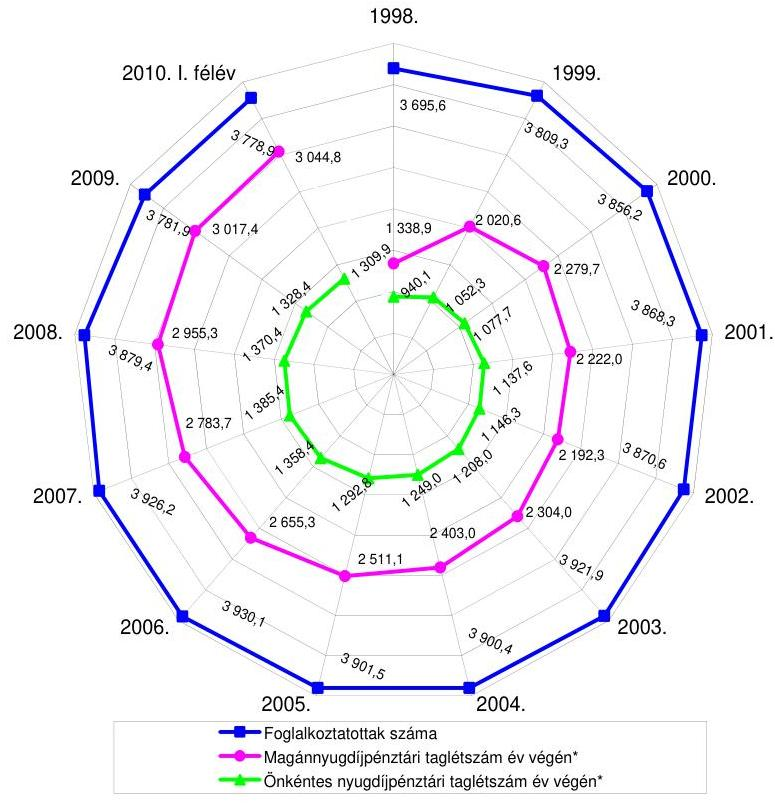

A jelentésben található valamennyi diagramhoz tartozó adatgyűjtést az Állami Számvevőszék (továbbiakban: ÁSZ) végezte az APEH, a Központi Statisztikai Hivatal (továbbiakban: KSH), a PSZÁF, az Országos Nyugdíjbiztosítási Főigazgatóság (továbbiakban: ONYF), a Pénztárak Garancia Alapja adatai alapján. Az Ny. Alap bevételi és kiadási összegei a Magyar Köztársaság 1998-2009. évi költségvetésének végrehajtásáról és a Magyar Köztársaság 2010. évi költségvetéséről szóló törvények adataival egyeznek meg.

---

A nyugdíjrendszer fenntarthatóságát, a nyugdíjjövedelmeket a gazdaság mindenkori jövedelemtermelő képessége, a népesség száma és a foglalkoztatottság alakulása, továbbá az élettartam folyamatos növekedése (gazdaságilag aktívak és nyugdíjasok aránya) befolyásolja. Meghatározó szerepet tölt be a rendszer fenntarthatóságában a bruttó keresetek alakulása és a járulékfizetés felső határának változása, mivel ezek képezik a nyugdíjbiztosítási járulékok, valamint a magánnyugdíjpénztári tagdíjak alapját. Az Alap garanciadíj bevételét is meghatározzák ezek a tényezők azáltal, hogy a pénztáraknak a tagdíjbevételeik meghatározott hányadát (az Mpt. szerint 1998-2001 között 0,3-0,5\%, 2002. január 1-jétől maximum 0,4\%) kell az Alapnak befizetni. A nyugdíjrendszer fenntarthatóságát az állam szabályozókon keresztül biztosítja, amelynek a legfontosabb eszközei a járulékszintek, a nyugdíjkorhatár, a nyugdíjmegállapítási és nyugdíjindexálási előírások. (A nyugdíjbiztosítási ellátások fedezetéül szolgáló bevételekre ható főbb tényezők alakulását 1998-2010. I. féléve között a 2. számú diagram mutatja be.)
2. számú diagram

A nyugdíjbiztosítási ellátások fedezetéül szolgáló bevételekre ható főbb tényezők alakulása 1998-2010. I. félév
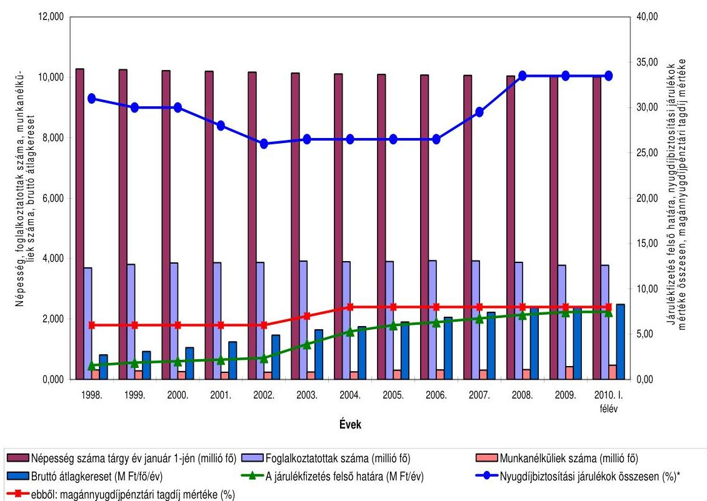

[^0]Magyarország népessége a KSH által közzétett adatok alapján 1998 óta közel $3 \%$-kal csökkent, 2010. év elejére mindössze 14 ezer fővel haladta meg a

[^0]:    * Nem tartalmazza a 2007-től bevezetett korkedvezmény biztosítási járulék mértékét (13\%), amit a munkáltatónak a korkedvezményre jogosító munkakörökben foglalkoztatottak után kell megfizetnie. A munkáltató által ténylegesen fizetendő járulék mértéke 2007-ben 0,0\%, 2008-ban 3,25\%, 2009-ben 6,5\%, 2010-ben $9,75 \%$ volt, a különbözetet ezekben az években a költségvetés átvállalta.

---

10 milliót, augusztus végére pedig már 10 millió alatt volt. A születések számának csökkenése és a születéskor várható élettartam növekedése következtében Európához hasonlóan Magyarországon is megfigyelhető a társadalom „előregedése". A foglalkoztatottak száma az utóbbi 12 évben évente 3930 ezer fő és 3696 ezer fő között alakult, 2006-tól minden évben csökkent. A nyugellátásban részesülők átlagos létszáma az 1998. évi 2411 ezer főről 2005-re 2345 ezer főre mérséklődött. A nyugellátásban részesülők létszáma 2010. I. félév végére 2709 ezer főre nőtt, ami magában foglalja az E. Alapból Ny. Alapba 2007-től átcsoportosított mintegy 400 ezer fő rokkantnyugdíjas ellátását. A munkanélküliségi ráta 2001-től folyamatosan romló tendenciát mutat, 5,7\%-ról 2010. I. félévére 11,1\%-ra emelkedett. A bruttó átlagkereset az elmúlt 12 évben több mint háromszorosára, 2,5 M Ft/fő/évre, a járulékfizetés felső határa pedig közel ötszörösére, 7,5 M Ft/évre nőtt. Az egy ellátásra jutó összeg 2009-ben (1001 E Ft/év) több mint háromszorosa az 1998. évinek.

A tb. nyugdíjrendszerben a társadalmi szolidaritás elvének megfelelően a foglalkoztatók és a biztosított egyéni vállalkozók jogszabályban meghatározott mértékű nyugdíjbiztosítási járulékot, a biztosítottak pedig (a nem magánnyugdíjpénztári tagok) nyugdíjjárulékot ${ }^{1}$ fizetnek a járulékalapot képező jövedelmek után. A magánnyugdíjpénztári tagok ellátásuk fedezetére a járulékalapot képező jövedelmük után megosztva fizetnek tagdíjat a választott magánnyugdíjpénztárba (1998-tól 6\%-8\% között) és járulékot (1998-tól 0,5\%$2 \%$ között) az Ny. Alapba. A munkáltatók és a biztosítottak által fizetendő járulékok együttes mértéke az 1998. évi 31\%-ról 2002-re 26\%-ra csökkent. 2008-ra 29,5\%-ra emelkedett, ami további 4 százalékponttal nőtt ${ }^{2}$ az egészségbiztosítási járulék azonos mértékű csökkentése mellett. Az így kialakult 33,5\%-os járulékmérték azóta változatlan maradt.

A tb. nyugdíjrendszer nagyságrendjét tekintve a legnagyobb jövedelem átcsoportosító intézményrendszer, 1998-ban a bruttó hazai termék (továbbiakban: GDP) 7,7\%-át, 2009-ben 11\%-át tette ki. Az Ny. Alapból finanszírozott nyugdíjbiztosítási ellátások fedezetéül szolgáló bevételek az 1998. évi 781,1 Mrd Ft-ról 2009-re 3,8-szorosára, 2934,4 Mrd Ft-ra nőttek. (A 2009. évi adatok tartalmazzák az E. Alapból Ny. Alapba átcsoportosított szolgáltatással összefüggő kiadást és bevételt.) A magánnyugdíjpénztári tagok miatti járulék-kiesés pótlására fordított költségvetési támogatás az Ny. Alap bevételi főösszegének 1998-ban 2,6\%-át, míg 2009-ben 12,4\%-át tette ki. A nyugellátásokkal összefüggő kiadások alakulására hatással van továbbá a születéskor várható életkor megnövekedése. (A nyugdíjbiztosítási ellátások kiadásaira ható főbb tényezők alakulását 1998-2009 között a 3. számú diagram mutatja be.)

[^0]
[^0]:    ${ }^{1}$ A járulékmértékek változását 1998-tól 2010-ig a 3. számú melléklet mutatja be.
    ${ }^{2}$ A korhatár alatti - nem teljesen munkaképtelennek minősülő - rokkantak nyugdíját, valamint a kapcsolódó hozzátartozói ellátásokat 2007-től az E. Alap helyett az Ny. Alap finanszírozza.

---

3. számú diagram

A nyugdíjbiztosítási ellátások kiadásaira ható főbb tényezők alakulása 1998-2009.
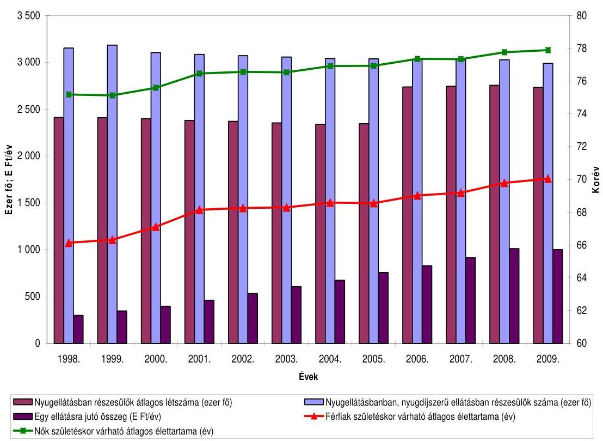

A központi költségvetés az Ny. Alap támogatására 1998-ban 28,1 Mrd Ft-ot, 2009-ben 599,1 Mrd Ft-ot fordított, ami tartalmazza a magánnyugdíjpénztári rendszer bevezetése miatt kieső járulékbevételek megtérítését is. Az Ny. Alap támogatására évenként fordított összeg az elmúlt 12 év alatt több mint hússzorosára növekedett. A 2010. évi előirányzat 595,0 Mrd Ft hozzájárulással számolt. A nyugellátások finanszírozásához a központi költségvetés egyre növekvő arányban járult hozzá, míg 1998-ban ez az arány 3,6\%-ot, 2009-ben már 21,1\%-ot tett ki. (Az 1998. évi adatokat korrigálva az E. Alapból Ny. Alapba átcsoportosított ellátások kiadásaival a költségvetés hozzájárulásának mérteke 3,2\% lett volna.) (A nyugellátásokra fordított kiadások és a központi költségvetési hozzájárulások 1998-2010 közötti alakulását a 4. számú diagram mutatja be.)

---

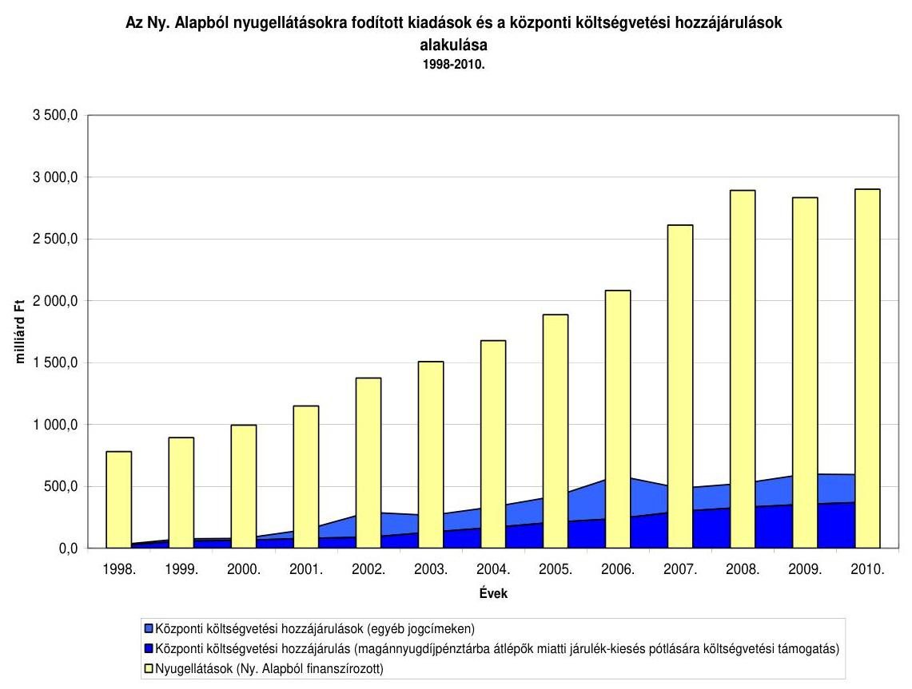

A magánnyugdíjpénztári rendszer bevezetése óta kötelezően a magánnyugdíjpénztár tagjává válnak - 2002. év kivételével - a pályakezdők, önkéntes alapon pedig a tb. nyugdíjrendszerben már szolgálati idővel rendelkezők. 2002 végére a magánnyugdíjpénztári taglétszámon belül az önként belépők részaránya $83,9 \%$ (1839 ezer fő) volt, amely 2009-re az önkéntesen belépők számának mérsékelt növekedése mellett 66,6\%-ra (2010 ezer főre) változott. Olyan életkorú és keresetű magánszemélyek is döntöttek a magánnyugdíjpénztári tagság mellett, akik számára az nem volt kedvező ${ }^{3}$.

A magánnyugdíjpénztári rendszerben felhalmozott megtakarításokból elérhető járadékok mértékét meghatározóan befolyásolja a kereset nagysága, a felhalmozási (szolgálati) idő hossza, a jogszabályban előírt tagdíj mértéke, továbbá a felhalmozási időszakban a nyugdíjpénztár által elért hozamok alakulása. Csökkenti a magánnyugdíjpénztári tag felhalmozott megtakarításának össze-

[^0]
[^0]:    ${ }^{3}$ Az OGY 2010. október 25-én elfogadta a nyugdíjpénztár-választás szabadságáról szóló törvényt, amely szerint eltörli a pályakezdők kötelező magánnyugdíjpénztári tagságát és 2011. december 31-éig megteremti a pályakezdők és az önkéntes döntés alapján pénztártaggá vált emberek számára a tb. nyugdíjrendszerbe való visszalépés lehetőségét. Az OGY a visszalépés lehetőségét kiterjesztette azokra a személyekre is, akik 2012. január 1-jét megelőzően a magánnyugdíjpénztári tagságukra figyelemmel részesülnek a tb. nyugdíjrendszerben saját jogú nyugellátásban.

---

gét a magánnyugdíjpénztár által elszámolt működési költség, csökkentheti a befektetésekből származó esetleges veszteséget, valamint a hozamgarancia beváltása miatt elrendelhető rendkívüli befizetés pénztártagra jutó összege. A működési költségek elszámolható mértékét az Mpt. 2007 végéig nem szabályozta, 2008-tól a befizetett tagdíjak 5,5\%-ában, majd 2009-től 4,5\%-ában maximálta.

A magánnyugdíjpénztárak taglétszáma 2009 végére 3017 ezer főre, a tagdíjbefizetésből származó bevétele 2252,4 Mrd Ft-ra nőtt, vagyona 2434,7 Mrd Ft-ot tett ki. A magánnyugdíjpénztári tagok tagdíj befizetéseinek 11 év alatt elért növekménye 182,3 Mrd Ft, 8,1\% volt.

A Minisztérium adatai szerint a magánnyugdíjpénztárak befektetéseikkel a 11 év során öt évben negatív, hat évben pedig pozitív reálhozamot értek el. A magánnyugdíjpénztárak éves reálhozama 2004-ben volt a legmagasabb, $11,27 \%$, a pénzügyi-gazdasági válság évében, 2008-ban pedig a legalacsonyabb, - a Minisztérium szakértői becslése alapján - mínusz 22,7 % volt.

A magánnyugdíjpénztári rendszer 1998. évi működése óta - rokkantnyugdíjassá válás, öregségi nyugdíjjogosultság elérése és egyéb jogcímen mindösszesen 243 ezer fő lépett vissza a tb. nyugdíjrendszerbe, akik a 2009. évi taglétszám $8 \%$-át tették ki. A visszalépések eredményeként a magánnyugdíjpénztárak 1998 óta mindösszesen 147,5 Mrd Ft-ot adtak át, ebből 58,7 Mrd Ft az átadás évében az Ny. Alap bevételeit növelte, a 2009. évi intézkedéshez kapcsolódó 88,8 Mrd Ft-ot pedig a központi költségvetésnek juttatták vissza, ami az államadósságot csökkentette.

A magánnyugdíjpénztári rendszerben a pénztáraknál gyűjtött, egyéni számlán nyilvántartott megtakarítások védelme érdekében az állam 1997. szeptember 1-jétől létrehozta a Pénztárak Garancia Alapját (továbbiakban: PGA, Alap), amely működését 1998. január 1-jén kezdte meg. Az Alap működésére, szervezetére, vagyonára és gazdálkodására vonatkozó szabályokat az Mpt. szabályozta. (A Pénztárak Garancia Alapjának intézményi kapcsolatait a 4. számú melléklet szemlélteti.) A tagok kockázatközösségén alapuló magánnyugdíjpénztári rendszerben keletkező kockázatok kezelésére, a garanciális kifizetések teljesítésére létrehozott PGA fizetőképességét - a pénztártagok követelésének mindenkori teljesítése érdekében - az állam garantálja a központi költségvetés terhére.

A PGA közérdeket szolgáló, a magánnyugdíjpénztári rendszer tagjainak kockázatközösségén alapuló, közvetlen állami tulajdon nélkül működő jogi személy, amely a működésével kapcsolatos költségeket maga viseli. Az Alap működését a magánnyugdíjpénztárak rendszeres díjfizetései - közvetetten a pénztártagok befizetései - finanszírozzák. Pénzeszközeit kizárólag az Mpt.-ben meghatározott feladatok ellátására használhatja fel, saját tőkéje nem osztható fel. Szabad pénzeszközeit pénzben vagy állampapírokban tarthatja, amelynek kezelését letétkezelő, valamint vagyonkezelő végzi. Az állam közvetett módon támogatja a PGA-t azzal, hogy vagyonát, bevételeit és jövedelmét nem terheli társasági és helyi adó-, valamint illetékfizetési kötelezettség. Az Mpt. szerint az állam a magánnyugdíjpénztári rendszer működését, azon belül a PGA fizetőképességét a központi költségvetés által biztosítja.

---

Az Alap törvényességi felügyeletét az állam a PSZÁF útján gyakorolja. A PGA szervezetét héttagú igazgatóság irányítja, amelynek tagja az ügyvezető igazgató, négy tagját a PSZÁF elnökének javaslata alapján a miniszter ${ }^{4}$ nevezi ki, két tagját pedig a pénztárak szövetsége delegálja. Az Alap működését háromtagú ellenőrző bizottság felügyeli, tagjait - a PSZÁF javaslata alapján - a miniszter nevezi ki. Az ügyvezető igazgató vezeti az Alap öt főből álló munkaszervezetét.

A PGA Mpt.-ben meghatározott feladata, hogy garanciális kifizetést teljesítsen abban az esetben, ha az Alap tagjánál a pénztártag vagy kedvezményezett követelése - másik pénztárba való átlépés, a tb. nyugdíjrendszerbe való visszalépés, járadékszolgáltatás, illetve a tag elhalálozása esetén - befagyott. Garanciális kifizetést kell teljesíteni a PGA-nak továbbá, ha a nyugdíj folyósításának időszakában az adott pénztár szolgáltatási tartalékának szintje a szolgáltatási kötelezettségek teljesítését nem teszi lehetővé, valamint ha a pénztártag pénztár által vezetett egyéni számlájának egyenlege a nyugdíjszolgáltatás megállapításakor nem éri el a hozamgarantált tőke összegét. Az OGY az Mpt. módosításával 2010. január 1-jei hatállyal bevezette a hozamgaranciát, amely a magánnyugdíjpénztári tagok felhalmozási időszak alatti nyugdíjcélú megtakarításai reálértékének megtartását biztosítja a nyugdíj megállapítás időpontjáig. Az Alap feladatát képezi továbbá - szükség esetén - a károsult pénztártag képviselete a pénztár felszámolási eljárása, illetve az egyezségi tárgyalások során.

A PGA azon kötelezettsége, hogy a pénztártag követelését nyugdíjba vonuláskor kiegészítse az Mpt.-ben előírt minimum összegre (normafedezetre) az Mpt. hatályba lépésétől 2001 végéig volt érvényben. A PGA normafedezettel összefüggő várható garanciális kötelezettségeire a 2001-2002. évi költségvetésről szóló törvényjavaslathoz benyújtott minisztériumi tájékoztató tartalmazott előrejelzést, azonban a Minisztérium és a PGA előrejelzései között nagyságrendbeli eltérés mutatkozott. A normafedezetre történő kiegészítési kötelezettség hatályon kívül helyezésével ${ }^{5}$ csökkent a magánnyugdíjpénztárak jövőbeni szolgáltatás-teljesítésének pénzügyi kockázata és a PGA garanciális kifizetéseinek hosszú távú kockázata is mérséklődött. A normafedezeti garancia megszüntetésével egyidejűleg a PGA igazgatósága 0,4\%-ról 0,35\%-ra csökkentette a pénztárak által fizetendő garanciadíj mértékét, amelyet azóta változatlanul hagyott.

Az Mpt. az ellenőrzött tíz évben 31 alkalommal módosult ${ }^{6}$. Az Alapot közvetlenül is érintő módosítások voltak többek között az Állami Pénztárfelügyelet és a Pénztártanács megszüntetése, egyes garanciális feladatok törlése, illetve új fel-

[^0]
[^0]:    ${ }^{4}$ a pénzügyminiszter, a nyugdíjbiztosítási járulékfizetés szabályozásáért felelős miniszter, a nyugdíjjárulék- és nyugdíjbiztosítási járulékfizetés szabályozásáért felelős miniszter (továbbiakban: miniszter)
    ${ }^{5}$ A Kormány 2297/2002. (X. 1.) határozata alapján a magánnyugdíjpénztári garanciarendszer részletes szabályairól szóló munkaanyag készült, amely részletes hatásvizsgálatot is tartalmazott, azonban az erre alapozott törvénymódosítás nem lépett hatályba.
    ${ }^{6}$ Az OGY 2009. december 14-ei ülésnapján elfogadta a magánnyugdíjról és intézményeiről szóló törvényt. A köztársasági elnök 2010. január 4-én kérte annak alkotmányossági vizsgálatát. Az Alkotmánybíróság - 103/2010. (VI. 10.) AB határozata szerint - egy pontban alkotmányellenesnek találta a törvényt. A köztársasági elnök ezért visszaküldte a törvényt az OGY-nak, amelyet az OGY azóta nem tárgyalt.

---

adatok megállapítása. Módosultak a garanciadíj megállapításának szabályai és mértékének maximuma, az Alap eszközei mértékére vonatkozó előírások, valamint változott az éves beszámoló elkészítésének határideje. Változtak az igazgatóság összetételére és az igazgatósági tagok delegálási rendjére vonatkozó előírások is. A PGA feladata 2001. január 1-jétől módosult azzal, hogy a pénztárak tevékenységével összefüggő elemzések helyett az Alapot terhelő garanciális kötelezettségek biztosításmatematikai előrejelzését kell elvégeznie.

A PGA garanciális kötelezettségei teljesítésének forrását az Mpt. a tevékenység folytatására engedéllyel rendelkező pénztárak kötelező tagságával együtt járó garanciadíj fizetéssel biztosítja, továbbá vagyongyarapodást tesz lehetővé az Alap pénzeszközeinek befektetéseiből származó hozamok realizálása. Csökkenti a megtakarításokat, hogy a PGA a garanciadíjak és a befektetésekből származó hozamok terhére viseli a működésével összefüggő költségeket, amelyhez az állam az alapítástól 2002-ig összesen 298,3 M Ft vissza nem térítendő költségvetési támogatást adott (ebből 181,0 M Ft volt az ellenőrzött tíz évre jutó támogatás).

A PGA mérlegfőösszege a 2000. évi 703,0 M Ft-ról 10 051,8 M Ft-ra, saját tőkéje 692,8 M Ft-ról 9746,9 M Ft-ra emelkedett 2009 végére. Az Alap garanciális bevételként 2000-ben 331,8 M Ft-ot, 2009-ben pedig 1268,3 M Ft-ot számolt el, míg a működéssel kapcsolatos ráfordításai 2000-ben 105,5 M Ft-ot, 2009-ben 143,5 M Ft-ot tettek ki.

Az ÁSZ utoljára 2000-ben ellenőrizte az Alap 1998-1999. évi működését.
A jelen ellenőrzés célja annak értékelése volt, hogy:

- a PGA betöltötte-e szerepét a kötelező nyugdíjrendszerben, a jogszabályi előírások megfelelő kereteket biztosítanak-e a PGA működéséhez és garanciális feladatainak ellátásához, működése hozzájárult-e a jogszabályokban meghatározott célok (biztonság, gazdaságosság) teljesítéséhez;
- az Alap tevékenysége, gazdálkodása megfelelt-e a jogszabályok és a belső szabályzatok előírásainak, működése gazdaságos, vagyonkezelési tevékenysége eredményes volt-e.

A vizsgálat nem érintette a PGA éves beszámolója valódiságának vizsgálatát, mivel azt az Mpt. előírása alapján független könyvvizsgáló végzi el. Az ellenőrzés nem terjedt ki továbbá a nyugdíjrendszer, ezen belül a magánnyugdíjpénztári rendszer működésének értékelésére, a pénztárak szervezetére, működésére és gazdálkodására vonatkozó előírások végrehajtásának vizsgálatára, a nyugdíjpénztári kifizetések megfelelőségének minősítésére, a garanciális kifizetésekre vonatkozó előrejelzések megbízhatóságának felülvizsgálatára, valamint a PSZÁF által ellenőrzött területekre.

Az ellenőrzés szempontrendszerét előtanulmánnyal alapoztuk meg. A vizsgálatot az egyéb szabályszerűségi ellenőrzés módszerével végeztük. A PGA működését és gazdálkodását az ellenőrzési szempontokhoz kidolgozott kérdések, kritériumok és adatforrások szerint értékeltük.

---

A vizsgálat a 2000-2009. éveket fogta át, figyelemmel kísérve az ellenőrzés lezárásáig bekövetkezett változásokat.

Az ellenőrzés végrehajtására az Mpt. 98. § (3) bekezdése biztosított jogszabályi alapot.

A jelentést megküldtük a PGA ügyvezető igazgatójának. Észrevételét és az arra adott választ az 1. számú melléklet tartalmazza.

---

# I. ÖSSZEGZŐ MEGÁLLAPÍTÁSOK, KÖVETKEZTETÉSEK, JAVASLATOK 

A PGA Mpt.-ben szabályozott garanciális feladatainak részletszabályait a Kormány - a törvényben adott felhatalmazások ellenére - az Alap működésének 1998. január 1-jei kezdetétől a helyszíni ellenőrzés végéig nem készítette el. A részletes szabályozás elmaradása miatt nem volt megállapítható, hogy a PGA működése megfelelő mértékű garanciális biztosítékot nyújt-e a magánnyugdíjpénztári rendszer működéséhez, a pénztártagok egyéni megtakarításainak védelméhez és a pénztárak szolgáltatásainak teljesítéséhez. A PGA garanciális feladatai teljesítéséhez szükséges forrás meghatározásához teljes körű modellszámításokat sem a Pénzügyminisztérium, sem a PGA nem készített, így az állam számára kockázatot hordoz, hogy nem állapítható meg biztonsággal, a PGA mindenkori vagyona milyen természetű válság kezelésére ad módot, továbbá milyen terjedelmű és mértékű pénzügyi nehézségek áthidalására elegendő.

A jogi szabályozás a magánnyugdíjpénztárak működésével összefüggésben kétszeres kötelezettséget ír elő a központi költségvetés számára azzal, hogy egyrészt a magánnyugdíjpénztárakba fizetett tagdíjakat az Ny. Alapnak meg kell térítenie ${ }^{7}$, másrészt „a magánnyugdíjrendszer működését az állam - az intézményvédelmi szabályok érvényesítésével, az állami felügyelet működtetésével, valamint a pénztártagok követeléseit biztosító Alap fizetőképességének a központi költségvetés által történő garantálásával - biztosítja".

Növeli a magánnyugdíjpénztári rendszer és ezzel együtt az állami garanciavállalás kockázatát, valamint a tagok bizonytalanságát, hogy a 2013-ban induló kifizetésekhez a járadékmegállapítás, ezen belül a szolgáltatási tartalék képzés, feltöltés és felhasználás részletszabályait a Kormány nem határozta meg, nem szabályozta továbbá a rokkant és hozzátartozói ellátások rendjét sem. A PGA forráshiánya esetén elrendelhető rendkívüli befizetés részletszabályait sem a Kormány, sem a miniszter nem írta elő. A 2010 januárjától bevezetett hozamgarancia tovább növelte a PGA és azon keresztül az állam kockázatvállalását, mivel az garantálja a megtakarítások reálértékét a magánnyugdíjpénztári tag számára a járadékmegállapítás időpontjában. A hozamgaranciát úgy vezették be, hogy számításának részletszabályai még nem jelentek meg, és a megnövekedett kockázattal összefüggően a PGA számára fizetendő garanciadíj mértékének felülvizsgálatát sem végezték el.

Az Mpt.-ben meghatározott garanciadíj mértékének, valamint az Alap eszközeinek évi átlagos értéke és a pénztárak összesített eszközei értékének arányára vonatkozó szabályok megalapozottságát dokumentumok nem támasztották

[^0]
[^0]:    ${ }^{7}$ A magánnyugdíjpénztári befizetésekhez kapcsolódó törvénymódosításokról szóló 2010. évi törvény előírása szerint a 2010. november 1-je és 2011. december 31-e közötti időszakban a magánnyugdíjpénztári tagok 8 %-os tagdíját is nyugdíjjárulékként az Ny. Alapba kell átutalni.

---

alá. Nem álltak rendelkezésre számítások a befagyás és a szolgáltatási tartalék kiegészítés teljesíthetőségére sem.

A részletszabályok hiányában nem határozható meg, hogy a PGA mindenkori vagyona elegendő fedezetet nyújt-e az Mpt.-ben előírt garanciális kifizetési kötelezettsége teljesítésére, a magánnyugdíjpénztár tagja pedig megközelítőleg sem tudja kalkulálni, hogy mekkora járadékszolgáltatásra számíthat. Mindezek alapján a PGA sem tudja meghatározni, hogy mikor és mekkora összegű garanciális kifizetést kell teljesítenie, ebből eredően azt sem, hogy vagyona milyen mértékben nyújt fedezetet a magánnyugdíjpénztári rendszer kockázataiból eredő fizetési kötelezettségeire. Ezek hiánya miatt a rendszer nem átlátható, nem kiszámítható, nem teszi lehetővé a várható garanciális kötelezettségek részletes számszerűsítését, ami növeli az állam kockázatát is.

Az ÁSZ számítása szerint a PGA felhalmozott garanciális vagyona 2000 és 2007 között közel 8 ezer fő, 2008-ban és 2009-ben pedig 12 ezer fő átlagos összegű egyéni számlakövetelése teljes befagyásának fedezetét tudta volna biztosítani ${ }^{8}$. A PGA 2009 végéig felhalmozott vagyona a magánnyugdíjpénztári tagok mindössze 0,4%-ának biztosítja a magánnyugdíjpénztárnál az egyéni számlán nyilvántartott megtakarítás kifizetését, ami a több mint hárommilliós taglétszámhoz viszonyítva aránytalanul kevés.

A magánnyugdíjpénztári rendszer fennállása óta a rendszerben bekövetkezett kockázatok terheit az állam vállalta át azáltal, hogy a rokkanttá vált magánnyugdíjpénztári tag visszaléphetett a tb. nyugdíjrendszerbe és ellátását az állam biztosítja. Az OGY határozata szerint ${ }^{9}$ a Kormánynak 2002 végéig ki kellett dolgoznia a magánnyugdíj biztosítás rendszerében a rokkant és a hozzátartozói ellátásokra vonatkozó javaslatot, a részletes szabályokat a Kormány a helyszíni ellenőrzés végéig nem írta elő. A szabályozás hiányának áthidalását segítette, ugyanakkor az állam kiadásait hosszú távon növelte, hogy a magánnyugdíjpénztári rendszer rokkanttá váló tagja saját döntése alapján - amennyiben számára az kedvezőbb - visszaléphet a tb. nyugdíjrendszerbe, ahonnan rokkantnyugdíjban részesülhet. Az ellenőrzött tíz évben 27,8 ezer fő magánnyugdíjpénztári tag vált rokkanttá, akik mindannyian, azaz 100%-ban visszaléptek a tb. nyugdíjrendszerbe. Ezzel összefüggésben a magánnyugdíjpénztárak összesen 15,8 Mrd Ft-ot adtak át az Ny. Alap részére.

A 2008-ban kezdődő pénzügyi-gazdasági válság hatására a tőkepiaci hozamok csökkentek, ami a magánnyugdíjpénztári tagok - egyéni számláin felhalmozott - megtakarításainak reálértékét is (mintegy 20%-kal) csökkentette. Az OGY részére összeállított tájékoztató szerint a magánnyugdíjpénztárak kedvezőtlen 2008. évi eredményei miatt felerősödtek azok a nézetek, amelyek a tőkefedezeti pillér létjogosultságát kérdőjelezték meg. Annak érdekében, hogy a rövid távon nyugdíjba vonuló magánnyugdíjpénztári tagok nyugellátását ne csökkentse a válság miatt bekövetkezett tőkevesztés, az OGY az Mpt. módosításával

[^0]
[^0]:    ${ }^{8}$ A PGA tárgyévben felhalmozott garanciális vagyonából fedezhető követeléseket az 5. számú melléklet tartalmazza.
    ${ }^{9}$ az új nyugdíjrendszer bevezetéséhez kapcsolódó egyes feladatokról szóló 74/1997. (VII. 18.) OGY határozat 7. pontja

---

2009. július 9-étől december 31-éig lehetővé tette a tb. nyugdíjrendszerbe történő visszalépést. Azok élhettek ezzel a lehetőséggel, akik önkéntes döntésük alapján váltak a magánnyugdíjpénztár tagjává és 2008. december 31-éig betöltötték az 52. életévüket. A PSZÁF adatszolgáltatása szerint a feltételeknek közel 122,6 ezer fő felelt meg. A rendszer iránti bizalom megrendülését mutatta, hogy a rendelkezésre álló hat hónap alatt az érintettek 50,7%-a (62,1 ezer fő) visszalépett a tb. nyugdíjrendszerbe. A 2009. évi visszalépésekhez kapcsolódóan a magánnyugdíjpénztárak 88,8 Mrd Ft-ot a központi költségvetésnek juttattak vissza, ami az államadósságot csökkentette.

A tagok kockázatközösségén alapuló magánnyugdíjpénztári rendszer fizetőképességének garantálására létrehozott PGA feladatellátásának szabályozási hiányosságai és a tőkepiacok hozamainak ingadozása növelik az állam Mpt.-ben rögzített garanciális fizetési kötelezettségének kockázatát.

A nyugdíjpénztár-választás szabadságáról szóló 2010. évi törvény lehetővé teszi az egyén számára, hogy szabadon döntsön a magánnyugdíjpénztárba történő belépésről, illetve visszaható érvénnyel biztosítja a szabad választást a tagság fenntartásáról, illetve a tb. nyugdíjrendszerbe való visszalépésről. A magánnyugdíjpénztári tagság önkéntessé válása lehetővé teszi az állami garanciavállalás szükséges mértékének meghatározását.

Az Mpt. 2001 januárjától előírta, hogy a PGA a várható garanciális kifizetéseiről a tárgyévet követő időszakra szükség szerint, de legalább évente biztosításmatematikai előrejelzést készítsen, azonban sem az Mpt., sem egyéb végrehajtási rendelet nem szabályozta a jelentés tartalmi követelményeit, időhorizontját, a számszerűsítés módját. A PGA éves beszámolóiban nyilvánosságra hozott biztosításmatematikai jelentései tartalmazták a garanciális kifizetési kötelezettségekre, a kötelezettségek fedezetére vonatkozó változásokat, azok várható hatásának szöveges értékelését, azonban a kifizetések várható összegére - a 2001. évi normagaranciával összefüggő előrejelzés kivételével - nem tartalmaztak adatot. A garanciális kifizetési kötelezettségek teljesítésére vonatkozó értékelés szerint „A PGA-nál meglévő fedezet biztosan elégséges arra, hogy az Alap a legkisebb pénztárak fizetési gondjain hatékonyan segítsen. ...Több, közepes méretű pénztár egyidejű problémája, vagy nagy (100 ezernél több taggal rendelkező) pénztár érdemi fizetési gondjai esetén a PGA-nak mindenképpen rendkívüli garanciadíj kivetésére, illetve hitel felvételére lenne szüksége."

Az Mpt. lehetőséget teremtett a PGA mindenkori vagyonát meghaladó garanciális kifizetések teljesítésére azzal, hogy előírta a rendkívüli befizetés elrendelését, továbbá a Magyar Nemzeti Banktól (továbbiakban: MNB) állami garancia mellett felvehető kölcsön, illetve hitel feltételeit. Az Mpt. módosító és hatályon kívül helyező előírásai között 1997. szeptember 1-jétől beiktatta az MNB tv.-be (régi) ${ }^{10}$ a PGA részére kölcsön-, valamint megelőlegezési hitelnyújtási kötelezettséget. Az OGY az MNB tv. (új) ${ }^{11}$ 2007. július 3-tól hatályos módosításával az Európai Közösségek Bizottsága (továbbiakban: Európai Bizottság) és az Európai Központi Bank (továbbiakban: EKB) 2006. évi Konvergenciajelentésében

[^0]
[^0]:    ${ }^{10}$ a Magyar Nemzeti Bankról szóló 1991. évi LX. törvény (továbbiakban: MNB tv. (régi)
    ${ }^{11}$ a Magyar Nemzeti Bankról szóló 2001. évi LVIII. törvény (továbbiakban: MNB tv. (új)

---

tett megállapításának megfontolása alapján - hatályon kívül helyezte a PGA számára nyújtható hitelre, kölcsönre vonatkozó rendelkezést. Az Mpt. és az MNB tv. (új) szabályozása közötti összhang hiánya miatt a PGA likviditási zavara esetén a hitelfelvétel az Mpt.-ben előírtak szerint nem biztosítható. A PGA működésében a helyszíni ellenőrzés végéig likviditási zavar nem fordult elő, ezért kölcsön-, illetve hitelfelvétel igénye nem merült fel. Az Mpt.-ben előírt rendkívüli befizetés elrendelésének végrehajtási szabályai a törvény felhatalmazása ellenére a helyszíni ellenőrzés befejezéséig nem jelentek meg.

Az Alap szervezetét az Mpt.-ben meghatározottak szerint a héttagú igazgatóság, a háromtagú ellenőrző bizottság, a munkaszervezetet az ügyvezető igazgató és - 2004 júliusától - további négy fő alkotja. Az Alap a Szervezeti és működési szabályzatát (továbbiakban: SZMSZ) a Rendelet ${ }^{12}$ előírásainak megfelelően alakította ki, a jogszabály-változásokkal azonban késedelmesen módosította, pl. a 2002-től megszűnő normafedezet kiegészítéssel összefüggő feladatváltozást csak 2009-ben vezette át.

Az igazgatóság az Alap legfőbb irányító testülete, amelynek összetétele az ellenőrzött jelölő, illetve kinevező dokumentumok szerint megfelelt az Mpt. előírásainak. A Rendelet alapján az igazgatóság tagjai díjazásban részesíthetők és költségtérítésre jogosultak, amelyekről - jogszabályi rendelkezés hiányában az igazgatóság ügyrendjében foglaltak szerint az igazgatóság maga határozhat. A gyakorlatban azonban a miniszter hagyta jóvá a juttatásokat, ezzel kerülve el, hogy az igazgatóság tagjai saját juttatásaikról döntsenek. A PGA dokumentumai alapján az igazgatóság éves munkaterveinek megfelelően látta el feladatát. Az Mpt.-ben előírtak szerint elfogadta többek között az Alap éves beszámolóját, meghatározta a munkaszervezet éves költségvetését, negyedévente jelentést küldött a Felügyeletnek és a PGA tagjainak az Alapban kezelt pénzeszközök állományáról és felhasználásáról. Az igazgatóság az Mpt.-ben meghatározott feladatait ellátta, kivéve az ügyrendjének, az Alap SZMSZ-ének és belső szabályzatainak jogszabály-változásokat követő módosításait, valamint a szabályzatok közzétételét.

Az Alap működését a PSZÁF javaslata alapján kinevezett háromtagú ellenőrző bizottság felügyelte, amely az Mpt. előírásai szerint egyebek mellett rendszeresen vizsgálta és elemezte az Alap gazdálkodását, megtárgyalta a PGA költségvetését, javaslatot tett a könyvvizsgálóra. Elfogadta a belső ellenőrzés éves munkaterveit, megtárgyalta a belső ellenőri jelentéseket, határozatait, javaslatait a Rendeletnek megfelelően megküldte a Felügyeletnek. Az ellenőrző bizottság a 2000. év kivételével nem határozta meg a Rendelet előírása szerint a könyvvizsgálóval való együttműködés szabályait. Ügyrendje alapján a bizottság tagjainak tiszteletdíjáról és költségtérítéséről az igazgatóság dönt, az alkalmazott gyakorlat szerint azonban a tiszteletdíjakat a miniszter hagyta jóvá. Az ellenőrzött tíz évben az ellenőrző bizottság az Mpt. változásaival nem módosította ügyrendjét, nem követte nyomon, hogy az Alap SZMSZ-e és belső szabályzatai mindenkor megfelelnek-e a hatályos jogszabályoknak.

[^0]
[^0]:    ${ }^{12}$ a Pénztárak Garanciaalapjának szervezeti és működési szabályairól szóló 169/1997. (X. 6.) Korm. rendelet (továbbiakban: Rendelet)

---

A belső ellenőr tevékenységét a Rendelet, az SZMSZ és az ellenőrzési szabályzat előírásainak betartásával végezte. Az ellenőrzött tíz évben vizsgálta egyebek mellett a költségterveket, az éves beszámolókat, a vagyon befektetését, a garanciadíj beszedését, továbbá a számviteli és a bizonylati fegyelem érvényesülését. Feladatait munkatervei alapján végezte, az Alap működésével, gazdálkodásával összefüggő hiányosságot nem tárt fel, annak ellenére, hogy a PGA belső szabályzatait nem aktualizálta a vonatkozó jogszabályok előírásaival. A belső ellenőr nem alapozta meg a működés szabályszerűségére tett megállapításait a PGA szabályozottságának vizsgálatával.

Az Alap gazdálkodása szabályozott volt, rendelkezett az igazgatóság által elfogadott és a Felügyelet elnöke által jóváhagyott szabályzatokkal, amelyekben a Rendelet előírásának megfelelően meghatározta a gazdálkodás és az Alapból történő kifizetés, valamint a befektetés és a letétkezelés szabályait. A díjfizetési szabályzatban a letétkezelő társaság változását a helyszíni ellenőrzés végéig nem vezették át, a többi belső szabályzatban pedig a jogszabályok változásait késedelemmel módosították. Az Mpt. előírta az Alap számára, hogy szabályzatait és az igazgatóság nyilvános határozatait a Pénzügyi Közlönyben nyilvánosságra kell hoznia, amely rendelkezésnek a PGA nem tett teljes körűen eleget, pl. SZMSZ-ét az ellenőrzött tíz évben négy alkalommal módosította, de csak az 1998. évi változatot tette közzé, díjfizetési szabályzatát az évenkénti módosítás ellenére 2004 óta nem hozta nyilvánosságra ${ }^{13}$. A számviteli elszámolás rendjét a Számviteli tv.-ben (régi, új) és az Alap elszámolásának sajátosságait előíró Kormányrendeletben ${ }^{14}$ foglaltaknak megfelelően alakította ki. Számlarendjében nem határozta meg a bevételi és a kiadási számlákhoz tartozó gazdasági események részletes számlaösszefüggéseit, valamint a garanciadíj bevételek évek közötti elhatárolását, az elszámolások ugyanakkor a Számviteli tv. (régi, új) előírásainak megfeleltek.

A PGA bevételeit a garanciadíj bevételek, az Alap vagyonának befektetéséből származó hozamok, valamint - a PGA működésének megkezdésétől 2002-ig - a költségvetési támogatásból származó egyéb bevételek alkották. A garanciadíj bevételt a magánnyugdíjpénztárak tagdíjbevételei alapján, a díjfizetési szabályzat előírásainak betartásával számolta el a PGA, amely 2000-ben 331,8 M Ft, 2009-ben 1268,3 M Ft volt. Az ellenőrzött tíz évben az éves garanciadíj bevételek 3,8-szorosára nőttek, amit a magánnyugdíjpénztárak tagdíj bevételeinek 3,4-szeres növekedése alapozott meg. Az Mpt. rendelkezése szerint a PGA a szabad pénzeszközeit állampapírokban tartotta, amelynek befektetésére vagyonkezelőt és letétkezelőt bízott meg. Az Alapnak a befektetéseiből 2000-ben 63,2 M Ft, 2009-ben 1767,4 M Ft bevétele származott, ami az állampapírok befektetéséből elért hozamok, valamint az értékpapír műveletekből származó kamatok és árfolyamnyereség elszámolt összegét tartalmazta. A pénzügyi műveletek elszámolását a főkönyvvel számszakilag egyező analitikus

[^0]
[^0]:
    ${ }^{13}$ A PGA a helyszíni ellenőrzés megállapításának hatására 2010. augusztus 11-én intézkedett a garanciális kifizetési szabályzat (2010. évi) 1. számú módosítása, valamint a 2002-2010 évekre megállapított garanciadíj közzétételéről.
    ${ }^{14}$ A Pénztárak Garancia Alapja éves beszámoló készítési és könyvvezetési kötelezettségének sajátosságairól szóló 217/2000. (XII. 11.) Korm. rendelet (továbbiakban: Kormányrendelet)

---

nyilvántartások támasztották alá. Az Mpt. szerint az Alap viseli a tevékenységével és a működésével összefüggő költségeket. A PGA 2000-2002. évek között 181,0 M Ft vissza nem térítendő költségvetési támogatásban részesült működési forrásainak kiegészítésére, amit az egyéb bevételek között elszámolt. Az érintett évek költségvetési törvényei és az azok végrehajtásáról szóló törvények megteremtették a támogatás törvényi alapját, de nem voltak összhangban az Mpt. előírásával, amely a PGA létrehozására és a működés első évére biztosított költségvetési támogatást.

A PGA-nak 2009 végéig garanciális ráfordítása nem volt. Az Alap az ellenőrzött tíz évben hatályos számviteli törvényeknek és számviteli politikájának megfelelően a pénzügyi műveletek ráfordításaként számolta el az állampapírok eladásából származó árfolyamveszteséget, az értékpapírok értékvesztését és annak visszaírását. A pénzügyi műveletek ráfordítása 2000-ben 19,8 M Ft, 2009-ben pedig 873,2 M Ft volt.

A működési ráfordítások 2000-ben 105,5 M Ft-ot tettek ki, amelyek 2009-re (36,0\%-kal) 143,5 M Ft-ra nőttek. Az Alap működési ráfordításaira 2003-tól már fedezetet biztosítottak az értékpapírok hozamából származó bevételek. A 2000-2009. évek között a működési ráfordításoknak 66,2\%-71,5\%-át tették ki a személyi jellegű ráfordítások. Az alkalmazottak egy főre jutó átlagkeresete a 2000. évi 5,7 M Ft-ról 2009-re 10,8 M Ft-ra, míg az éves béren kívüli juttatása 0,4 M Ft-ról 1,7 M Ft-ra nőtt. A PGA munkaügyi szabályzata a hét jogcímen biztosított béren kívüli juttatásból csak kettőt írt elő. A munkaügyi szabályzattal összhangban az igazgatóság az éves működési költségterv részeként keretösszegben hagyta jóvá a személyi jellegű ráfordításokat, amelyben nem különült el a bérre, a jutalomra, illetve prémiumra tervezett összeg. Egy soron szerepelt továbbá a tiszteletdíjak, a megbízási díjak, a reprezentáció és béren kívüli juttatások tervszáma, amelyek adó- és járulék vonzatát sem mutatta be elkülönítetten a terv. A mindössze három sorból álló személyi költségek terve nem biztosította a tervezés átláthatóságát és nem adott támpontot a tervteljesítés tételes értékeléséhez. A béren kívüli juttatásokat a jogszabályokban biztosított maximális keretek figyelembevételével határozták meg a munkavállalók részére. A reprezentációra fordított összegek nagysága (átlagosan évi 1,7 M Ft) és gyakorisága (legalább heti egy alkalom) nem felelt meg a PGA ügyvezető igazgatói utasításában is megfogalmazott elvárható gazdaságos és hatékony gazdálkodás követelményének.

Az Alap eszközeinek főösszege az ellenőrzött tíz évben több mint 14-szeresére, 703,0 M Ft-ról 10 051,8 M Ft-ra nőtt, amelyből a forgóeszközök között nyilvántartott állampapírok (államkötvény, kincstárjegy, MNB kötvény) állománya 569,4 M Ft-ról 9095,9 M Ft-ra emelkedett. Az Alap befektetési és letétkezelési szabályzatának megfelelően vagyonának kezelésével - pályáztatással kiválasztott - letétkezelőt és vagyonkezelőt bízott meg. Az ellenőrzött dokumentumok alapján a letétkezelők és vagyonkezelők tevékenysége megfelelt az Mpt. és a belső szabályzatok előírásainak. A PGA éves átlagos kezelt vagyonarányos nettó hozama az ellenőrzött tíz évben 2,0\% és 13,0\% között alakult. A pénzügyigazdasági válság idején, 2008-ban 2,4\% nettó hozamot realizált, ami 6,16\%-kal meghaladta a magánnyugdíjpénztárak „klasszikus portfolióin" PSZÁF által kimutatott átlag mínusz 3,76\% hozamot, 2009-ben pedig 12,7\% volt. Az Alap saját tőkéje több mint 26-szorosára, 9746,9 M Ft-ra nőtt a 2009. év végére.

---

A helyszíni ellenőrzés megállapításainak hasznosítása mellett javasoljuk:

# a Kormánynak 

1.  Mérje sse fel, hogy mekkora kockázatot jelent a központi költségvetés számára az Mpt.-ben előírt állami garanciavállalás és szükség esetén intézkedjen a jogi szabályozás módosításáról.
2.  Szabályozza az Mpt. felhatalmazásának megfelelően a Pénztárak Garancia Alapja feladatainak ellátásához szükséges végrehajtási előírásokat, határozza meg továbbá a PGA szervezeti és működési szabályairól szóló kormányrendeletben az igazgatósági és az ellenőrző bizottsági tagok tiszteletdíja és költségtérítése megállapításának rendjét.
3.  Végeztessen számításokat a végrehajtási előírások alapján, hogy a PGA garanciális kötelezettségei teljesítéséhez milyen mértékű pénzügyi fedezet szükséges, és szükség esetén kezdeményezze a jogi szabályozás módosítását.

## az Ellenőrző Bizottságnak

Tartsa be a Rendelet 14. § (5) bekezdésének előírását és alakítsa ki a könyvvizsgálóval való együttműködés szabályait, továbbá biztosítsa, hogy ügyrendje folyamatosan feleljen meg az Mpt. előírásainak.

## az Igazgatóságnak

1.  Intézkedjen az Mpt.-ben előírt közzétételi kötelezettség teljes körű betartásáról, biztosítsa továbbá, hogy ügyrendje folyamatosan feleljen meg az Mpt. előírásainak.
2.  Rendelje el a PGA belső szabályzatainak (SZMSZ, díjfizetési szabályzat, befektetési és letétkezelési szabályzat, garanciális kifizetések szabályzata) felülvizsgálatát, biztosítsa az Mpt. és a vonatkozó kormányrendeletek előírásainak való folyamatos megfelelést, továbbá intézkedjen, hogy a PGA munkaügyi szabályzata teljes körűen szabályozza a munkavállalók részére biztosított béren kívüli juttatásokat.
3.  Vizsgáltassa felül a PGA számlarendjét, a bevételi és kiadási számlákhoz határoztassa meg a gazdasági események részletes számlaösszefüggéseit, továbbá egészíttesse ki a garanciadíj bevételek évek közötti elhatárolásának szabályaival.
4.  Rendelje el, hogy a PGA az éves pénzügyi terve és működési költségvetése keretében tételesen, legalább költségnemenként szerepeltesse a tervtételeket, kiemelt figyelemmel a béren kívüli juttatásokra.

---

# II. RÉSZLETES MEGÁLLAPÍTÁSOK 

## 1. A Pénztárak Garancia Alapja garanciális tevékenysége

### 1.1. A garanciális feladatok szabályozottsága, megalapozottsága

Az Mpt. a PGA feladatai ${ }^{15}$ között írta elő, hogy a törvényben szabályozottak szerint a tevékenység folytatására PSZÁF engedéllyel rendelkező magánnyugdíjpénztári tagok szolgáltatásainak védelme érdekében garanciális kifizetéseket teljesítsen az Mpt.-ben meghatározott feltételek bekövetkezése esetén. Az Mpt. erre vonatkozó szabályozása 1998. január 1-jétől a helyszíni vizsgálat végéig a következők szerint változott:

A PGA garanciális vagyona terhére kifizetést teljesít azokban az esetekben, amikor a magánnyugdíjpénztáraknál a magánszemély tagok átlépése, társadalombiztosítási rendszerbe történő visszalépése vagy járadékszolgáltatása, továbbá a tag elhalálozása esetén a pénztártag vagy a kedvezményezett követelése befagy ${ }^{16}$. Az Mpt. előírása szerint a tag követelése befagy, ha a magánnyugdíjpénztár a kifizetést a szervezeti és működési szabályzatában meghatározott határidőt követő öt napon belül nem teljesíti. Ezt az előírást a törvényalkotó a vizsgált tíz évben nem módosította, azonban azzal, hogy az átmeneti rendelkezések között módot adott a magánszemélyek tb. nyugdíjrendszerbe történő visszalépésére, a PGA garanciális kifizetési kötelezettségét mérsékelte. A visszalépett tagok után a PGA garanciális kötelezettsége megszűnt, ugyanakkor a PGA befagyási kockázata rövid távon nőtt, mivel a magánnyugdíjpénztáraknak rövid idő alatt kellett visszautalniuk a visszalépők felhalmozott tőkéjét az Ny. Alapba, illetve a Magyar Államnak.

Abban az esetben, ha a nyugdíjba vonuláskor a pénztártag követelése a normafedezetnél kisebb, a PGA-nak ki kell egészítenie a normafedezet összegére a járadék megállapításának alapjául szolgáló követelést. Az állam ezzel a rendelkezéssel biztosította a kötelező magánnyugdíjpénztári rendszer tagját arról, hogy nyugdíjba vonulásakor a PGA a tb. nyugdíjrendszerben megállapított nyugdíj 25\%-a${ }^{17}$ fedezetét biztosítja.

A magánnyugdíjpénztári rendszer tagjának a tb. nyugdíjrendszerben megállapított nyugdíja és a magánnyugdíjpénztárnál meghatározott járadéka együttesen amennyiben normajáradékra jogosult - a kiegészítéssel sem érte volna el azt a nyugdíj összeget, amit magánnyugdíjpénztári tagság nélkül a tb. nyugdíjrend-

[^0]
[^0]:    ${ }^{15}$ Mpt. 88. § (1) bekezdés a) pontja
    ${ }^{16}$ Mpt. 89. § (1) bekezdés a) pontja
    ${ }^{17}$ A magánnyugdíj pénztártag az tb. nyugdíjrendszerben megállapított 75\%-os mértékű nyugdíjának 25\%-áig (18,75\%) kiegészítést kap a PGA-tól abban az esetben, ha a részére megállapított nyugdíjjáradék összege nem éri el ezt a szintet.

---

szerből kapott volna. Az elmaradás mértéke 2012-ig 6,25\%, 2013-tól pedig 7,6% lett volna.
2002. január 2-ától a törvény hatályon kívül helyezte a normafedezeti garanciát. 2010. január 1-jétől az Mpt. újabb garanciális elemmel egészült ki, amelynek célja - a törvényi feltételek teljesülése esetén - a magánnyugdíjpénztári tag megtakarítási időszakban felhalmozott befizetései reálértékének megtartása. Ettől az időponttól az Mpt. a pénztártag számára a hozamgarantált tőke ${ }^{18}$ összegét biztosítja abban az esetben, ha a tag egyéni számlájának egyenlege a nyugdíjszolgáltatás megállapításakor nem éri el az általa befizetett tagdíjak - fogyasztói árindexek szorzatával képzett - inflációs rátával számított értéket.

A PGA-nak kell helyt állni az Mpt. szerint akkor is, ha a magánnyugdíjpénztár szolgáltatási tartaléka nem nyújt fedezetet a nyugdíj folyósításának időszakában a szolgáltatási kötelezettség teljesítésére. Ez esetben az Alap kiegészíti azt, biztosítva ezáltal a megállapított magánnyugdíjpénztári ellátások folyamatos kifizetését, az Mpt. szolgáltatási tartalék kiegészítését előíró rendelkezése az ellenőrzött tíz évben nem változott. A PGA-nak a vizsgált tíz évben garanciális kifizetési kötelezettsége nem keletkezett.

# 1.1.1. A normafedezeti garancia bevezetésének és megszüntetésének megalapozottsága 

Az állam a PGA eszközeiből kívánta biztosítani a magánnyugdíjpénztárak tagjainak, hogy - a minimum 15 év tagság után megállapítható - járadékuk az Mpt.-ben meghatározott legkisebb összegnél kevesebb ne lehessen. Ez az előírás 2001. december 31-ig ${ }^{19}$ volt hatályban. A PGA-nak a pénztártag követelését nyugdíjba vonulásakor ki kellett volna egészítenie az Mpt. 89. § (3) bekezdés b) pontjában előírt mértékéig abban az esetben, ha a tag követelésének összege nem érte volna el a normafedezetet. A törvény nem biztosított normafedezeti garanciát azoknak az egyösszegű kifizetésre jogosult pénztártagoknak, akik az egyösszegű kifizetés helyett járadékszolgáltatást kértek volna.

Azoknak a pénztártagoknak, akik a nyugdíjkorhatár eléréséig a pénztártagsági viszonyuk alatt nem fizettek 180 hónap időtartamra tagdíjat, a törvény egyösszegű kifizetést írt elő, de lehetőséget adott a tag kérésére járadékszolgáltatásra.

Az OGY az Mpt. 2001. január 1-jétől hatályos módosításával ${ }^{20}$ meghatározta a normajáradék kiszámításánál figyelembe veendő életjáradék formát. Az Mpt.

[^0]
[^0]:    ${ }^{18}$ A pénztártag életjáradékra váltandó egyéni számlaegyenlegének az Mpt. 3. sz. mellékletében előírt számítási metodikával meghatározott legkisebb összege, melyet a PGA garantál.
    ${ }^{19}$ Az Mpt. normafedezeti garanciára vonatkozó előírását 2002. január 1-től hatályon kívül helyezte a társadalombiztosítás pénzügyi alapjai 2000. évi költségvetésének végrehajtásáról szóló 2001. évi LXXXIV. törvény 25. § (6) bekezdés b) 1. pontja
    ${ }^{20}$ az adókra, járulékokra és egyéb költségvetési befizetésekre vonatkozó egyes törvények módosításáról szóló 2000. évi CXIII. törvény 172. §-a (2001. január 1-tól 2001. december 31-ig volt hatályban.)

---

felhatalmazást adott ${ }^{21}$ a Kormány részére, hogy rendeletben állapítsa meg a tagsági viszony kiszámításának, valamint a normajáradék és a normafedezet meghatározásának részletes szabályait.

Az OGY határozatban ${ }^{22}$ már 1997-ben rögzítette, hogy folyó év szeptember 30-ig kerüljenek kihirdetésre a nyugdíj reformra vonatkozó törvényekhez kapcsolódó, azok végrehajtását szolgáló kormányrendeletek és egyéb jogszabályok „annak érdekében, hogy az új nyugdíjrendszer bevezetése zökkenőmentesen, az összes kapcsolódó szabályozás ismeretében" történhessen. További cél volt, hogy a bevezetés „az új nyugdíjrendszert választók számára elegendő információt és felkészülési időt biztosítva valósuljon meg".

A Kormány a normafedezet
 és a normajáradék meghatározásának részletes szabályait tartalmazó kormányrendeletet a felhatalmazás 2001. december 31-i hatályon kívül helyezéséig nem tette közzé, a törvényi felhatalmazás ellenére nem készítette el a tagsági viszony időtartama kiszámításának részletes szabályait sem. A törvényalkotó 2003. január 1-jétől hatályon kívül helyezte az Mpt. 28. § c) pontját, azonban elmulasztotta visszavonni a részletes szabályok megalkotására vonatkozó felhatalmazást, az a helyszíni vizsgálat idején is hatályos volt. A részletes szabályok megalkotásának elmulasztása a rendszer működésében nem okozott fennakadást, mivel járadékszolgáltatásra a társadalombiztosítási nyugdíj iránti igénnyel egyidejűleg, vagy azt követően és 15 év magánnyugdíjpénztári tagság, illetve tagdíjfizetés után kerülhet sor. Ugyanakkor a magánnyugdíjpénztári rendszer átláthatóságához, kiszámíthatóságához, a PGA 2001. január 1-jétől előírt biztosításmatematikai előrejelzéseihez, várható garanciális kifizetési kötelezettségeinek meghatározásához hiányoztak a végrehajtási rendeletek, mivel az Mpt. csak keretszabályokat ír elő.

Az OGY határozat ${ }^{23}$ szerint a Kormánynak 2002. december 31-ig kellett kidolgoznia a rokkant és a hozzátartozói ellátásokra vonatkozó javaslatot a magánnyugdíjbíztosítás rendszerében. Az OGY határozathoz kapcsolódó Kormányhatározat ${ }^{24}$ ezt a feladatot a miniszter, a népjóléti és az igazságügyi miniszter hatáskörébe utalta, a részletes szabályok a helyszíni vizsgálat befejezéséig nem léptek hatályba. A vizsgált tíz évben a magánnyugdíjpénztári rendszerben rokkantnyugdíjjassá vált tag magánnyugdíjpénztári tagsági viszonya a pénztártag döntése alapján megszűnt, egyéni számláján nyilvántartott követelését a pénztár az Ny. Alapba utalta, ahonnan rokkantnyugdíjban részesül, olyan összegben, mintha nem lett volna a magánnyugdíjpénztári rendszer tagja.

[^0]
[^0]:    ${ }^{21}$ Mpt. 134. § (1) bekezdés i) és j) pontja (A j) pont 2001. január 1-tól 2001. december 31-ig volt hatályban.)
    ${ }^{22}$ az új nyugdíjrendszer bevezetéséhez kapcsolódó egyes feladatokról szóló 74/1997. (VII. 18.) OGY határozat 1. pontja
    ${ }^{23}$ az új nyugdíjrendszer bevezetéséhez kapcsolódó egyes feladatokról szóló 74/1997. (VII. 18.) OGY határozat 7. pontja
    ${ }^{24}$ az Országgyűlés döntéseiből adódó egyes feladatokról szóló 2398/1997. (XII. 8.) Korm. határozat 5. pontja

---

Az ÁSZ a 2006 júliusában közzétett jelentésében ${ }^{25}$ többek között megállapította, hogy „az OGY határozatok végrehajtásának elmaradása miatt bizonytalan ... a magánnyugdíjrendszer kiterjesztése a rokkant és hozzátartozói ellátásokra". Továbbá javaslatot tett a Kormánynak, hogy „... értékelje a nyugdíjreformmal összefüggő jogi szabályozás végrehajtását, és szükség szerint gondoskodjon ..." a részletes végrehajtási rendeletek kidolgozásáról.

A PM és a Népjóléti Minisztérium nyugdíj munkacsoportja 1997. áprilisára összeállította a „A nyugdíjreform háttérinformációi" című munkaanyagot, amely a társadalombiztosítás ellátásaira és a magánnyugdíjra jogosultakról, valamint e szolgáltatások fedezetéről szóló ${ }^{26}$, a társadalombiztosítási nyugellátásról szóló ${ }^{27}$ törvények és az Mpt. háttéranyaga volt. A dokumentum a járulékfizetési arányokat, a makrogazdasági hatásszámítások eredményét, a nyugdíjreform hatásának előrejelzéseit, nemzetközi összehasonlításokat és demográfiai tendenciákat mutatta be. A PGA garanciális fizetési kötelezettségeire vonatkozó prognózisokat a dokumentum nem tartalmazott. A PM tájékoztatása szerint az Mpt. előírásainak meghatározásához, illetve azok módosításaihoz önálló, részletes hatástanulmányok nem készültek. A PGA garanciális fizetési kötelezettségeinek meghatározására nagyságrendi becsléseket végeztek a nyugdíjreform hatásának előrejelzésére kialakított, valamint a költségvetési törvények összeállításához benyújtott 50 évet felölelő modellszámítások eredményeinek figyelembevételével, amelyek a hivatalos összeállításokba nem kerültek be. Az Mpt.-ben meghatározott garanciadíj mértékének, valamint az Alap eszközeinek évi átlagos értéke és a pénztárak összesített eszközei értéke arányára vonatkozó előírások megalapozottságát dokumentumok nem támasztották alá. A PGA garanciális fizetési kötelezettségének (befagyás és szolgáltatási tartalék kiegészítés) teljesíthetőségét alátámasztó számítások sem álltak rendelkezésre.

A PM 2001-2002. évi költségvetésről szóló törvényjavaslathoz benyújtott 2000. szeptemberi tájékoztatója ${ }^{28}$ a nyugdíjrendszer (I. és II. pillér) bevételeinek és kiadásainak előrejelzése mellett a PGA normafedezetre történő kiegészítési kötelezettségére vonatkozó prognózist is tartalmazott. A PM álláspontja az volt, hogy „A tényleges átlépők számával történő számítás esetén sincs komoly (a garanciaalap felhalmozott eszközeivel nem kezelhető) probléma, ha a tagdíjak mértéke az elkövetkező években elérné a 8%-ot ${ }^{29}$.". A normafedezettel összefüggésben az előrejelzés 2013-2018 évekre számolt az Alapból történő garanciális kifizetésre, amelynek évenkénti összege folyamatosan csökkenő tendenciát mutatott (rendre 385, 187, 175, 181, 26, 13 M Ft volt), a PGA vagyona pedig az előrejelzésben szereplő kifizetések ellenére folyamatosan nőtt. A PM tájékoztatása szerint további garanciális kifizetési kötelezettséget nem prognosztizáltak, feltételezve,

[^0]
[^0]:    ${ }^{25}$ A Nyugdíjbiztosítási Alap működésének ellenőrzéséről szóló 0620. számú ÁSZ jelentés
    ${ }^{26}$ a társadalombiztosítás ellátásaira és a magánnyugdíjra jogosultakról, valamint e szolgáltatások fedezetéről szóló 1997. évi LXXX. törvény
    ${ }^{27}$ a társadalombiztosítási nyugellátásról szóló 1997. évi LXXXI. törvény
    ${ }^{28}$ Tájékoztató a demográfiai folyamatok és azok nyugdíjakkal kapcsolatos egyes hatásaira vonatkozó ötven éves, valamint a Nyugdíjbiztosítási Alap bevételeire és kiadásaira vonatkozó öt éves előrejelzésről, 2001. október
    ${ }^{29}$ A magánnyugdíjpénztári tagdíj mértéke 2004. január 1-jétől érte el a 8%-ot.

---

hogy a magánnyugdíjpénztárak megfelelően működnek, továbbá azt is, hogy a többi tényező „elhanyagolható" kockázatot képez a normajáradékhoz képest.

A PGA biztosításmatematikai számításai ${ }^{30}$ szerint azonban a 2013 után várható normagarancia beváltása még óvatos becsléssel is 30 Mrd Ft, amelynek mértékét befolyásolja a pénztárak befektetéseinek hozama. A biztosításmatematikai számítások szerint még 8%-os tagdíj fizetésekor sem lett volna bizonyos, hogy a normagaranciális kifizetéseket az Alap saját eszközeiből minden esetben fedezni tudta volna, így végső soron a garanciális fizetések teljesítéséhez hiányzó forrást az államnak a központi költségvetés terhére vállalt garanciával kellett volna biztosítania. A PGA 2009 végére felhalmozódott vagyona a garanciális bevételek folyamatos növekedése mellett 9,7 Mrd Ft volt, ami az előrejelzésekben szereplő normagaranciális kifizetések összegének mintegy egyharmada. A normafedezetre vonatkozó biztosításmatematikai számítások több feltételezést tartalmaztak - így pl. a jogosultak számának meghatározásánál -, mivel a normafedezet és normajáradék számításának részletes szabályait a Kormány nem alakította ki.

A PGA normafedezet kiegészítési kötelezettségének megszüntetésével összefüggő számításokat a PM nem bocsátott az ellenőrzés rendelkezésére. A miniszter Kormány részére összeállított 2001. októberi keltű előterjesztésének része volt a normafedezet és a pályakezdők kötelező magánnyugdíjpénztári tagságának ${ }^{31}$ megszüntetése, amit az OGY elfogadott ${ }^{32}$. Az Mpt. módosításával a PGA normafedezet kiegészítési kötelezettsége 2002. január 1-jétől megszűnt. A normafedezet eltörlésével csökkent a magánnyugdíjpénztárak jövőbeni szolgáltatás teljesítésének pénzügyi kockázata ${ }^{33}$, valamint csökkent a PGA garanciális kifizetési kötelezettsége is.

A normafedezeti garancia megszüntetésével összefüggésben a Kormány 2002 októberében határozatot ${ }^{34}$ hozott, amely szerint a PM és az Igazságügyi Minisztérium dolgozzon ki törvényjavaslatot a magánnyugdíjpénztári garancia részletes szabályaira. Az új típusú garancia munkaanyaga részletes hatástanulmányt tartalmazott. A tervezett törvénymódosítás nem lépett hatályba, ezért az ÁSZ jelentés az abban foglaltakra megállapítást nem tesz. A PM tájékoztatása szerint az új típusú garancia helyett 2004. január 1-jétől az Mpt. előírása alapján a pénztárak - a pénztárak szövetségén keresztül - fizetőképességük biztosítására, tagi követeléseik és szolgáltatásaik biztonsága érdekében garanciarendszert hozhatnak létre, amelyet a PGA külön megállapodás alapján működtethet. A helyszíni vizsgálat

[^0]
[^0]:    ${ }^{30}$ A PGA 2000. évi Éves beszámolójának VIII. fejezete, a PGA 2001. évi Éves beszámolójának IX. fejezete
    ${ }^{31}$ A pályakezdők magánnyugdíjpénzári tagsága a vizsgált időszakban egy évben, 2002-ben nem volt kötelező. Ebben az évben a 2001. december 31-éig kötelezően magánnyugdíjpénztár taggá lett pályakezdő visszaléphetett a tisztán tb. nyugdíjrendszerbe.
    ${ }^{32}$ A T/4977. számon előterjesztett a társadalombiztosítási alapok 2000. évi költségvetésének végrehajtásáról szóló törvényjavaslat részeként 2001. november 12-én fogadta el az OGY.
    ${ }^{33}$ Aktuáriusi értékelés OTP Magánnyugdíjpénztár
    ${ }^{34}$ az adó- és járulékrendszer 2003. és 2004. évi módosításához kapcsolódó egyes feladatokról szóló 2297/2002. (X. 1.) Korm. határozat

---

befejezéséig ilyen garancia rendszert a pénztárak nem hoztak létre, a PGA-nak ebből eredő feladata nem keletkezett és meglévő kockázatai sem csökkentek.

A PM magánnyugdíjpénztári garanciákról összeállított munkaanyaga az Alap megmaradó (befagyott követelések, szolgáltatási tartalék kiegészítés) garanciális kifizetéseire előrejelzést nem tartalmazott.

# 1.1.2. A hozamgarancia bevezetésének megalapozottsága, hatása az Alap várható garanciális fizetési kötelezettségeire

Az OGY a magánnyugdíjpénztári rendszer megerősítése, a felhalmozott megtakarítások biztonságának növelése, illetve a rendszer kockázatainak mérséklése érdekében 2009 júniusában módosította az Mpt.-t ${ }^{35}$. A módosítások közül a megtakarítások reálértékének megőrzését szolgáló, 2010. január 1-jén bevezetett hozamgarancia, valamint az Mpt.-ben meghatározott feltételeknek megfelelő pénztártagok tb. nyugdíjrendszerbe történő 2009. év végéig biztosított visszalépési lehetősége ${ }^{36}$ csökkentette a PGA jövőbeni garanciális kifizetési kötelezettségeit és mérsékelte kockázatait.

A törvénymódosítást az OGY részére összeállított tájékoztató szerint a következők tették szükségessé: „Az elmúlt időszakban - a magánnyugdíjpénztárak kedvezőtlen 2008. évi eredményei kapcsán - felerősödtek azok a nézetek, amelyek a tőkefedezeti pillér létjogosultságát kérdőjelezik meg. A jelenlegi helyzetben indokolt olyan gyors lépések megtétele, melyek a pénztártagok bizonytalanságának megszüntetésével, a magánnyugdíjrendszer megerősítésével helyreállíthatják a rendszerbe vetett bizalmat."

A PM 2009 januárjában előterjesztést állított össze a magánnyugdíjpénztári garanciarendszer továbbfejlesztése tárgykörben a Kormánykabinet részére. A kötelező magánnyugdíj garanciarendszerének bővítésére az előző időszakban bekövetkezett - különösen a 2008. évi pénzügyi-gazdasági válsággal összefüggő - hazai tőkepiaci hozamok csökkenése adott okot. A pénztárak kedvezőtlen befektetési eredményeihez hozzájárult a választható portfóliós rendszer - előre nem látható - válságot megelőző időszakban történő bevezetése. A magánnyugdíjpénztári tagok megtakarításainak védelme érdekében az előterjesztés több javaslatot tartalmazott, többek között a pénztártag egyéni számláján felhalmozott összeg nyugdíjazáskori reálértékének biztosítása érdekében hozamgarancia bevezetését, amelyre a PGA garanciális vagyona biztosítja a fedezetet. A PM javaslatot tett a magánnyugdíjpénztári járadék szabályozásának kidolgozására, továbbá külön intézkedést javasolt a rövid időn belül nyugdíjba menő pénztártagok tb. nyugdíjrendszerbe való visszalépési lehetőségének szűk körű megnyitására. Az előterjesztések a hozamgarancia bevezetésének a PGA garanciális kötelezettségeire gyakorolt várható hatását három változatban számszerűsítették. A számítások szerint 2009-2013 években az érintettek száma 2967 fő és 29065 fő, az Alap garanciális kifizetési kötelezettsége pedig 98,8 M Ft és 3145,0 M Ft között lehet. A visszalépésekkel összefüggő

[^0]
[^0]:    ${ }^{35}$ a közteherviselés rendszerének átalakítását célzó törvénymódosításokról szóló 2009. évi LXXVII. törvény 6. része
    ${ }^{36}$ Mpt. 123. § 15. bekezdése (A visszalépésre vonatkozó rendelkezések 2009. július 9-jétől voltak hatályosak.).

---

hatásszámítások szerint, ha minden érintett visszalépne a tb. nyugdíjrendszerbe ${ }^{37}$, úgy az mintegy 110-120 ezer főt érintene és 100,0-120,0 Mrd Ft vagyon visszautalását jelentené, amely az államadósság csökkenését eredményezné. A visszautalás a magánnyugdíjpénztárak összvagyonának mintegy 6,5%-7,0%-át, a GDP-nek pedig mintegy 0,4%-át tenné ki.

A hozamgarancia alkalmazására - a 2010. január 1-jei hatályba lépése óta gyakorlati tapasztalat még nem volt. A PGA hozamgaranciával összefüggő várható kötelezettségeinek becsléséhez, valamint a törvény rendelkezéseinek tényleges működéséhez szükséges végrehajtási szabályok még nem jelentek meg. 2010. július 15-én a PSZÁF, a PGA, a meghatározó piaci részesedéssel rendelkező magánnyugdíjpénztárak, valamint a Stabilitás Pénztárszövetség képviselői a hozamgarancia érvényesítés magánnyugdíjpénztári eljárásainak egységes kialakításáról és alkalmazásáról állapodtak meg. Az egyeztetés eredményét emlékeztetőben rögzítették azzal, hogy a szükséges változtatásról jogszabály módosítási javaslatot terjesztenek elő, a PSZÁF pedig a legfontosabb pontokat érintően körlevélben tájékoztatja a pénztárakat.

A PGA tájékoztatása szerint a hozamgarancia bevezetésével összefüggő várható garanciális kifizetési kötelezettségek teljesítéséhez - felső becslést alkalmazva - 2010-ben 0-0,3 Mrd Ft-ra lesz szükség, 2019-re pedig ez az összeg 0-8,0 Mrd Ft-ra nőhet. (Az Alap garanciális kifizetéseinek várható alakulását a 6. számú melléklet mutatja be.) A magánnyugdíjpénztáraknak a PGA hozamgarancia teljesítésére felhasznált eszközeit nem kell megtéríteniük. Amennyiben az Alap eszközei nem nyújtanak fedezetet a fizetési kötelezettségeinek teljesítésére, a PGA igazgatósága rendkívüli befizetést rendelhet el. Az Mpt. rendelkezése ${ }^{38}$ szerint, amennyiben a rendkívüli befizetésre a PGA hozamgarancia fizetési kötelezettségének teljesítése miatt kerül sor, úgy a pénztáraknak ezt az összeget a működési költség korlátnál nem kell figyelembe venniük, azt a fedezeti tartalékuk terhére térítik meg.

A hozamgarancia a kötelező magánnyugdíjrendszer tagjait a nyugdíj megállapítás időpontjáig mentesíti a pénztárak befektetéseivel együtt járó kockázatoktól, azt a magánnyugdíjpénztár tagok, mint a kockázatközösség tagjai viselik.

# 1.1.3. A pénztárak likviditási zavara kezelésének szabályozottsága

A PGA-nak garanciális kifizetési kötelezettsége keletkezik az Mpt. előírása szerint azokban az esetekben, ha a követelés befagy, továbbá a járadékfolyósítás időszakában, ha az aktuárius értékelése szerint a pénztár tagjainak elismert követelése meghaladja a pénztár szolgáltatási tartalékát, illetve ha azt a likviditási tartalék demográfiai tartalékának felhasználásával sem éri el. Ezekben az esetekben a PGA köteles kiegészíteni a pénztár szolgáltatási tartalékát. E rendelkezések a törvény hatályba lépését követően érdemben nem módosultak. Rendelkezik a törvény a PGA kifizetési kötelezettségei teljesítésének határidejé-

[^0]
[^0]: ${ }^{37}$ A javaslat az elmúlt években nyugdíjjogosultságot szerzett egyének visszalépésének lehetőségét is tartalmazza, amely mintegy 1900 főt érintene.
    ${ }^{38}$ Mpt. 93. § (4) bekezdése

---

ről, a felszámolási eljárás alatt álló pénztár járadékos tagjai követelésének megállapításáról és annak garantált folyósításáról. Szabályozza az Mpt. a PGA kifizetései megtérítésének módját, valamint az Alap személyi felelősség megállapításával összefüggő feladatát.

A pénztártag követelése befagyásával, valamint a szolgáltatási tartalék szükség szerinti kiegészítésével összefüggő garanciális kifizetések összegszerűségének előrejelzéséhez a PM hatástanulmányt, modellszámításokat nem adott át. A PM tájékoztatása szerint azzal a feltételezéssel éltek, hogy a pénztárak megfelelően működnek, így az Mpt. szerinti garanciális kifizetésekre - kivéve a normagaranciát és a hozamgaranciát - nem készítettek előrejelzéseket, véleményük szerint ezek a tényezők elhanyagolható kockázatot jelentenek a normajáradékéhoz képest. A PGA-nak a magánnyugdíjpénztári rendszer 1998. évi bevezetése óta a helyszíni vizsgálat befejezéséig garanciális kifizetési kötelezettsége nem keletkezett.

A PGA évente összeállított biztosításmatematikai jelentései szöveges értékelést tartalmaztak a befagyási garancia és a szolgáltatási tartalék kiegészítési kötelezettség meglévő kockázatairól, valamint az azok változására ható tényezőkről - pl. szabályozásváltoztatás, a tb. nyugdíjrendszerbe való visszalépések -, ismertették azok hatását a PGA garanciális kockázataira, azonban a várható kötelezettségek összegének meghatározását nem tartalmazták. A szolgáltatási tartalék kiegészítéssel összefüggő garanciális kifizetések összegének meghatározásához nem álltak rendelkezésre a járadékszolgáltatások ${ }^{39}$ végrehajtási szabályai, valamint a szolgáltatási tartalék képzésének, feltöltésének és felhasználásának rendjére vonatkozó rendelkezések. A PSZÁF tájékoztatása szerint a helyszíni vizsgálat végéig a Felügyelethez járadékszolgáltatási tevékenység folytatására feljogosító engedély kiadásáért sem magánnyugdíjpénztár, sem biztosítóintézet nem folyamodott, az engedély kiadás feltételeinek jelenleg egy szervezet sem felel meg.

A biztosításmatematikai jelentések e két garanciális elemre vonatkozó előrejelzése 2002-től 2007-ig nem változott. 2007-ben a PGA kockázatnövelő tényezőként vette figyelembe a jelentésben az új tagdíj adatszolgáltatási rendszer bevezetését (mivel ezzel meghosszabbodott a befizetések beazonosítása), továbbá a tb. nyugdíjrendszerbe visszalépő, valamint másik pénztárba átlépő pénztártagok számának emelkedését (mivel az a pénztáraknál kifizetési, nyilvántartási nehézségeket okozhat), ami a befagyás veszélyének valószínűségét növeli. A 2008. évi hosszabb távon várható kötelezettségek prognosztizálásakor a befagyással járó kockázatok változásának előrejelzéséhez a PGA figyelembe vette, hogy a magánnyugdíjpénztárak befektetési eredményeinek kedvezőtlen alakulása ${ }^{40}$, az egyéni követelések értékének romlása, a foglalkoztatás bizonytalansága miatt megnő a pénztárak közötti átlépők, a tb. nyugdíjrendszerbe visszalépők és az egy összegű szolgáltatásokat igénybevevők száma. Mindezek növelték a pénztárak kifizetési, tőkeátadási kötelezettségét, ami fokozta a befagyás valószínűségét. A PGA előrejelzése szerint a válság hatására megnövekvő kifi-

[^0]
[^0]: ${ }^{39}$ Az Mpt. 27. § (2) bekezdésében rögzített járadékszolgáltatások eltérő mértékű kockázatokat hordoznak.
    ${ }^{40}$ a pénztárak portfólióinak mintegy 20\%-os leértékelődése

---

zetésekre, tőkeátadásokra a pénztárak éves tagdíj bevételei (likvid pénzeszközei) fedezetet nyújtanak, esetleg azok ütembeli eltérése okozhat átmenetileg befagyást, aminek következtében a jelzett időszakokban a PGA-nak kell a pénztárak helyett kifizetést teljesítenie.

A PGA a vizsgált időszakban készített biztosításmatematikai jelentéseiben a garanciális kifizetési kötelezettségei teljesítésére minden évben közel azonos előrejelzést adott:

- „Az Alap fizetőképessége a szolgáltatási tartalék kiegészítések miatt nem kerülhet veszélybe, és az esély az évtized végéig is legfeljebb csak lassan emelkedhet."
- „Az Alapnak a rendszeres garanciadíjból képződő eszközei attól függően elegendőek a magánnyugdíjpénztári befagyási problémák áthidalására, hogy a pénzügyi nehézségek milyen terjedelmű és mértékű (egyidejűleg hány pénztárat érintenek, mekkorák ezek a pénztárak, és a befagyott követelések a pénztárak fedezeti tartalékának mekkora hányadát teszik ki). A PGA-nál meglévő fedezet biztosan elégséges arra, hogy az Alap a legkisebb pénztárak fizetési gondjain hatékonyan segítsen. Közepes (maximum 100 ezer tagú) pénztárak esetén a PGA-nál felhalmozódó források akkor tudják fedezni a garanciális kötelezettségeket, ha a befagyás egy-két pénztárra korlátozódik, vagy csak részleges (a tagoknak, illetve az egyéni számlaköveteléseknek a kisebb részét érinti). Több, közepes méretű pénztár egyidejű problémája, vagy nagy (100 ezernél több taggal rendelkező) pénztár érdemi fizetési gondjai esetén a PGA-nak mindenképpen rendkívüli garanciadíj kivetésére, illetve hitel felvételére lenne szüksége."

# 1.2. Az Alap folyamatos fizetőképessége biztosításának jogszabályi feltételei

Az Mpt. a hatálybalépésétől előírta, hogy az Alap tagjai - minden pénztárra nézve azonos elvek szerint - a PGA-nak garanciadíjat fizetnek. Rendelkezett továbbá a garanciadíj megfizetésének időpontjáról, mértékét az adott tárgynegyedévi tagdíjbevétel 0,3%-0,5%-ában határozta meg. 2001. január 1-jétől a garanciadíj fizetésre vonatkozó rendelkezéseket a jogalkotó pontosította ${ }^{41}$. Ettől az időponttól kezdve a garanciadíj alapját a pénztár éves beszámolójában kimutatott tagdíjbevétel képezi. A garanciadíj mértékét 2002. január 1-jétől - eltörölve az alsó korlátot - 0,4%-ban maximálta ${ }^{42}$ a törvényalkotó. A garanciadíj, valamint a PGA és a pénztárak együttes eszközei értékének egymáshoz viszonyított, törvényben előírt arányának meghatározását megalapozó hatástanulmány, háttérszámítás nem állt az ellenőrzés rendelkezésére. A PM tájékoztatása szerint a módosítások megalapozásához számításokat nem végeztek, azokat becsléssel határozták meg.
Az Alap igazgatósága 2000-től minden évben, az Mpt. előírásának megfelelően, határértéken belül határozta meg a pénztárak által fizetendő garanciadíj mértékét. 2002-ben, a normafedezeti garancia megszüntetésével egyidejűleg 0,4%-ról 0,35%-ra csökkentette, amelyet azóta sem változtatott meg. A garanciadíjat a pénztáraknak az Mpt.-ben rögzített szabályoknak megfelelően, a díj-

[^0]
[^0]: ${ }^{41}$ az adókra, járulékokra és egyéb költségvetési befizetésekre vonatkozó egyes törvények módosításáról szóló 2000. évi CXIII. törvény 183. §-a
    ${ }^{42}$ a társadalombiztosítás pénzügyi alapjai 2000. évi költségvetésének végrehajtásáról szóló 2001. évi LXXXIV. törvény 25. § (6) bekezdés a) 1. pontja

---

fizetési szabályzatban foglaltak szerint negyedévente kellett az Alap számlájára átutalni, amelyet a pénztárak teljesítettek.

Az igazgatóság garanciadíj mértékére vonatkozó döntéseinek megalapozottságára, annak a garanciális kifizetésekkel való összhangjának megítélésére nem állt elegendő információ rendelkezésre. Az igazgatóság 2001. december 19-i ülésének jegyzőkönyve is rögzítette, hogy „a jogszabály-módosítást megelőzően nem volt igazi összegfüggés a garanciadíjak és a várható garanciális kifizetések között". Az Alap kötelezettségeiről és a kifizetések fedezetének biztosításáról szóló tájékoztató ${ }^{43}$ szerint a PGA kötelezettségei nem jelezhetők előre, ezzel összefüggésben a garanciális vagyon kötelezettségekkel összhangban lévő nagysága sem határozható meg. A helyszíni vizsgálat befejezéséig a PGA garanciális kötelezettségének és az ahhoz szükséges fedezet előrejelzésében a bizonytalansági tényezők (pl. nagyobb horderejű válság időpontjának, pénztárak közötti tömeges átlépések időpontjának és az ezzel járó tőkeátadások összegének meghatározása) fennmaradtak.

Az Mpt. rendelkezése szerint 2000. december 31-ig az Alap eszközeinek évi átlagos értéke nem lehetett kevesebb a pénztárak összesített eszközei értékének 0,3%-nál és nem haladhatta meg az 1,5%-ot. 2001. január 1-jétől ${ }^{44}$ a törvényalkotó az eszköz arány alsó határát 0,1%-ra csökkentette. Elrendelte továbbá, hogy amennyiben az Alap éves eszközértéke az alsó határ alá csökken, úgy a PGA dolgozzon ki javaslatot a feltöltésre. A javaslat jóváhagyását a PSZÁF hatáskörébe rendelte. Az Mpt. ${ }^{45}$ a garanciadíj fizetésének igazgatóság által elrendelt szüneteltetését írja elő abban az esetben, ha a PGA eszközeinek értéke meghaladja a felső korlátot. A PGA eszközei éves átlagos értékének és a pénztárak összesített eszközei értékének aránya a törvény előírásának megfelelően alakult. 2000 és 2009 között minden évben meghaladta a 0,3%-ot (0,31%0,37% között mozgott), egyetlen évben sem közelítette meg a felső korlátot. A vizsgált tíz évben sem a PGA eszközeinek feltöltésére, sem a garanciadíj fizetés szüneteltetésére nem volt szükség. (Az Alap és a pénztárak eszközeinek alakulását, egymáshoz viszonyított arányát az 1. sz. tanúsítvány mutatja be.)

A biztosításmatematikai jelentések a fedezeti arányokra 2003-tól tartalmaznak mutatókat. A magánnyugdíjpénztári tagok létszáma 2000-től folyamatosan emelkedett 2280 ezer főről 3019 ezer főre, kivéve 2001-et, amikor több mint 50 ezer fővel és 2002-t, amikor közel 10 ezer fővel csökkent a taglétszám. A pénztári tagok számának, a PGA garanciális vagyonának és a pénztárak fedezeti tartalékának változása következtében a PGA-nak az évről évre felhalmozott garanciális vagyona 2000 és 2007 között közel 8000 fő, 2008-ban és 2009-ben pedig 12000 fő átlagos összegű egyéni számlakövetelés teljes befagyásának fedezetét tudta volna biztosítani.

[^0]
[^0]: ${ }^{43}$ Tájékoztató a Pénztárak Garancia Alapja Igazgatósága számára, 2001. december 10.
    ${ }^{44}$ az adókra, járulékokra és egyéb költségvetési befizetésekre vonatkozó egyes törvények módosításáról szóló 2000. évi CXIII. törvény 184. §-a
    ${ }^{45}$ Mpt. 93. § (3) bekezdése

---

# 1.2.1. Az Alap igazgatósága által elrendelhető rendkívüli fizetési kötelezettség szabályozottsága

Az Mpt. felhatalmazása alapján a PGA igazgatósága rendkívüli befizetést rendelhet el abban az esetben, ha az Alap garanciális kifizetési kötelezettségeinek teljesítésére az Alap rendelkezésére álló eszközei nem biztosítanak fedezetet. A PGA hozamgarancia miatti garanciális kifizetéseit a pénztárnak nem kell megtérítenie. Amennyiben a PGA forrása nem fedezi a hozamgaranciával összefüggő kötelezettségét az igazgatóság rendkívüli befizetést rendelhet el. A hozamgaranciával összefüggő rendkívüli (pénztári) befizetéseket a pénztárak az Mpt. rendelkezésének megfelelően a tagdíjbevételek terhére számolhatják el, amivel egyező összegben csökken a fedezeti tartalék bevétele. Az OGY az Mpt.-ben ${ }^{46}$ 2000. december 31-ig a Kormányt, majd 2001. január 1-jétől a minisztert hatalmazta fel arra, hogy rendeletben állapítsa meg a rendkívüli fizetési kötelezettség szabályait és legmagasabb mértékét. A törvény hatályba lépése óta a helyszíni vizsgálat befejezéséig a rendkívüli befizetéseket rendeletben sem a Kormány, sem a felhatalmazott miniszter nem szabályozta. A szabályozás hiánya a feladatellátást nem korlátozta, mivel a helyszíni vizsgálat befejezéséig rendkívüli befizetés elrendelésére nem került sor.

### 1.2.2. Az Alap hitelfelvételi lehetőségének szabályozottsága

Az Mpt. a törvény hatályba lépése óta az Alap folyamatos fizetőképességének biztosítása érdekében úgy rendelkezett, hogy a PGA az MNB-től kölcsönt, átmeneti vagy tartós hiány esetén pedig hitelt vehet fel. Az Mpt. szerint a központi költségvetés az MNB-től felvett kölcsön visszafizetéséért készfizető kezesként felel. Az Mpt. módosító és hatályon kívül helyező rendelkezései ${ }^{47}$ között 1997. szeptember 1-jétől beiktatta az MNB tv.-be ${ }^{48}$ (régi) a kölcsön, valamint a megelőlegezési hitelnyújtási kötelezettséget, ezzel megteremtve a két törvény vonatkozó rendelkezéseinek összhangját. A PGA igazgatósága 1999. decemberi ülésén megtárgyalta és írásos szavazásra bocsátotta a szervezet által összeállított „Az MNB hitelfelvétel eljárásrendjét", amelyet az igazgatóság egyhangúan elfogadott. Az eljárási rend gyakorlati alkalmazására - mivel a PGA-nak likviditási gondjai a vizsgált tíz évben nem voltak - nem került sor. Az MNB tv. (új) rendelkezéseiből ${ }^{49}$ 2007. július 3-tól a PGA-nak nyújtandó kölcsönre, valamint a megelőlegezési hitelre vonatkozó rendelkezést az OGY - az Európai Bizottság és az EKB 2006. évi Konvergenciajelentésében tett megállapításának megfontolását követően - hatályon kívül helyezte. Az Mpt. és az MNB tv. (új) összhangjának hiánya miatt az állami garancia egyik eleme ${ }^{50}$ - az Alap fizetőképességére biztosított állami garancia - megszűnt. A törvényalkotó a hatályos Mpt.-ben a rendelkezést nem módosította, így a PGA részére szükség esetén nem áll rendelkezésre kedvező kamatozású, rövid határidő alatt elérhető kölcsön vagy hi-

[^0]
[^0]:    ${ }^{46}$ Mpt. 134. § (2) bekezdése
    ${ }^{47}$ Mpt. 131. § (1) és (2) bekezdése
    ${ }^{48}$ az MNB tv. (régi) 17. § (2) bekezdése
    ${ }^{49}$ az MNB tv. (új) 71. § (3) bekezdése
    ${ }^{50}$ Mpt. 100. §-a

---

tel. A PGA működésében a helyszíni ellenőrzés végéig likviditási zavar nem fordult elő, így kölcsön, illetve hitelfelvétel igénye sem merült fel.

# 1.3. A PGA számára jogszabályban előírt elemzési, jelentéskészítési kötelezettség szabályozottsága, a teljesítés szabályszerűsége 

Az Mpt. 2000. december 31-ig a PGA feladataként írta elő, hogy a magánnyugdíjpénztárak befektetési tevékenységét elemezze, az előírt hozamtól való eltérést és a járadékszolgáltatás fedezetének rendelkezésre állását figyelemmel kísérje, illetve ezekkel összefüggésben javaslatokat dolgozzon ki a Pénztártanács, valamint a Pénztárfelügyelet ${ }^{51}$ részére. A törvény indokolása szerint az előírás azt a célt szolgálta, hogy a pénztári tevékenység kockázatainak kiváltó okait a PGA kellő időben észlelje és azok megszüntetése érdekében javaslatokat állítson össze. A PGA tájékoztatása szerint 2000-ig ilyen elemzéseket, illetve ezzel összefüggő javaslatokat nem készített. Az OGY 2001. január 1-jétől az Mpt.-ben megszüntette a PGA pénztárakkal összefüggő elemzési, javaslatkészítési feladatát és elrendelte az Alap garanciális kifizetési kötelezettségeivel összefüggő, a tárgyévet követő időszakra vonatkozó, szükség szerint, de legalább évente összeállítandó biztosításmatematikai előrejelzések készítését. Sem az Mpt., sem egyéb végrehajtási rendelet nem írta elő a PGA számára az összeállítandó biztosításmatematikai jelentés tartalmi és formai követelményeit.

A módosítást a törvényalkotó azzal indokolta, hogy „a pénztárak működését a PSZÁF vizsgálja és elemzi. A biztosításmatematikai szempontból lényeges információk a pénztárak éves beszámolóiból megismerhetők. Az Alap várható kifizetéseinek felmérését ugyanakkor senki nem végzi el a jelenlegi szabályok szerint, miközben ez jelentőséggel bír mind az Alap, mind az ágazat egészének működése szempontjából".

Az Mpt. a törvény hatálybalépésétől a Pénztárfelügyelet, majd a PSZÁF feladataként határozta meg a pénztárak központi nyilvántartását. Ezzel egyidejűleg intézkedési jogkört adott a PSZÁF-nak azokra az esetekre, amikor a nyilvántartásban lévő adatokból valamely pénztárról megállapítató, hogy annak működési zavarai miatt veszélyeztetett a szolgáltatások biztonsága, vagy a pénztár teljesítménymérésének adatai feltűnő aránytalanságot mutatnak, illetőleg törvény, vagy jogszabálysértés gyanúja merül fel. A PSZÁF tájékoztatása ${ }^{52}$ szerint a pénztárak működését a nyilvántartás adatainak figyelemmel kísérésével követi nyomon, az adatokból nyert információkat hasznosítja, amelyeket nem hoz nyilvánosságra. A PSZÁF a pénztárak működésének ellenőrzése során tett megállapításait, az azokkal összefüggő határozatait honlapján közzé teszi. A központi nyilvántartás adatait a PSZÁF több állami szervezettel (Országos Nyugdíjfolyósítási Főigazgatóság, APEH, Országos Egészségbiztosítási Pénztár) egyezteti, illetve az Mpt.-ben és a kormányrendeletben meghatározott szervezeteknek az előírások teljesülése esetén adatokat szolgáltat. A PGA 2007. január 1-jétől a központi nyilvántartásban szereplő adatokból a pénztári rendszer tagjaival kapcsolatos feladatai ellátásához adatokat igényelhet, továbbá külön

[^0]
[^0]:    ${ }^{51}$ Az Állami Pénztárfelügyelet jogutódja 2000. április 1-jétől a PSZÁF.
    ${ }^{52}$ Az ÁSZ jelenlegi vizsgálata nem terjed ki a PSZÁF tevékenységének ellenőrzésére.

---

megállapodás ${ }^{53}$ alapján lekérdezési jogosultságot kapott a hozamgaranciakiegészítési kötelezettség ellenőrzéséhez szükséges adatokra.

A PGA a vizsgált tíz évben minden évben összeállított biztosításmatematikai jelentést. A jelentések a garanciális kifizetések várható összegére adatokat nem tartalmaztak, csak a 2001. éviben volt a normafedezettel összefüggő várható kötelezettségre összegében is meghatározott ( 30 Mrd Ft) előrejelzés. A PGA éves beszámolójában nyilvánosságra hozott jelentések az Alap garanciális kifizetési kötelezettségeire, illetve azok fedezetére vonatkozó változásokat, valamint a változások várható hatásának szöveges értékelését tartalmazták.

A PGA biztosításmatematikusának álláspontja szerint az Alap garanciális kifizetési kötelezettségeit kiváltó körülmények bekövetkezésének valószínűségét és annak hatását előre jelezni, illetve matematikai képletekbe foglalni „szinte elképzelhetetlen feladatot jelent", mivel azok váratlan helyzetekben, előre nem jelezhető módon, időpontban és mértékben következhetnek be. A PGA kötelezettségeinek valószínűségszámítási módszerekkel való előrejelzése feltételezné a garanciális kifizetésre okot adó események számszerűsítését, modellszerű feltérképezését, a kockázatok matematikai eszközökkel való megjelenítését. Az előrejelzések készítéséhez a végrehajtási szabályok is hiányoztak.

A PGA éves jelentésében közzétett várható kötelezettségeiről szóló előrejelzésben nem mutatta be a várható garanciális kifizetéseinek milyen lesz az időbeli és nagyság szerinti eloszlása, továbbá nem határozta meg a becslések megbízhatóságát. A PGA biztosításmatematikai jelentéseiben óvatos becslést adott arról, hogy a tárgyévet követő öt évben garanciális kifizetés bekövetkezhet-e, és bekövetkezés esetén a PGA rendelkezésre álló vagyona elegendő lesz-e a kötelezettségek teljesítésére.

A PGA - a helyszíni vizsgálat idején hatályos Mpt. előírása szerinti garanciális kifizetésekre vonatkozó - előrejelzése is azt mutatja, hogy a 2010-2019 között várható garanciális kifizetések nulla és a PGA mindenkori vagyonával megegyező összeg teljes felhasználása között alakulhat. A PGA rendelkezésére álló fedezetet meghaladó garanciális kifizetést az előrejelzés nem tartalmaz, bár a biztosításmatematikai jelentések előrevetítik annak lehetőségét, hogy a PGA igazgatóságának legrosszabb esetben rendkívüli befizetést kell elrendelnie, illetve hitelt kell felvennie garanciális kifizetési kötelezettségei teljesítéséhez. Az Alap garanciális kifizetéseinek várható alakulását bemutató 6. számú melléklet adatai szerint a PGA garanciális vagyonát legnagyobb mértékben várhatóan az egyéni követelések befagyásával összefüggő kifizetési kötelezettség teljesítése terhelheti, amelynek csaknem egyharmadára prognosztizálják a hozamgaranciával összefüggő esetleges kötelezettségek 2019. évi összegét. A szolgáltatási tartalék kiegészítésére fordítandó összegre vonatkozó várható kifizetés összegét - annak meghatározásához szükséges szabályozás hiánya miatt - nem tartalmazza a melléklet.

A vizsgált tíz évben a magánnyugdíjpénztárak garanciális kifizetésre okot adó eseményt a PGA-nak nem jelentettek be, ezért az Alapnak a PSZÁF részére a

[^0]
[^0]:    ${ }^{53}$ 036-PGA/2010. nyilvántartási számú együttműködési megállapodás (hatályba lépés ideje: 2010. február 18.). 2000. március 28-tól az előző együttműködési megállapodás megkötésének időpontjáig a PSZÁF és a PGA között az Alap feladatainak ellátásához szükséges adatszolgáltatásról szóló megállapodás volt hatályban.

---

benyújtott igényekről jelentési kötelezettsége nem keletkezett, és ezzel összefüggő személyi felelősség megállapításának kezdeményezése sem történt. Nem került sor továbbá pénztár kizárásra azzal az indokkal, hogy a pénztár a PGA-val szemben fennálló kötelezettségét nem teljesítette.

# 2. A Pénztárak Garancia Alapja Szervezete, irányítási, döntéshozatali és ellenőrzési rendszere 

### 2.1. Az Alap szervezete, irányítási és döntéshozatali rendszere, az igazgatóság működése

Az Alap szervezete megfelelt a PGA szervezeti és működési szabályairól szóló Rendelet előírásainak. A PGA szervezetét héttagú igazgatóság irányította, amelynek négy tagját a PSZÁF elnökének javaslata alapján a miniszter nevezett ki, két tagját pedig a pénztárak szövetsége delegálta. 2003. december 1-jétől tagja az ügyvezető igazgató, aki vezeti az Alap további négy főből álló munkaszervezetét.

Az Alap törvényességi felügyeletét az állam az Mpt. előírásának ${ }^{54}$ megfelelően a PSZÁF ${ }^{55}$ útján gyakorolja.

A PSZÁF felügyeleti tevékenysége keretében az Mpt. és a Rendelet előírásainak megfelelően - többek között - jóváhagyta az Alap működésére vonatkozó, az Alap igazgatósága által elfogadott szabályzatokat és azok módosításait; a PGA igazgatósága által elfogadott SZMSZ-t előterjesztette jóváhagyásra a miniszternek; javaslatot tett négy fő igazgatósági tag, három fő ellenőrző bizottság tag kinevezésére a miniszternek; jóváhagyta az igazgatóság és az ellenőrző bizottság ügyrendjét. A PSZÁF képviselője - tanácskozási joggal - részt vett az igazgatóság ülésein.

A vizsgált tíz évben a PGA az SZMSZ-t négy alkalommal módosította és a Rendeletnek ${ }^{56}$ megfelelően az igazgatóság elfogadta. A 2002., 2007. és 2009. évi módosítást a Felügyelet elnökének előterjesztése alapján - a miniszter jóváhagyta. A 2001. évi SZMSZ módosítás jóváhagyása nem volt dokumentált, mivel azon nem szerepelt a Felügyelet elnöke és a miniszter aláírása.

Az SZMSZ a Rendelet előírásaival ${ }^{57}$ összhangban tartalmazta az Alap szervezeti felépítését, az ügyvezető és a főkönyvelő feladatát és hatáskörét, a titokvédelmi szabályokat, az utalványozási rendet, az SZMSZ módosításának feltételeit és hatálybalépésének időpontját. A PGA igazgatósága a jogszabályi változásokból eredő SZMSZ módosításokat több esetben jelentős késedelemmel, nem teljes körűen hajtotta végre, ami az Alap feladatellátásában nem okozott fennakadást.

[^0]
[^0]:    ${ }^{54}$ Mpt. 87. § (6) bekezdése
    ${ }^{55}$ Az Alap működésének törvényességi felügyeletét 2000. április 1-jét megelőzően az Állami Pénztárfelügyelet - mint jogelőd - látta el.
    ${ }^{56}$ Rendeletet 12. § (1) bekezdése
    ${ }^{57}$ Rendeletet 12. § (2) bekezdése

---

A társadalombiztosítás pénzügyi alapjai 2000. évi költségvetésének végrehajtásáról szóló 2001. évi LXXXIV. törvény módosította az Mpt.-t, ennek alapján - többek között - 2002. január 1-jei hatállyal megszűnt a PGA normafedezet kiegészítési, illetve kifizetési kötelezettsége. A tőkepiacról szóló 2001. évi CXX. törvény 450. § (2) b) bekezdése módosította az Mpt.-t és 2002. január 1-jei hatállyal megszüntette a Pénztártanácsot. Az Mpt. előírásainak változásaival összefüggő SZMSZ módosításokat a PGA csak 2009-ben - a hozamgarancia bevezetésével összefüggő SZMSZ-módosítással egyidejűleg - hajtotta végre.
2003. december 1-jétől az Mpt. szerint az igazgatóságnak tagja lett az ügyvezető igazgató. Hatályban maradt továbbra is az Mpt. előírása, amely szerint az ügyvezető igazgató tanácskozási joggal vesz részt az igazgatóság ülésein. Az Mpt. hatályban lévő két előírása nem azonos jogkört biztosít az ügyvezető igazgató számára. A 2003. évi változást a PGA nem vezette át az SZMSZ-ben, azonban a módosítás hatályba lépését követően az ügyvezető igazgató nem tanácskozási joggal, hanem tagként vett részt az igazgatóság ülésein.

A PGA igazgatóságának összetétele az ellenőrzött jelölő, illetve kinevező dokumentumok, valamint jegyzőkönyvek szerint megfelelt az Mpt. előírásainak. Az Mpt. 94. § (6) bekezdése úgy rendelkezett, hogy az igazgatóság tagjai közül elnököt választ. Ez a törvényi előírás 2000-ben nem érvényesült, mivel az igazgatóság elnökét nem testületi döntéssel választották meg, hanem a miniszter nevezte ki. Az igazgatóság elnökének 2003. évi megválasztását igazgatósági határozat nem dokumentálta.

Az igazgatóság tagjainak 2003-as, 2006-os és 2009-es keltezésű kinevezési dokumentumai a törvényi szabályozás mellett az alapító okiratra is hivatkoznak, annak ellenére, hogy a PGA-nak nincs ilyen dokumentuma és azzal nem is kell rendelkeznie.

A Rendelet 15. § (1) bekezdése alapján az igazgatóság tagjai díjazásban részesíthetők és költségtérítésre jogosultak. Az Mpt., a Rendelet és az SZMSZ sem szabályozta a tiszteletdíj és költségtérítés megállapításának rendjét, azt az igazgatóság ügyrendje tartalmazta, amely szerint a juttatásokról az igazgatóság maga határoz. Az alkalmazott gyakorlat az ügyrendben foglaltaktól eltért. Az ellenőrzött dokumentumok tanúsága szerint a vizsgált tíz évben a tiszteletdíjak összegét - a 2009. évi kivételével - a miniszter hagyta jóvá, elkerülve ezzel, hogy az igazgatóság tagjai saját juttatásaikról döntsenek.

Az igazgatóság az ellenőrzött tíz évben egy alkalommal - a 2009. évi pénzügyi terv és működési költségvetés elfogadása keretében - döntött a tiszteletdíjakról, amikor annak 10\%-os csökkentéséről határozott. A miniszter az új kinevezésekkel egyidejűleg, ennek figyelembevételével állapította meg a 2009. november 20-tól hatályos tiszteletdíjakat.

Az igazgatóság 1998. április 15-i ülésén fogadta el az azóta is hatályos ügyrendjét, amit a Felügyelet elnöke jóváhagyott. Az ügyrendet az igazgatóság a vizsgált tíz évben nem módosította az Mpt. változásaival, pl. a Pénztártanács megszűnésével, valamint az igazgatóság összetételének megváltozásával. Az ellenőrzött dokumentumok (igazgatósági ülések jegyzőkönyvei, előterjesztések stb.) szerint az igazgatóság a vizsgált tíz évben éves munkaterveinek megfelelően végezte tevékenységét. Egyebek mellett elfogadta az Alap szabályzatait, meghatározta a munkaszervezet feladatait és éves költségvetését, elfogadta az éves beszámolót, negyedévente jelentést küldött a Felügyeletnek és az Alap tag-

---

jainak az Alapban kezelt pénzeszközök állományáról és felhasználásáról. Jelentést készített továbbá az éves tevékenységéről, amelyet megküldött a Felügyeletnek, az Alap tagjainak és az ÁSZ-nak.

Az Mpt. az igazgatóság feladatai között határozta meg az Alap azon kötelezettségét, hogy szabályzatait és az igazgatóság nyilvános határozatait (a nyilvános határozatok definícióját nem határozta meg sem jogszabály, sem az igazgatóság) a Pénzügyi Közlönyben közzé tegye. Az igazgatósági jegyzőkönyvek, a PGA ellenőrzött tíz évben hatályos szabályzatai, valamint a Pénzügyi Közlöny elektronikusan rendelkezésre álló adatai alapján az igazgatóság nem tett teljes körűen eleget ${ }^{58}$ az Mpt. előírásának ${ }^{59}$, mivel

- a PGA az SZMSZ-ét az ellenőrzött tíz évben négy alkalommal módosította, azonban csak az 1998-ban jóváhagyott SZMSZ-ét tette közzé, a Pénzügyi Közlönyben, a 2001., 2002., 2007. és 2009. évi módosításokat azonban már nem;
- a garanciális kifizetések szabályzatát az Alap utoljára 2004-ben tette közzé. A hozamgarancia bevezetés miatt végrehajtott, a Felügyelet elnöke által 2010. március 17-én jóváhagyott módosítást azonban a helyszíni ellenőrzés végéig nem tette közzé;
- a díjfizetési szabályzatot, illetve módosításait a PGA 2004 óta nem tette közzé, annak ellenére, hogy a garanciadíj mértékét évente - szabályzat-módosítás útján - határozta meg az Alap igazgatósága.

Az igazgatóság ügyrendjének, az Alap SZMSZ-ének és belső szabályzatainak jogszabály-változásokat követő módosításait, valamint a szabályzatok közzétételét kivéve az Mpt.-ben 95. §-ában meghatározott feladatait ellátta.

# 2.2. Az ellenőrző bizottság működése

Az Alap működését háromtagú ellenőrző bizottság felügyelte, amelynek tagjait - a Felügyelet javaslata alapján - a miniszter nevezte ki. A vizsgált tíz évben az ellenőrző bizottság működését, feladatait - az ügyrendjének aktualizálása kivételével - az Mpt. ${ }^{60}$ előírásainak megfelelően látta el. A Felügyelet elnöke 1998 júliusában hagyta jóvá az ellenőrző bizottság ügyrendjét, amelyet a vizsgált tíz évben nem módosítottak az Mpt. változásaival (pl. a Pénztártanács megszűnése). Az ellenőrző bizottsági ülésekről készített jegyzőkönyvek, előterjesztések szerint az ellenőrző bizottság rendszeresen vizsgálta és elemezte az Alap gazdálkodását, számvitelét és ügyvitelét, javaslatot tett a könyvvizsgálóra, elfogadta az éves belső ellenőri munkaterveket, megtárgyalta a belső ellenőri jelentéseket, megállapításairól és javaslatairól értesítette az Alap igazgatóságát és a Felügyeletet. Az ellenőrző bizottság nem kérte számon a belső ellenőrtől, hogy az Alap SZMSZ-e és belső szabályzatai megfelelnek-e a hatályos jogszabályoknak.

[^0]
[^0]:    ${ }^{58}$ A PGA a helyszíni ellenőrzés megállapításának hatására 2010. augusztus 11-én intézkedett a garanciális kifizetési szabályzat (2010. évi) 1. számú módosítása, valamint a 2002-2010. évekre megállapított garanciadíj közzétételéről.
    ${ }^{59}$ Mpt. 95. § (3) bekezdése
    ${ }^{60}$ Mpt. 96. § és 96/A. § és 96/B. §-ai

---

Az ellenőrző bizottság a Rendelet és ügyrendje előírása ellenére - a 2000. évet kivéve - nem határozta meg a könyvvizsgálóval való együttműködés szabályait. Az ellenőrző bizottsági ülésekről készített jegyzőkönyvek és az ülésekhez kapcsolódó előterjesztések szerint az ellenőrző bizottság 2000-ben fogadott el együttműködésre vonatkozó szabályt. Az együttműködés szabályait rögzítő megállapodást és a Felügyelet elnöke erre vonatkozó jóváhagyását az Alap nem dokumentálta.

Az ellenőrzött jelölő, illetve kinevező dokumentumok, valamint jegyzőkönyvek szerint a PGA ellenőrző bizottságának összetétele megfelelő az Mpt. előírásainak. A vizsgált tíz évben az ellenőrző bizottság ügyrendjével összhangban saját tagjai közül elnököt választott. Kivételt képezett a 2000. évi eljárás, amikor az elnököt nem testületi döntéssel választották meg, hanem annak személyéről a miniszter döntött, ami nem felelt meg az ellenőrző bizottság ügyrendje előírásának.

Az ellenőrző bizottság tagjainak 2003-as, 2006-os és 2009-es keltezésű kinevezési dokumentumai, valamint egy tag 2002-es keltezésű kinevezési dokumentuma tévesen hivatkoznak a törvényi szabályozás mellett az alapító okiratra is.

A Rendelet ${ }^{61}$ alapján az ellenőrző bizottság tagjai díjazásban részesíthetők és költségtérítésre jogosultak. Az Mpt., a Rendelet és az SZMSZ sem szabályozta a juttatások megállapításának rendjét. Az ellenőrző bizottság ügyrendje szerint a bizottság tagjai tiszteletdíjban és költségtérítésben részesülnek, amelyről az igazgatóság dönt. Az ellenőrzött dokumentumok szerint a vizsgált tíz évben az alkalmazott gyakorlat az volt, hogy a tiszteletdíjak összegét a miniszter hagyta jóvá, ami nem volt összhangban az bizottság ügyrendjével.

# 2.3. A belső ellenőrzési tevékenység

A belső ellenőr tevékenységét az ügyvezető igazgató közvetlen alárendeltségében végezte. A Rendeletnek ${ }^{62}$, az SZMSZ előírásainak, az ellenőrzési szabályzatnak és az ellenőrző bizottság által jóváhagyott éves munkaterveinek megfelelően a belső ellenőr az ellenőrzött tíz évben folyamatosan vizsgálta a bizonylati fegyelem, a házi pénztári működés szabályszerűségének érvényesülését, a garanciadíjak beszedését, a költségterveket, az éves beszámolókat, valamint a vagyon befektetését. A belső ellenőr az ellenőrzési tapasztalatairól negyedévente számolt be az ellenőrző bizottságnak. A belső ellenőri jelentések nem állapítottak meg hiányosságot a PGA működésével, illetve gazdálkodásával kapcsolatban, így intézkedési tervkészítési kötelezettség sem merült fel. A PGA tájékoztatása szerint a belső ellenőri vizsgálatok során feltárt apróbb, technikai jellegű hiányosságokat az Alap megszüntette. A belső ellenőri jelentések nem tartalmaztak megállapításokat a PGA SZMSZ-ének és belső szabályzatainak megfelelőségére annak ellenére, hogy azokat a hatályos jogszabályok változásaival nem, vagy csak jelentős késedelemmel módosították. A belső ellenőrzés a működés szabályszerűségére vonatkozó megállapításait nem alapozta meg a működés szabályozottságának vizsgálatával.

[^0]
[^0]:    ${ }^{61}$ Rendelet 15. § (1) bekezdése
    ${ }^{62}$ Rendeletet 21. § (1)-(4) bekezdései

---

# 3. Az Alap gazdálkodása, vagyonkezelési és letétkezelési TEVÉKENYSÉGE

### 3.1. A gazdálkodás szabályozottsága és szabályszerűsége

A Kormány az Mpt. ${ }^{63}$ és Számviteli tv. (régi) ${ }^{64}$ felhatalmazása alapján alkotta meg a PGA éves beszámoló készítésének és könyvvezetésének sajátosságairól szóló Kormányrendeletet. Az Alap a Számviteli tv. (régi) és a Kormányrendelet előírásaival összhangban összeállította a számviteli politikáját, valamint annak keretében az eszköz- és forrásértékelési, a leltározási és selejtezési, a pénzkezelési szabályzatát, a számlarendet és a számlatükröt. A szabályzatok aktualizálását 2001-ben (az új Számviteli tv. hatályba lépése miatt), valamint 2003-ban (a pénzkezelési szabályzat módosításakor), illetve 2010. január 1-jei hatállyal végezte el. Az Alap feladatköréből adódóan önköltségszámítási szabályzat készítésére nem kötelezett.

Az Alap az ellenőrzött tíz évben rendelkezett az igazgatóság által elfogadott és a Felügyelet elnöke által jóváhagyott szabályzatokkal, amelyekben a Rendelet előírásának ${ }^{65}$ megfelelően meghatározta egyebek mellett a gazdálkodás és az Alapból történő kifizetés, valamint a befektetés és letétkezelés szabályait; rendelkezett a tagok által fizetendő garanciadíj és a rendkívüli befizetés mértékéről, a díjfizetés megállapításáról, valamint a munkaügyi tevékenység szabályairól.

Az Alap díjfizetési szabályzata határozta meg többek között a tagpénztárak által fizetendő garanciadíj alapját és mértékét, az adatszolgáltatás és a díjak elszámolásának rendjét. A PGA 2001-el bezárólag minden évben új szabályzat keretében állapította meg a díjfizetéssel összefüggő aktuális eljárásrendet, az azt követő években a szabályzatot már csak a garanciadíj tárgyévi mértékére vonatkozóan módosította. A PGA-nak 2009-ben új letétkezelője lett, az ebből eredő számlaszám változást azonban a helyszíni ellenőrzés végéig nem vezették át a díjfizetési szabályzaton.

A garanciális kifizetések eljárásrendjét tartalmazó kifizetési és számlakezelési szabályzat 1998. október 14-én lépett hatályba. A PGA az átmeneti kezelésre átvett egyéni számlákkal, járadékfedezetekkel kapcsolatos feladatait az Mpt. írta elő, amelyet a törvényalkotó 2000. január 1-jétől hatályon kívül helyezett. A módosítást a PGA késedelemmel, a 2002. április 29-én hatályba lépett szabályzatában vezette át. Az Mpt. 2002. január 1-jétől hatályon kívül helyezte a normafedezeti garanciával összefüggő feladatokat, amelyet a PGA szabályzatában szintén később, a 2004. január 21-étől érvényesített. A garanciális kifizetések szabályzatát ezt követően 2009 decemberében a hozamgarancia bevezetésével összefüggésben módosította az igazgatóság, amit a Felügyelet elnöke 2010. március 17-én hagyott jóvá. A szabályzat tartalmi módosításai megfeleltek az Mpt. előírásainak.

[^0]
[^0]:    ${ }^{63}$ Mpt. 134. § (1) d) pontja
    ${ }^{64}$ A Pénztárak Garancia Alapja éves beszámoló készítésének és könyvvezetésének sajátosságairól szóló 174/1997. (X. 6.)
 Korm. rendelet megalkotására a Számviteli tv. (régi) 94. § b) pontja teremtett jogszabályi alapot.
    ${ }^{65}$ Rendelet 12. § (4) bekezdése

---

A PGA befektetési és letétkezelési szabályzata 1998. szeptember 21-én lépett hatályba. Az Mpt. 2001. január 1-jétől hatályos módosítása szerint az Alap letéti számláját az MNB helyett a letétkezelő vezeti, továbbá az Mpt. pénztárakra előírt letétkezelési szabályait kiterjesztette az Alapra is. A változásokat a PGA 2002. július 1-jétől hatályba lépő befektetési és letétkezelési szabályzatán vezette át. A dokumentum tartalmazta a vagyon kezelésére, a letétkezelésre, a befektetési üzletmenet esetleges kihelyezésére, a vagyonkezelési szerződés kötelező tartalmára, valamint a letétkezelő és vagyonkezelő kiválasztására vonatkozó szabályokat.

Az Alapnak a helyszíni vizsgálat idején is hatályos munkaügyi szabályzata 1998. május 7-én lépett hatályba. A munkaügyi szabályzatot az ellenőrzött tíz évben az Alap nem módosította. A szociális juttatásokat és költségtérítéseket szabályozó fejezetek nem tartalmaznak minden, az Alap munkavállalói részére fizetett juttatási elemet (pl. egészségmegőrző szolgáltatások igénybevételének támogatása). Az egyes béren kívüli juttatások előírásait ügyvezető igazgatói utasításokban határozta meg az Alap. A helyszíni ellenőrzés rendelkezésére álló dokumentumok alapján a juttatások költségnemenkénti összegéről és azok évenkénti változásáról a vezető testületek nem kaptak tájékoztatást, továbbá az ügyvezető igazgatói utasításokat sem a Felügyeletnek, sem az igazgatóságnak nem kellett jóváhagynia.

Az Alap számviteli szabályzatai a jogszabályokkal összhangban rögzítik a bevételek és ráfordítások elszámolásának szabályait, azonban a számlarend az 5. számlaosztályra (Költségnemek), 8. számlaosztályra (Ráfordítások) és a 9. számlaosztályra (Bevételek) vonatkozó részei nem tartalmazzák a gazdasági események részletes számlaösszefüggéseit (a számlarend csak az alkalmazott főkönyvi számla számát és tartalmát ismerteti), ami nem felelt meg a Számviteli tv. (új) előírásának ${ }^{66}$. (A Számviteli tv. (új) előírta, hogy a számlarend tartalmi elemei között nevesíteni kell a számlaérték növekedésének és csökkenésének jogcímeit, valamint a számlát érintő gazdasági eseményeket, azok más számlákkal való kapcsolatát.)

További hiányosság volt, hogy a számlarend az aktív időbeli elhatárolások között nem nevesítette a garanciadíj bevételek - tárgyévet illető, de a tárgyévet követően realizálódó - elhatárolásait, illetve azok bizonylatait.

A pénzkezelési szabályzat alapján az Alap belső ellenőrének 2009. március 10-től bankszámlák feletti rendelkezési („többes" aláírási) jogosultsága van, amely a függetlenített belső ellenőrzési tevékenységgel összeférhetetlen, mivel a belső ellenőr operatív feladatok ellátásában nem vehet részt ${ }^{67}$.

Az alap bizonylati rend szabályzata nem tartalmazta teljes körűen, hogy a bizonylatok alaki, számszaki és tartalmi ellenőrzését ki végzi el, illetve milyen módon igazolja, pl. bérleti díj, vagyonkezelési díj elszámolásához kapcsolódó beérkező számlák esetén.

[^0]
[^0]:    ${ }^{66}$ Számviteli tv. 161. § (2) bekezdése
    ${ }^{67}$ A helyszíni ellenőrzést követően rendelkezésre bocsátott dokumentum alapján a PGA 2010. szeptember 16-án intézkedett a belső ellenőr bankszámla feletti rendelkezési jogosultságának megszüntetéséről.

---

Az Alap a gazdasági eseményeket a kettős könyvvitel szabályai szerint rögzítette, az eszközök és források állományában bekövetkezett változásokról december 31-i fordulónappal éves beszámolót készített, amelyet minden évben független könyvvizsgáló auditált. A 2000-2009. évek beszámolóját a könyvvizsgáló hitelesítő záradékkal látta el. A Számviteli tv. (régi, új) előírásának megfelelően az éves beszámolónak részét képezte minden évben a kiegészítő melléklet, amely bemutatta az üzleti év költségvetésének terv- és tényszámai közti jelentős eltéréseket és azok indokolását, az üzleti jelentés pedig kitért a következő üzleti év költségvetésének bemutatására.

# 3.2. A bevételek és ráfordítások alakulása, az elszámolások szabályozottsága és szabályszerűsége

Az Alap bevételeit meghatározóan a garanciadíj-bevételek, valamint az Alap vagyonának befektetéséből származó hozamok alkották. A garanciadíj bevételek a 2000-2009. években az összes bevétel 41,8%-78,7%-át, a pénzügyi műveletek bevételei a 13,9%-58,2% közötti részét tették ki.

Az Alap éves beszámolói, és a nyilvántartásai alapján a 2000-2002. évek között 181,0 M Ft vissza nem térítendő költségvetési támogatásban részesült, amit a 2000-2004. években az évenkénti felhasználásnak megfelelően számolt el egyéb bevételként. A költségvetési törvények és az azok végrehajtásáról szóló törvények ${ }^{68}$ tartalmazták a támogatást, de nem voltak összhangban az Mpt. előírásával ${ }^{69}$, amely a PGA létrehozására és a működés első évére biztosított költségvetési támogatást. (Az ÁSZ 2001-ben közzétett jelentésében ${ }^{70}$ is megállapította az 1999. évre vonatkozóan a jogszabályok közötti összhang hiányát, és javaslatot is megfogalmazott annak megszüntetésére.) A költségvetési támogatások juttatásának időszakában a jogszabályok közötti összhang nem jött létre. A PGA 2003-tól kezdődően nem részesült költségvetési támogatásban.

A pénzügyi műveletek ráfordításai és a működési ráfordítások együttesen az összes ráfordítás 97,2%-100,0%-át tették ki. Az Alap eddigi működése alatt garanciális kifizetési kötelezettsége nem volt. Egyéb ráfordításokat az Alap a 2002-ben 4,5 M Ft, 2007-ben 2,4 M Ft, a többi években 0,1 M Ft alatti összegben számolt el. (Az Alap bevételeinek és ráfordításainak alakulását a 2. számú tanúsítvány mutatja be.)

[^0]
[^0]:    ${ }^{68}$ A PGA évenkénti költségvetési támogatását a Magyar Köztársaság 2000. évi, valamint a 2001. és 2002. évi költségvetéséről szóló 1999. évi CXXV., illetve 2000. évi CXXXIII. törvények írták elő. Felhasználását a Magyar Köztársaság 2000. évi, illetve 2001. és 2002. évi költségvetésének végrehajtásáról szóló 2001. évi LXXV., illetve 2002. évi XL. és 2003. évi XCV. törvények tartalmazták.
    ${ }^{69}$ Az Mpt. 123. § (8) (2001. december 31-éig), (9) bekezdése (2002. január 1 és 2007. július 1. között).
    ${ }^{70}$ az Országos Betétbiztosítási Alap, a Befektető-védelmi Alap és a Pénztárak Garancia Alapja működésének ellenőrzéséről szóló 0105. számú jelentés.

---

# 3.2.1. A garanciális bevételek és a garanciális ráfordítások

Az Mpt. szerint a garanciadíj alapja a magánnyugdíjpénztárak éves beszámolója szerinti tagdíjbevétel, mértéke 2000. december 31-ig az adott tárgynegyedévi tagdíjbevétel 0,3%-0,5%-a, 2002. január 1-jétől pedig alsó korlát nélkül maximum 0,4%-a lehetett. Az Mpt.-ben előírt határértéken belül az Alap igazgatósága évente meghatározta a garanciadíj mértékét, amely 2001 végéig 0,4% volt, majd a normafedezeti garancia megszüntetésével összefüggésben 2002-től 0,35%-ra csökkentett és azóta változatlanul hagyott.

Az Alap garanciális bevételeinek összege a 2000. évi 331,8 M Ft-ról 1268,3 M Ft-ra (3,8-szorosára) emelkedett a 2009. évre. A magánnyugdíjpénztárak tagdíjbevételeinek folyamatos növekedése eredményeként az Alap garanciális bevételeit a vizsgált tíz évben - a 2007. és 2009. évek kivételével - folyamatos növekedés jellemezte. A 2007. évi - az előző évhez viszonyított - bevételcsökkenés oka a tagdíjbefizetések és a járulékbevallások elektronikus rendszerének bevezetésével összefüggésben az egyéni befizetéseket az APEH késedelemmel tudta beazonosítani. Az így kialakult függőállomány a pénztárak tagdíjbevételeinek elszámolásában évek közötti áthúzódást eredményezett, ami a PGA bevételeiben is időbeni eltolódást okozott. A pénztárak - 2007-ben keletkezett - függő állományának 2008. évi rendezését követően a PGA 2008. évi 1534,0 M Ft garanciadíj-bevétele a 2007. évinek (750,0 M Ft) több mint kétszerese (204,5%-a) volt. A 2009. évben elszámolt garanciális bevételek előző évhez mért 265,7 M Ft-os csökkenését szintén a függő állományok 2008. évi rendezésével együtt járó bázis évi többletbevétel indokolta.
2007. január 1-jétől a munkáltatói bevallások és a pénztári járulékbefizetések teljesítése az APEH felé elektronikus úton történik. A munkáltatók az APEH Magyar Államkincstárnál (továbbiakban: Kincstár) vezetett számlájára utalták a befizetéseiket, a bevallásokat pedig az APEH-nak küldték meg. Az átállás az új rendszer bevezetésének évében nem volt zökkenőmentes. A pénztáraknak a Kincstár a befizetéseket átutalta, azonban az APEH a beazonosításhoz szükséges bevallásokat ezzel egy időben nem adta át. A pénztárakhoz érkezett beazonosítatlan összegek 2007 végére magas függőállományt okoztak, amelyek rendezése 2007. második félévében kezdődött meg és 2008-ban is folytatódott. Az Alap csak a beazonosított pénztári tagdíjak összegét veheti figyelembe a garanciadíj számításnál. A befizetések azonosításához szükséges idő meghosszabbodása az Alapnál a tagdíjbefizetéseknél, a bevétel elszámolásoknál késedelmet okozott.

A magánnyugdíjpénztári tagok létszáma az ellenőrzött tíz évben folyamatosan nőtt, a 2000. évi 2280 ezer főről 2009-re 3019 ezer fő lett, míg az új belépők száma is évente 113-182 ezer fő között alakult ${ }^{71}$. (2002-ben az új belépők száma 64 ezer fő volt, mivel ebben az évben az Mpt. szerint nem volt kötelező a pályakezdők számára a magánnyugdíjpénztárba történő belépés.) A magánnyugdíjpénztárak évi tagdíjbevételei a 2000. évi 98200 M Ft-ról 2009-re 340900 M Ft-ra folyamatosan nőttek.

[^0]
[^0]:    ${ }^{71}$ Adatok forrása: PSZÁF honlap.

---

2008-ban a pénzügyi-gazdasági válság a pénztári portfoliók leértékelődését, a tagok egyéni számláján gyűjtött megtakarítások piaci értékének csökkenését okozta, ami azonban az Alap garanciadíj bevételére nem volt hatással, mivel az Alap a magánnyugdíjpénztárak tárgyévi díjbevétele után számlázza ki a garanciadíjat. A pénztáraknál elszámolt tagdíjbevételek összege a 2007 óta keletkező függő állományok miatt eltért a pénztártagok tárgy évi befizetéseitől. A függőállományok keletkezését az okozta, hogy a járulékbevallások és -befizetések kezelése ettől az évtől az APEH feladatkörébe tartozik és az átállás feldolgozási nehézségei miatt a tagdíjak egy része nem a befizetés évében, hanem az egyéni befizetések beazonosítását követően, a rendezés évében utólag növelte a tagdíjbevételeket.

A garanciadíjak elszámolása - az analitikus nyilvántartások a számlák és a bankszámlakivonatok alapján - a díjfizetési szabályzatban foglaltaknak és a számviteli előírásoknak megfelelően történt. A pénztárak előzetes és auditált beszámolóinak adatai között mutatkozó különbözetet az Alap a Számviteli politikájának előírása szerint aktív időbeli elhatárolásként elszámolta. A garanciális bevételek elszámolását az Alap belső ellenőre rendszeresen ellenőrizte, a díjak számlázásával, számviteli elszámolásukkal összefüggő hibát, hiányosságot nem tárt fel.

Az Alapnak működése alatt (2010. I. félév végéig) garanciális kifizetési kötelezettsége nem volt, így ebből adódó garanciális ráfordítást sem számolt el.

# 3.2.2. A működéssel kapcsolatos ráfordítások

Az Mpt. alapján az Alap viseli a kezelésével összefüggésben felmerült költségeket. A működési ráfordítások 2000. évi 105,5 M Ft-os összege 2009. évre 143,5 M Ft-ra (36,0%-kal) emelkedett, a 2002, 2008, 2009. években pedig 0,2%-1,4% között csökkent. Az Alap működtetése miatt felmerült ráfordításai a 2000-2002. években meghaladták az értékpapírok hozamából származó bevételeit, a 2003. évtől az értékpapírok hozama finanszírozta a működési ráfordításokat.

Az ellenőrzött tíz évben a működéssel kapcsolatos ráfordítások meghatározó részét (66,2%-71,5%) a személyi jellegű ráfordítások tették ki. A személyi jellegű ráfordítások a 2000. évi 74,3 M Ft-ról 102,6 M Ft-ra nőttek 2009. év végére. (Az Alap személyi jellegű ráfordításainak alakulását a 3. számú tanúsítvány tartalmazza.)

A személyi jellegű ráfordítások között az Alap a munkabéreket, a tisztségviselők tiszteletdíját, a bérjellegű kifizetéseket, a reprezentációs költséget, a bérjárulékokat, az önkéntes nyugdíjpénztári hozzájárulás összegét, valamint a szociális juttatásokat számolta el. Az Alap munkaszervezetének hét fős - év végi - létszáma a 2003-2004. években egy-egy fővel ötre csökkent, amely a helyszíni ellenőrzés végéig nem változott. Az Alapnál az egy főre jutó személyi jellegű ráfordítások változása (a tiszteletdíjak és járulékaik nélkül) - a 2005. és 2006. év kivételével - nem érte el a nemzetgazdaságban alkalmazásban állók munkajövedelmének (KSH által közzétett) éves növekedési ütemét. Az egy főre jutó éves személyi jellegű ráfordítások a vizsgált tíz évben megkétszereződtek, 7,0 M Ft-ról 2009-re 14,4 M Ft-ra emelkedtek. (Az egy főre jutó személyi jellegű ráfordítások és az alkalmazásban állók munkajövedelmének nemzetgazdasági változását a 2000-2009. években a 7. számú melléklet mutatja be.)

---

A munkabér kifizetések a 2000. évben 30,8 M Ft-ot, a 2009. év végén 38,3 M Ft-ot tettek ki. A munkabérre és jutalomra (valamint szabadságmegváltásra) kifizetett összegek a 2000. évi 39,6 M Ft-ról 54,1 M Ft-ra, 36,6\%-kal nőttek a 2009. évre, ami egy főre vetítve ${ }^{72} 2000$-ben 5,7 M Ft, 2009-ben pedig 10,8 M Ft átlagkeresetet jelentett. Az igazgatósági és az ellenőrző bizottsági tagok részére kifizetett tiszteletdíjak a 2000. évi 10,5 M Ft-ról 12,9 M Ft-ra, 22,9\%-al emelkedtek a 2009. év végére (a köztes években - kivéve a 2003. évet - 14,3 M Ft-ot tettek ki).

Az évente kifizethető jutalom és prémium összegét az Alap munkaügyi szabályzata alapján az igazgatóság az éves működési költségvetési terv keretében, a személyi jellegű ráfordítások keretösszegében hagyta jóvá. A jutalom és prémium évközi kifizetését - a vizsgált tíz évben - az igazgatóság elnöke engedélyezte. A kifizetett jutalom és prémium éves összege a 2000. évi 8,8 M Ft-ról 15,8 M Ft-ra nőtt 2009-re. Prémium kifizetésére egy alkalommal (2009. június 25-én) került sor, amelyhez a célfeladat kitűzése illetve az elvégzésének értékelése dokumentumokkal igazoltan megtörtént.

A személyi jellegű ráfordításként elszámolt megbízási díjak évente változó összege a $0,1 \mathrm{M} \mathrm{Ft}-1,3 \mathrm{M}$ Ft között alakult. A megbízási szerződéseket ügyviteli, adminisztrációs, kézbesítői, informatikai asszisztensi feladatok elvégzésére kötött az Alap. Egy szerződés kivételével az Alap óra vagy napidíjakat határozott meg az elvégzett munka ellenértékeként. A 2009. január 1-július 1. közötti határozott időtartamra "eseti kézbesítési, adattovábbítási, logisztikai feladatok elvégzésére" kötött szerződésben, a megbízási díj 120,0 E Ft/hó átalányösszeg volt. A szerződésben konkrét feladatok, illetve a munkavégzés időtartama nem volt megjelölve, így a teljesítés nem volt ellenőrizhető. E szerződés alapján a PGA 720,0 E Ft-ot fizetett ki. Az ellenőrzött további megbízásokban foglalt feladatok elvégzése igazolt volt, a megbízási díjak számfejtése, elszámolása a számviteli szabályoknak megfelelt.

Az Alap személyügyi és munkaügyi nyilvántartásai megfeleltek a Munka Törvénykönyvéről szóló 1992. évi XXII. törvény (továbbiakban: Munka tv.) előírásainak. A nyilvántartások munkavállalónként tartalmazták a dokumentumokat (pl. munkaszerződés és annak módosításai, javadalmazásról, jutalomról szóló értesítések, munkaidő nyilvántartások). A munkabérek számfejtését a „havi bérkifizetési lista" igazolja, a bérek és járulékok elszámolása a számviteli szabályoknak megfelelt.

A PGA a munkaügyi szabályzatában nevesített két jogcím mellett további öt jogcímen biztosított béren kívüli juttatást a munkavállalóinak, az egy főre jutó juttatások összege a 2000 évi 0,4 M Ft-ról 2009-re 1,7 M Ft-ra, 4,25-szörösre emelkedett. A PGA a vizsgált tíz évben összesen 70,7 M Ft-ot számolt el ezen a jogcímen, amely megközelítette az évi 7,1 M Ft-os átlagot, azaz egy főre vetítve évente átlagosan mintegy 1,2 M Ft jutott. (A dolgozóknak béren kívül kifizetett juttatások alakulását a 2000-2009. évek között a 8. számú melléklet tartalmazza.)

[^0]
[^0]:    ${ }^{72}$ az alkalmazásban állók létszámával számítva

---

A PGA a munkáltatói önkéntes nyugdípénztári hozzájárulást - az Önkéntes Kölcsönös Biztosító Pénztárakról szóló 1993. évi XCVI. tv. és a személyi jövedelemadóról szóló 1995. évi CXVII. tv. (továbbiakban: Szja tv.) 2000. évtől hatályba lépő változásaira figyelemmel - a 2000. márciustól hatályos ügyvezető igazgatói utasításban szabályozta. Az egy főnek havi átlagban kifizetett hozzájárulás összege az ellenőrzött tíz évben a mindenkori minimálbér 78,0\% és 105,8\%-a között alakult, minimálbér feletti felhasználás 2000-ben volt. A juttatást a PGA minden évben a belső utasításnak megfelelően számolta el, amelynek összege az ellenőrzött tíz évben 32,6 M Ft volt.

A 1999-től ügyvezető igazgatói utasítás rendelkezett a hivatalszerű öltözködés rendjéről, azonban a „hivatalszerű öltözet" munkáltatói támogatása nem felelt meg a Munka tv. 165. § (2) bekezdésében szabályozott munkaruha juttatásnak. A 1999-ben 420,0 E Ft értékben beszerzett ruházatot munkaruhaként vette nyilvántartásba, amely után 115,4 E Ft értékcsökkenést számolt el. Az eszközök között nyilvántartott munkaruha 304,6 E Ft összegét a PGA 2000-ben a személyi jellegű ráfordítások közé, a sport-ruházat sorra vezette át. A munkavállalók egészségmegőrző tevékenységének (sportbérlet, gyógyászati segédeszköz és sportfelszerelés, sportruházat és egyéb ruházat) munkáltatói támogatásáról 2001 júliusától rendelkezett ügyvezető igazgatói utasítás, amelyben az ügyvezető évente egy munkavállalónak 120 E Ft-ot határozott meg. Az összeget 2004-ben 130 E Ft-ra, ezt követően minden évben a KSH által közzétett infláció mértékével emelte. Az egy főre jutó támogatást 2001-től - a 2002. évet kivéve minden évben 0,7 E Ft és 60,2 E Ft közötti összeggel túllépte. A PGA egészségmegőrző tevékenységhez, munkáltatói támogatás címén a vizsgált tíz évben 8,5 M Ft-ot fizetett ki. A szabályzattól eltérő kifizetések elszámolását az ügyvezetés jóváhagyta, a keretösszegek túllépését a belső ellenőrzés nem tárta fel.

A PGA a munkavállalók monitor előtti munkavégzéséhez szükséges védőszemüveg támogatását nem az egészségmegőrző szolgáltatások részeként szabályozta, arról külön ügyvezető igazgatói utasításban rendelkezett. Az utasítás hivatkozik - az SZMSZ-ben meghatározott - azon munkakörökre, amelyekben védőszemüveg használata kötelező, azonban az SZMSZ nem határozta meg ezeket a munkaköröket. A 2001 júniusától hatályos utasítás dolgozónként 60 E Ft költségkeretet állapított meg, amelyet 2003 februárjától 80 E Ft-ra emelt fel. Nem rendelkezett azonban a költségtérítés gyakoriságáról, amelyet a PGA a gyakorlatban évenkénti kifizetésként értelmezett. Az Alap a vizsgált tíz évben összesen 1,6 M Ft-ot - évente átlagosan $0,2 \mathrm{M} \mathrm{Ft}$ - költött a dolgozók védőszemüveg térítésére, a 2000 és 2002 évek kivételével minden munkavállaló részére évente számolt el új szemüveget.

A PGA 2004-től ügyvezető igazgatói utasításban szabályozta az üdülési csekk juttatásának feltételeit Az utasítás előírta, hogy üdülési csekket minden munkavállaló és munkavállalóként legfeljebb három közeli hozzátartozó évente igényelhet, egy főre jutó mértékét - a minimálbérhez igazodóan - a jogszabályban ezen a jogcímen adómentesen igénybe vehető összegben határozta meg. A juttatás megfelelt az Szja tv. ${ }^{73}$, valamint Munka tv. ${ }^{74}$ előírásainak. A

[^0]
[^0]:    ${ }^{73}$ Szja tv. 69 § (1) bekezdés dc) pontja
    ${ }^{74}$ Munka tv. 165 § (2) bekezdése

---

PGA a 2004-2010 közötti időszakban 8,2 M Ft-ot számolt el üdülési csekkre, amely évente átlagosan 1,2 M Ft kifizetést jelentett 5 fő dolgozó és 13 fő családtag részére. Az elszámolások a vizsgált tíz évben az ügyvezető igazgatói utasítás betartásával történtek. (2010-ben a PGA 1,3 M Ft-ot fizetett ki üdülési csekk juttatásra, amelyet az Szja tv. 71. §-a alapján 0,3 M Ft adó terhelt.)

A PGA reprezentációs keretéről az ellenőrzött tíz évben az 1999-től hatályos ügyvezető igazgatói utasítás rendelkezett, amely a reprezentációra fordítható költségkeretet az éves díjbevétel 1\%-ában határozta meg, előírta továbbá, hogy annak összegét az éves pénzügyi tervnek tartalmaznia kell. A vizsgált tíz évben a PGA reprezentációs kiadásokra összesen 16,7 M Ft-ot fordított, amelyből az éves kiadások a meghatározott keretösszegen belül, 1,3 M Ft és 2,0 M Ft között voltak. Az ellenőrzött dokumentumok alapján az Alap átlagosan heti 1,2-szer számolt el reprezentációs költséget, amelynek összege átlagosan, alkalmanként meghaladta a 27 E Ft-ot. A reprezentációs költségek elszámolása a PGA ügyvezető igazgatói utasításában foglalt jogcímeknek megfelelt, az éves keretösszegeket az ellenőrzött tíz évben betartották. A reprezentációra fordított összegek nagysága és gyakorisága nem felelt meg a PGA ügyvezető igazgatói utasításában is megfogalmazott elvárható gazdaságos és hatékony gazdálkodás követelményének. (A reprezentációra fordított összegek alakulását a 2000-2009. évek között a 9. számú melléklet tartalmazza.)

A PGA a jóváhagyott éves pénzügyi terveiben egy összegben szerepeltette a tiszteletdíjak, a megbízási díjak, a reprezentáció és a béren kívüli juttatások előirányzatát. Az igazgatóság a pénzügyi tervekben a személyi jellegű egyéb kifizetésekre összevont adatokat hagyott jóvá, nem vizsgálta a költségterv tételes megalapozottságát, nem kérte számon az elszámolt költségek indokoltságát. A mindössze három soron bemutatott személyi költségek (bérek, személyi jellegű egyéb kifizetések, járulékok) terve és a tervteljesítés értékelése nem volt átlátható, nem mutatta be az egyes költségnemekre elszámolt kiadásokat és azok indokoltságát.

Az anyagjellegű ráfordításokon a 2000. évi 29,1 M Ft-ról 31,5 M Ft-ra emelkedtek a 2009. év végére, a legnagyobb arányt (28,1\%-41,3\%) a bérleti díjak, valamint a pénzügyi, befektetési szolgáltatási díjak (9,2\%-37,6\%) tették ki. (Az Alap anyagjellegű ráfordításainak alakulását a 4. számú tanúsítvány mutatja be.)

Az Alap saját ingatlannal nem rendelkezik, a munkafeltételeket az ellenőrzött tíz évben bérelt irodahelyiségben biztosította. A PM a PGA-val 2004 márciusáig kötött ingatlan bérleti szerződését 2002 júniusában felmondta. A PGA ingatlan tanácsadó cég bevonásával keresett új bérleményt, amelynek kiválasztásánál az alapterület nagysága és a bérleti díj mértéke meghatározó szempont volt. A 2002 szeptemberétől 2007 augusztusáig megkötött bérleti szerződésben rögzített bérleti díj és üzemeltetési költség - a PGA dokumentumai szerint - az akkori átlagos áraknak megfelelt. A bérleti szerződés lejárata előtt a PGA, az iroda új helyszínen történő elhelyezésére a beszerzési szabályzatnak megfelelően meghívással választott ki négy ingatlan bérbeadó társaságot. Az ellenőrzött dokumentumok alapján a pályázatot a legalacsonyabb díjat ajánló társaság nyerte meg. A pályáztatás a beszerzési szabályzatnak megfelelően történt.

---

A pénzügyi, befektetési szolgáltatási díjak a 2000. évi 2,7 M Ft-ról 13,8 M Ft-ra - a lekötött éves átlagos tőke piaci értékével együtt - emelkedtek a 2009. év végére. A pénzügyi, befektetési szolgáltatási díjak elszámolása a számviteli előírásoknak megfelelően, a számla szerinti összegekkel egyezően történt. A számla kifizetését megelőzően a főkönyvelő a számlát formai, tartalmi, számszaki szempontból (a díjak számítását is beleértve) aláírásával igazoltan ellenőrizte. A számlák kiegyenlítését - a banki rendszerből lekérdezett dokumentumok alapján - minden esetben két különböző személy hagyta jóvá (kivéve a letétkezelői díjakat, amelyek kifizetése banki inkasszóval történt). Az elszámolások során a folyamatba épített kontrollok érvényesültek.

Oktatás, továbbképzés, konferenciák címén az Alap 2000-ben 1,2 M Ft-ot, 2009-ben 1,8 M Ft-ot (a 2002-2006. években 2,2 M Ft -2,6 M Ft közötti összegeket) számolt el. Az Alap a 2001-2003, 2005. években három munkavállalójával tanulmányi szerződést kötött, amelyben vállalta a nyelvtanfolyam költségeinek megfizetését. A tanulmányi szerződések nem tartalmazták a munkáltatói támogatás összegét, részletes feltételeit,
 továbbá a munkavállalókkal szembeni követelményeket sem. A Munka tv. 112. § (2) bekezdése előírja, hogy „A tanulmányi szerződésben meg kell határozni a munkáltatót terhelő támogatás formáját és mértékét". A 2001-2009 években az Alap összesen 14,1 M Ft-ot fizetett ki nyelvtanfolyamra, amely az oktatási költségek 83,0\%-98,7\%-át tette ki. A 2004 és a 2006-2009 években a PGA tanulmányi szerződések megkötése nélkül fizetett nyelvtanfolyami költségtérítést munkavállalói (2007-ben 3 fő a további években 4 fő) részére, amelyet a benyújtott számlák alapján számolt el. A tanulmányi szerződések megkötésének elmulasztásával a PGA nem biztosította, hogy a munkavállalók a megszerzett tudást az Alap érdekében hasznosítsák.

# 3.2.3. A pénzügyi műveletek bevételei és ráfordításai 

Az Alap a szabad pénzeszközeinek befektetésére vagyonkezelőt, letétjei kezelésére letétkezelőt bízott meg. A pénzügyi műveletekből az Alap 2000-ben 43,4 M Ft, 2009-ben 894,1 M Ft eredményt realizált.

A pénzügyi műveletek bevételei tartalmazzák az állampapírok értékesítéséből származó hozamokat. A pénzügyi műveletek realizált bevételei a 2000. évi 63,2 M Ft-ról 1767,4 M Ft-ra növekedtek 2009. év végére. Az elszámolások tételes ellenőrzése szerint a bevételként elszámolt főkönyvi záró összeget számszakilag egyező analitika támasztotta alá, amelyek a vagyon- és letétkezelő által egyeztetett dokumentumok, valamint a számlakivonatok voltak. Az értékpapír műveletekből származó kamatok és árfolyamnyereség elszámolása szabályszerűen, a számviteli előírások betartásával történt.

Az Alap a számviteli politikájának megfelelően a pénzügyi műveletek ráfordításaként számolta el az állampapírok eladásából származó árfolyamveszteséget, valamint az értékpapírok értékvesztését, illetve annak visszaírását. A pénzügyi műveletek ráfordításai a 2000. évi 19,8 M Ft-ról 2009 végére 873,2 M Ft-ra emelkedtek.

A letétkezelő tevékenységének megszűnése miatt 2009. március 11-én letétkezelő váltás történt az Alapnál, a portfólió állomány átkötésére került sor. Az új letétkezelő a tárgynapi piaci árakon vette át az értékpapír állományt, amely

---

833,6 M Ft-os árfolyamveszteséget okozott. A vagyonkezelők 2009. évközi jelentései szerint az évközi értékpapír tranzakciók hatása a veszteséget ellensúlyozta. Az Alap pénzügyi műveleteiből származó nyeresége (2009. májusra 520,8 M Ft), 2009. év végére 894,1 M Ft lett. A pénzügyi műveletek ráfordításaként a főkönyvben 2009. évben elszámolt összeget a vagyonkezelők (letétkezelővel egyeztetett) tételes kimutatásai alátámasztották. A gazdasági események rögzítése a számviteli szabályoknak megfelelően történt.

# 3.3. A befektetett eszközök és a PGA befektetési tevékenysége 

Az Alap éves beszámolói és nyilvántartásai szerint a befektetett eszközök között az immateriális javakat és a tárgyi eszközöket tartotta nyilván, amelyek 2000. január 1-jei nettó könyv szerinti értéke a 2009. év végére 5,2 M Ft-ról 6,6 M Ft-ra változott. Az ellenőrzött dokumentumok (számviteli nyilvántartások, a beszerzések dokumentumai, üzembehelyezési okmányok) alapján az elszámolások a számviteli előírásoknak megfeleltek.

A PGA az immateriális javak eszközcsoportnál kizárólag szellemi termékeket, ezen belül vásárolt szoftvereket tartott nyilván. A legnagyobb, 3,0 M Ft nettó nyilvántartási értéket 2002 végén mutatta ki a 2002. utolsó negyedévi költözéshez kapcsolódó informatikai beszerzésekkel összefüggésben. A tárgyi eszközök között a számítógéppark, egy cégautó és az irodaváltáshoz kapcsolódó felújítási munkák aktivált értéke szerepelt.

A forgóeszközök között nyilvántartott állampapírok (államkötvény, kincstárjegy, MNB kötvény) állománya az ellenőrzött tíz évben 569,4 M Ft-ról 9095,9 M Ft-ra nőtt.

Az Alap 2000 végéig a mérleg fordulónapján a befektetett pénzügyi eszközök között tartotta nyilván a portfoliójában lévő egy évnél hosszabb futamidejű állampapírokat. A PGA 2001-től az értékpapírokat - tekintettel a portfoliókezelés sajátosságaira, ezen belül a forgatási célú vásárlásra - a Számviteli tv. (új) 30. § (1) bekezdése alapján a forgóeszközök között tartotta nyilván.

A PGA éves beszámolói, a vagyonkezelők beszámolói, valamint nyilvántartásai alapján szabad pénzeszközeit kizárólag pénzben vagy állampapírban tartotta az ellenőrzött tíz évben, ami az Mpt. 98. § (2) bekezdése, valamint a befektetési és letétkezelési szabályzat előírásainak megfelelt. Az állampapírok aránya a szabad pénzeszközökön belül 96,9 \% (2000-ben) és 99,8\% (2007-ben) között alakult, 2008-ban és 2009-ben 99,7\% volt.

A befektetési és letétkezelési szabályzat előírásai lehetővé teszik, hogy a PGA ne csak magyar, hanem a magyar állampapírnál kedvezőbb besorolású külföldi állampapírban is tarthatja szabad pénzeszközeit, az Alap azonban a lehetőséggel csak korlátozottan, 2006-2007 során élt. A nagyobb arányú érdeklődés ellen hatott a külföldi befektetések hazainál magasabb fajlagos bekerülési költsége (tranzakciós díjak stb.). A PGA 2006 végén a portfolió mindössze 1,32\%-át tartotta külföldi államkötvényekben, a mintegy 60,0 M Ft-nak megfelelő értékű külföldi értékpapírt 2007. második negyedévben értékesítette.

Az Alap a letétkezelési feladatok ellátására 1999 januárjában három éves letétkezelői szerződést kötött, majd a 2001. január 1-jétől kötött megállapodás

---

alapján a PGA bankszámlájának vezetését ${ }^{75}$, majd 2002 januárjától az értékpapírszámlájának vezetését is a letétkezelő végezte. 2004 áprilisától a letétkezelő tevékenységének megszűnése miatt a jogutód vette át a feladatokat. 2009-ben a PGA pályázat útján új letétkezelőt választott a bankszámla vezetési és letétkezelési feladatokra.

A befektetési és letétkezelési szabályzat szerint, amennyiben az Alap vagyonának piaci értéke meghaladja a 100,0 M Ft-ot, annak kezelésével vagyonkezelőt kell megbíznia. A PGA az ellenőrzött tíz évben három alkalommal írt ki pályázatot a vagyonkezelői feladatok ellátására, három éves időtartamra.

A pályázati dokumentumok, az igazgatósági jegyzőkönyvek és határozatok, valamint a szerződések alapján az Alap letétkezelőjének és vagyonkezelőjének kiválasztása szabályszerűen történt. A pályázati kiírásban szereplő feltételek hozzájárultak a vagyon gazdaságos működtetéséhez. Mind a 2005. évi, mind a 2008. évi pályáztatás során a kiválasztott vagyonkezelők közül az egyik szerződő fél díj ajánlatában szereplő értéknél kedvezőbb feltételekkel kötötte meg a szerződést az Alap. A vagyonkezelői szerződések további feltételei megegyeztek a pályázók ajánlataiban foglaltakkal. A vagyonkezelőkkel megkötött szerződések a befektetési és letétkezelési szabályzatnak megfelelően tartalmazták többek között a kezelésre átadott vagyon értékét; a portfolio likvidálhatóságával kapcsolatos követelményeket; a vagyonkezelő felelősségét; a vagyonkezelők jelentési kötelezettségének szabályait (beleértve az eszközérték és az alap hozama kiszámításának módját); a vagyonkezelői díj mértékét és kiszámításának módját. Az átlagos kezelt vagyonra vetített díjak (vagyonkezelési, letétkezelési és tranzakciós díjak) csökkenő tendenciát mutattak, összesített mértékük a 2000. évi 0,6\%-ról 2006-ig folyamatosan, 0,2\%-ra mérséklődött, 2006 és 2009 között változatlan, 0,2\%-os szinten volt. (A portfoliókezelői teljesítmények összesített alakulását az 5. számú tanúsítvány tartalmazza.)

A szerződések alapján a letétkezelő feladatát képezte többek között az átadott befektetett eszközök letéti őrzése; a megbízott vagyonkezelők által adott adásvételi megbízásokkal kapcsolatos technikai teendők; a nevesített értékpapírszámla vezetése a Központi Elszámolóház és Értéktár Zrt.-nél; a letétkezeléssel kapcsolatos ügyfélszámla és pénzforgalmi bankszámla vezetése; vagyonkezelőnként és portfoliónként a befektetési számlák vezetése; az Alap befektetéseire vonatkozó jogszabályi előírások betartásának ellenőrzése; analitikus nyilvántartás és adatszolgáltatás a forgalomról.

A PGA és a vagyonkezelők beszámolói alapján az Alap letétkezelési és vagyonkezelési tevékenysége megfelelt az Mpt. és a belső szabályzatok - ezen belül kiemelten a befektetési és letétkezelési szabályzat - előírásainak, valamint a letétkezelési és vagyonkezelési szerződéseknek. A PGA, a vagyonkezelők és a letétkezelők közötti együttműködés részleteit a letétkezelési szerződések mellékletét képező eljárásrend szabályozta. A letétkezelő a Felügyelet - letétkezelési tevékenységről szóló 2007-ben kiadott - ajánlásának, valamint a befektetési és

[^0]
[^0]:    ${ }^{75}$ Az Alap számláját korábban az MNB, majd az Mpt. 98. § (1) bekezdésének 2001. január 1-jétől hatályos módosítását követően a letétkezelő vezette. Ugyanezen időponttól voltak hatályban a PGA letétkezelőjére és letétkezelési tevékenységére az Mpt. 76., 77. §-ainak rendelkezései.

---

letétkezelési szabályzat előírásainak megfelelően elkészített letétkezelési szerződések és eljárásrendek alapján figyelemmel kísérte a vagyonkezelők tevékenységét. A vagyonkezelő által adott utasításokat, értesítéseket és megbízásokat azok alaki kellékein túl számszaki megfelelőség szempontjából is vizsgálta, továbbá ellenőrizte, hogy a vagyonkezelő a vagyonkezelési szerződésben meghatározott befektetési elveknek megfelelően járt-e el. Az ellenőrzött tíz évben a letétkezelő a befektetésekkel összefüggő szabálytalanságról nem értesítette az Alapot.

A portfolió összesített bruttó hozama 2000-ben és 2005-ben, továbbá a pénz-ügyi-gazdasági válság éveiben (2008, 2009-ben) is - elmaradt a „MAX Composite" referenciaindex teljesítményétől, egy évben azzal megegyezett, míg öt évben (legutóbb 2007-ben) meghaladta azt. (A portfoliókezelői teljesítmények összesített alakulását az 5. számú tanúsítvány mutatja be.) Az ellenőrzött tíz évben az összesített portfoliókezelői teljesítmény a referenciaindex hozamától -1,2 és $+1,2$ százalékpont között tért el. A legnagyobb összesített elmaradást 2009-ben, míg a legnagyobb többletet 2002-ben és 2003-ban mutatott ki az Alap.

A PGA 2006-ban és 2007-ben 6,5\% éves átlagos kezelt vagyon arányos nettó hozamot ért el, míg a pénzügyi-gazdasági válság idején, 2008-ban csak 2,4\% nettó hozamot realizált, ami ugyanakkor meghaladta a pénztárak klasszikus portfolióin a Felügyelet által kimutatott ${ }^{76}$ átlag - (mínusz) 3,76\% hozamot.

# 3. 4. A mérleg szerinti eredmény és a saját tőke 

Az Alap - független könyvvizsgáló által hitelesített - éves beszámolói, valamint számviteli nyilvántartásai alapján a mérleg szerinti eredmény és a saját tőke elszámolásakor betartotta a Számviteli tv. (régi, új), a Kormányrendelet ${ }^{77}$, valamint a belső szabályzatok előírásait.

A PGA éves beszámolójában - a Kormányrendeletben előírt szerkezetnek megfelelően - a tagdíjakból származó bevételeket a garanciális bevételek között mutatta ki, a pénztárak által befizetett tagdíjak a mérlegben eszközoldalon - a befektetett vagy a forgóeszközök között - az értékpapírok állományában szerepeltek. Az Alap a Kormányrendelet előírásai alapján tartaléktőkeként mutatta ki az előző üzleti évek mérleg szerinti eredményét. Érvényesült az Mpt. azon rendelkezése is, mely szerint az Alap saját tőkéje nem osztható fel.

Az ellenőrzött tíz évben az Alap, nyereségesen működött, mérleg szerinti nyeresége a 2000. évi 328,6 M Ft-ról folyamatosan nőtt (2007-től eltekintve), és 2009-re 2019,2 M Ft lett, amelyek forrását az Mpt. rendelkezései által biztosított garanciadíj bevételek képezték. Saját tőkéje 363,7 M Ft-ról 9746,9 M Ft-ra emelkedett. (Az Alap főbb mérlegadatait a 6. számú tanúsítvány mutatja be.)

[^0]
[^0]:    ${ }^{76}$ „A felügyelt szektorok működése és kockázatai" című, a Felügyelet által 2009 májusában készített és internetes honlapján közzétett jelentés alapján.
    ${ }^{77}$ Kormányrendelet 10. § (1) bekezdése

---

Az Alap szabad pénzeszközeinek befektetéséből származó pénzügyi műveletek eredménye változó, de tendenciájában növekvő arányban járult hozzá a nyereséges működéshez, aránya a mérleg szerinti nyereséghez viszonyítva a 2000. évi 13,2\%-ról 2009-re 44,3\%-ra nőtt.

Az Alap bevételarányos nyeresége (a mérleg szerinti eredménynek a garanciális bevételek és a pénzügyi műveletek eredményének összegéhez viszonyított aránya) az ellenőrzött tíz évben változó, de javuló tendenciájú volt, a mutató értéke 81,7\% (2003-ban) és 93,4\% (2009-ben) között alakult, a tíz év átlagában 88,9\% volt.

Budapest, 2010. december 15.
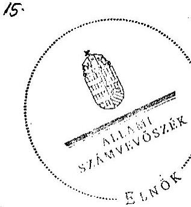

Dombos László
elnök

Melléklet: $\quad 10 \mathrm{db} \quad 12$ lap

---

# MELLÉKLETEK

---

.

---

## Eierlikör (1)

Menge: 1 Drink

2 Zentiliter Zitronensaft
2 Zentiliter Zuckersirup
1 Zentiliter Zuckersirup
etwas Zitronensaft
etwas Zuckersirup
etwas Zuckersirup
etwas Zuckersirup
etwas Zuckersirup
etwas Zuckersirup
etwas Zuckersirup
etwas Zuckersirup
etwas Zuckersirup
etwas Zuckersirup
etwas Zuckersirup
etwas Zuckersirup
etwas Zuckersirup
etwas Zuckersirup
etwas Zuckersirup
etwas Zuckersirup
etwas Zuckersirup
etwas Zuckersirup
etwas Zuckersirup
etwas Zuckersirup
etwas Zuckersirup
etwas Zuckersirup
etwas Zuckersirup
etwas Zuckersirup
etwas Zuckersirup
etwas Zuckersirup
etwas Zuckersirup
etwas Zuckersirup
etwas Zuckersirup
etwas
 Zuckersirup
etwas Zuckersirup
etwas Zuckersirup
et

---

# ÉSZREVÉTEL, VÁLASZ

---

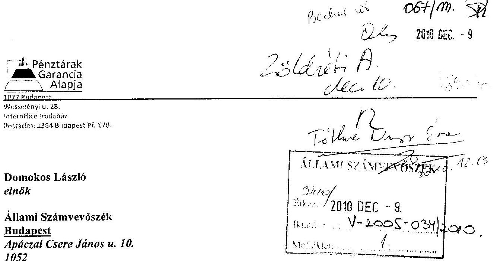

# Tisztelt Domokos László elnök úr! 

A Pénztárak Garancia Alapja működésének ellenőrzéséről készített jelentésükkel kapcsolatban hangsúlyozni szeretnénk az alábbiakat:

Ahhoz, hogy a PGA működése megfelelő mértékű garanciális biztosítékot nyújt-e a magánnyugdíjpénztári rendszer működéséhez nem elégséges annak megállapítása, hogy modell számítások hiányában a felgyült vagyon nagyságának mértéke, annak elégségessége nem megítélhető és ezek hiányában a rendszer nem látható át, nem kiszámítható. A PGA mint azt többször is hangsúlyoztuk - intézményi, a konkrét eljárásokban megvalósuló garanciát is nyújt. Tehát a kockázat bekövetkezte esetében a vagyonnak nem kell önmagában a teljes kártalanításra elégségesnek lenni, hanem mindössze arra az időre kell elégséges fedezetet nyújtania, amíg az egyéb források megnyílnak. A modellszámítás kötelezettségét nem rögzíti jogszabály, becslések, számítások, statisztikai elemzések pedig folyamatosan készültek és készülnek, amelynek célja - hiszen negyedéves jelentésekről van szó - a folyamatos monitorizáció, vagyis a folyamatok önmagukhoz mért elmozdulásának figyelemmel kísérése, mint a tényleges kockázat bekövetkezése valószínűségének észlelése.

Budapest 2010. december 9.
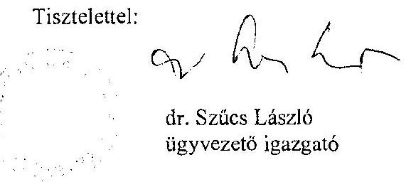

---

# Dr. Szücs László úr 

ügyvezető igazgató
Pénztárak Garancia Alapja

## Budapest

## Tisztelt Ügyvezető Igazgató Úr!

Köszönettel vettem a Pénztárak Garancia Alapja működésének ellenőrzéséről készített jelentésünkre adott észrevételét, amellyel összefüggésben a következőkről tájékoztatom.

Örömmel vettem, hogy a jelentésben megfogalmazott megállapításainkkal összességében egyetért, ugyanakkor hangsúlyozni szeretném, hogy - az észrevételben megfogalmazottakkal ellentétben - megállapításainkat nem kizárólag a modellszámítások hiányára alapoztuk. A magánnyugdíjpénztárak fizetőképességének biztosítására létrehozott garanciarendszer több pontján hiányoltuk a részletszabályok kidolgozását és megállapításokat tettünk a rendszer felépítéséből eredő működési kockázatokra. Részletesen vizsgáltuk az észrevételben hivatkozott intézményi garanciákat is, azonban - mint ahogy azt a jelentésben megfogalmazott megállapításaink is tükrözik - azok működésének feltételei nem állnak rendelkezésre. Mindezek az állami garanciavállalás fokozott kockázatát eredményezték.

Fenntartjuk azt a megállapításunkat is, hogy a magánnyugdíjpénztári garanciarendszer jelenlegi működése nem kiszámítható, nem átlátható, így az sem állapítható meg biztonsággal, hogy a PGA működése megfelelő mértékű biztosítékot nyújt-e a magánnyugdíjpénztári rendszer működéséhez, a pénztártagok egyéni megtakarításainak védelméhez.

Budapest, 2010. december 15.

Tisztelettel:
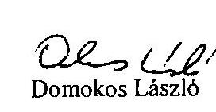

---

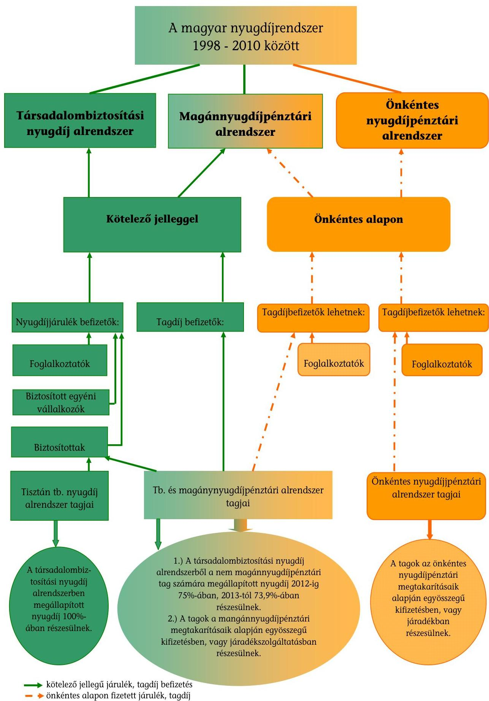

- a kötelező jellegű járulék, tagdíj befizetés
- önkéntes alapon fizetett járulék, tagdíj
—- nyugdíj, nyugdíj jellegű kifizetések

---

# A nyugdíjbiztosítási járulékok és a magánnyugdíjpénztári tagdíjak alakulása 1998-2010.

|  Évek | Foglalkoztatót terhelő |  | Biztosítottat terhelő |  |   |
| --- | --- | --- | --- | --- | --- |
|   | Nyugdíjbiztosítási járulék | Korkedvezmény biztosítási járulék* | Nyugdíjjárulék |  | Magánnyugdíjpénztári tagdíj  |
|   |  |  | Nem magánnyugdíjpénztári tag | Magánnyugdíjpénztári tag |   |
|  1998 | 24,0 | - | 7,0 | 1,0 | 6,0  |
|  1999 | 22,0 | - | 8,0 | 2,0 | 6,0  |
|  2000 | 22,0 | - | 8,0 | 2,0 | 6,0  |
|  2001 | 20,0 | - | 8,0 | 2,0 | 6,0  |
|  2002 | 18,0 | - | 8,0 | 2,0 | 6,0  |
|  2003 | 18,0 | - | 8,5 | 1,5 | 7,0  |
|  2004 | 18,0 | - | 8,5 | 0,5 | 8,0  |
|  2005 | 18,0 | - | 8,5 | 0,5 | 8,0  |
|  2006 | 18,0 | - | 8,5 | 0,5 | 8,0  |
|  2007 | 21,0 | 13,0 | 8,5 | 0,5 | 8,0  |
|  2008** | 24,0 | 13,0 | 9,5 | 1,5 | 8,0  |
|  2009 | 24,0 | 13,0 | 9,5 | 1,5 | 8,0  |
|  2010 | 24,0 | 13,0 | 9,5 | 1,5 | 8,0  |

*A munkáltatónak a korkedvezményre jogosító munkakörökben foglalkoztatottak után kell megfizetnie. (A munkáltató által ténylegesen fizetendő járulék mértéke 2000-ben 0,0\%, 2008ban $3,25 \%$, 2009-ben $6,5 \%$, 2010-ben $9,75 \%$ volt, a különbözetet ezekben az években a költségvetés átvállalta.) ** 2008. január 1-től a nyugdíjbiztosítási járulék 3\%-kal nőtt, az egészségbiztosítási járulék mértéke pedig 3\%-kal csökkent, mivel 2007. január 1-től az Egészségbiztosítási Alapból a Nyugdíj Alapba került át a korhatár alatti, nem teljesen munkaképtelennek minősülő rokkantak nyugdíjának, valamint a kapcsolódó hozzátartozói ellátásoknak a finanszírozása.

---

# A Pénztárak Garancia Alapjának intézményi kapcsolatai 

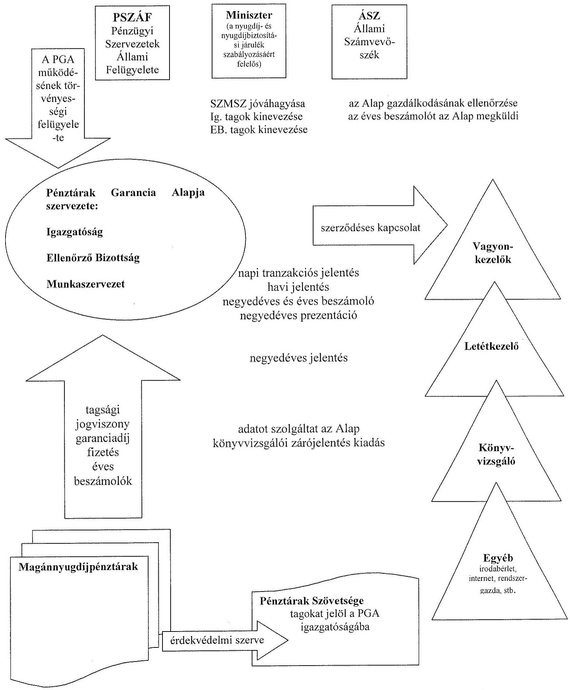

---

# A PGA tárgyévben felhalmozott garanciális vagyonából fedezhető követelések 2000-2009.

|  Évek | Magánpénztári tagok
száma a tárgyév végén*
(fő) | Garanciális fedezeti
arány** (\%) |  | Fedezett követelések száma***
(fő)  |
| --- | --- | --- | --- | --- |
|  2000 | 2279685 | 0,37 |  | 8435  |
|  2001 | 2222030 | 0,37 |  | 8222  |
|  2002 | 2212595 | 0,36 |  | 7965  |
|  2003 | 2303972 | 0,34 |  | 7834  |
|  2004 | 2403012 | 0,34 |  | 8170  |
|  2005 | 2511110 | 0,32 |  | 8036  |
|  2006 | 2655341 | 0,32 |  | 8497  |
|  2007 | 2787799 | 0,31 |  | 8642  |
|  2008 | 2955404 | 0,41 |  | 12117  |
|  2009 | 3019284 | 0,39 |  | 11775  |

*Adatforrás: PSZÁF honlap, mnyp(1)* *Adatforrás: PGA éves beszámolói, biztosításmatematikai jelentései* **azon pénztártagok száma, akiknek az egyéni számlakövetelése átlagos, és a PGA garanciális vagyona teljes befagyás esetén fedezetet biztosít** **PGA éves jelentéseiben szereplő arányok, (a biztosításmatematikai jelentések ezekben az években nem tartalmaztak garanciális fedezeti arányt)

---

Az Alap garanciális kifizetéseinek várható alakulása 2010-2019.

|  Megnevezés | 2010 | 2011 | 2012 | 2013 | 2014 | 2015 | 2016 | 2017 | 2018 | 2019  |
| --- | --- | --- | --- | --- | --- | --- | --- | --- | --- | --- |
|  Az Alap garanciális kifizetéseinek jogcíme |  |  |  |  |  |  |  |  |  |   |
|  Teljesítés egyéni követelés befagyása esetén* | $0-11,0$ | $0-12,5$ | $0-14,0$ | $0-15,5$ | $0-17,0$ | $0-18,5$ | $0-20,0$ | $0-21,5$ | $0-23,0$ | $0-24,5$  |
|  A pénztártag egyéni számlaegyenlegének |  |  |  |  |  |  |  |  |  |   |
|  kiegészítése a hozamgarantált tőke mértékéig** | $0-0,3$ | $0-0,5$ | $0-1,0$ | $0-2,0$ | $0-3,0$ | $0-4,0$ | $0-5,0$ | $0-6,0$ | $0-7,0$ | $0-8,0$  |
|  A szolgáltatási tartalék kiegészítése a biztosítás- |  |  |  |  |  |  |  |  |  |   |
|  matematikai értékelés szerint szükséges szintre*** | 0 | 0 | 0 | 0 | 0 | 0 | 0 | 0 | 0 | 0  |
|  Várható garanciális kifizetések összesen: | $0-11,0$ | $0-12,5$ | $0-14,0$ | $0-15,5$ | $0-17,0$ | $0-18,5$ | $0-20,0$ | $0-21,5$ | $0-23,0$ | $0-24,5$  |

- Mpt. 89. § (1) bekezdés a) pont ** Mpt. 89. § (1) bekezdés b) pont *** Mpt. 89. § (1) bekezdés c) pont Adatforrás: PGA

---

# 7. számú melléklet

Az egy főre jutó személyi jellegű ráfordítások és az alkalmazásban állók munkajövedelmének nemzetgazdasági változása 2000-2009. években

|  Megnevezés | M.e.: | 1999 | 2000 | 2001 | 2002 | 2003 | 2004 | 2005 | 2006 | 2007 | 2008 | 2009  |
| --- | --- | --- | --- | --- | --- | --- | --- | --- | --- | --- | --- | --- |
|  Személyi jellegű ráfordítások (tiszteletdíj és járulékai nélkül) | M Ft | 49,2 | 60,5 | 66,5 | 74,9 | 69,0 | 71,1 | 76,3 | 80,0 | 86,5 | 91,7 | 86,2  |
|  Átlagos statisztikai állományi létszám | fő | 7 | 7 | 7 | 7 | 7 | 6 | 5 | 5 | 5 | 5 | 6  |
|  Egy főre jutó személyi jellegű ráfordítás | M Ft/fő/év | 7,0 | 8,6 | 9,5 | 10,7 | 9,9 | 11,9 | 15,3 | 16,0 | 17,3 | 18,3 | 14,4  |
|  Egy főre jutó személyi jellegű ráfordítás előző évhez viszonyítva | \% | NA | 122,9 | 110,4 | 112,6 | 92,5 | 120,2 | 128,6 | 104,6 | 108,1 | 105,8 | 78,7  |
|  Alkalmazásban állók havi munkajövedelmének nemzetgazdasági változása az előző évhez (KSH adatok alapján) | \% | NA | NA | 118,1 | 117,4 | 112,2 | 107,0 | 109,0 | 108,3 | 108,2 | 107,8 | 101,0  |

Adatforrás: PGA

---

A dolgozóknak béren kívül kifizetett juttatások alakulása 2000-2009.

|  Megnevezés | 2000 | 2001 | 2002 | 2003 | 2004 | 2005 | 2006 | 2007 | 2008 | 2009  |
| --- | --- | --- | --- | --- | --- | --- | --- | --- | --- | --- |
|  Étkezési költség | 172 | 172 | 185 | 313 | 396 | 480 | 540 | 600 | 768 | 732  |
|  Hozzájárulás önkéntes nyugdíjpénztárhoz | 2265 | 3051 | 3900 | 2950 | 3180 | 3060 | 3375 | 3402 | 3726 | 3726  |
|  Utazási költség | 0 | 0 | 215 | 307 | 275 | 278 | 311 | 323 | 398 | 439  |
|  Védőszemüveg | 0 | 234 | 0 | 326 | 283 | 296 | 112 | 120 | 120 | 155  |
|  Sport-ruházat | 305 | 845 | 836 | 839 | 909 | 824 | 811 | 972 | 1002 | 1157  |
|  Üdülési csekk | 0 | 0 | 0 | 0 | 1072 | 1025 | 1125 | 1134 | 1242 | 1287  |
|  Nyelvóra díj* | 0 | 1304 | 2134 | | --- | --- | --- | --- | --- | --- | --- | --- | --- | --- | --- | --- |
| 1918 | 1902 | 1731 | 1487 | 1105 | 1383 | 1141 |
| Összesen | 2742 | 5606 | 7270 | 6653 | 8017 | 7694 | 7761 | 7656 | 8639 | 8637 |
| Létszám (fő)** | 7,0 | 7,0 | 7,0 | 6,3 | 5,5 | 5,0 | 5,0 | 5,0 | 5,0 | 5,0 |
| Juttatás egy főre/év | 391,7 | 800,9 | 1038,6 | 1056,0 | 1457,6 | 1538,8 | 1552,2 | 1531,2 | 1727,8 | 1727,4 |
| Minimálbér éves összege | 303,0 | 465,5 | 590,0 | 600,0 | 633,0 | 680,0 | 744,5 | 783,0 | 821,5 | 855,5 |
| Egy főre eső juttatás a minimálbér \%-ában | 129,3 | 172,0 | 176,0 | 176,0 | 230,3 | 226,3 | 208,5 | 195,6 | 210,3 | 201,9 |

*A dolgozók nyelvtanulásának támogatása az anyagjellegű ráfordítások között volt elszámolva. **PGA-val munkaviszonyban állók átlagos létszáma Adatforrás: PGA

---

A reprezentációra fordított összegek alakulása 2000-2009.

| Megnevezés | 2000 | 2001 | 2002 | 2003 | 2004 | 2005 | 2006 | 2007 | 2008 | 2009 |
| --- | --- | --- | --- | --- | --- | --- | --- | --- | --- | --- |
| Átlagos statisztikai állományi létszámLétszám | 7 | 7 | 7 | 7 | 6 | 5 | 5 | 5 | 5 | 6 |
| Éves reprezentációs költség | 1283 | 1325 | 1635 | 1437 | 1596 | 1716 | 1903 | 1973 | 1729 | 1902 |
| Egy főre eső összeg | 183,3 | 189,3 | 233,6 | 205,3 | 266,0 | 343,2 | 380,6 | 394,6 | 345,8 | 317,0 |
| Tervezett éves díjbevétel egy \%-a | 2400 | 3640 | 4400 | 7200 | 7000 | 7720 | 9200 | 10150 | 11000 | 13000 |

Adatforrás: PGA

---

# TANÚSÍTVÁNYOK (1-6.)

---

# Tanúsítványok jegyzéke

| Sorsz.: | Megnevezés |
| :--: | :-- |
| 1. számú | Az Alap és a pénztárak eszközeinek alakulása, egymáshoz vi-   szonyított aránya 1999-2009. |
| 2. számú | Az Alap bevételeinek és ráfordításainak alakulása 1999-2009. |
| 3. számú | Az Alap személyi jellegű ráfordításainak alakulása 1999-2009. |
| 4. számú | Az Alap anyagjellegű ráfordításainak alakulása 1999-2009. |
| 5. számú | Portfóliókezelői teljesítmények összesített alakulása 1999-2009. |
| 6. számú | Az Alap főbb mérlegadatainak alakulása 1999-2009. |

---

# Tanúsítvány

Az Alap és a pénztárak eszközeinek alakulása, egymáshoz viszonyított aránya 1999-2009.

1. számú tanúsítvány

| Megnevezés | 1999 | 2000 | 2001 | 2002 | 2003 | 2004 | 2005 | 2006 | 2007 | 2008 | 2009 | 2009/1999 %-ban |
| --- | --- | --- | --- | --- | --- | --- | --- | --- | --- | --- | --- | --- |
| Az Alap eszközeinek éves átlagos értéke (I.) | 237,7 | 532,3 | 909,4 | 1 333,2 | 1 817,3 | 2 521,6 | 3 463,4 | 4 570,6 | 5 598,4 | 6 880,7 | 8 895,1 | 3742,1% |
| A pénztárak összesített eszközeinek értéke (II.) | 68 201 | 142 575 | 247 813 | 369 881 | 508 192 | 744 799 | 1 076 439 | 1 436 032 | 1 835 350 | 2 070 089 | 2 434 703 | 3569,9% |
| Eszközarány % (I./II.)* | 0,35% | 0,37% | 0,37% | 0,36% | 0,36% | 0,34% | 0,32% | 0,32% | 0,31% | 0,33% | 0,37% | 104,8% |

- Mpt. 93.§ (1) bekezdés

A millió Ft-ban és %-ban megadott adatok egy tizedesjegyre kerekítettek.

Az Alapra vonatkozó adatok a PGA számviteli nyilvántartásaival megegyeznek.

Dátum: 2010.01.16

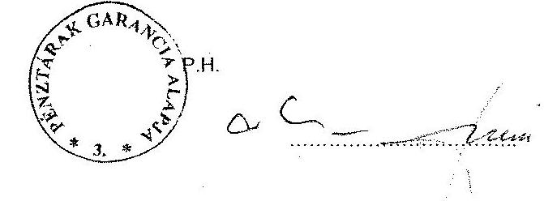

---

### Tanúsítvány Az Alap bevételeinek és ráfordításainak alakulása 1999-2009.

| Megnevezés | 1999 | 2000 | 2001 | 2002 | 2003 | 2004 | 2005 | 2006 | 2007 | 2008 | 2009 | Adatok: E Ft-ban |
| --- | --- | --- | --- | --- | --- | --- | --- | --- | --- | --- | --- | --- |
| I. Garanciális bevételek | 237 082 | 331 849 | 398 765 | 409 824 | 572 778 | 750 076 | 859 545 | 977 495 | 749 988 | 1 534 048 | 1 268 316 | 535,0% |
| ebből: garanciadíjak | 237 082 | 331 849 | 398 765 | 409 824 | 572 778 | 750 076 | 859 545 | 977 495 | 749 988 | 1 534 048 | 1 268 316 | 535,0% |
| rendkívüli tagpénztári befizetések | | | | | 65* | | | | | | | |
| II. Egyéb bevételek | 60 472 | 58 928 | 61 246 | 73 671 | 12 045 | 4 134 | 121 | 20 | 394 | 39 | 152 | 0,3% |
| ebből: költségvetési támogatás | 60 200 | 58 500 | 61 200 | 61 300 | | | | | | | | 0,0% |
| egyéb állami juttatás | | | | | | | | | | | | |
| III. Pénzügyi műveletek bevételei | 26 177 | 63 200 | 80 218 | 116 665 | 142 836 | 201 463 | 371 291 | 294 448 | 401 200 | 450 221 | 1 767 361 | 6751,6% |
| IV. Rendkívüli bevételek | | | | | | | | | | | | |
| V. Bevételek összesen: | 323 731 | 453 977 | 540 229 | 600 160 | 727 659 | 955 673 | 1 230 957 | 1 271 963 | 1 151 582 | 1 984 308 | 3 035 829 | 937,8% |
| VI. Garanciális ráfordítások | 0 | 0 | 0 | 0 | 0 | 0 | 0 | 0 | 0 | 0 | 0 | |
| 1. Anyagjellegű ráfordítások | 23 349 | 29 064 | 34 336 | 35 921 | 38 638 | 39 409 | 40 913 | 40 538 | 41 459 | 34 606 | 37 486 | 160,5% |
| 2. Személyi jellegű ráfordítások | 62 332 | 74 275 | 85 172 | 93 260 | 86 681 | 89 524 | 94 699 | 98 373 | 104 909 | 110 158 | 102 575 | 164,6% |
| 3. Értékcsökkenési leírás | 1 774 | 2 166 | 2 489 | 4 669 | 5 639 | 5 761 | 4 943 | 3 878 | 2 995 | 4 070 | 3 394 | 191,3% |
| VII. Működési ráfordítások (1.+2.+3.+4.) | 87 455 | 105 505 | 121 997 | 133 850 | 139 958 | 134 694 | 140 555 | 142 789 | 149 363 | 148 834 | 143 455 | 164,0% |
| ebből: költségvetési támogatásból fennanszírozva | 60 200 | 58 500 | 61 200 | 61 300 | | | | | | | | 0,0% |
| VIII. Egyéb ráfordítások | 5 995 | 85 | 38 | 4 479 | 30 | 51 | 4 | 131 | 2 440 | 3 | 1 | 0,0% |
| IX. Pénzügyi műveletek ráfordításai | 8 481 | 19 771 | -2 842 | 21 973 | 66 558 | -54 401 | 284 309 | 16 738 | 50 365 | 119 999 | 873 218 | 10296,2% |
| X. Rendkívüli ráfordítások | | | | | | | | | | | | |
| XI. Ráfordítások összesen: | 101 931 | 125 361 | 119 193 | 160 302 | 197 546 | 80 344 | 424 868 | 159 658 | 202 168 | 268 836 | 1 016 674 | 997,4% |
| XII. Mérleg szerinti eredmény (V.-XI.) | 221 800 | 328 616 | 421 036 | 439 858 | 530 113 | 875 329 | 806 089 | 1 112 305 | 949 414 | 1 715 472 | 2 019 155 | 910,3% |
| Működési ráfordítások aránya | | | | | | | | | | | | |
| az összes ráfordításhoz (%) (VII./X) | 85,8% | 84,2% | 102,4% | 83,5% | 66,3% | 167,6% | 33,1% | 89,4% | 73,9% | 55,4% | 14,1% | 16,4% |
| Működési ráfordítások aránya a garanciális bevételekhez (%) (VII./I.) | 36,9% | 31,8% | 30,6% | 32,7% | 22,9% | 18,0% | 16,4% | 14,6% | 19,9% | 9,7% | 11,3% | 30,7% |

A %-ban megadott adatok egy tizedesjegyre kerekítettek.

- 2002. évben hatályos LXXXII. Törv. 29.§ (1) szerint Örökös hiányában az egyéni számlán lévő összeg az Alapra száll át.

Az adatok a PGA számviteli nyilvántartásával megegyeznek.

Dátum: ***_******_******_***____

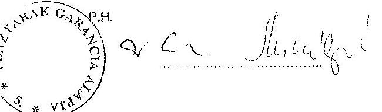

---

### 3. számú tanúsítvány

Az Alap személyi jellegű ráfordításainak alakulása 1999-2009.

| Megnevezés | 1999 | 2000 |
 --- | --- | --- | --- | --- | --- | --- | --- | --- | --- | --- |
|  Munkabér | 26 587 | 30 818 | 34 079 | 36 712 | 32 539 | 32 344 | 33 761 | 35 046 | 35 100 | 41 728 | 38 269 | 143,9%  |
|  Jutalom | 6 266 | 8 804 | 10 470 | 13 009 | 13 422 | 13 475 | 15 745 | 16 200 | 20 250 | 16 409 | 15 815 | 252,4%  |
|  Szabadságmegváltás | 183 |  |  |  |  |  |  |  |  |  |  | 0,0%  |
|  Tiszteletdíjak | 10 022 | 10 544 | 14 280 | 14 240 | 13 670 | 14 280 | 14 280 | 14 268 | 14 260 | 14 280 | 12 852 | 128,2%  |
|  Megbízási díjak | 300 | 220 | 70 | 643 | 395 | 60 | 280 | 444 | 444 | 456 | 1 296 | 432,0%  |
|  Napidíjak |  | 535 | 72 |  |  |  |  |  |  |  |  |   |
|  Élelmezési költségek | 172 | 172 | 172 | 185 | 313 | 396 | 480 | 540 | 600 | 768 | 732 | 425,6%  |
|  Munkáltatói hozzájár, önként. Pénztárhoz*3 | 1 455 | 2 265 | 3 051 | 3 900 | 2 950 | 3 180 | 3 060 | 3 375 | 3 402 | 3 726 | 3 726 | 256,1%  |
|  Munkáltatói hozzájár, magánny pénztárhoz |  |  |  |  |  |  |  |  |  |  |  |   |
|  Külföldi kiküldéshez kapca, kiilzetés |  |  |  |  |  |  |  |  |  |  |  |   |
|  Saját személygépkocsi költségtérítés | 242 |  |  |  |  |  |  |  |  |  |  |   |
|  Reprezentációs költség | 2 171 | 1 283 | 1 325 | 1 635 | 1 437 | 1 596 | 1 716 | 1 903 | 1 973 | 1 729 | 1 902 | 87,6%  |
|  Utazási költségtérítés | 243 |  |  | 215 | 307 | 275 | 278 | 311 | 323 | 398 | 439 | 180,7%  |
|  TB ellátás PGA-t terhelő része |  | 67 | 10 | 89 |  |  |  |  |  |  |  |   |
|  Egyéb személyi jellegű kifizetések | 63 | 20 |  |  | 58 | 50 | 33 | 30 | 96 | 33 | 30 | 47,6%  |
|  Védőszemüveg |  |  | 234 |  | 326 | 263 | 296 | 112 | 120 | 120 | 155 | 66,2%  |
|  Sport-ruházat |  | 305 | 845 | 836 | 839 | 909 | 824 | 811 | 972 | 1 002 | 1 157 | 137,9%  |
|  Üdülési csekk** | 0 | 0 | 0 | 0 | 0 | 1 072 | 1 026 | 1 125 | 1 134 | 1 242 | 1 287 | 125,4%  |
|  Egészségbiztosítási hozzájárulás*** | 0 | 0 | 0 | 0 | 0 | 477 | 1 106 | 1 026 | 1 026 | 1 242 | 1 278 | 115,6%  |
|  Járulékok | 14 628 | 19 242 | 20 564 | 21 796 | 20 425 | 21 127 | 21 815 | 23 182 | 25 209 | 27 025 | 23 637 | 161,6%  |
|  Személyi jellegű ráfordítások összesen: | 62 332 | 74 275 | 85 172 | 93 260 | 86 681 | 89 524 | 94 700 | 98 373 | 104 909 | 110 158 | 102 575 | 164,6%  |

A %-ban megadott adatok egy tizedesjegyre kerekítettek.

Az adatok a PGA számviteli nyilvántartásaival megegyeznek.

P.H.

megj: az üdülési csekk 2004. évtől került bevezetésre, az egészségbiztosítási kiadás pedig 2004. 07.31.-től.

megj. A 2000. évi 305 e ft az 1999. évben eszközként nyilvántartott munkaruhák leírása (5/19999 ügyvezetői)

- a 2005. évi költség 2004. évi 79.5 e ft-ot is tartalmaz; ** a 2004. évi költség 65 e ft kezelési költséget is tartalmaz *** a januári kifizetés az előző évi minimálbér szerinti összeg

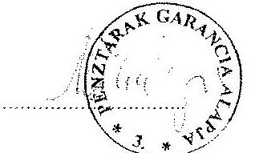

---

### Tanúsítvány Az Alap anyagjellegű ráfordításainak alakulása 1999-2009.

|  Megnevezés | 1999 | 2000 | 2001 | 2002 | 2003 | 2004 | 2005 | 2006 | 2007 | 2008 | 2009 | Adatok: E Ft-ban  |
| --- | --- | --- | --- | --- | --- | --- | --- | --- | --- | --- | --- | --- |
|  Irodaszerek, szám.tech. anyagok, szakkönyv | 1 406 | 448 | 819 | 686 | 1 016 | 703 | 291 | 483 | 441 | 341 | 358 | 25,5%  |
|  Közlönyök, hírlapok költségei, kiszállítás | 357 | 736 | 572 | 818 | 733 | 739 | 716 | 605 | 653 | 461 | 487 | 136,4%  |
|  Üzemanyag | 844 | 1 414 | 1 478 | 1 396 | 741 | 452 | 724 | 645 | 603 | 562 | 730 | 86,5%  |
|  Elektromos energia |  |  |  | 99 | 250 | 252 | 244 | 266 | 318 | 453 | 438 | 175,2%  |
|  Takarítószerek, takarítás | 5 |  |  | 107 | 468 | 506 | 574 | 552 | 549 | 468 | 534 | 114,1%  |
|  Szállítás, futászolgálat, taxi | 227 | 309 | 289 | 599 | 108 | 80 | 239 | 292 | 916 | 378 | 445 | 196,0%  |
|  Bérleti díjak | 3 111 | 8 168 | 5 842 | 7 411 | 15 924 | 16 271 | 16 655 | 16 900 | 14 270 | 8 428 | 10 405 | 334,5%  |
|  Karbantartási, javítási munkák | 1 690 | 1 271 | 3 415 | 3 106 | 3 236 | 2 606 | 2 473 | 2 176 | 3 044 | 2 239 | 2 144 | 126,9%  |
|  Hirdetés, kezelési költség, tagsági díjak | 2 113 |  |  | 1 447 | 345 | 0 | 375 | 422 | 505 | 212 | 253 | 12,0%  |
|  Oktatás, továbbképzés, konferenciák | 1 656 | 1 185 | 1 846 | 2 276 | 2 174 | 2 573 | 2 522 | 2 305 | 1 678 | 2 432 | 1 852 | 111,8%  |
|  Utazási és kiküldetési költségek | 2 529 | 2 361 | 2 435 | 1 068 | 161 | 21 | 0 | 0 | 0 | 28 | 0 | 0,0%  |
|  Internet, posta, telefon költségek | 2 566 | 4 491 | 5 288 | 7 225 | 4 091 | 4 053 | 3 320 | 3 055 | 2 999 | 2 850 | 3 090 | 120,7%  |
|  Könyvvizsgálat és egyéb szakértői díjak | 5 241 | 4 631 | 5 821 | 2 311 | 2 405 | 2 116 | 2 028 | 1 997 | 2 240 | 2 288 | 2 276 | 43,4%  |
|  Pénzügyi, befektetési szolgáltatási díjak | 953 | 2 665 | 4 790 | 6 187 | 6 229 | 8 359 | 9 931 | 10 038 | 12 678 | 12 999 | 13 832 | 1451,4%  |
|  Biztosítás és kiállásféle költségek | 329 | 1 200 | 1 642 | 781 | 706 | 662 | 723 | 760 | 518 | 430 | 435 | 132,2%  |
|  Költségként elszámolható adók |  |  |  |  |  |  |  |  |  |  | 168 |   |
|  Egyéb anyagjellegű költség | 328 | 185 | 98 | 204 | 51 | 16 | 98 | 42 | 47 | 37 | 39 | 11,9%  |
|  Anyagjellegű ráfordítások összesen: | 23 349 | 29 064 | 34 335 | 35 921 | 38 638 | 39 409 | 40 913 | 40 538 | 41 459 | 34 606 | 37 486 | 160,5%  |

A %-ban megadott adatok egy tizedesjegye kerekítettek.

Az adatok a PGA számviteli nyilvántartásával megegyeznek.

meg1: 199-2002. szeptember 1-ig nem volt sem takarítószer, sem elektromos energia kiadás, mert a FM elhelyezés ezt biztosította. Az első tényleges éves költség 2003 évben jelentkezik.

Dátum: 2012. jún. 1a

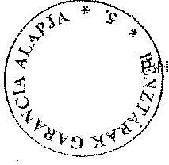

---

### Tanúsítvány

### Portfoliókezelői teljesítmények összesített alakulása

### 1999-2009

### Adatok: E-Ft-ban

|  Megnevezés | 1999 | 2000 | 2001 | 2002 | 2003 | 2004 | 2005 | 2006 | 2007 | 2008 | 2009  |
| --- | --- | --- | --- | --- | --- | --- | --- | --- | --- | --- | --- |
|  I. Kezelt vagyon |  piaci értéke a tárgyév végén | 252 130 | 584 623 | 1 015 803 | 1 439 269 | 1 890 906 | 2 771 262 | 3 713 863 | 4 793 122 | 5 532 928 | 6 890 176 | 9 270 016  |
|  II. Kezelt vagyon könyv szerinti értéke a tárgyév végén | 245 839 | 569 395 | 971 578 | 1 368 172 | 1 832 686 | 2 636 315 | 3 605 606 | 4 711 987 | 5 359 593 | 6 759 659 | 9 095 930  |
|  Piaci és könyv szerinti érték eltérése (I-II.) | 6 291 | 15 228 | 44 225 | 71 097 | 58 220 | 134 947 | 108 257 | 81 135 | 173 335 | 130 517 | 174 086  |
|  III. Kezelt vagyon átlagos értéke a tárgyévben | 84 791 | 410 708 | 800 213 | 1 227 536 | 1 665 088 | 1 872 438 | 3 379 901 | 4 106 400 | 5 115 598 | 6 139 720 | 7 590 095  |
|  IV. Bruttó hozam | 17 696 | 43 429 | 83 060 | 94 692 | 76 278 | 294 285 | 235 290 | 277 689 | 350 816 | 330 184 | 1 031 840  |
|  V. Bruttó hozam %* | 22,3% | 10,9% | 11,8% | 11,3% | 2,4% | 13,4% | 8,6% | 6,8% | 6,8% | 2,6% | 12,9%  |
|  VI. Referencia hozam %** | 17,8% | 11,6% | 11,7% | 10,1% | 1,2% | 13,4% | 8,8% | 6,7% | 6,4% | 3,30% | 14,1%  |
|  Eltérés a referencia hozamtól % (V.-VI.) | 4,5% | -0,7% | 0,1% | 1,2% | 1,2% | 0,0% | -0,2% | 0,0% | 0,3% | -0,7% | -1,2%  |
|  VII. Portfoliókezelési díjak | 296 | 2 144 | 3 941 | 5 183 | 4 957 | 6 675 | 7 523 | 7 019 | 8 968 | 9 149 | 10 160  |
|  VIII. Letétkezelési díjak | 114 | 220 | 540 | 682 | 818 | 1 239 | 1 615 | 2 067 | 2 612 | 2 897 | 2 724  |
|  IX. Tranzakciós díjak | 73 | 55 | 232 | 318 | 454 | 158 | 455 | 746 | 776 | 778 | 840  |
|  X. Díjak összesen: (VII.+VIII.+IX.) | 483 | 2 419 | 4 713 | 6 183 | 6 229 | 8 072 | 9 594 | 9 832 | 12 356 | 12 824 | 13 724  |
|  XI. Díjak az átlagos kezelt vagyonra vetítve % (X.III.) | 0,6% | 0,6% | 0,6% | 0,5% | 0,4% | 0,4% | 0,3% | 0,2% | 0,2% | 0,2% | 0,2%  |
|  Nettó hozam (IV.-X.) | 17 213 | 41 010 | 78 347 | 88 509 | 70 049 | 286 213 | 225 696 | 267 857 | 338 460 | 317 360 | 1 018 116  |
|  Nettó hozam % (V.-XI.) | 21,7% | 10,3% | 11,2% | 10,8% | 2,0% | 13,0% | 8,3% | 6,5% | 6,5% | 2,4% | 12,7%  |

* Havi hozamok szorzatának táncszorzata alapján.

**a MAX Composite referenciaindex alapján

A %-ban megadott adatok egy fizetésjegyzé kerekíthettek.

Az adatok a PGA számviteli nyilvántartásaival megegyeznek.

- megij1: 1999-2002 években a kezelt vagyon átlagos értéke egyszerű számítani átlag. A további években pedig a vagyonkezelők által számított bruttó piaci érték átlaga.
- megij2: 2002 évtől a hozam az értékelési különbözeteket is tartalmazza, mert a vagyonkezelők a hozamokat és a vonatkozó indexeket ezzel együtt számolják. Az értékelési különbözet összege a vonatkozó rendeletek értelmében az Alap számvitelében nem kerül elszámolásra. Amely év dec. 31-én a portfolió átkötésre került, akkor ezen értékek is szerepelnek a számvitelben elszámolt pénzügyi bevételek között.
- megij3: 2002.07.01.-én vagyonkezelő váltás történt.
- megij4: 2005.08.02.-től 2 vagyonkezelője van az Alapnak.
- megij5: a Piaci és könyv szerinti érték eltérése: 1999 évben a felhalm. Kamat+ a CASH; 2000 évben u. úgy; 2001. évben: a felh. kamat+ért.kül+CASH; 2002. évben: az értékelési különbözet+CASH; 2003. évben: az értékvesztés +CASH; 2004. évben: a felh. kamat+ 2005. évben: a felh. kamat+ 2006. évben: a felh. kamat+ 2007. évben: a felh. kamat+ 2008. évben: a felh. kamat+ 2009. évben: a felh. kamat+ 2010. évben: a felh. kamat+ 2011. évben: a felh. kamat+ 2012. évben: a felh. kamat+ 2013. évben: a felh. kamat+ 2014. évben: a felh. kamat+ 2015. évben: a felh. kamat+ 2016. évben: a felh. kamat+ 2017. évben: a felh. kamat+ 2018. évben: a felh. kamat+ 2019. évben: a felh. kamat+ 2020. évben: a felh. kamat+ 2021. évben: a felh.
 kamat+ 2022. évben: a felh. kamat+ 2023. évben: a felh. kamat+ 2024. évben: a felh. kamat+ 2025. évben: a felh. kamat+ 2026. évben: a felh. kamat+ 2027. évben: a felh. kamat+ 2028. évben: a felh. kamat+ 2029. évben: a felh. kamat+ 2030. évben: a felh. kamat+ 2031. évben: a felh. kamat+ 2032. évben: a felh. kamat+ 2033. évben: a felh. kamat+ 2034. évben: a felh. kamat+ 2035. évben: a felh. kamat+ 2036. évben: a felh. kamat+ 2037. évben: a felh. kamat+ 2038. évben: a felh. kamat+ 2039. évben: a felh. kamat+ 2040. évben: a felh. kamat+ 2041. évben: a felh. kamat+ 2042. évben: a felh. kamat+ 2043. évben: a felh. kamat+ 2044. évben: a felh. kamat+ 2045. évben: a felh. kamat+ 2046. évben: a felh. kamat+ 2047. évben: a felh. kamat+ 2048. évben: a felh. kamat+ 2049. évben: a felh. kamat+ 2050. évben: a felh. kamat+ 2051. évben: a felh. kamat+ 2052. évben: a felh. kamat+ 2053. évben: a felh. kamat+ 2054. évben: a felh. kamat+ 2055. évben: a felh. kamat+ 2056. évben: a felh. kamat+ 2057. évben: a felh. kamat+ 2058. évben: a felh. kamat+ 2059. évben: a felh. kamat+ 2060. évben: a felh. kamat+ 2061. évben: a felh. kamat+ 2062. évben: a felh. kamat+ 2063. évben: a felh. kamat+ 2064. évben: a felh. kamat+ 2065. évben: a felh. kamat+ 2066. évben: a felh. kamat+ 2067. évben: a felh. kamat+ 2068. évben: a felh. kamat+ 2069. évben: a felh. kamat+ 2070. évben: a felh. kamat+ 2071. évben: a felh. kamat+ 2072. évben: a felh. kamat+ 2073. évben: a felh. kamat+ 2074. évben: a felh. kamat+ 2075. évben: a felh. kamat+ 2076. évben: a felh. kamat+ 2077. évben: a felh. kamat+ 2078. évben: a felh. kamat+ 2079. évben: a felh. kamat+ 2080. évben: a felh. kamat+ 2081. évben: a felh. kamat+ 2082. évben: a felh. kamat+ 2083. évben: a felh. kamat+ 2084. évben: a felh. kamat+ 2085. évben: a felh. kamat+ 2086. évben: a felh. kamat+ 2087. évben: a felh. kamat+ 2088. évben: a felh. kamat+ 2089. évben: a felh. kamat+ 2090. évben: a felh. kamat+ 2091. évben: a felh. kamat+ 2092. évben: a felh. kamat+ 2093. évben: a felh. kamat+ 2094. évben: a felh. kamat+ 2095. évben: a felh. kamat+ 2096. évben: a felh. kamat+ 2097. évben: a felh. kamat+ 2098. évben: a felh. kamat+ 2099. évben: a felh. kamat+ 2090. évben: a felh. kamat+ 2091. évben: a felh. kamat+ 2092. évben: a felh. kamat+ 2093. évben: a felh. kamat+ 2094. évben: a felh. kamat+ 2095. évben: a felh. kamat+ 2096. évben: a felh. kamat+ 2097.
 évben: a felh. kamat+ 2098. évben: a felh. kamat+ 2099. évben: a felh. kamat+ 2090. erősenyek 2091. évben: a felh. kamat+ 2092. erősenyek 2093. évben: a felh. kamat+ 2094. erősenyek 2095. erősenyek 2096. erősenyek 2097. erősenyek 2098. erősenyek 2099. erősenyek 2090. erősenyek 2091. erősenyek 2092. erősenyek 2093. erősenyek 2094. erősenyek 2095. erősenyek 2096. erősenyek 2097. erősenyek 2098. erősenyek 2099. erősenyek 2090. erősenyek 2091. erősenyek 2092. erősenyek 2093. erősenyek 2094. erősenyek 2095. erősenyek 2096. erősenyek 2097. erősenyek 2098. erősenyek 2099. erősenyek 2090. erősenyek 2091. erősenyek 2092. erősenyek 2093. erősenyek 2094. erősenyek 2095. erősenyek 2096. erősenyek 2097. erősenyek 2098. erősenyek 2099. erősenyek 2090. erősenyek 2091. erősenyek 2092. erősenyek 2093. erősenyek 2094. erősenyek 2095. erősenyek 2096. erősenyek 2097. erősenyek 2098. erősenyek 2099. erősenyek 2090. erősenyek 2091. erősenyek 2092. erősenyek 2093. erősenyek 2094. erősenyek 2095. erősenyek 2096. erősenyek 2097. erősenyek 2098. erősenyek 2099. erősenyek 2090. erősenyek 2091. erősenyek 2092. erősenyek 2093. erősenyek 2094. erősenyek 2095. erősenyek 2096. erősenyek 2097. erősenyek 2098. erősenyek 2099. erősenyek 2090. erősenyek 2091. erősenyek 2092. erősenyek 2093. erősenyek 2094. erősenyek 2095. erősenyek 2096. erősenyek 2097. erősenyek 2098. erősenyek 2099. erősenyek 2090. erősenyek 2091. erősenyek 2092. erősenyek 2093. erősenyek 2094. erősenyek 2095. erősenyek 2096. erősenyek 2097. erősenyek 2098. erősenyek 2099. erősenyek 2090. erősenyek 2091. erősenyek 2092. erősenyek 2093. erősenyek 2094. erősenyek 2095. erősenyek 2096. erősenyek 2097. erősenyek 2098. erősenyek 2099. erősenyek 2090. erősenyek 2091. erősenyek 2092. erősenyek 2093. erősenyek 2094. erősenyek 2095. erősenyek 2096. erősenyek 2097. erősenyek 2098. erősenyek 2099. erősenyek 2090. erősenyek 2091. erősenyek 2092. erősenyek 2093. erősenyek 2094. erősenyek 2095. erősenyek 2096. erősenyek 2097. erősenyek 2098. erősenyek 2099. erősenyek 2090. erősenyek 2091. erősenyek 2092. erősenyek 2093. erősenyek 2094. erősenyek 2095. erősenyek 2096. erősenyek 2097. erősenyek 2098. erősenyek 2099. erősenyek 2090. erősenyek 2091. erősenyek 2092. erősenyek 2093. erősenyek 2094. erősenyek 2095. erősenyek 2096. erősenyek 2097. erősenyek 2098. erősenyek 2099. erősenyek 2090. erősenyek 2091. erősenyek 2092. erősenyek 2093. erősenyek 2094. erősenyek 2095. erősenyek 2096. erősenyek 2097. erősenyek 2098. erősenyek 2099. erősenyek 2090. erősenyek 2091. erősenyek 2092. erősenyek 2093. erősenyek 2094. erősenyek 2095. erősenyek 2096. erősenyek 2097. erősenyek 2098. erősenyek 2099. erősenyek 2090. erősenyek 2091. erősenyek 2092. erősenyek 2093. erősenyek 2094. erősenyek 2095. erősenyek 2096. erősenyek 2097.sősenyek 2098.sősenyek 2099.sősenyek 2091.sősenyek 2092.sősenyek 2093.sősenyek 2094.sősenyek 2095.sősenyek 2096.sősenyek 2097.sősenyek 2098.sősenyek 2099.sősenyek 2091.sősenyek 2092.sősenyek 2093.sősenyek 2094.sősenyek 2095.sősenyek 2096.sősenyek 2097.sősenyek 2098.sősenyek 2099.sősenyek 2091.sősenyek 2092.sősenyek 2093.sősenyek 2094.sősenyek 2095.sősenyek 2096.sősenyek 2097.sősenyek 2098.sősenyek 2099.sősenyek 2091.sősenyek 2092.sősenyek 2093.sősenyek 2094.sősenyek 2095.sősenyek 2096.sősenyek 2097.sősenyek 2098.sősenyek 2099.sősenyek 2091.sősenyek 2092.sősenyek 2093.sősenyek 2094.sősenyek 2095.sősenyek 2096.sősenyek 2097.sősenyek 2098.sősenyek 2099.sősenyek 2091.sősenyek 2092.sősenyek 2093.sősenyek 2094.sősenyek 2095.sősenyek 2096.sősenyek 2097.sősenyek 2098.sősenyek 2099.sősenyek 2091.sősenyek 2092.sősenyek 2093.sősenyek 2094.sősenyek 2095.sősenyek 2096.sősenyek 2097.sősenyek 2098.sősenyek 2099.sősenyek
 2091.szenyek 2092.szenyek 2093.szenyek 2094.szenyek 2095.szenyek 2096.szenyek 2097.szenyek 2098.szenyek 2099.szenyek 2091.szenyek 2092.szenyek 2093.szenyek 2094.szenyek 2095.szenyek 2096.szenyek 2097.szenyek 2098.szenyek 2099.szenyek 2091.szenyek 2092.szenyek 2093.szenyek 2094.szenyek 2095.szenyek 2096.szenyek 2097.szenyek 2098.szenyek 2099.szenyek 2091.szenyek 2092.szenyek 2093.szenyek 2094.szenyek 2095.szenyek 2096.szenyek 2097.szenyek 2098.szenyek 2099.szenyek 2091.szenyek 2092.szenyek 2093.szenyek 2094.szenyek 2095.szenyek 2096.szenyek 2097.szenyek 2098.szenyek 2099.szenyek 2091.szenyek 2092.szenyek 2093.szenyek 2094.szenyek 2095.szenyek 2096.szenyek 2097.szenyek 2098.szenyek 2099.szenyek 2091.szenyek 2092.szenyek 2093.szenyek 2094.szenyek 2095.szenyek 2096.szenyek 2097.szenyek 2098.szenyek 2099.szenyek 2091.szenyek 2092.szenyek 2093.szenyek 2094.szenyek 2095.szenyek 2096.szenyek 2097.szenyek 2098.szenyek 2099.szenyek 2091.szenyek 2092.szenyek 2097.szenyek 2098.szenyek 2099.szenyek 2091.szenyek 2090.szenyek 2091.szenyek 2092.szenyek 2093.szenyek 2094.szenyek 2095.szenyek 2096.szenyek 2097.szenyek 2098.szenyek 2099.szenyek 2091.szenyek 2091.szenyek 2092.szenyek 2092.szenyek 2093.szenyek 2094.szenyek 2095.szenyek 2096.szenyek 2097.szenyek 2098.szenyek 2099.szenyek 2091.szenyek 2097.szenyek 2098.szenyek 2099.szenyek 2091.szenyek 2092.szenyek 2090.szenyek 2091.szenyek 2092.szenyek 2092.szenyek 2093.szenyek 2094.szenyek 2095.szenyek 2097.szenyek 2098.szenyek 2099.szenyek 2091.szenyek 2091.szenyek 2092.szenyek 2097.szenyek 2098.szenyek 2099.szenyek 2091.szenyek 2091.szenyek 2092.szenyek 2097.szenyek 2098.szenyek 2099.szenyek 2091.szenyek 2091.szenyek 2091.szenyek 2091.szenyek 2092.szenyek 2092.szenyek 2092.szenyek 2097.szenyek 2098.szenyek 2091.szenyek 2091.szenyek 2091.szenyek 2091.szenyek 2092.szenyek 2092.szenyek 2092.szenyek 2091.szenyek 2092.szenyek 2092.szenyek 2091.szenyek 2092.szenyek 2092.szenyek 2092.szenyek 2092.szenyek 2092.szenyek 2092.szenyek 2092.szenyek 2091.szenyek 2092.szenyek 2091.szenyek 2092.szenyek 2092.szenyek 2092.szenyek 2091.szenyek 2091.szenyek 2092.szenyek 2091.szenyek 2091.szenyek 2092.szenyek 2092.szenyek 2091.szenyek 2091.szenyek 2091.szenyek 2091.szenyek 2092.szenyek 2092.szenyek 2092.szenyek 2092.szenyek 2091.szenyek 2091.szenyek 2091.szenyek 2091.szenyek 2091.szenyek 2091.szenyek 2092.szenyek 2092.szenyek 2092.szenyek 2092.szenyek 2092.szenyek 2091.szenyek 2091.szenyek 2091.szenyek 2091.szenyek 2092.szenyek 2091.szenyek 2092.szenyek 2092.szenyek 2092.szenyek 2092.szenyek 2092.szenyek 2092.szenyek 2091.szenyek 2091.szenyek 2092.szenyek 2091. sősenyek 2092. sősenyek 2091. sősenyek 2091. sősenyek 2091. sősenyek 2091. sősenyek 2091. sősenyek 2091. sősenyek 2091. sősenyek 2091. sősenyek 2091. sősenyek 2091. sősenyek 2091. sősenyek 2091. sősenyek 2091. sősenyek 2091. sősenyek 2091. sősenyek 2091. sősenyek 2091. sősenyek 2091. sősenyek 2091. sősenyek 2091. sősenyek 2091. sősenyek 2091. sősenyek 2091. sősenyek 2091. sősenyek 2091. sősenyek 2091. sősenyek 2091. sősenyek 2091. sősenyek 2091. sősenyek 2091. sősenyek 2091. sősenyek 2091. sősenyek 2091. sősenyek 2091. sősenyek 2091. sősenyek 2091. sősenyek 2091. sősenyek 2091. sősenyek 2091. sősenyek 2091. sősenyek 2091. sősenyek 2091. sősenyek 2091. sősenyek 2091. sősenyek 2091. sősenyek 2091. sősenyek 2091. sősenyek 2091. sősenyek 2091. sősenyek 2091. sősenyek 2091. sősenyek 2091. sősenyek 2091. sősenyek 2091. sősenyek 2091. sősenyek 2091. sősenyek 2091. sősenyek 2091. sősenyek 2091. sősenyek 2091. sősenyek 2091. sősenyek 2091. sősenyek 2091. sősenyek 2091. sősenyek 2091. sősenyek 2091. sősenyek 2091. sősenyek 2091. sősenyek 2091. sősenyek 2091. sősenyek 2091. sősenyek 2091. sősenyek 2091. sősenyek 2091. sősenyek 2091. sősenyek 2091. sősenyek 2091. sősenyek 2091. sősenyek 2091. sősenyek 2091. sősenyek 2091. sősenyek 2091. sősenyek 2091. sősenyek 2091. sősenyek 2091. sősenyek 2091. sősenyek 2091. sősenyek 2091. sősenyek 2091. sősenyek 2091. sősenyek 2091. sősenyek 2091. sősenyek 2091. sősenyek 2091. sősenyek 2091. sősenyek 2091. sősenyek 2091. sősenyek
 2091.sövények 2091.sövények 2091.sövények 2091.sövények 2091.sövények 2091.sövények 2091.sövények 2091.sövények 2091.sövények 2091.sövények 2091.sövények 2091.sövények 2091.sövények 2091.sövények 2091.sövények 2091.sövények 2091.sövények 2091.sövények 2091.sövények 2091.sövények 2091.sövények 2091.sövények 2091.sövények 2091.sövények 2091.sövények 2091.sövények 2091.sövények 2091.sövények 2091.sövények 2091.sövények 2091.sövények 2091.sövények 2091.sövények 2091.sövények 2091.sövények 2091.sövények 2091.sövények 2091.sövények 2091.sövények 2091.sövények 2091.sövények 2091.sövények 2091.sövények 2091.sövények 2091.sövények 2091.sövények 2091.sövények 2091.sövények 2091.sövények 2091.sövények 2091.sövények 2091.sövények 2091.sövények 2091.sövények 2091.sövények 2091.sövények 2091.sövények 2091.sövények 2091.sövények 2091.sövények 2091.sövények 2091.sövények 2091.sövények 2091.sövények 2091.sövények 2091.sövények 2091.sövények 2091.sövények 2091.sövények 2091.sövények 2091.sövények 2091.sövények 2091.sövények 2091.sövények 2091.sövények 2091.sövények 2091.sövények 2091.sövények 2091.sövények 2091.sövények 2091.sövények 2091.sövények 2091.sövények 2091.sövények 2091.sövények 2091.sövények 2091.sövények 2091.sövények 2091.sövények 2091.sövények 2091.sövények 2091.sövények 2091.sövények 2091.sövények 2091.sövények 2091.sövények 2091.sövények 2091.sövények 2091.sövények 2091.sövények 2091.sősenyek 2091.sősenyek 2091.sősenyek 2091.sősenyek 2091.sősenyek 2091.sősenyek 2091.sősenyek 2091.sősenyek 2091.sősenyek 2091.sősenyek 2091.sősenyek 2091.sősenyek 2091.sősenyek 2091.sősenyek 2091.sősenyek 2091.sősenyek 2091.sősenyek 2091.sősenyek 2091.sősenyek 2091.sősenyek 2091.sősenyek 2091.sősenyek 2091.sősenyek 2091.sősenyek 2091.sősenyek 2091.sősenyek 2091.sősenyek 2091.sősenyek 2091.sősenyek 2091.sősenyek 2091.sősenyek 2091.sősenyek 2091.sősenyek 2091.sősenyek 2091.sősenyek 2091.sősenyek 2091.sősenyek 2091.sősenyek 2091.sősenyek 2091.sősenyek 2091.sősenyek 2091.sősenyek 2091.sősenyek 2091.sősenyek 2091.sősenyek 2091.sősenyek 2091.sősenyek 2091.sősenyek 2091.sősenyek 2091.sősenyek 2091.sősenyek 2091.sősenyek 2091.sősenyek 2091.sősenyek 2091.sősenyek 2091.sősenyek 2091.sősenyek 2091.sősenyek 2091.sősenyek 2091.sősenyek 2091.sősenyek 2091.sősenyek 2091.sősenyek 2091.sősenyek 2091.sősenyek 2091.sősenyek 2091.sősenyek 2091.sősenyek 2091.sősenyek 2091.sősenyek 2091.sősenyek 2091.sősenyek 2091.sősenyek 2091.sősenyek 2091.sősenyek 2091.sősenyek 2091.sősenyek 2091.sősenyek 2091.sősenyek 2091.sősenyek 2091.sősenyek 2091.sősenyek 2091.sősenyek 2091.sősenyek 2091.sősenyek 2091.sősenyek 2091.sősenyek 2091.sősenyek 2091.sősenyek 2091.sősenyek 2091.sősenyek 2091.sősenyek 2091.sősenyek 2091.sősenyek 2091.sősenyek 2091.sősenyek 2091.sősenyek 2091.sősenyek 2091.sősenyek 2091.sősenyek 2091.sősenyek 2091.sősenyek 2091.sősenyek 2091.sősenyek 2091.sősenyek 2091.sősenyek 2091.sősenyek 2091.sősenyek 2091.sősenyek 2091.sősenyek 2091.sősenyek 2091.sősenyek 2091.sősenyek 2091.sősenyek 2091.sősenyek 2091.sősenyek 2091.sősenyek 2091.sősenyek 2091.sősenyek 2091.sősenyek 2091.sősenyek 2091.sősenyek 2091.sősenyek 2091.sősenyek 2091.sősenyek 2091.sősenyek 2091.sősenyek 2091.sősenyek 2091.sősenyek 2091.sősenyek 2091.sősenyek 2091.sősenyek 2091.sősenyek 2091.sősenyek 2091.sősenyek 2091.sősenyek 2091.sősenyek 2091.sősenyek 2091.sősenyek 2091.sősenyek 2091.sősenyek 2091.sősenyek 2091.sősenyek 2091.sősenyek 2091.sősenyek 2091.sősenyek 2091.sősenyek 2091.sősenyek 2091.sősenyek 2091.sősenyek 2091.sősenyek 2091.sősenyek 2091.sősenyek 2091.sősenyek 2091.sősenyek 2091.ső

---

### Tanúsítvány Az Alap főbb mérlegadatainak alakulása 1999-2009.

|  Megnevezés | 1999 | 2000 | 2001 | 2002 | 2003 | 2004 | 2005 | 2006 | 2007 | 2008 | 2009 | Adatok: E Ft-ban  |
| --- | --- | --- | --- | --- | --- | --- | --- | --- | --- | --- | --- | --- |
|  A) Befektetett eszközök | 5 174 | 5 255 | 7 942 | 28 642 | 23 082 | 17 870 | 12 995 | 8 955 | 10 143 | 9 261 | 6 611 | 127,8%  |
|  B) Forgóeszközök (I.+II.+III.+IV.) | 339 055 | 670 729 | 1 076 185 | 1 474 623 | 1 985 976 | 2 836 793 | 3 835 361 | 4 974 180 | 5 501 380 | 7 199 754 | 9 591 953 | 2829,0%  |
|  I. Készletek |  |  |  |  |  |  |  |  |  |  |  |   |
|  II. Követelések | 80 539 | 83 003 | 91 735 | 89 990 | 136 895 | 186 856 | 206 876 | 248 781 | 132 584 | 419 105 | 471 853 | 585,9%  |
|  ebből: garanciadíj követelések | 80 348 | 82 881 | 90 702 | 81 428 | 128 721 | 182 506 | 202 595 | 244 317 | 132 233 | 418 676 | 471 091 | 586,3%  |
|  III. Értékpapírok | 245 839 | 569 395 | 971 578 | 1 368 172 | 1 832 686 | 2 636 315 | 3 606 606 | 4 711 987 | 5 359 593 | 6 759 659 | 9 095 930 | 3700,0%  |
|  IV. Pénzeszközök | 12 677 | 18 331 | 12 872 | 16 461 | 16 395 | 13 622 | 22 879 | 13 412 | 9 203 | 20 990 | 24 170 | 190,7%  |
|  C) Aktív időbeli elhatárolások | 26 956 | 27 036 | 31 720 | 47 318 | 74 888 | 104 680 | 119 166 | 199 585 | 511 579 | 529 268 | 453 224 | 1681,3%  |
|  ebből garanciadíj miatti elhatárolás | 3 933 | 8 456 | 10 638 | 17 355 | 17 306 | 17 593 | 9 936 | 14 134 | 336 700 | 257 537 | 173 179 | 4403,2%  |
|  Eszközök összesen (A+B+C) | 371 185 | 703 020 | 1 115 847 | 1 550 583 | 2 083 946 | 2 959 343 | 3 967 522 | 5 173 720 | 6 023 102 | 7 738 283 | 10 051 788 | 2708,0%  |
|  D) Saját tőke (I.+II.+III.+IV.) | 363 706 | 692 842 | 1 101 782 | 1 541 705 | 2 071 818 | 2 947 147 | 3 950 563 | 5 062 868 | 6 012 281 | 7 727 753 | 9 746 908 | 2679,9%  |
|  I. Jegyzett tőke |  |  |  |  |  |  |  |  |  |  |  |   |
|  II. Tartaléktőke | 120 644 | 352 130 | 680 740 | 1 101 782 | 1 541 705 | 2 071 818 | 2 947 147 | 3 950 563 | 5 062 867 | 6 012 281 | 7 727 753 | 6405,4%  |
|  III. Értékelési tartalék | 11 576 | 12 096 |  |  |  |  |  |  |  |  |  |   |
|  IV. Mérleg szerinti eredmény | 231 486 | 328 616 | 421 036 | 439 923 | 530 113 | 875 329 | 1 003 416 | 1 112 305 | 949 414 | 1 715 472 | 2 019 155 | 872,3%  |
|  E) Céltartalékok |  |  |  |  |  |  |  |  |  |  |  |   |
|  F) Kötelezettségek | 6 612 | 8 530 | 11 771 | 6 109 | 5 210 | 9 054 | 14 223 | 109 654 | 9 459 | 5 405 | 115 527 | 1747,2%  |
|  G) Passzív időbeli elhatárolások | 867 | 1 648 | 2 294 | 2 769 | 6 918 | 3 142 | 2 736 | 1 198 | 1 362 | 5 125 | 189 353 | 21840,0%  |
|  Források összesen (D+E+F+G) | 371 185 | 703 020 | 1 115 847 | 1 550 583 | 2 083 946 | 2 959 343 | 3 967 522 | 5 173 720 | 6 023 102 | 7 738 283 | 10 051 788 | 2708,0%  |

A %-ban megadott adatok egy tizedesjegyre kerekítettek.

Az adatok a PGA számviteli nyilvántartásaival megegyeznek.

1/ megj: 1999. és 2000. években az értékpapírok a befektetett eszközök között szerepeltek. Az összehasonlíthatóság miatt mindkettő évben az értékpapírok között szerepeltettük. Ugyanezen értékkel növekedett a forgóeszközök értéke és csökkent a befektetett eszközök értéke.

2/ megj: A 2000. évi beszámolóban 1999. évet érintő módosítás szerepel a középső oszlopban, amely összegeket 1999. év adatai között szerepeltettünk.

3/ megj: 2009. évben az aktív elhatárolások között a még fizetendő garanciadíj, a passzív időbeli elhatárolások között pedig a visszautalandó garanciadíjak szerepelnek. A kettő együttes összege 12 millió forint.

4/ megj: 1999-2000. év elszám szabálya az értékelési tartalékot illetően a 174/1997 sz. korm. rendelet szerint történt, ezt követően pedig a 217/2000 sz. korm. rendelet szerint.