# ÁLLAMI   SZÁMVEVŐSZÉK 

## JELENTÉS

a felnőttképzés feltételrendszerének, eredményességének, a gazdaság munkaerőigénye kielégítésében betöltött szerepének ellenőrzéséről

---

# 3. Önkormányzati és Területi Ellenőrzési Igazgatóság 

3.2. Szabályszerűségi és Teljesítmény Ellenőrzési Főcsoport Iktatószám: V-3020-097/2009.
Témaszám: 961
Vizsgálat-azonosító szám: V0470

## Az ellenőrzést felügyelte:

Dr. Lóránt Zoltán
főigazgató
Az ellenőrzés végrehajtásáért felelős:
Dr. Varga Sándor
főigazgató-helyettes
Az ellenőrzést vezette:
Bocsi Sándor
számvevő tanácsos,
főtanácsadó
A számvevői jelentések feldolgozásában és a jelentés összeállításában közreműködtek:

Bencsik Árpád
számvevő
Pappné dr. Szamosi Éva
számvevő tanácsos
Az ellenőrzést végezték:

| Bencsik Árpád | Bocsi Sándor | Gelencsér Zoltán |
| :-- | :-- | :-- |
| számvevő | számvevő tanácsos,   főtanácsadó | számvevő tanácsos |
| Hódi Krisztina | Iszakné Dóczé Katalin | Kányáné Murvai Tünde |
| számvevő gyakornok | számvevő tanácsos | számvevő tanácsos |
|  |  |  |
| Kiss Rita Teréz | Nagy László Csaba | Nyikon Zsigmondné |
| számvevő tanácsos | számvevő tanácsos | számvevő tanácsos, |
| Palágyiné dr. Gömöri | Pappné dr. Szamosi | Pálfiné Pusztai |
| Katalin | Éva | Magdolna |
| számvevő | számvevő tanácsos | számvevő tanácsos |
| Páncsics Judit | Pintérné Sándor Éva | Szalontai Miklós |
| számvevő | számvevő | számvevő tanácsos |

Ujvári Józsefné
számvevő tanácsos

Jelentéseink az Országgyűlés számítógépes hálózatán és az Interneten a www.asz.hu címen is olvashatóak.

---

# A témához kapcsolódó eddig készített számvevőszéki jelentések: 

## címe

Az elkülönített állami pénzalapok rendszerének, a pályázati célok teljesülésének ellenőrzéséről
A szakiskolai fejlesztési programra fordított pénzeszközök eredményességének ellenőrzéséről
A Munkaerőpiaci Alap működésének ellenőrzéséről
A közmunkaprogramok támogatására fordított pénzeszközök
0732
A munkaképesség megőrzésére fordított pénzeszközök hasznosulásának ellenőrzéséről
A Munkaerőpiaci Alap működésének ellenőrzéséről

---

# TARTALOMJEGYZÉK 

BEVEZETÉS ..... 13
I. ÖSSZEGZŐ MEGÁLLAPÍTÁSOK, KÖVETKEZTETÉSEK, JAVASLATOK ..... 16
II. RÉSZLETES MEGÁLLAPÍTÁSOK ..... 23

1. A felnőttképzés fejlesztésére kidolgozott koncepciók és azok megvalósítására tett intézkedések ..... 23
1.1. A felnőttképzés fejlesztésének irányvonala ..... 23
1.2. Az egész életen át tartó tanulás feladat- és célrendszere végrehajtásának megszervezése és megvalósítása ..... 26
1.3. A helyi önkormányzatoknál megjelölt felnőttképzési célok és végrehajtásuk megszervezése ..... 29
1.4. A gazdaság igényeinek figyelembevétele a felnőttképzési szerkezet kialakításában, a célok megvalósításában ..... 32
2. A felnőttképzés működésének jogi és szervezeti háttere ..... 37
3. A helyi önkormányzatok és az általuk létrehozott szervek felnőttképzésben betöltött szerepe ..... 42
4. A finanszírozás szerepe a felnőttképzési célok megvalósításában ..... 46
5. A felnőttképzés eredményességének rendszere ..... 52
5.1. Az eredményességet és hatékonyságot mérő információs rendszer kialakítása és működtetése, a közreműködők érdekeltsége az eredményes és hatékony képzésben ..... 52
5.2. A felnőttképzésből kibocsátottak struktúrájának és minőségi jellemzőinek értékelése ..... 57

## MELLÉKLETEK

1. számú A helyszínen ellenőrzött egységek
2. számú A felnőttképzés fejlesztésének kormányzati feladatai, finanszírozásának forrásai 2004-2009. december 31-ig
3. számú Az SZMM tájékoztató adatai a felnőttképzésre és -fejlesztésre fordított források 2006-2009. évi alakulásáról
4. számú Az SZMM tájékoztató táblázata a felnőttképzéshez köthető tervezett és teljesített uniós és hazai forrásokról a 2004-2009. években
5. számú Az operatív programokból a TISZK-ek létrehozására és fejlesztésére fordított források 2004-2010. I. félévéig

---

6. számú A felnőttoktatás és felnőttképzés önkormányzati kiadásainak 2006-2009. évek közötti országos összesített adatai
7. számú A felnőttképzés keretében indított képzések régiónként
8. számú A felnőttképzés keretében indított képzésekre beiratkozottak számának alakulása régiónként
9. számú A felnőttképzés keretében indított képzésekre beiratkozottak közül sikeres vizsgát tettek számának alakulása régiónként
10. számú A felnőttképzés keretében indított képzésekre régiónként fordított összegek a képzés finanszírozási forrásai szerint
11. számú Az RMK-k támogatott képzésekre felhasznált forrásainak alakulása
12. számú Az RMK-k által támogatott befejezett képzések számának alakulása
13. számú Az RMK-k által támogatott befejezett képzésben résztvevő hallgatók számának alakulása
14. számú Az RMK-k által támogatott befejezett képzéseken résztvevő hallgatók számának alakulása a képzés jellege szerint
15. számú Az RMK-k által támogatott befejezett képzéseket eredményesen teljesítő hallgatók számának alakulása
16. számú Az RMK-k által támogatott befejezett képzések hallgatóinak megoszlása
17. számú Az RMK-knál nyilvántartott álláskeresők összetételének alakulása
18. számú Az ellenőrzött önkormányzatok által fenntartott, szakképzést folytató intézmények főbb adatai
19. számú Az ellenőrzött önkormányzatok 2009. december 31-én TISZK-hez tartozó szakképzést folytató intézményeiben a szakközépiskolai és szakiskolai oktatásban és felnőttképzésben résztvevő pedagógusok létszámának alakulása
20. számú Az ellenőrzött önkormányzatok 2009. december 31-én TISZK-hez tartozó szakképzést folytató intézményei vagyonának alakulása
21. számú Az ellenőrzött önkormányzatok szakképzési feladatain belül a felnőtt-oktatásban és felnőttképzésben résztvevők számának alakulása
22. számú Az ellenőrzött önkormányzatok szakképzési feladatain belül a felnőtt-oktatásra és felnőttképzésre fordított kiadásainak alakulása
23. számú A ellenőrzött önkormányzatok 2009. december 31-én TISZK-ekhez tartozó szakképzést folytató intézményeinél a bevételek és a kiadások alakulása
24. számú Az ellenőrzött TISZK-ek megalakulására jellemző adatok
25. számú A vizsgált TISZK-ekhez tartozó központi képzőhely kihasználtságának alakulása
26. számú Az RMK-knál a támogatott képzéseken résztvevő hallgatók 2006-2008. évi teljesített monitoring adatai
27. számú Dr. Pintér Sándor belügyminiszter úr észrevétele

---

# FÜGGELÉKEK 

1. számú A felnőttképzés fogalmi rendszere, képzési típusai
2. számú A felnőttképzés irányítási rendszerében közreműködő szervezetek feladatai
3. számú A felnőttképzésre vonatkozó jogszabályok hierarchiája
4. számú Az egész életen át tartó tanulás stratégiájának prioritásai

4/a. számú Az LLL 1. prioritása - esélyteremtés
4/b. számú Az LLL 2. prioritása - oktatás/képzés és a munkaerő-piac kapcsolatának erősítése
4/c. számú Az LLL 3. prioritása - új kormányzati módszerek, közpolitikai technikák
4/d. számú Az LLL 4. prioritása - oktatás/képzés hatékonyságának javítása, össztársadalmi ráfordításainak növelése
4/e. számú Az LLL 5. prioritása - oktatás/képzés minőségének fejlesztése
5. számú A felnőttképzésben jelenlevő „hátrányos helyzetű" személy meghatározásának gyakoriságai
6. számú A TISZK-ek megalakulásának, működésének jellemzői Magyarországon

---

.

---

# RÖVIDÍTÉSEK JEGYZÉKE 

## Jogszabályok

Ötv.
Flt.

Sztv.
Közokt. tv.
Fktv.
Szhtv.
2007. évi CII. törvény

2009. évi LVI. törvény

2009. évi XCVIII. törvény

22/2004. (II. 16.) Korm. rendelet

291/2006. (XII. 23.)
Korm. rendelet
292/2006. (XII. 23.)
Korm. rendelet
123/2007. (V. 31.) Korm. rendelet

212/2010. (VII. 1.)
Korm. rendelet
6/1996. (VII. 16.) MüM rendelet

8/2003. (VII. 4.) FMM rendelet

24/2004. (VI. 22.) FMM rendelet
1990. évi LXV. törvény a helyi önkormányzatokról
1991. évi IV. törvény a foglalkoztatás elősegítéséről és a munkanélküliek ellátásáról
1993. évi LXXVI. törvény a szakképzésről
1993. évi LXXIX. törvény a közoktatásról
2001. évi CI. törvény a felnőttképzésről
2003. évi LXXXVI. törvény a szakképzési hozzájárulásról és a képzés fejlesztésének támogatásáról
a szak- és felnőttképzést érintő reformprogram végrehajtásához szükséges törvények módosításáról szóló 2007. évi CII. törvény
a közigazgatási hatósági eljárás és szolgáltatás általános szabályairól szóló 2004. évi CXL. törvény módosításáról szóló 2008. évi CXI. törvény hatálybalépésével és a belső piaci szolgáltatásokról szóló 2006/123/EK irányelv átültetésével összefüggő törvénymódosításokról szóló 2009. évi LVI. törvény
a felnőttképzésről szóló 2001. évi CI. törvénynek az élethosszig tartó tanulás feltételeinek biztosítása érdekében történő módosításáról szóló 2009. évi XCVIII. törvény
a felnőttképzést folytató intézmények és a felnőttképzési programok akkreditációjának szabályairól szóló 22/2004. (II. 16.) Korm. rendelet
az Állami Foglalkoztatási Szolgálatról szóló 291/2006. (XII. 23.) Korm. rendelet
a Nemzeti Szakképzési és Felnőttképzési Intézetről szóló 292/2006. (XII. 23.) Korm. rendelet
a felnőttképzés normatív támogatás részletes szabályairól szóló 123/2007. (V. 31.) Korm. rendelet
az egyes miniszterek, valamint a Miniszterelnökséget vezető államtitkár feladat- és hatásköréről szóló 212/2010. (VII. 1.) Korm. rendelet
a foglalkoztatást elősegítő támogatásokról, valamint az MPA foglalkoztatási válsághelyzetek kezelésére nyújtható támogatásáról szóló 6/1996. (VII. 16.) MüM rendelet
a Munkaerőpiaci Alap foglalkoztatási alaprész iskolarendszeren kívüli felnőttképzési célú keretének felhasználásáról szóló 8/2003. (VII. 4.) FMM rendelet
az akkreditációs eljárás és követelményrendszer részletes szabályairól szóló 24/2004. (VI. 22.) FMM rendelet

---

23/2005. (XII. 26.) FMM rendelet

1/2006. (II. 17.) OM rendelet

3/2007. (II. 9.) SZMM rendelet
20/2008. (XII. 17.)
SZMM rendelet

2/2010. (II. 16.) SZMM rendelet

4/2010. (II. 26.) SZMM rendelet
13/2010. (IV. 22.) SZMM rendelet

## Határozatok

96/2005. (XII. 25.) OGY határozat
1069/2004. (VII. 9.)
Korm. határozat
1057/2005. (V. 31.)
Korm. határozat

2212/2005. (X. 13.)
Korm. határozat

## Rövidített nevek

ÁFSZ
EGT
EUROPASS
EUROSTAT
FAT
FIR
HEFOP
IH
KTT
LLL
MAT
MPA
a regionális képző központok feladatairól, irányításáról, a Munkaerőpiaci Alap foglalkoztatási alaprészén belül elkülönített képzési keret felhasználásáról, valamint a regionális képző központok és a megyei (fővárosi) munkaügyi központok együttműködéséről szóló 23/2005. (XII. 26.) FMM rendelet
az Országos Képzési jegyzékről és az Országos Képzési Jegyzékbe történő felvétel és törlés eljárási rendjéről szóló 1/2006. (II. 17.) OM rendelet
egyes miniszteri rendeletek módosításáról szóló 3/2007. (II. 9.) SZMM rendelet
a szakmai vizsgadíj és a vizsgáztatási díjak kereteiről, valamint egyes szociális és munkaügyi miniszteri rendeletek rendelkezéseinek hatályon kívül helyezéséről szóló 20/2008. (XII. 17.) SZMM rendelet
a felnőttképzési tevékenység megkezdésének és folytatásának részletes szabályairól szóló 2/2010. (II. 16.) SZMM rendelet
egyes felnőttképzési tárgyú miniszteri rendeletek folytatásáról szóló 4/2010. (II. 26.) SZMM rendelet
a digitális írástudás elsajátítására irányuló képzési részek alóli mentesség szabályairól szóló 13/2010. (IV. 22.) SZMM rendelet
az Országos Fejlesztéspolitikai Koncepcióról szóló 96/2005. (XII. 25.) OGY határozat
a felnőttképzés fejlesztésének irányelveiről és cselekvési programjáról szóló 1069/2004. (VII. 9.) Korm. határozat
a szakképzés-fejlesztési stratégia végrehajtásához szükséges intézkedésekről szóló 1057/2005. (V. 31.) Korm. határozat
az egész életen át tartó tanulás stratégiájának megvalósítását szolgáló feladatokról szóló 2212/2005. (X. 13.) Korm. határozat

Állami Foglalkoztatási Szolgálat
Európai Gazdasági Térség
uniós dokumentum
Az Unió Statisztikai Hivatala
Felnőttképzési Akkreditációs Tanács
Felnőttképzési Információs Rendszer
Humánerőforrás-fejlesztési Operatív Program
Irányító Hatóság
Központi Tanácsadó Testület
(Lifelong Learning) Egész életen át tartó tanulás
Munkaerőpiaci Alap Irányító Testülete
Munkaerőpiaci Alap

---

| NFT | Nemzeti Fejlesztési Terv |
| :-- | :-- |
| NSZFT | Nemzeti Szakképzési és Felnőttképzési Tanács |
| OH | Oktatási Hivatal |
| OKJ | Országos Képzési Jegyzék |
| OKM | Oktatási és Kulturális Minisztérium |
| OM | Oktatási Minisztérium |
| OSAP | Országos Statisztikai Adatgyűjtési Program |
| RFKB | regionális fejlesztési és képzési bizottság |
| TÁMOP | Társadalmi Megújulás Operatív Program |
| Unió | Európai Unió |
| ÚMFT | Új Magyarország Nemzeti Fejlesztési Terv |
| A jelentésben rövidített névvel előforduló ellenőrzött szervezetek |  |
| FSZH | Foglalkoztatási és Szociális Hivatal |
| NSZFI | Nemzeti Szakképzési és Felnőttképzési Intézet |
| RKK | regionális képző központ |
| RMK | regionális munkaügyi központ |
| SZMM | Szociális és Munkaügyi Minisztérium |
| TISZK | Térségi Integrált Szakképző Központ, a Sztv. 2. § (5) be- |
|  | kezdésében részletezettek alapján |

---

.

---

# ÉRTELMEZŐ SZÓTÁR 

ajánlott képzés
álláskereső
decentralizált foglalkoztatási alap
felnőtt
felnőttképzési tevékenység

Az ajánlott képzéseket az RMK - a megalapozott munkaerő-piaci igények alapján - pályázati úton a felnőttképzést folytató intézmények ajánlatából választja ki, majd kiajánlja a regisztrált álláskeresőknek a 6/1996. (VII. 16.) MüM rendelet előírásai szerint.
Az a személy, aki a munkaviszony létesítéséhez szükséges feltételekkel rendelkezik, oktatási intézmény nappali tagozatán nem folytat tanulmányokat, öregségi nyugdíjra nem jogosult, valamint rehabilitációs járadékban nem részesül, az alkalmi foglalkoztatásnak minősülő jogviszony kivételével munkaviszonyban nem áll, és egyéb kereső tevékenységet sem folytat, elhelyezkedése érdekében az állami foglalkoztatási szervvel együttműködik, és akit az állami foglalkoztatási szerv álláskeresőként nyilvántart. A szabad mozgás és beutazás jogával rendelkező személyek beutazásáról és tartózkodásáról szóló törvény alapján szabad beutazási és tartózkodási joggal rendelkező személy álláskeresőként akkor is nyilvántartásba vehető, ha Magyarországon engedély alapján végezhet munkát. Az álláskereső fogalmát az Flt. rögzíti.
A foglalkoztatási alaprésznek az állami foglalkoztatási szervek által felhasználható (decentralizált) kerete az Flt. szerint.
Felnőttképzésben résztvevő természetes személy, aki külön törvényben meghatározottak szerint tankötelezettségét teljesítette az Fktv. meghatározása szerint.
A 2006. december 31-ig a foglalkoztatási alaprész
 iskolarendszeren kívüli felnőttképzési célra szolgáló kerete. A felnőttképzési keret felhasználható az Fktv. hatálya alá tartozó képzések támogatására, a felnőttképzést folytató akkreditált intézmények technikai feltételeinek fejlesztésének támogatására, a felnőttképzés érdekében végzett fejlesztő tevékenység támogatására, az Unió felnőttképzési programjaihoz való csatlakozás hazai pénzügyi forrásaihoz, a Nemzeti Szakképzési és Felnőttképzési Intézet feladatai támogatására. A 2006. december 31-ig hatályos Flt. változata szerint.
Az Fktv-ben meghatározott jogalanyoknak a hivatkozott törvénynek megfelelő, saját képzési programja alapján megvalósuló iskolarendszeren kívüli olyan képzése, amely célja szerint lehet meghatározott képzettség megszerzésére, kompetencia elsajátítására irányuló általános, nyelvi, vagy szakmai képzés, továbbá felnőttképzéshez kapcsolódó szolgáltatás az Fktv. alapján.

---

felnőttképzéshez kapcsolódó szolgáltatás
felnőttképzésért felelős minisztérium
felnőttoktatás
foglalkoztatási alaprész
hallgató
hátrányos helyzetű felnőtt
informális tanulás
iskolarendszeren kívüli képzés

Az a szolgáltatás, amely a képzések egyénre szabott kialakításának elősegítésére, a képzés hatékonyságának javítására vagy a munkavállalás elősegítésére irányul. (2009. október 1-jéig a formái voltak különösen az előzetesen megszerzett tudás felmérése, a pályaorientációs- és a korrekciós tanácsadás, a képzési szükségletek felmérése és a képzési tanácsadás, valamint az elhelyezkedési tanácsadás és az álláskeresési technikák oktatása) A fogalom meghatározását az Fktv. rögzíti.
a Foglalkoztatási és Munkaügyi Minisztérium (FMM) 2006. június 1-jéig, majd a Szociális és Munkaügyi Minisztérium (SZMM) a foglalkoztatáspolitikai és munkaügyi miniszter feladat- és hatásköréről szóló 143/2002. (VI. 28), valamint a szociális és munkaügyi miniszter feladat és hatásköréről szóló 170/2006. (V. 28.) Korm. rendeletek szerint.
Formális, iskolarendszerben, iskolában szervezett és strukturált közegben zajló tanulás, hivatalos elismeréssel zárul. Célja a hiányzó kulcspotenciák pótlása, szakmaválasztáshoz szükséges készségek biztosítása, kiegészítése, továbbfejlesztése a Közokt. tv. alapján.
Az MPA foglalkoztatási alaprésze a foglalkoztatást elősegítő támogatások-, a nem az állami foglalkoztatási szerv által nyújtott munkaerő-piaci szolgáltatások nyújtására, az állami felnőttképzési intézmény munkaerő-piaci képzéssel kapcsolatos feladatainak finanszírozására, a MAT működtetésére, a társadalmi párbeszéd intézményeinek működéséhez és fejlesztéséhez való hozzájárulásra, a munkaügyi tanácsok működéséhez való hozzájárulásra, az Európai Szociális Alapból a Munkaerőpiaci Alap társfinanszírozásával megvalósuló intézkedéseket lebonyolító közreműködő szervezet működéséhez való hozzájárulásra, valamint a keresetpótló juttatással kapcsolatos postaköltség finanszírozására szolgál az Flt. alapján.
A felnőttképzésben résztvevő természetes személy, aki a felnőttképzést folytató intézménnyel felnőttképzési szerződést köt az Fktv. szerint.
Az a felnőtt, akinek valamely szociális, életviteli, vagy egyéb okból a képzési lehetőségekhez való hozzáférése állami támogatás nélkül az átlagosnál nehezebben megvalósítható az Fktv. szerint.
A munkához, családi élethez, a szabadidős tevékenységekhez kapcsolódó, nem szervezett tevékenység és nem vezet valamilyen elismert végzettség megszerzéséhez az Fktv. alapján.
Olyan képzés, amelynek résztvevői nem állnak a képző intézménnyel tanulói, vagy hallgatói jogviszonyban az Fktv. szerint.

---

keretmegállapodás

Képzési alaprész
képzési keret
képzés jellege
kompetencia
modul

Munkaerőpiaci Alap
munkaerő-piaci program
nem formális tanulás

A képzési keretből finanszírozott képzések, képzésekkel kapcsolatos feladatok és felnőttképzési szolgáltatások megvalósulása érdekében az RMK és RKK által aláírt képzési keretmegállapodás, melynek tartalmi elemeit a 23/2005. (XII. 26.) FMM rendelet írja elő.
Az MPA képzési alaprésze a szakképzési hozzájárulásról és a képzés fejlesztésének támogatásáról szóló törvényben, valamint a felnőttképzésről szóló törvényben meghatározott feladatokat, támogatási programokat finanszírozza.
A foglalkoztatási alaprésznek az állami felnőttképzési intézmények képzési és képzéssel kapcsolatos feladatainak ellátását szolgáló képzési kerete az Flt. a 2005. november 1-től hatályos rendelkezései értelmében.
A képzéssel megszerezhető végzettség, kompetencia pl.: állam által elismert szakképesítés az Sztv. alapján.
A felnőttképzésben részt vett személy ismereteinek, készségeinek, képességeinek, magatartási, viselkedési jegyeinek összessége, amely által a személy képes lesz egy meghatározott feladat eredményes teljesítésére az Fktv. szerint. Tanítási, vagy tananyagegység, amely egy logikailag összetartozó ismeretanyagnak önállóan kezelhető, meghatározott személyi és tárgyi feltételekkel behatárolt, mérhető kimenetű önállóan is tanítható része az Fktv. szerint.
A Munkaerőpiaci Alap elkülönített állami pénzalap, célja kiemelten a foglalkoztatáshoz, a munkanélküliséghez, a képzési rendszer fejlesztéséhez kapcsolódó pénzeszközök összevonásával, egységes kezelésével az álláskeresők támogatásának biztosítása, a munkaerő alkalmazkodásának, az álláskeresők munkához jutásának támogatása, a képzési rendszer fejlesztésének támogatása az Flt. szerint.
Az MPA előre meghatározott, összetett célok érdekében biztosíthatja olyan programok megvalósításának pénzügyi fedezetét, amelyek térségi foglalkoztatáspolitikai célok megvalósítására, munkaerő-piaci folyamatok befolyásolására, valamint a munkaerő-piacon hátrányos helyzetben lévő rétegek foglalkoztatásának elősegítésére irányulnak. A programok keretében a munkaerő-piaci szolgáltatások és foglalkoztatást elősegítő támogatások egyidejűleg és egymásra épülve is nyújthatók az Flt. előírásai alapján.
Nem formális tanulásnak minősül a munkahely, a társadalmi és egyéb szervezetek által szervezett olyan rendszerezett oktatás-tanulás, amely oktatási, képzési intézményeken kívül az egyén igényei és kezdeményezése alapján valósul meg, és amely közvetlenül nem kapcsolódik képesítés megszerzését tanúsító okirat megszerzéséhez az Fktv. szerint.

---

nyomon követés
távoktatás

A képzések befejezését követően - pl.: az RKK-nál a képzés befejezését követő három, valamint tizenkét hónap elteltével -, a képzésben eredményesen résztvevők elhelyezkedésére vonatkozó felmérés a 23/2005. (XII. 26.) FMM rendelet alapján.
Az oktatásnak az a formája, amely alkalmazása esetén a tananyaggal való megismerkedés, a tananyag elsajátítása és az elsajátított tudásról történő számadás a felnőttképzésben résztvevő önálló tevékenységét igényli. A távoktatás során a tanulás közvetett irányítása valósul meg, amely megköveteli a tananyagok speciális felépítését, az azokhoz való hozzáférés technikájának biztosítását. A távoktatás időtartamát, valamint az ismeretátadás és a tanulmányok teljesítése ellenőrzésének formáit az Fktv. szerint a képzésben részt vevő felnőttel kötött felnőttképzési szerződésben a felnőttképzést folytató intézmény határozza meg.

---

# JELENTÉS   a felnőttképzés feltételrendszerének, eredményességének, a gazdaság munkaerőigénye kielégítésében betöltött szerepének ellenőrzéséről 

## BEVEZETÉS

A Magyar Köztársaság Alkotmánya állampolgári alapjogként biztosítja a művelődéshez való jogot. A 2001-ben megalkotott felnőttképzési törvény céljainak eléréséhez szükség volt a felnőttképzés jogi, szervezeti és irányítási rendszerének kialakítására, hogy a tanuláshoz való jog az egész életpályán érvényesüljön, a felnőttkori tanuláshoz és képzéshez való hozzáférés a társadalom minden tagja számára bővüljön és lehetővé váljon a munka világába az eredményes bekapcsolódás.

A felnőttkori tanulás azonban nemcsak lehetőséggé, hanem szükségszerűséggé is vált. A felgyorsult gazdasági, tudományos és technológiai fejlődés hatására napjainkban egyértelműen bebizonyosodott, hogy a tanulás nem érhet véget az iskolaköteles kor betöltésével. Az újszerű ismeretek elsajátítása az iskolai végzettség megszerzését követően a munkaerőpiacon való tevékeny részvételnek, és a munkahelyek megtartásának is elengedhetetlen követelménye, mert ezek nélkül az egyén nem tud a társadalomba tartósan integrálódni. A felnőttképzés központi szerepet tölt be a munkáltatók versenyképességének megőrzésében és a foglalkoztathatóság javításában.

A felnőttképzés fogalmát olyan tankötelezettségi koron túliak számára szervezett iskolarendszeren kívüli képzésre értelmeztük, ahol a résztvevők a képző intézménnyel sem tanulói, sem hallgatói jogviszonyban nincsenek. ${ }^{1}$ Vizsgálatunk a felnőttképzés különböző ágai közül a közpénzt felhasználó ${ }^{2}$, iskolarendszeren kívüli, szakmai képzést megalapozó vagy azt nyújtó képzéseket irányító, szervező és lebonyolító szervekre terjedt ki. A helyszíni ellenőrzéseink során a felnőttképzések fejlesztésére felhasznált forrásokat a felnőttképzési rendszer szempontjából számba vettük, de a fejlesztések végrehajtásának ellenőrzése nem volt a vizsgálat tárgya. Nem vizsgáltuk a felnőttképzésnek azokat a területeit sem, ahol a képzés lebonyolításához nem vettek igénybe közpénzt, illetve ahol a képzés a vállalkozásoknál visszatartható szakképzési hozzájárulásokból

[^0]
[^0]:    ${ }^{1}$ A Jelentés a továbbiakban megjelölésükre a „felnőttképzés" megnevezést használja.
    ${ }^{2}$ A foglalkoztatási szervezetek rendelkezésére álló államháztartási, uniós és egyéb nemzetközi forrásokból megvalósuló képzéseket a vizsgálat a továbbiakban „támogatott képzésként" definiálja.

---

valósult meg, a tendenciák megítélésénél azonban figyelemmel voltunk ezekre az adatokra is. A felnőttoktatás keretében a képző intézménnyel tanulói, vagy hallgatói jogviszonyban lévők általános, vagy szakmai képzését végzik, melynek ellenőrzése vizsgálatunknak szintén nem volt feladata.

A felnőttképzés tartalmi szempontból az oktatási rendszerhez, a képzés irányát, orientáltságát tekintve pedig a foglalkoztatási szervezetekhez kötődik, ezért vizsgálatunkat a foglalkoztatási, felnőttképzési szervekre és oktatási intézményeket fenntartókra egyaránt kiterjesztettük.

A felnőttképzés piaci modell keretében valósul meg Magyarországon is, ami azt jelenti, hogy sokszínű a kínálat, a képzés tartalma és díja pedig alapvetően a két fél megállapodásának a kérdése. E megoldási mód a piaci verseny előnyei mellett magában hordozza azt a veszélyt, hogy a képzéseket önerejükből megvásárolni nem képes rétegek - az állami támogatások ellenére - nem jutnak hozzá a számukra fontos képzésekhez, így a társadalom perifériájára sodródhatnak. Ezért kiemelten fontos területként kezeltük azokat az intézkedéseket, amelyek azt célozták, hogy a hátrányos helyzetben lévők helyzetüknek megfelelő szerepet kapjanak a felnőttképzésben.

Hazánkban az elmúlt négy évben a felnőttek képzésére és a felnőttképzés fejlesztésére összesen 117,4 Mrd Ft közpénzt fordítottak, melyet 59,5 Mrd Ft uniós forrás egészített ki. Ugyanebben az időszakban a felnőttképzés valamennyi ágában 105 ezer képzésre összesen 1425 ezer fő iratkozott be, ebből a regionális munkaügyi központok támogatásával 14,3 ezer képzésen 130,5 ezer fő vett részt, 65,1 Mrd Ft államháztartási és uniós forrás felhasználásával.

A vizsgálat célja annak értékelése volt, hogy eredményes volt-e a felnőttképzési rendszer működése a gazdaság munkaerőigényének kielégítése szempontjából. Ennek során értékeltük:

- a gazdaság igényei alapján kialakított, a közpénzek felhasználásával megvalósuló felnőttképzés irányát, fejlesztésének ütemét;
- felnőttképzés feltételrendszerét, a felnőttképzési célok eredményes megvalósítását;
- a felnőttképzésben közreműködő szervek tevékenységét, és a munkaerő-piaci igények kielégítése szempontjából történő együttműködésük eredményességét;
- az önkormányzati fenntartású vagy alapítású szakképző szervek felnőttképzésbe történő bekapcsolódását.

Az eredményesség megítéléséhez felmértük a támogatott képzésben résztvevők, illetve a képzést befejezők számának, arányának alakulását. Az információs rendszerben meglévő adatok alapján vizsgáltuk a képzést sikeresen teljesítők elhelyezkedését.

Az ellenőrzést célszerűségi szempontok, valamint a hatékonysági, eredményességi kritériumok alapján, teljesítmény-ellenőrzés módszerével végeztük.

---

A helyszíni ellenőrzés a 2006 - 2009 közötti időszakra terjedt ki.
Helyszíni ellenőrzést végeztünk központi szerveknél: a Szociális és Munkaügyi Minisztériumnál (SZMM), a Nemzeti Szakképzési és Felnőttképzési Intézetnél (NSZFI), a Foglalkoztatási és Szociális Hivatalnál (FSZH). A felnőttképzésben szereppel bíró területi intézményeket úgy választottuk ki, hogy reprezentálják az ország egészét, így a fejlettebb és az elmaradottabb régiókból is választottunk támogatott képzés lebonyolításában részt vevő szerveket. A hét ${ }^{3}$ regionális munkaügyi központból (RMK) ötöt, a kilenc regionális képző központból (RKK) hetet ellenőriztünk, de valamennyi egység adatait elemeztük. Az önkormányzati intézmények fenntartói közül a képzés szempontjából a térségben meghatározó jelleggel bíró önkormányzatokat (három megyei, hét megyei jogú városi és egy városi önkormányzatot) és a szakképző iskolákat tömörítő Térségi Integrált Szakképzési Központok (TISZK) közül 13-at vizsgáltunk.

A vizsgálat megalapozásához hozzájárult az ÁSZKUT 2009-ben készített „A felnőttképzési rendszerek hatékonysága nemzetközi összehasonlításban" című tanulmánya, amely háttér információkat nyújtott a vizsgálati szempontok kidolgozásához.

Az ellenőrzés végrehajtására az Állami Számvevőszékről szóló 1989. évi XXXVIII. törvény 2. § (3), (5), valamint 21. § (3) bekezdésében foglaltak adtak jogszabályi alapot.

[^0]
[^0]:    ${ }^{3}$ A helyszínen ellenőrzött egységek felsorolását az 1. sz. melléklet tartalmazza.

---

# I. ÖSSZEGZŐ MEGÁLLAPÍTÁSOK, KÖVETKEZTETÉSEK, JAVASLATOK 

A magyarországi felnőttképzést a gazdaság versenyképességének követelményeit és az Európai Unió (Unió) céljait figyelembe véve szabályozták. Az Unió 2000-ben elfogadott tíz évre szóló lisszaboni stratégiája legfőbb célkitűzésként a foglalkoztatás bővítését, a munkaerő mobilitásának javítását írta elő. A 2001-ben elfogadott felnőttképzésről szóló törvény

 (Fktv.) már e céloknak is keretet biztosított azzal, hogy rendszerezte a felnőttképzési ágazat kialakítását, és meghatározta a finanszírozás feltételeit.

Hazánk Unióba történő belépését követően az Országgyűlés a fejlesztéspolitika alapelveként megalkotta az Országos Fejlesztési Koncepciót ${ }^{4}$ (OGY Fejlesztési Koncepciója), mely megfelelően támogatta a foglalkoztatáspolitikát.

A felnőttképzés jogi szabályozása hátteret biztosított az operatív feladatok ellátására. A vizsgált időszakot megelőzően a felnőttképzési piac támogatásának feltételeit a felnőttképzésért felelős miniszter a Munkaerőpiaci Alap foglalkoztatási alaprész iskolarendszeren kívüli felnőttképzési célú kerete szabályozásával ${ }^{5}$ tette egyértelművé. A képzés minőségének javítására a Kormány meghatározta a képzők és a képzési programok akkreditációját, végrehajtására a felnőttképzésért felelős miniszter rendeletben rögzítette az akkreditációs eljárás részletes szabályait ${ }^{6}$. Az uniós jogharmonizáció és az OGY Fejlesztési Koncepciója által kijelölt szak- és felnőttképzési teendők miatt a felnőttképzés irányítói módosították a szabályozást. Az új szerkezetű Országos Képzési Jegyzék (OKJ) és a moduláris képzés bevezetése ${ }^{7}$ a felnőttképzésben is megteremtette a rugalmasabb képzés lehetőségét. A felnőttképzés fogalmának törvényi pontosításával, alapfeltételeinek újrafogalmazásával a jogalkotók elősegítették a feladatok teljesítését. A törvény 2007. évi módosításakor egyben előírták, hogy kizárólag akkreditált intézmények részesülhetnek állami vagy uniós forrásból származó támogatásban. A törvény 2009. évi módosítása fogalmazta meg, hogy az élethosszig tartó tanulás feltételeinek biztosítására az államháztartási és uniós forrásokból támogatott, legalább 240 órát meghaladó

[^0]
[^0]:    ${ }^{4}$ A 96/2005. (XII. 25.) OGY határozattal elfogadott dokumentum 2.5.1. „Befektetés az emberbe" prioritáscsoport 1. A munkaerőpiacra való belépés és visszatérés ösztönzése és segítése, a foglalkoztathatóság javítása, 2. Az oktatási és képzési rendszerek tartalmi fejlesztése, folyamatos összehangolása a munkaerőpiac igényeivel, 3. A munkavállalók és a szervezetek alkalmazkodóképességének javítása az egész életen át tartó tanulás megvalósításával című fejezetei szolgálták az uniós követelmények megvalósítását.
    ${ }^{5} 8 / 2003$. (VII. 4.) FMM rendelet
    ${ }^{6}$ 22/2004. (II. 16.) Korm. rendelet és végrehajtására a 24/2004. (VI. 22.) FMM rendelet
    ${ }^{7} 1 / 2006$. (II. 17.) OM rendelet

---

időtartamú képzési programoknak tartalmazniuk kell a digitális írástudáshoz szükséges ismeretek oktatását is ${ }^{8}$.

A felnőttképzési törvény a változtatásokat követően sem határozta meg a támogatott képzések eredményességi és hatékonysági elvárásait, valamint az egész életen át tartó tanulás hosszú távú fejlesztési irányait. Mindezek pótlására a Kormány a lisszaboni stratégia, illetve az OGY Fejlesztési Koncepciója követelményeihez igazodva elfogadta az egész életen át tartó tanulás stratégiáját ${ }^{9}$, és határozatban rögzítette a felnőttképzési célok megvalósításához szükséges feladatokat, melyek részben teljesültek. A vizsgálat lemaradást tapasztalt a képzést elvégző hallgatók elhelyezkedését visszajelző pályakövetési rendszer ${ }^{10}$ kiépítésében és nem készült el az eredményesség értékelésére alkalmas indikátorrendszer sem. A felnőttképzés eredményességét segítették ugyanakkor azok az intézkedések, amelyek új alapokra helyezték a felnőttképzés finanszírozását, alkalmassá tették az intézményrendszert a hátrányos célcsoportok oktatására és lehetővé tették - a regionális fejlesztési és képzési bizottság (RFKB) összetételének, hatáskörének módosításával - a gazdaság szereplőinek nagyobb arányú részvételét az iskolarendszerű oktatás, a felnőttképzés irányainak meghatározásában.

A működés kereteit meghatározó jogszabályrendszer bonyolult és hiányos. A jogszabályok változtatása helyenként a gazdaság munkaerő igényeivel és a felnőttképzési feladatok megvalósításával szemben hatott. Akadályozta a felnőttképzésnek és a gazdaság igényeinek az OGY Fejlesztési Koncepciójában és a Kormány által elfogadott egész életen át tartó tanulás stratégiájában meghatározott összehangolását. Az álláskeresési támogatásban részesülőket a foglalkoztatást elősegítő támogatásokat tartalmazó rendelet kizárta a nem intenzív jellegű képzésből, illetve akkor is korlátozta a képzési támogatás ismételt megállapítását, ha a képzés konkrét munkakör betöltéséhez volt szükséges. A keresetpótló juttatás megállapításánál értelmezési problémát okozott a képzési részek alóli felmentés, a képzési támogatás megítélésénél pedig a távoktatás időszakának figyelembevétele. Az összehangolatlanság miatt előfordult, hogy a résztvevők ugyanabban a képzésben különböző jogcímen, eltérő összegű megélhetési támogatásban részesültek ${ }^{11}$. A felnőttképzési törvényre épülő végrehajtási rendeletek egy részének ${ }^{12}$ időbeli késéssel történő megalkotása bizonytalanságot okozott a jogalkalmazóknál.

A működés kereteinek gyakori változtatása ellenére az intézményi rendszer továbbra is erősen tagolt maradt. Az igényekhez képes nagyszámú szerve-

[^0]
[^0]:    ${ }^{8}$ Az Fktv. módosítása a 2007. évi CII. és a 2009. évi XCVIII. tv-ek elfogadásával történt.
    ${ }^{9}$ A 2013-ig szóló célokat és feladatokat a Kormány a 2212/2005. (X. 13.) Korm. határozattal fogadta el.
    ${ }^{10}$ A pályakövetési rendszer kialakítását a TÁMOP 2.2.1. „A szakképzés és felnőttképzés minőségének és tartalmának fejlesztése" projekt keretében végzik, melynek megvalósulása az ellenőrzés időszakában még folyamatban volt.
    ${ }^{11}$ a 3/2007. (II. 9.) SZMM rendelet
    ${ }^{12}$ 2/2010. (II. 16.) SZMM rendelet, 13/2010. (IV. 22.) SZMM rendelet, 4/2010. (II. 26.) SZMM rendelet

---

zet (közel 9000 képző) jelentkezett be felnőttképzőként. A szociális és munkaügyi miniszter a foglalkoztatáspolitikáért való felelőssége körében működtette a Foglalkoztatási és Szociális Hivatalt, és a hét regionális munkaügyi központot, melyek együtt alkották az Állami Foglalkoztatási Szolgálatot. A foglalkoztatáspolitika ezen alapintézményei működtek közre a felnőttképzés irányításában. Az irányítási rendszer többszintűsége, esetenként a közvetett irányítási mód miatt a felnőttképzésben közreműködő szervezetek kapcsolata bonyolult volt. A regionális képző központok működtetése a szociális és munkaügyi miniszter felnőttképzési feladata körébe tartozott, melyeket szakmailag a Foglalkoztatási és Szociális Hivatal irányított ${ }^{13}$. A regionális munkaügyi központok hatékonyabb feladatellátását pedig módszertani útmutatók, ajánlások kiadásával segítette.

A felnőttképzés irányításában közreműködő szervezetek feladatainak elhatárolása csak részben segítette elő a feladatok megvalósulását. Továbbra is probléma volt, hogy a felnőttképzésért felelős minisztérium nem látta át teljes mértékben a rendkívül nagyszámú képző szervet magában foglaló felnőttképzési rendszert. Kedvezően hatott a felnőttképzés irányítására, hogy 2006-ban egyazon minisztériumhoz került a szakképzés és a felnőttképzés szakmai irányítási feladata, így egy kézbe került a képzés tartalmi és módszertani irányítása. Változatlanul megosztott ugyanakkor az irányítás a képzések tartalmát alapvetően meghatározó szakmai és vizsgakövetelmények kiadásánál. Erre 13 minisztérium volt a jogosult. A Munkaerőpiaci Alap alapkezelési tevékenységét két tárca - az oktatásért, illetve a felnőttképzésért felelős minisztérium - irányította. A megosztottság a pályáztatási feladatok lebonyolításánál eltérő eljárási rend kialakítását eredményezte, ami az alapkezelési feladatok ellátásában hibalehetőséget okozott.

A felnőttképzésért felelős minisztériumnak részben volt rálátása és ráhatása a felnőttképzéshez, illetve annak fejlesztéséhez szükséges pénzügyi forrásokra. A tárca feladatai között nem szerepelt a felnőttképzéshez és fejlesztéséhez szükséges források felmérése, valamint az ebben a körben realizált források számbavétele. A többpólusú felnőttképzést nehezen átlátható, az államháztartás különböző alrendszereiből és az államháztartáson kívüli pénzeszközöket is felhasználó, többcsatornás finanszírozási rendszer támogatta.

A felnőttképzés eszközrendszere nem támogatta a felnőttképzési törvény elvárásainak teljesülését. A felnőttképzési források nem követték az álláskeresők létszámának emelkedését és nem segítették kellően az elmaradott térségek felzárkóztatását. Az Állami Foglalkoztatási Szolgálatnál nyilvántartott álláskeresők havi átlagos létszáma a 2006. évi 393465 fővel szemben a 2009. évre 561768 főre (42,8\%-kal) nőtt. Ugyanebben az időszakban a felnőttképzésért felelős minisztérium által kimutatott, felnőttképzésre és a felnőttképzés fejlesztésére fordított államháztartási források mindössze 2,1\%-kal emelkedtek. A regionális munkaügyi központok által államháztartási és uniós forrásokból felnőttképzési célra nyújtott támogatások

[^0]
[^0]:    ${ }^{13}$ a 23/2005. (XII. 26.) FMM rendelet 5. § (1) bekezdése alapján

---

13,2\%-kal növekedtek. A vizsgált időszakban az állami pénzeszközök felhasználása nem csökkentette a régiók közötti fejlettségi különbségeket. A gazdaságilag legfejlettebb központi régióban a munkaadók és a munkavállalók volumene és kedvezőbb pénzügyi helyzete miatt több képzés indult, több hallgatóval, mint az összes többi régióban együttvéve. A képzésre szolgáló források szűkössége miatt legkisebb arányban éppen a hátrányos helyzetű területekkel rendelkező régiókban indítottak felnőttképzéseket, ezáltal nem csökkentek, hanem elmélyültek a korábban meglévő fejlettségi különbségek.

A képző szervek felnőttképzésre vonatkozó éves terveiben a gazdaság igényeit a rövid távú munkaerő-piaci prognózisok és a munkaerő-gazdálkodási felmérések alapozták meg. Az Állami Foglalkoztatási Szolgálat a feladatát meghatározó jogszabályban ${ }^{14}$ előírtaknak megfelelően tette közzé a munkaerő-piaci helyzetre vonatkozó elemzéseket és felméréseket. Az ágazatot irányító minisztérium a felnőttképzési igények országos szintű elemzéseinek adatait a Munkaerőpiaci Alap foglalkoztatási alaprész decentralizált keretének tervezésénél, a Társadalmi Megújulás Operatív Program intézkedések forrásjavaslatainak kialakításánál, valamint a központi programok döntéseinél hasznosította. Ezeken a területeken a gazdaság igényei egyértelműen figyelemmel kísérhetők. Szintén a munkaerő-piac jelzéseire épültek a regionális munkaügyi központok éves képzési tervei. A rövid távú munkaerő-piaci prognózisok és a regionális negyedéves munkaerő-gazdálkodási felmérések adatait kiegészítették az SZMM foglalkoztatáspolitikai irányelvei, a regionális fejlesztési és képzési bizottságok által közzétett hiányszakmák ${ }^{15}$, továbbá a kamarák és a munkaügyi tanácsok észrevételei is.

A jogszabályok nem segítették a helyi önkormányzatokat a felnőttképzés irányának, céljának a meghatározásában. A helyi önkormányzatokról szóló törvény (Ötv.) az önkormányzatok által megalkotandó gazdasági program részeként előírja „a munkahelyteremtés feltételeinek elősegítését", azonban ennek tartalmi előírásait nem fejti ki. Ennek ellenére a vizsgált önkormányzatok kétharmada meghatározta gazdasági programjában a felnőttképzéssel összefüggő céljait, feladatait. Az ellenőrzés azonban azt is tapasztalta, hogy az önkormányzatok elsősorban nem a kitűzött célok megvalósítása érdekében, hanem az intézményeik bevételeinek növelése céljából szélesítették a képzést. A fenntartásukban működő intézmények az iskolarendszerű képzés általuk is ismert - hiányosságainak pótlását tartották felnőttképzési feladatuknak.

Az önkormányzati intézmények erőforrásaik kis részét kötötték le felnőttképzési célokra ${ }^{16}$. A képzési kapacitás lekötésénél az egyes iskolák

[^0]
[^0]:    ${ }^{14}$ 291/2006. (XII. 23.) Korm. rendelet
    ${ }^{15}$ Hiányszakma olyan szakképzést igénylő munkakör, amelyre a munkaerő-piaci prognózisok szerint van munkáltatói kereslet, de betöltésére nincs megfelelő számú munkavállaló.
    ${ }^{16}$ Az önkormányzatok felnőttképzési ráfordításai országosan 2006-ban 7,5\%-át, 2009ben 4,9\%-át tették ki az államháztartás felnőttképzés működtetésére és fejlesztésére felhasznált forrásainak.

---

képzési hagyományai és olyan népszerű szakmák voltak a meghatározóak, amelyekre a gazdaságnak csak korlátozott igénye volt. A gazdaság képzési igényeinek közvetítését kívánták elősegíteni az önkormányzatok által alapított térségi integrált szakképző központok, azonban a vizsgált TISZK-ek az uniós forrásból bővített képzőhelyi kapacitásaik mindössze 4,2\%-át fordították felnőttképzésre.

A Kormány által támogatott, az állami forrásokból működtetett felnőttképző intézmények szervezeti együttműködése nem valósult meg. A felnőttképzésben hasonló feladatot ellátó regionális képző központok és a TISZK-ek integrációját jogszabályi tiltás ${ }^{17}$ akadályozta (központi költségvetési szervek nem társulhatnak a TISZK-ekhez). Csak egyes részterületeken (pl. helyiségek bérbeadása, irányító testületekbe történő delegálás stb.) alakult ki közöttük kapcsolat. A piaci alapon működő felnőttképzésben egymásnak is konkurenciát jelentettek. Mindezek miatt a meglévő erőforrások kihasználásának javítása, ezáltal a képzések költséghatékonyságának növelése ${ }^{18}$ elmaradt.

Jogszabályok nem írták elő eredményességi és hatékonysági követelményeket. A vizsgált szervezetek saját maguk számára határoztak meg
 eredményességi és hatékonysági elvárásokat. Ezek azonban nem voltak alkalmasak a különböző szervezetek értékeléseinek összevetésére.

A regionális munkaügyi központok közreműködésével lebonyolított támogatott képzések száma 2006 és 2009 között közel egyharmaddal (29,6\%-kal) visszaesett. Ezen belül a hátrányos helyzetűek részére indított képzések száma 24,9\%-kal csökkent. A hátrányos helyzetűek legnagyobb részét jelentő regisztrált álláskeresők részére indított ún. elfogadott képzések $^{19}$ száma nagyobb arányban esett vissza (63,1\%-kal). Ennek oka, hogy ebben a képzési formában az álláskeresőnek a munkaerő-piaci igényt munkáltatói szándéknyilatkozattal kell igazolnia. Erre pedig a vizsgált időszak második felében egyre kevesebb munkaadó vállalkozott. A regisztrált álláskeresők részére szervezett ajánlott képzések $^{20}$ száma alig észrevehetően (2,2\%-kal) emelkedett, így nem volt képes ellensúlyozni az elfogadott képzések csökkenését.

A regionális munkaügyi központok közreműködésével lebonyolított támogatott képzéseknél 13,5\%-kal csökkent a képzést eredményesen elvégző hallgatók száma, de arányuk az indított létszámhoz viszonyítva 92,1\%-ról

[^0]
[^0]:    $^{17}$ 1992. évi XXXVIII. tv.
    $^{18}$ A regionális képző központokat 2010. július 30-tól a társadalmi felzárkóztatásért való felelőssége körében a közigazgatási és igazságügyi miniszter irányítja, feladatukat újra szabályozzák. A vállalkozások közvetlen képzési megrendelései tekintetében képzési tevékenységüket a nemzetgazdasági miniszter iránymutatása alapján végzik. Az RKK-k új feladataitól függ a TISZK-ekkel való együttműködés kialakításának lehetősége.
    $^{19}$ Elfogadott képzésnek nevezzük azt az egyedi képzést, melynek támogatása érdekében a képzési irány kiválasztását és munkaerő-piaci igényét az álláskereső munkáltatói szándéknyilatkozattal igazolja.
    $^{20}$ Munkaerő-piaci igények alapján az RMK a képzéseket a felnőttképzést folytató intézmények pályázatából választja ki, majd közzéteszi a regisztrált álláskeresők számára.

---

95,6\%-ra nőtt. Kedvezőtlen, hogy a képzéseket eredményesen teljesítők közül a hátrányos helyzetűek (alacsony iskolai végzettségűek és az 50 év felettiek) aránya érdemben nem változott, az elmúlt négy évben külön-külön célcsoportok részére indított képzési programok ellenére.

A megvalósult, támogatott képzések szerkezete csak részben felelt meg a gazdaság - tervezéskor figyelembe vett - elvárásainak. A munkaadók foglalkoztatási szándékai a képzések befejezésekor már részben eltértek a korábbi (prognózisban rögzített) foglalkoztatási igényeitől. A gazdaság igényeinek kielégítésében gátolták a regionális képző központokat a képzések elavult, a 2005. évi elfogadása óta változatlan összegű költségnormái is. Ezért a magas költségigényű képzések megvalósítása háttérbe szorult. A támogatott képzéseket sikeresen befejező hallgatók elhelyezkedési aránya 2006 és 2008 között 49,6\%-ról 53\%-ra nőtt, vagyis továbbra is csak minden második hallgató kapott munkát $^{21}$. A gazdaság ilyen mértékben tartott igényt a támogatott felnőttképzésre.

Nem segítette a felnőttképzés eredményességét, hogy a felnőttképzést folytató intézmények számára nem tették kötelezővé az általuk meghatározott eredményességi követelmények eléréséről szóló információk közzétételét. Ennek hiányában a munkaadók és a leendő hallgatók a képzés várható eredményéről nem tudtak megfelelően tájékozódni.

Az OGY Fejlesztési Koncepciójában és a felnőttképzési törvényben, valamint a Kormány által elfogadott egész életen át tartó tanulás stratégiájában megfogalmazott célok, feladatok hiányosan teljesültek.

A támogatott képzések hatékonysága - az ÁSZ által megjelölt szempont szerint - visszaesett, mert 2006 és 2008 között az egy elhelyezkedett hallgató képzésére fordított támogatás 66\%-kal emelkedett.

Az állami forrásból támogatott felnőttképzési rendszer összességében megítélve részben volt eredményes, mert
növekedett a sikeresen vizsgát tettek aránya és
emelkedett az elhelyezkedettek aránya,
ugyanakkor:
a Kormány által meghatározott hosszú távú célokból és feladatokból, nem valósult meg az indikátor rendszer kidolgozása, nem készült cselekvési terv a hátrányos helyzetűek képzésére, nincs a teljes felnőttképzési rendszerre kialakított információs rendszer, valamint nem a felnőttképzési törvényben előírt ütemben halad a pályakövetési rendszer bevezetése,
csökkent a képzésben részt vevő, hátrányos helyzetű személyek részére indított képzések száma, miközben a leghátrányosabbaknál (alacsony iskolai

[^0]
[^0]:    $^{21}$ Az elhelyezkedési arány az összes regisztrált álláskereső vonatkozásában 2006-ban 39,3\%, 2008-ban pedig 37,3\% volt.

---

végzettség és az 50 év feletti életkor) a támogatott képzésben résztvevők aránya csekély mértékben növekedett.

A helyszíni ellenőrzés során az önkormányzatok és a TISZK-ek részére javasoltuk az eredményességi és hatékonysági követelmények meghatározását, az eredményesség minősítésére alkalmas információs rendszer kialakítását.

A helyszíni ellenőrzés megállapításainak hasznosítása mellett javasoljuk:

# a Kormánynak 

1. Terjessze az Országgyűlés elé a felnőttképzésről szóló törvényt, abban rögzítve az egész életen át tartó tanulás cél- és feladatrendszerét és az ehhez szükséges feltételeket. Ennek keretében:
a) alakítsa át a felnőttképzés rendszerét, hogy az elmaradott térségek, hátrányos helyzetű emberek felzárkóztatását segítő rendszer alakuljon ki,
b) határozza meg a támogatott felnőttképzés eredményességi és hatékonysági követelményeit,
c) intézkedjen a képzések eredményességének és hatékonyságának mérését, értékelését támogató információs rendszer kialakítására.
2. Módosítsa a 212/2010. (VII. 1.) Korm. rendeletet, hogy a miniszter feladatköre terjedjen ki a felnőttképzés működtetéséhez, fejlesztéséhez szükséges és realizált források felmérésére, számbavételére, értékelésére, a feladatok és a források összhangjának megteremtése érdekében.

## a nemzetgazdasági miniszternek

1. Módosítsa a 23/2005. (XII. 26.) FMM rendelet 2. számú mellékletében a képző központok alaptevékenységként biztosított képzéseinek elszámolható - 2005 óta változatlan - költségnormáit, különös tekintettel az anyag- és technológia igényes képzések indításának ösztönzésére.
2. Módosítsa a 6/1996. (VII. 16.) MüM rendeletet 6. § (2) bekezdését, hogy a képzési részek alóli felmentés és a távoktatás időszakára a keresetpótló juttatás megállapítása egyértelművé váljon, a 7. § (3) bekezdését, hogy a képzési támogatás ismételt megállapításánál az elfogadott képzések esetében időkorlát nélkül tegye lehetővé a támogatás megállapítását.
3. Intézkedjen a felnőttképzést folytató intézményeknél rendelkezésre álló, a képzési céljaik teljesüléséről, az általuk meghatározott eredményességi követelmények eléréséről, a célok megvalósulását gátló körülményekről szóló információk nyilvánossá tételéről.

---

# II. RÉSZLETES MEGÁLLAPÍTÁSOK 

## 1. A FELNŐTTKÉPZÉS FEJLESZTÉSÉRE KIDOLGOZOTT KONCEPCIÓK ÉS AZOK MEGVALÓSÍTÁSÁRA TETT INTÉZKEDÉSEK

### 1.1. A felnőttképzés fejlesztésének irányvonala

Az Unió közösségi politikájában az emberi erőforrás felértékelődött, mivel a versenyképesség, a gazdasági növekedés tudásfüggővé vált, a tanulás eszköz lett a munkanélküliség és a társadalmi kirekesztés elleni küzdelemben. Mindezek hatására az Unió 2000-ben kiadta az egész életen át tartó tanulásról szóló memorandumát, lehetőséget biztosítva az aktív állampolgárság és foglalkoztathatóság kialakulásához, a gazdasági és társadalmi életben való részvételhez.

A magyar gazdaság versenyképességének fejlesztése érdekében az Országos Fejlesztési Koncepcióról elfogadott 96/2005. (XII. 25.) OGY határozat meghatározta a foglalkoztatás bővítésének és a versenyképes tudás és műveltség növelésének stratégiai céljait, továbbá megjelölte a munkavállalást, és az egész életen át tartó tanulást elősegítő területeket.

Az Unió lisszaboni stratégiájához illeszkedett a 96/2005. (XII. 25.) OGY határozatban megfogalmazott magyar fejlesztéspolitika. Kiemelt feladatként rögzítette a foglalkoztatottsági szint erőteljes emelését, amelyet elsősorban az inaktívak munkaerő-piaci részvételét biztosító összetett eszközrendszerrel, valamint az oktatás-képzés és gazdaság igényei között meglévő szakadék szűkítésével kívánt elérni. Rögzítette, hogy az egész életen át tartó tanulás intézményi feltételeinek megteremtéséhez szükséges a felnőttképzés és a szakképzés összehangolt intézményrendszerének kialakítása. Az emberi erőforrás minőségi javulásának egyik legfontosabb előfeltételeként rögzítette az oktatási, képzési rendszerek folyamatos és átfogó korszerűsítését, a minőség - hozzáférés - hatékonyság hármas követelmény érvényesülését. Kimondta, hogy a hátrányos helyzetű emberek „munkaerőpiacra való visszatérési esélyeit csak a foglalkoztatáspolitika, a képzés, a szociálpolitika, valamint a munkahelyteremtő gazdaságpolitika együttes és összehangolt eszközei képesek javítani".

Az OGY Fejlesztési Koncepciója alapján a Kormány elkészítette az uniós források felhasználásának tervét, amelyben - az Unió tervezésével összhangban 2007-2013 közötti időszakra - meghatározta az emberi erőforrások fejlesztési irányait $^{22}$ a munkaerő ellátottsági és minőségi különbségek mérséklését, a leghátrányosabb helyzetű rétegek munkaerő-piaci és társadalmi beilleszkedésének segítését és a tanulási lehetőségekhez való hozzáférés javítását.

[^0]
[^0]:    $^{22}$ Az egész életen át tartó tanulás stratégiájának megvalósítását szolgáló feladatokról szóló 2212/2005. (X. 13.) Korm. határozattal és a mellékletét képező Egész életen át tartó tanulás stratégiájával

---

A célok megvalósítását az Új Magyarország Fejlesztési Terv (ÚMFT) egyik prioritásaként megjelenő emberi erőforrás fejlesztésben fogalmazta meg:

- a képzési lehetőségek mindenki számára történő elérhetőségét,
- a szerkezetváltási folyamatok által érintett munkavállalók munkaerőpiacra történő visszavezetését,
- a szak- és felnőttképzés egymásra épülő, összehangolt működő rendszerének kialakítását,
- a formális, a nem formális és az informális oktatási, képzési rendszerek közti kapcsolat feltételeinek megteremtését.

Az ÚMFT-ben kijelölt társadalmi megújulás céljainak megvalósítását, felnőttképzéshez köthető teendőinek megvalósítását több operatív program is szolgálta (TÁMOP, TIOP, a hét regionális operatív terv).

A Társadalmi Megújulás Operatív Program (TÁMOP) a felnőttképzéshez való hozzáférés javítására bővíteni tervezte az atipikus és a nem formális képzési lehetőségeket. A munkavállalók alkalmazkodóképességének javításával bővíteni kívánta a foglalkoztathatóságot.

A Társadalmi Infrastruktúra Operatív Program (TIOP) célja a humán szolgáltatások infrastrukturális fejlesztése. Ennek értelmében ez a forrás az egész életen át tartó tanuláshoz és a munkaerő-piaci helytálláshoz indokolt infrastruktúra megteremtését, a szak- és felnőttképzés rendszerének összehangolt fejlesztéséhez kapcsolódó infrastrukturális beruházások kivitelezését, az RKK-k infrastrukturális fejlesztésének támogatását tartalmazták.

A fejlesztéspolitika alapelveként elfogadott OGY Fejlesztési Koncepcióban megjelölt felnőttképzési célok megvalósítására vonatkozó feladatokat a Kormány nem a felnőttképzési törvényben, hanem az egész életen át tartó tanulás stratégiájában rögzítette. Az elfogadott dokumentum összefoglalón tartalmazta a gazdaság képviselőinek véleményét megjelenítő felnőttképzés fejlesztésének irányelvei $^{23}$, cselekvési programja és a szakképzés fejlesztési stratégia $^{24}$ alapvető felnőttképzést érintő feladatait is $^{25}$.

Az egész életen át tartó tanulás feladatrendszere öt prioritásra (1. esélyteremtés; 2. oktatás, képzés és a munkaerő-piaci kapcsolatának erősítése; 3. új kormányzati módszerek; 4. az oktatás, képzés hatékonyságának javítása, össztársadalmi ráfordításainak növelése; 5. az oktatás, képzés minőségének fejlesztése) bontható $^{26}$. Rövid távra azokat az intézkedéseket tartalmazta, amelyek a képzési rendszert a munkaerő-piaci elvárásokhoz igazítják (gazdaság igényeinek hangsú-

[^0]
[^0]:    $^{23}$ elfogadta a felnőttképzés fejlesztésének irányelveiről és cselekvési programjáról szóló 1069/2004. (VII. 9.) Korm. határozat
    $^{24}$ elfogadta a szakképzés-fejlesztési stratégia végrehajtásához szükséges intézkedésekről szóló 1057/2005. (V. 31.) Korm. határozat
    $^{25}$ A felnőttképzési feladatrendszerek kapcsolatát a jelentés 4. számú és a 4/a. - 4/e. számú függelékei szemléltetik.
    $^{26}$ Bemutatja a jelentés 4. számú függeléke.

---

lyosabb megjelenítése, képzési támogatási rendszer átalakítása, képzésben való részvétel feltételeinek javítása, hátrányos helyzetű csoportok képzése). Hosszú távon olyan intézkedéseket célzott meg, amelyek a képzés összetételében, minőségében eredményeznek változásokat, ezek főleg az intézményrendszer fejlesztésére, a tartalmi és módszertani fejlesztésre, a képzés minőségének javítására irányultak.

A felnőttképzési célkitűzésekhez kapcsolódva az ÁFSZ $^{27}$ kialakította hosszú távú stratégiáját $^{28}$ (2007-2013). Ebben feladataként rögzítette a képzési intézményrendszer összehangolt fejlesztésében való aktív közreműködést, de nem írta elő az RMK-k részére a felnőttképzési célok teljesítésére és a felnőttképzés fejlesztésére szolgáló szakmai célkitűzések készítését. Ennek szükségességét az RMK-k sem ismerték fel, így nem készítettek a régióra vonatkozó, önálló stratégiát. Éves munkaerő-piaci és a képzési terveikben az ÁFSZ által meghatározott célokra összpontosítottak, ezek azonban hosszabb távon nem jelentettek a képzésszervezésben igazodási pontot, mert

 az aktuális gazdasági helyzethez alkalmazkodva az adott évi foglalkoztatáspolitikai célkitűzéseket bontották részfeladatokra.

Az ÁFSZ államilag támogatott felnőttképzési feladatait alaptevékenységük során az RKK-k valósítják meg, ennek ellenére a szakmai irányító szervek nem határozták meg szakmai stratégia készítését az RKK-k részére. Az ÁFSZ hosszú távú stratégiája a képző központok számára közvetlenül nem határozott meg feladatokat. Az RKK-k számára a legfontosabb elvárás a gazdasági és munkaerő-piaci folyamatokhoz igazodó rugalmas reagálás volt, de ezt stratégiai célként a vizsgált szervek közül csak két RKK-nál rögzítették.

A Szombathelyi RKK stratégiája legfontosabb teendőjeként a helyi gazdaság változásaihoz igazodó feladatcsoportokat határozta meg, melyhez új elemként az előzetes tudás beszámítására és a konkrét gazdasági igényekre alapozott képzések megvalósítását kapcsolták.

Az Észak-magyarországi RKK felnőttképzés fejlesztése irányelveiben kiemelt hangsúlyt kapott az egész életen át tartó tanulás, a kompetenciák fejlesztése, a képzés és gazdaság kapcsolatainak erősítése. A stratégiai célok kialakítása során figyelembe vették a munkaerő-piaci tendenciákat, az RFKB célkitűzését, az észak-magyarországi régió szakképzésének fő stratégiai irányvonalát (szakképzés és munkaerő-piaci igények összehangolása, esélyegyenlőség, új szakképzési modell).

[^0]
[^0]:    ${ }^{27}$ Az ÁFSZ a foglalkoztatáspolitika alapintézménye, mely az FSZH-ból és a hét RMK-ból áll. A felnőttképzés irányításában betöltött szerepét a jelentés a 2. pontban, az 1. sz. ábra mutatja be.
    ${ }^{28}$ 2007. március 31-én,

---

# 1.2. Az egész életen át tartó tanulás feladat- és célrendszere végrehajtásának megszervezése és megvalósítása 

Az egész életen át tartó tanulás feladatrendszere végrehajtására kiadott kormányhatározat teendőiért a felnőttképzésért felelős minisztérium egy esetben első helyen, míg a többi fejlesztési cél esetén második helyen volt felelősként megjelölve. Ennek ellenére a dokumentumban megfogalmazott célok és feladatok megvalósítására nem készített ütemezett intézkedési, cselekvési tervet. Az SZMM nem fordított megfelelő figyelmet az oktatás, a képzés és munkaerő-piac kapcsolatának javítására, valamint az oktatási és a képzési rendszerek hatékonyságának növelésére.

Az Unió az egész életen át tartó tanuláshoz kapcsolódó munkaprogramjuk teljesítéséről beszámolót kér a tagállamoktól.

Az egész életen át tartó tanulás stratégiájának megvalósítását szolgáló feladatokról szóló 2212/2005. (X. 13.) Korm. határozat 4. pontja rögzítette, hogy „az EU részére az egész életen át tartó tanulás tárgyában kétévente beszámolót kell készíteni". Felelős első helyen az Oktatási Minisztérium (OM), illetve további felelősök a megvalósításban közreműködő összes tárcák voltak.

Az oktatásért felelős minisztérium (OKM) és a felnőttképzésért felelős minisztérium együttes előterjesztésében két ${ }^{29}$ alkalommal készült jelentés a Kormány részére az egész életen át tartó tanulás feladatainak megvalósításáról. A feladatok kivitelezését közel 83%-ban uniós forrásból - ezen belül a Hu-mánerőforrás-fejlesztés Operatív Program (HEFOP) intézkedés forrásaránya 63,5%, míg a TÁMOP intézkedésé 30% volt - szervezték ${ }^{30}$. A végrehajtás helyzetéről azokon a területeken lehetett pontos képet felvázolni, ahol a projektek intézkedései lezárultak ${ }^{31}$.
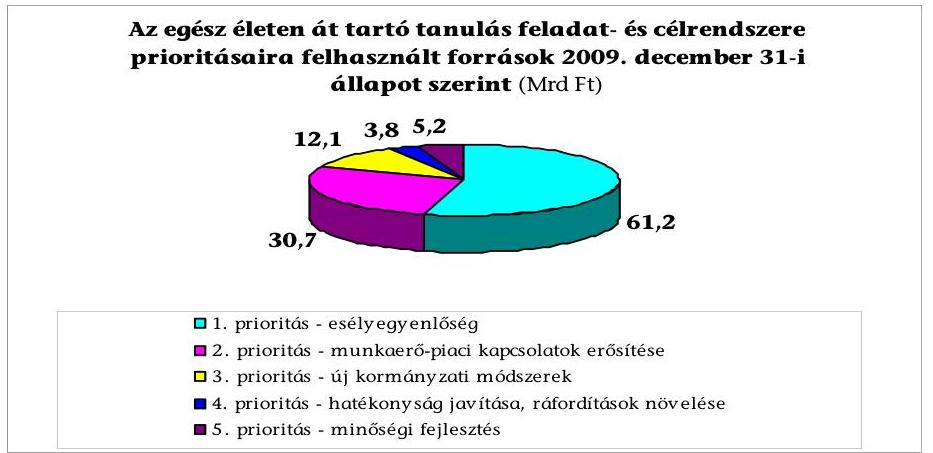

[^0]
[^0]:    ${ }^{29}$ A 13651-4/2007. számú 2007 szeptemberében, illetve a 22176-2/2009. számú 2009. szeptember 22-én. Mindkét előterjesztés az egész életen át tartó tanulás feladatrendszerében megfogalmazott prioritásokhoz kapcsoltan felsorolás jelleggel mutatja be a tett intézkedéseket a közoktatás, a felsőoktatás, illetve a szakképzés-felnőttképzés területeire bontva.
    ${ }^{30}$ Ezt igazolják a jelentés 2. és 4. számú mellékletei is.
    ${ }^{31}$ A forrásokat a vizsgálat kérésére az SZMM állította össze.

---

Vizsgálatunk tapasztalata szerint a Kormány által előírt az egész életen át tartó tanulás stratégiai feladatainak megvalósítása részlegesen teljesült. Nem teljesült az alábbi területeken:

- Nem dolgoztak ki olyan indikátor rendszert, amelynek segítségével az egész életen át tartó tanulás feltételeinek és eredményességének javulása szempontjából értékelni lehetne az oktatási, a felnőttképzési és foglalkoztatási politikák és fejlesztések sikerességét.
- Nem készült el a hátrányos helyzetű csoportok oktatására, képzésére összpontosító, a társadalmi befogadást erősítő feladatokat és felelősöket megjelölő cselekvési terv. Pozitívum ugyanakkor, hogy az államilag támogatott képzési programok döntő részében kiemelt szempont volt a hátrányos helyzetű csoportok oktatása, képzése.

Az esélyteremtés területen az egyik leghatározottabb előrelépést a felnőttképzésben a HEFOP, TÁMOP keretében indított „Lépj egyet előre" programok jelezték, amelyekben a felnőtt lakosság képzettségi színvonalának, közvetve pedig a munkához jutási esélyeinek javítását tűzték ki célul. A két program 15 milliárd Ft-ból összesen 39944 fő számára segítette elő a szakmaszerzést.

- A feladatok teljesítésében lemaradás tapasztalható a pályakövetési rendszer működésére előírt jogszabályi követelmények érvényesülésénél.

A szak- és felnőttképzést érintő reformprogram végrehajtásához szükséges törvények módosításáról szóló 2007. évi CII. törvény 22. § (2) bekezdése 2009. január 1-jei hatállyal írta elő a pályakövetési rendszerben való adatszolgáltatási kötelezettséget. Az ellenőrzés időszakáig a pályakövetési rendszert nem hagyták jóvá, az Fkt-ban előírtakat nem hajtották végre.

A felnőttképzésért felelős minisztérium 2009 júniusában készítette el a pályakövetési rendszer működtetéséről szóló kormányrendelet tervezetét, melyet az egyeztetési eljárásokat követően azonban nem terjesztettek elő. Az egyeztetések eredményeként a résztvevők egyetértettek abban, hogy a pályakövetési rendszernek minden megszerzett OKJ-s szakképesítést nyomon kell követni. Az SZMM a pályakövetési rendszer kialakítására vonatkozó modelljét javasolta részletesen kidolgozni. A Miniszterelnöki Hivatallal folytatott írásbeli egyeztetések 2010 februárjára sem jártak eredménnyel.

- Nem hozták létre a Nemzeti Felnőttképzési Adattárat. Az ÁFSZ-nél kialakítás alatt álló felnőttképzési integrált rendszer nem az összes felnőttképzést végző szerv, hanem csak a foglalkoztatási szervek és az RKK-k adatait tartalmazza, ezért nem tudta pótolni a stratégiában megjelölt feladat megvalósítását.

Az egész életen át tartó tanulásra vonatkozó feladatok teljesítésénél alapvetően ott figyelhető meg előrelépés, ahol a szabályozási rendszer változtatása, a képzések szakmai és tartalmi fejlesztései vagy az intézményrendszer továbbfejlesztése lehetőséget nyújtottak a rendszerben addig meglévő hátrányok, akadályozó tényezők kiiktatására. Így:

- Az egész életen át tartó tanulás gyakorlati megvalósulását segítette az új, moduláris szerkezetű és kompetencia alapú OKJ és a hozzá kapcsolódó szakmai és vizsgakövetelmények, amelyek rugalmasabb számonkérés le-

---

hetőségét teremtették meg. Az új technológiák, gyártási eljárások belépésével változtatták az állam által elismert képzések jegyzékét. Erősödött a kapcsolat a gazdaság szereplőivel, mivel nagyobb szerepet kaptak a képzési szerkezet figyelemmel kísérésében és fejlesztésében ${ }^{32}$. Az új szakmaszerkezet emellett - a rész-szakképzések és a moduláris képzések bevezetése miatt - átjárhatóságot is biztosított, bővítve ezzel a felnőttképzés lehetőségeit is.

- A munkaerő-piaci igények hatékony érvényesítése érdekében a 2007. évi CII. törvény 2008. január 1-jétől megváltoztatta az regionális fejlesztési és képzési bizottságok (RFKB) összetételét. Ennek következtében bővült a bizottságok hatásköre, nőtt a gazdaság szereplőinek részvétele azzal, hogy a régió iskolarendszerű szakképzési intézményeiben meghatározta a szakképzés irányait és arányait, valamint döntött a decentralizált fejlesztési források elosztásáról, vagyis ellátja a régiók (TISZK-ek) iskolarendszerű szakképzési kapacitásainak koordinációját.
- A munkanélküliek elhelyezkedés-centrikus képzésének javítása, a munkaerő-piac képzési igényeinek gyors kielégítése érdekében módosították az RKK feladatait és finanszírozását rögzítő jogszabályt ${ }^{33}$. Ebben új alapokra helyezték a képzés finanszírozását, pályázat nélkül állandó forrást biztosítva az RKK-knak a hátrányos helyzetű személyek képzéséhez.
- Az esélyek javításában nagy szerepe volt a közoktatásról szóló 1993. évi LXXIX. törvény (Közokt. tv.) olyan irányú módosításának ${ }^{34}$, amely lehetővé tette a hátrányos helyzetű és tanulási nehézségekkel küzdő fiatalok számára is a szakmaszerzés lehetőségét, befejezett alapiskolai végzettség nélkül is. A módosítást követően lehetővé vált, hogy a TÁMOP intézkedései alkalmassá tegyék a középfokú oktatási intézményrendszert a hátrányos helyzetű rétegek oktatására.
- Az egész életen át tartó tanulás céljainak elérését segítették azok a központi programok, amelyek a munkaerő-piaci szempontból hátrányos helyzetű csoportok ${ }^{35}$ foglalkoztathatóságának javítására szolgáltak.

A felnőttképzésért felelős miniszter döntése alapján a halmozottan hátrányos helyzetű felnőttek társadalmi beilleszkedésének és foglalkoztatásának elősegítésére központi képzési program indult. A központi program támogatására a felnőttképzésért felelős minisztérium és a kilenc RKK között támogatási szerződés jött létre 1 milliárd Ft biztosításával az MPA foglalkoztatási alaprésze iskolarendszer-

[^0]
[^0]:    ${ }^{32}$ A szakképzési szerkezet folyamatosan figyelemmel kísérésére, fejlesztésére a szakképzésről szóló 1993. évi LXXVI. tv. 4. § (3) bekezdés b) pontja alapján az országos gazdasági kamarák és az országos gazdasági érdek-képviseleti szervezetek, valamint az ágazat egészében érdekelt szakmai kamarák képviselőinek részvételével OKJ Bizottságot hoztak létre.
    ${ }^{33}$ 23/2005. (XII. 26.) FMM rendelet
    ${ }^{34}$ a Közokt. tv. 27. § (8) bekezdése értelmében
    ${ }^{35}$ A nagyfokú inaktivitással rendelkező, legfeljebb alapfokú iskolai végzettségűek, a roma emberek, a megváltozott munkaképességűek, a hátrányos helyzetű térségekben élők, gyermeket vállaló nők, a fiatalok és az idősebb munkavállalók

---

kívüli felnőttképzési célú kerete terhére. (A központi képzési program célcsoportja hátrányos helyzetűek, köztük romák - a programba bevont létszám több mint 50%-a - és fogyatékossággal élő emberek voltak.)

Az egész életen át tartó tanulásra vonatkozó feladatok teljesítésében megfogalmazott teendők a felnőttképzésért felelős minisztériumban több szervezeti egységet is érintettek. A stratégia egységes megvalósítása nyomon követését azonban a minisztérium SZMSZ-ében egyetlen szervezeti egység sem kapta feladatul, ezáltal nehézkessé vált olyan összefüggő kép kialakítása a felnőttképzésről, amely magában foglalta a felnőttképzés valamennyi formáját.

# 1.3. A helyi önkormányzatoknál megjelölt felnőttképzési célok és végrehajtásuk megszervezése 

A helyi önkormányzatokról szóló 1990. évi LXV. törvény (Ötv.) nevesítette ${ }^{36}$ a helyi közszolgáltatások körében ellátandó feladatok közül a foglalkoztatás megoldásában való közreműködést, de nem határozta meg annak konkrét tartalmát. Így a részleges jogi szabályozás miatt, a vizsgált önkormányzatok a feladat megfogalmazását, végrehajtásának szervezését különböző módon végezték. A foglalkoztatás megoldásában való közreműködést csak akkor tudják ellátni a helyi önkormányzatok, ha információkkal rendelkeznek a foglalkoztatásról, a piac igényeiről és a kínálatáról, a középfokú oktatás ellátása keretében pedig szoros kapcsolatban állnak a szakképzést irányító és a képzésben közreműködő szervezetekkel. Az önkormányzatoknak a helyi gazdaság igényeinek kielégítésébe való bekapcsolódását vizsgálati tapasztalatunk szerint több tényező is akadályozta:

- a munkaerő-piaci igényekhez való alkalmazkodás terén nehezen tájékozódott a fenntartó, mert a munkaügyi- és gazdálkodó szervezetek munkaerő-piaci prognózisai a négy-hatéves képzési ciklusokhoz mérve túlzottan rövidek és a pályakövetési rendszer önkéntessége nem biztosított elegendő információt a képzettek elhelyezkedési arányairól;
- a képzési kapacitás és a munkaerő-piaci igények összehangolása alacsony szintű, az egyes iskolák képzési hagyományai voltak a meghatározóak, nem pedig a munkaerő-piaci igények;
- a fiatalok szakmaválasztásában a tényleges munkaerő-piaci igényként jelentkező szakmák helyett a "népszerű szakmák" és nem az elhelyezkedési lehetőségek játszottak meghatározó szerepet;

Az Ötv. előírta, hogy a gazdasági program részeként meg kell határozni - többek között - „a munkahelyteremtés feltételeinek elősegítését". Ennek tartalmáról azonban jogszabály nem rendelkezik. Ennek ellenére a vizsgálatba bevont önkormányzatok közel kétharmada (60%-a) a gazdasági programban meghatározta azokat a célokat, amelyek közvetlen összefüggésbe hozhatóak a felnőttképzés fejlesztésével és működtetésével.

[^0]
[^0]:    ${ }^{36}$ Az Ötv. 8. § (1) szerint.

---

Zalaegerszeg önkormányzatának gazdasági programja a foglalkoztatás bővítése
 érdekében előírta, hogy az oktatás, képzés színvonalának javításával, nagyobb befektetés szükséges a humánerőforrásokba, illetve törekedni kell a magasabb képzettséget igénylő munkahelyek kialakítására és a munkaerőpiacról kiszorultak foglalkoztatásának elősegítésére. Kiemelt szerepet tulajdonítottak az élethosszig tartó tanulás fejlesztésének, célként határozták meg a gazdaság által igényelt képzések kialakítását.

Békéscsaba önkormányzata gazdasági programjában és Közoktatási intézkedési tervében egyaránt rögzítette, hogy a munkanélküliek továbbképzése, átképzése érdekében a Dél-alföldi RMK-val és a Békéscsabai RKK-val együttműködve képzési programokat kell indítani, a munkáltatói igények felmérésére pedig folyamatos konzultációkat kell tartani.

A felnőttképzés terén konkrét célokat megfogalmazó önkormányzatok azt is felismerték, hogy a térség népességmegtartó erejének növelése érdekében elérhetővé kell tenniük az élethosszig tartó tanulást, ezzel közvetlen kapcsolatot teremtettek a Kormány által elfogadott egész életen át tartó tanulás feladatrendszere és a helyi célok között. Elképzeléseik megvalósításának kulcsát a humánerőforrás fejlesztésében, a szakképzés, a felnőttképzés infrastrukturális és szervezeti kereteinek erősítésében látták.

Székesfehérvár önkormányzata gazdasági programjában a közoktatás fejlesztése területén a munkaerőpiac kínálati és keresleti oldala egyensúlyának a megteremtése érdekében célul tűzte ki a szakképzési rendszer megújítását. Pályázati forrásokból és saját erő biztosításával támogatni kívánta az iskolák fejlesztését (eszköz, struktúra, tananyag, profil) és a tervezett Regionális Integrált Szakképző Központ létrehozását. A gazdasági program célkitűzései között szerepelt, hogy a munkaerőigény mennyiségi kielégítésére, a város és térsége népesség megtartó erejének a növelésére felnőttképzési programokat kell indítani, valamint, hogy a humán erőforrások képzettségi szintjének növelése céljából természetessé és elérhetővé kell válni az "élethosszig tartó tanulásnak".

Az ellenőrzött önkormányzatok leggyakoribb oktatási és képzési feladatként a gazdasági igények és a szakképzés összhangjának az erősítését, a szakképzés színvonalának, eredményességének javítását, az oktatási rendszerből kilépő fiatalok munkaerő-piaci helytállását jelölték meg. A teendők megfogalmazásánál az önkormányzatok figyelembe vették, hogy az általuk fenntartott iskolákban a felnőttképzést jellemzően nem saját szervezésben végezték, hanem külső, oktatási szolgáltatásokat nyújtó vállalkozások az intézményi kapacitásokat bérlet formájában vették igénybe.

# Az önkormányzatok akkor fogalmaztak meg konkrét elvárásokat a felnőttképzések kiszélesítésére, ha azoktól rövid távú gazdasági hasznot (pl. kapacitások jobb kihasználását) reméltek. 

A Veszprém Megyei Önkormányzat intézkedési terve önálló fejezetben foglalkozott a felnőttoktatás helyzetével, elsősorban az iskolarendszerű felnőttoktatás szemszögéből, a feladatok és fejlesztési irányok között fogalmazta meg, hogy „A felnőttképzési törvénnyel összhangban erősíteni kell a közoktatás intézményhálózatára épülő felnőttképzést. A meglevő kapacitásaik jobb kihasználása érdekében ösztönözni kell az intézményeket az ebben való részvételre".

---

Kapacitáskihasználási okokból még olyan önkormányzat is fontosnak tartotta a felnőttképzésben való szerepvállalást, amelyik sem a gazdasági programjában, sem az intézkedési tervében nem határozott meg a felnőttképzés működtetésére, fejlesztésére vonatkozó célokat.

Debrecen önkormányzata 2007-2013. évekre a felnőttképzésre vonatkozó irányelveit részletesen nem dolgozta ki, ennek ellenére az intézmények számára javasolta a felnőttképzésbe történő bekapcsolódást. A Közgyűlés a szakképző iskolák részére engedélyezte a felnőttképzés végzését, melyet az alapító okiratokban is rögzítettek, és az ehhez szükséges akkreditációt megszerezték.

A vizsgált önkormányzatok felnőttképzésben vállalt szerepe alacsony volt. A vizsgált körben az önkormányzati iskolák a felnőttképzésben a rendelkezésükre álló lehetőségeiket annak ellenére nem használták ki, hogy - a Közokt. tv. 2007. évi módosítása következtében - az iskolarendszerű oktatásban alkalmazott szakmai programok akkreditált felnőttképzési programnak minősültek. A megjelölt céloknak megfelelően, kapacitásaik lekötésére elsősorban azokat a felnőttképzési formákat választották, amelyekkel pótolni tudták az iskolarendszerű képzés hiányosságait.

Az önkormányzatok által fenntartott iskolákban a felnőttek képzésének a célja elsősorban az volt, hogy a munkanélküli, pályájukat el sem kezdő szakmunkások számára második esélyt biztosítsanak egy új szakma oktatásával. Az egész életen át tartó tanuláshoz szükséges kompetenciák fejlesztése is szerepelt a célkitűzések között, de jellemzően a későn érő, pályavesztett, a nappali iskolából kisodródott, veszélyeztetett helyzetű fiatalok képzésére összpontosítottak.

Az ellenőrzött 13 TISZK alig több mint egyharmadának (38\%-ának) terveiben jelent meg konkrétan a felnőttképzés. Igényfelmérésen alapuló, hosszú távú felnőttképzési stratégiát azok a szervezetek készítettek, amelyek a felnőttképzésben, az adott régióban meghatározó szerepet kívántak betölteni.

A Nyírségi TISZK a stratégiai célkitűzései megvalósításához szükséges feltételrendszerként határozta meg a felnőttképzési igények felmérését, a pályakövetési rendszer működtetését, a kapacitások hatékonyabb kihasználását, illetve az RKK-val és RMK-val való szoros együttműködést. A felnőttképzés továbbfejlesztése a tartalmi munka fejlesztésére is alapozott (tananyagfejlesztésre, minőségirányítási rendszer működtetésére és a végzettek nyomon követésének kialakítására).

A Savaria TISZK felmérte a felnőttképzés stratégiai céljait, célcsoportjait, a felnőttképzési tevékenység erősségeit és veszélyeit, a felnőttképzési igényeket. A szakképző szervezet 2008-ban közel 50 cég, és a partneriskolák bevonásával átfogó felmérést végzett a térség gazdasági, munkaerő-piaci és felnőttképzési környezetéről. Ennek eredményére alapozva alakította ki a 2008-2011. évekre szóló felnőttképzési stratégiát, amelyben vállalta, hogy a felnőttképzésben résztvevők számára azonnal hasznosítható, korszerű ismereteket nyújt.

Az ellenőrzött TISZK-ek közül csak egy szerepeltette éves felnőttképzési tervében a Kormány által elfogadott, egész életen át tartó tanulás feladatait támogató elképzeléseket. Egyértelművé tette, hogy akkor tud az élethosszig tartó tanulás céljaihoz hozzájárulni, ha megvalósítja az előzetes kompetenciák beszámítását, a szakmák közötti átjárhatóságot.

---

Az Észak-zalai TISZK képzési terveiben a felnőttképzés céljaként fogalmazta meg a munkaerő-piaci igényekhez való gyors reagálás mellett, olyan képzések megvalósítását, amelyek az előzetes kompetenciák beszámításával biztosítják a szakmák közötti átjárhatóságot az élethosszig tartó tanulás lehetőségét.

Az ellenőrzött TISZK-ek közel fele (46\%-a) a rendelkezésükre álló infrastrukturális és szellemi erőforrásaik ellenére nem tervezett a térségben meghatározó felnőttképzési szerepkör betölteni. A képzéseik elsődleges célcsoportja magának a TISZK-nek és a partneriskolák tanárainak, oktatóinak, végzős tanulóinak továbbképzése volt, csak másodlagos célcsoportként jelentek meg a munkaerő-piac képviselői, ezek között pedig nem nevesítették a hátrányos helyzetű rétegek képzését.

A TISZK-ek felnőttképzési céljainak megvalósulása ellen hatott, hogy a HEFOP projekt megvalósításának időszakában a projekttámogatás felhasználásával tiltott volt saját bevétel (köztük a felnőttképzési bevétel) realizálása. Az így szerzett saját bevétel összegével a közreműködő szervezet az elnyert támogatási összeget csökkentette ${ }^{37}$.

A vizsgált TISZK-ek közül pozitív példaként lehet kiemelni a Békéscsaba I. számú, a Savaria és az Eger TISZK-eket, mivel stratégiai céljaik között, éves terveikben és képzési kínálatukban meghatározó szerepet játszott a felnőttképzés.

# 1.4. A gazdaság igényeinek figyelembevétele a felnőttképzési szerkezet kialakításában, a célok megvalósításában 

A felnőttképzési igények közvetlen és közvetett módon történő feltárása és elemzése alapozza meg a felnőttképzés- és fejlesztés céljainak, követelményeinek teljesítését, amelyeket a Koncepcióban, Fktv-ben és a végrehajtási rendeletekben rögzítettek. Az igények közvetlen feltárását jogszabályi előírás ${ }^{38}$ alapján a foglalkoztatás-politika megvalósításában közreműködő ÁFSZ látta el ${ }^{39}$. Az ÁFSZ a honlapján tette közzé azokat az elemzéseket és felméréseket, melyek a munkaerő-piaci keresletről, az egyes szakmák munkaerő-piaci helyzetéről, a szakképzettek, a pályakezdők elhelyezkedésének problémáiról nyújtottak regionális és országos helyzetképet. Ezáltal valamennyi szakképzési intézmény és fenntartója, az összes felnőttképző intézmény, illetve minden érdeklődő számára elérhető volt a honlapon megjelenített az oktatással, képzéssel összefüggő döntés meghozatalához szükséges információ. Az országos szintű elemzések és a felmérések adatait a felnőttképzésért felelős minisztérium a Munkaerőpiaci Alap Irányító Testülete (MAT) határozatokban foglalt évenkénti előírásai szerint ${ }^{40}$ elsősorban az MPA foglalkoztatási

[^0]
[^0]:    ${ }^{37}$ A Közép-békés TISZK Központi Intézményénél a HEFOP 2004-3.2.2. intézkedés keretében szerzett ellenőrzési tapasztalat.
    ${ }^{38}$ A feladatot előírja a 291/2006. (XII. 23.) Korm. rendelet 4. § (1) bekezdés e) pontja.
    ${ }^{39}$ Az elemzéseket és az igények megfigyelésére összehangolt felméréseket az ÁFSZ, valamint a közös együttműködés keretében az Magyar Kereskedelmi és Iparkamara készítette el.
    ${ }^{40}$ Előírták a 78/2005. (XII. 15.) számú, a 76/2006. (XII. 6.) számú, 83/2007. (XII. 5.) számú és a 62/2008. (XII. 3.) számú MAT határozatok.

---

alaprész decentralizált keretének régiók közötti megosztása tervezésénél, az Flt. 5. § (1) bekezdésében rögzítettekre, valamint az Fktv. céljára tekintettel a TÁMOP intézkedések forrásjavaslatainak kialakításánál, valamint a központi programok javaslatainál, döntéseinél vette figyelembe.

A minisztérium a 2008 őszén kialakult gazdasági válság hatására az álláskeresők számának emelkedése miatt kezdeményezte a TÁMOP-on belüli forrásátcsoportosítást, mely kb. 18 ezer álláskeresőnek tette lehetővé az aktív munkaerőpiaci programokba való bevonását.

Az ÁFSZ részeként működő hét RMK alapvetően foglalkoztatáspolitikai feladatot látott el, felnőttképzéssel kapcsolatos feladata a képzést folytató intézmények nyilvántartásának vezetése, a nyilvántartásban szereplő intézmények ellenőrzése és a munkaerő-piaci képzések támogatása. Az ÁFSZ tevékenységéhez közvetve kapcsolódó RKK-k, felnőttképzés keretében segítik a munkaerő-piac változásaihoz igazodó szakmai tudás megszerzését. Feladataik képzések nyújtása a hátrányos munkaerő-piaci helyzetben lévő álláskeresőknek, egyéb hátrányos helyzetben lévő csoportoknak, továbbá központi vagy uniós képzési programok célcsoportjába tartozó személyeknek ${ }^{41}$.

Az RMK-k a különböző forrásokból támogatott tervezett képzéseknek, valamint az RKK-k a képzési keretből finanszírozott képzéseknek a munkáltatók munkaerő igényeihez való igazítását ${ }^{42}$ alapvetően az országos-, regionális rövidtávú munkaerő-piaci prognózisok és a negyedéves munkaerőgazdálkodási felmérések elemzéseivel alapozták meg. A képzési szakirányok összeállításakor továbbá figyelembe vették az SZMM foglalkoztatáspolitikai irányelveit, az RFKB-k által közzé tett hiányszakmákat, a megyei kereskedelmi és iparkamarák jelzéseit, elemzéseit. A tervezett szakirányok véglegesítésénél a szükséges módosításokat a kamarák, a munkaügyi tanács és az RKK-k szakmai felügyelő tanácsa észrevételei alapján, valamint a regionális monitoring eredmények elemzése után végezték el.

Az Észak-alföldi RMK 2008. évi képzési tervének véglegesítésénél a munkaügyi tanács javasolta, hogy fodrászképzésre a munkaerő-piac telítettsége miatt nincs szükség, illetve a képzés csak a régió egyes területein indokolt. Szükségesnek tartották azonban a gyógyszertári asszisztens, műszerész és minőségellenőr képzési szakok meghirdetését. A képzési tervben a monitoring vizsgálatok elhelyezkedési mutatói alapján a bolti eladó képzést nem szerepeltették.

A Dél-alföldi RMK-nál azokban a szakmákban nem indítottak ajánlott képzést, melyek nem tartoztak a hiányszakmák közé, illetve, amelyeket az RFKB döntése alapján az adott tanévben a TISZK iskolarendszerben nem indíthatott. Elfogadott képzések esetén ettől az elvtől csak abban az esetben tértek el, amikor az álláskereső szándéknyilatkozattal igazolta, hogy az egyént a nevesített munkaadó képzést követően foglalkoztatja.

[^0]
[^0]:    ${ }^{41}$ Az RMK-k és RKK-k felnőttképzésben szereppel bíró többi szervhez kötődő kapcsolatát a jelentés 1. sz. ábrája mutatja be.
    ${ }^{42}$ A képzési irányok éves tervezésénél a regionális képzési szükségleteket a 6/1996. (VII. 16.) MúM rendelet 2. § (1)-(2) bekezdéséiben, valamint a 23/2005. (XII. 26.) FMM rendelet 8. § (1)-(2) bekezdéseiben előírtak alapján vették figyelembe.

---

Az RKK-knak a munkaerő-piaci információk gyűjtésére vonatkozóan a Foglalkoztatási és Szociális Hivatal (FSZH) egységesen alkalmazandó, kidolgozott módszereket nem határozott meg, ennek ellenére kialakultak pozitív gyakorlatok a munkáltatókkal való együttműködésre. A képzésszervezési folyamatban az RMK-k és az RKK-k mellett a hallgatók kiválasztásában, a képzési program szakmai tartalmának kialakításában a konkrét képzési igénnyel jelentkező munkaadók is részt vettek, így nagyobb az esély a képzést végzettek elhelyezkedésére.

A Dél-alföldi RMK a
 korábbi jellemzően háromszereplős (álláskereső, képző intézmény, RMK) képzési modelljét a munkáltató bevonásával négyszereplős modellre módosította. Újszerű kezdeményezés volt, hogy a képzési program összeállításában a munkaadó is részt vett, a munkaadó határozta meg a képzés szakmai tartalmát, azt, hogy az adott munkakör betöltéséhez milyen szakismeretekre, kompetenciákra volt szükség. Új eleme a rendszernek az is, hogy a kirendeltségekkel szorosan együttműködve a munkaadó részt vett az álláskeresők, mint leendő munkavállalóik tájékoztatásában, motiválásában, meggyőzésében, kiválasztotta a képzésben résztvevőket, biztosította a gyakorlati képzés helyét.

A különböző forrásokból finanszírozott központi programoknál is meghatározó szempont volt, hogy az adott képzés lehetőséget nyújtson keresett szakmák munkaköreinek betöltésére, vagy foglalkoztatáshoz kapcsolódó munkáltatói ígérvényre épüljön. Egyes központi programok képzési kínálatán belül az alapfokú iskolai végzettség megszerzésére irányuló képzések és szocializációs, mentálhigiénés tréningek nem épültek konkrét munkaerő-piaci igényekre, de ezekben az esetekben is szempont volt a foglalkoztathatóság hosszabb távú növelése, melyet az adott személyek további képzésbe vonásával értek el.

Az SZMM által koordinált „Út a munkához" program keretében a 35 év alatti, befejezett általános iskolai végzettséggel nem rendelkezők rendelkezésre állási támogatásra jogosultak ellátásának feltétele volt a képzésben való részvétel. Szakmai képzések esetén az RKK-k az RMK-kkal, esetenként az önkormányzatokkal együtt határozták meg azokat a bemeneti kompetenciákat, képzési irányokat, melyek elsajátításával a résztvevők elhelyezkedhetnek a közfoglalkoztatásban, majd a munkaerő-piacon.

A gazdaság igényei tervezési szinten érvényesültek, a gyakorlatban azonban részben teljesültek. A befejezett képzések egy részénél az adott szakképzettséggel rendelkező végzett hallgatókra a gazdaságnak már nem volt igénye. Ezt bizonyítja, hogy a támogatott képzésben résztvevők elhelyezkedésének aránya a 2006-2008. években átlagosan 49,3%-ra alakult ${ }^{43}$. A kellően nem alátámasztott munkaerő-piaci igényekre alapozott képzések indoka az volt, hogy a munkaerő-piaci prognózisok adott időpontban jelentkező munkaadói foglalkoztatási szándékot jeleztek, és a prognózisok gyakoriságuk ellenére sem tudták a munkáltatói szándékok változását maradéktalanul követni. A 2008. évi gazdasági recesszió következményeként kialakult változó gazdasági viszonyok tovább nehezítették a kis- és középvállalkozások munkaerő igényeinek felmérését. Az instabil gazdasági környezetben gyorsan változó igények-

[^0]
[^0]:    ${ }^{43}$ Az elhelyezkedési arányokat a jelentés 26. számú melléklete mutatja be.

---

nek a támogatott képzések szerkezete csak részben felelt meg, ezáltal a képző szervek csak részlegesen tudták a munkáltatói igényeket kielégíteni.

A gazdasági recesszió negatív hatásának példája, hogy a Békéscsabai RKK által bonyolított központi program célkitűzései maradéktalanul nem valósultak meg, mivel a támogatási szerződésben vállalt 345 fő képzése és alkalmazása helyett 62 fő munkavállaló átképzése valósult meg és a 20,4 millió Ft támogatásból 3,4 millió Ft került felhasználásra. A programban résztvevő pénzintézet, mint a támogatás kedvezményezettje, visszamondta 283 fő munkavállaló átképzését és a képzést követő kötelező foglalkoztatását.

A Debreceni RKK 2008. augusztus 27-én szolgáltatási szerződést kötött egy kft-vel 16 fő nehézgépkezelő képzésre. A megrendelő vállalkozás a képzést 2008. november 1-jétől lemondta, mert a gazdasági válság miatt megrendelés állománya jelentősen csökkent, így a foglalkoztatottak folyamatos leépítésére kényszerült.

Az OGY Fejlesztési Koncepciójában és az arra épülő kormány által elfogadott az egész életen át tartó tanulás stratégiájában célként szerepelt a hátrányos helyzetű személyek felzárkóztatása, az esélyegyenlőségük, alkalmazkodó képességük biztosítása. A célokkal összhangban a foglalkoztatást elősegítő támogatások nyújtásánál az RMK-k részére irányelvként szerepelt a hátrányos helyzetű célcsoporthoz tartozó személyek munkaerőpiacra történő visszatérésének elősegítése, melynek figyelembevételével határozták meg a kirendeltségekre juttatott forrásokat is.

A „Nem mondunk le senkiről — Esély a leghátrányosabb helyzetű térségekben élőknek" programban részt vett RMK-k ${ }^{44}$ a kirendeltségek döntési hatáskörébe utalt források elosztásánál előnyben részesítették a hátrányos helyzetű kistérségeket.

A Közép-dunántúli RMK-nál a regionális decentralizált keret 2006-2009. évi felosztásainál a régió hátrányosabb helyzetű kistérségei számára többletforrást biztosítottak a kirendeltségi keretek meghatározása során. A többletforrás biztosításának alapját az adott térségben regisztrált álláskeresők létszámában a hátrányos helyzetű álláskeresők megoszlása adta, ami megfelelő mértékben előnyben részesítette a hátrányos területeket.

A hátrányos helyzetű emberek fogalmát a jogszabályok, a központi programok, valamint a felnőttképzés szereplői különbözőképpen definiálják és értelmezik. A vizsgálattal érintett szervezetek - az 5. számú függelék szerint - a hátrányos helyzet jellemzőire 50 ismérvet jelöltek meg a 800/2008/EK rendelet ${ }^{45}$, az Fktv., a szakképzésről szóló 1993. évi LXXVI. törvény (Sztv.), a foglalkoztatást elősegítő támogatásokról, valamint az MPA foglalkoztatási válsághelyzetek kezelésére nyújtható támogatásáról szóló 6/1996. (VII. 16.) MüM rendelet által rögzített hátrányos helyzetű személy meghatározásai, valamint az adott szervezet saját szempontjai alapján. A minősítő jellemzők közül legnagyobb arányban „a legfeljebb alapfokú iskolai végzettséggel

[^0]
[^0]:    ${ }^{44}$ A programban részt vett a vizsgált szervezetek közül az Észak-alföldi RMK és az Észak-magyarországi RMK.
    ${ }^{45}$ A Szerződés 87. és 88. cikke alkalmazásában a támogatások bizonyos fajtáinak a közös piaccal összeegyeztethetőnek nyilvánításáról szóló 800/2008/EK rendelete

---

rendelkező személy" 7,9%-ban, és „a 25. életévét be nem töltött pályakezdő" 7%-ban került kiválasztásra. Ezek a kategóriák az iskolarendszerű oktatás problémáira világítanak rá. A tankötelezettség időszaka alatt ezen célcsoportok nem szerezték meg azokat az ismereteket, melyek a szakképzettséget adó iskolarendszerű oktatás, valamint szakképzettséget igénylő munkakör betöltésének feltétele. A hátrányos helyzet eltérő értelmezését eredményezte, hogy a felnőttképzésért felelős minisztérium nem készítette el a célcsoport munkaerőpiaci helyzetét javító, a hátrányos helyzet jellemzőit meghatározó egységes cselekvési tervet. A kiválasztott ismérvek alapján, a vizsgálat értékelése szerint a hátrányos helyzetű személyek esélyegyenlősége és alkalmazkodó képessége érdemben nem változott, munkaerő-piaci helyzete pedig romlott. A különböző hátrányos jellemzőkkel bíró célcsoportok részére indított központi-, regionális munkaerő-piaci programok ellenére jelenleg is a legproblematikusabb réteg a legfeljebb alapfokú iskolai végzettséggel rendelkező és a 25. életévét be nem töltött pályakezdő.

A 2006-2009. években a foglalkoztatottak között az alapfokú iskolai végzettséggel nem rendelkezők száma 25%-kal, a befejezett nyolc általánossal rendelkezők száma 14,8%-kal csökkent ${ }^{46}$. A nyilvántartott álláskereső pályakezdők havi átlagos létszáma 2006-ról 2009-re 27,3%-kal, 10580 fővel ${ }^{47}$ nőtt. Ezen belül az alapfokú iskolai végzettséggel nem rendelkezők száma 17,6%-kal, a befejezett nyolc általánossal rendelkezők száma 40,2%-kal nőtt. (A nyilvántartott álláskeresők jellemzőit a jelentés 17. számú melléklete tartalmazza.) A felnőttoktatásban a nyolcadik évfolyamot a 2006. évi 540 fővel szemben 2009-ben 438 fő fejezte be, az RMK-k által támogatott felnőttképzésben az általános iskola 7-8. osztályát 2006-ban 638 fő, 2009-ben 464 fő végezte el. (A jelentés 14. számú melléklete tartalmazza a képzések jellege szerint kimutatott tanfolyamokon a képzést eredményesen teljesítő hallgatók létszámát.)

A felnőttképzés fejlesztését megalapozó, a gazdaság igényeit megjelenítő információk feltárásához közvetett módon több tényező is hozzájárult. Ezek között kiemelt jelentőségű volt a munkáltatói képviseleti szerveknek a szakképzési szerkezet fejlesztését megelőző véleményező, javaslattevő munkája, a munkaügyi kutatások, valamint a Nemzeti Szakképzési és Felnőttképzési Intézet (NSZFI) szakmastruktúra fejlesztő munkája.

- A munkáltatók szakképzési igényeinek jelzésére hasznosítható információkat szolgáltatott a vizsgált időszakban átalakított OKJ ${ }^{48}$, amely a megjelenő új szakmai igényeket folyamatosan figyelemmel kísérte és jelezte a szakmaszerkezetben bekövetkezett változásokat. A felnőttképzési rendszer képzési struktúrája az NSZFI tevékenységében a gazdaság szereplőitől érkező jelzéseik alapján módosult.

[^0]
[^0]:    ${ }^{46}$ Forrás: lakossági munkaerő-felmérés
    http://portal.ksh.hu/pls/ksh/docs/hun/xstadat_eves/i_qlf007.html
    ${ }^{47}$ Forrás: nyilvántartott pályakezdők száma és megoszlása
    http://www.afsz.hu/engine.aspx?page=stat_afsz_nyilvtartasok
    ${ }^{48}$ Az OKJ-ról a 37/2003. (XII. 27.) OM rendelet rendelkezett, de a felnőttképzést is alapvetően befolyásoló modulrendszerű továbbfejlesztéséről az 1/2006. (II.17.) OM rendelet tartalmazott előírásokat.

---

Az OKJ-ben rögzített szakmák - az érettségi vizsgára épülő felsőfokú szakképesítések kivételével ${ }^{49}$ - felnőttképzés keretében is képezhetők. Azt nem vizsgálták, hogy a felnőttképzésben is oktatható szakmákra mekkora a jelentkezés, de az állam által elismert szakképesítések strukturális változásait nyomon követték. E feladat keretében elsőként a munkaköröket elemezték annak érdekében, hogy összhangban van-e az a FEOR-ral.

- A szakképzés szerkezetének változásáról az Országos Statisztikai Adatgyűjtési Program (OSAP) statisztika és az OKJ monitoring jelentése nyújtott információkat. Az NSZFI jogszabály alapján elemezte ${ }^{50}$ a felnőttképzési statisztikai adatokat (OSAP 1665). A felnőttképzési adatok elemzésénél azonban nem értékelte ${ }^{51}$, hogy a képzések megfeleltek-e a munkaerő-piaci igényeknek, nem minősítette a képzések hiányszakmáknak és keresett szakmáknak való megfelelését, az évek közötti eltéréseket és az eltérések okait nem vizsgálták, ezért azok nem voltak alkalmasak a felnőttképzéssel kapcsolatos fejlesztési feladatok alátámasztására.

# 2. A FELNŐTTKÉPZÉS MŰKÖDÉSÉNEK JOGI ÉS SZERVEZETI HÁTTERE 

Hazánk az Fktv. értelmében a hosszú távú versenyképesség zálogaként kezelte az egész életen át ívelő képzést. A 2002. január 1-jétől hatályos felnőttképzési törvény rendszerezi és anyagilag támogatja egy olyan egységes felnőttképzési ágazat kialakítását, amelyben lehetővé válik az egész életen át tartó tanulás megvalósítása. Az Fktv. csak keretjelleggel szabályozza a felnőttképzési szereplők működését. Meghatározza az iskolarendszeren kívüli képzésből az állam által elismert szakképzést nyújtó képzések és az állam által elismert képesítést nem nyújtó képzések feltételrendszerét és állami finanszírozásának feltételeit. A felnőttképzés szabályozási környezete - amelyet a jelentés 3. számú függeléke mutat be - a vizsgált időszakban történt kormányzati struktúra átalakítása, illetve az egész életen át tartó tanulás, a felnőttképzés és a szakképzés fejlesztései alapelveihez való igazítás miatt többször változott.

Az Fktv. pontosította a felnőttképzés fogalmát, célját, rögzítette az intézményakkreditáció célját, előírta, hogy az akkreditációs eljárás alapfeltétele, hogy a felnőttképzést folytató intézmény legalább egy, általa már megvalósított képzési programmal rendelkezzen. Szabályozta, hogy az államháztartási és uniós forrásokból támogatott, legalább 240 órát meghaladó időtartamú képzési programoknak tartalmazniuk kell a digitális írástudáshoz szükséges ismeretek oktatását is ${ }^{52}$.

[^0]
[^0]:    ${ }^{49}$ Az OKJ képzési közül az 55-ös kódszámmal kezdődő képzések tartoznak a hivatkozott képzések közé.
    ${ }^{50}$ A feladatot előírja a 292/2006. (XII. 23.) Korm. rendelet 5. § (1) a) 7. pontja.
    ${ }^{51}$ A helyszíni ellenőrzés befejezéséig az NSZFI az elemzéseket a 2007-2008. évekre végezte el.
    ${ }^{52}$ A 2009. évi XCVIII. tv. 3. §-ában előírtak alapján.

---

Vizsgálati tapasztalataink szerint a felnőttképzésért felelős minisztériumi szintű jogszabály módosítások egyeztetése során az ÁFSZ által kezdeményezett változtatások figyelmen kívül hagyása jelenleg is hátráltatja az FSZH-ban és az RKK-kban folyó szakmai munkát.

Változatlan a regionális képző központok feladatairól, irányításáról, a Munka-erő-piaci Alap foglalkoztatási alaprészén belül elkülönített képzési keret felhasználásáról, valamint a regionális képző központok és a megyei (fővárosi) munkaügyi központok együttműködéséről szóló 23/2005. (XII. 26.) FMM rendelet 2. számú mellékletében meghatározott költségnormák nagysága, amelyek veszélyeztetik az RKK-kban a magas költségigényű - anyag- és technológiai igényes képzések szakszerű megvalósítását.

Az RMK-k foglalkoztatást elősegítő képzések támogatásának feladataival összefüggésben az Állami Foglalkoztatási Szolgálatról
 szóló 291/2006. (XII. 23.) Korm. rendelet az FSZH részére konkrét irányítási jogosultságot nem állapított meg.

Feszültséget okozott a képzésszervezésben és a lebonyolításban, hogy az ugyanabban a képzésben résztvevők, különböző jogcímen, különböző összegű megélhetési támogatásban részesültek.

Értelmezési és minősítési problémát okoz a 6/1996. (VII. 16.) MüM rendelet 6. § (2) bekezdésében a keresetpótló juttatás megállapításának feltételeire vonatkozó rendelkezés (például, hogy az egyes képzési részek alóli felmentés időszakát lehet intenzív képzésként minősíteni), továbbá a 7. § (3) bekezdése alapján a képzési támogatás ismételt megállapításának szabályozása (például a szabályozás nem tesz különbséget arra az esetre, ha az egyénnek a szakképesítést követően a munkaviszony létesítéséhez csak elfogadott képzést kell elvégeznie).

Az Fktv. 22. § (5) bekezdése a fogyatékkal élő felnőtt részére is korlátozta a többszöri támogatott képzés lehetőségét, még pedig úgy, hogy egyidejűleg egy támogatott képzésben vehet részt, és három naptári év alatt legfeljebb két képzéséhez nyújtható felnőttképzési normatív támogatás.

A jogszabályi előírások felülvizsgálata során esetenként elmaradtak az ésszerűsítések, egyszerűsítések (pl.: a szakmai képzési munkát lassítja a felesleges tájékoztatók készítése). Nem segíti a felnőttképzési célok megvalósítását, ha a képzési kínálatot elsősorban nem az elszámolható költségek szintje, hanem a kereslet határozza meg.

Az Fktv. 10. § (1) bekezdés be) pontja a képzési programhoz való hozzáférést és a felnőttképzési tevékenységre vonatkozó tájékoztatást írja elő. Az akkreditációs szabályok szerint (az akkreditációs eljárás és követelményrendszer részletes szabályairól szóló 24/2004. (VI. 22.) FMM rendelet 6. § a) pont) minden képzéshez külön tájékoztatót kell mellékelni. Külön tájékoztatók készítése munkáltatói megrendelésre végzett képzés esetén felesleges és többletráfordítást igényel.

A szakmai vizsgadíj és a vizsgáztatási díjak kereteit meghatározó a szakmai vizsgadíj és a vizsgáztatási díjak kereteiről, valamint egyes szociális és munkaügyi miniszteri rendeletek rendelkezéseinek hatályon kívül helyezéséről szóló 20/2008. (XII. 17.) SZMM rendelet értelmében azoknál a szakképesítéseknél, részszakképesítéseknél, ahol magas a vizsgamodulok, vizsgatevékenységek száma, jelentősen megemelkedett a vizsgáztatás díja, különösen azokban az esetekben, amikor a gyakorlati vizsgafeladatok értékelésére és az írásbeli, interaktív feladatok javítására külső instruktort szükséges megbízni. Ez oda vezetett, hogy az ál-

---

lamilag elismert szakmák kínálatában létrejött egy negatív szelekció, azaz a jelenleg elszámolható költségnormákkal ${ }^{53}$ nem finanszírozható, de az utóbbi kéthárom évben a munkáltatók által folyamatosan igényelt képzések (szerkezetlakatos, CNC forgácsoló, kőműves, meleg burkoló, takarító stb.) kerültek ki a képzők kínálatából.

A felnőttképzést szabályozó jogszabályok módosításai egy részénél az időbeliség összhangját nem teremtették meg, vagyis késve alkották meg az Fktv-re épülő végrehajtási rendeleteteket, ami bizonytalanságot okozott a jogalkalmazóknál.

A közigazgatási hatósági eljárás és szolgáltatás általános szabályairól szóló 2004. évi CXL. törvény módosításáról szóló 2008. évi CXI. törvény hatálybalépésével és a belső piaci szolgáltatásokról szóló 2006/123/EK irányelv átültetésével összefüggő törvénymódosításokról szóló 2009. évi LVI. törvény a 2009. július 8-i kihirdetését követően az Fktv. módosításán felül a felnőttképzési tevékenység megkezdésének és folytatásának új részletes szabályozását is szükségessé tette. Az SZMM a felnőttképzési tevékenység megkezdésének és folytatásának részletes szabályairól szóló 2/2010. (II. 16.) számú SZMM rendeletével több hónapos késéssel szabályozta a felnőttképzési tevékenység megkezdésének és folytatásának részletes előírásait.

Az Fktv. 2009. november 22-én kihirdetett módosítása alapján 2010. január 1-jétől minden állami és uniós forrásból támogatott, 240 órát meghaladó időtartamú felnőttképzési programok kötelező része lett - az élethosszig tartó tanulás feltételeinek biztosítása érdekében - a digitális írástudás megszerzése. A szabályozás miatt a már akkreditált programok és az OKJ-s képzések körében szükségessé vált a végrehajtásra vonatkozó rendelet megalkotása. A felnőttképzésért felelős minisztérium 2010. februárjában készítette el a digitális írástudás elsajátítására irányuló képzési részek tervezett szabályait, amelyet a digitális írástudás elsajátítására irányuló képzési részek alóli mentesség szabályairól szóló 13/2010. (IV. 22.) SZMM rendeletével adott ki.

A felnőttképzés normatív támogatás részletes szabályairól szóló 123/2007. (V. 31.) Korm. rendelet 4. § (3) bekezdés c) pontjában elírtak szerint ${ }^{54}$ a felnőttképzési normatív támogatás igényléséhez csatolni kell az igényléssel érintett naptári évre vonatkozó, az Fktv. 15. §-a szerinti képzési tervének hitelesített másolati példányát. Az Fktv. 2009. évi LVI. törvénnyel történt módosítása az éves képzési terv követelményét 2009. október 1-jétől hatályon kívül helyezte. E változás miatt a 123/2007. (V. 31.) Korm. rendeletet az ellenőrzés lezárásának időszakáig nem módosították.

Az Fktv. 14. §-át a 2009. évi LVI. törvénnyel hatályon kívül helyezték, így 2009. október 1-jétől megszüntették a szakmai tanácsadó testület (SZTT) létrehozási lehetőségét, törölték az e jogszabályhelyen meghatározott feladatait. Az SZTT működtetése az akkreditáció feltétele volt a 24/2004. (VI. 22.) FMM rendelet előírásai szerint, amely feltételt az SZMM az egyes felnőttképzési tárgyú miniszteri rendeletek folytatásáról szóló 4/2010. (II. 26.) számú rendeletével szüntetett meg.

# A jogszabályváltozások esetenként nem segítették a felnőttképzés megvalósulását. 

[^0]
[^0]:    ${ }^{53}$ amelyeket a 23/2005. (XII. 26.) FMM rendelet határoz meg
    ${ }^{54}$ Módosította a 163/2009. (VIII. 6.) Korm. rendelet, hatályos 2009. VIII. 7-től.

---

A foglalkoztatást elősegítő támogatásokról rendelkező 6/1996. (VII. 16.) MüM rendelet kizárja az álláskeresési támogatásban részesülőket a nem intenzív jellegű képzésekből. Nehezíti a felzárkóztató képzésben résztvevők hatékony szakmai képzésbe vonását a képzés időtartama kétszeresének megfelelő időtartamú várakozási idő is. A távoktatási képzéseknél a többszöri változtatások ellenére sem szabályozták a képzési támogatás megállapíthatóságát.

Az Fktv. meghatározta, hogy a felnőttképzésbe való bekapcsolódást segítse és ösztönözze az előzetesen megszerzett tudás felmérését és elismerését ${ }^{55}$. Ennek alapján az Sztv. 2007. szeptember 1-jei módosítása előírta, hogy az OKJ-s szakképesítés szakmai és vizsgakövetelményeiben a nem formális, informális tanulás, a munkavégzés során szerzett kompetenciáknak a beszámíthatóságát érvényesíteni kell. A törvényekben előírt követelmények nem valósultak meg, mert az előzetesen megszerzett tudás mérésére és értékelésére, a nem formális és informális keretek között történő tanulás eredményeinek az elismerését szolgáló rendszerek megvalósítására átfogó elismerési modell kidolgozására nem került sor. E szakterületen részeredménynek tekinthető ugyanakkor, hogy az NSZFI a honlapján 2009-ben közzétette az előzetesen megszerzett tudás felméréséhez készített útmutatóját az OKJ-s képzéseknél figyelembe vehető bemeneti kompetenciák mérésére. Az elvárásokkal ellentétben ez nem valamennyi, hanem csak egy felnőttképzési típusnál (OKJ-s képzés) segítette az élethosszig tartó tanulás ösztönzését és a képzések költséghatékonyságát.

A felnőttképzés tartalmi szempontból az oktatási rendszerhez, a képzés irányát, orientáltságát tekintve pedig a foglalkoztatási szervezetekhez kapcsolódott.

Magyarországon a vizsgált időszakban az iskolarendszeren kívüli felnőttképzés piaci alapon - nyílt pályáztatási rendszerben - működött, amely élénk versenyt és sokszínű képzési kínálatot eredményezett. A piaci modell magában hordozza azt a lehetőséget, hogy kínálat-vezérelté válik, azaz a képzési kínálat és nem a kereslet határozza meg a lebonyolított képzések szakirányait, valamint a leginkább rászorulók - saját anyagi hozzájárulás nélkül - nem jutnak hozzá a számukra szükséges képzésekhez.

A felnőttképzésben meghatározó szerepe volt a foglalkoztatási szervezeteknek. Az SZMM-hez tartozó háttérintézmények regionalizációja eredményeként 2007. január 1-jétől működött az ÁFSZ. A szociális és munkaügyi miniszter a foglalkoztatáspolitikáért való felelőssége körében működtette az FSZH-t, és az ÁFSZ területi szerveit, a hét regionális munkaügyi központot. Az ÁFSZ tevékenységéhez közvetve kapcsolódott az RKK-k hálózata. A felnőttképzési fejlesztési feladatokat regionális illetékességgel kilenc RKK végezte.

[^0]
[^0]:    ${ }^{55}$ az Fktv. 17. § (2) bekezdése

---

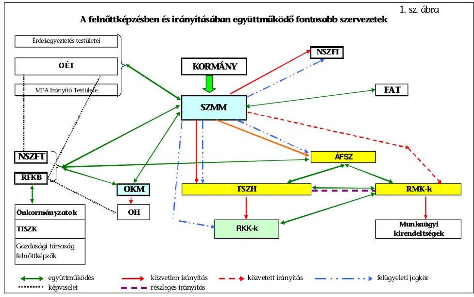

A felnőttképzésben közreműködő szervezetek kapcsolata bonyolult, összetett, amelyet a vizsgált időszakra, illetve 2010. július 1-jéig a jelentés 1. számú függeléke mutat be, az irányítás rendszerét pedig a 2. számú függelék szemlélteti.

A Fktv-ben meghatározott szervezetekhez - NSZFI, Nemzeti Szakképzési és Felnőttképzési Tanács (NSZFT), ÁFSZ, Felnőttképzési Akkreditációs Tanács (FAT) - delegált feladatok összetétele, változása a vizsgált időszakban nem támogatta kellően az összehangolt szakmai feladatellátást.

A vizsgált időszak elején a felnőttképzés irányítási feladatait a minisztérium 15 fő engedélyezett álláshellyel, önálló főosztály keretében látta el. A 2006. évi kormányzati struktúra átszervezést követően a főosztályon belüli osztályszervezetet mindössze 11 fővel alakították ki. Az NSZFI a Nemzeti Szakképzési és Felnőttképzési Intézetről szóló 292/2006.(XII. 23.) Korm. rendeletben számára meghatározott felnőttképzési feladatait, olyan szervezeti felállásban látta el, amelyben nem különültek el a felnőttképzési és szakképzési feladatok.

A foglalkoztatáspolitika alapintézményei (FSZH, RMK-k) működtek közre a felnőttképzés irányításában. Az RKK-k működtetése a szociális és munkaügyi miniszter felnőttképzési feladata körébe tartozott, de az RKK-kat szakmailag alapvetően az FSZH irányította ${ }^{56}$ (jogszabály alapján, kötelezően betartandó előírásokkal). Az RMK-k hatékonyabb feladatellátását az FSZH módszertani útmutatók, ajánlások kiadásával segítette.

A RKK-k irányításában jogszabállyal ellentétes gyakorlat alakult ki a felnőttképzésért felelős minisztérium és az FSZH között. A 23/2005. (XII. 26.) FMM rendelet 5. § (1)-(2) bekezdései tartalmazzák a miniszter hatáskörében megmaradt irányítási feladatokat, valamint a 291/2006.(XII. 23.) Korm. rendelet 4. § (3) bekezdés

[^0]
[^0]:    ${ }^{56}$ A 23/2005. (XII. 26.) FMM rendelet 5. § (1) bekezdése alapján az RKK-kat a minisztérium az FSZH közreműködésével irányította, az FSZH-nak az RKK-k szakmai irányításával összefüggő feladatait a 23/2005. (XII. 26.) FMM rendelet 5. § (3) bekezdése tartalmazta.

---

d) pontja rögzíti, hogy a minisztérium az FSZH véleményezése után jóváhagyja az RKK-k éves képzési tervét. A felnőttképzésért felelős minisztérium a feladatot nem teljesítette, az RKK-k éves képzési tervének jóváhagyása a tárca SZMSZ-ében sem szerepelt. A minisztérium helyett az RKK-k éves képzési terveit az FSZH főigazgatója hagyta jóvá.

A felnőttképzésért felelős minisztérium szakállamtitkársága nem rendelkezett teljes körűen mindazon információkkal, amelyek a felnőttképzés áttekintését, a folyamatok reális figyelemmel kísérését indokolták.

Részleges információkkal rendelkeztek például a magánképzők által bonyolított felnőttképzésekről, az uniós forrásokból megvalósuló projektekről.

A felnőttképzésért felelős minisztérium számára előírt felnőttképzési feladatok teljesítését nehezítette, hogy a feladatrendszer tagoltsága a minisztériumok közötti átszervezéssel mérséklődött ugyan, de továbbra sem szűnt meg teljesen. Kedvezően hatott a felnőttképzés irányítására és feladatellátására, hogy a szakképzés szakmai irányítási feladata is a felnőttképzés irányításáért felelős minisztériumhoz került. Az elmúlt négy évben a szakmai képzések irányítását alapvetően meghatározó szakmai és vizsgakövetelmények összeállítása azonban 13 minisztériumhoz tartozott ${ }^{57}$. A rendszer fejlesztésével összefüggő változások levezénylése, összehangolása e területen jelenleg azért nehézkes, mert az elsődleges felelősség az ágazati minisztereké, a szak- és felnőttképzésért felelős minisztert csak egyetértési jog illeti meg. A szervezeti változások kedvezőtlen hatása érezhető továbbá az MPA alapkezelési tevékenység szabályozásánál ${ }^{58}$, mivel a feladatellátás két minisztérium (az oktatásért, illetve a felnőttképzésért felelős minisztériumok) irányítási hatáskörébe tartozott. A pályázati lebonyolítást mindkét minisztérium hatáskörébe tartozó feladatoknál ugyanaz a szervezet (NSZFI) látta el. A kettős irányítás eltérő eljárásrendet eredményezett az MPA képzési alaprész felhasználását célzó pályázatok lebonyolításánál, ami indokolatlan többletfeladatot jelentett az NSZFI-nél, a képzési alaprész szabályszerű felhasználása során.

# 3. A HELYI ÖNKORMÁNYZATOK ÉS AZ ÁLTALUK LÉTREHOZOTT SZERVEK FELNŐTTKÉPZÉSBEN BETÖLTÖTT SZEREPE 

A vizsgált időszakban az önkormányzatok és
 szakképző intézményeik a felnőttképzésben betöltött szerepét a jogszabályalkotók az egyszerűsített akkreditációs eljárás bevezetésével, a jelentős fejlesztési források biztosításával erősíteni kívánták, ami a gyakorlatban nem valósult meg.

[^0]
[^0]:    ${ }^{57}$ Az Sztv. 5. § értelmében minden szakképesítésért felelős miniszter meghatározza az ágazatába tartozó szakmák esetében a vizsgakövetelményeket és a vizsgáztatás szabályait, a szak- és felnőttképzés irányításáért felelős SZMM-nek egyetértési joga van ezek kiadásakor.
    ${ }^{58}$ Az Szhtv. szabályozza a képzési alaprész felhasználásával kapcsolatos döntéselőkészítő feladatok elkészítését, az egyedi döntés alapján, valamint a pályázat útján megvalósuló támogatási döntések előkészítésére, a támogatási szerződések megkötésével, elszámolásával, ellenőrzésével és a beszámolóval kapcsolatos feladatokat.

---

Hazánkban 2009-ben az iskolarendszeren kívüli szakmai felnőttképzést 329 költségvetési szerv jelölte meg alaptevékenységként az alapító okiratokban. Az önkormányzatok elemi beszámolói szerint a 2006-2009. években felnőttképzésre 6,2 Mrd Ft-ot fordítottak, amelyből 7512 tanulócsoportban 133 ezer főt képeztek ${ }^{59}$. 2006-ban 1,8 Mrd Ft, míg 2009-ben már csak 1,2 Mrd Ft jutott felnőttképzésre, ami egyértelműen jelzi, hogy az önkormányzatok és szakképző intézményeik felnőttképzésben betöltött szerepe gyengült. Ez a ráfordítás a felnőttképzés működtetésére és fejlesztésére fordított összes államháztartási forrásnak 2006-ban 7,5%-át, 2009-ben mindössze 4,9%-át tette ki.
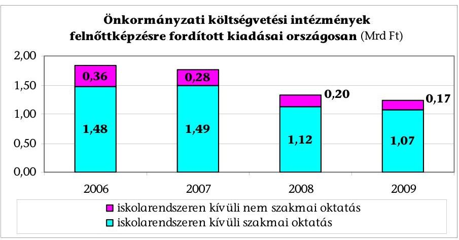

Az országos tendenciának megfelelően az ellenőrzött önkormányzatok körében is megfigyelhető volt a felnőttképzési tevékenység visszaesése. A 2006/2007-es tanévben 69 intézmény foglalkozott felnőttképzéssel, számuk a vizsgált időszak végére 50-re (27,5%-kal) csökkent, melyet a jelentés 18. számú melléklete mutat be. Az átszervezések miatt a szakképző intézmények száma is közel ekkora arányban (22%) csökkent. Az iskolák fenntartói a felnőttképzésben való részvétel csökkenésének okai között kiemelt szerepet tulajdonítottak az RMK-k pályáztatási rendszerének. A szűkülő pályázati források és az RMK-k ajánlattételi felhívásai együttesen olyan feltételeket támasztottak a pályázóval szemben, melyet az önkormányzati intézmények nehezebben tudtak teljesíteni, mert a költségvetési szervek és a versenyszféra közötti szabályozási különbség (a kötelező közalkalmazotti előírások, túlórakorlát a költségvetési szerveknél) az önkormányzati fenntartású intézmények számára többletköltségeket okozott, emiatt versenyhátrányban voltak a nem költségvetési szervként működő felnőttképző szervezettel szemben. Valamennyi képző szervet érintő csökkentő tényező volt a 2008 őszétől tapasztalható gazdasági válság, amely visszafogta a vállalkozók saját erős képzési megrendeléseit $^{60}$.

[^0]
[^0]:    ${ }^{59}$ Az adatokat a jelentés 6. számú melléklete mutatja be.
    ${ }^{60}$ Az indokokat a Nyíregyháza Megyei Jogú Város önkormányzata, Pest Megye Önkormányzata, Zalaegerszeg Megyei Jogú Város Önkormányzata, valamint Székesfehérvár Megyei Jogú Város Önkormányzata nevesítette.

---

A 2006-2009. években, az ellenőrzött 11 önkormányzat az általuk fenntartott intézményekben összesen 0,64 Mrd Ft-ot költött felnőttképzésre (a jelentés 22. számú melléklete adatai alapján). Az e célra fordított kiadások abszolút összegben és arányaiban is csökkenő tendenciát mutattak. A vizsgált időszak első évében még 0,2 Mrd Ft-ot mutattak ki felnőttképzési kiadásként, ami a nappali rendszerű felnőttoktatással együtt elszámolt kiadások 16,9%-át tette ki. Az időszak végén már csak 0,09 Mrd Ft-ot számoltak el felnőttképzés címén, ez az összeg már csak 11,4%-át képviselte a felnőtt korúakkal kapcsolatos összes kiadásnak.

A vizsgált önkormányzatok fenntartásában és TISZK keretében működő szakképzést folytató intézményeinél a 2006-ról a 2009-re a felnőttképzésből származó bevételek 46,4%-kal csökkentek. Ugyanakkor az érintett intézményeknél a felnőttképzésben részt vettek száma a 2006. évről a 2009. évre 19,6%-kal növekedett, ami nem a tanfolyami létszám növekedéséből, hanem az alacsonyabb bevételt eredményező vizsgáztatásból származott. A vizsgadíjak nem ellentételezték a jelentősebb összeget képviselő kieső tanfolyami bevételeket ${ }^{61}$. A bevételek alacsony szintje nem ösztönözte az intézményeket arra, hogy a felnőttképzésben vállalt szerepükkel elősegítsék az álláskeresők munkaerő-piaci pozíciójának javulását.

A vizsgált körben a középfokú oktatás feladatát szolgáló vagyon közel felét (46,6%-át) tette ki a felnőttek képzésébe leginkább bevonható szakképzési célú eszközállomány, amelyet a jelentés 20. számú melléklete mutat be.

Az ellenőrzött önkormányzatok a vizsgált időszak átlagában közel 30 Mrd Ft értékű vagyonnal látták el a középfokú oktatás kötelező feladatát. Ezen belül a szakképzést szolgáló vagyon 12,8 Mrd Ft értékről 14,6 Mrd Ft-ra emelkedett az időszak alatt, ez a központi képzőhelyek kialakításának volt az eredménye.
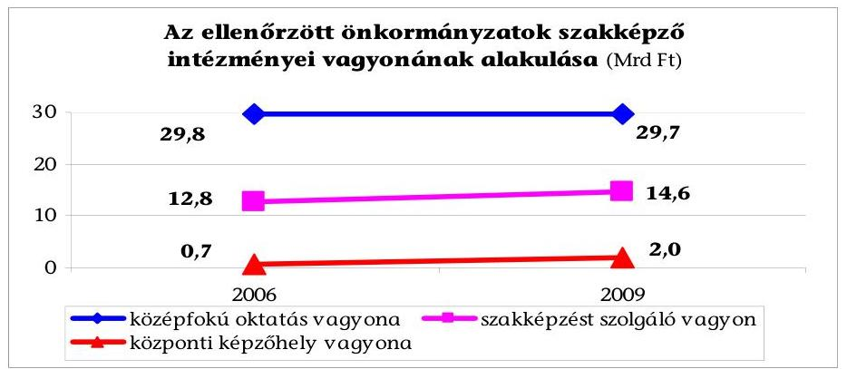

Az infrastruktúra fejlesztéseként létrehozott központi képzőhelyek vagyonának értéke közel háromszorosára növekedett (295,1%). Az így kialakított modern központi képzőhelyek kihasználtsága ${ }^{62}$ mindössze 68,9% volt, alapvetően azért, mert a nappali rendszerű szakképzés a tervezettnél kisebb arányban kötötte le a kapacitást. Felnőttképzés céljára az összes teljesített óraszám 4,2%-át fordították.

[^0]
[^0]:    ${ }^{61}$ A változások kimutatása a jelentés 21. és 23. számú mellékletei alapján történt.
    ${ }^{62}$ amelyet a jelentés 25. számú melléklete mutat be és alapoz meg

---

A felnőttképzés volumenének csökkenése annak ellenére következett be, hogy a tárgyi feltételrendszer korszerűsödött. A vizsgálat megállapította, hogy az ellenőrzött önkormányzatok szakközépiskolai és szakiskolai oktatásában dolgozó pedagógusok egyre kisebb arányban oktattak felnőttképzésben, a 2006/2007-es tanévben 8,6%, a 2009/2010-es tanévben már csak 6,1%-uk ${ }^{63}$.

A felnőttképzésben résztvevők számának ${ }^{64}$ 19%-os növekedésében meghatározó szerepet játszott az önkormányzati intézmények vizsgaszervezésein megjelentek számának emelkedése, melyre a statisztika nem tartalmaz elkülönített adatot.

Az önkormányzati intézményeknek az alapfeladat ellátásához rendelkezésükre álló vagyon, illetve emberi erőforrás kihasználtsága alapján vannak olyan tartalékaik, amelyek a felnőttképzésben hasznosíthatók. A jogszabályalkotó a TISZK-ek ${ }^{65}$ belépésével kívánta elősegíteni az intézményi integrációt és a szakképzési feladatok szervezésének koncentrálását. A törvénymódosítás ${ }^{66}$ eredményeként megváltozott TISZK rendszer legfőbb célja a szak- és felnőttképzés munkaerő-piaci igényekkel való összehangolása lett. A 2007. évi CII. tv. 2. § (2) bekezdése alapján újjászervezett TISZK-ekkel lehetőség nyílott a keresletvezérelt szak- és felnőttképzés megszervezésére, a szakképző intézmények integrációjára, a széttagoltság és párhuzamosságok megszüntetésére. A célok közül a képzés irányításában az RFKB hatáskörének a 2007. évi CII. tv. 33. §-a szerinti bővítésével megvalósult a gazdaság igényei szerinti képzésirányítás, a szakképző szervek integrációjának mértéke pedig elérte a 82,6%-ot.

Az elsőgenerációs TISZK-ek (vizsgált 11) létrehozására ${ }^{67}$ az önkormányzatok a HEFOP 3.2.2. és a központi képzőhelyek infrastruktúrájának kialakításához és fejlesztéséhez a HEFOP 4.1.1. operatív programokból - a hatályos támogatási szerződések szerint - közel 12,7 Mrd Ft vissza nem térítendő támogatásban részesültek. (A vizsgált TISZK-ek esetén az operatív programokat és a támogatási összegeket a jelentés 24. számú melléklete mutatja be.) A vizsgált önkormányzatok esetében a 2006/2007-es tanévben 115 intézmény 40%-a (46 intézmény) működött TISZK-hez csatlakozva, míg ez az arány a 2009/2010-es tanévre megduplázódott (90 intézményből 78 intézmény tartozott TISZK-hez) ${ }^{68}$.

A HEFOP programokban az elsőgenerációs TISZK-ek felnőttképzésre vonatkozó indikátorai a felnőttképzési programok kidolgozása, a pedagógus továbbképzés, felkészítés, illetve az intézményi és program akkreditáció megszerzése voltak. A 2007. évi CII. tv. 2. § (2) bekezdése alapján újjászervezett TISZK-ek esetén a TÁMOP-ban vállalt felnőttképzési indikátorok a pedagógus, oktatói továbbképzés, a felnőttképzésben résztvevők számának emelkedése, a szakmájukban magasabb szinten továbbtanulók, és a hátrányos helyzetű tanulók részvételi arányának növelése voltak.

[^0]
[^0]:    ${ }^{63}$ A létszámadatokat a jelentés 19. számú melléklete tartalmazza.
    ${ }^{64}$ a jelentés 21. számú melléklete szerint
    ${ }^{65}$ A TISZK-ek megalakulásának jellemzőit a jelentés 6. számú függeléke, a megalakulásukat támogató forrásokat a jelentés 5. sz. melléklete mutatja be.
    ${ }^{66}$ a szakképzésről szóló 1993. évi LXXVI. tv-t módosító 2007. évi CII. tv.
    ${ }^{67}$ A HEFOP programokból ekkor az országban 16 TISZK alakítását támogatták.
    ${ }^{68}$ A jelentés 18. számú mellékletében szereplő adatok szerint.

---

A munkaerő-piac változásaihoz igazodó szakmai tudás megszerzését a TISZK-ek mellett regionális illetékességgel kilenc RKK biztosította, amelyeknek alapításában a székhely szerinti területi önkormányzatok is részt vettek. A részben párhuzamos feladatot végző két szakképző hálózat alapfeladatának ellátása állami pénzeszközök felhasználásával történik, ezért az észszerű gazdálkodás érdekében szorosabb együttműködés szükséges, amely a vizsgált években nem alakult ki. A jelenlegi kapcsolatot mindössze az RKK-k által a TISZK-ek gyakorlóhelyének bérlése jelentette.

Gátolta az együttműködés kibontakozását a szervezeti összehangolatlanság, hogy az RKK és a TISZK a piaci alapon működő felnőttképzésben egymásnak is konkurenciát jelentettek. A jelentős gyakorlati kapacitással rendelkező TISZK-ek lehetőséget nyújtanak az RKK-knak a képzés helyszínének közös kialakításában, de az iskolarendszerű képzés szakmai bázisa, emberi erőforrása is bevonható a képzési profil kialakításába, a taneszközök, módszertanok fejlesztésébe is.

# A felnőttképzés irányítói e szervek együttműködésének kereteit forrás oldalról nem biztosították.

Az SZMM, az FSZH és egy külső szakértőből álló munkacsoport javaslatot készített az RKK-k és a TISZK-ek együttműködésének erősítésére. Az egy régióban működő állami finanszírozású, illetve állami támogatású szakképzést, felnőttképzést folytató intézmények hálózatszerű együttműködését látták szükségszerűnek a térség gazdasági szereplőinek a bevonásával. A jelenleg külön-külön rendszerben működő felnőttképző szervek egy regionális hálózattá való szervezését a TÁMOP 2.2.5. „Regionális képzési hálózatok kialakítása" és a TIOP 3.1.2. „A regionális képző központok infrastrukturális fejlesztése" konstrukciókkal tervezték kialakítani. Az elképzelések azonban nem valósultak meg. A gazdasági válság miatt 2009-ben a TIOP-ból a Gazdaságfejlesztési Operatív Programba csoportosították át a forrásokat, amely érintette az RKK-k infrastrukturális fejlesztésére korábban rendelkezésre álló összeget is.

## 4. A FINANSZÍROZÁS SZEREPE A FELNŐTTKÉPZÉSI CÉLOK MEGVALÓSÍTÁSÁBAN

A felnőttképzés legfontosabb céljainak eléréséhez, ahhoz, hogy a felnőttképzéssel a társadalom minden tagja eredményesen tudjon bekapcsolódni a munka világába, a felnőtt folyamatosan megőrizhesse, vagy javíthassa munkavállalói pozícióját, az Fktv. megjelölte a képzések finanszírozásának csatornáit és rendelkezett a felnőttképzés technikai feltételei fejlesztésének támogatásáról is.

Az Fktv-ben rögzítettek alapján a felnőttképzés államháztartási forrásai a központi költségvetés, a szakképzési hozzájárulásnak a felnőttképzésre elszámolható része, az MPA foglalkoztatási és képzési alaprészei, valamint 2007. január 1-jéig a személyi jövedelemadó-kedvezmény volt. A felnőttképzés és fejlesztésének államháztartási forrásait egészítik ki az uniós és egyéb nemzetközi források, valamint a munkáltatói-, egyéni saját hozzájárulások.

Az elmúlt négy évben a realizált források a felnőttképzési és -fejlesztési célok, feladatok ütemezett megvalósítását maradéktalanul nem tet-

---

ték lehetővé. A felnőttképzést és szakképzést irányító minisztérium jogszabályi előírás hiányában nem készíttetett ütemezett cselekvési- és forrástervet a kitűzött célok és feladatok megvalósítására. A részben utólag tervezett források elsősorban az ÚMFT operatív programjainak megalkotása ${ }^{69}$, majd módosítása - előrevetítették azt a tényt, hogy nevesített források hozzárendelése nélkül egyes feladatok, forráshiány miatt, az egész életen át tartó tanulás feladatai végrehajtására kiadott kormányhatározatban előírt határidőkre nem teljesülnek. Az egész életen át tartó tanulás feladatainak teljesüléséről számot adó kormányjelentések összeállítását követően sem módosították a határidőre nem teljesült feladatok megvalósításának ütemezését. Forráshiány miatt elmaradt például a különböző felnőttképzési intézménytípusok hálózatszerű hasznosítása ${ }^{70}$, az ösztönző szervezeti megoldásoktól elvárt költséghatékonyság
 javítása is, amit az OGY Fejlesztési Koncepciója is célként fogalmazott meg ${ }^{71}$.

Magyarországon a felnőttképzésre fordított pénzeszközök számbavételéről a statisztikai adatszolgáltatási kötelezettség rendelkezik ${ }^{72}$, amely a befejezett tanfolyami képzések költségeire terjed ki. A felnőttképzési statisztikai adatszolgáltatás szerint a valamennyi felnőttképzési típusra fordított források ${ }^{73}$ bővültek, a 2006. évi 18,9 Mrd Ft-ról a 2009. évre 38,3 Mrd Ft-ra növekedtek, ezáltal a felnőttképzés keretében indított képzések finanszírozására a vizsgált időszakban összesen 119,5 Mrd Ft-ot fordítottak. Az időszakon belüli nagyarányú növekedés visszavezethető arra, hogy az Fktv. 2007. január 1-jével hatályba lépő módosítása ${ }^{74}$ a statisztikai kötelezettség teljesítését elmulasztó intézményeket kizárta felnőttképzés államháztartási és uniós forrásból való támogatásából. Ennek hatására is javult a statisztikai adatszolgáltatási kötelezettség, több képzés adatai váltak ismertté. A források összetételét, megoszlását tekintve, az államháztartási támogatások részaránya volt a legnagyobb, a 2006-2009. években összesen 41,8\%-ot - 49,9 Mrd Ft-ot - képviselt.

[^0]
[^0]:    ${ }^{69}$ a TÁMOP, TIOP,
    ${ }^{70}$ A feladat határideje 2006. március 31-e volt.
    ${ }^{71}$ A költséghatékonyságot ösztönző szervezeti megoldások bevezetésének célját a 96/2005. (XII. 25.) OGY határozat is megfogalmazta a 2.5.1. prioritáscsoport 2. pontjában .
    ${ }^{72}$ OSAP 1665. számú adatszolgáltatási kötelezettség során a tiszta képzési költségeket gyűjtik, amibe nem tartoznak bele a képzéshez kapcsolódó juttatások (keresetpótló, utazási kedvezmény, élelmezési hozzájárulás stb.).
    ${ }^{73}$ A jelentés 10. számú melléklete tartalmazza a vizsgált időszakban a felnőttképzési statisztikai adatszolgáltatás alapján számba vett adatokat.
    ${ }^{74}$ a 2006. évi CXIV. tv

---

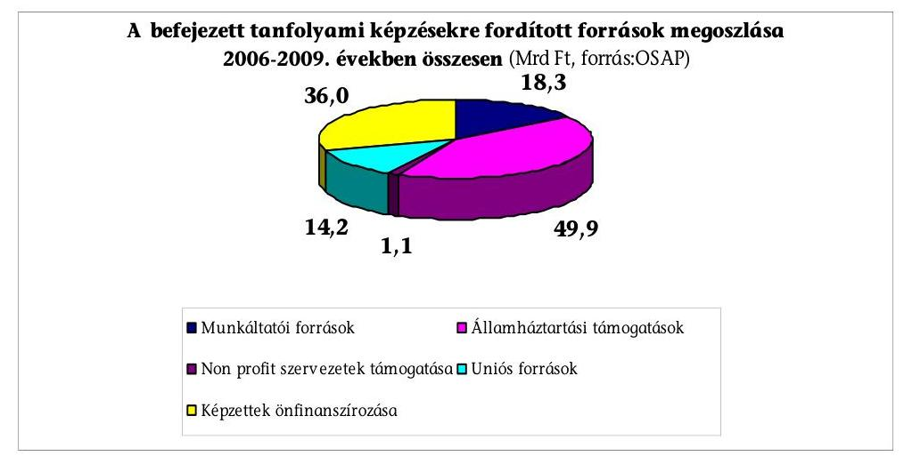

A források növekedése a megelőző évhez viszonyítva erősen ingadozott (a növekedések 34,2-45,0-3,9\% voltak). A 2008. évi forrásnövekedést egyrészt az eredményezte, hogy az uniós források 76,1\%-kal${ }^{75}$ növekedtek. (A 2007-2013. programozási időszak pályázati felhívásaira indult projektek hatása a 2008. évben vált érezhetővé.) Másrészt a szakképzési hozzájárulási kötelezettség terhére elszámolt munkáltatói képzések költségei 59,3\%-kal bővültek. A kamarai tájékoztatók hatására a munkáltatók egyre inkább felismerték annak a jelentőségét, hogy a járulékbefizetés helyett a munkáltató érdeke a saját dolgozók képzése.

A célokkal és az irányító szervi elvárásokkal szemben - a felnőttképzési statisztikai adatszolgáltatás alapján - a felnőttképzés forrásvolumene alapvetően a gazdaságilag fejlettebb és foglalkoztatási szempontból kevésbé hátrányos térségekben növekedett, így nem segítette az OGY Fejlesztési Koncepciójában és a Kormány által az egész életen át tartó tanulás feladatrendszerében meghatározottak szerint az elmaradott térségek és a hátrányos helyzetű emberek felzárkóztatását.

A forrásokból a régiók közül a közép-dunántúli és a közép-magyarországi régiók részesedése növekedett 9,0\%-ról 9,9\%-ra, valamint 36,5\%-ról 51,6\%-ra. A többi régió részesedése csökkenő tendenciát mutatott, holott hátrányos helyzetük miatt a felnőttképzésre itt lett volna nagyobb szükség. Az adatok változása egyértelműen bizonyítja, hogy elsősorban ott történt határozott előrelépés a felnőttképzés volumenében, ahol a vállalkozások, beruházások a saját erő biztosításával nagyobb fizetőképes keresletet jelentettek.

A vizsgált időszakban annak ellenére, hogy a felnőttképzések, -fejlesztések finanszírozásában az állam szerepe növekedett, a realizált forrásokból megvalósult felnőttképzések, fejlesztések összességében nem voltak hatással a munkanélküliség alakulására. A felnőttképzési forrásokból megvalósított képzések a szakképzett munkaerő kínálatot bővítik, de a munkanélküliek számának változása alapvetően a gazdaság munkaerő igényétől függ.

[^0]
[^0]:    ${ }^{75}$ a hazai társfinanszírozással együtt számba véve,

---

2006-ról 2009-re 3,8\%-kal csökkent a foglalkoztatottak száma, a foglalkoztatási ráta pedig 50,9\%-ról 49,2\%-ra mérséklődött ${ }^{76}$. Az ÁFSZ-nél nyilvántartott álláskeresők havi átlagos létszáma a 2006. évi 393465 fővel szemben a 2009. évre 561768 főre (42,8\%-kal) nőtt ${ }^{77}$.

Az SZMM az irányítási hatáskörébe tartozó intézkedésekkel nem tudta elősegíteni a feladatok hiánytalan teljesülését, melynek alapvetően két oka volt. Az első, hogy a felnőttképzésért felelős minisztériumnak részben volt rálátása és ráhatása a felnőttképzéshez, illetve annak fejlesztéséhez szükséges pénzügyi forrásokra, összetételükre és nagyságukra. Az SZMM felnőttképzés irányítási feladatai között, a szociális és munkaügyi miniszter hatásköréről szóló 170/2006. (VII. 28.) Korm. rendeletben előírtak értelmében nem szerepelt a felnőttképzéshez és fejlesztéséhez szükséges források felmérése, valamint ebben a körben realizált források számbavétele. A második ok, hogy az aktív munkaerő-piaci politikákat az MPA kereteihez és céljaihoz illesztették, de a tervezett felhasználás kiindulópontját nem elsősorban a forrásszükséglet, hanem a rendelkezésre álló pénzösszeg nagysága határozta meg.

Az SZMM teljes körű információval az MPA-ból nyújtott támogatásokról és a szakképzési hozzájárulás felnőttképzésre elszámolt összegéről rendelkezett. Az MPA foglalkoztatási alaprész decentralizált keretének felhasználására, a szakképzési hozzájárulási kötelezettség terhére elszámolt, a gazdálkodó szervezetek saját dolgozóinak képzésére fordított összegek nagyságára azonban közvetlen ráhatása nem volt. A felnőttképzési statisztikai adatszolgáltatásból nyert információk sem tették lehetővé a felnőttképzésre fordított források teljes körű áttekintését, mivel az adatszolgáltatási kötelezettségnek nem minden felnőttképzést folytató szervezet tett eleget ${ }^{78}$.

A 2006-2009. évek között az államháztartási források, valamint az uniós források felhasználási mechanizmusán alapuló felnőttképzés finanszírozási rendszerének működése szabályozási oldalról a felnőttképzésben közreműködők részére az egyéni és szervezeti képzési célok megvalósítása szempontjából stabil volt, de irányítói szinten nem volt átlátható és kiszámítható. A nem teljes körű felnőttképzési statisztikai adatszolgáltatás, illetve az uniós források felhasználásáról kapott részleges adatok miatt ${ }^{79}$ a felnőttképzésre és fejlesztésére felhasznált támogatott források alakulását a felnőttképzésért felelős minisztérium nem tekintette át.

A vizsgált időszakban felnőttképzésért felelős minisztérium rendelkezésére álló, és a minisztérium által számba vett államháztartási- és uniós támogatási for-

[^0]
[^0]:    ${ }^{76}$ http://portal.ksh.hu/pls/ksh/docs/hun/xstadat/xstadat_eves/i_qlf001.html
    ${ }^{77}$ A nyilvántartott álláskeresők havi átlagos létszámának a változását a jelentés 17. számú melléklete tartalmazza.
    ${ }^{78}$ A felnőttképzési adatszolgáltatási kötelezettségüket elsősorban azok a felnőttképzést folytató szervezetek teljesítették, melyek állami, vagy uniós támogatásokra pályáztak.
    ${ }^{79}$ A tárcának elsősorban azokról az uniós forrásokból támogatott projektekről volt részletes információja, amelynek a tárca volt a kedvezményezettje, illetve a kiemelt projektek esetén a havonta megtartott projekt-végrehajtási értekezlet keretében tájékozódott a szakmai megvalósulásról.

---

rások alapján a felnőttképzésben és -fejlesztésében az állami források szerepe volt a meghatározó. Ezek az adatok a statisztikai adatszolgáltatásban szereplő adatokkal ellentétben a befejezett tanfolyamok tiszta képzési költségein felül már tartalmazzák a képzéshez kapcsolódó juttatások és a felnőttképzés tartalmi és eszközfejlesztéséhez kapcsolódó költségeit és a folyamatban lévő képzések, képzési programok ráfordításait is. Az ekképpen számba vett források közül az elmúlt négy évben az államháztartási források számottevően nem növekedtek, 2,1\%-kal emelkedtek. A kimutatott államháztartási források ${ }^{80}$ összesen 102 Mrd Ft-ot tettek ki, melyből a felnőttképzési statisztikai adatszolgáltatás szerint 49,9 Mrd Ft-t fordítottak a befejezett tanfolyamok képzési költségeire. A felnőttképzési piacon már meglévő államháztartási pénzeszközöket egészítette ki a hazai társfinanszírozással együtt az uniós forrás, melynek elmúlt négy évben kimutatott összege 74,9 Mrd Ft${ }^{81}$ volt.
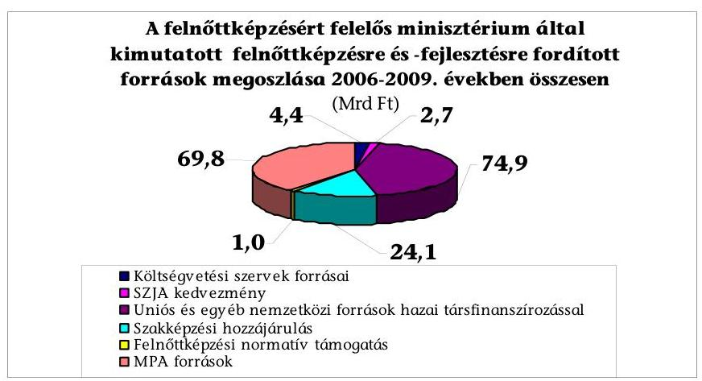

A számba vett államháztartási források összege a felnőttképzési normatív támogatás kivételével a 2008. évben volt a legmagasabb. A 2009. évi realizált államháztartási források a 2008. évihez viszonyítva 5,6 Mrd Ft-tal, 18,6\%-kal csökkentek. A 2009. évi visszaesést elsősorban az okozta, hogy az MPA-ból a foglalkoztatást elősegítő képzésekre fordítható források alakulását a 2008 őszén jelentkező gazdasági válság hatásának enyhítésére hozott, elsősorban a munkahelyek megőrzését elősegítő központi intézkedések befolyásolták. Az MPA foglalkoztatási alaprész decentralizált kerete 2009. évi tervezésénél, a 30,2 Mrd Ft tervezett keret összegen belül 10 Mrd Ft került válságkezelésre elkülönítésre. Ezt az összeget a MAT a 2/2009. (I. 7.) határozatával az MPA foglalkoztatási alaprész központi keretébe csoportosította át. Az átcsoportosított 10 Mrd Ft forrás terhére történt a „Munkahelyek megőrzéséért" központi program finanszírozása, melyből 2009. december 31-ig mindössze 5,3 millió Ft-ot használtak fel felnőttképzésre.

A felnőttképzésre és a felnőttképzés fejlesztésére fordított 176,9 Mrd Ft forrás nem tudta meggátolni a foglalkoztatottak számának csökkenését.

Az elmúlt négy évben államháztartási forrásból felnőttképzésre fordított 102 Mrd Ft-ból 42,3 Mrd Ft-ot, a 74,9 Mrd Ft uniós forrásból 22,8 Mrd Ft-ot - összesen 65,1 Mrd Ft-ot - használtak fel az RMK-k a hallgatók képzési támogatására és egyéb juttatásaira fordítottak.

Az MPA foglalkoztatási alaprész decentralizált keretének régiók közötti felosztásánál a MAT figyelembe vette régiónként a nyilvántartott álláskeresők-, pályakezdők, a tartósan munkanélküliek-, az aktív eszközökben részt vettek megoszlását, a járadékrendszerbe újonnan belépők korábbi keresetének, valamint az aktivitási ráta mutatóját, melyekhez eltérő súlyarányokat rendeltek.

A MAT döntését alátámasztó számítás alapján az RMK-k között felosztott forrás közvetten segítette az egész életen át tartó tanulás esélyteremtés és a képzés munkaerő-piaci kapcsolata erősítése prioritásainak megvalósulását. A decentralizált kereten belül az adott régiónál a képzésekre tervezett forrás összegét az adott régióban működő munkaügyi tanács javaslatát figyelembe véve az adott RMK főigazgatója hagyta jóvá.

A 2006-2009. években a nyilvántartott álláskeresők havi átlagos létszámának a növekedését nem követte az RMK-k bázisán megvalósuló képzések hallgatói számának, valamint a képzésekre fordított források nagyobb ütemű növekedése. A 2006-ról 2009-re a nyilvántartott álláskeresők havi átlagos létszámának 42,8\%-os növekedése mellett, az RMK-k megrendelésére megvalósított képzések hallgatóinak száma 13,5\%-kal csökkent ${ }^{82}$. A 2006-ról 2009-re az RMK-k rendelkezésére álló összes forrás 13,2\%-kal emelkedett. A növekedés elsősorban az uniós és egyéb nemzetközi források, valamint az MPA foglalkoztatási alaprész decentralizált kerete és képzési kerete bővülésének az eredménye volt. A tendenciájában növekvő források mögött azonban az évenkénti forrásváltozások dinamikája eltérő volt.
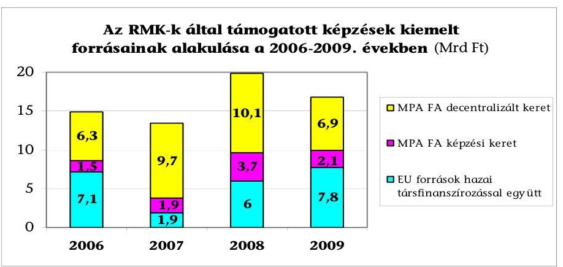

[^0]
[^0]:    ${ }^{82}$ A vonatkozó adatok változását a jelentés 11., 13. és 17. számú mellékletei rögzítik.

---

Az aktív munkaerő-piaci politika részét képező munkaerő-piaci képzésre 2009-ben kevesebb forrás jutott, holott ebben az évben gyorsult fel a munkanélküliség növekedése. Az RMK-knál nyilvántartott álláskeresők száma 2009-ben 27\%-kal haladta meg az előző évit.

# 5. A FELNŐTTKÉPZÉS EREDMÉNYESSÉGÉNEK RENDSZERE 

### 5.1. Az eredményességet és hatékonyságot mérő információs rendszer kialakítása és működtetése, a közreműködők érdekeltsége az eredményes és hatékony képzésben

A felnőttképzés irányításának bizonytalanságai nemcsak a feladatok szervezésében, hanem a hálózati és információs rendszerek működésében is megmutatkoztak ${ }^{83}$. Ahhoz, hogy a szak- és felnőttképzés érzékenyen tudjon reagálni a gazdaság, munkaerő-piaci kereslet változásaira folyamatos előrejelzésre, tervezésre, azonnali intézkedésekre van szükség, amit jelenleg nem támogat kellően a statisztikai rendszer, és egy összefüggő, teljes és megfelelő feldolgozottságú nyilvántartási rendszer. Éppen ezért kiemelt jelentősége van annak, hogy a támogatott képzésekhez szükséges állami források tervezéséhez és felhasználásának értékeléséhez számszerűsített eredményességi és hatékonysági követelmények megállapítását lehetővé tevő információk álljanak
 rendelkezésre. Mivel ilyen értékelhető információk nem voltak, ez is hozzájárult ahhoz, hogy a kereslet-orientált képzés nem az Fktv., valamint az OGY Fejlesztési Koncepciója és az azokat kibontó kormánystratégia ${ }^{84}$ által meghatározott céloknak megfelelően valósult meg a vizsgált időszakban.

A felnőttképzés eredményességét és hatékonyságát is mérő egységes integrált felnőttképzési információs rendszer 2006 és 2009 között nem működött. Kialakítását nem jogszabály, hanem az egész életen át tartó tanulás stratégiáját elfogadó kormányhatározat írta elő. A gyakorlatban a felnőttképzéssel összefüggő különböző információs rendszerek adatbázisából származó adatok együttesen teremtették meg a felnőttképzésre vonatkozó döntések megalapozásának lehetőségét. Ezek az információs rendszerek azonban nem biztosították a felnőttképzés, valamint forrásai átláthatóságát. Ezek alapján nem lehetett a teljes felnőttképzés hatékonyságát, eredményességét mérő indikátorokat képezni ${ }^{85}$.

A jogszabályok és a felnőttképzésért felelős minisztérium nem határozták meg a támogatott képzések számszerűsített hatékonysági, eredményességi indikátorait. A konkrét feladatellátást szabályozó jogsza-

[^0]
[^0]:    ${ }^{83}$ Ez utóbbi két rendszer hiányát, illetve „fejlesztés alatt állását" az SZMM is elismerte a felnőtt-tanulás és oktatás fejlődéséről és helyzetéről 2008 novemberében készült Magyarország nemzeti jelentés I. rész 2.3. pontjában.
    ${ }^{84}$ 2212/2005. (X. 13.) Korm. határozat fogadta el.
    ${ }^{85}$ A felnőttképzések körében egyedül az ÁFSZ által kialakított és működtetett felnőttképzési információs rendszer mérte az RMK-k megrendelései alapján megvalósult képzések eredményességét.

---

bályok ugyanakkor tartalmaztak olyan követelményeket, normatívákat, előírásokat, amelyeket a támogatott felnőttképzési tevékenység teljesítése során figyelembe kellett venni.

A foglalkoztatást elősegítő képzéseknél a támogatási rendszer szabályai közvetetten tették érdekeltté a felnőttképzést folytató intézményeket abban, hogy csökkenjen a képzésekről való lemorzsolódás. Például az RMK-k nem a képző intézményt, az adott tanfolyamot támogatják, hanem a hallgatót a tanfolyamon eltöltött idővel arányosan. A lemorzsolódott hallgató után járó képzési költséget a képző intézmény a hallgatónak a tanfolyamról való lemorzsolódásának időpontjáig arányosan kapja meg. Adott számú hallgató lemorzsolódása esetén a képzés veszteséges lesz.

Eredményességi elvárásként a 6/1996. (VII. 16.) MüM rendelet 2. § (2) pontja az RMK-knak azt írta elő, hogy azokat a képzési irányokat kell kiválasztani, amelyekhez tartozó képzéseket elvégzett személyek várhatóan a legnagyobb arányban helyezkednek el a munkaerő-piacon.

A képzési-, képzést is tartalmazó központi programok támogatási szerződései - a támogatások forrásától függetlenül - a programok céljaival összefüggően tartalmaztak eredményességi követelményeket, de ezek specifikus programindikátorok voltak (pl.: a programot a tárgyévben sikeresen befejezettek száma, a képzésben részt vettek száma, a képzést eredményesen teljesítők száma, a képzettséget szerzett személyek száma). Egyes ${ }^{86}$ központi programok hatásindikátorként a képzések után elhelyezkedettek, vagy a programot egyéb pozitív kimenettel záró személyek arányát, számát számszerűsítették. A különböző eredményességi követelmények, az esetenként előírt hatásindikátorok az országos szintű összesített és összehasonlító értékeléseket nem tették lehetővé.

Az aktív eszközök működtetésével szemben támasztott eredményességi és hatékonysági követelmények szükségszerűségét felismerve, az ÁFSZ stratégiája határozott meg ezzel összefüggésben szempontokat, melyek szerint „Az ÁFSZ teljesítménye két tényezőből tevődik össze: az eredményességből és a hatékonyságból. Az eredményesség legfőbb mutatója, hogy az ÁFSZ céljai folyamatosan megfelelnek a külső környezet szereplői (társadalom, ügyfelek, stb.) által támasztott elvárásoknak, illetve az ÁFSZ képes elérni a kitűzött célokat. A hatékonyság pedig az, amikor az ÁFSZ kitűzött céljait a rendelkezésre álló erőforrások gazdaságos felhasználásával éri el, illetve adott értékű output a lehető legkevesebb inputtal jön létre."

Az FSZH - az RMK-k és RKK-k tevékenységével, együttműködésükkel összefüggően a foglalkoztatást elősegítő képzések támogatására vonatkozó hatályos szakmai eljárásrendjében - rendelkezett a képzések hatékonyságvizsgálatáról, melyben az ÁFSZ stratégiájában rögzítettektől eltérően nem hatékonysági, hanem eredményességet értékelő, nem számszerűsített szempontrendszert rögzített. Hatékonysági követelményeket nem írt elő.

[^0]
[^0]:    ${ }^{86}$ Hatásindikátort tartalmaztak például a HEFOP 1.1. „A munkanélküliség megelőzése és kezelése", a HEFOP 2.3. „A hátrányos helyzetű emberek foglalkoztathatóságának javítása, különös tekintettel a roma népességre", a TÁMOP 2.3.1. „Új Pálya", TÁMOP 1.1.2. „Decentralizált programok a hátrányos helyzetűek foglalkoztatásáért" központi programok.

---

#### Abstract

„Ha a képzés befejezését követő három hónap alatt a támogatott iskolarendszerű képzésben továbbtanul, vagy felsőoktatási intézmény nappali tagozatán folytat tanulmányokat, továbbá rövid időtartamra, de munkaviszonyt vagy azzal egy tekintet alá eső jogviszonyt létesített, akkor a képzés pozitív kimenettel zárult; ha a munkaviszonyának fennállása alatt a gyes-en, gyed-en lévő, terhességi gyermekágyi segélyben részesülő támogatott a képzés befejezését követően három hónapon belül nem állt munkába, nem tekinthető eredménytelennek a kimenet."

Az FSZH a foglalkoztatáspolitikai irányelvek megalapozására, a regionális döntések alátámasztására, valamint az ÁFSZ jogszabályban előírt feladatai informatikai támogatására kialakította felnőttképzési információs rendszerét (FIR), melynek adatbázisa az RMK-k, az RKK-k és az NSZFI felnőttképzési feladataira vonatkozó adatait is tartalmazta. A FIR adatbázisából nyerhető indikátor - a monitoring vizsgálatok FIR-ben rögzített adatai alapján - már mérte ${ }^{87}$ az RMK-k megrendelt és befejezett képzéseinél az eredményességet ${ }^{88}$.

A képzések éves eredményességi és hatékonysági vizsgálatánál az FSZH a FIRből nyert adatok alapján értékelte az adott évi képzési célok teljesülését, kimutatta az egy főre vetített támogatási összeget és az előző évhez képest tapasztalható változást, de az eltérések okait nem tárta fel, így elmaradt a működés javításához szükséges visszacsatolás.

Az RKK-knál az eredményesség mérésének kialakítása 2010. I. félévében folyamatban volt. Az RKK-k saját kiépített belső információs rendszerük keretében a 23/2005. (XII. 26.) FMM rendelet alapján, a helyi sajátosságoknak megfelelően vizsgálták a képzést eredményesen teljesítő hallgatók elhelyezkedési adatait.

Az RKK-k a vizsgált időszakban külön-külön a saját maguk számára a minőségpolitikai célok között, és esetenként az RMK-kkal kötött keretmegállapodásokban meghatározták az általuk nyújtott képzésekkel szemben támasztott számszerűsített eredményességi és hatékonysági követelményeket. Az FSZH nem adott ki az eredményességi mutatókra iránymutatást, ennek hiányában a képzések RKK hálózati szinten mért eredményességét a nyomon követés adatain felül -, egységes kritériumok alapján értékelni nem lehetett. A különböző eredményességi tényezők eltérő tartalmakat határoztak meg.

A Nyíregyházi RKK például 2006. és 2007. évben a képzésre vonatkozó minőségcélok között határozta meg, hogy a tanfolyamot elkezdő hallgatók 95%-a jusson el a záróvizsgáig, a képzés sikeres befejezése után a szakmai vizsgára jelentkezett hallgatók több mint 80%-a szerezzen szakképesítést, vagy bizonyítványt. A munkahelymegtartó képzés esetén a végzettek több mint 90%-a tudja megtartani munkahelyét és a hallgatói elégedettség mérése alapján számított értékpontok

[^0]
[^0]:    ${ }^{87}$ A FIR adatbázisa a felnőttképzéssel összefüggő információk egy részét gyűjtötte, mivel nem tartalmazta azoknak a képzéseknek az adatait, melyek nem az RMK-k megrendelésére szerveződtek, valamint nem az RKK-k bonyolították le.
    ${ }^{88}$ A vizsgálat szempontjából a képzés eredményességének egyik minősítő mutatója a sikeresen vizsgát tettek és elhelyezkedettek arányának a növekedése.

---

csoportonkénti átlaga haladja meg a 2006. évben a 65 pontot, a 2007. évben pedig a 75 pontot.

A Békéscsabai RKK és a Dél-alföldi RMK a keret-megállapodásban célcsoportonként meghatározta a lemorzsolódás maximális értékét, a sikeresen vizsgázók arányának minimumát, továbbá az elhelyezkedés arányát.

A vizsgált önkormányzatok sem írták elő, a TISZK-ek sem alakították ki a felnőttképzések és hallgatóik adatait rögzítő, a képzések eredményességét, hatékonyságát mérő információs rendszert. Az önkormányzatok, a felnőttképzést folytató intézményeik és a TISZK-ek információs rendszert nem működtettek, de minőségirányítási programjaikban a minőségcélok elfogadásával támasztottak eredményességi elvárásokat a felnőttképzéssel szemben. Az elvárások között rögzítették a szakmai képzéseknek a helyi és regionális munkaerő-piaci igényeknek való megfelelését, valamint a felnőttképzés rentabilitását. Az ezzel összefüggő jogszabályi és tárca szintű iránymutatás hiánya miatt sokféle és jelentőségében eltérő elvárást rögzítettek. Ezek a követelmények nem tették lehetővé az önkormányzati fenntartású intézmények és a TISZK-ek körében a felnőttképzés eredményességének és hatékonyságának egységes értékelését, mivel azok elsősorban a bevételek volumenére, az infrastruktúra kihasználásra, a képzésből lemorzsolódottak irányára és a hallgatók elégedettségére vonatkoztak.

A felnőttképzési statisztika sem volt alkalmas az eredményesség, hatékonyság komplex megítélésére, mert nem irányult a képzést eredményesen befejezett hallgatók elhelyezkedésének megfigyelésére, így nem tette lehetővé a képzések munkaerő-piaci alátámasztottságának vizsgálatát. A felnőttképzési statisztikai adatszolgáltatás bevezetésétől várta el a felnőttképzésért felelős tárca, hogy megfelelő rálátást nyújtson a megfigyelt adatokon keresztül a felnőttképzésre. Ezzel ellentétben a rendszer nem rendelkezett a teljes felnőttképzésről adatokkal, mivel az adatszolgáltatás kötelező jellege ellenére, nem minden felnőttképzést végző szervezet tett eleget az előírásnak.

Elsősorban azok a felnőttképzést folytató intézmények tettek eleget statisztikai jelentési kötelezettségeiknek, amelyek támogatási forrásokra pályáztak. Például a 2009. december 31-ei állapot szerint a nyilvántartott felnőttképzést folytató intézmények száma 8574 volt, és a 2009. évben a felnőttképzési tevékenységről statisztikai adatszolgáltatást 1144 szervezet teljesített. Ez az arány akkor is a részleges adatszolgáltatási kötelezettséget jelzi, ha a képzésre bejelentkezett intézmények egy része nem végzett felnőttképzést.

Az uniós és egyéb nemzetközi forrásokkal támogatott felnőttképzési adatokat is tartalmazó Egységes Monitoring Információs Rendszer (EMIR) a felnőttképzést érintő szakmapolitikai döntések részletes alátámasztására nem szolgáltatott teljes körű adatokat a felnőttképzésben résztvevőkről. Nem rögzítette egységesen a képzésben résztvevők korát, iskolai végzettségét, szakképzettségét, a megszerzett képzettséget, nem voltak teljes körű adatai a végzett hallgatók elhelyezkedéséről, valamint az adatokból nem lehetett kimutatni azokat a személyeket, akik több program keretében vettek részt képzéseken.

---

Egységes felnőttképzési információs rendszer hiányában az egész életen át tartó tanulás céljainak teljesítéséhez az Unió egységes adatfelvétele szolgált adatokkal. A KSH által az EUROSTAT részére, annak előírásai szerint gyűjtött és feldolgozott adatokból ${ }^{89}$ sem lehetett azonban a felnőttképzés eredményességére jellemző, a felnőttképzést irányító minisztérium döntéseit megalapozó mutatókat előállítani, mivel az így megfigyelt adatok erre nem voltak alkalmasak. A feldolgozott adatokból nyert információk az egész életen át tartó tanulás minősítésének szempontjából meghatározott Uniós követelmények és a hazai vonatkozó tényadatok összehasonlítását tették lehetővé.

A felmérés során az egész életen át tartó tanulás mutatója azon 25-64 év közötti személyekre vonatkozott, akik úgy nyilatkoztak, hogy az adatgyűjtést megelőző négy hétben részt vettek valamilyen képzésben. Ennek alapján 2008-ban a 25-64 éves korosztály 3,1%-a jelezte, hogy részt vett felnőttképzésben.

A felnőttképzés hallgatóinak az eredményes képzésben való közvetlen érdekeltségét elsősorban a munkahely megtartását célzó képzések jelentették. Az álláskeresők számára szervezett képzéseknél a hallgatók a munka világába való visszatérés esélye mellett, a képzés időtartama alatti juttatások folyósításában voltak érdekeltek, amely a halmozottan hátrányos helyzetű rétegeknél prioritást élvezett.

A támogatást nyújtó RMK-k és a képzést lebonyolító szervezetek érdekeltségét jelentette a hallgatók lemorzsolódásának csökkenése, a sikeresen vizsgát tettek arányának növekedése. A képzést lebonyolítók, amennyiben központi program nem írta elő a képzést eredményesen teljesítők számszerűsített elhelyezkedési követelményét, nem voltak érdekeltek a hallgatók elhelyezkedésében. A képzés hatékonyságában ${ }^{90}$ sem az RMK-k, sem a képző szervek nem voltak érdekeltek. Az RMK-k kimutatták a képzésekre fordított támogatást, vizsgálták
 a hallgatók elhelyezkedését, de nem elemezték és értékelték a támogatások és az elhelyezkedett hallgatók változásának okait és összefüggéseit.

Az eredményesség külső megítélését alapvetően a meglévő információk nyilvánossá tétele erősíti. Az akkreditált felnőttképzést folytató intézmények a képzési céljaik teljesüléséről, az általuk meghatározott eredményességi követelmények eléréséről, a célok megvalósulását gátló külső, belső körülményekről a minőségirányítási rendszerük működtetése keretében adatokat gyűjtenek és önértékeléseket készítenek. Az ebben lévő információk azonban a nyilvánosság számára nem hasznosulnak, azokat a felnőttképzés szereplői a döntéseik során nem veszik figyelembe.

[^0]
[^0]:    ${ }^{89}$ http://portal.ksh.hu/pls/ksh/docs/hun/xstadat/xstadat_eves/i_qlf001.html
    ${ }^{90}$ A vizsgálat szempontjából hatékonynak minősül a képzés, ha alacsonyabb ütemben emelkedett a képzésre fordított támogatás a képzést követően sikeresen elhelyezkedők számánál.

---

# 5.2. A felnőttképzésből kibocsátottak struktúrájának és minőségi jellemzőinek értékelése 

Hazánkban 2006 és 2009 között a felnőttképzés valamennyi formáját számba véve összesen 105524 képzést indítottak ${ }^{91} 1425629$ fő felvételével ${ }^{92}$. A régiók szerinti megoszlást tekintve nagyfokú koncentrálódás figyelhető meg. A képzések 59,6\%-a a közép-magyarországi régióban indult, melyekre ugyanilyen arányban iratkoztak be (849367 fő). A képzések indítását és a képzésbe beiratkozottak számát figyelembe véve a többi régió jelentősen elmaradt a közép-magyarországitól (6,5-8,8%), a dél-dunántúli és a dél-alföldi régió felnőttképzésben betöltött szerepe különösen alacsony szintű (5,3% és 5,9%) volt.

A képzések megoszlása egyértelműen bizonyítja, hogy a teljes felnőttképzés a régiók közötti fejlettségi különbségek megszüntetéséhez nem járult hozzá, mivel a gazdaságilag legfejlettebb központi régióban több képzés indult, mint az összes többi régióban együttvéve, és a legkisebb arányban éppen a hátrányos helyzetű területekkel rendelkező régiók indítottak felnőttképzéseket. A képzéseket a gazdaság igényeivel való összhang szempontjából a résztvevők elhelyezkedési adatainak részlegessége ${ }^{93}$ miatt nem lehetett minősíteni.

A munkaerő-piaci helyzet javítását, a régiók közötti fejlettségi különbségek mérséklését az állam a képzések támogatásával is elő kívánta segíteni. A támogatásokkal elérendő cél a vizsgált időszakban maradéktalanul nem teljesült. A támogatott képzések körében a szakképzési hozzájárulás terhére elszámolt saját munkavállaló részére a 2006-2009. években 28602 képzést szerveztek 218721 fő munkavállaló bevonásával. Elsősorban a tőkeerős munkáltatók képzési igénye eredményeként 2006-ról 2009-re - a közép-magyarországi régió e tekintetben is vezető szerepe mellett - a szakképzési hozzájárulás terhére a képzések közel négyszeresére (3,9), a képzettek száma közel háromszorosára (2,9) növekedett ${ }^{94}$.

Az RMK-k közreműködésével a vizsgált időszakban 14290 támogatott képzés fejeződött be, melyen összesen 130543 fő vett részt. Kedvezőtlen változás, hogy az időszak végére a támogatott képzések száma 29,6%-kal, a hallgatók száma 13,5%-kal csökkent. Az alacsonyabb teljesítés egyrészt a források csökkenése miatt bekövetkező újonnan felvett létszám mérséklődésére, másrészt a képzési költségen felüli hallgatói juttatásokat megha-

[^0]
[^0]:    ${ }^{91}$ Az adatokat a jelentés 7. számú melléklete tartalmazza.
    ${ }^{92}$ A képzésekre beiratkozott hallgatók számát a jelentés 8. számú melléklete mutatja be.
    ${ }^{93}$ A képzéseket eredményesen teljesítő hallgatók elhelyezkedéséről az RMK-k az általuk megrendelt képzések hallgatóiról, valamint az RKK-k a saját képzéseiken végzett hallgatókról rendelkeztek információval. A felnőttképzésben részt vett hallgatók egészét érintő pályakövetési rendszer a vizsgált időszakban nem működött.
    ${ }^{94}$ A régiónként támogatott képzések és a hallgatók számát bemutatják a jelentés 7. és 8. számú mellékletei.

---

tározó jogszabályi szigorításokra vezethető vissza. Az egyének képzési motivációjának növelésére az Flt. módosított rendelkezései megemelte a keresetpótló juttatás összegét ${ }^{95}$, ami ugyanakkor a rendelkezésre álló forrásokon belül csökkentette a tanfolyamok finanszírozására fordítható támogatást ${ }^{96}$.

Az RMK-k közreműködésével szervezett képzések és a hallgatók száma, valamint a régiók fejlettségi szintje között összefüggés nem mutatható ki. Az RMK-k a kedvezőtlen regionális gazdasági változások enyhítésére a képzéseket, vagy a képzésekkel szemben más-más foglalkoztatáspolitikai eszköz alkalmazását részesítették előnyben. Következményeként 9%-kal csökkent az álláskeresők képzése. Ebből következően a vizsgált időszakban a képzettek számának csökkenése nem járult hozzá a nyilvántartott álláskeresők számának szinten tartásához sem.

Az éves adatok alapján tett megállapítást a 2010. I. félévi megfigyelt jellemzők is megerősítik. A támogatott befejezett képzéseket 2010 I. félévében 19343 fő fejezte be eredményesen, mely a 2006 azonos időszakához ${ }^{97}$ képest 0,4%-os csökkenést jelent. A nyilvántartott álláskeresők havi átlagos létszáma 2006-2010 I. féléve között folyamatosan emelkedett, 2010 júniusában 609975 fő volt.

A regisztrált álláskeresők részére ajánlott képzések száma 2,2%-kal nőtt, az elfogadott képzések száma 63,1%-kal csökkent. Az adatokból következik, hogy a foglalkoztatási szempontból hátrányos helyzetű személyek (regisztrált álláskeresők) számára az állam növelte (2,2%-kal) az ajánlott képzések számát. A szorosabb munkaerő-piaci kötődésű, elfogadott képzések száma és aránya azonban jelentősen (63,1%-kal) csökkent ${ }^{98}$. Ennek oka, hogy a munkáltatók egyre kisebb arányban igényelték gazdasági tevékenységükhöz a támogatott képzéseket, mivel romló gazdasági helyzetük miatt, egyre kisebb arányban vállaltak kötelezettséget a képzésen résztvevők foglalkoztatására.

A felnőttképzés eredményességének egyik legfontosabb mérőszámát a képzést követően eredményesen vizsgázók adata jelenti. A képzésben részt vettek köréből a gazdaság számára munkavállalóként ők jöhetnek számításba. 2006-2009 között a felnőttképzés valamennyi ágában 713249 fő tett sikeres vizsgát,

[^0]
[^0]:    ${ }^{95}$ A 2005. november 1-jétől a munkaerő-piaci képzés ideje alatt adható keresetpótló juttatás összege a minimálbér 60%-ában, majd 2007. január 1-jétől a minimálbér 100%-ában került meghatározásra, míg a korábbi szabályozás szerint a munkanélküli járadék alsó határának összegével egyezett meg. A 2009. évtől a keresetpótló juttatás összege nem lehet alacsonyabb a megállapításkor hatályos kötelező legkisebb munkabér 60%-ánál, és nem haladhatja meg a megállapításkor hatályos kötelező legkisebb munkabér összegét.
    ${ }^{96}$ A befejezett képzések és hallgatók számának a változását a jelentés 12. és 13. számú mellékletei rögzítik.
    ${ }^{97}$ A 2006. I. félévi adatokat időarányosan vettük figyelembe.
    ${ }^{98}$ A számítások alapját a jelentés 12. számú melléklete képezte.

---

számuk a vizsgált időszakban emelkedő tendenciát mutatott, a 2006. évi 181001 főről a 2009. évre 12,5%-kal, 203676 főre emelkedett ${ }^{99}$.

Az országos tendenciával ellentétben az RMK-k által támogatott képzéseken 2006-ról 2009-re 38833 főről 33607 főre, 13,5%-kal csökkent a képzést eredményesen elvégző hallgatók száma. A csökkenést a képzéseken induló létszám visszaesése eredményezte, ezt csak kismértékben tudta ellensúlyozni a kisebb arányú lemorzsolódás. Az időszak elején az indított létszám 92,1%-a végezte el eredményesen a képzéseket, míg az időszak végén már az induló létszám 95,6%-a tett sikeres vizsgát. A változásban kiemelt szerepe volt a képzésben nagyobb motiváltságot eredményező megemelt keresetpótló juttatásnak ${ }^{100}$. A képzéseket eredményesen teljesítők közül a hátrányos helyzetű hallgatók aránya érdemben nem változott, az összes hallgató kétharmad része minősült hátrányos helyzetűnek ${ }^{101}$. (2006-ban 67,5%, 2009-ben 66,9%).
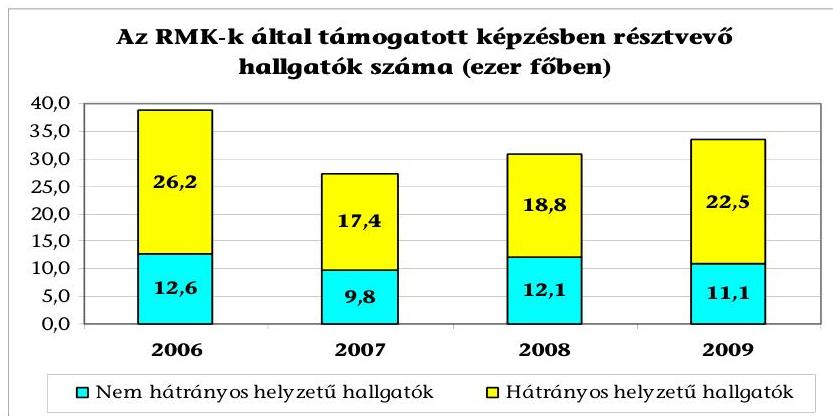

A hátrányos helyzet legjellemzőbb kritériuma az iskolai végzettség. Az RMK-k országos adatai alapján a nyolc általános iskolát, vagy attól kevesebbet végző személyek az elmúlt négy évben 42,0-42,3-43,1-40,2%-át tették ki az ÁFSZ-nél nyilvántartott álláskeresőknek. Ettől lényegesen kisebb arányban képviseltették magukat a támogatott képzéseken részt vett hallgatók között (27,7-30,2%), ami jól jelzi, hogy továbbra is ösztönözni kell a hátrányos helyzetűek képzésbe vonását. Pozitív változás ugyanakkor, hogy 2006 és 2009 között bővült a nyolc osztállyal, vagy annál kevesebb osztállyal rendelkezők aránya a képzéseken, ami a hátrányos helyzetű célcsoport részére indított központi programok kiszélesítésére vezethető vissza ${ }^{102}$.

[^0]
[^0]:    ${ }^{99}$ A vizsgált időszakban a sikeres vizsgát tett hallgatók számát a jelentés 9. számú melléklete szemlélteti.
    ${ }^{100}$ A jelentés 15. számú melléklete mutatja be az RMK-k által megrendelt képzéseken a sikeres vizsgát tett hallgatók száma évenkénti alakulását.
    ${ }^{101}$ A jelentés 13. számú melléklete szerint.
    ${ }^{102}$ A hallgatókat és a nyilvántartott álláskeresőket jellemző adatokat a jelentés 16-17. számú mellékletei mutatják be.

---

Az alacsony és a 8 általánosnál magasabb végzettségűek aránya a nyilvántartott álláskeresők és a támogatott képzéseken résztvevők között 2006. és 2009. évben (%)

| Iskolai végzettség | 2006. év |  | 2009. év |  |
| :-- | :--: | :--: | :--: | :--: |
|  | Nyilvántartott álláskereső | Támogatott képzésben résztvevők | Nyilvántartott álláskereső | Támogatott képzésben résztvevők |
| Max. 8 általános | 42,0 | 27,7 | 41,4 | 30,0 |
| Több mint 8 általános | 58,0 | 72,3 | 58,6 | 70,0 |
| Összesen | 100,0 | 100,0 | 100,0 | 100,0 |

Hasonló a helyzet, ha a hátrányos helyzet egy másik szegmensét, az életkort vizsgáljuk. Az 50 év felettiek aránya a nyilvántartott álláskeresők között 16,8%-ról 18,2%-ra nőtt, a képzésben való bevonásuk azonban csak a vizsgált időszak utolsó évében érte el a 10%-ot. (7,9% és 10%). Még jelentősebb lenne az eltérés, ha az alacsony végzettségűek és idősek támogatott képzésben való részvételi arányát a teljes inaktív népességen belüli arányukhoz viszonyítanánk, mivel e csoportok között van a legnagyobb számban olyan, akik már nem tartanak kapcsolatot a foglalkoztatási szervekkel, és évek óta kiszorultak a munkaerő-piacról. A központi programok lebonyolítása - például a HEFOP 3.5.3. „Lépj egyet előre" és a TÁMOP 2.1.1. „Lépj egyet előre II." - ellenére számos hátráltató tényező akadályozta a programba vonásukat (szociális, kulturális elmaradottság, az életkörülmények alacsonyabb igényszintje, költséges intenzív programok stb.). A pozitív változások ellenére a hátrányos helyzetűek képzésben betöltött aránya lényegesen elmarad az álláskeresőkön belül betöltött arányaiktól. Az előzőek miatt a leginkább rászorulók (alacsony végzettségűek, 50 év felettiek) képzésbe vonásánál tehát nem történt áttörés.

A HEFOP 3.5.3. „Lépj egyet előre" és a TÁMOP 2.1.1. „Lépj egyet előre II." központi képzési programokban a lebonyolított képzések a foglalkoztathatóság növelésével segítették a hátrányos helyzetű személyek munkaerő-piaci esélyeinek hosszútávon történő javítását, elsősorban a hiányszakmákban bonyolított, valamint a gazdaság új szakképzési igényére szerveződő képzésekkel. A programokban összesen a képzésben résztvevők száma a tervezett 39219 fővel szemben 39944 főre alakult, a sikeresen vizsgát tettek száma 37055 főt tett ki.

Az eredményesség további mutatója a képzést eredményesen elvégzők munkaerőpiacon történő elhelyezkedése. Ebben fejeződik ki leginkább, hogy a gazdaság igényeinek megfelelő volt-e a képzés szerkezete, mivel végső soron csak az a képzés felelt meg a célnak, amelyre a foglalkoztatóknak szükségük volt. Az értékelésnél azonban figyelembe kell venni, hogy időszakonként és területenként más a gazdaság állapota, és önmagában a gazdasági visszaesés miatt nem indokolt a felnőttképzés eredményességét megkérdőjelezni.

[^0]
[^0]: 
 ${ }^{103}$ az adatok az FSZH-tól származnak

---

A támogatott képzéseket sikeresen befejező hallgatók visszajelzései ${ }^{104}$ szerint 2006-2008. évek között az elhelyezkedettek aránya az évek során emelkedő tendenciát mutatott, arányuk 49,6\%-ról 53\%-ra nőtt. Tisztán az elhelyezkedési adatokból tehát az állapítható meg, hogy a képzések felerészben alapultak munkaerő-piaci igényeken. Az adatokat azonban konkrétan meg nem határozható mértékben, de a képzést szervezők jelzései alapján egyértelműen befolyásolta a vizsgált időszakban kibontakozó gazdasági válság, melynek következményeként az adott évi képzési szerkezet tervezésekor figyelembe vett munkáltatói igényeknek a megváltozása nem tette lehetővé a képzések szakiránya és a gazdaság igényeinek teljes körű megfeleltetését. A befejezett képzéseket eredményesen teljesítő és elhelyezkedni nem tudó hallgatók képzésének támogatására felhasznált közpénzek hasznosulása részben felelt meg a 96/2005. (XII. 25.) OGY határozatban, az egész életen át tartó tanulás célrendszerében és az Fktv-ben rögzített céloknak, mert a képzéssel a hallgatók szakmai kompetenciája nőtt, de - a képzés befejezésétől számított egy éven belül - nem tudtak eredményesen bekapcsolódni a munka világába.

Az OGY Fejlesztési Koncepciójában, a felnőttképzési törvényben és a Kormány által elfogadott egész életen át tartó tanulás stratégiájában megfogalmazott célok, feladatok hiányosan teljesültek. Az állami forrásból támogatott felnőttképzési rendszer működésének egészét megítélve - az ÁSZ által a vizsgálati programban megjelölt szempontok alapján - részben minősíthető eredményesnek.
növekedett a sikeresen vizsgát tettek aránya,
emelkedett az elhelyezkedettek aránya,
a Kormány által meghatározott hosszú távú célokból és feladatokból nem valósult meg az indikátor rendszer kidolgozása, nem készült cselekvési terv a hátrányos helyzetűek képzésére, nem a felnőttképzési törvényben előírt ütemben halad a pályakövetési rendszer bevezetése, nincs a teljes felnőttképzési rendszerre kialakított információs rendszer,
csökkent a képzésben résztvevő hátrányos helyzetű személyek részére indított képzések száma.

A vizsgálat által előzetesen kitűzött célokon és kritériumokon kívül, a felnőttképzés működésére különösen fontos tényezőként hatott, hogy a hátrányos helyzetet leginkább jellemző célcsoportoknál (alacsony iskolai végzettség és az 50 év feletti életkor) a támogatott képzésben résztvevők aránya csekély mértékben növekedett. A támogatott felnőttképzés pozitív változásai ellenére a felnőttképzés nem volt képes csökkenteni a régiók közötti különbségeket, nem segítette kellően az elmaradott térségek felzárkóztatását.

[^0]
[^0]:    ${ }^{104}$ A válaszadók aránya a 2006-2008. években átlagosan 59\%-os volt, melyet a jelentés 26. számú melléklete mutat be. A 2009. évről rendelkezésre álló adatok csak részben fedték le a támogatott felnőttképzést, továbbá a monitoring felmérés módszertana megváltozott, ezért az ismert 2009. évi adatok a megelőző évek adataival nem összehasonlíthatóak.

---

Az eredményesség mellett a hatékonyság ${ }^{105}$ is fontos elvárás a képző szervekkel szemben. A támogatott képzéseknél ez azért különösen fontos, mert a képzések volumene bővítésének a legnagyobb korlátot az állami források szűkössége jelentette.
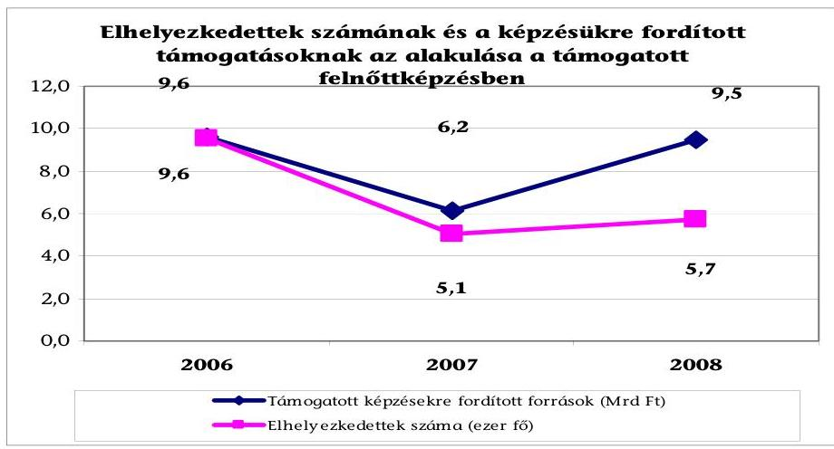

A befejezett képzések a vizsgált időszakban nem voltak hatékonyak, mert 2006 és 2008 között a képzésekhez nyújtott támogatás 1,5\%-os csökkenése mellett a képzést sikeresen teljesítők közül az elhelyezkedettek száma az általános gazdasági recesszió hatására is $40,5 \%$-kal volt kevesebb ${ }^{106}$.

Budapest, 2010. december " 15 "
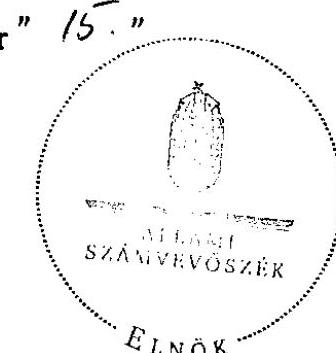

| Melléklet: | 27 db | 31 lap |
| :-- | --: | --: |
| Függelék: | 6 db | 12 lap |

[^0]
[^0]:    ${ }^{105}$ Számításánál a képzést sikeresen teljesítők közül az elhelyezkedettek létszámát viszonyítjuk a képzéshez felhasznált erőforrásokhoz.
    ${ }^{106}$ Az adatokat a jelentés 26. számú melléklete tartalmazza: 2008-ban 5697, 2006-ban 9573 fő.

---

# A helyszínen ellenőrzött egységek 

| Központi szervek | Szociális és Munkaügyi Minisztérium |
| :--: | :--: |
|  | Foglalkoztatási és Szociális Hivatal |
|  | Nemzeti Szakképzési és Felnőttképzési Intézet |
| Főváros | Budapesti Munkaerőpiaci Intervenciós Központ |
| Baranya megye | Baranya Megyei Önkormányzat |
|  | Siklós Városi Önkormányzat |
|  | Pécsi Regionális Képző Központ |
|  | PANNON Szakképzés Szervezési Társulás |
| Békés megye | Dél-alföldi Regionális Munkaügyi Központ |
|  | Békéscsaba Megyei Jogú Város Önkormányzata |
|  | Békéscsabai Regionális Képző Központ |
|  | Békéscsabai I. számú Térségi Integrált Szakképző Központ |
| Borsod-Abaúj-Zemplén megye | Észak-magyarországi Regionális Munkaügyi Központ |
|  | Észak-magyarországi Regionális Képző Központ |
|  | Miskolc-Térségi Integrált Szakképző Központ Közhasznú Nonprofit Korlátolt Felelősségű Társaság |
| Bács-Kiskun megye | Kecskemét Megyei Jogú Város Önkormányzata |
|  | Kecskeméti Térségi Integrált Szakképző Központ Nonprofit Kiemelkedően Közhasznú Kft. |
| Fejér megye | Közép-dunántúli Regionális Munkaügyi Központ |
|  | Székesfehérvár Megyei Jogú Város Önkormányzata |
|  | Gróf Széchenyi István Gyakorlati Képzést Szervező Közhasznú Nonprofit Kft. |
| Hajdú-Bihar megye | Debrecen Megyei Jogú Város Önkormányzata |
|  | Debrecen TISZK Oktatási Szolgáltató Nonprofit Kiemelkedően Közhasznú Kft. |
|  | Debreceni Regionális Képző Központ |
| Heves megye | Eger Megyei Jogú Város Önkormányzata |
|  | Egri Térségi Integrált Szakképző Központ Kiemelkedően Közhasznú Nonprofit Kft. |

---

| Pest megye | Pest Megyei Önkormányzat |
| :-- | :-- |
|  | Észak Pesti TISZK Nonprofit Korlátolt Felelősségű Társaság |
|  | Dél-Pest Megyei Térségi Integrált Szakképző Központ   Nonprofit Kiemelkedően Közhasznú Kft. |
| Szabolcs-Szatmár-Bereg   megye | Észak-alföldi Regionális Munkaügyi Központ |
|  | Nyíregyháza Megyei Jogú Város Önkormányzata |
|  | Nyíregyházi Regionális Képző Központ |
|  | Nyírségi Szakképzés-szervezési Kiemelkedően Közhasznú   Nonprofit Kft. |
| Vas megye | Nyugat-dunántúli Regionális Munkaügyi Központ |
|  | Szombathelyi Regionális Képző Központ |
|  | Savaria TISZK Szakképzés-szervezési Kiemelkedően Közhasznú   Nonprofit Kft. |
| Veszprém megye | Veszprém Megyei Önkormányzat |
|  | Bakonyi Szakképzés-szervezési Társulás |
| Zala megye | Zalaegerszeg Megyei Jogú Város Önkormányzata |
|  | Észak-zalai TISZK Szakképzés-szervezési Kiemelkedően Köz-   hasznú Nonprofit Kft. |

---

# A felnőttképzés fejlesztésének kormányzati feladatai, finanszírozásának forrásai 2004-2009. december 31-ig

|  Felnőttképzés
fejlesztésének feladatai | Központi költségvetés |  | Uniós forrás |  | Egyéb |  | Összesen |   |
| --- | --- | --- | --- | --- | --- | --- | --- | --- |
|   | Előzetesen
kalkulált | Telj. 2009.
XII. 31. | Előzetesen
kalkulált | Telj. 2009.
XII. 31. | Előzetesen
kalkulált | Telj. 2009. XII.
31. | Előzetesen
kalkulált | Telj. 2009.
XII. 31.  |
|  2212/2005. (X. 13.)
Korm. határozat feladatai | 4440,20 | 3579,90 | 129698,00 | 98328,00 | 10771,80 | 11177,80 | 144910,00 | 113085,70  |
|  1. prioritás - esélyegyenlőség | 4440,20 | 3579,90 | 75491,00 | 50701,00 | 6538,50 | 6944,50 | 86469,70 | 61225,40  |
|  2. prioritás - munkaerő-piaci kapcsolatok erősítése |  |  | 30804,00 | 28410,00 | 2288,70 | 2288,70 | 33092,70 | 30698,70  |
|  3. prioritás - új kormányzati módszerek |  |  | 12122,00 | 11761,00 | 372,40 | 372,40 | 12494,40 | 12133,40  |
|  4. prioritás - hatékonyság javítása, ráfordítások növelése |  |  | 4931,00 | 3190,00 | 597,20 | 597,20 | 5528,20 | 3787,20  |
|  5. prioritás - minőségi fejlesztés |  |  | 6350,00 | 4266,00 | 975,00 | 975,00 | 7325,00 | 5241,00  |
|  1069/2004. (VII. 9.)
Korm. hat. feladatai: | 0,00 | 0,00 | 53953,00 | 24108,00 | 6608,70 | 6608,70 | 60561,70 | 30716,70  |
|  I. A gazdaság versenyké
pességének, a munkaadók és
munkavállalók
alkalmazkodásának segítése |  |  | 30428,00 | 9037,00 | 3348,20 | 3348,20 | 33776,20 | 12385,20  |
|  II. A felnőttképzésben érintett
szereplők együttműködésé-nek
ösztönzése |  |  | 16317,00 | 8165,00 | 1625,00 | 1625,00 | 17942,00 | 9790,00  |
|  III. A tudás, a képzés
meghatározó szerepének
érvényezőése |  |  | 7208,00 | 6906,00 | 1635,50 | 1635,50 | 8843,50 | 8541,50  |
|  1057/2005. (V. 31.) Korm.
határozat feladatai: | 0,00 | 0,00 | 55261,00 | 16906,00 | 7859,96 | 7859,96 | 63120,96 | 24765,96  |
|  I. A szakképzés minőségi
átalkítása |  |  | 51903,00 | 13376,00 | 5623,10 | 5623,10 | 57526,10 | 18999,10  |
|  II. A szakképzés-irányítási és
finanszírozási rendszer
hatékonyságának javítása |  |  | 2308,00 | 2260,00 | 1792,20 | 1792,20 | 4100,20 | 4052,20  |
|  III. Az információs rendszer
fejlesztése |  |  | 1050,00 | 1270,00 | 444,66 | 444,66 | 1494,66 | 1714,66  |
|  Összesen | 4440,20 | 3579,90 | 238912,00 | 139342,00 | 25240,46 | 25646,46 | 268592,66 | 168568,36  |

---

# Az SZMM tájékoztató adatai a felnőttképzésre és -fejlesztésre fordított források 2006-2009. évi alakulásáról

|  Források/Évek | 2006. | 2007. | 2008. | 2009. | Összesen | 2009/2006
(\%)  |
| --- | --- | --- | --- | --- | --- | --- |
|  Államháztartási források |  |  |  |  |  |   |
|  Költségvetési szervek által a saját dolgozó képzésének támogatása | 829,58 | 899,87 | 1400,80 | 1243,97 | 4374,22 | 150,0  |
|  Felnőttképzési normatív támogatás | 992,41 | 39,85 | 10,95 | 0,00 | 1043,21 | 0,0  |
|  Távmunka programok képzései | 28,93 | 26,61 | 43,94 | 34,38 | 133,86 | 118,8  |
|  MPA foglalkoztatási alaprész képzések támogatása (RMK) | 6628,45 | 9655,97 | 9852,99 | 6848,65 | 32986,06 | 103,3  |
|  Munkaerő-piaci programok képzései (RMK) | 137,30 | 86,94 | 222,62 | 46,45 | 493,31 | 33,8  |
|  MPA foglalkoztatási alaprész képzési kerete | 5021,84 | 5329,71 | 7140,96 | 5806,91 | 23299,42 | 115,6  |
|  MPA képzési alaprész felnőttképzési célú támogatás | 0,00 | 2948,27 | 3958,17 | 1762,16 | 8668,60 | 0,0  |
|  MPA felnőttképzési célú kerete | 4242,60 | 0,00 | 0,00 | 0,00 | 4242,60 | 0,0  |
|  Saját munkavállaló részére szervezett képzés költségeinek elszámolása a szakképzési hozzájárulás terhére | 3403,63 | 4644,18 | 7398,91 | 8700,10 | 24146,82 | 255,6  |
|  SZJA kedvezmény | 2650,00 | 0,00 | 0,00 | 0,00 | 2650,00 | 0,0  |
|  Államháztartási források összesen | 23934,74 | 23631,40 | 30029,34 | 24442,62 | 102038,10 | 102,1  |

---

Az SZMM tájékoztató táblázata a felnőttképzéshez köthető tervezett és teljesített uniós és
 hazai forrásokról a 2004-2009. években adatok: millió Ft-ban

|  Projekt megnevezése | Tervezett uniós forrás | Tervezett hazai forrás | Teljesített uniós forrás | Teljesített hazai forrás | Képzések teljesített uniós forrása | Képzések teljesített hazai forrása | Képzések teljesített uniós forrása | Képzések teljesített hazai forrása | Teljesített képzési források összesen | Megjegyzés  |
| --- | --- | --- | --- | --- | --- | --- | --- | --- | --- | --- |
|   | 2004-2009. években |  |  |  |  |  | 2006-2009. években* |  |  |   |
|  Felnőttképzést is tartalmazó projektek |  |  |  |  |  |  |  |  |  |   |
|  HEFOP 1.1.1. Munkanélküliség megelőzése és kezelése | 22350 | 7451 | 22592 | 7531 | 10500 | 3540 | 6993,0 | 2357,6 | 9350,8 | A képzések teljesített forrásai becsült adat (47%-os), mivel az NFÜ-nél nincs ilyen forrás.  |
|  HEFOP 1.3. A nők munkaerőpiacra történő visszatérésének segítése | 2171 | 724 | 1701 | 570 | 255 | 86 | 169,8 | 57,3 | 227,1 | 15%-os képzési tartalmat feltételezve.  |
|  HEFOP 2.3. a hátrányos helyzetű emberek, köztük romák foglalkoztathatóságának javítása | 8799 | 2932 | 7894 | 2631 | 5529 | 1842 | 3682,3 | 1226,8 | 4909,1 | 70%-os képzési tartalmat feltételezve.  |
|  HEFOP 3.4. A munkahelyteremtéshez kapcsolódó és a vállalkozási készségek teljesítését elősegítő képzések | 11157 | 3719 | 8333 | 2777 | 6666 | 2222 | 4439,6 | 1479,9 | 5919,4 | 80%-os képzési tartalmat feltételezve.  |
|  HEFOP 3.5.3. "Lépj egyet előre" I. | 2953 | 984 | 4653 | 1551 | 3722 | 1241 | 2478,9 | 826,5 | 3305,4 | 80%-os képzési tartalmat feltételezve.  |
|  HEFOP 3.5.4. A felnőttképzés hozzáférésének javítása a rendelkezésre álló közművelődési intézményrendszer bevonásával | 1136 | 378 | 970 | 323 | 388 | 129 | 258,4 | 85,9 | 344,3 | 40%-os képzési tartalmat feltételezve.  |
|  HEFOP összesen | 48566 | 16188 | 46143 | 15383 | 27060 | 9060 | 18022,0 | 6034,0 | 24055,9 |   |
|  TÁMOP 1.1.2. Decentralizált programok a hátrányos helyzetűek foglalkoztatásáért | 45085 | 7956 | 16765 | 2959 | 5030 | 888 | 5030,0 | 888,0 | 5918,0 | 30%-os képzési tartalmat feltételezve.  |
|  TÁMOP 2.1.1. "Lépj egyet előre" II. | 10340 | 1825 | 8988 | 1586 | 6741 | 1190 | 6741,0 | 1190,0 | 7931,0 | 70% képzési tartalommal  |
|  TÁMOP 2.1.3. Munkahelyi képzés támogatása mikro és kisvállalkozások számára | 1258 | 222 | 920 | 162 | 828 | 146 | 828,0 | 146,0 | 974,0 | 90% képzési tartalommal  |
|  TÁMOP 2.1.5. munkahelyi képzés támogatása közép méretű vállalkozások számára | 1057 | 187 | 513 | 91 | 462 | 82 | 462,0 | 82,0 | 544,0 | 90%-os képzési tartalmat feltételezve.  |
|  TÁMOP 2.3.1. "Új pálya" program | 2401 | 424 | 1336 | 236 | 1269 | 224 | 1269,0 | 224,0 | 1493,0 | 95%-os képzési tartalmat feltételezve.  |
|  TÁMOP 2.3.3. Munkahelymegőrző támogatás képzéssel kombinálva | 13219 | 2333 | 1291 | 228 | 258 | 46 | 258,0 | 46,0 | 304,0 | 20%-os képzési tartalmat feltételezve.  |
|  TÁMOP összesen | 73360 | 12947 | 29813 | 5262 | 14588 | 2576 | 14588,0 | 2576,0 | 17164,0 |   |
|  KOP, GOP és egyéb OP-ban lévő projektmegvalósítástól függő felnőttképzési lehetőségek | 10864 | 1706 | 3400 | 600 | 3400 | 600 | 3400,0 | 600,0 | 4000,0 | 100%-os képzési tartalmat feltételezve.  |
|  Képzések összesen | 132790 | 30841 | 79356 | 21245 | 45048 | 12236 | 36010,0 | 9210,0 | 45219,9 |   |

---

Az SZMM tájékoztató táblázata a felnőttképzéshez köthető tervezett és teljesített uniós és hazai forrásokról a 2004-2009. években adatok: millió Ft-ban

|  Projekt megnevezése | Tervezett uniós forrás | Tervezett hazai forrás | Teljesített uniós forrás | Teljesített hazai forrás | Képzések teljesített uniós forrása | Képzések teljesített hazai forrása | Teljesített uniós forrás | Teljesített hazai forrás | Teljesített képzésfejlesztési források összesen | Megjegyzés  |
| --- | --- | --- | --- | --- | --- | --- | --- | --- | --- | --- |
|   | 2004-2009. években |  |  |  |  |  | 2006-2009. években |  |  |   |
|  Felnőttképzés fejlesztésének projektjei |  |  |  |  |  |  |  |  |  |   |
|  HEFOP 3.2.1. Új szakképzési szerkezet kialakítása | 3 971 | 1 324 | 3 868 | 1 289 |  |  | 2 576,1 | 858,5 | 3 434,6 | Továbbképzésben 12 ezer szakember vett részt.  |
|  HEFOP 3.2.2. Térségi Integrált Szakképző Központok létrehozása | 4 286 | 1 392 | 4 733 | 1 578 |  |  | 3 152,2 | 1 051,0 | 4 203,1 | Továbbképzésben 800 szakember vett részt.  |
|  HEFOP 3.5.1. A felnőttképzés rendszerének fejlesztése | 2 625 | 875 | 3 175 | 1 058 |  |  | 2 114,6 | 704,6 | 2 819,2 | Továbbképzésben 1960 szakember vett részt.  |
|  HEFOP 4.1.1. Térségi Integrált Szakképző Központok infrastruktúrális feltételeinek javítása | 8 579 | 2 859 | 8 474 | 2 824 |  |  | 5 643,7 | 1 880,8 | 7 524,5 |   |
|  HEFOP összesen | 19 461 | 6 450 | 20 250 | 6 749 |  |  | 13 486,5 | 4 494,8 | 17 981,3 |   |
|  TÁMOP 2.2.1. A képzés minőségének és tartalmának fejlesztése | 6 630 | 1 170 | 2 216 | 392 |  |  | 2 216,0 | 392,0 | 2 608,0 |   |
|  TÁMOP 2.2.2. Pályaorientáció rendszerének tartalmi és módszertani fejlesztése | 1 768 | 312 | 542 | 96 |  |  | 542,0 | 96,0 | 638,0 |   |
|  TÁMOP 2.2.3. a TISZK rendszer továbbfejlesztése (KMR-rel együtt) | 11 748 | 2 109 | 2 844 | 502 |  |  | 2 844,0 | 502,0 | 3 346,0 |   |
|  TÁMOP 2.2.4. Határon átnyúló együttműködés a szakképzés és felnőttképzés területén | 327 | 58 | 108 | 19 |  |  | 108,0 | 19,0 | 127,0 |   |
|  TÁMOP összesen | 20 473 | 3 649 | 5 710 | 1 009 |  |  | 5 710,0 | 1 009,0 | 6 719,0 |   |
|  TIOP 3. A TISZK rendszerhez kapcsolódó infrastruktúráli fejlesztés | 21 461 | 3 787 | 4 270 | 753 |  |  | 4 270,0 | 753,0 | 5 023,0 |   |
|  Fejlesztés összesen | 61 395 | 13 886 | 30 230 | 8 511 |  |  | 23 466,5 | 6 256,8 | 29 723,3 |   |
|  EGYÜTT AZ ÖSSZES | 194 185 | 44 727 | 109 586 | 29 756 | 45 048 | 12 236 | 59 476,5 | 15 466,8 | 74 943,3 |   |

- A HEFOP források adatai időarányosan kerültek összesítésre.

---

# Az operatív programokból a TISZK-ek létrehozására és fejlesztésére fordított források* 2004-2010. I. félévéig

|  Intézkedés neve | Szerződések
száma | Hatályos
szerződések
összege | Kifizetett
támogatás  |
| --- | --- | --- | --- |
|  HEFOP 3.2.2. A TISZK-ek létrehozása | 16 | 6737,25 | 6310,75  |
|  HEFOP 4.1.1. TISZK-ek létrehozása és infrastruktúrális
feltételeinek javítása | 16 | 11437,50 | 11297,72  |
|  TÁMOP 2.2.3/B-9/1. A szak- és felnőttképzés struktúrájának
átalakítása, TISZK rendszer fejlesztése a Közép-
magyarországi Régióban | 8 | 1477,48 | 255,10  |
|  TÁMOP 2.2.3-07/1-2F TISZK rendszer továbbfejlesztése a
Közép-magyarországi Régióban | 12 | 2618,94 | 1788,20  |
|  TÁMOP 2.2.3-07/2-2F TISZK rendszer továbbfejlesztése a
Közép-magyarországi régióban | 31 | 9754,84 | 6539,90  |
|  TÁMOP 2.2.3.-07/2 TISZK rendszer továbbfejlesztése | nincs aláírt szerződés |  |   |
|  TÁMOP 2.2.3-09/1 A szak- és felnőttképzés struktúrájának
átalakítása, TISZK rendszer fejlesztése | 18 | 5384,66 | 1847,30  |
|  TIOP 3.1.1-08/1 A TISZK rendszerhez kapcsolódó
infrastruktúrális fejlesztések | 20 | 16340,37 | 8033,71  |
|  ÖSSZESEN | 121 | 53751,04 | 36072,68  |

- Az adatok forrása a www.nfu.hu/eredmények/aktuális statisztikák honlap.

---

# A felnőttoktatás és felnőttképzés önkormányzati kiadásainak 2006-2009. évek közötti országos összesített adatai

|  Megnevezés | 802199
Szakközép-
iskolai
felnőttoktat-
tás | 802236
Szakisko-lai
felnőttoktatás | 802263
Szakképesítés
megszerzésére
felkészítő
iskolarend-szerü
felnőttoktatás | Felnőtt-
oktatás
összesen | Felnőtt-
oktatás
éves átlaga | 804017
Iskolarend-
szeren kívüli
nem szakmai
oktatás,
vizsgáztatás | 804028
Iskolarend-
szeren kívüli
szakmai
oktatás,
vizsgázta-tás | Felnőtt-
képzés
összesen | Felnőtt-
képzés éves
átlaga | 853200
Szakmai
középfokú
oktatás  |
| --- | --- | --- | --- | --- | --- | --- | --- | --- | --- | --- |
|  Személyi juttatások összesen | 3576014 | 160109 | 2235239 | 5971362 | 1492841 | 329000 | 1748851 | 2077851 | 519463 | 241613335  |
|  Munkaadókat terhelő járulék | 1121890 | 44282 | 674758 | 1840930 | 460233 | 92059 | 445009 | 537068 | 134267 | 75061273  |
|  Dologi kiadások összesen Áfa-val | 506865 | 52833 | 602179 | 1161877 | 290469 | 493116 | 2821314 | 3314430 |  |  |

 | 828608 | 82420160  |
|  Pénzeszköz átadások | 6 | 0 | 8564 | 8570 | 2143 | 10466 | 18221 | 28687 | 7172 | 6693632  |
|  Beruházási, felújítási kiadások | 30798 | 0 | 52771 | 83569 | 20892 | 61704 | 200472 | 162176 | 40544 | 19576106  |
|  Egyéb kiadások | 16561 | 444 | 9707 | 26712 | 6678 | 29145 | 33041 | 62186 | 15547 | 4563119  |
|  Finanszírozás kiadásai | 0 | 0 | 0 | 0 | 0 | 1410 | 1618 | 3028 | 757 | 3756253  |
|  Kiadások összesen | 5252134 | 257668 | 3583218 | 9093020 | 2273256 | 1016900 | 5268526 | 6185426 | 1546358 | 433683878  |
|  Intézmény finanszírozás | 0 | 0 | 0 | 0 | 0 | 0 | 0 | 0 | 0 | 362153315  |
|  Egyéb saját bevétel | 495878 | 91491 | 851774 | 1439143 | 359786 | 587284 | 4728914 | 5316198 | 1329050 | 27318710  |
|  Pénzeszköz átvétel | 35571 | 8785 | 287584 | 331940 | 82985 | 166165 | 1030189 | 1196354 | 299089 | 30822018  |
|  Egyéb bevételek | 9164 | 42 | 7151 | 16357 | 4089 | 72866 | 61761 | 134627 | 33657 | 3867578  |
|  Pénzforgalom nélküli bevétel | 8665 | 0 | 65899 | 74564 | 18641 | 27532 | 291667 | 319199 | 79800 | 33573061  |
|  Bevételek összesen | 549278 | 100318 | 1212408 | 1862004 | 465501 | 853847 | 6112531 | 6966378 | 1741596 | 95581367  |
|  Bevétel/kiadás aránya (\%) | 10,5 | 38,9 | 33,8 | 20,5 | 20,5 | 84,0 | 116,0 | 112,6 | 112,6 | 22,0  |
|  Intézmény üzemeltetéssel kapcsolatos ktgv-ben eng. létszám (fő) | 178 | 18 | 88 | 284 | 71 | 55 | 111 | 166 | 42 | 31717  |
|  Intézmény üzemeltetéssel kapcsolatos átl. stat. állományi létszám (fő) | 168 | 18 | 98 | 284 | 71 | 53 | 112 | 165 | 41 | 30736  |
|  Szakmai tevékenységet ellátó ktgv-ben engedélyezett létszám (fő) | 991 | 76 | 608 | 1675 | 419 | 63 | 179 | 242 | 61 | 68687  |
|  Szakmai tevékenységet ellátó átl. stat. állományi létszám (fő) | 748 | 66 | 379 | 1193 | 298 | 67 | 140 | 207 | 52 | 45966  |
|  Felnőttoktatásban résztvevők átlag állománya (fő) | 31962 | 2862 | 24274 | 59098 | 14775 | 34238 | 97941 | 132179 | 33045 | 191277  |
|  Tanulócsoportok átlagos száma (db) | 1512 | 95 | 1317 | 2924 | 731 | 2116 | 5396 | 7512 | 1878 | 10436  |

---

# A felnőttképzés keretében indított képzések régiónként

(A felnőttképzési statisztikai adatszolgáltatás* alapján számba vett adatok)

|  Képzés jellege | Dél-Alföld | Dél-Dunántúl | Észak-Alföld | Észak-Magyarország | Közép-Dunántúl | Közép-Magyarország | Nyugat-Dunántúl | Összesen  |
| --- | --- | --- | --- | --- | --- | --- | --- | --- |
|  2006. év (db) | 1108 | 824 | 1141 | 1338 | 1150 | 5908 | 1055 | 12523  |
|  Szakképesítést megalapozó szakmai alapképzés | 23 | 8 | 20 | 46 | 21 | 335 | 12 | 465  |
|  Állam által elismert OKJ szakképesítés | 654 | 450 | 467 | 476 | 562 | 1636 | 466 | 4711  |
|  Munkakörhöz, foglalkozáshoz szükséges nem OKJ szakképesítés | 82 | 90 | 113 | 75 | 113 | 667 | 86 | 1226  |
|  Szakmai továbbképzés | 51 | 54 | 75 | 84 | 172 | 563 | 62 | 1061  |
|  Hátrányos helyzetűek felzárkóztató | 1 | 4 | 7 | 11 | 5 | 4 | 25 | 57  |
|  Elhelyezkedést, vállalkozást segítő | 2 | 7 | 9 | 3 | 19 | 39 | 4 | 85  |
|  Húrósági jellegű képesítésre felkészítő | 31 | 63 | 60 | 177 | 26 | 243 | 87 | 687  |
|  Nyelvi | 164 | 82 | 297 | 344 | 95 | 1538 | 141 | 2661  |
|  Általános felnőtt | 100 | 66 | 93 | 122 | 137 | 883 | 172 | 1573  |
|  Egyéb** | n.a. | n.a. | n.a. | n.a. | n.a. | n.a. | n.a. | n.a.  |
|  2006. év összesen, a szakképzési hozzájárulás terhére | 223 | 182 | 192 | 242 | 420 | 1839 | 486 | 3584  |
|  2007. év (db) | 1087 | 971 | 1412 | 1192 | 960 | 13488 | 1423 | 20533  |
|  Szakképesítést megalapozó szakmai alapképzés | 25 | 9 | 15 | 32 | 12 | 214 | 47 | 354  |
|  Állam által elismert OKJ szakképesítés | 586 | 506 | 673 | 577 | 452 | 1714 | 533 | 5041  |
|  Munkakörhöz, foglalkozáshoz szükséges nem OKJ szakképesítés | 57 | 161 | 88 | 102 | 84 | 1140 | 52 | 1684  |
|  Szakmai továbbképzés | 69 | 86 | 118 | 124 | 109 | 2623 | 139 | 3268  |
|  Hátrányos helyzetűek felzárkóztató | 1 | 2 | 0 | 5 | 5 | 8 | 0 | 21  |
|  Elhelyezkedést, vállalkozást segítő | 11 | 14 | 30 | 15 | 7 | 217 | 10 | 304  |
|  Húrósági jellegű képesítésre felkészítő | 0 | 0 | 0 | 1 | 4 | 1146 | 0 | 1151  |
|  Nyelvi | 295 | 151 | 419 | 252 | 185 | 4836 | 531 | 6669  |
|  Általános felnőtt | 43 | 41 | 69 | 83 | 102 | 1589 | 110 | 2037  |
|  Egyéb | 0 | 1 | 0 | 1 | 0 | 1 | 1 | 3  |
|  2007. év összesen, a szakképzési hozzájárulás terhére | 267 | 159 | 222 | 301 | 346 | 2361 | 557 | 4213  |
|  2008. év (db) | 1697 | 1424 | 2095 | 1835 | 1439 | 23102 | 1469 | 33061  |
|  Szakképesítést megalapozó szakmai alapképzés | 29 | 12 | 35 | 35 | 15 | 429 | 23 | 578  |
|  Állam által elismert OKJ szakképesítés | 721 | 636 | 936 | 645 | 554 | 1800 | 529 | 5821  |
|  Munkakörhöz, foglalkozáshoz szükséges nem OKJ szakképesítés | 101 | 174 | 116 | 142 | 84 | 2442 | 49 | 3108  |
|  Szakmai továbbképzés | 103 | 123 | 152 | 237 | 168 | 5178 | 152 | 6113  |
|  Hátrányos helyzetűek felzárkóztató | 0 | 8 | 6 | 6 | 4 | 5 | 4 | 33  |
|  Elhelyezkedést, vállalkozást segítő | 11 | 17 | 28 | 20 | 22 | 128 | 11 | 237  |
|  Húrósági jellegű képesítésre felkészítő | 0 | 0 | 0 | 0 | 0 | 1478 | 0 | 1478  |
|  Nyelvi | 561 | 351 | 586 | 594 | 364 | 7932 | 509 | 10897  |
|  Általános felnőtt | 52 | 37 | 111 | 90 | 89 | 1671 | 57 | 2107  |
|  Egyéb | 119 | 66 | 125 | 66 | 139 | 2039 | 135 | 2689  |
|  2008. év összesen, a szakképzési hozzájárulás terhére | 441 | 306 | 361 | 532 | 424 | 3816 | 695 | 6575  |
|  2009. év (db) | 2342 | 2403 | 2863 | 4884 | 3273 | 20399 | 3242 | 39406  |
|  Szakképesítést megalapozó szakmai alapképzés | 4 | 19 | 28 | 56 | 5 | 169 | 110 | 391  |
|  Állam által elismert OKJ szakképesítés | 435 | 391 | 562 | 585 | 391 | 2017 | 353 | 4732  |
|  Munkakörhöz, foglalkozáshoz szükséges nem OKJ szakképesítés | 116 | 404 | 158 | 239 | 566 | 1786 | 128 | 3397  |
|  Szakmai továbbképzés | 484 | 581 | 495 | 623 | 555 | 3828 | 536 | 7102  |
|  Hátrányos helyzetűek felzárkóztató | 32 | 29 | 18 | 46 | 13 | 3 | 8 | 149  |
|  Elhelyezkedést, vállalkozást segítő | 44 | 76 | 71 | 69 | 114 | 120 | 114 | 608  |
|  Húrósági jellegű képesítésre felkészítő | 124 | 6 | 142 | 91 | 73 | 464 | 62 | 962  |
|  Nyelvi | 792 | 751 | 999 | 1024 | 1196 | 10412 | 1776 | 16950  |
|  Általános felnőtt | 144 | 88 | 211 | 99 | 281 | 1427 | 78 | 2338  |
|  Egyéb | 169 | 48 | 179 | 2052 | 79 | 173 | 77 | 2777  |
|  2009. év összesen, a szakképzési hozzájárulás terhére | 598 | 401 | 538 | 814 |  |  |  |  |

 | 1594 | 9186 | 1099 | 14230  |
|  ÖSSZESEN (2006-2009) | 6234 | 5622 | 7511 | 9249 | 6822 | 62897 | 7189 | 105524  |
|  Megoszlás (%) | 5,9 | 5,3 | 7,1 | 8,8 | 6,5 | 59,6 | 6,8 | 100,0  |
|  Összesenből a szakképzési hozzájárulás terhére | 1529 | 1048 | 1313 | 1889 | 2784 | 17202 | 2837 | 28602  |

[^0] [^0]: * Az OSAP 1665 felnőttképzési statisztikai adatszolgáltatásai alapján **-gal jelölt részről nem áll rendelkezésre adat.

---

# A felnőttképzés keretében indított képzésekre beiratkozottak számának alakulása régiónként

(A felnőttképzési statisztikai adatszolgáltatás* alapján számba vett adatok)

|  Megnevezés | Dél-
Alföld | Dél-
Dunántúl | Észak-
Alföld | Észak-
Magyar-
ország | Közép-
Dunántúl | Közép-
Magyar-
ország | Nyugat-
Dunántúl | Összesen  |
| --- | --- | --- | --- | --- | --- | --- | --- | --- |
|  2006. év (fő) | 17963 | 15396 | 17487 | 17989 | 18522 | 88320 | 19122 | 192829  |
|  Szakképesítést megalapozó szakmai alapképzés | 349 | 146 | 243 | 678 | 367 | 2027 | 428 | 4238  |
|  Állam által elismert OKJ szakképesítés | 11166 | 7399 | 8391 | 8239 | 10029 | 31643 | 8190 | 85057  |
|  Munkakörhöz, foglalkozáshoz szükséges nem OKJ szakképesítés | 979 | 1549 | 1671 | 848 | 1883 | 10982 | 1005 | 18917  |
|  Szakmai továbbképzés | 958 | 911 | 1646 | 1537 | 2791 | 7848 | 1527 | 17218  |
|  Hátrányos helyzetűek felzárkóztató | 9 | 56 | 151 | 155 | 108 | 58 | 289 | 826  |
|  Elhelyezkedést, vállalkozást segítő | 15 | 73 | 137 | 47 | 217 | 418 | 63 | 972  |
|  Hátrányos helyzetűek felzárkóztató | 357 | 1187 | 775 | 1921 | 215 | 4290 | 2934 | 11679  |
|  Nyelvi | 1983 | 680 | 2775 | 2472 | 780 | 17383 | 2296 | 28369  |
|  Általános felnőtt | 2147 | 1395 | 1698 | 2092 | 2132 | 13701 | 2388 | 25553  |
|  Egyéb** | 0,0 | 0,0 | 0,0 | 0,0 | 0,0 | 0,0 | 0,0 | 0,0  |
|  2006. évi összesből a szakképzési hozzájárulás terhére | 2786 | 1971 | 1652 | 2640 | 5741 | 15872 | 5126 | 35788  |
|  2007. év (fő) | 13767 | 13788 | 20401 | 16249 | 13878 | 193156 | 16178 | 287417  |
|  Szakképesítést megalapozó szakmai alapképzés | 364 | 158 | 224 | 520 | 193 | 5253 | 518 | 7230  |
|  Állam által elismert OKJ szakképesítés | 9158 | 7628 | 11637 | 9098 | 8023 | 30635 | 8951 | 85130  |
|  Munkakörhöz, foglalkozáshoz szükséges nem OKJ szakképesítés | 843 | 2567 | 1369 | 1479 | 1065 | 19231 | 765 | 27317  |
|  Szakmai továbbképzés | 1221 | 1389 | 1855 | 1959 | 1473 | 38357 | 2221 | 48475  |
|  Hátrányos helyzetűek felzárkóztató | 15 | 22 | 0 | 77 | 92 | 362 | 0 | 568  |
|  Elhelyezkedést, vállalkozást segítő | 95 | 168 | 506 | 158 | 89 | 3420 | 62 | 4498  |
|  Hátrányos helyzetűek felzárkóztató | 0 | 0 | 0 | 2 | 203 | 35730 | 0 | 35938  |
|  Nyelvi | 1385 | 1048 | 3638 | 1264 | 1345 | 23767 | 2055 | 34502  |
|  Általános felnőtt | 686 | 794 | 1172 | 1684 | 1395 | 36385 | 1603 | 43719  |
|  Egyéb | 0 | 14 | 0 | 2 | 0 | 16 | 0 | 40  |
|  2008. év (fő) | 22950 | 19596 | 31116 | 23232 | 20498 | 317436 | 18724 | 453552  |
|  Szakképesítést megalapozó szakmai alapképzés | 347 | 267 | 605 | 510 | 221 | 5295 | 296 | 7541  |
|  Állam által elismert OKJ szakképesítés | 13246 | 10067 | 17211 | 10473 | 9455 | 34486 | 8880 | 103818  |
|  Munkakörhöz, foglalkozáshoz szükséges nem OKJ szakképesítés | 1916 | 2661 | 2116 | 2296 | 1105 | 37850 | 743 | 48687  |
|  Szakmai továbbképzés | 1795 | 1900 | 2818 | 3782 | 2329 | 115663 | 2508 | 130795  |
|  Hátrányos helyzetűek felzárkóztató | 0 | 117 | 121 | 120 | 80 | 65 | 78 | 579  |
|  Elhelyezkedést, vállalkozást segítő | 253 | 437 | 587 | 403 | 666 | 3309 | 427 | 6082  |
|  Hátrányos helyzetűek felzárkóztató | 0 | 0 | 0 | 0 | 0 | 3093 | 0 | 3093  |
|  Nyelvi | 2448 | 2401 | 3707 | 2943 | 2722 | 38706 | 2807 | 55734  |
|  Általános felnőtt | 1523 | 940 | 2333 | 1891 | 2168 | 33313 | 1368 | 43536  |
|  Egyéb | 1422 | 806 | 1618 | 814 | 1752 | 17816 | 1619 | 25842  |
|  2009. év (fő) | 31702 | 38848 | 42004 | 39971 | 47699 | 250425 | 41182 | 491831  |
|  Szakképesítést megalapozó szakmai alapképzés | 46 | 286 | 425 | 870 | 47 | 2221 | 904 | 4799  |
|  Állam által elismert OKJ szakképesítés | 7347 | 5540 | 9582 | 10565 | 5976 | 36112 | 6071 | 81193  |
|  Munkakörhöz, foglalkozáshoz szükséges nem OKJ szakképesítés | 2538 | 7968 | 2825 | 3534 | 9486 | 30257 | 1828 | 58436  |
|  Szakmai továbbképzés | 8679 | 15032 | 10855 | 11909 | 8684 | 83202 | 11709 | 150070  |
|  Hátrányos helyzetűek felzárkóztató | 500 | 469 | 308 | 1078 | 262 | 65 | 136 | 2818  |
|  Elhelyezkedést, vállalkozást segítő | 858 | 2656 | 2346 | 2807 | 4469 | 3413 | 4262 | 20811  |
|  Hátrányos helyzetűek felzárkóztató | 1981 | 770 | 3279 | 1763 | 720 | 9112 | 5859 | 23484  |
|  Nyelvi | 2919 | 3399 | 5707 | 4171 | 10934 | 43226 | 7409 | 77765  |
|  Általános felnőtt | 5318 | 2256 | 4733 | 2352 | 5420 | 28470 | 2108 | 50657  |
|  Egyéb | 1516 | 472 | 1944 | 922 | 1701 | 14347 | 896 | 21798  |
|  2009. évi összesből a szakképzési hozzájárulás terhére | 4088 | 4890 | 6442 | 5946 | 15104 | 60652 | 6168 | 103290  |
|  ÖSSZESEN (2006-2009) | 86382 | 85628 | 111008 | 97441 | 100597 | 849367 | 95206 | 1425629  |
|  Megoszlás (%) | 6,1 | 6,0 | 7,8 | 6,8 | 7,1 | 59,6 | 6,6 | 100,0  |
|  Összesenből a szakképzési hozzájárulás terhére | 12030 | 12891 | 13495 | 15425 | 28446 | 114971 | 21463 | 218721  |

[^0] [^0]: * Az OSAP 1665 felnőttképzési statisztikai adatszolgáltatása alapján **-gal jelölt részről nem áll rendelkezésünkre adat.

---

# A felnőttképzés keretében indított képzésekre beiratkozottak közül sikeres vizsgát tettek számának alakulása régiónként

(A felnőttképzési statisztikai adatszolgáltatás* alapján számba vett adatok)

|  Megnevezés | Dél-
Alföld | Dél-
Dunántúl | Észak-
Alföld | Észak-
Magyar-
ország | Közép-
Dunántúl | Közép-
Magyar-
ország | Nyugat-
Dunántúl | Összesen  |
| --- | --- | --- | --- | --- | --- | --- | --- | --- |
|  2006. év (fő) | 16947 | 12666 | 16302 | 17056 | 17584 | 82188 | 18258 | 181001  |
|  Szakképesítést megalapozó szakmai alapképzés | 346 | 142 | 240 | 654 | 365 | 2008 | 422 | 4177  |
|  Állam által elismert OKJ szakképesítés | 10434 | 6842 | 7621 | 7671 | 9305 | 28154 | 7616 | 77643  |
|  Munkakörhöz, foglalkozáshoz szükséges nem OKJ szakképesítés | 956 | 1530 | 1556 | 833 | 1838 | 10362 | 983 | 18058  |
|  Szakmai továbbképzés | 955 | 911 | 1633 | 1512 | 2767 | 7689 | 1513 | 16980  |
|  Hátrányos helyzetűek felzárkóztató | 9 | 52 | 151 | 143 | 108 | 56 | 289 | 808  |
|  Elhelyezkedést, vállalkozást segítő | 15 | 73 | 122 | 47 | 215 | 411 | 63 | 948  |
|  Hátrányos helyzetű képesítésre felkészítő | 348 | 1175 | 757 | 1851 | 176 | 4276 | 2797 | 11380  |
|  Nyelvi | 1741 | 649 | 2550 | 2340 | 736 | 16142 | 2235 | 26393  |
|  Általános felnőtt | 2143 | 1292 | 1672 | 2005 | 2074 | 13090 | 2338 | 24614  |
|  Egyéb** | 0.0 | 0.0 | 0.0 | 0.0 | 0.0 | 0.0 | 0.0 | 0.0  |
|  2007. év (fő) | 11348 | 11300 | 14643 | 12963 | 10554 | 53177 | 11905 | 125890  |
|  Szakképesítést megalapozó szakmai alapképzés | 320 | 121 | 212 | 456 | 161 | 1252 | 479 | 3001  |

 |
|  Állam által elismert OKJ szakképesítés | 8559 | 7170 | 10938 | 8546 | 7468 | 26298 | 8402 | 77381  |
|  Munkakörhöz, foglalkozáshoz szükséges nem OKJ szakképesítés | 707 | 2604 | 1235 | 1116 | 757 | 5907 | 425 | 12751  |
|  Szakmai továbbképzés | 674 | 472 | 1092 | 1552 | 740 | 6097 | 964 | 11591  |
|  Hátrányos helyzetűek felzárkóztató | 0 | 22 | 0 | 75 | 0 | 93 | 0 | 190  |
|  Elhelyezkedést, vállalkozást segítő | 51 | 119 | 194 | 108 | 26 | 517 | 43 | 1058  |
|  Húrósági jellegű képesítésre felkészítő | 0 | 0 | 0 | 3 | 26 | 5956 | 0 | 5985  |
|  Nyelvi | 593 | 137 | 399 | 97 | 544 | 1884 | 589 | 4243  |
|  Általános felnőtt | 444 | 641 | 573 | 1010 | 832 | 5173 | 998 | 9671  |
|  Egyéb | 0 | 14 | 0 | 0 | 0 | 0 | 3 | 19  |
|  2008. év (fő) | 16391 | 13021 | 21584 | 14955 | 12204 | 112606 | 11921 | 202682  |
|  Szakképesítést megalapozó szakmai alapképzés | 316 | 223 | 423 | 208 | 207 | 1842 | 220 | 3439  |
|  Állam által elismert OKJ szakképesítés | 11942 | 9326 | 15941 | 9657 | 8620 | 29872 | 8347 | 93705  |
|  Munkakörhöz, foglalkozáshoz szükséges nem OKJ szakképesítés | 1688 | 2098 | 1679 | 1747 | 750 | 27145 | 556 | 35663  |
|  Szakmai továbbképzés | 581 | 459 | 866 | 1441 | 857 | 17145 | 728 | 22077  |
|  Hátrányos helyzetűek felzárkóztató | 0 | 68 | 18 | 109 | 74 | 60 | 38 | 367  |
|  Elhelyezkedést, vállalkozást segítő | 28 | 13 | 193 | 54 | 201 | 556 | 44 | 1089  |
|  Húrósági jellegű képesítésre felkészítő | 0 | 0 | 0 | 0 | 0 | 21884 | 0 | 21884  |
|  Nyelvi | 499 | 96 | 592 | 283 | 454 | 2744 | 309 | 4977  |
|  Általános felnőtt | 621 | 324 | 834 | 1050 | 670 | 6434 | 730 | 10663  |
|  Egyéb | 716 | 414 | 1038 | 406 | 371 | 4924 | 949 | 8818  |
|  2009. év (fő) | 12253 | 18353 | 18834 | 16367 | 19399 | 102156 | 16314 | 203676  |
|  Szakképesítést megalapozó szakmai alapképzés | 40 | 79 | 156 | 277 | 3 | 1169 | 45 | 1769  |
|  Állam által elismert OKJ szakképesítés | 6901 | 5168 | 9092 | 10096 | 5360 | 29716 | 5776 | 72109  |
|  Munkakörhöz, foglalkozáshoz szükséges nem OKJ szakképesítés | 1790 | 6040 | 1275 | 2488 | 8497 | 19111 | 505 | 39706  |
|  Szakmai továbbképzés | 673 | 5127 | 2988 | 1189 | 1950 | 29628 | 1170 | 42725  |
|  Hátrányos helyzetűek felzárkóztató | 12 | 230 | 205 | 184 | 57 | 64 | 82 | 834  |
|  Elhelyezkedést, vállalkozást segítő | 173 | 76 | 21 | 0 | 19 | 148 | 159 | 596  |
|  Húrósági jellegű képesítésre felkészítő | 1493 | 770 | 3230 | 1281 | 462 | 7797 | 4618 | 19651  |
|  Nyelvi | 261 | 521 | 762 | 451 | 1917 | 2222 | 3011 | 9145  |
|  Általános felnőtt | 321 | 141 | 284 | 184 | 914 | 9650 | 404 | 11898  |
|  Egyéb | 589 | 201 | 821 | 217 | 220 | 2651 | 544 | 5243  |

- Az OSAP 1665 felnőttképzési statisztikai adatszolgáltatása alapján **-**gal jelölt részről nem áll rendelkezésre adat.

---

# A felnőttképzés keretében indított képzésekre régiónként fordított összegek a képzés finanszírozási forrásai szerint

(A felnőttképzési statisztikai adatszolgáltatás* alapján számba vett adatok)

|  Megnevezés | Országos összesen | ebből |  |  |  |  |  |   |
| --- | --- | --- | --- | --- | --- | --- | --- | --- |
|   |  | Dél-Alföld | Dél-Dunántúl | Észak-Alföld | Észak-Magyarország | Közép-Dunántúl | Közép-Magyarország | Nyugat-Dunántúl  |
|  2006. év (millió Ft) | 18934,32 | 2156,64 | 1675,03 | 2102,34 | 2451,47 | 1697,41 | 6913,39 | 1938,04  |
|  Átgépk közötti megoszlása (Ft) | 100,0 | 11,4 | 8,8 | 11,1 | 12,9 | 9,0 | 36,5 | 10,3  |
|  Vállalkozásoktól nem a szakképzési hozzájárulási kötelezettség terhére, nonprofit szervezetektől (munkáltatóként) | 2557,96 | 164,65 | 153,41 | 158,84 | 224,37 | 161,91 | 1546,86 | 147,93  |
|  Költségvetési szervektől (munkáltatóként) | 829,58 | 202,60 | 28,81 | 66,59 | 96,89 | 72,97 | 292,20 | 69,52  |
|  Normatív költségvetési támogatás | 1178,39 | 162,24 | 106,85 | 179,37 | 157,04 | 59,79 | 294,58 | 218,52  |
|  Vállalkozásoktól (munkáltatóként) a szakképzési hozzájárulási kötelezettség terhére | 3403,63 | 250,79 | 241,17 | 243,15 | 271,42 | 378,56 | 1683,26 | 335,28  |
|  MPA alapból az RMK-k által | 4916,98 | 708,39 | 632,16 | 953,93 | 1227,90 | 504,63 | 514,56 | 375,42  |
|  ÁLLAMHAZTARTÁSI FORRÁSOK összesen | 10328,58 | 1324,02 | 1009,00 | 1443,04 | 1753,25 | 1015,95 | 2784,61 | 998,72  |
|  Ösztöndíjak, támogatások (kivéve Unió) nonprofit és egyéb szervezetek | 0,00 | 0,00 | 0,00 | 0,00 | 0,00 | 0,00 | 0,00 | 0,00  |
|  Uniós hazai társfinanszírozással | n.a. | n.a. | n.a. | n.a. | n.a. | n.a. | n.a. | n.a.  |
|  Egyéb nemzetközi és EU társfinanszírozás | n.a. | n.a. | n.a. | n.a. | n.a. | n.a. | n.a. | n.a.  |
|  UNIÓS és EGYÉB NEMZETKÖZI FORRÁSOK összesen | 0,00 | 0,00 | 0,00 | 0,00 | 0,00 | 0,00 | 0,00 | 0,00  |
|  Képzettek önfinanszírozása | 6047,78 | 667,97 | 512,63 | 500,47 | 473,85 | 519,55 | 2581,93 | 791,38  |
|  2007. év (millió Ft) | 25402,61 | 1916,06 | 2019,13 | 2385,69 | 2032,18 | 1607,99 | 7909,07 | 1807,78  |
|  Vállalkozásoktól nem a szakképzési hozzájárulási kötelezettség terhére, nonprofit szervezetektől (munkáltatóként) | 3900,36 | 187,67 | 110,09 | 159,26 | 75,53 | 162,57 | 1600,13 | 138,23  |
|  Költségvetési szervektől (munkáltatóként) | 899,87 | 74,93 | 60,17 | 45,68 | 73,07 | 49,20 | 451,63 | 58,68  |
|  Normatív költségvetési támogatás | 234,74 | 26,39 | 27,13 | 88,67 | 23,20 | 9,46 | 52,09 | 6,63  |
|  Vállalkozásoktól (munkáltatóként) a szakképzési hozzájárulási kötelezettség terhére | 4644,18 | 197,70 | 184,19 | 178,57 | 251,25 | 325,96 | 1916,51 | 403,17  |
|  MPA alapból az RMK-k által | 3081,17 | 290,28 | 706,84 | 421,65 | 616,77 | 315,70 | 295,56 | 309,86  |
|  ÁLLAMHAZTARTÁSI FORRÁSOK összesen | 8859,96 | 589,29 | 978,32 | 734,57 | 964,29 | 700,32 | 2715,78 | 778,34  |
|  Ösztöndíjak, támogatások (kivéve Unió) nonprofit és egyéb szervezetek | 438,51 | 36,62 | 167,30 | 85,21 | 22,08 | 21,58 | 78,23 | 10,79  |
|  Uniós hazai társfinanszírozással | 3230,37 | 409,13 | 348,72 | 660,45 | 422,99 | 162,61 | 682,17 | 255,70  |
|  Egyéb nemzetközi és Uniós társfinanszírozás | 449,17 | 50,18 | 47,80 | 76,11 | 83,25 | 56,47 | 65,57 | 35,71  |
|  UNIÓS és EGYÉB NEMZETKÖZI források összesen | 3679,54 | 459,32 | 396,52 | 736,56 | 506,24 | 219,08 | 747,74 | 291,41  |
|  Képzettek önfinanszírozása | 8524,25 | 643,16 | 366,90 | 670,09 | 464,04 | 504,44 | 2767,18 | 589,00  |
|  2008. év (millió Ft) | 36840,85 | 3098,71 | 2911,36 | 3948,85 | 3034,36 | 2474,69 | 11907,21 | 2237,98  |
|  Vállalkozásoktól nem a szakképzési hozzájárulási kötelezettség terhére, nonprofit szervezetektől (munkáltatóként) | 5636,17 | 245,11 | 212,91 | 273,01 | 161,91 | 252,83 | 2309,48 | 197,99  |
|  Költségvetési szervektől (munkáltatóként) | 1400,80 | 83,28 | 39,12 | 174,50 | 123,58 | 41,08 | 652,93 | 91,05  |
|  Normatív költségvetési támogatás | 104,07 | 21,07 | 5,56 | 36,73 | 9,02 | 7,07 | 22,77 | 1,76  |
|  Vállalkozásoktól (munkáltatóként) a szakképzési hozzájárulási kötelezettség terhére | 7398,91 | 283,99 | 365,71 | 281,12 | 522,49 | 471,61 | 2912,58 | 526,23  |
|  MPA alapból az RMK-k által | 4884,34 | 628,42 | 1069,13 | 759,80 | 784,96 | 667,74 | 488,43 | 360,06  |
|  ÁLLAMHAZTARTÁSI FORRÁSOK összesen | 13788,12 | 1016,75 | 1479,52 | 1252,14 | 1440,06 | 1187,49 | 4076,72 | 979,10  |
|  Ösztöndíjak, támogatások (kivéve Unió) nonprofit és egyéb szervezetek | 228,74 | 6,06 | 37,13 | 35,42 | 17,39 | 15,01 | 85,59 | 21,43  |
|  Uniós hazai társfinanszírozással | 5689,93 | 669,48 | 621,88 | 1069,59 | 662,39 | 316,15 | 1494,92 | 405,81  |
|  Egyéb nemzetközi és Uniós társfinanszírozás |

 712,11 | 129,20 | 27,96 | 191,67 | 45,90 | 113,19 | 140,47 | 13,35  |
|  UNIÓS és EGYÉB NEMZETKÖZI források összesen | 6402,04 | 798,68 | 649,84 | 1261,26 | 708,29 | 429,34 | 1635,39 | 419,16  |
|  Képzettek önfinanszírozása | 10785,78 | 1032,10 | 531,95 | 1127,01 | 706,72 | 590,01 | 3800,03 | 620,30  |

---

# A felnőttképzés keretében indított képzésekre fordított összegek a képzés finanszírozási forrásai szerint régiónként

(A felnőttképzési statisztikai adatszolgáltatás alapján számba vett adatok)

|  Megnevezés | Országos összesen | ebből |  |  |  |  |  |   |
| --- | --- | --- | --- | --- | --- | --- | --- | --- |
|   |  | Dél-Alföld | Dél-Dunántúl | Észak-Alföld | Észak-Magyarország | Közép-Dunántúl | Közép-Magyarország | Nyugat-Dunántúl  |
|  2009. év (millió Ft) | 38291,01 | 2710,39 | 2762,81 | 3223,10 | 3267,74 | 3799,14 | 19747,04 | 2780,79  |
|  Angok közötti megoszlása (\%) | 100,0 | 7,1 | 7,2 | 8,4 | 8,5 | 9,9 | 51,6 | 7,3  |
|  Vállalkozásoktól nem a szakképzési hozzájárulási kötelezettség terhére, nonprofit szervezetektől (munkáltatóként) | 6163,27 | 268,90 | 407,04 | 301,93 | 235,01 | 508,06 | 4127,05 | 315,29  |
|  Költségvetési szervektől (munkáltatóként) | 1243,97 | 88,40 | 81,96 | 117,82 | 144,46 | 66,86 | 689,90 | 54,57  |
|  Normatív költségvetési támogatás | 820,25 | 174,75 | 10,62 | 177,72 | 25,31 | 26,18 | 399,61 | 6,06  |
|  Vállalkozásoktól (munkáltatóként) a szakképzési hozzájárulási kötelezettség terhére | 8700,10 | 269,72 | 354,30 | 321,98 | 466,67 | 842,62 | 6004,71 | 440,10  |
|  MPA alapból az BMK-k által | 6192,04 | 773,15 | 877,04 | 935,09 | 987,86 | 736,79 | 1500,72 | 381,39  |
|  ÁLLAMHÁZTARTÁSI FORRÁSOK összesen | 16956,36 | 1306,02 | 1323,93 | 1552,61 | 1624,30 | 1672,44 | 8594,95 | 882,12  |
|  Ösztöndíjak, támogatások (kivéve Unió) nonprofit és egyéb szervezetek | 448,73 | 28,92 | 43,38 | 55,36 | 53,51 | 60,94 | 135,59 | 71,02  |
|  Uniós hazai társfinanszírozással | 3380,64 | 227,44 | 335,80 | 374,78 | 568,24 | 181,00 | 1453,18 | 240,20  |
|  Egyéb nemzetközi és Uniós társfinanszírozás | 752,29 | 93,03 | 116,00 | 85,24 | 53,51 | 19,63 | 369,41 | 15,46  |
|  UNIÓS és EGYÉB NEMZETKÖZI források összesen | 4132,93 | 320,47 | 451,80 | 460,02 | 621,75 | 200,64 | 1822,59 | 255,66  |
|  Képzettek önfinanszírozása | 10589,72 | 786,08 | 536,67 | 853,18 | 733,18 | 1357,06 | 5066,86 | 1256,70  |
|  FORRÁSOK ÖSSZESSEN | 119468,79 | 9881,80 | 9368,32 | 11659,98 | 10785,75 | 9579,23 | 46476,71 | 8764,58  |
|  Vállalkozásoktól nem a szakképzési hozzájárulási kötelezettség terhére, non-profit szervezetektől (munkáltatóként) | 18257,76 | 866,33 | 883,44 | 893,04 | 696,81 | 1085,37 | 9583,52 | 799,44  |
|  ÁLLAMHÁZTARTÁSI FORRÁSOK összesen | 49933,02 | 4236,09 | 4790,76 | 4982,37 | 5781,89 | 4576,21 | 18172,06 | 3638,28  |
|  Ösztöndíjak, támogatások (kivéve Unió) nonprofit és egyéb szervezetek | 1115,98 | 71,60 | 247,82 | 175,99 | 92,98 | 97,54 | 299,41 | 103,25  |
|  UNIÓS és EGYÉB NEMZETKÖZI FORRÁSOK összesen | 14214,51 | 1578,47 | 1498,16 | 2457,84 | 1836,27 | 849,07 | 4205,72 | 966,24  |
|  Képzettek önfinanszírozása | 35947,52 | 3129,31 | 1948,14 | 3150,74 | 2377,80 | 2971,06 | 14216,00 | 3257,38  |
|  A források változása 2006-ról 2009. évre (\%) |  |  |  |  |  |  |  |   |
|  FORRÁSOK ÖSSZESEN | 202,2 | 125,7 | 164,9 | 153,3 | 133,3 | 223,8 | 285,6 | 143,5  |
|  Vállalkozásoktól nem a szakképzési hozzájárulási kötelezettség terhére, nonprofit szervezetektől (munkáltatóként) | 241,0 | 163,3 | 265,3 | 190,1 | 104,7 | 313,8 | 266,8 | 213,1  |
|  Költségvetési szervektől (munkáltatóként) | 150,0 | 43,6 | 284,5 | 176,9 | 149,1 | 91,6 | 236,1 | 78,5  |
|  Normatív költségvetési támogatás | 69,6 | 107,7 | 9,9 | 99,1 | 16,1 | 43,8 | 135,7 | 2,8  |
|  Vállalkozásoktól (munkáltatóként) a szakképzési hozzájárulási kötelezettség terhére | 255,6 | 107,5 | 146,9 | 132,4 | 171,9 | 222,6 | 356,7 | 131,3  |
|  MPA alapból az BMK-k által | 125,9 | 109,1 | 138,7 | 98,0 | 80,5 | 146,0 | 291,7 | 101,6  |
|  ÁLLAMHÁZTARTÁSI FORRÁSOK összesen | 164,2 | 98,6 | 131,2 | 107,6 | 92,6 | 164,6 | 308,7 | 88,3  |
|  Ösztöndíjak, támogatások (kivéve Unió) nonprofit és egyéb szervezetek | 102,3 | 79,0 | 25,9 | 65,0 | 242,3 | 282,4 | 173,3 | 658,0  |
|  Uniós hazai társfinanszírozással | 104,7 | 55,6 | 96,3 | 56,7 | 134,3 | 111,3 | 213,0 | 93,9  |
|  Egyéb nemzetközi és Uniós társfinanszírozás | 167,5 | 185,4 | 242,7 | 112,0 | 64,3 | 34,8 | 563,4 | 43,3  |
|  UNIÓS és EGYÉB NEMZETKÖZI FORRÁSOK összesen | 112,3 | 69,8 | 113,9 | 62,5 | 122,8 | 91,6 | 243,7 | 87,7  |
|  Képzettek önfinanszírozása | 175,1 | 117,7 | 104,7 | 170,5 | 154,7 | 261,2 | 196,2 | 158,8  |

- Az OSAP 1665 felnőttképzési statisztikai adatszolgáltatása alapján **-gal jelölt adatnál a bázis év 2007.

---

# Az RMK-k támogatott képzésekre felhasznált forrásainak alakulása

|  Adatok: millió Ft-ban |  |  |  |  |  |  |  |   |
| --- | --- | --- | --- | --- | --- | --- | --- | --- |
|   |  |  |  |  |  |  | Állami költségvetés (hazai társfinanszírozás) | Összesen  |
|  Képzés típusa |  |  |  |  |  |  |  |   |
|   |  |  | Foglalkoztatási alaprész |  |  | Képzési alaprész központi keret |  |   |
|   |  |  | Központi keret | Képzési keret | Decentralizált keret |  |  |   |
|  Regisztrált álláskeresők | Ajánlott képzése |  | 5,00 | 9 111,48 | 29 152,71 | 10,40 | 9 415,43 | 1 003,05  |
|   | Elfogadott képzése |  | 0,00 | 17,68 | 2 795,77 | 3,70 | 1 845,34 | 0,00  |
|  Munkaviszonyban állók képzése |  |  | 0,00 | 0,00 | 554,94 | 0,00 | 0,00 | 0,00  |
|  Programok képzései | Regionális munkaerőpiaci programok |  | 0,00 | 0,00 | 461,77 | 0,00 | 0,00 | 0,00  |
|   | Központi programok |  | 162,66 | 0,00 | 18,88 | 23,64 | 8 313,00 | 2 231,60  |
|   | MAT által jóváhagyott programok |  | 7,12 | 0,00 | 2,34 | 0,00 | 0,00 | 0,00  |
|  Összesen: |  |  | 174,78 | 9 129,16 | 32 986,41 | 37,74 | 19 573,77 | 3 234,65  |
|  Finanszírozási források megoszlása (%) |  |  | 0,3 | 14,0 | 50,6 | 0,1 | 30,0 | 5,0  |
|  Év | 2006. év | Források összesen | 31,69 | 1460,06 | 6260,49 | 1,56 | 5812,75 | 1281,21  |
|   |  | Források megoszlása (%) | 0,2 | 9,8 | 42,2 | 0,0 | 39,2 | 8,6  |
|   | 2007. év | Források összesen | 53,79 | 1878,63 | 9740,01 | 15,04 | 1692,87 | 203,96  |
|   |  | Források megoszlása (%) | 0,4 | 13,8 | 71,7 | 0,1 | 12,5 | 1,5  |
|   | 2008. év | Források összesen | 56,95 | 3682,8 | 10086,31 | 21,14 | 5167,72 | 877,74  |
|   |  | Források megoszlása (%) | 0,3 | 18,5 | 50,7 | 0,1 | 26,0 | 4,4  |
|   | 2009. év | Források összesen | 32,35 | 2107,67 | 6899,6 | 0 | 6900,43 | 871,74  |
|   |  | Források megoszlása (%) | 0,2 | 12,5 | 41,0 | 0,0 | 41,1 | 5,2  |

---

### **Az RMK-k által támogatott befejezett képzések számának alakulása**

|  Képzés típusa |  | 2006. |  |  | 2007. |  |  | 2008. |  |  | 2009. |  |  |  |  |  |  |  | Változás |  |   |
| --- | --- | --- | --- | --- | --- | --- | --- | --- | --- | --- | --- | --- | --- | --- | --- | --- | --- | --- | --- | --- | --- |
|   |  | Képzések |  |  | Képzések |  |  | Képzések |  |  | Képzések |  |  | Képzések |  |  |  |  |  |  |   |
|   |  | Tervezett | Képzések | Megvalósult | Képzések | Megvalósult | Tervezett | Tervezett | Képzések | Megvalósult | Tervezett | Tervezett | Képzések | Megvalósult | Tervezett | Tervezett

 | Képzések | Megvalósult | Tervezett | Tervezett |   |
|  Regisztrált álláskeresők | Ajánlott képzések | 2071 | 42,4 | 1829 | 41,8 | 1655 | 45,4 | 1506 | 44,5 | 1958 | 51,3 | 1777 | 51,5 | 1942 | 60,6 | 1870 | 60,8 | 102,2 | 6982 | 48,9 |   |
|   | Elfogadott képzések | 1480 | 30,3 | 1297 | 29,7 | 1186 | 32,6 | 1134 | 33,5 | 1108 | 29,0 | 957 | 27,7 | 516 | 16,1 | 479 | 15,5 | 36,9 | 3867 | 27,1 |   |
|   | Regionális munkaerő-piaci programok | 18 | 0,4 | 14 | 0,3 | 8 | 0,3 | 8 | 0,2 | 65 | 1,7 | 65 | 1,7 | 23 | 0,7 | 23 | 0,7 | 164,3 | 110 | 0,8 |   |
|  Programok képzései | Központi programok | 691 | 14,2 | 647 | 14,8 | 483 | 13,3 | 465 | 13,9 | 500 | 13,1 | 485 | 14,2 | 526 | 16,4 | 508 | 16,5 | 78,5 | 2105 | 14,7 |   |
|   | MAT által jóváhagyott programok | 3 | 0,1 | 3 | 0,1 | 1 | 0,0 | 1 | 0,0 | 2 | 0,1 | 2 | 0,1 | 17 | 0,5 | 16 | 0,5 | 533,3 | 22 | 0,2 |   |
|  Egyéb képzések (munkaviszonyos) |  | 616 | 12,6 | 584 | 13,3 | 310 | 8,4 | 268 | 7,9 | 184 | 4,8 | 167 | 4,8 | 183 | 5,7 | 185 | 6,0 | 31,7 | 1204 | 8,3 |   |
|  Összesen |  | 4879 | 100,0 | 4374 | 100,0 | 3643 | 100,0 | 3382 | 100 | 3817 | 100,0 | 3453 | 100,0 | 3207 | 100,0 | 3081 | 100,0 | 70,4 | 14290 | 100,0 |   |

---

### **Az RMK-k által támogatott befejezett képzésben résztvevő hallgatók számának alakulása**

|  |   |   |   |   |   |   |   |   |   |   |   |   |   |   |   |   |   |   |   |   |   |
| --- | --- | --- | --- | --- | --- | --- | --- | --- | --- | --- | --- | --- | --- | --- | --- | --- | --- | --- | --- | --- | --- |
|   |  |  |  |  |  | 2006. |  |  |  |  |  |  |  |  | 2007. |  |  |  | 2008. |  |   |
|   |  |  |  |  |  | Hallgatók |  |  |  |  |  |  |  |  |  |  |  |  | Hallgatók |  |   |
|   |  |  |  |  |  | Hallgatók megoszlása |  |  |  |  |  |  |  |  |  |  |  |  |  |  |   |
|  Képzés típusa |  |  |  |  |  |  |  |  |  |  |  |  |  |  |  |  |  |  |  |  |   |
|   |  |  | Száma (fő) |  |  |  |  |  |  |  |  |  |  |  |  |  |  |  |  |  |   |
|   |  |  |  |  |  |  |  |  |  |  |  |  |  |  |  |  |  |  |  |  |   |
|   |  |  |  |  |  |  |  |  |  |  |  |  |  |  |  |  |  |  |  |  |   |
|   |  |  |  |  |  |  |  |  |  |  |  |  |  |  |  |  |  |  |  |  |   |
|   |  |  |  |  |  |  |  |  |  |  |  |  |  |  |  |  |  |  |  |  |   |
|   |  |  |  |  |  |  |  |  |  |  |  |  |  |  |  |  |  |  |  |  |   |
|   |  |  |  |  |  |  |  |  |  |  |  |  |  |  |  |  |  |  |  |  |   |
|   |  |  |  |  |  |  |  |  |  |  |  |  |  |  |  |  |  |  |  |  |   |
|   |  |  |  |  |  |  |  |  |  |  |  |  |  |  |  |  |  |  |  |  |   |
|   |  |  |  |  |  |  |  |  |  |  |  |  |  |  |  |  |  |  |  |  |   |
|   |  |  |  |  |  |  |  |  |  |  |  |  |  |  |  |  |  |  |  |  |   |
|   |  |  |  |  |  |  |  |  |  |  |  |  |  |  |  |  |  |  |  |  |   |
|   |  |  |  |  |  |  |  |  |  |  |  |  |  |  |  |  |  |  |  |  |   |
|   |  |  |  |  |  |  |  |  |  |  |  |  |  |  |  |  |  |  |  |  |   |
|   |  |  |  |  |  |  |  |  |  |  |  |  |  |  |  |  |  |  |  |  |   |
|   |  |  |  |  |  |  |  |  |  |  |  |  |  |  |  |  |  |  |  |  |   |
|   |  |  |  |  |  |  |  |  |  |  |  |  |  |  |  |  |  |  |  |  |   |
|   |  |  |  |  |  |  |  |  |  |  |  |  |  |  |  |  |  |  |  |  |   |
|   |  |  |  |  |  |  |  |  |  |  |  |  |  |  |  |  |  |  |  |  |   |

 |  |  |  |  |  |  |  |   |
|   |  |  |  |  |  |  |  |  |  |  |  |  |  |  |  |  |  |  |  |  |   |
|   |  |  |  |  |  |  |  |  |  |  |  |  |  |  |  |  |  |  |  |  |   |
|   |  |  |  |  |  |  |  |  |  |  |  |  |  |  |  |  |  |  |  |  |   |
|   |  |  |  |  |  |  |  |  |  |  |  |  |  |  |  |  |  |  |  |  |   |
|   |  |  |  |  |  |  |  |  |  |  |  |  |  |  |  |  |  |  |  |  |   |
|   |  |  |  |  |  |  |  |  |  |  |  |  |  |  |  |  |  |  |  |  |   |
|   |  |  |  |  |  |  |  |  |  |  |  |  |  |  |  |  |  |  |  |  |   |
|   |  |  |  |  |  |  |  |  |  |  |  |  |  |  |  |  |  |  |  |  |   |
|   |  |  |  |  |  |  |  |  |  |  |  |  |  |  |  |  |  |  |  |  |   |
|   |  |  |  |  |  |  |  |  |  |  |  |  |  |  |  |  |  |  |  |  |   |
|   |  |  |  |  |  |  |  |  |  |  |  |  |  |  |  |  |  |  |  |  |   |
|   |  |  |  |  |  |  |  |  |  |  |  |  |  |  |  |  |  |  |  |  |   |

---

Az RMK-k által támogatott befejezett képzéseken résztvevő hallgatók számának alakulása a képzés jellege szerint

|  |   |   |   |   |   |   |   |   |   |   |   |   |
| --- | --- | --- | --- | --- | --- | --- | --- | --- | --- | --- | --- | --- |
|   |  | 2006. |  | 2007. |  | 2008. |  | 2009. |  | Változás |  |   |
|   |  | Hallgatók |  | Hallgatók |  | Hallgatók |  | Hallgatók |  | Hallgatók |  |   |
|  Képzés típusa |  | Száma (fő) | Hallgatók megoszlása (%) | Száma (fő) | Hallgatók megoszlása (%) | Száma (fő) | Hallgatók megoszlása (%) | Száma (fő) | Hallgatók megoszlása (%) | Száma (fő) | Hallgatók összesen | Megoszlás (%)  |
|  OKJ végzettséget adó |  | 26 440 | 68,1 | 17 373 | 63,9 | 17 951 | 58,1 | 20 363 | 60,6 | 77,0 | 82 127 | 62,9  |
|   | nyelvi képzés | 3 427 | 8,8 | 2 287 | 8,4 | 3 041 | 9,8 | 3 709 | 10,9 | 108,2 | 12 464 | 9,5  |
|   | informatikai képzés | 1 177 | 3,0 | 767 | 2,8 | 1 562 | 5,1 | 1 193 | 3,6 | 101,4 | 4 699 | 3,6  |
|  Nem OKJ végzettséget adó | gépjárművezető képzés | 1 984 | 5,1 | 1 567 | 5,8 | 1 631 | 5,3 | 1 068 | 3,2 | 53,8 | 6 250 | 4,8  |
|   | általános iskolai 7-8. osztály végzettséget adó | 638 | 1,6 | 261 | 1,0 | 395 | 1,3 | 464 | 1,3 | 72,7 | 1 758 | 1,3  |
|   | szakmai képzés | 3 040 | 7,8 | 2 345 | 8,6 | 3 456 | 11,2 | 2 602 | 7,7 | 85,6 | 11 443 | 8,8  |
|   | egyéb | 2 127 | 5,6 | 2 595 | 9,5 | 2 872 | 9,2 | 4 208 | 12,7 | 197,8 | 11 802 | 9,1  |
|   | Összesen | 38 833 | 100,0 | 27 195 | 100,0 | 30 908 | 100,0 | 33 607 | 100,0 | 86,5 | 130 543 | 100,0  |

4

---

### **Az RMK-k által támogatott befejezett képzéseket eredményesen teljesítő hallgatók számának alakulása**

|  Képzés típusa | Képzésben szereplő indított létszám (fő) | Képzésben szereplő elvégzők száma (fő) | Eredményesen részt vették/képzésben részt vették (%) | Képzésben szereplő indított létszám (fő) | Képzésben szereplő indított létszám (fő) | Képzésben szereplő elvégzők száma (fő) | Eredményesen részt vették/képzésben részt vették (%) | Képzésben szereplő indított létszám (fő) | Képzésben szereplő indított létszám (fő) | Képzésben szereplő elvégzők száma (fő) | Eredményesen részt vették/képzésben részt vették (%)  |
| --- | --- | --- | --- | --- | --- | --- | --- | --- | --- | --- | --- |
|  Regisztrált álláskeresők | Ajánlott képzések | 25 907 | 23 431 | 90,4 | 20 885 | 19 508 | 93,4 | 22 374 | 20 173 | 90,2 | 23 096  |
|   | Elfogadott képzések | 5 426 | 5 085 | 93,7 | 4 013 | 3 312 | 82,5 | 3 286 | 3 059 | 93,1 | 2 076  |
|  Programok képzései | Regionális munkaerőpiaci programok | 245 | 238 | 97,1 | 128 | 128 | 100,0 | 1 280 | 1 274 | 99,5 | 343  |
|   | Központi programok | 7 477 | 7 172 | 95,9 | 2 644 | 2 241 | 84,8 | 5 452 | 5 360 | 98,3 | 6 800  |
|   | MAT által jóváhagyott programok | 100 | 99 | 99,0 | 3 | 3 | 100,0 | 6 | 6 | 100,0 | 362  |
|   | Egyéb | 3 001 | 2 808 | 93,6 | 2 125 | 2 003 | 94,3 | 1 050 | 1 036 | 98,7 | 2 476  |
|   | Összesen | 42 156 | 38 833 | 92,1 | 29 798 | 27 195 | 91,3 | 33 448 | 30 908 | 92,4 | 35 153  |

---

# Az RMK-k által támogatott befejezett képzések hallgatóinak megoszlása 

| adatok: %-ban |  |  |  |  |  |
| :--: | :--: | :--: | :--: | :--: | :--: |
| Adatok tartalma szerint |  | 2006. | 2007. | 2008. | 2009. |
| Nemek szerint | férfi | 46,1 | 44,8 | 47,4 | 48,7 |
|  | nő | 53,9 | 55,2 | 52,6 | 51,3 |
| Kor szerint | 18 és az alatt | 4,0 | 3,2 | 1,8 | 1,6 |
|  | 19-34 | 59,1 | 56,6 | 58,8 | 58,4 |
|  | 35-49 | 29,0 | 31,4 | 28,2 | 30,0 |
|  | 50 és felette | 7,9 | 8,8 | 11,2 | 10,0 |
| Iskolai végzettség szerint | kevesebb, mint 8 általános | 1,8 | 1,7 | 2,1 | 3,0 |
|  | befejezett 8 általános | 25,9 | 26,3 | 28,1 | 27,0 |
|  | szakmunkásképző, szakiskola és speciális szakiskola | 26,1 | 25,2 | 22,8 | 21,5 |
|  | technikum | 4,6 | 4,4 | 3,8 | 3,6 |
|  | szakközépiskola és gimnázium | 33,9 | 34,0 | 34,2 | 36,7 |
|  | összesen | 92,3 | 91,6 | 91,0 | 91,8 |
|  | felsőfokú | 7,7 | 8,4 | 9,0 | 8,2 |
| Munkaerőpiaci státusz szerint | regisztrált álláskereső | 92,9 | 92,8 | 90,1 | 94,5 |
|  | munkaviszonyban álló | 4,2 | 3,0 | 5,6 | 0,9 |
|  | inaktív | 2,8 | 3,1 | 1,4 | 0,1 |
|  | egyéb | 0,1 | 1,1 | 2,9 | 4,5 |
| Összesen |  | előképzettség szerint szakképzett | 51,6 | 50,9 | 48,0 | 51,6 |

 47,3 |
|  |  | előképzettség szerint szakképzetlen | 48,4 | 49,1 | 52,0 | 52,7 |

---

# Az RMK-knál nyilvántartott álláskeresők összetételének alakulása

|  Megnevezés | A nyilvántartott álláskeresők havi átlagos létszáma |  |  |  |  |  |  |  | Létszám indexe,\% |  |   |
| --- | --- | --- | --- | --- | --- | --- | --- | --- | --- | --- | --- |
|   | száma (fő) |  |  |  | megoszlása (\%) |  |  |  | $\begin{gathered} 2007 / \ 2006 \end{gathered}$ | $\begin{gathered} 2008 / \ 2007 \end{gathered}$ | $\begin{gathered} 2009 / \ 2008 \end{gathered}$  |
|   | 2006. | 2007. | 2008. | 2009. | 2006. | 2007. | 2008. | 2009. |  |  |   |
|  Nemek szerint |  |  |  |  |  |  |  |  |  |  |   |
|  Férfi | 200920 | 219865 | 228282 | 297907 | 51,1 | 51,5 | 51,6 | 53,0 | 109,4 | 103,8 | 130,5  |
|  Nő | 192545 | 207050 | 214051 | 263860 | 48,9 | 48,5 | 48,4 | 47,0 | 107,5 | 103,4 | 123,3  |
|  Összesen | 393465 | 426915 | 442333 | 561768 | 100,0 | 100,0 | 100,0 | 100,0 | 108,5 | 103,6 | 127,0  |
|  Életkor szerint |  |  |  |  |  |  |  |  |  |  |   |
|  16 éves és fiatalabb | 410 | 298 | 102 | 47 | 0,1 | 0,1 | 0,0 | 0,0 | 72,7 | 34,1 | 46,2  |
|  17-35 | 182996 | 197941 | 202795 | 257174 | 46,5 | 46,4 | 45,8 | 45,8 | 108,2 | 102,5 | 126,8  |
|  36-50 | 144030 | 154315 | 159796 | 202067 | 36,6 | 36,1 | 36,1 | 36,0 | 107,1 | 103,6 | 126,5  |
|  50 év feletti | 66029 | 74361 | 79641 | 102480 | 16,8 | 17,4 | 18,0 | 18,2 | 112,6 | 107,1 | 128,7  |
|  Összesen | 393465 | 426915 | 442333 | 561768 | 100,0 | 100,0 | 100,0 | 100,0 | 108,5 | 103,6 | 127,0  |
|  Iskolai végzettség szerint |  |  |  |  |  |  |  |  |  |  |   |
|  Kevesebb, mint 8 általános | 26591 | 28728 | 30168 | 31268 | 6,8 | 6,7 | 6,8 | 5,6 | 108,0 | 105,0 | 103,6  |
|  Befejezett 8 általános | 138500 | 152160 | 160750 | 194138 | 35,2 | 35,6 | 36,3 | 34,6 | 109,9 | 105,6 | 120,8  |
|  Szakmunkás képző, szakiskola és speciális szakiskola | 126179 | 134402 | 136328 | 182632 | 32,1 | 31,5 | 30,8 | 32,5 | 106,5 | 101,4 | 134,0  |
|  Szakközépiskola, technikum, gimn. | 84251 | 91631 | 94156 | 128477 | 21,4 | 21,5 | 21,3 | 22,9 | 108,8 | 102,8 | 136,5  |
|  Főiskola, egyetem | 17943 | 19685 | 19924 | 25121 | 4,6 | 4,6 | 4,5 | 4,5 | 109,7 | 101,2 | 126,1  |
|  Kitöltetlen |  | 309 | 1008 | 131 | 0,0 | 0,1 | 0,2 | 0,0 | - | 326,2 | 13,0  |
|  Összesen | 393465 | 426915 | 442333 | 561768 | 100,0 | 100,0 | 100,0 | 100,0 | 108,5 | 103,6 | 127,0  |
|  Az ellátási forma szerint |  |  |  |  |  |  |  |  |  |  |   |
|  Álláskeresési ellátásban részesül | 127789 | 132582 | 133278 | 196827 | 32,5 | 31,1 | 30,1 | 35,0 | 103,8 | 100,5 | 147,7  |
|  Rendszeres szociális segélyben részesül | 121831 | 133017 | 147502 | 43544 | 31,0 | 31,2 | 33,3 | 7,8 | 109,2 | 110,9 | 29,5  |
|  Rendelkezésre állási tám-ban részesül | - | - | - | 112412 | - | - | - | 20,0 | - | - | -  |
|  Nem ellátott | 143844 | 161316 | 161553 | 208985 | 36,6 | 37,8 | 36,5 | 37,2 | 112,1 | 100,1 | 129,4  |
|  Összesen | 393465 | 426915 | 442333 | 561768 | 100,0 | 100,0 | 100,0 | 100,0 | 108,5 | 103,6 | 127,0  |

---

Az ellenőrzött önkormányzatok által fenntartott, szakképzést folytató intézmények főbb adatai adatok: db-ban

|  Megnevezés | Szakképző intézmények száma |  | Aránya az összesenböl | Müködés formája alapján összesenből: |  |  |  | TISZK-hez kapcsolódó szervezetben müködik | Aránya az összesenböl  |
| --- | --- | --- | --- | --- | --- | --- | --- | --- | --- |
|   | Összesen | Összesenből felnőttoktatásban és-felnőttképzésben résztvevő |  | Önállóan gazdálkodó költségvetési szerv | Részben önállóan gazdálkodó költségvetési szerv |  |  |  |   |
|   |  |  |  |  | Oktatási intézményhez kapcsolt | Gazdasági\nHivatalhoz\nkapcsolt | Egyéb szervezethez kapcsolt |  |   |
|  2006/2007.tanév | 115 | 69 | 60,0\% | 87 | 23 | 1 | 4 | 46 | 40,0\%  |
|  2007/2008.tanév | 114 | 68 | 59,6\% | 79 | 29 | 2 | 4 | 47 | 41,2\%  |
|  2008/2009.tanév | 92 | 54 | 58,7\% | 53 | 23 | 10 | 6 | 73 | 79,3\%  |
|  2009/2010.tanév | 90 | 50 | 55,6\% | 33 | 35 | 10 | 12 | 78 | 86,7\%  |
|  Átlag | 102,75 | 60,25 | 58,6\% | 63 | 27,5 | 5,75 | 6,5 | 61 | 59,4\%  |

---

Az ellenőrzött önkormányzatok TISZK-hez tartozó szakképzést folytató intézményeiben a szakközépiskolai és szakiskolai oktatásban és felnőttképzésben résztvevő pedagógusok létszámának alakulása

|  Megnevezés | Engedélyezett pedagógus létszám (fő) | Ténylegesen foglalkoztatottak (fő) | Felnőttképzésben részt vett pedagógusok száma (fő) 3-ból | Felnőttképzésben részt vett pedagógusok aránya (\%) $4 . / 3$.  |
| --- | --- | --- | --- | --- |
|  1. | 2. | 3. | 4. | 5.  |
|  2006/2007. tanév | 5541 | 5292 | 456 | 8,6\%  |
|  2007/2008. tanév | 5393 | 5152 | 399 | 7,7\%  |
|  2008/2009. tanév | 5302 | 5049 | 375 | 7,4\%  |
|  2009/2010. tanév | 5220 | 4973 | 304 | 6,1\%  |
|  Változás a vizsgált időszakban | 94,2\% | 94,0\% | 66,7\% |   |
|  Átlag | 5364 | 5116,5 | 383,5 | 7,5\%  |

---

# Az ellenőrzött önkormányzatok 2009. december 31-én TISZK-hez tartozó szakképzést folytató intézményei vagyonának alakulása

|  Megnevezés | 2006. | 2007. | Változás (\%) | 2008. | Változás (\%) | 2009. | Változás (\%) | Változás 2006-ról 2009-re(\%)  |
| --- | --- | --- | --- | --- | --- | --- | --- | --- |
|  Középfokú oktatást szolgáló vagyon | 29800,28 | 30241,30 | 101,5\% | 30562,99 | 101,1\% | 29682,13 | 97,1\% | 99,6\%  |
|  ebből: immateriális javak | 314,30 | 290,98 | 92,6\% | 303,43 | 104,3\% | 284,39 | 93,7\% | 90,5\%  |
|  ebből: ingatlan vagyon | 23874,92 | 23779,26 | 99,6\% | 24821,46 | 104,4\% | 24253,41 | 97,7\% | 101,6\%  |
|  ebből: gép, műszer vagyon | 3809,39 | 3958,50 | 103,9\% | 4005,19 | 101,2\% | 3842,97 | 95,9\% | 100,9\%  |
|  ebből: számítástechnikai vagyon | 1432,35 | 1552,63 | 108,4\% | 1357,73 | 87,4\% | 1135,10 | 83,6\% | 79,2\%  |
|  ebből: egyéb vagyon | 369,32 | 659,93 | 178,7\% | 75,18 | 11,4\% | 166,26 | 221,1\% | 45,0\%  |
|  Ebből szakképzést szolgáló vagyon | 12763,53 | 14037,11 | 110,0\% | 14605,09 | 104,0\% | 14601,04 | 100,0\% | 114,4\%  |
|  aránya az összesből (\%) | 42,8\% | 46,4\% |  | 47,8\% |  | 49,2\% |  |   |
|  ebből: immateriális javak | 106,43 | 196,62 | 184,7\% | 216,85 | 110,3\% | 210,28 | 97,0\% | 197,6\%  |
|  ebből: ingatlan vagyon | 9674,15 | 10191,22 | 105,3\% | 11315,99 | 111,0\% | 11419,24 | 100,9\% | 118,0\%  |
|  ebből: gép, műszer vagyon | 2058,67 | 2283,59 | 110,9\% | 2354,17 | 103,1\% | 2329,50 | 99,0\% | 113,2\%  |
|  ebből: számítástechnikai vagyon | 619,23 | 758,70 | 122,5\% | 684,62 | 90,2\% | 615,69 | 89,9\% | 99,4\%  |
|  ebből: egyéb vagyon | 305,05 | 606,98 | 199,0\% | 33,46 | 5,5\% | 26,33 | 78,7\% | 8,6\%  |
|  Ebből központi képzőhely vagyona | 686,47 | 2189,68 | 319,0\% | 2163,37 | 98,8\% | 2025,92 | 93,6\% | 295,1\%  |
|  aránya az összesből (\%) | 2,3\% | 7,2\% |  | 7,1\% |  | 6,8\% |  |   |
|  ebből: immateriális javak | 9,74 | 144,95 | 1488,2\% | 150,33 | 103,7\% | 139,08 |  |  |

 | 92,5\% | 1427,9\%  |
|  ebből: ingatlan vagyon | 241,82 | 559,66 | 231,4\% | 1172,25 | 209,5\% | 1140,92 | 97,3\% | 471,8\%  |
|  ebből: gép, műszer vagyon | 57,34 | 567,13 | 989,1\% | 579,84 | 102,2\% | 507,64 | 87,5\% | 885,3\%  |
|  ebből: számítástechnikai vagyon | 38,73 | 221,53 | 572,0\% | 143,55 | 64,8\% | 120,88 | 84,2\% | 312,1\%  |
|  ebből: egyéb vagyon | 338,84 | 696,41 | 205,5\% | 117,40 | 16,9\% | 117,40 | 100,0\% | 34,6\%  |

---

# Az ellenőrzött önkormányzatok szakképzési feladatain belül a felnőttoktatásban és felnőttképzésben résztvevők számának alakulása

|  Megnevezés | Szakfeladat | 2006. | 2007. | Változás (\%) | 2008. | Változás (\%) | 2009. | Változás (\%) | Változás 2006-ról 2009-re (\%)  |
| --- | --- | --- | --- | --- | --- | --- | --- | --- | --- |
|  Felnőttoktatás |  | 6900 | 5800 | -15,9\% | 4708 | -18,8\% | 3994 | -15,2\% | -42,1\%  |
|  Általános iskolai felnőttoktatás | 801236 | 1493 | 1264 | -15,3\% | 1082 | -14,4\% | 1001 | -7,5\% | -33,0\%  |
|  Gimnáziumi felnőttoktatás | 802166 | 1307 | 1104 | -15,5\% | 1097 | -0,6\% | 842 | -23,5\% | -35,6\%  |
|  Szakközépiskolai felnőttoktatás | 802199 | 2612 | 2457 | -5,9\% | 1664 | -32,3\% | 1470 | -11,7\% | -43,7\%  |
|  Szakiskolai felnőttoktatás | 802236 | 220 | 160 | -27,3\% | 108 | -32,5\% | 81 | -25,0\% | -63,2\%  |
|  Szakképzés megszerzésére felkészítő iskolarendszerű felnőttoktatás | 802263 | 1268 | 815 | -35,7\% | 757 | -7,1\% | 600 | -20,7\% | -52,7\%  |
|  Iskolarendszeren kívüli képzés szakfeladatokból: |  | 2352 | 2131 | -9,4\% | 2247 | 5,4\% | 2812 | 25,1\% | 19,6\%  |
|  Iskolarendszeren kívüli nem szakmai oktatás, vizsgáztatás | 804017 | 73 | 186 | 154,8\% | 296 | 59,1\% | 155 | -47,6\% | 112,3\%  |
|  Isk.rendszeren kívüli szakmai oktatás | 804028 | 2279 | 1945 | -14,7\% | 1951 | 0,3\% | 2657 | 36,1\% | 16,6\%  |
|  Iskolarendszeren kívüli képzés aránya az összesből (\%) |  | 25,4\% | 26,9\% |  | 32,3\% |  | 41,3\% |  |   |
|  Összesen: |  | 9252 | 7931 | -14,3\% | 6955 | -12,3\% | 6806 | -2,1\% | -26,6\%  |

---

Az ellenőrzött önkormányzatok szakképzési feladatain belül a felnőttoktatásra és felnőttképzésre fordított kiadásainak alakulása adatok: millió Ft-ban

|  Megnevezés | Szakfeladat | 2006. | 2007. | Változás (\%) | 2008. | Változás (\%) | 2009. | Változás (\%) | Változás 2006-ról 2009-re (\%)  |
| --- | --- | --- | --- | --- | --- | --- | --- | --- | --- |
|  Felnőttoktatás |  | 1012,28 | 995,20 | -1,7\% | 844,44 | -15,1\% | 732,08 | -13,3\% | -27,7\%  |
|  Közoktatási szakfeladatai - ált.isk. szakfeladatokból: |  |  |  |  |  |  |  |  |   |
|  Általános iskolai felnőttoktatás | 801236 | 67,50 | 88,97 | 31,8\% | 79,74 | -10,4\% | 75,28 | -5,6\% | 11,5\%  |
|  Közoktatási szakfeladatai - gimnáziumi okt. szakfeladatokból: |  |  |  |  |  |  |  |  |   |
|  Gimnáziumi felnőttoktatás | 802166 | 478,70 | 432,32 | -9,7\% | 332,56 | -23,1\% | 293,39 | -11,8\% | -38,7\%  |
|  Közoktatási szakfeladatai - szakképzési szakfeladatokból: |  |  |  |  |  |  |  |  |   |
|  Szakközépiskolai felnőttoktatás | 802199 | 301,79 | 346,61 | 14,9\% | 310,15 | -10,8\% | 270,55 | -12,8\% | -10,4\%  |
|  Szakiskolai felnőttoktatás | 802236 | 11,62 | 8,95 | -23,0\% | 10,18 | 13,7\% | 8,63 | -15,2\% | -26,0\%  |
|  Szakképzés megsz. felkész. isk.rendsz. felnőttoktatás | 802263 | 152,67 | 118,35 | -22,5\% | 111,81 | -6,0\% | 84,23 | -24,7\% | -44,8\%  |
|  Iskolarendszeren kívüli oktat szakfeladatokból: |  | 206,98 | 172,82 | -16,5\% | 166,22 | -4,4\% | 94,63 | -43,1\% | -54,3\%  |
|  Iskolarendszeren kívüli nem szakmai oktatás, vizsgáztatás | 804017 | 7,30 | 8,10 | 11,0\% | 9,00 | 11,1\% | 4,00 | -55,6\% | -45,2\%  |
|  Iskolarendszeren kívüli szakmai oktatás | 804028 | 199,68 | 164,72 | -17,5\% | 157,22 | -5,2\% | 90,63 | -42,4\% | -54,6\%  |
|  Iskolarendszeren kívüli képzés aránya az összesből (\%) |  | 17,0\% | 14,8\% |  | 16,4\% |  | 11,4\% |  |   |
|  Összesen: |  | 1219,26 | 1168,02 | -4,2\% | 1010,66 | -13,5\% | 826,71 | -18,2\% | -32,2\%  |
|  Közoktat. intézményben végzett kieg.tevékenységből felnőttképzéshez köthető | 751952 | 26,76 | 20,36 | -23,9\% | 3,63 | -82,2\% | 3,79 | 4,4\% | 14,2\%  |
|  Munkaügyi szolgáltatás | 751746 | 0,00 | 0,00 |  | 0,00 |  | 0,00 |  |   |
|  Összesen: |  | 26,76 | 20,36 | -23,9\% | 3,63 | -82,2\% | 3,79 | 4,4\% | 14,2\%  |

---

Az ellenőrzött önkormányzatok 2009. december 31-én TISZK-ekhez tartozó szakképzést folytató intézményeinél a bevételek és a kiadások alakulása adatok: millió Ft-ban

|  Megnevezés | 2006. | 2007. | Változás (\%) | 2008. | Változás (\%) | 2009. | Változás (\%) | Változás 2006-ról 2009-re (\%) | Együttes átlagos értéke  |
| --- | --- | --- | --- | --- | --- | --- | --- | --- | --- |
|  Állami támogatás felhalmozási célra | 26,80 | 37,77 | 40,9\% | 28,52 | -24,5\% | 48,99 | 71,8\% | 82,8\% | 35,52  |
|  Fenntartó támogatása | 679,44 | 669,42 | -1,5\% | 827,90 | 23,7\% | 592,57 | -28,4\% | -13,1\% | 692,33  |
|  Intézmény saját bevételei | 125,02 | 74,54 | -40,4\% | 138,91 | 86,4\% | 80,64 | 8,4\% | -35,5\% | 104,78  |
|  Felhalmozási célra átvett pénzeszközök vállalkozásoktól | 1095,36 | 1198,91 | 9,5\% | 927,38 | -22,7\% | 507,47 | -45,3\% | -53,7\% | 932,28  |
|  Uniós támogatás | 335,92 | 324,37 | -3,4\% | 24,28 | -92,5\% | 234,82 | 867,1\% | -30,1\% | 229,85  |
|  Képzési alaprészből (központi, decentralizált) kapott támogatás | 310,86 | 283,63 | -8,8\% | 373,61 | 31,7\% | 157,21 | -57,9\% | -49,4\% | 281,33  |
|  Egyéb forrásból | 361,28 | 536,25 | 48,4\% | 506,85 | -5,9\% | 299,26 | -40,9\% | -17,2\% | 425,91  |
|  Felhalmozási források összesen | 2934,68 | 3124,89 | 6,5\% | 2827,45 | -9,5\% | 1920,96 | -32,1\% | -34,5\% | 2701,99  |
|  Intézmény finanszírozás | 29686,42 | 29905,89 | 0,7\% | 31583,60 | 5,6\% | 28945,44 | -8,4\% | -2,5\% | 30030,34  |
|  Felnőttoktatásból és képzésből származó önkormányzati bevételek | 449,11 | 346,11 | -23,1\% | 389,26 | 12,5\% | 285,74 | -26,6\% | -36,4\% | 367,56  |
|  - ebből felnőttképzésből származó önkormányzati bevételek | 422,08 | 323,69 | -23,3\% | 374,92 | 15,8\% | 226,16 | -39,7\% | -46,4\% | 336,71  |
|  Összes -önkormányzatok által kimutatott bevétel | 33070,21 | 33376,89 | 0,9\% | 34800,31 | 4,3\% | 31152,14 | -10,5\% | -5,8\% | 33099,89  |
|  Felújítási kiadások | 543,65 | 568,28 | 4,5\% | 552,43 | -2,8\% | 431,87 | -21,8\% | -20,6\% | 524,06  |
|  Beruházási kiadások | 1676,05 | 1600,85 | -4,5\% | 1762,33 | 10,1\% | 1201,82 | -32,0\% | -28,3\% | 1560,26  |
|  Felhalmozási célú pénzeszközátadás | 27,00 | 7,55 | -72,0\% | 0,00 | -100,0\% | 148,73 |  | 450,9\% | 45,82  |
|  Felhalmozási kiadások összesen | 2246,70 | 2176,68 | -3,1\% | 2314,76 | 6,3\% | 1782,42 | -23,1\% | -20,7\% | 2130,14  |
|  Felnőttoktatás kiadása | 1012,28 | 995,20 | -1,7\% | 844,44 | -15,1\% | 732,08 | -13,3\% | -27,7\% | 896,00  |
|  Iskolarendszeren kívüli felnőttképzés kiadása | 206,98 | 172,82 | -16,5\% | 166,22 | -4,4\% | 94,63 | -43,1\% | -54,3\% | 160,16  |
|  Felnőttoktatás és felnőttképzés kiadása | 1219,26 | 1168,02 | -4,2\% | 1010,66 | -13,5\% | 826,71 | -18,2\% | -32,2\% | 1056,16  |
|  Összes -önkormányzatok által kimutatott kiadás | 3465,96 | 3344,70 | -3,5\% | 3325,42 | -0,6\% | 2609,13 | -21,5\% | -24,7\% | 3186,30  |
|  Felnőttképzés bevételének és kiadásának az aránya | 203,9\% | 187,3\% |  | 225,6\% |  | 239,0\% |  |  | 210,2\%  |

---

Az ellenőrzött TISZK-ek megalakulására jellemző adatok

|  Megnevezés / TISZK-ek | 1. generációs TISZK megalakulása | Megalakulást támogató operatív program | Megalakulást támogató operatív programból elnyert összeg a hat.szerződés szerint (millió Ft) ${ }^{a}$ | Megalakulást támogató operatív programból elnyert összeg a hat.szerződés szerint (millió Ft) ${ }^{a}$ | 2. generációs TISZK megalakulása, átalakulás | Megalakulást, átalakulást támogató operatív program | Megalakulást támogató operatív programból elnyert összeg (millió Ft) | Felnőttképzőként való nyilvántartásba vétel | Akkreditáció időpontja  |
| --- | --- | --- | --- | --- | --- | --- | --- | --- | --- |
|   |  |  | HEFOP 3.2.2. | HEFOP 4.1.1. |  |

  |  |  |   |
|  Bakonyi | - | - | - | - | 2008.VII.1. | TÁMOP 2.2.3. | 331,88 | 2008.X.31. | -  |
|  Békési | 2005.VII.1. | HEFOP 3.2.2./4.1.1. | 430,51 | 845 | 2008.VII.10. | BEKSZI alt. jogutód | - | 2007.IV.17. | 2007.IX.12.  |
|  Debrecen | 2007.X.1. | HEFOP 3.2.2./4.1.1. | 452,89 | 713 | 2008.VII.1. | (ALFÖLD TÁMOP 2.2.3.) | - | 2008.III. 25. | -  |
|  Dél-Pesti | 2005.IX.16. | HEFOP 3.2.2./4.1.1. | 442,39 | 709,5 | 2008.IX.29. |  | - | 2007.VII.12. | 2008.IV.15.  |
|  Egri | 2005.VI.1. | HEFOP 3.2.2./4.1.1. | 384,99 | 637,79 | 2008.XII.10. |  |  | 2007.XII.18. | 2008.XII.3.  |
|  Észak-Pesti | 2005.V.1. | HEFOP 3.2.2./4.1.1 | 442,39 | 709,5 | 2009.VII.28. |  |  | 2007.V.31. | 2007.VIII. 29.  |
|  Észak-Zala | 2005.VI.29. | HEFOP 3.2.2./4.1.1. | 425,39 | 714,6 | 2009.III.12. | TÁMOP 2.2.3. |  | 2008.II.11. | 2009.V. 20.  |
|  Gróf Széchenyi | 2005.V.26. | HEFOP 3.2.2./4.1.1. | 462,79 | 734,5 | 2009.XI. |  |  |  | 2008.XII.3.  |
|  Kecskeméti | 2005.III.9. | HEFOP 3.2.2./4.1.1. | 427,59 | 720,77 | 2008.VI.30. | TÁMOP 2.2.3. | 323,16 | 2007.IV.26. | 2007.VIII. 29.  |
|  (MITISZK Kht.) MITISZK Kft. | (2005.VI.) | (HEFOP 3.2.2./4.1.1.) | 399,94 | 755,62 | 2009.VI. |  |  |  |   |
|  Nyírségi (Nyirvidék) | (2005.VI.) | (HEFOP 3.2.2./4.1.1.) | 457,05 | 785,59 | A Nyirvidék önállóan működött és 2009.IX.-től tagja a Nyírségi TISZK-nek (Nyírségi 2008.XI.25.) | TÁMOP 2.2.3. | 315 | 2009.XII. 22. | -  |
|  Pannon | - | - | - | - | 2008.VII.1. | TÁMOP 2.2.3., TIOP 3.1.1. | 1194,09 |  |   |
|  Savária | 2005. | HEFOP | 441,52 | 652,24 | 2008.XI.11. | TÁMOP 2.2.3. |  | 2007.I.22. | 2008.IV.15.  |
|  Összesen |  |  | 4767,45 | 7978,1 |  |  | 2164,13 | ebből TIOP 891.1 |   |

[^0] [^0]: ${ }^{a}$ www.nhi.hu/eredmények honlapról a hatályos szerződések adata

---

# A vizsgált TISZK-ekhez tartozó központi képzőhely kihasználtságának alakulása

|  Megnevezés | Képzési (hallgatói) óraszám |  |  |  | Változás (\%) |   |
| --- | --- | --- | --- | --- | --- | --- |
|   | Tervezett |  | Tényleges |  | (Tényleges/Tervezett) |   |
|   | nappali rendszerű szakképzés | felnőttképzés | nappali rendszerű szakképzés | felnőttképzés | nappali rendszerű szakképzés | felnőttképzés  |
|  2006/2007.tanév | 3943364 | 1010 | 1919736 | 1050 | 48,7 | 104,0  |
|  2007/2008.tanév | 4179161 | 3048 | 3870458 | 4080 | 92,6 | 133,9  |
|  2008/2009.tanév | 8947675 | 178852 | 7090168 | 349311 | 79,2 | 195,3  |
|  2009/2010.tanév 1. félév | 7458936 | 525816 | 3789841 | 372025 | 50,8 | 70,8  |
|  Összesen | 24529136 | 708726 | 16670203 | 726466 | 68,0 | 102,5  |
|  Mindösszesen | 25237862 |  | 17396669 |  | 68,9 |   |

---

26. számú melléklet a V-3020-097/2009. számú jelentéshez

Az RMK-knál a támogatott képzéseken résztvevő hallgatók 2006-2008. évi teljesített monitoring adatai

|  Év | Képzés típusa | A képzést eredményesen elvégző hallgatók száma (fő) | Támogatás* (ezer Ft) | Egy fő eredményesen végző hallgatóra jutó támogatás (ezer Ft) | A monitoring során válaszadók száma (fő) | A válaszadók aránya (%) | Sikeresen elhelyezkedettek száma (fő) | Elhelyezkedettek aránya (%) | Egy fő sikeresen elhelyezkedettre jutó támogatás (ezer Ft) | A képzés szakirányának megfelelően elhelyezkedettek száma (fő)  |
| --- | --- | --- | --- | --- | --- | --- | --- | --- | --- | --- |
|  2006. | Regisztrált álláskereső | Ajánlott képzés | 18 188 | 5 569 919 | 306 | 11 552 | 63,5 | 4 773 | 41,3 | 1 167  |
|   |  | Elfogadott képzés | 4 856 | 847 046 | 174 | 3 147 | 64,8 | 1 599 | 50,8 | 530  |
|   | Összesen |  | 23 044 | 6 416 965 | 278 | 14 699 | 63,8 | 6 372 | 43,3 | 1 007  |
|  2006. | Programok képzései | Regionális m.erő-piaci programok | 96 | 12 600 | 131 | 54 | 56,3 | 33 | 61,1 | 382  |
|   |  | Központi programok | 6 378 | 3 141 924 | 493 | 4 011 | 62,9 | 2 668 | 66,5 | 1 178  |
|   |  | MAT által jóváhagyott programok | 50 | 6 231 | 125 | 41 | 82,0 | 28 | 68,3 | 223  |
|   |  | Egyéb | 510 | 35 791 | 70 | 490 | 96,1 | 472 | 96,3 | 76  |
|   | 2006. összesen |  | 30 078 | 9 613 511 | 320 | 19 295 | 64,1 | 9 573 | 49,6 | 1 004  |
|  2007. | Regisztrált álláskereső | Ajánlott képzés | 12 591 | 4 688 955 | 372 | 7 491 | 59,5 | 2 805 | 37,4 | 1 672  |
|   |  | Elfogadott képzés | 3 155 | 826 633 | 262 | 1 915 | 60,7 | 911 | 47,6 | 907  |
|   | Összesen |  | 15 746 | 5 515 588 | 350 | 9 406 | 59,7 | 3 716 | 39,5 | 1 484  |
|  2007. | Programok képzései | Regionális m.erő-piaci programok | 0 | 0 | 0 | 0 | 0,0 | 0 | 0,0 | 0  |
|   |  | Központi programok | 1 854 | 618 816 | 334 | 1 628 | 87,8 | 1 162 | 71,4 | 533  |
|   |  | MAT által jóváhagyott programok | 0 | 0 | 0 | 0 | 0,0 | 0 | 0,0 | 0  |
|   |  | Egyéb | 191 | 31 429 | 165 | 189 | 99,0 | 189 | 100,0 | 166  |
|   | 2007 összesen |  | 17 791 | 6 165 832 | 347 | 11 223 | 63,1 | 5 067 | 45,1 | 1 217  |

Az RMK-knál a támogatott képzéseken résztvevő hallgatók 2006-2008. évi teljesített monitoring adatai

1

---

26. számú melléklet a V-3020-097/2009. számú jelentéshez

|  |   |   |   |   |   |   |   |   |   |   |   |
| --- | --- | --- | --- | --- | --- | --- | --- | --- | --- | --- | --- |
|   |  | Képzés típusa |  | A képzést eredményesen elvégző hallgatók száma (fő) | Támogatás* (ezer Ft) | Egy fő eredményesen végző hallgatóra jutó támogatás (ezer Ft) | A monitoring során válaszadók száma (fő) | A válaszadók aránya (%) | Sikeresen elhelyezkedettek száma (fő) | Elhelyezkedettek aránya (%) | Egy fő sikeresen elhelyezkedettre jutó támogatás (ezer Ft)  |
|   |  | Regisztrált álláskereső |  |  |  |  |  |  |  |  |   |
|  2008. |  |  |  |  |  |  |  |  |  |  |   |
|   |  |  |  | 13 755 | 6 635 263 | 482 | 7 255 | 52,7 | 3 317 | 45,7 | 2 000  |
|   |  |  |  |  |  |  |  |  |  |  | 2 462  |
|   |  |  |  |  |  |  |  |  |  |  |   |
|   |  |  |  | 2 449 | 685 242 | 280 | 1 330 | 54,3 | 735 | 55,3 | 932  |
|   |  |  |  |  |  |  |  |  |  |  | 603  |
|   |  |  |  | 16 204 | 7 320 506 | 452 | 8 585 | 53,0 | 4 052 | 47,2 | 1 807  |
|   |  |  |  |  |  |  |  |  |  |  | 3 065  |
|   |  |  |  |  |  |  |  |  |  |  |   |
|   |  |  |  | 1 038 | 93 250 | 90 | 431 | 41,5 | 261 | 60,6 | 357  |
|   |  |  |  |  |  |  |  |  |  |  | 240  |
|   |  |  |  | 4 656 | 2 030 810 | 436 | 1 603 | 34,4 | 1 261 | 78,7 | 1 610

  |
|   |  |  |  |  |  |  |  |  |  |  | 31  |
|   |  |  |  |  |  |  |  |  |  |  |   |
|   |  |  |  | 0 | 0 | 0 | 0 | 0,0 | 0 | 0,0 | 0  |
|   |  |  |  |  |  |  |  |  |  |  | 0  |
|   |  |  |  | 127 | 21 510 | 169 | 123 | 96,9 | 123 | 100,0 | 175  |
|   |  |  |  |  |  |  |  |  |  |  | 123  |
|   |  |  |  | 22 025 | 9 466 076 | 430 | 10 742 | 48,8 | 5 697 | 53,0 | 1 662  |
|   |  |  |  |  |  |  |  |  |  |  | 3 459  |
|   |  |  |  | 69 894 | 25 245 420 | 361 | 41 260 | 59,0 | 20 337 | 49,3 | 1 241  |
|   |  |  |  |  |  |  |  |  |  |  | 11 131  |

*Minden támogatás, ami az egyén képzésével, juttatásaival összefügg.

---

BELÜGYMINISZTÉRIUM Önkormányzati Államtitkár

Dr. Lóránt Zoltán részére
főigazgató
Budapest

Tisztelt Főigazgató Úr!

A felnőttképzés feltételrendszerének, eredményességének, a gazdaság munkakör-igénye kielégítésében betöltött szerepének ellenőrzéséről szóló számvevőszéki jelentés tervezetére tekintettel az időközben megérkezett végleges jelentésre észrevételt nem teszek.

Ezúton köszönöm Főigazgató Úrnak, hogy a korábbi észrevételünket a végleges jelentés során maradéktalanul figyelembe vették.

Főigazgató úrnak további jó munkát kívánok.

Budapest, 2010. november $\mathcal{N}$,,

Tisztelettel:
Tállai András
önkormányzati államtitkár

Készült: 2 példányban
Kapják: Dr. Lóránt Zoltán főigazgató Irattár

---

# FELNÖTTKÉPZÉS 

Fogalma: Iskolarendszeren kívül képzés, amely résztvevő intézményükkel sem tanulói, sem hallgatói jogviszonyban nem állnak, intézményei meghatározott képzettség megszerzésére, kompetencia elsajátítására irányuló általános, nyelvi, szakmai képzést nyújtanak.

A felnőttkori tanulás alaptípusai:

Nem formális tanulás = munkahely, társadalmi és egyéb szervezet által szervezett, rendszerezett oktatástanulás (tervszerű, jelentős tanulási elemet tartalmazó), amely képzési intézményeken kívül az egyén igényei és kezdeményezései alapján valósul meg, közvetlenül nem kapcsolódik a képesítés megszerzését tanúsító okirathoz (Fktv. 29. § 14., illetve LLL stratégia 3. sz. melléklet)

Formális tanulás: szervezett és struktúrált közegben (oktatási, képzési rendszer) történő tanulás, amely a tudás megszerzését igazoló hivatalos elismeréssel (diploma, bizonyítvány) zárul

Informális tanulás = azon ismeret elsajátítása, amely szükséges lehet az új munkahelyen való beilleszkedéshez, nem szervezett, öntevékeny tanulás

Szabályozás:
Fktv.
Sztv.
Flt.
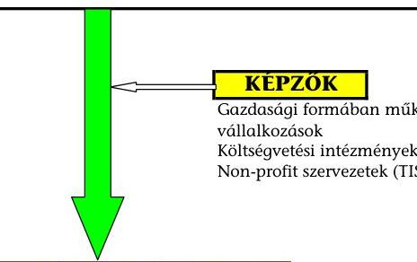
jellege szerint lehet:
szakképesítést megalapozó szakmai alapképzés
állam által elismert (OK)-s) szakképesítés megszerzésére irányuló
munkakörhöz, foglalkozáshoz szükséges állam által nem elismert (nem
OK)-s) szakképesítés megszerzésére irányuló
szakmai továbbképzés
hátrányos helyzetűek felzárkóztató képzése
megváltozott munkaképességűek rehabilitációs képzése
elhelyezkedést, vállalkozást segítő képzés
általános felnőttképzés
egyéb (pl. nyelvi)

kezdeményező szerint lehet:
munkaerő-piaci támogatott képzések
(munkanélküliek tovább- átképzése,
munkahelymegtartást elősegítő, adott
munkakörhöz szükséges szakmai)
vállalati saját munkaerő képzése, továbbképzése
egyéb - saját kezdeményezésű
állami költségvetésből:
felnőttképzési normatív támogatás - most már csak a fogyatékkal élőknek MPA alapból
EU hazai társfinanszírozás (hazai forrásrész)
közvetve - költségvetési szervektől munkáltatóként
szakképzési hozzájárulás
vállalkozásoktól munkáltatóként
egyéb forrás
vállalkozásoktól nem a szakképzési hozzájárulás terhére
össztöndíjak, támogatások (kivéve EU) non-profit és egyéb szervezetektől
önfinanszírozás
uniós és más források

---

# A felnőttképzés irányítási rendszerében közreműködő szervezetek feladatai 

A vizsgált időszakban a felnőttképzés irányításának rendszerét alapvetően a felnőttképzési törvény 2006 decemberében végrehajtott módosítása ${ }^{1}$, a kormányzati struktúra megváltozása ${ }^{2}$, az Állami Foglalkoztatási Szolgálatról (ÁFSZ) rendelkező kormányrendelet ${ }^{3}$, a Nemzeti Szakképzési és Felnőttképzési Intézetről (NSZFI-ről) rendelkező kormányrendelet ${ }^{4}$, valamint a szakképzés és felnőttképzés összevont felügyeleti rendszerének kialakítása határozta meg. Az intézkedések a szakképzés és felnőttképzés koordinációjának javítását, a szakképzés foglalkoztatási, munkaerő-piaci kapcsolatának elősegítését célozták meg.

A felnőttképzés hatósági jellegű fejlesztési, módszertani feladatait az SZMM háttérszervezeteként működő NSZFI végezte az Sztv-ben és a 292/2006. (XII. 23.) Korm. rendeletben előírt tevékenységek ellátásával.

A felnőttképzésben meghatározó szerepe volt a foglalkoztatási szervezeteknek. Az SZMM-hez tartozó háttérintézmények regionalizációja eredményeként 2007. január 1-jétől regionális szervezetben működött a foglalkoztatáspolitika alapintézménye az Állami Foglalkoztatási Szolgálat (ÁFSZ). Ennek keretében az SZMM minisztere a foglalkoztatáspolitikáért való felelőssége körében ${ }^{5}$ működtette a Foglalkoztatási és Szociális Hivatalt (FSZH-t) és az ÁFSZ területi szerveit, a hét Regionális Munkaügyi Központot (RMK-t).

Az ÁFSZ tevékenységéhez közvetve kapcsolódott az RKK-k hálózata. A felnőttképzési fejlesztési feladatokat regionális illetékességgel kilenc $\mathrm{RKK}^{6}$ végzi.

Az RKK-k felnőttképzés keretében segítik a munkaerő-piac változásaihoz igazodó szakmai tudás megszerzését. Alaptevékenységük szerint a feladataik képzések nyújtása a hátrányos munkaerő-piaci helyzetben lévő álláskeresőknek, egyéb rendeletekben meghatározott hátrányos helyzetben lévő csoportoknak, illetve központi, vagy EU képzési program célcsoportjába tartozó személyeknek.

[^0]
[^0]:    ${ }^{1}$ A 2006. évi CXIV. törvény az egyes szakképzési és felnőttképzési tárgyú törvények módosításáról.
    ${ }^{2}$ a 2006. évi LV. törvény
    ${ }^{3}$ a 291/2006. (XII. 23.) Korm. rendelet
    ${ }^{4}$ a 292/2006. (XII. 23.) Korm. rendelet
    ${ }^{5}$ A 170/2006. (VII. 28.) Korm. rendelet értelmében.
    ${ }^{6}$ Békéscsabai RKK, Budapesti Munkaerőpiaci Intervenciós Központ, Debreceni RKK, Észak-Magyarországi RKK, Kecskeméti RKK, Nyíregyházi RKK, Pécsi RKK, Székesfehérvári RKK, Szombathelyi RKK.

---

A felnőttképzés irányításának fontos eszközét jelentette a felnőttképzési intézmények és programok akkreditációs rendszere, amelyet az Fktv. alapján a Kormány rendeletben szabályozott ${ }^{7}$.

Az intézményi akkreditáció célja, hogy azok az intézmények, amelyek olyan hallgatót szándékoznak fogadni, akinek képzésben való részvételét az állam támogatja, magasabb minőségi követelményeknek feleljenek meg. További cél volt, hogy erősebb garanciákat kapjon a közpénzek hatékony felhasználása és az államilag támogatott képzések magas színvonala. A képzés minőségének garanciája érdekében az Fktv. előírta, hogy kizárólag akkreditált intézmények részesülhetnek állami vagy EU-s forrásból származó támogatásban.

A felnőttképzés keretében a SZMM közvetlen szakmai irányító tevékenysége a jogszabályalkotásra és a feladatai ellátásában közreműködő intézményekre terjedt ki. A közvetett szakmai irányító tevékenysége pedig a konkrét képzési programok meghatározásán, végrehajtásán és ellenőrzésén keresztül valósult meg.

A vizsgált időszakot követően átalakult kormánystruktúrában sem szűnt meg azonban a felnőttképzési feladatrendszer tagoltsága; jelenleg három miniszter feladatai között szerepel.

A 212/2010. (VII. 1.) Korm. rendelet a szakképzés és felnőttképzés feladatait - amelyet a 81.§ (2) bekezdése rögzít - és felelősségét a Nemzetgazdasági Minisztérium feladat- és hatáskörébe sorolta alapvetően a 73. § n) pontjában foglaltakkal. A Nemzetgazdasági Minisztérium minisztere a felelős a foglalkoztatáspolitikáért, amelyen belül ellátja a Nemzeti Foglalkoztatási Szolgálat (NFSZ mint az Állami Foglalkoztatási Szolgálat - ÁFSZ - jogutódja) irányítását is a 81. § (1) bekezdés x) pont alapján. A kormányrendelet a 73. § m) pontjával azonban a foglalkoztatáspolitika köréből kiemelte a foglalkoztatás rehabilitációját, amelyet a Nemzeti Erőforrás Minisztérium minisztere feladat- és hatáskörébe sorolt. A Nemzeti Erőforrás Minisztérium minisztere a felnőttképzésért való felelőssége körében (61. §) „gyakorolja az iskolarendszeren kívüli szakmai oktatásban őt megillető feladat- és hatásköröket és az egész életen át tartó tanulás elősegítése érdekében - külön jogszabályban foglaltak szerint - közreműködik a felnőttképzési rendszer működtetésével és továbbfejlesztésével kapcsolatos állami feladatok végrehajtásában". Az új kormányzati struktúra a Közigazgatási és Igazságügyi Minisztérium minisztere feladatai közé sorolta az RKK-k irányítását, amelyet a vállalatok közvetlen képzési megrendelései tekintetében a Nemzetgazdasági Minisztérium minisztere iránymutatása alapján (30. § b) pont) végez, melynek során együttműködik az FSZH-val.

[^0]
[^0]:    ${ }^{7}$ A többször módosított 22/2004. (II.16.) számú Korm. rendeletben írták elő a felnőttképzési akkreditáció szabályait.

---

# A felnőttképzésre vonatkozó jogszabályok hierarchiája 

Módosítások
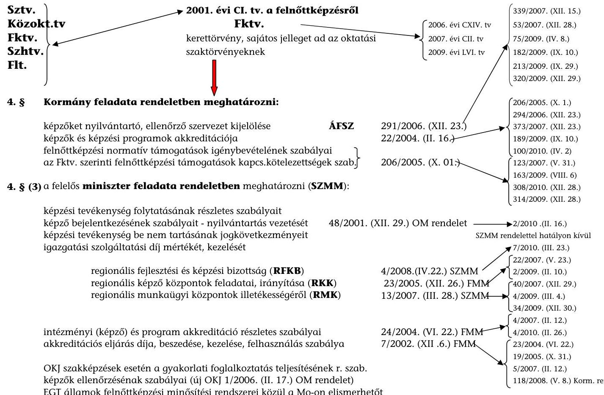
5. § Nemzeti Szakképzési és Felnőttképzési Tanács (NSZFT)
6. § Nemzeti Szakképzési és Felnőttképzési Intézet (NSZFI)

Sztv. 6. § 292/2006. (XII. 23.) Korm.rend
Szakmai vizsgáztatás általános szabályairól és eljárási rendjéről
Szakmai vizsgadíj és a vizsgáztatási díjak keretei
A szakképzés megkezdésének és folytatásának feltételeiről
és a TISZK-ek tanácsadó testületéről
Az MPA képzési alaprészéből felnőttképzési célra nyújtható támogatások MPA foglalkoztatási alaprész isk.rendsz.kívüli felnőttképzési keret felh. 2007.06.16-ig A foglalkoztatást elősegítő támogatásokról, valamint a MPA foglalkoztat..... A saját munkavállalók részére szervezett képzések költségeinek a szakképzési hozzájárulásból történő elszámolása

A felnőttképzést folytató szervezetek ellenőrzése során kiszabható
bírságokról
Szhtv. végrehajtásáról

Sztv. 6. § 292/2006. (XII. 23.) Korm.rend
26/2001. (VII. 27.) OM
1/2001. (I. 16.) OM
8/2006.(III.23.) OM
15/2007. (IV. 13.) SZMM
8/2003. (VII. 4.) FMM
6/1996. (VII. 16.) MüM
13/2006. (XII. 27.) SZMM
13/2009. (VII. 24.)SZMM
13/2004. (IV. 27.) OM
13/2008. (VII. 22.) SZMM

---

Az életminőség átfogó javítása

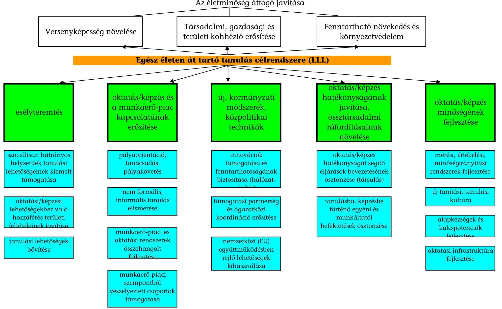

|  Versenyképesség növelése | Társadalmi, gazdasági és területi kohézió erősítése | Fenntartható növekedés és környezetvédelem  |
| --- | --- | --- |
|  |   |   |

**Egész életen át tartó tanulás célrendszere (LLL)**

|  esélyteremtés | oktatás/képzés és a munkaerő-piac kapcsolatának erősítése | új, kormányzati módszerek, közpolitikai technikák | oktatás/képzés hatékonyságának javítása, össztársadalmi ráfordításainak növelése | oktatás/képzés minőségének fejlesztése  |
| --- | --- | --- | --- | --- |
|  szociálisan hátrányos helyzetűek tanulási lehetőségeinek kiemelt támogatása | pályaorientáció, tanácsadás, pályakövetés | innovációk támogatása és fenntarthatóságának biztosítása (hálózat- | oktatás/képzés hatékonyságát segítő eljárások bevezetésének ösztönzése (társulás) | mérési, értékelési, minőségirányítási rendszerek fejlesztése  |
|  oktatási/képzési lehetőségekhez való hozzáférés területi feltételeinek javítása | nem formális, informális tanulás elismerése | támogatási partnerség és ágazatközi koordináció erősítése | tanulásba, képzésbe történő egyéni és munkáltatói befektetések ösztönzése | új tanítási, tanulási kultúra  |
|  tanulási lehetőségek bővítése | munkaerő-piaci és oktatási rendszerek összehangolt fejlesztése | nemzetközi (EU) együttműködésben rejlő lehetőségek kihasználása |  | alapkézségek és kulcskompetenciák fejlesztése  |
|   | munkaerő-piaci szempontból veszélyeztetett csoportok támogatása |  |  | oktatási infrastruktúra fejlesztése  |

---

4/a. számú függelék a V-3020-097/2009. számú jelentéshez

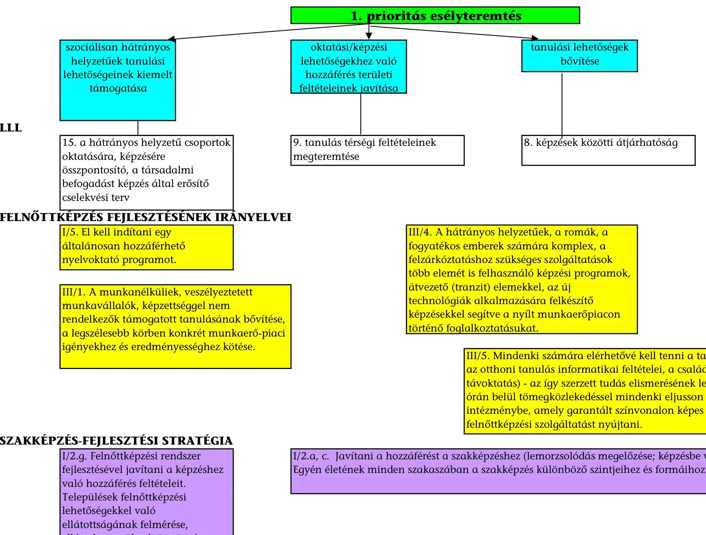

# 1. prioritás esélyteremtés

|  szociálisan hátrányos helyzetűek tanulási lehetőségeinek kiemelt támogatása | oktatási/képzési lehetőségekhez való hozzáférés területi feltételeinek javítása | tanulási lehetőségek bővítése  |
| --- | --- | --- |
|  15. a hátrányos helyzetű csoportok oktatására, képzésére összpontosító, a társadalmi befogadást képzés által erősítő cselekvési terv | 9. tanulás térségi feltételeinek megteremtése | 8. képzések közötti átjárhatóság  |

## FELNŐTTKÉPZÉS FEJLESZTÉSÉNEK IRÁNYELVEI

### I/5. El kell indítani egy általánosan hozzáférhető nyelvoktató programot.

### III/4. A hátrányos helyzetűek, a romák, a fogyatékos emberek számára komplex, a felzárkóztatáshoz szükséges szolgáltatások több elemét is
 felhasználó képzési programok, átvezető (tranzit) elemekkel, az új technológiák alkalmazására felkészítő képzésekkel segítve a nyílt munkaerőpiacon történő foglalkoztatásukat.

### III/1. A munkanélküliek, veszélyeztetett munkavállalók, képzettséggel nem rendelkezők támogatott tanulásának bővítése, a legszélesebb körben konkrét munkaerő-piaci igényekhez és eredményességhez kötése.

### III/5. Mindenki számára elérhetővé kell tenni a tanulás lehetőségét (az otthoni tanulás informatikai feltételei, a családi tanulás ösztönzése, távoktatás) - az így szerzett tudás elismerésének lehetősége. Cél egy órán belül tömegközlekedéssel mindenki eljusson egy olyan intézménybe, amely garantált színvonalon képes számára felnőttképzési szolgáltatást nyújtani.

## SZAKKÉPZÉS-FEJLESZTÉSI STRATÉGIA

### I/2.g. Felnőttképzési rendszer fejlesztésével javítani a képzéshez való hozzáférés feltételeit. Települések felnőttképzési lehetőségekkel való ellátottságának felmérése, ellátatlan területek ösztönzése.

### I/2.a, c. Javítani a hozzáférést a szakképzéshez (lemorzsolódás megelőzése; képzésbe való visszasegítés). Egyén életének minden szakaszában a szakképzés különböző szintjéhez és formáihoz való hozzáférése.

---

4/b. számú függelék a V-3020-097/2009. számú jelentéshez

## 2. prioritás oktatás/képzés és a munkaerő-piac kapcsolatának erősítése

|  pályaorientáció, tanácsadás, pályakövetés | nem formális, informális tanulás elismerése | munkaerő-piaci és oktatási rendszerek összehangolt fejlesztése | munkaerő-piaci szempontból veszélyeztetett csoportok támogatása  |
| --- | --- | --- | --- |
|  **LLL** |  |  |   |
|   | 11. információs társadalom fejlesztése - komplex fejlesztési módszerek kidolgozása az atipikus képzési formák területén |  | 12. az egyén és a munkaerő-piac igényeinek harmonizálása érdekében célcsoport-centrikus, modulrendszerre alapozott képzési programok, tananyagok, tantervek kidolgozása, hozzáférhetőségének biztosítása  |
|  **FELNÖTTKÉPZÉS FEJLESZTÉSÉNEK IRÁNYELVEI** |  |  |   |
|  I/2. A kis- és középvállalkozások számára információs és támogatási rendszert kell kialakítani - a munkáltatók képzési igényeinek bejelentése az ÁFSZ-nek és erre épüljön a képzésszervezői szolgáltatás. |  | I/1. A magyarországi beruházás-, munkahelyteremtés-ösztönző gazdasági programokhoz, pályázatokhoz képzési modulokat kell kapcsolni. |   |
|  III/3. A nők munkaerő-piaci visszatérése - munkavállaláshoz szükséges ismeretek és készségek megőrzése és megújítása képzési, távoktatási programokon, foglalkoztatási szolgáltatásokon és tanácsadáson keresztül. |  | III/2. A vállalkozói ismeretek és készségek fejlesztésére, az idősebb munkavállalók képzettségének, szakismereteik megújítására munkaerő-piaci szolgáltatásokkal összekapcsolódó képzési programok. | I/3. Képzési programokkal kell segíteni a foglalkoztatási válsághelyzetek megoldását, a gazdasági szerkezetváltást, technológiaváltást, az ismeretek megújítását, felfrissítését.  |
|   |  |  | II/3. A munkaügyi- és területfejlesztési tanácsok tesznek ajánlást a preferált és a nem preferált szakmákra, képzésekre, az RMK munkaerő-piaci előrejelzései, a fejlett térségek tapasztalataival való összevetés és saját térségükre vonatkozó információk alapján.  |
|  **SZAKKÉPZÉS-FEJLESZTÉSI STRATÉGIA** |  |  | I/1/b. A felhasználók igényeinek megfelelően alakítani a szakképzést, munkaerő-piaci igényeken alapuljon, regionális tervezés az iskolai rendszerű és az iskolarendszeren kívüli képzésben oktatott szakképesítések köre esetén  |
|   | I/2.f. A szakképzés minden szintjén előzetesen megszerzett tudás beszámításának lehetősége. |  | I/2.c. RKK-k elsődlegesen a hátrányos helyzetű rétegek, elhelyezkedés-centrikus képzését, valamint a munkaerő-piac képzési igényeinek gyors kielégítését biztosítsa  |

---

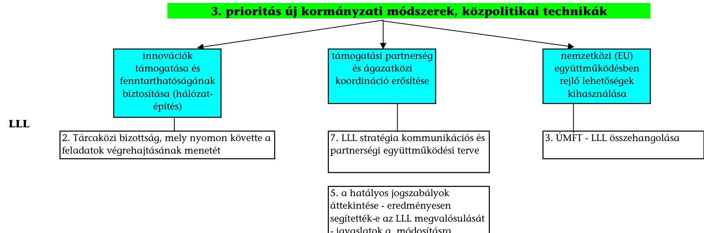

# 3. prioritás új kormányzati módszerek, közpolitikai technikák

## LLL

- innovációk támogatása és fenntarthatóságának biztosítása (hálózatépítés)

## FELNŐTTKÉPZÉS FEJLESZTÉSÉNEK IRÁNYELVEI

- II/1. Felnőttképzési Programtanács létrehozatal és stratégia megvalósításának, fejlesztés irányainak meghatározására.

## SZAKKÉPZÉS-FEJLESZTÉSI STRATÉGIA

- II/1.a. Fejlesztendő a szakmai érdekegyeztetés rendszere - Felnőttképzési Programtanács létrehozása.

- nemzetközi (EU) együttműködésben rejlő lehetőségek kihasználása

- 3. ÜMFT - LLL összehangolása

---

# 4. prioritás oktatás/képzés hatékonyságának javítása, össztársadalmi ráfordításainak növelése 

## LLL

6. nemzetközi tapasztalatok alapján LLL célkitűzéseit hatékonyabban ösztönző finanszírozási keretek biztosítása
7. felsőoktatási intézmények - középfokú tanintézmények - RKK létrehozandó TISZK-ek szervezeti együttműködési kereteit ki kell alakítani, ösztönözve a felnőttképzési intézmények bevonását
8. információs és kommunikációs technológiák alkalmazásának elterjesztése - hatékony oktatási módszerek és tanulásirányítási rendszerek bevezetése

## FELNŐTTKÉPZÉS FEJLESZTÉSÉNEK IRÁNYELVEI

## SZAKKÉPZÉS-FEJLESZTÉSI STRATÉGIA

I/2.c. RKK-k finanszírozási rendszerének átalakítása, ÁFSZ-n belüli helyük meghatározása; elsődlegesen a hátrányos helyzetű rétegek, elhelyezkedés-centrikus képzését kell biztosítaniuk.

II/2.b. A munkaerő-piac és felnőttképzésben részt vevők igényeinek összehangolása; a felnőttképzést folytató intézmények kapacitásainak jobb kihasználása, a szabad kapacitások felnőttképzésbe való bekapcsolása, átláthatósága és a versenyhelyzet fenntartása; a felnőttképzési támogatási rendszer átalakítása.

II/3.a. Képzőktől független vizsgarendszer működtetése regionális szinten.

II/3.c. További TISZK-eket kell létrehozni, racionalizálás érdekében az MPA képzési alaprész decentralizált keretéből
tanulásba, képzésbe történő egyéni és munkáltatói befektetések ösztönzése

I/6. Át kell tekinteni a felnőttképzés támogatási rendszer munkaerőpiaci eredményességét és hatékonyságát (felnőttképzési normatív, a munkahelyi képzés felhasználására fordítható források bővítése, egyéni tanulási számla)

II/2. A szociális partnerek ajánlásai a munkahelyi képzésekről szóló megállapodásokra és egy képzési munkaidő-alapra, a kapcsolódó helyettesítési rendszer létrehozásának lehetőségét

I/2/g.2. Az MPA felnőttképzési célú keretére vonatkozó döntéseknél a gazdálkodó szervezetek által meghatározott munkaerő-piaci igényekre épülő képzések prioritása érvényesüljön.

II/2.i. Szakképzési hozzájárulási rendszer korszerűsítése, a gazdálkodó szervezetek fokozottabb részvétele a gyakorlati oktatásban.

---

4/e. számú függelék a V-3020-097/2009. számú jelentéshez

5. prioritás oktatás/képzés minőségének fejlesztése | | | | | | | | |:-----------------------------------------------------------------------------------------------------------------------------|:-----------------------------------------------------------------------------------------------------------------------------|:-----------------------------------------------------------------------------------------------------------------------------|:-----------------------------------------------------------------------------------------------------------------------------|:-----------------------------------------------------------------------------------------------------------------------------| | | mérési, értékelési, minőségirányítási rendszerek fejlesztése | új tanítási, tanulási kultúra | alapkészségek és kulcspotenciák fejlesztése | oktatási infrastruktúra fejlesztése | | | **LLL** | | | | | | | 16. Indikátorrendszer kidolgozása, értékelni lehet az oktatási, felnőttképzési és foglalkoztatási politikák, fejlesztések sikerességét az egész életen át tartó tanulás feltételeinek és eredményességének javulása szempontjából. | 8. Képzések közötti átjárhatóság, szakképzési modularizáció, EUROPASS - kompetencia-kártya rendszer bevezetése. | 13. Kulcspotenciáknak az egész életen át tartó tanulás minden szakaszában történő hatékonyabb fejlesztése érdekében a pedagógusok és a felnőttképzésben oktató tanárok módszertani kultúrájának fejlesztése. | 14. A felnőttképzési információk szélesebb körű elérése, felnőttképzés tervezése megalapozásának segítése érdekében - az NFI (vizsgált időszakban NSZFI) gondozásában működő Nemzeti Felnőttképzési Adattár létrehozása. | | | **FELNŐTTKÉPZÉS FEJLESZTÉSÉNEK IRÁNYELVEI** | | | | | | | 1/4. Csatlakozni kell az EUROPASS rendszer kifejlesztését szolgáló közösségi kezdeményezéshez. | | | | **SZAKKÉPZÉS-FEJLESZTÉSI STRATÉGIA** | | | | | | | 1/2.d. Iskolarendszeren kívüli szakképzés tartalmi korszerűsítése. | | | | | | | 1/3. Az iskolarendszeren kívüli képzésben alkalmazható digitalizált tananyagok fejlesztése, elterjesztése. | | | | | | | 1/4. Megújítani a képzők képzését a felnőttképzésben oktatók, tanárok esetében is. | | | | | | 11/1.c. A szakképző iskolák felnőttképzésbe való bekapcsolódásának és akkreditálásának ösztönzése. | | | | III/a., c. A munkaerő-piaci információs rendszer fejlesztése -- a régiók munkaerő-piaci igényei változásának nyomonkövetése. A szakképzésből kilépők, a felnőttképzésben részt vevők elhelyezkedésének folyamatos elemzése - az országos, regionális és helyi szakképzési struktúra módosítása; az érintettek pályaorientációs, pályaválasztási döntéseinek megalapozása. Felnőttképzési azonosító és nyilvántartó rendszert kell bevezetni. |

---

5. számú függelék a V-3020-097/2009. számú jelentéshez

# A felnőttképzésben jelenlévő "hátrányos helyzetű" személy meghatározásának gyakoriságai*

|  Megnevezés | SZMM | NSZFI | FSZH | RMK | RKK | Összesen  |
| --- | --- | --- | --- | --- | --- | --- |
|  800/2008/EK rendelet |  |  |  |  |  | db  |
|  az előző 6 hónapban nem állt rendszeresen fizetett alkalmazásban |  |  | 1 |  | 1 | 2  |
|  nem szerzett középfokú végzettséget v. szakképesítést |  |  | 1 | 2 | 1 | 4  |
|  50 éves felüli személy |  |  | 1 | 3 |  | 4  |
|  1 vagy több eltartottal egyedül élő felnőtt |  |  |  | 1 |  | 1  |
|  szakmájában dolgozik, amelyben 25%-kal nagyobb a nemi szervezőrészínv. aláírásxvezetált nemi csoportba tartozik |  |  |  |  |  |   |
|  1 tagállam etnikai kisebbségéhez tartozik, szakmai, nyelvi képzés kell a munkábazillási esélyei javulásához |  |  | 1 | 1 | 2 | 4  |
|  Az elemeit |  |  | 2 | 3 | 4 | 9  |
|  2001. évi CL. tv. a felnőttképzésről |  |  |  |  |  |   |
|  olyan felnőtt akinek vinílyen szociális | 1 |  | 1 | 3 | 3 | 8  |
|  életviselő | 1 |  | 1 | 3 | 2 | 7  |
|  egyéb okból a képzéshez való hozzáférése | 1 |  | 2 | 4 | 1 | 8  |
|  állami támogatás nélkül az átlagosnál nehezebben megvalósítható | 1 |  |  | 5 | 2 | 8  |
|  Összesen | 3 | 0 | 7 | 22 | 13 | 45  |
|  1993. évi LXXVI. tv. a szakképzésről |  |  |  |  |  |   |
|  akinek csónál körülményes |  |  |  | 1 |  | 1  |
|  szociális helyzetű |  |  | 2 | 1 |  | 3  |
|  célétérei adóösségi |  |  |  | 3 | 2 | 5  |
|  felnőtt vagy szerzett betegsége |  |  |  | 1 | 3 | 4  |
|  életvitelé vagy |  |  |  | 1 |  | 1  |
|  más ok miatt a szakképzésbe való bekapcsolódása |  |  |  |  | 1 | 1  |
|  és az abban való részvétele az átlagosnál nehezebben biztosítható |  |  |  |  |  |   |
|  Összesen | 0 | 0 | 4 | 7 | 6 | 17  |
|  6/1996. (VII. 16.) MúM rendelet foglalkoztatást elősegítő támogatásokról |  |  |  |  |  |   |
|  álláskereső |  |  |  | 1 | 3 | 4  |
|  legfeljebb alapfokú iskolai végzettséggel rendelkezik |  |  |  | 7 | 9 | 16  |
|  a foglalkoztatás megkezdésekor legalább 30. életévét betölt |  |  | 1 | 4 | 1 | 6  |
|  25. életévét be nem töltött pályafizető |  |  | 1 | 8 | 2 | 11  |
|

 nyilvántartásba vételt megelőző 6 hónapban nem folytatott kereső tevékenységet, vagy RMK legalább 24 hónapja álláskeresőként tartja nyilván |  |  | 1 | 1 | 1 | 1  |
|  saját háztartásában legalább egy 18 évnél fiatalabb gyermeket nevel |  |  |  |  |  |   |
|  foglalkoztatás megkezdését megelőző 12 hónapon belül |  |  |  |  |  |   |
|  gyermekgondozási segélyben |  |  |  | 3 | 3 | 6  |
|  gyermeknevelési támogatásban |  |  |  | 3 | 3 | 8  |
|  terhességi gyermekágyi segélyben |  |  |  | 3 | 3 | 8  |
|  gyermekgondozási időben vagy |  |  |  | 3 |  | 8  |
|  ápolási időben részesült |  |  |  | 1 | 3 | 4  |
|  foglalkoztatás megkezdését megelőző 12 hónapon belül |  |  |  |  |  |   |
|  előzetes letartóztatásban volt |  |  |  |  | 1 | 1  |
|  szabadságvesztés, vagy elzárás büntetéssel töltötte |  |  | 1 |  | 3 | 4  |
|  olyan munkavállaló, akit munkabélyegeinek elvesztése jellemez |  |  |  | 1 | 4 | 5  |
|  30. életévét betöltötte |  |  | 2 | 3 | 3 | 6  |
|  életkortól függetlenül alapfokú iskolai végzettséggel rendelkezik |  |  | 1 | 1 | 6 | 8  |
|  Összesen |  |  | 8 | 47 | 57 | 112  |
|  Adott szervezet saját szempontjai a fogalom meghatározásában: |  |  |  |  |  |   |
|  felnőttképzési normatív támogatás (IK) szakképesítéssel nem rendelkező, illetve fogyatékkal élő felnőttek számára | 1 |  |  |  |  | 1  |
|  Képzési pályázati programok (IK) szakképesítéssel nem rendelkező, illetve fogyatékkal élő felnőttek számára |  | 1 |  |  |  | 1  |
|  45 év feletti regisztrált/aktív/passzív álláskereső |  |  |  | 2 | 2 | 4  |
|  tájekoztatási rendszerbeli regisztrációja belül |  |  |  |  | 1 | 1  |
|  Megváltozott munkaképességű (aktív/passzív álláskereső) |  |  |  | 2 |  | 2  |
|  Pályakezdő |  |  |  | 3 |  | 3  |
|  Hátrányos helyzetben élő |  |  |  | 3 |  | 3  |
|  Garantált szakképzettséggel rendelkező |  |  |  | 1 |  | 1  |
|  felnőttképzési végzettséggel rendelkező munkavállaló |  |  |  | 1 |  | 1  |
|  Gyermekgondozásból visszatérő anya |  |  |  | 1 |  | 1  |
|  Általános iskolai végzettséggel nem rendelkező nő és egyéb |  |  |  | 3 | 3 | 5  |
|  Tartós munkavállaló és álláskereső |  |  |  | 2 |  | 2  |
|  Egészségügyi problémával rendelkező |  |  |  | 1 |  | 1  |
|  25 év alatti szakképzettséggel rendelkező rendszeres szoc. segélyben lévő pályakezdő |  |  |  | 1 |  | 1  |
|  132/2009. (VI. 19.) Korm. rend . 2. § (3) bek. célcsoportja** |  |  |  | 1 |  | 1  |
|  132/2009. (VI. 19.) Korm. rend . 2. § (2) bek. e) pontja célcsoportja*** |  |  |  | 2 |  | 2  |
|  16-30. életév közötti, álláskeresőként nyilvántartott fiatalok |  |  |  | 1 |  | 1  |
|  a 30. életévüket betöltött, legalább 12 hónapja nyilvántartott álláskeresők |  |  |  | 1 |  | 1  |
|  azok a 30. életévüket betöltött álláskeresők, akik esetében a program támogatásai elősegítik a munkavégzésbe illetve visszajutást, valamint azok a munkavállalók, akik csoportos létszámleépítésben vesztettek el a munkaszerződésük hűtőstratégiára eljutóin |  |  |  | 1 |  | 1  |
|  132/2009. (VI. 19.) Korm. rend . 2. § (3) bek. célcsoportja** |  |  |  | 1 |  | 1  |
|  132/2009. (VI. 19.) Korm. rend . 2. § (2) bek. e) pontja célcsoportja*** |  |  |  | 2 |  | 2  |
|  16-30. életév közötti, álláskeresőként nyilvántartott fiatalok |  |  |  | 1 |  | 1  |
|  a 30. életévüket betöltött, legalább 12 hónapja nyilvántartott álláskeresők |  |  |  | 1 |  | 1  |
|  azok a 30. életévüket betöltött álláskeresők, akik esetében a program támogatásai elősegítik a munkavégzésbe illetve visszajutást, valamint azok a munkavállalók, akik csoportos létszámleépítésben vesztettek el a munkaszerződésük hűtőstratégiára eljutóin |  |  |  | 1 |  | 1  |
|  132/2009. (VI. 19.) Korm. rend . 2. § (3) bek. célcsoportja** |  |  |  | 1 |  | 1  |
|  *A hátrányos helyzet minősítését a szervezetek 33 központi-, regionális programra tették meg, valamint az SZMM, NSZFI, egy RKK és három RMK a programokon kívül is minősítette a hátrányos helyzet jellemzőit. |  |  |  |  |  |   |
|  ** 132/2009. (VI. 19.) Korm. rendelet a Társadalmi Megújulás Operatív program 1. prioritás 1.1.2. konstrukció: "decentralizált program a hátrányos helyzetűek foglalkoztatásáért", valamint a Társadalmi Megújulás Operatív Program 1. prioritás 1.1.1. konstrukció: "Megváltozott munkaképességű emberek rehabilitációjának és foglalkoztatásának segítése" keretében nyújtható támogatásokról 2. § (3) bekezdés célcsoportja: külön jogszabály szerint hátrányosnak minősített személy. |  |  |  |  |  |   |
|  *** akinek munkaviszonyát a munkáltató - a működési körében felmerülő okból rendes felmondással, felmentéssel, vagy közös megegyezéssel 2008. szeptember 1. napját követően szüntette meg, vagy akinek határozott idejű munkaviszonya - a határozott idő lejárta miatt - 2008. szeptember 1. napját követően szűnt meg. |  |  |  |  |  |   |

---

# A TISZK-ek megalakulásának, működésének jellemzői Magyarországon 

Az önkormányzatok szakmai középfokú oktatást folytató közoktatási intézményei részvételével az első generációs TISZK-ek, mint szervezési megoldás bevezetésének célja és lényege volt, hogy a rendelkezésre álló erőforrásaik koncentrálásával, az infrastruktúra fejlesztésével a szakképzést hatékonyabb formában tudják megszervezni a párhuzamos kapacitások kiszűrésével és a regionális munkaerő-piaci igényekhez igazodva. A TISZK-ektől azt várták, hogy garanciát tudnak nyújtani ahhoz, hogy a diákok piacképes, korszerű szaktudást szerezzenek, továbbá, hogy közreműködnek a felnőttképzésben is felhasználható tananyag-fejlesztésben, a modul-rendszerű szakképzés és az új OKJ kidolgozásában. Szerepet szántak a TISZK-eknek a közösségi funkciók - pályaorientáció, hátrányos helyzetű fiatalok segítése, a lemorzsolódás csökkentése - ellátásában, illetve a felnőttek iskolarendszeren kívüli képzésében is.

Az első generációs TISZK-ek központi képzőhelyből és központi tanácsadó testületből (KTT) álltak. A központi képzőhelyek feladata volt az iskolarendszerű gyakorlati képzésben való részvétel, illetve az iskolarendszeren kívüli képzés megszervezésében, a pályaválasztási tanácsadás és a pályakövetés feladataiban való közreműködés is.

A szak- és felnőttképzést érintő reformprogram végrehajtására kiadott törvénymódosítás során a TISZK rendszer új koncepciója kapott teret. A legfőbb cél a szak- és felnőttképzés munkaerő-piaci igényekkel való összehangolása volt. A második generációs TISZK-ek létrehozásával, átalakításával ${ }^{1}$ lehetőség nyílott a keresletvezérelt szak- és felnőttképzés megszervezésére, a szakképző intézmények integrációjára, a széttagoltság és párhuzamosságok megszüntetésére. A jogi szabályozás a második generációs TISZK-ekhez való átalakulásra 2007. november 1-jétől 2010. január 1-jéig írt elő kötelezettséget.

Módosult a Sztv., a Közokt. tv., Szhtv., amelyek előírták a szak- és felnőttképzés regionális megszervezését, a szakképzés-szervezési társulások feladatait, illetve meghatározták, hogy a szakképzési hozzájárulás fogadásának feltétele a második generációs TISZK-ekhez való kapcsolódás lett. Az új típusú TISZK-ek feladata a szakképzéssel összefüggő önkormányzati feladatok végrehajtása, az regionális fejlesztési és képzési bizottságok (RFKB) döntése alapján a szakképzés fejlesztési irányaira és arányaira tekintettel, azt elfogadva meghatározni a szakképzési évfolyamokon indítható osztályok számát és egyetértési jogot gyakorolni az iskolák szakmai, pedagógiai programjai tekintetében.

[^0]
[^0]:    ${ }^{1}$ A vizsgálat befejezéséig 84 TISZK alakult át, illetve kezdte meg működését.
