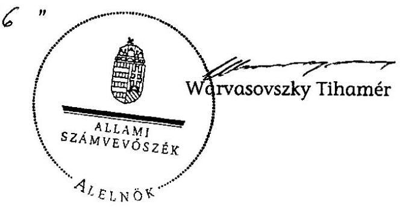

# ÁLLAMI   SZÁMVEVŐSZÉK 

## JELENTÉS

a Kereszténydemokrata Néppárt 2008-2009. évi gazdálkodása törvényességének ellenőrzéséről

---

3. Önkormányzati és Területi Ellenőrzési Igazgatóság
3.1. Szabályszerűségi Ellenőrzési Főcsoport
Iktatószám: V-3004-023/2010.
Témaszám: 971
Vizsgálat-azonosító szám: V-0507
Az ellenőrzést felügyelte:
Dr. Lóránt Zoltán
főigazgató
Az ellenőrzés végrehajtásáért felelős:
Dr. Elek János
általános főigazgató-helyettes
Az ellenőrzést vezette:
Horváth Balázs
főcsoportfőnök-helyettes
Az összefoglaló jelentést készítette:
Tóth István
számvevő tanácsadó
Az ellenőrzést végezték:
Tóth István
Számvevő tanácsadó
Dr. Faragóné Tóth Mária
számvevő tanácsos
A témához kapcsolódó eddig készített számvevőszéki jelentések:
címe
sorszáma
Jelentés a Kereszténydemokrata Néppárt 1992-1993. évi gazdálkodása törvényességének ellenőrzéséről 234
Jelentés a Kereszténydemokrata Néppárt 1994-1995. évi gazdálkodása törvényességének ellenőrzéséről 341
Jelentés a Kereszténydemokrata Néppárt 1996-1997. évi gazdálkodása törvényességének ellenőrzéséről 9844
Jelentés a Kereszténydemokrata Néppárt 1998-1999. évi gazdálkodása törvényességének ellenőrzéséről 0040
Jelentés a Kereszténydemokrata Néppárt 2000-2001. évi gazdálkodása törvényességének ellenőrzéséről 0302
Jelentés a központi költségvetési támogatásban nem részesült pártok 2001-2004. évi gazdálkodása törvényességének ellenőrzéséről 0517
Jelentés a Kereszténydemokrata Néppárt 2006-2007. évi gazdálkodása törvényességének ellenőrzéséről 0911

---

# TARTALOMJEGYZÉK 

BEVEZETÉS ..... 5
I. ÖSSZEGZŐ MEGÁLLAPÍTÁSOK, KÖVETKEZTETÉSEK, JAVASLATOK ..... 7
II. RÉSZLETES MEGÁLLAPÍTÁSOK ..... 10

1. A Párt gazdálkodásáról szóló 2008-2009. évi beszámolók ..... 10
1.1. A teljes vizsgálati időszakra érvényes megállapítások ..... 10
1.2. Bevételek ..... 10
1.3. Kiadások ..... 11
2. A Pártnak a beszámoló összeállítására és az azt alátámasztó könyvvezetésre vonatkozó belső szabályozása és gyakorlata ..... 12
2.1. A számviteli szabályozás rendszere ..... 12
2.2. A könyvvezetés gyakorlata, ennek összhangja a jogszabályokban és a belső szabályzatokban előírt követelményekkel ..... 14
2.3. A bizonylati elv és a bizonylati fegyelem érvényesülése ..... 15
3. A Párt bevételszerző, gazdálkodó tevékenysége ..... 15
4. A gazdálkodással összefüggő, egyéb jogszabályokban foglalt előírások betartása ..... 16
4.1. A foglalkoztatás szabályszerűsége ..... 16
4.2. Személyi jellegű kifizetésekre vonatkozó jogszabályok betartása ..... 16
4.3. Az adózási, társadalombiztosítási és egyéb jogszabályok rendelkezéseinek érvényesítése ..... 17
5. A Párt belső ellenőrzési rendszere ..... 18
5.1. A belső ellenőrzés rendszerének szabályozottsága, működése, eredményessége ..... 18
5.2. Az informatikai rendszer környezetének szabályozottsága és belső kontrolljának működése ..... 19
6. Az előző ellenőrzés megállapításaira tett intézkedések ..... 19
MELLÉKLETEK
7. számú A Kereszténydemokrata Néppárt 2008. évi pénzügyi beszámolója
8. számú A Kereszténydemokrata Néppárt 2009. évi pénzügyi beszámolója
9. számú A Kereszténydemokrata Néppárt 2009. évi javított pénzügyi beszámolója

---

.

---

# RÖVIDÍTÉSEK JEGYZÉKE 

| APEH | Adó- és Pénzügyi Ellenőrzési Hivatal |
| :-- | :-- |
| Art. | Az adózás rendjéről szóló - többször módosított - 2003. |
|  | évi XCII. törvény |
| ÁSZ | Állami Számvevőszék |
| FPEB | Fővárosi Pénzügyi Ellenőrző Bizottság |
| MPEB | Megyei Pénzügyi Ellenőrző Bizottság |
| OPEB | Országos Pénzügyi Ellenőrző Bizottság |
| OV | Országos Választmány |
| Párt | Kereszténydemokrata Néppárt |
| párttörvény | A pártok működéséről és gazdálkodásáról szóló - többször |
|  | módosított - 1989. évi XXXIII. törvény |
| Számv. tv. | A számvitelről szóló - többször módosított - 2000. évi C. |
|  | törvény |
| Szja törvény | A személyi jövedelemadóról szóló - többször módosított - |
|  | 1995. évi CXVII. törvény |
| Tbj. | A társadalombiztosítás ellátásaira és a magánnyugdíjra |
|  | jogosultakról, valamint e szolgáltatások fedezetéről szóló |
|  | 1997. évi LXXX. törvény |

---

.

---

# JELENTÉS 

## a Kereszténydemokrata Néppárt 2008-2009. évi gazdálkodása törvényességének ellenőrzéséről

## BEVEZETÉS

Az Állami Számvevőszékről szóló 1989. évi XXXVIII. törvény 5. §-a, valamint a pártok működéséről és gazdálkodásáról szóló - többször módosított - 1989. évi XXXIII. törvény (párttörvény) 10. § (1) és (3) bekezdése alapján a pártok gazdálkodása törvényességének ellenőrzésére az Állami Számvevőszék (ÁSZ) jogosult. E törvényi felhatalmazásokra figyelemmel az ÁSZ 2010. évi ellenőrzési tervének megfelelően vizsgálta a Kereszténydemokrata Néppárt (Párt) 2008-2009. évi gazdálkodása törvényességét.

A Párt a közzétett éves beszámolói alapján 2008-2009 időszakában 512 259 ezer Ft bevételről adott számot, amelynek 91,9%-át rendszeres, állami költségvetési támogatásként kapta. A gazdálkodási kiadásait 2008-ban 267 194 ezer Ft, 2009-ben 272 261 ezer Ft főösszeggel közölte. Az ellenőrzést nem a bevételi és kiadási összeg nagysága, hanem a számvevőszéki törvényben meghatározott kétévenkénti ellenőrzési kötelezettség indokolta.

Az ellenőrzés célja annak megállapítása volt, hogy:

- a Párt által készített és a Magyar Közlönyben közzétett éves beszámolók a törvényi előírásoknak megfelelnek-e, a könyvvezetéssel és a valósággal megegyező adatokat tartalmaznak-e;
- a könyvvezetés és a gazdálkodás során betartották-e a számvitelről szóló többször módosított - 2000. évi C. tv. (Számv. tv.) és az egyéb jogszabályok rendelkezéseit, a belső előírásokat;
- a Párt a működéséhez szabályszerűen igénybe vehető forrásokat használt-e fel, a párttörvényben engedélyezett gazdálkodó tevékenységet folytatott-e.

Az ellenőrzés körülményeit illetően rögzíteni szükséges ${ }^{1}$, hogy:

- a párttörvény 1. sz. melléklete szerinti beszámoló-mintához magyarázatot, útmutatót nem készítettek a jogalkotók, így ennek kitöltése pártonként - kialakított számviteli politikájuknak megfelelően - eltérő lehet;
- a beszámolóminta a Számv. tv. rendelkezéseivel nem harmonizál, nem felel meg sem a mérleg, sem az eredmény-kimutatás követelményeinek.

[^0]
[^0]:    ${ }^{1}$ Az ÁSZ évek óta javasolja a Kormánynak a pártok ellenőrzéséről készített jelentéseiben a párttörvény módosítását.

---

Az ÁSZ a párttörvény módosításáig a jelenleg hatályos rendelkezéseknek megfelelő - egységes módszertani alapokra helyezett - gyakorlattal folytatja a pártok gazdálkodása törvényességének ellenőrzését. Az ellenőrzést a pénzügyiszabályszerűségi ellenőrzés módszertani szabályai szerint, a pártellenőrzésre kiadott segédletbe foglalt egységes követelmények alapján végeztük.

Az ellenőrzési bizonyosság szintje az ÁSZ-nál elfogadott 95%. A helyszíni ellenőrzés lefolytatására, az ellenőrzési bizonyítékok megszerzésének, elemzésének módjaira és eszközeire az Ellenőrzési Kézikönyv szabályai szerint került sor a belső kontrollrendszer tesztelésével és az alapvető, részletes vizsgálati eljárások alkalmazásával.

Az adatok előzetes elemzése alapján terveztük meg a közepes feltárási kockázatra tekintettel a mintavételi eljárást. Tételes ellenőrzésre került sor a bevételek közül a kapott állami támogatás, az egymillió Ft feletti tételek, valamint a beszámolóban kötelezően nevesítendő, értékhatárt elérő egyéb hozzájárulások, adományok körében.

Az előkészítés során a rendelkezésre bocsátott dokumentumok alapján az átfogó lényegességi küszöb mértéket a pénzügyi beszámoló bevételi főösszegének 2%-ában határoztuk meg, továbbá specifikus lényegességi küszöböt alkalmaztunk az egyéb hozzájárulások, adományok esetében a párttörvény 1. számú mellékletében meghatározott értékhatárra tekintettel (belföldi 500 ezer Ft).

A helyszíni ellenőrzésre 2010. augusztus 24. - szeptember 30. között a Párt Budapest, XIV. kerület Bazsarózsa utca 69. szám alatti irodájában került sor.

---

# I. ÖSSZEGZŐ MEGÁLLAPÍTÁSOK, KÖVETKEZTETÉSEK, JAVASLATOK 

A Párt 2008. és 2009. évi beszámolóit a párttörvényben előírt formában, a Hivatalos Értesítőben és az internetes honlapján nyilvánosságra hozta. A beszámolók a törvényes határidőhöz képest késéssel jelentek meg. A 2008. évi beszámoló lényeges hibát nem tartalmazott, azonban 360 ezer Ft összegű, jogi személytől kapott adomány a magánszemélyek adományai között került kimutatásra. A 2009. évi beszámoló a Számv. tv-ben előírt lényegesség elvét sértő hibát tartalmazott, mivel hat esetben a párttörvény előírása ellenére elmulasztották nevesíteni a belföldi jogi személyektől kapott, 500 ezer Ft-ot meghaladó adományokat. A Párt a hibát kijavította és a valós adatokkal a beszámolót a Hivatalos Értesítő 2010. október 5-i 84. számában ismételten közzétette.

A Párt a Számv. tv-ben előírt számviteli politikával és kapcsolódó szabályzatokkal, valamint számlarenddel a vizsgált időszakban rendelkezett. Az előző ÁSZ ellenőrzés felhívása alapján, egyben a Számv. tv. módosításaira, valamint a Párt sajátosságaira tekintettel a számviteli szabályzatokat kiegészítették. A magántulajdonú gépkocsik hivatali célú használata, a belföldi és a külföldi kiküldetés elszámolása tárgyában kiadott, a törvényesség érvényesülését segítő szabályzatok összhangban voltak a jogszabályi előírásokkal. A Párt az alapszabályban előírt gazdálkodási szabályzatot, valamint szervezeti és működési szabályzatot a helyszíni ellenőrzés befejezéséig nem készítette el.

A kettős könyvvezetést regisztrált külső könyvelési szolgáltató végezte megbízási szerződés alapján. A választott könyvvezetés kialakított rendje összhangban volt a Számv. tv előírásaival. Az a Párt használatában lévő eszközökben és azok forrásaiban bekövetkezett változásokat a valóságnak megfelelően, folyamatosan, zárt rendszerben, áttekinthetően mutatta. A könyvvezetésben a vizsgált időszakban érvényesültek a Számv. tv-ben megfogalmazott alapelvek. A Párt a Számv. tv. és a számlarend alapján a főkönyvi számlákhoz rendelt analitikus nyilvántartások köréről, vezetésének módjáról a számviteli politikában, a számlarendben és a pénzkezelési szabályzatban rendelkezett. Az analitikus nyilvántartások vezetése megfelelt a Számv. tv. és a belső szabályozások előírásainak. Az analitikus nyilvántartások és a főkönyvi könyvelés között az értékadatok számszerű egyeztetése a Számv. tv. és a számlarend előírásainak megfelelően megtörtént.

Az éves zárlati munkát megalapozó leltározást a Számv. tv-ben és a leltározási és leltárkészítési szabályzatban előírtak szerint teljes körűen végrehajtották. A leltárak és a könyvviteli nyilvántartások összehasonlítása, a leltárak kiértékelése megtörtént, eltérést nem állapítottak meg. Az éves zárást a Számv. tv-ben és a számlarendben foglaltak szerint határidőben, szabályszerűen elvégezték.

A Pártnál a Számv. tv. bizonylati elv és bizonylati fegyelem vonatkozó előírásait betartották. A könyvviteli nyilvántartásokban rögzített gazdasági eseményeket szabályszerűen kiállított bizonylatok támasztották alá. A kötele-

---

zettségvállalás és az utalványozás gyakorlata megfelelt a szabályozásban előírtaknak. A Pártnál a szigorú számadási kötelezettség alá vont nyomtatványokat szabályszerűen nyilvántartották. A beszámolót, a leltárt, a főkönyvi könyvelést, az azt alátámasztó bizonylatokat a Párt központjában megőrizték.

A Párt gazdálkodó, bevételszerző tevékenysége során - könyvviteli nyilvántartásai szerint - betartotta a párttörvényben előírt gazdálkodási tilalmakat: nem engedélyezett gazdálkodó tevékenységet nem folytatott, gazdasági társaságban részesedést nem szerzett, vállalatot nem alapított, részvényt nem vásárolt. Bevételei szabályozott tagdíjfizetésből, költségvetési támogatásból, egyéb hozzájárulásokból és adományokból, tulajdonában álló tárgyi eszközök értékesítéséből, valamint kamatbevételekből teljesültek. Nem fogadott el külföldi államtól, költségvetési szervtől, állami vállalattól, állami részvétellel működő gazdasági társaságtól vagyoni hozzájárulást. A Párt 2009-ben a párttörvény tiltása ellenére 50 ezer Ft értékben adományt fogadott el költségvetési támogatásban részesült alapítványtól, melyet a helyszíni ellenőrzés időszakában a támogatónak visszautalt, így nem keletkezett olyan bevétel, amire a párttörvényben előírt szankciót alkalmazni kellene. A Párt 2009-ben az állami vagyonról szóló törvény alapján tizenkét ingatlant vásárolt 214 435 ezer Ft értékben. A vásárláshoz a teljes vételár erejéig a törvény által biztosított, a Magyar Fejlesztési Bank Zrt. által folyósított hitelt vették igénybe.

A személyi jellegű kifizetések körében a béreket szabályszerű munkaszerződések alapján számfejtették. A magántulajdonú gépjárművek hivatali célú használatát a jogszabályoknak és a belső szabályzatnak megfelelően, szabályosan kitöltött kiküldetési rendelvény alapján, adómentes normatív mértékkel számolták el. Az ideiglenes külföldi kiküldetések költségeinek elszámolása szabályszerűen történt.

Az adózási és társadalombiztosítási jogszabályi előírásainak a Párt munkáltatóként és kifizetőként eleget tett, a havi és éves adatszolgáltatási, bevallási és befizetési kötelezettségét szabályszerűen teljesítette. A kiadott APEH folyószámla kivonatok szerint a Pártnak 2008-ban befizetési késedelme, költségvetési tartozása nem volt. A Párt 2009. év végén egy havi adót és járulékot egyhavi késedelemmel utalt át.

A belső ellenőrzés rendszerében az alapszabály kétszintű - országos és megyei - pénzügyi ellenőrző bizottság működését írta elő. Az OPEB feladat-és hatáskörében nem szerepelt az éves költségvetés és a pénzügyi beszámoló ellenőrzése. A 2007 januárjában megalakult OPEB a vizsgált időszakban dokumentáltan nem működött. A MPEB-ek a vizsgált időszakban nem
 alakultak meg, nem működtek.

A vezetői és a munkafolyamatba épített ellenőrzés kialakított rendszere a feladatokat, hatásköröket, felügyeleti és felelősségi köröket hiányosan szabályozta. Az alapszabály szerint az Ügyvezető Elnökség feladata egyebek mellett, hogy ellenőrzi a Párt gazdálkodását. Ennek ellenére a gazdálkodást irányító, ellenőrző feladatot szabályozásban nem delegálták konkrét személyhez, beosztáshoz. A kötelezettségvállalás és utalványozás rendjét szabályozták, a hatáskörileg illetékes személyeket kijelölték. A vezetői ellenőrzés a gazdálkodás folyamatában a szabályozásnak megfelelően érvényesült. A könyvelést alátá-

---

masztó bizonylatokat könyvelés előtt a főkönyvelő ellenőrizte. A pénztári nyilvántartásokat és a készpénzállományt a központban és a szervezetek mintegy 40%-ánál nem ellenőrizték. A beszámolókat az alapszabályban feljogosított Országos Elnökség fogadta el.

Az előző ellenőrzés megállapításai alapján az ÁSZ 10 pontban hívta fel a Párt elnökét a törvényes állapot helyreállítására. A felhívás alapján a Párt elnöke intézkedési tervet készített, az abban foglaltakat azonban nem teljes körűen hajtották végre. A Párt gazdálkodási, valamint szervezeti és működési szabályzatait az OV, valamint az Országos Elnökség nem készítette el. A vizsgált időszakban a választott ellenőrző testületek dokumentáltan nem működtek.

A helyszíni ellenőrzés tapasztalatainak hasznosítása mellett javasoljuk

# a Kormánynak 

Terjessze elő a pártfinanszírozás átláthatóságának, a pártok elszámoltathatóságának fokozott érvényesítése érdekében a párttörvény módosítását, figyelemmel a pártok számviteli nyilvántartási és beszámolási rendszerét érintő - már évek óta fennálló ellentmondások feloldására, amelyek a párttörvény és a számviteli törvény között továbbra is fennállnak.

A helyszíni ellenőrzés megállapításainak hasznosítása mellett az Állami Számvevőszék felhívja

## a Párt elnökét:

1. Tartsa be a Párt éves gazdálkodásáról szóló beszámolók megjelentetésére a párttörvény 9. § (1) bekezdésében előírt április 30-i határidőt.
2. Intézkedjen - az előző ÁSZ ellenőrzés felhívására is figyelemmel - a párt gazdálkodási szabályzatának, valamint a hivatali szervezet szervezeti és működési szabályzatának az alapszabállyal összhangban lévő elkészítésére.
3. A Párt gazdálkodása ellenőrzési rendszerének eredményes működése érdekében:
a) kezdeményezze - az előző ÁSZ ellenőrzés felhívására is figyelemmel - a PEBeknek az alapszabály 80-85. §-ai szabályozásának megfelelő működését;
b) jelöljön ki a hivatali szervezetben az alapszabályban előírt ellenőrzési feladat ellátására alkalmas személyt;
c) intézkedjen, hogy a pénzkezelési szabályzat II. fejezet 8.) pontjában előírt pénztár ellenőrzés a Párt egészében valósuljon meg.

---

# II. RÉSZLETES MEGÁLLAPÍTÁSOK 

## 1. A PÁRT GAZDÁLKODÁSÁRÓL SZÓLÓ 2008-2009. ÉVI BESZÁMOLÓK

### 1.1. A teljes vizsgálati időszakra érvényes megállapítások

A Párt a 2008. évi beszámolót 2009. május 6-án, a Hivatalos Értesítő 21. számában, a 2009. évi beszámolót 2010. május 14-én, a Hivatalos Értesítő 31. számában a párttörvény 1. számú mellékletében meghatározott minta szerint jelentette meg (1-2. számú melléklet), elmulasztva a párttörvény 9. § (1) bekezdésében előírt április 30-i határidőt. A Párt a beszámolókat a közzététellel egy időben internetes honlapján is nyilvánosságra hozta. A közzétett beszámolók a helyi, a megyei és kerületi szervezetek, valamint az országos központ számviteli bizonylatai alapján, központilag könyvelt adatok főkönyvi kivonatai készültek. Az alapszabály értelmében a helyi szervezetek önállóan gazdálkodnak, a bevételeiket saját döntésük szerint használhatják fel. A beszámoló teljességének érdekében a Párt a helyi szervezetek nemleges gazdálkodásáról a nullás forgalmú pénztárjelentést minden esetben bekérte.

A Párt a beszámoló összeállítás szabályait nem határozta meg, az éves beszámolók összeállításáról készített mellékszámítást, levezetést adott át az ellenőrzés részére. A beszámolókat az alapszabály előírásának megfelelően az Országos Elnökség fogadta el.

A Párt az éves beszámolók összeállítása során megsértette a Számv. tv. 16. § (4) bekezdésében foglalt lényegesség számviteli alapelvét azzal, hogy a 2009. évi beszámolóban elmulasztotta nevesíteni hat önkormányzattól kapott - támogatónként 500 ezer Ft-ot meghaladó - nem pénzbeli adományt, ami specifikusan lényeges hibának minősül. A helyszíni ellenőrzés megállapítása alapján a Párt a 2009. évi beszámoló lényeges hibáját kijavította és a Hivatalos Értesítő 2010. október 1-i 84. számában ismételten közzétette (3. számú melléklet). A javított beszámoló valós képet ad a Párt 2009. évi bevételeiről és kiadásairól.

### 1.2. Bevételek

A tagdíj befizetés feltételeit a Párt alapszabálya rögzítette. A tagdíjak mérsékléséről, illetve annak elengedéséről a helyi szervezetek dönthettek. 2008-ban a helyi szervezetek 56,3%-ánál, 2009-ben 50%-ánál nem fizettek tagdíjat. A tagdíj elengedéséről, illetve mérsékléséről szóló egyedi döntéseket nem csatolták az elszámoláshoz, így a nem fizetés vagy csökkentett tagdíjfizetés jogszerűsége nem volt megítélhető. A beszámolóban kimutatott tagdíjbevétel mindkét évben megegyezett a kapcsolódó főkönyvi számlán bizonylatok alapján kimutatott összeggel. A beszámoló adata csak tagdíjnak minősült bevételeket tartalmazott.

---

Az állami költségvetésből származó támogatásokat mindkét évben a főkönyvi könyvelésben kimutatott és a bankszámla kivonaton szereplő, a Magyar Államkincstár által ténylegesen átutalt összeggel egyezően mutatták ki. A 2009. évi támogatásból a Pénzügyminisztérium az előző ÁSZ ellenőrzés által megállapított névtelen adománynak megfelelő 81200 Ft összeget levonta.

Az egyéb hozzájárulások, adományok beszámoló soron a párttörvény 9. § (2) bekezdésében és az 1. számú mellékletében előírtaknak megfelelően tovább részletezve a Párt a vizsgált években kizárólag belföldi jogi és magánszemélyektől származott bevételt mutatott ki. A beszámolókban szereplő adatok mindkét évben megegyeztek a kapcsolódó főkönyvi számlán bizonylatok alapján könyvelt bevétellel. A beszámolók tartalmazták az önkormányzatoktól kedvezményes díjtételű ingatlanhasználat formájában kapott nem pénzbeli vagyoni hozzájárulás értékét.

Egyéb hozzájárulások, adományok belföldi jogi személyektől beszámoló soron a 2008. évi beszámolóból hiányzott tévesen a magánszemélyek adománya között kimutatott és könyvelt - a XI. kerületi szervezetnél teljesült 360 ezer Ft összegű, jogi személytől származó adomány (Éghajlat Könyvkiadó). Az egy adományozótól származó, 500 ezer Ft-ot meghaladó adományt a párttörvény 9. § (2) bekezdésében előírtaknak megfelelően nevesítették. A 2009. évi beszámolóban a párttörvény 9. § (2) bekezdés előírását megsértve elmulasztották nevesíteni hat önkormányzattól kapott, 500 ezer Ft-ot meghaladó, 4945 ezer Ft összegű nem pénzbeli adományt.

Az egyéb hozzájárulások, adományok belföldi magánszemélyektől soron a 2008. évi beszámolóban az előző bekezdésben említettek miatt tévesen szerepelt 360 ezer Ft belföldi jogi személy adománya. A 2009. évi beszámolóban nevesítették az egy adományozótól kapott 500 ezer Ft-ot meghaladó bevételt.

Egyéb bevételek között kamatbevételeket, 2009-ben továbbá káresemények miatti kártérítésekből, tárgyi eszköz értékesítéséből származó bevételeket mutatták ki. A beszámolósorok adatai megegyeztek a kapcsolódó főkönyvi számlák összevont adataival.

# 1.3. Kiadások 

Támogatás egyéb szervezeteknek beszámoló soron közölt adat mindkét évben megegyezett a kapcsolódó főkönyvi számla egyenlegével. A könyvelés csak jogi személy szervezeteknek nyújtott támogatást tartalmazott.

Működési kiadásokat a Párt a 6. számlaosztályban megnyitott 601. működési kiadások főkönyvi számlán könyvelte. A könyvelendő kiadásokat a Párt a számlatükör mellékletében határozta meg. A beszámolósor adata mindkét évben eltért a kapcsolódó főkönyvi számla forgalmi egyenlegétől, mivel a könyvelés tévesen tartalmazott oda nem tartozó kiadásokat, valamint kimaradtak belőle odatartozó kiadások. A beszámoló sor adatát ezért korrekciós számítással állították elő. A korrekciós számítás, valamint a mintatételek ellenőrzése alapján megállapítható, hogy a beszámoló mindkét évben az elszámolt működési kiadások értékét tartalmazta. A beszámoló sor mindkét évben jogszerűen tartalmazta a Párt által a helyi önkormányzatoktól ingyenes, vagy kedvezmé-

---

nyes díjtételű ingatlanhasználat formájában kapott nem pénzbeli vagyoni hozzájárulás értékéhez kapcsolódó pénzforgalom nélküli ráfordítás elszámolását.

Az eszközbeszerzés beszámoló sor tartalmát a számviteli politika kiegészítésében rögzítették. A beszámolókban az eszközbeszerzés fogalomkörébe tartozó tárgyi - az ingatlanbeszerzés kivételével - eszközbeszerzéseket, a kis értékű tárgyi eszközök és felszerelési tárgyak beszerzésére fordított összegeket, valamint a hitelre vásárolt ingatlanok esetében az adott évben a hitel törlesztésére fordított összegeket mutatták ki a vonatkozó főkönyvi számlák forgalmával, illetve egyenlegével egyezően.

A politikai kiadásokat a Párt a 6. számlaosztályban megnyitott 602. politikai kiadások főkönyvi számlán könyvelte. A könyvelendő kiadásokat a Párt a számlatükör mellékletében határozta meg. A beszámolósor adata mindkét évben eltért a kapcsolódó főkönyvi számla forgalmi egyenlegétől, mivel a könyvelés tévesen tartalmazott oda nem tartozó költségeket, valamint kimaradtak belőle odatartozó költségek. A beszámoló sor adatát ezért korrekciós számítással állították elő. A korrekciós számítás, valamint a mintatételek ellenőrzése alapján megállapítható, hogy a beszámoló mindkét évben az elszámolt politikai kiadások értékét tartalmazta.

Egyéb kiadások körét a Párt belső szabályozásban meghatározta. Az egyéb kiadások között bankköltséget, bírságot, késedelmi kamatot mutatták ki, mindkét évben a könyveléssel egyező összegben.

# 2. A PÁRTNAK A BESZÁMOLÓ ÖSSZEÁLLÍTÁSÁRA ÉS AZ AZT ALÁTáMASZTÓ KÖNYVVZETÉSRE VONATKOZÓ BELSŐ SZABÁLYOZÁSA ÉS GYAKORLATA 

### 2.1. A számviteli szabályozás rendszere

A 2005. május 21-től és a 2009. november 28-tól érvényes alapszabály tartalmazza a Párt országos testületeinek gazdálkodásával összefüggő hatásköröket, valamint a helyi, megyei szervezetek gazdálkodási jogosítványait.

A Párt a Számv. tv. 14. §-ában előírt számviteli szabályzatokkal rendelkezett. Az eszközök és források értékelési szabályzatát, a szerződéskötés és utalványozás rendjének és a külföldi kiküldetések szabályozását szabályszerűen, a 2007. novemberben elfogadott formában tartották fenn.

A vizsgált időszakban az OV által 2008. március 5-én elfogadott számviteli politika, leltározási és leltárkészítési szabályzat, pénzkezelési szabályzat és segédlet, számlarend volt hatályban. Szabályozták a saját gépkocsi hivatalos célra történő használatát. Elnöki utasításban szabályozták 2009. évtől az ingatlanhasználattal kapcsolatos költségviselést és utasítást adtak ki az alapszervezeteknek a számviteli bizonylatokkal kapcsolatos követelményekről. A számviteli szabályzatokat 2008-2009. években a Számv. tv-vel és a gazdálkodás sajátosságaival összhangban, az előző ÁSZ ellenőrzés felhívásaira is figyelemmel kiegészítették.

---

A számviteli politikában a beszámoló összeállítását és az azt alátámasztó könyvvezetést, a jogszabályi és gazdálkodási változásokkal összhangban, figyelemmel a korábbi ÁSZ ellenőrzés által tett felhívásokra szabályozták. Rögzítették a könyvvezetés módját, az évközi és éves zárlat időpontját, az éves beszámoló elkészítésekor és a könyvvezetés során érvényesítendő számviteli alapelveket, az éves beszámoló készítésének rendjét, időpontját és a jelentős hiba mértékét. Meghatározták a megbízható és valós képet lényegesen befolyásoló hiba nagyságát és az ismételt közzététel előírását a Számv. tv. 3. § (3) bekezdés 5. pontjára tekintettel. A párttörvény 1. számú mellékletében előírt beszámolósorok tartalmát és a főkönyvi számlákkal való kapcsolatát meghatározták. A kis értékű tárgyi eszközök költségként való elszámolását 100 ezer Ft-os értékhatárban állapították meg.

Az eszközök és források leltározási és leltárkészítési szabályzata megfelelt a törvényi előírásoknak. Tartalmazta a leltározás előkészítése során elvégzendő feladatokat, a leltározási egységek kijelölését, a leltározás bizonylati rendjét, a leltározás ütemezését, módját, az értékelés szabályait, a leltározás technikai feltételeit, eszközeinek biztosítását, a leltárfelvétel dokumentumainak feldolgozási és megőrzési módját, a leltározás és az értékelés ellenőrzését, a leltárkülönbözetek megállapításainak kezelését.

Az eszközök és források értékelési szabályzatában rögzítették a párttörvény 4. § (5) bekezdésében előírt értékelési szabályokat a nem pénzbeli vagyoni hozzájárulásokra. A szabályozás a számviteli politikával összhangban volt, részletezte az eszközök bekerülési értékének tartalmát, minősítési szempontjait.

A pénzkezelési szabályzat és kiegészítés megfelel a Számv. tv. 14. § (8)-(10) bekezdésében előírt feltételeknek. A pénzkezelési szabályzat törvényi változás miatti módosítását átvezették. Rögzítették a pénzkezelés személyi és tárgyi feltételeit, a napi készpénz záró állomány maximális mértékét. A pénzkezelési szabályzat kiegészítésben határozták meg
 a pénzforgalom bankszámlán történő lebonyolításának rendjét, a pénzszállítás feltételeit, az ellenőrzés gyakoriságát és a kerekítési szabályokat tekintettel a 10/2007. (X. 1.) MNB rendelet szerinti 1 és 2 forintos érmék megszüntetésére.

A számlarendben a Párt figyelembe vette a működési sajátosságokat, amely megfelelt a Számvtv. 160. §-ában előírt egységes számlakeret követelményének. A számlarend a főkönyvi számlák számát, megnevezését teljes körűen, a Számv. tv. 161. § (2) bekezdés a) és b) pontban foglaltaknak megfelelően tartalmazta. A Számv. tv. 161. § (2) bekezdés c) pontja szerinti analitikus nyilvántartások tartalmát meghatározták, a nyilvántartások formájáról és az egyeztetés módjáról a számlarend kiegészítésben rendelkeztek.

A Számv. tv. 161. § (3) bekezdés előírásainak érvényesüléséhez az analitikus nyilvántartások és a főkönyvi könyvelés közötti ellenőrzési pontokat a számlarend kiegészítésben meghatározták. Kijelölték az egyéb bevételek, a működési kiadások, az eszközbeszerzések, a politikai tevékenység, az egyéb kiadások és a pénzbeli vagyoni hozzájárulások kapcsolódó főkönyvi számláit.

---

# 2.2. A könyvvezetés gyakorlata, ennek összhangja a jogszabályokban és a belső szabályzatokban előírt követelményekkel 

A Pártnál a könyvvezetést és a beszámoló összeállítását a vizsgált időszakban ugyanaz a külső könyvelési szolgáltató, azonos könyvelési programmal végezte. A könyvvezetést és a beszámolót összeállító számviteli szolgáltatást végző a Számv. tv. 151. § (1) bekezdés szerint meghatározott képesítéssel rendelkezik és szerepel a könyvviteli szolgáltatást végzők nyilvántartásában. A könyvvezetés a vizsgált időszakban a kettős könyvviteli rendszerében központilag az alapbizonylatok számítógépes feldolgozásával történt. A gazdasági eseményeket a könyvelés idősorosan rögzítette. A kialakított számítógépes könyvelésből az ellenőrzéshez szükséges adatok lekérdezhetők voltak. A választott könyvvezetés kialakított rendje összhangban volt a Számv. tv. 159. § előírásaival. A Párt a használatában, illetve a tulajdonában lévő eszközökről és azok forrásairól, továbbá a gazdasági műveletekről olyan könyvviteli nyilvántartást vezetett, amely az eszközökben és a forrásokban bekövetkezett változásokat a valóságnak megfelelően, folyamatosan, zárt rendszerben áttekinthetően mutatta.

A könyvvezetésben érvényesültek a vizsgált időszakban a Számv. tv. 15. § szerinti és a 16. § (1)-(4) bekezdésben szabályozott számviteli alapelvek. A Pártnál a vizsgált időszakban a számlakijelölés gyakorlata összhangban volt a Számv. tv. 160. § egységes számlakeretre vonatkozó jogszabályi és a számlarendi előírásokkal. Az ellenőrzött főkönyvi számlákon csak ott elszámolható tételek voltak találhatók. A Párt a Számv. tv. 161. § (2) bekezdés c) pontja alapján a számlarendben előírt analitikus nyilvántartásokat vezette. Azok minden szükséges adatot tartalmaztak. Az analitikus nyilvántartások és a főkönyvi könyvelés között az értékadatok számszerű egyeztetése a Számv. tv. 161. § (3) bekezdésben és a számlarendben rögzített szabállyal összhangban megtörtént. A nyilvántartások vezetésének ellenőrzése során a Számv. tv. 165. § (3) bekezdés a) és b) pont szerinti, valamint a Párt belső előírása szerinti határidőket betartották.

Az éves zárást megalapozó leltározást 2008-2009. évben a Számv. tv. 69. § (1)(2) bekezdésben, valamint a leltározási és leltárkészítési szabályzatban előírtak szerint teljes körűen végrehajtották. A vizsgált időszakban, a központban és a megyei irodák által felvett és megküldött leltárak kiértékelése megtörtént, eltéréseket nem állapítottak meg. A rendelkezésre álló dokumentumok alapján az éves zárást a Számv. tv. 164. § (1)-(2) bekezdésében és számlarendben foglaltak szerinti határidőben szabályszerűen elvégezték. A beszámolókat alátámasztó főkönyvi kivonatokat a Pártnál elkészítették. Év végén a kiegészítő, helyesbítő, egyeztető, összesítő könyvelési munkákat és a számlák technikai lezárását végrehajtották. A Pártnál a pénzkezelés gyakorlata megfelelt a Számv. tv. 14. § (8) bekezdésében és a pénzkezelési szabályzatban előírtaknak. A Párt könyvelését, bérszámfejtését és nyilvántartását végző külső szolgáltató gondoskodott a számviteli szoftverek jogszabályi előírásainak megfeleltetéséről, a szoftver változások dokumentumainak megőrzéséről. Az alkalmazott pénzügyi, számviteli szoftverek módosítását, a jogszabályi változások programban történő átvezetését a program fejlesztői végezték.

---

# 2.3. A bizonylati elv és a bizonylati fegyelem érvényesülése 

A Párt a pénzkezeléssel kapcsolatos bizonylatok körét a pénzkezelési szabályzatban, a bizonylatolás előírásait a számlarendben szabályozta.

A Számv. tv. 165. § (1)-(2) bekezdés bizonylati elv és bizonylati fegyelemre vonatkozó előírásait 2009-től betartották. A számviteli nyilvántartásokban a könyvelt gazdasági műveleteket szabályszerűen kiállított bizonylatokkal támasztották alá. A gazdasági eseményekről, nyitó és záró tételekről, javító könyvelésről a könyvelési belső bizonylatokat (vegyes feladások) elkészítették. A vegyes bizonylatok alapján könyvelt tételekhez megfelelő részletező kimutatások, számviteli bizonylatok kapcsolódtak.

A főkönyvi könyvelés, analitikus nyilvántartások és a bizonylatok adatai közötti egyeztetésről gondoskodtak. A Pártnál a pénzkezelési szabályzatban meghatározták a pénztár ellenőrzésére vonatkozó előírásokat, de a központban pénztárellenőrt nem neveztek ki. A gazdasági vezető ellenőrizte a beküldött bizonylatokat. A Pártnál a kötelezettségvállalás a szabályozás szerint működött. A vizsgált időszakban a számviteli bizonylatok a Számv. tv. 167. § (1) bekezdés szerinti alaki és tartalmi kellékei - 2008. évben a c), i) pontokban meghatározottak kivételével - eleget tettek a törvényi előírásoknak. A Pártnál 2008. évben a bizonylatok 4,8%-át nem utalványozták, 79,9%-áról a könyvviteli nyilvántartásban való rögzítés időpontja, 3,9%-áról a rögzítés igazolása hiányzott. A Pártnál a szigorú számadási kötelezettség alá vont nyomtatványok nyilvántartását szabályszerűen vezették. A bizonylatok megőrzéséről a Számv. tv. 169. § (1)-(3) bekezdésének előírásai szerint gondoskodtak. A Pártnál az alkalmazott pénzügyi számviteli szoftver adatállományokból az adatok teljes körűen előállíthatók voltak.

## 3. A PÁRT BEVÉTEL-SZERZŐ, GAZDÁLKODÓ TEVÉKENYSÉGE

Az alapszabály szerint a Pártnál többszintű gazdálkodás folyik. Az alapszabály 57. § 6. pontja, előírása ellenére nem készítették el a gazdálkodást országosan átfogó gazdálkodási szabályzatot. A gazdálkodással kapcsolatos egyes feladat és hatáskörök a Párt különböző szabályzataiban szabályozottak. A Párt bevételei szabályozott tagdíjfizetésből, költségvetési támogatásból, egyéb hozzájárulásokból és adományokból, a tulajdonában álló ingatlan értékesítéséből, valamint kamatbevételekből teljesültek.

A Párt a párttörvény 6. §-ában nem engedélyezett gazdálkodó tevékenységet nem folytatott, gazdasági társaságban részesedést nem szerzett, egyszemélyes kft-t, vállalatot nem alapított, értékpapírt nem vásárolt. A Párt a vizsgált időszakban könyvviteli nyilvántartásai szerint a párttörvény 4. § (2) bekezdésében meg nem engedett forrásból származó vagyoni hozzájárulást fogadott el 50 ezer Ft értékben. A párttörvény 4. § (2) bekezdésébe ütköző bevétel abból származott, hogy Párt 2009-ben 50 ezer Ft adományt fogadott el egy közhasznú alapítványtól, miközben az alapítvány közhasznú beszámolója szerint költségvetési támogatásban részesült. A Párt a helyszíni ellenőrzés időszakában 2010. szeptember 20-án az összeget a támogatónak visszautalta, így nem keletkezett olyan bevétel, amire a párttörvény 4. § (4) bekezdésében előírt szankciót kellene alkalmazni.

---

A Párt a vizsgált időszakban a helyi önkormányzatoktól ingatlan használati jogot kapott. A Párt az ingyen vagy jelképes összegű bérleti díj fizetése mellett használt önkormányzati ingatlanokhoz kapcsolódóan 2008-ban 15, 2009-ben 14 ingatlan esetében - a párttörvény 4. § (5) bekezdésében előírtak szerint - állapította meg az ingyenes, illetve a kedvezményes díjtétel és a tényleges piaci ár közötti különbözetet.

A Párt az állami vagyonról szóló 2007. évi CVI. törvény 68. § alapján 2009-ben tizenkét ingatlant vásárolt összesen 214 435 ezer Ft értékben. A vásárlásokhoz a teljes vételár erejéig a törvény által biztosított, Magyar Fejlesztési Bank Zrt. által folyósított hitelt vették igénybe.

# 4. A GAZDÁLKODÁSSAL ÖSSZEFÜGGŐ, EGYÉB JOGSZABÁLYOKBAN FOGLALT ELŐÍRÁSOK BETARTÁSA 

### 4.1. A foglalkoztatás szabályszerűsége

A Pártnál a vezetési, szervezési, gazdálkodási feladatokat 2008. évben 21 fő, 2009. évben 22 fő átlaglétszámmal határozatlan idejű munkaszerződés keretében látták el. A foglalkoztatás kizárólag a Munka Törvénykönyvéről szóló 1992. évi XXII. törvény 76. § (1)-(6) bekezdésében szabályozott tartalmú munkaszerződés szerint történt. A munkaszerződések a munkaviszony szempontjából lényeges adatokat tartalmazták. A munkaszerződéseket a munkáltatói jogokat gyakorló írta alá.

A könyvelési szolgáltató megbízási szerződéssel végezte a munkabérek számfejtését, teljesítette az adó- és társadalombiztosítási jogszabályokban előírt levonási, bevallási és adatszolgáltatási kötelezettségeket. Határozatlan idejű megbízási szerződést kötöttek egyéni vállalkozóval a könyvelés előkészítési és kapcsolattartási feladatokra, az év végi zárlati munkák előkészítésére, szaktanácsadásra. A Pártnál a munkavállalókat az Art. 16. § (4) bekezdése előírásainak megfelelően bejelentették. A munkabérek számfejtése, kifizetése a munkaszerződéssel és a hatályos Tbj., Szja. törvény és az egyéb jogszabályokkal összhangban történt. Az egyéni bér- és járulék nyilvántartásokat vezették, melyek megegyeztek a főkönyvi könyveléssel és bevallásokkal. A Tbj. 44. § (5) bekezdésében foglaltaknak megfelelően a Párt határidőben bejelentette a foglalkoztatási jogviszonyban történt változásokat. Az Art. 46. § (1) bekezdésben, valamint a Tbj. 47. § (3) bekezdésben szabályozott igazolásokat a Párt határidőben kiadta.

### 4.2. Személyi jellegű kifizetésekre vonatkozó jogszabályok betartása

A Pártnál a vizsgált időszakban a saját gépkocsi hivatalos célra történő használatának szabályozása összhangban volt a belföldi hivatalos kiküldetést teljesítő munkavállaló élelmezési költségtérítéséről szóló 278/2005. (XII. 20.) Korm. rendelettel, az ideiglenes külföldi kiküldetést szabályozása pedig a külföldi kiküldetéshez kapcsolódó elismert költségekről szóló 168/1995. (XII. 27.) Korm. rendelet előírásaival.

---

A Párt hivatalos célra tagjai és alkalmazottai magántulajdonú gépkocsiját vette igénybe. Kiküldetést a Párt elnöke, főtitkára, alelnökei és megyei elnökei rendelhettek el. A költségtérítést az Szja. törvény szerinti adómentes mértékkel számolták el. A költségelszámolás megfelelt az Szja. törvény 5. számú mellékletének II. 7. pontjában foglalt követelményeknek. A külföldi kiküldetések elrendelése a pártelnök hatáskörébe tartozott. Az elszámolás az érvényes Szja. törvény és a külföldi kiküldetéshez kapcsolódó elismert költségről szóló 168/1995. (XII. 27.) Korm. rendelet előírásaival összhangban lévő belső szabályozás szerint történt.

# 4.3. Az adózási, társadalombiztosítási és egyéb jogszabályok rendelkezéseinek érvényesítése 

A Párt munkáltatói jogkörében folyamatosan eleget tett a társadalombiztosításról és az egészségügyi ellátásról, valamint a személyi jövedelemadóról és az adózás rendjéről szóló hatályos törvényi előírásoknak. A munkabérekhez és kifizetői kötelezettségekhez kapcsolódó - Art. és Tbj. jogszabályokban előírt havi és éves - bejelentési, adó- és járulék nyilvántartási, levonási, bevallási, adatszolgáltatási kötelezettségének eleget tett. Az adók és járulékok bevallása és befizetése a főkönyvi nyilvántartás adataival megegyezett. Az Art. 2. számú melléklet I. 1. és I. 5. pontja alapján a levont adót és járulékot havi rendszerességgel - egy eset kivételével - határidőben megfizette. A Párt a 2009. november havi járulékot pénzhiány miatt késedelmesen utalta át.

A Pártnál hivatalos célra magántulajdonú gépkocsikat vettek igénybe, a gépjárműadóról szóló 1991. évi LXXXII. törvény 17/A. § (2) bekezdése szerint nem adóköteles az a magánszemély tulajdonában álló személygépkocsi, amelynek használatával összefüggésben a használó - költségeinek ellentételezésére - kizárólag az Szja törvény 7. §-a (1) bekezdésének r) pontja szerinti költségtérítést kapott. A Pártnál a kiküldetési rendelvény alapján hivatali utazás címén térített összeg nem haladta meg a jogszabályban meghatározott, igazolás nélkül elszámolható mértéket.

A Pártnál 2008-2009. évben egy fő megváltozott munkaképességű személyt foglalkoztattak. A foglalkoztatás elősegítéséről és a munkanélküliek ellátásáról szóló 1991. évi IV. törvény 41/A. § szerinti rehabilitációs hozzájárulás fizetési kötelezettség nem keletkezett, mert a foglalkoztatott megváltozott munkaképességű személyek száma elérte a létszám 5%-át.

A Pártnál a reprezentációs kifizetések kimutatásával igazoltan és a főkönyvi
 nyilvántartás szerint, az elszámolt reprezentáció együttes értéke egyik évben sem haladta meg az Szja. törvény 69. § (7) bekezdése b) pontjában foglalt értékhatárt, a reprezentációs kiadásokhoz kapcsolódó személyi jövedelemadó- és járulékfizetési kötelezettsége nem keletkezett. Természetbeni juttatásként a Párt alkalmazottainak meleg étkezési utalványt adott, ami az Szja. törvény 69. § (7) bekezdése a) pontjában rögzített adómentes mértékekkel teljesült. A Párt a tulajdonában álló telefonok magáncélú használatából eredő adó- és járulékfizetési kötelezettségének eleget tett. A 2008-2009. évet érintő társadalombiztosítási ellenőrzésre nem került sor, az APEH az adózási szabályok betartását nem vizsgálta.

---

# 5. A PÁRT BELSŐ ELLENŐRZÉSI RENDSZERE 

### 5.1. A belső ellenőrzés rendszerének szabályozottsága, működése, eredményessége

A Párt gazdálkodásának, pénzügyi és számviteli tevékenységének belső ellenőrzési rendszerét az alapszabályban, a pénzkezelési szabályzatban, a szerződéskötés és utalványozás rendjében szabályozta. A szabályozásokat nem hangolták össze, nem készítették el az alapszabályban előírt szervezeti működési szabályzatokat és a gazdálkodást országosan átfogó gazdálkodási szabályzatot. Az alapszabály szerint a Párt szervezetei: a helyi szervezetek, a megyei/fővárosi szervezetek és a központi szervezet. A megyei testületek és tisztségviselők illetékessége a megyére, a központi testületek és tisztségviselők illetékessége az ország egész területére kiterjedt. Az alapszabály szerint (91. §) a Párt helyi szervezetei és meghatározott testületei szervezeti és működési szabályzatot kötelesek készíteni, melyben az alapszabály rendelkezéseivel összhangban pontosítják és részletezik a rájuk irányadó szabályokat.

Az alapszabály kétszintű - országos, megyei/fővárosi - pénzügyi ellenőrző bizottság működéséről rendelkezett (OPEB, MPEB). Az alapszabály 21. §-a szerint a Párt gazdálkodása szabályszerűségének, a költségvetés megtartásának ellenőrzése a pénzügyi ellenőrző bizottságok feladata volt. Az ellenőrző bizottságoknak az alapszabály 82. és 85. § (3) bekezdése értelmében ellenőrzéseik során a jogszabályok, az alapszabály és a Párt gazdálkodási szabályzata szerint kell eljárniuk. Ez utóbbi szabályzattal a Párt nem rendelkezett. Az alapszabály nem rendelkezett a beszámoló, a költségvetés felülvizsgálatáról.

A vezetői és a munkafolyamatba épített ellenőrzés kialakított rendszere a feladatokat, hatásköröket, felügyeleti és felelősségi köröket hiányosan szabályozta. A szabályozás szerint a Párt szervezeteinek munkáját hivatali szervezet segíti. Az alapszabály 72. § (4) bekezdése szerint a hivatali szervezet felépítését, szervezeti tagozódását és vezetőjének hatáskörét a hivatali szervezet szervezeti és működési szabályzata részletezi, de ezzel nem rendelkeztek. Az Országos Elnökség feladatává tették a Párt működésének irányítását és hivatali szervezetének felügyeletét. Az alapdokumentum szerint az Országos Elnökség két ülése között az operatív feladatokat az Ügyvezető Elnökség látja el, irányítja a Párt hivatali szervezetét és az ügyvezető főtitkárt, illetve összefogja a titkárok munkáját, ellenőrzi a Párt gazdálkodását, a Párttal munkaviszonyban álló személyek felett a munkáltatói jogokat gyakorolja. A szabályozásokban nem delegálták a gazdálkodást irányító, ellenőrző vezetői feladatot konkrét személyhez, beosztáshoz. A kötelezettségvállalás és utalványozás rendjét szabályozták, a hatáskörileg illetékes személyeket kijelölték.

Az OPEB 2007. januárban szabályosan megalakult, azonban a vizsgált időszakban nem működött. A MPEB-ek megalakulásáról, működéséről dokumentumok nem álltak rendelkezésre. Az OPEB a Párt megjelentetett beszámolóját nem ellenőrizte. Összességében a pénzügyi ellenőrző bizottságok a vizsgált időszakban nem töltötték be az alapszabályban rögzített feladatukat.

A vezetői ellenőrzés a gazdálkodás folyamatában érvényesült. Az utalványozást a központban az elnök és az általa megbízott személy, a szabályzat-

---

ban meghatározottak szerint gyakorolta. A megyei szervezeteknél azok vezetői és az alapszervezeteknél a választott vezetők ezt - a 2.3. pontban jelzett kivételekkel - teljesítették. A könyvvitelt alátámasztó bizonylatokat könyvelés előtt a főkönyvelő ellenőrizte. Hiányosság észlelésekor a főkönyvelő e-mailben szólította fel az érintett szervezeteket a hiányosság kijavítására. A beszámolót az alapszabályban feljogosított Országos Elnökség fogadta el.

A munkafolyamatba épített ellenőrzés körében a Pártnál a gazdasági tranzakciók teljesítését dokumentálták, azonban a pénztári nyilvántartások és a készpénzállomány ellenőrzése a szervezetek mintegy 40%-ánál hiányzott. A könyvelést előkészítő és kapcsolattartási tevékenységet ellátóval kötött megbízási szerződésben ellenőrzési feladatot nem rögzítettek. A Párt alapszabályának 63. § 6. pontja értelmében az Ügyvezető Elnökség „irányítja, összefogja, ellenőrzi a párt gazdálkodását". Ennek ellenére a Párt hivatali szervezetében ellenőrzési feladattal megbízott személyt nem jelöltek ki.

# 5.2. Az informatikai rendszer környezetének szabályozottsága és belső kontrolljának működése 

A Párt informatikai biztonsági szabályzattal nem rendelkezik. Az informatikai biztonságot külső megbízott rendszergazda felügyeli. A könyvviteli és bérnyilvántartásokat egy személy kezeli, akinek személye a vizsgált időszakban nem változott. A Párt elektronikus adatainak kezelése, tárolása saját szerverén, illetve szervezetén belül történik. A könyvviteli, pénzügyi szoftverek mentési eljárását a Pártnál nem szabályozták. A gyakorlatban az adatokat naponta DVD-romra mentik, havonta a központi szerveren biztonsági mentés történik. Havonta, a könyvelés után, a könyvelésből nyomtatott példány készül. Számítógépes rendszerben a könyvviteli nyilvántartást, a bérszámfejtést és nyilvántartást kezelik, a szoftver nyilvántartási kötelezettség a könyvelő céget terheli. A számviteli szoftvereket kezelő számítógépről az ellenőrzési lista lekérhető, de azokat a vizsgált időszakban ellenőrzési célra nem használták.

## 6. AZ ELŐZŐ ELLENŐRZÉS MEGÁLLAPÍTÁSAIRA TETT INTÉZKEDÉSEK

Az előző ellenőrzés megállapításai alapján az ÁSZ 10 pontban hívta fel a Párt elnökét a törvényes állapot helyreállítására. A felhívás alapján a Párt elnöke intézkedési tervet készített, az intézkedési tervben foglaltakat azonban nem teljes körűen hajtották végre. A Párt gazdálkodási, valamint szervezeti és működési szabályzatait az OV, valamint az Országos Elnökség nem készítette el. A vizsgált időszakban a választott ellenőrző testületek dokumentáltan nem működtek.

Budapest, 2010. december 16.

Melléklet: $\quad 3 \mathrm{db} \quad 3$ lap

---

# A KERESZTÉNYDEMOKRATA NÉPPÁRT 2008. ÉVI PÉNZÜGYI BESZÁMOLÓJA 

Bevételek
Ezer Ft-ban

1. Tagdijak ..... 5235
2. Állami költségvetésből származó támogatás ..... 235400
3. Egyéb hozzájárulások, adományok
4.1. Jogi személyektől ..... 7208
4.1.1. Belföldiektől (az 500000 Ft feletti hozzájárulás nevesítve)
Éghajlat Könyvkiadó ..... 690
Budapest IV. Ker. Önkormányzat ..... 544
Budapest V. Ker. Önkormányzat ..... 1185
Budapest VIII. Ker. Önkorm. ..... 689
Budapest XII. Ker. Önkorm. ..... 669
Budapest XV. Ker. Önkormányzat ..... 1111
4.2.2. Külföldiektől (a 100000 Ft feletti hozzájárulás nevesítve) ..... -
4.3. Magánszemélyektől ..... 5001
4.3.1. Belföldiektől (az 500000 Ft feletti hozzájárulás nevesítve) ..... -
4.3.2. Külföldiektől (a 100000 Ft feletti hozzájárulás nevesítve) ..... -
5. A párt által alapított vállalat és korlátolt felelősségű társaság nyereségéből származó bevétel ..... -
6. Egyéb bevétel ..... 76
Összes bevétel a gazdasági évben ..... 252920
Kiadások
Ezer Ft-ban
7. Támogatás a párt országgyűlési csoportja számára ..... -
8. Támogatás egyéb szervezeteknek ..... 435
9. Vállalkozások alapítására fordított összegek ..... -
10. Működési kiadások ..... 99236
11. Eszközbeszerzés ..... 3212
12. Politikai tevékenység kiadása ..... 163929
13. Egyéb kiadások ..... 382
Összes kiadás a gazdasági évben ..... 267194
Tényleges pénzügyi helyzet 2008. december 31 -én
Összes bevétel ..... 252920
Összes kiadás ..... 267194
Többlet vagy hiány ..... $-14274$
Halmozott többlet vagy hiány az előző évről ..... 44444
Halmozott többlet vagy hiány a gazdasági év végén ..... 30170

Budapest, 2009. április 15.

---

# IX. Hirdetmények 

## Mérlegbeszámolók

## A Kereszténydemokrata Néppárt 2009. évi beszámolója

Bevételek ..... ezer Ft-ban

1. Tagdijak ..... 5745
2. Állami költségvetésből származó támogatás ..... 235311
3. Képviselőcsoportnak nyújtott állami támogatás ..... -
4. Egyéb hozzájárulások, adományok
4.1. Jogi személyektől ..... 8417
4.1.1. Belföldiektől (az 500000 Ft feletti hozzájárulás nevesítve) ..... 1440
Éghajlat Könyvkiadó ..... -
4.2.2. Külföldiektől (a 100000 Ft feletti hozzájárulás nevesítve) ..... -
4.3. Magánszemélyektől ..... 5221
4.3.1. Belföldiektől (az 500000 Ft feletti hozzájárulás nevesítve) ..... 600
Nagy Sándor ..... -
4.3.2. Külföldiektől (a 100000 Ft feletti hozzájárulás nevesítve) ..... -
5. A párt által alapított vállalat és korlátolt felelősségű társaság nyereségéből származó bevétel ..... -
6. Egyéb bevétel ..... 4645
Összes bevétel a gazdasági évben ..... 259339
Kiadások ..... ezer Ft-ban
7. Támogatás a párt országgyűlési csoportja számára ..... -
8. Támogatás egyéb szervezeteknek ..... 76
9. Vállalkozások alapítására fordított összegek ..... -
10. Működési kiadások ..... 96321
11. Eszközbeszerzés ..... 11931
12. Politikai tevékenység kiadása ..... 163725
13. Egyéb kiadások ..... 208
Összes kiadás a gazdasági évben ..... 272261
Többlet vagy hiány ..... -12922
Halmozott többlet vagy hiány az előző gazdasági évből ..... 30170
Halmozott többlet vagy hiány a gazdasági év végén ..... 17248

Budapest, 2010. április 30.

---

# A Kereszténydemokrata Néppárt 2009. évi javított beszámolója
Bevételek ..... ezer Ft-ban

1. Tagdijak ..... 5745
2. Állami költségvetésből származó támogatás ..... 235311
3. Képviselőcsoportnak nyújtott állami támogatás ..... -
4. Egyéb hozzájárulások, adományok
4.1. Jogi személyektől ..... 8417
4.1.1. Belföldiektől (az 500000 Ft feletti hozzájárulás nevesítve) Éghajlat Könyvkiadó ..... 1440
Budapest II. Kerületi Önkormányzat ..... 404
Budapest IV. Kerületi Önkormányzat ..... 544
Budapest V. Kerületi Önkormányzat ..... 1185
Budapest VIII. Kerületi Önkormányzat ..... 689
Budapest XII. Kerületi Önkormányzat ..... 669
Budapest XV. Kerületi Önkormányzat ..... 1111
Budapest XVIII. Kerületi Önkormányzat ..... 185
Gödöllő Önkormányzata ..... 319
Csongrád Önkormányzata ..... 134
Debrecen Önkormányzata ..... 747
Mosonmagyaróvár Önkormányzata ..... 61
Kaposvár Önkormányzata ..... 96
4.2.2. Külföldiektől (a 100000 Ft feletti hozzájárulás nevesítve) ..... -
4.3. Magánszemélyektől ..... 5221
4.3.1. Belföldiektől (az 500000 Ft feletti hozzájárulás nevesítve) Nagy Sándor ..... 600
4.3.2. Külföldiektől (a 100000 Ft feletti hozzájárulás nevesítve) ..... -
5. A párt által alapított vállalat és korlátolt felelősségű társaság nyereségéből származó bevétel ..... -
6. Egyéb bevétel ..... 4645
Összes bevétel a gazdasági évben ..... 259339
Kiadások ..... ezer Ft-ban
7. Támogatás a párt országgyűlési csoportja számára ..... -
8. Támogatás egyéb szervezeteknek ..... 76
9. Vállalkozások alapítására fordított összegek ..... -
10. Működési kiadások ..... 96321
11. Eszközbeszerzés ..... 11931
12. Politikai tevékenység kiadása ..... 163725
13. Egyéb kiadások ..... 208
Összes kiadás a gazdasági évben ..... 272261
Többlet vagy hiány ..... -12922
Halmozott többlet vagy hiány az előző gazdasági évből ..... 30170
Halmozott többlet vagy hiány a gazdasági év végén ..... 17248

Budapest, 2010. szeptember 21.
