# JELENTÉS 

Szolnok Megyei Jogú Város Önkormányzata gazdálkodási rendszerének 2010. évi ellenőrzéséről

---

# 3. Önkormányzati és Területi Ellenőrzési Igazgatóság 

## Átfogó Ellenőrzési Főcsoport

Iktatószám: V-3023-7/29/24/2010.
Témaszám: 966
Vizsgálat-azonosító szám: V0495

## Az ellenőrzést felügyelte:

Dr. Lóránt Zoltán
főigazgató
Az ellenőrzés végrehajtásáért felelős:
Dr. Sepsey Tamás
főigazgató-helyettes
Az ellenőrzést vezette:
Molnár Gyula Mihály
igazgatóhelyettes
Az ellenőrzést végezték:
Dr. Csapó Anna Papp József Szudi Ferencné
tanácsadó számvevő tanácsos számvevő

## A témához kapcsolódó eddig készített számvevőszéki jelentések:

## címe

Jelentés Szolnok Megyei Jogú Város Önkormányzata gazdálkodási rendszerének átfogó ellenőrzéséről
Jelentés a hajléktalanokat ellátó intézményrendszer ellenőrzéséről 0613
Jelentés a Magyar Köztársaság 2005. évi költségvetése végrehajtásának ellenőrzéséről
Függelék:

- a helyi önkormányzatokat a 2005. évben megillető normatív hozzájárulás elszámolásának ellenőrzése
- a kötött felhasználású támogatások 2005. évi felhasználásának ellenőrzése
- a helyi önkormányzatok beruházásaihoz nyújtott 2005. évi felhalmozási célú támogatások ellenőrzése
Jelentés a helyi és a helyi kisebbségi önkormányzatok gazdálkodási 0634 rendszerének átfogó és egyéb szabályszerűségi ellenőrzéséről
Jelentés a közmunkaprogramok támogatására fordított pénzeszközök hasznosulásának ellenőrzéséről
Jelentés a szilárdhulladék-gazdálkodásra a Kohéziós Alapból és 0920 hazai forrásból nyújtott támogatások hasznosulásának ellenőrzéséről

---

# TARTALOMJEGYZÉK 

BEVEZETÉS ..... 13
I. ÖSSZEGZŐ MEGÁLLAPÍTÁSOK, KÖVETKEZTETÉSEK, JAVASLATOK ..... 18
II. RÉSZLETES MEGÁLLAPÍTÁSOK ..... 27

1. Az Önkormányzat költségvetési és pénzügyi helyzete ..... 27
1.1. A tervezett költségvetési bevételek és kiadások alapján a
költségvetési egyensúly, a költségvetési hiány alakulása, a hiány
tervezett finanszírozási módja, valamint a költségvetési hiány
megállapításának szabályszerűsége ..... 27
1.2. A teljesített költségvetési bevételek és kiadások alapján a pénzügyi
egyensúly, a pénzügyi hiány alakulása, a pénzügyi hiány
finanszírozása, az igénybe vett finanszírozási célú pénzügyi
eszközök hatása a pénzügyi helyzet alakulására, az eladósodásra,
valamint a fizetőképességre ..... 29
2. Az Önkormányzat felkészültsége az európai uniós források igénylésére,
felhasználására, a támogatott célkitúzés megvalósítására, múködtetésére,
valamint az elektronikus közszolgáltatási feladatok ellátására ..... 43
2.1. Az európai uniós források igénybevételére, felhasználására, a
támogatott célkitúzés megvalósítására, múködtetésére történt
felkészülés szabályozottságának, szervezettségének, valamint egy
támogatási szerződésben foglalt célkitúzés megvalósításának,
múködtetésének eredményessége ..... 43
2.1.1. Az európai uniós forrásokra történő pályázatok benyújtására
vonatkozó döntések összhangja fejlesztési célkitúzésekkel ..... 43
2.1.2. Az európai uniós forrásokhoz kapcsolódóan a
pályázatfigyelés, a pályázatkészítés, valamint az európai
uniós támogatással megvalósuló fejlesztés lebonyolításának
belső rendje, a végrehajtás és az ellenőrzés szervezettsége ..... 46
2.1.3. Egy támogatási szerződésben foglalt célkitúzés megvalósítása,
múködtetése ..... 48
2.2. Az elektronikus közszolgáltatás feltételeinek kialakítása ..... 49
3. A költségvetési gazdálkodás belső kontrolljai ..... 51
3.1. A költségvetés-tervezés, a gazdálkodás és a zárszámadás-készítés
folyamatában végrehajtandó belső kontrollok kialakítása ..... 51
3.2. A belső kontrollok múködtetése a költségvetés-tervezés, a
gazdálkodás, és a zárszámadás-készítés folyamataiban ..... 53
3.3. A belső ellenőrzési kötelezettség teljesítése ..... 57

---

4. Az ÁSZ korábbi ellenőrzési javaslatai alapján készített intézkedési terv végrehajtása, hasznosítása
4.1. Az Önkormányzat gazdálkodási rendszerének átfogó ellenőrzése során tett javaslatok végrehajtására tervezett intézkedések megvalósítása
4.2. A zárszámadáshoz kapcsolódó (állami hozzájárulások, támogatások igénylésének és felhasználásának ellenőrzése), valamint a további vizsgálatok esetében a megállapítások, javaslatok alapján tett intézkedések

# MELLÉKLETEK 

1. számú Az Önkormányzat gazdálkodását meghatározó adatok, mutatószámok (1 oldal)
2. számú Az önkormányzati vagyon alakulása (1 oldal)

2/a. számú Az önkormányzati kötelezettségek alakulása (1 oldal)
3. számú Az Önkormányzat 2007-2010. évi költségvetési előirányzatainak és 20072009. évi pénzügyi teljesítéseinek alakulása (1 oldal)
4. számú Tanúsítvány az európai uniós forrásokkal támogatott célok és programok 2007-2010. évi tervezett és teljesített adatairól (3 oldal)
4/a. számú Tanúsítvány az európai uniós forrásokra 2007-2010 között benyújtott pályázatokról, amelyek elbírálásáról az Önkormányzat meg nem kapott tájékoztatást (3 oldal)
4/b. számú Tanúsítvány a 2007-2010. években benyújtott és elutasított európai uniós pályázatokról (4 oldal)
5. számú Szalay Ferenc úr, Szolnok Megyei Jogú Város Önkormányzat polgármestere által adott tájékoztatás ( 2 oldal)
6. számú Szalay Ferenc úr, Szolnok Megyei Jogú Város Önkormányzat polgármesterének tájékoztatására adott válasz (1 oldal)

---

# RÖVIDÍTÉSEK, MOZAIKSZAVAK JEGYZÉKE 

## Törvények

Áht.
Eisz. tv.

Ket.

Ötv.

## Rendeletek

Ámr. 1
Ámr. 2
Áhsz.

Ber.
18/2005. (XII. 27.) IHM rendelet

2006. évi költségvetési rendelet

2007. évi költségvetési rendelet

2008. évi költségvetési rendelet

2009. évi költségvetési rendelet

2010. évi költségvetési rendelet

2006. évi zárszámadási rendelet
2007. évi zárszámadási rendelet
2008. évi zárszámadási rendelet
az államháztartásról szóló 1992. évi XXXVIII. törvény az elektronikus információszabadságról szóló 2005. évi XC. törvény
a közigazgatási hatósági eljárás és szolgáltatás általános szabályairól szóló 2004. évi CXL. törvény
a helyi önkormányzatokról szóló 1990. évi LXV. törvény
az államháztartás múködési rendjéről szóló 217/1998. (XII. 30.) Korm. rendelet
az államháztartás múködési rendjéről szóló 292/2009. (XII. 19.) Korm. rendelet
az államháztartás szervezetei beszámolási és könyvvezetési kötelezettségének sajátosságairól szóló 249/2000. (XII. 24.) Korm. rendelet
a költségvetési szervek belső ellenőrzéséről szóló 193/2003. (XI. 26.) Korm. rendelet
a közzétételi listákon szereplő adatok közzétételéhez szükséges közzétételi mintákról szóló 18/2005. (XII. 27.) IHM rendelet
Szolnok Megyei Jogú Város Önkormányzatának 9/2006. (III. 2.) számú rendelete az Önkormányzat 2006. évi költségvetéséről
Szolnok Megyei Jogú Város Önkormányzatának 8/2007. (II. 23.) számú rendelete az Önkormányzat 2007. évi költségvetéséről
Szolnok Megyei Jogú Város Önkormányzatának 5/2008. (II. 25.) számú rendelete az Önkormányzat 2008. évi költségvetéséről
Szolnok Megyei Jogú Város Önkormányzatának 5/2009. (II. 27.) számú rendelete az Önkormányzat 2009. évi költségvetéséről
Szolnok Megyei Jogú Város Önkormányzatának 1/2010. (I. 29.) számú rendelete az Önkormányzat 2010. évi költségvetéséről
Szolnok Megyei Jogú Város Önkormányzatának 19/2007. (V. 2.) számú rendelete a 2006. évi zárszámadásról
Szolnok Megyei Jogú Város Önkormányzatának 11/2008. (IV. 28.) számú rendelete a 2007. évi zárszámadásról
Szolnok Megyei Jogú Város Önkormányzatának 10/2009. (V. 5.) számú rendelete a 2008. évi zárszámadásról

---

2009. évi zárszámadási rendelet
SzMSz
vagyongazdálkodási rendelet

## Szórövidítések

Adóügyi osztály

ÁROP
ÁSZ
CHF
Cigány Kisebbségi Önkormányzat
Cigány Kisebbségi Önkormányzat Képviselőtestülete
EACEA
Egészségügyi és Bölcsődei Igazgatóság
Egészségügyi és Szociális osztály
e-közszolgáltatás
ellenőrzési nyomvonal

Ellenőrzési osztály
EMOGA
ÉAOP
FEUVE
Gazdasági és Városfejlesztési Főosztály
Gazdasági Igazgatóság
gazdasági program ${ }_{1}$

Szolnok Megyei Jogú Város Önkormányzatának 13/2010. (IV. 29.) számú rendelete a 2009. évi zárszámadásról

Szolnok Megyei Jogú Város Önkormányzatának 31/2002. (XII. 19.) számú rendelete a Közgyűlés és Szervei Szervezeti és Múködési Szabályzatáról
Szolnok Megyei Jogú Város Önkormányzatának 25/2003. (VII. 9.) számú rendelete az Önkormányzat vagyonáról és a vagyongazdálkodás szabályairól

Szolnok Megyei Jogú Város Önkormányzata Polgármesteri Hivatal Gazdasági Igazgatóságának Adóügyi Osztálya
ÚMFT Államreform Operatív Program
Állami Számvevőszék
svájci frank
Szolnok Megyei Jogú Város Cigány Kisebbségi Önkormányzata
Szolnok Megyei Jogú Város Cigány Kisebbségi Önkormányzatának Képviselő-testülete

Európai Oktatási, Audiovizuális és Kulturális Ügynökség (Education, Audiovisual and Culture Executive Agency)
Szolnok Megyei Jogú Város Önkormányzata Egészségügyi és Bölcsődei Igazgatósága
Szolnok Megyei Jogú Város Önkormányzata Polgármesteri Hivatalának Egészségügyi és Szociális osztálya
elektronikus közszolgáltatás
Szolnok Megyei Jogú Város Önkormányzata Polgármesteri Hivatal - az I.7457-1/2009. számú jegyzői utasítással kiadott és 2009. január 2-től hatályos - Szervezeti és Múködési Szabályzatának 7. számú melléklete
Szolnok Megyei Jogú Város Önkormányzata Polgármesteri Hivatalának Ellenőrzési Osztálya
Európai Mezőgazdasági Orientációs és Garancia Alap
ÚMFT Észak-Alföldi Operatív Program
folyamatba épített, előzetes, utólagos és vezetői ellenőrzés
Szolnok Megyei Jogú Város Önkormányzata Polgármesteri Hivatalának Gazdasági és Városfejlesztési Főosztálya
Szolnok Megyei Jogú Város Önkormányzata Polgármesteri Hivatalának Gazdasági Igazgatósága
Szolnok Megyei Jogú Város Önkormányzata Közgyűlésének 236/2004. (X. 28.) számú határozata Szolnok Város Gazdaságfejlesztési Programjának elfogadásáról

---

gazdasági program $_{2}$

| gazdasági szervezet ügy- | Szolnok Megyei Jogú Város Önkormányzata Közgyúlésének 93/2007. (IV. 26.) számú határozata Szolnok Megyei Jogú Város Gazdasági Programja aktualizálásának és Szolnok hosszú távú városfejlesztési koncepciójába történő integrálásának elfogadásáról |
| :--: | :--: |
| gazdasági szervezet ügyrend $_{1}$ | Szolnok Megyei Jogú Város Önkormányzata Polgármesteri Hivatal Gazdasági Igazgatóságának - a jegyző által kiadott és 2007. május 14 -től 2010. március 31-ig hatályos - ügyrendje |
| gazdasági szervezet ügy-   rend $_{2}$ | Szolnok Megyei Jogú Város Önkormányzata Polgármesteri Hivatal Gazdasági Igazgatóságának - a jegyző által kiadott és 2010. április 1-jétől hatályos - ügyrendje |
| HEFOP | NFT Humánerőforrás-fejlesztési Operatív Program |
| hivatali SzMSz | Szolnok Megyei Jogú Város Önkormányzata Polgármesteri Hivatalának - az I.7457-1/2009. számú jegyzői utasítással kiadott és 2009. január 2-től hatályos - Szervezeti és Működési Szabályzata |
| Humán és Városfejlesztési Igazgatóság | Szolnok Megyei Jogú Város Önkormányzata Polgármesteri Hivatalának Humán és Városfejlesztési Igazgatósága |
| informatikai biztonsági szabályzat ${ }_{1}$ | Szolnok Megyei Jogú Város Önkormányzata Polgármesteri Hivatalának - az I.3640-4/2004. számú jegyzői utasítással kiadott és 2004. február 1-jétől 2009. december 31ig hatályos - informatikai biztonsági szabályzata |
| informatikai biztonsági   szabályzat $_{2}$ | Szolnok Megyei Jogú Város Önkormányzata Polgármesteri Hivatalának - az I.9887-2/2010. számú jegyzői utasítással kiadott és 2010. január 1-jétől hatályos - informatikai biztonsági szabályzata |
| Informatikai és Minőségbiztosítási osztály | Szolnok Megyei Jogú Város Önkormányzata Polgármesteri Hivatalának Informatikai és Minőségbiztosítási Osztálya |
| informatikai stratégia | Szolnok Megyei Jogú Város Önkormányzata Polgármesteri Hivatalának - az I.34303-4/2005. számú jegyzői utasítással kiadott és 2005. január 31-től hatályos - 20052010. évekre szóló informatikai fejlesztési terve |
| Intézményszolgálat | Szolnok Megyei Jogú Város Önkormányzatának Intézményszolgálata |
| IVS | Szolnok Megyei Jogú Város Önkormányzata Közgyúlésének 56/2008. (III. 20.) számú határozatával elfogadott Szolnok Integrált Városfejlesztési Stratégiája |
| jegyző | Szolnok Megyei Jogú Város Önkormányzata jegyzője, 2010. július 7-től címzetes főjegyzője |
| katasztrófa-elhárítási $\operatorname{terv}_{1}$ | Szolnok Megyei Jogú Város Önkormányzata Polgármesteri Hivatalának - a jegyző által kiadott és 2005. július 12-től 2009. december 31-ig hatályos - katasztrófa-elhárítási terve |

---

katasztrófa-elhárítási $\operatorname{terv}_{2}$

KEOP
kockázatkezelési szabályzat

Költségvetési bizottság
kötelezettségvállalási szabályzat ${ }_{1}$

kötelezettségvállalási szabályzat ${ }_{2}$

Közgyűlés
KÖZOP
Lengyel Kisebbségi Önkormányzat
Lengyel Kisebbségi Önkormányzat Képviselőtestülete
"Liget Otthon"

Műszaki Igazgatóság
NFT
Oktatási, Kulturális és Sport osztály
Önkormányzat
önköltségszámítási szabályzat

Szolnok Megyei Jogú Város Önkormányzata Polgármesteri Hivatalának - az I.9887-3/2010. számú jegyzői utasítással kiadott és 2010. január 1-jétől hatályos - múködésfolytonossági terve
ÚMFT Környezet és Energia Operatív Program
Szolnok Megyei Jogú Város Önkormányzata Polgármesteri Hivatal - az I.7457-1/2009. számú jegyzői utasítással kiadott és 2009. január 2-től hatályos - Szervezeti és Múködési Szabályzatának 6. számú melléklete a kockázatkezelési szabályzat
Szolnok Megyei Jogú Város Önkormányzata Közgyűlésének Költségvetési Bizottsága 2006. október 11-ig, elnevezése 2006. október 12-től Pénzügyi Bizottság
Szolnok Megyei Jogú Város Önkormányzata Polgármesteri Hivatalának - az I.18914-1/2008. számú polgármesteri és jegyzői együttes utasítással kiadott és 2008. április 1-jétől 2009. március 31-ig hatályos - kötelezettségvállalási, ellenjegyzési, érvényesítési és utalványozási hatásköri rendjének részletes szabályai
Szolnok Megyei Jogú Város Önkormányzata Polgármesteri Hivatalának - az I.21939-1/2009. számú polgármesteri és jegyzői együttes utasítással kiadott és 2009. április 1-jétől 2010. március 9-ig hatályos - kötelezettségvállalási, ellenjegyzési, érvényesítési és utalványozási hatásköri rendjének részletes szabályai
Szolnok Megyei Jogú Város Önkormányzatának Közgyűlése
ÚMFT Közlekedés Operatív Program
Szolnok Megyei Jogú Város Lengyel Kisebbségi Önkormányzata
Szolnok Megyei Jogú Város Lengyel Kisebbségi Önkormányzatának Képviselő-testülete

Szolnok Megyei Jogú Város Önkormányzata „Liget Otthon" Fogyatékos Személyek Ápoló, Gondozó Otthona és Nappali Intézménye
Szolnok Megyei Jogú Város Önkormányzata Polgármesteri Hivatalának Múszaki Igazgatósága
Nemzeti Fejlesztési Terv
Szolnok Megyei Jogú Város Önkormányzata Polgármesteri Hivatalának Oktatási, Kulturális és Sport Osztálya
Szolnok Megyei Jogú Város Önkormányzata
Szolnok Megyei Jogú Város Önkormányzata Polgármesteri Hivatalának Ellátó és Szolgáltató Szervezete - az igazgató által kiadott és 2006. április 1-jétől hatályos - önköltségszámítási szabályzata

---

pályázati szabályzat

Pedagógiai Szakszolgálat
Pénzügyi bizottság
PHESZ
polgármester
Polgármesteri hivatal
selejtezési szabályzat
szabálytalanságok kezelésének eljárásrendje
számlarend
számviteli politika

TÁMOP
Többcélú társulás
TIOP
ÚMFT
Városüzemeltetési és
Beruházási Főosztály
2006. évi költségvetési koncepció

Szolnok Megyei Jogú Város Önkormányzata - az I.26402/2005. számú jegyzői utasítással kiadott és 2005. augusztus 1-jétől hatályos - pályázati szabályzata
Szolnok Megyei Jogú Város Önkormányzata Pedagógiai Szakszolgálata
Szolnok Megyei Jogú Város Önkormányzata Közgyűlésének Pénzügyi Bizottsága
Szolnok Megyei Jogú Város Polgármesteri Hivatalának Ellátó és Szolgáltató Szervezete
Szolnok Megyei Jogú Város Önkormányzatának polgármestere
Szolnok Megyei Jogú Város Önkormányzatának Polgármesteri Hivatala
Szolnok Megyei Jogú Város Önkormányzata Polgármesteri Hivatalának - a jegyző által kiadott és 2007. március 1-jétől hatályos - selejtezési és hasznosítási szabályzata
Szolnok Megyei Jogú Város Önkormányzata Polgármesteri Hivatal - az I.7457-1/2009. számú jegyzői utasítással kiadott és 2009. január 2-től hatályos - Szervezeti és Müködési Szabályzatának 5. számú melléklete a szabálytalanságok kezelésének eljárásrendje
Szolnok Megyei Jogú Város Önkormányzata Polgármesteri Hivatalának - az I.10339-2/2007. számú jegyzői utasítással kiadott és 2007. január 1-jétől hatályos - számlarendje
Szolnok Megyei Jogú Város Önkormányzata Polgármesteri Hivatalának - az I.10339-7/2007. számú jegyzői utasítással kiadott és 2007. április 1-jétől hatályos - számviteli politikája
ÚMFT Társadalmi Megújulás Operatív Program
Szolnoki Kistérség Többcélú Társulása
ÚMFT Társadalmi Infrastruktúra Operatív Program Új Magyarország Fejlesztési Terv
Szolnok Megyei Jogú Város Önkormányzata Polgármesteri Hivatalának Városüzemeltetési és Beruházási Főosztálya
Szolnok Megyei Jogú Város Önkormányzata Közgyűlésének 425/2005. (XI. 24.) számú határozata az Önkormányzat 2006. évi költségvetési koncepciójáról

---

.

---

# ÉRTELMEZŐ SZÓTÁR 

1. elektronikus szolgáltatási szint
2. elektronikus szolgáltatási szint
3. elektronikus szolgáltatási szint
4. elektronikus szolgáltatási szint
eredményesség
európai uniós források
fejlesztési célkitúzés
fejlesztési feladat (projekt)

Az 1044/2005. (V. 11.) Korm. határozat alapján olyan információs, tájékoztató szolgáltatás, amely csak általános információkat közöl az adott üggyel kapcsolatos teendőkről és a szükséges dokumentumokról.
Az 1044/2005. (V. 11.) Korm. határozat alapján olyan egyirányú kapcsolatot biztosító szolgáltatás, amely az 1. szinten túl biztosítja az adott ügy intézéséhez szükséges dokumentumok, nyomtatványok letöltését, és azok ellenőrzéssel, vagy ellenőrzés nélküli elektronikus kitöltését, amely esetben a dokumentumok benyújtása hagyományos úton történik.
Az 1044/2005. (V. 11.) Korm. határozat alapján olyan kétirányú kapcsolatot biztosító szolgáltatás, amely közvetlen, vagy ellenőrzött kitöltésű dokumentum segítségével biztosítja az elektronikus adatbevitelt és a bevitt adatok ellenőrzését. Az ügy indításához, intézéséhez személyes megjelenés nem szükséges, de az ügyhöz kapcsolódó közigazgatási döntés (határozat, egyéb aktus) közlése, valamint a kapcsolódó illeték-, vagy díffizetés hagyományos úton történik.
Az 1044/2005. (V. 11.) Korm. határozat alapján olyan teljes közvetlen kétirányú ügyintézési folyamatot biztosító szolgáltatás, amikor az ügyhöz kapcsolódó közigazgatási döntés is elektronikus úton kerül közlésre, illetve a kapcsolódó illeték-, vagy díffizetés elektronikus úton is intézhető.
Egy adott tevékenység céljai megvalósításának mértéke, a tevékenység szándékolt és tényleges hatása közötti kapcsolat. (Forrás: Ámr., 2. § 66. pont)
Az Európai Unió költségvetéséből, illetve az Európai Gazdasági Térség Európai Unión kívüli tagállamainak költségvetéséből származó támogatások, valamint a „Svájci Hozzájárulás" programból származó támogatás.
Az önkormányzat által ellátott kötelező, vagy önként vállalt feladatok mennyiségi (minőségi) fejlesztésére vonatkozó terv. A fejlesztési célkitúzés megvalósulhat beszerzéssel, létesítéssel, bővítéssel, átalakítással.
Az a fejlesztési feladat, amely illeszkedik az Európai Unió, illetve a Nemzeti Fejlesztési Terv által támogatott programokhoz. Az Európai Unió, illetve a Nemzeti Fejlesztési Terv és az Új Magyarország Fejlesztési Terv által meghirdetett programokhoz kapcsolódó, támogatott projektek fejlesztési feladatok megvalósításához használhatók fel az európai uniós források. A fejlesztési feladat (projekt) tartalmilag és formailag részletesen kidolgozott, megfelelő pénzügyi háttérrel és végrehajtási ütemezéssel rendelkező fejlesztési terv.

---

indikátor
irányító hatóság
közreműködő szervezet

A projekt megvalósulásának számszerűsíthető eredményei, mutató, jelzőszám, amelynek segítségével egy célkitúzés megvalósulásának adott szintjét lehet szemléltetni. Jelenthet egy felhasznált erőforrást, egy elért hatást, egy minőségi szintet, illetve valamilyen egyéb változást.
A strukturális alapok és a Kohéziós alap forrásainak szabályszerű, hatékony és eredményes felhasználásához szükséges intézményrendszer felső eleme. Az irányító hatóság általános és átfogó felelősséget visel a programok, projektek hatékony és szabályszerű végrehajtásáért. Felelősségi köréből eredően ellenőrzi a közösségi, valamint a hazai jogszabályok betartását, koordinálja az európai uniós források szétosztásának folyamatát, irányítja az intézményrendszer, a statisztikai és a pénzügyi nyilvántartási rendszer múködését. Az Új Magyarország Fejlesztési Terv Irányító Hatósága közreműködik az Operatív Program véglegesítésében, irányítja az Operatív Program Program-kiegészítő Dokumentum kidolgozását, és közreműködő szerepet vállal e dokumentumoknak az Európai Bizottsággal történő tárgyalásaiban. Az Irányító Hatóság részt vesz továbbá a költségvetési tervezésében, valamint közreműködő szervezetek bevonásával irányítja a meghirdetett pályázatok és a központi programok végrehajtását.
A közreműködő szervezetek az európai uniós támogatást elnyert kedvezményezettekkel a kapcsolattartó szervek. Feladatai: a támogatási szerződés mintától eltérő egyedi támogatási szerződés-tervezetek előzetes megküldése jóváhagyásra a Nemzeti Fejlesztési Ügynökségnek; a projektek megvalósítása előrehaladásának nyomon követése, a támogatás kifizetésének engedélyezése, a folyamatba épített ellenőrzések (dokumentumalapú ellenőrzések és kockázatelemezésre alapozott helyszíni ellenőrzések) végzése, a projektek zárásával kapcsolatos feladatok ellátása, szabálytalanságkezelési rendszer kialakítása és múködtetése; ellenőrzési nyomvonal készítése és folyamatos aktualizálása; az Egységes Monitoring Informatikai Rendszerben az adatok folyamatos rögzítése, az adatbázis naprakészségének és megbízhatóságának biztosítása; a beszámolók készítése és megküldése a miniszter és a Nemzeti Fejlesztési Ügynökség részére az akcióterv és az éves munkaterv megvalósításában történt előrehaladásról és a szükséges intézkedésekre vonatkozó javaslatokról.

---

lebonyolítás

Nemzeti Fejlesztési Terv

Saját forrás
támogatási szerződés

Új Magyarország Fejlesztési Terv

Az európai uniós források felhasználásával megvalósuló fejlesztésre irányuló műszaki, gazdasági (pénzügyi) tevékenységet magában foglaló szervezési, irányítási szolgáltatás. A szervezési szolgáltatás kiterjedhet a pályázatkészítésre, a közbeszerzési eljárás lebonyolításán keresztül a folyamatos műszaki ellenőrzésre, a pénzügyi elszámolásra, a műszaki átadás-átvételre, az üzembe helyezésre, illetve a fejlesztési folyamat egyes elemeire.
Helyzetelemzést, stratégiát a tervezett fejlesztési területek prioritásait, azok céljait és pénzügyi forrásaik megjelölését tartalmazó dokumentum, amelyet a Magyar Köztársaság készített az Európai Unió programozási irányelveinek, célkitűzéseinek megfelelően a fejlődésben lemaradó régiók fejlődésének és strukturális átalakulásának elősegítésére a kiemelt szükségletekre figyelemmel. A Nemzeti Fejlesztési Terv stratégiai fejezetének célja, hogy a 2004-2006 közötti időszakra kijelölje a strukturális alapokból támogatható fejlesztéspolitikai célkitűzéseit és prioritásait. A strukturális alapok operatív programjai: Agrár- és Vidékfejlesztés Operatív Program (AVOP); Gazdasági Versenyképesség Operatív Program (GVOP); Humán erőforrások fejlesztései Operatív Program (HEFOP); Környezetvédelem és infrastruktúra Operatív Program (KIOP); Regionális Fejlesztés Operatív Program (ROP).
A kedvezményezett által a támogatott projekthez biztosított forrás, amelybe az államháztartás alrendszereiből nyújtott támogatás nem számítható be. Költségvetési szervek esetén a jóváhagyott előirányzat saját forrásnak minősül.
A strukturális alapok esetében az irányító hatóságnak, illetve a Kohéziós Alap esetében a közremúködő szervezeteknek a kedvezményezett önkormányzattal kötött szerződése, amely a támogatás felhasználásának részletes feltételeit tartalmazza. Az Új Magyarország Fejlesztési Terv keretében támogatott projektek esetében a támogatási szerződés a kedvezményezett és a Nemzeti Fejlesztési Ügynökség nevében eljáró közremúködő szervezet között jön létre. Nagyprojekt esetén a támogatási szerződést a Nemzeti Fejlesztési Ügynökség ellenjegyzi. A támogatási szerződés képezi a megvalósítás nyomon követésének, finanszírozásának és ellenőrzésének alapját.
Az Új Magyarország Fejlesztési Terv célja a foglalkoztatás bővítése és a tartós növekedés feltételeinek megteremtése. Ennek érdekében 2007-2013 között hat kiemelt területen indított el összehangolt állami és európai uniós fejlesztéseket: a gazdaságban, a közlekedésben, a társadalom megújulása érdekében, a környezet és az energetika területén, a területfejlesztésben és az államreform feladataival összefüggésben. Az Új Magyarország Fejlesztési Terv operatív programjai: Államreform Operatív Program (ÁROP);

---

Elektronikus Közigazgatás Operatív Program (EKOP); Gazdaságfejlesztés Operatív Program (GOP); Környezet és Energia Operatív Program (KEOP); Közlekedés Operatív Program (KÖZOP); Dél-Alföldi Operatív Program (DAOP); Dél-Dunántúli Operatív Program (DDOP); Észak-Alföldi Operatív Program (ÉAOP); Észak-Magyarországi Operatív Program (ÉMOP); Közép-Dunántúli Operatív Program (KDOP); Közép-Magyarországi Operatív Program (KMOP); Nyugat-Dunántúli Operatív Program (NYDOP); Társadalmi Infrastruktúra Operatív Program (TIOP); Társadalmi Megújulás Operatív Program (TÁMOP).

---

# JELENTÉS   Szolnok Megyei Jogú Város Önkormányzata gazdálkodási rendszerének 2010. évi ellenőrzéséről 

## BEVEZETÉS

Az Ötv. 92. § (1) bekezdése, az Állami Számvevőszékről szóló 1989. évi XXXVIII. törvény 2. § (3) bekezdése, valamint az Áht. 120/A. § (1) bekezdése alapján az önkormányzatok gazdálkodását az Állami Számvevőszék ellenőrzi. Az ellenőrzésre az Országgyűlés illetékes bizottságai részére is átadott, országosan egységes ellenőrzési program szerint került sor.

Az Állami Számvevőszék a stratégiájában foglalt célkitűzéseknek megfelelően a helyi önkormányzatok költségvetési gazdálkodási rendszerének ellenőrzését a 2007. évben megújított, teljesítmény-ellenőrzési elemekkel kiegészített ellenőrzési program alapján folytatja a 2010. évben.

Az ellenőrzés célja annak értékelése volt, hogy az Önkormányzat:

- milyen módon biztosította a költségvetési és a pénzügyi egyensúlyt a költségvetésében és annak teljesítése során, valamint változott-e a hiányzó bevételi források pótlásában a finanszírozási célú pénzügyi műveletek jelentősége, hatása;
- eredményesen készült-e fel a szabályozottság és a szervezettség terén az európai uniós források igénylésére és felhasználására, megvalósította, működtette-e a támogatott célkitűzést, továbbá biztosította-e az elektronikus közszolgáltatás feltételeit, a gazdálkodási adatok közzétételével a gazdálkodás nyilvánosságát;
- megfelelően kialakította-e és működtette-e a belső kontrollokat a költségve-tés-tervezés, a gazdálkodás és a zárszámadás-készítés, valamint a belső ellenőrzés folyamatában, továbbá;
- megfelelően hasznosították-e a korábbi számvevőszéki ellenőrzések megállapításait, szabályszerűségi ${ }^{1}$ és célszerűségi javaslatait.

[^0]
[^0]:    ${ }^{1}$ A törvényi előírások betartásának elmulasztásakor a részletes megállapítások fejezetben egységesen a törvénysértés megjelölést alkalmazzuk, mivel az ÁSZ nem tehet különbséget a törvényi előírások között.

---

Az ellenőrzés típusa: átfogó ellenőrzés, amely - egy ellenőrzés keretében meghatározott területekre összpontosítva alkalmazza a szabályszerűségi, valamint a teljesítmény-ellenőrzés jellemzőit.

Az ellenőrzött időszak: a költségvetési egyensúly és az európai uniós támogatás igénybevételére történt felkészülés ellenőrzése esetében a 2007-2009. évek, a belső kontrollok kialakítása és múködtetése tekintetében a 2009. év, az önkormányzatok gazdálkodási rendszerének 2005. évi átfogó ellenőrzéséről készített jelentésben rögzített javaslatok megvalósítását, hasznosítását, valamint a 2006 óta végzett további ellenőrzések során megfogalmazott javaslatok végrehajtása érdekében a 2006-2010. I. negyedév közötti időszakban tett intézkedéseket ellenőriztük.

Szolnok város lakosainak száma 2010. január 1-jén 75616 fő volt. A 2006. évi önkormányzati képviselő- és polgármester-választást követően az Önkormányzat 27 tagú Közgyűlésének munkáját öt állandó bizottság segítette. A helyi önkormányzat mellett a 2006. évi önkormányzati képviselő- és polgármesterválasztásokat követően kettő ${ }^{2}$ kisebbségi önkormányzat múködött. A polgármester a 2006. évi önkormányzati képviselő- és polgármester-választás óta tölti be tisztségét, a jegyző személye a 2004. évtől változatlan.

Az Önkormányzat feladatainak végrehajtása érdekében a 2007. évben 43, a 2009. évben 28 költségvetési intézményt múködtetett, amelyekből a 2007. évben 10 önállóan gazdálkodó, a 2009. évben hét önállóan múködő és gazdálkodó volt. A feladatok ellátásában a 2007. évben hat, a 2009. évben hét gazdasági társasága vett részt. Az Önkormányzat az éves költségvetési beszámolója szerint a 2009. évben 23254 millió Ft költségvetési bevételt ért el, és 23742 millió Ft költségvetési kiadást teljesített. A teljesített költségvetési bevételek 7,9\%kal, a költségvetési kiadások 4,3\%-kal haladták meg a 2007. évben teljesített költségvetési bevételeket és kiadásokat, a teljesített múködési és felhalmozási célú költségvetési bevételek és kiadások növekedése következtében. Az Önkormányzat 2009. december 31-én a könyvviteli mérleg szerint 78669 millió Ft értékű vagyonnal rendelkezett. Az Önkormányzat vagyona a 2007. év végi állományhoz viszonyítva 1,3\%-kal csökkent, ezen belül a forgóeszközök állománya 2313 millió Ft-tal ( $27,9 \%$-kal) csökkent az értékpapírok állományának 94,0\%os csökkenése miatt, míg a befektetett eszközök 1238 millió Ft-tal (1,7\%-kal) emelkedtek. A saját tőke $8,9 \%$-kal, a tartalékok $11,0 \%$-kal csökkentek, azonban $31,0 \%$-kal emelkedve 19838 millió Ft-ra nőtt a kötelezettségek állománya a 2008. évben kibocsátott 1790 millió Ft-os kötvény és a folyószámlahitel év végi állományának 1470 millió Ft-os, valamint a szállítói kötelezettség 349 millió Ft-os növekedése hatására. Az összes költségvetési bevétel 41,5\%-át a saját bevétel, illetve $17,2 \%$-át a helyi adóbevétel biztosította a 2009. évben. A helyi adóbevétel összes költségvetési bevételen belüli aránya a 2007. évihez viszonyítva 1,8 százalékponttal csökkent. Az összes költségvetési kiadásból a felhalmozási célú kiadás részaránya a 2007. évhez viszonyítva a 2009. évre 0,3 százalékponttal csökkent, a 2009. évben 17,5\% volt. A teljesített felhalmozási célú költségvetési kiadások részarányának kismértékű csökkenését az európai uniós

[^0]
[^0]:    ${ }^{2}$ cigány, lengyel kisebbségi önkormányzat

---

forrással, hazai támogatás igénybevételével megvalósuló fejlesztések elhúzódása okozta. A 2010. évi költségvetési rendeletben 20158 millió Ft költségvetési bevételt és 22679 millió Ft költségvetési kiadást irányoztak elő. A Polgármesteri hivatalban dolgozó köztisztviselők száma 2007. január 1-jén és 2009. december 31-én is 261 fő volt, a költségvetési intézményekben foglalkoztatott közalkalmazottak száma 2007. január 1-jén 3369 fő, 2009. december 31-én 2812 fő volt. Az Önkormányzat gazdálkodását meghatározó adatokat, mutatószámokat az 1-3. számú mellékletek tartalmazzák.

Az Önkormányzat költségvetési és pénzügyi helyzetét az elemző eljárás módszerével vizsgáltuk. E körben elemeztük a költségvetés egyensúlyi helyzetének alakulását, a tervezett és teljesített költségvetési, pénzügyi hiány okait, a hiány finanszírozásának tervezett és teljesített módját, az önkormányzat pénzügyi helyzetének alakulását az eladósodás és a likviditás szempontjából.

Teljesítmény-ellenőrzés módszerével vizsgáltuk, és az eredményesség szempontjából értékeltük az Önkormányzat benyújtott pályázatai kapcsolódását a Közgyűlés által meghatározott fejlesztési célkitűzésekhez, valamint felkészültségét a belső szabályozottság, szervezettség terén az európai uniós forrásokra vonatkozó pályázati felhívások figyelésére, a pályázatok készítésére és lebonyolítására. Az ellenőrzés során felmértük, hogy az elektronikus közigazgatási szolgáltatások működtetése érdekében milyen intézkedéseket tettek, továbbá biztosítot-ták-e a közérdekű gazdálkodási adatok meghatározott körének a honlapon történő közzétételét.

A költségvetési gazdálkodás belső kontrolljainak ellenőrzése során vizsgáltuk, hogy a Polgármesteri hivatalban a költségvetés-tervezés, a gazdálkodás, és a zárszámadás-készítés folyamatában a belső kontrollok kialakítása és múködése megfelelő biztosítékot ad-e a gazdálkodási feladatok szabályszerű ellátására. Felmértük és minősítettük a költségvetés-tervezés, a gazdálkodás, és a zárszá-madás-készítés feladataival, továbbá a pénzügyi-számviteli területen az informatikával kapcsolatosan kialakított kontrollok, valamint azok múködésének megfelelőségét. A vizsgálat során értékeltük a belső ellenőrzés szabályozottságát, működési feltételeinek kialakítását, meghatározását, továbbá működésének megfelelőségét.

A Polgármesteri hivatalban értékeltük a gazdálkodás folyamatában kulcsszerepet betöltő belső kontrollok múködésének megfelelőségét, ennek keretében ellenőriztük a szakmai teljesítés igazolására és az utalvány ellenjegyzésére kialakított kontrollok múködtetését. Az ellenőrzést a következő, magas kockázatú kifizetésekre folytattuk le ${ }^{3}$ :

- az államháztartáson kívülre teljesített múködési és felhalmozási célú pénzeszköz átadásokra,
- az állományba nem tartozók megbízási díjaira, továbbá

[^0]
[^0]:    ${ }^{3}$ Az önkormányzatok kiemelt előirányzataira vonatkozóan, a vertikális folyamatokra elvégeztük a kockázatok becslését, amelynek eredményeként határoztuk meg a magas kockázatú területeket.

---

- a külső szolgáltató által végzett karbantartási, kisjavítási szolgáltatásokra.

Az ellenőrzés hatékony elvégzése céljából a vizsgálandó területek kiválasztása során a kockázatokon alapuló megközelítés érvényesült, ezáltal az ellenőrzési erőforrásokat azokra a területekre fókuszáltuk, amelyeken a korábbi ellenőrzési tapasztalatok figyelembevételével legnagyobb a hibák előfordulási valószínűsége. Az ellenőrzési erőforrások ilyen típusú összpontosításával minimálisra csökkenthető a kívánt ellenőrzési bizonyosság eléréséhez szükséges időráfordítás.

A pénzügyi-számviteli folyamatokban alkalmazott belső kontrollok kialakításának és működésének ellenőrzésére a vizsgált három terület 2009. és 2010. I. negyedévi könyvviteli tételeiből területenként egyszerű véletlen mintát vettünk. A kijelölt gazdasági eseményre elvégzett megfelelőségi tesztek alapján értékeltük a kontrollok múködésének megfelelőségét a vizsgált három területre különkülön, majd összefoglalóan ${ }^{4}$. A helyszíni ellenőrzés megállapításainak részletes dokumentálását megfelelőségi tesztlapokon, ellenőrzési munkalapokon biztosítottuk. Ezeken a teszt- és munkalapokon a minősítés alapjául szolgáló kérdések és a vonatkozó konkrét jogszabályhelyek megjelölése mellett értékeltük a kialakított belső kontrollokban rejlő kockázatokat ${ }^{5}$ és a kialakított kontrollok múködésének megfelelőségét ${ }^{6}$.

Az ÁSZ korábbi ellenőrzési javaslatai alapján tett intézkedéseket, illetve azok megvalósítását utóellenőrzés keretében vizsgáltuk. A gazdálkodási rendszer korábbi átfogó ellenőrzése során megfogalmazott javaslatok végrehajtására tett intézkedések megvalósítását ellenőriztük, az egyéb számvevőszéki ellenőrzések során tett javaslatok esetében pedig a kiadott intézkedéseket tekintettük át.

A helyszíni ellenőrzés során kitöltött - az ellenőrzést végző számvevő és a Polgármesteri hivatal felelős köztisztviselője által aláírt - ellenőrzési munkalapokat, azok kitöltési útmutatóit, továbbá a megfelelőségi tesztek dokumentumait a polgármester részére a számvevői jelentéssel egyidejúleg átadtuk.

[^0]
[^0]:    ${ }^{4}$ A vizsgált három terület egyedi értékelési pontszámait a területek költségvetési súlyával arányosan összegeztük.
    ${ }^{5}$ A kialakított belső kontrollokban rejlő kockázatot alacsonynak minősítettük, ha a kontrollok megfelelő védelmet nyújtottak a hibák bekövetkezése ellen. Közepesnek minősítettük a belső kontrollokban rejlő kockázatot, amennyiben a kontrollok a lehetséges hibák többsége ellen védelmet nyújtottak. Magasnak értékeltük a kockázatot, ha a kontrollok - kialakításuk hiányában, vagy hiányos kialakításuk miatt - nem nyújtottak elegendő védelmet a lehetséges hibákkal szemben.
    ${ }^{6}$ A kontrollok múködésének megfelelőségét kiválónak értékeltük abban az esetben, ha azok múködése - esetleges kisebb, az egységesen meghatározott követelményrendszerben foglalt mértéket el nem érő hiányosságoktól eltekintve - megfelelt a hibák megelőzésére és kijavítására meghatározott szabályozásnak és a legmagasabb szintű elvárásoknak. Jónak minősítettük a kontrollok múködését, ha a megállapított kisebb (tolerálható mértékű) hiányosságok nem veszélyeztették az ellenőrzött terület hibáinak megelőzését és kijavítását. Amennyiben a kontrollok múködésében túl sok hiányosság fordult elő ahhoz, hogy a kontrollok biztosítsák a hibák megelőzését, feltárását, kijavítását és ezáltal veszélyeztették az eredményes, megbízható múködést, a kontroll múködésének megfelelősége gyenge minősítést kapott.

---

A jelentés megállapításainak, javaslatainak egyeztetése során a polgármester arról adott részletes tájékoztatást - egyidejúleg csatolta azokat a dokumentumokat, amelyek igazolták -, hogy az időközben megtett intézkedésekkel a számvevői jelentésben tett javaslatok ${ }^{7}$ többségét megvalósították. A megtett intézkedéseket a jelentés II. Részletes megállapítások fejezetében az adott témához kapcsolt lábjegyzetben feltüntettük és a vonatkozó javaslatokat elhagytuk.

A jelentést az ÁSZ-ról szóló 1989. évi XXXVIII. tv. 25. § (1) bekezdése alapján észrevétel közlése céljából megküldtük a Szolnok Megyei Jogú Város Önkormányzat polgármesterének. A kapott tájékoztatást a jelentés 5. számú melléklete, az arra adott választ a 6. számú melléklet tartalmazza.

[^0]
[^0]:    ${ }^{7}$ A számvevői jelentésben a helyszíni ellenőrzés során a polgármesternek kettő szabályszerűségi javaslatot tettünk, amelyeket elhagytunk, a jegyzőnek 14 szabályszerűségi és hét célszerűségi javaslatot tettünk, melyből 12 szabályszerűségi, valamint öt célszerűségi javaslatot elhagytunk.

---

# 1. ÖSSZEGZŐ MEGÁLLAPÍTÁSOK, KÖVETKEZTETÉSEK, JAVASLATOK 

Az Önkormányzatnál a 2007-2010. években a költségvetés egyensúlyát nem biztosították, a tervezett költségvetési bevételek nem nyújtottak fedezetet a tervezett költségvetési kiadásokra. A költségvetési hiányt a tervezett múködési célú költségvetési bevételek hiánya és a felhalmozási célú költségvetési bevételeket meghaladó összegben tervezett felhalmozási célú kiadások együttesen okozták.
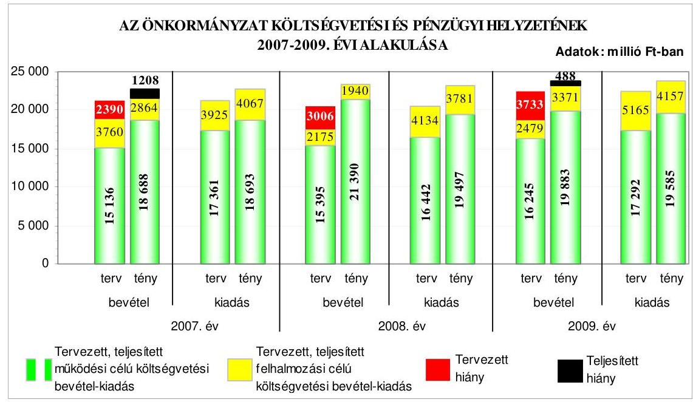

Az Önkormányzat a 2007-2010. évi eredeti költségvetési rendeleteiben kötvénykibocsátást nem tervezett. A költségvetési egyensúly biztosítása céljából likvid hitel felvételét, a 2007. évben az előző években kötött hitelszerződések alapján nem folyósított hosszú lejáratú hitelek lehívását, a 2008-2010. években - a kötvénykibocsátás fel nem használt részéből vásárolt - forgatási célú értékpapír értékesítését tervezték, valamint egyéb, a költségvetési hiány mérséklését, illetve megszüntetését célzó intézkedésekről határoztak. A jegyző a 2007-2010. évi költségvetések tervezése során a költségvetés végrehajtása érdekében a likviditás feltételeinek kialakításáról folyószámlahitel tervezésével, valamint elő-irányzat-felhasználási terv készítésével gondoskodott. Az Önkormányzat az Áht-ban előírtakat a 2007-2010. évi költségvetési rendeletekben nem tartotta be, mert a költségvetési kiadások és bevételek főösszegeinek megállapításánál költségvetési hiányt módosító költségvetési bevételként, kiadásként finanszírozási célú pénzügyi műveleteket vettek figyelembe.

Az Önkormányzat teljesített költségvetési bevételei a 2007. és a 2009. évben nem nyújtottak fedezetet a költségvetési kiadások teljesítésére, a pénzügyi egyensúly nem volt biztosított. A 2007. évben az 1208 millió Ft összegű pénz-

---

ügyi hiányt a múködési célú költségvetési bevételek ötmillió forintos hiánya, valamint a felhalmozási célú költségvetési bevételeket 1203 millió Ft-tal meghaladó összegben teljesített felhalmozási célú költségvetési kiadások okozták. A 2009. évben a 488 millió Ft összegű pénzügyi hiányt a felhalmozási célú költségvetési bevételeket 786 millió Ft-tal meghaladó összegben teljesített felhalmozási célú költségvetési kiadások okozták, amely hiányt csökkentette a múködési célú költségvetési bevételek 298 millió Ft összegű többlete. A 2008. évben 52 millió Ft-os pénzügyi többlet keletkezett a múködési célú költségvetési bevételek 1893 millió Ft összegű többlete és a felhalmozási célú költségvetési bevételeket 1841 millió Ft-tal meghaladó összegben teljesített felhalmozási célú költségvetési kiadások együttes hatásaként. A múködési célú költségvetési bevételeken belül a költségvetési támogatást, az intézményi múködési bevételeket, a hozam- és kamatbevételeket, a helyi adóbevételeket teljesítették túl, amely tervezési hibára nem vezethető vissza. A 2007-2009. években az éves költségvetések eredeti előirányzatainak kialakításánál - az Áht-ban előírtak ellenére nem tervezték az előző évi pénzmaradvány igénybevételét és a hozzá kapcsolódó, előző évről áthúzódó kötelezettségek előirányzatait. A 2007-2009. években keletkezett többletbevételeket a költségvetési hiány csökkentésére fordították, továbbá a költségvetési rendeletben előírt intézkedéseket megvalósították. A Közgyűlés 2007-2009 között - létszámcsökkentéssel is járó - intézményi átszervezésekről döntött. A Pénzügyi bizottság a 2007-2009. években a költségvetési bevételek alakulását figyelemmel kísérte, azonban - a 2007. évet kivéve - az Ötv-ben foglaltak ellenére a költségvetési bevételek változását előidéző okokat nem értékelte.

A Közgyűlés a 2007-2010. I. negyedévben nem döntött rövid vagy hosszú lejáratú hitel felvételéről. Az Önkormányzat a 2010. év elején 3259 millió Ft hosszú lejáratú hitelállománnyal rendelkezett, amelynek $84 \%$-a deviza alapú volt. Az Önkormányzat a 2007. évben 8165 millió Ft értékben svájci frank alapú, a 2008. évben 1790 millió Ft értékben euró alapú, 23, illetve 10 éves futamidővel kötvényt bocsátott ki múködési és felhalmozási célra. A forint euróhoz, illetve svájci frankhoz viszonyított árfolyamváltozása, valamint a változó kamatmérték miatt az Önkormányzat számára a devizában nyilvántartott hitelek, illetve a kötvénykibocsátások kockázatot jelentenek. A Pénzügyi bizottság a kötvénykibocsátások indokoltságát, gazdasági megalapozottságát vizsgálta. Az Önkormányzatnál a kötvénykibocsátások évében a kibocsátásból eredő tárgyévi kötelezettségvállalás összege az éves adósságot keletkeztető kötelezettségvállalás felső határának a 17,2\%-a volt a 2007. évben, ez az arány a 2008. évben 25,3\%-ra nőtt. Az Önkormányzat 2007-2009. években a kötvénykibocsátásból származó bevételéből - a tervezetteknek megfelelően - 2072-1821-3809 millió Ft-ot használt fel a múködési, valamint a fejlesztési feladatok finanszírozására. A Közgyűlés a kötvénykibocsátásból származó, átmenetileg szabad forrás hasznosítására vonatkozóan 2007. júliusban elfogadta az Önkormányzat devizapolitikai és likvid pénzeszközei kezelésének szabályzatát, amelyben az Ötvben előírtaknak megfelelően a polgármesterre és a Pénzügyi bizottságra átruházta a döntési hatáskörét. A kötvénykibocsátásból származó, átmenetileg szabad forrást forint- és devizabetétekben helyezték el, portfólió-kezelési megbízással értékpapírokba fektették, valamint keretszerződések alapján különböző pénzpiaci műveleteket, továbbá saját hatáskörben értékpapír vásárlásokat és lejárat előtti eladásokat végeztek. A portfólió-kezelési megbízásnál a portfólió-

---

kezelő társaságnak ilyen jogosultság az Ötv. szerint nem volt adható. Az értékpapír adásvételi szerződéseknél az Ámr. ${ }_{1}$-ben előírtak ellenére nem történt meg a kötelezettségvállalás ellenjegyzése. A polgármester által adott tájékoztatás szerint a portfólió-kezelő társasággal kötött szerződés 2010. november hónapban közös megegyezéssel megszűnt, illetve a kötvény kibocsátásából származó pénzeszközöket felhasználták, így az Önkormányzat nem rendelkezik átmenetileg szabad felhasználású pénzügyi forrásokkal, ezért további értékpapír ügyleteket nem végeznek.

Az Önkormányzat a 2007-2010. I. negyedév közötti időszakban folyamatosan, szinte minden nap vett igénybe folyószámlahitelt, annak átlagos állománya a 2007. évi 1304 millió Ft-ról a 2009. évre 1608 millió Ft-ra emelkedett. Az év végén vissza nem fizetett állomány a 2007. évi 731 millió Ft-ról, a 2009. évben 2201 millió Ft-ra nőtt. Az átmeneti likviditási problémák kialakulásához hozzájárult a folyamatban lévő európai uniós támogatással megvalósuló fejlesztések esetében szükséges előfinanszírozási igény is. Az igénybevett folyószámlahiteleket likvid hitelként számolták el annak ellenére, hogy azok nem tekinthetők az Ötv-ben foglaltak szerinti - likvid hitelnek, mivel éven belül nem fizették vissza. A Közgyűlés a folyamatosan emelkedő összegű likvid hitel visszafizetésére vonatkozóan előterjesztés hiányában nem döntött. Az Önkormányzat pénzügyi helyzete eladósodásának fokozódása és fizetőképességének gyengülése miatt kedvezőtlenül alakult.

Az Önkormányzatnál a hosszú és középtávú fejlesztési célkitűzések megvalósításához a lehetséges pénzügyi forrásokat figyelembe vették. Az Önkormányzat 2007-2010. I. negyedév között 100 európai uniós forrásokra benyújtott pályázatban volt érintett, amelyből az Önkormányzat 87-et (ebből intézményei 44-et), konzorcium vezetőjeként ötöt, valamint társulások keretében nyolcat nyújtott be. A benyújtott pályázatok közül 43 eredményes volt, 35 elutasításra került - tartalmi hiányosságok, a nem megfelelő költséghatékonyság, a pályázati források hiánya, szakmai kidolgozatlanság, a pályázati feltételeknek meg nem felelő tartalom miatt -, valamint 22 elbírálása még nem történt meg. A nyertes projektek, programok megvalósítása során 2007-2010. I. negyedév között az összes tényleges költségvetési kiadás 1565 millió Ft volt, amelyet $47 \%$-ban európai uniós, $4 \%$-ban hazai támogatásból, valamint $49 \%$ ban saját forrásból finanszíroztak. Az Önkormányzat a támogató kedvező döntése után egy pályázatát visszavonta, mert a tervezett program a testvérvárosok távolmaradása miatt nem valósult meg. A 2008-2010. évi költségvetési rendeletek felújítási, valamint felhalmozási kiadás előirányzatai tartalmazták az európai uniós támogatással megvalósuló feladatokat, azonban - az Áht-ban és az Ámr. ${ }_{1,2}$-ben foglaltak ellenére - nem mutatták be az európai uniós forrással támogatott projektek, programok közül kilenc bevételi és kiadási előirányzatait, három többéves kihatással járó feladat előirányzatait éves bontásban, valamint elkülönítetten 10 program, projekt bevételeit és kiadásait, továbbá egy projekt bevételeit. Az európai uniós támogatást tartalmazó, támogatási szerződéssel rendelkező fejlesztési feladatok, programok közel nyolcad része 20072010. I. negyedév között fejeződött be, amelyeket a tervezett forrásösszetétellel valósították meg.

Az Önkormányzat 2007-2010. I. negyedév között eredményesen készült fel a belső szabályozottság és a szervezettség terén az európai uniós források

---

igénybevételére, a támogatások felhasználására. A gazdasági program ${ }_{1,2}$-ben, az ágazati, szakmai koncepciókban, tervekben és az IVS-ben megfogalmazott fejlesztési célkitűzésekhez kapcsolódtak az európai uniós támogatások, szabályozták a pályázatfigyelést végzők és a döntési, illetve a döntés-előkészítési jogkörrel rendelkezők közötti információ-szolgáltatási kötelezettséget. A Polgármesteri hivatalon belül biztosították a pályázatfigyelés, illetve a Polgármesteri hivatalon belül és külső szervezet igénybevételével a pályázatkészítés és a fejlesztési feladatok, programok lebonyolításának szervezeti, személyi feltételeit. Meghatározták a külső szervezetekkel kötött szerződésekben a pályázat szakmai és formai követelményeire vonatkozóan a pályázatkészítő felelősségét, valamint előírták a fejlesztési feladat lebonyolítását végző ellenőrzési kötelezettségeit. Nem terjedt ki a belső ellenőrzési stratégiát megalapozó kockázatelemzés 2009 szeptemberéig az európai uniós forrásokkal támogatott fejlesztési feladatokra.

Az Önkormányzat rendelkezett a 2005-2010. évekre szóló informatikai stratégiával, amely tartalmazta a helyzetelemzést és az e-közszolgáltatási feladatoknál a 3. elektronikus szolgáltatási szint elérésének kitűzését. Az e-közszolgáltatási feladatok ellátásának személyi feltételeit a Polgármesteri hivatalon belül biztosították, saját számítógépes információs rendszeren keresztül és saját fejlesztésű program üzemeltetésével. Az ügyfelek részére a 2. elektronikus szolgáltatási szinten biztosították egyes ügykörökben az önkormányzati szolgáltatások e-közszolgáltatás keretében történő intézésének lehetőségét. A teljes közvetlen, kétoldalú ügyintézés pénzügyi források hiánya miatt nem biztosított. Az informatikai rendszer ügyfelek általi igénybevételét nem kísérték figyelemmel.

A vonatkozó IHM rendeletben előírtak ellenére az Önkormányzat honlapján a „közérdekú adatok" elnevezés helyett „közinformációs adatszolgáltatás" hivatkozást helyeztek el és a gazdálkodási adatokkal kapcsolatos közzétételi egységek meghatározott szerkezetű elérhetőségét nem biztosították. A jegyző - az Áhtban előírtak ellenére - nem tette közzé az Önkormányzat honlapján a nem normatív, céljellegú, múködési és fejlesztési támogatások 60\%-ánál a kedvezményezettek nevét, a támogatás célját, összegét, a megvalósítás helyét, a hiányzó adatokat 2010. június hónapban tette közé. A 2009. évben egy intézmény által az Önkormányzat pénzeszközei felhasználásával kötött, vagyonnal történő gazdálkodással összefüggő nettó ötmillió forintot elérő, vagy azt meghaladó értékű építési beruházásra, árubeszerzésre, szolgáltatás megrendelésre, vagyonértékesítésre, vagyonhasznosításra, vagyon, vagy vagyoni értékú jog átadására vonatkozó szerződések adatainak közzétételénél nem tartották be az Eisz. tv. előírását, mivel azokat nem az Önkormányzat honlapján, hanem az intézmény honlapján tették közzé. A jegyző a 2009. évi költségvetési beszámoló szöveges indokolását közzétette.

A költségvetés-tervezési és a zárszámadás-készítési folyamatok szabályozottsága alacsony kockázatot jelentett a feladatok megfelelő, szabályszerű végrehajtásában, mivel a jegyző a FEUVE rendszer keretében szabályozta a költségvetés-tervezés és a zárszámadás-készítés rendjét, meghatározta az intézmények részére a költségvetési javaslat összeállításával kapcsolatos követelményeket, előírta a költségvetési tervezéshez készített intézményi mutatószám felmérés adatai megalapozottságának, az intézményi beszámolók belső

---

összhangjának ellenőrzését, továbbá az intézmények által az állami támogatásokkal, hozzájárulásokkal történő elszámoláshoz közölt mutatószámok adatai megbízhatóságának és az intézményi pénzmaradványok kimunkálása szabályszerűségének ellenőrzését.

A Polgármesteri hivatalban a 2009. évben a költségvetés-tervezési és zárszá-madás-készítési folyamatban a múködésbeli hibák megelőzésére, feltárására, kijavítására kialakított belső kontrollok múködésének megfelelősége összességében kiváló volt, mivel a Polgármesteri hivatalban az előírásoknak megfelelően ellenőrizték, hogy az intézmények teljesítették-e a költségvetési javaslat öszszeállításával kapcsolatban részükre meghatározott követelményeket, az intézményi mutatószám felmérés adatainak megalapozottságát, az intézmények által az állami támogatásokkal, hozzájárulásokkal történő elszámoláshoz közölt mutatószámok adatainak megbízhatóságát és az intézmények pénzmaradvány megállapításának szabályszerűségét. Annak ellenére összességében kiváló volt a kontrollok múködésének megfelelősége, hogy formális volt az intézmények által javasolt előirányzatok megalapozottságának és az ismert kötelezettségek megtervezésének ellenőrzése, mert nem kifogásolták, hogy az éves költségvetések eredeti előirányzatainak kialakításánál nem tervezték meg az előző évi pénzmaradvány igénybevételét, a hozzájuk kapcsolódó előző évről áthúzódó kötelezettségvállalások előirányzatait, valamint a zárszámadás-készítés folyamatában dokumentáltan nem ellenőrizték az intézményi eredeti, módosított előirányzatok és teljesítések eltérésének indokoltságát.

A gazdálkodási, a pénzügyi-számviteli és a folyamatba épített ellenőrzési feladatok szabályozottsága összességében alacsony kockázatot jelentett a feladatok megfelelő, szabályszerű végrehajtásában, mivel rendelkeztek hivatali SzMSz-el és gazdasági szervezet ügyrend ${ }_{1,2}$-vel. A jegyző szabályozta a kötelezettségvállalás, ellenjegyzés, utalványozás, érvényesítés rendjét, a szakmai teljesítésigazolás módját és kijelölte a szakmai teljesítésigazolást végző személyeket, írásban megbízta az érvényesítőket, valamint biztosította a felhatalmazásoknál az összeférhetetlenségi követelmények betartását. Elkészítették a Polgármesteri hivatal számviteli politikáját és a kapcsolódó szabályzatokat, valamint a kockázatkezelési szabályzatot, és a szabálytalanságok kezelésének eljárásrendjét. Annak ellenére összességében alacsony volt a kockázat, hogy az érintett dolgozók munkaköri leírásában nem szerepeltek a selejtezési szabályzatban előírt hasznosítási, selejtezési feladatok. Az ellenőrzési nyomvonal nem tartalmazta az ellenőrzési pontokat, az egyes tevékenység, vagy feladat elvégzését igazoló dokumentum megnevezését és a fellelhetési helyét a rendszerben.

A Polgármesteri hivatalban a 2009. évben az államháztartáson kívülre történő működési és felhalmozási célú pénzeszköz átadásokkal, az állományba nem tartozók megbízási díjaival, valamint a külső szolgáltatók által végzett karbantartással, kisjavítással kapcsolatos kifizetések során - ezen területek költségvetési súlyának figyelembevételével összefoglalóan értékelve - a belső kontrollok múködésének megfelelősége kiváló volt, mivel a szakmai teljesítésigazolásra a jegyző által kijelölt személyek az államháztartáson kívülre történő múködési és felhalmozási célú pénzeszköz átadásokkal, valamint a külső szolgáltatók által végzett karbantartással, kisjavítással kapcsolatos kifizetések során ellenőrizték, szakmailag igazolták a kifizetések jogosultságát, összegszerűségét és a szerződések, megrendelések, megállapodások teljesítését. Az utalványok el-

---

lenjegyzője meggyőződött a gazdálkodásra vonatkozó szabályok betartásáról, továbbá ellenőrizte a szakmai teljesítésigazolás és az érvényesítés megtörténtét, azonban az állományba nem tartozók megbízási díjaival kapcsolatos kiadások megbízási szerződésben foglalt teljesítésének igazolását a szakmai teljesítés igazolására jegyző által kijelölt személyek nem végezték el és a gazdálkodásra vonatkozó szabályok - az Ámr. ${ }_{1}$-ben előírtak alapján az állományba nem tartozók személyi juttatása a saját munkavállalónak a munkakörén kívüli munkáért fizetett juttatás vonatkozásában - betartásáról és a szakmai teljesítésigazolás elvégzéséről az utalványok ellenjegyzője nem győződött meg. Az Áhsz-ben foglaltak ellenére tévesen számoltak el szolgáltatás ellenében történt pénzügyi teljesítést pénzeszköz átadásként és a munkaköri leírásban szereplő munkáért fizetett juttatás kiegészítést megbízási dijként, mivel az érvényesítő nem a gazdasági esemény tartalmának megfelelően jelölte ki a főkönyvi számlaszámokat.

A Polgármesteri hivatal rendelkezett informatikai stratégiával, informatikai biztonsági szabályzat ${ }_{1,2}$-vel, a jegyző gondoskodott az informatikával kapcsolatos szabályzatok megismertetéséről, a pénzügyi-számviteli feladatoknál használt programok adatai informatikai hálózaton keresztül elérhetők és bevezették az integrált pénzügyi-számviteli rendszert. A pénzügyi-számviteli tevékenységhez kapcsolódó informatikai feladatok szabályozottsága alacsony kockázatot jelentett az informatikai feladatok megfelelő, szabályszzerű végrehajtásában, mivel rendelkeztek eljárásrenddel a hozzáférési jogosultságokra, szabályozásban tiltották meg a külső fejlesztők éles rendszerhez való hozzáférését, lekérhető az ellenőrzési lista a pénzügyi-számviteli rendszerből, szabályozták a pénz-ügyi-számviteli program mentési eljárásának módját, idejét, eljárási rendjét, felelősségét. A Polgármesteri hivatalban a 2009. évben a pénzügyi-számviteli tevékenységhez kapcsolódó informatikai feladatoknál a kialakított belső kontrollok múködésének megfelelősége összességében kiváló volt, mivel biztosították a rendszerben tárolt hozzáférési jogosultságok ellenőrizhetőségét. Megkövetelték a pénzügyi-számviteli programokban a jelszavakra előírt szabályok betartását, a felhasználói leírásokban előírt, a program elemeire vonatkozó változáskezelési eljárások ellenőrzését, tesztelését dokumentálták. A pénzügyi-számviteli program segítségével elkészítették az ellenőrzési listát, az elmentett állományokból a pénzügyi-számviteli adatok helyreállíthatóságát ellenőrizték. Annak ellenére összességében kiváló volt a kontrollok múködésének megfelelősége, hogy nem tesztelték az elmúlt két évben a katasztrófa-elhárítási terv ${ }_{1}$-et.

Az Önkormányzatnál a belső ellenőrzési feladatok meghatározásának módja megfelelt az Ötv-ben foglaltaknak. A belső ellenőrzési kötelezettséget, az Ellenőrzési osztály jogállását és feladatait a hivatali SzMSz-ben meghatározták, a belső ellenőrök funkcionális függetlenségét biztosították. A belső ellenőrzés szervezeti kereteinek kialakítása és a szabályozása a belső ellenőrzési feladatok megfelelő, szabályszerű végrehajtásában összességében alacsony kockázatot jelentett, mivel a belső ellenőrzési vezető személyét meghatározták, a belső ellenőrzési kézikönyvet a jegyző jóváhagyta, a belső ellenőrzés rendelkezett kockázatelemzéssel alátámasztott stratégiai tervvel és a Közgyűlés által jóváhagyott éves ellenőrzési tervekkel, valamint az ellenőrzések lefolytatásához ellenőrzési programokat készítettek. Annak ellenére összességében alacsony volt a kockázat, hogy a belső ellenőrzési tervet alátámasztó kockázatelemzés nem ter-

---

jedt ki a 2009. és a 2010. évben az európai uniós forrásból megvalósított feladatok végrehajtására, a közbeszerzések lebonyolítására, valamint a 2009. évben az Önkormányzat többségi irányítást biztosító befolyása alatt működő gazdasági társaságok, közhasznú társaságok működésére és a kedvezményezett szervezeteknél az Önkormányzat költségvetéséből céljelleggel nyújtott támogatások rendeltetés szerinti felhasználására, továbbá a Közgyűlés által jóváhagyott ellenőrzési tervben tervezett ellenőrzések a 2009. évben nem voltak összhangban a kockázatelemzésben, valamint a stratégiai tervben foglaltakkal. Magas kockázatú területeket a 2004-2008. évi stratégiai ellenőrzési tervet megalapozó kockázatelemzésben nem tártak fel, azonban a 2009. évi belső ellenőrzési terv összeállításakor az éves tervet megalapozó kockázatelemzésben meghatározták azokat. A 2010-2014. évi stratégiai ellenőrzési tervet alátámasztó kockázatelemzésben a szervezettség, szabályozottság, a beruházási, felújítási tevékenység, valamint a pályázati tevékenység területeit határozták meg magas kockázatúaknak, amelyeket a 2010. évi belső ellenőrzési terv összeállításakor figyelembe vettek.

A Polgármesteri hivatalban 2009. évben a belső ellenőrzés működésénél a kialakított kontrollok megfelelősége kiváló volt. A belső ellenőrzési feladatok ellátási módja megfelelt az Ötv-ben foglaltaknak. A 2009. évben a tervezett ellenőrzéseket elvégezték és a 2010. évi belső ellenőrzési tervet az I. negyedévben időarányosan teljesítették. A belső ellenőrzésekről készült jelentések megállapításokat, javaslatokat tartalmaztak, amelyek végrehajtásáról utóellenőrzéssel győződtek meg. A belső ellenőrzési vezető az elvégzett ellenőrzésekről nyilvántartást vezetett. A jegyző a belső kontrollrendszerek 2008. és 2009. évi múködéséről teljesítette nyilatkozattételi kötelezettségét. A polgármester - az Ötv. előírásának megfelelően - a zárszámadási rendelettervezettel egyidejűleg a Közgyűlésnek előterjesztette a 2008-2009. évi ellenőrzési tapasztalatok alapján készített összefoglaló jelentéseket.

Az ÁSZ az Önkormányzat gazdálkodási rendszerét a 2005. évben ellenőrizte átfogó jelleggel, amelynek során 20 szabályszerűségi és három célszerűségi javaslatot tett. A jelentést a Közgyűlés megtárgyalta és elfogadta, hogy a javaslatok megvalósítására intézkedési tervet készítenek, amit jegyzői utasítással adtak ki a felelősök és határidő megjelölésével. Az ÁSZ ellenőrzés által tett szabályszerűségi javaslatok $85 \%$-át realizálták, $10 \%$-át részben valósították meg és öt százalékát nem teljesítették. A három célszerűségi javaslatot megvalósították.

A 2006. évi költségvetési koncepció, a költségvetési rendelettervezet előterjesztés, a költségvetési rendeletmódosítás tartalmára, a gazdálkodás és a pénzügyiszámviteli feladatellátás szabályozottságára, a vagyongazdálkodási feladatok és döntési hatáskörök meghatározására, a céljellegú támogatások és szerződések adatainak közzétételére, valamint az alapítványok céljellegú támogatására vonatkozó javaslatokat hasznosították. A helyi kisebbségi önkormányzatokkal kötött együttmúködési megállapodásokat felülvizsgálták és a szabályozottságra tett javaslatokkal módosították a gazdálkodási jogköreiket. Az önkormányzati gazdálkodás egyéb területeinek törvényes, szabályszerű ellátását érintő javaslatokat realizálták.

A polgármesternek tett szabályszerűségi javaslatok közül egy részben hasznosult, mivel ingatlan bérbeadására kötött szerződést a 2006. évben egyik párttal

---

felmondták, azonban a másik párt részére kedvezményes bérleti díj ellenében biztosított ingatlan-használattal - az Ötv-ben előírtak ellenére - továbbra is közvetett támogatást nyújtottak. A jegyzőnek tett szabályszerűségi javaslatok közül egy részben hasznosult, mivel a 2006. és a 2009. évi zárszámadási rendelet tartalmazta a Polgármesteri hivatalnál a munkaadót terhelő járulékok, a dologi jellegű kiadások és a speciális célú támogatások előirányzatainak teljesítését, azonban nem tartalmazta - az Áht-ban foglaltak ellenére - a tényleges létszámkeretet.

A polgármesternek tett szabályszerűségi javaslatok közül egy nem hasznosult, mivel a 2006. évben kettő, a 2009. évben pedig négy önállóan gazdálkodó intézménynél a teljesítések - az Áht-ban előírtak ellenére - meghaladták a kiemelt előirányzatokat, az előirányzat túllépés miatt nem kezdeményeztek vizsgálatot, illetve felelősségre vonást.

A célszerűségi javaslatokat megvalósították, a számvevőszéki jelentés javaslatainak hasznosítására vonatkozó intézkedési terv készítésével, a szervezetek rendezvények támogatására alap elnevezés helyett keretösszegek meghatározásával és a gazdálkodási jogkörrel rendelkezők, illetve az ellenőrzésért felelősök feladatainak az ellenőrzési nyomvonal mellékletében történő rögzítésével.

A javaslatok hasznosítása következtében javult a költségvetési koncepció és a költségvetési rendeletkészítés, illetve -módosítás, a vagyongazdálkodási feladat és döntési hatáskör meghatározás, a céljelleggel nyújtott támogatásokkal kapcsolatos döntés és a közzétételéről szóló nyilvántartás, valamint a helyi kisebbségi önkormányzatokkal kötött megállapodásokban a gazdálkodási és ellenőrzési jogkörök szabályozottsága.

Az Önkormányzatnál az ÁSZ a Magyar Köztársaság 2005. évi költségvetése végrehajtásának ellenőrzése keretében a 2006. évben vizsgálta a kötött felhasználású támogatások felhasználását, a normatív hozzájárulás igénylését és elszámolását, a beruházásokhoz és rekonstrukciókhoz nyújtott felhalmozási célú támogatások igénybevételét. A vizsgálatok során készített számvevői jelentések a polgármesternek egy célszerűségi, a jegyzőnek kilenc szabályszerűségi javaslatot tartalmaztak, amelyekről a Közgyűlést tájékoztatták. A jegyző utasításban intézkedett a javaslatok hasznosítására, a vonatkozó törvényekben előírtak betartására és a normatív hozzájárulás ellenőrzésnek az éves belső ellenőrzési tervben szerepeltetésére.

A hajléktalanokat ellátó intézményrendszer ellenőrzése során a számvevői jelentés a polgármesternek kettő célszerűségi, a jegyzőnek egy szabályszerűségi és egy célszerűségi javaslatot tartalmazott, amelyeket a Közgyűlés megtárgyalt és elfogadott. A javaslatok megvalósítására a polgármester kezdeményezte a szolgáltatástervezési koncepció kiegészítését és a jegyző utasításban intézkedett a hajléktalanok ellátását biztosító épületek akadálymentesítésére, a tárgyi feltételeknek a javítására és a hajléktalan ellátás célszerűségének és hatékonyságának vizsgálatára. A közmunka programok támogatására fordított pénzeszközök hasznosulásának ellenőrzése során a számvevői jelentés a polgármesternek egy szabályszerűségi és a jegyzőnek öt célszerűségi javaslatot tartalmazott. Intézkedett a polgármester a 2006. évi közmunkaprogram támogatásmaradványának elszámolására, valamint a jegyző a közhasznú, a közcélú és a köz-

---

munka program keretében foglalkoztatás hatékonyságának javítására. A szilárd hulladékgazdálkodásra a Kohéziós Alapból és hazai forrásból nyújtott támogatások hasznosulásának ellenőrzése során a számvevői jelentés a polgármesternek kettő célszerűségi, a jegyzőnek öt szabályszerűségi és egy célszerűségi javaslatot tartalmazott, amelyek megvalósítására a Közgyűlés határozattal fogadta el az intézkedési tervet. A 2004-2008. évek hulladékgazdálkodási tervének végrehajtásáról a beszámolót, illetve a 2009-2014. évekre szóló hulladékgazdálkodási tervet 2010. december végéig terjesztik a Közgyűlés elé. A jegyző intézkedett a hulladéklerakóhoz tartozó földterületek tulajdonjogának 2010. szeptember utolsó napjáig történő rendezéséről, valamint a beruházás lebonyolítása során keletkezett dokumentumoknak hét évig való megőrzéséről és a hulladékgazdálkodási feladatokhoz kapcsolódó bevételek és kiadások előirányzatainak a 2009. és 2010. évi költségvetésben megtervezéséről.

A helyszíni ellenőrzés megállapításainak hasznosítása mellett javasoljuk:

# a polgármesternek 

a munka színvonalának javítása érdekében
kezdeményezze, hogy a számvevőszéki jelentésben foglaltakat a Közgyűlés tárgyalja meg és a feltárt hiányosságok megszüntetése érdekében készíttessen intézkedési tervet a határidők és felelősök megjelölésével;

## a jegyzőnek

a jogszabályi előírások maradéktalan betartása érdekében

1. gondoskodjon az Áht. 8/C. § (3)-(4) bekezdéseiben előírtak alapján a költségvetéstervezési folyamatoknál, az intézmények költségvetési javaslatában az előző évi pénzmaradvány igénybevétele és az ehhez kapcsolódó előző évről áthúzódó, ismert kötelezettségek megtervezéséről;
2. gondoskodjon az Önkormányzat költségvetési rendeletének végrehajtása során arról, hogy likvid hitelként csak az Ötv. 88. §. (3) bekezdés d) pontjában foglaltakat figyelembe véve - éven belül felvett és visszafizetett - hiteleket számoljanak el a könyvviteli nyilvántartásokban, valamint készítsen likviditási koncepciót, és végezze el a likvid hitel éven belüli visszafizetési lehetőségének részletes vizsgálatát, továbbá annak eredményéről tájékoztassa a Közgyűlést;
a munka színvonalának javítása érdekében
3. tájékoztassa - évente végzett számítások alapján - a Közgyűlést, az Önkormányzat eladósodásának növekedésére figyelemmel arról, hogy a hosszú lejáratú, adósságot keletkeztető kötelezettségvállalásokból adódó tőke- és kamatfizetési kötelezettségét az Önkormányzat milyen feltételek biztosítása mellett tudja teljesíteni;
4. vizsgálja felül az intézményi eredeti, módosított előirányzatok és teljesítések eltérését, azok indokoltságát.

---

# II. RÉSZLETES MEGÁLLAPÍTÁSOK 

## 1. AZ ÖNKORMÁNYZAT KÖLTSÉGVETÉSI ÉS PÉNZÚGYI HELYZETE

### 1.1. A tervezett költségvetési bevételek és kiadások alapján a költségvetési egyensúly, a költségvetési hiány alakulása, a hiány tervezett finanszírozási módja, valamint a költségvetési hiány megállapításának szabályszerűsége

Az Önkormányzatnál a tervezett költségvetési bevételek és kiadások föösszegei az előző évhez képest a 2008. évben csökkentek, a 2009-2010. évben folyamatosan növekedtek.

Az Önkormányzatnál a 2007-2010. években a költségvetés egyensúlyát nem biztosították, a tervezett költségvetési bevételek nem nyújtottak fedezetet a tervezett költségvetési kiadásokra. A tervezett múködési célú költségvetési bevételeknél a hiányzó forrás 806 és 2225 millió Ft között volt, a felhalmozási célú költségvetési bevételeket minden évben meghaladták a tervezett felhalmozási célú költségvetési kiadások. A 2007-2010. években a költségvetési hiányt a tervezett múködési célú költségvetési bevételek hiánya és a felhalmozási célú költségvetési bevételeket meghaladó összegben tervezett felhalmozási célú kiadások együttesen okozták.
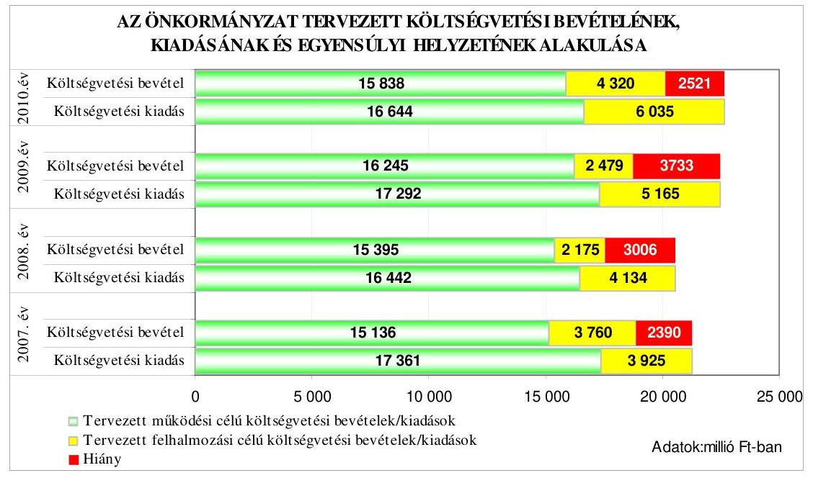

Az Önkormányzat a 2007-2010. évi költségvetési rendeleteiben kötvénykibocsátást nem tervezett, a költségvetési egyensúly biztosítása és a tervezett hiány finanszírozása céljából:

---

- likvid hitel felvételét irányozták elő 375 és 2650 millió Ft közötti összegben,
- a 2007. évben az előző években kötött hitelszerződések alapján még nem folyósított hosszú lejáratú hitelek igénybevételét tervezték,
- a 2008-2010. években a kötvénykibocsátásból származó, fel nem használt bevételből vásárolt forgatási célú értékpapír értékesítését tervezték,
- egyéb, a költségvetési hiány mérséklését, illetve megszüntetését célzó intézkedésről határoztak.

A 2007-2010. években meghatározták, hogy az év közben képződő többletbevételeket és kiadási megtakarításokat a költségvetési hiány csökkentésére kell fordítani. A 2007. évben előírták az intézményekben foglalkoztatott dolgozók létszámcsökkentését ${ }^{8}$. A 2007-2008. évek költségvetéseiben a „városháztartási reform" keretében - a működési kiadások csökkentéseként - javaslat kidolgozását írták elő az intézmények épület-üzemeltetési, karbantartási, felújítási, élelmezésszolgáltatási feladataira, valamint az intézmények szervezeti rendszerének korszerűsítésére, bér és létszám ellátottság helyzetének felmérésére, a hatékonyabb feladatellátásra. A 2007-2010. években az intézmények meghatározott feladataira ${ }^{9}$ intézményi tartalékot, a 2009. évben a Polgármesteri hivatal és az intézmények számára 265 millió Ft stabilizációs tartalékot ${ }^{10}$ határoztak meg. Az Önkormányzat adóbevételével dolgozók érdekeltségi rendszerének szabályairól szóló rendelet alkalmazását 2010. január 1-jétől felfüggesztették. A 2007-2010. évek költségvetési rendeletei tartalmazták, hogy a költségvetési forráshiány megszüntetését az aktív adósságszolgálati rendszer keretében igénybe vehető kölcsönforrásokból, a központosított előirányzatokra történő pályázati pénzeszközökből, valamint a 2009. évben a kiadási előirányzatok kötelezettségvállalásaira irányuló intézkedések korlátozásával biztosítják.

A jegyző a 2007-2010. évi költségvetések tervezése során a költségvetés végrehajtása érdekében a likviditás feltételeinek kialakításáról folyószámlahitel tervezésével, valamint az Ámr. ${ }_{1}$ 29. § (1) bekezdés j) pontja ${ }^{11}$ alapján elő-irányzat-felhasználási terv ${ }^{12}$ készítésével gondoskodott.

Az Önkormányzat az Áht. 8/A. § (7) bekezdésében előírtakat a 2007-2010. évi költségvetési rendeletekben nem tartotta be, mert a költségvetési kiadások és bevételek főösszegeinek megállapításánál költségvetési hiányt módo-

[^0]
[^0]:    ${ }^{8}$ A 2007. évi költségvetési rendelet 8. § (4/b) bekezdés alapján a 2/c) mellékletben részletezettek szerint.
    ${ }^{9}$ A személyi kiadásoknál a tartósan távollévőket helyettesítők foglalkoztatásának, a nyugdíjazás, a jubileumi jutalom, a betegszabadság, a dologi kiadásoknál a művészetoktatás, évfordulók, versenyek és az egyéb többletfeladatok kiadását tartalékba helyezték.
    ${ }^{10}$ A stabilizációs tartalékot saját bevételből, pénzmaradványból kellett kigazdálkodni.
    ${ }^{11}$ Erről 2010. január 1-jétől az Ámr. ${ }_{2}$ 36. § (1) bekezdés k) pontja rendelkezik.
    ${ }^{12}$ A 2007-2008. évek költségvetési rendeleteiben a 7. számú, a 2009-2010. években a 8. számú melléklet tartalmazza az előirányzat-felhasználási tervet.

---

sító költségvetési bevételként, kiadásként finanszírozási célú pénzügyi múveleteket is figyelembe vettek. ${ }^{13}$

A 2007-2010. évi költségvetési rendeletek normaszövegeiben a tervezett kiadások főösszegében az évek sorrendjében 373,3-285,7-451,2-459,5 millió Ft tervezett hitel és kötvénytörlesztéssel, valamint a tervezett bevételek főösszegében az évek sorrendjében 395,6-2034,2-3808,9-2201,4 millió Ft a 2007. évet megelőző években kötött hitelszerződések alapján még nem folyósított hosszú lejáratú hitelek igénybevételével és forgatási célú értékpapírok értékesítésével számoltak.

# 1.2. A teljesített költségvetési bevételek és kiadások alapján a pénzügyi egyensúly, a pénzügyi hiány alakulása, a pénzügyi hiány finanszírozása, az igénybe vett finanszírozási célú pénzügyi eszközök hatása a pénzügyi helyzet alakulására, az eladósodásra, valamint a fizetőképességre 

Az Önkormányzatnál a teljesített költségvetési bevételek főösszege az előző évhez képest a 2008. évben 23330 millió Ft-ra ( $8,3 \%$-kal) nőtt, a 2009. évben 23254 millió Ft-ra ( $0,3 \%$-kal) csökkent. A 2007-2009. években a teljesített költségvetési kiadások főösszege az előző évhez viszonyítva folyamatosan növekedett, a 2007. évi 22760 millió Ft-ról a 2008. évben 23278 millió Ft-ra, majd a 2009. évben 23742 millió Ft-ra emelkedett.
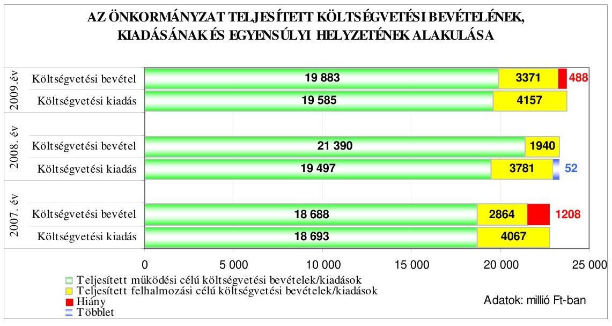

Az Önkormányzat teljesített költségvetési bevételei a 2007. és a 2009. évben nem nyújtottak fedezetet a költségvetési kiadások teljesítésére, a pénzügyi egyensúly nem volt biztosított. A pénzügyi hiányt a felhalmozási célú költ-

[^0]
[^0]:    ${ }^{13}$ A közbenső egyeztetés során a polgármester által adott tájékoztatás szerint a jegyző intézkedett, hogy az Áht. 8/A. § (7) bekezdésében előírtaknak megfelelően a finanszírozási célú pénzügyi műveleteket a 2011. évi költségvetési rendelettervezet előkészítése során ne vegyék figyelembe költségvetési hiányt módosító költségvetési bevételként, illetve költségvetési kiadásként.

---

ségvetési bevételeket 1203, illetve 786 millió Ft-tal meghaladó összegben teljesített felhalmozási célú költségvetési kiadások, valamint a 2007. évben a múködési célú költségvetési bevételek ötmillió forintos hiánya okozta.

Az Önkormányzatnál a 2007-2010. években tervezett és a 2007-2009. években teljesített múködési és felhalmozási célú költségvetési kiadásokra a következő arányban biztosítottak fedezetet a költségvetési bevételek:

Adatok: \%-ban

| Megnevezés | 2007.   év |  | 2008.   év |  | 2009.   év |  | 2010.   év |
| :--: | :--: | :--: | :--: | :--: | :--: | :--: | :--: |
|  | Terv | Tény | Terv | Tény | Terv | Tény | Terv |
| Múködési célú költségvetési kiadások fedezettsége múködési célú költségvetési bevételekből | 87,2 | 100,0 | 93,6 | 109,7 | 93,9 | 101,5 | 95,2 |
| Felhalmozási célú költségvetési kiadások fedezettsége felhalmozási célú költségvetési bevételekből | 95,8 | 70,4 | 52,6 | 51,3 | 48 | 81,1 | 71,6 |
| Költségvetési kiadások fedezettsége költségvetési bevételekből | 88,8 | 94,7 | 85,4 | 100,2 | 83,4 | 97,9 | 88,9 |

Az Önkormányzatnál a 2007-2010. években a tervezett költségvetési kiadások fedezettsége nem volt biztosított a tervezett költségvetési bevételekből. A fedezettség mértéke a tervezett költségvetési kiadási főösszegre vonatkozóan 2007-ről 2008-ra 3,4 százalékponttal, a 2009. évre az előző évhez képest kettő százalékponttal romlott, majd 2010-re javulás következett be, a fedezettség 0,1 százalékponttal meghaladta a 2007. évi szintet. A 2007-2009. évek között teljesített költségvetési kiadások fedezettségi mutatója a tervhez képest 5,9-14,8-14,5 százalékponttal javult, ezen belül a múködési célú költségvetési kiadások fedezettsége biztosított volt a múködési célú költségvetési bevételekből, a felhalmozási célú kiadások fedezettsége a tervhez képest csak a 2009. évben emelkedett, azonban egyik évben sem fedezték a felhalmozási célú bevételek a felhalmozási célú kiadásokat.

Az Önkormányzatnál a 2007-2009. években az egyensúlyi helyzet a tervezetthez viszonyítva javult. A költségvetés végrehajtása során a tervezettől eltérő összegű teljesítést a 2007-2009. években a múködési célú költségvetési kiadások 7,7-18,6-13,3\%-os túlteljesülését meghaladó (123,5-138,9-129,3\%os) múködési célú költségvetési bevételek teljesítése ${ }^{14}$ okozta.

[^0]
[^0]:    ${ }^{14}$ A múködési bevételeket az eredeti előirányzathoz képest 2007-2009 között 3552-5995-3638 millió Ft-tal túlteljesítették.

---

A múködési célú költségvetési bevételeken belül a költségvetési támogatást ${ }^{15}$, az intézményi múködési bevételeket ${ }^{16}$, a hozam- és kamatbevételeket ${ }^{17}$, a helyi adóbevételeket ${ }^{18}$ teljesítették túl, amely tervezési hibára nem vezethető vissza. A 2007-2009. években az éves költségvetések eredeti előirányzatainak kialakításánál - megsértve az Áht. 7. § (2) bekezdésében ${ }^{19}$ előírtakat - nem tervezték az előző évi pénzmaradvány igénybevételét ${ }^{20}$ és a hozzá kapcsolódó, előző évről áthúzódó kötelezettségek előirányzatait.

A közbenső egyeztetés során a polgármester észrevétele szerint: „A költségvetés tervezési folyamatában az előző évi pénzmaradvány igénybevétele és az ehhez kapcsolódó előző évről ismert kötelezettségek tervezésénél álláspontunk szerint nem sértettük meg az Áht. 7. § (2) bekezdésében előírtakat. A 2007. és 2009. évek közötti szabályozásban az Áht. 7. § (2) bekezdése feltételes módban fogalmaz „megjelölhető és elszámolható" kifejezést használ az előirányzat maradvány forrásként történő figyelembevételére. Az akkor hatályos szabályok szerint az Ámr., 65. § (2) bekezdése szerint a költségvetési szerv pénzmaradványát, előirányzat maradványát az éves beszámoló készítésekor állapítja meg a beszámoló készítési és kötelezettségükről szóló jogszabályoknak megfelelően. Az Ámr., 66.§ (4) bekezdése előirja az előirányzat-maradvány vagy pénzmaradvány felülvizsgálatát és a zárszámadási rendelet elfogadásával egyidejú jóváhagyását (Ámr. 2 213.§ (3) bekezdés). Mindezekből az következik, hogy csak az a pénzmaradvány vehető figyelembe, amelyről teljes bizonyossággal állítható az, hogy jogos és az intézmény számára felhasználható. Ez biztositja az Ámr. 2 8/C. § 1/b. pontjában rögzített számviteli megalapozottsági elv érvényesülését. A zárszámadási rendelet megalkotására a hatályos szabályi előirások alapján a költségvetési rendelet elfogadását követő időpontban kerül sor. Így közgyúlési döntéssel jóváhagyott előirányzat, illetve pénzmaradvány a tervezési időszakban nincs."

Az észrevétel nem megalapozott, mivel az Áht. 7. § (2) bekezdése előírása alapján a költségvetés olyan pénzügyi terv, amely az érvényességi időtartam alatt a feladat ellátásához teljesíthető jóváhagyott kiadásokat és a teljesítendő várható bevételeket előirányzatként tartalmazza. A helyi önkormányzati alrendszer esetében a rendelkezésre álló pénzeszköz év végi záró állománya, illetve annak forrásként történő számbavétele a következő év költségvetésében eredeti előirányzatként tervezhető, ezért az előző évről áthúzódó kötelezettségvállalásokat és azok forrásául szolgáló pénzmaradványt az eredeti előirányzatok között kell fi-

[^0]
[^0]:    ${ }^{15}$ A költségvetési támogatás múködési célú részét 2007-2009 között 834-1530-1326 millió Ft-tal (14,6-23,2-20,7\%-kal) túlteljesítették az év közben pályázat útján, illetve igénylés alapján kapott támogatások (központosított előirányzatok, egyes jövedelempótló támogatások) miatt.
    ${ }^{16}$ Az eredeti előirányzatot 2007-2009 között - jellemzően az egyéb saját bevételek miatt - 413-426-544 millió Ft-tal túlteljesítették.
    ${ }^{17}$ A 2007-2009. években a tervezetthez képest 543-353-359 millió Ft-tal több hozam- és kamatbevételt realizáltak a kötvénybevétel átmenetileg szabad részének lekötése miatt.
    ${ }^{18}$ A helyi adóbevételeket 2007-2008 között 317 millió Ft-tal, illetve 222 millió Ft-tal túlteljesítették, 2009-ben a teljesítés 7,7\%-kal alatta maradt a tervezett összegnek.
    ${ }^{19}$ Az Áht. 7. § (2) bekezdése 2010. január 1-jétől hatályát vesztette, a költségvetés tervezésére az Áht. 8/C. § (1)-(4) bekezdései tartalmaznak előírásokat.
    ${ }^{20}$ A módosított pénzmaradvány összege a tárgyévet megelőző év költségvetési beszámoló 29. űrlap adata szerint, az évek sorrendjében: 456,8 millió Ft, 1719,2 millió Ft, 1846,4 millió Ft volt.

---

gyelembe venni az Ámr. ${ }_{2}$ 36. § (1) bekezdés b), c), d) pontja alapján a múködési, a felújítási, a felhalmozási kiadások esetében.

A 2010. évi költségvetésben 984 millió Ft előző évi pénzmaradvány igénybevételét tervezték.

A 2006. évről áthúzódó pénzmaradvány a forrása a 2007. évben a Polgármesteri hivatalnál és az intézményeknél a 342 millió Ft kötelezettséggel terhelt feladatok kiadásainak, amelyet nem terveztek az eredeti előirányzatok között. A 2008. és a 2009. évben nem tervezték meg az eredeti előirányzatok között az intézményeknél 420-381 millió Ft, a Polgármesteri hivatalnál 1054-1254 millió Ft összegű kötelezettséggel terhelt feladat bevételeit és kiadásait.

Hatással volt a teljesített költségvetési bevételek és kiadások egyenlegének tervezettől eltérő alakulására a felhalmozási célú költségvetési bevételek és kiadások alulteljesítése, amelyet nem tervezési hiányosság okozott. Összességében a felhalmozási célú költségvetési kiadásokat a 2007. évben 3,6\%-kal túl, a 20082009. években 9,5-19,5\%-kal alulteljesítették, a felhalmozási célú költségvetési bevételek teljesítése az eredetihez képest 76,2-89,2-91,0\%-os volt.

A 2007-2009. évek között az eredeti előirányzathoz képest a 39,8-34,2-22\%-os alulteljesítést a beruházási kiadások pontatlan tervezése és a beruházási feladatok teljesítésének elmaradása okozta. A felújításra tervezett előirányzatot - a beruházásként tervezett, majd felújításként elszámolt és az év közben megvalósított feladatok miatt - 2007-2009 között 203,5-104,2-25,3\%-kal túlteljesítették.

A felhalmozási célú költségvetési bevételek közül 2007-ben a tárgyi eszközök értékesítését $91,5 \%$-kal, az önkormányzati lakások értékesítését $63,2 \%$-kal, a felhalmozási célú költségvetési támogatásokat $27,0 \%$-kal alulteljesítették. A telekértékesítés bevételeit 2008-ban a tervezetthez képest $27,0 \%$-ra teljesítették a Damjanich Uszoda telekeladásához kapcsolódó pénzügyi teljesítések elhúzódása miatt és az önkormányzati lakásértékesítés bevételei $47,0 \%$-kal maradtak el a tervezettől, mert nem érkezett vételi szándék a licitfelhívásra. A vagyonhasznosítási bevételek esetében 2009-ben a telekértékesítés bevétele $86,6 \%$-kal alatta maradt a tervezettnek, mert a pénzügyi teljesítés áthúzódott a 2010. évre, valamint a támogatásértékű felhalmozási bevételeket $53,4 \%$-kal alulteljesítették, mert nem érkezett meg a támogatás a regionális hulladéklerakó megvalósításához.

A 2007-2009. években tervezett költségvetési hiányt az állami támogatás, helyi adók, egyéb sajátos bevételek többletéből és a finanszírozási célú kötvénykibocsátás többletbevételéből csökkentették, továbbá a költségvetési rendeletben elöírt intézkedéseket megvalósították. A Közgyűlés a 20072009 között - létszámcsökkentéssel járó - intézményi átszervezésekről döntött.

Az Önkormányzatnál a 2007. évben a Csarnok és Piac Intézmény megszűnt, a négy önálló óvodai igazgatóságot egy szervezeti egységbe vonták össze, az Egészségügyi Szolgálat feladatait a Bölcsődei Igazgatósághoz integrálták. Összevontak 2008-ban kettő általános iskolát, valamint kettő szakképző intézménybe a szakközépiskolákat. Az intézményi átszervezések miatt a közalkalmazottaknál a 2007. évben 546 fős, a 2009. évben 18 fős létszámcsökkentést hajtottak végre, a 2008. évben a létszám hét fővel növekedett. A 2007-2008. évben meghatározott intézményi tartalék tényleges igénybevételéből 123-143 millió Ft megtakarítást értek el. A 2009. évben a stabilizációs tartalék $90 \%$-át az intézmények teljesítették.

---

Az Önkormányzatnál a 2007. évben a Humán Szolgáltató Központot és az Egyesített Szociális Intézményt a Többcélú társulás fenntartásába adták, amely csökkentette a pénzügyi hiányt, mert 23 millió Ft megtakarítást eredményezett. A költségvetés végrehajtása során a tervezett és nem tervezett intézkedések megvalósításának következtében a 2007-2009. években csökkent a költségvetésben tervezett hiány.

A 2007-2009. években a költségvetési bevételek alakulását a Pénzügyi bizottság figyelemmel kísérte ${ }^{21}$, azonban - a 2007. évet kivéve ${ }^{22}$ - az Ötv. 92. § (13) bekezdésének b) pontjában foglaltakat megsértve a költségvetési bevételek változását előidéző okokat nem értékelte ${ }^{23}$.

A Közgyűlés a 2007-2010. I. negyedév időszakban nem döntött rövid vagy hosszú lejáratú hitel felvételéről. A 2007. évi költségvetési rendeletben tervezett 396,0 millió Ft összegű hosszú lejáratú hitelfelvétel korábbi években kötött hitelszerződések alapján még le nem hívott hitelösszegekhez kapcsolódott ${ }^{24}$. Az Önkormányzat a 2010. évben a fejlesztési célú, hosszú lejáratú hitelei tőketörlesztésére 345,3 millió Ft-ot, kamatfizetésre 74,0 millió Ft-ot tervezett fordítani, az esetleges árfolyam-növekedésre adósságszolgálati céltartalékot képeztek. A 2010. január 1-jei hitelállomány 83,6\%-a (2724,8 millió Ft) deviza alapú volt.

A Közgyűlés a 2005. évben az aktív adósságszolgálati rendszer alkalmazásáról döntött ${ }^{25}$, amelynek keretében a 2005. évben a hitelállomány egy részénél a futamidőt növelték, más részénél a forint alapú hitelt svájci frank alapúra váltották. A beruházási hitelek állománya 2010. január 1-jén 3258,8 millió Ft, amely kettő forint, kettő svájci frank és nyolc euró alapú hitelszerződésből származott.

Az Önkormányzat a 2007. évben 8165 millió Ft, a 2008. évben 1790 millió Ft értékben évközi döntéssel kötvényt bocsátott ki. A „Szolnok MJV 2030/A"

[^0]
[^0]:    ${ }^{21}$ A 2007-2009. években a Pénzügyi bizottság megtárgyalta, véleményezte a koncepciót, a költségvetés tervezetét, a féléves, háromnegyed éves beszámolót és éves zárszámadást.
    ${ }^{22}$ A Pénzügyi bizottság Ellenőrző albizottsága 17/2007. (IX. 20.) számú határozata alapján az Önkormányzat 2007. I. félévi saját bevételeinek vizsgálatáról szóló jelentést megtárgyalta és elfogadta. Az SzMSz alapján az Ellenőrző albizottság feladata vizsgálni és értékelni a saját bevételek alakulását.
    ${ }^{23}$ A közbenső egyeztetés során adott tájékoztatás szerint intézkedett a polgármester, hogy az SzMSz módosítás tartalmazza a Pénzügyi bizottság feladataként a költségvetési bevételek változásának dokumentált értékelését.
    ${ }^{24}$ Az Önkormányzat a Sikeres Magyarországért Önkormányzati Fejlesztési Hitelprogram keretében 2005. november 18-án megkötött, 507 millió Ft kedvezményes kamatozású, beruházási célokra fordítható forinthitel szerződés alapján 31 millió Ft-ot, valamint a 2006. szeptember 18-án kötött svájci frankban nyilvántartott 1205 millió Ft hi-telkeret-szerződés alapján 365 millió Ft-ot vett igénybe 2007-ben a fejlesztési feladatok finanszírozására. A forinthitel törlesztését három év türelmi időt követően 2008-ban, a devizahitel visszafizetését 2009-ben kezdték, a futamidő 14, illetve 12 év.
    ${ }^{25}$ A Közgyűlés 247/2005. (IV. 28.) és 248/2005. (IV. 28.) számú határozataiban döntött erről.

---

kötvényt 2007. június 28 -án zártkörűen bocsátották ki, 55 millió svájci frank értékben, futamideje 23 év, a tőketörlesztés négy év türelmi idővel 2011. szeptember 30 -án kezdődik éves esedékességgel, a félévente fizetendő kamat mértéke hat havi CHF LIBOR ${ }^{26}+0,5 \%$ kamatfelár. A kötvénykibocsátásból származó bevételből 2007-2009 között múködési célra 3710 millió Ft-ot, 2007-2010 között felhalmozási célra 4990 millió Ft-ot terveztek ${ }^{27}$ fordítani. A „Szolnoki Ipari Park" elnevezésű, a Szolnoki Ipari Park Kft. pénzügyi kötelezettségének teljesítéséhez és az Ipari Park fejlesztéséhez ${ }^{28}$ szükséges források megteremtésére szóló kötvény 2008. december 22-én zártkörűen került kibocsátásra 1790 millió Ftnak megfelelő, 6742 ezer euró összegben. A 2018. december 22-i lejáratú kötvény változó kamatozású, kamatlába 6 havi EURIBOR ${ }^{29}+$ évi $0,95 \%$, a tőke- és kamattörlesztés 2009. április 30 -tól kezdődően félévente esedékes. A forint euróhoz, illetve svájci frankhoz viszonyított árfolyamváltozása, valamint a változó kamatmérték miatt az Önkormányzat számára a devizában nyilvántartott hitelek, illetve a devizában történt kötvénykibocsátások kockázatot jelentenek.

A közbenső egyeztetés során a polgármester észrevétele szerint: „Az önkormányzat 2003-ban vezette be az aktív adósságszolgálati rendszert, melyben az önkormányzat hosszú lejáratú adósságot keletkeztető kötelezettségvállalásainak a tőke és kamatfizetési kötelezettsége kerül kiemelten bemutatásra. A költségvetés tervezési alapelveiben minden évben megfogalmazásra kerül az adósságszolgálati terhek elsődleges teljesitése. A kiinduló helyzetre végzett számításokat a költségvetési rendelet 5/a. sz. melléklete tartalmazza, a változásokról is folyamatos információkat biztosítunk a Közgyűlés számára. Az adósságszolgálat bármilyen irányú és mértékú változásáról a testület, illetve a bizottságok tájékoztatást kapnak. Álláspontunk szerint az alkalmazott gyakorlatunk megfelel a feladatként elóirtaknak."

Az észrevétel nem megalapozott, mivel megítélésünk szerint az Önkormányzat pénzügyi helyzetének hosszú távú stabilitását szolgálja, ha évente végzett számítások alapján a Közgyűlés a források és feladatok összevetésével részletes tájékoztatást kap a hosszú távú kötelezettségvállalásokról, azok várható terheiről, valamint arról, hogy az Önkormányzat e kötelezettségvállalásokat milyen feltételekkel és milyen módon tudja teljesíteni.

Az Önkormányzat 2007-2009 között a kötvénykibocsátásból származó bevételből 2072-1821-3809 millió Ft-ot használt fel a múködési, valamint a fejlesztési feladatok finanszírozására. A kötvénybevétel fel nem használt része a 20072009. év végén forgatási célú értékpapírban, lekötött betétben és bankszámlapénz formájában állt rendelkezésre. A 2010. I. negyedév végén a könyvelési adatok alapján a kötvény elszámolási, portfólió és devizaszámlákon 1966 mil-

[^0]
[^0]:    ${ }^{26}$ LIBOR: londoni bankközi, referencia jellegú kínálati kamatláb (angolul: London Interbank Offered Rate), amelyet a bankok számolnak fel egymásnak az általuk nyújtott hitelek után. CHF LIBOR: kamatláb svájci frankban nyújtott hitelek után a londoni bankközi piacon.
    ${ }^{27}$ A Közgyűlés 87/2007. (IV. 26.) számú határozatában döntött erről.
    ${ }^{28}$ A Közgyűlés 214/2008. (VII. 24.) és 312/2008. (IX. 25.) számú határozataiban döntött erről.
    ${ }^{29}$ EURIBOR: az Euro Interbank Offered Rate (Európai bankközi kamatláb), amelyet a bankok számolnak fel az euró-zónán belül az egymásnak nyújtott hitelek után.

---

lió Ft volt. Az Önkormányzat a 2008-2009. évek között a költségvetési hiány csökkentése érdekében a kötvénybevételből vásárolt forgatási célú értékpapírjait értékesítette.

A kötvénykibocsátás során betartották az Ötv. 10. § (1) bekezdés d) pontjában, a 88. § (1) bekezdés b) pontjában és a (2) bekezdésében meghatározott szabályokat. A Pénzügyi bizottság a kötvénykibocsátások indokoltságát, gazdasági megalapozottságát vizsgálta ${ }^{30}$.

A Közgyűlés a kötvénykibocsátásból származó, átmenetileg szabad forrás hasznosítására vonatkozóan elfogadta ${ }^{31}$ az Önkormányzat devizapolitikai és likvid pénzeszközei kezelésének szabályzatát, amelyben a döntési jogkörök gyakorlását úgy szabályozta, hogy „az előnyöket biztosító likvid pénzeszköz kezelési lehetőségének eldöntéséhez, ha a pénzintézeti ajánlat kézhezvételétől legalább 30 nap áll rendelkezésre, az átmeneti forráskezelésre vonatkozó döntést a Pénzügyi bizottság, ettől eltérő esetekben a polgármester hozza meg". A döntési hatáskörökre vonatkozó határozat összhangban volt az Ötv. 9. § (3) bekezdésében foglalt hatáskör átruházással kapcsolatos előírásokkal, amelyet az SzMSz-be a 6/2008. (II. 22.) számú rendelettel beépítettek.

A Közgyűléstől kapott felhatalmazás alapján a Pénzügyi bizottság Z-13/2007. (X. 18.) számú határozatával elfogadta az Önkormányzat likvid pénzeszközei kezelésének módszerére a „Szolnok Befektetési Alap" portfólió menedzsment kialakításáról szóló előterjesztést, valamint döntött a portfólió-kezelési szerződés tervezetének elfogadásáról, illetve megkötéséről. Az 5000 millió Ft elhelyezéséről szóló portfólió-kezelési szerződést - az első kötvénykibocsátást lebonyolító pénzintézet befektetési alapkezelő szervezetével - 2007. október 31-én az alpolgármester írta alá az Önkormányzat nevében, a kötelezettségvállalási szabályzat ${ }_{1}$ előírásainak megfelelően.

Az előterjesztésben szerepelt, hogy az induló vagyon magyar értékpapírokból és befektetési alapokból álljon és a portfólióval szemben támasztott követelményt az alacsony kockázatban, magas hozamban, éven belüli likviditásban határozták meg.

A portfólió-kezelő a szerződés alapján kizárólagos jogkörben jogosult volt dönteni az egyes befektetésekről, illetve azok részleges vagy teljes egészében történő felszámolásáról, továbbá jogosult volt bizományosként eljárni, így különösen a saját nevében az Önkormányzat javára vagy terhére mind tőzsdei, mind tőzsdén kívüli ügyleteket kötni. A portfólió-kezelő által hozott befektetési döntések kockázatát teljes egészében az Önkormányzat viselte. A portfólió-kezelési megbízással - az átmeneti forráskezelési döntéshozatali joggal felruházott Pénzügyi bizottság helyett - a portfóliókezelő társaság végezte a Közgyűlés részére az Ötv. 80. § (1) bekezdésében biztosított tulajdonosi hatáskör gyakorlását, amellyel megsértették az Ötv. 9. § (3) bekezdésében foglaltakat, mert a Közgyűlés hatáskörének gyakorlására a

[^0]
[^0]:    ${ }^{30}$ A Pénzügyi bizottság 42/2007. (IV. 19.) és 129/2008. (VII. 24.) számú határozatai alapján elfogadásra javasolta a kötvénykibocsátások közgyűlési előterjesztéseit.
    ${ }^{31}$ A Közgyűlés 180/2007. (VII. 12.) számú határozatával fogadta el a szabályzatot.

---

portfólió-kezelő társaság nem hatalmazható fel, illetve a Pénzügyi bizottságra átruházott döntési hatáskör tovább nem ruházható ${ }^{32}$. A portfólió-kezelés nem hozta az elvárt hozamot ${ }^{33}$, ezért a Pénzügyi bizottság döntései alapján a 2008. és a 2009. évben összesen 4797 millió Ft értékpapír eladás történt, a portfóliókezelési szerződés alapján a portfólió-kezelő által 2010. március 31-i állapotra vonatkozóan készített kimutatás szerint a portfólió névértéke 330 millió Ft volt.

Az Önkormányzatnál 2008-2009 között a kötvénybevétel fel nem használt részéből további értékpapír vásárlásokat és lejárat előtti eladásokat végeztek. Az értékpapírok adásvételi szerződésein az Ámr. ${ }_{1}$ 134. § (2) bekezdésében ${ }^{34}$ előírtak ellenére hiányzott a kötelezettségvállalás ellenjegyzése ${ }^{35}$.

A közbenső egyeztetés során a polgármester észrevétele szerint: „Az értékpapír ügyletek finanszírozási célú pénzügyi múveletek, ahol a kötelezettségvállalás és ellenjegyzés fogalmak nem értelmezhetők. A kialakított nyilvántartási és könyvelési rendszerben természetesen ezek a gazdasági események rögzitésre kerülnek. A kötvényforrásból származó átmenetileg szabad bevételek kezelésére vonatkozón az állami szabályozás nem tartalmaz elöirásokat. Vélhetően azért nem, mert a „kötelezettségvállalás" és annak „ellenjegyzése" akkor jön létre, amikor elfogadásra kerül az a forma, eljárásrend, amelyet a banki szerződési ajánlatok tartalmaznak. A kötvényforrásból származó bevételek a költségvetési rendeletben konkrét feladatra kerülnek nevesítésre, melyek teljesitésében az elöirányzat-felhasználási tervben rögzítetteknek megfelelően - a kötelezettségvállalás, ellenjegyzés, utalványozás szabályai érvényesülnek. A forrás átmeneti hasznositásában nem keletkezik új feladat, nincs mire kötelezettséget vállalni."

Az észrevétel nem megalapozott, mivel álláspontunk szerint az értékpapír adásvételi szerződés kötelezettségvállalás, amely az Ámr. ${ }_{2}$ 74.§ (1) bekezdésében foglaltak alapján kizárólag ellenjegyzés után, írásban történhet.

A devizapolitikai és likvid pénzeszköz-kezelési szabályzat mellékletében meghatározott kamatkockázat és likvid pénzeszköz-kezelési eszközök igénybevételére vonatkozóan a polgármester keretszerződéseket ${ }^{36}$ kötött a kötvénykibocsátásokat lebonyolító pénzintézetekkel, amely alapján 2007-2010. I. negyedév között különböző pénzpiaci műveleteket végeztek.

[^0]
[^0]:    ${ }^{32}$ A polgármester által adott tájékoztatás szerint az Önkormányzat a portfólió-kezelő társasággal kötött szerződést közös szándéknyilatkozattal 2010. augusztus 31-i hatálylyal felmondta. A Pénzügyi bizottság egyetértett - a 2010. november 18-i határozata szerint - a portfólió-kezelő társasággal kötött szerződés közös megegyezéssel történt megszüntetésével.
    ${ }^{33}$ A portfólióra vonatkozó hozamvárakozás a Magyar Állampapír Index alapján a 2007-ben 9\%, a 2008. évben $8 \%$ volt.
    ${ }^{34}$ Az előírást 2010. január 1-jétől az Ámr. ${ }_{2}$ 74. § (1) bekezdése tartalmazza.
    ${ }^{35}$ A polgármester által adott tájékoztatás szerint a 2010. évben felhasználták a fejlesztési feladatok finanszírozására a kötvénybevételt, ennek következtében az Önkormányzat nem rendelkezik átmenetileg szabad felhasználású pénzügyi forrásokkal, így további értékpapír ügyleteket nem végez.
    ${ }^{36}$ A 2007. július 31-én a „Keretszerződés devizára, kamatra és ezek származékaira", valamint a 2008. december 11-én a „Keretszerződés a tőzsdei és tőzsdén kívüli azonnali és származtatott, valamint strukturált betéti ügyletek kötésére" szóló keretszerződések.

---

A közbenső egyeztetés során a polgármester észrevétele szerint: „A kötvénybevétel átmenetileg szabad részének befektetésénél az Ötv. 9. § (3) bekezdésében meghatározott testületi hatáskörök átruházására vonatkozó előirások betartásra kerültek, nem történt jogszerútlen hatáskör átruházás, emiatt nem indokolt a portfölió-kezelési szerződés és a keretszerződések módosítása. A Közgyülés 180/2007. (VII. 12.) számú határozatában elfogadta az Önkormányzat devizapolitikai és likvid pénzeszközei kezelésének szabályzatát. A Közgyűlés a döntési jogkörök gyakorlásáról úgy rendelkezett, hogy ha az előnyöket biztosító likvid pénzeszköz kezelési lehetőségek eldöntéséhez legalább 30 nap áll rendelkezésre, akkor a Pénzügyi bizottság, ettől eltérő esetekben a polgármester hozza meg az átmeneti forráskezelésre vonatkozó döntést. A Közgyülés a döntési hatáskörökre vonatkozó szabályokat a Szervezeti és Müködési Szabályzatába beépítette. A Pénzügyi Bizottság Z-13/2007. (X. 18.) számú határozatával elfogadta az Önkormányzat likvid pénzeszközei kezelésének módszerére a „Szolnok Befektetési Alap" portfólió menedzsment kialakításáról szóló előterjesztést, melynek alapján a CIB Befektetési Alapkezelő Zrt-vel portfólió-kezelési szerződés megkötésére került sor. A 180/2007. (VII.12.) sz. közgyűlési határozattal jóváhagyott Devizapolitika és likvid pénzeszköz kezelésének szabályzata (továbbiakban: Szabályzat)

- első bekezdése szerint: „Az önkormányzati devizapolitika és likvid pénzeszköz szabályozás célja, a nem forint alapú kölcsönforrásoknak (hitelek, kötvény) az aktív adósságszolgálati rendszer keretében történő kezelésével elérhető legnagyobb hozam biztosítása, a legalacsonyabb kockázat mellett.
- I. 2. pontja szerint:„Likvid pénzeszközök: az önkormányzat nem forint alapú kölcsönforrásainak átmenetileg szabad, a kölcsönforrás felhasználásával tervezett cél megvalósításával összefüggő fizetési kötelezettségek keletkezéséig ideiglenesen, banki betétként elhelyezhető, illetve más, a pénzintézeti kínálatban szereplő, kamathozadékot eredményező formában leköthető pénzeszköz."
„Tehát a Közgyűlés a befektetési tevékenységet pénzintézet útján történő megvalósítását határozta el. Döntését az motiválta, hogy a közfeladatok forrását biztosító pénzeszközök kezelésében az átmenetileg szabad pénzeszközök tekintetében is érvényesüljön a célszerüség és a hatékonyság. A Z-13/2007. (X.18.) PÜB bizottsági határozat mellékletével jóváhagyott portfolió-kezelési szerződés 3.1.1.1. pontja szerint: „a Portfoliókezelő jogosult bizományosként eljárni, így különösen a saját nevében a Megbízó javára, illetve terhére, mind tőzsdei, mind tőzsdén kívüli ügyleteket kötni."A Pénzügyi Bizottság döntésének meghozatalakor illetve az 5000 millió Ft alapba helyezésekor az alábbi fogalmi meghatározások ismeretében hozta meg döntését: A tőkepiacról szóló 2001. évi CXX. törvény 5. § (1) bekezdés 42. pontja szerint: „értékpapír: a forgalomba hozatal helyének joga szerint értékpapírnak minősülő pénzügyi eszköz", 5. § (1) bekezdés 105. pontja szerint:„portfólió: a portfólió-kezelési tevékenységet végző számára átadott eszközök, illetőleg ezen eszközökből a portfólió-kezelési tevékenységet végző által összeállított, többféle vagyonelemet tartalmazó eszközök összessége."
„A befektetési vállalkozásokról és az árutőzsdei szolgáltatókról, valamint az általuk végezhető tevékenységek szabályairól 2007. évi CXXXVIII. törvény (továbbiakban: Bszt.) 4. § 10. pontja szerint: „befektetési vállalkozás: az, aki e törvény szerinti, tevékenység végzésére jogosító engedély alapján, harmadik személy részére, ellenérték fejében, rendszeres gazdasági tevékenysége keretében befektetési szolgáltatást nyújt vagy befektetési tevékenységet végez, ide nem értve a 3. §-ban meghatározottakat".Bszt.4. § 53. pontja szerint: „portfólió-kezelés: az a tevékenység, amelynek során az ügyfél eszközei előre meghatározott feltételek mellett, az ügyfél által adott megbizás alapján, az ügyfél javára pénzügyi eszközökbe kerülnek befektetésre és kezelésre azzal, hogy az ügyfél a megszerzett pénzügyi eszközből eredő kockázatot és hozamot, azaz a veszteséget és a nyereséget közvetlenül viseli". Bszt.5. § (1) bekezdés d) pontja szerint: „Befektetési szolgáltatási tevékenységnek minősül a rendszeres gazdasági tevékenység keretében, pénzügyi

---

eszközre vonatkozóan végzett d) portfólió-kezelés". Bszt. 7. § (1) bekezdése szerint:„Befektetési szolgáltatási tevékenységet - ha e törvény eltérően nem rendelkezik csak befektetési vállalkozás és hitelintézet végezhet." Bszt. 8. § (1) bekezdése szerint: „Befektetési szolgáltatási tevékenység és kiegészítő szolgáltatás - a (2)-(4) bekezdésben foglaltak figyelembevételével - a Pénzügyi Szervezetek Állami Felügyelete (a továbbiakban: Felügyelet) engedélyével végezhető, illetve nyújtható." A fenti szabályok alapján az Önkormányzat a kívánt tevékenység megvalósítására önállóan nem jogosult, csupán a tevékenység végzéséhez megfelelő engedélyekkel rendelkező szervezet megbízásával (bizományosi szerződés) tudja végrehajtani. Ptk. 474. §-ának (1) bekezdése szerint megbizási szerződés alapján a megbízott köteles a rá bízott ügyet ellátni. A bizomány a megbizás önállóan nevesített alakzata, mögöttes joganyagként a bizományra a megbizás szabályait kell alkalmazni [Ptk. 513. § (2)]. A Ptk. 507. §-ában szabályozott bizományi szerződés alapján a bizományos a megbízó javára a saját nevében köti meg az adásvételi szerződést. A Ptk. magyarázata szerint: „A bizományi szerződés közvetítő szerződés. A bizományos a megbízó érdekében (régi, de az ügylet lényegét pontosabban tükröző szóhasználattal: a megbízó számlájára) szerződést köt egy harmadik személyel. A szerződés a bizományos és a harmadik személy között jön létre, a megbizónak a szerződésből se jogai, se kötelezettségei nem fakadnak. A bizományi szerződés tárgya tehát újabb szerződés kötése. Ha a szerződés fuvarozási szerződés megkötésére irányul, a szerződés szállítmányozásnak (azaz fuvarozási bizománynak) minősül, amelyet a Ptk. külön nevesít (lásd a Ptk. XLIII. fejezetét).A bizományi szerződés létrejöttéhez nem elegendő annak meghatározása, hogy a bizományos milyen típusú újabb szerződést köteles kötni, hanem a megkötendő újabb szerződés lényeges tartalmi elemeiben is meg kell állapodniuk. Az ellenszolgáltatás a bizományi dij. Hasonlóan adásvétel körében a vételár meghatározásához, bizományi szerződés esetén sem az a szerződés létrejöttének a feltétele, hogy a felek megállapodása pontosan tartalmazza a bizományi dijat. Annak azonban a szerződésben meghatározott módon megállapíthatónak kell lennie. A fix összegű bizományi dij mellett elterjed a gyakorlatban a bizományi dij sikerdíj formájában való meghatározása is. Ilyenkor a bizományos a limitár és az eladási ár közötti különbözetre jogosult. A bizományi szerződés fö eleme a tevékenység gondos kifejtésére irányul, azonban a szerződés az eredménykötelemre jellemző elemeket is hordoz. A felelősségre, a díjazásra és a költségviselésre vonatkozó szabályok is az eredményekötelemre jellemző sajátosságokat hordozzák. A bizomány a megbizás önállóan nevesített alakzata, mögöttes joganyagként a bizományra a megbizás szabályait kell alkalmazni [Ptk. 513. § (2)]." A befektetési szolgáltatás igénybevételéről és annak paramétereiről, rendszeréről (pénzintézet által történő befektetési szolgáltatás igénybevételéről) maga a Közgyűlés döntött, így az Ötv. 80. § (1) bekezdés szerinti tulajdonosi jogkörrel is a Közgyűlés élt. Álláspontunk szerint a polgármester az Ötv. 9.§ 1) bekezdése szerinti képviseleti jogkörében járt el, amikor a portfólió-kezelői szerződést megkötötte, azaz egy polgári jogi jogviszonyt létesített egy befektetési szolgáltatás igénybevételére, mely szolgáltatást csak engedéllyel rendelkező szervezet végezhet. A portfolió-kezelési szerződésben az önkormányzat a Befektetési irányelvekben ${ }^{37}$ meghatározta a szolgáltatás nyújtásnak kereteit a szolgáltató részére, aki ezen kereteken belül volt jogosult és köteles dönteni az egyes befektetésekről ${ }^{38}$. Mindezek alapján a portfolió-kezelő nem önkormányzati hatáskört gyakorolt a szerződés szerinti egyes ügyeltek megkötésekor, hanem egy polgári jogi szerződésben vállalt kötelezettségét teljesítette."

Az észrevétel nem megalapozott, mivel az Ötv. 2. §-ának (2) bekezdése rögzíti, hogy önkormányzati döntést a helyi önkormányzat képviselő-testülete - annak felhatalmazására bizottsága, a részönkormányzat testülete, a helyi kisebbségi

[^0]
[^0]:    ${ }^{37}$ Portfólió-kezelési szerződés 6. sz. melléklete.
    ${ }^{38}$ Portfólió-kezelési szerződés bevezető rendelkezések; 1.4.), 3.1.1.1.), 3.1.2.1.), 3,1.2.6.) pontjai.

---

önkormányzat testülete, társulása, a polgármester -, illetve a helyi népszavazás hozhat. Az Ötv. 9. §-ának (2) bekezdése szerint az önkormányzati feladatokat a képviselő-testület és szervei (polgármester, képviselő-testület bizottságai, részönkormányzat testülete, képviselő-testület hivatala) látják el. Az Ötv. 9. §-ának (3) bekezdésében foglalt rendelkezés alapján a képviselő-testület egyes hatásköreit a polgármesterre, a bizottságra, a részönkormányzat testületére, a kisebbségi önkormányzat testületére, törvényben meghatározottak szerint társulásra átruházhatja. A törvény tehát taxatíve megjelöli azokat a szerveket, amelyek vonatkozásában a testület élhet hatásköre átadásának lehetőségével. Az Ötv. 9. §-ának (3) bekezdése egyértelmúen kizárja az átruházott hatáskör további átruházását. Eszerint csak azt a szervet illeti meg az önkormányzati hatáskör gyakorlásának joga, amely erre a képviselő-testülettől közvetlenül megkapta a felhatalmazást.

Az Ötv. 80. §-ának (1) bekezdése tartalmazza, hogy a helyi önkormányzatot megilletik mindazok a jogok és terhelik mindazok a kötelezettségek, amelyek a tulajdonost megilletik, illetőleg terhelik. A tulajdonost megillető jogok gyakorlásáról a képviselő-testület rendelkezik. Továbbá a 90. § (1)-(2) bekezdése előírja, hogy a helyi önkormányzat gazdálkodásának biztonságáért a képviselő-testület, a gazdálkodás szabályszerűségéért a polgármester felelős, a veszteséges gazdálkodás következményei az önkormányzatot terhelik, kötelezettségeiért az állami költségvetés nem tartozik felelősséggel. Az Alkotmány 44/A. § (1) bekezdésének b) pontjában foglalt rendelkezés biztosítja, hogy a képviselő-testület az önkormányzati tulajdon tekintetében a tulajdonost megillető jogokat gyakorolja, valamint az önkormányzat bevételeivel önállóan gazdálkodjon, melynek - az Alkotmány magyarázatában foglaltak szerint - célja, hogy önállóan, felelősséggel döntsön bevételi forrásainak felhasználásáról.

A portfólió-kezelő a szerződés alapján kizárólagos jogkörben jogosult volt dönteni az egyes befektetésekről, ugyanakkor a befektetési döntések kockázatát teljes egészében az Önkormányzat viselte. A portfólió-kezelési megbízással az Ötv. 80. § (1) bekezdésében biztosított, a képviselő-testületet megillető tulajdonosi hatáskör portfólió-kezelő́ társaságra történő átruházása valósult meg, amellyel megsértették az Ötv. 9. §-ának (3) bekezdésében rögzített előírást.

A kötvénybevétel tervezett felhasználását megelőző portfólió-kezelésből, valamint értékpapír ügyletekből és keretszerződések alapján végzett befektetésekből a 2007-2010. I. negyedév között 1768 millió $\mathrm{Ft}^{39}$ - árfolyamveszteséggel és kamatkiadással csökkentett - nettó hozamot értek el.

Az Önkormányzat a 2007-2009. években számlavezető pénzintézetével folyószámlahitel-keretszerződést kötött. A folyószámlahitelt a tervezett költségvetési hiány finanszírozására, valamint a bevételek kiadásoktól eltérő ütemben történő realizálása miatt vették fel. A hitelkeret ${ }^{40}$ összege a 20072010. I. negyedév között nem változott, az év végén vissza nem fizetett folyó-számlahitel-állomány az előző évhez viszonyítva a 2008. évben 36,8\%-kal, a 2009. évben 120\%-kal nőtt. A folyószámlahitelt az Önkormányzat év végén nem fizette vissza, mivel a kötvénybevétel befektetéséből származó kamatbevé-

[^0]
[^0]:    ${ }^{39}$ A Gazdasági Igazgatóság 2010. június 7-én készített kimutatása alapján.
    ${ }^{40}$ A Közgyűlés a folyószámla-hitelkeret felső határát 2500 millió Ft-ban határozta meg a 2007. és a 2008. évi költségvetési rendelet 3. § (4) bekezdésében, valamint a 2009. és a 2010. évi költségvetési rendelet 4. § (4) bekezdésében.

---

tel összege meghaladta a vissza nem fizetett likvidhitel után felszámított kamatkiadás összegét. A 2007-2010. I. negyedév között a folyószámlahitellel zárt napok számának az év napjaihoz viszonyított aránya 97,3\%-100\% között alakult. Az átmeneti likviditási problémák kialakulásához hozzájárult a folyamatban lévő európai uniós támogatással megvalósuló fejlesztések esetében szükséges előfinanszírozási igény is.

A 2007-2010. I. negyedévben a folyószámlahitellel kapcsolatos jellemzőket mutatja be a következő táblázat:

| Megnevezés | $\begin{gathered} 2007 . \\ \text { év } \end{gathered}$ | $\begin{gathered} 2008 . \\ \text { év } \end{gathered}$ | $\begin{gathered} 2009 . \\ \text { év } \end{gathered}$ | $\begin{gathered} 2010 . \\ \text { I. } \\ \text { negyedév } \end{gathered}$ |
| :--: | :--: | :--: | :--: | :--: |
| A folyószámlahitel keretösszege (millió Ft-ban) | 2500 | 2500 | 2500 | 2500 |
| Év végén fennálló folyószámlahitel (millió Ft-ban) | 731 | 1000 | 2201 | - |
| Folyószámlahitellel zárt napok száma | 359 | 364 | 355 | 90 |
| A ténylegesen felvett folyószámlahitel átlagos állománya (millió Ft-ban) | 1303,5 | 1695,1 | 1608,3 | 2383,6 |
| A felvett folyószámlahitel minimum összege (millió Ft-ban) | 61,1 | 153,6 | 307,8 | 1440,9 |
| A felvett folyószámlahitel maximum összege (millió Ft-ban) | 2483,8 | 2497,9 | 2500 | 2500 |

Az Önkormányzatnál a 2009. évben a január és a július havi munkabérek kifizetéséhez 500 millió Ft hitelt ${ }^{41}$ vettek fel, amelyet a felvételt követő hónapban visszafizettek. A számlavezető pénzintézettel 2009. október 16-án kötött multicurrency (több devizás) bankszámlahitel-szerződés szerint a 3000 millió Ft hitelkeretből, 2500 millió Ft a folyószámlahitel és 500 millió Ft a munkabérhitel keretösszege. A folyószámla- és munkabérhitel igénybevétele után fizetett kamat összege a 2007-2009. években 106-115-152 millió Ft volt. A 2007-2009. években igénybe vett folyószámlahiteleket a könyvviteli nyilvántartásban likvid hitelként számolták el annak ellenére, hogy azok nem tekinthetők - az Ötv. 88. § (3) bekezdés d) pontjában foglaltak szerint - likvid hitelnek, mivel azokat éven belül nem fizették vissza. A folyószámla- és munkabérhitelen kívül a 2007-2010. I. negyedév között egyéb, likviditási célú hitelt nem vettek igénybe. A jegyző a 2007-2009. években elkészítette az Ámr.; 139. § (1) bekezdésében foglalt előírás alapján az Önkormányzat pénzállományának alakulásáról szóló likviditási tervet.

[^0]
[^0]:    ${ }^{41}$ A 2009. és a 2010. évi költségvetési rendeletben a munkabérhitel összegét 500 millió Ft-ban állapították meg. A munkabérek finanszírozására 2008. november 6-án kötött rulírozó hitelszerződés igénybevételi időszaka 2009. január 1-jétől november 30-ig tartott.

---

Az Önkormányzat pénzügyi helyzetének alakulását a 2007-2009. években a következő mutatók változása szemlélteti:

- az eladósodási mutató ${ }^{42}$ a 2007. évi 18,2\%-ról a 2008-2009. évben (22,4-24,3\%-ra) nőtt, amely az Önkormányzat eladósodásának fokozódását jelzi, mert a rövid és hosszú lejáratú kötelezettségek állományának növekedése meghaladta az Önkormányzat összes forrás állományának növekedését. A hosszú lejáratú kötelezettségek állománya a 2007. évről a 2008. évre 25,2\%kal nőtt a kötvénykibocsátás miatt, majd a 2009. évre $0,8 \%$-kal csökkent, a rövid lejáratú kötelezettségek állománya a 2007. évi 2777 millió Ft-ról a 2008. évben 3085 millió Ft-ra, a 2009. évben pedig 4586 millió Ft-ra emelkedett;
- az esedékességi aránymutató ${ }^{43}$ a 2007. évi 19,1\%-ról a 2008. évre 17,4\%-ra csökkent, azonban a 2009. évre 23,9\%-ra emelkedett. A mutató javult a 2007. évről a 2008. évre, mert a kötvénykibocsátás miatt a hosszú lejáratú kötelezettségek állományának változása meghaladta a rövid lejáratú fizetési kötelezettségekét. A 2008. évről 2009. évre a mutatószám kedvezőtlen alakulását a rövid lejáratú hitelek állományának 120,1\%-os, a szállítók állományának 55,3\%-os és a kötvénykibocsátás következő évi törlesztő részletének 27,9\%-os emelkedése okozta;
- az adósságszolgálati ráta ${ }^{44}$ a 2007. évi 10,8\%-ról a 2008-2009. évben (15,1-15,8\%-ra) emelkedett, mert az adósságszolgálat a 2007. évről a 2008. évre 313 millió Ft-tal nőtt a hitelek és kamatainak, valamint a 2009. évben a kibocsátott kötvény tőke- és kamat-visszafizetési kötelezettsége miatt, ugyanakkor a 2007. évről a 2009. évre a saját bevétel összege 3,5\%-kal csökkent az illetékek, a helyi adók, a kamat- és osztalékbevételek csökkenése következtében. A 2010. évben tervezett adósságszolgálati kötelezettség 743,8 millió Ft.

Az Önkormányzat pénzügyi helyzete eladósodási szempontból az eladósodási mutató és az adósságszolgálati ráta folyamatos emelkedését, valamint az esedékességi aránymutató 2008. évről 2009. évre történő növekedését figyelembe véve kedvezőtlenül alakult a 2007-2009. évek között.

[^0]
[^0]:    ${ }^{42}$ Az eladósodási mutató a hosszú és rövid lejáratú fizetési kötelezettségek önkormányzati összes forráson belüli arányát mutatja.
    ${ }^{43}$ Az esedékességi aránymutató a rövid lejáratú fizetési kötelezettségek arányát fejezi ki az összes - rövid és hosszú lejáratú - fizetési kötelezettségen belül.
    ${ }^{44}$ Az adósságszolgálati ráta: a tárgyévben adósságszolgálatra (tőketörlesztés+kamat) fizetett összeg saját bevételekhez viszonyított arányát fejezi ki.

---

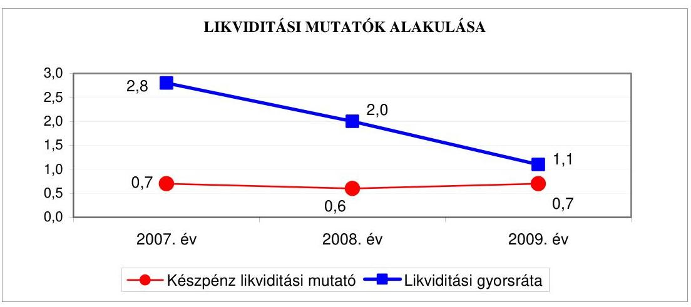

Az Önkormányzatnál 2007-2009 között a készpénz likviditási mutató ${ }^{45}$ 0,7-0,6 között alakult, vagyis a pénzeszközök év végi állománya nem nyújtott fedezetet a rövid lejáratú kötelezettségek rendezésére. A gyenge fizetőképesség oka, hogy a 2007. évhez képest a pénzeszközök 60,2\%-kal emelkedtek a kötvénybevételek miatt, azonban több mint kétszeresére, 1470 millió Ft-tal nőtt a rövid lejáratú hitelek állománya a folyószámlahitel év végi állományának növekedése, valamint a szállítók állományának 349 millió Ft-os emelkedése miatt. A likviditási gyorsráta ${ }^{46}$ 2007-2009 között több mint 60\%-kal gyengült, azonban a pénzeszközök, a követelések és a forgatási célú értékpapírok együttes összege mindhárom évben fedezetet nyújtott a rövid lejáratú fizetési kötelezettségek teljesítésére.

A likviditási mutatók 2007-2009 közötti változása jelezte, hogy az Önkormányzat pénzügyi helyzete fizetőképességi szempontból kedvezőtlenül alakult, mivel a pénzeszközök egyik évben sem, a követelések, a forgatási célú értékpapírok és pénzeszközök együttes összege pedig csökkenő arányban biztosított fedezetet a rövid lejáratú fizetési kötelezettségek pénzügyi teljesítésére.

Az Önkormányzat 2007-2009 közötti pénzügyi helyzete eladósodásának és fizetőképességének kedvezőtlen változása miatt a 2007. és a 2009. évek között összességében kedvezőtlenül alakult.

[^0]
[^0]:    ${ }^{45}$ A készpénz likviditási mutató kifejezi, hogy a pénzeszközök év végi állománya milyen arányban nyújt fedezetet a rövid lejáratú fizetési kötelezettségekre.
    ${ }^{46}$ A likviditási gyorsráta mutatja, hogy a rövid lejáratú fizetési kötelezettségek kiegyenlítéséhez a pénzeszközökön túl bevonható követelések, forgatási célú értékpapírok milyen arányban nyújtanak fedezetet.

---

# 2. Az ÖNKORMÁNYZAT FELKÉSZÜLTSÉGE AZ EURÓPAI UNIÓs FORRÁSOK IGÉNYLÉSÉRE, FELHASZNÁLÁSÁRA, A TÁMOGATOTT CÉLKITŰZÉS MEGVALÓsÍTÁSÁRA, MŰKÖDTETÉSÉRE, VALAMINT AZ ELEKTRONIKUS KÖZSZOLGÁLTATÁSI FELADATOK ELLÁTÁSÁRA 

2.1. Az európai uniós források igénybevételére, felhasználására, a támogatott célkitúzés megvalósítására, múködtetésére történt felkészülés szabályozottságának, szervezettségének, valamint egy támogatási szerződésben foglalt célkitúzés megvalósításának, múködtetésének eredményessége

### 2.1.1. Az európai uniós forrásokra történő pályázatok benyújtására vonatkozó döntések összhangja fejlesztési célkitűzésekkel

Az Önkormányzat feladatellátásra vonatkozó, helyzetelemzéssel alátámasztott, hosszú és középtávú fejlesztési célkitüzéseit a 2007-2010. évekre a gazdasági program ${ }_{1,2}$-ben, az ágazati, szakmai fejlesztési koncepciókban, programokban, tervekben és az IVS-ben rögzítette.

Az Önkormányzat a gazdasági program ${ }_{1}$-et a 2007. évben felülvizsgálta és aktualizálta, valamint az elkészült gazdasági program ${ }_{2}$-t a város hosszú távú városfejlesztési koncepciójába integrálta.

A gazdasági program ${ }_{1,2}$-ben és az IVS-ben tervezett fejlesztések köre többek között kiterjedt a városrendezési, gazdasági, ipari, mezőgazdasági, kereskedelmi, közlekedési, városüzemeltetési, közműellátási, az oktatási, kulturális, sport, környezetvédelmi, hulladékgazdálkodási, szociális és egészségügyi, ár- és belvízvédelmi, turisztikai, munkahely teremtési, esélyegyenlőségi, valamint információs, kommunikációs fejlesztési célkitűzésekre.

Az Önkormányzatnál a fejlesztési célkitűzések meghatározásánál figyelembe vették a megvalósítás lehetséges pénzügyi forrásait és a gazdasági program ${ }_{1,2}$-ben az önkormányzati forrásokon, kötvénykibocsátásból származó bevételeken túlmenően külső, elsősorban európai uniós és hazai pályázati források igénybevételét, valamint befektetői és vállalkozói múködő tőke bevonását tervezték ${ }^{47}$. A gazdasági program ${ }_{1,2}$-ben, valamint az ágazati szakmai fejlesztési koncepciókban, egyéb programokban és tervekben a fejlesztési célkitüzések és a benyújtott európai uniós pályázatokra vonatkozó döntések összhangban voltak.

[^0]
[^0]:    ${ }^{47}$ A befektetői tőke bevonását ingatlanok értékesítése mellett, illetve azzal párhuzamosan különböző befektetési projektek kiajánlásával, a vállalkozói múködő tőke bevonását Ipari Parkba, Kereskedelmi Központba és egyéb városi területekre betelepedő vállalatoktól tervezték.

---

Az Önkormányzat 2007-2010. I. negyedév között európai uniós támogatásokra benyújtott 100 pályázatban volt érintett, amelyből az Önkormányzat 87-et (ebből intézményei 44-et), konzorcium vezetőjeként ötöt, valamint társulások keretében nyolcat nyújtott be. A benyújtásról a pályázatok $51 \%$-ában a Közgyűlés, $41 \%$-ában az önállóan működő és gazdálkodó intézmények vezetői, valamint felhatalmazás alapján ${ }^{48} 8 \%$-ában (önkormányzati saját erőt nem igénylő pályázatok esetében) a polgármester döntött. A megvalósítás tervezett összes bekerülési költsége 20704,6 millió $\mathrm{Ft}^{49}$ volt, amelynek finanszírozását $74 \%$-ban európai uniós, $4 \%$-ban hazai támogatásból, valamint $22 \%$-ban saját forrásból tervezték. A benyújtott pályázatok - amelyek közül hat az NFT, 79 az ÚMFT célkitűzéseihez, valamint 15 egyéb közösségi kezdeményezésekhez kapcsolódott - 43\%-a eredményes volt, 35\%-át elutasították, 22\%-ának az elbírálása 2010. március 31-én folyamatban volt ${ }^{50}$. A sikertelen 35 pályázat közül kettőt tartalmi hiányosságok, egyet a költséghatékonyság, hetet a pályázati források hiánya, 12-t a szakmai kidolgozatlanság, valamint 13-t a pályázati feltételeknek meg nem felelő tartalom miatt utasítottak el. A nyertes projektek, programok megvalósítása során 2007-2010. I. negyedév között az összes tényleges költségvetési kiadás 1564,8 millió Ft volt, amelyet $47 \%$-ban európai uniós, $4 \%$-ban hazai támogatásból, valamint $49 \%$-ban saját forrásból finanszíroztak.

Az Önkormányzat a támogató pozitív döntése után az EACEA Európa a polgárokért közösségi kezdeményezés keretében „Testvérvárosi találkozó" elnevezéssel, a 2009. évben beadott pályázatát visszavonta, mert a program a testvérvárosok távolmaradása miatt nem valósult meg.

Az Önkormányzat a vállalt saját forrást a projektek, programok megvalósítása során biztosította. Az 2007-2010. I. negyedévben európai uniós forrással megvalósult, valamint folyamatban lévő fejlesztési feladatok tervezett és teljesített kiadásait és azokat finanszírozó forrásokat a 4. számú, az elbírálás alatt lévő pályázatok bemutatását a 4/a. számú, valamint az elutasított pályázatokat a 4/b. számú mellékletek tartalmazzák.

A jegyző - az Áht. 69. § (1) bekezdésében foglaltakat megsértve - a 2008-2010. évi költségvetési rendeletekbe nem mutatta be eredeti előirányzatként kilenc európai uniós forrással támogatott projekt, program bevételi és kiadási

[^0]
[^0]:    ${ }^{48}$ Az SzMSz 2010. március 29-ig hatályos 2/a. számú melléklet VII. fejezet 12. pontja alapján: „A polgármester dönt az önkormányzati kötelezettségvállalást nem igénylő pályázatok benyújtásáról, továbbá aláírja az önkormányzati önerőt nem igénylő pályázatokkal kapcsolatos megállapodásokat, amennyiben azok közgyűlési döntést nem igényelnek."
    ${ }^{49}$ A tervezett összes bekerülési költség a duplázódás elkerülése érdekében nem tartalmazza a 4/b. számú melléklet harmadik és 21 . sorában rögzített elutasított pályázatok 373,5 millió Ft-os tervezett bekerülési költségét, mert ezeket a pályázatokat - 20072009. I. negyedév között - módosításokkal újra benyújtották.
    ${ }^{50}$ 2010. szeptember 30-án a benyújtott pályázatok 56\%-a eredményes volt, 37\%-át elutasították, hét százalékának elbírálása folyamatban volt.

---

előirányzatait ${ }^{51}$ a hatályos támogatási szerződésekben foglalt támogatási és felhasználási ütemezés szerint ${ }^{52}$. A 2008-2010. évi költségvetési rendeletek a felújítási előirányzatok, valamint a felhalmozási kiadások között tartalmazták az európai uniós támogatással megvalósuló feladatokat. A jegyző a 2008-2010. évi költségvetési rendeletekben az Ámr. 1 29. § (1) bekezdés g) és k) pontjában ${ }^{53}$ foglaltak ellenére három ${ }^{54}$ európai uniós forrással támogatott több éves kihatással járó feladat előirányzatait éves bontásban, valamint elkülönítetten 10 európai uniós támogatással megvalósuló program, projekt bevételeit és kiadásait ${ }^{55}$, továbbá egy projekt bevételeit ${ }^{56}$ nem mutatta be ${ }^{57}$.

Az Önkormányzatnál a 2007-2010. I. negyedév között európai uniós forrásokkal támogatott, befejezett fejlesztési feladatok, programok finanszírozási forrásainak tervezett és tényleges megoszlását a következő ábrák mutatják:

[^0]
[^0]:    ${ }^{51}$ Nem tartalmazta a 2008. évi költségvetési rendelet kettő COMENIUS „Egész életen át tanulás", a 2009. évi költségvetési rendelet három COMENIUS „Egész életen át tanulás", valamint a 2010. évi költségvetési rendelet TÁMOP-3.1.4 „A kompetencia alapú oktatás elterjesztéséért Szolnokon", valamint három COMENIUS „Egész életen át tanulás" elnevezésű programok bevételi és kiadási előirányzatait.
    ${ }^{52}$ Közbenső egyeztetés során a polgármester által adott tájékoztatás szerint a jegyző intézkedett a Gazdasági Igazgatóság igazgatója felé, hogy az európai uniós forrást igénylő projektek, programok bevételi és kiadási előirányzatait a támogatási szerződésben foglalt ütemezés szerint tartalmazza a 2011. évi költségvetési rendelet.
    ${ }^{53}$ Az előírások 2010. január 1-jétől az Ámr. ${ }_{2}$ 36. § (1) bekezdés h) és l) pontjában találhatók.
    ${ }^{54}$ Az Önkormányzatnál nem mutattak be a 2008-2010. évi költségvetési rendeletekben évente egy, összesen három COMENIUS „Egész életen át tanulás" elnevezésű programot a több éves kihatással járó feladatok előirányzatai között.
    ${ }^{55}$ Nem mutattak be elkülönítetten a 2008. évi költségvetési rendeletben kettő COMENIUS „Egész életen át tanulás", a 2009. évi költségvetési rendeletben a KEOP2.3.0 „Szolnok, Abony, Rákóczifalva és Szajol felhagyott települési szilárdhulladéklerakóinak rekultivációja" és három COMENIUS „Egész életen át tanulás", a 2010. évi költségvetési rendeletben a TÁMOP-3.1.4 „A kompetencia alapú oktatás elterjesztéséért Szolnokon", és három COMENIUS „Egész életen át tanulás" elnevezésű európai uniós támogatással megvalósuló program, projekt bevételeit és kiadásait.
    ${ }^{56}$ Nem mutatták be a 2010. évben elkülönítetten az ÉAOP-4.1.5 „Egyesített Szociális Intézmény Kaán Károly úti épületének akadálymentesítése" elnevezésű európai uniós támogatással megvalósuló projekt bevételeit.
    ${ }^{57}$ Közbenső egyeztetés során a polgármester által adott tájékoztatás szerint a jegyző intézkedett a Gazdasági Igazgatóság igazgatója felé, hogy a többéves kihatással járó európai uniós forrást igénylő projektek, programok bevételi és kiadási előirányzatait éves bontásban, valamint elkülönítetten tartalmazza a 2011. évi költségvetési rendelet.

---

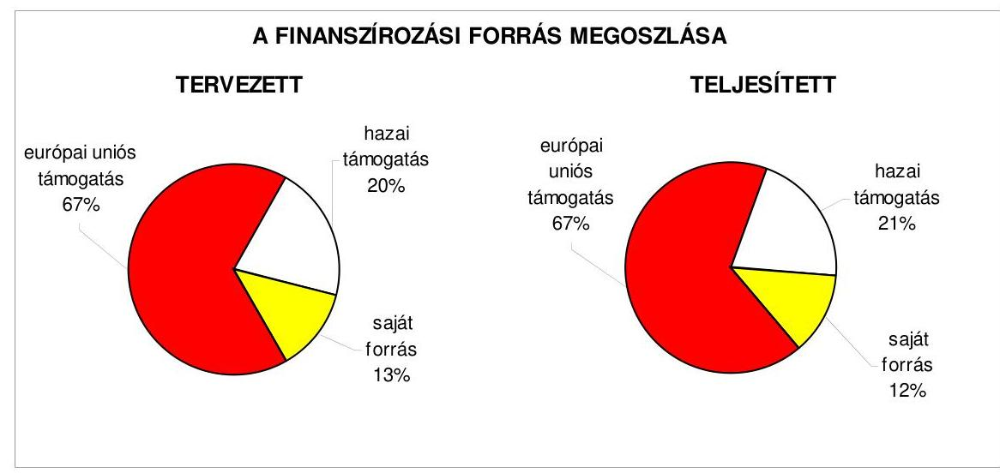

Az Önkormányzatnál 2007-2010. I. negyedév között az európai uniós támogatással megvalósuló, támogatási szerződéssel rendelkező fejlesztési feladatok, programok közel nyolcad része fejeződött be. A befejezett fejlesztési feladatokat, programokat a tervezett forrásösszetétellel valósították meg, mert azok kiadásai és a fedezetét biztosító források az európai uniós források esetében a tervezett szinten maradtak, valamint a hazai támogatás és a saját forrás arányainak eltérése nem haladta meg az egy százalékpontot.

A befejezett fejlesztési feladatok, programok közül, az önállóan múködő és gazdálkodó intézmények pályázatai alapján elnyert források felhasználásával hat NFT/HEFOP-3. „Az élethosszig tartó tanulás és alkalmazkodó képesség támogatása program" keretében kis értékű eszközöket és anyagokat szereztek be, valamint három COMENIUS „Iskolai együttmüködések" program keretében diákok és tanárok külföldi utaztatását, valamint együttmúködési programokat valósítottak meg. A Polgármesteri hivatal három - egy EMOGA „2007. évi Iskolatej", valamint kettő EACEA „Testvérvárosi találkozó" elnevezésű - programot fejezett be.

# 2.1.2. Az európai uniós forrásokhoz kapcsolódóan a pályázatfigyelés, a pályázatkészítés, valamint az európai uniós támogatással megvalósuló fejlesztés lebonyolításának belső rendje, a végrehajtás és az ellenőrzés szervezettsége 

Az Önkormányzatnál az európai uniós források igénybevételének és felhasználásának belső rendjét a 2007-2010. I. negyedévben hivatali SzMSz-ben, hazai és európai uniós támogatások elnyerése céljából készített pályázati szabályzatban, 2007. június 1-jétől 2008. február 21-ig a Humán és Városfejlesztési Igazgatóság és 2007. május 31-től a Műszaki Igazgatóság ügyrendjében, 2008. május 8 -tól az MSZ EN ISO 9001:2001 szabvány szerint tanúsított minőségirányítási rendszerben a fejlesztési koordinációs feladatok folyamatleírásaiban, valamint a köztisztviselők munkaköri leírásaiban szabályozták. Az önkormányzati szintű pályázatkoordinálás feladatait, felelősét, valamint a pályázat nyilvántartás kötelezettségét, módját a pályázati szabályzatban meghatározták a Gazdasági és Városfejlesztési Főosztály Program és Városfejlesztési Osztálya számára, azonban - a 2007. február 15-től végrehaj-

---

tott szervezeti átalakítások után - a szabályzatot nem aktualizálták ${ }^{58}$. A pályázatfigyelést végzők és a döntési, illetve a döntés-előterjesztési jogkörrel rendelkezők közötti információ-szolgáltatási kötelezettség teljesítésének rendjét, valamint az európai uniós forrásokra irányuló pályázatfigyelés, pályázatkészítés, valamint az európai uniós forrással támogatott fejlesztés lebonyolításának feladatellátásra, kapcsolattartásra, információáramlásra, ellenőrzésre, felelősségre kiterjedő - eljárási rendjét a szabályozás és a köztisztviselők munkaköri leírásai tartalmazták.

A Polgármesteri hivatalban a pályázatfigyelés, a pályázatkészítés és a fejlesztések lebonyolítási feladatainak személyi, szervezeti feltételeit kialakították, a feladatokat 2007. február 14-ig kettő főosztály, majd a szervezeti átalakítás után két igazgatóság egy-egy osztálya, a 2008. évtől egy igazgatóság kettő, majd azok összevonása után a 2009. évtől egy osztálya látta el.

A pályázatfigyelés, pályázatkészítés, valamint a fejlesztések lebonyolításával kapcsolatos feladatokat 2007. február 14-ig a Gazdasági és Városfejlesztési Főosztály Program és Városfejlesztési Osztálya öt, valamint a Városüzemeltetési és Beruházási Főosztály Beruházási Osztálya kettő, 2007. február 15-től 2008. február 21-ig a Humán és Városfejlesztési Igazgatóság Városfejlesztési Osztálya négy, valamint 2007. május 1-ig a Műszaki Igazgatóság Közbeszerzési és Vagyongazdálkodási Osztálya kettő, 2007. május 2-től 2009. május 10-ig a Műszaki Igazgatóság Műszaki Fejlesztési Osztálya kettő, 2008. február 22-től 2009. május 10-ig a Müszaki Igazgatóság Fejlesztési Koordinációs Osztálya négy, valamint 2009. május 11-től a Müszaki Igazgatóság Fejlesztési Osztálya 18 köztisztviselője látta el.

A pályázatfigyelési feladatok keretében a hivatali SzMSz-ben, az osztályok ügyrendjeiben és a köztisztviselők munkaköri leírásaiban meghatározták a pályázati figyelő rendszer múködtetését, valamint a feltárt lehetőségek továbbítását az érintett szervezetek, szervezeti egységek részére. A feladatok ellátására külső személyt, szervezetet nem vontak be.

A pályázatkészítési feladatokat a hivatali SzMSz-ben, az osztályok ügyrendjeiben és a köztisztviselők munkaköri leírásában rögzítették, valamint három pályázat ${ }^{59}$ kidolgozásához külső szervezetet is igénybe vettek. A külső szervezetekkel a pályázatkészítési feladatok ellátására kötött szerződésekben a pályázatkészítő felelősségét a pályázat tartalmi és formai követelményeinek biztosítására előírták, azonban a pályázat céljának (számszerűsíthető eredmények, indikáto-

[^0]
[^0]:    ${ }^{58}$ A közbenső egyeztetés során a polgármester által adott tájékoztatás szerint a jegyző intézkedett a Müszaki Igazgatóság igazgatója felé, hogy gondoskodjon a pályázati szabályzat tartalmának a szervezeti változásoknak megfelelő módosításáról.
    ${ }^{59}$ A TIOP-1.1.1 „A pedagógiai módszertani reformot támogató informatikai infrastruktúra fejlesztése", a TIOP-1.2.1 „AGÓRA - multifunkcionális közösségi központok és területi közművelődési tanácsadó szolgálat infrastrukturális feltételeinek kialakítása", és az EGT és a Norvég Finanszírozási Mechanizmus „Környezettudatos nevelés és a fenntarthatóság pedagógiája" elnevezésű pályázatok esetében.

---

rok) egyértelmű meghatározására vonatkozó előírásokat nem fogalmaztak $\mathrm{meg}^{60}$.

Az európai uniós támogatással megvalósításra kerülő fejlesztések lebonyolításával kapcsolatos feladatokat a hivatali SzMSz-ben, az érintett osztályok ügyrendjeiben és a köztisztviselők munkaköri leírásában rögzítették, valamint kettő pályázat ${ }^{61}$ kidolgozásához külső szervezetet is igénybe vettek. Az európai uniós források igénybevételével megvalósuló fejlesztések lebonyolítási feladatainak ellátására megkötött szerződések tartalmazták a támogatott célkitúzés megvalósításának kötelezettségét, a kapcsolattartás és az ellenőrzés rendjét, valamint a személyre szóló felelősségi szabályokat.

A belső ellenőrzési feladatokat megalapozó kockázatelemzés a 2004-2008. évekre készített stratégiai ellenőrzési tervben, valamint a 2007-2010. évi belső ellenőrzési tervekben nem terjedt ki az európai uniós forrásokkal támogatott fejlesztési feladatokra, azonban a 2009. szeptember 21-től hatályos 2009-2014. évi stratégiai ellenőrzési tervben - közepes kockázatúnak értékelve - már kitértek erre a területre is.

# 2.1.3. Egy támogatási szerződésben foglalt célkitúzés megvalósítása, múködtetése 

A Polgármesteri hivatal 2007-2010. I. negyedév között európai uniós forrás igénybevételére beadott nyertes pályázatai közül fejlesztési feladatot - a támogatási szerződésekben foglalt valamennyi a kedvezményezettre és a támogatókra vonatkozó kötelezettség teljesítésével - nem fejezett be.

Az Önkormányzat 2007-2010. I. negyedév között eredményesen készült fel a belső szabályozottság és szervezettség terén az európai uniós források igénybevételére, a támogatások felhasználására. A gazdasági progra $\mathrm{m}_{1,2}$-ben, az ágazati, szakmai koncepciókban, tervekben megfogalmazott fejlesztési célkitűzésekhez kapcsolódtak az európai uniós támogatások, szabályozták a pályázatfigyelést végzők és a döntési, illetve a döntés előkészítési jogkörrel rendelkezők közötti információszolgáltatási kötelezettséget. A Polgármesteri hivatalon belül biztosították a pályázatfigyelés, illetve a Polgármesteri hivatalon belül és külső szervezet igénybevételével a pályázatkészítés és a fejlesztési feladatok, programok lebonyolításának szervezeti, személyi feltételeit. Meghatározták a külső szervezetekkel pályázatkészítésre kötött szerződésekben a pályázat szakmai és formai követelményeire vonatkozóan a pályázatkészítő felelősségét, valamint előírták a fejlesztési feladat lebonyolítását végző ellenőrzési kö-

[^0]
[^0]:    ${ }^{60}$ A közbenső egyeztetés során a polgármester által adott tájékoztatás szerint a jegyző intézkedett a Műszaki Igazgatóság igazgatója felé, hogy az európai uniós forrásokra irányuló pályázatkészítési feladatok ellátására kötött szerződésekben előírják a pályázatkészítő felelősségét a pályázat céljának számszerúsíthető eredményei meghatározására vonatkozóan.
    ${ }^{61}$ Az ÉAOP-5.1.1/B „Szandaszőlős decentrum létrehozása városrehabilitációval" és az EGT és a Norvég Finanszírozási Mechanizmus „Környezettudatos nevelés és a fenntarthatóság pedagógiája" elnevezésű pályázatoknál.

---

telezettségeit. Nem terjedt ki azonban 2009. szeptember 21-ig a belső ellenőrzési stratégiát megalapozó kockázatelemzés az európai uniós forrásokkal támogatott fejlesztési feladatokra.

# 2.2. Az elektronikus közszolgáltatás feltételeinek kialakítása 

A jegyző által a 2005-2010. évekre vonatkozóan 2005. január 31-én kiadott informatikai stratégia tartalmazott helyzetelemzést, amelyre alapozottan meghatározták a közép- és hosszú távú célokat.

Az informatikai stratégiában bemutatták a számítástechnikai ellátottság helyzetét. Kiemelt feladatként határozták meg az informatikai biztonság megteremtését, a korszerűbb irodai alkalmazások használatára történő átállást, valamint az integrált gazdasági rendszer bevezetését.

Az informatikai stratégia az e-közszolgáltatási feladatok 3. elektronikus szolgáltatási szintjének megvalósításához szükséges célkitűzések meghatározását tartalmazta.

Az Önkormányzat 2007-2010 között az ÁROP, valamint az EKOP keretében az e-közszolgáltatás fejlesztésére kiírt pályázatokon nem vett részt. Az e-közszolgáltatási feladatok ellátásának személyi feltételeit a Polgármesteri hivatalon belül, az Informatikai és Minőségbiztosítási osztály köztisztviselői végezték, a munkaköri leírásukban foglaltak szerint. Az Önkormányzatnál az e-közszolgáltatási feladatokat saját számítógépes információs rendszeren keresztül, saját fejlesztésű program üzemeltetésével valósították meg.

Az Önkormányzatnál e-közszolgáltatási feladatokat ellátó informatikai rendszert múködtettek. Az Önkormányzat 2005. november 1-jétől a Ket. 160. § (1) bekezdésében ${ }^{62}$ foglalt felhatalmazással élt és a közigazgatási hatósági eljárásoknál az elektronikus ügyintézést - azon ügyek kivételével, amelyeknél törvény, kormányrendelet kötelezővé teszi - kizárta ${ }^{63}$. Az ügyfeleknek 2009. október 1-jétől a Ket. módosításáról szóló törvény ${ }^{64}$ kapcsolattartásra vonatkozó II/A. fejezet 28/B. § (2) bekezdése alapján biztosították az elektronikus ügyintézést ${ }^{65}$.

Az ügyfeleket az e-közszolgáltatás körébe tartozó ügykörökről az Önkormányzat honlapján ${ }^{66}$ tájékoztatták. Az e-közszolgáltatás keretében az ügyek intézését az állampolgárok, illetve a vállalkozások részére a személyi okmányokkal,

[^0]
[^0]:    ${ }^{62}$ Hatályon kívül helyezte 2009. október 1-jétől az elektronikus közszolgáltatásról szóló 2009. évi LX. törvény 32. § (4) bekezdése.
    ${ }^{63}$ Az Önkormányzat a 46/2005. (X. 28.) számú rendeletében az elektronikus úton történő ügyintézést kizárta.
    ${ }^{64}$ Beiktatta: a Ket. módosításáról szóló 2008. évi CXI. 17. § (1) bekezdése.
    ${ }^{65}$ Az Önkormányzat a 46/2007. (XI. 30.) számú rendeletével 2008. július 1-jétől lehetővé tette az elektronikus úton történő ügyintézést, egyidejűleg hatályon kívül helyezte a 46/2005. (X. 28.) számú az elektronikus ügyintézés kizárásáról szóló rendeletét.
    ${ }^{66}$ A honlap a www.szolnok.hu néven érhető el.

---

a hatósági igazolásokkal, lakcímváltozás bejelentésével, gépjármúadó fizetéssel, építési engedélyezéssel, szociális juttatások, támogatások fizetésével, helyi adózással, az iparűzési adóval, gépjármúadóval, engedélyekkel kapcsolatos ügykörökben 2. elektronikus szolgáltatási szinten biztosították. Az Önkormányzatnál 2010. I. negyedév végén a teljes, közvetlen kétoldalú ügyintézés megvalósítására pénzügyi feltételek hiánya miatt nem volt lehetőség.

Az e-közszolgáltatási feladatokat ellátó informatikai rendszer ügyfelek általi igénybevételének - az elektronikus ügyfélforgalomnak - a figyelési rendszerét nem alakították ki ${ }^{67}$.

Az Önkormányzat az Eisz. tv. 21. § (3) bekezdése alapján a közérdekú adatok elektronikus közzétételére 2007. január 1-jétől kötelezett. Az Önkormányzat honlapján a 18/2005. (XII. 27.) IHM rendelet 2. § (1) bekezdésében előírtak ellenére a „közérdekú adatok" elnevezés helyett a „közinformációs adatszolgáltatás" hivatkozást helyeztek el.

A 18/2005. (XII. 27.) IHM rendelet 2. számú melléklete 3.2. és 3.3. pontja szerinti gazdálkodási adatokkal - az éves költségvetések, a számviteli beszámolók, a költségvetés végrehajtása, valamint a támogatások, szerződések, koncessziók, egyéb kifizetések adataival - kapcsolatos közzétételi egységek nem a meghatározott szerkezetben voltak elérhetóek ${ }^{68}$.

Az Önkormányzat a kettőszázezer forint alatti nem normatív, céljellegű, múködési és fejlesztési támogatások közzétételének mellőzését lehetővé tevő, valamint a nettó ötmillió forintnál alacsonyabb összegű szerződések közzétételét előíró rendeletet nem alkotott.

Az Önkormányzat honlapján a jegyző a Polgármesteri hivatalt érintően a nem normatív, céljellegű, működési és fejlesztési támogatások 60\%-ánál - az Áht. 15/A. § (1) bekezdésében előírtakat megsértve - a kedvezményezettek nevét, a támogatás célját, összegét, a megvalósítás helyét nem tette közzé ${ }^{69}$.

A jegyző nem tette közzé a VOKE Csomóponti Művelődési Központ Természetjáró csoportjának 23 ezer Ft-os céljellegű működési támogatását, valamint egy fő 300 ezer Ft-os, három fő 200 ezer Ft-os otthonteremtési és a Szolnoki-Szandaszőlősi Római Katolikus Egyházközség 600 ezer Ft-os céljellegú fejlesztési támogatását.

[^0]
[^0]:    ${ }^{67}$ Közbenső egyeztetés során a polgármester által adott tájékoztatás szerint 2010. szeptember 1-jétől megvalósult az e-közszolgáltatási feladatokat ellátó informatikai rendszer ügyfelek általi igénybevétele figyelési rendszerének kialakítása és a tapasztalatok értékelése.
    ${ }^{68}$ Közbenső egyeztetés során a polgármester által adott tájékoztatás szerint a jegyző intézkedett az Informatikai és Minőségbiztosítási Osztály vezetője felé, hogy az Önkormányzat honlapján a közzétételi egységek a hatályos jogszabályban meghatározott szerkezetben legyenek elérhetők.
    ${ }^{69}$ A jegyző intézkedett és a helyszíni vizsgálat idején 2010. június 11-én a közzététel megtörtént.

---

Az Önkormányzat honlapján a jegyző az Önkormányzat pénzeszközei felhasználásával, a vagyonnal történő gazdálkodással összefüggő - a nettó ötmillió forintot elérő, vagy azt meghaladó értékű - árubeszerzésre, építési beruházásra, szolgáltatás megrendelésre, vagyonértékesítésre, vagyonhasznosításra, vagyon, vagy vagyoni értékú jog átadására, valamint koncesszióba adásra vonatkozó 2009. évi és 2010. I. negyedévi szerződések megnevezését (típusát), tárgyát, a szerződést kötő felek nevét, a szerződés értékét, a határozott időre kötött szerződések esetében annak időtartamát, az említett adatok változását közzétette. A 2009. évben egy intézmény pénzeszközei felhasználásával, a vagyonnal történő gazdálkodásával összefüggő - a nettó ötmillió forintot elérő, vagy azt meghaladó értékű - árubeszerzésre, építési beruházásra, szolgáltatás megrendelésre, vagyonértékesítésre, vagyonhasznosításra, vagyon, vagy vagyoni értékú jog átadására vonatkozó szerződések meghatározott adatainak közzétételénél megsértették az Eisz. tv. 3. § (2) bekezdésében előírtakat, mert a Szigligeti Színház által a 2009. évben és 2010. I. negyedévben kötött szerződések adatait nem az Önkormányzat honlapján, hanem a „www.szigligetiszinhaz.hu" elérési útvonalon, az intézmény honlapján tették közzé ${ }^{70}$.

A jegyző gondoskodott a 2009. évi költségvetési beszámoló szöveges indokolásának - az Ámr. ${ }_{2}$ 233. § (1) bekezdésében hivatkozott 22. számú melléklet 2. sorában előírtak szerint és az Áhsz. 40. § (4)-(11) bekezdései tartalmi követelményeinek megfelelően - az Önkormányzat honlapján történő közzétételéről.

# 3. A KÖLTSÉGVEtÉsi GAZDÁlKODÁs BELSŐ KONTROLLJAI 

### 3.1. A költségvetés-tervezés, a gazdálkodás és a zárszámadáskészítés folyamatában végrehajtandó belső kontrollok kialakítása

A költségvetés-tervezési és a zárszámadás-készítési folyamatok szabályozottsága alacsony ${ }^{71}$ kockázatot jelentett a feladatok megfelelő, szabályszerű végrehajtásában, mivel a jegyző a FEUVE rendszer keretében szabályozta a költségvetés-tervezés és a zárszámadás elkészítés rendjét, meghatározta az intézmények részére a költségvetési javaslat összeállításával kapcsolatos követelményeket, előírta a költségvetési tervezéshez készített intézményi mutatószám felmérés adatai megalapozottságának, az intézményi beszámolók belső összhangjának ellenőrzését, továbbá az intézmények által az állami tá-

[^0]
[^0]:    ${ }^{70}$ Közbenső egyeztetés során a polgármester által adott tájékoztatás szerint a jegyző intézkedett az Informatikai és Minőségbiztosítási Osztály vezetője felé, hogy a Szigligeti Színház pénzeszközei felhasználásával, a vagyonnal történő gazdálkodásával összefüggő - a nettó ötmillió forintot elérő, vagy azt meghaladó értékű - árubeszerzésre, építési beruházásra, szolgáltatás megrendelésre, vagyonértékesítésre, vagyonhasznosításra, vagyon, vagy vagyoni értékú jog átadására vonatkozó szerződések meghatározott adatait az Önkormányzat honlapján tegyék közzé.
    ${ }^{71}$ A kialakított belső kontrollokban rejlő kockázatot alacsonynak minősítettük, ha a kontrollok megfelelő védelmet nyújtottak a hibák bekövetkezése ellen.

---

mogatásokkal, hozzájárulásokkal történő elszámoláshoz közölt mutatószámok adatai megbízhatóságának és az intézményi pénzmaradványok kimunkálása szabályszerűségének ellenőrzését.

A gazdálkodási, a pénzügyi-számviteli és a folyamatba épített ellenőrzési feladatok szabályozottsága összességében alacsony kockázatot jelentett a feladatok megfelelő, szabályszerű végrehajtásában, mivel rendelkeztek hivatali SzMSz-el, a jegyző a FEUVE rendszer keretében szabályozta a gazdasági szervezet felépítését és feladatait, elkészítette a gazdasági szervezet ügy-rend $_{1,2}$-t, valamint meghatározta a kötelezettségvállalás, ellenjegyzés, utalványozás, érvényesítés, az 50 ezer Ft-ot el nem érő kifizetések esetében a kötelezettségvállalás rendjét és nyilvántartási formáját, a szakmai teljesítésigazolás módját és kijelölte a szakmai teljesítés igazolását végző személyeket. A jegyző írásban megbízta az érvényesítőket, biztosította a felhatalmazásoknál, kijelöléseknél az összeférhetetlenségi követelmények érvényesülését. Elkészítették a Polgármesteri hivatal számviteli politikáját és a kapcsolódó, aktualizált szabályzatokat, valamint az önköltségszámítási szabályzatot, a számlarendet, a kockázatkezelési szabályzatot és a szabálytalanságok kezelésének eljárásrendjét. Annak ellenére összességében alacsony volt a kockázat, hogy az érintett dolgozók munkaköri leírása nem tartalmazta a selejtezési szabályzatban előírt hasznosítási, selejtezési feladatokat ${ }^{72}$. Az ellenőrzési nyomvonal kialakításánál a jegyző nem határozta meg az ellenőrzési pontokat, az egyes tevékenység, feladat elvégzését igazoló dokumentum megnevezését és fellelhetési helyét a rendszerben ${ }^{73}$.

A Polgármesteri hivatal rendelkezett - a jegyző által kiadott - informatikai stratégiával, valamint informatikai biztonsági szabályzat ${ }_{1,2}$-vel és a jegyző gondoskodott az informatikával kapcsolatos szabályzatok megismertetéséről a Polgármesteri hivatal dolgozóival, amelyet egy nyilatkozat aláírásával igazoltak. A Polgármesteri hivatalban a pénzügyi-számviteli feladatoknál használt programok adatai informatikai hálózaton keresztül elérhetők és integrált pénzügyi-számviteli informatikai rendszert vezettek be. A pénzügyi-számviteli tevékenységhez kapcsolódó informatikai feladatok szabályozottsága alacsony kockázatot jelentett az informatikai feladatok megfelelő, szabályszerű végrehajtásában, mivel a Polgármesteri hivatal rendelkezett eljárásrenddel a hozzáférési jogosultságokra, szabályozásban tiltották meg a külső fejlesztők éles rendszerhez való hozzáférését, lekérhető az ellenőrzési lista (napló) a pénzügyi-számviteli rendszerből, szabályozták a pénzügyi-számviteli program mentési eljárásának módját, idejét, eljárási rendjét, felelősségét.

[^0]
[^0]:    ${ }^{72}$ A közbenső egyeztetés során a polgármester által adott tájékoztatás szerint a munkaköri leírásokat kiegészítették a selejtezési szabályzatban szereplő hasznosítási, selejtezési feladatokkal.
    ${ }^{73}$ A közbenső egyeztetés során a polgármester által adott tájékoztatás szerint a jegyző intézkedésére az ellenőrzési nyomvonal 2010. augusztus 27 -i hatállyal kiegészítésre került, tartalmazza az ellenőrzési pontokat és azt, hogy az egyes tevékenység, feladat elvégzését igazoló dokumentumok hol találhatók meg a rendszerben.

---

# 3.2. A belső kontrollok múködtetése a költségvetés-tervezés, a gazdálkodás, és a zárszámadás-készítés folyamataiban 

A Polgármesteri hivatalban a 2009. évben a költségvetés-tervezési és zár-számadás-készítési folyamatban a múködésbeli hibák megelőzésére, feltárására, kijavítására kialakított belső kontrollok múködésének megfelelősége összességében kiváló ${ }^{74}$ volt, mivel a Polgármesteri hivatalban az előírásoknak megfelelően ellenőrizték, hogy az intézmények teljesítették-e a költségvetési javaslat összeállításával kapcsolatban részükre meghatározott követelményeket, az intézményi mutatószám felmérés adatainak megalapozottságát, az intézmények által az állami támogatásokkal, hozzájárulásokkal történő elszámoláshoz közölt mutatószámok adatainak megbízhatóságát és az intézmények pénzmaradvány megállapításának szabályszerűségét. Annak ellenére összességében kiváló volt a kontrollok múködésének megfelelősége, hogy formális volt az intézmények által javasolt előirányzatok megalapozottságának és az ismert kötelezettségek megtervezésének ellenőrzése, mert nem kifogásolták, hogy az éves költségvetések eredeti előirányzatainak kialakításánál nem tervezték meg az előző évi pénzmaradvány igénybevételét, a hozzájuk kapcsolódó előző évről áthúzódott kötelezettségvállalások előirányzatait, valamint a zár-számadás-készítés folyamatában dokumentáltan nem ellenőrizték az intézményi eredeti, a módosított előirányzatok és a teljesítések eltérésének indokoltságát.

A Polgármesteri hivatal a múködési és a felhalmozási célú pénzeszköz átadások államháztartáson kívülre teljesített kifizetéseire a 2009. évi költségvetésben 1568,1 millió Ft eredeti előirányzatot tervezett, amely összeg az év közbeni módosítások következtében 2027,1 millió Ft-ra növekedett, a teljesítés 1587,2 millió Ft volt. A múködési célú pénzeszköz átadások eredeti előirányzata $89,3 \%-a$, a módosított $84,8 \%$-a és a teljesítés $81,2 \%$-a, valamint a felhalmozási célú pénzeszköz átadások eredeti előirányzata $10,7 \%$-a, a módosított $15,2 \%$-a és a teljesítés $18,8 \%$-a volt a tervezett, illetve teljesített államháztartáson kívüli pénzeszköz átadásnak. A 2010. évi eredeti előirányzata a múködési célú pénzeszköz átadásoknak 1383,1 millió Ft és a felhalmozási célú pénzeszköz átadásoknak 172,7 millió Ft, a tervezett államháztartáson kívüli pénzeszköz átadásnak $88,9 \%$-a és $11,1 \%$-a. A támogatási szerződésekben, illetve megállapodásokban meghatározott célok ${ }^{75}$ összhangban voltak az Ötv. 8. § (1) bekezdésében foglalt önkormányzati feladatokkal.

A Polgármesteri hivatalban a 2009. évben a múködési és a felhalmozási célú pénzeszköz átadások államháztartáson kívülre teljesített kifizetéseinek gazda-

[^0]
[^0]:    ${ }^{74}$ A kontrollok múködésének megfelelőségét kiválónak értékeltük abban az esetben, ha azok múködése - esetleges kisebb, az egységesen meghatározott követelményrendszerben foglalt mértéket el nem érő hiányosságoktól eltekintve - megfelelt a hibák megelőzésére és kijavítására meghatározott szabályozásnak és a legmagasabb szintű elvárásoknak.
    ${ }^{75}$ Az államháztartáson kívülre történő múködési és a felhalmozási célú pénzeszköz átadásokkal művelődési, kulturális, sport, egészségügyi és szociális tevékenységet ellátó szervezeteket, valamint lakossági közmúfejlesztést, lakóközösségek épület felújítását, első lakáshoz jutókat támogatta az Önkormányzat.

---

sági eseményei között elszámolt kiadások teljesítése során a szakmai teljesítésigazolás és az utalvány ellenjegyzés múködésének megfelelősége kiváló volt, mivel a művelődési, kulturális, sport, egészségügyi és szociális tevékenységet ellátó szervezetek részére, valamint a lakossági közműfejlesztésre, a lakóközösségek épület-felújítására, az első lakáshoz jutók támogatására vonatkozó szerződésekben, megrendelésekben, megállapodásokban meghatározott célok teljesítésének szakmai igazolását, a kiadások jogosultságának, öszszegszerűségének ellenőrzését a szakmai teljesítés igazolására jegyző által kijelölt személyek a kötelezettségvállalási szabályzat ${ }_{1,2}$-ben előírt módon elvégezték. Az utalványok ellenjegyzője a gazdálkodásra vonatkozó szabályok érvényesüléséről, továbbá a szakmai teljesítésigazolás és az érvényesítés elvégzéséről meggyőződött.

Az érvényesítő az Áhsz. 9. számú mellékletének a számlaosztályok tartalmára vonatkozó előírása 3. f) pontjában foglaltak ellenére tévesen jelölte ki a főkönyvi számlaszámot és ezért (2009. március 5-én) a Munkalehetőség a Jövőért Kft-nek szolgáltatás ellenében - közcélú foglalkoztatással kapcsolatos feladatok ellátásáért - történt pénzügyi teljesítést pénzeszköz átadásként számolták el és azt javító napló útján nem helyesbítették ${ }^{76}$.

A Polgármesteri hivatalban a 2009. évben az állományba nem tartozók megbízási díjainak kiadására a 2009. évi költségvetésben 28,1 millió Ft eredeti előirányzatot tervezett, amely összeg az év közbeni módosítások következtében 32,8 millió Ft-ra növekedett és a teljesítés 19,9 millió Ft volt. Az eredeti előirányzat $2,8 \%-a$, a módosított előirányzat $3 \%-a$ és a teljesítés $1,8 \%$-a volt a személyi juttatásokra tervezett és teljesített kiadásoknak. A 2010. évi eredeti előirányzat 36,2 millió Ft, a tervezett személyi juttatások kiadásának 3,7\%-a. A 2009. évi előirányzatok felhasználása során a megbízási szerződések tárgya ${ }^{77}$ összhangban volt a Polgármesteri hivatal által ellátott feladatokkal.

A Polgármesteri hivatalban a 2009. évben az állományba nem tartozók megbízási díjainak gazdasági eseményei között elszámolt kiadások teljesítése során a szakmai teljesítésigazolás és az utalvány ellenjegyzés múködésének megfelelősége gyenge ${ }^{78}$ volt, mert:

- a szakmai teljesítés igazolására jegyző által kijelölt személyek ellenőrzési feladataikat a számviteli munkatárs megbízási díjának kifizetését megelőzően nem végezték el, nem ellenőrizték a megbízási szerződésben foglaltak tel-

[^0]
[^0]:    ${ }^{76}$ A közbenső egyeztetés során a polgármester által adott tájékoztatás szerint a jegyző intézkedett a Gazdasági Igazgatóság igazgatója felé a szolgáltatás megrendelés megfelelő főkönyvi számlára könyveléséről.
    ${ }^{77}$ Az állományba nem tartozók megbízási díjai előadói, tolmácsolási, hivatásos gondnoki, számviteli és szakértői feladatok ellátására irányultak.
    ${ }^{78}$ A kontrollok múködésében túl sok hiányosság fordult elő ahhoz, hogy a kontrollok biztosítsák a hibák megelőzését, feltárását, kijavítását és ezáltal veszélyeztették az eredményes, megbízható múködést, a kontroll múködésének megfelelősége gyenge minősítést kapott.

---

jesítésének igazolását, amelynek következtében a megbízási szerződésnek nem megfelelő teljesítésre történt kifizetés ${ }^{79}$;

- az utalványok ellenjegyzője a számviteli munkatárs megbízási díjának kifizetését megelőzően aláírása ellenére nem győződött meg a gazdálkodásra vonatkozó szabályok - az Ámr. ${ }_{1}$ 58. § (6) bekezdésében ${ }^{80}$ előírtak alapján az állományba nem tartozók személyi juttatása a saját munkavállalónak a munkakörén kívüli munkáért fizetett juttatás - betartásáról, továbbá nem ellenőrizte a szakmai teljesítésigazolás elvégzését, amelynek következtében a megbízási szerződésnek nem megfelelő teljesítésre történt kifizetés ${ }^{81}$.

Az érvényesítő az Áhsz. 9. számú mellékletének a számlaosztályok tartalmára vonatkozó előírása 9. a) pontjában foglaltak ellenére tévesen jelölte ki a főkönyvi számlaszámot, ezért (2009. január 2-án és december 1-jén, valamint május 1-jén) egy számviteli munkatársnak a munkaköri leírásában szereplő munkáért fizetett juttatás kiegészítést megbízási díjként számolták el és azt javító napló útján nem helyesbítették ${ }^{82}$.

A Polgármesteri hivatal a külső szolgáltató által végzett karbantartási, kisjavítási szolgáltatásokkal kapcsolatos kiadásokra a 2009. évi költségvetésben 139,3 millió Ft eredeti előirányzatot tervezett, amely összeget évközben 161,6 millió Ft-ra módosítottak, a teljesítés 63,9 millió Ft volt. Az eredeti és a módosított előirányzat 7,5\%-a, a teljesítés $2,9 \%$-a volt a tervezett és a teljesített dologi kiadásoknak. A 2010. évi költségvetésben 104,6 millió Ft eredeti előirányzat szerepelt, ami a tervezett dologi kiadásoknak 5,9\%-a. A 2009. évi előirányzatok felhasználása során a megrendelésben, szerződésben meghatározott karbantartási, kisjavítási munkák ${ }^{83}$ összhangban voltak a Polgármesteri hivatal által ellátott feladatokkal.

A Polgármesteri hivatalban a 2009. évben a külső szolgáltató által végzett karbantartási, kisjavítási munkákkal kapcsolatos kiadások teljesítése során a szakmai teljesítésigazolás és az utalvány ellenjegyzés múködésének megfelelősége kiváló volt, mivel az önkormányzati tulajdonú lakások, nem lakáscélú bérlemények, autóbusz megállók, utcabútorok és a közvilágítás kar-

[^0]
[^0]:    ${ }^{79}$ A közbenső egyeztetés során a polgármester által adott tájékoztatás szerint a jegyző intézkedett a Személyzeti és Munkaügyi Osztály vezetője felé, hogy a megbízási szerződések alapján történő kifizetéseket megelőzően szakmailag igazolják a teljesítést, a 2010. március 10-től hatályos kötelezettségvállalási szabályzatban előírtak szerint.
    ${ }^{80}$ Az előírást 2010. január 1-jétől az Ámr. ${ }_{2}$ 84. § (4) bekezdés b) pontja tartalmazza.
    ${ }^{81}$ A közbenső egyeztetés során a polgármester által adott tájékoztatás szerint a jegyző intézkedett a Gazdasági Igazgatóság igazgatója felé, hogy a megbízási díjak kifizetését megelőzően az utalvány ellenjegyzésére jogosultak a 2010. március 10-től hatályos kötelezettségvállalási szabályzatban előírtak alapján végezzék el ellenőrzési feladatukat.
    ${ }^{82}$ A közbenső egyeztetés során a polgármester által adott tájékoztatás szerint a jegyző intézkedett a Gazdasági Igazgatóság igazgatója felé a munkaköri leírásban szereplő munkáért fizetett juttatás kiegészítés megfelelő főkönyvi számlára könyveléséről.
    ${ }^{83}$ A külső szolgáltató által végzett karbantartások, kisjavítások önkormányzati tulajdonú lakások, nem lakáscélú bérlemények, autóbusz megállók, utcabútorok és a közvilágítás karbantartásával, kisjavításával kapcsolatos munkák végzésére irányultak.

---

bantartására, kisjavítására vonatkozó szerződésekben, megrendelésekben, megállapodásokban meghatározott feladatok teljesítésének szakmai igazolását, a kiadások jogosultságának, összegszerűségének ellenőrzését a szakmai teljesítés igazolására jegyző által kijelölt személyek a kötelezettségvállalási szabályzat ${ }_{1,2}$-ben előírt módon elvégezték. Az utalványok ellenjegyzője a gazdálkodásra vonatkozó szabályok érvényesüléséről, továbbá a szakmai teljesítésigazolás és az érvényesítés elvégzéséről meggyőződött.

A Polgármesteri hivatalban a 2009. évben az államháztartáson kívülre történő működési és felhalmozási célú pénzeszköz átadásokkal, az állományba nem tartozók megbízási díjaival, valamint a külső szolgáltatók által végzett karbantartással, kisjavítással kapcsolatos kifizetések során - ezen területek költségvetési súlyának figyelembevételével összefoglalóan értékelve ${ }^{84}$ - a belső kontrollok múködésének megfelelősége kiváló volt, mivel a szakmai teljesítésigazolásra a jegyző által kijelölt személyek az államháztartáson kívülre történő működési és felhalmozási célú pénzeszköz átadásokkal, valamint a külső szolgáltatók által végzett karbantartással, kisjavítással kapcsolatos kifizetések során ellenőrizték, szakmailag igazolták a kifizetések jogosultságát, összegszerűségét és a szerződések, megrendelések, megállapodások teljesítését. Az utalványok ellenjegyzője meggyőződött a gazdálkodásra vonatkozó szabályok betartásáról, továbbá ellenőrizte a szakmai teljesítésigazolás és az érvényesítés megtörténtét, azonban az állományba nem tartozók megbízási díjaival kapcsolatos kiadások megbízási szerződésben foglalt teljesítésének igazolását a szakmai teljesítés igazolására jegyző által kijelölt személyek nem végezték el és a gazdálkodásra vonatkozó szabályok - az Ámr. ${ }_{1}$-ben előírtak alapján az állományba nem tartozók személyi juttatása a saját munkavállalónak a munkakörén kívüli munkáért fizetett juttatás vonatkozásában - betartásáról és a szakmai teljesítésigazolás elvégzéséről az utalványok ellenjegyzője nem győződött meg.

A Polgármesteri hivatalban a 2009. évben a pénzügyi-számviteli tevékenységhez kapcsolódó informatikai feladatoknál a kialakított belső kontrollok múködésének megfelelősége összességében kiváló volt, mivel intézkedtek a hozzáférési jogosultságra vonatkozó nyilvántartás teljes körűségének és naprakészségének, a pénzügyi és számviteli integrált rendszerben tárolt hozzáférési jogosultságok ellenőrizhetőségének, a jelszavak kezelésére előírt szabályok betartásának, a program elemeire vonatkozó változáskezelési eljárások dokumentálásának, illetve azok ellenőrzésének, tesztelésének biztosításáról. A pénzügyi-számviteli program segítségével elkészítették az ellenőrzési listát (naplót) minden adathozzáférésről, adatmódosításról, adattörlésről, amit minden hónap végén ellenőriztek. A Polgármesteri hivatalban merevlemezre mentették a pénzügyi és számviteli rendszer adatait, valamint ellenőrizték az

[^0]
[^0]:    ${ }^{84}$ A kontrollok megfelelőségének értékelése során az ellenőrzött három terület egyedi értékelési pontszámait a Polgármesteri hivatal 2009. évi költségvetési beszámolójának - a területekre vonatkozó - teljesítési adataiból képzett súlyokkal arányosan összegeztük. Ennek megfelelően az államháztartáson kívülre történő működési célú pénzeszköz átadások esetében $88 \%$-os, az állományba nem tartozók megbízási díjai tekintetében egy százalékos, külső szolgáltatókkal végzett karbantartás esetében $11 \%$-os súllyal számoltunk.

---

elmentett állományokból a teljes körű helyreállíthatóságot. Annak ellenére öszszességében kiváló volt a kontrollok múködésének megfelelősége, hogy nem tesztelték dokumentáltan az elmúlt két évben a katasztrófa elhárítási terv ${ }_{1}$-et $^{85}$.

# 3.3. A belső ellenőrzési kötelezettség teljesítése 

Az Önkormányzatnál a belső ellenőrzési feladatok meghatározásának módja megfelelt az Ötv. 92. § (7) bekezdésében foglaltaknak. Az Önkormányzat a belső ellenőrzési feladatok ellátására a jegyzőnek közvetlenül alárendelt hét főből álló Ellenőrzési osztályt hozott létre. Az Önkormányzat tagja a Többcélú társulásnak, ahol a társult önkormányzatok belső ellenőrzési feladatait - megállapodás ${ }^{86}$ alapján kettő főre jutó ellenőrzési kapacitással, az Ellenőrzési osztály látta el.

Az Ellenőrzési osztály a Polgármesteri hivatal belső ellenőrzését, illetve az önállóan működő és gazdálkodó intézmények felügyeleti jellegű ellenőrzését közvetlenül, míg az Önkormányzat önállóan működő és gazdálkodó intézményeinek belső ellenőrzését a Többcélú társulás keretében végezte.

A belső ellenőrzési kötelezettséget, az ellenőrzést végző szervezet jogállását, feladatait a hivatali SzMSz-ben ${ }^{87}$ rögzítették, a belső ellenőrzés funkcionális függetlenségét biztosították.

A belső ellenőrzés szervezeti kereteinek kialakítása és a szabályozása a belső ellenőrzési feladatok megfelelő, szabályszerű végrehajtásában összességében alacsony kockázatot jelentett, mivel a belső ellenőrzési vezető személyét meghatározták, a belső ellenőrzési kézikönyvet a jegyző jóváhagyta, a belső ellenőrzés rendelkezett kockázatelemzéssel alátámasztott stratégiai tervvel és a Közgyűlés által jóváhagyott éves ellenőrzési tervekkel, valamint az ellenőrzések lefolytatásához ellenőrzési programokat készítettek. Annak ellenére összességében alacsony volt a kockázat, hogy a belső ellenőrzési tervet alátámasztó kockázatelemzés nem terjedt ki a 2009. és a 2010. évben az európai uniós forrásból megvalósított feladatok végrehajtására, a közbeszerzések lebonyolítására, valamint a 2009. évben az Önkormányzat többségi irányítást biztosító befolyása alatt működő gazdasági társaságok, közhasznú társaságok működésére és a kedvezményezett szervezeteknél az Önkormányzat költségvetéséből céljelleggel nyújtott támogatások rendeltetés szerinti felhasználására, továbbá a Közgyűlés által jóváhagyott ellenőrzési tervben tervezett ellenőrzések a 2009. évben nem voltak összhangban a kockázatelemzésben, valamint a stratégiai tervben foglaltakkal.

[^0]
[^0]:    ${ }^{85}$ A közbenső egyeztetés során a polgármester által adott tájékoztatás szerint a jegyző intézkedett az informatikai feladatok belső kontrolljainak működtetése érdekében 2010. augusztus és szeptember hónapban a katasztrófa-elhárítási terv ${ }_{2}$ tesztelésének elvégzéséről.
    ${ }^{86}$ A Közgyűlés 418/2005. (XI. 24.) számú határozata alapján a Többcélú társulás és a Polgármesteri hivatal által 2005. december 29-én megkötött megállapodás a belső ellenőrzési feladatok ellátásáról.
    ${ }^{87}$ A hivatali SzMSz II. fejezet 2. és 4., valamint III. fejezet 2.4. pontjában előírtaknak megfelelően.

---

A kockázatelemzéssel alátámasztott stratégiai ellenőrzési tervet a 2004-2008., valamint a 2009-2014. évekre elkészítették. A 2004-2008. évi stratégiai ellenőrzési tervet megalapozó kockázatelemzésben magas kockázatú területeket nem tártak fel. A 2009. évi belső ellenőrzési terv összeállításakor a Polgármesteri hivatalra vonatkozóan az éves tervet megalapozó kockázatelemzésben a magas kockázatú területeket meghatározták, illetve az intézmények esetében az utolsó ellenőrzés óta eltelt időt vették magas kockázatként figyelembe. A 2010-2014. évi stratégiai ellenőrzési tervet alátámasztó kockázatelemzésben a szervezettség, szabályozottság, a beruházási, felújítási tevékenység, valamint a pályázati tevékenység területeit határozták meg magas kockázatúaknak, amelyeket a 2010. évi belső ellenőrzési terv összeállításakor már figyelembe vettek.

A 2009. évi belső ellenőrzési tervben ${ }^{88}$ a Polgármesteri hivatalban három szabályszerűségi ellenőrzést, az eszközgazdálkodás során a szabályozások érvényesülését, a kötelezettségvállalási, ellenjegyzési, érvényesítési és utalványozási jogkörök múködését, valamint az Adóügyi osztálynál az érdekeltségi alap képzését és annak felosztását, továbbá egy előző évről áthúzódó rendszerellenőrzést, a FEUVE rendszer vizsgálatát tervezték. Az Önkormányzat intézményeinél a 2009. évben kettő rendszerellenőrzést, a Szigligeti Színház és a „Liget Otthon" felügyeleti jellegű átfogó ellenőrzését, valamint kettő teljesítményellenőrzést az Egészségügyi és Bölcsődei Igazgatóság egy éves tevékenységének vizsgálatát és az Intézményszolgálat felügyeleti jellegű átfogó ellenőrzését tervezték. Évközi tervmódosítással ${ }^{89}$ kettő többségi tulajdonú gazdasági társaságnál egy-egy szabályszerűségi ellenőrzést ütemeztek be, az egyiknél a fizető parkolók 2008. évi üzemeltetési elszámolásának végrehajtása, a másiknál a szerződéses kapcsolatok és ezek pénzügyi hatásainak vizsgálata témakörben.

A 2010. évi belső ellenőrzési tervben ${ }^{90}$ a Polgármesteri hivatalban hét szabályszerűségi ellenőrzést ${ }^{91}$, valamint három rendszerellenőrzést, az Oktatási, Kulturális és Sport osztályon a sport célú önkormányzati pályázatoknak, az Egészségügyi és Szociális osztályon az ágazati előirányzatok felhasználásának, valamint az európai uniós forrással támogatott fejlesztések megvalósításának vizsgálatát tervezték. Az Önkormányzat intézményeinél a 2010. évben az önkormányzati támogatás felhasználásának vizsgálatára egy pénzügyi ellenőrzést, a normatív támogatás elszámolásának, együttmúködési

[^0]
[^0]:    ${ }^{88}$ A Közgyűlés 357/2008. (XI. 27.) számú határozatában döntött az Önkormányzat 2009. évi belső ellenőrzési tervének jóváhagyásáról.
    ${ }^{89}$ A Közgyűlés 299/2009. (XI. 19.) számú határozatában döntött az Önkormányzat 2009. évi belső ellenőrzési tervének kiegészítéséről.
    ${ }^{90}$ A Közgyűlés 299/2009. (XI. 19.) számú határozatában döntött az Önkormányzat 2010. évi belső ellenőrzési tervének jóváhagyásáról.
    ${ }^{91}$ A hét tervezett ellenőrzés témája: központosított előirányzatokból igényelt támogatások megalapozottságának, elnyert pályázatoknak, az ingatlanvagyon biztosításának, környezetvédelmi feladatok ellátásának, növényvédelmi, közérdekú védekezésnek, az adóbevétel érdekeltségi rendszerének, valamint az Önkormányzat alapítványnak nyújtott támogatásának vizsgálata.

---

megállapodás megfelelőségének, a Közterület-felügyelet gazdálkodása szabályozásának vizsgálatára három szabályszerűségi ellenőrzést, a Pedagógiai Szakszolgálat, a Hivatásos Tűzoltóság, a PHESZ és az Intézményszolgálathoz tartozó két intézmény ellenőrzésére négy rendszerellenőrzést, valamint az Intézményszolgálat és a hozzá tartozó intézményeket érintően egy teljesítményellenőrzést terveztek. Öt többségi tulajdonú gazdasági társaságnál négy szabályszerűségi és egy rendszerellenőrzést terveztek.

A Polgármesteri hivatalban a 2009. évben a belső ellenőrzés múködésénél a kialakított kontrollok megfelelősége kiváló volt, mivel az Ellenőrzési osztály elvégezte a tervezett ellenőrzéseket a Polgármesteri hivatalnál, az intézményeknél, valamint az Önkormányzat többségi tulajdonában lévő gazdasági társaságainál a belső ellenőrzési vezető által jóváhagyott, tartalmilag a Ber-ben foglaltaknak megfelelő ellenőrzési program alapján, valamint az ellenőrzésekről jelentést készítettek és azokról nyilvántartást vezettek.

Az Önkormányzatnál a belső ellenőrzési feladatok ellátási módja megfelelt az Ötv. 92. § (7) bekezdésében foglaltaknak, a belső ellenőrzési kötelezettség teljesítéséről az Ellenőrzési osztály gondoskodott.

A Polgármesteri hivatalban a 2009. évben elvégezték az eszközgazdálkodás során a szabályozások érvényesülésének, a kötelezettségvállalási, ellenjegyzési, érvényesítési és utalványozási jogkörök múködésének, az Adóügyi osztályon az érdekeltségi alap képzésének és felosztásának, valamint a FEUVE múködésének ellenőrzését. Az Önkormányzat intézményeinél elvégezték négy ${ }^{92}$ önállóan működő és gazdálkodó költségvetési szerv, ebből a 2009. évi ellenőrzési tervet megalapozó kockázatelemzésben három magas kockázatúnak értékelt költségvetési szerv gazdálkodásának átfogó ellenőrzését és az Önkormányzat többségi tulajdonában lévő kettő gazdasági társaságánál ${ }^{93}$ tervezett vizsgálatokat. A 2010. évi belső ellenőrzési terv időarányos teljesítése megtörtént, az első negyedévre vonatkozóan három ellenőrzés, ebből a Polgármesteri hivatalnál kettő (a központosított előirányzatokból igényelt támogatások megalapozottságának és a magas kockázatúnak értékelt elnyert pályázatnak) és az intézményeknél egy (magas kockázatúnak értékelt normatív támogatás elszámolásának) ellenőrzése szerepelt.

Az Önkormányzatnál a 2009. évben, illetve 2010. I. negyedévben soron kívüli ellenőrzés nem volt. A belső ellenőrzés az ellenőrzési program szerint végrehajtott ellenőrzésekről jelentéseket ${ }^{94}$ készített, amelyben a megállapítások alapján következtetéseket, ajánlásokat, javaslatokat fogalmazott meg. A 2009. évben a belső ellenőrzés jelentéseiben foglalt megállapításokra kettő ellenőrzött ${ }^{95}$ észre-

[^0]
[^0]:    ${ }^{92}$ A Szigligeti Színház, a „Liget Otthon", az Egészségügyi és Bölcsődei Igazgatóság, az Intézményszolgálat vonatkozásában.
    ${ }^{93}$ A Remondis Szolnok Zrt., a Remondis Kétpó Kft. ellenőrzését.
    ${ }^{94}$ Az Ellenőrzési osztály a 2009. évben 10, a 2010. I. negyedévben három jelentést készített.
    ${ }^{95}$ A Remondis Szolnok Zrt., a Gazdasági Igazgatóság tett észrevételt az ellenőrzés megállapításaira.

---

vételt tett. A belső ellenőrzés három esetben a jelentésben foglalt javaslatokra intézkedési terv készítésére kötelezte az ellenőrzött szervezetet ${ }^{96}$, amelynek végrehajtásáról utóellenőrzéssel győződtek meg.

A belső ellenőrzési vezető gondoskodott az ellenőrzési dokumentumok megőrzéséről, az elvégzett ellenőrzésekről nyilvántartást vezetett, amely tartalmazta az ellenőrzött szervezeti egység megnevezését, az elvégzett ellenőrzések témáját, kezdetének és lezárásának időpontját, az ellenőr nevét, a jelentősebb megállapításokat és javaslatokat, az intézkedési tervek végrehajtását az ellenőrzési jelentésekben tett megállapítások, javaslatok hasznosulását, valamint a végrehajtott és végre nem hajtott intézkedéseket.

A jegyző a belső kontrollrendszerek 2008. és 2009. évi múködéséről az Ámr. ${ }_{1,2}{ }^{-}$ ben előírt formában teljesítette nyilatkozattételi kötelezettségét 2009. április 6án és 2010. április 12-én. A polgármester az Ötv. 92. § (10) bekezdés előírásának megfelelően a zárszámadási rendelettervezettel egyidejúleg előterjesztette az Önkormányzat felügyelete alá tartozó költségvetési szervek éves ellenőrzési tapasztalatai alapján készített 2008. és 2009. évi összefoglaló jelentéseket.

# 4. Az ÁSZ KORÁBBI ELLENŐRZÉSI JAVASLATAI ALAPJÁN KÉSZÍTETT INTÉZKEDÉSI TERV VÉGREHAJTÁSA, HASZNOSÍTÁSA 

### 4.1. Az Önkormányzat gazdálkodási rendszerének átfogó ellenőrzése során tett javaslatok végrehajtására tervezett intézkedések megvalósítása

Az ÁSZ az Önkormányzat gazdálkodási rendszerét a 2005. évben ellenőrizte átfogó jelleggel, amelynek során 20 szabályszerűségi és három célszerűségi javaslatot tett. A Közgyűlés 2006. január 26-i ülésén megtárgyalta a jelentést és a 30/2006. (I. 26.) számú határozatával elfogadta, hogy a javaslatok megvalósítására intézkedési tervet készítenek. A jegyző az I.1920-2/2006. számú utasítással adta ki az intézkedési tervet a jelentésben javasoltak megvalósítására, felelősök és határidő megjelölésével.

Az ÁSZ által tett javaslatokból az intézkedési tervben foglalt határidőre $\mathbf{8 7 \%}$ hasznosult, $\mathbf{9 \%}$ részben valósult meg és $\mathbf{4 \%}$ nem teljesült. A szabályszerűségi javaslatok $85 \%$-a realizálódott, $10 \%$-a részben, $5 \%$-a nem hasznosult. A három célszerűségi javaslat realizálódott.

## A következő szabályszerűségi javaslatokat valósították meg:

- a 2006. évi költségvetési koncepció előterjesztéséhez a Költségvetési bizottság tervezetről alkotott véleményét, valamint a 2006. évi költségvetési rendelettervezet előterjesztéséhez a Költségvetési bizottság véleményét és a könyvvizsgáló jelentését a polgármester csatolta;

[^0]
[^0]:    ${ }^{96}$ A „Liget Otthon", a Polgármesteri hivatal, valamint a PHESZ vonatkozásában.

---

- a 2006. évi költségvetési rendelet módosításában ${ }^{97}$ a kisebbségi önkormányzatok jóváhagyott költségvetési előirányzatait a kisebbségi önkormányzatok képviselő-testületeinek határozatai ${ }^{98}$ alapján változtatták meg. Az Önkormányzat pénzállományának alakulásáról - a 2006. évi költségvetési rendelet 8. számú melléklete, az előirányzat-felhasználási ütemterv alapján - likviditási tervet készítettek, amelynek aktualizálásáról gondoskodtak;
- a gazdálkodás és a pénzügyi-számviteli feladatellátás szabályozottságának biztosításához kapcsolódóan a szakmai képesítéssel nem rendelkező költségvetési ügyintéző érvényesítésre vonatkozó megbízását 2005. október 10-től a jegyző visszavonta;
- a vagyongazdálkodási feladatok és döntési hatáskörök meghatározására a vagyongazdálkodási rendelet tartalmazta a 8. § (6) bekezdésben, hogy 20 millió Ft értékhatárt meghaladó vagyont értékesíteni csak versenytárgyalás útján lehet, a 11. §-ban, hogy az értékesítésről szóló döntés meghozatalakor az értékbecslés hat hónapnál régebbi nem lehet és a 22. §ban, hogy követelésről való lemondásról a Közgyűlés dönthet, ha a kötelezett önkormányzati feladatot lát el, vagy kizárólagos önkormányzati tulajdonú gazdasági társaság;
- az Önkormányzat által az Áht. 15/A. § (1) bekezdésében foglaltak alapján nyújtott, nem normatív, céljellegú múködési és fejlesztési támogatások, valamint az Áht. 15/B. § (1) bekezdésében foglaltak alapján az Önkormányzat pénzeszközei felhasználásával, vagyonnal történő gazdálkodással összefüggő - a nettó ötmillió forintot elérő vagy azt meghaladó értékú - árubeszerzésre, építési beruházásra, szolgáltatás megrendelésre, vagyonértékesítésre, vagyonhasznosításra, vagyon vagy vagyoni értékű jog átadására, valamint koncesszióba adásra vonatkozó szerződések adatainak közgyűlési rendeletben ${ }^{99}$ előírt nyilvántartását a Polgármesteri hivatalnál egy erre a célra készült számítástechnikai program alkalmazásával biztosították;
- alapítványok céljellegú támogatásáról - az Ötv. 10. § (1) bekezdésében foglaltaknak megfelelően - a Közgyűlés döntött.

A Közgyűlés a 179/2009. (V. 28.) számú határozata 8. pontjában a Miért Ne Közhasznú Humán Szolgáltató Alapítvány részére 20 ezer Ft támogatást biztosított.

[^0]
[^0]:    ${ }^{97}$ A Közgyűlés 3/2007. (I. 30.) számú rendelete a 2006. évi költségvetési rendelet módosításáról.
    ${ }^{98}$ A Cigány Kisebbségi Önkormányzat Képviselő-testületének 9/2006. (XII. 28.), valamint a Lengyel Kisebbségi Önkormányzat Képviselő-testületének 18/2006. (XII. 2.) számú határozata a 2006. évi költségvetési határozat módosításáról.
    ${ }^{99}$ A Közgyűlés 49/2003. (XII. 22.) számú a közpénzek felhasználásával, a köztulajdon használatának nyilvánosságával, átláthatóbbá tételével és ellenőrzésének bővítésével kapcsolatos szabályokról szóló rendeletének 2. § (3) bekezdése és 3. § (3) bekezdése.

---

- a Cigány és a Lengyel Kisebbségi Önkormányzatokkal kötött háromoldalú együttmúködési megállapodásokban ${ }^{100}$ a gazdálkodási feladatok ellátásával a Polgármesteri hivatal helyett a PHESZ-t bízták meg. Az együttműködési megállapodások 4.1. c) pontjában a kötelezettségvállalás, utalványozás ellenjegyzésére kijelölték a Cigány Kisebbségi Önkormányzat Képviselő-testületének egy tagját, illetve a Lengyel Kisebbségi Önkormányzat esetében a gazdálkodását végrehajtó szervének vezetőjét. Az együttműködési megállapodások 2. pontjában foglaltak alapján a költségvetési előirányzatok évközi módosításáról szóló kisebbségi önkormányzati képviselő-testületi határozatot 30 napon belül kell az Önkormányzatnak átadni, valamint a 4.1. d) és e) pontjaiban az érvényesítést végző és a szakmai teljesítést igazoló személyeket kijelölték. A Cigány és a Lengyel Kisebbségi Önkormányzat kötelezettségvállalásaihoz kapcsolódóan olyan analitikus nyilvántartást vezettek a PHESZ-nél, amelyből megállapítható az évenkénti kötelezettségvállalás összege;
- az önkormányzati gazdálkodás egyéb területeit érintően a kötelező és önként vállalt feladatokat, azok ellátásának módját, mértékét az SzMSz 3. számú függeléke tartalmazta. Az Önkormányzat tulajdonában lévő 110 épületből 22 akadálymentesítése 2006-2009. években befejeződött, amelynek eredményeként 44 épület ( $40 \%$ ) akadálymentes. A fogyatékos személyek jogainak és esélyegyenlőségének biztosítása érdekében a polgármester a beruházások, felújítások kivitelezése során a középületek akadálymentesítéséről gondoskodott.

# A következő szabályszerűségi javaslatokat részben hasznosították: 

- önkormányzati tulajdonú ingatlan bérbeadására az egyik párttal kötött szerződést felmondták 2006. június 30 -ával, azonban az Ötv. 78. § (1) bekezdésében foglaltakat megsértve, a másik párttal kötött bérleti szerződésben a hasonló adottságú helyiségek piaci alapú bérleti dijának átlagosan 50\%-át érvényesítették, ezért 2006. január 1-jétől 2009. december 31-ig 374 ezer Ft közvetett támogatást nyújtottak részére.

A MIÉP Jász-Nagykun-Szolnok Megyei Szervezetétől a bérleményt 2006. június 30-án átvette az Önkormányzat megbízásából az épületet üzemeltető Kft. A Munkáspárt Szolnok Városi Szervezetével kötött ingatlan bérletére vonatkozó szerződést 2011. április 30-ával felmondta a polgármester.

- a 2006. és a 2009. évi zárszámadási rendelet 3. számú melléklete tartalmazta a Polgármesteri hivatalnál a munkaadót terhelő járulékok, a dologi jellegű kiadások, a speciális célú támogatások előirányzatainak teljesítését,

[^0]
[^0]:    ${ }^{100}$ A Cigány Kisebbségi Önkormányzat Képviselő-testülete 7/2006. (XI. 3.), és a Lengyel Kisebbségi Önkormányzat Képviselő-testülete 7/2006. (X. 19.) számú határozatával hagyta jóvá az Önkormányzattal és a PHESZ-el tervezett együttmúködési megállapodásokat, valamint a Közgyűlés a 291/2006. (X. 30.) számú határozatával felhatalmazta a polgármestert az együttmúködési megállapodások aláírására.

---

azonban nem tartalmazta - az Áht. 69. § (1) bekezdésének előírását megsértve - a tényleges létszámkeretet. ${ }^{101}$

Egy szabályszerűségi javaslatot nem teljesítettek, mivel a 2006. évben kettő és a 2009. évben négy önállóan gazdálkodó intézménynél a teljesítés az Áht. 12/A. § (1) bekezdésében foglaltakat megsértve - meghaladta a kiemelt előirányzatokat, az előirányzat túllépés miatt nem kezdeményeztek vizsgálatot, illetve felelősségre vonást ${ }^{102}$. A Közgyűlés által elfogadott 2006. és 2009. évi költségvetési rendelet 9. § (3) bekezdésében előírta, hogy az önkormányzati intézmények - az Áht. 93. § (1) bekezdésében foglaltak alapján - a jóváhagyott előirányzaton belül gazdálkodjanak.

A 2006. évben a személyi juttatások kifizetése meghaladta a módosított előirányzatot az Egyesített Szociális Intézménynél és a Bölcsődei Igazgatóságnál 119 ezer Ft-tal ( $0,3 \%$-kal) és 2114 ezer Ft-tal ( $0,7 \%$-kal). Az Egyesített Szociális Intézménynél a módosított előirányzathoz képest a felhalmozási kiadásokat 7665 ezer Ft-tal ( $50,8 \%$-kal) túlteljesítették, valamint előirányzat nélkül teljesítettek 1054 ezer Ft felújítási kiadást.

A 2009. évben a dologi kiadások teljesítése meghaladta a módosított előirányzatot a Pedagógiai Szakszolgálatnál 1166 ezer Ft-tal ( $5,4 \%$-kal), az Egészségügyi és Bölcsődei Igazgatóságnál 4829 ezer Ft-tal ( $2,2 \%$-kal), a „Liget Otthon"-nál 629 ezer Ft-tal ( $1,6 \%$-kal) és a PHESZ-nél 375 ezer Ft-tal ( $0,1 \%$-kal). Az Egészségügyi és Bölcsődei Igazgatóságnál a felhalmozási kiadások teljesítése 8291 ezer Ft-tal ( $145,3 \%$-kal) több volt a módosított előirányzatnál.

A három célszerúségi javaslatot megvalósították. A polgármester tájékoztatta a Közgyűlést a számvevőszéki ellenőrzés tapasztalatairól, amelynek megvalósítására intézkedési tervet készítettek. A 2006. évi költségvetési rendeletben a különböző feladatok támogatására elkülönített keretösszeget nem alapként, hanem szervezetek, rendezvények támogatásaként határozták meg. A hivatali SzMSz 7. számú melléklete az ellenőrzési nyomvonal, amelynek 5. pontjában rögzítették a kötelezettségvállalási, utalványozási, érvényesítési, ellenjegyzési jogkörrel rendelkezőknek és az ellenőrzéséért felelősöknek a feladatait.

A javaslatok hasznosítása eredményeként összességében javult a költségvetési koncepció és a költségvetési rendeletkészítés szabályszerűsége, a költségvetési rendeletmódosítás tartalma, a vagyongazdálkodási feladatok és döntési hatáskörök meghatározása, a céljelleggel nyújtott támogatásokkal kapcsolatos döntéseknek és a közzététellel kapcsolatos nyilvántartásnak a szabályszerűsége, valamint a helyi kisebbségi önkormányzatokkal kötött megállapodásokban a gazdálkodási és ellenőrzési jogkörök szabályozottsága.

[^0]
[^0]:    ${ }^{101}$ A közbenső egyeztetés során a polgármester által adott tájékoztatás szerint a jegyző intézkedett, hogy a 2010. évi zárszámadási rendelet tartalmazza a Polgármesteri hivatal tényleges létszámkeretét.
    ${ }^{102}$ A közbenső egyeztetés során adott tájékoztatás szerint a polgármester intézkedett a jegyző felé az előirányzat túllépés okának megállapítására, illetve a felelősségre vonásra 2010. december 20-i határidőre. A polgármester levélben hívja fel az érintett intézményvezetők figyelmét, hogy a jóváhagyott előirányzaton belül gazdálkodjanak.

---

# 4.2. A zárszámadáshoz kapcsolódó (állami hozzájárulások, támogatások igénylésének és felhasználásának ellenőrzése), valamint a további vizsgálatok esetében a megállapítások, javaslatok alapján tett intézkedések 

Az Önkormányzatnál az ÁSZ a 2005. évi átfogó ellenőrzésen kívül 2006-2009 között négy vizsgálatot végzett.

A Magyar Köztársaság 2005. évi költségvetése végrehajtásának ellenőrzése keretében:

- a kötött felhasználású támogatások 2005. évi felhasználásának ellenőrzése során készített számvevői jelentés a jegyzőnek három szabályszerűségi javaslatot tartalmazott, amelyek megvalósítására a jegyző - az I.1920-4/2006. számú és 2006. május 31-i keltezésű - utasításban intézkedett a helyi közforgalmú közlekedés normatív támogatásának nyolc napon belüli továbbutalására, a rendszeres gyermekvédelmi támogatás iránti kérelemhez a háromhavi nettó átlagjövedelemről szóló igazolás csatolására és az egyes szociális ellátásokról vezetett nyilvántartásnak a (jogosult állampolgárságának beírásával, valamint a jogosultság és a térítési díj megállapításához szükséges jövedelmi adattal) kiegészítésére;
- az Önkormányzatot a 2005. évben megillető normatív hozzájárulás igénylésének és elszámolásának ellenőrzése során az ÁSZ a jegyzőnek négy szabályszerűségi javaslatot tett, amelyek megvalósítására a jegyző - az I.1920-5/2006. számú és 2006. szeptember 28-i keltezésű - utasításban intézkedett az időskorúak nappali intézményében ténylegesen ellátottak számának, a korai fejlesztés, gondozás, fejlesztő felkészítés átlaglétszámának, az osztály- és csoportlétszámoknak a jogszabályi előírás alapján történő elszámolására, valamint az Önkormányzat belső ellenőrzési tervébe a normatív állami hozzájárulás ellenőrzésének beépítésére ${ }^{103}$;
- az Önkormányzat beruházásaihoz és rekonstrukcióihoz nyújtott 2005. évi felhalmozási célú támogatások vizsgálata során készített számvevői jelentés a polgármesternek egy célszerűségi és a jegyzőnek kettő szabályszerűségi javaslatot tartalmazott, amelyeket hasznosítottak. A vizsgálat realizálásaként a Közgyűlés a 2006. november 30-i ülésén ${ }^{104}$ a számvevői jelentésben foglaltakat jóváhagyta. A szabályszerűségi javaslatok hasznosítására a jegyző - az I.1920-3/2006. számú és 2006. április 27-i keltezésű - utasításban intézkedett a folyamatban lévő beruházásnál a műszaki és pénzügyi teljesítés összhangjának, a teljesítményarányos támogatás igénybevételének biztosítására, valamint a címzett támogatás jóváhagyott célra és a tervezett befejezést követő év végéig történő felhasználására.

[^0]
[^0]:    ${ }^{103}$ A Közgyűlés a 285/2006. (XI. 30.) számú határozatával az Önkormányzat 2007. évi belső ellenőrzési tervét jóváhagyta.
    ${ }^{104}$ A Közgyűlés a 291/2006. (XI. 30.) számú a két ülés között tett fontosabb intézkedésekről, tárgyalásokról szóló határozatának 1. pontjában.

---

A hajléktalanokat ellátó intézményrendszer ellenőrzése során az ÁSZ a polgármesternek kettő célszerűségi, a jegyzőnek egy szabályszerűségi és egy célszerűségi javaslatot tett, amelyekre intézkedés történt. A vizsgálat realizálásaként a Közgyűlés a számvevői jelentésben foglaltakat a 2006. december 14-i ülésén jóváhagyta ${ }^{105}$. Kezdeményezte a polgármester a szolgáltatástervezési koncepció kiegészítését ${ }^{106}$ a hajléktalan ellátásra vonatkozó célrendszerek meghatározásával a hajléktalanság mérséklése és a hajléktalanok rehabilitációja érdekében. A jegyző intézkedett a nappali melegedő, valamint az átmeneti szálló és az éjjeli menedékhely akadálymentesítésére és a tárgyi feltételeknek a javítására, valamint a hajléktalan segítő szolgálat müködtetése célszerűségének és költséghatékonyságának vizsgálatára ${ }^{107}$.

A közmunkaprogramok támogatására fordított pénzeszközök hasznosulásának ellenőrzése során az ÁSZ a polgármesternek egy szabályszerűségi és a jegyzőnek öt célszerűségi javaslatot tett, amelyek hasznosítására intézkedés történt. A polgármester intézkedett a 2006. évi közmunkaprogram támogatás maradványának elszámolására ${ }^{108}$. A jegyző - az I.23253-2/2007. számú és 2007. április 4-i keltezésű - utasításban intézkedett a közhasznú, közcélú, közmunkaprogramok keretében történő foglalkoztatás prioritásainak kijelölésére, az összehangolt alkalmazásának, a forrásszükségletének vizsgálatára ${ }^{109}$, a közmunkaprogram kiadásai főkönyvi számla alábontására és a regisztrált munkanélküliek foglalkoztatásához szükséges igazolásokat (az Északalföldi Regionális Munkaügyi Központ Szolnoki Kirendeltségétől) igényelte.

A szilárd hulladékgazdálkodásra a Kohéziós Alapból és hazai forrásból nyújtott támogatások hasznosulásának ellenőrzése során az ÁSZ a polgármesternek kettő célszerűségi, a jegyzőnek öt szabályszerűségi és egy célszerűségi javaslatot tett, amelyek megvalósítására intézkedtek. A Közgyűlés a 162/2009. (V. 28.) számú határozatával elfogadta a számvevői jelentésben foglaltak realizálására készített intézkedési tervet. A 2004-2008. évi hulladékgazdálkodási terv végrehajtásáról szóló beszámoló Közgyűlés elé terjesztésének határideje 2010. december 31-e. A. A hulladéklerakó építési beruházás lebonyolítása során keletkezett dokumentumok a záró egyenleg bizottsági átutalásától számított hét évig rendelkezésre állnak a Polgármesteri hivatalnál. A hulladéklerakóhoz tartozó földterületek - konzorciumi szerződés alapján - önkormányzatok között megosztott tulajdonjoga földhivatali rendezésének határ-

[^0]
[^0]:    ${ }^{105}$ A Közgyűlés a 309/2006. (XII. 14.) számú a két ülés között tett fontosabb intézkedésekről, tárgyalásokról szóló határozatának 1. pontjában.
    ${ }^{106}$ A Közgyűlés 206/2009. (VI. 25.) számú az Önkormányzat szociális szolgáltatástervezési koncepciójának felülvizsgálatáról és aktualizálásáról szóló határozatában.
    ${ }^{107}$ A Közgyűlés 52/2007. (III. 29.) számú a szociális és gyermekjóléti ellátórendszer szakmai és gazdaságossági vizsgálatáról, valamint az ellátórendszer átalakításáról szóló határozatában.
    ${ }^{108}$ A Gazdasági Igazgatóság igazgatójának 2007. június 25-i keltezésű jegyzőnek írt levele szerint a közmunka program 2006. évi finanszírozásának elszámolása keretében a támogatásmaradvánnyal az elszámolás megtörtént.
    ${ }^{109}$ A Közgyűlés 71/2009. (III. 26.) számú az Önkormányzat Közfoglalkoztatási Tervének elfogadásáról szóló határozatában.

---

ideje 2010. szeptember 30-a. A hulladéklerakó tervtől eltérő teljesítéséért a kivitelezőtől egyezség alapján kapott bevételt kártérítésként számolták el. A 20092014. évekre szóló hulladékgazdálkodási tervet - az Országos Hulladékgazdálkodási Terv és az Észak-alföldi Régió Területi Hulladékgazdálkodási Tervének jóváhagyása után és azzal összhangban - 2010. december 31-ig készítik el. A hulladékgazdálkodási feladatok ellátásához kapcsolódó bevételek és kiadások előirányzatai a 2009. és a 2010. évi költségvetési rendeletek 1. c) és 3. számú mellékleteiben szerepeltek.

Az ÁSZ által az Önkormányzat gazdálkodásának 2005. évi átfogó ellenőrzése, valamint a 2006-2009. években végzett további ellenőrzések során tett szabályszerűségi és célszerűségi javaslatok - az intézkedési tervekben foglalt határidőre - összességében 94\%-ban hasznosultak, négy százalékban részben teljesültek és kettő százalékban nem valósultak meg.

Az Önkormányzatnál a 2005. év óta végzett ÁSZ ellenőrzések során tett javaslatok hasznosulásának megoszlását a következő ábra szemlélteti:
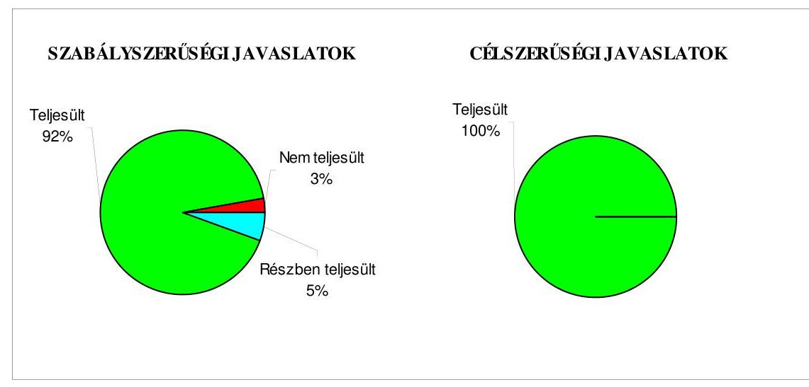

Budapest, 2011. január „ $\cdot$ " $\square$
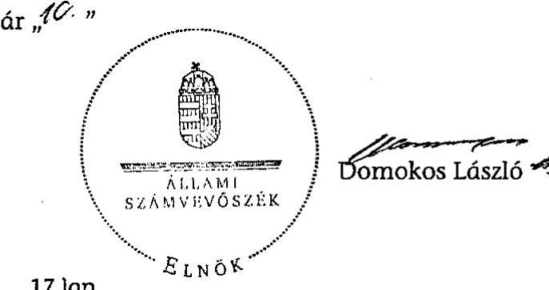

---

# Az Önkormányzat gazdálkodását meghatározó adatok, mutatószámok 

| Megnevezés |  |
| :--: | :--: |
| A település állandó lakosainak száma (fő) 2010. január 1-jén | 75616 |
| A Közgyűlés tagjainak a száma (fő) (2009. december 31-én) | 27 |
| A Közgyűlés munkáját segítő állandó bizottságok száma (2009. december 31-én) | 5 |
| A Polgármesteri hivatalban foglalkoztatott köztisztviselők száma (fő) (2009. december 31-én) | 261 |
| Az összes vagyon értéke a 2009. december 31-i könyvviteli mérleg szerint (millió Ft) | 78669 |
| Az adósságállomány (hosszú és rövid lejáratú kötelezettség) 2009. december 31-én (millió Ft) | 19150 |
| Az egy lakosra jutó adósságállomány 2009. december 31-én (Ft) | 253253 |
| Az összes 2009. évben teljesített költségvetési bevétel (millió Ft) | 23254 |
| Ebből: saját bevétel (millió Ft), melyből | 9651 |
| helyi adóbevétel (millió Ft) | 4002 |
| Az egy lakosra jutó 2009. évi költségvetési bevétel (Ft) | 307528 |
| Az egy lakosra jutó 2009. évi saját bevétel (Ft) | 127632 |
| Az egy lakosra jutó 2009. évi helyi adóbevétel (Ft) | 52925 |
| Saját bevétel/Összes költségvetési bevétel aránya a 2009. évben (\%) | 41,5 |
| Helyi adó bevétel/Összes költségvetési bevétel aránya a 2009. évben (\%) | 17,2 |
| Az összes teljesített költségvetési kiadás a 2009. évben (millió Ft) | 23742 |
| Ebből: felhalmozási célú költségvetési kiadás (millió Ft) | 4157 |
| A 2009. évi költségvetési kiadásból a felhalmozási célú költségvetési kiadás aránya (\%) | 17,5 |
| Az egy lakosra jutó 2009. évi költségvetési kiadás (Ft) | 313981 |
| Az egy lakosra jutó 2009. évben teljesített felhalmozási célú költségvetési kiadás (Ft) | 54975 |
| A költségvetési intézmények száma 2009. december 31-én (db) | 28 |
| Ebből: önállóan működő (db) | 21 |
| A költségvetési intézményekben foglalkoztatott közalkalmazottak száma (fő) (2009. december 31-én) | 2812 |

---

# Az önkormányzati vagyon alakulása

|  Mérlegsor
megnevezése | 2007.év
(millió Ft) | 2008. év
(millió Ft) | 2009. év
(millió Ft) | Változás \%-a (Előző év=100\%) |  |   |
| --- | --- | --- | --- | --- | --- | --- |
|   |  |  |  | 2008/2007. | 2009/2008. | 2009/2007.  |
|  Immateriális javak | 526 | 445 | 357 | 84,6 | 80,2 | 67,9  |
|  Tárgyi eszközök | 52002 | 52661 | 52991 | 101,3 | 100,6 | 101,9  |
|  ebből: ingatlanok | 49411 | 50072 | 50174 | 101,3 | 100,2 | 101,5  |
|  beruházások, felújítások | 1569 | 1123 | 1437 | 71,6 | 128,0 | 91,6  |
|  Befektetett pénzügyi eszközök | 1546 | 1909 | 1455 | 123,5 | 76,2 | 94,1  |
|  Üzemeltetésre átadott eszközök | 17388 | 17408 | 17897 | 100,1 | 102,8 | 102,9  |
|  Befektetett eszközök összesen | 71462 | 72423 | 72700 | 101,3 | 100,4 | 101,7  |
|  Forgóeszközök összesen | 8282 | 6917 | 5969 | 83,5 | 86,3 | 72,1  |
|  ebből: követelések | 912 | 519 | 1302 | 56,9 | 250,9 | 142,8  |
|  pénzeszközök | 2032 | 1886 | 3255 | 92,8 | 172,6 | 160,2  |
|  Eszközök összesen | 79744 | 79340 | 78669 | 99,5 | 99,2 | 98,7  |
|  Saját tőke összesen | 62822 | 59096 | 57245 | 94,1 | 96,9 | 91,1  |
|  Tartalék összesen | 1782 | 1779 | 1586 | 99,8 | 89,2 | 89,0  |
|  Kötelezettségek összesen | 15140 | 18465 | 19838 | 122,0 | 107,4 | 131,0  |
|  ebből: hosszú lejáratú kötelezettségek | 11727 | 14684 | 14564 | 125,2 | 99,2 | 124,2  |
|  rövid lejáratú kötelezettségek | 2777 | 3085 | 4586 | 111,1 | 148,7 | 165,1  |
|  Források összesen: | 79744 | 79340 | 78669 | 99,5 | 99,2 | 98,7  |

Forrás: Magyar Államkincstár éves költségvetési beszámoló "01" számú űrlap ÁSZ ellenőrzés során korrigált adatai.

---

# Az önkormányzati kötelezettségek alakulása

|  Mérlegsor
megnevezése | 2007.év
(millió Ft) | 2008. év
(millió Ft) | 2009. év
(millió Ft) | Változás \%-a (Előző év=100\%) |  |   |
| --- | --- | --- | --- | --- | --- | --- |
|   |  |  |  | 2008/2007. | 2009/2008. | 2009/2007.  |
|  Hosszú lejáratú kötelezettségek összesen | 11727 | 14684 | 14564 | 125,2 | 99,2 | 124,2  |
|  ebből: hosszú lejáratra kapott kölcsönök |  |  |  |  |  |   |
|  tartozások fejlesztési célú kötvénykibocsátásból | 8383 | 11474 | 11649 | 136,9 | 101,5 | 139,0  |
|  tartozások müködési célú kötvénykibocsátásból |  |  |  |  |  |   |
|  beruházási és fejlesztési hitelek | 3342 | 3209 | 2913 | 96,0 | 90,8 | 87,2  |
|  müködési célú hosszú lejáratú hitelek |  |  |  |  |  |   |
|  egyéb hosszú lejáratú kötelezettségek | 2 | 2 | 1 | 100,0 | 50,0 | 50,0  |
|  Rövid lejáratú kötelezettségek összesen | 2777 | 3085 | 4586 | 111,1 | 148,7 | 165,1  |
|  ebből: rövid lejáratú kölcsönök |  |  |  |  |  |   |
|  rövid lejáratú hitelek | 731 | 1000 | 2201 | 136,8 | 220,1 | 301,1  |
|  kötelezettségek áruszállításból, szolgáltatásból | 725 | 691 | 1074 | 95,3 | 155,4 | 148,1  |
|  garancia- és kezességvállalásból szárm. köt. |  |  |  |  |  |   |
|  h. lejár. kapott kölcsön köv. évet terh.törl.részl. |  |  |  |  |  |   |
|  felh.c.kötv.kib-ból szárm.tart.köv.évet terh.r. |  | 89 | 114 |  | 128,1 |   |
|  mük.c.kötv.kib-ból szárm.tart.köv.évet terh.r. |  |  |  |  |  |   |
|  beruh.fejl.hitel köv.évet terhelő törl. részlete | 286 | 362 | 345 | 126,6 | 95,3 | 120,6  |
|  müködési c.hosszú lej.hitel köv.évet terh.törl.r. |  |  |  |  |  |   |
|  egyéb hosszú lej.köt.köv.évet terh.törl. részlete |  |  |  |  |  |   |

Forrás: Magyar Államkincstár éves költségvetési beszámoló "01" számú űrlap adatai.

---

Szolnok Megyei Jogú Város Önkormányzata

Az Önkormányzat 2007-2010. évi költségvetési előirányzatainak és 2007-2009. évi pénzügyi teljesítéseinek alakulása

|  Megnevezés | 2007. év |  |  |  | 2008. év |  |  |  | 2009. év |  |  |  | 2010.  |
| --- | --- | --- | --- | --- | --- | --- | --- | --- | --- | --- | --- | --- | --- |
|   | Eredeti | Módosított | Teljesítés (millió Ft) | Teljesítés/ eredeti előirány- zat % | Eredeti | Módosított | Teljesítés (millió Ft) | Teljesítés (millió Ft) | Teljesítés/ eredeti előirány- zat % | Eredeti | Módosított | Teljesítés (millió Ft) | Teljesítés (millió Ft)  |
|   | előirányzat (millió Ft) |  |  |  | előirányzat (millió Ft) |  |  |  |  | előirányzat (millió Ft) |  |  |   |
|  Működési célú költségvetési bevételek összesen | 15 136 | 18 028 | 18 688 | 123,5 | 15 395 | 19 799 | 21 390 | 138,9 | 16 245 | 20 045 | 19 883 | 122,4 | 15 838  |
|  Működési célú költségvetési kiadások összesen | 17 361 | 25 230 | 18 693 | 107,7 | 16 442 | 19 754 | 19 497 | 118,6 | 17 292 | 21 285 | 19 585 | 113,3 | 16 644  |
|  Működési célú költségvetési bevételek és kiadások egyenlege: hiány-, többlet + | -2 225 | -7 202 | -5 | 0,2 | -1 047 | 45 | 1 893 |  | -1 047 | -1 240 | 298 |  | -806  |
|  Felhalmozási célú költségvetési bevételek összesen | 3 760 | 4 134 | 2 864 | 76,2 | 2 175 | 1 918 | 1 940 | 89,2 | 2 479 | 3 924 | 3 371 | 136,0 | 4 320  |
|  Felhalmozási célú költségvetési kiadások összesen | 3 925 | 5 398 | 4 067 | 103,6 | 4 134 | 6 535 | 3 781 | 91,5 | 5 165 | 6 156 | 4 157 | 80,5 | 6 035  |
|  Felhalmozási célú költségvetési bevételek és kiadások egyenlege: hiány-, többlet+ | -165 | -1 264 | -1 203 | 729,1 | -1 959 | -4 617 | -1 841 | 94,0 | -2 686 | -2 232 | -786 | 29,3 | -1 715  |
|  Költségvetési bevételek összesen | 18 896 | 22 162 | 21 552 | 114,1 | 17 570 | 21 717 | 23 330 | 132,8 | 18 724 | 23 969 | 23 254 | 124,2 | 20 158  |
|  Költségvetési kiadások összesen | 21 286 | 30 628 | 22 760 | 106,9 | 20 576 | 26 289 | 23 278 | 113,1 | 22 457 | 27 441 | 23 742 | 105,7 | 22 679  |
|  Költségvetési bevételek és kiadások egyenlege: hiány-, többlet+ | -2 390 | -8 466 | -1 208 | 50,5 | -3 006 | -4 572 | 52 |  | -3 733 | -3 472 | -488 | 13,1 | -2 521  |
|  Finanszírozási célú pénzügyi bevételek | 2 763 | 8 839 | 8 567 |  | 3 291 | 4 956 | 2 860 |  | 4 184 | 3 923 | 5 094 |  | 2 980  |
|  Finanszírozási célú pénzügyi kiadások | 373 | 373 | 5 258 |  | 285 | 384 | 384 |  | 451 | 451 | 450 |  | 459  |
|  Finanszírozási célú pénzügyi műveletek egyenlege | 2 390 | 8 466 | 3 309 |  | 3 006 | 4 572 | 2 476 |  | 3 733 | 3 472 | 4 644 |  | 2 521  |

Forrás: - Magyar Államkincstár éves költségvetési beszámoló "80" számú űrlap ÁSZ ellenőrzés során korrigált (könyvvizsgáló auditálási eltését is figyelembe véve) adatai; - a 2010. évi adatok esetében az Önkormányzat 2010. évi költségvetése; - a költségvetési bevétel-kiadás működési-felhalmozási célra történt megosztásánál az analitikus nyilvántartás.

---

Sosfoni Megeri Jupi Város Önkormányzata a V-2023-7/10/2010. számú jelentéshez

TANÚSÍTVÁNY az európai uniós forrásokkal támogatott célok és programok 2007-2010. évi tervezett és teljesített adatairól

|  Sor-
vánt | Az európai uniós forrásokkal támogatott program megnevezése és a pályázat célja | Tervezett összes belerőzés költség | Az összes kiadásitól 2007-2010 alábbi tervetett költségvetési adatok (milliá Ft) az összes kiadási finanszírozó fénynek |  |  |  |  |  |  |  |  |  |  |  |  |  |  |  |  |  |  |  |  |  |  |  |  |  |  |  |  |  |  |  |  |   |
| --- | --- | --- | --- | --- | --- | --- | --- | --- | --- | --- | --- | --- | --- | --- | --- | --- | --- | --- | --- | --- | --- | --- | --- | --- | --- | --- | --- | --- | --- | --- | --- | --- | --- | --- | --- | --- | --- | --- |
|   |  |  |  |  |  |  |  |  |  |  |  |  |  |  |  |  |  |  |  |  |  |  |  |  |  |  |  |  |  |  |  |  |  |  |  |  |   |
|   |  |  |  |  |  |  |  |  |  |  |  |  |  |  |  |  |  |  |  |  |  |  |  |  |  |  |  |  |  |  |  |  |  |  |  |  |   |
|  1. |  |  |  |  |  |  |  |  |  |  |  |  |  |  |  |  |  |  |  |  |  |  |  |  |  |  |  |  |  |  |  |  |  |  |  |  |   |
|   |  |  |  |  |  |  |  |  |  |  |  |  |  |  |  |  |  |  |  |  |  |  |  |  |  |  |  |  |  |  |  |  |  |  |  |  |   |
|  2. |  |  |  |  |  |  |  |  |  |  |  |  |  |  |  |  |  |  |  |  |  |  |  |  |  |  |  |  |  |  |  |  |  |  |  |  |   |
|   |  |  |  |  |  |  |  |  |  |  |  |  |  |  |  |  |  |  |  |  |  |  |  |  |  |  |  |  |  |  |  |  |  |  |  |  |   |
|  3. |  |  |  |  |  |  |  |  |  |  |  |  |  |  |  |  |  |  |  |  |  |  |  |  |  |  |  |  |  |  |  |  |  |  |  |  |   |
|   |  |  |  |  |  |  |  |  |  |  |  |  |  |  |  |  |  |  |  |  |  |  |  |  |  |  |  |  |  |  |  |  |  |  |  |  |   |
|   |  |  |  |  |  |  |  |  |  |  |  |  |  |  |  |  |  |  |  |  |  |  |  |  |  |  |  |  |  |  |  |  |  |  |  |  |   |
|  4. |  |  |  |  |  |  |  |  |  |  |  |  |  |  |  |  |  |  |  |  |  |  |  |  |  |  |  |  |  |  |  |  |  |  |  |  |   |
|   |  |  |  |  |  |  |  |  |  |  |  |  |  |  |  |  |  |  |  |  |  |  |  |  |  |  |  |  |  |  |  |  |  |  |  |  |   |
|  5. |  |  |  |  |  |  |  |  |  |  |  |  |  |  |  |  |  |  |  |  |  |  |  |  |  |  |  |  |  |  |  |  |  |  |  |  |   |
|   |  |  |  |  |  |  |  |  |  |  |  |  |  |  |  |  |  |  |  |  |  |  |  |  |  |  |  |  |  |  |  |  |  |  |  |  |   |
|  6. |  |  |  |  |  |  |  |  |  |  |  |  |  |  |  |  |  |  |  |  |  |  |  |  |  |  |  |  |  |  |  |  |  |  |  |  |   |
|   |  |  |  |  |  |  |  |  |  |  |  |  |  |  |  |  |  |  |  |  |  |  |  |  |  |  |  |  |  |  |  |  |  |  |  |  |   |
|  7. |  |  |  |  |  |  |  |  |  |  |  |  |  |  |  |  |  |  |  |  |  |  |  |  |  |  |  |  |  |  |  |  |  |  |  |  |   |
|   |  |  |  |  |  |  |  |  |  |  |  |  |  |  |  |  |  |  |  |  |  |  |  |  |  |  |  |  |  |  |  |  |  |  |  |  |   |
|  8. |  |  |  |  |  |  |  |  |  |  |  |  |  |  |  |  |  |  |  |  |  |  |  |  |  |  |  |  |  |  |  |  |  |  |  |  |   |
|   |  |  |  |  |  |  |  |  |  |  |  |  |  |  |  |  |  |  |  |  |  |  |  |  |  |  |  |  |  |  |  |  |  |  |  |  |   |
|  9. |  |  |  |  |  |  |  |  |  |  |  |  |  |  |  |  |  |  |  |  |  |  |  |  |  |  |  |  |  |  |  |  |  |  |  |  |   |
|   |  |  |  |  |  |  |  |  |  |  |  |  |  |  |  |  |  |  |  |  |  |  |  |  |  |  |  |  |  |  |  |  |  |  |  |  |   |
|  10. |  |  |  |  |  |  |  |  |  |  |  |  |  |  |  |  |  |  |  |  |  |  |  |  |  |  |  |  |  |  |  |  |  |  |  |  |   |
|   |  |  |  |  |  |  |  |  |  |  |  |  |  |  |  |  |  |  |  |  |  |  |  |  |  |  |  |  |  |  |  |  |  |  |  |  |   |
|  11. |  |  |  |  |  |  |  |  |  |  |  |  |  |  |  |  |  |  |  |  |  |  |  |  |  |  |  |  |  |  |  |  |  |  |  |  |   |
|   |  |  |  |  |  |  |  |  |  |  |  |  |  |  |  |  |  |  |  |  |  |  |  |  |  |  |  |  |  |  |  |  |  |  |  |  |   |
|  12. |  |  |  |  |  |  |  |  |  |  |  |  |  |  |  |  |  |  |  |  |  |  |  |  |  |  |  |  |  |  |  |  |  |  |  |  |   |
|   |  |  |  |  |  |  |  |  |  |  |  |  |  |  |  |  |  |  |  |  |  |  |  |  |  |  |  |  |  |  |  |  |  |  |  |  |   |
|  13. |  |  |  |  |  |  |  |  |  |  |  |  |  |  |  |  |  |  |  |  |  |  |  |  |  |  |  |  |  |  |  |  |  |  |  |  |  |   |
|   |  |  |  |  |  |  |  |  |  |  |  |  |  |  |  |  |  |  |  |  |  |  |  |  |  |  |  |  |  |  |  |  |  |  |  |  |  |   |
|  14. |  |  |  |  |  |  |  |  |  |  |  |  |  |  |  |  |  |  |  |  |  |  |  |  |  |  |  |  |  |  |  |  |  |  |  |  |  |   |
|   |  |  |  |  |  |  |  |  |  |  |  |  |  |  |  |  |  |  |  |  |  |  |  |  |  |  |  |  |  |  |  |  |  |  |  |  |  |   |
|  15. |  |  |  |  |  |  |  |  |  |  |  |  |  |  |  |  |  |  |  |  |  |  |  |  |  |  |  |  |  |  |  |  |  |  |  |  |  |   |
|   |  |  |  |  |  |  |  |  |  |  |  |  |  |  |  |  |  |  |  |  |  |  |  |  |  |  |  |  |  |  |  |  |  |  |  |  |  |   |
|  16. |  |  |  |  |  |  |  |  |  |  |  |  |  |  |  |  |  |  |  |  |  |  |  |  |  |  |  |  |  |  |  |  |  |  |  |  |  |   |
|   |  |  |  |  |  |  |  |  |  |  |  |  |  |  |  |  |  |  |  |  |  |  |  |  |  |  |  |  |  |  |  |  |  |  |  |  |  |   |
|  17. |  |  |  |  |  |  |  |  |  |  |  |  |  |  |  |  |  |  |  |  |  |  |  |  |  |  |  |  |  |  |  |  |  |  |  |  |  |   |
|   |  |  |  |  |  |  |  |  |  |  |  |  |  |  |  |  |  |  |  |  |  |  |  |  |  |  |  |  |  |  |  |  |  |  |  |  |  |   |
|  18. |  |  |  |  |  |  |  |  |  |  |  |  |  |  |  |  |  |  |  |  |  |  |  |  |  |  |  |  |  |  |  |  |  |  |  |  |  |   |
|   |  |  |  |  |  |  |  |  |  |  |  |  |  |  |  |  |  |  |  |  |  |  |  |  |  |  |  |  |  |  |  |  |  |  |  |  |  |   |
|  19. |  |  |  |  |  |  |  |  |  |  |  |  |  |  |  |  |  |  |  |  |  |  |  |  |  |  |  |  |  |  |  |  |  |  |  |  |  |   |
|   |  |  |  |  |  |  |  |  |  |  |  |  |  |  |  |  |  |  |  |  |  |  |  |  |  |  |  |  |  |  |  |  |  |  |  |  |  |   |
|  20. |  |  |  |  |  |  |  |  |  |  |  |  |  |  |  |  |  |  |  |  |  |  |  |  |  |  |  |  |  |  |  |  |  |  |  |  |  |   |
|   |  |  |  |  |  |  |  |  |  |  |  |  |  |  |  |  |  |  |  |  |  |  |  |  |  |  |  |  |  |  |  |  |  |  |  |  |  |   |
|  21. |  |  |  |  |  |  |  |  |  |  |  |  |  |  |  |  |  |  |  |  |  |  |  |  |  |  |  |  |  |  |  |  |  |  |  |  |  |   |
|   |  |  |  |  |  |  |  |  |  |  |  |  |  |  |  |  |  |  |  |  |  |  |  |  |  |  |  |  |  |  |  |  |  |  |  |  |  |   |
|  22. |  |  |  |  |  |  |  |  |  |  |  |  |  |  |  |  |  |  |  |  |  |  |  |  |  |  |  |  |  |  |  |  |  |  |  |  |  |   |
|   |  |  |  |  |  |  |  |  |  |  |  |  |  |  |  |  |  |  |  |  |  |  |  |  |  |  |  |  |  |  |  |  |  |  |  |  |  |   |
|  23. |  |  |  |  |  |  |  |  |  |  |  |  |  |  |  |  |  |  |  |  |  |  |  |  |  |  |  |  |  |  |  |  |  |  |  |  |  |   |
|   |  |  |  |  |  |  |  |  |  |  |  |  |  |  |  |  |  |  |  |  |  |  |  |  |  |  |  |  |  |  |  |  |  |  |  |  |  |   |
|  24. |  |  |  |  |  |  |  |  |  |  |  |  |  |  |  |  |  |  |  |  |  |  |  |  |  |  |  |  |  |  |  |  |  |  |  |  |  |   |
|   |  |  |  |  |  |  |  |  |  |  |  |  |  |  |  |  |  |  |  |  |  |  |  |  |  |  |  |  |  |  |  |  |  |  |  |  |  |   |
|  25. |  |  |  |  |  |  |  |  |  |  |  |  |  |  |  |  |  |  |  |  |  |  |  |  |  |  |  |  |  |  |  |  |  |  |  |  |  |   |
|   |  |  |  |  |  |  |  |  |  |  |  |  |  |  |  |  |  |  |  |  |  |  |  |  |  |  |  |  |  |  |  |  |  |  |  |  |  |   |
|  26. |  |  |  |  |  |  |  |  |  |  |  |  |  |  |  |  |  |  |  |  |  |  |  |  |  |  |  |  |  |  |  |  |  |  |  |  |  |   |
|   |  |  |  |  |  |  |  |  |  |  |  |  |  |  |  |  |  |  |  |  |  |  |  |  |  |  |  |  |  |  |  |  |  |  |  |  |  |  |   |
|  27. |  |  |  |  |  |  |  |  |  |  |  |  |  |  |  |  |  |  |  |  |  |  |  |  |  |  |  |  |  |  |  |  |  |  |  |  |  |  |   |
|   |  |  |  |  |  |  |  |  |  |  |  |  |  |  |  |  |  |  |  |  |  |  |  |  |  |  |  |  |  |  |  |  |  |  |  |  |  |  |   |
|  28. |  |  |  |  |  |  |  |  |  |  |  |  |  |  |  |  |  |  |  |  |  |  |  |  |  |  |  |  |  |  |  |  |  |  |  |  |  |  |   |
|   |  |  |  |  |  |  |  |  |  |  |  |  |  |  |  |  |  |  |  |  |  |  |  |  |  |  |  |  |  |  |  |  |  |  |  |  |  |  |   |
|  29. |  |  |  |  |  |  |  |  |  |  |  |  |  |  |  |  |  |  |  |  |  |  |  |  |  |  |  |  |  |  |  |  |  |  |  |  |  |  |   |
|   |  |  |  |  |  |  |  |  |  |  |  |  |  |  |  |  |  |  |  |  |  |  |  |  |  |  |  |  |  |  |  |  |  |  |  |  |  |  |  |   |
|  30. |  |  |  |  |  |  |  |  |  |  |  |  |  |  |  |  |  |  |  |  |  |  |  |  |  |  |  |  |  |  |  |  |  |  |  |  |  |  |  |   |
|   |  |  |  |  |  |  |  |  |  |  |  |  |  |  |  |  |  |  |  |  |  |  |  |  |  |  |  |  |  |  |  |  |  |  |  |  |  |  |  |   |
|  31. |  |  |  |  |  |  |  |  |  |  |  |  |  |  |  |  |  |  |  |  |  |  |  |  |  |  |  |  |  |  |  |  |  |  |  |  |  |  |  |   |
|   |  |  |  |  |  |  |  |  |  |  |  |  |  |  |  |  |  |  |  |  |  |  |  |  |  |  |  |  |  |  |  |  |  |  |  |  |  |  |  |   |
|  32. |  |  |  |  |  |  |  |  |  |  |  |  |  |  |  |  |  |  |  |  |  |  |  |  |  |  |  |  |  |  |  |  |  |  |  |  |  |  |  |   |
|   |  |  |  |  |  |  |  |  |  |  |  |  |  |  |  |  |  |  |  |  |  |  |  |  |  |  |  |  |  |  |  |  |  |  |  |  |  |  |  |   |
|  33. |  |  |  |  |  |  |  |  |  |  |  |  |  |  |  |  |  |  |  |  |  |  |  |  |  |  |  |  |  |  |  |  |  |  |  |  |  |  |  |   |
|   |  |  |  |  |  |  |  |  |  |  |  |  |  |  |  |  |  |  |  |  |  |  |  |  |  |  |  |  |  |  |  |  |  |  |  |  |  |  |  |   |
|  34. |  |  |  |  |  |  |  |  |  |  |  |  |  |  |  |  |  |  |  |  |  |  |  |  |  |  |  |  |  |  |  |  |  |  |  |  |  |  |  |   |
|   |  |  |  |  |  |  |  |  |  |  |  |  |  |  |  |  |  |  |  |  |  |  |  |  |  |  |  |  |  |  |  |  |  |  |  |  |  |  |  |   |
|  35. |  |  |  |  |  |  |  |  |  |  |  |  |  |  |  |  |  |  |  |  |  |  |  |  |  |  |  |  |  |  |  |  |  |  |  |  |  |  |  |   |
|   |  |  |  |  |  |  |  |  |  |  |  |  |  |  |  |  |  |  |  |  |  |  |  |  |  |  |  |  |  |  |  |  |  |  |  |  |  |  |  |   |
|  36. |  |  |  |  |  |  |  |  |  |  |  |  |  |  |  |  |  |  |  |  |  |  |  |  |  |  |  |  |  |  |  |  |  |  |  |  |  |  |  |   |
|   |  |  |  |  |  |  |  |  |  |  |  |  |  |  |  |  |  |  |  |  |  |  |  |  |  |  |  |  |  |  |  |  |  |  |  |  |  |  |  |   |
|  37. |  |  |  |  |  |  |  |  |  |  |  |  |  |  |  |  |  |  |  |  |  |  |  |  |  |  |  |  |  |  |  |  |  |  |  |  |  |  |  |  |   |
|   |  |  |  |  |  |  |  |  |  |  |  |  |  |  |  |  |  |  |  |  |  |  |  |  |  |  |  |  |  |  |  |  |  |  |  |  |  |  |  |  |   |
|  38. |  |  |  |  |  |  |  |  |  |  |  |  |  |  |  |  |  |  |  |  |  |  |  |  |  |  |  |  |  |  |  |  |  |  |  |  |  |  |  |  |  |   |
|   |  |  |  |  |  |  |  |  |  |  |  |  |  |  |  |  |  |  |  |  |  |  |  |  |  |  |  |  |  |  |  |  |  |  |  |  |  |  |  |  |  |   |
|  39. |  |  |  |  |  |  |  |  |  |  |  |  |  |  |  |  |  |  |  |  |  |  |  |  |  |  |  |  |  |  |  |  |  |  |  |  |  |  |  |  |  |   |
|   |  |  |  |  |  |  |  |  |  |  |  |  |  |  |  |  |  |  |  |  |  |  |  |  |  |  |  |  |  |  |  |  |  |  |  |  |  |  |  |  |  |  |   |
|  40. |  |  |  |  |  |  |  |  |  |  |  |  |  |  |  |  |  |  |  |  |  |  |  |  |  |  |  |  |  |  |  |  |  |  |  |  |  |  |  |  |  |  |   |
|   |  |  |  |  |  |  |  |  |  |  |  |  |  |  |  |  |  |  |  |  |  |  |  |  |  |  |  |  |  |  |  |  |  |  |  |  |  |  |  |  |  |  |  |   |
|  41. |  |  |  |  |  |  |  |  |  |  |  |  |  |  |  |  |  |  |  |  |  |  |  |  |  |  |  |  |  |  |  |  |  |  |  |  |  |  |  |  |  |  |  |  |   |
|   |  |  |  |  |  |  |  |  |  |  |  |  |  |  |  |  |  |  |  |  |  |  |  |  |  |  |  |  |  |  |  |  |  |  |  |  |  |  |  |  |  |  |  |  |   |
|  42. |  |  |  |  |  |  |  |  |  |  |  |  |  |  |  |  |  |  |  |  |  |  |  |  |  |  |  |  |  |  |  |  |  |  |  |  |  |  |  |  |  |  |  |  |  |   |
|   |  |  |  |  |  |  |  |  |  |  |  |  |  |  |  |  |  |  |  |  |  |  |  |  |  |  |  |  |  |  |  |  |  |  |  |  |  |  |  |  |  |  |  |  |  |  |   |
|  43. |  |  |  |  |  |  |  |  |  |  |  |  |  |  |  |  |  |  |  |  |  |  |  |  |  |  |  |  |  |  |  |  |  |  |  |  |  |  |  |  |  |  |  |  |  |  |  |  |   |
|   |  |  |  |  |  |  |  |  |  |  |  |  |  |  |  |  |  |  |  |  |  |  |  |  |  |  |  |  |  |  |  |  |  |  |  |  |  |  |  |  |  |  |  |  |  |  |  |  |  |  |   |
|  44. |  |  |  |  |  |  |  |  |  |  |  |  |  |  |  |  |  |  |  |  |  |  |  |  |  |  |  |  |  |  |  |  |  |  |  |  |  |  |  |  |  |  |  |  |  |  |  |  |  |  |  |   |
|   |  |  |  |  |  |  |  |  |  |  |  |  |  |  |  |  |  |  |  |  |  |  |  |  |  |  |  |  |  |  |  |  |  |  |  |  |  |  |  |  |  |  |  |  |  |  |  |  |  |  |  |  |   |
|  45. |  |  |  |  |  |  |  |  |  |  |  |  |  |  |  |  |  |  |  |  |  |  |  |  |  |  |  |  |  |  |  |  |  |  |  |  |  |  |  |  |  |  |  |  |  |  |  |  |  |  |  |  |  |  |   |
|   |  |  |  |  |  |  |  |  |  |  |  |  |  |  |  |  |  |  |  |  |  |  |  |  |  |  |  |  |  |  |  |  |  |  |  |  |  |  |  |  |  |  |  |  |  |  |  |  |  |  |  |  |  |  |  |  |   |
|  46. |  |  |  |  |  |  |  |  |  |  |  |  |  |  |  |  |  |  |  |  |  |  |  |  |  |  |  |  |  |  |  |  |  |  |  |  |  |  |  |  |  |  |  |  |  |  |  |  |  |  |  |  |  |  |  |  |   |
|   |  |  |  |  |  |  |  |  |  |  |  |  |  |  |  |  |  |  |  |  |  |  |  |  |  |  |  |  |  |  |  |  |  |  |  |  |  |  |  |  |  |  |  |  |  |  |  |  |  |  |  |  |  |  |  |  |  |  |   |
|  47. |  |  |  |  |  |  |  |  |  |  |  |  |  |  |  |  |  |  |  |  |  |  |  |  |  |  |  |  |  |  |  |  |  |  |  |  |  |  |  |  |  |  |  |  |  |  |  |  |  |  |  |  |  |  |  |  |  |  |  |  |   |
|   |  |  |  |  |  |  |  |  |  |  |  |  |  |  |  |  |  |  |  |  |  |  |  |  |  |  |  |  |  |  |  |  |  |  |  |  |  |  |  |  |  |  |  |  |  |  |  |  |  |  |  |  |  |  |  |  |  |  |  |  |  |  |   |
|  48. |  |  |  |  |  |  |  |  |  |  |  |  |  |  |  |  |  |  |  |  |  |  |  |  |  |  |  |  |  |  |  |  |  |  |  |  |  |  |  |  |  |  |  |  |  |  |  |  |  |  |  |  |  |  |  |  |  |  |  |  |  |  |  |  |  |  |   |
|   |  |  |  |  |  |  |  |  |  |  |  |  |  |  |  |  |  |  |  |  |  |  |  |  |  |  |  |  |  |  |  |  |  |  |  |  |  |  |  |  |  |  |  |  |  |  |  |  |  |  |  |  |  |  |  |  |  |  |  |  |  |  |  |  |  |  |  |   |
|  49. |  |  |  |  |  |  |  |  |  |  |  |  |  |  |  |  |  |  |  |  |  |  |  |  |  |  |  |  |  |  |  |  |  |  |  |  |  |  |  |  |  |  |  |  |  |  |  |  |  |  |  |  |  |  |  |  |  |  |  |  |  |  |  |  |  |  |  |  |  |  |  |   |
|  50. |  |  |  |  |  |  |  |  |  |  |  |  |  |  |  |  |  |  |  |  |  |  |  |  |  |  |  |  |  |  |  |  |  |  |  |  |  |  |  |  |  |  |  |  |  |  |  |  |  |  |  |  |  |  |  |  |  |  |  |  |  |  |  |  |  |  |  |  |  |  |  |  |   |
|  51. |  |  |  |  |  |  |  |  |  |  |  |  |  |  |  |  |  |  |  |  |  |  |  |  |  |  |  |  |  |  |  |  |  |  |  |  |  |  |  |  |  |  |  |  |  |  |  |  |  |  |  |  |  |  |  |  |  |  |  |  |  |  |  |  |  |  |  |  |  |  |  |  |  |  |  |  |  |   |
|  52. |  |  |  |  |  |  |  |  |  |  |  |  |  |  |  |  |  |  |  |  |  |  |  |  |  |  |  |  |  |  |  |  |  |  |  |  |  |  |  |  |  |  |  |  |  |  |  |  |  |  |  |  |  |  |  |  |  |  |  |  |  |  |  |  |  |  |  |  |  |  |  |  |  |  |  |  |  |  |  |  |  |  |   |
|  53. |  |  |  |  |  |  |  |  |  |  |  |  |  |  |  |  |  |  |  |  |  |  |  |  |  |  |  |  |  |  |  |  |  |  |  |  |  |  |  |  |  |  |  |  |  |  |  |  |  |  |  |  |  |  |  |  |  |  |  |  |  |  |  |  |  |  |  |  |  |  |  |  |  |  |  |  |  |  |  |  |  |  |  |   |
|  54. |  |  |  |  |  |  |  |  |  |  |  |  |  |  |  |  |  |  |  |  |  |  |  |  |  |  |  |  |  |  |  |  |  |  |  |  |  |  |  |  |  |  |  |  |  |  |  |  |  |  |  |  |  |  |  |  |  |  |  |  |  |  |  |  |  |  |  |  |  |  |  |  |  |  |  |  |  |  |  |  |  |  |  |  |  |  |  |  |  |  |   |
|  55. |  |  |  |  |  |  |  |  |  |  |  |  |  |  |  |  |  |  |  |  |  |  |  |  |  |  |  |  |  |  |  |  |  |  |  |  |  |  |  |  |  |  |  |  |  |  |  |  |  |  |  |  |  |  |  |  |  |  |  |  |  |  |  |  |  |  |  |  |  |  |  |  |  |  |  |  |  |  |  |  |  |  |  |  |  |  |  |  |  |  |  |  |  |  |  |  |  |  |  |  | 

---

|  |   |   |   |   |   |   |   |   |   |   |   |   |   |   |   |   |   |   |   |   |   |   |   |   |   |   |   |   |   |   |   |   |   |   |   |   |   |   |   |   |   |   |   |   |   |   |   |   |   |   |   |   |   |   |   |   |   |   |   |   |   |   |   |   |   |   |   |   |   |   |   |   |   |   |   |   |   |   |   |   |   |   |   |   |   |   |   |   |   |   |   |   |   |   |   |   |   |   |   |   |   |

---

|  |   |   |   |   |   |   |   |   |   |   |   |   |   |   |   |   |   |   |   |   |   |   |   |   |   |   |   |   |   |   |   |   |   |   |   |   |   |   |   |   |   |   |   |   |   |   |   |   |   |   |   |   |   |   |   |   |   |   |   |   |   |   |   |   |   |   |   |   |   |   |   |   |   |   |   |   |   |   |   |   |   |   |   |   |   |   |   |   |   |   |   |   |   |   |   |   |   |   |   |   |   |   |

---

Szolnok Megyes Jogú Város Önkormányzata

TANÚSÍTVÁNY az európai uniós forrásokra 2007-2010 között benyújtott pályázatokról, amelyek elbírálásáról az Önkormányzat még nem kapott tájékoztatást

|  Sor-
szám | Az európai uniós forrásokra benyújtott pályázat megnevezése és célja | öncres kiadás | a benyújtott pályázat adatai (mille) by
az öncres kiadás finanszírozó források |  |  |  |  |  |  |  |  |  |  |  |  |  |  |  |  |  |  |  |  |  |  |  |  |   |
| --- | --- | --- | --- | --- | --- | --- | --- | --- | --- | --- | --- | --- | --- | --- | --- | --- | --- | --- | --- | --- | --- | --- | --- | --- | --- | --- | --- | --- |
|   |  |  |  |  |  |  |  |  |  |  |  |  |  |  |  |  |  |  |  |  |  |  |  |  |  |  |  |   |
|   |  |  |  |  |  |  |  |  |  |  |  |  |  |  |  |  |  |  |  |  |  |  |  |  |  |  |  |   |
|   |  |  |  |  |  |  |  |  |  |  |  |  |  |  |  |  |  |  |  |  |  |  |  |  |  |  |  |   |
|  1. |  |  | L.NFT operatív programjai |  |  |  |  |  |  |  |  |  |  |  |  |  |  |  |  |  |  |  |  |  |  |  |  |   |
|  2. |  |  | IL.ÚMFT operatív programjai |  |  |  |  |  |  |  |  |  |  |  |  |  |  |  |  |  |  |  |  |  |  |  |  |   |
|  3. |  |  | EAOP-2.1.1/C " "Tisza tiikai" |  |  |  |  |  |  |  |  |  |  |  |  |  |  |  |  |  |  |  |  |  |  |  |  |   |
|   |  |  | Interaktív élménytár és vendéglő" | 536,0 | 396,8 |  | 0,0 |  | 0,0 |  | 139,2 |  | 0,0 |  | 0,0 |  | 2010 04 01 |  |  |  |  |  |  |  |  |  |  |   |
|  4. |  |  | EAOP-3.1.4/A "Decentrum építése, buszifőök és szakmühely felújítása, utasítójékoztató táblák beszerzése |  |  |  |  |  |  |  |  |  |  |  |  |  |  |  |  |  |  |  |  |  |  |  |  |  |   |
|   |  |  | Szubokos" | 617,1 | 524,5 |  | 0,0 |  | 0,0 |  | 92,6 |  | 0,0 |  | 0,0 |  | 2011 02 01 |  |  |  |  |  |  |  |  |  |  |   |
|  5. |  |  | EAOP-5.1.1/B "Szandaszölős
decentrum létrehozása
vároorthabilitációval" | 588,0 | 435,7 |  | 0,0 |  | 0,0 |  | 152,3 |  | 0,0 |  | 0,0 |  | 2008 07 01 |  |  |  |  |  |  |  |  |  |  |   |
|  6. |  |  | TÁMOP-3.1.5 "Pedagógusképzésre - a
pedagógiai kultúra korosztációese,
pedagógusok új szerepheu" | 9,3 | 7,9 |  | 1,4 |  | 0,0 |  | 0,0 |  | 0,0 |  | 0,0 |  | 2010 02 01 |  |  |  |  |  |  |  |  |  |  |   |
|  7. |  |  | TÁMOP-3.1.5 "Pedagógus továbbképzésének támogatása" | 12,0 | 10,2 |  | 1,8 |  | 0,0 |  | 0,0 |  | 0,0 |  | 0,0 |  | 2010 03 01 |  |  |  |  |  |  |  |  |  |  |   |
|  8. |  |  | TÁMOP-3.1.5 "(2) tudás - új szerep" | 10,1 | 8,6 |  | 1,5 |  | 0,0 |  | 0,0 |  | 0,0 |  | 0,0 |  | 2010 05 01 |  |  |  |  |  |  |  |  |  |  |   |
|  9. |  |  | TÁMOP-3.1.5 "Pedagógiai kultúra
konszerlícítése a Kansai Úti Általános
Izkolában" | 12,0 | 10,2 |  | 1,8 |  | 0,0 |  | 0,0 |  | 0,0 |  | 0,0 |  | 2010 06 01 |  |  |  |  |  |  |  |  |  |  |   |
|  10. |  |  | TÁMOP-3.1.5 "Itenováció a
pedagógisért - pedagógusok
továbbképzése az oktatási
emigáltatások modernizációjának
intézményi implementációjához" | 12,0 | 10,2 |  | 1,8 |  | 0,0 |  | 0,0 |  | 0,0 |  | 0,0 |  | 2010 07 01 |  |  |  |  |  |  |  |  |  |  |   |
|  11. |  |  | TÁMOP-3.1.5 "Pedagógus képzéssel a
jóvóorontált vezetésért, az
óvodapedagógiai kultúra folyamatos
fejlesztéséért-Szubokos" | 20,0 | 17,0 |  | 3,0 |  | 0,0 |  | 0,0 |  | 0,0 |  | 0,0 |  | 2010 07 01 |  |  |  |  |  |  |  |  |  |  |   |
|  12. |  |  | TÁMOP-3.2.3 "Hysság egy-másért" | 40,0 | 34,0 |  | 6,0 |  | 0,0 |  | 0,0 |  | 0,0 |  | 0,0 |  | 2010 09 01 |  |  |  |  |  |  |  |  |  |  |   |
|  13. |  |  | TÁMOP-3.2.3 "Kitőös érték - értékes
közösség" | 14,5 | 12,3 |  | 2,2 |  | 0,0 |  | 0,0 |  | 0,0 |  | 0,0 |  | 2010 09 20 |  |  |  |  |  |  |  |  |  |  |   |

---

|  |   |   |   |   |   |   |   |   |   |   |
| --- | --- | --- | --- | --- | --- | --- | --- | --- | --- | --- |
|  |   |   |   |   |   |   |   |   |   |   |
|  |   |   |   |   |   |   |   |   |   |   |
|  |   |   |   |   |   |   |   |   |   |   |
|  |   |   |   |   |   |   |   |   |   |   |
|  |   |   |   |   |   |   |   |   |   |   |
|  |   |   |   |   |   |   |   |   |   |   |
|  |   |   |   |   |   |   |   |   |   |   |
|  |   |   |   |   |   |   |   |   |   |   |
|  |   |   |   |   |   |   |   |   |   |   |
|  |   |   |   |   |   |   |   |   |   |   |
|  |   |   |   |   |   |   |   |   |   |   |
|  |   |   |   |   |   |   |   |   |   |   |
|  |   |   |   |   |   |   |   |   |   |   |
|  |   |   |   |   |   |   |   |   |   |   |
|  |   |   |   |   |   |   |   |   |   |   |
|  |   |   |   |   |   |   |   |   |   |   |
|  |   |   |   |   |   |   |   |   |   |   |
|  |   |   |   |   |   |   |   |   |   |   |
|  |   |   |   |   |   |   |   |   |   |   |
|  |   |   |   |   |   |   |   |   |   |   |
|  |   |   |   |   |   |   |   |   |   |   |
|  |   |   |   |   |   |   |   |   |   |   |
|  |   |   |   |   |   |   |   |   |   |   |
|  |   |   |   |   |   |   |   |   |   |   |
|  |   |   |   |   |   |   |   |   |   |   |
|  |   |   |   |   |   |   |   |   |   |   |
|  |   |   |   |   |   |   |   |   |   |   |
|  |   |   |   |   |   |   |   |   |   |   |
|  |   |   |   |   |   |   |   |   |   |   |
|  |   |   |   |   |   |   |   |   |   |   |
|  |   |   |   |   |   |   |   |   |   |   |

---

|  |   |   |   |   |   |   |   |   |   |
| --- | --- | --- | --- | --- | --- | --- | --- | --- | --- |
|  Sor- | Az európai uniós forrásokra benyújtott pályázat megnevezése és célja |  |  |  |  |  |  |  |   |
|  nízusa kiadás |  |  |  |  |  |  |  |  |   |
|   |  |  |  |  |  |  |  |  | tervezet  |
|   |  |  |  |  |  |  |  |  | kezdési  |
|   |  |  |  |  |  |  |  |  | belépzés  |
|   |  |  |  |  |  |  |  |  | határidő  |
|  27. | Finanszírozási források megoszlása* | 100% | 79,8% | 3,9% | 0,0% | 16,3% | 0,0% | 0,0% |   |

**Jelmegyerőzet:** *A finanszírozási források megoszlására vonatkozó sorokat nem kell kiödteni, azok adatait a program számítja ki.

**Nyilatkozat:** A tanúsítványban szereplő adatok valódiságát igazolom.

Különös időpontja: 2010. június 18.

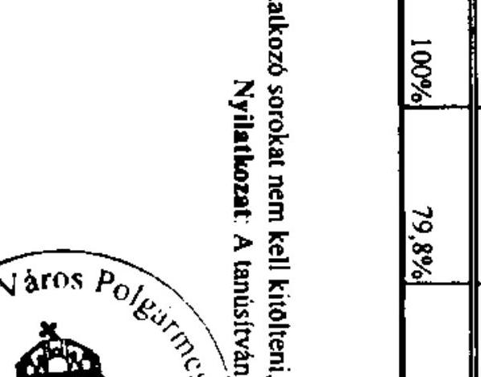

---

Szolnok Megyei Jogú Város Önkormányzata

TANÚSÍTVÁNY a 2007-2010. években benyújtott és elutasított európai uniós pályázatokról

|  Sor-
szám | Az európai uniós forrásokra benyújtott és elutasított pályázat megnevezése és célja | A benyújtott pályázat adatai (milliá Ft) az összes kiadást finanszírozó források |  |  |  |  |  |  |  |  |  |  |  |  |  |  |  |   |
| --- | --- | --- | --- | --- | --- | --- | --- | --- | --- | --- | --- | --- | --- | --- | --- | --- | --- | --- |
|   |  | összes kiadás | európai uniós támogatás | Nemzeti állambartartási finanszírozás |  |  |  |  |  |  |  |  |  |  |  |  |  |   |
|   |  |  |  | altaposti (hazai) | EU Öncel Alap |  |  |  |  |  |  |  |  |  |  |  |  |   |
|   |  |  |  |  |  |  |  |  |  |  |  |  |  |  |  |  |  |   |
|  1. | ÉAOP-2.1.1/E "Szolnok a Tisza fővárosa - Termálfürdő és Rekreációs Központ" | 3 742,0 | 1 818,0 | 0,0 | 0,0 | 1 871,0 | 0,0 | 53,0 | 2007 09 01 | 2009 08 30 | Nem felelt meg a pályázati feltételeknek |  |  |  |  |  |  |   |
|  2. | ÉAOP-3.1.2 "Szolnok Gárdonyi út és Kút út gyalogjárójának felújítása" | 47,1 | 40,0 | 0,7 | 0,0 | 6,4 | 0,0 | 0,0 | 2008 04 01 | 2008 09 01 | Nem felelt meg a pályázati feltételeknek |  |  |  |  |  |  |   |
|  3. | ÉAOP-4.1.1/2F "Jósika Úti Pilypang Óvoda fejlesztése" | 337,5 | 286,8 | 16,9 | 0,0 | 33,8 | 0,0 | 0,0 | 2008 04 01 | 2010 03 31 | Forráshúny miatt |  |  |  |  |  |  |   |
|  4. | ÉAOP-4.1.1/2F "Epítészeti- Faspari és Környezetgazdálkodási Szakközép- és Szakiskola fejlesztése" | 423,1 | 359,6 | 21,2 | 0,0 | 42,3 | 0,0 | 0,0 | 2008 04 01 | 2010 03 31 | Szakmai kidolgozottság hiánya |  |  |  |  |  |  |   |
|  5. | ÉAOP-4.1.1/2F "Fiumei Úti Általános Iskola fejlesztése" | 549,7 | 467,2 | 27,5 | 0,0 | 55,0 | 0,0 | 0,0 | 2008 04 01 | 2010 03 31 | Szakmai kidolgozottság hiánya |  |  |  |  |  |  |   |
|  6. | ÉAOP-4.1.1/2F "Közösi Csoma Sándor Általános Iskola fejlesztése" | 554,7 | 471,5 | 27,7 | 0,0 | 55,5 | 0,0 | 0,0 | 2008 04 01 | 2010 03 31 | Szakmai kidolgozottság hiánya |  |  |  |  |  |  |   |
|  7. | ÉAOP-4.1.1/2F "Epítészeti- Faspari és Környezetgazdálkodási Szakközép- és Szakiskola fejlesztése" | 337,5 | 286,8 | 16,9 | 0,0 | 33,8 | 0,0 | 0,0 | 2008 04 01 | 2010 03 31 | Nem felelt meg a befogadási kritériumoknak |  |  |  |  |  |  |   |
|  8. | ÉAOP-4.1.1/2F "Szandaszölési Általános Iskola fejlesztése" | 514,6 | 437,4 | 25,7 | 0,0 | 51,5 | 0,0 | 0,0 | 2008 04 01 | 2010 03 31 | Szakmai kidolgozottság hiánya |  |  |  |  |  |  |   |
|  9. | ÉAOP-4.1.1/2F "Széchenyi István Gimnázium és Általános Iskola fejlesztése" | 336,1 | 285,7 | 16,8 | 0,0 | 33,6 | 0,0 | 0,0 | 2008 04 01 | 2010 03 31 | Szakmai kidolgozottság hiánya |  |  |  |  |  |  |   |
|  10. | ÉAOP-4.1.1/2F "Szolnok Városi Kullágium fejlesztése" | 463,7 | 394,1 | 23,2 | 0,0 | 46,4 | 0,0 | 0,0 | 2008 04 01 | 2010 03 31 | Szakmai kidolgozottság hiánya |  |  |  |  |  |  |   |
|  11. | ÉAOP-4.1.1/2F "Varga Katalin Gimnázium fejlesztése" | 555,6 | 472,2 | 27,8 | 0,0 | 55,6 | 0,0 | 0,0 | 2008 04 01 | 2010 03 31 | Szakmai kidolgozottság hiánya |  |  |  |  |  |  |   |
|  12. | ÉAOP-4.1.3/A "Szolnoki Kintétség Többszlű Társulása Egyesített Szociális Intézeménye I. számú Gondozási Központja épületenek bővítése és teljes felújítása" | 62,4 | 50,0 | 0,0 | 0,0 | 12,4 | 0,0 | 0,0 | 2009 03 02 | 2010 12 31 | Szakmai kidolgozottság hiánya |  |  |  |  |  |  |   |

---

|  Sze-
szem | Az európai uniós forrásokra benyújtott és elutasított pályázat megnevezése és célja | A benyújtott pályázat adatai (miliió Ft) az öntem kiadási finanszírozó források |  |  |  |  |  |  | Tervzenti |  | Az európai uniós forrásokra vonatkozó pályázat elutasításának indoka  |
| --- | --- | --- | --- | --- | --- | --- | --- | --- | --- | --- | --- |
|   |  | Összen kiadás | európai uniós támogatás | Nemzeti állambázisítási finanszírozás |  |  |  |  |  |  |   |
|   |  |  |  | központi (hazai) | EU Önerő Alap | helyi (saját) | béel | egyéb forrás (pl. magas) | kizáróni | belépzési |   |
|  13 | ÉAOP-4.1.3/C "Új Gondozási Központ létrehozása a Széchenyi-városrészem" | 109,3 | 92,9 | 5,5 | 0,0 | 10,9 | 0,0 | 0,0 | 2009 03 01 | 2010 12 31 | Nem felett meg a jogosultsági kritériumoknak  |
|  14 | ÉAOP-4.1.5 "Aranyi Sándor Úti Óvoda akadálymentesítése" | 8,4 | 7,2 | 0,4 | 0,0 | 0,8 | 0,0 | 0,0 | 2008 07 01 | 2008 09 01 | Szakmai kidolgozottság hiánya  |
|  15 | ÉAOP-4.1.5 "Szent-Györgyi Albert Általános Iskola akadálymentesítése" | 45,8 | 25,0 | 0,0 | 0,0 | 20,8 | 0,0 | 0,0 | 2008 07 01 | 2008 09 01 | Szakmai kidolgozottság hiánya  |
|  16 | ÉAOP-4.1.5 "A Vásárhelyi Pál Közgazdasági Szakközépiskola akadálymentesítése" | 33,2 | 25,0 | 0,0 | 0,0 | 8,2 | 0,0 | 0,0 | 2008 07 01 | 2008 09 01 | Szakmai kidolgozottság hiánya  |
|  17 | ÉAOP-4.1.5 "Ésély a segítség igényételhező - Az egyedlő esélyű hozzáférés biztosítása a szociális alapellátásokhoz Szolnokon" | 13,6 | 11,5 | 0,7 | 0,0 | 1,4 | 0,0 | 0,0 | 2010 01 01 | 2010 09 30 | Nem felett meg a jogosultsági kritériumoknak  |
|  18 | ÉAOP-4.1.5 "Liget Úti Általános Iskola komplex akadálymentesítése" | 33,3 | 28,3 | 1,7 | 0,0 | 3,3 | 0,0 | 0,0 | 2010 07 01 | 2011 06 30 | Nem felett meg a jogosultsági kritériumoknak  |
|  19 | ÉAOP-5.1.1/B "Nyugati városrész szociális rehabilitáció" | 454,0 | 363,2 | 0,0 | 0,0 | 90,8 | 0,0 | 0,0 | 2009 12 01 | 2011 09 30 | Tartalmi hiányosságok miatt, továbbfejlesztésre javasolva  |
|  20 | ÉAOP-5.1.1/B "Széchenyi laköváros rehabilitációja funkcióbővítéssel" | 2 206,0 | 1 544,2 | 0,0 | 0,0 | 661,8 | 0,0 | 0,0 | 2010 01 01 | 2011 12 31 | Nem felett meg a pályázati feltételeknek  |
|  21 | KEOP-2.1.2/1F "Szolnok Tiszaligeti körítölés megerősítése" | 36,0 | 30,6 | 0,0 | 0,0 | 5,4 | 0,0 | 0,0 | 2008 04 01 | 2009 11 30 | Nem felett meg a pályázati feltételeknek  |
|  22 | KEOP-6.2.0/B "Kodály Zoltán Ének-Zenei Tagozatos Általános Iskola és Tallin Alapfokú Művészetoktatási Intézmény a fenotartható életmódot és az ehhez kapcsolódó viselkedésmintákat ösztönző mintaprojekt" | 157,9 | 127,5 | 22,5 | 0,0 | 7,9 | 0,0 | 0,0 | 2010 07 01 | 2011 06 30 | Indokolatlanul magas költségek, tartalmi hiányosságok  |
|  23 | KEOP-7.2.1.2 "Szolnok Tiszaligeti körítölés megerősítése" | 36,0 | 30,6 | 0,0 | 0,0 | 5,4 | 0,0 | 0,0 | 2009 06 01 | 2009 11 30 | Nem felett meg a pályázati feltételeknek  |
|  24 | KÖZOP-3.5.0 "Szolnok új városi Tiszabíd létesítése" | 104,2 | 88,6 | 15,6 | 0,0 | 0,0 | 0,0 | 0,0 | 2010 03 01 | 2010 09 01 | Nem felett meg a jogosultsági kritériumoknak  |
|  25 | TÁMOP-1.4.4 "Foglalkoztatási megállapodás a Szolnoki kiztésségben" | 27,0 | 23,0 | 1,3 | 0,0 | 2,7 | 0,0 | 0,0 | 2009 12 01 | 2011 09 30 | Nem felett meg a jogosultsági kritériumoknak  |

---

|  26. |  | A benyújtott pályázat adatai (millió Ft) |  |  |  |  |  |  |  |  |  |   |
| --- | --- | --- | --- | --- | --- | --- | --- | --- | --- | --- | --- | --- |
|   |  |  |  |  |  |  |  |  |  |  |  |   |
|   |  |  |  |  |  |  |  |  |  |  |  |   |
|   |  |  |  |  |  |  |  |  |  |  |  |   |
|   |  |  |  |  |  |  |  |  |  |  |  |   |
|   |  |  |  |  |  |  |  |  |  |  |  |   |
|   |  |  |  |  |  |  |  |  |  |  |  |   |
|   |  |  |  |  |  |  |  |  |  |  |  |   |
|   |  |  |  |  |  |  |  |  |  |  |  |   |
|   |  |  |  |  |  |  |  |  |  |  |  |   |
|   |  |  |  |  |  |  |  |  |  |  |  |   |
|   |  |  |  |  |  |  |  |  |  |  |  |   |
|   |  |  |  |  |  |  |  |  |  |  |  |   |
|   |  |  |  |  |  |  |  |  |  |  |  |   |
|   |  |  |  |  |  |  |  |  |  |  |  |   |
|   |  |  |  |  |  |  |  |  |  |  |  |   |
|   |  |  |  |  |  |  |  |  |  |  |  |   |
|   |  |  |  |  |  |  |  |  |  |  |  |   |
|   |  |  |  |  |  |  |  |  |  |  |  |   |
|   |  |  |  |  |  |  |  |  |  |  |  |   |
|   |  |  |  |  |  |  |  |  |  |  |  |   |
|   |  |  |  |  |  |  |  |  |  |  |  |   |
|   |  |  |  |  |  |  |  |  |  |  |  |   |
|   |  |  |  |  |  |  |  |  |  |  |  |   |
|   |  |  |  |  |  |  |  |  |  |  |  |   |
|   |  |  |  |  |  |  |  |  |  |  |  |   |
|   |  |  |  |  |  |  |  |  |  |  |  |   |
|   |  |  |  |  |  |  |  |  |  |  |  |   |
|   |  |  |  |  |  |  |  |  |  |  |  |   |
|   |  |  |  |  |  |  |  |  |  |  |  |   |
|   |  |  |  |  |  |  |  |  |  |  |  |   |
|   |  |  |  |  |  |  |  |  |  |  |  |   |
|   |

---

|  |   |   |   |   |   |   |   |   |   |   |
| --- | --- | --- | --- | --- | --- | --- | --- | --- | --- | --- |
|  2010 |  |  |  |  |  |  |  |  |  |   |
|  2010 |  |  |  |  |  |  |  |  |  |   |
|  2010 |  |  |  |  |  |  |  |  |  |   |
|  2010 |  |  |  |  |  |  |  |  |  |   |
|  2010 |  |  |  |  |  |  |  |  |  |   |
|  2010 |  |  |  |  |  |  |  |  |  |   |
|  2010 |  |  |  |  |  |  |  |  |  |   |
|  2010 |  |  |  |  |  |  |  |  |  |   |
|  2010 |  |  |  |  |  |  |  |  |  |   |
|  2010 |  |  |  |  |  |  |  |  |  |   |
|  2010 |  |  |  |  |  |  |  |  |  |   |
|  2010 |  |  |  |  |  |  |  |  |  |   |
|  2010 |  |  |  |  |  |  |  |  |  |   |
|  2010 |  |  |  |  |  |  |  |  |  |   |
|  2010 |  |  |  |  |  |  |  |  |  |   |
|  2010 |  |  |  |  |  |  |  |  |  |   |
|  2010 |  |  |  |  |  |  |  |  |  |   |
|  2010 |  |  |  |  |  |  |  |  |  |   |
|  2010 |  |  |  |  |  |  |  |  |  |   |
|  2010 |  |  |  |  |  |  |  |  |  |   |
|  2010 |  |  |  |  |  |  |  |  |  |   |
|  2010 |  |  |  |  |  |  |  |  |  |   |
|  2010 |  |  |  |  |  |  |  |  |  |   |
|  2010 |  |  |  |  |  |  |  |  |  |   |
|  2010 |  |  |  |  |  |  |  |  |  |   |
|  2010 |  |  |  |  |  |  |  |  |  |   |
|  2010 |  |  |  |  |  |  |  |  |  |   |
|  2010 |  |  |  |  |  |  |  |  |  |   |
|  2010 |  |  |  |  |  |  |  |  |  |   |
|  2010 |  |  |  |  |  |  |  |  |  |   |
|  2010 |  |  |  |  |  |  |  |  |  |   |
|  

---

# Állami Számvevőszék 

## Domokus László elnők úr

részére

## 1052. Budapest

Apáczai Csere János út 10.

## Tisztelt Elnök Úr!

Az Állami Számvevőszék V-3023-7/29/12/2010. iktatószámú - Szolnok Megyei Jogú V'áros Önkormányzata gazdálkodási rendszerének 2010. évi ellenőrzéséről szóló - levelével megküldött számvevószéki jelentés 26-27. oldalain található javaslatokhoz az alábbi észrevételeket kivánom tenni.

A polgármesternek címzett javaslatokhoz:

## 1. javaslat

A Közgyűléstől kapott felhatalmazás alapján a Pénzügyi bizottság Z-13/2007. (X. 18.) számú határozatával fogadta el az Önkormányzat likvid pénzeszközei kezelésének módszerére a „Szolnok Befektetési Alap" portfólió menedzsment kialakításáról szóló előterjesztést. melynek alapján a CIB Befektetési Alapkezelő Zrt-vel portfólió-kezelési szerzödés megkötésére került.

Az alapban kezelt pénzeszközök felhasználása megtörtént, ezért az Önkormányzat és a CIB Befektetési Alapkezelő Zrt közös szándéknyilatkozattal kezdeményezte a szerződés 2010. augusztus 31-i hatállyal történő felbontását. A szerződés közös megegyezéssel történő felbontását Pénzügyi Bizottság Z-11/2010. (XI.18.) számú PÜB bizottsági határozatával elfogadta. A határozatot jelen levelemhez mellékelem.

## A Jegyzönek címzett javaslatokhoz:

## 3. javaslat

A kötvény kibocsátásból származó pénzügyi források a 2010. évi fejlesztési feladatok finanszírozása keretében felhasználásra kerültek, ezért megszüntetésre került a „Szolnok Befektetési Alap" portfólió kezelési szerződés.

---

Az előzőekre figyelemmel az Önkormányzat nem rendelkezik átmenetileg szabad felhasználású pénzügyi forrásokkal, így további értékpapír ügyleteket nem végez.

# Tisztelt Elnök Úr! 

Kérem, hogy a fenti észrevételeket a számvevőszéki jelentés véglegezésénél szíveskedjen figyelembe venni.

A korábban tett észrevételeinket továbbra is fenntartjuk, tudomásul véve, hogy az ÁSZ által el nem fogadott észrevételünk az Állami Számvevőszék álláspontjának kifejtése mellett kerül a számvevőszéki jelentésbe.

Végezetül szeretném köszönetemet kifejezni Igazgatóhelyettes úrnak azért, hogy a vizsgálatot végző munkatársai rendkívül alapos, tényszerű, részletekbe menő, határozott és korrekt módon lefolytatott ellenőrzést végeztek.

S z o l n o k, 2010. december 3.
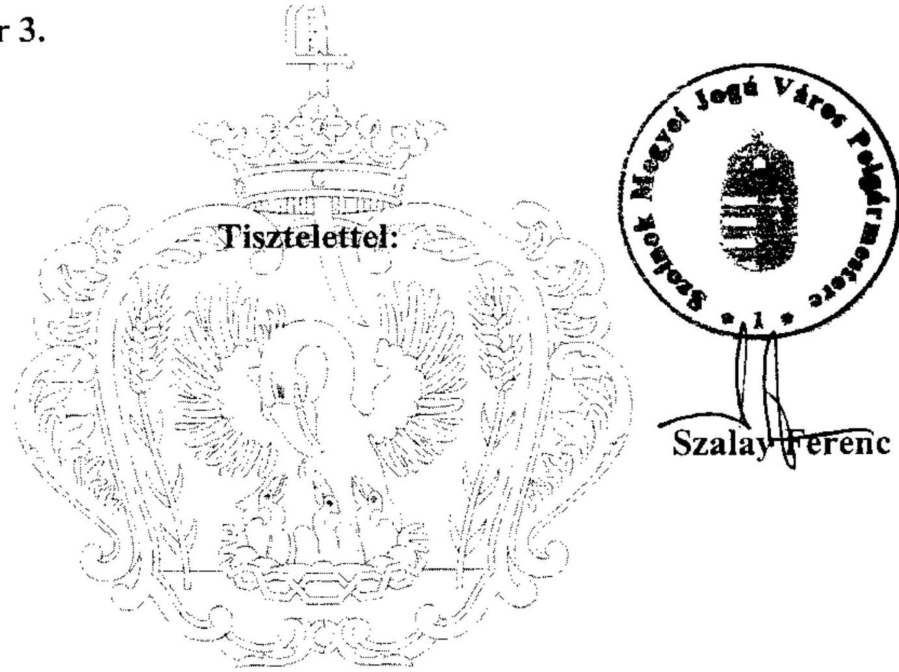

---

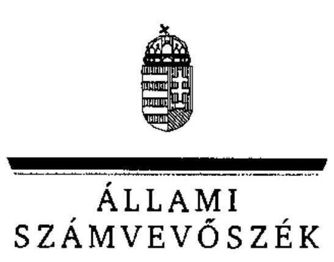

Ikt. szám: V-3023-7/29/23/2010.

# Szalay Ferenc úr, 

polgármester
Szolnok Megyei Jogú Város
Önkormányzata

## Szolnok

## Tisztelt Polgármester Úr!

Köszönettel vettem Szolnok Megyei Jogú Városi Önkormányzat gazdálkodási rendszerének 2010. évi ellenőrzéséről készült számvevőszéki jelentéshez küldött tájékoztatását, az abban foglaltak alapján kérésének megfelelően a végleges jelentésben az Ön által korábban tett és az Állami Számvevőszék által el nem fogadott észrevételeket - az Állami Számvevőszék álláspontjának egyidejű közlése mellett - továbbra is feltüntetjük.
A megállapítások, javaslatok egy részének az ellenőrzést követő megvalósításáról a 2010. december 3-án küldött tájékoztatás és a csatolt dokumentum alapján a megtett intézkedéseket a számvevőszéki jelentésben az érintett megállapításhoz kapcsolt lábjegyzetben szerepeltetjük és a vonatkozó javaslatokat elhagyjuk. Ilyennek tekintjük a portfolió-kezelési szerződés módosításával és az értékpapír ügyleteknél a kötelezettségvállalás ellenjegyzésével kapcsolatos javaslatokat.

Köszönöm Polgármester Úr és munkatársai ellenőrzés során tanúsított hozzáállását, amellyel az ellenőrzés megvalósításában részt vettek, azt segítették.

Budapest, 2010. december „ 23 "
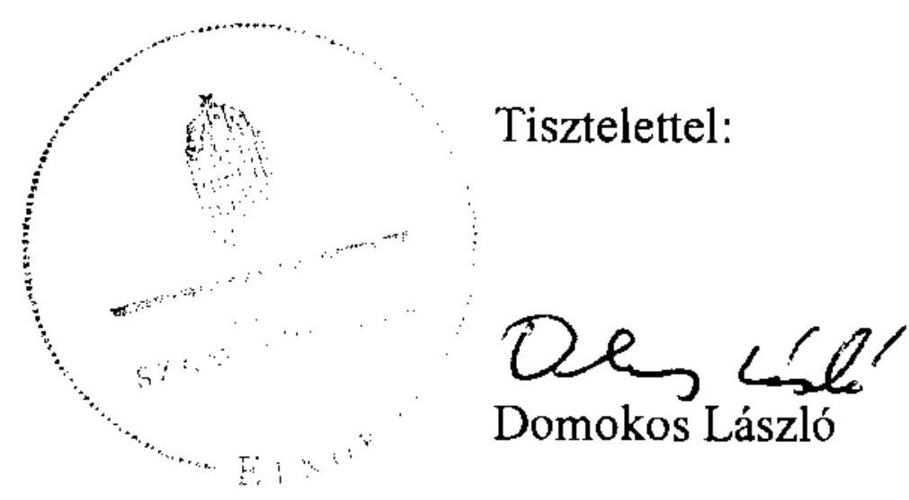