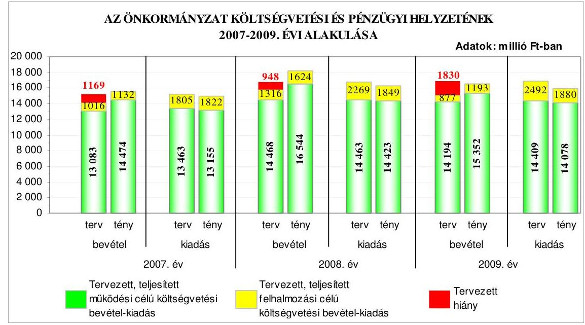
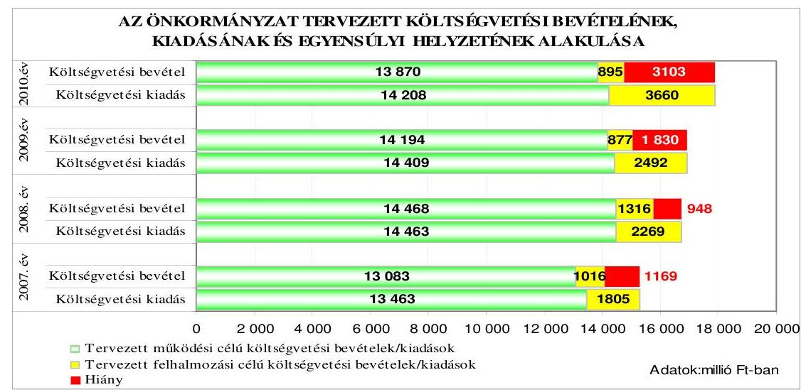
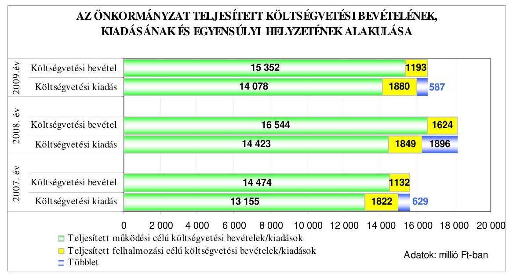
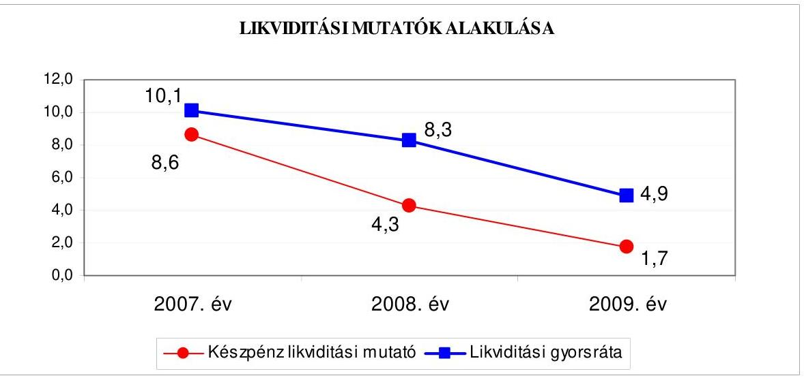
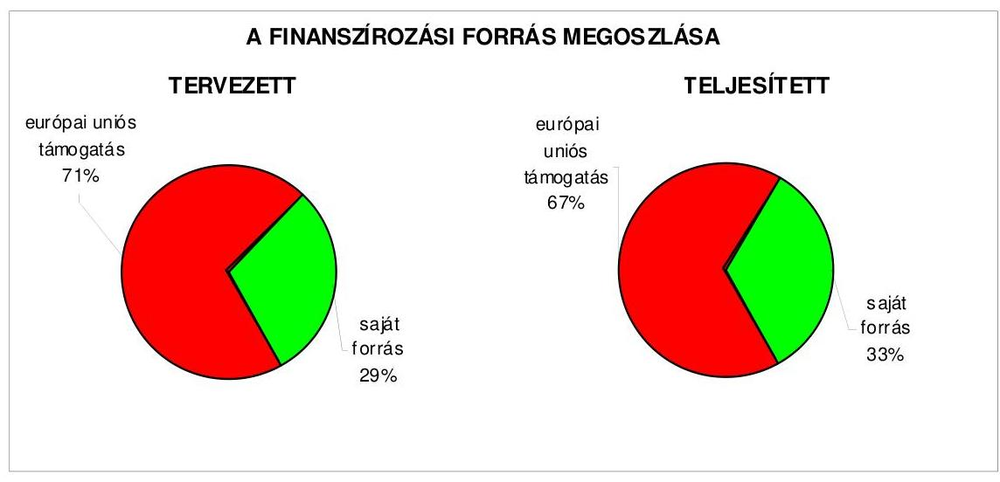
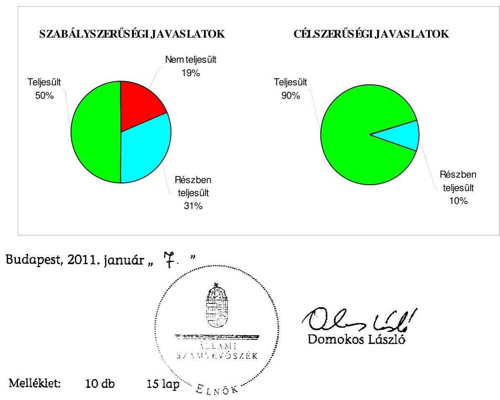
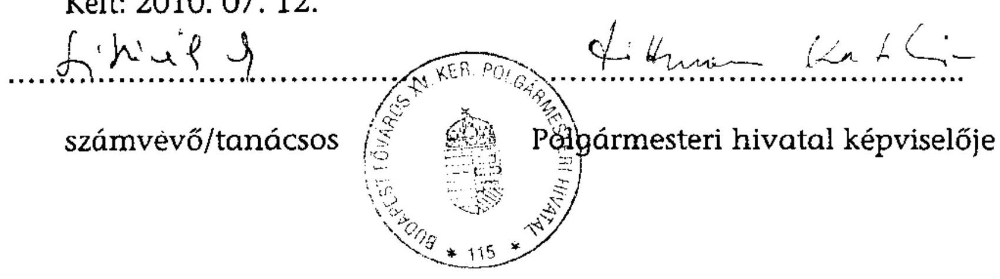
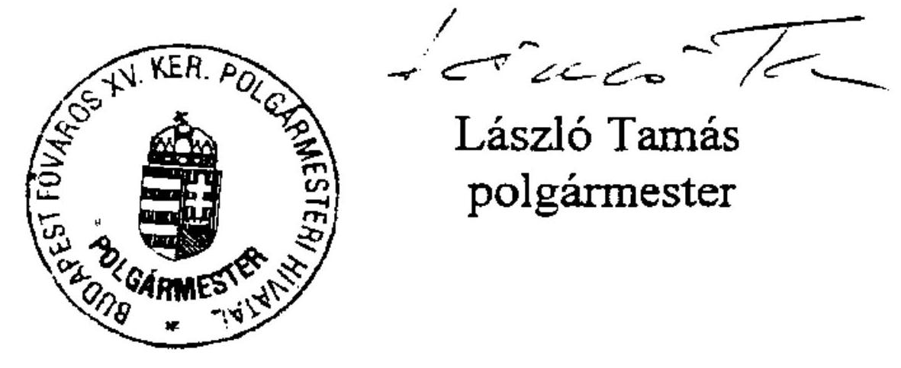
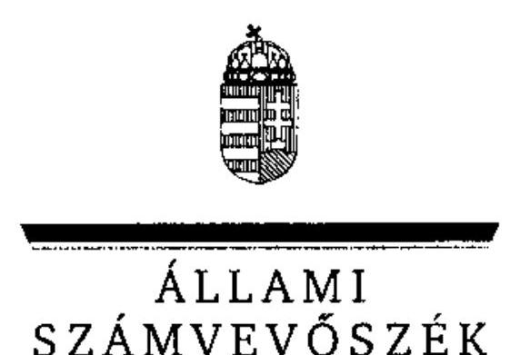
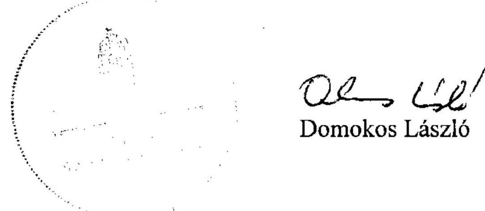

# JELENTÉS 

Budapest Főváros XV. kerület Rákospalota, Pestújhely, Újpalota Önkormányzat gazdálkodási rendszerének 2010. évi ellenőrzéséről

---

# 3. Önkormányzati és Területi Ellenőrzési Igazgatóság 

## Átfogó Ellenőrzési Főcsoport

Iktatószám: V-3023-7/23/19/2010.
Témaszám: 966
Vizsgálat-azonosító szám: V0485

## Az ellenőrzést felügyelte:

Dr. Lóránt Zoltán
főigazgató
Az ellenőrzés végrehajtásáért felelős:
Dr. Sepsey Tamás
főigazgató-helyettes
Az ellenőrzést vezette:
Molnár Gyula Mihály igazgatóhelyettes

## Az ellenőrzést végezték:

Lajterné Hudák
Magdolna
számvevő

Nagy Sándorné
szakértő

Schósz Attiláné
számvevő tanácsos

## A témához kapcsolódó eddig készített számvevőszéki jelentések:

## címe

Jelentés a Budapest Főváros XV. kerület Rákospalota, Pestújhely, Újpalota Önkormányzata gazdálkodási rendszerének átfogó ellenőrzéséről
Jelentés a helyi és a helyi kisebbségi önkormányzatok gazdálkodási rendszerének átfogó és egyéb szabályszerűségi ellenőrzéséről
A fővárosi önkormányzatot és a kerületi önkormányzatokat osztottan megillető bevételek 2007. évi megosztásáról szóló fővárosi önkormányzati rendelet felülvizsgálatáról a Budapest Főváros XV. kerület Rákospalota, Pestújhely, Újpalota Önkormányzatánál
Jelentés a Magyar Köztársaság 2008. évi költségvetése végrehajtásának ellenőrzéséről
Függelék:
A helyi önkormányzatokat a 2007. évben megillető normatív hozzájárulás elszámolásának ellenőrzése

---

# TARTALOMJEGYZÉK 

BEVEZETÉS ..... 11
I. ÖSSZEGZŐ MEGÁLLAPÍTÁSOK, KÖVETKEZTETÉSEK, JAVASLATOK ..... 16
II. RÉSZLETES MEGÁLLAPÍTÁSOK ..... 25

1. Az Önkormányzat költségvetési és pénzügyi helyzete ..... 25
1.1. A tervezett költségvetési bevételek és kiadások alapján a
költségvetési egyensúly, a költségvetési hiány alakulása, a hiány
tervezett finanszírozási módja, valamint a költségvetési hiány
megállapításának szabályszerűsége ..... 25
1.2. A teljesített költségvetési bevételek és kiadások alapján a pénzügyi
egyensúly, a pénzügyi hiány alakulása, a pénzügyi hiány
finanszírozása, az igénybe vett finanszírozási célú pénzügyi
eszközök hatása a pénzügyi helyzet alakulására, az eladósodásra,
valamint a fizetőképességre ..... 27
2. Az Önkormányzat felkészültsége az európai uniós források igénylésére,
felhasználására, a támogatott célkitúzés megvalósítására, múködtetésére,
valamint az elektronikus közszolgáltatási feladatok ellátására ..... 37
2.1. Az európai uniós források igénybevételére, felhasználására, a
támogatott célkitúzés megvalósítására, múködtetésére történt
felkészülés szabályozottságának, szervezettségének, valamint egy
támogatási szerződésben foglalt célkitúzés megvalósításának,
múködtetésének eredményessége ..... 37
2.1.1. Az európai uniós forrásokra történő pályázatok benyújtására
vonatkozó döntések összhangja fejlesztési célkitúzésekkel ..... 37
2.1.2. Az európai uniós forrásokhoz kapcsolódóan a
pályázatfigyelés, a pályázatkészítés, valamint az európai
uniós támogatással megvalósuló fejlesztés lebonyolításának
belső rendje, a végrehajtás és az ellenőrzés szervezettsége ..... 42
2.1.3. Egy támogatási szerződésben foglalt célkitúzés megvalósítása,
múködtetése ..... 44
2.2. Az elektronikus közszolgáltatás feltételeinek kialakítása ..... 46
3. A költségvetési gazdálkodás belső kontrolljai ..... 49
3.1. A költségvetés-tervezés, a gazdálkodás és a zárszámadás-készítés
folyamatában végrehajtandó belső kontrollok kialakítása ..... 49
3.2. A belső kontrollok múködtetése a költségvetés-tervezés, a
gazdálkodás, és a zárszámadás-készítés folyamataiban ..... 52
3.3. A belső ellenőrzési kötelezettség teljesítése ..... 56

---

4. Az ÁSZ korábbi ellenőrzési javaslatai alapján készített intézkedési terv végrehajtása, hasznosítása
4.1. Az Önkormányzat gazdálkodási rendszerének átfogó ellenőrzése során tett javaslatok végrehajtására tervezett intézkedések megvalósítása
4.2. A zárszámadáshoz kapcsolódó (állami hozzájárulások, támogatások igénylésének és felhasználásának ellenőrzése), valamint a további vizsgálatok esetében a megállapítások, javaslatok alapján tett intézkedések

# MELLÉKLETEK 

1. számú Az Önkormányzat gazdálkodását meghatározó adatok, mutatószámok (1 oldal)
2. számú Az önkormányzati vagyon alakulása (1 oldal)

2/a. számú Az önkormányzati kötelezettségek alakulása (1 oldal)
3. számú Az Önkormányzat 2007-2010. évi költségvetési előirányzatainak és 20072009. évi pénzügyi teljesítéseinek alakulása (1 oldal)
4. számú Tanúsítvány az európai uniós forrásokkal támogatott célok és programok 2007-2010. évi tervezett és teljesített adatairól (3 oldal)
4/a. számú Tanúsítvány az európai uniós forrásokra 2007-2010 között benyújtott pályázatokról, amelyek elbírálásáról az Önkormányzat még nem kapott tájékoztatást (1 oldal)
4/b. számú Tanúsítvány a 2007-2010. években benyújtott és elutasított európai uniós pályázatokról (2 oldal)
5. számú Adatlap az európai uniós forrással támogatott, az Új Magyarország Fejlesztési Terv KMOP-4.5.3-2007 kódszámú kiírására benyújtott, KMOP-4.5.3-2007-0012 azonosító számú, a „XV. kerületi Száraznád Nevelési - Oktatási Központ XV. ker. Pattogós u. 6-8. sz. teljes körü akadálymentesitésének kiépítése" címú feladatról (3 oldal)
6. számú László Tamás úr, Budapest Főváros XV. kerület Rákospalota, Pestújhely, Újpalota Önkormányzat polgármestere által adott tájékoztatás (1 oldal)
7. számú László Tamás úr, Budapest Főváros XV. kerület Rákospalota, Pestújhely, Újpalota Önkormányzat polgármesterének tájékoztatására adott válasz (1 oldal)

---

# RÖVIDÍTÉSEK, MOZAIKSZAVAK JEGYZÉKE 

## Törvények

Áht.
ÁSZ tv.
Ltv.
Ötv.

## Rendeletek

Ámr. 1
Ámr. 2
Áhsz.

Ber.
18/2005. (XII. 27.) IHM rendelet
önkormányzati SzMSz
vagyongazdálkodási rendelet
2007. évi költségvetési rendelet
2008. évi költségvetési rendelet
2009. évi költségvetési rendelet
2010. évi költségvetési rendelet
az államháztartásról szóló 1992. évi XXXVIII. törvény
az Állami Számvevőszékről szóló 1989. évi XXXVIII. törvény
a lakások és helyiségek bérletére, valamint az elidegenítésükre vonatkozó egyes szabályokról szóló 1993. évi LXXVIII. törvény
a helyi önkormányzatokról szóló 1990. évi LXV. törvény
az államháztartás múködési rendjéről szóló 217/1998. (XII. 30.) Korm. rendelet
az államháztartás múködési rendjéről szóló 292/2009. (XII. 19.) Korm. rendelet
az államháztartás szervezetei beszámolási és könyvvezetési kötelezettségének sajátosságairól szóló 249/2000. (XII. 24.) Korm. rendelet
a költségvetési szervek belső ellenőrzéséről szóló 193/2003. (XI. 26.) Korm. rendelet
a közzétételi listákon szereplő adatok közzétételéhez szükséges közzétételi mintákról szóló 18/2005. (XII. 27.) IHM rendelet
Budapest Főváros XV. kerület Rákospalota, Pestújhely, Újpalota Önkormányzat 7/2007. (III. 9.) számú rendelete a Képviselő-testület és Szervei Szervezeti és Múködési Szabályzatáról
Budapest Főváros XV. kerület Rákospalota, Pestújhely, Újpalota Önkormányzat 5/2000. (II. 29.) számú rendelete az Önkormányzat vagyonáról, a tulajdonosi jogok gyakorlásáról
Budapest Főváros XV. kerület Rákospalota, Pestújhely, Újpalota Önkormányzat 6/2007. (III. 6.) számú rendelete a 2007. évi költségvetésről
Budapest Főváros XV. kerület Rákospalota, Pestújhely, Újpalota Önkormányzat 5/2008. (III. 3.) számú rendelete a 2008. évi költségvetésről
Budapest Főváros XV. kerület Rákospalota, Pestújhely, Újpalota Önkormányzat 4/2009. (III. 2.) számú rendelete a 2009. évi költségvetésről
Budapest Főváros XV. kerület Rákospalota, Pestújhely, Újpalota Önkormányzat 5/2010. (III. 1.) számú rendelete a 2010. évi költségvetésről

---

2007. évi zárszámadási rendelet

2008. évi zárszámadási rendelet

2009. évi zárszámadási rendelet

## Szórövidítések

ÁROP
ÁSZ
Belső ellenőrzési iroda

Egészségügyi Intézmény energiafejlesztési pályázat
EKOP
e-közszolgáltatás
ÉNO akadálymentesítési pályázat
FENO akadálymentesítési pályázat

FEUVE
Fővárosi Önkormányzat
FSZK
gazdálkodási jogkörök
szabályzata
gazdasági program
gazdasági szervezet ügyrendje
hivatali SzMSz

Informatikai csoport

Budapest Főváros XV. kerület Rákospalota, Pestújhely, Újpalota Önkormányzat 14/2008. (V. 8.) számú rendelete a 2007. évi költségvetés végrehajtásáról
Budapest Főváros XV. kerület Rákospalota, Pestújhely, Újpalota Önkormányzat 12/2009. (IV. 30.) számú rendelete a 2008. évi költségvetés végrehajtásáról
Budapest Főváros XV. kerület Rákospalota, Pestújhely, Újpalota Önkormányzat 13/2010. (V. 4.) számú rendelete a 2009. évi költségvetés végrehajtásáról

ÚMFT Államreform Operatív Program
Állami Számvevőszék
Budapest Főváros XV. kerület Rákospalota, Pestújhely, Újpalota Önkormányzat Polgármesteri Hivatalának Belső Ellenőrzési Irodája
KEOP-5.3.0-2009. „XV. kerületi Önkormányzat Egészségügyi Intézményének energia fejlesztése" címú pályázat
ÚMFT Elektronikus Közigazgatási Operatív Program elektronikus közszolgáltatás
FSZK 1713/2/2009. A XV. kerületi Értelmi Fogyatékosok Otthona (ÉNO) akadálymentesítése pályázat
KMOP-4.5.3-2009. A XV. kerületi Fejlesztő Gondozó Központ (FENO) akadálymentesítése az esélyegyenlőség jegyében pályázat
folyamatba épített, előzetes, utólagos és vezetői ellenőrzés
Budapest Főváros Önkormányzata
Fogyatékos Személyek Esélyegyenlőségéért Közalapítvány
2/2008. (VI. 6.) számú polgármesteri-jegyzői együttes utasítás a Polgármesteri hivatal kötelezettségvállalási, utalványozási, ellenjegyzési, érvényesítési rendjének szabályozásáról
Budapest Főváros XV. kerület Rákospalota, Pestújhely, Újpalota Önkormányzat Képviselő-testületének 452/2006. (XI. 8.) számú határozatával elfogadott „Kerületfejlesztési és gazdasági program" (2006-2010.)
hivatali SzMSz 3. számú függeléke a Pénzügyi osztály ügyrendjéről
Budapest Főváros XV. kerület Rákospalota, Pestújhely, Újpalota Önkormányzat Képviselő-testületének 54/2004. (II. 25.) számú határozatával jóváhagyott Polgármesteri hivatal ügyrendje
Budapest Főváros XV. kerület Rákospalota, Pestújhely, Újpalota Önkormányzat Polgármesteri Hivatalának Informatikai Csoportja

---

| informatikai stratégia | Budapest Főváros XV. kerület Rákospalota, Pestújhely, Újpalota Önkormányzat Képviselő-testületének 452/2006. (XI. 8.) számú határozatával a 2007-2013. évekre elfogadott Középtávú kerületfejlesztési koncepció „8. Informatikai fejlesztések" című fejezete |
| :--: | :--: |
| informatikai szabályzat ${ }_{1}$ | a 4/2003. (XI. 28.) számon kiadott polgármesteri-jegyzői együttes utasítás a Polgármesteri hivatal informatikai szabályzatáról |
| informatikai szabályzat ${ }_{2}$ | a 2/2009. (V. 28.) számon kiadott polgármesteri-jegyzői együttes utasítás a Polgármesteri hivatal informatikai szabályzatáról |
| Integrált Városfejlesztési Stratégia | Budapest Főváros XV. kerület Rákospalota, Pestújhely, Újpalota Önkormányzat Képviselő-testületének 298/2008. (V. 14.) számú határozatával elfogadott Integrált Városfejlesztési Stratégia |
| jegyző | Budapest Főváros XV. kerület Rákospalota, Pestújhely, Újpalota Önkormányzat jegyzője |
| Képviselő-testület | Budapest Főváros XV. kerület Rákospalota, Pestújhely, Újpalota Önkormányzat Képviselő-testülete |
| katasztrófa-elhárítási   terv | a jegyző által 2007. október 18-án kiadott utasítás a Polgármesteri hivatal informatikai katasztrófa-elhárítási tervéről |
| Kavicsos Bölcsőde infrastrukturális pályázat | KMOP-4.5.2-2009. „Komplex infrastruktúra fejlesztés a XV. kerület 5-ös számú bölcsődéjében" pályázat |
| Károly Róbert Iskola | Budapest Főváros XV. kerület Rákospalota, Pestújhely, Újpalota Önkormányzat Károly Róbert kereskedelmi Szakközépiskola, Általános Iskola és Óvoda |
| KEOP | ÚMFT Környezet és Energia Operatív Program |
| KMOP | ÚMFT Közép-Magyarországi Operatív Program |
| Kerületfejlesztési bizottság | Budapest Főváros XV. kerület Rákospalota, Pestújhely, Újpalota Önkormányzat Képviselő-testületének Kerületfejlesztési, Városvédelmi és Környezetvédelmi Bizottsága |
| MÁK | Magyar Államkincstár |
| Oktatási osztály | Budapest Főváros XV. kerület Rákospalota, Pestújhely, Újpalota Önkormányzat Polgármesteri Hivatalának Oktatási, Művelődési, Ifjúsági és Sport Osztálya |
| ÖKIF hitelprogram | Sikeres Magyarországért Önkormányzati Infrastruktúrafejlesztési Hitelprogram |
| Önkormányzat | Budapest Főváros XV. kerület Rákospalota, Pestújhely, Újpalota Önkormányzat |
| Pályázati iroda | Budapest Főváros XV. kerület Rákospalota, Pestújhely, Újpalota Önkormányzat Polgármesteri Hivatalának Fejlesztési és Pályázati Koordinációs Irodája |
| pályázati szabályzat | a jegyző és a polgármester által 2009. május 15-én ME18 számon kiadott Fejlesztési és Pályázati Koordinációs Iroda minőségirányítási eljárása |

---

Pénzügyi bizottság

Pénzügyi osztály
polgármester
Polgármesteri hivatal
Polgármesteri hivatal szervezetfejlesztési pályázat
Száraznád NOK akadálymentesítési pályázat
Városüzemeltetési osztály

Városüzemeltetési osztály ügyrendje
Zsókavár rehabilitációs pályázat I. ütem

Zsókavár rehabilitációs pályázat II. ütem
2009. évi Útépítési pályázat
ÚMFT

Budapest Főváros XV. kerület Rákospalota, Pestújhely, Újpalota Önkormányzat Pénzügyi és Gazdasági Bizottsága
Budapest Főváros XV. kerület Rákospalota, Pestújhely, Újpalota Önkormányzat Polgármesteri Hivatalának Pénzügyi Osztálya
Budapest Főváros XV. kerület Rákospalota, Pestújhely, Újpalota Önkormányzat polgármestere
Budapest Főváros XV. kerület Rákospalota, Pestújhely, Újpalota Önkormányzat Polgármesteri Hivatala
ÁROP-2007-3-A-1/B „XV. kerület Önkormányzat Polgármesteri Hivatalának szervezetfejlesztési és reorganizációs pályázata" pályázat
KMOP-4.5.3-2007 „XV. kerületi Száraznád Nevelési-Oktatási Központ XV. ker. Pattogós u. 6-8. sz. teljes körü akadálymentesitésének kiépítése" pályázat
Budapest Főváros XV. kerület Rákospalota, Pestújhely, Újpalota Önkormányzat Polgármesteri hivatalának Városüzemeltetési Osztálya
A jegyző által 2009. június 2-án kiadott Városüzemeltetési Osztály ügyrendje
KMOP-2007-5.1.1/C „Budapest XV. kerületben az ipari technológiával épült újpalotai lakótelep, Zsókavár utcai akcióterületén lakó- és középület felújítása, korszerüsitése és a kapcsolódó közterületek rehabilitációja" pályázat
KMOP-2009-5.1.1/C „Az újpalotai lakótelepen a Zsókavár utcai akcióterület II. ütemú fejlesztése" pályázat
KMOP-2.1.1/B-09-2009-0006 "Szilárd útpályaburkolatok építése Bp. XV. kerületének lakóutcáiban" pályázat
Új Magyarország Fejlesztési Terv

---

# ÉRTELMEZŐ SZÓTÁR 

1. elektronikus szolgáltatási szint
2. elektronikus szolgáltatási szint
3. elektronikus szolgáltatási szint
4. elektronikus szolgáltatási szint
eredményesség
európai uniós források
fejlesztési célkitúzés
fejlesztési feladat (projekt)

Az 1044/2005. (V. 11.) Korm. határozat alapján olyan információs, tájékoztató szolgáltatás, amely csak általános információkat közöl az adott üggyel kapcsolatos teendőkről és a szükséges dokumentumokról.
Az 1044/2005. (V. 11.) Korm. határozat alapján olyan egyirányú kapcsolatot biztosító szolgáltatás, amely az 1. szinten túl biztosítja az adott ügy intézéséhez szükséges dokumentumok, nyomtatványok letöltését, és azok ellenőrzéssel, vagy ellenőrzés nélküli elektronikus kitöltését, amely esetben a dokumentumok benyújtása hagyományos úton történik.
Az 1044/2005. (V. 11.) Korm. határozat alapján olyan kétirányú kapcsolatot biztosító szolgáltatás, amely közvetlen, vagy ellenőrzött kitöltésű dokumentum segítségével biztosítja az elektronikus adatbevitelt és a bevitt adatok ellenőrzését. Az ügy indításához, intézéséhez személyes megjelenés nem szükséges, de az ügyhöz kapcsolódó közigazgatási döntés (határozat, egyéb aktus) közlése, valamint a kapcsolódó illeték-, vagy díjfizetés hagyományos úton történik.
Az 1044/2005. (V. 11.) Korm. határozat alapján olyan teljes közvetlen kétirányú ügyintézési folyamatot biztosító szolgáltatás, amikor az ügyhöz kapcsolódó közigazgatási döntés is elektronikus úton kerül közlésre, illetve a kapcsolódó illeték-, vagy díjfizetés elektronikus úton is intézhető.
Egy adott tevékenység céljai megvalósításának mértéke, a tevékenység szándékolt és tényleges hatása közötti kapcsolat. (Forrás: Ámr., 2. § 66. pont)
Az Európai Unió költségvetéséből, illetve az Európai Gazdasági Térség Európai Unión kívüli tagállamainak költségvetéséből származó támogatások, valamint a „Svájci Hozzájárulás" programból származó támogatás.
Az önkormányzat által ellátott kötelező, vagy önként vállalt feladatok mennyiségi (minőségi) fejlesztésére vonatkozó terv. A fejlesztési célkitúzés megvalósulhat beszerzéssel, létesítéssel, bővítéssel, átalakítással.
Az a fejlesztési feladat, amely illeszkedik az Európai Unió, illetve a Nemzeti Fejlesztési Terv által támogatott programokhoz. Az Európai Unió, illetve a Nemzeti Fejlesztési Terv és az Új Magyarország Fejlesztési Terv által meghirdetett programokhoz kapcsolódó, támogatott projektek fejlesztési feladatok megvalósításához használhatók fel az európai uniós források. A fejlesztési feladat (projekt) tartalmilag és formailag részletesen kidolgozott, megfelelő pénzügyi háttérrel és végrehajtási ütemezéssel rendelkező fejlesztési terv.

---

hazai társfinanszírozás
indikátor
kedvezményezett
közremúködő szervezet
lebonyolítás
lebonyolítás
program
saját forrás

A központi költségvetési és az elkülönített állami pénzalapokból származó finanszírozás.
A projekt megvalósulásának számszerúsíthető eredményei, mutató, jelzőszám, amelynek segítségével egy célkitúzés megvalósulásának adott szintjét lehet szemléltetni. Jelenthet egy felhasznált erőforrást, egy elért hatást, egy minőségi szintet, illetve valamilyen egyéb változást.
Az a helyi önkormányzat, amely a támogatási szerződést kedvezményezettként aláíria, a projektet, illetve a központi programhoz kapcsolódó támogatott önkormányzati programot végrehajtja.
A közremúködő szervezet az európai uniós támogatást elnyert kedvezményezettekkel a kapcsolattartó szerv. Feladatai: a támogatási szerződés mintától eltérő egyedi támogatási szerződés-tervezetek előzetes megküldése jóváhagyásra a Nemzeti Fejlesztési Ügynökségnek; a projektek megvalósítása előrehaladásának nyomon követése, a támogatás kifizetésének engedélyezése, a folyamatba épített ellenőrzések (dokumentumalapú ellenőrzések és kockázatelemezésre alapozott helyszíni ellenőrzések) végzése, a projektek zárásával kapcsolatos feladatok ellátása, szabálytalanságkezelési rendszer kialakítása és múködtetése; ellenőrzési nyomvonal készítése és folyamatos aktualizálása; az Egységes Monitoring Informatikai Rendszerben az adatok folyamatos rögzítése, az adatbázis naprakészségének és megbízhatóságának biztosítása; a beszámolók készítése és megküldése a miniszter és a Nemzeti Fejlesztési Ügynökség részére az akcióterv és az éves munkaterv megvalósításában történt előrehaladásról és a szükséges intézkedésekre vonatkozó javaslatokról.
Az európai uniós források felhasználásával megvalósuló fejlesztésre irányuló múszaki, gazdasági (pénzügyi) tevékenységet magában foglaló szervezési, irányítási szolgáltatás. A szervezési szolgáltatás kiterjedhet a pályázatkészítésre, a közbeszerzési eljárás lebonyolításán keresztül a folyamatos műszaki ellenőrzésre, a pénzügyi elszámolásra, a műszaki átadás-átvételre, az üzembe helyezésre, illetve a fejlesztési folyamat egyes elemeire.
Ágazati vagy térségi fejlesztési célt megvalósító fejlesztési terv, mely több egymással összefüggő projekt útján, az érintettek együttmúködése alapján valósul meg.
A kedvezményezett által a támogatott projekthez biztosított forrás, amelybe az államháztartás alrendszereiből nyújtott támogatás nem számítható be. Költségvetési szervek esetén a jóváhagyott előirányzat saját forrásnak minősül.

---

szabálytalanság

támogatási szerződés

A jogszabályokban szereplő előírásoknak, illetve a támogatási szerződésben a felek által vállalt kötelezettségeknek a megsértése, amelyek eredményeképpen az Európai Közösség vagy a Magyar Köztársaság pénzügyi érdekei sérülnek, illetve sérülhetnek.
A strukturális alapok esetében az irányító hatóságnak, illetve a Kohéziós Alap esetében a közremúködő szervezeteknek a kedvezményezett önkormányzattal kötött szerződése, amely a támogatás felhasználásának részletes feltételeit tartalmazza. Az Új Magyarország Fejlesztési Terv keretében támogatott projektek esetében a támogatási szerződés a kedvezményezett és a Nemzeti Fejlesztési Ügynökség nevében eljáró közremúködő szervezet között jön létre. Nagyprojekt esetén a támogatási szerződést a Nemzeti Fejlesztési Ügynökség ellenjegyzi. A támogatási szerződés képezi a megvalósítás nyomon követésének, finanszírozásának és ellenőrzésének alapját.

---

.

---

# JELENTÉS 

## Budapest Főváros XV. kerület Rákospalota, Pestújhely, Újpalota Önkormányzat gazdálkodási rendszerének 2010. évi ellenőrzéséről

## BEVEZETÉS

Az Ötv. 92. § (1) bekezdése, az Állami Számvevőszékről szóló 1989. évi XXXVIII. törvény 2. § (3) bekezdése, valamint az Áht. 120/A. § (1) bekezdése alapján az önkormányzatok gazdálkodását az Állami Számvevőszék ellenőrzi. Az ellenőrzésre az Országgyúlés illetékes bizottságai részére is átadott, országosan egységes ellenőrzési program szerint került sor.

Az Állami Számvevőszék a stratégiájában foglalt célkitűzéseknek megfelelően a helyi önkormányzatok költségvetési gazdálkodási rendszerének ellenőrzését a 2007. évben megújított, teljesítmény-ellenőrzési elemekkel kiegészített ellenőrzési program alapján folytatja a 2010. évben.

Az ellenőrzés célja annak értékelése volt, hogy az Önkormányzat:

- milyen módon biztosította a költségvetési és a pénzügyi egyensúlyt a költségvetésében és annak teljesítése során, valamint változott-e a hiányzó bevételi források pótlásában a finanszírozási célú pénzügyi műveletek jelentősége, hatása;
- eredményesen készült-e fel a szabályozottság és a szervezettség terén az európai uniós források igénylésére és felhasználására, megvalósította, működtette-e a támogatott célkitűzést, továbbá biztosította-e az elektronikus közszolgáltatás feltételeit, a gazdálkodási adatok közzétételével a gazdálkodás nyilvánosságát;
- megfelelően kialakította-e és múködtette-e a belső kontrollokat a költségve-tés-tervezés, a gazdálkodás és a zárszámadás-készítés, valamint a belső ellenőrzés folyamatában, továbbá;
- megfelelően hasznosították-e a korábbi számvevőszéki ellenőrzések megállapításait, szabályszerűségi ${ }^{1}$ és célszerűségi javaslatait.

[^0]
[^0]:    ${ }^{1}$ A törvényi előírások betartásának elmulasztásakor a részletes megállapítások fejezetben egységesen a törvénysértés megjelölést alkalmazzuk, mivel az ÁSZ nem tehet különbséget a törvényi előírások között.

---

Az ellenőrzés típusa: átfogó ellenőrzés, amely - egy ellenőrzés keretében meghatározott területekre összpontosítva alkalmazza a szabályszerűségi, valamint a teljesítmény-ellenőrzés jellemzőit.

Az ellenőrzött időszak: a költségvetési egyensúly és az európai uniós támogatás igénybevételére történt felkészülés ellenőrzése esetében a 2007-2009. évek, a belső kontrollok kialakítása és múködtetése tekintetében a 2009. év, az Önkormányzat gazdálkodási rendszerének 2005. évi átfogó ellenőrzéséről készített jelentésben rögzített javaslatok megvalósítása, hasznosítása, valamint a 2006 óta végzett további ellenőrzések során megfogalmazott javaslatok végrehajtása érdekében tett intézkedések vonatkozásában a 2006-2010. I. negyedév közötti időszak.

A kerület lakosainak száma 2010. január 1-jén 79679 fő volt. A 2006. évi önkormányzati képviselő- és polgármester-választást követően az Önkormányzat 29 tagú Képviselő-testületének munkáját hét állandó bizottság segítette. Az Önkormányzat mellett a 2006. évi önkormányzati képviselő- és polgármesterválasztásokat követően nyolc kisebbségi önkormányzat ${ }^{2}$ működött. A polgármester személye az 1996. évtől, a jegyző személye az 1998. évtől nem változott.

Az Önkormányzat feladatainak végrehajtása érdekében a 2007-2009. években 18 költségvetési intézményt múködtetett, amelyekből a 2007. évben mindegyik önállóan gazdálkodó, a 2009. évben 17 önállóan múködő és gazdálkodó, egy pedig önállóan múködő volt. A feladatok ellátásában a 2007. évben három, a 2009. évben öt gazdasági társasága, továbbá a 2007-2009. években három közalapítványa vett részt. Az Önkormányzat az éves költségvetési beszámolója szerint a 2009. évben 16545 millió Ft költségvetési bevételt ért el, és 15958 millió Ft költségvetési kiadást teljesített. A 2009. évi teljesített költségvetési bevételek 6,0\%-kal, a költségvetési kiadások 6,6\%-kal haladták meg a 2007. évben teljesített költségvetési bevételeket és kiadásokat, a teljesített múködési és felhalmozási célú költségvetési bevételek és kiadások együttes növekedése következtében. Az Önkormányzat 2009. december 31-én a könyvviteli mérleg szerint 90179 millió Ft értékű vagyonnal rendelkezett. Az Önkormányzat vagyona a 2007. év végi állományhoz viszonyítva 1,9\%-kal csökkent a befektetett eszközök 407 millió Ft-tal ( $0,5 \%$-kal) és a forgóeszközök 1355 millió Ft-tal (48,6\%kal) történő csökkenése következtében, ezen belül az üzemeltetésre, kezelésre átadott eszközök 540 millió Ft-os ( $6,1 \%$-os) és a pénzeszközök 1717 millió Ft-os ( $82,8 \%$-os) csökkenésének hatására. A befektetett eszközök csökkenése a beruházások, felújítások 377 millió Ft-os ( $966,7 \%$-os) növekedése mellett következett be. A vagyon csökkenését forrásoldalon - a 2007. évhez viszonyítva - a saját tőke 244 millió Ft-tal ( $0,3 \%$-kal), a tartalékok 1182 millió Ft-tal ( $62,2 \%$-kal), valamint a kötelezettségek 336 millió Ft-tal ( $19,0 \%$ kal) történő csökkenése okozta. Az összes költségvetési bevétel 57,6\%-át a saját bevétel, 39,9\%-át a helyi adó bevétel biztosította a 2009. évben. A helyi adóbevétel összes költségvetési bevételen belüli aránya a 2007. évihez viszonyítva 1,1 százalékponttal nőtt. Az öszszes költségvetési kiadásból a felhalmozási célú kiadás részaránya a 2009. évben $11,8 \%$ volt, mely a 2007. évhez viszonyítva 0,4 százalékponttal csökkent. A

[^0]
[^0]:    ${ }^{2}$ bolgár, cigány, görög, horvát, német, örmény, román, szerb kisebbségi önkormányzat

---

2010. évi költségvetési rendeletben 14765 millió Ft költségvetési bevételt és 17868 millió Ft költségvetési kiadást irányoztak elő. A Polgármesteri hivatalban dolgozó köztisztviselők száma 2007. január 1-én 281 fő, 2009. december 31-én 283 fő volt, a költségvetési intézményekben 2007. január 1-én 2218 fő, 2009. december 31-én 2118 fő közalkalmazottat foglalkoztattak. Az Önkormányzat gazdálkodását meghatározó adatokat, mutatószámokat az 1-3. számú mellékletek tartalmazzák.

Az Önkormányzat költségvetési és pénzügyi helyzetét az elemző eljárás módszerével vizsgáltuk. E körben elemeztük a költségvetés egyensúlyi helyzetének alakulását, a tervezett és teljesített költségvetési, pénzügyi hiány okait, a hiány finanszírozásának tervezett és teljesített módját, az Önkormányzat pénzügyi helyzetének alakulását az eladósodás és a likviditás szempontjából.

Teljesítmény-ellenőrzés módszerével vizsgáltuk, és az eredményesség szempontjából értékeltük az Önkormányzat benyújtott pályázatai kapcsolódását a Kép-viselő-testület által meghatározott fejlesztési célkitűzésekhez, valamint felkészültségét a belső szabályozottság, szervezettség terén az európai uniós forrásokra vonatkozó pályázati felhívások figyelésére, a pályázatok készítésére, és a lebonyolítására. Értékeltük továbbá egy fejlesztési feladat támogatási szerződésében rögzített célkitúzés (számszerúsíthető eredmények, indikátorok) megvalósításának eredményességét. Az ellenőrzés során felmértük, hogy az elektronikus közigazgatási szolgáltatások működtetése érdekében milyen intézkedéseket tettek, továbbá biztosították-e a közérdekú gazdálkodási adatok meghatározott körének a honlapon történő közzétételét.

A költségvetési gazdálkodás belső kontrolljainak ellenőrzése során vizsgáltuk, hogy a Polgármesteri hivatalban a költségvetés-tervezés, a gazdálkodás és a zárszámadás-készítés folyamatában a belső kontrollok kialakítása és múködése megfelelő biztosítékot ad-e a gazdálkodási feladatok szabályszerű ellátására. Felmértük és minősítettük a költségvetés-tervezés, a gazdálkodás, és a zárszá-madás-készítés feladataival, továbbá a pénzügyi-számviteli területen az informatikával kapcsolatosan kialakított kontrollok, valamint azok múködésének megfelelőségét. A vizsgálat során értékeltük a belső ellenőrzés szabályozottságát, múködési feltételeinek kialakítását, meghatározását, továbbá múködésének megfelelőségét.

A Polgármesteri hivatalban értékeltük a gazdálkodás folyamatában kulcsszerepet betöltő belső kontrollok múködésének megfelelőségét, ennek keretében ellenőriztük a szakmai teljesítés igazolására és az utalvány ellenjegyzésére kialakított kontrollok végrehajtását.

Az ellenőrzést a következő, magas kockázatú kifizetésekre folytattuk le ${ }^{3}$ :

- az államháztartáson kívülre teljesített múködési és felhalmozási célú pénzeszköz átadásokra,

[^0]
[^0]:    ${ }^{3}$ Az önkormányzatok kiemelt előirányzataira vonatkozóan, a vertikális folyamatokra elvégeztük a kockázatok becslését, amelynek eredményeként határoztuk meg a magas kockázatú területeket.

---

- az állományba nem tartozók megbízási díjaira, továbbá
- a külső szolgáltató által végzett karbantartási, kisjavítási szolgáltatásokra.

Az ellenőrzés hatékony elvégzése céljából a vizsgálandó területek kiválasztása során a kockázatokon alapuló megközelítés érvényesült, ezáltal az ellenőrzési erőforrásokat azokra a területekre fókuszáltuk, amelyeken a korábbi ellenőrzési tapasztalatok figyelembevételével legnagyobb a hibák előfordulási valószínűsége. Az ellenőrzési erőforrások ilyen típusú összpontosításával minimálisra csökkenthető a kívánt ellenőrzési bizonyosság eléréséhez szükséges időráfordítás.

A pénzügyi-számviteli folyamatokban alkalmazott belső kontrollok kialakításának és múködésének ellenőrzésére a vizsgált három terület 2009. évi könyvviteli tételeiből területenként egyszerű véletlen mintát vettünk. A kijelölt gazdasági eseményre elvégzett megfelelőségi tesztek alapján értékeltük a kontrollok működésének megfelelőségét a vizsgált három területre külön-külön, majd öszszefoglalóan ${ }^{4}$. A helyszíni ellenőrzés megállapításainak részletes dokumentálását megfelelőségi tesztlapokon, ellenőrzési munkalapokon biztosítottuk. Ezeken a teszt- és munkalapokon a minősítés alapjául szolgáló kérdések és a vonatkozó konkrét jogszabályhelyek megjelölése mellett értékeltük a kialakított belső kontrollokban rejlő kockázatokat ${ }^{5}$ és a kialakított kontrollok múködésének megfelelőségét ${ }^{6}$.

Az ÁSZ korábbi ellenőrzési javaslatai alapján tett intézkedéseket, illetve azok megvalósítását utóellenőrzés keretében vizsgáltuk. A gazdálkodási rendszer korábbi átfogó ellenőrzése során megfogalmazott javaslatok végrehajtására tett intézkedések megvalósítását ellenőriztük, az egyéb számvevőszéki ellenőrzések során tett javaslatok esetében pedig a kiadott intézkedéseket tekintettük át.
${ }^{4}$ A vizsgált három terület egyedi értékelési pontszámait a területek költségvetési súlyával arányosan összegeztük.
${ }^{5}$ A kialakított belső kontrollokban rejlő kockázatot alacsonynak minősítettük, ha a kontrollok megfelelő védelmet nyújtottak a hibák bekövetkezése ellen. Közepesnek minősítettük a belső kontrollokban rejlő kockázatot, amennyiben a kontrollok a lehetséges hibák többsége ellen védelmet nyújtottak. Magasnak értékeltük a kockázatot, ha a kontrollok - kialakításuk hiányában, vagy hiányos kialakításuk miatt - nem nyújtottak elegendő védelmet a lehetséges hibákkal szemben.
${ }^{6}$ A kontrollok múködésének megfelelőségét kiválónak értékeltük abban az esetben, ha azok múködése - esetleges kisebb, az egységesen meghatározott követelményrendszerben foglalt mértéket el nem érő hiányosságoktól eltekintve - megfelelt a hibák megelőzésére és kijavítására meghatározott szabályozásnak és a legmagasabb szintű elvárásoknak. Jónak minősítettük a kontrollok múködését, ha a megállapított kisebb (tolerálható mértékű) hiányosságok nem veszélyeztették az ellenőrzött terület hibáinak megelőzését és kijavítását. Amennyiben a kontrollok múködésében túl sok hiányosság fordult elő ahhoz, hogy a kontrollok biztosítsák a hibák megelőzését, feltárását, kijavítását és ezáltal veszélyeztették az eredményes, megfelelő múködést, a kontroll múködésének megfelelősége gyenge minősítést kapott.

---

A helyszíni ellenőrzés során kitöltött - az ellenőrzést végző számvevő és a Polgármesteri hivatal felelős köztisztviselője által aláírt - ellenőrzési munkalapokat, azok kitöltési útmutatóit, továbbá a megfelelőségi tesztek dokumentumait a polgármester részére a számvevői jelentéssel egyidejűleg átadtuk.

A jelentés megállapításainak, javaslatainak egyeztetése során a polgármester arról adott részletes tájékoztatást - egyidejűleg csatolta azokat a dokumentumokat, amelyek igazolták -, hogy az időközben megtett intézkedésekkel a számvevői jelentésben tett javaslatok ${ }^{7}$ többségét megvalósították. A megtett intézkedéseket a jelentés II. Részletes megállapítások fejezetében az adott témához kapcsolt lábjegyzetben feltüntettük és a vonatkozó javaslatokat elhagytuk.

A jelentést az ÁSZ-ról szóló 1989. évi XXXVIII. tv. 25. § (1) bekezdése alapján észrevétel közlése céljából megküldtük a Budapest Főváros XV. kerület Rákospalota, Pestújhely, Újpalota Önkormányzat polgármesterének. A kapott tájékoztatást a jelentés 6 . számú melléklete, az arra adott választ a 7 . számú melléklet tartalmazza.

[^0]
[^0]:    ${ }^{7}$ A számvevői jelentésben a helyszíni ellenőrzés során a polgármesternek három szabályszerűségi, egy célszerűségi javaslatot tettünk, melyből egy szabályszerűségi javaslatot elhagytunk, a jegyzőnek 13 szabályszerűségi és 10 célszerűségi javaslatot tettünk, melyből 10 szabályszerűségi, valamint hat célszerűségi javaslatot elhagytunk.

---

# I. ÖSSZEGZŐ MEGÁLLAPÍTÁSOK, KÖVETKEZTETÉSEK, JAVASLATOK 

A 2007-2010. évi költségvetési rendeletekben a költségvetési egyensúly nem volt biztosított, mivel a tervezett költségvetési bevételek nem nyújtottak fedezetet a tervezett költségvetési kiadásokra. Az Önkormányzatnál a 2007-2009. években a költségvetés eredeti előirányzatai kialakításánál a bevételek között az előző évi pénzmaradvány és az előző években keletkezett, fel nem használt tartalékok igénybevételét, a tervezett feladatok ellátásához teljesítendő bevételeket nem körültekintően vették figyelembe, ezért - az Áht-ban előírtak ellenére - nem volt megalapozott az éves költségvetés eredeti előirányzatainak tervezése, amely hozzájárult költségvetési hiány kialakulásához. A polgármester az előző évi pénzmaradvány és az előző években keletkezett, fel nem használt tartalékok igénybevételének a következő évi költségvetési rendeletbe történő beépítésére 2010. szeptember hónapban intézkedett. Az Önkormányzat a 2007. és a 2009-2010. évek költségvetési rendeleteiben a költségvetési hiány finanszírozására és a finanszírozási kiadások forrásául a költségvetési egyensúly biztosítására hosszú lejáratú, fejlesztési célú hitel felvételét, hitelviszonyt megtestesítő, forgatási célú értékpapír értékesítését, a 2008. és a 2010. években fejlesztési célú kötvénykibocsátást tervezett. A 2007-2010. évi költségvetési rendeletekben a végrehajtási szabályok között a költségvetési egyensúly javítására vonatkozó előírásokat rögzítettek. Az Önkormányzat 2008-2010. évi költségvetési rendeleteiben a költségvetési kiadások főösszegének megállapításakor - az Áht. előírása ellenére - finanszírozási célú pénzügyi műveleteket, hiteltörlesztést vett figyelembe költségvetési hiányt módosító költségvetési kiadásként, mely hiányosság megszüntetése érdekében a polgármester 2010. szeptember hónapban intézkedett.

---

Az Önkormányzatnál a teljesített költségvetési bevételek és kiadások főösszege az előző évhez képest 2008-ban növekedett, 2009-ben csökkent. A 2007-2009. évi költségvetések végrehajtása során a pénzügyi egyensúlyi helyzet a tervezetthez viszonyítva megváltozott, a teljesített költségvetési bevételek minden évben fedezetet nyújtottak a költségvetési kiadásokra, a működési célú költségvetési bevételek többlete az évek sorrendjében 1319 millió Ft, 2121 millió Ft és 1274 millió Ft volt, míg a teljesített felhalmozási célú költségvetési kiadások a 2007. évben 690 millió Ft-tal, a 2008. évben 225 millió Ft-tal, a 2009. évben 687 millió Ft-tal haladták meg a felhalmozási célú költségvetési bevételeket. A felhalmozási célú kiadásokon belül a beruházási és felújítási kiadások tervezett előirányzatai évről-évre túlteljesültek, amely azonban nem vezethető vissza tervezési hiányosságra. A költségvetések végrehajtása során a takarékos gazdálkodást szolgáló előírásokat betartották, valamint a 2007-2009 években az ellátási igényekhez igazodóan közalkalmazotti létszámcsökkentést hajtottak végre. Az Önkormányzat a költségvetések végrehajtása során a 2007-2010. I. féléve közötti időszakban az ÖKIF hitelprogram keretében 486 millió Ft hosszú lejáratú, fejlesztési célú hitelt vett igénybe. A Képviselő testület 2007-ben, év közben 1000 millió Ft értékű, svájci frank alapú, 15 éves futamidejű kötvény kibocsátásáról döntött. A 2007. évi kötvénykibocsátás bevételét - a 2007. évben 516 millió Ft-ot, a 2008. évben 480 millió Ft-ot -, valamint a felvett hosszú lejáratú hiteleket az Önkormányzat a megvalósított fejlesztési feladatok finanszírozására fordította. A 2010. évi költségvetésben tervezett 1700 millió Ft értékű fejlesztési célú, euró alapú kötvényt, amely 15 éves futamidejú a Képviselőtestület döntése alapján, 2010 augusztusában bocsátotta ki az Önkormányzat. A forint svájci frankhoz, illetve az euróhoz viszonyított árfolyamváltozása, valamint a hosszú lejáratú hitelek és a kibocsátott kötvények változó kamatozása miatt a hitelfelvételek és a kötvénykibocsátások kockázatot jelentenek az Önkormányzat számára. A Pénzügyi bizottság vizsgálta a 2007-2010. I. félévében az Önkormányzat által felvett hitelek és a kötvénykibocsátások indokait, gazdasági megalapozottságát. Az Önkormányzat a 2007-2010. években a hosszú lejáratú hitelfelvételeket és a felhalmozási célú kötvénykibocsátásokat megelőzően vizsgálta az adósságot keletkeztető kötelezettségvállalás felső határát, amelyhez viszonyítva a tárgyévi kötelezettségvállalás összege csak a 2010. évben érte el az 1\%-ot. A 2007. és a 2010. évben az Önkormányzat 400, illetve 300 millió Ft folyószámlahitel-kerettel rendelkezett, a ténylegesen felvett folyószámlahitel átlagos állománya 45,4 és 188,4 millió Ft, a folyószámlahitellel érintett napok száma 11 és 13 nap volt. Az Önkormányzat pénzügyi helyzete a 2007. évről a 2009. évre a változatlan mértékű eladósodás mellett a fizetőképesség gyengülése következtében összességében kedvezőtlenül alakult, azonban a rövid lejáratú kötelezettségeket a pénzeszközök közel kétszeresen, a követelésekkel és a forgatási célú értékpapírokkal együttesen pedig közel ötszörösen fedezték.

Az Önkormányzat a 2006-2010. évekre a fejlesztési célkitűzéseit gazdasági programban, kerületfejlesztési és ágazati szakmai fejlesztési koncepciókban, valamint stratégiai tervekben határozta meg. A 2007-2010. I. negyedév közötti időszakban az Önkormányzat európai uniós forrásokra 25 pályázatot nyújtott be, melyből 23 pályázatot elbíráltak, egy pályázat elbírálása folyamatban van, egy pályázatot az elbírálás előtt visszavontak. A pályázatok benyújtásáról a 2007-2010. évi költségvetési rendeletekben, illetve az önkormányzati SzMSz-

---

ben rögzített hatásköri szabályokat betartva 10 esetben a Képviselő-testület és 13 esetben a polgármester döntött. Kettő pályázat benyújtásáról a Kerületfejlesztési bizottság hozott döntést, amelyek ellentétesek az Ötv-ben foglaltakkal, mivel a Képviselő-testület által ráruházott hatáskör hiányában döntött a Száraznád NOK és a FENO akadálymentesítési pályázatok benyújtásáról. Az elbírált pályázatok több mint fele - 14 pályázat - részesült támogatásban, amelyek 1415 millió Ft tervezett kiadását $72 \%$-ban európai uniós és $1 \%$-ban hazai társfinanszírozás, $25 \%$-ban önkormányzati saját forrás, valamint $2 \%$-ban hitel finanszírozza. A 2007-2010. évi költségvetési rendeletek - az Áht-ban foglaltak ellenére - három pályázat esetében nem, egy pályázat esetében csak részben, illetve hat pályázat esetében nem a megkötött támogatási szerződésekben rögzített pénzügyi ütemezésnek megfelelően tartalmazták az európai uniós támogatással megvalósuló fejlesztési, felújítási feladatok költségvetési bevételi és kiadási előirányzatait, továbbá - az Ámr ${ }_{1}$-ben előírtak ellenére - a költségvetési rendeletekből hiányoztak a többéves kihatással járó feladatok előirányzatai éves bontásban.

Az Önkormányzat 2007-2009 között összességében nem készült fel eredményesen a belső szabályozottság és szervezettség terén az európai uniós források igénybevételére, a támogatások felhasználására. Az európai uniós támogatások a gazdasági programban, a kerületfejlesztési és ágazati szakmai fejlesztési koncepciókban, a stratégiai tervekben megfogalmazott fejlesztési célkitűzésekhez kapcsolódtak, szabályozták a pályázatfigyelést végző és a döntési, illetve a döntés előterjesztési jogkörrel rendelkezők közötti információszolgáltatás kötelezettségét, biztosították a pályázatfigyelés személyi, szervezeti feltételeit, meghatározták a külső szervezettel kötött szerződésekben a pályázatkészítést végző felelősségét, valamint a nevelési-oktatási központnál akadálymentesítési pályázat keretében megvalósított projekt célkitűzését a támogatási szerződésben rögzített határidőre teljesítették, azonban a pályázatkészítés és a fejlesztési feladat lebonyolításának személyi, szervezeti feltételeit csupán 2009 májusától biztosították, a 2007-2009. években és 2010. I. negyedévében a stratégiai ellenőrzési tervhez, valamint az éves ellenőrzési tervekhez készített kockázatelemzés nem terjedt ki az európai uniós forrásokkal támogatott fejlesztési feladatokra, valamint nem írták elő a fejlesztési feladat lebonyolítását végző köztisztviselők munkaköri leírásában, illetve három külső szervezettel kötött szerződésben a fejlesztési feladat lebonyolítását végzők ellenőrzési kötelezettségeit. A polgármester 2010 szeptemberében intézkedett az ellenőrzési kötelezettség előírására.

Az Önkormányzat rendelkezett a Képviselő-testület által a 2007-2013. évekre elfogadott informatikai stratégiával, amelyben az e-közszolgáltatási feladatok 3. szintjének elérését tűzték ki. Az e-közszolgáltatási feladatok ellátását a Polgármesteri hivatal köztisztviselőivel, saját számítógépes információs rendszeren keresztül, idegen fejlesztésű ingyenes programok üzemeltetésével, az ügyintézést egyes ügykörökben az 1. illetve a 2. elektronikus szolgáltatási szinten valósították meg. Az e-közszolgáltatási feladatokat ellátó informatikai rendszer ügyfelek általi igénybevételét nem kísérték figyelemmel.

Az Önkormányzatnál polgármesteri-jegyzői együttes utasításban szabályozták a közérdekú adatok honlapon történő elektronikus közzétételét, azonban a szabályozás nem tartalmazta az önkormányzati intézmények közérdekú adatai közzétételének rendjét, továbbá a közzététel elmaradásának megelőzése céljá-

---

ból az adatszolgáltatás teljesítésének ellenőrzését. A jegyző - az Áht-ban foglaltak ellenére - a 2009. évben nem tette közzé az Önkormányzat honlapján az intézmények által nyújtott céljellegú, múködési és felhalmozási támogatások kedvezményezettjeinek nevére, a támogatás céljára, összegére, továbbá a támogatási program megvalósítási helyére vonatkozó adatokat, továbbá a Polgármesteri hivatal által nyújtott céljellegú, múködési és felhalmozási támogatások adatainak közel felét, valamint az Önkormányzat pénzeszközei felhasználásával, a vagyonnal történő gazdálkodással összefüggő - nettó ötmillió Ftot elérő, vagy azt meghaladó értékű - árubeszerzésre, építési beruházásra, szolgáltatás megrendelésre, vagyonértékesítésre, vagyonhasznosításra az intézmények által kötött szerződéseket. Az Önkormányzat honlapján az éves beszámolók szöveges indokolását a jegyző közzétette, azonban azok - az Áhsz-ben foglaltak ellenére - nem tartalmazták az alaptevékenység ellátását és a kötelezettségállomány alakulását befolyásoló tényezőket, a könyvviteli mérlegben szereplő részesedések tovább bontását, az európai uniós támogatási programokat, az alapítványok, közalapítványok által ellátott feladatokat, a kötelező könyvvizsgálatra történő utalást, valamint a korlátozottan forgalomképes és a forgalomképes önkormányzati vagyon vagyonkezelésbe adásával kapcsolatos tájékoztatást. 2010 szeptemberében intézkedtek a céljellegú múködési és felhalmozási támogatások adatainak, valamint az Önkormányzat pénzeszközei felhasználásával, a vagyonnal történő gazdálkodással összefüggő szerződések adatainak, valamint az éves beszámoló szöveges indoklásának a tartalmi követelményeinek megfelelő közzétételéről.

A költségvetés-tervezési és a zárszámadás-készítési folyamatok szabályozottsága összességében alacsony kockázatot jelentett a feladatok megfelelő, szabályszerű végrehajtásában, mivel a jegyző a FEUVE rendszer keretében szabályozta a költségvetési-tervezés és a zárszámadás elkészítés rendjét. Meghatározta az intézmények részére a költségvetési javaslat összeállításával kapcsolatos követelményeket és a költségvetés tervezéséhez készített intézményi mutató-szám-felmérés adatai megalapozottságának, az intézményi számszaki beszámolók összhangjának, az intézmények által az állami támogatásokkal, hozzájárulásokkal történő elszámoláshoz közölt mutatószámok adatai megbízhatóságának és az intézményi pénzmaradványok szabályszerűségének ellenőrzését. Annak ellenére összességében alacsony volt a kockázat, hogy a jegyző - az Ámr. ${ }_{1}$-ben foglaltak ellenére - nem írta elő az intézmények és a Polgármesteri hivatal szervezeti egységei által benyújtott költségvetési igények indokoltságának, valamint teljesíthetőségének ellenőrzését. A 2009. évben a költségvetéstervezési és a zárszámadás-készítési folyamatban a múködésbeli hibák megelőzésére, feltárására, kijavítására kialakított belső kontrollok múködésének megfelelősége összességében kiváló volt, mivel a Polgármesteri hivatalban a vonatkozó jogszabályi előirásoknak megfelelően ellenőrizték, hogy a költségvetési intézmények teljesítették-e a költségvetési javaslat összeállításával kapcsolatban részükre meghatározott követelményeket, az intézményi mutatószám-felmérés adatainak megalapozottságát, az intézmények pénzmaradvány megállapításának szabályszerűségét. Annak ellenére összességében kiváló volt a kontrollok múködésének megfelelősége, hogy nem ellenőrizték a költségvetési igények indokoltságát, teljesíthetőségét, továbbá, hogy formális volt az előirányzatok megalapozottságának és az ismert kötelezettségek megtervezésének ellenőrzése, mert nem kifogásolták, hogy az éves költségvetések eredeti előirányzatainak

---

kialakításánál elmaradt az előző évi pénzmaradvány és az előző években képzett tartalék igénybevételének, illetve a hozzájuk kapcsolódó előző évekről áthúzódott kötelezettségvállalások előirányzatainak tervezése.

A gazdálkodási, a pénzügyi-számviteli és a folyamatba épített ellenőrzési feladatok szabályozottsága összességében alacsony kockázatot jelentett a feladatok megfelelő, szabályszerű végrehajtásában, mivel a Polgármesteri hivatal rendelkezett szervezeti és múködési szabályzattal, a gazdasági szervezet elkészítette az ügyrendjét, a jegyző szabályozta a munkafolyamatba épített ellenőrzési jogkörök gyakorlásának rendjét, a Polgármesteri hivatal ellenőrzési nyomvonalát, a szabálytalanságok kezelésének eljárásrendjét, valamint a kockázatkezelési eljárásrendet. Annak ellenére összességében alacsony volt a kockázat, hogy a jegyző nem készített önköltség-számítási szabályzatot.

A Polgármesteri hivatalban a 2009. évben az államháztartáson kívülre teljesített múködési és felhalmozási célú pénzeszköz átadásokkal, az állományba nem tartozók megbízási díjaival, valamint a külső szolgáltatók által végzett karbantartási, kisjavítási szolgáltatásokkal kapcsolatos kiadások teljesítése során - ezen területek költségvetési súlyának figyelembe vételével összefoglalóan értékelve - a szakmai teljesítésigazolás és az utalvány ellenjegyzés múködésének megfelelősége kiváló volt, mivel a múködési és a felhalmozási célú pénzeszköz átadásokra és a karbantartási, kisjavítási szolgáltatásokra vonatkozó szerződésekben, megrendelésekben, megállapodásokban meghatározott feladatok, célok szakmai teljesítésének igazolását a jegyző által kijelölt személyek a gazdálkodási jogkörök szabályzatában előírt módon elvégezték. Az utalványok ellenjegyzője a gazdálkodásra vonatkozó szabályok érvényesüléséről és az érvényesítés elvégzéséről meggyőződött, azonban a karbantartási, kisjavítási szolgáltatásoknál a vagyonkataszteri informatikai rendszer karbantartásához kapcsolódó kifizetésnél nem kifogásolta, hogy a jegyző kijelölésével nem rendelkező személy végezte a szakmai teljesítés igazolását. Annak ellenére összességében kiváló volt a kontrollok múködésének megfelelősége, hogy az állományba nem tartozók megbízási díjainak kifizetései során a belső kontrollok múködésének megfelelősége gyenge volt, az utalványok ellenjegyzői a gazdálkodásra vonatkozó szabályok érvényesüléséről nem győződtek meg, aláírásuk ellenére nem kifogásolták, hogy az ügyfélirányítói, a fegyveres pénzszállítási, a közművelődés szervezési, a jogi asszisztensi, valamint a választási urna tisztítási tevékenységekre kötött megbízási szerződések esetében a kötelezettségvállalást nem előzte meg annak ellenjegyzése, továbbá, hogy az adminisztrációs tevékenységre kötött megbízási szerződés esetében nem a jogosult, illetve az általa felhatalmazott személy végezte a kötelezettségvállalás ellenjegyzését, az adminisztrációs, valamint a jogi asszisztensi tevékenységekre kötött megbízási szerződések esetében nem a jogosult, illetve az általa felhatalmazott személy vállalt kötelezettséget. A főkönyvi számlák kijelölését az épület-felújítás, eszközés bútorbeszerzés támogatása gazdasági eseménynél nem megfelelően látták el, mivel - az Áhsz-ben foglaltak ellenére - államháztartáson kívüli működési célú pénzeszköz átadás főkönyvi számlát jelöltek ki államháztartáson kívüli felhalmozási célú pénzeszköz átadás helyett. 2010 szeptemberében intézkedtek a belső kontrollok múködésének során feltárt hiányosságok megszüntetéséről.

---

A pénzügyi-számviteli tevékenységhez kapcsolódó informatikai feladatok szabályozásának hiányosságai közepes kockázatot jelentettek az informatikai feladatok megfelelő, szabályszerű végrehajtásában, mivel a Polgármesteri hivatalban nem aktualizálták a katasztrófa-elhárítási tervet, nem szabályozták a hozzáférési jogosultságok ellenőrzésére, a pénzügyi-számviteli program-változások ellenőrzésére, tesztelésére vonatkozó eljárásokat, a mentési eljárások idejét, valamint a pénzügyi-számviteli rendszerből nem volt lekérhető az ellenőrzési lista, azonban a kialakított belső kontrollok - múködésük esetén - a lehetséges hibák többsége ellen védelmet nyújtottak. A Polgármesteri hivatalban a 2009. évben a pénzügyi-számviteli tevékenységhez kapcsolódó informatikai feladatoknál a kialakított belső kontrollok múködésének megfelelősége jó volt, mivel a Polgármesteri hivatalban vezetett hozzáférési jogosultságra vonatkozó nyilvántartás teljes körűségét és naprakészségét, a pénzügyi és számviteli rendszerben tárolt hozzáférési jogosultságok ellenőrizhetőségét, a jelszavak kezelésére előírt szabályok betartását biztosították, az elmentett állományokból a pénzügyi számviteli adatok teljes körű helyreállíthatóságát ellenőrizték, azonban nem tesztelték az üzletmenet folytonossági tervet, a pénzügyi-számviteli programból nem volt biztosított az ellenőrzési lista előállítása, az adathozzáférések, az adatmódosítások, az adattörlések ellenőrizhetősége, valamint - szabályozás hiányában - az ellenőrzési listák ellenőrzése, továbbá a pénzügyiszámviteli program elemeire vonatkozó változáskezelési eljárások tesztelésének dokumentálása, ellenőrzése, azonban a feltárt hiányosságok nem veszélyeztették az informatikai rendszerek megbízható múködtetését.

Az Önkormányzat az Ötv-ben előírtaknak megfelelően határozta meg a belső ellenőrzés módját, Belső ellenőrzési irodát hozott létre, továbbá annak hivatali SzMSz-ben rögzített jogállása, feladata alapján biztosította a belső ellenőrzés funkcionális függetlenségét. A belső ellenőrzés szervezeti kereteinek kialakítása és szabályozása a belső ellenőrzési feladatok megfelelő, szabályszerű végrehajtásában összességében alacsony kockázatot jelentett, mivel a belső ellenőrzés rendelkezett belső ellenőrzési kézikönyvvel, kockázatelemzésen alapuló stratégiai ellenőrzési tervvel, valamint az ellenőrzések lefolytatásához a belső ellenőrök ellenőrzési programot készítettek. Annak ellenére összességében alacsony volt a kockázat, hogy a foglalkoztatott belső ellenőrök száma nem volt arányban a feladatokkal, a stratégiai ellenőrzési tervben foglaltakkal, a tervezett ellenőrzések nem voltak összhangban a rendelkezésre álló ellenőri kapacitással, a kockázatelemzés során nem értékelték az európai uniós forrásból megvalósított feladatok végrehajtásának, valamint a közbeszerzési eljárások lebonyolításának kockázatát. 2010. szeptember elején intézkedtek arra vonatkozóan, hogy a kockázatelemzés terjedjen ki az európai uniós forrásból megvalósított feladatok végrehajtásának és a közbeszerzési eljárások lebonyolításának értékelésére. A 2009. évben a Polgármesteri hivatalban kilenc, az intézményekben 12 és az Önkormányzat tulajdonában lévő gazdasági társaságnál egy ellenőrzést, míg a 2010. évben a Polgármesteri hivatalban öt, az intézményekben 10, és az Önkormányzat tulajdonában lévő gazdasági társaságnál egy ellenőrzést terveztek.

A Polgármesteri hivatalban a 2009. évben a belső ellenőrzés múködésénél a kialakított kontrollok megfelelősége összességében kiváló volt, mivel az ellenőrzéseket - a belső ellenőrzési vezető által - jóváhagyott ellenőrzési program

---

alapján hajtották végre, a vizsgálatokról értékelést, ajánlásokat és javaslatokat tartalmazó ellenőrzési jelentést készítettek, az ellenőrzött szervezetek intézkedési tervet állítottak össze, a belső ellenőrzési vezető az elvégzett ellenőrzésekről és az ellenőrzési jelentésekben tett megállapítások, javaslatok hasznosulásáról és a végrehajtott intézkedésekről nyilvántartást vezetett. Annak ellenére összességében kiváló volt a belső ellenőrzés működésének megfelelősége, hogy az éves ellenőrzési tervben foglalt feladatokat nem hajtották végre. A jegyző a belső kontrollok múködését az Ámr. ${ }_{1}$-ben rögzített nyilatkozat szerint értékelte. A polgármester az éves összefoglaló ellenőrzési jelentést a 2008. és a 2009. évi zárszámadási rendelettervezettel egyidejűleg - az Ötv-ben előírtak ellenére - a Képviselő-testület helyett a Pénzügyi bizottság elé terjesztette.

Az ÁSZ az Önkormányzat gazdálkodási rendszerét a 2005. évben ellenőrizte átfogó jelleggel, amelynek során 16 szabályszerűségi és öt célszerűségi javaslatot tett, melyek az intézkedési tervben foglalt határidőre 57\% hasznosult, 29\% részben valósult meg és $14 \%$ nem teljesült. A szabályszerűségi javaslatok 50\%a realizálódott, $31 \%$-a részben teljesült, illetve $19 \%$-a nem hasznosult. A célszerűségi javaslatok közül négy realizálódott, míg egy részben teljesült.

A szabályszerűségi javaslatok közül az intézkedési tervben foglalt határidőre teljesültek a költségvetési rendelettervezet tartalmára, a vagyongazdálkodási rendelet módosítására, a leltározásra és a részesedések év végi értékelésére, a céljelleggel nyújtott támogatások rendeltetés szerinti felhasználásának ellenőrzésére, a kisebbségi önkormányzatok kötelezettségvállalásaihoz kapcsolódó analitikus nyilvántartás vezetésére, valamint a középületek akadálymentesítésére vonatkozó javaslatok. Részben teljesültek a költségvetési gazdálkodási és ellenőrzési jogkörök gyakorlásának szabályszerűsége érdekében a jegyzőnek tett javaslatok, mivel az állományba nem tartozók megbízási díjainak kifizetése során az Ámr. ${ }_{1}$-ben foglaltak ellenére az utalványok ellenjegyzői nem ellenőrizték a gazdálkodásra vonatkozó szabályok betartását, továbbá az érvényesítők nem észrevételezték az utalványrendeleteken a kötelezettségvállalás nyilvántartásba vételi sorszámának hiányát. Részben teljesült a jegyzőnek tett, az önkormányzati vagyon térítésmentes, vagy kedvezményes átadására vonatkozó javaslat, mivel a vagyongazdálkodási rendelet előírása ellenére egy tűzcsap ingyenes átadásáról nem a Képviselő-testület döntött, továbbá a céljelleggel nyújtott támogatások szabályszerűsége érdekében a polgármesternek tett javaslat, mivel egy magánszemély részére nyújtott támogatás esetében az Áht. előírásával szemben nem írtak elő számadási kötelezettséget a támogatott részére.

Nem teljesült a pártok helyiségbérleti díjainak piaci alapú megállapítására vonatkozó javaslat az Ötv-ben foglaltak ellenére, mivel a polgármester az intézkedési tervben foglalt határidőn túl - a 2009. márciusi képviselő-testületi ülésre - terjesztette be a pártokkal kötendő együttműködési megállapodás tervezetét, az előterjesztés jóváhagyásával a Képviselő-testület felhatalmazta a polgármestert, hogy azt a pártok képviselőivel írja alá. A helyiségbérleti szerződések megkötésére azonban az aláírt megállapodás ellenére 2010. június végéig nem került sor. A polgármester az Ötv. előírásával szemben nem kezdeményezte az Önkormányzat kötelező és önként vállalt feladatai ellátási módjának és mértékének meghatározását. A jegyző nem intézkedett az önkormányzati lakások elidegenítéséből származó bevétel Fővárosi Önkormányzat részére történő átadásáról.

---

A célszerúségi javaslatok közül teljesült a vagyongazdálkodási rendelet kiegészítése az egyszerűsített ingatlanértékesítési eljárás szabályaival, az informatikai rendszerre vonatkozó katasztrófa-elhárítási terv, illetve informatikai stratégia készítése, az Önkormányzat Kerületfejlesztési Közalapítványa tevékenységének felülvizsgálata. Részben hasznosult az értékpapír forgalomnak alszámlán történő vezetésére vonatkozó javaslat, mivel az átmenetileg szabad pénzeszközök értékpapírba történő befektetése során a polgármester nem kezdeményezte az értékpapír-forgalomnak az Önkormányzat nevére szóló, együttes rendelkezésű értékpapír alszámlán történő bonyolítását.

Az ÁSZ a helyi önkormányzatok 2008. évi normatív hozzájárulás igénylésének és elszámolásának ellenőrzéséről az Önkormányzatnál a 2009. évben folytatott vizsgálatot, a polgármesternek egy, a jegyzőnek négy célszerűségi javaslatot tett, melyek alapján intézkedtek azok végrehajtására.

Az ÁSZ által az Önkormányzat gazdálkodásának 2005. évi átfogó ellenőrzése, valamint a 2008. évi zárszámadáshoz kapcsolódó ellenőrzés során tett szabályszerűségi és célszerűségi javaslatok - az intézkedési tervekben foglalt határidőre - összességében 65\%-ban hasznosultak, 23\%-ban részben teljesültek, 12\%-ban nem valósultak meg.

A helyszíni ellenőrzés megállapításainak hasznosítása mellett javasoljuk:

# a polgármesternek 

a jogszabályi előírások maradéktalan betartása érdekében

1. biztosítsa az európai uniós forrásokra irányuló pályázatokról szóló döntéseknél - az Ötv. 9. § (1) és (3) bekezdésében foglaltak betartása érdekében - a hatásköri szabályok betartását;
2. gondoskodjon az Önkormányzat gazdálkodásának 2005. évi átfogó ellenőrzése során az ÁSZ által részére tett és részben teljesült szabályszerűségi javaslat végrehajtásáról;
a munka színvonalának javítása érdekében
3. kezdeményezze, hogy a számvevőszéki jelentésben foglaltakat a Képviselő-testület tárgyalja meg és a feltárt hiányosságok megszüntetése érdekében a határidők és felelősök megjelölésével készíttessen intézkedési tervet;

## a jegyzőnek

a jogszabályi előírások maradéktalan betartása érdekében

1. a belső ellenőrzés szabályszerű kereteinek kialakítása és múködtetése érdekében
a) gondoskodjon arról, hogy a foglalkoztatott belső ellenőrök számát a Ber. 4. § (6) bekezdésében foglaltaknak megfelelően - kapacitás felmérés alapján - a szerve-

---

zet által ellátott feladatokkal, a stratégiai ellenőrzési tervben foglaltakkal arányban állapítsák meg, valamint az éves ellenőrzési tervben tervezett ellenőrzések a Ber. 21. § (2) bekezdésében foglaltaknak megfelelően legyenek összhangban a rendelkezésre álló ellenőri kapacitással;
b) gondoskodjon a Ber. 12. § b) pontja alapján arról, hogy az éves ellenőrzési tervben tervezett ellenőrzéseket hajtsák végre;
2. gondoskodjon az Önkormányzat gazdálkodásának 2005. évi átfogó ellenőrzése során az ÁSZ által részére tett részben teljesült szabályszerűségi javaslat végrehajtásáról;
a munka színvonalának javítása érdekében
3. tájékoztassa - évente végzett számítások alapján - a Képviselő-testületet arról, hogy a hosszú lejáratú, adósságot keletkeztető kötelezettségvállalásokból adódó tőke- és kamatfizetési kötelezettségét az Önkormányzat milyen feltételek biztosítása mellett tudja teljesíteni;
4. gondoskodjon arról, hogy a Polgármesteri hivatalban az e-közszolgáltatási feladatokat ellátó informatikai rendszer ügyfelek általi igénybevételét kísérjék figyelemmel és értékeljék tapasztalatait;
5. gondoskodjon a Polgármesteri hivatalnál a pénzügyi-számviteli feladatokhoz kapcsolódó informatikai rendszer belső kontrolljai múködésének biztosítása érdekében az üzletmenet folytonossági terv teszteléséről, az ellenőrzési lista előállításáról, az adathozzáférések, az adatmódosítások, az adattörlések, valamint - szabályozott módon - az ellenőrzési listák ellenőrzéséről, továbbá a pénzügyi-számviteli program elemeire vonatkozó változáskezelési eljárások tesztelésének dokumentálásáról, ellenőrzéséről, valamint arról, hogy a pénzügyi-számviteli rendszerből az ellenőrzési lista lekérhető legyen;
6. segítse elő a pénzügyi, gazdálkodási és számviteli feladatok hatékonyabb ellátása érdekében integrált pénzügyi-számviteli program bevezetését.

---

# II. RÉSZLETES MEGÁLLAPÍTÁSOK 

## 1. AZ ÖNKORMÁNYZAT KÖLTSÉGVETÉSI ÉS PÉNZÜGYI HELYZETE

### 1.1. A tervezett költségvetési bevételek és kiadások alapján a költségvetési egyensúly, a költségvetési hiány alakulása, a hiány tervezett finanszírozási módja, valamint a költségvetési hiány megállapításának szabályszerűsége

Az Önkormányzatnál a 2007-2010. években a tervezett költségvetési bevételek föösszege az előző évhez viszonyítva 2008-ban 11,9\%-kal emelkedett, majd 2009-ben 4,5\%-kal, 2010-ben 2,0\%-kal csökkent, a tervezett költségvetési kiadások főösszege folyamatosan - 2007-ről a 2010. évre $17,0 \%$-kal - emelkedett.

Az Önkormányzat a 2007-2010. évi költségvetési rendeleteiben a költségvetési bevételek és kiadások egyensúlyát nem biztosította, mivel a tervezett költségvetési kiadások meghaladták a tervezett költségvetési bevételeket. A tervezett múködési célú költségvetési kiadásokat csak a 2008. évben fedezték az azonos célú költségvetési bevételek, a hiányzó forrás összege 2007-ben 380 millió Ft, 2009-2010-ben 215-338 millió Ft volt. A tervezett felhalmozási célú költségvetési kiadások 2007-2010 között minden évben - folyamatosan növekvő összegben - meghaladták a tervezett felhalmozási célú költségvetési bevételeket. A költségvetés hiányát a 2007. és a 2009-2010. években a tervezett felhalmozási célú költségvetési bevételeket meghaladóan előirányzott azonos célú költségvetési kiadások és a múködési célú költségvetési kiadások tervezett forráshiánya együttesen okozták, míg a 2008. évben a költségvetés hiányát az eredményezte, hogy a tervezett felhalmozási célú költségvetési kiadások meghaladták a tervezett felhalmozási célú bevételeket. A 2007-2010. években a költségvetés hiányához hozzájárult az előző évi pénzmaradványból és az előző évi tartalékokból az áthúzódó kötelezettségvállalások fedezetének hiányos megtervezése.

Az Önkormányzat a 2007-2009. évi költségvetési rendeleteiben, a felhalmozási célú költségvetési kiadások között pénzforgalom nélküli kiadási tételként (céltartalék megnevezéssel, feladatonként részletezve) - az évek sorrendjében - 797-8741257 millió Ft-ot tervezett, ennek fedezetére az előző évi pénzmaradvány felhalmozási célú igénybevétele címén az egyes években 104-556-0 millió Ft-ot irányzott elő. A tervezett felhalmozási célú költségvetési kiadások a 2007-2009. években 789-953-1615 millió Ft-tal haladták meg a bevételeket.

---

Az Önkormányzat 2007-2010. években tervezett költségvetési bevételeinek és kiadásainak, valamint egyensúlyi helyzetének alakulását a következő ábra szemlélteti:

Az Önkormányzat a 2007. és a 2009-2010. évek költségvetési rendeleteiben a költségvetési egyensúly biztosításához hosszú lejáratú, fejlesztési célú hitel felvételét, forgatási célú értékpapírok értékesítését, a 2008. és 2010. években fejlesztési célú felhasználásra kötvény kibocsátását tervezte. A 2007-2010. évi költségvetési rendeletekben a takarékos gazdálkodásra, a pénzügyi egyensúly javítására vonatkozó végrehajtási szabályokat rögzítettek:

- előírták az Önkormányzat intézményei számára a havonta, napra lebontott finanszírozási ütemterv készítését, amely alapja - a jegyzői felülvizsgálat után - a tényleges finanszírozásnak, valamint
- az önkormányzati felhalmozási célú támogatásból megvalósuló intézményi beruházási és felújítási kiadások finanszírozása csak a kifizetések esedékességekor történhet meg;
- döntöttek az intézmények költségvetési pénzmaradványából az áthúzódó fizetési kötelezettséggel nem terhelt összegek elvonásáról;
- meghatározták, hogy az intézmények az ingatlan-hasznosítási szerződésekben a bérleti díjak piaci értékéből kiindulva állapítsák meg a fizetendő díjakat, továbbá, hogy a támogatási igény meghatározásánál az indokolt költségekkel csökkentett többletbevételt az Önkormányzat figyelembe veszi.

A Képviselő-testület a 2007-2010. évi költségvetési koncepciók ${ }^{8}$ elfogadásakor döntött a helyi adóbevételek - építmény- és telekadó - mértékének, az önkormányzati tulajdonú lakások (2007-2008. évi) bérleti díjának, a közterülethasználati és helyiségbérleti, valamint az intézményi térítési díjaknak az inflá-

[^0]
[^0]:    ${ }^{8}$ A Képviselő-testület az egyes évek költségvetési koncepcióit a 470/2006. (XI. 29.), a 601/2007. (XI. 28.), a 711/23008. (XII. 10.), a 604/2009. (XI. 25.) számú határozatokkal fogadta el.

---

ció mértékével megegyező emeléséről ${ }^{9}$, amelyek pénzügyi hatásait figyelembe vették az éves költségvetési rendelettervezetekben.

A jegyző a 2007-2010. évi költségvetés tervezése során a költségvetés végrehajtása, a folyamatos likviditás biztosítása érdekében az Ámr. ${ }_{1}$ 29. § (1) bekezdés j) pontjában ${ }^{10}$ előírtak szerint előirányzat-felhasználási tervet készített, a költségvetési rendelettervezetekben folyószámlahitel-keret igénybevételét nem tervezte.

A 2007. évi költségvetési bevételek és kiadások főösszegének költségvetési rendeletben történt megállapításakor betartották az Áht. 8/A. § (7) bekezdésének rendelkezését, mivel finanszírozási célú pénzügyi műveleteket költségvetési bevételként, illetve költségvetési kiadásként nem vettek figyelembe. A 20082010. évi költségvetési rendeletekben a költségvetési kiadások főöszszegének megállapításakor az Áht. 8/A. § (7) bekezdésében előírtakat megsértve finanszírozási célú pénzügyi múveleteket (52-70-73 millió Ft összegű), hiteltörlesztést vettek figyelembe költségvetési hiányt módosító költségvetési kiadásként ${ }^{11}$.

# 1.2. A teljesített költségvetési bevételek és kiadások alapján a pénzügyi egyensúly, a pénzügyi hiány alakulása, a pénzügyi hiány finanszírozása, az igénybe vett finanszírozási célú pénzügyi eszközök hatása a pénzügyi helyzet alakulására, az eladósodásra, valamint a fizetőképességre 

Az Önkormányzatnál a 2007. évről a 2009. évre a teljesített költségvetési bevételek föösszege 15606 millió Ft-ról 16545 millió Ft-ra, a költségvetési kiadások föösszege 14977 millió Ft-ról 15958 millió Ft-ra növekedett, azonban a növekedés nem volt folyamatos. Az előző évhez képest a teljesített költségvetési bevételek főösszege 2008-ban 16,4\%-kal nőtt, 2009-ben 9,0\%-kal csökkent, míg a teljesített költségvetési kiadások főösszege 2008-ra 8,6\%-kal növekedett, 2009-re 2,0\%-kal csökkent.

A teljesített költségvetési bevételek és kiadások, valamint az egyensúlyi helyzet alakulását szemlélteti a következő ábra:

[^0]
[^0]:    ${ }^{9}$ A Képviselő-testület által (többször) módosított önkormányzati rendeletek: a 21/1995. (XII. 19.) számú „Az építmény- és telekadóról....."; a 42/2003. (XI. 28.) számú az „Önkormányzat tulajdonában álló bérlakások lakbér-megállapításának elveiről és mértékéről"; a 26/2003. (VI. 30.) számú „A lakás és nem lakás céljára szolgáló helyiségek bérbeadásának feltételeiről"; az 5/1999. (III. 29.) számú „A személyes gondoskodást nyújtó, alapellátásba tartozó gyermekek ...étkeztetéséről és intézményi térítési díjairól".
    ${ }^{10}$ 2010. január 1-jétől az Ámr. ${ }_{2}$ 36. § (1) bekezdés k) pontja tartalmazza ezt az előírást.
    ${ }^{11}$ A közbenső egyeztetés során adott tájékoztatás szerint intézkedett a polgármester az 5/2010. (IX. 13.) számú polgármesteri-jegyzői együttes utasításban, hogy a költségvetési rendelet kiadási főösszegének megállapításakor ne vegyenek figyelembe finanszírozási célú pénzügyi műveleteket.

---

A 2007-2009. évi költségvetések végrehajtása során a pénzügyi egyensúlyi helyzet a tervezetthez viszonyítva javult, a teljesített költségvetési bevételek minden évben fedezetet nyújtottak a teljesített költségvetési kiadásokra. A pénzügyi többletet mindhárom évben (az évek sorrendjében 629-1896587 millió Ft-ot) a teljesített múködési célú költségvetési bevételek tervezetthez viszonyított - 1319-2121-1274 millió Ft - többletei eredményezték. A tervezettet meghaladóan teljesített felhalmozási célú költségvetési bevételek azonban egyik évben sem nyújtottak fedezetet az azonos célú, teljesített költségvetési kiadásokra.

Az Önkormányzatnál a 2007-2010. években tervezett és a 2007-2009. években teljesített múködési és felhalmozási célú költségvetési kiadásokra a következő arányban biztosítottak fedezetet a költségvetési bevételek:

Adatok: \%-ban

| Megnevezés | 2007.   év |  | 2008.   év |  | 2009.   év |  | 2010.   év |
| :--: | :--: | :--: | :--: | :--: | :--: | :--: | :--: |
|  | Terv | Tény | Terv | Tény | Terv | Tény | Terv |
| Múködési célú költségvetési kiadások fedezettsége múködési célú költségvetési bevételekből | 97,2 | 110,0 | 100,0 | 114,7 | 98,5 | 109,0 | 97,6 |
| Felhalmozási célú költségvetési kiadások fedezettsége felhalmozási célú költségvetési bevételekből | 56,3 | 62,1 | 58,0 | 87,8 | 35,2 | 63,5 | 24,5 |
| Költségvetési kiadások fedezettsége költségvetési bevételek-   böl | 92,3 | 104,2 | 94,3 | 111,7 | 89,2 | 103,7 | 82,6 |

---

A 2007-2009 közötti években a működési célú költségvetési bevételek közül a helyi adóbevételek a 2007. évben - a jóváhagyott eredeti költségvetési előirányzathoz képest - túlteljesültek ${ }^{12}$ az iparűzési adóbevétel növekedéséből adódóan, amely nem vezethető vissza tervezési hiányosságra, mivel nem volt előre látható az iparűzési adó fővárosi forrásmegosztásából származó rész pontos összege. A 2008-2009. években a teljesített helyi adóbevételek a tervezett eredeti előirányzatoknak megfelelően alakultak.

A 2007-2009. években a költségvetés eredeti előirányzatainak kialakításánál a bevételek között az előző évi pénzmaradvány ${ }^{13}$ és az előző években keletkezett fel nem használt tartalékok ${ }^{14}$ igénybevételét - a tervezett feladatok ellátásához teljesítendő bevételeket - nem körültekintően vették figyelembe ${ }^{15}$, mivel az előző évről áthúzódó kötelezettségek 441,3-1478,9641,3 millió Ft-ot kitevő összegének 61,4-76,8-0,1\%-át tervezték meg. Ezáltal az Áht. 7. § (2) bekezdésében ${ }^{16}$ előírtakat megsértve - az éves költségvetés eredeti előirányzatainak tervezése nem volt megalapozott.

A 2007. évben 270,7 millió Ft-ot, a 2008. évben 1136,0 millió Ft-ot, a 2009. évben 0,6 millió Ft-ot vettek figyelembe a pénzmaradvány-igénybevétel tervezett összegeként, ami 2007-ben 33,8\%-a, 2008-ban 58,2\%-a, 2009-ben 0,05\%-a volt az előző évi módosított pénzmaradvány összegének.

A felhalmozási célú kiadásokon belül a tervezett beruházási kiadások előirányzata a 2007-2009. években - az évek sorrendjében - 116,9 \%-kal (419,4 millió Ft-tal), 17\%-kal (110,2 millió Ft-tal), 70,3\%-kal (438,1 millió Fttal) túlteljesültek, amelyek nem vezethetők vissza tervezési hiányosságra. A túlteljesítések a Képviselő-testület által év közben, a felhalmozási céltartalékok kiadási előirányzataiból történt előirányzat-átcsoportosításokkal, valamint új feladatokról hozott döntésekkel álltak összefüggésben, amelyekkel módosították a költségvetések eredeti előirányzatait.

[^0]
[^0]:    ${ }^{12}$ A helyi adók a 2007-2009. években - az évek sorrendjében - 106,6\%-ra, 99,6\%-ra, 100,4\%-ra teljesültek a tervezetthez képest, amely az előbbi sorrendben 373 millió Ft többletet, 27 millió Ft tervtől elmaradást, illetve 27 millió Ft bevételi többletet eredményezett.
    ${ }^{13}$ A módosított pénzmaradvány összege a 2006-2008. évi költségvetési beszámolók szerint - az évek sorrendjében - 801,0-1950,0-1017,4 millió Ft volt.
    ${ }^{14}$ Az előző évek tartaléka a 2006. évben 788,5 millió Ft, a 2007. évben 1900,1 millió Ft, a 2008. évben 1012,5 millió Ft volt.
    ${ }^{15}$ A közbenső egyeztetés során adott tájékoztatás szerint intézkedett a polgármester az 5/2010. (IX. 13.) számú polgármesteri-jegyzői együttes utasításban, hogy a költségvetési rendelet tartalmazza a tervezett feladatok ellátásához teljesíthető jóváhagyott kiadásokat és a teljesítendő várható bevételeket, így az előző évről áthúzódó feladatok előirányzatait, valamint a várható előző évi pénzmaradvány és az előző évek tartalékai igénybevételét is.
    ${ }^{16}$ 2010. január 1-jétől hatályát vesztette, 2010. január 1-jétől az Áht. 8/C. § (3)-(4) bekezdése szabályozza.

---

A tervezett beruházási kiadások előirányzatainak túlteljesítéseiben közrejátszott

- a 2007. évben: a Képviselő-testület 404/2007. (VI. 20.) számú határozata alapján a MÁV telepi óvoda megvásárlására fordított 259 millió Ft, valamint a Felsőkert utcai, 2002. április 26-án kötött, kisajátítást helyettesítő adásvételi szerződés realizálása kapcsán 50,1 millió Ft kiadás, továbbá a többletteljesítésekhez kapcsolódó - az eredeti előirányzatot - 42,8 millió Ft-tal meghaladóan teljesített általános forgalmi adó összege;
- a 2008. évben: a 482-483/2008. (VII. 3.) számú képviselő-testületi határozatok alapján 106,5 millió Ft-ért megvásárolt Széchenyi tér 9. szám alatti ingatlannal kapcsolatos, valamint az Önkormányzat Tulajdonosi, Vagyonkezelési és Közbeszerzési Bizottságának 164/2008. (VI. 18.) számú határozata alapján, a Rákos út 233. szám alatti ingatlan 28,1 millió Ft teljes vételárából kifizetett 10 millió Ft kiadás;
- a 2009. évben: a 2008-ban, a Rákos út 233. számú ingatlan további 18,1 millió Ft vételár kifizetése; a Képviselő-testület 425/2009. (VI. 24.) számú határozata alapján az Ady Endre út 31-33. számú ingatlan 269,2 millió Ft összegben történt megvásárlása; a Zsókavár rehabilitációs pályázat I. ütemre saját forrásból fordított 19,2 millió Ft (amelyből 18,4 millió Ft európai uniós támogatás megelőlegezése volt, ami a 2010. évben realizálódott).

A felújítási kiadások az eredeti előirányzathoz viszonyítva a 2007. évben 16,7\%-kal (68,1 millió Ft-tal), 2008-ban 90,3\%-kal (416,8 millió Ft-tal), valamint 2009-ben 47,2\%-kal (192,1millió Ft-tal) túlteljesültek, amelyek nem tervezési hiányosságok következményei. A Képviselő-testület a felhalmozási céltartalékok, valamint az előző évi szabad pénzmaradvány összegének felújításokra szánt részével év közben módosította a költségvetési előirányzatokat a jelentkező - elsősorban intézményi - felújítási feladatokra tekintettel.

A 2007-2009. évi költségvetési rendeletekben a felhalmozási céltartalékok kiadási előirányzatai között intézményi felújítási keretként 2007-ben 60 millió Ft-ot, 2009-ben 100 millió Ft-ot, 2008-ban felhalmozási és felújítási keretként 160 millió Ft összeget határoztak meg. A felhalmozási és felújítási tartalékkeret forrását mindhárom évben - a költségvetési rendeletek módosításai során biztosított előirányzatokkal - a saját bevételek, átvett vagy átcsoportosított pénzeszközök, valamint a pénzmaradvány jelentették a költségvetési és zárszámadási rendeletek 6-7. számú mellékletei szerint.

Az Önkormányzat a 2007-2009. években kötelező feladatot nem vett át más önkormányzattól és nem adott át más önkormányzatnak. A költségvetések végrehajtása során a tervezett és nem tervezett intézkedésekkel a költségvetési hiányt megszüntették, pénzügyi többlet keletkezett. Hozzájárult a költségvetési hiány megszüntetéséhez a helyi adóbevételek 2007. évi túlteljesítése, a 20072009. években az előző évi pénzmaradványok igénybevételének tervezettet meghaladó teljesítése, a múködési és kamatbevételek többlete, az eredeti előirányzatot meghaladó, államháztartáson kívülről származó, felhalmozási célú pénzeszköz-átvétel és 2008-ban a támogatásértékű felhalmozási célú bevételitöbblet, valamint a költségvetési kiadások eredeti előirányzatokhoz képest alacsonyabb teljesítése, továbbá a költségvetési rendeletekben foglalt, a takarékos gazdálkodást szolgáló előírások betartása.

---

A 2007-2009. években a költségvetési rendeletekben foglalt és végrehajtott takarékossági intézkedések a következők voltak:

- a 2007-2009. évi pénzmaradványok jóváhagyása során a Képviselő-testület elvonta az intézmények 102,3-115,8-66,1 millió Ft-ot kitevő szabad pénzmaradványát;
- az Önkormányzat átmenetileg szabad pénzeszközeinek éven belül lejáró lekötött betétben történő folyamatos elhelyezéséből, valamint forgatási célú értékpapírokba fektetéséből 2007-2009-ben 64,3-107,8-81,2 millió Ft kamat- és hozambevételt realizáltak;
- a Képviselő-testület évenként döntött az Önkormányzat múvelődési, oktatási, sport és szociális feladatokat ellátó intézményei - az ellátási igényekhez igazodó - közalkalmazotti létszámainak módosításáról, mely alapján a 2007. január 1. és 2009. december 31. közötti időszakban 100 fő létszám-csökkentést hajtottak végre. A létszámcsökkentés hozzájárult ahhoz, hogy az Önkormányzat a személyi juttatások és azok járulékaira a 2009. évben, az előző évhez képest 620,6 millió Ft-tal kevesebb kiadást teljesített.

A Pénzügyi bizottság a 2007-2009. évi munkatervében foglaltaknak megfelelően figyelemmel kísérte az Önkormányzat pénzügyi helyzetének alakulását, a várható költségvetési bevételeket és kiadásokat érintő, részletes indokolásokat tartalmazó előterjesztéseket értékelte, és határozataiban javaslatot tett azok elfogadására a Képviselő-testületnek. A 2009. évben az Önkormányzat önként vállalt feladatainak és az azzal kapcsolatos költségvetési kiadásoknak a felülvizsgálatára a 93/2009. (III. 23.) számú határozatában munkabizottság létrehozásáról döntött, amelynek nyomán azonban előterjesztés a Képviselő-testület számára 2010. június 30 -ig nem készült.

Az Önkormányzat a 2007-2010. I. félévében a költségvetések végrehajtása során rövid lejáratú hitelt nem vett fel, a 2007-2010. június 30. közötti időszakban összesen 486,3 millió Ft hosszú lejáratú hitelt vett igénybe a fejlesztési (beruházási és felújítási) feladatok megvalósítása érdekében. A 2008. évben hoszszú lejáratú hitelfelvétel nem történt. A 2009. évben az 1500 millió Ft összegben tervezett, fejlesztési célokat szolgáló hosszú lejáratú hitellel szemben, a Magyar Fejlesztési Bank által refinanszírozott ÖKIF hitelprogram keretében öt hitelcél megjelölésével 1400 millió Ft összegben megkötött hitelkeret-szerződés alapján a hitelek igénybevétele folyamatosan történt. A ténylegesen igénybevett hosszú lejáratú hitelbevételek a hitelszerződésekben meghatározott fejlesztési célok finanszírozását szolgálták. A hosszú lejáratú hitelek tőketörlesztése a türelmi időt követően negyedévente, a kamatfizetési kötelezettség a hitelfolyósítástól negyedévente terhelték az Önkormányzatot.

---

A 2007-2010. június 30. között felvett hosszú lejáratú hitelekkel kapcsolatos jellemzőket mutatja be a következő táblázat:

| Hitel célja | Szerződéskötés ideje | A hitel szerződés szerinti összege millió Ftban | Futamidő   Év, hó | Türelmi idő   Év, hó | Kamat \%-a   Fix, vagy változó | Befolyt bevétel összege millió Ftban |
| :--: | :--: | :--: | :--: | :--: | :--: | :--: |
| 2007. évben: |  |  |  |  |  |  |
| ÖKIF hitelprogram keretében az „ÖKIF 5" Panel Plusz hitelcélra, a társasházak felújításának támogatása | $\begin{aligned} & 2006 . \\ & \text { VIII. } 31 . \end{aligned}$ | 82,2 | 15 év | 36 hó | 3 havi EURIBOR+ 1,0\% kamatrés | 72,5 |
| 2009. évben: |  |  |  |  |  |  |
| ÖKIF hitelprogram keretében öt fejlesztési hitelcélra: „ÖKIF 2" általános beruházás | $\begin{aligned} & 2009 . \\ & \text { VI. } \\ & 30 . \end{aligned}$ | 530,5 | 15 év | 36 hó | 3 havi EURIBOR +2,2 kamatfelár/ év | 123,6 |
| „ÖKIF 3" Közoktatási célú beruházások | $\begin{aligned} & 2009 . \\ & \text { VI. } \\ & 30 . \end{aligned}$ | 13,7 | 15 év | 36 hó | 3 havi EURIBOR +2,2 kamatfelár/ év |  |
| „ÖKIF 5" Panel Plusz hitelcél a társasházak felújítása | $\begin{aligned} & 2009 . \\ & \text { VI. } \\ & 30 . \end{aligned}$ | 497,0 | 15 év | 36 hó | 3 havi EURIBOR +2,2 kamatfelár/ év |  |
| „ÖKIF 6" Egészségügyi szolgáltatások fejlesztése | $\begin{aligned} & 2009 . \\ & \text { VI. } \\ & 30 . \end{aligned}$ | 86,8 | 15 év | 36 hó | 3 havi EURIBOR +2,2 kamatfelár/ év |  |
| „ÖKIF 8" ÜMFT pályázati önrész | $\begin{aligned} & 2009 . \\ & \text { VI. } \\ & 30 . \end{aligned}$ | 272,0 | 15 év | 36 hó | 3 havi EURIBOR +2,2 kamatfelár/ év |  |

2010. évben június 30-ig:

ÖKIF hitelprogram keretében „ÖKIF 2" általános beruházás

Az Önkormányzat a 2007-2010. I. negyedévben készfizető kezességet nem vállalt, lizingszerződést nem kötött.

A 2006. évben egy darab személygépkocsi vásárlására 36 hónap futamidőre kötött, CHF alapú, változó kamatozású, hat millió Ft összegről szóló lizingszerződésből a 2007. évben 0,9 millió Ft hosszú lejáratú, és 1,3 millió Ft rövid lejáratú, 2008-ban 0,9 millió Ft rövid lejáratú kötelezettsége volt az Önkormányzatnak.

---

Az Önkormányzat a költségvetés végrehajtása során a gazdasági programban meghatározott fejlesztési feladatok megvalósításához a 2007. évben - a Képviselő-testület év közben hozott döntése alapján ${ }^{17}$ - 1000 millió Ft értékű felhalmozási célú kötvényt bocsátott ki „XV. KERÜLET 2022" elnevezéssel.

A zártkörű forgalomba hozatallal, névre szóló, egy svájci frank névértékű, összesen 6600661 darab dematerializált kötvényt 15 év futamidőre, 2007. október 5-i értéknappal bocsátották ki, amely változó kamatozású, a kamat mértéke 3 havi CHF LIBOR ${ }^{18}+0,5 \%$, a kamatfizetés negyedévente, a negyedév utolsó munkanapján - első ízben 2007. december 29. napján - volt esedékes, nyolc millió forint összegben. A svájci frank alapú kötvény - amelyet kibocsátásakor 1000 millió Ft összegben írtak jóvá az Önkormányzat folyószámláján - lejárata 2022. október 5-e, a tőke visszafizetése türelmi idő nélkül, első ízben 2007. október 31-én volt esedékes 25 millió Ft összegben, majd ezt követően félévente, a svájci frankban meghatározott aktuális tőketörlesztés forintban meghatározott összegének megfelelően.

Az Önkormányzat kötelezettséget vállalt arra, hogy a kötvény és kamatai megfizetésének fedezete a futamidő alatti - az állami hozzájárulás, állami támogatás, személyi jövedelemadó és a múködési célú támogatási értékű bevételek kivételével - költségvetési bevétele lesz.

A kötvénykibocsátásból származó 1000 millió Ft bevételből 2007. október 20-tól különböző összegekben és időtartamokra lekötött betétben helyezték el az átmenetileg szabad forrást. A kötvénykibocsátás bevételének a betétlekötéseiből a 2007. évben az Önkormányzat összesen 21,3 millió Ft, a 2008. évben 10,9 millió Ft kamatbevételt realizált.

A 2007. évi kötvénykibocsátás bevételéből - a Képviselő-testület 2006-2007-ben hozott döntései alapján, - a beruházási, felújítási feladatok finanszírozására 516,1 millió Ft-ot, 2008-ban 480,4 millió Ft-ot használt fel az Önkormányzat.

A kötvénykibocsátás bevételéből finanszírozott feladatok között a 2007. évben a MÁV-telepi óvoda megvásárlására 102 millió Ft-ot, a felújítására 31,2 millió Ftot, a Panel plusz program II. ütemére 207,0 millió Ft-ot, út- és egyéb felújításokra 175,7 millió Ft-ot fordítottak. 2008-ban az előbbi feladatokból származó áthúzódó kifizetésekre 219,7 millió Ft-ot, a tárgyévre tervezett útfelújítások tervezésére, megvalósítására, járdaépítésre 159,0 millió Ft-ot, a Páskomliget utcai parkoló építésére 12,0 millió Ft-ot, a Kontyfa utcai bölcsődében csoportszobák kialakítására 78,8 millió Ft-ot használt fel az Önkormányzat.

Az Önkormányzat 2007-ben 400 millió Ft és 2009-ben 200 millió Ft hitelviszonyt megtestesítő, forgatási célú értékpapírokat értékesített a pénzügyi egyensúly és likviditás biztosítása érdekében.

[^0]
[^0]:    ${ }^{17}$ A Pénzügyi bizottság a 220/2007. (VIII. 27.) számú határozatában foglalt javaslata alapján döntött a Képviselő-testület a 466/2007. (IX. 5.) számú határozatában a kötvénykibocsátásról.
    ${ }^{18}$ LIBOR: a London Interbank Offered Rate (londoni bankközi kamatláb) egy kamatláb, amelyet a bankok számolnak fel egymásnak a londoni bankközi piacon az általuk nyújtott hitelek után. CHF LIBOR: kamatláb svájci frankban nyújtott hitelek után a londoni bankközi piacon.

---

A 2010. évre tervezett kötvénykibocsátásról a Képviselő-testület a 398399/2010. (VI. 30.) számú határozataiban döntött ${ }^{19}$, amely alapján 1700 millió Ft értékű euró alapú kötvényt bocsátott ki az Önkormányzat 2010. augusztus 9-i értéknappal a fejlesztési célú kiadásainak finanszírozása céljából.

A kötvény futamideje 15 év (2025. augusztus 9-i lejárattal), változó kamatozású, kamatfizetés negyedévente (első ízben 2010. december utolsó munkanapján), tőketörlesztés félévente, türelmi idő nélkül (először 2010. december 31-én).

A kötvénykibocsátások a forint svájci frankhoz, illetve az euróhoz viszonyított árfolyamváltozása és a változó kamatmérték miatt kockázatot jelentettek az Önkormányzat számára.

Az Önkormányzat a 2007-2010. I. félévében a hosszú lejáratú hitelfelvételeket és a felhalmozási célú kötvénykibocsátásokat megelőzően vizsgálta az adósságot keletkeztető kötelezettségvállalás felső határát, amelyhez viszonyítva a tárgyévi kötelezettségvállalás összege csak a 2010. I. félévében érte el az 1\%ot $^{20}$.

A hitelfelvételek, a 2007. évi kötvénykibocsátás, az értékpapírok értékesítése és vásárlása során az Ötv-ben, az Áht-ban és az önkormányzati SZMSZ-ben, illetve az évenkénti költségvetési rendeletek végrehajtási szabályai között előírt hatásköri és eljárási szabályok szerint jártak el. A Képviselő-testület határozataiban felhatalmazta a polgármestert a hitelfelvételekkel kapcsolatos közbeszerzési eljárások lebonyolítására, valamint a hitelszerződések aláírására ${ }^{21}$. A megkötött hitelszerződésekben a hitelfedezet megjelölése az Ötv-ben foglaltaknak megfelelően történt. A Pénzügyi bizottság a 2007-2010. I. félévében az Önkormányzat által felvett hitelek indokait, gazdasági megalapozottságát vizsgálta, határozataiban javasolta a Képviselő-testületnek a hitelek igénybevételét, a hitelszerződés megkötését.

A Képviselő-testület a költségvetés végrehajtása során 2007-ben és 2010. I. negyedévében az Önkormányzat évközi, folyamatos likviditása érdekében folyószámlahitel-keret szerződés megkötéséről döntött ${ }^{22}$. A 2007. évi 400 millió Ft összegben meghatározott folyószámlahitel-keret hét hónapos futamidőre szólt, a 2010. évi 300 millió Ft esetében három hónapos futamidőt jelöltek meg, amelyet egy éves futamidőre és 500 millió Ft-ra módosítottak 2010. április 28-án. Az Önkormányzatnak a 2007. év végén folyószámlahitele nem állt fenn, a ténylegesen felvett folyószámlahitel átlagos állománya a keretösszeg 11,3\%-át, maximum összege $22,0 \%$-át tette ki.

[^0]
[^0]:    ${ }^{19}$ Az előterjesztést a Pénzügyi bizottság megtárgyalta és a 124-126/2010. (IV. 28.) számú határozataival elfogadásra javasolta a Képviselő-testületnek.
    ${ }^{20}$ A 2007-2009. évi költségvetési beszámoló adatai szerint: $0,7 \%-0,1 \%-0,8 \%$ volt.
    ${ }^{21}$ A Képviselő-testület a közbeszerzési eljárások lebonyolításáról, valamint a hitelszerződések aláírásáról a 444/2005. (X. 26.), a 276/2006. (VI. 28.), a 322/2009. (V. 27.) és a 399/2010. (VI. 30.) számú határozataiban döntött.
    ${ }^{22}$ A folyószámlahitel-keretről a 414/2007. (VI. 20.) számú, valamint a 156/2010. (II. 24.) számú és az azt módosító 253/2010. (IV. 28.) számú képviselő-testületi határozatokban döntöttek.

---

A 2007-2010. I. negyedévben a folyószámlahitellel kapcsolatos jellemzőket mutatja be a következő táblázat:

| Megnevezés | $\begin{gathered} 2007 . \\ \text { év } \end{gathered}$ | $\begin{gathered} 2008 . \\ \text { év } \end{gathered}$ | $\begin{gathered} 2009 . \\ \text { év } \end{gathered}$ | $\begin{gathered} 2010 . \\ \text { I. } \\ \text { negyedév } \end{gathered}$ |
| :--: | :--: | :--: | :--: | :--: |
| A folyószámlahitel keretösszege (millió Ft-ban) | 400 | 0 | 0 | 300 |
| Év végén fennálló folyószámlahitel (millió Ft-ban) | 0 | 0 | 0 | - |
| Folyószámlahitellel zárt napok száma | 11 | 0 | 0 | 13 |
| A ténylegesen felvett folyószámlahitel átlagos állománya (millió Ft-ban) | 45,4 | 0 | 0 | 188,4 |
| A felvett folyószámlahitel minimum összege (millió Ft-ban) | 1,0 | 0 | 0 | 100,7 |
| A felvett folyószámlahitel maximum összege (millió Ft-ban) | 87,8 | 0 | 0 | 250,0 |

Az Önkormányzat a folyószámlahitelen túlmenően nem vett fel likviditási célú hitelt. A jegyző az Önkormányzat pénzállományának alakulásáról a 20072009. években az Ámr. ${ }_{1}$ 139. § (1) bekezdésében foglaltaknak ${ }^{23}$ megfelelően likviditási tervet készített, amelyet azonban a jogszabályi előírás és a költségvetési rendeletek módosításai ellenére nem aktualizált. A likviditási tervet a jegyző a 2010. július 20-án - a 2010. évi költségvetési rendelet módosítását követően aktualizálta.

Az Önkormányzat pénzügyi helyzetének alakulását eladósodási szempontból a 2007-2009. években a következő mutatók változása szemlélteti:

- az eladósodási mutató ${ }^{24}$ 2007. évi 1,3\%-os mértéke és ebből adódóan az Önkormányzat eladósodása 2009. évre nem változott, ebben közrejátszott, hogy 2007-ről 2009-re a rövid és a hosszú lejáratú kötelezettségállomány csökkenése 2,5\%-kal meghaladta az Önkormányzat összes forrás állományának mérséklődését. A hosszú lejáratú kötelezettségek év végi állománya a 2007. évi 993,4 millió Ft-ról 2009-re 971,8 millió Ft-ra, a rövid lejáratú kötelezettségek év végi állománya 2007-ről 2009-re 239,8 millió Ft-ról 207,4 millió Ftra csökkent a hiteltörlesztések és az áruszállításból, szolgáltatásból eredő kötelezettségek $28,2 \%$-os mérséklődése következtében;
- az esedékességi aránymutatóo ${ }^{25}$ a 2007. évi 19,4\%-ról a 2009. évre 17,6\%-ra csökkent, melyet az áruszállításból, szolgáltatásból származó kötelezettségek állományi értékének 46,4 millió Ft-ot kitevő csökkenése okozott. A rövid lejáratú fizetési kötelezettségek állományának 2007-ről 2009-re 86,5\%-ra történt csökkenése meghaladta az egyéb passzív pénzügyi elszámolások nélküli ösz-

[^0]
[^0]:    ${ }^{23}$ A 2010. évtől az Ámr. ${ }_{2}$ 201. § (1) bekezdése tartalmazza az előírást.
    ${ }^{24}$ Az eladósodási mutató a hosszú és rövid lejáratú fizetési kötelezettségek önkormányzati összes forráson belüli arányát mutatja.
    ${ }^{25}$ Az esedékességi aránymutató a rövid lejáratú fizetési kötelezettségek arányát fejezi ki az összes - rövid és hosszú lejáratú - fizetési kötelezettségen belül.

---

szes fizetési kötelezettség változását (4,4\%-kal csökkent), amely jelzi, hogy az Önkormányzatnál a rövidtávon teljesítendő kötelezettségek fizetőképességre gyakorolt hatása mérséklődött;

- az adósságszolgálati ráta ${ }^{26}$ 2007-2009. között a 2007. évi 0,5\%-ról a 20082009. évekre 1,4\%-ra növekedett, mely az Önkormányzat adósságszolgálati kötelezettségének növekedését jelentette, mivel a saját bevételek egyre nagyobb hányadát fordította a felvett hitelek és azok kamatainak törlesztésére. A bekövetkezett változást az Önkormányzat adósságszolgálatának háromszorosát meghaladó ( 35,7 millió Ft-ról 110,7 millió Ft-ra történő) emelkedése okozta, a saját bevételek 599,1 millió Ft-os ( $8,4 \%$-os) növekedése ellenére.

Az Önkormányzat pénzügyi helyzete a 2007. évről a 2009. évre eladósodási szempontból - az esedékességi aránymutató 2007-ről 2009-re történt javulása és a változatlan mértékű eladósodási mutató ellenére - összességében azonos szinten alakult, miközben az adósságszolgálati kötelezettsége közel háromszorosára emelkedett.

Az Önkormányzat pénzügyi helyzetének alakulását fizetőképesség szempontjából a 2007-2009. években a következő mutatók változása szemlélteti:

- a készpénz likviditási mutató ${ }^{27}$ a 2007. és 2009. évek között folyamatosan csökkent a pénzeszközök állományának a rövid lejáratú kötelezettségek mérséklődését meghaladó csökkenésének következményeként, amely az Önkormányzat fizetőképességének gyengülését jelezte. Az Önkormányzatnál a pénzeszközök év végi állománya a 2007-2009. években folyamatosan csökkenő mértékben, de még közel kétszeres fedezetet biztosított a rövid lejáratú kötelezettségek pénzügyi rendezésére;
- A likviditási gyorsráta ${ }^{28}$ a 2007. évről a 2009. évre folyamatosan csökkent, amely jelezte, hogy a követelések, a pénzeszközök és a forgatási célú értékpapírok együttesen egyre csökkenő arányban, de még így is közel ötszörös fedezetet nyújtottak a rövid lejáratú kötelezettségek pénzügyi rendezésére.

Az Önkormányzat pénzügyi helyzete a fizetőképesség szempontjából a 2007. évről a 2009. évre a rövid lejáratú kötelezettségek fedezetének csökkenése miatt kedvezőtlenül változott.

[^0]
[^0]:    ${ }^{26}$ Adósságszolgálati ráta: megmutatja, hogy a tárgyévben adósságszolgálatra (tőketörlesztés+kamat) fizetett összeg hány százaléka a saját bevételnek.
    ${ }^{27}$ A készpénz likviditási mutató kifejezi, hogy a pénzeszközök év végi állománya milyen arányban nyújt fedezetet a rövid lejáratú fizetési kötelezettségekre.
    ${ }^{28}$ A likviditási gyorsráta mutatja, hogy a rövid lejáratú fizetési kötelezettségek kiegyenlítéséhez a pénzeszközökön túl bevonható követelések, forgatási célú értékpapírok milyen arányban nyújtanak fedezetet.

---

Az Önkormányzat fizetőképességének alakulását a következő ábra szemlélteti:

Az Önkormányzat pénzügyi helyzete - a 2007. évről a 2009. évre - eladósodásának változatlansága és fizetőképességének gyengülése következtében összességében kedvezőtlenül alakult, azonban a rövid lejáratú kötelezettségeket a pénzeszközök közel kétszeresen, a követelésekkel és a forgatási célú értékpapírokkal együttesen pedig közel ötszörösen fedezték.
2. Az ÖNKORMÁNYZAT FELKÉSZÜLTSÉGE AZ EURÓPAI UNIÓS FORRÁSOK IGÉNYLÉSÉRE, FELHASZNÁLÁSÁRA, A TÁMOGATOTT CÉLKITŰZÉS MEGVALÓSÍTÁSÁRA, MÜKÖDTETÉSÉRE, VALAMINT AZ ELEKTRONIKUS KÖZSZOLGÁLTATÁSI FELADATOK ELLÁTÁSÁRA
2.1. Az európai uniós források igénybevételére, felhasználására, a támogatott célkitúzés megvalósítására, múködtetésére történt felkészülés szabályozottságának, szervezettségének, valamint egy támogatási szerződésben foglalt célkitúzés megvalósításának, múködtetésének eredményessége
2.1.1. Az európai uniós forrásokra történő pályázatok benyújtására vonatkozó döntések összhangja fejlesztési célkitúzésekkel

Az Önkormányzat a 2006-2010. évekre a helyzetértékeléssel alátámasztott fejlesztési célkitúzéseit gazdasági programban, kerületfejlesztési és ága-

---

zati szakmai (szociálpolitikai, kulturális és ifjúsági) fejlesztési koncepciókban, valamint stratégiai tervekben ${ }^{29}$ határozta meg.

A gazdasági program az Önkormányzat gazdasági és pénzügyi helyzetéből kiindulva tartalmazta a tervezett fejlesztési irányokat a tömegközlekedés, az intézmények energia megtakarító, a lakótelepek, az infrastruktúra (út- járda-, parkoló és kerékpárutak), továbbá az életminőség (a közbiztonság, sebességkorlátozó övezetek, a közterületek, parkok, a játszóterek) fejlesztése, valamint a közintézmények akadálymentesítése vonatkozásában.

A fejlesztési célkitűzések megvalósításának lehetséges pénzügyi forrásait (a helyi adóbevételeket, az Önkormányzat sajátos bevételeit, a pályázati források és beruházási hitelkeret igénybevételét) a gazdasági programban figyelembe vették.

Az Önkormányzat európai uniós forrásokra a 2007-2009. évek között, valamint 2010. I. negyedévében 25 pályázatot nyújtott be, melyből 23 pályázatot elbíráltak, egy pályázat elbírálása folyamatban van, egy pályázatot a döntés előtt visszavontak. A benyújtott pályázatokról a 2007-2010. évi költségvetési rendeletekben és az önkormányzati SzMSz-ben rögzített hatásköri szabályokat betartva 10 esetben a Képviselő-testület ${ }^{30}$, és 13 esetben a fenntartói nyilatkozat aláírásával a polgármester döntött. A benyújtott pályázatok közül kettő esetben a Kerületfejlesztési bizottság hatáskör hiányában döntött, megsértve az Ötv. 9. § (1) és (3) bekezdésében foglalt előírásokat.

A Száraznád NOK és a FENO akadálymentesítési pályázatok esetében a pályázat benyújtásáról a Kerületfejlesztési bizottság a 204/2007. (X. 24.) és a 193/2009. (IX. 22.) számú határozatával döntött annak ellenére, hogy az önkormányzati SzMSz 8. számú mellékletében számára adott felhatalmazás kizárólag egyes költségvetési keretek felosztására irányult, de a pályázat benyújtásáról szóló döntés hatáskörét a Képviselő-testület nem ruházta a Kerületfejlesztési bizottságra. A Száraznád NOK akadálymentesítési pályázat esetében a 2007. évi költségvetési rendelet 7. § (1) bekezdés c) pontjában foglaltak értelmében a Képviselőtestületnek, a FENO akadálymentesítési pályázat esetében a 2009. évi költségve-

[^0]
[^0]:    ${ }^{29}$ A Képviselő-testület a 2007-2010. évekre vonatkozó Közművelődési Koncepciót a 24/2007. (XI. 28.), a 2008-2013. évekre vonatkozó Gyermek- és ifjúságpolitikai Koncepciót a 233-234/2008. (IV. 30.), a Fejlesztési Koncepciót az Integrált Városfejlesztési Stratégia megalapozására a 295/2008. (V. 14.), a 2009-2010. évekre vonatkozó Szociális Szolgáltatásszervezési Koncepciót a 777/2008. (XII. 17.), a Hosszú távú Kerületfejlesztési Koncepciót a 16/2010. (I. 27.), az Önkormányzat Civil Stratégiáját a 132/2009. (III. 11.) számú határozatával fogadta el.
    ${ }^{30}$ A Képviselő-testület a „Közoktatási intézmények beruházásainak támogatása Kitárul a világ - infrastruktúra fejlesztés a Kolozsvár Általános Iskolában" 2007. és 2008. évi, valamint a „Minőségi oktatást szolgáló infrastruktúra- és eszközállo-mány-fejlesztés a Kontyfa Középiskola, Általános Iskola, Óvoda és Kerületi Nevelési Tanácsadó többcélú intézményben" pályázatokról, a Zsókavár rehabilitációs pályázat I. üteméről, a 2007. és 2008. évi „Szilárd útpályaburkolatok építése Bp. XV. kerületének lakóutcáiban", az Egészségügyi Intézmény energiafejlesztési, a Kavicsos Bölcsőde infrastrukturális, a 2009. évi Útépítési és a Zsókavár rehabilitáció II. ütem pályázatokról döntött.

---

tési rendelet 7. § (1) bekezdés b) pontjában foglaltak értelmében a polgármesternek kellett volna döntenie a pályázatok benyújtásáról.

A Képviselő-testület, a Kerületfejlesztési bizottság, valamint a polgármester a pályázatok benyújtását támogató döntéseik során kötelezettséget vállaltak a pályázati önrész (saját forrás) finanszírozására, annak fedezetét biztosító költségvetési forrást a 2007-2010. évi költségvetési rendeletekben (az intézmények akadálymentesítési keretének terhére, valamint a felhalmozási céltartalék terhére) biztosították. Az európai uniós forrás igénybevételére benyújtott valamennyi pályázat kapcsolódott a gazdasági programban, a kerületfejlesztési és az ágazati szakmai fejlesztési koncepciókban, valamint a stratégiai tervekben foglalt célkitúzésekhez. Az európai uniós forrásokra a 2007-2009. években, valamint 2010. I. negyedévében benyújtott pályázatok megvalósításának - a 2007-2010. évekre - tervezett összes költsége 3541,2 millió Ft volt, amely finanszírozását 76,8\%-ban európai uniós forrásból, 2,2\%-ban hazai társfinanszírozásból, 16,0\%-ban saját pénzeszközökből, valamint 5,0\%-ban hitelből tervezték. A 2007-2010. évek európai uniós forrásokkal támogatott célok és programok tervezett és teljesített adatait programonként a 4. számú melléklet, az elbírálás alatt lévő pályázatokat a 4/a. számú melléklet, a benyújtott és elutasított pályázatokat pedig a 4/b. számú melléklet tartalmazza. A 23 elbírált pályázat $60,9 \%-a$, azaz 14 pályázat részesült támogatásban, amelyek 1414,7 millió Ft tervezett kiadását 72,3\%-ban európai uniós és 1,0\%-ban hazai társfinanszírozás, 24,5\%-ban önkormányzati saját forrás, valamint $2,2 \%$-ban hitel finanszírozta. A pályázatok kiírói kilenc pályázatot utasítottak el, az elutasítás indoka három esetben a pályázati források hiánya, egy esetben a költségarány túllépés, három esetben a jogosultság feltételeinek hiánya, kettő esetben formai hiányosság volt. Az Önkormányzat intézménye egy pályázatot még a támogató döntése előtt visszavont.

A Hubay Jenő Alapfokú Művészetoktatási Intézmény és Pedagógiai Szakkönyvtár visszavonta a TÁMOP-3.4.4/B-08/2/KMR-2009-0013 „Tehet a tehetségért! Ön is!" című pályázatát, mivel a konzorciumi tagként az intézménnyel együtt pályázó Magyarországi Pedagógusok Egyesülete a pályázattól visszalépett.

Az Önkormányzat 2010. július 31-ig egy - a 2010. évben benyújtott - pályázat elbírálásáról nem kapott tájékoztatást.

---

A 2007-2010. évi költségvetési rendeletek ${ }^{31}$ - az Áht. 69. § (1) bekezdésében foglaltakat megsértve - három pályázat esetében nem, egy pályázat esetében részben, illetve hat pályázat esetében nem a megkötött támogatási szerződésekben rögzített pénzügyi ütemezésnek megfelelően tervezték meg az európai uniós támogatással megvalósuló feladatok költségvetési bevételi és kiadási előirányzatait ${ }^{32}$.

Az Önkormányzat költségvetési rendeleteiben sem a bevételek, sem a kiadások között nem tervezték a 2007. és 2008. években az „Egész életen át tartó tanulási program Leonardo da Vinci alprogram" (Károly Róbert Iskola) összköltségét 0,2 millió Ft, a 2009. és 2010. években a "Program a közmüvelődési intézményrendszer felnőttképzési kapacitásának bővítésére" - "Észak-pesti felnőttképzés - élethosszig tartó tanulás hátrányos helyzetü csoportokban" pályázat 22,7 millió Ft, továbbá elmaradt a 2010. évi költségvetési rendeletben a 2009. évi Útépítési pályázat önrészének ( 34,6 millió Ft) előző évről áthúzódó kötelezettségvállalásként - valamint a beruházás európai uniós forrásának ${ }^{33}$ ( 80,8 millió Ft) a tervezése.

A 2008. évi költségvetésben a Száraznád NOK akadálymentesítési pályázat esetében csupán a pályázat önrészét tervezték be költségvetési kiadásként 12,0 millió Ft összegben, azonban nem került tervezésre a pályázat európai uniós támogatási része 25,0 millió Ft értékben sem a bevételek, sem a fejlesztési kiadások között annak ellenére, hogy a megkötött támogatási szerződés pénzügyi ütemezése szerint a fejlesztés teljes költsége a 2008. költségvetési évet terhelte. A pályázati forrást az áthúzódó kiadásokra tekintettel a 2009. évi költségvetési rendeletben tervezték meg.

A 2008-2010. évi költségvetési rendeletekben nem a megkötött támogatási szerződésekben rögzített pénzügyi ütemezésnek megfelelően tervezték meg a "Comenius 1 alprogram" - „Iskolai együttmüködések" (Károly Róbert Iskola), a Zsókavár rehabilitációs pályázat I. ütemének, Csomópont - Ifjúsági Információs Pont kialakítási, a Polgármesteri hivatal szervezetfejlesztési, a Kavicsos Bölcsőde infrastrukturális és az ÉNO akadálymentesítési pályázatainak bevételi és kiadási előirányzatait.

A költségvetési rendeletekben az Ámr. 29. § (1) bekezdés g) pontjában foglaltak ${ }^{34}$ ellenére nem mutatták be a 2007-2009. évek közötti időszakra a többéves

[^0]
[^0]:    ${ }^{31}$ A 2007-2010. évi költségvetési rendeleteken az európai uniós pályázatokkal kapcsolatos vizsgálat során - a támogatási szerződés megkötésének, illetve a támogatásról szóló értesítés megküldésének időpontjaihoz igazodva - az önkormányzat éves költségvetési rendeleteit és azok módosításait értjük.
    ${ }^{32}$ A közbenső egyeztetés során adott tájékoztatás szerint intézkedett a polgármester az 5/2010. (IX. 13.) számú polgármesteri-jegyzői együttes utasításban, hogy a költségvetési rendelet tartalmazza az európai uniós forrásaal megvalósuló feladatok bevételi és kiadási előirányzatait a támogatási szerződésben foglalt összegekben és ütemezésben.
    ${ }^{33}$ A 2009. évi Útépítési pályázat elnyeréséről szóló támogatói levél kelte 2010. február 12-e volt.
    ${ }^{34}$ 2010. január 1-től az Ámr. ${ }_{2}$ 36. § (1) bekezdés h) pontja írta elő a költségvetési rendelettervezet részeként a többéves kihatással járó feladatok előirányzatainak éves bontású bemutatását.

---

kihatással járó feladatok előirányzatait ${ }^{35}$, továbbá az Ámr. 1 29. § (1) bekezdés k) pontjában foglalt előírás ${ }^{36}$ ellenére az európai uniós forrásból finanszírozott támogatással megvalósuló programok, projektek bevételeit és kiadásait elkülönítetten. Az európai uniós támogatással megvalósuló programok, projektek bevételeit, kiadásait a 2009. évi költségvetés módosításáról szóló 4/2010. (III. 1.) számú rendelet, valamint a 2010. évi költségvetési rendelet 8. számú mellékletei tartalmazták, azonban a többéves kihatással járó feladatokat továbbra sem mutatták be.

Az Önkormányzat 2007-2009 között európai uniós forrással támogatott, befejezett fejlesztési feladatainál a finanszírozási források tervezett és teljesített megoszlását a következő ábra mutatja:

A 2007-2009 között befejezett fejlesztési feladatok teljesített kiadásai és a fedezetüket biztosító források a tervezetthez mérten 104,3\%-ra teljesültek. A tervezetthez viszonyított eltérést egy program kiadásainak magasabb összegben történt - 104,8\%-os - teljesítése, valamint egy programnak a 11,8\%-kal alacsonyabb összegű támogatás igénybevétele okozta. A fejlesztési feladatok megvalósításához tervezett források aránya a teljesítés során módosult, a saját erő aránya négy százalékponttal emelkedett, míg az európai uniós támogatás aránya ugyanennyivel csökkent.

A Száraznád NOK akadálymentesítési pályázatnál a teljesített kiadások összege a tervezetthez képest 1,8 millió Ft-tal volt magasabb, melynek oka az volt, hogy a közbeszerzési eljárás során elért legkedvezőbb ajánlat magasabb volt, mint a pályázat benyújtásakor tervezett összeg. A különbözetet saját forrásból finanszírozták. Az „Egész életen át tartó tanulási program" Leonardo da Vinci alprogram pá-

[^0]
[^0]:    ${ }^{35}$ A közbenső egyeztetés során adott tájékoztatás szerint intézkedett a polgármester az 5/2010. (IX. 13.) számú polgármesteri-jegyzői együttes utasításban, hogy a költségvetési rendelet tartalmazza a többéves kihatással járó feladatok előirányzatait éves bontásban.
    ${ }^{36}$ 2010. január 1-től az Ámr. ${ }_{2}$ 36. § (1) bekezdés l) pontja írta elő a költségvetési rendelettervezet részeként az európai uniós forrásból finanszírozott támogatással megvalósuló programok, projektek bevételeinek, kiadásainak elkülönített bemutatását.

---

lyázat esetében a támogatási szerződésben rögzített 3,4 millió Ft támogatási öszszeget nem lehetett teljes egészében lehívni, mivel a benyújtott számlák tartalma 0,4 millió Ft összegben nem felelt meg a támogatási szerződésben foglaltaknak. A támogatásként el nem számolható összeget saját erőből finanszírozták.

# 2.1.2. Az európai uniós forrásokhoz kapcsolódóan a pályázatfigyelés, a pályázatkészítés, valamint az európai uniós támogatással megvalósuló fejlesztés lebonyolításának belső rendje, a végrehajtás és az ellenőrzés szervezettsége 

Az Önkormányzatnál a 2007. évben a pályázatfigyelő munkaköri leírása, 2008. május hónaptól az Integrált Városfejlesztési Stratégia, 2008. decembertől a Pályázati iroda dolgozóinak, a főépítésznek, a Szociális és Egészségügyi Osztály gazdasági ügyintézőjének, továbbá az Oktatási osztály múvelődési ügyintézőjének munkaköri leírásai, valamint 2009. május 15 -től a pályázati szabályzat, továbbá 2010. május 20-tól a Pályázati iroda ügyrendje tartalmazott az európai uniós források igénybevételével és felhasználásával összefüggő szabályozást. A pályázati szabályzatban meghatározták az európai uniós forrásokra vonatkozó pályázatokkal összefüggésben az önkormányzati szintű pályázatkoordinálás feladatait, felelőseiként a Pályázati iroda vezetőjét és - munkaköri leírásban - kettő köztisztviselőjét jelölték meg.

A pályázatok önkormányzati szintű nyilvántartás vezetésének kötelezettségét a pályázati szabályzatban a pályázatfigyelő munkatárs munkaköri kötelezettségeként jelölték meg, azonban a feladat a munkaköri leírásában nem szerepelt, a szabályozással ellentétesen a Pályázati iroda vezetőjének munkaköri leírása tartalmazta a nyilvántartás vezetésének kötelezettségét. A nyilvántartás vezetésének módját, továbbá a vezetendő nyilvántartások körét és a nyilvántartás teljes körűvé tétele érdekében az adatszolgáltatási kötelezettséget nem szabályozták ${ }^{37}$.

A pályázati szabályzatban a Polgármesteri hivatal szervezeti egységei, valamint az intézmények számára - a pályázati nyilvántartás teljes körű vezetése érdekében - nem írták elő az adatszolgáltatási kötelezettséget a benyújtott, elnyert, elutasított, megvalósított pályázatokról, nem határozták meg a vezetendő nyilvántartások körét (európai uniós támogatásokra irányuló pályázatok és hazai forrású pályázatok elkülönített vezetését, európai uniós támogatással megvalósuló projektek pénzügyi teljesítési adatainak analitikus nyilvántartását), valamint a nyilvántartások kötelező tartalmát.

A pályázatfigyelést végzők és a döntési, illetve a döntés-előterjesztési jogkörrel rendelkezők közötti információszolgáltatási kötelezettség teljesítésének rendjét előírták.

A pályázati szabályzat, valamint a pályázatfigyelő köztisztviselő munkaköri leírása tartalmazta a pályázati lehetőségekről a hivatali szervezeti egységek, az in-

[^0]
[^0]:    ${ }^{37}$ A közbenső egyeztetés során adott tájékoztatás szerint intézkedett a polgármester a pályázatok benyújtásának és nyilvántartásának rendjéről a 7/2010. (IX. 13.) számú polgármesteri és jegyzői együttes utasításban, amelyben előírták a nyilvántartás vezetésének módját és az adatszolgáltatási kötelezettséget.

---

tézmények, az osztályvezetők, az európai uniós támogatások esetében havi gyakorisággal a felettesek, továbbá az Önkormányzat által benyújtott és elnyert pályázatok vonatkozásában a polgármester folyamatos tájékoztatási kötelezettségét.

A pályázati szabályzatban szabályozták a pályázatfigyelés és pályázatkészítés eljárási rendjét, ezen belül meghatározták a feladatokat, a kapcsolattartás, az információáramlás, az ellenőrzés és a felelősség szabályait, valamint rögzítették, hogy a Polgármesteri hivatal esetében a pályázat elkészítéséhez minden esetben külső szakértőt vesznek igénybe.

Az európai uniós forrással támogatott fejlesztések lebonyolítási feladatait a pályázati szabályzat, valamint négy köztisztviselő - három a Pályázati iroda, egy az Oktatási osztály munkatársa - munkaköri leírása tartalmazta - amely magában foglalta a kapcsolattartás, az információ-szolgáltatás, a felelősség előírásainak meghatározását, azonban nem terjedt ki a pályázatok lebonyolítását végzők ellenőrzési kötelezettségére ${ }^{38}$.

A Polgármesteri hivatalban - köztisztviselők kijelölésével - a pályázatfigyelés személyi és szervezeti feltételeit kialakították. Pályázatfigyelésre külső szervezetekkel nem kötöttek szerződést.

Az európai uniós források igénylésével kapcsolatos pályázatkészítés személyi és szervezeti feltételeit szabályozott módon a 2009. évtől biztosították. A Polgármesteri hivatal által benyújtott pályázatok dokumentációjának összeállítására minden esetben külső szervezetnek adtak megbízást, az intézmények által benyújtott pályázatokat részben az intézmények közalkalmazottai, részben külső szervezet készítette ${ }^{39}$. A pályázatok készítésére kötött szerződések tartalmazták a pályázatíró feladat-ellátási kötelezettségét, felelősségét a tartalmi és formai követelmények, valamint a pályázat céljának egyértelmú meghatározására vonatkozóan.

Az európai uniós források igénybevételével megvalósuló fejlesztések lebonyolításának személyi és szervezeti feltételeit a 2009. évtől a Polgármesteri hivatal köztisztviselőivel, az intézmények közalkalmazottaival és külső szervezeteknek adott megbízás segítségével biztosították. A Száraznád NOK és az ÉNO akadálymentesítési, valamint a Kavicsos Bölcsőde infrastrukturális pályázata esetében a fejlesztések lebonyolítási feladatait a Városüzemeltetési osztály köztisztviselői látták el annak ellenére, hogy a feladatok a Városüzemeltetési osztály ügyrendjében és köztisztviselőinek munkaköri leírásaiban nem szerepeltek, valamint elvégzésükre írásos megbízást nem kaptak.

[^0]
[^0]:    ${ }^{38}$ A közbenső egyeztetés során adott tájékoztatás szerint intézkedett a polgármester a pályázatok benyújtásának és nyilvántartásának rendjéről a 7/2010. (IX. 13.) számú polgármesteri és jegyzői együttes utasításban, amelyben rendelkezett a pályázatok lebonyolítását végzők ellenőrzési kötelezettségéről.
    ${ }^{39}$ Külső szakértő készítette az Egészségügyi Intézmény energia fejlesztési pályázatát.

---

Az Önkormányzatnál a fejlesztések lebonyolításáért felelős projektmenedzseri feladatok ellátására öt projektnél ${ }^{40}$ kötöttek megbízási szerződést. A fejlesztési feladat lebonyolításának ellátására kötött valamennyi szerződés tartalmazta a támogatott célkitúzés megvalósításának kötelezettségét, a megbízottra vonatkozó felelősségi szabályokat, valamint a kapcsolattartás rendjének meghatározását, azonban - a Száraznád NOK, az ÉNO és a FENO akadálymentesítési pályázathoz kapcsolódó projektmenedzseri szerződésekben - hiányzott az ellenőrzés rendjének rögzítése. ${ }^{41}$

A stratégiai ellenőrzési tervhez, valamint az éves ellenőrzési tervekhez készített kockázatelemzés a 2007-2010. években nem terjedt ki az európai uniós forrásokkal támogatott fejlesztési feladatokra.

# 2.1.3. Egy támogatási szerződésben foglalt célkitúzés megvalósítása, múködtetése 

Az Önkormányzat 2008. augusztus 5-én kötött támogatási szerződést a Száraznád NOK akadálymentesítési pályázatának megvalósítására. A projekt célkitűzése egy akadálymentesített intézmény létrehozása volt, melyben két közszolgáltatás (óvoda és általános iskola) elérése vált lehetővé.

A fejlesztés célja egy mozgáskorlátozott személygépkocsi parkoló kijelölése az intézmény előtti téren, az épületben szintenként egy, összesen három akadálymentes vizesblokk kialakítása, folyosói kétszárnyú ajtók cseréje, vezetősávok kialakítása a közlekedők padlóburkolatán, a folyosók hosszoldalain a vezetősávok színeivel megegyező fóliasáv elhelyezése, a meglévő belső lépcsők járófelületeinek csúszásmentesítése, a tantermekben a kerekes-székes használatot biztosító, térdszabad kialakítású munkapadok, információs táblák, információs hurok elvén működő hangerősítő berendezések elhelyezése, rámpa építése az épület udvari kijáratához, acél-üveg szerkezetű udvari portálok cseréje, nyolc személy teherbírású személyfelvonó telepítése volt.

A projekt fenntartási időszakban tervezett további hatásaként rögzítették egy fő fogyatékkal élő, vagy megváltozott munkaképességű munkavállaló alkalmazását. A projekt megvalósítására előírt célt - a közreműködő szervezet 2009. május 19-én készített helyszíni ellenőrzési jegyzőkönyve alapján - a támogatási szerződés szerinti tartalommal teljesítették. A ténylegesen felmerült kiadások - a támogatási szerződésben foglalt projekt költségvetés öszszeget 1,8 millió Ft-tal meghaladóan - 39 millió Ft összegben teljesültek, melynek oka az volt, hogy a közbeszerzési eljárás során elért legkedvezőbb ajánlat a tervezett kiadásokat meghaladta. Az elszámolt támogatás összege megegyezett

[^0]
[^0]:    ${ }^{40}$ Projektmenedzseri szerződést kötöttek a Száraznád NOK, a FENO és az ÉNO akadálymentesítési, a Polgármesteri hivatal szervezetfejlesztési, valamint a Zsókavár rehabilitációs pályázat I. üteméhez.
    ${ }^{41}$ A közbenső egyeztetés során adott tájékoztatás szerint intézkedett a polgármester a pályázatok benyújtásának és nyilvántartásának rendjéről a 7/2010. (IX. 13.) számú polgármesteri és jegyzői együttes utasításban, amely kiterjedt a pályázatok lebonyolításában résztvevő szervezeti egységek által ellátott feladatokra, és előírta a szerződésekben az ellenőrzési rend rögzítésének kötelezettségét.

---

a támogatási szerződésben rögzítettel, a többletköltségeket az Önkormányzat saját forrásból finanszírozta.

A támogatási szerződésben rögzített befejezési határidőt - a szerződés módosítása nélkül - változást bejelentő levéllel módosították, mivel a projekt megvalósításának befejezése a támogatási szerződésben rögzített időponthoz képest három hónapot nem meghaladóan késett. A projekt befejezési határideje 2009. március 30-ra módosult. Az utolsó kifizetési kérelem benyújtására 2009. június 2-án került sor, a záró kifizetési kérelemhez a hiánypótlást a 2009. június 5-i határidőt megelőzően 2009. június 4-én nyújtották be. A támogatás összegét 2009. június 30-án írták jóvá az Önkormányzat költségvetési elszámolási számláján.

A belső ellenőrzés nem vizsgálta az európai uniós forrásból támogatott cél megvalósulását. A közremúködő szervezet egy alkalommal, a befejezést követően ellenőrizte a projekt teljesítését. A helyszíni ellenőrzés során szabálytalanságra, visszafizetési kötelezettségre vonatkozó megállapítást nem tett. Az Önkormányzat a projekt befejezését követően gondoskodott az akadálymentesített épület fenntartásáról. A támogatási szerződésben a projekt múködtetési kiadásait nem határozták meg. Az indikátorok teljesülését a múködtetés első évében biztosították. Nyomon követési jelentés a helyszíni vizsgálat befejezéséig nem készült.

Az Önkormányzat 2007-2009 között összességében nem készült fel eredményesen a belső szabályozottság és szervezettség terén az európai uniós források igénybevételére, a támogatások felhasználására. Az európai uniós támogatások a gazdasági programban, a kerületfejlesztési és ágazati szakmai fejlesztési koncepciókban, a stratégiai tervekben megfogalmazott fejlesztési célkitűzésekhez kapcsolódtak, szabályozták a pályázatfigyelést végző és a döntési, illetve a döntés előterjesztési jogkörrel rendelkezők közötti információszolgáltatás kötelezettségét, biztosították a pályázatfigyelés személyi, szervezeti feltételeit, a külső személlyel, szervezettel kötött szerződésekben meghatározták a pályázatkészítést végző felelősségét és - a Száraznád NOK akadálymentesítési pályázat esetében - a támogatási szerződésben rögzített határidőre a fejlesztési célkitűzéseket megvalósították, azonban a pályázatkészítés és a fejlesztési feladat lebonyolításának személyi és szervezeti feltételeit csak a 2009. évtől biztosították, a 2007-2009. években és 2010. I. negyedévében a stratégiai ellenőrzési tervhez, valamint az éves ellenőrzési tervekhez készített kockázatelemzés nem terjedt ki az európai uniós forrásokkal támogatott fejlesztési feladatokra, valamint nem írták elő a fejlesztési feladat lebonyolítását végző köztisztviselők munkaköri leírásában, illetve a külső szervezettel kötött három szerződésben a fejlesztési feladat lebonyolítását végzők ellenőrzési kötelezettségeit.

---

# 2.2. Az elektronikus közszolgáltatás feltételeinek kialakítása 

Az Önkormányzat rendelkezett a Képviselő-testület által a 2007-2013. évekre elfogadott informatikai stratégiával ${ }^{42}$. Az informatikai stratégia tartalmazta a helyzetelemzést, amelyben rögzítették, hogy „a hivatali ügyintézés folyamatait segitő programok többsége elavult, nem megfelelően dokumentált, és amelyek nem alkalmasak az elektronikus ügyintézés feladatainak ellátására". A fejlesztési és üzemeltetési feladatok között előírták az informatikai alapinfrastruktúra fejlesztését, új ügyfélszolgálati rendszerek bevezetését, az önkormányzati honlap továbbfejlesztését, az e-közszolgáltatási feladatok 3. szintjének megvalósítását, illetve előirányozták a 4. szintre való felkészülést.

Az Önkormányzat a 2009. évben eredményes pályázatot nyújtott be az ÁROP keretében a Polgármesteri hivatal szervezet fejlesztésére. A pályázat segítségével a döntéshozatali folyamatok informatikai fejlesztését, valamint a meghozott döntésekhez a közösség elektronikus úton való hozzáférési lehetőségét alakították $\mathbf{k i}^{43}$. Az elnyert 55,5 millió Ft európai uniós támogatásból 8,6 millió Ft szolgálta a pályázat informatikai célkitúzésének megvalósítását. A támogatási szerződés megkötésének és a projekt megvalósítási időszakának kezdő időpontja 2008. december 1-je, befejezésének határideje 2010. április 15-e volt. Az Önkormányzatnál e-közszolgáltatást biztosító informatikai rendszert múködtettek, amelyről az ügyfeleket a honlapon a „Hivatal" menüpontnál az „Úgyintézés" almenünél ${ }^{44}$ tájékoztatták. Az e-közszolgáltatási feladatok ellátásának személyi feltételeit a Polgármesteri hivatalon belül biztosították, az Informatikai csoport öt fő köztisztviselőjének munkájával. Az Önkormányzat internetes honlapjának karbantartásáról - megbízási szerződéssel foglalkoztatott üzemeltetőn keresztül - gondoskodtak. Az e-közszolgáltatási feladatokat a saját számítógépes információs rendszeren keresztül, idegen fejlesztésű ingyenes (nyílt forráskódú) programok üzemeltetésével oldották meg.

Az Önkormányzat az elektronikus ügyintézésről a 2005. évben rendeletet alkotott ${ }^{45}$, melyben megengedte az okmányirodai ügyintézést, és a többi ügytípusra vonatkozóan az elektronikus ügyintézés kizárásáról döntött.

[^0]
[^0]:    ${ }^{42}$ Az informatikai stratégia „8.2. Jelenlegi helyzet", „8.3. Fejlesztési tervek" és „8.7. Önkormányzati portál" pontjai tartalmazták az e-közszolgáltatással kapcsolatos rendelkezéseket.
    ${ }^{43}$ Elérése a www.bpxv.hu honlapon a határozatok menüpontból történik.
    ${ }^{44}$ A honlapon szerepel az egyes szervezeti egységek ügyfélfogadási rendje, tájékoztatás az e-ügyintézésről, ügyleírások, letölthető nyomtatványok, valamint az okmányirodai ügyintézéssel kapcsolatos információk.
    ${ }^{45}$ Az Önkormányzat 25/2005. (X. 27.) számú rendelete a közigazgatási hatósági eljárásban alkalmazandó elektronikus ügyintézésről és elektronikus tájékoztató szolgáltatásról, melyet a 26/2009. (XI. 5.) számú rendelettel hatályon kívül helyezett.

---

Az Önkormányzat az e-közszolgáltatási feladatokat ellátó ügyintézést 2. elektronikus szinten biztosította:

- az állampolgárok vonatkozásában az engedélyek (állattartás, birtokvédelem, építéshatósági), a szociális juttatások, támogatások kifizetései, a helyi adózás (építmény- és telekadó), az egészségüggyel kapcsolatos szolgáltatások, és egyéb szolgáltatások (városüzemeltetéssel, önkormányzati bérlakásokkal kapcsolatos ügyek, gyámügyek) ügyintézését;
- a vállalkozások vonatkozásában az engedélyek (telephelyengedély, múködési engedély, üzlet nyitva tartásának engedélyezése, építéshatósági engedélyek), valamint az építmény- és telekadó ügyintézését.

A teljes közvetlen, kétoldalú ügyintézés feltételeinek biztosítását az Önkormányzatnál hosszú távon célul tűzték ki, melynek megvalósítását a pénzügyi feltételek hiánya akadályozta.

A Polgármesteri hivatalban az e-közszolgáltatási feladatokat ellátó informatikai rendszer ügyfelek általi igénybevételét nem kísérték figyelemmel.

Az Önkormányzatnál kialakították a közérdekú adatok honlapon történő elektronikus közzétételének lehetőségét. Betartották a 18/2005. (XII. 27.) IHM rendelet 2. § (1)-(2) bekezdéseinek előírását, mivel a közérdekú adatokra való hivatkozást az Önkormányzat honlapján a megnyitáskor megjelenő oldalon helyezték el, valamint az adatok közzétételére az előírt, közzétételi egységenkénti szerkezetet biztosították. A közérdekú adatok honlapon történő közzétételének rendjét szabályozták ${ }^{46}$, melyben kijelölték a közzéteendő adatok szolgáltatásáért felelős személyeket (az aljegyzőt, a Polgármesteri hivatal Jegyzői Titkárságának vezetőjét, az informatikusokat, valamint az adatfelelősöket), rögzítették feladataikat, azonban a szabályozás nem tartalmazta az önkormányzati intézmények közérdekú adatainak az Önkormányzat honlapján történő közzétételének rendjét, továbbá a közzététel elmaradásának megelőzése céljából a közzéteendő adatok Informatikai csoport részére történő adatszolgáltatása teljesítésének ellenőrzését ${ }^{47}$.

A közérdekú adatok közzétételénél az Önkormányzat honlapján az egyes közzétételi egységek vonatkozásában az adatokban történő változásokat nem regisztrálták, emiatt nem lehetett megállapítani, hogy az Önkormányzat a közzétételi kötelezettségének a céljellegú múködési és fejlesztési támogatások, valamint a nettó ötmillió forintot elérő vagy azt meghaladó értékű szerződések esetében az Áht. 15/A. § (1) és 15/B. § (1) bekezdésében rögzített 60 napon be-

[^0]
[^0]:    ${ }^{46}$ A Polgármesteri hivatal közérdekű adatok nyilvánosságra hozatalának és a közérdekú adatok megismerésére irányuló igények teljesítésének rendjéről szóló 2008. december 1-jén kiadott - polgármesteri-jegyzői együttes utasítás.
    ${ }^{47}$ A közbenső egyeztetés során adott tájékoztatás szerint intézkedett a polgármester az 5/2010. (IX. 13.) számú polgármesteri-jegyzői együttes utasításban az önkormányzati intézmények közérdekú adatainak az Önkormányzat honlapján történő közzétételének rendjéről és ellenőrzéséről, melynek további szabályai a 18/2010. (IX. 16.) számú jegyzői utasításban kerültek rögzítésre.

---

lül, valamint az éves költségvetési beszámoló szöveges indokolása esetében az Ámr. ${ }_{1}$ 22. számú mellékletének ötödik sorában foglaltak szerint ${ }^{48}$ évente május 31-ig eleget tett-e.

Az Önkormányzat a 200000 Ft alatti támogatások közzétételének mellőzését lehetővé tevő rendeletet nem alkotott, a nettó öt millió Ft-nál alacsonyabb öszszegű szerződések kötelező közzétételét előíró rendelkezést nem hozott.

A jegyző az Áht. 15/A. § (1) bekezdésében előírtakat megsértve a 2009. évben nem tette közzé az Önkormányzat honlapján az intézmények által nyújtott céljellegú, múködési és felhalmozási támogatások kedvezményezettjeinek nevére, a támogatás céljára, összegére, továbbá a támogatási program megvalósítási helyére vonatkozó adatokat, továbbá a Polgármesteri hivatal által nyújtott céljellegú, múködési és felhalmozási támogatások adatainak $40 \%$-át ${ }^{49}$.

A jegyző a Polgármesteri hivatalra vonatkozóan a Czabán Diáksport Egyesületnek nyújtott 422 ezer Ft összegű támogatást nem elkülönítetten, hanem Diáksport Egyesületek támogatása címszó alatt összevontan, a Budapest XV. kerület Kazán utca 1-7. szám alatti társasháznak az energiatakarékos felújítására nyújtott 20000 ezer Ft-os támogatást panelházak felújítása címszó alatt összevontan mutatta be, a REAC Sportiskola SE-nek nyújtott 22000 ezer Ft múködési célú támogatást az Egyesületnek egyéb - táborozás, Tollaslabda Kupa, utánpótlás nevelés, edzőtábor szervezése, számítástechnikai eszközök beszerzése, Mikulás Kupa megrendezése - jogcímeken nyújtott támogatásokkal összevontan tette közzé ${ }^{50}$, ezért a Czabán Diáksport Egyesület, a Budapest XV. kerület Kazán utca 1-7. társasház, továbbá a REAC Sportiskola SE-nek nyújtott támogatási szerződések a közzététel során nem azonosíthatóak be. A jegyző a Rákospalota-PestújhelyÚjpalota Közrend és Vagyonvédelmi Alapítványnak nyújtott 8520 ezer Ft fejlesztési támogatás honlapon történő közzétételéről nem gondoskodott és a költségvetési szervek által nyújtott támogatások önkormányzati honlapon történő közzétételéről nem intézkedett. A Kontyfa Középiskola Általános Iskola, Óvoda az általa a Kontyfa Diáksport Egyesületnek nyújtott támogatásokat saját honlapján tette közzé.

A jegyző a Polgármesteri hivatalnál gondoskodott az Áht. 15/B. § (1) bekezdés előírásai alapján az Önkormányzat pénzeszközei felhasználásával, vagyonnal történő gazdálkodással összefüggő - a nettó ötmillió forintot elérő vagy azt meghaladó értékú - árubeszerzésre, építési beruházásra, szolgáltatás megrendelésre, vagyonértékesítésre, vagyonhasznosításra, vagyon vagy vagyoni értékú jog átadására, valamint koncesszióba adásra vonatkozó szerződések

[^0]
[^0]:    ${ }^{48}$ A költségvetési szerv éves költségvetés végrehajtásáról szóló beszámolójának közzétételét 2010. január 1-től az Ámr. ${ }_{2}$ 22. számú mellékletének második pontja írja elő az irányító szerv jóváhagyását követő 15 napon belüli határidővel.
    ${ }^{49}$ A közbenső egyeztetés során adott tájékoztatás szerint intézkedett a polgármester az 5/2010. (IX. 13.) számú polgármesteri-jegyzői együttes utasításban az Önkormányzat költségvetéséből nyújtott nem normatív, céljellegú múködési és fejlesztési támogatások adatainak közzétételéről.
    ${ }^{50}$ A Diáksport Egyesületek támogatása címszó alatt 5149 ezer Ft, a panelházak felújítása címszó alatt 40000 ezer Ft, a REAC Sportiskola SE-nek 23330 ezer Ft támogatást tettek közzé.

---

megnevezésének (típusának), tárgyának, a szerződést kötő felek nevének, a szerződés értékének, határozott időre kötött szerződés esetében annak időtartamának, valamint az említett adatok változásának az Önkormányzat honlapján történő közzétételéről, azonban az intézmények által kötött szerződéseket nem tette közzé ${ }^{51}$.

Az Ifjúsági és Sportközpont szállítási szolgáltatásra kötött 13,9 millió Ft-os, és a Hartyán Nevelési Oktatási Központ által távhőszolgáltatás vásárlására kötött 48,9 millió Ft-os szerződések közzététele nem történt meg, az Egészségügyi Intézmény építési beruházásra kötött 21,8 millió Ft-os, a Károly Róbert Iskola árubeszerzésre kötött 8,5 millió Ft-os valamint a Dózsa György Gimnázium és Táncművészeti Szakközépiskola gázenergia szolgáltatás vásárlására kötött 8 millió Ftos szerződését az intézmények saját honlapjaikon tették közzé.

A jegyző gondoskodott a 2007-2009. évi költségvetési beszámolók szöveges indokolásának az Önkormányzat honlapján történő közzétételéről az Ámr., 22. számú melléklet ötödik sorában előírtak alapján, azonban a beszámolók tartalma nem felelt meg az Áhsz. 40. § (4), (7)-(9) és (11) bekezdéseiben foglaltaknak, mivel nem tartalmazták az alaptevékenység ellátását és a kötelezettségállomány alakulását befolyásoló tényezőket, a könyvviteli mérlegben szereplő részesedések tovább bontását, az európai uniós támogatási programokat, az alapítványok, közalapítványok által ellátott feladatokat, a kötelező könyvvizsgálatra történő utalást, valamint a 40/A. §-ban foglaltak ellenére a korlátozottan forgalomképes és a forgalomképes önkormányzati vagyon vagyonkezelésbe adásával kapcsolatos tájékoztatást ${ }^{52}$.

# 3. A KÖLTSÉGVEtÉsi GAZDÁlKODÁs BELSŐ KONTROLLJAI 

### 3.1. A költségvetés-tervezés, a gazdálkodás és a zárszámadáskészítés folyamatában végrehajtandó belső kontrollok kialakítása

A költségvetés-tervezési és a zárszámadás-készítési folyamatok szabályozottsága összességében alacsony ${ }^{53}$ kockázatot jelentett a feladatok megfelelő, szabályszerű végrehajtásában, mivel a jegyző a FEUVE rendszer keretében szabályozta a költségvetés tervezésének és a zárszámadás elkészítésének rendjét. Meghatározta az intézmények részére a költségvetési javaslat

[^0]
[^0]:    ${ }^{51}$ A közbenső egyeztetés során adott tájékoztatás szerint intézkedett a polgármester az 5/2010. (IX. 13.) számú polgármesteri-jegyzői együttes utasításban az Önkormányzat pénzeszközeinek felhasználásával, a vagyonnal összefüggő szerződések adatainak közzétételéről.
    ${ }^{52}$ A közbenső egyeztetés során adott tájékoztatás szerint intézkedett a polgármester az 5/2010. (IX. 13.) számú polgármesteri-jegyzői együttes utasításban az éves beszámoló szöveges indokolásának tartalmi elemeiről.
    ${ }^{53}$ A kialakított belső kontrollokban rejlő kockázatot összességében alacsonynak minősítettük, ha a kontrollok - esetleges kisebb, az egységesen meghatározott követelményrendszerben foglalt $20 \%$-os mértéket el nem érő hiányosságoktól eltekintve - megfelelő védelmet nyújtottak a hibák bekövetkezése ellen.

---

összeállításával kapcsolatos követelményeket, előírta annak ellenőrzését, hogy a költségvetés tervezéséhez készített intézményi mutatószám felmérés adatai megalapozottak-e. Előírta az intézményi számszaki beszámolók belső, továbbá annak a Képviselő-testület által meghatározott adatszolgáltatással való összhangjának, az intézmények által az állami támogatásokkal, hozzájárulásokkal történő elszámoláshoz közölt mutatószámok adatai megbízhatóságának és az intézményi pénzmaradványok kimunkálása szabályszerűségének ellenőrzését. Annak ellenére összességében alacsony volt a kockázat, hogy a jegyző nem írta elő az intézmények és a Polgármesteri hivatal szervezeti egységei által benyújtott költségvetési igények indokoltságának, valamint teljesíthetőségének ellenőrzését ${ }^{54}$.

A gazdálkodási, a pénzügyi-számviteli és a folyamatba épített ellenőrzési feladatok szabályozottsága összességében alacsony kockázatot jelentett a feladatok megfelelő, szabályszerű végrehajtásában, mivel a Polgármesteri hivatal rendelkezett szervezeti és múködési szabályzattal, a gazdasági szervezet elkészítette az ügyrendjét, a jegyző a FEUVE rendszer keretében szabályozta a munkafolyamatba épített ellenőrzési jogkörök gyakorlásának rendjét, melynek során meghatározta a szakmai teljesítés igazolásának módját, kijelölte az azt végző személyeket, írásban megbízta az érvényesítőket, elkészítette a Polgármesteri hivatal ellenőrzési nyomvonalát, a szabálytalanságok kezelésének eljárásrendjét, valamint a kockázatkezelési eljárásrendet. Annak ellenére összességében alacsony volt a kockázat, hogy a Pénzügyi osztály, mint gazdasági szervezet ügyrendje ${ }^{55}$ a gazdasági szervezet által ellátandó feladatok közül az üzemeltetéssel, fenntartással, múködtetéssel, beruházással, a vagyon használatával, hasznosításával, a munkaerő gazdálkodással kapcsolatos feladatokat nem tartalmazta. A jegyző nem szabályozta az üzemeltetésre, kezelésre átadott eszközök leltározásának módját, a követelések értékelésének ellenőrzéséért felelős munkaköröket, nem jelölte ki a selejtezés során a hasznosítási eljárás szabályszerű végrehajtásának folyamatba épített ellenőrzéséért felelős személyt és az üzemeltetésre, kezelésre átadott eszközök esetében a döntéshozatalra jogosultak körét, továbbá nem határozta meg a főkönyv és az analitikus nyilvántartás egyeztetésének dokumentálási módját. A munkaköri leírások nem voltak összhangban a gazdálkodási jogkörök szabályzatában, a kijelölésekben, a megbízásokban foglaltakkal, mivel hiányzott a munkaköri leírásokból három esetben a szakmai teljesítésigazolás, egy esetben az érvényesítés, valamint kettő esetben a kötelezettségvállalás és utalványozás ellenjegyzési feladatának

[^0]
[^0]:    ${ }^{54}$ A közbenső egyeztetés során adott tájékoztatás szerint intézkedett a polgármester az 5/2010. (IX. 13.) számú polgármesteri-jegyzői együttes utasításban, hogy be kell építeni az ellenőrzési nyomvonalba és a költségvetés összeállításáért felelős munkatársak munkaköri leírásába a polgármesteri hivatali szervezeti egységek és az intézmények által benyújtott költségvetési igények indokoltságának és teljesíthetőségének ellenőrzési kötelezettségét.
    ${ }^{55}$ Az Ámr. ${ }_{2}$ 15. § (6) bekezdése szerint 2010. január 1-jétől, ha a gazdasági szervezet feladatait több szervezeti egység látja el, a szervezeti egységeknek külön-külön kell rendelkezniük ügyrenddel, a gazdasági szervezet egészére nézve nem kell külön ügyrendet készíteni. A feladatokat ellátó szervezeti egységek - Városüzemeltetési Osztály, Vagyonés Lakásgazdálkodási Osztály, valamint Humánpolitikai Iroda - rendelkeztek külön ügyrenddel.

---

meghatározása. A jegyző nem készített - a közérdekú adatok közlésével kapcsolatban felmerült költségekkel arányos térítési díjmegállapítás rendjéről - ön-költség-számítási szabályzatot ${ }^{56}$, továbbá az ellenőrzési nyomvonal nem tartalmazott utalást arra, hogy a tevékenységeket, feladatokat melyik belső szabályzat részletezi és nem tartalmazta az egyes tevékenység elvégzését igazoló dokumentum nyilvántartási helyét a rendszerben.

A jegyző 2010. július hónapban módosította a számviteli szabályzatokat, és azokban rendelkezett az üzemeltetésre, kezelésre átadott eszközök leltározásának, valamint a főkönyv és az analitikus nyilvántartás egyeztetésének dokumentálási módjáról, meghatározta a követelések értékelésének ellenőrzéséért felelős munkaköröket, a selejtezés során a hasznosítási eljárás szabályszerű végrehajtásának folyamatba épített ellenőrzéséért felelős személyt és az üzemeltetésre, kezelésre átadott eszközök esetében a döntéshozatalra jogosultak körét. A munkaköri leírásokat kiegészítette a szakmai teljesítésigazolás, az érvényesítés, valamint a kötelezettségvállalás és utalványozás ellenjegyzési feladatával. Az ellenőrzési nyomvonalban rendelkezett, hogy a tevékenységek, feladatok mely belső szabályzatban, illetve az egyes tevékenység elvégzését igazoló dokumentumok hol találhatóak.

A Polgármesteri hivatal rendelkezett a Képviselő-testület által elfogadott informatikai stratégiával, valamint a jegyző által kiadott informatikai szabályzat ${ }_{1,2}$ vel, amely tartalmazta az informatikai biztonsági előírásokat. Az informatikai szabályzat ${ }_{1,2}$-t a dolgozókkal megismertették, és ezt megismerési nyilatkozat aláírásával dokumentálták. A Polgármesteri hivatalban a pénzügyi-számviteli feladatoknál használt programok adatai informatikai hálózaton keresztül elérhetők voltak, azonban integrált pénzügyi-számviteli rendszert a Polgármesteri hivatalban nem vezettek be. A pénzügyi-számviteli tevékenységhez kapcsolódó informatikai feladatok szabályozásának hiányosságai közepes kockázatot ${ }^{57}$ jelentettek az informatikai feladatok megfelelő, szabályszerű végrehajtásában, mivel a Polgármesteri hivatalban nem aktualizálták a katasztrófaelhárítási tervet, az informatikai szabályzat ${ }_{1,2}$ nem tartalmazott rendelkezést a hozzáférési jogosultságok ellenőrzésére, a pénzügyi-számviteli rendszerből nem volt lekérhető az ellenőrzési lista, nem szabályozták a pénzügyi-számviteli program változások ellenőrzésére, tesztelésére vonatkozó eljárásokat, valamint a mentési eljárások idejét a mentési időszakok tekintetében ${ }^{58}$, azonban a kialakított belső kontrollok - múködésük esetén - a lehetséges hibák többsége ellen védelmet nyújtottak.

[^0]
[^0]:    ${ }^{56}$ A közbenső egyeztetés során adott tájékoztatás szerint intézkedett a polgármester az 5/2010. (IX. 13.) számú polgármesteri-jegyzői együttes utasításban az önköltségszámítás rendjére vonatkozó szabályozás elkészítéséről.
    ${ }^{57}$ Közepesnek minősítettük a belső kontrollokban rejlő kockázatot, amennyiben a kontrollok a lehetséges hibák többsége ellen védelmet nyújtottak.
    ${ }^{58}$ A közbenső egyeztetés során adott tájékoztatás szerint intézkedett a polgármester a 6/2010. (IX. 13.) számú polgármesteri-jegyzői együttes utasításban az ellenőrzés során feltárt szabályozásbeli hiányosságról, továbbá tájékoztatott arról, hogy a katasztrófaelhárítási tervet 2010. szeptember 1-jén aktualizálták.

---

# 3.2. A belső kontrollok múködtetése a költségvetés-tervezés, a gazdálkodás, és a zárszámadás-készítés folyamataiban 

A Polgármesteri hivatalban a 2009. évben a költségvetés-tervezési és a zárszámadás-készítés folyamata a múködésbeli hibák megelőzésére, feltárására, kijavítására kialakított belső kontrollok múködésének megfelelősége összességében kiváló ${ }^{59}$ volt, mivel a Polgármesteri hivatalban az előírásoknak megfelelően ellenőrizték, hogy a költségvetési intézmények teljesítették-e a költségvetési javaslat összeállításával kapcsolatban részükre meghatározott követelményeket, a költségvetési tervezéshez készített intézményi mutatószám felmérés adatainak megalapozottságát, valamint az intézmények által az állami támogatásokkal, hozzájárulásokkal történő elszámoláshoz közölt mutatószámok adatainak megfelelőségét és az intézmények pénzmaradvány megállapításának szabályszerűségét. Annak ellenére összességében kiváló volt a kontrollok múködésének megbízhatósága, hogy a Polgármesteri hivatal és az intézmények által javasolt előirányzatok megalapozottságának és az ismert kötelezettségek megtervezésének ellenőrzése során nem kifogásolták, hogy az éves költségvetések eredeti előirányzatainak kialakításánál nem tervezték meg az előző évi pénzmaradvány és az előző években képzett tartalék maradványának igénybevételét, illetve a hozzájuk kapcsolódó előző évekről áthúzódott kötelezettségvállalások előirányzatait.

A Polgármesteri hivatalban az államháztartáson kívülre teljesített múködési és felhalmozási célú pénzeszköz átadások fedezetére a 2009. évi költségvetésben 259,5 millió Ft eredeti előirányzatot terveztek, amely összeg az év közbeni módosítások következtében 769,8 millió Ft-ra változott, a 2009. évi teljesítés 411,6 millió Ft volt. Az államháztartáson kívülre átadott pénzeszközökből a múködési célú pénzeszköz átadások eredeti előirányzata 82,3\%-os, a módosított előirányzata $43,7 \%$-os, a teljesítés $75,1 \%$-os, míg a felhalmozási célú pénzeszköz átadások eredeti előirányzata $17,7 \%$-os, a módosított előirányzata $56,3 \%$ os, a teljesítés $24,9 \%$-os részarányt képviselt. A 2010. évi költségvetés 629,5 millió Ft eredeti előirányzatot tartalmazott az államháztartáson kívülre átadott pénzeszközből, melyből a múködési, illetve a felhalmozási célú pénzeszköz átadások $39,9 \%$-os, illetve $60,1 \%$-os részarányt képviselt. A 2009. évi költségvetési előirányzat felhasználása során a támogatási szerződésekben, megállapodásokban meghatározott célok ${ }^{60}$ összhangban voltak az Ötv. 8. § (1) bekezdésében foglalt önkormányzati feladatokkal.

[^0]
[^0]:    ${ }^{59}$ A kontrollok múködésének megfelelőségét kiválónak értékeltük abban az esetben, ha - esetleges kisebb, az egységesen meghatározott követelményrendszerben foglalt mértéket el nem érő hiányosságoktól eltekintve - megfelelt a hibák megelőzésére és kijavítására meghatározott szabályozásnak és a legmagasabb szintű elvárásoknak.
    ${ }^{60}$ A megfelelőségi teszt elvégzése során ellenőrzött államháztartáson kívülre teljesített múködési és felhalmozási célú pénzeszköz átadásokkal az Önkormányzat szervezetek esetében verseny- és diáksportot, táboroztatást, szabadidős, kulturális, szociális, egyházi feladatokat, valamint közcélú foglalkoztatást, magánszemélyek esetében életkezdést, tanulmányok folytatását, első lakáshoz jutást, továbbá közmüköltségek fizetését támogatta.

---

A Polgármesteri hivatalban a 2009. évben az államháztartáson kívülre teljesített múködési és felhalmozási célú pénzeszköz átadások során a szakmai teljesítésigazolás és az utalvány ellenjegyzés múködésének megfelelősége kiváló volt, mivel a szabadidős, a szociális, az egyházi, a közcélú foglalkoztatási feladatokra, az életkezdéshez, a tanulmányok folytatásához, a közmúköltségek megfizetéséhez, valamint az első lakáshoz jutási támogatásokra kötött megállapodásokban, szerződésekben meghatározott célok esetében a kiadások jogosultságának, összegszerűségének ellenőrzését a jegyző által kijelölt személyek a gazdálkodási jogkörök szabályzatában előírt módon elvégezték. Az utalványok ellenjegyzője a gazdálkodásra vonatkozó szabályok érvényesüléséről, továbbá a szakmai teljesítésigazolás és az érvényesítés elvégzéséről meggyőződött.

A 2009. évben a költségvetési pénzforgalmat érintő gazdasági események közül az érvényesítő nem megfelelően látta el feladatát a főkönyvi számlák kijelölésénél, mivel államháztartáson kívüli működési célú pénzeszköz átadás főkönyvi számlát jelölt ki épület-felújítás, eszköz- és bútorbeszerzés támogatása esetében, államháztartáson kívüli felhalmozási célú pénzeszköz átadás helyett az Áhsz. 9. számú melléklet 3. f) pontjában foglaltak ellenére ${ }^{61}$.

A Polgármesteri hivatalban az állományba nem tartozók megbízási díjaival kapcsolatos költségvetési kiadások fedezetére a 2009. évi elemi költségvetésben 33,2 millió Ft eredeti előirányzatot terveztek, amely előirányzatot az év közbeni módosítások során 36,6 millió Ft-ra növelték, a 2009. évi teljesítés 29,6 millió Ft volt. Az eredeti előirányzat 2,3\%-ot, a módosított előirányzat 2,6\%-ot, a teljesítés $2,1 \%$-ot képviselt a személyi juttatások tervezett, illetve teljesített kiadásaiból. A 2010. évi költségvetés a megbízási díjak fedezetére 42,2 millió Ft eredeti előirányzatot tartalmazott, amely $2,6 \%$-os arányt képviselt a személyi juttatások tervezett előirányzatából. A 2009. évi költségvetési előirányzat felhasználása során a megbízási szerződések tárgya ${ }^{62}$ a Polgármesteri hivatal által ellátott feladatokkal összhangban volt.

A Polgármesteri hivatalban a 2009. évben az állományba nem tartozók megbízási díjainak kifizetései során a belső kontrollok múködésének megfelelősége gyenge ${ }^{63}$ volt, mivel az utalványok ellenjegyzői - a kifizetéseket megelőzően - a gazdálkodásra vonatkozó szabályok érvényesüléséről az

[^0]
[^0]:    ${ }^{61}$ A közbenső egyeztetés során adott tájékoztatás szerint intézkedett a polgármester az 5/2010. (IX. 13.) számú polgármesteri-jegyzői együttes utasításban, hogy az írásban megbízott személy tegyen eleget a főkönyvi számla jogszabály szerinti kijelölésének.
    ${ }^{62}$ A megfelelőségi teszt elvégzése során ellenőrzött állományba nem tartozók megbízási szerződései szerkesztési, pénzgazdálkodás vezetési, ügyfélirányítói, közbeszerzési eljárás előkészítési és lebonyolítási, fegyveres pénzszállítási, szakmai tanácsadási, adminisztrátori, jogi asszisztensi, bábkészítés, hímzés szekcióvezetési, előirányzatok felvezetési, közművelődési szervezési, táborvezetési, választási urna tisztítási, valamint fényképezési tevékenységek ellátására irányultak.
    ${ }^{63}$ Amennyiben a kontrollok múködésében túl sok hiányosság fordult elő ahhoz, hogy a kontrollok biztosítsák a hibák megelőzését, feltárását, kijavítását és ezáltal veszélyeztették az eredményes, megfelelő múködést, a kontroll múködésének megfelelősége gyenge minősítést kapott.

---

Ámr. ${ }_{1}$ 134. § (9) bekezdés c) pontjában ${ }^{64}$ foglaltak ellenére nem győződtek meg, mert aláírásuk ellenére nem kifogásolták, hogy az ügyfélirányítói, a fegyveres pénzszállítási, a közművelődés szervezési, a jogi asszisztensi, valamint a választási urna tisztítási tevékenységekre kötött megbízási szerződések esetében a kötelezettségvállalást az Ámr. 134. § (8) bekezdésében ${ }^{65}$ foglaltak ellenére nem előzte meg annak ellenjegyzése, továbbá, az Ámr. 1 134. § (2) bekezdésében ${ }^{66}$ foglaltak ellenére az adminisztrációs tevékenységre kötött megbízási szerződés esetében nem a jogosult, illetve az általa felhatalmazott személy végezte a kötelezettségvállalás ellenjegyzését, az adminisztrációs, valamint a jogi asszisztensi tevékenységekre kötött megbízási szerződések esetében nem a jogosult, illetve az általa felhatalmazott személy vállalt kötelezettséget ${ }^{67}$.

A Polgármesteri hivatalban a külső szolgáltató által végzett karbantartási, kisjavítási szolgáltatásokkal kapcsolatos kiadások fedezetére a 2009. évi költségvetésben 284,6 millió Ft eredeti előirányzatot terveztek, ezt év közben 419,8 millió Ft-ra módosították, a 2009. évi teljesítés 406,1 millió Ft volt. Az eredeti előirányzat $13,3 \%$-ot, a módosított előirányzat $15,1 \%$-ot és a teljesítés $18,4 \%$-ot képviselt a tervezett, illetve a teljesített dologi kiadásokból. A 2010. évi költségvetés 289,7 millió Ft eredeti előirányzatot tartalmazott, amely 12,9\%-os arányt képviselt a dologi kiadások tervezett előirányzatából. A 2009. évi költségvetési előirányzat felhasználása során a szerződések, megrendelések tárgya ${ }^{68}$ összhangban volt a Polgármesteri hivatal által ellátott feladatokkal.

A Polgármesteri hivatalban a 2009. évben a külső szolgáltató által végzett karbantartási, kisjavítási szolgáltatásokkal kapcsolatos kifizetések teljesítése során a szakmai teljesítésigazolás és az utalvány ellenjegyzés múködésének megfelelősége összességében kiváló volt, mivel vízelvezetésre, autójavításra, mosatásra, parkfenntartásra, függöny-, kazán-, felvonó- és kapubejáró javításra, útjavításra és fenntartásra, programok követésére, rendszergazdai felügyeletre, készülékek karbantartására vonatkozó szerződésekben, megrendelésekben meghatározott feladatok teljesítésének szakmai igazolását, a kiadások jogosultságának, összegszerűségének ellenőrzését a szakmai teljesítés igazolására a jegyző által kijelölt személyek a gazdálkodási

[^0]
[^0]:    ${ }^{64}$ A kötelezettségvállalások ellenjegyzését 2010. január 1-től az Ámr. ${ }_{2}$ 74. § (3) bekezdés c) pontja szabályozza.
    ${ }^{65}$ 2010. január 1-től az Ámr. ${ }_{2}$ 74. § (1) bekezdése szabályozza.
    ${ }^{66}$ 2010. január 1-től a kötelezettségvállalás ellenjegyzőjének személyét az Ámr. ${ }_{2}$ 74. § (2) bekezdés f) pontja és a kötelezettségvállaló személyét 2010. augusztus 15 -től a 72. § (8)-(9) bekezdése szabályozza.
    ${ }^{67}$ A közbenső egyeztetés során adott tájékoztatás szerint intézkedett a polgármester az 5/2010. (IX. 13.) számú polgármesteri-jegyzői együttes utasításban a kötelezettségvállalást megelőzően az ellenjegyzés elvégzéséről, továbbá a kötelezettségvállalás ellenjegyzésének és a kötelezettségvállalásnak a jogosult, vagy felhatalmazott személy általi ellátásáról.
    ${ }^{68}$ A megfelelőségi teszt elvégzése során ellenőrzött külső szolgáltató által végzett karbantartások, kisjavítások vízelvezetésre, személyautó javításra, mosatásra, parkfenntartásra, függöny-, kazán-, felvonó- és kapubejáró javításra, útjavításra és fenntartásra, programok követésére, karbantartására, rendszergazdai felügyeletre, elektromos, valamint tűzoltó készülékek karbantartására irányultak.

---

jogkörök szabályzatában előírt módon végezték el. Az utalványok ellenjegyzője a gazdálkodásra vonatkozó szabályok érvényesüléséről és az érvényesítés elvégzéséről meggyőződött, míg a szakmai teljesítésigazolás elvégzéséről eseti hiányosság mellett győződött meg. Annak ellenére összességében kiváló volt a kontrollok múködésének megfelelősége, hogy a vagyonkataszteri informatikai rendszer karbantartásához kapcsolódó kifizetésnél jogosulatlanul, a jegyző kijelölésével nem rendelkező személy végezte a szakmai teljesítés igazolását, azt az utalványt ellenjegyző az Ámr. 1 137. § (3) bekezdésében ${ }^{69}$ foglaltak ellenére nem kifogásolta ${ }^{70}$.

A Polgármesteri hivatalban a 2009. évben az államháztartáson kívülre teljesített múködési és felhalmozási célú pénzeszköz átadásokkal, az állományba nem tartozók megbízási díjaival, valamint a külső szolgáltatók által végzett karbantartási, kisjavítási szolgáltatásokkal kapcsolatos kiadások teljesítése során - ezen területek költségvetési súlyának figyelembevételével összefoglalóan értékelve ${ }^{71}$ - a szakmai teljesítésigazolás és az utalvány ellenjegyzés múködésének megfelelősége kiváló volt, mivel a múködési és a felhalmozási célú pénzeszköz átadásokra és a karbantartási, kisjavítási szolgáltatások vonatkozó szerződésekben, megrendelésekben, megállapodásokban meghatározott feladatok, célok teljesítésének szakmai igazolását, a kiadások jogosultságának, összegszerűségének ellenőrzését a szakmai teljesítés igazolására a jegyző által kijelölt személyek a gazdálkodási jogkörök szabályzatában előírt módon elvégezték. Az utalványok ellenjegyzője a gazdálkodásra vonatkozó szabályok érvényesüléséről és az érvényesítés elvégzéséről meggyőződött, azonban a karbantartási, kisjavítási szolgáltatásoknál egy esetben elmulasztotta azt, mivel a vagyonkataszteri informatikai rendszer karbantartásához kapcsolódó kifizetésnél jogosulatlanul, a jegyző kijelölésével nem rendelkező személy végezte a szakmai teljesítés igazolását és azt az utalványt ellenjegyző nem kifogásolta. Annak ellenére összességében kiváló volt a kontrollok múködésének megfelelősége, hogy az állományba nem tartozók megbízási díjainak kifizetései során a belső kontrollok múködésének megfelelősége gyenge volt, az utalványok ellenjegyzői a gazdálkodásra vonatkozó szabályok érvényesüléséről nem győződtek meg, mert aláírásuk ellenére nem kifogásolták, hogy az ügyfélirányítói, a fegyveres pénzszállítási, a közművelődés szervezési, a jogi asszisztensi, valamint a választási urna tisztítási tevékenységekre kötött megbízási szerződések esetében a kötelezettségvállalást nem előzte meg annak ellenjegyzése, továbbá, hogy az adminisztrációs tevékenységre kötött megbízási szerződés esetében nem a jogosult, illetve az általa felhatalmazott személy végezte a

[^0]
[^0]:    ${ }^{69}$ 2010. január 1-től az Ámr. ${ }_{2}$ 79. § (2) bekezdése szabályozza.
    ${ }^{70}$ A közbenső egyeztetés során adott tájékoztatás szerint intézkedett a polgármester az 5/2010. (IX. 13.) számú polgármesteri-jegyzői együttes utasításban, hogy a szakmai teljesítés igazolását a jogosult, vagy a felhatalmazott személy végezze el.
    ${ }^{71}$ A kontrollok megbízhatóságának értékelése során az ellenőrzött három terület egyedi értékelési pontszámait a Polgármesteri hivatal 2009. évi költségvetési beszámolójának - a területekre vonatkozó - teljesítési adataiból képzett súlyokkal arányosan összegeztük. Ennek megfelelően a külső szolgáltatókkal végzett karbantartás esetében 54\%-os, az állományba nem tartozók megbízási díjai 5\%-os, az államháztartáson kívülre történő múködési és felhalmozási célú pénzeszköz átadások esetében 41\%-os súllyal számoltunk.

---

kötelezettségvállalás ellenjegyzését, az adminisztrációs, valamint a jogi asszisztensi tevékenységekre kötött megbízási szerződések esetében nem a jogosult, illetve az általa felhatalmazott személy vállalt kötelezettséget.

A Polgármesteri hivatalban a 2009. évben a pénzügyi-számviteli tevékenységhez kapcsolódó informatikai feladatoknál a kialakított belső kontrollok múködésének megfelelősége jó ${ }^{72}$ volt, mivel biztosították a Polgármesteri hivatalban vezetett hozzáférési jogosultságra vonatkozó nyilvántartás teljes körűségét és naprakészségét, a pénzügyi és számviteli rendszerben tárolt hozzáférési jogosultságok ellenőrizhetőségét, a jelszavak kezelésére előírt szabályok betartását kikényszerítették, az elmentett állományokból a pénzügyi számviteli adatok teljes körű helyreállíthatóságát ellenőrizték, a mentéseket mágnesszalagos háttértárra készítették el, azonban nem tesztelték az üzletmenet folytonossági tervet, a pénzügyi-számviteli programból nem volt előállítható az ellenőrzési lista, ezért nem voltak ellenőrizhetők az adathozzáférések, az adatmódosítások, az adattörlések, valamint szabályozott módon nem biztosították az ellenőrzési listák ellenőrzését és a pénzügyi-számviteli program elemeire vonatkozó változáskezelési eljárások tesztelésének dokumentálását, ellenőrzését, azonban a feltárt hiányosságok nem veszélyeztették az informatikai rendszerek megbízható múködtetését.

# 3.3. A belső ellenőrzési kötelezettség teljesítése 

Az Önkormányzat az Ötv. 92. § (7) bekezdésében előírtaknak megfelelően határozta meg a belső ellenőrzés módját ${ }^{73}$, Belső ellenőrzési irodát hozott létre, továbbá annak hivatali SzMSz-ben rögzített jogállása, feladata alapján biztosította a belső ellenőrzés funkcionális függetlenségét. A belső ellenőrzés szervezeti kereteinek kialakítása és szabályozása a belső ellenőrzési feladatok megfelelő, szabályszerű végrehajtásában összességében alacsony kockázatot jelentett, mivel a belső ellenőrzés rendelkezett - a jegyző által jóváhagyott - belső ellenőrzési kézikönyvvel, kockázatelemzésen alapuló stratégiai ellenőrzési tervvel, az éves ellenőrzési terveket a Pénzügyi bizottság jóváhagyta $^{74}$, valamint az ellenőrzések lefolytatásához a belső ellenőrök ellenőrzési programot készítettek. Annak ellenére összességében alacsony volt a kockázat, hogy a foglalkoztatott belső ellenőrök száma (három fő) - a kapacitás felmérés alapján - nem volt arányban a feladatokkal, a stratégiai ellenőrzési tervben foglaltakkal, ezáltal az éves ellenőrzési tervben tervezett ellenőrzések nem voltak összhangban a rendelkezésre álló ellenőri kapacitással ${ }^{75}$, továbbá a straté-

[^0]
[^0]:    ${ }^{72}$ Jónak minősítettük a kontrollok múködését, ha a megállapított kisebb (tolerálható mértékű) hiányosságok nem veszélyeztették az ellenőrzött terület hibáinak megelőzését és kijavítását.
    ${ }^{73}$ A fővárosi és fővárosi kerületi, megyei, megyei jogú városi önkormányzatoknál 2007. január 1-jétől kötelező a belső ellenőrzési egység létrehozása, kivéve, ha társulás keretében látják el a belső ellenőrzést.
    ${ }^{74}$ Az önkormányzati SzMSz 8. számú melléklete szerint a Képviselő-testület a hatáskört a Pénzügyi bizottságra ruházta át.
    ${ }^{75}$ A 2009. évi ellenőrzési tervben 113 revizori nap, a 2010. évi ellenőrzési tervben 37 revizori nap kapacitáshiánnyal terveztek.

---

giai ellenőrzési tervhez készített kockázatelemzés során nem értékelték az európai uniós forrásból megvalósított feladatok végrehajtásának, valamint a közbeszerzési eljárások lebonyolításának kockázatát ${ }^{76}$.

A stratégiai ellenőrzési tervet és az éves terveket alátámasztó kockázatelemzés magas kockázatúnak értékelte a költségvetés tervezését, a bevételi és kiadási előirányzatok teljesítését, a pénzügyi műveleteket, a belső kontrollokat, a számviteli nyilvántartást, az adatszolgáltatást, valamint a vagyongazdálkodást. Ezek ellenőrzését a 2009., illetve a 2010. évi belső ellenőrzési terv tartalmazta.

A 2009. évben a Polgármesteri hivatalban kilenc, az intézményekben 12, az Önkormányzat tulajdonában lévő egyik gazdasági társaságnál egy ellenőrzést, soron kívüli ellenőrzésre 40 ellenőri napot terveztek.

A Polgármesteri hivatalban a 2008. évi követelések értékelésének, a pénzmaradványnak, a főkönyvi könyvelés gyakorlatának, a dologi kiadási előirányzatok átcsoportosítási gyakorlatának, a jogtalanul felvett szociális támogatások visszafizettetésének, a tervtanácsi tagok részére kifizetett tiszteletdíjak jogosságának, az egyházak részére nyújtott céljellegú támogatásokkal kapcsolatos eljárás és elszámolás rendjének, valamint utóellenőrzések keretében a közterület-használati díjak, illetve az útépítési hozzájárulások eljárásrendjének vizsgálatát tervezték. Nyolc intézménynél a rendszerek múködésének átfogó vizsgálatát, kettő intézménynél a 2008. évi ellenőrzés során - a pénzügyi-számviteli szabályozásban, a belső kontrollok múködésében, a vagyongazdálkodási feladatokban - feltárt hiányosságokra tett intézkedések megvalósítását, az összes intézménynél a kötelezettségvállalással terhelt pénzmaradványok, 10 intézménynél a szerződéskötések szabályszerűségét, míg egy, az Önkormányzat tulajdonában lévő gazdasági társaságnál a követelések értékelésének szabályosságát tervezték vizsgálni.

A 2010. évi ellenőrzési tervben a Polgármesteri hivatalnál öt, az intézményeknél 10, és az Önkormányzat tulajdonában lévő egyik gazdasági társaságnál egy ellenőrzést, soron kívüli ellenőrzésre 39 ellenőri napot terveztek.

A Polgármesteri hivatalban a pénzügyi-számviteli informatikai rendszer megbízhatóságát, a civil szervezetek számára nyújtott céljellegú támogatások elszámolásának szabályosságát, az intézményi beruházások tervezését, megvalósítását, elszámolását, a kötelezettségvállalással terhelt pénzmaradvány szabályosságát, valamint utóellenőrzés keretében az útépítési hozzájárulás folyamatát tervezték vizsgálni. Nyolc intézménynél rendszerellenőrzést, az összes intézménynél a normatív állami támogatások - ellenőrzési nyomvonal szerinti - elszámolását, egy intézménynél a 2009. évi ellenőrzés során - a pénzügyi-számviteli szabályozásban, a költségvetés tervezésében, az előirányzat-módosításban és az analitikus nyilvántartás vezetésében - feltárt hiányosságokra tett intézkedések megvalósítását, míg egy, az Önkormányzat tulajdonában lévő gazdasági társaságnál a múködés és gazdálkodás szabályozottságának és a vezetői juttatási rendszernek az ellenőrzését tervezték.

[^0]
[^0]:    ${ }^{76}$ A polgármester a 6. mellékletben foglaltak alapján arról adott tájékoztatást, hogy a belső ellenőrzési kézikönyvben előírták az európai uniós forrásból megvalósított feladatok végrehajtásának és a közbeszerzési eljárások lebonyolításának értékelési kötelezettségét a kockázatelemzés folyamatában.

---

A Polgármesteri hivatalban a 2009. évben a belső ellenőrzés múködésénél a kialakított kontrollok megfelelősége összességében kiváló volt, mivel a belső ellenőrzési feladatokat - az Ötv-ben előírtakkal összhangban - a Belső ellenőrzési iroda látta el, az ellenőrzéseket a belső ellenőrzési vezető által jóváhagyott, tartalmilag megfelelő ellenőrzési program alapján hajtották végre, az elvégzett vizsgálatokról a Ber-ben foglaltaknak megfelelő, az eredményeket és a hiányosságokat összefoglaló értékelést, következtetéseket, a hiányosságok felszámolását, illetve a folyamatok hatékonyabb, eredményesebb működését célzó ajánlásokat és javaslatokat tartalmazó ellenőrzési jelentést készítettek, a belső ellenőrzési vezető a Ber-ben előírt tartalommal nyilvántartást vezetett az elvégzett ellenőrzésekről, valamint az ellenőrzési jelentésekben tett megállapítások, javaslatok hasznosulásáról, a végrehajtott intézkedésekről. Annak ellenére összességében kiváló volt a belső ellenőrzés működésének megfelelősége, hogy az éves ellenőrzési tervben foglalt feladatokat nem hajtották végre.

A 2009. évi ellenőrzési tervben tervezettek közül három vizsgálat - az intézményi rendszer-, a tervtanácsi tagok részére kifizetett tiszteletdíjak jogosságának, a szerződéskötések szabályszerűségének ellenőrzése - elmaradt, továbbá a 2010. évi ellenőrzési tervben az I. félévre tervezettek közül nem valósult meg három intézmény rendszerellenőrzésének, valamint a civil szervezetek számára nyújtott céljellegú támogatások elszámolásának, az intézményi beruházások tervezésének, megvalósításának, elszámolásának ellenőrzése.

Az elmaradt ellenőrzések a 2009. évben és a 2010. év I. félévében a kockázatelemzésben magas kockázatúnak értékelt folyamatokra, területekre irányultak. Elmaradásukat a 2009-2010. I. félévében a soron kívüli ellenőrzések lefolytatása, továbbá a kapacitáshiány és a tanácsadási tevékenységek végzése okozta. A 2009. évben soron kívül ellenőrizték az üzemeltetésre, kezelésre átadott eszközök vagyonvédelmét, valamint egy gimnáziumnál az előző évi ellenőrzés során feltárt hiányosságokra tett intézkedések megvalósítását. A 2010. év I. félévében soron kívül vizsgálták a Pénzügyi osztályon a 2009. évben végzett ellenőrzések során megfogalmazott javaslatokra tett intézkedések realizálását.

Az ellenőrzöttek a jelentésben feltárt hiányosságokra, hibákra észrevételt nem tettek, azokra intézkedési tervet állítottak össze ${ }^{77}$. A belső ellenőrzés a feltárt hiányosságok megszüntetéséről utóellenőrzésekkel, az intézkedési terv végrehajtásáról készített beszámolóval, valamint a következő rendszerellenőrzés során győződött meg.

A jegyző a belső kontrollok múködését az Ámr. ${ }_{1}$ 149. § (2) bekezdés c) pontjában foglaltak alapján az Ámr. ${ }_{1}$ 23. számú mellékletében ${ }^{78}$ rögzített nyilatkozat szerint értékelte. A polgármester az éves összefoglaló ellenőrzési jelentést a 2008. és a 2009. évi zárszámadási rendelettervezettel egyidejúleg - az

[^0]
[^0]:    ${ }^{77}$ Az ellenőrzöttek 18 esetben készítettek intézkedési tervet, a belső ellenőrök a többi ellenőrzés során további intézkedést igénylő hiányosságot nem tártak fel.
    ${ }^{78}$ 2010. január 1-jétől az Ámr. ${ }_{2}$ 217. § c) pontja tartalmazta a módosított előírást, valamint a melléklet száma az Ámr. ${ }_{2}$-ben 21. számára változott.

---

Ötv. 92. § (10) bekezdésében előírtakat megsértve - a Képviselő-testület helyett a Pénzügyi bizottság elé terjesztette ${ }^{79}$.

# 4. Az ÁSZ KORÁBBI ELLENŐRZÉSI JAVASLATAI ALAPJÁN KÉSZíTETT INTÉZKEDÉSI TERV VÉGREHAJTÁSA, HASZNOSÍTÁSA 

### 4.1. Az Önkormányzat gazdálkodási rendszerének átfogó ellenőrzése során tett javaslatok végrehajtására tervezett intézkedések megvalósítása

Az ÁSZ az Önkormányzat gazdálkodási rendszerét a 2005. évben ellenőrizte átfogó jelleggel, amelynek során 16 szabályszerűségi és öt célszerűségi javaslatot tett. A Képviselő-testület a számvevőszéki jelentést megtárgyalta és felkérte a polgármestert, hogy a javaslatok megvalósulása érdekében elkészült - határidőket és felelősöket tartalmazó - intézkedési tervet küldje meg az ÁSZ-nak ${ }^{80}$.

Az ÁSZ által tett javaslatokból az intézkedési tervben foglalt határidőre $\mathbf{5 7 \%}$ hasznosult, $\mathbf{2 9 \%}$ részben valósult meg és $\mathbf{1 4 \%}$ nem teljesült. A szabályszerűségi javaslatok 50\%-a realizálódott, 31\%-a részben hasznosult, illetve 19\%-a nem hasznosult. A célszerűségi javaslatok közül négy realizálódott, míg egy részben teljesült.

## A következő szabályszerűségi javaslatokat valósították meg:

- a jegyző a 2006. évi költségvetési rendelettervezet előterjesztésekor gondoskodott a több éves kihatással járó döntések számszerűsítésének és a közvetett támogatásoknak a kimutatásáról szöveges indokolással együtt, továbbá arról, hogy a munkabérhitel felvételével kapcsolatos hatáskör megfeleljen a törvényi előírásoknak, mivel azt a Képviselő-testület saját hatáskörben tartotta;
- az Önkormányzat módosította a vagyongazdálkodási rendeletét - miszerint 20 millió Ft feletti vagyon értékesítés esetében versenytárgyalás ${ }^{81}$ útján lehet vagyontárgyat értékesíteni -, az abban foglalt előírások betartásáról a polgármester gondoskodott. Az előírásoknak megfelelően - a jegyző utasítása alapján - 2006. december 31-i fordulónappal végrehajtották az ingatlanok és az üzemeltetésre, kezelésre átadott eszközök leltározását, továbbá elvégezték a tulajdoni részesedések év végi értékelését, melynek eredményeként

[^0]
[^0]:    ${ }^{79}$ A közbenső egyeztetés során adott tájékoztatás szerint intézkedett a polgármester annak érdekében, hogy az éves összefoglaló ellenőrzési jelentést a Képviselő-testület elé terjessze, mely 2010. szeptember 1-jei hatállyal beépítésre került a belső ellenőrzési kézikönyvbe és ellenőrzési nyomvonalba.
    ${ }^{80}$ Az intézkedési tervet a 2/2006. (II. 1.) számú együttes utasítással adta ki a polgármester és a jegyző, a Képviselő-testület a 16/2006. (II. 22.) számú határozatában döntött az intézkedési terv megküldéséről.
    ${ }^{81}$ 2007. szeptember 25-től az Áht. 108. § (1) bekezdése alapján nem versenytárgyalás, hanem versenyeztetés.

---

2,4 millió Ft értékvesztést számoltak el és 2,3 millió Ft - előző években elszámolt - értékvesztést visszaírtak;

- a jegyző a 2009. évben gondoskodott a céljelleggel nyújtott támogatások rendeltetés szerinti felhasználásának ellenőrzéséről;
- a jegyző a 2006. évtől gondoskodott a kisebbségi önkormányzatok kötelezettségvállalásaihoz kapcsolódó analitikus nyilvántartás vezetéséről;
- az Önkormányzat folyamatosan biztosította középületeinek akadálymentesítését, melynek során a 2007-2009. években európai uniós pályázat keretében megkezdték kettő oktatási intézmény, kettő bölcsőde és egy fogyatékosokat gondozó intézmény akadálymentesítését. A 2010. évben akadálymentesítési tervek készíttetésére 4 millió Ft előirányzatot biztosítottak.

# A következő szabályszerűségi javaslatokat részben hasznosították: 

- a költségvetési gazdálkodási és ellenőrzési jogkörök gyakorlásának szabályszerűsége érdekében a jegyző a 2009. évben a Polgármesteri hivatalnál a külső szolgáltató által végzett karbantartási, kisjavítási szolgáltatásokkal, valamint a múködési és felhalmozási célú pénzeszköz átadásokkal kapcsolatos kifizetések esetében gondoskodott, míg az állományba nem tartozók megbízási díjainak teljesítése során nem gondoskodott az Ámr. ${ }_{1}$ 134. § (8)(9) bekezdéseiben, illetve a 137. § (3) bekezdésében foglaltak betartásáról, melynek következtében az utalványok ellenjegyzői nem ellenőrizték a gazdálkodásra vonatkozó szabályok betartását, mivel a szerződést nem a jogosult személy ellenjegyezte, illetve nem történt meg az ellenjegyzés, valamint a kötelezettségvállalást nem a jogosult személy végezte, továbbá az utalványrendeleteken - az Ámr. ${ }_{1}$ 136. § (4) bekezdés h) pontjában ${ }^{82}$ foglaltakkal ellentétesen - nem tüntették fel a kötelezettségvállalás nyilvántartásba vételi sorszámát. A jegyző a karbantartási, kisjavítási szolgáltatások, az állományba nem tartozók megbízási díjai, valamint a múködési és a felhalmozási célú pénzeszköz átadások esetén intézkedett arra vonatkozóan, hogy a szakmai teljesítésigazolók eleget tegyenek munkafolyamatba épített ellenőrzési feladataiknak, továbbá a külső szolgáltató által végzett karbantartási, kisjavítási szolgáltatásokkal, valamint a múködési és felhalmozási célú pénzeszköz átadásokkal kapcsolatos kifizetések során az érvényesítők a szakmai teljesítésigazolás alapján ellenőrizzék az összegszerűséget, a fedezet meglétét és a bizonylatok előírt alaki követelményeknek való betartását, azonban az állományba nem tartozók megbízási díjainak teljesítése során nem intézkedett arra vonatkozóan, hogy az érvényesítők eleget tegyenek ellenőrzési kötelezettségüknek, mivel az Ámr. ${ }_{1}$ 135. § (3) bekezdésében foglalt előírás ellenére nem kifogásolták a kötelezettségvállalás nyilvántartásba vételi sorszámának hiányát az utalványrendeleteken;
- a jegyző gondoskodott arról, hogy az önkormányzati vagyon térítésmentes, vagy kedvezményes átadására csak a vagyongazdálkodási rendeletben nevesített (közérdekű kötelezettségvállalás, alapítványi hozzájárulás, feladat, hatáskör átadás) esetekben kerüljön sor, azonban egy 600 ezer Ft értékű tűz-

[^0]
[^0]:    ${ }^{82}$ 2010. január 1-től az Ámr. ${ }_{2}$ 78. § (2) bekezdés g) pontja szabályozza.

---

csap ingyenes átadásáról a Képviselő-testület helyett a polgármester döntött a vagyongazdálkodási rendelet 11. § (2) bekezdésében foglaltak ellenére;

- a polgármester gondoskodott arról, hogy az alapítványoknak nyújtott támogatások odaítéléséről a Képviselő-testület döntsön, továbbá a számadást nem teljesítő szervezetek felé intézkedett a támogatás visszafizettetéséről, azonban a 2009. évi polgármesteri keretből nyújtott céljellegú támogatások közül egy magánszemély részére, közmúköltségek megfizetéséhez nyújtott támogatás esetében nem írt elő számadási kötelezettséget, mellyel megsértette az Áht. 13/A. § (2) bekezdésében foglalt előírást.

# A következő szabályszerúségi javaslatokat nem teljesítették ${ }^{83}$ : 

- a polgármester - az intézkedési tervben foglalt határidőben - nem intézkedett annak érdekében, hogy a pártok részére megállapított helyiségbérleti díj összhangba kerüljön az Önkormányzat által hasonló adottságú helyiségek esetében kialakított piaci alapú bérleti díjjal, mellyel megsértette az Ötv. 78. § (1) bekezdésében foglaltakat. Az Önkormányzat a 2006-2007. években ezáltal kilenc párt részére 21,8 millió Ft, illetve 24,1 millió Ft, a 2008-2009. években nyolc párt számára 20,2 millió Ft, illetve 22,8 millió Ft közvetett támogatást biztosított. A Képviselő-testület csupán 2009. március 25 -én döntött arról, hogy a polgármester által beterjesztett megállapodást a polgármester írja alá a pártok képviselőivel, mely többszöri egyeztetés eredményeként 2009 novemberében megtörtént. Az aláírt megállapodás ellenére azonban 2010. június 30 -ig a pártok az új bérleti szerződést nem írták alá;
- a polgármester nem kezdeményezte, hogy a Képviselő-testület határozza meg az Önkormányzat kötelező és önként vállalt feladatai ellátásának módját és mértékét, megsértve ezzel az Ötv. 8. § (2) bekezdésében foglalt előírást;

A Pénzügyi bizottság 2009. márciusi ülésén munkacsoportot hozott létre az Önkormányzat önként vállalt feladatainak felülvizsgálatára és csökkentésére. Előírta a munkacsoportnak, hogy a vizsgálat tapasztalatai alapján a májusi bizottsági ülésére javaslatot készítsen, mely azonban nem történt meg.

- a jegyző nem gondoskodott az önkormányzati lakások elidegenítéséből származó bevétel Ltv. 62. § (5) bekezdése alapján számított összegnek a Fővárosi Önkormányzat részére történő átadásáról, mellyel megsértette az Ltv. 63. § (1) bekezdésében foglalt előírást. A Fővárosi Önkormányzat részére megfizetendő összeg a 2005-2009. években 145,5 millió Ft volt.

A javaslatok teljesülésének elmaradását a Belső ellenőrzési iroda a 195/20/2/2006. számú, 2006. december 15-i keltezésű ellenőrzési jelentésben jelezte.

[^0]
[^0]:    ${ }^{83}$ A közbenső egyeztetés során adott tájékoztatás szerint intézkedett a polgármester az 5/2010. (IX. 13.) számú polgármesteri-jegyzői együttes utasításban a feltárt hiányosságok megszüntetése iránt.

---

# A következő célszerúségi javaslatokat valósították meg: 

- az Önkormányzat módosította a vagyongazdálkodási rendeletét, azt kiegészítette az egyszerűsített ingatlanértékesítési eljárás szabályaival;
- a jegyző gondoskodott a rendkívüli események bekövetkezésekor teendő intézkedéseket meghatározó, informatikai rendszerre vonatkozó katasztrófaelhárítási terv, illetve informatikai stratégia elkészítéséről;
- a jegyző intézkedett az Önkormányzat Kerületfejlesztési Közalapítványa tevékenységének felülvizsgálatáról, melynek eredményeképpen a Képviselőtestület kérte a bíróságtól a közalapítvány megszűntetését, tekintettel arra, hogy a közalapítvány céljai között meghatározott önkormányzati közfeladatok más szervezeti keretben hatékonyabban megvalósíthatóak.

A célszerúségi javaslatok közül részben hasznosult az értékpapír forgalomnak alszámlán történő vezetésére vonatkozó javaslat, mivel a polgármester a kötvénykibocsátás során biztosította, azonban az átmenetileg szabad pénzeszközök értékpapírba történő befektetése során nem kezdeményezte - az értékpapír befektetési szolgáltató szervezetekkel kötött értékpapír vásárlási szerződéseknél a pénzügyi befektetések biztonságának növelése és a kockázat csökkentése érdekében - az értékpapír-forgalomnak a KELER Rt-nél megnyitott, az Önkormányzat nevére szóló, együttes rendelkezésű értékpapír alszámlán történő bonyolítását ${ }^{84}$.

A javaslatok hasznosítása eredményeként összességében javult a költségvetési rendelettervezet tartalma, a leltározási kötelezettségnek és a tulajdoni részesedések év végi értékelési kötelezettségének teljesítése, a céljelleggel nyújtott támogatások szabályszerüsége, a kisebbségi önkormányzatok gazdálkodásához kapcsolódó nyilvántartás vezetése, valamint az informatikai szabályozottság.

## 4.2. A zárszámadáshoz kapcsolódó (állami hozzájárulások, támogatások igénylésének és felhasználásának ellenőrzése), valamint a további vizsgálatok esetében a megállapítások, javaslatok alapján tett intézkedések

Az ÁSZ az Önkormányzatnál a 2007-2009. években kettő ellenőrzést végzett. A „fövárosi önkormányzatot és a kerületi önkormányzatokat osztottan megillető bevételek 2007. évi megosztásáról szóló fövárosi önkormányzati rendelet felülvizsgálatáról" készült számvevőszéki jelentés javaslatot nem tartalmazott.

Az ÁSZ a helyi önkormányzatok 2008. évi normatív hozzájárulás igénylésének és elszámolásának ellenőrzéséről az Önkormányzatnál a 2009. évben folytatott vizsgálatot. Az ÁSZ a számvevői jelentésben a polgármesternek egy, a jegyző-

[^0]
[^0]:    ${ }^{84}$ A közbenső egyeztetés során adott tájékoztatás szerint intézkedett a polgármester az 5/2010. (IX. 13.) számú polgármesteri-jegyzői együttes utasításban, hogy az értékpapírforgalom a KELER Rt-nél megnyitott alszámlán kerüljön vezetésre.

---

nek négy célszerűségi javaslatot tett. A jegyző felelősök és határidő megjelölésével intézkedett a jogtalanul igénybe vett 7,3 millió Ft normatív hozzájárulás MÁK javára történő visszafizetéséről, ${ }^{85}$ intézkedési tervet készített, amelyben előírta a normatív hozzájárulás-igénylések, az évközi mutatószám korrekciók, és év végi elszámolások ellenőrzési nyomvonalának elkészítését, a mutatószám felmérésekkel és elszámolásokkal kapcsolatos ellenőrzési kötelezettséget, valamint az ÁSZ részére a megtett intézkedésekről 30 napon belül tájékoztatást adott. A polgármester a Képviselő-testületet a számvevői jelentésről és az abban foglalt javaslatokra készült intézkedési tervről a 2009. szeptember 30-i ülésen tájékoztatta.

Az ÁSZ által az Önkormányzat gazdálkodásának 2005. évi átfogó ellenőrzése, valamint a 2008. évben végzett zárszámadáshoz kapcsolódó ellenőrzés során tett szabályszerűségi és célszerűségi javaslatok - az intézkedési tervekben foglalt határidőre - összességében 65\%-ban hasznosultak, 23\%-ban részben teljesültek, $12 \%$-ban nem valósultak meg.

A Önkormányzatnál a 2005. év óta végzett ÁSZ ellenőrzések során tett javaslatok hasznosulásának megoszlását a következő ábra szemlélteti:

[^0]
[^0]:    ${ }^{85}$ A MÁK javára 7 millió Ft-ot 2009. május 26-án, 0,3 millió Ft-ot 2009. június 22-én fizettek meg.

---

Budapest Főváros XV. kerület Rákospalota, Pestújhely, Újpalota Önkormányzat

# Az Önkormányzat gazdálkodását meghatározó adatok, mutatószámok 

| Megnevezés |  |
| :--: | :--: |
| A település állandó lakosainak száma (fő) 2010. január 1-jén | 79679 |
| A Képviselő-testület tagjainak a száma (fő) (2009. december 31-én) | 29 |
| A Képviselő-testület munkáját segítő állandó bizottságok száma (2009. december 31-én) | 7 |
| A Polgármesteri hivatalban foglalkoztatott köztisztviselők száma (fő) (2009. december 31-én) | 283 |
| Az összes vagyon értéke a 2009. december 31-i könyvviteli mérleg szerint (millió Ft) | 90179 |
| Az adósságállomány (hosszú és rövid lejáratú kötelezettség) 2009. december 31-én (millió Ft) | 1179 |
| Az egy lakosra jutó adósságállomány 2009. december 31-én (Ft) | 14797 |
| Az összes 2009. évben teljesített költségvetési bevétel (millió Ft) | 16545 |
| Ebből: saját bevétel (millió Ft), melyből | 9531 |
| helyi adóbevétel (millió Ft) | 6607 |
| Az egy lakosra jutó 2009. évi költségvetési bevétel (Ft) | 207646 |
| Az egy lakosra jutó 2009. évi saját bevétel (Ft) | 119620 |
| Az egy lakosra jutó 2009. évi helyi adóbevétel (Ft) | 82920 |
| Saját bevétel/Összes költségvetési bevétel aránya a 2009. évben (\%) | 57,6 |
| Helyi adó bevétel/Összes költségvetési bevétel aránya a 2009. évben (\%) | 39,9 |
| Az összes teljesített költségvetési kiadás a 2009. évben (millió Ft) | 15958 |
| Ebből: felhalmozási célú költségvetési kiadás (millió Ft) | 1880 |
| A 2009. évi költségvetési kiadásból a felhalmozási célú költségvetési kiadás aránya (\%) | 11,8 |
| Az egy lakosra jutó 2009. évi költségvetési kiadás (Ft) | 200279 |
| Az egy lakosra jutó 2009. évben teljesített felhalmozási célú költségvetési kiadás (Ft) | 23595 |
| A költségvetési intézmények száma 2009. december 31-én (db) | 18 |
| Ebből: önállóan müködő (db) | 1 |
| A költségvetési intézményekben foglalkoztatott közalkalmazottak száma (fő) (2009. december 31-én) | 2118 |

---

Budapest Főváros XV. kerület Rákospalota, Pestújhely, Újpalota Önkormányzat

# Az önkormányzati vagyon alakulása

|  Mérlegsor megnevezése | 2007.év
(millió Ft) | 2008. év
(millió Ft) | 2009. év
(millió Ft) | Változás \%-a (Előző év=100\%) |  |   |
| --- | --- | --- | --- | --- | --- | --- |
|   |  |  |  | 2008/2007. | 2009/2008. | 2009/2007.  |
|  Immateriális javak | 37 | 55 | 49 | 149,9 | 89,1 | 133,5  |
|  Tárgyi eszközök | 79569 | 79829 | 79677 | 100,3 | 99,8 | 100,1  |
|  ebből: ingatlanok | 78992 | 79283 | 78813 | 100,4 | 99,4 | 99,8  |
|  beruházások, felújítások | 39 | 93 | 416 | 238,5 | 447,3 | 1066,7  |
|  Befektetett pénzügyi eszközök | 695 | 695 | 708 | 100,0 | 101,9 | 101,9  |
|  Üzemeltetésre átadott eszközök | 8851 | 7866 | 8311 | 88,9 | 105,7 | 93,9  |
|  Befektetett eszközök összesen | 89152 | 88445 | 88745 | 99,2 | 100,3 | 99,5  |
|  Forgóeszközök összesen | 2789 | 2134 | 1434 | 76,5 | 67,2 | 51,4  |
|  ebből: követelések | 337 | 376 | 453 | 111,6 | 120,5 | 134,4  |
|  pénzeszközök | 2073 | 836 | 356 | 40,3 | 42,6 | 17,2  |
|  Eszközök összesen | 91941 | 90579 | 90179 | 98,5 | 99,6 | 98,1  |
|  Saját tőke összesen | 88273 | 88111 | 88029 | 99,8 | 99,9 | 99,7  |
|  Tartalék összesen | 1900 | 1013 | 718 | 53,3 | 70,9 | 37,8  |
|  Kötelezettségek összesen | 1768 | 1455 | 1432 | 82,3 | 98,4 | 81,0  |
|  ebből: hosszú lejáratú kötelezettségek | 993 | 925 | 972 | 93,2 | 105,1 | 97,9  |
|  rövid lejáratú kötelezettségek | 240 | 195 | 207 | 81,3 | 106,2 | 86,3  |
|  Források összesen: | 91941 | 90579 | 90179 | 98,5 | 99,6 | 98,1  |

Forrás: Magyar Államkincstár éves költségvetési beszámoló "01" számú űrlap ÁSZ ellenőrzés során korrigált adatai.

---

Budapest Főváros XV. kerület Rákospalota, Pestújhely, Újpalota Önkormányzat

# Az önkormányzati kötelezettségek alakulása

|  Mérlegsor
megnevezése | 2007.év
(millió Ft) | 2008. év
(millió Ft) | 2009. év
(millió Ft) | Változás \%-a (Előző év=100\%) |  |   |
| --- | --- | --- | --- | --- | --- | --- |
|   |  |  |  | 2008/2007. | 2009/2008. | 2009/2007.  |
|  Hosszú lejáratú kötelezettségek összesen | 993 | 925 | 972 | 93,2 | 105,1 | 97,9  |
|  ebből: hosszú lejáratra kapott kölcsönök | 0 | 0 | 0 |  |  |   |
|  tartozások fejlesztési célú kötvénykibocsátásból | 920 | 856 | 785 | 93,0 | 91,7 | 85,3  |
|  tartozások müködési célú kötvénykibocsátásból | 0 | 0 | 0 |  |  |   |
|  beruházási és fejlesztési hitelek | 72 | 69 | 187 | 95,8 | 271,0 | 259,7  |
|  müködési célú hosszú lejáratú hitelek | 0 | 0 | 0 |  |  |   |
|  egyéb hosszú lejáratú kötelezettségek | 1 | 0 | 0 | 0,0 |  | 0,0  |
|  Rövid lejáratú kötelezettségek összesen | 240 | 195 | 207 | 81,3 | 106,2 | 86,3  |
|  ebből: rövid lejáratú kölcsönök | 0 | 0 | 0 |  |  |   |
|  rövid lejáratú hitelek | 0 | 0 | 0 |  |  |   |
|  kötelezettségek áruszállításból, szolgáltatásból | 164 | 111 | 118 | 67,7 | 106,3 | 72,0  |
|  garancia- és kezességvállalásból szárm. köt. | 0 | 0 | 0 |  |  |   |
|  h. lejár. kapott kölcsön köv. évet terh.törl.részl. | 0 | 0 | 0 |  |  |   |
|  felh.c.kötv.kib-ból szárm.tart.köv.évet terh.r. | 55 | 62 | 67 | 112,7 | 108,1 | 121,8  |
|  mük.c.kötv.kib-ból szárm.tart.köv.évet terh.r. | 0 | 0 | 0 |  |  |   |
|  beruh.fejl.hitel köv.évet terhelő törl. részlete | 0 | 3 | 6 |  | 200,0 |   |
|  müködési c.hosszú lej.hitel köv.évet terh.törl.r. | 0 | 0 | 0 |  |  |   |
|  egyéb hosszú lej.köt.köv.évet terh.törl. részlete | 1 | 1 | 0 | 100,0 | 0,0 | 0,0  |

Forrás: Magyar Államkincstár éves költségvetési beszámoló "01" számú űrlap adatai.

---

Budapest Főváros XV. kerület Rákospalota, Pestújhely, Újpalota Önkormányzat

Az Önkormányzat 2007-2010. évi költségvetési előirányzatainak és 2007-2009. évi pénzügyi teljesítéseinek alakulása

|  Megnevezés | 2007. év |  |  |  | 2008. év |  |  |  | 2009. év |  |  |  | 2010.  |
| --- | --- | --- | --- | --- | --- | --- | --- | --- | --- | --- | --- | --- | --- |
|   | Eredeti | Módosított | Teljesítés (millió Ft) | Teljesítés/ eredeti előirány- zat \% | Eredeti | Módosított | Teljesítés (millió Ft) | Teljesítés/ eredeti előirány- zat \% | Eredeti | Módosított | Teljesítés (millió Ft) | Teljesítés (millió Ft) | Eredeti előirány- zat (millió Ft)  |
|  Müködési célú költségvetési bevételek összesen | 13083 | 14046 | 14474 | 110,6 | 14468 | 16076 | 16544 | 114,4 | 14194 | 15048 | 15352 | 108,2 | 13870  |
|  Müködési célú költségvetési kiadások összesen | 13463 | 14216 | 13155 | 97,7 | 14463 | 15854 | 14423 | 99,7 | 14409 | 15313 | 14078 | 97,7 | 14208  |
|  Müködési célú költségvetési bevételek és kiadások egyenlege: hiány-, többlet + | $-380$ | $-170$ | 1319 |  | 5 | 222 | 2121 | 42 420,0 | $-215$ | $-265$ | 1274 |  | $-338$  |
|  Felhalmozási célú költségvetési bevételek összesen | 1016 | 1349 | 1132 | 111,4 | 1316 | 1761 | 1624 | 123,4 | 877 | 1920 | 1193 | 136,0 | 895  |
|  Felhalmozási célú költségvetési kiadások összesen | 1805 | 2626 | 1822 | 100,9 | 2269 | 2926 | 1849 | 81,5 | 2492 | 3364 | 1880 | 75,4 | 3660  |
|  Felhalmozási célú költségvetési bevételek és kiadások egyenlege: hiány-, többlet+ | $-789$ | $-1277$ | $-690$ | 87,5 | $-953$ | $-1165$ | $-225$ | 23,6 | $-1615$ | $-1444$ | $-687$ | 42,5 | $-2765$  |
|  Költségvetési bevételek összesen | 14099 | 15395 | 15606 | 110,7 | 15784 | 17837 | 18169 | 115,1 | 15072 | 16968 | 16545 | 109,8 | 14765  |
|  Költségvetési kiadások összesen | 15268 | 16842 | 14977 | 98,1 | 16732 | 18780 | 16273 | 97,3 | 16902 | 18677 | 15958 | 94,4 | 17868  |
|  Költségvetési bevételek és kiadások egyenlege: hiány-, többlet+ | $-1169$ | $-1447$ | 629 |  | $-948$ | $-943$ | 1896 |  | $-1830$ | $-1709$ | 587 |  | $-3103$  |
|  Finanszírozási célú pénzügyi bevételek | 1169 | 1472 | 1472 |  | 1000 | 1400 | 0 |  | 1900 | 1781 | 323 |  | 3176  |
|  Finanszírozási célú pénzügyi kiadások | 0 | 25 | 25 |  | 52 | 457 | 457 |  | 70 | 72 | 69 |  | 73  |
|  Finanszírozási célú pénzügyi műveletek egyenlege | 1169 | 1447 | 1447 |  | 948 | 943 | $-457$ |  | 1830 | 1709 | 254 |  | 3103  |

Forrás: - Magyar Államkincstár éves költségvetési beszámoló "80" számú űrlap ÁSZ ellenőrzés során korrigált (könyvvizsgáló auditálási eltését is figyelembe véve) adatai;

- a 2010. évi adatok esetében az Önkormányzat 2010. évi költségvetése;
- a költségvetési bevétel-kiadás müködési-felhalmozási célra történt megosztásánál az analitikus nyilvántartás.

---

Budapest Főváros XV. kerület Rátospatiza, Pansijhely, Uppálata Önkormányzat

1. számú melléklet a V-2023-7/23/2010 számú jelentőshez

TANOSÍTVÁNY az európai uniós forrásokkal támogatott célok és programok 2007-2010. évi tervezett és teljesített adatairól

|  |   |   |   |   |   |   |   |   |   |   |   |   |   |   |   |   |   |   |   |   |   |   |   |   |   |   |   |   |   |   |   |   |   |   |   |   |   |   |   |   |   |   |   |   |   |   |   |   |   |   |   |   |   |   |   |   |   |   |   |   |   |   |   |   |   |   |   |   |   |   |   |   |   |   |   |   |   |   |   |   |   |   |   |   |   |   |   |   |   |   |   |   |   |   |   |   |   |   |   |   |   |

---

|   |  |  |  |  |  |  |  |  |  |  |  |  |  |  |  |  |  |  |  |  |  |  |  |  |  |  |  |  |  |  |  |  |   |
| --- | --- | --- | --- | --- | --- | --- | --- | --- | --- | --- | --- | --- | --- | --- | --- | --- | --- | --- | --- | --- | --- | --- | --- | --- | --- | --- | --- | --- | --- | --- | --- | --- | --- |
|  11. |  |  |  |  |  |  |  |  |  |  |  |  |  |  |  |  |  |  |  |  |  |  |  |  |  |  |  |  |  |  |  |  |   |
|  12. |  |  |  |  |  |  |  |  |  |  |  |  |  |  |  |  |  |  |  |  |  |  |  |  |  |  |  |  |  |  |  |  |   |
|  13. |  |  |  |  |  |  |  |  |  |  |  |  |  |  |  |  |  |  |  |  |  |  |  |  |  |  |  |  |  |  |  |  |   |
|  14. |  |  |  |  |  |  |  |  |  |  |  |  |  |  |  |  |  |  |  |  |  |  |  |  |  |  |  |  |  |  |  |  |   |
|  15. |  |  |  |  |  |  |  |  |  |  |  |  |  |  |  |  |  |  |  |  |  |  |  |  |  |  |  |  |  |  |  |  |   |
|  16. |  |  |  |  |  |  |  |  |  |  |  |  |  |  |  |  |  |  |  |  |  |  |  |  |  |  |  |  |  |  |  |  |   |
|  17. |  |  |  |  |  |  |  |  |  |  |  |  |  |  |  |  |  |  |  |  |  |  |  |  |  |  |  |  |  |  |  |  |   |
|  18. |  |  |  |  |  |  |  |  |  |  |  |  |  |  |  |  |  |  |  |  |  |  |  |  |  |  |  |  |  |  |  |  |   |
|  19. |  |  |  |  |  |  |  |  |  |  |  |  |  |  |  |  |  |  |  |  |  |  |  |  |  |  |  |  |  |  |  |  |   |
|  20. |  |  |  |  |  |  |  |  |  |  |  |  |  |  |  |  |  |  |  |  |  |  |  |  |  |  |  |  |  |  |  |  |   |
|  21. |  |  |  |  |  |  |  |  |  |  |  |  |  |  |  |  |  |  |  |  |  |  |  |  |  |  |  |  |  |  |  |  |   |
|  22. |  |  |  |  |  |  |  |  |  |  |  |  |  |  |  |  |  |  |  |  |  |  |  |  |  |  |  |  |  |  |  |  |   |
|  23. |  |  |  |  |  |  |  |  |  |  |  |  |  |  |  |  |  |  |  |  |  |  |  |  |  |  |  |  |  |  |  |  |   |
|  24. |  |  |  |  |  |  |  |  |  |  |  |  |  |  |  |  |  |  |  |  |  |  |  |  |  |  |  |  |  |  |  |  |   |
|  25. |  |  |  |  |  |  |  |  |  |  |  |  |  |  |  |  |  |  |  |  |  |  |  |  |  |  |  |  |  |  |  |  |   |
|  26. |  |  |  |  |  |  |  |  |  |  |  |  |  |  |  |  |  |  |  |  |  |  |  |  |  |  |  |  |  |  |  |  |   |
|  27. |  |  |  |  |  |  |  |  |  |  |  |  |  |  |  |  |  |  |  |  |  |  |  |  |  |  |  |  |  |  |  |  |   |
|  28. |  |  |  |  |  |  |  |  |  |  |  |  |  |  |  |  |  |  |  |  |  |  |  |  |  |  |  |  |  |  |  |  |   |
|  29. |  |  |  |  |  |  |  |  |  |  |  |  |  |  |  |  |  |  |  |  |  |  |  |  |  |  |  |  |  |  |  |  |   |
|  30. |  |  |  |  |  |  |  |  |  |  |  |  |  |  |  |  |  |  |  |  |  |  |  |  |  |  |  |  |  |  |  |  |   |
|  31. |  |  |  |  |  |  |  |  |  |  |  |  |  |  |  |  |  |  |  |  |  |  |  |  |  |  |  |  |  |  |  |  |   |
|  32. |  |  |  |  |  |  |  |  |  |  |  |  |  |  |  |  |  |  |  |  |  |  |  |  |  |  |  |  |  |  |  |  |   |
|  33. |  |  |  |  |  |  |  |  |  |  |  |  |  |  |  |  |  |  |  |  |  |  |  |  |  |  |  |  |  |  |  |  |   |
|  34. |  |  |  |  |  |  |  |  |  |  |  |  |  |  |  |  |  |  |  |  |  |  |  |  |  |  |  |  |  |  |  |  |   |
|  35. |  |  |  |  |  |  |  |  |  |  |  |  |  |  |  |  |  |  |  |  |  |  |  |  |  |  |  |  |  |  |  |  |   |
|  36. |  |  |  |  |  |  |  |  |  |  |  |  |  |  |  |  |  |  |  |  |  |  |  |  |  |  |  |  |  |  |  |  |   |
|  37. |  |  |  |  |  |  |  |  |  |  |  |  |  |  |  |  |  |  |  |  |  |  |  |  |  |  |  |  |  |  |  |  |   |
|  38. |  |  |  |  |  |  |  |  |  |  |  |  |  |  |  |  |  |  |  |  |  |  |  |  |  |  |  |  |  |  |  |  |   |
|  39. |  |  |  |  |  |  |  |  |  |  |  |  |  |  |  |  |  |  |  |  |  |  |  |  |  |  |  |  |  |  |  |  |   |
|  40. |  |  |  |  |  |  |  |  |  |  |  |  |  |  |  |  |  |  |  |  |  |  |  |  |  |  |  |  |  |  |  |  |   |
|  41. |  |  |  |  |  |  |  |  |  |  |  |  |  |  |  |  |  |  |  |  |  |  |  |  |  |  |  |  |  |  |  |  |   |
|  42. |  |  |  |  |  |  |  |  |  |  |  |  |  |  |  |  |  |  |  |  |  |  |  |  |  |  |  |  |  |  |  |  |   |
|  43. |  |  |  |  |  |  |  |  |  |  |  |  |  |  |  |  |  |  |  |  |  |  |  |  |  |  |  |  |  |  |  |  |   |
|  44. |  |  |  |  |  |  |  |  |  |  |  |  |  |  |  |  |  |  |  |  |  |  |  |  |  |  |  |  |  |  |  |  |   |
|  45. |  |  |  |  |  |  |  |  |  |  |  |  |  |  |  |  |  |  |  |  |  |  |  |  |  |  |  |  |  |  |  |  |   |
|  46. |  |  |  |  |  |  |  |  |  |  |  |  |  |  |  |  |  |  |  |  |  |  |  |  |  |  |  |  |  |  |  |  |   |
|  47. |  |  |  |  |  |  |  |  |  |  |  |  |  |  |  |  |  |  |  |  |  |  |  |  |  |  |  |  |  |  |  |  |   |
|  48. |  |  |  |  |  |  |  |  |  |  |  |  |  |  |  |  |  |  |  |  |  |  |  |  |  |  |  |  |  |  |  |  |   |
|  49. |  |  |  |  |  |  |  |  |  |  |  |  |  |  |  |  |  |  |  |  |  |  |  |  |  |  |  |  |  |  |  |  |   |
|  50. |  |  |  |  |  |  |  |  |  |  |  |  |  |  |  |  |  |  |  |  |  |  |  |  |  |  |  |  |  |  |  |  |   |
|  51. |  |  |  |  |  |  |  |  |  |  |  |  |  |  |  |  |  |  |  |  |  |  |  |  |  |  |  |  |  |  |  |  |   |
|  52. |  |  |  |  |  |  |  |  |  |  |  |  |  |  |  |  |  |  |  |  |  |  |  |  |  |  |  |  |  |  |  |  |   |
|  53. |  |  |  |  |  |  |  |  |  |  |  |  |  |  |  |  |  |  |  |  |  |  |  |  |  |  |  |  |  |  |  |  |   |
|  54. |  |  |  |  |  |  |  |  |  |  |  |  |  |  |  |  |  |  |  |  |  |  |  |  |  |  |  |  |  |  |  |  |   |
|  55. |  |  |  |  |  |  |  |  |  |  |  |  |  |  |  |  |  |  |  |  |  |  |  |  |  |  |  |  |  |  |  |  |   |
|  56. |  |  |  |  |  |  |  |  |  |  |  |  |  |  |  |  |  |  |  |  |  |  |  |  |  |  |  |  |  |  |  |  |   |
|  57. |  |  |  |  |  |  |  |  |  |  |  |  |  |  |  |  |  |  |  |  |  |  |  |  |  |  |  |  |  |  |  |  |   |
|  58. |  |  |  |  |  |  |  |  |  |  |  |  |  |  |  |  |  |  |  |  |  |  |  |  |  |  |  |  |  |  |  |  |   |
|  59. |  |  |  |  |  |  |  |  |  |  |  |  |  |  |  |  |  |  |  |  |  |  |  |  |  |  |  |  |  |  |  |  |   |
|  60. |  |  |  |  |  |  |  |  |  |  |  |  |  |  |  |  |  |  |  |  |  |  |  |  |  |  |  |  |  |  |  |  |   |
|  61. |  |  |  |  |  |  |  |  |  |  |  |  |  |  |  |  |  |  |  |  |  |  |  |  |  |  |  |  |  |  |  |  |   |
|  62. |  |  |  |  |  |  |  |  |  |  |  |  |  |  |  |  |  |  |  |  |  |  |  |  |  |  |  |  |  |  |  |  |   |
|  63. |  |  |  |  |  |  |  |  |  |  |  |  |  |  |  |  |  |  |  |  |  |  |  |  |  |  |  |  |  |  |  |  |   |
|  64. |  |  |  |  |  |  |  |  |  |  |  |  |  |  |  |  |  |  |  |  |  |  |  |  |  |  |  |  |  |  |  |  |   |
|  65. |  |  |  |  |  |  |  |  |  |  |  |  |  |  |  |  |  |  |  |  |  |  |  |  |  |  |  |  |  |  |  |  |   |
|  66. |  |  |  |  |  |  |  |  |  |  |  |  |  |  |  |  |  |  |  |  |  |  |  |  |  |  |  |  |  |  |  |  |   |
|  67. |  |  |  |  |  |  |  |  |  |  |  |  |  |  |  |  |  |  |  |  |  |  |  |  |  |  |  |  |  |  |  |  |   |
|  68. |  |  |  |  |  |  |  |  |  |  |  |  |  |  |  |  |  |  |  |  |  |  |  |  |  |  |  |  |  |  |  |  |   |
|  69. |  |  |  |  |  |  |  |  |  |  |  |  |  |  |  |  |  |  |  |  |  |  |  |  |  |  |  |  |  |  |  |  |   |
|  70. |  |  |  |  |  |  |  |  |  |  |  |  |  |  |  |  |  |  |  |  |  |  |  |  |  |  |  |  |  |  |  |  |   |
|  71. |  |  |  |  |  |  |  |  |  |  |  |  |  |  |  |  |  |  |  |  |  |  |  |  |  |  |  |  |  |  |  |  |   |
|  72. |  |  |  |  |  |  |  |  |  |  |  |  |  |  |  |  |  |  |  |  |  |  |  |  |  |  |  |  |  |  |  |  |   |
|  73. |  |  |  |  |  |  |  |  |  |  |  |  |  |  |  |  |  |  |  |  |  |  |  |  |  |  |  |  |  |  |  |  |   |
|  74. |  |  |  |  |  |  |  |  |  |  |  |  |  |  |  |  |  |  |  |  |  |  |  |  |  |  |  |  |  |  |  |  |   |
|  75. |  |  |  |  |  |  |  |  |  |  |  |  |  |  |  |  |  |  |  |  |  |  |  |  |  |  |  |  |  |  |  |  |   |
|  76. |  |  |  |  |  |  |  |  |  |  |  |  |  |  |  |  |  |  |  |  |  |  |  |  |  |  |  |  |  |  |  |  |   |
|  77. |  |  |  |  |  |  |  |  |  |  |  |  |  |  |  |  |  |  |  |  |  |  |  |  |  |  |  |  |  |  |  |  |   |
|  78. |  |  |  |  |  |  |  |  |  |  |  |  |  |  |  |  |  |  |  |  |  |  |  |  |  |  |  |  |  |  |  |  |   |
|  79. |  |  |  |  |  |  |  |  |  |  |  |  |  |  |  |  |  |  |  |  |  |  |  |  |  |  |  |  |  |  |  |  |   |
|  80. |  |  |  |  |  |  |  |  |  |  |  |  |  |  |  |  |  |  |  |  |  |  |  |  |  |  |  |  |  |  |  |  |   |
|  81. |  |  |  |  |  |  |  |  |  |  |  |  |  |  |  |  |  |  |  |  |  |  |  |  |  |  |  |  |  |  |  |  |   |
|  82. |  |  |  |  |  |  |  |  |  |  |  |  |  |  |  |  |  |  |  |  |  |  |  |  |  |  |  |  |  |  |  |  |   |
|  83. |  |  |  |  |  |  |  |  |  |  |  |  |  |  |  |  |  |  |  |  |  |  |  |  |  |  |  |  |  |  |  |  |   |
|  84. |  |  |  |  |  |  |  |  |  |  |  |  |  |  |  |  |  |  |  |  |  |  |  |  |  |  |  |  |  |  |  |  |   |
|  85. |  |  |  |  |  |  |  |  |  |  |  |  |  |  |  |  |  |  |  |  |  |  |  |  |  |  |  |  |  |  |  |  |   |
|  86. |  |  |  |  |  |  |  |  |  |  |  |  |  |  |  |  |  |  |  |  |  |  |  |  |  |  |  |  |  |  |  |  |   |
|  87. |  |  |  |  |  |  |  |  |  |  |  |  |  |  |  |  |  |  |  |  |  |  |  |  |  |  |  |  |  |  |  |  |   |
|  88. |  |  |  |  |  |  |  |  |  |  |  |  |  |  |  |  |  |  |  |  |  |  |  |  |  |  |  |  |  |  |  |  |   |
|  89. |  |  |  |  |  |  |  |  |  |  |  |  |  |  |  |  |  |  |  |  |  |  |  |  |  |  |  |  |  |  |  |  |   |
|  90. |  |  |  |  |  |  |  |  |  |  |  |  |  |  |  |  |  |  |  |  |  |  |  |  |  |  |  |  |  |  |  |  |   |
|  91. |  |  |  |  |  |  |  |  |  |  |  |  |  |  |  |  |  |  |  |  |  |  |  |  |  |  |  |  |  |  |  |  |   |
|  92. |  |  |  |  |  |  |  |  |  |  |  |  |  |  |  |  |  |  |  |  |  |  |  |  |  |  |  |  |  |  |  |  |   |
|  93. |  |  |  |  |  |  |  |  |  |  |  |  |  |  |  |  |  |  |  |  |  |  |  |  |  |  |  |  |  |  |  |  |   |
|  94. |  |  |  |  |  |  |  |  |  |  |  |  |  |  |  |  |  |  |  |  |  |  |  |  |  |  |  |  |  |  |  |  |  |   |
|  95. |  |  |  |  |  |  |  |  |  |  |  |  |  |  |  |  |  |  |  |  |  |  |  |  |  |  |  |  |  |  |  |  |  |   |
|  96. |  |  |  |  |  |  |  |  |  |  |  |  |  |  |  |  |  |  |  |  |  |  |  |  |  |  |  |  |  |  |  |  |  |   |
|  97. |  |  |  |  |  |  |  |  |  |  |  |  |  |  |  |  |  |  |  |  |  |  |  |  |  |  |  |  |  |  |  |  |  |   |
|  98. |  |  |  |  |  |  |  |  |  |  |  |  |  |  |  |  |  |  |  |  |  |  |  |  |  |  |  |  |  |  |  |  |  |   |
|  99. |  |  |  |  |  |  |  |  |  |  |  |  |  |  |  |  |  |  |  |  |  |  |  |  |  |  |  |  |  |  |  |  |  |   |
|  100. |  |  |  |  |  |  |  |  |  |  |  |  |  |  |  |  |  |  |  |  |  |  |  |  |  |  |  |  |  |  |  |  |  |   |
|  101. |  |  |  |  |  |  |  |  |  |  |  |  |  |  |  |  |  |  |  |  |  |  |  |  |  |  |  |  |  |  |  |  |  |  |   |
|  102. |  |  |  |  |  |  |  |  |  |  |  |  |  |  |  |  |  |  |  |  |  |  |  |  |  |  |  |  |  |  |  |  |  |  |   |
|  103. |  |  |  |  |  |  |  |  |  |  |  |  |  |  |  |  |  |  |  |  |  |  |  |  |  |  |  |  |  |  |  |  |  |  |  |   |
|  104. |  |  |  |  |  |  |  |  |  |  |  |  |  |  |  |  |  |  |  |  |  |  |  |  |  |  |  |  |  |  |  |  |  |  |  |   |
|  105. |  |  |  |  |  |  |  |  |  |  |  |  |  |  |  |  |  |  |  |  |  |  |  |  |  |  |  |  |  |  |  |  |  |  |  |   |
|  106. |  |  |  |  |  |  |  |  |  |  |  |  |  |  |  |  |  |  |  |  |  |  |  |  |  |  |  |  |  |  |  |  |  |  |  |  |   |
|  107. |  |  |  |  |  |  |  |  |  |  |  |  |  |  |  |  |  |  |  |  |  |  |  |  |  |  |  |  |  |  |  |  |  |  |  |  |   |
|  108. |  |  |  |  |  |  |  |  |  |  |  |  |  |  |  |  |  |  |  |  |  |  |  |  |  |  |  |  |  |  |  |  |  |  |  |  |  |   |
|  109. |  |  |  |  |  |  |  |  |  |  |  |  |  |  |  |  |  |  |  |  |  |  |  |  |  |  |  |  |  |  |  |  |  |  |  |  |  |   |
|  110. |  |  |  |  |  |  |  |  |  |  |  |  |  |  |  |  |  |  |  |  |  |  |  |  |  |  |  |  |  |  |  |  |  |  |  |  |  |  |   |
|  111. |  |  |  |  |  |  |  |  |  |  |  |  |  |  |  |  |  |  |  |  |  |  |  |  |  |  |  |  |  |  |  |  |  |  |  |  |  |  |  |  |   |
|  112. |  |  |  |  |  |  |  |  |  |  |  |  |  |  |  |  |  |  |  |  |  |  |  |  |  |  |  |  |  |  |  |  |  |  |  |  |  |  |  |  |  |   |
|  113. |  |  |  |  |  |  |  |  |  |  |  |  |  |  |  |  |  |  |  |  |  |  |  |  |  |  |  |  |  |  |  |  |  |  |  |  |  |  |  |  |  |  |   |
|  114. |  |  |  |  |  |  |  |  |  |  |  |  |  |  |  |  |  |  |  |  |  |  |  |  |  |  |  |  |  |  |  |  |  |  |  |  |  |  |  |  |  |  |  |   |
|  115. |  |  |  |  |  |  |  |  |  |  |  |  |  |  |  |  |  |  |  |  |  |  |  |  |  |  |  |  |  |  |  |  |  |  |  |  |  |  |  |  |  |  |  |  |   |
|  116. |  |  |  |  |  |  |  |  |  |  |  |  |  |  |  |  |  |  |  |  |  |  |  |  |  |  |  |  |  |  |  |  |  |  |  |  |  |  |  |  |  |  |  |  |  |   |
|  117. |  |  |  |  |  |  |  |  |  |  |  |  |  |  |  |  |  |  |  |  |  |  |  |  |  |  |  |  |  |  |  |  |  |  |  |  |  |  |  |  |  |  |  |  |  |  |   |
|  118. |  |  |  |  |  |  |  |  |  |  |  |  |  |  |  |  |  |  |  |  |  |  |  |  |  |  |  |  |  |  |  |  |  |  |  |  |  |  |  |  |  |  |  |  |  |  |  |   |
|  119. |  |  |  |  |  |  |  |  |  |  |  |  |  |  |  |  |  |  |  |  |  |  |  |  |  |  |  |  |  |  |  |  |  |  |  |  |  |  |  |  |  |  |  |  |  |  |  |  |   |
|  120. |  |  |  |  |  |  |  |  |  |  |  |  |  |  |  |  |  |  |  |  |  |  |  |  |  |  |  |  |  |  |  |  |  |  |  |  |  |  |  |  |  |  |  |  |  |  |  |  |  |   |
|  121. |  |  |  |  |  |  |  |  |  |  |  |  |  |  |  |  |  |  |  |  |  |  |  |  |  |  |  |  |  |  |  |  |  |  |  |  |  |  |  |  |  |  |  |  |  |  |  |  |  |  |  |  |   |
|  122. |  |  |  |  |  |  |  |  |  |  |  |  |  |  |  |  |  |  |  |  |  |  |  |  |  |  |  |  |  |  |  |  |  |  |  |  |  |  |  |  |  |  |  |  |  |  |  |  |  |  |  |  |  |  |  |   |
|  123. |  |  |  |  |  |  |  |  |  |  |  |  |  |  |  |  |  |  |  |  |  |  |  |  |  |  |  |  |  |  |  |  |  |  |  |  |  |  |  |  |  |  |  |  |  |  |  |  |  |  |  |  |  |  |  |  |   |
|  124. |  |  |  |  |  |  |  |  |  |  |  |  |  |  |  |  |  |  |  |  |  |  |  |  |  |  |  |  |  |  |  |  |  |  |  |  |  |  |  |  |  |  |  |  |  |  |  |  |  |  |  |  |  |  |  |  |  |   |
|  125. |  |  |  |  |  |  |  |  |  |  |  |  |  |  |  |  |  |  |  |  |  |  |  |  |  |  |  |  |  |  |  |  |  |  |  |  |  |  |  |  |  |  |  |  |  |  |  |  |  |  |  |  |  |  |  |  |  |  |  |   |
|  126. |  |  |  |  |  |  |  |  |  |  |  |  |  |  |  |  |  |  |  |  |  |  |  |  |  |  |  |  |  |  |  |  |  |  |  |  |  |  |  |  |  |  |  |  |  |  |  |  |  |  |  |  |  |  |  |  |  |  |  |  |  |  |  |   |
|  127. |  |  |  |  |  |  |  |  |  |  |  |  |  |  |  |  |  |  |  |  |  |  |  |  |  |  |  |  |  |  |  |  |  |  |  |  |  |  |  |  |  |  |  |  |  |  |  |  |  |  |  |  |  |  |  |  |  |  |  |  |  |  |  |  |  |  |   |
|  128. |  |  |  |  |  |  |  |  |  |  |  |  |  |  |  |  |  |  |  |  |  |  |  |  |  |  |  |  |  |  |  |  |  |  |  |  |  |  |  |  |  |  |  |  |  |  |  |  |  |  |  |  |  |  |  |  |  |  |  |  |  |  |  |  |  |  |  |  |  |  |   |
|  129. |  |  |  |  |  |  |  |  |  |  |  |  |  |  |  |  |  |  |  |  |  |  |  |  |  |  |  |  |  |  |  |  |  |  |  |  |  |  |  |  |  |  |  |  |  |  |  |  |  |  |  |  |  |  |  |  |  |  |  |  |  |  |  |  |  |  |  |  |  |  |  |   |
|  130. |  |  |  |  |  |  |  |  |  |  |  |  |  |  |  |  |  |  |  |  |  |  |  |  |  |  |  |  |  |  |  |  |  |  |  |  |  |  |  |  |  |  |  |  |  |  |  |  |  |  |  |  |  |  |  |  |  |  |  |  |  |  |  |  |  |  |  |  |  |  |  |   |
|  131. |  |  |  |  |  |  |  |  |  |  |  |  |  |  |  |  |  |  |  |  |  |  |  |  |  |  |  |  |  |  |  |  |  |  |  |  |  |  |  |  |  |  |  |  |  |  |  |  |  |  |  |  |  |  |  |  |  |  |  |  |  |  |  |  |  |  |  |  |  |  |  |  |   |
|  132. |  |  |  |  |  |  |  |  |  |  |  |  |  |  |  |  |  |  |  |  |  |  |  |  |  |  |  |  |  |  |  |  |  |  |  |  |  |  |  |  |  |  |  |  |  |  |  |  |  |  |  |  |  |  |  |  |  |  |  |  |  |  |  |  |  |  |  |  |  |  |  |  |  |  |   |
|  133. |  |  |  |  |  |  |  |  |  |  |  |  |  |  |  |  |  |  |  |  |  |  |  |  |  |  |  |  |  |  |  |  |  |  |  |  |  |  |  |  |  |  |  |  |  |  |  |  |  |  |  |  |  |  |  |  |  |  |  |  |  |  |  |  |  |  |  |  |  |  |  |  |  |  |  |  |  |  |  |  |  |  |  |  |  |  |  |  |  |  |  |  |  |  |  |  |  |  |  |  | 

---

|  |   |   |   |   |   |   |   |   |   |   |   |   |   |   |   |   |   |   |   |   |   |   |   |   |   |   |   |   |   |   |   |   |   |   |   |   |   |   |   |   |   |   |   |   |   |   |   |   |   |   |   |   |   |   |   |   |   |   |   |   |   |   |   |   |   |   |   |   |   |   |   |   |   |   |   |   |   |   |   |   |   |   |   |   |   |   |   |   |   |   |   |   |   |   |   |   |   |   |   |   |   |   |

---

4/a. számú melléklet a V-3023-7/23/2010. számú jelentőshez

# TANÚSÍTVÁNY

az európai uniós forrásokra 2007-2010 között benyújtott pályázatokról, amelyek elbírálásáról az Önkormányzat még nem kapott tájékoztatást

|  Sorszám | Az európai uniós forrásokra benyújtott pályázat megnevezése és célja |  | A benyújtott pályázat adatai (millió Ft) az összes kiadási finanszírozó források |  |  |  |  |  |  |  |  |  |  |  |  |  |  |  |  |  |  |  |  |  |  |  |  |  |  |  |  |  |   |
| --- | --- | --- | --- | --- | --- | --- | --- | --- | --- | --- | --- | --- | --- | --- | --- | --- | --- | --- | --- | --- | --- | --- | --- | --- | --- | --- | --- | --- | --- | --- | --- | --- | --- |
|   |  |  |  |  |  |  |  |  |  |  |  |  |  |  |  |  |  |  |  |  |  |  |  |  |  |  |  |  |  |  |  |  |   |
|   |  |  |  |  |  |  |  |  |  |  |  |  |  |  |  |  |  |  |  |  |  |  |  |  |  |  |  |  |  |  |  |  |   |
|   |  |  |  |  |  |  |  |  |  |  |  |  |  |  |  |  |  |  |  |  |  |  |  |  |  |  |  |  |  |  |  |  |   |
|   |  |  |  |  |  |  |  |  |  |  |  |  |  |  |  |  |  |  |  |  |  |  |  |  |  |  |  |  |  |  |  |  |   |
|   |  |  |  |  |  |  |  |  |  |  |  |  |  |  |  |  |  |  |  |  |  |  |  |  |  |  |  |  |  |  |  |  |   |
|   |  |  |  |  |  |  |  |  |  |  |  |  |  |  |  |  |  |  |  |  |  |  |  |  |  |  |  |  |  |  |  |  |   |
|   |  |  |  |  |  |  |  |  |  |  |  |  |  |  |  |  |  |  |  |  |  |  |  |  |  |  |  |  |  |  |  |  |   |
|   |  |  |  |  |  |  |  |  |  |  |  |  |  |  |  |  |  |  |  |  |  |  |  |  |  |  |  |  |  |  |  |  |   |
|   |  |  |  |  |  |  |  |  |  |  |  |  |  |  |  |  |  |  |  |  |  |  |  |  |  |  |  |  |  |  |  |  |   |
|   |  |  |  |  |  |  |  |  |  |  |  |  |  |  |  |  |  |  |  |  |  |  |  |  |  |  |  |  |  |  |  |  |   |
|   |  |  |  |  |  |  |  |  |  |  |  |  |  |  |  |  |  |  |  |  |  |  |  |  |  |  |  |  |  |  |  |  |   |
|   |  |  |  |  |  |  |  |  |  |  |  |  |  |  |  |  |  |  |  |  |  |  |  |  |  |  |  |  |  |  |  |  |   |
|   |  |  |  |  |  |  |  |  |  |  |  |  |  |  |  |  |  |  |  |  |  |  |  |  |  |  |  |  |  |  |  |  |   |
|   |  |  |  |  |  |  |  |  |  |  |  |  |  |  |  |  |  |  |  |  |  |  |  |  |  |  |  |  |  |  |  |  |   |
|   |  |  |  |  |  |  |  |  |  |  |  |  |  |  |  |  |  |  |  |  |  |  |  |  |  |  |  |  |  |  |  |  |   |
|   |  |  |  |  |  |  |  |  |  |  |  |  |  |  |  |  |  |  |  |  |  |  |  |  |  |  |  |  |  |  |  |  |   |
|   |  |  |  |  |  |  |  |  |  |  |  |  |  |  |  |  |  |  |  |  |  |  |  |  |  |  |  |  |  |  |  |  |   |
|   |  |  |  |  |  |  |  |  |  |  |  |  |  |  |  |  |  |  |  |  |  |  |  |  |  |  |  |  |  |  |  |  |   |
|   |  |  |  |  |  |  |  |  |  |  |  |  |  |  |  |  |  |  |  |  |  |  |  |  |  |  |  |  |  |  |  |  |   |
|   |  |  |  |  |  |  |  |  |  |  |  |  |  |  |  |  |  |  |  |  |  |  |  |  |  |  |  |  |  |  |  |  |   |
|   |  |  |  |  |  |  |  |  |  |  |  |  |  |  |  |  |  |  |  |  |  |  |  |  |  |  |  |  |  |  |  |  |   |
|   |  |  |  |  |  |  |  |  |  |  |  |  |  |  |  |  |  |  |  |  |  |  |  |  |  |  |  |  |  |  |  |  |   |
|   |  |  |  |  |  |  |  |  |  |  |  |  |  |  |  |  |  |  |  |  |  |  |  |  |  |  |  |  |  |  |  |  |   |
|   |  |  |  |  |  |  |  |  |  |  |  |  |  |  |  |  |  |  |  |  |  |  |  |  |  |  |  |  |  |  |  |  |   |
|   |  |  |  |  |  |  |  |  |  |  |  |  |  |  |  |  |  |  |  |  |  |  |  |  |  |  |  |  |  |  |  |  |   |
|   |  |  |  |  |  |  |  |  |  |  |  |  |  |  |  |  |  |  |  |  |  |  |  |  |  |  |  |  |  |  |  |  |   |
|   |  |  |  |  |  |  |  |  |  |  |  |  |  |  |  |  |  |  |  |  |  |  |  |  |  |  |  |  |  |  |  |  |   |
|   |  |  |  |  |  |  |  |  |  |  |  |  |  |  |  |  |  |  |  |  |  |  |  |  |  |  |  |  |  |  |  |  |   |
|   |  |  |  |  |  |  |  |  |  |  |  |  |  |  |  |  |  |  |  |  |  |  |  |  |  |  |  |  |  |  |  |  |   |
|   |  |  |  |  |  |  |  |  |  |  |  |  |  |  |  |  |  |  |  |  |  |  |  |  |  |  |  |  |  |  |  |  |   |
|   |  |  |  |  |  |  |  |  |  |  |  |  |  |  |  |  |  |  |  |  |  |  |  |  |  |  |  |  |  |  |  |  |   |

---

Budapest Fővízott XV. korzleti Rákonpalota-Pezújhely-Újpalota Önkormányzata

# TANÚSÍTVÁNY

a 2007-2010. években benyújtott és elutasított európai uniós pályázatokról

|  No.
szám | Az európai uniós forrásokra benyújtott és elutasított pályázat megnevezése és célja | A benyújtott pályázat adatai (miliót Ft) az összes kiadási finanszírozó források |  |  |  |  |  |  |  |  |  |  |  |  |  |  |  |  |  |  |  |  |  |  |  |  |  |  |  |  |   |
| --- | --- | --- | --- | --- | --- | --- | --- | --- | --- | --- | --- | --- | --- | --- | --- | --- | --- | --- | --- | --- | --- | --- | --- | --- | --- | --- | --- | --- | --- | --- | --- |
|   |  |  |  |  |  |  |  |  |  |  |  |  |  |  |  |  |  |  |  |  |  |  |  |  |  |  |  |  |  |  |   |
|   |  |  |  |  |  |  |  |  |  |  |  |  |  |  |  |  |  |  |  |  |  |  |  |  |  |  |  |  |  |  |   |
|   |  |  |  |  |  |  |  |  |  |  |  |  |  |  |  |  |  |  |  |  |  |  |  |  |  |  |  |  |  |  |   |
|   |  |  |  |  |  |  |  |  |  |  |  |  |  |  |  |  |  |  |  |  |  |  |  |  |  |  |  |  |  |  |   |
|   |  |  |  |  |  |  |  |  |  |  |  |  |  |  |  |  |  |  |  |  |  |  |  |  |  |  |  |  |  |  |   |
|   |  |  |  |  |  |  |  |  |  |  |  |  |  |  |  |  |  |  |  |  |  |  |  |  |  |  |  |  |  |  |   |
|   |  |  |  |  |  |  |  |  |  |  |  |  |  |  |  |  |  |  |  |  |  |  |  |  |  |  |  |  |  |  |   |
|   |  |  |  |  |  |  |  |  |  |  |  |  |  |  |  |  |  |  |  |  |  |  |  |  |  |  |  |  |  |  |   |
|   |  |  |  |  |  |  |  |  |  |  |  |  |  |  |  |  |  |  |  |  |  |  |  |  |  |  |  |  |  |  |   |
|   |  |  |  |  |  |  |  |  |  |  |  |  |  |  |  |  |  |  |  |  |  |  |  |  |  |  |  |  |  |  |   |
|   |  |  |  |  |  |  |  |  |  |  |  |  |  |  |  |  |  |  |  |  |  |  |  |  |  |  |  |  |  |  |   |
|   |  |  |  |  |  |  |  |  |  |  |  |  |  |  |  |  |  |  |  |  |  |  |  |  |  |  |  |  |  |  |   |
|   |  |  |  |  |  |  |  |  |  |  |  |  |  |  |  |  |  |  |  |  |  |  |  |  |  |  |  |  |  |  |   |
|   |  |  |  |  |  |  |  |  |  |  |  |  |  |  |  |  |  |  |  |  |  |  |  |  |  |  |  |  |  |  |   |
|   |  |  |  |  |  |  |  |  |  |  |  |  |  |  |  |  |  |  |  |  |  |  |  |  |  |  |  |  |  |  |   |
|   |  |  |  |  |  |  |  |  |  |  |  |  |  |  |  |  |  |  |  |  |  |  |  |  |  |  |  |  |  |  |   |
|   |  |  |  |  |  |  |  |  |  |  |  |  |  |  |  |  |  |  |  |  |  |  |  |  |  |  |  |  |  |  |   |
|   |  |  |  |  |  |  |  |  |  |  |  |  |  |  |  |  |  |  |  |  |  |  |  |  |  |  |  |  |  |  |   |
|   |  |  |  |  |  |  |  |  |  |  |  |  |  |  |  |  |  |  |  |  |  |  |  |  |  |  |  |  |  |  |   |
|   |  |  |  |  |  |  |  |  |  |  |  |  |  |  |  |  |  |  |  |  |  |  |  |  |  |  |  |  |  |  |   |
|   |  |  |  |  |  |  |  |  |  |  |  |  |  |  |  |  |  |  |  |  |  |  |  |  |  |  |  |  |  |  |   |
|   |  |  |  |  |  |  |  |  |  |  |  |  |  |  |  |  |  |  |  |  |  |  |  |  |  |  |  |  |  |  |   |
|   |  |  |  |  |  |  |  |  |  |  |  |  |  |  |  |  |  |  |  |  |  |  |  |  |  |  |  |  |  |  |   |
|   |  |  |  |  |  |  |  |  |  |  |  |  |  |  |  |  |  |  |  |  |  |  |  |  |  |  |  |  |  |  |   |
|   |  |  |  |  |  |  |  |  |  |  |  |  |  |  |  |  |  |  |  |  |  |  |  |  |  |  |  |  |  |  |   |
|   |  |  |  |  |  |  |  |  |  |  |  |  |  |  |  |  |  |  |  |  |  |  |  |  |  |  |  |  |  |  |   |
|   |  |  |  |  |  |  |  |  |  |  |  |  |  |  |  |  |  |  |  |  |  |  |  |  |  |  |  |  |  |  |   |
|   |  |  |  |  |  |  |  |  |  |  |  |  |  |  |  |  |  |  |  |  |  |  |  |  |  |  |  |  |  |  |   |
|   |  |  |  |  |  |  |  |  |  |  |  |  |  |  |  |  |  |  |  |  |  |  |  |  |  |  |  |  |  |  |   |
|   |  |  |  |  |  |  |  |  |  |  |  |  |  |  |  |  |  |  |  |  |  |  |  |  |  |  |  |  |  |  |   |
|   |  |  |  |  |  |  |  |  |  |  |  |  |  |  |  |  |  |  |  |  |  |  |  |  |  |  |  |  |  |  |   |
|   |

---

|  Sze- | Az európai uniós forrásokra benyújtott és elutasított pályázat megnevezése és célja | A benyújtott pályázat adatai (millió Ft) az összes kiadási finanszírozó források |  |  |  |  |  |  |  |  |  |  |  |  |  |  |  |  |  |  |  |  |  |  |  |  |  |  |  |  |  |  |  |  |  |  |  |  |  |  |  |  |  |  |  |  |  |  |  |  |  |  |  |  |  |  |  |  |  |  |  |  |  |  |  |  |  |  |  |  |  |  |  |  |  |  |  |  |  |  |  |  |  |  |  |  |  |  |  |  |  |  |  |  |  |  |  |  |  |  |  |  | 

---

# A DATLAP 

## az európai uniós forrással támogatott   az Új Magyarország Fejlesztési Terv KMOP-4.5.3-2007 kódszámú kiírására benyújtott, KMOP-4.5.3-2007-0012 azonosítószámú, a „XV. kerületi Száraznád Nevelési- Oktatási Központ XV. kerület Pattogós u. 6-8.sz. teljes körü akadálymentesitésének kiépítése" címú feladatról

## 1. A PÁLYÁZÓ ADATAI

1.1. A pályázó Önkormányzat neve: Budapest XV. kerületi Önkormányzat
1.2. A pályázó Önkormányzat címe: 1153 Budapest, Bocskai u 1-3.

## 2. A PROJEKT ÖSSZEGZŐ ADATAI

2.1. A pályázott program megnevezése: Új Magyarország Fejlesztési Terv KMOP-4.5.3-2007
2.2. A pályázott programon belül a projekt címe: KMOP-4.5.3-2007-0012XV. kerületi Száraznád Nevelési- Oktatási Központ XV. kerület Pattogós u. 6-8. sz. teljes körű akadálymentesítésének kiépítése
2.3. A pályázatot készítő megnevezése: EUnitas Kft.
2.4. A pályázat benyújtásának időpontja: 2007. 11. 15.

### 2.5. A pályázott projekt tervezett

- teljes kiadásának összege: 37200000 Ft
2.6. A pályázott projekt megvalósításának tervezett forrása:
- támogatásának összege: 25000000 Ft
- európai uniós: 25000000 Ft
- hazai társfinanszírozás: --

---

- EU Önerő Alap: --
- saját forrás: 12200000 Ft
- hitel: --
- egyéb forrás: --
2.7. A megvalósítás tervezett kezdési és befejezési időpontja (év, hó, nap): 2008. 08. 22. - 2008. 12. 30 .

# 3. A PÁLYÁZAT ELBÍRÁLÁSA 

3.1. A pályázat elbírálásáról szóló döntés kelte: 2008. 06. 05.
3.2. A pályázat elbírálásának eredménye: nyertes

## 4. A TÁMOGATÁSI SZERZŐDÉS ADATAI

4.1. A támogatási szerződés megkötésének időpontja: 2008.08.05., módosítása a 2009. 01. 07-i befogadó nyilatkozat alapján
4.2. A projekt kezdési és befejezési időpontja: 2009. 03. 30.
4.3. A projekt elszámolható összköltsége (kiadása): 37200000 Ft
4.4. A projekt megvalósítás forrásai:

- európai uniós támogatás: 25000000 Ft
- hazai társfinanszírozás: --
- EU Önerő Alap saját forrás: --
- saját forrás: 12200000 Ft
- hitel: --
- egyéb forrás: --

---

# 4.5. A projekt számszerüsíthető eredményei 

| $\begin{aligned} & \text { Eredmény } \\ & \text { /Mutató } \\ & \text { /Indikátor } \\ & \text { neve } \end{aligned}$ | Kulcs   indi-   kátor   (I/N) | Mér-   tékegy-   ség   (db, fö,   \%) | Bázis-   érték | Megvalósítá-   si   időszak   (célérték) |  |  |  | Fenntartási időszak (célérték) |  |  |  |  |  |
| :--: | :--: | :--: | :--: | :--: | :--: | :--: | :--: | :--: | :--: | :--: | :--: | :--: | :--: |
| Akadálymente-   sített intézmé-   nyek száma | I | db | 0 | 1 | 0 | 0 | 0 | 0 | 0 | 0 | 0 | 0 | 0 |
| Akadálymente-   sen elérhető   közszolgáltatá-   sok száma | I | db | 2 | 2 | 2 | 2 | 2 | 2 | 2 | 2 | 2 | 2 | 2 |
| A projekt befeje-   zése után az   intézményben   dolgozó   fogyatékosággal   élő és/vagy   megváltozott   munkaképessé-   gű munkavállal-   lók száma | I | Fő/   nap-   tárí év | 0 | 0 | 0 | 0 | 0 | 0 | 0 | 0 | 1 | 1 | 1 |

## 5. EllenŐrzÉSEK

### 5.1. A külső ellenőrzések:

- az ellenőrzések száma: egy db
- az ellenőrzést végző szervek megnevezése: VÁTI Kht.

### 5.2. A külső ellenőrzések által feltárt szabálytalanságokra vonatkozó adatok:

- mely előírást nem tartották be: ---
- az előírás nem teljesítésének okai: ---
- a rendezésre előírt kötelezettségek: ---
- a rendezésre előírt kötelezettséget mennyi időn belül teljesítették: ---
- mekkora időbeli csúszást eredményezett ez a projekt megvalósításában (év, hó, nap): -----

Kelt: 2010. 07. 12.

---

Budapest Föváros XV. kerületi Önkormányzat Polgármesteri Hivatala
POLGÁRMESTER
Ügyiratszám: 426-1272/2010.
Válaszában hivatkozzon az ügyiratszámunkra!

Tárgy: Javaslatok végrehajtása

# Domokos László úr 

elnök
6. számú melléklet

Állami Számvevőszék
a V-3023-7/23/2010. számú jelentéshez

## Budapest

Apáczai Csere János u. 10
1052

## Tisztelt Elnök Úr!

Hivatkozással V-3023-7/23/16/2010. számú levelére, az ellenőrzés megállapításaira az alábbi észrevételt kívánom tenni. A Budapest Főváros XV. kerület Rákospalota, Pestújhely, Újpalota Önkormányzat gazdálkodási rendszerének 2010. évi ellenőrzéséről készített számvevőszéki jelentésben a jegyző részére - a belső ellenőrzés megfelelő működése érdekében - tett, 5-ös számú javaslatra intézkedéseket foganatosítottunk, amelyet 2010. november 11-i keltezésű levelünkhöz mellékelten megküldtünk Önöknek.

Kérem, hogy a korábban megküldött dokumentumot a végleges jelentésben megfogalmazott javaslatoknál szíveskedjen figyelembe venni.

Budapest, 2010. december 8.

Tisztelettel:

[^0]
[^0]:    1153 Bp., Bocskai u. 1-3. 1601 Bp. Pf. 46. - Tel.: 305-3100 Fax.: 307-7360 polgarmester@bpxv.hu www.bpxv.hu Hivatali ügyfelfogadási idd: $\cdot$ hétfő: 13:30-18:00 - szerda: 8:00-16:30 - péntek: 8:00-11:30
    Polgármester fogadónapja: minden hónap első csütörtök 13.30 - 17.00

---

# László Tamás úr, 

polgármester
Budapest Főváros XV. kerület
Rákospalota, Pestújhely, Újpalota Önkormányzat

## Budapest

## Tisztelt Polgármester Úr!

Köszönettel megkaptam Budapest Főváros XV. kerület Rákospalota, Pestújhely, Újpalota Önkormányzat gazdálkodási rendszerének 2010. évi ellenőrzéséről készült számvevőszéki jelentéshez küldött levelét, melyben arról tájékoztatott, hogy a belső ellenőrzési kézikönyv 2010. szeptember 1-jei módosítását követően a stratégiai és az éves ellenőrzési tervhez készített kockázatelemzés kiterjed az európai uniós forrásból megvalósított feladatok végrehajtásának és a közbeszerzési eljárások lebonyolításának értékelésére. A számvevőszéki jelentés erre vonatkozó megállapításának és javaslatának az ellenőrzést követő megvalósítására tekintettel, a hiányosság megszüntetéséről küldött tájékoztatás és a csatolt dokumentumok alapján a megvalósult intézkedést az érintett megállapításhoz kapcsolt lábjegyzetben szerepeltetjük és a vonatkozó javaslatot elhagyjuk.

Köszönöm Polgármester úr és munkatársai ellenőrzés során tanúsított hozzáállását, amellyel az ellenőrzés megvalósításában részt vettek, azt segítették

Budapest, 2010. december „ 23,"
Tisztelettel:
