# ÁLLAMI   SZÁMVEVŐSZÉK 

## JELENTÉS

a színházak állami támogatásának és gazdálkodásának ellenőrzéséről

---

# 2. Államháztartás Központi Szintjét Ellenőrző Igazgatóság 

2.1 Teljesítmény Ellenőrzési Főcsoport

Iktatószám: V-2003-113/2010.
Témaszám: 0974
Vizsgálat-azonosító szám: V0504

## Az ellenőrzést felügyelte:

Dr. Becker Pál
főigazgató
Az ellenőrzés végrehajtásáért felelős:
Dr. Zöldréti Attila
főcsoportfőnök

## Az ellenőrzést vezette:

## Horváthné Herbáth Mária

osztályvezető főtanácsos
A számvevői jelentések feldolgozásában és a jelentés összeállításában közremúködtek:

## Horváthné Herbáth Mária

osztályvezető főtanácsos
Deák Tamásné
számvevő tanácsos, főtanácsadó

## Luhály Matild

számvevő
Samu István
számvevő tanácsos
Az ellenőrzést végezték:

| Csényi István | Deák Tamásné | Eötvös Magdolna |
| :-- | :-- | :-- |
| számvevő tanácsos | számvevő tanácsos, | számvevő tanácsos, |
|  | főtanácsadó | tanácsadó |
| Kámán Edina | Komlósiné Bogár Éva | Luhály Matild |
| számvevő | számvevő tanácsos | számvevő |
| Dr. Novák Zsuzsanna | Samu István | Tóth Péter |
| Csilla | számvevő tanácsos | számvevő |
| számvevő tanácsos, |  |  |
| tanácsadó |  |  |
| Dr. Szücs Zoltán | Vértényi Gábor Jenő |  |
| számvevő tanácsos | számvevő |  |

A témához kapcsolódó eddig készített számvevőszéki jelentések:
címe
sorszáma
Jelentés a Nemzeti Színház beruházás ellenőrzéséről 0405
Jelentés a Nemzeti Kulturális Alap múködésének ellenőrzéséről 1002

---

## Eierlikör (1)

Menge: 1 Drink

2 Zentiliter Zitronensaft
2 Zentiliter Zuckersirup
1 Zentiliter Zuckersirup
1 Zentiliter Zuckersirup
etwas Zuckersirup
etwas Zuckersirup
etwas Zuckersirup
etwas Zuckersirup
etwas Zuckersirup
etwas Zuckersirup
etwas Zuckersirup
etwas Zuckersirup
etwas Zuckersirup
etwas Zuckersirup
etwas Zuckersirup
etwas Zuckersirup
etwas Zuckersirup
etwas Zuckersirup
etwas Zuckersirup
etwas Zuckersirup
etwas Zuckersirup
etwas Zuckersirup
etwas Zuckersirup
etwas Zuckersirup
etwas Zuckersirup
etwas Zuckersirup
etwas Zuckersirup
etwas Zuckersirup
etwas Zuckersirup
etwas Zuckersirup
etwas Zuckersirup
etwas Zuckersirup
etwas Zuckersirup
etwas Zuckersirup
etwas Zuckersirup
et

---

# TARTALOMJEGYZÉK 

BEVEZETÉS ..... 7
I. ÖSSZEGZŐ MEGÁLLAPÍTÁSOK, KÖVETKEZTETÉSEK, JAVASLATOK ..... 13
II. RÉSZLETES MEGÁLLAPÍTÁSOK ..... 25

1. A színházak állami támogatási rendszere és ágazati szabályozása ..... 25
1.1. A színházak költségvetési támogatási rendszerének működése, hozzájárulása a kulturális célok teljesüléséhez ..... 25
1.1.1. A színház-támogatási rendszer céljai, elvei, összhangja a kulturális ágazati célokkal ..... 25
1.1.2. A színházak központi költségvetési támogatásának új szabályozása ..... 27
1.2. Az előadó-művészeti szervezetekkel kapcsolatos jogkörök ellátásának értékelése ..... 31
1.3. A központi és önkormányzati források hasznosulása ..... 33
1.3.1. Az Emtv-ben kitűzött célok megvalósítása ..... 33
1.3.2. A támogatások hasznosulása ..... 35
2. A színházak működéséhez a fenntartók által biztosított feltételek és felügyelet értékelése ..... 37
2.1. A fenntartó által a színházak részére meghatározott elvárások értékelése ..... 37
2.1.1. Az egyes színházak profiljának és a színházakkal szembeni fenntartói elvárások, teljesítménykövetelmények meghatározása ..... 37
2.2. A fenntartó által a színházak működéséhez szükséges feltételek biztosításának értékelése ..... 40
2.2.1. A fenntartók és a színházak közötti döntési és felelősségi hatáskörök megosztása ..... 40
2.2.2. A színházépületek felújítása, rekonstrukciója ..... 40
2.2.3. A fenntartói támogatás mértékének meghatározása, a színházak közötti elosztásának elvei, szempontjai ..... 42
2.3. Az állami és az önkormányzati fenntartók/támogatók által végzett szakmai és gazdálkodási tevékenység ellenőrzése és értékelése ..... 44
2.3.1. A fenntartói monitoring és kontrolling rendszer kialakítása, működtetése ..... 44
2.3.2. A fenntartó által végzett szakmai és pénzügyi ellenőrzések ..... 45
2.3.3. A támogatások hasznosulásának fenntartói értékelése ..... 46
3. A rendelkezésre álló erőforrások felhasználása ..... 47

---

3.1. A művészeti tevékenység ellátásához szükséges feltételek ..... 47
3.1.1. A szervezeti forma hatása a színházak múködésére, a múködési feltételek értékelése ..... 47
3.1.2. Az állami támogatás alakulása ..... 50
3.2. A bevételek növelésére, az erőforrások kihasználására tett intézkedések ..... 51
3.2.1. A saját bevételek és a nézőszám alakulása ..... 51
3.2.2. A bemutatók számának alakulása ..... 53
3.2.3. A személyi erőforrások kihasználása ..... 55
3.2.4. A múködtetési költségek csökkentésére tett intézkedések ..... 56
3.3. A szakmai és gazdasági tevékenység értékelése, ellenőrzése ..... 58
3.4. A független színházi műhelyek, a szabadtéri és nemzetiségi színházak pályázati támogatása ..... 59
3.4.1. Pályázati feltételek ..... 59
3.4.2. A pályázati támogatások felhasználása ..... 60
MELLÉKLETEK

1. sz. melléklet: Észrevétel
2/a. sz. melléklet: A színházi ágazat állami támogatási rendszerének ábrája
2/b. sz. melléklet: A kulturális ágazatért felelős minisztérium színházi pályázati rendszerének ábrája
2. sz. melléklet: Ellenőrzésbe vont szervezetek jegyzéke
3. sz. melléklet: Összesítő táblázatok a színházi intézmények statisztikai és tanúsítványi adataiból
4. sz. melléklet: Diagramok a színházak állami támogatásának és gazdálkodásának ellenőrzéséhez
5. sz. melléklet: Kérdések, kritériumok, adatforrások a színházak állami támogatásának és gazdálkodásának ellenőrzéséhez

---

# RÖVIDÍTÉSEK JEGYZÉKE 

| áfa | általános forgalmi adó |
| :--: | :--: |
| Áht. | Az államháztartásról szóló 1992. évi XXXVIII. törvény |
| Ámr. | Az államháztartás múködési rendjéről szóló 217/1998. (XII. 30.) Korm. rendelet |
| ÁSZ | Állami Számvevőszék |
| ÁSZKUT | Állami Számvevőszék Kutató Intézete |
| E Ft | ezer forint |
| Ekho | Egyszerúsített közteherviselési hozzájárulás |
| EMT | Előadó-múvészeti Tanács |
| Emtv. | Az előadó-múvészeti szervezetek támogatásáról és sajátos foglalkoztatási szabályairól szóló 2008. évi XCIX. törvény |
| EU | Európai Unió |
| GDP | Bruttó Hazai Termék |
| FB | Felügyelő Bizottság |
| Fővárosi Önkormányzat | Budapest Főváros Önkormányzata |
| Iroda | Film- és Előadó-múvészeti Iroda |
| Kbt. | A közbeszerzésekről szóló 2003. évi CXXIX. törvény |
| Kft. | Korlátolt Felelősségű Társaság |
| Kht. | Közhasznú Társaság |
| Kjt. | A közalkalmazottak jogállásáról szóló 1992. évi XXXIII. törvény |
| KÖH | Kulturális Örökségvédelmi Hivatal |
| KSH | Központi Statisztikai Hivatal |
| M Ft | millió forint |
| MÁK | Magyar Államkincstár |
| MJV | Megyei Jogú Város Önkormányzata |
| MNV Zrt. | Magyar Nemzeti Vagyonkezelő Zrt. |
| MÖK | Megyei Önkormányzat |
| Mrd Ft | milliárd forint |
| NEFMI | Nemzeti Erőforrás Minisztérium |
| NKA | Nemzeti Kulturális Alap |
| NKÖM | Nemzeti Kulturális Örökség Minisztériuma |
| OKM | Oktatási és Kulturális Minisztérium |
| SzMSz | Szervezeti Múködési Szabályzat |
| Új Ámr. | Az államháztartás múködési rendjéről szóló 292/2009. (XII. 19.) Korm. rendelet |
| Zrt. | Zártkörúen múködő részvénytársaság |

---

# ÉRTELMEZŐ SZÓTÁR 

| Állami színház: | Előadások bemutatására alkalmas, állandó épülettel, játszóhellyel rendelkező, állam által fenntartott színház. A tulajdonosi jogokat a kultúráért felelős minisztérium, illetve a Magyar Nemzeti Vagyonkezelő Zrt. gyakorolja. |
| :--: | :--: |
| Bábszínház: | Báb- és gyermekelőadásokat bemutató, alaptevékenysége szerint elsősorban a gyermek- és ifjúsági korosztálynak játszó, saját játszóhellyel rendelkező színház. |
| Befogadó színház: | Előadások bemutatására alkalmas játszóhellyel rendelkező, társulat nélküli színház. |
| Bemutató: | Az előadó-múvészeti szervezet által létrehozott olyan előadás, amelyet az adott személyi összetételben (így különösen a főbb szereplőket, a rendezőt, a koreográfust, a dísz-let- és a jelmeztervezőt tekintve) első alkalommal mutatnak be a nyilvánosságnak. |
| Előadó-múvészeti szervezet: | Az önálló jogi személyiségú színház, balett- vagy táncegyüttes, szimfonikus zenekar, énekkar, kamaraszimfonikus zenekar, kamarazenekar, amely alaptevékenységeként előadó-művészeti színház-, tánc- vagy zenemúvészeti tevékenységet lát el. |
| Évad: | Az előadó-múvészeti szervezetek tevékenységének a naptári évtől eltérő időegysége. |
| Fenntartó: | Bármely természetes vagy jogi személy, illetve jogi személyiség nélküli gazdasági társaság, amely az előadóművészeti szervezet felett felügyeleti vagy tulajdonosi jogokat gyakorol. |
| Fenntartói támogatás: | A fenntartó által nyújtott múködési támogatás, amelybe nem számít bele a központi költségvetési támogatás. Az állami színházak esetében a fenntartói és a központi költségvetési támogatás nem válik el egymástól. |
| Fenntartói ösztönző részhozzájárulás: | Központi költségvetési támogatás, amely a fenntartó önkormányzat költségvetési rendeletében meghatározott, a tárgyévet megelőző évi támogatásával arányos. Az I-II. kategóriába besorolt színházak, bábszínházak fenntartóját illeti meg. |
| Fizető nézőszám: | Azoknak a magánszemélyeknek a száma, akik az előadásra, vagy hangversenyre az előadó-művészeti szervezettől, vagy annak megbízottjától belépőjegyet vásároltak; ide értve azokat a magánszemélyeket is, akik részére harmadik személy vásárolt belépőjegyet, továbbá azok, akik az előadó-művészeti szervezet előadására vagy hangversenyére olyan harmadik személytől vásároltak belépőjegyet, aki az előadó-művészeti szervezet előadásának vagy hangversenyének értékesítési jogát pénzbeli szolgáltatás ellenében megszerezte, és az általa értékesített belépőjegyek számáról az előadó-művészeti szervezetnek adatot szolgáltat. |

---

Fogadott előadás:

Független színház:
Gyermek- és ifjúsági előadás:
Játszóhely:

Jegyár:
Jegybevétel:
Kortárs magyar, illetve magyarországi dráma:
Kortárs magyar zenemú:
Köszínház:

Közszolgáltatási szerződés:

Mecénás:

Múvészeti ösztönző részhozzájárulás:

Nemzeti és etnikai kisebbségi színház:

A prózai, zenés, táncos színpadi művek személyes előadóművészi teljesítménnyel, közönség jelenlétében történő nyilvános bemutatása, nem tekinthető fogadott előadásnak különösen a komoly- vagy könnyűzenei hangverseny, lemezbemutató, vetélkedő, show- és beszélgető műsor, divatbemutató, versenytánc-program, iskolai- és múkedvelő bemutatóvizsga.
Állami vagy önkormányzati fenntartó nélkül múködő színház, balett- vagy táncegyüttes.
A gyermek- és ifjúsági korosztálynak szóló, az általánostól eltérő, kedvezményes helyárral játszott előadások.
Színházi előadás nyilvános bemutatására technikailag alkalmas, a vonatkozó jogszabály feltételeinek megfelelő épület, épületrész vagy szabadtéri színpad.
A belépőjegy nyilvánosságra hozott teljes vagy kedvezményes ára.
A színház saját bevételeinek jelentősebb része, amelynek nagyságát a nézőszám és a jegyár meghatározza.
Magyar állampolgár vagy önmagát magyarnak valló, élő vagy 15 évnél nem régebben elhunyt művész magyarul vagy nemzeti kisebbségi nyelven írt alkotása.
Magyar állampolgár vagy önmagát magyarnak valló élő vagy 30 évnél nem régebben elhunyt művész alkotása.
Az állam vagy az önkormányzat által fenntartott, előadások bemutatására alkalmas, állandó épülettel, játszóhelylyel rendelkező színház.
A közszolgáltatás nyújtására irányuló, legalább három évre szóló szerződés, amely az állam vagy az önkormányzat és a közszolgáltatást végző előadó-művészeti szervezet kapcsolatát szabályozza, tartalmazza a teljesítendő elő-adás- vagy hangversenyszámot, a szolgáltatás nyújtásának időtartamát, helyét és a teljesítésért járó díjazást.
Aki úgy támogatja pénzzel vagy természetbeni dolgokkal egy előadó-művészeti intézmény múködését, vagy egy művészeti produkció létrejöttét, hogy támogatása ellenében nem kér semmiféle nyilvános ellenszolgáltatást.
A tárgyévet megelőző második év fizető nézőinek száma arányában megállapított központi költségvetési támogatás, amely az I-II. kategóriába besorolt színházak, bábszínházak fenntartóját illeti meg.
Az országos kisebbségi önkormányzat nyilatkozatával elismert, nemzeti kisebbségi nyelven játszó színház vagy magyar nyelven játszó színház, melynek az adott kisebbséghez kötődő alkotóközösségei által létrehozott előadásai alapvetően e kisebbségi közösség anyanyelvű művelődési igényeinek kielégítését szolgálják és kötődnek a kisebbségi közösség szocio-kulturális hátteréhez, hagyományaihoz.
Állandó játszóhellyel nem rendelkező, társulattal saját

---

Saját előadás:

Stúdió-elốadás:

Szabadtéri színház:

Színház:

Szponzor:

Tájelốadás:
Társasági adókedvezmény igénybevételére jogosító támogatás:

Társulat:

Többtagozatos színház:
előadásait játszó színház.
Olyan színházi alkotás, amelynek előadásához szükséges szerzői jogokkal a felhasználási szerződés alapján meghatározott időre, vagy előadásszámra a színház rendelkezik, az előadás a színház által szerződtetett alkotó- és előadóművészek művészi tevékenységével jön létre, és a színház szervezésével, a színház költségvetéséből kerül a nyilvánosság elé.
A száz főnél kisebb befogadóképességű játszóhelyen tartott előadás.
Állandó - jellemzően természeti vagy építészeti örökséghez kötődő - játszóhellyel rendelkező, a nyári évadban (jellemzően május 1-jétől szeptember 30-ig) játszó színház.
Prózai, zenés, táncos színpadi művek előadásával foglalkozó előadó-művészeti szervezet, ide értve (az Operaházat) a bábszínházat, befogadó színházat, produkciós színházat, független színházat, szabadtéri színházat, nemzeti és etnikai kisebbségi színházat.
Mindazon természetes és jogi személy, aki marketing céljai megvalósítása érdekében a színház imázsát igénybe veszi, és ennek ellenértékeként pénzt vagy természetbeni juttatást ad a színháznak.
Az előadó-művészeti szervezet alapító okiratában megjelölt székhely településen kívül játszott előadás.
Az adóévben az előadó-művészeti szervezet tevékenységéhez visszafizetési kötelezettség nélkül nyújtott támogatás, juttatás, véglegesen átadott pénzeszköz és térítés nélkül átadott eszköz könyv szerinti értéke, a térítés nélkül nyújtott szolgáltatás bekerülési értéke.
Művészek olyan csoportja, akik munkaviszony, közalkalmazotti jogviszony, vagy munkavégzésre irányuló egyéb jogviszony alapján egy vagy több évadon keresztül folyamatosan kapcsolódnak egy előadó-művészeti szervezethez.
Próza, opera/operett és/vagy balett, táncjátékokat repertoáron tartó, állandó társulattal rendelkező színházi együttes.

# Felhasznált források: 

- Az előadó-művészeti szervezetek támogatásáról és a sajátos foglalkoztatási szabályairól szóló 2008. évi XCIX. törvény 44. §-a
- Az előadó-művészeti szervezetek múködésével kapcsolatos hatósági eljárások részletes szabályairól továbbá a zenekarok és énekkarok tevékenységéhez szükséges tárgyi feltételekről, valamint a fizető nézőszám alsó határáról szóló 7/2009. (III. 4.) OKM rendelet módosításáról szóló 3/2010. (I. 14) OKM rendelet $7 . \S$-a.
- http://szinigazdasag.hu/Kisszótár

---

# JELENTÉS   a színházak állami támogatásának és gazdálkodásának ellenőrzéséről 

## BEVEZETÉS

Az állam az Alkotmányban foglalt múvelődéshez való jog érvényre juttatása érdekében előadó-művészeti szervezeteket, köztük színházakat tart fenn, vagy támogat.

Magyarországon a színházi struktúrát az állandó társulatokon alapuló repertoárjátszás jellemzi. 1990 után a korábbi szigorú kötöttségek megszűnése, a nagyobb szabadság új színházi műhelyek megjelenését és sikerét, valamint a korábbi formák egy részének változását eredményezte.

Magyarországon kiemelt státuszú állami színházak, önkormányzatok által fenntartott, állandó épülettel, játszóhellyel rendelkező kőszínházak, nemzetiségi, báb- és szabadtéri színházak, valamint állami/önkormányzati fenntartó nélküli ún. független színházak múködnek. Az Előadó-művészeti Iroda 2010 márciusában 180 színházi tevékenységet folytató szervezetet tartott nyilván.

1. sz. diagram

## Az Előadó-múvészeti Iroda által 2010. évben nyilvántartott színházak száma (db)

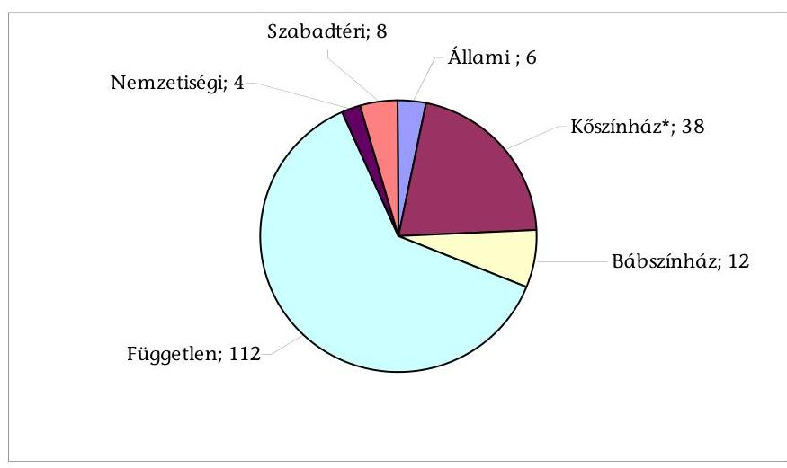
*Önkormányzati fenntartású kőszínházak
Forrás: Előadó-művészeti Iroda adatai

---

Az ellenőrzött időszakban 54-ről 56-ra emelkedett az állami és önkormányzati fenntartású kő-, és bábszínházak száma, amelyek a 2006. évben 32848 férőhelyen fogadták a látogatókat, 15950 előadást tartva, 2009-ben 32358 férőhelylyel működtek és 16311 előadást játszottak. Az előadásokat a jelzett években 4,5-4,6 millió látogató tekintette meg (10. sz. táblázat).

A színházak és a színházlátogatók számát tekintve - a 2007-re ${ }^{1}$ vonatkozó nemzetközi kitekintés alapján - hazánk több európai országot is megelőz.

1. sz. táblázat

Nemzetközi kitekintés a színházak és színházlátogatók számáról 2007. év

| Sorsz. | Országok | Állami *   színházak   száma | Népesség | Színház-   látogatók   száma | 100 lakosra   jutó színház-   látogatók   száma | 1 millió la-   kosra jutó   állami szín-   házak száma |
| :--: | :--: | :--: | :--: | :--: | :--: | :--: |
|  |  | db | ezer fö | ezer fö | fö | db |
| 1. | Svájc | 28 | 7593,5 | 1610,9 | 21 | 3,7 |
| 2. | Litvánia | n.a. | n.a. | n.a. | 31 | n.a. |
| 3. | Németország | 143 | 82217,8 | 28842,0 | 35 | 1,7 |
| 4. | Csehország | 45 | 10381,1 | 3812,8 | 37 | 4,3 |
| 5. | Lettország | 9 | 2281,3 | 860,0 | 38 | 3,9 |
| 6. | Norvégia | n.a. | 4681,1 | 1792,4 | 38 | n.a. |
| 7. | Magyarország | 56 | 10076,6 | 4521,8 | 45 | 5,6 |
| 8. | Finnország ** | n.a. | 5300,5 | 2222,0 | 42 | n.a. |
| 9. | Dánia *** | 108 | 5451,8 | 3096,8 | 57 | 19,8 |
| 10. | Esztország | 30 | 1342,4 | 1022,1 | 76 | 22,3 |

* állami, önkormányzati, tartományi színház
** drámai színházak adatai, a színházlátogatások száma az eladott jegyek alapján
*** színházlátogatások száma a 2007/2008-as évad alapján
n.a.: nincs adat

Forrás: Az egyes országok statisztikai hivatalainak adatai
Jelenleg az ország „felnőtt lakosságának kb. egyharmada lakik olyan településen, ahol állandó színház van, további egymillió ember pedig olyan településen, ahol meg lehetne teremteni a rendszeres színjátszás feltételeit. A fennmaradó lakosság túlnyomó része 60-80 km távolságon belül talál állandóan játszó színházat. "2

A hazai költségvetési intézményként, vagy nonprofit társasági formában múködő színházak saját bevételei nem fedezik a folyamatos múködés ráfordításait, fennmaradásuk csak rendszeres támogatással biztosítható. A színházak támogatása különböző csatornákon keresztül - központi költségvetési támogatásból, fenntartói saját forrásból, valamint pályázati úton - történik. Közvetett állami támogatást jelent a művészeti területen dolgozók kedvezményes adózá-

[^0]
[^0]:    ${ }^{1}$ Összehasonlítható nemzetközi adatok 2007. évre vonatkozóan állnak rendelkezésre.
    ${ }^{2}$ A kulturális szolgáltatások közfinanszírozása - ÁSZKUT tanulmány, 2010.

---

sa ekho formájában, valamint 2009-től az előadó-művészeti szervezetek számára nyújtható - a támogató vállalkozásnál társasági adókedvezménnyel járó - támogatás.

Az állami színházak támogatása a kultúráért felelős minisztérium költségvetésében jelenik meg. Az önkormányzatok - saját fenntartói támogatásuk mellé - központi költségvetési támogatást is kapnak színházaik múködtetéséhez. Egyes színházi intézmények (önkormányzati szabadtéri színpadok és nemzetiségi színházak, színházi vállalkozások) központi költségvetési támogatást pályázati úton kapnak.
2. sz. diagram

A színházi támogatás alakulása
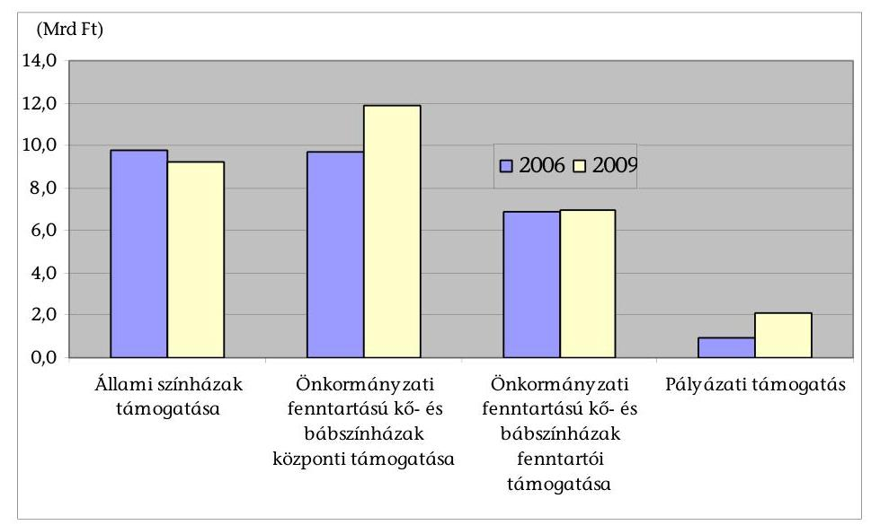

Forrás: 3-6. sz. táblázatok
Az állami színházak költségvetési támogatásának összege 2006-ban 9,8 Mrd Ft, 2009-ben pedig 9,2 Mrd Ft volt. Az önkormányzati fenntartású kő- és bábszínházak a központi költségvetésből 2006-ban 9,7 Mrd Ft, 2009-ben 11,9 Mrd Ft támogatást kaptak. Az önkormányzatok saját forrásból 2006-ban 6,9 Mrd Ft, 2009-ben 7,0 Mrd Ft-tal járultak hozzá színházaik fenntartásához. A szabadtéri, nemzetiségi és független színházak 2006-ban 0,9 Mrd Ft, 2009-ben 2,1 Mrd Ft pályázati támogatásban részesültek.

A színházak ezen felül a Nemzeti Kulturális Alap (NKA) révén is kaphattak pályázati támogatást, ennek összege azonban nem volt jelentős. Az NKA 2006ban 0,56 Mrd Ft, 2009-ben 0,57 Mrd Ft, míg 2010. évben a helyszíni ellenőrzés befejezéséig 0,46 Mrd Ft támogatást nyújtott a színházaknak.

A költségvetés kulturális kiadásai az ellenőrzött években átlagosan a GDP $0,7 \%$-át tették ki. A 2006-2007. évi nemzetközi adatok szerint Magyarország a

---

költségvetés kulturális kiadásainak egy lakosra jutó összege alapján a középmezőnybe tartozik ${ }^{3}$.
3. sz. diagram

A költségvetés kulturális kiadásai a GDP \%-ában, nemzetközi összehasonlításban (2007)
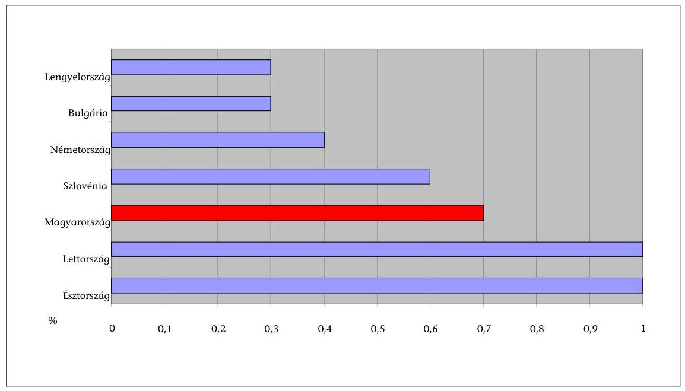

Forrás: Eurostat, culturapolicies.net
Az Állami Számvevőszék a színházak állami támogatásának rendszerét és gazdálkodását még nem vizsgálta. A terület ellenőrzését az ellátott kulturális feladat fontossága és a támogatásra fordított kiadások nagyságrendje egyaránt indokolta. Az ellenőrzés aktualitásához hozzájárul az a tény is, hogy 2009. március 1-jén hatályba lépett az előadó-múvészeti szervezetek támogatásáról és sajátos foglalkoztatási szabályairól szóló 2008. évi XCIX. törvény ${ }^{4}$ (továbbiakban Emtv.). A törvény meghatározza az előadó-múvészeti szervezetek központi költségvetési támogatásának szabályait, e szervezetekkel kapcsolatos hatósági és állami feladatokat, a sajátos munkajogi szabályokat.

A jelen ellenőrzés célja annak vizsgálata volt, hogy a színházak állami támogatási rendszere és ágazati szabályozása biztosította-e a közpénzfelhasználás eredményességét, hatékonyságát, megfelelő feltételeket teremtett-e a színházak múködéséhez. Ennek során értékeltük, hogy:

[^0]
[^0]:    ${ }^{3}$ A költségvetés egy lakosra jutó kulturális kiadása Bulgáriában 20,91 euro; Észtországban 158,00; Görögországban 32,04; Magyarországon 68,92; Írországban 41,02; Máltán 37,39; Hollandiában 183,00; Lengyelországban 35,65; Szlovákiában 41,52; Szlovéniában 127,90 euro volt 2006-ban.
    ${ }^{4}$ Módosította a 2010. évi LXX. törvény.

---

- a színházak állami támogatásának rendszere a közpénzek felhasználásával eredményesen járult-e hozzá a kultúrpolitikai célkitűzések megvalósításához;
- a fenntartók biztosították-e a feltételeket és felügyeletet a színházak eredményes múködéséhez;
- a támogatások felhasználásával a színházak eredményes, gazdaságos és hatékony gazdálkodást folytattak-e.

Az ellenőrzés a 2006. és 2009. évek közötti időszakot fogta át, a helyszíni ellenőrzés befejezéséig - a 2010. évi tendenciákat is figyelembe véve - az Emtv. színházak támogatására, gazdálkodására gyakorolt hatásának vizsgálata érdekében.

Az ellenőrzés kiterjedt az előadó-művészeti szervezetekkel kapcsolatos jogköröket ellátó állami szervezetekre (kulturális ágazatért felelős minisztérium, Magyar Nemzeti Vagyonkezelő Zrt. (MNV Zrt.), Előadó-művészeti Tanács (EMT), Előadó-művészeti Iroda), az állami színházakra, a helyi önkormányzatok irányítása alatt működő kő- és bábszínházakra, a szabadtéri, a nemzetiségi színházakra, azok fenntartói, illetve tulajdonosi jogait gyakorló szervezetekre, valamint a független színházi műhelyekre.

Az állami és a helyi önkormányzatok irányítása alá tartozó kő- és bábszínházakat (összesen 56 szervezetet), valamint azok fenntartóit teljes körben ellenőriztük. A szabadtéri, a nemzetiségi színházak és a független színházi műhelyek 2008. évben támogatott 113 játszóhelyéből kockázatelemzés alapján rétegzett mintavétellel 36 szervezetet választottunk ki. A minta nagyságát - a 2008. évi adatok figyelembe vételével - az állami támogatás és a színházak számának 50-50\%-os megoszlása alapján határoztuk meg. A kérdőíves felmérésbe és tanúsítványi adatszolgáltatásba vont 92 szervezet közül 16-nál végeztünk helyszíni ellenőrzést. A 2008. évi központi költségvetési támogatás és a színházak számának - 50-50\%-os - megoszlása alapján 8 önkormányzati fenntartású kőszínházat, 1 bábszínházat, 2 állami színházat és 5 független színházi műhelyt választottunk ki. A mintába került 16 intézmény az ellenőrzésbe vont szervezetek teljes központi költségvetési támogatásának 22,3\%-át képviselte. A helyszíni ellenőrzés érintette a kiválasztott állami és önkormányzati színházak fenntartóit is ${ }^{5}$.

Az ellenőrzés szempontrendszerét előtanulmánnyal alapoztuk meg, amelynek készítése során figyelembe vettük „A kulturális szolgáltatások közfinanszírozása" című ÁSZKUT által készített tanulmány megállapításait is.

Az ellenőrzést a teljesítményellenőrzés módszerével hajtottuk végre, amelynek során az értékelés középpontjában az eredményesség állt, a kitűzött ágazati és intézményi célok egybevetése az elért eredményekkel, hatásokkal ${ }^{6}$. A hatékony-

[^0]
[^0]:    ${ }^{5}$ Az ellenőrzésbe vont szervezetek jegyzéke a 3. sz. mellékletben szerepel.
    ${ }^{6}$ A teljesítményellenőrzési kérdéseket, kritériumokat, adatforrásokat az 6. sz. melléklet tartalmazza.

---

ság értékelése során a színház-szakmai tevékenység személyi, tárgyi, pénzügyi és egyéb erőforrásait, valamint az azok felhasználásával elért teljesítmények viszonyát elemeztük.

Megállapításainkat a helyszíni ellenőrzés tapasztalatai mellett az ellenőrzésbe vont színházak, illetve azok fenntartói által - tanúsítványi formában - szolgáltatott adatok összehasonlító elemzésével, kérdőíves felméréssel, helyszíni interjúkkal, valamint az érintett szervezetek vezető beosztású képviselőivel folyatott fókuszcsoport értekezleten elhangzottakkal alapoztuk meg.

Az ellenőrzés végrehajtásának jogszabályi alapját az Állami Számvevőszékről szóló 1989. évi XXXVIII. törvény 2. § (3), (5) valamint a 17. § (3) bekezdéseiben foglaltak képezik.

A jelentés-tervezetet megküldtük egyeztetésre a nemzeti erőforrás miniszternek, aki nem tett észrevételt. (Levele másolatát az 1. sz. melléklet tartalmazza.)

---

# I. ÖSSZEGZŐ MEGÁLLAPÍTÁSOK, KÖVETKEZTETÉSEK, JAVASLATOK 

Magyarországon a színházak évente 27,9-30,8 Mrd Ft állami támogatásban részesültek a 2006-2009 közötti időszakban. Az ágazatban a közpénzfelhasználás eredményességét és hatékonyságát azonban hátráltatta, hogy nem kapcsolódott hozzá az elérni kívánt kulturális, társadalmi, gazdasági hatások, célok meghatározása, valamint ezek elérését elősegitő finanszírozási elvek, módszerek kidolgozása.

A kiemelt finanszírozású állami intézmények köréről, feladatairól, támogatásának elveiről sem készült jogszabály, annak ellenére, hogy az ellenőrzött időszakot érintő kormányprogramok és a kulturális ágazati célokat tartalmazó munkaanyagok egyaránt szükségesnek tartották.
4. sz. diagram

Az egy férőhelyre jutó támogatás* összege 2009-ben
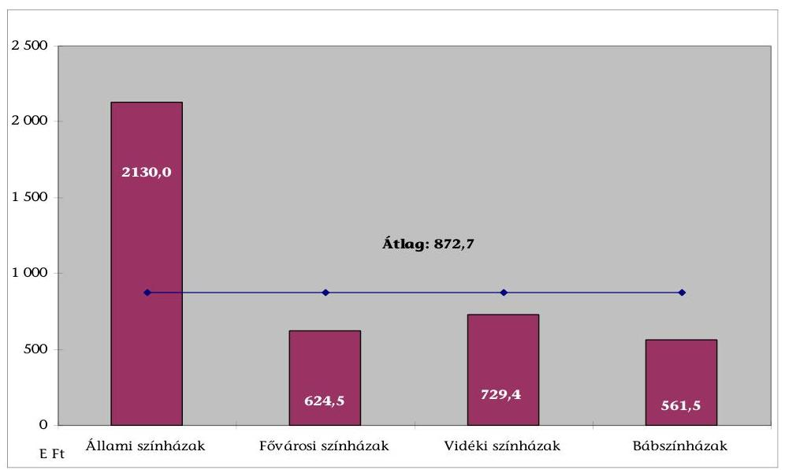
*Fenntartói és központi költségvetési támogatás együttesen
Forrás: 8. sz. táblázat
Az állami színházaknál a fajlagos támogatás összege magasan az átlag feletti, a fővárosi és vidéki színházak támogatásának háromszorosa volt. Az ellenőrzési időszakban folytak egyeztetések az OKM és a Fővárosi Önkormányzat között három állami színház önkormányzati fenntartásba történő átadásáról, megállapodás azonban nem jött létre.

Az ellenőrzéssel érintett időszak kormányprogramjai átfogóan és általánosan rögzítették a kultúra szerepét, feladatait, de a színházi ágazatot nevesítve érin-

---

tő, a színház-finanszírozás eszközeivel kiemelten támogatandó feladatokat, célokat nem határoztak meg.

A kulturális ágazatot irányító minisztérium önálló színházi stratégiát nem dolgozott ki. A 2006-2010 közötti időszakra vonatkozóan a kulturális területet érintően két szakmai munkaanyag ${ }^{7}$ készült, amelyek stratégiaként történő elfogadásáról nem született kormány-, illetve országgyúlési határozat. A tervezetek célul tűzték ki többek között a kulturális javakhoz való hozzáférés kiterjesztését, új kulturális értékek létrehozásának elősegítését, új finanszírozási struktúrák létrehozását, hatékony kulturális intézményrendszer kialakítását, ehhez kapcsolódóan az állami szerepvállalás mértékének és módjának, a tárca által közvetlenül fenntartott intézmények körének meghatározását. A megvalósításhoz cselekvési tervek nem készültek, határidőket és felelősöket nem jelöltek meg. Ennek következtében a „munkaanyagokban javasolt", de a minisztérium által érvényesnek tekintett célok csak részben valósultak meg.

Az intézmények fenntartói kulturális stratégiában, koncepcióban, önkormányzati rendeletben, illetve az alapító okiratokban általánosan fogalmazták meg a színházak feladatait. Ezekben a dokumentumokban azonban nem rögzítették, hogy milyen kulturális, gazdasági, turisztikai vagy egyéb célok elérése érdekében finanszírozzák a színházakat. Jellemzően a korábbi hagyományoknak megfelelően múködtették azokat. A költségvetési szervként múködő színházak irányában - dokumentált módon - semmilyen fenntartói elvárást, teljesítménykövetelményt nem határoztak meg, ilyeneket csak a gazdasági társaságként múködő színházak közszolgáltatási szerződései tartalmaztak. A különböző szervezeti formában múködő színházak vezetőinek érdekeltségi rendszere is eltérő volt, annak ellenére, hogy a nonprofit gazdasági társaságok szakmai teljesítménye nem különbözött lényegesen a költségvetési intézményekétől.

Az Emtv. hatálybalépése előtti időszak színház-támogatási rendszerében az elosztás elveinek és a támogatás összegének kialakítása nem volt átlátható. A finanszírozás egy 1996-ban kidolgozott modellre épült, amelyben-kezdetben elkülönült a központi költségvetés épületmúködtetést támogató és a fenntartó önkormányzat múvészeti programfinanszírozó szerepe. Ez a támogatási rendszer - amely a központi és önkormányzati támogatások folyamatos, legalább inflációkövető emelkedését feltételezte - 2006-ra teljes mértékben elveszítette eredeti funkcióját. A többcsatornás támogatási rendszer különböző elemeinek központi költségvetési, fenntartói és pályázati támogatás - célja, szerepe nem volt egyértelmúen, differenciáltan meghatározva.

A központi támogatási rendszer jellemzően bázisalapú volt. Nem igazodott sem a színházfenntartás, sem a művészeti tevékenység költségeinek változásához, nem vette figyelembe a fenntartói támogatás mértékét és a színházak művészeti teljesítményét sem, amint azt az alábbi diagram szemlélteti.

[^0]
[^0]:    ${ }^{7}$ A szabadság kultúrája - Magyar Kulturális Stratégia 2006-2020. (Tervezet 2006. január). A kulturális modernizáció irányai. (Tervezet 2006. december 13.).

---

# Az önkormányzati fenntartású kő- és bábszínházak jellemző adatai 2006-2008 között (2006=100\%) 

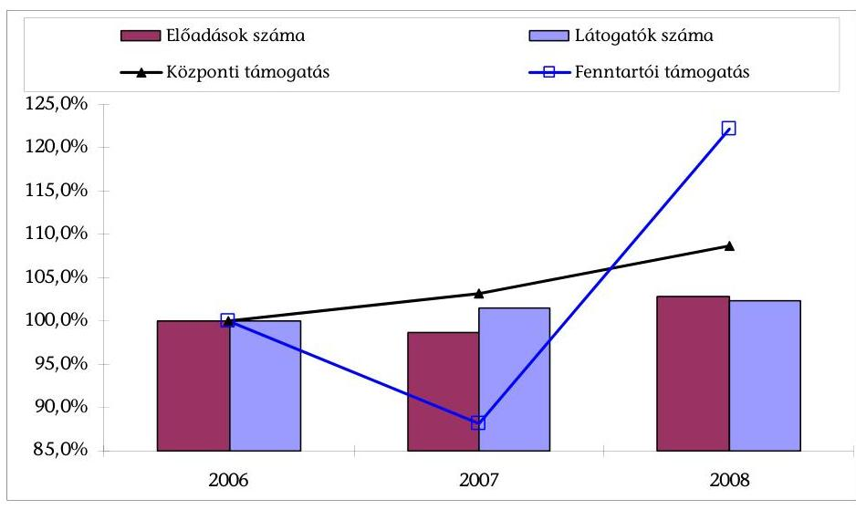

Forrás: 3-5. és 9-10. sz. táblázatok
A központi színház-támogatási keret helyi önkormányzatok közötti elosztásának szempontjait nem alakították ki, az önkormányzatok - 5 fenntartó kivételével - ugyanolyan összegű központi működtetési hozzájárulásban részesültek 2008-ban, mint a 2006. évben.

Az Emtv. elfogadása jelentős változást eredményezett a színházak állami támogatásának rendszerében. A finanszírozás szempontjából 2009. átmeneti év volt, az Emtv. alapján nyújtható központi költségvetési támogatások első alkalommal 2010-ben vehetők igénybe.

Az új támogatási rendszer nem számol az infrastruktúra állapotával, a színházfenntartás intézményenként eltérő költségeivel, de a kategóriába sorolás, valamint a művészeti ösztönző részhozzájárulás megállapítása során már részben figyelembe veszi a színházak teljesítményét (előadás-, bemutató- és nézőszám), a művészeti tevékenység eltérő ráfordításait. Problémát jelent azonban a fizető nézőszámra vonatkozó adatszolgáltatás jogszabályi meghatározásának pontatlansága. A minőségi színjátszás ösztönzésére a pályázati rendszer keretein belül van lehetőség.

Az új szabályozással a színházak központi költségvetési támogatásának elosztási elvei átláthatóbbá váltak, a támogatásra vonatkozó adatok nyilvánosak, megismerhetők. A támogatási rendszer egyes elemeinek alakulása a törvényben pontosan rögzített tényezők - fenntartói saját támogatás, nézőszám, jegybevétel - függvénye, ösztönözve a fenntartókat színházaik saját forrású támogatásának növelésére, a színházakat pedig a magasabb kategória feltételeinek való megfelelésre, a nézőszám és a jegybevétel növelésére.

A központi költségvetési támogatás különböző kategóriák közötti elosztására vonatkozó elveket az Emtv. nem határozta meg, az elosztás az EMT Színházi

---

Kollégiumának javaslata alapján történt. A támogatási összeg nagyságát a költségvetési helyzet, emellett a művészeti és fenntartói támogatás arányainak, valamint a súlyszámok évenkénti alakulása egyaránt befolyásolja. Ez utóbbiak éves költségvetési törvényekben történő meghatározása lehetőséget ad a támogatás kulturális célokhoz igazodó rugalmas változtatására, de a fenntartók és az intézmények számára nem biztosítja a finanszírozás kiszámíthatóságát.

Az Emtv-ben rögzített támogatási rendszerben a kiemelt művészeti célú pályázatoknál és a független színházak támogatásánál érvényesült a szektorsemlegesség, azonban nem valósult meg a nemzeti intézmények finanszírozása során. Az Emtv. támogatási szabályai az állami színházakra nem vonatkoznak.

A kulturális ágazatot irányító minisztérium színházakat támogató pályázati forrásainak eredményes és hatékony felhasználását több tényező akadályozta az ellenőrzött időszakban. A minisztérium pályázati rendszerében szervezetileg és folyamatában is elkülönült a pályázati kiírás, illetve döntés, valamint a szerződéskötés, folyósítás, beszámoltatás és ellenőrzés (2/b. sz. melléklet).

A minisztérium által kiírt és közzétett pályázatokról a szakmai kuratórium javaslata alapján a miniszter döntött. A pályázatok alapvetően a független előadó-művészeti szervezetek múködését támogatták. Kifejezetten produkciók megvalósulását korábban jellemzően az NKA pályázatai, 2009-től a kiemelt művészeti célok támogatására kiírt minisztériumi pályázatok segítették.

A kiírásokban - különösen az ellenőrzött időszak első két évében - hiányzott a pályázati célok és feltételek pontos meghatározása. A támogatás felhasználásának lehetőségei széleskörűek, nagyvonalúak voltak, nem mindig igazodtak a pályázati célhoz, az adott szervezet lehetőségeihez, múködési sajátosságaihoz. A támogatás odaítélésének szempontrendszerét csak a 2008. évi időszaktól kezdődően rögzítették a pályázati kiírásokban. A döntések indoklást nem tartalmaztak, nyilvánosságuk azonban biztosított volt. A pályázatok lebonyolításának hosszú átfutási ideje - különösen a független szervezeteknél - megnehezítette a múködést, a tervszerű gazdálkodást.

A pályázati keretösszegeket a 2006-2009 közötti időszakban a költségvetési törvények a „Helyi Önkormányzatok támogatásai" fejezete tartalmazta. A pályázatokat a helyi önkormányzatokhoz kellett benyújtani, akik szerződést, illetve megállapodást kötöttek a nyertesekkel. A szerződések - amelyek tartalmáról a pályázatot kiíró minisztérium nem rendelkezett információval - eltérő részletességűek voltak, a helyszínen ellenőrzött szervezetek egyharmadánál nem tartalmaztak a teljesítésre, a pénzügyi elszámolás módjára, a szerződésszegés következményeire vonatkozó megfelelő rendelkezéseket. A támogatások szabályszerű felhasználásának rendszeres ellenőrzése, számonkérése teljes körűen nem volt biztosított. A kedvezményezett szervezetek pénzügyi elszámolásait az önkormányzatok ellenőrizték, ezek eredményéről, az esetleges szankciókról a minisztérium nem kapott tájékoztatást. Az intézmények szakmai beszámolóit az önkormányzatok megküldték a minisztériumnak, azok tartalma - egységes szempontrendszer híján - egyenetlen, heterogén volt. A minisztérium, a szakmai beszámolók alapján összegzést nem készített, a pályázati támogatások hasznosulását nem értékelte.

---

A 2010. évben a pályázatok elbírálásáról július 30-án született döntés. A 2010. évi költségvetéssel összefüggő egyes feladatokról szóló 1132/2010. (VI. 18.) Korm. határozatban elrendelt zárolás miatt a megítélt támogatás közel kétharmadának megfelelő összeg kerülhet kiutalásra. A pályázatok ${ }^{8}$ lebonyolítását 2010-től az NKA Igazgatósága végzi, azonban a helyszíni ellenőrzés lezárásáig nem született meg erre vonatkozóan a kulturális tárca és az NKA között a megállapodás.

A pályázatok bírálata során egy szakmai szűrő jelenik meg a minőségi színjátszás ösztönzésére. A pályázati célok és a támogatási összeg felhasználási lehetőségének nagyvonalú meghatározása, a kiírás és a folyósítás ütemezése, a beszámoltatás, az ellenőrzés és az értékelés hiányosságai a 0,9-2,4 Mrd Ft éves keretösszegű pályázati források eredményes és hatékony felhasználását korlátozták az ellenőrzött időszakban.

Az új finanszírozási rendszerben hátrányos helyzetbe került színházakat a minisztérium 2010-ben a „Kiemelt művészeti célok megvalósítása" pályázati keret terhére átmeneti támogatással segítette. A támogatás feltétele a hátrányos helyzet csökkentésére irányuló intézkedések terveinek bemutatása volt. Az ún. kompenzációs pályázat közel 50\%-kal csökkentette a kiemelt művészeti célok megvalósítására fordítható összeget.

Az állami támogatás indirekt eszköze az előadó-művészeti szervezetek részére az üzleti szféra által - társasági adókedvezmény igénybevétele mellett nyújtható támogatás, amelyet a színházak nettó jegybevételük 80,0\%-a mértékéig vehetnek igénybe. A támogatás e formáját - a jogszabály és a hozzá kapcsolódó értelmező állásfoglalás késői megjelenése miatt - 2009-ben mindössze 47 színházi szervezet tudta érvényesíteni, a maximális összeg 40,5\%-ának megfelelő mértékben. Több színház közvetítő segítségével jutott a támogatáshoz 9-15\%-os díjfizetés ellenében. Ez a támogatási forma a színházak szempontjából eredményes, többletforráshoz juttatja a színházi ágazatot, nemzetgazdasági szinten azonban - a vele járó adózási kedvezmények és a közvetítői díjak többletköltsége miatt - a közvetlen állami támogatáshoz képest, ahol ilyen költségek nem jelentkeznek nem gazdaságos megoldás.

Az Emtv. hozta létre az Előadó-művészet Tanácsot (EMT), amely a törvényben rögzített jogainak és kötelezettségeinek eleget tett. A testület javaslatait a központi költségvetési támogatás felosztásánál, a pályázatok kiírása és a pályázati támogatások elosztása során egyaránt figyelembe vették.

Az Emtv-ben meghatározott célkitűzések megvalósulását a kulturális kiadásokra fordítható összeg mellett a támogatási rendszer múködése is befolyásolta.

A kulturális javakhoz történő hozzáférés kiterjesztése az Emtv-ben kiemelt célként jelenik meg. A kulturális esélyegyenlőség javítása érdekében a mozgó

[^0]
[^0]:    ${ }^{8}$ 2010-től kezdődően a kiemelt művészeti célok és a VI. kategóriába sorolt független színházak pályázati keretösszege az OKM/NEFMI fejezeti kezelésű előirányzatai között szerepel.

---

színházak, alkalmi játszóhelyek, tájelőadások kiterjesztése nem valósult meg. Kifejezetten a mobilitás ösztönzését célzó támogatás lehetősége csak a 2010. évi pályázati kiírásokban jelent meg.

Magyarország regionális színházi ellátottsága egyenetlen. A színházak több mint fele Budapesten, illetve a főváros közelében található. Az ellátottság - a férőhelyek, a színházlátogatás és az előadásszám lakosságszámhoz viszonyított fajlagos mutatóit tekintve - a Közép-magyarországi régióban a legjobb, ezt Nyugat-Dunántúl követi. Észak-Magyarországon és az alföldi régiókban alacsonyabbak az ellátottsági mutatók. A régiók többségében az ellenőrzött időszakban javult a színházi ellátottság. A színházlátogatás társadalmi kiterjesztése, az ellátatlan területek felzárkózása nem történt meg, ennek megvalósulását a támogatási rendszer nem ösztönözte az ellenőrzött időszakban. Az ország különböző területei között lényeges különbség van a színházi élményhez való hozzáférés tekintetében, amelyet a következő diagram mutat be.

# 6. sz. diagram 

## Regionális adatok 2009-ben

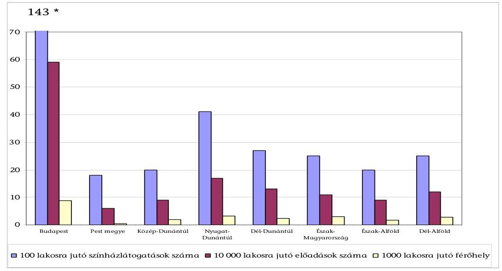
*Budapesten a 100 lakosra jutó színházlátogatások száma 143 volt 2009-ben
Forrás: 2. sz. táblázat
Az új finanszírozási rendszer több eleme is támogatja a gyermek- és ifjúsági előadások ösztönzését, mint az Emtv-ben jogszabályi szintre emelt ágazati célt. A minisztérium által a kiemelt művészeti célok pályázati kiírásai ösztönzik a fiatal generáció számára készülő előadások színre állítását, továbbjátszását. A művészeti ösztönző részhozzájárulás kiszámítása során a gyermek- és ifjúsági előadások nézői 1,4 súlyszámmal, ugyanakkor a bábelőadások nézői 0,5-ös szorzóval vehetők figyelembe. A gyermek- és ifjúsági korosztály színházi előadásokhoz való hozzáférési lehetősége az ellenőrzött időszakban kiegyensúlyozott volt, de a célokkal ellentétben lényeges javulást nem lehetett megállapítani. A gyermek- és ifjúsági előadások száma 6,4\%-kal emelkedett 2006 és 2009

---

között, az összes előadásszámon belül ezen előadások aránya 26,6\%-ról 27,7\%ra nőtt.

A hazai társulatok nemzetközi jelenlétének fokozására vonatkozó törvényi cél nem teljesült. Ezt támasztják alá az ellenőrzött időszakban a nézőszám 44,1\%os, az előadásszám 15,2\%-os csökkenésére vonatkozó adatok. A kedvezőtlen tendenciához hozzájárult az utazási és egyéb költségek növekedése, de az okok elemzése színház-szakmai szempontból nem történt meg.

Az Emtv. szerinti új támogatási rendszer bevezetése óta még nem telt el egy teljes költségvetési év, a 2010. első félévéig ismert hatásai értékelhetők.

A fenntartói ösztönző részhozzájárulás bevezetése az önkormányzati fenntartókat nem ösztönözte a saját forrásból nyújtott támogatás 2009. évi növelésére, a 2010. évi előirányzatoknál azonban már a fenntartói saját támogatás részarányának növekedése figyelhető meg. Ugyanakkor az önkormányzatok közel fele működési forráshiánya miatt a 2010. évre is csökkentette a színházainak - saját forrásból - juttatott támogatás összegét, így nem tudja kihasználni a magasabb központi támogatás igénybevételének lehetőségét.

Az új támogatási rendszer érdekeltté tette a színházakat a fizető nézőszám növelésében, az intézmények hoztak is intézkedéseket ennek érdekében. A KSH adatai szerint a kulturális területek iránti érdeklődés csökkenése egyedül a színházaknál nem tapasztalható. 2010. első hat hónapjában a fizető nézők száma az előző teljes évi adat 59,0\%-a volt.
7. sz. diagram

A fizető nézőszám megoszlása a színházcsoportok között
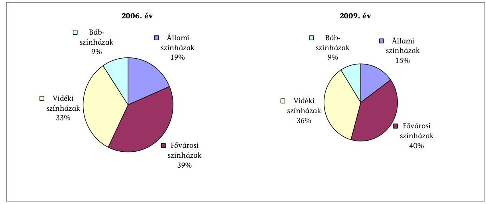

Forrás: 11. sz. táblázat
A fenntartó önkormányzatok, a színházak éves támogatásának meghatározásánál, elsősorban a működőképesség fenntartására összpontosítottak. Forráshiány következtében jellemzően nem, vagy csak részben érvényesültek az intézményi igények. A több színházat fenntartó önkormányzatok nem alakítot-

---

ták ki a központi költségvetési és a fenntartói saját támogatás színházak közötti elosztásának elveit, szempontjait. A támogatás elosztása során nem vették figyelembe sem a színházak szakmai teljesítményét, sem az épületfenntartás, működtetés költségeinek változását.

A 2010-ben bevezetett fenntartói ösztönző részhozzájárulást jellemzően az előző évi támogatások arányában osztották el az önkormányzatok. A Fővárosi Önkormányzat a fenntartói ösztönző részhozzájárulás egy részéből (51,7\%) céltartalékot képzett, amelyet differenciáltan osztott fel a színházak között.

A kiemelt finanszírozású állami színházak támogatási elveit a minisztérium nem alakította ki. A keretösszeg intézmények közötti elosztásának számításokkal alátámasztott dokumentumai nem álltak rendelkezésre. Az intézményvezetők pályázati kiírásában a támogatási összeg szinten tartását három gazdálkodási évre rögzítették. A finanszírozás mértéke nem az intézmények művészeti céljaihoz igazodott, a fenntartó a vezetők feladataként jelölte meg a támogatáshoz illeszkedő célok kitűzését.

Teljesítménykövetelménnyel alátámasztott vezetői prémiumrendszert az önkormányzatok alig egynegyede alkalmazott. A Fővárosi Önkormányzat ilyen vezetői érdekeltségi rendszert csak a gazdasági társaságként működő színházak ügyvezető igazgatói számára dolgozott ki, a költségvetési szervként működő színházak vezetői számára nem. A prémiumfeltételek azonban - a színházak alapvető működtetésének biztosításán felül - nem tartalmaztak többlet elvárásokat.

A színházépületek fejlesztésére az önkormányzatok által nyújtott fenntartói támogatás az ellenőrzött időszakban átlagosan 32,0\%-kal csökkent. A kő- és bábszínházak beruházási, felújítási kiadásaira az állami és a 26 önkormányzati fenntartó saját forrásból a 2006-2009. években összesen 4,3 Mrd Ft-ot fordított. Ezen belül 2,3 Mrd Ft-ot tett ki egy színháznak az ellenőrzött időszakra áthúzódó rekonstrukciója. Központi forrásból a korábbi időszakban még elérhető címzett támogatások nem álltak rendelkezésre, az önkormányzati fenntartók saját forrásai nem voltak elegendőek, ezért nem történtek meg a tervezett felújítások, átalakítások. Az elmaradt rekonstrukciók rontották a látogatók komfortérzetét, akadályozták a korszerű színpadtechnikai megoldásokat és a gazdaságos üzemeltetést. A színházépületek felújításának elmaradása az állami színházak esetében is komoly problémát jelentett. A minisztérium 324,2 M Ft-ot biztosított beruházásokhoz, felújításokhoz. A színházak a kapott támogatási összegekből csak a legszükségesebb munkákat tudták elvégeztetni.

A központi színház-támogatás jelenlegi rendszere nem veszi figyelembe az ingatlanfenntartás és fejlesztés pénzügyi igényeit. Ezzel hátrányos helyzetbe kerültek az elavult infrastruktúrával, továbbá forráshiányos fenntartóval rendelkező színházak, mivel alacsonyabb összegű fenntartói hozzájárulás esetén a központi forrásból is kevesebbet kapnak. Az előadó-művészeti szervezetek központi költségvetési támogatáshoz kapcsolódó beszámolójáról és az elszámolható költségekről szóló miniszteri rendelet szerint a központi támogatás ingatlanon végzett felújítás, beruházás költségeire, az ingatlanon elszámolt értékcsökkenés fedezetére nem számolható el. A fenntartói saját forrásból nyújtott támogatásokra vonatkozóan - beleértve az állami színházak fenntartói támoga-

---

tását is - ilyen tiltás nincs. A korábban központi költségvetésből biztosított címzett támogatások szerepét azonban a fenntartói támogatások nem töltik be. A rekonstrukcióra szoruló színházépületek felújítására a fenntartók által biztosított források nem elégséges mértékűek.

A fenntartók a színházak múködésével kapcsolatos utasításaik nyomon követési és ellenőrzési rendszerét elsősorban a gazdálkodással összefüggő feladatokra vonatkozóan alakították ki. A monitoring rendszer az intézményi gazdálkodás felügyeletére, a szükséges intézkedések, beavatkozások végrehajtására alkalmas volt.

A színházfenntartók rendszeres felügyeleti ellenőrzése alapvetően a színházak pénzügyi, gazdálkodási feladatainak értékelésére terjedt ki, szakmai felügyeleti ellenőrzést jellemzően nem végeztek. A színházi ágazatban a támogatások hasznosulásának értékeléséhez eredményszemléletű szempontokat nem dolgoztak ki, ilyen jellegú elemzést nem végeztek.

A színházak gazdálkodásában az állami támogatás - fenntartótól függetlenül - meghatározó nagyságrendű volt. Bár annak részaránya 2006 és 2009 között átlagosan 5,2 százalékponttal, reálértéke 10,4\%-kal csökkent, a bevételek közel kétharmadát tette ki.
8. sz. diagram

# A színházcsoportok bevételeinek megoszlása 2009-ben 

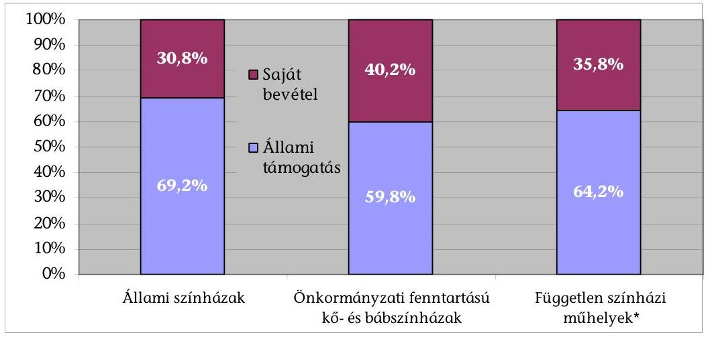

* Az ellenőrzésbe vont 26 független színházi műhely adatai alapján

Forrás: 14., 17-19. sz. táblázatok
A színházak bevételeiben az állami támogatás mértéke meghatározó arányt képvisel. A független színházi műhelyek állami, illetve önkormányzati fenntartó nélkül múködő szervezetek, ennek ellenére állami támogatásuk mértéke a kőszínházakéhoz volt hasonló.

A saját bevételek összege az állami, valamint az önkormányzati fenntartású kő- és bábszínházaknál nominálisan $35,1 \%$-kal, reálértéken $13,2 \%$-kal emel-

---

kedett az ellenőrzött időszakban. A saját bevételek között a jegy-, bérlet-, valamint áfa-bevételek mellett szponzorációs, illetve egyéb külső források nem voltak meghatározóak.

Az önkormányzati színházaknál a saját bevételek emelkedése esetén a fenntartói támogatás csökkentése volt jellemző, ami nem ösztönözte az intézményeket a saját bevételek növelésére.

A jegy- és bérletbevételek aránya a saját bevételeken belül átlagosan 51,5\%-ról 43,0\%-ra csökkent. Az állami színházaknál 2006-ban a jegy- és bérletbevétel az összes saját bevételnek $47,8 \%$-a, 2009-ben $39,9 \%$-a volt. Az önkormányzati fenntartású kő- és bábszínházaknál ugyanez az arány 2006-ban 52,8\%, 2009ben $43,9 \%$-ot tett ki.

A jegy- és bérletbevételek alakulását jelentősen meghatározó fizető nézők száma a színházak összességében alig változott. Míg a fővárosi kőszínházakat $2,5 \%$-kal, a vidékieket $10,0 \%$-kal több fizető néző látogatta, a bábszínházak nézőszáma $1,3 \%$-kal, az állami színházaké $18,3 \%$-kal csökkent (ez utóbbiban közrejátszott az Erkel Színház bezárása is). A független színházaknál a tevékenység jellegéből adódóan nem mindegyik szervezetnél keletkezett jegybevétel. Ezért a látogató, illetve fizetőnéző-számról nem álltak rendelkezésre teljes körű, megbízható adatok.

A nézőszám változatlansága mellett a játszott produkciók, azon belül az új bemutatók száma is emelkedett az ellenőrzött időszakban. Egyes produkciók továbbjátszását, a színházlátogatás társadalmi kiterjesztését célzó tájelőadások és külföldön megtartott előadások száma azonban csökkent.

A színházak kiadásainak közel kétharmadát a foglalkoztatáshoz kapcsolódó ráfordítások tették ki, miközben a foglalkoztatás eltolódott a személyes teljesítéshez kötődő megbízási és vállalkozási szerződések irányába. A személyi ráfordítások csökkentése érdekében a kiszervezett tevékenységek száma 21,2\%-kal emelkedett, ezekhez azonban előzetesen gazdasági számításokat nem végeztek. A helyszínen ellenőrzött szervezetek közül két színháznál előfordult egyes tevékenységek kiszervezésének megszüntetése, mivel az utólagos ellenőrzés annak gazdaságtalanságát igazolta.

A díszletek és jelmezek bekerülési értékükhöz viszonyított többszöri felhasználással, színházak közötti cserével biztosítható gazdaságosabb kihasználását a jogdíjak, a rendezői és tervezői, művészi elképzelések akadályozták.

Összegezve megállapítható, a színházak állami támogatásával elérendő, preferálandó célokat és ezek elérésére irányuló eszközrendszert sem ágazati, sem fenntartói szinten nem határoztak meg. Az Emtv. hatályba lépése előtt a támogatási rendszer nem volt átlátható, kiszámítható és motiváló hatású. Az Emtv. bevezetésével a támogatási rendszer a korábbinál átláthatóbbá vált, kiszámíthatósága azonban jelenleg nem biztosított, ami megnehezíti a színházak tervszerű működését. Az új támogatási rendszer a színházakat teljesítményeik, a fenntartókat a saját támogatás növelésére ösztönzi. A fenntartói saját forrás arányához kötött központi támogatás egyúttal a színházi kiadások növelését is motiválja. A színházakban az erőforrások felhasználásának gazdasá-

---

gossága az elavult infrastruktúra valamint a díszletek, jelmezek többszöri felhasználásának - jogvédelmi, rendezői és tervezői elképzelésekből adódó - korlátai következtében csak részben valósult meg.

# 9. sz. diagram 

## Az állami és az önkormányzati fenntartású kő- és bábszínházak jellemző adatai* 2006-2009 között, 2006-hoz viszonyítva

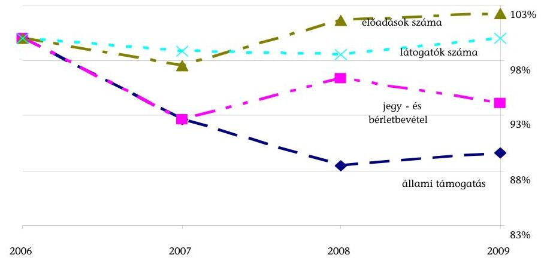

A jegy- és bérletbevételek és az állami támogatás reálértéken
Forrás: 9-10., 13 sz. táblázatok
Az ellenőrzött időszakban az előadások száma növekedett, a nézőszám nem változott, a reálértékben csökkenő támogatások felhasználásával a színházak eredményességében nem történt visszaesés.

A helyszíni ellenőrzés megállapításainak hasznosítása mellett javasoljuk:

## a kultúráért felelős miniszternek

1. Készíttesse el a színházi ágazat eredményszemléletű céljait is magában foglaló kulturális stratégiát, annak megvalósítása érdekében gondoskodjék cselekvési terv kidolgozásáról, amely meghatározza a célok elérésének támogatási, szervezeti, intézkedési eszközeit, felelőseit és határidőit.
2. Készítse elő a nemzeti kulturális/művészeti intézmények köréről, feladatairól és támogatási elveiről szóló jogi szabályozást, egyidejűleg kezdeményezze a nemzeti intézményi státuszba nem tartozó állami színházak önkormányzati fenntartásba kerülését.
3. Intézkedjen a színházak számára kiírt pályázati támogatások felhasználhatóságának a kulturális ágazati célokhoz igazodó pontosításáról, a kifizetések cél szerinti ütemezéséről, a számonkérésről, a szabályszerű felhasználás ellenőrzéséről és a hasznosulás rendszeres értékeléséről.

---

4. Értékelje egy teljes költségvetési évet követően, az előadó-művészeti törvényben meghatározott célok teljesülését, a törvényi szabályozás hozzájárulását a célok megvalósulásához. Vizsgálja felül a minőségi színjátszás ösztönzését, a fizetőnéző-szám meghatározását, az ingatlanokon végzett felújítás, beruházás forrásainak szabályozását -, valamint az eltérő szervezeti formában működő színházak érdekeltségi rendszerét.

---

# II. RÉSZLETES MEGÁLLAPÍTÁSOK 

## 1. A színházak Állami támogatási rendszere és ágazati szA. BÁLYOZÁSA

### 1.1. A színházak költségvetési támogatási rendszerének múködése, hozzájárulása a kulturális célok teljesüléséhez

### 1.1.1. A színház-támogatási rendszer céljai, elvei, összhangja a kulturális ágazati célokkal

A 2002-2006, valamint a 2006-2010 közötti időszakra készített kormányprogramok átfogóan, ugyanakkor általánosságban határozták meg a kultúra szerepét és feladatát.

Mindkét kormányprogram rövid bekezdésekben foglalkozott a kultúrafinanszírozás rendszerével, a költségvetési források biztosításával, illetve a költségvetési eszközökkel való eredményesebb gazdálkodás érdekében a finanszírozási rendszer felülvizsgálatának szükségességével. A 2006-2010. évek kormányprogramja mindezek mellett előirányozta a nemzeti kulturális intézmények körének és feladatainak meghatározását/újraszabályozását, amelyek fenntartásáért teljes körűen az állam vállal felelősséget.

A minisztérium önálló színházi stratégiát nem dolgozott ki. Az ellenőrzött időszakban az OKM a 2006. decemberben készített szakmai munkaanyagot ${ }^{9}$ tekintette kulturális stratégiának, annak ellenére, hogy azt a Kormány, illetve az Országgyúlés nem vitatta meg, elfogadásáról nem született határozat.

Eszerint a kulturális politikának választ kell adnia arra, hogy a kultúra területén melyek az aktuális és stratégiai feladatok, hol húzódnak az állami szerepvállalás határai, melyek a konkrét feladatai, miként valósítható meg a kulturális esélyegyenlőség, miként teremthetők meg a kultúra finanszírozásának, a kulturális fejlesztéseknek európai uniós és magánforrásai.

Megvalósítandó célkitúzésként sorolta fel a munkaanyag többek között a kulturális javakhoz történő hozzáférés kiterjesztését, a kultúra akadálymentes elérésének biztosítását, új kulturális értékek létrehozásának elősegítését, hatékony, korszerű kulturális intézményrendszer kialakítását, új finanszírozási struktúrák létrehozását.

A célok megvalósításához cselekvési tervek nem készültek, határidőket, felelősöket nem határoztak meg.

[^0]
[^0]:    ${ }^{9}$ A kulturális modernizáció irányai (2006. december 13.).

---

A 2006-2008. években a kőszínházak és bábszínházak számára központi költségvetési forrásból csak működtetési támogatás állt a fenntartó önkormányzatok rendelkezésére.

A kőszínházak múködtetési támogatása 2006-ban és 2007-ben változatlan összegű ( 9479,7 M Ft), 2008-ban 9679,7 M Ft volt. A bábszínházakat fenntartó önkormányzatok 2006-2008 között 387,3 M Ft múködtetési hozzájárulásban részesültek évente ${ }^{10}$.

A színházak támogatása különböző csatornákon valósult meg: központi költségvetési támogatás, fenntartói saját támogatás formájában és pályázatok útján. A 2006-2008 közötti időszakban a központi támogatás rendszere alapvetően a színházak folyamatos múködéséhez járult hozzá, de nem vette figyelembe a fenntartási költségek változását, a fenntartói saját támogatás mértékét, az előadás- vagy nézőszám, illetve egyéb múvészeti mutatók alakulását. A központi színház-támogatási keret helyi önkormányzatok közötti elosztásának szempontjait nem alakították ki.

A 2009. évtől ismét megjelent a finanszírozási struktúrában a működtetési hozzájárulás mellett a 2005-ben megszűnt művészeti hozzájárulás.

2009-ben a művészeti hozzájárulás összegét az önkormányzatok költségvetési rendeletében elfogadott színház-támogatási előirányzat és a színházak előző évi fizető nézőinek száma alapján állapították meg. A kőszínházak esetében a hozzájárulás összesen 1700,0 M Ft volt, a bábszínházak fenntartói összesen 190,0 M Ft-ban részesültek.

A pályázati támogatások célja elsősorban a szabadtéri és nemzetiségi színházak, színházi vállalkozások, alternatív/független színházi műhelyek, befogadó színházak támogatása, amely alapvetően a múködési költségekhez való hozzájárulást biztosította ${ }^{11}$.

A minisztérium pályázati rendszerében a pályáztatással kapcsolatos feladatok OKM és a helyi önkormányzatok közötti megosztása, illetve azok összehangolása nem volt megfelelő.

A pályázati felhívásokat a minisztérium tette közzé, a pályázati keretösszeg elosztásáról a miniszter döntött. A pályázati kiírások tartalmát 2006-2009. között azonos módon, általánosságban fogalmazták meg, amelyet a kiíró 2007. évtől részletezett, de a támogatás felhasználhatóságának körét, feltételeit továbbra sem pontosították.

A támogatás odaítélésének szempontrendszerét konkrét meghatározással (művészi jelleg és színvonal; szakmai kritériumok; társadalmi hatás; gazdasági mutatók) először a 2008. évi kiírásban határozták meg. A pályá-

[^0]
[^0]:    ${ }^{10}$ A 2006-2008. évek zárszámadási törvényeinek 5. sz. melléklete alapján.
    ${ }^{11}$ Az OKM fejezeti kezelésű előirányzata volt a forrása ebben az időszakban 25,050,0 M Ft összegű produkciós pályázatoknak (pl. Katona József produkciós pályázat, Weöres Sándor bábprodukciós pályázat).

---

zati kiírások és a döntések nyilvánossága biztosított volt, de a döntések indokolásáról nem adtak tájékoztatást a pályázónak és nem hozták nyilvánosságra.

Az ellenőrzött időszakban a pályázati kiírásokat a minisztérium a költségvetési törvény elfogadása után, a következő év január-március hónapokban készítette el és jelentette meg nyilvánosan. A lebonyolítás ütemezése, a bírálat és a döntés, majd a szerződéskötés - jó esetben - május végére, június elejére történt meg, így a támogatást legkorábban július-augusztus hónapban utalták a nyertes pályázónak. A pályázat kiírásától az elnyert támogatás utalásáig 6-7 hónap telt el, ez a pályázati célok megvalósítását hátrányosan érintette.

A pályázati keretösszegeket az éves költségvetési törvények 7. számú melléklete, „A helyi önkormányzatok színházi támogatása" tartalmazta. A megítélt támogatásokat az önkormányzatoknak utalták.

A pályázatokat 2006-2009 között a helyi önkormányzatokhoz kellett benyújtani, akik támogatási szerződést kötöttek a nyertes pályázókkal, emellett a pénzügyi elszámoltatás is az ő feladatuk és felelősségük volt. A szerződések egymástól eltérő tartalmúak és szerkezetűek voltak. A helyszínen ellenőrzött szervezetek egyharmadánál nem tartalmaztak a teljesítésre, a pénzügyi elszámolás módjára és az esetleges szankcionálásra vonatkozó rendelkezéseket.

A pályázatot kiíró minisztérium nem rendelkezett információval a támogatási szerződések tartalmáról, a teljesítésre, a pénzügyi elszámolás módjára és határidejére vonatkozó rendelkezésekről, a nem megfelelő teljesítés szankcionálásáról.

A kedvezményezett pályázók a megvalósításról szóló szakmai beszámolót és a pénzügyi elszámolást az önkormányzatoknak küldték meg. A pénzügyi elszámolások ellenőrzése az önkormányzatok feladata volt, de a MÁK Regionális Igazgatóságai is jogosultak voltak az ellenőrzésre. A pénzügyi ellenőrzések dokumentumait a minisztérium nem kapta meg.

A szakmai beszámolókat az önkormányzatok megküldték a kulturális tárcának. A beszámolók elkészítéséhez a minisztérium nem alakított ki egységes szempontrendszert, azok tartalma heterogén, egyenetlen színvonalú volt.

A minisztérium a támogatások hasznosulását nem összegezte. Az értékelést a szakmai főosztály egyes pályázatokra külön-külön elvégezte, de átfogó értékelést nem készítettek.

# 1.1.2. A színházak központi költségvetési támogatásának új szabályozása 

Az Emtv. megalkotásával és elfogadásával új alapokra helyezték az állam és az előadó-művészeti szervezetek, illetve azok fenntartói közötti viszonyt, a szervezetek állami támogatását.

---

A törvény indoklása szerint a jogszabály megalkotását az tette szükségessé, hogy nem volt az előadó-művészeti területre vonatkozó ágazati szintű szabályozás, az előadó-művészeti szervezetek finanszírozásának formái nem követték az időközben bekövetkezett jogszabályi, gazdasági változásokat.

A törvényjavaslat előkészítése 2007. óta a társadalmi párbeszéd folyamatos fenntartásával történt.

# A törvényi célok összhangban vannak a kulturális ágazati célkitűzésekkel. 

A kulturális ágazati és törvényi célkitűzések között egyaránt szerepelt az esélyegyenlőség, azon belül kiemelten a gyermek- és ifjúsági korosztály hozzáférési esélyeinek megteremtése az előadó-művészeti alkotások megismeréséhez, az ellátatlan területek kulturális felzárkózásának ösztönzése, a hazai kultúra nemzetközi megjelenésének, a nemzeti és etnikai kisebbségek kulturális életének támogatása, valamint a közpénzek hatékony és átlátható felhasználásának biztosítása.

Az Emtv. átrendezte a támogatási struktúrát, az előadó-művészeti szervezeteket hat kategóriába sorolta, az állami színházak kivételével.

## A kategóriák megállapítása során nem vették figyelembe a színházfenntartás és a múvészeti tevékenység színházanként eltérő költségigényét, a színjátszás minőségét, valamint - az előadásszám és az új bemutatók kivételével - a színházak teljesítményét.

Az I-II. kategóriába tartoznak az önkormányzati fenntartású kőszínházak, bábszínházak produkciós és befogadó színházak az Emtv. 10. §-ában megadott feltételek elérése esetén. Ezek fenntartóit fenntartói ösztönző részhozzájárulásból és művészeti ösztönző részhozzájárulásból álló központi költségvetési támogatás illeti meg.

A III-IV. kategóriába sorolt előadó-művészeti szervezeteket a központi költségvetésből a tárgyévet megelőző évi fenntartói támogatással arányos támogatást kapnak. A III. kategória balett- vagy táncegyüttesekből áll, a IV kategóriába pedig azok a kő- és bábszínházak produkciós és befogadó színházak tartoznak, amelyek az első két kategóriába sorolás feltételeit nem érik el.

Az V. és VI. kategóriába tartozó színházak támogatása pályázati úton történik. Az V. kategória a szabadtéri színházakból, valamint a máshova nem sorolt nemzeti és etnikai kisebbségi színházakból áll. A VI. kategóriába pedig a független színházak kerültek.

A fenntartói ösztönző részhozzájárulással a törvényalkotó ösztönözni kívánta a fenntartókat színházaik saját forrású támogatásának növelésére, mivel ennek összege a fenntartó saját támogatásával arányos.

A színházakat az új támogatási rendszer motiválja a magasabb kategória feltételeinek való megfelelésre, mivel alacsonyabb központi támogatásra számíthatnak, ha nem teljesítik a törvényben - kategóriánként - meghatározott kritériumokat. A művészeti ösztönző részhozzájárulás a nézőszám, valamint a magasabb súlyszámokkal preferált múfajok előadásszámának növelésére ösztönöz. A művészeti ösztönző részhozzájárulás részben már a mű-

---

vészeti tevékenység költségigényét és a színházak teljesítményét is figyelembe veszi.

A művészeti ösztönző hozzájárulás megállapítását érintő probléma, hogy a fizető nézőszámra vonatkozó adatszolgáltatás jogszabályi szintű meghatározása hiányos. Ez rontja a színházak által szolgáltatott adatok megbízhatóságát. Nincs egyértelmúen rögzítve a táj-, illetve fogadott előadások fizető nézőszámának meghatározása, az átfedések kizárása nem történt meg. Nincs szabályozva a székhelyen történő egyösszegű értékesítés fizető nézőszámának jelentési módja, a jegyértékesítésnél adható kedvezmények mértéke.

A művészeti ösztönző részhozzájárulás szorzószámainál a bábszínházak vezetői a kőszínházak gyermek- és ifjúsági előadásokra vonatkozó 1,4-es szorzóját és a bábszínházi előadások 0,5 -es szorzója közötti különbséget nem tartják indokoltnak.

A 2009. és 2010. évek pályázati keretösszeg előirányzata jelentősen megnőtt az Emtv. 24. § (2) bekezdés szabályozása alapján ${ }^{12}$.

Erre a célra 2006-2008 között azonos összeg, 943,0 M Ft, 2009-ben 1161,0 M Ft állt rendelkezésre, a 2010. évi előirányzat 1278,9 M Ft volt. A szabadtéri és nemzetiségi színházak támogatására 2009-ben 523,8 M Ft-ot, 2010-ben 330,0 M Ft-ot biztosítottak.

A szabadtéri, nemzetiségi és független színházak támogatása mellett a kiemelt múvészeti célok megvalósulásának segítése is pályázati úton történik. E célra 2009-ben 400,0 M Ft-ot, 2010-ben 800,0 M Ft pályázati forrást irányzott elő a központi költségvetés. A kiemelt művészeti célok pályázati támogatásának kiírása a kulturális ágazati célokkal és az Emtv. törvényi céljaival egyaránt összhangban van.

A 2010. évben a kiemelt művészeti célok, valamint a VI. kategória pályázati keretösszegét az OKM fejezeti kezelésű előirányzatában biztosították. A pályázatokat 2010. évtől a Nemzeti Kulturális Alap Igazgatóságához (NKA) kell benyújtani, aki támogatási szerződést köt a nyertes pályázókkal. A pályáztatás lebonyolítására a kulturális ágazatért felelős minisztérium együttműködési megállapodást köt az NKA Igazgatósággal.

Az V. kategóriába besorolt szabadtéri színházak, nemzeti és etnikai kisebbségi színházak pályázati támogatását 2010-ben is a költségvetési törvény 7. számú melléklete, „A helyi önkormányzatok által fenntartott, illetve támogatott előadómúvészeti szervezetek támogatása" tartalmazza, így az erre a keretre pályázóknak a pályázati anyagot továbbra is az önkormányzathoz kellett benyújtani.

[^0]
[^0]:    ${ }^{12}$ Emtv. 24. § (2) bekezdés szerint „Az előadó-múvészetben jelentkező újitó törekvések támogatása és a magánszféra versenyképességének erősitése érdekében a VI. kategóriába sorolt színházak pályázati úton elosztható támogatásának aránya az I-VI. kategóriába sorolt színházak, balett- vagy táncegyüttesek központi költségvetési támogatása keretösszegének legalább $10 \%-a . "$

---

A 2010. évi pályázatok közül a szabadtéri színházakra, a nemzeti és etnikai kisebbségi színházakra vonatkozó kiírása február 1-jén megtörtént, a döntést a miniszter március 31-én meghozta, ezt követően pályázati célok megvalósításához a támogatási összeg rendelkezésre állt.

Az Önkormányzati Minisztérium április 18-án utalványozta az elnyert összegeket az önkormányzatok számlájára április végén érkezett meg a támogatás.

# A VI. kategóriára, valamint a kiemelt múvészeti célok megvalósítására a kiírás lényegesen később (március 16-án) jelent meg, ennek következtében a lebonyolítás, bírálat a pályázatokra vonatkozó előírás miatt elhúzódott. 

Az EMT a felosztásra szóló javaslatot 2010. június 17-én elfogadta, majd azt követően a kulturális ágazatért felelős miniszter részére átadta. A döntést a miniszter 2010. július 30-án hozta meg, a NEFMI honlapján 2010. augusztus 2-án nyilvánosan is megjelent. „A 2010. évi költségvetéssel összefüggő egyes feladatokról szóló 1132/2010. (VI. 18.) Korm. határozat tárcánként meghatározott összegű zárolást rendelt el a fejezeti kezelésű előirányzatokból. Ennek értelmében a pályázaton megitélt támogatási összegek 34\%-a zárolásra kerül, a szerződéskötést követően a megitélt összegek 66\%-a kerülhet utalásra." A NEFMI adatszolgáltatása alapján a VI. kategóriába nyilvántartásba vett színházaknak 1214,9 M Ft támogatást ítéltek meg, ennek a 66\%-a 801,8 M Ft.

A szerződés megkötése, a támogatás utalása ezután történik, a jelentős késedelem a pályázati célok megvalósulását, illetve az pályázó előadómúvészeti szervezetek múködését veszélyezteti. A 2010. évi pályázati kiírás jogorvoslati lehetőséget biztosított a döntéssel szemben.

## A 2010. évi pénzügyi és szakmai beszámolót valamennyi színháznak

„az előadó-múvészeti szervezetek beszámolójának formai és tartalmi követelményeiről, a benyújtásával és elfogadásával kapcsolatos részletes szabályokról, továbbá az elszámolható költségekről" szóló 6/2010. (II. 4.) OKM rendelet melléklete szerint kell elkészíteni és 2011-ben benyújtani. Ez egy statisztikai, információs rendszert biztosít a döntéshozó számára.

Az Emtv. új elemként bevezette a társasági adókedvezménnyel igénybe vehető támogatást, mint közvetett támogatási formát. Az Emtv. 48. §-a módosította a társasági adóról és osztalékadóról szóló 1996. évi LXXXI. törvény (Tao. tv.) 4., 8. és 22. §-át, ezzel megteremtette annak lehetőségét, hogy az elő-adó-művészeti szervezeteket támogató vállalkozások társasági adókedvezményben részesüljenek jogszabályban meghatározott feltételek megléte esetén.

Az Európai Bizottság N 464/2009. számú, a magyar előadó-művészeti szervezetek támogatási rendszerét jóváhagyó határozatával, valamint az oktatási és kulturális miniszter által kiadott 1/2009. (XI. 12.) OKM határozattal az Emtv-nek, továbbá a Tao. tv-nek az előadó-művészeti szervezetek támogatóit megillető társasági adókedvezményre vonatkozó előírásai 2009. november 12-én hatályba léptek.

A támogatás alapjául szolgáló jegy- és bérletbevételre az OKM a következő álláspontot alakította ki: „Az előadó-múvészeti szervezetek tárgyévi jegybevétele 2009-ben

---

a nyilvántartásba vételük dátumától 2009. december 31-ig tartó időszakra vonatkozik. Ezen időszak jegybevételének a 80\%-a képezi az adókedvezményre jogosító támogatási igazolások kiállításának összegszerú korlátozását."

A 2009. március 1-jétől hatályos Emtv. célként tűzte ki az átlátható és kiszámítható finanszírozási rendszer biztosítását az előadó-művészeti szervezetek működésében érdekelt valamennyi szereplő számára.

A finanszírozás kiszámíthatóságára vonatkozó törvényi cél megvalósulását akadályozza, hogy a központi költségvetési támogatás nagysága a mindenkori költségvetési helyzet függvénye. A művészeti és fenntartói hozzájárulás arányainak, valamint a súlyszámoknak az éves költségvetési törvényekben történő meghatározása lehetőséget ad az állami támogatási célok rugalmas módosítására, ugyanakkor megnehezíti a kiszámíthatóságot a fenntartók és az intézmények számára.

A támogatási rendszer átláthatósága, nyilvánossága és megismerhetősége biztosított, a támogatás módjának és nagyságrendjének meghatározása az Emtvben rögzített paraméterektől függ, a szervezetek központi költségvetési támogatásra vonatkozó adatai az Előadó-művészeti Iroda honlapján bárki számára hozzáférhetőek ${ }^{13}$.

A szektorsemlegesség a VI. kategóriába sorolt független színházak finanszírozásánál és a kiemelt művészeti célokat támogató pályázatok esetében érvényesül, az állami színházak finanszírozása során azonban nem érvényesül. Az állami színházakra az Emtv-ben meghatározott támogatási elvek nem vonatkoznak.

A kormányprogramok mellett a kulturális ágazati célokat tartalmazó munkaanyag is megfogalmazta a nemzeti kulturális intézmények körének, feladatainak jogszabályi meghatározásának szükségességét, ennek ellenére az ellenőrzött időszakban a nemzeti kulturális/művészeti intézmények köréről, feladatairól, támogatásának elveiről nem készült jogszabály.

# 1.2. Az előadó-múvészeti szervezetekkel kapcsolatos jogkörök ellátásának értékelése 

A 2009. március 1-jétől hatályos Emtv. II. fejezet 4-6. §-a részletezi, mely személyek és szervezetek milyen speciális jogkörökkel rendelkeznek az előadóművészeti tevékenység ágazati feladatainak ellátása területén.

Az ellenőrzött időszakban a kulturális ágazatért felelős miniszter a színházi ágazati feladatokat a feladat- és hatásköréről szóló 167/2006. (VII. 28.) Korm. rendelet 7. § (1) bekezdésben meghatározott feladatkörében eljárva látta el.

A kultúráért felelős miniszter jogköreit az Emtv. 4. §-a sorolja fel, amelyeket - az előadó-művészeti területet érintő jogalkotás kivételével - feladatellátása során gyakorolt.

[^0]
[^0]:    ${ }^{13}$ Emtv. 15. § (6) bekezdés.

---

A kultúráért felelős miniszter előkészítette és megalkotta az Emtv. végrehajtásához szükséges jogszabályokat, ${ }^{14}$ kialakította a színházak beszámolójának egységes szempontrendszerét ${ }^{15}$.

Előkészítette a szakmai próbajátékról, illetve próbaéneklésről szóló OKM rendelet részletes szabályait, ugyancsak előkészítette az egyes művészi és művészeti munkakörök, valamint a betöltésükhöz szükséges képesítési és egyéb feltételekről szóló Korm. rendelet részletes szabályait, de ezek közigazgatási egyeztetése nem történt meg.

A miniszter az Emtv. 4. § d) pont ${ }^{16}$ szabályozása alapján még nem kötött közszolgáltatási szerződést.

# Az Előadó-múvészeti Tanács (EMT) az előadó-művészeti területen az első, törvényi szinten szabályozott - jogokkal és kötelezettséggel rendelkezö - 22 tagú szakmai fórum, a kultúráért felelős miniszter javaslattevő, véleményező és döntés-előkészítő feladatot ellátó testülete. 

Az EMT a megalakulása óta (2009. július 23.) eltelt időszakban a törvényben meghatározott jogkörében eljárva, segítette a finanszírozási különbségek mérséklését, hozzájárult a múvészeti célok megvalósulásához, valamint az előadó-művészeti szervezetek működéséhez.

Az EMT elfogadta az egyes kategóriák támogatási főösszegére, az I-II. kategóriában a fenntartói ösztönző részhozzájárulás és a művészeti ösztönző részhozzájárulás 50-50\%-os arányára, valamint az egyes műfajokban a fizetőnézők számának súlyozására - a Színház és Tánc Kollégium által tett - javaslatot.

Az EMT foglalkozott az új finanszírozási rendszerre való átállás problémájával és ennek kezelését is indítványozta. Javaslatot tett az Emtv. módosítására, a 2010. évi pályázati támogatások felosztására a döntéshozó miniszter részére, tagokat delegált a kiírt igazgatói pályázatokat véleményező szakmai bizottságokba.

Az Emtv. 6. §-a rendelkezik az előadó-művészeti államigazgatási szerv létrehozásáról és feladatairól. A Film- és Előadó-múvészeti Iroda (Iroda), mint elsőfokú hatóság a Kulturális Örökségvédelmi Hivatal (KÖH) szervezeti egysége, 2009. március 1-jétől múködik.

[^0]
[^0]:    ${ }^{14}$ 6/2009. (II. 25.) OKM rendelet a helyi önkormányzatok által fenntartott kőszínházak, bábszínházak 2009. évi támogatásáról; 7/2009. (III. 4.) OKM rendelet az előadóművészeti szervezetek működésével kapcsolatos hatósági eljárások részletes szabályairól, továbbá a zenekarok és énekkarok tevékenységéhez szükséges tárgyi feltételekről, valamint a fizető nézőszám alsó határáról; 11/2009. (III. 6.) OKM rendelet az előadóművészeti szervezetek nyilvántartásba vételi és besorolási eljárásért fizetendő igazgatási szolgáltatási díjról.
    ${ }^{15}$ 6/2010. (II. 4.) OKM rendelet az előadó-művészeti szervezetek beszámolójának formai és tartalmi követelményeiről, a benyújtásával és elfogadásával kapcsolatos részletes szabályokról, továbbá az elszámolható költségekről.
    ${ }^{16}$ Emtv. 4. § d) pont szerint „legfeljebb öt évre szóló, többször megújitható közszolgáltatási szerződést köt meghatározott múvészeti feladatokra kivételesen magas színvonalú múvészi teljesitményt felmutató, hazai és nemzetközi szinten kiemelten elismert, állami vagy önkormányzati fenntartóval nem rendelkező előadó-művészeti szervezettel."

---

Az Előadó-múvészeti Iroda a jogkörébe tartozó hatósági és szolgáltatási feladatokat megfelelően ellátta.

Az Iroda nyilvántartásba vette azokat a költségvetési vagy közhasznúvá minősített szervezetként múködő előadó-művészeti szervezeteket, amelyek nyilvántartásba vételi és besorolási kérelmet nyújtottak be. A nyilvántartásba vételről és a besorolásról határozatot hozott.

A 2009. évben 218 szervezet nyilvántartásba vételi és besorolási kérelmét bírálta el, ebből 173 db érkezett színházi, balett és táncművészeti szervezettől. A 173 db kérelemből 2 db-ot elutasított, mivel 2 kérelmező az Emtv. által meghatározott feltételeknek nem felelt meg. Az elutasító határozatok megalapozottak voltak.

A 2010. évben a már nyilvántartott és besorolt 216 színház-, zene-, táncművészeti szervezet mellett 49 db új szervezet kérte nyilvántartásba vételét és kategóriába történő besorolását.

Az Iroda nyilvántartja a színházaknak az üzleti szféra által társasági adókedvezménnyel nyújtott támogatások adatait.

Az Iroda adatszolgáltatása szerint a társasági adókedvezménnyel nyújtott támogatást 47 színházi szervezet összesen 867,4 M Ft összegben vette igénybe, az Iroda 124 db támogatási igazolást adott ki.

# 1.3. A központi és önkormányzati források hasznosulása 

### 1.3.1. Az Emtv-ben kitűzött célok megvalósítása

A 2006. decemberi szakmai munkaanyagban kulturális ágazati irányként megfogalmazott és az Emtv-ben jogszabályi szintre emelt célkitűzések elérése hosszabb távon következik be.

A megvalósulásban nagy szerepe van a mindenkori költségvetés teherbíró képességének, illetve annak, hogy mennyit hajlandó áldozni az ország a kulturális kiadásokra. Emellett meghatározó szerepe van az előadó-művészetek (színház, zene, tánc) társadalmi elismertségének, az intézmények színvonalas műsorrendjének, a lakosság színházba járási hajlandóságának, a művészetekre/színházra nevelésnek.

Célként fogalmazódott meg a kulturális javakhoz való hozzáférés és az esélyegyenlőség biztosítása, az ellátatlan területek kulturális felzárkózásának elősegítése.

A régiók színházi ellátása javult, de az ellátatlan területek felzárkóztatása nem történt meg. A kulturális esélyegyenlőség javítása érdekében a mozgó színházak, alkalmi játszóhelyek, tájelőadások kiterjesztése nem valósult meg. A mozgó színházak, alkalmi játszóhelyek, tájelőadások kiterjesztését a támogatási rendszer a 2009. év végéig nem ösztönözte. Kifejezetten a mobilitás ösztönzését célzó támogatás csak a 2010. évi pályázati kiírásokban jelent meg az ellenőrzött időszakban.

A tanúsítványi adatok alapján legjobb ellátottsággal Közép-Magyarország, azon belül Budapest rendelkezik, itt a 100 lakosra jutó színházlátogatások száma

---

2006-ban 145, 2009-ben 143 db volt, míg a többi régióban - kivéve NyugatDunántúl - ez jellemzően 20 és 27 között volt 2006., illetve 2009. évben. A Nyu-gat-dunántúli régióban 2006-ban 35, 2009-ben 41 db színházlátogatás jutott 100 lakosra. Országos átlagot tekintve a 100 lakosra jutó színházlátogatások száma 2006-ban 42, 2009-ben 45 db volt.

A legtöbb színházi előadás is a Közép-magyarországi régióban, elsődlegesen Budapesten volt.

A 2006. évben 7563, ebből Budapesten 7343, 2009-ben 10 813, ebből Budapesten 10034 db előadás volt. A többi régióban az előadások száma 2006-ban 961 és 1418 db között, 2009-ben 1002 és 1735 db között volt.

A színházak saját társulattal Magyarországon tartott előadásainak látogatói kismértékben növekedtek. 2006-ban összesen 4223000 néző, 2009-ben 4487000 néző látogatta az előadásokat (2. sz. táblázat). A KSH adatai szerint a kulturális terület iránti érdeklődés egyedül a színházaknál nem esett vissza, miközben a múzeum-, és mozi látogatások, valamint a kiadott könyvek példányszáma csökkent ${ }^{17}$ 2006-2009 között.

A tanúsítványi adatok alapján a gyermek- és ifjúsági korosztály hozzáférési lehetősége a színházi előadásokhoz kiegyensúlyozott volt, de javulást - amely törvényi célként fogalmazódott meg - a nézőszám alapján egyelőre nem lehetett megállapítani.

A 2006. évben 4246 gyermek- és ifjúsági előadást tartottak, amelyet 959688 néző látott, 2007-ben volt a legalacsonyabb az előadásszám és nézőszám: a 4036 előadást 907390 néző látta. A 2008. évben 4355 előadást 961088 néző tekintette meg, 2009-ben az előadások száma 4518 -ra emelkedett, ugyanakkor a nézőszám lecsökkent 941901 -re. A 2010. I. félévi adat szerint 2637 előadást tartottak és ezt 477830 néző tekintette meg.

A hazai színházi társulatok nemzetközi jelenléte - a tanúsítványi összesített adatok szerint - 2006-2009 között jelentősen csökkent, amely az előadások és a nézők számában egyaránt megmutatkozik.

A 2006. évben a külföldön megtartott 217 előadást 93142 néző látta; 2007-ben 233 előadást 117727 néző látott; 2008-ban 254 előadásra 85733 néző ült be; a 2009. év volt a mélypont, 184 előadást tartottak és mindösszesen 52025 néző tekintette meg. A 2010. I. félévi adatok szerint 83 előadáson 11584 néző volt.

A kedvezőtlen tendenciához hozzájárult az utazási és egyéb költségek növekedése, de az okok elemzése színház-szakmai szempontból nem történt meg.

[^0]
[^0]:    ${ }^{17}$ A KSH adatai szerint a múzeumlátogatások száma $18,1 \%$-kal, a mozilátogatók száma $8,0 \%$-kal, a kiadott könyvek példányszáma pedig $6,0 \%$-kal csökken 2006 és 2009 között.

---

# 1.3.2. A támogatások hasznosulása 

## A színházak Emtv. szerinti új támogatási rendszerét 2010. január 1jétől vezették be. Az ellenőrzésnek nem állt rendelkezésre egy teljes költségvetési év tapasztalata.

Annak megítélése, hogy az önkormányzatokat nagyobb összegű támogatás nyújtására motiválta-e az új finanszírozási struktúra, csak a 2010. évi költségvetési adatok összegzése után állapítható meg.

A tanúsítványi adatok szerint a vidéki önkormányzati fenntartóknál 2008-ról 2009-re a saját forrású támogatás összege 2,1\%-kal, részaránya átlagosan 5,3 százalékponttal csökkent. Budapesten, a Fővárosi és kerületi önkormányzatoknál 6,1\%-os, illetve 3,9 százalékpontos volt a csökkenés. A 2010. évi előirányzatokban a vidéki önkormányzatok átlagában a támogatás összegének 6,3\%os, részarányának 5 százalékpontos növekedése látható előző évihez képest. Budapesten a fenntartói támogatás részaránya 2,1 százalékponttal nőtt a támogatási előirányzat összegének 1,7\%-os csökkenése mellett.

Az önkormányzatok összesített adatai csekély növekedést jeleznek. Részleteiben vizsgálva azonban a fenntartóknak közel fele nem tudta kihasználni a fenntartói ösztönző részhozzájárulás ösztönző hatását, ezeknél a 2010. évi fenntartói saját támogatás módosított előirányzatának összege alacsonyabb a 2009. évben saját forrásból nyújtott támogatás mértékénél.

Az ellenőrzöttek adatszolgáltatása szerint Budapest Főváros Önkormányzata, valamint a fővárosi kerületi önkormányzatok az általuk fenntartott kő- és bábszínházak múködtetésére saját forrásból 2008-ban összesen 1950,5 M Ft-ot, 2009-ben 1970,6 M Ft-ot fordítottak. A 2010. évi előirányzat összege 1936,2 M Ft, amely a 2008. évi támogatásnak 92,3, a 2009. évinek 98,3\%-a.

A tanúsítványi adatszolgáltatás alapján megállapítható, hogy a fenntartói ösztönző részhozzájárulás az önkormányzatokat nagyobb támogatás nyújtására ösztönöző hatása az eddig eltelt időszakban nem érvényesült.

A társasági adókedvezménnyel járó támogatást 2009-ben 47 színházi szervezet tudta igénybe venni 867,4 M Ft összegben. A támogatást igénybevevő színházak jegybevétele 2675,0 M Ft volt, amelynek $80 \%$-a 2140,0 M Ft. A kapott támogatás az igénybe vehető maximális összegnek csak 40,5\%-a volt (7. sz. táblázat).

A kulturális tárca, a színházi szakma többsége és az EMT a jegybevétel arányában igénybe vehető, társasági adókedvezménnyel járó támogatást eredményes támogatási eszköznek minősítette.

A támogatás eredményességét csökkentette a támogatás igénybevételét lehetővé tevő jogszabályhely késői hatályba lépése, az OKM állásfoglalás késői időpontban történt kiadása. Több színház a támogatás elnyeréséhez közvetítőt vett igénybe közvetítői díj ellenében. A támogatási forma a színházak szempontjából eredményes, többletforráshoz juttatja a színházi ágazatot. Nemzetgazdasági szinten azonban - a támogató gazdasági társaság ál-

---

tal érvényesíthető, társasági adófizetéshez kapcsolódó kedvezmények, valamint a közvetítői díjak többletköltsége miatt - a közvetlen állami támogatáshoz képest nem gazdaságos megoldás.

A színházaknál problémát okozott, hogy az OKM a 2009. december 18-i szakmapolitikai értekezletet követően alakította ki az álláspontját, hogy az előadóművészeti szervezetek nyilvántartásukba vételük napjától év végéig tartó időszak jegybevételének 80\%-ig szerezhetnek támogatást. Az Előadó-művészeti Iroda 2009. december 19-én tette közzé a honlapján az erről szóló értesítést.

A helyszínen ellenőrzött intézmények közül a Székesfehérvári Vörösmarty Színház nem fizetett közvetítői jutalékot. A 2009. évben a Miskolci Nemzeti Színház és a Miskolci Csodamalom Bábszínház 15\%-os, a József Attila Színház, a Játékszín, a Nemzeti Színház, a Veszprémi Petőfi Színház 10\%-os (utóbbi két intézmény a 2010. évre 7\%-ban állapodott meg), a Győri Nemzeti Színház 9\%-os (2010-re 8\%-os) díjat fizetett a közvetítő szervezet útján igénybe vett támogatás után.

A színházak egy részét az új támogatási rendszer bevezetése kedvezőtlenül érintette. Az új finanszírozási rendszerben hátrányos helyzetbe kerülő színházak átmeneti támogatását a kulturális ágazatért felelős tárca a „Kiemelt múvészeti célok megvalósítása" pályázati keretből segítette.

A tárca meghívásos színházi kompenzációs pályázatot írt ki, amelynek célja az „új színház-finanszírozási rendszerhez való alkalmazkodás átmeneti nehézségeinek orvoslása, a kiemelkedő múvészi program megvalósításának elősegítésével."

A támogatásra fordítható keretösszeg 399 M Ft volt, a pályázatra 13 színház kapott meghívást.

A pályázatokban ismertetni kellett a közönségkapcsolatok fejlesztésére vonatkozó elképzeléseket, amelyek a fizető nézőszám növelését eredményezik, emellett a pályázónak és a fenntartónak be kellett mutatni, hogy milyen intézkedéseket tervez a színház támogatásának növelésére.

A pályázatokat elbíráló szakmai testület a 2008. évhez képest jelentkező csökkenés mértékét figyelembe véve tett javaslatot a támogatásra, a bírálat során mérlegelve a színházak szakmai munkáját, a 2010. évi önkormányzati támogatás, illetve a nézőszám pozitív változását is.

A 1132/2010. (VI. 18.) Korm. határozat alapján a pályázati keretösszeg 66\%-a került jóváhagyásra.

A színházak új támogatási rendszerének bevezetése óta nem telt el egy teljes költségvetési év. Tapasztalatait a kulturális ágazatért felelős tárca még nem összegezte, elemző értékelést nem végzett.

---

# 2. A színházak múködéséhez a fenntartók Által biztosított FELTÉTELEK ÉS FELÜGYELET ÉRTÉKELÉSE 

### 2.1. A fenntartó által a színházak részére meghatározott elvárások értékelése

2.1.1. Az egyes színházak profiljának és a színházakkal szembeni fenntartói elvárások, teljesítménykövetelmények meghatározása

Egy kivételével a helyszíni ellenőrzésbe vont önkormányzatok mindegyike általánosságban fogalmazta meg a fenntartott színházakkal kapcsolatos stratégiai elképzeléseit.

Három önkormányzat kulturális stratégiában (Kaposvár MJV, Miskolc MJV, Győr MJV), 2-2 fenntartó kulturális koncepcióban (Veszprém MÖK, Fővárosi Önkormányzat), illetve önkormányzati rendeletben (Székesfehérvár MJV, Debrecen MJV) rögzítette a - többnyire - hagyományokon alapuló művészeti céljait, elvárásait.

Az állami és önkormányzati színházak fenntartói a jogszabályi előírásoknak megfelelően az alapító okiratokban határozták meg az általuk fenntartott színházak közfeladatait.

A helyszíni ellenőrzésbe vont, egynél több színházat fenntartó önkormányzatok (Fővárosi Önkormányzat, Debrecen MJV, Miskolc MJV, Győr MJV, Veszprém MÖK) szintén az alapító okiratokban rögzítették az általuk fenntartott intézmények közfeladatait.

Az állami és önkormányzati színházak fenntartói - a személyi és tárgyi feltételek figyelembevételével - dokumentáltan nem határozták meg a színházak profilját, múfaji irányultságát. Jellemzően a korábbi hagyományoknak megfelelően múködtették az intézményeket.

A színház-fenntartók nem készíttettek olyan dokumentumot, amely szakmai szempontból értékeli, hogy az intézmények használatában levő épületek adottságai milyen profilú előadó-művészeti tevékenység megvalósítására adnak lehetőséget. Négy önkormányzat (Miskolc MJV, Kaposvár MJV, Székesfehérvár MJV, Veszprém MÖK) a színházi épületek rekonstrukciója érdekében címzett támogatásra pályázott, amelynek benyújtásához pontos és szakszerű értékelést kellett készíttetni az épületek állapotáról, lehetőségeiről, a szükséges átalakításokról, felújításról.

A helyszíni ellenőrzés megállapítása szerint két vidéki önkormányzatnál (Debrecen MJV, Győr MJV) és a fővárosnál a feltételekhez igazították a művészeti tevékenységet, a műfaji irányultság újradefiniálásával, megváltoztatásával nem foglalkoztak.

A fenntartók a költségvetési szervezeti formában múködő színházakkal kapcsolatosan konkrét célokat, elvárásokat jellemzően nem fogalmaztak meg. A gazdasági társasági formában múködő színhá-

---

# zakkal szembeni konkrét elvárásokat - egy kivétellel - a közszolgáltatási szerződésekben rögzítették. 

Kaposvár MJV a fenntartásában lévő Csiky Gergely Színházat megszüntette és közgyűlési határozattal hozzájárult ahhoz, hogy a színház nonprofit kft-ként működjön tovább. A megkötött közszolgáltatási szerződésben azonban konkrét elvárásokat nem fogalmazott meg.

A fenntartók (állami és önkormányzati) - felmérés hiányában - jellemzően a látogatottság adataiból értesültek a közönség igényeiről, azonban ennek alapján a színházak felé nem fogalmaztak meg követelményeket.

Az OKM fenntartóként nem készített felmérést a kiemelt nemzeti intézményekkel szembeni közönség igényekről, ennek a feladatnak az elvégzését a színházakra bízta.

A helyszíni ellenőrzésbe vont önkormányzatok kevesebb, mint felénél (Kaposvár MJV, Győr MJV, Debrecen MJV) készült lakossági felmérés, az adott színház meglévő, illetve potenciális látogatóinak igényeiről a színházba járási szokásairól, ennek tapasztalatait azonban egy kivétellel nem hasznosították.

Győr MJV a 2006. évben végzett közvélemény-kutatást a színházzal kapcsolatos véleményekről, szokásokról. A felmérés eredményeit a színházzal kapcsolatos elvárások megfogalmazása során nem hasznosították.

Debrecen MJV a 2009. év második felében végeztetett közvélemény-kutatást az előadások és koncertek látogatói körében. A felmérés eredményét a 2010/2011. évadterv készítésénél, elfogadásánál figyelembe vették. A 2010. év második felében terv szerint megismétlik a közvélemény-kutatást.

A minisztérium nem vizsgálta meg a fenntartásába lévő színházak feladatellátását, és nem rögzítette azt sem, hogy mely intézmények látnak el kiemelt szintű feladatokat. Az ellenőrzési időszakban folytak egyezetések az OKM és a Fővárosi Önkormányzat között három állami színház önkormányzati fenntartásba történő átadásáról, megállapodás azonban nem jött létre. Az OKM konkrét célokat, teljesítmény-követelményekben kifejezett elvárásokat dokumentáltan nem határozott meg a nemzeti intézmények számára. Ugyanez volt tapasztalható a helyszíni ellenőrzésbe vont vidéki önkormányzatok többségénél (Debrecen MJV, Miskolc MJV, Veszprém MJV, Győr MJV, Kaposvár MJV) is.

Székesfehérvár MJV, mint fenntartó költségvetési szervként működő színháza számára évente teljesítendő konkrét célokat, teljesítménykövetelményekben kifejezett elvárásokat fogalmazott meg a közgyűlés bizottsága által elfogadott színházi munkatervekben. A célok és elvárások meghatározása egyértelmű és végrehajtható, annak teljesítése a színháztól számon kérhető volt.

Balatonfüred Város Önkormányzata az általa támogatott színház évente elvégzendő konkrét feladatainak meghatározását, valamint a hozzá kapcsolódó éves támogatási összeget a közszolgáltatási szerződés évente felülvizsgálandó mellékletében rögzítette.

---

A Fővárosi Önkormányzat jellemzően csak a gazdasági társaságként múködő színházaival szemben fogalmazott meg a közszolgálati szerződésben rögzített módon teljesítménykövetelményeket (nézőszám, előadásszám). A költségvetési szervként múködő színházakkal szemben dokumentált módon számszerúsített követelményeket nem rögzítettek.

Az ellenőrzött időszakban az OKM és a helyszíni ellenőrzésbe vont önkormányzatok által kiírt igazgatói pályázatok a jogszabályi elöírásoknak megfelelő tartalmúak voltak, a pályázatok nyilvánossága minden esetben biztosított volt.

A jogszabályi előírásokon felül, egyéb speciális - gazdálkodásra, művészeti programra vonatkozó - elvárásokat öt önkormányzat (Fővárosi Önkormányzat, Kaposvár MJV, Győr MJV, Veszprém MÖK, Debrecen MJV) fogalmazott meg közzétett pályázataiban. Ezek a fenntartók a pályáztatás során kifejezésre juttatták a színház vezetésével szemben támasztott követelményeiket, és a kiválasztásnál érvényesítették is azokat.

Az Emtv. hatályba lépését követően közzétett pályázati felhívások mindegyike részletesen tartalmazta a szakmai és a múködéssel kapcsolatos feladatokat, elvárásokat, valamint a pályázat tartalmára vonatkozó szempontokat.

Az állami színházak vezetői számára a fenntartó által kialakított érdekeltségi (vezetői prémium) rendszer feltételei nem töltötték be ösztönző szerepüket, többletfeladatot nem jelentettek.

A Fővárosi Önkormányzat - dokumentált formában - csak a gazdasági társaságként múködő színházak ügyvezető igazgatói számára dolgozott ki teljesítménykövetelménnyel alátámasztott vezetői érdekeltségi rendszert. A meghatározott prémium feltételek jellemzően nem tartalmaztak többletelvárásokat, feladatként az adott színház alapvető művészeti, gazdasági tevékenységének biztosítását fogalmazták meg. A költségvetési szervek vezetői részére a fenntartó nem írt elő teljesítménykövetelményeket. A vezetők jutalmazásban részesültek, amelynek mértéke a gazdasági társaságokhoz képest alacsonyabb volt.

A gazdasági társaságok ügyvezető igazgatói éves bérük összegének 100\%-át kapták meg prémiumként, ezzel szemben a költségvetési szervek igazgatói számára kifizetett jutalmak összege 2006-2008. években 3-4 havi illetménynek megfelelő összeg volt. A Kjt. 2009. évtől érvényes szabályozása szerint a jutalom kifizetése az adott naptári évi illetmény 10\%-át, a kinevezés szerinti havi illetménye tizenkétszeresének 30\%-át nem haladhatja meg.

A színházakat fenntartó vidéki önkormányzatok nem dolgoztak ki, és nem is alkalmaztak teljesítménykövetelménnyel alátámasztott vezetői prémiumrendszert.

---

# 2.2. A fenntartó által a színházak múködéséhez szükséges feltételek biztosításának értékelése 

### 2.2.1. A fenntartók és a színházak közötti döntési és felelősségi hatáskörök megosztása

Az állami színházakat fenntartó minisztérium és a helyszíni ellenőrzésbe vont fenntartó önkormányzatok egyértelmúen szabályozták a fenntartó és a színház között a hatásköröket, a feladatok és a felelősség megosztását.

A költségvetési szervként múködő színházak vezetőinek hatáskörét, illetve feladatait valamennyi fenntartó az intézményi Szervezeti és Müködési Szabályzatokban (SzMSz), valamint a munkaköri leírásokban rögzítette. Az SzMSz-ekben rögzítettek alapján az igazgatók döntési joga és felelőssége teljes körú volt az intézmények működésével kapcsolatban.

A Fővárosi Önkormányzat a gazdasági társaságok ügyvezető igazgatóinak jogait és kötelezettségeit a közszolgáltatási szerződésekben és a Fővárosi Önkormányzat rendeleteiben rögzítette.

Kaposvár MJV a 2009. évben gazdasági társasággá alakult színháza vezetésével, múködésével kapcsolatos hatásköröket, nem közszolgáltatási szerződésben, hanem az önkormányzati SzMSz-ben határozta meg.

A színházak használatába adott vagyon feletti rendelkezési jogokat az állami és önkormányzati fenntartók egyaránt az alapító okiratokban rögzítették. Az igazgatók kinevezésének és munkáltatójának a meghatározását az önkormányzati SzMSz-ek tartalmazták.

### 2.2.2. A színházépületek felújítása, rekonstrukciója

Az ellenőrzött időszakban egyik vizsgált fenntartó sem tervezte új színházépület építését. ${ }^{18}$

Az állami színházak közül az épület állagára, műszaki állapotára tekintettel öt színház részesült beruházási és felújítási támogatásban. Az ellenőrzött időszakban a fenntartó a nemzeti intézmények részére összesen 324,2 M Ft összegű épület beruházási, felújítási kiadás fedezetét biztosította a legszükségesebb munkák végrehajtására.

[^0]
[^0]:    ${ }^{18}$ A helyszíni ellenőrzés időszaka alatt a NEFMI indítványozta az Új Erkel Színház felépítését célzó pályázat előkészítéséről és lebonyolításáról, és az Operaház rekonstrukciójának előkészítésével kapcsolatos kérdésekről szóló 1172/2009. (X. 16.) Korm. határozat Erkel Színházra vonatkozó részének hatályon kívül helyezését. A határozat 6/b-c) pontjai szerint „a szerződés futamideje a kivitelezési szakasszal együtt nem haladhatja meg a 28 évet, az éves bérleti dij nem haladhatja meg 3113 millió forintot, kizárólag forintban fizetendő, és csak az infláció és a közüzemi díjak változásait követheti."

---

A tanúsítványi adatszolgáltatás szerint Budapest Fővárosi Önkormányzat és a fővárosi kerületi önkormányzatok (V., VIII., IX.) által fenntartott színházak épület beruházására és felújítására 2006-2009 közötti időszakban összesen 1,3 Mrd Ft-ot fordítottak. Ezen belül központi forrásból az ellenőrzött négy év során csak a kerületi önkormányzatok részesültek, minimális összegben ( 17 M Ft ). A beruházások és felújítások együttes összegének 41,5\%-át fenntartói saját forrásból, 57,2\%-át intézményi forrásból finanszírozták.

A vidéki önkormányzatok által fenntartott színházak épület beruházására és felújítására együttesen az ellenőrzött időszakban összesen 6,4 Mrd Ft kiadást fordítottak, amelynek forrása átlagosan 38,0\%ban központi és $\mathbf{5 3 , 5 \%}$-ban fenntartói saját forrás volt. Az intézményi ráfordítás aránya $8,5 \%$ volt.

Debrecen MJV Európa Kulturális Fővárosa 2010. pályázatának elnyerése érdekében színházi funkcióra alkalmas ingatlant (épületet) vásárolt a 2009. évben, nettó 3,2 Mrd Ft értékben önkormányzati saját forrásból. Anyagi fedezet hiányában azonban az önkormányzat a belső építészeti és színház-technológiai munkákat nem tudta elvégeztetni, így az ingatlant céljának megfelelően nem tudja hasznosítani.

Három önkormányzat (Kaposvár MJV, Győr MJV, Veszprém MÖK) színházának felújítása, rekonstrukciója érdekében benyújtott címzett támogatási igényét elutasították, saját forrás hiányában a tervezett rekonstrukció és felújítás elmaradt. Azonban Győr Megyei Jogú Város Önkormányzata - mintegy 72 M Ft összegű saját forrás felhasználásával a 2006, 2008, 2009. években felújítási munkákat végzett a színházánál.

Két önkormányzatnál (Miskolc MJV, Székesfehérvár MJV) az ellenőrzött éveket megelőzően, címzett támogatás segítségével a színházak rekonstrukciója megtörtént.

A címzett támogatások megszűnésével központi források már nem álltak rendelkezésre az ellenőrzött időszakban. A teljes rekonstrukciót igénylő, elavult színházak pénzügyi igénye meghaladta a fenntartók lehetőségeit, azok saját forrásból csak rendkívül alacsony összegű beruházási támogatást tudtak biztosítani a színházak számára.

A 2006-2009. évek között - a tanúsítványi adatok alapján - a fővárosi fenntartó saját forrásból 145,5 M Ft-ot, a főváros kerületi fenntartók 19,0 M Ft-ot fordítottak. A vidéki színházak fenntartói közül 21 önkormányzat (szabadtéri és nemzetiségi színházakat fenntartó önkormányzatok nélkül) beruházási kiadása összesen 1142,0 M Ft-ot tett ki, mivel a további jelentős összegű, 2297,6 M Ft fenntartói támogatás egy önkormányzat által fenntartott színházhoz (a Jászai Mari Népszínház) kapcsolódott. Ezzel együtt a vidéki színházak fenntartói beruházásra összesen 3439,6 M Ft forrást biztosítottak.

A színház-támogatás jelenlegi rendszerében hiányzik az ingatlanon végzett beruházás/felújítás ráfordításainak elismerése, a tevékenység ösztönzése, forrásainak szabályozása.

---

Az előadó-művészeti szervezetek beszámolójának formai és tartalmi követelményeiről, a benyújtásával és elfogadásával kapcsolatos részletes szabályokról, továbbá az elszámolható költségekről szóló 6/2010. (II. 4.) OKM rendelet 4. § (2) d) pontja szerint az Emtv-ben meghatározott központi költségvetési támogatás nem használható fel ingatlanon végzett felújítás, beruházás költségeire, ingatlanon elszámolt értékcsökkenésre (ideértve a közvetlen támogatások mellett a társasági adókedvezmény igénybevételére jogosító közvetett támogatást is). A fenntartói saját forrásból nyújtott támogatásokat - beleértve az állami színházak fenntartói támogatását is - ez a tiltás nem érinti. Ugyanakkor a színházépületek rekonstrukciójára, felújítására a fenntartók által biztosított források nem elégséges mértékűek.

# 2.2.3. A fenntartói támogatás mértékének meghatározása, a színházak közötti elosztásának elvei, szempontjai 

Az Emtv. hatályba lépése elôtt a fenntartói támogatást az OKM és az önkormányzatok egyaránt bázis szemléletű tervezés alapján osztották el. A támogatás összege nem volt szoros kapcsolatban sem a színház szakmai teljesítményének, sem az épületfenntartás, működtetés költségeinek alakulásával.

A színházak múködéséhez nyújtott támogatás mértékét - egy kivétellel - alapvetően nem a színházak igényeihez, szakmai teljesítményéhez igazították, hanem az önkormányzat pénzügyi lehetőségének figyelembevételével határozták meg. A fenntartók a forráshiány miatt jellemzően a működőképesség fenntartására összpontosítottak.

Győr MJV - a kialakult gyakorlattól eltérően - a 2008. évben lehetőséget biztosított a színházának arra, hogy a bevételek és kiadások pontos számbavétele után jelentkező többlettámogatási igényt érvényesítsen. Ezáltal a színház tervezett költségvetési támogatása a 2007. évi eredeti előirányzathoz képest 22,2\%-kal emelkedett.

A helyszíni ellenőrzés tapasztalatai alapján a fenntartók - kevés kivétellel (Kaposvár MJV, Székesfehérvár MJV) - nem a színházi múködés számításokon alapuló költségigényéhez igazították a támogatást. Az önkormányzati kő- és bábszínházak összes fenntartói - központi költségvetésből és saját forrásból szár-mazó- támogatása az ellenőrzött időszakban (2006/2009.) nominálértékben átlagosan 13,8\%-kal nőtt, reálértékben azonban 4,7\%-kal csökkent. Az intézmények szakmai teljesítménymutatói - a bábszínházak kivételével - ugyanakkor emelkedtek.

A fővárosi kőszínházak férőhelye 2009. évben 2,8\%-kal, az előadások száma 5,0\%-kal, a látogatottság 2,8\%-kal, a nézők száma 2,5\%-kal növekedett a 2006. évi adatokhoz viszonyítva.

A vidéki kőszínházak férőhelye 6,5\%-kal, az előadások száma 5,7\%-kal, a látogatottság 7,6\%-kal, a nézőszám 10,0\%-kal emelkedett 2009. évben a 2006. év adatait alapul véve.

A bábszínházak 2009. évi szakmai mutatói közül a férőhelyek száma 5,9\%-kal, az előadások száma 6,7\%-kal volt több mint 2006. évben. Kedvezőtlen irányú

---

változás volt a látogatók számának 3,5\%-kal, a fizető nézők számának 1,3\%-kal történő csökkenése (8-11. sz. táblázat).

Az OKM az általa fenntartott állami színházak múködésére nyújtott költségvetési támogatás elosztásának elveit, szempontjait jellemzően nem alakította ki, és nem dokumentálta.

A kulturális tárca tájékoztatása szerint három színház (Pesti Magyar Színház, Budapesti Kamaraszínház, Játékszín) támogatásánál különböző mutatókat (játszóhelyek száma, befogadóképesség, előadások, látogatók száma, színházi dolgozó száma) vettek figyelembe. Hiányzott azonban a támogatási összeg részletes, számításokkal megalapozott kimunkálása. A támogatás és a mutatók közötti összefüggés az adatok alapján nem volt megállapítható.

Az állami színházaknál a magas költségvetési támogatási arány mellett a szakmai mutatók csökkentek 2006 és 2009 között.

Az ellenőrzött időszakban az állami színházak kiadásaik jelentős részét (70,0\%-ot megközelítő, illetve feletti arányban) fenntartói támogatásból finanszírozták. 2006 és 2009 között az állami színházaknál a támogatás összegének csökkenése 6,6\%-os volt, míg a férőhelyeik száma $30,2 \%$-kal, az előadások száma $16,4 \%$-kal, a látogatók száma $18,0 \%$-kal, a fizető nézők száma $18,3 \%$-kal csökkent (8-11. sz. táblázat).

A több színházat fenntartó önkormányzatok (Fővárosi Önkormányzat, Debrecen MJV, Miskolc MJV, Győr MJV, Veszprém MÖK) sem rögzítették a központi költségvetési és a fenntartói saját támogatás színházak közötti elosztásának szempontjait.

Az adatszolgáltatást nyújtó 33 önkormányzat kérdőíves válaszai alapján az önkormányzatok mindössze 10,0\%-a határozta meg a központi források, 12,1\%-a a saját források elosztásának elveit. A központi és a fenntartói saját forrásokra vonatkozóan a fenntartók közel azonos hányada ( $30 \%$, illetve $27 \%$-a) nem dolgozott ki szempontokat a költségvetési támogatás felosztásához.

Az Emtv. szabályozása alapján kialakított - fenntartói ösztönző részhozzájárulás és a művészeti ösztönző részhozzájárulás formájában biztosított központi támogatás összességében 2010. évben (10,4 Mrd Ft) 8,7\%-kal csökkent az előző évhez (11,9 Mrd Ft) viszonyítva. Az adatszolgáltatást nyújtó 26 önkormányzat közül mindössze 6 fenntartónál növekedett a központi költségvetési támogatás összege.

Az ellenőrzöttek adatszolgáltatása alapján jelentős mértékű - 30\%-ot meghaladó támogatáscsökkenés - hat önkormányzati fenntartónál fordult elő, a legnagyobb mértékű, visszaesés $44,7 \%$-os volt. Az Emtv. szabályozása alapján a Veszprém MÖK számára 2010. évben 30\%-kal csökkent a központi támogatás összege a 2009. évhez viszonyítva, Debrecen MJV Önkormányzata pedig 16\%-kal kevesebb összegű központi támogatást kapott 2010. évben, mint a 2009. évben.

A fenntartói részhozzájárulás bevezetése nem ösztönözte megfelelően az önkormányzatokat a saját forrású támogatás növelésére az ellenőrzött időszakban. Működési forráshiány miatt önkormányzatok közel fele (12 önkormányzat) csökkentette a színházainak - saját forrásból - juttatott támogatás összegét a 2010. évre vonatkozóan.

---

A kérdőívre válaszoló önkormányzatok mindössze 27,3\%-a tartotta kedvezőbbnek a fenntartói ösztönző részhozzájárulás bevezetését a korábbi finanszírozásnál.

A Fővárosi Önkormányzat a 2010. évben a színházak költségvetési támogatásának megállapítása során a fenntartói ösztönző részhozzájárulásból céltartalékot képzett, amelyet differenciáltan osztott fel a színházak között.

A céltartalékot a fenntartó az előző évi társasági adókedvezmény alapján kapott többletbevétel figyelembevételével, elvonási korrekcióval alakította ki. A helyszíni ellenőrzés dokumentumai alapján az elosztás a korábbi finanszírozási gyakorlatban kialakult szempontok, valamint a színházak befogadó képességének figyelembevételével történt, a kisebb befogadású színházak javára.

Budapest Főváros Önkormányzata a fővárosban működő kő- és független színházak részére Színházi Alap néven pályázati támogatási keretet is biztosított, amelynek összege az ellenőrzött időszakban összesen 117,8 M Ft volt.

# 2.3. Az állami és az önkormányzati fenntartók/támogatók által végzett szakmai és gazdálkodási tevékenység ellenőrzése és értékelése 

### 2.3.1. A fenntartói monitoring és kontrolling rendszer kialakítása, múködtetése

A fenntartók kialakították a színházak működésével kapcsolatos utasításaik nyomon követési és ellenőrzési rendszerét, ami elsősorban a színházak gazdálkodásával összefüggő feladatokra (adatszolgáltatás, évközi és év végi beszámoltatás, előirányzat módosítás, pénzellátás) terjedt ki. Ez a monitoring rendszer az intézményi gazdálkodás területén adott lehetőséget esetleges intézkedések, beavatkozások végrehajtására.

Az állami fenntartású, költségvetési intézményként működő színházak ellenőrzését a kulturális tárca minden évben számszaki és a szöveges beszámoló alapján a Költségvetési, illetve a Művészeti Főosztály közreműködésével - értékelte. A gazdasági társaság formájában működő színházak az éves beszámolójukban és a közhasznúsági jelentésükben adtak részletes információkat a tevékenységükről. A minisztériumot képviselő szakmai és pénzügyi munkatársak a támogatás felhasználásának elszámolását ez alapján minden évben ellenőrizték.

Az intézmények a vizsgált időszakban az év végi beszámolók szöveges értékelésében tájékoztatták a fenntartót a gazdálkodás eredményéről. A szöveges beszámolók csak néhány esetben készültek a fenntartó által meghatározott szempontok alapján (pl.: Győr MJV, Kaposvár MJV).

## Az ellenőrzés tapasztalatai szerint a fenntartók jellemzően az évad-

záró értékelés/beszámoló kötelezettségét írták elő.

A kérdőíves válaszok alapján az önkormányzatok közel kétharmada alkalmazta az évadzáró értékelést.

---

A fenntartók a színházak tevékenységéről szóló beszámolók tartalmához, eredményéhez kötött finanszírozást, illetve vezetői javadalmazást jellemzően nem alakítottak ki.

Kivételt képeznek az OKM által fenntartott állami és a Budapest Főváros Önkormányzata által fenntartott, gazdasági társaságként múködő színházak, amelyek ügyvezető igazgatói számára meghatározott prémiumfeladatok teljesítését az év végi beszámoltatás keretében ellenőrizte a fenntartó.

# 2.3.2. A fenntartó által végzett szakmai és pénzügyi ellenőrzések 

A felügyeleti hatáskörben történő ellenőrzést a Minisztérium Ellenőrzési Főosztálya látta el.

Az ellenőrzési terv minden évben tartalmazta a Magyar Állami Operaház intézményi beszámolójának megbízhatósági ellenőrzését, mivel a fenntartó a 2006. és 2007. évre vonatkozóan feltárt szabálytalanságok miatt az intézmény beszámolóját nem fogadta el. Az ellenőrzések megállapításai alapján az Operaház intézkedési tervet készített a szabálytalanságok és hiányok kiküszöbölésére, amelyet a minisztérium jóváhagyott és ellenőrizte annak teljesülését.

A helyszíni ellenőrzés tapasztalati szerint a fenntartó önkormányzatok - kevés kivétellel (Miskolc MJV, Székesfehérvár MJV) - szakmai felügyeleti ellenőrzést nem végeztek.

A kérdőíves válaszok alapján az önkormányzatok nagy része (60,1\%-a) kialakította a szakmai ellenőrzési rendszerét, de a helyszíni ellenőrzés tapasztalatai szerint a gyakorlatban nem alkalmazta azt.

## A rendszeres felügyeleti ellenőrzések jellemzően a színházak pénz-ügyi-gazdálkodási feladatainak ellátására terjedtek ki pénzügyi szabályszerűségi, teljesítmény ellenőrzés, illetve rendszer- és utóellenőrzés keretében.

A helyszíni ellenőrzés tapasztalatait a kérdőív útján adott válaszok is alátámasztják, amely szerint a fenntartók 90,9\%-a (30 önkormányzat) kialakította a színházak pénzügyi ellenőrzési rendszerét.

Az ellenőrzött időszakban a helyszínen vizsgált állami színházaknál az OKM tulajdonosi, felügyeleti ellenőrzést nem végzett, az állami támogatás felhasználását csak az intézményi beszámolók alapján ellenőrizte. A helyszínen ellenőrzésbe vont intézményeknél a Minisztérium a támogatás felhasználásáról szóló beszámolókat minden esetben elfogadta

A fenntartók a felügyeleti ellenőrzés megállapításai alapján előírták az intézményeknek intézkedési terv készítését, amelynek a színházak teljes körűen eleget tettek. Az intézkedési terveket a fenntartók jóváhagyták és a teljesítését ellenőrizték. Az intézkedési tervek végrehajtása - a helyszíni ellenőrzésbe vont fenntartók nyilvántartásai alapján - 60-100\% közötti mértékben történt meg az önkormányzati fenntartású színházaknál.

A 2009. évi támogatás felhasználásáról szóló ellenőrzés alapján a Játékszín 3,2 M Ft-ot fizetett vissza a mobiltelefon-használat szabályozatlansága miatt. A

---

Nemzeti Színház 2,4 M Ft-ot fizetett vissza, mivel a nézőtéri felügyelői tevékenységre a Kbt. mellőzésével kötöttek szerződést.

Az ellenőrzött színházak közül három esetben a felügyeleti ellenőrzés megállapításai alapján felelősségre vonást kezdeményeztek az intézmények vezetőivel szemben. Mindhárom esetben a közalkalmazotti jogviszony közös megegyezéssel történő megszüntetésére került sor, szankciók alkalmazása nélkül.

A Győr MJV a felügyeletében tartozó színház gazdálkodásában a 2006. évi előirányzat időarányos túllépéséért, a gazdálkodási fegyelem több elemének megsértéséért, a kötelezettségvállalás, ellenjegyzés, érvényesítés, utalványozás jogszabályban előírt gyakorlatának elmulasztásáért a felügyeleti ellenőrzés fegyelmi felelősségre vonást kezdeményezett. A Közgyűlés 43/2007. (II. 22.) sz. határozatával a színház igazgatóját állásából felfüggesztette, az igazgató közalkalmazotti jogviszonya 2007. májusban szűnt meg.

A Debrecen MJV fenntartásában múködő színház 2006. évi pénzmaradványa nem nyújtott fedezetet a kötelezettségekre, mivel előirányzatot meghaladó kötelezettségvállalások történtek. A színház gazdálkodási biztonságának veszélyeztetése következtében az igazgató munkaviszonyát a fenntartó 2007. márciusban megszüntette.

A Veszprém MÖK által fenntartott színház 2006. évi gazdálkodásában a szabályok betartásának, a leltározás végrehajtásának elmulasztását, a beszámoló, a mérlegadatok valódiságának hiányát állapította meg az ellenőrzés. A feltárt hibák kijavítása már az új vezetés feladata volt.

A színházak közhasznú tevékenységének eredményeire, a közszolgáltatási szerződésekben vállalt feladatok teljesítésére vonatkozó ellenőrzést nem a felügyeleti ellenőrzés, hanem az éves beszámoltatás keretében hajtották végre a fenntartók.

Külső szakértő bevonásával történő ellenőrzést a helyszíni ellenőrzésbe vont színház-fenntartók nem végeztek.

# 2.3.3. A támogatások hasznosulásának fenntartói értékelése 

A kulturális ágazatot irányító minisztérium az állami intézmények teljesítményének mérésére - 2007. évben, kísérleti jelleggel - teljesítményértékelő lapot állított össze. Az értékelő lapot a színházak szakmai tevékenységével összefüggő adattartalommal (pl. látogatószám és összetételének változása, a jegybevétel változása, a média-megielenés mutatói, létszámváltozás stb.) készítették el. A minisztérium a 2008. évi költségvetés tervezésénél ezeket az adatokat az intézményeknél figyelembe vette.

A fenntartó önkormányzatok a színházak által felhasznált költségvetési támogatások hasznosulásának értékelésére nem dolgoztak ki mérési módszereket, speciális mutatókat. A színházi tevékenység értékelésére irányuló elemzést a fenntartók nem készítettek. Ilyen típusú elemzés hiányában a színházak szakmai feladatainak teljesítése, teljesítménye alapján intézkedéseket nem hoztak, a költségvetési intézmények, illetve gazdasági társaságok finanszírozásán nem változtattak.

---

A színházak szakmai teljesítményének alakulását a fenntartók az évadzáró értékelések és az éves beszámolók szöveges indoklásaiban kimutatott szakmai adatok (előadásszám, külföldi előadások száma, nézőszám, eladott bérletek száma, jegybevétel stb.) alapján kísérték figyelemmel.

# 3. A RENDELKEZÉSRE Álló ERŐFORRÁSOK FELHASZNÁlása 

### 3.1. A múvészeti tevékenység ellátásához szükséges feltételek

### 3.1.1. A szervezeti forma hatása a színházak múködésére, a múködési feltételek értékelése

A 2010. évben 56 állami, valamint önkormányzati kő- és bábszínház volt Magyarországon. Ebből 37 költségvetési szervként és 19 gazdasági társaságként működött, amiből 18 nonprofit korlátolt felelősségű társaságként tevékenykedett, és egyedüli módon a Nemzeti Színház zártkörű részvénytársasági formában látta el a feladatát.

A jogszabályi előírások szerinti átalakulások - közhasznú társaságok nonprofit korlátolt felelősségű társasággá, a Nemzeti Színház zártkörű részvénytársasággá, a költségvetési szervként múködő színházak közszolgáltató közintézetté válása -, a feladatellátásban változást nem okoztak.

A 2006-2010. évek között egy költségvetési szerv - a Kaposvári Csiky Gergely Színház - alakult át gazdasági társasággá, 2009. február 1-jétől Közhasznú Nonprofit Kft-ként múködik. A fenntartó az átalakítással kapcsolatosan dokumentált számítást nem végzett, értékelést nem készített.

Szombathelyen megalakult a Weöres Sándor Színház Nonprofit Kft., a korábban a Madách Színház keretén belül múködő Örkény István Színház önállóvá vált. A Pannon Várszínház független színházi műhelyből az Emtv. szerinti I. kategóriába nyert besorolást 2010-től, a Győri Balett a III. kategóriába került.

Az állami és a fővárosi színházaknál a gazdasági társasági forma dominált, a vidéki színházak körében a költségvetési szervek voltak többségben, a bábszínházak kizárólag költségvetési szervként múködtek.

A 6 állami színházból 4 volt gazdasági társaság és 2 költségvetési szerv, a fővárosi kőszínházak közül 10 társasági, 6 költségvetési szférában múködött. A 22 vidéki kőszínházból 5 volt nonprofit kft.

A szervezeti átalakítás a magántőke bevonását, a színházak nagyobb gazdálkodási szabadságát, a saját bevételek forrásainak, részarányának növekedését célozta.

A szervezeti forma változása az állami támogatás csökkenését nem vonta maga után. A társasági formából adódóan külső források bevonása nem volt jelentős.

A fővárosban gazdasági társasági formában múködő színházak közül mindössze egy intézménynek volt 2010-ig államháztartáson kívüli résztulajdonosa.

---

A saját bevételtermelő képességet alapvetően a színházak földrajzi elhelyezkedése és múfaji kategóriája határozta meg (14. sz. táblázat). E tekintetben nem volt meghatározó eltérés a költségvetési szervként és a gazdasági társasági formában múködő színházak között.

A legnagyobb arányú saját bevételt a fővárosi kőszínházak érték el, mindegyik vizsgált évben meghaladva a fenntartói támogatás összegét. A fővárosi kőszínházak minden évben növelték saját bevételeik arányát, amely 2006-2009 között 52,5\% volt. A legnagyobb saját bevételi arányt a Madách Színház Nonprofit Kft (67,2\%), és a Budapesti Operettszínház költségvetési szerv (61,6\%) érte el.

Az állami, a vidéki és a bábszínházak 25-30\% körüli saját bevételi arányt tudtak felmutatni. A legalacsonyabb saját bevételtermelő képességet egy kőszínházként múködő nemzetiségi színház a Magyarországi Német Színház (15,5\%), és a tevékenységét 2009-ben elkezdő Weöres Sándor Színház Nonprofit Kft (17,5\%) érte el a 2009. évben.

Az OKM által fenntartott állami színházak költségvetési támogatásának összege az ellenőrzött időszakban csökkent ugyan, de az nem volt összefüggésben az intézmények szervezeti formájával.

A Budapest Főváros, a főváros kerületi, valamint a helyi önkormányzatok fenntartásában múködő színházak központi és fenntartói támogatása összességében 2006-2009. években növekedett.

A színházak adatszolgáltatása alapján a mecenatúra, szponzori bevétel összege a 2006. évi 207,8 M Ft-ról 2009. évre 146,4 M Ft-ra csökkent (13. sz. táblázat). Ezen belül a társasági formában múködő színházak mecenatúra jellegú bevétele szintén csökkent az ellenőrzött időszakban a 2006. évi 115,3 M Ft-ról 2009. évben 80,8 M Ft-ra.

A gazdasági társasággá való átalakulás nem minden esetben váltotta be a hozzá füzött célokat. A József Attila Színház Nonprofit Kft-nél az alapító által a szervezeti változással kitűzött célok nem valósultak meg. A Színház vállalkozási tevékenységéből származó bevételei minimálisak voltak, a szponzori bevételek nem realizálódtak, magán vagy céges mecenatúra a színháznál nem múködött. A megfogalmazott elvárások tejesítését az alapító nem értékelte.

Az államháztartás hatékony múködését elősegítő szervezeti átalakításokról és azokat megalapozó intézkedésekről szóló 2118/2006. (VI. 30.) Korm. határozat 6/g. pontja előírta a Nemzeti Színház Rt (OKM) költségvetési szervvé alakítását.

A Kormányhatározat módosításáról szóló 2236/2007. (XII. 15.) Korm. határozat 5.) pontja a Nemzeti Színház Zrt. költségvetési szervvé vagy nonprofit gazdasági társasággá való átalakítására javaslat kidolgozását írta elő 2008. március 31-ei határidővel ${ }^{19}$.

[^0]
[^0]:    ${ }^{19}$ Az ÁSZ a Nemzeti Színház beruházás ellenőrzéséről szóló jelentésében (2004. március) többek között javasolta a részvényesi jogokat gyakorló nemzeti kulturális örökség miniszterének, hogy vizsgálja felül a Nemzeti Színház gazdálkodási formájának célszerűségét, mivel azt gazdaságossági számítások nem alapozták meg.

---

Az OKM Miniszteri Értekezlete 124/2008. (X. 9.) számú határozatában elfogadta a nonprofit gazdasági társasággá történő átalakulásról szóló előterjesztést, kormányzati döntés nem született ${ }^{20}$.

A szervezeti forma adózási szempontból nem volt hatékony megoldás. A helyi építmény- és telekadóról szóló rendelet szerint többek között a költségvetési szervek, illetve a közhasznú társaságok az előírt feltételek megléte esetén adómentességet élveznek. Ezért a Nemzeti Színház 2010. augusztus 1-jével javasolta a Nemzeti Erőforrás Minisztériumának a kiemelkedően közhasznú nonprofit gazdasági társasággá való átalakulást.

# Az állami és önkormányzati színházakban a múvészeti tevékenység 

zavartalan ellátásához szükséges tárgyi feltételek részben voltak biztosítottak, egyes épületek leromlott műszaki állapota miatt. Az elmaradt rekonstrukciók több önkormányzati fenntartású színház esetében rontották a látogatók komfortérzetét, akadályozták a színpadtechnikai megoldásokat.

A József Attila Színházat, a Kaposvári Csiky Gergely Színházat és a Játékszínt 1986-ban újították fel utoljára. A Győri Nemzeti Színház épületén 1978. évi átadása óta nem végeztek átfogó rekonstrukciót. A tervezett felújítások forráshiány miatt elmaradtak.

A Játékszín esetében problémát jelentett, hogy a Fővárosi Önkormányzatnak történő átadásáról 1992 óta vannak folyamatban tárgyalások. A 2118/2006. (VI. 30.) Korm. határozattal is támogatott egyeztetések nem vezettek eredményre. Így a szakmai felügyeletet ellátó OKM, és a tulajdonos MNV Zrt. sem biztosított forrást az évek óta tervezett beruházásokra.

A Miskolci Nemzeti Színház és a fővárosi Nemzeti Színház Zrt. esetében a feladatellátás tárgyi feltételei a beruházással adottak voltak. A Nemzeti Színház Zrt-nél a tárgyi feltételek megfelelő színvonalú megőrzéséről, az amortizáció teljes összegének visszapótlásáról az OKM nem tudott gondoskodni.

## A tulajdonosi jogokat ellátó szervezetek alapvetően a múködéshez biztosították a pénzügyi feltételeket. A személyi feltételeket a Miskolci

Csodamalom Bábszínház kivételével megfelelően biztosították.

## A tulajdonosi jogokat gyakorló szervezetek a feladatellátás teljesítménymutatóit (előadásszám, látogatók száma), az állami támogatással elérendő célokat nem határozták meg.

Az Emtv. hatályba lépése előtti időszakban a József Attila Színház közszolgáltatási szerződésében rögzítették a feladatellátás teljesítménymutatóit: évadonként 100000 fő fizető nézőszám biztosítása, színházbérleti rend fenntartása, évadonként 200 előadás és 4 bemutató a nagyszínpadon és 30 előadás 2 bemutatóval a stúdióban. Az Emtv. hatályba lépését követően - az I. kategóriába történő besoro-

[^0]
[^0]:    ${ }^{20}$ A központi költségvetés intézményrendszerének ellenőrzéséről (2008. május) szóló ÁSZ jelentés megállapította, hogy a Kormányhatározatban elrendelt egyes konkrét intézményátszervezések a szakmai és a gazdaságossági kérdések tisztázást, adott esetben külső szakértők bevonását - költségvetési többletkiadást - igényeltek, ezért az előírt határidő nem volt tartható, illetve a vizsgálatok eredménye alapján az előírás esetenként módosult.

---

láshoz előírt törvényi rendelkezéséken túl - a fenntartó a feladatellátáshoz nem rendelt további teljesítménymutatókat. Ennek hiánya visszalépésként értékelhető.

# 3.1.2. Az állami támogatás alakulása 

Az ötvenhat állami, kő- és bábszínház bevétele nominálisan 16,0\%kal emelkedett, reálértéken 2,8\%-kal csökkent 2006-2009 között, 38,9 Mrd Ft-ról 45,1 Mrd Ft-ra. A növekedés meghatározó része, 4,9 Mrd Ft a 2009. évben valósult meg.

A bevételeken belül az állami támogatás összege az átlag alatt nominálisan 7,0\%-kal 1,8 Mrd Ft-tal nőtt, reálértéken 10,4\%-kal csökkent. Az állami támogatás részaránya mintegy öt százalékponttal, 62,6\%-ra csökkent a színházak összes bevételén belül (13. sz. táblázat).

Az állami színházaknál nominálisan 5,3\%-kal csökkent, a kőszínházaknál 14,0\%-kal emelkedett és a bábszínházaknál 15,9\%-kal nőtt az állami támogatás összege.
Az állami támogatás mértékét nem a művészeti tervek és az épületfenntartás kiadásai határozták meg, hanem a működést és a létszámgazdálkodást kellett a költségvetési támogatás mértékéhez igazítani.

A színházak a gazdálkodást költségvetési évre, a múvészeti tevékenységüket évadra tervezték. A középtávú tervezés nem volt jellemző. Egyedül a Debreceni Csokonai Színház készített rövid és középtávú bemutatótervet is.

Általános probléma volt a színházi évad és a gazdasági év közötti eltérés. Az intézmény vezetőjének úgy kellett megkötnie az évadra szóló szerződéseket, hogy a tárgyévet követő évi támogatási összeg még nem volt ismert.

A kiszámíthatóságot biztosító középtávú vállalásokat a fenntartók nem tudták teljesíteni. A Nemzeti Színház Zrt-nél az OKM a 2007. évi vezérigazgatói pályázatban, majd a munkaszerződésben 1,7 Mrd Ft költségvetési támogatást rögzített a 2008-2010 között évente, és ehhez igazodó múködési és létszámgazdálkodást várt el.

A 2009. évben az OKM a közszférában a 13. havi fizetés megvonása miatt a támogatást 1615 M Ft-ra kívánta csökkenteni. Év közben a hiányzó 85 M Ft támogatást megkapta az intézmény. A 2010. év elején 1450,0 M Ft összegű támogatási szerződést kötöttek. A helyszíni vizsgálat befejezéséig, két szerződésben 170,0 M Ft támogatást biztosított a fenntartó, amiből 123,1 M Ft teljesült.

A József Attila Színháznál a 2006-2008. években a közszolgáltatási szerződés rendelkezett a támogatás valorizációjáról, de ez nem jelentette a támogatás növekedését.

Az egy férőhelyre jutó állami támogatás az ellenőrzött időszakban 8,6\%-kal nőtt, azonban reálértéken 9,1\%-kal csökkent. Az állami színházaknál magasan az átlag feletti volt a fajlagos támogatás, 2009-ben 2130,0 E Ft. A fővárosi színházak egy férőhelyre 624,5 E Ft-ot, a vidéki kőszínházak 729,4 E Ft-ot, a bábszínházak 561,5 E Ft-ot kaptak ugyanabban az évben.

---

Egy fizető nézőre 2006-ban átlagosan 6,1 E Ft, 2009-ben pedig 6,5 E Ft állami támogatás jutott. Az állami színházak egy fizető nézőre jutó támogatása a fővárosi színházak több mint négyszerese, a vidéki színházak majd kétszerese volt.
10. sz. diagram

A fizetőnézők száma és fajlagos mutatója az állami, kő- és bábszínházaknál (2009/2006)
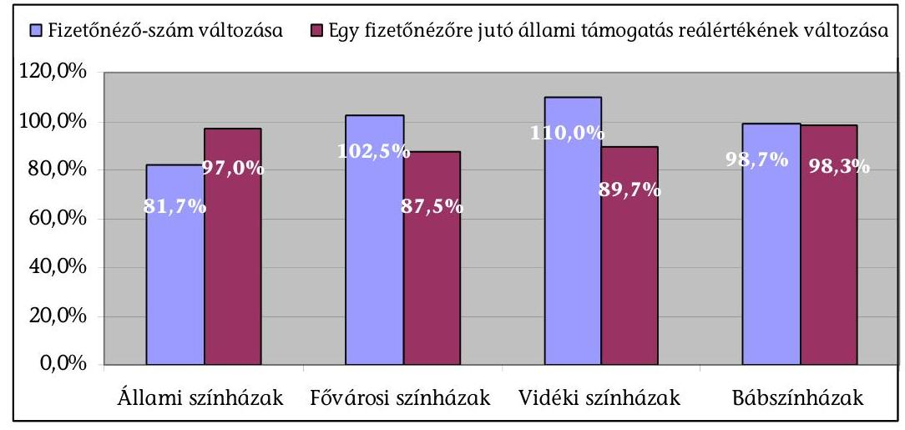

Forrás: 11. sz. táblázat, a fogyasztói árindexszel korrigálva
Az egy férőhelyre jutó fizető nézők számát tekintve a fővárosi színházak álltak az élen. A tanúsítványi adatszolgáltatás alapján 2006. és a 2009. évben is 184 fizető néző jutott átlagosan egy férőhelyre. Az állami színházaknál 151, a bábszínházaknál csökkenő tendenciát mutatva 149, a vidéki színházaknál 99 volt ez az érték 2009-ben (8, 11. sz. táblázat).

# 3.2. A bevételek növelésére, az erőforrások kihasználására tett intézkedések 

### 3.2.1. A saját bevételek és a nézőszám alakulása

A színházak saját bevételeinek összege 2006-2009 között 16,9 Mrd Ftra emelkedett, ami nominálisan $\mathbf{3 5 , 1 \%}$-os reálértéken $\mathbf{1 3 , 2 \%}$-os növekedést jelentett. A saját bevételek részesedése az összes bevételen belül mintegy 5 százalékponttal $37,4 \%$-ra emelkedett (13. sz. táblázat). A saját bevételeken belül a jegy- és bérletbevételek nominálisan 12,6\%-kal, 0,8 Mrd Ft-tal nőttek, reálértéken 5,7\%-kal csökkentek, 2009-ben megjelent a társasági adókedvezménnyel igénybe vehető támogatás $0,8 \mathrm{Mrd}$ Ft öszszegben. Jogszabályi változás ${ }^{21}$ miatt 2009-ben egyszeri jelentős bevétel-

[^0]
[^0]:    ${ }^{21}$ A 2004-2005. évi államháztartási támogatásban részesülő termékbeszerzés esetén a kapcsolódó áfa levonását a hazai szabályozás csak a beszerzés nem támogatott hányadára tette lehetővé, de az Európai Bíróság a C-74/08. sz. ügyben ezt az egységes

---

növekedést eredményezett a korábbi évek le nem vonható áfájának visszatérítése (13. sz. táblázat).

A saját bevételeken belül a jegy- és bérletbevételek voltak meghatározóak. A 2006-2008. évek között 51-53\%-át tették ki a saját bevételeknek, a 2009. évben részarányuk $42,9 \%$-ra csökkent a társasági adókedvezménnyel igénybe vehető támogatás megjelenése és az áfa visszatérítés miatt.

A jegy- és bérletbevételeket a fizető nézőszáma és a jegyárak határozták meg. A színházak fizető nézőinek száma 2006-2009 között lényegében nem változott, 4,2-4,3 millió fő volt (11. sz. táblázat).

Az állami színházaknál ténylegesen 18,3\%-kal csökkent a fizető nézőszám, amiben meghatározó volt az Erkel Színház bezárása, e nélkül 3,8\%-os volt a visszaesés. A fővárosi színházaknál 2,5\%-kal, a vidéki színházaknál 10,0\%-kal (a Weöres Sándor Színház nélkül 7,8\%-kal) emelkedett, a bábszínházaknál 1,3\%-kal csökkent a fizető nézőszám.

A színházak a látogatószám növelése, illetve megtartása érdekében alkalmaztak ösztönző módszereket változó eredményességgel. A jegyárakat a fizetőképes kereslet alapján határozták meg, a produkciók bekerülési költségét nem tudták érvényesíteni.

A József Attila Színház nettó jegy- és bérletbevétele 2006-2009. évek között 22,5\%kal csökkent. A visszaesés különösen a bérletek utáni bevételnél jelentős, ahol a 2009-ben realizált bevétel összegszerűen a 2006. évi bevétel egyharmadára csökkent. A Miskolci Nemzeti Színháznál a jegyárpolitika és a reklámtevékenység is segítette a közönség megtartását. A 2006-2009. évek között a jegybevétel 4,3\%kal növekedett, annak ellenére, hogy a nézőszám 11,0\%-kal csökkent. A Nemzeti Színház a 2008/2009-es évadban 10\%-kal emelte átlagosan a jegyárakat. A fizető látogatottság (kihasználtság) 2008-ban 5 százalékpontot csökkent, azóta ismét növekedésnek indult, és 2010. I. félévében 86,5\% volt, a látogatók száma 20,0\%kal csökkent. A jegy- és bérletbevétel a fizető nézőszám jelentős csökkenése ellenére csak 4,5\%-kal volt kevesebb 2009-ben, mint három évvel korábban.

A fajlagos mutatók alakulása reálértéken 2006-2009. évek között csökkent. Az egy férőhelyre jutó jegybevétel 2009-ben 187,4 E Ft-ra 4,5\%-kal, az egy saját előadásra jutó jegybevétel 419,3 E Ft-ra 8,1\%-kal, az egy fizető nézőre jutó jegybevétel 2009-ben 1,4 E Ft-ra 6,7\%-kal esett vissza.

Az egyéb bevételi források nem voltak meghatározóak a színházak gazdálkodásában. A pályázati bevételek 3,9\%-kal csökkentek, a saját bevételek 3-4\%-át képviselték, az uniós források jelentéktelenek voltak 0,2\%-át sem érték el a saját bevételeknek a 2009. évben. A mecenatúrából származó bevételek is csökkentek 29,5\%-kal, részarányuk 1\% alá esett. A vagyonhasznosításból évente 0,6-0,7 Mrd Ft bevétele keletkezett a színházaknak, 12,9\%-os növekedést jelentve, részarányuk 4-5\% között alakult. Alapítványtól
adóalap megállapításáról szóló irányelvével ellentétesnek találta, ennek összegét 2009ben kapták meg az intézmények.

---

átvett forrás a saját bevételek $0,1 \%$-át képviselte (13. sz. táblázat). A költségvetési szervként múködő színházak vállalkozási tevékenységet nem folytattak.

# A vizsgált időszakban több színház likviditási helyzete kiegyensúlyozatlanná vált külső és belső okok miatt, ami egyes színházaknál hitel felvételt tett szükségessé. Köztartozása egy intézménynek volt, amit rendeztek. 

A József Attila Színháznál a likviditási helyzet miatt a 2006. évben 30 M Ft, 2008. évben 35 M Ft forgóeszkózhitelt vettek igénybe. A felvett hitelek kamatköltsége összesen 9,7 M Ft volt. A Győri Nemzeti Színház likviditási helyzete a 2006-2007. évi gazdálkodási problémákat követően a 2008. évtől kiegyensúlyozottá vált. A Veszprémi Petőfi Színháznál a 2006-2007. I. félévben fennálló adósságállomány kezelése és a költségvetés likviditásának biztosítása érdekében 50 M Ft összegben hitel felvételéről döntött a Veszprém Megyei Önkormányzat. A fenntartó vállalta a hitel és járulékai visszafizetését, egyben kötelezte az intézmény vezetőjét ezen összeg intézmény által történő kigazdálkodására.

A Vörösmarty Színház tartozásállományban a 2006. évben szerepelt 109 E Ft öszszegben köztartozás, de a 2007-2009. években nem volt.

Az állami színházaknál az OKM a támogatási szerződéseket változó, az éves tervek megalapozott elkészítéséhez a szükségeshez képest késői időpontokban kötötte meg.

A Játékszínnél a kiszámíthatatlan finanszírozás azért nem okozott likviditási problémát, mert a Társaság általában kéthavi átlagköltségeket meghaladó tartalékkal rendelkezett, valamint az év első hónapjaiban a Minisztérium áthidaló támogatást nyújtott.

A támogatási szerződések késői megkötése miatt a Nemzeti Színház hitelfelvételre kényszerült az év eleji likviditás megőrzése érdekében, az intézményt összesen 8,8 M Ft kamat és dijfizetés terhelte. A 2006. évben felvett 270,0 M Ft hitelt még ugyanabban a hónapban törlesztette is az intézmény, illetve januárban fizette vissza a 2005. évben felvett 150,0 M Ft összegű keretet. A 2007. évben 50,0 M Ft, 2009. évben 100,0 M Ft, 2010-ben 150,0 M Ft hitelt vettek fel és törlesztettek.

### 3.2.2. A bemutatók számának alakulása

Az új bemutatók száma és aránya is növekedett az összes produkción belül, miközben a nézőszám nem változott. Az ötvenhat színház 1393 produkciót játszott a saját játszóhelyén, ami 7,6\%-os növekedést jelent 2006-hoz képest. A 2007-2008. évben csökkent a produkciók száma, a növekedés 2009-ben következett be, egy színházra átlagosan 25 produkció jutott. A produkciók 67-69\%-át nagyszínpadon játszották, 31-33\%-át pedig a színház más játszóhelyein mutatták be. Az új bemutatók aránya 3 százalékponttal 39,8\%-ra nőtt 2009-re az összes produkcióból, a repertoáron lévő produkciók száma ugyanilyen mértékben csökkent (16. sz. táblázat).

A saját játszóhelyen az előadások száma 3,8\%-kal 13749 darabra emelkedett. A repertoáron lévő produkciók előadásszáma 4\%-kal csökkent, ellenben az új bemutatók előadásszáma a nagyszínpadon 11,9\%-kal, az egyéb

---

játszóhelyeken 21,9\%-kal nőtt. Egy színházra átlagosan 250 előadás jutott 2009-ben (16. sz. táblázat).

Az előadások 34\%-át a vidéki színházakban, 32\%-át a fővárosi színházakban, 19\%-át a bábszínházakban és $15 \%$-át az állami színházakban tartották 2009ben. A legtöbb előadást 2009-ben a Budapesti Kamaraszínházban tartották (651), ezt követte a Madách Színház (560), az Operettszínház (540) és a Vígszínház (534).
11. sz. diagram

Az előadások száma és fajlagos mutatója az állami, kő- és bábszínházaknál (2009/2006)
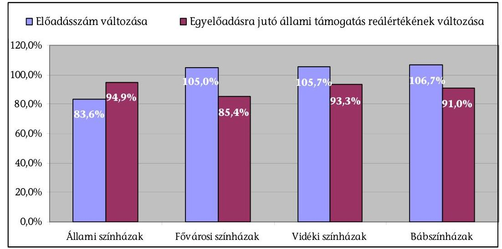

Forrás: 9. sz. táblázat, a fogyasztói árindexszel korrigálva
Egy színház átlagosan a 2009. évben 7 új bemutatót tartott nagyszínpadon és 11 korábbi években játszott darabot tartott repertoáron. A színház egyéb játszóhelyein 3 új bemutatót tartottak és 5 darabot játszottak folyamatosan.

A tájelőadások száma 2,0\%-kal, a külföldön megtartott előadások száma 15,2\%-kal csökkent. Különösen az állami színházaknál volt nagyarányú a viszszaesés, a tájelőadások 51,0\%-kal, a külföldi előadások 83,7\%-kal csökkentek. A tájelőadások tartása a bábszínházakra és a vidéki színházakra volt jellemző.

A színdarabválasztásnál a darab sajátosságainak és a játszóhely adottságainak összehangolásával alapvetően törekedtek a nézőtér kapacitáskihasználtságának növelésére.

A Nemzeti Színháznál a 2008/2009. évadban a korábban a Krétakör által a Trafóban bemutatott, „A Jég" c. produkciót a nagyszínpadon adták elő, ahol a 170 fős nézőtér is a színpadon volt. „A Park" c. előadást, a produkció jellege alapján 332 néző tekinthette meg a 616 fős nagyszínpadon.

Közös produkciók előadásainak a száma dinamikusan emelkedett 2006-2009 között, 54,0\%-kal. A 2009. évben 630 előadást tartottak a színházak a közösen készített darabokból, ami a teljes előadásszám 3,9\%-át jelentette.

---

A Nemzeti Színháznál a közös produkció előadásszáma minden évben emelkedett, három és félszeresére, és 2009-ben az összes előadás majd 10\%-át képviselték. A Miskolci Nemzeti Színház közös produkciót hozott létre a „Színházi előadások létrehozása és cseréje" című EU pályázatban, a Kassai Állami Színházzal. A Győri Nemzeti Színház és a Veszprémi Petőfi Színház nem szervezett közös produkciót, hanem előadást cseréltek egymással a vizsgált időszakban.

# 3.2.3. A személyi erőforrások kihasználása 

Az ellenőrzött időszakban növekedett a személyes teljesítéshez kötött megbízási és vállalkozási szerződéssel foglalkoztatottak rész. aránya. A prémiumfeltételek nem jelentettek valódi érdekeltséget a teljesítmények növelésére. A színházak kiadásai nominálisan 13,1\%kal emelkedtek, reálértéken 5,3\%-kal csökkentek. Ezen belül a személyi jellegű kiadások 10,3\%-kal, a dologi kiadások 9,1\%-kal, a felhalmozási kiadások $28,8 \%$-kal nőttek nominálisan. A kiadási jogcímek közül a személyi jellegű kiadások aránya a 2007-2008. években elérte az összes kiadás felét, majd 2009ben $45,5 \%$-ra csökkent, a dologi és egyéb kiadások (áfával együtt) alakulása ezzel ellentétes tendenciát mutatott, 46-50\% között alakult. A felhalmozási kiadások áfával együtt 3-4\%-kal részesedtek az összes kiadásból. A dologi kiadások $40 \%$-át évente 6,2-7,7 Mrd Ft-ot a személyes teljesítéshez kötött megbízási és vállalkozási díjak tették ki. Ezzel együtt a személyi kiadások aránya az összes kiadás közel kétharmadát jelentette (13.,15. sz. táblázat).

Az állami színházaknál a munkaviszonyban/közalkalmazotti jogviszonyban foglalkoztatottak száma 2009-re folyamatosan, összesen 2,8\%-kal csökkent 5491 főre, míg a személyes teljesítéshez kötött megbízási és vállalkozói szerződéssel foglalkoztatottak száma a 2007. évi csökkenés után összességében 9,3\%kal nőtt 4442 főre. A növekedés a vidéki színházaknál következett be, ahol $39,1 \%$-kal bővült a létszám, ellenben az állami színházaknál 11,0\%-kal csökkent (12. sz. táblázat).

## A színházaknál alapvetően biztosították a munkaviszonyban foglalkoztatott múvészek rendszeres fellépését.

A társulati tagok közül az egyetlen fellépéssel sem rendelkezők aránya 3\%-ról 5\%-ra nőtt. A növekedést alapvetően a Kaposvári Csiky Gergely Színház okozta, ahol 2009-ben 9 fő, a társulat 17\%-a nem lépett fel (ezek közül 2 év közben szerződött, 6 fő fizetés nélküli szabadságon volt, 1 fő GYED-et vett igénybe). A 20 fellépés alattiak számának aránya 15\%-ról 11\%-ra csökkent, amit a vidéki és az állami színházak mutatóinak javulása okozott.

A tanúsítványi adatok szerint a társulati tagok fellépéseinek száma emelkedett, a vendégművészeké pedig csökkent 2006-ról 2009-re.

A társulati tagok fellépéseinek száma az állami színházaknál 57\%-kal, a fővárosiaknál 9\%-kal, a vidékieknél 36\%-kal emelkedett, a bábszínházaknál gyakorlatilag változatlan maradt. Ezzel szemben a vendégművészek fellépéseinek száma az állami színházaknál 30\%-kal, a fővárosiaknál 20\%-kal, a bábszínházaknál $39 \%$-kal csökkent, a vidékieknél szinte változatlan maradt.

---

A nem művészeti munkakörökben foglalkoztatottak száma alapvetően igazodott a bemutatók, az előadások, a játszóhelyek számához, a színházak befogadóképességéhez, műszaki adottságaihoz. Az Emtv. új szabályozása következtében nem változott a művészeti és nem a művészeti munkakörökben a foglalkoztatás.

A színházak foglalkoztatottjai közül teljesítményarányos premizálást az értékesítésben részt vevőknél (jegypénztáros, közönségszervezők) alakítottak ki.

A közalkalmazotti jogviszonyban történő kinevezésben a havi illetmény megállapításán túl meghatározásra került, hogy a színésznek alapteljesítményben évadonként hány előadást kellett teljesítenie. Túl-szolgálati díra csak ezen előadásszám felett volt jogosult. Az intézmények a színészek kinevezésében szereplő alapteljesítményben meghatározottak alulteljesítette esetén szankciókat nem alkalmaztak.

A Nemzeti Színház költségvetését terhelte a Nemzet Színésze díj költsége, amelynek fedezetét a 2000. évben az 1069/2000. (VIII. 18.) Korm. határozat, ezt követően az intézmény költségvetése biztosította döntően állami támogatás útján. A 2010. évben csökkenő állami támogatás mellett a díj összegét terhelő járulékok emelkedtek, amit az intézménynek kell kigazdálkodnia.

A Nemzet Színésze díj költsége a 2009. évben 163,2 M Ft volt. A Nemzet Színésze cím adományozásának alapszabálya szerint a díj birtokosai, akiknek a létszáma nem haladhatja meg a 12 fôt, díjazásban részesülnek, amelynek összege minden évben megemelkedik az előző évi hivatalos inflációs rátával. A díj a 2003. évig követte az inflációt, nettó összege havi 500 E Ft-ról 630 E Ft-ra emelkedett. Ezt követően a díjat nem emelték tovább?

# 3.2.4. A múködtetési költségek csökkentésére tett intézkedések 

A kiszervezett tevékenységek száma az ellenőrzött időszakban emelkedett, ugyanakkor két színháznál előfordult egyes tevékenységek visszavétele is. A kiszervezésekhez kapcsolódóan gazdasági számításokat nem végeztek. A kő- és bábszínházaknál 2006-2009 között 21,2\%-kal nőtt a kiszervezett tevékenységek száma. Az állami és a fővárosi színházakban gyakorlatilag változatlan (51, illetve 43 db ) volt ez a szám. A vidéki színházakban a kiszervezett tevékenységek száma fokozatosan 30,3\%-kal nőtt. A 2009. évi növekedést a Kaposvári Csiky Gergely Színház gazdasági társasággá alakulásával összefüggésben 7 új kiszervezett tevékenysége adja. A bábszínházakban a kiszervezett tevékenységek száma 2009-ben ugrásszerűen nőtt meg 24-re, a Budapest Bábszínház és Ciróka Bábszínház átszervezései miatt.

A József Attila Színháznál a 2007. évben a portaszolgálatot szervezték ki. A kiszervezést megelőzően gazdasági számítást nem végeztek, de az gazdaságos volt, mert a 2008. évi szolgáltatási díjak az előző évi költségek alatt maradtak. A Vörösmarty Színháznál feladatkiszervezést a karbantartás, takarítás, személyszállítás, nézőtéri szolgálat, biztonsági szolgálat, munkabiztonsági-tüzvédelmi tevékenységhez kapcsolódóan hajtottak végre. A kiszervezéseket megelőző gazdasági számítások elvégzéséről, a szolgáltatók kiválasztása során lefolytatott esetleges versenyeztetésről nem állt rendelkezésre dokumentáció. A Kaposvári Csiky Gergely Színháznál a kiszervezéseket megelőzően gazdasági számításokat nem vé-

---

geztek, a szolgáltató kiválasztásánál minimum három ajánlatból választották ki a legelőnyösebbet.

A fenntartási költségek alakulását az intézmények folyamatosan figyelemmel kísérték, de annak egyes elemeit dokumentáltan - a Miskolci Nemzeti Színház kivételével - nem elemezték.

A helyszíni ellenőrzésbe vont színházak többségénél (József Attila Színház, Játékszín, Csiky Gergely Színház, Győri Nemzeti Színház, Miskolci Nemzeti Színház) az épületfenntartás - jellemzően az elmaradt felújítások miatt - a jelenlegi állapotában költséges, takarékos üzemeltetésre alkalmatlan.

A takarékossági intézkedések részét képezte néhány intézménynél a beszerzésekkel összefüggő megoldások alkalmazása.

A Győri Nemzeti Színháznál a 2006-2007. években jelentkező pénzügyi hiány csökkentése érdekében az akkori megbízott igazgató szigorú takarékossági intézkedéseket vezetett be. Az intézkedések eredményeként a 2007. évben a szakmai anyagok, kis értékű tárgyi eszközök beszerzésére fordított összeg 20,1\%-kal csökkent.

Világítás-, hang- és videotechnikai eszközök beszerzésére a Vörösmarty Színháznál, és a Győri Nemzeti Színháznál valósult meg közbeszerzési eljárással, az öszszességében legelőnyösebb ajánlat kiválasztásával. Ezt a gyakorlatot az adatszolgáltatásba bevont kő- és bábszínházak is jellemzően (73\%) alkalmazták.

A kérdőíves felmérés alapján adott válaszok szerint a színházi intézmények szinte teljes körűen alkalmazták a kedvező beszerzési források felkutatását, az engedmények elérését a szállítóknál, illetve az energiatakarékos megoldásokat.

Az új bemutatók produk ciós költségvetése 0,3\%-kal csökkent 20062009 között. A helyszínen ellenőrzött intézmények közül a Kaposvári Csiky Gergely Színháznál kiemelkedően, majdnem háromszorosára emelkedett a produk ciós költségvetés. Ezzel ellentétben a József Attila Színháznál 20,7\%-kal, csökkent a bemutatókra szánt összeg. A Nemzeti Színház Zrt. az állami támogatás csökkenése miatt a bemutatók költségeit 29,6\%-kal csökkentette.

A produk ciós költségvetések adatait nem lehet egymással összehasonlítani. A társulat/vendégművészek alkalmazásától, a díszlet, jelmezműhely meglététől, a marketingfeladatok megoldásától függően más-más az adattartalom.

A produk ciók színre állításának költsége nem tartalmazta valamennyi költséget, a produk ciós költségek között csak a közvetlenül felmerült, és az év során elszámolt kiadásokat vették számításba. A közvetett költségeket nem osztották fel az egyes produk ciók között.

A színházi ágazatban a jogdíjak, a rendezői és tervezői művészi elképzelések (a díszletek egyedi jellege, az adott színpadhoz igazított mérete) akadályozzák a díszletek és jelmezek bekerülési értékükhöz viszonyított gazdaságosabb kihasználását, többszöri felhasználását.

---

A díszletek tekintetében lényeges szempont volt a szakaszolhatóság, modulszerűség, a könnyebb tárolás, gyors felállíthatóság a Vörösmarty Színháznál, a Kaposvári Csiky Gergely Színháznál. Egyes díszletelemeket (elsősorban emelvényeket, lépcsőket, takarófalakat) és jelmezeket többször is fel tudtak használni.

A Miskolci Nemzeti Színháznál díszletet és jelmezt cseréltek (pl. a Pécsi Nemzeti Színháznak átadták a Hoffmann meséi díszletét és elhozták a Denevért, ezen kívül Veszprémből elhozták a Tizedes díszlet-jelmezét). A Győri Nemzeti Színháznál a díszletek a műhelyházban a saját játszóhely igényeit figyelembe véve készültek. A gyors felállítás, modulszerű kivitelezés nem volt elsődleges szempont, csak a tájolásra szánt daraboknál. A Nemzeti Színház a díszletek közbeszerzése során bírálati szempontként a legalacsonyabb összegű ellenszolgáltatást alkalmazta.

# 3.3. A szakmai és gazdasági tevékenység értékelése, ellenőrzése 

A színházi ágazatban a tevékenység eredmény szemléletű értékelésére egységes szempontokat nem alkalmaztak. A külső ellenőrzések feltárták a működés, gazdálkodás hiányosságait, de az ellenőrzési rendszer nem volt teljes körű, az ellenőrzések tapasztalatait ágazati szinten nem összegezték.

A József Attila Színháznál a számviteli, illetve a közhasznúsági szervezetekről szóló törvény szempontjain túl a tevékenység teljesítmény szemléletű értékelése nem valósult meg. A 2006/2007., és a 2008/2009. évadokra vonatkozó szakmai beszámolókat nem készítették el. A Vörösmarty Színház pénzügyi, gazdasági és szakmai tevékenységének értékeléséhez sem az Önkormányzat, sem a Színház nem dolgozott ki mérési módszereket.

A színházak igazgatói minden évad végén megtartották az évadzáró értékeléseket. A fővárosi és a vidéki költségvetési szervek a helyi kulturális bizottságoknak számoltak be a színházi évadokban végzett szakmai munkáról, illetve a következő évad előkészületeiről. A színházak eltérő mélységben értékelték szakmai, gazdasági teljesítményüket.

A költségvetési év végén elkészült a gazdálkodásról, a költségvetés végrehajtásáról szóló pénzügyi-gazdasági beszámoló. A szakmai és gazdálkodási tevékenység értékeléséhez Miskolcon felhasználták a szakmai mutatókat (nézőszám, előadásszám, jegybevétel, produkciós költségvetések), amiket folyamatosan nyilvántartanak, követik és elemzik azok változását.

Az 56 kő- és bábszínházból 34 intézménynél működött függetlenített belső ellenőrzés.

A helyszínen ellenőrzött társaságok éves beszámolóját a könyvvizsgáló minden vizsgált évben korlátozás nélkül elfogadta. A Felügyelő Bizottságok elvégezték az intézmény gazdálkodásának és üzletvitelének ellenőrzését.

A József Attila Színház az ellenőrzött időszakban két alkalommal vett fel banki hitelt 30 M Ft , illetve 35 M Ft értékben, de a Felügyelő Bizottság előzetes jóváhagyását a színház gazdasági vezetése nem tudta bemutatni.

---

# 3.4. A független színházi múhelyek, a szabadtéri és nemzetiségi színházak pályázati támogatása 

A független színházi műhelyek állami, illetve önkormányzati fenntartó nélküli szervezetek, azonban támogatási arányaik a kőszínházak állami támogatásával hasonló mértékűek.

A független szervezetek heterogén, változó rendszert képeznek. A független struktúrában három alapvető típus jelenik meg: az alkotó jellegű tevékenység (saját játszási hellyel rendelkező, illetve nem rendelkező társulatok, egyéni alkotók társulat nélkül), infrastrukturális jellegű tevékenységek (befogadó színházak, produkciós műhelyek) és az egyéb tevékenységek (produkciós, szervezői irodák). A heterogén rendszer és az átfedések miatt a hagyományos értelemben vett nézőszám és jegybevétel adatokról megbízható adatok a független színházi műhelyek teljes körére vonatkozóan nincsenek ${ }^{22}$.

A független, a szabadtéri és a nemzetiségi színházak központi támogatása pályázati rendszer keretében történt. Finanszírozásukban a szponzorációs, illetve egyéb külső forrás bevonása nem volt jellemző.

### 3.4.1. Pályázati feltételek

Az ellenőrzésbe vont 26 független színházi műhely a 2006. évben az OKM-től igényelt támogatás $41,0 \%$-át, 2009-ben $68,6 \%$-át nyerte el, az elnyert támogatás összege két és félszeresére, 377,5 M Ft-ra emelkedett. Az állami támogatás 2006-ban a szervezetek összes bevételének 59,6\%-át, 2009-ben 64,2\%-át tette ki átlagosan.

A kiválasztott 11 szabadtéri és nemzetiségi színház az igényelt támogatás $78,7 \%$-át, 453,5 M Ft-ot nyert el 2009-ben, ami 31,3\%-os növekedés 2006-hoz képest. Az állami támogatás aránya két százalékponttal csökkent, 2009-ben $79,3 \%$-a volt a szervezetek összes bevételének (17-19. sz. táblázatok).

Az OKM által meghirdetett pályázati célok 2006-2009 között alapvetően elősegítették a pályázó szervezetek tervezett feladatainak megvalósulását.

A pályázatok benyújtása során más szervezetekkel a színházak nem alakítottak ki együttműködést, alapvetően önállóan pályáztak.

Az Emtv. új szabályozása javította a színházak pályázati lehetőségeit, de különösen a 2010. évben a VI. kategóriába sorolt színházak a pályázat elbírálásáról a helyszíni vizsgálat befejezéséig információval nem rendelkeztek. A támogatási összeg utalása a korábbi évek finanszírozásához képest kitolódott. A 2006-2009. években a megítélt támogatás május-július hónapban a színházak rendelkezésére állt. A döntés elhúzódása a 2010. évben nehezítette a színházi műhelyek működését, mivel a saját bevételekből, illetve az előző évi pénzmaradványból a támogatás utalásának időpontjáig nem minden szervezetnél elégséges a fedezet a múködésre.

[^0]
[^0]:    ${ }^{22}$ A Független Színházak Szövetségétől kapott dokumentum a 2009. évben az OKM-hez pályázó 97 szervezet előadásainak nézőszámát 869 ezer főre becsülte.

---

A színházi műhelyek a különböző produkciókkal kapcsolatos kiadásaikat egyéb állami támogatásból (NKA, Nemzeti Civil Alap, önkormányzati támogatások) és saját bevételekből biztosították. A színházi műhelyek működését elősegítették az önkormányzatokkal kötött megállapodások, közszolgáltatási szerződések.

Társasági adókedvezménnyel igénybe vehető támogatást a független műhelyek közül a MU Színház és az Álmodó Vár Bt., a 11 nemzetiségi és szabadtéri színházból 5 szerzett.

Az igényeltnél alacsonyabb összegű támogatás elnyerése esetén - a kérdőíves információ alapján - a kedvezményezettek 84,6\%-a módosította a vállalt feladat költségvetését.

A helyszíni ellenőrzésbe vont Soltis Lajos Színház Művelődési Egyesületnél a saját bevételeket, egyéb támogatásokat alul, a pályázati támogatásokat túltervezték. A Babszem Jankó Gyermekszínház a tervezettnél alacsonyabb összegű támogatás miatt kieső bevételt az előadások takarékosabb kivitelezésével kompenzálták (egyszerűbb díszlet, azok saját elkészítése, hirdetési költségek csökkentése).

A kiírt OKM pályázatokon elnyert támogatási pénzeszközök felhasználásának, a támogatás elszámolásának szabályait az önkormányzatok a színházakkal kötött támogatási szerződésben rögzítették.

Az OKM 2007. évi pályázati felhívása szerint a pályázathoz csatolni kellett a pályázó társulat létesítő okiratának egyszerű másolatát. A NAP KÖR Alapítvány keretében múködő Teatro Capriccio Sátorszínház bejegyzése sem a Bíróságnál, sem a Cégbíróságnál nem történt meg. A Sátorszínház vezetője az általa készített, nem hivatalos alapító okiratot csatolta a pályázatához, amelyet sem a továbbító Önkormányzat, sem az OKM sem kifogásolt.

A pályázatot elbíráló szakmai kuratórium a Sátorszínház részére a 2006-2009. évek között évente 1000 E Ft támogatási összeget ítélt meg. Az évente kötött megállapodásokban nem rögzítették az elszámolás módját, határidejét. A megállapodások (a 2009. év kivételével) nem tartalmazták a pályázó Alapítvány számlaszámát. A támogatást az Önkormányzat a 2006-2007. években nem az Alapítvány, hanem a színház vezetőjének bankszámlájára utalta. Az összeg felhasználását a színház vezetője igazolni tudta, e kiadásokat az alapítvány költségei között nem szerepeltette. A 2008-2009. években az önkormányzat a támogatást az Alapítvány számlájára utalta, illetve készpénzben fizette ki. Az Önkormányzat a támogatott szervezet elszámolásait elfogadta.

# 3.4.2. A pályázati támogatások felhasználása 

Az elszámoltatási és ellenőrzési rendszer nem volt egységes. A felhasználás szabályszerűségének ellenőrzése nem volt teljes körű, nem biztosította, hogy a bizonylatokat más pályázatnál ne használják fel. A színházak az önkormányzatokkal évenként a megállapodásokban foglaltaknak megfelelően a megkapott támogatás felhasználásáról részletes elszámolást készítettek és azt a megállapodásokban megjelölt határidőket betartva minden évben megküldték az önkormányzatok részére. A helyszíni ellenőrzésbe vont független színházak közül két társulatnál nem történt meg a támogatással kapcsolatos kiadások elkülönített nyilvántartása, és - az ellenőrzött időszak egy részében - a támogatás elszámolásával kapcsolatos bi-

---

zonylatok érvénytelenítése. A színházak a támogatások felhasználásának eredményességét a pályázati támogatások elszámolása során készített szöveges szakmai és pénzügyi beszámolók keretében értékelték.

A Soltis Lajos Színház Múvelődési Egyesület a vizsgált időszakban a könyvelésében a támogatások felhasználásának elkülönített nyilvántartásáról nem gondoskodott. A bizonylatokat a többszörös elszámolás kizárása érdekében a 2006. évben még nem, azt követően a 2007. évtől minden pályázat esetében érvénytelenítették.

A Pintér Béla és Társulatánál a számlák érvénytelenítését - amire 2008-től kötelezte őket az elszámoltatást végző Budapest Főváros Önkormányzata - csak a 2009-es pályázatuk beszámolásakor végezték el.

A Teatro Capriccio Sátorszínháznál OKM támogatás elszámolásához csatolt bizonylatok (számlák, adásvételi szerződések) az Alapítvány 2006-2007. évi könyvviteli nyilvántartásában nem szerepeltek. Az elszámoláshoz csatolt számlák alapján az ellenőrzés tudta kontrollálni a támogatás cél szerinti felhasználását a kedvezményezett szervezetnél. A 2008. és a 2009. évre vonatkozóan az Alapítvány folyamatos könyvviteli nyilvántartást nem vezetett, a támogatások bevételezéséről és kiadásáról szóló alapbizonylatokat bemutatta, azok a pályázati célnak megfelelő felhasználást igazolták. Az Önkormányzat a 2006-2009. években a támogatott szervezet pénzügyi elszámolásait elfogadta.

Az ellenőrzésbe vont független színházak fele a pályázati támogatásokat jellemzően a múködési kiadások finanszírozására használták fel.

A befogadóként múködő MU Színház az OKM támogatásból az ingatlan múködtetését, fenntartását, a személyi jellegú kiadásokat finanszírozta. A Babszem Jankó Gyermekszínháznál a támogatások a múködési célú kiadásokon belül a foglalkoztatással kapcsolatos költségek fedezéséhez járultak hozzá.

A jegyárak meghatározása során elsősorban a fizetőképes keresletet vették figyelembe a helyszínen ellenőrzött szervezetek. A független struktúrában nem minden szervezetnél keletkezett jegybevétel. Előfordult, hogy a nézők számára ingyenes rendezvényen tiszteletdíj képezte a társulat bevételét.

A Soltis Lajos Színház Múvelődési Egyesület előadásainak a száma a 2006. évi 177-ről a 2009. évre 33,4\%-kal 118 előadásra csökkent. Az előadások nézőszáma az előadások számának csökkenésénél is nagyobb arányban, $45 \%$-kal csökkent, mivel a 496 férőhelyes Múvelődési Házból az önkormányzat által rendelkezésre bocsátott 120 fős teremben mutatták be előadásaikat. Az Egyesület jegy- és forgalmazási bevétele ennek ellenére 5\%-kal emelkedett.

A Pannon Várszínháznál a saját előadások száma 2006-2009 között 18,9\%-kal, 188-ra emelkedett. A jegy- és bérletbevételek összege is ilyen arányban emelkedett, a 2009. évben 95,6 M Ft volt.

A Teatro Capriccio Sátorszínháznál a támogatás felhasználásának kulturális hatásait bemutató tanúsítványi adatok valóságtartalmát az ellenőrzés dokumentumok hiányában nem tudta kontrollálni.

A pályázati támogatások lehetővé tették a színházi szervezetek múködését, hozzájárultak az új múvészeti kezdeményezések megvalósításához. Megállapítható ugyanakkor, hogy a pályázatok lebonyolítása - a célok és a támo-

---

gatási összeg felhasználásának széleskörű meghatározása, a kiírás és folyósítás ütemezése, valamint a beszámoltatás, az ellenőrzés és az értékelés hiányosságai - nem segítette elő a pályázati források hatékony és eredményes felhasználását az ellenőrzött időszakban.

Budapest, 2010. december /6
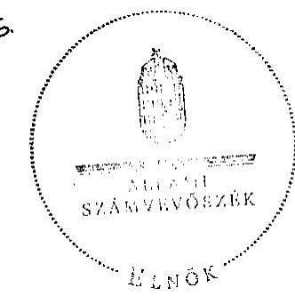

Ded
Domokos László
elnök

Melléklet: $\quad 6 \mathrm{db} \quad 36$ lap

---

# MELLÉKLETEK 

a V-2003-113/2010. sz. jelentéshez

---

# ÉSZREVÉTEL

---

# NEMZETI ERÖFORRÁS MINISZTERIUM MINISZTER 

Iktatószám: 11014-2/2010-0011-BESZ

Hiv. szám: V-2003-111/2010.
Ügyintéző: Füléné Gyürki -Kiss Éva
Melléklet: 1 db
2010.06.11.12010.

Domokos László
elnök úr

## Állami Számvevőszék

Budapest
Apáczai Csere János u. 10.
1052
Tárgy: Intézkedési terv megküldése

## Tisztelt Elnök Úr!

Csatoltan megküldöm az Állami Számvevőszék V-2003-111/2010. iktatószámú, „a színházak állami támogatásának és gazdálkodásának " ellenőrzéséről készült jelentés 23. oldalán szereplő javaslatokra készített intézkedési tervet.
Az ellenőrzés megállapításaira nem teszek észrevételt.

Budapest, 2010. december „ ${ }^{43}$,
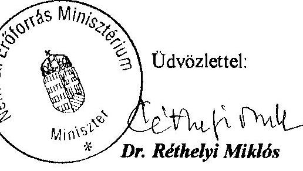

---

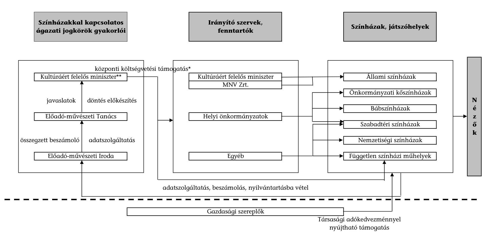

# A színházi ágazat állami támogatási rendszere

## Színházakkal kapcsolatos ágazati jogkörök gyakorlói

## Irányító szervek, fenntartók

## Színházak, játszóhelyek

## Központi költségvetési támogatás*

## Kultúráért felelős miniszter*

## Igazatát

## MIV Zrt.

## Önkormányzati köszínházak

## Előadó-művészeti tanács

## Helyi önkormányzatok

## Szabadtéri színházak

## Nemzetiségi színházak

## Előadó-művészeti Iroda

## Egyéb

## Független színházi műhelyek

## Társasági adókedvezménnyel nyújtható támogatás

* A támogatást a IX. helyi önkormányzatok központi költségvetési kapcsolataiból származó támogatásokat tartalmazó fejezet és a XX. kultúráért felelős miniszter által vezetett minisztérium költségvetési fejezet biztosítja (kőszínházak, bábszínházak részére, pályázati támogatás, illetve az új törvény szerinti kategóriákba sorolt játszóhelyek támogatása).

** A Nemzeti Kulturális Alap támogatásait nem vizsgáljuk, mivel az ÁSZ 2009-2010. években végezte el az NKA működésének ellenőrzését.

---

2/b. sz. melléklet

A kulturális ágazatért felelős minisztérium színházi pályázati rendszerének ábrája

|  |   |   |   |   |   |   |   |
| --- | --- | --- | --- | --- | --- | --- | --- |
|  Pályázat kiírója | Pályázat benyújtása | Benyújtott pályázatok ellenőrzése | Bíróló, javaslattevő | Döntéshozó | Támogatási szerződést köti | Támogatási összeggel elszámolás | Támogatás felhasználását jogosult ellenőrizni  |
|  OKM miniszter | Önkormányzatokhoz | MÁK Regionális Igazgatóság | Szakmai kuratóriumok | Miniszter | Önkormányzatok | Önkormányzatoknak | Önkormányzatok  |
|   | - 2006-2009 között valamennyi pályázatot | - 2006-2009 között valamennyi pályázatot | Előadó művészeti Tanács |  | - 2006-2009 között valamennyi nyertes pályázóval | - számolt el minden nyertes pályázó 2006-2009 között | - 2006-2009 között valamennyi nyertes pályázót  |
|   | - 2010-től csak a szabadtéri és nemzetiségi színházak pályázatait | - 2010-től csak a szabadtéri és nemzetiségi színházak pályázatait |  |  | - 2010-től csak a szabadtéri és nemzetiségi színházak pályázatai esetében | - a 2010-ben nyertes szabadtéri és nemzetiségi színházak számolnak el | - a 2010-ben nyertes szabadtéri és nemzetiségi színházakat  |
|   | NKA Igazgatósághoz 2010-től | NKA Igazgatóság 2010-től |  |  | NKA Igazgatóság 2010-től | NKA Igazgatóságnak küldik az elszámolást a 2010 -ben nyertes | MÁK Regionális Igazgatóság  |
|   | - VI -os kategória | - VI -os kategória |  |  | - VI -os kategória | - VI -os kategória | - 2006-2009. között valamennyi nyertes pályázót  |
|   | - kiemelt művészeti célok pályázatait | - kiemelt művészeti célok pályázatait |  |  | - kiemelt művészeti célok pályázatait esetében | - kiemelt művészeti célok pályázót | - a 2010-ben nyertes szabadtéri és nemzetiségi színházakat  |
|   |  |  |  |  |  |  | OKM  |
|   |  |  |  |  |  |  | - alkalomszerủen a nyertes pályázót  |
|   |  |  |  |  |  |  | NKA Igazgatóság a 2010 -ben nyertes  |
|   |  |  |  |  |  |  | - VI -os kategória  |
|   |  |  |  |  |  |  | - kiemelt művészeti célok pályázót  |

---

# ELLENŐRZÉSBE VONT SZERVEZETEK JEGYZÉKE 

3/a. sz. melléklet: Az ellenőrzésbe vont előadó-művészeti szervezetek névjegyzéke

3/b. sz. melléklet: Az ellenőrzésbe vont előadó-múvészeti szervezetek közül helyszíni ellenőrzésre kiválasztott színházi intézmények

3/c. sz. melléklet: Az ellenőrzésbe vont állami/önkormányzati/egyesületi színházak fenntartói/tulajdonosi névjegyzéke

3/d. sz. melléklet: A helyszíni ellenőrzésbe vont állami szervezetek és önkormányzati fenntartók

---

# AZ ELLENŐRZÉSBE VONT ELŐADÓ-MŰVÉSZETI SZERVEZETEK NÉVJEGYZÉKE 

1. Álmodó Vár Bt.
2. Apolló Kulturális Egyesület (Szivárvány Gyermekház)
3. Bábakalács Társulat Bt.
4. Babraszínház (Ziránó Színház)
5. Babszem Jankó Gyermekszínház Közhasznú Kulturális Egyesület
6. Barboncás Bábokkal Nemcsak a Gyermekekért Közhasznú Egyesület
7. Bárka Józsefvárosi Színházi- és Kulturális Nonprofit Kft.
8. Bartók Kamaraszínház és Művészetek Háza
9. Békés Megyei Jókai Színház
10. Békés Megyei Napsugár Bábszínház
11. Bóbita Bábszínház
12. Budaörsi Játékszín
13. Budapest Bábszínház
14. Budapesti Kamaraszínház Nonprofit Kft.
15. Budapesti Operettszínház
16. Centrál Színház Nonprofit Kht. (Vidám Színpad)
17. Cervinus Teátrum Szlovák Nemzetiségi Színház (Regionális Színház Nonprofit Kft.)
18. Ciróka Bábszínház
19. Csiky Gergely Színház Közhasznú Nonprofit Kft.
20. Csokonai Színház
21. Duda Eva (Dadu-Art Nonprofit Közhasznú Kft.)
22. Ferencvárosi Múvelődési Központ és Intézményei - Pinceszínház
23. Figurina Animációs Kisszínpad
24. Flórián Műhely - Mozgó Ház Alapítvány
25. Gárdonyi Géza Színház
26. Gózon Gyula Kamaraszínház Alapítvány
27. Griff Bábszínház
28. Győri Balett
29. Győri Nemzeti Színház
30. Gyulai Várszínház
31. Harlekin Bábszínház
32. Hevesi Sándor Színház
33. Hólyagcirkusz Közhasznú Egyesület
34. Jászai Mari Színház, Népház (Tatabánya)
35. Játékszín Terézkörúti Színház Nonprofit Kft.
36. József Attila Színház Nonprofit Kft.
37. Juhász Kata Társulata
38. Kabóca Bábszínház és Gyermek Közművelődési Intézmény
39. Katona József Színház (Kecskemét)
40. Katona József Színház Nonprofit Kft.
41. Kisvárdai Várszínház és Művészetek Háza
42. Kolibri Gyermek- és Ifjúsági Színház
43. Komédium Színházi és Kulturális Szolgáltató Közhasznú Nonprofit Kft.

---

44. Kövér Béla Bábszínház
45. Madách Színház Nonprofit Kft. (Örkény István Színház)
46. Magyar Állami Operaház
47. Magyar Balett Színházért Alapítvány (Gödöllő)
48. Magyar Mozdulatmúvészeti Társulat Közhasznú Nonprofit Kft.
49. Magyarországi Német Színház (Tolna Megye, Szekszárd)
50. Magyarországi Szerb Színház Nonprofit Közhasznú Kft.
51. Malko Teatro - Alternatív Művészeti Alapítvány
52. Meridián42 Színház- és Filmműhely
53. Merlin Nemzetközi Színház (Angol Nyelvű Színház Közhasznú Alapítvány)
54. Mesebolt Bábszínház
55. Mikroszkóp Színpad Nonprofit Kft.
56. Miskolci Csodamalom Bábszínház
57. Miskolci Nemzeti Színház
58. Móricz Zsigmond Színház
59. MU Színház Egyesület
60. Nemzeti Színház Zrt.
61. Nemzeti Táncszínház Nonprofit Kft.
62. Pannon Várszínház Színművészet-fejlesztési Nonprofit Kft.
63. Pécsi Harmadik Színház Nonprofit Kft.
64. Pécsi Horvát Színház
65. Pécsi Nemzeti Színház
66. Pesti Magyar Színház
67. Pintér Béla és Társulata
68. Pro Kultúra Sopron Nonprofit Kft.
69. Radnóti Miklós Színház
70. Sanyi és Aranka Színház
71. Soltis Lajos Színház Múvelődési Egyesület
72. Stúdió "K" Alapítvány
73. Szabad Tér Színház Nonprofit Kft.
74. Szegedi Nemzeti Színház
75. Szegedi Szabadtéri Játékok és Fesztivál Szervező Nonprofit Kft.
76. Szegedi Pinceszínház Közhasznú Nonprofit Múvészeti Kft.
77. Szentendre Kulturális Központ Nonprofit Kft. - Szentendrei Teátrum
78. Szigligeti Színház
79. Teatro Capriccio Sátorszínház (Nap Kör Alapítvány)
80. Thália Színház Nonprofit Kft.
81. Tintaló Múvészeti Egyesület
82. Trafó Kortárs Művészetek Háza Nonprofit Kft.
83. Új Színház Nonprofit Kft.
84. Városi Színház Múvészeti Közhasznú Nonprofit Kft. (Sirály)
85. Várszínház és Kultúrmozgó Esztergom Nonprofit Kft.
86. Vaskakas Bábszínház
87. Veszprémi Petőfi Színház
88. Vigszínház
89. Vojtina Bábszínház
90. Vörösmarty Színház
91. Weöres Sándor Színház
92. Zsámbéki Színházi és Művészeti Bázis

---

# AZ ELLENŐRZÉSBE VONT ELŐADÓ-MŰVÉSZETI SZERVEZETEK KÖZÜL HELYSZÍNI ELLENŐRZÉSRE KIVÁLASZTOTT SZÍNHÁZI INTÉZMÉNYEK 

1. Babszem Jankó Gyermekszínház Közhasznú Kulturális Egyesület
2. Csiky Gergely Színház Közhasznú Nonprofit Kft.
3. Csokonai Színház
4. Győri Nemzeti Színház
5. Játékszín Terézkörúti Színház Nonprofit Kft.
6. József Attila Színház Nonprofit Kft.
7. Miskolci Csodamalom Bábszínház
8. Miskolci Nemzeti Színház
9. MU Színház Egyesület
10. Nemzeti Színház Zrt.
11. Pannon Várszínház Színművészet-fejlesztési Nonprofit Kft.
12. Pintér Béla és Társulata
13. Soltis Lajos Színház Művelődési Egyesület
14. Teatro Capriccio Sátorszínház (Nap Kör Alapítvány)
15. Veszprémi Petőfi Színház
16. Vörösmarty Színház

---

# AZ ELLENŐRZÉSBE VONT   ÁLLAMI/ÖNKORMÁNYZATI/EGYESÜLETI SZÍNHÁZAK FENNTARTÓI/TULAJDONOSI NÉVJEGYZÉKE 

1. Oktatási és Kulturális Minisztérium
2. Magyar Nemzeti Vagyonkezelő Zrt.
3. Budapest Főváros Önkormányzata
4. Budapest Főváros VIII. kerület Józsefváros Önkormányzata
5. Budapest Főváros IX. kerület Ferencváros Önkormányzata
6. Belváros-Lipótváros Budapest Főváros V. kerület Önkormányzata
7. Budaörs Város Önkormányzata
8. Balatonfüred Város Önkormányzata
9. Békés Megyei Önkormányzat
10. Debrecen Megyei Jogú Város Önkormányzata
11. Dunaújváros Megyei Jogú Város Önkormányzata
12. Esztergom Város Önkormányzata
13. Győr Megyei Jogú Város Önkormányzata
14. Gyula Város Önkormányzata
15. Heves Megyei Önkormányzat
16. Kaposvár Megyei Jogú Város Önkormányzata
17. Kecskemét Megyei Jogú Város Önkormányzata
18. Kisvárda Város Önkormányzata
19. Lórév Község Önkormányzata
20. Miskolc Megyei Jogú Város Önkormányzata
21. Pécs Megyei Jogú Város Önkormányzata
22. Sopron Megyei Jogú Város Önkormányzata
23. Szabolcs-Szatmár-Bereg Megyei Önkormányzat
24. Szarvas Város Önkormányzata
25. Szeged Megyei Jogú Város Önkormányzata
26. Székesfehérvár Megyei Jogú Város Önkormányzata
27. Szentendre Város Önkormányzata
28. Szolnok Megyei Jogú Város Önkormányzata
29. Szombathely Megyei Jogú Város Önkormányzata
30. Tatabánya Megyei Jogú Város Önkormányzata
31. Tolna Megyei Önkormányzat
32. Vas Megyei Önkormányzat
33. Veszprém Megyei Önkormányzat
34. Zalaegerszeg Megyei Jogú Város Önkormányzata
35. Zsámbéki-medence Idegenforgalmi Egyesület

---

# A HELYSZÍNI ELLENŐRZÉSBE VONT ÁLLAMI SZERVEZETEK ÉS ÖNKORMÁNYZATI FENNTARTÓK 

1. Oktatási és Kulturális Minisztérium
2. Kulturális Örökségvédelmi Hivatal Előadó-művészeti Iroda
3. Előadó-művészeti Tanács
4. Magyar Nemzeti Vagyonkezelő Zrt.
5. Balatonfüred Város Önkormányzata
6. Budapest Főváros Önkormányzata
7. Debrecen Megyei Jogú Város Önkormányzata
8. Győr Megyei Jogú Város Önkormányzata
9. Kaposvár Megyei Jogú Város Önkormányzata
10. Miskolc Megyei Jogú Város Önkormányzata
11. Székesfehérvár Megyei Jogú Város Önkormányzata
12. Veszprém Megyei Önkormányzat

---

# TÁBLÁZATOK JEGYZÉKE 

1. sz. táblázat: Nemzetközi kitekintés a színházak és a színházlátogatók számáról 2007. év (Bevezetés)
2. sz. táblázat: A színházak regionális adatai 2006. és a 2009. években
3. sz. táblázat: Az állami színházak fenntartói támogatásainak adatai
4. sz. táblázat: A helyi önkormányzatok által fenntartott kő- és bábszínházak múködtetéséhez biztosított fenntartói támogatás összege és összetétele
5. sz. táblázat: A helyi önkormányzatok által fenntartott kő- és bábszínházak épületével kapcsolatos teljesített beruházási, felújítási kiadások forrásösszetétele és megoszlása
6. sz. táblázat: Színházak pályázati támogatása (központi költségvetésből) 2006-2010.
7. sz. táblázat: A színházaknak nyújtott társasági adókedvezménnyel igénybe vehető támogatás 2009. évi alakulása
8. sz. táblázat: Saját férőhelyek száma és fajlagos mutatója az állami, kőés bábszínházaknál
9. sz. táblázat: Előadások száma és fajlagos mutatója az állami, kő- és bábszínházaknál
10. sz. táblázat: Látogatók száma és fajlagos mutatója az állami, kő- és bábszínházaknál
11. sz. táblázat: A fizetőnézők száma és fajlagos mutatója az állami, kő- és bábszínházaknál
12. sz. táblázat: Létszám és foglalkoztatási adatok az állami, kő- és bábszínházaknál
13. sz. táblázat: Gazdálkodási adatok az állami, kő- és bábszínházaknál
14. sz. táblázat: A fenntartói támogatás és saját bevétel alakulása intézményenként
15. sz. táblázat: A színházak kiadásai intézményenként
16. sz. táblázat: A produkciók száma az állami, kő- és bábszínházaknál
17. sz. táblázat: Az ellenőrzésbe vont független színházi műhelyek pénzügyi adatai

---

18. sz. táblázat: Az ellenőrzésbe vont nemzetiségi színházak pénzügyi adatai
19. sz. táblázat: Az ellenőrzésbe vont szabadtéri színházak pénzügyi adatai

---

# A színházak regionális adatai 2006. és a 2009. években

|  Megnevezés | Közép-Magyarország |  | Közép-
Dunántúl | Nyugat-
Dunántúl | Dél-
Dunántúl | Észak-
Magyarország | Észak-Alföld | Dél-Alföld | Összesen  |
| --- | --- | --- | --- | --- | --- | --- | --- | --- | --- |
|   | Budapest | Pest megye |  |  |  |  |  |  |   |
|  Lakosság száma 2006. (ezer fő) | 1698 | 1158 | 1108 | 1000 | 971 | 1261 | 1533 | 1347 | 10076  |
|  Lakosság száma 2009. (ezer fő) | 1712 | 1213 | 1103 | 998 | 953 | 1223 | 1502 | 1326 | 10030  |
|  2009/2006. (\%) | 100,8\% | 104,7\% | 99,5\% | 99,8\% | 98,1\% | 97,0\% | 98,0\% | 98,4\% | 99,5\%  |
|  Színházlátogatások száma 2006. (ezer db)* | 2467 | 52 | 224 | 349 | 249 | 268 | 344 | 271 | 4223  |
|  Színházlátogatások száma 2009. (ezer db)* | 2446 | 215 | 225 | 405 | 254 | 300 | 306 | 336 | 4487  |
|  2009/2006. (\%) | 99,1\% | 413,5\% | 100,4\% | 116,0\% | 102,0\% | 111,9\% | 89,0\% | 124,0\% | 106,3\%  |
|  Előadások száma 2006. (db) | 7343 | 220 | 961 | 1401 | 1052 | 1037 | 1418 | 1275 | 14707  |
|  Előadások száma 2009. (db) | 10034 | 779 | 1002 | 1735 | 1232 | 1389 | 1278 | 1608 | 19057  |
|  2009/2006. (\%) | 136,6\% | 354,1\% | 104,3\% | 123,8\% | 117,1\% | 133,9\% | 90,1\% | 126,1\% | 129,6\%  |
|  Férőhely 2006. (db) | 15995 | 260 | 2621 | 3144 | 2282 | 2283 | 2401 | 3120 | 32106  |
|  Férőhely 2009. (db) | 14842 | 575 | 2240 | 3285 | 2227 | 3819 | 2616 | 3629 | 33233  |
|  2009/2006. (\%) | 92,8\% | 221,2\% | 85,5\% | 104,5\% | 97,6\% | 167,3\% | 109,0\% | 116,3\% | 103,5\%  |
|  100 lakosra jutó színházlátogatások száma 2006. (db) | 145 | 4 | 20 | 35 | 26 | 21 | 22 | 20 | 42  |
|  100 lakosra jutó színházlátogatások száma 2009. (db) | 143 | 18 | 20 | 41 | 27 | 25 | 20 | 25 | 45  |
|  2009/2006. (\%) | 98,3\% | 394,7\% | 100,9\% | 116,3\% | 103,9\% | 115,4\% | 90,8\% | 125,9\% | 106,7\%  |
|  100000000000000000000000000000000000000000000000000000000000000000000000000000000000000000000000000000000000000000000000000000000000000000000000000000000000000000000000000000000000000000000000000000000

---

# Az állami színházak fenntartói támogatásainak adatai

|  Ssz. | Megnevezés | Mértékegység | 2006. év | 2007. év | 2008. év | 2009. év | 2009/2006. | 2010. I. félév  |
| --- | --- | --- | --- | --- | --- | --- | --- | --- |
|  1 | Eredeti előirányzat | E Ft | 9157900 | 8810900 | 8975500 | 8569100 | $93,6 \%$ | 7790800  |
|  2 | ebből: épület beruházás, felújítás | E Ft | 11120 | 57928 | 202126 | 161007 | $1447,9 \%$ | 113849  |
|  3 | Teljesítés | E Ft | 9856843 | 9788667 | 9361406 | 9208251 | $93,4 \%$ | 4557415  |
|  4 | ebből: épület beruházás, felújítás | E Ft | 65494 | 98820 | 105158 | 54722 | $83,6 \%$ | 8265  |
|  5 | Teljesített támogatás aránya (3. sor/1. sor) | \% | $107,6 \%$ | $111,1 \%$ | $104,3 \%$ | $107,5 \%$ |  | $58,5 \%$  |
|  6 | ebből: épület beruházás, felújítás (4. sor/2. sor) | \% | $589,0 \%$ | $170,6 \%$ | $52,0 \%$ | $34,0 \%$ |  | $7,3 \%$  |
|  7 | Felhalmozási kiadások | E Ft | 392613 | 415470 | 328482 | 317458 | $80,9 \%$ | 48368  |
|  8 | Épület beruházás, felújítás aránya a felhalmozási kiadásokon belül (4. sor/7. sor) | \% | $16,7 \%$ | $23,8 \%$ | $32,0 \%$ | $17,2 \%$ |  | $17,1 \%$  |

Forrás: 1. sz. tanúsítvány összesített adatai

---

# A helyi önkormányzatok által fenntartott kő- és bábszínházak múködtetéséhez biztosított fenntartói támogatás összege és összetétele

|  Ssz. | Megnevezés | 2006. év | 2007. év | 2008. év | 2009. év | 2009/2006. | Adatok: E Ft  |
| --- | --- | --- | --- | --- | --- | --- | --- |
|  1 | Támogatás összesen (2+7) | 16562990 | 16180157 | 17288578 | 18852735 | 113,8\% | 17645797  |
|  2 | Múködtetési hozzájárulás központi költségvetésből | 9712994 | 9790614 | 10072639 | 11871680 | 122,2\% | 10383272  |
|  3 | - Múködtetési hozzájárulás |  |  |  | 9982449 |  |   |
|  4 | - Müvészeti kiadásokhoz történő hozzájárulás |  |  |  | 1861231 |  |   |
|  5 | - Fenntartói ösztönző részhozzájárulás |  |  |  |  |  | 5482772  |
|  6 | - Müvészeti ösztönző részhozzájárulás |  |  |  |  |  | 4900500  |
|  7 | Fenntartói támogatás saját forrásból | 6849996 | 6389543 | 7215939 | 6981055 | 101,9\% | 7262525  |

Forrás: 7-8. sz. tanúsítványok összesített adatai

---

# A helyi önkormányzatok által fenntartott kő- és bábszínházak épületével kapcsolatos teljesített beruházási, felújítási kiadások forrásösszetétele és megoszlása

|  Ssz. | Megnevezés | 2006. év | 2007. év | 2008. év | 2009. év | 2009/2006. | 2010. I. félév  |
| --- | --- | --- | --- | --- | --- | --- | --- |
|  1 | Központi költségvetési támogatás (E Ft) | 439097 | 676309 | 951882 | 391617 | 89,2\% | 16613  |
|  2 | Fenntartói saját forrás (E Ft) | 839118 | 392598 | 2178185 | 570923 | 68,0\% | 139877  |
|  3 | Egyéb forrás (E Ft) | 383842 | 190406 | 308485 | 408997 | 106,6\% | 348471  |
|  4 | Összesen (E Ft) | 1662057 | 1259313 | 3438552 | 1371537 | 82,5\% | 504961  |
|  5 | Központi költségvetési támogatás aránya (\%) | 26,4\% | 53,7\% | 27,7\% | 28,6\% | 108,1\% | 3,3\%  |
|  6 | Fenntartói saját forrás aránya (\%) | 50,5\% | 31,2\% | 63,3\% | 41,6\% | 82,5\% | 27,7\%  |
|  7 | Egyéb forrás aránya (\%) | 23,1\% | 15,1\% | 9,0\% | 29,8\% | 129,1\% | 69,0\%  |

Forrás: 6. sz. tanúsítvány összesített adatai

---

# Színházak pályázati támogatása (központi költségvetésből) 2006-2010.

|  Ssz. | Megnevezés | Mérték egység | 2006. év | 2007. év | 2008. év | 2009. év | 2010. év | 2009/2006. | 2010/2006.  |
| --- | --- | --- | --- | --- | --- | --- | --- | --- | --- |
|  1 | Beérkezett pályázat (db) | db | 161 | 144 | 160 | 517 | 16 | $321,1 \%$ | $9,9 \%$  |
|  2 | Támogatott pályázat (db) | db | 130 | 102 | 123 | 334 | 15 | $256,9 \%$ | $11,5 \%$  |
|  3 | Támogatott pályázat aránya (2. sor/1. sor) | $\%$ | $80,7 \%$ | $70,8 \%$ | $76,9 \%$ | $64,6 \%$ | $93,8 \%$ |  |   |
|  4 | Igényelt összeg (M Ft) | M Ft | 2590,6 | 1768,4 | 1959,3 | 3553,3 | 621,3 | $137,2 \%$ | $24,0 \%$  |
|  5 | Megítélt támogatás (M Ft) | M Ft | 943,0 | 943,0 | 943,0 | 2084,8 | 330,0 | $221,1 \%$ | $35,0 \%$  |
|  6 | Megítélt támogatás aránya (5. sor/4. sor) | $\%$ | $36,4 \%$ | $53,3 \%$ | $48,1 \%$ | $58,7 \%$ | $53,1 \%$ |  |   |
|  7 | Pályázati keretösszeg (M Ft) | M Ft | 943,0 | 943,0 | 943,0 | 2084,8 | 2408,9 |  |   |

- A 2010. évi pályázati keretösszegből 2078,9 M Ft az OKM fejezeti kezelésű előirányzatában szerepel.

Forrás: 3-4. sz. tanúsítványok összesített adatai

---

# A színházaknak nyújtott társasági adókedvezménnyel igénybe vehető támogatás 2009. évi alakulása

|  Ssz. | Színház | A támogatást igénybevevő színházak jegybevétele* (áfa nélkül) | Jegybevétel* $80 \%$-a | Színházak által igénybe vett támogatások összege | Támogatott színház | Benyújtott támogatási ig. kérelem | Kiadott támogatási igazolás  |
| --- | --- | --- | --- | --- | --- | --- | --- |
|   |  | M Ft | M Ft | M Ft | db | db | db  |
|  1 | Állami fenntartású színházak | 617,4 | 493,9 | 137,2 | 6 | 14 | 14  |
|  2 | Budapest Fővárosi Önkormányzat által fenntartott, illetve támogatott színházak, bábszínházak | 1250,3 | 1000,2 | 502,8 | 13 | 48 | 46  |
|  3 | Vidéki önkormányzat által fenntartott, illetve támogatott színházak, nemzetiségi, szabadtéri, bábszínházak | 785,0 | 628,0 | 214,7 | 23 | 58 | 58  |
|  4 | Budapesti Kerületi Önkormányzat által fenntartott, illetve támogatott színházak | 18,9 | 15,1 | 11,6 | 3 | 4 | 4  |
|  5 | VI. kategóriába besorolt, független színházak | 3,4 | 2,8 | 1,1 | 2 | 2 | 2  |
|  Összesen |  | 2675,0 | 2140,0 | 867,4 | 47 | 126 | 124  |

- A nyilvántartásba vételtől 2009. december 31-ig tartó időszakra vonatkozóan.

Forrás: 2. sz. tanúsítvány összesített adatai

---

# Saját férőhelyek száma és fajlagos mutatója az állami, kő- és bábszínházaknál

|  Ssz. | Megnevezés | 2006. év | 2007. év | 2008. év | 2009. év | 2009/2006.
(\%-ban) | 2010. I. félév  |
| --- | --- | --- | --- | --- | --- | --- | --- |
|  1 | Férőhelyek száma (db) |  |  |  |  |  |   |
|  1.1 | Állami színházak | 6204 | 6300 | 4341 | 4333 | $69,8 \%$ | 4393  |
|  1.2 | Fővárosi színházak | 9083 | 9313 | 9333 | 9336 | $102,8 \%$ | 8786  |
|  1.3 | Vidéki színházak | 15022 | 14719 | 14626 | 16000 | $106,5 \%$ | 16104  |
|  1.4 | Bábszínházak | 2539 | 2524 | 2639 | 2689 | $105,9 \%$ | 2561  |
|  Férőhelyek mindösszesen (db) |  | 32848 | 32856 | 30939 | 32358 | 98,5\% | 31844  |
|  2 | Egy férőhelyre jutó állami támogatás (E Ft) |  |  |  |  |  |   |
|  2.1 | Állami színházak | 1571,2 | 1517,4 | 2162,0 | 2130,0 | $135,6 \%$ |   |
|  2.2 | Fővárosi színházak | 599,6 | 582,9 | 593,6 | 624,5 | $104,2 \%$ |   |
|  2.3 | Vidéki színházak | 659,4 | 650,5 | 714,9 | 729,4 | $110,6 \%$ |   |
|  2.4 | Bábszínházak | 513,2 | 506,2 | 520,2 | 561,5 | $109,4 \%$ |   |
|  Egy férőhelyre jutó állami támogatás átlagosan (E Ft) |  | 803,8 | 786,5 | 864,7 | 872,7 | $108,6 \%$ |   |

Forrás: 12., 16. sz. tanúsítványok összesített adatai

---

# Előadások száma és fajlagos mutatója az állami, kő- és bábszínházaknál

|  Ssz. | Megnevezés | 2006. év | 2007. év | 2008. év | 2009. év | 2009/2006.
(\%-ban) | 2010. I. félév  |
| --- | --- | --- | --- | --- | --- | --- | --- |
|  1 | Előadások száma (db) |  |  |  |  |  |   |
|  1.1 | Állami színházak | 2475 | 2248 | 2351 | 2069 | 83,6\% | 1382  |
|  1.2 | Fővárosi színházak | 4903 | 5089 | 5105 | 5150 | 105,0\% | 2831  |
|  1.3 | Vidéki színházak | 5378 | 5190 | 5412 | 5685 | 105,7\% | 3588  |
|  1.4 | Bábszínházak | 3194 | 3026 | 3339 | 3407 | 106,7\% | 1840  |
|  Előadások mindösszesen (db) |  | 15950 | 15553 | 16207 | 16311 | 102,3\% | 9641  |
|  2 | Egy előadásra jutó állami támogatás (E Ft) |  |  |  |  |  |   |
|  2.1 | Állami színházak | 3938,4 | 4252,6 | 3992,1 | 4460,8 | 113,3\% |   |
|  2.2 | Fővárosi színházak | 1110,8 | 1066,8 | 1085,2 | 1132,2 | 101,9\% |   |
|  2.3 | Vidéki színházak | 1841,8 | 1845,0 | 1932,0 | 2052,8 | 111,5\% |   |
|  2.4 | Bábszínházak | 407,9 | 422,2 | 411,2 | 443,2 | 108,6\% |   |
|  Egy előadásra jutó állami támogatás átlagosan (E Ft) |  | 1655,3 | 1661,5 | 1650,8 | 1731,4 | 104,6\% |   |

Forrás: 12., 16. sz. tanúsítványok összesített adatai

---

# Látogatók száma és fajlagos mutatója az állami, kő- és bábszínházaknál

|  Ssz. | Megnevezés | 2006. év | 2007. év | 2008. év | 2009. év | 2009/2006.
(\%-ban) | 2010. I. félév  |
| --- | --- | --- | --- | --- | --- | --- | --- |
|  1 | Látogatók száma (fő) |  |  |  |  |  |   |
|  1.1 | Állami színházak | 832078 | 719065 | 678709 | 682410 | 82,0\% | 432080  |
|  1.2 | Fővárosi színházak | 1742623 | 1847728 | 1795598 | 1791504 | 102,8\% | 967064  |
|  1.3 | Vidéki színházak | 1535098 | 1517073 | 1563390 | 1651629 | 107,6\% | 959438  |
|  1.4 | Bábszínházak | 466696 | 437912 | 470670 | 450494 | 96,5\% | 239030  |
|  Látogatók mindösszesen (fő) |  | 4576495 | 4521778 | 4508367 | 4576037 | 100,0\% | 2597612  |
|  2 | Egy látogatója jutó állami támogatás (E Ft) |  |  |  |  |  |   |
|  2.1 | Állami színházak | 11,7 | 13,3 | 13,8 | 13,5 | 115,4\% |   |
|  2.2 | Fővárosi színházak | 3,1 | 2,9 | 3,1 | 3,3 | 104,1\% |   |
|  2.3 | Vidéki színházak | 6,5 | 6,3 | 6,7 | 7,1 | 109,5\% |   |
|  2.4 | Bábszínházak | 2,8 | 2,9 | 2,9 | 3,4 | 120,0\% |   |
|  Egy látogatóra jutó állami támogatás átlagosan (E Ft) |  | 5,8 | 5,7 | 5,9 | 6,2 | 107,0\% |   |

Forrás: 12., 16. sz. tanúsítványok összesített adatai

---

# A fizetőnézők száma és fajlagos mutatója az állami, kő- és bábszínházaknál

|  Ssz. | Megnevezés | 2006. év | 2007. év | 2008. év | 2009. év | 2009/2006.
(\%-ban) | 2010. I. félév  |
| --- | --- | --- | --- | --- | --- | --- | --- |
|  1 | Fizetőnéző-szám (db) |  |  |  |  |  |   |
|  1.1 | Állami színházak | 800590 | 693810 | 648930 | 654281 | $81,7 \%$ | 476239  |
|  1.2 | Fővárosi színházak | 1673409 | 1726911 | 1684465 | 1715326 | $102,5 \%$ | 926998  |
|  1.3 | Vidéki színházak | 1434240 | 1395703 | 1440717 | 1577886 | $110,0 \%$ | 941331  |
|  1.4 | Bábszínházak | 407204 | 399888 | 433333 | 401970 | $98,7 \%$ | 220106  |
|  Fizetőnéző-szám mindösszesen (fő) |  | 4315443 | 4216312 | 4207445 | 4349463 | 100,8\% | 2564674  |
|  2 | Egy fizetőnézőre jutó állami támogatás (E Ft) |  |  |  |  |  |   |
|  2.1 | Állami színházak | 12,2 | 13,8 | 14,5 | 14,1 | $115,9 \%$ |   |
|  2.2 | Fővárosi színházak | 3,3 | 3,1 | 3,3 | 3,4 | $104,4 \%$ |   |
|  2.3 | Vidéki színházak | 6,9 | 6,9 | 7,3 | 7,4 | $107,1 \%$ |   |
|  2.4 | Bábszínházak | 3,2 | 3,2 | 3,2 | 3,8 | $117,4 \%$ |   |
|  Egy fizetőnézőre jutó állami támogatás átlagosan (E Ft) |  | 6,1 | 6,1 | 6,4 | 6,5 | $106,1 \%$ |   |

Forrás: 12., 16. sz. tanúsítványok összesített adatai

---

# Létszám és foglalkoztatási adatok az állami, kő- és bábszínházaknál

|  Ssz. | Megnevezés | 2006. év | 2007. év | 2008. év | 2009. év | 2009/2006. | 2010. I. félév  |
| --- | --- | --- | --- | --- | --- | --- | --- |
|  1 | Közalkalmazotti jogviszonyban/munkaviszonyban foglalkoztatott színházi dolgozók száma (1.1+1.2) | 5651 | 5472 | 5460 | 5491 | 97,2\% | 5208  |
|  1.1 | Müvészeti munkakörben foglalkoztatottak (1.1.1+1.1.2) | 2549 | 2459 | 2411 | 2433 | 95,4\% | 2331  |
|  1.1.1 | Müvész | 1697 | 1636 | 1627 | 1625 | 95,8\% | 1576  |
|  1.1.2 | Egyéb művészeti munkakörben | 852 | 823 | 784 | 808 | 94,8\% | 755  |
|  1.2 | Egyéb munkakörben (szervezet müködtetése, épületfenntartás) foglalkoztatottak (1.2.1+1.2.2+1.2.3+1.2.4) | 3102 | 3013 | 3049 | 3058 | 98,6\% | 2877  |
|  1.2.1 | Kulturális menedzser, szervező | 252 | 249 | 253 | 263 | 104,4\% | 243  |
|  1.2.2 | Gazdasági, ügyviteli alkalmazott | 421 | 411 | 414 | 412 | 97,9\% | 403  |
|  1.2.3 | Müszaki, fenntartási munkakörök | 1906 | 1855 | 1861 | 1868 | 98,0\% | 1693  |
|  1.2.4 | Egyéb munkakörök | 523 | 498 | 521 | 515 | 98,5\% | 538  |
|  2 | Személyes teljesítéshez kötött megbízási és vállalkozói szerződéssel foglalkoztatottak száma (2.1+2.2) | 4065 | 3647 | 4058 | 4442 | 109,3\% | 3341  |
|  2.1 | művészeti munkakörben | 3092 | 2825 | 3177 | 3424 | 110,7\% | 2655  |
|  2.2 | egyéb munkakörben | 973 | 822 | 881 | 1018 | 104,6\% | 686  |
|  MINDÖSSZESEN (1+2) |  | 9716 | 9119 | 9518 | 9933 | 102,2\% | 8549  |
|  A közalkalmazotti jogviszonyban/munkaviszonyban foglalkoztatottak aránya az összes foglalkozatáson belül (\%) |  | $58,2 \%$ | $60,0 \%$ | $57,4 \%$ | $55,3 \%$ | $95,0 \%$ | $60,9 \%$  |
|  Az egyéb jogviszonyban foglalkoztatottak aránya az összes foglalkoztatáson belül (\%) |  | $41,8 \%$ | $40,0 \%$ | $42,6 \%$ | $44,7 \%$ | $106,9 \%$ | $39,1 \%$  |
|  A művészeti munkakörben foglalkoztatottak aránya az összes alkalmazotti létszámon belül (\%) |  | $58,1 \%$ | $57,9 \%$ | $58,7 \%$ | $59,0 \%$ | $201,7 \%$ | $58,3 \%$  |
|  Az egyéb munkakörben foglalkozatottak aránya az összes alkalmazotti létszámon belül (\%) |  | $41,9 \%$ | $42,1 \%$ | $41,3 \%$ | $41,0 \%$ | $198,8 \%$ | $41,7 \%$  |

Forrás: 13. sz. tanúsítvány összesített adatai

---

# Gazdálkodási adatok az állami, kö- és bübszínházaknál

|  Ssz. | Megnevezés | 2006. év | 2007. év | 2008. év | 2009. év | 2009/2006.
(\%) | 2010. I. fólév  |
| --- | --- | --- | --- | --- | --- | --- | --- |
|  1. | Teljesített bevételek összesen (2+3) | 38909938 | 39002922 | 40258402 | 45141115 | 116,0\% | 22773266  |
|  2. | Fenntartói támogatás* | 26401786 | 25841490 | 26754490 | 28240148 | 107,0\% | 13801074  |
|  3. | Saját bevétel (4+7+13+15+16+17+18+19) | 12508132 | 13161432 | 13503912 | 16900967 | 135,1\% | 8972192  |
|  4. | Jegy és bérletbevétel, álu nélkül (5+6) | 6443616 | 6839956 | 7145901 | 7260450 | 112,6\% | 3812828  |
|  5. | ebből jegybevétel | 3306801 | 3683223 | 3868744 | 5970792 | 112,5\% | 3313825  |
|  6. | ebből terlettek utáni bevétel | 1158815 | 1156735 | 1277157 | 1289658 | 113,2\% | 497003  |
|  7. | Pályázati bevétel (8+9+10+11+12) | 372420 | 360476 | 409063 | 349815 | 96,1\% | 250909  |
|  8. | Oktatási és Kulturális Minisztérium pályázatai | 30703 | 5292 | 38962 | 129517 | 421,8\% | 101460  |
|  9. | Nemzeti Kulturális Alap pályázatai | 402369 | 257036 | 226117 | 330984 | 82,3\% | 75881  |
|  10. | Ízínház Alap pályázatai | 14000 | 5000 | 1259 | 0 | 0,0\% | 0  |
|  11. | Európai Úrsós pályázatok | 3116 | 15095 | 47471 | 31445 | 1011,1\% | 19521  |
|  12. | Egyéb pályázatok | 122238 | 78053 | 95274 | 37869 | 47,3\% | 34047  |
|  13. | Mecenatúra, szponzori bevétel (reklám nélkül) | 207755 | 126658 | 145039 | 146399 | 70,5\% | 84933  |
|  14. | ebből többségi állami tulajdonban lévő társaságtól származó | 44000 | 48125 | 45000 | 48500 | 110,2\% | 0  |
|  15. | Vagyonhuzamosítás (értékesítés, bérbe adás) bevétele | 577057 | 636318 | 695077 | 651301 | 112,9\% | 298036  |
|  16. | Alapítványtól átvett forrás | 15128 | 14123 | 27000 | 17912 | 118,4\% | 14525  |
|  17. | Ála bevételek | 2257410 | 2600663 | 2659014 | 3875287 | 171,7\% | 2427150  |
|  18. | Egyéb bevétel | 2432766 | 2583238 | 2422818 | 3566947 | 146,6\% | 1792476  |
|  19. | Társaság adókedvezménnyel igénybe vehető támogatás |  |  |  | 832856 |  | 291335  |
|  20. | Teljesített kiadások összesen (32+33+34) | 39501757 | 39140353 | 40940965 | 44666033 | 113,1\% | 22910468  |
|  21. | Személyi juttatások | 14149213 | 15560711 | 16061373 | 16196376 | 114,5\% | 8214264  |
|  22. | Munkaadékat terhelő járulékok | 4296240 | 4298707 | 4452495 | 4143531 | 96,4\% | 1978967  |
|  23. | Személyi jellegű kiadások összesen (21+22) | 18445453 | 19859418 | 20513868 | 20339907 | 110,3\% | 10193231  |
|  26. | Dologi kiadások és egyéb folyó kiadások, álu nélkül | 16136517 | 14635621 | 15321869 | 17603903 | 109,1\% | 9282098  |
|  27. | ebből a művészeti munkaikintik ellátóira kifizetett személyes teljesítéshez kötött dologi kiadások között elszámolt megbízási és vállalkozási díjak | 5502637 | 4534279 | 4800153 | 5084986 | 92,4\% | 3018357  |
|  28. | ebből az épülés fenntartási munkaikintik ellátóira kifizetett személyes teljesítéshez kötött dologi kiadások között elszámolt megbízási és vállalkozási díjak | 2199597 | 1754377 | 1764710 | 2158407 | 98,1\% | 631476  |
|  29. | ebből alapítványnak nyújtott támogatás | 2861 | 1970 | 2261 | 90 | 3,1\% | 23145  |
|  30. | Ála kiadás | 2389135 | 2391901 | 2544290 | 3486011 | 145,9\% | 2058843  |
|  31. | Egyéb kiadások | 1132887 | 1201690 | 1099013 | 1309761 | 113,6\% | 508685  |
|  32. | Működési kiadások összesen (23+26+30+31) | 38103990 | 38088630 | 39479040 | 42739382 | 112,2\% | 22042857  |
|  33. | Felhalmozási kiadások | 1192100 | 880095 | 1229456 | 1535475 | 128,8\% | 727424  |
|  34. | Ála kiadás | 205667 | 171628 | 252469 | 390976 | 190,1\% | 140187  |

- Fenntartói és központi költségvetési támogatás

Forrás: 16. sz. tanúsítvány önszedvett adatai

---

# A fenntartói támogatás és saját bevétel alakulása intézményenként

|  Ssz. | Megnevezés | 2006. év |  |  | 2009. év |  |  | 2010. I. félév |  |   |
| --- | --- | --- | --- | --- | --- | --- | --- | --- | --- | --- |
|   |  | Fenntartói
támogatás | Saját bevétel | Összesen | Fenntartói
támogatás | Saját bevétel | Összesen | Fenntartói
támogatás | Saját bevétel | Összesen  |
|  Állami színházak összesen |  | 9747656 | 3218162 | 12965818 | 9229292 | 4105744 | 13335036 | 4247310 | 1959752 | 6207062  |
|  1 | Budapesti Kamaruszínház Nonprofit Kft. | 456000 | 102265 | 558265 | 439400 | 244091 | 683491 | 195505 | 92117 | 287622  |
|  2 | Játékszín Terézkörúti Színház Nonprofit Kft. | 187801 | 104604 | 292405 | 154700 | 103696 | 258396 | 107950 | 66501 | 174451  |
|  3 | Magyar Állami Operaház | 5840190 | 1492842 | 7333032 | 5751501 | 2088325 | 7839826 | 2622086 | 1058932 | 3681018  |
|  4 | Nemzeti Színház Zrt. | 1860000 | 845215 | 2705215 | 1700000 | 1019588 | 2719588 | 793105 | 502907 | 1296012  |
|  5 | Nemzeti Táncszínház Nonprofit Kft. | 590423 | 388523 | 978946 | 489681 | 365358 | 855039 | 144544 | 108212 | 252756  |
|  6 | Pesti Magyar Színház | 813242 | 284713 | 1097955 | 694010 | 284686 | 978696 | 384120 | 131083 | 515203  |
|  Kö- és bábszínházak összesen |  | 16654130 | 9289990 | 25944120 | 19010856 | 12795223 | 31806079 | 10214064 | 7015440 | 17229504  |
|  Fővárosi köszínházak összesen |  | 5446024 | 5443358 | 10889382 | 5830657 | 7289797 | 13120454 | 3587558 | 4041840 | 7629398  |
|  1 | Bárka Józsefvárosi Színházi és Kulturális Nonprofit Kft. | 260400 | 144808 | 405208 | 297100 | 200215 | 497315 | 135328 | 33686 | 169014  |
|  2 | Budapesti Operettszínház | 1060345 | 1615533 | 2675878 | 1055885 | 1926971 | 2982856 | 543335 | 1097332 | 1640667  |
|  3 | Centrál Színház Színházművészeti Nonprofit Kft. | 174512 | 185959 | 360471 | 211714 | 285629 | 497343 | 0 | 0 | 0  |
|  4 | Ferencvárosi Művelődési Központ - Pinceszínház | 0 | 0 | 0 | 114300 | 26707 | 141007 | 62431 | 27569 | 90000  |
|  5 | József Attila Színház Nonprofit Kft. | 375002 | 318973 | 693975 | 375789 | 379981 | 755770 | 191611 | 233101 | 424712  |
|  6 | Katona József Színház | 489731 | 348087 | 837818 | 559347 | 479688 | 1039035 | 294093 | 258426 | 552519  |
|  7 | Kolféri Gyermek- és Ifjúsági Színház | 276900 | 74323 | 351223 | 295406 | 109425 | 404831 | 185099 | 48458 | 233557  |
|  8 | Komódium Színházi és Kulturális Szolgáltató Közhasznú Nonprofit Kft. | 31800 | 28250 | 60050 | 31000 | 69056 | 100056 | 11214 | 33071 | 44285  |
|  9 | Madách Színház Nonprofit Kft. | 664176 | 1242794 | 1906970 | 738998 | 1510638 | 2249636 | 227664 | 900084 | 1127748  |
|  10 | Mikroszkóp Színpad Nonprofit Kft. | 122836 | 72367 | 195203 | 120010 | 119194 | 239204 | 744705 | 27782 | 772487  |
|  11 | Radnóti Miklós Színház | 298443 | 128138 | 426581 | 338128 | 203037 | 541165 | 178015 | 149378 | 327393  |
|  12 | Thália Színház Nonprofit Kft. | 243859 | 273155 | 517014 | 206790 | 427758 | 634548 | 94975 | 207080 | 302055  |
|  13 | Trafó Kortárs Művészetek Húza Nonprofit Kft. | 248984 | 123418 | 372402 | 253866 | 147935 | 401801 | 242700 | 96001 | 338701  |
|  14 | Új Színház Nonprofit Kft. | 393224 | 95513 | 488737 | 392879 | 201852 | 594731 | 222806 | 84543 | 307349  |
|  15 | Vígazínház | 805812 | 792040 | 1597852 | 839445 | 1201711 | 2041156 | 453582 | 845329 | 1298911  |
|  Vidéki köszínházak összesen |  | 9905117 | 3439256 | 13344373 | 11670356 | 4983899 | 16654255 | 5908286 | 2707219 | 8615505  |
|  1 | Bartók Kamaruszínház és Művészetek Húza | 214929 | 57478 | 272407 | 240285 | 84668 | 324953 | 109535 | 47850 | 157385  |
|  2 | Békés Megyei Jókui Színház | 298798 | 127255 | 426053 | 715622 | 513196 | 1228818 | 282179 | 161665 | 443844  |
|  3 | Budaörsi Játékszín | 140698 | 79082 | 219780 | 166888 | 96950 | 263838 | 95806 | 35908 | 131714  |
|  4 | Csáky Gergely Színház Közhasznú Nonprofit Kft. | 553923 | 194687 | 748610 | 775139 | 192375 | 967514 | 465750 | 85716 | 551466  |

---

|  5 | Csokosai Színház | 918133 | 183514 | 1101647 | 1006212 | 304533 | 1310745 | 479905 | 192829 | 672734  |
| --- | --- | --- | --- | --- | --- | --- | --- | --- | --- | --- |
|  6 | Gázdonyi Géza Színház | 390544 | 215560 | 606104 | 532632 | 183948 | 716580 | 204180 | 113698 | 317878  |
|  7 | Győri Balett | 272462 | 87003 | 359465 | 266666 | 106757 | 373423 | 127832 | 52539 | 180371  |
|  8 | Győri Nemzeti Színház | 1090336 | 362154 | 1452490 | 993531 | 542584 | 1536115 | 547389 | 488449 | 1035838  |
|  9 | Hevesi Sándor Színház | 390469 | 202288 | 592757 | 430555 | 206628 | 637183 | 231034 | 148096 | 379130  |
|  10 | Jászai Mart Színház, Népház (Tutabányu) | 197714 | 94863 | 292577 | 358573 | 226121 | 584694 | 171814 | 114250 | 286064  |
|  11 | Katona József Színház (Kecskemét) | 436713 | 114065 | 550778 | 387271 | 243359 | 630630 | 209628 | 142822 | 352450  |
|  12 | Magyarország Német Színház | 111950 | 8278 | 120228 | 128024 | 23562 | 151586 | 39911 | 5099 | 45010  |
|  13 | Miskolci Nemzeti Színház | 780674 | 277173 | 1057847 | 905993 | 272262 | 1178255 | 601125 | 117305 | 718430  |
|  14 | Móricz Zsigmond Színház | 389100 | 228281 | 617381 | 474503 | 332967 | 807470 | 178159 | 97945 | 276104  |
|  15 | Pannon Várszínház | 0 | 0 | 0 | 0 | 0 | 0 | 0 | 0 | 0  |
|  16 | Pécsi Harmadik Színház Nonprofit Kft. | 50000 | 37040 | 87040 | 60000 | 56970 | 116970 | 30500 | 36019 | 66519  |
|  17 | Pécsi Nemzeti Színház | 732213 | 212374 | 944587 | 762829 | 264041 | 1026870 | 343141 | 91389 | 434530  |
|  18 | Pro Kultúra Sopron Nonprofit Kft. | 214929 | 57478 | 272407 | 240285 | 84668 | 324953 | 202950 | 74477 | 277427  |
|  19 | Szegedi Nemzeti Színház | 1089682 | 334426 | 1424108 | 1006522 | 329933 | 1336455 | 500070 | 134364 | 634434  |
|  20 | Szigligeti Színház | 596940 | 233089 | 830029 | 641484 | 400135 | 1041619 | 354405 | 169346 | 523751  |
|  21 | Veszprémi Petőfi Színház | 382464 | 104428 | 486892 | 464437 | 164160 | 628597 | 203894 | 135331 | 339225  |
|  22 | Vörösmarty Színház | 652446 | 228740 | 881186 | 625751 | 250515 | 876266 | 314180 | 175549 | 489729  |
|  23 | Weöres Sándor Színház Nonprofit Kft. | 0 | 0 | 0 | 487154 | 103567 | 590721 | 214899 | 86573 | 301472  |
|  Bábszínházak összesen |  | 1302989 | 407376 | 1710365 | 1509843 | 521527 | 2031370 | 718220 | 266381 | 984601  |
|  1 | Békés Megyei Napuagár Bábszínház | 39272 | 11200 | 50472 | 51064 | 15503 | 66567 | 12819 | 6453 | 19272  |
|  2 | Bóbtia Bábszínház | 48956 | 23778 | 72734 | 64821 | 24447 | 89268 | 17535 | 13356 | 30891  |
|  3 | Budapest Bábszínház | 559694 | 139053 | 698747 | 579464 | 196444 | 775908 | 343120 | 88405 | 431525  |
|  4 | Círóka Bábszínház | 90543 | 20234 | 110777 | 90980 | 37559 | 128539 | 19377 | 27602 | 46979  |
|  5 | Griff Bábszínház | 89847 | 32462 | 122309 | 98835 | 24837 | 123672 | 40080 | 19237 | 59317  |
|  6 | Harlekin Bábszínház | 67326 | 26660 | 93986 | 78175 | 28833 | 107008 | 38232 | 17634 | 55866  |
|  7 | Kubóca Bábszínház és Gyermek Közművelődési Intézmény | 56280 | 21154 | 77434 | 75950 | 24558 | 100508 | 21031 | 10007 | 31038  |
|  8 | Kövér Béla Bábszínház | 48759 | 12367 | 61126 | 53820 | 15290 | 69110 | 17874 | 18243 | 36117  |
|  9 | Mesebolt Bábszínház | 65133 | 23177 | 88310 | 73676 | 34895 | 108571 | 27674 | 11106 | 38780  |
|  10 | Miskolci Csodamalom Bábszínház | 61523 | 21752 | 83275 | 85276 | 25645 | 110921 | 41285 | 13783 | 55068  |
|  11 | Vuskakos Bábszínház | 68353 | 27526 | 95879 | 125436 | 38311 | 163747 | 59026 | 21926 | 80952  |
|  12 | Vojtina Bábszínház | 107303 | 48013 | 155316 | 132346 | 55205 | 187551 | 80167 | 18629 | 98796  |
|  MINDÓSSZESEN |  | 26401786 | 12508152 | 38909938 | 28240148 | 16900967 | 45141115 | 14461374 | 8975192 | 23436566  |
|  Köszínházak összesen (Bábszínház nélkül) |  | 15351141 | 8882614 | 24233755 | 17501013 | 12273696 | 29774709 | 9495844 | 6749059 | 16244903  |

Forrás: 16. sz. tanúsítvány összesített adatai

---

1. sz. túblázat

# A színházak kiadásai intézményenként

|  Ssz. | Megnevezés | 2006. év |  |  |  | 2009. év |  |  |  | 2010. 1. félév |  |  |   |
| --- | --- | --- | --- | --- | --- | --- | --- | --- | --- | --- | --- | --- | --- |
|   |  | Személyi jellegű | Dologi és egyéb | Felhalmozási | Összesen | Személyi jellegű | Dologi és egyéb | Felhalmozási | Összesen | Személyi jellegű | Dologi és egyéb | Felhalmozási | Összesen  |
|   |  | kiadások |  |  |  | kiadások |  |  |  | kiadások |  | kiadások |   |
|   | Állami színházak összesen | 7 327 587 | 5 558 635 | 429 351 | 13 315 573 | 6 972 771 | 6 090 282 | 400 651 | 13 463 708 | 3 563 361 | 3 196 398 | 52 084 | 6 811 843  |
|  1 | Budapesti Kamaruszínház Nonprofit Kft. | 194 763 | 367 242 | 3 720 | 565 723 | 274 185 | 375 335 | 14 575 | 664 091 | 112 632 | 196 017 | 0 | 308 649  |
|  2 | Játékuzín Tentaköröri Színház Nonprofit Kft. | 130 049 | 183 920 | 8 872 | 322 841 | 131 352 | 157 405 | 471 | 289 228 | 62 079 | 96 060 | 106 | 158 245  |
|  3 | Magyar Állami Operaház | 5 384 225 | 1 674 721 | 153 310 | 7 212 256 | 4 793 667 | 2 476 792 | 248 709 | 7 519 168 | 2 485 172 | 1 394 387 | 15 213 | 3 894 772  |
|  4 | Nemzeti Színház Zrt. | 770 699 | 2 235 745 | 222 356 | 3 228 800 | 1 024 634 | 1 702 413 | 126 059 | 2 853 106 | 538 864 | 1 028 032 | 31 687 | 1 598 583  |
|  5 | Nemzeti Táncszínház Nonprofit Kft. | 201 668 | 749 782 | 23 248 | 974 698 | 214 208 | 891 229 | 10 239 | 1 115 676 | 82 063 | 234 220 | 289 | 316 572  |
|  6 | Pesti Magyar Színház | 646 183 | 347 225 | 17 845 | 1 011 253 | 534 731 | 487 108 | 598 | 1 022 437 | 282 551 | 247 682 | 4 789 | 535 022  |
|   | Kő- és bálszínházak összesen | 11 117 866 | 14 099 902 | 968 416 | 26 186 184 | 13 367 132 | 16 309 393 | 1 523 800 | 31 202 325 | 6 629 870 | 8 653 228 | 815 527 | 16 098 625  |
|   | Fővárosi köszínházak összesen | 4 120 481 | 6 518 121 | 513 291 | 11 151 893 | 5 236 793 | 7 085 058 | 726 688 | 13 048 539 | 2 429 852 | 3 600 630 | 361 438 | 6 391 940  |
|  1 | Bárka Józsefvárosi Színházs és Kulturális Nonprofit Kft. | 41 123 | 253 467 | 57 818 | 352 408 | 127 947 | 316 516 | 52 884 | 497 347 | 54 959 | 151 151 | 205 | 206 315  |
|  2 | Budapesti Operettszínház | 1 016 043 | 1 723 645 | 70 963 | 2 810 651 | 1 068 848 | 1 863 170 | 51 890 | 2 983 908 | 526 757 | 1 023 045 | 11 028 | 1 560 830  |
|  3 | Centrál Színház Színházművészeti Nonprofit Kft. | 61 592 | 276 322 | 0 | 337 914 | 151 394 | 337 654 | 0 | 489 048 | 0 | 0 | 0 | 0  |
|  4 | Ferencvárosi Műveföldi Központ - Pinceszínház | 0 | 0 | 0 | 0 | 45 683 | 95 093 | 3 259 | 144 035 | 23 592 | 64 804 | 1 125 | 89 521  |
|  5 | József Attila Színház Nonprofit Kft. | 221 408 | 483 450 | 4 133 | 708 991 | 331 810 | 400 896 | 8 419 | 741 125 | 191 162 | 228 947 | 2 238 | 422 347  |
|  6 | Katona József Színház | 280 011 | 501 214 | 46 577 | 827 802 | 368 832 | 575 523 | 61 298 | 1 005 653 | 170 367 | 242 269 | 23 441 | 436 077  |
|  7 | Kólfőri Gyermek- és Ifjúsági Színház | 196 345 | 126 082 | 17 650 | 340 077 | 238 561 | 129 527 | 9 092 | 377 180 | 125 458 | 87 551 | 2 373 | 215 382  |
|  8 | Komédium Színházs és Kulturális Szolgáltatói Közhasznú Nonprofit Kft. | 16 737 | 44 552 | 365 | 61 654 | 18 551 | 92 935 | 311 | 111 797 | 9 124 | 22 058 | 0 | 31 182  |
|  9 | Mudách Színház Nonprofit Kft. | 690 037 | 1 211 738 | 239 310 | 2 141 085 | 787 319 | 1 400 023 | 239 539 | 2 426 881 | 272 819 | 593 678 | 145 473 | 1 011 970  |
|  10 | Mikroszkóp Színpad Nonprofit Kft. | 98 634 | 89 013 | 1 622 | 189 269 | 134 462 | 91 505 | 307 | 226 274 | 58 580 | 56 991 | 4 199 | 119 770  |
|  11 | Radnóti Miklós Színház | 205 878 | 210 422 | 23 426 | 439 726 | 272 162 | 189 912 | 40 895 | 502 969 | 141 598 | 108 622 | 7 727 | 257 947  |
|  12 | Thália Színház Nonprofit Kft. | 142 720 | 385 050 | 15 996 | 543 766 | 253 639 | 384 671 | 116 218 | 754 528 | 122 825 | 221 718 | 58 632 | 403 175  |
|  13 | Teoló Kortárs Művészetek Húza Nonprofit Kft. | 97 580 | 284 277 | 8 483 | 390 340 | 119 935 | 267 114 | 4 231 | 391 280 | 53 667 | 138 837 | 816 | 213 320  |
|  14 | Új Színház Nonprofit Kft. | 289 686 | 185 796 | 0 | 475 482 | 368 645 | 163 534 | 0 | 532 179 | 164 486 | 115 470 | 0 | 279 956  |
|  15 | Figszínház | 762 687 | 743 093 | 26 948 | 1 532 728 | 949 005 | 776 985 | 138 341 | 1 864 335 | 314 458 | 525 509 | 104 181 | 1 144 148  |
|   | Vidékí köszínházak összesen | 6 001 735 | 6 949 263 | 404 175 | 13 355 173 | 7 107 438 | 8 442 734 | 693 579 | 16 243 751 | 3 680 834 | 4 646 974 | 435 293 | 8 763 101  |
|  1 | Bartók Kamaruszínház és Művészetek Húza | 85 261 | 167 659 | 23 539 | 276 459 | 102 403 | 203 010 | 20 925 | 326 338 | 48 042 | 103 269 | 180 | 151 491  |
|  2 | Békés Megyei Jókai Színház | 183 122 | 242 479 | 709 | 426 310 | 328 838 | 750 590 | 58 866 | 1 138 294 | 164 620 | 267 729 | 61 307 | 493 656  |
|  3 | Budaörsi Játékuzín | 61 870 | 157 085 | 0 | 218 955 | 88 340 | 164 807 | 5 178 | 258 325 | 38 585 | 94 735 | 0 | 133 320  |
|  4 | Csiky Gergely Színház Közhasznú Nonprofit Kft. | 426 773 | 275 558 | 46 356 | 748 687 | 574 176 | 355 899 | 35 678 | 965 753 | 278 915 | 221 054 | 13 554 | 513 523  |
|  5 | Csokonai Színház | 589 886 | 489 183 | 10 788 | 1 089 857 | 635 686 | 605 036 | 45 207 | 1 285 929 | 324 080 | 320 834 | 4 490 | 649 404  |
|  6 | Gándonyi Géza Színház | 280 900 | 319 301 | 2 275 | 602 476 | 325 123 | 371 526 | 14 726 | 711 375 | 168 882 | 145 215 | 2 560 | 316 657  |
|  7 | Győri Balott | 226 835 | 94 990 | 37 370 | 359 395 | 221 743 | 135 324 | 12 665 | 369 732 | 111 336 | 65 879 | 1 296 | 178 511  |

---

|  8 | Győri Nemzeti Színház | 669 131 | 708 141 | 74 212 | 1 451 484 | 688 345 | 724 481 | 113 754 | 1 526 580 | 426 096 | 525 593 | 88 044 | 1 039 733  |
| --- | --- | --- | --- | --- | --- | --- | --- | --- | --- | --- | --- | --- | --- |
|  9 | Hevesi Súnder Színház | 309 987 | 268 079 | 1 162 | 579 228 | 345 495 | 248 431 | 11 014 | 604 940 | 185 940 | 180 961 | 6 698 | 373 599  |
|  10 | Jászai Mart Színház, Népház (Tutubányu) | 82 829 | 205 179 | 27 082 | 315 090 | 148 425 | 368 612 | 69 873 | 586 910 | 90 420 | 194 494 | 0 | 284 914  |
|  11 | Katona József Színház (Kecskemét) | 213 057 | 343 844 | 3 992 | 560 893 | 227 559 | 367 631 | 40 060 | 635 250 | 110 384 | 271 328 | 44 137 | 426 049  |
|  12 | Magyarország Német Színház | 76 480 | 43 620 | 1 572 | 121 672 | 81 621 | 54 146 | 3 650 | 139 417 | 49 886 | 20 834 | 624 | 71 344  |
|  13 | Miskolci Nemzeti Színház | 640 100 | 409 140 | 8 011 | 1 057 251 | 652 537 | 308 338 | 44 017 | 1 204 892 | 331 021 | 328 292 | 8 574 | 667 887  |
|  14 | Mórtcs Zsigmond Színház | 179 662 | 421 887 | 9 846 | 611 595 | 241 727 | 511 747 | 14 933 | 768 407 | 130 443 | 170 268 | 10 100 | 310 811  |
|  15 | Rannon Vánszínház | 0 | 0 | 0 | 0 | 0 | 0 | 0 | 0 | 0 | 0 | 0 | 0  |
|  16 | Pécsi Harmadik Színház Nonprofit Kft. | 28 174 | 47 712 | 1 058 | 76 944 | 32 873 | 77 000 | 505 | 110 378 | 17 183 | 34 956 | 3 047 | 55 186  |
|  17 | Pécsi Nemzeti Színház | 568 727 | 365 102 | 8 148 | 941 977 | 551 516 | 400 217 | 20 081 | 971 814 | 276 587 | 223 265 | 6 796 | 506 648  |
|  18 | Pro Kultúra Sopron Nonprofit Kft. | 85 261 | 167 659 | 23 539 | 276 459 | 102 403 | 203 010 | 20 925 | 326 338 | 33 586 | 188 792 | 7 061 | 229 439  |
|  19 | Szegedi Nemzeti Színház | 590 835 | 761 104 | 64 148 | 1 416 087 | 512 196 | 818 851 | 772 | 1 331 819 | 247 543 | 413 728 | 2 839 | 664 110  |
|  20 | Szigligeti Színház | 78 309 | 733 641 | 16 665 | 828 615 | 245 563 | 636 769 | 34 017 | 916 349 | 125 248 | 371 083 | 95 755 | 592 086  |
|  21 | Veszprémí Petőfi Színház | 261 568 | 215 521 | 26 126 | 503 215 | 321 442 | 268 904 | 27 180 | 617 526 | 152 940 | 131 300 | 26 546 | 310 786  |
|  22 | Vörösmarty Színház | 362 968 | 512 379 | 17 377 | 892 724 | 377 452 | 491 642 | 5 571 | 874 665 | 214 504 | 253 161 | 16 511 | 484 176  |
|  23 | Hvetses Súnder Színház Nonprofit Kft. | 0 | 0 | 0 | 0 | 301 975 | 176 763 | 93 982 | 572 720 | 154 593 | 120 004 | 35 174 | 309 771  |
|  Bábszínházak összesen |  | 995 650 | 632 518 | 50 950 | 1 679 118 | 1 022 901 | 781 601 | 105 533 | 1 910 035 | 519 184 | 405 604 | 18 796 | 943 584  |
|  1 | Békés Megyei Napssagár Bábszínház | 21 800 | 28 265 | 4 227 | 54 292 | 30 935 | 35 827 | 7 194 | 73 956 | 14 853 | 6 497 | 225 | 21 575  |
|  2 | Böhtia Bábszínház | 42 947 | 26 753 | 960 | 70 660 | 46 451 | 27 658 | 13 653 | 87 762 | 23 283 | 15 708 | 1 135 | 40 126  |
|  3 | Budapest Bábszínház | 417 724 | 230 718 | 12 354 | 660 796 | 413 098 | 232 640 | 49 228 | 694 966 | 205 978 | 120 839 | 8 134 | 334 951  |
|  4 | Ciróka Bábszínház | 75 053 | 50 012 | 2 382 | 127 447 | 73 227 | 53 311 | 2 278 | 128 816 | 33 639 | 46 580 | 501 | 80 720  |
|  5 | Grill Bábszínház | 74 272 | 44 499 | 1 894 | 120 665 | 54 538 | 57 751 | 278 | 112 567 | 30 815 | 30 582 | 0 | 61 397  |
|  6 | Harlekin Bábszínház | 48 169 | 32 315 | 10 288 | 90 772 | 55 796 | 38 203 | 11 772 | 105 771 | 30 664 | 17 888 | 0 | 48 552  |
|  7 | Kaféica Bábszínház és Gyermek Közművelődés intézmény | 41 816 | 33 319 | 1 574 | 76 709 | 46 797 | 40 491 | 1 083 | 88 371 | 24 101 | 18 015 | 0 | 42 116  |
|  8 | Kivér Béla Bábszínház | 34 990 | 18 915 | 7 178 | 61 083 | 41 802 | 25 197 | 1 967 | 68 966 | 20 432 | 13 746 | 1 737 | 35 915  |
|  9 | Mesebolt Bábszínház | 50 421 | 33 651 | 4 331 | 88 403 | 54 469 | 40 108 | 539 | 95 116 | 25 843 | 23 361 | 86 | 49 292  |
|  10 | Miskolci Csodumalom Bábszínház | 57 439 | 20 388 | 4 567 | 82 394 | 67 531 | 32 705 | 6 143 | 106 379 | 34 738 | 12 572 | 2 477 | 49 787  |
|  11 | Vuskakos Bábszínház | 65 326 | 29 201 | 1 195 | 95 722 | 66 072 | 92 949 | 3 179 | 162 200 | 36 493 | 44 918 | 262 | 81 673  |
|  12 | Fojtina Bábszínház | 65 693 | 84 482 | 0 | 150 175 | 72 185 | 104 761 | 8 219 | 185 165 | 38 343 | 54 898 | 4 239 | 97 480  |
|  MINDÓSSZESÉN |  | 18 445 453 | 19 658 537 | 1 397 767 | 39 501 737 | 20 339 907 | 22 399 675 | 1 926 451 | 44 666 033 | 10 193 231 | 11 849 626 | 867 611 | 22 910 468  |
|  Kőszínházak összesen (Bábszínház nélküli) |  | 10 122 216 | 13 467 384 | 917 466 | 24 507 066 | 12 344 231 | 15 527 792 | 1 420 267 | 29 292 290 | 6 110 686 | 8 247 624 | 796 731 | 15 155 041  |

Fonrás: 16. sz. tanúsítvány összesített adatai

---

# A produkciók száma az állami, kő- és bábszínházaknál

|  Ssz. | Megnevezés | 2006. év | 2007. év | 2008. év | 2009. év | Adatok: db  |
| --- | --- | --- | --- | --- | --- | --- |
|  1. | Az évben játszott összes produkciók száma saját játszóhelyen (2+5) | 1295 | 1260 | 1246 | 1393 | 1004  |
|  2. | Az összesből nagyszínpadi produkciók száma (3+4) | 869 | 845 | 856 | 966 | 684  |
|  3. | ebből új bemutatók száma | 334 | 323 | 325 | 387 | 188  |
|  4. | ebből a korábbi években bemutatott, repertoáron lévő produkciók száma | 535 | 522 | 531 | 579 | 496  |
|  5. | Az összesből a színház más játszóhelyein előadott produkciók száma (6+7) | 426 | 415 | 390 | 427 | 320  |
|  6. | ebből új bemutatók száma | 139 | 121 | 148 | 168 | 77  |
|  7. | ebből már repertoáron lévő produkciók száma | 287 | 294 | 242 | 259 | 243  |
|  8. | Az évben saját játszóhelyen játszott összes produkció előadásszáma (9+12) | 13244 | 8446 | 13232 | 13749 | 8175  |
|  9. | Az összesből nagyszínpadi produkciók előadásszáma (10+11) | 9125 | 4568 | 9119 | 9433 | 5720  |
|  10. | ebből új bemutatók előadásszáma | 3995 | 4049 | 3984 | 4469 | 2195  |
|  11. | ebből a korábbi években bemutatott, repertoáron lévő produkciók előadásszáma | 5130 | 519 | 5135 | 4964 | 3525  |
|  12. | Az összesből a színház más játszóhelyein előadott produkciók előadásszáma (13+14) | 4119 | 3878 | 4113 | 4316 | 2455  |
|  13. | ebből új bemutatók előadásszáma | 1504 | 1309 | 1533 | 1833 | 743  |
|  14. | ebből a korábbi években bemutatott, repertoáron lévő produkciók előadásszáma | 2615 | 2569 | 2580 | 2483 | 1712  |
|  15. | Adott évben repertoáron lévő összes produkció előadásszáma a premier óta összesen (16+17) | 37342 | 39505 | 41604 | 43414 | 38964  |
|  16. | ebből nagyszínpadi produkciók előadásszáma a premier óta összesen | 27260 | 29544 | 31073 | 31983 | 28818  |
|  17. | ebből a színház más játszóhelyein előadott produkciók előadásszáma a premier óta összesen | 10082 | 9961 | 10531 | 11431 | 10146  |

Forrás: 19. sz. tanúsítvány összesített adatai

---

# Az ellenőrzésbe vont független színházi műhelyek pénzügyi adatai

|  Ssz. | Megnevezés | 2006. év | 2007. év | 2008. év | 2009. év | 2009/2006. | 2010. I. félév  |
| --- | --- | --- | --- | --- | --- | --- | --- |
|  1 | Az OKM-től igényelt pályázati támogatás összege (EFt) | 367886 | 367791 | 433581 | 550187 | 149,6\% | 654676  |
|  2 | Az OKM-től elnyert pályázati támogatás összege (EFt) | 150650 | 182500 | 212400 | 377500 | 250,6\% | 0  |
|  3 | Az OKM-től elnyert pályázati támogatások az igényelt összeg \%-ában | $41,0 \%$ | $49,6 \%$ | $49,0 \%$ | $68,6 \%$ | $167,3 \%$ | 0  |
|  4 | Egyéb állami támogatás összege (EFt) | 148987 | 89181 | 115734 | 95921 | $64,4 \%$ | 64680  |
|  5 | Állami támogatás összesen (EFt) | 299637 | 271681 | 328134 | 473421 | $158,0 \%$ | 63680  |
|  6 | A szervezet összes saját bevétele (EFt) | 202932 | 225825 | 242308 | 264163 | $130,2 \%$ | 107567  |
|  7 | A szervezet összes bevétele (E Ft) | 502569 | 497506 | 570442 | 737584 | $146,8 \%$ | 171247  |
|  8 | A szervezet összes kiadása (EFt) | 478960 | 470106 | 539985 | 643023 | $134,3 \%$ | 296148  |

1. sz. táblázat

## Az ellenőrzésbe vont nemzetiségi színházak pénzügyi adatai

|  Ssz. | Megnevezés | 2006. év | 2007. év | 2008. év | 2009. év | 2009/2006. | 2010. I. félév  |
| --- | --- | --- | --- | --- | --- | --- | --- |
|  1 | Az OKM-től igényelt pályázati támogatás összege (E Ft) | 166700 | 165000 | 167000 | 181190 | $108,7 \%$ | 113367  |
|  2 | Az OKM-től elnyert pályázati támogatás összege (E Ft) | 103500 | 101500 | 101000 | 124433 | $120,2 \%$ | 99367  |
|  3 | Az OKM-től elnyert pályázati támogatások az igényelt összeg \%-ában | $62,1 \%$ | $61,5 \%$ | $60,5 \%$ | $68,7 \%$ | $110,6 \%$ | $87,70 \%$  |
|  4 | Egyéb állami támogatás összege (E Ft) | 13614 | 7825 | 5573 | 25626 | $188,2 \%$ | 32000  |
|  5 | Fenntartói támogatás (E Ft) | 58158 | 44959 | 52839 | 58588 | $100,7 \%$ | 43211  |
|  6 | Állami támogatás összesen (E Ft) | 175272 | 154284 | 159412 | 208647 | $119,0 \%$ | 174578  |
|  7 | A szervezet összes saját bevétele (E Ft) | 39941 | 65699 | 52388 | 54523 | $136,5 \%$ | 17573  |
|  8 | A szervezet összes bevétele (E Ft) | 215213 | 219983 | 211800 | 263170 | $122,3 \%$ | 0  |
|  9 | A szervezet összes kiadása (E Ft) | 216253 | 212714 | 214816 | 254548 | $117,7 \%$ | 89644  |

---

# Az ellenőrzésbe vont szabadtéri színházak pénzügyi adatai

|  Ssz. | Megnevezés | 2006. év | 2007. év | 2008. év | 2009. év | 2009/2006. | 2010. I. félév  |
| --- | --- | --- | --- | --- | --- | --- | --- |
|  1 | Az OKM-től igényelt pályázati támogatás összege (E Ft) | 325000 | 324700 | 327204 | 395396 | 121,7\% | 335000  |
|  2 | Az OKM-től elnyert pályázati támogatás összege (E Ft) | 242000 | 238000 | 248500 | 329100 | 136,0\% | 204000  |
|  3 | Az OKM-től elnyert pályázati támogatások az igényelt összeg \%-ában | 74,5\% | 73,3\% | 75,9\% | 83,2\% | 111,7\% | 60,90\%  |
|  4 | Egyéb állami támogatás összege (E Ft) | 178642 | 172468 | 164563 | 263464 | 147,5\% | 161729  |
|  5 | Fenntartói támogatás (E Ft) | 358669 | 342352 | 363179 | 364560 | 101,6\% | 158165  |
|  6 | Állami támogatás összesen (E Ft) | 779311 | 752820 | 776242 | 957124 | 122,8\% | 523894  |
|  7 | A szervezet összes saját bevétele (E Ft) | 548608 | 819912 | 964485 | 885993 | 161,5\% | 245978  |
|  8 | A szervezet összes bevétele (E Ft) | 1327919 | 1572732 | 1740727 | 1843117 | 138,8\% | 0  |
|  9 | A szervezet összes kiadása (E Ft) | 1312569 | 1517923 | 1739755 | 1882796 | 143,4\% | 346784  |

Forrás: 22. sz. tanúsítvány összesített adatai

---

# DIAGRAMOK JEGYZÉKE 

1. sz. diagram:
2. sz. diagram:
3. sz. diagram:
4. sz. diagram:
5. sz. diagram:
6. sz. diagram:
7. sz. diagram:
8. sz. diagram:
9. sz. diagram:
10. sz. diagram:
11. sz. diagram:
12. sz. diagram:
13. sz. diagram:
14. sz. diagram:
15. sz. diagram:

Az Előadó-művészeti Iroda által 2010. évben nyilvántartott színházak száma (db) (Bevezetés)
A színházi támogatás alakulása (Bevezetés)
A költségvetés kulturális kiadásai a GDP \%-ában, nemzetközi összehasonlításban (2007) (Bevezetés)
Az egy férőhelyre jutó támogatás összege 2009-ben (Öszszegző megállapítások, következtetések, javaslatok)
Az önkormányzati fenntartású kő- és bábszínházak jellemző adatai 2006-2008 között (2006=100\%) (Összegző megállapítások, következtetések, javaslatok)
Regionális adatok 2009-ben (Összegző megállapítások, következtetések, javaslatok)
A fizető nézőszám megoszlása a színházcsoportok között (Összegző megállapítások, következtetések, javaslatok)
A színházcsoportok bevételeinek megoszlása 2009-ben (Összegző megállapítások, következtetések, javaslatok)
Az állami és az önkormányzati fenntartású kő- és bábszínházak jellemző adatai 2006-2009 között, 2006-hoz viszonyítva (Összegző megállapítások, következtetések, javaslatok)
A fizetőnézők száma és fajlagos mutatója az állami, kő- és bábszínházaknál (2009/2006) (Részletes megállapítások)
Az előadások száma és fajlagos mutatója az állami, kő- és bábszínházaknál (2009/2006) (Részletes megállapítások)
A költségvetés kulturális kiadásai a GDP \%-ában
Az állami és fenntartói támogatás alakulása 2006-2009 között
A jegy- és bérletbevétel alakulása 2006-2009 között
A fizetőnéző-szám alakulása 2006-2009 között

---

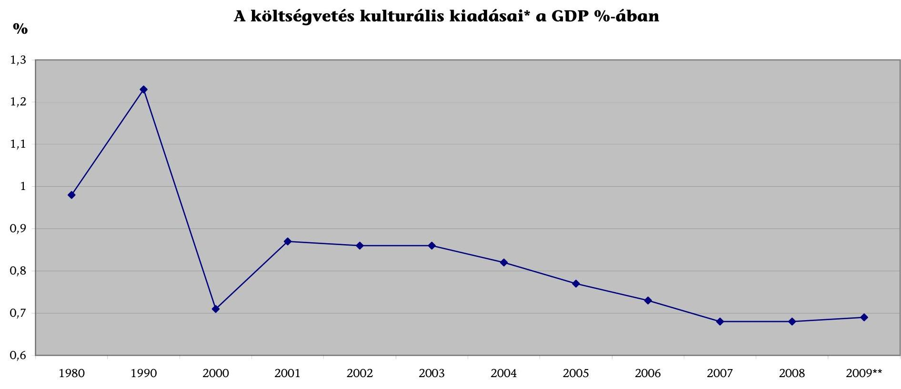
*A költségvetési szervek kulturális szakfeladatokon elszámolt kiadásai
** A KSH és a NEFMI előzetes adatai alapján
Forrás: KSH, OKM, NEFMI

---

# Az állami és fenntartói támogatás alakulása 2006-2009 között 

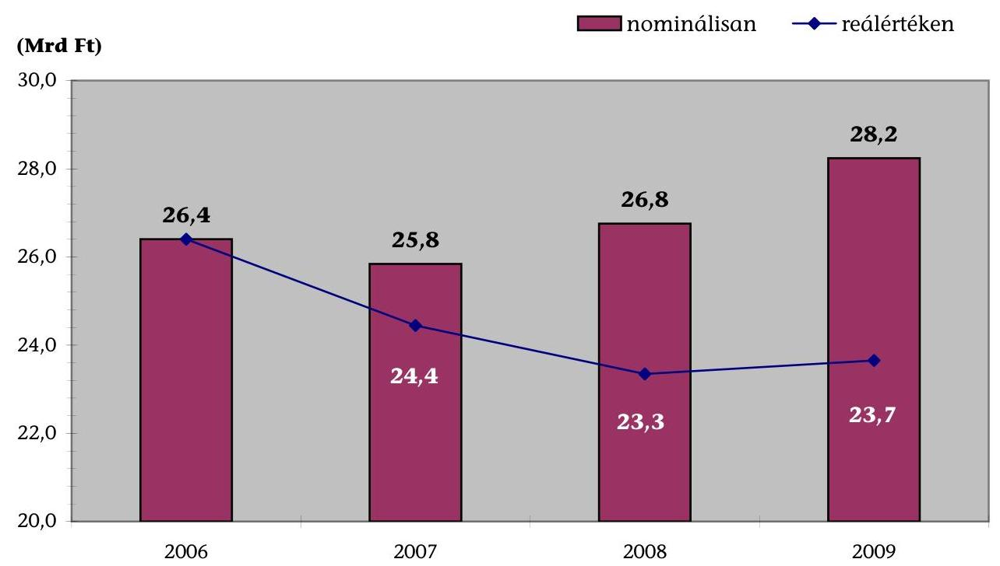
14. sz. diagram

A jegy- és bérletbevétel alakulása 2006-2009 között
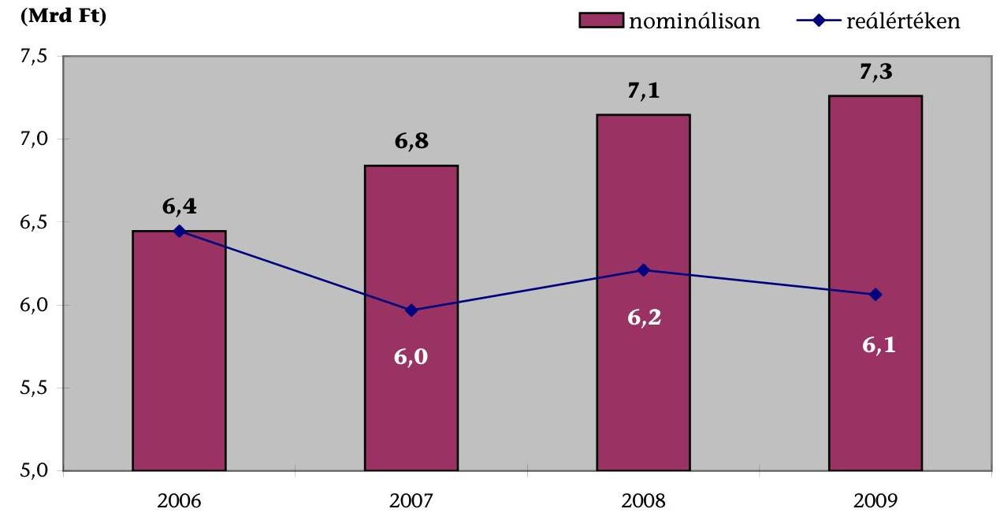

Forrás: 16. sz. tanúsítvány összesített adatai

---

15. sz. diagram

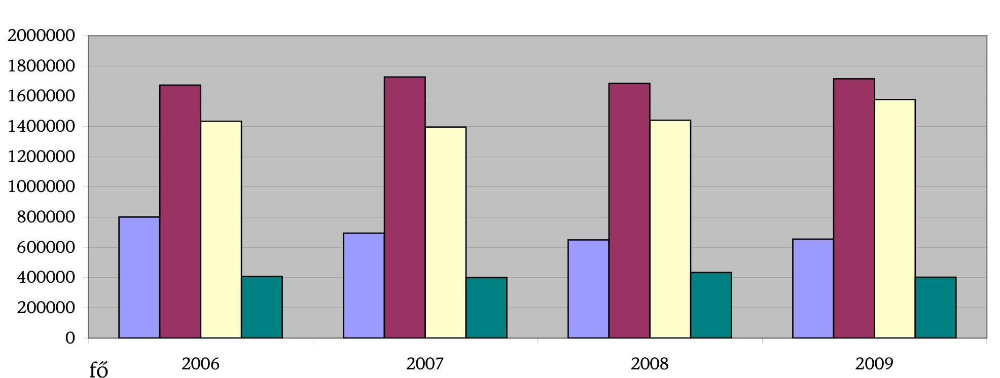

# A fizetőnéző-szám alakulása 2006-2009 között

- **Állami színházak**:  5. fővárosi színházak  6. vidéki színházak  7. mádaimézőszínházak

**Forrás:** 11. sz. táblázat

---

# Kérdések, kritériumok, adatforrások a színházak állami támogatásának és gazdálkodásának ellenőrzéséhez

Fő kérdés: A színházak állami támogatásának rendszere, valamint a színházak gazdálkodása biztosította-e a kulturális ágazati célok megvalósulását, a közpénzek felhasználásának eredményességét, gazdaságosságát, hatékonyságát?

|  Kérdések |  | Kritériumok | Adatforrások  |
| --- | --- | --- | --- |
|  1. | A színházak állami támogatásának rendszere és ágazati szabályozása biztosította-e a közpénzfelhasználás eredményességét, hatékonyságát, megfelelő feltételeket teremtett-e a színházak múködéséhez? |  |   |
|  1.1. | A színházak költségvetési támogatásának rendszere meghatározott kulturális ágazati célok alapján, egyértelmú és kiszámítható támogatási elvek szerint múködött-e? |  |   |
|  1.1.1. | Kormányprogramokban, illetve kulturális stratégiában meghatároztak-e a színházi ágazatot érintő feladatokat, célokat?
A célok megvalósításához kidolgoztak-e cselekvési terveket?
Meghatározták-e a színházak állami támogatásával elérendő célokat, támogatási/finanszírozási elveket?
A színházak állami támogatási rendszerét a kulturális ágazati célokkal összhangban, teljesítménykövetelményeket támasztva, a színházfenntartás és a művészeti tevékenység költségigényének figyelembevételével alakították-e ki az ellenőrzött időszakban?
Meghatározták és összehangolták-e a többcsatornás támogatási rendszer különböző elemeinek (központi költségvetési támogatás, fenntartói támogatás, pályázati támogatás) célját, szerepét?
Kialakították-e a központi színház-támogatási keret helyi önkormányzatok közötti elosztásának szempontjait? | - Színházi ágazati stratégia kidolgozása.
- Határidő meghatározása a célok elérésére.
- Cselekvési tervek a célok megvalósításához.
- Az állami támogatással elérni kívánt hatások, kulturális produktumok elvárt alakulásának (nézőszám, előadásszám, bemutató stb.) meghatározása.
- A rendelkezésre álló források elosztási elveinek célokkal összhangban történő meghatározása, a teljesítmények, valamint a színházfenntartás és a művészeti tevékenység megalapozott költségigényének figyelembevételével.
- A különböző támogatási csatornák szerepének összehangolása, céljának konkrét meghatározása. | Kormányprogramok, kulturális és/vagy színházi ágazati stratégia.
Intézkedési/cselekvési tervek.
Költségvetési törvények (2006-2010.) 7. sz. melléklete - a helyi önkormányzatok színház támogatási keretének, valamint a színházak pályázati támogatásának felosztását dokumentáló számítási anyag.
A költségvetés végrehajtásáról szóló törvények (2006-2009.) 5. sz. melléklete.
Helyi önkormányzatokról szóló 1990. évi LXV. törvény (Ötv.).
A színház-támogatás elemeinek megalapozását meghatározó dokumentumok, számítások.
Az előadó-művészeti szervezetek támogatásáról és sajátos foglalkoztatási szabályairól szóló 2008. évi XCIX. törvény (Emtv.).  |

---

|  1.1.2. | Megalapozott volt-e az Emtv. előkészítése?
A törvényi célok összhangban voltak-e a kulturális ágazati célkitűzésekkel?
Az Oktatási és Kulturális Minisztérium (OKM) a törvény előkészítése során kikérte-e a színházak, továbbá az érintett szakmai társadalmi, gazdasági szervezetek véleményét?
Végeztek-e megalapozó számításokat az új támogatási rendszer bevezetéséhez?
Az új támogatási rendszer kialakítása során figyelembe vették-e a színházfenntartás és a művészeti tevékenység színházanként eltérő költségigényét, a színházak teljesítményét? A finanszírozási szükséglet megállapításához szükséges adatok rendelkezésre álltak-e?
A támogatási rendszer alkalmas-e a minőségi színjátszás ösztönzésére?
Rögzítették-e a jogszabályban a fenntartó jogait és kötelességeit? | - Az új Emtv. összhangja a stratégiai célokkal.
- A szakmai szervezetek bevonása a törvényjavaslat előkészítésébe.
- Az új törvényi finanszírozási rend modellszámításokkal alátámasztott megalapozott pénzügyi előkészítése.
- A támogatás elosztása a színházak teljesítményének, megalapozott fenntartási és művészeti költségeinek figyelembevételével (a müködésre vonatkozó adatok alapján).
- A minőségi színjátszás támogatása.
- Az előadó-művészeti szereplők jogainak és kötelezettségeinek meghatározása. | Emtv. IV. fejezete.
Munkaanyag az előadó-művészeti törvény részletes koncepciójáról.
Emtv. indoklása.
Az Emtv. kialakításában résztvevő bizottságok (struktúra, finanszírozás, munkajog, gyerekszínházak, oktatás, vezetői kinevezések) munkadokumentumai. |
| :--: | :--: | :--: | :--: |
| 1.1.3. | A színházak központi költségvetési támogatásának új szabályozása a korábbinál kiszámíthatóbb és átláthatóbb finanszírozást biztosított-e a színházak számára?
Rögzítették-e a központi költségvetési támogatás keretösszegének különböző kategóriák közötti elosztási elveit?
Érvényesül-e a szektorsemlegesség a támogatási rendszerben?
Rögzítették-e a jogszabályban a nemzeti intézmények körét, feladatait, valamint azok támogatásának elveit?
Szabályozták-e a kultúráért felelős miniszterrel közszolgáltatási szerződést kötött szervezetek támogatási elveit? | - A támogatási rendszer kiszámítható (a támogatások hosszú távon tervezhetőek).
- A rendszer átlátható (nyilvános és megismerhető.
- A rendszer szektor-semleges (minden szervezetre, a fenntartótól (állami, önkormányzati, egyéb) függetlenül ugyanazok az elvek érvényesek.
- A nemzeti intézmények feladatainak, támogatási elveinek meghatározása.
- A kultúráért felelős miniszterrel közszolgáltatási szerződést kötött szervezetek támogatási elveinek rögzítése. | Emtv. IV. fejezete.
A Magyar Köztársaság 2009. évi és a 2010. évi költségvetéséről szóló törvények 7. sz. melléklete.
6/2009. (II. 25.) OKM rendelet a helyi önkormányzatok által fenntartott kőszínházak, bábszínházak 2009. évi támogatásáról.
OKM honlapjának tájékoztatása a 2009. évi támogatások elosztásáról (önkormányzati támogatás és realizált nézőszám alapján).
Emtv. indoklása. |

---

1.1.4. Biztosította-e a kulturális ágazatot irányító minisztérium pályázati rendszere a pályázati keretösszegek eredményes és hatékony felhasználását?
Egyértelműen rögzítették-e a pályázatok meghirdetésekor a pályázati célokat, feltételeket és a bírálati szempontokat, biztosították-e a nyilvánosságot?
Megfelelő időzítésű volt-e a pályázatok kiírásának megjelentetése, a lebonyolítása ütemezése a célok eléréséhez?
Elegendő idő állt-e rendelkezésre a pályázatok elkészítésére, és határidőre történő benyújtására?
Kialakítottak-e a testületi döntések megalapozásához egységes, mérhető, a pályázók által is megismerhető szempontrendszert? Alkalmaztak-e a pályázatok értékelésénél eredményességi kritériumokat? A pályázatokat objektív, pontozásos elbírálási rendszerrel értékel-ték-e? Biztosított volt-e a pályáztatással kapcsolatos döntések indoklása, nyilvánossága?
A szerződések tartalmazták-e a teljesítésre, a szakmai beszámolásra, a pénzügyi elszámolás módjára és határidejére vonatkozó rendelkezéseket? Tartalmaztak-e a szerződések szankciókat? Szükség esetén a szankciókat érvényesítették-e?
Alkalmasak voltak-e a kedvezményezettek szakmaipénzügyi beszámolói a pénzeszközök eredményes, hatékony felhasználásának megítélésére? Kialakítot-tak-e a támogatásban részesülők beszámoltatásához egységes szempontrendszert?
Adtak-e rendszeresen vagy egyedi elbírálás alapján lehetőséget a szerződéses feltételek módosítására valamely feladat megvalósításának változása, vagy elhúzódása miatt?

- A stratégiai célokhoz igazodó pályázati prioritások kialakítása.
- A támogatási szerződésekben vállalt feladatok megvalósítása.
- A színházi szezonalításhoz illeszkedő pályázati ütemezés.
- A pályázati kiírások közzététele legalább 30 nappal a beadási határidő előtt.
- A pályázati felhívások országos médiában, interneten való megjelentetése.
- A pályázati felhívásokban az elbírálás szempontjainak, az eredményesség kritériumainak előírása.
- Objektív, pontozásos bírálati szempontrendszer müködtetése.
- A döntések indoklásának, nyilvánosságának biztosítása.
- Teljesítmény- és eredmény-követelmények a szerződésekben.
- A támogatás felhasználásának eredményességét, hatékonyságát is tükröző beszámoltatási rendszer kialakítása.
- Egységes szempontok kialakítása a beszámoltatáshoz; a szakmai beszámolók előzetesen kialakított szempontok szerinti minősítése.
- Nem megfelelő teljesítés esetén szankciók alkalmazása (pl. jegybanki alapkamat kétszeresének megfelelő, de legalább 20\%-os kamat vagy kötbér érvényesítése; 3-5 évig terjedő kizárás).
- Egyedi támogatás nyújtása pályázati rendszerhez nem illeszkedő célra, vagy megalapozott, nem tervezhető igény esetén.

Pályázati stratégia, koncepció.
Pályázati felhívások, pályázati adatlap.
Pályázatkezelési szabályzat.
Döntéshozó testületek jegyzőkönyvei.
Előadó-művészeti Tanács javaslatai.
Hiteles döntési lista, érvénytelenségi lista.
Minisztériumi szerződés minták, megkötött
támogatási szerződések.
A nyertes pályázók szakmai beszámolói, minősítő lapok.
A támogatottak szöveges szakmai beszámolói.
A pályázati rendszerről szóló éves beszámolók.
A szankciók érvényesítésének dokumentumai (pl. késedelmi kamat kivetése, pályázati támogatás visszafizetése).

---

|   | Kértek-e a szakmai beszámolókhoz kapcsolódóan teljesítménymutatókat? Az értékelés során minősítették-e a szakmai beszámolókat?
A támogatások felhasználásáról szóló szakmai és pénzügyi beszámolót az előírt határidőre és tartalommal elkészítették-e? Sor került-e szankciók érvényesítésére a nem megfelelő teljesítés miatt?
Nyújtottak-e a pályázati keretösszegből, egyedi támogatást? Egyedi támogatás nyújtása indokolt volt-e?
A pályázati úton nyújtott támogatások hasznosulását a minisztérium évente átfogóan értékelte-e? | Mutatók:
- Érvénytelen pályázatok aránya.
- Támogatott/igényelt pályázatok száma, öszszege.
- A támogatás összege/a megvalósítás teljes költsége.
- Módosított támogatási szerződések aránya.
- Az egyedi igények és odaítélések aránya az összes támogatáson belül.
- Egy pályázatra jutó támogatás.
- Határidőre benyújtott szakmai pénzügyi beszámolók aránya.
- Az el nem fogadott beszámoló/összes beszámoló.
- A beszámolás elmulasztása esetén szankciók alkalmazása. |   |
| --- | --- | --- | --- |
|  1.2. | Az előadó-művészeti szervezetekkel kapcsolatos jogkörök gyakorlói megfelelő feltételeket teremtettek-e a színházi ágazat zavartalan müködéséhez? |  |   |
|  1.2.1. | A kultúráért felelős miniszter ellátta-e a jogkörébe tartozó színházi ágazattal kapcsolatos feladatokat?
- A miniszter előkészítette, illetve megalkotta-e az előadó-művészeti törvény végrehajtásához szükséges jogszabályokat? A minisztérium kialakította-e a színházak beszámolójának egységes szempontrendszerét?
- Megalapozottan, a kulturális ágazati célokkal összhangban kötött-e közszolgáltatási szerződést állami vagy önkormányzati fenntartóval nem rendelkező előadó-művészeti szervezetekkel?
- Tájékoztatta-e a döntéshozatalra jogosultat szakmai véleményéről az Emtv-ben meghatározott színházak átalakításával, összevonásával, jogutód nélküli megszüntetésével kapcsolatban? | - A törvényben megjelölt jogszabályok előkészítése, megalkotása:
- a nyilvántartásba vétel, besorolás, igazolások kiállítása;
- az éves tevékenységről szóló szakmai beszámoló formai és tartalmi követelményeinek meghatározása;
- az elszámolható költségek körének rögzítése;
- az igazgatási szolgáltatási díj mértékének meghatározása.
- A magas színvonalú művészi teljesítményt nyújtó szervezetekkel közszolgáltatási szerződés megkötése az EMT véleményének kikérésével. | Az oktatási és kulturális miniszter feladatás hatásköréről szóló 167/2006. (VII. 28.) Korm. rendelet 1. § d) pont, 3. § (3) bekezdés d) pont, 7. §.
Az Emtv. II. fejezete és a 47. §.
Az OKM Szervezeti és Működési Szabályzata.
A kultúráért felelős miniszter rendeletei, azokat megalapozó dokumentumok.
Megkötött közszolgáltatási szerződések.
6/2010.(II.4.) OKM rendelet az előadóművészeti szervezetek beszámolójának formai és tartalmi követelményeiről, a benyújtásával és elfogadásával kapcsolatos részletes szabályokról, továbbá az elszámolható költségekről.  |

---

| 1.2.2. | Az Előadó-művészeti Tanács (EMT) ellátta-e a törvényben megjelölt feladatait?
- Tett-e javaslatot az EMT előadó-művészeti tevékenységet érintő szabályozási kérdésekben? In-dítványozta-e az előadó-művészeti szervezetek támogatási rendszerének felülvizsgálatát?
- A 2010. évi költségvetési törvényben megjelent fizető nézőkre vonatkozó súlyszámokra az EMT tett-e javaslatot?
- Kialakítottak-e szempontokat a költségvetési támogatáson belül a fenntartói és művészeti ösztönző részhozzájárulás arányaira vonatkozóan?
- A pályázati támogatások esetén az EMT tett-e javaslatokat a döntéshozó miniszter részére?
- Véleményezték-e miniszter által megkötendő közszolgáltatási szerződéseket? Kezdeményezték-e a miniszternél meghívásos pályázat kiírását az adott évadban kiemelkedő művészeti teljesítményt nyújtó előadó-művészeti szervezetek támogatására?
- Delegáltak-e tagokat a szakmai bizottságba a színház munkáltató vezetői munkakörének betöltésére kiírt pályáztatás során?
- Elkészítette-e az EMT a 2009. évi tevékenységéről szóló beszámolóját? | - AZ előadó-művészeti törvényben megjelölt feladatok elvégzése:
- az új finanszírozási rendszerre való átállás problémáinak feltárása és a kezelésre irányuló javaslat megtétele;
- a 2010. évi fizető nézőkre vonatkozó súlyszámok művészeti szempontú meghatározása;
- a költségvetési támogatás keretösszege felosztási arányainak meghatározása, indokoltsága. | Az Emtv. II. fejezete.
Az EMT támogatási rendszerre és a pályázatokra vonatkozó javaslatai.
A 2010. évi fizető nézőkre vonatkozó súlyszámok meghatározásának dokumentuma.
A 2010. évi költségvetésről szóló törvény 7. számú melléklete.
Az EMT 2009. évi beszámolója.
Az EMT üléseinek jegyzőkönyvei. |
| :--: | :--: | :--: | :--: |
| 1.2.3 | Az Előadó-művészeti Iroda elvégezte-e az Emtv. szerinti feladatait?
- Az Előadó-művészeti Iroda nyilvántartásba vette-e az Emtv-ben meghatározott előadó-művészeti szervezeteket? Megtörtént-e a nyilvántartásba vett szervezetek törvény szerinti besorolása? | - Az előadó-művészeti törvényben megjelölt feladatok megvalósítása:
- az előadó-művészeti szervezetek nyilvántartásba vétele;
- az előadó-művészeti szervezeteknek a megfelelő kategóriákba sorolása. | Az Emtv. 6. §-a és III. fejezete.
Az Előadó-művészeti Iroda 2009. évi szöveges beszámolója. |

---

|   | - Az Iroda megfelelő időben kiadta-e az adókedvezmény igénybevételére jogosító támogatási igazolásokat, igazolta-e a támogatás igénybevételére vonatkozó jogosultságot?
- Nyilvántartja-e az Iroda a színházaknak nyújtott 2009. évi adományok adatait?
- A színházak számára előírt adminisztrációs kötelezettségeket összehangolták-e más adatkérő szervezetekkel (OKM, KSH)? |  | Az előadó-művészeti szervezetek múködésével kapcsolatos hatósági eljárások részletes szabályairól, továbbá a zenekarok és énekkarok tevékenységéhez szükséges tárgyi feltételekről, valamint a fizető nézőszám alsó határáról szóló 7/2009. (III. 4.) OKM rendelet.
Az előadó-művészeti szervezetekről vezetett nyilvántartás.
Az adókedvezmény igénybevételére jogosító támogatási igazolások nyilvántartása.
A színházak által igénybe vett adományok összesítése.  |
| --- | --- | --- | --- |
|  1.3. | Biztosította-e a színház-támogatási rendszer múködése az állami források hasznosulását nemzetgazdasági szinten? |  |   |
|  1.3.1. | Megvalósultak-e a kulturális stratégiában és az előadóművészeti törvényben kitűzött célok?
Javultak-e az állampolgárok, különösen a gyermek- és ifjúsági korosztály hozzáférési lehetőségei a színházi előadások megismeréséhez?
Megvalósult-e a régiók színházi ellátásának biztosítása, az ellátatlan területek kulturális felzárkózása, lehetőséget biztosítva a kulturális esélyegyenlőség megteremtésére?
Növelte-e a finanszírozási rendszer a hazai színházi társulatok nemzetközi jelenlétét? | - A gyermek- és ifjúsági korosztály nézőszámának emelkedése.
- A színházi ellátottság és hozzáférési lehetőség javulása.
- Hazai társulatok nemzetközi jelenlétének emelkedése.
Mutatók:
- Kulturális, azon belül a színházi költségvetési kiadások a GDP \%-ában.
- A költségvetés egy lakosra jutó vetített éves kulturális és színházi kiadása.
- Támogatások alakulása (egy férőhelyre, egy nézőre) régiók szerinti bontásban.
- Színházak, játszóhelyek száma összesen és 1 millió lakosra vetítve (régiók szerinti bontásban).
- Ifjúsági- és gyermek előadások számának alakulása.
- Külföldi előadások számának alakulása, külföldi előadások nézőszámának alakulása. | A Központi Statisztikai Hivatal (KSH) kulturális statisztikai tájékoztatói.
OKM kulturális statisztikai összesítő adatok.
Magyar Államkincstár (Kincstár) adatbázis.
Tanúsítványok.
Állami Számvevőszék Kutató Intézete (ÁSZKUT) tanulmány adatai.  |

---

|  1.3.2. | Érdekeltté tette-e a támogatási rendszer a színházakat és a fenntartókat a teljesítmények növelésében?
Motiválta-e a fenntartói ösztönző részhozzájárulás az önkormányzatokat nagyobb támogatás nyújtására?
Törekedtek-e a színházak a fizető nézőszám növelésére?
Az új finanszírozási rendszerben hátrányos helyzetbe kerülő színházak átmeneti támogatását megalapozott elvek alapján osztják-e el?
Eredményes támogatási eszköz-e a jegybevétel arányában igénybe vehető, társasági adókedvezménnyel járó támogatás? | - A fenntartói támogatás mértékének és arányának növekedése.
- A fizető nézők számának növekedése.
- Az átmeneti támogatás elosztási elveinek megalapozott meghatározása.
- A színházak által a jegybevétel nettó összegének $80 \%$-a erejéig befogadható, társasági adókedvezménnyel nyújtható adományok maximális kihasználása.
Mutatók:
- A 100 főre jutó színházlátogatások alakulása összesen és régönként.
- Egy nézőre/egy lakosra jutó központi és fenntartói támogatás arányának alakulása (összesen és régiónként).
- A befogadóképesség, az előadásszám és a nézőszám alakulása (régiók szerinti bontásban).
- Igénybe vett/a jegybevétel arányában igénybe vehető támogatás. | A KSH kulturális statisztikai tájékoztatói. OKM kulturális statisztikai összesítő adatok.
A Kincstár adatbázisa.
Az önkormányzatok fenntartói támogatását összegző dokumentumok.
Az Emtv. 48. §- a (2009.november 12.-ei hatálynak megfelelően)
Útmutató a társasági adókedvezménnyel igénybe vehető támogatásról és a támogatás igazolásáról.
Az OKM költségvetési fejezethez tartozó fejezeti kezelésű előirányzatok 2010. évi felhasználásának szabályairól szóló OKM rendelet.
Az Európai Bizottság N 464/2009. számú határozata.
A 2010. évi költségvetésről szóló törvény 7. számú melléklete.
A társasági adóról és az osztalékadóról szóló 1996. évi LXXXI. törvény.
Tanúsítványi adatok összesítése.
Kérdőívek összesítése.  |
| --- | --- | --- |
|  1.3.3. | A színházakra vonatkozó központi költségvetési támogatási rendszer müködésének értékelése hozzájárult-e a források felhasználásának eredményességéhez?
Kidolgoztak-e mérési módszereket az állami támogatások hasznosulásának értékeléséhez?
Értékelte-e évente a kultúráért felelős minisztérium a színházak állami támogatásának hasznosulását?
Az értékelés tapasztalatai nyomán megtették-e a szükséges intézkedéseket? | - A finanszírozás gyakorlatának, hatásainak nyomon követése, éves értékelése, ezek alapján intézkedések megtétele.
- Objektív mérési módszerek kialakítása az állami támogatás hasznosulásának értékeléséhez.
- A megállapított hiányosságok csökkenése, megszűnése.  |

---

|   | Készült-e értékelés az új támogatási rendszer eddigi tapasztalatairól, az átmenet problémáiról? |  | Az előadó-művészeti szervezetek beszámolójának formai és tartalmi követelményeiről, a benyújtásával és elfogadásával kapcsolatos részletes szabályokról, továbbá az elszámolható költségekről szóló 6/2010. (II. 4.) OKM rendelet.  |
| --- | --- | --- | --- |
|  2. | A fenntartók biztosították-e a színházak eredményes múködéséhez szükséges feltételeket és felügyeletet? |  |   |
|  2.1. | A fenntartó, illetve támogató önkormányzatok meghatározták-e a színházakkal szembeni elvárásokat, összehangolva azokat az ágazati és regionális kulturális célkitűzésekkel, az intézmények adottságaival, valamint a közönségigényekkel? |  |   |
|  2.1.1. | A fenntartó/támogató önkormányzat meghatározta-e kulturális stratégiában, vagy egyéb feladatellátáshoz kapcsolódó dokumentumban a színházakkal kapcsolatos célokat, elvárásokat? A fenntartó/támogató össze-hangolta-e a színházakkal kapcsolatos elvárásait az ágazati és regionális kulturális célkitűzésekkel?
Több intézmény fenntartása esetén a fenntartó dokumentáltan meghatározta-e az egyes színházak profilját? | - A színházakkal szembeni fenntartói elvárások megalapozott meghatározása.
- A célok megvalósítását elősegítő intézkedések. | Kormányprogramok, kulturális és/vagy színházi ágazati és regionális stratégia.
Önkormányzati kulturális/színházi stratégia, koncepció, rendelet.
Intézkedési/cselekvési tervek.
Alapító okirat.
Közhasznúsági/Közszolgáltatási szerződések.
Kérdőív.  |
|  2.1.2. | Rendelkeznek-e a fenntartók olyan dokumentummal, amely szakmai szempontból értékeli, hogy az intézmény(ek) használatában levő épület(ek) adottságai milyen profilú előadó-művészeti tevékenység megvalósítására adnak lehetőséget? A fenntartó a személyi és tárgyi feltételrendszer ismeretében - meghatározta-e a színház/színházak profilját, műfaji irányultságát? | - A színházi funkció (profil) és a feltételrendszer összhangja. | Dokumentum, elemzés a színház adottságairól.
Kérdőív.
Alapító okirat.
Közhasznúsági/Közszolgáltatási szerződések.  |
|  2.1.3. | Készült-e olyan lakossági felmérés, amely információt nyújt az adott színház meglévő, illetve potenciális látogatóinak igényeiről, színházba járási szokásairól? A fenntartók a színházakkal szembeni elvárások meghatározása során figyelembe vették-e a közönségigényeket? | - A színházakkal szembeni elvárások meghatározása, a közönségigények ismeretében. | Közönségigények felmérésének, értékelésének dokumentumai.
Kérdőív.  |

---

|  2.1.4. | Rögzítette-e az önkormányzat a színház által ellátandó kulturális feladatokat?
A fenntartó meghatározott-e konkrét célokat, teljesítménykövetelményekben kifejezett elvárásokat az egyes színházak múködésével kapcsolatban? A célok és elvárások meghatározása egyértelmú és végrehajtható, annak teljesítése a színháztól számon kérhető volt-e? | - A színházakkal szembeni elvárások teljesítménymutatókkal történő meghatározása.
Pl. a színházi előadások száma és annak változása; a bemutatók száma évente és annak változása; a fenntartó színházainak hazai és külföldi vendégszereplései, azok változása; a fenntartó színházainak kapacitáskihasználtsága (nézőszám/férőhelyek száma- egy előadásra vetítve átlagosan); az ifjúsági és gyermekelőadások számának alakulása. | Alapító okirat, vagy közszolgáltatási szerződés.
Közhasznú feladatfinanszírozási támogatási szerződés.
Egyéb fenntartói dokumentumok a színházak múködésével kapcsolatban.
Kérdőív.  |
| --- | --- | --- | --- |
|  2.1.5. | A fenntartó kialakította-e az igazgató(k) pályáztatásának szempontrendszerét?
A fenntartó a pályáztatás során kifejezésre juttatta-e a színház vezetésével szemben támasztott követelményeit, a kiválasztásnál ezt érvényesítette-e?
A pályázati eljárás az új évadra történő szerződtetést megelőző hat hónappal megkezdődött-e, a nyilvánosság biztosított volt-e?
A vezetői pályázatok tartalmazták-e a színház művészeti arculatát, a kulturális életben betöltött szerepét, valamint az ezen túlmutató eredményességi, hatékonysági célokat?
A vezetővel kötött szerződés tartalmazta-e a pályázatban vállalt eredménykritériumokat?
A fenntartó kidolgozott-e, illetve alkalmazott-e teljesítmény követelménnyel alátámasztott érdekeltségi (vezetői prémium) rendszert? | - Pályázati szempontrendszer kialakítása.
- A pályázati felhívások tartalmazzák a fenntartó igényeit (szakmai feltételrendszer), teljesítmény- és eredménykövetelményeit.
- A pályázatban vállalt eredménykövetelmények rögzítése a vezetővel kötött szerződésben.
- A vezetők számára teljesítménykövetelménynyel alátámasztott érdekeltségi rendszer alkalmazása. | Pályázati kiírások.
Vezetői pályázatok.
A fenntartó értékelési, döntéshozói dokumentuma.
A színházi vezető kinevezését, feladatainak meghatározását tartalmazó dokumentum. Kérdőív.  |
|  2.2. | Az állami színházak fenntartója meghatározta-e a színházakkal szembeni elvárásokat, a kiemelt szerepkörből adódó feladataikat, összehangolva azokat az ágazati és regionális kulturális célkitűzésekkel, az intézmények adottságaival, valamint a közönségigényekkel? |  |   |
|  2.2.1. | Meghatározták-e kulturális ágazati stratégiában, vagy egyéb dokumentumban az állami fenntartású színházak kiemelt szerepét, feladatait? | - Az állami színházakkal szembeni elvárások meghatározása a fenntartó által.
- A célok megvalósítását elősegítő intézkedések. | Kulturális stratégia, illetve koncepció.
A színház alapító okirata, vagy a közszolgáltatási szerződés.  |

---

|   | Van-e a kulturális ágazatért felelős minisztériumnak olyan írásbeli dokumentuma, koncepciója, amelyben rögzítették az egyes állami színházakkal kapcsolatos célokat, elképzeléseket, azok profiljának meghatározását? |  | Egyéb fenntartói dokumentum a színház múködésével kapcsolatosan.
Kérdőív.  |
| --- | --- | --- | --- |
|  2.2.2. | Rendelkezik-e a fenntartó/tulajdonos olyan dokumentummal, amely szakmai szempontból értékeli, hogy az intézmény használatában levő épület adottságai milyen profilú előadó-művészeti tevékenység megvalósítására adnak lehetőséget?
Készült-e olyan felmérés, amelyből megismerhetőek a közönség igényei, elvárásai a kiemelt nemzeti intézményekkel kapcsolatban?
A fenntartó figyelembe vette-e az egyes színházak profiljának/múltaji irányultságának meghatározása során az intézmények adottságait és a közönségigényeket? | - A színházi funkció (profil) és a feltételrendszer összhangja a nemzeti intézményeknél. | Dokumentum, elemzés a színházzal kapcsolatos paraméterekről (épület, befogadóképesség, színpadnagyság, technikai adottságok).
Közönségigények felmérésének, értékelésének dokumentumai.
A fenntartói elvárások meghatározásának dokumentumai.
Kérdőív.  |
|  2.2.3. | Rögzítette-e a fenntartó/tulajdonos a kiemelt nemzeti intézmények alapítási/támogatási dokumentumaiban a színházak által ellátandó feladatokat?
A fenntartó meghatározott-e konkrét célokat, teljesítménykövetelményekben kifejezett elvárásokat az egyes színházak múködésével kapcsolatban? A célok és elvárások meghatározása egyértelmű és végrehajtható, annak teljesítése a színháztól számon kérhető volt-e? | - Az állami színházakkal szembeni elvárások teljesítménymutatókkal történő meghatározása. | Alapító okirat, vagy közszolgáltatási szerződés.
Közhasznú feladatfinanszírozási támogatási szerződés.
Egyéb fenntartói dokumentumok a színházak múködésével kapcsolatban.  |
|  2.2.4. | Az állami színházak fenntartója/tulajdonosa (OKM, MNV Zrt.) kialakította-e az igazgató(k) pályáztatásának szempontrendszerét?
A fenntartó/tulajdonos a pályáztatás során kifejezésre juttatta-e a színház vezetésével szemben támasztott követelményeit, a kiválasztásnál ezt érvényesítette-e?
A pályázati eljárás az új évadra történő szerződtetést megelőző hat hónappal megkezdődött-e, a nyilvánosság és az esélyegyenlőség biztosított volt-e? | - Pályázati szempontrendszer kialakítása.
- A pályázati felhívások tartalmazzák a fenntartó igényeit (szakmai feltételrendszer), teljesítmény- és eredménykövetelményeit.
- A pályázatban vállalt eredménykövetelmények rögzítése a vezetővel kötött szerződésben.
- A vezetők számára teljesítménykövetelménynyel alátámasztott érdekeltségi rendszer alkalmazása. | Pályázati kiírások.
Vezetői pályázatok.
A fenntartó értékelési, döntéshozói dokumentuma.
A színházi vezető kinevezését, feladatainak meghatározását tartalmazó dokumentum.
Kérdőív.  |

---

|   | Az állami fenntartású intézmények vezetői pályázatai tartalmazták-e a színház művészeti arculatát, a kulturális életben betöltött kiemelt szerepét, valamint az ezen túlmutató eredményességi, hatékonysági célokat?
A vezetővel kötött szerződés tartalmazta-e a pályázatban vállalt eredménykritériumokat?
A fenntartó kidolgozott-e, illetve alkalmazott-e teljesítmény követelménnyel alátámasztott érdekeltségi (vezetői prémium) rendszert? |  |   |
| --- | --- | --- | --- |
|  2.3. | Az állami és önkormányzati fenntartók biztosították-e a színházak zavartalan müködéséhez szükséges feltételeket? |  |   |
|  2.3.1. | Egyértelműen és teljes körűen szabályozott-e a fenntartó és a színház közötti hatáskörök (döntés, felelősség) megosztása? | - A fenntartó dokumentálta a saját és a színházi vezető közötti felelősség és feladat megosztást. | Közszolgálati, illetve közhasznúsági szerződés.
Szervezeti és Müködési Szabályzat.
167/2006. (VII. 28.) Korm. rendelet.
Kérdőív.  |
|  2.3.2. | A szervezeti forma kialakítása/átalakítása során megvizsgálta-e a fenntartó, hogy melyik gazdálkodási formában (költségvetési szerv vagy nonprofit kht., illetve gazdasági társaság) müködtethető a színház eredményesebben? | - Az eredményes müködést elősegítő szervezeti forma kialakítása. | Szervezet átalakítási tanulmányok, elemzések.
Kérdőív.  |
|  2.3.3. | Tervezte a fenntartó - az ellenőrzött időszakban - új színházépület létesítését, vagy valamelyik színház épületének felújítását, rekonstrukcióját?
Igényelt-e ehhez pénzt központi forrásból? A pályázott összeghez biztosította-e a saját forrást? A színházi beruházás/rekonstrukció a fenntartó döntésén vagy a színházzal közös döntésen alapult? A vizsgált időszakban kaptak-e központi támogatást felújításra, beruházásra? A központi forrás felhasználása a támogatási szerződésben foglaltaknak megfelelő volt-e? | - A szükséges beruházások, felújítások terv szerinti megvalósítása, a lebonyolításhoz szükséges források biztosítása. | A fenntartó önkormányzatok költségvetési rendeletei, felújítási, beruházási tervei, az ezzel kapcsolatos képviselő-testületi határozatok.
Támogatási szerződések, támogatói ellenőrzések dokumentumai.
ÁSZKUT Tanulmány.
Tanúsítvány.
Kérdőív.  |

---

|  2.3.4. | A fenntartó az éves támogatás mértékét a színházi múködés megalapozott költségigényét figyelembe véve határozta-e meg?
A több színház fenntartása esetén a fenntartó (OKM, önkormányzat) kialakította-e és dokumentálta-e a központi költségvetési és a fenntartói saját támogatás színházak közötti elosztásának elveit, szempontjait?
Az Emtv. hatályba lépése előtt a támogatás mértéke (központi és saját forrás) igazodott-e a fenntartott színházak múködtetési költségeihez, szakmai teljesítményéhez? | - A fenntartó által nyújtott támogatási keretöszszeg felosztási szempontjainak kialakítása.
- A fenntartói támogatás gazdaságilag megalapozott költségvetési javaslat alapján történő meghatározása.
- A támogatás igazodása a színházak múködési költségeihez, teljesítményéhez. | Dokumentumok, szempontok és háttérszámítások a fenntartói támogatás színházankénti elosztásáról. A fenntartók költségvetési koncepciói, rendeletei.
A költségvetési egyeztetésről készült jegyzőkönyvek, feljegyzések, finanszírozási ütemtervek.
Az önkormányzatok költségvetési rendeletei.
Kérdőív.  |
| --- | --- | --- | --- |
|  2.3.5. | Kedvezőbb-e az Emtv-ben meghatározottak alapján kialakított - fenntartói, múvészeti ösztönző részhozzájárulás formájában, fenntartói támogatással arányosan, illetve pályázati úton biztosított - központi támogatás a fenntartó számára a korábbinál?
Az Emtv. ösztönözte-e az önkormányzati fenntartót saját támogatásának növelésére?
Az új finanszírozási rendszerben a fenntartói ösztönző részhozzájárulás intézmények közötti elosztásánál figyelembe veszik-e a színházak tényleges kiadásait, teljesítményeit?
Okozott-e problémát az új finanszírozás bevezetése a korábbi finanszírozási gyakorlathoz képest? | - A központi támogatás kiszámíthatósága, átláthatósága.
- A fenntartói támogatáson belül a saját forrásból nyújtott támogatás arányának növekedése.
- Egy előadásra/férőhelyre/nézőre jutó fenntartói saját támogatás növekedése.
- A korrekciós támogatás megalapozottsága. | Kérdőívek, tanúsítványi adatok.
Dokumentumok, szempontok és háttérszámítások a fenntartói támogatás színházankénti elosztásáról. A fenntartók költségvetési koncepciói, rendeletei.  |
|  2.3.6 | Kialakították-e az állami színházak finanszírozásának szempontjait, elveit? A kialakított elvek szerint, a színházak teljesítményeihez, illetve kiadásaihoz igazodva történt-e az állami fenntartású színházak támogatása?
Az ellátott kulturális feladatok és a teljesítménymutatók függvényében indokolt-e az állami színházak kiemelt szerepkörének fenntartása, valamint a központi költségvetésből kapott kiemelt összegű támogatása? | - Az állami fenntartású színházak gazdaságilag megalapozott finanszírozási rendszerének kialakítása.
Mutatók:
- Az állami színházak fenntartói támogatása nagyságrendjének és arányának alakulása az önkormányzati színházak támogatásához viszonyítva, a férőhely, a bemutató, valamint az előadásszám függvényében (az Emtv-ben foglaltak szerint). | Költségvetési tervezés dokumentációja.
Elemi költségvetés, üzleti tervek.
Finanszírozásról szóló dokumentumok.
Interjú, kérdőív.
Statisztikai adatok.
Tanúsítványok.  |

---

|  2.4. | Az állami és az önkormányzati fenntartók / támogatók figyelemmel kísérték és értékelték-e az intézmények gazdálkodását és szakmai tevékenységét, hasznosultak-e a fenntartói ellenőrzés és értékelés megállapításai? |  |   |
| --- | --- | --- | --- |
|  2.4.1. | A fenntartó kialakította-e a színház működésével kapcsolatos utasításainak nyomon követési és ellenőrzési rendszerét?
A kialakított fenntartói monitoring és kontrolling rendszer alkalmas volt-e az intézmény működésének befolyásolására, a felügyeleti irányítás megvalósítására?
A fenntartó/támogató évente beszámoltatta-e a színházat működéséről, gazdálkodásáról? A fenntartó rendszeresített-e színházainál az évadzáró értékelést?
A fenntartó részt vesz-e az intézmény gazdasági, illetve szakmai munkájának tervezésében, kialakításában?
Kialakította-e a fenntartó a színházban a vezetői beszámoltatás rendszerét, ez alapját képezi-e a vezetők jutalmazásának? | - A fenntartó által kialakított ellenőrzési és monitoring rendszer müködtetése; a színházak évenkénti/évadonkénti beszámoltatása.
- Az ellenőrzés, értékelés nyomán intézkedési tervek kidolgozása, azok megvalósítása.
- A kialakított monitoring-, kontrolling és beszámoltatási rendszer müködése nyomán a színház gazdasági és művészeti tevékenységének zavartalansága.
- A finanszírozás, vezetői javadalmazásnak a beszámoltatás eredményéhez kötött kialakítása. | A fenntartói szabályozásának dokumentumai.
A felügyeleti ellenőrzések tervezése, ütemezése.
A költségvetés előkészítésének dokumentumai.
A színházak beszámolói, és az azokkal kapcsolatos fenntartói intézkedések, döntések.
Vezetői beszámoltatási, érdekeltségi rendszer dokumentumai.
Kérdőíves megkérdezés.  |
|  2.4.2. | A fenntartó/támogató szakmailag és pénzügyileg rendszeresen ellenőrzi-e a színházak múködését, az adott támogatások felhasználását?
Ellenőrizte-e a fenntartó a közszolgáltatási szerződés teljesülését? A teljesítés elmaradása esetén érvényesí-tett-e szankciókat?
Végzett-e a fenntartó a színház(ak)nál felügyeleti ellenőrzést a vizsgált időszakban? Az kiterjedt-e a szakmai múködés ellenőrzésére is? A fenntartó a felügyeleti ellenőrzést saját hivatalával, vagy külső szakértő bevonásával végezte-e?
A fenntartó a felügyeleti ellenőrzés megállapításai alapján előírta-e az intézményeknek az intézkedési terv készítését? Az intézkedési tervet az intézmény megküldte-e a fenntartónak?
Az intézkedési tervet a fenntartó jóváhagyta-e, majd ellenőrizte-e az intézkedési tervben foglaltak végrehajtását? | - A fenntartó által kialakított ellenőrzési rendszer javítja a színház múködésének eredményességét, a támogatások felhasználásának hatékonyságát.
- Az ellenőrzés, értékelés nyomán intézkedési tervek kidolgozása, azok megvalósítása.
Mutatók:
- A fenntartói ellenőrzések számának alakulása.
- Az intézkedési tervekben foglalt feladatok megvalósulásának aránya. | A felügyeleti ellenőrzések tervezett ütemezése. Az ellenőrzések vizsgálati programjai.
Az ellenőrzésekről készített jelentések, intézkedési tervek.
Fenntartói döntések.  |

---

|  2.4.3. | A fenntartó/támogató évente értékelte-e a színházak támogatásának hasznosulását? Kidolgoztak-e mérési, módszereket, mutatókat a támogatások hasznosulásának értékeléséhez? A mutatókat a fenntartó érté-kelte-e?
A fenntartó indokolt esetben készített-e intézkedési tervet, változtatott-e az intézmény finanszírozásán? | - A fenntartó által elvárt kulturális célok megvalósulása.
- A színházi intézmények pénzügyi és gazdasági és szakmai tevékenységének értékeléséhez, a támogatások hasznosulásának megítéléséhez teljesítménymutatók, módszerek kidolgozása.
Mutatók:
- A fenntartói támogatás változásának és a színházi teljesítmények (előadásszám, nézőszám, jegybevétel) alakulásának egybevetése.
- A színházak likviditási mutatói, bevételek és kiadások, követelések és kötelezettségek összhangja. | Kimutatások a színházak múködésével kapcsolatosan.
Intézkedési tervek.
Tanúsítványok.
Kérdőívek.  |
| --- | --- | --- | --- |
|  3. | A színházak gazdálkodása során biztosított-e a rendelkezésre álló erőforrások felhasználásának eredményessége, gazdaságossága és hatékonysága? |  |   |
|  3.1. | Biztosítottak voltak-e az állami és az önkormányzati színházakban a művészeti tevékenység zavartalan ellátásához szükséges múködési feltételek? |  |   |
|  3.1.1. | A szervezeti forma (költségvetési szerv, gazdasági társaság) elősegítette-e a színházakban a gazdálkodás eredményességét, hatékonyságát?
Az intézmények fenntartói alapító okiratban, illetve közszolgáltatási (korábban közhasznúsági) szerződésben rögzítették-e a feladatellátás feltételeit? | - A gazdálkodás eredményességét elősegítő szervezeti forma.
- Közszolgáltatási (korábban közhasznúsági szerződésben), illetve a közhasznú feladatfinanszírozási támogatási szerződésekben a feladatellátás tárgyi és pénzügyi feltételeinek rögzítése.
- A tevékenység zavartalan ellátásához szükséges feltételek biztosítása. | Alapító okirat, Alapszabály, a szervezet átalakítására vonatkozó határozat, annak indoklása.
Közszolgáltatási/közhasznúsági szerződés.
Szervezeti és múködési szabályzat.
Gazdálkodási rend.
Éves számszaki és szöveges beszámolók, közhasznúsági jelentések.
Kérdőív.
Jogszabályok:
- Áht., Ámr., 2008. évi CV. törvény;
- 1997. évi CLVI. törvény a közhasznú szervezetekről;
- 2006. évi törvény a gazdasági társaságokról.  |

---

| 3.1.2. | Az állami támogatás rendszere (központi költségvetési és önkormányzati) a színházak számára kiszámítható és átlátható volt-e, elősegítette-e a zavartalan múködést, a művészeti célok megvalósítását a vizsgált időszakban?   Az Emtv. új támogatási szabályozása javítja-e a színházak működési feltételeit, hozzájárul-e a működés eredményességéhez?   Rendelkezik-e a színház rövid és középtávú bemutatótervvel, amely részletesen tartalmazza az egyes produkciók színre állításának költségeit? Rendelke-zik-e a színház a fenntartásra és a művészeti tevékenységre vonatkozó középtávú tervvel?   A színház fenntartására és művészeti tevékenységére vonatkozó éves tervezés megalapozott, részletes számításokkal alátámasztott volt-e?   A támogatási rendszer lehetővé tette-e a színház számára a művészeti tevékenységének, gazdálkodásának egy éven túli tervezhetőségét?   A fenntartó által nyújtott támogatás igazodott-e a színházak művészeti terveihez, működési kiadásaihoz?   Maximálisan ki tudta-e használni a színház 2009ben a társasági adókedvezménnyel nyújtható támogatást?   - A színház finanszírozásának rövid és középtávú tervezhetősége.   - Az Emtv. 2010. évi bevezetése hozzájárul a kiszámíthatóság, átláthatóság, teljesítmény javulás eléréséhez a korábbi finanszírozási rendszer biztosította lehetőségekhez viszonyítva.   - Rövid és középtávú terv megalapozottsága; az éves költségvetési javaslat/éves üzleti terv elkészítése, az előzetes műsortervnek megfelelően.   - A megalapozott tervezéshez szükséges pénzügyi adatok rendelkezésre állása. A színház támogatása a művészeti tervekhez, működési kiadásaikhoz igazodóan.   Mutatók:   - 2006-2010 időszakra vonatkozó központi költségvetési, illetve fenntartói támogatás alakulása.   - Fenntartói támogatás aránya az összes bevételei belül.   - Fajlagos mutatók: egy előadásra, egy férőhelyre, egy látogatóra, 100 Ft kiadásra jutó fenntartói támogatás.   - 2006-2010. időszakra a színház tervezett kiadásai és bevételei a jóváhagyott éves költségvetések/ üzleti tervek alapján.   - Igénybe vett/maximálisan igénybe vehető társasági adókedvezménnyel nyújtható támogatás. | Rövid és középtávú bemutatótervek, műsortervek, részletes színházszakmai tervek.   Éves költségvetési javaslatok, előzetes üzleti tervek, tervezési dokumentáció.   Jóváhagyott éves költségvetések/üzleti tervek.   Közhasznú feladatfinanszírozási támogatási szerződések, éves támogatási megállapodás, költségvetési rendelet.   Az éves költségvetési törvények 7. sz., a zárszámadási törvények 5. sz., mellékletei.   Éves számszaki és szöveges beszámolók a szervezet gazdálkodásáról, közhasznúsági jelentések.   Emtv. IV. fejezet: az előadó-művészet támogatása.   Nyilvántartás a társasági adókedvezménynyel igénybe vett/vehető támogatásokról.   Kérdőív. |
| --- | --- |

---

|  3.2. | Az állami/önkormányzati fenntartású színházak tettek-e intézkedéseket a bevételek növelésére, a rendelkezésre álló erőforrások eredményes, gazdaságos és hatékony kihasználására?  |
| --- | --- |
|  3.2.1. | Alkalmaztak-e ösztönző módszereket a közönség számának növelésére, illetve megtartására? Eredményesek voltak-e a színház intézkedései a nézőszám és a jegybevétel növelésére?
A jegyárakat alapvetően a produkció költségeinek, vagy a fizetőképes keresletnek figyelembe vételével alakították ki? Emelkedett-e a jegy- és bérletbevétel összege?
Tett-e intézkedéseket a színház az egyéb saját bevételek növelésére?
- Az állami, illetve az önkormányzati fenntartású színház pályázati tevékenysége eredményes volt-e?
- Tettek-e eredményes intézkedéseket a támogatói kör/mecenatúra bővítésére?
- Eredményesen hasznosította-e a színház szabad kapacitásait, illetve vagyontárgyait, származott-e ebből bevétele? A bérleti díj megállapítása önköltségszámításon alapult-e?
- A költségvetési szervként működő színháznak volt-e vállalkozási tevékenységből származó bevétele?
- Előfordult-e alapítványi forrás bevonása? Költségvetési szerv esetén, van-e a színháznak a tevékenységét, feladatellátását támogató alapítványa? A színház bevételeiből juttatott-e az alapítványnak támogatást?
Volt-e a színháznak köztartozása, sor került-e hitelfelvételre?  |

- Eredményes marketing-, pályázati tevékenység, egyéb ösztönzés alkalmazása, bérletezés.
- Jegyárak kialakítása a produkció költségeinek, valamint a fizetőképes kereslet figyelembevételével.
- Látogatószám növekedése.
- Jegy- és bérletbevétel, szponzori támogatások, egyéb saját bevételek emelkedése.
- Szabad kapacitások, vagyontárgyak gazdasági szempontból eredményes hasznosítása.
- Alapítványi forrás bevonása a színház múködtetésébe.
- Kiegyensúlyozott pénzügyi likviditási helyzet.

## Mutatók:

- Jegy- és bérletbevételek, nézőszám változása.
- Fajlagos mutatók: egy előadásra, egy férőhelyre, egy látogatóra jutó jegy- és bérletbevétel.
- Szponzori bevételek, pályázati támogatások mértéke, aránya, változása.
- Szabad kapacitások, hasznosításából származó bevételek, valamint a felhalmozási és tőke jellegű bevételek nagysága, változása.
- Költségvetési szerv vállalkozási bevételeinek mértéke, aránya a saját bevételeken belül.
- Alapítványtól átvett forrás/alapítványnak juttatott támogatás.
- Tartozásállomány, hitelállomány.

Számszaki és szöveges beszámolók a gazdálkodásról, közhasznúsági jelentések. Főkönyvi kivonatok. PR anyagok. Analitikák, kimutatások a bevételek összetételéről. Pályázati bevételek részletes kimutatása. Vagyonhasznosítási szerződések. Analitika a szponzori (nem reklám) bevételekről. Jegyárak kialakítása. Szakmai mutatók alakulása. Éves szakmai beszámolók a szervezet tevékenységéről. Kérdőív. Tanúsítvány.

## Jogszabály:

- Áht. 100/D. § (2)-(6) bekezdései
- Ámr. 150. § (1) a) - 153. § (2)
- Új Ámr.164. § (1) a) bekezdése

---

|  3.2.2. | Megvalósult-e a színházban a bemutatók számának optimalizálása?
Hoztak-e intézkedéseket az egyes produkciók előadásszámának (tájelőadások, külföldön történő előadások) növelésére?
A színdarabválasztásnál a darab sajátosságainak és a játszóhely adottságainak összehangolásával törekedett-e a színház az egyes játszóhelyeken a nézőtér kapacitáskihasználtságának növelésére?
Sor került-e vendégelőadások fogadására, illetve más színházakkal közös produkciók megszervezésére? | - A bemutatott produkciók előadásszámának növekedése.
- A nézőtér kapacitás kihasználtságának (látogatottság) javulása.
- Tájelőadások, hazai és külföldi vendégjátékok számának növekedése.
Mutatók:
- Előadások száma, bemutatók száma, aránya.
- Produkciók játszási ideje.
- Tájelőadások száma; hazai és külföldi vendégjátékok száma a színháznál; közös produkciók száma/év.
- Fogadott vendégszereplések száma, látogatottsága.
- A látogatottság alakulása (a férőhely tényleges és maximális kihasználtsága). | Statisztikai adatok, szakmai mutatók.
Együttműködési megállapodások közös produkciók létrehozására.
Szakmai beszámolók.
Kérdőív.
Tanúsítvány. |
| :--: | :--: | :--: | :--: |
| 3.2.3. | A személyi erőforrások kihasználása eredményes, gazdaságos és hatékony volt-e?   - Meghatároztak-e teljesítményösztönző prémiumfeltételeket az intézmény vezetőjének? Kialakítottak-e hatékony belső érdekeltségi rendszert a foglalkoztatottak teljesítményeinek növelésére, a hatékonyság fokozására?   - A művészeti munkakörökben foglalkoztatottakat közalkalmazotti, illetve munkaszerződés keretében foglalkoztatták-e, vagy produkcióra szerződtették? Foglalkoztattak-e művészeket vállalkozási jogviszonyban, ha igen ez gazdaságilag megalapozott volt-e? Alkalmaz-e a színház vendégművészeket? Biztosított-e a közalkalmazotti, illetve munkaviszonyban alkalmazott művészek rendszeres fellépése? Megtörtént-e az alapbér keretében elvégzendő feladatatok, illetve a fellépti díjak mértékének pontos meghatározása? | - A vezetés számára teljesítményösztönző prémium feltételek meghatározása; a prémium teljesítmény arányos kifizetése.   - Hatékony belső érdekeltségi rendszer.   - Közalkalmazotti, illetve munkaviszonyban alkalmazott művészek rendszeres fellépése; alapbér, fellépti díj keretében elvégzendő feladatok pontos meghatározása.   - Gazdasági számításokkal megalapozott kiszervezések az épületfenntartáshoz, illetve a művészeti tevékenységhez kapcsolódóan.   - Az Emtv. által biztosított sajátos foglalkoztatási lehetőségek alkalmazása.   - Gazdaságilag indokoltan vállalkozási jogviszonyban történő foglalkoztatás.   - Szolgáltatók versenyeztetése. | Fenntartói döntés a prémium feltételekről, valamint a feltételek tejesítéséről.   Létszám és munkaügyi, foglalkoztatási adatok.   Személyi juttatásokat érintő kifizetések részletezése.   Közalkalmazotti kinevezések, munka- és megbízási szerződések (szúrópróba szerű kiválasztással).   Megbízási szerződések.   Statisztikai adatok.   Munkaköri leírások, Feladat meghatározások.   Kimutatás a művészeti munkakörökbe foglalkoztatottak fellépéseiről.   Kimutatások, éves beszámolók. |

---

|   | - A nem művészeti munkakörökben foglalkoztatottak száma, aránya igazodott-e a színház bemutatóinak, előadásainak, játszóhelyeinek számához, a színház befogadóképeységéhez?
- Az Emtv. új szabályozása következtében válto-zott-e a művészeti és nem művészeti munkakörökben a foglalkoztatás?
- Végrehajtottak-e gazdasági számításokkal megalapozott kiszervezést az épületfenntartáshoz, illetve a művészeti tevékenységhez kapcsolódó szolgáltatások elvégzésére? Versenyeztetéssel vá-lasztották-e ki a legelőnyösebb ajánlatot? Elvé-gezték-e a kiszervezés eredményességének értékelését? | Mutatók:
- Létszám és foglalkoztatási adatok.
- Az előadóművészek (társulat tagjai) fellépéseinek száma.
- Vendégművészek fellépti díjai/személyi juttatások aránya. | Interjúk.
Kérdőív, tanúsítvány.
Feladatkiszervezés dokumentációja a döntés megalapozottságáról.
Vállalkozási szerződések, teljesítésigazolások (szúrópróba szerű kiválasztással).
A kiszervezés eredményességének értékelése.  |
| --- | --- | --- | --- |
|  3.2.4. | Tett-e takarékossági intézkedéseket a színház az épületfenntartás és az egyéb dologi költségek csökkentésére (kedvező beszerzési források felkutatása, engedmények elérése a szállítóknál, energiatakarékos megoldások stb.)? Elemezték-e a fenntartási költségek egyes elemeinek alakulását? Az értékelés eredményeként megtették-e a szükséges intézkedéseket?
Törekedett-e a színház a produkciók színre állítási költségeinek optimalizálására?
Sor került-e az ellenőrzött időszakban a világítás-, hang- és videotechnikai eszközök beszerzésére, cseréjére? A beszerzés során törekedtek-e a leggazdaságosabb megoldás kiválasztására? A díszletek elkészítésénél szempont volt-e a gyors felállítás, az alapok modulszerű kivitelezése? Lehetőség volt-e a díszletelemek, jelmezek többszöri felhasználására, hasznosítására? A díszletek, jelmezek, egyéb színházi kellékek tárolása gazdaságosan, az állagmegóvás biztosítása mellett történik-e? | - Kedvező szerződéses feltételek elérése; energiatakarékos megoldások az épületfenntartáshoz.
- A díszletelemek, jelmezek többszöri felhasználása; a díszletek, egyéb színházi kellékek állagmegóvása gazdaságos tárolással.
- Beszerzéseknél versenyeztetés.
Mutatók:
- Az intézmény-fenntartási és produkciós kiadások alakulása, aránya.
- Egy produkcióra jutó kiadás tervezett és tényleges kiadás (E Ft) és annak változása. | Analitikus nyilvántartások a fenntartási és produkciós kiadásokról, költségelemzések.
Takarékossági intézkedések elrendelése.
Szerződéses kötelezettségvállalások, kötelezettség nyilvántartások évenként.
Díszletek elkészítésére vonatkozó előírások, ajánlatkérés dokumentumai.
Produkciós költségvetések (elő és utókalkuláció).
Beszerzési terv és teljesítése, részletes kimutatás az elvégzett beszerzésekről.
Versenyeztetés, ajánlatkérés dokumentumai. Szerződések, teljesítésigazolások.
Interjú, kérdőív.
Tanúsítvány.  |

---

|  3.3. | A szakmai és gazdasági tevékenység folyamatos figyelemmel kísérése és ellenőrzése hozzájárult-e az eredményesség, gazdaságosság és hatékonyság javulásához? |  |   |
| --- | --- | --- | --- |
|  3.3.1. | A színház vezetése az évad, illetve a gazdasági év végén értékelte-e a szakmai és gazdálkodási tevékenység eredményességét?
Megtörtént-e a múködtetés, illetve a produkciók tervezett és tényleges költségeinek, és bevételeinek öszszehasonlítása, jelentős eltérés esetén az okok felderítése? Az értékelés alapján hoztak-e intézkedéseket az eredményesség, hatékonyság és gazdaságosság növelése érdekében? | - Szakmai és gazdálkodási tevékenység értékelése az eredményesség szempontjából, teljesítménymutatókkal (nézőszám, előadásszám, jegybevétel, produkciós költségvetések) alátámasztva.
- Az értékelés alapjául szolgáló objektív mérési módszerek kialakítása.
- Az értékelés alapján szükséges intézkedések megtétele.
Mutatók:
- A bevételek és kiadások tervezett és tényleges alakulása.
- Bemutatók száma/év/évad.
- Produkciók játszási ideje.
- Tényleges előadásszám/maximális előadásszám.
- Férőhely-kihasználtság (látogatottság) alakulása.
- Egy produkcióra jutó bevétel, kiadás (tervezett és tényleges). | Éves beszámolók szöveges része, kiegészítő melléklet.
Igazgatói beszámolók.
Produkciós költségvetés, önköltségszámítás.
Tanúsítványok.
Kérdőívek.  |
|  3.3.2. | Múködik-e a színháznál függetlenített belső ellenőrzés? A vizsgált időszak alatt volt-e külső ellenőrzés a színháznál? Az ellenőrzések megállapítottak-e hiányosságokat, szabálytalanságokat? A külső, illetve belső ellenőrzés megállapításai, javaslatai alapján megtették-e a szükséges intézkedéseket?
A gazdasági társaság formában múködő intézmény éves beszámolóját a könyvvizsgáló korlátozás nélkül elfogadta-e? A Felügyelő Bizottság (FB) elvégezte-e az intézmény gazdálkodásának, üzletvitelének ellenőrzését? | - Függetlenített belső ellenőrzés múködése.
- A külső/belső ellenőrzések által feltárt eltérések alapján intézkedések megtétele.
Mutató:
- Ellenőrzések száma évente, azon belül a szabálytalan közpénzfelhasználást megállapító ellenőrzések. | Belső Ellenőrzési Kézikönyv.
Szabályzat.
Éves ellenőrzési terv/beszámoló.
Külső/belső ellenőrzési jelentések.
Könyvvizsgálói jelentések.
Kérdőívek.
FB jegyzőkönyvek.  |

---

|  3.4. | A független színházi műhelyek pályázati támogatása és annak felhasználása hozzájárult-e a vállalt művészeti feladatok eredményes ellátásához? |  |   |
| --- | --- | --- | --- |
|  3.4.1. | A kulturális tárca által meghirdetett pályázati feltételek elősegítették-e a célok megvalósulását?
- Lehetővé tették-e a minisztérium által kiírt pályázati témák/ lehetőségek, hogy a szakmai profiljuk szerinti művészeti tevékenység megvalósításához támogatást igényeljenek?
- A támogatások összege/aránya lehetővé tette-e a tervezett tevékenység megvalósítását?
- Az Emtv. új szabályozása javította-e a független szervezet pályázati lehetőségeit, hozzájárult-e a működése eredményességéhez?
Eredményes volt-e a szervezet pályázati tevékenysége?
- A kértnél alacsonyabb támogatás esetén módosították-e a költségvetést, a vállalt feladatot?
- Kialakítottak-e együttműködést más szervezetekkel az eredményesebb pályázás érdekében?
- Volt-e elutasított pályázatuk, elutasítás esetén kaptak-e tájékoztatást, indoklást?
Elkülönített nyilvántartást vezettek-e a támogatások felhasználásáról? Érvénytelenítették-e a bizonylatokat azok többszörös elszámolásának kizárása érdekében? | - A pályázatok hozzájárulnak a művészeti kifejezések sokszínűségének kiteljesedéséhez.
- A feladatok megvalósítását elősegítő támogatási összeg elnyerése.
- Az elnyert pályázati összeg arányának növekedése az igényelt támogatáshoz viszonyítva.
- A bizonylatok érvénytelenítése a pályázat számának feltüntetésével, ezzel a többszöri elszámolás megakadályozása.
- A támogatás elkülönített nyilvántartása a felhasználó szervezeteknél. | Pályázati felhívás.
Pályázati adatlap.
Részletes költségvetés.
Kérdőív.
Tanúsítványok.  |
|  3.4.2. | Értékelte-e a kedvezményezett a támogatás felhasználásának eredményességét, hatékonyságát?
A támogatás céljának megfelelően és eredményesen hasznosították-e a kedvezményezettek a támogatást?
A tevékenység bevétele, a látogatók száma, illetve a szakmai elismerés alapján sikeres volt-e a támogatott feladatok ellátása? | - A támogatás felhasználásáról beszámoló, értékelés készítése.
- A támogatási szerződésben vállalt szakmai feladat cél szerinti megvalósítása.
- A támogatással megvalósult előadás elérte a tervezett előadásszámot, nézőszámot.
- A támogatott tevékenység bevételének terv szerinti alakulása.
- A támogatott tevékenység szakmai elismerése. | A nyertes pályázatok.
Támogatási szerződés.
A támogatottnál vezetett nyilvántartás.
Bizonylatok.
Tanúsítványok.
Szakmai elismerések dokumentumai.
A támogatás felhasználásának értékelése;
Szakmai, pénzügyi beszámolók.  |

Budapest, 2010. december