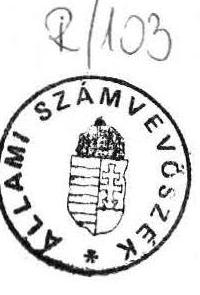
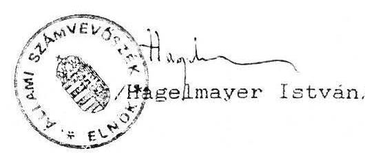

# Allami sáámturhóósek 

## JELENTÉS

az AGRÁRSZÖVETSÉG 1991. évi gazdálkodása törvényességének vizsgálatáról

---

Allami Számvevõszék
V-1013/7/1992.
Témaszám: 119 .

# J E L E N T E S 

## az Agrárszövetség 1991. évi gazdálkodása törvényességének vizsgálatáról

## I.

A vizsgálat célja, idôszaka, reprezentáció mértéke, vizsgálat módszere

1/ A pártok mũködésérõl és gazdálkodásáról szóló törvény (továbbiakban: párttörvény) egyedüli szervezetként az Allami Számvevõszéket (továbbiakban: ASZ) jelöli ki a pártok gazdálkodása törvényességének ellenôrzésére. Az ASZ e törvény felhatalmazása alapján évente legalább egyszer ellenörzi azoknak a pártoknak a gazdálkodását, amelyek az adott évben állami költségvetési támogatásban részesültek.

Az Agrárszövetség (továbbiakban: párt) az 1990. évi általános országgyülési választásokon elért eredménye alapján - a párttörvényben elôirt elosztási szabályok szerint - rendszeres állami költségvetési támogatásban részesül. Ennek megfelelően a párt 1990. évben 28.519 E Ft, 1991. évben 42.200 E Ft állami költségvetési támogatást kapott. Ezt 1990. évben a választások elötti idôszakban további 10 M Ft egészítette ki, amelyet országgyûlési határozat alapján, normatív alapon, taglétszám figyelembevételével utaltak ki a párt részére.

Az ASZ a párt gazdálkodásának törvényességét már másodízben ellenôrizte.

A vizsgálat célja annak ellenôrzése volt, hogy a párt gazdálkodása mennyiben felelt meg a párttörvény elõírásainak.

---

A vizsgálat alapvetően az 1991. évi gazdálkodásra terjedt ki. A párt gazdálkodása törvényességének ellenörzése, a Magyar Közlöny 1991. évi 28. számában közzétett ASZ általános ellenörzési program szempontjainak és elvárásainak megfelelően történt. Az ASZ ellenörizte az 1991. évi gazdálkodásról közzétett pénzügyi zárómérleg teljeskörüségét, pontosságát, a könyvvezetés gyakorlatát, a pénzügyi zárómérleg bizonylati alátámasztottságát, a számvitel bizonylati rendjét. Ezt egészítette ki a párt által végzett gazdálkodó tevékenység ellenörzése. Az ASZ vizsgálata e körben elsősorban arra összpontosult, hogy a párt müködéséhez szabályszerűen igénybevehető forrásokat használt-e fel, a párttörvényben megengedett gazdálkodó tevékenységet folytatott-e, valamint betartotta-e a gazdálkodásával összefüggö pénzügyi-számviteli és egyéb szabályokat.

A jelentés megállapításai a párt Országos, valamint a Bács-Kiskun, Fejér, Heves és Pest megyei Irodájánál lefolytatott helyszíni ellenörzés tapasztalatain alapuínak.

# II. 

A párt 1991. évi pénzügyi zárómérlegének ellenőrzése

A párt a Magyar Közlöny 1992. évi 23. számában tette közzé az 1991. évi gazdálkodásáról készített pénzügyi zárómérlegét (a jelentés 1. sz. melléklete) a párttörvény mellékletében elöirt szerkezetben és a párttörvény 9. paragrafusában meghatározott határidöben.

A zárómérleg mind föösszegében, mind egyes sorait tekintve pontos, a tényleges állapotnak megfelelő adatokat tartalmaz. A pénzügyi zárómérleg adatait minden esetben a megfelelő mérlegsorokon, a párttörvény 1. sz. mellékletében elöirt részletezéssel szerepeltették. A mérleg a párt valamennyi szervezetének bevételeit és kiadásait teljeskörüen tartalmazza. A területi szervezetek adatait a mérleg a megyei irodák adatszolgáltatása alapján tartalmazza, ahol az alapbizonylatok ellenőrizhetősége biztosított.

---

Az összes pénzbevételként feltüntetett 51.751 E Ft mind föösszegében, mind részleteiben megegyezik az Országos Iroda naplófôkönsvében kimutatott, illetve a megyei szervezetek által közölt bevételek összesített adataival.

A tényleges kiadások mérlegsorainak a könyvelési adatokkal történő összehasonlítása során eltérést nem állapított meg az ellenôrzés.

A helyi szervezetek részére adott támogatások elszámolásánál a kiadások halmozódását kiküszöbölték. A munkabérek elszámolását - helyesen - bruttó módon végzik. A különféle egyéb költségek részletes bontását elvégezték és ezek összege megegyezik a zárómérlegben kimutatott 11.281 E Ft-tal.

A pénzügyi zárómérleg c/ részében a tényleges pénzügyi helyzet bemutatásánál 40.139 E Ft összegũ halmozott többletet mutattak ki a gazdasági év végén. A vizsgálat megállapítása szerint ez az összeg megegyezik az Országos Iroda bankszámláján, illetve a házipénztárban lévô, valamint a tartós betétként elhelyezett pénzösszeg és a helyi szervezetek 1991. év végi pénzkészletének együttes összegével.

# III. 

A párt pénzügyi zárómérlege megalapozottságára szolgáló
könyvvezetésének, analitikus nyilvántartásának,
bizonylati rendjének ellenőrzése

A párt a választható könyvvezetési módok közül az egyszeres könyvvitelt választotta. 1990. január 1-töl a Terv 507. szny. számú naplófôkönsvet vezették, amelyet az APEH hitelesített. 1991. január 1-ig ez a naplófôkönvv tartalmazta az Agrárszövetség valamennyi bevételét és kiadását. 1991. január 1-töl a megyei irodák fokozatosan önálló jogi személlyé váltak és önálló könyvvezetésre tértek át. Igy a párt központi naplófôkönvve 1991. decemberére már csak az Országos Iroda gazdálkodási adatait tartalmazta. 1992. január

---

1-től az Országos Iroda és a megyei irodák külön-külön naplófökönyvet vezetnek gazdálkodásukról. A központi könyvvezetés a helyi szervezetek könyvelési adatait, az önálló jogi személlyé válás fordulónapjáig a valóságnak megfelelően tartalmazza, a Békés megyei Iroda könyvelési adatait 1991. év december 31-ig - az iroda megszünéséig - tartalmazza. Ugyancsak a valóságnak megfelelően tartalmazzák a gazdasági eseményeket a vizsgált megyei irodák naplófôkönyvei.

A párt Országos Irodája, illetve a vizsgált megyei irodák naplófôkönyveiben a gazdasági eseményeket megtörténtük idősorrendjében rögzítették, a negyedévenkénti zárásokat, a könyvvitel rendjéről szóló előírásoknak megfelelően végezték.

A párt Országos Irodájában, valamint a vizsgált megyei irodákban a könyvelés alapjául is szolgáló kötelezö analítikus nyilvántartásokat hiánytalanul vezetik. Naprakész az állóeszközök egyedi nyilvántartása, a vevő tartozások és szállítói követelések, valamint a SzJA köteles kifizetések nyilvántartása. Valamennyi nyilvántartás a valóságnak megfelelö adatokat tartalmaz.

A pártnál a bevételi és a kiadási pénztárbizonylatok, a pénztárjelentések és készpénzosekk minősülnek szigorú számadású bizonylatoknak. Ezeknek a bizonylatoknak a felhasználásáról az Országos Irodában, valamint a vizsgált megyei irodáknál - Fejér megye kivételével - az elöirt nyilvántartást elkészítették és a valóságnak megfelelően vezetik.

Általános tapasztalat azonban, hogy a megyei irodák nyilvántartása az alapszervezetek által használt kötelezően elöirt szigorú számadású bizonylatokat nem tartalmazza. Igy a megyei irodák könyveléséhez kapcsolódó szigorú számadású bizonylatok nyilvántartása nem teljeskörü.

A pártnál a szervezeti, müködési és bizonylatolási kérdéseket megfelelően szabályozták. A szabályzatok rendezik az aláírási és utalványozási jogosultságot is.

A könyvelés alapjául szolgáló bizonylatok kiállítása a vizsgált szervezeti egységeknél - a Pest megyei Iroda kivé-

---

tellevel - megfelel a számvitel bizonylati rendjéről szóló jogszabály elöirásainak. A Pest megyei Irodánál a bevételi és kiadási pénztárbizonylatokról az utalványozó aláírása minden esetben hiányzik.

A naplófőkönyvek adatai alapján az alapbizonylatok könnyen. gyorsan visszakereshetők. A bizonylatok tárolása biztonságosnak tekinthetö.

A párt Országos Irodájában és a vizsgált megyei irodákban a leltározási kötelezettségüknek eleget tettek. A leltározás az állóeszközökre és a fogyóeszközökre egyaránt kiterjedt.

# IV. 

A párt gazdálkodásának ellenőrzése

A párt 1991. évi fö bevételei elsődlegesen az állami költségvetési támogatásból és lekötött pénzeszközeinek kamataiból származtak. A párttörvény által tiltott forrásokból származó bevétel nem volt.

A párt 1991. évben a párttörvény alapján is lehetséges gazdálkodó tevékenységet nem végzett, vállalatot, egyszemélyes kft-t nem alapított, értékpapírt nem vásárolt. Az 1990. évi ASZ ellenőrzés során kifogásolt könyvértékesítési és hirdetési tevékenységét a párt megszüntette.

---

# V. 

A párt 1990. évi gazdálkodása törvényességének ellenôrzésekor ASZ által tett észrevételek érvényesülése

A párt 1990. évi gazdálkodása törvényességének ellenőrzésekor az ASZ megállapította, hogy a közzétett pénzügyi zárómérleg mind föösszegében, mind egyes sorait tekintve pontatlan volt, a tényleges állapottól eltérő adatokat tartalmazott. Ezért az ASZ indokoltnak tartotta annak újbóli elkészitését és ismételt megjelentetését a Magyar Közlönyben. A párt a felhívásnak eleget tett és a Magyar Közlöny 1991. évi 106. számában az 1990. évi pénzügyi zárómérlegét - helyesbitve - közzétette.

Az ASZ jelzésére a párt zárt, egységes rendszert alakitott ki pénzügyeinek intézésében, a könyvelés alapjául szolgáló bizonylatok vonatkozásában észrevételezett hiányosságokat pedig döntöen megszüntette.

## VI. Összegzés

Összességében megállapítható, hogy a párt 1991. évi gazdálkodása törvényes volt, a közzétett pénzügyi zárómérlege a tényleges állapotnak megfelelő adatokat tartalmazott. Az ellenőrzés nem talált olyan számottevô hibát, amely további intézkedést tett volna szükségessé.

Budapest, 1992. június 22.

Melléklet: 1 db

---

Az Agrárszövetség
1991. évi pénzügyi zárómérlege

- Forintban
A) Tényleges bevételek

1. Tagdijak 652000
2. Állami költségvetésbôl származó támogatás
a) müködési támogatás 42192000
b) jelöltálítás támogatása 30000
3. Egyéb hozzájárulások
a) jogi személyektól 485000
b) magánszemélyektól 16000
4. A párt propagandatevékenységéból
5. A párt gazdálkodó tevékenységéból
6. A párt által alapított vállalat nyereségéből
7. Egyéb bevétel
kamat 7717000
jégkárosultak támogatására 148000
különféle egyéb bevétel 511000
Összes pénzbevétel a gazdasági évben 51751000.

## B) Tényleges kiadások

1. Hozzájárulások juttatása
2. Személyzeti költségek
a) munkabérek 10264000
b) költségtérítések, napidíjak 5250000
c) társadalombiztosítási hozzájárulások 2663000
d) szociális támogatások 160000
3. Általános költségek
a) adók, illetékek
b) épületek fenntartása, karbantartása 543000
c) helyiségek bérlete 2045000
d) adminisztrációs és postaköltség 763000
e) különféle egyéb költségek (álló- és forgóeszközök beszerzése, anyagvásárlás, szállítás, rendezvények, jégkárosultak támogatása) 11281000
4. Sajtó- és propagandaköltségek 2401000
5. Választásokkal kapcsolatos költségek 1387000

Összes kiadás a gazdasági évben
36757000

C) Tényleges pénzügyi helyzet a gazdasági év zárásakor

Bevételek a gazdasági évben 51751000
Kiadások a gazdasági évben 36757000
Többlet a gazdasági évben 14994000
Halmozott többlet az elôzô gazdasági évból 25145000
Halmozott többlet a gazdasági év végén 40139000
Nagy Tamás s. k., Dr. Németh Béla s. k., elnök gazdasági igazgató.