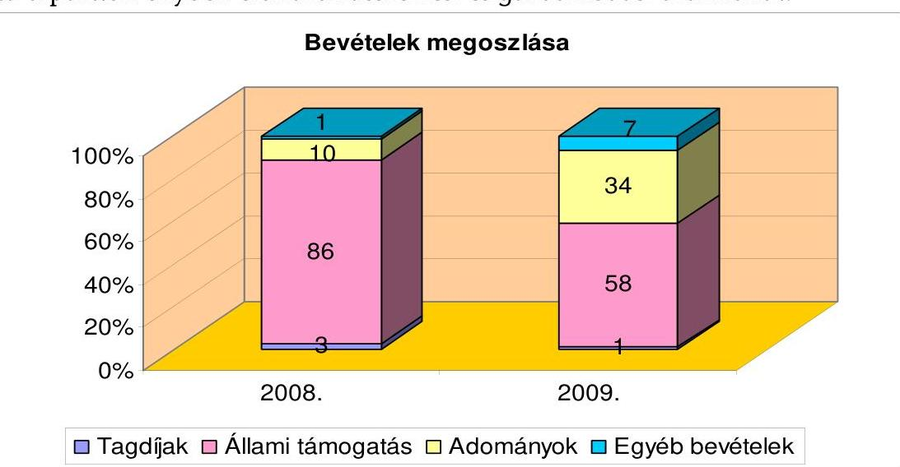
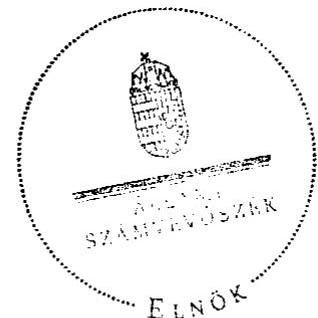

# ÁLLAMI   SZÁMVEVŐSZÉK 

## JELENTÉS

a Magyar Demokrata Fórum 2008-2009. évi gazdálkodása törvényességének ellenőrzéséről

---

3. Önkormányzati és Területi Ellenőrzési Igazgatóság
3.1. Szabályszerűségi Ellenőrzési Főcsoport
Iktatószám: V-3003-031/2010.
Témaszám: 970
Vizsgálat-azonosító szám: V-0506
Az ellenőrzést felügyelte:
Dr. Lóránt Zoltán
főigazgató
Az ellenőrzés végrehajtásáért felelős:
Dr. Elek János
általános főigazgató-helyettes
Az ellenőrzést vezette:
Horváth Balázs
főcsoportfőnök-helyettes
Az összefoglaló jelentést készítette:
Szakmányné Bilik Mária
számvevő tanácsos
Az ellenőrzést végezték:
Szakmányné Bilik Mária Baracsi Szilvia
számvevő tanácsos
A témához kapcsolódó eddig készített számvevőszéki jelentések:
címe
sorszáma
Jelentés a Magyar Demokrata Fórum 1991. évi gazdálkodása tör-
vényességének ellenőrzéséről
Jelentés a Magyar Demokrata Fórum 1992-1993. évi gazdálkodása 235
törvényességének ellenőrzéséről
Jelentés a Magyar Demokrata Fórum 1994-1995. évi gazdálkodása 342
törvényességének ellenőrzéséről
Jelentés a Magyar Demokrata Fórum 1996-1997. évi gazdálkodása 9902
törvényességének ellenőrzéséről
Jelentés a Magyar Demokrata Fórum 1998-1999. évi gazdálkodása 0106
törvényességének ellenőrzéséről
Jelentés a Magyar Demokrata Fórum 2000-2001. évi gazdálkodása 0313
törvényességének ellenőrzéséről
Jelentés a Magyar Demokrata Fórum 2002-2003. évi gazdálkodása 0457
törvényességének ellenőrzéséről
Jelentés a Magyar Demokrata Fórum 2004-2005. évi gazdálkodása 0703
törvényességének ellenőrzéséről
Jelentés a Magyar Demokrata Fórum 2006-2007. évi gazdálkodása 0847
törvényességének ellenőrzéséről

Jelentéseink az Országgyűlés számítógépes hálózatán és az Interneten a www.asz.hu címen is olvashatóak.

---

# TARTALOMJEGYZÉK 

BEVEZETÉS ..... 5
I. ÖSSZEGZŐ MEGÁLLAPÍTÁSOK, KÖVETKEZTETÉSEK, JAVASLATOK ..... 7
II. RÉSZLETES MEGÁLLAPÍTÁSOK ..... 12

1. A Párt gazdálkodásáról szóló 2008-2009. évi beszámolók ..... 12
1.1. A teljes vizsgálati időszakra érvényes megállapítások ..... 12
1.2. Bevételek ..... 13
1.3. Kiadások ..... 15
2. A Pártnak a beszámoló összeállítására és az azt alátámasztó könyvvezetésre vonatkozó belső szabályozása és gyakorlata ..... 16
2.1. A számviteli szabályozás rendszere ..... 16
2.2. A könyvvezetés gyakorlata, ennek összhangja a jogszabályokban és a belső szabályzatokban előírt követelményekkel ..... 18
2.3. A bizonylati elv és fegyelem, bizonylati rend érvényesülése ..... 21
3. A Párt bevételszerző, gazdálkodó tevékenysége ..... 22
3.1. A Párt gazdálkodásának szabályozottsága ..... 22
3.2. A Párt vagyonának elemei ..... 22
4. A gazdálkodással összefüggő, egyéb jogszabályokban foglalt előírások betartása ..... 23
4.1. A foglalkoztatás szabályszerűsége ..... 23
4.2. Személyi jellegű kifizetésekre vonatkozó jogszabályok betartása ..... 24
4.3. Az adózási, társadalombiztosítási és egyéb jogszabályok rendelkezéseinek érvényesítése ..... 25
5. A Párt belső ellenőrzésének rendszere ..... 26
5.1. A belső ellenőrzés rendszerének szabályozottsága, működése, eredményessége ..... 26
5.2. Az informatikai rendszer környezetének szabályozottsága és a belső kontrolljának működése ..... 27
6. Az előző ellenőrzés megállapításaira tett intézkedések ..... 28
MELLÉKLETEK
7. számú A Magyar Demokrata Fórum 2008. évi pénzügyi beszámolója
8. számú A Magyar Demokrata Fórum 2009. évi pénzügyi beszámolója

---

.

---

# RÖVIDÍTÉSEK JEGYZÉKE 

| Jogszabályok rövidítése |  |
| :--: | :--: |
| Art. | Az adózás rendjéről szóló - többször módosított - 2003. évi XCII. törvény |
| Párttörvény | A pártok működéséről és gazdálkodásáról szóló - többször módosított - 1989. évi XXXIII. törvény |
| Számv. tv. | A számvitelről szóló - többször módosított - 2000. évi C. törvény |
| Szja törvény | A személyi jövedelemadóról szóló - többször módosított 1995. évi CXVII. törvény |
| Tbj. | A társadalombiztosítás ellátásaira és a magánnyugdíjra jogosultakról, valamint e szolgáltatások fedezetéről szóló 1997. évi LXXX. törvény |
| Névrövidítések |  |
| APEH | Adó- és Pénzügyi Ellenőrzési Hivatal |
| ÁSZ | Állami Számvevőszék |
| OH | Országos Hivatal |
| OSZB | Országos Számvizsgáló Bizottság |
| Párt | Magyar Demokrata Fórum |

---

.

---

# JELENTÉS 

## a Magyar Demokrata Fórum 2008-2009. évi gazdálkodása törvényességének ellenőrzéséről

## BEVEZETÉS

Az Állami Számvevőszékről szóló 1989. évi XXXVIII. törvény 5. §-a, valamint a pártok működéséről és gazdálkodásáról szóló - többször módosított - 1989. évi XXXIII. törvény (párttörvény) 10. § (1) bekezdése alapján a pártok gazdálkodása törvényességének ellenőrzésére az Állami Számvevőszék (ÁSZ) jogosult. E törvényi felhatalmazás alapján az ÁSZ a 2010. évi ellenőrzési tervének megfelelően vizsgálta a Magyar Demokrata Fórum (Párt) 2008-2009. évi gazdálkodása törvényességét.

A Párt a hivatalosan közzétett éves beszámolói alapján 2008-ban 263324 ezer Ft, 2009-ben 391697 ezer Ft bevételről adott számot, amelynek 86, illetve 58%-a állami költségvetési támogatásból származott. A kiadásait 2008-ban 215961 ezer Ft, 2009-ben 933807 ezer Ft főösszeggel közölte. Az ellenőrzést nem a bevételi és kiadási összeg nagysága, hanem a számvevőszéki törvényben meghatározott kétévenkénti ellenőrzési kötelezettség indokolta.

Az ellenőrzés célja annak megállapítása volt, hogy:

- a Párt által készített és a Magyar Közlönyben, valamint a Párt internetes honlapján közzétett éves beszámolók a törvényi előírásoknak megfelelnek-e, a könyvvezetéssel és a valósággal megegyező adatokat tartalmaznak-e;
- a könyvvezetés és a gazdálkodás során betartották-e a számvitelről szóló többször módosított - 2000. évi C. törvény (Számv. tv.) és az egyéb jogszabályok rendelkezéseit, a belső előírásokat;
- a Párt a működéséhez szabályszerűen igénybe vehető forrásokat használt-e fel, a párttörvényben engedélyezett gazdálkodó tevékenységet folytatott-e.

Az ellenőrzés körülményeit illetően rögzíteni szükséges ${ }^{1}$, hogy:

- a párttörvény 1. sz. melléklete szerinti beszámoló mintához magyarázatot, útmutatót nem készítettek a jogalkotók, így ennek kitöltése pártonként - kialakított számviteli politikájuknak megfelelően - eltérő lehet;

[^0]
[^0]:    ${ }^{1}$ Az ÁSZ évek óta javasolja a Kormánynak a pártok ellenőrzéséről készített jelentéseiben a párttörvény módosítását.

---

- a beszámoló minta a számviteli törvény rendelkezéseivel nem harmonizál, nem felel meg sem a mérleg, sem az eredmény-kimutatás követelményeinek.

Az ÁSZ a párttörvény módosításáig a jelenleg hatályos rendelkezéseknek megfelelő - egységes módszertani alapokra helyezett - gyakorlattal folytatja a pártok gazdálkodása törvényességének ellenőrzését. Az ellenőrzést a pénzügyiszabályszerűségi ellenőrzés módszertani szabályai szerint, a pártok gazdálkodása törvényességének ellenőrzésére kiadott segédletben foglalt egységes követelmények alapján végeztük.

Az ellenőrzésnél az átfogó lényegességi küszöb mértékét a bevételi főösszeg 2%-ában határoztuk meg, továbbá specifikus lényegességi küszöböt alkalmaztunk az egyéb hozzájárulások, adományok esetében a párttörvény 1. számú mellékletének előírásaira tekintettel (belföldi jogi és magánszemélytől kapott hozzájárulás, adomány 500 ezer Ft felett).

A Párt vezetésében 2010-ben változások történtek az ellenőrzött időszakban funkcionáló vezetőkhöz képest. Az elnök 2010. április 11-i lemondása miatt az új elnököt 2010. június 20-án választották meg. A jelenlegi gazdasági igazgató 2010. február 20-tól látja el a feladatot, mert az előző gazdasági igazgató munkaviszonya 2010. január 31-én megszűnt. A vezetők között tételes munkakör és iratátadásra nem került sor.

A helyszíni ellenőrzésre 2010. augusztus 24-október 15 között, a Párt székhelyén, valamint kapcsolódó ellenőrzésként a Megújuló Társadalomért Alapítvány székhelyén, Mátészalkán került sor.

---

# I. ÖSSZEGZŐ MEGÁLLAPÍTÁSOK, KÖVETKEZTETÉSEK, JAVASLATOK 

A Párt a 2008. és a 2009. évi gazdálkodásáról szóló beszámolókat a párttörvényben előírt határidőn belül a Hivatalos Értesítőben és internetes honlapján közzétette. A beszámolók összeállításánál szabályozási és könyvvezetési hibákból eredően megsértették a Számv. tv-ben szabályozott teljesség, valódiság, következetesség, az összemérés és a lényegesség számviteli alapelveket, ezért a beszámolók nem mutattak megbízható és valós képet a Párt gazdálkodásáról. A 2008. és a 2009. évi beszámolók összeállításával összefüggésben a bevételeknél feltárt elszámolási hibák előjeltől független összege 4537 ezer Ft, illetve 12796 ezer Ft, ami a bevételi főösszeg százalékában 2008-ban 1,7%, 2009-ben 3,3% volt. A 2008. évi kiadási oldalon feltárt elszámolási hibák előjeltől független összege a bevételi főösszeg százalékában 3,4%, 2009-ben 3,1% volt. A megjelentetett beszámolóhoz képest kimutatott, a bevételi főösszegre vetített hiba mértéke mindkét évben meghaladta az átfogó lényegességi küszöböt. Specifikus lényeges hibát is tartalmazott mindkét évi beszámoló, mert a párttörvény előírása szerinti 500 ezer Ft-ot meghaladó összegű, belföldi személyektől kapott hozzájárulások, adományok nevesítése nem volt teljes körű, illetve a támogatásokat hibás összeggel közölték. Mindkét évben hiányzott az értékhatárt meghaladó nem pénzbeli vagyoni hozzájárulást nyújtó három-három önkormányzat, továbbá 2008-ban egy magánszemély nevesítése, 2009-ben négy magánszemély adományát nem a bizonylatokkal alátámasztott összegekkel közölték. Ezen túlmenően 2008-ban a helyi szervezetek 54%-a, 2009-ben 68%-a nem nyilatkozott az éves pénzforgalmáról, illetve annak hiányáról.

Számviteli szabályozását a Párt az előző ÁSZ ellenőrzés felhívására megújította, figyelemmel a központosított gazdálkodásra és könyvvezetésre. Továbbra sem biztosították a belső előírásokban a Számv. tv. és a párttörvény szerinti beszámoló eltérés összehangolását, mivel nem tartalmazza a számviteli politika a párttörvény szerinti beszámoló az egyéb bevételek, a működési kiadások, az eszközbeszerzés, a politikai és az egyéb kiadások definícióit, a beszámoló sorokhoz kapcsolódó főkönyvi számlák összefüggéseit; az eszközök és források értékelési szabályzata a nem pénzbeli vagyoni hozzájárulás értékelési szabályait, a lényegesség kritériumait; a pénzkezelési szabályzat a pénzkezelő helyek napi készpénz záró állománya maximális mértékét. Ezek a szabályozási hiányosságok mindkét évi beszámolóban beszámolási hibához vezettek. A szabályzatok nem tükrözték teljes körűen a szervezet sajátosságaihoz kapcsolódó Számv. tv. szerinti előírásokat. A számviteli politikából és a részét képező szabályzatokból hiányzott a megbízható és valós képet lényegesen befolyásoló hiba nagysága, az ismételt közzététel előírása, az érvényesítendő számviteli alapelvek; a számlarendből a számlaösszefüggések és az analitikus nyilvántartások tartalma; a bizonylati rendből az alkalmazott bizonylatok mintája és útja. A gazdálkodási és egyéb, a törvényesség érvényesülését elősegítő szabályokat a hatályos pénzügyi és gazdálkodási szabályzatban rögzítették, a helyi szervezetek készpénzforgalmának nyilvántartását a Számv. tv. előírásával ellentétesen határozták meg.

---

A kettős könyvvezetést 2008 őszén kapott megbízás alapján, új regisztrált külső számviteli szolgáltató végezte. A 2008. évi gazdasági eseményeket újra könyvelte. Az előző ÁSZ ellenőrzés felhívására szétválasztották a szervezetek bankszámla- és készpénzforgalmának nyilvántartását, megvalósították a költségnemenkénti könyvelést. A könyvvezetés rendszerhibáinak megszüntetése ellenére sérült a könyvvezetésben a teljesség, a valódiság, a következetesség, az összemérés és a bruttó elszámolás elve, melyek hatásaként az éves beszámolók lényeges hibákat tartalmaztak. A főkönyvi számlákhoz kapcsolódóan a tárgyi eszközök, a készpénzforgalom, a követelések és kötelezettségek analitikus nyilvántartását vezették, azok teljes körűségét azonban nem biztosították. A Pártnál a 100 ezer Ft alatti eszközökről, valamint a helyi szervezetek a készpénzpénzforgalmáról nyilvántartást nem vezettek, ami vagyonvédelmi kockázatot jelentett. A leltározás egyik évben sem volt teljes körű, a követelések és kötelezettségek egyeztetéses leltározását a Számv. tv. előírása ellenére nem végezték el. A leltározás eredményét nem értékelték. Az analitikus nyilvántartásokkal és a leltározással összefüggésben feltárt hibák következtében nem végeztek szabályszerű éves zárásokat.

A bizonylati elv és fegyelem érvényesült a 2008. évi vegyes bizonylatok mintegy negyedének megalapozottsága kivételével. A gazdasági eseményeket időrendben, zárt rendszerben rögzítették. A bizonylatok alaki és tartalmi kellékeire vonatkozó Számv. tv-i követelmények közül a területi irodáknál az utalványozás nem teljesült teljes körűen, illetve nem a hatáskörrel rendelkező személy végezte szabályozási hibából eredően, mivel a megyei elnök részére történt kifizetések elrendelőjét nem jelölték ki. A bizonylatok egyéb alaki, tartalmi kellékei a bizonylatok kevesebb, mint 2%-ánál tértek el az előírástól. A szervezeteknél felmerült reprezentációs kiadások bizonylatainak adattartalmából az üzleti vendéglátás jellege nem volt megállapítható. A szigorú számadású nyomtatványok nyilvántartásba vételi kötelezettségét teljesítették. A bizonylatok megőrzéséről nem gondoskodtak teljes körűen. A 2008. évi támogatási okiratok 12%-a másolatban állt rendelkezésre, a megszűnt szervezetek bizonylatait a területi iroda nem vette át.
A Párt bevételszerző, gazdálkodó tevékenysége során a nyilvántartásai és a Megújuló Társadalomért Alapítvány kapcsolódó
 ellenőrzése szerint betartotta a párttörvényben előírt forrásszerzési és gazdálkodási tilalmakat.

---

A Párt 2008. évi bevételeinek több mint négyötöde, 2009. évben több mint fele költségvetési támogatás volt. A Párt saját bevételei szabályozott tagdíjfizetésből, egyéb hozzájárulásokból és adományokból, ingatlanértékesítésből, tárgyi eszközök bérbeadásából, költségtérítésekből, kártérítésekből, valamint kamatbevételekből álltak. Az egyéb hozzájárulások, adományok aránya a 2008. évi 9%-ról 2009-ben 34%-ra nőtt az európai parlamenti választás kampánykiadásainak fedezetére kapott támogatások összege miatt. A Párt nem pénzbeli vagyoni hozzájárulásként 2008-ban 12078 ezer Ft, 2009-ben 23812 ezer Ft összegű támogatást kapott önkormányzatok által nyújtott kedvezményes ingatlan bérleti díj formájában. A teljesült bevételek nem fedezték a kiadásokat, ezért bankhitelt, kölcsönt vettek fel, illetve kifizetetlen szállítói számlák keletkeztek. A 21 állami ingatlan megvásárlásához felvett hitel fedezeteként a Magyar Fejlesztési Bank jelzálogjogát a földhivatali nyilvántartásba bejegyeztették. A Párt lecsökkent állami támogatása következtében a hitel visszafizetését az ellenőrzés kockázatosnak ítéli pénzügyi stabilitást biztosító döntések és intézkedések nélkül.

A munkavállalókat, a munkáltatói jogot gyakorló pártigazgató szabályszerű munkaszerződések alapján foglalkoztatta, továbbá megbízásos jogviszonyban is láttak el feladatokat. A munkavállalók, a pártigazgató kivételével munkaköri leírással nem rendelkeztek. A munkabéreket, megbízási díjakat központilag számfejtették. Személyi jellegű kifizetések körében a munkavállalók adómentes mértékben étkezési utalványt, helyi és helyközi bérlettérítést és iskolakezdési támogatást kaptak. A magántulajdonú gépjármű hivatali célú használatát az érintettek és a Párt közötti megállapodáshoz kötötték. A költségtérítések kétharmadát szabályosan kitöltött kiküldetési rendelvények alapján, adómentes normatív mértékkel számolták el. Belső előírás ellenére 2009-ben az útiköltség térítések 40%-ához nem csatoltak nyilatkozatot. Nem minősült adómentes kifizetésnek egy magánszemély részére nem saját gépkocsira történt 136 ezer Ft összegű költségtérítés.

A Párt az adózási, társadalombiztosítási jogszabályokban előírt havi és éves adatszolgáltatási, bevallási és befizetési kötelezettségét a munkaviszonynyal összefüggésben teljesítette, a foglalkoztatottak biztosítási jogviszonyában történt változásokat határidőben bejelentette. A kötelező nyilvántartásokat vezették. Elmulasztották egy 2009-ben vásárolt gépkocsi után a cégautóadó, valamint mindkét évben a vezetékes hivatali telefonok magáncélú használatból eredő adó- és járulékfizetési kötelezettség bevallását, befizetését. A bevallást a helyszíni ellenőrzés időszakában önellenőrzéssel pótolták. Munkaviszonyban nem álló személy helyett fizettek szabálytalanul adómentesen internet használati díjat.

A belső ellenőrzés rendszerét a 2009. júniusában módosított alapszabályban és a pénzügyi és gazdálkodási szabályzatban ellentmondásosan és hiányosan szabályozták. Kétszintű számvizsgáló bizottság működését írták elő, a területi szinten működőkhöz feladat- és hatáskört nem rendeltek. A helyi, a harmadik szintű számvizsgáló bizottságok működését eltörölték. Az OSZB az ügyrendi előírások ellenére érdemi ellenőrzést nem végzett a vizsgált időszakban. A gazdasági igazgató gazdálkodással összefüggő feladat- és hatáskörét, valamint felelősségi körét nem szabályozták. A vezetői és a munkafolyamatba épített ellenőrzés szabályai a gazdasági igazgató, valamint az ellenjegyzők és feladataik

---

kijelölése kivételével megfelelőek voltak. Hiányos működése nem tárta fel a belső előírástól eltérő, az értékhatárt meghaladó kötelezettségvállalást, továbbá a könyvvezetési és a beszámoló készítési hibákat. A pénzkezelési szabályzatban előírt pénztári ellenőrzést nem gyakorolták, ellenőröket nem bíztak meg. A gazdálkodással összefüggő informatikai rendszer működtetését nem szabályozták. A számviteli szolgáltató a gazdálkodási adatok biztonságáról rendszeres mentéssel és a hozzáférési jogosultság egy személyre történő korlátozásával gondoskodott.

Az előző ÁSZ ellenőrzés felhívásában kezdeményezett intézkedéseket a Párt részlegesen hajtotta végre, így továbbra is fennálltak a szabályozási, könyvvezetési, bizonylatolási hiányosságok, ennek következtében a szabálytalanságok ismétlődtek.

A helyszíni ellenőrzés tapasztalatainak hasznosítása mellett javasoljuk

# a Kormánynak 

Terjessze elő a pártfinanszírozás átláthatóságának, a pártok elszámoltathatóságának fokozott érvényesítése érdekében a párttörvény módosítását, figyelemmel a pártok számviteli nyilvántartási és beszámolási rendszerét érintő ellentmondások feloldására, amelyek a párttörvény és a Számv. tv. között évek óta fennállnak.

A helyszíni ellenőrzés megállapításainak hasznosítása mellett az Állami Számvevőszék felhívja

## a Párt elnökét

1. Ismételten tegye közzé megbízható és valós adatokkal a Párt 2008. és 2009. évi módosított beszámolóit a párttörvény 9. § (2) bekezdésében előírt nevesítési követelmény érvényesítésével.
2. Intézkedjen a Párt sajátosságainak megfelelően a beszámolási és a könyvvezetési belső szabályok Számv. tv-hez igazodó kiegészítésére, hogy:
a) a számviteli politika részletesen tartalmazza a párttörvény 1. számú melléklete szerinti beszámoló egyéb bevételek, működési kiadások, eszközbeszerzés, politikai és egyéb kiadások definícióit, a beszámoló sorok és a főkönyvi számlák kapcsolatát, a megbízható és valós képet lényegesen befolyásoló hiba nagyságát, valamint az ismételt közzététel előírásait;
b) a pénzkezelési szabályzatban rögzítsék a Számv. tv. 14. § (8) bekezdésével összhangban a maximális napi záró pénzkészlet nagyságát, figyelemmel a pénzkezelő helyek számára, forgalmára és a vagyonbiztonságra;
c) az értékelési szabályzat a párttörvény 4. § (5) bekezdésével összhangban tartalmazza a nem pénzbeli vagyoni hozzájárulás értékelési szabályát és a lényegesség kritériumait.

---

3. Szerezzen érvényt az éves beszámolók alapjául szolgáló könyvvezetésben a Számv. tv. 15. § (2)-(3), az (5), a (7), valamint a (9) bekezdésben szabályozott számviteli alapelveknek.
4. Intézkedjen a Párt sajátosságaihoz igazodó, a vagyonvédelmi követelményeket kielégítő analitikus nyilvántartások szabályszerű vezetéséről és egyeztetéséről.
5. Szerezzen érvényt a Számv. tv. 69. § és 164. § (1) bekezdésében előírt szabályszerű és teljes körű leltározás és zárás végrehajtásának.
6. Rendelkezzen hitelt érdemlő dokumentumok beszerzéséről jogi személyek adományozása esetén annak érdekében, hogy megállapítható legyen a párttörvény 4. § (2) bekezdésben rögzített korlátozás betartása.
7. Intézkedjen a Számv. tv. 165. § (1) bekezdésében foglalt bizonylati elv és fegyelem, a bizonylatolás 167. § (1) bekezdésében megfogalmazott alaki és tartalmi követelményeinek, továbbá a 169. § (2) és (4) bekezdésében előírt bizonylat megőrzési kötelezettség teljesítéséről.
8. Határozza meg a pénzügyi és gazdálkodási szabályzatban:
a) a helyi szervezetekre vonatkozó pénzkezelési rendet a Számv. tv 165. § (3) bekezdés a) pont előírásaival összhangban;
b) az ellenjegyzésre jogosultak körét, az ellenjegyzés során ellátandó feladatokat, a dokumentálás módját.
9. Intézkedjen:
a) a gazdasági igazgató gazdálkodással összefüggő feladat- és hatásköre, valamint felelősségi köre meghatározására és érvényesítésére;
b) a munkavállalók munkaköri leírásának elkészítésére és a munkavállalók részére történő átadására.
10. Szerezzen érvényt a pénzügyi és gazdálkodási szabályzatban előírt kötelezettségvállalási értékhatárok betartásának.
11. Intézkedjen önellenőrzéssel az Szja törvény előírásainak megfelelően az adóköteles kifizetések utáni adó- és járulék megállapítására, bevallására és megfizetésére, a bevételekhez tartozó kifizetésekre vonatkozó adatszolgáltatásra.
12. Intézkedjen a belső ellenőrzési rendszer összehangolt szabályozására, valamint a számvizsgáló bizottságok, a vezetői és a munkafolyamatba épített ellenőrzés, különösen a pénztárellenőrzés eredményes működtetésére.

---

# II. RÉSZLETES MEGÁLLAPÍTÁSOK 

## 1. A PÁRT GAZDÁLKODÁSÁRÓL SZÓLÓ 2008-2009. ÉVI BESZÁMOLÓK

### 1.1. A teljes vizsgálati időszakra érvényes megállapítások

A Párt a 2008. évi gazdálkodásáról szóló beszámolót 2009. április 30-án a Hivatalos Értesítő 20. számában, a 2009. évi beszámolót 2010. április 30-án a Hivatalos Értesítő 31. számában tette közzé a párttörvény 9. § (1) bekezdésében előírt határidőn belül, a párttörvény 1. számú mellékletében meghatározott minta szerint (1-2. számú melléklet). A Párt mindkét évi beszámolóját internetes honlapján is nyilvánosságra hozta.

Az országos választmány a Párt éves gazdálkodásáról készített éves beszámolókat határozattal elfogadta. A közzétett beszámolók a helyi szervezetek, a területi irodák és az OH számviteli bizonylatai alapján, központilag könyvelt gazdasági események főkönyvi kivonataiból készültek. A könyvelésben rögzített adatok szerint 2008-ban a nyilvántartott szervezetek 46%-a, 2009-ben 32%-a rendelkezett tagdíjbevétellel. A többi szervezet pénzforgalmáról nem állt rendelkezésre adat, így hiányzott a beszámolóból is. A Párt a beszámoló teljessége érdekében nem kért a nyilvántartott szervezetektől nyilatkozatot arra vonatkozóan, hogy a vizsgált években rendelkeztek-e bevétellel, illetve teljesítettek-e kiadást.

A Párt a számviteli szabályzatokban nem határozta meg a beszámoló sorok és főkönyvi számlák kapcsolatát, a beszámoló összeállítása során figyelembevett főkönyvi számlákról készített kimutatást adott át az ellenőrzés részére. A beszámoló sorokhoz kapcsolódó főkönyvi kivonatokból, illetve főkönyvi számlákból levezethetők voltak a beszámolók adatai. A 2008. évi beszámoló eszközbeszerzés sor adata kivételével a kapcsolódó főkönyvi számlák egyenlegeivel a beszámoló sorok adatai egyeztek, mégsem mutattak megbízható és a valós képet a Párt gazdálkodásáról, mivel a beszámolók összeállításánál megsértették a Számv. tv. 15. § (2)-(3), az (5), a (7), valamint a 16. § (4) bekezdésében foglalt teljesség, valódiság, következetesség, az összemérés és a lényegesség számviteli alapelveket.

A 2008. és a 2009. évi beszámolók összeállításával összefüggésben feltárt bevételi hibák előjeltől független összege 4537 ezer Ft, illetve 12796 ezer Ft, ami a bevételi főösszeg százalékában 2008-ban 1,7%, 2009-ben 3,3% volt. A 2008. évi kiadási hibák előjeltől független összege a bevételi főösszeg százalékában 3,4%, 2009-ben 3,1% volt. A megjelentetett beszámolóhoz képest kimutatott, a beszámoló bevételi főösszegére vetített hiba mértéke 2009-ben meghaladta az átfogó lényegességi küszöböt, amely az ÁSZ-nál általánosan elfogadott 2%. Specifikus lényeges hibaként állapítottuk meg mindkét évi beszámolóban, hogy a párttörvény előírása szerinti nevesítés nem volt teljes körű, illetve a támogatásokat hibás összeggel közölték.

---

# 1.2. Bevételek 

A Párt által közzétett beszámolók bevételi sorai az alábbi eltérések miatt nem egyeztek a valós helyzettel:

Adatok ezer Ft-ban

| Megnevezés | Ellenőrzés által megállapított eltérések a   közzétett beszámolóhoz képest |  |  |  |
| :-- | :--: | :--: | :--: | :--: |
|  | 2008. évi |  | 2009. évi |  |
| BEVÉTEL |  |  |  |  |
|  | Kimaradt | Hibásan   szerepel | Kimaradt | Hibásan   szerepel |
| 1.Tagdíjak | 0 | 0 | 63 | 0 |
| 2.Állami támogatás | 0 | 0 | 0 | 0 |
| 4.1.Belföldi jogi személy | 3478 | 0 | 7575 | 0 |
| 4.2.Jogi személynek nem minősülő   gazdasági társaság | 0 | 182 | 0 | 0 |
| 4.3.Belföldi magánszemély | 430 | 0 | 12 | 0 |
| 6.Egyéb bevétel | 17 | 430 | 0 | 5146 |
| ÖSSZESEN: | $\mathbf{3 925}$ | $\mathbf{612}$ | $\mathbf{7650}$ | $\mathbf{5146}$ |
| - Hiány | $\mathbf{3313}$ |  | $\mathbf{2504}$ |  |

A tagdíjak mértékéről az alapszabály előírásával összhangban az országos választmány döntött, mérsékléséről, illetve annak elengedéséről a helyi szervezetek dönthettek. A tagdíjak mérsékléséről szóló egyedi döntéseket nem csatolták az elszámolásokhoz, így a csökkentett tagdíjfizetések jogszerűsége nem volt megítélhető. A tagdíj elnevezésű főkönyvi számlához postai, banki, valamint a területi irodákban kiállított bevételi pénztárbizonylatok kapcsolódtak. A beszámoló soron csak tagdíjak fogalomkörébe tartozó összegek szerepeltek. A 2009. évi tagdíjbevételből hiányzott összesen 63 ezer Ft összeg, mivel a 2008. évi bizonylattal alá nem támasztott 2 ezer Ft, illetve a 2008. évi befizetési bizonylat utólagos javításából eredő 61 ezer Ft összeggel az összemérés elve követelményét figyelmen kívül hagyva csökkentették a 2009. évi tagdíjbevételt.

Az állami költségvetésből származó támogatásokat a főkönyvi könyvelésben kimutatott és a bankszámla kivonaton szereplő, a Magyar Államkincstár által ténylegesen
 átutalt összeggel egyezően közölték. A párttörvény 5. § (2) bekezdése alapján kapott 2008. évi támogatás egyezett a költségvetési törvényben meghatározott összeggel. A 2009. évi támogatás összegét a Pénzügyminisztérium a párttörvény 4. § (4) bekezdése alapján csökkentette az ÁSZ felhívásának megfelelően, 383 ezer Ft összeggel.

Az egyéb hozzájárulások, adományok beszámoló sor adattartalmát a Párt a párttörvény előírásának megfelelően tovább részletezte. A Pártnak a vizsgált években belföldi jogi személyektől, valamint belföldi magánszemélyektől származott ezen a jogcímen bevétele.

Egyéb hozzájárulások, adományok belföldi jogi személyektől beszámoló sor adata egyezett a vonatkozó főkönyvi számlák összesített egyenlegével, azonban egyik évben sem a valós helyzetet mutatta. A 2008. évi beszámoló sor-

---

ból hiányzott tévesen jogi személynek nem minősülő gazdasági társaság adománya között kimutatott 182 ezer Ft összegű, jogi személyektől származó adomány. A 2009. évben az egyéb bevételek között kimutatott, összesen 1417 ezer Ft jogi személyek adománya, hozzájárulása hiányzott a soron közzétett adatból.

A beszámoló soron mindkét évben hiányosan közölték a helyi pártszervek által a helyi önkormányzatoktól ingyenesen vagy kedvezményes díjtételű ingatlanhasználat formájában kapott nem pénzbeli vagyoni hozzájárulás értékét. A Párt az ingatlanok használatából eredő 2008. évi nem pénzbeli vagyoni értékű támogatást a helyszíni ellenőrzés alatt, a 2009. évit az egyeztetési időszakban értékelte, amely alapján a 2008. évi beszámolóból 3296 ezer Ft, a 2009. évi beszámolóból 6158 ezer Ft összeg hiányzott, ebből mindkét évben három-három támogatótól kapott nem pénzbeli vagyoni hozzájárulás értéke meghaladta az 500 ezer Ft-ot. A hibából eredően nem teljesült a párttörvény 9. § (2) bekezdés előírása, a támogatók nevének és a hozzájárulás összegének közzétételét elmulasztották.

Az egyéb hozzájárulások, adományok jogi személynek nem minősülő gazdasági társaságoktól soron a 2008. évi beszámolóban hibásan szerepelt az összeg az előző beszámoló soránál részletezettek miatt.

Az egyéb hozzájárulások, adományok belföldi magánszemélyektől soron a 2008. évi beszámoló sorból hiányzott az egyéb bevételek között kimutatott, összesen 430 ezer Ft, a 2009. évi beszámoló sorból 12 ezer Ft összegű magánszemélyektől származott adomány. A 2008. évi összegből 417 ezer Ft Németh Ferenc hozzájárulása, adománya volt, az éves összes befizetése ezzel együtt 687 ezer Ft-ot tett ki. A támogató nevének és az adomány összegének közzétételét elmulasztották. A Párt a 2009. évi beszámoló összeállítása során a párttörvény előírása ellenére elmulasztotta összesíteni az egy befizetőtől származó adományokat. Az 500 ezer Ft-ot meghaladó, nevesítésre került adományozók közül négy fő adományát nem a bizonylatokkal alátámasztott összegekkel hozta nyilvánosságra. Továbbá három támogatót nem nevesítettek annak ellenére, hogy az év során befizetett támogatásaik összege meghaladta az 500 ezer Ft-ot.

Az egyéb bevételek jogcímeit belső szabályzat nem tartalmazta. A beszámoló összeállításáról átadott kimutatás szerint ingatlan értékesítésből, eszközbérbeadásból, továbbszámlázott közüzemi díjakból és egyéb megtérülésből származó bevételt, kerekítési különbözetet, valamint kamatbevételeket és egyéb különféle bevételeket tettek közzé a soron.

A 2008. évi beszámoló sor adatából hiányzott 17 ezer Ft Vas megyei területi irodánál teljesült, de nem könyvelt kamatbevétel, valamint hibásan hoztak nyilvánosságra 430 ezer Ft összegű magánszemélyektől származó adományt. A 2009. évi beszámolóban ezen a soron tévesen szerepelt összesen 5146 ezer Ft összeg, amelyből 1417 ezer Ft jogi személy, 12 ezer Ft magánszemély hozzájárulása, adománya volt, 17 ezer Ft 2008. évi kamat, 3700 ezer Ft pedig a 2001-ben vásárolt Szeged, Füredi utca 2. szám alatti ingatlan vételéhez, illetve eladásához kapcsolódott. Az ingatlan a Párt számviteli nyilvántartásában nem szerepelt, ezért az eladással egy időben utólagosan vették nyilvántartásba. Az eladásból származó 4000 ezer Ft bevételen kívül, a „fellelt" ingatlan nyilvántartásba véte-

---

lével összefüggésben a bekerülési érték egyéb különféle bevételként történt elszámolásából adódóan tévesen, duplán mutatták ki a bevételek között.

# 1.3. Kiadások 

A 2008. és a 2009. évekre közzétett beszámolók kiadásainak ellenőrzése során megállapított eltéréseket - beszámoló soronként - a következő összeállítás részletezi:

Adatok ezer Ft-ban

| Megnevezés | Ellenőrzés által megállapított eltérések a közzétett beszámolóhoz képest |  |  |  |
| :--: | :--: | :--: | :--: | :--: |
|  | 2008. évi |  | 2009. évi |  |
| KIADÁS | Kimaradt | Hibásan   szerepel | Kimaradt | Hibásan   szerepel |
| 2. Tám. egyéb szervezetnek | 0 | 0 | 0 | 2045 |
| 4. Működési kiadások | 6674 | 134 | 8270 | 2007 |
| 5. Eszközbeszerzés | 765 | 0 | 0 | 0 |
| 6. Politikai tevékenység kiadásai | 67 | 0 | 0 | 0 |
| 7. Egyéb kiadás | 0 | 1371 | 0 | 0 |
| ÖSSZESEN: | 7506 | 1505 | 8270 | 4052 |
| - Hiány | 6601 |  | 4218 |  |

Támogatás egyéb szervezeteknek beszámoló soron közölt adat 2008-ban megegyezett a vonatkozó főkönyvi számla egyenlegével. A 2009. évi beszámoló összeállításánál a következetesség elve sérült, mivel nem csak bejegyzett szervezetek részére adott támogatást, hanem helyes könyvelés ellenére működési kiadásként elszámolt nemzetközi tagdijakat is szerepeltettek a beszámoló soron 2045 ezer Ft összegben.

Működési kiadások között a Párt rezsi költségeket, bérleti díjakat, a munkavállalók bér- és járulékköltségeit, személyi jellegű egyéb kifizetéseket, anyagköltségeket és a működéshez kapcsolódó igénybevett szolgáltatásokat számolt el. A beszámoló sor adata 2008-ban egyezett a Párt belső előírásaiban meghatározott főkönyvi számlák egyenlegeinek összesített adatával, az mégsem volt pontos. Hiányzott téves könyvelés miatt az egyéb kiadások között szerepeltetett 1371 ezer Ft összegű nemzetközi szervezetnek fizetett tagdíj, továbbá 2008-ban vásárolt és a dolgozóknak kiadott, de a 2009. évi könyvelésben és beszámolóban szerepeltetett 2007 ezer Ft összegű étkezési utalvány. Közzé tettek viszont a beszámoló soron kétszeres költségelszámolás következtében (Zala megye) 67 ezer Ft összegű kiadást, továbbá hibás kontírozásból adódóan - a bizonylatokon politikai megjelölés szerepelt - ugyanilyen összegű politikai kiadást. A 2009. évi beszámoló sorából hiányzott 67 ezer Ft összegű kiadás az előző évi kétszeres költségelszámolás szabálytalan javítása miatt, mivel 2009-ben csökkentették az anyag- és telefonköltségeket. Hiányzott továbbá az egyéb szervezeteknek adott támogatás soron közzétett 2045 ezer Ft összegű nemzetközi tagdíj. A beszámoló sor egyik évben sem tartalmazta teljes körűen az ingyenes, vagy kedvezményes díjtételű ingatlanhasználattal kapcsolatos, meg nem fizetett bérleti díj különbözet összegét, ami az utólagos értékelés szerint 2008-ban 3296 ezer Ft, 2009-ben 6158 ezer Ft volt.

---

A számviteli szabályzatokban a működési és politikai kiadásokat pontosan nem definiálták. E hiányosságok miatt nem érvényesült teljes körűen a működési kiadások azonossága a vizsgált években.

Az eszközbeszerzés 2008. évi beszámoló sora nem egyezett a vonatkozó főkönyvi számlákon könyvelt beszerzés adataival, mert tévedésből a beruházás számlacsoport egyenlegét vették figyelembe, így a valós eszközbeszerzésnél 765 ezer Ft összeggel kevesebbet tettek közzé. A 2009. évi adat egyezett a vonatkozó főkönyvi számlák összesített adatával. A Párt az állami vagyonról szóló 2007. évi CVI. törvény 68. § (4) bekezdése alapján 21 állami tulajdonú ingatlant vásárolt. Egy önkormányzati ingatlan tulajdonjogát szerezte meg.

Politikai tevékenység kiadása beszámoló soron a Párt számlarendjében meghatározott főkönyvi számlák összesített egyenlegeit mutatta ki következetesen mindkét évben. Az adat 2008-ban nem a tényleges állapotot tükrözte, mivel a beszámoló sorból hiányzott a működési kiadások között tévesen nyilvántartott és nyilvánosságra hozott 67 ezer Ft összegű kiadás.

Egyéb kiadások között bankköltséget, árfolyamveszteséget, hitelkamatot, illetéket, közjegyzői díjat, kerekítés miatti eltéréseket számoltak el. A 2008. évi beszámoló ezen a jogcímen hibásan tartalmazott 1371 ezer Ft működési kiadást. A 2009. évi beszámoló sor adata megegyezett a vonatkozó főkönyvi számlák összesített egyenlegeivel.

# 2. A PÁRTNAK A BESZÁMOLÓ ÖSSZEÁLLÍTÁSÁRA ÉS AZ AZT ALÁTÁMASZTÓ KÖNYVVETÉSRE VONATKOZÓ BELSŐ SZABÁLYOZÁSA ÉS GYAKORLATA 

### 2.1. A számviteli szabályozás rendszere

A Párt az előző ÁSZ ellenőrzés felhívására új számviteli szabályzatokat készített, azokat a 2009. október 17-én az országos választmány által elfogadott pénzügyi és gazdálkodási szabályzat mellékleteként léptette hatályba, a gyakorlatban a 2008. évi könyvvezetésben és beszámoló készítés során már alkalmazta. A Számv. tv. 14. § (12) és a 161. § (4) bekezdésével összhangban az új számviteli politika és kapcsolódó szabályzatok, valamint a beszámolóhoz és számviteli rendhez kapcsolódó számlarend elkészítését, módosítását a Párt képviselője hatás- és felelősségi körébe helyezték, ezzel biztosították, a törvényi változások miatti módosítások 90 napos határidőn belül történő átvezetés lehetőségét a Számv. tv. 14. § (11) bekezdés előírása érvényesüléséhez.

A Számv. tv. 14. (3) bekezdésben előírt számviteli politika a hatályos jogszabályi előírásoknak megfelelően rögzíti: a könyvvezetés módját, az évközi és év végi zárlatok időpontját, feladatait; az éves beszámoló készítésének rendjét, időpontját. A számviteli politikában nem rögzítették a Számv. tv. 3. § (3) bekezdés 5. pont szabályozása ellenére a megbízható és valós képet lényegesen befolyásoló hiba nagyságát, a 154. § (5) bekezdés szerinti ismételt közzététel előírásait, a sajátosságok figyelembevételével a beszámoló elkészítése és a könyvvezetés során érvényesítendő számviteli alapelveket, a párttörvény 1. sz. mellékletében előírt beszámoló összeállításához az egyéb bevételek, a működési kiadások, az

---

eszközbeszerzések, a politikai tevékenység és az egyéb kiadások fogalomkörét, a főkönyvi számlák megnevezéséből egyértelműen nem következő számlák és beszámoló sorok összefüggéseit.

Az eszközök és források leltárkészítési és leltározási szabályzata, figyelemmel a Számv. tv. 69. § (1)-(2) bekezdéseire tartalmazza: a leltározás fordulónapját, a leltározás módját, a dokumentumok feldolgozási, megőrzési módját, a leltározás technikai feltételeit, eszközeinek biztosítását, a leltározás előkészítése során elvégzendő feladatokat, a leltári eltérések megállapításának, rendezésének módját (leltárértékelés), a leltározás és az értékelés ellenőrzésének módját, a leltári eltérések főkönyvi elszámolását. A szabályozás szerint, a pártigazgató az éves leltározási utasításban határozza meg az operatív teendőket, a munkafolyamatok elvégzéséért és ellenőrzéséért felelős személyeket.

Az eszközök és források értékelési szabályzat a törvényi előírásokkal összhangban tartalmazza az eszközök és a források minősítési szempontjait, az egyes eszköz- és forráscsoportok választott értékelési eljárásait, az eszközök bekerülési érték tartalmát, a jelentős, illetve a nem jelentős összeg meghatározását eszköz- és forráscsoportonként, továbbá az amortizációs politika elemeit és a lényegesség általános meghatározását. Hiányzik a lényegesség kritériumainak konkrét meghatározása (pl. párttörvényben előírt támogató nevesítésének elmulasztása), valamint a párttörvény 4. § (5) bekezdés előírása ellenére a Párt részére nyújtott nem pénzbeli vagyoni hozzájárulás értékelési szabálya.

A pénzkezelési szabályzatot az ÁSZ előző felhívására kiegészítették. Meghatározták a bankszámlaforgalommal kapcsolatos feladatokat, a kerekítés módját. Megtiltották a területi irodák bankszámláihoz kapcsolódó bankkártya igénylést és használatot, továbbá megszüntették a helyi szervezetek bankszámláit. A pénztárak napi készpénz záró állományának maximális mértékét csak a Párt egészére határozták meg, az egyes pénztárakra vonatkozóan nem. A szabályzatban rögzítették az elszámolásra kiadott előlegek felvételének, elszámolásának és nyilvántartásának szabályait a jogszabályi előírásokkal összhangban. Hiányossága, hogy nem tartalmazza a
 pénztári kiadások és bevételezések jogcímeit a Számv. tv. 14. § (8) bekezdés előírása ellenére. A Párt egészére vonatkozik a szabályozás, azonban a pénzkezelési előírások nincsenek figyelemmel a területi irodák sajátos működési feltételeire. A helyi szervezetek pénzforgalmának nyilvántartásáról nem rendelkeztek annak ellenére, hogy a szervezetek tagdíjakat, adományokat, egyéb költségtérítéseket szednek be és a bevételeik mértékéig kötelezettséget vállalhatnak, kiadásokat teljesíthetnek.

A Párt a beszámolóhoz és számviteli rendhez kapcsolódó számlarendet és bizonylati rendet átalakította, a működési sajátosságainak és részben a jogszabályi előírásoknak megfelelően. A számlarendet a Számv. tv. 160. §-ában előírt, egységes számlakeret követelményeire figyelemmel alakították ki. A Számv. tv. 161. § (2) bekezdés b) pont előírása ellenére nem tartalmazza a számlaösszefüggéseket. Önálló főkönyvi számlákat jelöltek ki költségnemenkénti bontásban a működési és politikai költségek elszámolására. A főkönyvi számlákhoz kapcsolódó analitikus nyilvántartásokról nem rendelkezik a számlarend teljes körűen, mivel nem írták elő a Párt sajátosságaira figyelemmel a tagdíjak, az adományok, a kis értékű tárgyi eszközök részletező nyilvántartás vezetését és tartalmát a Számv. tv. 161. § (2) bekezdés c) pont előírása ellenére. A pénzügyi és gazdál-

---

kodási szabályzatban a tagdíjakra és adományokra vonatkozó előírást pótolták, tartalmát nem határozták meg. A szabályozás szerinti analitikus nyilvántartások és a főkönyvi könyvelés közötti ellenőrzési pontokat kijelölték. A könyvvezetést alátámasztó bizonylati rendhez nem mellékelték az alkalmazott bizonylatok, analitikus nyilvántartások mintáját, nem jelölték ki a bizonylat kiállítás helyét és a bizonylat útját.

A számviteli szabályzatok az előző ÁSZ felhívás ellenére - a megállapított hiányosságok miatt - továbbra sem felelnek meg a párttörvény gazdálkodással és beszámoló készítéssel összefüggő sajátos, valamint a Számv. tv. előírásainak, amelyek következtében a beszámolási hibák továbbra is ismétlődtek.

# 2.2. A könyvvezetés gyakorlata, ennek összhangja a jogszabályokban és a belső szabályzatokban előírt követelményekkel 

A Párt a számviteli politika előírásával összhangban a Számv. tv. 162. § (1)-(2) bekezdésben rögzített kettős könyvvitelt vezetett. A Pártnál a vizsgált időszakban számviteli szolgáltató váltás történt, az új szolgáltató rendelkezik a Számv. tv. 151. § (1) bekezdés ${ }^{2}$ szerint meghatározott képesítéssel és szerepel a könyvviteli szolgáltatást végzők nyilvántartásában. Könyvviteli szolgáltató 2008. évi váltásakor a számviteli nyilvántartások és könyvelési bizonylatok szabályszerű, dokumentált átadására nem került sor, ami nehezítette a Párt és az új szolgáltató közötti információ átadást.

A Párt, a területi irodák gazdálkodási dokumentumait - a megbízási szerződésben vállalt tárgyhót követő 15 -e helyett, - rendszeresen több hónapos késéssel adta át a könyvelő részére. Ez volt az oka, hogy a Számv. tv. 165. § (3) bekezdés a) és b) pont szerinti nyilvántartási határidők a könyvvezetésben nem érvényesültek.

A könyvvezetésben az egyik vagy mindkét évben megsértették a beszámoló hibáival összefüggésben megállapított, a Számv. tv. 15. § (2)-(3), az (5) és a (7) bekezdésében foglalt teljesség, valódiság, következetesség és az összemérés, valamint a (9) bekezdés szerinti bruttó elszámolás számviteli alapelveket.

A teljesség számviteli alapelvet sértette, hogy az ingyenes és kedvezményes díjtételű ingatlanbérlet formájában kapott nem pénzbeli vagyoni hozzájárulás értékét nem mutatták ki teljes körűen az éves beszámolókban, továbbá hiányzott 2008-ban 17 ezer Ft nem könyvelt bevétel és 2007 ezer Ft kiadás. A 2009. évi könyvelésben történt hibás javításból eredően, hiányzott 63 ezer Ft összegű tagdíjbevétel.

A valódiság elvét sértette, hogy 2008-ban 67 ezer Ft összegű, a valóságban nem létező kiadást mutattak ki kétszeres költségelszámolás következtében.

[^0]
[^0]:    ${ }^{2}$ 2009. október 1-jétől Számv. tv. 151. § (1) bekezdés a) pont.

---

A következetesség számviteli alapelvet sértette, hogy mindkét évi könyvelésben az egyéb bevételek között jogi személyek és magánszemélyek támogatása, 2008-ban működési kiadások között politikai kiadások, egyéb kiadások között működési kiadások is előfordultak.

Az összemérés elvét sértette, hogy - a 2009. évi könyvvezetésben kimutatott 17 ezer Ft bevétel és 2007 ezer Ft összegű költség a 2008. évi gazdálkodással összefüggésben merült fel és teljesült.

A bruttó elszámolás elvét sértette a Budapest Területi Iroda elszámolásra kiadott előlegek elszámolási gyakorlata, mivel az előleget nem vételezték vissza, a bevételi pénztári bizonylaton csak az elszámolásból megmaradt egyenleget tüntették fel. Ennek következményeként a 2009. évi záráskor az elszámolásra felvett előleg számla 1328 ezer Ft egyenleget mutatott annak ellenére, hogy a követelés ténylegesen nem állt fenn.

A számlakijelölés gyakorlata a tranzakciók 97\%-ánál összhangban volt a Számv. tv. 160. §-ában az egységes számlakeretre és a számlarendre vonatkozó előírásokkal, az ellenőrzött számlákon a beszámolóval összefüggésben feltárt hibák kivételével ott elszámolható tételek szerepeltek. A párttörvény szerinti beszámolót nem érintette, a Párt vagyonát azonban nem a valóságnak megfelelően tükrözi, hogy a Magyar Nemzeti Kisebbségek Európai Érdekképviseletéért Alapítvány alapítói vagyonát a 8 -as számlaosztályban vezetett, alapítványoknak adott támogatás főkönyvre könyvelték. A hibás kontírozások pontatlan számlarendi szabályozásból, esetenként a gazdasági eseményeket alátámasztó dokumentumok hiányából adódtak.

A vásárolt ingatlanok, számítástechnikai eszközök bekerülési értékét a Számv. tv. 47-48. és az 51. § szabályai szerint határozták meg. Az eszközök értékcsökkenését évente egyszer számolták el az értékelési szabályzat előírásával összhangban.

A vizsgált időszakban a főkönyvi számlákhoz kapcsolódóan a tárgyi eszközök, a területi irodákban és az OH-ban a készpénzforgalom, az elszámolásra kiadott előlegek, vevők, szállítók és az egyéni bérek- és járulékok analitikus nyilvántartását vezették. Szabályszerűen állították ki az állományba vétellel egyidejűleg a tárgyi eszközök egyedi nyilvántartó lapjait. A könyvelésben név szerinti, támogatónkénti nyilvántartást vezettek az adományokról. A beszámoló szabályszerű összeállításához az adományokat támogatónként nem összesítették, ami a beszámolóban lényeges hibához vezetett.

A számlarendben, valamint a pénzügyi és gazdálkodási szabályzatban felsorolt analitikák tartalmi követelményeit, formáját nem írták elő. A szabályozásokban felsorolt analitikák vezetésének felelőseit a Párt, a készpénzforgalom nyilvántartása kivételével nem jelölte ki. Az analitikák vezetése terén a következő szabálytalanságokat tapasztaltuk:

- A munkabérek analitikus nyilvántartását hiányosan vezették, mivel a bérfolyósítás bizonylatai közül a bérfizetési jegyzéken nem mutatták ki a költségtérítéseket, természetbeni juttatásokat. Ezzel sérült a Számv. tv. 161. § (3) bekezdés analitikus nyilvántartás vezetésével kapcsolatos előírása.

---

- A helyi szervezetek nem vezettek a készpénzforgalomról nyilvántartást, ezzel a Párt megsértette a Számv. tv. 165. § (3) bekezdés a) pont előírását. A Párt nem tartotta nyilván a 100 ezer Ft érték alatti tárgyi eszközöket. Mindezek hiánya vagyonvédelmi kockázatot jelentett.
- 2008-ban a területi irodák 10\%-a, 2009-ben 5\%-a vezetett az elszámolásra felvett előlegekről nyilvántartást. A tagdíj analitikát 2008-ban a területi irodák 30%-a, 2009-ben 25%-a vezette.
- A könyvelőprogram részeként, a számlarendben előírt tartalommal készült szállítók és vevők analitikája nem volt teljes körű, mivel a szervezetek csak pénzügyi teljesítést követően adták át főkönyvi könyvelésre a számlákat. Ez a gyakorlat a Párt pénzügyi helyzetének megítélése szempontjából kockázatot és bizonytalanságot jelent.

A szabálytalanul, illetve eltérő tartalommal vezetett analitikus nyilvántartások és a főkönyvi könyvelés között az értékadatok számszerű egyeztetése a Számv. tv. 161. § (3) bekezdés, valamint a számlarendi előírás ellenére dokumentáltan nem történt meg.

A Párt, a 2008 szeptemberétől megbízott számviteli szolgáltató részére a tárgyévi bizonylatokat, valamint az előző évek könyvelési adatállományát a szerződéskötést követően - átadási jegyzőkönyv nélkül - adta át az előző könyvelőtől kapott formában és tartalommal, a 2008. évi gazdálkodási adatok ismételt könyvelése céljából. Az ÁSZ többszöri felhívására 2008-tól szétválasztották a helyi és megyei szervezetek bankszámla- és készpénzforgalmát, megvalósították a költségnemenkénti könyvelést. Az átvett adatállomány és dokumentumok egyeztetése során feltárt eltéréseket a könyvviteli szolgáltató tételesen kimutatta, jegyzőkönyvezte és átadta a Párt elnökének, amely alapján 2008-ban összesen 8962 ezer Ft ráfordítást, valamint 830 ezer Ft bevételt számoltak el.

A leltározás lebonyolítására a belső szabályzat előírása ellenére leltározási utasítás nem készült. A bemutatott dokumentumok szerint, 2008-ban a területi irodák ötöde, 2009-ben negyede tett eleget leltározási kötelezettségének. A leltározás egyik évben sem volt teljes körű, a számbavétel az irodákban található tárgyi eszközökre, berendezésekre, továbbá a pénzkészletre terjedt ki. A Párt a követelések és kötelezettségek egyeztetéses leltározását a Számv. tv. 69. § (1)-(2) bekezdés előírása ellenére nem teljesítette. A területi irodáknál összeférhetetlenül, a leltárért felelős két személy leltározott, ellenőr nem volt. Az eszközleltározás eredményét nem értékelték, mivel szabályszerű részletező nyilvántartással a Párt nem rendelkezett.

Az éves zárlati munkák Számv. tv. 164. § (1) bekezdés szerinti szabályos elvégzését az analitikus nyilvántartások körében és a leltározással összefüggésben megállapított szabálytalanságok, egyeztetési mulasztások akadályozták. A könyvelő a rendelkezésére álló dokumentumok alapján zárta a főkönyveket.

A pénzkezelés szabályszerűségét a Számv. tv. 14. § (8) bekezdés és a pénzkezelési szabályzat előírásaival összhangban a pénztárosi feladatot ellátók körében biztosították: összeférhetetlenség nem állt fenn, felelősségvállalási nyilatkozatot írtak alá. A Párt a megszűnt munkaviszonyok esetén nem készített szabályszerű pénztár, illetve munkakör átadás-átvételi jegyzőkönyvet.

---

A pénzkezelés biztonságos tárgyi feltételei megteremtéséről az OH-ban győződött meg a számvevőszéki ellenőrzés. A pénz őrzéséről páncélszekrényben elzárt páncélkazettában gondoskodtak. A pénzforgalom lebonyolításával összefüggésben a 2008-tól hatályos pénzügyi és gazdálkodási szabályzat előírása szerint a területi irodák bankszámláihoz bankkártya nem kapcsolódhatott, ennek ellenére a Csongrád megyei iroda bankszámlájához 2009. februárig használtak bankkártyát. Szabályozási hiba következtében a Párt, - a területi irodák napi záró készpénzállományát összeszámítva - rendszeresen túllépte a Számv. tv. 14. § (9) bekezdés szabályai szerint megállapított 2 millió Ft összeget.

# 2.3. A bizonylati elv és fegyelem, bizonylati rend érvényesülése 

A bizonylati elv és a bizonylati fegyelem érvényesüléséhez a Párt a számlarendhez kapcsolódóan kialakította a bizonylati rendet. A vegyes bizonylatok nélkül, a gazdasági események 99\%-ánál érvényesült a Számv. tv. 165. § (1)-(2) bekezdésben szabályozott bizonylati elv és fegyelem. A 2008. évi vegyes bizonylatok megalapozottsága, mintegy azok negyedénél a korábbi évek könyvvezetési és bizonylati hibáiból adódóan nem volt biztosított.

A gazdasági eseményeket - a késedelemmel átadott elszámolások kivételével - időrendben rögzítették. A könyvvezetés során a Számv. tv. 165. § (4) bekezdés előírására figyelemmel gondoskodtak a főkönyvi könyvelés és a bizonylatok adatai közötti egyeztetés és ellenőrzés logikailag zárt rendszerben való biztosításáról. Az analitikus nyilvántartásokkal való zárt rendszerű egyeztetés lehetősége csak a szabályszerűen vezetett nyilvántartások körében valósult meg.

A bizonylatolásban - a Számv. tv. 167. § (1) bekezdésében meghatározott alaki és tartalmi kellékek közül - 2008-ban a gazdasági tranzakciók közel 17\%-át, 2009-ben 40\%-át nem utalványozták, a 2008. évi kiadások 3\%-ánál, 2009-ben 30\%-nál nem a hatáskör jogosultja rendelkezett. Az ellenőrzés jogosulatlan kifizetést nem tárt fel, az utalványozási hibák szabályozási hiányosságból eredtek, mivel a megyei elnök részére történt kifizetésekhez az utalványozási jogkörrel rendelkező személyt nem határozták meg.

A helyi szervezeteknél szabálytalanul nem tüntették fel a tagdíj befizetési lapokon a befizetési és kiállítási dátumot. A Számv. tv. 167. § (1) bekezdésében szabályozott egyéb alaki, tartalmi követelmények a bizonylatok kevesebb, mint 2\%-ánál
 tértek el az előírástól. A területi irodák és helyi szervezetek a reprezentációs kiadási bizonylatok 80%-án nem tüntették fel, hogy a Párt tevékenységével összefüggően milyen esemény keretében nyújtottak vendéglátást a résztvevőknek.

A Párt a Számvtv. 168. § (3) bekezdés szigorú számadású nyomtatványok nyilvántartásba vételi kötelezettségének biztosítása érdekében központilag beszerzett és nyilvántartott bizonylatokat adott át használatra a területi irodák részére. A bizonylatok megőrzéséről a Számv. tv. 169. § előírásai ellenére nem gondoskodtak teljes körűen. A bevételek közül az adományok alapbizonylatainak őrzési helyeként kijelölt OH-ban a támogatási okiratok csaknem 12%-a másolatban állt rendelkezésre, illetve 2009-ben 0,5%-ban hiányzott.

---

# 3. A Párt bevételszerző, gazdálkodó tevékenysége 

### 3.1. A Párt gazdálkodásának szabályozottsága

A hatályos pénzügyi és gazdálkodási szabályzat határozta meg a Párt gazdálkodási rendjét, amit az előző ÁSZ ellenőrzés felhívására új alapokra helyeztek és a vizsgált időszakban kétszer módosították. A szabályzatban rögzítették a Párt bevételeinek és gazdálkodó tevékenységének jogcímeit. A szabályozás csak a névtelen adományok tilalmára tér ki, nem tartalmaz rendelkezést a párttörvény 4. és 6. §-aiban előírt korlátozásokra, tilalmakra. A kötelezettségvállalást a hatáskörök jogosultjainál sávos értékhatár szerint állapították meg.

A helyi szervezetek az alapszabály értelmében bevételeikkel maguk rendelkeznek, a szervezetek készpénzgazdálkodása a megyei/budapesti irodán keresztül történik. A pénzügyi és gazdálkodási szabályzatban a helyi szervezetekre kialakított pénzkezelési rend nincs összhangban az alapszabály helyi szervezetre vonatkozó gazdálkodási jogosultságával. A szervezetek bevételeket szednek be, a gazdasági események bizonylatainak adatai pénzmozgással egyidejűleg történő nyilvántartásba vételi kötelezettségét a Számv. tv. 165. § (3) bekezdés a) pont szabályozása ellenére nem írták elő. A pénzkezelés vagyonvédelmi szempontjai nem érvényesültek.

### 3.2. A Párt vagyonának elemei

A Párt saját bevételei szabályozott tagdíjfizetésből, egyéb hozzájárulásokból és adományokból, tulajdonában lévő ingatlan értékesítésből és eszközök bérbeadásából, költségtérítésekből, kártérítésekből, valamint kamatbevételekből álltak.

A gazdálkodásból származó bevételek - az 1.2. pontban megállapított hibák kivételével - megegyeztek a vonatkozó bevételi főkönyvi számlák egyenlegeivel. A Párt a Megújuló Társadalomért Alapítvány 2009. évi 78704 ezer Ft támogatásának elfogadásához nem gondoskodott hitelt érdemlően annak bizonyításáról, hogy az alapítvány részesült-e közvetlen költségvetési vagy költségvetési szervi támogatásban. Kapcsolódó ellenőrzés során ellenőriztük a Megújuló Társadalomért Alapítvány bevételeit, melynek alapján igazolttá vált, hogy a támogatás nem esett a párttörvény 4. § (2) bekezdés szerinti tilalom alá.

A Párt a vizsgált időszakban könyvviteli nyilvántartásai szerint a párttörvény 4. § (2)-(3) bekezdésében meg nem engedett forrásból származó vagyoni hozzájárulást: állami vállalattól, állami részvétellel működő gazdasági társaságtól, közvetlen költségvetési támogatásban vagy költségvetési szervi támogatásban részesülő alapítványtól, más államtól vagyoni hozzájárulást, továbbá névtelen adományt nem fogadott el. A Párt kizárólag a párttörvény 6. § (1) bekezdés b) pontjában engedélyezett gazdálkodó tevékenységet folytatott. Gazdasági társaságban részesedést nem szerzett, párttörvény által tiltott értékpapírt nem vásárolt. Az ÁSZ többszöri felszólítására 2009-ben megszüntették a magánszemély nevére szóló takarékjegy vásárlását.

---

A Párt a vizsgált időszakban a helyi önkormányzatoktól ingatlanokat bérelt ingyenesen vagy jelképes összegű bérleti díj fizetése mellett. A Párt a beszámoló elkészítéséhez nem állapította meg ezekhez az ingatlanokhoz kapcsolódóan teljes körűen megbízható dokumentumokkal igazoltan - a párttörvény 4. § (5) bekezdésében előírtak ellenére - az ingyenes és a kedvezményes díjtétel, illetve a tényleges piaci ár közötti különbözetet. A helyszíni ellenőrzés, valamint az egyeztetés időszakában ennek pótlása megtörtént. 2008-ban 42, 2009-ben 30 ingatlant béreltek. A Párt által megállapított piaci és fizetett díj különbözet 2008-ban 12078 ezer Ft, 2009-ben 23812 ezer Ft volt.

A Párt az állami vagyonról szóló 2007. évi CVI. törvény 68. § (4) bekezdése alapján 2009-ben vásárolt 21 állami tulajdonú ingatlanokra a hivatkozott törvény 68. § (1) bekezdés előírása alapján 454779 ezer Ft összegű kedvezményes kamatfeltételű hitelt vett igénybe a Magyar Fejlesztési Bank Zrt-től. ${ }^{3}$ Ebből 2009-ben 42740 ezer Ft tőkét törlesztettek. A Párt, a kiadásait a szabályozott bevételein felül banki hitelekből és magánszemélyektől kapott kölcsönökből, szállítói és egyéb tartozásokból fedezte. A Pártnak 2008. év végén 109167 ezer Ft, a 2009. év végén 642562 ezer Ft összegű rövid és hosszú lejáratú kötelezettsége állt fenn, amelyből több mint 60% az ingatlanvásárlásra fordított hitel volt. A Párt költségvetési támogatása az országgyűlési választás eredményeként 2009-ről 2010-re több mint felére csökkent, ezért az ellenőrzés kockázatosnak ítéli a hitel visszafizetését pénzügyi stabilitást biztosító döntések és intézkedések nélkül.

A vizsgált időszakban megszűnt, vagy működését felfüggesztett több mint 100 szervezet gazdálkodásának lezárását igazoló dokumentumokat, pénzeszközök és bizonylatok átadásáról szóló jegyzőkönyveket az alapszabály előírása ellenére a megszűnt szervezeteknél nem készítettek, a szabályszerű vagyonelszámolásról nem gondoskodtak, ezzel megsértették a Számv. tv. 169. § (2) és (4) bekezdésében foglaltakat.

# 4. A gazdálkodással összefüggő, egyéb jogszabályokban foglalt előírások betartása 

### 4.1. A foglalkoztatás szabályszerűsége

Az alapszabály értelmében a vizsgált években a munkáltatói jogot a pártigazgató gyakorolta. Munkaviszony keretében a Párt 2008-2009. években 45 főt foglalkoztatott, a munkavállalók közel fele megyei szervezői munkakört látott el. A Párt a Munka Törvénykönyvéről szóló 1992. évi XXII. törvény 76. § (8) bekezdésében előírt kötelezettségnek nem tett eleget, mivel a munkavállalók munkaköri leírását - a pártigazgatóén kívül - nem készítette el és azt nem adta át a dolgozóknak. A Párt megbízásos jogviszonyban 2008. évben egy főt, 2009. évben négy főt foglalkoztatott, szabályosan megkötött megbízási szerződés alapján.

[^0]
[^0]:    ${ }^{3}$ Az ingatlanok adásvételi szerződései IV. ingatlan-nyilvántartási rendelkezések rész alapján a tárgyi ingatlanra a Magyar Fejlesztési Bank Zrt. részére a teljes vételár és járulékai erejéig jelzálogjogot jegyeztek be.

---

A Párt az alkalmazottakról az Art. 16. § (4) bekezdése előírásának megfelelő bejelentési kötelezettségét teljesítette.

A Párt a könyvviteli nyilvántartás vezetésére megbízott szolgáltatóval végeztette az alkalmazottak bérszámfejtését, továbbá az adó- és társadalombiztosítási jogszabályokban előírt levonási, bevallási és adatszolgáltatási kötelezettség teljesítését.

# 4.2. Személyi jellegű kifizetésekre vonatkozó jogszabályok betartása 

A pénzügyi és gazdálkodási szabályzatban a saját tulajdonú személygépkocsi hivatali célú használatával összefüggő költségtérítésre és a külföldi kiküldetésre vonatkozó szabályokat az Szja törvény, a külföldi kiküldetéshez kapcsolódó elismert költségekről szóló 168/1995. (XII. 27.) Korm. rendelet előírásaival összhangban határozták meg. A Párt a külföldi kiküldetésekkel összefüggésben napidíj fizetéséről rendelkezett, annak mértékét nem határozta meg.

A Párt munkavállalói és tagjai részére engedélyezte magántulajdonú gépjármű hivatali célú használatát. A Párt előírta a hivatalos utazások elszámolásánál a magántulajdonú gépjármű használati jogának - nyilatkozat formában történő - igazolását és a kötelező gépjármű felelősségbiztosítást igazoló befizetési bizonylat csatolását. Az OH-ban a nyilatkozatokról nyilvántartást vezettek. A 2009. évben az útiköltség térítések 40%-ánál nem csatolták a nyilatkozatot, így nem volt megállapítható a gépjárművek tulajdonjoga, amire a Párt költségtérítést fizetett ki. Egy magánszemély nyilatkozata szerint nem saját tulajdonú gépjárműre számolt el útiköltséget 2009. évben 135667 Ft értékben, így az Szja törvény 3. számú melléklet IV. fejezet 9. pontban előírt igazolás hiányában nem minősül adómentes kifizetésnek. A Pártnak a hivatkozott törvény 69. § (4) bekezdése alapján adó- és járulékfizetési kötelezettsége keletkezett. Az üzemanyag költségtérítések a Pártnál normatív mértékkel szabályszerűen teljesültek.

A Párt alkalmazottai részére a munkába járással kapcsolatos utazási költségtérítésről szóló 78/1993. (V. 12.) Korm. rendelet 3. § (1) és (2) bekezdés szerint bérlettérítést vagy gépkocsi hozzájárulást fizetett. A vizsgált időszakban szabályozatlanul számoltak el helyi bérlettérítést az OH-ban, valamint kettő területi irodában. A 2008. évben a bérletek elszámolása során 80%-ánál, 2009-ben 15%-nál nem lehetett azonosítani a munkavállalót, mivel a bérlet átvételét nem igazolták, az elszámoláshoz nem csatolták a szabályszerűen kitöltött, felhasznált bérletszelvényeket.

A Párt az Szja törvény 1. számú mellékletében szabályozott adómentes mértékben 2008-2009. években hideg étkezési utalványt és 2008. évben iskolakezdési támogatást biztosított a munkavállalók részére. Az iskolakezdési támogatási utalvány kifizetése szabályos számla alapján történt.

---

# 4.3. Az adózási, társadalombiztosítási és egyéb jogszabályok rendelkezéseinek érvényesítése 

A Párt a vizsgált időszakban a magánszemélyeknek teljesített kifizetésekből levont személyi jövedelemadót, a munkáltatót és munkavállalókat terhelő járulékokat, valamint a magánnyugdíj-pénztári befizetési kötelezettséget havonta megállapította és bevallotta, adatszolgáltatási kötelezettségét teljesítette. A vizsgált időszakban a rendelkezésre álló APEH folyószámla kivonatok szerint négy alkalommal 10-16 napos késedelemmel fizették meg az esedékes adókat és járulékokat. A vizsgált évek végén költségvetési tartozása nem volt a Pártnak. Az Art. 46. § (1) bekezdésben előírt tartalmú igazolásokat a Párt a munkavállalóknak határidőben kiadta. A Párt önellenőrzéseket végzett az előző számviteli szolgáltatótól átvett munkabérrel kapcsolatos hibás adatok miatt, mivel a számfejtések pontatlanok voltak, a főkönyvi könyvelés és bevallás adatai nem egyeztek. Az önellenőrzés további oka volt, hogy a Párt a szakképzési hozzájárulásról és a képzési fejlesztések támogatásáról szóló 2003. évi LXXXVI. törvény 2. § szabályozása szerint nem szerepel a hozzájárulásra kötelezettek között, így 2009. évben 415 ezer Ft összeget önellenőrzés benyújtásával az adófolyó-számlán jóváírtak.

A Párt feladatai teljesítéséhez 2008-ban egy, 2009. második negyedévétől kettő, saját tulajdonú gépkocsit üzemeltetett. A vizsgált években csak egy gépjármű után teljesítették a gépjárműadóról szóló 1991. évi LXXXII. törvény 17/A.-17/G. §-ok előírása szerinti cégautóadó bevallási és fizetési kötelezettséget. A 2009. év során vásárolt autó utáni bevallási kötelezettségét a helyszíni ellenőrzés időszakában önellenőrzéssel pótolták.

A Párt tulajdonában álló telefonok magáncélú használatából eredő adó- és járulék bevallási- és fizetési kötelezettségének csak részben tett eleget. Az OH részére kiszámlázott mobiltelefonok után bevallották és megfizették az Szja törvény 69. § (12) bekezdés szerinti 20%-os magánhasználatot vélelmezett adót és járulékokat, a területi és helyi szervezetek telefonhasználata után az adóbevallási és fizetési kötelezettséget nem teljesítették. Ezt a hiányosságot a helyszíni ellenőrzés időszakában önellenőrzéssel pótolták.

A 2009. évben egy területi irodánál 48 ezer Ft internet szolgáltatást fizetett a Párt egy tagja részére. Az Szja törvény 1. számú melléklet 7.11. pontja értelmében csak munkavállaló részére adómentes kifizetés a munkáltató által biztosított ingyenes vagy kedvezményes számítógép- és internethasználat díja. A személy a kifizetés időpontjában nem állt munkaviszonyban, így részére ez természetbeni adóköteles juttatásnak minősült. Ezzel összefüggésben a Pártnak a hivatkozott törvény 69. § (4) bekezdése szerinti adó- és járulékfizetés kötelezettsége keletkezett.

A Párt a működési és politikai célú reprezentációs kiadásokat a számlarend szabályozása alapján önálló főkönyvi számlán tartotta nyilván. Így a főkönyvi nyilvántartásból megállapítható volt, hogy a reprezentációs kiadások elszámolásánál nem haladták meg az Szja törvény 69. § (7) bekezdés b) pontjában meghatározott adómentes határt, azonban a területi irodák bizonylatolási hibáiból következően a hivatali jelleg nem volt megállapítható. A Párt az Szja törvény 69. § (4) bekezdése szerinti adófizetési kötelezettséget nem teljesítette.

---

A Pártnak a gazdálkodó tevékenységgel összefüggésben az általános forgalmi adóról szóló 2007. évi CXXVII. törvény hatálya alá tartozó fizetési kötelezettsége a vizsgált évben nem
 keletkezett. A Pártnál a vizsgált éveket érintő társadalombiztosítási ellenőrzésre nem került sor, illetve az APEH az adózási szabályok betartását nem vizsgálta. A Közép-magyarországi Regionális Nyugdíjbiztosítási Igazgatóság egy esetben végzett foglalkoztatói adatszolgáltatások felülvizsgálatára irányuló ellenőrzést, mivel a Párt elektronikus adatszolgáltatása nem egyezett egy munkavállaló nyugdíj megállapítása során benyújtott egyéni nyugdíjnyilvántartó lap adataival. A téves adatszolgáltatást elektronikusan is korrigálták.

# 5. A PÁRT BELSŐ ELLENŐRZÉSÉNEK RENDSZERE 

### 5.1. A belső ellenőrzés rendszerének szabályozottsága, működése, eredményessége

A Párt gazdálkodásának, pénzügyi és számviteli tevékenységének belső ellenőrzési rendszerét a hatályos alapszabályokban, a pénzügyi és gazdálkodási, valamint a pénzkezelési szabályzatban hiányosan határozta meg. A hatályos alapszabály kétszintű országos, és megyei/budapesti számvizsgáló bizottság megválasztásáról rendelkezik. Az alapdokumentum nem tartalmazza megyei/budapesti ellenőrző testülethez rendelt feladat- és hatáskört. Az alapdokumentumon belüli ellentmondás, hogy csak az országos hatókörű OSZB működéséről szól. A helyi szervezeti szinten a számvizsgáló bizottság megválasztását kiiktatták a szabályzatból. Ennek szabályozási összhangját nem teremtették meg, mivel a hatályos pénzügyi és gazdálkodási szabályzat a helyi szintű számvizsgáló bizottságról említést tesz. Az OSZB feladatköre az alapdokumentum szerint az alapszabály, a pénzügyi és gazdálkodási szabályzat gazdálkodásra vonatkozó rendelkezéseinek, a számviteli szabályok betartásának ellenőrzésére, a vagyoni helyzet figyelemmel kísérésére terjed ki. Az OSZB működési és eljárási rendtartása szerint legalább negyedévenként ülést tart, tevékenységéről évente az országos gyűlésnek beszámol. Az OSZB ügyrendje részletes feladatokat írt elő a testületnek a számviteli szabályzatok és nyilvántartások ellenőrzésére, a beszámoló és a költségvetés megbízhatóságának elemzésére. Az OSZB 2008-ban kettő, 2009-2010. években egy-egy ülést tartott az éves beszámoló véleményezése céljából. További ellenőrzést nem végeztek.

A vezetői ellenőrzési jogkör szabályozása a kötelezettségvállalás és utalványozás rendjére korlátozódott. A gyakorlatban a kifizetéseket megelőző utalványozás mellett ellenjegyzést is végeztek, azonban a belső szabályozások az ellenjegyzésre jogosultak körét és feladatát nem határozták meg. A vezetői ellenőrzés dokumentálásának módját nem rögzítették. A Pártnál gazdasági munkát végző személyek a pártigazgató, a gazdasági igazgató/vezető, a területi irodákban a megyei szervező. A vizsgált időszakban sem volt meghatározott a pártigazgató gazdálkodást irányító, ellenőrző és kontroll szerepe - a munkáltatói jogkör kivételével - a belső szabályozásokban, illetve a munkaköri leírásában. A gazdasági vezető területi iroda gazdálkodására vonatkozó ellenőrzési feladatkörét belső szabályzat rögzítette, amelynek dokumentált teljesítése nem történt meg. Ez is hozzájárult a bizonylatolási és könyvvezetési hibákhoz.

---

A pénzügyi és gazdálkodási szabályzat 3. §-ában a kötelezettségvállalásra vonatkozó szabályozását többször megsértették. A rendelkezés szerint az ingatlanok vásárlása, eladása csak a gazdasági igazgató jóváhagyásával lehet. A szegedi szervezet elnöke egy ingatlan adásvételi szerződését a gazdasági igazgató jóváhagyása nélkül írta alá, továbbá túllépte az engedélyezett 100 ezer Ft összegű kötelezettségvállalási értékhatárt. Az országos elnökség 2010-ben utólagosan hozzájárult az eladáshoz. Az elnökhelyettes önálló kötelezettségvállalási jogkörrel nem rendelkezett a pénzügyi és gazdálkodási szabályzat szerint.

A pénzügyi és gazdálkodási szabályzat 3. § (7) bekezdés szerint: a kötelezettségvállalásra jogosultak köre szerződésenként, bruttó értéken a) I. pontja helyi szervezet elnöke: 100 ezer Ft-ig, c) II. pontja gazdasági igazgató és elnökhelyettes együttesen 50 millió Ft-ig, IV. pontja az elnök és elnökhelyettese együttesen 100 millió Ft-ig.

Az elnökhelyettes a belső előírást két alkalommal megszegte, mivel 50191 ezer Ft összegű kölcsönszerződést, valamint 11908 ezer Ft összegű szolgáltatási szerződést kötött önállóan.

A munkafolyamatba épített ellenőrzés körében a Pártnál a gazdasági tranzakciók teljesítését dokumentáltan nem igazolták. A bevételek és kiadások teljesítés előtti, továbbá a pénzügyi nyilvántartások és a készpénzállomány dokumentált ellenőrzése hiányzott. A pénzkezelés rendjéért a gazdasági igazgató felelt. Az ellenőrzés feladata kiterjedt a házipénztár működésére, elszámolási és nyilvántartási rendjének kialakítására és ezek betartására. A pénztár ellenőrzését a belső ellenőr feladatkörébe utalták, a vizsgált években ilyen munkakört nem töltöttek be. A számviteli szolgáltatóval kötött megbízási szerződés értelmében a könyvelő cég elvégezte az átadott dokumentumok formai és tartalmi ellenőrzését a Párt által összeállított útmutató alapján. A számviteli szolgáltató a bizonylati hiányokról és hibákról rendszeresen hibalistát küldött a gazdasági vezető részére, azonban a hibák javítására a területi irodák szervezői felé eredményes intézkedés nem történt. Így a bizonylatolási hibák ismétlődtek.

A Párt az OH gazdálkodásán kívül, a megyei és helyi szervezetek pénzügyigazdasági tevékenységéről továbbra sem rendelkezett folyamatos, teljes körű információval. A belső kontroll rendszer hiányos szabályozási háttere, valamint működése hozzájárult az ellenőrzés során feltárt hibákhoz.

# 5.2. Az informatikai rendszer környezetének szabályozottsága és a belső kontrolljának működése 

A számviteli szolgáltató kft-vel a vizsgált időszakra kötött megbízási szerződés és annak módosításai nem tartalmazták a Párt könyvvezetésével és bérszámfejtésével összefüggő elektronikus adatok kezelésére, feldolgozására, tárolására vonatkozó szabályokat. A számviteli szolgáltató az informatikai rendszerének használatához informatikai biztonsági szabályzattal nem rendelkezett. A Párt gazdálkodási adatainak könyveléséhez külön programot használnak, a könyvelést egy alkalmazott végezte, hozzáférési jogosultsággal csak ő rendelkezett. Az alkalmazott pénzügyi, számviteli szoftverek jogszabályi előírásoknak való folyamatos megfeleltetéséről gondoskodtak. A verzióváltozásokat értesítő levél alapján töltötték le, a változásokat nem dokumentálták.

---

A könyvviteli nyilvántartásra és a bérszámfejtésre használt szoftverek mentési eljárásai nem szabályozottak. A pénzügyi, számviteli adatállományt általában havonta mentik külső adathordozóra, amelyet a környezeti ártalmaktól és illetéktelen hozzáféréstől védve, elzártan tartanak. Az alkalmazott számviteli szoftverekből ellenőrzési napló és jelentés lekérdezhető volt, amely szabályszerűen tartalmazta a szervezetet, az adószámot, a listakészítés dátumát; a jelentés menüben ellenőrizhetők voltak az elvégzett műveletek, a változások időpontjai. Az alkalmazott könyvelő és bérszámfejtő programok zárt rendszerűek, a jogszabályi követelményeknek megfeleltek.

# 6. AZ ELŐZŐ ELLENŐRZÉS MEGÁLLAPÍTÁSAIRA TETT INTÉZKEDÉSEK 

A Párt az előző ÁSZ ellenőrzés felhívására készített intézkedési tervét határidőben benyújtotta. A Párt befizette a költségvetésbe az előző vizsgálat által megállapított 383 ezer Ft összegű tiltott bevételt, a számviteli szolgáltató váltással a Számv. tv. előírásaival összhangban alakította ki könyvvezetését. A hiányos számviteli szabályozások, a helyi szervezetek pénzforgalmi nyilvántartásának egyszerűsítésére tett jogszabályt sértő intézkedések, valamint a belső kontrollok elégtelensége miatt továbbra is ismétlődtek a könyvvezetési, beszámolási és bizonylatolási hibák.

Budapest, 2011. január $\boldsymbol{\alpha}$.

Melléklet: $\quad 2 \mathrm{db} \quad 4$ lap

Dl
Domokos László

---

# A MAGYAR DEMOKRATA FÓRUM 2008. ÉVI PÉNZÜGYI BESZÁMOLÓJA 

Bevételek
Adatok E Ft-ban

1. Tagdijak ..... 7281
2. Állami költségvetésből származó támogatás ..... 227600
3. Képviselőcsoportnak nyújtott támogatás ..... -
4. Egyéb hozzájárulások, adományok ..... 24880
4.1. Jogi személyektől
4.1.1. Belföldiektől ..... 10250
Újpesti Vagyonkezelő Rt. (IV.) ..... 719
Bp. VI. ker. IKV ..... 998
Palota Holding Rt. ..... 760
Bp. XVIII. Ker. Önkorm ..... 643
Bp. XXI. Ker. Önkorm. ..... 830
Bp. XIII. Ker. Önkorm. ..... 554
Miskolc Város Önkorm. ..... 882
Debrecen Cívisház Rt. ..... 797
Eger Város Önkorm. ..... 585
A Megújuló Társadalomért Alapítvány ..... 1200
4.2. Jogi személynek nem minősülőtől ..... 182
4.2.1. Belföldiektől ..... 182
4.3. Magánszemélyektől ..... 14448
4.3.1. Dávid Ibolya ..... 3500
5. A párt által alapított vállalat és kft. nyereségéből származó bevétel
6. Egyéb bevétel ..... 3563
7. Összes bevétel ..... 263324
Kiadások
7. Támogatás a párt országgyűlési csoportja számára
8. Támogatás egyéb szervezeteknek ..... 595
9. Vállalkozások alapítására fordított összeg ..... -
10. Működési kiadások ..... 176187
11. Eszközbeszerzés ..... 3294
12. Politikai tevékenység kiadásai ..... 12056
13. Egyéb kiadás ..... 23829
14. Összes kiadás ..... 215961

Cegléd, 2009. április 7.

---

Kiadások:

1. Támogatás a párt országgyűlési csoportja számára
2. Támogatás egyéb szervezeteknek ..... 2087
3. Vállalkozások alapítására fordított összeg
4. Működési kiadások ..... 222556
5. Eszközbeszerzés ..... 494678
6. Politikai tevékenység kiadásai ..... 161361
7. Egyéb kiadás ..... 53125
8. Összes kiadás ..... 933807
Cegléd, 2010. április 14.
Dr. Pusztai Erzsébet s. k., pártigazgató

---

# A Magyar Demokrata Fórum 2009. évi pénzügyi beszámolója 

Adatok E Ft-ban
Bevételek:

1. Tagdijak ..... 4357
2. Állami költségvetésből származó támogatás ..... 227217
3. Képviselőcsoportnak nyújtott állami támogatás ..... -
4. Egyéb hozzájárulások, adományok ..... 134765
4.1. Jogi személyektől
4.1.1. Belföldiektől ..... 111358
Megújuló Társadalomért Alapítvány ..... 78704
Europa Terv Kft. ..... 5000
Auditor-B Kft. ..... 3000
Informa Kft. ..... 7000
EVAT Zrt. Eger Önkormányzata ..... 585
MIK Zrt. Miskolc Önkormányzata ..... 5459
IKV Zrt. Budapest VI. kerület ..... 998
Palota Holding Zrt. ..... 760
Budapest XXI. Kerületi Önkormányzat ..... 830
Budapest XIII. Kerületi Önkormányzat ..... 587
Újpesti Vagyonkezelő Zrt. ..... 719
Budapest XVIII. Kerületi Önkormányzat ..... 643
Civis Ház Zrt. ..... 5640
4.1.2. Külföldiektől ..... -
4.2. Jogi személynek nem minősülő gazdasági társaságtól: ..... -
4.2.1. Belföldiektől ..... -
4.2.2. Külföldiektől ..... -
4.3. Magánszemélyektől
4.3.1. Belföldiektől ..... 23407
Karsai Péter ..... 1000
Dr. Dávid Ibolya ..... 1000
Herényi Károly ..... 1000
Dr. Dragon Pál ..... 1000
Szilassy Gábor Cézár ..... 3000
4.3.2. Külföldiektől ..... -
5. A párt által alapított vállalat és kft. nyereségéből származó bevétel:
6. Egyéb bevétel ..... 25558
7. Összes bevétel a gazdasági évben ..... 391897

---

Kiadások:

1. Támogatás a párt országgyűlési csoportja számára
2. Támogatás egyéb szervezeteknek ..... 2087
3. Vállalkozások alapítására fordított összeg
4. Működési kiadások ..... 222556
5. Eszközbeszerzés ..... 494678
6. Politikai tevékenység kiadásai ..... 161361
7. Egyéb kiadás ..... 53125
8. Összes kiadás ..... 933807

Cegléd, 2010. április 14.

Dr. Pusztai Erzsébet s. k., pártigazgató

