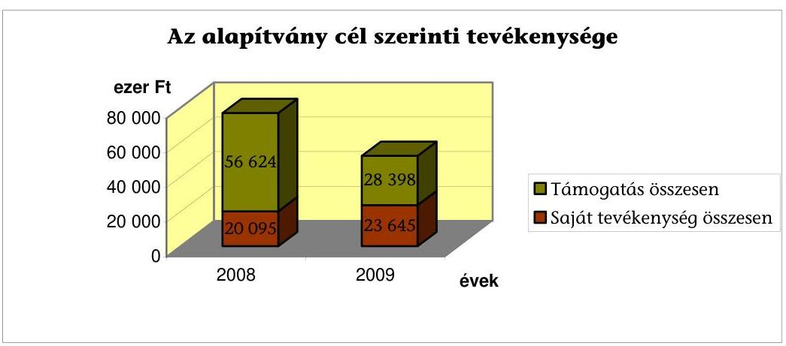
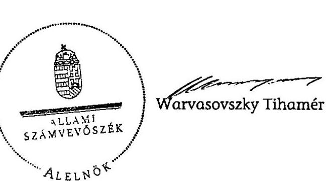
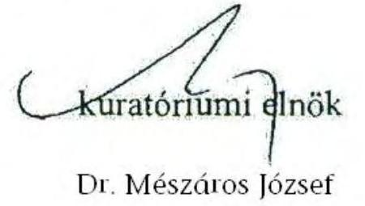
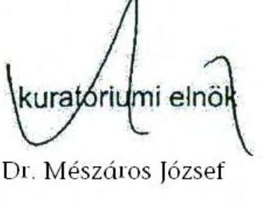
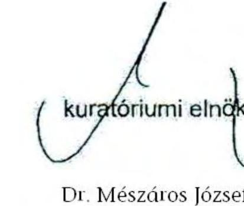

# ÁLLAMI   SZÁMVEVŐSZÉK 

## JELENTÉS

a Barankovics István Alapítvány 2008-2009. évi gazdálkodása törvényességének ellenőrzéséről

---

# 3. Önkormányzati és Területi Ellenőrzési Igazgatóság 

3.1. Szabályszerüségi Ellenőrzési Föcsoport

Iktatószám: V-3008-024/2010.
Témaszám: 982
Vizsgálat-azonosító szám: V-0509

## Az ellenőrzést felügyelte:

Dr. Lóránt Zoltán
föigazgató
Az ellenőrzés végrehajtásáért felelős:
Dr. Elek János
általános főigazgató-helyettes
Az ellenőrzést vezette:
Solymár Ágnes
osztályvezető főtanácsos
Az összefoglaló jelentést készítette:
Robák Ferencné
számvevő tanácsos
Az ellenőrzést végezték:
Robák Ferencné Szappanos Júlia
számvevő tanácsos számvevő tanácsos

A témához kapcsolódó eddig készített számvevőszéki jelentések:
címe
sorszáma
Jelentés a Barankovics István Alapítvány 2006-2007. évi gazdálko- 0910
dása törvényességének ellenőrzéséről

---

# TARTALOMJEGYZÉK 

BEVEZETÉS ..... 5
I. ÖSSZEGZŐ MEGÁLLAPÍTÁSOK, KÖVETKEZTETÉSEK, JAVASLATOK ..... 7
II. RÉSZLETES MEGÁLLAPÍTÁSOK ..... 11

1. Az alapítvány gazdálkodásának törvényessége ..... 11
1.1. A kuratórium működése ..... 11
1.2. Az alapítvány bevételei ..... 12
1.3. Az alapítvány ráfordításai ..... 13
2. Az éves beszámolók ..... 15
2.1. A számviteli beszámolók ..... 15
2.2. A mérleg ..... 15
2.3. Az eredmény-kimutatás ..... 16
3. A könyvvezetés szabályozottsága és gyakorlata ..... 16
4. Az alapítvány ellenőrzési rendszere ..... 18
5. A korábbi ellenőrzés megállapításaira tett intézkedések ..... 19

## MELLÉKLETEK

1. számú A Barankovics István Alapítvány 2008. évi egyszerűsített éves beszámoló-
jának mérlege
2. számú A Barankovics István Alapítvány 2008. évi egyszerűsített éves beszámoló-
jának eredmény-kimutatása
3. számú A Barankovics István Alapítvány 2009. évi egyszerűsített éves beszámoló-
jának mérlege
4. számú A Barankovics István Alapítvány 2009. évi egyszerűsített éves beszámoló-
jának eredmény-kimutatása

---

# 2

---

# RÖVIDÍTÉSEK JEGYZÉKE 

| Alapítvány | Barankovics István Alapítvány |
| :-- | :-- |
| ÁSZ | Állami Számvevőszék |
| FB | Felügyelő Bizottság |
| KDNP | Kereszténydemokrata Néppárt |
| Kormány | a Magyar Köztársaság Kormánya |
| Közbeszerzési törvény | A közbeszerzésekről szóló 2003. évi CXXIX. törvény |
| Pártalapítványi törvény | A pártok múködését segítő tudományos, ismeretterjesztő, |
|  | kutatási, oktatási tevékenységet végző alapítványokról |
|  | szóló 2003. évi XLVII. törvény |
| Párttörvény | A pártok múködéséről és gazdálkodásáról szóló 1989. évi |
|  | XXXIII. törvény |
| Polgári Törvénykönyv | A Polgári Törvénykönyvről szóló 1959. évi IV. törvény |
| Számviteli rendelet | A számviteli törvény szerinti egyes egyéb szervezetek be- |
|  | számoló-készítési és könyvvezetési kötelezettségének sajá- |
|  | tosságairól szóló 224/2000. (XII. 19.) Korm. rendelet |
| Számviteli törvény | A számvitelről szóló 2000. évi C. törvény |
| SZMSZ | Szervezeti és múködési szabályzat |

---

4

---

# JELENTÉS 

## a Barankovics István Alapítvány 2008-2009. évi gazdálkodása törvényességének ellenőrzéséről

## BEVEZETÉS

A pártok múködését segítő tudományos, ismeretterjesztő, kutatási, oktatási tevékenységet végző alapítványokról szóló 2003. évi XLVII. törvény (pártalapítványi törvény) alapján, a pártok a politikai kultúra fejlesztése érdekében tudományos, ismeretterjesztő, kutatási és oktatási tevékenységük elősegítésére, a pártok múködéséről és gazdálkodásáról szóló 1989. évi XXXIII. törvényben (párttörvény) meghatározott mértékű költségvetési támogatásra jogosult alapítványt hozhatnak létre. A Kereszténydemokrata Néppárt (KDNP), a törvényben biztosított lehetőséggel élve, 2006-ban létrehozta a Barankovics István Alapítványt (alapítvány).

Az alapítvány alapító okirat szerinti célja „az európai kereszténydemokrata és ke-resztény-szociális eszme megismertetése, a nemzeti elkötelezettség és a kereszténydemokrata eszmekör jegyében az alapító szándékával és a közjó szolgálatával összhangban a politikai kultúra fejlesztése érdekében tudományos, ismeretterjesztő, kutatatási és oktatási tevékenység elősegítése".

A pártalapítványi törvény alapján létrehozott alapítványok költségvetési támogatásának mértékéről a párttörvény rendelkezett, az alapítvány a törvényi előírásnak megfelelően a 2008. és 2009. években összesen 183700 ezer Ft költségvetési támogatásban részesült.

A pártalapítványi törvény 4. § (2) bekezdése alapján az alapítvány gazdálkodása törvényességének ellenőrzésére az Állami Számvevőszék (ÁSZ) jogosult. A pártalapítványi törvény 4. § (4) bekezdése alapján az ÁSZ kétévenként ellenőrzi azoknak az alapítványoknak a gazdálkodását, amelyek e törvény szerint állami költségvetési támogatásban részesültek.

Az ellenőrzés célja volt, hogy értékelje az alapítvány gazdálkodásának törvényességét, az éves beszámolók jogszabályi előírásoknak való megfelelését, az alapítvány könyvvezetésében a számvitelről szóló 2000. évi C. törvény (számviteli törvény), egyéb jogszabályi rendelkezések és belső előírások betartását, az ÁSZ előző ellenőrzése során feltárt hiányosságok megszüntetését.

Az egyéb szabályszerűségi ellenőrzést a 2008. január 1-jétől 2009. december 31. közötti időszakra, a pártalapítványok gazdálkodása törvényességének ellenőrzéséhez készült segédlet alapján végeztük. Az ellenőrzési tapasztalatok kiértékelésénél a 2\%-os lényegességi mértéket alkalmaztuk.

---

.

---

# I. ÖSSZEGZŐ MEGÁLLAPÍTÁSOK, KÖVETKEZTETÉSEK, JAVASLATOK 

Az alapító okirat tartalma és előírásai megfeleltek a Polgári Törvénykönyv, a párttörvény és a pártalapítványi törvény rendelkezéseinek, nevesítette az alapítvány cél szerinti tevékenységeit, szabályozta a kuratórium feladat és hatáskörét, az alapítvány nyilvántartásaival összefüggő alapvető elvárásokat, a képviseleti jogok gyakorlásának módját. Az alapító az alapítvány megalakulása óta nem módosította az alapító okiratot. Az alapító háromtagú felügyelő bizottságot (FB) hozott létre, de az - az ellenőrzött időszakban - csak két taggal teljesítette feladatát. Az alapító KDNP nem gondoskodott az FB kiegészítéséről. Az alapítvány célja és a cél elérése érdekében az alapító okiratban meghatározott tevékenységek megfeleltek a párttörvény előírásainak.

A kuratórium az ellenőrzött időszakban törvényesen múködött. Határozatait - az alapító okiratnak megfelelően - határozatképes üléseken, a jelenlévők egyhangú szavazata alapján hozta. A döntésekről az alapító előírásainak megfelelően készült a határozatok tára. A határozatok a pártalapítványi törvényben és az alapító okiratban rögzített alapítványi célok megvalósulását szolgálták. A képviseleti és bankszámla feletti rendelkezési jog gyakorlása megfelelt az alapító okirat előírásainak. Az alapítvány gazdálkodása a kuratórium által elfogadott költségvetés alapján történt. A költségvetések tartalmazták az alapítvány tervezett bevételeit, cél szerinti tevékenységének ráfordításait és a múködési költségeket. A kuratórium határozott az alapítvány vagyonának felhasználásáról. Nem tett eleget az alapító okirat előírásának, amikor az adományok 22,7\%-ának elfogadásáról nem döntött a kuratórium.

Az ellenőrzött években az alapítvány összes bevétele 200471 ezer Ft volt. Ennek 91,7\%-át a párttörvény alapján az éves költségvetési törvényekben meghatározott központi költségvetési támogatás, $0,3 \%$-át csatlakozói adomány, $8,0 \%$ át a szabad pénzeszközök lekötéséből származó kamatbevétel jelentette. Az alapítvány magán- és jogi személyektől kapott támogatást, összesen 599 ezer Ft-ot. Az adományok a pártalapítványi törvénynek megfelelően az alapítvány pénzforgalmi számlájára érkeztek, a támogatók a banki kivonatokon beazonosíthatók voltak, de 9 esetben - a törvény előírásától eltérően nem a támogatást nyújtó magánszemély pénzforgalmi számlájáról történt öszszesen 62 ezer Ft átutalása. A kuratórium elnöke elrendelte a támogatások viszszafizetését a támogatók részére, ezért a pártalapítványi törvényben meghatározott jogkövetkezmény nem alkalmazható.

A ráfordítások 70,6\%-át, 128762 ezer Ft-ot az alapítványi célok megvalósításának közvetlen költségei, 21,4\%-át az alapítvány kezelő szervének költségei, $8 \%$-át az egyéb közvetett költségek tették ki.

---

A cél szerinti tevékenységek költségének 66,0\%-át a más szervezetek és magánszemélyek részére nyújtott támogatások, $34,0 \%$-át a saját szervezeti keretek között megvalósított tevékenységek költségei alkották. A nyújtott támogatások és a saját szervezeti keretek között megvalósított tevékenységek a pártalapítványi törvényben és az alapító okiratban rögzített célok megvalósítására irányultak. Az SZMSZ, valamint a támogatási és pályázati szabályzat az alapító okirattól eltérően határozta meg az alapítvány által nyújtott támogatásokra vonatkozó döntéshozatalt, mivel azt a kuratórium elnökének engedélyezte 1000 ezer Ft összeghatárig, annak ellenére, hogy az alapító okirat szerint valamennyi támogatás odaítélése kuratóriumi hatáskör. A nem megfelelő szabályozásból adódóan a kuratórium csak utólag, a szerződések megkötése után hozott határozatot a támogatások 66,5 \%-ának odaítéléséről.

A támogatottakkal a kuratórium elnöke szerződést kötött. Az alapítvány a támogatásokat szerződés szerint folyósította. A kedvezményezettek minden esetben a szerződés szerint előírt módon (számlák hiteles másolati példányaival) elszámoltak, tevékenységükről beszámolót készítettek.

Az alapítvány rendelkezett a jogszabályokban előírt, a könyvvezetés és a beszámoló elkészítésének rendjét meghatározó számviteli politikával és az ahhoz kapcsolódó szabályzatokkal. A 2006-2007. évi gazdálkodás törvényességének ÁSZ ellenőrzéséről készített jelentésben tett javaslatok ellenére a kuratórium nem módosította a gazdálkodási szabályzatokat, arra csak 2010. január 1-jei hatállyal került sor. A leltárkészítési és leltározási szabályzatot - az ÁSZ javaslata ellenére - még nem aktualizálta. Az alapítvány az egyszerúsített éves beszámolókat a jogszabályi előírásoknak és a belső szabályzatoknak megfelelően, határidőben készítette el. A beszámolókat az FB véleményezte, a könyvvizsgáló hitelesítette, a kuratórium érvényes határozatokkal elfogadta, és a belső szabályozásnak megfelelően nyilvánosságra hozta. Az éves beszámolók megbízható, valós adatokat tartalmaztak az alapítvány gazdálkodásáról, azok elkészítésénél érvényesítették a számviteli törvényben megfogalmazott alapelveket. A mérleg és eredmény-kimutatás sorok adatai megegyeztek a kapcsolódó analitikus és főkönyvi nyilvántartások összesített adataival, az év végi főkönyvi kivonatok adataiból levezethetőek voltak. Az éves mérlegekben kimutatott eszközök és források értékadatait a számviteli törvény rendelkezésének megfelelően, a leltározási szabályzat szerinti leltárakkal, az eredmény-kimutatásban kimutatott bevételeket és ráfordításokat könyvelési alapbizonylatokkal támasz-

---

tották alá. Az alapítvány mindkét évben elkészítette a pártalapítványi törvény szerinti éves jelentését. A kuratórium a jelentéseket elfogadta.

A könyvvezetést a vonatkozó jogszabályok és belső előírások betartásával, a kettős könyvvitel rendszerében, mindkét évben azonos számítógépes programmal végezték. A gazdasági eseményeket idősorrendben, könyvelési alapbizonylatokkal alátámasztva rögzítették. A számviteli feladatok vezetésére és a beszámoló elkészítésére jogosult személy rendelkezett a törvényi előírásoknak megfelelő képesítéssel. A könyvvezetésben érvényesítették a számviteli törvény bizonylatokra vonatkozó alaki és tartalmi követelményeit. A belső szabályzatokban előírt egyedi nyilvántartásokat vezették, és azoknak a főkönyvi adatokkal való egyeztetését elvégezték. Az alapítványok gazdálkodási rendjéről szóló kormányrendelet előírásának megfelelően, a számviteli nyilvántartásban elkülönítették az alapítványi célú tevékenység közvetlen, az alapítvány kezelő szervének közvetett költségeit és az egyéb közvetett költségeket. A házipénztári nyilvántartások vezetése szabályszerű volt, a záró pénzkészlet nem haladta meg a belső szabályozásban előírt mértéket. Az elszámolásra adott előlegekkel elszámoltak, azokat, valamint a szigorú számadású nyomtatványokat nyilvántartották. Az eszközbeszerzéseknél és a ráfordítások elszámolásánál érvényesítették a kötelezettségvállalás és az utalványozás, valamint a banki aláírás szabályait.

Az alapítvány ellenőrzési rendszere hozzájárult a törvényes gazdálkodásához. A kuratórium beszámoltatta a kuratórium elnökét, figyelemmel kísérte a költségvetés teljesítését Az FB két taggal is ellátta az alapító okiratban előírt ellenőrzési tevékenységét. Az ellenőrzésre vonatkozó feladatokat a gazdálkodási szabályzatok rögzítették. 2009 májusától az alapítvány megbízási szerződést kötött egy kft.-vel a belső ellenőrzési feladatok ellátására. A jelentések a korábbi ÁSZ ellenőrzéssel összhangban hívták fel a szabályzatok hiányosságaira a figyelmet, de a megállapításokat az ellenőrzött időszak végéig a kuratórium nem hasznosította. A vezetői ellenőrzést a kuratórium elnöke és az alapítvány igazgatója a munkáltatói jogkör gyakorlása, a képviseleti jog, a kötelezettségvállalás, az utalványozás és a bankszámla feletti rendelkezés során megfelelően látták el.

A helyszíni ellenőrzés megállapításainak hasznosítása mellett javasoljuk:

# az alapító KDNP-nek 

Biztosítsa, hogy az FB az alapító okirat szerint, teljes létszámban végezhesse munkáját.

## az alapítvány kuratóriumának

1. Tartassa be az alapító okirat 8.5. pontját, az alapítvány által nyújtott támogatásokkal kapcsolatos döntéshozatali hatáskörre vonatkozóan.
2. Hozzon minden esetben az alapító okirat 5.2. pontjának megfelelő határozatot a csatlakozói adományok elfogadásáról.

---

3. Módosítsa a leltárkészítési és leltározási szabályzatot a korábbi ÁSZ ellenőrzés javaslatának megfelelően.

---

# II. RÉSZLETES MEGÁLLAPÍTÁSOK 

## 1. Az alapítVÁny GAZDÁlKODÁSÁNAK TÖRVÉNYESSÉGE

### 1.1. A kuratórium múködése

Az alapítvány célja és a cél elérése érdekében az alapító okiratban meghatározott tevékenységek megfeleltek a párttörvény 9/A. § (1) bekezdésében foglaltaknak. A 2006. évi megalakulás óta az alapítvány alapító okirata nem módosult.

A képviseleti és a bankszámla feletti rendelkezési jog gyakorlása az alapító okirat és a Polgári Törvénykönyv 29. § (3) bekezdésében foglaltak szerint történt. Az alapító okirat 12. pontja szerint az alapítványt a kuratórium elnöke képviselte, akadályoztatása esetén egy megnevezett kuratóriumi tagot illette meg a képviseleti jog.

Az alapítvány múködését a 2007. március 28 -tól hatályos szervezeti és múködési szabályzat (SZMSZ) határozta meg, amelynek csak a kötelezettségvállalásra vonatkozó szabályozása nem felelt meg az alapító okiratnak. Az SZMSZ felhatalmazta a kuratóriumi elnököt 1000 ezer Ft összeghatárig önálló kötelezettségvállalásra, amely - az alapító okirattal ellentétben - kiterjedt a támogatások odaítéléséhez kapcsolódó döntéshozatalra is. Az alapító okirat 8.5. pontja szerint a kuratórium jogköre, hogy „dönt az alapítvány által nyújtott támogatásokról". Az elnöki hatáskörben nyújtott támogatásokról a kuratórium minden esetben tájékoztatást kapott és utólagosan jóváhagyta azokat.

Az alapítvány a párttörvény 9/A. §-ában meghatározott mértékű, rendszeres költségvetési támogatást kapott, amelyet a kuratórium kizárólag az alapító okiratban meghatározott célok megvalósítására fordított. Az alapítványi vagyon felhasználását a pártalapítványi törvény, az alapító okirat, az SZMSZ, illetve az alapítvány egyéb belső szabályzatai egymással összhangban szabályozták.

A kuratórium az alapító okirat által meghatározott rendben 2008-ban négy, 2009-ben öt alkalommal ülésezett. A kuratóriumi ülésekről készített jegyzőkönyveket az alapító okirat, illetve az SZMSZ előírásai szerint készítették, az üléseken hozott határozatokat szabályszerűen nyilvántartásba vették. Az ülések minden alkalommal határozatképesek voltak, a kuratóriumi tagok többségének részvételével. A kuratórium 2008-ban 58, 2009-ben 76 határozatot hozott. Minden határozatát az alapító okiratnak megfelelően, a jelenlévők egyhangú szavazatával hozta.

A kuratórium - az alapító okirat vonatkozó előírásának megfelelően - mindkét évben elfogadta az alapítvány költségvetését. A költségvetések tartalmazták az alapítvány bevételeit és kiadásait, a kiadásokat alapítványi célú tevékenység közvetlen és közvetett költségei, valamint a kezelőszervezet költségei és egyéb közvetett költségek szerinti bontásban.

---

Az alapító okirat 5.8. pontja értelmében az alapítvány éves költségvetés alapján gazdálkodott, a 8.3. pontja pedig a kuratórium jogkörébe rendelte az alapítvány munkatervének, gazdálkodási tervének, költségvetésének, beszámolójának elfogadását és jóváhagyását. A 2008. évre készített költségvetést a kuratórium 19/2008/04.08., a 2009. évi költségvetést 1/2009/02.25. számú határozatával fogadta el.

A kuratórium mindkét ellenőrzött évben módosította az alapítvány költségvetését: 2008-ban elsősorban a költségvetési támogatás csökkenése miatt kellett átdolgozni a kiadások szerkezetét, 2009-ben az alapítványi célú közvetlen költségek belső arányait változtatta meg a kuratórium.

# 1.2. Az alapítvány bevételei 

Az alapítvány az ellenőrzött időszak éves beszámolóiban összesen 200471 ezer Ft bevételt mutatott ki, amelyből a központi költségvetési támogatás aránya $91,7 \%$ volt.

Az alapítvány a pártalapítványi törvény 1. §-a alapján költségvetési támogatásra volt jogosult, a támogatás mértékét a párttörvény határozta meg. A 2008. szeptember 30-ig a kapott támogatás a párttörvény 9/A. § (5) bekezdés a) és b) pontok szerinti alap-, és mandátumarányos kiegészítő támogatásból tevődött össze, az ezt követő időszakban jogszabály-módosítás következtében a párttörvény 9/A. § (5) bekezdés alapján a támogatást „az alapítvány az azt alapító pártra, valamint e párt jelöltjeire az országgyúlési képviselők utolsó általános választásán az első érvényes fordulóban leadott szavazatok arányában" kapta. 2008-ban 112500 ezer Ft, 2009-ben 71200 ezer Ft volt a központi költségvetési támogatásból származó bevétele.

A Magyar Köztársaság 2008. évi költségvetéséről szóló 2007. évi CLXIX. törvény alapján biztosított 120300 ezer Ft támogatást 2008 januárjában 6000 ezer Ft-tal a költségvetés általános tartaléka terhére növelte, majd szeptemberben 13800 ezer Ft-tal csökkentette a Kormány.

Az alapítvány 2009. évi múködésére a Magyar Köztársaság 2009. évi költségvetéséről szóló 2008. évi CII. törvény alapján 71200 ezer Ft támogatást kapott.

Az alapító okirat - a törvényi szabályozással összhangban - lehetővé tette az alapítvány számára a csatlakozók által befizetett adományok, egyéb támogatások, juttatások és felajánlások elfogadását a pártalapítványi törvény előírásai figyelembe vételével. Az alapítvány mindkét évben kapott magán- és jogi személyektől támogatást, összesen 599 ezer Ft-ot (0,3\%).

A pártalapítványi törvény 3. § (2) bekezdése és azzal összhangban az alapító okirat előírta, hogy a csatlakozói adományok elfogadásáról a kuratórium dönt. A felajánlások elfogadásának gyakorlata nem felelt meg az alapító okirat előírásának.

A pártalapítványi törvény 3. § (2) bekezdése szerint „az alapítványhoz bárki feltétel nélkül csatlakozhat, az alapító okirat azonban elöírhatja, hogy a csatlakozás elfogadásához a kezelő szerv jóváhagyása szükséges". Az alapító okirat 5.2. pontja szerint az alapítványhoz érkező „felajánlás elfogadásáról a kuratórium dönt".

---

2008-ban a kuratórium a február 21. és április 8., valamint a szeptember 3. és december 2. közötti időszak támogatásainak elfogadásáról 136 ezer Ft (22,7\%) esetében nem döntött a kuratórium.

A támogatások egy része a pártalapítványi törvény 3. § (3) bekezdésének csak részben felelt meg, mivel 9 esetben nem a támogatást nyújtó magánszemély pénzforgalmi számlájáról történt összesen 62 ezer Ft befizetése. A kuratórium elnöke a helyszíni ellenőrzés idején elrendelte a támogatások visszafizetését a támogatók részére, ezért a pártalapítványi törvényben meghatározott jogkövetkezmény nem alkalmazható. A pártalapítványi törvény 3. § (4) bekezdésében előírt közzétételi kötelezettség nem keletkezett, mert a támogatónkénti befizetett összeg nem érte el az 500 ezer Ft-ot.

Az alapítvány szabad pénzeszközeinek kamatoztatásával összesen 16123 ezer Ft bevételhez jutott $(8,0 \%)$.

# 1.3. Az alapítvány ráfordításai 

Az alapítvány 2008-ban 104067 ezer Ft, 2009-ben 78255 ezer Ft, összesen 182322 ezer Ft ráfordítást számolt el. A ráfordítások 70,6\%-át (128 762 ezer Ft) az alapítványi célok megvalósításának közvetlen költségei, 21,4\%-át (38 973 ezer Ft) az alapítvány kezelő szervének költségei, 8\%-át (14 587 ezer Ft) az egyéb közvetett költségek tették ki.

## Az alapítvány cél szerinti tevékenysége

| Tevékenység | 2008. | 2009. | Összesen |
| :--: | :--: | :--: | :--: |
| Sajátrendezvények | 9128 | 10601 | 19729 |
| Saját kiadványok | 6630 | 8351 | 14981 |
| Honlap múködtetés | 1980 | 4660 | 6640 |
| Szakpolitikai porjektek | 300 |  | 300 |
| Egyéb projekt | 2057 | 33 | 2090 |
| Saját tevékenység összesen | 20095 | 23645 | 43740 |
| Támogatott rendezvények | 3820 | 5277 | 9097 |
| Támogatott kiadványok | 4071 | 6695 | 10766 |
| Orsz. és regionális szervezetek tám. | 37450 | 11141 | 48591 |
| Osztöndíjprogram | 10495 | 5005 | 15500 |
| Irodalmi, fotópályázat | 788 | 280 | 1068 |
| Tá mogatás összesen | 56624 | 28398 | 85022 |

A cél szerinti tevékenységek költségének 66,0\%-át (85 022 ezer Ft) a más szervezetek és magánszemélyek részére nyújtott támogatások, 34,0\%-át (43 740 ezer Ft) a saját szervezeti keretek között megvalósított tevékenységek költségei alkották. Mind a támogatott, mind a saját szervezet által megvalósított tevéken-

---

kenységek a pártalapítványi törvényben és az alapító okiratban rögzített célok megvalósítását szolgálták.

Az alapító okirat előírásainak megfelelően az alapítvány egyedi kérelmek alapján nyújtott támogatást más szervezetek és magánszemélyek részére, továbbá irodalmi, illetve fotópályázatot hirdetett. A kuratórium elnöke által meghozott döntésekről utólag, illetve a kuratórium ülése elé terjesztett egyedi kérelmek alapján - elsősorban nagy értékű - nyújtott támogatásokról a kuratórium határozatot hozott. A határozathozatal minden esetben megfelelt az alapító okiratban, az SZMSZ-ben, a támogatási és pályázati szabályzatban rögzített előírásoknak. A kuratóriumi jegyzőkönyvekben, a határozatok könyvében rögzített határozatok tartalmazták a támogatott nevét, a támogatás célját és összegét.

A kuratórium elnöke a támogatottakkal az alapító okirat előírásának megfelelően támogatási szerződést kötött. A szerződés tartalmazta a támogatás célját, mértékét, folyósításának és elszámolásának módját és határidejét, az elszámolási határidő elmulasztásának szankcióját. A támogatások eredményeképpen 23 rendezvény valósult meg, 24 kiadvány megjelenéséhez járult hozzá az alapítvány. Az országos, regionális szervezetek támogatása együttműködési megállapodás alapján történt. 2008-ban 20, 2009-ben 21 ösztöndíjas kapcsolódott be az alapítvány ösztöndíjprogramjába. Az irodalmi pályázat nyertese is ösztöndíjban részesült.

A támogatások felhasználásáról a kedvezményezetteknek pénzügyi elszámolást és tartalmi beszámolót is kellett készíteni. Az elszámolások a kiadásokat összegző táblázatokkal és a számlák másolataival történtek. A kedvezményezettek betartották a szerződésekben kikötött elszámolási határidőket. A kuratórium határozatot hozott a támogatások elfogadásáról. A rendezvények megvalósulását az alapítványi iroda munkatársai ellenőrizték, a kiadványokon a szerződések előírták az alapítvány támogatóként való feltüntetését. A szerződések megfogalmazták a nem szerződés szerinti felhasználás, elszámolás szankcióit. A támogatottak a fel nem használt összegeket visszautalták.

A kuratórium, illetve a kuratórium elnöke - a továbbadott támogatásokhoz hasonlóan - az alapítvány céljaival összhangban határozott az alapítvány saját szervezeti keretei között megvalósított célszerinti tevékenységek költségeiről és a finanszírozás feltételeiről. Az elnök döntéseiről a kuratóriumot utólag tájékoztatta. A kuratórium a múködési költségek keretösszegét az éves költségvetésekben állapította meg, év közben figyelemmel kísérte a felhasználást. Az elnök tájékoztatta a kuratóriumot a két ülés között saját döntései alapján megkötött szerződésekről.

Az alapítvány a közbeszerzési törvény hatálya alá tartozó közbeszerzések tekintetében a közbeszerzésekről szóló 2003. évi CXXIX. törvény 22. § (1) bekezdés i) pontja értelmében ajánlatkérőnek minősült. Az ellenőrzött időszakban a vállalkozói megbízások értéke évenként nem haladta meg a közbeszerzési értékhatárát, ezért nem keletkezett közbeszerzés lefolytatási kötelezettsége.

---

# 2. Az ÉVES BESZÁmolók 

### 2.1. A számviteli beszámolók

Az alapítvány - a számviteli politikában meghatározott - egyszerűsített éves beszámoló készítésével tett eleget beszámoló-készítési kötelezettségének. A beszámolók a számviteli politikában előírt határidő betartásával készültek el, mindkét évben - a számviteli törvény 20. § (6) bekezdés rendelkezésének megfelelően - a képviseletre jogosult kuratóriumi elnök aláírásával.

Mindkét évi egyszerűsített éves beszámoló összeállítása során érvényesültek a számviteli törvényben foglalt alapelvek. Az éves beszámolók adatai az év végi főkönyvi kivonatok adataiból mindkét évben levezethetőek voltak, a beszámolósorokhoz kapcsolódó főkönyvi számlák, az analitikus és egyéb számviteli nyilvántartások adataival megegyeztek. A kuratórium az ellenőrzött időszakban könyvvizsgálót alkalmazott. Az alapítvány 2008. és 2009. évi egyszerűsített éves beszámolóját a választott könyvvizsgáló hitelesítő záradékkal látta el. A beszámolókat az FB mindkét évben véleményezte, az alapító okirat 11. 5. pontjának megfelelően. Ezt követően a beszámolókat a kuratórium egyhangú döntéssel elfogadta.

A kuratórium a 2008. évről készített beszámolót a 24/2009/05.20. számú, a 2009. évről szóló beszámolót a 16/2010/05.12. számú határozattal fogadta el.

Az alapítvány elkészítette a pártalapítványi törvény 3/A. § (1) bekezdése szerinti éves jelentését, amely tartalmazta a 3/A. § (3) bekezdésben kötelezően előírtakat. A kuratórium a jelentést mindkét évben elfogadta, a jelentéseket a kuratórium elnöke és az ügyvezető igazgató írta alá. Az egyszerűsített éves beszámolókat - a számviteli politika előírásának megfelelően - a mérlegfordulónapját követő 150 napon belül a Magyar Közlöny Hivatalos Értesítőjében közzétették.

Az alapítvány a 2008. és 2009. évről készült egyszerűsített éves beszámolót a Magyar Közlöny 2009/27. számában, illetve a 2010/28. számában jelentette meg.

### 2.2. A mérleg

A mérlegsorok adatai mindkét vizsgált évben megegyeztek a kapcsolódó főkönyvi és analitikus nyilvántartások összesített adataival. Az így kimutatott eszközök és források értékadatait a számviteli törvény 69. § (1) bekezdés rendelkezésének megfelelően, a leltározási szabályzat szerinti leltárakkal alátámasztották.

A kimutatott tárgyi eszközök, követelések és pénzeszközök összértéke megegyezett a főkönyvi számlák adataival. A tárgyi eszközöknél a belső szabályzatokban rögzítettekkel összhangban volt az egyedi nyilvántartás, az aktiválás, az értékelés, a selejtezés, a terv szerinti és terven felüli értékcsökkenés elszámolása. Az egyedi nyilvántartásban szereplő eszközök értéke megegyezett a mérlegben kimutatott tárgyi eszközértékkel.

---

2008-ban - a rendőrség által készített jegyzőkönyv tanúsága szerint - az alapítványhoz betört egy ismeretlen tettes és eltulajdonított 509 ezer Ft készpénzt, 406 ezer Ft étkezési jegyet, és 526 ezer Ft értékben tárgyi eszközöket (notebook, projektor, fényképezőgép). Az így keletkezett betörési károkat az alapítvány egyéb ráfordításként számolta el. Az ellenőrzés lezárásáig a rendőrség a vizsgálatot nem zárta le, ezért a biztosító a kárt nem rendezte.

A kisértékú eszközök egyösszegű értékcsökkenési leírásként történő elszámolási szabályozása ugyan nem felelt meg a számviteli törvény 80. § (2) bekezdés rendelkezésének, de a gyakorlatban 2008. január 1-jétől csak a 100 ezer Ft alatti eszközök kerültek kisértékű eszközként elszámolásra.

A pénzeszközök között a bankszámlán rendelkezésre álló pénzeszköz év végi értékét helyesen a főkönyvi számlák és az év végi bankkivonat egyenlegével megegyezően, illetve a házipénztárban lévő év végi pénztárjelentés záró állományával megegyező pénzeszközöket mutatta ki az alapítvány.

Az aktív időbeli elhatárolásokat a főkönyvi nyilvántartás és a leltárak értékével megegyezően mutatta ki az alapítvány.

A mérleg forrás oldala a saját tőkén belül az induló vagyont az alapító okirat által rögzített értéknek megfelelően tartalmazta. A kötelezettségek között mindkét évben tárgyévi időszakban elszámolt, de következő évben esedékes adókat és járulékokat mutattak ki rövidlejáratú kötelezettségként.

# 2.3. Az eredmény-kimutatás 

Az ellenőrzött időszakban az eredmény-kimutatás sorok adatai az év végi főkönyvi kivonatok, illetve a vonatkozó főkönyvi és részletező számlák összesített adataival megegyeztek.

A bevételeken belül a költségvetésből származó, valamint az egyéb támogatásokat elkülönítetten kezelték. A költségvetési támogatást a számviteli törvény 77. § (3) bekezdés b) pontjának megfelelően az egyéb bevételek között mutatták ki. A költségvetési támogatás, az egyéb támogatások és a pénzügyi műveletek bevételének összege megegyezett a vonatkozó bankkivonatok összesített értékével.

Az eredmény-kimutatásban szereplő ráfordításokat könyvelési alapbizonylatokkal (szállítói számlák, bankkivonatok, pénztárbizonylatok, egyéb könyvelési feladások, szerződések) támasztották alá. A készpénzes kifizetéseknél és a szállítói számláknál érvényesítették az utalványozás szabályait, a kifizetéseket a pénzkezelési szabályzat szerint utalványozásra jogosult személyek (kuratórium elnöke, alapítvány ügyvezető igazgatója) minden esetben engedélyezték.

## 3. A KÖNYVVEZETÉS SZABÁLYOZOTTSÁGA ÉS GYAKORLATA

Az alapítvány gazdálkodásának, éves beszámolói elkészítésének és könyvvezetésének belső szabályozási rendszere a számviteli törvény által kötelezően előírt szabályozáson alapult. A számviteli törvény 14. § (3)-(5) bekezdései szerint rendelkezett számviteli politikával, az eszközök és a források leltárkészítési

---

és leltározási, az eszközök és a források értékelési, és a pénzkezelési szabályzatokkal, továbbá a 161. § (1)-(2) bekezdéseiben előírt számlarenddel.

A kuratórium az ÁSZ előző ellenőrzése javaslatainak ellenére nem módosította az alapítvány számviteli szabályzatait, így a korábban megállapított hiányosságok az ellenőrzött időszakban fennálltak. Az alapítvány kuratóriuma 2010. január 1-jei hatállyal új számviteli politikát és hozzákapcsolódó értékelési és pénzkezelési szabályzatot adott ki.

Az alapítvány könyvvezetési kötelezettségét a kettős könyvvitel rendszerében, a számviteli bizonylatok számítógépes feldolgozása alapján, külső számviteli szolgáltató igénybevételével teljesítette. Az egyszerúsített éves beszámolók összeállítását, valamint a bérszámfejtést szintén a szerződéssel foglalkoztatott külső könyvelő cég végezte. A számviteli szolgáltatás körébe tartozó feladatok ellátásával, a beszámoló elkészítésével megbízott személy rendelkezett a számviteli törvény 151. § (1) bekezdés a) pontjában előírt képesítéssel, a Pénzügyminisztérium könyvviteli szolgáltatást végzőkről vezetett nyilvántartásában szerepelt.

A könyvelési rendszerből az ellenőrzéshez szükséges adatok lekérdezhetők voltak, az alkalmazott számítógépes könyvelő program az ellenőrzött időszakban nem változott. A gazdasági eseményeket idősorrendben, negyedéves gyakorisággal rögzítették, a könyvelt tételek alapbizonylatai megtalálhatóak voltak. A számviteli törvény 167. § (1) bekezdésében előírt alaki és tartalmi követelmények érvényesültek.

A számviteli politikában meghatározott, a könyvviteli zárlattal kapcsolatos feladatokat az éves beszámoló elkészítését megelőzően elvégezték. Ezek keretében elszámolták az immateriális javak és tárgyi eszközök éves, terv szerinti értékcsökkenését, megállapították és lekönyvelték az időbeli elhatárolásokat. A könyvviteli számlákból főkönyvi kivonatot készítettek, és elvégezték az eszköz-, forrás- és eredmény-számlák technikai zárását. A leltározási feladatokról a leltárkészítési és leltározási szabályzat rendelkezett. A szabályzatot a korábbi ÁSZ ellenőrzés javaslata ellenére nem módosították. A leltár mindkét évben a leltározási utasítás és ütemterv alapján készült. A leltározási szabályzat előírásainak megfelelően, a tárgyi eszközöket és a készpénzállományt mennyiségi felvétellel, a főkönyvi számláknak az analitikus nyilvántartásokkal történt egyeztetése útján, az egyéb eszköz és forrás tételeket egyeztetéssel leltározták. A leltározás eredményét összevetették a vezetett nyilvántartásokkal.

Az alapítvány házipénztárának múködtetése kézi feldolgozással, a pénzkezelési szabályzatban előírtaknak megfelelően történt. A helyszíni ellenőrzés során lefolytatott pénztárellenőrzés megállapította, hogy a számviteli törvény 14. § (9) bekezdésével és a pénzkezelési szabályzattal összhangban meghatározott 750 ezer Ft-os napi pénztári zárókészlet összegét nem lépték túl, a pénztárjelentéseket a pénztárellenőr szignálta. A pénztár által használt szigorú számadású nyomtatványok nyilvántartása, azok vezetése megfelelt a számviteli törvény 168. § (3) bekezdésében előírt feltételeknek. Az ellenőrzött időszakban az utólagos elszámolásra adott előlegek kiadásának, valamint azok visszavezetésének analitikus nyilvántartása, elszámolása megfelelő volt, az előlegekkel minden esetben határidőre elszámoltak.

---

A bankszámla feletti rendelkezési jog gyakorlása az ellenőrzött időszakban megfelelt az alapító okiratnak, amely szerint a bankszámla felett a kuratóriumi elnök és egy kuratóriumi tag együttesen rendelkezett. A banki átutalások 2008. január 1-jétől papíralapú átutalási megbízással történtek. 2009. február 5-én internet alapú elektronikus banki szolgáltatásokra kötöttek szerződést, majd áttértek az elektronikus banki utalások gyakorlatára.

A könyvvezetésben - az alapítványok gazdálkodási rendjéről szóló 115/1992. (VII. 23.) Korm. rendelet 3. § (2) bekezdésében és az 5. §-ban előírtaknak megfelelően - az alapítványi célú tevékenység közvetlen és közvetett (működési jellegű) költségeit a főkönyvi könyvelés keretében elkülönítették.

# 4. Az alAPíTVÁNY ELLENŐRZÉSI RENDSZERE 

A kuratórium minden ülésén napirend szerint beszámoltatta a kuratórium elnökét az eltelt időszak folyamán végzett tevékenységről, elfogadta a megkötött szerződéseket, döntött az adományok befogadásáról. Jóváhagyta a kuratóriumi elnök döntése alapján teljesített egymillió forint alatti kifizetéseket. Figyelemmel kísérte a költségvetés teljesítését, döntött a módosításáról.

Az alapító az alapító okiratban háromtagú felügyelő bizottságot (FB) jelölt ki, szabályozta feladat-, jog- és hatáskörét, megnevezte elnökét. Az ellenőrzött időszakban az FB két taggal teljesítette feladatát. Az alapító KDNP nem gondoskodott az FB kiegészítéséről. Az alapító okirat az FB múködését, feladat- és hatáskörét a Polgári Törvénykönyvvel összhangban határozta meg. Az FB az ellenőrzött években ügyrendjének megfelelően működött. A kuratórium jóváhagyását megelőzően, véleményezte az éves költségvetéseket és azok módosítását, az éves számviteli beszámolókat és könyvvizsgálói jelentéseket, az alapítvány éves tevékenységéről készített szakmai beszámolókat. Egy tagja minden alkalommal részt vett a kuratórium ülésein. Az ellenőrzött időszakban a kéttagú FB az alapító okiratban előírt ellenőrzési tevékenységét ellátta. Az ellenőrzésekről vélemény formájában tájékoztatta a kuratóriumot, illetve az alapítót. Az FB elnöke rendkívüli kuratóriumi ülést az ellenőrzött időszakban nem kezdeményezett, mivel az alapítvány múködését megfelelőnek, törvényesnek ítélte.

A számviteli politika szerint „az alapítvány létszámából eredően függetlenített belső ellenőrt nem alkalmaz, de külső szakértőkkel megbízási szerződés alapján gondoskodik a belső ellenőrzésről". 2008 decemberében a kuratórium úgy határozott, hogy olyan céget kell megbízni, amely folyamatosan látja el az alapítvány belső ellenőrzését. 2009 májusától az alapítvány megbízási szerződést kötött egy kft.-vel a belső ellenőrzési feladatok ellátására. A kft. havonta jelentést készített a végzett munkáról, a megbízási díj kifizetése az ügyvezető teljesítésigazolása után történt. A jelentések a korábbi ÁSZ ellenőrzéssel összhangban hívták fel a szabályzatok hiányosságaira a figyelmet, de a megállapításokat az ellenőrzött időszak végéig a kuratórium nem hasznosította.

Az ellenőrzés feladatait a gazdálkodási szabályzatok rögzítették. A kuratórium elnökének munkáltatói jogkörét az SZMSZ szabályozta. A pénzkezelési szabályzat rendelkezett az ellenőrzésről, mellékletei meghatározták a pénzkezelői általános feladatokat és felelősséget, illetve az utalványozásra jogosultak körét. A leltárkészítési és leltározási szabályzat a leltározásban közreműködők felelőssé-

---

gi körét és feladatait határozta meg, külön kitérve az ügyvezető igazgató, a titkárságvezető, a dolgozók és a könyvelés feladataira.

A folyamatba épített vezetői ellenőrzést a kuratórium elnöke a képviseleti, a kötelezettségvállalási és az utalványozási jog, valamint a munkáltatói jogkör gyakorlása során teljes körűen ellátta. Az alapítvány ügyvezető igazgatója ellenőrizte a munkaszervezet múködését, a pénzügyi kifizetéseket az utalványozás, valamint a cél szerinti és egyéb költségek meghatározásának bizonylatokon történő megnevezése során. Figyelemmel kísérte a költségvetési és munkaterv végrehajtását, továbbá szükség szerint ellenőrizte a szakmai, képzési programok, rendezvények lebonyolítását.

Az alapítvány döntési rendszerei összehangoltan múködtek, a vezetői és a folyamatba épített ellenőrzés, továbbá a kialakított nyilvántartási rendszerek alkalmasak voltak a hibák kiküszöbölésére.

A kuratórium az éves beszámolók ellenőrzésével független könyvvizsgálót bízott meg. A könyvvizsgálóval megkötött szerződés tartalmazta a könyvvizsgálónak az éves beszámolók ellenőrzésével kapcsolatos feladatait, és kiterjedt a pénzügyi és számviteli folyamatok ellenőrzésére. A könyvvizsgáló az éves beszámolókat hitelesítette, az éves könyvvizsgálói jelentéseket a kuratórium elfogadta.

# 5. A KORÁBBI ELLENŐRZÉS MEGÁLLAPÍTÁSAIRA TETT INTÉZKEDÉSEK 

Az előző ÁSZ jelentés javaslataira a kuratórium intézkedési tervet fogadott el (32/2009/09. 30. számú határozat). Ennek végrehajtása csak az ellenőrzött időszakot követően valósult meg, mivel csak 2010. évi hatállyal módosították a számviteli szabályzatokat.

Budapest, 2010. december „/ $/ 6$,

Melléklet: $\quad 4 \mathrm{db} \quad 6$ lap

---

1. számú melléklet a V-3008/2010. sz. jelentéshez

# Adószám: 18191705-1-42 

11

Az üzleti év mérlegfordulónapja: 2008. december 31.

## Barankovics István Alapítvány

Egyszerűsített éves beszámoló MÉRLEG

| Tételszám | A tétel megnevezése | Előző év | Mód. | Tárgyév |
| :--: | :--: | :--: | :--: | :--: |
| a | b | c | d | e |
| 1. | A. Befektetett eszközök | 715 |  | 944 |
| 2. | I. Immateriális javak |  |  |  |
| 3. | II. Tárgyi eszközök | 715 |  | 944 |
| 4. | III. Befektetett pénzügyi eszközök |  |  |  |
| 5. | B. Forgóeszközök | 92560 |  | 106468 |
| 6. | I. Készletek |  |  |  |
| 7. | II. Követelések |  |  |  |
| 8. | III. Értékpapírok |  |  |  |
| 9. | IV. Pénzeszközök | 92560 |  | 106468 |
| 10. | C. Aktív időbeli elhatárolások |  |  |  |

11. ESZKÖZÖK (AKTÍVÁK) Összesen 93275 107412

Budapest, 2009. április 17.

---

Adószám: 18191705-1-42

12

Az üzleti év mérlegfordulónapja: 2008. december 31.

# Barankovics István Alapítvány

Egyszerüsített éves beszámoló MÉRLEGE

|  Tétel-
szám | A tétel megnevezése | Előző év | Mód. | Tárgyév  |
| --- | --- | --- | --- | --- |
|  a | b | c | d | e  |
|  12. | D. Saját tőke | 89913 |  | 106503  |
|  13. | I. Jegyzett tőke | 700 |  | 700  |
|  14. | II. Tőkeváltozás/ Eredmény | 43304 |  | 89265  |
|  15. | III. Lekötött tartalék | 0 |  |   |
|  16. | IV. Értékelési tartalék | 0 |  |   |
|  17. | V. Tárgyévi eredmény alaptevékenységből | 45909 |  | 16538  |
|  18. | VI. Tárgyévi eredmény vállalkozási tev-ből | 0 |  |   |
|  19. | E. Céltartalékok | 0 |  |   |
|  20. | F. Kötelezettségek | 2491 |  | 909  |
|  21. | I. Hátrasorolt kötelezettségek |  |  |   |
|  22. | II. Hosszú lejáratú kötelezettségek |  |  |   |
|  23. | III. Rövid lejáratú kötelezettségek | 2491 |  | 909  |
|  24. | G. Passzív időbeli elhatárolások | 871 |  |   |
|  25. | FORRÁSOK (PASSZÍVÁK) Összesen | 93275 |  | 107412  |

Budapest, 2009. április 17.

(kuztórumi elnök Dr. Mészáros József

---

# Barankovics István Alapitvány

## EREDMÉNYKIMUTATÁSA

|  Tétel-
szám | A tétel megnevezése | Előző év | Mód. | Tárgyév  |
| --- | --- | --- | --- | --- |
|  a | b | c | d | e  |
|  1. | Értékesítés nettó árbevétele | 0 |  |   |
|  2. | Aktivált saját teljesítmények értéke |  |  |   |
|  3. | Egyéb bevételek | 121 285 |  | 113 004  |
|   | Ebből: támogatások | 120 300 |  | 112 955  |
|   | alapítói |  |  |   |
|   | központi költségvetési |  |  |   |
|   | helyi önkormányzati |  |  |   |
|   | egyéb | 985 |  | 49  |
|  4. | Pénzügyi műveletek bevételei | 3 237 |  | 7 601  |
|  5. | Rendkívüli bevételek |  |  |   |
|   | Ebből: támogatások |  |  |   |
|   | alapítói |  |  |   |
|   | központi költségvetési |  |  |   |
|   | helyi önkormányzati |  |  |   |
|   | egyéb |  |  |   |
|  6. | Tagdíjak |  |  |   |
|  A. | Összes bevétel | 124 522 |  | 120 605  |
|  7. | Anyagjellegű ráfordítások | 27 914 |  | 24 092  |
|  8. | Személyi jellegű ráfordítások | 19 280 |  | 32 214  |
|  9. | Értékcsökkenési leírás | 2 993 |  | 462  |
|  10. | Egyéb ráfordítások | 28 426 |  | 45 858  |
|  11. | Pénzügyi műveletek ráfordításai | 0 |  |   |
|  12. | Rendkívüli ráfordítások | 0 |  | 1 441  |
|  B. | Összes ráfordítás | 78 613 |  | 104 067  |
|  C. | Adózás előtti eredmény | 45 909 |  | 16 538  |
|  1. | Adófizetési kötelezettség |  |  |   |
|  D. | Jóváhagyott osztalék |  |  |   |
|  E. | Tárgyévi eredmény | 45 909 |  | 16 538  |

Budapest, 2009. április 17.

---

# 18191705-1-42 

## adószám

Az üzleti év mérlegfordulónapja: 2009 december 31
Barankovics István Alapítvány
Egyszerűsített éves beszámoló MÉRLEGE

| Tétel-   szám | A tétel megnevezése | Előző év | Mód. | Tárgyév |
| :--: | :--: | :--: | :--: | :--: |
| a | b | c | d | e |
| 12. | D.Saját tőke | 106503 |  | 108114 |
| 13 | I.Jegyzett tőke | 700 |  | 700 |
| 14 | II. Tőkeváltazás/ Eredmény | 89265 |  | 105803 |
| 15. | III.Lekölött tartalék |  |  |  |
| 16. | IV. Értékelési tartalék |  |  |  |
| 17. | V.Tárgyévi eredmény alaptevékenységból | 16538 |  | 1611 |
| 18. | VI Tárgyévi eredmény vállalkozási tev-ből |  |  |  |
| 19. | E. Céltartalékok |  |  |  |
| 20. | F.Kötelezettségek | 909 |  | 2004 |
| 21. | I.Hátrasorolt kötelezettségek |  |  |  |
| 22. | II.Hosszú lejáratú kötelezettségek |  |  |  |
| 23. | III.Rövid lejáratú kötelezettségek | 909 |  | 2004 |
| 24. | G. Passzív időbeli elhatárolások |  |  |  |
| 25. | FORRÁSOK (PASSZÍVÁK) Összesen | 107412 | 0 | 110118 |

Budapest, 2010.április, 17

---

# 18191705-1-42 

adószám

Az üzleti év mérlegfordulónapja: 2009 december 31

## Barankovics István Alapitvány

Egyszerüsitett éves beszámoló MÉRLEG

| Tétel   szám | A tétel megnevezése | Előző év | Mód. | Tárgyév |
| :--: | :--: | :--: | :--: | :--: |
| a | b | c | d | e |
| 1. | A.Befektetett eszközök | 944 |  | 1359 |
| 2. | I. Immateriális javak |  |  |  |
| 3. | II.Tárgyi eszközök | 944 |  | 1359 |
| 4. | III.Befektetett pénzügyi eszközök |  |  |  |
| 5. | B.Forgóeszközök | 106468 |  | 106522 |
| 6. | I.Készletek |  |  |  |
| 7. | II.Követelések |  |  | 119 |
| 8. | III.Értékpapírok |  |  |  |
| 9. | IV.Pénzeszközök | 106468 |  | 106403 |
| 10. | C. Aktiv idöbeli elhatárolások |  |  | 2237 |

| 11. | ESZKÖZÖK (AKTIVÁK) Összesen | 107412 | 110118 |
| :-- | :-- | :-- | :-- |

Budapest, 2010.április, 17

---

18191705-1-42

adószám

Az üzleti év mérlegfordulónapja: 2009.december 31

Barankovics István Alapítvány

## EREDMÉNYKIMUTATÁSA

|  Tétel-
szám | A tétel megnevezése | Előző év | Mód. | Tárgyév  |
| --- | --- | --- | --- | --- |
|  a | b | c | d | e  |
|  1. | Értékesítés nettó árbevétele |  |  |   |
|  2. | Aktivált saját teljesítmények értéke |  |  |   |
|  3. | Egyéb bevételek | 113 004 |  | 71 344  |
|   | Ebből: támogatások | 112 955 |  | 71 344  |
|   | alapítói |  |  |   |
|   | központi költségvetési |  |  |   |
|   | helyi önkormányzati |  |  |   |
|   | egyéb | 49 |  | 0  |
|  4. | Pénzügyi műveletek bevételei | 7 601 |  | 8 522  |
|  5. | Rendkívüli bevételek |  |  |   |
|   | Ebből: támogatások |  |  |   |
|   | alapítói |  |  |   |
|   | központi költségvetési |  |  |   |
|   | helyi önkormányzati |  |  |   |
|   | egyéb |  |  |   |
|  6. | Tagdíjak |  |  |   |
|  A. | Összes bevétel | 120 605 |  | 79 866  |
|  7. | Anyagjellegű ráfordítások | 24 092 |  | 28 038  |
|  8. | Személyi jellegű ráfordítások | 32 214 |  | 28 006  |
|  9. | Értékcsökkenési leírás | 462 |  | 548  |
|  10. | Egyéb ráfordítások | 45 858 |  | 21 663  |
|  11. | Pénzügyi műveletek ráfordításai |  |  |   |
|  12. | Rendkívüli ráfordítások | 1 441 |  | 0  |
|  B. | Összes ráfordítás | 104 067 |  | 78 255  |
|  C. | Adózás előtti eredmény | 16 538 |  | 1 611  |
|  1. | Adófizetési kötelezettség |  |  |   |
|  D. | Jóváhagyott osztalék |  |  |   |
|  E. | Tárgyévi eredmény | 16 538 |  | 1 611  |

Budapest, 2010. április, 17

I. koratónumió elnök

Dr. Mészáros József