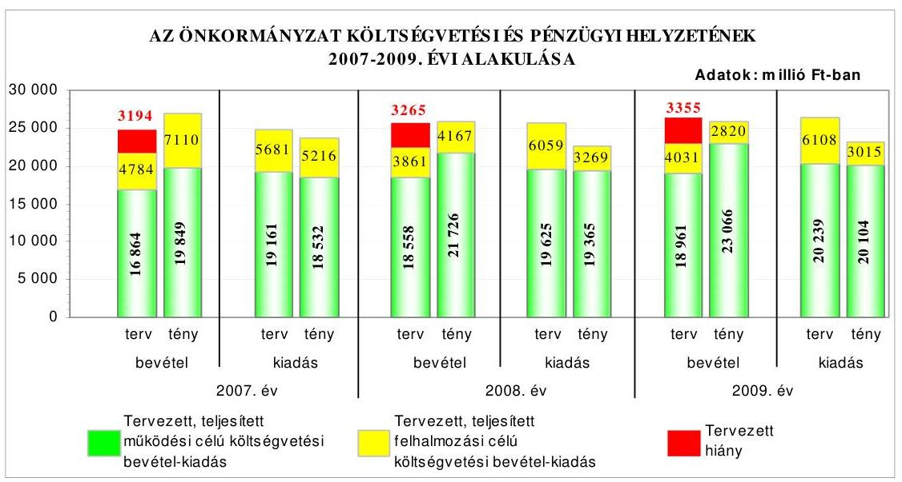
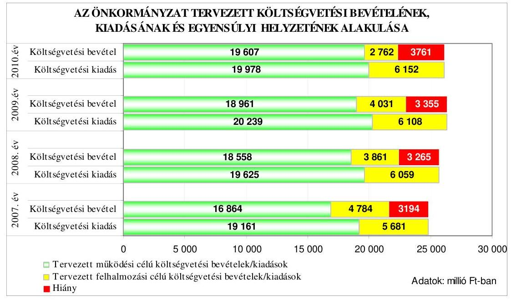
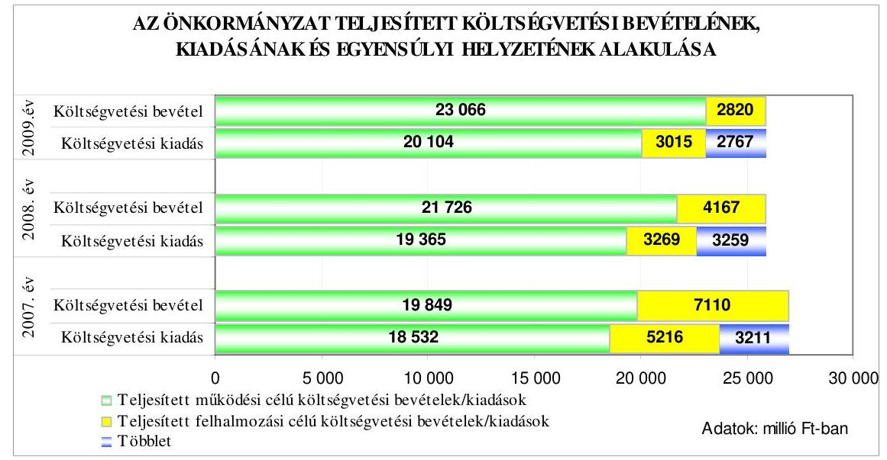
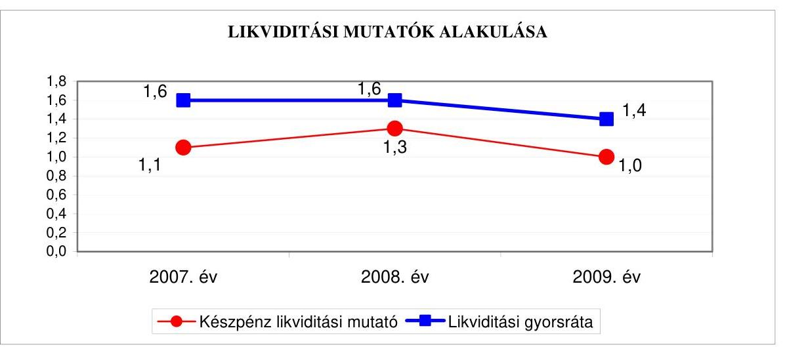
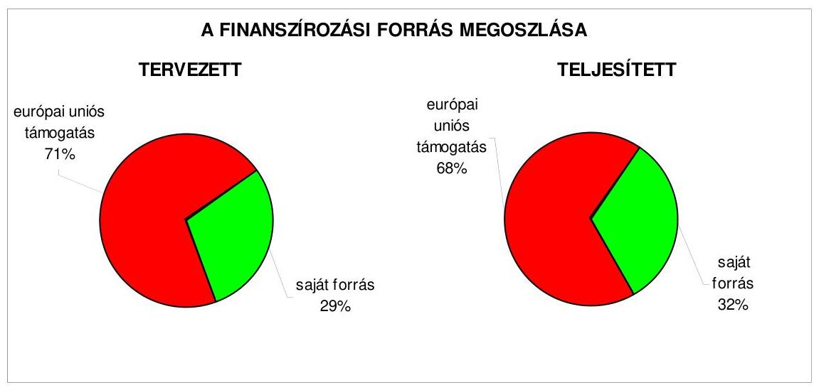
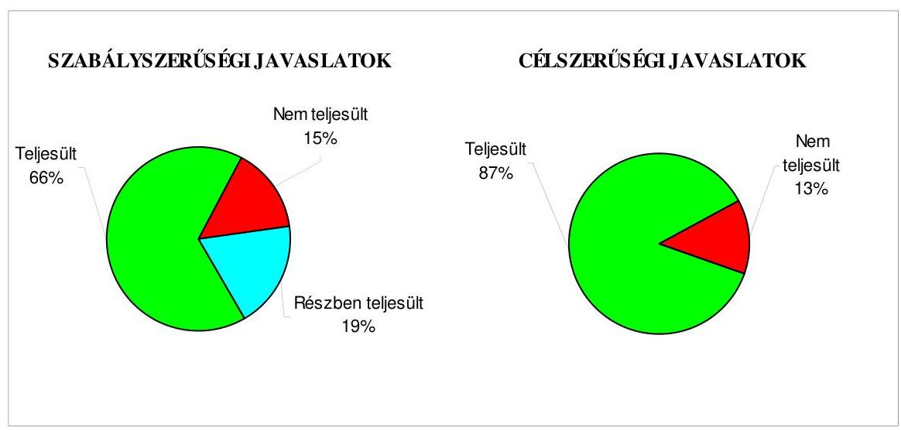
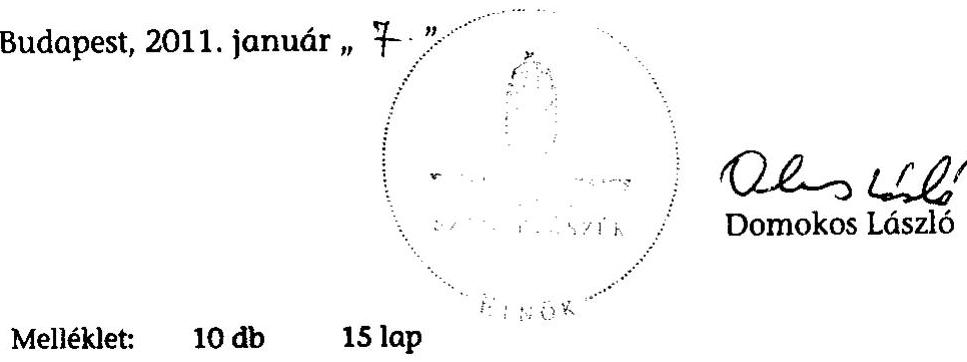
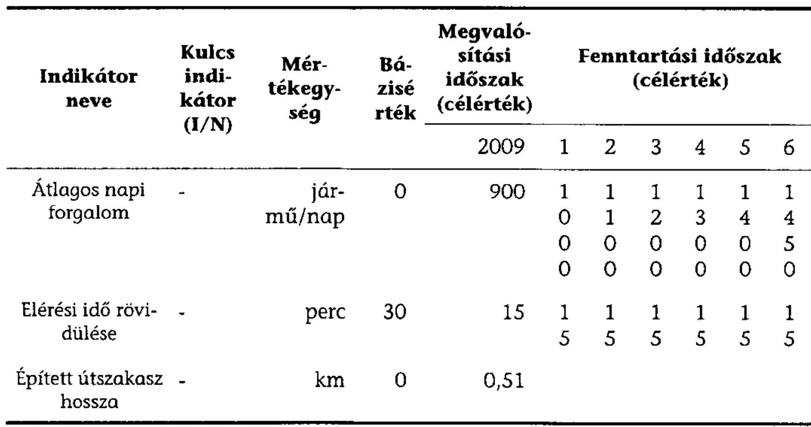
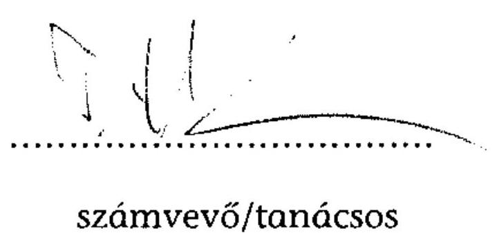
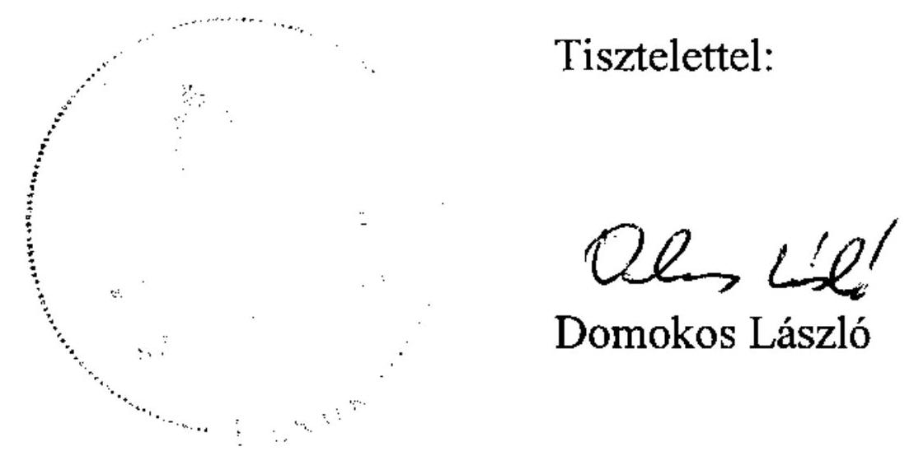

# JELENTÉS 

Budapest Főváros XI. kerület Újbuda Önkormányzata gazdálkodási rendszerének 2010. évi ellenőrzéséről

---

# 3. Önkormányzati és Területi Ellenőrzési Igazgatóság 

## Átfogó Ellenőrzési Főcsoport

Iktatószám: V-3023-7/22/34/2010.
Témaszám: 966
Vizsgálat-azonosító szám: V0488

## Az ellenőrzést felügyelte:

Dr. Lóránt Zoltán
főigazgató
Az ellenőrzés végrehajtásáért felelős:
Dr. Sepsey Tamás
főigazgató-helyettes
Az ellenőrzést vezette:
Molnár Gyula Mihály
igazgatóhelyettes
Az ellenőrzést végezték:
Dr. Csermák Judit Szabó Tamás Tóth László
számvevő tanácsos
számvevő tanácsos

## A témához kapcsolódó eddig készített számvevőszéki jelentések:

## címe

Jelentés a Budapest Főváros XI. kerület Újbuda Önkormányzata 0563 gazdálkodási rendszerének átfogó ellenőrzéséről
Jelentés a helyi és a helyi kisebbségi önkormányzatok gazdálkodási 0634 rendszerének átfogó és egyéb szabályszerűségi ellenőrzéséről
Jelentés a Magyar Köztársaság 2006. évi költségvetése végrehajtásának ellenőrzéséről
Függelék:
A helyi önkormányzatokat a 2006. évben megillető normatív hozzájárulás elszámolásának ellenőrzése
Jelentés a fővárosi önkormányzatot és a kerületi önkormányzatokat osztottan megillető bevételek 2007. évi megosztásáról szóló önkormányzati rendelet felülvizsgálatáról

---

# TARTALOMJEGYZÉK 

BEVEZETÉS ..... 11
I. ÖSSZEGZŐ MEGÁLLAPÍTÁSOK, KÖVETKEZTETÉSEK, JAVASLATOK ..... 16
II. RÉSZLETES MEGÁLLAPÍTÁSOK ..... 28

1. Az Önkormányzat költségvetési és pénzügyi helyzete ..... 28
1.1. A tervezett költségvetési bevételek és kiadások alapján a
költségvetési egyensúly, a költségvetési hiány alakulása, a hiány
tervezett finanszírozási módja, valamint a költségvetési hiány
megállapításának szabályszerűsége ..... 28
1.2. A teljesített költségvetési bevételek és kiadások alapján a pénzügyi
egyensúly, a pénzügyi hiány alakulása, a pénzügyi hiány
finanszírozása, az igénybe vett finanszírozási célú pénzügyi
eszközök hatása a pénzügyi helyzet alakulására, az eladósodásra,
valamint a fizetőképességre ..... 32
2. Az Önkormányzat felkészültsége az európai uniós források igénylésére,
felhasználására, a támogatott célkitúzés megvalósítására, múködtetésére,
valamint az elektronikus közszolgáltatási feladatok ellátására ..... 41
2.1. Az európai uniós források igénybevételére, felhasználására, a
támogatott célkitúzés megvalósítására, múködtetésére történt
felkészülés szabályozottságának, szervezettségének, valamint egy
támogatási szerződésben foglalt célkitúzés megvalósításának,
múködtetésének eredményessége ..... 41
2.1.1. Az európai uniós forrásokra történő pályázatok benyújtására
vonatkozó döntések összhangja fejlesztési célkitúzésekkel ..... 41
2.1.2. Az európai uniós forrásokhoz kapcsolódóan a
pályázatfigyelés, a pályázatkészítés, valamint az európai
uniós támogatással megvalósuló fejlesztés lebonyolításának
belső rendje, a végrehajtás és az ellenőrzés szervezettsége ..... 43
2.1.3. Egy támogatási szerződésben foglalt célkitúzés megvalósítása,
múködtetése ..... 49
2.2. Az elektronikus közszolgáltatás feltételeinek kialakítása ..... 51
3. A költségvetési gazdálkodás belső kontrolljai ..... 55
3.1. A költségvetés-tervezés, a gazdálkodás és a zárszámadás-készítés
folyamatában végrehajtandó belső kontrollok kialakítása ..... 55
3.2. A belső kontrollok múködtetése a költségvetés-tervezés, a
gazdálkodás, és a zárszámadás-készítés folyamataiban ..... 57
3.3. A belső ellenőrzési kötelezettség teljesítése ..... 62

---

4. Az ÁSZ korábbi ellenőrzési javaslatai alapján készített intézkedési terv végrehajtása, hasznosítása
4.1. Az Önkormányzat gazdálkodási rendszerének átfogó ellenőrzése során tett javaslatok végrehajtására tervezett intézkedések megvalósítása
4.2. A zárszámadáshoz kapcsolódó (állami hozzájárulások, támogatások igénylésének és felhasználásának ellenőrzése), valamint a további vizsgálatok esetében a megállapítások, javaslatok alapján tett intézkedések

# MELLÉKLETEK 

1. számú Az Önkormányzat gazdálkodását meghatározó adatok, mutatószámok (1 oldal)
2. számú Az önkormányzati vagyon alakulása (1 oldal)

2/a. számú Az önkormányzati kötelezettségek alakulása (1 oldal)
3. számú Az Önkormányzat 2007-2010. évi költségvetési előirányzatainak és 20072009. évi pénzügyi teljesítéseinek alakulása (1 oldal)
4. számú Tanúsítvány az európai uniós forrásokkal támogatott célok és programok 2007-2010. évi tervezett és teljesített adatairól (2 oldal)
4/a. számú Tanúsítvány az európai uniós forrásokra 2007-2010 között benyújtott pályázatokról, amelyek elbírálásáról az Önkormányzat még nem kapott tájékoztatást (1 oldal)
4/b. számú Tanúsítvány a 2007-2010. években benyújtott és elutasított európai uniós pályázatokról (1 oldal)
5. számú Adatlap az európai uniós forrással támogatott „Alsóhegy utca befejező szakaszának kiépítése" feladatról (3 oldal)
6. számú Dr. Hoffmann Tamás úr, Budapest Főváros XI. kerület Újbuda Önkormányzat polgármestere által adott tájékoztatás (2 oldal)
7. számú Dr. Hoffmann Tamás úr, Budapest Főváros XI. kerület Újbuda Önkormányzat polgármesterének tájékoztatására adott válasz (2 oldal)

---

# RÖVIDÍTÉSEK, MOZAIKSZAVAK JEGYZÉKE 

## Törvények

Áht.
Az államháztartásról szóló 1992. évi XXXVIII. törvény
ÁSZ tv.
az Állami Számvevőszékről szóló 1989. évi XXXVIII. tör-
vény
Eisz. tv.
az elektronikus információszabadságról szóló 2005. évi
XC. törvény
Htv.
a helyi önkormányzatok és szerveik, a köztársasági megbízottak, valamint egyes centrális alárendeltségú szervek feladat- és hatásköreiről szóló 1991. évi XX. törvény
Ket. a közigazgatási hatósági eljárás és szolgáltatás általános szabályairól szóló 2004. évi CXL. törvény
Ltv. a lakások és helyiségek bérletére, valamint az elidegenítésükre vonatkozó egyes szabályokról szóló 1993. évi LXXVIII. törvény
Ötv. a helyi önkormányzatokról szóló 1990. évi LXV. törvény
Ptk. a Polgári Törvénykönyvről szóló 1959. évi IV. törvény
Számv. tv. a számvitelről szóló 2000. évi C. törvény
vízgazdálkodási törvény a vízgazdálkodásról szóló 1995. évi LVII. törvény

## Rendeletek

Ámr. $_{1} \quad$ az államháztartás múködési rendjéről szóló 217/1998. (XII. 30.) Korm. rendelet
Ámr. $_{2} \quad$ az államháztartás múködési rendjéről szóló 292/2009. (XII. 19.) Korm. rendelet
Áhsz. az államháztartás szervezetei beszámolási és könyvvezetési kötelezettségének sajátosságairól szóló 249/2000. (XII. 24.) Korm. rendelet
Ber. a költségvetési szervek belső ellenőrzéséről szóló 193/2003. (XI. 26.) Korm. rendelet
SzMSz $_{1} \quad$ Budapest Főváros XI. kerület Újbuda Önkormányzata 1/2003. (I. 20.) számú rendelete a Képviselő-testület és szervei Szervezeti és Müködési Szabályzatáról
SzMSz $_{2} \quad$ Budapest Főváros XI. kerület Újbuda Önkormányzata 4/2007. (II. 22.) számú rendelete a Képviselő-testület és szervei Szervezeti és Müködési Szabályzatáról
vagyongazdálkodási Budapest Főváros XI. kerület Újbuda Önkormányzata rendelet 13/2003. (V. 20.) számú rendelete az Önkormányzat tulajdonában álló vagyonnal való rendelkezés szabályairól
18/2005. (XII. 27.) IHM a közzétételi listákon szereplő adatok közzétételéhez szükséges közzétételi mintákról szóló 18/2005. (XII. 27.) IHM rendelet
2005. évi költségvetési Budapest Főváros XI. kerület Újbuda Önkormányzata rendelet 9/2005. (II. 28.) számú rendelete a 2005. évi költségvetésről

---

2006. évi költségvetési rendelet

2007. évi költségvetési rendelet

2008. évi költségvetési rendelet

2009. évi költségvetési rendelet

2010. évi költségvetési rendelet
2005. évi zárszámadási rendelet

2006. évi zárszámadási rendelet

2007. évi zárszámadási rendelet

2008. évi zárszámadási rendelet

2009. évi zárszámadási rendelet

## Szórövidítések

ÁROP
ÁSZ
Belső ellenőrzési egység
e-közszolgáltatás
felülvizsgálati szabály$\mathrm{zat}_{1}$
felülvizsgálati szabály$\mathrm{zat}_{2}$

FEUVE
Fővárosi Önkormányzat
Fővárosi Vízmúvek Zrt.

Budapest Főváros XI. kerület Újbuda Önkormányzata 8/2006. (III. 3.) számú rendelete a 2006. évi költségvetésről
Budapest Főváros XI. kerület Újbuda Önkormányzata 7/2007. (II. 22.) számú rendelete a 2007. évi költségvetésről
Budapest Főváros XI. kerület Újbuda Önkormányzata 2/2008. (II. 29.) számú rendelete a 2008. évi költségvetésről
Budapest Főváros XI. kerület Újbuda Önkormányzata 3/2009. (II. 24.) számú rendelete a 2009. évi költségvetésről
Budapest Főváros XI. kerület Újbuda Önkormányzata 2/2010. (II. 5.) számú rendelete a 2009. évi költségvetésről
Budapest Főváros XI. kerület Újbuda Önkormányzata 15/2006. (IV. 28.) számú rendelete a 2005. évi zárszámadásról
Budapest Főváros XI. kerület Újbuda Önkormányzata 11/2007. (IV. 26.) számú rendelete a 2006. évi zárszámadásról
Budapest Főváros XI. kerület Újbuda Önkormányzata 10/2008. (VI. 24.) számú rendelete a 2007. évi zárszámadásról
Budapest Főváros XI. kerület Újbuda Önkormányzata 16/2009. (IV. 22.) számú rendelete a 2008. évi zárszámadásról
Budapest Főváros XI. kerület Újbuda Önkormányzata 13/2010. (V. 28.) számú rendelete a 2009. évi zárszámadásról

ÚMFT Államreform Operatív Programja
Állami Számvevőszék
Budapest Főváros XI. kerület Újbuda Önkormányzata Polgármesteri Hivatalának belső ellenőrzést végző szervezeti egysége
elektronikus közszolgáltatás
a 12/2009. számú polgármesteri-jegyzői intézkedés a költségvetés-tervezés, a költségvetési beszámolás, a pénzmaradvány elszámolás és felülvizsgálat rendjéről, hatályos 2009. október 1-től
a 6/2010. számú polgármesteri-jegyzői intézkedés a költségvetés-tervezés, a költségvetési beszámolás, a pénzmaradvány elszámolás és felülvizsgálat rendjéről, hatályos 2010. július 15 -től
folyamatba épített előzetes, utólagos és vezetői ellenőrzés
Budapest Főváros Önkormányzata
Fővárosi Vízmúvek Zártkörűen Múködő Részvénytársaság

---

gazdálkodási jogkörök szabályzata ${ }_{1}$
gazdálkodási jogkörök szabályzata $2_{2}$
gazdasági program
gazdasági szervezet ügyrendje
hivatali SzMSz

Humánszolgálati igazgatóság
jegyzó
KEOP
Képviselő-testület
KMOP
Önkormányzat
pályázati szabályzat

Pénzügyi bizottság
Pénzügyi igazgatóság
polgármester
Polgármesteri hivatal
TÁMOP
Újbuda Gyöngye Kft.
ÚMFT
Vagyongazdálkodási bizottság
az 1/2008. számú polgármesteri-jegyzői intézkedés a kötelezettségvállalási és utalványozási jogkör gyakorlásáról, hatályos 2008. április 28-tól
az 5/2009. számú polgármesteri-jegyzői intézkedés a kötelezettségvállalási és utalványozási jogkör gyakorlásáról, hatályos 2009. április 20-tól
Budapest Főváros XI. kerület Újbuda Önkormányzata Képviselő-testületének a 240/2007. (V. 17.) számú határozatával elfogadott gazdasági programja 2007-2013
a Polgármesteri Hivatal Pénzügyi és Költségvetési Igazgatósága feladat- és ügyrendjéről szóló 3/2008. számú polgármesteri és jegyzői együttes intézkedés
a Polgármesteri Hivatal szervezeti és múködési szabályzatáról (ügyrendjéről) szóló 10/2007. számú polgármesteri és jegyzői együttes intézkedés
Budapest Főváros XI. kerület Újbuda Önkormányzata Polgármesteri Hivatalának Humánszolgálati Igazgatósága
Budapest Főváros XI. kerület Újbuda Önkormányzatának Jegyzője
ÚMFT Környezet és Energia Operatív Program
Budapest Főváros XI. kerület Újbuda Önkormányzata Képviselő-testülete
ÚMFT Közép-Magyarországi Operatív Program
Budapest Főváros XI. kerület Újbuda Önkormányzata
a 2/2009. számú polgármesteri-jegyzői intézkedés az Önkormányzat vagy a Polgármesteri Hivatal által benyújtandó pályázatokkal kapcsolatos eljárásról, hatályos 2009. április 1-jétől

Budapest Főváros XI. kerület Újbuda Önkormányzatának Pénzügyi és Költségvetési Bizottsága
Budapest Főváros XI. kerület Újbuda Önkormányzata Polgármesteri Hivatalának Pénzügyi és Költségvetési Igazgatósága
Budapest Főváros XI. kerület Újbuda Önkormányzatának Polgármestere
Budapest Főváros XI. kerület Újbuda Önkormányzatának Polgármesteri Hivatala
ÚMFT Társadalmi Megújulás Operatív Programja
Újbuda Gyöngye Létesítmény Beruházó Korlátolt Felelősségú Társaság
Új Magyarország Fejlesztési Terv
Budapest Főváros XI. kerület Újbuda Önkormányzatának Vagyongazdálkodási Bizottsága

---

.

---

# ÉRTELMEZŐ SZÓTÁR 

1. elektronikus szolgáltatási szint
2. elektronikus szolgáltatási szint
3. elektronikus szolgáltatási szint
4. elektronikus szolgáltatási szint
egyéb közösségi kezdeményezés
eredményesség
európai uniós források
fejlesztési célkitúzés
fejlesztési feladat (projekt)

Az 1044/2005. (V. 11.) Korm. határozat alapján olyan információs, tájékoztató szolgáltatás, amely csak általános információkat közöl az adott üggyel kapcsolatos teendőkről és a szükséges dokumentumokról.
Az 1044/2005. (V. 11.) Korm. határozat alapján olyan egyirányú kapcsolatot biztosító szolgáltatás, amely az 1. szinten túl biztosítja az adott ügy intézéséhez szükséges dokumentumok, nyomtatványok letöltését, és azok ellenőrzéssel, vagy ellenőrzés nélküli elektronikus kitöltését, amely esetben a dokumentumok benyújtása hagyományos úton történik.
Az 1044/2005. (V. 11.) Korm. határozat alapján olyan kétirányú kapcsolatot biztosító szolgáltatás, amely közvetlen, vagy ellenőrzött kitöltésű dokumentum segítségével biztosítja az elektronikus adatbevitelt és a bevitt adatok ellenőrzését. Az ügy indításához, intézéséhez személyes megjelenés nem szükséges, de az ügyhöz kapcsolódó közigazgatási döntés (határozat, egyéb aktus) közlése, valamint a kapcsolódó illeték-, vagy díffizetés hagyományos úton történik.
Az 1044/2005. (V. 11.) Korm. határozat alapján olyan teljes közvetlen kétirányú ügyintézési folyamatot biztosító szolgáltatás, amikor az ügyhöz kapcsolódó közigazgatási döntés is elektronikus úton kerül közlésre, illetve a kapcsolódó illeték-, vagy díffizetés elektronikus úton is intézhető.
Az Európai Unió Nemzeti Fejlesztési Tervbe és az Új Magyarország Fejlesztési Tervbe nem sorolható támogatási programjai.
Egy adott tevékenység céljai megvalósításának mértéke, a tevékenység szándékolt és tényleges hatása közötti kapcsolat. (Forrás: Ámr.; 2. § 66. pont)
Az Európai Unió költségvetéséből, illetve az Európai Gazdasági Térség Európai Unión kívüli tagállamainak költségvetéséből származó támogatások, valamint a „Svájci Hozzájárulás" programból származó támogatás.
Az önkormányzat által ellátott kötelező, vagy önként vállalt feladatok mennyiségi (minőségi) fejlesztésére vonatkozó terv. A fejlesztési célkitúzés megvalósulhat beszerzéssel, létesítéssel, bővítéssel, átalakítással.
Az a fejlesztési feladat, amely illeszkedik az Európai Unió, illetve a Nemzeti Fejlesztési Terv által támogatott programokhoz. Az Európai Unió, illetve a Nemzeti Fejlesztési Terv és az Új Magyarország Fejlesztési Terv által meghirdetett programokhoz kapcsolódó, támogatott projektek fejlesztési feladatok megvalósításához használhatók fel az

---

|  | európai uniós források. A fejlesztési feladat (projekt) tartalmilag és formailag részletesen kidolgozott, megfelelő pénzügyi háttérrel és végrehajtási ütemezéssel rendelkező fejlesztési terv. |
| :--: | :--: |
| indikátor | A projekt megvalósulásának számszerúsíthető eredményei, mutató, jelzőszám, amelynek segítségével egy célkitúzés megvalósulásának adott szintjét lehet szemléltetni. Jelenthet egy felhasznált erőforrást, egy elért hatást, egy minőségi szintet, illetve valamilyen egyéb változást. |
| intézkedés | Az európai uniós támogatások esetében az Európai Unió olyan támogatási eszköze, amely segítségével egy prioritást élvező feladat megvalósítása több év alatt történik. |
| közremúködő szervezet | A közreműködő szervezet az európai uniós támogatást elnyert kedvezményezettel a kapcsolattartó szerv. Feladatai: a támogatási szerződés mintától eltérő egyedi támogatási szerződés-tervezetek előzetes megküldése jóváhagyásra a Nemzeti Fejlesztési Ügynökségnek; a projektek megvalósítása előrehaladásának nyomon követése, a támogatás kifizetésének engedélyezése, a folyamatba épített ellenőrzések (dokumentumalapú ellenőrzések és kockázatelemezésre alapozott helyszíni ellenőrzések) végzése, a projektek zárásával kapcsolatos feladatok ellátása, szabálytalanságkezelési rendszer kialakítása és múködtetése; ellenőrzési nyomvonal készítése és folyamatos aktualizálása; az Egységes Monitoring Informatikai Rendszerben az adatok folyamatos rögzítése, az adatbázis naprakészségének és megbízhatóságának biztosítása; a beszámolók készítése és megküldése a miniszter és a Nemzeti Fejlesztési Ügynökség részére az akcióterv és az éves munkaterv megvalósításában történt előrehaladásról és a szükséges intézkedésekre vonatkozó javaslatokról. |
| lebonyolítás | Az európai uniós források felhasználásával megvalósuló fejlesztésre irányuló múszaki, gazdasági (pénzügyi) tevékenységet magában foglaló szervezési, irányítási szolgáltatás. A szervezési szolgáltatás kiterjedhet a pályázatkészítésre, a közbeszerzési eljárás lebonyolításán keresztül a folyamatos műszaki ellenőrzésre, a pénzügyi elszámolásra, a műszaki átadás-átvételre, az üzembe helyezésre, illetve a fejlesztési folyamat egyes elemeire. |
| Nemzeti Fejlesztési Terv | Helyzetelemzést, stratégiát a tervezett fejlesztési területek prioritásait, azok céljait és pénzügyi forrásaik megjelölését tartalmazó dokumentum, amelyet a Magyar Köztársaság készített az Európai Unió programozási irányelveinek, célkitűzéseinek megfelelően a fejlődésben lemaradó régiók fejlődésének és strukturális átalakulásának elősegítésére a kiemelt szükségletekre figyelemmel. A Nemzeti Fejlesztési Terv stratégiai fejezetének célja, hogy a 2004-2006 közötti időszakra kijelölje a strukturális alapokból támogatható fejlesztéspolitikai célkitűzéseit és prioritásait. A strukturális alapok operatív programjai: Agrár- és Vidékfejlesztés |

---

nyomon követési időszak
operatív program
pályázati önrész
program
saját forrás
szabálytalanság
támogatási szerződés

Új Magyarország Fejlesztési Terv

Operatív Program (AVOP); Gazdasági Versenyképesség Operatív Program (GVOP); Humán erőforrások fejlesztései Operatív Program (HEFOP); Környezetvédelem és infrastruktúra Operatív Program (KIOP); Regionális Fejlesztés Operatív Program (ROP).
Az európai uniós forrás felhasználásával megvalósult projekt fenntartási kötelezettségének egyes évei, amelyről az Önkormányzatnak nyomon követési jelentést kell készíteni a közremúködő szervezet részére.
Az Európai Bizottság által jóváhagyott, a Közösségi Támogatási Keret végrehajtására vonatkozó, több évre szóló intézkedésekhez kapcsolódó prioritások egységes rendszerét tartalmazó dokumentum.
Az európai uniós forrással megvalósuló fejlesztések finanszírozását szolgáló saját pénzeszköz fedezet, amelyet a pályázatban a pályázó önrészként, azaz saját forrásként mutat ki.
Ágazati vagy térségi fejlesztési célt megvalósító fejlesztési terv, mely több egymással összefüggő projekt útján, az érintettek együttmúködése alapján valósul meg.
A kedvezményezett által a támogatott projekthez biztosított forrás, amelybe az államháztartás alrendszereiből nyújtott támogatás nem számítható be. Költségvetési szervek esetén a jóváhagyott előirányzat saját forrásnak minősül.
A jogszabályokban szereplő előírásoknak, illetve a támogatási szerződésben a felek által vállalt kötelezettségeknek a megsértése, amelyek eredményeképpen az Európai Közösség vagy a Magyar Köztársaság pénzügyi érdekei sérülnek, illetve sérülhetnek.
A strukturális alapok esetében az irányító hatóságnak, illetve a Kohéziós Alap esetében a közremúködő szervezeteknek a kedvezményezett önkormányzattal kötött szerződése, amely a támogatás felhasználásának részletes feltételeit tartalmazza. Az Új Magyarország Fejlesztési Terv keretében támogatott projektek esetében a támogatási szerződés a kedvezményezett és a Nemzeti Fejlesztési Ügynökség nevében eljáró közremúködő szervezet között jön létre. A támogatási szerződés képezi a megvalósítás nyomon követésének, finanszírozásának és ellenőrzésének alapját.
Az Új Magyarország Fejlesztési Terv célja a foglalkoztatás bővítése és a tartós növekedés feltételeinek megteremtése. Ennek érdekében 2007-2013 között hat kiemelt területen indított el összehangolt állami és európai uniós fejlesztéseket: a gazdaságban, a közlekedésben, a társadalom megújulása érdekében, a környezet és az energetika területén, a területfejlesztésben és az államreform feladataival összefüggésben. Az Új Magyarország Fejlesztési Terv ope-

---

rativ programjai: Államreform Operatív Program (ÁROP); Elektronikus Közigazgatás Operatív Program (EKOP); Gazdaságfejlesztés Operatív Program (GOP); Környezet és Energia Operatív Program (KEOP); Közlekedés Operatív Program (KÖZOP); Dél-Alföldi Operatív Program (DAOP); Dél-Dunántúli Operatív Program (DDOP); Észak-Alföldi Operatív Program (ÉAOP); Észak-Magyarországi Operatív Program (ÉMOP); Közép-Dunántúli Operatív Program (KDOP); Közép-Magyarországi Operatív Program (KMOP); Nyugat-Dunántúli Operatív Program (NYDOP); Társadalmi Infrastruktúra Operatív Program (TIOP); Társadalmi Megújulás Operatív Program (TÁMOP).

---

# JELENTÉS 

## Budapest Főváros XI. kerület Újbuda Önkormányzata gazdálkodási rendszerének 2010. évi ellenőrzéséről

## BEVEZETÉS

Az Ötv. 92. § (1) bekezdése, az Állami Számvevőszékről szóló 1989. évi XXXVIII. törvény 2. § (3) bekezdése, valamint az Áht. 120/A. § (1) bekezdése alapján az önkormányzatok gazdálkodását az Állami Számvevőszék ellenőrzi. Az ellenőrzésre az Országgyűlés illetékes bizottságai részére is átadott, országosan egységes ellenőrzési program szerint került sor.

Az Állami Számvevőszék a stratégiájában foglalt célkitűzéseknek megfelelően a helyi önkormányzatok költségvetési gazdálkodási rendszerének ellenőrzését a 2007. évben megújított, teljesítmény-ellenőrzési elemekkel kiegészített ellenőrzési program alapján folytatja a 2010. évben.

Az ellenőrzés célja annak értékelése volt, hogy az Önkormányzat:

- milyen módon biztosította a költségvetési és a pénzügyi egyensúlyt a költségvetésében és annak teljesítése során, valamint változott-e a hiányzó bevételi források pótlásában a finanszírozási célú pénzügyi műveletek jelentősége, hatása;
- eredményesen készült-e fel a szabályozottság és a szervezettség terén az európai uniós források igénylésére és felhasználására, megvalósította, működtette-e a támogatott célkitűzést, továbbá biztosította-e az elektronikus közszolgáltatás feltételeit, a gazdálkodási adatok közzétételével a gazdálkodás nyilvánosságát;
- megfelelően kialakította-e és működtette-e a belső kontrollokat a költségve-tés-tervezés, a gazdálkodás és a zárszámadás-készítés, valamint a belső ellenőrzés folyamatában, továbbá;
- megfelelően hasznosították-e a korábbi számvevőszéki ellenőrzések megállapításait, szabályszerűségi ${ }^{1}$ és célszerűségi javaslatait.

[^0]
[^0]:    ${ }^{1}$ A törvényi előírások betartásának elmulasztásakor a részletes megállapítások fejezetben egységesen a törvénysértés megjelölést alkalmazzuk, mivel az ÁSZ nem tehet különbséget a törvényi előírások között.

---

Az ellenőrzés típusa: átfogó ellenőrzés, amely - egy ellenőrzés keretében meghatározott területekre összpontosítva alkalmazza a szabályszerűségi, valamint a teljesítmény-ellenőrzés jellemzőit.

Az ellenőrzött időszak: a költségvetési egyensúly és az európai uniós támogatás igénybevételére történt felkészülés ellenőrzése esetében a 2007-2009. évek és 2010. I. negyedév, a belső kontrollok kialakítása és múködtetése tekintetében a 2009. év és a 2010. I. negyedév, az önkormányzat gazdálkodási rendszerének 2005. évi átfogó ellenőrzéséről készített jelentésben rögzített javaslatok megvalósítását, hasznosítását, valamint a 2006 óta végzett további ellenőrzések során megfogalmazott javaslatok végrehajtása érdekében a 2006-2010. I. negyedév közötti időszakban tett intézkedéseket ellenőrizzük.

A kerület lakosainak száma 2010. január 1-jén 130173 fő volt. A 2006. évi önkormányzati képviselő- és polgármester-választást követően az Önkormányzat 38 tagú Képviselő-testületének munkáját 10 állandó bizottság segítette. A helyi önkormányzat mellett a 2006. évi önkormányzati képviselő- és polgármesterválasztásokat követően 12 kisebbségi önkormányzat ${ }^{2}$ működött. A polgármester a 2002. évi önkormányzati képviselő- és polgármester-választás óta tölti be tisztségét, a jegyző személye 2003. óta változatlan.

Az Önkormányzat feladatainak végrehajtása érdekében a 2007. évben 61, a 2009. évben 59 költségvetési intézményt múködtetett, amelyekből a 2007. évben 12 önállóan gazdálkodó, a 2009. évben három önállóan működő és gazdálkodó volt. A feladatok ellátásában a 2007. évben négy gazdasági társasága és négy közhasznú társasága, a 2009. évben kilenc gazdasági társasága vett részt. Az Önkormányzat az éves költségvetési beszámolója szerint a 2009. évben 25886 millió Ft költségvetési bevételt ért el, és 23119 millió Ft költségvetési kiadást teljesített. A teljesített költségvetési bevételek 4,0\%-kal, a költségvetési kiadások 2,6\%-kal maradtak el a 2007. évben teljesített költségvetési bevételektől és kiadásoktól, a teljesített múködési célú bevételek, és kiadások növekedése és a felhalmozási célú bevételek és kiadások csökkenésének együttes hatásaként. Az Önkormányzat 2009. december 31-én a könyvviteli mérleg szerint 61271 millió Ft értékű vagyonnal rendelkezett. Az Önkormányzat vagyona a 2007. év végi állományhoz viszonyítva 2,1\%-kal emelkedett, ezen belül a befektetett eszközök 2,9\%-kal, a tárgyi eszközök állományának 1989 millió Ft-os (3,9\%-os) növekedése, és a befektetett pénzügyi eszközök 15,4\%-os csökkenése hatására, a forgóeszközök értéke csökkent 5,3\%-kal, amelyet a követelések állományának 15,1\%-os ( 274 millió Ft-os), valamint a pénzeszközök értékének 3,7\%-os (123 millió Ft-os) csökkenése okozott. A vagyon növekedését a saját tőke 1314 millió Ft-tal ( $2,5 \%$-kal) való és a tartalékok $0,3 \%$-os emelkedése okozta, míg a kötelezettségek értéke $1 \%$-kal csökkent a rövid lejáratú kötelezettségek 191 millió Ft-tal ( $6,0 \%$-kal) történő növekedése, illetve a hosszú lejáratú kötelezettségek 53,1\%-os (195 millió Ft-os) csökkenése mellett.

[^0]
[^0]:    ${ }^{2}$ bolgár, cigány, görög, horvát, lengyel, német, örmény, román, ruszin, szerb, szlovák, ukrán kisebbségi önkormányzat

---

Az összes költségvetési bevétel 65,2\%-át a saját bevétel, 38,2\%-át a helyi adó bevétel biztosította a 2009. évben. A helyi adóbevétel összes költségvetési bevételen belüli aránya a 2007. évihez viszonyítva 6,7 százalékponttal nőtt. Az öszszes költségvetési kiadásból a felhalmozási célú kiadás részaránya a 2009. évben 13,0\% volt, mely a 2007. évhez viszonyítva 9,0 százalékponttal csökkent, amit a beruházásokra fordított kiadások 1487 millió Ft-tal való csökkenése okozott. A 2010. évi költségvetési rendeletben 22369 millió Ft költségvetési bevételt és 26130 millió Ft költségvetési kiadást irányoztak elő. A Polgármesteri hivatalban dolgozó köztisztviselők száma 2007. január 1-én 401 fő, 2009. december 31-én 397 fő volt, a költségvetési intézményekben 2007. január 1-jén 2735 fő, 2009. december 31-én 2659 fő közalkalmazottat foglalkoztattak. Az Önkormányzat gazdálkodását meghatározó adatokat, mutatószámokat az 1-3. számú mellékletek tartalmazzák.

Az Önkormányzat költségvetési és pénzügyi helyzetét az elemző eljárás módszerével vizsgáltuk. E körben elemeztük a költségvetés egyensúlyi helyzetének alakulását, a tervezett és teljesített költségvetési, pénzügyi hiány okait, a hiány finanszírozásának tervezett és teljesített módját, az önkormányzat pénzügyi helyzetének alakulását az eladósodás és a likviditás szempontjából.

Teljesítmény-ellenőrzés módszerével vizsgáltuk, és az eredményesség szempontjából értékeltük az Önkormányzat benyújtott pályázatai kapcsolódását a Kép-viselő-testület által meghatározott fejlesztési célkitúzésekhez, valamint felkészültségét a belső szabályozottság, szervezettség terén az európai uniós forrásokra vonatkozó pályázati felhívások figyelésére, a pályázatok készítésére és a lebonyolítására. Értékeltük továbbá egy fejlesztési feladat támogatási szerződésében rögzített célkitúzés (számszerúsíthető eredmények, indikátorok) megvalósításának eredményességét. Az ellenőrzés során felmértük, hogy az elektronikus közigazgatási szolgáltatások működtetése érdekében milyen intézkedéseket tettek, továbbá biztosították-e a közérdekú gazdálkodási adatok meghatározott körének a honlapon történő közzétételét.

A költségvetési gazdálkodás belső kontrolljainak ellenőrzése során vizsgáltuk, hogy a Polgármesteri hivatalban a költségvetés-tervezés, a gazdálkodás, és a zárszámadás-készítés folyamatában a belső kontrollok kialakítása és múködése megfelelő biztosítékot ad-e a gazdálkodási feladatok szabályszerű ellátására. Felmértük és minősítettük a költségvetés-tervezés, a gazdálkodás, és a zárszá-madás-készítés feladataival, továbbá a pénzügyi-számviteli területen az informatikával kapcsolatosan kialakított kontrollok, valamint azok múködésének megfelelőségét. A vizsgálat során értékeltük a belső ellenőrzés szabályozottságát, múködési feltételeinek kialakítását, meghatározását, továbbá múködésének megfelelőségét.

A Polgármesteri hivatalban értékeltük a gazdálkodás folyamatában kulcsszerepet betöltő belső kontrollok múködésének megfelelőségét, ennek keretében ellenőriztük a szakmai teljesítés igazolására és az utalvány ellenjegyzésére kialakított kontrollok végrehajtását.

---

Az ellenőrzést a következő, magas kockázatú kifizetésekre folytattuk le ${ }^{3}$ :

- az államháztartáson kívülre teljesített működési és felhalmozási célú pénzeszköz átadásokra,
- az állományba nem tartozók megbízási díjaira, továbbá
- a külső szolgáltató által végzett karbantartási, kisjavítási szolgáltatásokra.

Az ellenőrzés hatékony elvégzése céljából a vizsgálandó területek kiválasztása során a kockázatokon alapuló megközelítés érvényesült, ezáltal az ellenőrzési erőforrásokat azokra a területekre fókuszáltuk, amelyeken a korábbi ellenőrzési tapasztalatok figyelembevételével legnagyobb a hibák előfordulási valószínűsége. Az ellenőrzési erőforrások ilyen típusú összpontosításával minimálisra csökkenthető a kívánt ellenőrzési bizonyosság eléréséhez szükséges időráfordítás.

A pénzügyi-számviteli folyamatokban alkalmazott belső kontrollok kialakításának és működésének ellenőrzésére a vizsgált három terület 2009. évi könyvviteli tételeiből területenként egyszerű véletlen mintát vettünk. A kijelölt gazdasági eseményre elvégzett megfelelőségi tesztek alapján értékeltük a kontrollok múködésének megfelelőségét a vizsgált három területre külön-külön, majd öszszefoglalóan ${ }^{4}$. A helyszíni ellenőrzés megállapításainak részletes dokumentálását megfelelőségi tesztlapokon, ellenőrzési munkalapokon biztosítottuk. Ezeken a teszt- és munkalapokon a minősítés alapjául szolgáló kérdések és a vonatkozó konkrét jogszabályhelyek megjelölése mellett értékeltük a kialakított belső kontrollokban rejlő kockázatokat ${ }^{5}$ és a kialakított kontrollok múködésének megfelelőségét ${ }^{6}$.

[^0]
[^0]:    ${ }^{3}$ Az önkormányzatok kiemelt előirányzataira vonatkozóan, a vertikális folyamatokra elvégeztük a kockázatok becslését, amelynek eredményeként határoztuk meg a magas kockázatú területeket.
    ${ }^{4}$ A vizsgált három terület egyedi értékelési pontszámait a területek költségvetési súlyával arányosan összegeztük.
    ${ }^{5}$ A kialakított belső kontrollokban rejlő kockázatot alacsonynak minősítettük, ha a kontrollok megfelelő védelmet nyújtottak a hibák bekövetkezése ellen. Közepesnek minősítettük a belső kontrollokban rejlő kockázatot, amennyiben a kontrollok a lehetséges hibák többsége ellen védelmet nyújtottak. Magasnak értékeltük a kockázatot, ha a kontrollok - kialakításuk hiányában, vagy hiányos kialakításuk miatt - nem nyújtottak elegendő védelmet a lehetséges hibákkal szemben.
    ${ }^{6}$ A kontrollok múködésének megfelelőségét kiválónak értékeltük abban az esetben, ha azok múködése - esetleges kisebb, az egységesen meghatározott követelményrendszerben foglalt mértéket el nem érő hiányosságoktól eltekintve - megfelelt a hibák megelőzésére és kijavítására meghatározott szabályozásnak és a legmagasabb szintű elvárásoknak. Jónak minősítettük a kontrollok múködését, ha a megállapított kisebb (tolerálható mértékű) hiányosságok nem veszélyeztették az ellenőrzött terület hibáinak megelőzését és kijavítását. Amennyiben a kontrollok múködésében túl sok hiányosság fordult elő ahhoz, hogy a kontrollok biztosítsák a hibák megelőzését, feltárását, kijavítását és ezáltal veszélyeztették az eredményes, megbízható múködést, a kontroll múködésének megfelelősége gyenge minősítést kapott.

---

Az ÁSZ korábbi ellenőrzési javaslatai alapján tett intézkedéseket, illetve azok megvalósítását utóellenőrzés keretében vizsgáltuk. A gazdálkodási rendszer korábbi átfogó ellenőrzése során megfogalmazott javaslatok végrehajtására tett intézkedések megvalósítását ellenőriztük, az egyéb számvevőszéki ellenőrzések során tett javaslatok esetében pedig a kiadott intézkedéseket tekintettük át.

A helyszíni ellenőrzés során kitöltött - az ellenőrzést végző számvevő és a Polgármesteri hivatal felelős köztisztviselője által aláírt - ellenőrzési munkalapokat, azok kitöltési útmutatóit, továbbá a megfelelőségi tesztek dokumentumait a polgármester részére a számvevői jelentéssel egyidejúleg átadtuk.

A jelentés megállapításainak, javaslatainak egyeztetése során a polgármester arról adott részletes tájékoztatást - egyidejúleg csatolta azokat a dokumentumokat, amelyek igazolták -, hogy az időközben megtett intézkedésekkel a számvevői jelentésben tett javaslatok ${ }^{7}$ egy részét megvalósították. A megtett intézkedéseket a jelentés II. Részletes megállapítások fejezetében az adott témához kapcsolt lábjegyzetben feltüntettük és a vonatkozó javaslatokat elhagytuk.

A jelentést az ÁSZ-ról szóló 1989. évi XXXVIII. tv. 25. § (1) bekezdése alapján észrevétel közlése céljából megküldtük a Budapest Főváros XI. kerület Újbuda Önkormányzat polgármesterének. A kapott tájékoztatást a jelentés 6. számú melléklete, az arra adott választ a 7. számú melléklet tartalmazza.

[^0]
[^0]:    ${ }^{7}$ A számvevői jelentésben a helyszíni ellenőrzés során a jegyzőnek 17 szabályszerűségi és 10 célszerűségi javaslatot tettünk, melyből négy szabályszerűségi, valamint öt célszerűségi javaslatot elhagytunk.

---

# I. ÖSSZEGZŐ MEGÁLLAPÍTÁSOK, KÖVETKEZTETÉSEK, JAVASLATOK 

Az Önkormányzat a 2007-2010. évi költségvetési rendeleteiben a költségvetési bevételek és kiadások egyensúlyát nem biztosította, mivel a tervezett költségvetési kiadások meghaladták a tervezett költségvetési bevételeket. Az Önkormányzat a költségvetési egyensúly biztosításához, a költségvetési hiány finanszírozására a 2007-2010. évi költségvetési rendeleteiben rövid és hosszú lejáratú hitelek felvételét, valamint bevételt növelő és kiadást csökkentő intézkedések megtételét tervezte. A jegyző a költségvetés végrehajtása érdekében a likviditás feltételeinek kialakításáról az éves költségvetések tervezése során elő-irányzat-felhasználási terv készítésével gondoskodott.

A 2007-2010. évi költségvetési bevételek és kiadások főösszegeinek költségvetési rendelettervezetben történt megállapításakor nem tartották be az Áht. rendelkezését, mivel finanszírozási célú pénzügyi műveleteket költségvetési hiányt módosító költségvetési kiadásként vettek figyelembe.

Az Önkormányzatnál a 2007-2009. években a teljesített költségvetési bevételek főösszege folyamatosan csökkent. A teljesített költségvetési kiadások főösszege a 2007. évről a 2008. évre csökkent, a 2008. évről a 2009. évre növekedett. A 2007-2009. években a költségvetések végrehajtása során a pénzügyi egyensúly minden évben fennállt, mivel a teljesített költségvetési bevételek fedezetet nyújtottak a megvalósított feladatok teljesített költségvetési kiadásaira. A teljesített múködési célú költségvetési bevételek többlete az évek sorrendjében 1317 millió Ft, 2361 millió Ft és 2962 millió Ft volt, a teljesített felhalmozási célú költségvetési bevételek a 2007. és a 2008. évben 1894 millió Ft-tal, illetve 898 millió Ft-tal haladták meg a felhalmozási célú költségvetési kiadásokat, míg a 2009. évben a teljesített felhalmozási célú költségvetési kiadások 195 millió Ft-tal magasabbak voltak a hasonló célú bevételeknél. A helyi adó-

---

bevételek mindhárom évben - a jóváhagyott eredeti költségvetési előirányzathoz képest - túlteljesültek, ami nem vezethető vissza tervezési hiányosságra. A 2007-2010. években az éves költségvetések eredeti előirányzatainak kialakításánál nem tartották be az Áht-ban előírtakat, mivel nem tervezték meg az előző évi pénzmaradvány igénybevételét, valamint a hozzá kapcsolódó, előző évről áthúzódó kötelezettségek előirányzatait, ennek következménye volt a beruházási kiadások 2007-2009. évi és a felújítási kiadások 2007. évi túlteljesülése, a 2008-2009. évi alulteljesítést a közbeszerzési, illetve a hatósági eljárások elhúzódása okozta. Tervezési hiányosság volt, hogy a Képviselő-testület 2698-2859-2977-3435 millió Ft értékben kiadásként jóváhagyta a 2007-2010. évek költségvetési rendeleteiben a támogatás értékű felhalmozási kiadások között a Fővárosi Önkormányzat felé az önkormányzati lakások elidegenítéséből származó bevételből fizetendő kötelezettség teljes összegét, annak ellenére, hogy az adott évben fizetendő kötelezettség összegéről megállapodás a két önkormányzat között nem született. A fizetési kötelezettséget az Önkormányzat könyvviteli mérlegeiben egyéb rövid lejáratú kötelezettségként mutatta ki. Ennek forrásaként az előző évek tartalékainak felhasználását nem tervezték a várható bevételek között.

Az Önkormányzat a 2007-2009. évek között átmenetileg szabad pénzeszközeit lekötötte, az építmény- és telekadó mértékét megemelte, a Polgármesteri hivatalban takarékossági intézkedéseket, a közoktatási intézményeknél gazdálkodási jogkör-módosítást hajtott végre létszám-megtakarítás céljából, önként vállalt közoktatási feladat ellátására finanszírozási szerződést kötött, a lakbéreket megemelte a pénzügyi egyensúly megőrzéséhez. Az Önkormányzat a 2007. évben garanciát vállalt egy gazdasági társaság hitelfelvételéhez 2011-ig 95 millió Ft, 2012-től 2018-ig 80 millió Ft értékben, azonban fizetési kötelezettsége 2010. I. félévéig ebből nem keletkezett. A Képviselő-testület döntése alapján 2010. januárban 100 millió Ft hosszú lejáratú hitel felvételéről kötöttek szerződést a Bérlakás Hitelprogramhoz kapcsolódóan változó kamatfizetési kötelezettséggel, a tőketörlesztési kötelezettség a 11 hó türelmi idő lejártát követően kezdődik meg, a hitel visszafizetés határideje négy év. A felvett hosszú lejáratú hitel változó kamatozása miatt a hitelfelvétel kockázatot jelent az Önkormányzat számára. A 2010. évben a hitelfelvételből eredő tárgyévi kötelezettségvállalások összege az éves adósságot keletkeztető kötelezettségvállalás felső határának 1,8\%-a volt. A Pénzügyi bizottság a hitelfelvétel indokait és gazdasági megalapozottságát vizsgálta. A 2007-2010. I. negyedév közötti időszakban az Önkormányzatnál nem volt folyószámla- vagy likviditási hitelfelvétel, illetve kötvénykibocsátás. Az Önkormányzat pénzügyi helyzete a 2007. évről a 2009. évre összességében változatlan volt.

Az Önkormányzat a 2007-2013. évekre a helyzetértékeléssel alátámasztott fejlesztési célkitűzéseit - a jegyző által a Htv-ben és az Ötv-ben foglalt előírások ellenére határidőn túl elkészített, a polgármester előterjesztését követően a Képvi-selő-testület részéről 2007 májusában elfogadott - gazdasági programban, városfejlesztési és ágazati szakmai fejlesztési koncepciókban, valamint stratégiai tervekben határozta meg. Európai uniós forrásokra a 2007-2010. I. negyedévben az Önkormányzat 17 pályázatot nyújtott be. A pályázatok benyújtásáról és az önrész biztosításáról az adott évi költségvetési rendelet előírásának megfelelően döntöttek, egy kétszer benyújtott pályázatnál a Képviselő-testület a

---

pályázaton való elindulásról és az önrész biztosításáról a 2008. évi költségvetési rendelet előírása ellenére nem határozott, a benyújtott pályázatot a polgármester írta alá, és a Képviselő-testület már a benyújtást követően döntött 14 millió Ft önrész biztosításáról, holott a benyújtott pályázatokban ennél lényegesen magasabb önkormányzati saját forrás biztosítását jelezték. Az elbírált pályázatok több mint kétharmada, 10 pályázat részesült támogatásban, amelyek 567 millió Ft tervezett kiadását $80 \%$-ban európai uniós, $7 \%$-ban hazai támogatás, és $13 \%$-ban önkormányzati saját forrás finanszírozta. Négy pályázat nem részesült támogatásban. A 2007-2010. évi költségvetési rendeletek tartalmazták az európai uniós támogatással megvalósuló fejlesztési, felújítási feladatok költségvetési bevételi és kiadási előirányzatait feladatonként elkülönítetten, továbbá a többéves kihatással járó feladatok előirányzatait éves bontásban.

Az Önkormányzatnál az európai uniós forrásokkal kapcsolatos kettő, a pályázatkészítéssel megbízott külső szervezet hibájából elutasított pályázat esetében a pályázatok elkészítésre kötött szerződéseknél - amelyek tartalmazták a megbízott részére a pályázat tartalmi és formai követelményeinek biztosítására vonatkozó felelősség előírását - a szakmai teljesítésigazoló nem vette figyelembe a szerződésben az eredmény meghiúsulása esetére előre meghatározott garanciális biztosítékot, és az Ámr. ${ }_{1}$-ben foglaltak ellenére igazolta a teljesítést. A két jogellenes kifizetéssel az Önkormányzatot összesen 4578 ezer Ft kár érte. Egy pályázat elkészítésére kötött szerződésben a vállalkozói díj megfizetését a pályázat közremúködő szervezet által történő befogadásához, és nem a pályázat elbírálásának eredményéhez kötötték, ami ellentmondott a szerződésben előírt garanciális biztosíték érvényesíthetőségének. Egy további pályázat elkészítésére kötött szerződésben előírt kötbér mértéke nem nyújtott az Önkormányzat részére megfelelő garanciát a pályázat tartalmi és formai követelményeinek biztosítására. Az európai uniós források igénybevételével megvalósuló fejlesztések lebonyolítására külső szervezettel kötött megbízási szerződések tartalmazták a támogatott célkitúzés megvalósításának kötelezettségét, valamint a kapcsolattartás rendjére vonatkozó szabályokat, de egy megbízási szerződésben nem írtak elő a megbízottra vonatkozóan felelősségi szabályokat.

Az Önkormányzat 2007-2010. I. negyedév között nem készült fel eredményesen belső szabályozottság és a szervezettség terén az európai uniós források igénybevételére, a támogatások felhasználására. Az európai uniós támogatások a gazdasági programban, az ágazati szakmai fejlesztési koncepciókban, stratégiai tervekben megfogalmazott fejlesztési célkitúzésekhez kapcsolódtak, szabályozták a pályázatfigyelést végző és a döntési, illetve a döntés-előterjesztési jogkörrel rendelkezők közötti információszolgáltatás kötelezettségét, biztosították a Polgármesteri hivatalon belül a pályázatfigyelés, valamint a Polgármesteri hivatalon belül és külső szervezetek igénybevételével a pályázatkészítés és a fejlesztési feladat lebonyolításának szervezeti, személyi feltételeit, továbbá a támogatási szerződésben foglalt határidőre az ellenőrzött projekt esetében a célkitúzés megvalósítását. Nem készült kockázatelemzés azonban a belső ellenőrzés stratégiai tervéhez, a 2007-2010. évi ellenőrzési terveket megalapozó kockázatelemzések pedig nem terjedtek ki az európai uniós forrásokkal támogatott fejlesztési feladatokra, egy külső személlyel és egy külső szervezettel pályázatkészítésre kötött szerződésben nem határozták meg a pályázat szakmai és formai követelményeire vonatkozóan a pályázatkészítést végző felelősségét, továbbá

---

négy pályázat-lebonyolításra kötött szerződésben nem írták elő a fejlesztési feladat lebonyolítását végző külső megbízott ellenőrzési kötelezettségeit.

Az Önkormányzat informatikai, vagy e-közszolgáltatási stratégiával nem rendelkezett, nem határozták meg az elektronikus közszolgáltatás megvalósítása érdekében szükséges teendőket és az elérendő elektronikus szolgáltatási szintet. Az Önkormányzat az e-közszolgáltatási feladat ellátásának személyi feltételeit szolgáltatási, valamint vállalkozási szerződéssel biztosította, az e-közszolgáltatási feladatokat saját számítógépes információs rendszeren keresztül, vásárolt programok üzemeltetésével oldotta meg. Az e-közszolgáltatási feladatokat ellátó informatikai rendszerben az ügyintézést 1., illetve 2. elektronikus szolgáltatási szinten valósították meg. Az Önkormányzatnál az e-közszolgáltatási feladatokat ellátó informatikai rendszer ügyfelek általi igénybevételét nem kísérték figyelemmel. Az Önkormányzatnál a közérdekú adatok honlapon történő közzétételének rendjét a jegyző intézkedésben szabályozta, amelyben foglaltak betartásának ellenőrzésére a Belső ellenőrzési egységet jelölte ki, azonban ebben a témában ellenőrzést nem végeztek. A szabályozás nem tartalmazta az Önkormányzat intézményei közérdekú adatainak az Önkormányzat honlapján történő közzétételi rendjét. A Képviselő-testület az adott évi költségvetési rendeletben rögzítette, hogy az Önkormányzat által nyújtott támogatásokra vonatkozó közzétételi kötelezettség a 200000 Ft alatti támogatásokra nem vonatkozik. A jegyző a 2009. évben nem a vonatkozó rendeletben foglaltaknak megfelelő helyen tette közzé a céljellegú, múködési és fejlesztési támogatásokat, valamint az Áht-ban előírtak ellenére nem tüntette fel a támogatási program megvalósítási helyére vonatkozó adatokat. A polgármester tájékoztatása alapján 2010. augusztustól a támogatás megvalósítási helyére vonatkozó adatok közzétételre kerültek. Nem tartotta be a jegyző az Áht-ban foglaltakat, mert az Önkormányzat honlapján nem tette közzé az intézmények által a pénzeszközök felhasználásával, a vagyonnal történő gazdálkodással összefüggő - nettó ötmillió Ft-ot elérő, vagy azt meghaladó értékű - árubeszerzésre, építési beruházásra, szolgáltatás megrendelésre, vagyonértékesítésre, vagyonhasznosításra vonatkozó 2009. évben kötött szerződések adatait, továbbá a Polgármesteri hivatal által a 2009. évben kötött nettó ötmillió Ft-ot elérő, vagy azt meghaladó értékű szerződéseket a szerződés létrejöttét követő 60 napos határidőn túl tette közzé. A jegyző közzétette a 2009. évi költségvetési beszámoló szöveges indokolását, de az Áhsz-ben előírtak ellenére az nem tartalmazott szöveges értékelést az európai uniós támogatási programokkal kapcsolatban felhasznált saját költségvetési források alakulásáról, ezen előirányzatok teljesítését befolyásoló tényezőkről, továbbá felsorolást a közalapítványok, az alapítványok és a társadalmi szervezetek által ellátott feladatokra teljesített kifizetésekről, illetve utalást a könyvvizsgálati kötelezettségre.

A költségvetés-tervezési és a zárszámadás-készítési folyamatok szabályozottsága összességében alacsony kockázatot jelentett a feladatok megfelelő, szabályszerű végrehajtásában, mivel a jegyző a FEUVE rendszer keretében előírta a költségvetés-tervezés és a zárszámadás elkészítés rendjét, meghatározta az intézmények részére a költségvetési javaslat összeállításával kapcsolatos követelményeket, a költségvetési tervezéshez készített intézményi mutatószám felmérés adatai megalapozottságának, a Polgármesteri hivatal szervezeti egységei és az intézmények által benyújtott költségvetési igények indokoltságának, telje-

---

síthetőségének, a saját bevételek előirányzatai és a költségvetés megalapozását szolgáló helyi rendeletek összhangjának, továbbá az intézmények által az állami támogatásokkal, hozzájárulásokkal történő elszámoláshoz közölt mutatószámok adatai megbízhatóságának ellenőrzését, valamint a képviselő-testületi jóváhagyás megalapozása érdekében az intézményi pénzmaradványok kimunkálása szabályszerűségének ellenőrzését. A Polgármesteri hivatalban a 2009. évben a költségvetés-tervezési és a zárszámadás-készítési folyamatban a működésbeli hibák megelőzésére, feltárására, kijavítására kialakított belső kontrollok múködésének megfelelősége összességében kiváló volt, mivel a Polgármesteri hivatalban az előírásoknak megfelelően ellenőrizték, hogy az intézmények teljesítették-e a költségvetési javaslat összeállításával kapcsolatban részükre meghatározott követelményeket, az intézményi mutatószám felmérés adatainak megalapozottságát, a Polgármesteri hivatal szervezeti egységei és az intézmények által benyújtott költségvetési igények indokoltságát, teljesíthetőségét, az intézmények által az állami támogatásokkal, hozzájárulásokkal történő elszámoláshoz közölt mutatószámok adatainak megbízhatóságát, az intézmények pénzmaradvány megállapításának szabályszerűségét. Annak ellenére összességében kiváló volt a kontrollok múködésének megfelelősége, hogy nem ellenőrizték a Polgármesteri hivatal szervezeti egységei és az intézmények javasolt előirányzatai megalapozottságát, a saját bevételek előirányzatai és a költségvetés megalapozását szolgáló helyi rendeletek összhangját és az ismert kötelezettségeket.

A gazdálkodási, a pénzügyi-számviteli és a folyamatba épített ellenőrzési feladatok szabályozottsága összességében alacsony kockázatot jelentett a feladatok megfelelő, szabályszerű végrehajtásában, mert a gazdasági szervezet rendelkezett ügyrenddel, a jegyző a polgármesterrel együtt a FEUVE rendszer keretében meghatározta a gazdasági jogkörök szabályzata ${ }_{1,2}$-ben a kötelezettségvállalás és az utalványozás, illetve az ellenjegyzés és az érvényesítés rendjét, továbbá a szakmai teljesítésigazolás módját. A jegyző kijelölte a szakmai teljesítés igazolását végző személyeket és írásban megbízta az érvényesítőt. A pénz-ügyi-gazdasági, számviteli területen foglalkoztatott köztisztviselők hatályos munkaköri leírással rendelkeztek, továbbá aktualizálták a számviteli politikát, a leltározási és leltárkészítési és a pénzkezelési szabályzatot, illetve az ellenőrzési nyomvonalat. Annak ellenére összességében alacsony volt a kockázat, hogy a hivatali $\mathrm{SzMSz}_{1,2}$-ben nem rögzítették a nyilvántartási számát, az alapítás időpontját, valamint Polgármesteri hivatal szervezeti egységeinél a pénzügyigazdasági tevékenységet ellátó személyek feladatkörének, munkakörének meghatározását, amit 2010. novemberben pótoltak.

A Polgármesteri hivatalban a 2009. évben az államháztartáson kívülre teljesített múködési és felhalmozási célú pénzeszköz átadásokkal, az állományba nem tartozók megbízási díjaival, valamint a külső szolgáltatók által végzett karbantartási, kisjavítási szolgáltatásokkal kapcsolatos kifizetések során - ezen területek költségvetési súlyának figyelembevételével összefoglalóan értékelve a belső kontrollok múködésének megfelelősége gyenge volt, mert az államháztartáson kívülre nyújtott múködési és felhalmozási célú pénzeszköz átadásokkal kapcsolatos kiadások teljesítését megelőzően a szakmai teljesítés igazolására kijelölt személyek nem végezték el az Ámr. ${ }_{1}$-ben, valamint a gazdálkodási jogkörök szabályzata ${ }_{1,2}$-ben előírtak ellenére a kiadások jogosultságának, ösz-

---

szegszerűségének ellenőrzését, az utalványok ellenjegyzője az utalványozás ellenjegyzése során a kiadások teljesítését megelőzően az Ámr. ${ }_{1}$, illetve a gazdálkodási jogkörök szabályzata ${ }_{1,2}$ előírásával szemben nem győződött meg a szakmai teljesítésigazolás megtörténtéről. A Polgármesteri hivatalban a szakmai teljesítésigazolás és az utalvány ellenjegyzés, mint belső kontrollok múködtetésének hiányosságaiért, hibáiért felelősség terheli a jegyzőt, mivel a folyamatba épített előzetes, utólagos és vezetői ellenőrzés működtetése a költségvetési szervként múködő Polgármesteri hivatal vezetőjének a kötelessége, valamint az Áht-ban és Ötv-ben előírtak alapján a jegyző köteles olyan pénzügyi irányítási és ellenőrzési rendszert múködtetni, mely biztosítja az Önkormányzat rendelkezésére álló források szabályszerű, szabályozott felhasználását.

A pénzügyi-számviteli tevékenységhez kapcsolódó informatikai feladatok szabályozottsága összességében alacsony kockázatot jelentett a feladatok megfelelő, szabályszerű végrehajtásában, mivel a Polgármesteri hivatal rendelkezett a hozzáférési jogosultságokra vonatkozó eljárásrenddel és a pénzügyiszámviteli rendszerből lekérhető volt az ellenőrzési lista, valamint szabályozták a pénzügyi-számviteli program mentési eljárásait. Annak ellenére összességében alacsony volt a kockázat, hogy nem aktualizálták a katasztrófa-elhárítási tervet, nem szabályozták a külső fejlesztők hozzáférését az éles rendszerhez, továbbá nem jelölték ki az ellenőrzési lista vizsgálatáért felelős személyt. A Polgármesteri hivatalban a 2009. évben a pénzügyi-számviteli tevékenységhez kapcsolódó informatikai feladatoknál a kialakított belső kontrollok múködésének megfelelősége jó volt, mivel biztosították a hozzáférési jogosultságra vonatkozó nyilvántartás teljes körűségét, ellenőrizték a pénzügyi és számviteli adatok helyreállíthatóságát az elmentett állományokból, biztosították a mágnesszalagos háttértárra történő mentéseket, azonban az előírások ellenére nem tesztelték a katasztrófa-elhárítási tervet, a hiányos szabályozás miatt nem követelték meg a pénzügyi programokban a jelszavak kezelésére előírt szabályok betartását, nem dokumentálták a pénzügyi-számviteli program elemeire vonatkozó változáskezelési eljárásokat, valamint nem ellenőrizték az ellenőrzési listát. A feltárt hiányosságok nem veszélyeztették az informatikai rendszerek megbízható múködtetését.

A Képviselő-testület meghatározta a belső ellenőrzés jogállását, ellátásának módját az Ötv-ben előírtaknak megfelelően Belső ellenőrzési egység létrehozásával rögzítették. A Belső ellenőrzési egység funkcionális függetlenségét biztosították. A belső ellenőrzés szervezeti kereteinek kialakítása és szabályozásának hiányosságai a belső ellenőrzési feladatok megfelelő, szabályszerű végrehajtásában közepes kockázatot jelentettek, mivel a hivatali SzMSz-ben a belső ellenőrzés feladatait nem határozták meg, a belső ellenőrzési vezetőt a jegyző nem jelölte ki, a stratégiai ellenőrzési terv nem kockázatelemzésen alapult, a 2009. és a 2010. évi belső ellenőrzési tervekhez készített kockázatelemzés nem felelt meg az Ámr. ${ }_{1}$-ben foglaltaknak, nem tárt fel magas kockázatú területeket, a belső ellenőrök számát nem kapacitás felmérés alapján állapították meg, a rendelkezésre álló létszám nem biztosította az intézmények kellő számban történő ellenőrzését. A kockázatelemzések értékelése nem terjedt ki sem a Polgármesteri hivatal, sem az intézmények európai uniós forrásból megvalósított feladatainak végrehajtására, valamint a közbeszerzési eljárások lebonyolítására, az Önkormányzat többségi irányítást biztosító befolyása alatt múködő gaz-

---

dasági társaságokra, közhasznú társaságokra, vagyonkezelő szervezetekre, így e területek ellenőrzését - a közbeszerzési eljárások lebonyolításának ellenőrzését kivéve - nem tervezték, belső ellenőrzési vezető a belső ellenőrzési programokat nem hagyta jóvá, a belső ellenőrzések nyilvántartásának kialakításával kapcsolatos szabályokat nem határozta meg, az elvégzett belső ellenőrzések és a megtett intézkedések nyomon követését tartalmazó nyilvántartást nem alakította ki, azonban a kialakított szervezet - szabályszerű működése esetén - a lehetséges hibák többsége ellen védelmet nyújtott. A Polgármesteri hivatalban a 2009. évben a belső ellenőrzés múködésénél a kialakított kontrollok megfelelősége jó volt, mivel a belső ellenőrzés feladatellátásának módja Belső ellenőrzési egység keretében valósult meg, biztosították az ellenőrzést végzők funkcionális függetlenségét, a tervezett ellenőrzéseket végrehajtották, az ellenőrzési jelentéseket elkészítették. Az ellenőrzéseket nem jóváhagyott ellenőrzési program alapján hajtották végre, illetve nem vezettek nyilvántartást az ellenőrzési javaslatokról, a megtett intézkedésekről és az elvégzett belső ellenőrzésekről, azonban a belső ellenőrzés múködésében megállapított hiányosságok nem veszélyeztették, hogy a belső ellenőrzés megelőzze, feltárja, kijavíttassa a lényeges hibákat és szabálytalanságokat. A 2009. évi ellenőrzési tervben foglalt feladatokat maradéktalanul végrehajtották, a 2010. évi ellenőrzéseket a tervnek megfelelően időarányosan teljesítették.

A jegyző értékelte a belső kontrollok múködését, és teljesítette az Ámr. ${ }_{1}$ mellékletében rögzített nyilatkozattételi kötelezettségét. A polgármester az Ötv-ben előírtakat teljesítve, a 2009. évi zárszámadási rendelettervezettel egyidejúleg a Képviselő-testület elé terjesztette a költségvetési szervek éves ellenőrzési jelentései alapján készített 2009. évi összefoglaló jelentést.

Az ÁSZ az Önkormányzat gazdálkodási rendszerét a 2005. évben ellenőrizte átfogó jelleggel, amelynek során 48 szabályszerűségi és 11 célszerűségi javaslatot tett. A Képviselő-testület a javaslatok megvalósulása érdekében intézkedési tervet adott ki a határidők és felelősök megjelölésével. Az ÁSZ által tett javaslatokból az intézkedési tervben foglalt határidőre, illetve a polgármesteri tájékoztatóban megjelölt időpontra $66 \%$ hasznosult, $17 \%$ részben valósult meg és $17 \%$ nem teljesült. A szabályszerűségi javaslatok 63\%-a realizálódott, 21\%-a részben teljesült, illetve $16 \%$-a nem hasznosult. A célszerűségi javaslatok közül kilenc realizálódott, míg kettő nem teljesült.

A szabályszerűségi javaslatok közül az intézkedési tervben foglalt határidőre teljesültek a költségvetési rendelet tartalmához, az előirányzat-módosításhoz, a gazdálkodás és a pénzügyi-számviteli feladatellátás szabályozottságához, a bizonylatok alaki-tartalmi követelményeknek való megfeleléséhez, számviteli nyilvántartásokban történő rögzítéséhez, az önkormányzati vagyon nyilvántartásához, a vagyongazdálkodási feladatok döntési hatásköreinek meghatározásához, a céljelleggel nyújtott támogatások döntéseinek, írásba foglalásának szabályszerűségéhez, elszámoltatásához, a közbeszerzési eljárások során követendő szabályokhoz, a zárszámadási rendelet szerkezetéhez, a jóváhagyott előirányzaton belüli gazdálkodáshoz, a helyi kisebbségi önkormányzatokkal kötött együttmúködési megállapodások felülvizsgálatához, kiegészítéséhez, a belső ellenőrzési rendszer funkcionális függetlenségéhez, a belső ellenőrök a szakmai képzettségi követelményei biztosításához, a középületek akadálymentesítéséhez kapcsolódó javaslatok. Részben teljesült a költségvetési ren-

---

delettervezet előterjesztéséhez kapcsolódó javaslatok egyharmada, a gazdálkodási és pénzügyi-számviteli feladatellátás szabályozottság biztosítására, a költségvetési gazdálkodási és ellenőrzési jogkörök gyakorlásának szabályszerű múködésére, a vagyongazdálkodási feladatok ellátására vonatkozó javaslatok fele, valamint az önként vállalt feladatok szabályozási javaslatának kétharmada. A jegyző nem gondoskodott az Ámr. ${ }_{1}$ előírása ellenére arról, hogy az államháztartáson kívülre nyújtott múködési és felhalmozási célú pénzeszköz átadásoknál a szakmai teljesítést igazoló és az utalvány ellenjegyzője ellássa ellenőrzési feladatát. A polgármester nem gondoskodott egy párt által bérelt helyiség bérleti díjánál a hasonló övezeti besorolású helyiségek bérleti díjával való összhang megteremtéséről. A jegyző 2010. júliusig nem intézkedett az Ámr. ${ }_{1}$ ellenére a gazdasági szervezet ügyrendjének módosításáról, az Áhsz. ellenére az önköltségszámítás rendjére vonatkozó szabályzat elkészítéséről, valamint az Ltvben foglaltakkal szemben a lakások elidegenítéséből származó bevétel Fővárosi Önkormányzatnak való befizetéséről. A jegyző nem gondoskodott az Önkormányzat tulajdonában álló lakások és nem lakás céljára szolgáló helyiségek elidegenítéséről szóló önkormányzati rendelet módosításáról az üres helyiségek pályázat útján való értékesítésének vonatkozásában és pályázat útján való értékesítésükről. A jegyző a közbeszerzések során nem gondoskodott a Kbt-ben előírtak betartása érdekében az egybeszámítási kötelezettség figyelemmel kíséréséről. Az intézkedési tervben foglalt határidőt követően teljesült a nem termékértékesítésből eredő banki pénzforgalmi bevételek szakmai teljesítésigazolásának, érvényesítésének, utalványozásának és utalvány ellenjegyzésének elvégzése, a vagyongazdálkodási feladatok döntési jogköreinél a pályáztatás nélküli értékesítés megszüntetésének szabályozása, valamint a gazdasági programtervezet polgármester általi Képviselő-testület elé való terjesztése. A közbenső egyeztetés során adott tájékoztatás alapján a párt által bérelt helyiség bérleti szerződését 2010 szeptemberében felmondták, a gazdasági szervezet ügyrendjét 2010. július második felében módosították.

A célszerúségi javaslatok közül megvalósult az informatikai, a céljelleggel nyújtott támogatások szabályozottságára, a költségvetési rendelettervezetben a félreérthető pénzalapok kifejezés megszüntetésére, a nem lakás céljára szolgáló helyiségek értékesítése előtt gazdaságossági számítások végzésére, a döntéseknél annak figyelembevételére, a kötelezettségvállalásra, utalványozásra felhatalmazott személyek beszámoltatására, a napi záró pénzkészlet értékének a pénzforgalomhoz történő módosítására, a pénzkezelési szabályzat kiegészítésére, a számvevőszéki jelentés Képviselő-testület általi megtárgyalására és intézkedési terv készítésére vonatkozó javaslat. A jegyző nem gondoskodott a kötelezettségvállalás és utalványozás ellenjegyzésére felhatalmazottak beszámoltatására vonatkozó javaslat realizálásáról, továbbá az intézkedési tervben foglalt határidőre nem teljesült a vagyongazdálkodási rendelet kiegészítése a vagyonelemek forgalomképesség szerinti megváltoztatása módjának meghatározásával.

A Magyar Köztársaság 2006. évi költségvetése végrehajtásának ellenőrzése keretében a 2006. évi normatív állami hozzájárulások, támogatások igénylésének és elszámolásának ellenőrzésekor az ÁSZ a polgármesternek egy célszerűségi, a jegyzőnek öt szabályszerűségi és egy célszerűségi javaslatot tett. A számvevőszéki ellenőrzés által feltárt hibák megszüntetése érdekében intézkedtek, mivel

---

a 2008-2010. évek belső ellenőrzési munkaterveibe beillesztették az intézmények normatív hozzájárulás igénylésének és elszámolásának vizsgálatát, ennek keretében ellenőrizték az ÁSZ javaslatokkal érintett támogatási jogcímeket a költségvetési törvényekben foglaltak teljesítésére, az ellenőrzés hatékonyságának növelésére, az intézmények által szolgáltatott helyes statisztikai adatok szolgáltatásának érdekében. A „fővárosi önkormányzatot és a kerületi önkormányzatokat osztottan megillető bevételek 2007. évi megosztásáról szóló fövárosi önkormányzati rendelet felülvizsgálatáról" készült számvevői jelentés kettő célszerűségi javaslatot tartalmazott a jegyző részére, melyek hasznosulásáról a jegyző gondoskodott: a 2008. évi forrásmegosztási rendelettervezet előterjesztése alapján a Képviselő-testület véleményt alkotott a forrásmegosztás jogi szabályozásával, gyakorlatával kapcsolatban a forrásmegosztási törvénynek való megfelelőségről, illetve a 2008. évi fővárosi forrásmegosztási számítások felülvizsgálatához kötődően az összes szakfeladatra kiterjedő ellenőrzést biztosította.

Az ÁSZ által az Önkormányzat gazdálkodásának 2005. évi átfogó ellenőrzése, valamint a 2007-2009. években végzett további ellenőrzések során tett szabályszerűségi és célszerűségi javaslatok - az intézkedési tervekben foglalt határidőre - összességében 70\%-ban hasznosultak, 15-15\%-ban részben valósultak meg, illetve nem teljesültek.

A helyszíni ellenőrzés megállapításainak hasznosítása mellett javasoljuk:

# a polgármesternek 

a jogszabályi előírások maradéktalan betartása érdekében

1. javasolja a Képviselő-testületnek a jegyző elleni fegyelmi eljárás megindítását a számvevői jelentés 20. oldal harmadik bekezdésétől a 21. oldal első bekezdés végéig, az 58. oldal harmadik bekezdésétől az 59. oldal francia bekezdés végéig terjedő, valamint a 60. oldal második és harmadik bekezdésében, illetve a 68. oldal második francia bekezdésétől a 69. oldal első francia bekezdés végéig felsorolt jogszabálysértések tekintetében, az Áht. 88. § (2) bekezdésében foglaltak és a Ktv. 51. § (1) bekezdése alapján;
2. biztosítsa, hogy az Ötv. 91. § (7) bekezdésében foglalt határidőt betartva kerüljön előterjesztésre a Képviselő-testülethez az Önkormányzat gazdasági programja;
3. gondoskodjon arról, hogy az európai uniós források igénybevételével kapcsolatos pályázatok benyújtásáról és az önrész biztosításáról az Önkormányzat adott évi költségvetési rendelete előírásának megfelelően szülessen döntés;
4. gondoskodjon az Önkormányzat gazdálkodásának 2005. évi átfogó ellenőrzése során az ÁSZ által részére tett és részben, illetve nem teljesült szabályszerűségi javaslatok végrehajtásáról;

---

a munka színvonalának javítása érdekében
5. kezdeményezze, hogy a számvevőszéki jelentésben foglaltakat a Képviselő-testület tárgyalja meg és a feltárt hiányosságok megszüntetése érdekében készíttessen intézkedési tervet a határidők és felelősök megjelölésével;

# a jegyzőnek 

a jogszabályi előírások maradéktalan betartása érdekében

1. teljesítse az Áht. 8/C. § (3)-(4) bekezdéseiben foglaltakat, hogy a költségvetési rendeletben tervezzék meg
a) várható bevételként a pénzmaradvány igénybevételét, valamint a hozzá kapcsolódó, előző évről áthúzódó kötelezettségek előirányzatait - különös tekintettel a beruházási és felújítási kiadásokat - eredeti előirányzatként;
b) a Fővárosi Önkormányzat felé az önkormányzati lakások elidegenítéséből származó bevételből fizetendő kötelezettség teljes összegéből kiadási eredeti előirányzatként csak az adott évben várhatóan ténylegesen teljesítendő összeget, illetve az előző évek tartalékaiból, annak forrását a várható bevételek között;
2. gondoskodjon a Htv. 140. § (1) bekezdés a) pontjában és az Ötv. 91. § (7) bekezdésében foglalt előírások alapján az Önkormányzat gazdasági programjának határidőben történő elkészítéséről;
3. gondoskodjon az Ámr. 76. § (1) bekezdésében foglaltak betartása érdekében a szakmai teljesítésigazolás során az európai uniós forrással megvalósuló projekteknél a pályázatkészítésre külső szervezettel kötött szerződésekben előírt garanciális biztosítékok érvényesítéséről;
4. egészítse ki a Polgármesteri hivatal ügyfél-tájékoztatási rendszerének szabályairól szóló 11/2009. (X. 29.) számú jegyzői intézkedést az önkormányzati intézmények közérdekű adatainak az Önkormányzat honlapján történő közzétételi rendjével, továbbá gondoskodjon arról, hogy a szabályzatban foglaltaknak megfelelően a Belső ellenőrzési egység ellenőrizze a közzététel rendjét;
5. gondoskodjon a közérdekű adatok nyilvánosságának biztosítása érdekében
a) az Áht. 15/B. § (1) bekezdésében foglaltak alapján valamennyi az Önkormányzat pénzeszközei felhasználásával, a vagyonnal összefüggő - a nettó ötmillió forintot elérő vagy azt meghaladó értékű - árubeszerzésre, építési beruházásra, szolgáltatás megrendelésre, vagyonértékesítésre, vagyonhasznosításra, vagyon, vagy vagyoni értékű jog átadására, továbbá koncesszióba adásra vonatkozó szerződés megnevezésének (típusának), tárgyának, a szerződést kötő felek nevének, a szerződés értékének, határozott időre kötött szerződés esetében annak időtartamának, valamint az említett adatok változásának határidőben történő közzétételéről;
b) arról, hogy az éves költségvetési beszámoló szöveges indokolását az Áhsz. 40. § (7), (8) és (11) bekezdéseiben előírtaknak megfelelő tartalommal készítse el és

---

tegye közzé, az tartalmazzon szöveges értékelést az európai uniós támogatási programokkal kapcsolatban felhasznált saját költségvetési források alakulásáról, ezen előirányzatok teljesítését befolyásoló tényezőkről, továbbá felsorolást a közalapítványok, az alapítványok, és a társadalmi szervezetek által ellátott feladatokra teljesített kifizetésekről, illetve utalást a könyvvizsgálati kötelezettségre;
6. gondoskodjon az operatív gazdálkodás során a müködésbeli hibák megelőzése, feltárása, illetve kijavítása tekintetében kialakított kontrollrendszer megfelelő müködése érdekében arról, hogy
a) az államháztartáson kívülre nyújtott pénzeszköz átadások kiadásainak, valamint az európai uniós pályázatok készítésére külső szervezettel kötött szerződések alapján történő kifizetések teljesítése előtt a jegyző által kijelölt személyek az igazolás dátumának és a teljesítés tényére történő utalás megjelölésével - az Ámr. ${ }_{2}$ 76. § (1) és (3) bekezdéseiben foglaltaknak megfelelően - okmányok alapján ellenőrizzék, szakmailag igazolják azok teljesítésének jogosságát, összegszerűségét, ellenszolgáltatást is magában foglaló kötelezettségvállalás esetében annak teljesítését;
b) az utalványok ellenjegyzői az államháztartáson kívülre nyújtott pénzeszköz átadásokkal kapcsolatos kiadások teljesítése előtt az utalványok ellenjegyzése során az Ámr. ${ }_{2}$ 79. § (2) bekezdésének előírása alapján győződjenek meg a szakmai teljesítésigazolás megtörténtéről;
7. a belső ellenőrzés megfelelő szabályozottsága és múködése érdekében
a) intézkedjen a Ber. 4. § (2) bekezdésében foglaltak szerint a belső ellenőrzést végző szervezeti egység feladatainak a hivatali SzMSz-ben történő meghatározásáról;
b) gondoskodjon arról, hogy a Ber. 18. § alapján a stratégiai ellenőrzési terv kockázatelemzésen alapuljon;
c) biztosítsa, hogy a stratégiai és az éves belső ellenőrzési tervhez készített kockázatelemzések során az ellenőrizendő területek értékelését az Ámr. ${ }_{2}$ 157. §-a szerint elkészített kockázatkezelési eljárásrend alapján végezzék;
8. gondoskodjon az Önkormányzat gazdálkodásának 2005. évi átfogó ellenőrzése során az ÁSZ által részére tett és részben, illetve nem teljesült szabályszerűségi és célszerűségi javaslatok végrehajtásáról;
a munka színvonalának javítása érdekében
9. gondoskodjon a meglévő informatikai infrastruktúra értékeléséből kiindulva a hoszszú távú, önkormányzati szintű informatikai, vagy e-közszolgáltatási stratégia elkészítéséről és jóváhagyásáról, abban az elektronikus közszolgáltatás megvalósítása érdekében szükséges teendők és az elérendő elektronikus szolgáltatási szint meghatározásáról, továbbá az e-közszolgáltatási feladatokat ellátó informatikai rendszer ügyfelek általi igénybevételének figyelemmel kíséréséről;

---

10. a pénzügyi-számviteli területen alkalmazott informatikai rendszerek kialakításával és működtetésével kapcsolatban
a) gondoskodjon a katasztrófa-elhárítási terv aktualizálásáról és teszteléséről, az ellenőrzési lista vizsgálatáért felelős személy kijelöléséről és az ellenőrzési lista ellenőrzéséről;
b) egészíttesse ki az informatikai felhasználói szabályzatot a külső fejlesztők hozzáférésének szabályaival, intézkedjen a pénzügyi-számviteli programokban a jelszavak kezelésére előírt szabályok betartásáról és a pénzügyi-számviteli program elemeire vonatkozó változáskezelési eljárások dokumentálásáról;
11. biztosítsa a belső ellenőrzés megfelelő működése érdekében, hogy a kockázatelemzés terjedjen ki az európai uniós forrásból megvalósított feladatok végrehajtására, a közbeszerzési eljárások lebonyolítására, az Önkormányzat többségi irányítást biztosító befolyása alatt működő gazdasági társaságok, közhasznú társaságok, vagyonkezelő szervezetek múködésére vonatkozóan és az ellenőrzések elvégzésére;
12. intézkedjen arról, hogy az intézmények tekintetében az ellátott feladatok mennyiségének, súlyának és kockázatának megfelelő számú belső ellenőrzést végezzenek.

---

# II. RÉSZLETES MEGÁLLAPÍTÁSOK 

## 1. Az ÖNKORMÁNYZAT KÖLTSÉGVETÉSI ÉS PÉNZÜGYI HELYZETE

### 1.1. A tervezett költségvetési bevételek és kiadások alapján a költségvetési egyensúly, a költségvetési hiány alakulása, a hiány tervezett finanszírozási módja, valamint a költségvetési hiány megállapításának szabályszerűsége

Az Önkormányzatnál a 2007-2009. években a tervezett költségvetési bevételek és kiadások föösszege folyamatosan növekedett, mely növekedés a 2007. évről a 2009. évre a bevételek esetében 6,2\%, míg a kiadások esetében $6,1 \%$ volt. A 2010. évre tervezett költségvetési bevételek az előző évhez viszonyítva 2,7\%-kal, a kiadások 0,8\%-kal csökkentek.

Az Önkormányzat 2007-2010. években tervezett költségvetési bevételeinek és kiadásainak, valamint egyensúlyi helyzetének alakulását a következő ábra szemlélteti:

Az Önkormányzat a 2007-2010. évi költségvetési rendeleteiben a költségvetési bevételek és kiadások egyensúlyát nem biztosította, mivel a tervezett költségvetési kiadások meghaladták a tervezett költségvetési bevételeket.

---

A tervezett múködési célú költségvetési kiadásokra a 2007-2010. években nem nyújtottak fedezetet a múködési célú költségvetési bevételek, a hiányzó forrás 2297-1067-1278-371 millió Ft volt. A tervezett felhalmozási célú költségvetési kiadások minden évben meghaladták a felhalmozási célú költségvetési bevételeket. A költségvetés hiányát a 2007-2010. években a múködési célú költségvetési bevételek hiánya és a felhalmozási célú költségvetési bevételeket meghaladó összegben tervezett felhalmozási célú költségvetési kiadások együttesen okozták. A tervezett múködési és felhalmozási kiadások forrásául teljesítendő várható bevételek között nem vették számba a pénzmaradvány igénybevételét, azonban az európai uniós támogatások bevételi előirányzatait igen, továbbá a helyi adóbevételek tervezését a helyi adórendelet módosításához igazították a 2008. évtől.

Az Önkormányzat a költségvetési egyensúly biztosításához, a költségvetési hiány finanszírozására a 2007-2010. évek költségvetési rendeleteiben rövid és hosszú lejáratú hitelek felvételét, valamint bevételt növelő és kiadást csökkentő intézkedések megtételét tervezte:

- ebben az időszakban 586-499-448-396 millió Ft rövid lejáratú múködési és 2698-2859-2977-3435 millió Ft hosszú lejáratú fejlesztési hitelfelvételről döntött. A hosszú lejáratú fejlesztési hitelek tervezett összege megegyezett a Fővárosi Önkormányzatnak - az Ltv. 63. § (1) bekezdésében előírt - az önkormányzati lakások elidegenítéséből származó bevételből fizetendő kötelezettség évek során halmozott értékével;
- a Képviselő-testület előírta, hogy az év közben realizálódó többletbevételeket - amennyiben másként nem dönt - a tervezett múködési célú hitel csökkentésére kell fordítani, továbbá a Polgármesteri hivatalnál és intézményeknél bevétel-elmaradás esetén a kiadási előirányzatok nem teljesíthetők, kötelezettség nem vállalható;
- a Képviselő-testület felhatalmazta a polgármestert arra, hogy az éves költségvetés $2 \%$-át meg nem haladó hitel felvételéről (a 2009. évi és 2010. évi költségvetési rendeletekben a Pénzügyi bizottság egyetértő határozata alapján) döntsön. Továbbá a polgármester döntési jogosultságát írta elő a bevételek növelése érdekében a költségvetés végrehajtása során az átmenetileg felszabaduló pénzeszközök - a költségvetési rendeletekben meghatározott pénzintézeteknél - betétként történő elhelyezésére, illetve értékpapír vásárlásra a fizetőképesség megőrzése mellett;
- az építményadó és telekadó mértékének emeléséről döntött a Képviselőtestület 2008. január 1. napjától ${ }^{8}$, az építményadóra vonatkozóan meghatározott övezetek eltörlése mellett, melynek hatását a 2008-2010. évi költségvetési rendeletekben megtervezték (az időszakban együttesen 440 millió Ft értékben);

[^0]
[^0]:    ${ }^{8}$ Az Önkormányzat a 41/2007. (XII. 22.) számú rendeletével módosította az építményés telekadóról szóló 31/2003. (X. 21.) számú rendeletét.

---

Az építményadónál az adómérték emelkedése az I. övezetre vonatkozóan 3,7\%, a II. övezet megszüntetésével az e körbe tartozó adótárgyak tekintetében 8,0\%, a telekadónál 20,0\% volt ${ }^{9}$.

- a bevételek növelése érdekében üzletrészek értékesítését, tulajdonviszonyt megtestesítő befektetési jegyek beváltását tervezték;

A 2007. évben (a Képviselő-testület 2006. évben meghozott döntése alapján) az Öböl XI. Kft. üzletrész értékesítését és tulajdonviszonyt megtestesítő befektetési jegyek beváltását tervezték együttesen 2245 millió Ft értékben. A 2008. évben a tulajdonviszonyt megtestesítő befektetési jegyek beváltását 1600 millió Ft, az Újbuda Gyöngye Kft. önkormányzati üzletrészének eladását 250 millió Ft értékben tervezték be a költségvetésben, az utóbbit a 2009. évi költségvetésben is.

- a Képviselő-testület a 2007. évben nyolc, a 2008. évtől egy önállóan gazdálkodó közoktatási intézmény részben önállóan gazdálkodóvá minősítéséről döntött, melynek következtében a 2008. évi költségvetési rendeletben nyolcnyolc közalkalmazott teljes évi, illetve fél éves személyi juttatását, a 2009. évi költségvetési rendeletben kilenc fő személyi juttatását már nem tervezték meg (együttesen 74 millió Ft-ot).

A 2007-2008. években a vezetői értekezleteken hozott döntések alapján a Polgármesteri hivatalnál takarékossági intézkedések során a dologi kiadások csökkentését tervezték, ennek keretében a 2007. évtől a hivatali dolgozók telefonon folytatott magánbeszélgetéseinek kiszámlázását, 2008. évtől a folyóirat, napilap, közlöny, szakkönyvrendelés felülvizsgálatát, a taxi csekkek használatának szigorítását (a felhasználás mértékének rögzítését), távhő- és villamos-energia-megtakarítást ${ }^{10}$, a nagyteljesítményű többfunkciós nyomtatók használatára való áttérést, a reprezentációs keret csökkentését, a gépjármúállomány csökkentését, korszerűbbre váltását, a rádiótelefonoknál az egyéni keret csökkentését, a 2009. évtől üzemanyagkártyák beszerzését, közbeszerzési eljárás keretében irodaszer, nyomtatvány költség, illetve takarítási költség csökkentését, digitális telefonközpont kiterjesztését a hivatali épületekre (ami analóg fővonalak megszüntetését, telefaxok számának felére csökkentését jelentette), továbbá a 2007. évre tervezték a Polgármesteri hivatal új épületrészébe való költözést három, különböző utcában található épületből.

[^0]
[^0]:    ${ }^{9}$ Az építményadó mértékét a helyi adórendelet a 2007. évre az I. övezetre $1040 \mathrm{Ft} / \mathrm{m}^{2}$, a II. övezetre $1000 \mathrm{Ft} / \mathrm{m}^{2}$ értékben, míg a telekadó mértékét $200 \mathrm{Ft} / \mathrm{m}^{2}$ értékben határozta meg, a 2008. január 1-től hatályos rendeletmódosítás az építményadó mértékét egységesen $1080 \mathrm{Ft} / \mathrm{m}^{2}$, a telekadóét $240 \mathrm{Ft} / \mathrm{m}^{2}$-re növelte.
    ${ }^{10}$ A távhő- és villamosenergia-megtakarítás keretében tervezték a fűtési hőmérséklet csökkentését 19 órától, hét végi temperáló fűtést, a számítógépek éjszakára való kikapcsolását, a kikapcsolás időtartama alatt a használat jegyzői engedélyhez kötését.

---

A Képviselő-testület az önként vállalt oktatási feladatok ellátása érdekében a Fővárosi Önkormányzattal a feladat ellátásához finanszírozási megállapodás megkötéséről döntött a 2008. évben ${ }^{11}$.

A finanszírozási megállapodás megkötésének szándéka három oktatási intézményt érintett, egy gimnáziumot, egy zeneiskolát és egy sajátos nevelési igényű gyermekek nevelésével, oktatásával foglalkozó intézményt.

- A lakbér emeléséről döntött a Képviselő-testület 2008. január 1. napjától a szociális alapú lakbéreknél $25 \%$-kal ${ }^{12}$ (2011. június 30-ig évente július 1-jei hatállyal, melyet 2009. július 1. napjától - a bérlők gazdasági helyzetére való tekintettel - hatályon kívül helyeztek). A 2007. és 2009. években továbbá rossz műszaki állapotú lakások értékesítéséről döntöttek.

Az Önkormányzat a 2007-2010. évek költségvetési rendeleteiben kötvénykibocsátást nem tervezett, hitelviszonyt megtestesítő értékpapírral (kárpótlási jegygyel) a 2007-2009. évek között mindössze 19-13-11 ezer Ft értékben rendelkezett. A jegyző a költségvetés végrehajtása érdekében a likviditás feltételeinek kialakításáról a 2007-2010. évi költségvetés tervezése során előirányzatfelhasználási terv készítésével gondoskodott.

A 2007-2010. évi költségvetési kiadások főösszegeinek költségvetési rendelettervezetben történt megállapításakor megsértették az Áht. 8/A. § (7) bekezdésének rendelkezését, mivel finanszírozási célú pénzügyi múveletet - hosszú lejáratú hiteltörlesztéssel kapcsolatos kiadásokat - költségvetési hiányt módosító költségvetési kiadásként vettek figyelembe ${ }^{13}$.

Az Önkormányzat a 2002. és 2003. években vett fel hosszú lejáratú hitelt a bérlakás építési program keretében, melyek törlesztő részleteit a 2007-2010. évi költségvetési rendeletekben költségvetési kiadásként tervezték meg.

[^0]
[^0]:    ${ }^{11}$ A finanszírozási megállapodás megkötéséről a Képviselő-testület a 145/2008. (V. 28.) számú határozatával döntött.
    ${ }^{12}$ A szociális alapú lakbér mértékét a 2007. évben az összkomfortos, komfortos, félkomfortos, komfort nélküli, szükséglakások esetében a hatályos 300-300-195-150-100 Ft/m² értékről 2008. július 1-jétől 375-375-244-188-125 Ft/m² mértékre emelték, az Önkormányzat a 12/2007. (IV. 26.) számú rendeletével módosította az önkormányzati tulajdonban álló lakások lakbéréről és a lakbértámogatásról szóló 42/2001. (XII. 29.) számú rendeletét.
    ${ }^{13}$ A közbenső egyeztetés során a polgármester által adott tájékoztatás szerint a költségvetési rendelet II. negyedéves módosításában a finanszírozási célú kiadások korrigálása, megfelelő helyen történő szerepeltetése az Áht. 8/A. § (7) bekezdés előírásainak megfelelően megtörtént, melyet a Képviselő-testület 2010. október 28-án elfogadott.

---

# 1.2. A teljesített költségvetési bevételek és kiadások alapján a pénzügyi egyensúly, a pénzügyi hiány alakulása, a pénzügyi hiány finanszírozása, az igénybe vett finanszírozási célú pénzügyi eszközök hatása a pénzügyi helyzet alakulására, az eladósodásra, valamint a fizetőképességre 

Az Önkormányzatnál a 2007-2009. években a teljesített költségvetési bevételek föösszege folyamatosan csökkent, a teljesített költségvetési kiadások alakulása változó tendenciát mutatott, mivel a kiadási föösszegek a 2007. évről a 2008. évre csökkentek, majd a 2009. évre növekedtek.

A realizált költségvetési bevételek a 2007. évi 26959 millió Ft-ról a 2008. évben 25893 millió Ft-ra, a 2009. évben 25886 millió Ft-ra csökkentek, a teljesített költségvetési kiadások a 2007. évi 23748 millió Ft-ról a 2008. évben 22634 millió Ftra mérséklődtek, a 2009. évben 23119 millió Ft-ra emelkedtek.

A költségvetések végrehajtása során fennállt a pénzügyi egyensúly, mivel a 2007-2009. években a teljesített költségvetési bevételek fedezetet nyújtottak a megvalósított feladatok teljesített költségvetési kiadásaira, pénzügyi többlet keletkezett. A működési célú költségvetési kiadásoknál nem volt hiányzó forrás. A 2009. évben a teljesített felhalmozási célú költségvetési kiadások meghaladták a felhalmozási célú költségvetési bevételeket.

A teljesített költségvetési bevételek és kiadások, valamint az egyensúlyi helyzet alakulását szemlélteti a következő ábra:

A tervezett költségvetési bevételek a 2007-2010. években nem fedezték a tervezett költségvetési kiadásokat, azonban a teljesített költségvetési bevételek a 2007-2009. években fedezték a teljesített költségvetési kiadásokat.

---

Az Önkormányzatnál a 2007-2010. években tervezett és a 2007-2009. években teljesített működési és felhalmozási célú költségvetési kiadásokra a következő arányban biztosítottak fedezetet a költségvetési bevételek:

Adatok: \%-ban

| Megnevezés | 2007.   év |  | 2008.   év |  | 2009.   év |  | 2010.   év |
| :--: | :--: | :--: | :--: | :--: | :--: | :--: | :--: |
|  | Terv | Tény | Terv | Tény | Terv | Tény | Terv |
| Múködési célú költségvetési kiadások fedezettsége múködési célú költségvetési bevételekből | 88,0 | 107,1 | 94,6 | 112,2 | 93,7 | 114,7 | 98,1 |
| Felhalmozási célú költségvetési kiadások fedezettsége felhalmozási célú költségvetési bevételekből | 84,2 | 136,3 | 63,7 | 127,5 | 66,0 | 93,5 | 44,9 |
| Költségvetési kiadások fedezettsége költségvetési bevételek-   böl | 87,1 | 113,5 | 87,3 | 114,4 | 87,3 | 112,0 | 85,6 |

A múködési célú költségvetési bevételek közül a helyi adóbevételek mindhárom évben - a jóváhagyott eredeti költségvetési előirányzathoz képest - túlteljesültek ${ }^{14}$, ami a 2007-2008. években az iparűzési adóbevétel, továbbá az építményadó- és telekadó-bevétel növekedéséből, míg a 2009. évben az épít-ményadó- és telekadó-bevétel növekedéséből adódott. A túlteljesítés nem vezethető vissza tervezési hiányosságra, mivel nem volt előre látható az iparűzési adó fővárosi forrásmegosztásból teljesülő rész pontos összege. Az építményadó és telekadó-bevételi többlet az év közben feltárt, kivetett adó alapján történt befizetésekből, valamint a végrehajtási tevékenység eredményeként befolyt bevételekből adódott.

A 2007. évben az építmény- és telekadó túlteljesülés 17,0\%-os szintjét befolyásolta, hogy 82 helyi adófelderítésre, ellenőrzésre került sor, s ennek keretében nagy összegű adótartozások megfizettetésére (három kiemelt adóalanynál 58 millió Ft értékben). A 2008. évben is mind az építmény-, mind a telekadóban tártak fel adófizetési kötelezettségüket nem teljesítő adóalanyokat, a megemelt adómértékek ellenére ezek hatása csak 2,0\%-os túlteljesítést mutat, továbbá 51 millió Ft-os bevételkiesést jelentett egy felépült lakópark, mivel telekadó alanyisága megszűnt. A 2009. évi építmény- és telekadó-bevételek eredeti előirányzathoz viszonyított $11,1 \%$-os túlteljesítési szintjét a 117 ellenőrzés során megállapított adók befizetése - különösen egy gazdasági társaság elmaradt 98 millió Ft építményadó és 81 millió Ft telekadó befizetése - befolyásolta.

[^0]
[^0]:    ${ }^{14}$ A helyi adók a 2007-2009. években - az évek sorrendjében - 111,1\%-ra, 103,2\%-ra, 102,0\%-ra teljesültek a tervezetthez képest, mely 848 millió Ft, 288 millió Ft, illetve 198 millió Ft bevételi többletet eredményezett az eredeti előirányzathoz képest.

---

A 2007-2010. években az éves költségvetési rendeletek eredeti előirányzatainak kialakításánál nem tervezték meg az előző évi pénzmaradvány igénybevételét, valamint a hozzá kapcsolódó, előző évről áthúzódó kötelezettségek előirányzatait ${ }^{15}$ az Áht. 7. § (2) bekezdéseiben ${ }^{16}$ előírtak megsértésével.

A 2007-2008. évi költségvetési rendeletekben csak a helyi kisebbségi önkormányzatok pénzmaradványát, illetve a 2009. évi költségvetési rendeletben a Képviselőtestület szabad pénzmaradvány terhére történő előzetes kötelezettségvállalása alapján útfejlesztésre 152 millió Ft-ot terveztek.

A közbenső egyeztetés során a polgármester észrevétele szerint: „A javaslatban foglaltakkal nem értünk egyet, a 2007-2009. évben hatályos Áht. 7. § (2) bekezdése alapján az államháztartás alrendszereiben kizárólag az önkormányzati alrendszerben tervezhető az előző évi előirányzat maradvány, a folyó évi költségek kiadásának forrásául. A jogszabály nem kötelező jelleggel írja ezt elő, hanem megengedő. Ezzel összhangban a Pénzügyminisztérium által költségvetés tervezésére kiadott 2007- 2009. évi tájékoztatók is lehetőségként engedik az előző évi előirányzat maradvány, pénzmaradvány tervezését. A jelentésben hivatkozott az Áht. 8/C. § (3)-(4) bekezdése nem a tervezésre, hanem a megvalósult bevételek és kiadások elszámolására alkalmazandó elveket határozza meg. A rendelkezés 2010. január l-től hatályos, így helytelen az ÁSZ hivatkozási alapja, nem vonatkoztatható az ellenőrzött 2007-2009. évekre. A 2010. január l-től hatályos 8/C. (1) a, pontja alapján a bevételek és kiadások elszámolása - és nem a költségvetés tervezése - során a teljes körüség elvének kell érvényesülnie, a b, pont alapján azonban csak olyan kiadást,bevételt lehet elszámolni amely számviteli bizonylattal alátámasztható, a számviteli megalapozottság elve érvényesítésével. A költségvetés tervezésének időszakában (január hónap) az önkormányzat a hivatala és a 60 intézmény vonatkozásában még nem rendelkezik teljes körüen olyan adatokkal, melyek teljes körüen számviteli bizonylattal alátámaszthatóak, tekintettel arra, hogy a beszámoló készítése folyamatban van. A 8/C. § (3) pontja azonban kimondja, hogy a költségvetést a fent hivatkozott (1)-(2) bekezdésekben foglalt elvekkel összhangban kell elkészíteni, nem azt mondja hogy ezen tételeket kötelezően eredeti előirányzatként szerepeltetni kell. Fentiekben foglaltak szerint az önkormányzat költségvetésében a pénzmaradvány összegének olyan tervezése, amikor a pénzmaradvány összegét alátámasztó számviteli bizonylatok nem állnak teljes körüen rendelkezésre, megsérti a fent hivatkozott jogszabály szerint a számviteli megalapozottság elvét. A jogszabály (4) bekezdésében foglaltaknak megfelelően - a pénzforgalomban megvalósuló tételek mellett, az olyan pénzforgalommal nem járó, kiegészítő tételeket is el kell számolni költségvetési bevételként és kiadásként, amelyek elszámolása az (i) bekezdés c, pontjában foglalt elv érvényesítése érdekében szükséges - a pénzmaradvány jóváhagyását követően, ezen tételek költségvetésbe történő beemelésével eleget teszünk az évközi elszámolási kötelezettségünknek.

Kérjük a - tervezzék meg várható bevételként a pénzmaradvány igénybevételét, valamint a hozzá kapcsolódó, előző évről áthúzódó kötelezettségek előirányzatait, eredeti előirányzatként - javaslat a végleges jelentésből kerüljön ki."

[^0]
[^0]:    ${ }^{15}$ A módosított pénzmaradvány összege a tárgyévet megelőző év költségvetési beszámoló 29. űrlap adata szerint 2007-2010. között az évek sorrendjében: 1034 millió Ft, 3050 millió Ft, 3208 millió Ft, 2619 millió Ft, a kötelezettségvállalással terhelt pénzmaradvány 1017-1629-2475-1846 millió Ft volt.
    ${ }^{16}$ 2010. január 1-jétől az Áht. 8/C. § (3)-(4) bekezdései írták elő, hogy a költségvetést az (1)-(2) bekezdésben foglalt elvekkel összhangban kell elkészíteni, a kiegészítő tételek figyelembevételével.

---

Az észrevétel nem megalapozott, mivel az Áht. 7. § (2) bekezdése előírása alapján a költségvetés olyan pénzügyi terv, amely az érvényességi időtartam alatt a feladat ellátásához teljesíthető jóváhagyott kiadásokat és a teljesítendő várható bevételeket előirányzatként tartalmazza. A helyi önkormányzati alrendszer esetében a rendelkezésre álló pénzeszköz év végi záró állománya, illetve annak forrásként történő számbavétele a következő év költségvetésében eredeti előirányzatként tervezhető, ezért az előző évről áthúzódó kötelezettségvállalásokat és azok forrásául szolgáló pénzmaradványt az eredeti előirányzatok között kell figyelembe venni az Ámr. 36. § (1) bekezdés b), c), d) pontja alapján a múködési, a felújítási, a felhalmozási kiadások esetében.

A felhalmozási célú költségvetési kiadásokon belül a beruházási kiadások az eredeti előirányzathoz viszonyítva a 2007-2009. években - az évek sorrendjében 140,7\%-kal, 7,9\%-kal, illetve 3,8\%-kal - túlteljesültek. A felújítási kiadások a 2007. évben 107,2\%-ra, a 2008. évben 82,5\%-ra, a 2009. évben 92,5\%-ra teljesültek. A teljesítésre hatással volt, hogy sem az előző évi pénzmaradvány igénybevételéhez, sem az előző években képzett tartalékok maradványához ${ }^{17}$ kapcsolódó, előző évekről áthúzódó beruházási és felújítási kiadások előirányzatait eredeti előirányzatként nem tervezték meg, illetve, hogy a közbeszerzési, illetve a hatósági eljárások időigénye miatt több beruházás, felújítás késve kezdődött meg, illetve az adott évben elmaradt.

Az előző évi pénzmaradvány, illetve az előző években képzett tartalékok maradványa a megvalósított beruházási és felújítási feladatok forrását képezte:

- a 2006. évben képzett pénzmaradvány és tartalékok a 2007. évben csatorna-, útfejlesztés beruházások, önkormányzati tulajdonú épületek, Polgármesteri hivatal épületének felújítása, útpályák felújítása;
- a 2007. évben képzett pénzmaradvány és tartalékok a 2008. évben parképítés, útfejlesztés, lakásvásárlás, bútor-, gépbeszerzés beruházások, park (játszótér), önkormányzati tulajdonú épületek, orvosi rendelők felújítása;
- a 2008. évben képzett pénzmaradvány és tartalékok a 2009. évben útfejlesztés, vízvezeték-építés, parképítés, járda-, kerékpárút-építés, homlokzat-felújítás, útés járdafelújítás.

Tervezési hiányosság, hogy a támogatás értékű felhalmozási kiadások ${ }^{18}$ között a Fővárosi Önkormányzat felé az önkormányzati lakások elidegenítéséből származó bevételből fizetendő kötelezettség teljes összegét a 2007-2010. évek költségvetési rendeleteiben a Képviselő-testület 2698-2859-2977-3435 millió Ft értékben kiadásként jóváhagyta, annak ellenére, hogy az adott évben fizetendő kötelezettség összegéről megállapodás a két önkormányzat között nem született. A fizetési kötelezettséget az Önkormányzat könyvviteli mérlegeiben az egyéb rövid lejáratú kötelezettségek között mutatta ki. Ennek forrásaként az előző évek tartalékainak felhasználását nem tervezték a várható bevételek között.

[^0]
[^0]:    ${ }^{17}$ Az előző években képzett tartalékok maradványa 2007-2010. között a tárgyévet megelőző év költségvetési beszámoló 29. űrlap adata szerint az évek sorrendjében: 511-223-1173-680 millió Ft volt.
    ${ }^{18}$ A támogatás értékű felhalmozási kiadások 2007-2009. évek közötti teljesülési szintje $0,4-0,7-0,3 \%$-os volt.

---

A közbenső egyeztetés során a polgármester észrevétele szerint: „A javaslatban foglaltakkal nem értünk egyet, tekintettel arra, hogy a benne megfogalmazottaknak a fövárosi önkormányzattal megkötött megállapodás hiányában nem tudunk eleget tenni. 249/2000. (XII.24.) Korm. rendelet 26. § (2) bekezdése alapján hosszú lejáratú kötelezettség az egy évnél hosszabb lejáratra kapott fejlesztési célú hitel, kölcsön, ideiglenesen átvett pénzeszköz, a fejlesztési célú kötvénykibocsátás, az egyéb hosszúlejáratú kötelezettség. A (4) bekezdésben foglaltak szerint a hosszú lejáratú kötelezettségeket a könyvviteli mérlegben úgy kell szerepeltetni, hogy a költségvetési évet követő évben ( a mérleg fordulónapját követő évben) esedékes törlesztő részletekkel a hosszú lejáratú kötelezettség összegét csökkenteni kell. Tekintettel arra a tényre, hogy a föváros felé fennálló lakástörvény szerinti fizetéséi kötelezettség ütemezésére megállapodás nem született, azaz nem alátámasztható a halmozott összegből az egy költségvetési évre esedékes részlet nagysága - az erről szóló döntés, és ez alapján a megállapodás megkötése a Fővárosi Közgyűlés hatásköre - ezért a 26. § (5) bekezdés d), pontja szerint a tárgy évi költségvetést terhelő egyéb rövidlejáratú kötelezettségek között kell kimutatni a tartozás teljes összegét. Egészen addig, míg ennek megváltoztatására a fővárosi önkormányzat és a kerület közötti megállapodásban rögzített feltételek lehetőséget nem adnak, megállapodás . illetve további bizonylat- hiányában nem határozható meg a tárgyévet terhelő öszszeg, valós bizonylattal alátámasztott adat nem áll rendelkezésre a tervezéshez. A fizetési kötelezettség forrását a tárgyévi költségvetési rendeletekben a Képviselő-testület felhalmozási célú hitelfelvétellel határozta meg. Az éves beszámolók és költségvetések könyvvizsgálói vizsgálatakor, a jelentésekben az önkormányzat könyvvizsgálója ezt a gyakorlatot szabályosnak itélte. A Képviselő - testület a tárgyévi költségvetési rendeleteiben a Fővárosi Önkormányzattal kötött megállapodáshoz kötötte a kifizetés teljesitését. Ennek megfelelően a megállapodás hiányában a jegyző nem jogosult a kifizetésről intézkedni. A korábbi években lefolytatott ÁSZ átfogó és célvizsgálatok a fővárosnak befizetendő kötelezettség számviteli nyilvántartásával, költségvetésben ennek megfelelő tervezés ével kapcsolatos gyakorlatot nem kifogásolta, azzal kapcsolatosan a változtatásra javaslatot nem tett.

Kérjük, hogy ez a javaslat a Jegyzőnek tett javaslatok közül kerüljön ki."
Az észrevétel nem megalapozott, ugyanis az Önkormányzatnál a 2007-2010. években minden évben teljes összegben tervezték a költségvetésben a Fővárosi Önkormányzat felé az önkormányzati lakások elidegenítéséből származó bevételből fizetendő kötelezettséget a kiadások között, ennek forrásaként pedig nem a költségvetési bevételnek minősülő pénzmaradványt (ami az előző években eladott önkormányzati lakások elidegenítéséből származó bevételből az Ltv. 63. § előírásai alapján a Fővárosi Önkormányzat felé átutalandó, de 2009. december 31-ig be nem fizetett összegből keletkezett) terveztek, hanem a Képviselő-testület által meghatározott felhalmozási célú hitelfelvételt jelölték meg forrásul. Ennek eredményeként valamennyi évben jelentős összegű hiányt mutattak be a költségvetésben, amire a forrásnak az előző évek pénzmaradványaiból származó tartalékok között kellett volna rendelkezésre állni. A tervezett fizetési kötelezettséget egyik évben sem teljesítették, sőt részteljesítés sem történt, így annak teljes összegű betervezése megítélésünk szerint nem volt indokolt és megalapozott, ezért javasoltuk a jegyzőnek, hogy eredeti kiadási előirányzatként csupán az adott évben várhatóan ténylegesen teljesítendő összeget tervezzék meg, illetve annak forrásaként a várható bevételek között az előző évek tartalékait jelöljék meg. Mindezek figyelembevételével a javaslatunkat továbbra is fenntartjuk.

A 2007. évben a pénzügyi befektetések bevétele 68,8\%-ra teljesült ( 1544 millió Ft folyt be), mivel a 700 millió Ft értékben tervezett tulajdonviszonyt megtestesítő befektetési jegyek beváltására nem került sor. A 2008. évben realizálódott a tulajdonviszonyt megtestesítő befektetési jegyek beváltása (a tervezett 1600

---

millió Ft-tal szemben 1395 millió Ft folyt be), nem teljesült azonban az üzletrész-értékesítés tervezett 250 millió Ft bevétele, amit a 2009. évi költségvetési rendeletben újra megterveztek.

A 2007. évben teljesült az Öböl XI. Kft. üzletrész értékesítése, a Képviselő-testület a telekingatlan és a nem lakás céljára szolgáló helyiségek eladásából származó bevételek túlteljesülése miatt - nem döntött a tulajdonviszonyt megtestesítő befektetési jegy eladásáról. A 2008. évben nem teljesült az Újbuda Gyöngye Kft. önkormányzati üzletrészének eladása, a gazdasági társasággal ennek érdekében folytatott tárgyalások nem vezettek eredményre. A 2009. év során az üzletrész értékesítése elmaradt, mivel a tervezett ingatlancsere nem valósult meg.

A tervezetthez viszonyítva a helyi adóbevételek túlteljesülése, a felújítási kiadások alulteljesítése a 2008-2009. években, továbbá a Fővárosi Önkormányzat felé az önkormányzati lakások elidegenítéséből származó bevétel befizetésének elmaradása hozzájárult a pénzügyi hiány csökkenéséhez, illetve a pénzügyi többlet kialakulásához.

A költségvetés végrehajtása során a költségvetési rendeletekben a pénzügyi egyensúly megteremtése érdekében elöírt - a finanszírozási célú pénzügyi műveleteken kívüli - egyéb intézkedéseket megvalósították:

- az átmenetileg szabad pénzeszközök lekötéséből származó kamatbevételekből a 2007-2009. években az Önkormányzatnak 87-209-172 millió Ft bevétele származott;
- a 2008. január 1-től megemelt építmény- és telekadó mérték, valamint az adóellenőrzések, adófelderítések, a végrehajtási tevékenység eredményeként a 2007. évről a 2009. évre az építmény- és telekadó-bevétel együttesen 222 millió Ft-tal nőtt;
- a közoktatási intézmények 2008., illetve 2009. évben történt részben önállóan gazdálkodóvá minősítése következtében a 16, illetve kilenc fő létszámcsökkentéshez kapcsolódóan a személyi juttatások kiadásainál a két évben összesen 77 millió Ft megtakarítást értek el.

Az éves költségvetési rendeletekben számításba nem vett kiadási megtakarítást eredményező, bevételnövelő intézkedéseket is megvalósítottak:

- a 2007-2009. években a vezetői értekezleteken hozott takarékossági döntések megvalósítása a Polgármesteri hivatal dologi kiadásainak csökkentéséhez a 2007. évről a 2009. évre 37 millió Ft-tal járult hozzá;
- a polgármester az önként vállalt feladatként ellátott oktatási feladatokra a Fővárosi Önkormányzattal a finanszírozási keret-megállapodást megkötötte a három iskola múködtetéséhez való hozzájárulásról 2008. július 28-án, mely a költségvetési bevételeket a 2008. évben 18 millió Ft, a 2009. évben 54 millió Ft összeggel növelte;
- a lakbér emelése - csökkenő számú lakásállomány mellett - a 2007. évről a 2008. évre a lakbérbevételeket növelte 185 millió Ft-ról 240 millió Ft-ra, míg a 2009. évben a bevétel 235 millió Ft volt. A rossz múszaki állapotban lévő

---

lakások pályázat útján történő értékesítéséből származó bevétel a lakásértékesítés bevételéhez a 2008. évben 65 millió Ft-tal járult hozzá.

Az Önkormányzat a 2007-2009. évek között kötelező feladatot egy esetben ${ }^{19}$ vett át más önkormányzattól és nem adott át más önkormányzatnak. A költségvetések végrehajtása során a tervezett és a nem tervezett intézkedések megvalósításának következtében a 2007-2009. években a tervezett költségvetési hiánnyal szemben pénzügyi többlet alakult ki.

A Pénzügyi bizottság figyelemmel kísérte a 2007-2010. I. negyedévben a költségvetési bevételek alakulását, és értékelte az azt előidéző okokat, majd a beszámolók tudomásul vételéről határozatot hozott, és azokat elfogadásra javasolta a Képviselő-testületnek, a 2009. évi költségvetési rendelet elfogadásával nem értett egyet.

Az Önkormányzat a költségvetés végrehajtása során a pénzügyi egyensúly biztosításához, a fizetőképesség fenntartásához a tervezetthez képest a 2007-2009. években nem vett fel rövid és hosszú lejáratú hitelt. A Képviselő-testület csak a 2009. évben döntött a 2010. évre vonatkozóan 100 millió Ft hosszú lejáratú hitel felvételéről a Bérlakás Hitelprogramhoz kapcsolódóan. A 2010. január 28-án kötött hitelszerződés szerint a változó kamatfizetési kötelezettsége a hitel felvételét követően, míg a tőketörlesztési kötelezettség a 11 hó türelmi idő lejártát követően kezdődik meg, a hitel visszafizetését négy év alatt tervezik. A felvett hosszú lejáratú hitel változó kamatozása miatt a hitelfelvétel kockázatot jelent az Önkormányzat számára. A 2010. évben a hitelfelvételből eredő tárgyévi kötelezettségvállalások összege az éves adósságot keletkeztető kötelezettségvállalás felső határának 1,8\%-a volt. A Pénzügyi bizottság vizsgálta az Önkormányzat által tervezett hitelfelvétel indokait és gazdasági megalapozottságát és azt elfogadásra javasolta.

A hitelszerződés megkötése során az Ötv-ben, Áht-ban és a helyi rendeletekben ${ }^{20}$ előírt hatásköri és eljárási szabályok szerint jártak el.

A nehéz helyzetbe került lakáshitelesek megsegítéséhez forrás biztosítására az Önkormányzat a Bérlakás Hitelprogram keretében nyújtott kedvezményes kamatozású forinthitelre kötött szerződést az elővásárlási joga alapján történő lakásvásárláshoz, illetve használt lakás megvásárlásához hitelintézettel. A hitel folyósításának feltétele volt, hogy az Önkormányzat vállalja az általa megvásárolt lakás korábbi tulajdonosnak, illetve eladónak való bérbeadását. A 2010. év május hónapban három lakást vásárolt meg az Önkormányzat 31,6 millió Ft értékben, a hitel lehívására még nem került sor.

[^0]
[^0]:    ${ }^{19}$ Az Önkormányzat és Budapest XXII. kerület Budafok-Tétény Önkormányzata között létrejött társulási megállapodás alapján 2009. január l-től a Polgármesteri Hivatal Szabálysértési hatósága látja el a XXII. kerületre kiterjedő illetékességgel is a szabálysértési feladatokat.
    ${ }^{20}$ A hitel felvételéről a Pénzügyi bizottság 187/2009. (X. 15.) számú javaslata alapján a Képviselő-testület a 265/2009. (X. 15.) számú határozatában döntött.

---

Az Önkormányzat a 2007. évben garanciát vállalt ${ }^{21}$ egy - Önkormányzattól területet bérlő - gazdasági társaság hitelfelvételéhez 2011-ig 95 millió Ft, 2012-től 2018-ig 80 millió Ft értékben, azonban fizetési kötelezettsége 2010. I. félévéig nem keletkezett. Az Önkormányzat a 2010. évi költségvetésben a hosszú lejáratú hiteleinek törlesztő részleteire a 2011-2012. évekre 70 millió Ft kiadással számolt, mely az ezen évekre tervezett felhalmozási célú kiadási előirányzatoknak 1,1\%-a.

A 2007-2010. I. negyedévben a Képviselő-testület nem döntött folyószámlahitel és likviditási hitel felvételéről, az Önkormányzat kötvényt nem bocsátott ki és hitelviszonyt megtestesítő értékpapírt nem értékesített. A jegyző az Önkormányzat pénzállományának alakulásáról az előírásoknak megfelelően a 20072010. I. negyedévben likviditási tervet készített, melyet havi gyakorisággal aktualizált.

Az Önkormányzat pénzügyi helyzetének alakulását eladósodási szempontból a 2007-2009. években a következő mutatók változása szemlélteti:

- az eladósodási mutató ${ }^{22}$ a 2007. évi 6,1\%-ról a 2009. évre 5,9\%-ra csökkent, amely az Önkormányzat eladósodásának enyhe mérséklődését mutatja. A mutató csökkenésének oka, hogy a 2007. évről a 2009. évre a rövid és a hosszú lejáratú kötelezettségek állománya csökkent, az Önkormányzat öszszes forrás állományának növekedése mellett. A hosszú lejáratú kötelezettségek értéke a 2007. év végén 452,5 millió Ft volt, amely a 2009. év végére 256,7 millió Ft-ra csökkent a fejlesztési célú hitelek folyamatos visszafizetése miatt;
- az esedékességi aránymutató ${ }^{23}$ a 2007. évi 87,6\%-ról a 2009. évre 92,9\%-ra nőtt az összes fizetési kötelezettség csökkenése ellenére a rövid lejáratú kötelezettségek 106,0\%-ra történő emelkedése miatt. A rövid lejáratú fizetési kötelezettségek állományának növekedését az áruszállításból, szolgáltatásból származó kötelezettségek 65,2\%-os csökkenése, valamint az Önkormányzat könyvviteli mérlegeiben az egyéb rövid lejáratú kötelezettségek között kimutatott, a Fővárosi Önkormányzat felé fennálló a lakáselidegenítések bevétele után előírt, halmozott, nem teljesített fizetési kötelezettség 291 millió Ft-os növekedése okozta, ami az Önkormányzat rövid távú eladósodásának emelkedését jelentette;
- az adósságszolgálati ráta ${ }^{24}$, a 2007. évi 1,0\%-ról a 2009. évre 0,9\%-ra csökkent, mely az Önkormányzat adósság visszafizetési terhének enyhe mérséklődését jelentette. A bekövetkezett változást az Önkormányzat adósságszolgálatának közel azonos szintje (116,2 millió Ft, illetve 115,0 millió Ft) mellett, a saját bevételek 1971,4 millió Ft-os növekedése okozta.

[^0]
[^0]:    ${ }^{21}$ a Képviselő-testület 102/2007. számú határozatával
    ${ }^{22}$ Az eladósodási mutató a hosszú és rövid lejáratú fizetési kötelezettségek önkormányzati összes forráson belüli arányát mutatja.
    ${ }^{23}$ Az esedékességi aránymutató a rövid lejáratú fizetési kötelezettségek arányát fejezi ki az összes - rövid és hosszú lejáratú - fizetési kötelezettségen belül.
    ${ }^{24}$ Adósságszolgálati ráta: megmutatja, hogy a tárgyévben adósságszolgálatra (tőketörlesztésre+kamatra) fizetett összeg hány \%-a a saját bevételnek.

---

Az Önkormányzat pénzügyi helyzete a 2007. évről a 2009. évre eladósodási szempontból - az esedékességi aránymutató növekedése ellenére - összességében kedvezően alakult, az eladósodási mutató és az adósságszolgálati ráta csökkenése következtében.

Az Önkormányzat pénzügyi helyzetének alakulását a fizetőképesség szempontjából a 2007-2009. években a következő mutatók változása szemlélteti:

- a készpénz likviditási mutató ${ }^{25}$ a 2007. évről a 2009. évre a pénzeszközök állományának csökkenése, valamint a rövid lejáratú kötelezettségek növekedése miatt enyhén csökkent, mely az Önkormányzat fizetőképességének kismértékű gyengülését jelezte. Összességében az Önkormányzatnál a pénzeszközök év végi állománya a 2007-2009. években fedezetet biztosított a rövid lejáratú kötelezettségek pénzügyi rendezésére;
- a likviditási gyorsráta ${ }^{26}$ a 2007. évről a 2009. évre kismértékben csökkent a követelések és a pénzeszközök csökkenése, valamint a rövid lejáratú kötelezettségek növekedése hatására. A követelések és a pénzeszközök együttesen fedezetet biztosítottak a rövid lejáratú kötelezettségek pénzügyi rendezésére.

Az Önkormányzat pénzügyi helyzete a 2007. évről a 2009. évre fizetőképesség szempontjából a készpénz likviditási mutató és a likviditási gyorsráta csökkenése ellenére változatlan volt.

Az Önkormányzat fizetőképességének alakulását a következő ábra szemlélteti:

Az Önkormányzat 2007-2009. közötti pénzügyi helyzete eladósodásának enyhe csökkenése és fizetőképességének kismértékű gyengülése mellett is öszszességében változatlan volt.

[^0]
[^0]:    ${ }^{25}$ A készpénz likviditási mutató kifejezi, hogy a pénzeszközök év végi állománya milyen arányban nyújt fedezetet a rövid lejáratú fizetési kötelezettségekre.
    ${ }^{26}$ A likviditási gyorsráta megmutatja, hogy a rövid lejáratú kötelezettségek teljesítésébe bevonható követelések, forgatási célú hitelviszonyt megtestesítő értékpapírok, valamint a pénzeszközök milyen arányban nyújtanak fedezetet. Az Önkormányzat nem rendelkezett forgatási célú értékpapírokkal.

---

# 2. Az ÖNKORMÁNYZAT FELKÉSZÜLTSÉGE AZ EURÓPAI UNIÓs FORRÁSOK IGÉNYLÉSÉRE, FELHASZNÁLÁSÁRA, A TÁMOGATOTT CÉLKITŰZÉS MEGVALÓsÍTÁSÁRA, MŰKÖDTETÉSÉRE, VALAMINT AZ ELEKTRONIKUS KÖZSZOLGÁLTATÁSI FELADATOK ELLÁTÁSÁRA 

2.1. Az európai uniós források igénybevételére, felhasználására, a támogatott célkitúzés megvalósítására, müködtetésére történt felkészülés szabályozottságának, szervezettségének, valamint egy támogatási szerződésben foglalt célkitúzés megvalósításának, müködtetésének eredményessége

### 2.1.1. Az európai uniós forrásokra történő pályázatok benyújtására vonatkozó döntések összhangja fejlesztési célkitűzésekkel

Az Önkormányzat a 2007-2013. évekre a helyzetértékeléssel alátámasztott fejlesztési célkitűzéseit - a jegyző által a Htv. 140. § (1) bekezdés a) pontjában és az Ötv. 91. § (7) bekezdésében foglalt előírásokat megsértve határidőn túl elkészített, a polgármester előterjesztését követően a Képviselő-testület részéről elfogadott - gazdasági programban ${ }^{27}$, városfejlesztési és ágazati szakmai (környezetvédelmi, szolgáltatás-tervezési, nevelési-oktatási) fejlesztési koncepciókban, valamint stratégiai tervekben ${ }^{28}$ határozta meg.

A gazdasági program az Önkormányzat gazdasági és pénzügyi helyzetéből kiindulva tartalmazta a tervezett fejlesztési irányokat, így a városüzemeltetés területén a közlekedés (az útfelújítások, útépítések, a tömegközlekedés fejlesztéséből fakadó önkormányzati teendők), a közterületek, a környezetvédelem és a közbiztonság fejlesztését, továbbá az egészségügyi ellátórendszer modernizálását, az oktatás, a kultúra, az ifjúsági és sport, valamint a szociális terület feltételeinek korszerűsítését, a vagyongazdálkodás és a lakásgazdálkodás tervezett ágazati feladatait.

A fejlesztési célkitűzések megvalósításának lehetséges pénzügyi forrásait figyelembe vették, célként jelölték meg a külső erőforrások fokozott bevonását, a pályázati rendszer erősítését, és elsőbbséget biztosítottak a pályázati források igénybevételével megvalósítható fejlesztéseknek.

[^0]
[^0]:    ${ }^{27}$ A jegyző 2007. május 7 -ére készítette el az Önkormányzat gazdasági programját, amit a Képviselő-testület a polgármester előterjesztése alapján 2007. május 17 -én fogadott el.
    ${ }^{28}$ A Képviselő-testület a Városfejlesztési koncepciót a 11/2006. (I. 19.), a Környezetvédelmi Programot a 226/2004. (VI. 17.), a Szolgáltatás-tervezési koncepciót az 500/2004. (XII. 15.), a Nevelési-oktatási koncepció és intézkedési tervet a 631/2000. (XII. 21.) az Integrált városfejlesztési stratégiát a 7/2009. (I. 22.) számú határozatával fogadta el, a Szervezetfejlesztési tervet a polgármester írta alá 2008. augusztus 4-én. Külső szervezet készítette el, a polgármester hagyta jóvá 2007. február 28-án az Önkormányzat Pályázati stratégiáját.

---

Az Önkormányzat európai uniós forrásokra a 2007-2010. I. negyedévben 17 pályázatot nyújtott be ${ }^{29}$. Az Önkormányzat által tervezett pályázatok benyújtásáról és az önrész biztosításáról - az adott évi költségvetési rendelet előírásának megfelelően, maximum 10 millió Ft-os önrész-igényig a Képviselő-testület tájékoztatása mellett - hét esetben a polgármester döntött, hét magasabb ön-rész-igényú pályázat esetében a Képviselő-testület határozott. Egy intézmény saját forrást nem igénylő pályázata benyújtásáról az érintett intézmény vezetője döntött. A „KEOP-5.1.0-2008-0027" és a „KEOP-5.1.0-2008-0035 Energiahatékonysági projekt Újbudán" fejlesztések esetében a Képviselő-testület a pályázaton való elindulásról és az önrész biztosításáról a 2008. évi költségvetési rendelet előírása ellenére nem határozott, a benyújtott pályázatot a polgármester írta alá. A Képviselő-testület a pályázat benyújtását követően - utólag - a 162/2008. (VI. 19.) számú határozatában 14 millió Ft önrész biztosításáról döntött az Önkormányzat Környezetvédelmi Alapjából, holott a benyújtott pályázatokban 20 millió Ft, illetve 54,3 millió Ft önkormányzati saját forrás biztosítását jelezték.

Az európai uniós forrás igénybevételére benyújtott valamennyi pályázat kapcsolódott a gazdasági programban, a városfejlesztési és az ágazati szakmai koncepciókban, valamint a stratégiai tervekben foglalt célkitüzésekhez. Az európai uniós forrásokra a 2007-2010. I. negyedévben benyújtott pályázatok megvalósításának tervezett összes költsége 1749,2 millió Ft volt, amely finanszírozását 76,8\%-ban európai uniós forrásból, 2,3\%-ban hazai támogatásból, 19,8\%-ban saját pénzeszközökből, valamint 1,1\%-ban magán forrásból tervezték a jelentés 4., 4/a. és 4/b. számú mellékleteiben leírtaknak megfelelően. A 14 elbírált pályázat $71,4 \%$-a, azaz 10 pályázat részesült támogatásban, amelyek 567,0 millió Ft tervezett kiadását $80,1 \%$-ban európai uniós, $6,7 \%$-ban hazai támogatás, és $13,2 \%$-ban önkormányzati saját forrás finanszírozta. Az elbírált pályázatok $28,6 \%$-a, négy pályázat nem részesült támogatásban, az elutasítás indoka egy esetben a szakmai minimumra vonatkozó előírás nem teljesítése volt, kettő esetben a pályázó a pályázati kiírásban megfogalmazott jogosultsági követelményeknek nem tett eleget, egy esetben pedig nem érte el a szakmai megfelelőséghez szükséges minimális ponthatárt a pályázati anyag. Az Önkormányzat a pályázatot a támogató döntése után nem vont vissza, a három 2010. I. negyedévében benyújtott pályázat elbírálásáról 2010. július 30-ig nem kapott tájékoztatást. A 2007-2010. évi költségvetési rendeletek tartalmazták az európai uniós támogatással megvalósuló fejlesztési, felújítási feladatok költségvetési bevételi és kiadási előirányzatait feladatonként elkülönítetten, továbbá a többéves kihatással járó feladatok előirányzatait éves bontásban.

Az Önkormányzat 2007-2010. I. negyedév közötti európai uniós forrással támogatott, befejezett fejlesztési feladatainál a finanszírozási források tervezett és teljesített megoszlását a következő ábra mutatja:

[^0]
[^0]:    ${ }^{29}$ Az ÁSZ helyszíni ellenőrzés ideje alatt, 2010. július végéig további kettő európai uniós forrás elnyerésére irányuló pályázatot nyújtottak be.

---

A 2007-2010. I. negyedév között befejezett fejlesztési feladatok teljesített kiadásai és a fedezetüket biztosító források a tervezetthez mérten 103,9\%-ra teljesültek. A tervezetthez viszonyított eltérést a „KMOP-2.1.1/B-2007 Belterületi utak fejlesztése, az Alsóhegy utca befejező szakaszának kiépítése" projekt magasabb összegű teljesülése okozta. A projekt ténylegesen felmerült költségei a megkötött vállalkozási szerződések összege, valamint további jogi szakértői feladatok és a közremúködő szervezet által be nem fogadott projekt menedzsment költsége miatt haladták meg a támogatási szerződésben meghatározott keretösszeget. A többletkiadást az Önkormányzat saját forrásból finanszírozta.

# 2.1.2. Az európai uniós forrásokhoz kapcsolódóan a pályázatfigyelés, a pályázatkészítés, valamint az európai uniós támogatással megvalósuló fejlesztés lebonyolításának belső rendje, a végrehajtás és az ellenőrzés szervezettsége 

A jegyző a 2005. évben az Európai Uniós Integrációs Iroda dolgozóját, az európai uniós referenst jelölte ki az európai uniós forrásokra vonatkozó pályázatokkal összefüggésben az önkormányzati szintű pályázatkoordinálás felelősének, a munkaköri leírásában meghatározta a pályázatkoordinálás feladatát, de ennek tartalmát nem rögzítette. A pályázatok nyilvántartásának kötelezettségét, továbbá rendjét és módját nem szabályozták. Az európai uniós referens munkaköri leírása 2005-től előírta a pályázatfigyelést végző és a döntési, illetve a döntés-előterjesztési jogkörrel rendelkezők - a Polgármesteri hivatal szervezeti egységei, külső szervezetek - közötti információ-szolgáltatási kötelezettséget, azonban az információ-szolgáltatási kötelezettség teljesítésének rendjét - a kapcsolattartás módját, tartalmát, formáját, gyakoriságát - nem tartalmazta. A belső szabályozás 2009. március 31-ig nem tartalmazta az európai uniós forrásokra irányuló pályázatfigyelés és pályázatkészítés, valamint az európai uniós forrással támogatott fejlesztés lebonyolításával kapcsolatos eljárási rendet, mert nem írták elő - a pályázatfigyelési feladat kivételével - az elvégzendő feladatot, és nem rögzítették a kapcsolattartás, az információáramlás, az ellenőrzés és a felelősség szabályait.

---

A pályázati szabályzatban 2009. április 1-jétől a polgármester és a jegyző rögzítette a pályázatkoordinálási feladatokat, felelősnek - a munkaköri leírásában foglaltakat megerősítve - az európai uniós referenst jelölte ki, valamint előírta a belső és a külső információ-szolgáltatási kötelezettség teljesítésének rendjét. Meghatározta továbbá a pályázatfigyelés, a pályázatkészítés, valamint az európai uniós forrással támogatott fejlesztés lebonyolításának feladatait, a kapcsolattartás, az információáramlás, és a felelősség szabályait, de nem szabályozta a pályázatfigyelés, a pályázatkészítés és a lebonyolítás ellenőrzését ${ }^{30}$. A pályázati szabályzatban sem írták elő a pályázatok nyilvántartásának kötelezettségét, továbbá annak rendjét és módját, ennek következtében az Önkormányzat nem rendelkezett önkormányzati szintü pályázat nyilvántartással az európai uniós pályázatokról ${ }^{31}$.

A pályázatfigyelés személyi és szervezeti feltételeit a Polgármesteri hivatalban alakították ki. A Képviselő-testület 2007. március 1-jétől az $\mathrm{SzMSz}_{2}$-ben foglaltak szerint bizottságai feladatkörébe utalta a bizottsági szakterülethez tartozó pályázati lehetőségek figyelemmel kísérését, továbbá pályázatfigyelési feladatkörrel ruházta fel az általa a polgármester mellé választott tanácsnokokat (kisebbségekért és partnervárosokért, informatikáért, valamint környezetvédelemért felelős tanácsnokok). Az európai uniós referens munkaköri leírása is tartalmazott pályázatfigyelési feladatokat. A polgármester és a jegyző a pályázati szabályzatban 2009. április 1-jétől a Polgármesteri hivatalban szervezeti egységenként egy-egy munkatársat jelölt ki további, a szakterületet érintő pályázatfigyelési feladatok ellátására, amit az érintettek munkaköri leírásában, vagy külön megbízásában rögzítettek.

# Az európai uniós források igénylésével kapcsolatos pályázatkészítés 

személyi és szervezeti feltételeit biztosították, hat pályázatot kizárólagosan a Polgármesteri hivatal köztisztviselői, az intézmények közalkalmazottai készítettek, nyolc pályázat esetében adtak külső szervezetnek megbízást a pályázati dokumentáció összeállítására, további három esetben a pályázatkészítéshez kapcsolódó részfeladat ellátására.

A pályázat készítését külső szervezet végezte a „KMOP-2.1.2-2007 kerékpárút hálózat fejlesztése, a Budapest XI. kerületi Somogyi úti kerékpárút kiépítése", a „TÁMOP-5.2.5-08/1-2008 "Eséllyel az esélyért" - újbudai fiatalok drogprevenciós alternatívája", a „Central Europe, Európai Területi Együttmüködés Operatív Program INTERREG IV/B programja keretében Minőségi időskor városi környezetben", az „Európai Polgárokért Program 2007-2013 "Testvérvárosok találkozója" projekt, Budapest Főváros XI. kerület Újbuda Önkormányzata és testvérvárosai nemzetközi találkozója és tapasztalatcseréje",
${ }^{30}$ A közbenső egyeztetés során a polgármester és a jegyző által adott tájékoztatás szerint az Önkormányzat, vagy a Polgármesteri hivatal által benyújtandó pályázatokkal kapcsolatos eljárásról szóló 18/2010 számú polgármesteri és jegyzői intézkedésben szabályozták a pályázatfigyelés, a pályázatkészítés és a lebonyolítás ellenőrzését.
${ }^{31}$ A közbenső egyeztetés során a polgármester és a jegyző által adott tájékoztatás szerint az Önkormányzat, vagy a Polgármesteri hivatal által benyújtandó pályázatokkal kapcsolatos eljárásról szóló 18/2010 számú polgármesteri és jegyzői intézkedésben előírták az európai uniós pályázatok nyilvántartásának kötelezettségét, továbbá annak rendjét és módját.

---

a „KMOP-4.6.1/B_2-2008-0019 Petőfi Sándor Általános Iskola, Gimnázium és Szakközépiskola fejlesztése a 21. századi igények és a teljes körü esélyegyenlőség biztositása érdekében", a „KEOP-5.1.0-2008-0027" és a „KEOP-5.1.0-2008-0035 Energiahatékonysági projekt Újbudán", valamint az „Európai Bizottság, Kultúra program 20072013. 1.2.1. terület, Kulturális együttmüködési projektek, a Monarchia kulturális öröksége" pályázatok esetében.

A Polgármesteri hivatal köztisztviselői által készített pályázatokhoz részfeladatként külső szervezet számára jogi szakértői feladatok teljesítésére adtak megbízást a „KMOP-2.1.1/B-2007 Belterületi utak fejlesztése, az Alsóhegy utca befejező szakaszának kiépítése Budapesten a XI. kerületben" projekt, komplex szaktanácsadói, helyzetelemzési nyilatkozat elkészítésére a „TÁMOP-3.1.4-09/1-2009 Kompetencia alapú oktatás, egyenlő hozzáférés Újbuda innovativ közoktatási intézményeiben" projekt, valamint akcióterületi terv elkészítésére a „KMOP-5.2.2/B-09-1f-2010 Újbuda kulturális városközpont integrált városfejlesztési program" megvalósítása érdekében.

Valamennyi külső szervezettel pályázatkészítésre és részfeladatra kötött szerződés tartalmazta a megbízott feladatellátási kötelezettségét, de egy pályázatkészítésre és egy pályázatkészítéshez kapcsolódó részfeladatra kötött megbízási szerződésben hiányzott - a megbízó érdekeinek védelmére - a megbízott felelősségének meghatározása a pályázat tartalmi és formai követelményeinek biztosítására vonatkozóan ${ }^{32}$.

Nem tartalmazta a megbízott felelősségét a pályázat tartalmi és formai követelményeinek biztosítására vonatkozóan az „Európai Polgárokért Program 2007-2013 "Testvérvárosok találkozója", Budapest Főváros XI. kerület Újbuda Önkormányzata és testvérvárosai nemzetközi találkozója és tapasztalatcseréje" projekthez pályázatkészítésre, valamint a „KMOP-5.2.2/B-09-1f-2010 Újbuda kulturális városközpont integrált városfejlesztési program"-hoz akcióterületi terv elkészítésére kötött megbízási szerződés.

A közbenső egyeztetés során a polgármester és a jegyző által közösen adott észrevétel szerint: „Az Európai Polgárokért Program 2007-2013 "Testvérvárosok találkozója" valamint az Újbuda kulturális városközpont projektek megbízási szerződése esetében a megbízott felelőssége nem került pontosan meghatározásra, de álláspontunk szerint a szerződésekben nem szabályozott kérdésekben a Ptk. rendelkezései irányadóak, szükség esetén még így is lehetőség lett volna a Ptk. rendelkezései alapján a felelősség érvényesitésére."

Az észrevétel annyiban nem megalapozott, hogy a Ptk. alkalmazásával ugyan el lehetne érni a felelősség érvényesítését, de a Ptk-ra való hivatkozáson felül a hosszadalmas jogviták elkerülése, az egyértelműség és a gyors folyamatba épített ellenőrzés elvégezhetősége érdekében célszerű a pályázatkészítésre, a lebonyolításra és az azokhoz kapcsolódó részfeladatokra kötött megbízási szerződésekben pontosan rögzíteni a megbízott felelősségének egyértelmű meghatározását. Ezt támasztja alá az Önkormányzat intézkedése is, mivel a közbenső egyeztetés so-

[^0]
[^0]:    ${ }^{32}$ A közbenső egyeztetés során a polgármester és a jegyző által adott tájékoztatás szerint az Önkormányzat, vagy a Polgármesteri hivatal által benyújtandó pályázatokkal kapcsolatos eljárásról szóló 18/2010 számú polgármesteri és jegyzői intézkedésben előírták, hogy a pályázatkészítésre és a pályázatkészítéshez kapcsolódó részfeladatra kötött megbízási szerződésekben rögzíteni szükséges a megbízott felelősségének meghatározását a pályázat tartalmi és formai követelményeinek biztosítására vonatkozóan.

---

rán a polgármester és a jegyző által adott tájékoztatás szerint az Önkormányzat, vagy a Polgármesteri hivatal által benyújtandó pályázatokkal kapcsolatos eljárásról szóló 18/2010. számú polgármesteri és jegyzői intézkedésben előírták, hogy a pályázatkészítésre, a lebonyolításra és az azokhoz kapcsolódó részfeladatokra kötött megbízási szerződésekben rögzíteni szükséges a megbízott felelősségének meghatározását.

A „KMOP-4.6.1/B_2-2008-0019 Petőfi Sándor Általános Iskola, Gimnázium és Szakközépiskola fejlesztése a 21. századi igények és a teljes körü esélyegyenlőség biztosítása érdekében", valamint a „KEOP-5.1.0-2008 Energiahatékonysági projekt Újbudán" pályázatok elkészítésére kötött szerződések tartalmazták a megbízott részére a pályázat tartalmi és formai követelményeinek biztosítására vonatkozó felelősség előírását ${ }^{33}$, azonban a pályázatkészítéssel megbízott külső szervezetek hibájából - a szakmai minimum, illetve a pályázati kiírásban megfogalmazott jogosultsági követelmények nem teljesítése miatt - elutasított pályázatok esetében az Önkormányzat nem vette figyelembe a szerződésben az eredmény meghiúsulása esetére előre meghatározott garanciális biztosítékát ${ }^{34}$, mivel a szakmai teljesítésigazoló a szerződésben foglalt feltételeket figyelmen kívül hagyva igazolta a teljesítést az Ámr. ${ }_{1}$ 135. § (1) bekezdésében ${ }^{35}$ foglaltak ellenére.

A „KMOP-4.6.1/B_2-2008-0019 Petőfi Sándor Általános Iskola, Gimnázium és Szakközépiskola fejlesztése a 21. századi igények és a teljes körü esélyegyenlőség biztosítása érdekében", pályázat elkészítésére kötött szerződés tartalmazta a megbízott részére a pályázat tartalmi és formai követelményeinek biztosítására vonatko-

[^0]
[^0]:    ${ }^{33}$ A „KMOP-4.6.1/B_2-2008-0019 Petőfi Sándor Általános Iskola, Gimnázium és Szakközépiskola fejlesztése a 21. századi igények és a teljes körű esélyegyenlőség biztosítása érdekében" benyújtott pályázat elkészítésére kötött szerződés előírta, hogy „Megrendelő a díjat csökkentheti, illetőleg kifizetését megtagadhatja, ha bizonyítja, hogy az eredmény részben vagy egészben olyan okból maradt el, amelyért Vállalkozó felelős. Megrendelő a teljesítés lehetetlenülése esetén a szerződéses ellenérték 15\%-a lehetetlenülési kötbér megfizetését követelheti.". A „KEOP-5.1.0-2008 Energiahatékonysági projekt Újbudán" pályázat elkészítésére kötött szerződés előírta, hogy „Megbízott meghiúsulási kötbér címen a teljes megbízási díj 10\%-ának kifizetésére köteles, amennyiben az 1. pontban meghatározott pályázat formai hiba (különös tekintettel a dokumentáció nem megfelelő példányszámban történő benyújtása, vagy ha a pályázat egyéb módon nem felel meg az ajánlati felhívásban és a dokumentációban, valamint a jogszabályokban meghatározott feltételeknek) miatt alkalmatlan pályázatot terjeszt elő, vagy neki felróható okból a pályázat benyújtását elmulasztja.".
    ${ }^{34}$ A közbenső egyeztetés során a polgármester és a jegyző által adott (I/886/7/2010. számú) tájékoztatás szerint az Önkormányzat, vagy a Polgármesteri hivatal által benyújtandó pályázatokkal kapcsolatos eljárásról szóló 18/2010 számú polgármesteri és jegyzői intézkedésben előírták, hogy az Önkormányzat minden esetben él pályázatkészítésre és a pályázatkészítéshez kapcsolódó részfeladatra kötött megbízási szerződésekben rögzített garanciális biztosítékokkal.
    ${ }^{35}$ 2010. január 1-jétől az Ámr. ${ }_{2}$ 76. § (1) bekezdése írta elő, hogy a szakmai teljesítésigazolás során igazolni kell a kiadások teljesítésének jogosságát, összegszerűségét, ellenszolgáltatást is magában foglaló kötelezettségvállalás esetében annak teljesítését.

---

zó felelősség előírását ${ }^{36}$, azonban a pályázatkészítéssel megbízott külső szervezet hibájából - a szakmai minimum követelmények nem teljesítése miatt - elutasított pályázat esetében az Önkormányzat nem vette figyelembe a szerződésben az eredmény meghiúsulása esetére előre meghatározott garanciális biztosítékokat, mivel a szakmai teljesítésigazoló a szerződésben foglalt feltételeket figyelmen kívül hagyva igazolta a teljesítést az Ámr., 135. § (1) bekezdésében ${ }^{37}$ foglaltak ellenére.

A külső szervezet által készített „KMOP-4.6.1/B_2-2008-0019 Petőfi Sándor Általános Iskola, Gimnázium és Szakközépiskola fejlesztése a 21. századi igények és a teljes körü esélyegyenlőség biztositása érdekében" címú, 250 millió Ft kiadással tervezett, 225 millió Ft európai uniós támogatás elnyerésére benyújtott pályázat elutasításra került, mivel a pályázat nem érte el a szakmai minimumot, azaz a pályázatban megfogalmazott célok a pályázati konstrukció keretében nem voltak prioritásnak tekinthetők, a tartalomfejlesztésre vonatkozó hivatkozások általánosak voltak, az energiatakarékossági, környezetvédelmi elemek, művészetoktatással, nyelvoktatással kapcsolatos fejlesztések pedig teljesen hiányoztak. A projekt megvalósítása érdekében benyújtott pályázat elkészítésére kötött vállalkozási szerződés 5. pontjának második bekezdésében meghatározták a szerződő felek, hogy az Önkormányzat a vállalkozói díj megfizetésére „a pályázat befogadásáról szóló hivatalos értesítést követően... a számla beérkezésétől számított 30 napon belül köteles." Ez ellentmond a szerződés 5. pontjának harmadik bekezdésében foglalt garanciális biztosítékok alkalmazására vonatkozó előírásnak, miszerint a „Megrendelő a dijat csökkentheti, illetőleg kifizetését megtagadhatja, ha bizonyitja, hogy az eredmény részben vagy egészben olyan okból maradt el, amelyért Vállalkozó felelős", mivel a vállalkozó felelőssége a pályázat befogadását követően, a vállalkozói dijról kiállított számla benyújtásakor nem állapítható meg, csak a pályázat elbírálást követően ${ }^{38}$. A pályázatot a közremúködő szervezet befogadta, a pályázat eredményéről 2008. augusztus 28 -án döntött, a pályázatot elutasította. A polgármester az elbírálásról szóló döntést megelőzően - eleget téve a szerződéskötéskor meghatározott fizetési feltételre vonatkozó határidőnek, de figyelmen kívül hagyva a szerződésben az eredmény meghiúsulása esetére rögzített díjcsökkentési, díjfizetés-megtagadási biztosítékot - 2008. április 22-én igazolta a szakmai teljesítést. A megbízott külső szervezet részére a - polgármester szakmai teljesítésigazolása alapján - a 4560 ezer Ft kifizetésére a pályázat befogadását követően, az elbírálásról szóló döntést megelőzően, 2008. április 24-én sor került. Az eluta-

[^0]
[^0]:    ${ }^{36}$ A „KMOP-4.6.1/B_2-2008-0019 Petőfi Sándor Általános Iskola, Gimnázium és Szakközépiskola fejlesztése a 21. századi igények és a teljes körű esélyegyenlőség biztosítása érdekében" benyújtott pályázat elkészítésére kötött szerződés előírta, hogy „Megrendelő a díjat csökkentheti, illetőleg kifizetését megtagadhatja, ha bizonyítja, hogy az eredmény részben vagy egészben olyan okból maradt el, amelyért Vállalkozó felelős. Megrendelő a teljesítés lehetetlenülése esetén a szerződéses ellenérték 15\%-a lehetetlenülési kötbér megfizetését követelheti.".
    ${ }^{37}$ 2010. január 1-jétől az Ámr. ${ }_{2}$ 76. § (1) bekezdése írta elő, hogy a szakmai teljesítésigazolás során igazolni kell a kiadások teljesítésének jogosságát, összegszerűségét, ellenszolgáltatást is magában foglaló kötelezettségvállalás esetében annak teljesítését.
    ${ }^{38}$ A közbenső egyeztetés során a polgármester és a jegyző által adott tájékoztatás szerint az Önkormányzat, vagy a Polgármesteri hivatal által benyújtandó pályázatokkal kapcsolatos eljárásról szóló 18/2010 számú polgármesteri és jegyzői intézkedésben előírták, hogy a pályázatkészítésre és a pályázatkészítéshez kapcsolódó részfeladatra kötött megbízási szerződésekben a fizetési határidőt a pályázat elbírálásához kell igazítani.

---

sitást követően sem intézkedett az Önkormányzat, hogy a pályázat eredménytelenségére hivatkozva a szerződésben rögzített lehetőségek közül bármelyikkel is éljen.

A vállalkozási szerződés 5. pontjában előírt - az Önkormányzat érdekeit védő garanciális biztosítékok figyelmen kívül hagyása a vállalkozási díj kifizetése előtt, illetve a vállalkozási díj csökkentésének, vagy a kifizetés megtagadásának elmulasztása, valamint a visszafizetésre történő felszólítás elmulasztása kárt okozott az Önkormányzatnak ${ }^{39}$. A kár összege maximum 4560 ezer Ft.

A külső szervezet által készített „KEOP-5.1.0-2008 Energiahatékonysági projekt Újbudán" című pályázat - a pályázatkészítéssel megbízott külső szervezet hibájából - elutasításra került, mivel a pályázat tárgyát képező munkálatok nem voltak azonosíthatók a pályázati útmutatóban rögzített támogatható tevékenységgel. A projekt megvalósítása érdekében először benyújtott pályázat esetében 2008. május 14-én érkezett meg az Önkormányzathoz a közremúködő szervezet pályázat-elutasításról szóló döntése. Az alpolgármester az elbírálásról szóló döntést nem vette figyelembe, továbbá figyelmen kívül hagyta a szerződésben az eredmény meghiúsulása esetére rögzített, a megbízási díj 10\%-os mértékű kötbérkövetelési kötelezettséget, mivel 2008. május 20-án igazolta a szakmai teljesítést, és a megbízott külső szervezet részére a megbízási díj teljes összege - 180 ezer Ft - kifizetésére 2008. május 30-án sor került. A polgármester 2010. szeptember 22-én intézkedett a kötbér utólagos megfizettetéséről ${ }^{40}$.

A „KEOP-5.1.0-2008 Energiahatékonysági projekt Újbudán" pályázat elkészítésére kötött szerződésben előírt kötbér mértéke - a teljes megbízási díj 10\%-a - nem nyújtott a megbízó részére megfelelő garanciát a pályázat tartalmi és formai követelményeinek biztosítására ${ }^{41}$.

Az európai uniós források igénybevételével megvalósuló fejlesztések lebonyolításának személyi és szervezeti feltételeit a Polgármesteri hivatal köztisztviselőivel, az intézmények dolgozóival, illetve külső szervezeteknek adott megbízással biztosították. A fejlesztések lebonyolításáért felelős szakmai vezetői és projektmenedzseri feladatok ellátására három projektre vonatkozóan négy megbízási, illetve vállalkozási szerződést kötöttek.

Az európai uniós forrás igénybevételével megvalósuló fejlesztési feladatok lebonyolítására kettő szakmai vezetői szerződést kötöttek a „TÁMOP-5.2.5-08/1-2008 "Eséllyel az esélyért" - újbudaí fiatalok drogprevenciós alternatívája" projekthez, és egy-egy projektmenedzseri szerződést a „Central Europe Európai Területi Együttmüködés Operatív Program INTERREG IV/B programja keretében Minőségi időskor városi környezetben" és az „Európai Polgárokért Program 2007-2013 "Testvérvárosok találko-

[^0]
[^0]:    ${ }^{39}$ Ebben az ügyben az Állami Számvevőszék büntető feljelentést tett.
    ${ }^{40}$ A közbenső egyeztetés során a polgármester és a jegyző által adott tájékoztatás szerint a megbízott külső szervezet 2010. szeptember 29-én átutalással megfizette a kötbért.
    ${ }^{41}$ A közbenső egyeztetés során a polgármester és a jegyző által adott tájékoztatás szerint az Önkormányzat, vagy a Polgármesteri hivatal által benyújtandó pályázatokkal kapcsolatos eljárásról szóló 18/2010 számú polgármesteri és jegyzői intézkedésben előírták, hogy a pályázatkészítésre és a pályázatkészítéshez kapcsolódó részfeladatra kötött megbízási szerződésekben a meghiúsulási kötbér minimális mértéke 20\%.

---

zója" projekt, Budapest Főváros XI. kerület Újbuda Önkormányzata és testvérvárosai nemzetközi találkozója és tapasztalatcseréje" projektekhez.

A lebonyolítási feladat ellátására külső szervezettel kötött valamennyi megbízási szerződés tartalmazta a támogatott célkitúzés megvalósításának kötelezettségét, valamint a kapcsolattartás rendjére vonatkozó szabályokat, de egyikben sem rögzítették az ellenőrzés rendjét, továbbá az „Európai Polgárokért Program 2007-2013 "Testvérvárosok találkozója", Budapest Főváros XI. kerület Újbuda Önkormányzata és testvérvárosai nemzetközi találkozója és tapasztalatcseréje" projekthez kötött megbízási szerződésben nem írtak elő a megbízottra vonatkozóan felelősségi szabályokat ${ }^{42}$.

A belső ellenőrzés stratégiai tervéhez nem készült kockázatelemzés, a 2007-2010. évi ellenőrzési terveket megalapozó kockázatelemzések pedig nem terjedtek ki az európai uniós forrásokkal támogatott fejlesztési feladatokra.

# 2.1.3. Egy támogatási szerződésben foglalt célkitúzés megvalósítása, múködtetése 

Az Önkormányzat 2008. május 27 -én kötött támogatási szerződést - a KMOP „Belterületi utak fejlesztése" intézkedésére benyújtott és elnyert pályázat alapján - az Alsóhegy utca befejező szakaszának kiépítésére.

A projekt célja a régión belüli belső elérhetőség és a közúti közlekedés javítása volt. Ennek érdekében tervezték - az Önkormányzat Városrendezési és Építési Szabályzatával ${ }^{43}$ összhangban - az Alsóhegy utca Hegyeshalmi vasútvonal melletti szakaszán a Karolina és a Bocskai utak között 510 méter betonút kialakítását, valamint az ehhez kapcsolódó jelzőlámpás csomópont, akadálymentes járda, padka, parkoló megépítését, és a közvilágítás kialakítását. A fenntartás időszakára a kihasználtság, a napi átlagos forgalom folyamatos növelését tűzték ki célként. Így a korábban közlekedésre nem alkalmas útszakaszon a megvalósítás évében - 2009-ben - 900, míg a nyomon követési időszakban, a 2010-2014. években évente 1000, 1100, 1200, 1300, illetve 1400 jármú átlagos napi forgalmat terveztek. A projekt további tervezett hatásaként rögzítették az útszakaszt igénybevevők számára az átlagos elérési idő - 30 perces bázisértékéhez mért - 15 perces rövidülését.

A támogatási szerződésben előírt célt - a közreműködő szervezet 2010. március 3-án készített utóellenőrzési jegyzőkönyve szerint - a támogatási szerződés szerinti tartalommal teljesítették. A közreműködő szervezet a támogatási szerződésben rögzített projekt költségvetés szerinti kiadási keretösszeggel elfo-

[^0]
[^0]:    ${ }^{42}$ A közbenső egyeztetés során a polgármester és a jegyző által adott tájékoztatás szerint az Önkormányzat, vagy a Polgármesteri hivatal által benyújtandó pályázatokkal kapcsolatos eljárásról szóló 18/2010 számú polgármesteri és jegyzői intézkedésben előírták, hogy lebonyolítási feladat ellátására külső szervezettel kötött megbízási szerződésekben rögzíteni kell a megbízottra vonatkozóan felelősségi szabályokat és az ellenőrzés rendjét.
    ${ }^{43}$ az Önkormányzat 34/2003. (X. 21.) számú rendelete az Önkormányzat Városrendezési és Építési Szabályzatáról

---

gadta az Önkormányzat elszámolását. A projekt ténylegesen felmerült, indokolt költségei azonban - a megkötött vállalkozási szerződések összege, valamint további jogi szakértői feladatok és a közremúködő szervezet által el nem fogadott projekt menedzsment költsége miatt - 8,2 millió Ft-tal meghaladták a tervezett összes költséget, a támogatási szerződésben meghatározott 182,1 millió Ft-os keretösszeget. A többletköltségek fedezetét az Önkormányzat saját költségvetése terhére biztosította ${ }^{44}$. A Fővárosi Önkormányzat Közlekedési Ügyosztálya 2009. szeptember 1-jén - a támogatási szerződés módosításában foglalt 2009. szeptember 30-ai megvalósítási határidőt megelőzően - adta meg az útszakaszra a használatbavételi és forgalomba helyezési engedélyt.

A támogatási szerződést kettő alkalommal módosították. A közbeszerzési eljárások elhúzódása miatt 2008. november 7-én a projekt megvalósításának határidejét 2009. szeptember 30-ra halasztották, továbbá az eredeti keretösszeg megtartása mellett megváltoztatták az elszámolható költségek felosztását és ütemezését. A második módosítás során 2009. július 30-án - utólag - a projekt megvalósítási időszakának tervezett kezdő időpontját 2009. március 3-ra módosították, mivel a kezdési időpontot az építési napló szerinti kezdés időpontjához kellett igazítani.

A Belső ellenőrzési egység nem vizsgálta az európai uniós forrásból támogatott cél megvalósulását. A közremúködő szervezet kettő alkalommal ellenőrizte a projekt teljesítését a megvalósítás folyamatában, majd a befejezést követően tartott helyszíni ellenőrzést. A megvalósítás szakaszában - 2009. július 27-én - végzett helyszíni ellenőrzés során az ellenőrök megállapították, hogy nem volt teljes körű a környezeti fenntarthatóság és az esélyegyenlőség biztosítása érdekében a pályázatban vállalt feladatok teljesítése, így a közreműködő szervezet hiánypótlást kért, amelyről a polgármester 2009. augusztus 13-án intézkedett. A hiányosság megállapítása támogatás-visszafizetési kötelezettséget nem keletkeztetett. A projekt befejezését követő, 2010. március 3-án végzett helyszíni ellenőrzés szabálytalanságra, visszafizetési kötelezettségre vonatkozó megállapítást nem tett. A támogatási szerződésben foglaltaknak megfelelően az Önkormányzat könyvvizsgálót bízott meg a projekt pénzügyi elszámolásának ellenőrzésével. A könyvvizsgáló - a 2009. augusztus 31-én kelt jelentésében foglaltak szerint - eltérést nem talált, véleménye szerint az elszámolás a támogatási szerződésben foglaltaknak megfelelő volt.

Az Önkormányzat a projekt befejezését követően gondoskodott a megépített út fenntartásáról és múködtetéséről, a kivitelező a vállalkozói szerződésében 60 hónap garanciát vállalt a megépített útszakaszra, ezért annak fenntartására az Önkormányzat a 2010. évi költségvetési rendeletében nem tervezett előirányzatot. A támogatási szerződés sem tartalmazott előírást a projekt működtetési kiadásaira vonatkozóan. A támogatási szerződésben rögzített indikátorok teljesülését a működtetés során mérték. Közvetlenül az útszakasz használatbavételét követően - 2009. szeptember 7-én - a forgalomszámlálási jegyzőkönyv adatai szerint napi 575 járművet számoltak, a 2009. december 1jén végzett forgalomszámlálás jegyzőkönyve szerint pedig a napi átlagos forga-

[^0]
[^0]:    ${ }^{44}$ A Képviselő-testület a 322/2008. (XII. 11.) számú határozatában döntött, hogy a tervezett 54,6 millió Ft-os pályázati önrész keretet 10 millió Ft-tal megemeli a 2007. évi szabad pénzmaradvány terhére.

---

lom meghaladta a 2009-re tervezett 900 járművet ( 914 jármű volt). A záró projekt előrehaladási jelentésben, 2009. december 29-én közölt információ szerint az útszakaszt használók számára az átlagos elérési idő megközelítően 15 perccel csökkent.

Az Önkormányzat 2007-2010. I. negyedév között nem készült fel eredményesen belső szabályozottság és szervezettség terén az európai uniós források igénybevételére, a támogatások felhasználására. Az európai uniós támogatások a gazdasági programban, az ágazati szakmai fejlesztési koncepciókban, stratégiai tervekben megfogalmazott fejlesztési célkitúzésekhez kapcsolódtak, szabályozták a pályázatfigyelést végző és a döntési, illetve a dön-tés-előterjesztési jogkörrel rendelkezők közötti információ-szolgáltatás kötelezettségét, biztosították a Polgármesteri hivatalon belül a pályázatfigyelés, valamint a Polgármesteri hivatalon belül és külső szervezet igénybevételével a pályázatkészítés és a fejlesztési feladat lebonyolításának szervezeti, személyi feltételeit, továbbá a támogatási szerződésben foglalt határidőre az ellenőrzött projekt esetében a célkitúzés megvalósítását. Nem készült kockázatelemzés azonban a belső ellenőrzés stratégiai tervéhez, a 2007-2010. évi ellenőrzési terveket megalapozó kockázatelemzések pedig nem terjedtek ki az európai uniós forrásokkal támogatott fejlesztési feladatokra, így nem értékelték az európai uniós forrásokkal támogatott fejlesztési feladatok kockázatát, továbbá egy külső személlyel és egy külső szervezettel pályázatkészítésre kötött szerződésben nem határozták meg a pályázat szakmai és formai követelményeire vonatkozóan a pályázatkészítést végző felelősségét, továbbá négy pályázat-lebonyolításra kötött szerződésben nem írták elő a fejlesztési feladat lebonyolítását végző külső megbízott ellenőrzési kötelezettségeit.

# 2.2. Az elektronikus közszolgáltatás feltételeinek kialakítása 

Az Önkormányzat a Képviselőtestület által elfogadott, vagy a jegyző által kiadott informatikai, vagy e-közszolgáltatási stratégiával nem rendelkezett ${ }^{45}$, nem határozták meg az elektronikus közszolgáltatás megvalósítása érdekében szükséges teendőket és az elérendő elektronikus szolgáltatási szintet. Az Önkormányzat a 2007-2010. I. negyedév között nem pályázott az eközszolgáltatás fejlesztésére kiírt támogatásra.

Az Önkormányzatnál e-közszolgáltatást biztosító informatikai rendszert múködtettek, amely a honlapon ${ }^{46}$ az „Ügyintézés-ügyfajták" hivatkozás alatt elérhető. Az Önkormányzat az e-közszolgáltatási feladat ellátásának személyi feltételeit szolgáltatási, valamint vállalkozási szerződéssel biztosította, az informatikai rendszer üzemeltetésére, valamint az Önkormányzat honlapjának szerkesztésére tulajdonában lévő gazdasági társaságaival kötött szerződést. Az e-közszolgáltatási feladatokat saját számítógépes információs rendszeren keresztül, vásárolt programok üzemeltetésével oldották meg. A Képviselő-

[^0]
[^0]:    ${ }^{45} 2007$ szeptemberében elkészíttették az informatikai stratégia tervezetét, de a Képvise-lő-testület, vagy a jegyző azt nem hagyta jóvá.
    ${ }^{46}$ Az Önkormányzat honlapja www.ujbuda.hu néven érhető el.

---

testület - a Ket. 160. § (1) bekezdése ${ }^{47}$ alapján - 2005-től kizárta az elektronikus ügyintézést ${ }^{48}$ azzal a kitétellel, hogy a Polgármesteri hivatalban intézett hatósági ügyekben az elektronikus út a kormányzati portálról ${ }^{49}$ kezdeményezhető. A Képviselő-testület az elektronikus ügyintézést kizáró döntését 2009. október 28-án hatályon kívül helyezte. Az Önkormányzatnál múködtetett e-közszolgáltatási feladatokat ellátó informatikai rendszerben az ügyintézést 1., illetve 2. elektronikus szolgáltatási szinten valósították meg. Az 1. elektronikus szolgáltatási szinten - a honlapon elérhető tájékoztatással - biztosították az állampolgárok részére a gépjármúadó, a helyi adók, valamint az egészségügyi szolgáltatások ügyintézését, a 2. elektronikus szolgáltatási szinten az engedélyek ügyintézését, valamint a szociális juttatások, támogatások igénylését. A vállalkozások részére az engedélyekkel kapcsolatos ügyintézést a 2. elektronikus szolgáltatási szinten, a gépjármúadó vonatkozásában az 1. elektronikus szolgáltatási szinten biztosították. A teljes közvetlen, kétoldalú ügyintézés megvalósításához szükséges további fejlesztések folyamatban vannak, akadályozó tényezők nem befolyásolták az időigényes fejlesztést. Az Önkormányzatnál az e-közszolgáltatási feladatokat ellátó informatikai rendszer ügyfelek általi igénybevételét nem kísérték figyelemmel, de a látogatottságát nyomon követték és értékelték.

Az Önkormányzatnál kialakították az Eisz. tv. 21. § (3) bekezdés alapján a közérdekú adatok honlapon történő elektronikus közzétételének lehetőségét. Betartották a 18/2005. (XII. 27.) IHM rendelet 2. § (1)-(2) bekezdéseinek előírását, mivel a közérdekú adatokra való hivatkozást az Önkormányzat honlapján a megnyitáskor megjelenő oldalon helyezték el, valamint az adatok közzétételére az előírt, közzétételi egységenkénti szerkezetet biztosították. A közérdekű adatok honlapon történő közzétételének rendjét jegyzői intézkedésben ${ }^{50}$ szabályozták. Abban kijelölték a közzéteendő adatok szolgáltatásáért felelős személyeket (a Polgármesteri hivatal szervezeti egységeinek vezetőit), a közzététel felelősét, és rögzítették feladataikat. A jegyző a szabályzatban foglaltak betartásának ellenőrzésére a Belső ellenőrzési egységet jelölte ki, azonban ebben a témában ellenőrzést 2010. július 31-ig nem végeztek. A szabályozás nem tartalmazta az Önkormányzat intézményei közérdekú adatainak az Önkormányzat honlapján történő közzétételi rendjét. A Képviselő-testület az adott évi költségvetési rendeletben rögzítette, hogy az Önkormányzat által nyújtott támogatásokra vonatkozó közzétételi kötelezettség a 200000 Ft alatti támogatásokra nem vonatkozik. A nettó ötmillió Ft-nál alacsonyabb összegű szerződések kötelező közzétételét előíró rendelkezést nem hoztak.

[^0]
[^0]:    ${ }^{47}$ A Ket. 160. § (1) bekezdését 2009. október 1-jétől hatályon kívül helyezte az elektronikus közszolgáltatásról szóló 2009. évi LX. törvény 32. § (4) bekezdése.
    ${ }^{48}$ Az Önkormányzat az elektronikus ügyintézésről és az elektronikus úton nem intézhető hatósági ügyek körének meghatározásáról szóló 48/2005. (X. 28.) számú rendeletében döntött az elektronikus ügyintézés kizárásáról.
    ${ }^{49}$ www.magyarorszag.hu
    ${ }^{50}$ a Polgármesteri hivatal ügyfél-tájékoztatási rendszerének szabályairól szóló 11/2009. (X. 29.) számú jegyzői intézkedés

---

A jegyző a 2009. évben nem a 18/2005. (XII. 27.) IHM rendelet 2. § (1)-(2) bekezdéseiben foglaltaknak megfelelő helyen tette közzé a céljellegú, múködési és fejlesztési támogatásokat, illetve az Áht. 15/A. § (1) bekezdésében előírtakat megsértve nem tüntette fel a támogatási program megvalósítási helyére vonatkozó adatokat az Önkormányzat honlapján ${ }^{51}$. Az Önkormányzat intézményei nem nyújtottak céljellegú múködési és felhalmozási támogatást.

A jegyző a Halmi utca 9. szám alatti társasház részére nyújtott 288 ezer Ft felhalmozási célú támogatást nem a 18/2005. (XII. 27.) IHM rendelet 2. § (1)-(2) bekezdéseiben foglaltaknak megfelelően tette közzé, mert a közzététel a „Közérdekü adatok" hivatkozás helyett a „Hirdetőtábla/Archivum/2009" hivatkozás alatt ${ }^{52}$ történt meg. Az Áht. 15/A. § (1) bekezdésében előírtakat megsértve nem tüntette fel a támogatási program megvalósítási helyére vonatkozó adatokat az Önkormányzat honlapján a textilképek alkotására nyújtott 100 ezer Ft, a kerületi diákok után oktatásra adott 517 ezer Ft, az egészségügyi feladatokra biztosított 61000 ezer Ft, a közmúvelődési feladatra adott 2500 ezer Ft, a magazin terjesztésre adott 300 ezer Ft, a templom kisegítő helyiségének felújítására nyújtott 250 ezer Ft, a kéménybélelésre biztosított 360 ezer Ft, az üvegfelület és bemerítő medence felújítására adott 500 ezer Ft, a kórház kápolna felújítására nyújtott 500 ezer Ft összegű támogatások esetében.

A jegyző - megsértve az Áht. 15/B. § (1) bekezdésében foglaltakat - 5-39 nappal a szerződés létrejöttét követő 60 napos határidőn túl tette közzé az Önkormányzat honlapján a Polgármesteri hivatal által a 2009. évben kötött nettó ötmillió Ft-ot elérő, vagy azt meghaladó értékű szerződéseket, továbbá nem tette közzé az intézmények által a pénzeszközök felhasználásával, a vagyonnal történő gazdálkodással összefüggő - nettó ötmillió Ft-ot elérő, vagy azt meghaladó értékű - árubeszerzésre, építési beruházásra, szolgáltatás megrendelésre, vagyonértékesítésre, vagyonhasznosításra vonatkozó, a 2009. évben kötött szerződések megnevezését (típusát), tárgyát, a szerződést kötő felek nevét, a szerződés értékét, határozott időre kötött szerződés esetében annak időtartamát, valamint az említett adatok változását.

A jegyző határidőn túl tette közzé az Önkormányzat honlapján a Polgármesteri hivatal által a 2009. évben informatikai rendszerüzemeltetésre, európai uniós projekt esetében projektmenedzseri feladatokra, számítógépek beszerzésére, egyedi, ügyfél-specifikus program fejlesztésére, mérnöki, szakértői tevékenységre, valamint az Újbudai Kulturális Városközpont Programhoz kapcsolódó kommunikációs tanácsadói tevékenységre kötött nettó ötmillió Ft-ot elérő, vagy azt meghaladó értékű szerződéseket.

A jegyző az Önkormányzat honlapján nem tette közzé a Lágymányosi Bárdos Lajos Általános Iskola és Gimnázium étkezője és konyhája felújításával (19,6 millió Ft), a Weiner Leó Zeneiskola és Zeneművészeti Szakközépiskola tetőfelújítással (6,8 millió Ft), a Fürkész Óvoda ablakcseréjével (15,3 millió Ft), valamint az Egyesített Bölcsődei Intézmények Bóbita Bölcsődéje tekintetében a vizesblokkal

[^0]
[^0]:    ${ }^{51}$ A polgármester a 6. számú mellékletben foglaltak alapján arról adott tájékoztatást, hogy a céljellegú múködési és fejlesztési támogatások esetében a megvalósítás helyére vonatkozó adatok 2010. augusztus hónaptól közzétételre kerültek, amit dokumentumokkal is alátámasztott.
    ${ }^{52} \mathrm{http}: / / w w w . u j b u d a . h u /$ page.php?template=felujitasi_palyazat_2009

---

(6,3 millió Ft), a Szemünk Fénye Bölcsőde és Regionális Módszertani Központ esetében az ablakcserével és felújítással (17,4 millió Ft) kapcsolatos szerződéseket. A GAMESZ honlapján az intézményekre vonatkozóan a közzététel megtörtént, de nem a 18/2005. (XII. 27.) IHM rendelet 2. § (1)-(2) bekezdéseiben foglalt előírások szerint.

A közbenső egyeztetés során a polgármester és a jegyző által közösen adott észrevétel szerint: „Az Áht. 15/B § (1) bekezdése alapján a nettó 5 millió forint, és azt meghaladó értékú szerződések jogszabályban meghatározott adatait közzé kell tenni. A közzétételről az állami, illetve önkormányzati szerv nevében szerződést kötő személy gondoskodik. A (2) bekezdés kimondja, hogy a közzététel módjára a 15/A pontban foglaltak az irányadók, azaz a vonatkozó szervezet vagy a felügyeleti szervének hivatalos lapjában vagy honlapján kell közzétenni az adatokat. Az önkormányzat intézményeinek szerződés adatai a saját honlapjukon kerültek közzétételre, az intézményvezetők intézkedésére. A jogszabály alapján nem tartozik a jegyző feladatai közé az intézményi adatok közzététele, erről a költségvetési szerv nevében szerződést kötőnek - mint önálló jogi személy vezetőjének, az intézményvezetőnek - kell gondoskodnia. A közzététel helyét a jogszabály megengedően, választhatóan vagy a szóban forgó szervezet, vagy a felügyeleti szerv honlapján, hivatalos lapjában határozza meg. Esetünkben a közzététel az intézmények honlapján megtörtént. Nem értünk egyet azzal az észrevétellel, hogy az intézményi adatok közzététele nem megfelelő módon történt. Álláspontunk szerint a hivatkozott jogszabályoknak megfelelően, az azokban foglaltak szerint történt az intézményi adatok közzététele. Kérjük a javaslat vonatkozó része kerüljön ki a végleges jelentésböl."

Az észrevétel nem megalapozott, mivel az Eisz. tv. 3. § (2) bekezdése alapján az Önkormányzatnak az elektronikus közzétételi kötelezettség teljesítése tekintetében a saját honlapján kell - a vonatkozó jogszabályokban előírt tartalmi és formai követelmények betartásával - eleget tennie, tekintettel arra, hogy a hivatkozott jogszabályi rendelkezésben lehetővé tett választási lehetőség a feltételek hiánya miatt az Önkormányzat részére nem biztosított. Ezzel összefüggésben megjegyezzük, hogy az Ötv. 6. § (1) bekezdése az önkormányzat számára állapít meg feladatokat, a 8. § (1) bekezdés részletezi a feladat-ellátásai kötelezettséget a települési önkormányzatok részére. Az Ötv. 77. § (1) bekezdése szerint „Az önkormányzat közszolgáltatásokat nyújt. Saját tulajdonnal rendelkezik és költségvetési bevételeivel, kiadásaival önállóan gazdálkodik." A fenti jogszabályhelyekből levonható az a következtetés, hogy a jogi szabályozás alanya (adatfelelős) az Eisz. tv. Esetében sem lehet más, mint az önkormányzat, mert a feladatot az önkormányzat látja el, a közszolgáltatásokat az önkormányzat nyújtja, az önkormányzat vagyona egységes. Ezt az értelmezést erősíti, hogy az Eisz. tv. 21. § (3) bekezdése a megyei önkormányzatok és az 50000 főnél nagyobb lakónépességű városok esetében írta elő a honlapon történő közzétételi kötelezettséget 2007. január 1-i hatállyal, más helyi önkormányzatok, továbbá az egyéb közfeladatot ellátó szervek esetében pedig 2008. július 1. volt a határidő. A szövegezésből is levonható az a következtetés, hogy a jogalkotó az önkormányzatot tekintette közfeladatot ellátó szervnek, és az önkormányzatoktól megkülönböztette az egyéb közfeladatot ellátó szervet. Következésképp az önkormányzatot a közérdekú adatok közzététele szempontjából sem lehet megbontani az önkormányzat hivatalára, önállóan múködő és gazdálkodó költségvetési szervekre, mert erre sem az Ötv., sem az Eisz. tv. nem ad lehetőséget. Figyelemmel kell lenni arra is, hogy a közérdekú adatok megismerhetősége alapvető állampolgári jog, annak érvényesülését nem lehet megnehezíteni azzal, hogy az állampolgár az Önkormányzat honlapja mellett intézményi honlapokon keresgélje, hogy a vagyonnal kapcsolatban melyik intézmény, milyen döntést hozott.

---

A jegyző az Ámr. ${ }_{1}$ 157/D. § (1) bekezdése és az Ámr. ${ }_{1}$ 22. számú melléklete ${ }^{53}$ előírásai szerint közzétette a 2009. évi éves költségvetési beszámoló szöveges indokolását, de annak tartalma nem felelt meg az Áhsz. 40. § (7), (8) és (11) bekezdéseiben előírtaknak, mert nem tartalmazott szöveges értékelést az európai uniós támogatási programokkal kapcsolatban felhasznált saját költségvetési források alakulásáról, ezen előirányzatok teljesítését befolyásoló tényezőkről, továbbá felsorolást a közalapítványok, az alapítványok, társadalmi szervezetek által ellátott feladatokra teljesített kifizetésekről, és utalást a könyvvizsgálati kötelezettségre.

# 3. A KÖLTSÉGVETÉSI GAZDÁLKODÁs BELSŐ KONTROLLJAI 

### 3.1. A költségvetés-tervezés, a gazdálkodás és a zárszámadáskészítés folyamatában végrehajtandó belső kontrollok kialakítása

A költségvetés-tervezési és a zárszámadás-készítési folyamatok szabályozottsága összességében alacsony ${ }^{54}$ kockázatot jelentett a feladatok megfelelő, szabályszerű végrehajtásában, mivel a jegyző a FEUVE rendszer keretében előírta a költségvetés-tervezés és a zárszámadás elkészítés rendjét, meghatározta az intézmények részére a költségvetési javaslat összeállításával kapcsolatos követelményeket, a költségvetési tervezéshez készített intézményi mutatószám felmérés adatai megalapozottságának, a Polgármesteri hivatal szervezeti egységei és az intézmények által benyújtott költségvetési igények indokoltságának, teljesíthetőségének, a saját bevételek előirányzatai és a költségvetés megalapozását szolgáló helyi rendeletek összhangjának, továbbá az intézmények által az állami támogatásokkal, hozzájárulásokkal történő elszámoláshoz közölt mutatószámok adatai megbízhatóságának, valamint a képviselőtestületi jóváhagyás megalapozása érdekében az intézményi pénzmaradványok kimunkálása szabályszerűségének ellenőrzését. Annak ellenére összességében alacsony volt a kockázat, hogy a jegyző nem írta elő a Polgármesteri hivatal és az intézmények javasolt előirányzatai megalapozottságának, illetve az ismert kötelezettségeknek az ellenőrzését. A felülvizsgálati szabályzat ${ }_{2}$ kiadásával 2010. július 15 -től a jegyző előírta a költségvetés-tervezés rendjében hiányzó ellenőrzési elemeket.

A gazdálkodási, a pénzügyi-számviteli és a folyamatba épített ellenőrzési feladatok szabályozottsága összességében alacsony kockázatot ${ }^{55}$ jelentett a feladatok megfelelő, szabályszerű végrehajtásában, mert a gazdasági szervezet rendelkezett ügyrenddel, a jegyző a polgármesterrel együtt a FEUVE

[^0]
[^0]:    ${ }^{53}$ 2010. január 1-től az Ámr. ${ }_{2}$ 233. § (1) bekezdése és az Ámr. ${ }_{2}$ 22. számú melléklete
    ${ }^{54}$ A kialakított belső kontrollokban rejlő kockázatot alacsonynak minősítettük, ha a kontrollok megfelelő védelmet nyújtottak a hibák bekövetkezése ellen.
    ${ }^{55}$ A kialakított belső kontrollokban rejlő kockázatot összességében alacsonynak minősítettük, ha a kontrollok - esetleges kisebb, az egységesen meghatározott követelményrendszerben foglalt $20 \%$-os mértéket el nem érő hiányosságoktól eltekintve - megfelelő védelmet nyújtottak a hibák bekövetkezése ellen.

---

rendszer keretében a gazdasági jogkörök szabályzata ${ }_{1,2}$-ben meghatározta a kötelezettségvállalás és az utalványozás, illetve az ellenjegyzés és az érvényesítés rendjét, továbbá a szakmai teljesítésigazolás módját. A jegyző kijelölte a szakmai teljesítés igazolását végző személyeket és írásban megbízta az érvényesítőt. Valamennyi pénzügyi-gazdasági, számviteli területen foglalkoztatott köztisztviselő hatályos munkaköri leírással rendelkezett, továbbá aktualizálták a számviteli politikát, a leltározási és leltárkészítési és a pénzkezelési szabályzatot, illetve az ellenőrzési nyomvonalat. Annak ellenére összességében alacsony volt a kockázat, hogy a hivatali SzMSz-ben nem rögzítették a Polgármesteri hivatal nyilvántartási számát, az alapítása időpontját ${ }^{56}$, valamint a szervezeti egységeinél a pénzügyi-gazdasági tevékenységet ellátó személyek feladatkörének, munkakörének meghatározását ${ }^{57}$, a gazdasági szervezet ügyrendje nem tartalmazta a dolgozók feladat- és hatáskörét és felelősségi körét, valamint a helyettesítés rendjét ${ }^{58}$. A jegyző az értékelési feladatokkal érintett dolgozó munkaköri leírásában nem szerepeltette az értékelési és ellenőrzési feladatokat és nem készíttette el az önköltségszámítás rendjére vonatkozó szabályzatot. Az ellenőrzési nyomvonalban nem rögzítette az egyes tevékenységek elvégzését igazoló dokumentumok fellelhetési helyét, a kockázatkezelési eljárásrendben az elfogadható kockázati szint meghatározását, a kockázatokra adható válaszok megvalósíthatósága mérlegelésének kötelezettségét, a válaszintézkedés beépítését a folyamatba, a szabálytalanságok kezelése eljárásrendjében pedig az intézkedések meghatározását, azok nyomon követését és nyilvántartását.

A gazdasági szervezet ügyrendjének - 7/2010. számú polgármesteri-jegyzői intézkedés, hatályos 2010. július 20-tól - kiadásával a jegyző eleget tett az Ámr. ${ }_{2}$ 20. § (7) bekezdésében foglaltaknak, mert a feladat-, hatásköröket és felelősségi köröket kiegészítette a gazdasági szervezet pénzügyi-gazdasági feladatainak ellátásáért felelős alkalmazottak szerinti tagolásban és a helyettesítés rendjét szabályozta. A feladatot végző köztisztviselő munkaköri leírását 2010. július 18-án kiegészítették az értékelési és ellenőrzési feladatok jogszabályban előírt köve-

[^0]
[^0]:    ${ }^{56}$ A közbenső egyeztetés során a polgármester és a jegyző által adott tájékoztatás szerint a Polgármesteri hivatal által elkészített, 2010. július 19-én hatályba lépett 7/2010. számú polgármesteri-jegyzői intézkedésben a Polgármesteri Hivatal Pénzügyi és Költségvetési Igazgatóság feladat- és ügyrendjére vonatkozóan a pénzügyi és gazdasági tevékenységet ellátó személyek feladatkört, munkakörét, a helyettesítés rendjét meghatározták, valamint az SZMSZ módosítására vonatkozó előterjesztést a Polgármesteri Hivatal törzskönyvi azonosító számának és az alapítás időpontjának kiegészítésével elkészítették.
    ${ }^{57}$ 2010. január 1-jétől az Ámr. ${ }_{2}$ 20. § (2) bekezdés b) és h) pontja írta elő, hogy a hivatali SzMSz-nek tartalmaznia kell a Polgármesteri hivatal törzskönyvi azonosító számát, alapító okiratának keltét, az alapító okirat számát, az alapítás időpontját, és a munkakörökhöz tartozó feladat- és hatásköröket.
    ${ }^{58}$ 2010. január 1-jétől az Ámr. ${ }_{2}$ 20. § (7) bekezdése írta elő, hogy a költségvetési szerv szervezeti egységei által ellátott feladatok munkafolyamatainak leírását, a szervezeti egységek vezetőinek és alkalmazottainak feladat- és hatáskörét (munkakörét), a helyettesítés rendjét, továbbá a szervezeti egység költségvetési szerven belüli belső és azon kívüli külső kapcsolattartásának módját, szabályait - ha azokról a szervezeti és múködési szabályzat vagy a költségvetési szerv más szabályzata nem rendelkezik - a szervezeti egységek ügyrendje tartalmazza.

---

telményeivel. Az önköltségszámítás rendjére vonatkozó szabályzatot a jegyző 2010. július 12-ei hatállyal a 6/2010. számú intézkedésével kiadta. Az ellenőrzési nyomvonalat a 7/2010. számú intézkedésével 2010. augusztus 1-jei hatálylyal a jegyző kiegészítette az egyes tevékenységek elvégzését igazoló dokumentumok fellelhetési helyével, a kockázatkezelési eljárásrendjét az elfogadható kockázati szint meghatározásával, a kockázatokra adható válaszok megvalósíthatósága mérlegelésének kötelezettségével, a válaszintézkedés beépítésével a folyamatba, a szabálytalanságok kezelése eljárásrendjét az intézkedések meghatározásával, nyomon követésével és nyilvántartásával. Az Önkormányzatnál az ÁSZ előző, a gazdálkodás 2005. évi átfogó ellenőrzése során tett javaslatok hasznosulásának eredményeként javult a gazdálkodási, a pénzügyi-számviteli és a folyamatba épített ellenőrzési feladatok szabályozottsága, mert a jegyző kiegészítette a számviteli politikát, a számlarendet és a pénzkezelési szabályzatot.

A Polgármesteri hivatal nem rendelkezett a Képviselő-testület által elfogadott, vagy a jegyző által kiadott informatikai stratégiával. A katasztrófa-elhárítási tervet és az informatikai felhasználói szabályzatot elkészítették és gondoskodtak annak megismertetéséről a pénzügyi-számviteli területen dolgozókkal. A pénzügy-számvitel területén használt programok adatai informatikai hálózaton keresztül elérhetők, azonban integrált pénzügyi-számviteli informatikai rendszert nem vezettek be. A pénzügyi-számviteli tevékenységhez kapcsolódó informatikai feladatok szabályozottsága összességében alacsony kockázatot jelentett az informatikai feladatok megfelelő, szabályszerű végrehajtásában, mivel a Polgármesteri hivatal rendelkezett a hozzáférési jogosultságokra vonatkozó eljárásrenddel és a pénzügyi-számviteli rendszerből lekérhető volt az ellenőrzési lista, valamint szabályozták a pénzügyi-számviteli program mentési eljárásait. Annak ellenére összességében alacsony volt a kockázat, hogy az elmúlt kettő évben nem aktualizálták a katasztrófa-elhárítási tervet, nem szabályozták a külső fejlesztők hozzáférését az éles rendszerhez, továbbá nem jelölték ki az ellenőrzési lista vizsgálatáért felelős személyt.

# 3.2. A belső kontrollok múködtetése a költségvetés-tervezés, a gazdálkodás, és a zárszámadás-készítés folyamataiban 

A Polgármesteri hivatalban a 2009. évben a költségvetés-tervezési és a zárszámadás-készítési folyamatban a múködésbeli hibák megelőzésére, feltárására, kijavítására kialakított belső kontrollok múködésének megfelelősége összességében kiváló ${ }^{59}$ volt, mivel a Polgármesteri hivatalban az előírásoknak megfelelően ellenőrizték, hogy az intézmények teljesítették-e a költségvetési javaslat összeállításával kapcsolatban részükre meghatározott követelményeket, az intézményi mutatószám felmérés adatainak megalapozottságát, a Polgármesteri hivatal szervezeti egységei és az intézmények által be-

[^0]
[^0]:    ${ }^{59}$ A kontrollok múködésének megfelelőségét kiválónak értékeltük abban az esetben, ha azok múködése - esetleges kisebb, az egységesen meghatározott követelményrendszerben foglalt mértéket el nem érő hiányosságoktól eltekintve - megfelelt a hibák megelőzésére és kijavítására meghatározott szabályozásnak és a legmagasabb szintű elvárásoknak.

---

nyújtott költségvetési igények indokoltságát, teljesíthetőségét, az intézmények által az állami támogatásokkal, hozzájárulásokkal történő elszámoláshoz közölt mutatószámok adatainak megbízhatóságát, az intézmények pénzmaradvány megállapításának szabályszerűségét. Annak ellenére összességében kiváló volt a kontrollok múködésének megfelelősége, hogy nem ellenőrizték a Polgármesteri hivatal szervezeti egységei és az intézmények javasolt előirányzatai megalapozottságát, a saját bevételek előirányzatai és a költségvetés megalapozását szolgáló helyi rendeletek összhangját és az ismert kötelezettségeket ${ }^{60}$.

A Polgármesteri hivatalban az államháztartáson kívülre teljesített múködési és felhalmozási célú pénzeszköz átadások fedezetére a 2009. évi elemi költségvetésben 1754,1 millió Ft eredeti előirányzatot terveztek, amely összeg az év közbeni módosítások következtében 2345,0 millió Ft-ra változott, a 2009. évi teljesítés 1800,4 millió Ft volt. Az államháztartáson kívülre átadott pénzeszközökből a múködési, illetve a felhalmozási célú pénzeszköz átadások eredeti előirányzata $71,6 \%$-os, illetve $28,4 \%$-os, a módosított előirányzata $53,2 \%$-os, illetve $46,8 \%$-os, a teljesítés $66,5 \%$-os, illetve $33,5 \%$-os részarányt képviselt. A 2010. évi elemi költségvetésben 1282,7 millió Ft államháztartáson kívülre teljesített pénzeszköz átadások előirányzatot terveztek, amelyből 70,2\% múködési, 29,8\% felhalmozási célú pénzeszköz átadás előirányzat volt. A 2009. évi költségvetési előirányzat felhasználása során a támogatási szerződésekben, megállapodásokban meghatározott célok ${ }^{61}$ összhangban voltak az Ötv. 8. § (1) bekezdésében foglalt önkormányzati feladatokkal.

A Polgármesteri hivatalban a 2009. évben a múködési és a felhalmozási célú pénzeszköz átadások államháztartáson kívülre teljesített kifizetései során a szakmai teljesítésigazolás és az utalvány ellenjegyzés múködésének megfelelősége gyenge ${ }^{62}$ volt, mert:

- a szakmai teljesítés igazolására a jegyző által kijelölt személyek ellenőrzési feladataikat - közhasznú társaságok, egyesületek, alapítvány, közalapítványok művészeti, kulturális, környezetmegőrző, illetve egészségügyi tevékenység, céljainak támogatása esetében - nem végezték el az Ámr., 135. § (1) és (2) bekezdésében előírtak ${ }^{63}$ ellenére a kiadások jogosultságának, öszszegszerűségének ellenőrzésével, mivel a kifizetés alapját képező bizonylatokon ezen ellenőrzési feladatok elvégzését - a gazdálkodási jogkörök szabály-

[^0]
[^0]:    ${ }^{60}$ A közbenső egyeztetés során a polgármester és a jegyző által adott tájékoztatás szerint a 2010. július 5-én hatályba lépett 6/2010. számú polgármesteri-jegyzői intézkedésben foglaltak alapján elvégzik az ellenőrzéseket.
    ${ }^{61}$ A megfelelőségi teszt elvégzése során ellenőrzött államháztartáson kívülre teljesített múködési és felhalmozási célú pénzeszköz átadásokkal az Önkormányzat sport, szabadidős, egészségügyi, művészeti, szociális, művelődési, gyermeknevelési, oktatási, kulturális, valamint beruházási tevékenységeket, feladatokat ellátó szervezeteket támogatott.
    ${ }^{62}$ Amennyiben a kontrollok múködésében túl sok hiányosság fordult elő ahhoz, hogy a kontrollok biztosítsák a hibák megelőzését, feltárását, kijavítását és ezáltal veszélyeztették az eredményes, megbízható múködést, a kontroll múködésének megfelelősége gyenge minősítést kapott.
    ${ }^{63}$ 2010. január 1-jétől az Ámr. 2 76. § (1), (3) bekezdése

---

zata $_{1,2} 4$. számú mellékletében előírtak ellenére - aláírásukkal, dátummal és az igazolási kötelezettség végrehajtásának megjelölésével nem igazolták;

- az utalványok ellenjegyző̉je az államháztartáson kívülre nyújtott múködési és felhalmozási célú pénzeszköz átadások utalványozásának ellenjegyzése során a kiadások teljesítését megelőzően - aláírása ellenére - az Ámr. ${ }_{1} 137 . \S$ (3) bekezdésének ${ }^{64}$, valamint a gazdálkodási jogkörök szabályzata ${ }_{1,2}$ előírásával szemben nem győződött meg a szakmai teljesítésigazolás megtörténtéről, mivel nem kifogásolta a kiadások jogosultsága és összegszerűsége ellenőrzésének elmaradását.

A Polgármesteri hivatalban az állományba nem tartozók megbízási díjaival kapcsolatos kiadások fedezetére a 2009. évi elemi költségvetésben 243,1 millió Ft eredeti előirányzatot terveztek, amely előirányzatot az év közbeni módosítások során 319,3 millió Ft-ra növelték, a 2009. évi teljesítés 269,0 millió Ft volt. Az eredeti előirányzat 10,9\%-ot, a módosított előirányzat 13,2\%-ot, a teljesítés $12,0 \%$-ot képviselt a személyi juttatások tervezett, illetve teljesített kiadásaiból. A 2010. évi elemi költségvetésben az állományba nem tartozók megbízási díjaira 268,2 millió Ft eredeti előirányzatot terveztek, ami a személyi juttatások 12,0\%-át tette ki. A 2009. évi költségvetési előirányzat felhasználása során a megbízási szerződések tárgya a Polgármesteri hivatal által ellátott feladatokkal összhangban volt.

A Polgármesteri hivatalban a 2009. évben az állományba nem tartozók megbízási díjai kifizetései során a szakmai teljesítésigazolás és az utalvány ellenjegyzés múködésének megfelelősége kiváló volt, mivel az európai parlamenti választásokkal, drog prevencióval, nyári munkával, akadálymentesítési terv elkészítésével, rendezvényszervezéssel, kulturális szaktanácsadással és szakmai koordinációval kapcsolatos feladatok szakmai teljesítés igazolására a jegyző által kijelölt személyek a kiadások jogosultságának, összegszerűségének ellenőrzését, valamint a szerződések teljesítését a gazdálkodási jogkörök szabályzata ${ }_{1,2}$-ben előírt módon elvégezték, igazolták. Az utalványok ellenjegyző́je a gazdálkodásra vonatkozó szabályok érvényesüléséről, továbbá a szakmai teljesítésigazolás és az érvényesítés megtörténtéről meggyőződött.

A Polgármesteri hivatal a külső szolgáltatók által végzett karbantartási, kisjavítási szolgáltatásokkal kapcsolatos kiadások fedezetére a 2009. évi elemi költségvetésben 342,9 millió Ft eredeti előirányzatot határozott meg, amely összeg az év közbeni módosítások következtében 282,9 millió Ft-ra csökkent, a 2009. évi teljesítés összege 279,8 millió Ft volt. Az eredeti előirányzat 10,1\%-ot, a módosított előirányzat $6,2 \%$-ot, míg a teljesítés $8,3 \%$-ot képviselt a dologi kiadásokból. A 2010. évi elemi költségvetésben a külső szolgáltatók által végzett karbantartási, kisjavítási szolgáltatásokkal kapcsolatos kiadásokra 260,8 millió Ft eredeti előirányzatot terveztek, a dologi kiadások 7,6\%-át. Az előirányzatok felhasználása során a szerződésekben meghatározott beszerzések összhangban voltak a Polgármesteri hivatal által ellátott feladatokkal.

[^0]
[^0]:    ${ }^{64}$ 2010. január 1-jétől az Ámr. ${ }_{2}$ 79. § (2) bekezdése

---

A Polgármesteri hivatalban a 2009. évben a külső szolgáltatók által végzett karbantartási, kisjavítási feladatokkal kapcsolatos kifizetések során a szakmai teljesítésigazolás és az utalvány ellenjegyzés múködésének megfelelősége kiváló volt, mivel a játszóterek, a klímaberendezés, az elektromos hálózat, a lift, az irodabútor, a fénymásoló gép, a pénzjegyvizsgáló berendezés, a gépjármú és a nyomtató karbantartására, javítására történt kifizetések szakmai teljesítés igazolására a jegyző által kijelölt személyek a szerződésekben, megrendelésekben meghatározott feladatok teljesítésének, a kiadások jogosultságának, összegszerűségének ellenőrzését a gazdálkodási jogkörök szabályzata ${ }_{1,2}$-ben előírt módon elvégezték. Az utalványok ellenjegyző́je a gazdálkodásra vonatkozó szabályok érvényesüléséről, továbbá a szakmai teljesítésigazolás és az érvényesítés megtörténtéről meggyőződött.

A Polgármesteri hivatalban a 2009. évben az államháztartáson kívülre teljesített múködési és felhalmozási célú pénzeszköz átadásokkal, az állományba nem tartozók megbízási díjaival, valamint a külső szolgáltatók által végzett karbantartási, kisjavítási szolgáltatásokkal kapcsolatos kifizetések során - ezen területek költségvetési súlyának figyelembevételével összefoglalóan értékel$\mathrm{ve}^{65}$ - a belső kontrollok múködésének megfelelősége gyenge volt, mert az államháztartáson kívülre nyújtott működési és felhalmozási célú pénzeszköz átadásokkal kapcsolatos kiadások teljesítését megelőzően a szakmai teljesítés igazolására kijelölt személyek nem végezték el a kiadások jogosultságának, összegszerűségének ellenőrzését, és ezt a hiányosságot az utalványokat ellenjegyző nem kifogásolta.

A Polgármesteri hivatal pénzügyi-számviteli tevékenységében megállapított hiányosságok miatt, az Áht. 121. § (1) bekezdés előírásait megsértve a folyamatba épített ellenőrzés, valamint a belső kontrollok nem múködtek hatékonyan, a szabályozásoknak megfelelően. A belső kontrollrendszer megszervezéséért és hatékony múködtetéséért az Ötv. 92. § (4) bekezdésében, valamint az Áht. 88. § (1) bekezdés e) pontjában foglaltak alapján, illetve a FEUVE rendszer létrehozásáért, múködtetéséért az Áht. 121. § (1) bekezdésében előírtaknak megfelelően - az Áht. 66. §-a szerint költségvetési szervként múködő Polgármesteri hivatal Ötv. 36. § (2) bekezdése szerinti vezetője - a jegyző a felelős. A jegyző a FEUVE rendszer előírásoknak megfelelő múködtetését nem biztosította, ennek ellenére a 2009. évi elemi költségvetési beszámolóhoz kapcsolódóan az Ámr. ${ }_{2}$ 21. számú melléklete alapján - jogi felelőssége tudatában - úgy nyilatkozott, hogy az előírásoknak megfelelően gondoskodott a Polgármesteri hivatalban a belső kontrollrendszerek szabályszerű, hatékony, eredményes és gazdaságos múködéséről.

[^0]
[^0]:    ${ }^{65}$ A kontrollok megfelelősége értékelése során az ellenőrzött három terület egyedi értékelési pontszámait a Polgármesteri hivatal 2009. évi költségvetési beszámolójának - a területekre vonatkozó - teljesítési adataiból képzett súlyokkal arányosan összegeztük. Ennek megfelelően az államháztartáson kívülre történő múködési célú pénzeszköz átadások esetében $88 \%$-os, az állományba nem tartozók megbízási díjainak kifizetéseinél $3 \%$-os, a külső szolgáltatókkal végzett karbantartás esetében $9 \%$-os, súllyal számoltunk.

---

A közbenső egyeztetés során a polgármester és a jegyző által közösen adott észrevétel szerint: „A jogszabály egyértelmúen rögzíti, hogy a teljesítésigazolás mely esetben tekinthető jogszerúnek. A 2009-ben hatályos Ámr., 135. § (1) és (2) bekezdése értelmében a teljesítésigazolás az alábbiakat foglalja magába: (1) A kiadás teljesitésének és a bevétel beszedésének elrendelése előtt okmányok alapján - ... - ellenőrizni , szakmailag igazolni kell azok jogosultságát, összegszerűségét, a szerződés, megrendelés megállapodás teljesitését, illetve végrehajthatóságát. (2) A szakmai teljesités igazolásának az (1) bekezdésben foglaltak szerinti módjáról és az azt végző személyek kijelöléséről a költségvetési szerv vezetője - .... - belső szabályzatban köteles rendelkezni. A szakmai teljesítést az igazolás dátumának és az (1) bekezdésben meghatározott igazolási kötelezettség végrehajtásának megjelölésével, az arra jogosult személy aláírásával kell igazolni. A 2010-ben hatályos Ámr. 76. § (1) bekezdése értelmében a teljesités igazolása az alábbiakat foglalja magába: (1) A szakmai teljesités igazolása a kiadás utalványozása előtt történik. A szakmai teljesités igazolása során ellenőrizhető okmányok alapján ellenőrizni, szakmailag igazolni kell a kiadások teljesitésének jogosságát, összegszerűségét, ellenszolgáltatást is magába foglaló kötelezettségvállalás esetében annak teljesitését. A Polgármesteri Hivatalban az államháztartáson kivülre teljesített támogatások, pénzeszközátadások teljesitését minden esetben szabályos szerződéskötés, kötelezettség vállalás előzte meg, a kifizetés alapjául pedig minden esetben a kifizetést elrendelő bizonylat szolgált, mely a hivatkozott jogszabályoknak megfelelő tartalommal rendelkezett. Tartalmazta a megkötött szerződésre - annak nyilvántartási száma szerint- való hivatkozást, a támogatás összegét, a támogatás összegének kifizethetőségét, melyet minden esetben a hatályos belső szabályzatunkban teljesitésigazolásra feljogosított személy aláírással és dátummal ellátott. Tekintettel arra, hogy ezen kötelezettségvállalások, kifizetések ellenszolgáltatást nem foglaltak magukba, így ennek tényszerü teljesitésigazolását a jogszabály ez esetben nem írja elő. A fentiek alapján véleményünk szerint jogszabálysértés, szabálytalan kifizetés nem történt, a kifizetések során a jogszabályban leírt teljesitésigazolás, a jogszabály szerinti tartalommal megtörtént. A teljesités igazolója a jogszabály szerinti feladatait teljes körúen ellátta. Ennek megfelelően az utalványok ellenjegyzöje a bizonylatok alapján meggyőződött arról, hogy a szakmai teljesitésigazolás a jogszabálynak és a belső szabályzatnak megfelelően történt. Álláspontjuk szerint a Számvevői Jelentésben megfogalmazott, polgármesternek tett 1. sz. , jegyzőnek tett 9. a, és b, sz. javaslata nem megalapozott, tekintettel arra, hogy a kifizetések teljesités igazolása és az utalványok ellenjegyzése a jogszabálynak megfelelően történt. A jogszabály a teljesités igazolás kötelező tartalmi elemeiről rendelkezik, melyeknek a kifizetés alapjául szolgáló bizonylatok minden esetben megfeleltek."

Az észrevételével nem megalapozott, mert az Önkormányzat a sport, szabadidős, egészségügyi, művészeti, szociális, művelődési, gyermeknevelési, oktatási, kulturális, valamint beruházási tevékenységeket, feladatokat ellátó szervezeteknek nyújtott múködési és a felhalmozási célú pénzeszköz átadások államháztartáson kívülre teljesített kifizetések ellenszolgáltatást nem foglaltak ugyan magukba az Ámr. 76. § (1) bekezdése szerint, azonban ez az előírás 2010. január 1-jétől hatályos, ezzel szemben a szakmai teljesítést nem tartalmazó kifizetések 2009. évre vonatkoztak. Az 1/2006. számú, valamint az 5/2009. számú polgármesterijegyzői intézkedésekben szabályozták a Polgármesteri hivatalban a szakmai teljesítés igazolás módját azzal, hogy „a kötelezettségvállalás tartalmát jelentő munka elvégzésének, a feladat ellátásának igazolását a Polgármesteri hivatal vezetői, illetve az illetékes szakterületének vezetői végzik. A feladat teljesités igazolása írásban, illetve bélyegző használatával a számlán kell történjen. A szöveg egyértelmúen a feladat ellátását, a munka elvégzést kell igazolja." A véletlen mintavétellel kiválasztott múködési és a felhalmozási célú, a sport, szabadidős, egészségügyi, művészeti, szociális, művelődési, gyermeknevelési, oktatási, kulturális, valamint beruházási tevékenységhez, feladatokhoz nyújtott államháztartáson kívülre történő pénzeszköz átadásra teljesített kifizetések bizonylatain azonban nem szerepeltek a szakmai tel-

---

jesítésigazolás elvégzését alátámasztó, bizonyító, a belső szabályozásban előírt aláírások és rájegyzések.

A Polgármesteri hivatalban a 2009. évben a pénzügyi-számviteli tevékenységhez kapcsolódó informatikai feladatoknál a kialakított belső kontrollok múködésének megfelelősége jó ${ }^{66}$ volt, mivel biztosították a hozzáférési jogosultságra vonatkozó nyilvántartás teljes körűségét, naprakészségét és ellenőrizhetőségét, továbbá ellenőrizték a pénzügyi és számviteli adatok teljes körű helyreállíthatóságát az elmentett állományokból, biztosították a mágnesszalagos háttértárra történő mentéseket, azonban az előírások ellenére nem tesztelték az elmúlt két évben a katasztrófa-elhárítási tervet, a hiányos szabályozás miatt nem követelték meg a pénzügyi programokban a jelszavak kezelésére előírt szabályok betartását, nem dokumentálták a pénzügyi-számviteli program elemeire vonatkozó változáskezelési eljárásokat, valamint nem ellenőrizték az ellenőrzési listát. A feltárt hiányosságok nem veszélyeztették az informatikai rendszerek megfelelő működtetését.

# 3.3. A belső ellenőrzési kötelezettség teljesítése 

A Képviselő-testület meghatározta a belső ellenőrzés jogállását, ellátásának módját - az Ötv. 92. § (7) bekezdésében előírtaknak megfelelően - Belső ellenőrzési egység létrehozásával rögzítették, amely a jegyzőnek közvetlenül alárendelten végezte tevékenységét, a funkcionális függetlenség biztosításával. A belső ellenőrzés szervezeti kereteinek kialakítása és szabályozásának hiányosságai a belső ellenőrzési feladatok megfelelő, szabályszerű végrehajtásában közepes kockázatot ${ }^{67}$ jelentettek, mivel a hivatali SzMSz-ben a belső ellenőrzés feladatait nem határozták meg, a belső ellenőrzési vezető személyét nem jelölték ki, a stratégiai ellenőrzési terv nem kockázatelemzésen alapult, a 2009. és a 2010. évi belső ellenőrzési tervekhez készített kockázatelemzés nem felelt meg az Ámr. ${ }_{1}$-ben foglaltaknak, nem tárt fel magas kockázatú területeket, a belső ellenőrök számát nem kapacitás felmérés alapján állapították meg, a rendelkezésre álló létszám nem biztosította az intézmények kellő számban történő ellenőrzését. A kockázatelemzések értékelése nem terjedt ki sem a Polgármesteri hivatal, sem az intézmények európai uniós forrásból megvalósított feladatainak végrehajtására, valamint a közbeszerzési eljárások lebonyolítására, az Önkormányzat többségi irányítást biztosító befolyása alatt működő gazdasági társaságokra, közhasznú társaságokra, vagyonkezelő szervezetekre, így e területek ellenőrzését - a közbeszerzési eljárások lebonyolításának ellenőrzését kivéve - nem tervezték, a belső ellenőrzési programokat nem hagyták jóvá, nem határozták, meg a belső ellenőrzések nyilvántartásának kialakításával kapcsolatos szabályokat, nem alakították ki az elvégzett belső ellenőrzéseket és a megtett intézkedések nyomon követését tartalmazó nyilván-

[^0]
[^0]:    ${ }^{66}$ Jónak minősítettük a kontrollok múködését, ha a megállapított kisebb (tolerálható mértékű) hiányosságok nem veszélyeztették az ellenőrzött terület hibáinak megelőzését és kijavítását.
    ${ }^{67}$ Közepesnek minősítettük a belső kontrollokban rejlő kockázatot, amennyiben a kontrollok a lehetséges hibák többsége ellen védelmet nyújtottak.

---

tartást, azonban a kialakított szervezet - szabályszerű működése esetén - a lehetséges hibák többsége ellen védelmet nyújtott.

A jegyző 2010. július 12-én kijelölte a belső ellenőrzési vezető személyét és munkaköri leírásban rögzítette feladatait. A belső ellenőrzés szervezeti kereteinek megfelelő, szabályszerű kialakítása és szabályozása javult az ÁSZ előző, a gazdálkodási rendszer 2005. évi átfogó vizsgálata során tett javaslatok hasznosulásával, mivel a belső ellenőrzés funkcionális függetlenségét biztosították, a belső ellenőrök a szükséges szakmai képzettségi követelményeknek eleget tettek.

A 2009. évben a Polgármesteri hivatalban hat, az intézményekben kettő, az Önkormányzat által alapított közhasznú társaságnál egy ellenőrzést terveztek.

A Polgármesteri hivatalban a 2008. évben nyújtott támogatások elszámolását, a nem lakás célú helyiségek bérbeadásával kapcsolatos tevékenységet, a tervtanács véleményezési mechanizmusát, az iktató rendszer hatását a munkavégzés hatékonyságára, a közbeszerzési eljárásokat, a rendszeres szociális segélyezési eljárás rendjét és elszámolását, az uszoda gazdálkodásának átfogó ellenőrzését, és a 2008. évi normatív állami támogatások igénybevételét, felhasználását és elszámolását, három intézménynél, az Önkormányzat által alapított közhasznú társaságnál a 2008. évben nyújtott támogatások elszámolását. tervezték ellenőrizni.

A 2010. évben a Polgármesteri hivatalban 11, az intézményekben kettő ellenőrzést terveztek.

A Polgármesteri hivatalban az Önkormányzat által 2009. évben nyújtott támogatások elszámolásának hivatali rendjét, szabályozását és múködését, ellenőrzését öt helyszínen, egy szervezeti egységnél ${ }^{68}$ a 2009. évi tevékenységét, a haszonbérleti ingatlanok bérbeadásával kapcsolatos tevékenységet, a Humánszolgálati igazgatóság és a Pénzügyi igazgatóság kontroll szerepének érvényesülését az adható normatív támogatások szabályos igénylése vonatkozásában, az iktató rendszer hatását a munkavégzés hatékonyságára, a 2009. évi közbeszerzési eljárásokat, a FEUVE megvalósulását kettő szervezeti egységnél ${ }^{69}$, az eljárások során hozott határozatok és végzések alaki jogszerűségét, a külön intézkedésekben foglalt határidők betartását, a 2010. évi országgyűlési és önkormányzati választásokat tervezték ellenőrizni, az intézményeknél a Közterület-felügyelet átfogó gazdálkodását, és a 2009. évi normatív állami támogatások igénybevételét, felhasználását és elszámolását öt intézménynél.

A Polgármesteri hivatalban a 2009. évben a belső ellenőrzés múködésénél a kialakított kontrollok megfelelősége jó volt, mivel a belső ellenőrzési feladat ellátásának módja Belső ellenőrzési egység keretében valósult meg, biztosították az ellenőrzést végzők funkcionális függetlenségét, a tervezett ellenőrzéseket végrehajtották, az eredményeket és a hiányosságokat összefoglaló tömör értékelést, következtetéseket, ajánlásokat és javaslatokat tartalmazó ellenőrzési jelentéseket készítettek. Az ellenőrzéseket nem jóváhagyott ellenőrzési program alapján hajtották végre, illetve nem vezettek nyilvántartást az ellen-

[^0]
[^0]:    ${ }^{68}$ a Környezetvédelmi Osztály
    ${ }^{69}$ a Humánszolgáltató igazgatóság, a Pénzügyi igazgatóság

---

őrzési javaslatokról, a megtett intézkedésekről, és az elvégzett belső ellenőrzésekről, azonban a belső ellenőrzés múködésében megállapított hiányosságok nem veszélyeztették, hogy a belső ellenőrzés megelőzze, feltárja, kijavítassa a lényeges hibákat és szabálytalanságokat.

A 2009. évi ellenőrzési tervben foglalt feladatokat maradéktalanul végrehajtották, a 2010. évi ellenőrzéseket a tervnek megfelelően időarányosan teljesítették. A 2009. évben a Polgármesteri hivatalban az ellenőrzési tervben foglaltakon felül, soron kívül ellenőrizték egy épület építési hatósági ügyét, a kéményügyek intézését, a rendőrbál támogatásának elszámolását és egy általános iskola gazdálkodását. A 2010. év I. félévében soron kívül nem végeztek ellenőrzést. Az ellenőrzöttek kettő alkalommal tettek észrevételt. A belső ellenőrök a 2009. évben az ellenőrzések során feltárt hiányosságok megszüntetéséről egyrészt utóellenőrzésekkel, másrészt beszámoltatás során győződtek meg. A feltárt hiányosságok megszüntetéséhez három esetben készítettek intézkedési tervet.

A jegyző értékelte a belső kontrollok működését, és teljesítette az Ámr. 1 23. számú mellékletében ${ }^{70}$ rögzített nyilatkozattételi kötelezettségét. A polgármester az Ötv. 92. § (10) bekezdésében előírtakat teljesítve a 2009. évi zárszámadási rendelettervezettel egyidejúleg a Képviselő-testület elé terjesztette a költségvetési szervek éves ellenőrzési jelentései alapján készített 2009. évi összefoglaló jelentést.

# 4. Az ÁSZ KORÁBBI ELLENŐRZÉSI JAVASLATAI ALAPJÁN KÉSZÍTETT INTÉZKEDÉSI TERV VÉGREHAJTÁSA, HASZNOSÍTÁSA 

### 4.1. Az Önkormányzat gazdálkodási rendszerének átfogó ellenőrzése során tett javaslatok végrehajtására tervezett intézkedések megvalósítása

Az ÁSZ az Önkormányzat gazdálkodási rendszerét a 2005. évben ellenőrizte átfogó jelleggel, amelynek során 48 szabályszerűségi és 11 célszerűségi javaslatot tett. A Képviselő-testület a javaslatok megvalósulása érdekében intézkedési tervet adott ki ${ }^{71}$, a határidők és felelősök megjelölésével.

Az ÁSZ által tett javaslatokból az intézkedési tervben foglalt határidőre, illetve a polgármesteri tájékoztatóban megjelölt időpontra ${ }^{72} \mathbf{6 6 \%}$ hasznosult, $\mathbf{1 7 \%}$ részben valósult meg és $\mathbf{1 7 \%}$ nem teljesült. A szabályszerűségi javaslatok $63 \%$-a realizálódott, $21 \%$-a részben teljesült, illetve $16 \%$-a nem hasznosult. A célszerűségi javaslatok közül $82 \%$ realizálódott, míg $18 \%$ nem teljesült.

[^0]
[^0]:    ${ }^{70}$ 2010. január 1-jétől az Ámr. ${ }_{2}$ 21. számú mellékletében
    ${ }^{71}$ A Képviselő-testület az intézkedési tervet a 13/2006. (I. 19.) számú határozatával fogadta el.
    ${ }^{72}$ A polgármester a számvevői jelentés-tervezetben, illetve a számvevőszéki jelentésben foglaltakra megtett intézkedésekről 2005. október 15-én, illetve 2005. november 23-án adott tájékoztatást.

---

# A következő szabályszerűségi javaslatok valósultak meg: 

- a költségvetési rendelet szabályszerűsége érdekében a jegyző a 2006. évi költségvetési rendelettervezetnél gondoskodott arról, hogy a tartalmában céltartalék jellegű előirányzatokat elkülönítetten, céltartalékként mutassák ki. A polgármester kezdeményezte a jegyző által készített előterjesztés alapján a Képviselő-testületnél a 2005. évi költségvetési rendelet módosításakor ${ }^{73}$ a „képviselői keret" előirányzat megszüntetését, mivel az összeg felhasználásának jogát a Képviselő-testület döntésével a polgármesterhez rendelte;
- a költségvetési szervek saját hatáskörben végrehajtott 2005. július-augusztus havi előirányzat módosításairól a jegyző a Képviselő-testületet 30 napon belül, a 2005. szeptember 15-i ülésen tájékoztatta. Az Önkormányzat 2005. évi költségvetési rendelettervezetének utolsó módosításához a rendelettervezet benyújtása az előírt február 28-i határidő figyelembevételével 2006. év február 16-án történt meg;
- a gazdálkodás és a pénzügyi-számviteli feladatellátás szabályozottságának biztosítása érdekében a jegyző a számviteli politikát és a számlarendet kiegészítette a tőke leszállítás esetének szabályaival, a kisebbségi önkormányzatok tárgyi eszközeire, dologi kiadásaira vonatkozó számviteli elszámolási, nyilvántartási és leltározást érintő szabályokkal, továbbá a német kisebbségi önkormányzatnál kijelölték a szakmai teljesítés igazolására jogosultakat;
- a gazdasági eseményeket magukba foglaló bizonylatok alaki és tartalmi követelményeknek való megfelelése, valamint azok adatainak könyvekben történő szabályos rögzítése érdekében a jegyző biztosította, hogy az előlegek analitikus nyilvántartása tartalmazta a kiadási és a visszavételezés bevételi bizonylatok sorszámát, a felvétel jogcímét és az elszámolás határidejét, a kötelezettségvállalási nyilvántartásból megállapítható az évenkénti kötelezettségvállalások összege, illetve biztosított, hogy az utalvány rendeleteken feltüntessék a kötelezettségvállalás nyilvántartásba vételi sorszámát. A jegyző intézkedett, hogy az utólagos elszámolásra kiadott előlegeknél feltüntessék, az elszámolási határidőt, a pénztári záró állományra meghatározott keretösszeget, valamint a napi pénztárzárásra vonatkozó előirást a pénzkezelési szabályzatban foglaltak szerint;
- az önkormányzati vagyon-nyilvántartási, leltározási kötelezettség teljesítése érdekében a jegyző gondoskodott arról, hogy az év végi értékelési feladatok keretében elvégezzék a tulajdoni részesedést jelentő befektetések piaci értékének vizsgálatát ${ }^{74}$, az ingatlanok leltározása a 2006. és a 2008. években a leltározási szabályzat szerint mennyiségi felvétellel történjen. A selejtezési szabályzatban foglaltakat betartották, mert a felesleges vagyontárgyak értékesítésre történő felajánlása előtt külső szervezettel megbecsültették a vagyontárgyak eladási árát;
- a vagyongazdálkodási feladatok döntési hatásköreinek meghatározása érdekében a polgármester kezdeményezte a vagyongazdálkodási rendelet mó-

[^0]
[^0]:    ${ }^{73}$ A 2005. évi költségvetési rendeletet e tárgyban 2005. november 17-én módosították.
    ${ }^{74}$ Értékvesztés elszámolása nem volt indokolt.

---

dosítását ${ }^{75}$, hogy abban a döntési jogosultságot egyértelmúen meghatározzák a forgalomképtelen törzsvagyon hasznosítására, valamint a forgalomképes vagyoni körbe tartozó - a módosított költségvetési főösszeg 0,8\%-áig terjedő - vagyonügyletek és a 25 millió Ft alatti követelés elengedések esetében. A döntés jogát a Vagyongazdálkodási bizottsághoz rendelték;

- a céljelleggel nyújtott támogatások szabályszerűsége érdekében az alapítványoknak nyújtott céljellegú támogatásokat minden esetben megelőzte a Képviselő-testület döntése, a számadási kötelezettséget előírták, a számadások határidejének meghatározása összhangban volt a döntésekben meghatározott határidővel, valamint megtörtént a számadások eljuttatása a Pénzügyi bizottsághoz. A közhasznú szervezetekkel írásbeli szerződést kötöttek, amelyben meghatározták a támogatással való elszámolás feltételeit, módját, időpontját, illetve a számadási kötelezettség elmulasztása esetén a támogatás felfüggesztésének és visszafizetésének előírását, a támogatási szerződések tartalmazták a nem cél szerinti felhasználás esetében a határidővel megjelölt visszafizetési kötelezettséget;
- a közbeszerzési eljárások során az ajánlatkérő az ajánlatok elbírálására bíráló bizottságot hozott létre, amely írásbeli szakvéleményt és döntési javaslatot készített a döntéshozó részére, a bíráló bizottsági munkáról jegyzökönyvet készítettek, amelynek részét képezték a tagok indokolással ellátott bírálati lapjai. Az összeférhetetlenséget megvizsgálták, az ajánlatok felbontását az ajánlattételi határidő lejártának időpontjában végezték el, az eljárás eredményéről szóló tájékoztatót hirdetmény útján közzétették, a szerződéskötésre pedig az ajánlati felhívásban megadott időpontban került sor;
- a 2005. évi zárszámadási rendelettervezet előterjesztésekor a polgármester intézkedett arról, hogy az intézmények a jóváhagyott előirányzatokon, illetve a Képviselő-testület által meghatározott kiemelt kiadási előirányzatokon belül gazdálkodjanak, előirányzat-túllépés nem történt a 2009. évben sem. A helyi kisebbségi önkormányzatok költségvetési mérlegeit a 2005. évi zárszámadási rendeletben - azt követően minden év költségvetési rendeletében - megfelelő tartalommal bemutatták;
- a helyi kisebbségi önkormányzatokkal kötött együttmúködési megállapodások felülvizsgálatának elvégzéséről a polgármester gondoskodott, az 2006. január 15-én megtörtént, továbbá kezdeményezésére az együttmúködési megállapodásokat kiegészítették a jegyző felkérésével a költségvetési, elő-irányzat-módosítási és zárszámadási határozattervezetek előkészítése, valamint a zárszámadási határozatok benyújtási határidejének meghatározásával;
- a belső ellenőrzési egység funkcionális függetlenségét biztosították, mert a belső ellenőrzés a tevékenységét közvetlenül a jegyző alá rendelten végezte, a belső ellenőrök a jogszabályban előírt szakmai képzettségi követelményeknek megfeleltek;

[^0]
[^0]:    ${ }^{75}$ A vagyongazdálkodási rendelet módosítására (a 11. § és a 17. § (3) bekezdés a) pontjában) az Önkormányzat 9/2006. (III. 21.) rendeletével került sor.

---

- az Önkormányzat megkezdte a középületek akadálymentessé tételét. A Polgármesteri hivatal teljes akadálymentesítését a 2007. évben fejezték be. A 2007. évben egy általános iskola és egy idősek napközi otthona, a 2008. évben egy óvoda, valamint egy-egy fogorvosi- és szakrendelő, a 2009. évben három óvoda, egy-egy közösségi ház, idősek klubja, idősek háza, pedagógiai szakszolgálati intézet, értelmi fogyatékosok napközi otthona és háziorvosi rendelő teljes, illetve részleges akadálymentesítését végezték el.

# A következő szabályszerűségi javaslatok részben hasznosultak: 

- a 2006. évi költségvetési rendelettervezet előterjesztésénél a polgármester gondoskodott arról, hogy a Pénzügyi bizottság véleményét és a könyvvizsgáló jelentését csatolják az intézkedési tervben meghatározottak szerint. Ezen gyakorlatot folytatták a 2007. és a 2008. évi költségvetési rendelet előterjesztésekor, azonban a 2009. évi és a 2010. évi költségvetési rendelet előterjesztésekor a Pénzügyi bizottság véleményét és a könyvvizsgáló jelentését az Ámr. ${ }_{1}$ 29. § (9) bekezdésében ${ }^{76}$ előírtak ellenére a képviselő-testületi ülésen osztották ki. Továbbá a polgármester nem gondoskodott arról, hogy a költségvetési koncepció-tervezethez az Ámr. ${ }_{1}$ 28. § (3) bekezdése ${ }^{77}$ alapján a Pénzügyi bizottság és a helyi kisebbségi önkormányzatok koncepció-tervezetről szóló véleményét csatolják, mivel az intézkedési tervben meghatározott 2007. évi költségvetési koncepció előterjesztésekor - és a további években is - a véleményeket csak a koncepciót tárgyaló képviselő-testületi ülésen osztották ki;

A közbenső egyeztetés során a polgármester és a jegyző által közösen adott észrevétel szerint: „A hivatkozott jogszabály alapján a polgármester a Képviselő-testület elé terjeszti a bizottságok által megtárgyalt, a Pénzügyi bizottság által véleményezett, könyvvizsgáló írásos jelentését is tartalmazó rendelettervezetet. A könyvvizsgáló jelentés mindkét évben már a Pénzügyi bizottság rendelkezésére állt költségvetési rendelet tárgyalásakor. Véleményét a bizottság ez alapján alkothatta meg. A bizottság véleményének és a könyvvizsgálói jelentésnek a képviselő-testületi ülésen történő kiosztása, az előterjesztés kiegészitésének számít, azaz előterjesztésnek minősül. Így nem jogsértő a bizonylatok képviselő-testületi ülésen történő kiosztása, tekintettel arra, hogy a jogszabály nem írja elő hogy a Pénzügyi bizottság véleményét, illetve a könyvvizsgálói jelentést a rendelettervezet kiküldésével egyidejüleg kell megküldeni, az előterjesztési kötelezettségnek az anyagok képviselő-testületi ülésen történő kiosztásával a polgármester eleget tett. Ezen felül az előterjesztő a napirend megtárgyalása előtt felhívta a képviselők figyelmét arra, hogy az előterjesztést az osztott anyagok figyelembevételével tárgyalja meg a testület.

A 2009. évben hatályos Ámr. 28.§ (3) bekezdése alapján a költségvetési koncepció előterjesztéséhez kapcsolódó megállapítással a fentiekben kifejtett álláspontunk szerint szintén nem értünk egyet, tekintettel arra hogy a jogszabály és a kisebbségi önkormányzatok véleményének kikérését ( köztük a Pénzügyi bizottság is ) , és a vélemény koncepcióhoz csatolását írja elő, azonban nem rögzíti ennek időpontját, mely kötelezettség teljesitése a képviselő-testületi ülésen történő kiosztással megvalósult.

[^0]
[^0]:    ${ }^{76}$ 2010. január 1-jétől az Ámr. ${ }_{2}$ 36. § (5) bekezdése írta elő, hogy legalább a Pénzügyi bizottság írásos véleményét és a könyvvizsgálatról készített írásos jelentést is csatoltan tartalmazó rendelettervezetet terjeszti a polgármester és a Képviselő-testület elé.
    ${ }^{77}$ 2010. január 1-jétől az Ámr. ${ }_{2}$ 35. § (3) bekezdése írta elő a költségvetési koncepcióhoz a bizottságok és a helyi kisebbségi önkormányzatok véleményének csatolását.

---

Mellékelten megküldjük a 2009. ,2010. évi költségvetési koncepció és költségvetési rendelet tervezet megtárgyalásáról szóló Pénzügyi bizottság jegyzőkönyveit, valamint ezen előterjesztésekhez készült könyvvizsgálói jelentéseket.

Kérjük a megállapítások a végleges jelentésből kerüljenek ki."
Az észrevétel nem megalapozott, mivel a Pénzügyi bizottság véleményét a költségvetési koncepcióról az azt napirendi pontként tárgyaló képviselő-testületi ülésen osztották ki, így nem biztosították a képviselők részére a döntést megelőzően a tájékozódási, felkészülési lehetőséget a megalapozott vélemény kialakításához. A Képviselő-testület a költségvetési koncepció-tervezetet az Ámr. ${ }_{1}$ 28. § (3) bekezdésében foglaltak alapján a Pénzügyi bizottság egész koncepcióról alkotott véleményének megismerése után, az abban foglaltak figyelembe vételével tárgyalja. A képviselői vélemény kialakításához a Pénzügyi bizottság véleményének ismerete szükséges. A költségvetési koncepció-tervezetről alkotott bizottsági vélemény előterjesztése és tárgyalása közötti időszakot - tekintettel a felkészülési igényre az SzMSz-ben a Képviselő-testület maga határozza meg. A Képviselő-testület elé terjesztésre vonatkozóan az Ámr. ${ }_{1}$ 29. § (9) bekezdése előírja, hogy a polgármester a bizottságok által megtárgyalt, a Pénzügyi bizottság és a könyvvizsgáló által véleményezett és a véleményeket is csatoltan tartalmazó költségvetési rendelettervezetet terjeszt a Képviselő-testület elé, amely ennek alapján alkotja meg a költségvetési rendeletet. A költségvetési rendelettervezetről történő képviselői vélemény megalapozott kialakításához szükséges felkészülési időt is figyelembe véve a Képviselő-testület az SzMSz-ben maga határozza meg a Pénzügyi bizottság és a könyvvizsgáló erről alkotott véleményének előterjesztése és tárgyalása közötti időszakot. A vélemények képviselő-testületi ülésen történő kiosztásával nem biztosították a képviselők részére a megalapozott, átgondolt vélemény kialakításához szükséges felkészülési időt.

- a gazdálkodás és a pénzügyi-számviteli feladatellátás szabályozottságának biztosítása érdekében a jegyző a Polgármesteri hivatal FEUVE szabályzatát a 8/2008. intézkedésével kiadta, amelynek része volt az ellenőrzési nyomvonal, azonban nem tett eleget az Ámr. ${ }_{1}$ 145/B. § (1)-(2) bekezdéseinek ${ }^{78}$, mert nem tartalmazta az egyes tevékenységek elvégzését igazoló dokumentumok fellelhetési helyét. A hivatali SzMSz-t kiegészítették az alapító okirat keltével, számával, a költségvetés végrehajtására szolgáló számlaszámmal és a gazdasági szervezet felépítésével, azonban az nem tartalmazta a szervezeti egységek azon jogosítványait, amelyek körében meghatározták, hogy a költségvetési szerv képviselőjeként kik járhatnak el;
- a költségvetési gazdálkodási és ellenőrzési jogkörök gyakorlásának szabályszerű működése érdekében a jegyző biztosította a kötelezettségvállalások ellenjegyzését, az összeférhetetlenségi követelmények érvényesülését a kötelezettségvállaló és az ellenjegyző személyére vonatkozóan is, az érvényesítői és a pénztárellenőri előírások betartását, azonban a szakmai teljesítés igazolására - az államháztartáson kívülre nyújtott múködési és felhalmozási célú pénzeszköz átadásoknál - a jegyző által kijelölt személyek ellenőrzési felada-

[^0]
[^0]:    ${ }^{78}$ 2010. január 1-től az Ámr. ${ }_{2}$ 156. § (2) bekezdése írta elő, hogy a jegyző elkészíti és rendszeresen aktualizálja a költségvetési szerv ellenőrzési nyomvonalát.

---

taikat nem végezték el az Ámr. 135. § (1) és (2) bekezdésében ${ }^{79}$ előírtak ellenére a kiadások jogosultságának, összegszerűségének ellenőrzésével, mivel a kifizetés alapját képező bizonylatokon ezen ellenőrzési feladatok elvégzését a gazdálkodási jogkörök szabályzata ${ }_{1,2}$-ben előírtak ellenére - aláírásukkal, dátummal és az igazolási kötelezettség végrehajtásának megjelölésével nem igazolták. Az utalványok ellenjegyzője az államháztartáson kívülre nyújtott múködési és felhalmozási célú pénzeszköz átadások utalványozásának ellenjegyzése során a kiadások teljesítését megelőzően - aláírása ellenére - az Ámr. 137. § (3) bekezdésének ${ }^{80}$ előírása ellenére nem győződött meg a szakmai teljesítésigazolás megtörténtéről, mivel nem kifogásolta a kiadások jogosultsága és összegszerűsége ellenőrzésének elmaradását;

- a vagyongazdálkodási feladatok keretében a polgármester gondoskodott a pártok által bérelt helyiségek bérleti díjának a hasonló övezeti besorolású nem lakás céljára szolgáló helyiségek bérleti díjával való összhang megteremtéséről, mivel a Vagyongazdálkodási bizottság a 362/2006. (IV. 3.) számú határozatával a bérleti díjat a 306/2004. (IV. 19.) számú határozatában foglalt díjak mértékében kiterjesztette a Képviselő-testületben képviselettel rendelkező, vagy korábban képviselettel rendelkezett pártok bérletét képező, illetőleg a későbbiekben pártok részére bérbeadásra kerülő bérleményekre. Kilenc - pártok által bérelt helyiség esetében - a Képviselő-testület a 45/2006. (I. 19.) számú határozatával döntött azok apportálásáról az Önkormányzat vagyonát kezelő gazdasági társaságba, ennek következtében az önkormányzati helyiségeket csak 2006. január-február hónapban bérelték, azok bérbeadása a továbbiakban nem az Önkormányzat feladata volt. Egy párt esetében - amely nem rendelkezett képviseleti joggal a Képviselőtestületben - a polgármester nem gondoskodott a párt által bérelt helyiség bérleti díjának a hasonló övezeti besorolású helyiségek bérleti díjával való összhang megteremtéséről, mivel a párt a bérleti díjat változatlanul, az 1996. évben megkötött szerződés alapján fizeti ${ }^{81}$. Egy ingyenes vagyonátruházás során a polgármester gondoskodott egy egyház részére oktatás céljára 24,1 millió Ft értékben átadott ingatlannál a vagyongazdálkodási rendelet szabályainak betartásáról, azonban azt egy magánszemély részére átadott közterület részére tőle korábban kisajátított - 0,7 millió Ft értékű föld visszaadására vonatkozóan a vagyongazdálkodási rendelet nem tette lehetővé. Egy társasház részére ingyenesen átadott 1,5 millió Ft értékű padlástér esetében - a társasház helytelenül meghatározott alapító okiratának (amelyben az Önkormányzatot rögzítették a padlástér tulajdonosának) - az Ltv. 91/A. § 10. pontjában előírtaknak megfelelő rendezése történt, miszerint a padlástér a társasház tulajdonosainak közös tulajdonát képezi. A 2003-2004. években

[^0]
[^0]:    ${ }^{79}$ 2010. január 1-jétől az Ámr. ${ }_{2}$ 76. § (1)-(3) bekezdése írta elő, hogy a szakmai teljesítésigazolás során igazolni kell a kiadások teljesítésének jogosságát, összegszerűségét.
    ${ }^{80}$ 2010. január 1-jétől az Ámr. ${ }_{2}$ 79. § (2) bekezdése írta elő az utalvány ellenjegyző feladatait.
    ${ }^{81}$ Közbenső egyeztetés során a polgármester által adott tájékoztatás szerint a Vagyongazdálkodási Bizottság a 2010. szeptember 13-án megtartott ülésén döntött a bérlemény bérleti jogviszonyának felmondásáról 2011. október 31. napjára a Lakástörvény előírásainak figyelembevételével. A felmondás 2010. szeptember 16-án került postázásra, amit a bérlő 2010. október 4-én vett kézhez.

---

a Fővárosi Vízmúvek Zrt. részére térítésmentesen átadott vízvezetékek önkormányzati tulajdonba kerülése érdekében a polgármester nem intézkedett az Ötv. 79. § (2) bekezdése és a vízgazdálkodási törvény 6. § (3) bekezdése előírásainak megfelelően azok önkormányzati törzsvagyonba kerüléséről, a 2006-2010. I. negyedévben víziközmúvek ingyenes vagyonátruházására nem került sor, azokra vonatkozóan ideiglenes üzemeltetési szerződést kötöttek a Fővárosi Vízmúvek Zrt-vel. A csatornavagyon átadása a Fővárosi Önkormányzat részére történt. A vagyongazdálkodási rendelet a vízgazdálkodási törvény 9. § (1)-(3) bekezdései előírásával ellentétesen szabályozza az ingyenes vagyonátruházást, mivel a 2006. június 23 -tól hatályos $12 / \mathrm{A}$. § előírása megengedi a tulajdonjog átruházását az Önkormányzat illetékességi területén múködő közüzemi szolgáltató gazdasági társaságnak a víziközművekre vonatkozóan, és nem írja elő a vízgazdálkodási törvényben rögzített kizárólagos önkormányzati tulajdonú gazdasági társaságra vonatkozó szabályozást. A közpénzek felhasználásának, a köztulajdon használatának, nyilvánosságának biztosítása érdekében a jegyző az Önkormányzat honlapján közzétette a céljellegú, múködési és fejlesztési támogatásokat, de egy társasház részére nyújtott felhalmozási célú támogatást nem a „Közérdekü adatok" hivatkozásnál tett közzé a 18/2005. (XII. 27.) IHM rendelet 2. § (1)-(2) bekezdéseivel szemben, illetve az Áht. 15/A. § (1) bekezdésében előírtakat megsértve nem tüntette fel a támogatási program megvalósítási helyére vonatkozó adatokat. A jegyző - megsértve az Áht. 15/B. § (1) bekezdésében foglaltakat - 5-39 nappal a szerződés létrejöttét követő 60 napos határidőn túl tette közzé az Önkormányzat honlapján a Polgármesteri hivatal által a 2009. évben kötött nettó ötmillió Ft-ot elérő, vagy azt meghaladó értékű szerződéseket, továbbá nem tette közzé az intézmények által a pénzeszközök felhasználásával, a vagyonnal történő gazdálkodással összefüggő - nettó ötmillió Ft-ot elérő, vagy azt meghaladó értékű - árubeszerzésre, építési beruházásra, szolgáltatás megrendelésre, vagyonértékesítésre, vagyonhasznosításra vonatkozó, a 2009. évben kötött szerződések megnevezését (típusát), tárgyát, a szerződést kötő felek nevét, a szerződés értékét, határozott időre kötött szerződés esetében annak időtartamát, valamint az említett adatok változását;

- a Képviselő-testület a polgármester kezdeményezésére meghatározta - a polgármester által az ÁSZ tájékoztatására írt levélben megjelölt 2007. első negyedévben - az Önkormányzat önként vállalt feladatait, a kötelező és önként vállalt feladatok ellátásának módját az Önkormányzat kötelező és önként vállalt feladatairól szóló rendeletben ${ }^{82}$, azonban nem határozta meg az Ötv. 8. § (2) bekezdésében foglaltak ellenére az ellátás mértékét.

# A következő szabályszerűségi javaslatok nem teljesültek: 

- a jegyző nem intézkedett a gazdasági szervezet ügyrendjének módosításáról, amely ellentétes az Ámr., 17. § (5) bekezdésében foglaltakkal ${ }^{83}$, mert nem

[^0]
[^0]:    ${ }^{82}$ az Önkormányzat 5/2007. (II. 22.) számú rendelete az Önkormányzat kötelező és önként vállalt feladatairól
    ${ }^{83}$ A gazdasági szervezet ügyrendjét 2010. július 19-én a 7/2010. számú polgármesterijegyzői intézkedéssel módosították, ami tartalmazta a szervezeti egységek vezetőinek és alkalmazottainak feladat- és hatáskörét (munkakörét), a helyettesítés rendjét.

---

tartalmazta elkülönítve a gazdasági szervezet és szervezeti egységei pénz-ügyi-gazdasági feladatainak ellátásáért felelős dolgozók feladat-, hatás- és felelősségi körét. Továbbá nem intézkedett az önköltségszámítás rendjére vonatkozó szabályzat elkészítéséről, ezzel nem tett eleget az Áhsz. 8. § (4) bekezdés c) pontjában foglalt előírásoknak ${ }^{84}$;

- a költségvetési gazdálkodási és ellenőrzési jogkörök gyakorlásának szabályszerű működése érdekében a jegyző nem gondoskodott az intézkedési tervben meghatározott határidőig ${ }^{85}$ az Ámr. ${ }_{1}$ 136. § (1) bekezdés ${ }^{86}$, az Ámr. ${ }_{1}$ 137. § (2) bekezdés ${ }^{87}$ és az Ámr. ${ }_{1}$ 135. § (1) bekezdésében ${ }^{88}$ foglalt előírások teljesítéséről, mivel a nem termékértékesítésből eredő banki pénzforgalmi bevételek tekintetében az utalványozást, az utalványozás ellenjegyzését, az érvényesítést és a szakmai teljesítésigazolás elvégzésének igazolását 2008. július 1-jétől alkalmazták az utalványon;
- a vagyongazdálkodási feladatok keretében a jegyző nem gondoskodott a pályáztatás nélküli értékesítés jogának megszüntetéséről a 100 millió Ft-ot meg nem haladó értékesítés esetén, mivel - a közbenső egyeztetés során a polgármester által adott tájékoztatás ellenére - a 2005. szeptember 15-i ülésén, nem helyezték hatályon kívül a pályáztatás mellőzésére vonatkozó szabályozást, annak módosítása csak a 2008. évben történt meg ${ }^{89}$. 2006-2008. I. negyedév között a 20 millió Ft-ot meghaladó vagyontárgyak értékesítése pályázati úton történt. A jegyző nem gondoskodott továbbá az üres helyiségek nyilvános pályáztatással történő értékesítéséről, mivel a közbenső egyeztetés során a polgármester által adott tájékoztatás ellenére az Önkormányzat tulajdonában álló lakások és nem lakás céljára szolgáló helyiségek elidegenítésének szabályairól szóló 40/2001. (XII. 29.) szóló rendeletet nem módosították ezen vagyontárgyak pályázat útján történő értékesítésére vonatkozó előírással. A 2006. évben egy, a 2007. évben kettő esetben (18,3-3,6-2,7 millió Ft értékben) a vevő kérésére került sor üres helyiség értékesítésére. A 2009. évben azonban kettő esetben pályázat útján értékesítettek helyiséget 1,2, illetve 1,4 millió Ft értékben.

A közbenső egyeztetés során a polgármester és a jegyző által közösen adott észrevétel szerint: „A rendelet nem került módosításra, mert olyan törvényt nem ismerünk, amely kötelező jelleggel a pályáztatást előírná. Amennyiben rendeletet módosítunk, meg kell határozni az üres helyiségek pályázat útján történő értékesítésének feltételeit és az ettől való eltérések esetleges lehetőségét."

[^0]
[^0]:    ${ }^{84}$ Az önköltség-számítási szabályzatot a jegyző 6/2010. (VII. 12.) számú intézkedésével kiadta.
    ${ }^{85}$ Az intézkedési tervben 2006. január 1-ét jelölték meg.
    ${ }^{86}$ 2010. január 1-jétől az Ámr. ${ }_{2}$ 77. § (4) bekezdése írta elő az érvényesítés tartalmi követelményeit.
    ${ }^{87}$ 2010. január 1-jétől az Ámr. ${ }_{2}$ 79. § (2) bekezdése írta elő az utalvány ellenjegyző feladatait.
    ${ }^{88}$ 2010. január 1-jétől az Ámr. ${ }_{2}$ 76. § (1)-(3) bekezdése írta elő, hogy a szakmai teljesítésigazolás során igazolni kell a kiadások teljesítésének jogosságát, összegszerűségét.
    ${ }^{89}$ a vagyongazdálkodási rendeletet módosító 7/2008. (III. 26.) rendelettel

---

Az észrevétel nem megalapozott, mert a 2005. decemberben nyilvánosságra hozott, az Önkormányzat gazdálkodásának átfogó ellenőrzéséről kiadott 0563 számú jelentés 6 . számú mellékleteként csatolt észrevétel 4) pontjában foglaltak szerint a polgármester arról tájékoztatott bennünket, hogy „Az Önkormányzat lakás és helyiség elidegenitésének szabályairól szóló 40/2001. (XII. 29.) számú rendeletet ugyanis úgy kívánjuk módosítani, hogy csak az üres helyiségek nyilvános pályázat útján történő értékesitését írnánk elő kötelezően." A tájékoztatásban jelzett rendeletmódosítás nem történt meg, ezért a javaslatot továbbra is fenntartjuk.

- a jegyző nem gondoskodott az Ltv. 63. § (1) bekezdésében foglaltaknak megfelelően a lakóépületek (a bennük lévő lakások) elidegenítéséből származó bevétel 50\%-a befizetéséről a Fővárosi Önkormányzat részére az intézkedési tervben rögzített határidőig. Az intézkedési tervben meghatározták, hogy 2006. december 31-ig „tárgyalásokat kell folytatni és megállapodásra kell törekedni" a Fővárosi Önkormányzattal, azonban a 2006. évben nem volt tárgyalás. Az Önkormányzat 2007-2009. években egyeztetést kezdeményezett, a 2010. évben egyeztetett, azonban megállapodás hiányában az összeg megfizetésére nem került sor;

A közbenső egyeztetés során a polgármester és a jegyző által közösen adott észrevétel szerint: „A jegyzőnek tett nem teljesült javaslatok között szerepel az Ltv. -ben foglaltak szerint a lakások elidegenitéséből származó bevétel Fővárosi Önkormányzatnak való befizetésére tett intézkedés. A Képviselő-testület által 2006. január 20-án jóváhagyott intézkedési tervben a polgármester került felelősként meghatározásra az intézkedés megtételére. A Fővárosi Önkormányzat és a kerület között az eltelt időszakban többszöri alkalommal szakmai egyeztetés folyt a megállapodás érdekében, azonban megállapodás megkötésére még nem került sor. Az egyeztetésekről szóló dokumentumok a helyszíni ellenőrzés során bemutatásra, átadásra kerültek. A Képviselő - testület a tárgyévi költségvetési rendeleteiben a Fővárosi Önkormányzattal kötött megállapodáshoz kötötte a kifizetés teljesitését. Ennek megfelelően a megállapodás hiányában a jegyző nem volt jogosult a kifizetésről intézkedni."

Az észrevétel nem megalapozott, mert az Ltv. 63. § (1) bekezdésében előírt befizetési kötelezettség nem került rendezésre, változatlanul fennáll, így a javaslatot továbbra is fenntartjuk a befizetési kötelezettség teljesítéséig. Az említett megállapodás megítélésünk szerint csupán a befizetés ütemezését hivatott rendezni.

- a jegyző a beszerzések értékének meghatározása során nem gondoskodott a Kbt. 40. § (1)-(2) bekezdésében foglalt egybeszámítási kötelezettség figyelemmel kíséréséről;

Az Önkormányzat a 2009. évben növényvédelmi, permetezési feladatokra vállalkozási szerződéseket kötött a SYS'89 Növényvédelmi és Mezőgazdasági Szolgáltató Kkt-vel nettó 9184400 Ft , és a TOXA-TERV Bt-vel nettó 2500000 Ft , valamint 2409200 Ft értékben. Az Önkormányzat a megrendelt szolgáltatások tekintetében a becsült érték kiszámításakor megsértette a Kbt. 40. § (1)-(2) bekezdésében foglaltakat, mert nem érvényesítette a részekre bontás tilalmát és a becsült érték meghatározása során az egybeszámítási kötelezettséget. Megsértette továbbá a Kbt. 2. § (1) bekezdésében foglaltakat, mert nem folytatta le a közbeszerzési eljárást. Az ÁSZ nem kezdeményezte a Közbeszerzési Döntőbizottság hivatalból való eljárását, mivel a jogsértés megállapításakor letelt a Kbt. 327. § (2) bekezdés c) pontjában előírt egy éves jogvesztő határidő.

Az Önkormányzat a 2009. évben központosított közbeszerzés keretében iratdigitalizáló „alkalmazás" szállítására és bevezetésére, ehhez kapcsolódó kiegészítő fej-

---

lesztésre, valamint folyamatszervezési és tanácsadási feladatokra kötött három vállalkozási szerződést a BULL Magyarország Kft-vel egyenként nettó 2876400 Ft, 2613240 Ft és 376200 Ft értékben. Közbeszerzési eljárás lefolytatása nélkül kötött szerződést a BULL Magyarország Kft-vel VMware licencek vásárlására nettó 5762161 Ft összegben. Az Önkormányzat a VMware licencek vásárlása tekintetében a becsült érték kiszámításakor megsértette a Kbt. 40. § (1)-(2) bekezdésében foglaltakat, mert nem érvényesítette a részekre bontás tilalmát és a becsült érték meghatározása során az egybeszámítási kötelezettséget. Megsértette továbbá a Kbt. 2. § (1) bekezdésében foglaltakat, mert nem folytatta le a közbeszerzési eljárást. Az ÁSZ nem kezdeményezte a Közbeszerzési Döntőbizottság hivatalból való eljárását, mivel a jogsértés megállapításakor letelt a Kbt. 327. § (2) bekezdés c) pontjában előírt egy éves jogvesztő határidő.

A közbenső egyeztetés során a polgármester és a jegyző által közösen adott észrevétel szerint: „...azon megállapítással nem értünk egyet, hogy a jegyző a beszerzések értékének meghatározása során nem gondoskodott a Kbt. 40. § (1)- (2) bekezdésében foglalt egybeszámítási kötelezettség figyelemmel kiséréséről. A Jegyző a Közbeszerzési Szabályzat módosításával gondoskodott arról, hogy az ÁSZ jelentés megállapításának megfelelően határidőre teljesültek a közbeszerzési eljárások során követendő szabályokhoz kapcsolódó javaslatok, továbbá arról is, hogy a beszerzések értékének meghatározása során gondoskodott a Kbt. 40. § (1)-(2) bekezdésében foglalt egybeszámítási kötelezettség figyelemmel kiséréséről is amelyet ugyancsak a Közbeszerzési Szabályzatban rendezett. A Közbeszerzési Szabályzat megkülönbözteti az Önkormányzat és a Polgármesteri Hivatal ajánlatkérőket és ezek döntéshozóit. A Jegyző eszerint nem az Önkormányzat Döntéshozója, így nem hatásköre és nem felelőssége más ajánlatkérő eljárása során a Kbt. előírásainak betartatása. A jelentésben kifogásolt Vadgesztenyefák növényvédelmével kapcsolatos munkák, és az Irat digitalizáció alkalmazás szállítására, és bevezetésével és tanácsadási feladatokra közbeszerzési eljárás nélkül kötött szerződések esetében az alábbiak figyelembevételével jártunk el. A közbeszerzésekről szóló - többször módosított (és a vizsgálati időszakban hatályban volt) - 2003. évi CXXIX. törvény (Kbt.) 40. § (2) bekezdése a közbeszerzési eljárás lefolytatásának kötelezettségére vonatkozóan a következő egybeszámítási előírásokat tartalmazza: A becsült érték kiszámítása során mindazon árubeszerzések vagy építési beruházások vagy szolgáltatások értékét egybe kell számítani, amelyek a) beszerzésére egy költségvetési évben vagy tizenkét hónap alatt [37. § (1) bekezdése] került sor [a 39. § (1) bekezdése szerinti eset kivételével], és a b) beszerzésére egy ajánlattevővel lehetne szerződést kötni, továbbá a c) rendeltetése azonos vagy hasonló, illetőleg felhasználásuk- egymással közvetlenül összefügg. Annak eldöntéséhez, hogy közbeszerzési eljárást kell-e lefolytatni, a beszerzés tárgyának és becsült értékének megállapítása mellett nélkülözhetetlen az ún. egybeszámítási kötelezettség fennállásának vizsgálata. Az egybeszámítási kötelezettség keletkezéséhez az alábbi feltételek együttes fennállása szükséges, nevezetesen, hogy az egybeszámítandó beszerzések fajtája azonos legyen, tehát árubeszerzést csak árubeszerzéssel, szolgáltatást csak szolgáltatással kell egybeszámítani; a beszerzésekre egy költségvetési éven vagy tizenkét hónapon belül kerüljön sor (a fenti időtartam vizsgálatánál a beszerzés megkezdésének időpontja [Kbt. 35. § (2) bekezdés] irányadó); a beszerzésekre egy vállalkozóval is lehetne szerződést kötni (itt az érintett vállalkozónak a szerződéskötésre vonatkozó elméleti lehetőségét, képességét kell vizsgálni, nem pedig azt, hogy az adott helyzetben pl. alvállalkozók bevonásával tudja-e teljesíteni a szerződést); az egyes beszerzések rendeltetése azonos, hasonló vagy egymással közvetlenül összefügg. E feltételek konjunktív módon kapcsolódnak egymáshoz, azaz bármelyik feltétel hiánya esetén az egybeszámítási szabály nem alkalmazandó. Az első feltétel vizsgálatával kapcsolatban fontos a Kbt. 28. §a szerinti azon rendelkezés is, mely szerint a beszerzési tárgy mindig egyféle megítélés alá esik. Ez a szabály az egybeszámítás során is irányadó, tehát pl. ha a beszerzés tárgyának egészét a szolgáltatási elemek értékének dominanciája miatt szolgáltatásnak kell tekinteni, akkor a beszerzés tárgyának árubeszerzés részét is egy szolgáltatásnak

---

minősülő másik beszerzési tárgy értékével kell egybeszámítani. A második feltétel körében azt kell vizsgálni, hogy a tervezett beszerzések egy költségvetési évben (mely megegyezik a naptári évvel), illetve tizenkét hónapos intervallumon az ajánlatkérőnek a Kbt. 37. § (1) bekezdése szerinti, rendszeresen, vagy időszakonként visszatérő jellegü árubeszerzéseknél vagy szolgáltatások megrendelése esetén kell vizsgálnia, más esetben az egybeszámítás feltétele, hogy a beszerzésekre egy költségvetési éven belül kerüljön sor. Az egybeszámítás során is az eljárás megkezdésének időpontját kell az ajánlatkérőknek alapul venniük, a Kbt. 35. § (2) bekezdésének megfelelően. A harmadik feltétel fennállásához az szükséges, hogy létezzen a piacon legalább egy olyan vállalkozó, amelyik alvállalkozók bevonása nélkül is képes az egybeszámítandó beszerzési tárgyak megvalósítására. A korábbi döntőbizottsági gyakorlat alapján e feltétel megvalósultnak tekintendő már akkor is, ha az azonos vállalkozó teljesítésére elvi lehetőség van, a tényleges teljesítési készség és képesség ugyanis kétséget kizáróan előzetesen nem állapítható meg. A negyedik szemponttal kapcsolatban az egybeszámítási kötelezettség tipikusan fennáll az azonos célú beszerzések esetén, melyek általános jelleggel vagy időszakosan visszatérő módon jelennek meg az ajánlatkérő tevékenységében (például papírbeszerzés, irodatechnika). Ellenpélda, ha létezik legalább egy olyan vállalkozó, mely mindkét feladatot el tudja látni széleskörü tevékenysége alapján, még sem kell egybeszámítani a kérdéses beszerzéseket, mivel teljesen eltérő jellegüek, egymással nem függenek össze. A Kbt. 40 § (2) bekezdés c) pontjának értelmezése során irányadók a Közbeszerzési Döntőbizottság D. 70517/2004. és D. 176/112005. számú határozatai. E határozatokban a Közbeszerzési Döntőbizottság megállapította, hogy a c) pontban felsorolt esetek vagylagosan viszonyulnak egymáshoz, és külön-külön, önállóan is megalapozzák ac) pont szerinti követelmény teljesülését. Ugyancsak erre az álláspontra helyezkedett a Közbeszerzési Döntőbizottság D. 53/16/2009. sz. határozata is. Fentiek alapján nem értünk egyet a kifogásolt szerződések esetében tett, továbbá azzal a megállapítással, hogy a jegyző nem gondoskodott a Kbt. 40. § (1)- (2) bekezdésekben foglalt egybeszámítási kötelezettség figyelemmel kíséréséről, álláspontunk szerint a vizsgált esetekben a jogszabályok betartásával jártunk el. Az önkormányzat a 2009. évben növényvédelmi, permetezési feladatokra vállalkozási szerződéseket kötött 2009. április 17-én. A 2007. április 13-án kelt szakértői vélemény szerint a fenti szolgáltatások a közbeszerzésekről szóló 2003. évi CXXIX törvény (továbbiakban Kbt.) 4. mellékletébe tartozó szolgáltatások (faápolási, növényvédelmi, kertészeti szolgáltatások - egyéb szolgáltatások 27. kategória), melyekre a Kbt. 296.§. g) pontja szerint az egyszerü eljárást nem kell lefolytatni. A hivatkozott jogszabály 2009. április l-jén módosult, de a Kbt. 35.§. (2) bekezdése alapján a "A közbeszerzés megkezdésén a közbeszerzési eljárást megindító hirdetmény feladásának időpontját ... kell érteni ... ". Az eljárást megindító ajánlati felkérést a Városüzemeltetési Igazgatóság 2009. március 11-i keltezéssel - telefax útján március 13-án - küldte meg 3 potenciális ajánlattevőnek. A beérkezett ajánlatok értékelésére 2009. március 25-én került sor. A fent leírtakra figyelemmel tárgyi eljárásra még a beszerzés megindításakor hatályos Kbt. kivételeket taxative felsoroló - 296.§ g) pontja vonatkozott."

Az észrevétel nem megalapozott, álláspontunk szerint az Önkormányzat mind a növényvédelmi, permetezési, mind a szoftver vásárlások tekintetében megsértette a Kbt. 40. § (1)-(2) bekezdésében foglalt egybeszámítási kötelezettséget. Tekintettel arra, hogy a Kbt. 327. § (2) bekezdésének c) pontjában előírt, a jogsértő esemény bekövetkezésétől számított egy éves jogvesztő határidő 2010. május 19-én, illetve 2010. július 17-én letelt, az ügyekben jogorvoslati eljárás kezdeményezésére - figyelemmel a Közbeszerzési Döntőbizottságnak az objektív jogvesztő határidőt is érintő D. 423/1/2010 számú határozatára - nincs lehetőségünk.

- a polgármester nem terjesztette az intézkedési tervben meghatározott 2007. március 31-ig a Képviselő-testület elé az Önkormányzat gazdasági programját az Ötv. 91. § (1) bekezdésében foglaltak teljesítésére, annak elfogadására 2007. május 17-én került sor.

---

# A következő célszerúségi javaslatok hasznosultak: 

- a jegyző az informatikai terület szabályozott múködése érdekében 2007. évben jóváhagyta a katasztrófa-elhárítási tervet, a polgármesteri-jegyzői 9/2006. számú intézkedésében kiadta az informatikai rendszer üzemeltetési leírását, amelyben meghatározták a hozzáférési jogosultságokra vonatkozó szabályozást a pénzügyi-számviteli területen dolgozók részére is;
- a jegyző a céljelleggel - nem szociális ellátásként - nyújtott támogatások esetében a támogatási dokumentum elemeit a Támogatási szabályzatban meghatározta, azokról zárt rendszerú nyilvántartást alakított ki, amelyet naprakészen vezettek;
- a 2006. évi költségvetési rendelettervezet előkészítése során a jegyző megváltoztatta a félreérthető önkormányzati pénzalapok elnevezést, mivel a céltartalék kiadási előirányzat részletezésében tevékenységek céltartalékaiként határozta meg. A jegyző gondoskodott a nem lakás céljára szolgáló helyiségek értékesítésre történő kijelölése előtt gazdaságossági számítások elvégzéséről és az előterjesztés összeállításánál a számítások eredményének figyelembevételéről, mivel az előterjesztések tartalmaztak gazdaságossági számítást. A polgármester és a jegyző az 1/2006. számú intézkedésben rendelkezett, hogy a kötelezettségvállalásra és utalványozásra felhatalmazott személyek hetente a vezetői értekezleten tájékoztatást adnak a polgármester részére a felhatalmazás keretében végzett feladatokról. A jegyző 9/2009. számú intézkedésében gondoskodott a házipénztári keret nagyságrendjének felülvizsgálatáról, amelyet 2200 ezer Ft-ra módosított. A pénzkezelési szabályzatot kiegészítette a bankszámlák feletti rendelkezésre jogosult személyek felsorolásával, az ügyfélterminál használatának rendjével és a pénztárellenőrzés heti rendszerességgel történő meghatározásával.

A következő célszerúségi javaslatok nem hasznosultak: a jegyző nem gondoskodott az ellenjegyzésre felhatalmazottak beszámoltatásának szabályozásáról és a beszámoltatásukról szóló célszerűségi javaslat hasznosulásáról.

A közbenső egyeztetés során a polgármester észrevétele szerint: „Az ÁSZ megállapítása szerint a jegyző nem gondoskodott a kötelezettségvállalás és utalványozás ellenjegyzésére felhatalmazottak beszámoltatásáról szóló javaslat realizálásáról. Sem 2005ben, a jelenleg vizsgált időszakban a jogszabályi rendelkezés ezt a beszámoltatási kötelezettséget nem írta elő.

Kérjük, hogy ez a megállapítás a végleges jelentésből kerüljön ki."
Az észrevétel nem megalapozott, mivel nem szabályszerűségi, hanem célszerűségi javaslatot tett az ÁSZ a kötelezettségvállalás és az utalványozás ellenjegyzésére felhatalmazottak beszámoltatására, változatlanul célszerűnek tartjuk az ellenjegyzésre felhatalmazott személyek jegyző felé történő beszámoltatását a feladatellátás szakszerű, szabályos ellátásának kontrollálása miatt.

A polgármester nem teljesítette az intézkedési tervben foglalt 2006. márciusi rendes képviselő-testületi ülés határidőre a vagyongazdálkodási rendelet kiegészítését a vagyonelemek forgalomképesség szerinti megváltoztatása módjának

---

meghatározásával, mivel annak szabályozását a Képviselő-testület csak 2006. december hónapban hagyta jóvá ${ }^{90}$.

A javaslatok hasznosítása eredményeként összességében javult a költségvetési rendelet módosítás tartalma, a gazdálkodási és a pénzügyiszámviteli feladatellátás szabályozottsága, a gazdasági eseményeket magukba foglaló bizonylatok alaki, tartalmi követelményeknek való megfelelése, az adatok számviteli nyilvántartásokban történő rögzítése, az önkormányzati vagyonnyilvántartás, leltározási kötelezettség teljesítése a céljelleggel nyújtott támogatások szabályszerűsége, a zárszámadási rendelet tartalma, a helyi kisebbségi önkormányzatokkal kötött megállapodások szabályszerűsége.

# 4.2. A zárszámadáshoz kapcsolódó (állami hozzájárulások, támogatások igénylésének és felhasználásának ellenőrzése), valamint a további vizsgálatok esetében a megállapítások, javaslatok alapján tett intézkedések 

Az Önkormányzatnál az ÁSZ a zárszámadáshoz kapcsolódóan, illetve a további vizsgálatok keretében kettő számvevőszéki ellenőrzést végzett a 2007-2009. években.

A Magyar Köztársaság 2006. évi költségvetése végrehajtásának ellenőrzése keretében a 2006. évi normatív állami hozzájárulások, támogatások igénylésének és elszámolásának ellenőrzésekor az ÁSZ a polgármesternek egy célszerűségi, a jegyzőnek öt szabályszerűségi és egy célszerűségi javaslatot tett. A számvevőszéki ellenőrzés által feltárt hibák megszüntetése érdekében - a polgármesternek címzett célszerűségi javaslat alapján - intézkedési tervet készítettek, melyet a Képviselő-testület elfogadott ${ }^{91}$. Az intézkedési terv alapján a jegyző intézkedett a részére címzett öt szabályszerűségi és egy célszerűségi javaslatot érintően, mivel a 2008-2010. évek belső ellenőrzési munkaterveibe beillesztették az intézmények normatív hozzájárulás igénylésének és elszámolásának vizsgálatát. A Belső ellenőrzési egység - a Humánszolgáltatási igazgatóság vezetője általi intézkedés alapján - a szakmai referensek közremúködésével vizsgálta az oktatási intézmények normatív állami hozzájárulása igénylésénél és elszámolásánál a sajátos nevelési igényű gyermekek és tanulók, a napközis foglalkozáson, illetve tanulószobai foglalkozáson részt vevő tanulók, a kedvezményes étkeztetésben részesülők adatainak megfelelőségét a költségvetési törvényekben foglaltak teljesítésére, továbbá a maximális osztálylétszám betartását és az osztálylétszám megállapításánál a magántanulók figyelmen kívül hagyását az ellenőrzés hatékonyságának növelésére, annak érdekében, hogy az intézmények által szolgáltatott helyes statisztikai adatok alapján történjen az Önkormányzat normatív hozzájárulásokról való elszámolása.

[^0]
[^0]:    ${ }^{90}$ a vagyongazdálkodási rendelet 49/2006. (XII. 18.) számú módosításával
    ${ }^{91}$ A számvevőszéki jelentés javaslatai alapján megfogalmazott feladatok végrehajtására összeállított intézkedési tervet a Képviselő-testület a 445/2007. számú határozatával fogadta el 2007. október 18-án.

---

A „fővárosi önkormányzatot és a kerületi önkormányzatokat osztottan megillető bevételek 2007. évi megosztásáról szóló fövárosi önkormányzati rendelet felülvizsgálatáról" készült számvevőszéki jelentés kettő célszerűségi javaslatot tartalmazott a jegyző részére. Intézkedési terv nem készült, azonban a jegyző gondoskodott a javaslatok teljesüléséről, mivel a 2008. évi forrásmegosztási rendelettervezet előterjesztése alapján a Képviselő-testület véleményt alkotott ${ }^{92}$ a forrásmegosztás jogi szabályozásával, gyakorlatával kapcsolatban a forrásmegosztási törvénynek való megfelelőségről. A jegyzőnek címzett javaslat alapján továbbá a Pénzügyi igazgatóság vezetője a 2008. évi fővárosi forrásmegosztási számítások felülvizsgálatához kötődően (2007. november 7-én) intézkedett az összes szakfeladatra kiterjedő ellenőrzésről.

Az Önkormányzatnál a 2005. év óta végzett ÁSZ ellenőrzések során tett javaslatok hasznosulásának megoszlását a következő ábra szemlélteti:

Az ÁSZ által az Önkormányzat gazdálkodásának 2005. évi átfogó ellenőrzése, valamint a 2007-2009. években végzett további ellenőrzések során tett szabályszerűségi és célszerűségi javaslatok - az intézkedési tervekben foglalt határidőre - összességében 70\%-ban hasznosultak, 15\%-ban részben, illetve $15 \%$-ban nem teljesültek.

[^0]
[^0]:    ${ }^{92}$ A Képviselő-testület a 10/2008. (I. 21.) számú határozatával alkotta meg véleményét.

---

Budapest Főváros XI. kerület Újbuda Önkormányzata

# Az Önkormányzat gazdálkodását meghatározó adatok, mutatószámok 

| Megnevezés |  |
| :--: | :--: |
| A kerület állandó lakosainak száma (fő) 2010. január 1-jén | 130173 |
| A Képviselő-testület tagjainak a száma (fő) (2009. december 31-én) | 38 |
| A Képviselő-testület munkáját segítő állandó bizottságok száma (2009. december 31-én) | 10 |
| A Polgármesteri hivatalban foglalkoztatott köztisztviselők száma (fő) (2009. december 31-én) | 397 |
| Az összes vagyon értéke a 2009. december 31-i könyvviteli mérleg szerint (millió Ft) | 61271 |
| Az adósságállomány (hosszú és rövid lejáratú kötelezettség) 2009. december 31-én (millió Ft) | 3634 |
| Az egy lakosra jutó adósságállomány 2009. december 31-én (Ft) | 27917 |
| Az összes 2009. évben teljesített költségvetési bevétel (millió Ft) | 25886 |
| Ebből: saját bevétel (millió Ft), melyből | 16883 |
| helyi adóbevétel (millió Ft) | 9874 |
| Az egy lakosra jutó 2009. évi költségvetési bevétel (Ft) | 198858 |
| Az egy lakosra jutó 2009. évi saját bevétel (Ft) | 129697 |
| Az egy lakosra jutó 2009. évi helyi adóbevétel (Ft) | 75853 |
| Saját bevétel/Összes költségvetési bevétel aránya a 2009. évben (\%) | 65,2 |
| Helyi adó bevétel/Összes költségvetési bevétel aránya a 2009. évben (\%) | 38,1 |
| Az összes teljesített költségvetési kiadás a 2009. évben (millió Ft) | 23119 |
| Ebből: felhalmozási célú költségvetési kiadás (millió Ft) | 3015 |
| A 2009. évi költségvetési kiadásból a felhalmozási célú költségvetési kiadás aránya (\%) | 13,0 |
| Az egy lakosra jutó 2009. évi költségvetési kiadás (Ft) | 177602 |
| Az egy lakosra jutó 2009. évben teljesített felhalmozási célú költségvetési kiadás (Ft) | 23161 |
| A költségvetési intézmények száma 2009. december 31-én (db) | 59 |
| Ebből: önállóan müködő (db) | 56 |
| A költségvetési intézményekben foglalkoztatott közalkalmazottak száma (fő) (2009. december 31-én) | 2659 |

---

Budapest Főváros XI. kerület Újbuda Önkormányzata

# Az önkormányzati vagyon alakulása

|  Mérlegsor megnevezése | 2007.év
(millió Ft) | 2008. év
(millió Ft) | 2009. év
(millió Ft) | Változás \%-a (Előző év=100\%) |  |   |
| --- | --- | --- | --- | --- | --- | --- |
|   |  |  |  | 2008/2007. | 2009/2008. | 2009/2007.  |
|  Immateriális javak | 306 | 305 | 364 | 99,7 | 119,3 | 119,0  |
|  Tárgyi eszközök | 50603 | 51583 | 52592 | 101,9 | 102,0 | 103,9  |
|  ebből: ingatlanok | 49828 | 50873 | 51742 | 102,1 | 101,7 | 103,8  |
|  beruházások, felújítások | 337 | 225 | 248 | 66,8 | 110,2 | 73,6  |
|  Befektetett pénzügyi eszközök | 3080 | 2706 | 2607 | 87,9 | 96,3 | 84,6  |
|  Üzemeltetésre átadott eszközök | 321 | 306 | 329 | 95,3 | 107,5 | 102,5  |
|  Befektetett eszközök összesen | 54310 | 54900 | 55892 | 101,1 | 101,8 | 102,9  |
|  Forgóeszközök összesen | 5681 | 6135 | 5379 | 108,0 | 87,7 | 94,7  |
|  ebből: követelések | 1820 | 1189 | 1546 | 65,3 | 130,0 | 84,9  |
|  pénzeszközök | 3362 | 4457 | 3239 | 132,6 | 72,7 | 96,3  |
|  Eszközök összesen | 59991 | 61035 | 61271 | 101,7 | 100,4 | 102,1  |
|  Saját tőke összesen | 52503 | 52318 | 53817 | 99,6 | 102,9 | 102,5  |
|  Tartalék összesen | 3319 | 4338 | 3328 | 130,7 | 76,7 | 100,3  |
|  Kötelezettségek összesen | 4169 | 4379 | 4126 | 105,0 | 94,2 | 99,0  |
|  ebből: hosszú lejáratú kötelezettségek | 452 | 348 | 257 | 77,0 | 73,9 | 56,9  |
|  rövid lejáratú kötelezettségek | 3186 | 3435 | 3377 | 107,8 | 98,3 | 106,0  |
|  Források összesen: | 59991 | 61035 | 61271 | 101,7 | 100,4 | 102,1  |

Forrás: Magyar Államkincstár éves költségvetési beszámoló "01" számú űrlap ÁSZ ellenőrzés során korrigált adatai.

---

Budapest Főváros XI. kerület Újbuda Önkormányzata

# Az önkormányzati kötelezettségek alakulása

|  Mérlegsor
megnevezése | 2007.év
(millió Ft) | 2008. év
(millió Ft) | 2009. év
(millió Ft) | Változás \%-a (Előző év=100\%) |  |   |
| --- | --- | --- | --- | --- | --- | --- |
|   |  |  |  | 2008/2007. | 2009/2008. | 2009/2007.  |
|  Hosszú lejáratú kötelezettségek összesen | 452 | 348 | 257 | 77,0 | 73,9 | 56,9  |
|  ebből: hosszú lejáratra kapott kölcsönök | - | - | - |  |  |   |
|  tartozások fejlesztési célú kötvénykibocsátásból | - | - | - |  |  |   |
|  tartozások müködési célú kötvénykibocsátásból | - | - | - |  |  |   |
|  beruházási és fejlesztési hitelek | 349 | 279 | 209 | 79,9 | 74,9 | 59,9  |
|  müködési célú hosszú lejáratú hitelek | - | - | - |  |  |   |
|  egyéb hosszú lejáratú kötelezettségek | 103 | 69 | 48 | 67,0 | 69,6 | 46,6  |
|  Rövid lejáratú kötelezettségek összesen | 3186 | 3435 | 3377 | 107,8 | 98,3 | 106,0  |
|  ebből: rövid lejáratú kölcsönök | - | - | - |  |  |   |
|  rövid lejáratú hitelek | - | - | - |  |  |   |
|  kötelezettségek áruszállításból, szolgáltatásból | 144 | 297 | 50 | 206,3 | 16,8 | 34,7  |
|  garancia- és kezességvállalásból szárm. köt. | - | - | - |  |  |   |
|  h. lejár. kapott kölcsön köv. évet terh.törl.részl. | - | - | - |  |  |   |
|  felh.c.kötv.kib-ból szárm.tart.köv.évet terh.r. | - | - | - |  |  |   |
|  mük.c.kötv.kib-ból szárm.tart.köv.évet terh.r. | - | - | - |  |  |   |
|  beruh.fejl.hitel köv.évet terhelő törl. részlete | 94 | 70 | 70 | 74,5 | 100,0 | 74,5  |
|  müködési c.hosszú lej.hitel köv.évet terh.törl.r. | - | - | - |  |  |   |
|  egyéb hosszú lej.köt.köv.évet terh.törl. részlete | 35 | 34 | 36 | 97,1 | 105,9 | 102,9  |

Forrás: Magyar Államkincstár éves költségvetési beszámoló "01" számú űrlap adatai.

---

Budapest Főváros XL kerület Újbuda Önkormányzata

Az Önkormányzat 2007-2010. évi költségvetési előirányzatainak és 2007-2009. évi pénzügyi teljesítéseinek alakulása

|  Megnevezés | 2007. év |  |  |  | 2008. év |  |  |  | 2009. év |  |  |  | 2010.  |
| --- | --- | --- | --- | --- | --- | --- | --- | --- | --- | --- | --- | --- | --- |
|   | Eredeti | Módosított | Teljesítés/
(millió Ft) | Teljesítés/
eredeti
előirány-
zat \% | Eredeti | Módosított | Teljesítés/
(millió Ft) | Teljesítés/
(millió Ft) | Eredeti | Módosított | Teljesítés/
(millió Ft) | Teljesítés/
(millió Ft) | Eredeti
előirány-
zat \%  |
|   | előirányzat (millió Ft) |  |  |  | előirányzat (millió Ft) |  |  |  | előirányzat (millió Ft) |  |  |  |   |
|  Müködési célú költségvetési bevételek összesen | 16864 | 19620 | 19849 | 117,7 | 18558 | 22650 | 21726 | 117,1 | 18961 | 23614 | 23066 | 121,6 | 19607  |
|  Müködési célú költségvetési kiadások összesen | 19161 | 20440 | 18532 | 96,7 | 19625 | 22798 | 19365 | 98,7 | 20239 | 22712 | 20104 | 99,3 | 19978  |
|  Müködési célú költségvetési bevételek és kiadások egyenlege: hiány-, többlet + | $-2297$ | $-820$ | 1317 |  | $-1067$ | $-148$ | 2361 |  | $-1278$ | 902 | 2962 |  | $-371$  |
|  Felhalmozási célú költségvetési bevételek összesen | 4784 | 7196 | 7110 | 148,6 | 3861 | 5504 | 4167 | 107,9 | 4031 | 4256 | 2820 | 70,0 | 2762  |
|  Felhalmozási célú költségvetési kiadások összesen | 5681 | 8954 | 5216 | 91,8 | 6059 | 8121 | 3269 | 54,0 | 6108 | 8051 | 3015 | 49,4 | 6152  |
|  Felhalmozási célú költségvetési bevételek és kiadások egyenlege: hiány-, többlet+ | $-897$ | $-1758$ | 1894 |  | $-2198$ | $-2617$ | 898 |  | $-2077$ | $-3795$ | $-195$ | 9,4 | $-3390$  |
|  Költségvetési bevételek összesen | 21647 | 26816 | 26959 | 124,5 | 22419 | 28154 | 25893 | 115,5 | 22992 | 27870 | 25886 | 112,6 | 22369  |
|  Költségvetési kiadások összesen | 24841 | 29394 | 23748 | 95,6 | 25684 | 30919 | 22634 | 88,1 | 26347 | 30763 | 23119 | 87,7 | 26130  |
|  Költségvetési bevételek és kiadások egyenlege: hiány-, többlet+ | $-3194$ | $-2578$ | 3211 |  | $-3265$ | $-2765$ | 3259 |  | $-3355$ | $-2893$ | 2767 |  | $-3761$  |
|  Finanszírozási célú pénzügyi bevételek | 3284 | 2669 | 0 | 0,0 | 3358 | 2859 | 0 | 0,0 | 3425 | 2963 | 0 | 0,0 | 3831  |
|  Finanszírozási célú pénzügyi kiadások | 90 | 90 | 90 | 100,0 | 94 | 94 | 94 | 100,0 | 70 | 70 | 70 | 100,0 | 70  |
|  Finanszírozási célú pénzügyi műveletek egyenlege | 3194 | 2579 | $-90$ | $-3$ | 3264 | 2765 | $-94$ | $-3$ | 3355 | 2893 | $-70$ | $-2$ | 3761  |

Forrás: - Magyar Államkincstár éves költségvetési beszámoló "80" számú űrlap ÁSZ ellenőrzés során korrigált (könyvvizsgáló auditálási eltését is figyelembe véve) adatai;

- a 2010. évi adatok esetében az Önkormányzat 2010. évi költségvetése;
- a költségvetési bevétel-kiadás müködési-felhalmozási célra történt megosztásánál az analitikus nyilvántartás.

---

# TANÚSTVÁNY

az európai uniós forrásokkal támogatott célok és programok 2007-2010. évi tervezett és teljesített adatairól

|  Bor-
tolón | Az európai uniós forrásokkal
támogatott program megnevezése
és a pályázat célja | Tervezett
összre
keverék
köttség | Az összes kiadások 2007-2010 között tervezett költségvetési adatok (millo Ft)
az összes kiadást finanszírozó fordulva:
az összes kiadást finanszírozó fordulva: |  |  |  |  |  |  |  |  |  |  |  |  |  |  |   |
| --- | --- | --- | --- | --- | --- | --- | --- | --- | --- | --- | --- | --- | --- | --- | --- | --- | --- | --- |
|   |  |  |  |  |  |  |  |  |  |  |  |  |  |  |  |  |  |   |
|   |  |  |  |  |  |  |  |  |  |  |  |  |  |  |  |  |  |   |
|  1. | Belépzett fejlesztési feladat
megnevezése |  |  |  |  |  |  |  |  |  |  |  |  |  |  |  |  |   |
|  2. | I. NFT operatív programjai |  |  |  |  |  |  |  |  |  |  |  |  |  |  |  |  |   |
|  3. |  |  |  |  |  |  |  |  |  |  |  |  |  |  |  |  |  |   |
|  4. | II. ÜMFT operatív programjai
EMOP-2.1.1/B-2007 Belekrétes vásk
fejlesztése, az Azothegy víza befejező
számaszkrás kiépítése Budapesten a
XI. keretében |  |  |  |  |  |  |  |  |  |  |  |  |  |  |  |  |  |   |
|  5. |  |  |  |  |  |  |  |  |  |  |  |  |  |  |  |  |  |  |   |
|  6. | IEMOP-2.1.2-2007 Kerékpánżi hálózat
fejlesztése, a Budapest XI. keretelt,
Szeregyi út kerékpánzt kiépítése |  |  |  |  |  |  |  |  |  |  |  |  |  |  |  |  |  |   |
|  7. |  |  |  |  |  |  |  |  |  |  |  |  |  |  |  |  |  |  |   |
|  8. | III. Egyéb közösségi
kezdeményesítés |  |  |  |  |  |  |  |  |  |  |  |  |  |  |  |  |  |   |
|  9. |  |  |  |  |  |  |  |  |  |  |  |  |  |  |  |  |  |  |   |
|  10. |  |  |  |  |  |  |  |  |  |  |  |  |  |  |  |  |  |  |   |
|  11. | Belépzett fejlesztési feladatok
forrása összesen |  | 208,1 | 206,1 | 140,7 | 0,0 | 0,0 | 59,4 | 0,0 | 0,0 |  |  | 214,2 | 148,6 | 0,0 | 0,0 | 87,6 | 0,0 | 0,0  |
|  12. | Pényesettlensési források megnezdése* |  |  |  |  |  |  |  |  |  |  |  |  |  |  |  |  |  |   |
|  13. |  |  |  |  |  |  |  |  |  |  |  |  |  |  |  |  |  |  |   |
|  14. | I. NFT operatív programjai |  |  |  |  |  |  |  |  |  |  |  |  |  |  |  |  |  |   |
|  15. |  |  |  |  |  |  |  |  |  |  |  |  |  |  |  |  |  |  |   |
|  16. | II. ÜMFT operatív programjai |  |  |  |  |  |  |  |  |  |  |  |  |  |  |  |  |  |   |
|  17. | TAMOP-3.2.5-2001-2009 "Ezeklyel az
ezeklyel" - ültözési feladat
programokozás alternatívája |  | 20,0 | 20,0 | 17,0 | 3,0 | - | - | - | - |  | 2009-03-01 2010-03-01 |  | 7,0 | 0,0 | 1,0 | - | - |   |
|  18. | IEMOP-3.4.1/B-2008 az Önkormányzat
Prógármesteri hivatalának
szervaszékfejezetése |  | 54,0 | 54,0 | 45,9 | 2,7 | - | 5,4 | - | - |  | 2009-06-15 2010-06-16 |  | 0,0 | 0,0 | 0,0 | 0,0 | 0,0 | 0,0  |
|  19. | TAMOP-3.1.4-2001-2009 Kompetencia
páspú oktatás, egyenző hozzáférés
(Ültözési feladatok közzétlétési
célszete felvételre közzétlétési
célszete/nyilvételre) |  | 72,9 | 72,9 | 62,0 | 10,9 | - | - | - | - |  | 2009-11-20 2010-08-31 |  | 2,6 | 2,2 | 0,4 | 0,0 | 0,0 |   |
|  20. |  |  |  |  |  |  |  |  |  |  |  |  |  |  |  |  |  |  |   |
|  21. | IEMOP-2008-4.5.3-09-2009 "Egyenző
esélyű hozzáférés a
közmvisigéttadásokhoz, a Szombi
honyha és éltözete
jászsákonnyilvételre" |  | 15,9 | 15,9 | 13,5 | 0,8 | - | 1,6 | - | - |  | 2010-06-10 2010-06-31 |  | 0,7 | 0,0 |  |  | 0,7 |   |
|  22. | TAMOP-3.4.4B-2007/08m-2009 "A
rehetség számlyel" Együttműködő
szerzerek bevonása lehetőségőnyizó
programok megvalósításába |  | 8,7 | 8,7 | 7,4 | 1,3 | - | - | - | - |  | 2010-09-01 2012-06-30 |  | 0,0 | 0,0 | 0,0 |  |  |   |

---

|  Svr-
túčn | Az európai unika forrásokkal támogatott program megnevezése és a pályázat célja | Tervezett összes bekezdési költség | Az összes kiadások 2007-2010 között tervenél költségvetési adatok (millo Ft) az összes kiadást finanszírozó források |  |  |  |  |  |  |  |  |  |  |  |  |  |  |  |  |  |  |  |  |  |  |  |  |  |  |  |  |  |  |  |   |
| --- | --- | --- | --- | --- | --- | --- | --- | --- | --- | --- | --- | --- | --- | --- | --- | --- | --- | --- | --- | --- | --- | --- | --- | --- | --- | --- | --- | --- | --- | --- | --- | --- | --- | --- | --- |
|   |  |  |  |  |  |  |  |  |  |  |  |  |  |  |  |  |  |  |  |  |  |  |  |  |  |  |  |  |  |  |  |  |  |  |   |
|   |  |  |  |  |  |  |  |  |  |  |  |  |  |  |  |  |  |  |  |  |  |  |  |  |  |  |  |  |  |  |  |  |  |  |   |
|   |  |  |  |  |  |  |  |  |  |  |  |  |  |  |  |  |  |  |  |  |  |  |  |  |  |  |  |  |  |  |  |  |  |  |   |
|   |  |  |  |  |  |  |  |  |  |  |  |  |  |  |  |  |  |  |  |  |  |  |  |  |  |  |  |  |  |  |  |  |  |  |   |
|   |  |  |  |  |  |  |  |  |  |  |  |  |  |  |  |  |  |  |  |  |  |  |  |  |  |  |  |  |  |  |  |  |  |  |   |
|   |  |  |  |  |  |  |  |  |  |  |  |  |  |  |  |  |  |  |  |  |  |  |  |  |  |  |  |  |  |  |  |  |  |  |   |
|   |  |  |  |  |  |  |  |  |  |  |  |  |  |  |  |  |  |  |  |  |  |  |  |  |  |  |  |  |  |  |  |  |  |  |   |
|   |  |  |  |  |  |  |  |  |  |  |  |  |  |  |  |  |  |  |  |  |  |  |  |  |  |  |  |  |  |  |  |  |  |  |   |
|   |  |  |  |  |  |  |  |  |  |  |  |  |  |  |  |  |  |  |  |  |  |  |  |  |  |  |  |  |  |  |  |  |  |  |   |
|   |  |  |  |  |  |  |  |  |  |  |  |  |  |  |  |  |  |  |  |  |  |  |  |  |  |  |  |  |  |  |  |  |  |  |   |
|   |  |  |  |  |  |  |  |  |  |  |  |  |  |  |  |  |  |  |  |  |  |  |  |  |  |  |  |  |  |  |  |  |  |  |  |   |
|   |  |  |  |  |  |  |  |  |  |  |  |  |  |  |  |  |  |  |  |  |  |  |  |  |  |  |  |  |  |  |  |  |  |  |  |   |
|   |  |  |  |  |  |  |  |  |  |  |  |  |  |  |  |  |  |  |  |  |  |  |  |  |  |  |  |  |  |  |  |  |  |  |  |   |
|   |  |  |  |  |  |  |  |  |  |  |  |  |  |  |  |  |  |  |  |  |  |  |  |  |  |  |  |  |  |  |  |  |  |  |  |   |
|   |  |  |  |  |  |  |  |  |  |  |  |  |  |  |  |  |  |  |  |  |  |  |  |  |  |  |  |  |  |  |  |  |  |  |  |   |
|   |  |  |  |  |  |  |  |  |  |  |  |  |  |  |  |  |  |  |  |  |  |  |  |  |  |  |  |  |  |  |  |  |  |  |  |   |
|   |  |  |  |  |  |  |  |  |  |  |  |  |  |  |  |  |  |  |  |  |  |  |  |  |  |  |  |  |  |  |  |  |  |  |  |   |
|   |  |  |  |  |  |  |  |  |  |  |  |  |  |  |  |  |  |  |  |  |  |  |  |  |  |  |  |  |  |  |  |  |  |  |  |   |
|   |  |  |  |  |  |  |  |  |  |  |  |  |  |  |  |  |  |  |  |  |  |  |  |  |  |  |  |  |  |  |  |  |  |  |  |   |
|   |  |  |  |  |  |  |  |  |  |  |  |  |  |  |  |  |  |  |  |  |  |  |  |  |  |  |  |  |  |  |  |  |  |  |  |   |
|   |  |  |  |  |  |  |  |  |  |  |  |  |  |  |  |  |  |  |  |  |  |  |  |  |  |  |  |  |  |  |  |  |  |  |  |   |
|   |  |  |  |  |  |  |  |  |  |  |  |  |  |  |  |  |  |  |  |  |  |  |  |  |  |  |  |  |  |  |  |  |  |  |  |   |
|   |  |  |  |  |  |  |  |  |  |  |  |  |  |  |  |  |  |  |  |  |  |  |  |  |  |  |  |  |  |  |  |  |  |  |  |   |
|   |  |  |  |  |  |  |  |  |  |  |  |  |  |  |  |  |  |  |  |  |  |  |  |  |  |  |  |  |  |  |  |  |  |  |  |   |
|   |  |  |  |  |  |  |  |  |  |  |  |  |  |  |  |  |  |  |  |  |  |  |  |  |  |  |  |  |  |  |  |  |  |  |  |   |
|   |  |  |  |  |  |  |  |  |  |  |  |  |  |  |  |  |  |  |  |  |  |  |  |  |  |  |  |  |  |  |  |  |  |  |  |   |
|   |  |  |  |  |  |  |  |  |  |  |  |  |  |  |  |  |  |  |  |  |  |  |  |  |  |  |  |  |  |  |  |  |  |  |  |   |
|   |  |  |  |  |  |  |  |  |  |  |  |  |  |  |  |  |  |  |  |  |  |  |  |  |  |  |  |  |  |  |  |  |  |  |  |   |
|   |  |  |  |  |  |  |  |  |  |  |  |  |  |  |  |  |  |  |  |  |  |  |  |  |  |  |  |  |  |  |  |  |  |  |  |   |
|   |  |  |  |  |  |  |  |  |  |  |  |  |  |  |  |  |  |  |  |  |  |  |  |  |  |  |  |  |  |  |  |  |  |  |  |   |
|   |  |  |  |  |  |  |  |  |  |  |  |  |  |  |  |  |  |  |  |  |  |  |  |  |  |  |  |  |  |  |  |  |  |  |  |   |
|   |  |  |  |  |  |  |  |  |  |  |  |  |  |  |  |  |  |  |  |  |  |  |  |  |  |  |  |  |  |  |  |  |  |  |  |   |
|   |  |  |  |  |  |  |  |  |  |  |  |  |  |  |  |  |  |  |  |  |  |  |  |  |  |  |  |  |  |  |  |  |  |  |  |   |
|   |  |  |  |  |  |  |  |  |  |  |  |  |  |  |  |  |  |  |  |  |  |  |  |  |  |  |  |  |  |  |  |  |  |  |  |   |
|   |  |  |  |  |  |  |  |  |  |  |  |  |  |  |  |  |  |  |  |  |  |  |  |  |  |  |  |  |  |  |  |  |  |  |  |   |
|   |  |  |  |  |  |  |  |  |  |  |  |  |  |  |  |  |  |  |  |  |  |  |  |  |  |  |  |  |  |  |  |  |  |  |  |   |
|   |  |  |  |  |  |  |  |  |  |  |  |  |  |  |  |  |  |  |  |  |  |  |  |  |  |  |  |  |  |  |  |  |  |  |  |   |
|   |  |  |  |  |  |  |  |  |  |  |  |  |  |  |  |  |  |  |  |  |  |  |  |  |  |  |  |  |  |  |  |  |  |  |  |   |
|   |  |  |  |  |  |  |  |  |  |  |  |  |  |  |  |  |  |  |  |  |  |  |  |  |  |  |  |  |  |  |  |  |  |  |  |   |
|   |  |  |  |  |  |  |  |  |  |  |  |  |  |  |  |  |  |  |  |  |  |  |  |  |  |  |  |  |  |  |  |  |  |  |  |   |
|   |  |  |  |  |  |  |  |  |  |  |  |  |  |  |  |  |  |  |  |  |  |  |  |  |  |  |  |  |  |  |  |  |  |  |  |   |
|   |

---

# TANÚSÍTVÁNY

az európai uniós forrásokra 2007-2010 között benyújtott pályázatokról, amelyek elbírálásáról az Önkormányzat még nem kapott tájékoztatást

|  Sorszám | Az európai uniós forrásokra benyújtott pályázat megnevezése és célja | Á benyújtott pályázat adatai (millió Ft) az összes kiadási finanszírozó források |  |  |  |  |  |  |  |  |  |  |  |  |  |  |  |  |  |  |  |  |  |  |  |  |  |  |  |  |  |  |  |  |  |  |  |  |  |  |  |   |
| --- | --- | --- | --- | --- | --- | --- | --- | --- | --- | --- | --- | --- | --- | --- | --- | --- | --- | --- | --- | --- | --- | --- | --- | --- | --- | --- | --- | --- | --- | --- | --- | --- | --- | --- | --- | --- | --- | --- | --- | --- | --- | --- | --- | --- | --- |
|   |  |  |  |  |  |  |  |  |  |  |  |  |  |  |  |  |  |  |  |  |  |  |  |  |  |  |  |  |  |  |  |  |  |  |  |  |  |  |  |  |  |   |
|   |  |  |  |  |  |  |  |  |  |  |  |  |  |  |  |  |  |  |  |  |  |  |  |  |  |  |  |  |  |  |  |  |  |  |  |  |  |  |  |  |  |  |   |
|   |  |  |  |  |  |  |  |  |  |  |  |  |  |  |  |  |  |  |  |  |  |  |  |  |  |  |  |  |  |  |  |  |  |  |  |  |  |  |  |  |  |  |   |
|   |  |  |  |  |  |  |  |  |  |  |  |  |  |  |  |  |  |  |  |  |  |  |  |  |  |  |  |  |  |  |  |  |  |  |  |  |  |  |  |  |  |  |   |
|   |  |  |  |  |  |  |  |  |  |  |  |  |  |  |  |  |  |  |  |  |  |  |  |  |  |  |  |  |  |  |  |  |  |  |  |  |  |  |  |  |  |  |   |
|   |  |  |  |  |  |  |  |  |  |  |  |  |  |  |  |  |  |  |  |  |  |  |  |  |  |  |  |  |  |  |  |  |  |  |  |  |  |  |  |  |  |  |   |
|   |  |  |  |  |  |  |  |  |  |  |  |  |  |  |  |  |  |  |  |  |  |  |  |  |  |  |  |  |  |  |  |  |  |  |  |  |  |  |  |  |  |  |   |
|   |  |  |  |  |  |  |  |  |  |  |  |  |  |  |  |  |  |  |  |  |  |  |  |  |  |  |  |  |  |  |  |  |  |  |  |  |  |  |  |  |  |  |  |   |
|   |  |  |  |  |  |  |  |  |  |  |  |  |  |  |  |  |  |  |  |  |  |  |  |  |  |  |  |  |  |  |  |  |  |  |  |  |  |  |  |  |  |  |  |   |
|   |  |  |  |  |  |  |  |  |  |  |  |  |  |  |  |  |  |  |  |  |  |  |  |  |  |  |  |  |  |  |  |  |  |  |  |  |  |  |  |  |  |  |  |   |
|   |  |  |  |  |  |  |  |  |  |  |  |  |  |  |  |  |  |  |  |  |  |  |  |  |  |  |  |  |  |  |  |  |  |  |  |  |  |  |  |  |  |  |  |   |
|   |  |  |  |  |  |  |  |  |  |  |  |  |  |  |  |  |  |  |  |  |  |  |  |  |  |  |  |  |  |  |  |  |  |  |  |  |  |  |  |  |  |  |  |  |   |
|   |  |  |  |  |  |  |  |  |  |  |  |  |  |  |  |  |  |  |  |  |  |  |  |  |  |  |  |  |  |  |  |  |  |  |  |  |  |  |  |  |  |  |  |  |   |
|   |  |  |  |  |  |  |  |  |  |  |  |  |  |  |  |  |  |  |  |  |  |  |  |  |  |  |  |  |  |  |  |  |  |  |  |  |  |  |  |  |  |  |  |  |  |   |
|   |  |  |  |  |  |  |  |  |  |  |  |  |  |  |  |  |  |  |  |  |  |  |  |  |  |  |  |  |  |  |  |  |  |  |  |  |  |  |  |  |  |  |  |  |  |   |
|   |  |  |  |  |  |  |  |  |  |  |  |  |  |  |  |  |  |  |  |  |  |  |  |  |  |  |  |  |  |  |  |  |  |  |  |  |  |  |  |  |  |  |  |  |  |   |
|   |  |  |  |  |  |  |  |  |  |  |  |  |  |  |  |  |  |  |  |  |  |  |  |  |  |  |  |  |  |  |  |  |  |  |  |  |  |  |  |  |  |  |  |  |  |   |
|   |  |  |  |  |  |  |  |  |  |  |  |  |  |  |  |  |  |  |  |  |  |  |  |  |  |  |  |  |  |  |  |  |  |  |  |  |  |  |  |  |  |  |  |  |  |   |
|   |  |  |  |  |  |  |  |  |  |  |  |  |  |  |  |  |  |  |  |  |  |  |  |  |  |  |  |  |  |  |  |  |  |  |  |  |  |  |  |  |  |  |  |  |  |   |
|   |  |  |  |  |  |  |  |  |  |  |  |  |  |  |  |  |  |  |  |  |  |  |  |  |  |  |  |  |  |  |  |  |  |  |  |  |  |  |  |  |  |  |  |  |  |   |
|   |  |  |  |  |  |  |  |  |  |  |  |  |  |  |  |  |  |  |  |  |  |  |  |  |  |  |  |  |  |  |  |  |  |  |  |  |  |  |  |  |  |  |  |  |  |   |
|   |  |  |  |  |  |  |  |  |  |  |  |  |  |  |  |  |  |  |  |  |  |  |  |  |  |  |  |  |  |  |  |  |  |  |  |  |  |  |  |  |  |  |  |  |  |   |
|   |  |  |  |  |  |  |  |  |  |  |  |  |  |  |  |  |  |  |  |  |  |  |  |  |  |  |  |  |  |  |  |  |  |  |  |  |  |  |  |  |  |  |  |  |  |  |   |
|   |  |  |  |  |  |  |  |  |  |  |  |  |  |  |  |  |  |  |  |  |  |  |  |  |  |  |  |  |  |  |  |  |  |  |  |  |  |  |  |  |  |  |  |  |  |  |   |
|   |  |  |  |  |  |  |  |  |  |  |  |  |  |  |  |  |  |  |  |  |  |  |  |  |  |  |  |  |  |  |  |  |  |  |  |  |  |  |  |  |  |  |  |  |  |  |   |
|   |  |  |  |  |  |  |  |  |  |  |  |  |  |  |  |  |  |  |  |  |  |  |  |  |  |  |  |  |  |  |  |  |  |  |  |  |  |  |  |  |  |  |  |  |  |  |   |
|   |  |  |  |  |  |  |  |  |  |  |  |  |  |  |  |  |  |  |  |  |  |  |  |  |  |  |  |  |  |  |  |  |  |  |  |  |  |  |  |  |  |  |  |  |  |  |   |
|   |  |  |  |  |  |  |  |  |  |  |  |  |  |  |  |  |  |  |  |  |  |  |  |  |  |  |  |  |  |  |  |  |  |  |  |  |  |  |  |  |  |  |  |  |  |  |   |
|   |  |  |  |  |  |  |  |  |  |  |  |  |  |  |  |  |  |  |  |  |  |  |  |  |  |  |  |  |  |  |  |  |  |  |  |  |  |  |  |  |  |  |  |  |  |  |  |   |
|   |  |  |  |  |  |  |  |  |  |  |  |  |  |  |  |  |  |  |  |  |  |  |  |  |  |  |  |  |  |  |  |  |  |  |  |  |  |  |  |  |  |  |  |  |  |  |  |   |
|   |  |  |  |  |  |  |  |  |  |  |  |  |  |  |  |  |  |  |  |  |  |  |  |  |  |  |  |  |  |  |  |  |  |  |  |  |  |  |  |  |  |  |  |  |  |  |  |   |
|   |  |  |  |  |  |  |  |  |  |  |  |  |  |  |  |  |  |  |  |  |  |  |  |  |  |  |  |  |  |  |  |  |  |  |  |  |  |  |  |  |  |  |  |  |  |  |  |   |
|   |  |  |  |  |  |  |  |  |  |  |  |  |  |  |  |  |  |  |  |  |  |  |  |  |  |  |  |  |  |  |  |  |  |  |  |  |  |  |  |  |  |  |  |  |  |  |  |  |   |
|   |  |  |  |  |  |  |  |  |  |  |  |  |  |  |  |  |  |  |  |  |  |  |  |  |  |  |  |  |  |  |  |  |  |  |  |  |  |  |  |  |  |  |  |  |  |  |  |  |  |   |
|   |  |  |  |  |  |  |  |  |  |  |  |  |  |  |  |  |  |  |  |  |  |  |  |  |  |  |  |  |  |  |  |  |  |  |  |  |  |  |  |  |  |  |  |  |  |  |  |  |  |   |
|   |  |  |  |  |  |  |  |  |  |  |  |  |  |  |  |  |  |  |  |  |  |  |  |  |  |  |  |  |  |  |  |  |  |  |  |  |  |  |  |  |  |  |  |  |  |  |  |  |  |   |
|   |  |  |  |  |  |  |  |  |  |  |  |  |  |  |  |  |  |  |  |  |  |  |  |  |  |  |  |  |  |  |  |  |  |  |  |  |  |  |  |  |  |  |  |  |  |  |  |  |  |   |
|   |  |  |  |  |  |  |  |  |  |  |  |  |  |  |  |  |  |  |  |  |  |  |  |  |  |  |  |  |  |  |  |  |  |  |  |  |  |  |  |  |  |  |  |  |  |  |  |  |  |   |
|   |  |  |  |  |  |  |  |  |  |  |  |  |  |  |  |  |  |  |  |  |  |  |  |  |  |  |  |  |  |  |  |  |  |  |  |  |  |  |  |  |  |  |  |  |  |  |  |  |  |   |
|   |  |  |  |  |  |  |  |  |  |  |  |  |  |  |  |  |  |  |  |  |  |  |  |  |  |  |  |  |  |  |  |  |  |  |  |  |  |  |  |  |  |  |  |  |  |  |  |  |  |   |
|   |  |  |  |  |  |  |  |  |  |  |  |  |  |  |  |  |  |  |  |  |  |  |  |  |  |  |  |  |  |  |  |  |  |  |  |  |  |  |  |  |  |  |  |  |  |  |  |  |  |   |
|   |  |  |  |  |  |  |  |  |  |  |  |  |  |  |  |  |  |  |  |  |  |  |  |  |  |  |  |  |  |  |  |  |  |  |  |  |  |  |  |  |  |  |  |  |  |  |  |  |  |  |   |
|   |  |  |  |  |  |  |  |  |  |  |  |  |  |  |  |  |  |  |  |  |  |  |  |  |  |  |  |  |  |  |  |  |  |  |  |  |  |  |  |  |  |  |  |  |  |  |  |  |  |  |   |
|   |  |  |  |  |  |  |  |  |  |  |  |  |  |  |  |  |  |  |  |  |  |  |  |  |  |  |  |  |  |  |  |  |  |  |  |  |  |  |  |  |  |  |  |  |  |  |  |  |  |  |   |
|   |  |  |  |  |  |  |  |  |  |  |  |  |  |  |  |  |  |  |  |  |  |  |  |  |  |  |  |  |  |  |  |  |  |  |  |  |  |  |  |  |  |  |  |  |  |  |  |  |  |  |   |
|   |  |  |  |  |  |  |  |  |  |  |  |  |  |  |  |  |  |  |  |  |  |  |  |  |  |  |  |  |  |  |  |  |  |  |  |  |  |  |  |  |  |  |  |  |  |  |  |  |  |  |   |
|   |  |  |  |  |  |  |  |  |  |  |  |  |  |  |  |  |  |  |  |  |  |  |  |  |  |  |  |  |  |  |  |  |  |  |  |  |  |  |  |  |  |  |  |  |  |  |  |  |  |  |  |   |
|   |  |  |  |  |  |  |  |  |  |  |  |  |  |  |  |  |  |  |  |  |  |  |  |  |  |  |  |  |  |  |  |  |  |  |  |  |  |  |  |  |  |  |  |  |  |  |  |  |  |  |  |   |
|   |  |  |  |  |  |  |  |  |  |  |  |  |  |  |  |  |  |  |  |  |  |  |  |  |  |  |  |  |  |  |  |  |  |  |  |  |  |  |  |  |  |  |  |  |  |  |  |  |  |  |  |   |
|   |  |  |  |  |  |  |  |  |  |  |  |  |  |  |  |  |  |  |  |  |  |  |  |  |  |  |  |  |  |  |  |  |  |  |  |  |  |  |  |  |  |  |  |  |  |  |  |  |  |  |  |  |   |
|   |  |  |  |  |  |  |  |  |  |  |  |  |  |  |  |  |  |  |  |  |  |  |  |  |  |  |  |  |  |  |  |  |  |  |  |  |  |  |  |  |  |  |  |  |  |  |  |  |  |  |  |  |  |   |
|   |  |  |  |  |  |  |  |  |  |  |  |  |  |  |  |  |  |  |  |  |  |  |  |  |  |  |  |  |  |  |  |  |  |  |  |  |  |  |  |  |  |  |  |  |  |  |  |  |  |  |  |  |  |  |   |
|   |  |  |  |  |  |  |  |  |  |  |  |  |  |  |  |  |  |  |  |  |  |  |  |  |  |  |  |  |  |  |  |  |  |  |  |  |  |  |  |  |  |  |  |  |  |  |  |  |  |  |  |  |  |  |   |
|   |  |  |  |  |  |  |  |  |  |  |  |  |  |  |  |  |  |  |  |  |  |  |  |  |  |  |  |  |  |  |  |  |  |  |  |  |  |  |  |  |  |  |  |  |  |  |  |  |  |  |  |  |  |  |   |
|   |  |  |  |  |  |  |  |  |  |  |  |  |  |  |  |  |  |  |  |  |  |  |  |  |  |  |  |  |  |  |  |  |  |  |  |  |  |  |  |  |  |  |  |  |  |  |  |  |  |  |  |  |  |  |  |   |
|   |  |  |  |  |  |  |  |  |  |  |  |  |  |  |  |  |  |  |  |  |  |  |  |  |  |  |  |  |  |  |  |  |  |  |  |  |  |  |  |  |  |  |  |  |  |  |  |  |  |  |  |  |  |  |  |   |
|   |  |  |  |  |  |  |  |  |  |  |  |  |  |  |  |  |  |  |  |  |  |  |  |  |  |  |  |  |  |  |  |  |  |  |  |  |  |  |  |  |  |  |  |  |  |  |  |  |  |  |  |  |  |  |  |   |
|   |  |  |  |  |  |  |  |  |  |  |  |  |  |  |  |  |  |  |  |  |  |  |  |  |  |  |  |  |  |  |  |  |  |  |  |  |  |  |  |  |  |  |  |  |  |  |  |  |  |  |  |  |  |  |  |   |
|   |  |  |  |  |  |  |  |  |  |  |  |  |  |  |  |  |  |  |  |  |  |  |  |  |  |  |  |  |  |  |  |  |  |  |  |  |  |  |  |  |  |  |  |  |  |  |  |  |  |  |  |  |  |  |  |   |
|   |  |  |  |  |  |  |  |  |  |  |  |  |  |  |  |  |  |  |  |  |  |  |  |  |  |  |  |  |  |  |  |  |  |  |  |  |  |  |  |  |  |  |  |  |  |  |  |  |  |  |  |  |  |  |  |  |   |
|   |  |  |  |  |  |  |  |  |  |  |  |  |  |  |  |  |  |  |  |  |  |  |  |  |  |  |  |  |  |  |  |  |  |  |  |  |  |  |  |  |  |  |  |  |  |  |  |  |  |  |  |  |  |  |  |  |   |
|   |  |  |  |  |  |  |  |  |  |  |  |  |  |  |  |  |  |  |  |  |  |  |  |  |  |  |  |  |  |  |  |  |  |  |  |  |  |  |  |  |  |  |  |  |  |  |  |  |  |  |  |  |  |  |  |  |  |   |
|   |  |  |  |  |  |  |  |  |  |  |  |  |  |  |  |  |  |  |  |  |  |  |  |  |  |  |  |  |  |  |  |  |  |  |  |  |  |  |  |  |  |  |  |  |  |  |  |  |  |  |  |  |  |  |  |  |  |  |  |  |  |  |  |  |  |  |  |  |  |  |  |  |  |  |  |  |  |  |  |  |  |  |  |  |  |  |  |  |  |  |  |  |  |  |  |  |  |  |  | 

---

Budapest Főváros XI. kerület Újbude Önkormányzata

4/b. számú melléklet a V-3023-7/22/2010. számú jelentéshez

TANÚSÍTVÁNY a 2007-2010. években benyújtott és elutasított európai uniós pályázatokról

|  Sor-
szám | Az európai uniós forrásokra benyújtott és elutasított pályázat megnevezése és célja | Összes kiadás | európai uniós támogatás | a benyújtott pályázat adatai (mibió Ft.) az összes kiadást finanszírozó források |  |  |  |  |  |  |  |  |  |  |  |  |  |  |  |  |  |  |  |  |  |  |  |  |  |  |  |  |  |  |  |  |  |  |  |  |  |  |  |  |  |  |  |  |  |  |  |  |  |  |   |
| --- | --- | --- | --- | --- | --- | --- | --- | --- | --- | --- | --- | --- | --- | --- | --- | --- | --- | --- | --- | --- | --- | --- | --- | --- | --- | --- | --- | --- | --- | --- | --- | --- | --- | --- | --- | --- | --- | --- | --- | --- | --- | --- | --- | --- | --- | --- | --- | --- | --- | --- | --- | --- | --- | --- | --- | --- | --- | --- | --- | --- | --- | --- | --- | --- | --- | --- | --- | --- | --- | --- | --- | --- | --- | --- | --- | --- | --- | --- | --- | --- | --- | --- | --- | --- | --- | --- | --- | --- | --- | --- | --- | --- | --- | --- | --- | --- | --- | --- | --- | ---

---

Budapest Fôváros XI. kerület Újbuda Önkormányzata

# ADATLAP 

## az európai uniós forrással támogatott Alsóhegy utca befejező szakaszának kiépítése feladatról

## 1. A PÁLYÁZÓ ADATAI

1.1. A pályázó Önkormányzat neve: Budapest Fôváros XI. kerület Újbuda Önkormányzata
1.2. A pályázó Önkormányzat címe: 1113 Budapest, Bocskai út 39-41.

## 2. A PROJEKT ÖSSZEGZŐ ADATAI

2.1. A pályázott program megnevezése: KMOP-2.1.1/B-2007 Belterületi utak fejlesztése
2.2. A pályázott programon belül a projekt címe: Az Alsóhegy utca befejező szakaszának kiépítése Budapesten, a XI. kerületben
2.3. A pályázatot készítô megnevezése: az Önkormányzat köztisztviselője, továbbá jogi szakértői részfeladatok elvégzésével külső vállalkozást bíztak meg
2.4. A pályázat benyújtásának idópontja: 2007. november 16.

### 2.5. A pályázott projekt tervezett

- teljes kiadásának összege: 182083175 Ft
2.6. A pályázott projekt megvalósításának tervezett forrása:
- támogatásának összege: 127458223 Ft
- európai uniós: 127458223 Ft
- hazai társfinanszírozás: -
- EU Önerő Alap: -

---

- saját forrás: 54624952 Ft
- hitel: -
- egyéb forrás: -
2.7. A megvalósítás tervezett kezdési és befejezési időpontja (év, hó, nap):

Kezdés: 2008. május 1.
Befejezés: 2009. május 31.

# 3. A PÁLYÁZAT ELBÍRÁLÁSA 

3.1. A pályázat elbírálásáról szóló döntés kelte: 2008. március 4.
3.2. A pályázat elbírálásának eredménye: támogatott

## 4. A TÁMOGATÁSI SZERZŐDÉS ADATAI

4.1. A támogatási szerződés megkötésének időpontja: 2008. május 27.
4.2. A projekt kezdési és befejezési időpontja:

Kezdés: 2009. március 3.
Befejezés: 2009. szeptember 30.
4.3. A projekt elszámolható összköltsége (kiadása): 182083175 Ft
4.4. A projekt megvalósítás forrásai:

- európai uniós támogatás: 127458223 Ft
- hazai társfinanszírozás: -
- EU Önerő Alap saját forrás: -
- saját forrás: 54624952 Ft
- hitel: -
- egyéb forrás: -

---

# 4.5. A projekt számszerúsíthető eredményei 

## 5. EllenörZÉSEK

### 5.1. A külső ellenőrzések:

- az ellenőrzések száma: 3
- az ellenőrzést végző szervek megnevezése: közreműködő szervezet kettő alkalommal, könyvvizsgáló egy alkalommal

### 5.2. A külső ellenőrzések által feltárt szabálytalanságokra vonatkozó adatok:

- mely előírást nem tartották be: a 2009. július 27-én a közreműködő szervezet által végzett helyszíni ellenőrzés során az ellenőrök megállapították, hogy a horizontális politikákkal kapcsolatos tevékenységek közül a környezeti fenntarthatóság és az esélyegyenlőség biztosítása érdekében a pályázatban vállalt feladatok teljesítése nem volt teljes körü, így a közreműködő szervezet hiánypótlást kért
- az előírás nem teljesítésének okai: elmaradt
- a rendezésre előírt kötelezettségek: hiánypótlás
- a rendezésre előírt kötelezettséget mennyi időn belül teljesítették: 17 nap
- mekkora időbeli csúszást eredményezett ez a projekt megvalósításában (év, hó, nap): nem okozott csúszást

Kelt: 2010. július 8.

számvevő/tanácsos
polgármesteri hivatal képviselője

---

BUDAPEST FÓVÁROS XI. KERÜLET
ÜJBUDA ÖNKORMÁNYZATA POLGÁRMESTER

Iktatószám: I-886-11/2010.
Tárgy: ÁSZ vizsgálat

Domokos László
Elnök
Állami Számvevőszék

Budapest
Apáczai Csere János u. 10.
1052

Tisztelt Elnök Úr!

Hivatkozással 2010. november 30 -ai keltezésủ, az önkormányzat részére V-3023-
7/22/31/2010. iktatószámú levelére, illetve annak mellékleteként megküldött, 2010. december
3-án kézhez vett, a Budapest Főváros XI. kerület Újbuda Önkormányzata gazdálkodási
rendszerének 2010. évi ellenőrzéséről szóló jelentés tervezetre, melyet észrevétel közlése
céljából küldtek meg részemre, az alábbi észrevételeket teszem:

Észrevétel a Polgármesternek tett 1. és a Jegyzőnek tett 6. a, és b, számú javaslatra:
Az ÁSZ észrevétele alapján – tekintettel arra, hogy az észrevétel az ÁSZ és az önkormányzat
eltérő jogértelmezésén alapult – a szükséges intézkedést megtettem a kötelezettségvállalási és
utalványozási jogkör gyakorlásáról szóló 2/2010. számú polgármesteri-jegyzői intézkedés
módosítására. A 20/2010. sz. módosított intézkedés 2010. november 29-én került kiadásra,
és december 1-én lépett hatályba, melyben már a teljesítésigazolásra vonatkozó rendelkezések
az ÁSZ értelmezése, és észrevétele alapján kerültek módosításra. Ezen felül a módosított
intézkedésben előírásra került a kötelezettségvállalás, és az utalványozás ellenjegyzésére
felhatalmazott személyek beszámoltatási rendje is. Mellékelten megküldjük az intézkedést.
Fentiek alapján kérjük, hogy a Polgármesternek tett 1. és a Jegyzőnek tett 6. a, és b,
számú javaslat kerüljön ki a végleges ÁSZ jelentésből.

Észrevétel a Jegyzőnek tett 5. a, és b, sz. javaslatra

Az ÁSZ észrevétele alapján az Áht. 15/A § (1) bekezdésében előírtak szerint intézkedést
tettem a határidőben történő közzétételre, valamint arra vonatkozóan, hogy az önkormányzat
honlapján közzétett céljellegű, működési és fejlesztési támogatások esetében a támogatási
program megvalósítási helyére vonatkozó adatok is 2010. augusztus hónaptól közzétételre

---

kerüljenek. A közzétett adatok a www.uibuda.hu honlapon a közérdekü adatok között megtekinthetőek.
Tájékoztatásul mellékelten megküldjük a honlapról nyomtatott 2010. augusztus 23-i, 2010. szeptember 29-i, 2010. november 26-i közzétett adatokat.
Kérjük, hogy a Jegyzőnek tett 5. a, és b, sz. javaslat kerüljön ki a végleges ÁSZ jelentésböl.

Az önkormányzat által korábban tett, és az ÁSZ által el nem fogadott észrevételeinket továbbra is fenntartjuk, és kérjük, hogy ezen észrevételek kerüljenek feltüntetésre a végleges jelentésben.

Budapest, 2010. december 13.
Tisztelettel:
dr. Hoffmann Tamás polgármester

---

# Dr. Hoffmann Tamás úr, polgármester 

Budapest Főváros XI. kerület Újbuda Önkormányzata

Budapest

## Tisztelt Polgármester Úr!

Köszönettel vettem Budapest Főváros XI. kerület Újbuda Önkormányzata gazdálkodási rendszerének 2010. évi ellenőrzéséről készült számvevőszéki jelentéshez küldött tájékoztatását, az abban foglaltak alapján kérésének megfelelően a végleges jelentésben az Ön által korábban tett és az Állami Számvevőszék által el nem fogadott észrevételeket - az Állami Számvevőszék álláspontjának egyidejű közlése mellett - továbbra is feltüntetjük.
A céljellegủ, müködési és fejlesztési támogatások közzétételére vonatkozó megállapítások és javaslatok ellenőrzést követő megvalósításáról a 2010. december 13-án küldött észrevétel és tájékoztatás, valamint a csatolt dokumentum alapján a megtett intézkedéseket a számvevőszéki jelentésben az érintett megállapításhoz kapcsolt lábjegyzetben szerepeltetjük és a vonatkozó javaslatot (jegyző 5. a.) elhagyjuk. A jegyzőnek az Önkormányzat pénzeszközei felhasználásával, a vagyonnal összefüggő - a nettó ötmillió forintot elérő vagy azt meghaladó értékủ - árubeszerzésre, építési beruházásra, szolgáltatás megrendelésre, vagyonértékesítésre, vagyonhasznosításra, vagyon, vagy vagyoni értékủ jog átadására, továbbá koncesszióba adásra vonatkozó szerződés megnevezésének (típusának), tárgyának, a szerződést kötő felek nevének, a szerződés értékének, határozott időre kötött szerződés esetében annak időtartamának, valamint az említett adatok változásának határidőben történő közzétételére vonatkozó 5. b) számú javaslatát változatlanul fenntartjuk, mivel ennek teljesítésére vonatkozó dokumentumokat nem csatolt az észrevételéhez.

A polgármesternek tett 1. számú javaslat és a jegyzőnek tett 6. a) és b) számú javaslatokkal kapcsolatosan tett intézkedésekről küldött tájékoztatását köszönjük, azonban a számvevőszéki jelentéstervezetben tett erre vonatkozó megállapításainkat és javaslatainkat továbbra is fenntartjuk, mivel azok nem a szabályozás kiegészítésére és módosítására, hanem az abban foglaltak végrehajtására vonatkoztak.

---

Köszönöm Polgármester Úr és munkatársai ellenőrzés során tanúsított hozzáállását, amellyel az ellenőrzés megvalósításában részt vettek, azt segítették.

Budapest, 2010. december „ $£ 3$ "

Tisztelettel:

# de, $u e /$   Domokos László