# JELENTÉS 

Dunaújváros Megyei Jogú Város Önkormányzata gazdálkodási rendszerének 2010. évi ellenőrzéséről

---

3. Önkormányzati és Területi Ellenőrzési Igazgatóság
3.3. Átfogó Ellenőrzési Főcsoport
Iktatószám: V-3023-7/25/24/2010.
Témaszám: 966
Vizsgálat-azonosító szám: V0493
Az ellenőrzést felügyelte:
Dr. Lóránt Zoltán
főigazgató
Az ellenőrzés végrehajtásáért felelős:
Dr. Sepsey Tamás
főigazgató-helyettes
Az ellenőrzést vezette:
Csecserits Imréné
főcsoportfőnök-helyettes
Az ellenőrzést végezték:
Ébner Vilmosné
Mohl Anna
irodavezető, főtanácsadó
számvevő tanácsos

# A témához kapcsolódó eddig készített számvevőszéki jelentések: 

## címe

Jelentés a Dunaújváros Megyei Jogú Város Önkormányzata gazdálkodási rendszerének átfogó ellenőrzéséről
Jelentés a Magyar Köztársaság 2005. évi költségvetése végrehajtásának ellenőrzéséről
Függelék:

- a helyi önkormányzatokat a 2005. évben megillető normatív hozzájárulás elszámolásának ellenőrzése
- a kötött felhasználású támogatások 2005. évi felhasználásának ellenőrzése
Jelentés a helyi és a helyi kisebbségi önkormányzatok gazdálkodási rendszerének átfogó és egyéb szabályszerűségi ellenőrzéséről
Jelentés a közbeszerzési rendszer működésének ellenőrzéséről 

---

# TARTALOMJEGYZÉK 

BEVEZETÉS ..... 11
I. ÖSSZEGZŐ MEGÁLLAPÍTÁSOK, KÖVETKEZTETÉSEK, JAVASLATOK ..... 16
II. RÉSZLETES MEGÁLLAPÍTÁSOK ..... 29

1. Az Önkormányzat költségvetési és pénzügyi helyzete ..... 29
1.1. A tervezett költségvetési bevételek és kiadások alapján a
költségvetési egyensúly, a költségvetési hiány alakulása, a hiány
tervezett finanszírozási módja, valamint a költségvetési hiány
megállapításának szabályszerűsége ..... 29
1.2. A teljesített költségvetési bevételek és kiadások alapján a pénzügyi
egyensúly, a pénzügyi hiány alakulása, a pénzügyi hiány
finanszírozása, az igénybe vett finanszírozási célú pénzügyi
eszközök hatása a pénzügyi helyzet alakulására, az eladósodásra,
valamint a fizetőképességre ..... 30
2. Az Önkormányzat felkészültsége az európai uniós források igénylésére,
felhasználására, a támogatott célkitűzés megvalósítására, működtetésére,
valamint az elektronikus közszolgáltatási feladatok ellátására ..... 37
2.1. Az európai uniós források igénybevételére, felhasználására, a
támogatott célkitűzés megvalósítására, működtetésére történt
felkészülés szabályozottságának, szervezettségének, valamint egy
támogatási szerződésben foglalt célkitűzés megvalósításának,
működtetésének eredményessége ..... 37
2.1.1. Az európai uniós forrásokra történő pályázatok benyújtására
vonatkozó döntések összhangja fejlesztési célkitűzésekkel ..... 37
2.1.2. Az európai uniós forrásokhoz kapcsolódóan a
pályázatfigyelés, a pályázatkészítés, valamint az európai
uniós támogatással megvalósuló fejlesztés lebonyolításának
belső rendje, a végrehajtás és az ellenőrzés szervezettsége ..... 40
2.1.3. Egy támogatási szerződésben foglalt célkitűzés megvalósítása,
működtetése ..... 42
2.2. Az elektronikus közszolgáltatás feltételeinek kialakítása ..... 43
3. A költségvetési gazdálkodás belső kontrolljai ..... 45
3.1. A költségvetés-tervezés, a gazdálkodás és a zárszámadás-készítés
folyamatában végrehajtandó belső kontrollok kialakítása ..... 45
3.2. A belső kontrollok működtetése a költségvetés-tervezés, a
gazdálkodás, és a zárszámadás-készítés folyamataiban ..... 47
3.3. A belső ellenőrzési kötelezettség teljesítése ..... 50

---

4. Az ÁSZ korábbi ellenőrzési javaslatai alapján készített intézkedési terv végrehajtása, hasznosítása
4.1. Az Önkormányzat gazdálkodási rendszerének átfogó ellenőrzése során tett javaslatok végrehajtására tervezett intézkedések megvalósítása
4.2. A zárszámadáshoz kapcsolódó (állami hozzájárulások, támogatások igénylésének és felhasználásának ellenőrzése), valamint a további vizsgálatok esetében a megállapítások, javaslatok alapján tett intézkedések

# MELLÉKLETEK 

1. számú Az Önkormányzat gazdálkodását meghatározó adatok, mutatószámok (1 oldal)
2. számú Az önkormányzati vagyon alakulása (1 oldal)

2/a. számú Az önkormányzati kötelezettségek alakulása (1 oldal)
3. számú Az Önkormányzat 2007-2010. évi költségvetési előirányzatainak és 2007-2009. évi pénzügyi teljesítéseinek alakulása (1 oldal)
4. számú Tanúsítvány az európai uniós forrásokkal támogatott célok és programok 2007-2010. évi tervezett és teljesített adatairól (2 oldal)
4/a. számú Tanúsítvány az európai uniós forrásokra 2007-2010 között benyújtott pályázatokról, amelyek elbírálásáról az Önkormányzat meg nem kapott tájékoztatást (1 oldal)
4/b. számú Tanúsítvány a 2007-2010. években benyújtott és elutasított európai uniós pályázatokról (1 oldal)
5. számú Adatlap az európai uniós forrással támogatott a társadalmi befogadás elősegítése a szociális területen dolgozó szakemberek képzésével feladatról (3 oldal)
6. számú Cserna Gábor úr, a Dunaújváros Megyei Jogú Város Önkormányzata polgármesterének észrevétele (1 oldal)

---

# RÖVIDÍTÉSEK, MOZAIKSZAVAK JEGYZÉKE 

## Törvények

Áht.
Eisz. tv.

Htv.

Kbt.
Ötv.

Számv. tv.

## Rendeletek

Ámr. 1
Ámr. 2
Áhsz.

Ber.
18/2005. (XII. 27.) IHM rendelet

2006. évi költségvetési rendelet

2007. évi költségvetési rendelet

2008. évi költségvetési rendelet

2009. évi költségvetési rendelet

2010. évi költségvetési rendelet
gazdálkodás rendjéről szóló rendelet $_{1}$
gazdálkodás rendjéről szóló rendelet $_{2}$
az államháztartásról szóló 1992. évi XXXVIII. törvény
az elektronikus információszabadságról szóló 2005. évi XC. törvény
a helyi önkormányzatok és szerveik, a köztársasági megbízottak, valamint egyes centrális alárendeltségű szervek feladat- és hatásköreiről szóló 1991. évi XX. törvény
a közbeszerzésekről szóló 2003. évi CXXIX. törvény
a helyi önkormányzatokról szóló 1990. évi LXV. törvény
a számvitelről szóló 2000. évi C. törvény
az államháztartás működési rendjéről szóló 217/1998. (XII. 30.) Korm. rendelet
az államháztartás működési rendjéről szóló 292/2009. (XII. 19.) Korm. rendelet
az államháztartás szervezetei beszámolási és könyvvezetési kötelezettségének sajátosságairól szóló 249/2000. (XII. 24.) Korm. rendelet
a költségvetési szervek belső ellenőrzéséről szóló 193/2003. (XI. 26.) Korm. rendelet
a közzétételi listákon szereplő adatok közzétételéhez szükséges közzétételi mintákról szóló 18/2005. (XII. 27.) IHM rendelet
Dunaújváros Megyei Jogú Város Önkormányzatának 3/2006. (II. 16.) számú rendelete az Önkormányzat 2006. évi költségvetéséről

Dunaújváros Megyei Jogú Város Önkormányzatának 7/2007. (II. 16.) számú rendelete az Önkormányzat 2007. évi költségvetéséről
Dunaújváros Megyei Jogú Város Önkormányzatának 5/2008. (II. 15.) számú rendelete az Önkormányzat 2008. évi költségvetéséről
Dunaújváros Megyei Jogú Város Önkormányzatának 10/2009. (II. 26.) számú rendelete az Önkormányzat 2009. évi költségvetéséről
Dunaújváros Megyei Jogú Város Önkormányzatának 9/2010. (II. 12.) számú rendelete az Önkormányzat 2010. évi költségvetéséről
Dunaújváros Megyei Jogú Város Önkormányzatának 1/1993. (I. 27.) számú rendelete az Önkormányzat gazdálkodásának rendjéről
Dunaújváros Megyei Jogú Város Önkormányzatának 1/2008. (I. 18.) számú rendelete az Önkormányzat gazdálkodásának rendjéről

---

2006. évi zárszámadási rendelet
2007. évi zárszámadási rendelet
2008. évi zárszámadási rendelet
2009. évi zárszámadási rendelet
pályázati koordinációs rend

SzMSz

## Szórövidítések

ÁROP
ASP

ÁSZ
Bölcsőde
CHF
DSzSz Kft.
DVG Zrt.
Egészségmegőrzési Központ

EKOP
e-közszolgáltatás
ESZA Kft.

FEUVE
Főjegyző

Gazdasági bizottság
gazdasági program

HEFOP
hivatali SzMSz

Dunaújváros Megyei Jogú Város 27/2007. (V. 11.) számú rendelete az Önkormányzat 2006. évi zárszámadásáról
Dunaújváros Megyei Jogú Város 20/2008. (IV. 25.) számú rendelete az Önkormányzat 2007. évi zárszámadásáról
Dunaújváros Megyei Jogú Város 17/2009. (IV. 24.) számú rendelete az Önkormányzat 2008. évi zárszámadásáról
Dunaújváros Megyei Jogú Város 17/2010. (V. 1.) számú rendelete az Önkormányzat 2009. évi zárszámadásáról
Dunaújváros Megyei Jogú Város Önkormányzatának 15/2004. (III. 26.) számú rendelete az önkormányzati vonatkozású pályázati tevékenységek koordinációjáról
Dunaújváros Megyei Jogú Város Önkormányzatának 3/1991. (III. 9.) számú rendelete a Közgyűlés és Szervei Szervezeti és Működési Szabályzatáról

---

| INTERREG | határon átnyúló, nemzetek és régiók közötti együttműködés |
| :--: | :--: |
| KEOP | ÚMFT Környezet és Energia Operatív Program |
| Koordinációs iroda | Dunaújváros Megyei Jogú Város Önkormányzata Polgármesteri Hivatalának Koordinációs Irodája |
| kötvény | Dunaújváros I. kötvény |
| Közgyűlés | Dunaújváros Megyei Jogú Város Önkormányzatának Közgyűlése |
| MÁK | Magyar Államkincstár |
| NFT | Nemzeti Fejlesztési Terv |
| Oktatási és kulturális   iroda | Dunaújváros Megyei Jogú Város Önkormányzata Polgármesteri Hivatalának Oktatási és kulturális irodája |
| Óvoda | Dunaújváros Megyei Jogú Város Önkormányzatának Óvodája |
| Önkormányzat | Dunaújváros Megyei Jogú Város Önkormányzata |
| Pénzügyi bizottság | Dunaújváros Megyei Jogú Város Önkormányzatának Pénzügyi bizottsága |
| Pénzügyi iroda | Dunaújváros Megyei Jogú Város Önkormányzata Polgármesteri Hivatalának Pénzügyi Irodája |
| pénzügyi irodavezető | Dunaújváros Megyei Jogú Város Önkormányzat Polgármesteri Hivatala Pénzügyi Irodájának vezetője |
| polgármester | Dunaújváros Megyei Jogú Város Önkormányzatának polgármestere |
| Polgármesteri hivatal | Dunaújváros Megyei Jogú Város Önkormányzatának Polgármesteri Hivatala |
| szervezési irodavezető | Dunaújváros Megyei Jogú Város Önkormányzat Polgármesteri Hivatala Szervezési Irodájának vezetője |
| Többcélú kistérségi társulás | Dunaújvárosi Kistérség Többcélú Kistérségi Társulása |
| ÚMFT | Új Magyarország Fejlesztési Terv |
| városüzemeltetési irodavezető | Dunaújváros Megyei Jogú Város Önkormányzat Polgármesteri Hivatala Városüzemeltetési Irodájának vezetője |

---

.

---

# ÉRTELMEZŐ SZÓTÁR 

1. elektronikus szolgáltatási szint
2. elektronikus szolgáltatási szint
3. elektronikus szolgáltatási szint
4. elektronikus szolgáltatási szint
európai uniós források
eredményesség
fejlesztési feladat (projekt)
fejlesztési célkitűzés

Az 1044/2005. (V. 11.) Korm. határozat alapján olyan információs, tájékoztató szolgáltatás, amely csak általános információkat közöl az adott üggyel kapcsolatos teendőkről és a szükséges dokumentumokról.
Az 1044/2005. (V. 11.) Korm. határozat alapján olyan egyirányú kapcsolatot biztosító szolgáltatás, amely az 1. szinten túl biztosítja az adott ügy intézéséhez szükséges dokumentumok, nyomtatványok letöltését, és azok ellenőrzéssel, vagy ellenőrzés nélküli elektronikus kitöltését, amely esetben a dokumentumok benyújtása hagyományos úton történik.
Az 1044/2005. (V. 11.) Korm. határozat alapján olyan kétirányú kapcsolatot biztosító szolgáltatás, amely közvetlen, vagy ellenőrzött kitöltésű dokumentum segítségével biztosítja az elektronikus adatbevitelt és a bevitt adatok ellenőrzését. Az ügy indításához, intézéséhez személyes megjelenés nem szükséges, de az ügyhöz kapcsolódó közigazgatási döntés (határozat, egyéb aktus) közlése, valamint a kapcsolódó illeték-, vagy díjfizetés hagyományos úton történik.
Az 1044/2005. (V. 11.) Korm. határozat alapján olyan teljes közvetlen kétirányú ügyintézési folyamatot biztosító szolgáltatás, amikor az ügyhöz kapcsolódó közigazgatási döntés is elektronikus úton kerül közlésre, illetve a kapcsolódó illeték-, vagy díjfizetés elektronikus úton is intézhető.
Az Európai Unió költségvetéséből, illetve az Európai Gazdasági Térség Európai Unión kívüli tagállamainak költségvetéséből származó támogatások, valamint a „Svájci Hozzájárulás" programból származó támogatás.
Egy adott tevékenység céljai megvalósításának mértéke, a tevékenység szándékolt és tényleges hatása közötti kapcsolat. (Forrás: Ámr., 2. § 66. pont)
Az a fejlesztési feladat, amely illeszkedik az Európai Unió, illetve a Nemzeti Fejlesztési Terv által támogatott programokhoz. Az Európai Unió, illetve a Nemzeti Fejlesztési Terv és az Új Magyarország Fejlesztési Terv által meghirdetett programokhoz kapcsolódó, támogatott projektek fejlesztési feladatok megvalósításához használhatók fel az európai uniós források. A fejlesztési feladat (projekt) tartalmilag és formailag részletesen kidolgozott, megfelelő pénzügyi háttérrel és végrehajtási ütemezéssel rendelkező fejlesztési terv.
Az önkormányzat által ellátott kötelező, vagy önként vállalt feladatok mennyiségi (minőségi) fejlesztésére vonatkozó terv. A mennyiségi fejlesztés megvalósulhat beszerzéssel, létesítéssel, bővítéssel, átalakítással.

---

hazai társfinanszírozás
indikátor
irányító hatóság
kedvezményezett
közreműködő szervezet

A központi költségvetési és az elkülönített állami pénzalapokból származó finanszírozás.
A projekt megvalósulásának számszerűsíthető eredményei, mutató, jelzőszám, amelynek segítségével egy célkitűzés megvalósulásának adott szintjét lehet szemléltetni. Jelenthet egy felhasznált erőforrást, egy elért hatást, egy minőségi szintet, illetve valamilyen egyéb változást.
A strukturális alapok és a Kohéziós alap forrásainak szabályszerű, hatékony és eredményes felhasználásához szükséges intézményrendszer felső eleme. Az irányító hatóság általános és átfogó felelősséget visel a programok, projektek hatékony és szabályszerű végrehajtásáért. Felelősségi köréből eredően ellenőrzi a közösségi, valamint a hazai jogszabályok betartását, koordinálja az európai uniós források szétosztásának folyamatát, irányítja az intézményrendszer, a statisztikai és a pénzügyi nyilvántartási rendszer működését. Az Új Magyarország Fejlesztési Terv Irányító Hatósága közreműködik az Operatív Program véglegesítésében, irányítja az Operatív Program Program-kiegészítő Dokumentum kidolgozását, és közreműködő szerepet vállal e dokumentumoknak az Európai Bizottsággal történő

 tárgyalásaiban. Az Irányító Hatóság részt vesz továbbá a költségvetési tervezésében, valamint közreműködő szervezetek bevonásával irányítja a meghirdetett pályázatok és a központi programok végrehajtását.
Az a helyi önkormányzat, amely a támogatási szerződést kedvezményezettként aláírja, a projektet, illetve a központi programhoz kapcsolódó támogatott önkormányzati programot végrehajtja.
A közreműködő szervezetek az európai uniós támogatást elnyert kedvezményezettekkel kapcsolattartó szervek. Feladatai: a támogatási szerződés mintától eltérő egyedi támogatási szerződés-tervezetek előzetes megküldése jóváhagyásra a Nemzeti Fejlesztési Ügynökségnek; a projektek megvalósítása előrehaladásának nyomon követése, a támogatás kifizetésének engedélyezése, a folyamatba épített ellenőrzések (dokumentumalapú ellenőrzések és kockázatelemzésre alapozott helyszíni ellenőrzések) végzése, a projektek zárásával kapcsolatos feladatok ellátása, szabálytalanságkezelési rendszer kialakítása és működtetése; ellenőrzési nyomvonal készítése és folyamatos aktualizálása; az Egységes Monitoring Informatikai Rendszerben az adatok folyamatos rögzítése, az adatbázis naprakészségének és megbízhatóságának biztosítása; a beszámolók készítése és megküldése a miniszter és az Nemzeti Fejlesztési Ügynökség részére az akcióterv és az éves munkaterv megvalósításában történt előrehaladásról és a szükséges intézkedésekre vonatkozó javaslatokról.

---

lebonyolítás

## operatív program

Nemzeti Fejlesztési Terv
program
regionális program
saját forrás
szabálytalanság

Új Magyarország Fejlesztési Terv

Az európai uniós források felhasználásával megvalósuló fejlesztésre irányuló műszaki, gazdasági (pénzügyi) tevékenységet magában foglaló szervezési, irányítási szolgáltatás. A szervezési szolgáltatás kiterjedhet a pályázatkészítésre, a közbeszerzési eljárás lebonyolításán keresztül a folyamatos műszaki ellenőrzésre, a pénzügyi elszámolásra, a műszaki átadás-átvételre, az üzembe helyezésre, illetve a fejlesztési folyamat egyes elemeire.
Az Európai Bizottság által jóváhagyott, a Közösségi Támogatási Keret végrehajtására vonatkozó, több évre szóló intézkedésekhez kapcsolódó prioritások egységes rendszerét tartalmazó dokumentum.
Helyzetelemzést, stratégiát a tervezett fejlesztési területek prioritásait, azok céljait és pénzügyi forrásaik megjelölését tartalmazó dokumentum, amelyet a Magyar Köztársaság készített az Európai Unió programozási irányelveinek, célkitűzéseinek megfelelően a fejlődésben lemaradó régiók fejlődésének és strukturális átalakulásának elősegítésére a kiemelt szükségletekre figyelemmel. A Nemzeti Fejlesztési Terv stratégiai fejezetének célja, hogy a 2004-2006 közötti időszakra kijelölje a strukturális alapokból támogatható fejlesztéspolitikai célkitűzéseit és prioritásait. A strukturális alapok operatív programjai: Agrár- és Vidékfejlesztés Operatív Program (AVOP); Gazdasági Versenyképesség Operatív Program (GVOP); Humán erőforrások fejlesztései Operatív Program (HEFOP); Környezetvédelem és infrastruktúra Operatív Program (KIOP); Regionális Fejlesztés Operatív Program (ROP).
Ágazati vagy térségi fejlesztési célt megvalósító fejlesztési terv, mely több egymással összefüggő projekt útján, az érintettek együttműködése alapján valósul meg.
Az ágazati és regionális prioritásokat egyaránt tartalmazó operatív program regionális prioritása, illetve támogatási konstrukciója.
A kedvezményezett által a támogatott projekthez biztosított forrás, amelybe az államháztartás alrendszereiből nyújtott támogatás nem számítható be. Költségvetési szervek esetén a jóváhagyott előirányzat saját forrásnak minősül.
A jogszabályokban szereplő előírásoknak, illetve a támogatási szerződésben a felek által vállalt kötelezettségeknek a megsértése, amelyek eredményeképpen az Európai Közösség vagy a Magyar Köztársaság pénzügyi érdekei sérülnek, illetve sérülhetnek.
Az Új Magyarország Fejlesztési Terv célja a foglalkoztatás bővítése és a tartós növekedés feltételeinek megteremtése. Ennek érdekében 2007-2013 között hat kiemelt területen indított el összehangolt állami és európai uniós fejlesztéseket: a gazdaságban, a közlekedésben, a társadalom

---

megújulása érdekében, a környezet és az energetika területén, a területfejlesztésben és az államreform feladataival összefüggésben. Az Új Magyarország Fejlesztési Terv operatív programjai: Államreform Operatív Program (ÁROP); Elektronikus Közigazgatás Operatív Program (EKOP); Gazdaságfejlesztés Operatív Program (GOP); Környezet és Energia Operatív Program (KEOP); Közlekedés Operatív Program (KÖZOP); Dél-Alföldi Operatív Program (DAOP); Dél-Dunántúli Operatív Program (DDOP); Észak-Alföldi Operatív Program (ÉAOP); Észak-Magyarországi Operatív Program (ÉMOP); Közép-Dunántúli Operatív Program (KDOP); Közép-Magyarországi Operatív Program (KMOP); Nyugat-Dunántúli Operatív Program (NYDOP); Társadalmi Infrastruktúra Operatív Program (TIOP); Társadalmi Megújulás Operatív Program (TÁMOP).
támogatási szerződés
A strukturális alapok esetében az irányító hatóságnak, illetve a Kohéziós Alap esetében a közreműködő szervezeteknek a kedvezményezett önkormányzattal kötött szerződése, amely a támogatás felhasználásának részletes feltételeit tartalmazza. Az Új Magyarország Fejlesztési Terv keretében támogatott projektek esetében a támogatási szerződés a kedvezményezett és a Nemzeti Fejlesztési Ügynökség nevében eljáró közreműködő szervezet között jön létre. Nagyprojekt esetén a támogatási szerződést a Nemzeti Fejlesztési Ügynökség ellenjegyzi. A támogatási szerződés képezi a megvalósítás nyomon követésének, finanszírozásának és ellenőrzésének alapját.

---

# JELENTÉS   Dunaújváros Megyei Jogú Város Önkormányzata gazdálkodási rendszerének 2010. évi ellenőrzéséről 

## BEVEZETÉS

Az Ötv. 92. § (1) bekezdése, az Állami Számvevőszékről szóló 1989. évi XXXVIII. törvény 2. § (3) bekezdése, valamint az Áht. 120/A. § (1) bekezdése alapján az önkormányzatok gazdálkodását az Állami Számvevőszék ellenőrzi. Az ellenőrzésre az Országgyűlés illetékes bizottságai részére is átadott, országosan egységes ellenőrzési program szerint került sor.

Az Állami Számvevőszék a stratégiájában foglalt célkitűzéseknek megfelelően a helyi önkormányzatok költségvetési gazdálkodási rendszerének ellenőrzését a 2007. évben megújított, teljesítmény-ellenőrzési elemekkel kiegészített ellenőrzési program alapján folytatja a 2010. évben.

Az ellenőrzés célja annak értékelése volt, hogy az Önkormányzat:

- milyen módon biztosította a költségvetési és a pénzügyi egyensúlyt a költségvetésében és annak teljesítése során, valamint változott-e a hiányzó bevételi források pótlásában a finanszírozási célú pénzügyi műveletek jelentősége, hatása;
- eredményesen készült-e fel a szabályozottság és a szervezettség terén az európai uniós források igénylésére és felhasználására, megvalósította, működtette-e a támogatott célkitűzést, továbbá biztosította-e az elektronikus közszolgáltatás feltételeit, a gazdálkodási adatok közzétételével a gazdálkodás nyilvánosságát;
- megfelelően kialakította-e és működtette-e a belső kontrollokat a költségvetés-tervezés, a gazdálkodás és a zárszámadás-készítés, valamint a belső ellenőrzés folyamatában, továbbá;
- megfelelően hasznosították-e a korábbi számvevőszéki ellenőrzések megállapításait, szabályszerűségi ${ }^{1}$ és célszerűségi javaslatait.

[^0]
[^0]:    ${ }^{1}$ A törvényi előírások betartásának elmulasztásakor a részletes megállapítások fejezetben egységesen a törvénysértés megjelölést alkalmazzuk, mivel az ÁSZ nem tehet különbséget a törvényi előírások között.

---

Az ellenőrzés típusa: átfogó ellenőrzés, amely - egy ellenőrzés keretében meghatározott területekre összpontosítva alkalmazza a szabályszerűségi, valamint a teljesítmény-ellenőrzés jellemzőit.

Az ellenőrzött időszak: a költségvetési egyensúly és az európai uniós támogatás igénybevételére történt felkészülés ellenőrzése esetében a 2007-2009. évek, a belső kontrollok kialakítása és működtetése tekintetében a 2009. év, az önkormányzatok gazdálkodási rendszerének 2005. évi átfogó ellenőrzéséről készített jelentésben rögzített javaslatok megvalósítását, hasznosítását, valamint a 2006 óta végzett további ellenőrzések során megfogalmazott javaslatok végrehajtása érdekében a 2006-2010. I. negyedév közötti időszakban tett intézkedéseket ellenőriztük.

Dunaújváros megyei jogú város lakosainak száma 2010. január 1-jén 49522 fő volt. A 2006. évi önkormányzati választást követően az Önkormányzat 26 tagú Közgyűlésének munkáját 11 állandó bizottság segítette. A helyi önkormányzat mellett a 2006. évi önkormányzati választást követően hat kisebbségi önkormányzat működött². A polgármester az 1999. évi önkormányzati képviselő és polgármester választás óta a 2010. októberi választásig töltötte be tisztségét, a főjegyző személye az Önkormányzat megalakulásától kezdve változatlan³.

Az Önkormányzatnak a feladatai végrehajtásához a 2007. és a 2009. évben is 27 költségvetési intézményt működtetett, amelyekből a 2007. évben 25 önállóan gazdálkodó, a 2009. évben 25 önállóan működő és gazdálkodó költségvetési intézménye volt, a kötelező feladatainak ellátásában a 2007. évben négy, a 2009. évben hat gazdasági társaság vett részt. Az Önkormányzat az éves költségvetési beszámolója szerint a 2009. évben 17418 millió Ft költségvetési bevételt ért el, és 18778 millió Ft kiadást teljesített. A 2009. évi teljesített költségvetési bevételek 33,9%-kal haladták meg a 2007. évben teljesített költségvetési bevételeket, a 2009. évben teljesített költségvetési kiadások - elsősorban a felhalmozási célú költségvetési kiadások 327,6%-kal történt növekedése miatt -47,6%-kal emelkedtek a 2007. évben teljesített költségvetési kiadásokhoz képest. A könyvviteli mérleg szerint 2009. december 31-én 51163 millió Ft vagyonnal rendelkezett, a 2007. évi vagyonértékhez képest 20,6%-os növekedés következett be, a felújítások, beruházások és üzletrész-vásárlások következtében. Ugyanezen időszakban az Önkormányzat forgóeszközeinek állománya megnégyszereződött, ezen belül a követelések állománya 88,2%-kal, a pénzeszközök állománya pedig 1379,3%-kal emelkedett a kötvénykibocsátásból származó bevétel egy részének betétként történt elhelyezése következtében. Az Önkormányzat kötelezettségeinek állománya a 2007. évinek több mint négyszeresére nőtt ( 3240 millió Ft-ról 13833 millió Ft-ra) amely 64,4%-ban a fejlesztési célú kötvénykibocsátásból származik. A 2008. évben 8500 millió Ft összegben kibocsátott kötvény az Önkormányzat számára 2031. június 30-ig jelent fizetési kötelezettséget. Az összes költségvetési bevétel 37,7%-át a saját bevétel, illetve 22,4%-át a helyi adó bevétel biztosította a 2009. évben. A helyi adóbevétel összes költségvetési bevételen belüli aránya a 2007. évben 35,4% volt, a

[^0]
[^0]:    ${ }^{2}$ cigány, görög, horvát, lengyel, ruszin, szerb
    ${ }^{3}$ A főjegyző az ellenőrzés ideje alatt nyugdíjazás miatti felmentési idejét töltötte, köztisztviselői jogviszonya 2010. szeptember 23-án megszűnt.

---

2009. évben ez az arány 13 százalékponttal csökkent. Az összes költségvetési kiadásokból a felhalmozási célú kiadás részaránya a 2007. évhez viszonyítva a 2009. évre 18,9 százalékponttal nőtt, a 2009. évben 28,8% volt. A teljesített felhalmozási célú költségvetési kiadások részarányának növekedését a felújítási kiadások növekedése, valamint a befektetési célú üzletrész-vásárlás okozta. A 2010. évi költségvetési rendeletben 16350 millió Ft költségvetési bevételt és 17897 millió Ft költségvetési kiadást irányoztak elő. A Polgármesteri hivatalban dolgozó köztisztviselők száma 2007. január 1-jén 219 fő, 2009. december 31-én 224 fő volt, a költségvetési intézményekben foglalkoztatott közalkalmazottak száma 2007. január 1-jén 1790 fő, 2009. december 31-én 1786 fő volt. Az Önkormányzat gazdálkodását meghatározó adatokat, mutatószámokat az 1-3. számú mellékletek tartalmazzák.

A jelentés megállapításai nem tartalmazzák, hogy az Önkormányzat a helyszíni ellenőrzés befejezését követően, 2010. II. félévben a finanszírozási problémák megoldásához korábban tervezett 5000 millió Ft-os hitelfelvétel helyett 5000 millió Ft összegű, négy éves lejáratú, forint alapú, változó kamatozású, a futamidő végén egyösszegű törlesztési kötelezettséggel működési célú, és 2000 millió Ft összegű, 20 éves futamidejű, euró alapú, változó kamatozású, három évi türelmi időt követően egyenletes törlesztési kötelezettséggel fejlesztési célú kötvényt bocsátott ki, amelyek bevételéből a meglévő fejlesztési és működési célú hiteleket is visszafizette. A kötvénykibocsátásokkal az Önkormányzat megváltoztatta adósságának összetételét, azonban annak a 2010. évi költségvetésben tervezett, jelentésben is szereplő nagyságrendjét jelentősen nem módosította, likviditási helyzetét átmenetileg javította.

Az Önkormányzat költségvetési és pénzügyi helyzetét az elemző eljárás módszerével vizsgáltuk. E körben elemeztük a költségvetés egyensúlyi helyzetének alakulását, a tervezett és teljesített költségvetési, pénzügyi hiány okait, a hiány finanszírozásának tervezett és teljesített módját, az önkormányzat pénzügyi helyzetének alakulását az eladósodás és a likviditás szempontjából.

Teljesítmény-ellenőrzés módszerével vizsgáltuk, és eredményesség szempontjából értékeltük az Önkormányzat benyújtott pályázatai kapcsolódását a Közgyűlés által meghatározott fejlesztési célkitűzésekhez, valamint felkészültségét a belső szabályozottság, szervezettség terén az európai uniós forrásokra vonatkozó pályázati felhívások figyelésére, a pályázatok készítésére és lebonyolítására. Értékeltük továbbá egy fejlesztési feladat támogatási szerződésében rögzített célkitűzés (számszerűsíthető eredmények, indikátorok) megvalósításának eredményességét. Az ellenőrzés során felmértük, hogy az elektronikus közigazgatási szolgáltatások működtetése érdekében milyen intézkedéseket tettek, továbbá biztosították-e a közérdekű gazdálkodási adatok meghatározott körének honlapon történő közzétételét.

A költségvetési gazdálkodás belső kontrolljainak ellenőrzése során vizsgáltuk, hogy a Polgármesteri hivatalban a költségvetés-tervezés, a gazdálkodás, és
 a zárszámadás-készítés folyamatában a belső kontrollok kialakítása és működése megfelelő biztosítékot ad-e a gazdálkodási feladatok szabályszerű ellátására. Felmértük és minősítettük a költségvetés-tervezés, a gazdálkodás, és a zárszámadás-készítés feladataival, továbbá a pénzügyi-számviteli területen az informatikával kapcsolatosan kialakított kontrollok, valamint azok működésének

---

megfelelőségét. A vizsgálat során értékeltük a belső ellenőrzés szabályozottságát, működési feltételeinek kialakítását, meghatározását, továbbá működésének megfelelőségét.

A Polgármesteri hivatalban értékeltük a gazdálkodás folyamatában kulcsszerepet betöltő belső kontrollok működésének megfelelőségét, ennek keretében ellenőriztük a szakmai teljesítés igazolására és az utalvány ellenjegyzésére kialakított kontrollok működtetését. Az ellenőrzést a következő, magas kockázatú kifizetésekre folytattuk le ${ }^{4}$ :

- az államháztartáson kívülre teljesített működési és felhalmozási célú pénzeszköz átadásokra,
- az állományba nem tartozók megbízási díjaira, továbbá
- a külső szolgáltató által végzett karbantartási, kisjavítási szolgáltatásokra.

Az ellenőrzés hatékony elvégzése céljából a vizsgálandó területek kiválasztása során a kockázatokon alapuló megközelítés érvényesült, ezáltal az ellenőrzési erőforrásokat azokra a területekre fókuszáltuk, amelyeken a korábbi ellenőrzési tapasztalatok figyelembevételével legnagyobb a hibák előfordulási valószínűsége. Az ellenőrzési erőforrások ilyen típusú összpontosításával minimálisra csökkenthető a kívánt ellenőrzési bizonyosság eléréséhez szükséges időráfordítás. A pénzügyi-számviteli folyamatokban alkalmazott belső kontrollok kialakításának és működésének ellenőrzésére a vizsgált három terület 2009. évi könyvviteli tételeiből területenként egyszerű véletlen mintát vettünk. A kijelölt gazdasági eseményre elvégzett megfelelőségi tesztek alapján értékeltük a kontrollok működésének megfelelőségét a vizsgált három területre külön-külön, majd összefoglalóan ${ }^{5}$. A helyszíni ellenőrzés megállapításainak részletes dokumentálását megfelelőségi tesztlapokon, ellenőrzési munkalapokon biztosítottuk. Ezeken a teszt- és munkalapokon a minősítés alapjául szolgáló kérdések és a vonatkozó konkrét jogszabályhelyek megjelölése mellett értékeltük a kialakí-

[^0]
[^0]:    ${ }^{4}$ Az önkormányzatok kiemelt előirányzataira vonatkozóan, a vertikális folyamatokra elvégeztük a kockázatok becslését, amelynek eredményeként határoztuk meg a magas kockázatú területeket.
    ${ }^{5}$ A vizsgált három terület egyedi értékelési pontszámait a területek költségvetési súlyával arányosan összegeztük.

---

tott belső kontrollokban rejlő kockázatokat ${ }^{6}$ és a kialakított kontrollok működésének megfelelőségét ${ }^{7}$.

Az ÁSZ korábbi ellenőrzési javaslatai alapján tett intézkedéseket, illetve azok megvalósítását utóellenőrzés keretében vizsgáltuk. A gazdálkodási rendszer korábbi átfogó ellenőrzése során megfogalmazott javaslatok végrehajtására tett intézkedések megvalósítását ellenőriztük, az egyéb számvevőszéki ellenőrzések során tett javaslatok esetében pedig a kiadott intézkedéseket tekintettük át.

A helyszíni ellenőrzés során kitöltött - az ellenőrzést végző számvevő és a Polgármesteri hivatal felelős köztisztviselője által aláírt - ellenőrzési munkalapokat, azok kitöltési útmutatóit, továbbá a megfelelőségi tesztek dokumentumait a polgármester részére a számvevői jelentéssel egyidejűleg átadtuk.

A jelentést az ÁSZ-ról szóló 1989. évi XXXVIII. tv. 25. § (1) bekezdése alapján észrevétel közlése céljából megküldtük Dunaújváros Megyei Város Önkormányzata polgármesterének. A kapott tájékoztatást a jelentés 6. számú melléklete tartalmazza.
${ }^{6}$ A kialakított belső kontrollokban rejlő kockázatot alacsonynak minősítettük, ha a kontrollok - működésük esetén - megfelelő védelmet nyújtottak a hibák bekövetkezése ellen. Közepesnek minősítettük a belső kontrollokban rejlő kockázatot, amennyiben a kontrollok - működésük esetén - a lehetséges hibák többsége ellen védelmet nyújtottak. Magasnak értékeltük a kockázatot, ha a kontrollok - kialakításuk hiányában, vagy hiányos kialakításuk miatt - nem nyújtottak elegendő védelmet a lehetséges hibákkal szemben.
${ }^{7}$ A kontrollok működésének megfelelőségét kiválónak értékeltük abban az esetben, ha azok működése - esetleges kisebb, az egységesen meghatározott követelményrendszerben foglalt mértéket el nem érő hiányosságoktól eltekintve - megfelelt a hibák megelőzésére és kijavítására meghatározott szabályozásnak és a legmagasabb szintű elvárásoknak. Jónak minősítettük a kontrollok működését, ha a megállapított kisebb (tolerálható mértékű) hiányosságok nem veszélyeztették az ellenőrzött terület hibáinak megelőzését és kijavítását. Amennyiben a kontrollok működésében túl sok hiányosság fordult elő ahhoz, hogy a kontrollok biztosítsák a hibák megelőzését, feltárását, kijavítását és ezáltal veszélyeztették az eredményes, megbízható működést, a kontroll működésének megfelelősége gyenge minősítést kapott.

---

# 1. ÖSSZEGZŐ MEGÁLLAPÍTÁSOK, KÖVETKEZTETÉSEK, JAVASLATOK 

Az Önkormányzatnál a 2007-2009. évek között a tervezett költségvetési bevételek és kiadások főösszege folyamatosan növekedett az előző évhez képest. Az Önkormányzat 2007-2009. évi költségvetési rendeleteiben a bevételek és kiadások nem voltak egyensúlyban, a tervezett költségvetési bevételek nem nyújtottak fedezetet a tervezett költségvetési kiadásokra. A 2007-2009. években a költségvetés hiányát a tervezett működési célú költségvetési bevételek hiánya és a felhalmozási célú költségvetési bevételeket meghaladó összegben tervezett felhalmozási célú kiadások együttesen okozták. A 2010. évre tervezett költségvetési hiány - előző évhez viszonyított - csökkentését a felhalmozási célú bevételeknél-kiadásoknál tervezett egyensúly eredményezte. Az Önkormányzat a 2007-2009. évi költségvetési rendeleteiben a költségvetési egyensúly javításához, a költségvetési hiány finanszírozásához rövid lejáratú működési, illetve hosszú lejáratú fejlesztési hitelek felvételét, továbbá a 2010. évi költségvetési rendeletben hosszú lejáratú fejlesztési hitel felvételét, és a 2008. év végén kibocsátott kötvény fel nem használt részéből származó pénzmaradvány igénybevételét tervezték. A 2007-2009. évi költségvetési rendeletekben a költségvetési hiány csökkentése és az egyensúlyi helyzet javítása érdekében az intézmények gazdálkodási jogkörét korlátozták, a 2010. évi költségvetési rendeletben bevételi-kiadási előirányzatukat 8%-kal csökkentették, önkormányzati szinten pedig a költségvetési bevételeket és kiadásokat 9,5%-kal alacsonyabb összegben állapították meg. A főjegyző gondoskodott a likviditás figyelemmel kísérésére előirányzat-felhasználási ütemterv és likviditási terv készítéséről, valamint azok aktualizálásáról, illetve folyószámla-hitelkeret tervezéséről. A költségvetésben tervezett és a teljesített költségvetési bevételek-kiadások alakulását a következő ábra szemlélteti:
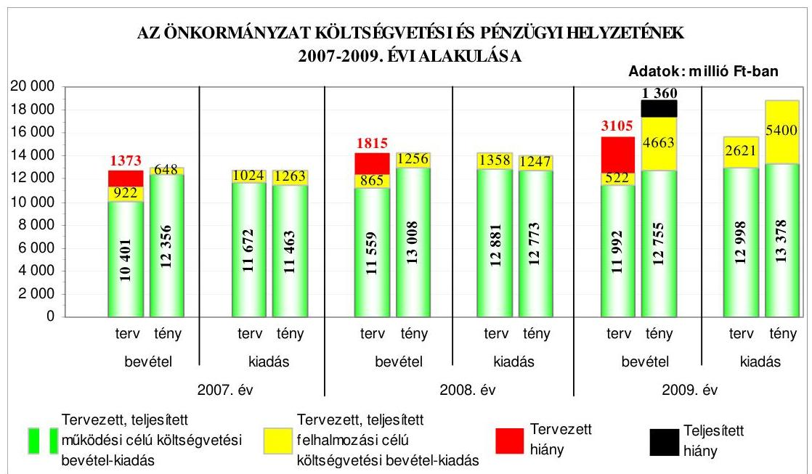

---

Az Önkormányzatnál a 2007-2009. évek között a realizált költségvetési bevételek és teljesített költségvetési kiadások az előző évekhez viszonyítva folyamatosan emelkedtek. A költségvetés végrehajtása során - a 2009. év kivételével - a tervtől eltérően a költségvetési bevételek fedezetet nyújtottak a teljesített költségvetési kiadásokra, mivel a költségvetési bevételek a 2007. évben 278 millió Ft-tal, a 2008. évben 244 millió Ft-tal meghaladták a költségvetési kiadásokat. A 2009. évben a pénzügyi egyensúly nem volt biztosított, a teljesített költségvetési kiadásokra a teljesített költségvetési bevételek nem nyújtottak fedezetet, 1360 millió Ft költségvetési hiány keletkezett, amelyet a működési célú bevételeknél a helyi adóbevételek alulteljesítése és a felhalmozási célú költségvetési bevételeket meghaladó összegű felhalmozási célú költségvetési kiadások teljesítése okozott. A működési célú költségvetési kiadások a működési célú bevételeknél a 2007-2008. évben 893-235 millió Ft-tal alacsonyabbak, a 2009. évben 1056 millió Ft-tal magasabbak voltak. A teljesített felhalmozási célú költségvetési kiadások a 2007. és a 2009. évben haladták meg (615 illetve 737 millió Ft-tal) a felhalmozási célú költségvetési bevételeket. A költségvetési hiány mérséklésére, a pénzügyi egyensúly megteremtésére a 2007-2009. években a Közgyűlés költségvetési intézmények gazdálkodási hatáskörét korlátozó intézkedéseinek a pénzügyi egyensúlyi helyzetet biztosító hatása nem volt.

Az Önkormányzat a 2008. évben a Közgyűlés döntése alapján 8500 millió Ft-nak megfelelő, 23 éves lejáratú, euró alapú kötvényt bocsátott ki. A kötvénykibocsátásból származó bevétel felhalmozási célú felhasználásáról döntöttek, a célok között azonban szerepelt a korábban felvett magas kamatozású hitelek kiváltása és a költségvetésben a működési célú kiadásoknál szereplő hiány csökkentése is. A forint euróhoz viszonyított árfolyamváltozása, valamint a felvett hosszú lejáratú hitel és a kibocsátott kötvény változó kamatozása miatt a hitelfelvételek és a kötvénykibocsátás az Önkormányzat számára kockázatot jelent. A kötvénykibocsátásból származó bevételt a 2008. év végén betétként helyezték el, így annak összegét a 2009. évben a költségvetési hiány megállapításánál már nem finanszírozási célú pénzügyi művelet bevételeként, hanem - a számviteli szabályoknak megfelelően - költségvetési bevétel részeként, az előző évi pénzmaradvány igénybevételeként vették figyelembe. A Közgyűlés egyedi döntései alapján a 2009. év végéig a kötvénykibocsátás során elért bevétel 51,2%-át felhasználták. A felhasznált összeg 85%-át két gázerőművet tulajdonló gazdasági társaságban 50-50%-os tulajdonrész megvásárlására, egy saját alapítású gazdasági társaságban az alaptőke emelésére, valamint a kötvénykibocsátás céljával összhangban álló beruházásokra, felújításokra fordították. A kötvénykibocsátásból származó bevétel tervezett feladatokra fel nem használt részét bankbetétben helyezték el. Az Önkormányzatnak a kötvénykibocsátás évében a kibocsátásból eredő tárgyévi kötelezettségvállalás összege az éves adósságot keletkeztető kötelezettségvállalás felső határának az 1,01%-a volt, ez az arány a 2009. évben 8,54%-ra nőtt. A Pénzügyi és a Gazdasági bizottság vizsgálta a hitelfelvételek, valamint a kötvénykibocsátás indokait, gazdasági megalapozottságát.

Az Önkormányzat a 2007-2009. években folyamatosan, minden nap vett igénybe folyószámlahitelt, annak átlagos állománya a 2007. évi 1269,5 millió Ft-ról 1788,2 millió Ft-ra emelkedett. A folyószámla hitelkeret a 2007. évi 2200 millió Ft-ról a 2009. évben 3350 millió Ft-ra növekedett, az év végén vissza nem fizetett állomány pedig a 2007. év végi 943 millió Ft-ról a 2009. év végére 2846

---

millió Ft-ra emelkedett. A 2007-2009. években igénybe vett folyószámlahiteleket likvid hitelként számolták el annak ellenére, hogy azok nem tekinthetők az Ötv-ben foglaltak szerinti - likvid hitelnek, mivel éven belül nem fizették vissza. A Közgyűlés a folyamatosan emelkedő összegű likvid hitel visszafizetésére vonatkozóan előterjesztés hiányában nem döntött. Az Önkormányzat 2007-2009 között csak a 2007. évi költségvetés végrehajtása során vett igénybe az előző évben kötött két hitelszerződés alapján változó kamatozású, hosszú lejáratú fejlesztési célú hitelt. A hosszú lejáratú hitelállomány a 2009. év végén 518 millió Ft volt.

Az Önkormányzat pénzügyi helyzete 2007-2009 között - fizetőképességének átmeneti javulása ellenére, a hitelfelvételek és a kötvénykibocsátás miatti eladósodás növekedése következtében összességében kedvezőtlenül alakult.

Az Önkormányzat a 2007-2010. évekre vonatkozó fejlesztési célkitűzéseit a gazdasági programban és fejlesztési koncepciókban határozta meg. Az Önkormányzatnál összesen 30 - a Polgármesteri hivatal 21, az intézmények kilenc pályázatot nyújtottak be európai uniós támogatás megszerzésére. A pályázatok megvalósításának tervezett összes költsége 9041,5 millió Ft volt, amelyet 81,5%-ban európai uniós és 0,5%-ban hazai támogatás, valamint 18%-ban saját forrásból terveztek finanszírozni. A pályázatok közül 12 részesült támogatásban, kilenc pályázat elbírálása 2010. május 31-ig nem történt meg. A benyújtott pályázatok közül kilenc elutasításra került formai, tartalmi és szakmai kidolgozottság, illetve pénzügyi forrás hiánya, továbbá a befogadási követelményeknek, kritériumoknak nem megfelelő tartalom miatt.

Az Önkormányzat 2007-2010. évi költségvetési rendeletei az Áht. előírása ellenére nem tartalmazták az európai uniós forrással megvalósuló fejlesztési feladatokhoz kapcsolódó támogatásokat és azok kiadási előirányzatait. A felújítási előirányzatok céljai között és a felhalmozási kiadások között feladatonként az Ámr. 1 előírása ellenére a pályázatok benyújtását követően nem tervezték be a feladatokat. Az Önkormányzat 2007-2010. évi költségvetési rendeletei nem tartalmazták a több éves kihatással járó feladatok előirányzatai között éves bontásban az Ámr. 1-ben előírtak ellenére az európai uniós támogatással megvalósuló, több évre áthúzódó feladatokat és elkülönítetten az európai uniós támogatással megvalósuló projektek bevételi és kiadási előirányzatait.

A Polgármesteri hivatalban a 2007-2009. években az európai uniós forrásokra vonatkozó pályázatokkal kapcsolatosan az önkormányzati szintű pályázat koordinálás feladatait a Közgyűlés a pályázati koordinációs rendben, illetve a főjegyző a hivatali SzMSz-ben szabályozta. A pályázati koordinációs rendben a Közgyűlés előírta a
 pályázati tevékenység nyilvántartását, valamint a pályázati lehetőségek feltárásának és a Közgyűlés rendszeres tájékoztatásának a kötelezettségét. A pályázati koordinációs rendben azonban nem határozták meg a pályázatkészítés rendjét és az európai uniós forrással támogatott fejlesztések lebonyolításával kapcsolatos feladat-, kapcsolattartás-, információáramlási-, ellenőrzési-, felelősségi rendet.

Az Önkormányzat 2007-2009 között nem készült fel eredményesen a belső szabályozottság és a szervezettség terén az európai uniós források igénybevételére, a támogatások felhasználására annak ellenére, hogy a gazdasági programban megfogalmazott fejlesztési célkitűzésekhez kapcsolódtak az európai uniós pályázatok, valamint szabályozták a pályázatfigyelést végző és a döntési-, illetve a döntés-előterjesztési jogkörrel rendelkezők közötti információszolgáltatási kötelezettséget, a belső ellenőrzési stratégiát megalapozó kockázatelemzés kiterjedt az európai uniós forrásokkal támogatott fejlesztési feladatokra, valamint a Polgármesteri hivatalon és az intézményeken belül, továbbá külső szervezetek igénybevételével biztosították a pályázatfigyelés, a pályázatkészítés és a fejlesztési feladat lebonyolításának szervezeti és személyi feltételeit. A támogatási szerződésben rögzített határidőre a szociális területen foglalkoztatottak képzését biztosító „Kapcsolat" című fejlesztési célkitűzést megvalósították. Nem határozták meg azonban valamennyi külső szervezettel pályázatkészítésre kötött szerződésben a pályázat szakmai és formai követelményeire vonatkozóan a pályázatkészítő felelősségét, valamint nem írták elő minden projekt lebonyolításra vonatkozó szerződésben a szervezetek ellenőrzési kötelezettségeit, továbbá nem rendelkeztek a fejlesztési feladatok lebonyolítását végző köztisztviselők munkaköri leírásaiban az ellenőrzési kötelezettségről.

Az Önkormányzat informatikai stratégiájában határozta meg közép és hosszú távú célkitűzéseit az e-közszolgáltatási feladatok 4. szintjének megvalósításához. Az Önkormányzat működtetett e-közszolgáltatásokat biztosító informatikai rendszert, melyet az állampolgárok és a vállalkozások minden ügyfajtában a 2. elektronikus szolgáltatási szinten vehettek igénybe. A közvetlen kétoldalú ügyintézés feltételeit pénzügyi források hiánya miatt nem valósították meg. Az e-közszolgáltatások igénybevételét nem kísérték figyelemmel, az egyes ügykörök igénybevételének tapasztalatait nem értékelték.

Az Önkormányzat honlapján a vonatkozó rendeletben előírtak ellenére a közzétételi listák előírt adatokat tartalmazó jegyzékére mutató hivatkozást nem helyezték el, a gazdálkodási adatok közzétételére előírt közzétételi egységeket nem alakították ki. A főjegyző - az Áht. előírása ellenére - nem tette közzé az Önkormányzat honlapján a vonatkozó rendeletben meghatározott rendszerben valamennyi céljellegű működési és felhalmozási támogatás esetében a kedvezményezettek nevét, a támogatás célját és összegét, továbbá a támogatási program megvalósítási helyét, valamint nem történt meg az Önkormányzat 2009. évi pénzeszközei felhasználásával, a vagyonnal történő gazdálkodással összefüggő, nettó öt millió Ft-ot elérő, vagy azt meghaladó összegű valamennyi szerződés esetében a szerződés megnevezésének, típusának, tárgyának, a szerződést kötő felek nevének, a szerződés értékének, határozott időre kötött szerződés esetében annak időtartamának a közzététele. A helyszíni vizsgálat ideje alatt a támogatások és a vagyonnal történő gazdálkodással összefüggő, nettó öt millió Ft-ot elérő vagy azt meghaladó összegű szerződések közérdekű adatait a vonatkozó rendeletben meghatározottak ellenére nem a „közérdekű adatok", azon belül a „gazdálkodási adatok", hanem az „üvegzseb" címszó alatt tették közzé az Önkormányzat honlapján, valamint ennek során nem tartották be a közzétételre előírt 60 napos határidőt. A főjegyző az Ámr.-ben előírtak ellenére nem gondoskodott a 2007-2008. évi költségvetési beszámolók szöveges indoklásának a közzétételéről, továbbá a 2009. évi költségvetési beszámoló szöveges indoklásának közzétételét csak utólag, az ellenőrzés ideje alatt, azonban nem a vonatkozó jogszabályban előírt közzétételi egységen belül biztosította.

A 2009. évben a Polgármesteri hivatalban a költségvetés-tervezési és zárszámadás-készítési folyamatok szabályozásának hiányosságai közepes kockázatot jelentettek a feladatok megfelelő, szabályszerű végrehajtásában, mivel a főjegyző nem határozta meg az intézmények részére a költségvetési javaslat összeállításával kapcsolatos követelményeket. Nem szabályozta annak ellenőrzését, hogy a Polgármesteri hivatal és az intézmények költségvetési javaslataikat az Ámr. ${ }_{1}$ előírásainak megfelelően dolgozták-e ki, a javasolt előirányzatok megalapozottak-e, az ismert kötelezettségeket megtervezték-e, a benyújtott költségvetési igények indokoltak-e és teljesíthetőek-e, azonban a kialakított belső kontrollok a lehetséges hibák többsége ellen védelmet nyújtottak.

A Polgármesteri hivatalban a 2009. évben a költségvetés-tervezési és zárszám-adás-készítési folyamatban a belső kontrollok működésének megfelelősége jó volt, mivel a főjegyző a költségvetés-tervezés folyamatában a költségvetési tervezéshez készített mutatószám felmérés adatainak megalapozottságát, valamint a saját bevételek előirányzatai, és a költségvetés megalapozását szolgáló helyi rendeletek összhangjának biztosítását ellenőriztette. A zárszámadáskészítés folyamatában ellenőriztette az intézmények által az állami támogatásokkal, hozzájárulásokkal történő elszámoláshoz közölt mutatószámok adatainak megfelelőségét, az intézmények pénzmaradvány megállapításának szabályszerűségét, valamint az intézményi számszaki beszámolók belső, valamint a Közgyűlés által meghatározott adatszolgáltatással való összhangját. Az előírások ellenére nem ellenőriztette, hogy az intézmények a költségvetési javaslat összeállításánál érvényesítették-e az Ámr. ${ }_{1}$ előírásait, a Polgármesteri hivatal és az intézmények javasolt előirányzatai megalapozottak-e, az ismert kötelezettségeket megtervezték-e, a benyújtott költségvetési igényeik indokoltak-e, teljesíthetőek-e. A megállapított hiányosságok nem veszélyeztették a költségvetéstervezés és a zárszámadás-készítés hibáinak megelőzését, feltárását és kijavítását.

A gazdálkodási, a pénzügyi-számviteli és a folyamatba épített ellenőrzési feladatok szabályozottságának hiányosságai közepes kockázatot jelentettek a feladatok megfelelő, szabályszerű végrehajtásában, mivel a főjegyző nem határozta meg az üzemeltetésre átadott eszközök leltározási módját, az értékelés ellenőrzéséért felelős munkaköröket, az értékelési és ellenőrzési feladatokat a Pénzügyi iroda köztisztviselőinek munkaköri leírásában nem szerepeltette, nem írta elő az önköltségszámítás rendjére vonatkozó szabályokat, nem rendelkezett a selejtezési szabályzatban a selejtezett eszközök hasznosításához kapcsolódó ármegállapítás szabályairól, a döntéshozatalra jogosultak köréről az üzemeltetésre átadott eszközök selejtezése esetében, és a selejtezési szabályzatban szereplő feladatokat az érintett dolgozók munkaköri leírásában - a gondnok kivételével - nem rögzítette, nem határozta meg a FEUVE rendszer részeként elkészített ellenőrzési nyomvonalban az egyes ellenőrzési feladatok elvégzését igazoló dokumentum fellelési helyét a rendszerben, a kockázatkezelési eljárási rendben a kockázatok folyamatgazdáit, a kockázatok értékelését és kategóriákba sorolását, az elfogadható kockázati szint meghatározását, a kockázatokra adható válaszok megvalósíthatósága mérlegelésének kötelezettségét, a válaszintézkedés beépítését a folyamatba, a kockázati környezet rendszeres felülvizsgálatának kötelezettségét, továbbá a hivatali SzMSz-ben a gazdasági szervezet felépítését, az általa, illetve a külső szervezet által végzendő részletes feladatokat. A gazdasági szervezet nem rendelkezett olyan ügyrenddel, amely

részletesen tartalmazza az általa ellátandó feladatokat, a vezetők és a szerv pénzügyi-gazdasági feladatainak ellátásáért felelős alkalmazottainak feladat- és hatáskörét, felelősségi körét, a helyettesítés rendjét, a belső és külső kapcsolattartás módját.

A Polgármesteri hivatalban a gazdálkodási feladatok, hatáskörök szabályozásáért, az Ámr. ${ }_{1}$ szerinti ügyrend elkészítéséért az Áht-ban foglaltak szerint költségvetési szervként működő Polgármesteri hivatalt - az Ötv. alapján - vezető főjegyzői jogkörben eljáró a felelős.

A Polgármesteri hivatalban az államháztartáson kívülre teljesített működési és felhalmozási célú pénzeszköz átadásokkal, az állományba nem tartozók megbízási díjaival, továbbá a külső szolgáltatók által végzett karbantartási, kisjavítás szolgáltatásokkal kapcsolatosan teljesített kifizetések során - a három terület költségvetési súlyának figyelembevételével értékelve - a belső kontrollok működésének megbízhatósága gyenge volt, mert a működési és felhalmozási célú pénzeszközátadások esetében a kifizetések jogosultságának és összegszerűségének szakmai igazolása és az utalványok ellenjegyzése a hivatali SzMSz-ben előírtak ellenére nem az arra jogosultsággal rendelkezők által történt. Az állományba nem tartozók megbízási díjai kifizetései közül az európai parlamenti választásokhoz kapcsolódó kifizetések esetében a feladatok elvégzését megelőzően nem történt írásbeli kötelezettségvállalás, ezáltal okmányok hiányában nem ellenőrizték a kiadások jogosultságát, összegszerűségét a megbízásban előírt feladatok teljesítését. Az utalványok ellenjegyzője nem kifogásolta, hogy a hivatali SzMSz-ben előírtak ellenére a kötelezettségvállalást nem foglalták írásba.

Az érvényesítő az államháztartáson kívülre teljesített működési célú pénzeszközátadások között a háziorvosi szolgálat helyettesítésére kötött megbízási szerződés alapján nem a gazdasági esemény tartalmának megfelelően jelölte ki a könyvviteli elszámolásra szolgáló főkönyvi számlaszámot, mert az Áhsz-ben foglalt előírásokkal ellentétesen működési célú pénzeszközátadások főkönyvi számlát jelölte ki a szolgáltatások főkönyvi számla helyett.

A pénzügyi-számviteli tevékenységhez kapcsolódó informatikai feladatok szabályozásának hiányosságai magas kockázatot jelentettek az informatikai feladatok végrehajtásában, mivel nem gondoskodtak az informatikával kapcsolatos szabályzatok megismertetéséről, nem aktualizálták a katasztrófa elhárítási tervet az elmúlt két évben, nem szabályozták a Polgármesteri hivatal elektronikus adatai esetében a külső szolgáltató által végzett adattárolás feltételeit. A hozzáférési jogosultságokra vonatkozó eljárási rend nem tartalmazott rendelkezést a jogosultságok ellenőrzésére, továbbá nem tiltották a külső fejlesztők hozzáférését az éles rendszerhez, nem jelölték ki az ellenőrző listák vizsgálatáért felelőst, és nem szabályozták a pénzügyi-számviteli programváltozások ellenőrzésére, tesztelésére vonatkozó eljárásokat, valamint a mentési eljárásokat.

A Polgármesteri hivatalban a 2009. évben a pénzügyi-számviteli tevékenységhez kapcsolódó informatikai feladatoknál a kialakított belső kontrollok működésének megfelelősége gyenge volt, mivel a külső fejlesztők a pénzügyi és számviteli integrált rendszerhez hozzáférési jogosultsággal rendelkeztek, a

pénzügyi-számviteli adatok, információk tárolása nem a Polgármesteri hivatalban történt, nem dokumentálták a pénzügyi-számviteli program elemeire vonatkozó változáskezelési eljárásokat, illetve a változáskezelési eljárások ellenőrzését, tesztelését. Nem készítettek ellenőrző listát minden adathozzáférésről, adatmódosításról, adattörlésről, továbbá az elmúlt egy évben nem ellenőrizték, hogy az elmentett állományokból a pénzügyi-számviteli adatok teljes körűen helyreállíthatók. Nem biztosították a mentéseket tartalmazó adathordozók védelmét a környezeti ártalmaktól és az illetéktelenek hozzáférésétől.

A belső ellenőrzés szervezeti kereteinek kialakítása és szabályozása a belső ellenőrzési feladatok megfelelő, szabályszerű végrehajtásában alacsony kockázatot jelentett, mivel a feladatellátás módját és az eljárás rendjét az előírásoknak megfelelően szabályozták. A belső ellenőrzési csoport jogállását, feladatait az SzMSz-ben és a hivatali SzMSz-ben meghatározták, feladatköri és szervezeti függetlenségét biztosították. A belső ellenőrzés eljárási rendjét a főjegyző által jóváhagyott belső ellenőrzési kézikönyv a Ber. előírásaival összhangban tartalmazza. A belső ellenőrzés rendelkezett kockázatelemzésen alapuló stratégiai és éves ellenőrzési tervvel. Az éves ellenőrzési terveket a Közgyűlés jóváhagyta, azonban a 2010. évi ellenőrzési tervet a Közgyűlés a megfelelő időben történt előterjesztés ellenére az Ötv-ben előírt határidő után három hónappal fogadta el. Az éves ellenőrzési tervek a magas kockázatúnak értékelt területek ellenőrzési feladatait tartalmazták.

A Polgármesteri hivatalban a 2009. évben a belső ellenőrzés működésénél a kialakított kontrollok megfelelősége összességében kiváló volt, mivel a belső ellenőrzés ellátásának módja megfelelt az Ötv-ben előírtaknak, a Polgármesteri hivatalban a belső ellenőrzési vezető által aláírt program alapján a tervezett ellenőrzéseket végrehajtották. A belső ellenőrzési jelentések megfeleltek a Ber. előírásainak. Annak ellenére összességében kiváló volt a belső ellenőrzés működésének megfelelősége, hogy az intézményeknél a 2009. évben a magas kockázatúnak értékelt területek tervezett ellenőrzésének 56%-át nem végezték el ellenőrzési kapacitás hiánya miatt. A 2009. évben elmaradt vizsgálatok végrehajtását a 2010. évi ellenőrzési tervben határozta meg a Közgyűlés. A 2009. évi ellenőrzési tervet indokoltsága ellenére nem módosították. A főjegyző az Ámr. ${ }_{1}$ ben rögzített nyilatkozati formában értékelte a belső kontrollok működését a Polgármesteri hivatalban. A polgármester az Ötv. előírásai alapján - a zárszámadással egyidejűleg - a Közgyűlés elé terjesztette a költségvetési szervek éves ellenőrzési jelentései alapján készített 2008. és 2009. évi összefoglaló jelentést, melyet a Közgyűlés elfogadott.

Az ÁSZ az Önkormányzat gazdálkodási rendszerét a 2005. évben ellenőrizte átfogó jelleggel, melynek során 33 szabályszerűségi és nyolc célszerűségi javaslatot tett. A javaslatok végrehajtása
 érdekében a polgármester és a főjegyző intézkedési tervet készített, és a Közgyűlést tájékoztatták az ellenőrzés tapasztalatairól, valamint az intézkedési tervről. Az ÁSZ által tett javaslatokból 61%-ot megvalósítottak, 10%-ot részben teljesítettek és 29%-ot nem teljesítettek az intézkedési tervben foglalt határidőre. Az intézkedési tervben foglalt határidő után valósították meg a javaslatok 29%-át. A megtett intézkedések hatására megvalósultak a költségvetési rendelet összeállítására, tartalmára, a mellékleteire és a végrehajtás szabályaira, az előirányzatok módosítására, az előirányzatok nyilvántartására és a jóváhagyott előirányzatokon belüli gazdálkodásra,

---

a pénzügyi-számviteli feladatellátás szabályozottságára, a bizonylatok alaki és tartalmi követelményeire, a vagyongazdálkodási feladatok és döntési határkörök betartására, a közbeszerzési eljárások szabályszerűségére, a zárszámadási rendelet tartalmára, valamint a kisebbségi önkormányzatokat érintő gazdálkodás végrehajtásának szabályszerűségére, a belső ellenőrzési rendszerre, az intézményi gazdálkodás szabályozottságára és végrehajtására, a középületek akadálymentesítésére, továbbá a hivatali SzMSz kiegészítésére vonatkozó szabályszerűségi javaslatok. A célszerűségi javaslatok közül teljesítették az informatikai szabályozottságot és a banki pénzforgalmat érintő javaslatokat.

A szabályszerűségi javaslatok közül részben valósult meg a kötelezettségvállalások nyilvántartására vonatkozó javaslat, mivel kialakították a nyilvántartást, azonban abból nem állapítható meg az éves kötelezettségvállalás összege. Az eszközök és források értékelési szabályzatát kiegészítették, azonban a helyi adó követeléseknél a főjegyző nem gondoskodott azok érvényesítéséről. A támogatások esetében biztosították a számadási kötelezettség előírását, azonban a nyilvántartásokból nem állapítható meg a számadást nem teljesítők köre. A célszerűségi javaslatok közül részben valósították meg a támogatások nyilvántartására és a felhasználás ellenőrzésének szabályozására tett javaslatot, mivel a nyilvántartásokból nem állapítható meg, hogy a kérelmező határidőre szabályosan elszámolt-e. A főjegyző az intézkedési tervben foglalt határidőt követően gondoskodott a behajthatatlannak minősülő követelések elengedésének szabályozásáról, az ingatlankataszter és a számviteli nyilvántartások egyezőségéről, a törzsvagyon elkülönített nyilvántartásáról, a nem lakás céljára szolgáló helyiségek bérleti díjának emeléséről, a kisebbségi önkormányzatokkal kötött szerződések módosításáról és az ellenőrzési nyomvonal elkészítéséről. Nem alakította ki a főjegyző az intézmények egységes számviteli rendjét és nem biztosította a pénzeszközöket érintő gazdasági műveletek naprakész rögzítését. Az intézkedési tervben foglalt határidőt követően készítette el a főjegyző a Polgármesteri hivatalban a FEUVE szabályozását.

Az ÁSZ az Önkormányzat gazdálkodási rendszerének 2005. évi átfogó ellenőrzésén kívül 2006. óta kettő vizsgálatot végzett az Önkormányzatnál. A Magyar Köztársaság 2005. évi költségvetése végrehajtásának ellenőrzése keretében ellenőriztük a 2005. évi normatív állami hozzájárulás és a kötött felhasználású támogatások igénylését és elszámolását. A normatív állami hozzájárulás igénylésének és elszámolásának ellenőrzéséről készített számvevői jelentés egy szabályszerűségi és egy célszerűségi javaslatot fogalmazott meg, melyek alapján a polgármester intézkedett a 2005. évi normatív állami hozzájárulás elszámolásánál megállapított különbözet központi költségvetésbe történő befizetéséről. A főjegyző intézkedett, hogy a Polgármesteri hivatal érintett irodái évente a zárszámadás keretében vizsgálják felül az intézmények által szolgáltatott adatok megbízhatóságát, az elszámolások helyességét. A kötött felhasználású támogatások 2005. évi igénybevételének ellenőrzésekor az ÁSZ öt szabályszerűségi és hat célszerűségi javaslatot tett. A polgármester intézkedett a jogtalanul igénybe vett állami támogatás központi költségvetésbe történő befizetéséről és a kamatfizetési kötelezettség rendezéséről. A főjegyző intézkedett, hogy a kötött felhasználású támogatások igénylésével és elszámolásával érintett szakmai osztályok ügyintézői a számvevői jelentést megismerjék, az intézményvezetők pedig értekezleten kapjanak tájékoztatást az ÁSZ ellenőrzés tapasztalatairól. A főjegyző azonban csak a 2008. évben kezdeményezte, hogy a

---

belső ellenőrzés 2009. évben két intézménynél ellenőrizze a normatív állami támogatások és a kötött felhasználású támogatások elszámolását, valamint a normatív állami támogatási igények megalapozottságát. A közbeszerzési rendszer 2008. évi ellenőrzéséről készített számvevői jelentés hat szabályszerűségi és négy célszerűségi javaslatot tartalmazott. A polgármester a Közgyűlés elé terjesztette a számvevői jelentést és intézkedett a hiányosságok megszüntetése érdekében intézkedési terv készítéséről. A javaslatok alapján a polgármester intézkedett, hogy a közbeszerzési bíráló bizottságba a beszerzések tárgya szerinti, valamint pénzügyi szakértelemmel bíró résztvevőket jelöljenek, javaslatot tett külső szakértő bevonásával az Önkormányzat 100%-os tulajdonát képező gazdálkodó szervezetekkel kötött szerződések teljesítési tapasztalatainak összegzésére, a gazdasági tevékenység minősége és hatékonysága tekintetében hatáselemzés elkészítésére, a főjegyző intézkedett a FEUVE működtetésére vonatkozó szabályozás közbeszerzéssel kapcsolatos kontroll feladatokkal történő kiegészítéséről, egy európai uniós forrásból finanszírozott projekt esetében a közbeszerzési eljárás ellenőrzéséről. A főjegyző nem intézkedett a közbeszerzések során kötött szerződések módosításának valamint a szerződések teljesítésének az Önkormányzat honlapján történő közzétételéről, nem rendelte el a közbeszerzési szabályzat kiegészítését a becsült érték megállapításának dokumentálási követelményeivel.

A helyszíni ellenőrzés megállapításainak hasznosítása mellett javasoljuk:

# a polgármesternek 

a munka színvonalának javítása érdekében
kezdeményezze, hogy a számvevői jelentésben foglaltakat a Közgyűlés tárgyalja meg és a feltárt hiányosságok megszüntetése érdekében készíttessen intézkedési tervet a határidők és felelősök megjelölésével;

## a főjegyzőnek

a jogszabályi előírások maradéktalan betartása érdekében
1. gondoskodjon az Önkormányzat költségvetési rendeletének végrehajtása során arról, hogy likvid hitelként csak az Ötv. 88. §. (3) bekezdés d) pontjában foglaltakat figyelembe véve - éven belül felvett és visszafizetett - hiteleket számoljanak el a könyvviteli nyilvántartásokban, valamint készítsen likviditási koncepciót, és végezze el a likvid hitel éven belüli visszafizetési lehetőségének részletes vizsgálatát, továbbá annak eredményéről tájékoztassa a Közgyűlést;
2. gondoskodjon arról, hogy az Önkormányzat költségvetési rendelettervezete tartalmazza az európai uniós forrással megvalósuló fejlesztési feladatokhoz kapcsolódó bevételi és a támogatásokkal fedezett kiadási előirányzatokat az Áht. 69. § (1) bekezdése betartása érdekében, továbbá az Ámr. 2 36. § (1) bekezdés c), d) pontjainak figyelembevételével a felújítási előirányzatok céljai között és a felhalmozási kiadások között feladatonként, valamint az Ámr. 2 36. § (1) bekezdés h) pontjainak megfelelően a többéves kihatással járó feladatok között és az Ámr. 2 36. § (1) bekezdés l) pont-

---

ja alapján elkülönítetten az európai uniós forrásból megvalósuló programok bevételi, kiadási előirányzatait;
3. a közérdekű gazdálkodási adatok Önkormányzat honlapján történő közzététele érdekében:
a) intézkedjen, hogy a 18/2005. (XII. 27.) IHM rendelet 2. § (1) bekezdése alapján az Önkormányzat honlapján helyezzék el a közzétételi jegyzékre mutató hivatkozást „Közérdekű adatok" elnevezéssel, valamint a 2. § (2) bekezdése és az 1. számú melléklet szerinti tagolásban a honlapon szerepeltessék az általános közzétételi lista szerinti adatokat tartalmazó közzétételi egységeket, vagy az azokra történő hivatkozást;
b) gondoskodjon arról, hogy az Áht. 15/A. § (1) bekezdésében előírt határidőn belül tegyék közzé az Önkormányzat által nyújtott támogatásokra vonatkozóan a kedvezményezettek nevét, a támogatás célját, összegét, a támogatási program megvalósítási helyét;
c) gondoskodjon arról, hogy az Áht. 15/B. § (1) bekezdésében előírt határidőn belül az Önkormányzat pénzeszközei felhasználásával, a vagyonnal történő gazdálkodással összefüggő nettó ötmillió Ft-ot elérő vagy azt meghaladó összegű szolgáltatás, beszerzés megrendelésre, adás-vételre vonatkozó szerződések megnevezését, tárgyát, a szerződést kötő felek nevét, a szerződés értékét, határozott időre kötött szerződések esetében annak időtartamát, illetve a szerződések adatai változását közzé tegyék;
d) gondoskodjon az Ámr. 2 233. § (1) bekezdésében előírtak figyelembe vételével a 2007-2008. évi költségvetési beszámolók szöveges indoklásának, valamint a 2009. évi költségvetési beszámoló szöveges indoklásának a „Közérdekű adatok" felületen, a „3.2. Költségvetések, beszámolók, számviteli beszámolók" közzétételi egységen belüli közzétételéről;
4. határozza meg az Ámr. 2 155-156. § előírásai alapján a Polgármesteri hivatal és az intézmények részére a költségvetési javaslat összeállításával kapcsolatos követelményeket, és azok betartása érdekében - az Ámr. 2 155-156. § előírásai alapján - a költségvetési tervezés folyamatában dokumentáltan ellenőriztesse, hogy
a) az intézmények teljesítették-e a költségvetési javaslat összeállításával kapcsolatban részükre meghatározott követelményeket;
b) a Polgármesteri hivatal és az intézmények költségvetési javaslatukat az Ámr. 2 2830. § előírásainak megfelelően dolgozták-e ki;
c) javasolt előirányzataik megalapozottak-e;
d) az ismert kötelezettségeket megtervezték-e;
e) a benyújtott költségvetési igények indokoltak-e és teljesíthetőek-e;
5. a Polgármesteri hivatal pénzügyi-számviteli tevékenységének szabályozottsága érdekében:

---

a) készítse el a gazdasági szervezet ügyrendjét az Ámr. 2 15. § (6) bekezdésben foglaltaknak megfelelően és az ügyrendben részletesen szabályozza a gazdasági szervezet által ellátandó feladatokat, a vezetők és a pénzügyi-gazdasági feladatok ellátásáért felelős alkalmazottak, feladat- és hatáskörét, felelősségét, a helyettesítés rendjét, a belső és külső kapcsolattartás módját, az Ámr. 2 20. § (7) bekezdésében foglaltak szerint;
b) rögzítse az Ámr. 2 156. § (2) bekezdése és a pénzügyminisztériumi „Útmutató az ellenőrzési nyomvonal kialakításához" módszertanban foglaltak figyelembe vételével az ellenőrzési nyomvonalban az egyes tevékenységek, feladatok elvégzését igazoló dokumentum fellelési helyét a rendszerben;
c) írja elő az Ámr. 2 157. §-ában foglaltak és Pénzügyminisztérium „Útmutató a kockázatkezelés kialakításához" című módszertani útmutató figyelembevételével a kockázatkezelési eljárásrendben a kockázatok folyamatgazdáit, a kockázatok értékelését és kategóriákba sorolását, a kockázatokra adható válaszok megvalósíthatósága mérlegelésének kötelezettségét, a válaszintézkedés beépítését a folyamatba, a kockázati környezet rendszeres felülvizsgálatát;
d) a selejtezési szabályzatban rendelkezzen az Áhsz. 37. § (5) bekezdése alapján a selejtezett eszközök hasznosításához kapcsolódó ármegállapítás szabályairól, valamint határozza meg a döntéshozatalra jogosultak körét az üzemeltetésre átadott eszközök selejtezése esetében;
6. az operatív gazdálkodás folyamatában a működésbeli hibák megelőzése, feltárása, illetve kijavítása érdekében:
a) gondoskodjon az Ámr. 2 76. § (1) és (3) bekezdéseiben előírtak alapján arról, hogy a kiadások teljesítésének elrendelése előtt a kijelölt személyek a hivatali SzMSz-ben előírt módon, okmányok alapján ellenőrizzék, szakmailag igazolják a kifizetések jogosultságát, összegszerűségét, a szerződés, megrendelés, megállapodás teljesítését;
b) gondoskodjon a folyamatba épített ellenőrzési feladatok elvégzésével, hogy az Ámr. 2 79. § (1) bekezdésében foglaltak szerint jogosultsággal rendelkező utalvány ellenjegyzők tegyenek eleget az Ámr. 2 79. § (2) bekezdésében előírt ellenőrzési kötelezettségüknek, győződjenek meg a szakmai teljesítésigazolás Ámr. 2 76. § (1) és (3) bekezdéseiben foglaltak alapján történő elvégzéséről, valamint az Ámr. 2 74. § (3) bekezdés a)-c) pontjának megfelelően a kötelezettségvállalások írásba foglalásáról;
c) gondoskodjon arról, hogy a háziorvosi szolgálatra kifizetett összeg könyvviteli elszámolására utaló főkönyvi számlaszámot az Áhsz. 9. számú melléklet 9. c) pontjában foglaltak figyelembevételével, a gazdasági esemény tartalmának megfelelően jelöljék ki;
7. a belső ellenőrzés szabályszerű működése érdekében gondoskodjon arról, hogy a Ber. 21. § (5) bekezdésében foglaltak alapján a belső ellenőrzési vezető indokolt esetben kezdeményezze az éves ellenőrzési terv évközi módosítását;
8. gondoskodjon az Önkormányzat gazdálkodási rendszerének 2005. évi átfogó ellenőrzése során az ÁSZ által részére tett és nem teljesült három szabályszerűségi és egy

---

célszerűségi javaslat, valamint a közbeszerzési rendszer működésének 2008. évi ellenőrzése során az ÁSZ által részére tett és nem teljesült két szabályszerűségi és két célszerűségi javaslat végrehajtásáról;
a munka színvonalának javítása érdekében
9. tájékoztassa - évente végzett számítások alapján - a Közgyűlést az Önkormányzat eladósodásának növekedésére figyelemmel arról, hogy a hosszú lejáratú, adósságot keletkeztető kötelezettségvállalásokból adódó tőke- és kamatfizetési kötelezettségét az Önkormányzat milyen feltételek biztosítása mellett tudja teljesíteni;
10. határozza meg az európai uniós forrásból megvalósuló projektekhez kapcsolódó pályázatkészítéssel és lebonyolítással kapcsolatos feladat-, kapcsolattartás-, információ-áramlási-, ellenőrzési-, felelősségi rendet;
11. kezdeményezze, hogy az európai uniós pályázatokhoz kapcsolódóan külső szervezetettel kötött szerződésben rögzítsék a
 feladatellátás kötelezettségét, a pályázatkészítő felelősségét a pályázat tartalmi és formai követelményeinek biztosítására, a pályázat céljának egyértelmű meghatározására vonatkozóan, valamint a projektek lebonyolítására kötött szerződésekben az ellenőrzés rendjét és a személyre szóló felelősségi szabályokat;
12. írja elő az európai uniós forrásból megvalósuló projektek lebonyolítását végző köztisztviselők munkaköri leírásában az ellenőrzési kötelezettséget;
13. határozza meg az értékelések ellenőrzéséért felelős munkaköröket az eszközök és a források értékelési szabályzatában, valamint szerepeltesse az értékelési és ellenőrzési feladatokat, illetve a selejtezéssel kapcsolatos feladatokat a dolgozók munkaköri leírásaiban;
14. a pénzügyi-számviteli feladatoknál alkalmazott informatikai rendszerek működtetésének szabályozottsága és a kialakított belső kontrolljainak működtetése érdekében:
a) dokumentáltan ismertesse meg az informatikai eszközöket használó köztisztviselőkkel az informatikával kapcsolatos szabályzatokat, valamint aktualizáltassa a katasztrófa elhárítási tervet legalább két évenként;
b) szabályozza a Polgármesteri hivatal elektronikus adatainak külső szervezet általi tárolásának feltételeit és a pénzügyi-számviteli program-változások ellenőrzését, tesztelésére vonatkozó eljárásokat, valamint a mentési eljárásokat, továbbá jelölje ki az ellenőrzési listák vizsgálatáért felelőst;
c) tiltsa meg a külső fejlesztők bármilyen típusú hozzáférését az éles rendszerhez;
d) egészítse ki a számítástechnikai eszközök hozzáférési jogosultságaira vonatkozó eljárási rendet a jogosultságok ellenőrzésével;
e) gondoskodjon a pénzügyi-számviteli program elemeire vonatkozó változáskezelési eljárások, és azok ellenőrzésének és tesztelésének a dokumentálásáról;
f) intézkedjen, hogy a pénzügyi-számviteli program segítségével készítsenek ellenőrző listát minden adathozzáférésről, adatmódosításról, adattörlésről;

---

g) intézkedjen, hogy az elmentett állományból a pénzügyi-számviteli adatok teljes körűen helyreállíthatók legyenek és gondoskodjon a mentéseket tartalmazó adathordozók környezeti ártalmaktól és illetéktelenek hozzáférésétől történő védelméről.

---

# II. RÉSZLETES MEGÁLLAPÍTÁSOK 

## 1. Az ÖNKORMÁNYZAT KÖLTSÉGVETÉSI ÉS PÉNZÜGYI HELYZETE

### 1.1. A tervezett költségvetési bevételek és kiadások alapján a költségvetési egyensúly, a költségvetési hiány alakulása, a hiány tervezett finanszírozási módja, valamint a költségvetési hiány megállapításának szabályszerűsége

Az Önkormányzatnál a 2007-2009. évek között a tervezett költségvetési bevételek főösszege 11323 millió Ft-ról 12514 millió Ft-ra, a tervezett költségvetési kiadások főösszege 12696 millió Ft-ról 15619 millió Ft-ra növekedett, a növekedés folyamatos volt, mértéke a 2007. évhez viszonyítva a bevételeknél 10,5%-os, a kiadásoknál pedig 23%-os volt. A 2010. évi költségvetési rendelet 16350 millió Ft bevételi és 17897 millió Ft kiadási főösszeget tartalmazott, a bevételeknél 30,7%-os, a kiadásoknál 14,6%-os a növekedés az előző évi tervezett előirányzatokhoz viszonyítva. Az Önkormányzat 2007-2009. évi költségvetési rendeleteiben a költségvetési bevételek és kiadások nem voltak egyensúlyban, a tervezett költségvetési bevételek nem nyújtottak fedezetet a költségvetési kiadásokra.

Az Önkormányzat 2007-2010. években tervezett költségvetési bevételének, kiadásának és egyensúlyi helyzetének alakulását a következő ábra szemlélteti:
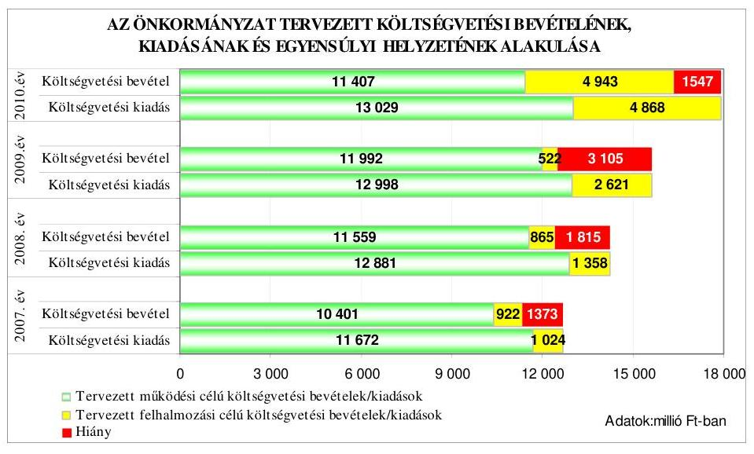

A költségvetési hiány költségvetési kiadásokhoz viszonyított részaránya 2007-2009. években 10,8%, 12,7% és 19,9% volt, a 2010. évre tervezett hiányt 8,6%-ra mérsékelték. A 2007-2009. években a költségvetés hiányát a tervezett működési célú költségvetési bevételek hiánya és a felhalmozási célú költségvetési bevételeket meghaladó összegben tervezett felhalmozási célú kiadások együttesen okozták. A 2010. évre tervezett költségvetési hiány - előző évihez viszonyított -

---

csökkentését a felhalmozási célú költségvetési bevételeknél-kiadásoknál tervezett egyensúly eredményezte.

Az Önkormányzat 2007-2009. évi költségvetési rendeleteiben a költségvetési egyensúly biztosításához, a költségvetési hiány finanszírozásához rövid lejáratú működési, illetve hosszú lejáratú felhalmozási célú hitelek felvételét tervezte.

A fizetőképesség biztosításához a 2007. évben 2097 millió Ft, a 2008. évben 2800 millió Ft, a 2009. évben pedig 1813 millió Ft likvid hitel felvételét tervezték. A költségvetési egyensúly biztosításához az Önkormányzati Infrastruktúra Fejlesztési Hitelprogram keretében a 2006. évben kötött hitelszerződés alapján közműépítési feladatokra még igénybe vehető hosszú lejáratú hitelként a 2007. évben 209 millió Ft, a 2008. évben 63 millió Ft, a 2009. évben 1500 millió Ft hosszú lejáratú hitel felvételét tervezték.

A 2010. évi költségvetési rendeletben a hiány finanszírozásához szükséges forrást 4500 millió Ft összegű rövid lejáratú hitel felvételével és a kötvénykibocsátás fel nem használt bevételéből származó 4146 millió Ft összegű előző évi felhalmozási célú pénzmaradvány igénybevételével tervezték.

A 2007-2009. évi költségvetési rendeletekben a költségvetési hiány csökkentése, illetve az egyensúlyi helyzet javítása érdekében az intézmények gazdálkodási hatáskörét korlátozták, ezek azonban nem jelentettek számszerűsített kiadási megtakarítást eredményező, illetve hiányt csökkentő intézkedéseket. A Közgyűlés a 2009. évi pénzügyi helyzet elemzése alapján az intézmények 2010. évi költségvetési előirányzatait az előző évhez képest egységesen 8%-kal csökkentette, önkormányzati szinten pedig a költségvetési bevételeket és kiadásokat 9,5%-kal alacsonyabb összegben állapította meg.

A főjegyző a költségvetés-tervezése során a folyamatos likviditás feltételeinek biztosítása érdekében - az Ámr. 29. § (1) bekezdés j) pontjában előírtak alapján - gondoskodott előirányzat-felhasználási ütemterv, illetve likviditási terv készítéséről, valamint folyószámlahitel-keret tervezéséről. Az Önkormányzatnál a költségvetési bevételek és kiadások főösszegének költségvetési rendeletekben történt megállapításakor betartották az Áht. 8/A. § (7) bekezdésében előírtakat, mivel finanszírozási célú pénzügyi műveleteket nem vettek figyelembe a költségvetési hiányt, illetve a költségvetési többletet módosító költségvetési bevételként illetve költségvetési kiadásként.

# 1.2. A teljesített költségvetési bevételek és kiadások alapján a pénzügyi egyensúly, a pénzügyi hiány alakulása, a pénzügyi hiány finanszírozása, az igénybe vett finanszírozási célú pénzügyi eszközök hatása a pénzügyi helyzet alakulására, az eladósodásra, valamint a fizetőképességre 

Az Önkormányzatnál a 2007-2009. évek között a teljesített költségvetési bevételek főösszege folyamatosan emelkedett, a 2007. évben 13004 millió Ft volt, ami a 2008. évre 14264 millió Ft-ra, a 2009. évben pedig 17418 millió Ft-ra nőtt. A 2007. évi teljesített költségvetési kiadások főösszege 12726 millió Ft volt, ami a 2009. évben 18778 millió Ft-ra emelkedett.

---

Az Önkormányzat 2007-2009. évi teljesített költségvetési bevételeinek és kiadásainak, valamint az egyensúlyi helyzetének az alakulását a következő ábra szemlélteti:
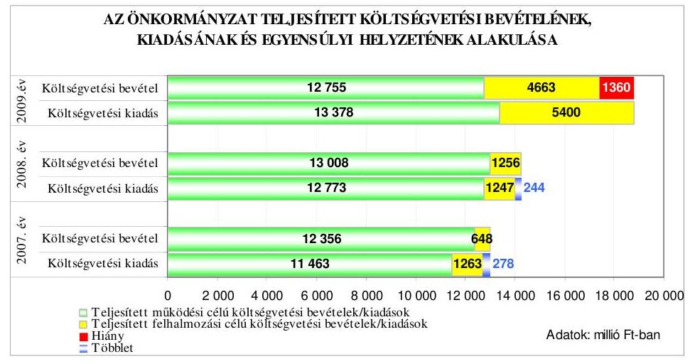

Az Önkormányzatnál a 2007-2008. évi költségvetések végrehajtása során a tervezett költségvetési hiánnyal szemben a teljesített költségvetési bevételek fedezetet nyújtottak a teljesített költségvetési kiadásokra, elsősorban a tervezett összeget meghaladó mértékű költségvetési bevételek. A 2009. évben a teljesítés során a pénzügyi egyensúly nem volt biztosított, azonban a tervezettnél kisebb összegű pénzügyi hiány keletkezett.

Az Önkormányzatnál a 2007-2008. években a tervezett hiánytól eltérő pénzügyi többlet teljesítését a működési célú költségvetési bevételek tervezettnél magasabb összegű teljesítése tette lehetővé, amelyet a 2007. évben a helyi adóbevételek 19,7%-os túlteljesítése, valamint a tervezettnél magasabb összegű költségvetési támogatás, és az előző évi pénzmaradvány nem tervezett igénybevétele okozott.

A 2008. évben a tervezett hiánytól eltérő pénzügyi többlet kialakulását a pénzügyi befektetések bevételeiből elért, nem tervezett részesedés miatti felhalmozási célú bevételi többlet, valamint a működési célú költségvetési bevételeken belül a tervezettnél 14,1%-kal magasabb költségvetési támogatás, és az előző évi pénzmaradvány nem tervezett igénybevétele eredményezte.

A 2009. évben a tervezettnél 43,8%-kal kisebb összegű pénzügyi hiány keletkezett, elsősorban a 2008. év végén kibocsátott kötvényből származó bevételnek a költségvetésben eredeti előirányzatként nem tervezett felhalmozási célú igénybevétele miatt.

Az Önkormányzatnál az előző évi pénzmaradvány igénybevétel előirányzatának tervezése nem volt megalapozott - megsértve az Áht. 7. § (2) bekezdésében foglaltakat8-, mivel a költségvetés időszakában már ismert előző évről áthúzódó

[^8]: 8 2010. január 1-jétől az Áht. 8/C. § (1)-(4) bekezdései szabályozzák.

---

feladatok forrását biztosító pénzmaradvány igénybevételét a 2007-2009. években nem tervezték az eredeti előirányzatok között.

Az Önkormányzatnál a 2007-2010. években tervezett és a 2007-2009. években teljesített működési és felhalmozási célú költségvetési kiadásokra a következő arányban biztosítottak fedezetet a költségvetési bevételek:

Adatok: %-ban

| Megnevezés | 2007.   év |  | 2008.   év |  | 2009.   év |  | 2010.   év |
| :--: | :--: | :--: | :--: | :--: | :--: | :--: | :--: |
|  | Terv | Tény | Terv | Tény | Terv | Tény | Terv |
| Működési célú költségvetési kiadások fedezettsége működési célú költségvetési bevételekből | 89,1 | 107,8 | 89,7 | 101,8 | 92,3 | 95,3 | 87,6 |
| Felhalmozási célú költségvetési kiadások fedezettsége felhalmozási célú költségvetési bevételekből | 90,1 | 51,3 | 63,7 | 100,7 | 19,9 | 86,4 | 101,5 |
| Költségvetési kiadások fedezettsége költségvetési bevételekből | 89,2 | 102,2 | 87,3 | 101,7 | 80,1 | 92,8 | 91,4 |

Az Önkormányzat a 2007. évi költségvetés végrehajtása során a 2007. évet megelőzően tervbe vett beruházások megvalósításához két hitelszerződés alapján vett igénybe hosszú lejáratú fejlesztési hitelt, együttesen 176,3 millió Ft összegben. A fejlesztési célú hitelek igénybevételét az Önkormányzat pénzügyi egyensúlyi helyzete nem indokolta, mivel a 2007. évben e hitelek nélkül is költségvetési bevételi többlete volt.

A 2007. évben felvett hosszú lejáratú hitelekkel kapcsolatos adatokat és jellemzőket mutatja be a következő táblázat:

| Hitel célja | Szerződéskötés ideje | A hitel szerződés szerinti összege millió Ftban | Futamidő év, hó | Türelmi idő év, hó | Kamat jellege   fix, vagy változó | Befolyt bevétel összege millió Ft-ban |
| :--: | :--: | :--: | :--: | :--: | :--: | :--: |
| 2007. évben: |  |  |  |  |  |  |
| „Sikeres Magyarországért Önkormányzati Fejlesztési Hitelprogram"   Általános beruházási cél | 2006.08.09. | 135,4 | 8 év 10 hó | 1 év 5 hó | változó | 135,4 |
| „Sikeres Magyarországért Önkormányzati Fejlesztési Hitelprogram"   Környezetvédelmi beruházási cél | 2006.08.09. | 73,6 | 8 év 10 hó | 2 év 10 hó | változó | 40,9 |

Az Önkormányzat 2006. augusztus 9-én a „Sikeres Magyarországért Önkormányzati Fejlesztési Hitelprogram" keretében kettő kölcsönszerződést kötött a település kettő

---

utcájának rekonstrukciójára, út- és járdaépítésre, valamint a település öt utcájában és az északi lakóterületen csapadék- és szennyvízelvezetési beruházások megvalósításához. Mindkét fejlesztés esetében a forrás összetételében a felvett hitel 90%-ot jelentett. A pénzintézet a fejlesztési hiteleket 2007. illetve 2008. december 31-ig tartotta az Önkormányzat rendelkezésére. A hitelek cél szerinti felhasználása megtörtént, a környezetvédelmi beruházási cél megvalósításához elegendő volt a hitelszerződés szerinti összeg 55,6%-ának az igénybevétele. Az Önkormányzat változó mértékű kamat fizetésére vállalt kötelezettséget9. Az Önkormányzat a szerződés szerinti ütemezésben kezdte meg a hitelek törlesztését.

A 2009. évi költségvetési rendeletben tervezett 1500 millió Ft hosszú lejáratú fejlesztési hitel felvételére nem került sor, a beruházási és felújítási feladatokra a kötvénykibocsátásból biztosítottak forrást.

Az Önkormányzat hosszú lejáratú beruházási és fejlesztési hitel állománya a könyvviteli mérleg adatai alapján a 2007. év végén 675 millió Ft, a 2008. év végén 618 millió Ft, a 2009. év végén 518 millió Ft volt. A hosszú lejáratú hitelállomány a korábbi években felvett hitelek törlesztésének hatására csökkent10.

A Közgyűlés a 99/2008. (III. 13.) számú határozatában döntött arról, hogy új munkahelyek létrehozásához, a fiatal népesség elvándorlásának megállításához, a pályázati lehetőségek kihasználásához szükséges saját forrás előteremtését külső
 forrásból, kötvény kibocsátásával valósítja meg. A Közgyűlés a 245/2008. (V. 22.) számú határozatban döntött 8500 millió Ft-nak megfelelő, 23 éves lejáratú, zárt kibocsátású, CHF alapú, változó kamatozású ${ }^{11}$ kötvény kibocsátásáról. A Közgyűlés a döntését - a pénzpiaci válság hatásainak értékelése alapján - a 606/2008. (XI. 13.) számú határozattal módosította, a devizanemet EUR-ra változtatta. A kötvénykibocsátás célja: működési hiány csökkentése, magas kamatú hitellel megvalósított beruházások finanszírozási kötelezettségeinek kiváltása, városi tulajdonú ingatlanokon végzett fejlesztésekhez forrás biztosítása, tartós működési bevételt eredményező befektetések kezdeményezése, a fel nem használt kötvényforrás összegének lekötése és a kamatbevételek tartalékba helyezése. A 2008. december 2-án kibocsátott kötvény futamideje 22 év 7 hónap, a türelmi idő a tőketörlesztés tekintetében a kibocsátástól számított 3 év. Az utolsó törlesztés időpontja 2031. június 30-a. A kötvény törlesztő terve alapján az Önkormányzatnak a türelmi idő alatt összesen 808 millió Ft kamatfizetési kötelezettsége áll fenn.

A Közgyűlés döntései alapján a kötvény kibocsátásból származó bevételből 4353,8 millió Ft-ot vettek igénybe, ebből 6,0 millió Ft-ot fordítottak európai uniós forrással megvalósult fejlesztések saját forrásának biztosítására, 647,0

[^0]
[^0]:    ${ }^{9}$ három havi EURIBOR + évi $1,54 \%$ illetve 1,04\%
    ${ }^{10}$ Az Önkormányzat 1999-2005. években hosszú lejáratú hitelt a szennyvíztisztító-telep építéséhez, a kórháznál a sürgősségi betegellátás kialakításához, valamint az intézményi beruházási és felújítási feladatokhoz vett igénybe. Ezen hitelek visszafizetési határideje a 2014., illetve a 2025. év.
    ${ }^{11}$ három havi EURIBOR $+1,50 \%$

---

millió Ft beruházási és felújítási kiadást teljesítettek ${ }^{12}, 3400$ millió Ft vételáron két gázerőművet tulajdonló társaságban 50-50\%-os tulajdonrészt vásároltak, és 300,8 millió Ft pénzbeli hozzájárulást biztosítottak a DVG Zrt. alaptőke emeléséhez ${ }^{13}$. Az Önkormányzat - a tervezett célok között szereplő - korábban felvett működési, illetve fejlesztési célú hitelek törlesztésére, kiváltására nem fordított pénzeszközt a kibocsátott kötvény bevételéből. A tervezett feladatokra fel nem használt 2009. évi maradvány 98,7\%-át bankbetétben helyezték el. A kötvénykibocsátás bevételből a fel nem használt összeget 30-180 napos időtartamra lekötötték ${ }^{14}$, amelyből a 2009. évben 641 millió Ft kamatbevétel származott ${ }^{15}$. Az Önkormányzatnak a kötvénykibocsátás évében a kibocsátásból eredő tárgyévi kötelezettségvállalás összege az éves adósságot keletkeztető kötelezettségvállalás felső határának az 1,01\%-a volt, ez az arány a 2009. évben 8,54\%-ra nőtt.

A forint euróhoz viszonyított árfolyamváltozása, valamint a felvett hosszú lejáratú hitel és a kibocsátott kötvény változó kamatozása miatt a hosszú lejáratú hitelfelvételek és a kötvénykibocsátás az Önkormányzat számára kockázatot jelent.

Az Önkormányzatnál a hitelfelvételek és a kötvénykibocsátás során betartották az Ötv-ben, az Áht-ban és az SzMSz-ben előírt hatásköri és eljárási szabályokat. A Pénzügyi és a Gazdasági bizottság vizsgálta a hitelfelvételek, valamint a kötvénykibocsátás indokait, gazdasági megalapozottságát.

Az Önkormányzat fizetőképességének biztosítása érdekében a működési célú bevételek és kiadások teljesülése ütemkülönbségének áthidalására a 2007-2010. években folyószámlahitel-kerettel rendelkezett. A 2007-2010. években a folyószámlahitellel kapcsolatos jellemzőket mutatja be a következő táblázat:

| Megnevezés | 2007.   év | 2008.   év | 2009.   év | 2010.   I. negyed-   év |
| :-- | :--: | :--: | :--: | :--: |
| A folyószámlahitel keretösszege   (millió Ft-ban) | 2200 | 2200 | 3350 | 3350 |
| Év végén fennálló folyószámlahitel   (millió Ft-ban) | 943 | 1149 | 2846 | - |
| Folyószámlahitellel zárt napok szá-   ma | 365 | 365 | 365 | 90 |

[^0]
[^0]:    ${ }^{12}$ Intézményi felújításokra, út- és járdaépítésekre, szennyvízelvezetésre, parkolók, játszótér és jelzőlámpás gyalogátkelőhely kialakítására, szabad strand műtárgyainak kiépítésére, élményfürdőben konyha, étterem és rendezvényterem kialakítására is történt kifizetés a kötvény kibocsátásból származó bevételből.
    ${ }^{13}$ A Közgyűlés 341/2009. (VI. 26.) számú határozatban alaptőke emeléssel járult hozzá a hulladéklerakó és komposztáló létesítéséhez.
    ${ }^{14}$ A polgármester a Közgyűlés felhatalmazása alapján kötött 2008. októbertől másfél évre szóló szerződést egy gazdasági társasággal szaktanácsadás, közreműködés és mediátori szerep ellátására.
    ${ }^{15}$ Az Önkormányzat a kibocsátást követően három hónapra a kötvénykibocsátásból származó bevétel teljes összegét lekötötte, ami 258,6 millió Ft többletforrást eredményezett (a 2009. évi kamatbevétel 40\%-át).

---

| Megnevezés | 2007.   év | 2008.   év | 2009.   év | 2010.   I. negyed-   év |
| :-- | :--: | :--: | :--: | :--: |
| A ténylegesen felvett folyószámlahi-   tel átlagos állománya (millió Ft-   ban) | 1269,5 | 1224,4 | 1788,2 | 2898,0 |
| A felvett folyószámlahitel minimum   összege (millió Ft-ban) | 344,4 | 391,4 | 785,2 | 2292,1 |
| A felvett folyószámlahitel maxi-   mum összege (millió Ft-ban) | 1817,1 | 1845,0 | 3075,9 | 3118,6 |

Az Önkormányzat a 2007-2010. I. negyedév között folyamatosan vett igénybe folyószámlahitelt. A 2007-2009. években igénybe vett folyószámla-hiteleket a könyvviteli nyilvántartásban likvid hitelként számolták el annak ellenére, hogy azok nem tekinthetők - az Ötv. 88. § (3) bekezdés d) pontjában foglaltak szerint - likvid hitelnek, mivel azokat éven belül nem fizették vissza.

A Közgyűlés a 2010. május 13-i határozatában döntött arról, hogy 5000 millió Ft működési célú, rövid lejáratú hitelt vesz igénybe. Az Önkormányzat 2009. július hónaptól havonta rendszeresen vett igénybe munkabér megelőlegezési hitelt. A főjegyző gondoskodott a 2007-2009. években az Ámr. ${ }_{1}$ 139. § (1) bekezdésében ${ }^{16}$ előírtaknak megfelelően az Önkormányzat pénzállományának alakulását bemutató likviditási terv készítéséről, amelyet aktualizáltak.

Az Önkormányzat eladósodását és annak mértékét 2007-2009. évek között az - éves könyvviteli mérleg adataiból számított - eladósodási mutató ${ }^{17}$ szemlélteti, ami a 2007. évi 6,3\%-ról a 2008. évre 22,4\%-ra, a 2009. évben 25,8\%-ra nőtt, az eladósodás kedvezőtlen alakulását és felgyorsulását jelzi. Az Önkormányzat hosszú lejáratú kötelezettségének állománya 2007-2009 között közel tizenháromszorosára emelkedett, a kötvénykibocsátás, és a hosszú lejáratú hitelfelvételek hatására.

Az esedékességi aránymutató ${ }^{18}$ 2007-2009 között változóan alakult, a 2007. évi 74,3\%-ról a 2008. évre 20,2\%-ra csökkent, majd 2009. évben 28,4\%-os értéket mutatott. A 2008. december 2-i kötvénykibocsátás, valamint a hosszú lejáratú hitelek igénybevételével, azok hatására a hosszú lejáratú kötelezettségek aránya az összes kötelezettségen belül emelkedett, ezáltal a rövidtávon teljesítendő kötelezettségek fizetőképességre gyakorolt hatása mérséklődött. A 2009. évi esedékességi aránymutató - előző évhez viszonyított - növekedése jelzi, hogy nőtt a rövid lejáratú fizetési kötelezettségek aránya az összes fizetési kötelezettségeken belül.

Az Önkormányzat adósságszolgálatra a 2007-2009. években az évek sorrendjében 200,3-216,3-456,9 millió Ft-ot fordított. A 2009. évi adósságszolgálati köte-

[^0]
[^0]:    ${ }^{16}$ 2010. január 1-jétől az Ámr. ${ }_{2}$ 201. § (1) bekezdése szabályozza.
    ${ }^{17}$ Az eladósodási mutató a hosszú és rövid lejáratú fizetési kötelezettségek önkormányzati összes forráson belüli arányát mutatja.
    ${ }^{18}$ Az esedékességi aránymutató a rövid lejáratú fizetési kötelezettségek arányát fejezi ki az összes - rövid- és hosszú lejáratú - fizetési kötelezettségen belül.

---

lezettség az előző évhez képest több, mint kétszeresére nőtt. Az adósságszolgálati ráta ${ }^{19}$ a 2007. évi 3,6\%-ról a 2008. évre 3,9\%-ra, a 2009. évben pedig $8,5 \%$-ra nőtt, amely azt jelzi, hogy az Önkormányzat saját bevételeinek egyre növekvő hányadát a felvett hitelek tőketörlesztésére és kamatfizetésre, továbbá a kibocsátott kötvény kamattörlesztésére fordította.

Az Önkormányzat pénzügyi helyzete a 2007-2009. évek között a hosszú lejáratú kötelezettségek állományának növekedése miatt eladósodás szempontjából kedvezőtlenül változott.

Az Önkormányzat fizetőképességének alakulását a következő ábra szemlélteti:
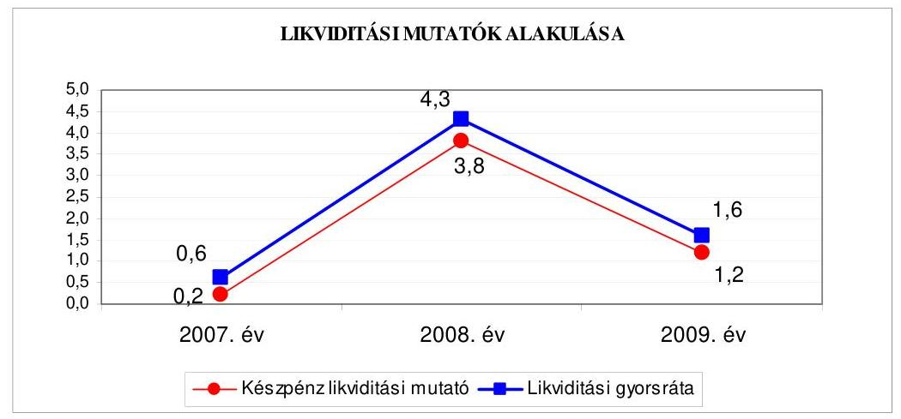

Az Önkormányzatnál a készpénz likviditási mutató ${ }^{20}$ a 2007. évben 0,2 volt, amely jelzi, hogy a pénzeszközök nem nyújtottak fedezetet a rövid lejáratú fizetési kötelezettségek pénzügyi teljesítésére. A 2008. évben a kötvénykibocsátásból származó bevétel bankbetétben történő tartása miatt a pénzeszközök állománya közel négyszeresen fedezte a rövid lejáratú kötelezettségeket. A készpénz likviditási mutató előző évhez viszonyított 2009. évi romlása jelzi, hogy a rövid lejáratú fizetési kötelezettségek emelkedtek, amelyet a kötvénykibocsátásból származó bevétel részbeni felhasználása miatti pénzeszköz állománycsökkenése, valamint a rövid lejáratú kötelezettségek (hitelek és szállítói tartózások) állományának előző évhez viszonyított $162,4 \%$-os növekedése együttesen idéztek elő.

A likviditási gyorsráta ${ }^{21}$ 2007-2009 között változóan alakult, a 2007. évben 0,6 volt, amely jelzi, hogy az Önkormányzat követelései és pénzeszközei nem fedezték a rövid lejáratú fizetési kötelezettségeket. A 2008. évben a pénzeszközök és követelések együttes összegének a december hóban történt kötvénykiboc-

[^0]
[^0]:    ${ }^{19}$ Az adósságszolgálati ráta a tárgyévben adósságszolgálatra (tőketörlesztés+kamat) fizetett összeg saját bevételekhez viszonyított arányát fejezi ki.
    ${ }^{20}$ A készpénz likviditási mutató kifejezi, hogy a pénzeszközök év végi állománya milyen arányban nyújt fedezetet a rövid lejáratú fizetési kötelezettségekre.
    ${ }^{21}$ A likviditási gyorsráta mutatja, hogy a rövid lejáratú fizetési kötelezettségek kiegyenlítéséhez a pénzeszközökön túl bevonható követelések, forgatási célú értékpapírok milyen arányban nyújtanak fedezetet.

---

sátás miatti növekedése meghaladta a rövid lejáratú kötelezettségek növekedését, mivel annak több, mint négyszeresére nyújtott fedezetet a kötvénykibocsátásból származó bevétel. A likviditási gyorsráta 2009. évi csökkenése jelzi, hogy a rövid lejáratú fizetési kötelezettségek kiegyenlítéséhez a pénzeszközökön túl bevonható követelések, forgatási célú értékpapírok csökkenő arányban nyújtanak fedezetet, amelyet a pénzeszközök 38\%-os csökkenése és a rövid lejáratú kötelezettségek 162,4\%-os növekedése okozott.

Az Önkormányzat pénzügyi helyzete a 2007-2009. évek között a fizetőképesség átmeneti javulása ellenére - a hitelfelvételek és a kötvénykibocsátás miatti eladósodás növekedése következményeként - összességében kedvezőtlenül alakult.

# 2. Az ÖNKORMÁNYZAT FELKÉSZÜLTSÉGE AZ EURÓPAI UNIÓS FORRÁSOK IGÉNYLÉSÉRE, FELHASZNÁLÁSÁRA, A TÁMOGATOTT CÉLKITŰZÉS MEGVALÓSÍTÁSÁRA, MŰKÖDTETÉSÉRE, VALAMINT AZ ELEKTRONIKUS KÖZSZOLGÁLTATÁSI FELADATOK ELLÁTÁSÁRA 

2.1. Az európai uniós források igénybevételére, felhasználására, a támogatott célkitűzés megvalósítására, működtetésére történt felkészülés szabályozottságának, szervezettségének, valamint egy támogatási szerződésben foglalt célkitűzés megvalósításának, működtetésének eredményessége

### 2.1.1. Az európai uniós forrásokra történő pályázatok benyújtására vonatkozó döntések összhangja fejlesztési célkitűzésekkel

Az Önkormányzat a 2006-2010. évekre vonatkozó fejlesztési célkitűzéseit gazdasági programban, a településfejlesztési koncepcióban az integrált városfejlesztési stratégiában ${ }^{22}$ és ágazati fejlesztési koncepciókban ${ }^{23}$ határozta meg.

A gazdasági program fő célkitűzéseként rögzítették, hogy Dunaújváros fejlődési üteme fenntartható, életének komfortja biztosítható, a városok versenyében elért pozíciója legalább megtartható, de inkább javítható legyen. Ennek érdekében előnyben részesítik azokat a programokat, amelyek a város fenntartható fejlődését segítik elő. Az egészségügyi, a szociális, az ifjúsági és a sport ágazatokban a közszolgáltatások biztosítását és a színvonal javítását tartalmazta a gazdasági program. A kulturális területen új létesítmények építését, alapítását a meglévő

[^0]
[^0]:    ${ }^{22}$ A településfejlesztési koncepciót a Közgyűlés a 220/1999. (VII. 20.) számú határozatával jóváhagyott

 INTERCISA 2015 elnevezésű távlati fejlesztési koncepcióban határozta meg, az integrált városfejlesztési stratégiát a Közgyűlés az 500/2008. (IX. 25.) számú határozatával fogadta el
    ${ }^{23}$ A Közgyűlés 550/2007. (XII. 6.) számú határozatával jóváhagyott „Dunaújváros Megyei Jogú Város Önkormányzatának közoktatási feladat-ellátási, intézményhálózat-működtetési és fejlesztési terve 2007-2013.", valamint a Közgyűlés 48/2010. (II. 11.) számú határozatával jóváhagyott „Egészségügyi koncepciója".

---

épületek fejlesztését, felújítását és művészeti értékek alkotását, megőrzését határozták meg. Az oktatást érintően az oktatási funkciójú épületek fejlesztését, a kötelező feladatok biztosítását, a térségi szakképző hálózatba való kapcsolódást, és a kistérségi fejlesztések pályázati lehetőségeinek kihasználását határozták meg. Az informatikát érintően számítástechnikai eszköz, program és hálózatfejlesztéseket, valamint az ezekhez kapcsolódó oktatásokat rögzítettek célként. Az Önkormányzat tulajdonában álló vagyonnal való gazdálkodás területén a bevételek növelését és a fenntartással, működéssel kapcsolatos kiadások csökkentését tervezték.

A gazdasági program megvalósításához figyelembe vehető forrásként jelölték meg az uniós és nemzeti pályázati pénzeszközöket, az Önkormányzat költségvetését, és a kistérségi programok központi költségvetési támogatását.

Az Önkormányzatnál 2007-2009 között összesen 30 - a Polgármesteri hivatal 21, az intézmények kilenc - európai uniós forrás megszerzésére irányuló fejlesztési feladatról és pályázat benyújtásáról döntöttek (a benyújtott pályázatok főbb adatait a 4-4/b mellékletek ismertetik). A fejlesztési feladatok az NFT, az ÚMFT operatív programokhoz és az INTERREG közösségi kezdeményezéshez kapcsolódtak. A pályázatok a gazdasági programban, illetve a fejlesztési koncepciókban megfogalmazott célokkal összhangban voltak.

A Polgármesteri hivatal és az intézmények által 2007-2010. I. negyedév között benyújtott pályázatok megvalósításának tervezett összes költsége 9041,5 millió Ft volt, amelyet 81,5%-ban európai uniós és 0,5%-ban hazai támogatás, valamint 18%-ban saját forrásból terveztek finanszírozni. A pályázatok közül 12 részesült támogatásban, amelyek 711,4 millió Ft tervezett kiadását 88,9%-ban európai uniós és 1,5%-ban hazai támogatás és 9,6%-ban saját forrásból tervezték megvalósítani. Kilenc pályázat elbírálása 2010. május 31-ig nem történt meg, melyek tervezett összes költsége 6219,7 millió Ft. A benyújtott pályázatok közül kilenc elutasításra került, ezek tervezett kiadása 2110,4 millió Ft volt. A pályázatok elutasítása formai, tartalmi és szakmai kidolgozottság, illetve pénzügyi forrás hiánya, továbbá a befogadási követelményeknek, kritériumoknak nem megfelelő benyújtás miatt történt. Az Önkormányzat a támogatók döntése után nem vont vissza pályázatot.

A legnagyobb összegű támogatás megszerzésére vonatkozó pályázatokat az Önkormányzat a Kőtár alatti partszakasz védelmére és a meglévő védművel való összehangolására (I-II. ütem), a belváros területén megvalósuló városrehabilitációra, valamint a Szent Pantaleon Kórházban a központi műtő és diagnosztikai blokk kialakítására nyújtotta be.

Az Önkormányzat 2007-2010. évi költségvetési rendeletei az európai uniós forrással megvalósuló fejlesztési feladatokhoz kapcsolódó bevételi és a támogatásokkal fedezett kiadási előirányzatokat az Áht. 69. § (1) bekezdését ${ }^{24}$ megsértve nem tartalmazták. A költségvetési rendeletek az Ámr. 29. § (1) bekezdés c), d) pontjaiban előírtak ellenére nem tartalmazták ${ }^{25}$ a felújítási előirányzatok céljait

[^0]
[^0]:    ${ }^{24}$ 2010. január 1-jétől Áht. 69. § (1) bekezdés a) pontja
    ${ }^{25}$ 2010. január 1-jétől az Ámr. 36. § (1) bekezdés c) és d) pontjai

---

között és a felhalmozási kiadások között feladatonként az európai uniós forrásból megvalósuló feladatokat a támogatási szerződések megkötéséig.

Az Önkormányzat 2007-2010. évi költségvetési rendeletei nem tartalmazták a több éves kihatással járó feladatok előirányzatai között éves bontásban az Ámr. 29. § (1) bekezdés g) pontja ${ }^{26}$ ellenére a több évre áthúzódó európai uniós támogatással megvalósuló feladatokat.

Az Önkormányzat 2007-2010. évi költségvetési rendeletei nem tartalmazták az Ámr. 29. § (1) bekezdés k) pontja ${ }^{27}$ előírása ellenére elkülönítetten az európai uniós támogatással megvalósuló projektek bevételi és kiadási előirányzatait.

A 2007-2009. évek között az Önkormányzat az európai uniós támogatású projektek közül négyet fejezett be. Az alábbi diagram szemlélteti a befejezett fejlesztési feladatok finanszírozási forrásainak tervezett és tényleges megvalósulását:
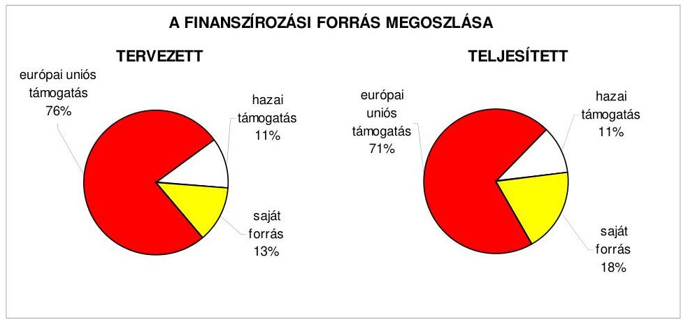

A befejezett fejlesztési feladatokat az Önkormányzat a tervezett 48,1 millió Ft kiadás helyett 50,8 millió Ft-ból valósította meg. A „Dunaújvárosi Óvoda Római városrészi Egysége utólagos komplex akadálymentesítése" során a kivitelezés költsége a közbeszerzési eljárást követően a tervezetthez viszonyítva növekedett, amelyhez a szükséges 3,1 millió Ft többletforrást az Önkormányzat saját erőből finanszírozta ${ }^{28}$. Megtakarítás képződött (0,4 millió Ft) a „Kapcsolódás" projekt megvalósítása során, mivel a tervezett tartalék összegét nem vették igénybe, illetve az épület akadálymentesítése a tervezettnél alacsonyabb költségen valósult meg.

[^0]
[^0]:    ${ }^{26}$ 2010. január 1-jétől az Ámr. 36. § (1) bekezdés h) pontja
    ${ }^{27}$ 2010. január 1-jétől az Ámr. 36. § (1) bekezdés l) pontja.
    ${ }^{28}$ A többlet forrás biztosításáról a Közgyűlés a 484/2008. (VII. 24.) számú határozatában döntött.

---

# 2.1.2. Az európai uniós forrásokhoz kapcsolódóan a pályázatfigyelés, a pályázatkészítés, valamint az európai uniós támogatással megvalósuló fejlesztés lebonyolításának belső rendje, a végrehajtás és az ellenőrzés szervezettsége 

A Polgármesteri hivatalban a 2007-2009. években az európai uniós forrásokra vonatkozó pályázatokkal kapcsolatosan az önkormányzati szintű pályázatkoordinálás feladatait a Közgyűlés a pályázati koordinációs rendben, illetve a főjegyző a hivatali SzMSz-ben szabályozta. A feladat ellátása a Koordinációs iroda tevékenységébe tartozott.

A hivatali SzMSz alapján a Koordinációs iroda ellátja a „pályázati koordináció körében létrejövő pályázati tevékenységekre irányuló szerződések előkészítését és nyilvántartását. Elősegíti a pályázati projekttartalomra irányuló szakértői támogatás szervezését. Ellátja az önkormányzati részvétellel vagy önrésszel végrehajtott pályázati projektek döntés-előkészítési, követési és értékelési feladatait."

A főjegyző az európai uniós pályázatokat érintően a térségfejlesztési és munkaerő-gazdálkodási csoportvezető, a koordinációs ügyintéző és a fogalmazó munkaköri leírásában rögzítette az önkormányzati szintű koordinációs feladatokat és jelölte ki a felelősöket.

A pályázati koordinációs rendben a Közgyűlés előírta a pályázati tevékenység és a pályázatok állapotának nyilvántartását. A szükséges információk beszerzésének rendszerét a pályázati koordinációs rend 1-6. mellékleteiben határozták meg. A pályázati koordinációs ügyintéző és fogalmazó munkaköri leírásában a főjegyző előírta a pályázati tájékoztatók, a kiírások, a pályázatok és a megvalósuló projektek elektronikus nyilvántartásának kötelezettségét ${ }^{29}$.

A Közgyűlés a pályázati koordinációs rendben előírta a pályázati lehetőségek feltárásának kötelezettségét, és arról az érintett szakirodák illetve szervezetek tájékoztatását. A pályázatfigyelés irányítását a területfejlesztési és munkaerő-gazdálkodási csoportvezető, a pályázatfigyelést a pályázati koordinációs ügyintéző és a fogalmazó feladatkörébe írta elő a főjegyző. A Koordinációs iroda részére a főjegyző előírta, hogy a polgármester két Közgyűlés között eltelt időszakról szóló beszámolójához rendszeresen készítsen tájékoztatást a pályázatfigyelés során szerzett tapasztalatokról.

A pályázati koordinációs rendben indokoltsága ellenére nem határozták meg a pályázatkészítés rendjét és az európai uniós forrással támogatott fejlesztések lebonyolításával kapcsolatos feladat-, kapcsolattartás-, információáramlási-, ellenőrzési-, felelősségi rendet.

A Polgármesteri hivatalban 2007-2009 között az európai uniós pályázatok figyelésével kapcsolatos feladatokkal a koordinációs ügyintézőt és a fogalmazót bízta meg a főjegyző munkaköri leírásukban. Külső személyt, szervezetet nem bíztak meg ezen feladat ellátásával.

[^0]
[^0]:    ${ }^{29}$ A pályázatok nyilvántartását polgármesteri hivatali és intézményi bontásban az erre a célra vásárolt program segítségével végezték.

---

Az Önkormányzatnál a 2007-2009. években a pályázatkészítés személyi feltételeiről egyrészt a Polgármesteri hivatalon belül, másrészt külső szervezet megbízásával gondoskodtak. A benyújtott pályázatok közül 15-öt a Polgármesteri hivatal köztisztviselői és az intézmények alkalmazottai készítettek. Külső szervezetet bíztak meg 15 pályázat összeállítására. A külső szervezetekkel kötött szerződések közül egy esetben nem rögzítették a feladatellátás kötelezettségét, a pályázatkészítő felelősségét a pályázat tartalmi és formai követelményeinek biztosítására, a pályázat céljának egyértelmű meghatározására vonatkozóan.

A „Kiemelt projektjavaslat Dunaújváros MJV belvárosi akcióterületén megvalósuló városrehabilitációjára" elnevezésű projekt esetében a vállalkozási szerződésben nem rögzítették a pályázatkészítő felelősségét a pályázati követelmények teljesítését érintően.

A fejlesztési feladatok lebonyolításának személyi és szervezeti feltételeit kialakították a Polgármesteri hivatalon és intézményeken belül, illetve két külső szervezetet és 17 magánszemélyt bíztak meg egy-egy projekt megvalósításához kapcsolódó részfeladat ellátásával.

A Polgármesteri hivatal köztisztviselői munkaköri feladataik keretében végezték a projektek lebonyolítását, azonban a munkaköri leírásaikban a jegyző nem határozta meg a támogatások lebonyolításával kapcsolatos feladatokat és az ellenőrzési kötelezettséget.

A 2010. évben indított INTERREG IV/C „Waterways Forward" című projekt célja: a folyami vizek köré épülő gazdasági tevékenységek, lehetőségek támogatása, a folyami vizek többcélú hasznosítása és környezetvédelmi szempontú vizsgálata, valamint a klímaváltozások okozta kihívásokra a megoldások keresése volt. A polgármester a projekt lebonyolítására megbízást adott a Polgármesteri hivatal négy dolgozójának a projekt menedzseri, a kommunikációs, a pénzügyi és asszisztensi feladatok ellátására. A főjegyző a munkaköri leírásaikat kiegészítette az ellátandó feladatokkal.

A külső szervezetekkel a projektek lebonyolítására vonatkozóan kötött 18 szerződésben előírták a támogatott célkitűzés megvalósításának kötelezettségét, a kapcsolattartás és ellenőrzés rendjét. Egy vállalkozási szerződésben azonban indokoltsága ellenére nem rögzítették az ellenőrzés rendjét és a személyre szóló felelősségi szabályokat.

Az INTERREG IV/C „Waterways Forward" című projekt általános projektmenedzsmenti és pénzügyi szakértői tevékenység ellátására vonatkozó szerződésben nem rögzítették a bonyolításhoz kapcsolódó ellenőrzés rendjét és a személyre szóló felelősségi szabályokat.

A belső ellenőrzési feladatokat megalapozó kockázatelemzés kiterjedt az európai uniós forrásokkal támogatott fejlesztési feladatokra, azokat magas kockázatúnak értékelte.

---

# 2.1.3. Egy támogatási szerződésben foglalt célkitűzés megvalósítása, működtetése 

Az Önkormányzat a szociális területen dolgozó szakemberek képzésével kapcsolatos célkitűzés megvalósításához 2007. február 13-án benyújtott 8,9 millió Ft összkiadással tervezett „Kapcsolódás" című pályázata alapján 6,7 millió Ft európai uniós és 2,2 millió Ft hazai társfinanszírozású támogatást nyert. A pályázat és a támogatási szerződés részletes adatait az 5. számú melléklet tartalmazza.

A projekt támogatási szerződésében rögzített célkitűzéseknek megfelelően 64 fő szociális területen foglalkoztatott vett részt képzésen, tanácsadáson, illetve felkészítésen. Az Önkormányzat a támogatási szerződésben rögzített „projekt költségvetés" szerinti kiadási keretösszegen belül valósította meg a tervezett célkitűzéseit. A projekt a tervezett 8,9 millió Ft kiadással szemben 8,5 millió Ft-ból valósult meg, mivel az Egészségmegőrzési Központban az akadálymentesítés érdekében kihelyezett rámpa 0,2 millió Ft-tal kevesebb kiadással teljesült, illetve a projekt keretében tervezett tartalék igénybevételére nem került sor 0,2 millió Ft összegben.

A projektet a támogatási szerződés szerinti időn belül, 2007. augusztus 1. és 2008. március 31. között valósították meg. A Polgármesteri hivatal 2008. május 13-án nyújtotta be záró projekt jelentését. Az Önkormányzat nem tett eleget az elszámolási időszakra vonatkozó projekt előrehaladási jelentési kötelezettségének, ezáltal a támogatás kifizetése elhúzódott 2008. októberéig. A belső ellenőrzés és külső szervezet a 2007-2009. években nem vizsgálta az európai uniós forrásból támogatott projekt célkitűzéseinek megvalósítását.

Az Önkormányzat a támogatási szerződésben a projekt nyolc hónapos megvalósítása után további egy év fenntartást vállalt. Ennek érdekében a Közgyűlés a 117/2006. (IV. 20.) számú határozatában a pályázat benyújtását megelőzően 1,7 millió Ft saját forrást biztosított. A projekt megvalósításában közreműködő Egészségmegőrzési Központtal 2008. április
 2-án a projekt befejezését követően a polgármester támogatási szerződést kötött a fenntartás érdekében a közgyűlési határozatban rögzített összeggel. Az Önkormányzat a fenntartási időszakban vállalta, hogy további azonos módszertanú képzéseket szervez a fenntartási időszakban, ezért a 2009. évben további egy millió Ft támogatást biztosított a Közgyűlés a 730/2008. (XII. 11.) számú határozatával a „Hálózatfejlesztési és mentálhigiénés támogatás a gyermekvédelemben érintett intézmények szakemberei" című projekt megvalósítására. Az intézmény a támogatási szerződésekben rögzített képzéseket, csoportos „esetmegbeszéléseket" elvégezte, a támogatott összegekkel elszámolt. A projekt fenntartásával kapcsolatosan elszámolt kiadások összhangban álltak a támogatási szerződésben vállalt kötelezettségekkel.

Az Önkormányzat 2007-2009 között nem készült fel eredményesen a belső szabályozottság és szervezettség terén az európai uniós források igénybevételére, a támogatások felhasználására annak ellenére, hogy a gazdasági programban megfogalmazott fejlesztési célkitűzésekhez kapcsolódtak az európai uniós pályázatok, valamint szabályozták a pályázatfigyelést végző és a döntési-, illetve a döntés-előterjesztési jogkörrel rendelkezők közötti információszolgáltatási kötelezettséget, a belső ellenőrzési stratégiát megalapozó kockázatelemzés kiterjedt az európai uniós forrásokkal támogatott fejlesztési feladatokra, valamint a Polgármesteri hivatalon és az intézményeken belül, továbbá külső szervezetek igénybevételével biztosították a pályázatfigyelés, a pályázatkészítés és a fejlesztési feladat lebonyolításának szervezeti és személyi feltételeit. A támogatási szerződésben rögzített határidőre a fejlesztési célkitűzést megvalósították. Nem határozták meg azonban valamennyi külső szervezettel pályázatkészítésre kötött szerződésben a pályázat szakmai és formai követelményeire vonatkozóan a pályázatkészítő felelősségét, valamint nem írták elő minden projekt lebonyolításra vonatkozó szerződésben a szervezet ellenőrzési kötelezettségeit, továbbá nem rendelkeztek a fejlesztési feladatok lebonyolítását végző köztisztviselők munkaköri leírásaiban az ellenőrzési kötelezettségről.

# 2.2. Az elektronikus közszolgáltatás feltételeinek kialakítása 

A Polgármesteri hivatal 2005-2010. évekre vonatkozó informatikai stratégiáját a Közgyűlés a 167/2005. (V. 5.) számú határozatával hagyta jóvá. A dokumentum tartalmazott helyzetelemzést, mely a meglévő informatikai infrastruktúra és a személyi feltételek értékeléséből indult ki, továbbá közép és hosszú távú célokat fogalmazott meg, az e-közszolgáltatási feladatok 4. szintjének megvalósításához. A stratégiai célok között szerepelt, hogy az állampolgárok az információkhoz elektronikus formában hozzájuthassanak, egyszerűsödjön, emellett hatékonyabbá váljon, gyorsuljon az ügyintézés az informatika támogatásával, a tér- és időkorlátok csökkentésével. A Polgármesteri hivatal információs rendszere legyen pontos, aktuális, könnyen hozzáférhető és hasznos. A célok megvalósítását három szakaszra bontva tervezték megvalósítani, melynek keretében ütemezetten kialakítják az „informáló", a „szolgáltató" és az „e-Önkormányzat"-ot. Az Önkormányzat működtetett e-közigazgatási szolgáltatásokat biztosító informatikai rendszert a Polgármesteri hivatalon belül, továbbá külső szolgáltató igénybevételével vállalkozási szerződés keretében. Az e-közszolgáltatási feladatokat ASP rendszeren keresztül működtették vásárolt program alkalmazásával.

Az Önkormányzat az elektronikus ügyintézést kizáró szabályokat az e-ügyintézési rendeletében ${ }^{30}$ határozta meg, melyben nem engedélyezte a közigazgatási hatósági ügyek elektronikus ügyintézését, kivéve az Okmányiroda tevékenységét érintően, ahol az ügyintézés országos adatbázis igénybevételével a „magyarorszag.hu" honlapon keresztül történhet.

Az Önkormányzat rendelkezett honlappal ${ }^{31}$, amelyen keresztül működtettek e-közszolgáltatási feladatokat ellátó informatikai rendszert. A 2. elektronikus szolgáltatási szinten biztosították az állampolgárok részére az ügyintézést a gépjárműadó, engedélyek ügyintézése, szociális juttatások, támogatások

[^0]
[^0]:    ${ }^{30}$ Az Önkormányzat 42/2005. (X. 28.) számú rendelete a közigazgatási hatósági eljárásban az elektronikus ügyintézésről, illetve az elektronikus ügyintézés kizárásáról.
    ${ }^{31}$ Az Önkormányzat honlapja a www.dunaujvaros.hu címen érhető el.

---

fizetései, helyi adózás, egészségüggyel kapcsolatos szolgáltatások és egyéb területeken, valamint a vállalkozások részére az iparűzési adó, gépjárműadó, és a tevékenységükhöz kapcsolódó engedélyek tekintetében.

A közvetlen, kétoldalú ügyintézés feltételeit az Önkormányzatnál nem biztosították, mivel az e-közszolgáltatáshoz kapcsolódó meglévő számítástechnikai eszköz, program és személyi állomány fejlesztését a pénzügyi források hiánya akadályozta.

Az e-közszolgáltatási feladatokat ellátó informatikai rendszer ügyfelek általi igénybevételét (ügyfélforgalmat) nem kísérték figyelemmel az Önkormányzatnál, az egyes ügykörök igénybevételének tapasztalatait nem értékelték.

Az Önkormányzat 2007. január 1-jétől az Eisz. tv. 21. § (3) bekezdése alapján kötelezett a közérdekű adatok közzétételére. Az Önkormányzat honlapján a 18/2005. (XII. 27.) IHM rendelet 2. § (1) bekezdésében előírtak ellenére a honlap megnyitásakor megjelenő oldalon, a közzétételi listákra előírt adatokat tartalmazó jegyzékre mutató hivatkozást „Közérdekű adatok" elnevezéssel nem helyezték el. A gazdálkodási adatok közzétételére a honlapon a 18/2005. (XII. 27.) IHM rendelet 2. § (2) bekezdésében, és az 1. számú mellékletben meghatározottak ellenére a közzétételi lista szerinti adatokat tartalmazó közzétételi egységeket, vagy az azokra vonatkozó hivatkozást nem helyezték el.

Az Önkormányzat a gazdálkodás rendjéről szóló rendeletben rögzítette, hogy a 200 ezer Ft alatti támogatások jogszabályban meghatározott adatainak közzétételét mellőzi.

A főjegyző az Áht. 15/A. § (1) bekezdésében előírtakat megsértve nem tette közzé az Önkormányzat honlapján a 18/2005. (XII. 27.) IHM rendelet 2. § (2) bekezdésében, és az 1. számú mellékletben meghatározott rendszerben valamennyi céljellegű működési és felhalmozási támogatás esetében a kedvezményezettek nevét, a támogatás célját és összegét, továbbá a támogatási program megvalósítási helyét.

A főjegyző az Áht. 15/B. § (1) bekezdésében előírtakat megsértve nem tette közzé az Önkormányzat honlapján az Önkormányzat 2009. évi pénzeszközei felhasználásával, a vagyonnal történő gazdálkodással összefüggő, nettó öt millió Ft-ot elérő, vagy azt meghaladó összegű, a Polgármesteri hivatal és az intézmények kiadási előirányzatai terhére kötött valamennyi szerződés esetében a szerződés megnevezését, típusát, tárgyát, a szerződést kötő felek nevét, a szerződés értékét, határozott időre kötött szerződés esetében annak időtartamát.

A helyszíni vizsgálat ideje alatt a támogatások és a vagyonnal történő gazdálkodással összefüggő, nettó öt millió Ft-ot elérő vagy azt meghaladó összegű szerződések közérdekű adatait a 18/2005. (XII. 27.) IHM rendelet 2. § (2) bekezdésében, és az 1. számú mellékletben meghatározottak ellenére nem a „közérdekű adatok", azon belül a „gazdálkodási adatok", hanem az „üvegzseb" címszó alatt tették közzé az Önkormányzat honlapján, azonban ennek során megsértették az Áht. 15/A. § (1) bekezdésében és 15/B. § (1) bekezdésében foglaltakat, mivel nem tartották be a közzétételre előírt 60 napos határidőt.

---

A főjegyző a 2007-2008. évi költségvetési beszámolók szöveges indoklását az Ámr. ${ }_{1}$ 157/D. § (1) bekezdésében ${ }^{32}$ hivatkozott 22. számú melléklet 1.2. pont 5. alpontjában előírtak ellenére nem tette közzé az Önkormányzat honlapján. A 2009. évi költségvetési beszámoló szöveges indoklásának közzétételéről az ellenőrzés ideje alatt gondoskodott a főjegyző, azonban a 18/2005. (XII. 27.) IHM rendelet 2. § (2) bekezdésében, és az 1. számú mellékletében meghatározottak ellenére a közzététel nem a „Közérdekű adatok" felületen, a „3.2. Költségvetések, beszámolók, számviteli beszámolók" közzétételi egységen belül, hanem az „Üvegzseb" címszó alatt történt.

# 3. A KÖLTSÉGVETÉSI GAZDÁLKODÁS BELSŐ KONTROLLJAI 

### 3.1. A költségvetés-tervezés, a gazdálkodás és a zárszámadáskészítés folyamatában végrehajtandó belső kontrollok kialakítása

A 2009. évben a Polgármesteri hivatalban a költségvetés-tervezési és zárszámadás-készítési folyamatok szabályozásának hiányosságai közepes kockázatot jelentettek a feladatok megfelelő, szabályszerű végrehajtásában, mivel a főjegyző nem határozta meg az intézmények részére a költségvetési javaslat összeállításával kapcsolatos követelményeket. Nem szabályozta annak ellenőrzését, hogy a Polgármesteri hivatal és az intézmények költségvetési javaslataikat az Ámr. ${ }_{1}$ előírásainak megfelelően dolgozták-e ki, a javasolt előirányzatok megalapozottak-e, az ismert kötelezettségeket megtervezték-e, a benyújtott költségvetési igények indokoltak-e és teljesíthetőek-e, azonban a kialakított belső kontrollok a lehetséges hibák többsége ellen védelmet nyújtottak.

A gazdálkodási, a pénzügyi-számviteli és a folyamatba épített ellenőrzési feladatok szabályozottságának hiányosságai közepes kockázatot jelentettek a feladatok megfelelő, szabályszerű végrehajtásában, mivel:

- a főjegyző nem határozta meg az üzemeltetésre átadott eszközök leltározási módját;
- a főjegyző nem határozta meg az értékelés ellenőrzéséért felelős munkaköröket, az értékelési és ellenőrzési feladatokat a Pénzügyi iroda köztisztviselőinek munkaköri leírásában nem szerepeltették;
- a főjegyző nem írta elő az önköltségszámítás rendjére vonatkozó szabályokat;
- a főjegyző nem rendelkezett a selejtezési szabályzatban a selejtezett eszközök hasznosításához kapcsolódó ármegállapítás szabályairól, valamint nem határozta meg a döntéshozatalra jogosultak körét az üzemeltetésre átadott eszközök selejtezése esetében, és a selejtezési szabályzatban szereplő feladatokat

[^0]
[^0]:    ${ }^{32}$ 2010. január 1-jétől az Ámr. ${ }_{2}$ 233. § (1) bekezdésében előírtak

---

az érintett dolgozók munkaköri leírásában a gondnok kivételével nem rögzítette;

- a főjegyző nem határozta meg a FEUVE rendszer részeként elkészített ellenőrzési nyomvonalban az egyes ellenőrzési feladatok elvégzését igazoló dokumentum fellelési helyét a rendszerben, a kockázatkezelési eljárási rendben a kockázatok folyamatgazdáit, a kockázatok értékelését és kategóriákba sorolását, az elfogadható kockázati szint meghatározását, a kockázatokra adható válaszok megvalósíthatósága mérlegelésének kötelezettségét, a válaszintézkedés beépítését a folyamatba, a kockázati környezet rendszeres felülvizsgálatának kötelezettségét;
- a hivatali SzMSz-ben a főjegyző nem határozta meg a gazdasági szervezet felépítését, az általa, illetve a más, külső szervezet által végzendő részletes feladatokat;
- a gazdasági szervezet nem rendelkezett olyan ügyrenddel, amely részletesen tartalmazza az általa ellátandó feladatokat, a vezetők és a szerv pénzügyigazdasági feladatainak ellátásáért felelős alkalmazottainak feladat- és hatáskörét, felelősségi körét, a helyettesítés rendjét, a belső és külső kapcsolattartás módját.

A Polgármesteri hivatalban a gazdálkodási feladatok, hatáskörök szabályozásáért, az Ámr. ${ }_{1}$ 17. § (5) bekezdése ${ }^{33}$ szerinti ügyrend elkészítéséért az Áht. 66. §-ában foglaltak szerint költségvetési szervként működő Polgármesteri hivatalt - az Ötv. 36. § (2) bekezdése alapján - vezető főjegyző a felelős.

A gazdálkodás rendjéről szóló rendelet 2010. május 14-től hatályos módosítása tartalmazza, hogy évente február 15-ig kötelesek a vagyonkezelők a vagyontárgyakat leltározni, és a leltár dokumentumait az Önkormányzat részére másolatban megküldeni. A főjegyző a 9/2010. számú szabályzatával 2010. május 1-től léptette hatályba a Polgármesteri hivatal önköltség-számítási szabályzatát.

A pénzügyi-számviteli feladatok ellátása során alkalmazott informatikai rendszerek működtetéséhez kapcsolódóan a Polgármesteri hivatal rendelkezett a Közgyűlés által jóváhagyott informatikai stratégiával és a jegyző által kiadott adatkezelési és adatvédelmi szabályzattal. A Polgármesteri hivatalban a pénzügyi-számviteli feladatok ellátásánál használt programok adatai informatikai hálózaton keresztül elérhetők, és 2008. január 1-jétől integrált pénzügyi-számviteli informatikai rendszert vezettek be.

A pénzügyi-számviteli tevékenységhez kapcsolódó informatikai feladatok szabályozásának hiányosságai magas kockázatot jelentettek az informatikai feladatok végrehajtásában, mivel:

- nem gondoskodtak az informatikával kapcsolatos szabályzatok megismertetéséről;

[^0]
[^0]:    ${ }^{33}$ 2010. január 1-jétől az Ámr. ${ }_{2}$ 15. § (6) bekezdésében előírtak

---

- nem aktualizálták a katasztrófa elhárítási tervet az elmúlt két évben;
- a Polgármesteri hivatal elektronikus adatai tárolására külső szervezetet vesz igénybe, amelynek kereteit nem szabályozták;
- a számítástechnikai eszközök hozzáférési jogosultságára vonatkozó eljárási rend nem tartalmazott rendelkezést a jogosultságok ellenőrzésére;
- nem tiltották szabályzatban a külső fejlesztők hozzáférését az éles rendszerhez, nem jelölték ki az ellenőrző listák (naplók) vizsgálatáért felelőst, és nem szabályozták a pénzügyi-számviteli program-változások ellenőrzésére, tesztelésére vonatkozó eljárásokat, valamint a mentési eljárásokat (mentés módja, ideje, eljárás rendje, felelőssége).

# 3.2. A belső kontrollok működtetése a költségvetés-tervezés, a gazdálkodás, és a zárszámadás-készítés folyamataiban 

A Polgármesteri hivatalban a 2009. évben a költségvetés-tervezési és zárszámadás-készítési folyamatban a belső kontrollok működésének megfelelősége jó volt, mivel a főjegyző a
 költségvetés-tervezés folyamatában a költségvetési tervezéshez készített mutatószám-felmérés adatainak megalapozottságát ellenőriztette. A zárszámadás-készítés folyamatában ellenőriztette az intézmények által az állami támogatásokkal, hozzájárulásokkal történő elszámoláshoz közölt mutatószámok adatainak megfelelőségét, az intézmények pénzmaradvány-megállapításának szabályszerűségét. Azonban a szabályozás hiánya miatt nem ellenőriztette, hogy az intézmények a költségvetési javaslat összeállításánál érvényesítették-e az Ámr. ${ }_{1}$ előírásait, a Polgármesteri hivatal és az intézmények javasolt előirányzatai megalapozottak-e, az intézményeknél és a Polgármesteri hivatal szervezeti egységeinél az ismert kötelezettségeket megtervezték-e, a benyújtott költségvetési igényeik indokoltak-e, teljesíthetőek-e. A megállapított hiányosságok nem veszélyeztették a költségvetés-tervezés és zárszámadás-készítés hibáinak megelőzését, feltárását és kijavítását.

A Polgármesteri hivatal az államháztartáson kívülre teljesített működési és felhalmozási célú pénzeszközátadások fedezetére a 2009. évi elemi költségvetésben 590,6 millió Ft eredeti előirányzatot tervezett, amely összeg az év közbeni módosítások következtében 946,1 millió Ft-ra emelkedett, a 2009. évi teljesítés 872,5 millió Ft volt. Az összes államháztartáson kívüli pénzeszközátadásból a működési célú pénzeszközátadás eredeti előirányzata 65,9%-ot, a módosított 60,8%-ot és a teljesítés 70,6%-ot képviselt. A 2010. évi elemi költségvetésben 846 millió Ft eredeti előirányzatot terveztek az államháztartáson kívülre teljesített működési és felhalmozási célú pénzeszközátadások fedezetére, amelyből a működési célú pénzeszközátadás 82,2%-ot képviselt. A támogatási célok ${ }^{34}$ összhangban voltak az Ötv. 8. § (1) bekezdésében foglalt önkormányzati feladatokkal.

[^0]
[^0]:    ${ }^{34}$ A megfelelőségi teszt elvégzése során tételesen ellenőrzött támogatások a különféle sport, szociális, kulturális, oktatási, közösségi, a háziorvosi tevékenység és a közcélú foglalkoztatás, valamint a társasházi felújítások támogatásához kapcsolódtak.

---

A Polgármesteri hivatalban 2009. évben a működési és felhalmozási célú pénzeszközátadások államháztartáson kívülre teljesített kifizetései során a szakmai teljesítés-igazolás és az utalvány-ellenjegyzés működésének megbízhatósága gyenge volt, mert a kifizetés jogosultságának és összegszerűségének szakmai igazolását a hivatali ügyrendben előírtak ellenére a Szociális és Koordinációs irodák szakmai teljesítésigazolás elvégzésre jogosultsággal nem rendelkező dolgozói végezték az irodahelyiségek fenntartása, egy gazdasági társaságnak nyújtott munkahelyteremtő támogatás, egy közalapítványnak szociális ellátásra adott támogatás, egy oktatási intézménynek és egy gazdasági társaságnak a közcélú foglalkoztatásokhoz kapcsolódóan adott támogatás, valamint egy alapítványnak adott támogatás esetében. A hivatali SzMSz-ben foglaltak ellenére a Pénzügyi iroda utalványok ellenjegyzésére jogosultsággal nem rendelkező munkatársai végezték az utalványok ellenjegyzését a háziorvosi szolgálat működtetéséhez adott támogatás, az irodahelyiségek fenntartására adott támogatás, egy gazdasági társaságnak nyújtott munkahelyteremtő támogatás, egy közalapítványnak szociális ellátásra adott támogatás, egy közbiztonsági rendezvény támogatása, valamint egy gazdasági társaságnál a közcélú foglalkoztatás támogatása esetében.

Az érvényesítő főkönyvi számla kijelölése alapján a háziorvosi szolgálat helyettesítésére kötött megbízási szerződés alapján kifizetett összeget az Áhsz. 9. számú mellékletének 9. c) pontjában foglalt előírás ellenére nem a dologi kiadások között szolgáltatási kiadásként, hanem államháztartáson kívülre teljesített működési célú pénzeszközátadásként számolták el.

A Polgármesteri hivatal az állományba nem tartozók megbízási díjaival kapcsolatos kiadások fedezetére a 2009. évi elemi költségvetésben 39,7 millió Ft eredeti előirányzatot tervezett, melyet év közben 47,5 millió Ft-ra módosítottak, a teljesítés 43,3 millió Ft volt. Az eredeti előirányzat 4,1%-ot, a módosított előirányzat 4,6%-ot, a teljesítés 4,3%-ot képviselt a tervezett, illetve teljesített személyi juttatásokból. A 2010. évi elemi költségvetésben 42,8 millió Ft eredeti előirányzatot terveztek, amely 4,2%-ot képviselt a személyi juttatások kiadási előirányzatából. Az előirányzatok felhasználására vonatkozó kötelezettségvállalások tárgya összhangban volt a Polgármesteri hivatal által ellátott feladatokkal${ }^{35}$.

A Polgármesteri hivatalban az állományba nem tartozók megbízási díjainak kifizetése során a szakmai teljesítés-igazolás és az utalvány-ellenjegyzés működésének megbízhatósága gyenge volt, mivel az európai parlamenti választásokat érintően a kiadások teljesítésének elrendelése előtt a hivatali SzMSz-ben foglaltak ellenére nem történt írásbeli kötelezettségvállalás, ezen kiadások teljesítésének elrendelését megelőzően okmányok hiányában nem ellenőrizték a kiadások jogosultságát, összegszerűségét, valamint a megbízásban előírt feladatok teljesítését. Az utalványok ellenjegyzője - az Ámr. ${ }_{1}$ 137. § (3) bekezdésében ${ }^{36}$ foglaltak ellenére - az európai parlamenti választá-

[^0]
[^0]:    ${ }^{35}$ Az állományba nem tartozók megbízási díjainak kifizetése a kulturális és sport rendezvények szervezése, az európai uniós parlamenti választások, a postai értékcikk-árusítás, pályázati közreműködés és adminisztrációs munkák végzésére irányult.
    ${ }^{36}$ 2010. január 1-jétől az Ámr. ${ }_{2}$ 74. § (3) bekezdés c) pontjában előírtak

---

sokkal kapcsolatos kiadások teljesítésének elrendelését megelőzően nem kifogásolta azt, hogy a kötelezettségvállalást a hivatali SzMSz-ben és az Ámr. ${ }_{1}$ 134. § (8) bekezdésében ${ }^{37}$ előírtak ellenére nem foglalták írásba.

A Polgármesteri hivatal a külső szolgáltatók által végzett karbantartási, kisjavítási szolgáltatásokkal kapcsolatos kiadások fedezetére a 2009. évi elemi költségvetésben 41,0 millió Ft eredeti előirányzatot tervezett, melyet évközben 36,6 millió Ft-ra módosítottak, a teljesítés 30,9 millió Ft volt. Az eredeti előirányzat 2,3%-ot, a módosított előirányzat 1,8%-ot, a teljesítés 1,6%-ot képviselt a tervezett, illetve teljesített dologi kiadásokból. A 2010. évi elemi költségvetésben 37,7 millió Ft eredeti előirányzatot terveztek, amely 2,0%-ot képviselt a dologi kiadások előirányzatából. Az előirányzatok felhasználására vonatkozó kötelezettségvállalások (szerződések, megrendelések) tárgya összhangban volt a Polgármesteri hivatal által ellátott feladatokkal${ }^{38}$.

A Polgármesteri hivatalban a 2009. évben a külső szolgáltatók által végzett karbantartási, kisjavítási szolgáltatásokkal kapcsolatos kiadások gazdasági eseményei között elszámolt kiadások teljesítése során a szakmai teljesítés-igazolás és az utalvány-ellenjegyzés működésének megfelelősége kiváló volt, mivel a fénymásolók, faxok, gépkocsik, a Polgármesteri hivatal épületének karbantartására vonatkozó szerződésekben, megrendelésekben, megállapodásokban meghatározott feladatok (célok) teljesítésének szakmai igazolását, a kiadások jogosultságának, összegszerűségének ellenőrzését a szakmai teljesítés-igazolására a főjegyző által kijelölt személyek a hivatali SzMSz-ben előírt módon elvégezték. Az utalványok ellenjegyzője, a szakmai teljesítésigazolás és az érvényesítés elvégzéséről, valamint a további gazdálkodásra vonatkozó szabályok érvényesüléséről meggyőződött.

A Polgármesteri hivatalban az államháztartáson kívülre teljesített működési és felhalmozási célú pénzeszközátadásokkal, az állományba nem tartozók megbízási díjaival, továbbá a külső szolgáltatók által végzett karbantartási, kisjavítás-szolgáltatásokkal kapcsolatosan teljesített kifizetései során - a három terület költségvetési súlyának figyelembevételével értékelve ${ }^{39}$ - a belső kontrollok működésének megbízhatósága gyenge volt, mert a működési és felhalmozási célú pénzeszközátadások esetében a kifizetések jogosultságának és összegszerűségének szakmai igazolása és az utalványok ellenjegyzése a hivatali SzMSz-ben előírtak ellenére nem az arra jogosultsággal rendelkezők által történt meg. Az állományba nem tartozók megbízási díjai kifizetései közül az eu-

[^0]
[^0]:    ${ }^{37}$ 2010. január 1-jétől az Ámr. ${ }_{2}$ 72. § (3) bekezdésében előírtak
    ${ }^{38}$ A megfelelőségi teszt elvégzése során tételesen ellenőrzött külső szolgáltató által végzett karbantartások, kisjavítások irodai gépek, berendezések, felszerelések javítására és karbantartására irányultak.
    ${ }^{39}$ A kontrollok működése megbízhatóságának értékelése során a három vizsgált terület egyedi értékelési pontszámait a területek relatív költségvetési súlyával arányosan összegeztük. Ennek megfelelően a kontrollok működésének megbízhatósága minősítését az államháztartáson kívülre teljesített működési és felhalmozási célú pénzeszközátadások esetében 88%-os, az állományba nem tartozók megbízási díjai esetében 1%-os, a külső szolgáltatókkal végzett karbantartás esetében 11%-os súlyarány figyelembevételével végeztük.

---

rópai parlamenti választásokhoz kapcsolódó kifizetések esetében a feladatok elvégzését megelőzően nem történt írásbeli kötelezettségvállalás, ezáltal okmányok hiányában nem ellenőrizték a kiadások jogosultságát, összegszerűségét, a megbízásban előírt feladatok teljesítését. Az utalványok ellenjegyzője nem kifogásolta, hogy a hivatali SzMSz-ben előírtak ellenére a kötelezettségvállalást nem foglalták írásba.

A Polgármesteri hivatalban a 2009. évben a pénzügyi-számviteli tevékenységhez kapcsolódó informatikai feladatoknál a kialakított belső kontrollok működésének megfelelősége gyenge volt, mivel

- a külső fejlesztők a pénzügyi és számviteli integrált rendszerhez hozzáférési jogosultsággal rendelkeztek;
- az ASP szolgáltatás igénybevétele során a pénzügyi-számviteli adatok, információk tárolása nem a Polgármesteri hivatalban történt;
- nem dokumentálták a pénzügyi-számviteli program elemeire vonatkozó változáskezelési eljárásokat, illetve a változáskezelési eljárások ellenőrzését, tesztelését;
- a pénzügyi-számviteli program segítségével nem készítettek ellenőrző listát (naplót) minden adathozzáférésről, adatmódosításról, adattörlésről;
- az elmúlt egy évben nem ellenőrizték, hogy az elmentett állományokból a pénzügyi-számviteli adatok teljes körűen helyreállíthatók-e;
- nem biztosították a mentéseket tartalmazó adathordozók védelmét a környezeti ártalmaktól és az illetéktelenek hozzáférésétől.

# 3.3. A belső ellenőrzési kötelezettség teljesítése 

A belső ellenőrzés szervezeti kereteinek kialakítása és szabályozása a belső ellenőrzés megfelelő, szabályszerű végrehajtásában alacsony kockázatot jelentett, mivel a belső ellenőrzés meghatározott ellátási módja megfelelt az Otv. 92. § (7) bekezdésben foglalt előírásoknak. A Közgyűlés a belső ellenőrzési feladatok ellátására 2006-ban a főjegyző közvetlen irányítása alá tartozó belső ellenőrzési csoportot ${ }^{40}$ hozott létre, melynek a funkcionális függetlensége biztosított volt. Az Önkormányzat tagja a Többcélú kistérségi társulásnak, amelybe társult önkormányzatok belső ellenőrzési feladatait is a Polgármesteri hivatal ellenőrzési csoportja látja el ${ }^{41}$. A belső ellenőrzési kötelezettséget, a belső ellenőrzési csoport jogállását, feladatait, feladatköri és szervezeti függetlenségét az SzMSz-ben és a hivatali SzMSz-ben meghatározták. A belső ellenőrzési kézikönyvet a főjegyző jóváhagyta, meghatározta a belső ellen-

[^0]
[^0]:    ${ }^{40}$ Az Önkormányzat belső ellenőrzési feladatait a Közgyűlés 2/2006. (I. 12.) számú határozata alapján február 1-i hatállyal négy fő (három fő belső ellenőr, egy fő belső ellenőrzési vezető) látja el.
    ${ }^{41}$ A Többcélú kistérségi társulás belső ellenőrzési feladatainak ellátására a Közgyűlés 428/2008. (VII. 3.) számú határozata alapján két fő kistérségi belső ellenőrt alkalmaznak.

---

őrzési vezető személyét. A belső ellenőrzés rendelkezett kockázatelemzésen alapuló stratégiai ellenőrzési tervvel. A 2009. és 2010. évi ellenőrzési tervet a Közgyűlés hagyta jóvá, a tervezett ellenőrzések összhangban voltak a kockázatelemzés eredményeivel. Az ellenőrzések lefolytatása ellenőrzési program alapján történt.

A 2009. évi ellenőrzési tervet megalapozó kockázatelemzés alapján a Polgármesteri hivatalban nyolc magas kockázatú gazdálkodási területet, az Önkormányzat által fenntartott 25 önállóan gazdálkodó és működő intézmény közül kilenc gazdálkodását értékelték magas kockázatúnak. Valamennyit szerepeltették az éves ellenőrzési tervben. A 2010. évi ellenőrzési tervet a főjegyző 2009. november 12-én terjesztette a Közgyűlés elé elfogadásra, az eredeti előterjesztést többszöri, indoklás nélküli elutasítását követő, közel három hónap elteltével a 91/2010. (II. 11.) számú határozattal hagyta jóvá a Közgyűlés, megsértve az Ötv. 92. § (6) bekezdésében előírtakat. A 2010. évi ellenőrzési tervben - kockázatelemzés alapján - a Polgármesteri hivatalban hat gazdálkodási terület, valamint hét intézmény és egy gazdasági társaság vizsgálatát határozták meg magas kockázatúnak értékelt ellenőrzési területként.

Az Önkormányzatnál a 2009. évi ellenőrzési tervben kilenc vizsgálat lefolytatását tervezték és ütemezték. A Polgármesteri hivatalban nyolc vizsgálat keretében egy építési és fejlesztési beruházás közbeszerzési eljárását, szociális támogatások juttatásának jogszabályi megfelelőségét, a vagyon védelmére és a biztonságos használatára vonatkozó belső szabályzatok előírásainak betartását, a FEUVE-ben rögzített ellenőrzési kötelezettségek végrehajtását, a készpénz- és értékkezelés rendjét, a 2008. évi selejtezési tevékenységet, a normatív állami hozzájárulások és a kötött felhasználású
 támogatások igénylésének megalapozottságát, valamint két szakfeladatnál a tervezett előirányzatok felhasználásának szabályszerűségét tervezték ellenőrizni. A 2009. évben - egységes ellenőrzési program alapján - kilenc intézménynél az előző vizsgálat óta eltelt időszakot (3-5 évet) érintően az intézmény költségvetési gazdálkodásának ellenőrzését és értékelését tartalmazta az éves ellenőrzési terv

Témaköreit tekintve: utóellenőrzés, a szakmai feladatellátás és a gazdálkodás szervezettsége, szabályozottsága, a költségvetés-tervezése, előirányzatokkal való gazdálkodás, normatív állami támogatások igénylése és felhasználása, munkaerő- és bérgazdálkodás ellenőrzése, eszközökkel való gazdálkodás, vagyonvédelem, számviteli fegyelem és bizonylati rend betartása, FEUVE rendszer működésének ellenőrzése.

Soron kívüli ellenőrzési feladatokra az ellenőrzési kapacitás 19,5%-át tartalékolták.

A 2010. évi ellenőrzési tervben kilenc ellenőrzés szerepel. A Polgármesteri hivatalban hét témakörben terveztek ellenőrzést, amelyek a következők: hivatali SzMSz-ben szabályozott gazdálkodási jogkörök gyakorlása, kisebbségi önkormányzati ügyintéző tevékenységének ellenőrzése, a 2009. évi közbeszerzési tervben szereplő építési-fejlesztési beruházás közbeszerzési eljárásának ellenőrzése, az irodaszer- és nyomtatvány beszerzésének vizsgálata, európai uniós forrásokból támogatott fejlesztési feladatok megvalósításának ellenőrzése, egy kiemelkedően közhasznú szervezetnél az Önkormányzat által juttatott céljellegű támogatás felhasználásának vizsgálata, a Gyámhivatalnál

---

a gazdálkodási jogkörök gyakorlásának ellenőrzése. A 2010. évi ellenőrzési tervben - egységes ellenőrzési program alapján - hat intézménynél pénzügyi ellenőrzés keretében az elmúlt 4-5 évre kiterjedően a költségvetési gazdálkodás vizsgálatát és értékelését tervezik. Az intézményeknél - egy vizsgálat keretében - vették tervbe annak ellenőrzését, hogy a 2009. évi pénzmaradvány intézményenkénti elszámolása mennyiben felel meg a számviteli előírásoknak, ezen belül megalapozott-e a kötelezettségvállalásként kimutatott összeg. A 2010. évi ellenőrzési tervben - az előző évihez képest - csökkenő mértékű, 16,5%-os kapacitást tartalékoltak soron kívüli ellenőrzési feladatokra.

A belső ellenőrzési tevékenység szervezeti kereteinek kialakítása és szabályozottsága a 2005. évi átfogó ellenőrzés során tett javaslatok végrehajtása eredményeként javult, mivel a belső ellenőrzés funkcionális feladatköri és szervezeti függetlenségét biztosították, ezzel összhangban a belső szabályzatokat (SzMSz, hivatali SzMSz, belső ellenőrzési kézikönyv) és a munkaköri leírásokat módosították.

A Polgármesteri hivatalban a belső ellenőrzés működésénél a kialakított kontrollok megfelelősége összességében kiváló volt, mivel a belső ellenőrzés ellátásának módja megfelelt az Ötv. előírásainak, a Polgármesteri hivatalban a 2009. évi ellenőrzéseket a belső ellenőrzési vezető által jóváhagyott ellenőrzési program alapján végezték. Az ellenőrzésekről készített jelentések a jogszabályi előírásoknak és az ellenőrzési programnak megfeleltek, tartalmaztak következtetéseket és javaslatokat. Annak ellenére összességében kiváló volt a belső ellenőrzés működésének megfelelősége, hogy az intézményeknél a 2009. évben magas kockázatúnak értékelt területek tervezett ellenőrzésének 56%-át nem valósították meg. Az éves ellenőrzési tervet a Közgyűlés nem módosította, annak ellenére, hogy az elmaradást tervezéskor nem ismert kapacitás-hiány $^{42}$, továbbá három intézménynél a tervtől eltérően az előző évről áthúzódó átfogó ellenőrzés lefolytatása $^{43}$ idézte elő. Az éves ellenőrzési terv módosításának elmulasztásakor megsértették az Ötv. 92. § (6) bekezdésének előírását, amely szerint a helyi önkormányzatra vonatkozó éves belső ellenőrzési tervet a Közgyűlés hagyja jóvá, amelyből következik az, hogy annak módosítását is. A 2009. évi ellenőrzési tervben jóváhagyott és kapacitás-hiány miatt elmaradt ellenőrzések végrehajtását a 2010. évi ellenőrzési tervben előírta a Közgyűlés $^{44}$.

A Polgármesteri hivatalban a 2010. I. félévre három ellenőrzést terveztek, amelyből egyet kezdett meg a belső ellenőr $^{45}$. A Polgármesteri hivatalban - soron kívüli vizsgálat keretében - a főjegyző 2010. januári intézkedésére ellen-

[^0]
[^0]:    $^{42}$ Az intézmény-ellenőrzési kapacitást a 2009. évben 40 nappal csökkentette egy fő ellenőr nyugdíjba vonulásával kapcsolatos munkaidő-alap kiesés.
    $^{43}$ Bánki Donát Gimnázium és Szakközépiskola, Móricz Zsigmond Általános Iskola, Egészségmegőrzési Központ pénzügyi-gazdasági ellenőrzései.
    $^{44}$ Rosti Pál Gimnázium, Bartók Kamaraszínház, Rudas László Közgazdasági Szakközépiskola, Óvoda, Dunaferr Szakközép- és szakiskola pénzügyi-gazdasági ellenőrzései.
    $^{45}$ A teljesítés elmaradásában a huzamosabb betegség és engedélyezett tanulmányi szabadságon való részvétel is szerepet játszott.

---

őrizték a 2009. évi adóbevételek teljesítése alapján képzett érdekeltségi alap szabályszerűségét és az adóügyi jutalék kifizetésének megalapozottságát. Az intézményeknél 2010. I. félévben három intézmény átfogó ellenőrzését kezdték meg, valamint január hónapban zárták le a Közgyűlés intézkedése $^{46}$ alapján 24 intézménynél - elrendelt 2009. évi távhő- és melegvíz díj előirányzata alakulásának vizsgálatát. Az intézmény-ellenőrzést végzők nyolc intézményre kiterjedően elvégezték a 2009. évi pénzmaradvány (kötelezettséggel terhelt pénzmaradvány) összege megalapozottságának felülvizsgálatát. A Közgyűlés és a főjegyző intézkedésével elrendelt soron kívüli vizsgálatokra a tervezett tartalékidő egyik évben sem nyújtott elegendő fedezetet.

Az ellenőrzöttek egy esetben - 2009. évben - tettek észrevételt, ami azonban a jelentés megállapításainak módosítási igényét nem vonta maga után. Az intézmények és a Polgármesteri hivatal gazdálkodásában feltárt hiányosságok megszüntetéséről az intézményi ellenőrzések esetén győződtek meg az ellenőrzési programba beépített utóellenőrzés elvégzésével, valamint intézkedési terv készítésével és intézkedési terv végrehajtásáról készített beszámolóval $^{47}$.

A belső ellenőrzési vezető az előírt tartalommal vezette a nyilvántartást az elvégzett belső ellenőrzésekről, valamint az ellenőrzési javaslatok alapján megtett intézkedésekről. A főjegyző értékelte a Polgármesteri hivatalra vonatkozóan a belső kontrollok működését az Ámr. $_1$ 23. számú mellékletében rögzített nyilatkozat formájában $^{48}$. A polgármester az Ötv. 92. § (10) bekezdésnek megfelelően a Közgyűlés elé terjesztette a költségvetési szervek éves ellenőrzési jelentései alapján készített 2008. és 2009. évi ellenőrzési összefoglaló jelentést a zárszámadási rendelettervezettel egyidejűleg, melyet a Közgyűlés további követelmények és elvárások megfogalmazása nélkül fogadott el.

# 4. Az ÁSZ korábbi ellenőrzési javaslatai alapján készített intézkedési terv végrehajtása, hasznosítása 

### 4.1. Az Önkormányzat gazdálkodási rendszerének átfogó ellenőrzése során tett javaslatok végrehajtására tervezett intézkedések megvalósítása

Az ÁSZ az Önkormányzat gazdálkodási rendszerét a 2005. évben ellenőrizte átfogó jelleggel, melynek során 33 szabályszerűségi és nyolc célszerűségi javaslatot tett. A javaslatok végrehajtása érdekében a polgármester és a főjegyző - felelősöket és határidőket tartalmazó - intézkedési tervet készített. A Közgyűlést az ellenőrzés tapasztalatairól és az intézkedési tervről a polgár-

[^0]
[^0]:    $^{46}$ A soron kívüli vizsgálatot a Közgyűlés a 431/2009. (IX. 17.) számú határozattal rendelte el.
    $^{47}$ A 2009. évben lefolytatott ellenőrzések esetében hat vizsgálatot követően készült intézkedési terv és három esetben pedig az ellenőrzött szervezet az intézkedéseiről beszámolt.
    $^{48}$ 2010. január 1-jétől az Ámr. $_2$ 217. § c) pontja tartalmazza a módosított előírást, a melléklet száma az Ámr. $_2$-ben 21. számára változott.

---

mester 2005. december 8-án tájékoztatta. Az intézkedési tervben foglalt határidőre az ÁSZ átfogó ellenőrzése által tett javaslatok 61%-át megvalósították, 10%-a részben teljesült és 29%-a nem teljesült. A szabályszerűségi javaslatok 67%-át realizálták, 9%-át részben valósították meg és 24%-a nem teljesült, a célszerűségi javaslatok 38%-át megvalósították, 12%-a részben teljesült és 50%-a nem teljesült az intézkedési tervben foglalt határidőre.

# A következő szabályszerűségi javaslatokat valósították meg: 

- a polgármester - a főjegyző által készített előterjesztés alapján - a 2006. évben a Közgyűlés elé terjesztette a gazdálkodás rendjéről szóló rendelet módosítását, amely tartalmazta a helyi kisebbségi önkormányzatok mérlegeit (összevontan és elkülönítetten), a többéves kihatással járó döntések számszerűsített adatait (évenkénti bontásban és összesítve), továbbá a közvetett támogatásokat tartalmazó kimutatás (és értékelés) tartalmának meghatározását. A főjegyző a 2006-2010. évi költségvetési rendeletek elkészítésekor biztosította a költségvetési rendeletek előterjesztéseiben a tervezett hiány bemutatását, továbbá azt, hogy finanszírozási célú pénzügyi műveleteket a költségvetési hiányt, illetve költségvetési többletet módosító költségvetési bevételként, illetve költségvetési kiadásként nem vettek figyelembe;
- a polgármester felhatalmazása alapján a Pénzügyi iroda a kiskincstári gazdálkodás pénzügyi információi alapján folyamatosan figyelemmel kísérte az Önkormányzat fenntartásában lévő intézmények jóváhagyott előirányzaton belüli gazdálkodását. A 2006. évben az intézmények nem lépték túl a Közgyűlés által engedélyezett előirányzatokat. Az intézményi felügyeleti ellenőrzések programjában szerepelt a jóváhagyott előirányzatokon belüli gazdálkodás vizsgálata, a lefolytatott ellenőrzések mulasztást nem tártak fel. A főjegyző gondoskodott a költségvetési rendelettervezetek előkészítése során arról, hogy a költségvetési előirányzatok módosításának szabályai a költségvetési rendeletekben a költségvetés végrehajtásának általános, valamint az intézményi gazdálkodás speciális szabályai között meghatározásra kerüljenek. A 2006-2009. évi költségvetési rendeletek módosítása a kapott pótelőirányzatokkal, valamint a saját hatáskörű előirányzat-módosításokkal negyedéven belül megtörtént, a költségvetési rendelet utolsó módosítását az Ámr. $_1$-ben foglalt határidőben végezték el;
- a főjegyző a számviteli politikában meghatározta a terven felüli értékcsökkenés elszámolási rendjét, az éven túli követelések értékvesztésének elszámolási szabályait, továbbá a lényeges, illetve nem lényeges információ tartalmát és azt, hogy mit tekintenek jelentős, valamint nem jelentős összegnek a megbízható, valós összkép kialakítása tekintetében, továbbá kiegészítette a kisebbségi önkormányzatokkal összefüggő sajátos feladatokkal. Az eszközök és források értékelési szabályzatát kiegészítette a terven felüli értékcsökkenés elszámolási rendjének előírásával, valamint az éven túli követelések értékvesztésének elszámolási szabályaival. A főjegyző módosította a Polgármesteri hivatal leltározási szabályzatát, melyben előírta a könyvviteli mérlegben kimutatott eszközök és források évenkénti, illetve kétévenkénti leltározását, továbbá elrendelte valamennyi eszköz és forrás leltározását. A hatályos számlarendben a főjegyző rögzítette a számviteli nyilvántartások egyeztetésének gyakoriságát, elvégzésének és dokumentálásának módját, továbbá gondoskodott az egyeztetések elvégzéséről;

---

- a főjegyző gondoskodott arról, hogy az érvényesítők az Ámr. $_1$-ben foglaltaknak megfelelően eleget tegyenek érvényesítési kötelezettségüknek;
- a főjegyző a 2006. évtől biztosította a DVG Zrt. által beszedett lakásértékesítési bevételek és a lakás- és nem lakás céljára szolgáló helyiségek bérleti díjainak elszámolásakor, valamint a lakóház-felújítási terv finanszírozásakor a bruttó elszámolásra vonatkozó számviteli alapelv érvényesülését;
- a polgármester biztosította az önkormányzati vagyon hasznosításakor $^{49}$ a köztulajdonnal történő gazdálkodás nyilvánosságát, önkormányzati ingatlan értékesítésére a gazdálkodás rendjéről szóló rendelet $_1$-ben rögzítetteknek megfelelően előzetes értékbecslés alapján került sor, nyilvános pályázati felhívás keretében. A helyiségek bérbeadásakor és az ingatlanok értékesítésekor betartották a gazdálkodás rendjéről szóló rendelet $_1$-ben rögzített, a vagyongazdálkodásra vonatkozó előírásokat, a Gazdasági bizottság az átruházott hatáskör gyakorlásakor a Közgyűlés által meghatározott regionális díjakat alkalmazta;
- az ÁSZ a 2008. évben végezte a közbeszerzési rendszer működésének ellenőrzését. A vizsgálat kiterjedt a korábbi számvevőszéki ellenőrzések által - így a 2005. évben lefolytatott, az Önkormányzat gazdálkodási rendszerének átfogó ellenőrzéséről készített jelentésben - a közbeszerzésekre vonatkozóan tett javaslatok végrehajtására is. A vizsgálat megállapította, hogy a főjegyző részére tett javaslat - mely szerint a Kbt-ben előírtakra tekintettel, meghatározott értékhatárokra figyelemmel folytassák le a közbeszerzési eljárásokat - hasznosult $^{50}$. A közbeszerzések lebonyolításában résztvevő valamennyi személy esetében gondoskodtak az összeférhetetlenség vizsgálatáról. Az útfelújítási és karbantartási munkálatok esetében az Önkormányzat az ajánlati felhívásában fenntartotta azt a jogot, hogy a megjelölt mennyiségektől 20%-ban eltérés lehessen. Az Önkormányzat a szerződésekben a nyertes ajánlattevőkkel kötött szerződéseket, a nyertes egységárakkal;
- a főjegyző biztosította, hogy a 2006-2009. évi zárszámadási előterjesztések tartalmazták a

 közvetett támogatásokat bemutató kimutatást és annak szöveges indokolását;
- a kisebbségi önkormányzatokra vonatkozóan a kötelezettségvállalások analitikus nyilvántartását kialakították és a hivatali SzMSz 3. számú mellékletében a főjegyző megbízta az érvényesítésre jogosultakat;
- a polgármester intézkedett a belső ellenőrzés funkcionális-feladatköri és szervezeti függetlenségének megteremtéséről, önálló szervezeti egységként belső ellenőrzési csoportot hoztak létre, közvetlen főjegyzői irányítással. A változtatással a Koordinációs iroda, illetve a Pénzügyi iroda feladatköréből (az adóellenőrzés kivételével) a belső ellenőrzési feladatok átszervezésre ke-

[^0]
[^0]:    ${ }^{49}$ a 224/1, 224/2 és 225 hrsz-ú ingatlanok értékesítésekor
    ${ }^{50}$ Az őrzés-védelemi feladatok esetében a 2005. február 1-jei szerződésmódosítás díjnövekménye nem érte el a Kbt-ben előírt értékhatárt, a szolgáltatást 2007. évtől nem vették igénybe. Az önkormányzati hirdetések esetében a szolgáltatások közbeszerzési értékhatára megnövekedett, a tényleges kifizetések nem érték azt el.

---

rültek a belső ellenőrzési csoporthoz, a feladatot ellátó személyek áthelyezésével. A főjegyző biztosította az SzMSz-ben és a hivatali SzMSz-ben a belső ellenőrzés szervezeti változása miatti módosítást. Gondoskodott arról, hogy az Önkormányzat által juttatott céljellegű támogatások felhasználásáról benyújtott számadások és a támogatások rendeltetésszerű felhasználásának ellenőrzése - az éves ellenőrzési tervben meghatározott támogatottak körében - megtörténjen. A belső ellenőr a 2007-2008. évekre vonatkozóan vizsgálta az Ifjúsági és sporthoz iroda, valamint az Oktatási- és kulturális iroda közreműködésével kötött céltámogatási szerződésekben biztosított támogatások célszerű felhasználását a szúrópróbaszerűen kiválasztott 23 támogatott esetében;

- a pénzügyi irodavezető 2006. január 5-én körlevélben hívta fel az önkormányzati fenntartású intézmények vezetőinek figyelmét a költségvetési gazdálkodás, valamint a hitel és egyéb pénzügyi műveletekkel kapcsolatos szabályok maradéktalan betartására. Az Önkormányzat költségvetési szervei számára tiltott a hitelfelvétel, a kezességvállalás, az értékpapír vásárlás, a váltó- és a kötvénykibocsátás, a pénzügyi lízing, valamint faktoring szerződések kötése. Az Önkormányzat a 2006-2009. években saját erőből, központi forrásból és európai uniós pályázaton elnyert pénzeszközökből összesen 66,7 millió Ft-ot fordított akadálymentesítésre, amelyből három intézménynél ${ }^{51}$ önállóan, illetve beruházások és felújítások keretében megvalósult az épületek akadálymentesítése, illetve az akadálymentes közlekedést biztosító rámpa kiépítése. A főjegyző gondoskodott a hivatali SzMSz kiegészítéséről, csatolta ahhoz a Polgármesteri hivatal alapító okiratát, és rögzítette a költségvetés tervezésével, valamint végrehajtásával kapcsolatos előírásokat és feltételeket.

# A következő szabályszerűségi javaslatokat részben hasznosították: 

- 2006. január 1-jétől a kötelezettségvállalásokról irodánként vezettek nyilvántartást, azonban a főjegyző csak az intézkedési tervben foglalt határidő után gondoskodott olyan kötelezettségvállalási nyilvántartás kialakításáról, vezetéséről, amelyből megállapítható az évenkénti kötelezettségvállalás összege ${ }^{52}$;
- a főjegyző az eszközök és források értékelési szabályzatában rögzítette az éven túli követelések értékvesztésének elszámolási rendjét, intézkedett a részesedések év végi értékelési feladatainak elvégzéséről, azonban a helyi adó követelések esetében a szabályozás ellenére nem követelte meg az értékvesztés indokoltságának vizsgálatát és a Számv. tv. 16. § (1) bekezdésében előírtakat megsértve megfelelő indokoltság esetén annak elszámolását;
- a nem szociális céljellegű támogatások esetében számadási kötelezettséget írtak elő a juttatott összeg rendeltetésszerű felhasználásáról, azonban nem ve-

[^0]
[^0]:    ${ }^{51}$ Egészségmegőrzési központ, Bölcsőde, Óvoda
    ${ }^{52}$ A kötelezettségvállalásokról 2006. január 1-jétől irodánként vezetett nyilvántartásból nem volt megállapítható az évenkénti kötelezettségvállalás összege, az intézkedési tervben foglalt határidő után 2008. január 1-jétől bevezetett integrált pénzügyi rendszer keretében kialakították az előírásoknak megfelelő nyilvántartást.

---

zettek olyan nyilvántartást a támogatásokról, amiből megállapítható a számadási kötelezettséget nem teljesítők köre ${ }^{53}$.

A korábbi ÁSZ vizsgálat során megállapítást nyert, hogy kettő szervezet nem számolt el a támogatások felhasználásáról. Ebből egy szervezetet felszólítottak az elszámolásra, illetve a visszafizetésre. Egyik támogatott részéről sem történt meg az elszámolás, illetve a visszafizetés, azonban a következő években kizárták a támogatási körből ezen szervezeteket.

# A következő szabályszerűségi javaslatokat nem teljesítették: 

- a főjegyző nem alakította ki a Htv. 140. § (1) bekezdés c) pontjában foglaltak ellenére a költségvetési intézmények számviteli rendjét ${ }^{54}$;
- a főjegyző nem biztosította az önkormányzatok tulajdonában lévő ingatlanok nyilvántartási és adatszolgáltatási rendjéről szóló 147/1992. (XI. 6.) Korm. rendeletben előírtak ellenére az ingatlanvagyon-kataszter és a számviteli nyilvántartások adatainak egyezőségét az intézkedési tervben rögzített határidőre ${ }^{55}$. A főjegyző az intézkedési tervben foglalt határidőre nem gondoskodott az Áhsz. 9. számú melléklet 1. k) pontjában foglaltak ellenére a törzsvagyon elkülönített számviteli nyilvántartásáról ${ }^{56}$. A főjegyző nem biztosította a számviteli bizonylatok feldolgozási rendjének kialakításakor a Számv. tv. 165. § (3) bekezdésében foglalt előírást megsértve, hogy a pénzeszközöket érintő gazdasági műveletek, események, bizonylatok adatai késedelem nélkül rögzítésre kerüljenek, készpénzforgalom esetében a pénzmozgással egyidejűleg, a bankszámlaforgalomnál a hitelintézeti értesítés megérkezésekor, mivel a rögzítés átlagosan egy hét késéssel történt;
- a polgármester az intézkedési tervben foglalt határidő után egy évvel tett javaslatot a Közgyűlésnek az Önkormányzat tulajdonában lévő - a pártok által bérelt - nem lakáscélú helyiségek bérleti díjának emelésére ${ }^{57}$. A helyiségeket használó pártokkal a Közgyűlés által meghatározott övezeti bérleti díjakkal - kedvezmény érvényesítése nélkül - kötöttek szerződést 2007. június hónapban. A pártok által bérelt helyiségeket 2008. szeptemberben az Önkormányzat apportként átadta a Vasmű 41. Irodaház Kft. tulajdonába;
- az intézkedési tervben foglalt határidőre nem készítette elő a főjegyző és nem kezdeményezte a kisebbségi önkormányzatokkal kötött együttműködési

[^0]
[^0]:    ${ }^{53}$ Az intézkedési tervben foglalt határidőt követően 2009. évtől megállapítható a számadási kötelezettséget teljesítők köre.
    ${ }^{54}$ A pénzügyi irodavezető 2005. szeptember 6-án felhívta az intézmények figyelmét, hogy el kell készíteniük számlarendjüket, melyhez segítségül mintaszabályzatot adott ki, azonban az önkormányzati szintű egységes számviteli rend kialakítására és alkalmazására vonatkozó követelményeket nem határoztak meg.
    ${ }^{55}$ Az intézkedési tervben foglalt határidő után az egyezőséget a 2009. évi költségvetési beszámoló összeállításáig biztosították.
    ${ }^{56}$ Az intézkedési tervben foglalt határidő után a főkönyvi számlák megbontásával 2008. január 1-jétől biztosították a törzsvagyon elkülönített számviteli nyilvántartását.
    ${ }^{57}$ Az intézkedési tervben foglalt határidőt követően a Közgyűlés az 5/2007. (II. 20.) számú határozatával fogadta el a díjemelést.

---

megállapodások Ámr. 29. § (11) bekezdésében ${ }^{58}$ foglalt határidőn belüli módosítását. Megállapodás hiányában az Ámr. ${ }_{1}$ 135. § (2) bekezdésében ${ }^{59}$ előírtak ellenére a főjegyző nem jelölte ki a szakmai teljesítés igazolására jogosultakat és nem határozta meg a szakmai teljesítés igazolás módját ${ }^{60}$;

- a főjegyző az intézkedési tervben előírt határidőig nem gondoskodott - az Ámr. ${ }_{1}$ 145/B. § (1) bekezdésében foglalt előírások ellenére - a Polgármesteri hivatal ellenőrzési nyomvonalának elkészítéséről ${ }^{61}$.

# A következő célszerűségi javaslatokat megvalósították: 

- a főjegyző hatályba léptette a Polgármesteri hivatal informatikai tevékenységének biztonságos munkavégzése érdekében a váratlan események esetére vonatkozó üzemeltetési szabályzatot;
- a főjegyző a pénzkezelési szabályzatban rögzítette a banki pénzforgalom bonyolítására igénybe vett ügyfélterminál használatának szabályait.

Egy célszerűségi javaslat részben hasznosult, mivel a főjegyző gondoskodott a céljelleggel nyújtott támogatások egységes nyilvántartásának kialakításáról, azonban abból nem volt megállapítható, hogy a kérelmező a támogatásról határidőre szabályosan elszámolt-e ${ }^{62}$. A támogatásokra vonatkozóan a 2006. évi költségvetési rendeletben rögzítette a Közgyűlés, hogy a támogatások előkészítését végző irodák kötelesek ellenőrizni a támogatás célszerű felhasználását, illetve a számadást.

## A következő célszerűségi javaslatokat nem teljesítették:

- a polgármester az intézkedési tervben foglalt határidőn belül ${ }^{63}$ nem kezdeményezte a gazdálkodás rendjéről szóló rendelet kiegészítését az értékpapírok, követelések értékesítése esetén az értékbecslés készítés kötelezettségének előírásával;
- a főjegyző az intézkedési tervben foglalt határidőre nem határozta meg az operatív gazdálkodást érintő szabályzatokban az előző munkafázis ellenőr-

[^0]
[^0]:    ${ }^{58}$ 2010. január 1-jétől az Ámr. ${ }_{2}$ 37. § (5) bekezdésében előírtak
    ${ }^{59}$ 2010. január 1-jétől az Ámr. ${ }_{2}$ 77. § (4) bekezdésében előírtak
    ${ }^{60}$ Az intézkedési tervben foglalt határidőt követően a megállapodások felülvizsgálatára és a megállapodás kiegészítésére 2008. áprilisában került sor, a Közgyűlés 125/2008. (III. 27.) számú határozata alapján.
    ${ }^{61}$ Az intézkedési tervben foglalt határidő után a főjegyző a Polgármesteri hivatal FEUVE rendszerét és működését a 2009. február 1-től hatályba helyezett 9/2008. (XII. 22.) számú főjegyzői utasításban szabályozta, amelynek része a Polgármesteri hivatal ellenőrzési nyomvonala. A szabályzat a hivatali SzMSz 1. számú mellékletét képezi.
    ${ }^{62}$ Az intézkedési tervben foglalt határidő után 2009. évtől a nyilvántartást kiegészítették az elszámolásra vonatkozó információkkal.
    ${ }^{63}$ Az intézkedési tervben foglalt határidő után a gazdálkodás rendjéről szóló rendelet ${ }_{2}$ 11. §-ában az önkormányzati vagyon értékének meghatározása keretében rögzítésre került az értékpapírok és a vagyoni értékű jogok értékelési kötelezettsége.

---

zését ${ }^{64}$, nem jelölte ki az ellenőrzési pontokat, az elvégzendő műveleteket, az ellenőrzés viszonyítási alapját és nem rendelkezett az eltérés rendezésének módjáról. A főjegyző nem szabályozta az operatív gazdálkodási jogkörökkel felhatalmazottak beszámoltatásának módját és nem gondoskodott az intézkedési tervben foglalt határidőre annak érvényesüléséről. A polgármester az intézkedési tervben foglalt határidőn belül nem gondoskodott a kötelezettségvállalási és utalványozási jogkörök gyakorlására felhatalmazottak beszámoltatásáról ${ }^{65}$.

Az intézkedési tervben foglalt határidőt követően nyolc szabályszerűségi és négy célszerűségi javaslatot megvalósítottak a helyszíni ellenőrzés megkezdéséig.

# 4.2. A zárszámadáshoz kapcsolódó (állami hozzájárulások, támogatások igénylésének és felhasználásának ellenőrzése), valamint a további vizsgálatok esetében a megállapítások, javaslatok alapján tett intézkedések 

Az Önkormányzatnál az ÁSZ az Önkormányzat gazdálkodási rendszerének 2005. évi átfogó ellenőrzésén túl a 2006-2009. évek között kettő vizsgálatot végzett a Magyar Köztársaság 2005. évi költségvetése végrehajtásának ellenőrzése keretében a 2006. évben ellenőrizte:

- a 2005. évi normatív állami hozzájárulás igénylését és elszámolását. Az ellenőrzésről készült számvevői jelentés egy szabályszerűségi és egy célszerűségi javaslatot fogalmazott meg. A javaslatok hasznosítására intézkedési terv nem készült. A polgármester 2006. június 2-án intézkedett a 2005. évi normatív állami hozzájárulás elszámolásának felülvizsgálata során megállapított különbözet központi költségvetésbe történő befizetéséről. A főjegyző intézkedett, hogy a Pénzügyi iroda a 2007. évtől - évente a zárszámadás elkészítését megelőzően - az intézményektől körlevél útján bekért dokumentációk alapján vizsgálja felül a szolgáltatott adatok megbízhatóságát és az elszámolások helyességét, az Oktatási és kulturális iroda pedig évente végezze el az önkormányzati fenntartású nevelési és oktatási intézményeknél a közoktatási statisztikában közölt adatok szakmai-ágazati ellenőrzését. A főjegyző azonban csak a 2008. évben kezdeményezte, hogy a belső ellenőrzés a 2009. évben hét intézménynél ellenőrizze a 2008. évi normatív állami hozzájárulások elszámolását, valamint a 2009. évre vonatkozó igények megalapozottságát;
- a kötött felhasználású támogatások 2005. évi igénybevételét. Az ellenőrzésről készült számvevői jelentés a polgármesternek kettő, a főjegyzőnek kilenc javaslatot tartalmazott.

 A polgármester 2006. június 2-án intézkedett a jog-

[^0]
[^0]:    ${ }^{64}$ Az intézkedési tervben foglalt határidőt követően a főjegyző a Polgármesteri hivatal FEUVE rendszerének szabályozásáról és annak működtetéséről 2009. február 1-től gondoskodott.
    ${ }^{65}$ Az intézkedési tervben foglalt határidő után a 2009. évi gazdálkodást érintő jogkörök gyakorlásáról a polgármester és a főjegyző részére az irodák a 2010. I. negyedévben számoltak be.

---

talanul igénybe vett állami támogatás központi költségvetésbe történő befizetéséről és a kamatfizetési kötelezettség rendezéséről. A főjegyző intézkedett, hogy a kötött felhasználású támogatások igénylésével és elszámolásával érintett szakmai osztályok ügyintézői a számvevői jelentést megismerjék ${ }^{66}$, az intézményvezetők pedig értekezleten kapjanak tájékoztatást az ÁSZ ellenőrzés tapasztalatairól és a támogatások elszámolásának szabályairól. A főjegyző azonban csak a 2008. évben kezdeményezte, hogy a belső ellenőrzés - a 2009. évben a normatív állami hozzájárulások elszámolásának vizsgálata keretében - ellenőrizze a normatív kötött állami támogatások elszámolásához szolgáltatott intézményi adatok megalapozottságát.

A főjegyző intézkedése alapján felhívták az oktatási intézmények figyelmét az ÁSZ vizsgálat által megállapított elszámolási hiányosságok pótlására (tanulmányi szerződés megkötése), a szakmai eszközök beszerzésénél a közbeszerzési eljárások lefolytatására, az önkormányzati hivatásos tüzoltók támogatásának elszámolásánál az átlagos futásteljesítmény szabályszerű számítására, illetve a jövőbeni elszámolásoknál történő alkalmazására.

Az ÁSZ a 2008. évben vizsgálta a közbeszerzési rendszer működését az Önkormányzatnál. A számvevői jelentés a polgármester részére kettő szabályszerűségi és egy célszerűségi, a főjegyző részére négy szabályszerűségi és három célszerűségi javaslatot tartalmazott. A polgármester a számvevői jelentést a Közgyűlés elé terjesztette és intézkedett a hiányosságok megszüntetése érdekében intézkedési terv készítéséről. A 10 javaslatból hat megvalósítása érdekében intézkedtek, négy javaslat esetében intézkedés nem történt. A szabályszerűségi javaslatok közül a polgármester intézkedett, hogy a közbeszerzési bíráló bizottságba a közbeszerzések tárgy szerinti szakmai ismeretekkel és pénzügyi szakértelemmel rendelkező tagot jelöljenek. A Közgyűlésnek javaslatot tett független szakértő igénybevételével az Önkormányzat 100%-os tulajdonát képező gazdálkodó szervezetekkel kötött szerződések teljesítési tapasztalatainak összegzésére, a gazdasági tevékenység minősége és hatékonysága tekintetében hatáselemzés elkészítésére. A főjegyző intézkedett a FEUVE működtetésére vonatkozó szabályozás elkészítésére és az ellenőrzési nyomvonal közbeszerzésekkel kapcsolatos kontrollfeladatokkal való kiegészítése érdekében. A főjegyző intézkedett egy közbeszerzési eljárás ${ }^{67}$ ellenőrzése érdekében, ennek a keretében a becsült érték megállapításának megalapozottsága vizsgálatára. A főjegyző azonban nem intézkedett annak érdekében, hogy a beszerzésekre kötött szerződések módosítását, illetve a szerződések teljesítését a Kbt. 307. § (1) bekezdésében előírtak szerint tegyék közzé, valamint nem gondoskodott a Kbt. 99/A. § (3) bekezdésében előírtak ellenére a közbeszerzések keretében kötött szerződések nyilvános részeinek az Önkormányzat honlapján történő közzétételéről. A főjegyző célszerűségi javaslata ellenére nem rendelte el a közbeszerzési szabályzat kiegészítését a becsült érték megállapításának dokumentálási követelményeivel és nem rendelkezett arról, hogy ezen dokumentációk rendelkezésre álljanak a Polgármesteri hivatalban.

[^0]
[^0]:    ${ }^{66}$ a 2006. szeptember 8-án megtartott munkaértekezletről szóló emlékeztető
    ${ }^{67}$ A „Dunaújvárosi Óvoda Római Városrészi Egysége utólagos komplex akadálymentesítése" című projekt közbeszerzésének ellenőrzése történt meg.

---

Az ÁSZ által az Önkormányzat gazdálkodásának 2005. évi átfogó ellenőrzése, valamint a további ellenőrzések során tett szabályszerűségi és célszerűségi javaslatok - az intézkedési tervekben foglalt határidőre - összességében 69%-ban hasznosultak, 6%-ban részben teljesültek, 25%-ban nem, illetve nem az intézkedési tervben foglalt határidőn belül valósultak meg. Az Önkormányzatnál a 2005. év óta végzett ÁSZ ellenőrzések során tett javaslatok hasznosulásának megoszlását a következő ábra szemlélteti:
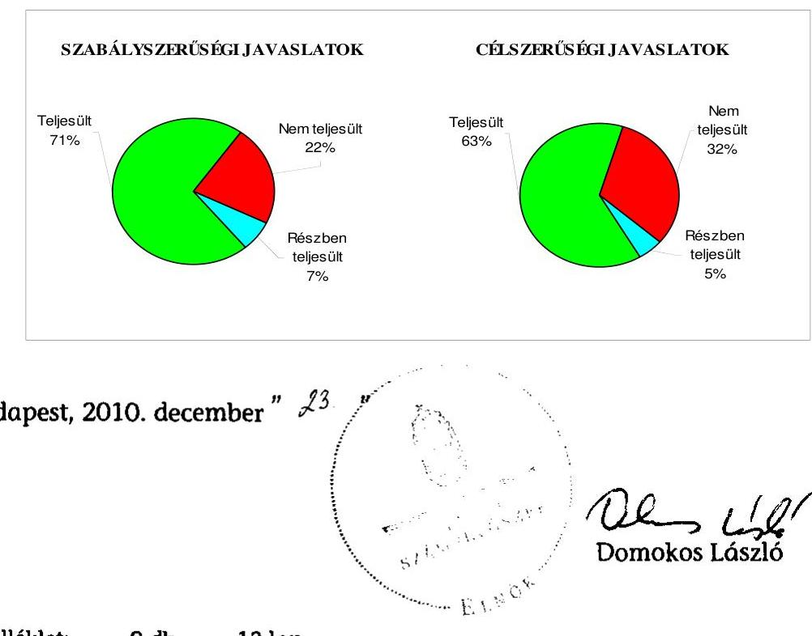

---

Dunaújváros Megyei Jogú Város Önkormányzata

# Az Önkormányzat gazdálkodását meghatározó adatok, mutatószámok 

| Megnevezés |  |
| :--: | :--: |
| A település állandó lakosainak száma (fő) 2010. január 1-jén | 49522 |
| A Közgyűlés tagjainak a száma (fő) (2009. december 31-én) | 26 |
| A Közgyűlés munkáját segítő állandó bizottságok száma (2009. december 31-én) | 11 |
| A Polgármesteri hivatalban foglalkoztatott köztisztviselők száma (fő) (2009. december 31-én) | 224 |
| Az összes vagyon értéke a 2009. december 31-i könyvviteli mérleg szerint (millió Ft) | 51163 |
| Az adósságállomány (hosszú és rövid lejáratú kötelezettség) 2009. december 31-én (millió Ft) | 13180 |
| Az egy lakosra jutó adósságállomány 2009. december 31-én (Ft) | 266 144,3 |
| Az összes 2009. évben teljesített költségvetési bevétel (millió Ft) | 17418 |
| Ebből: saját bevétel (millió Ft), melyből | 6560 |
| helyi adóbevétel (millió Ft) | 3900 |
| Az egy lakosra jutó 2009. évi költségvetési bevétel (Ft) | 351722,5 |
| Az egy lakosra jutó 2009. évi saját bevétel (Ft) | 132 466,4 |
| Az egy lakosra jutó 2009. évi helyi adóbevétel (Ft) | 78752,9 |
| Saját bevétel/Összes költségvetési bevétel aránya a 2009. évben (%) | 37,7 |
| Helyi adó bevétel/Összes költségvetési bevétel aránya a 2009. évben (%) | 22,4 |
| Az összes teljesített költségvetési kiadás a 2009. évben (millió Ft) | 18778 |
| Ebből: felhalmozási célú költségvetési kiadás (millió Ft) | 5400 |
| A 2009. évi költségvetési kiadásból a felhalmozási célú költségvetési kiadás aránya (%) | 28,8 |
| Az egy lakosra jutó 2009. évi költségvetési kiadás (Ft) | 379 185,0 |
| Az egy lakosra jutó 2009. évben teljesített felhalmozási célú költségvetési kiadás (Ft) | 109 042,4 |
| A költségvetési intézmények száma 2009. december 31-én (db) | 27 |
| Ebből: önállóan működő (db) | 2 |
| A költségvetési intézményekben foglalkoztatott közalkalmazottak száma (fő) (2009. december 31-én) | 1786 |

---

Dunaújváros Megyei Jogú Város Önkormányzata

# Az önkormányzati vagyon alakulása

|  Mérlegsor
megnevezése | 2007.év
(millió Ft) | 2008. év
(millió Ft) | 2009. év
(millió Ft) | Változás %-a (Előző év=100\%) |  |   |
| --- | --- | --- | --- | --- | --- | --- |
|   |  |  |  | 2008/2007. | 2009/2008. | 2009/2007.  |
|  Immateriális javak | 27 | 40 | 46 | 148,1 | 115,0 | 170,4  |
|  Tárgyi eszközök | 28263 | 25459 | 26014 | 90,1 | 102,2 | 92,0  |
|  ebből: ingatlanok | 27034 | 24477 | 24850 | 90,5 | 101,5 | 91,9  |
|  beruházások, felújítások | 748 | 453 | 627 | 60,6 | 138,4 | 83,8  |
|  Befektetett pénzügyi eszközök | 2890 | 2753 | 6661 | 95,3 | 242,0 | 230,5  |
|  Üzemeltetésre átadott eszközök | 9592 | 12476 | 11816 | 130,1 | 94,7 | 123,2  |
|  Befektetett eszközök összesen | 40772 | 40728 | 44537 | 99,9 | 109,4 | 109,2  |
|  Forgóeszközök összesen | 1647 | 10348 | 6626 | 628,3 | 64,0 | 402,3  |
|  ebből: követelések | 838 | 1010 | 1577 | 120,5 | 156,1 | 188,2  |
|  pénzeszközök | 305 | 8819 | 4512 | 2891,5 | 51,2 | 1479,3  |
|  Eszközök összesen | 42419 | 51076 | 51163 | 120,4 | 100,2 | 120,6  |
|  Saját tőke összesen | 38976 | 30336 | 35805 | 77,8 | 118,0 | 91,9  |
|  Tartalék összesen | 203 | 8766 | 1525 | 4318,2 | 17,4 | 751,2  |
|  Kötelezettségek összesen | 3240 | 11974 | 13833 | 369,6 | 115,5 | 426,9  |
|  ebből: hosszú lejáratú kötelezettségek | 682 | 9118 | 9431 | 1337,0 | 103,4 | 1382,8  |
|  rövid lejáratú kötelezettségek | 1975 | 2308 | 3749 | 116,9 | 162,4 | 189,8  |
|  Források összesen: | 42419 | 51076 | 51163 | 120,4 | 100,2 | 120,6  |

Forrás: Magyar Államkincstár éves költségvetési beszámoló "01" számú űrlap ÁSZ ellenőrzés során korrigált adatai.

---

Dunaújváros Megyei Jogú Város Önkormányzata

# Az önkormányzati kötelezettségek alakulása

|  Mérlegsor
megnevezése | 2007.év
(millió Ft) | 2008. év
(millió Ft) | 2009. év
(millió Ft) | Változás %-a (Előző év=100\%) |  |   |
| --- | --- | --- | --- | --- | --- | --- |
|   |  |  |  | 2008/2007. | 2009/2008. | 2009/2007.  |
|  Hosszú lejáratú kötelezettségek összesen | 682 | 9118 | 9431 | 1337,0 | 103,4 | 1382,8  |
|  ebből: hosszú lejáratra kapott kölcsönök | 7 | 0 | 0 | 0,0 | 0,0 | 0,0  |
|  tartozások fejlesztési célú kötvénykibocsátásból | 0 | 8500 | 8913 | 0,0 | 104,9 | 0,0  |
|  tartozások működési célú kötvénykibocsátásból | 0 | 0 | 0 | 0,0 | 0,0 | 0,0  |
|  beruházási és fejlesztési hitelek | 675 | 618 | 518 | 91,6 | 83,8 | 76,7  |
|  működési célú hosszú lejáratú hitelek | 0 | 0 | 0 | 0,0 |  | 0,0  |
|  egyéb hosszú lejáratú kötelezettségek | 0 | 0 | 0 | 0,0 | 0,0 | 0,0  |
|  Rövid lejáratú kötelezettségek összesen | 1975 | 2308 | 3749 | 116,9 | 162,4 | 189,8  |
|  ebből: rövid lejáratú kölcsönök | 4 | 0 | 0 | 0,0 | 0,0 | 0,0  |
|  rövid lejáratú hitelek | 943 | 1149 | 3089 | 121,8 | 268,8 | 327,6  |
|  kötelezettségek áruszállításból, szolgáltatásból | 46 | 94 | 96 | 204,3 | 102,1 | 208,7  |
|  garancia- és kezességvállalásból származó köt. | 0 | 0 | 0 | 0,0 | 0,0 | 0,0  |
|  h. lejár. kapott kölcsön köv. évet terh.törl.részl. | 0 | 0 | 0 | 0,0 | 0,0 | 0,0  |
|  felh.c.kötv.kib-ból származó tart.köv.évet terh.r. | 0 | 0 | 0 | 0,0 | 0,0 | 0,0  |
|  mük.c.kötv.kib-ból származó tart.köv.évet terh.r. | 0 | 0 | 0 | 0,0 | 0,0 | 0,0  |
|  beruh.fejl.hitel köv.évet terhelő törl. részlete | 100 | 103 | 104 | 103,0 | 101,0 | 104,0  |
|  működési c.hosszú lej.hitel köv.évet terh.törl.r. | 0 | 0 | 0 | 0,0 | 0,0 | 0,0  |
|  egyéb hosszú lej.köt.köv.évet terh.törl. részlete | 0 | 0 | 0 | 0,0 | 0,0 | 0,0

  |

Forrás: Magyar Államkincstár éves költségvetési beszámoló "01" számú űrlap adatai.

---

Dunaújváros Megyei Jogú Város Önkormányzata

Az Önkormányzat 2007-2010. évi költségvetési előirányzatainak és 2007-2009. évi pénzügyi teljesítéseinek alakulása

|  Megnevezés | 2007. év |  |  |  | 2008. év |  |  |  | 2009. év |  |  |  | 2010.  |
| --- | --- | --- | --- | --- | --- | --- | --- | --- | --- | --- | --- | --- | --- |
|   | Eredeti | Módosított | Teljesítés (millió Ft) | Teljesítés/ eredeti előirány- zat % | Eredeti | Módosított | Teljesítés (millió Ft) | Teljesítés/ eredeti előirány- zat % | Eredeti | Módosított | Teljesítés (millió Ft) | Teljesítés/ eredeti előirány- zat % | Eredeti  |
|   | előirányzat (millió Ft) |  |  |  | előirányzat (millió Ft) |  |  |  | előirányzat (millió Ft) |  |  |  | előirányzat (millió Ft)  |
|  Működési célú költségvetési bevételek összesen | 10 401 | 11 278 | 12 356 | 118,8 | 11 559 | 12 653 | 13 008 | 112,5 | 11 992 | 13 082 | 12 755 | 106,4 | 11 407  |
|  Működési célú költségvetési kiadások összesen | 11 672 | 12 219 | 11 463 | 98,2 | 12 881 | 13 803 | 12 773 | 99,2 | 12 998 | 14 138 | 13 378 | 102,9 | 13 029  |
|  Működési célú költségvetési bevételek és kiadások egyenlege: hiány-, többlet + | -1 271 | -941 | 893 | -70,3 | -1 322 | -1 150 | 235 | -17,8 | -1 006 | -1 056 | -623 | 61,9 | -1 622  |
|  Felhalmozási célú költségvetési bevételek összesen | 922 | 1 308 | 648 | 70,3 | 865 | 1 417 | 1 256 | 145,2 | 522 | 9 052 | 4 663 | 893,3 | 4 943  |
|  Felhalmozási célú költségvetési kiadások összesen | 1 024 | 1 690 | 1 263 | 123,3 | 1 358 | 2 084 | 1 247 | 91,8 | 2 621 | 9 930 | 5 400 | 206,0 | 4 868  |
|  Felhalmozási célú költségvetési bevételek és kiadások egyenlege: hiány-, többlet+ | -102 | -382 | -615 | 602,9 | -493 | -667 | 9 | -1,8 | -2 099 | -878 | -737 | 35,1 | 75  |
|  Költségvetési bevételek összesen | 11 323 | 12 586 | 13 004 | 114,8 | 12 424 | 14 070 | 14 264 | 114,8 | 12 514 | 22 134 | 17 418 | 139,2 | 16 350  |
|  Költségvetési kiadások összesen | 12 696 | 13 909 | 12 726 | 100,2 | 14 239 | 15 887 | 14 020 | 98,5 | 15 619 | 24 068 | 18 778 | 120,2 | 17 897  |
|  Költségvetési bevételek és kiadások egyenlege: hiány-, többlet+ | -1 373 | -1 323 | 278 | -20,2 | -1 815 | -1 817 | 244 | -13,4 | -3 105 | -1 934 | -1 360 | 43,8 | -1 547  |
|  Finanszírozási célú pénzügyi bevételek | 2 306 | 2 306 | 145 |  | 2 864 | 2 864 | 8 737 |  | 3 313 | 3 187 | 1 940 |  | 4 500  |
|  Finanszírozási célú pénzügyi kiadások | 933 | 983 | 164 |  | 1 049 | 1 047 | 101 |  | 208 | 1 253 | 107 |  | 2 953  |
|  Finanszírozási célú pénzügyi műveletek egyenlege | 1 373 | 1 323 | -19 |  | 1 815 | 1 817 | 8 636 |  | 3 105 | 1 934 | 1 833 |  | 1 547  |

*Forrás:* - Magyar Államkincstár éves költségvetési beszámoló "80" számú űrlap ÁSZ ellenőrzés során korrigált (könyvvizsgáló auditálási eltést is figyelembe véve) adatai; - a 2010. évi adatok esetében az Önkormányzat 2010. évi költségvetése; - a költségvetési bevétel-kiadás működési-felhalmozási célra történt megosztásánál az analitikus nyilvántartás.

---

Dunaújváros Megyei Jogú Város Önkormányzata a V-3023-7/25/2010. számú jelentéshez

TANÚSÍTVÁNY az európai uniós forrásokkal támogatott célok és programok 2007-2010. évi tervezett és teljesített adatairól

|  Sor-
szám | Az európai uniós forrásokkal támogatott program megnevezése és a pályázat célja | Tervezett összes bekerülési költség | Az összes kiadásból 2007-2010 között tervezett költségvetési adatok (millió Ft) | Tervezett | Az összes kiadásból 2007-2010 között teljesített költségvetési adatok (millió Ft)  |
| --- | --- | --- | --- | --- | --- |
|   |  |  |  | az összes kiadást finanszírozó források |   |
|   |  |  |  |  Nemzeti államháztartási finanszírozás |   |
|   |  |  |  |  |   |
|   |  |  |  |  | 1. NFT operatív programjai  |
|  2. |  |  |  |  | 2. HEFOP-2.2.1-06/1 Kapcsolódás  |
|  3. |  |  |  |  | 3.1.2 Dunaújvárosi Óvoda Római Városrész Egység utólagos komplex akadálymentesítése  |
|  4. |  |  |  |  | 4. HEFOP-3.1.3/B Kompetencia fejlesztés a XXI. század eszközeivel  |
|  5. |  |  |  |  | 5. HEFOP-3.1.3/B-09/3 Korszerű eszközök biztosítása a kompetencia alapú nevelés és oktatás folyamatában  |
|  6. |  |  |  |  | 6. II. ÚMFT operatív programjai  |
|  7. |  |  |  |  | 7. III. Egyéb közösségi kezdeményezés  |
|  8. |  |  |  |  | 8. Befejezett fejlesztési feladatok forrása összesen  |
|  9. |  |  |  |  | Finanszírozási források megoszlása*  |
|  10. |  |  |  |  | 10. Folyamatban lévő fejlesztési feladat megnevezése  |
|  11. |  |  |  |  | 11. NFT operatív programjai  |
|  12. |  |  |  |  | II. ÚMFT operatív programjai  |
|  13. |  |  |  |  | 13.1. KDár alatti partfalszakasz védelme, meglévő védművel való összhangolása (Öreghegy és a Siklói út közötti partvédőmű) I. ütem  |
|  14. |  |  |  |  | ÁROP-2007-1-A-2/B. A polgármesteri hivatalok szervezetfejlesztése - Dunaújváros 2008  |

1. oldal

---

|  15. | Az európai uniós forrásokkal támogatott program megnevezése és a pályázat célja |  |  |  |  |  |  |  |  |  |  |  |  |  |  |  |  |  |  |  |  |  |  |  |   |
| --- | --- | --- | --- | --- | --- | --- | --- | --- | --- | --- | --- | --- | --- | --- | --- | --- | --- | --- | --- | --- | --- | --- | --- | --- | --- |
|   |  |  |  |  |  |  |  |  |  |  |  |  |  |  |  |  |  |  |  |  |  |  |  |  |   |
|   |  |  |  |  |  |  |  |  |  |  |  |  |  |  |  |  |  |  |  |  |  |  |  |  |   |
|   |  |  |  |  |  |  |  |  |  |  |  |  |  |  |  |  |  |  |  |  |  |  |  |  |   |
|   |  |  |  |  |  |  |  |  |  |  |  |  |  |  |  |  |  |  |  |  |  |  |  |  |   |
|   |  |  |  |  |  |  |  |  |  |  |  |  |  |  |  |  |  |  |  |  |  |  |  |  |   |
|   |  |  |  |  |  |  |  |  |  |  |  |  |  |  |  |  |  |  |  |  |  |  |  |  |   |
|   |  |  |  |  |  |  |  |  |  |  |  |  |  |  |  |  |  |  |  |  |  |  |  |  |   |

 |  |  |  |  |  |  |  |  |   |
|   |  |  |  |  |  |  |  |  |  |  |  |  |  |  |  |  |  |  |  |  |  |  |  |  |   |
|   |  |  |  |  |  |  |  |  |  |  |  |  |  |  |  |  |  |  |  |  |  |  |  |  |   |
|   |  |  |  |  |  |  |  |  |  |  |  |  |  |  |  |  |  |  |  |  |  |  |  |  |   |
|   |  |  |  |  |  |  |  |  |  |  |  |  |  |  |  |  |  |  |  |  |  |  |  |  |   |
|   |  |  |  |  |  |  |  |  |  |  |  |  |  |  |  |  |  |  |  |  |  |  |  |  |   |
|   |  |  |  |  |  |  |  |  |  |  |  |  |  |  |  |  |  |  |  |  |  |  |  |  |   |
|   |  |  |  |  |  |  |  |  |  |  |  |  |  |  |  |  |  |  |  |  |  |  |  |  |   |
|   |  |  |  |  |  |  |  |  |  |  |  |  |  |  |  |  |  |  |  |  |  |  |  |  |   |
|   |  |  |  |  |  |  |  |  |  |  |  |  |  |  |  |  |  |  |  |  |  |  |  |  |   |
|   |  |  |  |  |  |  |  |  |  |  |  |  |  |  |  |  |  |  |  |  |  |  |  |  |   |
|   |  |  |  |  |  |  |  |  |  |  |  |  |  |  |  |  |  |  |  |  |  |  |  |  |   |
|   |  |  |  |  |  |  |  |  |  |  |  |  |  |  |  |  |  |  |  |  |  |  |  |  |   |
|   |  |  |  |  |  |  |  |  |  |  |  |  |  |  |  |  |  |  |  |  |  |  |  |  |   |
|   |  |  |  |  |  |  |  |  |  |  |  |  |  |  |  |  |  |  |  |  |  |  |  |  |   |
|   |  |  |  |  |  |  |  |  |  |  |  |  |  |  |  |  |  |  |  |  |  |  |  |  |   |
|   |  |  |  |  |  |  |  |  |  |  |  |  |  |  |  |  |  |  |  |  |  |  |  |  |   |
|   |  |  |  |  |  |  |  |  |  |  |  |  |  |  |  |  |  |  |  |  |  |  |  |  |   |
|   |  |  |  |  |  |  |  |  |  |  |  |  |  |  |  |  |  |  |  |  |  |  |  |  |   |
|   |  |  |  |  |  |  |  |  |  |  |  |  |  |  |  |  |  |  |  |  |  |  |  |  |   |
|   |  |  |  |  |  |  |  |  |  |  |  |  |  |  |  |  |  |  |  |  |  |  |  |  |   |
|   |  |  |  |  |  |  |  |  |  |  |  |  |  |  |  |  |  |  |  |  |  |  |  |  |   |
|   |  |  |  |  |  |  |  |  |  |  |  |  |  |  |  |  |  |  |  |  |  |  |  |  |   |
|   |  |  |  |  |  |  |  |  |  |  |  |  |  |  |  |  |  |  |  |  |  |  |  |  |   |
|   |  |  |  |  |  |  |  |  |  |  |  |  |  |  |  |  |  |  |  |  |  |  |  |  |   |
|   |

---

Dunaújváros Megyei Jogú Város Önkormányzata a V-3023-7/25/2010. számú jelentéshez az európai uniós forrásokra 2007-2010 között benyújtott pályázatokról, amelyek elbírálásáról az Önkormányzat még nem kapott tájékoztatást

|  |   |   |   |   |   |   |   |   |   |   |
| --- | --- | --- | --- | --- | --- | --- | --- | --- | --- | --- |
|  Szc. szám | Az európai uniós forrásokra benyújtott pályázat megnevezése és célja |  |  |  |  | A benyújtott pályázat adatai (millió Ft) az összes kiadási finanszírozó források |  |  |  | Tervezett  |
|   |  |  |  |  |  | Nemzeti állambázisutási finanszírozás |  |  |  |   |
|   |  |  |  |  |  |  |  |  |  | kezdési  |
|   |  |  |  |  |  |  |  |  |  | befejezési  |
|   |  |  |  |  |  |  |  |  |  | határidő  |
|  1. | I. NFT operatív programjai |  |  |  |  |  |  |  |  |   |
|  2. | II. UMFT operatív programjai |  |  |  |  |  |  |  |  |   |
|  3. | TIOP-1.1.1/07/1 Dunaújváros-TIOP 1.1.1.-07/1 | 

 | 221,4 | 221,4 |  |  |  |  |  | 2008.08.01  |
|  4. | KDOF-3.1.1/D Kiemelt projektjavaslat Dunaújváros MJV belvárosi akcióterületén megvalósuló városrehabilitációjára |  | 1503,3 | 1277,8 |  |  | 225,5 |  |  | 2009.06.01  |
|  5. | KDOF-2009-4.1.1/C Kötár alatti partfalszakasz védelme, meglévő védművel való összehangolása (Öreghegy és a Siklói út közötti partvédőmű) II. ütem |  | 420,7 | 357,6 |  |  | 63,1 |  |  | 2010.07.01  |
|  6. | TIOP-2.2.4/09/1 Központi műtő és diagnosztikai blokk kialakítása a Szent Pantaleon Kórházban |  | 3 888,9 | 3500,0 |  |  | 388,9 |  |  | 2010.08.01  |
|  7. | TÁMOP-3.4.2/09/2 Együttműködés az együttnevelésért - Sajátos nevelési igényű tanulók integrációja Dunaújváros három oktatási intézményében |  | 26,8 | 26,8 |  |  |  |  |  | 2010.06.01  |
|  8. | TÁMOP-2009-6-1-2/A "Adj hozzá egy mozdulatot" programsorozat a dunaújvárosi Lorántffy Zsuzsanna Szakközépiskolában |  | 9,5 | 9,5 |  |  |  |  |  | 2010.05.03  |
|  9. | TÁMOP-2009-3-1-5 Pedagógusképzések a dunaújvárosi Arany János Általános Iskolában |  | 13,2 | 13,2 |  |  |  |  |  | 2010.05.01  |
|  10. | TÁMOP-2009-3-1-5 A pedagógiai kultúra korszerűsítése, pedagógusok új szerepben a Lorántffy Zsuzsanna Szakközépiskolában, Szakiskolában és Kollégiumban |  | 9,3 | 9,3 |  |  |  |  |  | 2010.06.01  |
|  11. | III. Egyéb közösségi kezdeményezés |  |  |  |  |  |  |  |  |   |
|  12. | INTERREG IVB DaHar - Danube Inland Harbour Development |  | 126,6 | 107,6 | 12,7 |  | 6,3 |  |  | 2010.10.01  |
|  13. | Pályázott fejlesztési feladatok kiadásának forrása összesen: |  | 6 219,7 | 5523,2 | 12,7 | 0,0 | 683,8 | 0,0 | 0,0 |   |
|  14. | Finanszírozási források megoszlása* |  | 100% | 88,8% | 0,2% | 0,0% | 11,0% | 0,0% | 0,0% |   |

Jelmegyarázat: *A finanszírozási források megoszlására vonatkozó sorokat nem kell kitölteni, azok adatait a program számítja ki.

Nyilatkozat: A tanúsítványban szereplő adatok valódiságát igazolom.

Dunaújváros, 2010. július 5.

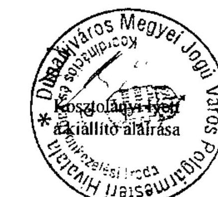

---

4/b. számú melléklet a V-3023-7/25/2010. számú jelentéshez

Dunaújváros Megyei Jogú Város Önkormányzata

TANÚSÍTVÁNY a 2007-2010. években benyújtott és elutasított európai uniós pályázatokról

|  Sor-
szám | Az európai uniós forrásokra benyújtott és elutasított pályázat megnevezése és célja | összes kiadás | a benyújtott pályázat adatai (millió Ft) az összes kiadást finanszínező források |  |  |  |  |  |  |  |  |  |  |  |  |  |   |
| --- | --- | --- | --- | --- | --- | --- | --- | --- | --- | --- | --- | --- | --- | --- | --- | --- | --- |
|   |  |  |  |  |  |  |  |  |  |  |  |  |  |  |  |  |   |
|   |  |  |  |  |  |  |  |  |  |  |  |  |  | az összes kiadást finanszínező források |  |  |   |
|   |  |  |  |  |  |  |  |  |  |  |  |  |  |  |  |  |   |
|   |  |  |  |  |  |  |  |  |  |  |  |  |  |  |  |  |   |
|   |  |  |  |  |  |  |  |  |  |  |  |  |  |  |  |  |   |
|   |  |  |  |  |  |  |  |  |  |  |  |  |  |  |  |  |   |
|   |  |  |  |  |  |  |  |  |  |  |  |  |  |  |  |  |   |
|  1. | KDOP-2007-5.3.2 Dunaújvárosi József Attila Könyvtár utólagos komplex akadálymentesítése |  | 26,8 |  | 20,0 |  |  |  |  | 6,8 |  |  |  | 2007.12.01 | 2008.11.30 | a benyújtási kritériumoknak nem megfelelően került benyújtásra |   |
|  2. | KDOP-2007-5-1-1/2F Dunaújvárosi Bánki Donát Gimnázium és Szakközépiskola fejlesztése és akadálymentesítése |  | 246,4 |  | 221,8 |  |  |  |  | 24,6 |  |  |  | 2008.11.10 | 2010.11.08 | nem érte el a szakmai megfelelőséghez minimálisan szükséges pontot |   |
|  3. | KDOP-2007-5-1-1/2F Dunaújvárosi Dózsa György Általános Iskola fejlesztése és akadálymentesítése |  | 169,0 |  | 152,1 |  |  |  |  | 16,9 |  |  |  | 2008.11.10 | 2010.11.05 | nem érte el a szakmai megfelelőséghez minimálisan szükséges pontot |   |
|  4. | KDOP-2007-5-1-1/2F Dunaújvárosi Óvoda Római Városrészi Egységének komplex akadálymentesítése |  | 107,2 |  | 96,5 |  |  |  |  | 10,7 |  |  |  | 2008.12.01 | 2010.12.01 | nem érte el a szakmai megfelelőséghez minimálisan szükséges pontot |   |
|  5. | KDOP-2007-5-2-1/A dunaújvárosi Alkotás utca 7-9. szám alatti rendelőkomplexum felújítása és komplex akadálymentesítése |  | 36,7 |  | 20,0 |  |  |  |  | 16,7 |  |  |  | 2009.01.01 | 2010.06.28 | forráshiány |   |
|  6. |  |  |  |  |  |  |  |  |  |  |  |  |  |  |  |  |   |
|  7. |  |  |  |  |  |  |  |  |  |  |  |  |  |  |  |  |   |
|  8. |  |  |  |  |  |  |  |  |  |  |  |  |  |  |  |  |   |
|  9. |  |  |  |  |  |  |  |  |  |  |  |  |  |  |  |  |   |
|  10. |  |  |  |  |  |  |  |  |  |  |  |  |  |  |  |  |   |
|  11. |  |  |  |  |  |  |  |  |  |  |  |  |  |  |  |  |   |
|  Jelmagyarázat: *A finanszírozási források megoszlására vonatkozó sorokat nem kell kitölteni, azok adatait a program számítja ki. |  |  |  |  |  |  |  |  |  |  |  |  |  |  |  |  |   |
|  Nyilatkozat: A tanúsítványban szereplő adatok valódiságát igazolom. |  |  |  |  |  |  |  |  |  |  |  |  |  |  |  |  |   |

Dunaújváros, 2010. július 5.

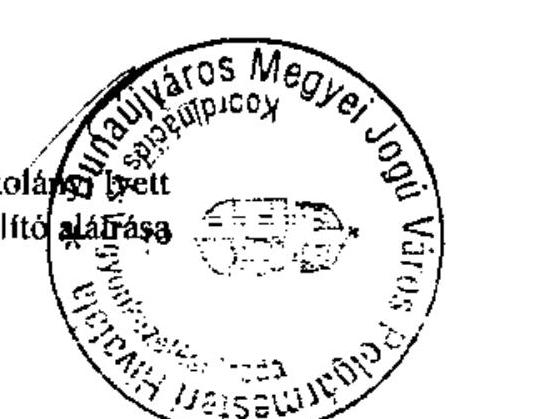

---

# ADATLAP 

## az európai uniós forrással támogatott a társadalmi befogadás elősegítése a szociális területen dolgozó szakemberek képzésével feladatról

## 1. A PÁLYÁZÓ ADATAI

1.1. A pályázó Önkormányzat neve: Dunaújváros Megyei Jogú Város Önkormányzata
1.2. A pályázó Önkormányzat címe: 2400 Dunaújváros, Városháza tér 1.

## 2. A PROJEKT ÖSSZEGZŐ ADATAI

### 2.1. A pályázott program megnevezése: HEFOP-2.2.1-06/1

A társadalmi befogadás elősegítése a szociális területen dolgozó szakemberek képzésével
2.2. A pályázott programon belül a projekt címe: Kapcsolódás
2.3. A pályázatot készítő megnevezése: Dunaújváros Megyei Jogú Város Önkormányzata
2.4. A pályázat benyújtásának időpontja: 2007.02.13.

### 2.5. A pályázott projekt tervezett

- teljes kiadásának összege: 8857800 Ft
2.6. A pályázott projekt megvalósításának tervezett forrása:
- támogatásának összege: 8857800 Ft
- európai uniós: 6643350 Ft
- hazai társfinanszírozás: 2214450 Ft
- EU Önerő Alap: -
- saját forrás: -
- hitel: -
- egyéb forrás: -

---

2.7. A megvalósítás tervezett kezdési és befejezési időpontja (év, hó, nap): 2007.08.01.-2008.03.31.

# 3. A PÁLYÁZAT ELBÍRÁLÁSA 

3.1. A pályázat elbírálásáról szóló döntés kelte: 2007.06.27.
3.2. A pályázat elbírálásának eredménye: támogatásban részesült

## 4. A TÁMOGATÁSI SZERZŐDÉS ADATAI

4.1. A támogatási szerződés megkötésének időpontja: 2007. október 24.
4.2. A projekt kezdési és befejezési időpontja: 2007.08.01-2008.03.31.
4.3. A projekt elszámolható összköltsége (kiadása): 8857800 Ft
4.4. A projekt megvalósítás forrásai:

- európai uniós támogatás: 6643350 Ft
- hazai társfinanszírozás: 2214450 Ft
- EU Önerő Alap saját forrás: -
- saját forrás: -
- hitel: -
- egyéb forrás: -

## 4.5. A projekt számszerüsíthető eredményei

| Eredmény /Mutató /Indikátor neve | Mértékegység (db, fő, \%) | Bázisérték |

 Megvalósítási időszak (célérték) |
| :--: | :--: | :--: | :--: |
| Képzésen/tanácsadáson/felkészítésen résztvevők száma (férfi) | fő | 0 | 1 |
| Képzésen/tanácsadáson/felkészítésen résztvevők száma (nő) | fő | 0 | 63 |
| Képzettséget szerzett személyek száma (férfi) | fő | 0 | 1 |
| Képzettséget szerzett személyek száma (nő) | fő | 0 | 63 |

---

# 5. Ellenőrzések 

### 5.1. A külső ellenőrzések: -

- az ellenőrzések száma: -
- az ellenőrzést végző szervek megnevezése: -

### 5.2. A külső ellenőrzések által feltárt szabálytalanságokra vonatkozó adatok:

- mely előírást nem tartották be: -
- az előírás nem teljesítésének okai: -
- a rendezésre előírt kötelezettségek: -
- a rendezésre előírt kötelezettséget mennyi időn belül teljesítették: -
- mekkora időbeli csúszást eredményezett ez a projekt megvalósításában (év, hó, nap): -

Dunaújváros, 2010. július 5.
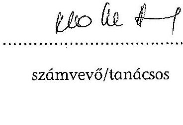
számvevő/tanácsos
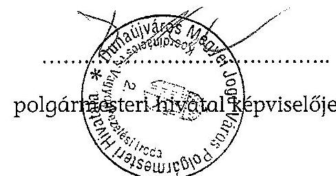

---

# DUNAÚJVÁROS MEGYEI JOGÚ VÁROS POLGÁRMESTERE 

2401 Dunaújváros, Városháza tér 1.
Telefon: (25) 410-525, Telefax: 410-404

Íktatószám: 12739-41/2010.
Állami Számvevőszék
Domokos László
elnök úr
részére

Budapest
Apáczai Csere János u. 10.
1052
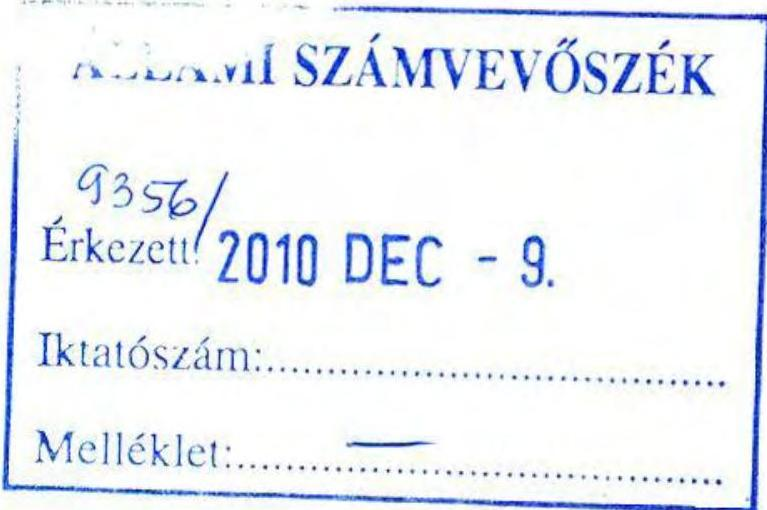

Tisztelt Elnök Úr!

A Fejér Megyei Ellenőrzési Iroda által, Dunaújváros Megyei Jogú Város Önkormányzata gazdálkodási rendszerének 2010. évi ellenőrzéséről készített Állami Számvevőszéki Jelentést áttanulmányoztam.
Az abban rögzített megállapításokra vonatkozóan nem kívánok észrevételt tenni.
„Intézkedési terv" készítéséről intézkedtem, melyet a jelentéssel együtt a közgyűlés 2010. december 16-i ülésén tárgyal.

Dunaújváros, 2010. december 8.

Tisztelettel:
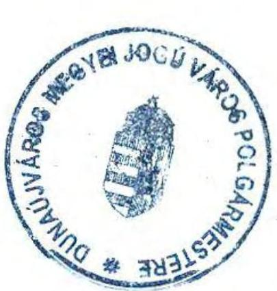

Cserna Gábor polgármester
