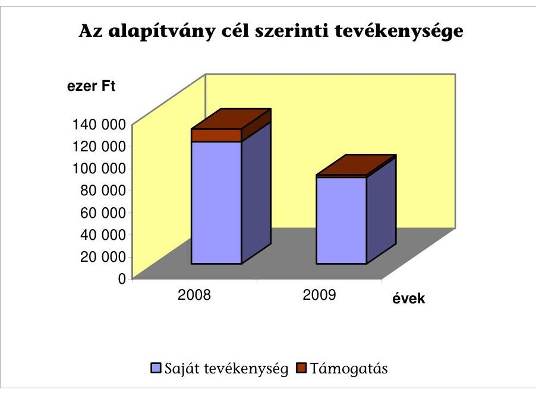
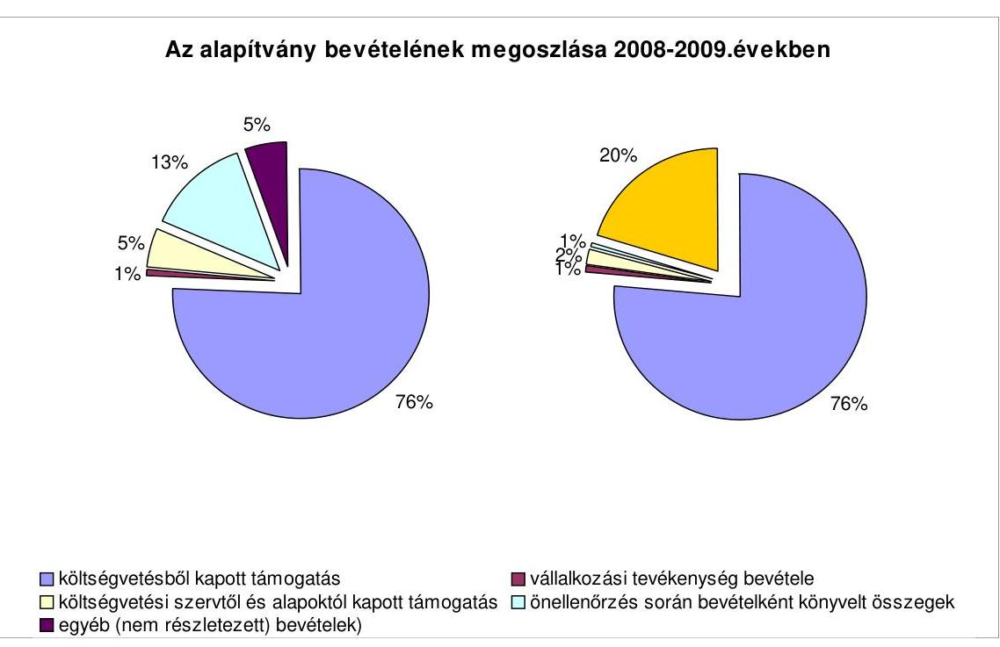
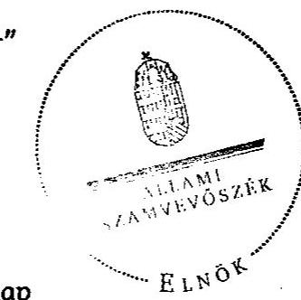

# ÁLLAMI   SZÁMVEVŐSZÉK 

## JELENTÉS

az Antall József Alapítvány 2008-2009. évi gazdálkodása törvényességének ellenőrzéséről

---

3. Önkormányzati és Területi Ellenőrzési Igazgatóság
3.1. Szabályszerűségi Ellenőrzési Főcsoport
Iktatószám: V-3009-026/2010.
Témaszám: 983
Vizsgálat-azonosító szám: V-0509
Az ellenőrzést felügyelte:
Dr. Lóránt Zoltán
főigazgató
Az ellenőrzés végrehajtásáért felelős:
Dr. Elek János
általános főigazgató-helyettes
Az ellenőrzést vezette:
Solymár Ágnes
osztályvezető főtanácsos
Az összefoglaló jelentést készítette:
Köllődné Gátai Mária
számvevő
Az ellenőrzést végezték:
Brebán Andrea
Köllődné Gátai Mária
számvevő tanácsos
számvevő
A témához kapcsolódó eddig készített számvevőszéki jelentések:
címe
sorszáma
Jelentés az Antall József Alapítvány 2003-2005. évi gazdálkodása ..... 0702
törvényességének ellenőrzéséről
Jelentés az Antall József Alapítvány 2006-2007. évi gazdálkodása ..... 0848
törvényességének ellenőrzéséről

---

# TARTALOMJEGYZÉK 

BEVEZETÉS ..... 5
I. ÖSSZEGZŐ MEGÁLLAPÍTÁSOK, KÖVETKEZTETÉSEK, JAVASLATOK ..... 6
II. RÉSZLETES MEGÁLLAPÍTÁSOK ..... 12

1. Az alapítvány gazdálkodásának törvényessége ..... 12
1.1. A kuratórium működése ..... 12
1.2. Az alapítvány gazdálkodásának bevételei ..... 13
1.3. Az alapítvány gazdálkodásának ráfordításai ..... 14
2. Az éves beszámolók ..... 15
2.1. A beszámoló szabályossága ..... 15
2.2. A mérleg ..... 17
2.3. Az eredmény-kimutatás ..... 18
3. A könyvvezetés szabályozottsága ..... 20
4. A könyvvezetés gyakorlata ..... 21
5. Az alapítvány ellenőrzési rendszere ..... 23
6. A korábbi ellenőrzés megállapításaira tett intézkedések ..... 23

## MELLÉKLETEK

1. számú Az Antall József Alapítvány 2008. évi egyszerűsített éves beszámolójának mérlege
2. számú Az Antall József Alapítvány 2008. évi egyszerűsített éves beszámolójának eredmény-kimutatása
3. számú Az Antall József Alapítvány 2009. évi egyszerűsített éves beszámolójának mérlege
4. számú Az Antall József Alapítvány 2009. évi egyszerűsített éves beszámolójának eredmény-kimutatása

---

.

---

# RÖVIDÍTÉSEK JEGYZÉKE 

| Alapítvány | Antall József Alapítvány |
| :--: | :--: |
| ÁSZ | Állami Számvevőszék |
| Számviteli rendelet | A számviteli törvény szerinti egyes egyéb szervezetek beszámolókészítési és könyvvezetési kötelezettségének sajátosságairól szóló 224/2000. (XII. 19.) Korm. rendelet |
| Éves beszámoló | A számvitelről szóló 2000. évi C. törvény 8. § (2) bekezdés   b) pontjában megjelölt egyszerűsített éves beszámoló |
| Kuratórium | Antall József Alapítvány kuratóriuma |
| MDF | Magyar Demokrata Fórum |
| Pártalapítványi törvény | A pártok működését segítő tudományos, ismeretterjesztő, kutatási, oktatási tevékenységet végző alapítványokról szóló 2003. évi XLVII. törvény |
| Párttörvény | A pártok működéséről és gazdálkodásáról szóló 1989. évi XXXIII. törvény |
| PGSZ | Antall József Alapítvány Pénzügyi Gazdálkodási Szabályzata |
| Ptk. | A Polgári Törvénykönyvről szóló 1959. évi IV. törvény |
| Számv. tv. | A számvitelről szóló 2000. évi C. törvény |
| SZMSZ $_{1}$ | Az Antall József Alapítvány 2009. február 17-ig hatályos Szervezeti és Működési Szabályzata |
| SZMSZ $_{2}$ | Az Antall József Alapítvány 2009. február 18-tól hatályos Szervezeti és Működési Szabályzata |

---

.

---

# JELENTÉS 

## az Antall József Alapítvány 2008-2009. évi gazdálkodása törvényességének ellenőrzéséről

## BEVEZETÉS

A pártok működését segítő tudományos, ismeretterjesztő, kutatási, oktatási tevékenységet végző alapítványokról szóló 2003. évi XLVII. törvény (pártalapítványi törvény) alapján a pártok a politikai kultúra fejlesztése érdekében tudományos, ismeretterjesztő, kutatási és oktatási tevékenységük elősegítésére, a pártok működéséről és gazdálkodásáról szóló 1989. évi XXXIII. törvényben meghatározott költségvetési támogatásra jogosult alapítványt hozhattak létre. A Magyar Demokrata Fórum (MDF), a törvényben biztosított lehetőséggel élve, 2003-ban létrehozta az Antall József Alapítványt (alapítvány).

Az alapítvány alapító okirat szerinti célja, hogy tevékenységével hozzájáruljon a magyarországi politikai kultúra fejlesztéséhez, színvonalának emeléséhez, az MDF által vallott értékekhez, politikai értékrendhez kapcsolódó tudományos, ismeretterjesztő, kutatási és oktatási tevékenységet végezzen, valamint tudományos kutatás, tájékoztatás, oktatás és képzés szervezésével elősegítse a célok megvalósulását.

A pártalapítványi törvény alapján létrehozott alapítványok költségvetési támogatásának mértékéről a párttörvény rendelkezett, az alapítvány a törvényi előírásnak megfelelően a 2008. és 2009. években összesen 154 200 ezer Ft költségvetési támogatásban részesült.

A pártalapítványi törvény 4. § (2) bekezdése alapján az állami költségvetési támogatásban részesülő alapítványok gazdálkodása törvényességének ellenőrzésére az Állami Számvevőszék (ÁSZ) jogosult. A pártalapítványi törvény 4. § (4) bekezdése alapján kétévenként ellenőrzi azoknak az alapítványoknak a gazdálkodását, amelyek e törvény szerinti állami költségvetési támogatásban részesültek.

Az ellenőrzés célja volt, hogy értékelje az alapítvány gazdálkodásának törvényességét, az éves beszámolók jogszabályi előírásoknak való megfelelését, az alapítvány könyvvezetésében a számvitelről szóló 2000. évi C. törvény (Számv. tv.), egyéb jogszabályi rendelkezések és belső előírások betartását, az ÁSZ előző ellenőrzése során feltárt hiányosságok megszüntetését.

Az egyéb szabályszerűségi ellenőrzést a 2008. január 1-jétől 2009. december 31. közötti időszakra, a pártalapítványok gazdálkodása törvényességének ellenőrzéséhez készült segédlet alapján végeztük. Az ellenőrzési tapasztalatok kiértékelésénél a 2%-os lényegességi mértéket alkalmaztuk.

---

# I. ÖSSZEGZŐ MEGÁLLAPÍTÁSOK, KÖVETKEZTETÉSEK, JAVASLATOK 

Az alapítvány alapító okiratában meghatározott célok és a cél érdekében meghatározott tevékenységek megfeleltek a pártalapítványi törvényben előírtaknak. Az alapító okirat 2009. évi módosításakor a kuratórium összetétele és a kurátorok száma változott. Az alapító okirat és a Pénzügyi és Gazdálkodási Szabályzat (PGSZ) rendelkezett az alapítvány képviseletéről, a képviseleti jog gyakorlásának módjáról és terjedelméről. A PGSZ-ben előírt, az értékhatár túllépéséhez kötött, kötelezettségvállalást megelőző ellenjegyzési kötelezettséget a főigazgató nem tartotta be. Egy támogatási szerződés megkötésekor a képviseleti joggal nem rendelkező kutatási igazgató vállalt kötelezettséget a szerződés aláírásakor. A bankszámla feletti rendelkezést az alapító okirat és a Szervezeti és Működési Szabályzat (SZMSZ) szabályozta. Az SZMSZ rögzítette a hatás-, feladat- és felelősségi köröket, tartalmazta az alapító, a kuratórium, az alapítványi iroda és a külső szakértők feladatait, ellenőrzési köreit, a kuratórium ügyrendjét. Az alapító okirat és az SZMSZ közötti összhang 2009. február 18-tól nem állt fenn, mivel a kurátorok számát és a képviseleti jogát érintő alapító okirat módosítással az SZMSZ${ }_{2}$-t nem egészítették ki. Az alapítvány az SZMSZ-ben a csekken vagy készpénzben történő befizetést is lehetővé tette, ami ellentétes a pártalapítványi törvény előírásával.

A kuratórium 2009. évben nem az alapító okiratban, valamint az SZMSZ-ben előírt gyakorisággal ülésezett. A 2008. évi és a 2009. évi költségvetést a kuratórium elfogadta, a 2008. évi beszámolót a főigazgató nem terjesztette a kuratórium elé, azt a kuratórium nem hiányolta. A kuratórium döntéseit az alapító okiratnak megfelelően határozatképes ülésen hozta.

Az alapítvány az ellenőrzött években 203 176 ezer Ft bevételt mutatott ki. Az alapítvány éves beszámolóiban - hibásan - az előző évek gazdálkodását érintő módosító tételeket a javítás évének bevételei között tüntette fel. A bevételek 76%-át a párttörvény alapján központi költségvetési támogatásként kapta. A csatlakozók által nyújtott támogatás minden esetben az alapítvány pénzforgalmi számlájára történt. Az alapítvány honlapján eleget tett a pártalapítványi törvényben előírt közzétételi kötelezettségének.

Az alapítvány az ellenőrzött években 203 140 ezer Ft ráfordítást mutatott ki. A vizsgált időszakban a kuratórium magánszemélyek részére 2008. évben 6600 ezer Ft, 2009. évben 2290 ezer Ft, valamint egy-egy szervezet részére 2008. évben 5000 ezer Ft, 2009. évben 5 ezer Ft támogatást nyújtott. Egy esetben nem a párttörvényben meghatározott célra fordított költség (bírság) került elszámolásra, ami a vizsgálat ideje alatt visszafizetésre került.

---

A magánszemélyeknek adott támogatásairól kötött megállapodások - az SZMSZ előírása ellenére - nem tartalmaztak elszámolási kötelezettséget. A szervezeteknek nyújtott támogatások során egy szervezetnek nyújtott 5000 ezer Ft értékű támogatásról hibás és hiányos elszámolás készült, a feladat megvalósításához előírt, a támogatott szervezet által biztosított 2000 ezer Ft önrész felhasználása az elszámolásban nem szerepelt. A vizsgálat ideje alatt a támogatott által fel nem használt 98 ezer Ft visszafizetésre került, a támogatás felhasználására - az ellenőrzés során megállapított - el nem számolható 1137 ezer Ft visszafizetésére a főigazgató írásban felszólította a támogatottat. A 2009. évben egyéb szervezetnek nyújtott 5 ezer Ft-os támogatás kifizetése kuratóriumi döntés nélkül történt.

Az alapítvány egyszerűsített éves beszámolóit a számviteli politikában előírt határidőn túl, a számviteli rendeletben előírt határidőn belül elkészítette. A kuratórium a 2008. évi beszámoló elfogadásáról nem döntött, a 2009. évi számviteli beszámolót elfogadta. Az alapítvány a számviteli beszámolók elkészítése során a Számv. tv-ben foglalt számviteli alapelvek közül nem érvényesítette a valódiság és a teljesség alapelvét. Az ellenőrzés során feltárt hibák mértéke mindkét évben meghaladta a 2%-os lényegességi küszöbértéket, valamint az alapítvány számviteli politikájában meghatározott jelentős összegű hiba mértékét. A 2008. évben az eredményt és a saját tőkét módosító hibák előjeltől független értéke 23 391 ezer Ft (a mérleg főösszegének 30,1%-a), a 2009. évben 1994 ezer Ft (a mérleg főösszegének 2,8%-a) volt.

Az alapítvány a számviteli beszámoló részét képező kiegészítő mellékletben a Számv. tv-ben előírtak ellenére az önellenőrzéssel feltárt jelentős összegű hibák eredményre, az eszközök és a források állományára gyakorolt hatását nem mutatta be.

Az alapítvány a 2008. és a 2009. évi gazdálkodásával kapcsolatban a pártalapítványi törvényben előírt jelentéseit elkészítette, de azokat a kuratórium nem határozatképes ülésen tárgyalta, így szabályszerű elfogadása nem történt meg.

---

Az alapítvány a pártalapítványi törvényben előírt közzétételi kötelezettségének csak a helyszíni vizsgálat ideje alatt, pótlólag tett eleget.

Az alapítvány a mérleg összeállítása során a valódiság elvét megsértve, az éves beszámolók mérlegeit alátámasztó leltárakat a korábbi ÁSZ ellenőrzés javaslata ellenére sem teljes körűen készítette el. A mérleg sorai alátámasztottságának biztosításánál nem tartották be a Számv. tv-ben és a belső szabályzatokban előírtakat, mivel a befektetett eszközökről egyedi nyilvántartó kartonokat nem készítettek, a követelésekről és kötelezettségekről analitikus nyilvántartást - az utólagos elszámolásra felvett előlegek kivételével - nem vezettek, a vevőköveteléseket alátámasztó egyenlegközlő levelekkel, követelést elismerő bizonylattal nem rendelkeztek. A készletek és a pénztárkészlet leltározása mennyiségi felvétellel történt, de a leltárfelvétel kiértékelését nem végezték el.

Az alapítvány a nyilvántartásaiban a költségvetési támogatást, a csatlakozóktól kapott támogatásokat, a tevékenységéhez kapcsolódó egyéb bevételeket és a vállalkozási tevékenység bevételét a jogszabályi előírásnak megfelelően mutatta ki. A számviteli rendeletben a bevételekre előírt részletezési kötelezettséget nem biztosította, mert a központi költségvetéstől, a helyi önkormányzatoktól és egyéb címen kapott támogatásokat nem különítette el. Az eredménykimutatásban a vonatkozó jogszabályok előírása ellenére az alap- és a vállalkozási tevékenységből származó bevételeket, költségeket, ráfordításokat, valamint a vállalkozási tevékenység adózás előtti eredményét elkülönítetten nem mutatta be. Az alapítvány az eredmény-kimutatásában négy esetben, 9164,6 ezer Ft értékben, a Számv. tv. és a belső előírásaitól eltérően nem a megfelelő költség, illetve ráfordítás soron mutatta ki ráfordításait. Az alapítvány a teljesítések igazolásának rendjét belső szabályzataiban nem szabályozta, a pénzkezelési szabályzatban a banki átutalások utalványozási rendjét nem határozta meg.

Az alapítvány a korábbi ellenőrzés megállapításai és javaslatai ellenére a számviteli szabályzatok módosítását ismételten nem végezte el, továbbá a pénzkezelési szabályzatban a napi készpénz záró állomány maximális mértékét a Számv. tv. változását követően nem módosította, így a szabályzatok továbbra sem feleltek meg a vonatkozó jogszabályi előírásoknak.

Az alapítvány könyvvezetését egy külső könyvelő iroda, a kettős könyvvitel rendszerében végezte. A könyvvezetésben nem érvényesültek a belső szabályzatok előírásai, az előírt analitikus nyilvántartásokat nem vezették, ezért sérült a beszámolóra vonatkozóan a valódiság elve. Az alapítvány a számviteli rendeletben előírt, a kapott támogatásokkal kapcsolatos elkülönített nyilvántartási kötelezettségének nem tett eleget.
 Könyvvezetésében a költségvetésből és egyéb módon kapott támogatások felhasználására fordított összegeket, illetve az önerő felhasználását nem mutatta ki, és így nem zárta ki egy költségszámla több támogató felé történő elszámolását. A nem megfelelő nyilvántartás miatt a kapott támogatások felhasználását igazoló elszámolások 2008. évben hét esetben - összesen 1450 ezer Ft értékben - tartalmaztak két támogató felé is elszámolt költségszámlákat. Az alapítvány a duplán elszámolt ráfordításokat a vizsgálat ideje alatt visszafizette a támogatóknak.

---

Az alapítvány a Számv. tv-ben a bizonylatok alaki és tartalmi kellékeire vonatkozó előírásokat nem teljes körűen tartotta be. A szigorú számadás alá vont bizonylatok körét a pénzkezelési szabályzatban meghatározottak szerint vezették, de a szabályozás hiányossága miatt a pénztárjelentéseket nem szigorú számadású bizonylatként kezelték és tartották nyilván. Az alapítvány a pénzkezelési szabályzatban meghatározott pénztári maximum értékét 2008. január 1-jétől 2008. május 19-éig, illetve 2008. július 24-én meghaladta. A 2008. évben három esetben a kiadási pénztárbizonylatot az összeg átvevője nem írta alá. A Számv. tv-ben előírtakat megsértve, nem biztosították a főkönyvi könyvelés, az analitikus nyilvántartások és a bizonylatok adatai közötti egyeztetés és ellenőrzés lehetőségét, ennek következtében a pénztár analitikus és főkönyvi nyilvántartása között 237 ezer Ft eltérés keletkezett. Az eltérést a helyszíni ellenőrzés időszakában az alapítvány rendezte, az ellenőrzés által megállapított eltérésből az alapítványnak vagyoni kára nem keletkezett.

Az alapítványnál az ellenőrzési feladatokat az alapító okiratban, az SZMSZ-ben, a PGSZ-ben és a munkaköri leírásban határozták meg. Az alapító MDF az alapítványi célok megvalósulásának ellenőrzését a kuratóriumban képviselt tagjain keresztül látta el. A kuratórium, az alapítvány működését, valamint a főigazgató tevékenységét a negyedévenként ismertetett főigazgatói beszámolón keresztül ellenőrizte, amit 2009. évben csak részben látott el, mivel a második és a harmadik negyedévben nem volt kuratóriumi ülés. A főigazgató az SZMSZ-ben és a PGSZ-ben előírt ellenőrzési feladatait nem látta el megfelelően, hiányosságokat sem állapított meg. Külső szakértőt a pénzügyi-számviteli tevékenység ellenőrzésére - az SZMSZ előírása ellenére - nem bíztak meg. Az ÁSZ vizsgálat során feltárt hibák alapján a szabályzatokban és az alapító okiratban a belső ellenőrzéssel megbízottak ellenőrzési feladatukat hiányosan látták el, a működés, gazdálkodás során hibákat nem jeleztek, az ÁSZ korábbi vizsgálatának javaslatai alapján készült intézkedési terv megvalósulását nem ellenőrizték. A 2006-2007. évek ellenőrzésével kapcsolatos ÁSZ vizsgálat megállapításaira tett javaslatok jellemzően nem valósultak meg, ebből fakadóan a hibák ismételten jelentkeztek.

A helyszíni ellenőrzés megállapításainak hasznosítása mellett javasoljuk:

# az alapítvány kuratóriumának 

1. Módosítsa belső szabályzatait annak érdekében, hogy:
a) összhangot teremtsen az alapító okirat VIII. fejezet 2. pontjában és az SZMSZ V. fejezet 19. pontjában előírt képviseleti jog gyakorlása, valamint az alapító okirat VII. fejezet 1. pontjában és az SZMSZ I. fejezet 3. pontjában meghatározott kurátorok számának tekintetében;
b) az SZMSZ 10. pontjában szabályozott támogatások befizetésének módja a pártalapítványi törvény 3. § (3) bekezdésében előírtaknak megfeleljen, azaz csak banki utalással lehessen azt teljesíteni;
c) a Számv.tv. 14. § (3) bekezdés előírásának megfelelően számviteli politikája és annak mellékletei, valamint belső szabályzatai az alapítvány gazdálkodásának

---

megfelelő sajátosságait tartalmazzák, és ennek keretében határozza meg a Számv. tv. 14. § (9) bekezdésének megfelelően a készpénz napi záró állományának maximális mértékét.
2. Biztosítsa a képviseleti jog gyakorlása vonatkozásában:
a) az alapító okirat VIII. fejezet 1. pontja szerinti képviseleti jog gyakorlására vonatkozó előírás betartását;
b) a főigazgató a PGSZ 5. pontjában meghatározott értékhatár felett csak a kuratórium elnökének ellenjegyzése mellett vállaljon kötelezettséget;
c) kötelezettségvállalás csak kuratóriumi döntést követően történjen.
3. Az alapító okirat VII. fejezet 2. pontjában előírtaknak megfelelően negyedéves gyakorisággal tartsa meg üléseit az alapítvány gazdálkodásának nyomon követése érdekében.
4. Döntsön az éves beszámolók és a hozzá kapcsolódó jelentések számviteli politikában előírt határidőn belüli, határozatképes ülésen történő elfogadásáról.
5. Szerezzen érvényt a Számv. tv. 88. § (5) bekezdésében előírtak érdekében, hogy a kiegészítő melléklet megfelelő tartalommal készüljön el.
6. Érvényesítse, hogy csak kuratóriumi döntést követően kerüljön támogatás kifizetésre, valamint, hogy a magánszemélyeknek nyújtott támogatások megállapodásai tartalmazzák a támogatás felhasználásának elszámolási kötelezettségét.
7. Intézkedjen olyan számviteli nyilvántartási rendszer kialakításáról, amely alapján kimutatható a kapott támogatások felhasználása, elkerülve ezzel annak a lehetőségét, hogy a költségszámlák több támogatás elszámolásának igazolására is felhasználhatók legyenek.
8. Intézkedjen az ellenőrzés során feltárt, az éves beszámolókhoz kapcsolódó hibák kijavításáról.
9. Követelje meg a könyvvezetés gyakorlatának helyessége érdekében, hogy:
a) a számviteli bizonylatok megfeleljenek a Számv. tv. 167. § (1) bekezdésében előírtaknak;
b) a pénztárjelentést - a Számv. tv. 168. § (1) bekezdésének megfelelően - szigorú számadású bizonylatként kezeljék, valamint a házipénztár és a könyvvezetés dokumentált egyezőségét;
c) a vizsgálat során feltárt hibák a Számv. tv. előírásainak megfelelően kijavításra kerüljenek.
10. Intézkedjen a mérleg és az eredmény-kimutatás alátámasztottságával kapcsolatban feltárt hibák kijavításáról annak érdekében, hogy:

---

a) a Számv. tv. 69. § (1) bekezdés és a belső szabályzatok előírásainak megfelelően mérlegsorokat alátámasztó nyilvántartások készüljenek;
b) a bevételek a számviteli rendelet 17. § (4)-(5) bekezdése szerinti részletezettséggel kerüljenek nyilvántartásba vételbe;
c) a vállalkozási tevékenység bevételei és ráfordításai a számviteli rendelet 6. § (10) bekezdésének előírása alapján elkülönítésre kerüljenek;
d) a költségek a gazdasági tartalmuknak megfelelő eredmény-kimutatás soron szerepeljenek.
11. Biztosítsa, hogy az alapítvány ráfordításai között ne kerüljenek olyan költségek elszámolásra, amelyek nem a párttörvény 9/A. § (1) bekezdésében meghatározott cél megvalósítása érdekében merült fel.
12. Bízzon meg a pénzügyi és a számviteli tevékenység ellenőrzésére - az SZMSZ II. fejezet 4. pontjában előírtaknak megfelelően - külső szakértőt.
13. Követelje meg, hogy az alapító okiratban és a belső szabályzatokban előírt ellenőrzési kötelezettségeket a feladattal megbízottak dokumentáltan ellássák, a feltárt hibák esetén intézkedést tegyenek, és annak végrehajtását ellenőrizzék.
14. Szerezzen érvényt az ÁSZ előző ellenőrzése során tett javaslatok végrehajtásának.

---

# II. RÉSZLETES MEGÁLLAPÍTÁSOK 

## 1. AZ ALAPÍTVÁNY GAZDÁLKODÁSÁNAK TÖRVÉNYESSÉGE

### 1.1. A kuratórium működése

Az alapítvány alapító okirataiban meghatározott célok és tevékenységek megfeleltek a pártalapítványi törvényben előírtaknak. Az MDF, mint alapító, az alapítvány alapító okiratát a Polgári Törvénykönyvről szóló 1959. évi IV. törvény (Ptk.) 74/B. (5) és a 74/C. § (1) bekezdésének rendelkezéseivel összhangban egyszer módosította. A módosítás során a kurátorok száma 11 főről 9 főre csökkent.

A Ptk. 74/C. § (4) bekezdés előírásának megfelelően az időszakban hatályos alapító okiratok és PGSZ-ek rendelkeztek az alapítvány képviseletéről, a képviseleti jog gyakorlásának módjáról és terjedelméről. A PGSZ nem volt összhangban az alapító okirattal, mivel nem jelölte meg az ügyvezető elnök képviseleti jogát, valamint a kuratóriumi döntés ellenére nem tartalmazta az 5000 ezer Ft feletti kötelezettségvállalás módját.

Az alapítvány képviseletére a kuratórium elnöke, 2009 szeptemberétől a kuratórium elnöke és az ügyvezető elnök (a kuratórium elnökével azonos képviseleti jogokkal), illetve a kuratórium írásbeli meghatalmazása alapján a főigazgató volt jogosult.

A képviseleti jog gyakorlása - egy eset kivételével - az alapító okirat szabályozásának megfelelően történt, egy alkalommal a támogatási szerződést a képviseleti joggal nem rendelkező kutatási igazgató írta alá. A PGSZ-ben az értékhatár túllépéséhez kötött kötelezettségvállalást megelőző ellenjegyzési kötelezettséget határozták meg, amit a szerződések esetében nem tartották be, a főigazgató hatáskörét túllépte ezekben az esetekben.

A bankszámla feletti rendelkezés szabályozása tekintetében az alapító okirat és az SZMSZ nem volt összhangban, mivel az SZMSZ₂ az ügyvezető elnök képviseleti jogát nem tartalmazta, valamint a kuratórium létszámának 11 főről 9 főre történő csökkenését az SZMSZ-ben nem módosították.

A banki aláírásra bejelentettek köre összhangban volt az alapító okirat előírásával. A papír alapú átutalási megbízások 19,8%-án nem az alapító okirat VIII/2. pontjában előírtak szerinti személyek - a kuratóriumi elnök és a főigazgató, illetve a kuratóriumi elnök és a meghatalmazott kurátor - rendelkeztek a bankszámla felett, mivel jogosulatlanul egy kuratóriumi tag és a főigazgató együttesen írta alá. A papír alapú utalást felváltó - 2008 áprilisától használt elektronikus banki utalásoknál dokumentáltan az alapító okirat előírása szerint jártak el.

---

Az SZMSZ rögzítette a hatás-, feladat- és felelősségi köröket. Az alapítvány működési rendjének meghatározásakor a SZMSZ tartalmazta az alapító, a kuratórium, az alapítványi iroda és a külső szakértők feladatait, ellenőrzési köreit, a kuratórium ügyrendjét. Az ÁSZ előző helyszíni ellenőrzésének javaslata alapján módosított SZMSZ az alapító vagyon felhasználását az alapító okirattal összhangban és a Ptk. 74/B. § (1) bekezdés c) pontja előírása szerint szabályozta.

A kuratórium az alapítvány vagyonkezelését és gazdálkodását érintő döntéseit 2008-2009. években az alapító okiratnak megfelelően hozta, azon minden esetben a tagok többsége jelen volt. Az alapító okirat 2. pontja, valamint a hatályos SZMSZ III. fejezet 1. pontja előírása ellenére a negyedéves ülésezési rendet nem tartották be 2009. évben.

A főigazgató a kuratórium által előírt éves költségvetés elkészítési kötelezettségének mindkét évben eleget tett, annak végrehajtásáról szóló negyedévenkénti beszámoló elkészítési kötelezettségét a főigazgató 2008. évben két alkalommal nem teljesítette. A 2008. évi költségvetést egy alkalommal, a költségvetési támogatás csökkentését követően módosították, amit a kuratórium jóváhagyott.

# 1.2. Az alapítvány gazdálkodásának bevételei 

Az alapítvány a 2008. évben 116651 ezer Ft és a 2009. évben 86524 ezer Ft bevételt mutatott ki.

Az alapítvány főkönyvi könyvelésében és éves beszámolójában - hibásan - a javítás évének bevételei között tüntette fel az előző éveket érintő hibák javításából eredő, bevételként elszámolt összegeket, torzítva ezzel tárgyévi bevételének összegét.

---

Az alapítvány a párttörvény 9/A. § (3) bekezdése alapján központi költségvetési támogatásra jogosult volt, amely a 2008. évben 88200 ezer Ft, a 2009. évben 66000 ezer Ft volt, ami az összes bevétel 75,6%-át, illetve 76,3%-át jelentette.

A csatlakozók által nyújtott támogatások elfogadását a kuratórium a pártalapítványi törvény 3. § (2) bekezdése és az alapító okirat III./2. pontja rendelkezéseinek megfelelően, mindkét évben határozattal hagyta jóvá. A pártalapítványi törvény 3. § (3) bekezdésében előírtak alapján, a banki kivonatokon az adományozó szervezetek adatait feltüntették. A támogatás folyósítása annak ellenére, hogy az SZMSZ a pártalapítványi törvény 3. § (3) bekezdésének előírásával ellentétesen a nyújtott támogatás befizetését csekken vagy készpénzben történő befizetéssel is lehetővé tette, minden esetben az alapítvány pénzforgalmi számlájára történt. Az alapítvány eleget tett a pártalapítványi törvény 3. § (4) bekezdésében előírt - a kapott támogatásokra vonatkozó közzétételi kötelezettségének.

Az alapítvány a kapott támogatásokat a támogató által meghatározott célra használta fel, könyvkiadásra, tanulmányírásra, könyvbemutató szervezésére, nagyköveti klub működtetésére, működési költségek biztosítására, rendezvények szervezésére. A kapott támogatások felhasználását igazoló elszámolások 2008. évben hét esetben - összesen 1450 ezer Ft értékben - tartalmaztak két támogató felé is elszámolt költségszámlákat, melyek közül egy támogatás esetében - a Nemzeti Kulturális Alap által nyújtott 1000 ezer Ft támogatás valamennyi (négy darab) benyújtott számla már korábban, más támogató felé is elszámolt számla
 volt. A vizsgálat ideje alatt az alapítvány a kétszer elszámolt költségszámlák összegét a támogatóknak visszafizette.

# 1.3. Az alapítvány gazdálkodásának ráfordításai 

Az alapítvány az ellenőrzött időszak éves beszámolóiban 2008. évben 122 358 ezer Ft, 2009. évben 80 782 ezer Ft ráfordítást mutatott ki. Az alapítvány - egy esetben 10 ezer Ft értékben - nem a párttörvény 9/A. § (1) bekezdésében meghatározott célra fordította a könyvvezetésében elszámolt ráfordításait, mert a 2008. évben az alapítvány pénztárából, - a főigazgató utalványozását követően - ráfordításként el nem számolható 10 ezer Ft értékű helyszíni bírság került kifizetésre. A szabálytalan kifizetésért felelős főigazgató a helyszíni ellenőrzés időszakában az összeget az alapítvány pénztárába visszafizette.

A kuratórium az alapító okirat V. 3. pontjával összhangban magánszemélyek részére 2008. évben 6600 ezer Ft, 2009. évben 2290 ezer Ft közcélú kifizetéseket biztosított, valamint egy-egy szervezet részére 2008. évben 5000 ezer Ft, 2009. évben 5 ezer Ft támogatást nyújtott.

Az alapítvány magánszemélyeknek nyújtott támogatásairól minden esetben a kuratórium határozott. A kedvezményezettekkel az alapítványi iroda főigazgatója - a kuratóriumi határozatnak megfelelően - kötött megállapodást, melyek alapján megjelölt témakörben végzendő kutatási feladatra nyújtott támogatást az alapítvány. A megállapodások az SZMSZ előírása ellenére nem tartalmaztak elszámolási kötelezettséget.

---

# A kuratórium 5005 ezer Ft támogatást nyújtott két szervezetnek: 

- Az egyik támogatás esetében a kuratórium csak a támogatás összegével (5000 ezer Ft) való elszámolást írta elő, az önrész felhasználását nem kellett igazolni, valamint nem írták elő, hogy az elszámolásra benyújtott számlákat záradékolni kell, így nem biztosították, hogy a költségszámlákat csak a nyújtott támogatás felhasználására lehessen elszámolni. Az alapítvány a teljes támogatást kifizette, a benyújtott elszámolás alapján a fel nem használt 98 ezer Ft-ot az alapítvány dokumentáltan nem követelte vissza a támogatott szervezettől, valamint az elszámolt számlák között 1137 ezer Ft értékben olyan számla szerepelt, ami nem a pályázatban benyújtott program megvalósításához kapcsolódott. A vizsgálat ideje alatt a támogatott az alapítvány felszólítására visszafizette a fel nem használt összeget, továbbá az alapítvány a szabálytalanul elszámolt 1137 ezer Ft 30 napon belüli visszafizetésére felszólította a támogatottat.
- A másik támogatás nyújtása kuratóriumi döntés nélkül történt.

Az alapítvány a közbeszerzésekről szóló 2003. évi CXXIX. törvény hatálya alá tartozó beszerzések tekintetében, a törvény 22. § (1) bekezdés i) pontja értelmében ajánlatkérőnek minősült, mert a törvényi rendelkezés hármas feltétele, a jogi személyiség, a közérdekű tevékenység folytatásának célja és a működésnek többségi részben állam által történő finanszírozása az alapítvány esetében teljesült. A 2008-2009. években közbeszerzési értékhatárt elérő beszerzése az alapítványnak nem volt, közbeszerzési eljárást nem kellett lefolytatnia.

## 2. Az ÉVES BESZÁMOLÓK

### 2.1. A beszámoló szabályossága

Az alapítvány az ellenőrzött időszak mindkét évében a Számv. tv. 96. §-ban előírtaknak megfelelő összetételű egyszerűsített éves beszámolót (számviteli beszámolót) készített, ami nem felelt meg a számviteli politikában előírt beszámoló formájának. A beszámolót a Számv. tv. 20. § (5) bekezdésében ${ }^{1}$ előírtaknak megfelelően a képviseletre jogosult kuratóriumi elnök aláírásával hitelesítette. Az alapítvány számviteli beszámolóit a számviteli politikában előírt határidőn túl, de a számviteli törvény szerinti egyes egyéb szervezetek beszámolókészítési és könyvvezetési kötelezettségének sajátosságairól szóló 224/2000. (XII. 19.) Korm. rendelet (számviteli rendelet) 20. § (7) bekezdésben előírt határidőn belül elkészítette.

A kuratórium a 2008. évi számviteli beszámoló elfogadásáról nem döntött, a 2009. évi számviteli beszámolót 2010. május 31-én fogadta el. ${ }^{2}$

[^0]
[^0]:    ${ }^{1}$ A 2008. évi LXXXI. törvény 171. §-a 2009. január 1-jével az (5) bekezdést (6) bekezdésre módosította.
    ${ }^{2}$ Az elfogadott egyszerűsített éves beszámolók mérlegét és eredmény-kimutatását az 1., 2., 3. és 4. számú mellékletek tartalmazzák.

---

Az alapítványnak az ellenőrzött időszakban sem jogszabályi, sem az alapító által előírt könyvvizsgálati kötelezettsége nem volt, a kuratórium az időszakban a számviteli beszámolókat könyvvizsgálóval nem ellenőriztette.

A 2008. és a 2009. évi számviteli beszámolókban szereplő adatok a záráshoz készített főkönyvi kivonat egyenleg adataiból levezethetők voltak.

Az alapítvány az éves számviteli beszámolók elkészítése során megsértette a Számv. tv. 15. § (2)-(3) bekezdéseiben szabályozott teljesség és valódiság alapelveit. Az ellenőrzés során feltárt hibák mértéke mindkét évben meghaladta az ellenőrzési programban meghatározott 2%-os lényegességi hiba küszöbértékét, valamint az alapítvány számviteli politikájában meghatározott jelentős összegű hiba mértékét is.

A lényegességi szint és a jelentős hiba mértéke a mérleg főösszegének 2%-a, amely 2008. évben 1556 ezer Ft, 2009. évben 1415 ezer Ft volt.

A 2008. évben az eredményt és a saját tőkét módosító hibák előjeltől független értéke 23 391 ezer Ft volt, ami a mérleg főösszegének (77 804 ezer Ft) 30,1%-a. A 2009. évben az eredményt és a saját tőkét módosító hibák előjeltől független értéke 1994 ezer Ft volt, ami a mérleg főösszegének (70 735 ezer Ft) 2,8%-a.

A 2008. évi beszámoló nem megbízható, mivel:

- A korábbi ÁSZ ellenőrzés által a 2007. évi számviteli beszámoló összeállításánál megállapított lényeges szintű hibák és a további feltárt könyvvezetési hibák javítását - a Számv. tv. 19. § (3) bekezdésben előírtakat megsértve - nem az előző év módosításaként, hanem a 2008. év adataiban mutatták ki. Továbbá a rendezéseknél könyvelt tételeken belül szabálytalanul könyvelték a követelések kivezetését, a kétszer elszámolt költségek rendezését, a bérfeladások és az elszámolt értékcsökkenés elszámolásának javítását. Emiatt a 2008. évi beszámolóban 6190 ezer Ft értékben (37 tétel) az eredményre csökkentő hatású és 17 201 ezer Ft értékben (28 tétel) az eredményre növelő hatású tételek kerültek kimutatásra.

A 2009. évi beszámoló nem megbízható, mivel:

- A 2008. évi könyvelésben az önellenőrzéssel feltárt hibák javítását a Számv. tv. 19. § (3) bekezdése ellenére nem az előző év módosításaként, hanem a 2009. évi adataiban mutatták ki. Emiatt a 2009. évi beszámolóban 1489 ezer Ft értékben (13 tétel) az eredményre csökkentő hatású és 430 ezer Ft értékben (hét tétel) az eredményre növelő hatású tételek kerültek kimutatásra.
- A zárás és a leltár hiányos dokumentálása miatt a kimutatott eredményt és a saját tőkét növelte a ráfordítások között el nem számolt 75 ezer Ft számviteli szolgáltatás költsége. A passzív időbeli elhatárolások között 625 ezer Ft érték helyett 1800 ezer Ft-ot mutatott ki az alapítvány.

---

Az alapítvány a 2008. évben lezárult 2006-2007. évre vonatkozó ÁSZ ellenőrzés által megállapított jelentős összegű hibák kijavítását a 2008-2009. években elvégezte, de a számviteli beszámoló részét képező kiegészítő mellékletben a Számv. tv. 88. § (5) bekezdésében előírtak ellenére a jelentős összegű hibák eredményre, az eszközök és a források állományára gyakorolt hatását nem mutatta be.

Az alapítvány a 2008. és a 2009. évi gazdálkodásával kapcsolatban a pártalapítványi törvény 3/A. § (1) bekezdésében ${ }^{3}$ előírt jelentéseit mindkét évről elkészítette, amit a kuratórium késedelemmel, nem határozatképes ülésen tárgyalt, így szabályszerű elfogadása nem történt meg. Az alapítvány a jelentések közzétételi kötelezettségének nem tett eleget a pártalapítványi törvény 3/A. § (5) bekezdésében előírtakat megsértve, a Magyar Közlöny Hivatalos Értesítőjében nem jelentették meg, ezt a helyszíni ellenőrzést követően pótolták.

# 2.2. A mérleg 

Az alapítvány az éves beszámolók mérlegeit alátámasztó leltárakat - a korábbi ÁSZ ellenőrzés javaslata ellenére - nem teljes körűen készítette el, így nem érvényesült a mérleg összeállítása során a valódiság elve, valamint az alapítványi tulajdon védelme.

Nem készült leltár az egyéb követelések, a hosszú lejáratú kötelezettségek, a szállítókon kívüli egyéb rövid lejáratú kötelezettségek értékeinek alátámasztására. A befektetett eszközökről - a számlarendben előírtaktól eltérően - egyedi nyilvántartó kartonokat nem vezettek. Az időszakban beszerzett eszközök esetében a főkönyvi számlán rögzítették a használatba vétel időpontját, de a számlarendben előírtaktól eltérően az üzembe helyezés időpontját a főigazgató nem igazolta, a várható élettartamot és az alkalmazott maradványérték meghatározását nem dokumentálták. A befektetett eszközökre a terv szerinti és terven felüli értékcsökkenést szabályosan számolta el az alapítvány. A tárgyi eszközök főkönyvi nyilvántartásakor a Számv. tv. 16. § (1) bekezdésben előírt egyedi értékelés elve sérült, mivel a beszerzett személygépkocsi teljes értékét megosztva két külön számlán tartották nyilván.

A leltározás az ellenőrzött időszakban a leltározási szabályzatnak megfelelően a készleteknél év végén mennyiségi felvétellel megtörtént. A pénztárkészlet mennyiségi felvétellel történő megszámlálását elvégezték, de e felvétel kiértékelését és az egyeztetéssel leltározott többi vagyontárgynál a leltározások elvégzését, végrehajtás értékelését a leltározási szabályzat 13. pontjában előírtak ellenére jegyzőkönyv nem készült. Az alapítványnál a könyvek és kiadványok készletnyilvántartása a 2008. évben csak mennyiségi adatokat tartalmazott. A készletek nyilvántartási értékének korrekcióját - a megelőző ÁSZ vizsgálat felhívására - a mennyiségi leltárt a leltározási szabályzatban előírt kiértékelő jegyzőkönyv nélkül - a főigazgató által elrendelt becsült értéknek megfelelően korrigálták és mutatták ki a számviteli beszámolóban. A 2009. évben a mérlegben

[^0]
[^0]:    ${ }^{3}$ A pártalapítványok éves beszámolóját kiegészítő, tevékenységükről szóló jelentéskészítési kötelezettséget a pártalapítványi tv. 3/A. §-a írja elő, ami 2008. szeptember 30-tól hatályos.

---

a készletek értékét helyesen, a készletek főkönyvi számla és a 2009. évi készletleltár értékadataival megegyezően mutatta ki az alapítvány.

A követeléseken belül analitikus nyilvántartást csak az utólagos elszámolásra felvett előlegekről vezettek, a mérlegben azok értékét a követeléseken belül az analitika és főkönyvi nyilvántartás adataival megegyező értéken mutatták ki. A Számv. tv. 65. § (1) bekezdésében előírtakat megsértve a mérlegben el nem ismert vevőköveteléseket tüntettek fel, a vevőköveteléseket alátámasztó egyenlegközlő levelekkel, a követelést elismerő bizonylattal nem rendelkezett az alapítvány.

A pénzeszközökön belül a bankszámla egyenlege a záró bankkivonattal megegyezett. A 2008. évi mérleg pénzeszköz sorában figyelembe vett pénztár állomány értékében 82 ezer Ft-tal több volt a pénztár december 31-i zárásához készített leltár értékénél. A 2009. évben az év végi záráshoz készített leltárak, az időszaki pénztárjelentés és a főkönyvi nyilvántartás megegyező értékével szerepeltették.

Az alapítvány számviteli beszámolóiban az induló vagyont a saját tőke részeként, az alapító okiratban meghatározott összeggel megegyezően szerepeltette. Az aktív időbeli elhatárolásokat helyesen a főkönyvi nyilvántartás és a leltárak értékével megegyezően mutatta ki.

A passzív időbeli elhatárolások értékét az alapítvány mindkét évben szabálytalanul határozta meg. A számlarendben előírt részletező kimutatást és az azt alátámasztó eredeti bizonylatok másolatait nem csatolták a leltárhoz. A 2008. évben a Számv. tv. 44. § (1) bekezdés b) pontját megsértve két esetben 797 ezer Ft értékben a mérleg fordulónapja előtt kiállított és az időszakot terhelő - könyvkiadáshoz kapcsolódó - számlát is elhatároltak, ez az alapítvány saját tőkéjének és kimutatott eredményének értékét nem módosította, nem érintette a lényegességi küszöb és a jelentős összegű hiba értékét. A 2009. évben - a jelentés 2.1. pontjában részletezett hiba miatt - az időbeli elhatárolásokat tévesen számolták
 el és mutatták ki.

A kötelezettségekről a számlarend előírásától eltérően analitikus nyilvántartást nem vezettek. A mérlegekben és a kiegészítő mellékletekben a rövid lejáratú kötelezettségeket nem teljes körűen mutatták ki, a hosszú lejáratú kötelezettségek között szerepeltettek a 2008. évben 10291 ezer Ft, a 2009. évben 4000 ezer Ft rövid lejáratú kötelezettséget, megsértve ezzel a Számv. tv. 42. § (2) bekezdésében, valamint a Számv. tv. 42. § (3) bekezdésében előírtakat. A feltárt hibák a kötelezettségek összértékét nem módosították.

# 2.3. Az eredmény-kimutatás 

Az alapítvány eredmény-kimutatásaiban a költségvetési támogatást a számviteli rendelet 17. § (4) bekezdés előírásának megfelelően az egyéb bevételek között, a bankkivonatok alapján összesített értékkel megegyezően mutatta ki.

Az alapítvány a költségvetési és a csatlakozóktól kapott támogatásokat a vizsgált időszakban helyes értékkel bevételként mutatta ki. A támogatásokon

---

kívül bevétele a kiadvány értékesítési, oktatási cél szerinti tevékenység végzéséből, kártérítésből, árfolyamnyereségből, valamint az átmenetileg szabad pénzeszközök kamatából, továbbá a társasági adóról és az osztalékadóról szóló 1996. évi LXXXI. törvény 6. számú melléklet 2. pontja alapján vállalkozási tevékenységnek minősülő bérleti díj bevétele volt, amelyek elszámolása a bankkivonatok és a bevételi pénztárbizonylatok összesített adataival megegyezően történt.

Az alapítvány nyilvántartásában a számviteli rendelet 17. § (4)-(5) bekezdéseiben a bevételekre előírt részletezési kötelezettséget nem biztosította, mert a központi költségvetéstől, a helyi önkormányzatoktól és egyéb címen kapott támogatásokat nem különítette el.

Az alapítvány eredmény-kimutatásában a számviteli rendelet 6. § (10) bekezdésének előírása ellenére az alap- és a vállalkozási tevékenységéből származó bevételeit, költségeit, ráfordításait, valamint a vállalkozási tevékenység adózás előtti eredményét elkülönítetten nem mutatta be.

Az alapító okirat alapján a kuratóriumi tagok tiszteletdíjban nem részesültek, az alapítványnak a kezelő szervhez kapcsolódó költsége nem volt.

Az alapítvány - a kimutatott eredményének értékét nem módosítva - a következő tételeket az eredmény-kimutatásában nem a megfelelő költség, ráfordítás soron szerepeltette:

- a Számv. tv. 3. § (7) bekezdés 3. pontjában és a számlarendben előírtaktól eltérően a 2008. évben nem a személyi jellegű ráfordítások, hanem az anyagjellegű ráfordítások között tartottak nyilván és mutattak ki 19,6 ezer Ft-ot értékben reprezentáció költséget;
- a Számv. tv. 3. § (7) bekezdés 1. pontjában meghatározottaktól eltérően a 2008. évben 250 ezer Ft értékben nyomdai szolgáltatás címen számlázott igénybe vett szolgáltatást tévesen az egyéb ráfordítások között, mint nyújtott támogatást tartottak nyilván és mutattak ki;
- a Számv. tv. 3. § (7) bekezdés 3. pontjában foglaltaktól eltérően a magánszemélyek részére kifizetett közcélú támogatás teljes értékét a személyi jellegű ráfordítások helyett az egyéb ráfordítások között tartották nyilván és mutattak ki;
- a Számv. tv. 81. § (2) bekezdés c) pontjában és a számviteli rendelet 16. § (6) bekezdésben foglaltaktól eltérően egy támogatott szervezetnek nyújtott ötezer Ft támogatás összegét a 2009. évben az egyéb ráfordítások helyett rendkívüli ráfordításként számolta el és mutatta ki.

A ráfordítások elszámolásánál a belső szabályzatokban előírtaknak megfelelően történt az utalványozás. Az alapítvány a pénzkezelési szabályzatban az utalványozás rendjéről csak a pénztári kifizetésekre vonatkozóan rendelkezett, a banki átutalásokra vonatkozóan az utalványozás rendjét nem határozta meg. A készpénzforgalomnál a pénzkezelési szabályzatban előírtak szerint a főigazgató végezte a kifizetések utalványozását az alapbizonylatokon, és a kiadási

---

pénztárbizonylatokon. A bankon keresztül történő kifizetéseknél az átutalási megbízás aláírásával tekintették elvégzettnek az utalványozást.

A teljesítések igazolásának rendjét az alapítvány belső szabályzataiban nem szabályozta, a gyakorlatban a főigazgatói utalványozásakor valósult meg a teljesítésigazolás is.

# 3. A KÖNYVVEZETÉS SZABÁLYOZOTTSÁGA 

Az alapítvány gazdálkodásának, számviteli beszámolói elkészítésének és könyvvezetésének belső szabályozási rendszere a Számv. tv. által kötelezően előírt szabályozáson alapult. A Számv. tv. 14. § (3)-(6) bekezdései szerint az alapítvány rendelkezett a számviteli törvényben előírt szabályzatokkal, így számviteli politikával, azon belül az eszközök és a források leltárkészítési és leltározási, az eszközök és a források értékelési, és a pénzkezelési szabályzatával, valamint a Számv. tv. 161. § szerinti számlarenddel. Az alapítvány a korábbi ÁSZ ellenőrzések megállapításai és javaslatai alapján összeállított intézkedési tervében feladatként a számviteli politika, a számlarend és a pénzkezelési szabályzat módosítását határozta meg, de a módosításokat ismételten nem végezte el.

A számviteli politika a Számv. tv. 14. § (3) bekezdés előírása ellenére továbbra sem az alapítvány gazdálkodási sajátosságainak figyelembevételével tartalmazta az alapítványnál alkalmazandó elszámolások rendjét.

- A számviteli politika keretében nem szabályozta az alapítványok gazdálkodási rendjéről szóló 115/1992. (VII. 23.) Korm. rendelet 5. §-a az alapítványi célú tevékenység közvetlen és a közvetett (működési) költségeinek elkülönített nyilvántartási rendjét, továbbá a számviteli rendelet 17. § (8) bekezdése szerinti részletezett nyilvántartási rendszer kialakításának módját nem írta elő.
- A számviteli politika továbbra is a Számv. tv. 12. § (3) bekezdés szerinti kettős könyvviteli rendszer helyett „egyszerűsített kettős könyvviteli" szabályoknak megfelelő könyvvezetést írt elő. A Számv. tv. 14. § (4) bekezdésének előírásától eltérően a számviteli beszámoló formáját nem a számviteli rendelet 6. § (7) bekezdésében előírtaknak megfelelően határozta meg.
- A számviteli politika a Számv. tv. 52. § (1)-(2) bekezdésében foglaltaktól eltérően továbbra sem határozta meg az immateriális javaknál és tárgyi eszközöknél a hasznos élettartam, az értékcsökkenésnél alkalmazott leírási kulcsok és a maradványérték megállapításának módját és feltételeit, valamint az üzembe helyezés dokumentálásának módját.

A számviteli politika az eszközök és a források értékelésének szabályait továbbra sem az alapítványi sajátosságoknak megfelelően szabályozta, mert a számviteli beszámoló letétbe helyezésére és közzétételére vonatkozó téves jogszabályi hivatkozást tartalmazott, mivel a szabályzat a számviteli rendelet 20. § (7) bekezdése helyett a számviteli rendelet 20. § (3)-(4) bekezdését, a párttörvényt, illetve a főiskolai tanár kinevezéséről szóló 13/1997. (V. 14.) ME. határozatot jelölte meg.

---

A leltározási szabályzat az alapítvány eszközeire és forrásaira meghatározta a leltározással kapcsolatos feladatokat, előírásokat, a mennyiségi felvétellel és egyeztetéssel leltározandó eszközök és források körét, és a leltározás gyakoriságát.

A pénzkezelési szabályzat (Házipénztár és készpénz szabályzat) tartalmazta a házipénztár kezelésére vonatkozó előírásokat és az utalványozási rendet, előírta a havi pénztárjelentés vezetési, és a pénztár havi zárási kötelezettségét, meghatározta a pénztáros és a pénztárellenőr feladatkörét, a nyilvántartási kötelezettségeket. A szabályzat továbbra is csak a készpénzforgalomra vonatkozott, a Számv. tv. 14. § (8) bekezdésétől eltérően a készpénzben és a bankszámlán tartott pénzeszközök közötti forgalomról, a készpénzállomány ellenőrzésekor követendő eljárásról, az ellenőrzés gyakoriságáról nem rendelkezett. A PGSZ-ben és a Munkaügyi szabályzatokban határozta meg a pénztárosra vonatkozó felelősségi szabályokat. A szabályzatot a Számv. tv. 14. § (9) bekezdésének 2009. január 1-jétől hatályos módosítását (a napi készpénz záró állomány maximális mértéke) figyelmen kívül hagyva nem aktualizálták, változatlanul havi záró pénzkészletet határozott meg maximum 2000 ezer Ft értékben. A pénztárjelentésre vonatkozó szigorú számadási kötelezettséget a Számv. tv. 168. § (1) bekezdése ellenére nem írt elő.

A számlarend tartalmazta a főkönyvi számlák és az analitikus nyilvántartás kapcsolatát, az értékadatok kötelező egyeztetését. A számlarendben továbbra sem az alapítvány gazdálkodási sajátosságainak figyelembevételével határozták meg az alkalmazandó számlacsoportokat, mivel olyan számlacsoportokat is tartalmazott, amelyek az alapítványnál nem értelmezhetőek. Például a félkész termékek, egyéb állatok, fizetendő osztalékot. A számlarend nem volt összhangban az alkalmazott főkönyvi számlatükörrel.

# 4. A KÖNYVVEZETÉS GYAKORLATA 

Az alapítvány a könyvvezetését kettős könyvvitel rendszerében végezte. A könyvvezetést külső könyvelő irodára bízta, amely nem változott az ellenőrzött időszakban. A megbízott könyvelő iroda a könyvvezetést és a számviteli beszámolók összeállítását az alapbizonylatok számítógépes feldolgozásával készítette el. A számviteli szolgáltatást végző rendelkezett a Számv. tv. 151. § (1) bekezdésében előírt képesítéssel, és szerepelt a könyvviteli szolgáltatást végzők nyilvántartásában.

A könyvvezetésben nem érvényesültek a számviteli politika és a kapcsolódó szabályzatok, továbbá a számlarend előírásai. A számlarendben előírt analitikus nyilvántartásokat az alapítvány nem vezette, ezért sérült a beszámoló készítésénél a valódiság elve. Az analitikák hiányában a főkönyvi nyilvántartással való egyeztetést és a könyvvezetés ellenőrizhetőségét az alapítvány nem biztosította. Az alapítvány nem vezetett továbbá a PGSZ 10. pontjában előírt szerződés-nyilvántartást, valamint a 11. pontban előírt bejövő és kimenő számlákról szóló nyilvántartást. Az alapítvány a számviteli politikában előírt egyeztetéseket analitikus nyilvántartások hiányában nem végezte el. Az analitikus és főkönyvi nyilvántartások egyeztetését - így a számviteli politikában a könyvviteli zárások, egyeztetések évközi időpontjai részben előírt feladatok elvégzését - igazoló jegyzőkönyvek nem készültek.

---

Az alapítvány a könyvvezetése során a korábbi ellenőrzés javaslata ellenére olyan számlákat is vezetett, amelyek használatáról a számlarendben továbbra sem rendelkezett, illetve a könyvvezetésben olyan számlaosztályok szerepeltek, amelyekről a számviteli feladatokat ellátó gazdasági társasággal kötött szerződésben az alapítvány nyilatkozott, hogy könyvvezetésében azokat nem használja.

Az alapítvány a Számv. tv. 167. § (1) bekezdésében a bizonylatok alaki és tartalmi kellékeire vonatkozó előírásokat nem teljes körűen tartotta be. A 2008-2009. években a bizonylatok 0,8%-ánál hiányzott az utalványozó aláírása, 69,5-42,9%-ánál nem jelölték a gazdasági műveletek által érintett könyvviteli számlákat, 78,6-88,7%-ánál nem igazolták a gazdasági műveletek könyvviteli nyilvántartásokban történő rögzítését és 71,8-72,2%-ánál a könyvviteli nyilvántartásokban való rögzítés időpontját.

A szigorú számadás alá vont bizonylatok körét a pénzkezelési szabályzatban meghatározták, és azokat nyomtatványféleségenként a Számv. tv. 168. § (3) bekezdésével összhangban nyilvántartották. A szabályozás hiányossága miatt a pénztárjelentéseket nem szigorú számadású bizonylatként kezelték és tartották nyilván.

A házipénztárt nem az alapítvány belső szabályozása szerint kezelték. A 2008. évben három esetben a kiadási pénztárbizonylatot az összeg átvevőjeként nem, csak utalványozóként írta alá a főigazgató. Az alapítvány a pénzkezelési szabályzatban meghatározott pénztári maximum értékét a pénztárban tartott készpénz a pénztárjelentések alapján a 2008. január 1-jétől 2008. május 19-éig, illetve egy napig 2008. július 24-én meghaladta.

Az alapítvány pénzkezelési szabályzatának 5. pontjában 2000 ezer Ft-ban határozta meg a pénztárban tartható készpénz állományát. A pénztárjelentések alapján például 2008. évben január 1-jén 3239 ezer Ft, február 1-jén 3739 ezer Ft, március 1-jén 4471 ezer Ft, április 1-jén 4061 ezer Ft, május 1-jén 2680 ezer Ft, 2008. július 24-én 2165 ezer Ft volt a pénztári állomány.

A Számv. tv. 165. § (4) bekezdésében előírtakat megsértve, nem biztosították a főkönyvi könyvelés, az analitikus nyilvántartások és a bizonylatok adatai közötti egyeztetés és ellenőrzés lehetőségét, ennek következtében a pénztár analitikus és főkönyvi nyilvántartása között 237 ezer Ft eltérés keletkezett. Az eltérést a helyszíni ellenőrzés időszakában az alapítvány rendezte, az ellenőrzés által megállapított eltérésből az alapítványnak vagyoni kára nem keletkezett.

Az alapítvány a támogatási szerződések 31,2%-ában és a számviteli rendelet 17. § (8) bekezdésében előírt elkülönített nyilvántartási kötelezettségének - belső szabályozás hiányában - nem tett eleget. Nyilvántartásaiban a költségvetésből és egyéb módon kapott támogatások felhasználására fordított összegeket, illetve az önerő felhasználását (amennyiben volt) nem mutatta ki, és így nem zárta ki egy költségszámla több támogató felé történő
 elszámolásának lehetőségét.

---

# 5. Az alapítvány ellenőrzési rendszere

Az alapítványnál független belső ellenőrzés nem működött, a munkaszervezet kis létszáma (a vizsgált időszakban 5 fő) azt nem indokolta, az alapító okirat és a belső szabályzatok azt nem írták elő. Az ellenőrzési kötelezettséget az alapító okiratban, SZMSZ-ben és PGSZ-ben határozták meg, melyekben ellenőrzési kötelezettsége az alapítónak, a kuratóriumnak, a főigazgatónak és a megbízott külső szakértőnek írtak elő.

Az alapító MDF az alapítványi célok megvalósulásának ellenőrzését a kuratórium tagjai által látta el. A kuratórium, mint legfőbb ellenőrző szerv az alapítvány működését, valamint a főigazgató tevékenységét a főigazgató által negyedévenként ismertetett feladatellátási és gazdálkodási beszámolón keresztül csak korlátozottan ellenőrizte, mivel a 2009. év második és a harmadik negyedévben nem készített beszámolót a főigazgató.

A főigazgató az alapítvány működését dokumentáltan a szerződések megkötésekor, utalványozáskor, a banki utalások aláírásakor, illetve a pénztárkészlet megszámolásakor ellenőrizte. Az ÁSZ vizsgálat által feltárt pénztárhiány utalványozóként való aláírásakor ellenőrzési feladatát a főigazgató nem megfelelően látta el, a szabálytalanságot nem tárta fel. A főigazgató az alapítvány által támogatott szervezet részéről benyújtott elszámolást dokumentáltan nem ellenőrizte, a fel nem használt összeg visszafizettetéséről csak a helyszíni ellenőrzés ideje alatt gondoskodott. A főigazgató a kapott támogatások elszámolásainak ellenőrzési feladatát csak formálisan látta el, mivel hét esetben ugyanazt a költségszámlát két támogatóhoz is benyújtották a támogatások felhasználását igazoló elszámolásokban.

Külső szakértő az SZMSZ előírása ellenére a pénzügyi-számviteli tevékenység ellenőrzésére megbízást nem kapott, így a pénzügyi-számviteli feladatok ellátását a vizsgált időszakban nem ellenőrizték.

Az ÁSZ vizsgálat során feltárt hibák alapján az alapítvány szabályzataiban és alapító okiratában a belső ellenőrzésével megbízottak ellenőrzési feladatukat hiányosan látták el, a működés, gazdálkodás során hibákat nem jeleztek, az ÁSZ korábbi vizsgálatának javaslatai alapján készült intézkedési terv megvalósulását nem ellenőrizték.

## 6. A korábbi ellenőrzés megállapításaira tett intézkedések

A 2006-2007. évek ellenőrzésével kapcsolatos ÁSZ vizsgálat megállapításaira tett javaslatok 10%-a valósult meg, 27%-a részben és 63%-a nem realizálódott.

Az ÁSZ korábbi vizsgálatának javaslatai közül megvalósultak:

- a kuratórium intézkedett a társadalombiztosítási nyugellátásról szóló 1997. évi LXXXI. törvény 97. § (2) bekezdés a) pontjában előírt 2007. évi adatszolgáltatási kötelezettség pótlásáról.

Az ÁSZ korábbi vizsgálatának javaslatai közül részben valósultak meg:

---

- a kuratórium csak a 2009. évre vonatkozóan határozott a számviteli beszámoló - alapító okirat VII. fejezet 2. pontjában előírt határozathozatali szabályoknak megfelelő és a számviteli rendelet 20. § (7) bekezdésében előírtak szerinti - elfogadásáról, a 2008. évi beszámoló elfogadásáról kuratóriumi döntés nem született;
- az alapító okirat és az SZMSZ-ben meghatározott banki aláírók jogosultságát összhangba hozták 2009. február 28-i SZMSZ módosításával, de a 2009. szeptember 1-jén módosított alapító okiratban megváltoztatott képviseleti jog szabályozásához az SZMSZ-t nem igazították;
- a 2009. évben az évközi változásoknak megfelelően a kuratórium módosította a költségvetést, valamint csak a költségvetés költség oldalát részletezte, a bevételeket változatlanul egy összegben szerepeltette.

Az ÁSZ korábbi vizsgálatának javaslatai közül nem valósultak meg:

- a kuratórium nem pontosította a könyvvezetés módját, a számviteli beszámoló formáját, az értékcsökkenés elszámolásának szabályait a számviteli politikában a Számv. tv. 14. § (4) bekezdésében előírtakat megsértve, és nem határozta meg az alapítványok gazdálkodási rendjéről szóló 115/1992. (VII. 23.) Korm. rendelet 3. § (2) és (5) bekezdéseinek megfelelően a vállalkozási tevékenység, az alapítványi célú tevékenység közvetlen és a működési költségének körét, elkülönítésük módját;
- a kuratórium nem módosította a Számv. tv. 14. § (4) bekezdésében előírtak alapján az alapítványi sajátosságoknak megfelelően az eszközök és a források értékelésének szabályait, a szabályzatban nem törölte a téves jogszabályi hivatkozást. A Számv. tv. 14. § (8) bekezdésében előírtakat megsértve a pénzkezelési szabályzatot nem egészítette ki a banki átutalásokra vonatkozó szabályokkal és a banki utalványozás rendjével. A számlarendet nem módosította, így az továbbra is tartalmazta az alapítványoknál nem értelmezhető számlacsoportokat;
- a kuratórium 2009. február 4-én határozatával elfogadott intézkedési tervében előírta a 2007. évi számviteli beszámoló önellenőrzés keretében történő helyesbítését, de azt nem valósult meg;
- a Számv. tv. 69. § (1) bekezdésében előírtakat megsértve a mérleg megfelelő leltárakkal történő alátámasztása nem történt meg;
- a Számv. tv. 3. § (7) bekezdés 1. pontjának megfelelően az igénybe vett szolgáltatások rögzítése, a Számv. tv. 3. § (7) bekezdés 3. pontjának megfelelően a reprezentáció költségeinek és a magánszemélyek számára nyújtott támogatások nyilvántartása, a Számv. tv. 167. § (1) bekezdésének megfelelően a könyvviteli elszámolást alátámasztó bizonylatok alaki és tartalmi kellékeire vonatkozó előírások nem tartották be;
- kuratórium határozatával elfogadott intézkedési tervében az alapítványi iroda főigazgatóját jelölte ki a pénztárellenőri feladatok ellátásáért felelősnek, aki a havi pénztárjelentéseket nem írta alá, a pénztári nyilvántartások eltérését nem tárta fel;

---

- a kuratórium a pénztárban tartható pénzkészlet állományára, a főkönyvi számlák technikai lezárására és a vezetett nyilvántartások egyeztetésére vonatkozó szabályok betartásáról nem gondoskodott;
- a kuratórium - az SZMSZ V. 15. pontjától eltérően - egy esetben nem döntött az alapítvány által más szervezetnek nyújtott támogatásról, valamint a magánszemélyeknek nyújtott támogatásokkal nem számoltak el a támogatottak, mivel az elszámolási kötelezettséget a támogatási szerződés továbbra sem tartalmazta.

Budapest, 2011. január 4.

Melléklet: $\quad 4 \mathrm{db} \quad 6$ lap

Domokos László

---

1. számú melléklet
2. oldal

| 1 | 8 | 1 | 1 | 2 | 3 | 0 | 2 | 9 | 4 | 9 | 9 | 5 | 6 | 9 | 0 | 1 |
| --- | --- | --- | --- | --- | --- | --- | --- | --- | --- | --- | --- | --- | --- | --- | --- | --- |
|   |  |  |  |  |  |  |  |  |  |  |  |  |  |  |  | 111 |

Statisztikai számjel

Cégjegyzék száma

Antall József Alapítvány Egyszerűsített éves beszámoló MÉRLEGE (Eszközök)

|  |   |   |   |   |   |
| --- | --- | --- | --- | --- | --- |
|   |  |  |  |  | adatok E Ft-ban  |
|  Tét. sz. | A tétel megnevezése | 2007.12.31. | Előző év módosít. | 2008.12.31. |   |
|  a | b | c | d | e |   |
|  01. | A. BEFEKTETETT ESZKÖZÖK (I+II+III) | 69 309 | 0 | 72 412 |   |
|  02. | I. IMMATERIÁLIS JAVAK | 55 |  | 10 |   |
|  03. | Ebből: immateriális javak értékhelyesbítése | 0 |  | 0 |   |
|  04. | II. TÁRGYI ESZKÖZÖK | 69 254 |  | 72 402 |   |
|  05. | Ebből: tárgyi eszközök értékhelyesbítése | 0 |  | 0 |   |
|  06. | III. BEFEKTETETT PÉNZÜGYI ESZKÖZÖK | 0 |  | 0 |   |
|  07. | Ebből: befektetett pű. eszközök értékhelyesbítése | 0 |  | 0 |   |
|  08. | B. FORGÓESZKÖZÖK (I+II+III+IV) | 32 425 | 0 | 5 363 |   |
|  09. | I. KÉSZLETEK | 12 338 |  | 1 523 |   |
|  10. | II. KÖVETELÉSEK | 3 507 |  | 1 430 |   |
|  11. | III. ÉRTÉKPAPÍROK | 0 |  | 0 |   |
|  12. | IV. PÉNZESZKÖZÖK | 16 580 |  | 2 410 |   |
|  13. | C. AKTÍV IDŐBELI ELHATÁROLÁSOK | 0 |  | 29 |   |
|  14. | ESZKÖZÖK (AKTÍVÁK) (A+B+C) | 101 734 | 0 | 77 804 |   |

Keltezés: Budapest, 2009.05.30.

a vállalkozás vezetője (képviselője)

---

1. számú melléklet
2. oldal

| 1 | 8 | 1 | 1 | 2 | 3 | 0 | 2 | 9 | 4 | 9 | 5 | 6 | 9 | 0 | 1 |
| --- | --- | --- | --- | --- | --- | --- | --- | --- | --- | --- | --- | --- | --- | --- | --- | --- |
|  |   |   |   |   |   |   |   |   |   |   |   |   |   |   |   |

Statisztikai számjel

Cégjegyzék száma

Antall József Alapítvány Egyszerűsített éves beszámoló MÉRLEGE (Források)

adatok E Ft-ban

|  Tét. sz. | A tétel megnevezése | 2007.12.31. | Előző év módosít. | 2008.12.31.  |
| --- | --- | --- | --- | --- |
|  a | b | c | d | e  |
|  15. | D. SAJÁT TÖKE | 9 026 | 0 | 3 319  |
|  16. | I. Jegyzett tőke | 1 000 |  | 1 000  |
|  17. | II. Jegyzett,de be nem fizetett tőke(-) | 0 |  | 0  |
|  18. | III. Tőketartalék | 0 |  | 0  |
|  19. | IV. Eredményartalék | 12 671 |  | 8 026  |
|  20. | V. Lekötött tartalék | 0 |  | 0  |
|  21. | VI. Értékelési tartalék | 0 |  | 0  |
|  22. | VII. Mérleg szerinti eredmény | -4 645 |  | -5 707  |
|  23. | E. CÉLTARTALÉKOK | 0 |  | 0  |
|  24. | F. KÖTELEZETTSÉGEK (I+II+III) | 91 951 | 0 | 71 166  |
|  25. | I. HÁTRASOROLT KÖTELEZETTSÉGEK | 0 |  | 0  |
|  26. | II. HOSSZÚ LEJÁRATÚ KÖTELEZETTSÉGEK | 20 000 |  | 56 033  |
|  27. | III. RÖVID LEJÁRATÚ KÖTELEZETTSÉGEK | 71 951 |  | 15 133  |
|  28. | G. PASSZÍV IDŐBELI ELHATÁROLÁSOK | 757 |  | 3 319  |
|  29. |

 FORRÁSOK (PASSZÍVÁK) (D+E+F+G) | 101 734 | 0 | 77 804  |

Keltezés: Budapest, 2009.05.30.

a vállalkozás vezetője (képviselője)

---

# 1 8 1 1 2 3 0 2 9 4 9 9 5 6 9 0 1

## Statisztikai számjel

### Cégjegyzék száma

**Antall József Alapítvány**

Egyszerűsített éves beszámoló "A" EREDMÉNYKIMUTATÁSA (összköltség eljárással)

|  Tét. sz. | A tétel megnevezése | 2007.01.01-2007.12.31. | Előző év módosít. | 2008.01.01-2008.12.31.  |
| --- | --- | --- | --- | --- |
|  a | b | c | d | e  |
|  I. | Értékesítés nettó árbevétele | 2 735 |  | 1 099  |
|  II. | Aktivált saját teljesítmények értéke | 0 |  | 0  |
|  III. | Egyéb bevételek | 127 913 |  | 114 558  |
|  IV. | Anyagjellegű ráfordítások | 101 358 |  | 72 817  |
|  V. | Személyi jellegű ráfordítások | 23 089 |  | 24 253  |
|  VI. | Értékcsökkenési leírás | 2 762 |  | 1 380  |
|  VII. | Egyéb ráfordítások | 8 065 |  | 16 065  |
|  A. | ÜZEMI (ÜZLETI) TEVÉKENYSÉG EREDMÉNYE (I+/-II+III-IV-V-VI-VII) | -4 626 | 0 | 1 142  |
|  VIII. | Pénzügyi műveletek bevételei | 524 |  | 994  |
|  IX. | Pénzügyi műveletek ráfordításai | 543 |  | 7 843  |
|  B. | PÉNZÜGYI MŰVELETEK EREDMÉNYE (VIII-IX) | -19 | 0 | -6 849  |
|  C. | SZOKÁSOS VÁLLALKOZÁSI EREDMÉNY | -4 645 | 0 | -5 707  |
|  X. | Rendkívüli bevételek | 0 |  | 0  |
|  XI. | Rendkívüli ráfordítások | 0 |  | 0  |
|  D. | RENDKÍVÜLI EREDMÉNY (XI-XII) | 0 | 0 | 0  |
|  E. | ADÓZÁS ELŐTTI EREDMÉNY (+-C+-D) | -4 645 | 0 | -5 707  |
|  XII. | Adófizetési kötelezettség | 0 |  | 0  |
|  F. | ADÓZOTT EREDMÉNY (+-E-XIII) | -4 645 | 0 | -5 707  |
|  XIII. | Jóváhagyott osztalék | 0 |  | 0  |
|  G. | MÉRLEG SZERINTI EREDMÉNY | -4 645 |  | -5 707  |

Keltezés: Budapest, 2009.05.30.

a vállalkozás vezetője (képviselője)

---

1. számú melléklet 1. oldal

|  1 | 8 | 1 | 1 | 2 | 3 | 0 | 2 | 9 | 4 | 9 | 9 | 5 | 6 | 9 | 0 | 1  |
| --- | --- | --- | --- | --- | --- | --- | --- | --- | --- | --- | --- | --- | --- | --- | --- | --- |
|  |   |   |   |   |   |   |   |   |   |   |   |   |   |   |   |   |

Statisztikai számjel

Cégjegyzék száma

Antall József Alapítvány Egyszerűsített éves beszámoló MÉRLEGE (Eszközök)

adatok E Ft-ban

|  Tét. sz. | A tétel megnevezése | 2008.12.31. | Előző év módosít. | 2009.12.31.  |
| --- | --- | --- | --- | --- |
|  a | b | c | d | e  |
|  01. | A. BEFEKTETETT ESZKÖZÖK (I+II+III) | 72 412 | 0 | 67 502  |
|  02. | I. IMMATERIÁLIS JÁVAK | 10 |  | 0  |
|  03. | Ebből: immateriális javak értékhelyesbítése | 0 |  | 0  |
|  04. | II. TÁRGYI ESZKÖZÖK | 72 402 |  | 67 502  |
|  05. | Ebből: tárgyi eszközök értékhelyesbítése | 0 |  | 0  |
|  06. | III. BEFEKTETETT PÉNZÜGYI ESZKÖZÖK | 0 |  | 0  |
|  07. | Ebből: befektetett pénzügyi eszközök értékhelyesbítése | 0 |  | 0  |
|  08. | befektetett pénzügyi eszközök értékelési különböz. | 0 |  | 0  |
|  09. | B. FORGÓESZKÖZÖK (I+II+III+IV) | 5 363 | 0 | 3 232  |
|  10. | I. KÉSZLETEK | 1 523 |  | 3 163  |
|  11. | II. KÖVETELÉSEK | 1 430 |  | 20  |
|  12. | Ebből: követelések értékelési különbözete | 0 |  | 0  |
|  13. | származékos ügyletek értékelési különböz. | 0 |  | 0  |
|  14. | III. ÉRTÉKPAPÍROK | 0 |  | 0  |
|  15. | Ebből: értékpapírok értékelési különbözete | 0 |  | 0  |
|  16. | IV. PÉNZESZKÖZÖK | 2 410 |  | 49  |
|  17. | C. AKTÍV IDŐBELI ELHATÁROLÁSOK | 29 |  | 1  |
|  18. | ESZKÖZÖK (AKTÍVÁK) (A+B+C) | 77 804 | 0 | 70 735  |

Keltezés: Budapest, 2010.05.21.

A. Antall József Alapítvány a vállalkozás vezetője (képviselője)

---

1 8 1 1 2 3 0 2 9 4 9 9 5 6 9 0 1 2 3 0 2 9 4 9 9 5 6 9 0 1 Statisztikai számjel

Cégjegyzék száma

Antall József Alapítvány Egyszerűsített éves beszámoló MÉRLEGE (Források)

adatok E Ft-ban

|  Tét. sz. | A tétel megnevezése | 2008.12.31. | Előző év módosít. | 2009.12.31.  |
| --- | --- | --- | --- | --- |
|  a | b | c | d | e  |
|  19. | D. SAJÁT TÖKE | 3 319 | 0 | 9 062  |
|  20. | I. Jegyzett tőke | 1 000 |  | 1 000  |
|  21. | Ebből: visszavásárolt részesedés névértéke | 0 |  | 0  |
|  22. | II. Jegyzett,de be nem fizetett tőke(-) | 0 |  | 0  |
|  23. | III. Tőketartalék | 0 |  | 0  |
|  24. | IV. Eredménytartalék | 8 026 |  | 2 320  |
|  25. | V. Lekötött tartalék | 0 |  | 0  |
|  26. | VI. Értékelési tartalék | 0 |  | 0  |
|  27. | Értékhelyesbítés értékelési tartaléka | 0 |  | 0  |
|  28. | Valós értékelés értékelési tartaléka | 0 |  | 0  |
|  29. | VII. Mérleg szerinti eredmény | -5 707 |  | 5 742  |
|  30. | E. CÉLTARTALÉKOK | 0 |  | 0  |
|  31. | F. KÖTELEZETTSÉGEK (I+II+III) | 71 166 | 0 | 59 168  |
|  32. | I. HÁTRASOROLT KÖTELEZETTSÉGEK | 0 |  | 0  |
|  33. | II. HOSSZÚ LEJÁRATÚ KÖTELEZETTSÉGEK | 56 033 |  | 42 531  |
|  34. | III. RÖVID LEJÁRATÚ KÖTELEZETTSÉGEK | 15 133 |  | 16 637  |
|  35. | Ebből: kötelezettségek értékelési különbözete | 0 |  | 0  |
|  36. | szám.ügyletek negatív különbözete | 0 |  | 0  |
|  37. | G. PASSZÍV IDŐBELI ELHATÁROLÁSOK | 3 319 |  | 2 505  |
|  38. | FORRÁSOK (PASSZÍVÁK) (D+E+F+G) | 77 804 | 0 | 70 735  |

Keltezés: Budapest, 2010.05.21.

a vállalkozás (vezetője (képviselője))

---

# 1 8 1 1 2 3 0 2 9 4 9 9 5 6 9 0 1

Statisztikai számjel

Cégjegyzék száma

Antall József Alapítvány Egyszerűsített éves beszámoló "A" EREDMÉNYKIMUTATÁSA (összköltség eljárással)

adatok E Ft-ban

|  Tét. sz. | A tétel megnevezése | 2008.01.01-2008.12.31. | Előző év | 2009.01.01-2009.12.31.  |
| --- | --- | --- | --- | --- |
|  a | b | c | d | e  |
|  1. | I. Értékesítés nettó árbevétele | 1 099 |  | 814  |
|  2. | II. Aktivált saját teljesítmények értéke | 0 |  | 0  |
|  3. | III. Egyéb bevételek | 114 558 |  | 84 946  |
|  4. | Ebből: visszaírt értékvesztés | 0 |  | 0  |
|  5. | IV. Anyagjellegű ráfordítások | 72 817 |  | 42 280  |
|  6. | V. Személyi jellegű ráfordítások | 24 253 |  | 23 164  |
|  7. | VI. Értékcsökkenési leírás | 1 380 |  | 1 404  |
|  8. | VII. Egyéb ráfordítások | 16 065 |  | 7 117  |
|  9. | Ebből: értékvesztés | 0 |  | 3 584  |
|  10. | A. ÜZEMI (ÜZLETI) TEVÉKENYSÉG EREDMÉNYE (I+/-II+III-IV-V-VI-VII) | 1 142 | 0 | 11 795  |
|  11. | VIII. Pénzügyi műveletek bevételei | 994 |  | 334  |
|  12. | Ebből: értékelési különbözet | 0 |  | 0  |
|  13. | IX. Pénzügyi műveletek ráfordításai | 7 843 |  | 6 283  |
|  14. | Ebből: értékelési különbözet | 0 |  | 0  |
|  15. | B. PÉNZÜGYI MŰVELETEK EREDMÉNYE (VIII-IX) | -6 849 | 0 | -5 949  |
|  16. | C. SZOKÁSOS VÁLLALKOZÁSI EREDMÉNY (A+B) | -5 707 | 0 | 5 846  |
|  17. | X. Rendkívüli bevételek | 0 |  | 430  |
|  18. | XI. Rendkívüli ráfordítások | 0 |  | 534  |
|  19. | D. RENDKÍVÜLI EREDMÉNY (X-XI) | 0 | 0 | -104  |
|  20. | E. ADÓZÁS ELŐTTI

 EREDMÉNY (+-C+-D) | -5 707 | 0 | 5 742  |
|  21. | XII. Adófizetési kötelezettség | 0 |  | 0  |
|  22. | F. ADÓZOTT EREDMÉNY (+-E-XII) | -5 707 | 0 | 5 742  |
|  23. | XIII. Jóváhagyott osztalék | 0 |  | 0  |
|  24. | G. MÉRLEG SZERINTI EREDMÉNY | -5 707 | 0 | 5 742  |

Keltezés: Budapest, 2010.05.21.

a vállalkozás vezetője (képviselője)
