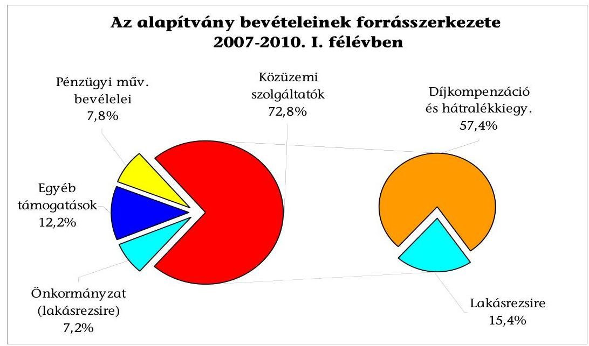
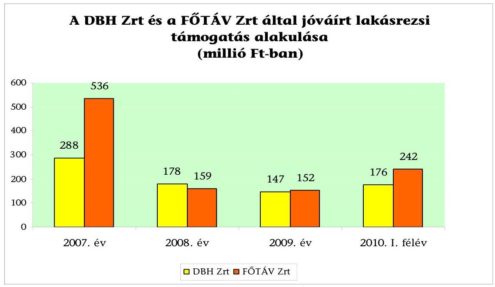
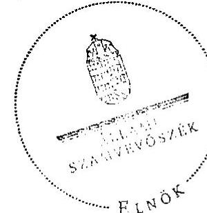
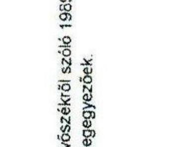
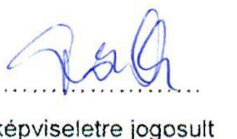
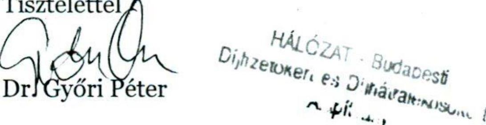

# ÁLLAMI   SZÁMVEVŐSZÉK 

## JELENTÉS

a Hálózat-Budapesti Díjfizetőkért és Díjhátralékosokért Alapítványnál a közpénzek rendeltetésszerű felhasználásának ellenőrzéséről

---

2. Önkormányzati és Területi Ellenőrzési Igazgatóság
2.1. Államháztartáson kívüli Szervezetek Ellenőrzési Főcsoport

Iktatószám: V-3010-30/2010.
Témaszám: 984
Vizsgálat-azonosító szám: V-0511

# Az ellenőrzést felügyelte: 

Dr. Lóránt Zoltán
főigazgató
Az ellenőrzés végrehajtásáért felelős:
Dr. Elek János
általános főigazgató-helyettes
Az ellenőrzést vezette:
Solymár Ágnes
osztályvezető főtanácsos
Az összefoglaló jelentést készítette:
Kulcsár Lászlóné
számvevő
Az ellenőrzést végezték:
Kulcsár Lászlóné
számvevő
Dr. Veress Tiborné
számvevő
A témához kapcsolódó eddig készített számvevőszéki jelentések:
címe
sorszáma
Jelentés a Budapest Főváros Önkormányzatának egyes hatósági 0930
díjak megállapítására irányuló tevékenysége ellenőrzéséről

---

# TARTALOMJEGYZÉK 

BEVEZETÉS ..... 5
I. ÖSSZEGZŐ MEGÁLLAPÍTÁSOK, KÖVETKEZTETÉSEK, JAVASLATOK ..... 7
II. RÉSZLETES MEGÁLLAPÍTÁSOK ..... 11

1. A kiegészítő lakásrezsi céljára biztosított támogatások ..... 11
1.1. A kiegészítő lakásrezsi támogatásra kapott támogatások szerződései ..... 11
1.2. A támogatási szerződésekben előírt elszámolási kötelezettségek teljesítése ..... 13
2. Az alapítvány által adott kiegészítő lakásrezsi támogatások rendszerének kialakítása és működtetése ..... 13
2.1. A támogatási koncepció kialakítása és összhangja a rendelkezésre álló pénzügyi forrásokkal ..... 13
2.2. A támogatási tevékenység szabályozottsága ..... 14
2.3. A nyújtott támogatások nyilvántartási rendszere ..... 15
2.4. Az alapítvány működési költségei ..... 16
3. Az alapítvány által nyújtott támogatások szabályossága ..... 16
3.1. A támogatások felhasználásának összhangja az alapító okirattal, a támogatási szerződésekkel és a belső szabályozásokkal ..... 16
3.2. A támogatás folyósításának szabályossága ..... 16

## MELLÉKLETEK

1. számú Hálózat- Budapesti Díjfizetőkért és Díjhátralékosokért Alapítvány bevételei és költségei, ráfordításai
2. számú Hálózat- Budapesti Díjfizetőkért és Díjhátralékosokért Alapítvány eszközeinek és forrásainak alakulása
3. számú Hálózat- Budapesti Díjfizetőkért és Díjhátralékosokért Alapítvány nyújtott támogatásai, célszerű tevékenysége
4. számú A kiegészítő lakásrezsi támogatásokkal kapcsolatos tevékenység folyamata
5. számú Kuratóriumi elnök észrevétele
6. számú Kuratóriumi elnök észrevételére válasz

---

# 2

---

# RÖVIDÍTÉSEK JEGYZÉKE 

| Alapítvány | Hálózat- Budapesti Díjfizetőkért és Díjhátralékosokért Alapítvány |
| :--: | :--: |
| ÁSZ | Állami Számvevőszék |
| DBH Zrt. | Díjbeszedő Holding Zrt. |
| Díjkompenzáció | Szociális rászorultsági alapon nyújtott távhőszolgáltatási-, víz-, csatorna- és szemétszállítási díjkompenzáció |
| FCSM Zrt. | Fővárosi Csatornázási Művek Zrt. |
| FKF Zrt. | Fővárosi Közterület-fenntartó Zrt. |
| FŐTÁV Zrt. | Fővárosi Távhőszolgáltató Zrt. |
| FVM Zrt. | Fővárosi Vízművek Zrt. |
| Iroda | Az alapítvány és a DBH Zrt. 1996-ban kötött megbízási szerződés alapján, a DBH Zrt. szervezetén belül, az alapítvány általi támogatás nyújtásához kapcsolódó technikai feladatok ellátására létrehozott „Alapítványi Iroda" |
| Kh. tv. | A közhasznú szervezetekről szóló 1997. évi CLVI. törvény |
| Közgyűlés | Fővárosi Közgyűlés |
| Közüzemi szolgáltatók | Fővárosi Csatornázási Művek Zrt., Fővárosi Vízművek Zrt., Fővárosi Közterület-fenntartó Zrt. |
| Kiegészítő lakásrezsi támogatás | Téli fővárosi kiegészítő lakásrezsi támogatás |
| Önkormányzati rendelet | A Fővárosi Lakásrezsi Támogatásról szóló 71/1999. (XII. 30.) Főv. Kgy. rendelet |
| Önkormányzat | Budapest Főváros Önkormányzata |
| Számviteli rendelet | 224/2000. (XII. 19.). Korm. rendelet a számviteli törvény szerinti egyes egyéb szervezetek beszámolókészítési és könyvvezetési kötelezettségének sajátosságairól |
| Számv. tv. | A számvitelről szóló 2000. évi C. törvény |
| Szja. tv. | A személyi jövedelemadóról szóló 1995. évi CXVII. törvény |
| Szociális tv. | A szociális igazgatásról és szociális ellátásokról szóló 1993. évi III. törvény |
| Tao. tv. | A társasági adóról és az osztalékadóról szóló 1996. évi LXXXI. törvény |

---

# ÉRTELMEZŐ SZÓTÁR 

| Alapszerződés | Az önkormányzati rendelet előírásai szerint az alapítvány és az Önkormányzat között 2000. március 6-án kötött megállapodás |
| :--: | :--: |
| Díjkompenzáció | Az önkormányzati rendelet alapján a lakások fenntartását szolgáló közüzemi szolgáltatók számláiban érvényesíthető összeg, amely távhőszolgáltatási-, víz-, csatorna-, szemétszállítási számlákban havonta jóváírt támogatás |
| Díjkompenzációs igény-   lőlap | A szociálisan rászoruló kérelmezők által az adott évi fővárosi közüzemi számlákban jóváírandó támogatások igénybevételéhez kitöltött igénylőlap. A kérelmezőknek egy adatlapot kell kitölteni mind a díjkompenzáció, mind a kiegészítő lakásrezsi támogatás igényléséhez. |
| Értesítő | Az önkormányzati rendelet szerinti támogatások igénybevételének lehetőségéről és feltételeiről az Önkormányzat által a kerületi önkormányzatok, illetve a kérelmezők részére készített értesítő |
| Kiegészítő lakásrezsi   támogatás | Az önkormányzati rendeletben meghatározott a lakások fenntartására a díjkompenzáción felül folyósítandó téli fővárosi kiegészítő lakásrezsi támogatás |
| Számlajóváírás | A közüzemi szolgáltatók számláiban az önkormányzati rendelet szerinti díjkompenzáció és a kiegészítő lakásrezsi támogatás számlaértékében történő figyelembe vétele támogatás jogcímén |
| Szociálisan rászoruló | Az önkormányzati rendelet szerinti támogatások igénybevételének jogosultja, amelyet a támogatás jellegétől függően egy főre jutó nettó jövedelemhez és/vagy nyugdíjassághoz, és/vagy eltartotti gyermekek számához köt a rendelet |
| Tájékoztató | Az önkormányzati rendelet szerinti támogatások igénybevételének lehetőségéről és feltételeiről az alapítvány által készített tájékoztató |

---

# JELENTÉS 

## a Hálózat-Budapesti Díjfizetőkért és Díjhátralékosokért Alapítványnál a közpénzek rendeltetésszerű felhasználásának ellenőrzéséről

## BEVEZETÉS

A Hálózat-Budapesti Díjfizetőkért és Díjhátralékosokért Alapítványt (alapítvány) 1995-ben három magánszemély hozta létre, székhelye: Budapest XI. Budafoki út 107-109. Az alapítványt a Fővárosi Bíróság 12.Pk.60718/1995/3. számon, 1995. szeptember 7-i jogerős határozattal nyilvántartásba vette, 1998. január 1. napjától a 12.Pk.60718/1995/16. számú végzéssel kapta meg a közhasznú minősítést.

Az alapítvány alapító okiratban meghatározott célja, a közhasznú szervezetekről szóló 1997. évi CLVI. törvénnyel (Kh. tv.) összhangban a szociális tevékenység ellátása, családsegítés, a hátrányos helyzetű csoportok társadalmi esélyegyenlőségének elősegítése. Ennek részeként az önhibájukon kívül rászorulók részére, a civilizált lakhatás biztosítása érdekében egyszeri vagy folyamatos támogatásokat nyújt, a rászorulók egyedi kérései alapján. Az alapító okirat szerint az alapítvány céljai megvalósítása érdekében vállalkozási tevékenységet nem folytathat, vagyonát és annak hozadékait teljes egészében céljai elérésére köteles fordítani.

Az alapítók az alapítvány vagyonának kezelésére tizenkét tagú kuratóriumot, működésének és gazdálkodásának ellenőrzésére háromtagú ellenőrző bizottságot hoztak létre. Éves beszámolóinak valódiságát és megbízhatóságát független könyvvizsgáló vizsgálta az ellenőrzött években.

Az alapítvány a 2007-2010. I. félévi időszakban összesen 7518 millió Ft támogatást kapott, ezen belül 7067 millió Ft részben, vagy egészben a Budapest Főváros Önkormányzata (Önkormányzat) tulajdonában lévő közüzemi szolgáltató társaságoktól, 450 millió Ft közvetlenül az Önkormányzattól és 1 millió Ft az SZJA 1\%-ának felajánlásából származott. Az alapítvány a vizsgált időszakban 6879 millió Ft támogatást nyújtott (1-3. számú mellékletek).

Az alapítvány támogatási tevékenysége keretében a Fővárosi Lakásrezsi Támogatásról szóló 71/1999. (XII. 30.) Főv. Kgy. rendeletben (önkormányzati rendelet) szabályozott támogatásokat nyújtotta, amelynek formái: távhőszolgáltatási-, víz-, csatorna-, szemétszállítási díjkompenzáció (díjkompenzáció), téli fővárosi kiegészítő lakásrezsi támogatás (kiegészítő lakásrezsi támogatás), és hátralékkiegyenlítő támogatás. A kiegészítő lakásrezsi támogatás nyújtásának folyamatát a 4. sz. melléklet tartalmazza.

---

Az alapítvány, alapító okiratban rögzített célszerű feladatainak ellátásához, valamint az önkormányzati rendelet szerinti feladatok végrehajtásához saját munkaszervezetet nem hozott létre. E feladatokat a Díjbeszedő Holding Zrt-vel (DBH Zrt.) kötött megbízási szerződés szerint a DBH Zrt. szervezetén belül létrehozott Alapítványi Iroda (Iroda), valamint a számlajóváírásra jogosult Fővárosi Távhőszolgáltató Zrt. (FŐTÁV Zrt.) végezte.

Az Állami Számvevőszék (ÁSZ) a Kh. tv. 21. § felhatalmazása alapján ellenőrzi a közhasznú szervezeteknél a költségvetési támogatás rendeltetésszerű felhasználását. Az Állami Számvevőszékről szóló 1989. évi XXXVIII. törvény (ÁSZ tv.) 2. § (5) és (6) bekezdései értelmében az ÁSZ ellenőrzi az állami költségvetésből nyújtott támogatásokat, vagy az állam által ingyenesen juttatott vagyon felhasználását, valamint az államháztartás alrendszereinek körébe tartozó vagyon kezelését. Az ÁSZ 2009-ben nyilvánosságra hozta a Budapest Főváros Önkormányzatának egyes hatósági díjak megállapítására irányuló tevékenységének ellenőrzéséről szóló 0930. számú jelentését. A jelentés az alapítvány, mint a közüzemi díjak kiegyenlítéséhez támogatást nyújtó szervezet, önálló ellenőrzését tartotta szükségesnek. Erre figyelemmel az ÁSZ az alapítvány ellenőrzését elvégezte, melynek célja volt értékelni, hogy az alapítvány a vonatkozó jogszabályok rendelkezései szerint az alapító okiratban meghatározottak megvalósítása érdekében, szabályosan és törvényesen használta-e fel a költségvetésből kapott támogatásokat. Az ellenőrzés a 2007. január 1-jétől a 2010. június 30-ig tartó időszakra terjedt ki.

A helyszínen megállapítható volt, hogy a kiegészítő lakásrezsi támogatás az alapítvány teljes vagyonfelhasználásának vizsgálatától elkülönítetten ellenőrizhető, valamint az alapítvány kuratóriumának elnöke is csak a kiegészítő lakásrezsi támogatásra nyújtott támogatások ellenőrzéséhez járult hozzá, ezért a számvevőszéki vizsgálat e támogatás szabályos és rendeltetésszerű felhasználásának ellenőrzésére irányult. A kiegészítő lakásrezsi támogatásra fordított összeg (2007: 824 millió Ft, 2008: 337 millió Ft, 2009: 299 millió Ft; 2010. I. félév: 418 millió Ft) az Önkormányzat által nyújtott évi 150 millió Ft-ot lényegesen meghaladta, annak további fedezetét a közüzemi szolgáltatók adományai tették ki.

A számlajóváírásra jogosult DBH Zrt. és FŐTÁV Zrt. által rendelkezésünkre bocsátott adatbázisok alapján 138 ezer fő részesült kiegészítő lakásrezsi támogatásban. Az adatállományból, rétegzett mintavételi eljárással választottuk ki az ellenőrzésre kerülő tételeket. A kérelmezőnként adható maximális összeg feletti támogatásokat teljes egészében, az azzal egyező és az alatti összegekből támogatás-arányosan vettük a tételeket, figyelembe véve, hogy az értékhatár alatti tételek rutinszerű, ismétlődő adatrögzítést és egyszeri rendszerbeállításokat jelentenek. Évente 98 fő igénylőlapját eredeti dokumentumok alapján, és a támogatás-folyósítás összegét tartalmazó számlákat az informatikai rendszerekben vizsgáltuk meg. A támogatás folyósításának jogosultságát a mintába került díjkompenzációs igénylőlapok, szabályosságát a nyilvántartási rendszerekben szereplő számlajóváírások tételes ellenőrzésével végeztük.

---

# I. ÖSSZEGZŐ MEGÁLLAPÍTÁSOK, KÖVETKEZTETÉSEK, JAVASLATOK 

Az alapítvány a 2007-2010. I. félévi kiegészítő lakásrezsi támogatásokat az alapító okirat, és az Önkormányzattal kötött támogatási szerződés szerinti célok elérése érdekében nyújtotta. Az alapítvány a vizsgált időszakban 1878 millió Ft -ot fordított kiegészítő lakásrezsi támogatásra, amely az összes nyújtott támogatásainak 27%-át tette ki. A támogatás forrását 32%-ban az Önkormányzat által nyújtott támogatások, 68%-ban a közüzemi szolgáltatók adományai jelentették. Az alapítvány teljes támogatási tevékenységéhez kapcsolódó - benne a kiegészítő lakásrezsi támogatások - működési költségei az összes költségeinek 0,3%-át tették ki, alkalmazottjai nem voltak, a kuratórium tagjai tevékenységükért díjázást nem kaptak.

Az alapítvány a kiegészítő lakásrezsi támogatásokra vonatkozóan nem rendelkezett a kuratórium által elfogadott támogatási koncepcióval. Az alapítvány által folyósított kiegészítő lakásrezsi támogatások szabályait az önkormányzati rendelet írta elő, amely a díjkompenzációs kérelmek benyújtásához kötötte a támogatás nyújtását. A szociálisan rászoruló kérelmezők az igénylőlapokon benyújtott adatok helyességéért büntetőjogilag feleltek, azok igazolásához dokumentumot sem az Önkormányzat, sem az alapítvány nem kért. A jogosultságra vonatkozóan ellenőrzést az alapítvány és a számlajóváírásra jogosult szervezetek sem végeztek, a kerületi önkormányzatoknak is csupán a negyede végzett vizsgálatot, kizárólag a közgyógyellátási igazolványok meglétét ellenőrizte.

A támogatásra való jogosultságot igazoló dokumentumok hiánya nem tette lehetővé a szociális rászorultság fennállásának megállapítását. A díjkompenzációhoz benyújtott kérelmek alapján a kiegészítő lakásrezsi támogatások a közüzemi szolgáltatóknál fogyasztóként nyilvántartott személyek részére kerültek jóváírásra a fogyasztói számlákon.

Az alapítvány és a DBH Zrt. által kötött együttműködési megállapodás nem terjedt ki a kiegészítő lakásrezsi támogatásokhoz kapcsolódó feladat-, hatás- és felelősségi körök szabályozására, így a gyakorlatban a DBH Zrt. szervezetén belül létrehozott Iroda e támogatásra is vonatkozó írásos megbízási szerződés nélkül végezte a feladat ellátását. A helyszíni ellenőrzés megállapításaira tekintettel, az alapítvány kiegészítette
 az együttműködési megállapodást. Az alapítvány FŐTÁV Zrt-vel kötött együttműködési megállapodása tartalmazta a kiegészítő lakásrezsi támogatások nyújtásának eljárási rendjét. Az alapítvány nem rendelkezett a kiegészítő lakásrezsi támogatásokkal kapcsolatos egyéb belső szabályzattal.

Az alapítvány és az Önkormányzat közötti alapszerződést nem aktualizálták, abban csak az 2000. évi támogatások összegeit határozták meg. A közgyűlés által jóváhagyott adományösszegeket ezt követően kizárólag az alapítvány és a közüzemi szolgáltatók közötti évenkénti szerződések tartalmazták. A szerződések nem rendelkeztek arról, hogy az alapítvány a közüzemi

---

szolgáltatók adományaiból rendelkezésre bocsátott összegek díjkompenzáción felüli részét kiegészítő lakásrezsi, és egyéb alapítványi támogatásokra fordíthatja. Az alapítvány és az önkormányzat évenként szabályos támogatási szerződést kötött a kiegészítő lakásrezsi támogatásokhoz kapcsolódóan.

A 2007. és a 2010. években az alapítvány által a rászorultak részére közzétett kiegészítő lakásrezsi támogatás feltételeire vonatkozó tájékoztatók, a támogatottak köre tekintetében nem feleltek meg az önkormányzati rendeletnek. Az önkormányzati rendelet értelmében kiegészítő lakásrezsi támogatásra jogosult, aki díjkompenzációban részesül és a vele egy lakásban élő családtagjai között van nyugdíjas, vagy három vagy több gyermek. A tájékoztatók és a rendelet összhangjának hiánya miatt a számlajóváírásra jogosult szervezetek 240 millió Ft összegű támogatást írtak jóvá a fogyasztói számlákban olyan személyeknek, akik az önkormányzati rendelet szerint nem voltak jogosultak a kiegészítő lakásrezsi támogatásra.

Az önkormányzati rendeletben előírt támogatási összegen felüli számlakiegyenlítés, mint jogosultsági feltétel teljesülése nem biztosított, amennyiben nem a támogatásra jogosult magánszemély, hanem a társasház a számla kiegyenlítésére kötelezett. Ebben az esetben nem követhető, hogy a magánszemély kiegyenlíti-e a támogatási összegen felüli közüzemi díjat, és nemfizetés esetén nem lehet tőle a támogatást visszavonni.

Az önkormányzati rendelet maximálta az egy igénylő részére adható kiegészítő lakásrezsi támogatás összegét, ennek ellenére a FŐTÁV Zrt-nél a 2007-2009. évekre 2,4 millió Ft összegű, az előírt maximális összeget meghaladó támogatás jóváírás történt, rendszerbeli és adatrögzítési hiányosságok miatt, amely a FŐTÁV Zrt. által e három év alatt nyújtott támogatás 0,2%-a. A FŐTÁV Zrt. adatfeldolgozási rendszerének fejlesztése 2010-ben kiküszöbölte a hiányosságokat, ennek eredményeként megszűntek az értékhatáron felüli jóváírások. A DBH Zrt-nél nem volt az előírt mértéket túllépő támogatás.

A számlajóváírásra jogosult szervezetek évente egyszer, a támogatások jóváírását megelőzően, egyeztetést végeztek annak elkerülése érdekében, hogy ugyanazon kérelmező részére mindkét szervezetnél a kiegészítő lakásrezsi támogatás jóváírásra kerüljön. Ennek ellenére a 2007-2009. évekre vonatkozóan 9,8 millió Ft, DBH Zrt. és a FŐTÁV Zrt. által is jóváírt, duplikált támogatásnyújtás történt, amely az időszak alatt jóváírt támogatások 0,7%-a.

Az Önkormányzat és az alapítvány közötti évenkénti támogatási szerződések előírták az alapítvány részére az elszámolási kötelezettséget, annak határidejét, de nem tartalmazták az elszámolás módját, a szakmai és pénzügyi beszámoló konkrét tartalmát. Az alapítvány a támogatási szerződésben előírt elszámolási kötelezettségét, a 2009. év kivételével nem teljesítette, mivel az Iroda által elkészített elszámolásokat a kuratórium elnöke nem küldte meg az Önkormányzatnak. Az alapítvány az Önkormányzattal évenként megkötött szerződés előírásától eltérően nyilvántartásaiban nem mutatta ki a kiegészítő lakásrezsi támogatások összegét közüzemi szolgáltatónként. A szerződés lehetőséget adott az Önkormányzatnak a támogatás felhasználásának ellenőrzésére, melyet a vizsgált időszak alatt nem gyakorolt.

---

Az alapítvány számviteli nyilvántartásaiban bevételeit és ráfordításait elkülönítetten tartotta nyilván, azonban nem tett eleget az Önkormányzattal kötött támogatási szerződés elkülönítésre vonatkozó előírásának, mivel a kapott támogatást egyéb pénzeszközeitől nem kezelte elkülönítetten. Az alapítvány a Számv. tv. időbeli elhatárolásra és következetességre vonatkozó előírásait nem tartotta be, a bevételek kapcsán nem alkalmazta az időbeli elhatárolást (az évente azonos összegű támogatás miatt ez a tárgyévi eredményt nem befolyásolta). A bevételek és a ráfordítások könyvelésében megsértette a következetesség elvét, mert a támogatási típusok szerinti nyilvántartás az időszakban nem volt egységes, ennek az eredményre nem volt hatása. A hibákhoz hozzájárult, hogy az alapítvány nem rendelkezett a Számv. tv. által kötelezően előírt számviteli politikával és számlarenddel, amelyet az ellenőrzés észrevételére elkészítettek.

A kiegészítő lakásrezsi támogatások az Szja. tv. előírásainak megfelelően adómentes jövedelmek, az alapítvány a társasági adóalap csökkentésére is felhasználható igazolásokat adott ki a támogatást nyújtó közüzemi szolgáltatók részére. Így fennállt annak lehetősége, hogy a közüzemi szolgáltatók éltek az adóalap csökkentés lehetőségével annak ellenére, hogy a Kh. tv. szerint - figyelemmel a támogatási szerződések egy éves időtartamára - nem minősültek tartós adománynak az általuk adott támogatások.

A helyszíni ellenőrzés megállapításainak hasznosítása mellett javasoljuk:

# a kuratóriumnak 

1. Készítsen a kiegészítő lakásrezsi támogatásra vonatkozó önálló támogatási koncepciót.
2. Kezdeményezze az Önkormányzattal kötött alapszerződés aktualizálását.
3. Biztosítsa, hogy a kiegészítő lakásrezsi támogatások igényléséhez közzétett tájékoztatókban szereplő támogatottak köre megfeleljen az önkormányzati rendeletnek.
4. Az Önkormányzattal kötött évenkénti támogatási szerződésekben előírtak betartása érdekében
a) mutassa ki közüzemi szolgáltatónként bontásban a kiegészítő lakásrezsi támogatások összegét;
b) teljesítse minden évre vonatkozóan a szerződés szerinti elszámolási kötelezettségét;
c) kezelje pénzeszközeitől elkülönítetten a kiegészítő lakásrezsi céljára kapott támogatást.
5. Alakítsa ki a kiegészítő lakásrezsi támogatásra való jogosultság ellenőrzési rendszerét, ezen belül határozza meg az igénylőlapon feltüntetett információkhoz kapcsolódóan a jogosultság igazolását alátámasztó dokumentumok körét, a szociális rászorultság bizonyítása érdekében.

---

6. Kezdeményezze, hogy a közüzemi szolgáltatókkal kötött szerződésekben szerepeltessék a kapott támogatások közműdíj-kompenzáción felüli összegének kiegészítő lakásrezsi támogatásra történő felhasználási lehetőségét.
7. Szüntesse meg az önkormányzati rendelet 5. § (1) bekezdésének nem megfelelő, jogosultságtól eltérő támogatási gyakorlatot, állapítsa meg a 2007. és a 2010. évi 240 millió Ft összegű jogosulatlan jóváírás miatti felelősséget.
8. Szólítsa fel a számlajóváírásra jogosult szervezeteket a 9,8 millió Ft összegű dupla kifizetések miatti jóváírások visszavonásának rendezésére.
9. Szólítsa fel a FŐTÁV Zrt-t a feltárt, értékhatárt meghaladó 2,4 millió Ft összegű jóváírások visszavonására.
10. Tartsa be a Számv. tv. 15. § (5) bekezdésében előírt következetesség és a 16. § (2) bekezdésében szabályozott időbeli elhatárolás elvét.

# a Budapest Fővárosi Önkormányzat Közgyűlésének 

1. Írja elő az önkormányzati rendeletben:
a) az igényjogosultságot alátámasztó dokumentumok körét és az ehhez kapcsolódó ellenőrzési kötelezettséget;
b) a társasházi fogyasztók (számlatulajdonos) esetére vonatkozóan az 5. § (1) bekezdés a) pontja és a 6. § (12) bekezdése előírásai betartása ellenőrzésének szabályait.
2. Határozza meg az alapítvánnyal kötött évenkénti támogatási szerződésekben a támogatással való elszámolás módját, a szakmai és pénzügyi beszámoló konkrét tartalmát.
3. Érvényesítse a támogatási szerződésben rögzített ellenőrzési jogosultságát.

## a Nemzetgazdasági Minisztérium miniszterének

Rendeljen el adóellenőrzést annak megállapítása érdekében, hogy az alapítvány által kiállított igazolás alapján a Fővárosi Csatornázási Művek Zrt., a Fővárosi Vízművek Zrt., a Fővárosi Közterület-fenntartó Zrt. és a Fővárosi Távhőszolgáltató Zrt. a Tao. tv. 7. § (5) és (7) bekezdése valamint a Kh. tv. 26. § n) pontja előírásai szerint éltek-e az adózás előtti eredmény csökkentésével.

---

# II. RÉSZLETES MEGÁLLAPÍTÁSOK 

## 1. A KIEGÉSZÍTŐ LAKÁSREZSI CÉLJÁRA BIZTOSÍTOTT TÁMOGATÁSOK

Az alapítvány a kiegészítő lakásrezsi támogatásokat az Önkormányzattól kapott támogatásból, valamint a közüzemi szolgáltatók általi adományokból finanszírozta.

A vizsgált időszakban az alapítvány 1878 millió Ft-ot fordított a kiegészítő lakásrezsi támogatásra, amely bevételeinek 22,6%-át (Önkormányzattól 7,2%, közüzemi szolgáltatóktól 15,4%) tette ki. Mindkét forrásról az Önkormányzat évenként közgyűlési határozatot hozott.

### 1.1. A kiegészítő lakásrezsi támogatásra kapott támogatások szerződései

Az alapítvány a Kh. tv. 14. § (2) bekezdésével összhangban minden esetben írásban kötött szerződéssel kapta az Önkormányzattól a támogatásokat, a szerződésekben minden esetben rendelkeztek a felhasználás céljáról és az elszámolás feltételeiről, azonban annak módját nem határozták meg.

Az önkormányzati támogatások utalása az alapítvány részére a szerződésben rögzítetteknek megfelelően történt, minden esetben a határozathozatal évében, még december 31-ig teljesültek, amelyek az önkormányzati rendelettel és a szerződéssel összhangban a következő évi kiegészítő lakásrezsi támogatások finanszírozását szolgálták. Az alapítvány a könyvvezetésében nem gondoskodott a bevételek időbeli elhatárolásáról, ezzel megsértette a Számv. tv. 16. § (2) bekezdésében szabályozott időbeli elhatárolás elvét.

---

A Számv. tv. 16. § (2) bekezdése: „Az olyan gazdasági események kihatásait, amelyek két vagy több üzleti évet is érintenek, az adott időszak bevételei és költségei között olyan arányban kell elszámolni, ahogyan az, az alapul szolgáló időszak és az elszámolási időszak között megoszlik (az időbeli elhatárolás elve)." A 2010. I. félévi könyvelési adatok nem tartalmazták a támogatás összegét, mint bevételt, mivel az alapítvány a megelőző év végén megkapott, de a következő évben általa nyújtott kiegészítő lakásrezsi támogatások forrásául szolgáló támogatásokat, időbeli elhatárolásként nem mutatta ki.

A szerződések előírták, hogy az alapítvány a támogatást köteles egyéb pénzeszközeitől elkülönítetten kezelni, nyilvántartani. A támogatások, minden egyéb más támogatással együtt, ugyanazon folyószámlára kerültek átutalásra, így az alapítvány nem gondoskodott a szerződésekben előírt elkülönített pénzkezelésről. Az alapítvány a támogatásokat főkönyvében elkülönítetten tartotta nyilván, az egyéb bevételek között, összhangban a számviteli rendelet 16. § (5) bekezdésével, azonban 2009-ben az előző évektől eltérő főkönyvi számlán, ezzel megsértette a Számv. tv. 15. § (5) bekezdésében szabályozott következetesség elvét, melynek egyrészt a számviteli szabályozatlanság, másrészt a hibás könyvvezetési gyakorlat volt az oka.

Az alapítvány nem rendelkezett a Számv. tv. 14. §-ában előírt számviteli politikával, valamint a 161. §-ban meghatározott megfelelő számlarenddel. Az ellenőrzés rendelkezésére bocsátott, érvényben lévő számlarend kizárólag az 1-es számlaosztály számláit tartalmazta. Az alapítvány által megbízott könyvvizsgáló az auditálás során sem hívta fel az alapítvány figyelmét a hiányosságaira, annak ellenére, hogy a megbízási szerződése 2.6. e) pontja szerint feladata volt az alapítvány belső szabályozottságának ellenőrzése. Az alapítvány a jelentéskészítés egyeztetési szakaszában elkészítette és visszamenőleg 2010. január 1-től hatályba léptette a számviteli politikát és a számlarendet.

Az önkormányzati rendelet 6. § (2) bekezdésében előírtaknak megfelelően, 2000. március 6-án szerződést kötöttek, amely a közüzemi szolgáltatók vonatkozásában állapította meg, hogy az alapítvány részére történő közgyűlési határozatban (1999. évi határozatok) foglalt adományaikat elfogadja és azt az önkormányzati rendeletben meghatározott díjkompenzációra és egyéb támogatásra fordítja. A szerződés kizárólag az 2000. évi támogatási kötelezettséget írta elő, azt a vizsgált időszakban nem aktualizálták.

A közgyűlés minden évben határozatot hozott, hogy a közüzemi szolgáltatók milyen összeggel támogassák az alapítványt, erre vonatkozóan a szerződéseket az alapítvány és közüzemi szolgáltatók írásban megkötötték. A szerződésekben nem rögzítették, hogy az önkormányzati rendelet szerinti kiegészítő lakásrezsi támogatásra is fordíthatja az alapítvány a díjkompenzáción felüli támogatásokat. A közüzemi szolgáltatók részéről a támogatások folyósítása a szerződéseknek megfelelően történt (tárgyév márciusától a következő év februárjáig), az alapítvány ebben az esetben sem alkalmazta az időbeli elhatárolást.

---
 elszámolásokat minden évben az Iroda állította össze és küldte meg a kuratórium elnökének, azok határidőben elkészültek, azonban az alapítvány a szerződés előírásaitól eltérően csak 2009-ben számolt el az Önkormányzat felé.

Az elszámolásokban kizárólag a számlajóváírásra jogosult szervezetek (DBH Zrt., FÖTÁV Zrt.) részére havonta utalt összegeket mutatták ki. Az elkészített elszámolással nem teljesült a szerződés 2. pontja, mert a kiegészítő lakásrezsi támogatásokról nem állt rendelkezésre közüzemi szolgáltatónkénti kimutatás, melyet az Önkormányzat nem kifogásolt.

A kiegészítő lakásrezsi támogatásokról az alapítvány közüzemi szolgáltatónként - kivéve a FÖTÁV Zrt. 2007. és 2008. évi felhasználását - nyilvántartást nem vezetett. A szerződés tartalmazta az Önkormányzat ellenőrzési jogosultságát, amelyet a vizsgált időszakban dokumentáltan nem gyakorolt.

## 2. Az alapítvány által adott kiegészítő lakásrezsi támogatások rendszerének kialakítása és működtetése

### 2.1. A támogatási koncepció kialakítása és összhangja a rendelkezésre álló pénzügyi forrásokkal

A kiegészítő lakásrezsi támogatással összefüggő támogatási koncepciót minden évben az Önkormányzati rendelet módosításával a közgyűlés határozta meg, a döntés meghozatalához részletes, elemzéseket tartalmazó előterjesztés készült. Az alapítványnak a támogatási koncepció kialakításában, a közgyűlés által tárgyalt előterjesztés összeállításában közreműködőként volt szerepe, azt a kuratórium nem fogadta el.

A közgyűlés által elfogadott határozatok alapján az önkormányzati rendeletet minden évben módosították, amely szerint elkészítették a kérelmezők részére az általános tájékoztatót a támogatás igénybevételi lehetőségéről és feltételeiről.

Az Önkormányzat és a közüzemi szolgáltatók által rendelkezésre bocsátott és a kiegészítő lakásrezsi támogatás jogcímén a támogatottaknak jóváírt összegek alakulását évenként a következő táblázat tartalmazza:

---

adatok: millió Ft-ban

| Év/Támogató | 2007. év |  | 2008. év |  | 2009. év |  | 2010. 1. félév |  | Összesen |  |
| :--: | :--: | :--: | :--: | :--: | :--: | :--: | :--: | :--: | :--: | :--: |
|  | támo-   gatás | felhasználás | támo-   gatás | felhasználás | támo-   gatás | felhasználás | támo-   gatás | felhasználás | támo-   gatás | felhasználás |
| Önkormányzat | 150 |  | 150 |  | 150 |  | 150 |  | 600 |  |
| FVM Zrt | 360 | 288 | 370 | 178 | 353 | 147 | 113 | 176 | 1196 | 789 |
| FCSM Zrt | 400 |  | 400 |  | 333 |  | 116 |  | 1249 |  |
| FKF Zrt | 388 |  | 426 |  | 300 |  | 92 |  | 1206 |  |
| FÖTÁV Zrt | 825 | 536 | 700 | 159 | 587 | 152 | 294 | 242 | 2406 | 1089 |
| Összesen | 2123 | 824 | 2046 | 337 | 1723 | 299 | 765 | 418 | 6657 | 1878 |

A táblázatban szereplő támogatási összegek a közüzemi szolgáltatók által rendelkezésre bocsátott adományokat és az Önkormányzat által nyújtott támogatást tartalmazzák, amelyből a kiegészítő lakásrezsi céljára felhasznált támogatás 1878 millió Ft. Az Önkormányzat által nyújtott 600 millió Ft támogatás, a kiegészítő lakásrezsi támogatásként jóváírt összegeknek 32%-ára nyújtott fedezetet, ezért szükségessé vált a közüzemi szolgáltatók által adott támogatások bevonása a finanszírozásba, az alapítványnak a vizsgált időszakban az Önkormányzat által nyújtott támogatásból nem keletkezett szabad pénzeszköze.

# 2.2. A támogatási tevékenység szabályozottsága 

A kiegészítő lakásrezsi támogatás nyújtása szabályrendszerének kereteit az évente hatályos önkormányzati rendelet határozta meg. A kérelmezők által kitöltött igénylőlapokon szereplő adatok jogosultsági ellenőrzését sem az önkormányzati rendelet, sem az alapítvány nem írta elő, továbbá az igénylőlapokon szereplő adatok valódiságát, azaz az igényjogosultságot alátámasztó dokumentumokat nem kellett az igényléshez benyújtani.

Az alapítvány nem rendelkezett a kiegészítő lakásrezsi támogatási tevékenységre vonatkozó belső szabályzattal. A számlajóváírásra jogosult szervezetek közül csak a FÖTÁV Zrt-vel megkötött együttműködési megállapodás tartalmazta a kiegészítő lakásrezsi támogatások eljárási rendjét, a DBH Zrt-vel megkötött szerződés nem, ezért ezt a feladatot a DBH Zrt által működtetett Iroda felhatalmazás nélkül látta el.

Az Irodát, mint az alapítvány működésével kapcsolatos adminisztratív feladatokat ellátó szervezetet az alapító okirat 8.3. pontja nevesíti. Az alapítvány és a DBH Zrt. közötti 1996-ban kötött megállapodás, amely elsősorban az Iroda működtetését szabályozta, a díjkompenzációs és kiegészítő lakásrezsi támogatásra vonatkozó feladatokat nem tartalmazott. Az Iroda önálló Szervezeti és Működési Szabályzattal rendelkezett, melynek tartalma összhangban volt az alapítvány és a DBH Zrt. által kötött szerződéssel.

Az alapítvány és FÖTÁV Zrt. 2005-ben megbízási szerződést kötöttek az önkormányzati rendelethez kapcsolódó (díjkompenzáció és kiegészítő lakásrezsi) támogatások nyilvántartási és jóváírási feladatainak ellátására, amely ellenőrzési előírásokat nem tartalmazott.

---

Mindkét, támogatás jóváírásra jogosult szervezet saját belső szabályzataiban (adatrögzítéshez kapcsolódó) előírtaknak megfelelően járt el a kérelmek feldolgozása során.

A számlajóváírásra jogosultak ellátták az önkormányzati rendelet szerinti paraméterek és az igénylőlapokon szereplő adatok rögzítését a számlázási rendszereikben, valamint a számlák kiállítását és azokban a jóváírások (támogatások) megjelenítését.

A számlajóváírásra jogosult szervezeteknek a jogosultak részére történt jóváírások összegeiről szóló utalások bizonylatait az Iroda készítette el és továbbította az alapítványnál banki aláírásra jogosultak részére, majd intézkedett a folyósításról. A kuratóriumi ülésekre az Iroda és a FŐTÁV Zrt. előkészítette a jövedelmi határ túllépése miatti döntéshez szükséges információkat. Az Iroda a kuratórium elnöke részére a kiegészítő lakásrezsi támogatásról kizárólag év végén készített kimutatást.

# 2.3. A nyújtott támogatások nyilvántartási rendszere 

A DBH Zrt. és a FŐTÁV Zrt. rendszerei képezték a kiegészítő lakásrezsi támogatásból támogatott személyenkénti nyilvántartás alapját, melyről a DBH Zrt. esetében az alapítvánnyal kötött szerződés nem rendelkezett. A számlázó rendszerek működtetése a számlázást végző szervezetek saját belső szabályzataikkal összhangban történt. A rendszerekből az adatok igény szerinti tartalommal visszamenőlegesen lekérdezhetők voltak, a jogosultsági szintek előírásainak betartása mellett.

A kiegészítő lakásrezsi támogatásra jogosultság feltételei paraméterezésre kerültek a rendszerekben, az igénylőlapok rögzítésekor a paramétereket beállították, majd a rendszer automatikusan generálta a fogyasztói számlákat, amelyeken feltüntették a támogatás összegét.

A DBH Zrt. a támogatásokat egy összegben, vagy részletekben írta jóvá, attól függően, hogy mekkora volt a számlakötelezettség összege. A FŐTÁV Zrt. amennyiben a számla összege lehetővé tette, akkor az önkormányzati rendelet előírása szerinti négy egyenlő részletben írta jóvá, ha nem akkor további részletekben, ez a kialakított gyakorlat nem volt összhangban az önkormányzati rendelet előírásaival.

Az önkormányzati rendelet 6. § (7) bekezdés b) pontja a távhőszolgáltatás esetében négy egyenlő részletben történő jóváírást írta elő, míg a c) pontja egyéb fűtés esetén kuratóriumi hatáskörbe helyezi a több részletben történő éven belüli folyósítási lehetőséget. Az alapítvány kuratóriuma erre vonatkozóan nem hozott határozatot.

A támogatást kérelmezők az igénylőlapok elfogadására vonatkozóan visszajelzést az alapítványtól nem kaptak (az önkormányzati rendelet nem is írt elő ilyen jellegű kötelezettséget), kizárólag a közüzemi számlákból értesültek a támogatás jóváírt összegéről.

Az alapítvány a számviteli rendelet 16. § (6) bekezdésével összhangban a továbbadott támogatásokat egyéb ráfordításként számolta el. Az alapítvány

---

2009. évtől megváltoztatta a főkönyvi nyilvántartási gyakorlatot, melynek eredménye lett, hogy a FŐTÁV részére történő elszámolásokból nem derült ki, hogy az kiegészítő lakásrezsire vagy díjkompenzációra történt-e, ezzel a támogatás típusonkénti átláthatósága nem volt biztosított. Ez egyrészt a számviteli szabályzatok hiányosságából, másrészt abból adódott, hogy a könyvelési feladatokat ellátó vállalkozó kizárólag a bankkivonatok alapján könyvelt, az alapítványtól nem kapta meg az azt alátámasztó kimutatásokat, megsértve ezzel Számv. tv. 15. § (5) bekezdése szerinti következetesség elvét.

# 2.4. Az alapítvány működési költségei 

Az alapítvány működésre költségeinek mindössze 0,3%-át fordította (1.sz melléklet), amely a könyvelés és könyvvizsgálat, a bank-, valamint a hirdetés és reklám (az SZJA 1%-a felajánláshoz kapcsolódóan) költségeket tartalmazta.

Az alapítvány és az Önkormányzat közötti 2000. március 6-án kötött szerződés 7. pontja értelmében az alapítvány a kiegészítő lakásrezsi támogatás folyósításával kapcsolatos feladatokat ellenszolgáltatás nélkül végezte. Továbbá az alapító okirat 8.1. pontja arról rendelkezik, hogy a kurátorok tisztségüket díjazás nélkül látják el.

Az alapítványnak nincsenek alkalmazottjai, a támogatások folyósításával kapcsolatos feladatokat az Iroda és a FŐTÁV Zrt. ellenszolgáltatás nélkül látta el.

## 3. Az alapítvány által nyújtott támogatások szabályossága

### 3.1. A támogatások felhasználásának összhangja az alapító okirattal, a támogatási szerződésekkel és a belső szabályozásokkal

Az alapítvány alapító okiratában meghatározott célja a szociális tevékenység ellátása, a rászorult családok megsegítése, továbbá a hátrányos helyzetben élők társadalmi esélyegyenlőségének elősegítése. A kiegészítő lakásrezsi támogatások felhasználása az alapító okirat szerinti célokkal összhangban történt.

Az alapítvány a támogatások felhasználása során az Önkormányzattal kötött támogatási szerződésekben meghatározott célnak -kiegészítő lakásrezsi támogatás - megfelelően nyújtotta a támogatásokat.

### 3.2. A támogatás folyósításának szabályossága

Az alapítvány a vizsgált időszakban 1878 millió Ft-ot nyújtott kiegészítő lakásrezsi támogatási céllal, amelyből a DBH Zrt. 789 millió Ft-ot, a FŐTÁV Zrt. 1089 millió Ft-ot írt jóvá a fogyasztói számlákban.

---

Az ellenőrzött díjkompenzációs igénylőlapokon minden esetben szerepelt a számlázás alapját képező, a számlajóváírásra jogosult szervezetek számlázó rendszereivel megegyező fogyasztói azonosító, amely alapján a támogatás az igénylőlapokat kitöltő valós személy részére került jóváírásra.

A szabályozás hiánya miatt a kiegészítő lakásrezsi támogatás folyósítását megelőzően sem az alapítvány, sem a számlajóváírást végző szervezetek nem ellenőrizték a támogatási jogosultságot. A gyakorlatban az ellenőrzött igénylőlapok 13%-án öt kerületi önkormányzat dokumentáltan igazolta a díjkompenzációs igénylőlapon szereplő, az önkormányzati rendelet 4. §. (1) bekezdés b) pontjában előírt közgyógyellátási igazolványok meglétét.

A kiegészítő lakásrezsi támogatás alapítványon keresztül történő folyósítása lehetővé tette, hogy egyrészt a magánszemélyek adómentes személyi jövedelemhez jutottak az Szja. tv. 1. sz. melléklet 3.1., a 3. § 35. és 36.pontjai értelmében. Másrészt az adományozó szervezetek részére, az alapítvány kiadta a Tao. tv. 7. § (5) és (7) bekezdése szerinti, társasági adóalap csökkentésre lehetőséget adó igazolásokat. Az alapítvány és az adományozó szervezetek között évente megkötött megállapodások alapján juttatott összegek a Kh. tv. 26. § n) pontja szerint nem minősülnek tartós adománynak, mivel a szerződések egy évre szóltak.

Az alapítvány az önkormányzati rendelet 5. § (1) bekezdésétől eltérően a teljes díjkompenzációs kör részére jóváírta a kiegészítő lakásrezsi támogatásokat, emiatt 240 millió Ft-tal több támogatást juttatott a magánszemélyeknek. A támogatási jogosultsághoz kapcsolódóan kiadott tájékoztatók az önkormányzati rendelettel ellentétesek voltak, mert minden díjkompenzációra jogosultra kiterjesztették a kiegészítő lakásrezsi támogatást.

Az önkormányzati rendelet 5. § (1) bekezdése rögzíti a kiegészítő lakásrezsi támogatásra jogosultak körét, amelyben a díjkompenzációra jogosultakhoz képest korlátozásokat határozott meg.

---

Az önkormányzati rendelet 5. § (1) bekezdés d) pontja: „a díjkompenzációs kérelem beadásakor a vele egy lakásban élő családtagjai körében van olyan személy, aki nyugellátásban részesül, vagy három vagy több gyermek (akik után családi pótlékot kap) neveléséről gondoskodik".

A
 2007. és a 2010. évre vonatkozóan a közgyűlési előterjesztés tartalmazta, hogy ne korlátozzák a kiegészítő lakásrezsi támogatásra jogosultak körét (egyezzen meg a díjkompenzált körrel), azonban erről határozatot nem hoztak, az önkormányzati rendeletet nem módosították. Ennek ellenére az Önkormányzat által közzétett ügyfél-tájékoztatók korlátozást már nem tartalmaztak.

Az önkormányzati rendelettől eltérően jóváírt összegeket a következő táblázat tartalmazza:

| Megnevezés | 2007. év |  | 2010. I. félév |  | Összesen |
| :-- | :--: | :--: | :--: | :--: | :--: |
|  | Ft | fő | Ft | fő | Ft |
| DBH Zrt | 57213536 | 4972 | 48809871 | 4349 | 106032728 |
| FÖTÁV Zrt | 57266000 | 3602 | 76499882 | 4854 | 133774338 |
| Rendelet szerint nem jogosult   összesen | 114479536 | 8574 | 125309753 | 9203 | 239807066 |

Azokban az esetekben, amikor a kérelmező társasházban lakik és a közüzemi számla a társasház részére került kiállításra, a kiegészítő lakásrezsi támogatást a társasház számláján lehetett jóváírni, melyen feltüntetésre került a kérelmező (támogatásra jogosult) neve, címe és a támogatás összege is. A jogosult is kapott egy elszámolást, amelyből értesült róla, hogy a társasház számláján az összeg jóváírásra került. Azonban az önkormányzati rendeleti előírások betartása ez esetben nem biztosított, mivel a társasház nem kötelezett a kérelmezők nemfizetése esetén értesíteni a támogatás nyújtóját, ezért az önkormányzati rendelet 5. § (1) bekezdés a) pontja és a 6. § (12) bekezdés szerinti támogatás visszavonása nem érvényesíthető.

Az önkormányzati rendelet 5. § (1) bekezdés a) pontja: „megfizeti az adott számla téli fővárosi kiegészítő lakásrezsi támogatással csökkentett összegét".

Az önkormányzati rendelet 6. § (12) bekezdés: „Az a jogosult, aki a Szociális tv. 55. §-ban lévő adósságkezelési szolgáltatásban részesül, a 3-4. §-ok szerint folyósított díjkompenzációra és az 5. § szerint folyósított támogatásra jogosultságát az adott hónapra akkor veszti el, ha a díjkompenzációval, illetve a támogatással csökkentett számla összegét a fizetési határidő lejártát követő 120 napig nem fizeti meg. Ebben az esetben a díjkompenzáció és a támogatás az adott hónapra vonatkozóan visszavonásra kerül."

Egy esetben fordult elő, hogy a támogatott nem fizette a közös költségeket és a társasház kezdeményezte az Alapítványnál a támogatás visszavonását. Abban az esetben, ha a társasház nem egyenlíti ki a közüzemi számlákat, a támogatás a kérelmezőtől nem kerül visszavonásra. Az önkormányzati rendelet hiányossága, hogy nem szabályozza társasházi fogyasztó esetén az eljárási rendet.

Az önkormányzati rendelet 5. § (2) bekezdése értelmében egy kérelmező vagy a távfűtéshez, vagy az egyéb fűtéshez kapcsolódóan jogosult kiegészítő lakásrezsi támogatásra. A két számlajóváírásra jogosult szervezet évente egyszer adategyeztetést végzett, melynek célja volt az esetleges dupla kifizetések kiszűrése. A

---

vizsgálat feltárta, hogy ugyanazon személy részére mindkét szervezet jóváírta a kiegészítő lakásrezsi támogatást.

A két számlajóváírásra jogosult szervezetnél egyaránt jóváírt támogatások összegei:

| Megnevezés | 2007. év | 2008. év | 2009. év | Összesen |
| :-- | :--: | :--: | :--: | :--: |
|  | Ft | Ft | Ft | Ft |
| DBH Zrt | 5209074 | 2194738 | 2358615 | 9762427 |
| FÖTÁV Zrt | 7103231 | 2856241 | 3296041 | 13255513 |
| fő | 457 | 206 | 210 |  |

A 2010. évre vonatkozóan a díjkompenzációs igénylőlapokon a kérelmezőknek jelölni kellett a lakás fűtésének módját annak érdekében, hogy ne kerüljön sor mindkét szervezetnél a kiegészítő lakásrezsi támogatás számlajóváírására.

Az ellenőrzés során mind a DBH Zrt.-nél, mind a FŐTÁV Zrt.-nél, az egy személy részére maximálisan nyújtható támogatási összeget meghaladó valamennyi tételt megvizsgáltuk. Ennek keretében a DBH Zrt.-nél nem, a FŐTÁV Zrt.-nél az alábbi - távfűtéses számlákban - értékhatárt meghaladó (16 000 Ft/fő) jóváírások voltak:

| Megnevezés | 2007. év |  | 2008. év |  | 2009. év |  | 2010. I. |  | Összesen |
| :--: | :--: | :--: | :--: | :--: | :--: | :--: | :--: | :--: | :--: |
|  | Ft | fő | Ft | fő | Ft | fő | Ft | fő | Ft |
| Adatrögzítési hiba | 381496 | 16 | - |  | 128000 | 4 | - | - | 509496 |
| Dupla kérelem | 1471060 | 49 | 236507 | 8 | - | - | - | - | 1707567 |
| Igénylőlap DBH Zrt-nél | 72519 | 3 | - |  | 96000 | 3 | - | - | 168519 |
| FŐTÁV Zrt által duplán elszámolt összesen | 1925075 | 68 | 236507 | 8 | 224000 | 7 | 0 | 0 | 2385582 |

A FŐTÁV Zrt.-nél a személyenkénti értékhatárt meghaladó jóváírások keletkezését az adatrögzítési hibák és rendszerbeli hiányosságok okozták (a kérelmezők által duplán beadott igénylőlapok feldolgozása és a két szervezet közötti elektronikus adatátadásból származó dupla jóváírás). Ezeket a problémákat 2010-től a számlázási rendszer fejlesztésével megoldották.

Budapest, 2011. január , $1 / 1 . .0$

Domokos László

Melléklet: $\quad 6 \mathrm{db} \quad 11$ lap

---

1. számú melléklet

HÁLÓZAT - BUDAPESTI DÍJFIZETŐKÉRT ÉS DÍJHÁTRALÉKOSOKÉRT ALAPÍTVÁNY BEVÉTELEI ÉS KÖLTSÉGEI, RÁFORDÍTÁSAI

|  Ssz. | Megnevezés | 2006.12.31-ig befolyt, de következő években felhasználtató bevé- telek | 2007. év | 2008. év | 2009. év | 2010. június 30. | Összesen | Értékadatok: ezer Ft-ban  |
| --- | --- | --- | --- | --- | --- | --- | --- | --- |
|  1. | Fővárosi Önkormányzat támogatása |  | 150 000 | 150 000 | 150 000 |  | 450 000 |   |
|  2. | Fővárosi Vízművek Zrt támogatása |  | 360 000 | 370 000 | 353 000 | 113 000 | 1 196 000 |   |
|  3. | Fővárosi Csatornázási Művek Zrt támogatása |  | 400 000 | 400 000 | 333 000 | 116 000 | 1 249 000 |   |
|  4. | Fővárosi Közterület-keretartó Zrt támogatása |  | 388 000 | 426 000 | 300 000 | 92 000 | 1 206 000 |   |
|  5. | Budapest Távfolszolgáltató Zrt támogatása |  | 825 000 | 700 000 | 587 000 | 294 000 | 2 406 000 |   |
|  6. | ELMÚ Nyit támogatása |  | 605 |  | 1 005 000 |  | 1 005 605 |   |
|  7. | Egyéb támogatás (visszautalások) |  | 337 |  |  |  | 337 |   |
|  8. | SZJA 1 % |  | 236 | 398 | 505 |  | 1 139 |   |
|  9. | Értékpapírok ártolymnyeresége |  | 108 374 | 141 790 | 259 939 | 81 919 | 592 022 |   |
|  10. | Bankkamat |  | 7 407 | 28 041 | 21 793 | 3 209 | 60 450 |   |
|  11. | Egyéb bevételek |  |  |  | 17 |  | 17 |   |
|  12. | Bevételek összesen (1+2+3+4+5+6+7+8+9+10+11) | 2 222 702 | 2 239 954 | 2 218 227 | 3 014 254 | 700 128 | 8 170 863 | 3 491 340  |
|  13. | Hirdetés, reklám |  | 171 | 138 | 184 | 152 | 645 |   |
|  14. | Szakértő és megbízási díj |  | 1 296 | 1 584 | 6 681 | 688 | 10 249 |   |
|  15. | Bankköltség |  | 2 525 | 1 536 | 2 652 | 1 373 | 7 485 |   |
|  16. | Az alapítvány által adott támogatások |  | 2 397 655 | 1 530 095 | 1 986 902 | 954 316 | 6 878 969 |   |
|  17. | Költségek és ráfordítások (12+13+14+15) |  | 2 401 647 | 1 533 353 | 1 995 819 | 966 529 | 6 897 348 |   |
|  18. | Cél szerinti tevékenység költségei és ráfordításai (célszerinti közvetlen költségek) |  |  |  |  |  |  |   |
|  19. | Cél szerinti tevékenység költségei és ráfordításai (célszerinti közvetelt költségek) |  |  |  |  |  |  |   |
|  20. | Kezelőszerv és egyéb közvetett költségek (működési költségek) |  |  |  |  |  |  |   |
|  21. | Eredmény (I.-II.) |  | -161 893 | 682 874 | 1 018 435 | -266 401 | 1 273 215 |   |

Alulírott az Állami Számvevőszékről szóló 1969. évi XXXVIII. törvény 24. § c) pontja alapján aláírásommal igazolom, hogy a feltüntetett adatok teljes körűek és az alapítvány nyilvántartásával, okmányával mindenben megegyezőek.

Budapest, 2010. szeptember 24.

Képviseletre jogosult aláírása dr. Győst Péter kiterintem elnöke

Pintér Attiláné kiterivelő

---

# 2. számú melléklet 

## HÁLÓZAT - BUDAPESTI DÍJFIZETŐKÉRT ÉS DÍJHÁTRALÉKOSOKÉRT ALAPÍTVÁNY ESZKÖZEINEK ÉS FORRÁSAINAK ALAKULÁSA

|  |  |  |  |  | Értékadatok: ezer Ft-ban |
| :--: | :--: | :--: | :--: | :--: | :--: |
| Ssz. | Megnevezés | 2007. év | 2008. év | 2009. év | 2010. I. félév |
| 1. | Értékpapírok | 1427890 | 2010548 | 3269561 | 3369465 |
| 2. | Pénzeszközök (bankszámla) | 602150 | 641449 | 368066 | 121874 |
| 3. | Aktív időbeli elhatárolások | 31009 | 92780 | 125198 | 5077 |
| I. | Eszközök összesen (1+2+3) | 2061049 | 2744777 | 3762825 | 3496416 |
| 4. | Jegyzett tőke | 120 | 120 | 120 | 120 |
| 5. | Tőkeváltozás | 2222582 | 2060888 | 2743762 | 3762197 |
| 6. | Mérleg szerinti eredmény | -161693 |

 682874 | 1018435 | $-266401$ |
| 7. | Kötelezettségek | 36 | 444 | 500 | 500 |
| 8. | Passzív időbeli elhatárolások | 4 | 451 | 8 |  |
| II. | Források összesen (4+5+6+7+8) | 2061049 | 2744777 | 3762825 | 3496416 |

Alulírott az Állami Számvevőszékről szóló 1989. évi XXXVIII. törvény 24. § c) pontja alapján aláírásommal igazolom, hogy a feltüntetett adatok teljes körűek és az alapítvány nyilvántartásaival, okmányaival mindenben megegyezőek.

Budapest, 2010. szeptember 24.

képviseletre jogosult aláírása
dr. Gyóri Péter
kuratórium elnöke

Pintér Áttilóné
könyvelő

---

HÁLÓZAT - BUDAPESTI DÍJFIZETŐKÉRT ÉS DÍJHÁTRALÉKOSOKÉRT ALAPÍTVÁNY NYÚJTOTT TÁMOGATÁSAI, CÉLSZERINTI TEVÉKENYSÉGE

|  Ssz. | Megnevezés | 2007. év | 2008. év | 2009. év | 2010. június 30. | Összesen | Fővárosi Önkormányzati forrás | Fővárosi Szolgáltató forrás | ELMŰ Nyrt. forrás | Egyéb forrás  |
| --- | --- | --- | --- | --- | --- | --- | --- | --- | --- | --- |
|   |  | érték | ezer db** | érték | ezer db** | érték | ezer db | érték | ezer db | érték  |
|  1 | Díjkompenzáció támogatás (1.1+1.2+1.3+1.4+1.5) | 1 171 495 | 76 | 1 116 836 | 76 | 755 907 | 52 | 364 695 | 29 | 3 409 278  |
|   |  | 455 633 | 14 | 328 172 | 14 | 287 760 | 14 | 181 608 | 12 | 1 255 972  |
|   | 1.2. Sörödi | 269 005 |  | 254 453 |  | 178 855 |  | 88 050 |  | 789 008  |
|   | 1.3. Családi | 257 463 | 39 | 244 425 | 39 | 168 028 | 36 | 85 344 | 17 | 735 258  |
|   | 1.4. Személyi | 180 206 |  | 182 577 |  | 124 114 |  | 46 350 |  | 254 173  |
|   | 1.5. Házőrzij (műköművek jbt) | 47 794 | 23 | 162 210 | 23 | 0 | 0 | 0 |  | 149 954  |
|  2 | Tároló támogatás | 824 145 | 56 | 538 887 | 54 | 288 171 | 24 | 417 507 | 31 | 1 677 720  |
|   | 2.1. Távfűtési lekáznózó támogatás (DB-2/t által kiválasztható) | 287 897 | 28 | 179 078 | 14 | 147 283 | 14 | 175 858 | 18 | 788 522  |
|   | 2.2. Távfűtési lekáznózó támogatás (FÖTRV által kiválasztható) | 357 394 | 33 | 158 826 | 16 | 151 443 | 10 | 241 841 | 13 | 909 694  |
|   | 2.3. Úr. "Távfűtési támogatási (FÖTRV) | 178 866 | 11 | 153 |  | 43 |  | 0 |  | 179 104  |
|  3 | 3.3.6. Áramdíj támogatás (ELMŰ) | 316 973 | 6 | 0 | 6 | 875 385 |  | 339 342 |  | 1 319 603  |
|  4 | Hátralék kiegyenlítő támogatás | 96 463 |  | 77 243 |  | 67 831 |  | 42 148 |  | 564 604  |
|  4 | 4.3.1. Áramdíj hátralék kiegyenlítő támogatás | 85 751 |  | 54 376 |  | 46 876 |  | 39 717 |  | 196 362  |
|  4 | 4.3.2. Állami hátralék kiegyenlítő támogatás | 20 556 |  | 23 961 |  | 20 193 |  | 12 153 |  | 76 951  |
|  4 | 4.3.3. Érzékeny átr neolékok hátralék kiegyenlítő támogatás | 4 134 |  |  |  | 940 |  | 256 |  | 211 271  |
|  5 | Egyéb támogatás (visszautalás+ 2007. Fővárosi közelsz. 3190xFt) | 1 484 |  | 881 |  | 4 345 |  | 476 |  | 6 318  |
|  5 | Támogatások összesen (1+3+3+4+5) | 2 397 895 |  | 1 625 296 |  | 1 988 902 |  | 984 916 |  | 7 184 667  |
|  5 | Egyéb költségek (Évvégi számfeszítés) | 3 950 |  | 3 269 |  | 3 917 |  | 2 215 |  | 15 390  |
|  Mindösszesen (f+0) |  | 2 401 647 |  | 1 533 353 |  | 1 895 819 |  | 966 529 |  | 2 401 647  |
|  Zöldvíz |  |  |  |  |  |  |  |  |  |   |
|  (Lát szorból közvetlen költségek (támogatások) |  | 2 397 855 |  | 1 530 095 |  | 1 980 902 |  | 964 216 |  | 6 879 068  |
|  (Lát szorból közvetlen költségek) |  |  |  |  |  |  |  |  |  |   |
|  Központi (működési költségek) |  | 3 967 |  | 3 256 |  | 8 917 |  | 2 213 |  | 16 390  |

- Fővárosi Szolgáltatói: Fővárosi Vízművek Zrt. Fővárosi Csalomázási Művek Zrt. Fővárosi Kivitelező-kezelőtársaság Zrt. Budapesti Távfűtő Zrt

* 2007. év 2008. évben mind a távfűtés, mind az egyéb kompenzációt igénybe vehettek a kérelmezők, ezért 2007-ben 12 ezer, 2008-ban 11 ezer kérelmező adatai szerepelnek a db-számban.

* Az alapítvány az elfogadott kérelmek számát tartja nyilván. Akik részére ténylegesen átutalásra kerültek a támogatások (lehettek a saját részesedésük), azokat kizárólag zárásként, nem kérelmezőkénti tartják nyilván.

Alulírott az Állami Számvevőszékről szóló 1989. év. KAVVIS. törvény 24. § c) pontja alapján aláírásommal igazolom, hogy a feltüntetett adatok teljes körűek és az alapítvány nyilvántartásainak, okmányainak mindenben megegyeznek.

Budapest, 2010. szeptember 24.

Váromintéte jogosult aláírása

dr. Lýsza Péter kuratórium elnöke

Pintér Artábias könyvelő

---

# A kiegészítő lakásrezsi támogatásokkal kapcsolatos tevékenység folyamata 

- Az Önkormányzat által kialakított támogatási koncepció alapján, annak változása esetén minden évben módosítani kellett az önkormányzati rendeletet, amely kiterjedt mind a díjkompenzáció, mind a kiegészítő lakásrezsi támogatás feltételrendszerének kialakítására.
- Az önkormányzati rendelet szerinti díjkompenzációra jogosultak köréből kerültek ki a kiegészítő lakásrezsi támogatásra is jogosultak, melynek feltételeit szintén e rendelet szabályozta.
- A kiegészítő lakásrezsi támogatás igénybevételének lehetőségéről az Önkormányzat értesítést az alapítvány tájékoztatót adott ki, amelyeket a kerületi önkormányzatoknál, és a közüzemi szolgáltatók honlapjain is megjelentettek. Emellett az alapítvány az ingyenes kerületi újságokban, továbbá a számlajóváírásra jogosult szervezetek a számlakivonatokban hívták fel a lakosság figyelmét a támogatási lehetőségekre.
- Az önkormányzati rendelet szerint kiadott tájékoztatók mellékletét képező díjkompenzációs igénylőlapokat az arra jogosult magánszemélyeknek kellett kitölteni, teljes büntetőjogi felelőssége tudatában.
- A kitöltött adatlapokat a kerületi önkormányzatok gyűjtötték össze és továbbították a számlajóváírásra jogosult szervezetek részére.
- Kiegészítő lakásrezsi támogatásra való jogosultság tényét az Iroda és a FŐTÁV Zrt. rögzítette a számlázó rendszerekben, ezt követően a havonta kiállított közüzemi számlákon automatikusan megjelentették a rendelet szerint jóváírható kiegészítő lakásrezsi támogatás összegét.
- A számlajóváírásra jogosult szervezetek egyeztetést végeztek egyrészt, hogy távhő, vagy egyéb közüzemi számlákon kerüljön jóváírásra a kiegészítő lakásrezsi támogatás, másrészt az egymás közötti duplikációk kiszűrése érdekében.
- A számlatulajdonosok a részükre megküldött számlákból értesültek a kiegészítő lakásrezsi támogatás megtörténtéről.
- Az alapítvány tevékenységének a kiegészítő lakásrezsi támogatások kapcsán az Önkormányzat közgyűlése részére készítendő támogatási koncepció kialakításában, a tájékoztató elkészítésében és a támogatások számlajóváírásra jogosult szervezet részére való továbbításában volt szerepe.

---

# HÁLÓZAT - Budapesti Díjfizetőkért és Díjhátralékosokért Alapítvány 

1519 Budapest, Postafiók 345.
Adószám: 18077445-1-43 Bankszámlaszám: 10300002-10329199-49020012

Állami Számvevőszék
Domokos László
Elnök részére
1052 Budapest
Apáczai Csere J. u. 10.

Ikt.:H-......./../2010
Tárgy: Észrevételek a Hálózat - Budapesti Díjfizetőkért és Díjhátralékosokért Alapítványnál a közpénzek rendeltetésszerű felhasználásának ellenőrzéséről (2010. december) szóló jelentéshez

| ÁLLAMI SZÁMVEVŐSZÉK |
| :--: |
| ÜGYVITELI IRODA |
| 9438 |
| Érk.: DEC 10 2010 |
| Iktatószám: ........................................ |
| Melléklet: ........................................ |

## Tisztelt Elnök Úr!

Az 1989. évi XXXVIII. Tv. III. fejezet 25. § (1) bekezdésének megfelelően észrevételezésre megkaptuk a vonatkozó jelentést (Ikt.szám: V-3010-035/2010., Témaszám: 984, Vizsgálati azonosító szám: V0511).

Először is szeretnénk kifejezni köszönetünket, mert jelentős megbecsülésnek tekintjük, hogy az Állami Számvevőszék figyelmet fordított a Hálózat Alapítvány immár 15 éves munkájára, s alapos vizsgálatuk eredményeként számos alapvető megállapításában visszaigazolta azt.

## További munkánkat megerősítik azon megállapítások, miszerint

„A kiegészítő lakásrezsi támogatások felhasználása az alapító okirat szerinti célokkal összhangban történt. Az alapítvány a támogatások felhasználása során az Önkormányzattal kötött támogatási szerződésekben meghatározott célnak - kiegészítő lakásrezsi támogatás - megfelelően nyújtotta a támogatásokat.,, (16.o.)
„Az ellenőrzött díjkompenzációs igénylőlapokon minden esetben szerepelt a számlázás alapját képező a számlajóváírásra jogosult szervezetek számlázó rendszereivel

---

megegyező fogyasztói azonosító, amely alapján a támogatás az igénylő lapokat kitöltő valós személy részére került jóváírásra." (17. o.)
„Az alapítvány működésre költségeinek mindössze 0,3 %-át fordította... az alapítvány a kiegészítő lakásrezsi támogatás folyósításával kapcsolatos feladatokat ellenszolgáltatás nélkül végezte. Továbbá ... a kurátorok tisztségüket díjazás nélkül látják el. Az alapítványnak nincsenek alkalmazottjai, a támogatások folyósításával kapcsolatos feladatokat a Díjbeszedő Holding Zrt. által az Alapítvány támogatásaként működtetett Iroda, és a FŐTÁV Zrt. ellenszolgáltatás nélkül látta el." (16.o.)
„A kiegészítő lakásrezsi támogatással összefüggő támogatási koncepciót minden évben ... a közgyűlés határozta meg, a döntés meghozatalához részletes, elemzéseket tartalmazó előterjesztés készült. Az alapítványnak a támogatási koncepció kialakításában, a közgyűlés által tárgyalt előterjesztés összeállításában közreműködőként volt szerepe..." (13.o.)

Külön köszönettel tartozunk az Állami Számvevőszék számvevő munkatársainak, akik a vizsgálat eredményeképpen fölhívták a figyelmünket számos olyan kérdésre, melyek alapján munkánkat, eljárásainkat az eddigieknél is szabályozottabbá, átláthatóbbá tehetjük.

A Jelentésben az alapítvány kuratóriumának tett javaslatokra vonatkozóan a következő tájékoztatást adjuk:

1. Készítsen a kiegészítő lakásrezsi támogatásra vonatkozóan önálló támogatási koncepciót.

Az alapítvány minden évben a Fővárosi Közgyűlés előterjesztésének és határozatainak megfelelően hajtotta végre
 feladatait. Erről a jelentés is megállapítja, hogy „A kiegészítő lakásrezsi támogatással összefüggő támogatási koncepciót minden évben a közgyűlés határozta meg, a döntés meghozatalához részletes, elemzéseket tartalmazó előterjesztés készült. Az alapítványnak a támogatási koncepció kialakításában, a közgyűlés által tárgyalt előterjesztés összeállításában közreműködőként volt szerepe, azt a kuratórium nem fogadta el." (13.0.)
Vagyis a kiegészítő lakásrezsi támogatásra vonatkozóan minden évben volt nyilvános és elfogadott, elemzésekkel alátámasztott koncepció, mely alapján az alapítvány a munkáját végezte.
A kuratórium minden évben folyamatosan tájékoztatást kap(ott) az előterjesztésben szereplő támogatási koncepcióról, s az elfogadást követően az abban foglaltakat tudomásul vette, aszerint végezte munkáját.

---

A javaslatnak megfelelően a kuratórium 2010. december 6-i ülésén úgy döntött, hogy készüljön a kuratórium januári ülésére előterjesztés az alapítvány 2011. évi támogatási szabályzatára, tájékoztatójára vonatkozóan. (Ez az alapítvány által nyújtott minden támogatási formára vonatkozó konkrét koncepciót, szabályokat aktualizált tartalommal magába foglalja.)

# 2. Kezdeményezze az Önkormányzattal kötött alapszerződés aktualizálását. 

A Fővárosi Közgyűlés 2011. évi támogatásokra vonatkozó előterjesztésének előkészítése során írásban kezdeményeztük a vonatkozó szerződés igények szerinti aktualizálását.
3. Biztosítsa, hogy a kiegészítő lakásrezsi támogatások igényléséhez közzétett tájékoztatókban szereplő támogatottak köre megfeleljen az önkormányzati rendeletnek.
Szintén a Fővárosi Közgyűlés 2011. évi támogatásokra vonatkozó előterjesztésének előkészítése során jeleztük, hogy korábban az előterjesztésben foglaltak nem kerültek hiánytalanul átvezetésre a határozati javaslatokban, illetve a vonatkozó rendeletben. Ez az összhang a 2010. decemberi előterjesztésben megtörtént, a 2011. évi tájékoztatók ezzel összhangban készülnek.
4. Az Önkormányzattal kötött évenkénti támogatási szerződésekben előírtak betartása érdekében
a) mutassa ki közüzemi szolgáltatónkénti bontásban a kiegészítő lakásrezsi támogatások összegét,
A Fővárosi Közgyűlés 2011. évi támogatásokról szóló előterjesztése - és a vonatkozó szerződés-tervezet - szerint az előző évek gyakorlatától eltérően 2011-ben a Fővárosi Önkormányzat nem juttat pénzbeli támogatást a HÁLÓZAT Alapítvány javára és nem kéri fel a közüzemi szolgáltatókat az Alapítvány támogatására. Ugyanakkor tudomásul veszi, hogy a Fővárosi Lakásrezsi Támogatás különféle kompenzációs formái, valamint a Téli Fővárosi Kiegészítő Lakásrezsi támogatás az Alapítvány meglévő forrásaiból kerül finanszírozásra.
Ezért támogatási szerződés nem kötődik a Fővárosi Önkormányzat és a Hálózat Alapítvány között a 2011. évre vonatkozóan, de a 2011. évi lakossági támogatás zökkenőmentes lebonyolítására vonatkozóan részletes szerződést köt az Önkormányzat és az Alapítvány.
Későbbi támogatás esetén, annak tartalmától függően, figyelembe vesszük a javaslatban foglaltakat.
b) teljesítse minden évre vonatkozóan a szerződés szerinti elszámolási kötelezettségét
2011. évi támogatási szerződés hiányában a javaslat jelenleg okafogyott, de későbbi támogatás esetén teljesítjük a javaslatban (a szerződésekben) foglaltakat.

---

A vizsgálati időszakra vonatkozóan a Jelentés megállapítja, hogy „az Iroda által elkészített elszámolásokat a kuratórium elnöke nem küldte meg az Önkormányzatnak." Azonban korábbi észrevételünkben jeleztük, hogy
„ezek a beszámolók postán keresztül, vagy éppen rövid úton, személyesen lettek átadva a szerződő önkormányzat részére. Valóban a személyes átadás-átvételről olyan külön irat nem készült, melyet az Iroda fel tudott volna mutatni. Az is igaz, hogy a szerződés és a vonatkozó közgyűlési határozatok nem rendelkeznek egyértelműen arról, hogy a Fővárosi Önkormányzat mely szervezeti egységéhez kell eljuttatni a beszámolót, ezért az vagy a Fővárosi Közgyűlés - közgyűlési határozatban megjelölt szakbizottságának titkárságán, vagy az illetékes Főpolgármester-helyettes titkárságán, illetve végső soron az FPH Szociálpolitikai Ügyosztályán lett iktatva.
Azonban minden érintett év vonatkozó közgyűlési előterjesztéséből teljesen egyértelműen megállapítható, hogy a Fővárosi Önkormányzat legfelsőbb döntéshozó szerve, a Közgyűlés, minden egyes döntéshozó pontosan tájékoztatva lett az előző évi szerződés teljesítéséről, annak pénzügyi, számszaki tényeiről és ezen túl annak tartalmi teljesüléséről is. Nyomon követhető, hogy az Iroda által elkészített beszámoló része a vonatkozó előterjesztéseknek. Ahogy ezt a jelentéstervezet munkaközi változatában a számvevők is megállapították: „A Közgyűlés részére évente készített előterjesztés - minden év decemberében, kivéve a 2007. év, amikor szeptember hóban - részletesen tartalmazta, az önkormányzati rendelet szerinti támogatásokra vonatkozó tárgyév megelőző hónapjáig bezárólag, több évre visszamenően a jóváírások adatait." "
c) kezelje pénzeszközeitől elkülönítetten a kiegészítő lakásrezsi céljára kapott támogatást
2011. évi támogatási szerződés hiányában a javaslat jelenleg okafogyott, de későbbi támogatás esetén teljesítjük a szerződésekben foglaltakat.
5. Alakítsa ki a kiegészítő lakásrezsi támogatásra való jogosultság ellenőrzési rendszerét, ezen belül határozza meg az igénylőlapokon feltüntetett információkhoz kapcsolódóan a jogosultság igazolását alátámasztó dokumentumok körét, a szociális rászorultság bizonyítása érdekében.

A vizsgált ún. téli kiegészítő lakásrezsi támogatások alapfeltétele, hogy az érintett részesüljön havi díjkompenzációban, lakásrezsi támogatásban. Ezért a vizsgált támogatáshoz közvetlenül semmilyen kérelmet, vagy dokumentumot külön benyújtani nem kellett. Vagyis a megállapítások csak a vizsgált támogatást megalapozó havi díjkompenzációra értelmezhetőek.
Utóbbi támogatás esetében a víz-, csatorna-, szemétdíj kompenzációt kérelmező adatlapon a kérelmezőknek fel kell tüntetniük annak a helyi önkormányzati pénzbeli támogatási határozatnak a számát, mely megalapozza a rászorultsági jogosultságot. Ilyen határozat esetében ennek feltüntetése - büntető jogi felelősség tudatáról nyilatkozva - elegendő. Ahogy - számos eljáráshoz hasonlóan - a távfűtési díjkompenzációt kérelmező adatlapon is a büntető jogi felelősség és a szúrópróbaszerű ellenőrzés vállalásával tett részletes jövedelem-bevallás elegendő nyilatkozat az ügyfél részéről a jogosultság tényének megállapításához.

---

A rendszeresített Igénylőlapokról megállapítható (ezt mellékeljük), hogy konkrétan meg van jelölve a rászorultságot alátámasztó dokumentumok köre, aki az ezekre vonatkozó információkat nem adja meg, nem részesülhet támogatásban.

A javaslat alapján a 2011. évi támogatások lebonyolítása részeként kezdeményeztük, hogy a kerületi önkormányzatok (polgármesteri hivatalok) az elkövetkezőkben különös hangsúlyt fektessenek az igénylőlapokon feltüntetett információk valódiságának ellenőrzésére.
6. Kezdeményezze, hogy a közüzemi szolgáltatókkal kötött szerződésekben szerepeltessék a kapott támogatások közműdíj-kompenzáción felüli összegének kiegészítő lakásrezsi támogatásra történő felhasználási lehetőségét.
A Fővárosi Közgyűlés 2011. évi támogatásokról szóló előterjesztése szerint az előző évek gyakorlatától eltérően 2011-ben a Fővárosi Önkormányzat nem kéri fel a közüzemi szolgáltatókat az Alapítvány támogatására. Ugyanakkor tudomásul veszi, hogy a Fővárosi Lakásrezsi Támogatás különféle kompenzációs formái, valamint a Téli Fővárosi Kiegészítő Lakásrezsi támogatás az Alapítvány meglévő forrásaiból kerül finanszírozásra.
Ezért a korábbiakhoz hasonló szerződés nem kötődik a közüzemi szolgáltatók és a Hálózat Alapítvány között a 2011. évre vonatkozóan.
Későbbi támogatás esetén, annak tartalmától függően, figyelembe vesszük a javaslatban foglaltakat.
7. Szüntesse meg az önkormányzati rendelet 5. § (1) bekezdésének nem megfelelő, jogosultságtól eltérő támogatási gyakorlatot, állapítsa meg a 2007. és a 2010. évi 240 millió Ft összegű jogosulatlan jóváírás miatti felelősséget.

Amint a Jelentés is megállapítja: „A 2007. és 2010. évre vonatkozóan a közgyűlési előterjesztés tartalmazta, hogy ne korlátozzák a kiegészítő lakásrezsi támogatásra jogosultak körét (egyezzen meg a díjkompenzált körrel), azonban erről határozatot nem hoztak, az önkormányzati rendeletet nem módosították. Ennek ellenére az Önkormányzat által közzétett ügyfél-tájékoztatók korlátozást már nem tartalmaztak."
Az említett években az alapítvány a rendeletben foglaltaknál jóval szélesebb körben nyújtotta a kiegészítő támogatást, meglévő saját forrásai terhére, pontosan nyomonkövetve az elfogadott fővárosi előterjesztésben foglaltakat. Támogatások folyósítására egyébként az alapítványnak önállóan is joga van.
A 2000. március 6-án kelt, határozatlan idejű Közszolgáltatási szerződés 5. pontja is rögzíti, hogy a maradványösszeget a 71/1999. (XII. 30.) Főv. Kgy. rendeletnek megfelelően az Alapítvány egyéb támogatásra felhasználhatja. Ennek értelmében nyilvánvaló, hogy az Alapítvány a maradványösszegeket hátralék kiegyenlítő, és téli lakásrezsi támogatásra fordíthatja. (lásd 71/1999. (XII. 30.) Főv. Kgy. rendelet 7. és 5. §)

A „jogosulatlan jóváírás" minősítés álláspontunk szerint nem megalapozott, de a kérdést a kuratórium januári ülésén megtárgyaljuk. Ugyanakkor - ahogy azt a 3. pont-

---

ban érintettük - „a Fővárosi Közgyűlés 2011. évi támogatásokra vonatkozó előterjesztésének előkészítése során jeleztük, hogy korábban az előterjesztésben foglaltak nem kerültek hiánytalanul átvezetésre a határozati javaslatokban, illetve a vonatkozó rendeletben. Ez az összhang a 2010. decemberi előterjesztésben megtörtént, a 2011. évi tájékoztatók ezzel összhangban készülnek."
8. Szólítsa fel a számlajóváírásra jogosult szervezeteket a 9,8 millió Ft összegű dupla kifizetések miatti jóváírások visszavonásának rendezésére.

A jelentés megállapítja, hogy 2007-2009 között 0,2 %-os, illetve 0,7 %-os téves jóváírásra került sor ( $12,2 \mathrm{mFt}$ az 1.878 mFt -ból). A kuratórium döntését fogjuk kérni, hogy a javaslat alapján mi legyen e jóváírások sorsa. A döntésről tájékoztatjuk Elnök Urat.
9. Szólítsa fel a FŐTÁV Zrt-t a feltárt, értékhatárt meghaladó 2,4 millió Ft összegű jóváírások visszavonására.
A jelentés megállapítja, hogy 2007-2009 között 0,2 %-os, illetve 0,7 %-os téves jóváírásra került sor ( $12,2 \mathrm{mFt}$ az 1878 mFt -ból). A kuratórium döntését fogjuk kérni, hogy a javaslat alapján mi legyen e jóváírások sorsa. A döntésről tájékoztatjuk Elnök Urat.
10. Tartsa be a Számv. Tv. 15. § (5) bekezdésében előírt következetesség és a 16. § (2) bekezdésében szabályozott időbeli elhatárolás elvét.
A javaslatnak megfelelően a kuratórium 2010. december 6-i ülésén elfogadta az új - az eddigieknél is több szakértő által kontrollált - Számviteli politika és Számlarendet, ebben az észrevételeknek megfelelő tartalommal lefektettük az egyes pénzeszközök elkülönített kezelésére, illetve az ún. időbeli elhatárolásra vonatkozó szabályokat. A kuratórium számára javaslat készül más könyvelő, illetve könyvvizsgáló megbízására vonatkozóan.

A jelenleg is több tízezer, támogatásban részesülő budapesti rászoruló háztartás nevében is munkájukat őszintén köszönjük.

Budapest, 2010. december 7.
Tisztelettel
Dr. Győri Péter

---

# 6. számú melléklet 

## Dr. Győri Péter úr

kuratóriumi elnök

## Hálózat - Budapesti Díjfizetőkért és Díjhátralékosokért Alapítvány

## Budapest

## Tisztelt Elnök Úr!

A Hálózat - Budapesti Díjfizetőkért és Díjhátralékosokért Alapítványnál a közpénzek rendeltetésszerű felhasználásának ellenőrzéséről készített - előzetesen munkatársaink útján már egyeztetett - jelentésünkre írt észrevételét köszönettel megkaptam.

A jelentésben megfogalmazott javaslatokra megtett, és kilátásba helyezett intézkedéseket tudomásul veszem.

A kiegészítő lakásrezsi támogatásra való jogosultság ellenőrzési rendszerének kialakítását továbbra is fontosnak tartom. A szociális rászorultság bizonyítására nem tartom elégségesnek az igénylőlapok benyújtását. Ezért szükséges a jelenleg kialakított igénylési rendszer átalakítása oly módon, hogy az igénylőlapokon feltüntetett adatok valódiságát és érvényességét alátámasztó dokumentumok körét a támogatást nyújtó alapítvány írja elő és követelje meg azok benyújtását.

Továbbra is fenntartom, hogy az alapítvány a támogatottak körét a fővárosi közgyűlési rendelettől eltérően bővítette. Elnök úr észrevételében hivatkozott rendeleti szabályozás kizárólag a hátralékkiegyenlítő támogatások esetében tett lehetővé alapítványi szabályok kialakítását.

A jelentés elkészítésében való együttműködését ezúton is köszönöm. Tájékoztatom, hogy levelét és válaszomat a jelentéshez csatoltuk.
Budapest, 2010. december 16.
Tisztelettel:

Domokos László
