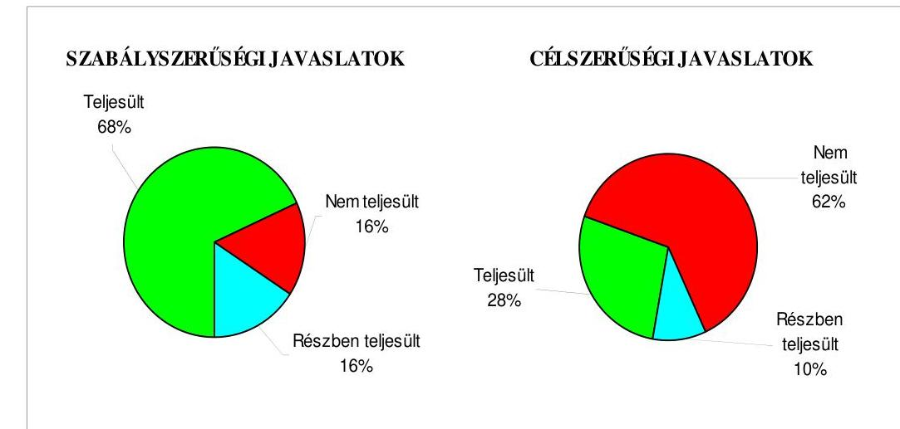
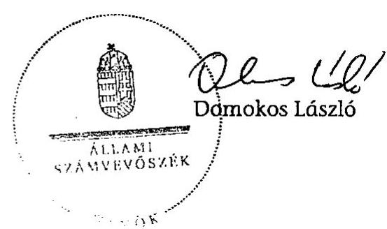
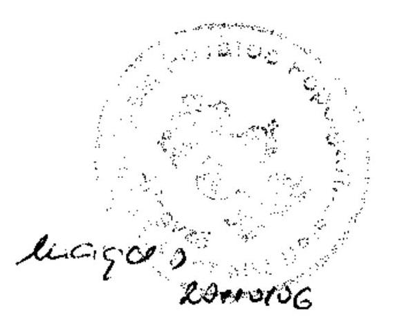
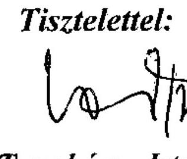
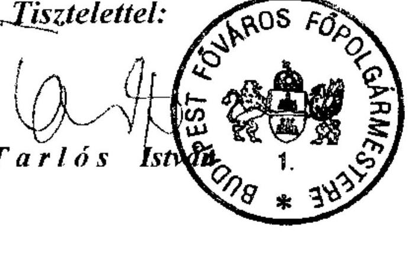
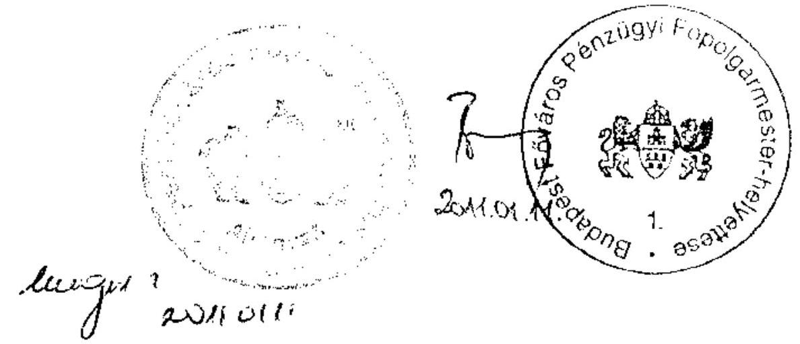
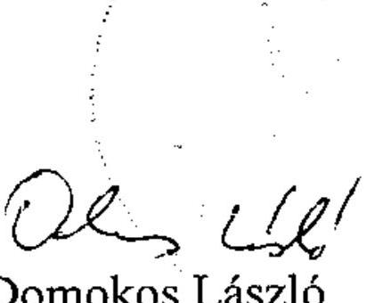

# ÁLLAMI   SZÁMVEVŐSZÉK 

## JELENTÉS

Budapest Főváros Önkormányzata költségvetési gazdálkodásában kialakított belső kontrollok működésének 2010. évi ellenőrzéséről

---

# 3. Önkormányzati és Területi Ellenőrzési Igazgatóság 

3.3. Átfogó Ellenőrzések Főcsoport

Iktatószám: V-3007/52/2010
Témaszám: 979
Vizsgálat-azonosító szám: V0520

## Az ellenőrzést felügyelte:

Dr. Lóránt Zoltán
főigazgató
Az ellenőrzés végrehajtásáért felelős:
Dr. Sepsey Tamás
főigazgató-helyettes
Az ellenőrzést vezette:
Gyüre Lajosné
vizsgálatvezető, tanácsadó
Az ellenőrzést végezték:

Nagy Istvánné dr. Dr. Marosi Gyöngyi főtanácsadó
Bus András Péter
számvevő
Kozma Gábor
számvevő tanácsos

## A témához kapcsolódó eddig készített számvevőszéki jelentések:

## címe

Jelentés a Magyar Köztársaság 2005. évi költségvetése végrehajtásának ellenőrzéséről

Függelék:

- a helyi önkormányzatokat a 2005. évben megillető normatív állami hozzájárulás elszámolásának ellenőrzéséről
- a kötött felhasználású támogatások 2005. évi felhasználásának ellenőrzéséről
- a helyi önkormányzatok beruházásaihoz és rekonstrukcióihoz nyújtott 2005. évi felhalmozási célú támogatások ellenőrzéséről

Jelentés a Budapest Főváros Önkormányzatánál az önkormányzati feladatok és a rendelkezésre álló források összhangjának ellenőrzéséről (Az önkormányzati gazdálkodás átfogó ellenőrzésének IV. üteme)

---

Jelentés a 2006. évi országgyűlési, valamint önkormányzati és ..... 0722 nemzeti, etnikai kisebbségi képviselő-választások lebonyolításához felhasznált pénzeszközök ellenőrzéséről
Jelentés a helyi és helyi kisebbségi önkormányzatok gazdálkodási rendszerének 2006. évi átfogó és egyéb szabályszerűségi ellenőrzéséről ..... 0726
Jelentés a szakiskolai fejlesztési programra fordított pénzeszközök felhasználása eredményességének ellenőrzéséről ..... 0819
Jelentés az önkormányzati kórházak és bentlakásos szociális intézmények ápolásra, gondozásra fordított pénzeszközei felhasználásának ellenőrzéséről ..... 0820
Jelentés a Magyar Köztársaság 2007. évi költségvetése végrehajtásának ellenőrzéséről ..... 0824
Függelék:

- a helyi önkormányzatok beruházásaihoz és rekonstrukcióihoz nyújtott 2007. évi felhalmozási célú támogatások ellenőrzéséről

Jelentés a sürgősségi betegellátó rendszer kialakítására, fejlesztésére fordított pénzeszközök felhasználásának ellenőrzéséről ..... 0924
Jelentés a 2008. március 9-én megtartott országos ügydöntő népszavazás lebonyolításához felhasznált pénzeszközök ellenőrzéséről ..... 0925
Jelentés Budapest Főváros Önkormányzatának egyes hatósági díjak megállapítására irányuló tevékenységének ellenőrzéséről (Az önkormányzati gazdálkodás rendszere ellenőrzésének II. üteme) ..... 0930
Jelentés Budapest Főváros Önkormányzata európai uniós források igénylésére és felhasználására történt felkészültsége ellenőrzéséről (Az önkormányzati gazdálkodás rendszere ellenőrzésének III. üteme) ..... 0957

---

# TARTALOMJEGYZÉK 

BEVEZETÉS ..... 10
I. ÖSSZEGZŐ MEGÁLLAPÍTÁSOK, KÖVETKEZTETÉSEK, JAVASLATOK ..... 15
II. RÉSZLETES MEGÁLLAPÍTÁSOK ..... 25

1. A költségvetési gazdálkodás folyamatában a belső kontrollok kialakítása és működtetése ..... 25
1.1. A folyamatba épített előzetes, utólagos és vezetői ellenőrzéssel kapcsolatos szabályozás és eljárásrend, ennek részeként a költségvetés végrehajtása során elvégzendő belső kontrollok kialakítása a Főpolgármesteri hivatalban ..... 25
1.2. A költségvetési gazdálkodás folyamatában kulcsszerepet betöltő szakmai teljesítésigazolás és az utalvány ellenjegyzés működtetésének megfelelősége ..... 27
2. A belső ellenőrzési kötelezettség teljesítése ..... 47
2.1. A gazdálkodási feladatok szabályszerű ellátása érdekében a belső ellenőrzés szervezeti keretének meghatározása és működési feltételeinek szabályozottsága ..... 47
2.2. A belső ellenőrzésnél a kialakított kontrollok működtetése ..... 51
3. Az ÁSZ korábbi ellenőrzési javaslatai alapján készített intézkedési terv végrehajtása, hasznosítása ..... 54
3.1. A Fővárosi Önkormányzat gazdálkodási rendszerében az egyes hatósági díjak megállapítására irányuló tevékenységéről (II. ütem), továbbá az európai uniós források igénylésére és felhasználására történt felkészüléséről (III. ütem) végzett ellenőrzés során tett javaslatok végrehajtására tervezett intézkedések megvalósítása ..... 54
3.2. A zárszámadáshoz kapcsolódó (állami hozzájárulások, támogatások igénylésének és felhasználásának ellenőrzése), valamint a további vizsgálatok esetében a megállapítások, javaslatok alapján tett intézkedések ..... 63

---

# MELLÉKLETEK 

1. számú Az Önkormányzat gazdálkodását meghatározó adatok, mutatószámok (1 oldal)
2. számú Az Önkormányzat 2007-2010. évi költségvetési előirányzatainak és 2007-2009. évi pénzügyi teljesítéseinek alakulása (1 oldal)
3. számú Tarlós István úr, Budapest Főváros Önkormányzatának Főpolgármestere által tett észrevételek (3 oldal)
4. számú Tarlós István úr, Budapest Főváros Önkormányzata Főpolgármesterének észrevételére adott válasz (1 oldal)

## FÜGGELÉKEK

1. számú A gazdálkodási feladatoknak, a hatáskörök szabályozottságának szervezeti egységenkénti ellenőrzése alapján tett javaslatok alátámasztása (1 oldal)
2. számú A működési célú pénzeszközátadások államháztartáson kívülre teljesített kifizetései során a belső kontrollok működésének szervezeti egységenkénti ellenőrzése alapján tett javaslatok alátámasztása (1 oldal)
3. számú Az állományba nem tartozók megbízási díjai kifizetése során a belső kontrollok működésének szervezeti egységenkénti ellenőrzése alapján tett javaslatok alátámasztása (1 oldal)
4. számú A külső szolgáltatók által végzett karbantartással, kisjavítással kapcsolatos kifizetések során a belső kontrollok működésének szervezeti egységenkénti ellenőrzése alapján tett javaslatok alátámasztása (1 oldal)

---

# RÖVIDÍTÉSEK, MOZAIKSZAVAK JEGYZÉKE 

## Törvények

Áht.
ÁSZ tv.
Eü. tv.
Gt. tv.
Htv.

Ktv.
Ötv.
Ptk.
Számv. tv.
Szoc. tv.

## Rendeletek

Ámr. 1
Ámr. 2
Ber.
SzMSz
2008. évi átmeneti gazdálkodásról szóló rendelet
2009. évi átmeneti gazdálkodásról szóló rendelet
2009. évi költségvetési rendelet
2010. évi költségvetési rendelet

## Szövegrövidítések

2007. Ellenőrzési Kézikönyv
az államháztartásról szóló 1992. évi XXXVIII. törvény az Állami Számvevőszékről szóló 1989. évi XXXVIII. törvény az egészségügyről szóló 1997. évi CLIV. törvény a gazdasági társaságokról szóló 2006. évi IV. törvény a helyi önkormányzatok és szerveik, a köztársasági megbízottak, valamint egyes centrális alárendeltségű szervek feladat- és hatásköreiről szóló 1991. évi XX. törvény
a köztisztviselők jogállásáról szóló 1992. évi XXIII. törvény a helyi önkormányzatokról szóló 1990. évi LXV. törvény a Polgári Törvénykönyvről szóló 1959. évi IV. törvény a számvitelről szóló 2000. évi C. törvény a szociális igazgatásról és a szociális ellátásokról szóló 1993. évi III. törvény
az államháztartás működési rendjéről szóló 217/1998. (XII. 30.) Korm. rendelet
az államháztartás működési rendjéről szóló 292/2009. (XII. 19.) Korm. rendelet
a költségvetési szervek belső ellenőrzéséről szóló 193/2003. (XI. 26.) Korm. rendelet
Budapest Főváros Önkormányzata 7/1992. (III. 26.) számú rendelete a Fővárosi Önkormányzat Szervezeti és Működési Szabályzatáról
Budapest Főváros Önkormányzat 2008. évi átmeneti finanszírozásáról és költségvetési gazdálkodásáról szóló 77/2007. (XII. 28.) számú rendelete
Budapest Főváros Önkormányzat 2009. évi átmeneti finanszírozásáról és költségvetési gazdálkodásáról szóló 84/2008. (XII. 30.) számú rendelete
Budapest Főváros Önkormányzat 2009. évi költségvetéséről szóló 28/2009. (V. 25.) számú rendelete
Budapest Főváros Önkormányzat 2010. évi költségvetéséről szóló 9/2010. (III. 31.) számú rendelete

Budapest Főváros Főjegyzőjének 569/2007. számú intézkedése a belső ellenőrzés szabályairól, a Fővárosi Önkormányzat (belső) ellenőrzési kézikönyvéről, 2007. december 7.

---

2009. Ellenőrzési Kézikönyv

ÁROP
ÁROP fejlesztési feladat

ÁSZ
Belső Ellenőrzési Alosztály

Beruházási Ügyosztály

BTI Zrt.

DHK Zrt.

Egészségügyi Ügyosztály
együttműködési megállapodás

EU Iroda
EU Megvalósító Alosztály

FEUVE
FIMÜV Zrt.
FKF Zrt.
folyamatszabályozás

Főépítészi Iroda
főjegyző

Budapest Főváros Főjegyzőjének 512/2009. számú intézkedése a belső ellenőrzés szabályairól, a Fővárosi Önkormányzat (belső) ellenőrzési kézikönyvéről, 2009. február 20.
ÚMFT Államreform Operatív Program
a Főpolgármesteri Hivatal szervezeti és működési kultúrájának javítása, Projekt Megvalósító Egységének kialakítása és informatikai támogatása címú, ÁROP-3.A.1./B-2008-0020 jelű fejlesztési feladat (projekt)
Állami Számvevőszék
Budapest Főváros Önkormányzat Főpolgármesteri Hivatala Főjegyzői Iroda Belső Ellenőrzési Alosztálya
Budapest Főváros Önkormányzat Főpolgármesteri Hivatala Beruházási Ügyosztálya
Budapesti Temetkezési Intézet Zártkörűen Működő Részvénytársaság
DHK Hátralékkezelő és Pénzügyi Szolgáltató Zártkörűen Működő Részvénytársaság
Budapest Főváros Önkormányzat Főpolgármesteri Hivatala Egészségügyi Ügyosztálya
Budapest Főváros Önkormányzata és a Budapesti Távhőszolgáltató Zártkörűen Működő Részvénytársaság között 2008. januárban megkötött, a távhőszolgáltatási feladatok ellátásáról szóló együttműködési megállapodás
Budapest Főváros Önkormányzat Főpolgármesteri Hivatala Európai Uniós Ügyek Irodája
Budapest Főváros Önkormányzat Főpolgármesteri Hivatala Főjegyzői Iroda Központi EU Projekt Megvalósító Alosztálya
folyamatba épített, előzetes, utólagos és vezetői ellenőrzés
Fővárosi Ingatlankezelő Műszaki Vállalkozói Zártkörűen Működő Részvénytársaság
Fővárosi Közterület-fenntartó Zártkörűen Működő Részvénytársaság
Budapest Főváros Önkormányzat Főpolgármesteri Hivatala szervezeti egységeinek a minőségügyi eljárás keretében kidolgozott és a feladatváltozások figyelembevételével aktualizált folyamatszabályozása, a Budapest Főváros Önkormányzat Főpolgármesteri Hivatala - 2001. május 28-tól folyamatosan aktualizált - Minőségügyi Kézikönyve alapján
Budapest Főváros Önkormányzat Főpolgármesteri Hivatala Főépítészi Irodája
Budapest Főváros Önkormányzatának Főjegyzője

---

Főjegyzői Iroda
FŐKÉTŰSZ Kft.
főpolgármester
Főpolgármesteri Iroda
Főpolgármesteri hivatal
FŐTÁV Zrt.
Fővárosi Önkormányzat
Fővárosi Vízművek Zrt.
szakmai befektetők
FTSZV Kft.
gazdálkodási hatáskörök szabályzata

Hálózat Alapítvány
hivatali SzMSz

Informatikai Ügyosztály
Költségvetési Gazdálkodási Ügyosztály

Kereskedelmi Ügyosztály

KMOP
Kormányzati Koordinációs Központ

Környezetgazdálkodási Ügyosztály
Közgyűlés
Közlekedési Ügyosztály
Közmű Alosztály

Budapest Főváros Önkormányzat Főpolgármesteri Hivatala Főjegyzői Irodája
Fővárosi Kéményseprőipari Korlátolt Felelősségű Társaság
Budapest Főváros Önkormányzatának Főpolgármestere
Budapest Főváros Önkormányzat Főpolgármesteri Hivatala Főpolgármesteri Irodája
Budapest Főváros Önkormányzat Főpolgármesteri Hivatala
Budapesti Távhőszolgáltató Zártkörűen Működő Részvénytársaság
Budapest Főváros Önkormányzata
a szindikátusi és menedzsment szerződést vevőként aláíró Lyonnaise des Eaux és RWE Aqua Gmbh. vállalatok
Fővárosi Településtisztasági és Környezetvédelmi Korlátolt Felelősségű Társaság
a Főpolgármesteri hivatal pénzgazdálkodásával kapcsolatos kötelezettségvállalás, utalványozás, ellenjegyzés, érvényesítés és szakmai teljesítést igazoló hatásköri rendjéről szóló 556/2005. számú főpolgármesteri és főjegyzői együttes intézkedés
Hálózat - Budapesti Díjfizetőkért és Díjhátralékosokért Alapítvány
Budapest Főváros Önkormányzata Főpolgármesteri Hivatalának az 525/2005. számú főpolgármesteri és főjegyzői intézkedése alapján a 2009. január 1. és 2009. december 31. között hatályos „Szervezeti és Működési Szabályzata, Ügyrendje"
Budapest Főváros Önkormányzat Főpolgármesteri Hivatala Informatikai Ügyosztálya
Budapest Főváros Önkormányzat Főpolgármesteri Hivatala Költségvetési Gazdálkodási Ügyosztálya

Budapest Főváros Önkormányzat Főpolgármesteri Hivatala Kereskedelmi, Turisztikai és Fogyasztói Érdekvédelmi Ügyosztálya
ÜMFT Közép-Magyarországi Operatív Program
Budapest Főváros Önkormányzat Főpolgármesteri Hivatala Főpolgármesteri Iroda Kormányzati Koordinációs Központja (2010. február 1-jéig)
Budapest Főváros Önkormányzat Főpolgármesteri Hivatala Környezetgazdálkodási és Energetikai Ügyosztálya
Budapest Főváros Önkormányzat Közgyűlése
Budapest Főváros Önkormányzat Főpolgármesteri Hivatala Közlekedési Ügyosztálya
Budapest Főváros Önkormányzata Főpolgármesteri Hivatala Közmű Ügyosztály Kommunális Közszolgáltatási Alosztálya

---

Közmű Ügyosztály
közszolgáltatási keretszerződés1
közszolgáltatási keretszerződés2
közszolgáltatási keretszerződés3

Kulturális Ügyosztály

Lakás Ügyosztály
Oktatási Ügyosztály
pénzügyi információs rendszert hatályba léptető főjegyzői intézkedés

PR
Revizori Ügyosztály
részvényesi szerződés

SAP

Sport Ügyosztály

Budapest Főváros Önkormányzat Főpolgármesteri Hivatala Közmű Ügyosztálya
a szilárd hulladékkezelésre vonatkozó, a Fővárosi Önkormányzat és az FKF Zrt. részéről 2008. július 14-én tíz évre, 2018. december 31-ig kötött keretmegállapodás, amelyet a Fővárosi Közgyűlés az 1110/2008. (VI. 26.) számú határozatával hagyott jóvá. A keretszerződés hatályba lépésének napja 2009. január 1. volt, a díjszámításra vonatkozó mellékletet a 2010. évi díjra vonatkozóan alkalmazták először.
a folyékony hulladékkezelésre vonatkozó, a Fővárosi Önkormányzat és az FTSZV Kft. részéről 2009. január 28-án hat évre, 2014. december 31-ig kötött keretmegállapodás, amelyet a Fővárosi Közgyűlés az 1978/2008. (XII. 28.) számú határozatával hagyott jóvá.
a kegyeleti közszolgáltatásokra vonatkozó, a Fővárosi Önkormányzat és a BTI Zrt. részéről 2009. április 15-én kilenc évre, 2018. december 31-ig kötött keretmegállapodás, amelyet a Fővárosi Közgyűlés a 136/2009. (II. 26.) számú határozatával hagyott jóvá.
Budapest Főváros Önkormányzat Főpolgármesteri Hivatala Kulturális Ügyosztálya
Budapest Főváros Önkormányzat Főpolgármesteri Hivatala Lakás Ügyosztálya
Budapest Főváros Önkormányzat Főpolgármesteri Hivatala Oktatási Ügyosztálya
az 501/2009. számú főjegyzői intézkedés, amely a Főpolgármesteri Hivatal költségvetési gazdálkodása pénzügyi, számviteli folyamatainak számítógépes programon alapuló nyilvántartási rendszerének kötelező alkalmazását rendelte el, 2009. január 5-i hatállyal
kapcsolatok, közkapcsolatok szervezése
Budapest Főváros Önkormányzat Főpolgármesteri Hivatala Költségvetési Revizori Ügyosztálya
a Fővárosi Önkormányzat és a szakmai befektetők (a Compagnie Generale des Eaux és a Berliner Wasser Betriebe) között 1997. november 3-án létrejött részvényesi szerződés a Fővárosi Csatornázási Művek Zrt. irányításáról, a tulajdonosok jogainak és kötelezettségeinek szabályozásáról
a Systeme, Anwendungen und Produkte in der Datenverarbeitung (Rendszerek, alkalmazások és termékek az adatfeldolgozásban) integrált számítógépes vállalatirányítási rendszer
Budapest Főváros Önkormányzat Főpolgármesteri Hivatala Sport Ügyosztálya

---

Személyzeti Ügyosztály

Szervezési Ügyosztály
szindikátusi és menedzsment szerződés

Szociálpolitikai Ügyosztály
támogatási szerződés

Települési Értékvédelmi Ügyosztály
ÚMFT
Vállalkozási és Vagyonkezelési Ügyosztály
Védelmi és Gazdasági Ügyosztály

Budapest Főváros Önkormányzat Főpolgármesteri Hivatala Személyzeti, Oktatási és Munkaügyi Ügyosztálya
Budapest Főváros Önkormányzat Főpolgármesteri Hivatala Szervezési Ügyosztálya
a Fővárosi Önkormányzat és a szakmai befektetők (a Lyonnaise des Eaux és az RWE Aqua Gmbh.) között 1997. április 11-én létrejött szerződés a Fővárosi Vízművek Zrt. irányításáról és a vízdíj meghatározásának módszeréről
Budapest Főváros Önkormányzat Főpolgármesteri Hivatala Szociálpolitikai Ügyosztálya
a Fővárosi Önkormányzat által nyújtott működési és felhalmozási célú pénzeszközátadásokkal összefüggő támogatási szerződések, támogatási megállapodások közös megnevezése
Budapest Főváros Önkormányzat Főpolgármesteri Hivatala Települési Értékvédelmi Ügyosztály
Új Magyarország Fejlesztési Terv
Budapest Főváros Önkormányzat Főpolgármesteri Hivatala Vállalkozási és Vagyonkezelési Ügyosztálya
Budapest Főváros Önkormányzat Főpolgármesteri Hivatala Védelmi és Gazdasági Ügyosztálya

---

# ÉRTELMEZŐ SZÓTÁR 

belső ellenőrzési egységek
belső működési szabályzat
címkód
előzetes érvényesítés
fedlap
gazdálkodó szervezeti egységek
a Belső Ellenőrzési Alosztály és a Revizori Ügyosztály együttesen
A Főpolgármesteri Hivatalban a szervezeti egységenként

 készített belső működési szabályzat, amely a hivatali SzMSz-ben meghatározott feladatokat, végrehajtásuk szabályait a szervezeti egységeken belül alosztályonkénti részletezés szerint tartalmazza.
a pénzgazdálkodással összefüggő hatáskörök szabályozásában a költségvetési feladatot azonosító négyjegyű szám
A Főpolgármesteri hivatal pénzügyi-gazdasági feladatot ellátó szervezeti egységei az előzetes érvényesítés során ellenőrzik, hogy a szervezeti egységnél kezelt előirányzatok tekintetében a követelés jogos-e, a fedezet rendelkezésre áll-e, az anyag, áru, szolgáltatás vagy munka átvétele, a szükséges bevételezés megtörtént-e, a kifizetésre történő intézkedés elrendelése a döntéshozatalnak megfelelően történik-e, az alapbizonylat megfelel-e a jogszabályoknak, a szükséges mellékleteket csatolták-e, az utalvány adatai egyeznek-e az alapbizonylat adataival, a szükséges azonosítók a bizonylaton szerepelnek-e, kijelölésre került-e a szakfeladat, törzsszám illetve a főkönyvi számlaszám.
A Főpolgármesteri hivatal pénzgazdálkodásával kapcsolatos gazdálkodási hatáskörök szabályzata alapján kitöltendő aláírás bejelentő nyomtatványok felzett (felső) lapja. A fedlapnak tartalmaznia kell a gazdálkodó szervezeti egység címkóddal azonosított feladatait, az ezekhez rendelt hatásköröket, illetve a hatáskörökben bekövetkezett változásokat.
A Főpolgármesteri hivatal gazdálkodási kerettel rendelkező, belső szervezeti egységként meghatározott ügyosztályai és irodái. A gazdálkodási kerettel történő gazdálkodáshoz biztosított - a gazdálkodási hatáskörök szabályzata szerint - a kötelezettségvállalás, az utalványozás, ezek ellenjegyzése, az érvényesítés és a szakmai teljesítésigazolás hatáskörök gyakorlása.

---

közszolgáltatási keretszerződés
menedzsment díj
pénzügyi információs rendszer
szervezeti egység

A Fővárosi Önkormányzat a közüzemi közszolgáltatási tevékenységeket ellátó egyes gazdasági társaságokkal közszolgáltatási keretszerződéseket kötött a 2008-2009. években. A keretszerződések megkötése azokra az önkormányzati tulajdonú társaságokra terjedt ki, amelyek az európai uniós jogszabályok és megnevezés alapján általános gazdasági érdekű szolgáltatási tevékenységet folytatnak és a Fővárosi Önkormányzat a szolgáltatások biztosítására - a közösségi jognak megfelelő - támogatást (kompenzációt) nyújthat. (Az általános gazdasági érdekű szolgáltatásokra vonatkozó szabályozást az EK-szerződés 86. cikke (2) bekezdése, valamint az alkalmazásáról szóló 2005/842/EK bizottsági határozat tartalmazta.)
A keretszerződésekben meghatározták a közszolgáltatások szakmai, üzemgazdasági, műszaki tartalmát, mennyiségi és minőségi paramétereit, a szolgáltatási tevékenység végzésének jogi kereteit, a kompenzáció nyújtásának feltételrendszerét, a tarifa-számítás szabályait. A keretszerződések alapján a gazdasági társaságokkal éves közszolgáltatási szerződéseket kötnek. A Fővárosi Önkormányzat egyes hatósági díjak megállapítására irányuló tevékenységének ÁSZ utóvizsgálatához kapcsolódóan három önkormányzati társaság, a BTI Zrt., az FKF Zrt. és az FTSZV Kft. rendelkezett megkötött közszolgáltatási keretszerződéssel.
A menedzsment díj a Fővárosi Vízművek Zrt. szakmai befektetői részére kifizetett, tulajdonosi (osztalék jellegű) díjazás, nem része a menedzsment személyi kifizetéseinek, könyvelés-technikailag a költségek között, igénybe vett szolgáltatásként számolják el. A menedzsment díjat a vízdíj kiszámítására szolgáló díjképlet egyes díjelemeiből számított ösztönzők (költségmegtakarítás, vevőállomány csökkenés, egyéb bevételek növelése) alapján számítják ki. A Főpolgármesteri hivatal költségvetési gazdálkodása pénzügyi, számviteli folyamatainak számítógépes programon alapuló egységes nyilvántartási rendszere. A pénzügyi információs rendszer magában foglalja az ügyosztályok és irodák költségvetési gazdálkodási feladatainak nyilvántartását, a pénzügyi-gazdasági információszolgáltatást, valamint a főpolgármesteri hivatali szintű összesítéseket.
a hivatali SzMSz-ben belső szervezeti egységként meghatározott ügyosztályok és irodák közös megnevezése

---

# JELENTÉS 

## Budapest Főváros Önkormányzata költségvetési gazdálkodásában kialakított belső kontrollok működésének ellenőrzéséről

## Az önkormányzati gazdálkodás rendszere ellenőrzésének IV. üteme

## BEVEZETÉS

Az Ötv. 92. § (1) bekezdése, az Állami Számvevőszékről szóló 1989. évi XXXVIII. törvény 2. § (3) bekezdése, valamint az Áht. 120/A. § (1) bekezdése alapján az önkormányzatok gazdálkodását az Állami Számvevőszék ellenőrzi.

A Fővárosi Önkormányzat gazdálkodási rendszerének több évre ütemezett átfogó ellenőrzése végrehajtásának keretében a 2007-2010. évekre vonatkozó - az önkormányzati gazdálkodás rendszere ellenőrzésére irányuló - ellenőrzési programon alapulóan az Állami Számvevőszék a 2010. évben ellenőrizte a költségvetési gazdálkodás folyamatában kialakított belső kontrollok működését, valamint a korábbi számvevőszéki ellenőrzések megállapításainak, javaslatainak hasznosítását, a javaslatok megvalósítása érdekében tett intézkedéseket.

Az ellenőrzés célja annak értékelése volt, hogy a Fővárosi Önkormányzatnál:

- a külső és a belső feltételek figyelembevételével alakították-e ki és működtették-e a belső kontrollokat a költségvetési gazdálkodás, valamint a belső ellenőrzés folyamatában, valamint;
- megfelelően hasznosították-e a korábbi számvevőszéki ellenőrzések megállapításait, szabályszerűségi ${ }^{1}$ és célszerűségi javaslatait.

Az ellenőrzés típusa: átfogó ellenőrzés, amely a belső kontrollok megfelelőségét értékeli, az ellenőrzés során meghatározott területekre összpontosítva egyidejűleg alkalmazza a szabályszerűségi, valamint a teljesítmény-ellenőrzés egyes jellemzőit, módszereit, technikáit.

Az ellenőrzött időszak: a Fővárosi Önkormányzat gazdálkodásában a belső kontrollok kialakítását és működtetését, valamint az Állami Számvevőszék ko-

[^0]
[^0]:    ${ }^{1}$ A törvényi előírások betartásának elmulasztásakor a részletes megállapítások fejezetben egységesen a törvénysértés megjelölést alkalmazzuk, mivel az ÁSZ nem tehet különbséget a törvényi előírások között.

---

rábbi ellenőrzési javaslatainak megvalósítását a 2009. évre, a belső ellenőrzési kötelezettség teljesítését a 2009. évre és a 2010. év I. félévére vonatkozóan vizsgáltuk, a megállapításoknál - lehetőség szerint - figyelembe vettük a 2010. évben, a helyszíni ellenőrzés ideje alatt tett intézkedéseket is.

Budapest főváros állandó lakosainak száma 2010. január 1-jén 1721556 fő ${ }^{2}$ volt. A 2006. évi önkormányzati képviselő- és főpolgármester-választást követően a Fővárosi Önkormányzat 67 tagú Közgyűlésének munkáját tizenöt állandó bizottság segítette. A Fővárosi Önkormányzat mellett a 2006. évi önkormányzati képviselő- és főpolgármester-választást követően 11 kisebbségi önkormányzat ${ }^{3}$ működött. A főpolgármester személye a 2010. évi önkormányzati képviselő- és főpolgármester-választást követően változott, a korábbi főpolgármester 1990. óta töltötte be tisztségét. A főjegyző 1992. év óta látta el a főjegyzői feladatokat, a Fővárosi Önkormányzatnál fennálló közszolgálati jogviszonya 2010. november 18-án megszűnt.

A Fővárosi Önkormányzat feladatainak végrehajtása érdekében a 2007. évben 226, a 2009. évben 213 költségvetési intézményt működtetett, amelyekből a 2007. évben 195 önállóan gazdálkodó, a 2009. évben 182 önállóan működő és gazdálkodó volt. A feladatok ellátásában a 2007. évben 40, a 2009. évben 42 önkormányzati többségi tulajdonú gazdasági társasága vett részt. A Fővárosi Önkormányzat az éves költségvetési beszámolója szerint a 2009. évben 480699 millió Ft költségvetési bevételt ért el, és 408584 millió Ft költségvetési kiadást teljesített. A teljesített költségvetési bevételek 14,4%-kal, a költségvetési kiadások 23,2%-kal maradtak el a 2007. évben teljesített költségvetési bevételektől és kiadásoktól, a teljesített működési és felhalmozási célú költségvetési bevételek, valamint kiadások csökkenése következtében. A Fővárosi Önkormányzat 2009. december 31-én a könyvviteli mérleg szerint 2203286 millió Ft értékű vagyonnal rendelkezett. A Fővárosi Önkormányzat vagyona a 2009. év végére a 2007. év végi állományhoz viszonyítva 7,4%-kal emelkedett, ezen belül több mint kétszeresére (122%-kal) nőtt a beruházások állománya a nagy költségigényű fejlesztések (a 4-es metró, a központi szennyvíztisztító és létesítményei) miatt. Megkétszereződött (106,2%-kal emelkedve 107223 millió Ft-ra nőtt) a tartalékok állománya, amelynek növekedéséhez hozzájárult a Kohéziós Alapból és a központi költségvetésből a 2009. év végén rendelkezésre bocsátott 18976 millió Ft európai uniós és hazai támogatással megvalósuló fejlesztések támogatási előlege. A Fővárosi Önkormányzat hosszú lejáratú kötelezettségének állománya 147533 millió Ft, a rövid lejáratú kötelezettség állománya 89616 millió Ft volt 2009. december 31-én. Az összes költségvetési bevétel 61,2%-át a saját bevétel, illetve 19,4%-át a helyi adó bevétel biztosította a 2009. évben. A helyi adóbevétel összes költségvetési bevételen belüli aránya a 2007. évihez viszonyítva 6,8 százalékponttal nőtt. Az összes költségvetési kiadásból a felhalmozási célú kiadás részaránya a 2007. évhez viszonyítva a 2009. évre 4,6 százalékponttal mérséklődött, a 2009. évben 30,5% volt. A telje-

[^0]
[^0]:    ${ }^{2}$ Az állandó népességszám adatának forrása a Központi Statisztikai Hivatalnak a „Népesség, népmozgalom" témakör keretében a település jellege szerinti kimutatása volt.
    ${ }^{3}$ A kisebbségi önkormányzatok a bolgár, cigány, görög, horvát, lengyel, német, örmény, román, ruszin, szerb és szlovák kisebbségi önkormányzatok voltak.

---

sített felhalmozási célú költségvetési kiadások részarányának kismérvű csökkenését az európai uniós forrással, valamint a hazai támogatás igénybe vételével megvalósult fejlesztésekre teljesített kifizetések csökkenése okozta. A 2010. évi költségvetési rendeletben 491855 millió Ft költségvetési bevételt és 524788 millió Ft költségvetési kiadást irányoztak elő, a költségvetési hiányt felhalmozási célú hitelből tervezték finanszírozni. A 2010. évben a költségvetés tervezett hiányát a felhalmozási célú költségvetési bevételeket meghaladó összegben tervezett felhalmozási célú költségvetési kiadások okozták. A 2010. év I. félévi költségvetési beszámolója szerint a tervezett működési célú költségvetési bevételek 44,1%-a, a felhalmozási célú költségvetési bevételek 29,4%-a folyt be, míg működési célú költségvetési kiadások 52,5%-ra, a felhalmozási célú költségvetési kiadások 18,4%-ra teljesültek.

A Főpolgármesteri hivatalban dolgozó köztisztviselők száma 2007. december 31-én 1007 fő, 2009. december 31-én 1071 fő, a költségvetési intézményekben foglalkoztatott közalkalmazottak száma 2007. december 31-én 33519 fő, 2009. december 31-én 32903 fő volt. A Főpolgármesteri hivatal gazdasági szervezetét 29 szervezeti egység (ügyosztály és iroda) alkotta a 2009. évben. A számvevőszéki ellenőrzés a költségvetési gazdálkodás belső kontrolljai kialakításának és működtetésének ellenőrzése mintavételezés alapján a következő ügyosztályokra és irodákra (összesen 18) terjedt ki: Egészségügyi, Informatikai, Kereskedelmi, Közlekedési, Közmű, Kulturális, Lakás, Oktatási, Sport, Személyzeti, Szervezési, Szociálpolitikai, Települési Értékvédelmi, Vállalkozási és Vagyonkezelési, Védelmi és Gazdasági Ügyosztály, Főépítészi, valamint Főpolgármesteri Iroda. A Fővárosi Önkormányzat gazdálkodását meghatározó adatokat, mutatószámokat az 1-2. számú mellékletek tartalmazzák.

A költségvetési gazdálkodás belső kontrolljainak ellenőrzése során vizsgáltuk, hogy a Főpolgármesteri hivatalban a költségvetési gazdálkodás folyamatában a belső kontrollok kialakítása és működése megfelelő biztosítékot ad-e a gazdálkodási feladatok szabályszerű ellátására. Felmértük és minősítettük a költségvetési gazdálkodás folyamatában a kontrollok kialakításának kockázatát, valamint azok működésének megfelelőségét. A vizsgálat során értékeltük a belső ellenőrzés szabályozottságát, működési feltételeinek kialakítását, meghatározását, továbbá működésének megfelelőségét.

A Főpolgármesteri hivatalban értékeltük a gazdálkodás folyamatában kulcsszerepet betöltő belső kontrollok működésének megfelelőségét, ennek keretében ellenőriztük a szakmai teljesítés igazolására és az utalvány ellenjegyzésére kialakított kontrollok végrehajtását. Az ellenőrzést a következő, magas ${ }^{4}$ kockázatú kifizetésekre folytattuk le:

- az államháztartáson kívülre teljesített működési és felhalmozási célú pénzeszköz átadásokra,
- az állományba nem tartozók megbízási díjaira, továbbá

[^0]
[^0]:    ${ }^{4}$ Az önkormányzatok kiemelt előirányzataira vonatkozóan, a vertikális folyamatokra elvégeztük a kockázatok becslését, amelynek eredményeként határoztuk meg a magas kockázatú területeket.

---

- a külső szolgáltató által végzett karbantartási, kisjavítási szolgáltatásokra.

Az ellenőrzés hatékony elvégzése céljából a vizsgálandó területek kiválasztása során a kockázatokon alapuló megközelítés érvényesült, ezáltal az ellenőrzési erőforrásokat azokra a területekre fókuszáltuk, amelyeken a korábbi ellenőrzési tapasztalatok figyelembevételével legnagyobb a hibák előfordulási valószínűsége. Az ellenőrzési erőforrások ilyen típusú összpontosításával minimálisra kívántuk csökkenteni a kívánt ellenőrzési bizonyosság eléréséhez szükséges időráfordítást.

A pénzügyi-számviteli folyamatokban alkalmazott belső kontrollok kialakításának és működésének ellenőrzésére a vizsgált három terület 2009. évi könyvviteli tételeiből területenként egyszerű véletlen mintát vettünk. A kijelölt gazdasági eseményre elvégzett megfelelőségi tesztek alapján értékeltük a kontrollok működésének megfelelőségét a vizsgált három területre. A helyszíni ellenőrzés megállapításainak részletes dokumentálását megfelelőségi tesztlapokon, ellenőrzési munkalapokon biztosítottuk. Ezeken a teszt- és munkalapokon a minősítés alapjául szolgáló kérdések és a vonatkozó konkrét jogszabályhelyek megjelölése mellett értékeltük a kialakított belső kontrollokban rejlő kockázatokat ${ }^{5}$ és
 a kialakított kontrollok működésének megfelelőségét ${ }^{6}$.

Az ÁSZ korábbi ellenőrzési javaslatai alapján tett intézkedéseket, illetve azok megvalósítását utóellenőrzés keretében vizsgáltuk. A gazdálkodási rendszer korábbi átfogó ellenőrzése során megfogalmazott javaslatok végrehajtására tett intézkedések megvalósítását ellenőriztük, a további számvevőszéki ellenőrzések során tett javaslatok esetében pedig a kiadott intézkedéseket tekintettük át.

A helyszíni ellenőrzés során kitöltött - az ellenőrzést végző számvevő és a Főpolgármesteri hivatal felelős köztisztviselője által aláírt - ellenőrzési munkalapokat, azok kitöltési útmutatóit, továbbá a megfelelőségi tesztek dokumentumait a főpolgármester részére a számvevői jelentéssel egyidejűleg átadtuk. Az 1-4. számú függelékek a belső kontrollok kialakítására és működtetésére irányuló javaslatok alátámasztását, azok belső szervezeti egységenkénti hasznosításának segítését szolgálják.

A jelentés megállapításainak, javaslatainak egyeztetése során a Pénzügyi főpolgármester-helyettes ${ }^{7}$ arról adott részletes tájékoztatást - egyidejűleg csatolta azokat a dokumentumokat, amelyek igazolták -, hogy az időközben megtett intézkedésekkel a számvevői jelentésben tett néhány javaslatot ${ }^{8}$ megvalósították. A megtett intézkedéseket a jelentés II. Részletes megállapítások fejezetében az adott témához kapcsolt lábjegyzetben feltüntettük és a vonatkozó javaslatokat elhagytuk.

A jelentést az Állami Számvevőszékről szóló 1989. évi XXXVIII. tv. 25. § (1) bekezdése alapján észrevétel közlése céljából megküldtük a főpolgármesternek. A kapott tájékoztatást, valamint az arra adott választ a jelentés 3. és 4. számú mellékletei tartalmazzák.

[^0]
[^0]:    ${ }^{7}$ 2010. október 15-én választották a pénzügyekért felelős főpolgármester-helyettessé.
    ${ }^{8} \mathrm{~A}$ számvevői jelentésben a helyszíni ellenőrzés során a főjegyzőnek 20 szabályszerűségi és két célszerűségi javaslatot tettünk, amelyből négy szabályszerűségi javaslatot elhagytunk, valamint egy célszerűségi javaslatot az intézkedéssel érintett rész elhagyásával módosítottunk.

---

# I. ÖSSZEGZŐ MEGÁLLAPÍTÁSOK, KÖVETKEZTETÉSEK, JAVASLATOK 

A Főpolgármesteri hivatalnál a 2010. évben - a Fővárosi Önkormányzat gazdálkodási rendszerének több évre ütemezett átfogó ellenőrzése végrehajtásának keretében - a költségvetési gazdálkodás folyamatában kialakított belső kontrollok, valamint a belső ellenőrzés működését, továbbá a korábbi javaslatok megvalósítását ellenőriztük.

A Főpolgármesteri hivatalnál a gazdálkodási és a folyamatba épített ellenőrzési feladatok szabályozásának hiányosságai közepes kockázatot jelentettek a feladatok megfelelő és szabályszerű végrehajtásában, mivel a hivatali SzMSz az Ámr. ${ }_{1}$-ben előírtak ellenére nem tartalmazta a gazdasági szervezet megnevezését, felépítését, a szervezeti egységek engedélyezett létszámát, valamint a gazdasági vezető megjelölését. A gazdasági szervezet feladatait ellátó szervezeti egységek belső működési szabályzata - az Ámr. ${ }_{1}$-ben meghatározott követelmények ellenére - nem tartalmazta a pénzügyi-gazdasági feladatok ellátásáért felelős alkalmazottak feladat- és hatáskörét, felelősségi körét, az ügyintézők helyettesítési rendjét, továbbá a gazdasági vezetővel való kapcsolattartás módjának szabályozását. A főjegyző az Ámr. ${ }_{1}$ előírása ellenére nem jelölte ki az államháztartáson kívülre teljesített működési célú pénzeszközátadások tekintetében a kiadások jogosultságának és összegszerűségének ellenőrzését végző szakmai teljesítésigazolókat. A főjegyző által - az ellenőrzési jogkörök végzésére - kijelölt dolgozók munkaköri leírása a gazdálkodási hatáskörök szabályzatában előírtak ellenére nem minden esetben tartalmazta a kötelezettségvállalás ellenjegyzésére, a szakmai teljesítés igazolására, az utalvány ellenjegyzésére vonatkozó ellenőrzési jogköröket. A szervezeti egységenként elkészített ellenőrzési nyomvonalak - az Ámr. ${ }_{1}$-ben foglaltak ellenére - nem tartalmazták az egyes feladatok elvégzését igazoló dokumentum fellelési helyét a rendszerben. A szervezeti egységek ellenőrzési nyomvonalában nem utaltak arra, hogy a tevékenységeket, feladatokat részletesen mely belső szabályzatok tartalmazzák, nem határozták meg az ellenőrzési pontokat, illetve nem nevezték meg az egyes feladatok elvégzését igazoló dokumentumot. A Főpolgármesteri hivatal az Ámr. ${ }_{1}$-ben előírtak ellenére nem rendelkezett kockázatkezelési eljárásrenddel, valamint a szabálytalanságok kezelésének eljárásrendjével. A szabályozási hiányosságok miatt a Főpolgármesteri hivatalban kialakított belső szabályozás nem felelt meg maradéktalanul a gazdasági feladatok megfelelő és szabályszerű ellátását biztosító jogszabályi előírásoknak. A Pénzügyi főpolgármester-helyettes által adott, dokumentumokkal alátámasztott tájékoztatás szerint a munkaköri leírásokkal, a belső szervezeti egységek ellenőrzési nyomvonalaival, valamint a kockázatkezelési eljárásrend és a szabálytalanságok kezelése eljárásrendjével kapcsolatos hiányosságok megszüntetése érdekében 2010 novemberében intézkedtek.

A Főpolgármesteri hivatalnál az államháztartáson kívülre teljesített működési és felhalmozási célú pénzeszköz átadásokkal; az állományba nem tartozók megbízási díjaival; továbbá a külső szolgáltató által végzett karbantartási, kis-

---

javítási szolgáltatásokkal kapcsolatos, magas kockázatú kifizetéseknél a költségvetési gazdálkodás folyamatában kialakított, kulcsszerepet betöltő belső kontrollok - a szakmai teljesítésigazolás és az utalvány ellenjegyzés működésének megfelelősége gyenge volt.

Az állományba nem tartozók megbízási díjaival kapcsolatos kifizetések teljesítése során a szerződések szakmai teljesítését igazoló személyek az Ámr. ${ }_{1}$-ben foglaltakat nem tartották be, mivel nem végezték el a jogszabályban előírt ellenőrzési feladataikat. A szellemi tevékenység igénybevételére nyolc külső személlyel kötött - a jelentésben részletezett - 11 megbízási szerződés szakmai teljesítését annak ellenére igazolták, hogy az azokban foglaltak szerinti feladatok megbízott általi elvégzését bizonyító dokumentumok nem álltak rendelkezésre, vagy a csatolt dokumentumok hitelt érdemlően nem támasztották alá, hogy a kifizetések mögött a szerződés tárgyának megfelelő volt a teljesítés. A szellemi tevékenység igénybevételére külső személyekkel kötött 11 megbízási szerződés alapján teljesített kifizetések során a szakmai teljesítésigazolás működésében megállapított hiányosságok miatt a szakmai teljesítést igazoló személyek (az Egészségügyi Tanácsnok, a Főpolgármesteri Iroda vezetője, a Városüzemeltetési és Vagyongazdálkodási Főpolgármester-helyettesi Iroda vezetője, a Kormányzati Koordinációs Központ vezetője és az Adó Ügyosztály Ügyosztályvezetője) felelősek, mivel - az Ámr. ${ }_{1}$-ben előírtak ellenére - a megbízási díjak kifizetésének elrendelése előtt a szerződések teljesítését annak ellenére igazolták, hogy az azokban rögzített feladatok elvégzését, a kiadás jogosultságát, összegszerűségét okmányok alapján nem ellenőrizték. A szakmai teljesítést annak ellenére igazolták, hogy a feladatok megbízott általi elvégzését bizonyító okmányok, dokumentumok nem álltak rendelkezésre, vagy a csatolt dokumentumok hitelt érdemlően nem támasztották alá, hogy a kifizetések mögött a szerződés tárgyának megfelelő volt a teljesítés. A Főpolgármesteri Iroda vezetője, a Városüzemeltetési és Vagyongazdálkodási Főpolgármester-helyettesi Iroda vezetője, a Kormányzati Koordinációs Központ vezetője - Ktv. szerinti - fegyelmi felelősségre vonásának kezdeményezésére javaslatot azért nem tettünk, mert a köztisztviselői jogviszonyuk a 2010. évben megszűnt. A szakmai teljesítést igazolók mulasztása következtében a megbízási díjakat annak ellenére kifizették, hogy nem volt megállapítható a szerződéses feladatok elvégzése. A jogszabályba ütköző szakmai teljesítés igazolások alapján a vizsgált szerződések tekintetében - a bruttó összegek és a kifizetőt terhelő járulékok figyelembevételével - mindösszesen mintegy 32 millió Ft-ot fizettek ki.

A 2009. évben a hiányos külső és belső szabályozás következtében, míg a 2010. évben az Ámr. ${ }_{2}$-ben foglaltak és a 2010. évi költségvetési rendeletben rögzített tiltás ellenére a vizsgált körben olyan jellegű feladatok elvégzésével is megbíztak külső személyeket, amely munkák jelentős részét a Főpolgármesteri hivatal szakmai ügyosztályainak szakértelemmel rendelkező köztisztviselői el tudtak volna végezni. A Főpolgármesteri hivatalban egészségügyi, vagyongazdálkodási, környezetvédelmi mérnöki, városfejlesztési, valamint helyi adókkal kapcsolatos tanácsadással, sportszakmai feladatok elvégzésével annak ellenére bíztak meg állományba nem tartozó személyeket, hogy a szerződések tárgya alapján nem határozható meg az a - megbízások szükségességét alátámasztó - különleges szakértelem, amellyel a szakmai ügyosztályok köztisztviselői nem rendelkeztek volna. A Főpolgármesteri hivatalban a szellemi tevékenység igénybevé-

---

telére kötött megbízási szerződések alapján teljesített kifizetések ellenőrzése során szerzett tapasztalatok figyelembevételével feltételezhető annak kockázata, hogy a kulcsszerepet betöltő belső kontrollok működésében feltárt hiányosságok, mulasztások az állományba nem tartozók megbízási díjaival kapcsolatos szerződéseknél az előző években is fennálltak.

A Főpolgármesteri hivatalnál a vizsgált megbízási szerződéseknél feltárt szabálytalanságok miatt az Állami Számvevőszék büntető feljelentést tett.

Az államháztartáson kívülre nyújtott működési célú pénzeszközátadásokkal kapcsolatos kifizetések teljesítése során az Ámr. ${ }_{1}$ előírásai ellenére - a szakmai teljesítés igazolására jogosult személyek kijelölésének hiányában nem ellenőrizték a kifizetések jogosultságát és összegszerűségét.

Az árvízvédelmi műtárgyak külső szolgáltató által végzett karbantartására vonatkozó feladatok szakmai teljesítés igazolása során az igazolást végző személy nem ellenőrizte a kiadások összegszerűségét, mivel nem jelezte azt a hiányosságot, hogy a számlázás alapját képező összeget a szerződésben nem rögzítették. A szakmai teljesítést igazoló személyek azoknál a kifizetéseknél, amelyeknél a szakmai teljesítés igazolását nem a belső szabályzatban előírt módon végezték, nem tartották be az Ámr. ${ }_{1}$-ben foglaltakat sem. Az 50 ezer Ft-ot el nem érő, írásbeli kötelezettségvállalást nem igénylő szolgáltatások igénybevételénél - a megfelelő nyilvántartás hiányában - a szakmai teljesítés igazolására kijelölt személy aláírása ellenére nem történt meg a kifizetés jogosultságának, összegszerűségének, valamint a nyilvántartás szerinti teljesítés ellenőrzése.

Az utalványok ellenjegyzői az Ámr. ${ }_{1}$ előírása ellenére nem győződtek meg a szakmai teljesítésigazolás megtörténtéről a tervtanácsi szakértői feladatok ellátásával, valamint a közrendi, közbiztonsági szakvélemény elkészítésével és a hivatali köztisztviselők oktatásával kapcsolatos megbízási díj kifizetéseknél. Az utalványok ellenjegyzői aláírásuk ellenére nem kifogásolták, hogy nem a belső szabályzatban előírt módon, hanem az előző évi - Ámr. ${ }_{1}$-nek nem megfelelő tartalmú - formanyomtatványon történt a kiadások jogosultságának, összegszerűségének ellenőrzése. Az utalványok ellenjegyzői az átmeneti gazdálkodás ideje alatt kötött szerződésekhez kapcsolódó kifizetések utalványait annak ellenére ellenjegyezték, hogy az Ámr. ${ }_{1}$-ben előírtak ellenére nem kifogásolták, hogy a szerződésekben rögzített megbízási díjak egész évre vonatkozó fedezetére a kötelezettségvállalás tárgyával összefüggő költségvetési előirányzat az Áht-ban foglaltak ellenére - nem állt rendelkezésre. Az utalványok ellenjegyzői az ingatlanhasznosítási és vagyongazdálkodási tanácsadói tevékenységre irányuló szerződéshez kapcsolódó kifizetések utalványait annak ellenére ellenjegyezték, hogy - az Ámr. ${ }_{1}$-ben foglaltak ellenére - nem kifogásolták, hogy a FIMÜV Zrt. vezérigazgatójával kötött szerződés a Gt. tv. előírásaiba ütközött, mivel a gazdasági társaság főtevékenysége körébe tartozó ügyletre irányuló szerződés a vezető tisztségviselővel nem köthető. A Ptk-ban foglaltak szerint a jogszabályba ütköző szerződés semmisnek tekinthető. Az utalványok ellenjegyzői - az Ámr. ${ }_{1}$-ben foglaltak ellenére - nem kifogásolták az államháztartáson kívülre történő működési célú
 pénzeszközátadásokkal kapcsolatos kifizetéseknél a kiadások jogosultsága és összegszerűsége ellenőrzésének elmaradását, továbbá a külső szolgáltatók által végzett karbantartással, kisjavítással kapcsolatos gazdasági eseményeknél a főjegyző kijelölésével nem rendelkező személy által végzett szakmai teljesítésigazolásokat. Az utalványok ellenjegyzői nem észrevételezték továbbá a szakmai teljesítésigazolás, valamint az érvényesítés dátumának hiányát, a szakmai teljesítésigazolás érvényesítést követő dátumát, a szakmai teljesítésigazolás előírtól eltérő módját, a kötelezettségvállalás ellenjegyzőjénél a hatáskör hiányát, valamint az 50 ezer Ft-ot el nem érő, írásbeli kötelezettségvállalást nem igénylő kifizetések szabályozásának hiányát.

A belső ellenőrzési feladatok ellátására - az Ötv. előírása ellenére - két szervezeti egységet, a Revizori Ügyosztályt és a Belső Ellenőrzési Alosztályt hozták létre. A Főpolgármesteri hivatalban mindkét belső ellenőrzési egység vezetőjének feladata volt a belső ellenőrzési vezető feladatainak ellátása, ami ellentétes a Ber. előírásaival, amelyek szerint egy személy - a belső ellenőrzési vezető - felelősségi körébe tartozik a belső ellenőrzési vezetői feladatok ellátása. A belső ellenőrzés szervezeti kereteinek kialakítása és szabályozásának hiányosságai a belső ellenőrzési feladatok megfelelő, szabályszerű végrehajtásában közepes kockázatot jelentettek, mert - az Áht-ban előírtak ellenére - nem biztosították a belső ellenőrzést végzők funkcionális függetlenségét. A belső ellenőrzési egységeket nem közvetlenül a főjegyzőnek alárendelten működtették, továbbá a belső ellenőrzést végzőket az ellenőrzési tevékenységen kívül más tevékenység végrehajtásába is bevonták. A foglalkoztatott belső ellenőrök számát a Ber-ben előírtak ellenére nem kapacitás felmérés alapján állapították meg. A 2007-2011. évekre vonatkozó stratégiai ellenőrzési terv nem felelt meg a Ber-ben előírt tartalmi követelményeknek, mivel nem támasztották alá kockázatelemzéssel. A stratégiai tervben nem rögzítették továbbá a belső kontrollrendszer értékelését, a kockázati tényezőket és értékelésüket, a belső ellenőrzésre vonatkozó fejlesztési tervet, a szükséges ellenőri létszámot és az ellenőri képzettség felmérését, a belső ellenőrök hosszú távú képzési tervét, a belső ellenőrzés tárgyi és információs igényét. A 2009. és 2010. évi ellenőrzési tervekhez készített kockázatelemzés nem terjedt ki az európai uniós forrásból megvalósított feladatok végrehajtására, közbeszerzési eljárások lebonyolítására, a Fővárosi Önkormányzat többségi irányítást biztosító befolyása alatt működő gazdasági társaságok működésére, valamint a kedvezményezett szervezeteknél az Önkormányzat költségvetéséből céljelleggel nyújtott támogatások rendeltetés szerinti felhasználására. A Főpolgármesteri hivatal ellenőrzésére vonatkozó 2009. és 2010. évi ellenőrzési tervek nem voltak összhangban a kockázatelemzésekkel, mivel, a Főpolgármesteri hivatal szervezeti egységeinél nem tervezték a létszám és a személyi kiadások tervezésének ellenőrzését a 2009. évben, a költségvetés tervezésének, a költségvetési előirányzatok felhasználásának, a beszámoló készítésének, a belső szabályozás kialakításának és betartásának az ellenőrzését a 2009. és a 2010. években, annak ellenére, hogy azokat a kockázatelemzésekben magas kockázatúnak értékelték. A Pénzügyi főpolgármester-helyettes által adott, dokumentumokkal alátámasztott tájékoztatás szerint a belső ellenőrzési szervezet funkcionális függetlenségének biztosításáról, valamint a belső ellenőrzési tervet megalapozó kockázatelemzés hiányosságai egy részének megszüntetéséről - a kockázatelemzés európai uniós forrásokkal támogatott fejlesztési feladatokra, a közbeszerzési eljárások lebonyolítására, a Fővárosi Önkormányzat többségi irányítást biztosító befolyása alatt működő gazdasági társaságok működésére való kiterjesztéséről - 2010 novemberében intézkedtek.

A belső ellenőrzés működésénél a kontrollok megfelelősége gyenge volt, mert a belső ellenőrzés végrehajtása során - az Áht. előírása ellenére - nem biztosították a belső ellenőrzést végzők funkcionális függetlenségét. A Belső Ellenőrzési Alosztály vezetőjét az ellenőrzési tevékenységen kívül más tevékenység végrehajtásába is bevonták, továbbá a Belső Ellenőrzési Alosztály és a Revizori Ügyosztály vezetői tekintetében a munkáltatói jogokat nem kizárólag a főjegyző gyakorolta. A belső ellenőrzés a Főpolgármesteri hivatal szervezeti egységeinél több magas kockázatúnak értékelt területen - köztük a költségvetés tervezése, azon belül a személyi kiadások tervezése és a költségvetési előirányzatok felhasználása tekintetében - nem tervezett és nem végzett ellenőrzést, ennek következtében nem tárta fel, hogy a költségvetési előirányzatok felhasználása során teljesített kifizetéseknél a kulcsszerepet betöltő belső kontrollok, a szakmai teljesítésigazolás és az utalvány ellenjegyzés nem megfelelően működtek. A 2009-2010. I. félévben az ellenőrzési tervekben előirányzott ellenőrzések közel harmadát a tervezett időben nem végezték el a Főpolgármesteri hivatalban, valamint a felügyelt költségvetési szerveknél és az Önkormányzat többségi tulajdonában lévő gazdasági társaságánál a soron kívüli ellenőrzések miatt. A Főpolgármesteri hivatalban az intézkedési terv készítésére kötelezettek közel negyede a Ber-ben előírtak ellenére nem készítette el az intézkedési tervet. A 2009. évben a Főpolgármesteri hivatalban hat, a felügyelt költségvetési szerveknél hét, az Önkormányzat többségi tulajdonában lévő gazdasági társaságoknál kettő, a 2010. I. félévben hat, illetve hét és öt soron kívüli ellenőrzést végeztek. A főjegyző a 2010. évben az Ámr.-ben foglaltak alapján nyilatkozott a FEUVE, valamint a belső ellenőrzés megfelelő működtetéséről. A főpolgármester az Ötv. előírásának megfelelően, a zárszámadási rendelettervezettel egyidejűleg a Közgyűlés elé terjesztette a költségvetési szervek éves ellenőrzési tapasztalatai alapján készített 2008. évi, illetve 2009. évi összefoglaló jelentést.

Az ÁSZ a 2008. évben ellenőrizte a Fővárosi Önkormányzat egyes hatósági díjak megállapítására irányuló tevékenységét. Az ÁSZ a vizsgálatot a közszolgáltatásokat végző öt kizárólagos önkormányzati tulajdonú, illetve kettő, a Fővárosi Önkormányzat többségi tulajdona mellett privatizált gazdasági társaságnál végezte el. A hét jelentés összesen kilenc szabályszerűségi és 99 célszerűségi javaslatot tartalmazott a főpolgármester és a főjegyző részére. A főpolgármester és a főjegyző javaslatunk ellenére nem készített - a felelősök és határidők megjelölésével - intézkedési tervet az ellenőrzések javaslatainak hasznosítására. A szabályszerűségi javaslatok 57%-át hasznosították, 29%-át részben valósították meg, 14%-át nem hasznosították, a célszerűségi javaslatok 22%-át hasznosították, 10%-át részben valósították meg, 68%-át nem hasznosították.

A főpolgármester és a főjegyző a távhőszolgáltatás, a folyékonyhulladékkezelés és a kegyeleti közszolgáltatások hatósági díjai megállapítása szabályozására irányuló javaslatok közül hasznosította az önköltségszámítás szabályozási, számviteli feltételei kiegészítésével, módosításával, valamint a Közmű Alosztály folyamatszabályozásának pontosításával kapcsolatos javaslatokat. A Fővárosi Önkormányzatnál a 2009-2010. években a szilárd- és a folyékonyhulladékkezelésre, továbbá a kegyeleti szolgáltatásokra közszolgáltatási keretszerződéseket kötöttek, amelyekben rendelkeztek a hatósági díjak megállapításának egyes - javaslatként megfogalmazott - elveiről. A főpolgármester a szakértői megbízási szerződéseket kiegészítette a vízdíj és a csatornahasználati díj indokolt ráfordításaihoz nem kapcsolódó kiadások kiszűrésének feladatával, intézkedett a fejlesztési hányad díjelem megszüntetése érdekében, továbbá a kegyeleti közszolgáltatások díj-megállapítási módszerének és az utólagos elszámolási kötelezettségnek az előírásáról. A főpolgármester kezdeményezte a fogyasztóvédelmi és a társadalmi szervezetek hatósági díjjavaslattal kapcsolatos véleményének, a Közgyűlés tájékoztatása melletti figyelembevételét. Rögzítették az önköltségszámítás módszerét a kéményseprő-ipari hatósági díjjavaslatok megalapozottsága érdekében, részben valósították azonban meg a Fővárosi Önkormányzat és a Fővárosi Vízművek Zrt. szakmai megállapodásában a Fővárosi Vízművek Zrt. által elszámolt menedzsment díj megszüntetésére vonatkozó javaslatot. A szakmai befektetők jövedelmét részben osztalékalapon határozták meg, azonban a menedzsment díjat nem szüntették meg.

Az egyes hatósági díjak megállapítása megalapozottságára vonatkozó javaslatok közül nem hasznosították a Hálózat Alapítvány vonatkozásában a díjhátralékkal rendelkező lakosok támogatási rendszerének átalakítására, a szilárd- és a folyékonyhulladék-kezelés hatósági díjainál figyelembe nem veendő díjelemek, illetve a működtetéshez nem szükséges költségek meghatározására irányuló javaslatokat, a keresztfinanszírozás megszüntetésének ellenőrzésével kapcsolatos javaslatot a szilárdhulladék-kezelés hatósági díja meghatározásánál, a működés hatékonyságának ösztönzésére alkalmas szempontok kialakítását a szilárdhulladék-kezelésnél és a kegyeleti közszolgáltatásoknál, valamint az önköltségszámítási szabályzat hatályának kiterjesztését a csatornahasználati díj utókalkulációjának elkészítésére. A főpolgármester nem kezdeményezte a díjkoncepció meghatározását a távhő és a kéményseprő-ipari közszolgáltatások hatósági díjaira vonatkozóan, a távhőszolgáltatás együttműködési megállapodásának módosítását, a vízdíj esetében a szindikátusi és menedzsment szerződés, a csatornahasználati díj esetében a részvényesi szerződés, illetve a közüzemi szolgáltatási szerződés módosítását a víz és csatornahasználati díj megállapítására alkalmazott költségek 4-6 évenként történő, tényleges adatokhoz igazítása céljából, a kegyeleti közszolgáltatások közötti keresztfinanszírozás megszüntetését, továbbá az utólagos elszámolási kötelezettség kialakítását a folyékonyhulladék-kezelés és a kéményseprő-ipari közszolgáltatások hatósági díjánál.

Az ÁSZ a 2009. évben a Fővárosi Önkormányzat európai uniós források igénylésére és felhasználására történt felkészülését ellenőrizte és értékelte. Az ellenőrzés eredményeként készített számvevőszéki jelentés 12 szabályszerűségi és hét célszerűségi javaslatot tartalmazott. A szabályszerűségi javaslatok 73%-át hasznosították, 9%-át részben valósították meg, 18%-át nem hasznosították, a célszerűségi javaslatok 17%-át hasznosították, 17%-át részben valósították meg, 66%-át nem hasznosították.

A főpolgármester hasznosította az átruházott hatáskör továbbruházása tilalmának javaslatát, továbbá intézkedett, hogy az európai uniós forrással támogatott fejlesztések adott évre vonatkozó támogatási előirányzatát a támogatási szerződés aláírását követően szerepeltessék a költségvetésben. A főjegyző elrendelte, hogy a 2010. évi költségvetési rendelettervezet elkülönítetten tartalmazza valamennyi, az európai uniós forrással megvalósuló program, projekt bevételeit és kiadásait, valamint az ellenőrzött fejlesztési feladat pénzforgalmához rendelten gondoskodott a kötelezettségvállalás, a szakmai teljesítésigazolás, az utalvány ellenjegyzés szabályozásnak megfelelő végrehajtásáról, az érvényesítésre jogosult személy írásbeli megbízásáról. Az európai uniós pályázatokkal összefüggésben a főjegyző kijelölte az önkormányzati szintű pályázatkoordinálás feladataiért, valamint a pályázat-nyilvántartás vezetéséért felelős személyt.

A főpolgármester nem kezdeményezte, hogy a jelentésben foglaltakat a Közgyűlés tárgyalja meg és nem készíttetett a felelősök és határidők megjelölésével intézkedési tervet. A főjegyző, a számvevői javaslat ellenére nem teremtette meg az összhangot a szakmai ügyosztályok és egyéb szervezeti egységek kapcsolatára vonatkozó szabályozásokban, valamint az európai uniós forrásokkal támogatott fejlesztési feladatokra nem terjesztette ki a belső ellenőrzés stratégiai tervét megalapozó kockázatelemzést. A Fővárosi Önkormányzat európai uniós források igénylésére és felhasználására történt felkészülése tekintetében a külső szervezettel pályázatkészítésre kötött szerződésben a kapcsolattartás feltételrendszerét rögzítették, azonban a pályázatkészítést végző felelősségét nem határozták meg.

Az ÁSZ a Fővárosi Önkormányzat gazdálkodási rendszere 2009. évi ellenőrzése keretében utóvizsgálatot végzett egy, a 2005. évi zárszámadáshoz kapcsolódó ellenőrzés, valamint további négy, 2006-2008 között elvégzett ellenőrzés javaslatainak hasznosítására vonatkozóan. A főjegyző a 2006. évi országgyűlési, valamint önkormányzati és nemzeti, etnikai kisebbségi képviselőválasztások lebonyolításához felhasznált pénzeszközök ellenőrzéséről készített jelentés egy szabályszerűségi és egy célszerűségi javaslatára a 2010. évben intézkedést tett. A főpolgármester az önkormányzati kórházak és a bentlakásos szociális intézmények ápolásra, rehabilitációra fordított pénzeszközei felhasználásának ellenőrzéséről készített jelentés három célszerűségi javaslatára, a sürgősségi betegellátó rendszer kialakítására, fejlesztésére fordított pénzeszközök felhasználásának ellenőrzéséről készített jelentés négy célszerűségi javaslatára a 2009. évi utóellenőrzést követően intézkedéseket tett.

A helyszíni ellenőrzés megállapításainak hasznosítása mellett javasoljuk:

# a Közgyűlésnek 

haladéktalanul intézkedjen annak érdekében, hogy az állományba nem tartozók megbízási díjaival kapcsolatosan 2006-2010 között teljesített kifizetések tekintetében a főjegyző 2011. június 30-áig végeztesse el a megbízási szerződések jogszerűségének felülvizsgálatát, valamint annak ellenőrzését, hogy a kijelölt, illetve felhatalmazott személyek - kiemelten a kötelezettségvállalások ellenjegyzői és a szakmai teljesítést igazolók - ellátták-e valamennyi szerződéskötés és kifizetés során a jogszabályokban előírt ellenőrzési feladataikat, és indokolt esetben kezdeményezze a mulasztásokért felelős köztisztviselők ellen a fegyelmi eljárás megindítását a Ktv. 51. § (1) bekezdése alapján.

# a főpolgármesternek 

a jogszabályi előírások maradéktalan betartása érdekében

1. intézkedjen a Fővárosi Önkormányzat gazdálkodási rendszerének a 2006., 2008. és 2009. évi ellenőrzései során az ÁSZ által, a
 főpolgármester részére tett és részben, illetve nem teljesült szabályszerűségi, valamint célszerűségi javaslatok megvalósításáról;
a munka színvonalának javítása érdekében
2. kezdeményezze, hogy a jelentésben foglaltakat a Közgyűlés tárgyalja meg és a feltárt hiányosságok megszüntetése érdekében készíttessen intézkedési tervet a határidők és felelősök megjelölésével.

## a főjegyzőnek

a jogszabályi előírások maradéktalan betartása érdekében

1. kezdeményezze a Főpolgármesteri Hivatal SzMSz-ének a kiegészítését az Ámr. ${ }_{2}$ 17. § (1)-(2) bekezdésében és a 20. § (2) bekezdés e) pontban foglaltaknak megfelelően a Főpolgármesteri Hivatal gazdasági vezetőjének megjelölésével, a gazdasági szervezetének megnevezésével, és a szervezeti egységek engedélyezett létszámával;
2. intézkedjen a hibák és a szabálytalanságok megelőzésére szolgáló belső kontrollok kialakítása érdekében a szervezeti egységek belső működési szabályzatának kiegészítéséről az Ámr. ${ }_{2}$ 20. § (7) bekezdésében foglaltaknak megfelelően a pénzügyigazdasági munkafolyamatok leírásával, az alkalmazottak feladat- és hatáskörével, felelősségi körével, az ügyintézők helyettesítési rendjével, továbbá a kapcsolattartás módjának a gazdasági vezetőre is kiterjedő szabályozásával;
3. jelölje ki a gazdálkodási, a pénzügyi-számviteli és a folyamatba épített ellenőrzési feladatok szabályszerű végrehajtási feltételeinek kialakítása érdekében az államháztartáson kívülre nyújtott működési célú pénzeszközadásokhoz a szakmai teljesítésigazolókat, az Ámr. ${ }_{2}$ 76. § (5) bekezdésében foglaltak alapján;
4. intézkedjen annak érdekében, hogy a Főpolgármesteri Hivatal a külső személyi juttatások előirányzata terhére, szellemi tevékenység igénybe vételére az Ámr. ${ }_{2} 82$ § (3) bekezdésének előírásai és a helyi rendeletben foglaltaknak megfelelően kizárólag akkor kössön szerződést, ha az adott feladat elvégzéséhez megfelelő szakértelemmel, szakképzettséggel rendelkező személyt a Főpolgármesteri Hivatal nem foglalkoztat;
5. intézkedjen a költségvetési gazdálkodás belső kontrolljainak működtetése során, a működésbeli hibák megelőzése, feltárása, kijavítása érdekében arra vonatkozóan, hogy
a) az államháztartáson kívülre nyújtott működési célú pénzeszközökkel, valamint az állományba nem tartozók megbízási díjaival kapcsolatos kiadások teljesítése előtt a főjegyző által kijelölt személyek - az Ámr. ${ }_{2}$ 76. § (1) bekezdésében foglaltaknak és

---

a belső szabályozásnak megfelelően - okmányok alapján ellenőrizzék, szakmailag igazolják a kifizetés jogosságát és összegszerűségét, valamint az állományba nem tartozók megbízási díjainál a szerződésben foglalt feladatok teljesítését;
b) az utalványok ellenjegyzői az államháztartáson kívülre nyújtott működési célú pénzeszközökkel, valamint az állományba nem tartozók megbízási díjaival kapcsolatos kiadások teljesítése előtt - az Ámr. ${ }_{2}$ 79. § (2) bekezdésében foglaltaknak megfelelően - győződjenek meg a szakmai teljesítésigazolás megtörténtéről;
c) az utalványok ellenjegyzői az állományba nem tartozók megbízási díjaival kapcsolatos kiadások teljesítése előtt - az Ámr. ${ }_{2}$ 74. § (3) bekezdés a) és c) pontjaiban foglaltaknak megfelelően - győződjenek meg a kiadási előirányzatok rendelkezésre állásáról az Áht. 76. § (1)-(2) bekezdésében foglaltak betartása érdekében, valamint arról, hogy az utalványozás nem sérti-e a gazdálkodásra vonatkozó szabályokat;
d) a külső szolgáltatók által végzett karbantartási, kisjavítási munkákkal kapcsolatos kifizetések előtt a szakmai teljesítésigazolásra kijelölt személyek a kiadások jogosságának, összegszerűségének ellenőrzését, a szerződések, megrendelések szakmai teljesítés igazolását - az Ámr. ${ }_{2}$ 76. § (3) bekezdése szerint - az igazolás dátumának megjelölésével végezzék el;
e) az utalványok ellenjegyzői a külső szolgáltatók által végzett karbantartási, kisjavítási munkákkal kapcsolatos kifizetések előtt győződjenek meg arról, hogy a szakmai teljesítést igazoló személyek és a kötelezettségvállalás ellenjegyzője - az Ámr. ${ }_{2} 76$. § (5) bekezdése, valamint az Ámr. ${ }_{2}$ 74. § (3) bekezdése c) pontja alapján - rendelkeztek-e a főjegyző kijelölésével, illetve felhatalmazásával, továbbá győződjenek meg a szakmai teljesítésigazolás dátumának feltüntetéséről az Ámr. ${ }_{2}$ 76. § (3) bekezdésében, az érvényesítés dátumának rögzítéséről az Ámr. ${ }_{2}$ 77. § (3) bekezdésében előírtak figyelembevételével, a szakmai teljesítésigazolás érvényesítést megelőző elvégzéséről az Ámr. ${ }_{2}$ 77. § (1) bekezdésének előírása szerint, valamint a szakmai teljesítésigazolás belső szabályozás szerinti módon történő elvégzéséről;
6. kezdeményezze fegyelmi eljárás megindítását a Ktv. 51. § (1) bekezdése alapján az Adóügyosztály Ügyosztályvezetője ellen, a jelentés 16. oldal második bekezdésében, a 30. oldal harmadik bekezdésében és negyedik bekezdésétől a 31. oldal első bekezdése végéig, valamint a 40. oldal harmadik bekezdésétől a 42. oldal első bekezdésében foglaltakkal bezárólag rögzített jogszabálysértés miatt az általa kötött szerződések és szakmai teljesítésigazolások tekintetében;
7. szólítsa fel a FIMÚV Zrt. volt vezérigazgatóját, hogy az ingatlanhasznosítási és vagyongazdálkodási tanácsadó tevékenységre kötött - a Gt. tv. 25. § (2) bekezdésébe ütköző, ezért a Ptk. 200. § (2) bekezdésében foglaltak szerint semmisnek tekinthető - megbízási szerződés alapján a részére kifizetett megbízási díjak visszafizetésére, a felszólítás eredménytelensége esetén intézkedjen a szerződés érvénytelenségének megállapítása iránti polgári per megindításáról a kifizetett megbízási díj visszafizettetése érdekében;

---

8. a belső ellenőrzés szabályszerű kereteinek kialakítása és működtetése érdekében
a) intézkedjen, hogy az Ötv. 92. § (7) bekezdése előírásának megfelelően egy ellenőrzési egység működjön, és a Ber. 2. § n) pontjában, a 11. § (4) bekezdésben, valamint a 12. §-ában előírtak figyelembevételével jelöljék ki a belső ellenőrzési vezetői feladatok ellátásáért felelős személyt;
b) biztosítsa, hogy a foglalkoztatott belső ellenőrök számát a Ber. 4. § (6) bekezdésben foglaltak figyelembevételével, kapacitás-felmérés alapján állapítsák meg;
c) intézkedjen, hogy a Ber. 18. §-ának megfelelően a kockázatelemzés alapján elkészített stratégiai ellenőrzési terv megfeleljen a Ber. 19. §-ában foglalt követelményeknek, tartalmazza a belső kontrollrendszer értékelését, a kockázati tényezőket és értékelésüket, a belső ellenőrzésre vonatkozó fejlesztési tervet, a szükséges ellenőri létszámot, az ellenőri képzettség felmérését, a belső ellenőrök hosszú távú képzési tervét, és a belső ellenőrzés tárgyi és információs igényét;
d) intézkedjen annak érdekében, hogy a Főpolgármesteri Hivatalban végzett ellenőrzések során tett javaslatok alapján az intézkedési terv készítésére kötelezettek a Ber. 29. § (1) bekezdésében előírtak szerint eleget tegyenek a kötelezettségüknek;
9. intézkedjen a Fővárosi Önkormányzat gazdálkodási rendszerének a 2006., 2008. és 2009. évi ellenőrzései során az ÁSZ által, a főjegyző részére tett és részben, illetve nem teljesült szabályszerűségi, valamint célszerűségi javaslatok végrehajtásáról;
a munka színvonalának javítása érdekében
10. intézkedjen a belső ellenőrzés megfelelő működése érdekében arról, hogy a belső ellenőrzési tervet megalapozó kockázatelemzés terjedjen ki a kedvezményezett szervezeteknél az Önkormányzat költségvetéséből céljelleggel nyújtott támogatások rendeltetés szerinti felhasználására, továbbá arról, hogy a kockázatelemzésben magas kockázatúnak értékelt területek ellenőrzését az éves ellenőrzési tervben tervezzék, a tervezett ellenőrzéseket végezzék el.

---

# II. RÉSZLETES MEGÁLLAPÍTÁSOK 

## 1. A KÖLTSÉGVETÉSI GAZDÁLKODÁS FOLYAMATÁBAN A BELSŐ KONTROLLOK KIALAKÍTÁSA ÉS MŰKÖDTETÉSE

### 1.1. A folyamatba épített előzetes, utólagos és vezetői ellenőrzéssel kapcsolatos szabályozás és eljárásrend, ennek részeként a költségvetés végrehajtása során elvégzendő belső kontrollok kialakítása a Főpolgármesteri Hivatalban

A gazdálkodási, a pénzügyi-számviteli és a folyamatba épített ellenőrzési feladatok szabályozottságának hiányosságai közepes kockázatot jelentettek a feladatok szabályszerű végrehajtásában, mert:

- a hivatali SzMSz - az Ámr. ${ }_{1}$ 13/A. § (3) bekezdés e) pontjában, továbbá a 17. § (4) bekezdésében előírtak ${ }^{9}$ ellenére - nem tartalmazta a gazdasági szervezet megnevezését, felépítését, a szervezeti egységek engedélyezett létszámát. A hivatali SzMSz - a gazdasági szervezet feladatainak több szervezeti egység ${ }^{10}$ általi ellátása ellenére - nem tartalmazta a gazdasági vezető megjelölését. A Főpolgármesteri Hivatalban nem határozták meg az Ámr. ${ }_{1}$ 17. § (2) bekezdésében ${ }^{11}$ foglalt feladatok ${ }^{12}$ ellátásáért felelős, szervezeti egységek vezetőinek irányítását végző személyt, azaz az Ámr. ${ }_{1}$ 18/A. § (3) bekezdésében ${ }^{13}$ előírt feladatok elvégzéséért felelős gazdasági vezetőt;
- a gazdasági szervezet feladatait ellátó szervezeti egységek belső működési szabályzata - az Ámr. ${ }_{1}$ 17. § (5) bekezdésében meghatározott követelmények ${ }^{14}$ ellenére - nem tartalmazta a pénzügyi-gazdasági feladatok ellátásáért felelős alkalmazottak feladat- és hatáskörét, felelősségi körét, az ügyinté-

[^0]
[^0]:    ${ }^{9}$ 2010. január 1-jétől az Ámr. ${ }_{2}$ 20. § (2) bekezdés e) pontja írja elő a szervezeti és működési szabályzat kötelező tartalmi elemei között a gazdasági szervezet megnevezését és a szervezeti egységek engedélyezett létszámának meghatározását.
    ${ }^{10}$ A Főpolgármesteri Hivatalban 29 szervezeti egység végezte a gazdasági szervezet által ellátandó feladatokat.
    ${ }^{11}$ 2010. január 1-jétől az Ámr. ${ }_{2}$ 15. § (2) bekezdése írja elő a gazdasági vezető irányítása alá tartozó gazdasági szervezet által ellátandó feladatokat.
    ${ }^{12}$ a tervezéssel, az előirányzat-felhasználással, az előirányzat-módosítással, az üzemeltetéssel, fenntartással, működtetéssel, beruházással, a vagyon használatával, hasznosításával, a munkaerő-gazdálkodással, a készpénzkezeléssel, a könyvvezetéssel, a beszámolási kötelezettséggel, az adatszolgáltatással kapcsolatos feladatok
    ${ }^{13}$ 2010. január 1-jétől az Ámr. ${ }_{2}$ 17. § (1)-(2) bekezdésében.
    ${ }^{14}$ 2010. január 1-jétől az Ámr. ${ }_{2}$ 20. § (7) bekezdése írja elő a több szervezeti egység által alkotott gazdasági szervezetre tekintettel a szervezeti egységek ügyrendjének tartalmi követelményeit.

---

zők helyettesítési rendjét ${ }^{15}$, továbbá a gazdasági vezetővel való kapcsolattartás módjának szabályozását;

- a főjegyző az Ámr. ${ }_{1}$ 135. § (2) bekezdésének ${ }^{16}$ előírása ellenére nem jelölte ki az államháztartáson kívülre teljesített működési célú pénzeszközátadásokkal kapcsolatos kiadások jogosultságának és összegszerűségének ellenőrzését végző személyeket;
- a Főpolgármesteri Hivatalban az elszámolásra kiadott készpénzelőlegekhez kapcsolódóan éltek az Ámr. ${ }_{1}$ 134. § (3) bekezdésében foglalt ${ }^{17}$ lehetőséggel, amely szerint nem szükséges írásbeli kötelezettségvállalás az egyedileg 50 ezer Ft-ot el nem érő kifizetések esetében, azonban ennek rendjét és nyilvántartási formáját belső szabályzatban nem rögzítették. A főjegyző az 550/2010. számú intézkedésével az előzetesen írásbeli kötelezettségvállalást nem igénylő, gazdasági eseményenként százezer forintot el nem érő kifizetések rendjére és nyilvántartására vonatkozóan a pénz- és értékkezelési szabályzat kiegészítését 2010 szeptemberében jóváhagyta;
- a pénzügyi-gazdasági feladatokat ellátó dolgozók munkaköri leírásai a kötelezettségvállalások ellenjegyzésére, a szakmai teljesítések igazolására, az utalványok ellenjegyzésére vonatkozó - főjegyzőtől kapott - ellenőrzési jogköröket ${ }^{18}$ a gazdálkodási hatáskörök szabályzata egyéb rendelkezéseinek 17. pontjában előírtak ellenére az érintett dolgozók 29\%-a esetében nem tartalmazták;
- a szervezeti egységenként elkészített ellenőrzési nyomvonalak az Ámr. ${ }_{1}$ 145/B. § (1) bekezdés előírása ${ }^{19}$, valamint a 145/A. § (3) bekezdésben hivatkozott, pénzügyminiszter által közzétett módszertani útmutatókban foglaltak ellenére nem tartalmazták az egyes feladatok elvégzését igazoló dokumentum fellelhetési helyét a rendszerben, továbbá egy-egy szervezeti egység ${ }^{20}$ ellenőrzési nyomvonalában nem utaltak arra, hogy a tevékenységeket,

[^0]
[^0]:    ${ }^{15}$ Az Informatikai Ügyosztály, a Személyzeti Ügyosztály, a Főépítészi Iroda, a Szervezési Ügyosztály, a Sport Ügyosztály, a Szociálpolitikai Ügyosztály és a Települési Értékvédelmi Ügyosztály belső működési szabályzata nem tartalmazta az ügyintézők helyettesítési rendjét.
    ${ }^{16}$ 2010. január 1-jétől az Ámr. ${ }_{2}$ 76. § (5) bekezdés
    ${ }^{17}$ 2010. január 1-jétől az Ámr. ${ }_{2}$ 72. § (11), 2010. augusztus 15-étől a (13) bekezdése tartalmazza,

 hogy nem szükséges előzetesen az írásbeli kötelezettségvállalás a gazdasági eseményenként százezer forintot el nem érő kifizetéseknél, nyilvántartásukról a 75. § (1) és (4) bekezdései rendelkeznek.
    ${ }^{18}$ A közbenső egyeztetés során a Pénzügyi főpolgármester-helyettes által adott tájékoztatás szerint a 2010. november 16-án kiadott 70/84/2010. számú intézkedésében a főjegyző a Személyzeti Ügyosztály ügyosztályvezetője részére elrendelte, hogy vizsgálják felül a pénzügyi-gazdasági feladatokat ellátó dolgozók munkaköri leírásai jogszabályi követelményeknek való megfelelését.
    ${ }^{19}$ 2010. január 1-jétől az Ámr. ${ }_{2}$ 156. § (2) bekezdés előírása, valamint a 155. § (3) bekezdésben hivatkozott, pénzügyminiszter által közzétett módszertani útmutatókban foglaltak
    ${ }^{20}$ A Főpolgármesteri Iroda és a Települési Értékvédelmi Ügyosztály ellenőrzési nyomvonala volt hiányos.

---

feladatokat részletesen mely belső szabályzatok tartalmazzák, nem határozták meg az ellenőrzési pontokat; illetve nem nevezték meg az egyes feladatok elvégzését igazoló dokumentumot. A Főpolgármesteri hivatal az Ámr. ${ }_{1}$ 145/C. § és a 145/A. § (5) bekezdésében előírtak ellenére ${ }^{21}$ nem rendelkezett ${ }^{22}$ a kockázatkezelési eljárásrenddel, valamint a szabálytalanságok kezelésének eljárásrendjével ${ }^{23}$.

# 1.2. A költségvetési gazdálkodás folyamatában kulcsszerepet betöltő szakmai teljesítésigazolás és az utalvány ellenjegyzés működtetésének megfelelősége 

A Főpolgármesteri hivatalban a működési célú pénzeszközátadások államháztartáson kívülre teljesített kiadásainak fedezetére a 2009. évi költségvetésben 37782 millió Ft eredeti előirányzatot terveztek, amely az év közbeni módosítások hatására 44340 millió Ft-ra emelkedett, a 2009. évi teljesítés 43642 millió Ft volt. Az eredeti előirányzat 27%-ot, a módosított 31,6%-ot, a teljesítés 43,6%-ot képviselt az államháztartáson kívüli pénzeszközátadások tervezett kiadási előirányzatából, illetve teljesített kiadásaiból. A 2010. évi költségvetésben tervezett 44814 millió Ft előirányzat az államháztartáson kívüli pénzeszközátadások előirányzatának 30%-a volt. A Főpolgármesteri hivatalban a felhalmozási célú pénzeszközátadások államháztartáson kívülre teljesített kiadásainak fedezetére a 2009. évi költségvetésben 102021 millió Ft eredeti előirányzatot terveztek, amely az évközi módosítások következtében 96087 millió Ft-ra csökkent, a teljesítés 56502 millió Ft volt. Az államháztartáson kívüli pénzeszközátadások kiadási előirányzatából az eredeti előirányzat 73%-ot, a módosított 68,4%-ot, illetve a teljesített kiadásaiból a felhasználás 56,4%-ot képviselt. A 2010. évi költségvetésben 104474 millió Ft eredeti előirányzatot terveztek, amely az államháztartáson kívüli pénzeszközátadások kiadási előirányzatának 70%-a volt. Az előirányzatok felhasználására vonatkozó támogatási szerződésekben meghatározott célok ${ }^{24}$ összhangban voltak az önkormányzati feladatokkal.

A Főpolgármesteri hivatalban a 2009. évben a működési célú pénzeszközátadások államháztartáson kívülre teljesített kifizetései során a

[^0]
[^0]:    ${ }^{21}$ 2010. január 1-jétől az Ámr. ${ }_{2}$ 157. §-a, és a 161. §-a rögzíti a kockázatkezelés eljárásrendjének meghatározására, valamint a szabálytalanságok kezelésének szabályozására vonatkozó előírásokat.
    ${ }^{22}$ Az Egészségügyi Ügyosztály készítette el a 2009. évben a kockázatkezelési szabályzatait és a szabálytalanságok kezelésének eljárásrendjét alosztályonként.
    ${ }^{23}$ A közbenső egyeztetés során a Pénzügyi főpolgármester-helyettes által adott tájékoztatás szerint a 2010. november 16-án kiadott 70/84/2010. számú intézkedésében a főjegyző a Belső Ellenőrzési Alosztályvezetője részére elrendelte a hivatali szervezeti egységek ellenőrzési nyomvonalainak Ámr. ${ }_{2}$ előírásain alapuló felülvizsgálatát, valamint javaslat készítését a kockázatok és a szabálytalanságok kezelésének eljárásrendjére.
    ${ }^{24}$ A megfelelőségi teszt elvégzése során ellenőrzött államháztartáson kívülre teljesített működési és felhalmozási célú pénzeszközátadásokkal a Fővárosi Önkormányzat a kulturális, művészeti, szociális, sport, oktatási, közlekedés beruházási, társasház felújítási, diák vállalkozási, valamint közéleti feladatokat ellátó szervezeteket támogatott.

---

# szakmai teljesítésigazolás és az utalvány ellenjegyzés működésének megfelelősége gyenge volt, mert: 

- a szakmai teljesítésigazolásra jogosult személyek kijelölésének hiányában az Ámr. 135. § (1) és (2) bekezdéseiben előírtak ${ }^{25}$ ellenére - nem ellenőrizték a működési célú pénzeszközátadásról szóló döntésekben meghatározott és a támogatási szerződésben rögzített kifizetések jogosultságát és összegszerűségét a Mikroszkóp Színpad Nonprofit Kft, a Budapest XV. kerület Idősek és Nyugdíjasok Egyesülete, továbbá a Kovász Egyesület a XVI. kerületi Katolikus Iskoláért Alapítvány részére nyújtott működési célú pénzeszközátadásoknál. A VOLÁNBUSZ Közlekedési Zrt., a Budapesti Atlétikai Szövetség, valamint a Közép-magyarországi Technikai és Tömegsportklubok Budapesti Szövetsége részére teljesített pénzeszközátadásoknál a főjegyző által kijelölt személyek nem végezték el a kiadások jogosultságának és összegszerűségének ellenőrzését;
- az utalványok ellenjegyzői nem tartották be az Ámr. ${ }_{1}$ 137. § (3) bekezdése előírásait ${ }^{26}$, mivel a működési célú pénzeszközátadások kifizetését megelőzően - aláírásuk ellenére - nem győződtek meg a szakmai teljesítésigazolás megtörténtéről mindazon gazdasági eseményeknél, amelyeknél nem igazolták a kiadások jogosultságának és összegszerűségének ellenőrzését. Az utalványok ellenjegyzői nem ellenőrizték, hogy az utalványozás nem sérti-e a gazdálkodásra vonatkozó szabályokat ${ }^{27}$, mivel aláírásuk ellenére nem emeltek kifogást az ellen, hogy a Mikroszkóp Színpad Nonprofit Kft-vel, a VOLÁNBUSZ Közlekedési Zrt-vel, a Budapesti Atlétikai Szövetséggel, a Közép-magyarországi Technikai és Tömegsportklubok Budapesti Szövetségével, valamint a Vállalkozás 2000 Alapítvánnyal kötött támogatási szerződések kötelezettségvállalás ellenjegyzője, továbbá a Twist Olivér Alapítvánnyal kötött támogatási szerződésnél a kötelezettségvállaló - a gazdálkodási hatáskörök szabályzatában előírtak ellenére - nem rendelkezett a címkódhoz rendelt aláírás-mintával.

A Főpolgármesteri hivatalban az állományba nem tartozók megbízási díjaival kapcsolatos kiadások fedezetére a 2009. évi költségvetésben 275,4 millió Ft eredeti előirányzatot terveztek, ezt év közben 407 millió Ft-ra módosították az előző évi pénzmaradvány igénybevételének figyelembevételével, a 2009. évi teljesítés 174,9 millió Ft volt. Az eredeti előirányzat 3,2%-ot, a módosított előirányzat 4,4%-ot és a teljesítés 2,2%-ot képviselt a tervezett, illetve a teljesí-

[^0]
[^0]:    ${ }^{25}$ 2010. január 1-jétől az Ámr. ${ }_{2}$ 76. § (1) és (3) bekezdései, valamint a 77. § (4) bekezdése, 2010. augusztus 15-étől az Ámr. ${ }_{2}$ 76. § (1), (3) és (5) bekezdései tartalmazzák a szakmai teljesítésigazolás kapcsolódó előírásait.
    ${ }^{26}$ 2010. január 1-jétől az Ámr. ${ }_{2}$ 79. § (2) bekezdése írta elő, hogy az utalvány ellenjegyzése során a 74. §-ban foglaltak megfelelő alkalmazásával kell eljárni, továbbá meg kell győződni arról, hogy a szakmai teljesítés igazolása és az érvényesítés megtörtént-e.
    ${ }^{27}$ A gazdálkodási hatáskörök szabályzatának 1. számú melléklete tartalmazta az aláírások bejelentésére alkalmazandó formanyomtatványok megnyitására, kitöltésére, karbantartására, módosítására vonatkozó előírásokat, amelynek I. pontjában rögzítették, hogy a felhatalmazott jogkörök gyakorlásával megbízott személyek konkrét kijelölésének az aláírás-bejelentő formanyomtatványon kell megtörténnie.

---

tett személyi juttatásokból. A 2010. évben 263 millió Ft eredeti előirányzatot terveztek, amely a tervezett személyi juttatások előirányzatából 3,2%-os részarányt képviselt.

A költségvetési előirányzatok felhasználása során a megbízási szerződések tárgya ${ }^{28}$ átfedésben volt a Főpolgármesteri hivatal által ellátott feladatokkal. A szellemi tevékenység végzésére megbízott külső (állományba nem tartozó) személyekkel történő szerződéskötést megelőzően - annak indokoltsága ellenére nem vizsgálták, hogy az adott szakmai alapfeladat ellátásához megfelelő szakértelemmel rendelkező személyt foglalkoztat-e a Főpolgármesteri hivatal. A 2009. évben a belső szabályozásban - annak indokoltsága ellenére nem határozták meg - a személyi juttatások előirányzatából vállalt kötelezettségek tekintetében a szellemi tevékenység végzésére irányuló szerződéskötések feltételeit. A 2009. évben a külső ${ }^{29}$ és belső szabályozás hiányossága miatt, míg a 2010. évben az Ámr. ${ }_{2}$ 82. § (3) bekezdésében foglaltak és a (2010. március 31-étől hatályos) 2010. évi költségvetési rendelet 21. §-ában rögzített tiltás ellenére olyan jellegű feladatok ${ }^{30}$ elvégzésével is megbíztak külső személyeket, amely munkák jelentős részét (mint például közgyűlési előterjesztések, pályázati anyagok véleményezése, elemzések elvégzése, jogszabály-tervezetek véleményezése) a Főpolgármesteri hivatal szakmai ügyosztályainak szakértelemmel rendelkező köztisztviselői el tudtak volna végezni. A Főpolgármesteri hivatalban egészségügyi, vagyongazdálkodási, környezetvédelmi mérnöki, városfejlesztési, valamint helyi adókkal kapcsolatos tanácsadással, sportszakmai feladatok elvégzésével annak ellenére bíztak meg állományba nem tartozó személyeket, hogy a szerződések tárgya alapján nem határozható meg az a - megbízások szüksé-

[^0]
[^0]:    ${ }^{28}$ A megfelelőségi teszt lefolytatásával ellenőrzött, állományba nem tartozók megbízási díjaival kapcsolatos megbízások a tervtanácsban szakértői feladatok ellátására, köztisztviselők oktatására, kiadványok összeállítására, díszpolgári oklevelek, diszmappák, szakvélemények készítésére, közoktatási szakértői feladatok ellátására, vagyonkataszter aktualizálására, adóbevallások feldolgozására, kerületi referensi feladatok elvégzésére, egészségügyi tanácsadói, szakértői, feladatokra, város-rehabilitáció hatékonyságáról szóló monitoring készítésére, kommunikációs szakértői feladatokra, sportszakmai tanácsadói feladatokra, ingatlanhasznosítási és vagyongazdálkodási tanácsadói tevékenységre, vagyongazdálkodással és a gazdasági társaságokkal összefüggő szakértői feladatokra, környezetvédelmi mérnöki tanácsadási tevékenységre, ingatlan fejlesztésekkel kapcsolatos általános mérnöki tanácsadói tevékenységre, valamint helyi adókkal kapcsolatos elemzés készítésére irányultak.
    ${ }^{29}$ Az Ámr. ${ }_{1}$ 59. § (10) bekezdése a személyi juttatások tekintetében nem, csak a dologi kiadások előirányzatai terhére teljesített megbízásokra vonatkozóan írta elő, hogy a szellemi tevékenység igénybevételére szerződés külső személlyel, szervezettel csak jogszabályban vagy az irányító szerv által szabályozott feltételek szerint köthető.
    ${ }^{30}$ a 2009. évben egészségügyi tanácsadói, szakértői feladatok, város-rehabilitáció hatékonyságáról szóló monitoring készítés, kommunikációs szakértői feladatok, sportszakmai tanácsadói feladatok, ingatlanhasznosítási és vagyongazdálkodási tanácsadói tevékenység, vagyongazdálkodással és a gazdasági társaságokkal összefüggő szakértői feladatok, környezetvédelmi mérnöki tanácsadási tevékenység, ingatlan fejlesztésekkel kapcsolatos általános mérnöki tanácsadói tevékenység, helyi adókkal kapcsolatos elemzés készítés, városfejlesztési tanácsadói feladatok, a 2010. évben a költségvetési beszámolók felülvizsgálata, gazdasági társaságokkal összefüggő feladatok

---

gességét alátámasztó - különleges szakértelem, amellyel a szakmai ügyosztályok ${ }^{31}$ köztisztviselői nem rendelkeztek volna.

A 2009. évi költségvetési rendelet előírta, hogy a Főpolgármesteri hivatalnál a szakmai alapfeladat keretében, szellemi tevékenység végzésére irányuló szerződéskötés feltétele, hogy a Főpolgármesteri hivatal az adott feladat ellátásához megfelelő szakértelemmel rendelkező személyt nem foglalkoztat és ezen feltétel fennállására vonatkozó részletes utalást a szerződésnek tartalmaznia kell, azonban ez az előírás hiányos volt, mert - annak indokoltsága, valamint a szabályozás címében ${ }^{32}$ foglaltak ellenére - csak a dologi kiadások előirányzatai terhére teljesített megbízásokra vonatkozott, a személyi juttatások előirányzatából, ugyanilyen feladatokra kötött megbízási szerződésekre nem. A 2010. évi költségvetési rendeletben - figyelemmel Ámr. ${ }_{2}$ 82. § (3) bekezdésében foglalt előírásra már mind a személyi juttatások, mind a dologi kiadások előirányzataiból a szellemi tevékenység végzésére irányuló szerződések kötéséhez ezen feltételt előírták.

A Főpolgármesteri hivatalban az állományba nem tartozók megbízási díjaival kapcsolatos kifizetések teljesítése során a szakmai teljesítésigazolás és az utalvány ellenjegyzés működésének megfelelősége gyenge volt, mert:

- az egészségügyi tanácsadói, szakértői feladatokra, az ingatlanhasznosítási és vagyongazdálkodási tanácsadói tevékenységre, a vagyongazdálkodással és a gazdasági társaságokkal összefüggő szakértői feladatokra, a környezetvédelmi mérnöki tanácsadási tevékenységre, az ingatlan fejlesztésekkel kapcsolatos általános mérnöki tanácsadói tevékenységre, az ingatlanadózási rendszer bevezetéséhez kapcsolódóan a helyi adók struktúrájának elemzésére, valamint az elektronikus ügyintézés rendszere kialakításában való közreműködésre irányuló megbízási szerződések, továbbá a város-rehabilitáció hatékonyságáról szóló monitoring, valamint megvalósíthatósági tanulmány készítésére, a kommunikációs szakértői feladatokra és a sportszakmai tanácsadói feladatokra vonatkozó

 - vállalkozási szerződéses feladatokat is tartalmazó - „megbízási" szerződések szakmai teljesítését igazoló személyek nem tartották be a jogszabályi előírást, mert a szerződésben foglalt feladatok elvégzését annak ellenére igazolták, hogy nem végezték el a jogszabályban előírt ellenőrzési feladataikat, a kifizetések teljesítésének elrendelése előtt - az Ámr. 1 135. § (1) bekezdésének előírásai ellenére - nem ellenőrizték „okmányok alapján" a szerződésben foglalt feladatok teljesítését, a kiadás jogosultságát, összegszerűségét.

A város-rehabilitáció hatékonyságáról szóló monitoring, valamint megvalósíthatósági tanulmány készítésére; az ingatlanhasznosítási és vagyongazdálkodási tanácsadó tevékenységre; a környezetvédelmi mérnöki tanácsadá-

[^0]
[^0]:    ${ }^{31}$ A szakmai feladatokat az Egészségügyi Ügyosztályon 30 fő, a Sport Ügyosztályon 11 fő, a Vállalkozási és Vagyonkezelési Ügyosztályon 45 fő, a Környezetgazdálkodási Ügyosztályon 15 fő, az Adó Ügyosztályon 149 fő, a Beruházási Ügyosztályon 25 fő, köztisztviselő látta el.
    ${ }^{32}$ A „Külső személlyel, szervezettel történő szerződéskötés szabályai a fővárosi önkormányzati költségvetési intézményeknél és a Főpolgármesteri Hivatalnál" cím alatt rögzített szabályozás.

---

si tevékenységre és PR szolgáltatásokra; az ingatlanfejlesztésekkel kapcsolatos általános mérnöki tanácsadó tevékenységre; továbbá az ingatlanadózási rendszer bevezetéséhez kapcsolódóan a helyi adók struktúrájának elemzésére, valamint az elektronikus ügyintézés rendszere kialakításában való közreműködésre irányuló szerződések esetében a kifizetéseket megelőzően a szakmai teljesítések igazolását azok a személyek végezték, akik a szerződést kötelezettségvállalóként aláírták, ezáltal ugyanazon ügyre vonatkozóan a döntési hatáskörrel rendelkező személyek egyúttal ellenőrzési jogkört is gyakoroltak;
A) A szakmai teljesítést igazoló Egészségügyi Tanácsnok (az Ötv. alapján választott tanácsnok volt) nem tartotta be a jogszabályi előírást, mert az egészségügyi tanácsadói, szakértői feladatok elvégzésére irányuló szerződésekben foglalt feladatok elvégzését annak ellenére igazolta és kezdeményezte összesen bruttó 2 880 000 Ft számfejtését, valamint kifizetését, hogy a kiadások teljesítésének elrendelése előtt - az Ámr. ${ }_{1}$ 135. § (1) bekezdésében előírtak ellenére - nem ellenőrizte „okmányok alapján" a kiadás jogosultságát, összegszerűségét, a szerződésben foglalt feladatok teljesítését, mivel a „Teljesítés igazolása" megnevezésű bizonylatokon ${ }^{33}$ aláírásával azt igazolta, hogy a megbízott „a szerződésben megfogalmazott feladatokat megfelelően teljesítette", pedig a 2008. évi kifizetésekhez csatolt - aláírást és keltezést nem tartalmazó, néhány soros feladatismertetésről szóló - lapok hitelt érdemlően nem támasztották alá a feladatok megbízott általi elvégzését, továbbá a 2009. és a 2010. évi kifizetéseknél a feladatok megbízott általi elvégzését bizonyító dokumentumok nem álltak rendelkezésre ${ }^{34}$.

A Személyzeti Ügyosztály Ügyosztályvezetője, valamint alosztályvezetője a Főpolgármesteri hivatal, mint megbízó képviseletében 2008. január 2-án, 2008. december 31-ig, határozott időtartamra szóló, majd 2009. január 12-én, 2009. december 31-ig, határozott időtartamra szóló megbízási szerződést kötött az Egészségügyi Tanácsnok mellett a főváros egészét érintő egészségügyi feladatellátással kapcsolatos tanácsadói, szakértői feladatok ellátására. A felek mindkét szerződésben azt rögzítették, hogy a feladat elvégzéséért, annak teljesítését követően a megbízó a megbízott részére (szerződésenként) összesen bruttó 1 440 000 Ft összegű megbízási díjat fizet, negyedévenkénti ütemezéssel a részteljesítések igazolása alapján. A megbízási díjak kifizetése a „Teljesítés igazolása" megnevezésű bizonylatok alapján negyedévente történt, a megbízott részére mindösszesen bruttó 2 880 000 Ft -ot fizettek ki.
B) A szakmai teljesítést igazoló Főpolgármesteri Iroda vezetője (akinek a köztisztviselői jogviszonya 2010. október 3-án megszűnt) nem tartotta be a jogszabályi előírást, mert a város-rehabilitáció hatékonyságáról szóló monitoring, valamint megvalósíthatósági tanulmány készítésére irányuló szerződésben foglalt feladatok elvégzését annak ellenére igazolta és kezde-

[^0]
[^0]:    ${ }^{33}$ A 2008. április 9-ei, július 7-ei, október 17-ei és december 30-ai keltezésű, valamint 2009. április 15-ei, október 7-ei és 2010. január 13-ai keltezésű, „Teljesítés igazolása" megnevezésű bizonylatok alapján történtek a kifizetések.
    ${ }^{34}$ A szakmai teljesítésigazoláshoz csatolt dokumentumok teljes körűségéről a szakmai teljesítést igazoló - az aljegyző írásos kérése ellenére - nem adott nyilatkozatot.

---

ményezte összesen bruttó 1 200 000 Ft számfejtését, valamint kifizetését, hogy a kiadások teljesítésének elrendelése előtt - az Ámr. ${ }_{1}$ 135. § (1) bekezdésében előírtak ellenére - nem ellenőrizte „okmányok alapján" a kiadás jogosultságát, összegszerűségét, a szerződésben foglalt feladatok teljesítését, mivel a „Teljesítés igazolása" megnevezésű bizonylatokon aláírásával azt igazolta, hogy a megbízott a szerződésben megfogalmazott feladatokat teljesítette, pedig a teljesítésigazoláshoz csatolt tanulmányok ${ }^{35}$ hitelt érdemlően nem támasztották alá a szerződésben meghatározott feladatok elvégzését. A tanulmányok címe és tartalma nem egyezett a szerződés tárgyaként megjelölt feladatokkal, valamint nem volt megállapítható, hogy mikor keletkeztek (nincs utalás a tanulmányokban a megbízási szerződésre), mivel a tanulmányokon aláírás és dátum nem szerepel.

A szakmai teljesítésigazoló 2009. február 5-én aláírásával azt igazolta, hogy a megbízott „A budapesti szociális város-rehabilitáció eredményéről és hatékonyságáról szóló monitoring készítése feladatának eleget tett.", pedig a hivatkozott tanulmány nem állt rendelkezésre, helyette a kifizetéshez „Józsefváros Magdolna-negyed, szociális város rehabilitáció Program /2005-2008" című, aláírást és keltezést nem tartalmazó tanulmányt csatoltak, ami - eltérő tartalmára, valamint az aláírás hiányára tekintettel - a szerződésben előírt feladat elvégzését hitelt érdemlően nem támasztotta alá, így nem alapozta meg a megbízási díj kifizetését. A kifizetéshez csatolt, aláírást nem tartalmazó írásról egyértelműen megállapítható, hogy az címében és tartalmának minden részletében azonos a Józsefváros Önkormányzat megbízása alapján - 2005. évben a Rév8 Józsefvárosi Rehabilitációs és Városfejlesztési Részvénytársaság (ma zártkörűen működő részvénytársaság) által készített „Józsefváros Magdolna-negyed, szociális város rehabilitáció Program / 2005-2008" című programmal.
A szakmai teljesítésigazoló 2009. április 14-én aláírásával azt igazolta, hogy „A főváros területén a szociális város-rehabilitációba bevont további akcióterületek feltárása. A társadalmilag fenntartható város-rehabilitáció kialakítására vonatkozó javaslatok feladatának eleget tett.", pedig az azt alátámasztó dokumentáció nem állt rendelkezésre, helyette a kifizetéshez „A társadalmilag fenntartható város rehabilitáció kialakítására vonatkozó javaslatok" címú, aláírást és keltezést sem tartalmazó öt oldalas tanulmányt csatoltak, ami - a szerződésben foglaltaktól eltérő tartalmára, valamint az aláírás hiányára tekintettel - a szerződésben előírt feladat elvégzését hitelt érdemlően nem támasztotta alá, így nem alapozta meg a megbízási díj kifizetését. A kifizetésekhez csatolt dátum és aláírás nélküli „A társadalmilag fenntartható város rehabilitáció kialakítására vonatkozó javaslatok" című írás tartalmában azonos a Tér és Társadalom folyóirat 2006. évi 1. számában a „Városrehabilitációs beavatkozások és a térbeli társadalmi kirekesztés: A társadalmilag fenntartható városfejlődés budapesti lehetőségei" címen megjelent tanulmánynak ${ }^{36}$ a folyóirat 14-17 oldalán lévő részletével.

[^0]
[^0]:    ${ }^{35}$ Az iratok teljességéről a szakmai teljesítést igazoló 2010. július 29-én az ellenőrzés részére az aljegyző útján teljességi nyilatkozatot adott.
    ${ }^{36}$ A tanulmány szerzői: Kovács Zoltán és Szirmai Viktória.

---

A szakmai teljesítésigazoló 2009. június 12-én aláírásával azt igazolta, hogy „A lehetséges akcióterületek komplex megvalósíthatósági tanulmányának elkészítésével. A program szereplői és a főpolgármester közötti kapcsolattartás megszervezése feladatának eleget tett.", pedig az ezt bizonyító dokumentáció nem állt rendelkezésre, helyette a kifizetéshez „A Budapesti rozsdaövezet rehabilitációs lehetőségei" című, aláírást és keltezést nem tartalmazó öt oldalas tanulmányt csatoltak, ami - a szerződésben foglaltaktól eltérő tartalmára, valamint az aláírás hiányára tekintettel - a szerződésben előírt feladat elvégzését hitelt érdemlően nem támasztotta alá, így nem alapozta meg a megbízási díj kifizetését, továbbá a program szereplői és a főpolgármester közötti kapcsolattartás megszervezésével kapcsolatos feladatok megbízott általi elvégzését bizonyító dokumentumok sem álltak rendelkezésre. A „A Budapesti rozsdaövezet rehabilitációs lehetőségei" című írás tartalmában azonos egy, a „Gazdasági átalakulás Budapest Barnaövezetében" című, az MTA Regionális Kutatások Központja által végzett kutatómunka keretében 2003. januárban készített „A Budapesti rozsdaövezet helyzete" egyetemi szemináriumi dolgozat 1-5., és 8-9. oldalán leírtakkal.

A Főpolgármesteri Iroda vezetője a Főpolgármesteri hivatal, mint megbízó képviseletében 2008. december 9-én, 2009. május 31-ig, határozott időtartamra szóló „megbízási" szerződést kötött, amelyben az előírt ütemezés szerint a megbízottat a budapesti szociális város-rehabilitáció eredményéről és hatékonyságáról szóló monitoring készítésével, a főváros területén a szociális város-rehabilitációba bevont további akcióterületek feltárásával, a lehetséges akcióterületek komplex megvalósíthatósági tanulmányának elkészítésével, valamint a program szereplői és a főpolgármester közötti kapcsolattartás szervezésével bízta meg. A szerződésben a felek rögzítették, hogy a feladat elvégzéséért, annak teljesítését követően a megbízó a megbízott részére összesen bruttó 1 200 000 Ft összegű „megbízási" díjat fizet (a szerződésben meghatározott három részletben) a részteljesítések igazolása alapján. A szerződéses összeg kifizetésére három egyenlő részletben került sor, a szakmai teljesítés igazolására kijelölt személy által aláírt „Teljesítés igazolása" megnevezésű bizonylat alapján, a megbízott részére mindösszesen bruttó 1 200 000 Ft-ot fizettek ki.
C) A szakmai teljesítést igazoló Városüzemeltetési és Vagyongazdálkodási Főpolgármester-helyettesi Iroda vezetője (akinek a köztisztviselői jogviszonya 2010. október 3-án megszűnt) nem tartotta be a jogszabályi előírást, mert a kommunikációs szakértői tevékenységre vonatkozó szerződésben ${ }^{37}$ foglalt feladatok elvégzését annak ellenére igazolta és kezdeményezte összesen bruttó 500 000 Ft számfejtését, valamint kifizetését, hogy a kiadások teljesítésének elrendelése előtt - az Ámr.; 135. § (1) bekezdésében előírtak ellenére - nem ellenőrizte „okmányok alapján" a kiadás jogosultságát, a szerződésben foglalt feladatok teljesítését, mivel a „Teljesítés igazolása" megnevezésű bizonylatokon ${ }^{38}$ aláírásával azt igazolta, hogy a megbízott „eleget tett" a szerződésben előírt kötelezettségének (sajtókonzultációkat bonyolított le, sajtóanyagokat gyűjtött és azokat elemezte, az internetes portálok sajtófigyelésének, illetve háttéranyagokkal történő ellátásának

[^0]
[^0]:    ${ }^{37}$ a 2008. december 17-én kötött szerződés
    ${ }^{38}$ a 2009. február 23-ai és március 24-ei keltezésű, „Teljesítés igazolása" megnevezésű bizonylat

---

megszervezését, koordinálását végezte, prezentációkat, háttéranyagokat és beszédeket készített illetve készíttetett), pedig ezen, írásbeliséget feltételező feladatok megbízott általi elvégzését bizonyító dokumentumok, kommunikációs stratégia, elemzések, prezentációk, kiadványok, beszédek, véleményezések nem álltak rendelkezésre. A szakmai teljesítésigazoló a bizonylaton annak ellenére igazolta a szerződésben előírt kötelezettség teljesítését, hogy a megbízott a kommunikációs stratégiát nem dolgozta ki. A szerződésben a felek nem rögzítették a szerződéses feladat és összeg részteljesítések szerinti ütemezését, így az sem volt megállapítható, hogy a szakmai teljesítést igazoló minek figyelembe vételével igazolta a részteljesítést és a feladattal arányos (esedékes) megbízási díj összegét.

A Városüzemeltetési és Vagyongazdálkodási Főpolgármester-helyettes ${ }^{39}$ a Főpolgármesteri hivatal, mint megbízó képviseletében 2008. december 17-én, 2009. március 31-ig, határozott időtartamra szóló „megbízási" szerződést kötött, amelyben a megbízottat a Városüzemeltetési és Vagyongazdálkodási Főpolgármesterhelyettes tevékenységével kapcsolatos kommunikációs szakértői feladatok ellátásával bízta meg, melynek keretében kommunikációs stratégia kidolgozásával, nyilvános szereplések megszervezésével, beszédek, nyilatkozatok elkészítésével, interpretálásával kapcsolatos feladatokat határoztak meg.

A szakmai teljesítést igazoló (Városüzemeltetési és Vagyongazdálkodási Főpolgármester-helyettesi Iroda vezetője) az Ámr. ${ }_{1}$ 135. § (1) bekezdésében előírtakat nem tartotta be, mert a sportszakmai tanácsadói tevékenységre irányuló szerződésben ${ }^{40}$ foglalt feladatok elvégzését annak ellenére igazolta és kezdeményezte összesen bruttó 5 025 000 Ft számfejtését, valamint kifizetését, hogy a kiadások teljesítésének elrendelése előtt nem ellenőrizte okmányok alapján a kiadás jogosultságát, a szerződésben foglalt feladatok teljesítését,
 mivel a „Teljesítés igazolása” megnevezésű bizonylatokon ${ }^{41}$ aláírásával azt igazolta, hogy a megbízott a szerződésben megfogalmazott kötelezettségének eleget tett (sportszakmai kérdésekben folyamatos tanácsadást végzett, koordinálta a főpolgármester-helyettesi iroda sportszakmai tevékenységét, részt vett jelentősebb sportszakmai eseményeken, egyeztetéseken, sportszakmai kérdéseket tartalmazó előterjesztéseket véleményezett, és szignált, kapcsolatot tartott a Sport Ügyosztállyal, a főpolgármester-helyettes nyilvános szerepléseihez, nyilatkozataihoz szükséges háttéranyagokat összegyűjtötte, összeállította), azonban ezen feladatok megbízott általi elvégzését bizonyító dokumentumok egy része nem állt rendelkezésre, a rendelkezésre álló iratok pedig hitelt érdemlően nem támasztották alá a feladatok megbízott általi elvégzését. A szakmai teljesítésigazoló a bizonylaton annak ellenére igazolta, hogy a megbízott a szerződésben megfogalmazott feladatának eleget tett, miközben a megbízott a szerződésben foglaltak ellenére elemzéseket, kiadványokat nem készített,

[^0]
[^0]:    ${ }^{39}$ A Városüzemeltetési és Vagyongazdálkodási Főpolgármester-helyettes a megbízottal két megbízási szerződést kötött, egyiket 2008. december 17-én a kommunikációs szakértői tevékenység, a másikat 2009. június 26-án a sportszakmai tanácsadás tárgyában.
    ${ }^{40}$ a 2009. június 26-án kötött szerződés
    ${ }^{41}$ a 2009. július 3-ai, szeptember 30-ai és november 20-ai keltezésű, „Teljesítés igazolása” megnevezésű bizonylat

---

prezentációkat nem állított össze ${ }^{42}$.
A 2009. július 14-én, október 8-án és december 9-én teljesített kifizetésekhez az ellenőrzés részére pótlólag átadott, - aláírást és dátumot nem tartalmazó - összesítő listán felsorolt dokumentumok alapján sem volt megállapítható a szerződéses feladatok elvégzése, ugyanis az iratokat a Főpolgármesteri hivatal köztisztviselői készítették, (11 db előterjesztés, 3 db a megbízott részére küldött elektronikus levél, 15 db levél-tervezet), amelyek egy részét a „lássa Lelovics O” rájegyzéssel ugyan ellátták, azonban a megbízott általi feladatteljesítés azokból hitelt érdemlően nem volt megállapítható. Ezen iratok megbízott részére történő átadása, azokon nevének és szignójának szerepeltetése önmagában még nem bizonyítja a megbízott munkavégzését.

A szakmai teljesítésigazoló nem végezte el a szerződés szerinti összegszerűség ellenőrzését sem, mivel annak ellenére igazolta a részteljesítéseket, hogy a szerződésben a felek nem rögzítették a szerződéses feladat és összeg részteljesítések szerinti ütemezését. A szerződéskötést követően - hét nap elteltével - kiállított (2009. július 3-án kelt) teljesítésigazolásról szóló dokumentumon a szakmai teljesítésigazoló aláírásával azt igazolta, hogy a megbízott sportszakmai kérdésekben folyamatos tanácsadást végzett, koordinálta a főpolgármester-helyettesi iroda sportszakmai tevékenységét, sportszakmai kérdéseket tartalmazó előterjesztéseket véleményezett, kapcsolatot tartott a Sport Ügyosztállyal, azonban a rendelkezésre álló iratok hitelt érdemlően nem támasztották alá a megbízott munkavégzését.

A Főpolgármesteri hivatal, mint megbízó képviseletében a Városüzemeltetési és Vagyongazdálkodási Főpolgármester-helyettes 2009. június 26-án, 2009. december 31-ig, határozott időtartamra szóló „megbízási” szerződést kötött. A szerződésben a megbízó a megbízottat a Városüzemeltetési és Vagyongazdálkodási Főpolgármester-helyettes sportszakmai tevékenységével kapcsolatban szakértői és tanácsadói feladatok ellátásával bízta meg, melynek keretében szervezési, koordinálási, elemzési feladatokat, prezentációk összeállításával, részletes tájékoztatást nyújtó kiadványok elkészítésével, véleményezésekkel kapcsolatos feladatokat határoztak meg. A szerződésben a felek rögzítették, hogy a feladat elvégzéséért, annak teljesítését követően a megbízó a megbízott részére összesen bruttó 5500000 Ft összegű megbízási díjat fizet a felek megállapodása szerinti részteljesítés igazolása alapján „több részletben”. A megbízási díj fizetésének feladatok szerinti ütemezésére vonatkozó írásos megállapodást az ellenőrzés részére átadott dokumentáció nem tartalmazott. A szerződéses összeg kifizetésére három részletben került sor, a szakmai teljesítés igazolására kijelölt személy, a Városüzemeltetési és Vagyongazdálkodási Főpolgármester-helyettesi Iroda vezetője által aláírt „Teljesítés igazolása” megnevezésű bizonylatok alapján, a megbízott részére összesen bruttó 5025000 Ft-ot fizettek ki.
D) A szakmai teljesítést igazoló Kormányzati Koordinációs Központ vezetője (akinek a köztisztviselői jogviszonya 2010. április 3-án megszűnt) nem tartotta be a jogszabályi előírást, mert az ingatlanhasznosítási és vagyongazdálkodási tanácsadó tevékenység elvégzésére irányuló megbízási szerződésekben foglalt feladatok végrehajtását annak ellenére igazolta és kezdeményezte összesen bruttó 4434194 Ft számfejtését, valamint kifizeté-

[^0]
[^0]:    ${ }^{42}$ Az iratok teljességéről a szakmai teljesítést igazoló 2010. július 28-án az ellenőrzés részére az aljegyző útján, záradékkal ellátott teljességi nyilatkozatot adott.

---

sét, hogy a kiadások teljesítésének elrendelése előtt - az Ámr. ${ }_{1}$ 135. § (1) bekezdésében előírtak ellenére - nem ellenőrizte „okmányok alapján” a kiadás jogosultságát, összegszerűségét, a szerződésben foglalt feladatok teljesítését, ugyanis a „Teljesítés igazolása” megnevezésű bizonylatokon ${ }^{43}$ aláírásával azt igazolta, hogy a megbízott a szerződésben foglaltak szerinti kötelezettségének eleget tett, pedig a kifizetésekhez csatolt, a megbízott által aláírt rövid, mintegy féloldalas tevékenység-kimutatások ${ }^{44}$ hitelt érdemlően nem támasztották alá a feladatok megbízott általi, szerződés szerinti elvégzését ${ }^{45}$. A megbízási szerződésben foglalt feladatellátással kapcsolatban a teljesítésigazolásokról szóló dokumentumokhoz csatolt, a megbízott által összeállított tevékenység-kimutatások tartalma alapján ugyanis nem volt megállapítható a megbízott tanácsadási tevékenységének elvégzése, mivel az általa felsorolt feladatteljesítések „a megbízó feladatkörébe tartozó ingatlanok fejlesztési lehetőségeinek véleményezése”; „közgyűlési előterjesztések véleményezése”; „egyes ingatlanok helyzetének megtárgyalása”; egyrészt nem feleltek meg a szerződés 2.3. pontjában foglaltaknak, másrészt a megbízott általi feladatvégzés tartalma sem volt megítélhető. A szerződés a kifizetés feltételeként - a feladat jellegéhez kötötten - a megbízott általi dokumentáció készítését írta elő, ezzel szemben a megbízott az előterjesztéseket írásban nem véleményezte.

A Kormányzati Koordinációs Központ vezetője a Főpolgármesteri hivatal, mint megbízó képviseletében 2008. július 23-án, 2008. december 31-ig, határozott időtartamra szóló, majd 2008. december 9-én, 2009. január 1-je és 2009. december 30-a közötti határozott időtartamra szóló megbízási szerződést kötött a FIMÜV Zrt. vezérigazgatójával, a megbízó feladatkörébe tartozó ingatlanokkal kapcsolatos ingatlanhasznosítási és vagyongazdálkodási tanácsadó tevékenység elvégzésére. A felek a szerződésben azt rögzítették, hogy a feladatok ellátásáért a megbízott havi bruttó 290000 Ft összegű megbízási díjra jogosult a feladat elvégzését igazoló bizonylat alapján. A FIMÜV Zrt. vezérigazgatójával kötött szerződés a Gt. tv. 25. § (2) bekezdésében foglalt előírásaiba ütközött, mivel a gazdasági társaság főtevékenysége körébe tartozó ügyletre irányuló szerződés a vezető tisztségviselővel nem köthető, kivéve, ha ezt a társasági szerződés megengedi. A FIMÜV Zrt. társasági szerződése (alapító okirata) a gazdasági társaság főtevékenysége körébe tartozó ingatlankezelési ügylettel kapcsolatos szerződéskötésre irányuló megengedő szabályt nem tartalmazott.

[^0]
[^0]:    ${ }^{43}$ a 2008. augusztus 14-ei, szeptember 11-ei, október 8-ai, november 4-ei, december 10-ei, 2009. február 12-ei, március 9-ei, április 9-ei, május 4-ei, július 9-ei, augusztus 13-ai, szeptember 9-ei, október 20-ai, és november 10-ei keltezésű bizonylatok
    ${ }^{44}$ a 2008. augusztus 12-ei, szeptember 3-ai, október 7-ei, november 4-ei, december 5-ei, 2009. január 7-ei, február 4-ei, március 6-ai, április 8-ai, május 6-ai, június 3-ai, július 8-ai, augusztus 11-ei, szeptember 7-ei, október 7-ei és november 9-ei keltezésű rövid kimutatások
    ${ }^{45}$ Az iratok teljességéről a Főpolgármesteri Iroda vezetője 2010. július 29-én teljességi nyilatkozatot adott.

---

E) A szakmai teljesítést igazoló Városüzemeltetési és Vagyongazdálkodási Főpolgármester-helyettesi Iroda vezetője (akinek a köztisztviselői jogviszonya 2010. október 3-án megszűnt) nem tartotta be a jogszabályi előírást, mert a vagyongazdálkodással és a gazdasági társaságokkal összefüggő szakértői feladatokra irányuló megbízási szerződésben foglalt feladatok elvégzését annak ellenére igazolta és kezdeményezte összesen bruttó 3850000 Ft számfejtését és kifizetését, hogy - az Ámr. ${ }_{1}$ 135. § (1) bekezdésében előírtak ellenére - nem ellenőrizte „okmányok alapján” a kiadások teljesítésének elrendelése előtt a kiadás jogosultságát, a szerződésben foglalt feladatok teljesítését, ugyanis a „Teljesítés igazolása” megnevezésű bizonylatokon ${ }^{46}$ aláírásával azt igazolta, hogy a megbízott a szerződésben megfogalmazott feladatának eleget tett, pedig a rendelkezésre álló iratok hitelt érdemlően nem támasztották alá a feladatok megbízott általi elvégzését ${ }^{47}$. A kifizetéshez csatolt dokumentumokat ugyanis a megbízó készítette és küldte meg (egy részét a szerződéskötést megelőző időpontban) a megbízott részére, ezért azok - a teljesítésigazolásról kiállított bizonylatokon hivatkozott véleményezések hiányában - nem alapozták meg az összesen bruttó 3850000 Ft összegű kifizetést, nem támasztották alá a megbízási szerződésben előírt feladatok elvégzését. Ezen dokumentumok megbízott részére történő átadása önmagában még nem bizonyítja a megbízott munkavégzését.

A 2009. szeptember 30-án kelt, teljesítésigazolásról szóló dokumentumon a szakmai teljesítésigazoló aláírásával azt igazolta, hogy a megbízott „Részt vett az Il-Net Kht. FCSM Zrt. ${ }^{48}$ részére történő értékesítésének előkészítésében, részt vett a közműcégek 2008. évi beszámolóinak, valamint a 2009. évi üzleti terveinek szakmai értékelésében, részt vett a Fővárosi Vízművek Zrt. befektetőivel folytatott tárgyalásokon, illetve ehhez kapcsolódóan szakmai tanácsadást végzett, véleményezte a Fővárosi Gázművek Zrt. részvénycsomagjának értékesítési folyamatához kapcsolódó értékesítési tanácsadó kiválasztására irányuló pályázati dokumentációt, tanácsadást végzett az FKF Zrt., valamint a Fővárosi Kertészeti Zrt. által végzett közszolgáltatási tevékenység ellentételezésével összefüggésben a Fővárosi Önkormányzat 2009. évi költségvetés-tervezetének összeállítására vonatkozóan.” A 2009. november 20-án kelt, teljesítésigazolásról szóló dokumentumon a szakmai teljesítésigazoló aláírásával azt igazolta, hogy a megbízott „részt vett az egyes közüzemi társaságokkal kapcsolatos feladatokban, egyeztetéseken, áttekintette, véleményezte a közüzemi társaságok éves díjjavaslatait, a főpolgármester-helyettesi tisztség megszünésével összefüggésben áttekintette a közüzemi társaságok által készített beszámolókat, szakmai tanácsadást végzett a Fővárosi Vízművek Zrt. befektetőivel folytatott tárgyalásokhoz kapcsolódóan.”

[^0]
[^0]:    ${ }^{46}$ a 2009. szeptember 30-ai és november 20-ai keltezésű, „Teljesítés igazolása” megnevezésű bizonylat
    ${ }^{47}$ Az iratok teljességéről a szakmai teljesítést igazoló 2010. július 28-án az ellenőrzés részére az aljegyző útján, záradékkal ellátott teljességi nyilatkozatot adott.
    ${ }^{48}$ Az Il-Net Kht. a Budapesti Illemhely Üzemeltetési Közhasznú Társaság, az FCSM Zrt. a Fővárosi Csatornázási Művek Zártkörűen Működő Részvénytársaság rövidített megnevezése.

---

(Megjegyezzük, hogy az Állami Számvevőszék által a Budapest Főváros Önkormányzatának egyes hatósági díjak megállapítására irányuló tevékenysége ellenőrzéséről készített jelentés tartalmazza, hogy a hatósági díjjavaslatok véleményezésére a 2007. és 2008. években a Főpolgármesteri hivatal szakértő gazdasági társaságokkal kötött szerződést.) A kifizetéshez kapcsolódóan rendelkezésre álló aláírás és dátum nélküli tájékoztató és dosszié ${ }^{49}$ iratai alapján azonban a szerződéses feladatok elvégzése nem volt megállapítható, ugyanis ezeket az iratokat a Főpolgármesteri hivatal köztisztviselői készítették és küldték meg a megbízott részére, amelyek között a szerződéskötést, 2009. június 18-át megelőző időpontokra vonatkozóak is voltak.

A Városüzemeltetési és Vagyongazdálkodási Főpolgármester-helyettes a Főpolgármesteri hivatal, mint megbízó képviseletében 2009. június 18-án, 2009. december 31-ig, határozott időtartamra szóló megbízási szerződést kötött, amelyben a megbízottat a Városüzemeltetési és Vagyongazdálkodási Főpolgármester-helyettes tevékenysége során felmerülő, a vagyongazdálkodással, a gazdasági társaságokkal összefüggő szakértői feladatok ellátásával bízta meg, melynek keretében a megbízott rendelkezésre áll a Fővárosi Önkormányzat gazdasági társaságainak működésével, felügyeletével kapcsolatos, illetve egyéb vagyongazdálkodási kérdésekben konzultál a főpolgármester-helyettessel, javaslatot tesz a problémák kezelésére, megoldására. A szerződésben a felek rögzítették, hogy a feladat elvégzéséért, annak teljesítését követően a megbízó a megbízott részére összesen bruttó 4500000 Ft összegű megbízási díjat fizet a felek megállapodása szerinti részteljesítés
 igazolása alapján „több részletben". A szerződésben a felek nem rögzítették a szerződéses feladat és összeg részteljesítések szerinti ütemezését, így az sem volt megállapítható, hogy a szakmai teljesítést igazoló minek figyelembe vételével igazolta a részteljesítést és a feladattal arányos (esedékes) megbízási díj összegét.
F) A szakmai teljesítést igazoló Kormányzati Koordinációs Központ vezetője (akinek a köztisztviselői jogviszonya 2010. április 3-án megszűnt) nem tartotta be a jogszabályi előírást, mert a környezetvédelmi mérnöki tanácsadási tevékenység és PR szolgáltatások ellátására irányuló megbízási szerződésben foglalt feladatok elvégzését annak ellenére igazolta és kezdeményezte összesen bruttó 3150000 Ft számfejtését, valamint kifizetését, hogy a kiadások teljesítésének elrendelése előtt - az Ámr.; 135. § (1) bekezdésében előírtak ellenére - nem ellenőrizte „okmányok alapján" a kiadás jogosultságát, összegszerűségét, a szerződésben foglalt feladatok teljesítését, ugyanis a „Teljesítés igazolása" megnevezésű bizonylatokon ${ }^{50}$ aláírásával azt igazolta, hogy a megbízott a szerződésben megfogalmazott kötelezett-

[^0]
[^0]:    ${ }^{49}$ A „... 16-2066/09 számú megbízási szerződés teljesítési igazolásához" elnevezésű dossziéban 2 db emlékeztető, 4 db előterjesztés, 12 db a megbízó által küldött elektronikus levél szerepelt.
    ${ }^{50}$ a 2009. június 11-ei, július 7-ei, augusztus 14-ei, október 12-ei, október 20-ai és november 11-ei keltezésű bizonylat

---

ségének eleget tett, pedig a rendelkezésre álló teljesítési kimutatások hitelt érdemlően nem támasztották alá a feladatok megbízott általi elvégzését ${ }^{51}$.

A teljesítésigazolásokról szóló bizonylatokhoz csatolt, a megbízott által összeállított teljesítési kimutatások tartalma alapján nem volt megállapítható a megbízott tevékenységének elvégzése, mivel az általa felsorolt feladatteljesítések „a városi zöldterületek faállományának, illetve a fakataszter készítés előnyeinek bemutatása"; „a környezetvédelmi szakmai egyeztetés emlékeztetőjének véleményezése"; „Európai nagyvárosok arculatának és PR munkáinak vizsgálata és összevetése"; „Az egységes Budapest arculat kialakítása kapcsán a városi környezetvédelem felülvizsgálata" nem feleltek meg a szerződés 2.3. pontjában foglaltaknak, mert a szerződés a kifizetés feltételeként, a feladat jellegéhez kötötten a megbízott általi dokumentáció készítését írta elő, ezzel szemben a megbízott a feladat elvégzését alátámasztó dokumentációt nem csatolt.

A Kormányzati Koordinációs Központ vezetője a Főpolgármesteri hivatal, mint megbízó képviseletében 2009. május 22-én, a megbízó feladata ellátása idejére, de legkésőbb 2010. október 31-ig szóló megbízási szerződést kötött ${ }^{52}$ környezetvédelmi mérnöki tanácsadási tevékenység és PR szolgáltatások ellátására. A felek a szerződésben azt rögzítették, hogy a feladatok ellátásáért a megbízott havi bruttó 600000 Ft összegű megbízási díra jogosult a feladat elvégzését igazoló bizonylat alapján, valamint azt, hogy a megbízott által csatolt dokumentáció a kifizetés feltétele. A szerződéses összeg kifizetésére hat részletben került sor, a szakmai teljesítés igazolására kijelölt személy, a Kormányzati Koordinációs Központ vezetője által aláírt „Teljesítés igazolása" megnevezésű bizonylatok alapján, a megbízott részére összesen bruttó 3150000 Ft -ot fizettek ki.
G) A szakmai teljesítést igazoló a Kormányzati Koordinációs Központ vezetője (akinek a köztisztviselői jogviszonya 2010. április 3-án megszűnt) nem tartotta be a jogszabályi előírást, mert az ingatlanfejlesztésekkel kapcsolatos általános mérnöki tanácsadó tevékenység elvégzésére irányuló megbízási szerződésben foglalt feladatok elvégzését annak ellenére igazolta, valamint kezdeményezte összesen bruttó 900000 Ft számfejtését és kifizetését, hogy a kiadások teljesítésének elrendelése előtt - az Ámr. ${ }_{1}$ 135. § (1) bekezdésében előírtak ellenére - nem ellenőrizte „okmányok alapján" a kiadás jogosultságát, összegszerűségét, a szerződésben foglalt feladatok teljesítését, ugyanis a „Teljesítés igazolása" megnevezésű bizonylatokon ${ }^{53}$ aláírásával azt igazolta, hogy a megbízott a szerződésben foglaltak szerinti kötelezettségének eleget tett, pedig a kifizetésekhez csatolt, a megbízott által aláírt rövid, teljesítési-kimutatások ${ }^{54}$ hitelt érdemlően nem támasztották

[^0]
[^0]:    ${ }^{51}$ Az iratok teljességéről a Főpolgármesteri Iroda vezetője 2010. július 29-én teljességi nyilatkozatot adott.
    ${ }^{52}$ A szerződést, annak hatálya tekintetében 2009. június 17-én 2009. december 31-re módosították.
    ${ }^{53}$ a 2009. február 18-ai, március 18-ai és április 7-ei keltezésű bizonylatok
    ${ }^{54}$ a 2009. február 18-ai, március 13-ai és április 3-ai keltezésű kimutatások

---

alá a feladatok megbízott általi elvégzését ${ }^{55}$. A teljesítésigazolásokról szóló bizonylatokhoz csatolt, a megbízott által összeállított teljesítési kimutatások tartalma alapján ugyanis nem volt megállapítható a megbízott tevékenységének elvégzése, mivel az általa felsorolt feladatteljesítések „a Városháza projekt nyertes pályázati anyagainak áttekintése, véleményezése"; a „Közraktárak Projekt egyeztetések" nem feleltek meg a szerződés 2.3. pontjában foglaltaknak, mert a szerződés a kifizetés feltételeként, a feladat jellegéhez kötötten a megbízott általi dokumentáció készítését írta elő, ezzel szemben a megbízott a feladat elvégzését alátámasztó dokumentációt nem csatolt.

A Kormányzati Koordinációs Központ vezetője a Főpolgármesteri hivatal, mint megbízó képviseletében 2008. december 18-án, 2009. december 31-ig, határozott időtartamra szóló megbízási szerződést kötött a megbízó feladatkörébe tartozó projektekkel, ingatlanfejlesztésekkel kapcsolatos általános mérnöki tanácsadó tevékenység elvégzésére. A felek a szerződésben azt rögzítették, hogy a feladatok ellátásáért a megbízott havi bruttó 300000 Ft összegű megbízási díra jogosult a feladat elvégzését igazoló bizonylat alapján. A szerződést a szerződő felek 2009. március 31-én közös megegyezéssel megszüntették.
H) A szakmai teljesítést igazoló (Adó Ügyosztály Ügyosztályvezetője) nem tartotta be a jogszabályi előírást, mert „az érték alapú ingatlanadózási rendszer bevezetését megelőzően, ahhoz kapcsolódóan a hatályos építményadó, telekadó, kommunális adó struktúrájának elemzése, együttműködés és kapcsolattartás az ingatlan adózási rendszer kialakításában a főváros kerületi szervezeteivel, közreműködés az elektronikus, illetve mobil telefonon történő ügyintézés rendszerének és szabályozásának kialakítása" tárgyában kötött (és a megbízás időtartama alatt a feladat tárgyát tekintve nem módosított) megbízási szerződésben foglalt feladatok elvégzését annak ellenére igazolta és kezdeményezte összesen bruttó 3500000 Ft számfejtését, valamint kifizetését, hogy a kiadások teljesítésének elrendelése előtt - az Ámr. ${ }_{1}$ 135. § (1) bekezdésében előírtak ellenére - nem ellenőrizte „okmányok alapján" a kiadás jogosultságát, a szerződésben foglalt feladatok teljesítését, ugyanis a megbízási szerződésben meghatározott feladatok megbízott általi elvégzése az iratokból nem volt megállapítható. Az Adó Ügyosztály Ügyosztályvezetője a „Teljesítés igazolása" megnevezésű bizonylatokon ${ }^{56}$ aláírásával azt igazolta, hogy „a megbízott a szerződésben megfogalmazott feladatoknak időarányosan eleget tett", pedig a teljesítésigazoláshoz csatolt, a megbízott által aláírt rövid feljegyzések, valamint az aláírást nem tartalmazó, illetve a megbízó által aláírt „Elemzés és feladat meghatározás" megnevezésű iratok hitelt érdemlően nem támasztották alá a szerződésben meghatározott feladatok elvégzését, mivel azok címe és tartalma nem egyezett meg a szerződés tárgyaként megjelölt feladatokkal. A szakmai teljesítésigazoló nem végezte el a szerződés szerinti összegszerűség ellenőrzését sem, mivel annak ellenére igazolta az „időarányos teljesítést", hogy a szerződésben a felek nem rögzítették a szerződéses feladat és összeg részteljesítések szerinti ütemezését.

[^0]
[^0]:    ${ }^{55}$ Az iratok teljességéről a Főpolgármesteri Iroda vezetője 2010. július 29-én teljességi nyilatkozatot adott.
    ${ }^{56}$ a 2009. szeptember 3-ai, november 18-ai és december 10-ei keltezésű bizonylatok

---

Az Adó Ügyosztály Ügyosztályvezetője a Főpolgármesteri Hivatal, mint megbízó képviseletében 2009. május 28-án, 2009. december 31-ig határozott időtartamra szóló megbízási szerződést kötött az érték alapú ingatlanadózási rendszer bevezetését megelőzően, ahhoz kapcsolódóan a hatályos építményadó, telekadó, kommunális adó struktúrájának elemzése, együttműködés és kapcsolattartás az ingatlan adózási rendszer kialakításában a főváros kerületi szervezeteivel, közreműködés az elektronikus, illetve mobil telefonon történő ügyintézés rendszerének és szabályozásának kialakítása tárgyában.

A 2009. szeptember 16-án teljesített bruttó 1100000 Ft összegű kifizetéshez kapcsolódó teljesítésigazolásról szóló bizonylaton a szakmai teljesítést igazoló annak ellenére igazolta a megbízott - szerződésben megfogalmazott - feladatainak időarányos teljesítését, hogy a csatolt, megbízott által aláírt (két és fél oldalas) „Közreműködés az Adó Ügyosztály feladatainak ellátásában" tárgyú feljegyzés és a később, a 2009. szeptember 3-ai szakmai teljesítés igazolást követően, 2009. szeptember 15-én kelt, a megbízó (az Adó Ügyosztály Ügyosztályvezetője) által aláírt „Elemzés és feladat meghatározás a közteherviselés rendszerének átalakítását célzó törvénymódosításokról szóló 2009. évi LXXVII. törvény rendelkezéseinek hatásai az önkormányzati adóhatóság tevékenységére" című dokumentum alapján a megbízott szerződésnek megfelelő tevékenysége nem volt megállapítható, mert azok címe és tartalma eltért a szerződéses feladattól, valamint az elemzést a megbízott nem írta alá.

A 2009. december 9-én teljesített bruttó 1100000 Ft összegű kifizetéshez kapcsolódó teljesítésigazolásról szóló bizonylaton a szakmai teljesítést igazoló annak ellenére igazolta a megbízott - szerződésben megfogalmazott - feladatainak időarányos teljesítését, hogy a csatolt, a megbízott által aláírt, 2009. november 26-ai keltezésű (másfél oldalas) „Közreműködés az Adó Ügyosztály feladatainak ellátásában" tárgyú feljegyzés alapján, valamint a feljegyzéshez csatolt, l. számú mellékletként hivatkozott 2009. október 8-ai keltezésű „Elemzés és feladat meghatározás A közteherviselés rendszerének átalakítását célzó törvénymódosításokról szóló 2009. évi LXXVII. törvény rendelkezéseinek hatásai az önkormányzati adóhatóság tevékenységére" című (aláírást nem tartalmazó) anyag alapján a megbízott szerződésnek megfelelő tevékenysége nem volt megállapítható, mert azok címe és tartalma eltért a szerződéses feladattól.

A 2009. december 17-én teljesített bruttó 1300000 Ft összegű kifizetéshez kapcsolódó teljesítésigazolásról szóló bizonylaton a szakmai teljesítést igazoló annak ellenére igazolta a megbízott - szerződésben megfogalmazott - feladatainak időarányos teljesítését, hogy a csatolt, a megbízott által aláírt, 2009. december 10-ei keltezésű (két oldalas) „Közreműködés az Adó Ügyosztály feladatainak ellátásában" tárgyú feljegyzés alapján a megbízott szerződés szerinti tevékenysége nem volt megállapítható, mert annak címe és tartalma eltért a szerződéses feladattól.

A szellemi tevékenység igénybevételére kötött megbízási szerződések alapján teljesített kifizetések során a szakmai teljesítésigazolás működésében megállapított hiányosságok miatt a szakmai teljesítést igazoló személyek felelősek, nevesítve az Egészségügyi Tanácsnok ${ }^{57}$ az egészségügyi tanácsadói, szakértői feladatokra; a Főpolgármesteri Iroda vezetője a város-rehabilitáció hatékonyságáról szóló monitoring, valamint megvalósíthatósági tanulmány készí-

[^0]
[^0]:    ${ }^{57}$ Az Egészségügyi Tanácsnok nem köztisztviselő, hanem az Ötv. 21. §-a alapján választott tanácsnok.

---

tésére; a Városüzemeltetési és Vagyongazdálkodási Főpolgármester-helyettesi Iroda vezetője a kommunikációs szakértői feladatokra, valamint sportszakmai tanácsadói feladatokra, továbbá a vagyongazdálkodással és a gazdasági társaságokkal összefüggő szakértői feladatokra; a Kormányzati Koordinációs Központ vezetője az ingatlanhasznosítási és vagyongazdálkodási tanácsadói tevékenységre, valamint a környezetvédelmi mérnöki tanácsadási tevékenységre, továbbá az ingatlanfejlesztésekkel kapcsolatos általános mérnöki tanácsadói tevékenységre; az Adó Ügyosztály Ügyosztályvezetője az ingatlanadózási rendszer bevezetéséhez kapcsolódóan a helyi adók struktúrájának elemzésére, valamint az elektronikus ügyintézés rendszere kialakításában való közreműködésre irányuló megbízási szerződésekkel kapcsolatos kifizetések tekintetében. Ezen szerződések alapján teljesített megbízási díjak kifizetésének elrendelése előtt a szerződések teljesítését annak ellenére igazolták, hogy az azokban rögzített feladatok elvégzését, a kiadás jogosultságát, összegszerűségét - az Ámr.; 135. § (1) bekezdésében előírtak ellenére - „okmányok alapján" nem ellenőrizték. A szakmai teljesítést igazolók mulasztása következtében a megbízási díjakat annak ellenére kifizették, hogy a szerződésekben foglaltak szerinti feladatok megbízott általi elvégzését bizonyító dokumentumok nem álltak rendelkezésre, vagy a csatolt dokumentumok hitelt érdemlően nem támasztották alá, hogy a kifizetések mögött a szerződés
 tárgyának megfelelő volt a teljesítés. A jogszabályba ütköző szakmai teljesítés igazolások alapján a bruttó összegek és a kifizetőt terhelő járulékok figyelembevételével a vizsgált szerződések tekintetében mindösszesen mintegy 32 millió Ft-ot fizettek ki. A Főpolgármesteri Iroda vezetője, a Városüzemeltetési és Vagyongazdálkodási Főpolgármester-helyettesi Iroda vezetője, a Kormányzati Koordinációs Központ vezetője - Ktv. 51. § (1) bekezdése szerinti - fegyelmi felelősségre vonásának kezdeményezésére javaslatot azért nem tettünk, mert köztisztviselői jogviszonyuk megszűnt ${ }^{58}$.

A Főpolgármesteri hivatalnál a vizsgált megbízási szerződéseknél feltárt szabálytalanságok miatt az Állami Számvevőszék büntető feljelentést tett.

A Főpolgármesteri hivatalban a szellemi tevékenység igénybevételére kötött megbízási szerződések alapján teljesített kifizetések ellenőrzése során szerzett tapasztalatok figyelembevételével feltételezhető annak kockázata, hogy a kulcsszerepet betöltő belső kontrollok működésében feltárt hiányosságok, mulasztások az állományba nem tartozók megbízási díjaival kapcsolatos szerződéseknél az előző években is fennálltak.

- a Főépítészi Iroda, valamint a Városrendészeti Bizottság és a Személyzeti Ügyosztály gazdálkodási jogkörébe utalt kötelezettségvállalások (szerződések) szakmai teljesítés igazolása, a kiadások jogosultságának, összegszerűségének ellenőrzése során a tervtanácsi szakértői feladatok ellátásával, valamint a közrendi, közbiztonsági szakvélemény elkészítésével és a hivatali köztisztviselők oktatásával kapcsolatos kifizetéseknél a szakmai teljesítést igazoló személyek nem tartották be az Ámr.; 135. § (1)-(2) bekezdésében foglalta-

[^0]
[^0]:    ${ }^{58}$ A Főpolgármesteri Iroda vezetőjének és a Városüzemeltetési és Vagyongazdálkodási Főpolgármester-helyettesi Iroda vezetőjének 2010. október 3-án, a Kormányzati Koordinációs Központ vezetőjének 2010. április 3-án a köztisztviselői jogviszonya a Főpolgármesteri hivatalban megszűnt.

---

kat, mert a kiadások jogosultságának és összegszerűségének, valamint a szerződésekben foglaltak teljesítésének ellenőrzését, igazolását nem a belső szabályzatban előírt módon ${ }^{59}$, hanem a 2008. évben előírt módon ${ }^{60}$ végezték és a szakmai teljesítés igazolás bizonylatán az összeget nem tüntették fel, ezáltal az összegszerűség ellenőrzésének elvégzését nem igazolták. A szakmai teljesítésigazolás hiányosságait az utalványok ellenjegyzői - az Ámr. ${ }_{1}$ 137. § (3) bekezdésében, valamint a 134. § (9) bekezdés c) pontjában foglaltak ellenére - nem kifogásolták;

- az utalványok ellenjegyzői (a Személyzeti Ügyosztály vezető főtanácsosa és a Kormányzati Koordinációs Központ ügyintézője) az egészségügyi tanácsadói feladatok és a környezetvédelmi mérnöki tanácsadási tevékenység ellátására irányuló kötelezettségvállalásokhoz kapcsolódó kifizetések utalványait aláírásukkal ellenjegyezték, de az Ámr. ${ }_{1}$ 134. (9) bekezdés a) és c) pontjaiban ${ }^{61}$ előírtak ellenére nem kifogásolták, hogy a szerződésekben ${ }^{62}$ rögzített megbízási díjak egész évre vonatkozó fedezetére a kötelezettségvállalás tárgyával összefüggő költségvetési előirányzat - az Áht. 76. § (1)-(2) bekezdésében foglaltakat megsértve - a 2008. évi, illetve 2009. évi átmeneti gazdálkodásról szóló rendeletekben nem állt rendelkezésre, mivel ezen rendeletek 4. § (1) bekezdésének a) pontjában hivatkozott előirányzatok terhére legfeljebb az adott év március 15-éig vállalhattak kötelezettséget;
- az utalványok ellenjegyzői (a Kormányzati Koordinációs Központ ügyintézői) az ingatlanhasznosítási és vagyongazdálkodási tanácsadói tevékenységre irányuló kötelezettségvállaláshoz kapcsolódó kifizetések utalványait annak ellenére ellenjegyezték, hogy az Ámr. ${ }_{1}$ 134. § (9) bekezdés c) pontjában foglalt előírás ellenére nem győződtek meg arról, hogy az utalványozás nem sérti-e a gazdálkodásra vonatkozó szabályokat, mivel aláírták, de nem kifogásolták, hogy a FIMÜV Zrt. vezérigazgatójával kötött szerződés a Gt. tv. 25. § (2) bekezdésében foglalt előírásaiba ütközött. A Ptk. 200. § (2) bekezdésben foglaltak szerint a jogszabályba ütköző szerződés semmisnek tekinthető;
- az utalvány ellenjegyző az Informatikai Ügyosztályon a számítógépes program karbantartására vonatkozó megbízási díj kifizetésével kapcsolatos utal-

[^0]
[^0]:    ${ }^{59}$ A főjegyző a szakmai teljesítés igazolás 2009. január 1-jétől alkalmazandó módjáról, a szakmai teljesítésigazolás bizonylatának tartalmi és formai elemeit meghatározó (az Ámr. ${ }_{1}$ 135. § (1) bekezdésének előírásai figyelembevételével módosított) új formanyomtatvány bevezetéséről a gazdálkodási hatáskörök szabályzatában, valamint a pénzügyi információs rendszert hatályba helyező főjegyzői intézkedésben rendelkezett, ennek ellenére a szakmai teljesítés igazolása ezen kifizetéseket megelőzően nem az előírás szerinti formanyomtatvány alkalmazásával történt.
    ${ }^{60}$ A 2008. évben alkalmazott nyomtatvány az Ámr. ${ }_{1}$ 135. § (1) bekezdésében előírtak ellenére nem tartalmazott a jogosultság és az összegszerűség ellenőrzésének igazolásával kapcsolatos szövegrészt.
    ${ }^{61}$ 2010. január 1-jétől az Ámr. ${ }_{2}$ 74. § (3) bekezdésének a) és c) pontjai írják elő az ellenjegyzés szabályait.
    ${ }^{62}$ a 2008. január 2-án, a 2009. január 12-én és a 2009. május 22-én megkötött szerződések

---

vány ellenjegyzése során - az Ámr. ${ }_{1}$ 137. § (3) bekezdésében előírtak ellenére - nem győződött meg a szakmai teljesítésigazolás megtörténtéről, mivel 2009. október 2-án annak ellenére ellenjegyezte az utalványt, hogy még nem történt meg a szakmai teljesítés igazolása;

- az utalványokat ellenjegyző ügyintéző a Szervezési Ügyosztályon a kerületi referensi feladatok ellátására irányuló megbízási díjak kifizetésével kapcsolatos utalványok ellenjegyzése során - az Ámr. ${ }_{1}$ 137. § (3) bekezdésében előírtak ellenére - nem észrevételezte, hogy a szakmai teljesítés igazolását főjegyzői kijelöléssel nem rendelkező személyek végezték.

A Főpolgármesteri hivatalban a külső szolgáltatók által végzett karbantartási, kisjavítási szolgáltatásokkal kapcsolatos kiadások fedezetére a 2009. évi költségvetésben 1173 millió Ft eredeti előirányzatot terveztek, ezt év közben 1880 millió Ft-ra módosították, a 2009. évi teljesítés 1427 millió Ft volt. Az eredeti előirányzat 4,6%-ot, a módosított előirányzat 6,4%-ot és a teljesítés 6,6%-ot képviselt a tervezett, illetve a teljesített dologi kiadásokból. A 2010. évi költségvetés 1057 millió Ft eredeti előirányzatot tartalmazott, amely 4,0%-os arányt képviselt a dologi kiadások tervezett előirányzatából. A 2009. évi költségvetési előirányzat felhasználása során a szerződések, megrendelések ${ }^{63}$ összhangban voltak a Főpolgármesteri hivatal által ellátott feladatokkal. A Főpolgármesteri hivatalban a 2009. évben a külső szolgáltató által végzett karbantartási, kisjavítási szolgáltatásokkal kapcsolatos kifizetések teljesítése során a szakmai teljesítésigazolás és az utalvány ellenjegyzése működésének megfelelősége gyenge volt, mert:

- a Közmű Ügyosztályon az árvízvédelmi műtárgyak karbantartására vonatkozó - a Fővárosi Önkormányzat és a Fővárosi Csatornázási Művek Zrt. között az ár- és belvízvédekezéssel kapcsolatos - szerződésben nem rendelkeztek a fenntartási díj összegéről, ezért a szakmai teljesítést igazoló által nem volt ellenőrizhető az elvégzett munka mennyiségén és az egységárak szorzatán alapuló számlázott összeg, azaz a kiadások összegszerűsége ${ }^{64}$. A Védelmi és Gazdasági Ügyosztályon a szakmai teljesítés igazolását - az Ámr. ${ }_{1}$ 135. § (2)

[^0]
[^0]:    ${ }^{63}$ A megfelelőségi teszt elvégzése során ellenőrzött külső szolgáltató által végzett karbantartások, kisjavítások a főpolgármesteri hivatali feladatokat szolgáló nyomtatók, fénymásolók, nyomdagépek, klíma és egyéb berendezések, szavazatszámláló eszközök, az önkormányzati tulajdonú ingatlanok (lakások, irodák, üzlethelyiségek) karbantartási, a fővárosban aszfalt-és járdaburkolatok javítási munkáinak elvégzésére, valamint az Árpád-híd dilatáció cseréjére irányultak. (A műszaki gyakorlat dilatáción az anyagi folytonosság tudatos és tervezett megszakítását érti, ez az úgynevezett tágulási hézag. A dilatáció kialakításának a célja az, hogy tervszerű beépítésével a szerkezetet feleslegesen terhelő hatásokat megelőzzék.)
    ${ }^{64}$ A közbenső egyeztetés során a Pénzügyi főpolgármester-helyettes által adott tájékoztatás szerint a 2010. november 16-án kiadott 70/84/2010. számú intézkedésében a főjegyző a Közmű Ügyosztály Ügyosztályvezetője részére elrendelte a Fővárosi Önkormányzat és a Fővárosi Csatornázási Művek Zrt. között 1997. november 3-án kötött szerződés felülvizsgálatát, annak érdekében, hogy az tartalmazza a fenntartási díj összegét és meghatározásának módját.

---

bekezdésében foglaltak ${ }^{65}$ ellenére - nem a főjegyző által kijelölt személy végezte a szavazatszámláló és hangtechnikai eszközök, valamint a gázvészjelző berendezések karbantartására irányuló szerződések alapján teljesített kifizetések esetében. A Védelmi és Gazdasági Ügyosztály gazdálkodási jogkörébe utalt 50 ezer Ft-ot el nem érő javítási (kávéfőző, falióra) és bevizsgálási szolgáltatások igénybevételénél a szakmai teljesítés igazolására kijelölt személy igazolása ellenére nem történt meg a kifizetés jogosultságának, összegszerűségének, valamint a nyilvántartás szerinti teljesítés ellenőrzése, mivel a Főpolgármesteri hivatalban - az Ámr. ${ }_{1}$ 134. § (3) bekezdésében foglaltak ${ }^{66}$ ellenére - az 50 ezer Ft-ot el nem érő kifizetésekről nem vezettek a szolgáltatás tárgyát, összegét, időpontját és a kötelezettségvállaló nevét tartalmazó nyilvántartást. Ezen gazdasági eseményeknél a szakmai teljesítés igazolása nem a pénzügyi információs rendszerben előírt - egységes formanyomtatványon, a jogosultság, az összegszerűség ellenőrzését és a nyilvántartás szerinti teljesítést igazoló - tartalommal történt, hanem a munka elvégzését igazoló bélyegző alkalmazásával. A Védelmi és Gazdasági Ügyosztályon a Főpolgármesteri hivatal toronyórájának karbantartására, továbbá a Közlekedési Ügyosztályon az aszfalt- és járdaburkolat javításra irányuló szerződésekkel kapcsolatos kiadások jogosultságának, összegszerűségének ellenőrzése, a szerződések szakmai teljesítés igazolása - az Ámr. ${ }_{1}$ 135. § (2) bekezdésében ${ }^{67}$, valamint a pénzügyi információs rendszerben bevezetett formanyomtatványon előírtak ellenére - nem tartalmazta az igazolás dátumát, amely miatt nem volt bizonyított, hogy a kifizetést megelőzően végezték el a szakmai teljesítésigazolás feladatait;

- az utalvány ellenjegyzője a Védelmi és Gazdasági Ügyosztályon a szavazatszámláló és hangtechnikai eszközök, valamint a gázvészjelző berendezések karbantartásával kapcsolatos kiadások teljesítését megelőzően - az Ámr. ${ }_{1}$ 137. § (3) bekezdésében előírtak ellenére - nem győződött meg arról, hogy a szakmai teljesítés igazolását a főjegyző által kijelölt személy végezte-e el, továbbá a Főpolgármesteri hivatal toronyórájának karbantartásával, illetve a Közlekedési Ügyosztályon az aszfalt- és járdaburkolat javítással kapcsolatos kifizetések előtt nem kifogásolta a szakmai teljesítésigazolás dátumának hiányát. Az utalvány ellenjegyzője - az Ámr. ${ }_{1}$ 135. § (3) bekezdésében előír-

[^0]
[^0]:    ${ }^{65}$ 2010. január 1-jétől az Ámr. ${ }_{2}$ 77. § (4) bekezdése tartalmazta, hogy a szakmai teljesítés igazolására jogosult személyeket az adott kötelezettségvállaláshoz kapcsolódóan a kötelezettségvállaló írásban jelöli ki. 2010. augusztus 15-étől az Ámr. ${ }_{2}$ 76. § (5) bekezdése írja elő, hogy a szakmai teljesítés igazolására jogosult személyeket - az adott kötelezettségvállaláshoz, vagy a kötelezettségvállalások előre meghatározott csoportjaihoz kapcsolódóan - helyi önkormányzat nevében vállalt kötelezettség esetén a jegyző, más kötelezettségvállalás esetén a kötelezettségvállaló írásban jelöli ki.
    ${ }^{66}$ 2010. január 1-jétől az Ámr. ${ }_{2}$ 75. § (1) és (4) bekezdései tartalmazták a kötelezettségvállalás nyilvántartásba vételi kötelezettségét, valamint a nyilvántartás tartalmi elemeit, továbbá 2010. augusztus 15-étől az Ámr. ${ }_{2}$ 72. § (14) bekezdése rendelkezik a kötelezettségvállalások teljesítésére és a nyilvántartására vonatkozó szabályok alkalmazásáról.
    ${ }^{67}$ 2010. január 1-jétől az Ámr. ${ }_{2}$ 76. § (3) bekezdése tartalmazza, hogy a szakmai teljesítést az igazolás dátumának és a teljesítés tényének megjelölésével, az arra jogosult személy aláírásával kell igazolni.

---

tak ${ }^{68}$ ellenére - nem észrevételezte a szakmai teljesítésigazolásnak az érvényesítést követő elvégzését, a Közmű Ügyosztályon az árvízvédelmi műtárgyak karbantartásával, és a Védelmi és Gazdasági Ügyosztályon az autóbusz javítással összefüggő kiadások teljesítése előtt. Az utalvány ellenjegyzője a Közlekedési Ügyosztályon
 nem emelt kifogást az érvényesítés hiányzó dátuma ellen az aszfalt- és járdaburkolat javítással kapcsolatos kifizetés előtt, továbbá a Védelmi és Gazdasági Ügyosztályon - az Ámr. 134. § (9) bekezdés c) pontjában és a 137. § (3) bekezdésében foglaltak ellenére - nem ellenőrizte, hogy az utalványozás nem sérti-e a gazdálkodásra vonatkozó szabályokat, mivel nem észrevételezte, hogy a nyomdagépek karbantartására vonatkozó szerződés kötelezettségvállalás ellenjegyzője nem rendelkezett az ellenjegyzési hatáskörrel. A Vállalkozási és Vagyonkezelési Ügyosztály, továbbá a Lakásügyosztály utalvány ellenjegyzője nem ellenőrizte, hogy az utalványozás nem sérti-e a gazdálkodásra vonatkozó szabályokat, mivel - a gazdálkodási hatáskörök szabályzatában előírtak ellenére - nem emelt kifogást a FIMŰV Zrt. által kezelt Curia u. 3. szám, a Kőrakás park 1-8. szám, valamint a Sárrét park 4. szám alatti ingatlanokat magában foglaló vagyonüzemeltetésre vonatkozó 2009. évi megállapodás, illetve üzemeltetési szerződés kötelezettségvállalója címkódhoz rendelt, azonosítást szolgáló aláírás-minta hiánya ellen. Az utalvány ellenjegyzője a Védelmi és Gazdasági Ügyosztályon a javítási és bevizsgálási szolgáltatások kifizetésénél nem észrevételezte, hogy a szakmai teljesítést igazoló annak ellenére végezte el a teljesítés igazolását, hogy a Főpolgármesteri hivatalban nem tartották be az Ámr. 134. § (3) bekezdésében foglaltakat ${ }^{69}$, mivel nem szabályozták az 50 ezer Ft-ot el nem érő kifizetésekhez kapcsolódó kötelezettségvállalások rendjét és nyilvántartási formáját, továbbá nem jelezte a szakmai teljesítésigazolásnak az előírtól eltérő módját ugyanezen szolgáltatások igénybevételénél.

A 2010. év II. félévében a gazdálkodási hatáskörök szabályzatának előírásai betartása céljából a Költségvetési Gazdálkodási Ügyosztály ügyosztályvezetője intézkedésben ${ }^{70}$ hívta fel a gazdálkodási hatáskörök főpolgármesteri, főjegyzői felhatalmazásához, kijelöléséhez, illetve a hatáskör gyakorlásához szükséges aláírás-bejelentők elkészítésére az ügyosztályvezetők, valamint az aláírásminták meglétének ellenőrzésére az utalványok ellenjegyzői figyelmét. A Szervezési, valamint a Védelmi és Gazdasági Ügyosztály ügyosztályvezetőjének kezdeményezése alapján a főjegyző 2010 szeptemberében a megfelelő címkódhoz kijelölte a szakmai teljesítés igazolás végzésére jogosult személyeket az állományba nem tartozók megbízási díjaival, továbbá a külső szolgáltatók által végzett karbantartási, kisjavítási szolgáltatásokkal kapcsolatos kifizetéseknél.

[^0]
[^0]:    ${ }^{68}$ 2010. január 1-jétől az Ámr. 2 77. § (1) bekezdése tartalmazza, hogy az érvényesítés a szakmai teljesítésigazoláson alapul.
    ${ }^{69}$ 2010. január 1-jétől az Ámr. 2 72. § (13) bekezdése, illetve 2010. augusztus 15-étől hatályba helyezett (14) bekezdése tartalmazza azon gazdasági események felsorolását, amelyeknél nem szükséges előzetesen írásbeli kötelezettségvállalás, valamint a nyilvántartására és a kifizetések rendjére vonatkozó belső szabályozási kötelezettséget.
    ${ }^{70}$ A Költségvetési Gazdálkodási Ügyosztály ügyosztályvezetője 2010. szeptember 9-én adta ki az FPH 076/234-12/2010. iktatószámú vonatkozó intézkedését.

---

# 2. A BELSŐ ELLENŐRZÉSI KÖTELEZETTSÉG TELJESÍTÉSE 

### 2.1. A gazdálkodási feladatok szabályszerű ellátása érdekében a belső ellenőrzés szervezeti keretének meghatározása és működési feltételeinek szabályozottsága

A Fővárosi Önkormányzatnál a belső ellenőrzési feladatok ellátására az Ötv. 92. § (7) bekezdésében előírtakat megsértve nem egy szervezeti egységet, hanem kettőt hoztak létre. A Közgyűlés az SzMSz-ben a Revizori Ügyosztály feladataként határozta meg az intézmények felügyeleti ellenőrzését, továbbá a főpolgármester és a főjegyző - átruházott hatáskörben - a hivatali SzMSz-ben a Belső Ellenőrzési Alosztályt jelölték meg a Főpolgármesteri hivatalt érintő belső ellenőrzés elvégzésére. A Főpolgármesteri hivatalban mindkét belső ellenőrzési egység vezetőjének a feladata volt a belső ellenőrzési vezető feladatainak ellátása, ami ellentétes a Ber. 2. § n) pontjában, a 11. § (4) bekezdésében, valamint a 12. §-ában előírtakkal, amelyek szerint egy személy - a belső ellenőrzési vezető - felelősségi körébe tartozik a belső ellenőrzési vezetői feladatok ellátása.

A belső ellenőrzés szervezeti kerete kialakításának és szabályozásának hiányosságai a belső ellenőrzési feladatok megfelelő, szabályszerű végrehajtásában közepes kockázatot jelentettek, mert:

- a belső ellenőrzést végzők funkcionális függetlenségét - az Áht. 121/A. § (3) bekezdésében és a (4) bekezdés e) pontjában foglalt előírást megsértve - nem biztosították, mivel a belső ellenőrzési egységeket nem közvetlenül a főjegyzőnek alárendelten működtették, továbbá a belső ellenőrzést végzőket az ellenőrzési tevékenységen kívül más tevékenység végrehajtásába is bevonták ${ }^{71}$;

A belső ellenőrzést végzők jogállását és feladatait a hivatali SzMSz-ben és annak mellékletét képező 2007. Ellenőrzési Kézikönyvben, illetve 2009. Ellenőrzési Kézikönyvben, valamint belső működési szabályzatokban határozták meg. A Belső Ellenőrzési Alosztály feladatait a Főjegyzői Iroda Belső Működési Szabályzatában ${ }^{72}$ is rögzítették, mivel a Belső Ellenőrzési Alosztályt a Főjegyzői Irodához tartozó alegységként határozták meg.

A Belső Ellenőrzési Alosztály funkcionális (feladatköri és szervezeti) függetlenségét nem biztosították, mert a Főpolgármesteri hivatal szervezeti rendszerében a Főjegyzői Irodához tartozó Belső Ellenőrzési Alosztály az ellenőrzési feladatai

[^0]
[^0]:    ${ }^{71}$ A közbenső egyeztetés során a Pénzügyi főpolgármester-helyettes által adott tájékoztatás szerint a 2010. november 16-án kiadott 70/84/2010. számú intézkedésében a főjegyző elrendelte a Költségvetési Revizori Ügyosztály ügyosztályvezetője, valamint a Főjegyzői Iroda Belső Ellenőrzési Alosztályvezetője részére a hivatali belső ellenőrzési tevékenységet szabályozó főjegyzői intézkedés hatályos jogi szabályozás szerinti felülvizsgálatát, és ennek eredményeként az ellenőrzési szervezet funkcionális függetlenségét biztosító módosító javaslat elkészítését.
    ${ }^{72}$ A hivatali SzMSz 17. § (2) bekezdésének b) pontja alapján a Főjegyzői Iroda vezetője 2009. január 3-án készített, és a főjegyző által jóváhagyott Belső Működési Szabályzata.

---

mellett közreműködik a hivatali tevékenységben ${ }^{73}$. A Főjegyzői Iroda vezetőjének a Belső Ellenőrzési Alosztály tevékenységét érintően - a hivatali SzMSz-ben és a Főjegyzői Iroda Belső Működési Szabályzatában rögzítettek szerint ${ }^{74}$ - vezetői és ellenőrzési feladatai vannak. A Revizori Ügyosztály szervezeti függetlenségét nem biztosították, mivel a hivatali SzMSz mellékletét képező, az aljegyzők és a minőségügyi vezető egyes kiemelt feladat- és hatásköréről szóló 530/2005. számú főjegyzői intézkedés szerint a hivatali szervezeti rendszerben az aljegyző III. felügyeli az ügyosztály munkáját ${ }^{75}$.

- a 2007-2011. évekre vonatkozó stratégiai ellenőrzési terv nem felelt meg a Ber-ben előírt tartalmi követelményeknek, mivel nem támasztották alá kockázatelemzéssel, továbbá a Ber. 19. §-ában foglalt előírások ellenére abban nem rögzítették a belső kontrollrendszer értékelését, a kockázati tényezőket és értékelésüket, a belső ellenőrzésre vonatkozó fejlesztési tervet, a szükséges ellenőri létszámot és az ellenőri képzettség felmérését, a belső ellenőrök hosszú távú képzési tervét, és a belső ellenőrzés tárgyi és információs igényét;
- a 2009. és 2010. évi ellenőrzési tervekhez készített kockázatelemzés nem terjedt ki ${ }^{76}$ az európai uniós forrásokkal támogatott fejlesztési feladatokra, a közbeszerzési eljárások lebonyolítására, a Fővárosi Önkormányzat többségi irányítást biztosító befolyása alatt működő gazdasági társaságok működésére, valamint a kedvezményezett szervezeteknél a Fővárosi Önkormányzat költségvetéséből céljelleggel nyújtott támogatások rendeltetés szerinti felhasználására;
- a Főpolgármesteri hivatal ellenőrzéseire vonatkozó 2009. és 2010. évi ellenőrzési tervek nem voltak összhangban a kockázatelemzésekkel, mivel a

[^0]
[^0]:    ${ }^{73}$ A hivatali SzMSz 22. § (2) bekezdés h) pontja szerint a Főjegyzői Iroda ellátja ...,éves ellenőrzési program alapján a Hivatal teljes körű belső ellenőrzését". A Főjegyzői Iroda Belső Működési Szabályzata VI. rész 3. pontja szerint közreműködik Főpolgármesteri hivatal tevékenységét szabályozó főpolgármesteri, főjegyzői intézkedések kidolgozásában, a Főjegyzői Iroda döntés előkészítő, véleményező, koordinatív tevékenységében.
    ${ }^{74}$ A Főjegyzői Iroda vezetője a hivatali SzMSz 17. § (1) bekezdés a) pontja szerint felelős „a belső szervezeti egység (iroda, ügyosztály) egész munkájáért, annak szakszerű, jogszerű működéséért"... a c) pontja szerint „gyakorolja - átruházott jogkörben - a szervezeti egység köztisztviselői felett a munkáltatói jogokat", a Főjegyző Iroda Belső Működési Szabályzata I. rész 1. pontjában meghatározottak szerint felelős „a Főjegyző által meghatározott időpontra, az Iroda éves munkatervének elkészítéséért, az Irodán belül önálló felelősségi körrel működő - Belső Ellenőrzési Alosztály, Belső Adatvédelmi Felelős - speciális munkaterveinek összeállítása kontrolljáért, és e munkatervekből adódó jelentéstételi, beszámolási kötelezettség elvégzésének ellenőrzéséért".
    ${ }^{75}$ A 2007. Ellenőrzési Kézikönyvben és a 2009. Ellenőrzési Kézikönyvben a szakmai tevékenység vonatkozásában ugyanakkor meghatározták a Belső Ellenőrzési Alosztály és a Revizori Ügyosztály főjegyző általi közvetlen irányítását és előírták azt, hogy a belső ellenőrzést végzők az ellenőrzési feladaton és a tanácsadói tevékenységen kívül más feladat ellátásába nem vonhatók be.
    ${ }^{76}$ A közbenső egyeztetés során a Pénzügyi főpolgármester-helyettes által adott tájékoztatás szerint a 2011. évi ellenőrzési tervet megalapozó kockázatelemzés kiterjedt az európai uniós forrásokkal támogatott fejlesztési feladatokra, a közbeszerzési eljárások lebonyolítására, a Fővárosi Önkormányzat többségi irányítást biztosító befolyása alatt működő gazdasági társaságok működésére.

---

tervezett ellenőrzések 57,1%-a, illetve 66,7%-a irányult a magas kockázatúnak értékelt területekre. A Főpolgármesteri hivatal szervezeti egységeinél nem tervezték a létszám és a személyi kiadások tervezésének ellenőrzését a 2009. évben, a költségvetés tervezésének, a költségvetési előirányzatok felhasználásának, a beszámoló készítésének, a belső szabályozás kialakításának és betartásának az ellenőrzését a 2009. és a 2010. években, annak ellenére, hogy azokat a kockázatelemzésekben magas kockázatúnak értékelték. A 2009. évi ellenőrzési tervben a magas kockázatúnak értékelt területek közül egy magas kockázatúnak minősített ${ }^{77}$ szervezeti egységnél, a Védelmi és Gazdasági Ügyosztálynál tervezték a szervezeti egység gazdálkodási jogkörébe tartozó költségvetési kiadások tervezése megalapozottságának és a költségvetési előirányzatok felhasználásának az ellenőrzését;

- a foglalkoztatott belső ellenőrök számát nem kapacitás felmérés alapján állapították meg.

A 2009. évi belső ellenőrzési tervet az Ötv. 92. § (6) bekezdésében előírt november 15-ei határidőt követően (2008. december 3-án) hagyták jóvá ${ }^{78}$. A 2010. évi belső ellenőrzési terv jóváhagyása az előírt határidőn belül megtörtént.

A 2009. évi belső ellenőrzési tervhez készített kockázatelemzésben a Főpolgármesteri hivatalnál magas kockázatúnak értékelték hivatali szinten a költségvetés tervezését, a költségvetési előirányzatok felhasználását, a beszámoló készítését, a költségvetési bevételek realizálását, a belső szabályozás kialakítását, aktualizálását, betartását, a létszám és a személyi kiadások tervezését, a kinevezések és vezetői megbízások, a szükséges számú, megfelelő képesítésű személyi állomány biztosítását, a dokumentációk kezelését. A 2009. évi ellenőrzési tervben magas kockázatú területet érintő ellenőrzésként a Kulturális Ügyosztály 2007-2008. évi, a Védelmi és Gazdasági Ügyosztály 2007. évi gazdálkodási jogkörébe tartozó költségvetési kiadások tervezése megalapozottságának, és a működés szabályszerűségének, a Vállalkozási és Vagyonkezelési Ügyosztálynak a Fővárosi Önkormányzat tulajdonában lévő nem lakás céljára szolgáló helyiségekkel történő gazdálkodási tevékenysége szabályozottságának, a Személyzeti Ügyosztály 2007-2008. évi humánpolitikai és képzési feladataival kapcsolatos tevékenységének ellenőrzése szerepelt. A felügyelt költségvetési szerveknél magas kockázatúnak minősítették a szervezettség, szabályozottság és a belső ellenőrzés területét, valamint azt, ha az intézményben több mint három éve nem volt ellenőrzés, ha az intézmény vezetője és a gazdasági vezető is változott, továbbá ha a szervezetet átszervezték. A kockázatelemzés alapján 14 intézmény ${ }^{79}$ tevékenységét minősítették magas kockázatúnak.

A 2009. évi ellenőrzési tervben a Főpolgármesteri hivatalt érintően hét ellenőrzést terveztek. A felügyelt intézmények köréből a 2009. évre 50
 intézmény

[^0]
[^0]:    ${ }^{77}$ a kockázatelemzésben a szervezeti egységnél korábbi években elvégzett belső ellenőrzések gyakorisága szerinti minősítéskor
    ${ }^{78}$ A Fővárosi Önkormányzat 2009. és 2010. évi ellenőrzési tervét átruházott hatáskörben a főpolgármester a főjegyzővel közösen hagyta jóvá.
    ${ }^{79}$ két egészségügyi, 11 oktatási és egy gyermekvédelmi intézmény

---

gazdálkodásának ellenőrzését, valamint három - összesen 30 intézményre kiterjedő - téma, illetve célvizsgálatot terveztek, továbbá egy gazdasági társaságnál - a FŐMŰV Zrt-nél - a fővárosi ingó és ingatlanvagyonnal való vagyongazdálkodási szerződésben megjelölt feladatok ellátásának ellenőrzését tervezték. A soron kívüli ellenőrzési feladatokra a Belső Ellenőrzési Alosztály az ellenőrzési kapacitás 5\%-át, a Revizori Ügyosztály 4\%-át tartalékolta.

A Főpolgármesteri hivatalban a Kulturális Ügyosztály, a Védelmi és Gazdasági Ügyosztály gazdálkodási tevékenységének, a Vállalkozási és Vagyonkezelési Ügyosztálynak a Fővárosi Önkormányzat tulajdonában lévő nem lakás céljára szolgáló helyiségekkel történő gazdálkodási tevékenysége szabályozottságának, valamint a Személyzeti Ügyosztály humánpolitikai és képzési feladataival kapcsolatos tevékenységének ellenőrzésén túl hét ügyosztályt érintően utóvizsgálatot, a Szervezési Ügyosztálynál a külföldi kiküldetéssel összefüggő eljárásrend és költségtérítés szabályszerűségének, és az Oktatási Ügyosztálynak a szakmai felügyeletébe tartozó intézmények által végrehajtott beruházásokkal, felújításokkal kapcsolatos tevékenysége szabályszerűségének ellenőrzését tervezték.

Az ellenőrzésre kijelölt 50 intézményből négy intézménynél utóvizsgálatot terveztek, 12 intézménynél a szabályozások meglétét, azok alkalmazását, a pénzügyi irányítási, ellenőrzési rendszert, a pénzügyi, számviteli nyilvántartásokat, a belső kontrollokat, 16 intézménynél az előbbieken túlmenően a költségvetési előirányzatokkal való gazdálkodást, a pénzmozgások alapjául szolgáló szerződéseket, 18 intézménynél pedig az előzőekben felsoroltakon túl a pénzügyi lebonyolítási, a beszámolási rendszerek működését tervezték ellenőrizni. Az intézményeknél téma és célvizsgálat keretében a normatív állami hozzájárulás tervezése és elszámolása alapját képező adatszolgáltatás felülvizsgálatát, a 2007-ben megkezdett témavizsgálat folytatásaként újabb intézményi körben az intézményi belső pénzügyi ellenőrzési rendszer kialakításának és működtetésének ellenőrzését, továbbá a térségi integrált szakképző központok működése kezdeti problémáinak megállapítását tervezték.

A 2010. évi belső ellenőrzési tervhez készített kockázatelemzésben a Főpolgármesteri hivatalnál magas kockázatúnak minősítették hivatali szinten a költségvetés tervezését, a költségvetési előirányzatok felhasználását, a beszámoló készítését, a szabályozás kialakítását, aktualizálását, betartását, és a 2008-2009. évi jogszabályi változások alapján a belső szabályozások aktualizálását, a beruházási döntések meghozatalának az előkészítését, a projektek megvalósítását (hatástanulmány hiányát, nem meghatározott költségben vagy határidőre történő teljesülését), az informatikai eszközök működését, illetve ezek hiányát. A 2010. évi ellenőrzési tervben magas kockázatú területet érintő ellenőrzésként a Költségvetési Gazdálkodási Ügyosztálynál a házipénztár működésének, a Szociálpolitikai Ügyosztálynál a Szociálpolitikai Integrált Információs Rendszer megbízhatóságának, biztonságának, a Sport Ügyosztálynál a feladatkörébe tartozóan nyújtott támogatások pénzügyi lebonyolítási, számviteli és ellenőrzési folyamatainak ellátásának, valamint az EU Irodánál az Európai Unióval kapcsolatos projektek koordinálásával összefüggő feladatok elvégzésének ellenőrzése szerepelt. A felügyelt költségvetési szervekre vonatkozó ellenőrzési tervet megalapozó kockázatelemzésben a 2009. évben magas kockázatúnak értékelt területeket a 2010. évben is magas kockázatúnak minősítették, és új magas kockázati tényezőként értékelték a 2008-2009. évi jogszabályváltozá-

---

sok intézményekre gyakorolt hatását. A kockázatelemzés alapján kilenc intézmény ${ }^{80}$ tevékenységét minősítették magas kockázatúnak.

A 2010. évi ellenőrzési tervben a Főpolgármesteri hivatalt érintően hat ellenőrzést terveztek. A felügyelt intézmények köréből a 2010. évre 44 intézmény gazdálkodásának ellenőrzését, valamint három - összesen 28 intézményre kiterjedő - téma, illetve célvizsgálatot terveztek. Egy gazdasági társaságnál - Budapest Főváros Vagyonkezelő Központ Zrt-nél - a vagyongazdálkodási keretszerződésben meghatározott értékesítési célú vagyonnal való gazdálkodási feladatok ellátásának ellenőrzését tervezték. A soron kívüli ellenőrzési feladatokra a Belső Ellenőrzési Alosztály az ellenőrzési kapacitás 20\%-át, a Revizori Ügyosztály 10\%-át tartalékolta.

A Főpolgármesteri hivatalban a Költségvetési Gazdálkodási Ügyosztálynál a házipénztár működésének, a Szociálpolitikai Ügyosztálynál a Szociálpolitikai Integrált Információs Rendszer megbízhatóságának, biztonságának, a Sport Ügyosztálynál a feladatkörébe tartozóan nyújtott támogatások pénzügyi lebonyolításának, számviteli és ellenőrzési feladatai ellátásának, valamint az EU Irodánál az Európai Unióval kapcsolatos projektek koordinálásával összefüggő feladatok elvégzésének ellenőrzésén túlmenően a Kereskedelmi Ügyosztálynál a feladatkörébe tartozóan támogatott szervezeteknek nyújtott pénzeszközök, támogatások felhasználásának gazdaságosság, hatékonyság és eredményesség szempontjából történő ellenőrzését, valamint a Környezetgazdálkodási Ügyosztálynál utóvizsgálatot terveztek.

Az ellenőrzésre kijelölt 44 intézményből három intézménynél utóvizsgálatot terveztek, 12 intézménynél a szabályozások meglétét, azok alkalmazását, a pénzügyi irányítási, ellenőrzési rendszert, a pénzügyi, számviteli nyilvántartásokat, a belső kontrollokat, 15 intézménynél az előbbieken túlmenően a költségvetési előirányzatokkal való gazdálkodást, a pénzmozgások alapjául szolgáló szerződéseket, 14 intézménynél pedig az előzőekben felsoroltakon túl a pénzügyi lebonyolítási, a beszámolási rendszerek működését tervezték ellenőrizni. Az intézményeknél téma és célvizsgálat keretében a normatív állami hozzájárulás tervezése és elszámolása alapját képező adatszolgáltatás felülvizsgálatát, a térségi integrált szakképző központok működésének vizsgálatát, valamint a jogszabályi ${ }^{81}$ rendelkezések betartásának ellenőrzését szerepeltették a 2010. évi ellenőrzési tervben.

# 2.2. A belső ellenőrzésnél a kialakított kontrollok működtetése 

A Főpolgármesteri hivatalban a belső ellenőrzés működésénél a kontrollok megfelelősége gyenge volt, mert:

- a belső ellenőrzés végrehajtása során nem biztosították az Áht. 121/A. § (4) bekezdésében előírt funkcionális függetlenséget, mivel a Belső Ellenőrzési Alosztály vezetőjét az ellenőrzési tevékenységen kívül más tevékenységben is bevonták, továbbá a Belső Ellenőrzési Alosztály és a Revizori Ügyosztály vezetői tekintetében a munkáltatói jogokat nem kizárólag a főjegyző gyakorolta. A Főjegyzői Iroda vezetője, illetve az aljegyző III. is gyakorolt egyéb munkáltatói jogokat.

- a belső ellenőrzés a Főpolgármesteri hivatal szervezeti egységeinél több magas kockázatúnak értékelt területen - köztük a költségvetés tervezése, azon belül a személyi kiadások tervezése és a költségvetési előirányzatok felhasználása tekintetében - nem tervezett és nem végzett ellenőrzést, ennek következtében nem tárta fel, hogy a költségvetési előirányzatok felhasználása, az államháztartáson kívülre történő működési célú pénzeszköz átadásokkal, az állományba nem tartozók megbízási díjaival, valamint a külső szolgáltatók által végzett karbantartással, kisjavítással kapcsolatos kifizetések során teljesített kifizetéseknél a kulcsszerepet betöltő belső kontrollok - a szakmai teljesítés igazolása és az utalvány ellenjegyzése - nem megfelelően működtek;
- a Főpolgármesteri hivatalban - a 2009-2010. I. félévben - a tervezett ellenőrzések 30\%-át nem végezték el, mivel a 2010. év I. félévére tervezett három ellenőrzés ${ }^{83}$ - köztük egy magas kockázatúnak értékelt terület ${ }^{84}$ ellenőrzése - elmaradt a soron kívüli ellenőrzések miatt. A 2009. évben a tervezett ellenőrzéseket a Belső Ellenőrzési Alosztály elvégezte, az ellenőrzött ügyosztályoknál a gazdálkodási jogkörök gyakorlásánál a belső kontrollok (a kötelezettségvállalás, az ellenjegyzés, az utalványozás, az utalvány ellenjegyzése, a szakmai teljesítésigazolás) működésénél hiányosságokat nem állapítottak meg;
- a felügyelt költségvetési szerveknél a tervezett ellenőrzések 28\%-át nem végezték el a 2009-2010. I. félévre terjedő időszakban. A Revizori Ügyosztály 2009. évre tervezett intézményi ellenőrzéseiből 10 ellenőrzés befejezése áthúzódott ${ }^{85}$ a 2010. évre, további hármat a 2010. évre átütemeztek ${ }^{86}$. A 2010. év I. félévében az ütemezett 21 ellenőrzésből nyolc vizsgálat ${ }^{87}$ nem valósult meg. A 2009. évre tervezett, FŐMŰV Zrt-t érintő ellenőrzést elkezdték, de nem fejezték be a 2009. évben;

[^0]
[^0]:    ${ }^{82}$ A Belső Ellenőrzési Alosztály vezetője 2009. évben helyettesítette a Főjegyzői Iroda vezetőjét tartós távolléte ideje alatt.
    ${ }^{83}$ A Környezetgazdálkodási Ügyosztály utóellenőrzése, a Költségvetési Gazdálkodási Ügyosztálynál a házipénztár működésének szabályszerűségi ellenőrzése, a Kereskedelmi Ügyosztály felügyeleti jogköréhez tartozó támogatott szervezeteknek nyújtott pénzeszközök felhasználásának ellenőrzése gazdaságosság, eredményesség, hatékonyság szempontjából.
    ${ }^{84}$ a Költségvetési Gazdálkodási Ügyosztálynál a házipénztár működésének az ellenőrzése
    ${ }^{85}$ egy egészségügyi, egy szociálpolitikai, nyolc oktatási intézmény gazdálkodásának ellenőrzése
    ${ }^{86}$ egy sport, egy oktatási és egy egyéb (a Fővárosi Közterület-felügyelet) intézmény gazdálkodásának ellenőrzése
    ${ }^{87}$ egy egészségügyi, hét oktatási intézmény gazdálkodásának ellenőrzése

---

- az ellenőrzések által megállapított hiányosságok megszüntetésére a Főpolgármesteri hivatalban az intézkedési terv készítésére kötelezettek 21\%-a - a Ber. 29. § (1) bekezdésében foglaltak ellenére - nem készített intézkedési tervet.

A Főpolgármesteri hivatalban a 2009. évben hat, a 2010. év I. félévében is hat soron kívüli ellenőrzést végeztek. A 2010. év I. félévében a Belső Ellenőrzési Alosztály csak soron kívüli ellenőrzéseket végzett.

A 2009. évben soron kívül ellenőrizték bizottsági felkérésre a Raoul Wallenberg Humán Szakképző Iskola és Gimnázium épületében 2006. évben történt álmennyezet leszakadásának körülményeit, valamint a kár helyreállítására tett intézkedéseket; a 2008. évben megkötött beruházási/felújítási szerződésekben lévő szerződési biztosítékokat, a szerződésekben a Fővárosi Önkormányzat érdekeinek érvényesülését; panasz vagy bejelentés alapján egy parkolási bírsággal kapcsolatos ügyintézés eljárását; a Kommunális Ügyosztály vezetőjének személyével kapcsolatban tett bejelentés ${ }^{88}$ tartalmának valódiságát, megalapozottságát; az Adó Ügyosztályon adótitok sértés megtörténtének vélelmét, valamint a hivatali postabontás során levélben talált bankjegyek miatt a címzett hivatali dolgozó kapcsolatát a feladóval.

A 2010. év I. félévében soron kívül ellenőrizték bizottsági felkérésre, illetve közgyűlési döntés alapján két ügyvédi irodával történt szerződéskötéseket, az ezekhez kapcsolódó kifizetések szabályszerűségét; a Feneketlen-tó vízszintjének biztosításához kapcsolódó beruházás hivatali eljárását; az „Egységes Elektronikus Dokumentációs és Ügyiratkezelő Rendszer" kiválasztásával, megvalósításával kapcsolatos pénzügyi-lebonyolítási eljárást, az 1-es, 3-as villamos vonalak meghosszabbítására vonatkozó uniós fejlesztési projekt előkészítését, valamint bejelentés alapján az Informatikai Ügyosztályt érintő, bejelentésben részletezett informatikai fejlesztések végrehajtásának szabályszerűségét.

A felügyelt költségvetési szerveknél a 2009. évben hét, a 2010. év I. félévében szintén hét, az önkormányzat többségi tulajdonában lévő gazdasági társaságoknál a 2009. évben kettő, 2010. I. félévben öt soron kívüli ellenőrzést ${ }^{89}$ végeztek közgyűlési döntés, bizottsági felkérés, panasz, illetve bejelentés alapján.

Az ellenőrzések során feltárt hiányosságok megszüntetéséről a Belső Ellenőrzési Alosztály és a Revizori Ügyosztály is az intézkedési tervek végrehajtásáról, az ellenőrzési javaslatokra tett intézkedésekről készített beszámolók, illetve utóellenőrzések keretében győződtek meg. A belső ellenőrzési egységek vezetői a jog-

[^0]
[^0]:    ${ }^{88}$ A Japánba történt utazási költségekkel, a városházán folytatott felújításnál és a Kommunális Ügyosztály felügyeletébe tartozó társaságnál munkát végző céggel, a közszolgálati jogviszonnyal nem összeférhető kapcsolatokkal, és az ügyosztályvezetői megbízatásának visszavonásával kapcsolatos a bejelentés. (A Kommunális Ügyosztály 2009. április 30-val megszűnt, feladatait a Közmű Ügyosztály látja el.)
    ${ }^{89}$ A felügyelt költségvetési szerveknél is ellenőrizték a 2008. évben megkötött beruházási/felújítási szerződésekben lévő szerződési biztosítékokat, a szerződésekben a Fővárosi Önkormányzat érdekeinek érvényesülését, valamint a Budapesti Közlekedési Zrt-nél az 1-es, 3-as villamos vonalak meghosszabbítására vonatkozó

 uniós fejlesztési projekt előkészítését.

---

szabályban előírt tartalommal külön-külön vezetettek nyilvántartást az elvégzett ellenőrzésekről, valamint az ellenőrzési jelentésekben tett megállapítások, javaslatok hasznosulásáról, a végrehajtott intézkedésekről.

A főjegyző a 2010. évben az Ámr. 2. 217. § c) pontjában foglaltak alapján - az Ámr. 2. 21. számú mellékletében foglaltak szerinti formában - nyilatkozott arról, hogy a FEUVE rendszert, valamint a belső ellenőrzést működtette. A főpolgármester az Ötv. 92. § (10) bekezdés előírásainak megfelelően, a zárszámadási rendelettervezettel egyidejűleg a Közgyűlés elé terjesztette $^{90}$ a költségvetési szervek éves ellenőrzési tapasztalatai alapján készített 2008. évi, illetve 2009. évi összefoglaló jelentést.

# 3. Az ÁSZ KORÁBBI ELLENŐRZÉSI JAVASLATAI ALAPJÁN KÉSZÍTETT INTÉZKEDÉSI TERV VÉGREHAJTÁSA, HASZNOSÍTÁSA 

### 3.1. A Fővárosi Önkormányzat gazdálkodási rendszerében az egyes hatósági díjak megállapítására irányuló tevékenységéről (II. ütem), továbbá az európai uniós források igénylésére és felhasználására történt felkészüléséről (III. ütem) végzett ellenőrzés során tett javaslatok végrehajtására tervezett intézkedések megvalósítása

Az ÁSZ a 2008. évben ellenőrizte a Fővárosi Önkormányzat egyes hatósági díjak megállapítására irányuló tevékenységét. Az ÁSZ a vizsgálatot a közszolgáltatásokat végző öt kizárólagos önkormányzati tulajdonú, illetve kettő, a Fővárosi Önkormányzat többségi tulajdona mellett privatizált gazdasági társaságnál $^{91}$ végezte el, a hét jelentés összesen kilenc szabályszerűségi és 99 célszerűségi javaslatot tartalmazott a főpolgármester és a főjegyző részére $^{92}$. A hét gazdasági társaságnál készített jelentés szabályszerűségi javaslatainak 57%-át hasznosították, 29%-át részben valósították meg, 14%-át nem hasznosították, a célszerűségi javaslatok 22%-át megvalósították, 10%-át részben valósították meg, 68%-át nem hasznosították.

[^0]
[^0]:    $^{90}$ A Közgyűlés a 2008. évben végzett ellenőrzésekről szóló beszámolót a zárszámadási rendelettervezet tárgyalásakor a 636/2009. (IV. 30.) számú határozatával, a 2009. évben végzett ellenőrzésekről szóló beszámolót is a zárszámadási rendelettervezet tárgyalásakor a 949/2010. (IV. 29.) számú határozatával tudomásul vette.
    $^{91}$ Az ellenőrzött gazdasági társaságok: a BTI Zrt., az FKF Zrt., a FŐKÉTÚSZ Kft., a FŐTÁV Zrt., a Fővárosi Csatornázási Művek Zrt., a Fővárosi Vízművek Zrt. és az FTSZV Kft. voltak.
    $^{92}$ A hét gazdasági társaságnál készített jelentés alapján, azok megállapításainak összegzésével számvevőszéki jelentés készült, amely három szabályszerűségi és 11 célszerűségi javaslatot tartalmazott. A számvevőszéki jelentésben tett javaslatok tartalma megegyezett a számvevői jelentésekben tett javaslatokkal, ezért a hasznosítás ellenőrzése során a számvevőszéki jelentés javaslatait figyelmen kívül hagytuk.

---

# A következő szabályszerűségi javaslatokat valósították meg: 

- a FŐTÁV Zrt. a 2010. évtől módosította az önköltségszámítási szabályzatát, ezzel megteremtette a távhőszolgáltatási hatósági díjak önköltségének utókalkulációval való megállapításának szabályozási, számviteli feltételeit a távhőszolgáltatás hatósági díjai tényleges költségtartalmának megítéléséhez;
- a főpolgármester a folyékony hulladékkezelés közszolgáltatási díjának számítására szolgáló kalkulációs sémát, a díjkalkulációra vonatkozó módszer leírását, a díjat meghatározó költségelemeket a közszolgáltatási keretszerződésben meghatározta. A főjegyző a folyékony hulladékkezelés díjára vonatkozóan a Közmű Alosztály folyamatszabályozásának 2010. február 9-i módosításában rögzítette a díjjavaslat ellenőrzésének módját, valamint a feladat ellátásához kapcsolódó munkakört;
- a főpolgármester a kegyeleti közszolgáltatások díjai tekintetében a közszolgáltatási keretszerződésben a közszolgáltatás teljesítése érdekében felmerült költségekhez kapcsolódóan rendelkezett a közszolgáltatási tevékenységek szükséges és indokolt költségei elszámolási rendjéről.

## A szabályszerűségi javaslatok közül részben valósították meg:

- a szilárd hulladékkezelés hatósági díjának megállapítására vonatkozó javaslatot, mivel a főpolgármester módosította a közszolgáltatási keretszerződést a díj számítására szolgáló kalkulációs séma meghatározása, a díj meghatározására vonatkozó módszer leírása tekintetében, azonban a közszolgáltatási keretszerződés díjmegállapításra vonatkozó részében nem szabályozta a díjban figyelembe nem vehető költségelemeket;
- a főpolgármester a közszolgáltatási keretszerződést kiegészítette a keresztfinanszírozás tilalmának szempontjaival, azonban a szilárd hulladékkezelés 2010. évi díjjavaslata tekintetében a keresztfinanszírozás megszüntetésének ellenőrzését a szakértő megbízási szerződésében nem szerepeltette.

Nem valósították meg a csatornahasználati díj megállapítására irányuló tevékenységgel összefüggő szabályszerűségi javaslatot, mivel a főpolgármester - a Számv. tv. 14. § (7) bekezdése előírása ellenére - nem kezdeményezte, hogy a Fővárosi Csatornázási Művek Zrt. Közgyűlése az önköltségszámítási szabályzat hatályát terjessze ki a csatornahasználati díj utókalkulációjának elkészítésére.

## A következő célszerűségi javaslatokat valósították meg:

- az indokolt és szükséges költségek hatósági díjat megalapozó gyűjtése érdekében a FŐTÁV Zrt. a 2010. évtől módosította számviteli rendjét, ennek keretében az önköltségszámítási szabályzatában elkülönítette a lakossági, illetve egyéb felhasználók részére nyújtott távhőszolgáltatás költségeit, meghatározta a távhőszolgáltatás fajlagos önköltsége számításának módját, az állandó és változó költségeket, valamint az árképzési és árellenőrzési feladatokhoz a közvetett költségek felosztásának módját;

---

- a főpolgármester a szakértői megbízási szerződésben meghatározta a vízszolgáltatás hatósági díjának indokolt ráfordításaihoz közvetlenül, illetve közvetett módon nem kapcsolódó kiadások kiszűrésére vonatkozó ellenőrzési feladatot;
- a főpolgármester 2009 októberében a csatornahasználati díj megállapításának ellenőrzésére vonatkozó szakértői megbízási szerződést kiegészítette a közüzemi szolgáltatási szerződésben meghatározott kritériumokban elő nem írt, indokolatlan kiadások kiszűrésének feladatával, valamint 2010 áprilisában megszüntette a fejlesztési fedezet részét képező fejlesztési hányadot a Fővárosi Önkormányzat és a Fővárosi Csatornázási Művek Zrt. közötti pénzeszköz átadási megállapodás $^{93}$ módosításában;
- a főjegyző a Közmű Alosztály vezetőjének munkaköri leírásában meghatározta a szilárd hulladékkezelés díjmegállapításával kapcsolatos ellenőrzési feladatokat;
- a főpolgármester kezdeményezésére a közszolgáltatási keretszerződés megkötésével a Közgyűlés meghatározta a folyékony hulladékkezelés díjának megállapítására vonatkozó elveket, ebben rendelkezett a szabad kapacitás kihasználásából származó bevétel díjcsökkentő elemként való figyelembevételéről, a közvetett költségek indokolt mértékének meghatározásáról;
- a főpolgármester a kegyeleti szolgáltatások díjmegállapítási módszerének meghatározásáról, a kegyeleti szolgáltatások hatósági díja utólagos elszámolási kötelezettségének előírásáról, továbbá a közszolgáltatási tevékenységek várható igénybevétele mutatószámainak - a díjmegállapítás során a kegyeleti közszolgáltatási feladatok meghatározásához szükséges - teljes körű megtervezéséről a közszolgáltatási keretszerződésben intézkedett;
- a kéményseprő-ipari hatósági díjjavaslatok megalapozottsága érdekében a FŐKÉTÚSZ Kft. a 2010. évtől rögzítette az önköltségszámítás módszerét;

A FŐKÉTÚSZ Kft. az önköltségszámítási szabályzatában kijelölte a kéményseprőipari hatósági díjjal kapcsolatos kalkulációs egységet, meghatározta a közvetlen és a közvetett költségek elhatárolásának ismérveit, a közvetlen költségek azonosításának, besorolásának kritériumait, meghatározta az igénybevételt kifejező természetes mutatószámok, annak hiányában az addig elszámolt halmozott közvetlen költségek kijelölésével az általános költségek felosztásának alapját, biztosította a számlarendben a kéményseprő-ipari közszolgáltatások 2010. évtől költségviselőként történő megjelenítését, szabályozta az általános költségek felosztását.

- a főpolgármester kezdeményezte a fogyasztóvédelmi és a társadalmi szervezetek hatósági díjjavaslattal kapcsolatos - 2009. november 24-én egyeztetett - véleményének figyelembevételét, amelyről a Közgyűlést a 2009. december 17-i ülésen tájékoztatták.

[^0]
[^0]:    $^{93}$ A módosított megállapodást a 2010. évi csatornahasználati díjba beépített fejlesztési célú pénzeszköz átadás - átvételéről, a csatornahasználati díjba beépített bérleti díjról, valamint a pénzügyi elszámolásokról a Közgyűlés a 921/2010. (IV. 29.) számú határozatával hagyta jóvá.

---

# A következő célszerűségi javaslatokat részben hasznosították: 

- az egyes hatósági díjak megállapítására irányuló tevékenységgel összefüggésben a Fővárosi Önkormányzat és a Fővárosi Vízművek Zrt. szakmai befektetői a 2010. év májusi megállapodásban a szakmai befektetők jövedelmét részben osztalékalapon határozták meg, azonban a menedzsment díjat nem szüntették meg;

A 2010. év májusi megállapodásban - melynek aláírására a főpolgármestert a Közgyűlés a 924/2010. (IV. 29.) számú határozatával hatalmazta fel - a 2009-2010. évekre kifizethető menedzsment díjat a 2008. évi adózott eredmény 60,8%-ában rögzítették, továbbá a részvényesek tulajdoni arányában osztalék kifizetéséről rendelkeztek az adózott eredmény fennmaradó része (39,2%) terhére.

- a főpolgármester kezdeményezésére a közszolgáltatási keretszerződésben a Közgyűlés meghatározta a szilárd hulladékkezelés hatósági díjainak nyereség tartalmát (ésszerű nyereség), azonban a közszolgáltatások közötti keresztfinanszírozás lehetőségét nem szüntette meg. A közszolgáltatási keretszerződésben a működés hatékonyságáról állást foglalt, azonban nem határozta meg a hatékonyság ösztönzésére alkalmas részletes szempontokat és szabályozókat, továbbá nem foglalt állást a díjhátralékkal rendelkező lakosok támogatási rendszerének átalakításáról;
- a főpolgármester a közszolgáltatási keretszerződés megkötésével kezdeményezte a kegyeleti közszolgáltatások hatósági díjaira vonatkozó elvek meghatározását, rögzítették a kegyeleti közszolgáltatások hatósági díjai és az egyéb tevékenység piaci árainak viszonyát, a hatósági díjak nyereség tartalmát, azonban nem rendelkeztek a temetések száma csökkenésének a köztemetők fenntartására, költségeikre gyakorolt hatásáról, a közszolgáltatások közötti keresztfinanszírozásról, illetve annak megszüntetéséről, valamint a működés hatékonysága ösztönzésével kapcsolatos részletes szempontok meghatározásáról. A főpolgármester a közszolgáltatási keretszerződés megkötésével kezdeményezte, hogy a kegyeleti közszolgáltatások hatósági díjjavaslatait az általános költségek felosztásával - az igénybevételt kifejező természetes mutatószám alapján - támaszszák alá, azonban azokban az esetekben, amikor a természetes mutatószámok hiányoztak a díj tervezése során, nem a javasolt, addig elszámolt halmozott közvetlen költségek alapján, hanem bevételarányosan határozta meg az általános költségek felosztásának szabályait;
- a főjegyző kiegészítette a szilárd és a folyékony hulladékkezelés, a kegyeleti, valamint a kéményseprő-ipari hatósági közszolgáltatási tevékenységek hatósági díjjavaslatai véleményezésére kötött szakértői megbízási szerződéseket az ÁSZ jelentéseiben foglaltak megvalósítása ellenőrzésének feladatával, azonban a szerződésekben nem az ÁSZ részletes javaslatai szerint határozta meg a szakértői ellenőrzési feladatokat.

## A következő célszerűségi javaslatokat nem teljesítették:

- a főpolgármester nem készíttetett a feltárt hiányosságok megszüntetése érdekében a lakossági távhőszolgáltatás, a vízszolgáltatás, a csatornahasználat, a szilárd-, valamint a folyékony hulladékkezelés, a kegyeleti közszolgál-

---

tatások, valamint a kéményseprő-ipari közszolgáltatások díjaira vonatkozó intézkedési terveket a határidők és a felelősök megjelölésével;

- a főpolgármester nem kezdeményezte, hogy a Közgyűlés határozza meg a lakossági távhőszolgáltatás díjaira vonatkozó - a díjképzéséhez kapcsolódó számviteli szabályzatok összeállítása elveinek meghatározására, a hatósági díjképzésre, valamint a díj kontrollját segítő eljárások, módszerek rögzítésre irányuló - díjkoncepciót. A távhőszolgáltatás fejlesztésének pénzügyi forrásaira vonatkozó elvek meghatározását, a közszolgáltatási tevékenység elkülönített nyilvántartási kötelezettsége elvének, valamint a hatósági díj utólagos elszámolási kötelezettsége rögzítését, az együttműködési megállapodás módosítását a távhőszolgáltatás hatósági díj tartalmára vonatkozóan - a díjban képzendő fejlesztési fedezet tekintetében - az európai uniós előírásokkal és az ártörvénnyel való összhang megteremtése tekintetében nem kezdeményezte;

A főpolgármester nem kezdeményezte a FŐTÁV Zrt. vonatkozásában, hogy a díjmechanizmusban foglaltak alapján a lakossági távhőszolgáltatással kapcsolatban felmerült indokolt költségeket, ráfordításokat vegyék figyelembe a díjtételek meghatározásánál, az értékcsökkenési leírás számbavételénél az üzemkörön kívüli tárgyi eszközök, a személyi jellegű ráfordításoknál a Hálózat Alapítvány részére ingyenesen végzett munkát honoráló jutalmak, valamint az üzleti ajándékok, reprezentáció költségei, továbbá az anyagjellegű költségek között elszámolt szolgáltatás vesztesége kiszűrése tekintetében. Az ésszerű nyereség meghatározása - illetve a fejlesztések forrásaként a nyereség megjelölése - tekintetében nem rendelkezett a Hálózat Alapítványba történő közérdekű felajánlás, a DHK Zrt. felé értékesítendő követelésekből származó veszteség leírásának, továbbá a fejlesztési hányad képzésének megszüntetéséről, hogy a távhőszolgáltatási díjban a fejlesztések fedezetét a lakossági felhasználókkal ne előzetesen finanszíroztassák meg. A főpolgármester nem kezdeményezte továbbá, hogy a FŐTÁV Zrt. vezetői részére a prémium, jutalom kifizetése - a közszolgáltatási tevékenység eredményes teljesítésének ösztönzése érdekében - az eredmény terhére történjen.

A főpolgármester nem rendelkezett a FŐTÁV Zrt.
 felé a díjmechanizmus módszerének megalapozottsága érdekében, hogy a távhőszolgáltatás hatósági díját a díjmechanizmusban a tényleges költségek alapján vegyék számba. Nem rendelkezett továbbá az egyes díjelemekbe tartozó költségek körének, az elvárt nyereség mértékének meghatározásáról, a valorizáció számítása során a költségekhez tartozó legjellemzőbb változásindex meghatározásáról a személyi juttatások tekintetében is, a jövőbeli korrekció számításának módjáról.

- a főjegyző nem rögzítette a Környezetgazdálkodási Ügyosztály folyamatszabályozásában a távhőszolgáltatás díjellenőrzésének feladatát, nem szabályozta az ellátandó feladatok részletes eljárási rendjét, nem egészítette ki a távhőszolgáltatással kapcsolatos feladatokat ellátó köztisztviselő munkaköri leírását a távhőszolgáltatás hatósági díjának megállapítására és ellenőrzésére vonatkozó feladatokkal;
- a főpolgármester nem kezdeményezte a vízdíj esetében a szindikátusi és menedzsment szerződés, a csatornahasználati díj esetében a részvényesi szerződés, illetve a közüzemi szolgáltatási szerződés módosítását a vízdíj megállapítására alkalmazott költségelemek, költségtételek 4-6 évenként történő, tényleges adatokhoz igazítása érdekében. A csatornahasználati díj tekinte-

---

tében nem kezdeményezte a közüzemi szolgáltatási szerződés módosítását a díjkompenzációra fordított összeg (a Hálózat Alapítványba történő befizetés) díjelem megszüntetése érdekében;

- a főpolgármester nem határozta meg az FKF Zrt. részére a szilárd hulladékkezelés hatósági díjjavaslatának összeállításával kapcsolatos számviteli előírások szempontjait a díjkalkuláció ellenőrizhetősége és a Fővárosi Önkormányzat információhoz jutása tekintetében;

A főpolgármester nem kezdeményezte, hogy az FKF Zrt. számviteli szabályzatai a hatósági díjjal összefüggésben tartalmazzák a hatékony működéshez és fejleszthető fenntartásához szükséges ráfordítás és költség elemeket, a közszolgáltatás sajátosságait figyelembe vevő, a díjjavaslatot megalapozó önköltségszámítási módszert, a díjkalkulációval egyező szerkezetű utókalkuláció elkészítését. A főpolgármester nem végeztetett elemzést arra vonatkozóan, hogy az FKF Zrt. hulladékkezelési feladatellátása során keletkező eredmény miből származott és nem biztosította, hogy ennek tapasztalatát a következő évi díjjavaslat kialakításánál figyelembe vegyék, nem kezdeményezte annak meghatározását, hogy a fejlesztések fedezetét a gazdasági társaság nyereségéből, a fejlesztésre felvett hitelből, vagy vissza nem térítendő támogatásból finanszírozzák és a szilárd hulladékkezelés közszolgáltatás feladatának ellátásához szükséges fejlesztések fedezete ne legyen díjat meghatározó elem. A közszolgáltatási szerződésben nem érvényesítette, valamint utólagosan nem ellenőriztette, hogy a díjba beépített és fel nem használt fejlesztési hányadból származó pénzeszközök befektetése és hozama elkülönítve legyen nyilvántartva, ebből tulajdonosi osztalékfelvételt ne fedezzenek, továbbá a hulladékkezeléssel kapcsolatos feladatellátásra képzett céltartalék hozama - a ténylegesen elért hozam mértékében - elkülönítetten kerüljön nyilvántartásra. A szilárd hulladékkezelés díjaira vonatkozóan a felülvizsgálat és a díjváltoztatás mértékének megállapítási kritériumait nem határozta meg, valamint nem gondoskodott a díjjavaslat meghatározásánál figyelembe veendő költséghatékonysági szempontok meghatározásáról.

- a főpolgármester nem határozta meg a folyékony hulladékkezelés díjkalkulációjának ellenőrizhetősége tekintetében a Fővárosi Önkormányzat által elfogadásra kerülő számviteli szabályzatok jóváhagyásának szempontjait, valamint a közszolgáltatás hatékony működtetéséhez és fejleszthető fenntartásához nem szükséges költségeket, nem kezdeményezte az utólagos elszámolási kötelezettség kialakításának szabályozását a díjképzés megfelelő módszerének kialakításáról, továbbá az előző évi díjak megalapozottságának ellenőrizhetőségéről;
- a főpolgármester nem kezdeményezte a közszolgáltatásra felosztott általános költségek közszolgáltatási tevékenységek közötti költségfelosztásának elveinek és módjának meghatározását a BTI Zrt. vonatkozásában, valamint a köztemetők fenntartási költségei igénybe vétel szerinti átterhelésének vizsgálatát más közszolgáltatási tevékenységekre, illetve az egyéb tevékenységekre;

A főpolgármester nem kezdeményezte a BTI Zrt. által elkészített hatósági díjjavaslat megalapozottsága tekintetében, hogy kalkulációs egységként a közszolgáltatási tevékenységeket jellemző naturális és fajlagos mutatószámok egy egységét határozzák meg, valamint a kalkulációs séma igazodjon a számviteli rendszer által nyújtott adatok tartalmához, részletezettségéhez. Az általános költségek közszolgáltatásra és az egyéb tevékenységekre történő felosztása során az önköltségszámítási szabályzatban, valamint a kiegészítő szabályozásban foglaltak betar-

---

tását nem kezdeményezte, továbbá nem rendelkezett a vezetők részére a közszolgáltatási tevékenység eredményes teljesítésével összefüggő prémium fedezetéről, a köztemetéseknél nyújtott árkedvezmények felülvizsgálatáról, a díjavaslat kidolgozásának folyamatában érvényesülő belső kontroll kialakításáról.

- a főpolgármester nem kezdeményezte a kéményseprő-ipari közszolgáltatások díjaira vonatkozó - a kémények száma fokozatos csökkenésének, összetétele változásának a működési költségekre, fejlesztésekre gyakorolt hatásával, a kéményseprő-ipari közszolgáltatások hatósági díjai differenciáltságával, a hatósági díjak nyereség tartalmával, valamint a működés hatékonysága ösztönzésével kapcsolatos - díjkoncepció Közgyűlés által történő meghatározását. A FŐKÉTÚSZ Kft. közszolgáltatási szerződését nem egészíttette ki a hatósági díjavaslat összeállításával kapcsolatos számviteli előírások szempontjaival, a kötelező kéményseprő-ipari közszolgáltatási tevékenységekkel és azok hatósági díjaival összefüggő kalkuláció ellenőrizhetősége, a Fővárosi Önkormányzat információhoz jutása érdekében. A Fővárosi Önkormányzat kötelező kéményseprő-ipari közszolgáltatásról szóló 74/1997. (XII. 30.) számú rendeletét nem egészíttette ki a díjmegállapítás módszerének megnevezésével, a hatósági díj felülvizsgálata indokának és a díjmódosítás elfogadható mértékének szabályozásával, az utólagos elszámolási kötelezettség előírásával. A hatósági díjelőterjesztést véleményező közgyűlési bizottságok munkájának hatékonyabbá tétele érdekében nem kezdeményezte, hogy a szakvéleményt készítő árszakértőt tanácskozási joggal meghívják a bizottsági ülésre;

A főpolgármester nem kezdeményezte, hogy a FŐKÉTÚSZ Kft. rögzítse a fajlagos (egység) önköltség kimunkálására alkalmas kalkulációs sémát, valamint szabályozza az általános költségek kéményseprő-ipari közszolgáltatási tevékenységek közötti felosztásának elveit és módját, hasznosítsa az önköltség meghatározására vonatkozó egyenértékszámokat a költségek elszámolása, felosztása során. A FŐKÉTÚSZ Kft. számviteli politikája tekintetében az önköltség-számítással összefüggő elvi döntések rögzítését nem kezdeményezte, nem rendelkezett a FŐKÉTÚSZ Kft. hatósági díjavaslata önköltségszámítással történő alátámasztásáról, a hatósági díjavaslatban a tervezett fejlesztések teljes körű és szakmailag pontos tartalommal történő bemutatásáról, a hatósági díjavaslat és az önköltségszámítás alapadatainak szükséges és indokolt költségeket tartalmazó összeállításáról. A vezetők részére a közszolgáltatási tevékenység eredményes teljesítésével összefüggő prémiumra a fedezetnek a fedezeti összegből történő biztosítását, a közszolgáltatási tevékenységek tényadatokon nyugvó utókalkulációjának elvégzését, továbbá indokolt esetben, a fejlesztési döntéseknél a költséghatékonysági vizsgálat elvégzését nem kezdeményezte.

Az ÁSZ a 2009. évben a Fővárosi Önkormányzat európai uniós források igénylésére és felhasználására történt felkészülését ellenőrizte és értékelte, valamint utóellenőrzést végzett az önkormányzati feladatok és a rendelkezésre álló források összhangja 2006. évi ellenőrzéséről készített, 2007 januárjában kiadott jelentés javaslatainak hasznosításáról ${ }^{94}$, amely 12 szabályszerűségi és hét célszerűségi javaslatot tartalmazott. A főpolgármester nem kezdeményezte, hogy a jelentésben foglaltakat a Közgyűlés tárgyalja meg és

[^0]
[^0]:    ${ }^{94}$ A 2009. évi utóvizsgálat megállapításai közül a részben teljesült, illetve a nem hasznosult javaslatokat az ÁSZ ismételten, utóvizsgálat keretében ellenőrizte.

---

nem készíttetett a felelősök és határidők megjelölésével intézkedési tervet. A szabályszerűségi javaslatok 73%-át hasznosították, 9%-át részben valósították meg, 18%-át nem hasznosították. A célszerűségi javaslatok 17%-át realizálták, 17%-át részben valósították meg, 67%-át nem hasznosították.

# A következő szabályszerűségi javaslatokat valósították meg: 

- az európai uniós támogatással megvalósuló ÁROP fejlesztési feladat támogatási szerződése megkötése során a főpolgármester betartotta az átruházott hatáskör továbbruházásának tilalmát. A főjegyző intézkedett, hogy a 2010. évi költségvetési rendelet elkülönítetten tartalmazza valamennyi, az európai uniós forrással megvalósuló program, projekt bevételeit és kiadásait, valamint az önkormányzaton kívüli ilyen projektekhez történő hozzájárulást. A főpolgármester a tervezési köriratban ${ }^{95}$ intézkedett, hogy az európai uniós forrással támogatott fejlesztések támogatási előirányzatát a támogatási szerződés aláírását követően szerepeltessék a költségvetésben;
- a főjegyző írásban megbízta az európai uniós támogatással megvalósuló ÁROP fejlesztési feladat pénzforgalmaira vonatkozóan az érvényesítésre jogosult személyt. Az ÁROP fejlesztési feladat lebonyolítása során, a támogatási szerződés megkötésekor a kötelezettségvállalás az arra jogosult, a főjegyző által megbízott személy ellenjegyzése után történt meg. Az ÁROP fejlesztési feladat lebonyolításával összefüggő kiadások teljesítésének elrendelése előtt szakmailag igazolták azok jogosultságát, összegszerűségét, valamint a főjegyző által írásban, érvényesítéssel megbízott személy a szakmai teljesítésigazolás alapján ellenőrizte a kiadások összegszerűségét, a fedezet meglétét, a támogatási szerződésben előírt követelmények betartását, továbbá az utalvány ellenjegyzője a kiadások teljesítése előtt meggyőződött a szakmai teljesítésigazolás és az érvényesítés megtörténtéről.

A célszerűségi javaslatot megvalósították, a főjegyző kijelölte az európai uniós pályázatokkal összefüggésben az önkormányzati szintű pályázatkoordinálás feladataiért, valamint a pályázat-nyilvántartás vezetéséért felelős személyt.

A célszerűségi javaslatot részben hasznosították, mert a Fővárosi Önkormányzat európai uniós források igénylésére és felhasználására történt felkészülése tekintetében a külső szervezettel pályázatkészítésre kötött szerződésben ${ }^{96}$ rögzítették a megbízott feladatát, a külső szervezet és a Főpolgármesteri hivatal képviselője közötti kapcsolattartást, az információk átadásának tartalmát, formáját és módját, azonban - a pályázat szakmai és formai követelményeinek biztosítására vonatkozóan - a pályázatkészítést végző felelősségét nem határozták meg.

[^0]
[^0]:    ${ }^{95}$ a Városfejlesztési, Gazdálkodási és Szociálpolitikai Főpolgármester-helyettes által 2010. január 12-én kiadott tervezési körirat
    ${ }^{96}$ A KMOP-5.5.5/A. Budapesti Integrált Városfejlesztési program, Budapest városközpont kiemelt projekt keretében 2010. március 3-án megkötött megbízási szerződés a „Budapest Szíve Program - Hídfőterek és új pesti korzó II. ütem és Reprezentatív kaputérség kiépítése II. ütem" pályázati dokumentációinak elkészítésére.

---

# A következő célszerűségi javaslatokat nem teljesítették: 

- a főjegyző az európai uniós források igénybevétele és felhasználása során nem határozta meg és nem egészítette ki a hivatali SzMSz, a belső működési szabályzatok, előírásait a pályázatfigyelés, a pályázatkészítés és a fejlesztéslebonyolítás eljárásrendjével, a szervezeti egységek feladat-meghatározása, kapcsolattartása, az információáramlás tekintetében;

A Főpolgármesteri hivatal kilenc szervezeti egysége ${ }^{97}$ és az EU Megvalósító Alosztály vonatkozásában előkészítették ${ }^{98}$ a pályázatfigyelést végzők és a döntési, illetve döntés-előterjesztési jogkörrel rendelkezők közötti információ-szolgáltatási kötelezettség, továbbá a pályázatfigyelés, pályázatkészítés és a fejlesztéslebonyolítás eljárásrend belső működési szabályzatokban történő rögzítését a feladat, a kapcsolattartás, valamint az információáramlás tekintetében, azonban a szabályzatok kiadmányozása nem történt meg. A főjegyző részben - két ügyosztály tekintetében - egészítette ki az érintett köztisztviselők munkaköri leírásait ${ }^{99}$, nem módosította azonban a hivatali SzMSz vonatkozó részeit ${ }^{100}$ a pályázatok önkormányzati szintű koordinációjával, továbbá az ügyosztályok EU Irodával való együttműködési kötelezettségével a pályázatfigyelés, valamint a pályázatkészítés tekintetében. További hat ügyosztály ${ }^{101}$ vonatkozásában a főjegyző nem intézkedett a belső működési szabályzatok és a munkaköri leírások módosításáról.

A főjegyző nem terjesztette ki a belső ellenőrzés stratégiai tervét megalapozó kockázatelemzést az európai uniós forrásokkal támogatott fejlesztési feladatokra. A 2011. évi ellenőrzési tervet alátámasztó kockázatelemzés már kiterjedt erre a területre.

A Fővárosi Önkormányzat európai uniós források igénylésére és felhasználására történt felkészültségének ellenőrzése során utóellenőrzés keretében győződtünk meg az önkormányzati feladatok és a rendelkezésre álló források összhangja ellenőrzéséről (2006. évben) készített ÁSZ jelentés javaslatainak végrehajtásáról:

- részben hasznosították a Fővárosi Önkormányzat feladatai ellátásának módjára és mértékének meghatározására irányuló szabályszerűségi javaslatot;

[^0]
[^0]:    ${ }^{97}$ Beruházási, Egészségügyi, Környezetgazdálkodási, Közlekedési, Közmű, Oktatási, Sport ügyosztályok, az EU Iroda, valamint a Főépítészi Iroda, melynek a „Budapest Szíve" programmal kapcsolatos feladatait 2010. május 31-től a Kiemelt Fejlesztések Irodája vette át
    ${ }^{98}$ Az EU Megvalósító Alosztály vezetője 2010. október 12-én kezdeményezte a tervezett belső működési szabályzatok és a tervezett folyamatszabályozások hatályba léptetését.
    ${ }^{99}$ A főjegyző a munkaköri leírásokat a Közmű Ügyosztályon a pályázatfigyelés, valamint a fejlesztés-lebonyolítás eljárásrendje, az Oktatási Ügyosztályon a pályázatkészítés, valamint a fejlesztés-lebonyolítás eljárásrendje

 tekintetében a 2010. évben kiegészítette a feladat részletes (projektenkénti) meghatározásával, a kapcsolattartás és az információ-szolgáltatás szabályaival.
    ${ }^{100}$ a hivatali SzMSz 29. § (2) bekezdése i) pontja
    ${ }^{101}$ Nem intézkedett a főjegyző a Gyermekvédelmi, Informatikai, Kereskedelmi, Kulturális, Szociálpolitikai és Védelmi ügyosztályok vonatkozásában.

---

A közmű ágazatban a szilárd és folyékony hulladékkezelésre, valamint a kegyeleti szolgáltatásokra közszolgáltatási keretszerződéseket kötöttek, amelyekben meghatározták a szolgáltatások mennyiségi és minőségi mutatószámait, a feladat ellátásának feltételrendszerét, továbbá négy ügyosztály ${ }^{102}$, illetve ágazat vonatkozásában - még a 2009. évi ÁSZ utóvizsgálatot megelőzően - a szociálpolitikai, kulturális, egészségügyi és környezetgazdálkodási feladatok módjának és mértékének meghatározására intézkedtek, azonban további kilenc ágazat tekintetében nem történt intézkedés.

- nem hasznosították a szociális szakosított ellátásokhoz kapcsolódó szabályszerűségi javaslatokat, a főpolgármester nem működtette a Szoc. tv. 67. § (2) bekezdése szerinti szenvedélybetegek otthonát, a Szoc. tv. 72. § (2) bekezdés c) pontja szerinti fogyatékos személyekre vonatkozó rehabilitációs intézményt, a Szoc. tv. 85/C. § (5) bekezdése szerinti speciális - egyéni ellátást igénylő súlyos pszichés, vagy disszociális tüneteket mutató személyek részére fenntartandó - intézményt.

# 3.2. A zárszámadáshoz kapcsolódó (állami hozzájárulások, támogatások igénylésének és felhasználásának ellenőrzése), valamint a további vizsgálatok esetében a megállapítások, javaslatok alapján tett intézkedések 

Az ÁSZ a Fővárosi Önkormányzatnál az európai uniós források igénylésére és felhasználására felkészülés ellenőrzése keretében utóvizsgálatot végzett egy, a 2005. évi zárszámadáshoz kapcsolódó ellenőrzés (állami hozzájárulások, támogatások igénylése és felhasználása), valamint további négy, 2006-2008 között elvégzett ellenőrzés javaslatainak hasznosítására vonatkozóan. Az ÁSZ 2009. évi utóvizsgálata egy szabályszerűségi javaslat, valamint nyolc célszerűségi javaslat tekintetében a realizálás elmaradását állapította meg, amely javaslatokra az alábbiak szerint tettek, illetve nem tettek intézkedést:

- a 2006. évi országgyűlési, valamint önkormányzati és nemzeti, etnikai kisebbségi képviselőválasztások lebonyolításához felhasznált pénzeszközök ellenőrzéséről készített jelentésben az ÁSZ a főjegyzőnek egy szabályszerűségi és egy célszerűségi javaslatot tett, melyek hasznosítására intézkedési terv nem készült, a javaslatokra a 2009. évi ÁSZ utóellenőrzésig intézkedést a főjegyző nem tett, a 2010. évben viszont intézkedett;

A főjegyző a Főpolgármesteri hivatal egységes pénzügyi információs rendszerének fejlesztése keretében intézkedett az intézményüzemeltetési, fenntartási költségek arányos részének, továbbá az általános költségek tervezésének és a könyvviteli elszámolás során az érintett szakfeladatokra történő átvezetésének biztosításáról.

- az önkormányzati kórházak és a bentlakásos szociális intézmények ápolásra, rehabilitációra fordított pénzeszközei felhasználásának ellenőrzéséről készített jelentésben az ÁSZ a főpolgármesternek három célszerűségi javaslatot tett, melyek hasznosítására intézkedési terv nem készült. Ennek ellenére a

[^0]
[^0]:    ${ }^{102}$ A Szociálpolitikai, a Kulturális, az Egészségügyi és a Környezetgazdálkodási ügyosztályok koncepcionális anyagai, amelyeket a 2009. évi ÁSZ utóvizsgálat már ellenőrzött.

---

főpolgármester intézkedett a krónikus és rehabilitációs kórházi ellátás iránti igények és a kapacitások felmérésére, az Egészségügyi Ügyosztály által összeállított javaslatot a Fővárosi Önkormányzat Egészségügyi és Szociálpolitikai Bizottsága 427/2009. (XI. 5.) számú határozatával elfogadta. Az Egészségügyi Ügyosztály - szakértő bevonásával - 2009. november 4-én kelt dokumentumban értékelte a felhasznált források krónikus ellátásra gyakorolt hatását. A főpolgármester intézkedett a kórházi ellátásban részesülők ápolási napjainak vizsgálatáról, a szakmai anyag 2010. június 10-én készült el;

- a sürgősségi betegellátó rendszer kialakítására, fejlesztésére fordított pénzeszközök felhasználásának ellenőrzéséről készített jelentésben az ÁSZ a főpolgármesternek négy célszerűségi javaslatot tett, melyek hasznosítására intézkedési terv nem készült. Ennek ellenére a főpolgármester intézkedett a főváros területén található, a sürgősségi betegellátást biztosító intézmények fenntartóinak bevonásával munkacsoport létrehozásáról, melynek feladatául szabta a sürgősségi ellátás összehangolására vonatkozó koncepció elkészítését, ennek keretében az igények felmérését, a méréshez szükséges szakmai kritériumok meghatározását. A munkacsoport 2010. március 31-én összeállította „Budapest Főváros akut jellegű betegellátása" munkaanyagát, amelyet tájékoztatásul a Fővárosi Önkormányzat Egészségügyi és Szociálpolitikai Bizottsága elé terjesztett 2010. május 10-én.

Az ÁSZ által a 2006-2010. években végzett ellenőrzések javaslatait összességében 34%-ban hasznosították, 11%-át részben, 55%-át nem teljesítették.

A javaslatok megvalósításának szabályszerűségi és célszerűségi javaslatok szerinti csoportosítását a következő ábra mutatja be:

Budapest, 2011. január 4.

Melléklet: $\quad 4 \mathrm{db} \quad 6$ lap
Függelék: $\quad 4 \mathrm{db} \quad 4$ lap

---

Budapest Főváros Önkormányzata

# A Fővárosi Önkormányzat gazdálkodását meghatározó adatok, mutatószámok 

| Megnevezés |  |
| :--: | :--: |
| A Főváros állandó lakosainak száma (fő) 2010. január 1-jén * | 1721556 |
| A Közgyűlés tagjainak a száma (fő) (2009. december 31-én) | 67 |
| A Közgyűlés munkáját segítő állandó bizottságok száma (2009. december 31-én) | 15 |
| A Főpolgármesteri hivatalban teljes munkaidőben foglalkoztatott köztisztviselők száma (fő) (2009. december 31-én)** | 1054 |
| A Főpolgármesteri hivatalban részmunkaidőben foglalkoztatott köztisztviselők száma (fő) (2009. december 31-én)** | 17 |
| Az összes vagyon értéke a 2009. december 31-i könyvviteli mérleg szerint (millió Ft) | 2203286 |
| Az adósságállomány (hosszú és rövid lejáratú kötelezettség) 2009. december 31-én (millió Ft) | 237149 |
| Az egy lakosra jutó adósságállomány 2009. december 31-én (Ft) | 137753 |
| Az összes 2009. évben teljesített költségvetési bevétel (millió Ft) | 480699 |
| Ebből: saját bevétel (millió Ft), melyből | 293997 |
| helyi adóbevétel (millió Ft) | 93419 |
| Az egy lakosra jutó 2009. évi költségvetési bevétel (Ft) | 279224 |
| Az egy lakosra jutó 2009. évi saját bevétel (Ft) | 170774 |
| Az egy lakosra jutó 2009. évi helyi adóbevétel (Ft) | 54264 |
| Saját bevétel/Összes költségvetési bevétel aránya a 2009. évben (%) | 61,2 |
| Helyi adó bevétel/Összes költségvetési bevétel aránya a 2009. évben (%) | 19,4 |
| Az összes teljesített költségvetési kiadás a 2009. évben (millió Ft) | 408584 |
| Ebből: felhalmozási célú költségvetési kiadás (millió Ft) | 124512 |
| A 2009. évi költségvetési kiadásból a felhalmozási célú költségvetési kiadás aránya (%) | 30,5 |
| Az egy lakosra jutó 2009. évi költségvetési kiadás (Ft) | 237334 |
| Az egy lakosra jutó 2009. évben teljesített felhalmozási célú költségvetési kiadás (Ft) | 72325 |
| A költségvetési intézmények száma 2009. december 31-én (db) | 213 |
| Ebből: önállóan működő (db) | 31 |
| A költségvetési intézményekben teljes munkaidőben foglalkoztatott közalkalmazottak száma (fő) (2009. december 31-én)** | 30184 |
| A költségvetési intézményekben részmunkaidőben foglalkoztatott közalkalmazottak száma (fő) (2009. december 31-én)** | 2719 |

* A Központi Statisztikai Hivatal által közzétett adat (népesség 2010. január 1.)
** Éves átlagos állományi létszám

---

Budapest Főváros Önkormányzata

A Fővárosi Önkormányzat 2007-2010. évi költségvetési előirányzatainak és 2007-2009. évi pénzügyi teljesítéseinek alakulása

|  Megnevezés | 2007. év |  |  |  | 2008. év |  |  |  | 2009. év |  |  |  | 2010.  |
| --- | --- | --- | --- | --- | --- | --- | --- | --- | --- | --- | --- | --- | --- |
|   | Eredeti előirányzat (millió Ft) | Módosított (millió Ft) | Teljesítés (millió Ft) | Teljesítés/ eredeti előirány- zat % | Eredeti előirányzat (millió Ft) | Módosított (millió Ft) | Teljesítés (millió Ft) | Teljesítés/ eredeti előirány- zat % | Eredeti előirányzat (millió Ft) | Teljesítés (millió Ft) | Teljesítés/ eredeti előirány- zat % | Eredeti előirányzat (millió Ft)  |
|  Működési célú költségvetési bevételek összesen | 271 262 | 317 115 | 399 948 | 147,4 | 292 955 | 354 002 | 389 206 | 132,9 | 302 143 | 355 551 | 333 590 | 110,4 | 357 250  |
|  Működési célú költségvetési kiadások összesen | 253 893 | 290 393 | 345 362 | 136,0 | 275 794 | 326 277 | 328 967 | 119,3 | 281 434 | 318 680 | 284 072 | 100,9 | 284 101  |
|  Működési célú költségvetési bevételek és kiadások egyenlege: hiány-, többlet + | 17 369 | 26 722 | 54 586 | 314,3 | 17 161 | 27 725 | 60 239 | 351,0 | 20 709 | 36 871 | 49 518 | 239,1 | 73 149  |
|  Felhalmozási célú költségvetési bevételek összesen | 171 705 | 177 839 | 161 844 | 94,3 | 195 737 | 176 018 | 355 352 | 181,5 | 164 587 | 151 411 | 147 109 | 89,4 | 134 605  |
|  Felhalmozási célú költségvetési kiadások összesen | 226 786 | 242 273 | 186 929 | 82,4 | 222 264 | 213 109 | 319 166 | 143,6 | 231 241 | 234 457 | 124 512 | 53,8 | 240 687  |
|  Felhalmozási célú költségvetési bevételek és kiadások egyenlege: hiány-, többlet+ | -55 081 | -64 434 | -25 085 | 45,5 | -26 527 | -37 091 | 36 186 | -136,4 | -66 654 | -83 046 | 22 597 | -33,9 | -106 082  |
|  Költségvetési bevételek összesen | 442 967 | 494 954 | 561 792 | 126,8 | 488 692 | 530 020 | 744 558 | 152,4 | 466 730 | 506 962 | 480 699 | 103,0 | 491 855  |
|  Költségvetési kiadások összesen | 480 679 | 532 666 | 532 291 | 110,7 | 498 058 | 539 386 | 648 133 | 130,1 | 512 675 | 553 137 | 408 584 | 79,7 | 524 788  |
|  Költségvetési bevételek és kiadások egyenlege: hiány-, többlet+ | -37 712 | -37 712 | 29 501 | -78,2 | -9 366 | -9 366 | 96 425 | -1 029,5 | -45 945 | -46 175 | 72 115 | -157,0 | -32 933  |
|  Finanszírozási célú pénzügyi bevételek | 54 274 | 54 274 | 30 022 |  | 25 301 | 25 301 | 10 700 |  | 65 064 | 65 294 | 18 813 |  | 47 443  |
|  Finanszírozási célú pénzügyi kiadások | 16 562 | 16 562 | 15 548 |  | 15 935 | 15 935 | 19 444 |  | 19 119 | 19 119 | 20 025 |  | 14 510  |
|  Finanszírozási célú pénzügyi műveletek egyenlege | 37 712 | 37 712 | 14 474 | 

 | 9 366 | 9 366 | -8 744 |  | 45 945 | 46 175 | -1 212 |  | 32 933  |

*Forrás:* - Magyar Államkincstár éves költségvetési beszámoló "80" számú űrlap ÁSZ ellenőrzés során korrigált (könyvvizsgáló auditálási eltért is figyelembe véve) adatai; - a 2010. évi adatok esetében a Fővárosi Önkormányzat 2010. évi költségvetése; - a költségvetési bevétel-kiadás működési-felhalmozási célra történt megosztásánál az analitikus nyilvántartás.

---

# BUDAPEST 

FÖVÁROSI ÖNKORMÁNYZAT FŐPOLGÁRMESTERE
3. számú melléklet a V-3007/2010. számú jelentéshez

| Ikt., szám: | -6 |
| :--: | :--: |
| Tárgy: | költségvetési gazdálkodás kontrolling rendszere számvevőszéki jelentés észrevételezése |

## Állami Számvevőszék   Domokos László elnök úr részére

## Tisztelt Elnök Úr!

Köszönettel vettem a „Budapest Főváros Önkormányzata költségvetési gazdálkodásában kialakított belső kontrollok működésének ellenőrzéséről" szóló [V-3007/49/2010.sz.] jelentésüket.

A jelentés észrevételezésére - figyelemmel a jogszabályi előírásokra - T. Elnök úr 8 munkanapot biztosított, amely határidőn belül a jelentéshez a következő észrevételeket teszem:

A végleges jelentést szakmailag megalapozottnak, alaposnak, lényegre törőnek tartjuk, és megállapításaival alapvetően egyetértünk. Az Önök által lefolytatott vizsgálat az új városvezetés számára segítséget nyújt azzal, hogy rámutat a jelenleg meglévő kontrollok gyengeségeire, a belső ellenőrzés működési zavaraira. Számos olyan konkrét esetre, megbízási szerződésre is rámutattak, ahol a meglévő szabályok kijátszásával olyan kifizetések történtek, melyek mögött a konkrét megbízásoknak megfelelő, dokumentált teljesítés nem áll. A feltárt esetek viszonylag nagy száma alapján joggal merül fel a 2006-2010. évek valamennyi megbízási szerződésére és a kapcsolódó kifizetésekre vonatkozó vizsgálati igény.
Lényegesnek tartom annak rögzítését, hogy a jelentés emelje ki azt, hogy megállapításai az előző városvezetés működési időszakára vonatkoznak.

Meg kívánom jegyezni, hogy az új városvezetés az előző ciklusban ellenzéki pozícióból is számos konkrét esetben mutatott rá, hogy a főváros érdekeivel ellentétes döntések születtek, nem átlátható gyakorlatok alakultak ki.

Vizsgálatuk nyomán, már a végleges jelentésük kiadásáig is a Főpolgármesteri Hivatal több intézkedést tett, melyre a jelentés is utal. Ezek az intézkedések kivétel nélkül a belső kontrollok erősítését szolgálják, azonban megítélésünk szerint is a Főpolgármesteri Hivatalnak még igen sok teendője van ezen a téren.

A választások óta eltelt rövid idő nem tette lehetővé számunkra, hogy a múlt örökségét e téren is fel tudjuk számolni. Ennek ellenére biztosíthatom Önt, hogy a választási ígéreteknek is megfelelően a Főváros gazdálkodását és belső működését a lehető legrövidebb időn belül

---

transzparenssé és hatékonnyá fogjuk tenni. Ez a feladat azonban egy-két hónap alatt nem végezhető el.

A jelentésben foglalt megállapítások és megfogalmazott javaslatok realizálását az új városvezetés szükségesnek tartja. A részleteiben a 2009.-2010. I. félévet átölelő (a költségvetési előirányzatok bemutatását tekintve 2007-2010. évek közötti) időszakra vonatkozó megállapításokat az új városvezetés az új hivatali struktúra és eljárási rend jelenleg folyó átalakításában hasznosítani fogja.

Tájékoztatom, hogy a végleges vizsgálati jelentésről, a szükséges intézkedéseket meghatározó intézkedési tervről a Fővárosi Közgyűlést, valamint kérésüknek megfelelően Önöket is tájékoztatni fogom.

Budapest, 2011. január „6"

Tisztelettel:

Tarlós István

---

# BUDAPEST 

## Tárgy: költségvetési gazdálkodás kontrolling

rendszere számvevőszéki jelentés észrevételezése

## Állami Számvevőszék   Domokos László elnök úr részére

## Tisztelt Elnök Úr!

Kérésük alapján ez úton írásban is megerősítem, hogy a „Budapest Főváros Önkormányzata költségvetési gazdálkodásában kialakított belső kontrollok működésének ellenőrzéséről" szóló [V-3007/49/2010.sz.] jelentésükre tett - 2010. január 6-án kelt - észrevételemben foglaltak egyben azt is jelentik, hogy a végleges számvevőszéki jelentésben a számvevői jelentésre tett korábbi észrevételeink és arra Önök által adott válaszok megjelenítését nem tartom indokoltnak. Kérem, hogy a jelentés véglegesítésekor ezen szövegrészeket elhagyni szíveskedjenek.

Intézkedésüket megköszönöm.

Budapest, 2011. január

---

# Tarlós István úr,   főpolgármester 

Budapest Főváros Önkormányzata

## BUDAPEST

## Tisztelt Főpolgármester Úr!

Köszönettel vettem a Budapest Főváros Önkormányzata költségvetési gazdálkodásában kialakított belső kontrollok működésének 2010. évi ellenőrzéséről készült számvevőszéki jelentéshez kapcsolódó észrevételét, amelyet a végleges számvevőszéki jelentéshez csatolok.
Örömmel értesültem a jelentésben foglalt megállapításokkal kapcsolatos egyetértő véleményéről, és arról, hogy a megfogalmazott javaslatok realizálását szükségesnek tartja. A levelében leírtak figyelembevételével a korábban tett és az ÁSZ által el nem fogadott észrevételeiket, valamint az arra adott válaszokat a számvevőszéki jelentésben már nem tüntetjük fel.

Kérésével kapcsolatosan - miszerint a jelentés emelje ki azt, hogy a megállapítások az előző városvezetés működési időszakára vonatkoznak - tájékoztatom, hogy a jelentés „Bevezetés" része 10-11. oldalán feltüntettük az ellenőrzött időszakot: „a Fővárosi Önkormányzat gazdálkodásában a belső kontrollok kialakítását és működtetését, valamint az Állami Számvevőszék korábbi ellenőrzési javaslatainak megvalósítását a 2009. évre, a belső ellenőrzési kötelezettség teljesítését a 2009. évre és a 2010. év I. félévére vonatkozóan vizsgáltuk", továbbá rögzítettük, hogy „A főpolgármester személye a 2010. évi önkormányzati képviselő- és főpolgármester-választást követően változott, a korábbi főpolgármester 1990. óta töltötte be tisztségét. A főjegyző 1992. év óta látta el a főjegyzői feladatokat, a Fővárosi Önkormányzatnál fennálló közszolgálati jogviszonya 2010. november 18-án megszűnt".

Az ellenőrzés lefolytatásához nyújtott segítő közreműködését köszönöm.
Budapest, 2011. január" ${ }^{\prime \prime}$. ".
Tisztelettel:

---

# A gazdálkodási feladatoknak, a hatáskörök szabályozottságának szervezeti egységenkénti ellenőrzése alapján tett javaslatok alátámasztása 

| Javaslat száma | 2. számú javaslat a Főjegyző részére | 3. számú javaslat a Főjegyző részére | 4. számú javaslat a Főjegyző részére |
| :--: | :--: | :--: | :--: |
| Ellenőrzött szervezeti egységek | A javaslatban nevezett szabályozás, hatáskör |  |  |
| Adó Ügyosztály | Nem   szabályozott | Nem   szabályozott | $-{ }^{*}$ |
| Egészségügyi Ügyosztály | Nem   szabályozott | Szabályozott | - |
| Főépítészi Iroda | Nem   szabályozott | Szabályozott | - |
| Főpolgármesteri Iroda | Nem   szabályozott | Nem   szabályozott | - |
| Informatikai Ügyosztály | Nem   szabályozott | Szabályozott | - |
| Kereskedelmi Ügyosztály | Nem   szabályozott | Szabályozott | Szabályozott |
| Közlekedési Ügyosztály | Nem   szabályozott | Nem   szabályozott | Szabályozott |
| Közmű Ügyosztály | Nem   szabályozott | Szabályozott | - |
| Kulturális Ügyosztály | Nem   szabályozott | Szabályozott | Nem   szabályozott |
| Lakás Ügyosztály | Nem   szabályozott | Szabályozott | - |
| Oktatási Ügyosztály | Nem   szabályozott | Szabályozott | - |
| Sport Ügyosztály | Nem   szabályozott | Szabályozott | Szabályozott |
| Személyzeti Ügyosztály | Nem   szabályozott | Nem   szabályozott | - |
| Szervezési Ügyosztály | Nem   szabályozott | Nem   szabályozott | - |
| Szociálpolitikai Ügyosztály | Nem   szabályozott | Szabályozott | Nem   szabályozott |
| Települési Értékvédelmi Ügyosztály | Nem   szabályozott | Nem   szabályozott | - |
| Vállalkozási és   Vagyonkezelési Ügyosztály | Nem   szabályozott | Szabályozott | - |
| Védelmi és Gazdasági Ügyosztály | Nem   szabályozott | Nem   szabályozott | - |

Jelmagyarázat: * az államháztartáson kívülre nyújtott működési célú pénzeszközátadások körében ellenőrzött gazdasági események nem kapcsolódtak az ügyosztályhoz

---

2. számú függelék a V-3007/2010. számú jelentéshez

A működési célú pénzeszközátadások államháztartáson kívülre teljesített kifizetései során a belső kontrollok működésének szervezeti egységenkénti ellenőrzése alapján tett javaslatok alátámasztása

|  Ellenőrzött szervezeti egységek | Kereskedelmi Ügyosztály | Közlekedési Ügyosztály | Kulturális Ügyosztály | Sport Ügyosztály | Szociálpolitikai Ügyosztály  |
| --- | --- | --- | --- | --- | --- |
|  Javaslat száma | A javaslatban nevezett kontroll |  |  |  |   |
|  5/a. számú javaslat a Főjegyző részére | működött | nem működött | nem működött | nem működött | nem működött  |
|  5/b. számú javaslat a Főjegyző részére | működött | nem működött | nem működött | nem működött | nem működött  |

---

Az állományba nem tartozók megbízási díjai kifizetése során a belső kontrollok működésének szervezeti egységenkénti ellenőrzése alapján tett javaslatok alátámasztása

|  Ellenőrzött szervezeti egységek | Főépítészi Iroda | Főpolgármesteri Iroda | Informatikai Ügyosztály | Személyzeti Ügyosztály | Szervezési Ügyosztály  |
| --- | --- | --- | --- | --- | --- |
|  Javaslat száma | A javaslatban nevezett kontroll |  |  |  |   |
|  5/a. számú javaslat a Főjegyző részére | nem működött | nem működött | működött | nem működött | nem működött  |
|  5/b. számú javaslat a Főjegyző részére | működött | nem működött | nem működött | működött | nem működött  |
|  5/c. számú javaslat a Főjegyző részére | működött | nem működött | működött | nem működött | működött  |

---

**A külső szolgáltatók által végzett karbantartással, kisjavítással kapcsolatos kifizetések során a belső kontrollok működésének szervezeti egységenkénti ellenőrzése alapján tett javaslatok alátámasztása**

|  Ellenőrzött szervezeti egységek | Informatikai Ügyosztály | Közlekedési Ügyosztály | Közmű Ügyosztály | Lakás Ügyosztály | Települési Értékvédelmi Ügyosztály | Vállalkozási és Vagyonkezelési Ügyosztály | Védelmi és Gazdasági Ügyosztály  |
| --- | --- | --- | --- | --- | --- | --- | --- |
|  Javaslat száma |  |  | A javaslatban nevezett kontroll |  |  |  |   |
|  5/d. számú javaslat a Főjegyző részére | működött | nem működött | működött | működött | működött | működött | nem működött  |
|  5/e. számú javaslat a Főjegyző részére | működött | nem működött | nem működött | működött | működött | működött | nem működött  |

